# Origem: 2.5.6 Moeda e preços no longo prazo.

---
title: Moeda e preços no longo prazo.
area: ECONOMIA
subarea: Macroeconomia
tags:
  - cacd-2025
  - economia
  - macroeconomia
  - teoria-e-politica-monetaria
aliases:
  - Moeda e preços no longo prazo.
---
# 2.5.6 Moeda e Preços no Longo Prazo

## Introdução

A relação entre moeda e preços no longo prazo constitui um dos temas mais fundamentais e duradouros da teoria econômica, representando conhecimento essencial para diplomatas brasileiros que devem compreender as dinâmicas monetárias tanto domésticas quanto internacionais. Esta relação é central para questões de política monetária, estabilidade macroeconômica, e coordenação internacional de políticas, temas cada vez mais relevantes no cenário diplomático contemporâneo.

A análise da relação de longo prazo entre moeda e preços evoluiu significativamente desde os trabalhos pioneiros dos economistas clássicos até as contribuições contemporâneas que incorporam expectativas racionais, rigidezes nominais, e complexidades de economias modernas. Esta evolução reflete não apenas avanços teóricos, mas também a necessidade prática de compreender como políticas monetárias afetam variáveis econômicas fundamentais ao longo de horizontes temporais extensos.

A experiência brasileira oferece perspectivas particularmente valiosas sobre a relação entre moeda e preços no longo prazo, tendo o país experimentado períodos de inflação crônica que testaram os limites da teoria monetária, processos de estabilização que demonstraram a importância da credibilidade e expectativas, e adaptações a choques externos que ilustraram as complexidades de economias abertas. Esta experiência nacional, combinada com desenvolvimentos teóricos internacionais, fornece insights únicos sobre os mecanismos através dos quais a moeda afeta preços em horizontes temporais longos.

## Fundamentos Teóricos da Relação Moeda-Preços

### Origens Clássicas

A compreensão moderna da relação entre moeda e preços no longo prazo tem suas raízes nos trabalhos dos economistas clássicos, particularmente David Hume e sua análise do mecanismo de fluxo de espécie-preço. Hume, em seus "Political Discourses" (1752), argumentou que aumentos na quantidade de moeda levariam, no longo prazo, a aumentos proporcionais no nível de preços, sem afetar variáveis reais como produção e emprego.

A contribuição de Hume foi fundamental para estabelecer o conceito de neutralidade da moeda no longo prazo, ideia que se tornaria central na teoria monetária. Hume reconheceu que, embora mudanças na quantidade de moeda pudessem ter efeitos temporários sobre variáveis reais, estes efeitos se dissipariam no longo prazo através de ajustes de preços, restaurando os níveis originais de variáveis reais.

### Desenvolvimento da Teoria Quantitativa

Irving Fisher formalizou matematicamente a relação entre moeda e preços em "The Purchasing Power of Money" (1911), através da famosa equação quantitativa MV = PT. Esta equação estabelece que o produto da quantidade de moeda (M) pela velocidade de circulação (V) deve igualar o produto do nível de preços (P) pelo volume de transações (T).

Fisher argumentou que, no longo prazo, tanto a velocidade de circulação quanto o volume de transações eram determinados por fatores reais (tecnologia, preferências, instituições) e, portanto, relativamente estáveis. Esta estabilidade implicava uma relação direta e proporcional entre mudanças na quantidade de moeda e mudanças no nível de preços no longo prazo.

A contribuição de Fisher foi crucial para fornecer uma base científica rigorosa para a análise da relação moeda-preços, estabelecendo um framework que continua influente na teoria monetária contemporânea. Sua análise também destacou a importância de distinguir entre efeitos de curto e longo prazo das mudanças monetárias.

### Refinamentos da Escola de Cambridge

Economistas da Escola de Cambridge, incluindo Alfred Marshall e Arthur Pigou, desenvolveram uma abordagem alternativa que enfatizava a demanda por saldos monetários reais. A equação de Cambridge, M = kPY, onde k representa a fração da renda nominal que os agentes desejam manter em forma de moeda, ofereceu uma perspectiva mais flexível sobre a relação moeda-preços.

A abordagem de Cambridge reconheceu que k poderia variar conforme mudanças nas preferências, desenvolvimento financeiro, e outras condições econômicas. Esta flexibilidade permitiu análises mais sofisticadas da relação moeda-preços, reconhecendo que fatores além da quantidade de moeda poderiam afetar o nível de preços no longo prazo.

### Contribuições Keynesianas

John Maynard Keynes, embora conhecido principalmente por suas contribuições à teoria de curto prazo, também ofereceu insights importantes sobre a relação moeda-preços no longo prazo. Em "A Tract on Monetary Reform" (1923) e trabalhos posteriores, Keynes argumentou que a relação entre moeda e preços no longo prazo dependia crucialmente das expectativas dos agentes econômicos.

Keynes reconheceu que expectativas sobre inflação futura poderiam afetar comportamentos presentes, criando possibilidades de múltiplos equilíbrios de longo prazo. Esta perspectiva antecipou desenvolvimentos posteriores na teoria das expectativas e sua importância para a relação moeda-preços.

### Revolução Monetarista

Milton Friedman revitalizou e modernizou a teoria quantitativa em "The Quantity Theory of Money: A Restatement" (1956), argumentando que a relação entre moeda e preços no longo prazo era estável e previsível. Friedman enfatizou que "inflação é sempre e em toda parte um fenômeno monetário", estabelecendo uma conexão direta entre crescimento monetário e inflação no longo prazo.

A contribuição de Friedman foi fundamental para reestabelecer a importância da moeda na determinação de preços de longo prazo, após décadas de dominância keynesiana que enfatizava fatores reais. Friedman também forneceu evidências empíricas extensivas sobre a estabilidade da relação moeda-preços em diferentes países e períodos históricos.

## Neutralidade da Moeda

### Conceito de Neutralidade

A neutralidade da moeda refere-se à proposição de que mudanças na quantidade de moeda não afetam variáveis reais (produção, emprego, taxas de juros reais) no longo prazo, influenciando apenas variáveis nominais (preços, salários nominais, taxas de juros nominais). Este conceito é fundamental para compreender a relação entre moeda e preços no longo prazo.

#### Neutralidade de Longo Prazo

A neutralidade de longo prazo é amplamente aceita na teoria econômica moderna, baseando-se na ideia de que, dado tempo suficiente, preços e salários se ajustam completamente a mudanças na quantidade de moeda. Este ajuste restaura os níveis originais de variáveis reais, deixando apenas variáveis nominais permanentemente afetadas.

O mecanismo através do qual a neutralidade opera envolve:

**Ajuste de Preços**: Aumentos na quantidade de moeda levam a aumentos proporcionais em todos os preços nominais.

**Ajuste de Salários**: Salários nominais se ajustam para manter salários reais constantes.

**Ajuste de Taxas de Juros**: Taxas de juros nominais se ajustam para manter taxas reais constantes (Efeito Fisher).

**Restauração do Equilíbrio**: Variáveis reais retornam aos seus níveis de equilíbrio de longo prazo.

#### Superneutralidade

A superneutralidade é um conceito mais forte que a neutralidade simples, referindo-se à proposição de que mudanças na taxa de crescimento da quantidade de moeda não afetam variáveis reais no longo prazo. Enquanto a neutralidade se refere a mudanças no nível da quantidade de moeda, a superneutralidade se refere a mudanças em sua taxa de crescimento.

A superneutralidade é mais controversa que a neutralidade simples, pois mudanças permanentes na taxa de inflação podem afetar decisões de portfólio, custos de manter moeda, e outros aspectos do comportamento econômico que podem ter efeitos reais persistentes.

### Evidências Empíricas

#### Estudos de Longo Prazo

Evidências empíricas sobre a neutralidade da moeda no longo prazo são geralmente favoráveis, especialmente para períodos longos e mudanças monetárias substanciais. Estudos históricos de países que experimentaram mudanças dramáticas na política monetária frequentemente encontram evidências de neutralidade de longo prazo.

**Experiências Históricas**: Episódios como descobertas de ouro no século XIX, hiperinflações do século XX, e grandes mudanças de regime monetário geralmente confirmam a neutralidade de longo prazo.

**Estudos Cross-Country**: Comparações entre países com diferentes taxas de crescimento monetário mostram correlações fortes entre moeda e preços no longo prazo, mas correlações fracas entre moeda e variáveis reais.

**Análises de Séries Temporais**: Estudos econométricos de longo prazo frequentemente encontram evidências de neutralidade, embora os resultados possam variar conforme metodologia e período analisado.

#### Limitações e Qualificações

Apesar do apoio empírico geral, a neutralidade da moeda no longo prazo enfrenta algumas qualificações importantes:

**Efeitos de Distribuição**: Mudanças monetárias podem ter efeitos distributivos permanentes que afetam a composição da demanda e, potencialmente, variáveis reais.

**Custos de Menu**: Custos de ajuste de preços podem criar não-neutralidades persistentes, especialmente se estes custos variam entre setores.

**Efeitos de Liquidez**: Mudanças na quantidade de moeda podem afetar permanentemente a liquidez da economia e o funcionamento dos mercados financeiros.

**Interações com Política Fiscal**: A neutralidade pode não se aplicar quando mudanças monetárias estão associadas a mudanças na política fiscal.

### Implicações para Política Monetária

#### Objetivos de Longo Prazo

A neutralidade da moeda tem implicações importantes para os objetivos de longo prazo da política monetária:

**Foco na Estabilidade de Preços**: Se a moeda é neutra no longo prazo, o principal objetivo da política monetária deve ser manter estabilidade de preços.

**Limitações para Crescimento**: Política monetária não pode afetar permanentemente o crescimento econômico ou o emprego.

**Importância da Credibilidade**: Credibilidade na manutenção da estabilidade de preços torna-se crucial para ancorar expectativas.

#### Regras vs. Discricionariedade

A neutralidade de longo prazo fornece argumentos para políticas monetárias baseadas em regras:

**Regras de Crescimento Monetário**: Se a moeda é neutra no longo prazo, regras simples de crescimento monetário podem ser eficazes.

**Metas de Inflação**: Regimes de metas de inflação são consistentes com a neutralidade de longo prazo.

**Limitações da Discricionariedade**: Políticas discricionárias podem gerar inconsistência temporal e prejudicar credibilidade.

## Efeito Fisher

### Definição e Conceito

O Efeito Fisher, nomeado em homenagem a Irving Fisher, refere-se à relação entre taxas de juros nominais, taxas de juros reais, e expectativas inflacionárias. Segundo esta teoria, mudanças nas expectativas de inflação se refletem integralmente em mudanças nas taxas de juros nominais, mantendo as taxas de juros reais constantes no longo prazo.

A equação de Fisher pode ser expressa como:

$i = r + πᵉ$

Onde:
- i = taxa de juros nominal
- r = taxa de juros real
- πᵉ = expectativa de inflação

#### Efeito Fisher Completo

O Efeito Fisher completo ocorre quando mudanças nas expectativas de inflação se traduzem em mudanças um-para-um nas taxas de juros nominais, mantendo as taxas reais completamente inalteradas. Esta versão forte do efeito é consistente com a neutralidade completa da moeda no longo prazo.

#### Efeito Fisher Parcial

Na prática, o Efeito Fisher pode ser apenas parcial, com mudanças nas expectativas de inflação se refletindo incompletamente nas taxas de juros nominais. Isto pode ocorrer devido a rigidezes nos mercados financeiros, regulamentações, ou outros fatores que impedem ajustes completos.

### Mecanismos de Transmissão

#### Expectativas de Inflação

O Efeito Fisher opera principalmente através de mudanças nas expectativas de inflação:

**Formação de Expectativas**: Agentes econômicos formam expectativas sobre inflação futura baseadas em informações disponíveis.

**Ajuste de Contratos**: Contratos financeiros são ajustados para incorporar expectativas de inflação.

**Arbitragem**: Arbitragem entre ativos nominais e reais força convergência das taxas de retorno real.

#### Mercados Financeiros

Os mercados financeiros desempenham papel crucial na transmissão do Efeito Fisher:

**Mercados de Títulos**: Preços de títulos se ajustam para refletir expectativas de inflação.

**Mercados de Derivativos**: Instrumentos como swaps de inflação permitem separação entre componentes reais e nominais.

**Mercados Internacionais**: Arbitragem internacional pode afetar a transmissão do Efeito Fisher em economias abertas.

### Evidências Empíricas

#### Estudos de Longo Prazo

Evidências empíricas sobre o Efeito Fisher são mistas, variando conforme período, país, e metodologia:

**Evidências Favoráveis**: Estudos de longo prazo frequentemente encontram evidências de Efeito Fisher completo ou próximo do completo.

**Evidências Contrárias**: Alguns estudos encontram Efeito Fisher parcial ou até inexistente, especialmente em períodos curtos.

**Variação Cross-Country**: A força do Efeito Fisher varia entre países, possivelmente refletindo diferenças institucionais e de desenvolvimento financeiro.

#### Fatores que Afetam o Efeito Fisher

Diversos fatores podem afetar a força do Efeito Fisher:

**Credibilidade da Política Monetária**: Bancos centrais com maior credibilidade podem experimentar Efeito Fisher mais forte.

**Desenvolvimento Financeiro**: Mercados financeiros mais desenvolvidos facilitam ajustes necessários para o Efeito Fisher.

**Regime Monetário**: Diferentes regimes monetários podem afetar a relação entre inflação e taxas de juros.

**Volatilidade Inflacionária**: Alta volatilidade da inflação pode enfraquecer o Efeito Fisher.

### Implicações para Política Monetária

#### Transmissão da Política Monetária

O Efeito Fisher tem implicações importantes para a transmissão da política monetária:

**Canal das Taxas de Juros**: Se o Efeito Fisher é completo, mudanças na política monetária afetam principalmente taxas nominais, não reais.

**Expectativas**: A eficácia da política monetária depende crucialmente de como afeta expectativas de inflação.

**Credibilidade**: Credibilidade do banco central é fundamental para o funcionamento do Efeito Fisher.

#### Política de Comunicação

O Efeito Fisher destaca a importância da comunicação do banco central:

**Orientação sobre Expectativas**: Comunicação clara sobre objetivos inflacionários pode facilitar ajustes de taxas de juros.

**Transparência**: Transparência sobre processo decisório pode melhorar formação de expectativas.

**Consistência**: Consistência entre ações e comunicação é crucial para credibilidade.

## Teoria Quantitativa Moderna

### Reformulação Contemporânea

A teoria quantitativa moderna incorpora desenvolvimentos teóricos e empíricos das últimas décadas, mantendo a intuição básica da relação entre moeda e preços no longo prazo enquanto reconhece complexidades adicionais.

#### Expectativas Racionais

A incorporação de expectativas racionais na teoria quantitativa moderna reconhece que agentes econômicos formam expectativas de forma sofisticada, utilizando toda informação disponível:

**Formação de Expectativas**: Agentes usam modelos econômicos e informações disponíveis para formar expectativas sobre inflação futura.

**Consistência**: Expectativas devem ser consistentes com o modelo econômico subjacente.

**Aprendizado**: Agentes podem aprender e ajustar suas expectativas conforme nova informação se torna disponível.

#### Rigidezes Nominais

A teoria quantitativa moderna reconhece que rigidezes nominais podem afetar a velocidade de ajuste de preços:

**Custos de Menu**: Custos de mudança de preços podem retardar ajustes.

**Contratos**: Contratos nominais podem impedir ajustes imediatos de preços e salários.

**Informação Imperfeita**: Informação imperfeita pode retardar reconhecimento de mudanças monetárias.

### Modelos DSGE

Os modelos de Equilíbrio Geral Dinâmico Estocástico (DSGE) representam a fronteira atual da teoria quantitativa moderna:

#### Características dos Modelos DSGE

**Microfundamentação**: Baseados em comportamento otimizador de agentes individuais.

**Equilíbrio Geral**: Consideram interações entre todos os mercados da economia.

**Dinâmica**: Incorporam aspectos intertemporais e expectativas.

**Choques Estocásticos**: Permitem análise de respostas a diferentes tipos de choques.

#### Implicações para Relação Moeda-Preços

Os modelos DSGE confirmam muitas intuições da teoria quantitativa clássica:

**Neutralidade de Longo Prazo**: Moeda permanece neutra no longo prazo na maioria dos modelos.

**Não-Neutralidade de Curto Prazo**: Rigidezes nominais geram efeitos reais temporários.

**Papel das Expectativas**: Expectativas desempenham papel crucial na transmissão monetária.

### Evidências Empíricas Modernas

#### Técnicas Econométricas Avançadas

Técnicas econométricas modernas permitem testes mais rigorosos da teoria quantitativa:

**Cointegração**: Testa relações de longo prazo entre moeda e preços.

**Modelos de Correção de Erro**: Separa dinâmicas de curto e longo prazo.

**Análise de Quebras Estruturais**: Identifica mudanças de regime que podem afetar a relação moeda-preços.

**Modelos de Espaço de Estados**: Permite análise de parâmetros variáveis no tempo.

#### Resultados Empíricos

Evidências empíricas modernas geralmente confirmam a teoria quantitativa no longo prazo:

**Relação de Longo Prazo**: Estudos de cointegração frequentemente encontram relações estáveis entre moeda e preços.

**Neutralidade**: Testes de neutralidade de longo prazo geralmente confirmam a proposição teórica.

**Variação Temporal**: A força da relação pode variar ao longo do tempo, refletindo mudanças estruturais.

## Experiência Internacional Comparada

### Estados Unidos

A experiência americana fornece evidências importantes sobre a relação moeda-preços no longo prazo:

#### Períodos Históricos

**Era do Padrão-Ouro (1879-1914)**: Relação estável entre moeda e preços, com deflação durante recessões.

**Entre-Guerras (1914-1945)**: Períodos de instabilidade monetária e quebras na relação moeda-preços.

**Era Bretton Woods (1945-1971)**: Relação relativamente estável sob regime de câmbio fixo.

**Era Pós-Bretton Woods (1971-presente)**: Relação moeda-preços influenciada por regime de metas de inflação.

#### Lições da Experiência Americana

**Importância do Regime Monetário**: Diferentes regimes monetários afetam a relação moeda-preços.

**Papel das Expectativas**: Credibilidade do Federal Reserve é crucial para estabilidade da relação.

**Efeitos de Inovações Financeiras**: Inovações financeiras podem afetar a velocidade de circulação e a relação moeda-preços.

### Alemanha

A experiência alemã, incluindo a hiperinflação de 1923 e o sucesso do Bundesbank, oferece insights valiosos:

#### Hiperinflação de 1923

**Colapso da Relação**: Durante a hiperinflação, a relação normal entre moeda e preços colapsou.

**Velocidade de Circulação**: A velocidade de circulação aumentou dramaticamente conforme agentes tentavam se livrar de moeda.

**Restauração**: A estabilização requereu reforma monetária completa e restauração da confiança.

#### Sucesso do Bundesbank

**Credibilidade**: O Bundesbank construiu forte credibilidade anti-inflacionária.

**Estabilidade**: Relação estável entre moeda e preços durante décadas de baixa inflação.

**Influência Internacional**: Modelo alemão influenciou design de outros bancos centrais.

### Japão

A experiência japonesa com deflação oferece perspectivas únicas:

#### Deflação Persistente

**Quebra da Relação**: Durante a deflação, a relação tradicional entre moeda e preços se enfraqueceu.

**Armadilha da Liquidez**: Políticas monetárias expansionistas foram ineficazes para gerar inflação.

**Expectativas**: Expectativas deflacionárias se tornaram auto-realizáveis.

#### Lições da Experiência Japonesa

**Limites da Política Monetária**: Política monetária pode ser ineficaz em certas circunstâncias.

**Importância das Expectativas**: Expectativas deflacionárias podem ser difíceis de reverter.

**Necessidade de Coordenação**: Coordenação entre políticas monetária e fiscal pode ser necessária.

### Brasil

A experiência brasileira oferece insights únicos sobre a relação moeda-preços:

#### Período de Alta Inflação (1980-1994)

**Instabilidade da Relação**: A relação entre moeda e preços tornou-se altamente instável.

**Velocidade de Circulação**: A velocidade de circulação variou dramaticamente conforme mudanças no ambiente inflacionário.

**Indexação**: Mecanismos de indexação complicaram a relação moeda-preços.

#### Pós-Plano Real (1994-presente)

**Restauração da Estabilidade**: O Plano Real restaurou uma relação mais estável entre moeda e preços.

**Regime de Metas**: O regime de metas de inflação forneceu âncora nominal clara.

**Desafios Externos**: Choques externos testaram a estabilidade da relação.

## Fatores que Afetam a Relação de Longo Prazo

### Desenvolvimento Financeiro

O grau de desenvolvimento do sistema financeiro afeta significativamente a relação entre moeda e preços no longo prazo:

#### Inovações Financeiras

**Substitutos da Moeda**: Desenvolvimento de substitutos próximos da moeda pode afetar a demanda monetária.

**Eficiência de Pagamentos**: Sistemas de pagamento mais eficientes podem afetar a velocidade de circulação.

**Instrumentos de Hedge**: Disponibilidade de instrumentos de proteção contra inflação pode afetar comportamentos.

#### Intermediação Financeira

**Eficiência Bancária**: Sistemas bancários mais eficientes podem afetar a transmissão monetária.

**Mercados de Capitais**: Desenvolvimento de mercados de capitais pode afetar canais de transmissão.

**Inclusão Financeira**: Maior inclusão financeira pode afetar a demanda por moeda.

### Globalização

A crescente integração econômica global afeta a relação moeda-preços:

#### Mobilidade de Capital

**Fluxos de Capital**: Fluxos de capital internacional podem afetar a autonomia da política monetária.

**Arbitragem**: Arbitragem internacional pode afetar a transmissão de políticas monetárias.

**Contágio**: Crises financeiras podem se propagar internacionalmente.

#### Comércio Internacional

**Preços de Commodities**: Preços internacionais de commodities afetam inflação doméstica.

**Cadeias de Valor**: Cadeias globais de valor podem afetar transmissão de choques monetários.

**Competição**: Competição internacional pode afetar poder de mercado doméstico.

### Mudanças Estruturais

Mudanças estruturais na economia podem afetar a relação moeda-preços:

#### Mudanças Demográficas

**Envelhecimento**: Envelhecimento populacional pode afetar padrões de poupança e investimento.

**Urbanização**: Mudanças demográficas podem afetar padrões de consumo.

#### Mudanças Tecnológicas

**Produtividade**: Aumentos de produtividade podem afetar a relação entre moeda e preços.

**Digitalização**: Economia digital pode afetar medição de preços e velocidade de circulação.

**Automação**: Automação pode afetar mercados de trabalho e formação de preços.

### Mudanças Institucionais

Mudanças no framework institucional podem afetar a relação moeda-preços:

#### Regime Monetário

**Independência do Banco Central**: Maior independência pode melhorar credibilidade e estabilizar a relação.

**Transparência**: Maior transparência pode melhorar formação de expectativas.

**Accountability**: Mecanismos de prestação de contas podem afetar comportamento do banco central.

#### Regime Fiscal

**Sustentabilidade Fiscal**: Sustentabilidade fiscal afeta credibilidade da política monetária.

**Coordenação**: Coordenação entre políticas monetária e fiscal pode afetar eficácia.

**Regras Fiscais**: Regras fiscais podem afetar expectativas sobre dominância fiscal.

## Implicações para Política Monetária

### Design de Regimes Monetários

A compreensão da relação moeda-preços no longo prazo tem implicações importantes para o design de regimes monetários:

#### Metas de Inflação

**Âncora Nominal**: Metas de inflação fornecem âncora nominal clara consistente com neutralidade de longo prazo.

**Flexibilidade**: Permitem flexibilidade de curto prazo enquanto mantêm estabilidade de longo prazo.

**Comunicação**: Facilitam comunicação sobre objetivos de política monetária.

#### Regras de Política

**Regra de Taylor**: Relaciona taxa de juros a desvios da inflação e produto de suas metas.

**Regras de Crescimento Monetário**: Baseadas diretamente na teoria quantitativa.

**Regras de Nível de Preços**: Focam no nível de preços em vez da taxa de inflação.

### Estratégias de Comunicação

A relação moeda-preços no longo prazo destaca a importância da comunicação do banco central:

#### Gestão de Expectativas

**Orientação Futura**: Comunicação sobre intenções futuras pode afetar expectativas de longo prazo.

**Credibilidade**: Construção de credibilidade é crucial para ancorar expectativas.

**Consistência**: Consistência entre ações e comunicação é fundamental.

#### Transparência

**Processo Decisório**: Transparência sobre processo decisório melhora compreensão pública.

**Modelos Econômicos**: Explicação de modelos utilizados pode melhorar credibilidade.

**Incertezas**: Reconhecimento de incertezas pode melhorar realismo das expectativas.

### Coordenação Internacional

A relação moeda-preços no longo prazo tem implicações para coordenação internacional:

#### Spillovers

**Efeitos Internacionais**: Políticas monetárias de grandes economias afetam outros países.

**Coordenação**: Coordenação pode melhorar eficácia de políticas nacionais.

**Competição**: Competição entre políticas pode gerar resultados subótimos.

#### Sistemas Monetários Internacionais

**Regimes Cambiais**: Escolha de regime cambial afeta autonomia da política monetária.

**Moedas de Reserva**: Moedas de reserva têm responsabilidades especiais.

**Cooperação**: Cooperação internacional pode melhorar estabilidade global.

## Tendências e Perspectivas para o CACD 2025

### Análise de Questões Recentes

A análise das questões do CACD sobre moeda e preços no longo prazo revela padrões importantes:

**Integração Teórica**: Questões exigem compreensão integrada de teoria clássica e desenvolvimentos modernos.

**Aplicação Prática**: Ênfase na aplicação de conceitos teóricos a situações práticas de política monetária.

**Contexto Internacional**: Crescente importância de aspectos internacionais da relação moeda-preços.

**Evidências Empíricas**: Questões frequentemente requerem conhecimento de evidências empíricas relevantes.

### Temas Prováveis para 2025

Com base em tendências atuais, temas prováveis incluem:

**Neutralidade em Economias Digitais**: Como a digitalização afeta a neutralidade da moeda no longo prazo.

**Moedas Digitais de Bancos Centrais**: Implicações das CBDCs para a relação moeda-preços.

**Globalização e Autonomia Monetária**: Tensões entre integração global e autonomia da política monetária.

**Mudanças Climáticas**: Como mudanças climáticas podem afetar a relação moeda-preços no longo prazo.

**Coordenação Internacional**: Necessidade crescente de coordenação em um mundo multipolar.

### Estratégias de Estudo

Para preparação efetiva, recomenda-se:

**Domínio Teórico**: Compreensão profunda da teoria quantitativa clássica e moderna.

**Evidências Empíricas**: Familiaridade com evidências empíricas sobre neutralidade e Efeito Fisher.

**Experiência Brasileira**: Conhecimento detalhado da experiência brasileira com diferentes regimes monetários.

**Perspectiva Comparada**: Compreensão de experiências internacionais relevantes.

**Desenvolvimentos Contemporâneos**: Acompanhamento de tendências atuais em teoria e política monetária.

**Integração Interdisciplinar**: Conexão com temas de economia internacional, finanças, e política econômica.

---

## Referências

[1] Hume, D. (1752). *Political Discourses*. Edinburgh: A. Kincaid and A. Donaldson.

[2] Fisher, I. (1911). *The Purchasing Power of Money*. New York: Macmillan.

[3] Marshall, A. (1923). *Money, Credit and Commerce*. London: Macmillan.

[4] Keynes, J. M. (1923). *A Tract on Monetary Reform*. London: Macmillan.

[5] Friedman, M. (1956). The Quantity Theory of Money: A Restatement. In M. Friedman (Ed.), *Studies in the Quantity Theory of Money*. Chicago: University of Chicago Press.

[6] Lucas, R. E. (1972). Expectations and the Neutrality of Money. *Journal of Economic Theory*, 4(2), 103-124.

[7] Sargent, T. J., & Wallace, N. (1975). Rational Expectations, the Optimal Monetary Instrument, and the Optimal Money Supply Rule. *Journal of Political Economy*, 83(2), 241-254.

[8] Christiano, L. J., Eichenbaum, M., & Evans, C. L. (2005). Nominal Rigidities and the Dynamic Effects of a Shock to Monetary Policy. *Journal of Political Economy*, 113(1), 1-45.

[9] Banco Central do Brasil. (2021). *Relatório de Política Monetária*. Brasília: BCB.

[10] Mishkin, F. S. (2018). *The Economics of Money, Banking, and Financial Markets* (12th ed.). Boston: Pearson.

---


# Origem: 2.5.7 Teoria Quantitativa da Moeda.

---
title: Teoria Quantitativa da Moeda.  
area: ECONOMIA
subarea: Macroeconomia
tags:
  - cacd-2025
  - economia
  - macroeconomia
  - teoria-e-politica-monetaria
aliases:
  - Teoria Quantitativa da Moeda.
---
# 2.5.7 Teoria Quantitativa da Moeda

## Introdução

A Teoria Quantitativa da Moeda representa um dos pilares fundamentais da teoria monetária e constitui conhecimento essencial para diplomatas brasileiros, especialmente considerando sua relevância para compreender relações entre política monetária, inflação, e estabilidade macroeconômica tanto em contextos domésticos quanto internacionais. Esta teoria fornece o framework conceitual básico para analisar como mudanças na quantidade de moeda afetam o nível geral de preços, questão central para a condução de políticas econômicas e negociações internacionais.

A evolução da Teoria Quantitativa da Moeda desde suas origens clássicas até suas formulações contemporâneas reflete não apenas avanços teóricos, mas também a necessidade prática de compreender fenômenos monetários complexos em economias modernas. Desde os trabalhos pioneiros de Irving Fisher até as contribuições de Milton Friedman e desenvolvimentos recentes que incorporam expectativas racionais e rigidezes nominais, esta teoria continua sendo referência fundamental para análise monetária.

A experiência brasileira oferece um laboratório excepcional para testar e compreender a Teoria Quantitativa da Moeda, tendo o país experimentado períodos de expansão monetária acelerada, hiperinflação, estabilização monetária, e adaptação a choques externos. Esta rica experiência nacional, combinada com desenvolvimentos teóricos internacionais, fornece perspectivas únicas sobre a validade, limitações, e aplicações práticas da teoria quantitativa em diferentes contextos econômicos.

## Origens e Desenvolvimento Histórico

### Antecedentes Clássicos

As raízes da Teoria Quantitativa da Moeda podem ser rastreadas até os trabalhos de filósofos e economistas dos séculos XVI e XVII, que observaram relações entre a quantidade de metais preciosos e o nível de preços. Jean Bodin, em "Response to the Paradoxes of Malestroit" (1568), foi um dos primeiros a argumentar que o influxo de ouro e prata das Américas era responsável pelo aumento geral de preços na Europa.

David Hume, em "Of Money" (1752), forneceu uma das primeiras análises sistemáticas da relação entre quantidade de moeda e preços. Hume argumentou que aumentos na quantidade de moeda levariam, no longo prazo, a aumentos proporcionais no nível de preços, sem afetar variáveis reais como produção e emprego. Esta análise estabeleceu fundamentos conceituais que permaneceriam centrais na teoria quantitativa.

### Contribuições do Século XIX

Durante o século XIX, economistas como David Ricardo e John Stuart Mill refinaram e desenvolveram a teoria quantitativa. Ricardo, em "Principles of Political Economy and Taxation" (1817), enfatizou a importância do controle da quantidade de moeda para manter estabilidade de preços, argumentando que bancos centrais deveriam regular cuidadosamente a emissão monetária.

John Stuart Mill, em "Principles of Political Economy" (1848), introduziu conceitos importantes sobre a velocidade de circulação da moeda e sua relação com a demanda por saldos monetários. Mill reconheceu que a relação entre moeda e preços poderia ser afetada por mudanças nos hábitos de pagamento e no desenvolvimento do sistema financeiro.

### A Escola de Cambridge

Economistas da Escola de Cambridge, incluindo Alfred Marshall e Arthur Pigou, desenvolveram uma abordagem alternativa à teoria quantitativa que enfatizava a demanda por saldos monetários. A equação de Cambridge, M = kPY, onde k representa a fração da renda nominal que os agentes desejam manter em forma de moeda, ofereceu uma perspectiva mais flexível que reconhecia variações na demanda monetária.

Esta abordagem foi importante para destacar que a relação entre moeda e preços dependia não apenas da oferta monetária, mas também da demanda por moeda, que poderia variar conforme mudanças nas preferências, desenvolvimento financeiro, e outras condições econômicas.

## A Formulação de Irving Fisher

### A Equação de Troca

Irving Fisher, em "The Purchasing Power of Money" (1911), forneceu a formulação mais influente e duradoura da Teoria Quantitativa da Moeda através da famosa equação de troca:

**MV = PT**

Onde:
- **M** = Quantidade de moeda em circulação
- **V** = Velocidade de circulação da moeda
- **P** = Nível geral de preços
- **T** = Volume de transações na economia
- 
![[teoria_quantitativa_moeda.png]]


#### Interpretação da Equação

A equação de Fisher é, fundamentalmente, uma identidade contábil que deve sempre ser verdadeira por definição. O lado esquerdo (MV) representa o total de gastos monetários na economia, enquanto o lado direito (PT) representa o valor total das transações. Por construção, estes dois lados devem ser iguais.

A transformação desta identidade em teoria substantiva requer suposições sobre o comportamento das variáveis:

**Velocidade de Circulação (V)**: Fisher argumentou que a velocidade de circulação era determinada por fatores institucionais como frequência de pagamentos, hábitos de pagamento, e desenvolvimento do sistema financeiro. No curto prazo, estes fatores eram relativamente estáveis, tornando V aproximadamente constante.

**Volume de Transações (T)**: Fisher assumiu que o volume de transações era determinado por fatores reais como tecnologia, recursos disponíveis, e preferências dos consumidores. No longo prazo, T tenderia ao seu nível de pleno emprego, sendo independente da quantidade de moeda.

#### Implicações Teóricas

Com V e T assumidos como relativamente estáveis ou determinados independentemente de M, a equação de Fisher implica uma relação direta e proporcional entre mudanças na quantidade de moeda (M) e mudanças no nível de preços (P). Esta é a essência da Teoria Quantitativa da Moeda: aumentos na quantidade de moeda levam a aumentos proporcionais no nível de preços.

### Mecanismo de Transmissão

Fisher também descreveu o mecanismo através do qual mudanças na quantidade de moeda se transmitem para preços:

#### Efeito Direto

Quando a quantidade de moeda aumenta, os agentes econômicos se encontram com saldos monetários superiores aos desejados. Para reduzir estes saldos excessivos, aumentam seus gastos, elevando a demanda por bens e serviços. Com a oferta de bens relativamente fixa no curto prazo, este aumento de demanda resulta em aumentos de preços.

#### Efeito Indireto

O aumento inicial de gastos pode estimular temporariamente a produção e o emprego. No entanto, Fisher argumentou que estes efeitos reais seriam temporários. No longo prazo, o aumento de preços restauraria o equilíbrio real da economia, com a produção e o emprego retornando aos seus níveis naturais.

### Críticas e Limitações

Mesmo durante a época de Fisher, a teoria quantitativa enfrentou críticas importantes:

#### Estabilidade da Velocidade

Críticos questionaram a suposição de que a velocidade de circulação era estável. Evidências empíricas mostraram que V poderia variar significativamente, especialmente durante períodos de instabilidade econômica ou mudanças no sistema financeiro.

#### Direção de Causalidade

Alguns economistas argumentaram que a causalidade poderia correr de preços para moeda, em vez do contrário. Se bancos centrais acomodassem passivamente mudanças na demanda por moeda, aumentos de preços poderiam levar a aumentos na quantidade de moeda.

#### Efeitos Reais

Críticos também questionaram a suposição de que mudanças monetárias não tinham efeitos reais duradouros. Evidências de ciclos econômicos associados a mudanças monetárias sugeriam que a moeda poderia afetar variáveis reais por períodos significativos.

## A Reformulação de Milton Friedman

### Contexto Histórico

Durante as décadas de 1930 a 1950, a Teoria Quantitativa da Moeda perdeu influência devido ao domínio da teoria keynesiana, que enfatizava a instabilidade da demanda por moeda e a possibilidade de armadilhas de liquidez. Milton Friedman, em "The Quantity Theory of Money: A Restatement" (1956), ofereceu uma reformulação moderna que revitalizou a teoria quantitativa.

### A Abordagem de Friedman

Friedman tratou a demanda por moeda como demanda por qualquer outro bem durável, aplicando a teoria padrão da demanda do consumidor. Segundo esta abordagem, a demanda por moeda dependia de fatores como:

#### Renda Permanente

Friedman enfatizou a renda permanente, em vez da renda corrente, como determinante principal da demanda por moeda. A renda permanente representa a renda de longo prazo esperada pelos agentes, sendo mais estável que a renda corrente e, portanto, gerando uma demanda por moeda mais estável.

#### Retornos de Ativos Alternativos

A demanda por moeda dependia dos retornos esperados de ativos alternativos, incluindo:
- Títulos (retorno = taxa de juros)
- Ações (retorno = dividendos + ganhos de capital)
- Bens físicos (retorno = proteção contra inflação)

#### Preferências e Fatores Institucionais

Friedman reconheceu que preferências dos agentes e fatores institucionais poderiam afetar a demanda por moeda, mas argumentou que estes fatores mudavam lentamente, contribuindo para a estabilidade da função de demanda.

### Função de Demanda por Moeda

Friedman especificou a função de demanda por moeda como:

**M/P = f(Yp, rm - rb, rb - re, re - rp, π, u)**

Onde:
- M/P = demanda por saldos monetários reais
- Yp = renda permanente
- rm, rb, re, rp = retornos da moeda, títulos, ações, e bens físicos
- π = taxa de inflação esperada
- u = outras variáveis (preferências, fatores institucionais)

### Estabilidade da Demanda por Moeda

A contribuição crucial de Friedman foi argumentar que a função de demanda por moeda era estável e previsível. Esta estabilidade contrastava com a visão keynesiana de que a demanda por moeda era altamente instável devido a fatores especulativos.

#### Evidências Empíricas

Friedman e seus colaboradores forneceram evidências empíricas extensivas sobre a estabilidade da demanda por moeda em diferentes países e períodos históricos. Estes estudos mostraram que, embora a demanda por moeda pudesse variar no curto prazo, ela exibia padrões estáveis no longo prazo.

#### Implicações para Política Monetária

A estabilidade da demanda por moeda tinha implicações importantes para a política monetária:

**Controle da Oferta Monetária**: Se a demanda por moeda era estável, o controle da oferta monetária poderia ser instrumento eficaz para controlar a inflação.

**Regras vs. Discricionariedade**: A estabilidade da relação moeda-preços favorecia políticas baseadas em regras simples em vez de ajustes discricionários frequentes.

**Metas de Crescimento Monetário**: Friedman propôs que a oferta monetária deveria crescer a uma taxa constante, compatível com o crescimento de longo prazo da economia.

## Versões Modernas da Teoria Quantitativa

### Incorporação de Expectativas Racionais

Desenvolvimentos teóricos das décadas de 1970 e 1980 incorporaram expectativas racionais na teoria quantitativa, reconhecendo que agentes econômicos formam expectativas de forma sofisticada:

#### Formação de Expectativas

Sob expectativas racionais, agentes utilizam toda informação disponível e modelos econômicos consistentes para formar expectativas sobre variáveis futuras, incluindo inflação. Isto significa que mudanças na política monetária podem afetar expectativas imediatamente, acelerando a transmissão para preços.

#### Neutralidade da Moeda

A incorporação de expectativas racionais reforçou a conclusão de neutralidade da moeda no longo prazo, mas também mostrou que esta neutralidade poderia ser atingida mais rapidamente se mudanças monetárias fossem antecipadas pelos agentes.

#### Crítica de Lucas

Robert Lucas argumentou que relações econométricas tradicionais, incluindo aquelas da teoria quantitativa, poderiam ser instáveis devido a mudanças de regime de política. Esta "crítica de Lucas" destacou a importância de modelos estruturais baseados em comportamento otimizador dos agentes.

### Modelos de Equilíbrio Geral

Modelos modernos de equilíbrio geral dinâmico estocástico (DSGE) incorporaram a teoria quantitativa em frameworks mais sofisticados:

#### Microfundamentação

Estes modelos baseiam-se em comportamento otimizador de agentes individuais (famílias, empresas, governo), fornecendo microfundamentação rigorosa para relações macroeconômicas.

#### Rigidezes Nominais

Modelos DSGE frequentemente incorporam rigidezes nominais (custos de menu, contratos escalonados) que podem gerar efeitos reais temporários de mudanças monetárias, mesmo mantendo neutralidade de longo prazo.

#### Choques Estocásticos

Estes modelos permitem análise de respostas a diferentes tipos de choques (monetários, tecnológicos, fiscais), fornecendo insights sobre dinâmicas de curto e longo prazo.

### Teoria Quantitativa Fiscal

Desenvolvimentos recentes incluem a "teoria quantitativa fiscal", que estende a lógica da teoria quantitativa para analisar como políticas fiscais afetam o nível de preços:

#### Equação Quantitativa Fiscal

Analogamente à equação MV = PT, a teoria quantitativa fiscal propõe relações entre variáveis fiscais e o nível de preços, reconhecendo que políticas fiscais podem ter efeitos inflacionários independentes de políticas monetárias.

#### Dominância Fiscal

Em situações de dominância fiscal, a política fiscal pode determinar o nível de preços, limitando a eficácia da política monetária. Esta possibilidade é particularmente relevante para países com alta dívida pública ou sistemas fiscais instáveis.

## Evidências Empíricas

### Estudos Clássicos

#### Estudos de Friedman e Schwartz

Milton Friedman e Anna Schwartz, em "A Monetary History of the United States" (1963), forneceram evidências históricas extensivas sobre a relação entre moeda e preços. Seu estudo cobriu quase um século de dados americanos e encontrou correlações fortes entre mudanças monetárias e mudanças de preços.

#### Estudos Internacionais

Estudos subsequentes estenderam a análise para outros países e períodos, geralmente encontrando evidências favoráveis à teoria quantitativa no longo prazo, embora com variações significativas no curto prazo.

### Metodologias Econométricas

#### Análise de Cointegração

Técnicas de cointegração, desenvolvidas nas décadas de 1980 e 1990, permitiram testes mais rigorosos de relações de longo prazo entre moeda e preços. Estes estudos frequentemente encontraram evidências de cointegração entre moeda, preços, e renda, consistentes com a teoria quantitativa.

#### Modelos de Correção de Erro

Modelos de correção de erro permitiram análise simultânea de dinâmicas de curto e longo prazo, mostrando que, embora desvios de curto prazo da teoria quantitativa fossem comuns, havia tendências de retorno ao equilíbrio de longo prazo.

#### Análise de Quebras Estruturais

Estudos que permitiam quebras estruturais encontraram que a relação moeda-preços poderia ser estável dentro de regimes específicos, mas instável durante transições entre regimes (mudanças de política monetária, crises financeiras, etc.).

### Evidências para o Brasil

#### Período de Alta Inflação

Durante os anos 1980 e início dos 1990, o Brasil ofereceu um laboratório natural para testar a teoria quantitativa em condições extremas. Estudos deste período encontraram evidências mistas:

**Correlação Forte**: Havia correlação forte entre crescimento monetário e inflação no longo prazo.

**Instabilidade de Curto Prazo**: A relação era altamente instável no curto prazo devido a choques, mudanças de regime, e expectativas voláteis.

**Velocidade Variável**: A velocidade de circulação variou dramaticamente, refletindo mudanças nos hábitos de pagamento e fuga da moeda nacional.

#### Pós-Plano Real

Após a estabilização monetária em 1994, estudos encontraram maior estabilidade na relação moeda-preços:

**Estabilização da Velocidade**: A velocidade de circulação se estabilizou em níveis mais previsíveis.

**Relação de Longo Prazo**: Evidências de cointegração entre moeda, preços, e renda se tornaram mais robustas.

**Regime de Metas**: O regime de metas de inflação forneceu framework consistente com a teoria quantitativa.

### Limitações das Evidências

#### Problemas de Medição

**Definição de Moeda**: Diferentes definições de moeda (M1, M2, M3) podem produzir resultados diferentes.

**Inovações Financeiras**: Inovações financeiras podem afetar a relação entre agregados monetários tradicionais e atividade econômica.

**Qualidade dos Dados**: Problemas de qualidade de dados podem afetar resultados empíricos, especialmente em países em desenvolvimento.

#### Mudanças Estruturais

**Quebras de Regime**: Mudanças de regime monetário podem causar quebras estruturais na relação moeda-preços.

**Globalização**: Crescente integração financeira internacional pode afetar a autonomia da política monetária doméstica.

**Tecnologia**: Mudanças tecnológicas podem afetar a demanda por moeda e a velocidade de circulação.

## Aplicações da Teoria Quantitativa

### Política Monetária

#### Metas de Crescimento Monetário

A teoria quantitativa forneceu justificativa teórica para políticas de metas de crescimento monetário, implementadas por vários bancos centrais durante os anos 1970 e 1980:

**Bundesbank**: O banco central alemão utilizou metas de crescimento monetário com sucesso durante décadas.

**Federal Reserve**: O Fed implementou metas monetárias sob Paul Volcker para combater a inflação dos anos 1970.

**Banco Central do Brasil**: Utilizou controle monetário durante vários períodos, especialmente durante tentativas de estabilização.

#### Regime de Metas de Inflação

Embora regimes de metas de inflação não se baseiem diretamente na teoria quantitativa, são consistentes com seus insights fundamentais:

**Âncora Nominal**: Metas de inflação fornecem âncora nominal clara, consistente com a neutralidade de longo prazo da moeda.

**Flexibilidade**: Permitem flexibilidade de curto prazo enquanto mantêm estabilidade de longo prazo.

**Comunicação**: Facilitam comunicação sobre objetivos de política monetária.

### Análise de Inflação

#### Diagnóstico de Pressões Inflacionárias

A teoria quantitativa fornece framework útil para diagnosticar fontes de pressões inflacionárias:

**Inflação Monetária**: Quando inflação está associada a crescimento monetário excessivo.

**Choques de Velocidade**: Quando mudanças na velocidade de circulação afetam a relação moeda-preços.

**Fatores Reais**: Quando inflação resulta de choques de oferta ou mudanças estruturais.

#### Previsão de Inflação

Modelos baseados na teoria quantitativa podem ser úteis para previsão de inflação de longo prazo:

**Tendências de Longo Prazo**: A teoria quantitativa é particularmente útil para identificar tendências inflacionárias de longo prazo.

**Complementaridade**: Pode complementar outros modelos de previsão que focam em dinâmicas de curto prazo.

### Análise Internacional

#### Comparações Cross-Country

A teoria quantitativa facilita comparações entre países com diferentes políticas monetárias:

**Inflação Relativa**: Países com maior crescimento monetário tendem a ter maior inflação no longo prazo.

**Regimes Monetários**: Diferentes regimes monetários podem ser avaliados através da lente da teoria quantitativa.

#### Taxa de Câmbio

Versões da teoria quantitativa podem ser aplicadas à análise de taxas de câmbio:

**Paridade do Poder de Compra**: Baseada na ideia de que taxas de câmbio se ajustam para equalizar níveis de preços entre países.

**Modelo Monetário**: Relaciona taxas de câmbio a fundamentos monetários dos países.

## Críticas e Limitações

### Críticas Teóricas

#### Instabilidade da Velocidade

Uma das críticas mais persistentes à teoria quantitativa é a instabilidade da velocidade de circulação:

**Inovações Financeiras**: Desenvolvimento de novos instrumentos financeiros pode afetar a velocidade de circulação.

**Mudanças Comportamentais**: Mudanças nos hábitos de pagamento e gestão de caixa podem afetar a velocidade.

**Ciclos Econômicos**: A velocidade pode variar sistematicamente ao longo do ciclo econômico.

#### Direção de Causalidade

Críticos argumentam que a causalidade pode correr de preços para moeda, especialmente quando bancos centrais acomodam passivamente mudanças na demanda por moeda:

**Acomodação Endógena**: Bancos centrais podem ajustar a oferta monetária em resposta a mudanças na demanda.

**Feedback Effects**: Mudanças de preços podem afetar a demanda por moeda, criando loops de feedback.

#### Agregação

A teoria quantitativa trata a economia como um todo homogêneo, ignorando heterogeneidades importantes:

**Setores Diferentes**: Diferentes setores podem ter velocidades de circulação distintas.

**Agentes Heterogêneos**: Diferentes agentes podem ter demandas por moeda distintas.

**Efeitos Distributivos**: Mudanças monetárias podem ter efeitos distributivos que afetam a demanda agregada.

### Críticas Empíricas

#### Quebras Estruturais

Evidências empíricas frequentemente mostram quebras estruturais na relação moeda-preços:

**Mudanças de Regime**: Mudanças de regime monetário podem causar quebras na relação.

**Crises Financeiras**: Crises podem alterar permanentemente a relação moeda-preços.

**Inovações Tecnológicas**: Mudanças tecnológicas podem afetar a estabilidade da relação.

#### Horizontes Temporais

A teoria quantitativa pode ser mais válida para horizontes temporais muito longos, limitando sua utilidade prática:

**Longo Prazo vs. Curto Prazo**: A relação pode ser válida apenas para horizontes de décadas.

**Relevância Política**: Horizontes muito longos podem ter relevância limitada para formulação de políticas.

### Limitações Práticas

#### Medição de Variáveis

Dificuldades práticas na medição de variáveis-chave limitam a aplicabilidade da teoria:

**Definição de Moeda**: Não há consenso sobre qual agregado monetário é mais relevante.

**Medição da Velocidade**: A velocidade só pode ser calculada ex-post, limitando sua utilidade preditiva.

**Nível de Preços**: Diferentes índices de preços podem produzir resultados diferentes.

#### Implementação de Políticas

Dificuldades práticas na implementação de políticas baseadas na teoria quantitativa:

**Controle da Oferta Monetária**: Bancos centrais podem ter controle limitado sobre agregados monetários amplos.

**Lags de Política**: Longos lags entre ações de política e efeitos sobre preços complicam a implementação.

**Incerteza**: Incerteza sobre parâmetros-chave dificulta a calibração de políticas.

## A Teoria Quantitativa no Contexto Brasileiro

### Período Desenvolvimentista (1950-1980)

Durante o período desenvolvimentista, o Brasil experimentou crescimento monetário acelerado para financiar investimentos em infraestrutura e industrialização:

#### Características do Período

**Financiamento Inflacionário**: Déficits públicos eram frequentemente financiados através de emissão monetária.

**Crescimento e Inflação**: O país experimentou crescimento econômico alto acompanhado de inflação crescente.

**Controles de Preços**: Controles administrativos de preços complicaram a relação moeda-preços.

#### Evidências da Teoria Quantitativa

**Correlação de Longo Prazo**: Havia correlação entre crescimento monetário e inflação no longo prazo.

**Instabilidade de Curto Prazo**: A relação era instável no curto prazo devido a controles e choques.

**Velocidade Crescente**: A velocidade de circulação aumentou conforme agentes tentavam se proteger da inflação.

### Período de Alta Inflação (1980-1994)

Este período ofereceu um teste extremo da teoria quantitativa:

#### Características do Período

**Hiperinflação**: Inflação atingiu níveis extremamente altos, aproximando-se de hiperinflação.

**Indexação Generalizada**: Mecanismos de indexação se espalharam por toda a economia.

**Múltiplos Planos**: Vários planos de estabilização foram tentados sem sucesso duradouro.

#### Comportamento das Variáveis

**Crescimento Monetário**: Crescimento monetário foi extremamente alto e volátil.

**Velocidade de Circulação**: A velocidade aumentou dramaticamente conforme agentes fugiam da moeda nacional.

**Relação Moeda-Preços**: A relação se tornou altamente instável devido a expectativas voláteis e mudanças de regime frequentes.

#### Lições para a Teoria Quantitativa

**Importância das Expectativas**: O papel das expectativas se mostrou crucial para a dinâmica inflacionária.

**Limites da Teoria**: A teoria quantitativa simples foi insuficiente para explicar a complexidade da inflação inercial.

**Necessidade de Estabilização**: Demonstrou a necessidade de políticas abrangentes de estabilização.

### Pós-Plano Real (1994-presente)

O Plano Real e desenvolvimentos posteriores ofereceram oportunidade de testar a teoria quantitativa em condições de estabilidade:

#### Estabilização Monetária

**Âncora Cambial**: O Plano Real utilizou inicialmente âncora cambial para estabilizar preços.

**Regime de Metas**: Transição para regime de metas de inflação em 1999.

**Credibilidade**: Construção gradual de credibilidade da política monetária.

#### Evidências da Teoria Quantitativa

**Estabilização da Velocidade**: A velocidade de circulação se estabilizou em níveis mais previsíveis.

**Relação de Longo Prazo**: Evidências mais claras de relação estável entre moeda e preços no longo prazo.

**Eficácia da Política**: Maior eficácia de políticas monetárias baseadas em princípios da teoria quantitativa.

#### Desafios Contemporâneos

**Inovações Financeiras**: Desenvolvimento de novos instrumentos financeiros afetou agregados monetários.

**Globalização**: Integração financeira internacional complicou a autonomia da política monetária.

**Choques Externos**: Volatilidade de preços de commodities e fluxos de capital afetaram a relação moeda-preços.

## Desenvolvimentos Contemporâneos

### Moedas Digitais de Bancos Centrais (CBDCs)

O desenvolvimento de CBDCs levanta questões importantes para a teoria quantitativa:

#### Implicações Teóricas

**Definição de Moeda**: CBDCs podem alterar definições tradicionais de agregados monetários.

**Velocidade de Circulação**: Pagamentos digitais podem afetar a velocidade de circulação.

**Controle Monetário**: CBDCs podem permitir controle mais direto da oferta monetária.

#### Experiências Internacionais

**China**: O yuan digital chinês oferece insights sobre implementação prática de CBDCs.

**Bahamas**: O Sand Dollar fornece evidências sobre efeitos de CBDCs em economias pequenas.

**Projetos Piloto**: Múltiplos bancos centrais estão testando CBDCs em projetos piloto.

### Criptomoedas e Stablecoins

O crescimento de criptomoedas desafia aspectos da teoria quantitativa:

#### Desafios Conceituais

**Moedas Privadas**: Criptomoedas representam formas de moeda fora do controle de bancos centrais.

**Volatilidade**: Alta volatilidade de criptomoedas limita suas funções monetárias.

**Adoção**: Adoção limitada reduz impacto sobre agregados monetários tradicionais.

#### Stablecoins

**Estabilidade**: Stablecoins buscam combinar benefícios de moedas digitais com estabilidade de valor.

**Lastro**: Diferentes mecanismos de lastro (fiat, commodities, algoritmos) têm implicações distintas.

**Regulamentação**: Questões regulatórias afetam desenvolvimento e adoção.

### Economia Digital

A digitalização da economia tem implicações para a teoria quantitativa:

#### Mudanças Estruturais

**Pagamentos Digitais**: Crescimento de pagamentos digitais pode afetar a velocidade de circulação.

**E-commerce**: Comércio eletrônico pode alterar padrões de transações.

**Economia de Plataformas**: Novos modelos de negócio podem afetar a demanda por moeda.

#### Medição de Variáveis

**Preços Digitais**: Produtos digitais apresentam desafios para medição de preços.

**Qualidade**: Melhorias rápidas de qualidade complicam índices de preços.

**Novos Produtos**: Introdução rápida de novos produtos afeta cestas de consumo.

## Implicações para Política Monetária

### Design de Regimes Monetários

A teoria quantitativa continua influenciando o design de regimes monetários:

#### Metas de Inflação

**Consistência Teórica**: Regimes de metas de inflação são consistentes com insights da teoria quantitativa.

**Âncora Nominal**: Fornecem âncora nominal clara para expectativas.

**Flexibilidade**: Permitem flexibilidade operacional enquanto mantêm foco de longo prazo.

#### Comunicação

**Transparência**: Teoria quantitativa destaca importância da comunicação clara sobre objetivos.

**Expectativas**: Gestão de expectativas é crucial para eficácia da política monetária.

**Credibilidade**: Credibilidade é fundamental para ancorar expectativas inflacionárias.

### Instrumentos de Política

#### Operações de Mercado Aberto

**Controle da Base Monetária**: Operações de mercado aberto permitem controle direto da base monetária.

**Transmissão**: Eficácia depende da estabilidade da relação entre base monetária e agregados mais amplos.

#### Facilidades Permanentes

**Corredor de Taxas**: Facilidades permanentes criam corredor para taxas de juros de curto prazo.

**Sinalização**: Taxas das facilidades sinalizam postura da política monetária.

### Coordenação Internacional

A teoria quantitativa tem implicações para coordenação internacional:

#### Spillovers Monetários

**Efeitos Internacionais**: Políticas monetárias de grandes economias afetam outros países.

**Coordenação**: Coordenação pode melhorar eficácia de políticas nacionais.

#### Regimes Cambiais

**Autonomia Monetária**: Escolha de regime cambial afeta autonomia da política monetária.

**Trilema**: Trilema da política monetária limita opções de política em economias abertas.

## Tendências e Perspectivas para o CACD 2025

### Análise de Questões Recentes

A análise das questões do CACD sobre teoria quantitativa revela padrões importantes:

**Fundamentos Teóricos**: Questões exigem compreensão sólida dos fundamentos teóricos da teoria quantitativa.

**Aplicações Práticas**: Ênfase na aplicação de conceitos a situações práticas de política monetária.

**Experiência Brasileira**: Frequente utilização da experiência brasileira como contexto.

**Desenvolvimentos Contemporâneos**: Crescente importância de temas relacionados a inovações tecnológicas.

### Temas Prováveis para 2025

Com base em tendências atuais, temas prováveis incluem:

**CBDCs e Teoria Quantitativa**: Como moedas digitais de bancos centrais afetam a aplicabilidade da teoria quantitativa.

**Economia Digital**: Implicações da digitalização para medição de variáveis monetárias.

**Globalização e Autonomia**: Tensões entre integração global e autonomia da política monetária.

**Sustentabilidade**: Como considerações ambientais podem afetar a política monetária.

**Coordenação Internacional**: Necessidade crescente de coordenação em um mundo multipolar.

### Estratégias de Estudo

Para preparação efetiva, recomenda-se:

**Domínio Conceitual**: Compreensão profunda da equação de Fisher e suas implicações.

**Evolução Histórica**: Conhecimento da evolução da teoria desde Fisher até desenvolvimentos contemporâneos.

**Evidências Empíricas**: Familiaridade com evidências empíricas, especialmente para o Brasil.

**Aplicações Práticas**: Capacidade de aplicar conceitos a situações práticas de política monetária.

**Desenvolvimentos Contemporâneos**: Acompanhamento de inovações tecnológicas e suas implicações.

**Perspectiva Crítica**: Compreensão das limitações e críticas à teoria quantitativa.

**Integração Interdisciplinar**: Conexão com temas de economia internacional, finanças, e política econômica.

---

## Referências

[1] Bodin, J. (1568). *Response to the Paradoxes of Malestroit*. Paris.

[2] Hume, D. (1752). Of Money. In *Political Discourses*. Edinburgh: A. Kincaid and A. Donaldson.

[3] Ricardo, D. (1817). *On the Principles of Political Economy and Taxation*. London: John Murray.

[4] Mill, J. S. (1848). *Principles of Political Economy*. London: John W. Parker.

[5] Fisher, I. (1911). *The Purchasing Power of Money*. New York: Macmillan.

[6] Marshall, A. (1923). *Money, Credit and Commerce*. London: Macmillan.

[7] Friedman, M. (1956). The Quantity Theory of Money: A Restatement. In M. Friedman (Ed.), *Studies in the Quantity Theory of Money*. Chicago: University of Chicago Press.

[8] Friedman, M., & Schwartz, A. J. (1963). *A Monetary History of the United States, 1867-1960*. Princeton: Princeton University Press.

[9] Lucas, R. E. (1976). Econometric Policy Evaluation: A Critique. *Carnegie-Rochester Conference Series on Public Policy*, 1(1), 19-46.

[10] Sargent, T. J., & Wallace, N. (1981). Some Unpleasant Monetarist Arithmetic. *Federal Reserve Bank of Minneapolis Quarterly Review*, 5(3), 1-17.

[11] Banco Central do Brasil. (2021). *Relatório de Política Monetária*. Brasília: BCB.

[12] Lopes, F. L. (1986). *O Choque Heterodoxo: Combate à Inflação e Reforma Monetária*. Rio de Janeiro: Campus.

[13] Franco, G. H. B. (2005). *A Moeda e a Lei: Uma História Monetária Brasileira*. Rio de Janeiro: Jorge Zahar.

[14] Mishkin, F. S. (2018). *The Economics of Money, Banking, and Financial Markets* (12th ed.). Boston: Pearson.

[15] Woodford, M. (2003). *Interest and Prices: Foundations of a Theory of Monetary Policy*. Princeton: Princeton University Press.


# Origem: _Política Monetária (Papel do BC, Instrumentos, Inflação)

---
title: Política Monetária (Papel do BC, Instrumentos, Inflação)
area: ECONOMIA
subarea: Macroeconomia
tags:
  - cacd-2025
  - economia
  - macroeconomia
  - politica-monetaria
aliases:
  - Política Monetária.
---
# 2.6 Política Monetária

## Sumário

A política monetária constitui um conjunto de medidas adotadas pela autoridade monetária de um país, tipicamente o Banco Central, com o propósito de controlar a oferta de moeda, as taxas de juros e as condições gerais de crédito na economia.1 Seu papel fundamental é o de instrumento de política econômica para a *estabilização macroeconômica*, buscando conciliar o crescimento econômico, a *manutenção de um elevado nível de emprego* e, de forma primordial, a *estabilidade de preços*. A eficácia da política monetária está intrinsecamente ligada à credibilidade da autoridade monetária e à sua coordenação com as demais políticas econômicas, notadamente a política fiscal. Uma política monetária crível, transparente e bem comunicada tende a ancorar as expectativas dos agentes econômicos, potencializando seus efeitos sobre a inflação e a atividade econômica.

O Banco Central (BC) é a instituição central na execução da política monetária.3 Suas funções tradicionais englobam a *emissão da moeda nacional*, a atuação como *banqueiro do governo* (administrando suas contas e realizando operações financeiras) e como *banco dos bancos* (provendo liquidez ao sistema bancário e atuando como emprestador de última instância).3 No Brasil, o Banco Central do Brasil (BCB) tem como objetivo fundamental assegurar a estabilidade de preços, ou seja, manter a inflação em níveis baixos e previsíveis.3 Objetivos secundários, como zelar pela estabilidade e eficiência do sistema financeiro, suavizar as flutuações do nível de atividade econômica e fomentar o pleno emprego, foram formalmente incorporados à sua missão pela Lei Complementar nº 179/2021, que também versa sobre a autonomia da instituição.3

Os principais instrumentos à disposição da autoridade monetária incluem a *taxa básica de juros* (no Brasil, a taxa Selic), o r*ecolhimento compulsório sobre os depósitos bancários* e as *operações de mercado aberto* (compra e venda de títulos públicos).1 A seleção e a calibragem desses instrumentos são cruciais e dependem do diagnóstico da conjuntura econômica e do regime de política monetária adotado, como o regime de metas para a inflação vigente no Brasil.

Paralelamente à condução da política monetária, a regulação e a supervisão do sistema financeiro são essenciais para a estabilidade macroeconômica.10 A regulação financeira estabelece as regras para o funcionamento das instituições e dos mercados, visando garantir sua solidez, eficiência e integridade, proteger os consumidores de serviços financeiros e prevenir crises sistêmicas. A supervisão financeira, por sua vez, consiste no monitoramento e na fiscalização contínuos para assegurar o cumprimento dessas regras e identificar potenciais vulnerabilidades.13 Um sistema financeiro instável ou mal regulado pode comprometer a eficácia dos canais de transmissão da política monetária e, em última instância, gerar crises econômicas que exigem respostas complexas e custosas da política monetária e fiscal.

## Conceitos Principais

- Política Monetária
    
    A Política Monetária compreende o conjunto de ações e decisões implementadas pela autoridade monetária de um país, usualmente o Banco Central, com o intuito de gerenciar a oferta de moeda, as taxas de juros e as condições gerais de crédito na economia. O objetivo primordial da política monetária, especialmente no contexto brasileiro contemporâneo, é a manutenção da estabilidade de preços, ou seja, o controle da inflação. Adicionalmente, a política monetária pode ter como objetivos secundários a promoção do pleno emprego, o estímulo ao crescimento econômico sustentado e a garantia da estabilidade do sistema financeiro.
    
- Banco Central (BC)
    
    O Banco Central é uma instituição pública, frequentemente dotada de autonomia em relação ao Poder Executivo, que detém a responsabilidade primária pela formulação e execução da política monetária, bem como pela regulação e supervisão do sistema financeiro nacional.3 No Brasil, o Banco Central do Brasil (BCB) tem como objetivo fundamental, estabelecido pela Lei Complementar nº 179/2021, assegurar a estabilidade de preços.3 Suas funções incluem ser o emissor da moeda, o banqueiro do governo, o banco dos bancos e o supervisor do sistema financeiro.3
    
- Taxa de Juros
    
    A taxa de juros representa o custo do dinheiro ao longo do tempo; é a remuneração paga pelo tomador de um empréstimo ao credor ou o custo de oportunidade de se manter moeda em sua forma líquida em vez de aplicá-la em ativos que gerem rendimento.18 A taxa básica de juros, como a Taxa Selic no Brasil, é o principal instrumento da política monetária, utilizada pelo Banco Central para influenciar as demais taxas de juros praticadas na economia (crédito, aplicações financeiras), afetando assim as decisões de consumo e investimento dos agentes econômicos e, por conseguinte, a demanda agregada e a trajetória da inflação.9
    
- Oferta de Moeda
    
    A oferta de moeda refere-se à quantidade total de ativos monetários disponíveis em uma economia em um dado momento.22 Essa quantidade não se restringe apenas ao papel-moeda em circulação e às moedas metálicas, mas abrange diferentes conceitos de liquidez, classificados como agregados monetários (M1, M2, M3, M4), que incluem desde os ativos mais líquidos (como depósitos à vista) até ativos menos líquidos (como depósitos de poupança e títulos públicos).22 O controle da oferta de moeda é um dos mecanismos pelos quais a política monetária busca atingir seus objetivos.
    
- Inflação
    
    A inflação é caracterizada por um aumento persistente e generalizado do nível de preços dos bens e serviços em uma economia, o que acarreta a diminuição do poder de compra da moeda.24 Suas causas podem ser diversas, incluindo o excesso de demanda agregada em relação à capacidade de oferta da economia (inflação de demanda), elevações nos custos de produção (inflação de custos ou de oferta), a incorporação da inflação passada nas expectativas futuras dos agentes (inflação inercial) ou desequilíbrios estruturais na economia.24 O controle da inflação é o objetivo central da política monetária na maioria dos países, incluindo o Brasil.
    
- Regulação Financeira
    
    A regulação financeira consiste no conjunto de leis, normas, regras e diretrizes estabelecidas pelas autoridades competentes (como o Banco Central e, no caso do mercado de capitais, a Comissão de Valores Mobiliários - CVM) para disciplinar o funcionamento das instituições financeiras, dos mercados e dos instrumentos financeiros.10 Seus objetivos precípuos são garantir a solidez, a eficiência e a integridade do sistema financeiro, proteger os depositantes, investidores e consumidores de serviços financeiros, assegurar a transparência das operações e prevenir a ocorrência de crises financeiras sistêmicas.10
    
- Supervisão Financeira
    
    A supervisão financeira é o processo contínuo de monitoramento, fiscalização e avaliação das atividades das instituições financeiras e dos mercados, com o intuito de assegurar o cumprimento da regulação financeira, identificar e mitigar riscos prudenciais e de conduta, e garantir a estabilidade do sistema.13 A supervisão pode adotar diferentes metodologias, como a supervisão baseada em risco, que concentra os esforços de fiscalização nas entidades e atividades que representam maior potencial de risco para a estabilidade financeira ou para a proteção dos consumidores.14
    
- Sistema Bancário
    
    O sistema bancário é um componente crucial do sistema financeiro, formado pelo conjunto de instituições financeiras – como bancos comerciais, bancos múltiplos, bancos de investimento, caixas econômicas e cooperativas de crédito – que desempenham a função primordial de intermediação financeira.13 Essas instituições captam recursos de agentes econômicos superavitários (poupadores) através de depósitos e outros instrumentos, e os direcionam para agentes deficitários (tomadores de empréstimos) por meio da concessão de crédito e financiamentos.32 O funcionamento eficiente e seguro do sistema bancário é vital para a alocação de recursos na economia, a facilitação de pagamentos e a transmissão dos impulsos da política monetária.
    
- Mercado de Capitais
    
    O mercado de capitais é o segmento do sistema financeiro onde são negociados valores mobiliários de médio e longo prazo, como ações, debêntures, bônus e outros títulos, permitindo que empresas (sociedades anônimas de capital aberto) e o governo captem recursos diretamente de investidores para financiar seus projetos e atividades.32 Ele se divide em mercado primário, onde ocorre a primeira emissão e venda dos títulos pelos emissores, e mercado secundário, onde os títulos já emitidos são negociados entre os investidores, como nas bolsas de valores.35 A regulação e supervisão do mercado de capitais no Brasil são exercidas principalmente pela Comissão de Valores Mobiliários (CVM).
    

A compreensão precisa desses conceitos é essencial, pois eles formam o alicerce para a análise da política monetária e de sua interação com a economia. Por exemplo, a distinção clara entre "oferta de moeda" (um estoque de ativos monetários) e "política monetária" (um conjunto de ações para influenciar esse estoque e outras variáveis) é fundamental. Similarmente, "regulação" refere-se ao arcabouço normativo, enquanto "supervisão" é a atividade de fiscalização do cumprimento dessas normas. Esses conceitos não são isolados; eles se interligam para formar o complexo panorama da gestão macroeconômica. A política monetária, por exemplo, ao ajustar a taxa de juros e a oferta de moeda, busca controlar a inflação. O Banco Central, ao executar essa política, também tem o papel de regular e supervisionar o sistema bancário e, em conjunto com a CVM, o mercado de capitais, para assegurar a estabilidade necessária à eficácia da própria política monetária.

## Análise Detalhada da Política Monetária

### 2.6.1 Papel do Banco Central

- Funções e objetivos do Banco Central:
    
    Os Bancos Centrais modernos desempenham um papel multifacetado na economia, sendo a estabilidade de preços o seu objetivo primordial na maioria dos casos, incluindo o Banco Central do Brasil (BCB).3 Este objetivo traduz-se na manutenção de uma inflação baixa, estável e previsível, condição essencial para a tomada de decisões de investimento e consumo e para a preservação do poder de compra da moeda.
    
    Além da estabilidade de preços, a **estabilidade financeira** é outro objetivo crucial, implicando zelar pela solidez e eficiência do sistema financeiro.3 Isso envolve a prevenção e mitigação de riscos sistêmicos que possam levar a crises financeiras com graves consequências para a economia real.
    
    A Lei Complementar nº 179/2021, que formalizou a autonomia do BCB, também estabeleceu como objetivos acessórios o fomento ao **pleno emprego** e a suavização das flutuações do nível de **crescimento econômico**.3 Estes objetivos devem ser perseguidos de forma a não comprometer o objetivo fundamental de estabilidade de preços.
    
    Outras funções essenciais do Banco Central incluem:
    
    - **Executor da política monetária:** Implementar as decisões de política monetária definidas pelo comitê de política monetária (Copom, no caso do Brasil).
    - **Banco dos bancos:** Atuar como emprestador de última instância, provendo liquidez ao sistema bancário em momentos de necessidade, e receber os depósitos compulsórios das instituições financeiras.
    - **Banqueiro do governo:** Administrar as contas do Tesouro Nacional e atuar como seu agente financeiro.
    - **Emissor de moeda:** Deter o monopólio da emissão de papel-moeda e moeda metálica.
    - **Supervisor do Sistema Financeiro:** Regular e fiscalizar as insituições financeiras para garantir sua solidez e o cumprimento das normas.3
    - **Executor da política cambial e gestor das reservas internacionais:** Implementar a política cambial definida pelo governo e administrar as reservas internacionais do país.
    
- Independência do Banco Central:
    
    A *independência do Banco Central (IBC)* refere-se ao grau de autonomia que a instituição possui em relação ao governo (Poder Executivo e Legislativo) para formular e executar a política monetária, livre de pressões políticas conjunturais. A Lei Complementar nº 179/2021 formalizou a autonomia do BCB, estabelecendo mandatos fixos para seus dirigentes, não coincidentes com o ciclo político.
    
    - **Argumentos a favor da independência** incluem a potencial redução do viés inflacionário, uma vez que decisões técnicas e de longo prazo seriam menos suscetíveis a manipulações com fins eleitorais.41 A maior credibilidade da política monetária, decorrente da independência, tenderia a ancorar as expectativas de inflação, tornando o controle inflacionário mais eficaz e menos custoso em termos de atividade econômica.41 A experiência internacional, especialmente em países desenvolvidos, sugere uma correlação entre IBC e taxas de inflação mais baixas e estáveis.41 Adicionalmente, a IBC pode impor maior disciplina fiscal ao governo, dificultando o financiamento de déficits via emissão monetária.41 A autonomia financeira e orçamentária, como proposta pela PEC 65/2023, buscaria alinhar o BCB às melhores práticas internacionais, permitindo maior eficiência na gestão de recursos e investimentos em tecnologia.44
        
    - **Argumentos contra ou ressalvas à independência** frequentemente apontam para um possível déficit democrático, já que uma autoridade não eleita passaria a deter um poder considerável sobre a política econômica.41 Há também o risco de um foco excessivo no controle da inflação em detrimento de outros objetivos macroeconômicos importantes, como o pleno emprego e o crescimento, e a potencial dificuldade de coordenação com a política fiscal.41 As evidências sobre os benefícios da IBC são, por vezes, consideradas menos robustas para economias emergentes.41
        
    - Existem **diferentes modelos de independência**. A distinção clássica é entre independência de objetivos (o governo define as metas, como a meta de inflação) e independência de instrumentos (o BC tem autonomia para escolher e utilizar os instrumentos para atingir essas metas). O modelo brasileiro, com a LC 179/2021, enquadra-se predominantemente no segundo tipo, onde o Conselho Monetário Nacional (CMN) define a meta de inflação, e o BCB tem autonomia para conduzir a política monetária.3 A autonomia pode também abranger as esferas operacional, administrativa e financeira, como detalhado na referida lei e na PEC 65/2023.3
        
- Responsabilidade (accountability) do Banco Central:
    
    Com maior autonomia, a necessidade de mecanismos de prestação de contas (accountability) torna-se ainda mais premente.8 O Banco Central deve ser responsável perante a sociedade e seus representantes eleitos pelas suas decisões e pelos resultados alcançados. No Brasil, a LC 179/2021 prevê que o Presidente do BCB apresente, semestralmente, em arguição pública no Senado Federal, relatórios de inflação e de estabilidade financeira, explicando as decisões tomadas.8 A transparência na comunicação das decisões, por meio da divulgação das atas das reuniões do Copom e de relatórios periódicos, é um componente fundamental da accountability.9
    
    A autonomia do Banco Central, embora possa contribuir para um controle inflacionário mais eficaz ao isolar a política monetária de pressões políticas de curto prazo, não é uma panaceia. Ela deve ser acompanhada por robustos mecanismos de transparência e accountability para assegurar que o BC atue em consonância com os interesses mais amplos da sociedade. A própria definição de "independência" pode ser matizada, pois mesmo um BC formalmente autônomo do governo pode sofrer influências, por exemplo, das expectativas e reações do mercado financeiro. Críticos argumentam que um foco excessivo na credibilidade junto aos mercados pode levar a políticas excessivamente conservadoras, com custos sociais em termos de crescimento e emprego, um debate particularmente relevante na análise da política monetária brasileira.42
    

### 2.6.2 Objetivos e Instrumentos de Política Monetária

- Objetivos da política monetária:
    
    Os Bancos Centrais ao redor do mundo operam sob diferentes regimes e com distintos arranjos de objetivos.
    
    - **Metas de inflação:** Este é o regime adotado pelo Brasil desde junho de 1999. Nele, o Conselho Monetário Nacional (CMN) estabelece uma meta numérica para a inflação (medida pelo IPCA) e um intervalo de tolerância. O Banco Central do Brasil (BCB) tem a responsabilidade de utilizar os instrumentos de política monetária para assegurar que a inflação efetiva convirja para essa meta.9 Historicamente, o Brasil teve períodos de cumprimento e descumprimento dessas metas, frequentemente justificados por choques econômicos internos ou externos.17 A partir de janeiro de 2025, a sistemática de acompanhamento da meta no Brasil passou a ser de horizonte contínuo, com verificação mensal da inflação acumulada em doze meses, e não mais apenas ao final do ano-calendário.9
    - **Metas de taxa de câmbio:** Neste regime, a autoridade monetária compromete-se a manter a taxa de câmbio em um nível fixo ou dentro de uma banda de flutuação em relação a uma moeda estrangeira de referência ou a uma cesta de moedas. Embora menos comum como regime principal atualmente, a taxa de câmbio permanece uma variável crucial monitorada pelos Bancos Centrais, inclusive no Brasil, devido ao seu impacto sobre a inflação e a balança de pagamentos.9
    - **Metas de agregados monetários:** Este regime foca no controle da quantidade de moeda em circulação na economia (M1, M2, etc.) como forma de influenciar o nível de preços. Sua popularidade diminuiu ao longo do tempo devido à crescente instabilidade da relação entre os agregados monetários e a inflação, dificultando a sua utilização como âncora nominal efetiva.9
    - **Outros regimes:** Podem existir regimes mais discricionários, onde o Banco Central não se compromete com metas explícitas, ou regimes mistos que combinam elementos de diferentes abordagens.
- Instrumentos da política monetária:
    
    Os Bancos Centrais dispõem de um conjunto de instrumentos para implementar suas decisões e alcançar seus objetivos.
    
    - **Taxa de juros (Selic, etc.):** No Brasil, a taxa Selic (Sistema Especial de Liquidação e de Custódia) é a taxa básica de juros da economia e o principal instrumento de política monetária.1 O Comitê de Política Monetária (Copom) do BCB define a meta para a taxa Selic. O BCB, então, atua no mercado aberto por meio da compra e venda de títulos públicos federais para garantir que a taxa Selic efetiva (a taxa média das operações interbancárias de um dia lastreadas em títulos públicos) permaneça próxima da meta definida.9
    - **Recolhimento compulsório (reservas bancárias):** Consiste na parcela dos depósitos captados pelos bancos comerciais que eles são obrigados a manter depositada no Banco Central, sem que possam utilizá-la para conceder crédito.1 Ao alterar as alíquotas do compulsório, o BCB afeta diretamente a liquidez do sistema bancário e sua capacidade de multiplicação da moeda e de concessão de empréstimos. Um aumento do compulsório tem efeito contracionista, enquanto uma redução tem efeito expansionista.55
    - **Operações de mercado aberto (compra e venda de títulos):** São o instrumento mais ágil e frequentemente utilizado para o controle diário da liquidez bancária e para manter a taxa de juros de curto prazo na meta estabelecida.1 A compra de títulos públicos pelo BCB injeta liquidez no sistema, pressionando as taxas de juros para baixo. A venda de títulos retira liquidez, pressionando as taxas para cima.
    - **Outros instrumentos (redesconto, etc.):**
        - **Operações de Redesconto:** São empréstimos de liquidez concedidos pelo Banco Central às instituições financeiras, geralmente para atender a necessidades de caixa de curtíssimo prazo ou em situações de estresse de liquidez, funcionando como um mecanismo de "emprestador de última instância".1 As condições dessas operações (taxas, prazos, garantias) podem ser ajustadas para influenciar o comportamento dos bancos. O regulamento e funcionamento detalhado dessas operações no Brasil são estabelecidos pelo BCB.59
    
    **Tabela 1: Instrumentos Convencionais de Política Monetária no Brasil**
    

|   |   |   |   |   |
|---|---|---|---|---|
|**Instrumento**|**Definição**|**Como funciona no Brasil (atuação do BCB/Copom)**|**Principal Objetivo do Instrumento**|**Impacto Típico (na liquidez, no crédito, na inflação)**|
|**Taxa Selic (Meta)**|Taxa básica de juros da economia.|Definida pelo Copom em suas reuniões periódicas. O BCB atua no mercado aberto para manter a taxa Selic efetiva próxima da meta. 9|Influenciar todas as taxas de juros da economia, as condições de crédito e as expectativas. 2|Aumento da Selic: Reduz liquidez, encarece crédito, desestimula consumo/investimento, contém inflação. Redução da Selic: Aumenta liquidez, barateia crédito, estimula consumo/investimento, pode pressionar inflação. 2|
|**Recolhimento Compulsório**|Percentual dos depósitos bancários que as instituições financeiras devem manter retido no Banco Central.|Alíquotas definidas pelo BCB sobre diferentes tipos de depósitos (à vista, a prazo, poupança). 55|Controlar a liquidez do sistema bancário e o multiplicador monetário, afetando a capacidade de concessão de crédito. 52|Aumento do compulsório: Reduz a liquidez disponível para os bancos emprestarem, contrai o crédito, pode ajudar a conter a inflação. Redução do compulsório: Aumenta a liquidez, expande o crédito, pode estimular a demanda. 55|
|**Operações de Mercado Aberto (Open Market)**|Compra e venda de títulos públicos federais pelo Banco Central no mercado secundário.|Realizadas diariamente pelo BCB para regular a liquidez do sistema bancário e manter a taxa Selic efetiva em torno da meta. 51|Ajuste fino e diário da liquidez do sistema bancário e da taxa de juros de curto prazo. 2|Compra de títulos pelo BCB: Injeta liquidez, pressiona juros para baixo. Venda de títulos pelo BCB: Retira liquidez, pressiona juros para cima. 51|
|**Operações de Redesconto**|Empréstimos de liquidez concedidos pelo Banco Central às instituições financeiras.|Linhas de assistência financeira para bancos com dificuldades de liquidez, atuando como emprestador de última instância. Condições (taxas, prazos) definidas pelo BCB. 59|Prover liquidez ao sistema bancário em situações específicas e evitar crises de liquidez. 59|Aumento da taxa de redesconto ou condições mais restritivas: Desestimula os bancos a recorrerem ao BCB, pode levar a uma postura mais cautelosa no crédito. Redução da taxa ou condições mais frouxas: Facilita o acesso à liquidez. 2|

- Transmissão da política monetária:
    
    A transmissão da política monetária é o processo complexo e multifacetado pelo qual as decisões da autoridade monetária, como uma alteração na taxa básica de juros, se propagam pela economia, afetando variáveis como a demanda agregada, o nível de produção, o emprego e, em última instância, a taxa de inflação.9 Este processo não é imediato e ocorre através de diversos canais interligados, com defasagens que podem ser longas, variáveis e incertas.9
    
    - **Canal da taxa de juros:** É o canal mais direto. Uma alteração na taxa básica de juros (Selic) pelo Banco Central influencia as taxas de juros de curto prazo do mercado interbancário. Essas, por sua vez, afetam as taxas de juros de empréstimos e financiamentos para consumidores e empresas, bem como a rentabilidade de aplicações financeiras. Taxas de juros mais altas encarecem o crédito e desestimulam o consumo e o investimento, reduzindo a demanda agregada. Taxas mais baixas têm o efeito oposto.60
    - **Canal do crédito:** Este canal foca não apenas no custo (taxa de juros), mas também na disponibilidade de crédito na economia. Uma política monetária contracionista pode levar os bancos a restringirem a oferta de crédito (*credit crunch*), seja por aumento da percepção de risco ou por redução da sua própria liquidez. Inversamente, uma política expansionista pode aumentar a disposição dos bancos a emprestar. Este canal é particularmente relevante em economias com imperfeições no mercado de crédito.60
    - **Canal do preço dos ativos:** As decisões de política monetária podem afetar os preços de diversos ativos financeiros (ações, títulos de renda fixa, imóveis). Por exemplo, uma queda na taxa de juros pode tornar os títulos de renda fixa menos atraentes, levando investidores a buscar ativos de maior risco, como ações, elevando seus preços. O aumento da riqueza financeira pode estimular o consumo (efeito riqueza). Para as empresas, a valorização de suas ações pode reduzir o custo de capital, incentivando o investimento.60
    - **Canal da taxa de câmbio:** Em economias abertas, a política monetária influencia a taxa de câmbio. Uma elevação da taxa de juros doméstica, _ceteris paribus_, tende a atrair capital estrangeiro, valorizando a moeda nacional. Uma valorização cambial pode baratear produtos importados e encarecer exportações, afetando a balança comercial e a demanda agregada. Além disso, a taxa de câmbio tem um impacto direto nos preços de bens comercializáveis internacionalmente (_tradables_), conhecido como efeito _pass-through_ cambial para a inflação.60
    - **Canal das expectativas:** As ações e, crucialmente, a comunicação do Banco Central moldam as expectativas dos agentes econômicos (empresas, consumidores, investidores) sobre a trajetória futura da inflação, das taxas de juros e da atividade econômica. Se o Banco Central demonstra credibilidade e um compromisso firme com suas metas (por exemplo, a meta de inflação), as expectativas tendem a se ancorar, tornando a política monetária mais eficaz. Por exemplo, se os agentes acreditam que a inflação será controlada, eles podem ser menos propensos a reajustar preços e salários de forma excessiva.48
- Efetividade e limitações da política monetária:
    
    A efetividade da política monetária em alcançar seus objetivos depende de uma série de fatores. A credibilidade da autoridade monetária é fundamental: se os agentes econômicos confiam que o Banco Central fará o necessário para cumprir suas metas, as expectativas se ancoram mais facilmente, potencializando os efeitos das políticas.9 A saúde e a eficiência do sistema financeiro também são cruciais para a transmissão dos impulsos monetários; um sistema fragilizado pode obstruir o canal do crédito, por exemplo. A ausência de dominância fiscal, ou seja, uma situação em que a política fiscal não impõe restrições indevidas à condução da política monetária, é outra condição importante.
    
    Contudo, a política monetária possui **limitações** significativas.9 As defasagens temporais entre a implementação de uma medida e seus plenos efeitos na economia são tipicamente longas, variáveis e incertas, dificultando a calibragem precisa da política. A política monetária é menos eficaz para combater choques de oferta (como aumentos abruptos nos preços internacionais de petróleo ou alimentos, ou quebras de safra) do que choques de demanda. Problemas estruturais da economia, como baixa produtividade ou infraestrutura deficiente, não são solucionáveis apenas com política monetária. Em situações de "*armadilha da liquidez*", quando as taxas de juros nominais já estão próximas de zero, a política monetária convencional perde grande parte de sua potência, exigindo o recurso a medidas não convencionais.64
    
    A escolha e a calibragem dos instrumentos de política monetária são, portanto, um exercício complexo que exige um diagnóstico acurado da conjuntura econômica, uma compreensão dos canais de transmissão e uma avaliação dos potenciais custos e benefícios de cada ação, tudo isso dentro do arcabouço do regime de política monetária adotado. No Brasil, os mecanismos de transmissão da política monetária são frequentemente objeto de debate, com alguns analistas argumentando que particularidades estruturais, como a elevada participação de crédito direcionado (cujas taxas não respondem diretamente à Selic) e a persistência de mecanismos de indexação em alguns setores, podem reduzir a eficácia dos canais tradicionais e exigir uma postura mais contracionista da política monetária para atingir os mesmos resultados inflacionários, comparativamente a economias com canais de transmissão mais fluidos.61

![[transmissao_politica_monetaria 1.png]]

### 2.6.3 Inflação e Taxa de Juros

- Relação entre inflação e taxa de juros:
    
    A relação entre inflação e taxa de juros é um dos pilares da política monetária contemporânea. Em geral, os bancos centrais utilizam a taxa de juros como principal instrumento para influenciar o nível de atividade econômica e, consequentemente, a taxa de inflação.2 Quando a inflação está acima da meta desejada ou há sinais de superaquecimento da demanda, a autoridade monetária tende a elevar a taxa básica de juros. Esse aumento encarece o custo do crédito para consumidores e empresas, desestimula o consumo e o investimento, e pode atrair capital estrangeiro (valorizando a moeda nacional), contribuindo para reduzir a pressão inflacionária. Por outro lado, em cenários de inflação baixa e atividade econômica fraca, o banco central pode reduzir a taxa de juros para baratear o crédito, estimular o consumo e o investimento e, assim, impulsionar a economia.
    
- Taxa de juros real vs. taxa de juros nominal:
    
    É fundamental distinguir entre a taxa de juros nominal e a taxa de juros real para analisar os efeitos da política monetária.
    
    - A **taxa de juros nominal (i)** é a taxa de juros expressa em unidades monetárias correntes, ou seja, é a taxa que observamos nos contratos de empréstimo ou na remuneração de aplicações financeiras, sem considerar o efeito da inflação.18
    - A **taxa de juros real (r)** é a taxa de juros nominal ajustada pela taxa de inflação (π). Ela representa o ganho (ou custo) real do poder de compra. Uma aproximação comum é r≈i−π.18 Para decisões de investimento e poupança, a taxa de juros real é a variável mais relevante.
    - O **Efeito Fisher**, postulado por Irving Fisher, estabelece que, *no longo prazo, a taxa de juros nominal se ajusta integralmente às variações na taxa de inflação esperada (πe), de modo a manter a taxa de juros real de equilíbrio (r∗) constante*. Formalmente, i=r∗+πe.66 Isso implica que, se a inflação esperada aumenta, a taxa de juros nominal também deve aumentar na mesma proporção para que a taxa real não se altere.
- Curva de Phillips:
    
    A Curva de Phillips descreve uma relação empírica, originalmente observada por A.W. Phillips para o Reino Unido, de uma *correlação negativa de curto prazo entre a taxa de inflação (ou a taxa de variação dos salários nominais) e a taxa de desemprego*.67 A ideia subjacente é que, quando a economia está aquecida e o desemprego é baixo, há maior pressão por aumentos salariais, que por sua vez podem levar a aumentos de preços.
    
    - **Versões da Curva de Phillips:** A curva original foi posteriormente modificada para incorporar o papel das **expectativas de inflação** (Curva de Phillips Aceleracionista ou Aumentada pelas Expectativas), argumentando-se que o _trade-off_ só existiria no curto prazo, enquanto as expectativas não se ajustassem. No longo prazo, a curva seria vertical na Taxa Natural de Desemprego (NAIRU - _Non-Accelerating Inflation Rate of Unemployment_).67 A **Curva de Phillips Novo-Keynesiana** (NKPC) deriva de fundamentos microeconômicos com rigidez de preços e salários, relacionando a inflação corrente às expectativas de inflação futura e a uma medida do hiato do produto (ou custo marginal real) e a choques de oferta.52
    - **Aplicabilidade no Brasil:** A aplicabilidade e a forma da Curva de Phillips para a economia brasileira são temas de intenso debate acadêmico. Diversos estudos empíricos buscaram estimar essa relação para o Brasil, com resultados variados, refletindo as particularidades da economia brasileira, como histórico de alta inflação, indexação, choques de oferta frequentes e mudanças de regime econômico.52 Alguns estudos encontram evidências do _trade-off_ no curto prazo, enquanto outros questionam sua estabilidade ou relevância para a condução da política monetária.67
- Modelos de determinação da taxa de juros (Regra de Taylor):
    
    A Regra de Taylor, proposta por John B. Taylor, é uma diretriz ou função de reação que sugere como um banco central deveria (ou como de fato o faz, em alguns casos) ajustar a taxa de juros nominal de curto prazo em resposta a desvios da inflação em relação à sua meta e do produto em relação ao seu nível potencial (o hiato do produto).52 A forma original da regra é: it​=r∗+πt​+α(πt​−π∗)+β(yt​−y∗), onde it​ é a taxa de juros nominal, r∗ é a taxa de juros real de equilíbrio, πt​ é a taxa de inflação corrente, π∗ é a meta de inflação, yt​ é o logaritmo do produto corrente, y∗ é o logaritmo do produto potencial, e α e β são coeficientes que medem a sensibilidade da política monetária aos desvios da inflação e do produto.
    
    - **Estimativas para o Brasil:** Pesquisadores têm estimado versões da Regra de Taylor para o Brasil, buscando entender a função de reação do BCB. Esses estudos frequentemente incorporam variáveis adicionais, como a taxa de câmbio real e índices de preços de commodities, para melhor capturar a complexidade da condução da política monetária em uma economia emergente e aberta como a brasileira.52 Os resultados indicam que o BCB, de fato, reage à inflação e ao hiato do produto, mas a magnitude e a significância dessas reações, bem como a influência de outras variáveis, são objeto de contínuo debate.
- Expectativas de inflação e taxa de juros:
    
    As expectativas dos agentes econômicos sobre a inflação futura desempenham um papel crucial na dinâmica inflacionária e na eficácia da política monetária.17 Se as empresas e os trabalhadores esperam uma inflação mais alta, eles tendem a reajustar seus preços e salários preventivamente, o que pode tornar a inflação autorrealizável. Os bancos centrais, especialmente aqueles que operam sob o regime de metas de inflação, buscam ativamente ancorar as expectativas de inflação na meta estabelecida. Uma política monetária crível, que sinaliza um compromisso firme com o controle da inflação, ajuda a manter as expectativas ancoradas. Quando as expectativas estão desancoradas (ou seja, significativamente acima da meta), o custo para o banco central reduzir a inflação, em termos de taxas de juros mais altas ou de uma desaceleração econômica mais pronunciada, tende a ser maior.24
    
    A inter-relação entre inflação, taxa de juros e expectativas é, portanto, central para a condução da política monetária. O Banco Central monitora de perto as expectativas de inflação (por exemplo, através de pesquisas com analistas de mercado, como o Relatório Focus do BCB) e ajusta a taxa de juros não apenas em resposta à inflação corrente, mas também para influenciar essas expectativas. A complexidade reside no fato de que a aplicabilidade de modelos como a Curva de Phillips e a Regra de Taylor no Brasil é desafiadora, dadas as especificidades estruturais e a história de instabilidade econômica do país. Isso exige uma análise cuidadosa e adaptada da teoria à realidade brasileira, um ponto de atenção para o CACD.
    

### 2.6.4 Política Monetária Não Convencional

- Causas e características da *política monetária não convencional (PMNC)*:
    
    A Política Monetária Não Convencional (PMNC) refere-se a um conjunto de ferramentas e estratégias adotadas por bancos centrais quando os instrumentos tradicionais de política monetária, principalmente a manipulação das taxas de juros de curto prazo, tornam-se ineficazes ou insuficientes para atingir os objetivos macroeconômicos.64 A principal causa para o recurso à PMNC é a situação conhecida como Zero Lower Bound (ZLB), onde as taxas de juros nominais de curto prazo já estão em zero ou muito próximas de zero, limitando a capacidade do banco central de prover estímulo adicional através de reduções convencionais de juros.64 Outra situação é a "armadilha da liquidez", onde mesmo com juros baixos, os agentes econômicos preferem reter moeda a investir, devido a expectativas pessimistas ou alta aversão ao risco.64
    
    As PMNCs buscam, então, influenciar as condições financeiras por outros canais, como as taxas de juros de longo prazo, as expectativas dos agentes, a liquidez nos mercados e o prêmio de risco dos ativos.64 Crises financeiras sistêmicas, como a de 2008, e choques econômicos de grande magnitude, como a pandemia de COVID-19, foram contextos que levaram à ampla utilização de PMNCs por bancos centrais de economias avançadas.64
    
- **Quantitative Easing (QE)**:
    
    O Quantitative Easing (Flexibilização Quantitativa) é uma das PMNCs mais proeminentes. Consiste na compra em larga escala de ativos financeiros de longo prazo (como títulos públicos e, em alguns casos, títulos privados, incluindo mortgage-backed securities) pelo Banco Central, diretamente nos mercados secundários.64 O objetivo principal é injetar liquidez no sistema financeiro, reduzir as taxas de juros de longo prazo (achatando a curva de juros), facilitar as condições de crédito e sinalizar o compromisso do banco central com uma política monetária acomodatícia por um período prolongado.75 Bancos centrais como o Federal Reserve (Fed) dos EUA, o Banco do Japão (BoJ) e o Banco Central Europeu (BCE) utilizaram o QE extensivamente.64
    
- **Forward Guidance (FG)**:
    
    O Forward Guidance (Orientação Futura ou Prescrição Futura) é uma ferramenta de comunicação explícita do Banco Central sobre suas intenções futuras de política monetária.64 O BC pode se comprometer a manter as taxas de juros em níveis baixos por um determinado período de tempo ("time-based FG") ou até que certas condições econômicas específicas sejam alcançadas, como uma determinada taxa de inflação ou nível de desemprego ("state-contingent FG").64 O objetivo é reduzir a incerteza, ancorar as expectativas dos agentes econômicos sobre a trajetória futura dos juros e, assim, influenciar as taxas de juros de médio e longo prazo e as decisões de investimento e consumo.64
    
- Taxas de juros negativas:
    
    Este instrumento não convencional envolve o Banco Central cobrar uma taxa dos bancos comerciais pelos depósitos que estes mantêm junto à autoridade monetária, em vez de remunerá-los.64 O intuito é desincentivar os bancos a manterem reservas ociosas e estimulá-los a conceder mais crédito à economia real. Alguns países da Zona do Euro, Suíça e Japão experimentaram taxas de juros negativas sobre as reservas bancárias.
    
- Outros instrumentos não convencionais:
    
    Além dos mencionados, outros instrumentos podem ser utilizados, como:
    
    - **Programas de empréstimos direcionados:** Facilidades de crédito oferecidas pelo Banco Central diretamente a bancos ou outros intermediários financeiros, muitas vezes com condições favoráveis e vinculadas ao direcionamento do crédito para setores específicos ou para pequenas e médias empresas.
    - **Intervenções cambiais específicas:** Compras ou vendas de moeda estrangeira com objetivos que vão além da simples suavização da volatilidade, podendo visar, por exemplo, combater pressões deflacionárias ou facilitar o ajuste externo.78
    - **Leilões de liquidez de longo prazo:** Provisão de liquidez aos bancos por prazos mais longos do que o usual nas operações de mercado aberto convencionais.80
- Efetividade e riscos da política monetária não convencional:
    
    A efetividade das PMNCs é um tema de intenso debate entre economistas. Alguns estudos sugerem que o QE, por exemplo, teve impacto na redução das taxas de juros de longo prazo e na estabilização dos mercados financeiros, mas seus efeitos sobre a inflação e o crescimento real da economia são menos consensuais e parecem depender do contexto específico de cada país e da magnitude das medidas.64 O forward guidance pode ser eficaz em ancorar expectativas, mas sua credibilidade é crucial.
    
    Os riscos associados às PMNCs incluem o potencial de gerar inflação excessiva no futuro, caso a liquidez injetada não seja devidamente drenada quando a economia se recuperar.64 Podem também surgir distorções nos preços dos ativos, com a formação de bolhas especulativas, e um aumento da desigualdade de riqueza. A "estratégia de saída" (exit strategy), ou seja, o processo de normalização da política monetária após um período de PMNC, é particularmente desafiador e pode gerar volatilidade nos mercados.64
    
- Experiência brasileira com PMNC:
    
    No Brasil, a discussão e utilização de PMNCs é mais recente e limitada em comparação com economias avançadas. O principal exemplo de aplicação foi o uso do forward guidance pelo Banco Central do Brasil durante a pandemia de COVID-19, entre agosto de 2020 e março de 2021.64 O Copom comunicou a intenção de não elevar a taxa Selic, desde que certas condições fiscais e inflacionárias fossem mantidas, visando prover estímulo adicional à economia em um contexto de taxas de juros já historicamente baixas.64 Estudos sobre os efeitos desse FG no Brasil apresentaram resultados mistos, com alguns indicando impacto limitado na curva de juros e na taxa de câmbio.64 O debate sobre a aplicabilidade e os riscos de outras PMNCs, como o QE, no contexto brasileiro, considera as particularidades da economia, como o histórico inflacionário, a estrutura da dívida pública e a sensibilidade a choques externos.17 Documentos do Tesouro Nacional e do IPEA também têm abordado os impactos fiscais e sobre a dívida pública de potenciais políticas monetárias não convencionais no Brasil.52
    

### 2.6.5 Conceitos Básicos da Regulação e Supervisão do Sistema Bancário, Financeiro e do Mercado de Capitais

- Regulação financeira:
    
    A regulação financeira consiste no conjunto de regras, normas e padrões estabelecidos por autoridades governamentais e órgãos reguladores para orientar e controlar as atividades das instituições financeiras e o funcionamento dos mercados financeiros.10
    
    - **Objetivos e justificativas:** Os principais objetivos da regulação financeira incluem:
        - Manter a estabilidade e a solidez do sistema financeiro, prevenindo crises sistêmicas.10
        - Proteger os depositantes, investidores e consumidores de serviços financeiros contra perdas indevidas, fraudes e práticas abusivas.10
        - Garantir a eficiência, a integridade e a transparência dos mercados financeiros.
        - Promover a concorrência leal entre as instituições financeiras.
        - Prevenir o uso do sistema financeiro para atividades ilícitas, como lavagem de dinheiro e financiamento ao terrorismo. A justificativa para a regulação reside nas falhas de mercado inerentes ao setor financeiro, como assimetria de informação, externalidades (risco sistêmico) e o potencial de comportamento de manada.
    - **Tipos de regulação:**
        - **Regulação Prudencial:** Focada na solidez e segurança das instituições financeiras individualmente (nível microprudencial).10 Inclui requisitos de capital mínimo (Acordos de Basileia), limites de exposição a riscos (crédito, mercado, liquidez, operacional), regras de governança corporativa e adequação de provisionamentos. No Brasil, o BCB e o CMN são os principais responsáveis pela regulação prudencial bancária.10
        - **Regulação de Conduta:** Visa disciplinar o relacionamento entre as instituições financeiras e seus clientes, garantindo tratamento justo, transparência na oferta de produtos e serviços, e proteção contra práticas abusivas ou enganosas.11 Abrange temas como publicidade, suitability (adequação do produto ao perfil do cliente) e tratamento de reclamações.
    - **Regulação Macroprudencial:** Tem como objetivo principal a estabilidade do sistema financeiro como um todo (nível macroprudencial), buscando prevenir e mitigar o risco sistêmico, que é o risco de que a falha de uma ou mais instituições, ou um choque em um segmento do mercado, possa se propagar e desestabilizar todo o sistema financeiro e a economia real.88 Os instrumentos macroprudenciais podem incluir limites para a relação empréstimo-valor (LTV), requerimentos de capital contracíclicos, limites para a exposição a determinados setores ou moedas, e o uso de recolhimentos compulsórios com finalidade prudencial.100 No Brasil, o CMN e o BCB são responsáveis pela política macroprudencial.108
- Supervisão financeira:
    
    A supervisão financeira é a atividade de acompanhamento, monitoramento e fiscalização exercida pelas autoridades competentes sobre as instituições e os mercados financeiros, para verificar o cumprimento das leis e regulamentos, avaliar a sua situação econômico-financeira, a gestão de riscos e a adequação de seus controles internos.13
    
    - **Papel do supervisor:** O supervisor (no Brasil, principalmente o BCB para bancos e a CVM para o mercado de capitais) tem o poder de exigir informações, realizar inspeções _in loco_ e _ex loco_, aplicar sanções administrativas em caso de descumprimento das normas, e determinar medidas corretivas para sanar irregularidades ou deficiências.13
    - **Métodos de supervisão:** Incluem a análise de dados e informações enviadas periodicamente pelas instituições (supervisão indireta ou _off-site_), a realização de inspeções e auditorias nas próprias instituições (supervisão direta ou _on-site_), reuniões com a administração das entidades e a utilização de testes de estresse para avaliar a resiliência das instituições a cenários adversos.14
    - **Supervisão baseada em risco (SBR):** Metodologia que foca os recursos de supervisão nas instituições e atividades que apresentam os maiores riscos para a estabilidade do sistema financeiro ou para os objetivos da regulação.14 A CVM, por exemplo, adota um Plano Bienal de Supervisão Baseada em Risco, identificando riscos prioritários e definindo ações de tratamento.14
- Sistema bancário:
    
    O sistema bancário é o conjunto de bancos e instituições financeiras assemelhadas que realizam a intermediação de recursos entre poupadores e tomadores, além de proverem serviços de pagamento e outros serviços financeiros essenciais.13
    
    - **Estrutura e funcionamento:** No Brasil, o sistema bancário é composto por bancos múltiplos, bancos comerciais, bancos de investimento, caixas econômicas, cooperativas de crédito, entre outros.15 Sua estrutura e funcionamento são regulados e supervisionados pelo BCB.
    - **Riscos bancários:** Os bancos estão expostos a diversos riscos, como risco de crédito (inadimplência dos tomadores), risco de mercado (variações nos preços de ativos, taxas de juros, câmbio), risco de liquidez (incapacidade de honrar obrigações de curto prazo) e risco operacional (falhas em processos, sistemas, pessoas ou eventos externos).38
    - **Regulação e supervisão:** A regulação prudencial (ex: Basileia III) e a supervisão contínua pelo BCB visam mitigar esses riscos e garantir a solidez do sistema bancário.10 O Fundo Garantidor de Créditos (FGC) oferece uma rede de segurança para os depositantes.10
- Mercado de capitais:
    
    O mercado de capitais é o ambiente onde empresas e o governo captam recursos de médio e longo prazo através da emissão e negociação de valores mobiliários, como ações e debêntures.15
    
    - **Estrutura e funcionamento:** Inclui o mercado primário (ofertas iniciais) e o mercado secundário (negociação em bolsa de valores e mercado de balcão organizado). No Brasil, a B3 é a principal infraestrutura de mercado.35
    - **Regulação e supervisão:** A Comissão de Valores Mobiliários (CVM) é a autarquia federal responsável por regular, desenvolver, controlar e fiscalizar o mercado de valores mobiliários no Brasil, protegendo os investidores e assegurando a transparência e o bom funcionamento do mercado.14

## Conexões

A Política Monetária não opera isoladamente, mas interage profundamente com diversas outras áreas da economia e da política econômica. Compreender essas conexões é vital para uma análise completa de seus efeitos e limitações.

- **Macroeconomia:** A política monetária é um dos principais instrumentos da política macroeconômica, juntamente com a política fiscal e a política cambial. Suas ações visam influenciar variáveis macroeconômicas agregadas como o nível geral de preços (inflação), o produto interno bruto (PIB), a taxa de desemprego e a taxa de juros. As teorias macroeconômicas, como os modelos IS-LM, a Curva de Phillips e a Teoria Quantitativa da Moeda, fornecem o arcabouço para entender como a política monetária afeta esses agregados.1
    
- **Inflação:** O controle da inflação é, reconhecidamente, o objetivo primordial da política monetária na maioria dos países atualmente, incluindo o Brasil.3 Alterações na taxa de juros e na oferta de moeda impactam a demanda agregada e as expectativas inflacionárias, que são determinantes cruciais da trajetória dos preços.24 A persistência inflacionária e os diferentes tipos de inflação (demanda, custos, inercial) condicionam a resposta da política monetária.
    
- **Sistema Financeiro:** O sistema financeiro, composto por bancos, mercados de capitais e outras instituições, é o principal canal de transmissão da política monetária.32 A saúde e a estrutura do sistema financeiro afetam a eficácia com que as decisões do Banco Central se traduzem em mudanças nas condições de crédito e investimento na economia real. Por outro lado, a própria política monetária e a regulação financeira influenciam o comportamento e a estabilidade do sistema financeiro.10
    
- **Política Fiscal:** A política fiscal (decisões sobre gastos públicos e tributação) tem uma interdependência crucial com a política monetária. Uma política fiscal expansionista (aumento de gastos ou redução de impostos) pode gerar pressões inflacionárias, exigindo uma política monetária mais contracionista para manter a estabilidade de preços. Por outro lado, uma política fiscal contracionista pode aliviar a pressão sobre a política monetária. A coordenação entre essas duas políticas é essencial para a estabilidade macroeconômica.16 A questão da dominância fiscal, onde a política monetária fica subordinada às necessidades de financiamento do governo, é um risco que pode comprometer o controle da inflação.
    
- **Economia Internacional:** Em um mundo globalizado, a política monetária de um país é influenciada e influencia os fluxos internacionais de capital, as taxas de câmbio e as condições econômicas globais. Decisões de política monetária em grandes economias, como os Estados Unidos, podem ter repercussões significativas em países emergentes como o Brasil, através do canal da taxa de câmbio e dos fluxos de investimento.60 A coordenação internacional de políticas monetárias, embora complexa, é por vezes discutida em fóruns como o G20.
    

## Pontos de Atenção

Para o Concurso de Admissão à Carreira de Diplomata (CACD), o tema "Política Monetária" exige atenção a diversos aspectos teóricos, práticos e contextuais, especialmente no que tange à realidade brasileira.

- **Tópicos de maior relevância para o CACD:**
    
    - **Objetivos e Instrumentos da Política Monetária:** Compreensão clara do que é política monetária, seus objetivos primordiais (estabilidade de preços) e secundários (estabilidade financeira, pleno emprego, crescimento), e o funcionamento dos instrumentos clássicos (taxa Selic, recolhimento compulsório, operações de mercado aberto, redesconto) no contexto brasileiro.1
    - **Regime de Metas de Inflação no Brasil:** Entendimento detalhado do funcionamento, histórico, sucessos, desafios e a nova sistemática a partir de 2025.9
    - **Papel e Autonomia do Banco Central do Brasil (BCB):** Funções, a questão da independência (LC 179/2021) e os mecanismos de _accountability_.3
    - **Mecanismos de Transmissão da Política Monetária:** Como as decisões do BCB afetam a economia real e a inflação, e as particularidades desses canais no Brasil.60
    - **Relação entre Política Monetária e Fiscal:** A importância da coordenação e os riscos da dominância fiscal.16
    - **Regulação e Supervisão do Sistema Financeiro Nacional (SFN):** Conceitos de regulação prudencial, de conduta e macroprudencial; papel do CMN, BCB e CVM.10
- **Possíveis questões discursivas e de estudo de caso:**
    
    - Análise da eficácia da política monetária brasileira no controle da inflação em diferentes períodos históricos.
    - Discussão sobre os prós e contras da autonomia do Banco Central do Brasil, à luz da experiência internacional e da LC 179/2021.
    - Exame dos desafios da coordenação entre política monetária e política fiscal no Brasil.
    - Avaliação da aplicabilidade da Curva de Phillips ou da Regra de Taylor para a economia brasileira.
    - Análise da resposta da política monetária brasileira a choques externos (ex: crises financeiras globais, pandemia).
    - O papel da política macroprudencial na promoção da estabilidade financeira no Brasil.
    - Impacto das inovações financeiras (como o Pix e as moedas digitais) na condução da política monetária.156
- **Principais controvérsias e debates teóricos e aplicados:**
    
    - **Independência do Banco Central:** Debate sobre o nível ótimo de autonomia e os mecanismos de accountability.41
    - **Coordenação versus Independência das Políticas Monetária e Fiscal:** Qual arranjo institucional produz melhores resultados macroeconômicos?.
    - **Eficácia dos Instrumentos de Política Monetária em Economias Emergentes:** As ferramentas tradicionais funcionam da mesma forma que em países desenvolvidos?.17
    - **Custo do Controle Inflacionário:** O _trade-off_ entre inflação e desemprego (Curva de Phillips) e o impacto de juros altos no crescimento e na dívida pública.67
    - **Política Monetária Não Convencional:** Limites, riscos e aplicabilidade no Brasil.17 Economistas como André Lara Resende têm questionado a ortodoxia monetária e a relação tradicional entre juros e inflação no Brasil.158
- **Aplicações da política monetária na economia brasileira:**
    
    - Combate à hiperinflação e estabilização pós-Plano Real.17
    - Resposta a crises internacionais (ex: 2008, COVID-19).64
    - Gestão das expectativas de inflação através da comunicação do Copom (atas e comunicados).9
- **O papel do Banco Central do Brasil (BCB):**
    
    - Implementação do regime de metas de inflação.3
    - Atuação no mercado de câmbio.3
    - Regulamentação e supervisão do SFN, incluindo o sistema bancário e, em conjunto com a CVM, o mercado de capitais.10
- **Relação entre política monetária e outras políticas econômicas:**
    
    - **Política Fiscal:** Interdependência crucial, necessidade de sustentabilidade fiscal para a eficácia da política monetária.16
    - **Política Cambial:** Impacto da taxa de câmbio na inflação e nas decisões de política monetária.16
    - **Políticas de Renda e Estruturais:** Podem afetar a inflação de custos e a taxa natural de desemprego, influenciando o ambiente em que a política monetária opera.
- **Principais autores e referências bibliográficas:**
    
    - **Manuais de Macroeconomia:** Blanchard 23; Mankiw.23
    - **Economia Brasileira e Política Monetária no Brasil:** Obras de Fernando Cardim de Carvalho 177, André Lara Resende 158, Luiz Gonzaga Belluzzo.180
    - **Publicações Institucionais:** Relatórios de Inflação e de Estabilidade Financeira do BCB [1


---

# Efeito Curva J: Dinâmica da Balança Comercial Após Desvalorização Cambial

## 1. Definição e Conceito Fundamental

> [!definition]  
> **Efeito Curva J:** fenômeno econômico pelo qual, após uma desvalorização da taxa de câmbio, a balança comercial de um país tende inicialmente a **piorar** antes de melhorar ao longo do tempo, formando um gráfico com o formato da letra "J".

Esse efeito descreve a evolução temporal da balança comercial em resposta a uma mudança cambial significativa.

---

## 2. Mecanismo Econômico do Efeito Curva J

### 2.1. Contexto Inicial

Considere que um país desvaloriza sua moeda em relação ao dólar (ou outra moeda de referência). Essa desvalorização implica que os preços das exportações em moeda estrangeira permanecem constantes, mas em moeda local o preço das importações **aumenta** (ficam mais caras para os consumidores domésticos).

---

### 2.2. Por que a balança comercial piora inicialmente?

- **Rigidez de curto prazo nos volumes comerciais:**  
    Imediatamente após a desvalorização, os volumes exportados e importados não se ajustam instantaneamente. Isso ocorre porque:
    
    - Contratos comerciais vigentes travam quantidades e preços para o curto prazo.
        
    - Consumidores e produtores precisam de tempo para mudar hábitos de consumo e produção.
        
    - A elasticidade-preço da demanda por importações e exportações costuma ser baixa no curto prazo.
        
- **Impacto no valor da balança comercial:**  
    Com a moeda mais fraca, o preço em moeda local das importações sobe imediatamente, elevando o valor total pago por importações — mesmo que o volume importe pouco no curto prazo.  
    Como o volume das exportações não aumenta imediatamente, a receita de exportação em moeda local varia pouco.  
    Portanto, o resultado líquido é um **aumento do déficit comercial ou piora da balança comercial** no curto prazo.
    

---

### 2.3. Ajuste e melhora da balança comercial no médio e longo prazo

Com o passar do tempo:

- **Exportações crescem:**  
    Produtos nacionais ficam relativamente mais baratos para compradores estrangeiros, aumentando as quantidades exportadas.
    
- **Importações caem:**  
    Consumidores domésticos reduzem a compra de produtos importados devido ao preço mais alto em moeda local.
    
- **Melhora líquida da balança comercial:**  
    O aumento das exportações e a redução das importações levam a uma melhora da balança comercial que pode superar o nível pré-desvalorização, fechando o gráfico no formato da letra “J”.
    

---

## 3. Representação Gráfica do Efeito Curva J

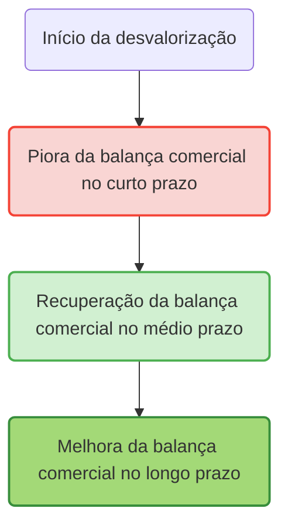

> [!note]  
> No eixo vertical está o saldo da balança comercial (superávit ou déficit), e no eixo horizontal o tempo. Após a desvalorização (ponto A), a balança comercial piora inicialmente (ponto B), mas depois começa a se recuperar (ponto C) até alcançar um patamar superior ao inicial (ponto D), formando o “J”.

---

## 4. Importância e Implicações do Efeito Curva J

- **Política cambial e comercial:**  
    Governos devem considerar que os efeitos positivos de uma desvalorização cambial na balança comercial não são imediatos, podendo haver uma fase inicial de deterioração que causa pressões políticas e econômicas.
    
- **Elasticidades-preço:**  
    O efeito Curva J está associado à elasticidade-preço das exportações e importações. Se essas elasticidades forem muito baixas, a recuperação será lenta ou pequena; se forem altas, a melhora será rápida e significativa.
    
- **Sustentabilidade do ajuste externo:**  
    A possibilidade de a balança comercial se ajustar e melhorar após a desvalorização é fundamental para a recuperação econômica em países com déficits externos crônicos.
    

---

## 5. Exemplo histórico ilustrativo

- **Brasil na crise da dívida dos anos 1980:**  
    Durante os anos 1980, o Brasil sofreu desvalorizações cambiais significativas. A balança comercial brasileira inicialmente piorou, pois o valor em moeda local das importações disparou, antes que a competitividade das exportações e a redução das importações levassem a uma melhora gradual no saldo comercial, em um padrão que refletia o efeito Curva J.
    

---

## 6. Resumo

|Ponto|Explicação Rápida|
|---|---|
|**Curto prazo**|Balança comercial piora após desvalorização|
|**Causa**|Preço das importações sobe em moeda local, volumes fixos|
|**Médio/Longo prazo**|Balança melhora à medida que exportações aumentam e importações caem|
|**Forma do gráfico**|Piora inicial seguida de melhora, formando a letra “J”|

---

## 7. Questões para Autoavaliação

> [!question] 1. Explique por que a balança comercial de um país normalmente piora logo após uma desvalorização cambial, antes de melhorar posteriormente.

> [!question] 2. Como a elasticidade-preço das exportações e importações influencia o formato e a intensidade do efeito Curva J?

> [!question] 3. Cite um exemplo histórico de um país que apresentou o efeito Curva J após uma desvalorização cambial e descreva brevemente o que ocorreu.

---


# Origem: _Política Monetária Não Convencional

---
title: Política Monetária Não Convencional
area: ECONOMIA
subarea: Macroeconomia
tags:
  - cacd-2025
  - economia
  - macroeconomia
  - politica-monetaria
  - politica-monetaria-nao-convencional
aliases:
  - Política Monetária Não Convencional.
---
# Política Monetária Não Convencional 

A Política Monetária Não Convencional (UMP - Unconventional Monetary Policy) surgiu quando os instrumentos tradicionais se mostraram insuficientes, especialmente após o colapso financeiro de 2008. Países desenvolvidos encontraram-se na armadilha da liquidez, com taxas de juros próximas ao zero, forçando bancos centrais como o Federal Reserve, BCE e Banco do Japão a inovar drasticamente. **O resultado foram políticas que injetaram trilhões de dólares na economia global, alterando fundamentalmente a dinâmica financeira internacional e criando spillovers significativos para economias emergentes como o Brasil.**

## Definição e características fundamentais

### O que torna uma política monetária "não convencional"

A política monetária convencional baseia-se exclusivamente no ajuste da taxa básica de juros para influenciar as condições econômicas. Quando você estuda o modelo IS-LM clássico, está vendo exatamente isso: o banco central move a taxa de juros e, através dos canais de transmissão tradicionais, afeta investimento, consumo e, consequentemente, produto e emprego.

**A política não convencional vai além dessa única ferramenta.** Ela surge quando a taxa básica atinge o que chamamos de "zero lower bound" - o limite inferior efetivo próximo ao zero. Nesse ponto, cortes adicionais de juros tornam-se inviáveis ou ineficazes, criando a necessidade de instrumentos alternativos que não dependem da alteração da taxa de juros nominal de curto prazo.

### Contexto histórico e desenvolvimento

O marco inicial foi a **experiência japonesa dos anos 1990-2000**, quando o Banco do Japão enfrentou deflação persistente e taxas de juros próximas ao zero. O Japão tornou-se o laboratório mundial para políticas não convencionais, implementando pela primeira vez programas de Quantitative Easing entre 2001-2006.

**A verdadeira revolução chegou com a crise de 2008.** O colapso do Lehman Brothers e a subsequente paralisia dos mercados financeiros globais forçaram bancos centrais das principais economias a adotar medidas extraordinárias. Em poucos meses, o Federal Reserve, o Banco Central Europeu e o Banco da Inglaterra implementaram programas que injetaram trilhões na economia global.

## Principais instrumentos da política não convencional

### Quantitative Easing - o pilar central

**O Quantitative Easing (QE) representa o coração das políticas não convencionais.** Trata-se da compra em larga escala de títulos de longo prazo pelo banco central, visando injetar liquidez diretamente no sistema financeiro e reduzir os rendimentos de longo prazo.

O funcionamento é elegante em sua simplicidade: quando o banco central compra títulos no mercado secundário, está criando demanda adicional por esses ativos. Pela lei básica de oferta e demanda, os preços sobem e os rendimentos caem. **Simultaneamente, o banco central está expandindo sua base monetária**, injetando reserves bancárias no sistema.

**Os programas de QE americanos ilustram perfeitamente essa dinâmica.** O QE1 (2008-2010) injetou US$ 1,75 trilhão, focando em títulos hipotecários para estabilizar o mercado imobiliário. O QE2 (2010-2011) concentrou-se em US$ 600 bilhões em títulos do Tesouro. O QE3 (2012-2014) foi o mais inovador: um programa de final aberto, com compras mensais condicionadas às condições econômicas.

A eficácia foi impressionante. Estudos do próprio Fed estimam que os programas de QE reduziram os rendimentos de títulos de 10 anos em mais de 120 pontos base cumulativamente, com impactos positivos significativos sobre PIB (+0,5 a +1,0% cumulativo) e emprego.

### Forward Guidance - orientando expectativas

**O Forward Guidance representa uma revolução na comunicação dos bancos centrais.** Tradicionalmente, bancos centrais eram deliberadamente obscuros em sua comunicação - lembre-se da famosa frase de Alan Greenspan: "Se você entendeu o que eu disse, então eu me expressei mal."

A política não convencional inverteu essa lógica. **O Forward Guidance consiste na comunicação clara e explícita sobre as intenções futuras de política monetária**, visando influenciar as expectativas e, consequentemente, as condições financeiras atuais.

Existem diferentes tipos de Forward Guidance. O **Delphic Guidance** oferece previsões condicionais baseadas nas perspectivas econômicas - "Se a inflação permanecer baixa, manteremos juros baixos." O **Odyssean Guidance** vai além, oferecendo compromissos firmes sobre ações futuras - "Manteremos juros baixos até 2015."

**A experiência brasileira com Forward Guidance (2020-2021) oferece lições importantes.** O BCB comunicou que o estímulo monetário seria mantido até a convergência das expectativas para as metas. Pesquisas posteriores mostraram eficácia limitada, com o mercado interpretando o guidance como compromisso incondicional, gerando perda de flexibilidade da política monetária. A literatura internacional recomenda apenas versões quantitativas do Forward Guidance, enquanto o Brasil adotou uma versão qualitativa que não trouxe os benefícios esperados.

### Taxa de juros negativa - rompendo barreiras conceituais

**A implementação de taxas nominais negativas desafiou fundamentos econômicos básicos.** Se tradicionalmente considerávamos zero como o limite inferior para juros nominais, a crise europeia provou que era possível ir além.

O mecanismo é direto: o banco central cobra dos bancos comerciais pela manutenção de reservas, criando incentivos para que emprestem esses recursos ou invistam em outras aplicações. **A zona do euro manteve sua taxa de depósito em -0,5% entre 2014-2022**, enquanto o Japão implementou -0,1% em 2016 e a Suíça chegou a -0,75%.

Os resultados foram mistos. Por um lado, as taxas negativas ajudaram a depreciar moedas e estimular exportações. Por outro, criaram distorções nos mercados financeiros, comprimiram margens bancárias e geraram comportamentos inusitados - como o entesouramento físico de dinheiro em alguns casos.

### Yield Curve Control - dominando a curva de juros

**O Yield Curve Control (YCC) representa o instrumento mais sofisticado das políticas não convencionais.** Em vez de simplesmente comprar títulos para reduzir rendimentos, o banco central define metas específicas para diferentes pontos da curva de juros e se compromete a fazer o necessário para atingi-las.

**A experiência japonesa com YCC (2016-2024) oferece o caso mais completo de análise.** O Banco do Japão definiu meta de 0% para títulos de 10 anos, realizando compras ilimitadas para manter esse patamar. O programa foi tecnicamente bem-sucedido em controlar rendimentos, mas gerou efeitos colaterais significativos: o BoJ passou a deter mais de 50% do mercado de títulos japoneses, eliminando praticamente a liquidez e distorcendo os mecanismos de descoberta de preços.

## Mecanismos de transmissão específicos

### Canal do balanço de portfólio

**Este canal é fundamental para entender como o QE afeta a economia real.** Quando o banco central compra títulos de longo prazo, está removendo esses ativos dos balanços de investidores privados. Esses investidores, por sua vez, precisam realocar seus recursos para outros ativos.

**O resultado é um efeito cascata através do sistema financeiro.** Investidores migram para títulos corporativos, ações, imóveis e outros ativos de risco. Esse movimento eleva preços de ativos, reduz custos de financiamento para empresas e famílias, e estimula consumo através do efeito riqueza.

Pesquisas empíricas mostram que o canal do portfólio responde por 50-70% do efeito total das políticas de QE, tornando-se o mecanismo dominante de transmissão.

### Canal de sinalização

**O canal de sinalização opera através das expectativas sobre política futura.** Ao implementar QE, o banco central sinaliza implicitamente que pretende manter taxas baixas por período prolongado - afinal, seria contraditório implementar estímulo extraordinário e elevar juros rapidamente.

**Essa sinalização ancora as expectativas de taxa de juros futura**, reduzindo os prêmios de risco de prazo embutidos nos rendimentos de longo prazo. Estudos de eventos mostram que anúncios de QE frequentemente têm impacto maior que as compras efetivas, evidenciando a importância deste canal.

### Canal de liquidez e funcionamento de mercados

Durante crises financeiras, mercados podem entrar em disfunção, com spreads de liquidez ampliados e mecanismos normais de arbitragem interrompidos. **O QE atua como "market maker of last resort"**, fornecendo liquidez direta e restaurando o funcionamento normal dos mercados.

**Este canal foi especialmente importante durante março de 2020**, quando mesmo mercados tradicionalmente líquidos como o de títulos do Tesouro americano entraram em stress. A intervenção rápida do Fed com compras ilimitadas restaurou a liquidez em questão de dias.

## Experiências internacionais comparadas

### Estados Unidos - pioneirismo e eficácia

**A experiência americana representa o benchmark para políticas não convencionais.** O Federal Reserve demonstrou pragmatismo notável, adaptando suas políticas conforme a evolução da crise e aprendendo empiricamente sobre a eficácia de diferentes instrumentos.

**O QE1 foi o mais efetivo dos programas**, focando em títulos hipotecários durante o pico da crise. A compra de MBS (mortgage-backed securities) no valor de US$ 1,25 trilhão teve impacto direto sobre o mercado imobiliário, elevando as originações de hipotecas em 170% e estabilizando o setor.

O programa de saída (tapering) iniciado em 2013 demonstrou igual sofisticação. **A comunicação gradual e previsível evitou disruptions maiores**, embora tenha gerado o famoso "taper tantrum" em mercados emergentes, incluindo o Brasil.

### Zona do euro - fragmentação e complexidade institucional

**A experiência europeia ilustra como características institucionais afetam a eficácia das políticas não convencionais.** A fragmentação entre 19 economias nacionais, as restrições do Artigo 123 do TFUE (proibição de financiamento monetário) e a ausência de um tesouro único criaram desafios únicos.

**O programa OMT (Outright Monetary Transactions) representa talvez o maior sucesso do BCE** - ironicamente, sem nunca ter sido implementado. O famoso discurso de Mario Draghi em julho de 2012 ("whatever it takes") e o subsequente anúncio do OMT em setembro reduziram dramaticamente os spreads soberanos da periferia, demonstrando o poder da sinalização credível.

**O PEPP (Pandemic Emergency Purchase Programme) mostrou a evolução institucional do BCE.** Com envelope de €1,85 trilhão e flexibilidade para desviar da chave de capital, o programa demonstrou maior pragmatismo e eficácia que programas anteriores.

### Japão - laboratório de longo prazo

**O Japão serve como laboratório global para políticas não convencionais**, com mais de duas décadas de experiência. **A trajetória japonesa oferece lições importantes sobre sustentabilidade e limites dessas políticas.**

O YCC japonês, implementado entre 2016-2024, controlou efetivamente os rendimentos de 10 anos, mas criou distorções severas. **O BoJ tornou-se detentor de mais da metade do mercado de títulos japoneses**, eliminando a liquidez e os mecanismos normais de descoberta de preços.

**A saída do YCC em março de 2024 sob o governador Ueda Kazuo** marcou o fim de uma era. A experiência japonesa demonstra tanto as possibilidades quanto os limites das políticas não convencionais em economias de baixo crescimento.

### Reino Unido - pragmatismo e adaptação

**O Banco da Inglaterra destacou-se pela rapidez de implementação e adaptação às circunstâncias.** O programa inicial de QE foi lançado em março de 2009, poucos meses após a crise, totalizando £375 bilhões até 2012.

**A resposta ao Brexit demonstrou a flexibilidade do framework britânico.** Em agosto de 2016, apenas um mês após o referendum, o BoE implementou um pacote abrangente incluindo corte de juros, £60 bilhões adicionais de QE e £10 bilhões em compras de títulos corporativos. A resposta rápida e coordenada ajudou a estabilizar mercados durante período de extrema incerteza.

## Contexto brasileiro e spillovers internacionais

### Impactos das políticas não convencionais no Brasil

**O Brasil experimentou profundamente os spillovers das políticas não convencionais globais.** Durante os períodos de QE, o país recebeu fluxos massivos de capital internacional, causando apreciação do real e pressões inflacionárias. **O então ministro Guido Mantega cunhou o termo "guerra cambial" em 2010**, criticando os efeitos desestabilizadores dessas políticas sobre economias emergentes.

Os mecanismos de transmissão para o Brasil são bem documentados. **Políticas expansionistas de países desenvolvidos reduzem rendimentos globais, incentivando busca por yield em mercados emergentes.** O Brasil, com suas taxas de juros historicamente elevadas, tornou-se destino preferencial desses fluxos.

**Durante o "taper tantrum" de 2013**, quando o Fed sinalizou redução das compras de QE, o Brasil experimentou reversão abrupta de fluxos, depreciação cambial e necessidade de elevação de juros domésticos. **O episode ilustra a vulnerabilidade estrutural de economias emergentes às mudanças de política monetária de países desenvolvidos.**

### A experiência brasileira com forward guidance

**O Brasil implementou forward guidance entre 2020-2021**, representando a primeira experiência formal do BCB com orientação prospectiva. A versão adotada foi qualitativa, comunicando que o estímulo extraordinário seria mantido até convergência das expectativas para as metas.

**Avaliações posteriores revelaram eficácia limitada.** Estudos empíricos mostram que o mercado interpretou o guidance como compromisso incondicional, gerando perda de flexibilidade da política monetária. **A literatura internacional recomenda apenas versões quantitativas** do forward guidance, enquanto o Brasil adotou uma abordagem qualitativa que não trouxe benefícios institucionais esperados.

### Posicionamento internacional do Brasil

**A diplomacia brasileira tem sido ativa em fóruns internacionais sobre coordenação monetária.** No G20, o Brasil liderou discussões sobre spillovers monetários e conseguiu reconhecimento da legitimidade de controles de capital como ferramenta de gestão macroeconômica.

**Acordos de swap cambial representam instrumentos importantes** para reduzir vulnerabilidades externas. O acordo bilateral Brasil-China de 2024, no valor de R$ 157 bilhões, visa diversificar fontes de liquidez internacional e reduzir dependência do dólar americano.

## Eficácia e limitações das políticas não convencionais

### Evidências de eficácia

**A literatura empírica converge para efeitos positivos significativos das políticas não convencionais.** Estudos de evento mostram que anúncios de QE tipicamente reduzem rendimentos de longo prazo em 50-150 pontos base, com efeitos persistentes.

**Modelos DSGE e VAR estruturais confirmam impactos macroeconômicos positivos.** Estimativas consolidadas sugerem que programas de QE geram aumentos de PIB entre 0,5-1,0% cumulativos e elevações de inflação entre 0,2-0,4% cumulativos. **O equivalente monetário é significativo**: QE pode fornecer estímulo equivalente a cortes de 3-4 pontos percentuais na taxa básica.

**A experiência durante a pandemia COVID-19 confirmou a relevância dessas políticas.** Tanto economias desenvolvidas quanto emergentes utilizaram políticas não convencionais com sucesso, demonstrando que essas ferramentas tornaram-se parte permanente do arsenal dos bancos centrais.

### Limitações e riscos identificados

**As limitações tornaram-se aparentes com o uso prolongado.** A experiência japonesa demonstra que políticas não convencionais podem distorcer mercados financeiros sem necessariamente gerar os efeitos desejados sobre inflação e crescimento.

**Efeitos distributivos representam preocupação crescente.** QE eleva preços de ativos financeiros e imobiliários, beneficiando desproporcionalmente detentores de riqueza. **Estudos mostram que os 10% mais ricos da população capturam a maior parte dos benefícios**, enquanto os efeitos sobre emprego e salários são mais difusos.

**Distorções de mercado são inevitáveis.** Taxas muito baixas por períodos prolongados incentivam tomada excessiva de risco, potencialmente gerando bolhas de ativos. **A compressão de prêmios de risco pode mascarar vulnerabilidades fundamentais**, criando fragilidades financeiras de longo prazo.

## Coordenação internacional e questões multilaterais

### Spillovers e coordenação

**Políticas monetárias não convencionais geram spillovers internacionais significativos.** Estudos do BIS e FMI mostram que programas de QE afetam fluxos de capital globais, taxas de câmbio e condições financeiras internacionais de forma mais intensa que políticas convencionais.

**A coordenação internacional tornou-se mais complexa mas essencial.** Durante a crise COVID-19, bancos centrais coordenaram informalmente suas respostas, incluindo acordos de swap em dólares e timing similar de implementação de políticas extraordinárias.

### Discussões no G20 e organismos multilaterais

**O G20 tem servido como principal fórum para discussões sobre spillovers monetários.** Sob liderança brasileira e de outros emergentes, foi estabelecido reconhecimento de que países desenvolvidos devem considerar efeitos sobre emergentes ao formular políticas domésticas.

**O FMI evoluiu sua postura sobre políticas não convencionais.** Inicialmente cético, o Fundo passou a reconhecer sua eficácia e legitimar seu uso em circunstâncias apropriadas. **A COVID-19 marcou ponto de inflexão**, com o FMI explicitamente recomendando uso de políticas não convencionais por economias emergentes com credibilidade institucional adequada.

## Relevância para a carreira diplomática

### Implicações para diplomacia econômica

**Compreender políticas monetárias não convencionais é essencial para diplomatas modernos.** Essas políticas afetam taxas de câmbio, fluxos de capital e condições financeiras globais de forma mais intensa que instrumentos tradicionais, criando novas dinâmicas nas relações econômicas internacionais.

**A diplomacia econômica brasileira deve navegar cuidadosamente esses desafios.** Por um lado, spillovers podem desestabilizar a economia doméstica. Por outro, oferecem oportunidades de aprendizado institucional e acesso a liquidez internacional através de acordos de swap.

### Questões de negociação multilateral

**Acordos comerciais e de investimento crescentemente incluem considerações monetárias.** A compreensão de como políticas não convencionais afetam competitividade e fluxos comerciais tornou-se essencial para negociadores internacionais.

**A governança financeira global está em evolução.** Novos mecanismos de coordenação, reforma do sistema monetário internacional e discussões sobre moedas digitais de bancos centrais (CBDCs) requerem conhecimento técnico profundo dessas questões.

## Preparação específica para o CACD

### Padrões de cobrança nas provas

**O tema foi incluído no edital de 2017**, refletindo sua crescente importância na economia global. **Questões típicas cobram definições conceituais, contexto histórico e mecanismos de funcionamento** das principais ferramentas não convencionais.

**A abordagem das provas é conceitual, não matemática.** Candidatos devem dominar os fundamentos teóricos, principais experiências internacionais e capacidade de conectar com outros tópicos econômicos e de relações internacionais.

### Conexões essenciais com outros tópicos

**Política monetária não convencional conecta-se organicamente com múltiplos itens do programa:**

- **Crise de 2008**: Marco histórico fundamental
- **Modelo IS-LM**: Armadilha da liquidez e zero lower bound
- **Economia aberta**: Spillovers e efeitos cambiais
- **Sistema financeiro internacional**: Reforma da governança global
- **Coordenação de políticas**: G20 e multilateralismo econômico

### Estratégia de estudo recomendada

**Construa compreensão a partir dos fundamentos.** Inicie com a definição clara do que torna uma política "não convencional" e o contexto que levou ao seu desenvolvimento. **Domine os conceitos de zero lower bound e armadilha da liquidez** - eles são fundamentais para entender por que essas políticas se tornaram necessárias.

**Estude detalhadamente as principais experiências internacionais.** O QE americano, as políticas do BCE, a experiência japonesa e a resposta britânica oferecem lições distintas sobre design, implementação e eficácia dessas políticas.

**Conecte sempre com o contexto brasileiro e diplomático.** Compreenda como spillovers afetam o Brasil, a experiência doméstica com forward guidance e o posicionamento internacional brasileiro em fóruns multilaterais.

**Mantenha-se atualizado sobre desenvolvimentos recentes.** Políticas monetárias não convencionais continuam evoluindo, com bancos centrais adaptando instrumentos e testando novas abordagens. A saída do YCC japonês em 2024, as discussões sobre CBDCs e os debates sobre política monetária pós-pandemia são todos relevantes para sua preparação.

## Conclusão e perspectivas futuras

**A política monetária não convencional representa mudança paradigmática permanente na condução da política econômica.** O que começou como resposta de emergência à crise de 2008 tornou-se parte integrante do toolkit dos bancos centrais globais.

**Para futuros diplomatas, essas políticas são especialmente relevantes** porque transcendem fronteiras nacionais, afetando relações econômicas internacionais de forma mais intensa que instrumentos tradicionais. **Compreender seus mecanismos, limitações e spillovers tornou-se essencial para atuação efetiva na diplomacia econômica moderna.**

**As evidências empíricas confirmam eficácia quando bem implementadas**, mas destacam também a necessidade de vigilância contínua quanto a riscos e coordenação internacional apropriada. **O desafio futuro será encontrar o equilíbrio entre o uso dessas ferramentas poderosas e a manutenção da estabilidade financeira global.**


# Origem: 2.6.5 Conceitos Básicos da Regulação e Supervisão do Sistema bancário, financeiro e do Mercado de Capitais.

---
title: 2.6.5 Conceitos Básicos da Regulação e Supervisão do Sistema bancário, financeiro e do Mercado de Capitais.
area: ECONOMIA
subarea: Macroeconomia
tags:
  - cacd-2025
  - economia
  - macroeconomia
  - politica-monetaria
aliases:
  - Regulação e Supervisão do Sistema bancário
  - Conceitos Básicos da Regulação e Supervisão do Sistema bancário, financeiro e do Mercado de Capitais.
---
# Regulação e Supervisão do Sistema Financeiro: Princípios, Instrumentos e a Arquitetura Nacional e Internacional

## A Racionalidade Econômica da Regulação Financeira

A intervenção estatal no sistema financeiro por meio da regulação e da supervisão não constitui uma anomalia, mas uma resposta necessária às características intrínsecas que o distinguem de outros setores da economia. Enquanto a teoria econômica convencional postula que mercados em livre concorrência tendem a uma alocação de recursos eficiente, conhecida como Ótimo de Pareto, essa conclusão se baseia em premissas rigorosas, como a existência de informação perfeita e a ausência de externalidades. O setor financeiro, por sua natureza, viola sistematicamente essas premissas, gerando um conjunto de falhas de mercado que, se não corrigidas, podem levar a crises de grande magnitude com severas consequências para a economia real. A crise financeira global de 2008 é o exemplo mais contundente de como brechas e falhas na arquitetura regulatória podem criar os próprios mecanismos de sua destruição, evidenciando que a instabilidade é uma característica endêmica de um sistema financeiro desregulado.

### A Natureza Especial do Setor Financeiro e as Falhas de Mercado

O sistema financeiro desempenha um papel central na economia moderna, intermediando recursos entre poupadores e investidores e alocando capital para atividades produtivas. Contudo, essa função vital é exercida em um ambiente de incerteza e informação imperfeita, o que o torna particularmente suscetível a falhas de mercado. A regulação emerge, portanto, não como uma distorção, mas como um mecanismo essencial para mitigar essas falhas e promover a estabilidade. As principais justificativas econômicas para a regulação financeira estão ancoradas em três falhas de mercado inter-relacionadas: a assimetria de informação, o risco sistêmico e as externalidades negativas.

Essas falhas não são fenômenos isolados, mas formam uma cadeia causal que explica a fragilidade inerente do sistema. A assimetria de informação é a falha fundamental, a origem de comportamentos que minam a estabilidade no nível da instituição individual. Essa fragilidade individual, quando amplificada pela alta interconexão entre as instituições, transforma-se em risco sistêmico. A materialização do risco sistêmico, por sua vez, gera externalidades negativas devastadoras, cujos custos transbordam do setor financeiro e são impostos a toda a sociedade. Compreender essa sequência lógica é fundamental para entender por que a regulação financeira precisa ser abrangente e multifacetada, atuando em todas as etapas dessa cadeia de instabilidade.

### Assimetria de Informação: O Cerne da Instabilidade

A falha de mercado mais fundamental e pervasiva no sistema financeiro é a assimetria de informação, conceito desenvolvido por economistas laureados com o Nobel, como George Akerlof, Michael Spence e Joseph Stiglitz. Ela ocorre quando uma das partes em uma transação—tipicamente o tomador de recursos—possui informações mais completas e precisas sobre os riscos e a qualidade de um projeto do que a outra parte—o credor ou investidor.9 Esse desequilíbrio de poder informacional cria dois problemas clássicos que ocorrem em momentos distintos da transação financeira e que, juntos, minam a eficiência e a estabilidade do mercado.

> [!definition]
> 
> Assimetria de Informação: Uma falha de mercado que ocorre em transações onde uma parte possui mais ou melhor informação do que a outra, criando um desequilíbrio de poder que pode levar a resultados ineficientes ou ao colapso do mercado.

- **Seleção Adversa (_Adverse Selection_):** Este problema ocorre _antes_ da transação ser concluída.12 Nos mercados financeiros, os tomadores de empréstimos que apresentam os maiores riscos (e, portanto, são os mais propensos a não pagar) são, paradoxalmente, os que mais ativamente buscam crédito, pois têm menos a perder. Os credores, incapazes de distinguir perfeitamente entre bons e maus tomadores, podem acabar estabelecendo taxas de juros que refletem um risco médio. Essa taxa pode ser alta demais para os bons tomadores, que se retiram do mercado, deixando para trás apenas os tomadores de alto risco. Esse fenômeno, ilustrado por Akerlof em seu célebre artigo "The Market for 'Lemons'" sobre o mercado de carros usados, pode levar a uma alocação ineficiente de capital, onde os projetos mais arriscados são financiados, ou até mesmo ao colapso do mercado de crédito, pois os credores, temendo selecionar apenas "limões", podem se recusar a emprestar.
    
- **Risco Moral (_Moral Hazard_):** Este problema surge _após_ a transação ser realizada. Uma vez que o tomador obteve o financiamento, ele pode ter incentivos para alterar seu comportamento e assumir mais riscos do que o acordado, pois sabe que parte das perdas será absorvida pelo credor. O credor, por sua vez, não consegue monitorar perfeitamente as ações do devedor. Um exemplo clássico é uma empresa que, após receber um empréstimo para um projeto de baixo risco, decide investir os recursos em um empreendimento mais arriscado e potencialmente mais lucrativo, sabendo que, em caso de sucesso, ficará com a maior parte dos ganhos, mas em caso de fracasso, as perdas serão compartilhadas com o credor.
    

A regulação, nesse contexto, atua como um mecanismo para mitigar esses problemas. Requisitos de divulgação de informações (_disclosure_), padrões de capital mínimo e supervisão contínua são instrumentos que visam reduzir a assimetria informacional, permitindo que os credores avaliem melhor os riscos (combatendo a seleção adversa) e que monitorem o comportamento dos devedores (limitando o risco moral).

### Risco Sistêmico: A Ameaça do Efeito Dominó

O risco sistêmico é a consequência mais temida da instabilidade financeira. Ele pode ser definido como o risco de que a dificuldade ou a falência de uma instituição financeira se propague em cascata para outras instituições, comprometendo o funcionamento de todo o sistema financeiro e, em última instância, da economia real.8 Essa propagação ocorre devido à alta interconexão entre as instituições financeiras, que estão ligadas por uma complexa rede de obrigações interbancárias, exposições a derivativos e ativos comuns.

> [!definition]
> 
> Risco Sistêmico: Risco de perturbação no sistema financeiro com potencial para gerar consequências negativas graves para o mercado interno e a economia real. É o risco de que a falência de uma entidade cause um efeito dominó, colapsando todo o sistema.8

O risco sistêmico é uma manifestação macroeconômica das falhas de mercado no nível microeconômico. A busca individual por lucro por parte das instituições, em um ambiente de assimetria de informação e risco moral, leva a uma acumulação excessiva de riscos individuais. A interconexão do sistema amplifica esses riscos, transformando um problema localizado em uma ameaça global.

Um aspecto central do risco sistêmico é o problema das instituições "grandes demais para quebrar" (_Too Big to Fail_ - TBTF). A percepção de que o governo inevitavelmente resgatará uma grande instituição para evitar um colapso sistêmico cria um perigoso risco moral: os executivos dessas instituições são incentivados a assumir riscos excessivos, pois sabem que os lucros serão privados, mas as perdas serão socializadas. A regulação macroprudencial, especialmente após a crise de 2008, passou a focar intensamente na mitigação do risco sistêmico, com medidas específicas para instituições sistemicamente importantes.

### Externalidades Negativas: Os Custos Sociais da Instabilidade

Uma crise financeira gera custos que transcendem em muito as perdas dos acionistas e credores das instituições diretamente envolvidas. Esses custos impostos a terceiros que não participaram da transação original são conhecidos como externalidades negativas.3 O risco sistêmico é, em si, a maior externalidade negativa do setor financeiro, pois a decisão de uma instituição de assumir um risco elevado não leva em conta o custo potencial que sua falência imporia a todo o sistema.20

As consequências de uma crise sistêmica para a sociedade são profundas e duradouras:

- **Recessão Econômica:** A contração do crédito (_credit crunch_) paralisa o investimento e o consumo, levando a uma queda acentuada do PIB.
    
- **Desemprego em Massa:** Empresas fecham ou reduzem suas operações, resultando em perdas de emprego generalizadas.
    
- **Perda de Poupança e Riqueza:** A queda no valor dos ativos (ações, imóveis) destrói a riqueza das famílias.
    
- **Custo Fiscal:** Os governos são frequentemente forçados a intervir com pacotes de resgate (bailouts) para salvar o sistema, o que aumenta a dívida pública e impõe um fardo sobre os contribuintes presentes e futuros.
    

A regulação financeira é justificada, em grande medida, pela necessidade de forçar as instituições a internalizarem essas externalidades. Ao exigir mais capital, mais liquidez e uma gestão de risco mais prudente, o regulador impõe um custo privado à tomada de risco, aproximando o nível de risco escolhido pelas instituições daquele que seria socialmente ótimo.

A percepção da regulação como um "contrato de incentivos" é particularmente útil aqui. O regulador (o principal) estabelece regras (o contrato) para o setor financeiro (o agente) com o objetivo de alinhar os incentivos privados (maximização do lucro) com o interesse público (estabilidade financeira). Uma regulação bem desenhada, como os requisitos de capital de Basileia III, torna o comportamento arriscado mais "caro" para os acionistas do banco, incentivando a prudência. Em contraste, uma regulação falha ou incompleta, como a que prevaleceu antes de 2008, cria brechas para a arbitragem regulatória—como a transferência de riscos para veículos fora do balanço via securitização—, demonstrando que o "contrato" não previa e não coibia todas as formas de comportamento arriscado.5

## A Evolução da Regulação Prudencial Internacional: Os Acordos de Basileia

No centro da regulação prudencial bancária global estão os Acordos de Basileia, um conjunto de recomendações e padrões desenvolvidos para fortalecer a solidez e a resiliência do sistema financeiro internacional. A evolução desses acordos, de Basileia I a Basileia III, reflete um processo contínuo de aprendizado, no qual os reguladores globais reagiram a sucessivas crises e às limitações das estruturas regulatórias anteriores.

### O Comitê de Basileia de Supervisão Bancária (BCBS): Origem e Mandato

O Comitê de Basileia de Supervisão Bancária (BCBS, na sigla em inglês) foi estabelecido em 1974 pelos presidentes dos bancos centrais dos países do Grupo dos Dez (G-10). Sua criação foi uma resposta direta à instabilidade no sistema financeiro internacional da época, incluindo a quebra do banco alemão Herstatt. O Comitê opera sob os auspícios do Banco de Compensações Internacionais (BIS), sediado em Basileia, na Suíça, que provê seu secretariado.

O mandato fundamental do BCBS é fortalecer a regulação, a supervisão e as práticas dos bancos em todo o mundo, com o objetivo primordial de aumentar a estabilidade financeira. Ele funciona como o principal definidor de padrões globais para a regulação prudencial bancária e como um fórum para a cooperação regular em matéria de supervisão.

É crucial notar que o BCBS não é uma autoridade supranacional com poder legal para impor suas regras. Suas recomendações não são juridicamente vinculantes. Sua eficácia deriva do compromisso de seus membros—que hoje incluem 45 autoridades de 28 jurisdições, incluindo o Brasil desde 2009—de transpor e implementar esses padrões em suas legislações nacionais.

### Basileia I (1988): O Primeiro Passo

O primeiro Acordo de Capital de Basileia, conhecido como Basileia I, foi publicado em 1988 e representou um marco histórico na regulação bancária internacional. Seu foco principal era singular e direto: o **risco de crédito**, ou seja, o risco de que um tomador de empréstimo não honrasse suas obrigações.

A principal inovação de Basileia I foi a introdução de um **requisito mínimo de capital regulatório**. O acordo estipulava que os bancos internacionalmente ativos deveriam manter um capital mínimo equivalente a **8% de seus ativos ponderados pelo risco (Risk-Weighted Assets - RWA)**. O conceito de ponderação de risco, embora simples, foi revolucionário: em vez de exigir capital com base no volume total de ativos, o acordo reconhecia que diferentes ativos possuem diferentes níveis de risco. Os ativos eram classificados em cinco categorias de risco, com pesos que variavam de 0% (para ativos considerados sem risco, como títulos do governo de países da OCDE) a 100% (para a maioria dos empréstimos a empresas do setor privado).

Apesar de seu sucesso em estabelecer um padrão mínimo global e aumentar a capitalização dos bancos, as limitações de Basileia I tornaram-se evidentes com o tempo. Sua abordagem era excessivamente simplista e gerava oportunidades de **arbitragem regulatória**. Por exemplo, ao atribuir o mesmo peso de risco (100%) a todos os empréstimos corporativos, o acordo não diferenciava entre um empréstimo a uma empresa de alta qualidade (rating AAA) e um a uma empresa de alto risco (rating B), incentivando os bancos a priorizarem os ativos mais arriscados dentro de cada categoria. Além disso, o acordo negligenciava outros riscos importantes, como o risco de mercado e o risco operacional.

### Basileia II (2004): Sofisticação e Seus Limites

Publicado em 2004, o Acordo de Basileia II foi uma tentativa de superar as deficiências de seu predecessor, criando um arcabouço regulatório mais abrangente e sensível aos riscos.36 Sua estrutura foi concebida em torno de três "pilares" complementares, que se tornaram um paradigma na regulação financeira.

- **Pilar 1: Requisitos Mínimos de Capital:** Este pilar expandiu significativamente o escopo da regulação de capital. Além do risco de crédito, introduziu exigências de capital explícitas para o **risco de mercado** (perdas decorrentes de flutuações nos preços de mercado) e, pela primeira vez, para o **risco operacional** (perdas resultantes de falhas em processos internos, pessoas e sistemas, ou de eventos externos). A maior inovação do Pilar 1 foi permitir que bancos mais sofisticados utilizassem seus próprios
    
    **modelos internos de classificação de risco (Internal Ratings-Based - IRB)** para calcular os requisitos de capital para risco de crédito. A intenção era alinhar o capital regulatório (exigido pelo supervisor) com o capital econômico (que o próprio banco considera necessário para cobrir seus riscos), recompensando instituições com sistemas de gestão de risco mais avançados.
    
- **Pilar 2: Processo de Supervisão (_Supervisory Review_):** Este pilar reconhecia que os requisitos mínimos do Pilar 1 poderiam não ser suficientes para cobrir todos os riscos de uma instituição. Ele conferia aos supervisores nacionais a responsabilidade e as ferramentas para avaliar o processo interno de adequação de capital de cada banco (conhecido como ICAAP) e, se necessário, exigir que a instituição mantivesse capital _acima_ do mínimo regulatório. O Pilar 2 também visava cobrir riscos não totalmente quantificados no Pilar 1, como o risco de concentração, o risco estratégico e o risco de liquidez.
    
- **Pilar 3: Disciplina de Mercado (_Market Discipline_):** O terceiro pilar visava complementar a regulação e a supervisão por meio da transparência. Ele exigia que os bancos divulgassem publicamente informações detalhadas sobre seus perfis de risco, suas exposições e a adequação de seu capital.38 A lógica era que, com mais informação, os participantes do mercado (investidores, analistas, agências de rating) poderiam avaliar melhor a solidez de um banco, exercendo uma forma de disciplina que recompensaria a prudência e penalizaria a tomada excessiva de risco.
    

Apesar de sua sofisticação teórica, Basileia II falhou catastroficamente em prevenir a crise financeira de 2008. Suas principais fraquezas foram:

1. **Pro-ciclicidade:** A confiança nos modelos internos dos bancos mostrou-se perigosa. Em períodos de bonança econômica, os modelos tendiam a subestimar os riscos, levando a uma redução dos requisitos de capital justamente quando os riscos sistêmicos se acumulavam.
    
2. **Negligência com o Risco de Liquidez:** O acordo focava quase exclusivamente na solvência (capital), mas não estabelecia requisitos quantitativos para a liquidez. A crise demonstrou que bancos solventes podiam quebrar por falta de liquidez.
    
3. **Falha em Endereçar o Risco Sistêmico:** Basileia II manteve uma abordagem microprudencial, focada na segurança de cada instituição isoladamente, sem considerar a interconexão e o risco que as instituições representavam para o sistema como um todo.
    

---

### Tabela 1: Evolução Comparativa dos Acordos de Basileia (I, II e III)

|Característica|Basileia I (1988)|Basileia II (2004)|Basileia III (Pós-2010)|
|---|---|---|---|
|**Foco Principal**|Risco de Crédito.|Risco de Crédito, Mercado e Operacional.|Risco Sistêmico e Risco de Liquidez.|
|**Abordagem de Risco**|Padronizada e simples.|Sensível ao risco (modelos internos permitidos).|Híbrida (modelos internos com _backstops_ robustos).|
|**Requisito de Capital (Mínimo)**|8% do RWA (Total).|8% do RWA (Total).|4.5% (CET1), 6% (Nível 1), 8% (Total).|
|**Inovações-Chave**|Introdução do capital mínimo e RWA.|Estrutura de 3 Pilares; Modelos IRB.|Requisitos de liquidez (LCR, NSFR); Razão de Alavancagem; _Buffers_ de capital; Regulação de SIFIs.|
|**Principal Falha Exposta**|Demasiado simplista; arbitragem regulatória.|Pro-cíclico; negligência com liquidez e risco sistêmico.|(Em debate) Complexidade; potencial impacto no crédito.|

---

### Análise Aprofundada de Basileia III: A Resposta à Crise de 2008

Basileia III, cujas reformas foram anunciadas a partir de 2010, não é uma mera atualização de seu predecessor, mas uma profunda reestruturação da filosofia regulatória global. Nascido das cinzas da crise de 2008, seu objetivo explícito é construir um sistema bancário mais resiliente, capaz de absorver choques sem gerar crises sistêmicas. Para isso, o acordo atua em três frentes principais: fortalecimento do capital, introdução de padrões de liquidez e mitigação do risco sistêmico.

A evolução de Basileia I a III pode ser vista como um movimento pendular na filosofia regulatória. Basileia I representava a simplicidade, com regras claras e universais. Basileia II foi um movimento em direção à complexidade e à confiança nos modelos internos dos bancos, uma abordagem baseada em princípios. A crise de 2008 demonstrou que essa confiança era excessiva e perigosa. Basileia III, então, representa um retorno ao centro: mantém a sensibilidade ao risco, mas a ancora com _backstops_ (salvaguardas) robustos e não baseados em modelos, como a razão de alavancagem e o piso de capital (_output floor_). Isso revela o reconhecimento por parte dos reguladores de que a complexidade dos modelos internos precisa ser limitada por regras mais simples e difíceis de manipular.

#### 1. Fortalecimento do Capital (Qualidade e Quantidade)

A lição central da crise foi que não apenas a quantidade, mas principalmente a **qualidade** do capital importa. Muitos instrumentos que contavam como capital regulatório antes de 2008 não se mostraram capazes de absorver perdas em um cenário de estresse.

- **Maior Qualidade do Capital:** O foco de Basileia III deslocou-se para a parcela mais nobre do capital, o **Capital Principal de Nível 1 (Common Equity Tier 1 - CET1)**, que consiste basicamente em ações ordinárias e lucros retidos.43 Este é o capital com maior capacidade de absorção de perdas enquanto a instituição continua operando (_going-concern_). O acordo elevou o requisito mínimo de CET1 para **4,5%** dos RWA. O requisito de Nível 1 total (CET1 mais Capital Adicional de Nível 1) foi elevado para **6%**, enquanto o capital total (Nível 1 + Nível 2) foi mantido em 8%.
    
- **Maior Quantidade de Capital (Buffers):** Além dos requisitos mínimos, Basileia III introduziu "colchões" (buffers) de capital, que devem ser compostos integralmente por CET1 e acumulados em tempos de normalidade para serem utilizados em momentos de estresse.
    
    - **_Buffer_ de Conservação de Capital (Capital Conservation Buffer - CCB):** Um _buffer_ obrigatório de **2,5%** dos RWA, que se soma aos requisitos mínimos. Na prática, eleva o requisito total de CET1 para 7% (4,5% + 2,5%). Se o capital de um banco cai dentro dessa faixa de _buffer_, ele sofre restrições automáticas na distribuição de dividendos, recompra de ações e pagamento de bônus, criando um forte incentivo para a recapitalização.
        
    - **_Buffer_ de Capital Contracíclico (Counter-cyclical Capital Buffer - CCyB):** Um _buffer_ discricionário, que pode variar de **0% a 2,5%** dos RWA. As autoridades nacionais podem "ativá-lo" durante períodos de crescimento excessivo do crédito na economia. O objetivo é "esfriar" o ciclo de crédito (_lean against the wind_), forçando os bancos a acumularem mais capital durante a bonança, que poderá ser liberado durante a recessão para sustentar a oferta de crédito e absorver perdas, suavizando o ciclo econômico.
        

#### 2. Introdução de Padrões de Liquidez

Talvez a inovação mais transformadora de Basileia III tenha sido a introdução dos primeiros padrões globais de liquidez, elevando o risco de liquidez ao mesmo patamar de importância do risco de solvência (capital). A crise de 2008 demonstrou que bancos com capital adequado podiam ser levados à falência por uma súbita "seca" de financiamento no mercado (_liquidity run_). Para evitar a repetição desse cenário, foram criados dois novos indicadores.

- **Índice de Cobertura de Liquidez (Liquidity Coverage Ratio - LCR):** É uma métrica de curto prazo, desenhada para garantir que os bancos possuam um estoque suficiente de **Ativos Líquidos de Alta Qualidade (High-Quality Liquid Assets - HQLA)** para sobreviver a um cenário de estresse agudo de 30 dias.43 HQLA são ativos, como títulos soberanos de alta qualidade e reservas no banco central, que podem ser convertidos em caixa rapidamente com pouca ou nenhuma perda de valor. A fórmula é:
    
    ![[Pasted image 20250620193140.png]]
    
    .
    
- **Índice de Financiamento Estável Líquido (Net Stable Funding Ratio - NSFR):** É uma métrica estrutural de longo prazo, com horizonte de um ano. Seu objetivo é garantir que os bancos mantenham um perfil de financiamento estável, reduzindo o descasamento de maturidades. O NSFR exige que as atividades de longo prazo (ativos ilíquidos) sejam financiadas com fontes de recursos também de longo prazo (passivos estáveis), incentivando os bancos a depender menos de financiamento de curto prazo no mercado atacadista, que se mostrou volátil e pouco confiável durante a crise.
    

#### 3. Medidas para Mitigar o Risco Sistêmico

Reconhecendo a falha de Basileia II em abordar o risco sistêmico, Basileia III introduziu ferramentas macroprudenciais explícitas.

- **Razão de Alavancagem (_Leverage Ratio_):** Uma medida simples e não ponderada pelo risco, que atua como uma salvaguarda (_backstop_) para os requisitos de capital baseados em RWA. Ela é calculada dividindo-se o Capital de Nível 1 pela exposição total do banco (incluindo itens dentro e fora do balanço). O requisito mínimo foi fixado em **3%**.43 Seus objetivos são conter o acúmulo de alavancagem no sistema bancário e mitigar o risco de que os modelos de ponderação de risco dos bancos subestimem o verdadeiro risco de seus ativos.
    
- **Instituições Financeiras Sistemicamente Importantes (SIFIs):** Para atacar diretamente o problema do _Too Big to Fail_, Basileia III estabeleceu um regime mais rigoroso para as instituições cuja falência poderia desestabilizar o sistema financeiro global (G-SIBs). Esses bancos são obrigados a manter um **_buffer_ de capital adicional** (uma sobretaxa que varia de 1% a 3,5% de CET1), proporcional à sua importância sistêmica.49 Essa exigência aumenta a capacidade de absorção de perdas dessas instituições e cria um desincentivo para que elas se tornem ainda maiores e mais complexas.
    

A implementação de Basileia III no Brasil, iniciada em 2013, foi conduzida pelo Banco Central e pelo CMN. O processo foi relativamente suave, em parte devido ao fato de o Brasil já possuir um "diferencial regulatório": o sistema bancário nacional já operava com requisitos de capital mais elevados que os padrões internacionais vigentes antes da crise. Essa postura historicamente mais conservadora da regulação brasileira, forjada em décadas de instabilidade macroeconômica interna, conferiu maior resiliência ao sistema durante a crise de 2008 e facilitou a convergência para as novas e mais rigorosas regras globais.

---

### Tabela 3: Principais Requisitos de Basileia III

|Requisito|Mínimo Regulatório|Descrição|
|---|---|---|
|**Capital Principal (CET1)**|4.5%|Capital da mais alta qualidade (ações, lucros retidos) para absorção de perdas com a instituição em funcionamento.|
|**Capital Nível 1 (Tier 1)**|6.0%|CET1 mais outros instrumentos de capital que também absorvem perdas (e.g., instrumentos híbridos perpétuos).|
|**Capital Total**|8.0%|Nível 1 mais Nível 2 (instrumentos que absorvem perdas na liquidação da instituição, como dívida subordinada).|
|**_Buffer_ de Conservação (CCB)**|2.5% (adicional)|"Colchão" de CET1 para ser usado em períodos de estresse. Eleva o requisito efetivo de CET1 para 7.0%.|
|**_Buffer_ Contracíclico (CCyB)**|0% - 2.5% (adicional, discricionário)|"Colchão" de CET1 acumulado em tempos de bonança para conter a expansão excessiva do crédito.|
|**Razão de Alavancagem**|3.0%|Medida não ponderada pelo risco (Nível 1 / Exposição Total) para conter o endividamento excessivo.|
|**LCR**|100%|Exige ativos líquidos de alta qualidade para cobrir saídas de caixa em um estresse de 30 dias.|
|**NSFR**|100%|Exige que ativos de longo prazo sejam financiados por passivos estáveis de longo prazo.|

---

## A Arquitetura Institucional da Governança Financeira Global e Nacional

A eficácia da regulação financeira depende não apenas da qualidade das regras, mas também da arquitetura institucional responsável por criá-las, implementá-las e fiscalizá-las. A crise de 2008 expôs graves falhas de coordenação na governança financeira global, levando a uma reconfiguração significativa dessa arquitetura. No plano doméstico, o Brasil possui uma estrutura bem definida, o Sistema Financeiro Nacional (SFN), que interage com esses organismos internacionais.

### A Estrutura Internacional Pós-Crise

A governança financeira global é sustentada por um conjunto de organizações que, embora não possuam poder de lei formal sobre os países, exercem enorme influência por meio da definição de padrões, da cooperação e da pressão dos pares (_peer pressure_).

#### 1. Banco de Compensações Internacionais (BIS - Bank for International Settlements)

Frequentemente chamado de "o banco central dos bancos centrais", o BIS é a mais antiga instituição financeira internacional, fundado em 1930. Sua missão é fomentar a cooperação monetária e financeira internacional e servir como um banco para os bancos centrais. O BIS não é um regulador direto, mas desempenha um papel indispensável como facilitador da governança global. Ele atua como:

- **Fórum de Cooperação:** Promove o diálogo e a troca de informações entre as autoridades monetárias e de supervisão de todo o mundo.
    
- **Centro de Pesquisa:** Realiza e publica pesquisas de ponta sobre temas relevantes para a estabilidade monetária e financeira.
    
- **Anfitrião de Organismos-Chave:** Crucialmente, o BIS **hospeda e provê o secretariado** para os dois principais órgãos da arquitetura regulatória global: o Comitê de Basileia de Supervisão Bancária (BCBS) e o Conselho de Estabilidade Financeira (FSB). Ele oferece a infraestrutura física e intelectual que permite a essas organizações funcionarem.
    

#### 2. Comitê de Basileia de Supervisão Bancária (BCBS)

Conforme detalhado anteriormente, o BCBS é o **definidor de padrões globais** (_global standard-setter_) para a regulação prudencial do setor bancário.28 Seu trabalho, materializado nos Acordos de Basileia, estabelece os requisitos mínimos de capital, liquidez e gestão de risco que os bancos internacionalmente ativos devem seguir.

#### 3. Conselho de Estabilidade Financeira (FSB - Financial Stability Board)

A criação do FSB em 2009, por iniciativa do G-20, foi a resposta mais direta a uma falha crítica exposta pela crise: a ausência de um órgão com mandato e capacidade para monitorar o sistema financeiro de forma holística e coordenar a resposta regulatória em nível global. Antes de 2008, a regulação era fragmentada e setorial (o BCBS cuidava dos bancos, a IOSCO dos mercados de valores mobiliários, etc.), sem uma visão macroprudencial do sistema como um todo, incluindo o crescente "sistema bancário sombra" (_shadow banking_).

O FSB foi criado para preencher esse vácuo. Seu mandato é amplo e coordenador:

- **Monitorar o sistema financeiro global** para identificar vulnerabilidades e riscos sistêmicos.
    
- **Coordenar o trabalho das autoridades financeiras nacionais e dos organismos internacionais** de definição de padrões (como o BCBS e a IOSCO) para desenvolver políticas que enderecem essas vulnerabilidades.
    
- **Promover a implementação consistente e coerente** das reformas regulatórias acordadas entre seus membros.
    
- **Colaborar com o FMI** na condução de Exercícios de Alerta Prévio (_Early Warning Exercises_).
    

Assim como o BCBS, o FSB não tem poder legal vinculante. Ele opera por meio do compromisso de seus membros e da pressão dos pares para garantir que as reformas acordadas no âmbito do G-20 sejam efetivamente implementadas.

### A Estrutura no Brasil: O Sistema Financeiro Nacional (SFN)

O SFN é o conjunto de instituições e órgãos que regulam, fiscalizam e operam o sistema financeiro no Brasil. Sua estrutura é hierárquica, com uma clara divisão de funções entre órgãos normativos (que criam as regras) e entidades supervisoras (que executam e fiscalizam).

#### 1. Conselho Monetário Nacional (CMN): O Órgão Normativo Superior

O CMN é o **órgão deliberativo máximo** do SFN. Criado pela Lei da Reforma Bancária de 1964, sua principal responsabilidade é formular a política da moeda e do crédito, visando à estabilidade da moeda e ao desenvolvimento do país.64 Ele é o "legislador" do sistema financeiro. Suas principais competências incluem:

- Estabelecer as diretrizes gerais das políticas monetária, creditícia e cambial.
    
- Regular as condições de constituição, funcionamento e fiscalização das instituições financeiras.
    
- Disciplinar o crédito em todas as suas modalidades.
    
- Autorizar as emissões de papel-moeda.
    
- Definir a meta para a inflação, que deve ser perseguida pelo Banco Central.
    

O CMN é composto por três membros: o Ministro da Fazenda, que o preside; a Ministra do Planejamento e Orçamento; e o Presidente do Banco Central do Brasil.62 Suas decisões são formalizadas por meio de Resoluções.

#### 2. Banco Central do Brasil (BACEN): O Executor e Supervisor

O BACEN é uma autarquia federal, hoje com autonomia formal, que atua como o **principal órgão executor** das políticas traçadas pelo CMN e como o **supervisor do sistema bancário**.67 Seus objetivos fundamentais são assegurar a estabilidade do poder de compra da moeda (controle da inflação) e zelar pela estabilidade e eficiência do sistema financeiro.69 É o responsável direto pela implementação e fiscalização das recomendações de Basileia no Brasil.44 Suas atribuições são vastas e incluem 67:

- Emitir papel-moeda e moeda metálica.
    
- Executar a política monetária, utilizando instrumentos como a taxa Selic e o recolhimento compulsório.
    
- Atuar como o "banco dos bancos", recebendo depósitos compulsórios e realizando operações de redesconto.
    
- Fiscalizar as instituições financeiras (bancos, cooperativas de crédito, etc.).
    
- Autorizar o funcionamento e estabelecer as condições de operação dessas instituições.
    
- Gerir as reservas internacionais do país.
    

#### 3. Comissão de Valores Mobiliários (CVM): O Regulador do Mercado de Capitais

A CVM é uma entidade autárquica em regime especial, vinculada ao Ministério da Fazenda, mas dotada de autonomia administrativa, financeira e orçamentária.71 Ela é a autoridade responsável por

**disciplinar, fiscalizar e desenvolver o mercado de valores mobiliários** no Brasil.71 Enquanto o BACEN supervisiona o mercado de crédito e as instituições bancárias, a CVM foca no mercado de capitais (ações, debêntures, fundos de investimento, etc.). Seus principais objetivos são 73:

- Proteger os titulares de valores mobiliários e os investidores.
    
- Assegurar a transparência e o acesso do público a informações sobre as companhias abertas e os valores mobiliários negociados (_full disclosure_).
    
- Garantir o funcionamento eficiente e regular dos mercados de bolsa e de balcão.
    
- Coibir fraudes, manipulação de mercado e o uso de informação privilegiada (_insider trading_).
    

---

### Tabela 2: Estrutura e Competências no Sistema Financeiro Nacional (SFN)

|Instituição|Natureza|Principais Competências/Funções|
|---|---|---|
|**Conselho Monetário Nacional (CMN)**|Órgão normativo superior (deliberativo).|Formular a política da moeda e do crédito; Estabelecer diretrizes gerais para o SFN; Definir a meta de inflação; Regular o funcionamento das instituições financeiras.|
|**Banco Central do Brasil (BACEN)**|Órgão executor e supervisor (autarquia).|Executar as políticas definidas pelo CMN; Fiscalizar as instituições financeiras (exceto mercado de capitais); Emitir moeda; Atuar como "banco dos bancos"; Gerir as reservas internacionais.|
|**Comissão de Valores Mobiliários (CVM)**|Órgão normativo e supervisor (autarquia).|Regular, desenvolver e fiscalizar o mercado de valores mobiliários; Proteger os investidores; Assegurar a transparência (_disclosure_); Coibir fraudes, manipulação de mercado e _insider trading_.|

---

## A Regulação Específica do Mercado de Capitais no Brasil

Enquanto a regulação prudencial bancária, liderada pelo BACEN, foca na solvência e liquidez das instituições de crédito, a regulação do mercado de capitais, a cargo da CVM, concentra-se em garantir a integridade, a transparência e a justiça das relações entre investidores, intermediários e companhias emissoras de valores mobiliários.

### Objetivos Fundamentais: Proteção, Transparência e Equidade

A missão da CVM, delineada na Lei 6.385/76, é sustentada por um tripé de objetivos que visam fomentar um ambiente de confiança, essencial para a formação de poupança e seu direcionamento para o investimento produtivo.

- **Proteção ao Investidor:** Este é o pilar central da atuação da CVM. A autarquia busca proteger os investidores, com especial atenção aos minoritários, contra emissões irregulares de valores mobiliários e atos ilegais de administradores e controladores de companhias abertas. A premissa é que um mercado só pode se desenvolver de forma sustentável se os participantes se sentirem seguros para alocar seu capital.
    
- **Transparência (_Disclosure_):** O princípio do _full disclosure_ (ampla divulgação) é a principal ferramenta para mitigar a assimetria de informação no mercado de capitais. A CVM exige e fiscaliza a divulgação contínua e completa de informações relevantes por parte das companhias abertas, permitindo que os investidores tomem decisões de investimento bem-fundamentadas. Isso se materializa em normas detalhadas sobre a publicação de fatos relevantes, demonstrações financeiras, formulários de referência e, mais recentemente, informações sobre práticas ambientais, sociais e de governança (ESG).77
    
- **Equidade e Integridade do Mercado:** A CVM atua para assegurar a observância de práticas comerciais equitativas e para coibir qualquer modalidade de fraude ou manipulação que vise criar condições artificiais de demanda, oferta ou preço dos valores mobiliários. O objetivo é garantir um _level playing field_, onde a formação de preços reflita os fundamentos econômicos dos ativos, e não a ação de agentes mal-intencionados.
    

### O Combate a Ilícitos: _Insider Trading_ e Manipulação de Mercado

A credibilidade do mercado de capitais depende da percepção de que ele é um ambiente justo. A CVM dedica esforços significativos para combater duas das práticas mais nocivas a essa percepção: o uso de informação privilegiada e a manipulação de mercado.

#### 1. _Insider Trading_ (Uso Indevido de Informação Privilegiada)

O _insider trading_ ocorre quando alguém negocia valores mobiliários de posse de uma "informação relevante" que ainda não foi divulgada ao público, com o objetivo de obter vantagem para si ou para outrem.81 Essa prática corrói a confiança no mercado, pois cria uma desigualdade fundamental entre os _insiders_ (que têm acesso à informação) e os investidores comuns. A conduta é um ilícito tanto na esfera administrativa, punível pela CVM com multas e inabilitação, quanto na esfera criminal, tipificada no Art. 27-D da Lei 6.385/76.82 

A CVM utiliza tecnologia avançada, como o sistema SIA-Eagle, para monitorar negociações em tempo real e identificar padrões atípicos que possam indicar o uso de informação privilegiada.84 Casos emblemáticos, como os envolvendo a OSX e a JBS, resultaram em multas recordes aplicadas pela autarquia, demonstrando sua atuação sancionadora.

No entanto, um desafio estrutural persiste. A análise dos dados revela uma notável disparidade entre a punição administrativa e a criminal. Entre 2008 e 2018, a CVM proferiu 66 condenações administrativas por _insider trading_, enquanto a esfera penal, em 20 anos, registrou apenas uma condenação definitiva.86 Isso ocorre porque a prova em casos de _insider trading_ é predominantemente indireta (baseada em indícios como o _timing_ da operação e a relação do negociador com a fonte da informação). A CVM consolidou uma jurisprudência que permite a condenação com base em um conjunto robusto de indícios. Já o processo penal, regido pelo princípio do _in dubio pro reo_ (na dúvida, a favor do réu), exige um padrão probatório mais elevado ("além da dúvida razoável"), que é extremamente difícil de atingir nesses casos. Essa lacuna de _enforcement_ entre as esferas representa uma fragilidade no combate ao crime de colarinho branco no Brasil, com potenciais implicações para a percepção de impunidade e a confiança dos investidores.

#### 2. Manipulação de Mercado e Outras Fraudes

A CVM também combate ativamente a manipulação de mercado, que envolve qualquer artifício destinado a alterar artificialmente a formação de preços ou o volume de negociações de um ativo. A Resolução CVM 62, que atualizou a antiga Instrução CVM 8/79, veda expressamente essas práticas.

Uma característica importante da regulação da CVM é o uso deliberado de "tipos abertos", ou seja, conceitos jurídicos amplos como "operação fraudulenta" e "prática não equitativa".89 Isso não é uma imprecisão, mas uma estratégia regulatória consciente. Em um mercado financeiro dinâmico e em constante inovação tecnológica, definir uma lista exaustiva de todas as condutas proibidas seria ineficaz, pois novas formas de fraude surgiriam rapidamente. Os conceitos abertos conferem à CVM a flexibilidade necessária para enquadrar e punir novas práticas danosas ao mercado com base em sua finalidade e efeito, garantindo que a regulação permaneça relevante e eficaz ao longo do tempo.

Algumas modalidades específicas de manipulação e fraude incluem:

- **_Spoofing_ e _Layering_:** Práticas de manipulação em mercados eletrônicos de alta frequência. Envolvem a inserção de um grande número de ordens de compra ou venda sem a intenção de executá-las, com o objetivo de criar uma falsa percepção de pressão compradora ou vendedora e, assim, mover o preço do ativo em uma direção desejada. As ordens falsas são canceladas assim que a operação real é executada.
    
- **_Front Running_:** Ocorre quando um intermediário (como um corretor), de posse de uma ordem grande de um cliente que sabe que impactará o preço do ativo, realiza uma operação para sua própria carteira _antes_ de executar a ordem do cliente, para lucrar com a variação de preço subsequente.
    
- **_Churning_:** Prática em que um intermediário com poder discricionário sobre a carteira de um cliente realiza um número excessivo de operações com o único propósito de gerar mais taxas de corretagem para si, em detrimento dos interesses do cliente.
    

Ao policiar ativamente essas condutas, a CVM busca garantir que o mercado de capitais brasileiro seja um ambiente íntegro, transparente e seguro, capaz de cumprir sua função essencial de financiar o desenvolvimento econômico do país.

## Questões para Autoavaliação (Active Recall)

> [!question]
> 
> Questão 1: Discorra sobre a evolução da filosofia regulatória internacional, contrastando os Acordos de Basileia I, II e III. Como a crise financeira de 2008 atuou como um catalisador para a introdução de uma perspectiva macroprudencial, e quais foram os principais instrumentos criados por Basileia III para endereçar as falhas de seus predecessores (risco de liquidez e risco sistêmico)?

> [!question]
> 
> Questão 2: Analise a arquitetura de regulação e supervisão do Sistema Financeiro Nacional (SFN) brasileiro, detalhando as competências e a interação entre o Conselho Monetário Nacional (CMN), o Banco Central do Brasil (BACEN) e a Comissão de Valores Mobiliários (CVM). De que forma a implementação de padrões internacionais, como Basileia III, exemplifica a relação entre esses órgãos e a governança financeira global?

> [!question]
> 
> Questão 3: Explique o conceito de insider trading e os mecanismos utilizados pela CVM para coibi-lo. Analise a aparente disparidade entre a eficácia das sanções administrativas aplicadas pela CVM e as condenações na esfera penal no Brasil. Quais são as implicações dessa disparidade para a integridade e a confiança no mercado de capitais brasileiro?

# Origem: Política Monetária no Brasil

---
title: Política Monetária no Brasil
area: ECONOMIA
subarea: Macroeconomia
tags:
  - cacd-2025
  - economia
  - macroeconomia
  - politica-monetaria
aliases:
---

# A Política Monetária no Brasil: Instrumentos, o Papel do Banco Central e o Controle da Inflação

A **política monetária** refere-se ao conjunto de ações do Banco Central destinadas a controlar a **oferta de moeda** e as **taxas de juros**, com o objetivo de manter a estabilidade da moeda (controle da inflação) e propiciar o bom funcionamento da economia. No Brasil, sob o regime de metas de inflação, o Banco Central do Brasil (BCB) busca assegurar a estabilidade do poder de compra da moeda, atuando de forma autônoma para cumprir as metas estabelecidas pelo Conselho Monetário Nacional. Para entender como essas ações operam, é útil relembrar primeiro as funções básicas da moeda na economia e, em seguida, analisar detalhadamente os principais instrumentos de política monetária utilizados pelo BCB em prol da estabilidade de preços.

## As Funções Fundamentais da Moeda

A moeda desempenha **três funções clássicas** que explicam sua importância na economia e fundamentam a necessidade de estabilidade monetária:

1. **Meio de Troca:** a moeda funciona como intermediário de aceitação geral nas transações, ou seja, um ativo amplamente aceito para a aquisição de bens e serviços, eliminando as ineficiências do escambo e da "dupla coincidência de desejos". Em outras palavras, todos aceitam moeda em troca de mercadorias, facilitando as trocas indiretas em uma economia complexa.
    
2. **Unidade de Conta:** a moeda serve de **padrão de valor** para expressar e comparar os preços de bens e serviços. Ela fornece uma medida comum que permite calcular valores, fazer registros contábeis e cotar preços de forma uniforme. Sem uma unidade de conta estável, torna-se difícil para agentes econômicos planejarem e avaliarem custos, receitas e lucros.
    
3. **Reserva de Valor:** a moeda permite **armazenar poder de compra ao longo do tempo**, funcionando como um meio de **acumular riqueza** para uso futuro. Essa função pressupõe estabilidade: em condições de alta inflação, a moeda perde a capacidade de reter valor e os indivíduos buscam outros ativos para se proteger. Portanto, manter a inflação baixa é crucial para que a moeda continue sendo uma reserva de valor confiável.
    

> [!important] **Importância da Estabilidade Monetária** 
> Se a moeda não consegue cumprir adequadamente alguma dessas funções (por exemplo, em episódios de hiperinflação em que deixa de ser boa reserva de valor ou unidade de conta), toda a economia sofre. Por isso, **controlar a inflação** e garantir a confiança na moeda são objetivos centrais do Banco Central. A política monetária existe, em essência, para preservar essas funções da moeda e assegurar que ela continue desempenhando seu papel fundamental nas transações econômicas.

## Os Instrumentos da Política Monetária

Para alcançar a estabilidade de preços e influenciar as condições monetárias, o Banco Central dispõe de **diversos instrumentos de política monetária**. Os três principais mecanismos tradicionais são: as **operações de mercado aberto**, os **depósitos compulsórios** e a **taxa de redesconto**. Cada um atua por canais distintos, mas complementares, afetando a **liquidez do sistema financeiro** e, consequentemente, as **taxas de juros**, o **crédito** e o **nível de atividade econômica**. A seguir, examinamos em detalhe como cada instrumento funciona no contexto brasileiro, com ênfase especial na taxa Selic e no papel do Comitê de Política Monetária (Copom).

### 1. Operações de Mercado Aberto e a Taxa Selic

As **operações de mercado aberto (open market)** constituem o **principal instrumento** da política monetária cotidiana no Brasil. Elas envolvem a **compra e venda de títulos públicos federais** pelo Banco Central no mercado financeiro, com o objetivo de regular a quantidade de dinheiro (liquidez) na economia. Por meio dessas operações, o BCB consegue influenciar diretamente a taxa básica de juros, a **taxa Selic**, de forma a mantê-la próxima do valor desejado.

- O **Copom (Comitê de Política Monetária)** se reúne periodicamente (usual intervalo de 45 dias) e define a **meta para a taxa Selic** – isto é, o nível desejado para a taxa de juros básica da economia. Contudo, o Copom define apenas a meta; a taxa Selic efetiva resulta das operações de mercado interbancário. **Cabe ao Banco Central atuar diariamente no mercado aberto para que a taxa de juros de curto prazo fique **próxima à meta** estipulada pelo Copom.** Na prática, a Selic é a taxa de juros média dos empréstimos **overnight** entre instituições financeiras lastreados em títulos públicos. Controlando a oferta de reservas bancárias via open market, o BC consegue fazer com que essa taxa **Selic “over”** convirja para a **meta Selic** decidida pelo Copom.
    
- **Mecanismo de atuação:** quando o **Banco Central compra títulos públicos** no mercado aberto, ele **injeta moeda** na economia (pois paga os vendedores dos títulos em dinheiro/reservas bancárias). Esse aumento de **liquidez** faz com que haja mais recursos disponíveis no sistema bancário, tendendo a **reduzir a taxa de juros interbancária**. Por outro lado, ao **vender títulos públicos**, o BC **retira moeda em circulação** (os bancos pagam pelos títulos, drenando suas reservas), o que reduz a liquidez e pressiona **para cima** a taxa de juros. Desse modo, através de compras e vendas diárias de títulos (muitas vezes via operações **compromissadas**, isto é, acordos de recompra), o Banco Central **neutraliza os desequilíbrios de liquidez** e mantém a **taxa Selic efetiva muito próxima da meta** estabelecida.
    

> [!note] _Em resumo_: 
> a lógica das operações de mercado aberto é simples – **inject liquidity to push the interest rate down, or absorb liquidity to push it up** – de forma a alinhar a taxa **Selic over** à meta do Copom. A figura a seguir ilustra esse processo de forma esquemática:

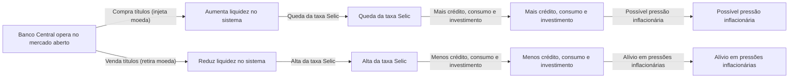

Como mostra o diagrama, ao aumentar a liquidez (via compras de títulos), o BC **reduz os juros de curto prazo**, barateando o crédito e estimulando, em certa medida, a demanda agregada – o que pode gerar **pressões inflacionárias** se exceder a capacidade produtiva. No sentido oposto, ao contrair a liquidez (vendendo títulos e elevando os juros), o crédito encarece e a atividade econômica esfria, **contribuindo para conter a inflação**. Esse é o **princípio básico da política monetária**: juros mais altos tendem a desestimular consumo e investimentos (contendo a alta de preços), enquanto juros mais baixos têm efeito expansivo sobre a economia, mas podem pressionar a inflação.

> [!definition] **Taxa Selic** 
> É a **taxa básica de juros** da economia brasileira, calculada como a média das taxas negociadas diariamente nas operações interbancárias lastreadas em títulos públicos, com prazo de um dia (overnight). A **meta da Selic** é fixada pelo Copom e serve de **referência central** para a política monetária. O Banco Central utiliza as operações de mercado aberto para garantir que a **Selic efetiva (overnight)** permaneça **igual ou muito próxima à meta** definida, assegurando a transmissão da política monetária para as demais taxas de juros da economia (financiamentos, empréstimos, retornos de investimentos, etc.).

**Relevância no Brasil:** As operações de mercado aberto, centradas no controle da taxa Selic, são particularmente importantes porque o Brasil adota um **regime de metas de inflação** desde 1999. A taxa Selic é o instrumento operacional que o Banco Central manipula para influenciar a inflação futura: alterações na Selic afetam diversas variáveis (crédito, consumo, investimento, expectativas inflacionárias e até o câmbio, como veremos). Portanto, manter a **credibilidade** de que a autoridade monetária **alcançará a meta de inflação** depende de atuar de forma contundente via Selic. Historicamente, o open market tem se mostrado eficaz para ancorar a inflação, ainda que ao custo de taxas de juros relativamente altas em vários períodos. A autonomia formal do Banco Central, conquistada em 2021, reforça essa credibilidade ao blindar essas decisões técnicas de pressões político-eleitorais (tema retomado adiante).

### 2. Depósitos Compulsórios (Recolhimento Compulsório)

Os **depósitos compulsórios** são outro instrumento clássico de política monetária, atuando de forma mais estrutural sobre a liquidez e a capacidade de criação de moeda pelos bancos. Consistem na **exigência legal** para que os bancos comerciais depositem uma **fração de seus depósitos** junto ao Banco Central, não podendo utilizá-la para empréstimos. Ao alterar a alíquota do compulsório, o Banco Central muda a proporção de recursos que os bancos precisam reter imobilizados, afetando diretamente o **multiplicador bancário** de crédito.

> [!definition] **Depósito Compulsório** 
> Trata-se da parcela do dinheiro dos depositantes que as instituições financeiras são **obrigadas a manter depositada no Banco Central**. Esse mecanismo funciona como um **colchão de liquidez** para o sistema bancário e uma ferramenta para o BC influenciar a oferta de moeda. Em momentos de crise, por exemplo, a redução do compulsório libera recursos aos bancos, ajudando a evitar escassez de crédito, ao passo que aumentos do compulsório retiram liquidez da economia, auxiliando no combate à inflação.

**Efeitos na liquidez e no crédito:** Quando o Banco Central **eleva a alíquota do compulsório**, os bancos precisam reter uma fatia maior de seus depósitos como reserva obrigatória. Isso **reduz os recursos livres** para novas operações de crédito, **contraindo** a capacidade de criação de moeda pelo sistema bancário. Em termos simples, **a elevação do compulsório “trava” o multiplicador monetário**, retirando moeda em circulação, enquanto a **redução do compulsório libera moeda**, pois os bancos passam a poder emprestar uma porção maior de seus depósitos. Assim, aumentar o compulsório tende a **restringir a expansão do crédito** (ação contracionista, usada para conter inflação ou riscos sistêmicos), ao passo que reduzir o compulsório **estimula o crédito** ao injetar liquidez adicional no sistema (ação expansionista).

Vale notar que o **impacto prático** do compulsório depende também do comportamento dos bancos. Se as instituições já mantêm **reservas voluntárias** acima do mínimo exigido, pequenas variações no compulsório podem ser absorvidas sem grande efeito na oferta de crédito. Por outro lado, em situações de **mercado de crédito aquecido**, o compulsório se torna um instrumento poderoso: por exemplo, uma redução de alguns pontos percentuais em certos compulsórios pode liberar dezenas de bilhões de reais para empréstimos (como discutido em propostas recentes para estimular o crédito imobiliário). Contudo, **o Banco Central utiliza o compulsório com parcimônia** enquanto instrumento anticíclico, pois ele afeta de forma abrangente a liquidez de longo prazo, diferentemente do ajuste fino diário proporcionado pelas operações de mercado aberto.

### 3. Taxa de Redesconto (Assistência de Liquidez)

A **taxa de redesconto** é o terceiro instrumento tradicional de política monetária, embora seja acionado com menor frequência e geralmente em situações específicas. Refere-se à **taxa de juros cobrada pelo Banco Central nos empréstimos que ele concede aos bancos comerciais**, atuando como **emprestador de última instância**. Em outras palavras, se um banco enfrenta falta temporária de liquidez e não consegue empréstimos no mercado interbancário (por exemplo, no mercado overnight), ele pode recorrer ao Banco Central para obter recursos emergenciais – pagando, para isso, a taxa de redesconto estabelecida.

> [!definition] **Taxa de Redesconto** 
> É a taxa de juros aplicada pelo Banco Central nos **empréstimos de curto prazo a instituições financeiras**, típica do papel de **emprestador de última instância** desempenhado pelo BC. Geralmente, o redesconto é **fixado em nível superior ao da taxa Selic**, exatamente para desencorajar os bancos de recorrerem rotineiramente a essa facilidade. Assim, bancos só buscam o redesconto em último caso, quando esgotadas as alternativas de captação junto a outras instituições.

**Função e efeitos:** Por ser uma fonte de liquidez de emergência, a taxa de redesconto serve como **teto informal** para a taxa de juros no mercado interbancário: se os juros entre bancos subirem muito, os bancos preferirão tomar emprestado do Banco Central (desde que a taxa de redesconto seja mais baixa do que esse pico). **Alterar a taxa de redesconto** é mais uma alavanca disponível ao Banco Central: ao **reduzir a taxa de redesconto**, o BC **barateia o custo de empréstimo direto para os bancos**, encorajando as instituições a usar essa linha em momentos de aperto – o que **injeta moeda na economia** e expande a liquidez. Por outro lado, ao **elevar a taxa de redesconto**, impõe-se um **custo mais alto para socorros** aos bancos, desestimulando que recorram a essa facilidade e induzindo-os a serem mais cautelosos no gerenciamento de suas reservas, o que **diminui a criação de moeda** pelo sistema.

Um efeito indireto de manter a taxa de redesconto em patamar elevado é que os bancos passam a **evitar ao máximo ficar sem reservas no fim do dia**, já que o socorro do BC sairia caro. Por precaução, **voluntariamente eles manterão mais reservas excedentes**, reduzindo assim o **multiplicador monetário** e a oferta potencial de crédito na economia. Em suma, **uma taxa de redesconto alta torna a política monetária mais restritiva** (ao punir a falta de liquidez dos bancos), enquanto **uma taxa de redesconto baixa torna a política mais expansionista** (ao facilitar empréstimos de última instância, evitando quebradeiras e injetando recursos quando necessário). Na prática, o redesconto é utilizado sobretudo em contextos de crise financeira ou para instituições com dificuldades temporárias – seu uso rotineiro não é comum, mas sua existência assegura que o mercado tenha um **backstop** de liquidez, fundamental para a confiança no sistema bancário.

## O Papel do Banco Central e a Autonomia Formal

O **Banco Central do Brasil (BCB)** tem, por mandato legal, o **objetivo fundamental de assegurar a estabilidade de preços**, isto é, manter a inflação sob controle e, consequentemente, preservar o valor da moeda. Além disso, o BC também zela pela estabilidade do sistema financeiro. Desde 1999, a instituição opera sob o regime de **metas de inflação**: o Conselho Monetário Nacional (CMN) define, com anos de antecedência, uma meta quantitativa de inflação (por exemplo, 3% ao ano, com margem de tolerância), e **cabe ao Banco Central conduzir a política monetária para cumpri-la**. O principal instrumento para isso é, como vimos, a taxa Selic, definida pelo Copom.

Em **fevereiro de 2021**, foi sancionada a **Lei Complementar nº 179**, que conferiu **autonomia formal** ao Banco Central do Brasil. Essa lei estabeleceu o BC como uma **autarquia de natureza especial**, com **mandatos fixos e não coincidentes** para o presidente e diretores (mandatos de quatro anos, com possibilidade de recondução, intercalados ao ciclo do Poder Executivo). Na prática, isso significa que as decisões de política monetária devem ser tomadas com base em critérios **técnicos e de longo prazo**, **sem influência político-partidária direta**. Antes mesmo da lei, o BCB já operava com relativa independência, mas a formalização da autonomia trouxe **mais credibilidade e previsibilidade** para o mercado, ao separar a gestão da política monetária das mudanças de governo de curto prazo.

**Debate sobre autonomia e credibilidade:** A autonomia do Banco Central é amplamente defendida por economistas ortodoxos como um meio de **assegurar a credibilidade da política monetária**. Os defensores argumentam que um BC autônomo pode se **concentrar nos objetivos de estabilidade de preços de longo prazo**, tomando decisões muitas vezes impopulares (como manter juros altos) quando necessárias, **sem ceder a pressões políticas imediatas**. Isso contribui para ancorar as expectativas de inflação dos agentes econômicos, ou seja, para que empresas e consumidores acreditem que a inflação futura permanecerá sob controle. Um ambiente de expectativas bem ancoradas, por sua vez, torna a política monetária **mais eficaz** – o Banco Central consegue influenciar a inflação com ajustes de juros menores do que seria preciso caso sua credibilidade estivesse em xeque.

Por outro lado, a autonomia formal **não é isenta de controvérsias**. Críticos apontam que ela pode reduzir a **responsabilidade democrática** do Banco Central, uma vez que a cúpula da instituição não responde diretamente ao voto popular e suas decisões podem ter impacto profundo no nível de atividade e emprego. Uma **crítica central** é que um Banco Central autônomo demais poderia **se fixar unicamente no combate à inflação**, negligenciando outros objetivos econômicos, como o crescimento econômico e o pleno emprego. Ademais, governos eleitos podem sentir-se tolhidos em implementar medidas de estímulo (como baixar juros para aquecer a economia) se o Banco Central independente entender que a prioridade é conter preços. Essa tensão foi observada no Brasil recente: em 2023, por exemplo, membros do governo federal criticaram abertamente a manutenção da Selic em patamar elevado pelo BC autônomo, argumentando que isso prejudicava a atividade econômica. Ainda assim, a direção do Banco Central – amparada pela autonomia legal – **manteve a taxa básica alta enquanto julgou necessário**, sinalizando compromisso com a meta de inflação apesar das pressões políticas. Esse episódio ilustra tanto a **consolidação da autonomia** (decisões técnicas prevalecendo) quanto o desafio de **coordenação entre política monetária e política econômica do governo**.

> [!note] **Autonomia e confiança dos agentes** 
> Passados os primeiros anos da autonomia formal, a avaliação geral é que o Banco Central tem conseguido navegar por um ambiente desafiador sem comprometer sua missão principal. Segundo depoimento do indicado à presidência do BC para 2025, Gabriel Galípolo, o Banco Central atravessou seus primeiros anos de autonomia de forma **estável**, tomando decisões sem se deixar invadir por questões externas e cumprindo seu mandato. Em síntese, a autonomia contribuiu para blindar a política monetária de humores políticos de curto prazo, **reforçando a confiança** de que o combate à inflação está em boas mãos – embora o debate sobre os **limites do papel do BC** na economia persista, demandando equilíbrio entre **independência** e **accountability**.

## Política Monetária e a Taxa de Câmbio

Em economias abertas como a do Brasil, existe uma **estreita relação** entre a política monetária (especialmente a taxa de juros doméstica) e a **taxa de câmbio**. A taxa de câmbio é influenciada, entre outros fatores, pelos **fluxos de capitais internacionais**, os quais reagem aos diferenciais de juros entre os países. Assim, **alterações na taxa Selic** costumam desencadear um canal de transmissão via câmbio:

- **Juros mais altos e apreciação cambial:** Quando o Banco Central **eleva a taxa Selic**, o rendimento dos ativos em reais (títulos públicos, por exemplo) torna-se mais atraente em comparação aos rendimentos em outras moedas. Isso tende a **atrair investidores estrangeiros**, que buscam aproveitar o **diferencial de juros**. Para investir em títulos brasileiros, esses investidores precisam converter moeda estrangeira em reais, o que **aumenta a demanda pela moeda nacional** e leva à **valorização do real** (ou seja, queda da cotação do dólar frente ao real). Esse movimento é conhecido como parte do fenômeno de **carry trade**, no qual capital estrangeiro toma empréstimos em países de juros baixos e aplica em países de juros altos para lucrar com a diferença de taxas. Em resumo, **juros domésticos altos tendem a fortalecer a moeda local** – a não ser que fatores externos contrabalancem essa tendência.
    
- **Juros mais baixos e depreciação cambial:** Por outro lado, **quando a Selic é reduzida**, o diferencial de juros em relação a outras economias diminui, e o mercado brasileiro se torna relativamente menos atrativo para o capital estrangeiro. Investidores internacionais podem realocar recursos para mercados com retorno melhor, gerando uma **saída líquida de capitais**. Essa saída implica vender reais para comprar moedas estrangeiras, o que **pressiona para baixo o valor do real** (desvalorização cambial). Em termos práticos, dólares ficam relativamente mais caros (alta do dólar), reflexo da menor demanda por ativos denominados em reais.
    

Essa dinâmica mostra que o **câmbio é um importante canal de transmissão da política monetária**. Quando juros sobem e o real se valoriza, os preços de importados tendem a cair em reais, ajudando a conter a inflação (pois mercadorias importadas e insumos ficam mais baratos). Por outro lado, juros em queda e **depreciação do câmbio** podem **pressionar a inflação** via aumento do custo de produtos importados e matérias-primas cotadas em dólar. O Banco Central leva isso em conta: por exemplo, durante ciclos de alta de juros, é comum o real se fortalecer, o que auxilia no combate à inflação; já cortes de juros excessivos podem provocar forte desvalorização do câmbio, exigindo cautela pela autoridade monetária.

> [!important] **Fatores adicionais** 
> É válido destacar que a relação entre juros e câmbio, embora significativa, **não é mecânica nem isolada**. Fatores como o ambiente externo (taxas de juros internacionais, aversão global a risco) e a percepção de **risco-país** influenciam os fluxos de capitais. Por exemplo, uma alta da Selic em contexto de grave incerteza fiscal interna ou de fortes aumentos de juros nos EUA pode ter efeito limitado sobre a valorização do real. Ainda assim, de modo geral, o BC brasileiro monitora atentamente o canal cambial: ele faz parte da estratégia de controlar a inflação e preservar a competitividade da economia. Em situações de movimentos cambiais desordenados, o Banco Central pode também atuar diretamente no mercado de câmbio (via leilões de swap cambial, por exemplo), mas isso já é parte da chamada **política cambial** – que complementa a política monetária quando necessário.

---

> [!question] **Questões para Autoavaliação**
> 
> 1. **Operações de Mercado Aberto:** Como o Banco Central utiliza as operações de mercado aberto para **controlar a taxa Selic** e qual é o impacto desse controle sobre a oferta de crédito e a inflação? Explique o mecanismo envolvendo a compra e venda de títulos e a influência na liquidez do sistema bancário.
>     
> 2. **Autonomia do Banco Central:** Quais são os principais **argumentos a favor e contra a autonomia formal** do Banco Central do Brasil na condução da política monetária? Discuta como a autonomia pode afetar a **credibilidade** das metas de inflação e a possibilidade de **coordenação** com as políticas econômicas do governo eleito.
>     
> 3. **Política Monetária e Câmbio:** De que forma uma **elevação** ou **redução** da taxa Selic tende a influenciar a **taxa de câmbio** do real frente a outras moedas? Descreva o canal de transmissão cambial da política monetária e como as variações do câmbio podem realimentar o objetivo de controle da inflação no Brasil.
>

# Origem: _Os modelos Solow e Schumpeteriano

---
title: Os modelos Solow e Schumpeteriano
area: ECONOMIA
subarea: Macroeconomia
tags:
  - cacd-2025
  - crescimento-e-desenvolvimento-economico
  - economia
  - macroeconomia
aliases:
  - Os modelos Solow e Schumpeteriano
---
# O Papel da Inovação no Crescimento Econômico: Uma Análise dos Modelos de Solow e Schumpeteriano

## 1. Introdução: A Centralidade da Inovação para o Crescimento Econômico

O crescimento econômico é amplamente reconhecido como um fator crucial para o bem-estar e o progresso de uma sociedade. Ele se manifesta no aumento da produção de bens e serviços ao longo do tempo, elevando o padrão de vida e proporcionando maiores oportunidades para os indivíduos. Tradicionalmente, os modelos econômicos enfatizavam o papel do capital físico e do trabalho como os principais motores do crescimento. No entanto, a experiência histórica demonstra que o aumento desses fatores por si só não é suficiente para explicar o crescimento econômico sustentado a longo prazo. As nações que experimentaram as maiores taxas de crescimento geralmente o fizeram acompanhado de avanços significativos na produtividade, impulsionados pela inovação.

A inovação, entendida como a introdução de novas ideias, métodos, produtos ou processos, emerge como o motor fundamental da melhoria da produtividade e da expansão econômica duradoura. Ela permite que as economias produzam mais com os mesmos recursos ou produzam bens e serviços de maior valor. Nesse contexto, o Modelo de Crescimento de Solow e o Modelo de Crescimento Schumpeteriano se destacam como dois arcabouços teóricos essenciais para a compreensão da intrincada relação entre inovação e crescimento econômico, representando perspectivas distintas sobre a natureza e o papel da inovação.

## 2. O Modelo de Crescimento de Solow: Progresso Tecnológico como Fator Exógeno

O Modelo de Crescimento de Solow, também conhecido como Modelo de Solow-Swan, é um modelo neoclássico fundamental que busca explicar o crescimento econômico de longo prazo através da análise da *acumulação de capital*, do *crescimento da força de trabalho* e do *progresso tecnológico*. Desenvolvido independentemente por Robert Solow e Trevor Swan em meados da década de 1950, o modelo fornece uma estrutura para entender como esses fatores interagem para impulsionar a produção econômica ao longo do tempo.1

No cerne do Modelo de Solow está a **função de produção de Cobb-Douglas**, frequentemente expressa como Y = A * K<sup>α</sup> * L<sup>1-α</sup>. Nesta equação, ==Y== representa a produção total (Produto Interno Bruto), ==A== simboliza a _produtividade total dos fatores (que representa a tecnologia)_, ==K== é o _estoque de capital físico_, ==L== é a _força de trabalho_, e ==α== é a _elasticidade da produção em relação ao capital (com um valor entre 0 e 1)_. A acumulação de capital, um dos pilares do modelo, refere-se ao processo de aumento do estoque de bens de capital, como máquinas, ferramentas e edifícios, sendo um motor essencial do crescimento econômico no modelo. A variação no estoque de capital (==ΔK==) é determinada pela *taxa de poupança (s)* multiplicada pela *produção (Y)* menos a *taxa de depreciação (δ)* multiplicada pelo *estoque de capital (K)*: 

$ΔK = sY - δK$

O modelo também introduz o conceito de *estado estacionário*, <u>uma situação em que o capital por trabalhador (k = K/L) permanece constante ao longo do tempo</u>. No estado estacionário, `o investimento se iguala à depreciação (sY = δK), o que significa que a economia não está mais acumulando capital per capita.` Uma das premissas cruciais do Modelo de Solow é que o progresso tecnológico (ou inovação), representado pela variável '==A==', é tratado como um fator exógeno. Isso implica que o progresso tecnológico ocorre fora do modelo e não é explicado por suas variáveis internas, como acumulação de capital ou crescimento da força de trabalho. No Modelo de Solow, um aumento em 'A' causa um deslocamento para cima na função de produção, resultando em maior produção para qualquer nível dado de capital e trabalho. O modelo postula que o progresso tecnológico é o único motor do crescimento sustentado de longo prazo na renda per capita. O chamado *resíduo de Solow* surge neste contexto, medindo a parte do crescimento da produção que não é explicada pela acumulação de capital e pelo crescimento do trabalho, sendo atribuída ao progresso tecnológico. Embora o Modelo de Solow enfatize a importância do progresso tecnológico para o crescimento econômico, sua natureza exógena representa uma limitação significativa, pois não elucida as fontes ou os determinantes desse progresso, deixando em aberto a questão de o que impulsiona os avanços tecnológicos.

## 3. O Modelo de Crescimento Schumpeteriano: A Inovação como Força Endógena da Destruição Criativa

Em contraste com a abordagem do Modelo de Solow, o **Modelo de Crescimento Schumpeteriano** oferece uma perspectiva alternativa onde o crescimento econômico é impulsionado pela inovação endógena, particularmente através do *processo de destruição criativa*. Este modelo, que homenageia o economista Joseph Schumpeter, enfatiza o papel central dos empreendedores na introdução de "novas combinações" que revolucionam a estrutura econômica e geram crescimento.

A destruição criativa é um conceito fundamental no modelo schumpeteriano, descrevendo o processo pelo qual novas inovações substituem tecnologias, produtos e processos antigos, levando à reestruturação econômica e ao crescimento. Os empreendedores desempenham um papel crucial neste processo, identificando oportunidades, assumindo riscos e trazendo novas ideias para o mercado. A inovação no modelo schumpeteriano pode assumir várias formas, incluindo a introdução de novos produtos (como o smartphone), novos métodos de produção (como a linha de montagem), a abertura de novos mercados, a descoberta de novas fontes de matérias-primas e a implementação de novas formas de organização industrial. A busca por lucros monopolistas temporários é o que motiva os empreendedores a inovar, perturbando o equilíbrio econômico existente e desencadeando ondas de crescimento.

No Modelo de Schumpeter, a inovação é considerada endógena, o que significa que ela surge de dentro do sistema econômico como resultado de ações deliberadas de empreendedores e empresas. Os empreendedores investem em pesquisa e desenvolvimento (P&D) impulsionados pela perspectiva de obter lucros extraordinários com inovações bem-sucedidas. A destruição criativa, por sua vez, leva à realocação de recursos para usos mais produtivos e eficientes, impulsionando o crescimento econômico de longo prazo, apesar das interrupções de curto prazo. O modelo schumpeteriano também sugere uma natureza cíclica para o crescimento, com períodos de expansão liderada pela inovação seguidos por imitação e eventual declínio dos lucros, o que prepara o terreno para novas ondas de inovação. A natureza endógena da inovação neste modelo permite a análise de fatores e políticas que podem influenciar a taxa e a direção da mudança tecnológica, representando um avanço significativo em relação ao Modelo de Solow.

**4. Análise Comparativa: As Abordagens de Solow e Schumpeter à Inovação**

As abordagens do Modelo de Solow e do Modelo Schumpeteriano em relação à inovação divergem fundamentalmente em suas premissas subjacentes e conclusões sobre o motor do crescimento econômico. Enquanto o Modelo de Solow assume que o progresso tecnológico é um fator exógeno, que surge de fora do sistema econômico e afeta todas as empresas de maneira uniforme, o Modelo Schumpeteriano enfatiza a natureza endógena da inovação, impulsionada por empreendedores que introduzem mudanças disruptivas no mercado.

No Modelo de Solow, a tecnologia é vista como um fator que evolui suavemente ao longo do tempo, aumentando a produtividade de todos os fatores de produção. Em contraste, Schumpeter via a inovação como eventos discretos e disruptivos, que criam vantagens temporárias para os inovadores e levam à obsolescência das tecnologias e empresas existentes. A competição desempenha um papel diferente nos dois modelos. *No Modelo de Solow, a competição é implícita, mas não é um motor central do crescimento. Já no Modelo Schumpeteriano, a competição (especialmente a ameaça de novos entrantes) é um fator chave que incentiva as empresas a inovar para manter sua vantagem competitiva.*

Em termos de conclusões sobre o motor do crescimento econômico, o Modelo de Solow postula que o crescimento sustentado de longo prazo na renda per capita é unicamente impulsionado pelo progresso tecnológico exógeno. Por outro lado, o Modelo Schumpeteriano argumenta que o crescimento econômico é resultado do processo contínuo de inovação endógena e destruição criativa, estimulado pelos esforços empreendedores. Essas conclusões contrastantes levam a diferentes implicações de política econômica. O Modelo de Solow sugere que as políticas devem se concentrar em fatores que possam influenciar a taxa exógena de progresso tecnológico, como o investimento em P&D, embora o modelo não modele explicitamente a origem desse progresso. Já o Modelo Schumpeteriano aponta para políticas que fomentem o empreendedorismo, a competição e a proteção da propriedade intelectual.

A tabela a seguir resume as principais diferenças conceituais entre os dois modelos em relação à inovação:

|                           |                                                   |                                                  |
| ------------------------- | ------------------------------------------------- | ------------------------------------------------ |
| **Característica**        | **Modelo de Solow**                               | **Modelo Schumpeteriano**                        |
| **Inovação/Tecnologia**   | Exógena, desincorporada, afeta a todos igualmente | Endógena, incorporada em novas empresas/produtos |
| **Motor do Crescimento**  | Progresso tecnológico exógeno                     | Inovação endógena e destruição criativa          |
| **Papel do Empreendedor** | Não modelado explicitamente                       | Papel central na introdução de inovações         |
| **Natureza da Mudança**   | Gradual, contínua                                 | Descontínua, disruptiva                          |
| **Papel da Competição**   | Implícito, não um motor primário                  | Motor chave da inovação                          |

**5. A Evolução da Inovação nos Modelos de Crescimento Econômico Modernos**

Modelos de crescimento econômico mais recentes buscaram superar as limitações do tratamento da tecnologia como um fator exógeno no Modelo de Solow, incorporando a inovação de forma endógena. A **Teoria do Crescimento Endógeno**, desenvolvida por economistas como *Paul Romer e Robert Lucas*, surgiu como uma resposta a essa limitação, enfatizando que a inovação tecnológica é resultado de atividades intencionais dentro da economia, como P&D, desenvolvimento de capital humano e criação de conhecimento.

O Modelo AK, um modelo de crescimento endógeno simples, demonstra como uma taxa de poupança constante pode levar a um crescimento sustentado sem retornos decrescentes, frequentemente atribuído à acumulação de conhecimento. O Modelo de Romer, por sua vez, modela explicitamente a mudança tecnológica como um resultado endógeno dos investimentos em P&D, destacando a natureza não rival das ideias. A Nova Teoria do Crescimento enfatiza ainda mais o papel da inovação, do conhecimento e do empreendedorismo como os principais motores do crescimento econômico de longo prazo, frequentemente ligados a retornos crescentes de escala.

O Modelo de Solow ofereceu uma contribuição fundamental ao destacar o papel crucial do progresso tecnológico para o crescimento sustentado e por sua simplicidade na compreensão das dinâmicas básicas de crescimento. No entanto, sua limitação reside no tratamento exógeno da tecnologia, que não fornece insights sobre os motores da inovação ou as alavancas de política para influenciá-la. O Modelo Schumpeteriano, por sua vez, contribuiu significativamente ao enfatizar a natureza dinâmica e disruptiva da inovação, o papel dos empreendedores e o conceito de destruição criativa. Uma limitação dos primeiros modelos schumpeterianos era sua natureza frequentemente descritiva e a falta de uma estrutura matemática formal, dificultando a testagem empírica. As modernas teorias de crescimento endógeno construíram sobre ambos os modelos, formalizando as ideias schumpeterianas dentro de uma estrutura rigorosa e abordando as deficiências do Modelo de Solow.


**7. Síntese: O Papel da Inovação à Luz dos Modelos Estudados e Técnicas de Anotação**

Em síntese, a inovação emerge como um motor central e indispensável do crescimento econômico sustentado. Tanto o Modelo de Solow quanto o Modelo Schumpeteriano, embora com abordagens distintas, reconhecem a importância da inovação para a prosperidade econômica. O Modelo de Solow, através da sua análise da produtividade total dos fatores, destaca a contribuição crucial do progresso tecnológico para o aumento da produção per capita a longo prazo, mesmo que não explique a origem desse progresso. Já o Modelo Schumpeteriano oferece uma explicação dinâmica de como a inovação, impulsionada pelo espírito empreendedor e pela destruição criativa, remodela continuamente a economia, gerando ondas de crescimento e desenvolvimento.

A aplicação de técnicas modernas de anotação, como mapas conceituais, flashcards digitais e resumos interativos, facilita a compreensão e a retenção das complexas ideias e conceitos apresentados nesses modelos. Ao visualizar as relações entre os componentes dos modelos, memorizar os termos-chave e interagir ativamente com o material de estudo, os estudantes e profissionais podem obter uma compreensão mais profunda do papel fundamental que a inovação desempenha na trajetória do crescimento econômico. Em última análise, a compreensão de ambas as perspectivas – a do Modelo de Solow que enfatiza a importância do progresso tecnológico e a do Modelo Schumpeteriano que explica o mecanismo através do qual a inovação impulsiona o crescimento – proporciona uma visão mais abrangente e matizada da complexa relação entre inovação e crescimento econômico.

**8. Exemplos Práticos e Estudos de Caso do Impacto da Inovação**

Diversos exemplos práticos e estudos de caso ilustram o impacto significativo da inovação no crescimento econômico, refletindo os conceitos apresentados nos modelos de Solow e Schumpeteriano. O rápido crescimento econômico dos Tigres Asiáticos (Coreia do Sul, Taiwan, Singapura e Hong Kong) no final do século XX pode ser parcialmente explicado por investimentos massivos em capital e melhorias na educação e tecnologia, fatores que se alinham com a ênfase do Modelo de Solow nesses elementos.

A linha de montagem de Henry Ford é um exemplo clássico de "destruição criativa" que revolucionou a indústria automobilística, um conceito central no Modelo Schumpeteriano. Essa inovação não apenas aumentou drasticamente a eficiência da produção, mas também tornou os automóveis mais acessíveis, transformando a sociedade e a economia. O surgimento de serviços de streaming como a Netflix representa outro exemplo moderno de destruição criativa, disruptindo as indústrias tradicionais de mídia e entretenimento. A Netflix substituiu modelos de negócios existentes, forçando as empresas tradicionais a se adaptarem ou enfrentarem a obsolescência.

O impacto da internet é talvez o exemplo mais abrangente de destruição criativa, levando ao declínio de algumas indústrias (como as de mídia física) e ao surgimento de muitas novas (comércio eletrônico, mídias sociais, etc.). A internet criou novos mercados, modelos de negócios e formas de comunicação, alterando fundamentalmente a maneira como as pessoas vivem e trabalham. A substituição de tecnologias de iluminação menos eficientes pela tecnologia LED ilustra o progresso tecnológico (Modelo de Solow) que também leva ao deslocamento de tecnologias mais antigas (destruição criativa schumpeteriana). A tecnologia LED oferece maior eficiência energética e durabilidade, resultando em benefícios econômicos e ambientais.

O crescimento dos Tigres Asiáticos demonstra a importância da acumulação de capital e da adoção de tecnologias (embora o Modelo de Solow não explique a origem destas). Os exemplos da linha de montagem e da Netflix estão diretamente ligados ao conceito de destruição criativa de Schumpeter, onde novas inovações alteram fundamentalmente as indústrias existentes. O impacto da internet alinha-se com a visão schumpeteriana da inovação criando novos mercados e modelos de negócios, tornando os antigos obsoletos. A mudança para a iluminação LED ilustra o progresso tecnológico (Solow) que também leva ao deslocamento de tecnologias mais antigas (destruição criativa schumpeteriana).

**9. Implicações de Política Econômica para Fomentar a Inovação e o Crescimento**

A compreensão do papel da inovação no crescimento econômico, à luz dos modelos de Solow e Schumpeteriano, traz consigo importantes implicações para a política econômica. Sob a perspectiva do Modelo de Solow, políticas que visam aumentar as taxas de poupança podem promover a acumulação de capital, embora o modelo sugira que isso tenha apenas efeitos de nível no longo prazo, sem afetar a taxa de crescimento de longo prazo. Mais crucialmente, o modelo destaca a importância de investir em educação, pesquisa e desenvolvimento para fomentar o progresso tecnológico, que é a chave para o crescimento sustentado no arcabouço de Solow. Além disso, políticas que promovam um ambiente macroeconômico estável, propício ao investimento e ao planejamento de longo prazo, são relevantes.

Do ponto de vista do Modelo Schumpeteriano, é fundamental implementar políticas que incentivem o empreendedorismo, como a redução de barreiras à entrada, a facilitação do acesso ao financiamento e a proteção dos direitos de propriedade intelectual (patentes). A política de concorrência desempenha um papel crucial ao fomentar a inovação, prevenindo monopólios e incentivando a entrada de novas empresas inovadoras. É também importante considerar políticas que apoiem os trabalhadores e as comunidades afetadas pela destruição criativa, como programas de requalificação e redes de segurança social.15 Adicionalmente, pode ser necessária a intervenção governamental para corrigir falhas de mercado na inovação, como o subinvestimento em P&D devido aos transbordamentos de conhecimento.

As modernas teorias de crescimento endógeno informam a política econômica ao enfatizar o papel do governo no investimento em pesquisa fundamental, na concessão de bolsas e incentivos fiscais para P&D, no apoio ao desenvolvimento do capital humano e na promoção da difusão do conhecimento. Uma estratégia política abrangente para o crescimento econômico necessita reconhecer as contribuições de ambas as perspectivas, a de Solow e a de Schumpeter, bem como os avanços nas modernas teorias de crescimento, adotando uma abordagem equilibrada que considere tanto a acumulação de fatores quanto a promoção ativa da inovação através de diversos instrumentos de política.

**Conclusão**

A inovação é inegavelmente um motor essencial do crescimento econômico a longo prazo. Os modelos de Solow e Schumpeteriano oferecem perspectivas valiosas, embora distintas, sobre a natureza e o papel da inovação nesse processo. Enquanto o Modelo de Solow destaca a importância do progresso tecnológico como um fator exógeno para o crescimento sustentado, o Modelo Schumpeteriano enfatiza a inovação endógena, impulsionada pelo empreendedorismo e pela destruição criativa, como a força motriz fundamental da transformação econômica. Os modelos de crescimento econômico modernos evoluíram para incorporar a natureza endógena da inovação, construindo sobre as bases estabelecidas por Solow e Schumpeter. A aplicação de técnicas modernas de anotação pode enriquecer significativamente o estudo desses modelos complexos. Em termos de política econômica, a compreensão de ambas as perspectivas é crucial para a formulação de estratégias eficazes que promovam um ambiente propício à inovação e ao crescimento econômico duradouro.


# FUNÇÃO DE PRODUÇÃO DE COBB-DOUGLAS E SUAS APLICAÇÕES EM MODELOS ECONÔMICOS

## Por que estudar a função de Cobb-Douglas?

Imagine que você seja um economista tentando entender por que alguns países são mais ricos que outros, ou um formulador de políticas querendo saber onde investir recursos limitados para maximizar o crescimento econômico. A função de produção de Cobb-Douglas é uma das ferramentas mais importantes para responder essas questões fundamentais.

Desenvolvida em 1928 pelo matemático Charles Cobb e pelo economista Paul Douglas, esta função representa uma tentativa elegante de capturar matematicamente como uma economia transforma insumos básicos (trabalho e capital) em produtos finais (bens e serviços). Pense nela como uma "receita econômica" que nos mostra exatamente como misturar trabalho e capital para obter o máximo de produção.

## Compreendendo a estrutura básica

A função de Cobb-Douglas é expressa pela equação **Q = A × L^α × K^β**. Cada elemento desta equação tem um significado profundo que vale a pena explorar cuidadosamente.

O termo **Q** representa o produto total, ou seja, tudo que uma economia (ou empresa) consegue produzir em um determinado período. Pense no PIB de um país como um exemplo de Q em escala nacional.

O fator **A** é talvez o mais fascinante: representa a *Produtividade Total dos Fatores (PTF)*. Este não é apenas um número, mas sim uma medida da eficiência com que uma economia utiliza seus recursos. Quando A aumenta, significa que a mesma quantidade de trabalho e capital pode produzir mais output. Isso pode acontecer por avanços tecnológicos, melhores instituições, educação mais qualificada ou simplesmente uma organização mais eficiente da produção.

Os fatores **L** e **K** representam, respectivamente, trabalho e capital. Trabalho não se refere apenas ao número de trabalhadores, mas pode incluir as horas trabalhadas ou até mesmo a qualidade do trabalho (considerando educação e habilidades). Capital, por sua vez, engloba máquinas, equipamentos, infraestrutura e qualquer bem durável usado na produção.

## Desvendando os expoentes α e β

Os expoentes α e β são onde a função revela sua verdadeira sofisticação. Eles representam as elasticidades parciais de produção, conceito que inicialmente pode parecer abstrato, mas que na verdade é bastante intuitivo.

Quando α equals 0,3, isso significa que um aumento de 1% no fator trabalho resulta em um aumento de 0,3% no produto total, mantendo o capital constante. De forma similar, β mede a sensibilidade do produto em relação ao capital. Esses valores não são arbitrários - estudos empíricos mostram que, para a maioria das economias desenvolvidas, α fica em torno de 0,7 e β em torno de 0,3, sugerindo que o trabalho tem uma participação maior na produção do que o capital.

## O conceito crucial dos retornos de escala

A soma α + β nos revela algo fundamental sobre o comportamento da economia. Quando α + β equals 1, temos retornos constantes de escala. Isso significa que se dobrarmos todos os insumos, o produto também dobrará exatamente. É como se a economia fosse perfeitamente escalável, sem ganhos ou perdas de eficiência.

Quando α + β > 1, temos retornos crescentes de escala, uma situação onde dobrar os insumos mais que dobra o produto. Isso pode ocorrer devido a economias de escala, especialização ou efeitos de rede. Por outro lado, α + β < 1 indica retornos decrescentes, onde dobrar os insumos menos que dobra o produto, possivelmente devido a congestionamento ou limitações gerenciais.

## A aplicação revolucionária no Modelo de Solow

O modelo de crescimento de Solow, desenvolvido por Robert Solow nos anos 1950, utilizou a função de Cobb-Douglas de forma brilhante para entender o crescimento econômico de longo prazo. Solow assumiu retornos constantes de escala, simplificando a função para **Y = A × L^α × K^(1-α)**.

A genialidade do modelo está na sua versão per capita. Dividindo tudo pelo fator trabalho L, obtemos **y = A × k^α**, onde y é o produto per capita e k é o capital per capita. Esta transformação nos permite entender como o padrão de vida (medido pelo produto per capita) se relaciona com a quantidade de capital disponível por trabalhador.

O modelo revela que o crescimento econômico sustentado de longo prazo só é possível através do crescimento da Produtividade Total dos Fatores (A), que representa o progresso tecnológico. Sem avanços tecnológicos, uma economia eventualmente atingiria um estado estacionário onde o crescimento per capita cessaria. Esta conclusão tem implicações profundas para as políticas de desenvolvimento.

## Aplicações práticas na contabilidade do crescimento

Uma das aplicações mais práticas da função de Cobb-Douglas é na chamada "contabilidade do crescimento". Imagine que queremos entender por que o PIB de um país cresceu 5% em um ano. A função nos permite decompor esse crescimento em três componentes: quanto veio do aumento da força de trabalho, quanto veio do aumento do capital e quanto veio do progresso tecnológico.

A equação para essa decomposição é **Δy/y = ΔA/A + α(ΔL/L) + β(ΔK/K)**. Se sabemos que o trabalho cresceu 2%, o capital cresceu 4%, e assumimos α = 0,7 e β = 0,3, podemos calcular que o crescimento devido ao trabalho foi 1,4% (0,7 × 2%) e devido ao capital foi 1,2% (0,3 × 4%). Isso significa que 2,6% do crescimento veio dos fatores tradicionais e 2,4% veio do progresso tecnológico.

## Extensões modernas e aplicações internacionais

A função de Cobb-Douglas evoluiu significativamente desde sua concepção original. Modelos modernos incorporam capital humano (educação e habilidades) como um terceiro fator, resultando em **Y = A × L^α × K^β × H^γ**, onde H representa capital humano. Esta extensão é particularmente relevante para países em desenvolvimento, onde investimentos em educação podem ter retornos especialmente altos.

No contexto das relações internacionais, a função é utilizada para analisar diferenças de produtividade entre países. Quando dois países têm acesso similar a trabalho e capital, mas um é mais produtivo, a diferença geralmente reside no fator A. Isso pode refletir diferenças institucionais, qualidade da educação, infraestrutura ou ambiente de negócios.

## Limitações e desenvolvimentos alternativos

É importante reconhecer que a função de Cobb-Douglas, apesar de sua utilidade, tem limitações significativas. Ela assume que a elasticidade de substituição entre capital e trabalho é sempre igual a 1, o que significa que é sempre igualmente fácil substituir um fator pelo outro. Na realidade, essa facilidade de substituição pode variar entre setores e ao longo do tempo.

Funções alternativas como a CES (Elasticidade de Substituição Constante) permitem diferentes valores para essa elasticidade, oferecendo maior flexibilidade. A função Translog vai ainda mais longe, permitindo que a elasticidade varie com os níveis de produção.

## Relevância para o diplomata brasileiro

Para um futuro diplomata brasileiro, compreender a função de Cobb-Douglas é essencial por várias razões. Primeiro, ela fornece o framework teórico para entender debates sobre desenvolvimento econômico em fóruns internacionais. Quando o Brasil participa de discussões no G20 sobre crescimento sustentável, ou quando negocia acordos de cooperação técnica, os conceitos subjacentes frequentemente se baseiam nesta função.

Segundo, a função ajuda a entender por que diferentes países seguem estratégias de desenvolvimento distintas. Países com abundante mão de obra podem focar em indústrias intensivas em trabalho, enquanto países com capital abundante podem priorizar indústrias intensivas em capital. O Brasil, com sua combinação única de recursos naturais, força de trabalho e capital, pode usar esses insights para formular políticas econômicas mais eficazes.

Finalmente, a função é fundamental para entender os relatórios de organismos internacionais como o Banco Mundial, FMI e OCDE. Esses relatórios frequentemente usam análises baseadas em funções de produção para fazer recomendações de política, e um diplomata que compreende esses conceitos pode participar mais efetivamente dessas discussões.

## Exercício de aplicação prática

Para consolidar sua compreensão, considere o seguinte exemplo: suponha que o Brasil tenha α = 0,7 e que a força de trabalho cresça 1,5% ao ano. Se queremos que o produto per capita cresça 2% ao ano, qual deve ser a taxa de crescimento do capital e da produtividade total dos fatores?

Usando a equação de crescimento per capita, temos que o crescimento do produto per capita equals α vezes o crescimento do capital per capita plus o crescimento da PTF. Como o capital per capita cresce à diferença entre o crescimento do capital e o crescimento da população, podemos resolver para encontrar as combinações necessárias de crescimento do capital e da PTF.

Este tipo de análise não é apenas um exercício acadêmico, mas uma ferramenta real usada por formuladores de políticas para decidir onde alocar recursos limitados entre investimentos em capital físico versus investimentos em pesquisa e desenvolvimento ou educação.

# Origem: _Crescimento e Desenvolvimento Econômico

---
title: Crescimento e Desenvolvimento Econômico (Solow, Schumpeter)
area: ECONOMIA
subarea: Macroeconomia
tags:
  - cacd-2025
  - crescimento-e-desenvolvimento-economico
  - economia
  - macroeconomia
aliases:
  - Crescimento e Desenvolvimento Econômico.
---
# Teorias de Crescimento Econômico: De Harrod-Domar ao Crescimento Endógeno

## Introdução

A evolução das teorias de crescimento econômico ao longo do século XX representa uma das transformações mais significativas no pensamento econômico moderno. Cada modelo teórico surgiu como resposta às limitações empíricas e conceituais de seus predecessores, construindo um arcabouço analítico progressivamente mais sofisticado para compreender os determinantes do crescimento de longo prazo. Esta nota examina a trajetória intelectual que vai desde as primeiras tentativas de dinamização da teoria keynesiana até as modernas teorias de crescimento endógeno, destacando as principais inovações conceituais e suas implicações para a política econômica.

## O Modelo de Harrod-Domar

## Contexto e Lógica Fundamental

O modelo de Harrod-Domar, desenvolvido independentemente por Roy Harrod (1939) e Evsey Domar (1946), representou uma das primeiras tentativas sistemáticas de incorporar elementos dinâmicos à teoria keynesiana. O modelo surge no contexto pós-Grande Depressão, quando os economistas buscavam compreender as condições necessárias para o crescimento equilibrado de longo prazo.

> [!definition] **Dupla Natureza do Investimento**  
> O conceito central do modelo reside na dupla natureza do investimento: por um lado, o investimento constitui um componente da demanda agregada, contribuindo para a utilização efetiva dos meios de produção existentes; por outro lado, o investimento tem como objetivo final aumentar a capacidade produtiva da economia.

A formalização matemática do modelo estabelece que a taxa de crescimento econômico é dada pela relação entre a *taxa de poupança* $(s)$ e o *coeficiente capital-produto* $(v): g = s/v$. Esta formulação simples, contudo, esconde complexidades fundamentais relacionadas à estabilidade do crescimento.

## O Problema da Instabilidade: "Crescimento no Fio da Navalha"

A principal contribuição teórica e, simultaneamente, a maior limitação do modelo de Harrod-Domar reside no famoso problema do "crescimento no fio da navalha" (_knife-edge growth_). Este conceito refere-se à condição extremamente restritiva para a manutenção do crescimento equilibrado.

> [!important] **Taxa Garantida vs. Taxa Natural**  
> Harrod distinguiu entre a taxa garantida de crescimento (aquela que equilibra poupança e investimento) e a taxa natural de crescimento (determinada pelo crescimento da força de trabalho e da produtividade). A coincidência entre essas duas taxas é necessária para o crescimento equilibrado, mas altamente improvável.

A instabilidade fundamental do modelo deriva da suposição de coeficientes fixos de produção, que impossibilita a substituição entre fatores. Qualquer desvio, mesmo mínimo, da trajetória de crescimento garantida resulta em movimentos cumulativos que levam a economia para o desemprego crescente ou inflação persistente. Esta característica torna o crescimento estável uma ocorrência excepcional, não uma tendência natural da economia.

## O Modelo Neoclássico de Crescimento de Solow-Swan

## A Resposta Conceitual a Harrod-Domar

O modelo de Solow-Swan, formulado independentemente por Robert Solow e Trevor Swan em 1956, constituiu uma resposta direta às limitações de estabilidade do modelo de Harrod-Domar. A principal inovação conceitual foi o abandono da hipótese de coeficientes fixos de produção, introduzindo a possibilidade de substituição entre capital e trabalho.

> [!note] **Abandono das Proporções Fixas**  
> Solow argumentou que a instabilidade fundamental do modelo de Harrod-Domar decorria especificamente da "suposição crucial" de que a produção ocorre sob condições de proporções fixas, sem possibilidade de substituição entre trabalho e capital.

A função de produção neoclássica assume retornos constantes de escala, mas rendimentos marginais decrescentes para cada fator individualmente. Esta especificação permite que a economia se ajuste automaticamente a desequilíbrios através de mudanças nos preços relativos dos fatores, eliminando a instabilidade inerente ao modelo anterior.

## Estado Estacionário e Convergência

Um dos conceitos centrais do modelo de Solow é o estado estacionário (_steady state_), uma situação de equilíbrio de longo prazo onde as variáveis per capita permanecem constantes.

> [!definition] **Estado Estacionário**  
> No estado estacionário, o investimento per capita iguala exatamente a depreciação do capital per capita, considerando tanto o desgaste físico quanto a necessidade de equipar novos trabalhadores. Nesta condição, o capital por trabalhador, e consequentemente o produto per capita, permanecem constantes.

A dinâmica de convergência para o estado estacionário é governada pela lei dos rendimentos decrescentes do capital. Economias com baixo estoque de capital per capita apresentam alta produtividade marginal do capital, incentivando maior acumulação. Inversamente, economias com alto capital per capita enfrentam produtividade marginal decrescente, reduzindo os incentivos ao investimento.

## A Tecnologia como Fator Exógeno: O Paradoxo Central

A conclusão mais fundamental e paradoxal do modelo de Solow refere-se ao papel da tecnologia no crescimento de longo prazo. O modelo demonstra que variações na taxa de poupança podem elevar o nível de renda per capita, mas não afetam sua taxa de crescimento de longo prazo.

> [!important] **O Paradoxo Tecnológico de Solow**  
> O único determinante do crescimento sustentado da renda per capita no longo prazo é o progresso tecnológico, que, paradoxalmente, é tratado como completamente exógeno ao modelo - uma variável que "cai do céu".

## O Resíduo de Solow

A aplicação empírica do modelo revelou uma descoberta surpreendente: a maior parte do crescimento econômico observado não podia ser explicada pela acumulação de capital e trabalho.

> [!definition] **Resíduo de Solow**  
> O Resíduo de Solow, também conhecido como Produtividade Total dos Fatores (PTF), representa a parcela do crescimento econômico que não pode ser atribuída ao aumento dos fatores de produção tradicionais. É calculado como a diferença entre a taxa de crescimento do produto e a contribuição ponderada do crescimento do capital e trabalho.

Edward Dennison caracterizou aptamente o resíduo como "uma medida da nossa ignorância", destacando que ele poderia refletir tanto progresso tecnológico genuíno quanto imprecisões na mensuração dos insumos produtivos. Esta limitação motivou o desenvolvimento das teorias de crescimento endógeno.

## As Teorias de Crescimento Endógeno

## Contexto e Motivação Teórica

A partir da década de 1980, emergiu uma nova geração de modelos de crescimento econômico motivada pela insatisfação com o tratamento exógeno da tecnologia no modelo de Solow. Os teóricos do crescimento endógeno buscaram "endogeneizar" o progresso tecnológico, ou seja, explicar suas origens e determinantes dentro do próprio modelo econômico.

> [!important] **Objetivo Central do Crescimento Endógeno**  
> A teoria do crescimento endógeno sustenta que o crescimento econômico resulta principalmente de forças internas ao sistema econômico, não de fatores externos inexplicáveis. O investimento em capital humano, inovação e conhecimento constituem os motores fundamentais do crescimento.

## Modelos Baseados em Capital Humano

## O Modelo de Lucas (1988)

Robert Lucas desenvolveu um modelo onde o capital humano - definido como habilidades, conhecimentos e capacidades dos indivíduos - constitui o motor central do crescimento. O modelo incorpora externalidades do capital humano que superam os rendimentos decrescentes tradicionais.

> [!note] **Mecanismo de Acumulação em Lucas**  
> A acumulação de capital humano ocorre através da educação formal e do "learning-by-doing". Crucialmente, o modelo assume que não há rendimentos decrescentes na acumulação de capital humano: um determinado esforço educacional produz o mesmo retorno independentemente do nível já alcançado.

O modelo de Lucas incorpora efeitos de transbordamento (_spillover effects_), onde o capital humano de um indivíduo beneficia a produtividade de outros trabalhadores, criando externalidades positivas que sustentam o crescimento contínuo. Esta especificação permite crescimento endógeno sustentado sem a necessidade de progresso tecnológico exógeno.

## Modelos Baseados em Inovação e P&D

## O Paradigma Schumpeteriano: Romer, Aghion & Howitt

Uma segunda vertente das teorias de crescimento endógeno baseia-se na tradição schumpeteriana, onde a inovação tecnológica constitui o motor fundamental do crescimento. Estes modelos formalizam o conceito de "destruição criadora" de Joseph Schumpeter.

> [!definition] **Destruição Criadora**  
> A destruição criadora é um processo onde novas inovações tornam tecnologias existentes obsoletas, criando um ciclo contínuo de criação e destruição que impulsiona o crescimento econômico. Empresários inovadores obtêm lucros monopolísticos temporários até serem superados por inovações subsequentes.

## O Modelo de Romer (1990)

Paul Romer desenvolveu um modelo onde o conhecimento é tratado como um bem não-rival e parcialmente excludente. As empresas investem em Pesquisa e Desenvolvimento (P&D) para criar novas variedades de bens intermediários, obtendo direitos de monopólio temporário através de patentes.

> [!important] **Características das Ideias em Romer**  
> As ideias possuem três características fundamentais: são não-rivais (podem ser utilizadas simultaneamente por múltiplos agentes), parcialmente excludentes (através de patentes) e fundamentais para o crescimento (tornam todos os fatores de produção mais produtivos).

## O Modelo de Aghion & Howitt (1992)

Aghion e Howitt formalizaram o conceito de destruição criadora em um modelo de crescimento endógeno. O modelo apresenta três elementos centrais: o crescimento depende fundamentalmente da inovação; a inovação resulta de decisões privadas de empresários em busca de lucro; e existe destruição criadora onde novas empresas substituem as antigas.

> [!note] **Mecanismo de Incentivos**  
> Empresas investem em P&D para obter lucros de monopólio temporários protegidos por patentes. Estes lucros incentivam a inovação, mas também criam uma contradição: inovadores estabelecidos tentam impedir novas inovações para preservar seus lucros.

## Papel das Patentes e Propriedade Intelectual

O sistema de patentes desempenha um papel dual nos modelos de crescimento endógeno. Por um lado, as patentes incentivam a inovação ao garantir lucros monopolísticos temporários aos inovadores. Por outro lado, criam distorções ao conferir poder de mercado e potencialmente retardar a difusão de conhecimento.

> [!example] **Impacto do Tempo de Pendência das Patentes**  
> Estudos empíricos demonstram que a redução no tempo de pendência das patentes pode elevar significativamente a taxa de crescimento econômico. Uma redução de 5,4 para 2,8 anos no tempo médio de pendência poderia elevar a taxa de crescimento de longo prazo em 0,101 pontos percentuais.

## Implicações de Política Econômica

## Recomendações do Modelo de Solow

O modelo de Solow implica que políticas focadas no aumento da taxa de poupança podem elevar o nível de renda per capita, mas não afetam a taxa de crescimento de longo prazo. Consequentemente, políticas de estímulo ao investimento têm efeitos limitados sobre o crescimento sustentado.

> [!note] **Limitações das Políticas de Poupança**  
> No modelo de Solow, aumentos na taxa de poupança geram crescimento transitório durante a convergência para um novo estado estacionário, mas não alteram a taxa de crescimento de longo prazo, que permanece determinada exclusivamente pelo progresso tecnológico exógeno.

## Recomendações das Teorias de Crescimento Endógeno

As teorias de crescimento endógeno sugerem um conjunto muito mais amplo de políticas para promover o crescimento sustentado:

**Políticas de Capital Humano:**

- Investimento em educação de alta qualidade em todos os níveis.
    
- Programas de treinamento e qualificação profissional.
    
- Estímulo à pesquisa universitária e à cooperação universidade-empresa.
    

**Políticas de Inovação e P&D:**

- Subsídios diretos à pesquisa e desenvolvimento.
    
- Incentivos fiscais para atividades inovativas.
    
- Fortalecimento do sistema de propriedade intelectual.
    
- Redução do tempo de pendência das patentes.
    

**Políticas Institucionais:**

- Proteção efetiva dos direitos de propriedade
    
- Criação de ambientes competitivos que estimulem a inovação
    
- Desenvolvimento de mercados de capital de risco.
    

## Convergência e Divergência Internacional

Os diferentes modelos implicam perspectivas distintas sobre a convergência internacional de renda:

> [!important] **Convergência Condicional vs. Crescimento Endógeno**  
> O modelo de Solow prevê convergência condicional: países com características similares tendem a convergir para o mesmo nível de renda per capita. As teorias de crescimento endógeno, contudo, sugerem que diferenças em capital humano e capacidade inovativa podem gerar divergência persistente.

## Questões para Autoavaliação

> [!question] **Questão 1: Comparação Conceitual**  
> Compare e contraste o tratamento da tecnologia nos modelos de Solow e de crescimento endógeno. Por que a endogeneização da tecnologia representa um avanço teórico fundamental? Quais são as implicações desta diferença para as recomendações de política econômica?

> [!question] **Questão 2: Instabilidade vs. Convergência**  
> Explique por que o modelo de Harrod-Domar prevê instabilidade fundamental ("crescimento no fio da navalha"), enquanto o modelo de Solow garante convergência para o estado estacionário. Qual modificação conceitual específica permite a Solow resolver o problema de instabilidade de Harrod-Domar?

> [!question] **Questão 3: Políticas de Crescimento**  
> Um país em desenvolvimento deseja acelerar seu crescimento econômico de longo prazo. Compare as recomendações de política que derivariam: (a) do modelo de Solow; (b) dos modelos de crescimento endógeno baseados em capital humano; (c) dos modelos baseados em inovação e P&D. Justifique as diferenças fundamentais entre essas abordagens.

---

## Referências

[6](https://testbook.com/ugc-net-economics/harrod-domar-model-of-economic-growth) Testbook.com. "Harrod Domar Model Explanation, Assumptions, Components, Etc." 2025.

[2](https://en.wikipedia.org/wiki/Harrod%E2%80%93Domar_model) Wikipedia. "Harrod–Domar model." 2005.

[7](https://www.tutor2u.net/economics/reference/economic-growth-harrod-domar-model) Tutor2u. "Economic Growth - What is the Harrod-Domar Model?" 2023.

[4](https://www.economicshelp.org/blog/498/economics/harod-domar-model-of-growth-and-its-limitations/) Economics Help. "Harrod-Domar Model of Growth and its Limitations." 2025.

3 YouTube. "#Part 1_Harrod-Domar Model Of Economic Growth. Introduction & Assumption." 2018.

[8](http://jrm-research.blogspot.com/2007/05/) JRM Research Blog. "Knife-Edge Equilibrium." 2007.

[5](http://joseluisoreiro.com.br/site/link/16680a11652d402eefb328648736eb37b0f73f62.pdf) Oreiro, José Luis. "O Modelo Harrod-Domar." 2019.

[9](https://agendapos.fclar.unesp.br/agenda-pos/economia/1362.pdf) Agenda Pós FCLAR UNESP. "Teorias de Crescimento Econômico: Um Estudo Comparado."

[10](https://www.challengerapp.in/questions/pspan-stylecolor-rgb255255255consider-the-following-statements-the-knifeedge-problem-in-the-harroddomar-growth-model-implies-a-constant-p--------ol----lirate-of-population-growthlilioutputlilirate-of-savinglilicapitaloutput-ratioliol-650a835e140dc17773bdf828) Challenger App. "Consider the following statements. The knife-edge problem in the Harrod-Domar growth model." 2024.

[1](https://en.wikipedia.org/wiki/Solow%E2%80%93Swan_model) Wikipedia. "Solow–Swan model." 2005.

[17](https://www.investopedia.com/terms/n/neoclassical-growth-theory.asp) Investopedia. "What Is the Neoclassical Growth Theory, and What Does It Predict?" 2023.

[13](https://corporatefinanceinstitute.com/resources/economics/solow-growth-model/) Corporate Finance Institute. "Solow Growth Model - Overview, Assumptions, and How to Solve." 2024.

[12](http://piketty.pse.ens.fr/les/Solow1956.pdf) Solow, Robert M. "A Contribution to the Theory of Economic Growth." 1956.

[11](https://www.encyclopedia.com/social-sciences/applied-and-social-sciences-magazines/neoclassical-growth-model) Encyclopedia.com. "Neoclassical Growth Model." 2025.

14 YouTube. "Estado Estacionário."

[16](https://economiamainstream.com.br/artigo/a-deducao-do-modelo-basico-de-crescimento-de-solow/) Economia Mainstream. "A dedução do modelo básico de crescimento de Solow."

43 YouTube. "Efectos del Progreso Técnico en el Crecimiento Económico. Modelo de Solow." 2024.

[15](https://pt.wikipedia.org/wiki/Estado_estacion%C3%A1rio_\(economia\)) Wikipedia. "Estado estacionário (economia)." 2012.

[44](https://pt.wikipedia.org/wiki/Modelo_de_Solow) Wikipedia. "Modelo de Solow." 2006.

[19](https://economiamainstream.com.br/artigo/o-que-explica-o-residuo-de-solow-eficiencia-e-tecnologia/) Economia Mainstream. "Entenda o que é a Produtividade Total dos Fatores (PTF)."

[22](http://joseluisoreiro.com.br/site/link/31c5b48b3e2b481d3fad1c617f5a465f3fdc71ed.pdf) Oreiro, José Luis. "O Modelo de Crescimento de Solow." 2017.

[20](https://en.wikipedia.org/wiki/Solow_residual) Wikipedia. "Solow residual." 2005.

[45](https://www.qconcursos.com/questoes-de-concursos/questoes/f1f0a013-43) QConcursos. "Na teoria de crescimento econômico, o resíduo de Solow é ca..." 2025.

[21](https://www.investopedia.com/terms/s/solow-residual.asp) Investopedia. "Solow Residual: Definition, Example, vs. TFP." 2023.

[18](http://rpierse.esy.es/rpierse/files/mac2.pdf) Pierce, R. "The Solow Growth Model with Technical Progress."

[25](https://maisretorno.com/portal/termos/t/teoria-do-crescimento-endogeno) Mais Retorno. "Teoria do crescimento endógeno: saiba o que é." 2021.

[46](https://realeconomy.rsmus.com/solow-residual-total-factor-productivity-and-the-u-s-economy/) RSM. "Solow Residual: Total factor productivity and the U.S. economy." 2024.

[23](https://pt.wikipedia.org/wiki/Teoria_do_crescimento_end%C3%B3geno) Wikipedia. "Teoria do crescimento endógeno." 2019.

[24](https://www.scielo.br/j/rep/a/WnBDbqpKJCBMMDSncFqz4Rc/) SciELO. "Modelos evolucionistas de crescimento endógeno." 2022.

[27](https://www.bnb.gov.br/revista/ren/article/download/382/327/743) BNB. "uma Análise pela Teoria do Crescimento Endógeno."

[28](https://mpra.ub.uni-muenchen.de/97956/1/MPRA_paper_97956.pdf) MPRA. "Paul Romer's endogenous growth."

[26](https://www.anpec.org.br/encontro/2016/submissao/files_I/i9-30a341e11d0ee71e4a9ce6e018bcbf2f.docx) ANPEC. "capital humano e geração de inovação." 2016.

[47](https://rijeza.com.br/blog/o-papel-da-pesquisa-e-desenvolvimento-na-industria/) Rijeza. "O papel da Pesquisa e Desenvolvimento na Indústria."

[30](https://pt.wikipedia.org/wiki/Destrui%C3%A7%C3%A3o_criativa) Wikipedia. "Destruição criativa." 2008.

[31](https://sebrae.com.br/sites/PortalSebrae/artigos/use-a-destruicao-criativa-para-inovar-no-seu-e-commerce,16918d7148bd6810VgnVCM1000001b00320aRCRD) Sebrae. "Use a destruição criativa para inovar no seu e-commerce." 2023.

[48](https://revistas.pucsp.br/index.php/rpe/article/download/59294/40548/184992) Revista Pesquisa e Debate. "Destruição Criativa: A tese de Schumpeter sobre a Decomposição."

[49](https://www.infoescola.com/economia/destruicao-criativa/) InfoEscola. "Destruição criativa - Economia." 2019.

[50](https://blog.aevo.com.br/destruicao-criativa/) Aevo. "Destruição criativa: o que é e qual a relação com a inovação." 2024.

[35](https://jacintolaw.com.br/qual-a-importancia-da-propriedade-intelectual-no-desenvolvimento-de-um-negocio/) Jacinto Law. "Qual a importância da propriedade intelectual no desenvolvimento." 2024.

[51](https://www.desenvolvimento.rs.gov.br/upload/arquivos/carga20170525/04092540-1353522869-crescimento-20e-20concentra-c3-a7-c3-a3o-20da-20produ-c3-a7-c3-a3o-20na-20perspectiva-20do-20desenvolvimento-20e.pdf) Desenvolvimento RS. "Desenvolvimento Endógeno e Sistemas Locais."

[39](https://maisretorno.com/portal/termos/d/destruicao-criativa) Mais Retorno. "Destruição Criativa: saiba o que é e como acontece." 2022.

[29](https://oglobo.globo.com/economia/precisamos-de-mais-destruicao-criativa-25078254) O Globo. "Precisamos de mais destruição criativa?" 2021.

[33](https://iedi.org.br/cartas/carta_iedi_n_1112.html) IEDI. "Destruição Criativa e Crescimento Impulsionado pela Inovação." 2025.

[32](https://www.scielo.br/j/ee/a/4GLhckdmBxSNjYwQtFzX8yn/?lang=pt&format=pdf) Estudos Econômicos. "Uma Extensão ao Modelo Schumpeteriano de Crescimento."

[52](https://petecounb.wordpress.com/wp-content/uploads/2015/08/a_model_of_growth___vers_o_1__1992_-2.pdf) Aghion & Howitt. "A Model of Growth Through Creative Destruction." 1992.

[53](https://revistas.unifacs.br/index.php/rde/article/viewFile/6657/4535) RDE. "CRESCIMENTO ECONÔMICO E INOVAÇÃO NO BRASIL, CHINA E."

[34](https://www.scielo.br/j/rbe/a/jGS8bjmm6cBgMZ3FtGKZYpB/?lang=pt&format=pdf) SciELO. "O Impacto do Tempo de Pendência das Patentes na."

[38](https://revistas.ufg.br/reoeste/article/view/79679) UFG. "Educação e inovação tecnológica no Brasil." 2025.

[37](https://repositorio.ufc.br/bitstream/riufc/65318/1/1998_tcc_wmteixeira.pdf) UFC. "As Novas Teorias do Crescimento Endógeno e as Fontes de." 1998.

[54](https://www.anpec.org.br/encontro2003/artigos/D20.pdf) ANPEC. "Uma Extensão ao Modelo Schumpeteriano de Crescimento Endógeno." 2003.

[40](https://www.bnb.gov.br/revista/ren/article/download/469/373/953) BNB. "Crescimento Econômico e Convergência de Renda nos Estados."

[55](https://rpubs.com/nvscaraboto/1090818) RPubs. "Modelo de Solow - Um exercício prático."

[41](https://www.rbgdr.net/revista/index.php/rbgdr/article/download/5710/975/12628) RBGDR. "CONVERGÊNCIA CONDICIONAL: UMA ANÁLISE DOS CLUBES."

[56](https://www.ipece.ce.gov.br/wp-content/uploads/sites/45/2018/08/Crescimento_economico_e_convergencia.pdf) IPECE. "CRESCIMENTO ECONOMICO E CONVERGENCIA DE RENDA DA."

[57](https://www.cedeplar.ufmg.br/pesquisas/td/TD%20354.pdf) CEDEPLAR. "hipótese de convergência: uma análise."

[42](https://pt.wikipedia.org/wiki/Armadilha_da_renda_m%C3%A9dia) Wikipedia. "Armadilha da renda média." 2019.

[58](https://pt.wikipedia.org/wiki/Contabilidade_do_crescimento) Wikipedia. "Contabilidade do crescimento." 2011.


# Origem: _Emprego e renda (Desemprego, Lei de Okun)

---
title: Emprego e renda (Desemprego, Lei de Okun)
area: ECONOMIA
subarea: Macroeconomia
tags:
  - cacd-2025
  - economia
  - emprego-e-renda
  - macroeconomia
aliases:
  - Emprego e renda
  - Conceito de Desemprego.
  - Tipos de Desemprego.
  - Determinação do nível de emprego.
  - Indicadores do mercado de trabalho.
  - Lei de Okun.
---
# Emprego, Renda e Mercado de Trabalho

## Conceitos Básicos: PIA, PEA, Ocupados, Desempregados e Inativos

No estudo do mercado de trabalho, dividimos a população em grupos para medir emprego e desemprego de forma consistente. Os principais conceitos são:

> [!definition] **Definições fundamentais:**
> 
> - **População em Idade Ativa (PIA)**: conjunto de pessoas em idade de trabalhar (no Brasil, geralmente com 14 anos ou mais). Corresponde à população total excluídos os muito jovens (abaixo da idade mínima) e, em algumas definições, os muito idosos.
>     
> - **População Economicamente Ativa (PEA)**: também chamada **força de trabalho**, inclui todas as pessoas da PIA que estão empregadas **ou** procurando emprego. Em outras palavras, é a soma de população **ocupada** + população **desocupada** (desempregada).
>     
> - **População Ocupada**: pessoas que, na semana de referência, exerceram algum trabalho remunerado (ou não remunerado, como trabalho familiar) por pelo menos 1 hora, **ou** tinham um emprego do qual estavam temporariamente afastadas.
>     
> - **População Desocupada (Desempregada)**: pessoas sem trabalho na semana de referência, que **estavam disponíveis** para trabalhar e **tomaram providência efetiva para encontrar trabalho** no período recente (por exemplo, nos últimos 30 dias), mas não conseguiram emprego. Essas atendem o critério de desemprego utilizado pelo IBGE (conforme normas da OIT).
>     
> - **População Fora da Força de Trabalho**: indivíduos da PIA que **não** estão nem ocupados nem procurando emprego (ou seja, não entram na PEA). Inclui, por exemplo, estudantes não empregados que não procuram trabalho, pessoas dedicadas a afazeres domésticos, aposentados que não trabalham etc. (também chamada de **população não economicamente ativa, PNEA**).
>     

**Relações importantes:** A PEA subdivide-se entre **empregados** (ocupados) e **desempregados**. Já a **taxa de desemprego** (ou **taxa de desocupação**) é definida como a razão entre o número de desempregados (desocupados) e a PEA  – indicador chave da condição do mercado de trabalho (detalhado adiante). Vale notar que o IBGE utiliza o termo _desocupação_ como sinônimo de desemprego.

> [!note] **Idade mínima considerada (Brasil)** 
> Nas pesquisas domiciliares, o IBGE define quem está em idade de trabalhar. Historicamente a **PNAD** considerava pessoas **de 10 anos ou mais** como PIA, mas a **PNAD Contínua** adotou, a partir de 2012, a idade mínima de **14 anos**. Assim, atualmente a taxa de desemprego oficial considera a população de **14 anos ou mais**. (Legalmente, o trabalho formal é permitido a partir de 16 anos na maioria dos casos, mas inclui-se 14–15 anos devido a aprendizes, etc.)

## Principais Indicadores do Mercado de Trabalho

Para avaliar emprego e renda, utilizamos vários **indicadores**, definidos a seguir (conforme a metodologia da PNAD Contínua do IBGE):

- **Taxa de Participação** (ou **taxa de atividade**): proporção da população em idade ativa que participa da força de trabalho, ou seja, $\frac{\text{PEA}}{\text{PIA}}\times 100$. Indica o grau de engajamento da população no mercado de trabalho (incluindo empregados e quem busca emprego). Por exemplo, em uma dada ocasião no Brasil, cerca de 62% da PIA integrava a PEA (participando do mercado de trabalho).
    
- **Taxa de Desemprego** (**taxa de desocupação**): parcela da força de trabalho que está desempregada. Formalmente, $\frac{\text{desempregados}}{\text{PEA}}\times 100$. Por exemplo, se a PEA é 110 milhões e 7 milhões estão desocupados, a taxa de desemprego é ~6,4%. Esse indicador reflete o grau de ociosidade imediata da força de trabalho.
    
- **Nível de Ocupação**: proporção da população em idade ativa que está ocupada, isto é, $\frac{\text{ocupados}}{\text{PIA}}\times 100$. Complementar à taxa de participação e desemprego, esse indicador mostra o percentual de pessoas em idade de trabalhar que efetivamente estão empregadas. (Equivale à **taxa de emprego** ou _employment-to-population ratio_.) Segundo dados recentes do IBGE, o nível da ocupação no Brasil ficou em **58,2%**, ou seja, pouco mais da metade da população em idade ativa estava ocupada.
    
- **Taxa de Subutilização** da força de trabalho: métrica mais ampla de **uso incompleto da força de trabalho**. Inclui os desempregados **mais** pessoas subempregadas (trabalhando menos horas do que poderiam e gostariam) **mais** aqueles disponíveis para trabalhar mas que desistiram de procurar (desalentados). A _taxa composta de subutilização_ é calculada como $\frac{\text{desocupados + subocupados + força de trabalho potencial}}{\text{PEA + força de trabalho potencial}}\times100$ (onde “força de trabalho potencial” abrange os disponíveis não engajados na busca de emprego). Esse indicador capta o desemprego oculto e a subocupação. No Brasil, por exemplo, a taxa de subutilização foi estimada em **15,4%** no trimestre até abril de 2025 – significativamente acima da taxa de desemprego estrita, refletindo subemprego em horas e desalento.
    
- **Taxa de Informalidade**: proporção dos trabalhadores ocupados que estão em ocupações informais (sem registro formal ou proteção trabalhista). Inclui empregados sem carteira assinada, conta-própria informais, trabalhadores familiares não remunerados etc. É um indicador importante de qualidade do emprego e acesso a direitos. No Brasil recente, a taxa de informalidade atingiu em torno de **37–38%** da população ocupada (ex.: 37,9% no início de 2025, equivalente a 39,2 milhões de trabalhadores informais).
    

> [!example] **Exemplo (Brasil, 2024–2025)** 
> No 4º trimestre de 2024, a taxa de desemprego caiu para **6,2%**, a menor desde 2014. No início de 2025, houve leve alta sazonal para **7,0%**. Ao mesmo tempo, a taxa de subutilização da força de trabalho ficou em torno de **15%**, revelando um contingente adicional de subempregados e desalentados. O nível de ocupação oscilou próximo de **58%** e a participação na força de trabalho em torno de **62%** da PIA. A informalidade manteve-se alta (entre **37–38%** dos ocupados), apesar do aumento do emprego formal – no início de 2025, o número de empregados com carteira assinada atingiu **39,6 milhões**, um recorde histórico . Esses números ilustram a recuperação do mercado de trabalho brasileiro pós-crise, porém com desafios de subutilização e informalidade persistentes.

## Tipos de Desemprego e Taxa Natural de Desemprego

Nem todo desemprego é igual em causa ou duração. A teoria econômica identifica **diferentes tipos de desemprego**:

- **Desemprego friccional:** resulta das transições e atritos no mercado de trabalho. Envolve pessoas **temporariamente desempregadas** porque estão **trocando de emprego**, mudando de carreira, ou **buscando o primeiro emprego**. Mesmo em uma economia saudável, há sempre um nível de desemprego friccional, pois leva tempo para trabalhadores encontrarem vagas adequadas e empresas preencherem posições. É geralmente de curto prazo e considerado _“desemprego voluntário”_ (o indivíduo está entre empregos por escolha ou circunstância natural de busca).
    
- **Desemprego estrutural:** causado por **mudanças estruturais** na economia, que podem tornar certas habilidades ou ocupações obsoletas. Surge quando há **desequilíbrio entre as qualificações dos trabalhadores e as demandas do mercado**, muitas vezes devido a progresso tecnológico (automatização) ou mudanças nos padrões de consumo. Exemplos: avanços tecnológicos que substituem trabalhadores (e.g. robôs industriais) ou declínio de indústrias tradicionais; trabalhadores cujas profissões deixam de ser demandadas enfrentam desemprego de longo prazo se não se requalificarem. Esse desemprego é **involuntário**, porém _não_ diminui apenas com a melhora cíclica da economia, exigindo políticas de requalificação ou tempo para realocação setorial.
    
- **Desemprego sazonal:** decorre de flutuações sazonais da atividade econômica. Certos setores contratam muito em determinadas épocas e pouco em outras, gerando variações previsíveis no emprego. Por exemplo, na **agricultura de safra**, no **turismo** ou comércio de fim de ano, é comum haver contrações temporárias seguidas de dispensas. Trabalhadores rurais migrantes no período de colheita e desempregados na entressafra são um caso típico. Esse desemprego tende a se repetir ciclicamente a cada ano conforme as estações ou eventos.
    
- **Desemprego cíclico (ou conjuntural):** resulta de **flutuações da demanda agregada** na economia ao longo do ciclo econômico. Em **recessões ou crises**, a queda na demanda por bens e serviços leva as empresas a reduzirem produção e cortarem postos de trabalho – aumentando o desemprego cíclico. Já em períodos de expansão econômica forte, a criação de vagas reduz o desemprego cíclico. Diferentemente dos tipos anteriores, este desemprego é diretamente ligado à **insuficiência de demanda**; é considerado _involuntário_ (trabalhadores perderam empregos devido à contração econômica, não por opção) e pode atingir muitos setores simultaneamente.
    

**Taxa Natural de Desemprego:** é o nível de desemprego que prevalece quando a economia está em **pleno emprego**, isto é, operando em seu potencial de longo prazo, sem pressões inflacionárias crescentes ou recessivas. Nessa situação, **todo o desemprego remanescente é friccional e estrutural** (ou seja, _natural_) – não há desemprego cíclico. Em outras palavras, a taxa natural corresponde ao desemprego **mínimo sustentável** mesmo em equilíbrio, pois sempre existirão indivíduos entre empregos ou incompatibilidades de habilidades. Importante destacar que _pleno emprego não significa desemprego zero_; significa desemprego na taxa natural, que é maior que zero. Por exemplo, se a taxa natural estimada for 5%, atingir pleno emprego implica manter o desemprego em ~5%. Qualquer desemprego abaixo disso possivelmente geraria inflação (segundo a teoria da Curva de Phillips aceleracionista). Conceitos relacionados incluem o NAIRU (_Non-Accelerating Inflation Rate of Unemployment_), que é basicamente a taxa de desemprego consistente com inflação estável – em geral alinhada à taxa natural.

> [!note] **Pleno emprego ≠ desemprego zero** 
> Um erro comum é pensar que “pleno emprego” significa nenhuma pessoa desempregada. Na verdade, mesmo em uma economia bem aquecida, haverá desemprego friccional e talvez algum estrutural. No CACD 2020 (TPS), por exemplo, uma questão cobrava justamente que, _se o PIB estiver igual ao potencial (hiato do produto nulo), a taxa de desemprego observada será igual à taxa natural de desemprego – ou seja, a economia está em pleno emprego, mas **ainda existe desemprego** (natural)_. A banca enfatizou que para efeitos de prova _“desemprego nunca é zero”_, mesmo no pleno emprego.

## Visões Clássica vs. Keynesiana sobre a Determinação do Emprego

A teoria macroeconômica oferece duas visões contrastantes sobre o que determina o nível de emprego e as causas do desemprego: a **visão clássica/neoclássica** versus a **visão keynesiana**.

- **Visão clássica (e neoclássica):** Defende que os mercados, inclusive o de trabalho, tendem naturalmente ao equilíbrio através de preços flexíveis. Em particular, **salários flexíveis** asseguram que a oferta e demanda de trabalho se igualem, alcançando o **pleno emprego** em equilíbrio. Qualquer excesso de trabalhadores (desemprego) pressionaria os salários para baixo, estimulando a demanda por mão de obra e eliminando o desemprego involuntário. Assim, no modelo clássico _não há desemprego de equilíbrio além do friccional_; todo indivíduo disposto a trabalhar pelo salário de equilíbrio consegue emprego. Nesse quadro, **desemprego observado decorre de fatores “friccionais” (transitórios) ou de intervenções/distorsões** que impeçam o ajuste de mercado (por exemplo, um salário mínimo alto ou sindicatos fortes poderiam fixar salários acima do equilíbrio, gerando desemprego **voluntário** para quem recusa baixar sua pretensão salarial, ou **desemprego clássico** por salários rígidos acima do ponto de equilíbrio). Em suma, para os clássicos, o desemprego é em grande parte voluntário ou fruto de rigidezes impostas; a política econômica deve focar em **remover barreiras** ao livre ajuste (mantendo mercados flexíveis) e não em estimular demanda para criar empregos.
    
- **Visão keynesiana:** Argumenta que o nível de emprego é primariamente determinado pela **demanda agregada** por bens e serviços. Empresas contratam trabalhadores em função de suas expectativas de vendas e produção necessária – logo, se a demanda for insuficiente, a economia pode estacionar com alta desocupação. Aqui, mesmo que os salários e preços pudessem diminuir, isso nem sempre garante o retorno ao pleno emprego, pois salários mais baixos podem **reduzir a renda e a demanda** ainda mais (_efeito perverso_). Além disso, Keynes destacou que salários nominais tendem a ser rígidos para baixo (por contratos, resistência dos trabalhadores etc.), o que impede ajustes rápidos. Assim, **desemprego involuntário** pode persistir: pessoas dispostas a trabalhar pelo salário vigente não conseguem vaga por falta de demanda pelos produtos. Nessa visão, o mercado de trabalho não se ajusta sozinho ao pleno emprego – o equilíbrio pode ocorrer **com desemprego**. Portanto, políticas ativas (estímulo fiscal, monetário) podem ser necessárias para elevar a demanda agregada e reduzir o desemprego. Em resumo, Keynes postulou que _“a demanda efetiva governa o emprego”_ e que é possível equilibrar a economia com desemprego elevado se a procura por bens for insuficiente.
    

Em termos gráficos, a distinção aparece no modelo oferta e demanda de trabalho: no clássico, a curva de oferta de trabalho e demanda se cruzam no pleno emprego (salário real de equilíbrio), enquanto para Keynes o emprego depende do cruzamento entre demanda agregada e oferta potencial – podendo ficar aquém do pleno emprego. Outra forma de comparar é lembrar: **clássicos enfatizam fatores de oferta** (flexibilidade de salários, preferências ao lazer vs. trabalho, produtividade) para explicar emprego, ao passo que **keynesianos enfatizam fatores de demanda** (gastos, investimento, expectativas) e **rigidezes de preço/salário**.

O diagrama a seguir resume, de forma simplificada, as diferenças de cada visão:
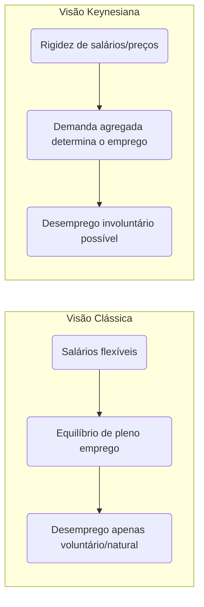

Em síntese, na visão clássica **o mercado de trabalho se autoequilibra**: o emprego é ofertado até o ponto em que o salário real iguala a produtividade marginal do trabalho, e qualquer pessoa que aceite esse salário será empregada – restando somente desemprego “natural” (gente em transição ou temporariamente desempregada por opção). Já na visão keynesiana, **podem existir equilíbrios de subemprego**, onde a falta de demanda por produtos leva a poucas contratações; mesmo pessoas dispostas a trabalhar pelos salários atuais podem não encontrar emprego, caracterizando _desemprego involuntário_. Por isso, as prescrições de política diferem: clássicos tendem a preconizar não-intervenção (ou apenas reformas pró-mercado, como flexibilização trabalhista), enquanto keynesianos defendem políticas de estímulo à demanda ou investimento público para alcançar o pleno emprego.

## Lei de Okun: Crescimento do PIB e Desemprego

A **Lei de Okun** descreve empiricamente uma relação inversa entre o crescimento econômico e as variações na taxa de desemprego. Proposta pelo economista **Arthur Okun** nos anos 1960, ela se baseia na observação de que, quando a economia cresce mais rápido do que seu potencial, o desemprego tende a cair, e vice-versa.

**Definição e formulação:** Em termos simples, Okun encontrou que para **reduzir o desemprego** é necessário um crescimento do PIB acima do _crescimento “normal”_ (de tendência) da economia. Uma versão bastante citada da lei diz que, aproximadamente, **para cada 1 ponto percentual de redução na taxa de desemprego**, o PIB real precisa crescer cerca de **2 pontos percentuais acima do crescimento potencial** ao longo de um ano. Por exemplo, se a taxa de crescimento potencial de longo prazo do PIB é 2% ao ano, seria preciso crescer cerca de **4%** num ano para baixar o desemprego em 1 p.p. (essa é uma regra empírica, válida para economias como a dos EUA). Inversamente, se o desemprego aumenta 1 p.p., isso está associado a um PIB cerca de 2% menor do que poderia ser. Outra formulação equivalente é em termos de hiato do produto: cada ponto de desemprego acima da taxa natural está associado a uma perda de ~2% do PIB em relação ao potencial (output gap negativo).

Matematicamente, uma forma da Lei de Okun é:

$Δu≈−β(g−gpotencial​)$

onde $\Delta u$ é a variação da taxa de desemprego, $g$ é o crescimento real do PIB e $g_{potencial}$ o crescimento de potencial; $\beta$ é a _elasticidade de Okun_ (valor empírico). Por exemplo, $\beta \approx 0,5$ implica que a cada 1 ponto de crescimento acima do potencial, o desemprego cai 0,5 p.p. (aproximando a regra 2-para-1 mencionada). Há também a formulação de _hiato_:

$Y∗Y−Y∗​≈−c(u−u∗)$

em que $Y$ é PIB real, $Y^_$ PIB potencial, $u$ desemprego observado e $u^_$ desemprego natural. Aqui $c$ seria ~2 (na economia dos EUA, historicamente). Em resumo, essas fórmulas capturam a mesma ideia: **crescimento acima do normal reduz desemprego; crescimento abaixo do normal eleva desemprego**.

**Implicações práticas:** A Lei de Okun serve como **regra de bolso** para prever mudanças no desemprego dada a taxa de crescimento do PIB. Policymakers usam-na para avaliar quanto a economia precisa crescer para absorver novos entrantes no mercado de trabalho e reduzir a desocupação. Por exemplo, se a força de trabalho cresce ~1% ao ano em um país, este talvez precise crescer pelo menos esse 1% (mais ganhos de produtividade) apenas para manter o desemprego estável. Para reduzir o desemprego, o crescimento deve superar esse patamar. De fato, conforme **Ben Bernanke** resumiu, _“um crescimento do PIB próximo ao potencial normalmente é necessário apenas para manter o desemprego estável; para reduzir o desemprego, o PIB deve crescer acima do potencial”_ .

Em termos de política econômica, isso significa que após uma recessão, conseguir **taxas de crescimento elevadas** por algum período é crucial para reverter o aumento do desemprego que a recessão causou. Governos costumam definir metas de crescimento justamente pensando em Okun: por exemplo, se o desemprego está alto, buscar um crescimento robusto (via estímulos) ajuda a fechar o hiato do produto e retornar o desemprego ao nível desejado.

> [!example] **Exemplo empírico (EUA)** 
> Historicamente nos EUA pós-1945, a lei de Okun apresentou coeficientes próximos aos previstos. Por volta dos anos 1960–1980, a cada 1% de queda no desemprego correspondia ~3% de aumento no PIB (versão original de Okun). Em décadas recentes, a relação ficou mais próxima de 2:1. Durante a crise de 2008-2009, porém, houve quebras na regularidade – o PIB dos EUA caiu fortemente sem aumento proporcional do desemprego inicial, e na recuperação seguinte o emprego voltou mais lentamente (produtividade oscilante). Ainda assim, no longo prazo, confirma-se a tendência: **períodos de crescimento robusto coincidem com quedas do desemprego**, enquanto recessões fazem o desemprego disparar. O Federal Reserve acompanha essa relação para calibrar a política monetária, lembrando que a lei de Okun não é exata mas fornece um _guia útil_ – desde que se estime corretamente a taxa natural de desemprego e o potencial de crescimento.

**Observações:** A Lei de Okun é **empírica**, não uma lei teórica fixa. Os coeficientes (2 para 1, ou 3 para 1, etc.) variam conforme o país e período, dependendo de fatores como produtividade do trabalho, variação da força de trabalho, horas trabalhadas, etc. No Brasil, por exemplo, a elasticidade pode ser diferente da dos EUA – economias emergentes tendem a ter uma relação menos estável. Além disso, curto-circuitos podem ocorrer: na crise da COVID-19, muitos países viram o PIB despencar sem aumento proporcional do desemprego oficial, devido a medidas de retenção de empregos e queda da participação. Portanto, Okun é um **padrão geral** mais do que uma regra rígida. Ainda assim, sua mensagem central permanece válida: _desemprego alto sinaliza que a economia está produzindo bem abaixo do seu potencial_, e recuperar o produto é chave para reduzir a desocupação. Como lembrado anteriormente, se o PIB efetivo se iguala ao PIB potencial, o desemprego tende ao nível natural – ponto de equilíbrio entre crescimento e emprego.

## Perguntas de Autoavaliação

> [!question] **1.** Explique a diferença entre **desemprego estrutural** e **desemprego cíclico**. 
> Que tipo de política econômica seria mais apropriada para combater cada um desses problemas?

> [!question] **2.** O que é **taxa natural de desemprego** e por que ela não é igual a zero? Relacione esse conceito com a ideia de **pleno emprego** na economia.

> [!question] **3.** De acordo com a **Lei de Okun**, o que aconteceria com a taxa de desemprego se o PIB crescesse exatamente na sua **taxa potencial** por vários anos? E o que seria necessário para reduzir significativamente o desemprego ao longo de um ano?

## Referências

- **IBGE – PNAD Contínua,** _“Taxa de desocupação é de 6,6% e taxa de subutilização é de 15,4% no trimestre encerrado em abril/2025”_. **Agência de Notícias IBGE**, 29/05/2025. Link[agenciadenoticias.ibge.gov.br](https://agenciadenoticias.ibge.gov.br/agencia-sala-de-imprensa/2013-agencia-de-noticias/releases/43501-pnad-continua-taxa-de-desocupacao-e-de-6-6-e-taxa-de-subutilizacao-e-de-15-4-no-trimestre-encerrado-em-abril#:~:text=A%20popula%C3%A7%C3%A3o%20ocupada%20,no%20ano%20%2857%2C3)[agenciadenoticias.ibge.gov.br](https://agenciadenoticias.ibge.gov.br/agencia-sala-de-imprensa/2013-agencia-de-noticias/releases/43501-pnad-continua-taxa-de-desocupacao-e-de-6-6-e-taxa-de-subutilizacao-e-de-15-4-no-trimestre-encerrado-em-abril#:~:text=ano).
    
- **Wikipédia (pt).** _“População em idade ativa”_. Última edição: 2022. Link[pt.wikipedia.org](https://pt.wikipedia.org/wiki/Popula%C3%A7%C3%A3o_em_idade_ativa#:~:text=Sendo%20que%20Popula%C3%A7%C3%A3o%20Economicamente%20Ativa,e%20nem%20est%C3%A3o%20procurando%20trabalho)[pt.wikipedia.org](https://pt.wikipedia.org/wiki/Popula%C3%A7%C3%A3o_em_idade_ativa#:~:text=No%20Brasil%2C%20o%20Instituto%20Brasileiro,2).
    
- **Brasil Escola – Sociologia.** _“Diferentes tipos de desemprego”_ (por Paulo S. Ribeiro). Link[brasilescola.uol.com.br](https://brasilescola.uol.com.br/sociologia/diferentes-tipos-desemprego.htm#:~:text=Uma%20das%20formas%20seria%20o,desempregados%2C%20como%20o%20seguro%20desemprego)[brasilescola.uol.com.br](https://brasilescola.uol.com.br/sociologia/diferentes-tipos-desemprego.htm#:~:text=O%20quarto%20e%20%C3%BAltimo%20tipo,seus%20funcion%C3%A1rios%20para%20cortar%20despesas).
    
- **Curso de Macroeconomia – ENAP.** _Módulo 2: Emprego, Mercado de Trabalho e Distribuição de Renda._ Brasília: ENAP. Link[repositorio.enap.gov.br](https://repositorio.enap.gov.br/bitstream/1/3012/1/MACROECONOMIA_MOD_2.pdf#:~:text=trabalho%20a%20capacidade%20de%20determinar,%C3%A0s%20decis%C3%B5es%20de%20produ%C3%A7%C3%A3o%20e)[repositorio.enap.gov.br](https://repositorio.enap.gov.br/bitstream/1/3012/1/MACROECONOMIA_MOD_2.pdf#:~:text=1.%20A%20PEA%20distribui,popula%C3%A7%C3%A3o%20desempregada%20e%20a%20PEA).
    
- **Investopedia.** _“Okun’s Law: Economic Growth and Unemployment”_ (Jan 2022). Link[investopedia.com](https://www.investopedia.com/articles/economics/12/okuns-law.asp#:~:text=pace%20above%20its%20potential)[investopedia.com](https://www.investopedia.com/articles/economics/12/okuns-law.asp#:~:text=The%20law%20has%20indeed%20evolved%C2%A0over,fall%20in%20GDP).
    
- **Blog IDEG (Marcello Bolzan).** _“A prova de Economia do TPS CACD 2020 – análise”_. Publicado em 14/06/2021. Link[ideg.com.br](https://ideg.com.br/estudar-para-a-prova-de-economia-do-tps-cacd-concurso-diplomata/#:~:text=a%20taxa%20de%20crescimento%20do,chamaria%20de%20exercito%20de%20reserva).


# A Lei de Okun: Compreendendo a Relação entre Desemprego e Crescimento Econômico

## Começando pelo essencial: O que é a Lei de Okun?

A Lei de Okun representa uma das relações empíricas mais importantes e duradouras da macroeconomia moderna. Desenvolvida pelo economista americano Arthur Okun em 1962, ela estabelece uma conexão sistemática entre duas variáveis fundamentais: a taxa de desemprego e o crescimento do produto interno bruto de um país.

Imagine que você seja um formulador de políticas tentando entender por que, quando a economia cresce rapidamente, o desemprego tende a cair, e vice-versa. A Lei de Okun fornece uma ferramenta quantitativa para compreender exatamente essa relação, permitindo prever mudanças no desemprego com base no crescimento econômico.

## A intuição econômica por trás da lei

Antes de mergulharmos nas fórmulas, é fundamental entender por que essa relação existe. Quando uma economia produz mais bens e serviços, as empresas geralmente precisam de mais trabalhadores para atender à demanda aumentada. Inversamente, quando a produção diminui, as empresas tendem a demitir funcionários ou reduzir as horas de trabalho.

Essa relação, embora intuitiva, não é perfeita nem automática. Existem vários fatores que podem influenciar sua intensidade, como mudanças na produtividade do trabalho, alterações na jornada de trabalho e variações na participação da força de trabalho. Arthur Okun reconheceu essas complexidades e desenvolveu sua lei como uma aproximação útil da realidade, não como uma lei física imutável.

## As duas formulações principais da Lei de Okun

A Lei de Okun pode ser expressa de duas maneiras distintas, cada uma oferecendo uma perspectiva diferente sobre a relação desemprego-produto.

### Versão das Diferenças (Difference Version)

A primeira formulação relaciona mudanças na taxa de desemprego com a taxa de crescimento do PIB real:

__Δu = -β(g - g_)

Onde Δu representa a mudança na taxa de desemprego, g é a taxa de crescimento real do PIB, g* é a taxa de crescimento necessária para manter o desemprego constante (geralmente chamada de taxa de crescimento de tendência), e β é o coeficiente de Okun.

Para compreender essa fórmula, pense no seguinte: se uma economia precisa crescer 3% ao ano apenas para absorver novos entrantes no mercado de trabalho e manter a produtividade, então qualquer crescimento acima disso reduzirá o desemprego, enquanto crescimento abaixo disso aumentará o desemprego.

### Versão do Hiato (Gap Version)

A segunda formulação relaciona o nível da taxa de desemprego com o hiato do produto:

__(Y - Y_)/Y_ = -β(u - u*)**

Aqui, Y representa o PIB real, Y* é o PIB potencial, u é a taxa de desemprego atual e u* é a taxa natural de desemprego. Esta versão nos permite entender quanto a economia está produzindo abaixo de seu potencial com base na diferença entre o desemprego atual e o natural.

## O Coeficiente de Okun: Interpretação e Variações

O parâmetro β, conhecido como coeficiente de Okun, merece atenção especial. Para os Estados Unidos, onde Okun desenvolveu originalmente sua lei, esse coeficiente era aproximadamente 0,3. Isso significa que cada ponto percentual de aumento no desemprego estava associado a uma redução de aproximadamente 3% no PIB em relação ao seu potencial.

É crucial entender que esse coeficiente não é universal nem constante. Diferentes países apresentam coeficientes distintos devido a variações nas instituições do mercado de trabalho, na flexibilidade do emprego, na estrutura produtiva e nas políticas macroeconômicas. Por exemplo, países com mercados de trabalho mais rígidos podem apresentar coeficientes menores, pois as empresas ajustam mais lentamente o emprego em resposta a mudanças na demanda.

## Fatores que influenciam a relação de Okun

Vários elementos podem alterar a intensidade da relação entre desemprego e crescimento econômico. A produtividade do trabalho desempenha um papel fundamental: quando a produtividade cresce rapidamente, é possível aumentar a produção sem necessariamente criar novos empregos na mesma proporção.

A participação da força de trabalho também afeta essa relação. Durante recessões, algumas pessoas podem se desencorajar e parar de procurar emprego, saindo da força de trabalho. Isso pode fazer com que a taxa de desemprego oficial não capture completamente o impacto real da recessão no mercado de trabalho.

As variações na jornada de trabalho representam outro fator importante. Em vez de demitir trabalhadores durante uma recessão, algumas empresas podem optar por reduzir as horas trabalhadas. Isso permite ajustar a produção sem alterar significativamente o número de empregados.

## Aplicações práticas em política econômica

A Lei de Okun tem aplicações práticas importantes para formuladores de políticas. Bancos centrais utilizam essa relação para avaliar o impacto de suas decisões de política monetária sobre o mercado de trabalho. Se um banco central sabe que uma determinada taxa de crescimento resultará em uma redução específica no desemprego, pode calibrar suas políticas para atingir objetivos de emprego.

Governos também usam a Lei de Okun para avaliar o custo social de diferentes políticas fiscais. Por exemplo, ao considerar medidas de austeridade que possam reduzir o crescimento econômico, os formuladores de políticas podem estimar o impacto resultante no desemprego usando a relação de Okun.

## Limitações e críticas da Lei de Okun

Embora útil, a Lei de Okun apresenta várias limitações importantes que devem ser reconhecidas. Primeiro, ela é uma relação empírica baseada em dados históricos, não uma lei econômica fundamental. Isso significa que mudanças estruturais na economia podem alterar ou até mesmo invalidar a relação.

A lei também assume que a relação entre desemprego e crescimento é linear e estável ao longo do tempo. Na realidade, essa relação pode variar dependendo do ciclo econômico, sendo potencialmente diferente durante recessões profundas comparadas a recessões moderadas.

Além disso, a Lei de Okun não considera explicitamente fatores como mudanças demográficas, transformações tecnológicas ou alterações na estrutura industrial da economia. Esses fatores podem influenciar significativamente a relação entre desemprego e crescimento.

## Evidências empíricas e variações internacionais

Estudos empíricos têm confirmado a validade geral da Lei de Okun em muitos países, mas com coeficientes que variam consideravelmente. Países europeus com mercados de trabalho mais regulamentados tendem a apresentar coeficientes menores que os Estados Unidos, refletindo menor flexibilidade no ajuste do emprego.

Economias em desenvolvimento podem apresentar padrões diferentes devido a fatores como maior informalidade no mercado de trabalho, diferentes estruturas produtivas e instituições menos desenvolvidas. Isso destaca a importância de estimar coeficientes específicos para cada país ao aplicar a Lei de Okun.

## Relevância para o Brasil e países em desenvolvimento

Para um futuro diplomata brasileiro, compreender a Lei de Okun é particularmente relevante ao analisar políticas econômicas domésticas e internacionais. O Brasil apresenta características únicas, como alto grau de informalidade no mercado de trabalho e maior volatilidade econômica, que podem afetar a aplicabilidade direta da lei.

Estudos sobre o Brasil sugerem que o coeficiente de Okun pode ser menor que o observado em países desenvolvidos, possivelmente devido à maior flexibilidade informal do mercado de trabalho. Durante crises, muitos trabalhadores podem migrar para o setor informal em vez de se tornarem oficialmente desempregados.

## Conexões com outras teorias macroeconômicas

A Lei de Okun se conecta intimamente com outras teorias macroeconômicas importantes. Ela complementa a Curva de Phillips, que relaciona inflação e desemprego, formando um triângulo de relações entre crescimento, desemprego e inflação que é fundamental para a compreensão das políticas macroeconômicas.

A lei também se relaciona com teorias de crescimento econômico, especialmente ao considerar como mudanças na força de trabalho afetam o produto potencial de longo prazo. Isso é particularmente relevante para países com mudanças demográficas significativas.

## Implicações para políticas de estabilização

Uma compreensão sólida da Lei de Okun permite aos formuladores de políticas avaliar melhor os trade-offs entre diferentes objetivos macroeconômicos. Se um governo sabe que determinada política fiscal resultará em um crescimento específico, pode usar a Lei de Okun para estimar o impacto correspondente no emprego.

Isso é especialmente importante durante recessões, quando os formuladores de políticas precisam equilibrar preocupações sobre déficits fiscais com a necessidade de manter o emprego. A Lei de Okun fornece uma ferramenta quantitativa para avaliar esses trade-offs.

Para consolidar sua compreensão, considere este exercício: se uma economia tem um coeficiente de Okun de 0,4 e precisa de 2,5% de crescimento para manter o desemprego estável, qual seria o impacto no desemprego de uma recessão que resultasse em crescimento de -1%? Usando a fórmula da versão das diferenças, o desemprego aumentaria em 1,4 pontos percentuais [0,4 × ((-1) - 2,5) = 1,4].

A Lei de Okun, portanto, representa uma ferramenta valiosa mas não infalível para compreender as dinâmicas do mercado de trabalho. Sua aplicação requer cuidadosa consideração das características específicas de cada economia e do contexto histórico e institucional relevante.

# Origem: 3.1.1_Teorias de Comércio (Clássicas, Neoclássicas, Prebisch)

---
title: "Teorias de Comércio (Clássicas, Neoclássicas, Prebisch)"
area: "ECONOMIA"
subarea: "Economia internacional"
tags:
  - cacd-2025
  - economia
  - economia-internacional
  - teorias-de-comercio
---


# Origem: 3.1.2_O comércio intra-firma e intra-setorial.

---
title: O comércio intra-firma e intra-setorial.
area: ECONOMIA
subarea: Economia internacional
tags:
  - cacd-2025
  - economia
  - economia-internacional
  - teorias-de-comercio
aliases:
  - O comércio intra-firma e intra-setorial.
---
# Comércio Intrafirma e Intrassetorial: As Novas Dinâmicas do Comércio Global

## 1. Introdução: A Insuficiência dos Modelos Clássicos e a Nova Face do Comércio

O comércio internacional do século XXI não pode ser compreendido apenas pela lente das vantagens comparativas. Fenômenos como o comércio de produtos similares entre nações ricas e as transações internas a empresas multinacionais exigem um novo arcabouço teórico. Este relatório disseca esses fenômenos — o comércio intrassetorial e o intrafirma — e explora suas causas, características e implicações estratégicas, com foco especial no contexto brasileiro e nos desafios para a política externa.

O extraordinário crescimento do comércio no período pós-Segunda Guerra Mundial, especialmente entre os países industrializados da Europa e da América do Norte, revelou um padrão que desafiava a sabedoria econômica convencional. Nações com dotações de fatores e níveis tecnológicos semelhantes, como Alemanha e França, tornaram-se os maiores parceiros comerciais uns dos outros, engajando-se em um intenso intercâmbio de produtos da mesma indústria, como automóveis, químicos e maquinário.1 Este fato empírico contrariava diretamente as previsões dos modelos de David Ricardo e da dupla Eli Heckscher e Bertil Ohlin. Essas teorias clássicas e neoclássicas, que dominaram o pensamento econômico por mais de um século, previam um comércio baseado em diferenças: países diferentes, com tecnologias ou dotações de fatores distintas, trocariam produtos diferentes (comércio interindustrial). A realidade, contudo, mostrava um mundo onde a semelhança, e não a diferença, parecia impulsionar uma parcela cada vez maior das trocas globais.

Para decifrar este enigma, surgiram novos conceitos e teorias que deslocaram o foco da análise do nível do país para o nível da indústria e, posteriormente, para o nível da firma. O **comércio intrassetorial** emergiu para descrever a troca de bens similares, enquanto o **comércio intrafirma** passou a designar as transações que ocorrem dentro das fronteiras organizacionais de uma mesma empresa multinacional. Compreender esses dois conceitos é fundamental para decifrar a arquitetura da economia global contemporânea, marcada pela fragmentação da produção em Cadeias Globais de Valor (CGV) e pela competição baseada em inovação e diferenciação.

Este relatório se desenvolverá em quatro partes principais. Primeiro, será realizada uma análise aprofundada do comércio intrassetorial, detalhando a crítica aos modelos clássicos e a revolução teórica proporcionada pela "Nova Teoria do Comércio" de Paul Krugman. Em segundo lugar, o estudo se voltará para o comércio intrafirma, explorando-o como a espinha dorsal das CGVs e analisando as motivações estratégicas que o impulsionam. A terceira parte oferecerá uma síntese analítica, conectando os dois fenômenos, aprofundando a discussão com a "Nova Nova Teoria do Comércio" de Marc Melitz e aplicando essas lentes à realidade da inserção internacional do Brasil. Por fim, o relatório concluirá com uma análise prospectiva sobre o futuro das CGVs em um cenário de crescentes tensões geopolíticas e acelerada transformação tecnológica.

## 2. O Comércio Intrassetorial: A Lógica da Especialização em um Mundo de Variedades

O comércio intrassetorial representa um dos mais importantes quebra-cabeças empíricos que levaram a uma revisão fundamental da teoria do comércio internacional. Sua existência e predominância no comércio entre países desenvolvidos exigiram um novo conjunto de ferramentas analíticas que pudessem explicar por que nações similares trocam produtos similares.

### 2.1. A Crítica às Teorias de Vantagens Comparativas

Para entender a revolução causada pelo conceito de comércio intrassetorial, é imperativo primeiro revisitar a lógica dos modelos que o precederam e que se mostraram incapazes de explicá-lo.

A teoria clássica do comércio internacional, em suas vertentes mais influentes, baseia-se na ideia de que as diferenças entre os países são o motor fundamental das trocas.

- **Vantagem Comparativa Ricardiana:** Proposta por David Ricardo no século XIX, esta teoria postula que o comércio é benéfico para todos os países, desde que se especializem na produção dos bens em que possuem uma vantagem comparativa, ou seja, um menor custo de oportunidade. A fonte dessa vantagem reside em diferenças relativas na produtividade do trabalho, que podem ser interpretadas como diferenças tecnológicas entre as nações.1
    
- **Modelo Heckscher-Ohlin (H-O):** Desenvolvido no início do século XX, este modelo neoclássico argumenta que a vantagem comparativa deriva das diferenças na dotação de fatores de produção (capital e trabalho) de cada país. A tecnologia é assumida como idêntica em todo o mundo. Assim, países com abundância relativa de capital tenderão a exportar bens intensivos em capital, enquanto países com abundância relativa de trabalho exportarão bens intensivos em trabalho.1
    

A implicação lógica e comum a ambos os modelos é a previsão de um padrão de comércio predominantemente **interindustrial**: o intercâmbio de produtos de indústrias diferentes. Por exemplo, o Brasil, rico em recursos naturais, exportaria soja para a Alemanha, rica em capital, e importaria desta última automóveis e máquinas. Não haveria, sob essa lógica, uma razão econômica para o Brasil exportar automóveis para a Alemanha e, simultaneamente, importar automóveis alemães.4

A anomalia empírica tornou-se evidente no pós-guerra, quando se observou que a maior parte do crescimento do comércio mundial ocorria entre países industrializados com estruturas produtivas muito parecidas. O comércio de bens da mesma categoria — o comércio intrassetorial — não era uma curiosidade estatística, mas uma característica central e dominante do sistema.7 O modelo de Heckscher-Ohlin, em particular, era incapaz de explicar esse fenômeno, pois suas premissas de concorrência perfeita e produtos homogêneos não deixavam espaço conceitual para a troca de diferentes variedades de um mesmo bem.4 Se um carro é um carro, e a Alemanha tem vantagem comparativa em sua produção, ela deveria apenas exportá-lo, e não importá-lo. O fato de que o comércio intrassetorial era a norma, e não a exceção, exigia uma nova teoria.

> **Tabela 1: Comparativo das Teorias de Comércio Internacional**

| **Critério**           | **Teoria Clássica (Ricardo)**                                                                    | **Teoria Neoclássica (Heckscher-Ohlin)**                                                    | **Nova Teoria do Comércio (Krugman)**                                                                        | **"Nova Nova" Teoria do Comércio (Melitz)**                                                                                           |
| :--------------------- | :----------------------------------------------------------------------------------------------- | :------------------------------------------------------------------------------------------ | :----------------------------------------------------------------------------------------------------------- | :------------------------------------------------------------------------------------------------------------------------------------ |
| **Unidade de Análise** | País                                                                                             | País                                                                                        | Indústria / Setor                                                                                            | Firma                                                                                                                                 |
| **Premissas-Chave**    | Concorrência perfeita; Retornos constantes de escala; Fator único (trabalho); Firmas homogêneas. | Concorrência perfeita; Retornos constantes de escala; Múltiplos fatores; Firmas homogêneas. | Concorrência monopolística; **Retornos crescentes de escala**; Diferenciação de produtos; Firmas simétricas. | Concorrência monopolística; Retornos crescentes de escala; **Firmas heterogêneas** em produtividade.                                  |
| **Causa do Comércio**  | Diferenças relativas de tecnologia/produtividade.                                                | Diferenças relativas na dotação de fatores (capital, trabalho).                             | **Economias de escala** e **preferência por variedade**.                                                     | Custos de exportação e **diferenças de produtividade entre firmas** do mesmo setor.                                                   |
| **Padrão de Comércio** | **Interindustrial**: Troca de bens diferentes.                                                   | **Interindustrial**: Troca de bens diferentes.                                              | **Intrassetorial**: Troca de bens similares (variedades).                                                    | Ambos: Explica o comércio intrassetorial e por que, dentro de um setor, **apenas as firmas mais produtivas exportam**.                |
| **Ganhos do Comércio** | Ganhos da especialização baseada na vantagem comparativa.                                        | Ganhos da especialização baseada na vantagem comparativa.                                   | Ganhos de escala (eficiência, preços menores) e **ganhos de variedade** (maior escolha para o consumidor).   | Ganhos de escala e variedade, mais um **ganho de produtividade agregada** pela realocação de recursos para as firmas mais eficientes. |

### 2.2. A "Nova Teoria do Comércio": O Modelo de Concorrência Monopolística de Krugman

A resposta a esse desafio teórico veio no final dos anos 1970 e início dos 1980, com os trabalhos de Paul Krugman, que lhe renderam o Prêmio de Ciências Econômicas em Memória de Alfred Nobel em 2008. Krugman desenvolveu um modelo que, ao abandonar as premissas de concorrência perfeita e retornos constantes, conseguiu explicar de forma elegante o comércio intrassetorial. A explicação repousa sobre uma tríade de conceitos interligados.9

1. **Economias de Escala (ou Retornos Crescentes de Escala):** Este é o pilar do modelo. Em muitas indústrias, especialmente na manufatura, os custos médios de produção diminuem à medida que a produção aumenta. Isso ocorre porque os custos fixos (como P&D, maquinário, instalações) são diluídos por um número maior de unidades produzidas. A função de custo de uma firma típica pode ser representada como C=F+c⋅Q, onde F é o custo fixo, c é o custo marginal constante, e Q é a quantidade. O custo médio, CM=C/Q=F/Q+c, claramente diminui com o aumento de Q.12 Isso cria um poderoso incentivo para que cada empresa se especialize na produção de um número limitado de variedades de um produto, mas em grande volume, para maximizar a eficiência e minimizar os custos.7
    
2. **Diferenciação de Produtos e "Preferência por Variedade":** O modelo assume que os consumidores não veem os produtos de uma mesma indústria como perfeitamente substituíveis. Eles valorizam a diversidade e a escolha, um conceito conhecido como "preferência por variedade" (_love of variety_).13 Consumidores não demandam apenas "automóveis", mas sim diferentes tipos, marcas e modelos, cada um com atributos específicos. O comércio internacional, nesse contexto, desempenha um papel crucial ao permitir que os consumidores de um país tenham acesso a uma gama muito maior de variedades (nacionais e importadas) do que seria possível em uma economia fechada, aumentando seu bem-estar.7
    
3. **Concorrência Monopolística:** Esta estrutura de mercado, teorizada por Edward Chamberlin, captura a essência da competição em indústrias com produtos diferenciados. Ela combina dois elementos:
    
    - **Elemento Monopolístico:** Cada firma é a única produtora de sua variedade específica (e.g., a Ferrari é a única produtora de Ferraris). Isso lhe confere poder de mercado e uma curva de demanda com inclinação negativa, permitindo-lhe influenciar o preço.16
        
    - **Elemento Competitivo:** A firma compete com um grande número de outras empresas que produzem bens que são substitutos próximos (e.g., Lamborghini, Porsche). Crucialmente, assume-se a livre entrada e saída de firmas no mercado. Se as firmas existentes estão obtendo lucros extraordinários, novas empresas serão atraídas para o setor, introduzindo novas variedades. Esse processo de entrada continua até que os lucros econômicos sejam zerados, o que ocorre quando o preço de cada firma se iguala ao seu custo médio de produção (P=CM).9
        

A abertura comercial, no modelo de Krugman, equivale a integrar dois mercados distintos em um mercado maior. Isso provoca duas mudanças fundamentais no equilíbrio da indústria: a curva de demanda de cada firma torna-se mais elástica (mais sensível ao preço) devido ao aumento da concorrência, e o mercado maior permite que cada firma produza em uma escala mais eficiente. O resultado é um novo equilíbrio com mais firmas (e, portanto, mais variedades disponíveis para o consumidor) e preços mais baixos, pois as empresas podem explorar melhor as economias de escala.2 Os ganhos do comércio, portanto, não advêm da vantagem comparativa, mas do aumento da eficiência produtiva (ganhos de escala) e do maior bem-estar do consumidor (ganhos de variedade).18

Um ponto de análise mais sutil, mas de grande relevância para a política, é a natureza menos conflituosa do comércio intrassetorial. O comércio interindustrial, previsto pelo modelo H-O, gera vencedores e perdedores bem definidos. O Teorema de Stolper-Samuelson demonstra que a abertura comercial aumenta a remuneração real do fator abundante do país e reduz a do fator escasso. Isso significa que setores inteiros que competem com as importações encolhem, gerando desemprego e perdas de capital, o que alimenta a formação de grupos de interesse politicamente organizados que demandam protecionismo. Em contraste, o comércio intrassetorial implica uma realocação de recursos _dentro_ da mesma indústria. Uma empresa automobilística pode parar de produzir um sedã familiar para se especializar em um SUV, mas os trabalhadores e o capital tendem a permanecer no setor automotivo. Os custos de ajuste são, portanto, significativamente menores e os conflitos distributivos, menos agudos.19 Este fato ajuda a explicar por que a liberalização comercial profunda, como a que ocorreu na formação da União Europeia, foi politicamente mais viável entre países industrializados com estruturas produtivas semelhantes.

### 2.3. Mensuração e Evidência: O Índice de Grubel-Lloyd (GL)

Para quantificar a importância do comércio intrassetorial, os economistas Herbert Grubel e Peter Lloyd desenvolveram um índice que se tornou a ferramenta padrão para essa medição.22

- **Definição e Fórmula:** O índice mede, para um determinado produto ou setor i, a proporção do comércio total que é intrassetorial, ou seja, a parte que é sobreposta (exportações e importações ocorrendo simultaneamente). A fórmula é a seguinte:
    
    $GLi​=1−(Xi​+Mi​)∣Xi​−Mi​∣​$
    
    Onde Xi​ e Mi​ representam, respectivamente, o valor das exportações e das importações do setor i.
    
- **Interpretação:** O valor do índice varia entre 0 e 1.
    
    - Um índice igual a **0** indica que o comércio é puramente **interindustrial**. Isso ocorre quando um país apenas exporta (Mi​=0) ou apenas importa (Xi​=0) o produto em questão. Não há sobreposição.
        
    - Um índice igual a **1** indica que o comércio é puramente **intrassetorial**. Isso ocorre quando o valor das exportações é exatamente igual ao das importações (Xi​=Mi​).
        
    - Valores intermediários indicam a intensidade do fenômeno. Um índice de 0.60, por exemplo, significa que 60% do comércio total naquele setor é de natureza intrassetorial, enquanto os 40% restantes correspondem ao padrão interindustrial de especialização.24
        

Estudos empíricos utilizando o índice GL confirmam a prevalência do comércio intrassetorial entre países desenvolvidos, especialmente em setores de manufatura com alta diferenciação de produtos. Uma análise do IPEA sobre o comércio do Brasil com os países da OCDE, por exemplo, utilizou o índice para mostrar que, embora existente, o comércio intrassetorial brasileiro com essas nações é predominantemente do tipo "vertical" (troca de bens de qualidades diferentes), com o Brasil exportando variedades de menor qualidade e importando as de maior qualidade, refletindo diferenças na dotação de fatores e tecnologia.26

## 3. O Comércio Intrafirma: As Cadeias de Valor no Interior das Multinacionais

Se o comércio intrassetorial revelou a importância da indústria como unidade de análise, o comércio intrafirma força um mergulho ainda mais profundo, para dentro da própria empresa. Este fenômeno designa as transações que não ocorrem no mercado aberto, mas sim dentro da estrutura hierárquica de uma mesma corporação multinacional.

### 3.1. Definição, Dimensão e Relevância

> [!definition] Comércio Intrafirma
> 
> O comércio intrafirma consiste nas transações transfronteiriças de bens, serviços, insumos, capital e ativos intangíveis que ocorrem entre as diferentes unidades de uma mesma Empresa Multinacional (EMN) — por exemplo, entre a matriz e uma filial, ou entre duas filiais localizadas em países distintos.18

Este tipo de comércio representa uma parcela substancial e estruturalmente importante do comércio global. Estimativas da Conferência das Nações Unidas sobre Comércio e Desenvolvimento (UNCTAD) e da Organização para a Cooperação e Desenvolvimento Econômico (OCDE) indicam que o comércio intrafirma responde por aproximadamente **um terço** de todo o comércio mundial de bens.7 Dados mais detalhados, como os da base de dados de Comércio por Características das Empresas (TEC) da OCDE, revelam o papel desproporcional das empresas de propriedade estrangeira no volume total de exportações e importações dos países, um forte indicativo da intensidade das transações intrafirma.29

A existência e a magnitude do comércio intrafirma têm uma implicação analítica fundamental: uma parte significativa do que as estatísticas convencionais registram como "comércio internacional" não é, de fato, o resultado de transações de mercado entre agentes independentes (_arm's-length trade_). Em vez disso, é o resultado de decisões estratégicas de alocação de recursos tomadas de forma centralizada pela gestão de grandes corporações. As estatísticas tradicionais de balança comercial tratam a exportação de uma peça da Ford do Brasil para a Ford do México da mesma forma que uma exportação de uma empresa brasileira independente para um comprador mexicano independente. No entanto, a lógica por trás dessas duas transações é completamente diferente. A primeira é guiada pela estratégia de otimização da cadeia de produção global da Ford; a segunda, pelo mecanismo de preços do mercado. Essa distinção transforma a nossa compreensão sobre a governança da economia global e a eficácia das políticas comerciais nacionais, que podem ter efeitos muito distintos sobre transações de mercado e sobre fluxos intrafirma.

### 3.2. As Razões Estratégicas para a Internalização

A decisão de uma EMN de realizar uma transação internamente ("fazer") em vez de recorrer a um fornecedor externo ("comprar") é uma escolha estratégica fundamental, explicada por um conjunto de teorias da firma e de negócios internacionais. As principais motivações podem ser sintetizadas em quatro categorias.

> **Tabela 2: Fatores Determinantes do Comércio Intrafirma**

| **Fator Estratégico**                   | **Desafio do Mercado (Transação Externa)**                                                                                                                                           | **Solução via Internalização (Comércio Intrafirma)**                                                                                                | **Conceito Teórico Associado**                              |
| :-------------------------------------- | :----------------------------------------------------------------------------------------------------------------------------------------------------------------------------------- | :-------------------------------------------------------------------------------------------------------------------------------------------------- | :---------------------------------------------------------- |
| **Governança de CGV**                   | Risco de interrupção no fornecimento, problemas de qualidade, falta de sincronia na produção fragmentada.                                                                            | Controle direto sobre todas as etapas da produção, garantindo qualidade, pontualidade e coordenação da cadeia.                                      | Teoria da Governança de Cadeias Globais de Valor (Gereffi). |
| **Proteção de Ativos Intangíveis**      | Risco de imitação, cópia ou uso indevido de tecnologia, patentes, marcas e *know-how* por parceiros externos.                                                                        | Manutenção de segredos comerciais e propriedade intelectual dentro da firma, evitando vazamentos e protegendo a vantagem competitiva.               | Paradigma OLI (Dunning); Teoria da Propriedade Intelectual. |
| **Minimização dos Custos de Transação** | Altos custos de negociação, monitoramento e garantia de cumprimento de contratos com fornecedores externos, especialmente em ambientes de alta incerteza ou com instituições fracas. | Substituição de contratos de mercado pela hierarquia da firma, reduzindo a incerteza, os custos de barganha e o risco de comportamento oportunista. | Teoria dos Custos de Transação (Coase, Williamson).         |
| **Otimização Fiscal**                   | Exposição da totalidade dos lucros à tributação em jurisdições com impostos elevados.                                                                                                | Alocação estratégica de lucros para jurisdições de baixa tributação através da manipulação de **preços de transferência**.                          | Planejamento Tributário Internacional; Teoria da Agência.   |

A análise detalhada dessas motivações revela a complexa racionalidade por trás da expansão das EMNs e do comércio intrafirma:

1. **Governança das Cadeias Globais de Valor (CGV):** A globalização permitiu que as empresas fragmentassem o processo produtivo, buscando localizar cada etapa no país que oferece as melhores condições (custo, qualificação, logística). Um smartphone pode ser projetado na Califórnia, ter seus chips fabricados em Taiwan, a tela na Coreia do Sul, outros componentes no Vietnã e ser montado na China. O comércio intrafirma é o fluxo de componentes, serviços e capital que conecta esses elos da cadeia. A internalização dessas transações dá à EMN o controle necessário para coordenar essa complexa orquestra global, garantindo padrões de qualidade, sincronia logística (_just-in-time_) e a capacidade de adaptar a produção rapidamente a mudanças na demanda ou na oferta.32
    
2. **Proteção de Ativos Intangíveis:** Em uma economia baseada no conhecimento, a principal fonte de vantagem competitiva para muitas EMNs não está em seus ativos físicos, mas nos intangíveis: tecnologia proprietária, P&D, design de produtos, algoritmos, marcas e _know-how_ gerencial. Contratar uma empresa externa para produzir um componente que incorpore uma tecnologia-chave ou para realizar P&D cria um risco significativo de que esse conhecimento estratégico vaze para concorrentes. Ao manter essas atividades "sensíveis" dentro da própria estrutura corporativa, a EMN protege seus ativos mais valiosos. O comércio intrafirma de componentes de alta tecnologia ou de serviços de P&D é, portanto, um mecanismo de defesa da propriedade intelectual.34
    
3. **Minimização dos Custos de Transação:** Com base nas ideias pioneiras de Ronald Coase e Oliver Williamson, as firmas existem porque, em muitas situações, é mais eficiente organizar a produção internamente do que usar o mecanismo de preços do mercado. Recorrer a fornecedores externos envolve "custos de transação": os custos de encontrar o parceiro certo, negociar os termos do contrato, monitorar a qualidade e o desempenho, e garantir o cumprimento do acordo. Esses custos podem ser proibitivamente altos, especialmente quando o insumo necessário é muito específico para a firma compradora (especificidade de ativos) ou quando o ambiente institucional do país do fornecedor é fraco (insegurança jurídica, corrupção). Em tais cenários, a EMN opta por "internalizar" a transação, produzindo o insumo em uma de suas próprias filiais e transferindo-o via comércio intrafirma, o que substitui a incerteza do contrato pela certeza do comando hierárquico.37
    
4. **Otimização Fiscal via Preços de Transferência:** Este é um dos aspectos mais examinados e controversos do comércio intrafirma. O "preço de transferência" é o preço que uma unidade da EMN cobra de outra por um bem ou serviço. Como esse preço não é determinado pelo mercado, mas pela própria empresa, ele pode ser manipulado para fins de planejamento tributário. Uma EMN pode, por exemplo, fazer com que sua filial em um país de alta tributação venda componentes para uma filial em um paraíso fiscal por um preço artificialmente baixo. Isso minimiza o lucro registrado na jurisdição de alta tributação e maximiza o lucro na de baixa tributação, reduzindo a carga fiscal global da corporação.7 Para combater essa prática, que causa erosão da base tributária (BEPS -
    
    _Base Erosion and Profit Shifting_), a comunidade internacional, sob a liderança da OCDE, desenvolveu o princípio _arm's length_. Este princípio determina que os preços de transferência devem ser equivalentes àqueles que seriam praticados entre empresas independentes em condições de mercado comparáveis. O Brasil, após anos utilizando um sistema próprio com margens fixas, alinhou recentemente sua legislação de preços de transferência ao padrão da OCDE, em um esforço para combater a elisão fiscal e se integrar melhor às normas tributárias globais.41
    

## 4. Síntese Analítica e Implicações Estratégicas (Foco CACD)

A compreensão isolada dos conceitos de comércio intrassetorial e intrafirma é insuficiente. A análise estratégica exige a capacidade de relacioná-los, de entender suas evoluções teóricas e, fundamentalmente, de aplicar esse conhecimento para diagnosticar a posição do Brasil no cenário global e os desafios para sua política externa.

### 4.1. A Intersecção dos Fenômenos

Os conceitos de comércio intrafirma e intrassetorial não são mutuamente excludentes; pelo contrário, eles frequentemente se sobrepõem e se reforçam. Uma parcela significativa e crescente do comércio intrassetorial é, na realidade, composta por transações intrafirma.18

O exemplo da indústria automobilística global é paradigmático para ilustrar essa intersecção. Consideremos uma montadora multinacional, como a Volkswagen. Ela opera uma CGV altamente fragmentada:

- A matriz na Alemanha projeta um novo modelo de veículo.
    
- Uma filial na Argentina é especializada na produção de caixas de câmbio.
    
- Uma filial no Brasil é especializada na fabricação de motores.
    
- A montagem final do veículo ocorre em uma fábrica no México para atender ao mercado norte-americano.
    

Neste cenário, quando a fábrica do Brasil exporta motores para a fábrica do México, essa transação é, simultaneamente:

- **Comércio Intrafirma:** Ocorre entre duas subsidiárias da mesma EMN (Volkswagen do Brasil e Volkswagen do México). A decisão de produzir motores no Brasil e enviá-los ao México não foi uma decisão de mercado, mas uma decisão de alocação estratégica da corporação para otimizar sua cadeia de produção.42
    
- **Comércio Intrassetorial:** É uma troca de bens pertencentes à mesma indústria (automotiva) entre dois países. Ambos os países, Brasil e México, são ao mesmo tempo exportadores e importadores de produtos e componentes automotivos.43
    

Este exemplo demonstra como a organização da produção em CGVs por parte das EMNs é um dos principais motores por trás do crescimento do comércio intrassetorial. A especialização de cada filial em um componente ou tarefa específica (motores, câmbios, eletrônica) gera um intenso fluxo de comércio de bens intermediários dentro da mesma indústria e da mesma firma.

### 4.2. Para Além da Firma Simétrica: A "Nova Nova Teoria do Comércio" (NNTT)

O modelo de Krugman, apesar de seu poder explicativo, continha uma simplificação importante: assumia que todas as firmas dentro de uma indústria eram idênticas (simétricas) em termos de produtividade e custos. A observação empírica, no entanto, mostra uma vasta heterogeneidade entre as empresas. Em qualquer setor, coexistem firmas grandes e pequenas, mais e menos produtivas.

A "Nova Nova Teoria do Comércio" (NNTT), cujo trabalho seminal é o de Marc Melitz (2003), incorporou essa **heterogeneidade das firmas** ao arcabouço da concorrência monopolística, gerando novos e poderosos insights.45

O argumento central de Melitz é que a participação no comércio internacional não é uma decisão trivial. Exportar envolve custos fixos significativos: pesquisa de mercados externos, adaptação de produtos a regulações locais, estabelecimento de canais de distribuição, custos legais, etc. Diante desses custos, a conclusão do modelo é inequívoca: **apenas as firmas mais produtivas** — aquelas com custos marginais baixos o suficiente para gerar lucros que compensem os custos fixos de exportação — conseguirão vender para o exterior. As firmas com produtividade intermediária sobrevivem servindo apenas o mercado doméstico, enquanto as menos produtivas de todas são incapazes de competir e são forçadas a sair do mercado.47

Isso leva a uma compreensão mais profunda dos ganhos do comércio, que pode ser vista como um mecanismo de **seleção natural ou darwiniana** no nível da indústria. A liberalização comercial intensifica a concorrência no mercado doméstico e, ao mesmo tempo, abre novas oportunidades de exportação. Esse duplo efeito provoca uma **realocação de recursos** dentro da indústria:

1. As firmas menos produtivas, que já operavam com margens apertadas, não conseguem competir com as importações e saem do mercado.
    
2. As firmas mais produtivas, as exportadoras, aproveitam o acesso a mercados maiores para expandir sua produção, vendas e lucros.
    

O resultado líquido desse processo de seleção é um **aumento da produtividade média de toda a indústria**, pois os recursos (trabalho e capital) são transferidos das empresas menos eficientes para as mais eficientes. Este é um ganho de bem-estar adicional, não capturado pelos modelos anteriores, que ajuda a explicar por que, dentro de um mesmo setor, a globalização cria vencedores e perdedores no nível da firma.47

### 4.3. Implicações para a Política Externa e o Desenvolvimento do Brasil

A aplicação dessas teorias ao caso brasileiro revela tanto os desafios estruturais quanto as complexas interações entre a política econômica e a política externa.

- **Diagnóstico da Inserção Brasileira:** A participação do Brasil nas CGVs, quando comparada à de outras economias emergentes, especialmente as asiáticas, é considerada periférica e de baixa complexidade. A inserção brasileira ocorre predominantemente nas etapas iniciais das cadeias, como o fornecimento de _commodities_ agrícolas e minerais, ou em etapas de montagem de baixo valor agregado. O país tem grande dificuldade em avançar para segmentos mais sofisticados, como P&D, design, produção de componentes de alta tecnologia e serviços complexos, que são os que capturam a maior parte do valor.33 Consequentemente, a pauta de comércio brasileira reflete um padrão mais próximo do interindustrial clássico do que do intrassetorial sofisticado que caracteriza as trocas entre nações desenvolvidas.
    
- **Desafios Estruturais e Dependência Tecnológica:** Uma série de fatores domésticos, frequentemente agrupados sob a rubrica do "Custo Brasil", dificultam uma inserção mais qualificada. Entre eles, destacam-se a alta complexidade do sistema tributário, a burocracia excessiva, deficiências de infraestrutura e logística, e tarifas de importação sobre bens intermediários e de capital que são relativamente elevadas em comparação com as de concorrentes.33 Essas barreiras desincentivam a integração das empresas brasileiras às CGVs e perpetuam um quadro de dependência tecnológica em setores estratégicos, evidenciado pelos baixos níveis de investimento em P&D como proporção do PIB em comparação com países desenvolvidos e mesmo com a China.54
    

A política externa brasileira, por sua vez, tem como um de seus vetores históricos a busca por **autonomia**, seja pela diversificação de parceiros, pela liderança regional ou pela participação ativa em foros multilaterais para reformar as regras do sistema internacional.57 O que a análise das novas dinâmicas do comércio revela é a profunda conexão entre essa aspiração diplomática e a estrutura produtiva do país.

A autonomia na política externa não é um mero ato de vontade política; ela depende de uma base material de poder, que inclui capacidade econômica, industrial e tecnológica. Um padrão de inserção internacional baseado na exportação de _commodities_ e na importação de bens de capital e tecnologia — um padrão essencialmente interindustrial — gera vulnerabilidades estruturais. Ele torna a economia excessivamente dependente de ciclos de preços de matérias-primas e da demanda de poucos grandes compradores, como a China, limitando a margem de manobra diplomática e o poder de barganha do país.

Em contrapartida, uma inserção qualificada nas CGVs, com o domínio de etapas de alto valor agregado, promove o aprendizado tecnológico, a diversificação econômica e a criação de empregos de maior qualidade. Isso fortalece a economia e, por consequência, amplia as opções e a capacidade de projeção do país no cenário internacional. Portanto, a agenda de adensamento das cadeias produtivas, de superação da dependência tecnológica e de fomento à competitividade internacional não é apenas uma pauta econômica setorial. Ela é uma **condição necessária e um instrumento fundamental para a realização dos objetivos estratégicos de longo prazo da política externa brasileira**. Um diplomata deve ser capaz de articular essa conexão intrínseca entre a organização da produção global e a distribuição de poder no sistema internacional.

## 5. Conclusão: Geopolítica e o Futuro das Cadeias Globais de Valor

O comércio global moderno, como visto, é moldado pela fragmentação da produção em CGVs, pela troca de variedades no comércio intrassetorial e pelas estratégias complexas das EMNs que orquestram o comércio intrafirma. As teorias econômicas evoluíram para capturar essa realidade, deslocando o foco de análise do país para a indústria e, finalmente, para a firma. Contudo, no momento presente, essa arquitetura econômica enfrenta um novo conjunto de forças disruptivas, de natureza geopolítica e tecnológica, que prometem reconfigurá-la profundamente.

A lógica puramente econômica de busca pela máxima eficiência e pelo menor custo, que guiou a expansão das CGVs por décadas, está sendo crescentemente desafiada por imperativos de segurança nacional. A rivalidade estratégica entre os Estados Unidos e a China está forçando um **"desacoplamento" (_decoupling_)** em setores considerados críticos, como semicondutores, equipamentos de telecomunicações (5G) e inteligência artificial.60 Essa tendência é explicada pela teoria da

**"interdependência armada" (_weaponized interdependence_)**, de Henry Farrell e Abraham Newman, que argumenta que a estrutura em rede das CGVs cria "pontos de estrangulamento" (_chokepoints_) — como o controle sobre uma tecnologia-chave, um sistema de pagamento ou o fornecimento de uma matéria-prima crítica. Esses pontos podem ser instrumentalizados por Estados para exercer coerção sobre outros atores, transformando a interdependência econômica em uma fonte de poder e vulnerabilidade.63

A percepção de vulnerabilidade foi agudizada pela pandemia de COVID-19 e pela guerra na Ucrânia, que expuseram a fragilidade de cadeias de suprimentos globais longas e otimizadas para a eficiência (_just-in-time_). A resposta de governos e empresas tem sido uma busca por maior **resiliência**, muitas vezes em detrimento da eficiência. Isso se manifesta em estratégias como o **_reshoring_** (trazer a produção de volta para o país de origem), o **_near-shoring_** (transferir a produção para países geograficamente próximos) e o **_friend-shoring_** (realocar a produção para países politicamente alinhados), mesmo que essas opções impliquem custos mais elevados.67

Paralelamente, novas tecnologias estão remodelando as possibilidades produtivas. A **digitalização** acelera a coordenação das CGVs e impulsiona o comércio de serviços, mas também cria novos campos de disputa regulatória, como os fluxos transfronteiriços de dados e a privacidade.70 A

**manufatura aditiva (impressão 3D)**, por sua vez, detém um potencial ainda mais disruptivo: ao permitir a produção localizada, customizada e sob demanda, ela pode encurtar radicalmente as CGVs, substituindo o comércio de bens intermediários por fluxos de dados (arquivos digitais de design), o que alteraria fundamentalmente a lógica do _offshoring_.73

Para o Brasil, este cenário de reconfiguração global apresenta tanto riscos quanto oportunidades. O país se encontra em uma encruzilhada estratégica. A fragmentação e a politização das CGVs podem abrir janelas de oportunidade para atrair investimentos de empresas que buscam diversificar suas bases produtivas para longe da Ásia, capitalizando a posição brasileira como uma grande economia ocidental e democrática. Contudo, a capacidade de aproveitar essas oportunidades não é automática. Ela dependerá da implementação de reformas internas profundas para superar os desafios estruturais do "Custo Brasil", aumentar a competitividade e, acima de tudo, fomentar um ecossistema de inovação que permita ao país ascender na cadeia de valor. A compreensão das dinâmicas do comércio intrassetorial e intrafirma não é, portanto, um mero exercício acadêmico; é uma ferramenta indispensável para navegar e moldar o papel do Brasil no complexo e contestado tabuleiro da economia global do século XXI.

## 6. Questões para Autoavaliação (Active Recall)

> [!question] Questão 1
> 
> Diferencie o comércio interindustrial do comércio intrassetorial, explicando por que o segundo representa uma anomalia para as teorias clássicas de comércio e como a "Nova Teoria do Comércio" de Paul Krugman o explica, detalhando o papel das economias de escala e da diferenciação de produtos.

> [!question] Questão 2
> 
> Defina comércio intrafirma e analise criticamente as quatro principais motivações estratégicas que levam uma empresa multinacional a internalizar suas transações em vez de recorrer ao mercado. Relacione o conceito de preços de transferência com os esforços regulatórios da OCDE.

> [!question] Questão 3
> 
> Explique a relação entre comércio intrafirma e intrassetorial, utilizando um exemplo prático. Em seguida, discuta como a "Nova Nova Teoria do Comércio" (modelo de Melitz) aprofunda a análise de Krugman ao introduzir a heterogeneidade das firmas e quais as implicações disso para a produtividade da indústria.

# Origem: 3.1.3_O papel das economias de escala e da concorrência imperfeita para o comércio internacional.

---
title: O papel das economias de escala e da concorrência imperfeita para o comércio internacional.
area: ECONOMIA
subarea: Economia internacional
tags:
  - cacd-2025
  - economia
  - economia-internacional
  - teorias-de-comercio
aliases:
  - O papel das economias de escala e da concorrência imperfeita para o comércio internacional.  
---
# Economias de Escala e Concorrência Imperfeita no Comércio Internacional

> [!abstract] Síntese
> As economias de escala e a concorrência imperfeita revolucionaram a teoria do comércio internacional ao explicar padrões que as teorias clássicas não conseguiam justificar. Quando há retornos crescentes de escala, países semelhantes comercializam produtos similares (comércio intra-industrial), pois a especialização permite produção em maior escala e menor custo unitário. Em mercados de concorrência imperfeita, o comércio internacional intensifica a competição, reduz o poder de mercado das empresas e amplia dramaticamente a variedade de produtos disponíveis aos consumidores, gerando ganhos de bem-estar além daqueles previstos pelas teorias tradicionais.

## 1. O Problema: Limitações das Teorias Clássicas

>[!question] Questão-Chave
>Por que países com dotações e tecnologias semelhantes (como Alemanha e França) comercializam intensamente produtos similares (como automóveis)? As teorias clássicas não explicam esse fenômeno.

### 1.1. Anomalias Empíricas não Explicadas

As teorias tradicionais de comércio internacional (Ricardo, Heckscher-Ohlin) enfrentam importantes limitações:

1. **Comércio entre países similares**: As teorias clássicas preveem comércio entre países diferentes (Norte-Sul), mas não explicam o grande volume de comércio entre países similares (Norte-Norte)

2. **Comércio intra-industrial**: Não justificam a troca simultânea de produtos similares (ex: França exporta e importa automóveis da Alemanha)

3. **Empresas multinacionais**: Não abordam o papel central das multinacionais e da produção fragmentada globalmente

4. **Aglomerações industriais**: Não explicam a concentração geográfica da produção

### 1.2. Pressupostos Limitantes das Teorias Clássicas

- **Retornos constantes de escala**: Assumem que duplicar os insumos duplica exatamente a produção
- **Concorrência perfeita**: Pressupõem mercados com muitos produtores sem poder de mercado
- **Produtos homogêneos**: Consideram produtos como commodities, sem diferenciação
- **Ausência de custos fixos**: Ignoram os custos iniciais significativos de muitas indústrias

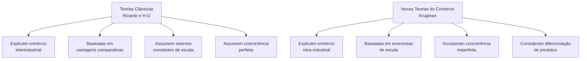

## 2. Economias de Escala: Fundamentos Conceituais

>[!definition] Definição
>**Economias de escala** ocorrem quando o aumento da escala de produção resulta em redução do custo médio por unidade produzida. Matematicamente, o custo médio (CMe) é decrescente em relação à quantidade produzida.

### 2.1. Caracterização Formal

- **Função de produção**: $Y = f(K,L)$ com retornos crescentes de escala
- **Retornos crescentes**: $f(λK, λL) > λ·f(K,L)$ para λ > 1
- **Custo médio**: $CMe(q) = \frac{C(q)}{q}$ é decrescente em q
- **Elasticidade de escala** ($ε$): $ε = \frac{d\ln Y}{d\ln x} > 1$

>[!example] Exemplo Prático
>Imagine uma fábrica de aviões com custo fixo de $1 bilhão e custo variável de $50 milhões por avião:
>- Produzindo 10 aviões: custo médio = $150 milhões/avião
>- Produzindo 100 aviões: custo médio = $60 milhões/avião
>Esse é o motivo pelo qual a indústria aeronáutica é tão concentrada globalmente.

### 2.2. Tipos de Economias de Escala

#### 2.2.1. Economias de Escala Internas
Ocorrem **dentro da firma individual** - custos unitários caem com o aumento da produção da própria empresa.

**Fontes principais**:
- **Divisão do trabalho**: especialização de funções (princípio de Adam Smith)
- **Indivisibilidades técnicas**: equipamentos com escala mínima eficiente
- **Economias geométricas**: relação volume-área (tanques, navios, tubulações)
- **Economias financeiras**: custo de capital menor para empresas maiores
- **Diluição de P&D**: custos fixos de inovação distribuídos por mais unidades

**Implicação importante**: tendência à concentração de mercado e oligopolização

#### 2.2.2. Economias de Escala Externas
Ocorrem no **nível da indústria ou cluster** - custos unitários de cada empresa diminuem com o crescimento do setor como um todo.

**Fontes principais**:
- **Spillovers de conhecimento**: difusão de inovações entre empresas próximas
- **Mercado de trabalho especializado**: pool de trabalhadores com habilidades específicas
- **Fornecedores especializados**: acesso a insumos customizados e de alta qualidade
- **Infraestrutura dedicada**: logística, energia, comunicações especializadas
- **Serviços complementares**: consultoria técnica, laboratórios, certificadoras

**Implicação importante**: aglomeração geográfica (Silicon Valley, distritos industriais italianos)

#### 2.2.3. Economias de Escala Dinâmicas
Ocorrem ao **longo do tempo** pela acumulação de experiência produtiva.

**Mecanismos principais**:
- **Learning-by-doing**: produtividade aumenta com produção acumulada
- **Curva de aprendizado**: custos caem aproximadamente 20% a cada duplicação da produção acumulada
- **Inovação induzida**: escala incentiva esforço de P&D

**Formalização**: Curva de experiência $C(Q_t) = C(Q_0)·\left(\frac{Q_t}{Q_0}\right)^{-α}$, onde α é o parâmetro de aprendizado

>[!important] Implicações Fundamentais
>1. **Especialização benéfica**: Mesmo sem diferenças entre países, a especialização gera ganhos
>2. **Concentração industrial**: Produção tende a se concentrar em poucas localizações
>3. **Padrão de especialização arbitrário**: História e acidentes importam (path dependence)
>4. **Comércio intra-industrial explicado**: Países similares trocam produtos similares

## 3. Modelo Básico de Comércio com Economias de Escala

### 3.1. Pressupostos Simplificados do Modelo
- **Países idênticos**: mesmas preferências, tecnologia e dotação de fatores
- **Função de produção com custos fixos**: $C(q) = F + c·q$
- **Custo médio decrescente**: $CMe = \frac{F}{q} + c$
- **Consumidores valorizam variedade**: função utilidade CES (elasticidade de substituição constante)
- **Um único fator de produção**: trabalho
- **Custos de transporte insignificantes**

### 3.2. Equilíbrio em Autarquia vs. Comércio

>[!note] Autarquia (Sem Comércio)
>- Cada país produz todas as variedades para seu mercado
>- Número de variedades limitado pelo tamanho do mercado doméstico
>- Escala de produção por variedade relativamente pequena
>- Custos médios mais altos por unidade

>[!note] Com Comércio Internacional
>- Cada país se especializa em um subconjunto de variedades
>- Consumidores acessam variedades domésticas e importadas
>- Escala de produção por variedade aumenta
>- Custos médios diminuem com maior escala

### 3.3. Resultados e Implicações Teóricas

1. **Especialização incompleta**: cada país produz um subconjunto diferente de variedades
2. **Comércio intra-industrial**: países trocam variedades diferentes do mesmo setor
3. **Ganhos de comércio duplos**:
   - **Efeito escala**: produtos mais baratos (produção mais eficiente)
   - **Efeito variedade**: mais opções para consumidores (amor à diversidade)

4. **Bem-estar superior**: comparado à autarquia ou ao livre comércio sem economias de escala

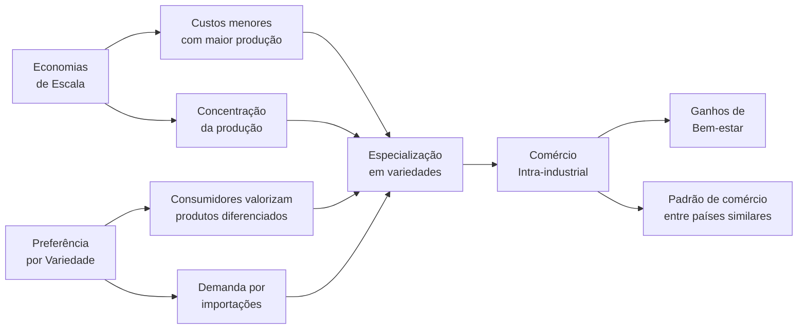

### 3.4. Formalização Matemática Simplificada
- **Função utilidade do consumidor**: $U = \sum_{i=1}^{n} c_i^{\alpha}$ onde $0 < \alpha < 1$
- **Condição de maximização**: $p_i = \lambda \alpha c_i^{\alpha-1}$
- **Função custo da firma**: $C(q_i) = F + c \cdot q_i$
- **Condição de equilíbrio**: $p_i = \frac{c}{1-1/\varepsilon}$ onde $\varepsilon = \frac{1}{1-\alpha}$ é a elasticidade da demanda
- **Número de variedades**: $n = \frac{L}{\sigma F}$ em autarquia, $n = \frac{2L}{\sigma F}$ com comércio (dois países idênticos)

## 4. Concorrência Imperfeita no Comércio Internacional

>[!question] Questão-Chave
>Como a estrutura de mercado (monopólio, oligopólio, concorrência monopolística) afeta os padrões de comércio e seus benefícios?

### 4.1. Estruturas de Mercado e Comércio

#### 4.1.1. Monopólio e Comércio
- **Discriminação de preços internacional** (dumping):
  - **Definição jurídica**: venda abaixo do valor normal (preço doméstico)
  - **Definição econômica**: discriminação de preços entre mercados com elasticidades diferentes
  - **Condição necessária**: mercados segmentados (barreiras à arbitragem)
  
- **Quebra de monopólios nacionais**:
  - Importações como força disciplinadora da concorrência
  - Redução do poder de mercado doméstico
  - Diminuição de ineficiência-X (slack organizacional)

#### 4.1.2. Oligopólio e Comércio

>[!note] Modelos de Oligopólio Aplicados ao Comércio
>- **Cournot**: competição por quantidades
>  - Equilíbrio: $q_i = \frac{a-c}{b(n+1)}$
>  - Preço: $p = c + \frac{a-c}{n+1}$
>  - Comércio aumenta n, reduzindo preço e markup
>
>- **Bertrand**: competição por preços
>  - Com produtos homogêneos: $p = c$ (paradoxo de Bertrand)
>  - Com diferenciação: $p_i = c + \frac{t}{2}$ onde t é o grau de diferenciação
>
>- **Stackelberg**: liderança de mercado
>  - Líder: $q_L = \frac{a-c}{2b}$
>  - Seguidor: $q_F = \frac{a-c}{4b}$
>  - Abertura comercial pode alterar posições de liderança

#### 4.1.3. Política Comercial Estratégica
- **Modelo de Brander-Spencer (1985)**:
  - Subsídio à exportação pode alterar equilíbrio de Cournot
  - Transfere rendas de oligopólio para país doméstico
  - Justificativa teórica para intervenção governamental

- **Críticas e limitações**:
  - Informação imperfeita dos governos
  - Riscos de retaliação e guerras comerciais
  - Captura por grupos de interesse
  - Aplicação limitada na prática (restrições da OMC)

### 4.2. Concorrência Monopolística e Comércio

#### 4.2.1. Modelo de Dixit-Stiglitz-Krugman
Características essenciais:
- **Diferenciação horizontal**: cada firma produz variedade única do produto
- **Substitutibilidade imperfeita**: elasticidade de substituição constante (CES)
- **Livre entrada**: lucros zero no equilíbrio de longo prazo
- **Simetria**: todas as variedades entram simetricamente na utilidade

>[!example] Exemplo Intuitivo
>Imagine o mercado de cervejas artesanais:
>- Cada cervejaria produz uma variedade única (diferenciação)
>- Consumidores valorizam diversidade de sabores (preferência por variedade)
>- Custos fixos de operação + custos variáveis por litro (economias de escala)
>- Com comércio internacional, cervejarias produzem mais de seus tipos específicos (maior escala)
>- Consumidores acessam maior variedade de cervejas do mundo todo (ganho de variedade)

#### 4.2.2. Efeitos do Comércio Internacional

1. **Efeito Pró-competitivo**
   - Redução do markup sobre custo marginal
   - Aproximação do preço ao custo marginal
   - Redução do poder de monopólio das firmas domésticas
   - Pressão por eficiência e produtividade

2. **Efeito Escala**
   - Produção concentrada em menos variedades por país
   - Escala maior por variedade produzida
   - Custos médios menores pela diluição dos custos fixos
   - Aumento da eficiência produtiva

3. **Efeito Variedade**
   - Acesso a variedades estrangeiras
   - Aumento do índice de variedade consumida
   - Ganhos de bem-estar por "love of variety"
   - Aumento da utilidade do consumidor mesmo com preços constantes

4. **Efeito Seleção** (Melitz, 2003)
   - Apenas firmas mais produtivas exportam
   - Firmas menos eficientes saem do mercado
   - Aumento da produtividade média da indústria
   - Realocação de recursos para firmas mais eficientes

#### 4.2.3. Formalização dos Ganhos de Comércio
- **Ganho de variedade**: $\Delta W_{var} = n^{\frac{1}{\sigma-1}} - n_0^{\frac{1}{\sigma-1}}$
- **Ganho de escala**: $\Delta W_{esc} = \frac{p_0}{p} - 1 = \frac{q}{q_0} - 1$
- **Ganho total aproximado**: $\Delta W \approx \frac{1}{2}\left(n^{\frac{1}{\sigma-1}} - 1\right) + \frac{1}{2}\left(\frac{q}{q_0} - 1\right)$

## 5. Comércio Intra-industrial: Evidências e Medição

### 5.1. Medição do Comércio Intra-industrial

#### 5.1.1. Índice de Grubel-Lloyd (IGL)
```
IGL = 1 - |X - M|/(X + M)
```
Onde:
- X = exportações do setor i
- M = importações do setor i
- IGL ∈ [0,1]: quanto maior, mais intra-industrial

**Interpretação do IGL**:
- IGL = 0: Comércio puramente inter-industrial
- IGL = 1: Comércio puramente intra-industrial
- 0 < IGL < 1: Combinação de ambos os tipos

>[!tip] Como Calcular na Prática
>Para o setor automobilístico:
>- Exportações = $10 bilhões
>- Importações = $8 bilhões
>- IGL = 1 - |10-8|/(10+8) = 1 - 2/18 = 1 - 0,11 = 0,89
>Isso indica um comércio predominantemente intra-industrial (89%).

#### 5.1.2. Padrões Empíricos Observados
- **Alto entre países desenvolvidos**: IGL > 0.7 em manufaturados na UE e NAFTA
- **Correlação positiva com**:
  - Similaridade de renda per capita (hipótese de Linder)
  - Proximidade geográfica (custos de transporte)
  - Integração econômica (UE, NAFTA, Mercosul)
  - Tamanho das economias (mercados maiores)
- **Baixo em**: 
  - Commodities e produtos primários
  - Comércio Norte-Sul (países com diferentes dotações)
  - Setores intensivos em recursos naturais

### 5.2. Tipos de Comércio Intra-industrial

#### 5.2.1. Comércio Intra-industrial Horizontal
- **Definição**: Troca de produtos similares com diferentes atributos
- **Exemplos**: Carros de mesmo segmento (Golf vs Focus), chocolates, vinhos
- **Driver principal**: Preferência por variedade dos consumidores
- **Modelo teórico aplicável**: Krugman/Dixit-Stiglitz

#### 5.2.2. Comércio Intra-industrial Vertical
- **Definição**: Troca de produtos similares mas de diferentes qualidades
- **Exemplos**: Carros de luxo por compactos, têxteis finos por básicos
- **Medição**: Razão de valores unitários (unit value ratios) > 1.15 ou < 0.85
- **Driver principal**: Diferenças em dotação de fatores dentro da mesma indústria
- **Modelo teórico aplicável**: Falvey-Kierzkowski

#### 5.2.3. Comércio Intra-firma
- **Definição**: Comércio entre unidades da mesma empresa multinacional
- **Magnitude**: ≈1/3 do comércio mundial, >40% em países desenvolvidos
- **Motivação**: Fragmentação da produção, especialização vertical
- **Implicações**: Transfer pricing, evasão fiscal, controle de qualidade

### 5.3. Implicações Político-Econômicas

#### 5.3.1. Ajustes Menos Custosos
- **Realocação intra-setorial**: trabalhadores mudam entre firmas do mesmo setor
- **Menor desemprego estrutural**: habilidades permanecem relevantes e transferíveis
- **Menor resistência política**: lobbies setoriais menos mobilizados
- **Custos transitórios**: menores perdas de capital específico ao setor

#### 5.3.2. Facilitação da Integração Econômica
- **Acordos comerciais mais viáveis**: menos conflitos distributivos entre setores
- **Deepening vs widening**: aprofundamento antes de expansão geográfica
- **Convergência regulatória**: padrões técnicos comuns, reconhecimento mútuo
- **Complementaridade com IDE**: investimento e comércio como complementos

## 6. Nova Geografia Econômica

>[!definition] Definição
>A Nova Geografia Econômica estuda como a interação entre economias de escala, custos de transporte e mobilidade de fatores determina a distribuição espacial da atividade econômica, explicando a formação de aglomerações industriais e desigualdades regionais persistentes.

### 6.1. Fundamentos Teóricos

#### 6.1.1. Forças de Aglomeração (Centrípetas)
1. **Linkages de mercado**:
   - **Backward**: acesso a insumos intermediários
   - **Forward**: acesso a compradores/mercados finais
   - **Causalidade circular**: reforço mútuo dos efeitos

2. **Economias de aglomeração**:
   - **Spillovers tecnológicos**: difusão de conhecimento localizada
   - **Pooling de mão-de-obra**: mercado de trabalho especializado
   - **Infraestrutura compartilhada**: custos fixos diluídos
   - **Serviços especializados**: disponibilidade de serviços auxiliares

#### 6.1.2. Forças de Dispersão (Centrífugas)
1. **Custos de congestionamento**: 
   - Aluguéis e preços da terra
   - Transportes urbanos e commuting
   - Poluição e externalidades negativas

2. **Competição local**: 
   - Por trabalhadores (pressão salarial)
   - Por consumidores (mercados saturados)
   - Por insumos não-comercializáveis

3. **Fatores imóveis**: 
   - Recursos naturais localizados
   - Terra agrícola e uso do solo
   - Amenidades naturais específicas

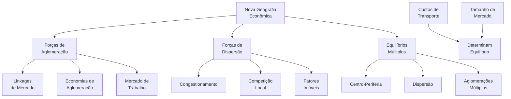

### 6.2. Implicações para o Desenvolvimento Regional e Global

#### 6.2.1. Padrões Centro-Periferia
- **Causalidade cumulativa**: vantagens iniciais se amplificam ao longo do tempo
- **Path dependence**: história importa para localização industrial
- **Multiple equilibria**: diversas configurações possíveis dependendo de condições iniciais
- **Armadilhas de pobreza**: equilíbrios de baixo nível podem ser estáveis

>[!example] Exemplo Histórico
>O "Manufacturing Belt" nos EUA (região industrial do nordeste e meio-oeste) consolidou-se no século XIX e, apesar das mudanças econômicas e tecnológicas, manteve posição dominante por mais de um século. Este é um exemplo clássico de path dependence e equilíbrio centro-periferia.

#### 6.2.2. Políticas de Desenvolvimento Regional
1. **Big Push**: 
   - Investimentos coordenados para romper armadilhas
   - Coordenação de expectativas dos agentes
   - Mobilização simultânea de recursos complementares

2. **Infraestrutura estratégica**: 
   - Redução de custos de transporte e comunicação
   - Corredores de desenvolvimento e nós logísticos
   - Efeitos ambíguos de integração espacial

3. **Clusters industriais**: 
   - Políticas focalizadas em setores específicos
   - Especialização regional inteligente
   - Sistemas regionais de inovação

4. **Capital humano diferenciado**: 
   - Criação de vantagens comparativas dinâmicas
   - Formação adaptada às vocações regionais
   - Atração e retenção de talentos

## 7. Aplicações ao Brasil e ao Mercosul

### 7.1. Industrialização Brasileira e Economias de Escala

#### 7.1.1. Período ISI (1930-1980)
- **Estratégia**: Busca por escala no mercado protegido nacional
- **Mecanismos**: Reserva de mercado, tarifas elevadas, substituição de importações
- **Sucessos**: Industrialização ampla, complexo industrial integrado
- **Limitações**: 
  - Concentração de renda e mercado interno insuficiente
  - Falta de especialização e escala subótima
  - Baixa pressão competitiva e ineficiências

#### 7.1.2. Abertura Econômica (1990s)
- **Choque competitivo**: Reestruturação industrial forçada
- **Resultados mistos**: 
  - Ganhos de produtividade por racionalização
  - Desnacionalização de segmentos escala-intensivos
  - Especialização em nichos com vantagens comparativas
  - Desverticalização e inserção em cadeias globais

#### 7.1.3. Período Recente (2000-2025)
- **Tendências preocupantes**: 
  - Desindustrialização precoce
  - Especialização regressiva (reprimarização)
  - Perda de elos complexos nas cadeias de valor
- **Nichos de excelência**: 
  - Aeroespacial (Embraer)
  - Agronegócio de alta tecnologia
  - Petróleo e gás em águas profundas

### 7.2. Mercosul e Integração Regional

#### 7.2.1. Concepção Original e Evolução
- **Motivação inicial**: Ampliação de mercado para ganhos de escala
- **Objetivos**: Criar espaço econômico integrado de 200+ milhões de consumidores
- **Evolução do comércio intra-regional**:
  - Aumento do índice Grubel-Lloyd Brasil-Argentina: de 0.12 (1990) para 0.40+ (2000s)
  - Declínio relativo pós-2010 (expansão da China)

#### 7.2.2. Regime Automotivo: Caso Emblemático
- **Complementaridade produtiva**: Brasil-Argentina
- **Especialização por modelos**: Escala ampliada por plataforma
- **Comércio administrado**: Coeficientes de desvio e compensação
- **Resultados**: 
  - Comércio intra-industrial elevado (IGL > 0.8)
  - Racionalização produtiva regional
  - Limitações por instabilidade macroeconômica

#### 7.2.3. Desafios Contemporâneos
- **Assimetrias estruturais**: Concentração em poucos polos
- **Integração superficial**: Baixa convergência regulatória
- **Necessidade de modernização**: Revisão da TEC e simplificação
- **Tensão entre ampliação e aprofundamento**: Negociações externas vs. coesão interna

### 7.3. Inserção nas Cadeias Globais de Valor

#### 7.3.1. Posição Brasileira nas CGVs
- **Participação abaixo da média mundial**: ≈25% vs. 50+%
- **Concentração upstream**: Fornecedor de insumos básicos
- **Baixa integração em serviços de alto valor**: Design, P&D, marketing
- **Padrão distinto do México e Leste Asiático**: Inserção mais periférica

#### 7.3.2. Estratégias de Upgrading
- **Tipologia de upgrading**: Produto, processo, funcional, cadeia
- **Casos de sucesso brasileiro**: 
  - Embraer: integrador de sistemas aeroespaciais
  - WEG: motores elétricos e automação industrial
  - Inovação em agronegócio (Embrapa)

#### 7.3.3. Políticas para Melhor Inserção
- **Facilitação de comércio**: Redução de custos de transação
- **Capacitação tecnológica**: Sistema de inovação mais efetivo
- **Atração seletiva de IDE**: Em segmentos estratégicos das cadeias
- **Acordos comerciais modernos**: Cláusulas de facilitação e convergência

## 8. Desafios Contemporâneos: Economia Digital e Novas Fronteiras

### 8.1. Novas Economias de Escala na Era Digital

#### 8.1.1. Características Distintas
- **Custos marginais próximos de zero**: Bens informacionais e digitais
- **Economias de rede**: Valor aumenta com número de usuários (Lei de Metcalfe)
- **Efeitos de plataforma**: Mercados de múltiplos lados
- **Winner-takes-all markets**: Tendência à concentração extrema

>[!example] Plataformas Digitais e Comércio
>Amazon e Alibaba transformaram o comércio global criando economias de escala em:
>- Logística integrada global
>- Matching eficiente entre compradores e vendedores
>- Big data para previsão de demanda
>- Compartilhamento de reputação e confiança
>Isso permite que pequenas empresas acessem mercados globais com custos fixos drasticamente reduzidos.

#### 8.1.2. Implicações para o Comércio Internacional
- **Desmaterialização do comércio**: Serviços digitais substituindo bens físicos
- **Micro-multinacionais**: PMEs com acesso direto a mercados globais
- **Concentração de poder de mercado**: Big techs como gatekeepers
- **Desafios regulatórios transfronteiriços**: Tributação, privacidade, segurança

### 8.2. Tensões Geopolíticas e Comerciais Emergentes

#### 8.2.1. Competição Tecnológica EUA-China
- **Setores estratégicos**: Semicondutores, 5G, IA, computação quântica
- **Controles de exportação**: Restrições a tecnologias sensíveis
- **Subsídios massivos**: CHIPS Act (EUA), Made in China 2025
- **Implicações**: Possível fragmentação tecnológica global

#### 8.2.2. Transição Energética e Comércio Verde
- **Carbon Border Adjustment Mechanism** (CBAM): Ajustes de carbono na fronteira
- **Nova geografia das vantagens comparativas**: Acesso a energia limpa
- **Economias de escala em tecnologias verdes**: Custos decrescentes de renováveis
- **Corrida por cadeias de valor sustentáveis**: Minerais críticos, baterias, hidrogênio

#### 8.2.3. Resiliência vs. Eficiência nas Cadeias Globais
- **Reshoring e nearshoring**: Redução de vulnerabilidades
- **Redundância vs. just-in-time**: Custos de resiliência
- **Diversificação de fornecedores**: Gestão de risco geopolítico
- **Autonomia estratégica**: Setores críticos e segurança nacional

## 9. Estudos de Caso para o CACD

### 9.1. Embraer e Bombardier: Duopólio Global em Jatos Regionais

#### 9.1.1. Características do Setor
- **Economias de escala extremas**: Custos fixos elevados em P&D
- **Curva de aprendizado**: Redução de custos com experiência acumulada
- **Duopólio global**: Competição estratégica Embraer-Bombardier
- **Barreiras à entrada**: Tecnológicas, regulatórias, reputacionais

#### 9.1.2. Estratégias Competitivas
- **Famílias de aeronaves**: Compartilhamento de componentes e sistemas
- **Especialização em nicho**: Foco em jatos regionais (30-120 passageiros)
- **Internacionalização da cadeia**: Fornecedores globais
- **Inovação incremental**: Eficiência, conforto, alcance

#### 9.1.3. Dimensão Comercial e Geopolítica
- **Disputa Embraer-Bombardier na OMC** (2017): Subsídios canadenses
- **Tentativa de aquisição pela Boeing** (2018-2020): Bloqueada pela Comissão Europeia
- **Apoio estatal estratégico**: Financiamento à exportação (BNDES)
- **Reconversão para defesa**: Diversificação para reduzir ciclicidade

### 9.2. Indústria Automotiva no Mercosul: Integração Produtiva Regional

#### 9.2.1. Evolução do Comércio Intra-industrial
- **Antes da integração**: Comércio inter-industrial (IGL < 0.2)
- **Pós-Mercosul**: Aumento dramático do comércio intra-industrial (IGL > 0.8)
- **Concentração setorial**: Dominância do setor automotivo
- **Sensibilidade macroeconômica**: Volatilidade com crises cambiais

#### 9.2.2. Regime Automotivo Comum
- **Estabelecimento**: Acordo bilateral Brasil-Argentina (1996)
- **Mecanismos**: Coeficientes de desvio, compensação de comércio
- **Adaptações**: Flexibilizações em períodos de crise
- **Limitações**: Ausência de política industrial comum

#### 9.2.3. Desafios Contemporâneos
- **Transformação tecnológica**: Eletrificação, conectividade, autonomia
- **Competição asiática**: Pressão por escala global
- **Fragmentação regulatória**: Divergências em padrões técnicos
- **Transição energética**: Adaptação à economia de baixo carbono

### 9.3. Semicondutores: Economias de Escala Extremas e Geopolítica

#### 9.3.1. Estrutura da Indústria
- **Custos fixos gigantescos**: Fábricas (fabs) > US$20 bilhões
- **Lei de Moore**: Ritmo acelerado de inovação e obsolescência
- **Especialização geográfica**: Taiwan (TSMC), Coreia (Samsung), EUA (Intel)
- **Fragmentação vertical**: Design (fabless) vs. fabricação (foundries)

#### 9.3.2. Implicações Geopolíticas
- **Vulnerabilidade de cadeias**: Dependência de poucos fornecedores
- **Chokepoints estratégicos**: Taiwan, equipamentos litográficos (ASML)
- **Nacionalismo tecnológico**: Subsídios massivos para soberania
- **Controles de exportação**: Restrições a tecnologias avançadas

#### 9.3.3. Lições para Países em Desenvolvimento
- **Limitações de catching-up**: Escala mínima proibitiva em nós avançados
- **Estratégias de nicho**: Foco em segmentos específicos (design, encapsulamento)
- **Importância da capacitação**: Formação de capital humano especializado
- **Dilemas entre autonomia e integração**: Opções estratégicas limitadas

## 10. Questões Estratégicas para o CACD

>[!tip] Estratégia para Provas
>Para questões sobre economias de escala e comércio internacional no CACD, estruture sua resposta comparando as teorias clássicas com as novas teorias, use exemplos concretos (especialmente brasileiros), e mostre a evolução do pensamento econômico nesta área.

### 10.1. Economias de Escala Dinâmicas e Indústria Nascente

**Questão-tipo**: *Analise criticamente como o conceito de economias de escala dinâmicas (learning by doing) pode justificar políticas de proteção temporária a indústrias nascentes. Em que condições essa proteção geraria benefícios líquidos para a sociedade?*

**Pontos-chave para resposta**:
- **Fundamento teórico**: Curva de aprendizado e redução de custos com experiência
- **Externalidades positivas**: Spillovers de conhecimento não capturados pelo mercado
- **Condições para sucesso**:
  - Proteção temporária com sunset clauses
  - Benchmarks de performance para disciplinar empresas
  - Potencial de competitividade internacional futura
  - Capacidade institucional para evitar captura regulatória
- **Exemplos contrastantes**: Leste Asiático (sucesso) vs. América Latina (problemas)
- **Compatibilidade com regras da OMC**: Espaço de política limitado atualmente

### 10.2. Transformação Digital e Padrões de Comércio

**Questão-tipo**: *Discuta como a revolução digital e o comércio eletrônico estão alterando a importância relativa das economias de escala na produção física versus economias de rede nas plataformas digitais. Quais as implicações para países em desenvolvimento?*

**Pontos-chave para resposta**:
- **Transição de paradigmas**: Economias de escala físicas vs. digitais
- **Características distintas**: Network effects vs. custos fixos tradicionais
- **Oportunidades para países em desenvolvimento**:
  - Leapfrogging tecnológico
  - Inserção em nichos digitais
  - Democratização do acesso a mercados globais
- **Desafios estruturais**:
  - Divisão digital persistente
  - Concentração de poder em big techs do Norte Global
  - Infraestrutura digital insuficiente
- **Exemplos de sucesso**: Índia (serviços de TI), M-Pesa (Quênia), MercadoLibre (América Latina)

### 10.3. Resiliência vs. Eficiência nas Cadeias Globais

**Questão-tipo**: *Examine o trade-off entre os ganhos de eficiência derivados da concentração industrial global (mega-fábricas) e os riscos de vulnerabilidade nas cadeias de suprimento, como evidenciado na pandemia de COVID-19.*

**Pontos-chave para resposta**:
- **Tensão fundamental**: Eficiência alocativa vs. resiliência sistêmica
- **Lições da COVID-19**:
  - Vulnerabilidades em cadeias "lean" e just-in-time
  - Dependência excessiva de fornecedores únicos
  - Falta de redundância em produtos críticos
- **Tendências emergentes**:
  - Nearshoring e friend-shoring
  - Diversificação estratégica de fornecedores
  - Estoques de segurança em setores críticos
- **Custos da resiliência**: Trade-offs econômicos reais
- **Implicações para o Brasil**: Oportunidades em nearshoring para América do Norte

### 10.4. Transição Energética e Nova Geografia Econômica

**Questão-tipo**: *Como a transição para uma economia de baixo carbono pode alterar os padrões de economias de escala e localização industrial? Considere tanto as novas tecnologias quanto as políticas de ajuste de carbono na fronteira.*

**Pontos-chave para resposta**:
- **Economias de escala em tecnologias limpas**:
  - Curvas de aprendizado em renováveis (solar, eólica)
  - Descentralização vs. centralização da produção energética
  - Escala mínima em novas tecnologias (hidrogênio verde)
- **Políticas climáticas com impacto comercial**:
  - Carbon Border Adjustment Mechanism (CBAM) da UE
  - Impactos em indústrias intensivas em energia
  - Risco de carbon leakage
- **Nova geografia das vantagens comparativas**:
  - Acesso a energias renováveis como fator locacional
  - Potencial brasileiro (sol, vento, água, biomassa)
  - Minerais críticos para transição energética
- **Tensões Norte-Sul**:
  - Financiamento da transição
  - Transferência tecnológica
  - Justiça climática e responsabilidades diferenciadas

## 11. Síntese e Revisão

### 11.1. Pontos Fundamentais para o CACD

1. **Superação das Teorias Clássicas**
   - Limitações do modelo ricardiano e H-O em explicar comércio entre países similares
   - Comércio intra-industrial como fenômeno central do comércio contemporâneo
   - Conciliação entre novas e antigas teorias (complementaridade, não substituição)

2. **Ganhos Adicionais do Comércio**
   - Efeito escala: redução de custos médios com maior produção
   - Efeito variedade: expansão de opções para consumidores
   - Efeito pró-competitivo: redução de markups e poder de mercado
   - Efeito seleção: realocação para firmas mais produtivas

3. **Implicações para Política Comercial**
   - Justificativas estratégicas para intervenção (policy space)
   - Dilemas entre proteção e exposição à competição internacional
   - Políticas complementares (educação, infraestrutura, inovação)
   - Integração regional como estratégia intermediária

4. **Aplicações ao Brasil e Mercosul**
   - Desafios de escala no processo de industrialização
   - Comércio intra-industrial no Mercosul: potenciais e limitações
   - Inserção em cadeias globais: posição atual e estratégias de upgrading
   - Oportunidades na economia digital e transição energética

### 11.2. Bibliografia Essencial para o CACD

#### 11.2.1. Obras Fundamentais
- KRUGMAN, P. "Increasing Returns, Monopolistic Competition and International Trade". *Journal of International Economics*, 1979.
- HELPMAN, E.; KRUGMAN, P. *Market Structure and Foreign Trade*. MIT Press, 1985.
- KRUGMAN, P. *Geography and Trade*. MIT Press, 1991.
- MELITZ, M. "The Impact of Trade on Intra-Industry Reallocations and Aggregate Industry Productivity". *Econometrica*, 2003.

#### 11.2.2. Manuais Didáticos
- KRUGMAN, P.; OBSTFELD, M.; MELITZ, M. *Economia Internacional*. Pearson, última edição. (Capítulos 7 e 8)
- FEENSTRA, R. *Advanced International Trade: Theory and Evidence*. Princeton University Press, 2015.
- CAVES, R.; FRANKEL, J.; JONES, R. *Economia Internacional: Comércio e Transações Globais*. Saraiva.

#### 11.2.3. Contexto Brasileiro
- KUME, H.; PIANI, G.; MIRANDA, P. "Comércio Intra-industrial, Política Comercial e Ajuste Estrutural no Brasil". IPEA, 2006.
- VEIGA, P.M.; RIOS, S. "Inserção em Cadeias Globais de Valor e Políticas Públicas". IPEA, 2015.
- BAUMANN, R. (org.) *O Brasil e a Economia Global*. Campus, 1996.

#### 11.2.4. Artigos Recentes Relevantes
- BERNARD, A. et al. "Global Firms". *Journal of Economic Literature*, 2018.
- ANTRÀS, P. "Conceptual Aspects of Global Value Chains". *World Bank Economic Review*, 2020.
- BALDWIN, R. *The Great Convergence: Information Technology and the New Globalization*. Harvard University Press, 2016.

>[!success] Roteiro de Estudo
>1. Comece pelos capítulos 7 e 8 do Krugman-Obstfeld-Melitz para fundamentos
>2. Estude a evolução do comércio intra-industrial brasileiro nos artigos do IPEA
>3. Aprofunde com artigos recentes sobre cadeias globais de valor
>4. Conecte com aspectos de geopolítica comercial contemporânea
>5. Pratique questões dissertativas integrando diferentes dimensões do tema


> **Síntese Didática (Técnica de Feynman):**  
> O comércio intrafirma ocorre quando uma mesma empresa multinacional realiza transações entre suas unidades em diferentes países, como quando a matriz envia componentes para suas filiais ou vice-versa, buscando reduzir custos de transação e proteger tecnologia proprietária. Já o comércio intrassetorial acontece quando países trocam produtos do mesmo setor industrial, como quando a Alemanha exporta carros de luxo para a França enquanto importa carros populares franceses, refletindo a demanda dos consumidores por variedade e a busca das empresas por economias de escala. Esses padrões modernos de comércio desafiam as teorias tradicionais baseadas apenas em vantagens comparativas, mostrando que países podem comercializar intensamente mesmo quando possuem dotações de fatores similares, e que as empresas multinacionais criam seus próprios fluxos comerciais internos por razões estratégicas.

## Comércio Intrafirma (Intra-empresa)

### Definição e Características Essenciais

O comércio intrafirma refere-se às transações comerciais internacionais realizadas entre diferentes unidades de uma mesma empresa transnacional (ETN), sejam elas entre matriz e filiais, ou entre filiais localizadas em países distintos. Essas transações representam uma parcela significativa do comércio mundial contemporâneo, estimada entre 30% e 40% do total, sendo especialmente relevante em setores como eletrônicos, automobilístico, farmacêutico e de tecnologia da informação. O comércio intrafirma distingue-se do comércio entre empresas independentes (arm's length trade) por ocorrer dentro de uma estrutura hierárquica unificada, onde as decisões são tomadas considerando os objetivos globais da corporação, não apenas os interesses de cada unidade individual.

### Causas e Determinantes Principais

- **Redução de Custos de Transação**: Seguindo a teoria dos custos de transação de Ronald Coase e Oliver Williamson, as empresas internalizam operações quando os custos de coordenação interna são menores que os custos de transacionar no mercado aberto. Isso inclui custos de negociação, elaboração de contratos, monitoramento de qualidade e resolução de disputas.

- **Proteção de Ativos Intangíveis**: Tecnologias proprietárias, know-how técnico, segredos industriais e marcas são mais facilmente protegidos quando as transações ocorrem dentro da empresa. A transferência desses ativos para terceiros envolveria riscos de apropriação indevida ou imitação.

- **Aproveitamento de Vantagens Específicas de Localização**: As ETNs distribuem suas atividades globalmente para explorar vantagens comparativas locais - mão de obra qualificada na Índia para serviços de TI, custos baixos de produção na China, proximidade de mercados consumidores na Europa, incentivos fiscais em zonas econômicas especiais.

- **Gestão de Preços de Transferência**: As empresas podem ajustar os preços internos entre suas unidades para otimizar a carga tributária global, transferindo lucros de jurisdições com alta tributação para aquelas com menor carga fiscal, dentro dos limites legais e regulatórios.

- **Coordenação de Cadeias Globais de Valor**: A fragmentação internacional da produção requer coordenação precisa entre diferentes etapas produtivas. O comércio intrafirma facilita o just-in-time, o controle de qualidade e a sincronização de processos produtivos complexos.

- **Economias de Escala e Escopo**: A centralização de certas atividades (P&D, design, marketing) permite economias de escala, enquanto a produção descentralizada aproveita economias de escopo e flexibilidade operacional.

### Formas Comuns e Exemplos Ilustrativos

O comércio intrafirma manifesta-se de diversas formas:

- **Bens Intermediários**: Componentes eletrônicos produzidos na Malásia enviados para montagem final no México; peças automotivas fabricadas no Brasil exportadas para plantas na Argentina.

- **Produtos Acabados**: Smartphones montados na China distribuídos para subsidiárias de vendas na Europa e América; medicamentos produzidos na Irlanda enviados para filiais comerciais globalmente.

- **Serviços Especializados**: Serviços de P&D compartilhados entre centros de pesquisa na Califórnia e Bangalore; serviços financeiros centralizados em Luxemburgo para subsidiárias europeias.

- **Transferência de Tecnologia e Propriedade Intelectual**: Licenciamento interno de patentes, transferência de designs e especificações técnicas, compartilhamento de software proprietário.

Exemplo concreto: A Intel produz chips em fábricas nos EUA, Irlanda, Israel e China, que são então enviados para centros de teste e empacotamento na Malásia e Vietnã, antes de serem distribuídos globalmente - todo esse fluxo ocorre majoritariamente como comércio intrafirma.

### Métodos de Mensuração e Desafios

A mensuração precisa do comércio intrafirma enfrenta diversos obstáculos:

- **Disponibilidade de Dados**: Nem todos os países coletam sistematicamente dados sobre a propriedade das empresas envolvidas no comércio internacional. Os EUA são uma exceção, publicando regularmente estatísticas sobre comércio intrafirma.

- **Definição de Controle**: Determinar o que constitui "controle" pode ser complexo - geralmente usa-se o critério de propriedade de pelo menos 10% do capital votante, mas isso pode não capturar todas as formas de controle efetivo.

- **Preços de Transferência**: Os preços praticados no comércio intrafirma podem não refletir valores de mercado, dificultando comparações e análises de valor real.

- **Classificação Setorial**: Empresas diversificadas podem ter transações intrafirma que cruzam múltiplos setores, complicando a classificação.

Métodos utilizados incluem pesquisas diretas com empresas multinacionais, análise de dados aduaneiros com informações de propriedade, e estimativas baseadas em dados de investimento direto estrangeiro (IDE).

### Implicações Econômicas e Políticas

- **Impacto na Balança Comercial**: O comércio intrafirma pode distorcer as estatísticas tradicionais de comércio, já que os fluxos não respondem necessariamente a forças de mercado convencionais. Déficits ou superávits comerciais podem refletir estratégias corporativas internas mais do que competitividade nacional.

- **Difusão Tecnológica Seletiva**: Enquanto facilita a transferência de tecnologia dentro da empresa, pode limitar spillovers tecnológicos para empresas locais, reduzindo os benefícios potenciais do IDE para o país hospedeiro.

- **Desafios para Política Industrial**: Governos enfrentam dificuldades em implementar políticas industriais tradicionais quando uma parcela significativa do comércio está sob controle de decisões corporativas internas, não de forças de mercado.

- **Questões de Soberania Regulatória**: A manipulação de preços de transferência pode erodir bases tributárias nacionais. Iniciativas como o projeto BEPS (Base Erosion and Profit Shifting) da OCDE buscam combater práticas abusivas.

- **Resiliência e Vulnerabilidade**: Durante crises (como a pandemia de COVID-19), o comércio intrafirma pode ser mais resiliente devido ao controle centralizado, mas também pode transmitir choques rapidamente através das cadeias internas.

## Comércio Intrassetorial (Intra-indústria)

### Definição e Distinção de Tipos

O comércio intrassetorial refere-se ao intercâmbio internacional de produtos pertencentes ao mesmo setor ou indústria, conforme classificações padronizadas como a SITC (Standard International Trade Classification) ou o Sistema Harmonizado. Este fenômeno contrasta com o comércio intersetorial tradicional, onde países trocam produtos de setores diferentes (ex: manufaturas por commodities agrícolas).

Distinguem-se dois tipos principais:

- **Comércio Intrassetorial Horizontal**: Envolve a troca de produtos diferenciados mas de qualidade e preço similares. Exemplo: França exporta vinhos Bordeaux para a Itália enquanto importa vinhos Toscanos - produtos diferenciados por características específicas mas em faixas de preço comparáveis. Este tipo de comércio reflete principalmente a demanda por variedade (love of variety) dos consumidores.

- **Comércio Intrassetorial Vertical**: Caracteriza-se pela troca de produtos do mesmo setor mas com diferentes níveis de qualidade, sofisticação tecnológica ou preço. Exemplo: Alemanha exporta automóveis premium (BMW, Mercedes) para a Polônia enquanto importa carros mais básicos ou componentes de menor valor agregado. Reflete diferenças em capacidades tecnológicas, custos de produção e segmentação de mercado.

### Causas e Determinantes Principais

- **Economias de Escala**: A produção em larga escala de variedades específicas permite redução de custos unitários. Países especializam-se em nichos dentro de um mesmo setor para explorar essas economias, levando ao comércio de variedades.

- **Diferenciação de Produtos**: 
  - **Diferenciação Horizontal**: Produtos com características diferentes mas qualidade similar (cores, designs, sabores).
  - **Diferenciação Vertical**: Produtos com diferentes níveis de qualidade ou sofisticação tecnológica.
  - A diferenciação permite que empresas conquistem poder de mercado e atendam a preferências heterogêneas dos consumidores.

- **Estrutura de Mercado - Concorrência Monopolística**: Mercados com muitas empresas produzindo bens substitutos imperfeitos, cada uma com algum poder de mercado devido à diferenciação. Esta estrutura, teorizada por Edward Chamberlin e Joan Robinson, é prevalente em muitas indústrias modernas.

- **Preferências dos Consumidores por Variedade**: Consumidores valorizam a possibilidade de escolha entre diferentes variedades, mesmo que funcionalmente similares. Este "amor pela variedade" é formalizado em modelos como o de Dixit-Stiglitz.

- **Similaridade de Renda e Demanda**: A hipótese de Linder sugere que países com níveis de renda per capita similares terão estruturas de demanda parecidas, facilitando o comércio intrassetorial. Consumidores em países de renda similar demandam produtos de qualidade e sofisticação comparáveis.

- **Custos de Transporte e Proximidade Geográfica**: Menores custos de transporte facilitam o comércio de variedades, especialmente importante para produtos diferenciados horizontalmente onde as margens podem ser menores.

### Modelos Teóricos Explicativos

- **Modelo de Krugman (1979, 1980)**: Paul Krugman desenvolveu modelos seminais mostrando como economias de escala e diferenciação de produtos podem gerar comércio entre países idênticos. No modelo básico, cada firma produz uma variedade única com custos fixos e rendimentos crescentes de escala. O comércio permite que países se especializem em subconjuntos de variedades, aumentando a variedade disponível para consumidores em todos os países.

- **Modelo de Lancaster**: Baseado na "nova teoria do consumidor", onde produtos são valorizados por suas características. O comércio intrassetorial surge porque diferentes países se especializam em produtos com diferentes combinações de características.

- **Modelos de Helpman e Krugman**: Integram comércio intrassetorial (baseado em economias de escala) com comércio intersetorial (baseado em vantagens comparativas), mostrando como ambos podem coexistir.

- **Modelos de Qualidade Vertical (Falvey, Kierzkowski)**: Explicam o comércio intrassetorial vertical através de diferenças em dotações de capital, onde países mais ricos em capital produzem variedades de maior qualidade.

### Métodos de Mensuração

O principal indicador é o **Índice de Grubel-Lloyd (IGL)**:

IGL = 1 - [|Xi - Mi| / (Xi + Mi)]

Onde Xi representa exportações e Mi importações do setor i.

- **Interpretação**: 
  - IGL = 0: Comércio puramente intersetorial (apenas exporta ou apenas importa)
  - IGL = 1: Comércio puramente intrassetorial (exportações = importações)
  - 0 < IGL < 1: Combinação de comércio intra e intersetorial

- **Refinamentos do Índice**:
  - Ajustes para desequilíbrios comerciais agregados
  - Decomposição entre componentes horizontal e vertical
  - Análise em diferentes níveis de agregação (quanto mais desagregado, menor tende a ser o índice)

- **Limitações**:
  - Sensibilidade ao nível de agregação dos dados
  - Não distingue automaticamente entre comércio horizontal e vertical
  - Pode ser influenciado por reexportações e comércio de trânsito

### Implicações Econômicas

- **Ganhos de Comércio Ampliados**: Além dos ganhos tradicionais de especialização, o comércio intrassetorial gera ganhos de variedade (consumidores acessam maior diversidade de produtos) e ganhos de escala (produção mais eficiente).

- **Menores Custos de Ajuste**: A liberalização comercial em setores com alto comércio intrassetorial tende a gerar menores custos sociais, pois não requer realocação completa de recursos entre setores, apenas ajustes dentro do mesmo setor.

- **Efeitos sobre a Distribuição de Renda**: O comércio intrassetorial tende a ter efeitos distributivos menos severos que o comércio intersetorial, pois não altera drasticamente a demanda relativa por diferentes fatores de produção.

- **Inovação e Competitividade**: A competição em variedades incentiva inovação em design, qualidade e características dos produtos, podendo gerar ganhos dinâmicos de produtividade.

- **Integração Econômica Regional**: Blocos econômicos como a União Europeia apresentam altíssimos níveis de comércio intrassetorial, refletindo integração produtiva e convergência de padrões de consumo.

## Relações e Distinções Cruciais

### Intersecção Possível

O comércio intrafirma e intrassetorial frequentemente se sobrepõem na economia global contemporânea:

- **Exemplos de Sobreposição**: Uma montadora como a Toyota pode transferir diferentes modelos de veículos entre suas plantas no Japão, Tailândia e Brasil (intrafirma), sendo essas transferências classificadas como comércio intrassetorial no setor automobilístico.

- **Setores de Alta Sobreposição**: 
  - Eletrônicos: Samsung transferindo componentes e produtos acabados entre suas unidades globais
  - Farmacêutico: Laboratórios multinacionais distribuindo diferentes medicamentos entre subsidiárias
  - Automobilístico: Montadoras globais otimizando produção entre plantas

- **Implicações da Sobreposição**: Dificulta a análise separada dos fenômenos e pode amplificar tanto os benefícios (eficiência produtiva) quanto os desafios (poder de mercado, questões tributárias) de cada tipo de comércio.

### Diferenças Fundamentais na Lógica

- **Base de Classificação**:
  - Intrafirma: Definido pela **estrutura de propriedade** - quem controla as empresas envolvidas
  - Intrassetorial: Definido pela **natureza dos produtos** - o que está sendo comercializado

- **Forças Motivadoras**:
  - Intrafirma: Decisões estratégicas corporativas, minimização de custos de transação, proteção de ativos
  - Intrassetorial: Forças de mercado, preferências dos consumidores, economias de escala

- **Determinação de Preços**:
  - Intrafirma: Preços de transferência definidos internamente, podendo divergir de preços de mercado
  - Intrassetorial: Preços determinados por forças de mercado, mesmo que em concorrência imperfeita

- **Implicações para Política Pública**:
  - Intrafirma: Foco em regulação de preços de transferência, políticas de IDE, questões tributárias
  - Intrassetorial: Foco em política comercial, integração regional, competitividade setorial

## Importância no Comércio Global Contemporâneo

### Relevância Quantitativa

- **Comércio Intrafirma**: 
  - Representa aproximadamente 30-40% do comércio mundial total
  - Nos EUA, cerca de 48% das importações e 30% das exportações são intrafirma
  - Em setores específicos como eletrônicos e automóveis, pode ultrapassar 50%
  - Crescimento correlacionado com a expansão das cadeias globais de valor

- **Comércio Intrassetorial**:
  - Representa cerca de 25% do comércio mundial total, mas varia significativamente por região
  - Na União Europeia, atinge 60-70% do comércio intra-bloco
  - Entre países da OCDE, frequentemente supera 50%
  - Menor em comércio Norte-Sul, maior em comércio Norte-Norte

### Fatores Impulsionadores do Crescimento

- **Revolução nos Transportes e Comunicações**: Redução drástica nos custos de coordenação internacional e movimentação de bens, viabilizando tanto a fragmentação produtiva (intrafirma) quanto o comércio de variedades (intrassetorial).

- **Liberalização Comercial e de Investimentos**: Redução de tarifas e barreiras não-tarifárias, acordos de livre comércio, tratados de proteção de investimentos facilitam ambos os tipos de comércio.

- **Mudanças Tecnológicas**: Digitalização, automação e padronização de processos produtivos permitem maior fragmentação e especialização.

- **Convergência de Padrões de Consumo**: Globalização cultural leva à similaridade de preferências, especialmente entre países de renda similar, impulsionando o comércio intrassetorial.

- **Estratégias Corporativas**: Busca por eficiência global, acesso a mercados e recursos, e otimização fiscal direcionam a expansão do comércio intrafirma.

- **Acordos Regionais de Integração**: União Europeia, NAFTA/USMCA, ASEAN criam ambientes propícios para ambos os tipos de comércio através de harmonização regulatória e redução de barreiras.

## Conexões Interdisciplinares (Foco CACD)

### Conexões com Outros Temas do Edital

- **Globalização Econômica e Cadeias Globais de Valor**: O comércio intrafirma é o mecanismo central através do qual as CGVs operam, permitindo a coordenação de processos produtivos fragmentados globalmente, enquanto o comércio intrassetorial reflete a especialização flexível dentro das cadeias e a busca por nichos de mercado em uma economia globalizada.

- **Política Externa Brasileira e Estratégias de Desenvolvimento**: A análise da participação brasileira nesses fluxos revela desafios como a necessidade de atrair ETNs para setores estratégicos (aumentando o comércio intrafirma) e de desenvolver capacidades para competir em nichos de maior valor agregado (comércio intrassetorial vertical), influenciando políticas de atração de IDE e de apoio à internacionalização de empresas brasileiras.

- **Direito Internacional Econômico e Regulação**: O comércio intrafirma levanta questões complexas sobre preços de transferência (Arm's Length Principle da OCDE), erosão de bases tributárias (BEPS), e necessidade de cooperação internacional em matéria tributária, enquanto o comércio intrassetorial influencia negociações sobre regras de origem, padrões técnicos e medidas antidumping.

- **Desenvolvimento Tecnológico e Inovação**: O comércio intrafirma pode facilitar a transferência de tecnologia para filiais em países em desenvolvimento, mas também pode limitar spillovers para empresas locais, enquanto o comércio intrassetorial, especialmente o vertical, pode incentivar upgrading tecnológico e inovação em produtos para competir em segmentos de maior valor agregado.

- **Economia Política Internacional**: Ambos os tipos de comércio alteram as coalizões políticas domésticas em torno da política comercial - o comércio intrafirma cria interesses corporativos transnacionais que podem divergir de interesses nacionais, enquanto o comércio intrassetorial pode reduzir a oposição protecionista ao gerar menores custos de ajuste.

## Questões para Revisão

- Explique as principais razões pelas quais uma empresa multinacional optaria por realizar comércio intrafirma em vez de transacionar com empresas independentes no mercado aberto. Quais os desafios que esse tipo de comércio impõe aos formuladores de políticas públicas, especialmente em países em desenvolvimento?

# Origem: 3.1.4 A crítica de Prebisch e da Cepal.

---
title: "A crítica de Prebisch e da Cepal."
area: ECONOMIA
subarea: Economia internacional
tags:
  - cacd-2025
  - economia
  - economia-internacional
  - teorias-de-comercio
aliases:
  - A crítica de Prebisch e da Cepal.    
---
# A Crítica de Prebisch e da CEPAL: A Tese da Deterioração dos Termos de Troca e a Defesa da Industrialização

## Introdução: A Emergência de um Pensamento Econômico Periférico

O período que se seguiu à Segunda Guerra Mundial foi marcado pela consolidação de uma nova ordem econômica e política global, articulada em torno das instituições de Bretton Woods e da Organização das Nações Unidas (ONU). Nesse cenário, o pensamento econômico hegemônico, forjado nos grandes centros industriais do Atlântico Norte, gozava de um prestígio inconteste, apresentando suas teorias como universalmente válidas. Contudo, a realidade observada nos países da América Latina divergia frontalmente das previsões otimistas de convergência e ganhos mútuos emanadas da ortodoxia. Foi nesse contexto de dissonância entre teoria e realidade que emergiu a Comissão Econômica para a América Latina (CEPAL), criada em 1948 como uma das comissões regionais da ONU.

A CEPAL, sob a liderança intelectual do economista argentino Raúl Prebisch, rapidamente se converteu no epicentro de uma ruptura epistemológica sem precedentes. Em vez de aceitar passivamente as teorias importadas, a instituição propôs uma análise radicalmente nova, fundamentada no que Prebisch chamou de "uma interpretação autêntica da realidade latino-americana". Esta abordagem, que ficaria conhecida como o método histórico-estruturalista, rejeitava a "falsa pretensão de universalidade" das doutrinas clássicas e neoclássicas, argumentando que as leis econômicas não eram abstratas ou atemporais, mas sim condicionadas pela estrutura histórica e pela posição de cada país no sistema econômico mundial.

O marco fundador deste novo pensamento foi o documento de autoria de Prebisch intitulado "O Desenvolvimento Econômico da América Latina e seus Principais Problemas", publicado em 1949. Apresentado na Conferência de Havana, o texto rapidamente se tornou conhecido como o "Manifesto da CEPAL" e estabeleceu os pilares conceituais que orientariam a instituição por décadas. Nele, Prebisch introduziu sua análise seminal da economia mundial, dividida em um sistema assimétrico de **Centro-Periferia**, e lançou um ataque frontal à tradicional divisão internacional do trabalho, que, segundo ele, condenava a América Latina a uma condição de subdesenvolvimento crônico. A CEPAL, portanto, não nasceu como um mero órgão técnico, mas como um projeto intelectual revolucionário, representando a primeira grande iniciativa institucional do Sul Global para construir um paradigma próprio e desafiar a hegemonia cognitiva do Norte.

## A Crítica Estruturalista à Teoria Clássica do Comércio Internacional

A análise cepalina parte de uma crítica fundamental à aplicabilidade da teoria clássica do comércio internacional à realidade dos países subdesenvolvidos. O ponto de partida não é um ajuste de modelos, mas uma reinterpretação completa da dinâmica da economia mundial, baseada no conceito de sistema Centro-Periferia.

### O Contexto Histórico-Estrutural: O Sistema Centro-Periferia

O diagnóstico cepalino inicia-se com uma constatação empírica: o progresso técnico e o crescimento econômico dos países industrializados, o "centro", não se propagavam de maneira uniforme e benéfica para os países especializados na exportação de produtos primários, a "periferia". A economia mundial não era um espaço homogêneo de trocas entre iguais, mas um sistema hierárquico e estruturalmente desigual.

De um lado, o **centro** era caracterizado por uma estrutura produtiva diversificada e homogênea. A industrialização havia criado uma economia complexa, com fortes encadeamentos intersetoriais e capacidade de gerar e difundir internamente o progresso técnico. Do outro lado, a **periferia** possuía uma estrutura produtiva especializada e heterogênea. A especialização na produção de um ou poucos bens primários para exportação convivia com um vasto setor de subsistência de baixa produtividade, resultando em uma economia desarticulada. Nesse modelo, o setor primário-exportador, embora pudesse ser dinâmico, atuava como um enclave, incapaz de irradiar modernização para o restante da economia, de elevar a produtividade geral e, crucialmente, de sustentar o crescimento dos salários reais da população. O subdesenvolvimento, portanto, não era visto como uma "etapa" prévia ao desenvolvimento, mas como o resultado direto e persistente do modo de inserção da periferia na divisão internacional do trabalho.

### A Desconstrução da Teoria das Vantagens Comparativas

Armada com esse diagnóstico estrutural, a CEPAL dirigiu sua crítica mais contundente à teoria das vantagens comparativas de David Ricardo, a pedra angular da defesa do livre-comércio. A teoria ricardiana, em sua essência, postula que todos os países se beneficiam do comércio ao se especializarem na produção dos bens em que possuem um custo de oportunidade relativamente menor. A especialização e o livre intercâmbio levariam a uma alocação mais eficiente dos recursos globais, maximizando a produção e o bem-estar de todas as nações.

Prebisch ataca o pilar sobre o qual todo o edifício ricardiano se sustenta: a premissa, muitas vezes implícita, de que os frutos do progresso técnico são distribuídos equitativamente entre os parceiros comerciais. Para a CEPAL, esta premissa é "terminantemente negada pelos fatos". Devido às profundas assimetrias estruturais entre centro e periferia, a especialização em produtos primários, longe de ser uma via para a prosperidade, tornava-se uma armadilha. O que a teoria clássica apresentava como uma "vantagem" natural era, na verdade, uma desvantagem estrutural que aprisionava a periferia em um padrão de produção de baixo dinamismo tecnológico e a condenava a uma relação de dependência e subordinação. A divisão internacional do trabalho, assim, deixava de ser um arranjo técnico de eficiência para ser vista como um mecanismo político de reprodução da desigualdade global.

## A Tese Central: A Deterioração Secular dos Termos de Troca (DTT)

No coração da crítica cepalina reside sua contribuição teórica mais original e influente: a tese da tendência secular à deterioração dos termos de troca. Esta tese não apenas forneceu a principal evidência contra a teoria das vantagens comparativas, mas também explicou o mecanismo pelo qual o sistema Centro-Periferia se reproduzia e aprofundava a desigualdade.

### Definição Conceitual e Fundamento Empírico

> [!definition] **Termos de Troca (TdT):** A relação entre o índice de preços dos produtos de exportação (Px​) de um país e o índice de preços de seus produtos de importação (Pm​). A fórmula é expressa como TdT=(Px​/Pm​). Uma deterioração, ou queda no valor dos TdT, significa que o país precisa exportar um volume físico cada vez maior de seus produtos para conseguir importar a mesma quantidade de bens e serviços do exterior.

A hipótese, formulada de maneira independente e quase simultânea por Raúl Prebisch na CEPAL e por Hans Singer na ONU, ficou conhecida como a **tese Prebisch-Singer**. Ela postula que existe uma tendência de longo prazo (secular) para que os preços dos produtos primários (exportados pela periferia) caiam em relação aos preços dos produtos manufaturados (exportados pelo centro). O fundamento empírico inicial para esta tese veio da análise de séries estatísticas do comércio do Reino Unido, que, desde o final do século XIX até a década de 1940, mostravam uma clara tendência de melhora nos seus termos de troca, o que implicava uma deterioração para seus parceiros comerciais primário-exportadores. Embora a metodologia e os dados tenham sido objeto de intenso debate, a tese forneceu um poderoso ponto de partida para a investigação das causas estruturais do subdesenvolvimento.

### A Mecânica da Deterioração: Uma Análise das Assimetrias Estruturais

Prebisch e a CEPAL não se contentaram com a constatação empírica. Eles desenvolveram uma sofisticada explicação teórica para a DTT, baseada em duas assimetrias fundamentais entre as estruturas econômicas e sociais do centro e da periferia.

#### A Diferença na Elasticidade-Renda da Demanda

O primeiro mecanismo explicativo reside na natureza distinta dos bens produzidos e exportados pelos dois polos do sistema. A **elasticidade-renda da demanda** mede como a demanda por um bem reage a variações na renda dos consumidores.

- **Na Periferia:** Os produtos de exportação típicos — alimentos e matérias-primas — possuem uma **baixa elasticidade-renda da demanda**, geralmente menor que 1. Isso significa que, à medida que a renda mundial cresce, a demanda por esses produtos cresce em uma proporção menor. Este fenômeno está associado à Lei de Engel, que observa que as famílias gastam uma proporção decrescente de sua renda em alimentos à medida que enriquecem. Além disso, o progresso técnico no centro frequentemente leva à economia de matérias-primas ou à sua substituição por produtos sintéticos, deprimindo ainda mais a demanda.
    
- **No Centro:** Em contraste, os produtos manufaturados, especialmente os mais sofisticados e tecnologicamente avançados, possuem uma **alta elasticidade-renda da demanda**, maior que 1. À medida que a renda mundial aumenta, a demanda por esses bens cresce mais que proporcionalmente.
    

Essa assimetria fundamental gera uma tendência crônica ao desequilíbrio externo para a periferia. Como a demanda mundial por suas exportações cresce lentamente, enquanto sua demanda por importações (manufaturados) cresce rapidamente, os países periféricos enfrentam uma constante pressão sobre sua balança de pagamentos. Para manter o equilíbrio comercial sem endividamento, o crescimento econômico da periferia teria que ser sistematicamente mais lento que o do centro, o que perpetuaria a divergência de renda e o subdesenvolvimento.

#### A Apropriação Desigual dos Ganhos de Produtividade

> [!important] Este é o argumento mais profundo e original da análise cepalina. Ele transcende a análise de mercados de bens e penetra na estrutura social e de poder de cada polo, explicando por que o progresso técnico, que deveria beneficiar a todos, acaba por reforçar a desigualdade.

A tese central é que os ganhos de produtividade resultantes do avanço tecnológico são distribuídos de maneiras radicalmente diferentes no centro e na periferia.

- **No Centro:** Os ganhos de produtividade são **apropriados internamente** e se convertem em maiores rendas para os fatores de produção (trabalho e capital). Isso ocorre devido a duas características estruturais:
    
    1. **Mercados de Trabalho Organizados:** A presença de sindicatos fortes e um relativo baixo excedente de mão de obra conferem aos trabalhadores poder de barganha para reivindicar e obter aumentos salariais que acompanham os ganhos de produtividade.
        
    2. **Estruturas Industriais Oligopolizadas:** As indústrias nos países centrais operam em mercados de concorrência imperfeita. As empresas, em vez de repassar a totalidade dos ganhos de produtividade aos consumidores na forma de preços mais baixos, retêm uma parcela significativa como lucros mais elevados.
        
        O resultado é que os preços dos bens manufaturados são "pegajosos" para baixo (sticky downwards). O progresso técnico não leva a uma queda proporcional nos preços, mas sim a um aumento da renda nominal no centro.
        
- **Na Periferia:** Ocorre o processo inverso. Os ganhos de produtividade são **transferidos para o exterior** através da queda dos preços de exportação.
    
    1. **Mercados de Trabalho Desorganizados:** A existência de um vasto excedente de mão de obra no setor de subsistência (subemprego estrutural) e a fragilidade ou inexistência de sindicatos no setor primário-exportador impedem que os trabalhadores se apropriem dos ganhos de produtividade. Os salários permanecem estagnados em níveis de subsistência.
        
    2. **Estruturas de Mercado Competitivas:** O setor de produção de commodities opera em mercados que se aproximam da concorrência perfeita. Os produtores individuais são tomadores de preço. Quando o progresso técnico aumenta a produtividade (por exemplo, uma nova semente que aumenta a colheita), a oferta agregada se expande. Dada a demanda inelástica, a concorrência entre os inúmeros produtores força os preços para baixo.
        
        O resultado é um paradoxo trágico: o esforço de modernização e o aumento da eficiência na periferia não se traduzem em maior bem-estar interno. Em vez disso, beneficiam os consumidores e industriais do centro, que passam a adquirir alimentos e matérias-primas a preços relativamente mais baixos. A periferia, na prática, subsidia o desenvolvimento do centro.
        

A tabela a seguir sintetiza as assimetrias estruturais que fundamentam o argumento cepalino.

|Característica Estrutural|Centro (Países Industrializados)|Periferia (Países Agroexportadores)|
|---|---|---|
|**Estrutura Produtiva**|Diversificada e homogênea|Especializada e heterogênea|
|**Mercado de Trabalho**|Organizado (sindicatos fortes), baixo excedente de mão de obra|Desorganizado, alto subemprego estrutural|
|**Estrutura de Mercado (Setor Exportador)**|Oligopolista / Concorrência Monopolística|Próximo à concorrência perfeita|
|**Elasticidade-Renda da Demanda (Exportações)**|Alta (>1)|Baixa (<1)|
|**Apropriação dos Ganhos de Produtividade**|Internalizados como maiores salários e lucros|Externalizados como preços mais baixos|

### Consequências da DTT

A deterioração secular dos termos de troca impõe severos constrangimentos ao desenvolvimento da periferia:

1. **Armadilha do Crescimento e Transferência de Renda:** A periferia é forçada a um "crescimento empobrecedor". Para manter sua capacidade de importar os bens de capital e a tecnologia necessários para a modernização, ela precisa aumentar constantemente o volume físico de suas exportações, o que por sua vez pode pressionar ainda mais os preços para baixo. Configura-se uma transferência contínua de renda real da periferia para o centro.
    
2. **Obstáculo à Acumulação de Capital:** A DTT mina a capacidade da periferia de gerar poupança interna e acumular capital. O excedente econômico gerado pelo progresso técnico, em vez de ser reinvestido para diversificar a economia, é transferido para o exterior. Sem acumulação de capital robusta, o processo de desenvolvimento fica comprometido em sua raiz.
    
3. **Vulnerabilidade Externa:** A dependência de um ou poucos produtos primários, cujos preços não apenas tendem a cair no longo prazo, mas também são extremamente voláteis no curto prazo, torna as economias periféricas altamente vulneráveis a choques externos e aos ciclos de expansão e recessão dos países centrais.
    

## A Proposta Terapêutica: A Industrialização por Substituição de Importações (ISI)

Diante de um diagnóstico tão contundente, a inação não era uma opção. Se a especialização primária, ditada pela divisão internacional do trabalho, era a causa do problema, a solução teria que vir de uma mudança radical nessa especialização. A proposta terapêutica formulada pela CEPAL foi a **Industrialização por Substituição de Importações (ISI)**.

### A ISI como Resposta Lógica ao Diagnóstico Cepalino

A ISI não foi uma escolha arbitrária de política, mas a consequência lógica e direta da análise da DTT. Se a estrutura produtiva era a raiz do subdesenvolvimento, a única saída era promover uma deliberada e profunda **transformação estrutural**. O objetivo era romper com a armadilha da especialização primária e construir internamente um setor industrial dinâmico.

A industrialização era vista como a estratégia para atacar as causas da DTT em suas duas frentes. Primeiramente, ao produzir bens manufaturados, a periferia passaria a ter uma estrutura produtiva mais complexa e voltada para bens com **alta elasticidade-renda da demanda**. Em segundo lugar, e mais importante, a industrialização criaria as condições para a **internalização dos ganhos de produtividade**. A urbanização e a criação de empregos industriais poderiam absorver o excedente de mão de obra, fortalecer os sindicatos e, com o tempo, criar estruturas de mercado menos competitivas, permitindo que os aumentos de produtividade se traduzissem em maiores salários e lucros, alimentando um ciclo virtuoso de crescimento puxado pela demanda interna. O objetivo final não era a autarquia ou o fechamento ao comércio mundial, mas sim reconfigurar a inserção da periferia em bases mais equitativas e dinâmicas.

### O Papel do Estado e os Instrumentos de Política

A CEPAL argumentava que essa transformação estrutural jamais ocorreria de forma espontânea. As forças de mercado, deixadas a si mesmas, apenas reforçariam a especialização primária existente, pois as indústrias nascentes da periferia não teriam como competir com as indústrias maduras e eficientes do centro. Portanto, a industrialização exigia a ação deliberada e protagonista do **Estado**.

O Estado deveria liderar o projeto de desenvolvimento, utilizando um conjunto de instrumentos de política econômica para proteger e fomentar a indústria nacional:

- **Políticas Protecionistas:** A principal ferramenta era a proteção da "indústria nascente". Isso era feito através de políticas comerciais ativas, como a imposição de **altas tarifas de importação** sobre bens de consumo manufaturados e a utilização de **barreiras não-tarifárias**, como cotas de importação e complexos regimes de licenciamento e controle cambial.
    
- **Fomento e Financiamento:** A ação estatal ia além da proteção. Incluía a concessão de **subsídios e crédito direcionado** a juros baixos para os setores industriais prioritários, além de **investimentos públicos diretos** em infraestrutura (energia, transportes) e em indústrias de base (siderurgia, petroquímica), consideradas estratégicas e com alto custo de entrada para o capital privado.
    

Nesse arranjo, o setor primário-exportador não era abandonado, mas sua função estratégica era redefinida. Ele deixava de ser o motor do crescimento para se tornar o **gerador de divisas** (moeda estrangeira) necessárias para financiar a importação de bens de capital, insumos intermediários e tecnologia que a indústria nascente ainda não conseguia produzir.22 A ISI era, portanto, um projeto de engenharia estrutural, onde o Estado orquestrava uma complexa transferência de recursos do setor primário para o novo setor industrial.

## Síntese Estratégica e Legado

A contribuição da CEPAL representa um corpo teórico coerente, cuja lógica interna conecta de forma robusta a observação da realidade, o diagnóstico crítico, a formulação teórica e a proposta de política econômica.

### Diagrama da Dinâmica Centro-Periferia

O diagrama a seguir visualiza a lógica do sistema Centro-Periferia e o mecanismo da deterioração dos termos de troca.

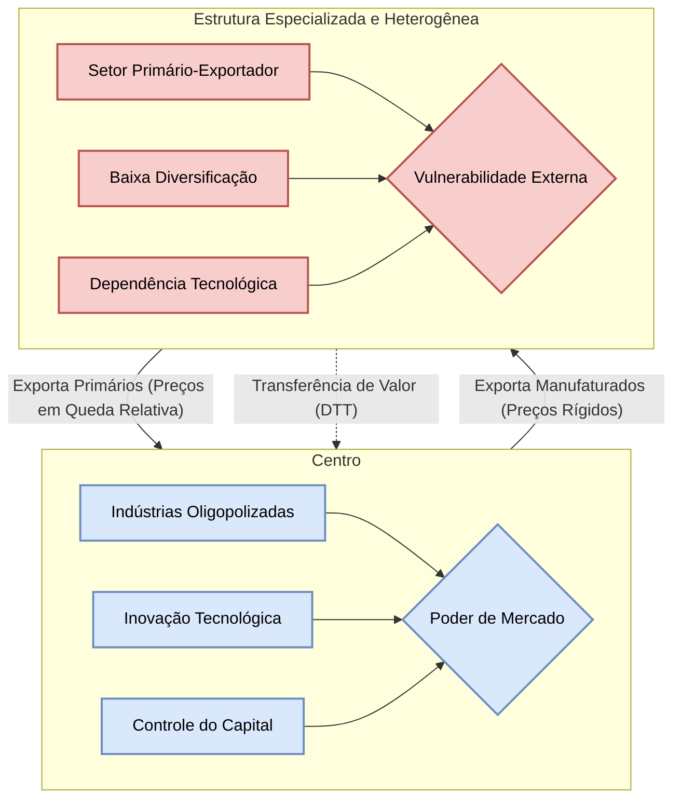
### A Coerência Lógica do Argumento Cepalino: Uma Cadeia Causal

Para fins de revisão estratégica, a lógica do pensamento cepalino clássico pode ser resumida na seguinte cadeia causal:

- **Observação Empírica:** Constatação de um crescimento desigual entre as nações industrializadas e as agroexportadoras no pós-guerra.
    
- **Crítica Teórica:** A teoria das vantagens comparativas é inadequada para explicar essa divergência, pois sua premissa de distribuição equitativa dos ganhos do comércio é falsa.
    
- **Diagnóstico Estrutural:** A causa fundamental da desigualdade é a divisão da economia mundial no sistema **Centro-Periferia**.
    
- **Mecanismo Central:** O principal mecanismo de reprodução dessa desigualdade é a **Deterioração Secular dos Termos de Troca (DTT)**.
    
- **Causas da DTT:** A deterioração é explicada por duas assimetrias: (1) a diferença na **elasticidade-renda da demanda** e, mais profundamente, (2) a **apropriação desigual dos ganhos de produtividade**, decorrente de diferenças nas estruturas de mercado e de trabalho.
    
- **Proposta Terapêutica:** A única solução lógica é a **mudança estrutural** para romper com a especialização primária, implementada através da **Industrialização por Substituição de Importações (ISI)**, liderada ativamente pelo Estado.
    

### Perspectivas Críticas e a Evolução do Pensamento Cepalino

O pensamento cepalino e a política de ISI foram alvo de intensas críticas de diferentes vertentes ideológicas.

- **Críticas Neoclássicas ("Direita"):** Economistas ortodoxos questionaram a validade empírica da tese da DTT para todos os produtos e períodos. Criticaram duramente a ISI por gerar ineficiências alocativas, indústrias de alto custo e baixa qualidade, distorções de preços e por fomentar a corrupção e um Estado excessivamente interventor, que sufocaria a iniciativa privada.
    
- **Críticas da Teoria da Dependência ("Esquerda"):** Autores como Fernando Henrique Cardoso, embora partindo da análise cepalina, consideravam-na "reformista" e insuficiente. Argumentavam que a CEPAL não dava a devida centralidade à análise das classes sociais e ao papel do capital internacional. Para os dependentistas, a ISI não rompia a dependência, mas apenas a transformava: a dependência comercial e financeira do passado dava lugar a uma nova e mais profunda dependência tecnológica e financeira, consolidando um "desenvolvimento associado" e subordinado aos interesses do capital multinacional.
    

Apesar das críticas e dos problemas reais enfrentados pelos países que implementaram a ISI (como crises de balanço de pagamentos e inflação), o legado do pensamento cepalino é inegável. Ele inaugurou uma tradição de pensamento econômico original e autônomo na América Latina, colocou a questão do desenvolvimento e da desigualdade no centro do debate acadêmico e político, e influenciou gerações de economistas e formuladores de políticas na região e em todo o mundo em desenvolvimento.

## Questões para Autoavaliação (Active Recall)

> [!question] Questão 1: Explique detalhadamente o mecanismo de "apropriação desigual dos ganhos de produtividade" segundo a tese de Prebisch-Singer. Como as diferenças nas estruturas de mercado e de trabalho entre o centro e a periferia resultam na deterioração dos termos de troca?

> [!question] Questão 2: Discorra sobre a crítica da CEPAL à teoria das vantagens comparativas. Por que, na visão cepalina, a especialização em produtos primários constitui uma "armadilha" para o desenvolvimento e como a política de Industrialização por Substituição de Importações (ISI) foi proposta como uma solução lógica para essa armadilha?

> [!question] Questão 3: Analise a relação causal entre a tese da deterioração dos termos de troca e a diferença na elasticidade-renda da demanda por bens primários e manufaturados. Como essa assimetria impõe uma restrição estrutural ao crescimento dos países periféricos?

# Origem: 3.1.5_Deterioração dos termos de troca.


# Origem: 3.1_Teorias de Comércio.

---
title: Teorias de Comércio
area: ECONOMIA
subarea: Economia internacional
tags:
  - cacd-2025
  - economia
  - economia-internacional
  - teorias-de-comercio
aliases:
  - Teorias de Comércio.
  - Teorias clássicas, Neoclássicas e contemporâneas do comércio internacional.
---

# Teorias do Comércio Internacional: Evolução Histórica e Analítica

## 1. O ponto de partida: Mercantilismo e a crítica liberal clássica

**Visão geral:** As primeiras reflexões sobre comércio internacional surgiram em meio ao pensamento **mercantilista** (séculos XVI–XVIII), que via a riqueza nacional como sinônimo de acumulação de metais preciosos e superávits comerciais. Os mercantilistas concebiam o comércio como um jogo de soma zero, em que uma nação só enriquece às custas de outra. Dessa perspectiva, recomendava-se intervenção estatal maciça: incentivo às exportações, barreiras às importações e colonização para obtenção de insumos, tudo para garantir entrada de ouro/prata.

> [!definition] **Mercantilismo**  
> _Definição:_ Doutrina econômica dos séculos XVI–XVIII que preconizava forte intervenção estatal para obter **superávits comerciais** e acumular **metais preciosos** (ouro/prata), entendidos como fonte da riqueza e do poder nacional. Via o comércio como jogo de **soma zero**, em que o ganho de um país representava perda para outro.

**Crítica liberal clássica:** No fim do século XVIII, pensadores clássicos desafiaram o mercantilismo. **David Hume (1758)** demonstrou, via o mecanismo preço-espécie-fluxo, que um país não poderia manter superávits comerciais indefinidamente: a entrada de ouro elevaria a oferta monetária doméstica, causando inflação e perda de competitividade das exportações, corrigindo o desequilíbrio externo. **Adam Smith (1776)**, por sua vez, redefiniu riqueza como resultado do trabalho produtivo, não dos metais, e argumentou que o comércio livre poderia beneficiar todas as nações ao permitir a **especialização**. Em _A Riqueza das Nações_, Smith formulou a **teoria das vantagens absolutas**: cada país deve se especializar nos bens em que possui _custo absoluto menor_ (maior produtividade) que os demais, exportando-os, e importar os bens em que é menos eficiente. Assim, todos ganhariam com o aumento da eficiência global.

### Visão mercantilista vs. liberal – principais contrastes

- **Papel do Estado:** Mercantilismo defendia protecionismo e intervenção; os clássicos (Smith e Hume) advogavam livre-comércio e mínima intervenção, confiando nas forças de mercado para gerar ganhos mútuos.
    
- **Natureza do comércio:** Para mercantilistas era um **conflito distributivo** (soma zero); para os liberais, era **benéfico mutuamente** (soma positiva) graças à especialização produtiva.
    
- **Medida de riqueza:** Mercantilismo focava em metais e balança comercial; os clássicos focavam em **produção e consumo** (bem-estar geral).
    

> [!note] **Ganhos mútuos no comércio**  
> A visão liberal introduz a ideia crucial de que o comércio internacional **não** é um jogo de soma zero. Quando países se especializam conforme suas vantagens, todos podem consumir mais do que em autarquia. Smith e Ricardo mostraram que a abertura comercial permite uma situação de _ganho mútuo_, ampliando o bem-estar agregado – conceito central que contraria a mentalidade mercantilista.

### Teoria das Vantagens Absolutas – _Adam Smith (1776)_

Smith postulou que um país tem **vantagem absoluta** na produção de um bem quando é capaz de produzi-lo com custo menor (ou produtividade maior) que seus parceiros. Nesse caso, é benéfico que cada nação se dedique a produzir os bens em que é absolutamente mais eficiente e troque o excedente com outras nações. No exemplo clássico de Smith, se Portugal produz vinho e tecidos com menos trabalho que a Inglaterra, e esta produz ferramentas com mais eficiência, ambos ganhariam ao trocar vinho português por ferramentas inglesas, por exemplo. Essa especialização **eleva a produção total mundial**, permitindo que cada país consuma mais do que seria possível isoladamente.

Contudo, a teoria das vantagens absolutas apresentava uma **limitação séria**: e se um país não tiver vantagem absoluta em nada? Smith não oferecia resposta para uma nação que fosse menos eficiente em _todos_ os bens. Sem vantagem absoluta, pela lógica smithiana, essa nação ficaria excluída do comércio. Esse limite abria espaço para uma teoria mais abrangente, desenvolvida por David Ricardo.

### Teoria das Vantagens Comparativas – _David Ricardo (1817)_

**Essência da teoria:** Ricardo demonstrou que _mesmo que um país seja menos eficiente na produção de todos os bens (ou outro seja mais eficiente em tudo), ainda assim o comércio pode beneficiá-los a ambos_. O critério relevante não são os custos absolutos, mas os **custos relativos** (custos de oportunidade). Ou seja, cada país deve especializar-se na produção do bem em que sua **ineficiência** relativa é menor (ou sua eficiência relativa é maior), e importar aqueles bens em que é _relativamente_ menos eficiente.

Em termos simples, um país possui **vantagem comparativa** na produção de um bem se o _custo de oportunidade_ de produzir esse bem (medido em quantas unidades de outro bem deixam de ser produzidas) é menor que em outros países. Assim, mesmo um país sem vantagem absoluta pode exportar o bem em que é “menos ineficiente” e importar os demais. Ricardo formalizou essa ideia com seu famoso exemplo envolvendo **Inglaterra** e **Portugal**: embora Portugal fosse absolutamente mais produtivo que a Inglaterra tanto em vinho quanto em tecido, a sua vantagem era relativamente maior em vinho. Logo, Portugal deveria especializar-se em vinho e trocar por tecido inglês, permitindo que ambos consumissem mais de ambos os bens.

> [!definition] **Vantagem Comparativa**  
> _Definição:_ Capacidade de um país produzir um bem a um **custo de oportunidade menor** que outro país. Mesmo que um país não tenha vantagem absoluta em nenhum bem, ele terá vantagem comparativa naquele cuja produção sacrifica menos outros bens. A teoria demonstra que a especialização segundo vantagens comparativas permite **ganhos mútuos** no comércio internacional [fep.up.pt](https://www.fep.up.pt/disciplinas/lec207/apoio/ei_classicos.pdf#:~:text=David%20Ricardo%20tentou%20mostrar%20que,das%20vantagens%20comparativas%2C%20vejamos%20o)[fep.up.pt](https://www.fep.up.pt/disciplinas/lec207/apoio/ei_classicos.pdf#:~:text=nulo%2C%20uma%20vez%20que%20Portugal,comparativa%20ou%20relativa%20permite%20determinar).

**Por que o comércio é vantajoso mesmo assim?** Porque ao se especializar conforme vantagens comparativas, cada país desloca recursos para atividades relativamente mais produtivas internamente, aumentando a eficiência global. O resultado é que a produção **mundial** de cada bem cresce ou, pelo menos, cada país obtém mais do bem importado do que se tentasse produzi-lo internamente. A troca permite que ambos países consumam além de suas fronteiras de produção em autarquia, repartindo os ganhos do aumento de eficiência. Em suma, **é o diferencial de eficiência relativa – não a absoluta – que fundamenta os ganhos do comércio** .

**Custo de oportunidade:** Ricardo não usou explicitamente esse termo, mas posteriormente economistas (Haberler, 1936) generalizaram a teoria em termos de custo de oportunidade. Por exemplo, se o **Brasil** produz 1 tonelada de soja ao custo de deixar de produzir 2 toneladas de milho, enquanto os **EUA** para produzir 1 tonelada de soja sacrificam 5 de milho, então o Brasil tem custo de oportunidade menor em soja (e comparativamente maior em milho). Logo, compensa ao Brasil exportar soja e importar milho dos EUA, mesmo que os EUA fossem mais eficientes em termos absolutos em ambas as culturas.

> [!example] **Exemplo simplificado – Brasil e Inglaterra:**  
> Considere que no **Brasil** um trabalhador produz 1 sapato ou 2 bolsas por hora, enquanto na **Inglaterra** um trabalhador produz 6 sapatos ou 3 bolsas por hora. A Inglaterra tem vantagem absoluta na produção de _ambos_ (é mais eficiente em sapatos e bolsas). Segundo Smith, não haveria comércio. **Ricardo**, porém, observa os custos de oportunidade: no Brasil, abrir mão de 1 sapato permite fazer 2 bolsas; já na Inglaterra, deixar de produzir 1 sapato permite 0,5 bolsa. Ou seja, o Brasil sacrifica mais bolsas por cada sapato que produza – seu custo de oportunidade de sapatos é maior. Em contrapartida, o custo de oportunidade de produzir bolsas no Brasil (0,5 sapato por bolsa) é menor que na Inglaterra (2 sapatos por bolsa). **Conclusão:** o Brasil tem vantagem comparativa em **bolsas** e deve exportá-las, importando **sapatos** ingleses. Assim, ambos se beneficiam: cada país se dedica ao bem que produz relativamente melhor e troca pelo outro, aumentando o consumo total de sapatos e bolsas.

**Implicações e avaliação:** A teoria das vantagens comparativas de Ricardo foi um marco, constituindo a base intelectual em favor do livre-comércio. Ela explica o **padrão de comércio** entre países com diferentes **tecnologias ou eficiências** setoriais. No modelo **ricardiano original** (1 fator – trabalho), há previsões importantes: (i) especialização _completa_ de cada país no bem de vantagem comparativa (pois assumindo retornos constantes, não há razão para produzir o bem desvantajoso); (ii) igualdade de salários (produtividade marginal do trabalho) entre países não é garantida, mas os salários refletem a produtividade nacional; (iii) ganhos líquidos do comércio para cada nação, embora possa haver distribuição desigual internamente (Ricardo em si não tratou de distribuição entre grupos).

> [!note] **Limitações do modelo Ricardiano:**
> 
> - Supõe **especialização completa**, algo raramente visto na prática – países normalmente produzem diversos bens por questões de preferências, custo de transporte, políticas et
>     
> - Baseia-se em um único fator de produção (trabalho) e não trata da distribuição de renda entre diferentes fatores (capital, terra, trabalho qualificado). Assim, não prevê como os ganhos do comércio se repartem internamente.
>     
> - Ignora **economias de escala** e **diferenciação de produto** como motivos de comércio – aspectos que só seriam incorporados teoricamente no século XX.
>     

**Saldo histórico:** As ideias de Smith e Ricardo consolidaram a visão de que o comércio internacional tende a ser **benéfico** e fundamentado em vantagens de produtividade. Essa visão liberal clássica guiou a defesa do livre-comércio ao longo do século XIX. Contudo, o modelo ricardiano simplificado logo seria expandido para incluir múltiplos fatores de produção e analisar os efeitos do comércio sobre a **distribuição de renda** dentro dos países – o que nos leva às teorias neoclássicas.

## 2. As Teorias Neoclássicas e a Dotação de Fatores

No início do século XX, economistas suecos aprofundaram a análise das causas do comércio internacional, indo além das diferenças tecnológicas da teoria clássica. O chamado modelo **Heckscher-Ohlin (H-O)** incorporou **múltiplos fatores de produção** e diferenças na _dotação relativa_ desses fatores entre países como motor do comércio. Trata-se de uma abordagem **neoclássica** (baseada em equilíbrio geral e escolhas ótimas) que gerou também importantes teoremas sobre distribuição de renda e crescimento.

### O Modelo Heckscher-Ohlin (H-O)

> [!definition] **Heckscher-Ohlin (HO):**  
Modelo de comércio internacional que explica o padrão do comércio com base na diferença relativa de **dotação de fatores de produção** entre os países.

**Ideia central:** Países diferem na **dotação relativa de fatores** (trabalho, capital, terra, etc.), e bens diferem na **intensidade de uso** desses fatores. Um país **abundante** em determinado fator terá custo relativamente baixo nesse fator e, portanto, vantagem em produzir bens que o utilizam intensivamente. Assim, **cada país exportará os bens que utilizam intensivamente seus fatores abundantes e importará os bens que utilizam intensivamente seus fatores escassos**. Em outras palavras, a vantagem comparativa decorre da _dotação de fatores_, não apenas de produtividade tecnológica.

> Essa proposição é conhecida como **Teorema Heckscher-Ohlin**: diferenças nas dotações fatoriais explicam o padrão de especialização. Por exemplo, um país com muita terra e capital mas pouca mão de obra terá vantagem em bens **intensivos em terra/capital** (ex.: grãos em larga escala) e importará bens **intensivos em trabalho** (ex.: têxteis). Já um país abundante em trabalho exportará bens intensivos em mão de obra e importará bens de capital intensivo.

**Assunções principais:** O modelo H-O clássico supõe 2 países, 2 bens, 2 fatores (modelo "2x2x2"), concorrência perfeita e retornos constantes de escala. Assume ainda que as **tecnologias são similares** entre países (para concentrar as diferenças no fator de produção) e que os fatores são _internamente móveis_ (entre setores) mas _imóveis internacionalmente_. Nessas condições, as vantagens comparativas derivam **unicamente** das diferenças de fatores: o país com abundância relativa de trabalho terá custos de mão de obra mais baixos e especializar-se-á em bens labor-intensivos; o país rico em capital produzirá relativamente mais bens capital-intensivos.

Um corolário importante é que, se não houver restrições ao comércio, a concorrência tendencialmente **equaliza os preços dos fatores** entre países: é o chamado _Teorema da Equalização do Preço dos Fatores_. Simplificadamente, quando dois países comerciam livremente bens, indiretamente estão "comerciando" trabalho e capital embutidos nos produtos, equalizando a remuneração desses fatores (salários, juros) entre si – pelo menos no modelo teórico ideal (na realidade, obstáculos como tarifas, custos de transporte e tecnologias distintas impedem a completa equalização).

**Exemplo aplicado – Brasil e China:** O comércio Brasil-China ilustra bem a lógica H-O. O **Brasil** é abundante em **terras férteis e recursos naturais**, além de capital natural (minérios, petróleo), enquanto a **China** é extremamente abundante em **mão de obra** e desenvolveu grande base de **capital industrial**. De acordo com H-O, o Brasil tende a exportar bens intensivos em terra e recursos (commodities agropecuárias como soja, carnes; minérios e petróleo) e importar da China bens intensivos em trabalho e capital manufatureiro (eletrônicos, máquinas, têxteis). De fato, em 2024 cerca de 28% das exportações brasileiras destinaram-se à China, com destaque para soja em grão, petróleo e minério de ferro, enquanto 24% das importações brasileiras vieram da China, consistindo majoritariamente em produtos manufaturados como químicos, eletrônicos e máquinas. Esse padrão confirma que cada país exporta o que faz uso intensivo de seus fatores abundantes – o Brasil, recursos naturais; a China, trabalho e capacidade industrial.

> [!example] **Comércio Brasil–China sob a ótica H-O:**  
> _Brasil:_ abundante em terra e recursos naturais ⇒ **Exporta** commodities agrícolas (soja, carnes), minerais (minério de ferro) e energéticos (petróleo).  
> _China:_ abundante em mão de obra e capital industrial ⇒ **Exporta** bens manufaturados intensivos em trabalho e tecnologia (máquinas, eletrônicos, produtos químicos).  
> _Ganho mútuo:_ O Brasil importa bens industrializados mais baratos da China, enquanto a China importa alimentos e insumos que não pode produzir com igual eficiência. Cada qual aproveita seu fator abundante, conforme prevê Heckscher-Ohlin.

**Teoremas de Stolper-Samuelson e Rybczynski:** O modelo H-O trouxe também previsões sobre distribuição de renda e efeitos de mudanças de dotação, conforme discutido a seguir.

### Teorema de Stolper-Samuelson (SS)

Formulado por Wolfgang Stolper e Paul Samuelson (1941), este teorema analisa o impacto do comércio (ou variações de preços) sobre a remuneração dos fatores dentro de um país. Em resumo, o teorema SS afirma que **a abertura comercial beneficia o fator _abundante_ de um país e prejudica o fator _escasso_** em termos reais. Mais formalmente: **um aumento no preço relativo de um bem exportado eleva o salário real/retorno real do fator usado intensivamente na produção desse bem, e reduz o rendimento real do outro fator**.

No contexto de livre-comércio, isso significa que:

- No país com abundância de trabalho (exportador de bens labor-intensivos), a abertura _elevará os salários reais_ dos trabalhadores e _reduzirá a remuneração real do capital_ (já que o bem importado é capital-intensivo e seu preço relativo cai).
    
- No país rico em capital (exportador de bens capital-intensivos), o livre-comércio _beneficiará os detentores de capital_ (lucros, juros sobem em termos reais) e _prejudicará os trabalhadores_ menos qualificados (salários reais caem), pois o bem importado intensivo em trabalho fica relativamente mais barato.
    

Em outras palavras, **o comércio tem efeitos redistributivos internos**: há _vencedores e perdedores dentro de cada país_. Isso é um resultado importante porque contrasta com a visão de Ricardo (que não detalhou a distribuição). Mostra que, embora o país como um todo ganhe em eficiência, certos grupos podem perder poder de compra – o que explica os conflitos políticos em torno do livre-comércio.

> [!important] **Impacto distributivo do comércio (Stolper-Samuelson)**  
> A abertura comercial tende a **aumentar a renda real do fator abundante** e **reduzir a do fator escasso**. Ou seja, nem todos dentro de um país ganham igualmente com o comércio: os setores/fatores competitivos internacionalmente prosperam, enquanto os setores antes protegidos (intensivos no fator escasso) sofrem com a concorrência externa. _Exemplo:_ no Brasil (abundante em terra e trabalho), agricultores e trabalhadores ganham com as exportações agrícolas, mas indústrias intensivas em capital e seus investidores podem enfrentar perda de rentabilidade frente a importações baratas de bens de capital.

### Teorema de Rybczynski

Proposto por Tadeusz Rybczynski (1955), este teorema examina o efeito de uma variação na dotação de fatores sobre a produção setorial, mantendo os preços dos bens constantes (p. ex., num país participante de comércio mundial com preços dados). O resultado: **um aumento na dotação de um fator de produção expandirá _mais que proporcionalmente_ a produção do bem que usa intensivamente esse fator e _reduzirá_ a produção do outro bem** (que usa relativamente mais o fator inalterado).

Por exemplo, se a força de trabalho de um país crescer (migração, boom populacional) e o capital fixo permanecer o mesmo, a produção do bem **trabalho-intensivo** aumentará significativamente, enquanto a do bem **capital-intensivo** encolherá – porque o trabalho adicional vai majoritariamente para o setor que mais o utiliza, e para expandir este setor retira-se algum capital do outro setor, contraindo-o. Da mesma forma, se um país acumula capital (investimento), ele produzirá muito mais do bem capital-intensivo e menos do bem trabalho-intensivo, dado que o trabalho não se expandiu na mesma proporção.

O teorema de Rybczynski tem implicações sobre o **desenvolvimento**: por exemplo, a expansão da dotação de capital de um país (via investimento ou entrada de K estrangeiro) pode levar à desindustrialização de setores labor-intensivos, e vice-versa. Também explica como mudanças populacionais ou de qualificação alteram a estrutura produtiva de uma economia aberta.

> [!definition] **Teorema de Rybczynski**  
> _Definição:_ Em um modelo de comércio com dois bens e dois fatores, se os preços dos bens permanecem constantes (demandas mundiais perfeitamente elásticas), um **aumento na dotação de um fator** provoca uma expansão **mais que proporcional** na produção do bem que usa intensivamente esse fator **e** uma redução absoluta na produção do outro bem.  _Exemplo:_ Se o estoque de capital de um país crescer (p.e. investimento externo), a produção do setor capital-intensivo aumentará acentuadamente, enquanto a produção do setor trabalho-intensivo cairá – assumindo preços internacionais fixos.

### O Paradoxo de Leontief e explicações alternativas

A teoria Heckscher-Ohlin dominou a visão econômica nos anos 1930–40. Contudo, em 1953, **Wassily Leontief** realizou o primeiro grande teste empírico do modelo e obteve um resultado inesperado, conhecido como **Paradoxo de Leontief**. Ao analisar a estrutura das exportações e importações dos EUA (então o país mais capital-abundante do mundo), Leontief encontrou que as **exportações dos EUA eram mais intensivas em trabalho do que as importações**, que por sua vez eram mais intensivas em capital. Em outras palavras, os EUA – abundantes em capital – _exportavam bens tipicamente labor-intensivos e importavam bens capital-intensivos_, contrariando a previsão de H-O. Esse paradoxo sugeriu que algo estava faltando na explicação.

**Possíveis explicações para o paradoxo:**

- **Capital humano e qualificação:** Leontief não distinguiu trabalho qualificado de não qualificado. Os EUA poderiam ser abundantes em **trabalho qualificado** (engenheiros, técnicos) e suas exportações – embora intensivas em trabalho no cálculo – eram intensivas em _trabalho altamente qualificado_, que pode ser visto como “quase capital” dado o investimento em educação. Vistos assim, os EUA exportariam bens intensivos em **“capital humano”** e importariam bens intensivos em trabalho não qualificado, alinhando-se melhor à vantagem de fatores qualificados. De fato, muitos argumentaram que a vantagem comparativa dos EUA residia na mão de obra altamente produtiva, mais do que no capital físico. Reclassificando o fator "trabalho qualificado" como capital humano, as exportações americanas se mostrariam intensivas em _capital (físico + humano)_, resolvendo o paradoxo em grande medida.
    
- **Diferenças tecnológicas:** H-O assume tecnologias iguais, mas se os EUA tinham tecnologia superior em certos setores, poderiam produzir bens labor-intensivos de forma tão eficiente que competiam internacionalmente, invertendo o padrão esperado. Ou seja, **vantagens tecnológicas** (estilo Ricardiano) podem ter mascarado as diferenças de dotação. Alguns economistas concluíram que a explicação Ricardiana (diferenças de produtividade) continuava relevante – os EUA exportavam bens nos quais eram _tecnologicamente_ muito eficientes, mesmo que não correspondessem à sua dotação de capital.
- **Recursos naturais:** Leontief comparou apenas “capital vs. trabalho”. Se considerarmos **recursos naturais/terra** como fator separado, pode-se observar que boa parte das importações americanas na época eram produtos agrícolas e matérias-primas (algodão, minerais) intensivos em terra, que era relativamente escassa nos EUA industriais pós-guerra. Assim, incorporando a dotação de terra, os EUA seriam escassos nesse fator e importariam bens terra-intensivos, o que está de acordo com H-O. Enquanto isso, suas exportações manufaturadas utilizavam intensivamente capital e trabalho qualificado.
    
- **Preferências domésticas (Hipótese de Linder):** Stefan Linder (1961) sugeriu que países com demandas domésticas semelhantes tendem a comerciar entre si _produtos similares_. Ou seja, parte do comércio não é explicado por vantagens comparativas tradicionais, mas por **similitudes de preferências** em países de renda próxima. No caso dos EUA, sua pauta de comércio poderia refletir a produção de bens que satisfazem preferências domésticas sofisticadas, alguns dos quais exportados para outros países ricos, enquanto importam outros bens diferenciados. A hipótese de Linder, portanto, enfatiza a **demanda**: países de renda alta produzem e trocam entre si bens de consumo diferenciados para atender gostos parecidos. Essa ideia antecipa a importância do **comércio intra-industrial** entre países similares (tema da próxima seção) e vai além da simples dotação de fatores.
    

Em suma, o paradoxo de Leontief motivou ajustes na teoria e abriu caminho para **novas teorias do comércio**. Hoje se reconhece que a abordagem H-O é válida sob certas condições, mas a realidade do comércio é influenciada também por diferenças tecnológicas, capital humano, recursos naturais e preferências. Na segunda metade do século XX, a constatação de que grande parte do comércio ocorre entre países similares, frequentemente trocando bens da mesma indústria, levou ao desenvolvimento da chamada **Nova Teoria do Comércio**, explorada a seguir.

## 3. As Teorias Contemporâneas do Comércio

A partir dos anos 1970-80, economistas buscaram explicar fenômenos que os modelos clássicos e neoclássicos não previam bem: por que países de estrutura semelhante (p.ex., duas nações industrializadas) **comercializam intensamente entre si**, frequentemente trocando **variedades do mesmo tipo de produto** (**comércio intra-industrial**)? Por que existem **empresas multinacionais** e **cadeias globais de valor**? Para responder, surgiram teorias incorporando **economias de escala**, **concorrência imperfeita**, **diferenciação de produtos** e, mais recentemente, **heterogeneidade das firmas**. Essas abordagens não substituem as anteriores, mas complementam a compreensão dos padrões de comércio.

### Comércio Intra-industrial e Economias de Escala

**Fato estilizado:** Uma parcela muito grande do comércio global ocorre _dentro da mesma indústria_ entre países desenvolvidos. Por exemplo, países europeus exportam e importam automóveis entre si; os EUA simultaneamente exportam e importam produtos químicos, máquinas e eletrônicos da UE e Japão. Estima-se que cerca de **60% do comércio entre economias avançadas seja intra-industrial**. Essas trocas envolvem bens semelhantes (carros por carros, eletrônicos por eletrônicos) e não se explicam pelas teorias de vantagens comparativas tradicionais, que preveriam que cada país se especializasse totalmente em certos bens.

As **teorias clássicas/HO** esperariam comércio principalmente _inter-industrial_ (cada país exportando setores diferentes e importando setores em que não tem vantagem). De fato, elas explicam bem o comércio **Norte–Sul** (entre países de níveis distintos de desenvolvimento ou dotações). Porém, não explicam satisfatoriamente o comércio **Norte–Norte** (entre países avançados com fatores e tecnologias semelhantes) nem a troca de **variedades de um mesmo bem**. Também não contemplam elementos modernos como **economias de escala** (o aumento de eficiência com a produção em larga escala) e **preferências por variedade**.

**Nova Teoria do Comércio (Krugman e outros):** Na década de 1980, Paul **Krugman**, Elhanan Helpman, Kelvin Lancaster e outros desenvolveram modelos considerando **retornos crescentes de escala** e **concorrência imperfeita**. A premissa é que muitas indústrias apresentam _custos fixos_ elevados e, portanto, uma escala maior de produção reduz o custo unitário (**economias de escala internas**). Além disso, consumidores apreciam **diferenciação de produtos** – variedades diferentes do mesmo bem (ex.: um consumidor pode preferir um carro alemão BMW e outro um francês Peugeot, e valorizar ter ambas opções no mercado).

> [!definition] **Economias de Escala (Retornos Crescentes)**  
> _Definição:_ Situação em que o **custo médio de produção diminui** à medida que a quantidade produzida aumenta. Ou seja, dobrar os insumos mais do que dobra a produção, reduzindo custos unitários. Em comércio internacional, economias de escala incentivam a **especialização da produção** em poucos locais, para atingir mercados globais com maior eficiência.

**Como economias de escala geram comércio?** Em um modelo com _concorrência monopolística_ (muitas empresas, cada uma produzindo uma variedade diferenciada) – típico da Nova Teoria –, mesmo países idênticos se beneficiarão trocando bens: cada país pode especializar-se em produzir algumas variedades com grande escala e eficiência, e importar as variedades que não produz. O resultado é que todos dispõem de maior **variedade de produtos** a preços mais baixos (devido à escala) do que se cada país tentasse produzir de tudo em pequena escala. Assim, o comércio é _ganha-ganha_ mesmo sem diferenças de tecnologia ou fatores, pois baseia-se no **aumento de variedade e redução de custos**.

**Exemplo de comércio intra-industrial:** Os países da **União Europeia** produzem automóveis de diversas marcas. A **Alemanha** produz BMW, Audi; a **França**, Peugeot, Renault; a **Itália**, Fiat, etc. Graças ao mercado integrado, cada país pode consumir não só os carros nacionais mas também os importados dos vizinhos. Alemanha exporta BMW para franceses e importa Renaults e Peugeots, e vice-versa. Todos os países europeus assim desfrutam de maior diversidade de modelos e beneficiam-se de custos menores, pois cada montadora concentra a produção de determinados modelos em fábricas com grande escala. Esse fluxo de **carros por carros** é comércio intra-industrial – algo inexplicável pelos modelos clássicos, mas previsto pela Nova Teoria do Comércio baseada em **diferenciação de produto e economias de escala**.

> [!example] **Exemplo – Comércio Intra-industrial na UE (setor automotivo):**  
> Tanto **Alemanha** quanto **França** produzem automóveis, mas ainda assim trocam **grandes volumes de carros entre si**. A Alemanha exporta BMWs e Mercedes para o mercado francês, enquanto a França exporta Renaults e Peugeots para a Alemanha. Nenhum dos dois “abandona” a produção de veículos – ao contrário, cada país se especializa em **modelos/marcas específicas** e importa o restante. Esse intercâmbio de variedades ocorre porque a produção em larga escala de poucos modelos por país torna-os mais baratos (economia de escala) e consumidores demandam diversidade de opções. Assim, aproximadamente **60% do comércio total europeu** é intra-industrial, refletindo especialização em variedades e vantagens de escala.

**Ganho com variedade e competição:** Além das economias de escala, o comércio em mercados imperfeitos traz outros benefícios. A entrada de produtos estrangeiros aumenta a **concorrência interna**, forçando empresas domésticas a se tornarem mais eficientes e reduzindo seu poder de monopólio, o que tende a baixar preços para o consumidor. Ademais, consumidores ganham acesso a uma gama mais ampla de produtos (ganho pela variedade) que não existiria sem comércio. Krugman quantificou esses ganhos de variedade em alguns mercados, mostrando serem significativos para o bem-estar.

Resumidamente, a Nova Teoria do Comércio explica **padrões não previstos por Ricardo/Heckscher-Ohlin**, especialmente comércio entre países semelhantes e intra-indústrias, incorporando elementos antes negligenciados:

- **Retornos crescentes de escala:** incentivo à especialização e exportação mesmo sem diferenças de fatores.
    
- **Produtos diferenciados e preferência por variedade:** justificam trocas de bens similares.
    
- **Estruturas de mercado imperfeitas (monopolística ou oligopólio):** permitem que empresas utilizem economias de escala e segmentem mercados, inclusive via comércio.
    
- **"Home Market Effect":** mercados maiores tendem a abrigar empresas e indústrias com economias de escala, produzindo mais que a demanda doméstica e exportando o excedente (uma implicação formal dos modelos de Krugman).
    

### Modelos de Krugman (1980) – Economias de escala e concorrência imperfeita

Paul **Krugman** (Prêmio Nobel de Economia em 2008) foi o pioneiro a formalizar a incorporação de economias de escala e competição monopolística em modelos de comércio, em artigos seminal de 1979-1980. Em seu modelo típico:

- Há **muitos bens diferenciados** dentro de um setor e consumidores que valorizam variedade (utilidade do tipo “amor pela variedade”).
    
- Cada firma produz uma variedade e enfrenta custos fixos significativos ⇒ **monopólio natural** daquela variedade, mas com concorrência livre de entrada (concorrência monopolística).
    
- Países inicialmente simétricos começarão a produzir subconjuntos das variedades, e o **comércio** ocorre para cada país consumir variedades estrangeiras.
    
- Os ganhos vêm de: (1) **maior variedade** de consumo; (2) **menores custos médios** por variedade devido à produção concentrada em menos locais de grande escala; (3) **pressão competitiva** que reduz sobrepreços.
    

O modelo de Krugman mostrou que mesmo sem qualquer diferença de produtividade ou fatores, o comércio melhora o bem-estar. Além disso, ele explicou fenômenos observados empiricamente, como a existência de **comércio bilateral significativo entre economias desenvolvidas** e porque essas trocas ocorrem predominantemente em setores de bens diferenciados (indústrias automobilística, química, eletrônicos, etc.).

Krugman também explorou casos de **economias de escala externas** (quando a concentração geográfica de um setor beneficia todas as firmas via encadeamentos, conhecimento compartilhado), o que explica, por exemplo, por que certos países se especializam em certas indústrias não apenas por dotação, mas por vantagens adquiridas (industrial clusters, efeitos de aglomeração). Isso foge do escopo direto do comércio intra-industrial, mas conecta-se a padrões de especialização histórica.

### Teoria do Ciclo de Vida do Produto – _Raymond Vernon (1966)_

Outra perspectiva importante nas teorias contemporâneas é a dinâmica temporal das vantagens comparativas. **Raymond Vernon**, observando o pós-guerra, propôs a _Teoria do Ciclo de Vida do Produto_ para explicar por que certos bens são inicialmente exportados por um país inovador e, anos depois, esse mesmo país passa a importá-los. A teoria delineia **três fases** principais no ciclo de vida de um novo produto e como cada fase afeta o padrão de comércio:

1. **Novo produto (introdução):** um bem inovador é desenvolvido e produzido no país inventor (tipicamente uma economia avançada com alto poder de compra, que demanda a novidade). A produção piloto ocorre localmente, próxima ao centro de P&D, e o consumo é doméstico ou restrito. _Ex:_ Nos anos 1970, os EUA inventaram microcomputadores – inicialmente produzidos e consumidos quase só nos EUA. Nessa fase, há **monopólio de inovação** e geralmente **nenhuma exportação** significativa (a tecnologia é recém-criada, outros países nem demandam ainda).
    
2. **Produto em maturação (crescimento):** o produto ganha aceitação e demanda cresce também em outros países desenvolvidos. Começam as **exportações** do país inovador para outros mercados avançados. As firmas aprimoram processos, podendo padronizar partes da produção. Em muitos casos, empresas do país original **instalam fábricas em outros países ricos** para atender aos mercados externos ou esses países começam a produzir localmente via licenças ou imitação. A concorrência aumenta. _Ex:_ Alguns anos após a invenção do microcomputador, empresas americanas começaram a exportá-lo para Europa/Japão; posteriormente, surgiram fabricantes japoneses e europeus de computadores.
    
3. **Produto padronizado (maturidade/standardização):** o bem torna-se amplamente conhecido, a tecnologia estabiliza (pouca inovação incremental) e a produção se torna **rotineira**, com foco em custos. Agora o fator-chave é produzir ao custo mais baixo possível. Isso frequentemente leva à **transferência da produção para países em desenvolvimento**, onde há custos menores de mão de obra. O país que originalmente inovou perde sua vantagem especial – outros dominam a produção em massa. Em muitos casos, o país inovador passa a **importar** o produto de baixo custo que antes exportava. _Ex:_ Décadas depois, a produção de computadores pessoais migrou em grande parte para Ásia (China, Taiwan, etc.), e os EUA passaram a importar computadores fabricados externamente. O mesmo ocorreu com produtos como televisores: inventados nos EUA, depois fabricados no Japão, e mais tarde em massa em economias emergentes, com os EUA importando TVs.
    

> [!important] **Comparativo das Fases – Ciclo de Vida do Produto:**
> 
> - _Fase de Inovação:_ Vantagem comparativa no país **inovador** (avançado); produção e consumo locais, tecnologia exclusiva.
>     
> - _Fase de Expansão:_ Outros países avançados adotam o produto; o país inovador **exporta**, mas começa a surgir concorrência externa (produção se espalha entre países desenvolvidos).
>     
> - _Fase de Padronização:_ Vantagem comparativa desloca-se para países **de menor custo**; produção relocalizada para emergentes; o inovador original pode se tornar **importador** do próprio produto que criou [en.wikipedia.org](https://en.wikipedia.org/wiki/Product_life-cycle_theory#:~:text=In%20the%20new%20product%20stage%2C,the%20product%20to%20developed%20countries).
>     

Essa teoria explica, portanto, uma **mudança dinâmica** no padrão de comércio – é uma forma de _vantagem comparativa dinâmica_. Inicialmente, a **inovação tecnológica** dá vantagem a quem inventa; depois, quando a tecnologia se difunde e o produto vira commoditie, prevalecem os **custos de produção baixos**, tipicamente encontrados em países em desenvolvimento. Vernon desenvolveu essa ideia para esclarecer paradoxos como o dos EUA importarem bens que eles próprios haviam pioneirado (caso de eletrônicos, por exemplo).

A teoria do ciclo de vida não contradiz H-O ou Ricardo, mas complementa: mostra que a **vantagem comparativa não é estática**, ela pode migrar conforme um setor evolui. Também ajuda a entender os fluxos de **investimento direto estrangeiro**: empresas de países avançados investem em fábricas no exterior quando o produto atinge maturidade, buscando mão de obra barata (nascimento das multinacionais industriais).


_Exemplo histórico:_ O **telefone celular** segue padrão semelhante: inventado e primeiro comercializado nos EUA/Motorola (anos 1980), depois houve grande produção e inovação na Europa/Japão (Nokia, Ericsson nos 1990s), e hoje, já padronizado, a maioria dos celulares é produzida na China/Vietnã/Índia para marcas globais, enquanto os países originais importam esses aparelhos de volta.

### “Novas Novas” Teorias do Comércio – Heterogeneidade das Firmas (Melitz)

Por fim, as pesquisas dos anos 2000 inauguraram o que se chama de “**novas novas teorias**” do comércio internacional, focadas em **diferenças entre empresas individuais** dentro do mesmo setor. Marc **Melitz** (2003) é referência-chave: ele incorporou ao modelo de Krugman a ideia de que as firmas têm **produtividades distintas** e que participar do comércio implica custos fixos (por exemplo, custos de estabelecer rede de distribuição no exterior). As principais implicações dessa linha teórica:

- **Somente algumas firmas exportam:** Mesmo em setores abertos ao comércio, geralmente apenas uma parcela das empresas tem produtividade suficientemente alta para cobrir os custos fixos de exportação e competir no exterior. Firmas **menos produtivas servem apenas o mercado doméstico** ou até fecham quando enfrentam concorrência estrangeira. “Países não comerciam, quem comercia são as firmas” – há grande heterogeneidade de desempenho.
    
- **Realokação e ganhos de produtividade:** A abertura comercial provoca uma **seleção das firmas**: as empresas mais produtivas expandem-se para exportar, enquanto as menos produtivas podem contrair ou sair do mercado diante da competição. Recursos (trabalho, capital) realocam-se das firmas menos eficientes para as mais eficientes. Isso gera um **aumento da produtividade média** do setor. Ou seja, além dos ganhos tradicionais (especialização, variedade), o comércio traz um ganho novo via **realocação** eficiente _dentro_ das indústrias [irpp.org](https://irpp.org/research-studies/international-trade-with-firm-heterogeneity/#:~:text=Lapham%20describes%20an%20important%20model,and%20more%20productive%20than%20nonexporters). Melitz mostrou que essa melhoria agregada na produtividade é um canal importante de ganho de bem-estar, evidenciado empiricamente.
    
- **Efeitos distributivos entre empresas e trabalhadores:** Como apenas as firmas melhores conseguem exportar, elas tendem a crescer e obter lucros maiores com a integração internacional, enquanto firmas não exportadoras ficam estagnadas ou encolhem. Isso pode ampliar a concentração em certos setores. Também, trabalhadores qualificados podem se concentrar em firmas exportadoras mais produtivas (que frequentemente pagam melhores salários), levando a **diferenças salariais** dentro do mesmo setor entre empresas exportadoras e não exportadoras.
    
- **Novas margens de ajuste:** As _antigas_ teorias focavam na quantidade de comércio de cada setor (intensidade). A abordagem heterogênea destaca duas “margens” de comércio: a **extensiva** (quantas empresas ou produtos participam do comércio) e a **intensiva** (quanto cada empresa exporta). Políticas comerciais ou choques podem ter efeitos ao permitir entrada/saída de firmas no mercado exportador (margem extensiva) além de alterar volumes das existentes (intensiva).
    

Empiricamente, as previsões do modelo Melitz foram confirmadas: estudos mostram que, em média, **exportadores são mais produtivos, maiores e pagam salários maiores que empresas que só vendem domesticamente**. Além disso, quando há liberalização comercial, observa-se aumento de produtividade setorial em parte porque as firmas menos eficientes perdem participação (ou quebram) e as mais eficientes crescem.

> [!note] **Heterogeneidade de Firmas – o que muda?**
> 
> - Acrescenta **microfundamentos**: dentro de um mesmo setor, as firmas não são idênticas. Logo, o comércio não afeta todas uniformemente – há **vencedores e perdedores também entre as empresas**.
>     
> - Explica **ganhos adicionais de bem-estar**: ao fechar as firmas ineficientes e expandir as eficientes, o comércio eleva a **produtividade total** da economia, um ganho dinâmico não capturado em modelos anteriores.
>     
> - Informa políticas: reduzir **custos fixos de exportação** (ex.: burocracia, infraestrutura) pode aumentar o número de empresas que exportam, ampliando os ganhos do comércio. Por outro lado, setores com poucas firmas muito produtivas podem exigir atenção antitruste para manter concorrência.
>     

**Exemplo ilustrativo:** Considere o setor têxtil de um país abrindo-se ao comércio. Antes, existiam 100 fábricas locais medianamente produtivas. Com importações concorrentes e possibilidade de exportar, talvez as 20 menos eficientes fechem (não conseguem competir nem interna nem externamente), 60 atendam só o mercado interno (produtividade moderada), e 20 mais eficientes passem a exportar. Essas 20 exportadoras expandem sua produção, contratam mais trabalhadores e investem em tecnologia, tornando-se ainda mais produtivas. No agregado, a produtividade do setor aumenta, o custo médio cai e possivelmente o país passa a produzir e exportar artigos têxteis de maior qualidade ou nicho. Os trabalhadores das fábricas fechadas precisam se realocar (o que pode ser custoso a curto prazo, evidenciando a necessidade de políticas de ajuste).

Em síntese, a abordagem de Melitz reforça que, para além de “que setor” vence ou perde com o comércio, é crucial saber “**quais empresas** dentro do setor ganham ou perdem”. As políticas comerciais modernas consideram esses efeitos, pensando em **competitividade empresarial** e não apenas em setores agregados.

## Comparação entre os principais modelos teóricos

Cada teoria do comércio internacional aborda diferentes fontes de vantagens, faz pressupostos distintos e explica certos padrões empíricos melhor que outros. A tabela a seguir resume comparativamente elementos-chave de cada modelo:

| **Teoria/Modelo**                                   | **Base do comércio**                                                                           | **Estrutura de mercado**                                                         | **Retornos de escala**                                                                              | **Padrão típico de especialização**                                                                                                                                                                                                                     | **Exemplos empíricos**                                                                                                                                                                                                                                                                     |
| --------------------------------------------------- | ---------------------------------------------------------------------------------------------- | -------------------------------------------------------------------------------- | --------------------------------------------------------------------------------------------------- | ------------------------------------------------------------------------------------------------------------------------------------------------------------------------------------------------------------------------------------------------------- | ------------------------------------------------------------------------------------------------------------------------------------------------------------------------------------------------------------------------------------------------------------------------------------------ |
| **Mercantilismo** (séc. XVI–XVIII)                  | Poder econômico via acumulação de ouro e superávits comerciais (visão zero-soma)               | Intervencionismo estatal (monopólios coloniais, proteção)                        | – (não formaliza produção)                                                                          | Promove exportações de tudo, restringe importações (especialização artificial via política)                                                                                                                                                             | Colônias fornecendo metais/insumos à metrópole; balança favorável imposta                                                                                                                                                                                                                  |
| **Vantagens Absolutas** – Smith (1776)              | Diferenças de produtividade **absoluta** (custo unitário) por país                             | Concorrência perfeita                                                            | Constantes (implícito)                                                                              | **Interindustrial**: cada país produz bens em que é absolutamente mais eficiente; pode haver país sem comércio se for menos eficiente em tudo                                                                                                           | Inglaterra (Rev. Ind.) exportando manufaturas, importando vinho de Portugal (Smith)                                                                                                                                                                                                        |
| **Vantagens Comparativas** – Ricardo (1817)         | Diferenças de **produtividade relativa** (custos de oportunidade)                              | Concorrência perfeita                                                            | Constantes                                                                                          | **Interindustrial**: cada país especializa-se no bem em que tem custo de oportunidade menor, importando o outro (especialização muitas vezes quase completa)                                                                                            | Portugal exportando vinho e importando tecido da Inglaterra, mesmo sendo superior em ambos                                                                                                                                                                                                 |
| **Heckscher-Ohlin** – H-O (1933)                    | Diferenças nas **dotações de fatores** (trabalho, capital, terra)                              | Concorrência perfeita                                                            | Constantes                                                                                          | **Interindustrial**: cada país exporta bens intensivos em seus fatores abundantes e importa bens intensivos nos fatores escassos; especialização geralmente **parcial** (retornos decrescentes)                                                         | Brasil exportando commodities (terra/trabalho) e importando manufaturas (capital) da China; EUA (capital abundante) exportando aviões, importando têxteis nos 1950s                                                                                                                        |
| – **Teoremas derivados (H-O)**                      | (Consequências do modelo H-O)                                                                  | –                                                                                | –                                                                                                   | Stolper-Samuelson: comércio eleva remuneração real do fator abundante e deprime a do escasso.Rybczynski: aumento de um fator expande produção do bem intensivo nesse fator e contrai do outro.                                                          | Abertura no México pós-NAFTA beneficiou mão de obra abundante (empregos em manufaturas) e prejudicou capital local antes protegido; imigração de mão de obra para EUA reduz produção agrícola e expande manufatura intensiva em trabalho no país de origem (ilustração Rybczynski)         |
| **Paradoxo de Leontief** (1953)                     | (Desafio empírico a H-O)                                                                       | –                                                                                | –                                                                                                   | EUA capital-abundante exportando bens labor-intensivos e importando bens capital-intensivos; motivou inclusão de **capital humano**, **tecnologia** e **preferências** nas explicações.                                                                 | Exportações dos EUA (1947) eram agrícolas e leves (labor-intensivas), importações incluíam produtos químicos e aço (capital-intensivos) – contrário ao previsto.                                                                                                                           |
| **Nova Teoria do Comércio** – Krugman (1979–1980)   | **Economias de escala internas** + **diferenciação de produtos**; “amor à variedade”           | Concorrência monopolística (muitas firmas, produtos diferenciados) ou oligopólio | Crescentes (internos)                                                                               | **Intraindustrial**: países semelhantes trocam variedades do mesmo bem; cada país exporta e importa na mesma indústria (especialização em variedades). Volume de comércio elevado entre países de renda/fator similares (Norte–Norte).                  | Comércio de **automóveis** entre Alemanha e França (ambos exportam e importam carros); EUA–Europa trocando máquinas e químicos; ~60% do comércio UE e EUA é intra-setorial.                                                                                                                |
| **Ciclo de Vida do Produto** – Vernon (1966)        | **Inovação tecnológica** inicial e posterior **difusão industrial** para países de menor custo | Monopólio temporário na inovação → depois concorrência perfeita de custo         | Variáveis por fase (inovação com retornos crescentes e monopólio; maturidade vira competição custo) | **Dinâmico ao longo do tempo**: país inovador exporta no início; outros avançados passam a produzir; na maturidade, países em desenvolvimento produzem em massa e exportam de volta ao inovador.                                                        | EUA inventam e exportam _microchips_ (anos 1960), Japão e Europa passam a produzir (1970-80), hoje China e outros emergentes produzem chips comuns e exportam para EUA; o país inovador concentra-se em novas gerações (ex.: chips de IA).                                                 |
| **“Novas Novas” (Heterogeneidade)** – Melitz (2003) | **Produtividade das firmas** (algumas firmas mais eficientes aproveitam comércio)              | Concorrência monopolística + custo fixo de exportação (nem todas participam)     | Crescentes (internos)                                                                               | **Intraindustrial com seleção de empresas**: dentro de um setor, apenas firmas produtivas exportam; comércio provoca realocação de recursos para essas firmas eficientes. País ganha eficiência agregada, porém nem todas empresas/empregos sobrevivem. | Setor têxtil indiano: com abertura, só empresas com tecnologia avançada exportam, as menos produtivas ficam no mercado doméstico ou fecham – produtividade média sobe. Exportadores em média são ~2x mais produtivos e maiores que não exportadores (padrão observado em diversos países). |

_(Fonte: Elaborado pelo autor com base em Krugman, Obstfeld & Melitz (2015); Feenstra & Taylor (2014); Vernon (1966), entre outros.)_

## Questões de Autoavaliação

1. **Comparação de Modelos:** Em que diferem as explicações clássicas (Ricardo) e neoclássicas (Heckscher-Ohlin) para o comércio internacional? Qual delas melhor explica o comércio entre Brasil e China, e qual explica o comércio entre Alemanha e França? Justifique mencionando fatores de produção e tipos de bens envolvidos.
    
2. **Distribuição de Ganhos:** Explique o Teorema de Stolper-Samuelson e analise como a liberalização comercial afetaria _trabalhadores_ e _capitalistas_ em um país abundante em trabalho e em outro abundante em capital. Que implicações isso traz para a formulação de políticas de comércio?
    
3. **Novas Teorias em Ação:** Como a presença de **economias de escala** e **diferenciação de produto** pode levar dois países semelhantes a ambos exportarem e importarem automóveis um do outro? Além disso, segundo Melitz, o que ocorre com as empresas menos produtivas de uma indústria quando o país se abre ao comércio internacional? Ilustre com um exemplo hipotético ou real.
    

## Fontes Consultadas

- **Krugman, Paul; Obstfeld, Maurice; Melitz, Marc.** _Economia Internacional: Teoria e Política_. 10ª ed. Pearson, 2015. (Principal manual teórico cobrindo modelos clássicos, H-O, novas teorias)
    
- **Feenstra, Robert; Taylor, Alan.** _International Economics_. Worth Publishers, 2014. (Manual moderno com tratamento de H-O, evidências empíricas e novas abordagens)
    
- **Vernon, Raymond.** “International Investment and International Trade in the Product Cycle.” _Quarterly Journal of Economics_, vol. 80, 1966, pp. 190–207. (Artigo original da teoria do ciclo de vida do produto).
    
- **Melitz, Marc.** “The Impact of Trade on Intra-Industry Reallocations and Aggregate Industry Productivity.” _Econometrica_, vol. 71, 2003, pp. 1695–1725. (Artigo seminal da heterogeneidade das firmas no comércio)
    
- **Lapham, Beverly.** “International Trade with Firm Heterogeneity: Theoretical Developments and Policy Implications.” _Institute for Research on Public Policy_, 2015. (Síntese acessível da literatura de firmas heterogêneas)[irpp.org](https://irpp.org/research-studies/international-trade-with-firm-heterogeneity/#:~:text=Lapham%20describes%20an%20important%20model,and%20more%20productive%20than%20nonexporters)
    
- **Helpman, Elhanan; Krugman, Paul.** _Market Structure and Foreign Trade_. MIT Press, 1985. (Desenvolvimentos da Nova Teoria do Comércio em detalhe técnico)
    
- **Leontief, Wassily.** _Domestic Production and Foreign Trade; The American Capital Position Re-Examined_. Economia Internazionale, 1953. (Estudo original do paradoxo de Leontief)
    
- **Hume, David.** "Of the Balance of Trade." _Political Discourses_, 1758. (Ensaio clássico criticando o mercantilismo via mecanismo preço-espécie-fluxo)
    
- **Instituto Rio Branco – Provas do CACD (Diversos anos).** Questões objetivas e discursivas sobre comércio internacional, em especial: prova de 2013 (teorias clássicas vs. neoclássicas) e prova de 2010 (ciclo de vida do produto e novas teorias). (Referência para estilo de cobrança em concursos).


---

# Aprofundamento no Efeito Curva J: Análise Quantitativa e Condição Marshall-Lerner

Nesta nota avançada, aprofundamos a análise do efeito Curva J, introduzindo conceitos quantitativos, modelos matemáticos, e a fundamental condição Marshall-Lerner, essenciais para a compreensão sofisticada desse fenômeno.

---

## 1. Base Conceitual Revisada

Recordando rapidamente:

- O **efeito Curva J** descreve como a balança comercial (exportações menos importações) evolui após uma desvalorização cambial:
    
    - **Piora inicial**, devido à inelasticidade dos volumes negociados no curto prazo.
        
    - **Melhora posterior**, com a reação positiva das quantidades exportadas e redução das importações no médio e longo prazo.
        

---

## 2. Fundamentos Quantitativos: Elasticidade-preço da Demanda

O efeito Curva J é determinado pelas **elasticidades-preço da demanda por exportações e importações**:

- **Elasticidade-preço da demanda:** Mede a sensibilidade da quantidade demandada de um produto a mudanças em seu preço.
    

Formalmente, a elasticidade-preço da demanda por importações é dada por:

EM=% variac¸a˜o na quantidade importada% variac¸a˜o no prec¸o das importac¸o˜esE_{M} = \frac{\%\ \text{variação na quantidade importada}}{\%\ \text{variação no preço das importações}}

Para exportações, temos a elasticidade-preço da demanda externa pelos bens exportados do país:

EX=% variac¸a˜o na quantidade exportada% variac¸a˜o no prec¸o das exportac¸o˜esE_{X} = \frac{\%\ \text{variação na quantidade exportada}}{\%\ \text{variação no preço das exportações}}

---

## 3. Condição Marshall-Lerner: a Condição Chave para Melhora da Balança Comercial

> [!important]  
> A **Condição Marshall-Lerner** afirma que, após uma desvalorização cambial, a balança comercial só melhorará de forma duradoura se a soma das elasticidades-preço das exportações e das importações (em valor absoluto) for maior que um:
> 
> ∣EX∣+∣EM∣>1|E_{X}| + |E_{M}| > 1

**Explicação Intuitiva:**  
Se a soma das elasticidades exceder 1, significa que as quantidades exportadas e importadas respondem suficientemente aos preços relativos alterados pela desvalorização. Assim, o efeito-volume (quantidades maiores de exportação e menores de importação) compensa o efeito-preço (importações mais caras), melhorando o saldo comercial.

- Caso contrário, se a soma das elasticidades for inferior a 1, a balança comercial pode piorar permanentemente.
    

---

## 4. Equação Básica para Analisar o Efeito Cambial na Balança Comercial

A análise do efeito Curva J pode ser representada quantitativamente pela expressão simplificada da balança comercial em moeda local:

BC=E⋅QX−e⋅PM∗⋅QMBC = E \cdot Q_X - e \cdot P_M^* \cdot Q_M

Onde:

- BCBC: Balança Comercial em moeda local
    
- EE: Preço em moeda local das exportações
    
- QXQ_X: Quantidade exportada
    
- ee: Taxa de câmbio (moeda local/unidade de moeda estrangeira)
    
- PM∗P_M^*: Preço das importações em moeda estrangeira
    
- QMQ_M: Quantidade importada
    

Após a desvalorização cambial (e↑e \uparrow):

- Imediatamente (t0t_0):
    
    - ee sobe, encarecendo importações, aumentando o valor da fatura de importação (e⋅PM∗⋅QMe \cdot P_M^* \cdot Q_M).
        
    - Volume de exportações (QXQ_X) e importações (QMQ_M) constantes devido à rigidez de curto prazo.
        
- No médio prazo (t1t_1):
    
    - QXQ_X sobe devido a bens nacionais mais baratos no exterior.
        
    - QMQ_M cai devido a importações mais caras.
        
    - O saldo comercial melhora gradualmente.
        

---

## 5. A dinâmica temporal: Explicação Gráfica Avançada

```mermaid
graph TD
    A[Desvalorização Cambial] --> B[Piora inicial da BC<br>(efeito-preço domina)]
    B --> C{Condição Marshall-Lerner}
    C -->|Elasticidade alta<br>\(|E_X|+|E_M|>1\)| D[Melhora posterior da BC<br>(efeito-volume domina)]
    C -->|Elasticidade baixa<br>\(|E_X|+|E_M|<1\)| E[Piora permanente da BC]

    style B fill:#ffcccc,stroke:#d9534f,stroke-width:2px
    style D fill:#c8e6c9,stroke:#4caf50,stroke-width:2px
    style E fill:#f5c6cb,stroke:#721c24,stroke-width:2px
```

**Explicação:**

- Inicialmente, prevalece o **efeito-preço** (curto prazo), gerando déficit maior.
    
- A evolução posterior depende da soma das elasticidades (Marshall-Lerner):
    
    - Se suficientemente altas, a melhora ocorre.
        
    - Caso contrário, a deterioração será duradoura.
        

---

## 6. Exemplos históricos aplicados à Condição Marshall-Lerner e Curva J

> [!example]
> 
> - **Brasil, 1999**:  
>     Após a desvalorização cambial no início de 1999 (abandono da âncora cambial do Plano Real), inicialmente a balança comercial piorou (encarecimento de importações contratadas), mas em poucos meses melhorou significativamente. As exportações reagiram fortemente à desvalorização, cumprindo claramente a Condição Marshall-Lerner.
>     
> - **México, crise do peso (1994-1995)**:  
>     Após forte desvalorização do peso mexicano, a balança comercial inicialmente se deteriorou de forma acentuada, mas em poucos meses ocorreu uma forte reversão, com exportações mexicanas aumentando fortemente (indústria manufatureira orientada para exportação), também demonstrando cumprimento da Condição Marshall-Lerner.
>     

Esses exemplos históricos ilustram claramente como elasticidades-preço suficientemente elevadas levaram à recuperação posterior da balança comercial, ilustrando a validade empírica do efeito Curva J e da Condição Marshall-Lerner.

---

## 7. Conclusão e Resumo Quantitativo

|Conceito-Chave|Detalhes|
|---|---|
|**Efeito Curva J**|Piora inicial seguida de recuperação após desvalorização cambial|
|**Elasticidade-preço**|Determina a resposta das exportações/importações às mudanças de preços relativos|
|**Condição Marshall-Lerner**|Soma das elasticidades ((|

---

## 8. Questões Avançadas para Autoavaliação (CACD)

> [!question]
> 
> 1. Demonstre matematicamente por que uma soma das elasticidades-preço de exportações e importações menor que 1 implica deterioração permanente da balança comercial após uma desvalorização cambial.
>     

> [!question]  
> 2. Cite e explique um exemplo histórico brasileiro onde a Condição Marshall-Lerner foi claramente cumprida.

> [!question]  
> 3. Como políticas econômicas complementares (fiscal, monetária, industrial) poderiam influenciar o cumprimento da Condição Marshall-Lerner após uma desvalorização cambial?

---


# Origem: 3.1.1_Teorias clássicas, Neoclássicas e contemporâneas do comércio internacional.


# Origem: A Crítica Estrutural ao Modelo ISI

---
title: 'A Crítica Estrutural ao Modelo ISI: A Criação de uma "Nova Dependência"'
area: ECONOMIA
subarea: Economia internacional
tags:
  - cacd-2025
  - economia
  - economia-internacional
  - teorias-de-comercio
aliases:
  - 'A Crítica Estrutural ao Modelo ISI: A Criação de uma "Nova Dependência"'
---
---

## A Crítica Estrutural ao Modelo ISI: A Criação de uma "Nova Dependência"

### 1. A Lógica do ISI

A Industrialização por Substituição de Importações (ISI) foi uma estratégia adotada pelo Brasil e vários países da América Latina a partir das décadas de 1940–1950. Seu objetivo central era reduzir a dependência de bens de consumo importados (roupas, eletrodomésticos, alimentos processados) promovendo a produção nacional, por meio de proteções tarifárias, subsídios e incentivos fiscais.

### 2. O Paradoxo da “Nova Dependência”

A crítica estrutural destacou que, mesmo com sucesso parcial na produção de bens de consumo, o modelo não eliminou a dependência externa — apenas a **transformou**. Surgiu uma “nova dependência”:

- A produção nacional de bens de consumo precisou de **máquinas, equipamentos e tecnologia** importados para operar;
    
- A indústria nacional nascente, protegida e muitas vezes ineficiente, não gerava capacidade exportadora suficiente para financiar tais importações;
    
- Logo, a dependência original (consumo) deslocou‑se para outra forma (capital e tecnologia), tornando-se mais rígida e estrutural.
    

📌 **Conceito de “nova dependência”** (Theotônio dos Santos e a Teoria da Dependência): mesmo com industrialização nacional, os países permanecem subordinados ao controle de tecnologias, direitos autorais, capitais externos, endividamento e lucros repatriados pelas multinacionais.

### 3. Estrangulamento do Balanço de Pagamentos

Esse novo tipo de dependência gerou um grave problema externo: o **estrangulamento do balanço de pagamentos**:

- A demanda por importações de bens de capital excedia as receitas cambiais obtidas com as exportações tradicion­ais;
    
- A produção interna não possuía escala, qualidade nem especialização suficiente para competir no mercado externo;
    
- Assim, sempre que se acelerava a industrialização interna, o país enfrentava **dificuldades crônicas para pagar por suas importações**, forçando o uso de reservas cambiais ou endividamento externo.
    

Em efeito, o estancamento de divisas tornou-se “mais rígido” — o estrangulamento externo passou a atuar como um **fator limitante crônico** ao crescimento.

### 4. Mecanismo Resumido

1. **Proteção e substituição** de bens de consumo
    
2. **Elevação da produção local**, porém demanda crescente por MAQUINÁRIO e TECNOLOGIA
    
3. **Importação de bens de capital** eleva conta externa
    
4. **Exportações congeladas ou ineficientes** = menor entrada de divisas
    
5. **Crises de balanço**: necessidade de endividamento ou restrição da economia
    

---

## 📝 Resumo para Provas & Revisão

- O ISI procurou resolver a dependência de bens de consumo — mas substituiu este problema por outro: a **dependência de bens de capital e tecnologia**.
    
- A “nova dependência” foi formalizada por teóricos da dependência como Theotônio dos Santos — resultando em uma dependência mais profunda do sistema capitalista global ([researchgate.net](https://www.researchgate.net/publication/382557800_La_recuperacion_de_las_ideas_de_la_integracion_regional_en_America_Latina_Las_aportaciones_de_Juan_Bautista_Alberdi_Lucas_Alaman_Jose_Marti_y_Alfredo_Palacios?utm_source=chatgpt.com "La recuperación de las ideas de la integración regional en América ..."), [pt.wikipedia.org](https://pt.wikipedia.org/wiki/Teoria_da_depend%C3%AAncia?utm_source=chatgpt.com "Teoria da dependência")).
    
- O **estrangulamento externo** se manifesta no quadro de desequilíbrio persistente da balança de pagamentos — fator limitante ao crescimento e propulsor das crises macroeconômicas típicas das décadas de 1970–80 .
    

---

## Conclusão

O ISI representou um passo importante para diversificar a produção e melhorar o mercado interno, mas revelou-se uma “faca de dois gumes”. Ao substituir a dependência de bens de consumo por uma dependência mais grave e sistêmica — de **máquina, tecnologia, capital financeiro e proteção externa** — o modelo gerou vulnerabilidades estruturais que inviabilizaram seu sucesso a longo prazo. A crise do balanço de pagamentos tornou‑se o nó central dessa nova dependência, exigindo reformas profundas para romper o ciclo.

# Origem: _Macroeconomia aberta (Câmbio, Juros, Inflação)

---
title: "Macroeconomia aberta (Câmbio, Juros, Inflação)"
area: "ECONOMIA"
subarea: "Economia internacional"
tags:
  - cacd-2025
  - economia
  - economia-internacional
  - macroeconomia-aberta
---


# Origem: 3.2.5 A relação poupança externa-crescimento econômico.

---
title: Macroeconomia aberta (Câmbio, Juros, Inflação)
area: ECONOMIA
subarea: Economia internacional
tags:
  - cacd-2025
  - economia
  - economia-internacional
  - macroeconomia-aberta
aliases:
  - A relação poupança externa-crescimento econômico.
---
# Poupança Externa e Crescimento Econômico: O Dilema entre Financiamento e Vulnerabilidade

## Introdução: A Faca de Dois Gumes do Capital Externo

A relação entre a utilização de poupança externa e o processo de crescimento econômico constitui um dos dilemas mais persistentes e complexos para os países em desenvolvimento. Por um lado, o capital externo surge como uma fonte essencial de financiamento, capaz de romper o ciclo vicioso de baixa poupança e baixo investimento que caracteriza muitas dessas nações, permitindo a aceleração da acumulação de capital e da modernização. Por outro, a dependência desses recursos externos representa uma fonte de profunda vulnerabilidade macroeconômica, expondo a economia doméstica a choques, crises cambiais e processos de endividamento que podem reverter décadas de progresso. Esta nota de estudo se debruçará sobre essa dualidade fundamental, analisando como essa "faca de dois gumes" moldou a trajetória do desenvolvimento brasileiro.

A relevância deste tema é perene. Ele testa a capacidade do candidato de conectar a teoria macroeconômica (contas nacionais, balanço de pagamentos), a história econômica do Brasil (desenvolvimentismo, crises) e a economia internacional (fluxos de capital, condicionalidades). Compreender este dilema é, portanto, central para uma análise sofisticada da política externa e da inserção internacional do Brasil.

A estrutura do argumento aqui desenvolvido partirá dos fundamentos contábeis que definem a poupança externa, explorará a promessa do crescimento financiado por capital estrangeiro e, em seguida, utilizará o II Plano Nacional de Desenvolvimento (II PND) e a subsequente crise da dívida dos anos 1980 como o estudo de caso central para ilustrar os riscos inerentes a esse modelo. Por fim, a nota abordará o debate contemporâneo sobre a "qualidade" do capital, diferenciando fluxos estáveis de voláteis, e extrairá lições cruciais para a formulação de políticas no presente.

## Fundamentos Macroeconômicos: De Onde Vem a Poupança Externa?

### O Conceito de Poupança Externa e sua Relação com as Contas Externas

> [!definition] Definição: Poupança Externa
> 
> A poupança externa (Sext​) é, conceitualmente, o conjunto de recursos líquidos provenientes do resto do mundo que um país utiliza para financiar seu excesso de investimento sobre a poupança doméstica. Contabilmente, ela é o espelho (o valor com sinal trocado) do déficit em transações correntes do balanço de pagamentos.

Quando um país recorre à poupança externa, isso significa, em termos práticos, que ele está gastando mais do que sua renda nacional. Esse excesso de absorção doméstica (soma do consumo e do investimento) sobre a produção interna é satisfeito por um fluxo líquido de bens e serviços do exterior, o que se reflete em um excesso de importações sobre exportações. Esse desequilíbrio comercial, somado ao balanço de rendas e transferências, resulta em um déficit na conta de transações correntes.1 Portanto, o déficit em transações correntes é a contrapartida contábil exata da absorção de poupança externa por uma economia.3

### A Identidade Macroeconômica Fundamental

A relação entre poupança, investimento e o setor externo pode ser derivada da identidade fundamental da Renda Nacional em uma economia aberta. A produção total de uma economia (Produto Interno Bruto, ou Y) deve ser igual à sua despesa total, que é composta pelo Consumo (C), Investimento (I), Gastos do Governo (G) e o saldo da balança comercial (Exportações, X, menos Importações, M):

$Y=C+I+G+(X−M)$

A poupança nacional (S) é a parte da renda que não é consumida pelas famílias (C) nem pelo governo (G). Portanto, S=Y−C−G. Substituindo Y na equação da poupança, temos:

$S=(C+I+G+X−M)−C−G$

Simplificando, chegamos à identidade fundamental que conecta o saldo doméstico ao saldo externo:

$S−I=X−M$

Esta equação mostra que o excesso de poupança sobre o investimento de um país deve ser igual ao seu superávit em transações correntes (TCC). Se um país investe mais do que poupa (I>S), então seu saldo em transações correntes será negativo (X−M<0), indicando um déficit que é financiado pela poupança externa.2

A identidade pode ser expandida para mostrar a interação entre os setores privado e público, resultando na chamada "identidade dos três déficits". A poupança nacional (S) é a soma da poupança privada (Sp​) e da poupança do governo (Sg​=T−G, onde T são os tributos). A identidade se torna:

$(Sp​−I)+(T−G)=(X−M)$

Esta formulação é crucial, pois demonstra que um déficit externo (X−M<0) é financiado por uma combinação de insuficiência de poupança do setor privado em relação ao seu investimento (Sp​<I) e/ou por um déficit do setor público (G>T).6

### A Identidade como uma Armadilha Política

A identidade $S−I=X−M$ não é apenas uma fórmula contábil; ela revela uma restrição fundamental que pode se transformar em uma armadilha política. A decisão de adotar uma estratégia de "crescimento com poupança externa" significa, por definição, aceitar e até mesmo induzir um déficit em transações correntes (X−M<0). Para que esse déficit se materialize, é necessário que o país importe mais do que exporta. Esse resultado é frequentemente alcançado ou acompanhado por uma apreciação da taxa de câmbio real, que barateia os bens importados e encarece os produtos de exportação no mercado mundial.

Essa apreciação cambial, no entanto, desencadeia uma cadeia de consequências perversas. Ao reduzir o preço doméstico dos bens comercializáveis, ela eleva artificialmente os salários reais e o poder de compra, estimulando o consumo das famílias. O aumento do consumo, por sua vez, reduz a poupança interna. Simultaneamente, a perda de competitividade das exportações e o aumento da concorrência dos importados desestimulam o investimento nos setores produtivos de bens comercializáveis.

O resultado final é que a poupança externa, que na teoria deveria se _somar_ à poupança interna para financiar um volume maior de investimento, acaba por _substituí-la_. O país se endivida não apenas para aumentar sua capacidade produtiva, mas também para sustentar um nível de consumo artificialmente elevado, financiado pelo capital estrangeiro. Este mecanismo explica por que diversos estudos empíricos, como os citados em `1`, encontram uma alta taxa de substituição da poupança interna pela externa, minando a eficácia da estratégia de crescimento.

## A Promessa: Financiando o Salto para o Desenvolvimento

### A Tese Convencional: Superando a Restrição de Capital

A teoria econômica do desenvolvimento tradicionalmente aponta a baixa capacidade de poupança interna como um dos principais obstáculos ao crescimento. Em países com baixos níveis de renda per capita, a maior parte dos recursos é destinada ao consumo de subsistência, restando uma parcela insuficiente para financiar os investimentos em capital físico, tecnologia e infraestrutura necessários para impulsionar a produtividade.

Nesse contexto, a poupança externa é vista como um "atalho" para o desenvolvimento. Ao permitir que a taxa de investimento de um país exceda sua taxa de poupança doméstica, o capital estrangeiro possibilitaria a quebra desse ciclo vicioso. Os recursos externos poderiam financiar a construção de indústrias, a modernização da infraestrutura e a importação de bens de capital, acelerando o crescimento do PIB e a transformação estrutural da economia.

### Exemplo Histórico Breve: O "Milagre Econômico" (1968-1973)

O período do "Milagre Econômico" no Brasil serve como um exemplo emblemático da aplicação dessa tese. Entre 1968 e 1973, a economia brasileira registrou taxas de crescimento do PIB sem precedentes, com médias anuais superiores a 10%.10 Esse desempenho foi viabilizado por uma conjuntura internacional extremamente favorável, marcada pela alta liquidez no mercado de eurodólares e pela ampla disponibilidade de crédito externo barato.

A política econômica da época, conduzida pelo ministro da Fazenda Antônio Delfim Netto, estimulou ativamente o ingresso de capitais estrangeiros para financiar a expansão da indústria automobilística, siderúrgica e petroquímica, além de grandes projetos de infraestrutura.11 A farta disponibilidade de crédito externo permitiu que o Brasil sustentasse um ritmo de crescimento acelerado sem enfrentar, naquele momento, os constrangimentos de balanço de pagamentos que tipicamente acompanham tal expansão.

Contudo, por trás da prosperidade, a semente da vulnerabilidade futura estava sendo plantada. O "milagre" foi financiado por um aumento expressivo do endividamento externo. A dívida externa bruta do Brasil saltou de aproximadamente US$ 3,8 bilhões em 1968 para US$ 12,6 bilhões ao final de 1973.16 Esse passivo acumulado, embora manejável na conjuntura favorável dos anos do "milagre", formaria a base sobre a qual a crise da década seguinte seria construída.

## O Grande Experimento Brasileiro: O II PND e o Crescimento com Endividamento (1974-1979)

### A Resposta ao Choque: Ajuste Recessivo vs. Fuga para a Frente

O primeiro choque do petróleo, em 1973, representou o fim abrupto da conjuntura internacional favorável que sustentara o "milagre". A quadruplicação dos preços do petróleo impôs um dilema drástico ao Brasil: de um lado, a opção ortodoxa de promover um forte ajuste recessivo para contrair a demanda, reduzir as importações e reequilibrar as contas externas; de outro, a opção heterodoxa de financiar o crescente déficit externo e tentar "crescer para fora da crise".

O governo do General Ernesto Geisel, que assumiu em 1974, optou pela segunda via, lançando o ambicioso II Plano Nacional de Desenvolvimento (II PND). A estratégia era audaciosa: em vez de frear a economia, o plano propunha aprofundar e completar o processo de industrialização por substituição de importações, com investimentos maciços em setores considerados estratégicos – insumos básicos (siderurgia, petroquímica, papel e celulose), bens de capital e energia. O objetivo de longo prazo era, paradoxalmente, reduzir a vulnerabilidade externa estrutural do país, tornando-o autossuficiente nesses setores-chave.

### A Estratégia de "Crescimento com Dívida"

Para viabilizar um programa de investimentos dessa magnitude em meio a uma crise externa, a única fonte de recursos disponível era o capital internacional. O II PND foi, desde sua concepção, um plano de "crescimento com dívida". A conjuntura internacional, marcada pela reciclagem dos "petrodólares" (os vastos excedentes financeiros dos países exportadores de petróleo, depositados em bancos internacionais), garantia a liquidez abundante e o crédito farto necessários para essa estratégia.

A racionalidade por trás dessa opção era que o endividamento seria um mal necessário e, sobretudo, temporário. Acreditava-se que os investimentos do II PND, ao completarem a matriz industrial brasileira, gerariam no futuro a capacidade de exportar mais bens de maior valor agregado e de substituir importações, provendo as divisas necessárias para honrar a dívida contraída no processo. O endividamento de curto prazo era visto como o preço a pagar pela autonomia estrutural de longo prazo.

### O Paradoxo do Sucesso e a Semente da Destruição

O II PND representa um dos maiores paradoxos da história econômica brasileira. Sob a ótica da engenharia de produção e da transformação estrutural, o plano foi um sucesso notável. Ele efetivamente dotou o Brasil de uma estrutura industrial e energética muito mais complexa e integrada, aumentando a produção de bens de capital e insumos básicos, reduzindo coeficientes de importação em vários setores e expandindo a matriz energética com grandes projetos hidrelétricos e um programa robusto de prospecção de petróleo pela Petrobras. Esse legado material e tecnológico foi positivo e duradouro.

Contudo, essa impressionante realização estrutural foi erguida sobre uma base financeira insustentável. A estratégia para reduzir a dependência _real_ (de importações de bens) acabou por criar uma dependência _financeira_ (de crédito externo) que se provaria fatal. O financiamento do plano exigiu um crescimento vertiginoso da dívida externa, que se tornou o principal pilar de sustentação do balanço de pagamentos.19 Crucialmente, grande parte dessa dívida foi contraída junto a bancos comerciais internacionais com taxas de juros flutuantes, atreladas a referenciais como a taxa LIBOR (London Inter-bank Offered Rate).

Isso criou uma situação em que o Brasil se tornava, simultaneamente, mais forte do ponto de vista industrial e mais frágil do ponto de vista financeiro. A viabilidade de toda a estratégia desenvolvimentista passou a depender criticamente da continuidade do cenário internacional de juros baixos e alta liquidez. No momento em que esse cenário se reverteu de forma drástica, no final da década, a fragilidade financeira se sobrepôs à força industrial, e o "sucesso" estrutural do plano foi completamente ofuscado pelo colapso financeiro que ele mesmo ajudou a gerar.

## O Perigo: Vulnerabilidade Externa e a Crise da Dívida dos Anos 1980

### A Anatomia da Vulnerabilidade e o "Sudden Stop"

A dependência contínua de poupança externa, especialmente na forma de dívida, gera uma condição de vulnerabilidade crônica. A economia de um país torna-se refém das condições de liquidez global e do "humor" dos credores internacionais, ficando perigosamente suscetível a choques externos.26 O tamanho e a composição do passivo externo tornam-se fatores críticos que determinam a resiliência do país a esses choques.

> [!important] O Conceito de "Sudden Stop"
> 
> O termo "sudden stop", popularizado pelo economista Rudiger Dornbusch, descreve a interrupção abrupta e em larga escala dos fluxos de capital para um país.28 Este fenômeno ocorre quando os credores internacionais, por uma mudança na percepção de risco ou por um choque externo, perdem a confiança na capacidade de pagamento do país devedor. Eles não apenas cessam a concessão de novos empréstimos, mas também se recusam a rolar as dívidas existentes que estão vencendo. Isso força o país a realizar um ajuste violento e imediato em seu balanço de pagamentos, o que geralmente implica uma maxidesvalorização cambial, uma contração drástica das importações e uma profunda recessão econômica.

### O Estudo de Caso Definitivo: A Crise da Dívida Externa

A crise da dívida externa latino-americana dos anos 1980 é o estudo de caso definitivo dos perigos do modelo de crescimento com endividamento. O gatilho externo que transformou a vulnerabilidade acumulada em uma crise aberta foi o chamado "Choque Volcker". Entre 1979 e 1982, o Federal Reserve (o banco central dos EUA), sob a presidência de Paul Volcker, promoveu uma elevação drástica e sem precedentes das taxas de juros americanas para combater a alta inflação no país.

Este ato de política monetária teve um duplo efeito devastador para o Brasil e outros países endividados:

1. **Aumento Exponencial do Serviço da Dívida:** Como a dívida externa brasileira havia sido majoritariamente contraída a taxas de juros flutuantes, o "Choque Volcker" provocou uma explosão no valor dos juros a serem pagos, tornando o serviço da dívida proibitivamente caro.
    
2. **Recessão Global e Queda das Exportações:** A política monetária restritiva nos EUA e em outros países desenvolvidos induziu uma forte recessão na economia mundial. Isso derrubou os preços das commodities e a demanda pelas exportações brasileiras, minando a capacidade do país de gerar as divisas necessárias para pagar uma dívida que se tornava cada vez mais cara.
    

O estopim da crise regional foi a declaração de moratória do México em agosto de 1982. O evento desencadeou um pânico generalizado nos mercados financeiros internacionais, resultando em um `sudden stop` completo dos fluxos de crédito para toda a América Latina. O Brasil, com suas reservas internacionais se esvaindo, viu-se sem capacidade de financiar seu déficit e rolar sua imensa dívida externa.

As consequências foram catastróficas. O país foi forçado a um ajuste recessivo brutal, negociado com o Fundo Monetário Internacional (FMI), que marcou o início da "Década Perdida". Os anos 1980 foram caracterizados por estagnação econômica, queda acentuada do PIB per capita, hiperinflação descontrolada, aumento da pobreza e da desigualdade, e uma profunda crise social e política. O sonho desenvolvimentista financiado pela dívida havia se transformado em um pesadelo de estagnação e crise.

### A Assimetria do Sistema Internacional

A crise da dívida externa brasileira não pode ser compreendida apenas como um erro de política interna ou um mero acidente de percurso. Ela foi, fundamentalmente, a manifestação de uma assimetria de poder estrutural no sistema financeiro internacional. A vulnerabilidade do Brasil, construída internamente pela estratégia de endividamento, foi ativada por uma decisão de política monetária soberana, tomada em Washington para resolver um problema doméstico norte-americano. Este episódio ilustra de forma dramática a condição de "policy taker" (tomador de políticas) dos países em desenvolvimento, cujos destinos econômicos são profundamente influenciados por decisões tomadas nos centros do capitalismo global.

Ao se endividar massivamente em dólares a taxas flutuantes, o Brasil atrelou sua estabilidade macroeconômica à política monetária do Federal Reserve.19 A decisão de Paul Volcker de elevar os juros foi focada em resolver o problema da inflação nos EUA, sendo o impacto devastador sobre os países devedores uma externalidade, não a consideração principal. Além disso, os Estados Unidos, como emissores da moeda de reserva global, possuem ferramentas para gerir crises – como a capacidade de prover liquidez em dólares e sua influência decisiva em instituições como o FMI – que não estão disponíveis para os países da periferia. A crise evidencia que, em um sistema financeiro global hierárquico, os riscos e os custos do ajuste não são distribuídos simetricamente. A periferia arcou com os custos de uma mudança de regime de política monetária no centro, demonstrando a vulnerabilidade estrutural que é inerente à dependência financeira.

## O Debate Contemporâneo: A Qualidade do Financiamento Importa

### A Lição dos Anos 80 e 90: Além da Quantidade

A experiência traumática da crise da dívida e das crises financeiras que se seguiram nos anos 1990 (como a do México em 1994 e a da Ásia em 1997) gerou uma lição fundamental: a _composição_ dos fluxos de capital externo é tão ou mais importante que seu volume total. A análise econômica evoluiu de um foco quase exclusivo no saldo em transações correntes para uma avaliação muito mais cuidadosa da estrutura da conta capital e financeira do balanço de pagamentos.9 A questão deixou de ser apenas "quanto capital está entrando?" para se tornar "que tipo de capital está entrando?".

### Análise Comparativa dos Tipos de Fluxo de Capital

Os fluxos de capital não são homogêneos. Sua estabilidade, horizonte temporal e vínculo com a economia real variam drasticamente, com implicações diretas para a vulnerabilidade de um país.

|Característica|**Investimento Direto Estrangeiro (IDE)**|**Investimento em Carteira (Portfólio)**|**Empréstimos e Títulos**|
|---|---|---|---|
|**Horizonte Temporal**|Longo Prazo|Curto Prazo|Variável (Curto a Longo Prazo)|
|**Volatilidade**|Baixa|Alta|Média a Alta|
|**Vínculo com Investimento Real**|Alto (Formação de Capital Fixo)|Baixo / Indireto|Variável (Pode financiar consumo ou investimento)|
|**Principais Riscos**|Remessa de lucros, questões regulatórias|Reversão súbita (`sudden stop`), contágio financeiro|Risco de rolagem, risco de taxa de juros (se flutuante)|
|**Fontes**|8|8|8|

- **Investimento Direto Estrangeiro (IDE):** É amplamente considerado o fluxo de capital de "alta qualidade". Caracteriza-se por seu horizonte de longo prazo e seu vínculo direto com a formação de capital fixo (construção de novas fábricas, aquisição de empresas para expansão, etc.). Por representar um compromisso de longo prazo com o país receptor, o IDE tende a ser muito menos volátil e mais estável durante períodos de turbulência financeira. É o tipo de capital que mais se aproxima da promessa teórica de financiar o aumento da capacidade produtiva.8
    
- **Investimento em Carteira (Portfólio):** Compreende a compra de ativos financeiros domésticos (ações e títulos) por não residentes. Este tipo de fluxo é, por natureza, de curto prazo e altamente volátil. É frequentemente motivado por arbitragem de diferenciais de taxas de juros e por expectativas de mercado de curto prazo, sendo conhecido como "hot money". Por sua alta liquidez, pode ser revertido de forma quase instantânea, sendo o principal combustível dos `sudden stops` e do contágio em crises financeiras.8
    
- **Empréstimos e Títulos (Outros Investimentos):** Esta categoria inclui empréstimos bancários tradicionais e a emissão de bônus soberanos ou corporativos no mercado internacional. Sua qualidade é variável e depende crucialmente de seus termos, como prazos de maturação e tipo de taxa de juros. O endividamento de curto prazo é particularmente arriscado, pois expõe o país a um constante risco de rolagem. Dívidas com taxas de juros flutuantes, como ficou claro na crise dos anos 80, transferem o risco das condições financeiras globais para o país devedor.
    

## Conclusão: Lições e o Dilema Persistente

A história econômica do Brasil no século XX funciona como um laboratório vívido do dilema da poupança externa. O país recorreu ao capital estrangeiro para financiar saltos de desenvolvimento notáveis, como o "Milagre Econômico" e a transformação estrutural do II PND. Contudo, pagou um preço altíssimo na forma de crises devastadoras quando a conjuntura internacional se tornou adversa. A crise dos anos 1980 não foi um evento aleatório, mas a consequência lógica e previsível de um modelo de crescimento que priorizou o financiamento em detrimento da sustentabilidade financeira, ignorando os riscos inerentes à dependência excessiva de capital externo, especialmente na forma de dívida.

A principal lição extraída dessa trajetória é que não há substituto para a poupança interna como alicerce para o crescimento econômico sustentável e de longo prazo. A dependência crônica de capital externo, sobretudo o de natureza volátil, é uma estratégia de altíssimo risco que subordina o desenvolvimento nacional às vicissitudes dos mercados financeiros globais. Uma gestão macroeconômica prudente, portanto, exige um conjunto de políticas que vá além do equilíbrio fiscal e do controle da inflação. Ela deve incluir uma gestão ativa da conta de capitais, com o objetivo de atrair fluxos de longo prazo e alta qualidade, como o IDE, e de mitigar os riscos associados aos fluxos de curto prazo, que alimentam a instabilidade.

O dilema, no entanto, persiste. Em um mundo financeiramente globalizado, renunciar por completo ao capital externo não é uma opção viável ou desejável. A questão estratégica para o Brasil e outras nações em desenvolvimento continua a ser como utilizar esses recursos de forma a complementar a poupança doméstica e impulsionar o investimento produtivo, sem recriar as vulnerabilidades que levaram a crises passadas. A resposta reside na difícil, mas indispensável, combinação de políticas que fomentem a poupança interna, garantam a estabilidade macroeconômica e melhorem o ambiente de negócios, criando as condições para atrair um capital que contribua para o desenvolvimento, em vez de ameaçá-lo.

## Questões para Autoavaliação (Active Recall)

> [!question] Questão 1:
> 
> Discorra sobre a estratégia de "crescimento com endividamento" adotada pelo Brasil durante o II PND, analisando sua racionalidade econômica à época e como ela, paradoxalmente, semeou as bases para a crise da dívida externa dos anos 1980.

> [!question] Questão 2:
> 
> Explique a identidade macroeconômica S−I=TCC e utilize-a para analisar criticamente a tese de que a poupança externa necessariamente se traduz em maior investimento. Em sua resposta, aborde o papel da taxa de câmbio como mecanismo de ajuste e seus efeitos sobre o consumo e a poupança doméstica.

> [!question] Questão 3:
> 
> Diferencie Investimento Direto Estrangeiro (IDE) de Investimento em Carteira, explicando por que o debate contemporâneo sobre financiamento externo enfatiza a "qualidade" em detrimento da "quantidade" dos fluxos de capital. Utilize exemplos da história econômica recente para ilustrar os riscos associados aos fluxos mais voláteis.


# Origem: 3.2.1 Os fluxos internacionais de bens, capitais e serviços.

---
title: Macroeconomia aberta (Câmbio, Juros, Inflação)
area: ECONOMIA
subarea: Economia internacional
tags:
  - cacd-2025
  - economia
  - economia-internacional
  - macroeconomia-aberta
aliases:
  - Os fluxos internacionais de bens, capitais e serviços.
---
# Os Fluxos Internacionais na Economia Global: Bens, Serviços e Capitais

## I. Introdução: A Arquitetura do Balanço de Pagamentos (BPM6)

### 1.1. Fundamentos e Definição

O Balanço de Pagamentos (BP) é um registro estatístico que resume, para um dado período, todas as transações econômicas entre os residentes de uma economia e os não-residentes.1 A sua principal função é fornecer um panorama abrangente das relações comerciais e financeiras de um país com o resto do mundo, sendo uma ferramenta indispensável para a análise macroeconômica e a formulação de políticas.3

> [!note] Análise Conceitual para o CACD
> 
> É fundamental compreender que, apesar do nome "Balanço", o BP registra fluxos (transações que ocorrem ao longo de um período, como um trimestre ou um ano) e não estoques (posições em um ponto específico no tempo).4 Adicionalmente, o BP contabiliza
> 
> **transações econômicas**, que envolvem a transferência de valor, não se limitando a pagamentos monetários.4 O critério definidor de uma transação internacional é a
> 
> **residência** das partes envolvidas, e não a nacionalidade. Um residente é uma pessoa ou empresa cujo centro de interesse econômico predominante está no território econômico do país por um ano ou mais.5 Assim, uma filial de uma empresa estrangeira operando no Brasil é considerada residente para fins do BP.

### 1.2. O Princípio Contábil das Partidas Dobradas

O registro no Balanço de Pagamentos segue o método contábil das partidas dobradas, o que significa que toda transação dá origem a dois lançamentos de igual valor: um a crédito (sinal positivo) e outro a débito (sinal negativo).3 Por convenção:

- **Crédito (+):** Qualquer transação que resulte em uma entrada de divisas (moeda estrangeira) no país. Exemplos incluem exportações de bens e serviços, recebimento de rendas do exterior e entrada de investimentos estrangeiros.6
    
- **Débito (-):** Qualquer transação que resulte em uma saída de divisas do país. Exemplos incluem importações, pagamento de rendas ao exterior e investimentos de residentes no exterior.6
    

A implicação direta desse método é que, do ponto de vista contábil, a soma de todos os débitos e créditos é sempre igual a zero, e o BP está sempre em equilíbrio.3 Termos como "déficit" ou "superávit" no Balanço de Pagamentos referem-se, na prática, ao saldo de um subconjunto de contas — tipicamente a Conta de Transações Correntes. Um saldo não nulo em uma dessas subcontas indica um desequilíbrio econômico que deve, necessariamente, ser compensado por um saldo de sinal oposto em outra parte do BP.7

### 1.3. A Estrutura Macro (BPM6): As Grandes Contas

Seguindo as diretrizes da 6ª edição do Manual de Balanço de Pagamentos e Posição de Investimento Internacional do FMI (BPM6), adotado pelo Brasil em 2015, o BP é estruturado em três grandes contas 4:

1. **Conta de Transações Correntes:** Agrupa os fluxos que não envolvem transações de ativos financeiros. É a conta que mais se aproxima da atividade "real" da economia com o exterior. Subdivide-se em: Balança Comercial (bens), Balança de Serviços, Renda Primária (remuneração de fatores de produção, como juros, lucros e salários) e Renda Secundária (transferências unilaterais, como doações e remessas de trabalhadores).1
    
2. **Conta de Capital:** De expressão quantitativa geralmente menor, registra as transferências de capital (como o perdão de dívidas) e a aquisição ou alienação de ativos não-financeiros não-produzidos (como patentes, marcas registradas e direitos autorais).2
    
3. **Conta Financeira:** É a contrapartida da Conta Corrente. Registra as transações que alteram os estoques de ativos e passivos financeiros de um país com o resto do mundo, ou seja, os fluxos de capitais.2
    

### 1.4. O Impacto Estratégico da Transição para o BPM6

A adoção do BPM6 pelo Brasil não foi apenas uma atualização técnica; ela alterou significativamente a percepção sobre a vulnerabilidade externa da economia brasileira, ao evidenciar um maior grau de "internacionalização".9 Uma das mudanças mais relevantes foi o tratamento contábil dos

**lucros reinvestidos**.

O mecanismo funciona da seguinte forma: quando uma empresa estrangeira no Brasil decide não remeter seus lucros à matriz e, em vez disso, reinvesti-los na operação local, o BPM6 exige dois lançamentos simultâneos. Primeiro, registra-se um **débito na conta de Renda Primária** (dentro da Conta Corrente), como se os lucros tivessem sido enviados ao exterior. Isso, isoladamente, piora o saldo em transações correntes. Em contrapartida, registra-se um **crédito de mesmo valor na conta de Investimento Direto Estrangeiro (IDE)**, dentro da Conta Financeira, refletindo que aquele capital, virtualmente remetido, retornou imediatamente ao país como um investimento de longo prazo.

A consequência analítica é de extrema importância: parte do aumento do déficit em transações correntes observado após a adoção do BPM6 tornou-se "autofinanciável".9 Um déficit gerado por lucros reinvestidos é qualitativamente mais saudável do que um déficit oriundo de desequilíbrios comerciais, pois ele já nasce com seu financiamento garantido na forma de IDE — o tipo de capital mais estável e produtivo. Essa nuance é crucial para uma análise sofisticada das contas externas.

## II. O Fluxo Internacional de Bens: O Comércio Tradicional e a Balança Comercial

### 2.1. A Balança Comercial: O Fluxo Mais Visível

A Balança Comercial é o componente mais tradicional e publicamente acompanhado do Balanço de Pagamentos. Ela registra as transações de compra (importações, um débito) e venda (exportações, um crédito) de bens físicos (mercadorias) entre residentes e não-residentes.1 Para garantir a comparabilidade internacional, os valores das mercadorias são registrados na base FOB (Free on Board), que representa o valor do bem na fronteira do país exportador, excluindo os custos de frete e seguro internacionais. Esses custos, por serem serviços, são registrados na Balança de Serviços.6

### 2.2. As Forças Motrizes do Comércio de Bens

As teorias econômicas oferecem diferentes explicações para o que impulsiona o comércio de bens:

- **Teorias Clássicas (Vantagens Comparativas):** Formulada por David Ricardo, esta teoria sustenta que o comércio é benéfico para todos os países, mesmo que um deles seja mais produtivo em todos os bens (vantagem absoluta). O ganho mútuo surge quando cada país se especializa na produção e exportação do bem em que possui um **custo de oportunidade** relativamente menor.12 Esta teoria explica fundamentalmente o comércio interindustrial, entre países com diferentes dotações de fatores.
    
- **Novas Teorias do Comércio:** Desenvolvidas a partir dos trabalhos de Paul Krugman, estas teorias explicam o comércio intraindustrial — o fenômeno de países com características semelhantes (ex: Alemanha e Japão) que importam e exportam produtos da mesma indústria (ex: automóveis).15 As forças motrizes aqui são:
    
    - **Economias de Escala:** A produção em larga escala para o mercado mundial permite que as empresas reduzam seus custos médios, tornando os produtos mais baratos.17
        
    - **Diferenciação de Produtos:** Os consumidores valorizam a variedade. O comércio internacional permite o acesso a diferentes marcas e modelos de um mesmo produto, aumentando o bem-estar.19
        

### 2.3. A Composição da Pauta Comercial e suas Implicações Estratégicas

A análise da Balança Comercial vai além do saldo; a composição da pauta de exportações e importações revela a estrutura produtiva de um país e suas vulnerabilidades.

> [!definition] Commodities vs. Manufaturados
> 
> - **Commodities:** São produtos primários ou com baixo grau de processamento, como soja, minério de ferro e petróleo. Caracterizam-se por serem padronizados (homogêneos), produzidos em larga escala e terem seus preços definidos em bolsas de valores internacionais, sujeitos a alta volatilidade.20
>     
> - **Produtos Manufaturados:** São bens que passaram por um processo de transformação industrial, como automóveis, aeronaves e produtos eletrônicos. Possuem maior valor agregado, tecnologia incorporada e seus preços tendem a ser mais estáveis.22
>     

A estrutura da pauta exportadora de um país impacta diretamente seus **termos de troca (TT)**, definidos como o rácio entre o índice de preços de exportação (Px​) e o índice de preços de importação (Pm​), ou seja, TT=Px​/Pm​.23 Uma melhora nos TT significa que o país pode comprar mais importações com a mesma quantidade de exportações, aumentando seu poder de compra no cenário internacional.

Para países como o Brasil, cuja pauta exportadora é fortemente concentrada em commodities 24, os termos de troca são altamente voláteis, acompanhando os ciclos de preços desses produtos nos mercados globais.26 Essa dependência estrutural expõe a economia ao risco da

**"Doença Holandesa"**. Ocorre quando um boom nos preços das commodities provoca uma entrada maciça de divisas, levando a uma apreciação significativa da taxa de câmbio real. Essa valorização cambial, por sua vez, encarece os produtos manufaturados nacionais no exterior e barateia os importados no mercado doméstico, minando a competitividade da indústria e podendo levar a um processo de desindustrialização prematura.28 Essa dinâmica está alinhada à

**Hipótese de Prebisch-Singer**, que postula uma tendência de deterioração secular dos termos de troca para economias primário-exportadoras, reforçando a necessidade estratégica de diversificação da pauta para produtos de maior valor agregado.29

## III. O Fluxo Internacional de Serviços: A Fronteira Crescente da Globalização

### 3.1. A Balança de Serviços: Definição e Relevância

A Balança de Serviços registra a compra e a venda de produtos intangíveis entre residentes e não-residentes. Este fluxo tem demonstrado um dinamismo notável, crescendo a taxas superiores às do comércio de bens e tornando-se um pilar da economia globalizada moderna.31 O marco regulatório multilateral para este comércio é o

**Acordo Geral sobre Comércio de Serviços (GATS)**, da Organização Mundial do Comércio (OMC), que visa à liberalização progressiva por meio de negociações entre os países membros.33

Diferentemente dos bens, as barreiras ao comércio de serviços não são tarifárias (impostos de importação), mas sim **regulatórias**. Elas incluem restrições à propriedade estrangeira em certos setores, requisitos de licenciamento profissional que não reconhecem qualificações estrangeiras, e outras normas domésticas que podem discriminar contra fornecedores estrangeiros.

### 3.2. Análise das Principais Categorias de Serviços

A estrutura da Balança de Serviços, conforme o BPM6 e a classificação W/120 da OMC, inclui diversas categorias, das quais se destacam 6:

- **Transportes:** Inclui fretes de mercadorias e o transporte de passageiros por vias aérea, marítima, fluvial e terrestre. É um serviço fundamental que viabiliza o próprio comércio de bens.36
    
- **Viagens (Turismo):** Contabiliza o conjunto de bens e serviços consumidos por não-residentes durante sua estadia em um país (exportação de serviços) e por residentes em viagens ao exterior (importação de serviços).38
    
- **Serviços Financeiros e de Seguros:** Abrange comissões e taxas por intermediação financeira, serviços de corretagem, prêmios de seguros e resgate de sinistros. São essenciais para facilitar os fluxos de capital e mitigar os riscos do comércio internacional.40
    
- **Uso de Propriedade Intelectual:** Anteriormente denominada "Royalties e Licenças", esta conta registra os pagamentos pelo uso autorizado de ativos intangíveis, como patentes, marcas, franquias e direitos autorais sobre obras audiovisuais e literárias.6
    
- **Serviços de Tecnologia da Informação e Comunicação (TIC) e Outros Serviços de Negócios:** Este é um dos segmentos mais dinâmicos. Inclui serviços de telecomunicações, desenvolvimento de software, processamento de dados, consultoria, publicidade, e pesquisa e desenvolvimento (P&D). O crescimento exponencial da economia digital impulsiona fortemente este fluxo.45
    

O comércio de serviços é um vetor estratégico para a modernização econômica. A crescente fragmentação das cadeias globais de valor intensificou a demanda por "serviços de conexão", como logística, finanças e telecomunicações, que integram as diferentes etapas da produção.48 A digitalização, por sua vez, permitiu que muitos serviços de alto valor agregado, como consultoria e TI, fossem prestados remotamente, superando barreiras geográficas.49 A importação desses serviços avançados funciona como um insumo crucial que eleva a produtividade e a competitividade de toda a economia doméstica.48 A evidência internacional sugere que não existem grandes nações exportadoras de serviços que não sejam, ao mesmo tempo, grandes importadoras, indicando que a abertura e a integração nesse setor são um caminho de mão dupla para o desenvolvimento.48

## IV. O Fluxo Internacional de Capitais: Financiamento, Volatilidade e Estabilidade (Foco Principal)

### 4.1. A Conta Financeira: O Registro dos Fluxos de Capital

A Conta Financeira é a contrapartida das contas Corrente e de Capital. Ela registra todas as transações que envolvem a troca de ativos e passivos financeiros entre residentes e não-residentes.6 Em outras palavras, é onde se contabilizam os fluxos internacionais de capitais. Suas quatro categorias funcionais, conforme o BPM6, são: Investimento Direto, Investimento em Carteira, Derivativos e Outros Investimentos.51

### 4.2. Investimento Direto Estrangeiro (IDE): O Capital de Longo Prazo

> [!definition] Definição de IDE
> 
> O Investimento Direto Estrangeiro (IDE ou IED) é uma categoria de investimento transfronteiriço que reflete o objetivo de um investidor residente em uma economia de obter um interesse duradouro e um grau significativo de influência na gestão de uma empresa residente em outra economia. O critério quantitativo adotado internacionalmente (FMI/OCDE) para definir essa influência é a detenção de 10% ou mais do poder de voto da empresa investida.52 O IDE abrange tanto a aquisição de participação no capital (equity) quanto as operações de dívida entre empresas do mesmo grupo econômico (empréstimos intercompanhia).

**Benefícios Potenciais:** O IDE é frequentemente visto como o tipo de capital mais benéfico para países em desenvolvimento, pois é uma fonte de financiamento externo mais estável e de longo prazo.6 Potencialmente, ele contribui para a formação bruta de capital fixo, gera empregos qualificados, promove a transferência de tecnologia e de práticas gerenciais (know-how), e estimula a concorrência e a eficiência no mercado local.56

**Críticas e Riscos:** Apesar dos benefícios, uma visão mais crítica aponta para riscos significativos. Uma dependência excessiva do IDE pode tornar a economia vulnerável às estratégias globais de empresas multinacionais, que podem não estar alinhadas com os interesses nacionais.57 A entrada de grandes corporações pode deslocar empresas locais menos capitalizadas ("crowding out"), e a transferência de tecnologia pode ser limitada a processos menos avançados, mantendo a tecnologia de ponta na matriz.57 Além disso, há o risco de erosão da soberania nacional, com governos sendo pressionados a oferecer concessões fiscais e regulatórias excessivas para atrair esses investimentos.58

### 4.3. Investimento em Carteira (de Portfólio): O Capital de Curto Prazo

> [!definition] Definição de Investimento em Carteira
> 
> O Investimento em Carteira (ou de Portfólio) compreende as transações transfronteiriças com títulos de participação no capital (ações) e títulos de dívida (como títulos públicos e privados) que não se enquadram na definição de IDE. Ou seja, o investidor não tem o objetivo de exercer controle ou influência significativa sobre a gestão da empresa (geralmente, detendo menos de 10% do poder de voto).6 A motivação é puramente financeira: obter rentabilidade através de juros, dividendos ou ganhos de capital.

**Natureza e Motivações:** Este tipo de capital é conhecido por sua **alta volatilidade**, sendo frequentemente chamado de "capital volátil" ou "hot money".60 A volatilidade é uma medida da intensidade e frequência com que o preço de um ativo flutua.62 Os fluxos de carteira podem entrar e sair de um país com grande rapidez, pois são guiados por incentivos de curto prazo, principalmente:

- **Diferenciais de Taxas de Juros:** O capital busca países que oferecem taxas de juros mais elevadas em comparação com as taxas das economias centrais, ajustadas pelo risco.61
    
- **Percepção de Risco:** É extremamente sensível a mudanças na percepção de risco do país (risco-país) e à instabilidade política ou econômica. Uma notícia negativa pode desencadear uma fuga maciça de capitais.60
    

### 4.4. Outros Investimentos: A Categoria Residual

Esta é uma conta residual que abrange todas as transações financeiras não classificadas nas categorias anteriores. Seus principais componentes são **empréstimos** (comerciais e financeiros), **créditos comerciais** (financiamento de exportações e importações) e **moeda e depósitos**.2

## V. Análise Comparativa Estratégica e a Inter-relação dos Fluxos

### 5.1. Tabela Comparativa Estratégica: IDE vs. Investimento em Carteira

A distinção entre IDE e Investimento em Carteira é um dos pontos mais importantes da análise dos fluxos de capital, com implicações diretas para a estabilidade macroeconômica.

|Característica|**Investimento Direto Estrangeiro (IDE)**|**Investimento em Carteira (Portfólio)**|
|---|---|---|
|**Horizonte Temporal**|Longo prazo, com interesse duradouro na atividade produtiva.6|Curto prazo, frequentemente especulativo.60|
|**Motivação Principal**|Controle ou influência gerencial, acesso a novos mercados, busca por eficiência produtiva ou recursos estratégicos.54|Rentabilidade financeira de curto prazo, diversificação de portfólio, ganhos de capital.61|
|**Volatilidade**|Baixa. É considerado um capital "pegajoso" (sticky capital), menos propenso a fugas abruptas durante crises.55|Alta. É o "capital volátil" (hot money), altamente sensível a mudanças no sentimento do mercado e nas taxas de juros.61|
|**Impacto na Economia Real**|Direto e significativo. Geralmente associado à formação de capital, criação de capacidade produtiva e geração de empregos.6|Indireto. Proporciona liquidez ao mercado financeiro, mas não se traduz necessariamente em investimento produtivo.67|
|**Transferência de Tecnologia**|Potencialmente alta, através de spillovers tecnológicos, de gestão (know-how) e de acesso a redes globais.56|Praticamente nula.|
|**Implicação para a Estabilidade**|Contribui para a estabilidade macroeconômica, fornecendo uma fonte de financiamento externo mais previsível e resiliente.55|Fonte potencial de instabilidade. Reversões súbitas ("sudden stops") podem provocar crises cambiais e financeiras graves.60|

### 5.2. A Identidade Fundamental do BP e o Financiamento do Déficit Corrente

A estrutura de partidas dobradas do Balanço de Pagamentos impõe uma identidade contábil fundamental. Simplificando e desconsiderando a Conta de Capital e os Erros e Omissões por sua menor magnitude, temos a seguinte relação aproximada:

$Saldo da Conta Corrente≈−Saldo da Conta FinanceiraCC≈−CF$

Do ponto de vista econômico, isso significa que um país que gasta mais com o exterior do que aufere em suas transações correntes — ou seja, um país com **déficit em transações correntes (CC < 0)** — precisa, inevitavelmente, financiar essa diferença. O financiamento ocorre por meio de uma **entrada líquida de capitais**, que se traduz em um **superávit na conta financeira (CF > 0)**. Na prática, o país está se endividando ou vendendo seus ativos (ações, títulos, empresas) para o resto do mundo para poder consumir e investir além de sua renda corrente.3

### 5.3. A Qualidade do Financiamento e a Vulnerabilidade Externa

Um déficit em transações correntes (DTC) revela que a poupança interna de um país é insuficiente para financiar seu nível de investimento doméstico (S<I). A diferença (I−S) deve ser coberta por poupança externa, que ingressa no país via Conta Financeira.72

Contudo, nem todo financiamento é igual. A sustentabilidade da posição externa de um país depende crucialmente da **composição** desses fluxos de capital.

- Se o DTC é financiado predominantemente por **IDE**, o financiamento é considerado de alta qualidade: estável, de longo prazo e direcionado à ampliação da capacidade produtiva.
    
- Por outro lado, se o financiamento depende de **Investimento em Carteira** ou de outros empréstimos de curto prazo, a economia se torna vulnerável. Esses capitais voláteis podem ser retirados abruptamente em resposta a uma mudança na percepção de risco, um evento conhecido como "parada súbita" (_sudden stop_). Uma reversão dessa magnitude força um ajuste macroeconômico doloroso e recessivo para eliminar o déficit externo, geralmente por meio de uma forte desvalorização cambial e uma contração da demanda agregada.69
    

> [!important] Indicador-Chave de Vulnerabilidade: NFE
> 
> Para avaliar esse risco, analistas utilizam o conceito de Necessidade de Financiamento Externo (NFE). Embora existam variações, uma definição comum é o valor do déficit em transações correntes deduzido do ingresso líquido de IDE.73 A NFE mede, portanto, a parcela do déficit que precisa ser coberta por capitais mais voláteis (carteira, outros investimentos). Quanto maior a NFE, maior a exposição do país a uma crise de balanço de pagamentos.

## VI. Questões para Autoavaliação (Active Recall - Foco CACD)

> [!question] Questão 1
> 
> Diferencie, sob a ótica da estabilidade macroeconômica de um país em desenvolvimento, o financiamento de um déficit em transações correntes por meio de Investimento Direto Estrangeiro (IDE) em comparação ao financiamento por meio de Investimento em Carteira. Analise as motivações dos investidores e as implicações de longo prazo de cada modalidade de fluxo de capital.

> [!question] Questão 2
> 
> A adoção da metodologia do 6º Manual do Balanço de Pagamentos (BPM6) pelo Banco Central do Brasil levou a um aumento contábil do déficit em transações correntes e, simultaneamente, a um aumento nos registros de entrada de IDE, devido ao tratamento dado aos lucros reinvestidos. Discorra sobre como essa mudança metodológica afeta a análise da vulnerabilidade externa do país. Um déficit corrente maior, nesse contexto específico, significa necessariamente uma piora da saúde das contas externas? Justifique.

> [!question] Questão 3
> 
> Analise a inter-relação entre a pauta de exportações de um país predominantemente baseada em commodities e sua dependência de fluxos de capital externo. Discuta como os termos de troca e o fenômeno da "Doença Holandesa" podem influenciar a necessidade de financiamento externo e a composição desejável da conta financeira.

# Origem: 3.2.4_Determinantes da Política Cambial.

---
title: Teorias de Comércio (Clássicas, Neoclássicas, Prebisch)
area: ECONOMIA
subarea: Economia internacional
tags:
  - cacd-2025
  - economia
  - economia-internacional
  - teorias-de-comercio
  - política-câmbial
aliases:
  - Determinantes da Política Cambial.
  - Taxa de câmbio nominal e real.
  - Regimes de câmbio.
---
# Política Cambial e Interconexões Macroeconômicas

A **política cambial** abrange as decisões e medidas relacionadas ao regime de taxa de câmbio de um país e às intervenções no mercado de moedas. Este tema é fundamental em **macroeconomia aberta**, especialmente para o Concurso de Admissão à Carreira de Diplomata (CACD), pois conecta o setor externo à política monetária, inflação e crescimento econômico. A seguir, são analisados em profundidade:

- **Regimes de câmbio** e suas características, com vantagens, desvantagens e implicações para autonomia monetária e estabilidade.
    
- Diferença entre **taxa de câmbio nominal e real** (incluindo a real efetiva) e sua relevância para competitividade externa.
    
- **Determinantes da política cambial**, incluindo objetivos (controle inflacionário, competitividade, estabilidade financeira), reservas, fluxos de capital e o **trilema de Mundell-Fleming**.
    
- A ligação entre **poupança externa e crescimento econômico**, discutindo financiamento do investimento doméstico via déficit externo, riscos e sustentabilidade.
    
- As interconexões entre **câmbio, juros e inflação**, detalhando canais de transmissão (pass-through cambial, impacto dos juros sobre fluxos de capitais) e dilemas de política econômica.
    

## Regimes de Câmbio

> [!definition] **Regime Cambial**  
> Regime cambial é a forma como um país administra o valor de sua moeda em relação a outras moedas estrangeiras. Ele define se a taxa de câmbio será determinada pelo mercado ou fixada (e em que grau o governo ou banco central intervém para controlá-la). As principais modalidades vão desde **câmbio fixo** até **câmbio flutuante**, incluindo arranjos intermediários como flutuação administrada (“suja”), bandas cambiais e o **currency board** (caixa de conversão).

Os regimes cambiais diferem quanto à flexibilidade da taxa de câmbio e ao nível de intervenção do banco central. Cada regime traz vantagens e desvantagens, e a escolha impacta a **autonomia da política monetária** e a estabilidade macroeconômica do país. Abaixo, analisamos cada regime principal:

### Câmbio Fixo

No regime de **câmbio fixo**, o valor da moeda é atrelado (fixado) a outra moeda ou a uma cesta de moedas. O banco central se compromete a manter a taxa de câmbio em um nível fixo (ou dentro de uma margem muito estreita) por meio de intervenções no mercado de câmbio – comprando ou vendendo reservas internacionais (moedas estrangeiras) para equilibrar oferta e demanda. Por exemplo, um país pode fixar sua moeda em 5 unidades por dólar e atuar sempre que a cotação ameaçar sair desse nível.

- **Vantagens:** proporciona **estabilidade no valor da moeda** e previsibilidade para o comércio exterior e investimentos. A fixação funciona como âncora nominal, ajudando a **controlar a inflação** – especialmente se a moeda de referência é estável –, pois impõe disciplina: variações cambiais não afetam preços domésticos e políticas expansionistas ficam limitadas. Também **reduz custos de transação** e incertezas em contratos internacionais, podendo atrair investimento externo ao eliminar o risco cambial.
    
- **Desvantagens:** implica perda de **flexibilidade e autonomia da política monetária**. O país abre mão de usar os juros livremente para fins domésticos, já que precisa alinhá-los ao patamar externo para sustentar o câmbio fixo. Na prática, a política monetária fica subordinada à do país âncora, levando a **vulnerabilidade às políticas externas**. Além disso, é necessário manter **grandes reservas internacionais** para defender a paridade, o que pode ser custoso. Um câmbio fixo inadequado (sobrevalorizado) pode gerar **desequilíbrios externos** – déficit em conta corrente por perda de competitividade – e ataques especulativos. Em face de choques, a falta de ajustamento cambial pode acarretar crises cambiais severas caso as reservas se esgotem.
    

> [!example] **Exemplo – Câmbio Fixo e Crise:**  
> A Argentina adotou um **currency board** em 1991, fixando 1 peso argentino = 1 dólar americano, com plena conversibilidade. Inicialmente, a credibilidade do regime derrubou a inflação e atraiu capitais. Porém, com o dólar forte no fim da década de 1990, o peso ficou **supervalorizado**, prejudicando exportações e crescimento. Sem liberdade para desvalorizar e enfrentando fuga de capitais, o país esgotou reservas. Em 2001, a paridade tornou-se insustentável, levando à quebra do regime de câmbio fixo (default e maxidesvalorização em 2002). O caso ilustra o risco de um câmbio fixo rígido: ganhos de estabilidade de curto prazo podem se converter em vulnerabilidade e crise se fundamentos econômicos divergirem.

### Câmbio Flutuante (Puro)

No regime de **câmbio flutuante** (flexível), a taxa de câmbio é determinada livremente pelo mercado, pela interação entre oferta e demanda de divisas, sem um nível pré-determinado pelo governo. O banco central não se compromete com um valor específico e geralmente **não intervém** (ou intervém minimamente) no mercado de câmbio, permitindo que a moeda se valorize ou desvalorize conforme os fluxos cambiais.

- **Vantagens:** confere **autonomia total à política monetária** interna. Como não há meta para o câmbio, o banco central pode ajustar a taxa de juros de acordo com objetivos domésticos (controle da inflação ou estímulo à atividade), sem precisar defender paridades. O câmbio atua como **amortecedor de choques externos**: por exemplo, em caso de choque negativo (queda de preços de exportação ou saída de capitais), a moeda se desvaloriza e ajuda a ajustar a economia (exportações ficam mais competitivas, importações caem). Ao mesmo tempo, o regime flutuante dispensa acumulação massiva de reservas e elimina o risco de esgotamento de reservas ou ataques especulativos contra um nível fixo. Em suma, há maior **flexibilidade** para absorver eventos adversos.
    
- **Desvantagens:** pode trazer **alta volatilidade cambial**. As cotações podem oscilar significativamente em curtos períodos, gerando incerteza para comércio e investimentos. Movimentos bruscos de depreciação podem elevar a inflação (via preços de importados), enquanto apreciações súbitas podem prejudicar exportadores – essa instabilidade pode ser especialmente danosa em economias emergentes (“overshooting” cambial). Ademais, mesmo sem compromisso formal, muitos países enfrentam o fenômeno do _fear of floating_ (“medo de flutuar”), evitando flutuações excessivas por preocupações com inflação ou estabilidade financeira. Ou seja, apesar de dizerem-se flutuantes, acabam por intervir com frequência, caracterizando na prática uma flutuação administrada.
    

### Flutuação Suja (Câmbio Administrado)

A **flutuação suja** (ou **câmbio administrado**) é um regime intermediário, essencialmente um câmbio flutuante com intervenções ocasionais do banco central para **evitar oscilações excessivas** ou direcionar a taxa a um patamar mais desejado. Não há compromisso com um nível fixo, mas a autoridade monetária atua ativamente quando julga necessário. É o regime vigente em muitos países, inclusive o Brasil desde 1999: o câmbio é oficialmente flutuante, porém o Banco Central pode intervir comprando ou vendendo moeda estrangeira (ou usando derivativos, como swaps cambiais) para atenuar volatilidades ou correções consideradas desordenadas.

- **Características:** fornece uma margem de **estabilidade maior que a flutuação pura**, sem engessar totalmente o câmbio como no regime fixo. O banco central pode suavizar choques (intervindo, por exemplo, quando há movimentos especulativos abruptos) e acumular reservas em momentos favoráveis. Entretanto, como não há uma regra clara ou meta explícita de câmbio, a eficácia depende da credibilidade e da capacidade (reservas disponíveis) da autoridade monetária.
    
- **Vantagens e desvantagens:** a flutuação suja combina pontos do fixo e do flutuante. A vantagem é a redução de volatilidade extrema e possibilidade de **ação preventiva contra desequilíbrios**, mantendo ao mesmo tempo certo grau de liberdade da política monetária (mais do que no fixo, porém menos do que no flutuante puro caso as intervenções sejam frequentes). Por outro lado, pode introduzir **opacidade na política econômica** – se o mercado não compreende qual o “piso/teto” implícito buscado pelo BC, pode haver ruído. Intervir requer gastar reservas (custo) e, se o mercado estiver determinado a levar o câmbio a outro patamar (por fundamentos), as intervenções apenas compram tempo. Em suma, é um equilíbrio delicado entre evitar instabilidade e não comprometer a credibilidade da política monetária.
    

### Bandas Cambiais (Faixas de Flutuação)

O regime de **bandas cambiais** estabelece uma faixa ou corredor dentro da qual a taxa de câmbio pode flutuar. Há, portanto, um **teto e um piso** para a cotação da moeda. Enquanto o câmbio permanece dentro do intervalo estipulado, vigora a flutuação de mercado; se atinge os limites, o banco central intervém para trazê-lo de volta à faixa (comprando ou vendendo reservas, ou ajustando juros). Muitas vezes, as bandas são **deslizantes (crawling bands)**, ajustadas periodicamente conforme diferenças inflacionárias, de forma a evitar apreciação ou depreciação real excessiva.

- **Vantagens:** busca combinar estabilidade e flexibilidade. Dentro da banda, o câmbio pode variar de acordo com condições de mercado, permitindo ajustes graduais. Ao mesmo tempo, os limites fornecem alguma **previsibilidade**, protegendo contra oscilações muito amplas. Isso pode reduzir volatilidade e especulação de curto prazo, oferecendo **credibilidade condicional** – o mercado sabe que além de certo ponto o BC atuará firmemente.
    
- **Desvantagens:** requer **credibilidade alta** e ampla reserva de divisas para defender os limites. Se os agentes acreditam que a banda não é sustentável (por exemplo, por pressões de mercado fortes), podem testar o limite superior ou inferior, forçando intervenções maciças. Em cenários de ataques especulativos, o regime de bandas pode acabar se tornando um câmbio fixo de facto, até romper: a experiência mostra vários casos em que bandas cambiais acabaram em abruptas desvalorizações ou abandono do regime (ex.: Brasil em 1999, quando mantinha bandas que foram rompidas levando à adoção da flutuação). Ou seja, **pode atrasar mas não impedir** um ajuste cambial inevitável, às custas de perdas de reservas e aumento de taxas de juros durante a defesa do intervalo.
    

### Currency Board (Caixa de Conversão)

O **currency board** é um arranjo extremo de câmbio fixo, no qual a base monetária do país é **100% lastreada em reservas internacionais** na moeda-âncora. Existe normalmente por lei um compromisso de conversão fixa (por exemplo, 1 unidade da moeda local = 1 unidade da moeda estrangeira) e emissão de moeda local apenas ocorre se houver ingresso equivalente de moeda forte. Diferentemente de um fixo comum, o currency board impõe disciplina automática: o banco central (ou autoridade monetária) não pode _expandir a moeda doméstica_ além das reservas, e a paridade só muda por ato legislativo. Exemplos conhecidos são o já citado caso argentino nos anos 90 e o de Hong Kong, que mantém um currency board fixo em relação ao dólar americano desde 1983.

- **Vantagens:** constitui talvez o **mais crível** regime fixo – a promessa de paridade é reforçada pelo respaldo integral em reservas e pela dificuldade de reversão. Isso pode virtualmente eliminar o risco cambial e domar expectativas inflacionárias domésticas (como foi no início do Plano de Conversibilidade argentino). É útil para países que precisam **importar credibilidade monetária** em contextos de hiperinflação ou colapso de confiança na moeda local.
    
- **Desvantagens:** ao extremo, elimina totalmente a política monetária independente: a oferta de moeda torna-se endógena (entra moeda estrangeira, base doméstica expande; sai, contrai). O país **não pode ajustar juros** livremente nem atuar como emprestador de última instância pleno, o que em crises bancárias é problemático. Adicionalmente, choques econômicos externos ou internos precisam ser absorvidos via variações de preços e salários (ajuste real doloroso) em vez de cambial. A rigidez pode levar a **profundas recessões** para corrigir desequilíbrios, já que a opção de desvalorização está descartada. E se a confiança se perde e o regime quebra, as consequências são severas (moratória, quebras bancárias, etc.), dado que todo o sistema econômico estava construído sobre a paridade fixa.
    

**Implicações para Autonomia Monetária e Estabilidade:** Em resumo, existe um **trade-off clássico** na escolha do regime cambial. Regimes mais fixos oferecem _estabilidade cambial nominal_ (útil para controlar inflação e dar previsibilidade), porém **amarram a política monetária** – com mobilidade de capitais, não se pode ter câmbio fixo e autonomia dos juros simultaneamente. Já regimes flutuantes liberam a política monetária para focar em objetivos internos (como meta de inflação), mas permitem que a taxa de câmbio flutue, potencialmente gerando volatilidade no curto prazo. As opções intermediárias tentam balancear essas considerações em graus variados. A decisão envolve considerar a estrutura econômica do país, seu histórico de inflação, credibilidade institucional e tolerância a volatilidades versus a necessidade de ancoragem cambial.

## Taxa de Câmbio Nominal e Real

**Taxa de câmbio nominal** é o preço de uma moeda em termos de outra, geralmente expresso em unidades da moeda doméstica por unidade da moeda estrangeira (por exemplo, R$/US$). É a cotação observada no mercado, sem ajustes de preços. Já a **taxa de câmbio real** mede o valor relativo de duas moedas levando em conta a diferença de níveis de preços (inflação) entre os países. Em essência, o câmbio real reflete o poder de compra da moeda de um país em relação à de outro, ou a relação de preços de bens domésticos vs. bens estrangeiros quando convertidos a uma mesma moeda.

Em termos formais, pode-se definir a taxa de câmbio real (ε) como:


$Câmbio Real = Câmbio Nominal × (P_estrangeiro / P_doméstico)$

onde $P_{\text{estrangeiro}}$ e $P_{\text{doméstico}}$ são índices de preços (por exemplo, inflação acumulada ou nível de preços) no exterior e no país, respectivamente. Essa fórmula mostra o ajuste do câmbio nominal pelo diferencial de preços. **Exemplo:** Suponha que 1 USD = 5 reais (câmbio nominal). Se um conjunto de bens custa US$ 10 nos EUA e os mesmos bens custam R$ 50 no Brasil, então o câmbio real entre $Brasil-EUA = 5×1050=15×5010​=1$. Nesse caso, o poder de compra é equivalente – 1 dólar compra a mesma quantidade de bens que 5 reais. Já se os bens no Brasil custassem R$ 60, o câmbio real seria $5×1060=0,835×6010​=0,83$, indicando que a moeda brasileira estaria valorizada em termos reais (os bens domésticos ficam relativamente mais caros que os externos).

> [!example] **Taxa de Câmbio Real e Competitividade:**  
> Se a inflação doméstica excede a externa e o câmbio nominal permanece fixo, a **taxa de câmbio real** se aprecia. Por exemplo, imagine que em um ano os preços internos subam 10% e os externos apenas 2%, e o câmbio permaneça em 5 R$/US$. Nesse período, o câmbio real apreciará aproximadamente (ignorando compósitos) 8%, tornando produtos nacionais **mais caros** relativamente aos estrangeiros. Isso reduz a competitividade das exportações e favorece importados. Ao contrário, se a inflação doméstica é menor que a externa ou se a moeda se deprecia nominalmente além do diferencial de preços, ocorre **depreciação real**, barateando os bens domésticos no comparativo internacional e **aumentando a competitividade** das exportações (embora encarecendo importações e pressionando a inflação). Políticas cambiais e monetárias frequentemente monitoram o câmbio real como indicador de competitividade e **balanço de pagamentos**.

**Taxa de câmbio real efetiva:** em economias com múltiplos parceiros comerciais, usamos a **taxa de câmbio efetiva real (TCER)**, que é um índice ponderado do câmbio real em relação a várias moedas. A ponderação reflete a participação de cada país no comércio (exportações/importações). Assim, a TCER captura a competitividade global de um país. Por exemplo, uma **apreciação da TCER** significa que, em média ponderada, a moeda doméstica valorizou-se em termos reais frente às moedas dos principais parceiros – possivelmente indicando perda de competitividade generalizada. Já uma **depreciação efetiva** sinaliza ganho de competitividade externa ampla. O cálculo envolve somar as variações de câmbio real bilateral multiplicadas pelos pesos do comércio com cada parceiro. Em resumo, enquanto o câmbio nominal é observado diretamente no mercado, o **câmbio real** (bilateral ou efetivo) é um conceito ajustado por preços e fundamental para avaliar desequilíbrios e orientar políticas: ele indica se a moeda está **sobrevalorizada ou subvalorizada** em termos de poder de compra, afetando saldos comerciais e nível de atividade econômica via setor externo.

## Determinantes da Política Cambial

A política cambial – isto é, como o governo/BC gerencia o regime de câmbio e eventuais intervenções – é influenciada por diversos **objetivos macroeconômicos e restrições** estruturais. Dentre os principais fatores que guiam as decisões de política cambial, destacam-se:

- **Controle da inflação:** Países frequentemente usam o câmbio como ferramenta (explícita ou implícita) para combater pressões inflacionárias. Uma **moeda valorizada** barateia os produtos importados e insumos, ajudando a segurar preços internos. Por exemplo, manter o câmbio fixo ou administrar para evitar depreciações pode ser motivado pelo desejo de **estabilidade de preços**. Este foi o caso em vários planos de estabilização (como o Plano Real), em que se utilizou um câmbio quase fixo inicialmente para ancorar expectativas inflacionárias. Em contrapartida, permitir forte depreciação cambial em um regime de metas de inflação pode comprometer o alcance da meta, via _pass-through_ aos preços. Logo, governos ponderam o impacto do câmbio sobre a inflação ao definirem sua postura cambial.
    
- **Competitividade das exportações:** Uma **moeda desvalorizada** torna produtos nacionais mais baratos em dólar, estimulando exportações e a produção local voltada ao mercado externo. Ao contrário, uma moeda muito forte pode prejudicar a indústria doméstica pela concorrência dos importados. Assim, autoridades podem buscar um nível de câmbio “competitivo” para fomentar crescimento via setor externo (_política de desenvolvimento via exportações_). Na prática, alguns países adotam intervenções para evitar valorizações excessivas (por exemplo, comprando reservas para frear a alta da moeda). O dilema é equilibrar isso com a inflação: um câmbio competitivo (mais depreciado) ajuda exportadores mas encarece importados, podendo elevar a inflação.
    
- **Estabilidade financeira e evitamento de crises:** Movimentos cambiais muito abruptos ou desalinhamentos prolongados podem desestabilizar a economia. **Depreciações acentuadas** podem criar crises de balança de pagamentos ou dificuldades para empresas/governo endividados em moeda estrangeira; **valorizações excessivas** podem levar a déficits externos insustentáveis e posterior ajuste abrupto. Assim, a política cambial visa também **evitar volatilidades extremas** e manter a confiança. A acumulação de **reservas internacionais** atua como seguro contra choques e ajuda a possibilitar intervenções estabilizadoras. Após várias crises cambiais nos anos 80-90, muitos emergentes passaram a acumular grandes reservas e adotar regimes mais flexíveis para absorver choques, mas ainda assim intervindo para suavizar movimentos disruptivos.
    
- **Atração de investimentos e fluxo de capitais:** Uma moeda estável e previsível, bem como expectativa de não haver desvalorizações bruscas, tende a atrair **investimento estrangeiro direto** (IED) e investimentos de portfólio, pois reduz o risco cambial para o investidor. Por isso, governos podem manter certa estabilidade cambial para criar um ambiente propício a influxos de capital. Por outro lado, uma moeda artificialmente valorizada para conter inflação pode afastar IED produtivo se investidores perceberem risco de correção futura ou perda de competitividade. Há ainda o fator dos **juros domésticos**: juros altos atraem capital especulativo de curto prazo, apreciando a moeda (discussão mais detalhada adiante). A gerência do câmbio considera esses trade-offs, às vezes impondo **controles de capitais** ou taxação de fluxos (p. ex. IOF no Brasil sobre investimentos externos de curto prazo) para mitigar efeitos adversos na taxa de câmbio.
    
- **Nível de desenvolvimento e estrutura econômica:** Países em diferentes estágios adotam políticas cambiais condizentes com suas prioridades. Economias avançadas, com instituições fortes, tendem a ter câmbio flutuante e livre mobilidade de capitais, focando em política monetária autônoma. Já economias em desenvolvimento, especialmente com histórico de inflação alta ou setores externos frágeis, podem optar por arranjos mais gerenciados, ao menos transitoriamente, para atingir estabilidade ou proteger indústrias nascentes. Além disso, a **posição em conta corrente** (superavitária ou deficitária) e o volume da dívida externa influenciam a tolerância a flutuações cambiais.
    
- **O trilema da política econômica (Trindade Impossível):** Um elemento teórico crucial é o **trilema de Mundell-Fleming**, que estabelece que é _impossível_ ter, simultaneamente: (1) **câmbio fixo**, (2) **livre mobilidade de capitais** e (3) **política monetária autônoma**. Um país pode escolher apenas **dois** desses três objetivos, sacrificando o terceiro. Por exemplo, se adota câmbio fixo e deseja livre fluxo de capitais, não conseguirá controlar autonomamente sua taxa de juros (terá de segui-la conforme necessário para manter o câmbio). Se quer autonomia monetária e fluxo livre de capitais, terá de deixar o câmbio flutuar (não pode fixá-lo). E se pretende câmbio fixo com autonomia monetária, precisará controlar capitais (impedir arbitragem). Esse trilema guia a escolha do regime: economias abertas e integradas financiaramente, que valorizam a política monetária própria (como para metas de inflação), tendem a optar por câmbio flutuante. Países que privilegiam a estabilidade cambial podem fixar o câmbio, mas então ou renunciam a fixar juros ou impõem restrições aos fluxos de capital. **Não há almoço grátis:** a combinação de políticas tem limitações estruturais impostas pela trindade impossível.
    

_Trindade Impossível:_ diagrama ilustrando o trilema de Mundell-Fleming. Cada vértice do triângulo representa um objetivo de política econômica (estabilidade cambial, livre mobilidade de capitais e autonomia monetária). A impossibilidade está em alcançar os três simultaneamente: cada lado do triângulo corresponde a uma combinação de dois objetivos à custa do terceiro. Por exemplo, um país com **câmbio fixo e capitais móveis** (lado inferior) não dispõe de política monetária independente; com **câmbio flutuante e capitais móveis** (lado direito), preserva a autonomia monetária às expensas da estabilidade cambial; com **câmbio fixo e autonomia monetária** (lado esquerdo), necessita de **controles de capitais** para funcionar. Esse princípio, corroborado pela teoria e evidência histórica, orienta a formulação da política cambial e monetária.

- **Considerações políticas e outras:** Vale notar que escolhas cambiais também podem refletir considerações políticas (ex.: preferência por estabilidade cambial para sinalizar comprometimento com determinada estratégia econômica, ou para evitar pressões inflacionárias em anos eleitorais). Ademais, acordos internacionais ou arranjos regionais (como uniões monetárias, p.ex. o euro, ou mecanismos de bandas conjuntas) podem influenciar ou restringir a política cambial de um país.
    

Em suma, a política cambial é **multidimensional**. Os formuladores pesam objetivos muitas vezes conflitantes: inflação baixa vs. moeda competitiva, estabilidade cambial vs. liberdade monetária, atração de capitais vs. proteção a produtores internos, etc. A estratégia ótima tende a evoluir conforme o contexto econômico – por exemplo, um país pode inicialmente fixar o câmbio para debelar a inflação e, depois de estabilizado, migrar para regime flexível (como ocorreu no Brasil pós-1994, culminando no float de 1999). Entender esses determinantes e trade-offs é essencial para analisar decisões cambiais.

## Relação Poupança Externa – Crescimento Econômico

**Poupança externa** refere-se ao uso de recursos do exterior para financiar o investimento doméstico, equivalendo contabilmente ao **déficit em transações correntes** de um país. Pela identidade macroeconômica fundamental:

$Investimento Doméstico = Poupança Interna + Poupança Externa$

Ou seja, se um país investe mais do que poupa internamente, a diferença vem da poupança externa (entrada líquida de capital estrangeiro). Por exemplo, um déficit em conta corrente de 3% do PIB indica que esse montante de investimento interno foi financiado por recursos externos (via empréstimos, investimento estrangeiro ou uso de reservas).

**Como a poupança externa pode estimular o crescimento?** Em economias com **baixa poupança interna**, recorrer à poupança externa permite elevar a taxa de investimento além do que seria possível apenas com recursos domésticos. Investimentos maiores em capital produtivo (fábricas, infraestrutura, tecnologia) tendem a elevar a capacidade produtiva e, portanto, o **crescimento econômico** no longo prazo. Por exemplo, muitos países em desenvolvimento se beneficiaram de influxos de capital estrangeiro para financiar projetos de desenvolvimento que impulsionaram o PIB. Além disso, a poupança externa pode vir na forma de **investimento estrangeiro direto (IED)**, que além de financiar pode trazer transferência de tecnologia e produtividade. Assim, do ponto de vista de uso produtivo, déficits moderados e sustentáveis em conta corrente podem complementar a poupança doméstica de forma positiva.

**Riscos e sustentabilidade:** Apesar dos potenciais benefícios, a dependência de poupança externa envolve riscos significativos:

- **Endividamento Externo:** Se o déficit em conta corrente é financiado majoritariamente por dívida (empréstimos, títulos), o país acumula **dívida externa**. Um alto endividamento em moeda estrangeira pode se tornar insustentável, especialmente se os credores perdem confiança. O serviço da dívida (juros e amortizações) pode pesar nas contas externas futuras, exigindo superávits comerciais ou novos empréstimos para rolar, o que pode virar uma espiral. Crises de balanço de pagamentos frequentemente ocorrem quando investidores externos de repente deixam de financiar um déficit elevado – fenômeno de _sudden stop_. Nessa situação, o país pode enfrentar forte depreciação cambial, reservas caindo e necessidade de ajuste recessivo (redução de importações forçada).
    
- **Substituição da poupança interna:** Uma crítica apontada por alguns economistas é que influxos fáceis de capital externo podem **desestimular a poupança doméstica**. Governos e agentes privados, ao contar com recursos externos, podem postergar ajustes fiscais ou consumir mais, ao invés de poupar. Nesse caso, a poupança externa não adiciona, mas substitui a interna, resultando em **poupança total estável porém com dívida maior**. Estudos sobre o Brasil, por exemplo, indicam períodos em que aumento de poupança externa não elevou o investimento proporcionalmente, sugerindo deslocamento de poupança interna.
    
- **Apreciação cambial e perda de competitividade:** Entradas volumosas de capital estrangeiro tendem a valorizar a taxa de câmbio (maior oferta de dólares reduz seu preço em moeda local). Uma **apreciação cambial** sustentada pode prejudicar setores exportadores e a indústria doméstica, um fenômeno ligado à chamada “doença holandesa”. Isso pode reduzir o crescimento de longo prazo caso a estrutura produtiva fique distorcida (país muito endividado e sem base exportadora sólida). Além disso, moeda forte estimula importações e pode ampliar ainda mais o déficit externo, gerando ciclo vicioso. Bresser-Pereira e outros autores argumentam que dependência excessiva de poupança externa frequentemente traz **oscilações cambiais e vulnerabilidade**, prejudicando a competitividade industrial em vez de promover investimento sustentável [anpec.org.br](https://www.anpec.org.br/sul/2013/submissao/files_I/i6-cb4d6931fe20d4ee3d7a83097aec80da.pdf#:~:text=Portanto%2C%20a%20depend%C3%AAncia%20excessiva%20da,ind%C3%BAstria%20nacional%20no%20com%C3%A9rcio%20exterior).
    
- **Composição dos fluxos de capital:** Importa também de que forma a poupança externa se manifesta. **Investimento direto** e reinvestimento de lucros tendem a ser mais estáveis e produtivos, enquanto **capitais de curto prazo** (investimentos de portfólio, empréstimos bancários de curto vencimento) são voláteis e podem reverter rapidamente diante de choques. Uma dependência de financiamento de curto prazo torna o crescimento frágil – foi o caso de várias crises emergentes (México 1994, Ásia 1997, Brasil 1999), onde influxos de portfolio financiavam déficits até que uma mudança de expectativas provocou fuga de capitais.
    
- **Indicadores de sustentabilidade:** Para avaliar se a poupança externa está em nível saudável, analisa-se indicadores como **% do PIB do déficit em conta corrente**, relação **dívida externa/PIB** ou **dívida externa/exportações**, e o **uso dos recursos** (financiam investimento produtivo ou consumo?). Déficits moderados (por ex. 2-3% PIB) financiados por IED geralmente são vistos como manejáveis, enquanto déficits altos e crescentes (5%+ do PIB) financiados por dívida acendem alerta de possível crise cambial.
    

> [!example] **Exemplo – Poupança Externa vs. Interna:**  
> Considere dois países hipotéticos, A e B, ambos com investimento correspondendo a 25% do PIB. O país A possui poupança interna de 22% do PIB, financiando a maior parte do investimento e registrando déficit externo de 3% do PIB (poupança externa de 3%). Já o país B poupa internamente apenas 15% do PIB, recorrendo a 10% do PIB de poupança externa (déficit em conta corrente de 10%) para fechar os 25% de investimento. O país B cresce rapidamente graças ao alto investimento financiado externamente, porém torna-se **muito vulnerável**: sua dívida externa aumenta ano a ano e investidores podem temer calote ou desvalorização cambial, exigindo juros maiores. Se o apetite dos credores muda, B pode enfrentar um ajuste forçado (queda de investimento e recessão). O país A, com déficit menor, está **menos exposto** a choques externos e tem mais condições de ajustar gradualmente caso necessário. Este exemplo ilustra que, embora **a poupança externa possa acelerar o crescimento ao viabilizar mais investimento**, há um nível a partir do qual ela passa de benigna a perigosa. O ideal é utilizá-la de forma **complementar**, enquanto se cria condições de elevar a poupança doméstica no longo prazo.

Em síntese, a poupança externa é um instrumento de dois gumes: pode **impulsionar o desenvolvimento** quando bem alocada e mantida sob controle, mas **cobra seu preço** caso seja utilizada em excesso ou para cobrir desequilíbrios estruturais sem reformas. Para diplomatas e formuladores de política, compreender essa relação é essencial na análise de sustentabilidade externa de um país e na negociação de financiamentos internacionais.

## Relação Câmbio – Juros – Inflação

No contexto de uma economia aberta, **taxa de câmbio, taxa de juros e inflação** estão interligadas por vários canais de transmissão. Essas três variáveis formam um tripé de influência mútua que desafia os formuladores de política econômica, pois ações sobre uma podem repercutir nas outras, gerando dilemas. Vamos detalhar as interconexões principais:

### Pass-through cambial e Inflação

A taxa de câmbio influencia os **preços internos** por meio do _pass-through cambial_ (repasse cambial). Quando a moeda doméstica **desvaloriza** (câmbio sobe, ou seja, é necessário mais reais por dólar), os bens importados e insumos importados ficam mais caros em moeda local. Isso tende a aumentar os custos de produção e os preços ao consumidor de produtos importados ou com conteúdo importado, elevando a inflação. Por exemplo, uma forte depreciação do real encarece imediatamente commodities cotadas em dólar (petróleo, trigo, eletrônicos importados etc.), pressionando índices de preços. O grau desse repasse depende de fatores como: participação de importados na economia, condições de demanda (se agentes conseguem repassar custos), credibilidade do banco central (se as expectativas estão ancoradas) etc. Em economias emergentes, o pass-through geralmente não é zero, ou seja, depreciações costumam ter impacto inflacionário notável, embora a magnitude possa variar – estudos para o Brasil indicam que um **1% de depreciação cambial adiciona alguns décimos de ponto porcentual na inflação** ao longo de alguns trimestres [scielo.br](https://www.scielo.br/j/rec/a/546CzFV6JkVXKWrKHKGKpkg/?lang=pt#:~:text=O%20%3Ci%3Epass,No%20segundo%20per%C3%ADodo%20o).

Ao contrário, uma **apreciação cambial** (moeda fortalecida) barateia importados e pode ajudar a reduzir a inflação, ao menos temporariamente, via importação de produtos mais baratos e maior concorrência para bens domésticos. Autoridades monetárias cientes desse mecanismo podem utilizar o câmbio como amortecedor da inflação – por exemplo, durante certos períodos, políticas buscaram impedir desvalorizações para não alimentar a alta de preços.

> [!example] **Exemplo de Pass-through:**  
> Suponha que ocorra um choque externo elevando o dólar de R$ 5,00 para R $ 6,00 (+20%). Produtos importados, como eletrônicos, e insumos como trigo e petróleo, ficam proporcionalmente mais caros em reais. Esse aumento de custos tende a se refletir em preços domésticos: derivados de trigo (pães, massas) sobem, combustíveis encarecem, e bens industriais que dependem de peças importadas também têm seus preços pressionados. Em consequência, no horizonte de alguns meses, a inflação medida (por exemplo, IPCA) registra alta adicional devido a esse repasse cambial. Estimativas do Banco Central indicam que tal depreciação poderia acrescentar, digamos, +1,0 p.p. na inflação acumulada do ano, dependendo do contexto. Esse efeito ilustrativo demonstra o desafio: grandes desvalorizações cambiais dificultam o controle inflacionário, a menos que compensadas por política monetária mais apertada ou outros fatores.

É importante notar que o pass-through tende a ser **menos intenso** em ambientes de inflação baixa e estável, porque as empresas e formadores de preço absorvem parte do choque em margens em vez de repassar integralmente (receosas de perder competitividade). Nos anos 2000, com o regime de metas de inflação no Brasil, observou-se redução do coeficiente de repasse cambial em comparação aos anos 90. Ainda assim, permanece um canal sensível: _câmbio e inflação têm relação direta_, e isso condiciona a resposta da política de juros.

### Taxa de juros, fluxos de capital e câmbio

A **taxa de juros doméstica** afeta a taxa de câmbio principalmente através dos **fluxos de capitais internacionais**. Em um mundo de mobilidade financeira, investidores buscam melhores combinações de retorno e risco globalmente. Assim:

- **Juros mais altos** em um país tendem a atrair capitais estrangeiros em busca de rentabilidade (especialmente investimentos de portfólio em renda fixa). Um aumento na taxa Selic, por exemplo, torna ativos em reais mais atraentes. Com isso, há maior entrada de moeda estrangeira (investidores vendendo dólares para aplicar em reais), o que provoca uma **valorização cambial** (queda do dólar). Esse efeito é conhecido por diferencial de juros: se o Brasil eleva juros enquanto EUA mantém, aumenta o _carry trade_ favorável ao real. De fato, frequentemente se observa que **alta de juros leva à apreciação da moeda local**, tudo mais constante.
    
- **Juros mais baixos** ou queda dos juros, por sua vez, podem desencadear saída de capitais (investidores buscando retornos melhores alhures), pressionando o câmbio para cima (depreciação da moeda doméstica). Esse canal ficou claro em vários momentos: por exemplo, quando o Fed (BC dos EUA) sobe seus juros, capitais deixam mercados emergentes, gerando desvalorizações generalizadas de moedas emergentes.
    

Vale destacar que os juros não atuam sozinhos – expectativas quanto a risco-país, solvência fiscal, crescimento futuro também pesam. Mas, de modo geral, o **canal da taxa de juros para o câmbio** é central na condução de políticas: bancos centrais entendem que ao modificar a taxa básica influenciam não apenas demanda agregada e inflação, mas também a atratividade da moeda no mercado internacional.

**Interdependência (Juros ↔ Câmbio):** Essa relação é de mão dupla. Não só os juros influenciam o câmbio, mas movimentos cambiais também podem retroalimentar decisões de juros. Por exemplo, se uma forte depreciação cambial ameaça a meta de inflação, o Banco Central pode decidir subir juros para conter a inflação esperada e também para tornar a moeda mais atrativa, freando a depreciação. Assim, muitas vezes autoridades monetárias calibram juros considerando o comportamento cambial (mesmo em regimes de câmbio flutuante, onde oficialmente o objetivo primário é inflação, o câmbio entra na reação pois afeta os preços).

### Dilemas de Política e Interações Complexas

Devido a esses canais, surgem **dilemas de política econômica** na administração simultânea de câmbio, juros e inflação:

- Um primeiro dilema é o conflito entre **controlar a inflação vs. estimular a economia** em presença do canal cambial. Suponha que a inflação esteja em alta. O remédio típico é elevar os juros (política monetária contracionista). Isso provavelmente atrairá capitais e **apreciará o câmbio**, o que até ajuda a inflação (via barateamento de importados) – porém, a combinação de juros altos e moeda valorizada pode deprimir a atividade econômica e piorar o balanço comercial (mais importações, menos exportações). A autoridade enfrenta um trade-off: tolerar um pouco mais de inflação para não prejudicar tanto o crescimento/exportações, ou segurar a inflação a custo de um crescimento menor e possivelmente maior déficit externo.
    
- Inversamente, se a economia está fraca, o banco central pode querer **baixar juros** para estimulá-la. Contudo, juros menores podem desencadear saída de capitais e desvalorização cambial, o que alimenta inflação. Em um regime de metas de inflação, esse cenário complica a decisão: um corte de juros poderia ser expansionista (bom para o PIB), mas arrisca descumprir a meta inflacionária via câmbio. Esse dilema se manifesta frequentemente em países emergentes, onde a sensibilidade da inflação ao câmbio é alta.
    
- Em regimes de câmbio fixo, os dilemas assumem outra forma: perde-se o instrumento juros para regular a economia (pois está comprometido com a paridade cambial). Se a inflação interna difere muito da externa, a economia pode ficar desalinhada (inflação maior que do país âncora → perda de competitividade; inflação menor → ganho de competitividade temporário mas com possível sobre-aquecimento). O ajuste virá via nível de atividade: sem poder mexer no câmbio ou juros livremente, resta usar política fiscal (muitas vezes dolorosa) para controlar a demanda e preços.
    
- Outro ponto é a **defasagem temporal**: efeitos de juros sobre demanda são geralmente mais lentos (trimestres) do que efeitos do câmbio sobre preços de importados (que podem ser imediatos). Isso torna a condução da política complexa, exigindo certo _timing_. Por exemplo, uma desvalorização brusca pode exigir resposta rápida de juros para evitar desancoragem das expectativas inflacionárias, mesmo que a atividade esteja esfriando.
    

Em síntese, a relação entre câmbio, juros e inflação demanda uma abordagem **integrada**. Bancos centrais em economias abertas precisam considerar o **canal cambial de transmissão monetária**. No caso brasileiro, o regime de metas de inflação reconhece explicitamente que choques de câmbio são fonte relevante de pressão inflacionária, e a comunicação do Banco Central frequentemente menciona o comportamento do real como fator nas decisões de juros. Por outro lado, a área econômica do governo observa o impacto dos juros (e da política monetária) sobre o câmbio e, portanto, sobre setor externo e crescimento.

Como consequência, mesmo sob câmbio flutuante, há uma coordenação tácita necessária: a política monetária foca inflação mas vigilante com o câmbio; a política cambial (que formalmente é livre) acaba por atuar em conjunturas críticas (via intervenções) para suavizar o conflito entre estabilidade de preços e estabilidade financeira. O entendimento dessas interligações é essencial para elaborar estratégias que minimizem os **dilemas** – por exemplo, construir credibilidade anti-inflacionária pode reduzir o pass-through cambial, permitindo mais liberdade para baixar juros sem desancorar preços; ou ter linhas de defesa (reservas, swaps) pode permitir calibrar juros visando atividade sem deixar o câmbio overshoot descontroladamente. Não por acaso, o CACD e a análise diplomática de economia buscam profissionais capazes de navegar por essas complexas interconexões macroeconômicas.

## Autoavaliação

1. **Regimes de câmbio:** Quais são as principais diferenças entre um regime de câmbio fixo e um flutuante em termos de vantagens, desvantagens e impacto sobre a autonomia da política monetária? Cite exemplos de situações em que cada regime seria preferível.
    
2. **Trilema de Mundell-Fleming:** Explique o que é a “trindade impossível” e como ela limita as combinações de regime cambial, liberdade de fluxo de capitais e política monetária independente que um país pode adotar.
    
3. **Câmbio, Juros e Inflação:** Como a desvalorização da moeda doméstica pode influenciar a inflação interna? Descreva os mecanismos de pass-through cambial e de fluxos de capitais, e discuta por que um banco central, ao fixar a taxa de juros, precisa considerar o impacto no câmbio e vice-versa.

# Origem: 3.2.6 A relação câmbio-juros-inflação.

---
title: Macroeconomia aberta (Câmbio, Juros, Inflação)
area: ECONOMIA
subarea: Economia internacional
tags:
  - cacd-2025
  - economia
  - economia-internacional
  - macroeconomia-aberta
aliases:
  - A relação câmbio-juros-inflação.  
---
# A dinâmica câmbio-juros-inflação na economia global

A relação entre câmbio, juros e inflação constitui o nexo fundamental da macroeconomia aberta, determinando desde a eficácia da política monetária até a estabilidade financeira dos países. **Para economias emergentes como o Brasil, essa tríade representa simultaneamente o principal instrumento de política econômica e sua maior vulnerabilidade externa**. O domínio deste tema revela-se essencial para compreender os dilemas contemporâneos da política econômica, especialmente após as transformações estruturais impostas pela pandemia e pela fragmentação do sistema internacional.

A experiência brasileira ilustra de forma paradigmática essa dinâmica: da hiperinflação dos anos 1980-90 ao sucesso do regime de metas inflacionárias, passando pela crise cambial de 1999 e pelos desafios atuais de transmissão monetária em ambiente de alta incerteza fiscal. A trajetória nacional demonstra como a **credibilidade institucional e a consistência entre políticas monetária e fiscal** determinam o sucesso ou fracasso dos regimes de estabilização. Internacionalmente, as políticas monetárias não convencionais adotadas após 2008 e intensificadas durante a pandemia criaram novos canais de transmissão e spillovers que desafiam os modelos tradicionais.

## Fundamentos teóricos e a arquitetura conceitual

A compreensão da relação câmbio-juros-inflação parte de quatro pilares teóricos fundamentais que, embora desenvolvidos separadamente, formam um arcabouço integrado para análise de economias abertas.

A **Paridade das Taxas de Juros** estabelece o vínculo entre diferenciais de juros e expectativas cambiais. Em sua versão coberta (CIP), a relação $(1 + i) = (1 + i*) × (F/S)$ demonstra que, sob mobilidade perfeita de capitais, o diferencial de juros deve refletir exatamente o prêmio do câmbio a termo. Evidências empíricas confirmam amplamente a validade da CIP para países desenvolvidos, mas sua versão descoberta (UIP) - que substitui a taxa a termo pela expectativa da taxa futura - sistematicamente falha nos testes empíricos, fenômeno conhecido como "forward premium puzzle".

A **Paridade do Poder de Compra (PPP)** conecta níveis de preços e taxa de câmbio. Enquanto sua versão absoluta ($S = P/P*$) raramente se verifica empiricamente devido a custos de transporte e barreiras comerciais, a versão relativa (Δs = π - π*) apresenta maior aderência no longo prazo. Estudos brasileiros, controlando por quebras estruturais, encontram evidências de PPP relativa em horizontes superiores a cinco anos, mas rejeitam consistentemente a versão absoluta.

O **Efeito Fisher Internacional** combina as relações anteriores, sugerindo que países com taxas de juros nominais mais altas experimentarão depreciação cambial proporcional ao diferencial inflacionário. A equação $(1 + i)/(1 + i*) = E[S(t+1)]/S(t)$ captura essa dinâmica, embora evidências empíricas mostrem baixo poder preditivo no curto prazo, especialmente em economias emergentes onde **prêmios de risco país dominam os diferenciais de juros puros**.

A **Teoria da Paridade das Taxas de Juros Reais** postula que, em equilíbrio e sob perfeita mobilidade de capitais, as taxas reais devem convergir internacionalmente ($r = r*$). Desvios persistentes dessa paridade sinalizam segmentação de mercados, barreiras regulatórias ou, mais comumente em países emergentes, prêmios de risco específicos que refletem vulnerabilidades fiscais ou externas.

## Modelos macroeconômicos e a síntese teórica moderna

O **Modelo Mundell-Fleming** revolucionou a análise de economias abertas ao estender o framework IS-LM incorporando o balanço de pagamentos. Sua contribuição central reside na identificação do "trilema" ou "tríade impossível": um país não pode simultaneamente manter taxa de câmbio fixa, política monetária independente e livre mobilidade de capitais. Essa impossibilidade teórica fundamenta as escolhas de regime cambial e explica por que o Brasil, após 1999, optou pela flexibilidade cambial para preservar a autonomia monetária.

A eficácia relativa das políticas monetária e fiscal depende crucialmente do regime cambial adotado. Sob **câmbio flexível com mobilidade perfeita de capitais**, a política monetária torna-se o instrumento privilegiado de estabilização, enquanto a política fiscal perde eficácia devido ao crowding out via apreciação cambial. Inversamente, regimes de câmbio fixo anulam a política monetária mas potencializam os efeitos fiscais.

O **Modelo de Overshooting de Dornbusch** representa avanço fundamental ao incorporar rigidez de preços e expectativas racionais. Sua insight central explica por que taxas de câmbio são mais voláteis que os fundamentos sugeririam: após um choque monetário expansionista, o câmbio deprecia além do novo equilíbrio de longo prazo (overshooting), criando expectativa de apreciação futura que compensa o diferencial de juros. Esse mecanismo, amplamente verificado empiricamente, fundamenta a compreensão moderna da volatilidade cambial.

A **Taylor Rule e suas extensões** para economia aberta fornecem o framework operacional para bancos centrais modernos. A regra básica $i = r* + π + α(π - π*) + β(y - y*)$ incorpora, em economias abertas, um termo adicional para desvios cambiais. Pesquisas recentes (Gießler, 2020; NBER studies, 2024) mostram que bancos centrais respondem assimetricamente a choques de demanda versus oferta, com coeficientes de resposta até três vezes maiores para inflação derivada de pressões de demanda.

## Mecanismos de transmissão e a realidade operacional

A política monetária opera através de múltiplos canais que se reforçam ou atenuam mutuamente. O **canal tradicional das taxas de juros** funciona via impacto no custo do capital: elevações da Selic encarecem o crédito, reduzem investimento e consumo, contraem a demanda agregada e, consequentemente, aliviam pressões inflacionárias. No Brasil, entretanto, esse canal enfrenta obstáculos estruturais significativos: **42% do crédito bancário é direcionado** a taxas subsidiadas, reduzindo a sensibilidade da economia às variações da taxa básica.

O **canal cambial** assume importância desproporcional em economias emergentes. A sequência causal ↑Selic → entrada de capitais → apreciação cambial → ↓pass-through → ↓inflação opera com intensidade variável conforme o grau de credibilidade da política monetária. Estudos do Banco Central do Brasil documentam redução significativa do pass-through cambial: de 0,25-0,40 no período pré-Real para 0,10-0,20 após a consolidação do regime de metas, evidenciando como a **estabilidade macroeconômica altera parâmetros estruturais** da economia.

O **canal das expectativas** ganhou protagonismo com a adoção de regimes de metas inflacionárias. A capacidade do banco central de ancorar expectativas determina em grande medida a eficácia da política monetária, permitindo ajustes mais suaves nas taxas de juros para alcançar os mesmos resultados. A experiência brasileira pós-1999 demonstra que períodos de maior credibilidade (2004-2014) coincidiram com menor volatilidade tanto de juros quanto de inflação.

O **pass-through cambial** - a transmissão de variações cambiais aos preços domésticos - apresenta características não-lineares documentadas extensivamente. Depreciações tendem a ter impacto inflacionário maior que o efeito desinflacionário de apreciações equivalentes, fenômeno atribuído a rigidezes de preços e comportamento estratégico das empresas. Fatores microeconômicos como estrutura de mercado, participação de insumos importados e estratégias de pricing-to-market interagem com determinantes macro como ambiente inflacionário e credibilidade monetária.

## Evidência empírica brasileira: lições de três décadas

A trajetória brasileira oferece laboratório privilegiado para análise da relação câmbio-juros-inflação. O **Plano Real (1994-1999)** demonstrou simultaneamente o poder e os limites da âncora cambial. O sucesso inicial no controle da hiperinflação - de 1.477% em 1994 para 14% em 1995 - veio ao custo de crescente vulnerabilidade externa. O déficit em conta corrente saltou de 0,3% do PIB em 1994 para 4,43% em 1998, enquanto as taxas de juros atingiram 40% para defender o regime cambial.

A **crise de 1999** e a subsequente adoção do regime de metas inflacionárias marcaram inflexão fundamental. A desvalorização abrupta - o real atingiu R$ 2,16 em março após flutuar próximo à paridade - não gerou a espiral inflacionária temida. A inflação de 8,94% em 1999 ficou dentro da meta ajustada, validando a aposta na flexibilidade cambial com âncora nominal alternativa.

O **período 2004-2014** representa o apogeu do regime de metas no Brasil. A inflação média de 5,8% aproximou-se consistentemente do centro da meta, enquanto a volatilidade de juros e câmbio diminuiu significativamente. O pass-through cambial reduziu-se para níveis comparáveis a economias desenvolvidas, evidenciando os ganhos de credibilidade do arranjo institucional.

A **resposta à crise de 2008** demonstrou a maturidade do framework. A redução agressiva da Selic de 13,75% para 8,75%, combinada com medidas macroprudenciais e fiscais contracíclicas, resultou em contração de apenas 0,1% do PIB em 2009 - desempenho notável entre economias emergentes. A rápida recuperação em 2010 (+7,5%) ocorreu sem desancoragem inflacionária.

O período **2015-2016** trouxe novo teste ao regime. A combinação de choque político, recessão profunda e necessidade de realinhamento de preços administrados levou a inflação a 10,67% em 2015. O Banco Central manteve postura contracionista apesar da recessão, priorizando a reconquista da credibilidade - decisão controversa mas que preservou a âncora nominal.

A **pandemia de COVID-19** impôs desafios sem precedentes. A Selic atingiu mínimo histórico de 2%, enquanto programas fiscais massivos (R$ 600 bilhões em auxílio emergencial) sustentaram a demanda. A subsequente explosão inflacionária global encontrou o Brasil com instrumentos limitados: o crédito direcionado e as vinculações orçamentárias reduziram a potência tanto da política monetária quanto da fiscal.

## O contexto internacional e os desafios contemporâneos

A experiência internacional oferece contrastes instrutivos. O **Volcker Shock (1979-1982)** permanece como demonstração paradigmática de como credibilidade se conquista através de ações consistentes, mesmo a alto custo. A elevação do fed funds rate para 20% quebrou a espiral inflacionária ao custo de duas recessões, mas estabeleceu a reputação antiinflacionária que permitiu três décadas de estabilidade subsequente.

O **Japão e a armadilha da liquidez** ilustram os limites da política monetária. Três décadas de taxas próximas a zero, quantitative easing massivo e até juros negativos falharam em reverter a deflação persistente. A experiência japonesa - com dívida pública de 260% do PIB sustentada apenas pela poupança doméstica - questiona modelos convencionais sobre sustentabilidade fiscal e eficácia monetária.

A **Zona do Euro** exemplifica os desafios de política monetária única para economias heterogêneas. A impossibilidade de ajustes cambiais bilaterais transformou diferenciais de competitividade em desequilíbrios persistentes, culminando na crise da dívida soberana de 2010-2012. O dilema entre estabilidade de preços agregada e necessidades específicas dos países membros permanece não resolvido.

As **políticas não convencionais** adotadas globalmente após 2008 criaram novo paradigma. O quantitative easing - compras massivas de ativos pelos bancos centrais - demonstrou que política monetária permanece eficaz mesmo no zero lower bound, mas ao custo de distorções crescentes nos mercados de ativos. Pesquisas recentes (BIS, 2024) documentam spillovers assimétricos significativos: enquanto a expansão monetária americana beneficiou economias emergentes via fluxos de capital, a normalização subsequente gerou volatilidade desproporcional.

O **forward guidance** emergiu como instrumento crucial quando taxas de juros perderam espaço de manobra. A comunicação sobre trajetórias futuras de política permite influenciar toda a curva de juros, não apenas as taxas curtas. Evidências de Swanson (2020-2023) mostram que o forward guidance manteve eficácia mesmo após a normalização das taxas, tornando-se componente permanente do toolkit de política monetária.

## Transformações estruturais e implicações para política

A economia global atravessa transformações estruturais que alteram fundamentalmente a dinâmica câmbio-juros-inflação. A **fragmentação das cadeias globais** - acelerada por tensões geopolíticas e lições pandêmicas sobre resiliência - implica em pressões inflacionárias estruturalmente mais elevadas. Estudos do Banco Mundial documentam quase 3.000 restrições comerciais impostas em 2023, quintuplicando em relação a 2015.

As **mudanças climáticas** introduzem nova fonte de choques de oferta recorrentes. O Bank of England estima que eventos climáticos extremos já dobraram em frequência e intensidade, impondo volatilidade adicional sobre preços de alimentos e energia. Bancos centrais enfrentam o dilema de responder a choques temporários mas frequentes sem desancorar expectativas.

A **revolução digital e as criptomoedas** desafiam o monopólio estatal sobre a moeda. Embora o Bitcoin e similares permaneçam voláteis demais para ameaçar moedas fiduciárias, as Central Bank Digital Currencies (CBDCs) representam resposta institucional que pode revolucionar a transmissão monetária. China lidera com o e-CNY processando 7 trilhões de yuan em transações, enquanto 134 países exploram projetos similares.

A **dominância fiscal** emerge como restrição crescente à política monetária. No Brasil, onde 50 milhões recebem transferências governamentais versus 43 milhões de trabalhadores formais, a capacidade do Banco Central de controlar a demanda agregada encontra limites estruturais. A dívida bruta aproximando-se de 80% do PIB impõe dinâmica perversa: juros altos necessários para controlar inflação agravam a situação fiscal, potencialmente minando a própria credibilidade que sustenta o regime.

## Perspectivas futuras e a fronteira do conhecimento

A literatura acadêmica recente aponta direções promissoras e preocupantes. A **integração entre modelos DSGE e machine learning** promete previsões mais acuradas e melhor compreensão de não-linearidades. Estudos mostram que modelos híbridos superam consistentemente tanto econometria tradicional quanto ML puro, sugerindo complementaridade entre estrutura teórica e capacidade computacional.

A **hipótese de quebra estrutural na Curva de Phillips** ganha evidência robusta. Pesquisas do Fed (2024) usando dados regionais identificam achatamento significativo em mercados de trabalho normais, mas manutenção da inclinação em mercados apertados. Essa não-linearidade implica que pequenos aumentos no desemprego podem gerar desinflação desproporcional - insight crucial para calibragem de política.

As **expectativas e sua formação** retornam ao centro do debate. Modelos agent-based sugerem que o sucesso no controle inflacionário pós-pandemia deveu-se mais ao ancoramento de expectativas que ao impacto direto dos juros sobre a atividade. Isso reforça a importância da comunicação e credibilidade sobre ações específicas de política.

O **papel da política monetária em mundo de baixo crescimento estrutural** permanece questão aberta. Acemoglu (2024) estima conservadoramente que mesmo a revolução da IA agregará apenas 1% ao PIB em uma década. Se o crescimento potencial permanece limitado, bancos centrais enfrentam trade-offs mais agudos entre estabilidade de preços e outros objetivos.

## Conclusão: navegando complexidade crescente em mundo fragmentado

A relação câmbio-juros-inflação permanece no coração da macroeconomia aplicada, mas sua dinâmica tornou-se crescentemente complexa. Para o Brasil, os desafios são múltiplos: canais de transmissão obstruídos por direcionamento de crédito, dominância fiscal latente, e vulnerabilidade a spillovers externos em mundo de políticas não convencionais.

O sucesso futuro dependerá da capacidade de **preservar conquistas institucionais** - independência do Banco Central, compromisso com estabilidade de preços, transparência e previsibilidade - enquanto se **adapta a novas realidades** - mudanças climáticas, fragmentação geopolítica, revolução tecnológica. A experiência histórica, nacional e internacional, demonstra que credibilidade, uma vez perdida, cobra preço elevado para ser reconquistada. Em mundo de incerteza radical crescente, a âncora nominal robusta não é luxo tecnocrático, mas necessidade para navegação econômica.

A fronteira do conhecimento sugere que modelos lineares e relações estáveis pertencem ao passado. O futuro pertence a frameworks flexíveis capazes de incorporar quebras estruturais, não-linearidades e incerteza fundamental. Para formuladores de política, isso implica humildade sobre a precisão de previsões, mas convicção sobre princípios fundamentais. A história econômica, afinal, é generosa em lições sobre o custo de abandonar âncoras nominais em nome de ganhos de curto prazo.

# Origem: _Efeitos de tarifas, quotas, subsídios e outros instrumentos

---
title: Efeitos de tarifas, quotas, subsídios e outros instrumentos
area: ECONOMIA
subarea: Economia internacional
tags:
  - cacd-2025
  - economia
  - economia-internacional
  - efeitos-de-tarifas-quotas-subsidios-e-outros-instrumentos
aliases:
  - 3.3 Efeitos de tarifas, quotas, subsídios e outros instrumentos de política comercial.
---
# Instrumentos de Política Comercial: Tarifas, Cotas, Subsídios e Barreiras Não-Tarifárias

## Introdução

A política comercial refere-se ao conjunto de medidas que um governo utiliza para regular o comércio exterior de bens e serviços. Esses **instrumentos de política comercial** podem ter caráter **liberalizante** (facilitando importações e exportações) ou **protecionista** (dificultando a entrada de produtos estrangeiros para favorecer produtores nacionais). Desde as políticas mercantilistas dos séculos XV-XVIII até as regras atuais da [[OMC e Comércio Internacional|Organização Mundial do Comércio (OMC)]], os países vêm alternando períodos de abertura e proteção comercial conforme seus objetivos econômicos e políticos. É fundamental compreender os principais instrumentos de política comercial – **tarifas**, **cotas**, **subsídios**, **barreiras não-tarifárias**, **medidas antidumping**, **exigências de conteúdo local**, entre outros – bem como seus mecanismos de funcionamento, efeitos econômicos (micro e macro), justificativas políticas, críticas teóricas e implicações para o bem-estar.

Em termos gerais, instrumentos como tarifas e cotas impactam diretamente a **oferta e demanda** de mercado, alterando preços e quantidades comercializadas. Já instrumentos como subsídios, regras técnicas ou conteúdo local atuam de forma indireta nos custos de produção e nas preferências do mercado. Cada ferramenta possui motivações políticas específicas – desde a proteção de indústrias nascentes até preocupações de segurança nacional – e todas tendem a gerar **ganhadores e perdedores internos**, levantando debates sobre eficiência econômica e distribuição de renda. Nos próximos tópicos, exploraremos em profundidade cada instrumento e seus impactos, traçando conexões com a experiência brasileira, o direito internacional econômico (OMC/GATT) e a história econômica e geopolítica.

_(Sugestão de gráfico: **Curva de oferta e demanda com livre-comércio vs. protecionismo**, ilustrando a diferença entre equilíbrio de mercado aberto e mercado com restrições. Por exemplo, representar a demanda e oferta domésticas de um bem, mostrando como a introdução de uma tarifa ou cota eleva o preço interno acima do preço mundial, reduzindo a quantidade importada.)_

## Tarifas de Importação

**Tarifas de importação** (ou tarifas alfandegárias) são impostos cobrados sobre produtos estrangeiros que entram no país. Trata-se do instrumento de política comercial mais tradicional e explícito: ao impor uma tarifa (ad valorem ou específica) sobre um bem importado, o governo eleva o preço desse bem no mercado interno, desestimulando seu consumo e tornando os produtos nacionais relativamente mais competitivos. As tarifas podem ter dupla finalidade – **fiscal** (gerar arrecadação para o Estado) ou **protetiva** (encarecer produtos externos para proteger a indústria doméstica). Historicamente, antes do estabelecimento de impostos de renda e consumo modernos, muitas nações obtinham parcela relevante de receita através de tarifas de importação; hoje, seu uso está mais associado a políticas protecionistas do que arrecadatórias.

**Mecanismo e efeitos microeconômicos:** Imagine um bem qualquer (por exemplo, calçados) cujo preço no mercado mundial é menor que o preço que seria praticado internamente sem comércio. Com livre-comércio, os consumidores domésticos podem adquirir esse produto importado a um preço baixo, importando a diferença entre o que a demanda interna deseja e a oferta doméstica consegue suprir. Ao impor uma tarifa, o governo adiciona um custo (por exemplo, 20%) sobre o preço do bem importado. Isso desloca para cima o **preço interno** do produto de importação – digamos que o preço suba de _P₁_ (livre-comércio) para _P₂_ (com tarifa). Com o preço mais alto, a **quantidade demandada** pelos consumidores nacionais cai, a **produção doméstica** aumenta (pois produtores locais conseguem competir melhor a _P₂_) e as **importações** encolhem substancialmente. Em termos gráficos, a tarifa _t_ eleva o preço doméstico e provoca um **novo equilíbrio** com menor consumo total e menor participação das importações. Os resultados distributivos imediatos são os seguintes:

- Os **produtores domésticos** do bem protegido obtêm um ganho de excedente (área correspondente ao aumento do preço vezes o aumento da produção doméstica) porque podem vender mais caro e expandir sua produção. Eles são favorecidos pela tarifa, que atua como “muralha” contra a concorrência externa.
    
- Os **consumidores domésticos** perdem, pois passam a pagar um preço maior pelo produto (seja nacional ou importado) e/ou consumir uma quantidade menor do bem. Há uma redução do **excedente do consumidor**, cujo montante é proporcional à elevação de preço e à contração do consumo.
    
- O **governo** obtém **receita tarifária** ao cobrar o imposto sobre cada unidade importada remanescente. Essa receita é calculada como _t_ vezes o volume importado após a tarifa. Trata-se de uma transferência do setor privado (consumidores) para o setor público.
    
- A sociedade, como um todo, tende a experimentar uma **perda líquida de bem-estar** (também chamada de _deadweight loss_ ou perda de eficiência). Essa perda advém das distorções introduzidas: parte do consumo é destruído (os consumidores que deixam de consumir porque o preço subiu, perda representada pelas áreas de triângulo no gráfico de oferta e demanda) e parte dos recursos são alocados em produção doméstica menos eficiente quando comparada à alternativa importada (custo maior para produzir internamente aquilo que antes era importado mais barato). No caso de um país pequeno, que não influencia o preço mundial, a soma dessas perdas de eficiência (perda de consumidores + perda de eficiência produtiva) representa o **custo líquido do protecionismo** para a economia doméstica.


![[Pasted image 20250528132517.png]]
_Figura: Diagrama conceitual de oferta e demanda ilustrando os efeitos de uma tarifa de importação em um país pequeno. P₁ representa o preço mundial (livre-comércio) e P₂ o preço interno após a tarifa. A área sombreada (1+2+3+4) indica a perda de excedente do consumidor devido à tarifa, enquanto a receita do governo corresponde à área 3 e o ganho do produtor doméstico à área 1. O triângulo (áreas 2+4) representa a **perda líquida de bem-estar** decorrente das ineficiências introduzidas pela proteção tarifária._

Em resumo, numa situação de pequena economia (sem poder de mercado internacional), uma tarifa gera **ganhos privados concentrados** (para produtores nacionais e eventualmente governo) e **custos dispersos** maiores (para consumidores), resultando em uma perda líquida de eficiência. Se o país for grande o suficiente para afetar os preços internacionais, entretanto, há uma possibilidade teórica de ganho nacional via tarifa: ao reduzir sua demanda de importação, o país grande força uma queda do preço mundial do bem importado, melhorando seus **termos de troca**. Nesse caso, parte do custo da tarifa recai sobre os produtores estrangeiros (que recebem menos pelo produto), e o governo do país grande pode capturar esse ganho externo. Essa é a chamada **tarifa ótima** em teoria – estabelecer um imposto de importação que maximize o bem-estar nacional explorando o poder de monopólio de importador. Porém, na prática, essa estratégia enfrenta retaliação de parceiros comerciais e é limitada pelas regras da OMC, além de só ser aplicável para economias muito influentes em determinados mercados.

**Efeitos macroeconômicos e setoriais:** No âmbito macro, *tarifas generalizadas* tendem a **reduzir as importações** e melhorar o saldo comercial de bens (pelo menos no curto prazo, se outros fatores mantidos constantes). Pode haver um impacto anti-inflacionário ou inflacionário dependendo do contexto: tarifar bens importados encarece o custo desses bens e de insumos importados, o que pressiona a inflação internamente; por outro lado, em certas situações de sobreoferta global, tarifas podem afastar choques externos de preços. Em termos de emprego e produção, a proteção tarifária pode **salvar empregos** nos setores protegidos ou estimular temporariamente a produção doméstica nesses ramos. Contudo, isso muitas vezes ocorre à custa de empregos em setores consumidores de insumos importados (que enfrentam custos maiores) ou no setor exportador (que pode ser retaliado por parceiros ou sofrer com realocação de recursos para setores ineficientes). Em longo prazo, um nível elevado de proteção tarifária pode desestimular ganhos de produtividade e inovações na indústria doméstica, já que as empresas passam a depender do mercado cativo interno e enfrentam menos concorrência para se atualizar tecnologicamente. *Assim, estudos econômicos frequentemente associam tarifas elevadas a menor crescimento de produtividade e menor poder de compra da população (devido a preços internos altos)*. Vale ressaltar também o efeito fiscal: em países de baixa capacidade tributária interna, a tarifa de importação é um meio fácil de arrecadação. Entretanto, se for bem-sucedida em reduzir importações, a base tributária acaba diminuindo, limitando a receita no longo prazo.

**Justificativas políticas:** Diversos argumentos são tradicionalmente evocados para justificar a imposição de tarifas. O mais célebre é o **argumento da indústria nascente** (_infant industry_): economistas como ==Friedrich List== no século XIX defenderam que economias em estágio inicial de industrialização não conseguem competir de imediato com indústrias estabelecidas de nações desenvolvidas, de modo que tarifas temporárias seriam necessárias para proteger e nutrir esses setores emergentes até que alcancem escala e eficiência. Esse argumento influenciou profundamente a política comercial de países como os Estados Unidos (no século XIX) e o Brasil (especialmente a partir da Era Vargas), e foi reconhecido no próprio texto do GATT 1947 como uma possível exceção para países em desenvolvimento poderem adotar alguma proteção. Outras justificativas comuns incluem:

- **Segurança nacional:** Proteger indústrias consideradas estratégicas (como defesa, energia ou alimentos) para que o país não fique vulnerável a potências estrangeiras em caso de conflito ou crise. Por exemplo, tarifas podem resguardar a produção doméstica de equipamentos militares ou abastecimento de certos alimentos. Recentemente, esse argumento foi invocado pelos EUA para tarifar importações de aço, alegando riscos à segurança nacional – embora com ceticismo de analistas.
    
- **Proteção de empregos e renda:** Tarifas são por vezes apresentadas como uma forma de salvar empregos domésticos ameaçados pela concorrência importada. Setores tradicionais com forte impacto regional (agrícola, têxtil, siderúrgico etc.) costumam pleitear tarifas para evitar perdas de postos de trabalho. Politicamente, governos respondem a essas pressões para evitar custos sociais de desemprego concentrado em certos setores.
    
- **Retaliação ou barganha comercial:** Uma tarifa elevada pode ser usada como moeda de troca em negociações – reduzida em troca de acesso a mercados externos – ou como retaliação caso outro país aplique medidas consideradas injustas. Por exemplo, em disputas comerciais, não é incomum anunciar tarifas de retaliação para pressionar a outra parte a voltar atrás em alguma barreira.
    
- **Melhora na balança de pagamentos:** Em contextos de crises externas (escassez de moeda estrangeira), alguns governos impuseram tarifas de emergência ou sobretaxas de importação para frear a saída de divisas. Embora a ortodoxia econômica ressalte que isso é paliativo e que a taxa de câmbio se ajusta endogenamente, na prática vários países já usaram tarifas temporárias com essa justificativa.
    
- **Arrecadação fiscal:** Como mencionado, apesar de hoje ser secundário em muitos países, ainda pode-se justificar tarifas moderadas em certos produtos simplesmente para obter receita pública, principalmente se incidem sobre bens de consumo supérfluos ou de luxo (uma espécie de “imposto seletivo” via comércio).
    

Politicamente, tarifas costumam ser atraentes porque seus benefícios (produtores, empregos preservados) são imediatamente visíveis e concentrados, enquanto os prejuízos (distribuídos entre milhões de consumidores pagando um pouco a mais) são difusos e menos percebidos. Essa assimetria explica por que, mesmo que o livre-comércio traga ganhos líquidos para a sociedade, governos frequentemente cedam ao lobby protecionista de indústrias específicas.

**Críticas e implicações no bem-estar:** A crítica econômica clássica às tarifas remonta a Adam Smith e David Ricardo, fundadores do ideário livre-cambista. Eles argumentavam que **tarifas distorcem a alocação eficiente de recursos**, forçando um país a produzir bens nos quais ele não é tão eficiente (perdendo os benefícios da **vantagem comparativa**) e privando os consumidores de acesso a produtos mais baratos. Em linguagem moderna, a tarifa cria **perdas de bem-estar** ao gerar **perdas secas** (deadweight losses) em forma de menor excedente do consumidor e custos produtivos adicionais não compensados por ganhos equivalentes. A única exceção teórica – a tarifa ótima de um país grande – é vista com ceticismo porque ignora a retaliação: se todos os países tentarem impor tarifas ótimas, o resultado é uma **guerra comercial** generalizada, na qual o comércio global retrai e todas as nações acabam em situação pior. Esse cenário ocorreu notoriamente nos anos 1930, quando a elevação de tarifas (ex.: tarifa Smoot-Hawley nos EUA, 1930) levou a retaliações em cascata, aprofundando a Grande Depressão e deteriorando o bem-estar global.

Do ponto de vista de bem-estar doméstico, as tarifas geram um **dilema distribuição vs. eficiência**: beneficiam grupos específicos (produtores e trabalhadores desses setores) e podem atender a objetivos não-econômicos (segurança, industrialização), porém impõem um custo econômico para a maioria dos consumidores e setores não protegidos. No longo prazo, protecionismo tarifário prolongado pode criar **indústrias “adolescentes” perpétuas**, viciadas em proteção e sem incentivo para alcançar competitividade, o que foi criticado por autores liberais e até por desenvolvimentistas moderados. Raúl Prebisch, por exemplo, embora defensor de proteção temporária para industrialização da periferia, reconheceu mais tarde que **excesso de proteção** pode ser prejudicial e defendeu integração regional e exportações para induzir eficiência. De fato, a experiência histórica da América Latina no pós-guerra mostrou que a **substituição de importações** via tarifas e cotas trouxe crescimento inicial, mas, ao se prolongar sem competitividade, resultou em setores pouco eficientes, inflacionários e dependentes de insumos importados caros, levando a crises nos anos 1980.

**Contexto e aspectos legais (OMC/GATT):** As tarifas alfandegárias são o instrumento de proteção **permitido** pelo GATT/OMC, porém dentro de limites negociados. Os países-membros acordaram **consolidações tarifárias**, ou seja, tetos de tarifa para cada produto na sua lista de compromissos. Aplicar tarifa acima do consolidado viola as regras, a menos que compensações sejam oferecidas. Ao longo de sucessivas Rodadas do GATT (Genebra, Tóquio, Uruguai etc.), as nações reduziram consideravelmente os níveis máximos de tarifas em geral, promovendo uma tendência de **tarifa decrescente** globalmente. No entanto, persistem **picos tarifários** em setores sensíveis (agricultura, têxteis, calçados, automóveis), mesmo em países desenvolvidos, e **escaladas tarifárias** (tarifas maiores para bens manufaturados do que para matérias-primas), o que desfavorece a industrialização de países exportadores de básicos. A OMC privilegia tarifas como instrumento porque elas são transparentes e previsíveis, ao contrário de barreiras não-tarifárias. Ademais, práticas tarifárias especiais como **tarifas sazonais**, **tarifas específicas** ou **tarifas combinadas** existem, mas estão submetidas às mesmas disciplinas de consolidação. Por fim, vale mencionar as **tarifas de exportação** – impostos sobre bens que saem do país – as quais alguns países utilizam em commodities (por exemplo, Argentina taxa exportação de soja, para obter receita e manter preços domésticos mais baixos). Tarifar exportações não é proibido pelo GATT (exceto em certos acordos regionais ou se usado para fins alheios, como restringir exportação de alimentos em crise), mas seu efeito é inverso: reduz o preço interno do bem (bom para consumidor local, ruim para produtor) e pode prejudicar a confiança de compradores externos. No contexto brasileiro atual, as tarifas de importação médias ainda são relativamente altas (comparadas a OCDE) em vários setores, reflexo de um legado protecionista e da Tarifa Externa Comum do Mercosul. Nos últimos anos, contudo, discutem-se reduções unilaterais e acordos comerciais (ex: Mercosul-UE) que implicariam cortes tarifários, em busca de maior integração e aumento de produtividade.

## Cotas de Importação

**Cotas de importação** (quotas) são limites quantitativos estabelecidos pelo governo para a quantidade (ou valor) de um determinado bem que pode ser importado em um dado período. Diferentemente das tarifas – que permitem importações livres porém cobrando um imposto –, as cotas **restringem diretamente a quantidade** que pode entrar no mercado doméstico. Por exemplo, um país pode estipular que apenas 10 mil automóveis de determinado tipo poderão ser importados no ano. Essa fixação de quantidade tem efeitos similares aos da tarifa em elevar o preço interno, porém com importantes diferenças em termos de distribuição e eficiência.

**Mecanismo e efeitos:** Sob livre-comércio, a oferta adicional proveniente das importações satisfaz a demanda doméstica até o ponto de equilíbrio ao preço mundial. Ao se impor uma cota de importação, cria-se artificialmente uma **escassez relativa** após atingido o volume máximo permitido de importação. Uma vez preenchida a cota, qualquer demanda adicional dos consumidores terá de ser atendida pela produção doméstica (mais cara) ou ficará não satisfeita. Em consequência, o **preço interno** sobe acima do preço mundial até o ponto em que a quantidade demandada se iguala à oferta doméstica somada ao volume da cota. Em outras palavras, a cota “desliga” o abastecimento externo após um limite, deslocando a curva de oferta total para a esquerda. O resultado imediato é que o preço interno atinge um patamar _P₂_ tal que a diferença entre demanda e oferta local seja exatamente o montante da cota.

Os **efeitos microeconômicos** de uma cota guardam semelhanças e diferenças em relação a uma tarifa equivalente:

- Assim como na tarifa, **consumidores domésticos** enfrentam preços maiores e menor disponibilidade do produto, sofrendo perda de bem-estar (redução do excedente do consumidor).
    
- **Produtores domésticos** são beneficiados, pois com a limitação da concorrência estrangeira podem expandir sua produção e vender a preços mais altos no mercado interno. Ganham assim excedente do produtor equivalente, em princípio, ao que ganhariam sob uma tarifa que elevasse o preço ao mesmo nível.
    
- A grande diferença está em **quem se apropria da renda gerada pela elevação do preço interno**. No caso da tarifa, parte do sobrepreço pago pelos consumidores vira receita do governo (imposto). No caso da cota, não há imposto – mas o preço interno ainda assim se eleva acima do mundial. Essa diferença _P₂ vs. P₁_ multiplicada pela quantidade importada (cota) constitui um **ágio** ou **renda de quota**. Alguém irá capturar esse ganho. Em geral, quem obtiver a licença de importação para operar dentro da cota poderá comprar o produto no exterior a preço mundial _P₁_ e revender internamente a _P₂_, embolsando a diferença. Ou seja, a cota cria um **direito de monopólio** sobre a importação até certo volume, gerando lucros extraordinários para os **detentores das licenças de importação**.
    
- A distribuição dessa “renda de quota” depende da política adotada: se o governo **leiloar** as licenças de importação, poderia converter essa renda em receita pública (similar a tarifa). Entretanto, muitas vezes as licenças são concedidas a empresas domésticas importadoras (que então lucram) ou mesmo a exportadores estrangeiros específicos (por exemplo, via acordos de restrição voluntária, os exportadores estrangeiros decidem quem exporta quanto). Em alguns casos, essa renda pode até ser dissipada em práticas de corrupção, clientelismo ou ineficiência (lobby feroz para obter licenças, etc.).
    
- Assim, do ponto de vista de **bem-estar nacional**, uma cota tende a ser **mais prejudicial que uma tarifa**, porque a perda dos consumidores não é compensada por receita para o governo (a não ser no caso de licitações transparentes). Se a renda de quota for para agentes domésticos (importadores locais), ela é uma transferência interna, atenuando a perda nacional – mas se vai para estrangeiros (digamos, exportadores estrangeiros conseguem elevar seus preços ou selecionar vendas para maximizar lucro sob a cota), então o país importador perde _mais_ do que na tarifa equivalente.
    
- Adicionalmente, as cotas têm um efeito colateral: **rigidez na resposta a choques de demanda ou oferta**. Por exemplo, se a demanda doméstica crescer além do esperado, a cota fixa impede que importações supram esse excesso, levando a aumentos de preço muito mais bruscos do que ocorreria com tarifa (que ao menos deixa entrar quantidades adicionais mediante pagamento do imposto). Essa inflexibilidade pode gerar ineficiências dinâmicas e prêmios ainda maiores ao detentor da cota.
    

Do ponto de vista **macroeconômico**, cotas físicas limitam o gasto com importações a um teto pré-determinado (podendo ajudar no curto prazo o balanço de pagamentos), mas não geram nenhuma arrecadação direta e podem estimular **práticas ilícitas** (contrabando) quando a demanda supera a cota. Além disso, uma cota não oferece incentivo para melhora de eficiência: se a demanda aumenta, o efeito é simplesmente subir o preço interno e aumentar o lucro de quem possui a licença, sem entrada de novos competidores. Com o tempo, isso pode alimentar **grupos de interesse poderosos** – os beneficiários das licenças – que passam a pressionar pela manutenção das cotas. Em termos de inflação, cotas podem ser mais inflacionárias que tarifas, pois a restrição quantitativa absoluta não permite atenuar pressões de demanda nem através do mecanismo de preço (a não ser que esse suba fortemente).

**Justificativas e usos políticos:** Governos usam cotas pelos mesmos motivos que utilizam tarifas – proteção industrial, segurança, etc. –, geralmente em casos em que desejam **certeza quanto ao resultado quantitativo**. Por exemplo, se o objetivo é garantir que _no máximo_ X unidades estrangeiras entrem (independentemente do preço), a cota traz essa garantia. Cotas também foram historicamente usadas em contextos de **acordos de “administração de comércio”**: um caso famoso foi o **Acordo Multifibras**, em que países desenvolvidos estabeleceram cotas para importação de têxteis e vestuário de países em desenvolvimento por décadas, protegendo suas indústrias. Outro caso são as **restrições voluntárias à exportação (VER)**, como quando o Japão “voluntariamente” limitou suas exportações de automóveis aos EUA nos anos 1980 sob pressão – embora a restrição fosse formalmente imposta pelo país exportador, na prática surgiu da ameaça de barreiras pelo importador, sendo equivalente a uma cota de importação disfarçada. Políticos às vezes preferem cotas porque seus efeitos são menos visíveis para o público em comparação a uma tarifa explícita; a elevação de preços pode ser atribuída ao “mercado” em vez de a um imposto governamental. Além disso, cotas podem ser setoriais e negociadas com parceiros (ex: acordos de cotas agrícolas em trocas de concessões).

**Críticas e aspectos legais:** As cotas são consideradas um instrumento mais distorcivo e menos transparente, motivo pelo qual o **GATT proíbe, como regra geral, restrições quantitativas** ao comércio (Artigo XI do GATT) – ou seja, cotas unilaterais são **vedadas**, salvo em situações excepcionais. As exceções incluem: *medidas para proteger balanço de pagamentos em crises externas (com critérios e supervisão)*, *quotas tarifárias decorrentes de acordos de liberação (ex: acesso mínimo a mercado agrícola)*, e *medidas de salvaguarda emergenciais (que podem assumir forma de cotas temporárias, veremos adiante)*. A Rodada Uruguai consolidou a eliminação de cotas agrícolas, convertendo-as em tarifas (processo de tarificação) justamente porque cotas eram vistas como mais protecionistas e menos claras. Portanto, hoje, fora casos excepcionais, um país membro da OMC não pode simplesmente fixar cotas de importação para proteger uma indústria – deve usar tarifas dentro dos limites consolidados. Essa disciplina reflete o consenso de que cotas geram maior perda de bem-estar. Afinal, a cota idealmente replicaria a tarifa se o governo leiloasse licenças (nesse caso ambos equivalentes), mas governos nem sempre o fazem; por isso, o resultado costuma ser ou **rent-seeking interno** (corrida por licenças) ou **transferência de renda a estrangeiros**, sem vantagem para o país importador.

Em termos práticos, cotas explícitas sobre produtos industriais caíram em desuso após os anos 1990 com as regras da OMC. Entretanto, **quotas tarifárias** (Tariff-Rate Quotas – TRQs) ainda existem: nessa modalidade “híbrida”, permite-se a importação de um volume _X_ com tarifa reduzida, e aplica-se tarifa mais alta às importações que excederem esse volume. As TRQs são comuns em agricultura, permitindo, por exemplo, que uma determinada quantidade de açúcar entre com tarifa baixa (quota fill) e, passado esse montante, aplica-se a tarifa cheia proibitiva. Embora melhorem o acesso inicial, mantêm a importação total controlada. Outra situação análoga a cota são **licenças de importação não automáticas** que alguns países utilizam para controlar volumes de importação de forma burocrática. No Brasil, durante o período de industrialização via substituição de importações (décadas de 1950-80), as cotas e licenças eram largamente empregadas – muitas vezes proibindo completamente certos bens (como automóveis no final dos anos 1980) – até serem abolidas com a abertura comercial dos anos 1990 e adesão às disciplinas da OMC. Desde então, o país não utiliza cotas de importação tradicionais, exceto aquelas acordadas internacionalmente (ex: cotas agrícolas em acordos ou regimes automotivos bilaterais em certos períodos).

Em suma, **cotas de importação** garantem um nível máximo de concorrência externa, mas ao custo de criar ineficiências maiores e favorecer esquemas de privilégio. Por isso, foram abandonadas como instrumento padrão, persistindo apenas em situações reguladas ou negociadas. A preferência internacional recai sobre tarifas, consideradas um mal menor frente às cotas.

## Subsídios

**Subsídios** no contexto de política comercial referem-se a **incentivos financeiros concedidos pelo governo** a produtores ou exportadores nacionais, de modo a fortalecê-los frente à concorrência internacional. Diferentemente de tarifas ou cotas, que prejudicam os concorrentes estrangeiros elevando o preço dos produtos importados, os subsídios **ajudam os produtores domésticos** reduzindo seus custos ou aumentando sua rentabilidade. Em termos amplos, subsídios podem assumir muitas formas: **subsídios à produção**, **subsídios à exportação**, **créditos com juros subsidiados**, **isenções fiscais** para setores específicos, **apoio a insumos** (como energia ou matéria-prima barata), entre outros. Aqui enfocaremos os subsídios relacionados ao comércio internacional de mercadorias, especialmente os subsídios à exportação e à produção voltada ao mercado interno, e suas consequências.

**Subsídios à produção interna:** O governo pode conceder um subsídio por unidade produzida de determinado bem, independentemente de seu destino (mercado interno ou exportação). Por exemplo, pagar R$ 5 por tonelada de aço produzida domesticamente. Esse incentivo desloca a **curva de oferta doméstica** para baixo (reduz custo efetivo), estimulando os produtores nacionais a ofertar mais a cada nível de preço. Em um mercado aberto, um subsídio à produção, se suficientemente alto, pode levar a indústria doméstica a aumentar sua participação de mercado **sem elevar o preço ao consumidor** – note que isso contrasta com a tarifa, na qual o preço interno sobe. Sob livre-comércio, o preço continua determinado pelo preço internacional (supondo país tomador de preços), mas agora os produtores locais produzem mais (pois recebem o preço de mercado mais o subsídio por unidade). O efeito microeconômico principal é: os **consumidores domésticos não são prejudicados**, pois continuam pagando P₁ (preço mundial); os **produtores domésticos** expandem produção e recebem por unidade P₁ + subsídio (melhorando sua rentabilidade); o **governo** arca com o custo fiscal de pagar o subsídio em cada unidade produzida. Assim, diferentemente de uma tarifa, o subsídio à produção **não cria um “sobrepreço” ao consumidor** nem contrai o consumo – ele atua somente do lado da oferta. Ainda assim, há uma **perda de eficiência**: o governo gasta recursos (oriundos de impostos gerais ou dívida) para apoiar uma produção que, em parte, está deslocando importações mais baratas. A **perda líquida de bem-estar** nacional corresponde ao custo fiscal menos o ganho dos produtores (que é o triângulo de eficiência desperdiçada por produzir localmente a um custo maior que o mundial). Em resumo, num país pequeno importador, um subsídio à produção tende a produzir menor distorção de consumo que uma tarifa equivalente, mas ainda incorre em custo fiscal e distorção produtiva. Em termos de bem-estar: consumidores neutros, produtores ganham, contribuinte/governo perde; podendo haver um saldo líquido negativo (pois o custo orçamentário geralmente supera a soma dos ganhos de produtores e consumidores – estes últimos nem ganham nem perdem diretamente, a não ser indiretamente via impostos futuros).

**Subsídios à exportação:** São incentivos dados por unidade exportada de um bem. Por exemplo, reembolsar impostos ao exportador, ou pagar 10% do valor exportado. Esse tipo de subsídio permite que os produtores nacionais vendam ao exterior a preços mais baixos que conseguiriam de outra forma, aumentando sua competitividade artificialmente. Sob livre-comércio, se o país é pequeno no mercado global, o subsídio à exportação não altera o preço internacional (tomado como dado), mas altera a **alocação doméstica**: os produtores, motivados pelo subsídio, passarão a direcionar mais produção ao mercado externo. Isso pode provocar **redução da oferta interna** do bem, o que por sua vez **eleva o preço doméstico** (os consumidores locais agora competem com a demanda externa subsidiada). Assim, paradoxalmente, um subsídio às exportações de um bem _prejudica os consumidores domésticos desse bem_, que veem o preço interno subir (aproximando-se do preço mundial mais subsídio, em alguns casos). Os **exportadores beneficiados** ampliam suas vendas e receitas (recebendo preço externo + subsídio por unidade). O **governo** paga o subsídio, incorrendo em gasto fiscal. E parte do benefício vai para os **consumidores estrangeiros**, que compram mais barato graças ao subsídio dado pelo país exportador (no limite, o preço mundial pode cair se o país tiver participação grande, beneficiando estrangeiros em geral). O efeito líquido em um país pequeno é claramente negativo: há um **transferência de bem-estar para fora** – o governo nacional gasta dinheiro para vender barato aos estrangeiros, enquanto os consumidores domésticos perdem excedente pois o bem encarece internamente; os únicos ganhadores nacionais são os produtores exportadores. Trata-se de um caso de “tiro no pé” econômico, a não ser que haja alguma razão estratégica ou externa para justificar. Num país grande, o subsídio à exportação pode reduzir o preço mundial do bem, melhorando a **termos de troca do importador estrangeiro** e piorando a do exportador (país que subsidia). Por isso mesmo, subsídios à exportação são vistos como práticas desleais de comércio – eles **concedem vantagem artificial** aos exportadores em detrimento de produtores estrangeiros e ainda prejudicam o país doador em termos financeiros.

**Outras formas de apoio:** Além dos subsídios diretos, há mecanismos como **crédito subsidiado à exportação** (empréstimos a juros baixos para compradores estrangeiros de bens domésticos), **seguros de crédito à exportação** com prêmios abaixo do mercado, **isenções tributárias** (não cobrar certos impostos se a produção for exportada, ou se usar insumos nacionais – que se cruza com conteúdo local), **subsídios a insumos ou infraestrutura** (fornecer eletricidade barata, transporte gratuito, terreno, etc., para setores exportadores ou estratégicos). Todos eles compartilham a característica de **socializar parte do custo de produção** daquele setor, aumentando sua rentabilidade ou reduzindo seu preço final.

**Justificativas políticas:** Por que um país subsidiaria voluntariamente seus produtores ou exportadores se isso pode causar perdas líquidas internas? Há várias motivações possíveis:

- **Promoção de indústrias estratégicas / nascentes:** Similar ao argumento da indústria nascente para tarifas, governos podem preferir subsidiar diretamente um setor em vez de elevar preços aos consumidores. Isso porque, como vimos, um subsídio à produção não encarece o bem internamente, evitando penalizar consumidores – ele atua via orçamento público. Se o país tem recursos fiscais, pode escolher esse instrumento “menos visível” e politicamente palatável para fomentar uma indústria nascente. Por exemplo, muitos países subsidiaram setores como o de alta tecnologia, energia renovável ou indústria bélica visando criar campeões nacionais.
    
- **Competição internacional e efeitos externos:** Em mercados oligopolísticos globais, existe o argumento da **política comercial estratégica**: um subsídio a uma empresa doméstica pode permitir que ela ganhe participação de mercado mundial às custas de rivais estrangeiros, potencialmente gerando lucro no longo prazo que compense o custo inicial. Teóricos (como Brander e Spencer) mostraram cenários em que, por exemplo, subsidiar um fabricante nacional de aviões poderia expulsar o concorrente estrangeiro e render lucros futuros. Essa lógica inspirou apoio governamental a empresas como Airbus (e do outro lado Boeing recebeu apoio militar e subsídios encobertos dos EUA). Contudo, se todos os países fazem o mesmo, gasta-se muito em uma competição de soma zero.
    
- **Política agrícola e segurança alimentar:** Um dos casos mais notórios de subsídios são os **subsídios agrícolas** em países desenvolvidos (EUA, União Europeia, Japão). Os governos subsidiam agricultores para assegurar renda no campo, garantir abastecimento interno e estabilizar preços. Politicamente, agricultores formam grupos de pressão influentes. Economicamente, esses subsídios muitas vezes geram excedentes exportáveis vendidos barato no mercado mundial (o chamado _dumping_ agrícola), prejudicando produtores de países sem subsídios (tema de grandes disputas na OMC). Países como o Brasil criticam fortemente essas práticas, argumentando que distorcem o comércio e reduzem o bem-estar global, já que produtores eficientes recebem preços menores devido aos competidores subsidiados.
    
- **Criação/manutenção de empregos:** Subsidiar indústrias em declínio pode ser uma medida defensiva para evitar demissões em massa (por exemplo, programas de subsídio a montadoras ou estaleiros). Ainda que pouco eficiente, governos por vezes julgam politicamente necessário.
    
- **Guerra comercial indireta:** Subsídios, por não aumentarem preços diretamente, às vezes escapam do radar do público e podem ser usados para retaliar parceiros de forma menos explícita. Em vez de tarifar o produto do outro (o que seria óbvio), subsidia-se o concorrente doméstico daquele produto.
    
- **Considerações de balanço de pagamentos:** Um subsídio à exportação, por aumentar as exportações, poderia melhorar temporariamente o balanço de pagamentos – mas essa é uma política arriscada e hoje inibida pelas regras financeiras e comerciais (além de possivelmente provocar retaliação).
    

**Impactos e críticas:** Do ponto de vista de **bem-estar nacional**, como analisado, subsídios tendem a causar **ineficiências alocativas** e **custos fiscais** significativos. Eles implicam tirar recursos de toda a sociedade (via impostos ou dívida pública) e concentrá-los em um setor. Caso esse setor não tenha **externalidades positivas** robustas (como aprendizado tecnológico, efeitos de encadeamento produtivo, criação de setores futuros competitivos), o subsídio pode ser simplesmente um **transporte de renda** para aquele grupo, com perda líquida para a sociedade. Economistas liberais criticam subsídios como fomentadores de “**empresas zumbis**” e **campeões nacionais artificiais**, que sobrevivem apenas pelo afago estatal. Ademais, no campo internacional, subsídios são vistos como prática desleal: um país beneficiando seus produtores prejudica os produtores equivalentes de outros países, distorcendo o princípio de vantagem comparativa. Isso alimenta tensões e retaliações. Em resposta a subsídios estrangeiros, um país pode impor **direitos compensatórios (countervailing duties)** – tarifas corretivas – para neutralizar o efeito sobre suas importações. Esse mecanismo está previsto na OMC assim como o antidumping, exigindo investigação para comprovar que o produto estrangeiro é subsidiado e causa dano à indústria doméstica.

**Regras internacionais (OMC):** O Acordo sobre Subsídios e Medidas Compensatórias da OMC disciplina os subsídios. Em suma, **subsídios à exportação** de produtos industrializados são _proibidos_ para todos os membros (com exceção de alguns países menos desenvolvidos ou situações especiais). No caso de produtos agrícolas, eles foram objeto do Acordo sobre Agricultura – que impôs reduções mas não eliminou totalmente inicialmente, embora haja compromisso posterior de eliminação total dos subsídios à exportação agrícola (decisão ministerial de Nairóbi 2015). **Subsídios domésticos** (não vinculados diretamente à exportação) não são necessariamente proibidos, mas são **acionáveis**: isto é, se causarem prejuízo a outro membro (por exemplo, ao baixar muito o preço de um produto no mercado internacional ou deslocar exportações de outro país), podem ser contestados na OMC e levar a sanções. Alguns subsídios de pequeno valor ou destinados a fins legítimos (pesquisa, desenvolvimento regional, meio ambiente) já foram tolerados em certas épocas (“caixa verde” ou “caixa amarela” na terminologia agrícola), mas em geral a tendência é restringir seu uso. Vale lembrar que **exigências de conteúdo local** atreladas a subsídios também os tornam ilegais – por exemplo, dar um benefício fiscal a montadoras condicionado a usarem 60% de partes nacionais é considerado um subsídio proibido (contingenciado a conteúdo nacional), violando tanto o Acordo de Subsídios quanto o Acordo TRIMs.

**Experiência brasileira e geopolítica:** O Brasil, como outros países, já usou subsídios em sua política industrial – como créditos do BNDES com juros baixos para exportadores, regimes especiais para indústria automobilística (desonerações em troca de investimentos locais), subsídios agrícolas pontuais (por exemplo, Prêmio para Escoamento de Produto – PEP, para exportar excedentes). Alguns desses foram alvo de disputas na OMC: a **disputa do algodão** (Brasil vs EUA) expôs os enormes subsídios dos EUA a seus cotonicultores; já a **disputa dos autos (Inovar-Auto)** levou a condenação de programas brasileiros que favoreciam conteúdo local. No cenário geopolítico, subsídios se tornaram parte das rivalidades: por exemplo, acusações mútuas de subsídios entre EUA e China (a China é criticada por pesados apoios estatais a setores como aço, painéis solares, tecnologia, enquanto contra-argumenta-se que EUA/EU fazem o mesmo de formas disfarçadas). Em 2022, os EUA aprovaram o **Inflation Reduction Act** com altos subsídios a tecnologias verdes nacionais, alarmando parceiros por possível discriminação. Ou seja, a tensão sobre subsídios persiste, pois envolvem interesses nacionais estratégicos.

**Conclusão sobre subsídios:** Quando há **falhas de mercado** (por exemplo, benefícios sociais maiores que os privados em certa atividade), um subsídio bem desenhado pode, teoricamente, aumentar o bem-estar. No entanto, a linha entre corrigir falhas de mercado e ceder a grupos de interesse é tênue. Muitas vezes, subsídios persistem por pressão política mesmo após sua justificativa (se houve) ter desaparecido. Por isso, instituições internacionais e economistas costumam exigir que subsídios sejam **transparentes e temporários**, e que se pese seu custo-benefício. No contexto do comércio, a posição brasileira histórica tem sido: defender a eliminação de subsídios à exportação (especialmente agrícola) globalmente, dada sua posição competitiva nesse setor, mas ao mesmo tempo reivindicar algum espaço para **política industrial** doméstica (subsídios horizontais a tecnologia, infraestrutura, crédito, que não sejam facilmente atacáveis como “distorção comercial”). O equilíbrio entre permitir desenvolvimento e coibir distorções é parte do debate contínuo na OMC.

## Barreiras Não-Tarifárias (BNTs)

Sob a expressão **barreiras não-tarifárias** agrupam-se todos os obstáculos ao comércio que **não envolvem tarifas aduaneiras explícitas** ou quotas formais, mas que na prática restringem ou encarecem as importações. São medidas de caráter regulatório, administrativo ou técnico que, intencionalmente ou não, acabam por dificultar a entrada de produtos estrangeiros. À medida que as tarifas foram caindo internacionalmente, muitos analistas observam que os países **substituíram tarifas por barreiras não-tarifárias** para proteger setores sensíveis. Entre as principais BNTs, podemos citar:

- **Requisitos técnicos e regulamentações (TBTs):** Normas técnicas, padrões de qualidade, requisitos de embalagem, etiquetagem, regras ambientais ou de segurança que os produtos devem cumprir. Embora muitas vezes motivados por objetivos legítimos (segurança do consumidor, proteção ambiental), esses padrões podem ser desenhados de forma a **excluir produtos importados** ou tornar seu custo de conformidade muito alto. Exemplo: uma regulamentação sanitária que exige um tratamento específico que só produtores locais conseguem realizar, atuando como barreira indireta.
    
- **Medidas sanitárias e fitossanitárias (SPS):** Regras de saúde pública e sanidade animal/vegetal que limitam importações sob risco de pragas, doenças ou contaminação. Também fundamentais em muitos casos (proteção da saúde é direito dos países), mas sujeitas a abusos – alegações científicas duvidosas para barrar, por exemplo, carne de certo país, ou exigências extremas de certificação que os exportadores estrangeiros não conseguem atender.
    
- **Licenças de importação e burocracia alfandegária:** Procedimentos complexos para autorizar importações, exigência de licenças especiais, atrasos deliberados na liberação aduaneira, documentação excessiva, entre outros. Esses entraves burocráticos podem não proibir a importação, mas elevam tanto o custo e o tempo que desestimulam o fornecedor estrangeiro. Em casos extremos, a licença de importação **não automática** funciona como uma cota oculta – só se aprova X pedidos por ano.
    
- **Valoração aduaneira arbitrária:** Inflar o valor aduaneiro declarado de mercadorias importadas para aumentar a base de cobrança de impostos ou aplicar sobretaxas. Se a alfândega define preços de referência muito acima do valor real de mercado, o importador paga mais impostos e pode perder competitividade (esta prática é coibida pelo Acordo de Valoração da OMC, que obriga seguir preços de transação reais, mas há margem às aduanas).
    
- **Controles cambiais e financeiros:** Dificultar o acesso a divisas para importadores, impor depósitos antecipados, restringir meios de pagamento internacional – medidas assim, embora não recaiam sobre o bem em si, limitam a capacidade de importação. Por exemplo, um país com escassez de dólares pode exigir que importadores obtenham autorização do banco central para cada pagamento externo, causando filas e atrasos.
    
- **Compras governamentais discriminatórias:** Preferência dada pelo Estado (compras públicas) a fornecedores nacionais em detrimento de estrangeiros. Embora governos tenham direito de definir critérios, isso significa que o produtor estrangeiro tem mercado limitado. Muitos países (incluindo o Brasil) praticam políticas de “Buy National” nas compras públicas de certos setores (fardamento militar, sistemas de TI, etc.). Essas preferências são excluídas das regras da OMC a menos que o país assine o Acordo de Compras Governamentais, mas representam uma barreira significativa.
    
- **Medidas de defesa comercial (antidumping, compensatórias e salvaguardas):** Embora tecnicamente instrumentos legais para combater práticas desleais ou surtos de importação, seu uso excessivo ou indevido acaba atuando como barreira não-tarifária. Uma tarifa antidumping, por exemplo, é tarifária em natureza, mas é **excepcional** e discriminatória (só contra certas origens), funcionando como barreira extra além das tarifas normais.
    
- **Outras medidas específicas:** Embargos comerciais (proibição total de comércio com certo país ou produto, normalmente por razões políticas), normas de conteúdo local (veremos adiante), exigências de rotulagem na língua local extremamente detalhadas, regras de origem complexas em acordos preferenciais (que dificultam a utilização do acordo pelos exportadores estrangeiros), entre outras.
    

**Impactos das BNTs:** As barreiras não-tarifárias podem ter impactos equivalentes ou até maiores que tarifas, mas são **mais difíceis de quantificar**. Um padrão técnico, por exemplo, pode excluir completamente certos fornecedores (impacto semelhante a uma cota zero), ou obrigá-los a modificar o produto com custo adicional (equivalente a um “imposto” escondido). Do ponto de vista microeconômico, uma BNT efetiva **reduz a oferta de importados** ou **eleva o custo de colocá-los no mercado**, levando a preços internos mais altos e/ou quantidades menores – portanto, prejudicando consumidores e favorecendo produtores domésticos, como um protecionismo clássico. Entretanto, por serem menos transparentes, os **ganhos e perdas distributivos** ficam camuflados: o consumidor pode nem saber que certa regulação elevou o preço de um produto pois restringiu importação. Em termos de bem-estar, barreiras não-tarifárias também geram perdas de eficiência semelhantes, com agravante de frequentemente implicarem custos de conformidade elevados (testes, certificações, papeis) que são desperdícios puros do ponto de vista social se motivados apenas por protecionismo.

**Justificativas e dilemas:** O grande dilema das BNTs é separar quando são **legítimas** (por exemplo, proteger a saúde, o meio ambiente, cumprir padrões culturais) e quando são **protecionismo disfarçado**. Países justificam-nas alegando, por exemplo, que estão **defendendo o consumidor** (no caso de um alimento importado com agrotóxicos não permitidos) ou **garantindo segurança** (exigindo certificações técnicas). Às vezes, de fato, existem diferenças de preferências regulatórias genuínas: a UE, por exemplo, proíbe hormônios na carne bovina por precaução sanitária, barrando importações de países que os usam – algo que gera controvérsia se é proteção a produtores europeus ou princípio de precaução legítimo. Politicamente, as BNTs oferecem uma maneira mais sutil de proteger interesses domésticos sem enfrentar imediatamente retaliações, já que é mais complexo provar intenção protecionista nelas. Muitos governos são pressionados por setores domésticos a adotar padrões “convenientes” que, sob o pretexto nobre, atendam ao objetivo protecionista.

**Críticas e resposta internacional:** Economistas apontam que BNTs, quando arbitrárias, violam a transparência e previsibilidade do comércio, podendo **anular os ganhos** obtidos com reduções tarifárias. Para enfrentar isso, a OMC possui o **Acordo de Medidas Sanitárias e Fitossanitárias (SPS)** e o **Acordo de Barreiras Técnicas ao Comércio (TBT)**, que estabelecem que regulamentos técnicos devem se basear em evidências científicas, não discriminar injustamente entre países e ser proporcional ao risco. Esses acordos incentivam o uso de padrões internacionais (ex: padrões Codex alimentarius para segurança alimentar) e criam mecanismos de consulta e resolução de disputas quando um país sente-se lesado pela regra do outro. Ainda assim, identificar se uma BNT é proteção disfarçada pode ser difícil – exige análise técnica profunda. Nos comitês da OMC, membros frequentemente levantam **“Preocupações Comerciais Específicas”** questionando regulações alheias. Por exemplo, o Brasil já questionou requisitos técnicos da UE que prejudicavam suas exportações agrícolas, ao passo que a UE questionou medidas brasileiras como demoras alfandegárias e exigências de documentação complicadas.

**Exemplos contemporâneos:** Nos anos recentes, exemplos de BNTs incluem: Rússia proibindo importação de carne suína da UE citando doença suína africana (mesmo de áreas não afetadas, considerada retaliação política), Índia impondo exigências estritas para eletrônicos importados sob justificativa de cibersegurança (favorecendo indústria local nascente), Argentina (pré-2015) exigindo importadores a equilibrar importações com exportações para liberar divisas (medida informal que travava importações), entre outros. O Brasil também tem suas BNTs: por exemplo, durante muito tempo manteve requisitos de homologação demorados para eletrônicos importados, políticas de conteúdo local em setor de óleo e gás (obrigando uso de fornecedores nacionais), licenciamento não automático em alguns setores sensíveis como brinquedos e têxteis nos anos 1990, etc.

**Implicações de bem-estar e respostas:** Assim como tarifas, as BNTs protecionistas **beneficiam produtores domésticos** (ou aliviam pressão concorrencial) e **prejudicam consumidores** e indústrias consumidoras de insumos importados. Além disso, podem atrapalhar a **competitividade da economia**: se uma indústria local se habitua a um mercado protegido por barreiras técnicas, pode não atingir padrões internacionais, e quando exposta, sofrer mais. No front diplomático, BNTs tendem a gerar irritação e **deterioração de confiança** entre países – dificultando negociações de acordos, pois uma parte teme que a outra compense a redução de tarifas com barreiras regulatórias. Por isso, acordos modernos de livre-comércio frequentemente têm capítulos específicos sobre harmonização de normas, reconhecimento mútuo e transparência regulatória, para mitigar esse problema.

Resumindo, **barreiras não-tarifárias** constituem um amplo espectro de medidas que complicam o livre fluxo comercial. Enquanto algumas são justificáveis por objetivos públicos legítimos, seu uso como **subterfúgio protecionista** é amplamente criticado. A frase “protecão disfarçada” descreve bem seu risco: sob aparência técnica, podem esconder os mesmos efeitos deletérios das velhas tarifas e cotas. Para candidatos diplomatas, é importante saber avaliar tanto o aspecto jurídico quanto econômico dessas medidas, e como conciliá-las (quando legítimas) com os compromissos internacionais.

## Medidas Antidumping e Defesa Comercial

Quando se discute política comercial, há um conjunto de instrumentos peculiares, chamados de **medidas de defesa comercial**, que incluem: **direitos antidumping**, **direitos compensatórios** (antissubsídios) e **salvaguardas**. Diferentemente das tarifas, cotas e BNTs tradicionais, essas medidas têm caráter _reativo_ e _excepcional_, visando neutralizar situações específicas de “injustiça” ou emergência no comércio. Aqui nos concentraremos no **antidumping**, dado que foi explicitamente mencionado, mas faremos breves referências às demais medidas de defesa para contexto.

**Dumping e medida antidumping:** _Dumping_, em termos comerciais, ocorre quando uma empresa exporta um produto a um preço **inferior ao valor normal** desse produto – em geral, abaixo do preço praticado em seu mercado interno ou abaixo do custo de produção – com o objetivo (suposto) de ganhar mercado no exterior de forma desleal. Essa prática pode prejudicar produtores do país importador, que não conseguem competir com o preço artificialmente baixo. As medidas antidumping são, portanto, tarifas adicionais impostas pelo país importador especificamente sobre as importações originárias do produtor/país que estaria praticando dumping, para **eliminar a margem de dumping** e restaurar um preço “justo”. Na prática, um direito antidumping (duty) é muito semelhante a uma tarifa, mas ele é direcionado a um país ou empresa, decorrente de uma investigação, e _teoricamente_ temporário até cessar o dumping.

**Mecanismo e requisitos legais:** Para aplicar uma medida antidumping legalmente, um país-membro da OMC deve conduzir uma investigação rigorosa conforme o **Acordo Antidumping**. Três elementos-chave precisam ser demonstrados:

1. Que está ocorrendo dumping – isto é, apurar o **valor normal** do produto (geralmente, o preço no mercado interno do exportador ou custo mais margem) e compará-lo ao preço de exportação para o país importador. Se o preço de exportação for menor, estabelece-se a **margem de dumping** (diferença percentual ou absoluta).
    
2. Que a **indústria doméstica** do produto similar no país importador sofreu **dano material** – usualmente queda de vendas, lucros, participação de mercado, etc., atribuível à concorrência das importações.
    
3. Que há **nexo causal** entre o dumping e o dano – ou seja, isolar o efeito do dumping de outros fatores (como queda de demanda, problemas internos dos produtores domésticos, importações de terceiros países não dumpings, etc.).
    

Se – e somente se – essas condições forem atendidas na investigação, o país pode impor um **direito antidumping** na magnitude necessária para eliminar a margem de dumping (por exemplo, se o dumping verificado é de 20% abaixo do valor normal, pode-se impor até 20% de tarifa extra). A duração típica de uma medida antidumping é de até **5 anos**, renovável mediante revisão que comprove que o dumping e dano persistiriam. Diferentemente de tarifas comuns, o antidumping **viola o princípio da nação mais favorecida (NMF)** pois discrimina por país de origem – mas a OMC o permite como exceção desde que siga as regras, entendendo tratar-se de **combate a prática desleal**.

**Efeitos econômicos do antidumping:** A aplicação de uma tarifa antidumping eleva o preço das importações específicas alvo da medida, assim como uma tarifa convencional faria. Com isso, os **produtores domésticos** recebem alívio competitivo (podem aumentar vendas ou preços), e os **consumidores domésticos** acabam pagando mais caro ou tendo oferta reduzida para aquele produto. Em suma, no curto prazo, a medida antidumping beneficia o setor produtor doméstico reclamante e prejudica consumidores (ou setores que usam aquele insumo). Contudo, a justificativa é que isso evita um mal maior: a eliminação de concorrentes domésticos por meio de dumping predatório e a posterior monopolização do mercado pelo exportador desleal. Na prática, há debate se a maioria dos casos de dumping corresponde a essa situação predatória (vender com prejuízo para depois abusar da posição dominante) ou se são apenas reflexo de diferenças estruturais de custo e políticas industriais distintas. De qualquer forma, **antidumping tornou-se o instrumento de “válvula de escape” favorito** dos países, por ser mais fácil politicamente de acionar do que salvaguardas (estas requerem compensação ou são multilaterais). Tanto que se diz que antidumping é “**o protecionismo permitido**” no sistema comercial.

**Uso e abuso do antidumping:** Originalmente dominado por EUA e UE, o uso de medidas antidumping se disseminou; hoje, economias emergentes como Índia, Brasil, China, Turquia também estão entre os maiores usuários. A crítica é que, muitas vezes, investigações antidumping são influenciadas por **pressão política** de indústrias locais e acabam por punir situações que nem sempre configuram dumping predatório. Por exemplo, em economias planificadas ou com forte intervenção estatal, determinar o “valor normal” é complexo – vários países classificam China como “economia não de mercado” e utilizam metodologias de cálculo que praticamente garantem achar dumping. Além disso, **consumidores não têm voz** nos processos antidumping – a análise de “interesse público” não é obrigatória, de modo que mesmo se os consumidores sofrem muito, a medida pode ser imposta desde que o produtor esteja sendo prejudicado. Isso faz com que alguns casos de antidumping gerem grandes aumentos de custo em indústrias a jusante (que utilizam o produto importado).

Outro ponto de crítica é a **duração** e **acumulação** de medidas. Embora nominalmente temporárias, muitas medidas antidumping são renovadas repetidamente, criando proteção de longa duração. Exemplo: os EUA mantiveram medidas antidumping contra o aço inoxidável de certos países por décadas. Com múltiplas medidas sobre diversos produtos, o efeito protecionista se soma, tornando o mercado bastante protegido de fato, mesmo com tarifas MFN baixas. Isso é visível na agricultura: mesmo após quotas e tarifas serem reduzidas, produtos agrícolas de países ricos ficaram protegidos por antidumping e medidas sanitárias.

**Procedimentos no Brasil:** O Brasil tem uma autoridade investigadora (atualmente a SDCOM, no Ministério da Economia) que conduz investigações antidumping a pedido da indústria. O país já aplicou medidas antidumping em produtos variados – aço chinês, brinquedos, químicos, leite em pó da UE, entre outros. Também já foi alvo – por exemplo, o Brasil sofreu antidumping dos EUA contra o suco de laranja, do México contra o aço, etc. A experiência brasileira mostra que as medidas antidumping, apesar de justificadas em alguns casos, também podem gerar retaliações informais e costumam beneficiar poucos produtores concentrados em detrimento de cadeias produtivas maiores (há casos de usuários de insumos pedindo para não aplicar antidumping pois o prejuízo a eles seria maior que o ganho aos produtores protegidos).

**Salvaguardas e medidas compensatórias:** Para completar, convém distinguir: **salvaguarda** é uma medida de emergência (tarifa ou cota temporária) para proteger a indústria doméstica de um **aumento imprevisto de importações** que cause prejuízo sério, sem alegação de prática desleal. Ao contrário do antidumping, tem de ser aplicada a todos os parceiros (não discriminatória) e costuma requerer compensações aos afetados ou estar sujeita a retaliação, por isso é menos usada. **Medidas compensatórias** são tarifas impostas para neutralizar subsídios concedidos pelo país exportador (casos comprovados de subsídio actionable). São similares em processo ao antidumping, mas tratam de subvenciones. Todas essas três – antidumping, compensatória, salvaguarda – formam as “trade remedies” que países podem usar legalmente em condições específicas.

**Visão crítica e bem-estar:** Embora **permitidas** e até necessárias para manter a disposição política em favor do livre-comércio (pois oferecem proteção se algo “der errado”), as medidas de defesa comercial enfrentam críticas de abuso. Como mencionado, estudos indicam que algumas economias usam antidumping e afins como **substitutos velados do protecionismo** tradicional, contornando os compromissos de liberalização. Isso pode levar a retaliações e enfraquecer o sistema multilateral se virar regra. Do ponto de vista de bem-estar, medidas antidumping trazem o mesmo dilema: **protegem produtores domésticos** de choques potencialmente injustos, mas **custam caro a consumidores** e setores usuários. Idealmente, deveriam ser acionadas apenas quando há risco de destruição de capacidade produtiva saudável por práticas desleais genuínas. Porém, definir isso empiricamente é complexo.

Em síntese, as **medidas antidumping** são um instrumento importante e legítimo contra concorrência desleal, mas seu uso excessivo ou distorcido transforma-as em mera **barreira protecionista discriminatória**. O candidato diplomata deve entender os critérios legais (dumping, dano, nexo) e também as controvérsias políticas em torno do tema – equilibrando a defesa de interesses nacionais com os princípios do livre-comércio.

## Exigências de Conteúdo Local

**Exigências de conteúdo local** (ECL), ou **requisitos de conteúdo nacional**, são políticas que exigem que uma parcela (em valor ou volume) de insumos, componentes ou mão-de-obra de um produto ou projeto seja originária do próprio país. Em outras palavras, para que um produto seja vendido ou um investimento realizado, deve-se **usar X% de conteúdo local**. Essa medida não é aplicada na fronteira como uma tarifa ou cota; ao contrário, atua **internamente**, condicionando investimentos e produção doméstica. No entanto, ela tem efeito direto sobre o comércio: ao obrigar o uso de insumos locais, **reduz-se a importação** daqueles insumos estrangeiros concorrentes, funcionando como uma barreira indireta.

**Mecanismo e objetivos:** Tipicamente, exigências de conteúdo local aparecem em setores como: petróleo e gás (contratos de exploração pedem certo % de equipamentos nacionais), energia (leilões para montar usinas eólicas ou solares exigem percentual de componentes locais), indústria automobilística (carros montados no país devem ter X% de peças nacionais para receber incentivos), eletrônicos (programas informáticos como o antigo “PPB – Processo Produtivo Básico” no Brasil definem etapas de fabricação local mínimas para dar isenção fiscal), e também em **acordos de compensação** em compras governamentais (offsets militares, por exemplo, onde compra-se armas mas exige produção local parcial). O objetivo declarado é **estimular o desenvolvimento da indústria doméstica fornecedora**, criando demanda cativa para ela, transferência de tecnologia e encadeamentos produtivos. Por exemplo, se estrangeiras vêm explorar petróleo, exigir plataformas e máquinas locais visa criar empregos e know-how no país em vez de importar tudo pronto.

**Efeitos econômicos:** As ECL funcionam como uma **“cota” sobre importação de insumos**: a parcela que deve ser local é, inversamente, a parcela máxima de importados permitidos. Se a regra diz 60% local, implica no máximo 40% de conteúdo importado. Isso força empresas a comprar domesticamente insumos mesmo que possam ser mais caros ou de menor qualidade que os importados. Em consequência:

- **Custos de produção aumentam** (caso os insumos nacionais sejam mais caros ou menos eficientes). A empresa obrigada ou absorve esse custo (reduzindo margem de lucro) ou repassa no preço final do produto. Assim, o **preço ao consumidor** do produto final pode subir, ou pelo menos não cair tanto quanto cairia usando os insumos globais mais baratos.
    
- **Eficiência potencialmente menor:** a obrigação pode levar ao uso de componentes subótimos só para bater a meta de % local. Isso reduz a eficiência técnica ou econômica do projeto. Alguns projetos podem até deixar de ser viáveis se o insumo local não atingir escala ou qualidade necessárias.
    
- Por outro lado, as empresas fornecedoras locais **ganham mercado garantido**. Elas podem aumentar produção e aprender com pedidos constantes. Em teoria, isso poderia gerar **economias de escala e aprendizado**, levando-as no futuro a serem competitivas sem obrigação (é o racional “infant industry” aplicado à cadeia de suprimentos).
    
- Entretanto, se a proteção via conteúdo local é muito elevada ou prolongada, fornecedores locais podem tornar-se **acomodados** e pouco inovadores (sabem que têm compra certa). Sem concorrência externa forte, a motivação para redução de custos e melhoria de qualidade diminui.
    
- Para o **investidor ou produtor final estrangeiro** que vem ao país, a ECL é uma forma de **transferir parte do negócio para o controle local**. Isso pode ou não ser aceitável: algumas multinacionais reclamam, outras se adaptam e localizam parte da produção. Pode haver casos em que a ECL desestimula o investimento externo, se este julgar inviável cumprir (ex: custos ficam altos demais).
    
- **Saldo de bem-estar:** similar a outras barreiras, há ganhadores – os produtores de insumos domésticos, possivelmente trabalhadores empregados neles – e perdedores – o produtor final (que tem custo maior), consumidores (se pagarem mais) e a eficiência econômica geral. No curto prazo, pode aumentar emprego local no setor beneficiado, mas à custa de preços mais altos ou menor competitividade do produto final.
    

**Justificativas e casos práticos:** Governos justificam ECLs frequentemente com o argumento de **desenvolvimento industrial**. Ao invés de gastar divisas importando tudo, usa-se o poder de compra (privado ou estatal) para criar indústrias locais. Um caso marcante foi a política de conteúdo local no setor de petróleo no Brasil na década de 2000: ao leiloar blocos de exploração, o governo exigiu percentuais crescentes de equipamentos e serviços nacionais, visando revitalizar a indústria naval e metalmecânica. Houve sucesso inicial em fomentar estaleiros e fornecedores, mas também ocorreram problemas de custos estourados e atrasos – muitos projetos da Petrobras encareceram significativamente devido à menor produtividade local. Posteriormente, a partir de 2017, o Brasil reduziu essas exigências ao constatar que algumas metas eram pouco realistas ou antieconômicas. Na indústria automobilística, o Brasil por muito tempo exigiu nível mínimo de nacionalização para montadoras usufruírem de reduções tarifárias; isso criou uma cadeia local de autopeças robusta, mas também encareceu carros e isolou o país de algumas inovações globais (modelos de carros exclusivos do mercado brasileiro, não competitivos fora).

Outro exemplo: países como a Índia e China usaram ECL em programas de energia solar e eólica para atrair fábricas de componentes; a União Europeia discute ECLs para baterias e veículos elétricos a fim de fortalecer sua base industrial na transição verde. Sempre há uma **tensão**: se muito rígidas, as exigências afugentam investidores ou resultam em produtos caros; se muito brandas, talvez não gerem impacto industrial significativo.

**Legalidade internacional:** Exigências de conteúdo local são **restritivas do comércio e do investimento**, e a OMC as proíbe em termos gerais. O **Acordo TRIMs** (Medidas Relacionadas ao Investimento e Comércio) lista expressamente os requisitos de conteúdo local como medidas incompatíveis com o Artigo III do GATT (tratamento nacional) e Artigo XI (proibição de restrições quantitativas). Ou seja, ao obrigar uso de produto local, o governo está discriminando contra similares importados (violando tratamento nacional) e limitando importações (restrição quantitativa). Assim, membros da OMC não devem impor tais exigências, exceto nas exceções de praxe (ex: compras governamentais para uso próprio do governo não caem totalmente no GATT, e países em desenvolvimento às vezes tentaram justificá-las sob Artigo XVIII do GATT para desenvolvimento, embora difícil). Vários casos em órgãos de disputa da OMC condenaram ECLs: por exemplo, Canadá teve sua política de conteúdo local para energia solar (província de Ontário) considerada ilegal; a Índia também perdeu disputa sobre conteúdo local em painéis solares; o Brasil, como mencionado, sofreu condenação no caso **Inovar-Auto** (painéis da OMC em 2017 decidiram que as isenções tributárias condicionadas a conteúdo local e a atividades domésticas violavam o princípio de não discriminação e o TRIMs). Assim, na era atual, exigir conteúdo local de empresas privadas pode levar a retaliações e litígios internacionais.

Uma **brecha** são as políticas de conteúdo local em **compras governamentais** ou **concessões públicas** (como no petróleo): se configuradas como parte de contrato do governo, ficam parcialmente fora das obrigações (a menos que o país tenha aderido ao Acordo de Compras Governamentais da OMC, que o Brasil não aderiu). Ainda assim, mesmo nelas há pressões – no acordo Mercosul-UE, por exemplo, discute-se compromissos de não impor ECLs nas licitações.

**Perspectivas de bem-estar e desenvolvimento:** Os defensores das ECLs argumentam que, se bem calibradas, elas podem criar **capacidades produtivas** novas no país e gerar **externalidades positivas** (transferência tecnológica, treinamento de trabalhadores, desenvolvimento regional). Citam que países hoje desenvolvidos, em suas trajetórias históricas, frequentemente usaram algum grau de conteúdo local ou exigências de produção doméstica (EUA no século XX com offsets militares, ou exigências em investimento estrangeiro). Já os críticos afirmam que ECLs costumam resultar em **ineficiências custosas**, protegendo indústrias incapazes de competir globalmente e onerando consumidores e contribuintes. No caso brasileiro, por exemplo, estudos mostraram que a política de conteúdo local no petróleo encareceu em demasia os projetos, fazendo alguns deixarem de ser viáveis ou reduzindo o investimento total no setor. Em setor automobilístico, o isolamento tecnológico é um risco – se forçamos conteúdo local, às vezes usamos tecnologia defasada localmente disponível em vez de importar a mais moderna.

Há também uma dimensão geopolítica: exigências de conteúdo local podem ser percebidas como **protecionismo industrial** e levar a atritos. Por outro lado, muitos países, mesmo desenvolvidos, buscam **relocalizar cadeias de valor** em setores críticos (como semicondutores) e acabam empregando condicionalidades similares a ECLs via subsídios – por exemplo, os EUA com sua lei de chips exigindo produção doméstica em troca de incentivos. Isso reacende o debate sobre ECLs sob outro rótulo.

**Em suma**, as **exigências de conteúdo local** são instrumentos poderosos de política industrial, porém com efeitos colaterais no comércio e eficiência. Elas exemplificam o conflito entre objetivos de desenvolvimento doméstico e regras do comércio internacional. Para o diplomata, é importante entender quando e como tais políticas foram usadas pelo Brasil (como parte de estratégias de desenvolvimento) e as limitações impostas pelos acordos internacionais que o país subscreve. Saber avaliar criticamente sua eficácia e seus custos é igualmente crucial.

## Políticas Comerciais, Política Externa Brasileira e Geopolítica

A política comercial de um país não opera no vácuo – ela é parte integral de sua **política externa** e frequentemente um reflexo de considerações geopolíticas e históricas. No caso do Brasil, e de muitos países, é possível traçar conexões importantes:

- **História econômica e política comercial:** O Brasil oscilou entre fases de maior liberalização e fases fortemente protecionistas, conforme seu projeto de desenvolvimento e o contexto internacional. No Império e Primeira República, tarifas eram fonte de renda mas também instrumento de barganha (por exemplo, Tratados de 1810 com a Inglaterra fixando tarifas preferenciais para produtos britânicos). A partir de 1930, o país adotou deliberadamente políticas protecionistas para industrializar – tarifas altas, proibição de importações (Lei de Defesa da Indústria Nacional, 1953), reserva de mercado (informática nos anos 1980), conteúdo local (era Vargas e depois no petróleo com Petrobras etc.). Essa **estratégia de substituição de importações** se relaciona com o pensamento da CEPAL (Prebisch e Furtado) que criticava a integração automática ao comércio internacional e advogava proteção para a industrialização periférica. Já a partir dos anos 1990, sob influência da liberalização global, o Brasil reduziu tarifas de forma drástica (abertura Collor), eliminou cotas e se integrou mais às cadeias globais, além de negociar no GATT/OMC e acordos regionais (Mercosul). Essa inflexão mostrou uma mudança na orientação de política externa: do nacional-desenvolvimentismo autárquico para uma busca de competitividade global e integração.
    
- **OMC e direito internacional econômico:** A participação ativa do Brasil na OMC (e antes no GATT) reflete uma estratégia de política externa de defesa de regras multilaterais que lhe beneficiem. O Brasil tradicionalmente liderou, junto com Índia e outros, a luta por redução de subsídios agrícolas e tarifas agrícolas nos países desenvolvidos, usando fóruns como o G20 comercial na Rodada Doha. Ao mesmo tempo, o país teve que adequar suas políticas internas às regras – por exemplo, desmontar subsídios proibidos, remover conteúdo local (após condenações), ajustar programas de incentivos (como substituir políticas que violavam TRIMs por outras formas mais aceitáveis). Os instrumentos de política comercial brasileiros passaram a ser calibrados para não ferir compromissos internacionais, mostrando como a **soberania em política comercial é mitigada por acordos**. Diplomatas brasileiros precisam negociar espaços para políticas de desenvolvimento (flexibilidades para países em desenvolvimento no uso de tarifas ou medidas de investimento) ao mesmo tempo em que exigem reciprocidade dos parceiros.
    
- **Mercosul e acordos regionais:** A criação do Mercosul (1991) foi tanto econômica quanto geopolítica – consolidar um mercado regional protegido (com Tarifa Externa Comum) para ganho de escala industrial, e simultaneamente ancorar alianças políticas entre vizinhos. Os instrumentos de política comercial dos membros foram parcialmente “cedidos” ao bloco (tarifa externa comum, coordenação de defesas comerciais). Isso atou as mãos do Brasil para, por exemplo, subir ou baixar tarifas unilateralmente (exceções existem, mas limitadas). O Mercosul provê preferências tarifárias intrabloco, então instrumentos como **regras de origem** tornaram-se importantes (para garantir que somente produtos com conteúdo regional gozem de tarifa zero intra-Mercosul, evitando triangulação). Essa integração regional mostrou o uso de política comercial como ferramenta de **integração política e econômica** regional.
    
- **Geopolítica e guerras comerciais:** Em âmbito global, instrumentos de política comercial são frequentemente usados como **armas geopolíticas**. Embargos e sanções (embora além do escopo clássico de política comercial) são impostos para objetivos políticos – e.g. embargo americano a Cuba por décadas, sanções comerciais à Rússia após 2022, etc. Tarifas punitivas também surgem em disputas de poder: o recente confronto comercial EUA–China, com elevação mútua de tarifas, não foi apenas por motivos econômicos, mas por disputa de liderança tecnológica e correção de práticas (os EUA acusam a China de subsídios e roubo de propriedade intelectual; a China viu as tarifas de Trump como tentativa de conter seu ascenso). Tais **guerras comerciais** têm impactos sistêmicos, criando redirecionamento de comércio (trade diversion) e forçando países terciários a ajustar-se.
    
- **Brasil entre liberalização e protecionismo:** A política externa brasileira, ao menos desde os anos 1990, retoricamente defende um **sistema multilateral aberto e justo**, pregando liberalização comercial global – especialmente em áreas de interesse exportador brasileiro (commodities agrícolas, por exemplo). Ao mesmo tempo, internamente o país manteve várias práticas protecionistas moderadas, ora por pressão de industriais, ora por estratégias de governo (por exemplo, elevar temporariamente tarifas de produtos quando importações disparavam – mecanismo da Lista de Exceções da TEC do Mercosul). Essa dicotomia às vezes criava tensões: parceiros desenvolvidos cobravam maior abertura do Brasil em manufaturas e serviços, enquanto o Brasil cobrava deles abertura em agricultura. Nas negociações, isso vira moeda de troca – vide acordo Mercosul-União Europeia: UE pedindo redução de tarifas industriais e acesso em compras governamentais, Mercosul exigindo corte de subsídios agrícolas e cotas maiores para carnes, açúcar, etanol.
    
- **Intersecção com políticas domésticas:** Instrumentos de política comercial também refletem prioridades domésticas setoriais. Por exemplo, a tarifa brasileira sobre bicicletas foi elevada nos anos 2010 para proteger a Zona Franca de Manaus (produção local), mostrando influência política regional. As exigências de conteúdo local no setor de óleo & gás foram parte de uma política industrial mais ampla (Programa de Mobilização da Indústria Nacional de Petróleo – PROMINP). Esses casos ilustram como **atores domésticos** (empresas, federações industriais, sindicatos) influenciam a definição de tarifas, quotas de importação (quando existiam) e defesa comercial. O Itamaraty, em coordenação com áreas econômicas, tem que equilibrar essas demandas com os objetivos maiores de política externa (por exemplo, não frustrar um parceiro estratégico negando acesso de mercado em demasia).
    
- **Iniciativas diplomáticas relacionadas:** A defesa ou crítica de instrumentos comerciais também se desdobra em iniciativas diplomáticas. O Brasil, historicamente crítico do protecionismo agrícola alheio, liderou a criação do contencioso na OMC como forma de resolver esses problemas (casos contra algodão dos EUA, açúcar da UE, etc., que acabou levando a reformas). Em contrapartida, teve que aceitar decisões contra seus programas. Em foros como o G20 (grupo político, não confundir com G20 comercial), o país se alinha a discursos contra guerras comerciais e por reforma da OMC para evitar medidas unilaterais arbitrárias (como se viu com EUA travando o Órgão de Apelação da OMC, o que enfraquece disciplinas antidumping/subsídios).
    

**Conclusão desta seção:** A política comercial é tanto uma **ferramenta de diplomacia econômica** quanto um objeto de **negociação internacional**. Tarifas, subsídios e barreiras podem gerar atritos entre países, mas também podem ser negociados para vantagens mútuas (acordos de livre-comércio reduzem-nos reciprocamente). A história brasileira demonstra uma caminhada de alto protecionismo autônomo para um engajamento cooperativo (sem abandonar totalmente proteções). Ao formular políticas hoje, considera-se não apenas o efeito interno, mas como parceiros (e concorrentes) reagirão – seja retaliando, seja movendo disputas jurídicas, ou ajustando investimentos.

Em termos geopolíticos amplos, comércio e poder andam juntos: quem domina padrões tecnológicos pode impor regras técnicas (BNTs) vantajosas; grandes mercados podem ditar termos (ex: UE exige de exportadores cumprimento de seus regulamentos ambientais, sob pena de não entrarem no mercado europeu). Já países em desenvolvimento, para não ficarem em desvantagem, atuam coletivamente (como no G77/OMC) buscando garantir **espaço para desenvolvimento** dentro das regras. O exame CACD espera que o candidato entenda essas dinâmicas – não apenas a teoria econômica dos instrumentos, mas seu papel na estratégia nacional e na ordem internacional.

## Implicações no Bem-Estar Econômico e Debates Teóricos

Após analisar cada instrumento, é útil sintetizar **como eles afetam o bem-estar econômico** de um país e quais são os principais **debates teóricos** em torno do protecionismo versus livre-comércio.

**Bem-estar e eficiência:** De maneira geral, tarifas, cotas, subsídios e restrições similares causam **desvios da eficiência de mercado**, gerando _perdas secas de bem-estar_. Na teoria neoclássica, sob condições ideais, o livre-comércio permite a cada país especializar-se conforme suas vantagens comparativas, maximizar a produção global e proporcionar ao consumidor a maior variedade ao menor preço. Qualquer barreira introduz uma **distorção** – consumidores pagando mais caro que o custo marginal mundial, produtores produzindo além do ponto eficiente ou com custos maiores, governos redistribuindo renda de forma não ótima. Os instrumentos analisados comumente criam **ganhos concentrados e perdas difusas**: produtores ou setores específicos podem ganhar (excedente do produtor maior, lucros, empregos preservados) e, eventualmente, o governo arrecada (tarifas) ou gasta (subsídios), enquanto _todos os consumidores_ daquele bem perdem um pouco (preços mais altos, menos oferta). Como consumidores estão presentes em toda a economia, costuma haver um **custo social maior** do que o benefício setorial privado – daí a perda líquida.

**Distribuição de renda:** Instrumentos de política comercial alteram a distribuição interna de renda. Protecionismo tipicamente **transfere renda dos consumidores (que tendem a ser de renda média e baixa, especialmente em bens de consumo massificados) para produtores** e seus funcionários (que podem ser grupos menores). Por exemplo, uma tarifa no arroz prejudica milhões de consumidores urbanos e beneficia alguns milhares de rizicultores. Isso tem implicações de equidade a considerar. Por outro lado, se os produtores beneficiados eram trabalhadores de baixa renda e os consumidores de alta renda, o julgamento distributivo pode ser diferente – mas em muitos casos, são indústrias relativamente organizadas politicamente (capital e trabalho) obtendo renda extra à custa da massa de consumidores.

**Interesse público vs. interesse setorial:** Um tema clássico é que, embora o **livre-comércio maximize o bem-estar agregado** no modelo simples, ele cria _perdedores setoriais_ (indústrias não competitivas encolhem, trabalhadores eventualmente perdem empregos que precisam ser realocados). Já o **protecionismo maximiza o bem-estar de certos grupos, mas reduz o bem-estar agregado** do país (exceto casos de grandes países ou falhas de mercado específicas). Este trade-off é central: _devemos sacrificar eficiência geral em nome de preservar certos empregos ou setores?_ Economistas em geral advogam que políticas de redistribuição e de transição (requalificação, rede de seguridade) seriam preferíveis a manter distorções indefinidamente. Mas politicamente, é difícil.

**Argumentos clássicos pró-livre comércio:** Além da eficiência estática, há argumentos de **eficiência dinâmica**: exposição à concorrência internacional força empresas domésticas a inovar, corta privilégios e rende acesso a insumos e tecnologias mais baratos, impulsionando produtividade a longo prazo. O livre-comércio também aumenta o **leque de escolha do consumidor**, melhora a qualidade via concorrência e tende a gerar **difusão de conhecimento**. Já tarifas prolongadas podem levar à complacência, “rent-seeking” (empresas gastando energia fazendo lobby por proteção em vez de inovar) e retaliações que fecham mercados externos para nossas exportações. Adam Smith já dizia que a defesa do consumidor é fundamental, e que protecionismo normalmente serve a produtores bem relacionados.

**Argumentos de justificativa do protecionismo:** Por outro lado, a literatura reconhece algumas situações onde intervenção comercial pode melhorar o resultado:

- **Indústria nascente (List/Prebisch):** Se um setor tem potencial de ganhos futuros (economias de escala, aprendizado) mas enfrenta concorrência estabelecida insuperável no curto prazo, proteção temporária pode levar a um resultado melhor no longo prazo – _desde que_ a indústria de fato amadureça. Aqui o bem-estar dinâmico futuro compensaria a perda estática atual. O desafio é amarrar temporariedade e escolher setores corretos (muitos países fracassaram nessa política, mas alguns apontam que a Coreia do Sul e Taiwan, por exemplo, protegeram e depois suas indústrias se tornaram competitivas globalmente).
    
- **Externalidades e bens estratégicos:** Se um setor protegido gera **benefícios externos** (por exemplo, setor de defesa gera tecnologia spillover para civis, ou setor cultural preserva identidade nacional), o bem-estar puramente econômico não captura isso. A sociedade pode deliberadamente preferir arcar com custo econômico para obter benefício extraeconômico. Exemplo: manter agricultura familiar em certas regiões por coesão social, ainda que não seja eficiente em custo – a UE usa esse tipo de argumento para sua Política Agrícola Comum.
    
- **Emprego de curto prazo:** Em recessões ou choques, alguns defendem proteção para segurar empregos temporariamente. Novamente, sacrifica-se eficiência por estabilidade social momentânea. O perigo é que temporário vire permanente.
    
- **Termos de troca e monopólio comprador:** Já citado, um país grande pode, teoricamente, impor tarifa ótima e extrair bem-estar de outros via melhoria nos termos de troca. Entretanto, se houver retaliação ou retorsão, todos perdem. A **OMC** encoraja cooperação justamente para evitar essa busca de ganho próprio às custas do vizinho (beggar-thy-neighbor).
    
- **Desigualdades globais:** Autores como Ha-Joon Chang argumentam que todos os países ricos usaram protecionismo para desenvolver-se e “chutaram a escada” ao promover livre-comércio quando lhes convinha. Assim, para países em desenvolvimento poderia ser necessário algum protecionismo para escapar de especialização em produtos de baixo valor e termos de troca decadentes (visão prebischiana). Nesse prisma, o bem-estar de longo prazo do país (industrialização, diversificação produtiva) justifica a perda de bem-estar de curto prazo. Esse é um debate de economia política internacional: eficiência estática vs. transformação estrutural.
    

**Experiência recente e bem-estar global:** O período pós-Guerra Fria viu amplo movimento de liberalização comercial (OMC 1995, diversas reduções tarifárias e eliminação de quotas). Isso foi associado a crescimento do comércio mundial e, argumentavelmente, a crescimento econômico em muitas regiões, barateamento de bens de consumo, etc. Contudo, também houve **vencedores e perdedores**: setores industriais em países desenvolvidos, por exemplo, sofreram competição de importações chinesas (fenômeno do “China shock”) que gerou perdas de emprego e renda regionais nos EUA e Europa. Isso reacendeu o debate político sobre até que ponto buscar o ganho agregado ignorando impactos locais. Como reação, na última década observamos **aumento de protecionismo** em alguns países (vide tarifas EUA-China, Brexit implicando novas barreiras, políticas “America First”, etc.). Isso sugere que a avaliação de bem-estar não é apenas econômica: inclui estabilidade social e percepções políticas. Governos estão reintroduzindo considerações geopolíticas (como reduzir dependência de cadeias estrangeiras) mesmo que haja custo econômico, numa busca de “bem-estar” entendido de forma mais ampla (autonomia, segurança).

**Perspectiva de bem-estar brasileiro:** Para o Brasil, integrar-se mais ao comércio mundial pode significar preços menores (bom para consumidores e controle da inflação) e acesso a tecnologias, mas também traz o desafio de competitividade para indústrias acostumadas a proteção. O bem-estar nacional óptimo talvez envolva liberalizar gradualmente com reformas internas para aumentar produtividade, de modo que consumidores ganhem sem um choque muito grande aos produtores. De toda forma, a maioria dos estudos aponta que redução de barreiras ampla tende a aumentar o PIB e bem-estar agregados, mas requer políticas de transição para realocar fatores de setores declinantes – tarefa de política pública difícil, porém crucial.

Em conclusão desta análise, os **instrumentos de política comercial** devem ser manejados com parcimônia e estratégia. Quando usados, é preciso clara justificativa econômica ou política, uma estratégia de saída (no caso de proteção temporária) e consideração pelos impactos internos (inclusive regionais) e externos (retaliações, conformidade jurídica). O **bem-estar econômico** não é maximizado pelo protecionismo salvo raras exceções; contudo, **políticas comerciais fazem parte de um tabuleiro maior**, envolvendo poder de negociação, desenvolvimento de longo prazo e objetivos nacionais que nem sempre se medem em eficiência econômica imediata. Cabe aos formuladores de política – e aos diplomatas que os representam – encontrar um balanço informado entre essas dimensões.

## Perguntas de Revisão

Para fixar os conceitos e fomentar a reflexão, responda às questões a seguir:

1. **Tarifas vs. Cotas:** Qual a diferença entre uma tarifa de importação e uma cota de importação em termos de mecanismos e efeitos sobre preços, quantidades importadas e bem-estar? Por que as cotas podem gerar perdas de bem-estar maiores que as tarifas equivalentes?
    
2. **Análise Gráfica da Tarifa:** Em um gráfico de oferta e demanda de um país importador pequeno, ilustre a introdução de uma tarifa de importação. Explique as áreas que correspondem ao ganho do produtor doméstico, à receita do governo e à perda de excedente do consumidor, indicando a perda líquida total de bem-estar resultante.
    
3. **Justificativas do Protecionismo:** Apresente pelo menos três justificativas clássicas para a adoção de políticas comerciais protecionistas. Exemplifique cada justificativa (por exemplo: indústria nascente, segurança nacional, retaliação comercial) e discuta brevemente em que circunstâncias elas são consideradas legítimas ou controversas.
    
4. **Subsídio à Produção vs. Subsídio à Exportação:** Explique as diferenças de impacto entre um subsídio governamental dado à produção doméstica (voltada ao mercado interno) e um subsídio concedido às exportações de um produto. Como cada um afeta consumidores domésticos, produtores domésticos, contribuintes e o comércio internacional? Qual deles é expressamente proibido pelas regras da OMC e por quê?
    
5. **Barreiras Não-Tarifárias Ocultas:** O que são barreiras não-tarifárias? Cite e descreva dois tipos de BNTs comuns. Por que é mais difícil quantificar e negociar a remoção de barreiras não-tarifárias em comparação com tarifas? Relacione com exemplos atuais ou históricos envolvendo o Brasil ou seus parceiros comerciais.
    
6. **Antidumping – Requisitos e Críticas:** Quais os critérios que precisam ser cumpridos para um país aplicar legalmente uma medida antidumping segundo as normas da OMC? Discuta as principais críticas ao uso excessivo de medidas antidumping. Em sua opinião, qual o papel dessas medidas para equilibrar a busca de livre-comércio com a proteção de indústrias nacionais?
    
7. **Conteúdo Local e TRIMs:** Defina exigência de conteúdo local e discuta seus potenciais efeitos positivos (do ponto de vista de política industrial) e negativos (do ponto de vista de eficiência e comércio). Por que o Acordo TRIMs da OMC proíbe explicitamente medidas de conteúdo local? Mencione um caso envolvendo o Brasil relacionado a conteúdo local e comércio internacional.
    
8. **Política Comercial Brasileira na História:** Descreva brevemente a evolução da política comercial brasileira desde meados do século XX até o presente, destacando um período de forte protecionismo e um período de maior liberalização. Quais instrumentos eram predominantes em cada fase (por exemplo, décadas de 1980 vs. década de 1990) e quais os resultados econômicos percebidos?
    
9. **Protecionismo e Bem-Estar Global:** Explique o paradoxo de que, embora a teoria econômica em geral conclua que o livre-comércio aumenta o bem-estar global, muitos países ainda adotam políticas protecionistas. Que fatores políticos, sociais ou estratégicos pesam nessa escolha? Você considera possível equilibrar ganhos de eficiência com outros objetivos por meio de acordos internacionais?
    
10. **Estudo de Caso:** Considere um país hipotético que importa a maior parte de seus alimentos básicos. O governo decide impor tarifas altas sobre alimentos para buscar autossuficiência e proteger agricultores locais, alegando segurança alimentar. Utilize os conceitos aprendidos para analisar os **trade-offs** dessa decisão em termos de bem-estar dos consumidores, produtores, eficiência econômica e segurança nacional. Qual política alternativa você sugeriria para alcançar o objetivo de segurança alimentar com menor custo de bem-estar?
    

---

**Gabarito comentado:** (respostas esperadas em linhas gerais, para autoavaliação do candidato)

1. Tarifas fixam um _sobrepreço_, cotas fixam uma _quantidade máxima_. Ambas elevam preço interno e reduzem importações; porém, a tarifa gera receita governamental enquanto a cota cria renda de monopólio para detentores de licença. Cotas podem gerar maior perda líquida sobretudo se a renda de quota for para estrangeiros ou não for capturada domesticamente. Além disso, cotas não se ajustam a mudanças de demanda, podendo ampliar ineficiências (ex.: se demanda cresce, preço interno explode acima do necessário). Por isso, cotas são consideradas mais distorcivas e o GATT as proíbe em geral.
    
2. (Descrição de gráfico com demanda e oferta domésticas, ver figura da resposta. Deve-se indicar: sem tarifa, preço = Pw (mundial), importações = diferença entre Qd (demanda) e Qs (oferta doméstica) nesse preço; com tarifa, preço sobe a Pw+t, oferta doméstica aumenta, demanda doméstica cai, importações contraem. Áreas: ganho do produtor = área entre Pw e Pw+t sobre produção doméstica adicional; receita do governo = retângulo = tarifa * novas importações; perda do consumidor = soma de todas as áreas acima de Pw e abaixo da demanda até a nova quantidade demandada; perda líquida = dois triângulos de perda de eficiência – um por consumo reduzido, outro por produção doméstica menos eficiente substituindo importação.)
    
3. Justificativas: (i) **Indústria nascente** – proteger setores iniciantes até que tenham escala para competir globalmente (ex.: proteções no Brasil pós-1930 para começar a industrialização). (ii) **Segurança nacional** – manter capacidades locais em setores-chave (ex.: tarifar equipamentos de defesa para ter indústria doméstica de armamentos). (iii) **Proteção do emprego** – evitar choque social de desemprego em setores tradicionais (ex.: tarifas para setor têxtil evitando demissões em massa). Outras possíveis: **retaliação** (resposta a protecionismo alheio para forçar negociação), **cultura** (protecionismo audiovisual para preservar cultura nacional), **ambiental** (tarifas “verdes” sobre produtos poluentes). Discutir que tais justificativas podem ser legítimas em certos casos, mas também abusadas. Por exemplo, “indústria nascente” requer plano de saída da proteção; segurança nacional não deve ser pretexto para protecionismo generalizado etc.
    
4. Subsídio à produção doméstica reduz custo interno de produção, aumentando oferta interna sem alterar preço internacional – consumidores se beneficiam de preço menor ou igual ao internacional, produtores produzem mais, governo paga. Já o subsídio à exportação incentiva direcionar produção ao exterior, possivelmente elevando preço interno (menos oferta local), beneficia produtores exportadores e consumidores externos, prejudica consumidores internos e pesa no orçamento público. A OMC proíbe subsídios à exportação (salvo exceções em agricultura e países muito pobres) porque eles distorcem diretamente o comércio internacional, dando vantagem artificial e prejudicando produtores de outros países. Subsídios domésticos não ligados à exportação não são automaticamente proibidos, pois podem ter objetivos legítimos, mas se causarem impacto significativo podem ser contestados. Em síntese: subsídio à exportação tem efeitos mais claramente perversos para o país concedente (desperdício fiscal e encarece internamente) e para a concorrência global, por isso é proibido; subsídio à produção tem efeito similar a uma tarifa ao inverso (menos prejudicial ao consumidor, mas com custo fiscal), sendo considerado menos nocivo, embora ainda sujeito a disciplinas.
    
5. Barreiras não-tarifárias são obstáculos ao comércio que não envolvem tarifas ou quotas formais – exemplos: **barreiras técnicas** (ex.: exigência de padrões de qualidade específicos que importados têm dificuldade em cumprir), **barreiras sanitárias** (ex.: proibição de importação de certos alimentos alegando pragas, sem base científica sólida), **licenciamento e burocracia** (ex.: demora deliberada na liberação de mercadorias importadas), **conteúdo local** (obrigar uso de insumos nacionais), **compras governamentais preferenciais**, **controles cambiais**, etc. É mais difícil quantificar porque muitas BNTs não se expressam em um número único (tarifa%); seu efeito depende de quão oneroso é cumprir a regulação, e isso varia. Além disso, elas estão embebidas em questões regulatórias legítimas – não dá para simplesmente “cortar 10% do padrão técnico”. Negociar BNTs envolve harmonização de regras, confiança mútua e prova científica, o que é complexo e sensível (envolve soberania regulatória). Exemplos: o Brasil já enfrentou barreiras sanitárias da UE à sua carne bovina (questões de rastreabilidade, casos isolados de febre aftosa) e, por sua vez, impôs barreiras técnicas a produtos estrangeiros (como exigências de certificado de conformidade do Inmetro demoradas). Cada caso requer análise técnica minuciosa, diferente de só discutir porcentagens tarifárias.
    
6. Critérios para antidumping: demonstrar (a) existência de dumping (preço de exportação inferior ao valor normal), (b) dano material à indústria doméstica, (c) nexo causal entre ambos. Sem cumprir esses, a medida é inconsistente com OMC. Críticas: muitas vezes o cálculo do valor normal é manipulado ou usa metodologia controversa (especialmente contra economias “não de mercado”), permitindo caracterizar venda como dumping mesmo que seja só eficiência maior do exportador. Além disso, antidumping ignora o bem-estar do consumidor – foca só no produtor reclamante. Também, empresas podem usar antidumping para cartelizar mercados domésticos barrando competidores externos eficientes (há estudos mostrando aumento de lucros e pouca evidência de “predação” real). Assim, antidumping pode virar protecionismo disfarçado. Entretanto, defensores dizem que sem essa ferramenta o apoio político ao livre-comércio ruiria, pois indústrias nacionais ficariam expostas a práticas potencialmente abusivas (ex.: dumping financiado por subsídios ocultos, etc.). O candidato deve notar esse equilíbrio: antidumping é uma exceção necessária, porém sujeita a distorções.
    
7. Exigência de conteúdo local: política que obriga produtores/investidores a adquirir certo % de insumos nacionais. Efeitos positivos pretendidos: desenvolver indústrias fornecedoras locais, gerar empregos e aprendizado, reduzir dependência de importações (pode no futuro até aumentar competitividade local se as firmas ganham expertise). Efeitos negativos: encarece produção, pode atrasar projetos, repassar custo ao consumidor, proteger fornecedores ineficientes indefinidamente, possivelmente afastar investidores estrangeiros. O Acordo TRIMs proíbe porque viola dois princípios do GATT – tratamento nacional (favorece produto doméstico sobre importado) e proibição de restrições quantitativas. Ou seja, é visto como medida distorciva clara do comércio. Caso brasileiro: o programa Inovar-Auto (2012-2017) tinha benefícios fiscais para montadoras que cumprissem etapas locais (investimento em pesquisa local, uso de componentes nacionais); foi contestado por UE e Japão na OMC e o Brasil perdeu a disputa, tendo que encerrá-lo. Outro caso foi a política de conteúdo local no setor de telecom e informática (Lei de Informática), também questionada. No setor de petróleo, as regras de conteúdo local chegaram a mais de 50%, mas foram flexibilizadas após pressão das empresas e resultados aquém do esperado.
    
8. Evolução no Brasil: **Décadas de 1950-80:** período de alto protecionismo – o governo usava tarifas elevadas (às vezes acima de 100%), quotas de importação (chegando a proibição total de certos bens), monopolizou importações em algumas áreas (estatais controlando insumos), reserva de mercado (ex.: informática nos 80). Resultado: forte industrialização interna (crescimento do parque fabril), porém com ineficiências, baixa competitividade, e consumidores enfrentando bens caros e defasados. Inflação e desequilíbrios externos também em parte ligados a isso (exportações pouco dinâmicas, indústria voltada só ao mercado interno). **Década de 1990:** abertura comercial e reforma – redução unilateral de tarifas (a média caiu de ~50% para ~10-15%), eliminação de cotas e licenças, fim da reserva de informática, adesão ao GATT/OMC, criação do Mercosul e TEC moderada. Resultado: importações cresceram, consumidores tiveram acesso a produtos mais baratos/melhores (ex.: eletrônicos, carros melhoraram de qualidade), houve ganhos de produtividade em empresas que sobreviveram à concorrência. Por outro lado, vários setores não aguentaram – houve desindustrialização em alguns ramos e emprego industrial caiu. Do ano 2000 em diante, o Brasil manteve proteção moderada (tarifas Mercosul medianas, uso de antidumping crescente, alguns esquemas de conteúdo local e preferência nacional), sem retornar ao isolamento anterior, mas buscando defender certos setores. Essa trajetória ilustra a busca do equilíbrio entre integrar-se (para crescer via exportações e tecnologia) e resguardar setores (para fins sociais/políticos).
    
9. Apesar do consenso teórico pró-livre comércio, países adotam protecionismo por: **pressões de interesse interno** (indústrias e trabalhadores específicos são muito vocalizados e politicamente influentes, enquanto os beneficiários do livre-comércio – consumidores dispersos – têm voz fraca), **soberania e segurança** (medo de ficar dependente de importações de itens estratégicos ou perder capacidades produtivas vitais), **considerações de desenvolvimento** (querer desenvolver indústria local, diversificar economia), **reação a concorrência desleal** (real ou percebida – ex.: acusar país X de manipular moeda, subsidiar, então ergue barreiras), e também **negociações recíprocas** (manter protecionismo para ter o que oferecer em acordos). Há fator psicológico e político: empregos perdidos por importação são visíveis e atribuíveis a políticas, enquanto ganhos difusos do livre-comércio raramente rendem manchetes (“preço do televisor cai 30%” não vira mobilização, mas “fábrica fecha por importados” sim). Equilibrar eficiência e outros objetivos é papel de acordos como a OMC (que permite exceções para segurança, medidas de desenvolvimento controladas etc.). Ferramentas complementares – políticas de apoio a perdedores do comércio, redistribuição – são importantes para que o livre-comércio seja sustentável politicamente. Sem elas, a reação protecionista ganha força, como se vê em algumas democracias recentemente.
    
10. (Resolução esperada: o candidato deve mencionar que tarifas sobre alimentos encarecerão comida para consumidores – possivelmente piorando o bem-estar sobretudo dos mais pobres, aumentando a inflação alimentar. Produtores locais ganharão com preços mais altos e podem expandir produção, melhorando renda agrícola. Há um trade-off entre segurança de oferta e custo de vida. Em eficiência, provavelmente o país terá que empregar mais recursos para produzir alimentos que antes importava mais barato – ou seja, desvio de recursos de atividades onde tinha vantagem para agricultura não competitiva, levando a perda de produtividade geral. Poderia citar risco de retaliação se o país tradicionalmente importava de vizinhos (embora alimentos geralmente não geram retaliação, mas se for um acordo violado, sim). Em suma, a segurança alimentar via autossuficiência tem um “prêmio de seguro” caro – estoque e capacidade ociosa custosos. Alternativas: diversificar fornecedores internacionais (acordos de importação preferencial, estoques estratégicos internacionais), seguro ou fundo financeiro para comprar em crises, ou ainda subsidiar produção doméstica ao invés de tarifar (menos impacto a consumidor, embora tenha custo fiscal). Mencionar a possibilidade de políticas horizontais: investir em tecnologia agrícola para aumentar produtividade local em vez de fechar mercado. Assim, gradualmente a autossuficiência aumenta sem penalizar tanto o consumidor. Política comercial raramente é melhor solução para segurança alimentar se vai contra custos comparativos; geralmente recomendam combinar comércio (para suprir déficits em anos ruins) com melhoria interna de produção e medidas de proteção social para acesso à alimentação.)


# Análise Econômica das Tarifas de Importação: Efeitos sobre o Bem-Estar e o Debate sobre Protecionismo

## 1. Definição e Tipos de Tarifas

> [!definition] **Tarifa de Importação:**  
> Uma **tarifa** é um imposto aplicado sobre bens importados por um governo, geralmente com os objetivos de arrecadar receita e **proteger a indústria doméstica**. Ao encarecer os produtos estrangeiros no mercado interno, as tarifas reduzem a concorrência externa e incentivam os consumidores a comprarem produtos locais. As tarifas de importação estão entre os instrumentos de **protecionismo** mais utilizados, ao lado de cotas e outras barreiras não-tarifárias.

As tarifas podem ser classificadas de acordo com sua forma de incidência no valor do bem:

- **Tarifa _ad valorem_:** Cobrança de uma porcentagem sobre o valor do bem importado. Por exemplo, uma tarifa de 10% implica que, para um bem avaliado em $100, paga-se $10 de imposto ao importá-lo. Esse tipo de tarifa acompanha as variações de preço do bem (quanto mais caro o produto, maior o imposto pago).
    
- **Tarifa **específica***: Cobrança de um valor fixo por unidade física do bem importado (por exemplo, $50 por tonelada do aço importado). Nesse caso, independentemente do valor comercial do bem, o imposto por unidade permanece constante.
    

_Observação:_ Existem ainda tarifas **mistas**, que combinam uma parcela _ad valorem_ e uma parcela específica, embora o essencial para nosso estudo sejam os dois tipos principais acima. Em todos os casos, **o efeito de uma tarifa é elevar o preço doméstico do bem importado**, desestimulando seu consumo interno.

## 2. Efeitos de uma Tarifa de Importação – Análise Gráfica de Equilíbrio Parcial

Nesta seção, examinamos detalhadamente os impactos de uma tarifa de importação sobre **preços, quantidades** e, principalmente, sobre o **bem-estar econômico** dos agentes, utilizando um modelo de **equilíbrio parcial** em um único mercado. Consideramos, para fins analíticos, uma economia pequena (tomadora de preços no mercado internacional), de modo que o país não influencia o preço mundial do bem.

### 2.1. Modelo de Equilíbrio Parcial para uma Pequena Economia Aberta

Em uma situação inicial de **livre comércio**, sem tarifa, o preço doméstico do bem ajusta-se ao **preço mundial (Pmundial)**, já que o país pode importar ou exportar livremente. Nesse cenário:

- Se $P_{mundial}$ ficar **abaixo** do preço que equilibraria oferta e demanda internamente (preço de autarquia), o país será **importador** do bem. Os consumidores domésticos consomem uma quantidade grande a esse preço baixo, enquanto os produtores domésticos só oferecem uma quantidade limitada; a diferença é suprida pelas importações. O **excedente total** da sociedade aumenta em relação à autarquia, pois consumidores se beneficiam do preço menor e podem consumir mais.
    
- (De forma análoga, se $P_{mundial}$ estivesse acima do preço de equilíbrio interno, o país se tornaria exportador e os produtores ganhariam mais, mas esse não é o caso que nos interessa aqui, já que uma tarifa só terá efeito se o país for importador do produto em questão.)
    

Suponhamos então que, a $P_{mundial}$ (um preço internacional dado e **fixo** para a pequena economia), a quantidade demandada internamente seja $Q_d$ e a quantidade ofertada pelos produtores nacionais seja $Q_s$. Sendo $Q_d > Q_s$, o país importa a diferença $(Q_d - Q_s)$ para suprir sua demanda. Nesse equilíbrio de livre comércio, os **consumidores** desfrutam de um grande **excedente do consumidor** (área sob a curva de demanda e acima do preço) devido ao preço baixo, enquanto os **produtores** locais têm um **excedente do produtor** menor (área acima da curva de oferta e abaixo do preço). O **excedente total** (soma dos excedentes privado dos consumidores e produtores) é maior do que seria sem comércio, refletindo um ganho líquido de bem-estar proporcionado pelas importações baratas.

### 2.2. Impacto de uma Tarifa sobre Preços e Quantidades

Agora, considere que o governo impõe uma **tarifa de importação** sobre esse bem. Para ilustrar, digamos que a tarifa seja de _t_ (um valor por unidade, ou equivalente _ad valorem_). Como o país é pequeno e tomador de preços, o preço dos importados sobe imediatamente de $P_{mundial}$ para **$P_{mundial} + t$** no mercado doméstico. O efeito direto é **elevar o preço interno** do bem taxado em relação ao cenário de livre comércio.

As mudanças no equilíbrio de mercado são evidentes no gráfico de oferta e demanda parcial:

_Diagrama de oferta e demanda para um país importador impondo uma tarifa. O preço mundial $P_{mundial}$ (linha horizontal azul) se eleva para $P_{mundial} + t$ (linha tracejada vermelha) devido à tarifa. Quantidade consumida cai de $C_1$ para $C_2$ e quantidade produzida internamente sobe de $Q_1$ para $Q_2$. As áreas coloridas representam: **A** – transferência de excedente do consumidor para produtores; **C** – receita do governo; **B** e **D** – perdas de bem-estar (peso morto)._

- **Preço Doméstico:** Sobe de $P_{mundial}$ para $P_{mundial} + t$. Os consumidores locais agora enfrentam um preço maior, incluindo o imposto, ao comprar o bem importado (ou seu equivalente nacional).
    
- **Produção Doméstica:** A um preço interno mais alto, **produtores domésticos aumentam a quantidade ofertada** (movimento ao longo da curva de oferta). No gráfico, a produção local se expande de $Q_1$ (antes da tarifa, ao preço mundial) para $Q_2$ unidades após a tarifa, pois produtores menos eficientes (que não produziam a $P_{mundial}$) passam a produzir agora que o preço interno subiu.
    
- **Consumo Doméstico:** **Consumidores domésticos reduzem a quantidade demandada** devido ao encarecimento do produto. A quantidade consumida cai de $C_1$ (antes, ao preço mundial) para $C_2$ após a tarifa, movimento ao longo da curva de demanda.
    
- **Importações:** Com mais produção interna e menos consumo, o **volume importado despenca**. Originalmente, importações = $C_1 - Q_1$. Após a tarifa, importações = $C_2 - Q_2$, uma quantidade bem menor. A tarifa literalmente "protege" parte do mercado doméstico da concorrência externa, substituindo importações por produção nacional.
    

Em suma, a tarifa cria um **novo equilíbrio** onde o preço interno é maior, a quantidade comercializada (consumida) é menor e a participação dos produtores domésticos nas vendas aumenta às custas das importações. Essa redistribuição de mercado entre fornecedores internos e externos vem acompanhada de importantes efeitos sobre o **bem-estar** de consumidores, produtores e sobre a eficiência econômica total, como veremos a seguir.

### 2.3. Análise de Bem-Estar: Excedentes e Peso Morto

A imposição de uma tarifa redistribui o bem-estar entre os agentes econômicos e resulta em perda de eficiência. A avaliação é geralmente feita medindo as variações nos **excedentes**:

- **Excedente do Consumidor (EC):** Diminui drasticamente. Os consumidores perdem uma parte do excedente porque agora pagam um preço mais alto por cada unidade comprada **e** porque consomem menos unidades (alguns consumidores deixam de comprar o bem devido ao aumento de preço). Graficamente, o EC _antes_ da tarifa era a área abaixo da curva de demanda e acima do preço $P_{mundial}$. _Após_ a tarifa, o EC passa a ser apenas a área abaixo da demanda e acima do novo preço $P_{mundial}+t$, até a nova quantidade $C_2$. Assim, a perda de EC equivale às áreas **A + B + C + D** no diagrama – uma área grande, indicando que os consumidores são os principais prejudicados.
    
- **Excedente do Produtor (EP):** Aumenta. Produtores domésticos ganham tanto um **preço maior** por unidade vendida quanto um **aumento nas vendas internas** (de $Q_1$ para $Q_2$ unidades). O EP, que antes era a área acima da curva de oferta e abaixo de $P_{mundial}$ até $Q_1$, agora se expande até $Q_2$ sob o preço $P_{mundial}+t$. Esse ganho adicional de EP corresponde à área **A** no gráfico, que nada mais é do que uma parcela do excedente transferida dos consumidores para os produtores graças à tarifa.
    
- **Receita do Governo:** Surge uma nova categoria de destinatário do excedente: o **Estado**. Cada unidade importada paga a tarifa _t_, logo o governo arrecada $t$ vezes o volume importado após a tarifa. Graficamente, a receita pública é representada pela área retangular **C** (altura = _t_, base = quantidade importada $= C_2 - Q_2$). Importante notar que essa receita vem, indiretamente, do bolso dos consumidores (que pagam $t$ a mais por unidade importada ou por unidades domésticas cujo preço subiu pela pressão da tarifa). No diagrama, a área **C** também fazia parte do excedente do consumidor antes da tarifa e agora é apropriada pelo governo.
    

Até aqui, temos que os **perdedores diretos** são os consumidores (perda de A+B+C+D) e os **ganhadores diretos** são os produtores (ganho A) e o governo (ganho C). No entanto, ao comparar ganhos e perdas, percebemos que **a perda total dos consumidores (A+B+C+D) supera a soma do ganho dos produtores (A) e da arrecadação do governo (C)**. A diferença **(B + D)** representa o **saldo negativo** em termos de bem-estar: partes do excedente que os consumidores perderam e **que não foram recuperadas por nenhum outro grupo**. Essa perda líquida de bem-estar é conhecida como **Peso Morto** (_Deadweight Loss_).

> [!important] **O Peso Morto da Tarifa – Ineficiências na Produção e no Consumo:**  
> A tarifa gera uma **distorção na alocação de recursos**, criando duas fontes de ineficiência econômica que correspondem aos dois “triângulos” de perda (áreas **B** e **D** no gráfico).
> 
> - **Perda de Eficiência no Consumo (Área D):** Devido ao preço artificialmente alto após a tarifa, alguns consumidores que valorizariam o bem **acima do seu custo real** (preço mundial) deixam de comprá-lo. Em outras palavras, **unidades que seriam consumidas em livre comércio** (quando $P = P_{mundial}$) **deixam de ser adquiridas** com a tarifa, **mesmo que seu valor para os consumidores ainda exceda o custo de produzi-las externamente**. Essa “subutilização do consumo” significa que se perde o benefício mútuo que tais trocas proporcionariam – é uma perda seca de bem-estar. No gráfico, corresponde ao triângulo à direita (entre $C_2$ e $C_1$): trata-se do excedente do consumidor que desaparece porque aquelas unidades $C_1 - C_2$ não são transacionadas mais.
>     
> - **Perda de Eficiência na Produção (Área B):** Com a proteção tarifária, **produtores domésticos ineficientes entram em cena**, produzindo localmente unidades que antes eram importadas mais baratas. Ou seja, **importações baratas são substituídas por produção doméstica de custo mais alto**. Isso implica um **desperdício de recursos**: a sociedade gasta mais recursos produtivos para obter internamente o que poderia ser obtido externamente a um custo menor. No gráfico, essa ineficiência é o triângulo à esquerda (entre $Q_1$ e $Q_2$): representa o custo adicional (acima do preço mundial) de produzir internamente aquelas unidades extras $Q_2 - Q_1$. É excedente do consumidor perdido que virou “custo” adicional de produção local – ninguém o absorve como ganho, sendo um prejuízo para a eficiência econômica.  
>     **Resumo:** As áreas **B + D** constituem o **peso morto da tarifa**, ou seja, a redução do **excedente total** da sociedade decorrente da distorção introduzida pela tarifa. Esse conceito é crucial: **o peso morto mede o quanto a perda do consumidor excede o que foi simplesmente transferido (a produtores ou governo)**. Em outras palavras, é o **custo da ineficiência** – o comércio mutuamente benéfico que deixou de ocorrer e os recursos extras desperdiçados em produção doméstica não competitiva.
>     

> [!definition] **Perda de Peso Morto:**  
> Chama-se **peso morto** à queda no excedente total da economia resultante de uma distorção de mercado (como um imposto ou tarifa). No caso da tarifa, é a parte da perda do consumidor **que não é compensada** pelos ganhos do produtor ou do governo – correspondendo às ineficiências no consumo e na produção explicadas acima. É a razão pela qual, do ponto de vista de bem-estar, **tarifas geram custos líquidos para a sociedade** importadora.

Em síntese, para uma pequena economia importadora, **a tarifa eleva o bem-estar de produtores nacionais e proporciona receita governamental, mas gera um prejuízo líquido ao bem-estar coletivo**. Os consumidores perdem mais do que os demais ganham, acarretando uma redução da eficiência econômica agregada. Essa conclusão embasa o consenso econômico de que barreiras tarifárias tendem a reduzir o bem-estar e a eficiência, ao passo que o livre comércio geralmente os aumenta.

> [!note] **Comparação numérica hipotética:** Suponha que, sem tarifa, o excedente do consumidor era 100, o excedente do produtor 20, e não havia receita governamental, totalizando 120. Após uma tarifa, imagine que o consumidor perca 50 de excedente. Desse total, 15 foram ganhos pelos produtores e 10 foram arrecadados pelo governo. Os 25 restantes constituem o peso morto – uma perda de bem-estar puro. O novo excedente total seria 95 (consumidores 50 + produtores 35 + governo 10), inferior aos 120 iniciais, ilustrando o impacto líquido negativo da tarifa.

### 2.4. Representação da Redistribuição de Excedentes

Para visualizar a redistribuição e a perda líquida causada por uma tarifa de importação, o diagrama de fluxo a seguir resume para uma pequena economia importadora quem ganha e quem perde excedente econômico:

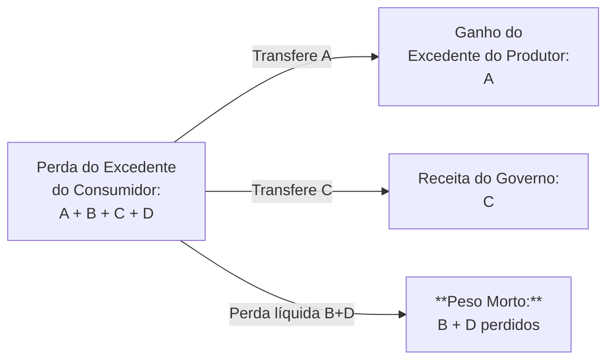

_Neste fluxograma, a perda total de excedente dos consumidores (A+B+C+D) é decomposta em: ganho de excedente dos produtores (A), receita fiscal apropriada pelo Estado (C) e perda irrecuperável de bem-estar (B+D, peso morto)._

## 3. Argumentos em Favor do Protecionismo Tarifário

Se as tarifas implicam perda de bem-estar e eficiência para o país que as impõe, **por que então os governos recorrem a elas?** Há diversos argumentos clássicos utilizados para justificar políticas tarifárias **mesmo reconhecendo o peso morto envolvido**. A seguir, discutimos os principais **argumentos protecionistas** e em quais contextos eles são evocados:

- **Proteção à Indústria Nascente (Infant Industry):** Países em desenvolvimento ou setores industriais incipientes alegam precisar de proteção temporária contra a concorrência externa até se tornarem **competitivos**. A ideia, originalmente defendida por economistas como John Stuart Mill e Friedrich List no século XIX, é que novas indústrias enfrentam custos médios elevados no início e ainda não alcançaram economias de escala ou aprendizado produtivo. Uma tarifa proveria um “abrigo” do mercado internacional enquanto a indústria **amadurece** e reduz custos, após o que a proteção seria removida. **Exemplo histórico:** Os **Estados Unidos no século XIX** aplicaram altas tarifas para proteger sua nascente indústria manufatureira da concorrência britânica – política associada ao secretário do Tesouro Alexander Hamilton e que, arguivelmente, contribuiu para a industrialização dos EUA. **Outro exemplo:** No Brasil, a chamada _Lei de Informática_ (década de 1980) restringiu importações de produtos de informática visando desenvolver a indústria nacional de tecnologia. _Crítica:_ O argumento da indústria nascente requer um governo capaz de escolher _setores promissores_ e de retirar a proteção após certo tempo. Na prática, muitas vezes a proteção se perpetua e **indústrias “bebês” nunca crescem**, operando indefinidamente com ineficiência sob o amparo do Estado.
    
- **Segurança Nacional:** Certos setores são considerados estratégicos para a segurança ou soberania de um país – por exemplo, **indústria de defesa, energia, ou alimentos básicos**. Argumenta-se que depender de importações nesses setores poderia ser perigoso em caso de guerras, crises geopolíticas ou _choques_ no suprimento externo. Assim, tarifas (ou quotas) seriam justificáveis para garantir capacidade produtiva doméstica mínima desses bens essenciais. Este argumento tem apelo político, pois relaciona-se à **autonomia nacional**. _Exemplo:_ Os EUA já impuseram tarifas sobre aço e alumínio alegando ameaça à segurança nacional (usando a Seção 232 da lei de comércio), sob a justificativa de que uma indústria siderúrgica doméstica forte é vital para fins militares. Em geral, economistas reconhecem que, **em circunstâncias excepcionais**, a segurança nacional pode prevalecer sobre considerações estritamente econômicas de eficiência – porém, alertam que o critério deve ser aplicado de forma restrita (casos realmente críticos), caso contrário qualquer produto pode ser rotulado indevidamente como questão de segurança para fins protecionistas.
    
- **Geração de Receita Governamental:** Historicamente, tarifas alfandegárias foram uma das principais fontes de receita dos governos, especialmente antes da criação generalizada de impostos de renda e consumo internos. Para alguns países em desenvolvimento com estrutura tributária frágil, os impostos de importação ainda hoje representam um mecanismo relativamente **fácil de arrecadar** (cobrado na alfândega) para financiar gastos públicos. Nesses casos, a tarifa tem uma motivação fiscal, além da protecionista. _Exemplo histórico:_ No Brasil imperial e nas primeiras décadas republicanas, os tributos sobre importações constituíam parcela significativa da receita do orçamento. _Observação:_ Do ponto de vista do bem-estar, arrecadar via tarifa tem um **custo de eficiência** (o peso morto), que deve ser ponderado contra a necessidade de recursos do Estado. Muitos economistas defendem que, se a arrecadação é o objetivo, impostos amplos e neutrais internamente (como IVA/ICMS) são preferíveis a tarifas que distorcem o comércio – a menos que a capacidade de coletar outros impostos seja realmente limitada.
    
- **Proteção contra Práticas Desleais (Anti-_dumping_ e Subsídios Externos):** Governos podem impor tarifas para contrabalançar situações em que produtores estrangeiros vendem produtos **abaixo do custo** (_dumping_) ou recebem **subsídios** de seus países de origem, o que configura concorrência desleal. Nesses casos, a tarifa compensatória (“direitos anti-dumping” ou medidas de retaliação) é argumentada como uma forma de **nivelar o campo de jogo** e **defender a indústria doméstica** de preços artificialmente baixos. Por exemplo, a União Europeia e os EUA frequentemente aplicam tarifas anti-dumping sobre produtos como aço ou painéis solares provenientes de países onde há suspeita de subsídio ou dumping. _Vale notar:_ Diferentemente de uma tarifa puramente protecionista, uma tarifa anti-dumping é geralmente precedida de investigação formal e tem caráter **remediador** (visa eliminar apenas a margem de dumping ou subsídio). Ainda assim, do ponto de vista econômico, o efeito final para o país importador é semelhante – preços internos mais altos e potencial peso morto –, mas muitos consideram justo para evitar “corrida ao fundo” de preços artificialmente baixos.
    
- **Outros Argumentos Políticos e Sociais:** Embora os quatro acima sejam os mais citados em teoria econômica e política comercial, há ainda argumentos como: **proteção do emprego doméstico** (tarifas para salvar postos de trabalho em setores sujeitos à concorrência importada), **diversificação da economia** (evitar dependência excessiva de poucos setores, especialmente em países em desenvolvimento), **pressões de barganha** (usar tarifas como moeda de negociação para abertura de mercados externos), ou mesmo motivos ambientais ou sanitários (tarifas _verdes_ sobre bens cuja produção polui mais no exterior, etc.). Tais justificativas variam em aceitabilidade e muitas vezes encobrem interesses de grupos específicos (lobbies industriais, sindicatos) em detrimento do bem-estar agregado.
    

> [!example] **Exemplo Integrado – O Debate do Protecionismo nos EUA (2018-2020):**  
> Quando o governo Trump elevou tarifas de importação sobre uma série de produtos (aço, alumínio, bens chineses, etc.), diferentes argumentos protecionistas foram citados. Oficialmente, falou-se em **defesa da segurança nacional** (caso do aço/alumínio) e em respostas a práticas comerciais desleais da China (roubo de propriedade intelectual, subsídios). Por outro lado, o objetivo de **proteger empregos industriais** no meio-oeste americano foi amplamente discutido. Economistas projetaram os efeitos: consumidores americanos teriam prejuízos com preços maiores, algumas indústrias locais ganhariam fôlego temporário, mas outras que dependiam de insumos importados seriam prejudicadas, e surgiria peso morto da tarifa. O episódio ilustrou o clássico dilema: **benefícios concentrados** (produtores protegidos e eventualmente trabalhadores desses setores) **versus custos difusos** (milhões de consumidores pagando mais, ineficiências na economia) – ainda que politicamente os primeiros tenham voz mais ativa na defesa das tarifas.

**Em resumo**, apesar do **consenso econômico contrário às tarifas** (pela redução líquida de bem-estar que implicam), as considerações acima mostram por que governos, em certas situações, adotam medidas protecionistas. Os argumentos variam de casos **legítimos ou excepcionais** (segurança nacional, retaliação a dumping) a **motivações desenvolvimentistas** (indústria nascente) e **pressões políticas domésticas**. Ao estudante de economia e candidato do CACD, cabe entender tanto a análise crítica de bem-estar – que tende a condenar tarifas pela ineficiência – quanto as **racionalizações** e interesses práticos que explicam a persistência do protecionismo comercial ao longo da história.

## 4. Conclusão

A análise de equilíbrio parcial de uma tarifa de importação em uma economia pequena revela claramente seus efeitos: preços internos mais altos, queda no consumo, aumento da produção doméstica e redução de importações. Em termos de bem-estar, há uma **redistribuição de excedente** (dos consumidores para produtores e governo) acompanhada de uma **perda líquida** – o peso morto – devido a consumo e produção desviados do ótimo eficiente. Essa perda de eficiência é o **cerne da crítica econômica** às tarifas: no agregado, o país importador fica pior em termos de excedente total.

Apesar disso, tarifas continuam sendo utilizadas, apoiadas em argumentos que vão desde a proteção de setores nascentes ou estratégicos até considerações de receita e retaliação comercial. Tais justificativas refletem objetivos que **nem sempre são puramente econômicos** (ou que consideram outros aspectos, como desenvolvimento de longo prazo, segurança ou distribuição de renda).

Para o formulador de políticas – e para o candidato em um concurso como o CACD – é fundamental reconhecer essa dualidade: **o livre-comércio maximiza a eficiência e o bem-estar de curto prazo**, mas **o protecionismo pode servir a interesses específicos ou objetivos de longo prazo**, ainda que impondo um custo econômico. A decisão política envolve pesar esses custos e benefícios. Entender em profundidade os mecanismos por trás dos gráficos e áreas de excedente fornece as ferramentas analíticas para avaliar criticamente qualquer medida tarifária anunciada, seja no Brasil ou no contexto das relações comerciais internacionais.

---

## Questões para Autoavaliação

> [!question] **1.** Quais são os efeitos imediatos da imposição de uma tarifa de importação sobre o **preço doméstico**, a **produção interna**, o **consumo interno** e o **volume de importações** de um bem? Descreva a direção de cada mudança e explique por que elas ocorrem em uma economia pequena tomadora de preços.

> [!question] **2.** Em um gráfico de oferta e demanda de um bem importado, ilustre e identifique as áreas correspondentes ao **excedente do consumidor perdido**, **excedente do produtor ganho**, **receita do governo** e **peso morto** após a imposição de uma tarifa. Explique, em termos econômicos, a origem das duas parcelas de peso morto (perdas de eficiência) e por que elas representam um **custo irrecuperável** para a sociedade.

> [!question] **3.** Apresente um exemplo de argumento protecionista (como o da _indústria nascente_ ou _segurança nacional_) que possa **justificar politicamente** a adoção de uma tarifa mesmo sabendo-se que ela causa perda de bem-estar. Em sua resposta, discuta sob quais condições esse argumento poderia fazer sentido e quais são as possíveis limitações ou críticas a ele.

# Origem: _A economia brasileira no Século XIX

---
title: A economia brasileira no Século XIX
area: ECONOMIA
subarea: História econômica brasileira
tags:
  - a-economia-brasileira-no-seculo-xix
  - cacd-2025
  - economia
  - historia-economica-brasileira
aliases:
  - A economia brasileira no Século XIX.
---
## A economia cafeeira no Segundo Reinado (século XIX)

### A centralidade do café na economia imperial

Durante o Segundo Reinado, o café consolidou-se como a principal base da economia brasileira. A partir dos anos 1840, a **exportação de café disparou** – o produto passou de uma participação insignificante para cerca de **40% das exportações na década de 1840**, e continuou crescendo nas décadas seguintes. Ao final do Império, o café havia suplantado a antiga hegemonia do açúcar e outros produtos coloniais, tornando-se o **“carro-chefe” das receitas externas**. Esse predomínio é evidenciado pelos números: a produção saltou de **3 milhões de sacas na década de 1830 para ~52 milhões na década de 1880**. Embora outras commodities ainda fossem exportadas, o complexo cafeeiro gerava a maior parte dos ingressos de divisas e impostos (visto que **impostos de exportação e importação ligados ao café financiavam grande parcela do orçamento imperial**). Esse padrão manteve a economia brasileira **dependente de um único gênero agrícola**, em continuidade ao modelo agroexportador do período colonial.

### Expansão cafeeira: do Vale do Paraíba ao Oeste Paulista

O cultivo cafeeiro expandiu-se geograficamente ao longo do século XIX, seguindo a busca por terras férteis. **Inicialmente, o café floresceu no Vale do Paraíba** (região entre Rio de Janeiro e São Paulo), sobre grandes fazendas escravistas que lembravam o modelo açucareiro. Nas décadas centrais do século, porém, a exaustão dos solos e a crescente demanda internacional impulsionaram a marcha cafeeira rumo a **novas fronteiras no “Oeste Paulista”** (interior de São Paulo). Nessas áreas, como Campinas, Ribeirão Preto e além, **a produtividade chegava a ser o dobro** da das regiões antigas, graças à terra roxa fértil e a inovações técnicas nas lavouras. Essa migração da cafeicultura foi viabilizada pela construção de **ferrovias ligando o interior ao porto de Santos**, iniciada nos anos 1860 e intensificada nos anos 1870. O avanço da malha ferroviária não só escoou a produção crescente, como **integrou mercados internos e barateou o transporte**, facilitando também o intercâmbio de pessoas e ideias. Ao final do Império, São Paulo já emergia como o novo pólo cafeeiro: embora até 1889 a **província do Rio de Janeiro ainda respondesse por mais da metade da produção** (São Paulo tinha menos de um quarto), essa relação se inverteria totalmente na Primeira República, com São Paulo e Minas Gerais assumindo a liderança na produção nacional de café.

### Transição da mão de obra: da escravidão à imigração

A expansão cafeeira coincidiu com transformações profundas no regime de trabalho. Durante grande parte do século XIX, a cafeicultura sustentou-se no **trabalho escravo**, chegando este ao auge justamente nas plantações de café (tanto em números absolutos quanto em importância econômica). Contudo, fatores internos e externos pressionaram pelo fim desse sistema: a interrupção do tráfico negreiro em 1850 (Lei Eusébio de Queirós) estrangulou a reposição de cativos, enquanto o movimento abolicionista ganhou força após 1870. Diante do **declínio progressivo do escravismo** – de 15% da população em 1872 para menos de 5% em 1888 – os cafeicultores tiveram que buscar alternativas de mão de obra. A solução encontrada foi a **imigração europeia**, incentivada por uma ideologia de “branqueamento” e modernização do trabalho. Experimentos iniciais, como o sistema de parceria (financiado privadamente pelo senador Vergueiro em 1847, trazendo colonos alemães e suíços para a fazenda Ibicaba), fracassaram em razão do endividamento dos colonos e conflitos com mão de obra escrava. A partir daí, adotou-se em larga escala a **imigração subvencionada pelo Estado** (Imperial e provincial): o governo financiava a vinda de famílias de trabalhadores livres, especialmente da Itália, Portugal, Espanha e depois do Japão. Os números ilustram a magnitude do fluxo: **pouco mais de 100 mil imigrantes chegaram nos anos 1860; quase 200 mil nos 1870s; mais de 500 mil na década de 1880; e impressionantes 1,2 milhão somente na década de 1890**). Dois terços desses imigrantes eram italianos ou portugueses, substituindo gradativamente o braço escravo nas lavouras. Já nas vésperas da Abolição (1888), a economia cafeeira paulista operava em boa medida com trabalho imigrante assalariado, o que facilitou a transição pós-1888 – **a “porta de saída” do escravismo coincidiu com a “porta de entrada” da mão de obra europeia** no campo.

### O complexo cafeeiro como modelo agroexportador dependente (visão estruturalista)

Do ponto de vista historiográfico, autores como **Celso Furtado e Caio Prado Jr.** interpretam a economia cafeeira imperial como um **modelo de crescimento para fora**, inserido de forma dependente no mercado mundial e com **limitados efeitos de transformação interna**. Segundo Celso Furtado, apesar do café ter trazido certo estímulo à modernização – ferrovias, bancos, núcleos urbanos no Sudeste –, seus enormes lucros _“acomodaram a elite nacional”_, desestimulando a busca de caminhos alternativos de desenvolvimento. O próprio sucesso e segurança da renda cafeeira tornaram desnecessário, aos olhos das oligarquias, investir em diversificação econômica ou industrialização de base ampla. Além disso, as políticas públicas tenderam a reforçar esse viés: ao longo do Império, houve **oscilações tarifárias entre protecionismo e liberação** – ora elevando tarifas para estimular manufaturas, ora reduzindo-as sob pressão de interesses exportadores ou acordos comerciais – o que resultou numa política errática. Essa falta de rumo consistente impediu a consolidação de um projeto industrial de longo prazo, mantendo o Brasil **preso à estrutura primário-exportadora**. Caio Prado Jr. também destaca essa continuidade do “**antigo pacto colonial**” na economia do Segundo Reinado: a produção voltada ao mercado externo e a concentração de renda nas mãos de latifundiários exportadores resultaram em **frágil mercado interno de consumo**, pouco propício ao florescimento industrial. Por outro lado, cabe notar que alguns historiadores enxergam **nuances importantes**. Celso Furtado ele próprio reconhece certa **relação entre a cafeicultura e os primórdios da industrialização brasileira**: muitos barões do café (especialmente paulistas) investiram capitais em ferrovias, serviços financeiros e até em indústrias ligadas à cadeia do café (torrefação, beneficiamento, transporte). Isso gerou, na região de São Paulo, o embrião de uma **burguesia “agrário-industrial”**, que conciliava interesses rurais e urbanos. Ainda assim, a interpretação estruturalista clássica conclui que, em termos gerais, o **complexo cafeeiro reproduziu a dependência**: a economia brasileira permaneceu atrelada a um só produto e vulnerável às oscilações do mercado internacional, **perpetuando sua condição periférica** dentro do capitalismo global. Nas palavras de Furtado, tratava-se de um “modelo agroexportador dependente” cuja prosperidade **não se traduzia automaticamente em desenvolvimento autônomo**.

> [!info] **Convênio de Taubaté (1906)**  
> _Definição:_ acordo firmado entre os governadores de São Paulo, Minas Gerais e Rio de Janeiro para **intervir no mercado de café e sustentar os preços** durante uma crise de superprodução. Diante da estimativa de _safra recorde_ em 1906, esses estados pactuaram a **retirada do excedente de café do mercado**, comprando-o com financiamento obtido via empréstimos (principalmente externos) garantidos pelos próprios estoques. O objetivo era **valorizar artificialmente o preço do café**, evitando o colapso de receitas dos exportadores. O Convênio marcou a primeira política oficial de _valorização do café_, servindo de modelo para intervenções posteriores (1914, 1922) e inaugurando o debate sobre os custos e benefícios dessa proteção estatal aos cafeicultores.

## A economia da Primeira República (1889–1930)

### O Encilhamento: boom e colapso financeiro no início da República

A Proclamação da República (1889) coincidiu com uma tentativa arrojada – e desastrosa – de impulsionar o crescimento econômico via expansão do crédito. Sob a liderança do então ministro da Fazenda **Ruy Barbosa**, o governo adotou uma política conhecida como **Encilhamento**, que afrouxou drasticamente o controle sobre emissões monetárias e concessão de crédito. Foi dada autorização para **bancos emitirem moeda lastreada em títulos e ampliarem empréstimos**, com o intuito declarado de **fomentar indústrias e atividades empresariais** no novo regime. Nos fatos, essa liquidez abundante alimentou uma onda especulativa: proliferaram empresas de fachada e negociações febris na Bolsa, em um típico _boom_ financeiro. A consequência foi uma **forte desvalorização do mil-réis e inflação galopante**, seguidas de **quebradeira generalizada em 1891** quando a bolha estourou. O Encilhamento resultou em **falências bancárias e recessão**, minando a confiança na jovem República. Ruy Barbosa – que também propusera medidas como elevação de tarifas para proteger a indústria nascente e a criação de um cadastro geral de terras para facilitar crédito agrário – enfrentou forte resistência das oligarquias tradicionais (temerosas de ver suas propriedades hipotecadas). Em **1891**, Ruy foi afastado, simbolizando a **derrota do projeto “desenvolvimentista” inicial** para um bloco mais conservador de fazendeiros e financistas.

Em resposta ao caos do Encilhamento, os governos seguintes adotaram uma linha **ortodoxa de estabilização monetário-fiscal**. O presidente **Campos Sales (1898-1902)** implementou um rígido ajuste, conhecido por **Funding Loan (1898)** – um acordo de consolidação da dívida externa brasileira com banqueiros estrangeiros. Por esse acordo, o Brasil obteve prazos mais longos e suspensão temporária do serviço da dívida, comprometendo-se em contrapartida a políticas austeras: **cortes de gastos, superávits orçamentários e adoção do padrão-ouro**. Foi criada a Caixa de Conversão, atrelando o mil-réis à libra esterlina, o que **congelou a emissão de papel-moeda** e ajudou a restaurar a confiança dos credores internacionais. Essas medidas provocaram uma recessão inicial, mas conseguiram **estabilizar a moeda e a inflação**, inaugurando nos anos 1900 uma fase de recuperação econômica sob regras estritas. A política cambial sólida manteve o câmbio valorizado (1£ chegando a valer apenas 12 pence por mil-réis em certo momento), o que agradava os credores e controlava os preços, mas gerava atritos com os produtores de café, como veremos adiante.

#### Os Funding Loans: Consolidação e Ajuste Econômico Pós-Encilhamento

##### Contexto e principais envolvidos

Após o fracasso especulativo do **Encilhamento** (1889-1891), o Brasil entrou em profunda crise econômica marcada por inflação galopante, colapso cambial e desorganização fiscal. Nesse cenário caótico, o governo do presidente **Campos Sales (1898-1902)** buscou estabilizar a economia com uma política monetária e fiscal conservadora, recorrendo ao mercado financeiro internacional por meio dos chamados _**Funding Loans**_.

Os principais envolvidos na operação foram:

- **Presidente Campos Sales**: idealizador da política de ajuste, apostando em austeridade fiscal e monetária.
    
- **Joaquim Murtinho**, Ministro da Fazenda de Campos Sales, principal arquiteto técnico da operação.
    
- Banqueiros ingleses, em especial a casa financeira **Rothschild & Sons**, que lideraram a renegociação da dívida brasileira no mercado europeu.
    

> [!definition] **O que foi o _Funding Loan_ (1898)?**  
> O _Funding Loan_ foi um acordo financeiro firmado pelo governo brasileiro em 1898 com bancos ingleses para **reestruturar a dívida externa brasileira**, alongando prazos e reduzindo temporariamente o serviço dos juros e amortizações. Em troca, o Brasil se comprometeu a adotar uma série de medidas austeras, incluindo o estabelecimento da Caixa de Conversão, vinculando o padrão monetário brasileiro ao ouro.

##### Objetivos e mecanismo financeiro

O principal objetivo do _Funding Loan_ foi **restaurar a confiança dos credores internacionais**, profundamente abalada pelo caos econômico pós-Encilhamento. Para isso, o Brasil concordou em:

- Consolidar diversas dívidas prévias em um **único empréstimo** de longo prazo (£10 milhões).
    
- Reduzir temporariamente os pagamentos de juros e amortizações, permitindo alívio imediato das contas públicas.
    
- Criar a **Caixa de Conversão (1900)**, fixando a taxa de câmbio do mil-réis à libra esterlina (padrão-ouro), estabilizando a moeda nacional e impedindo emissões descontroladas.
    

A operação foi conduzida principalmente pela casa financeira **Rothschild & Sons** em Londres, envolvendo outros bancos europeus menores. A **Caixa de Conversão**, financiada parcialmente com recursos obtidos no empréstimo, tornava o Brasil mais atraente aos investidores estrangeiros ao estabelecer uma referência cambial sólida e previsível.

##### Consequências estruturais e imediatas

O impacto imediato do _Funding Loan_ foi uma **redução significativa da instabilidade financeira e monetária**. O câmbio se estabilizou rapidamente e a inflação foi controlada. Entretanto, os efeitos a longo prazo geraram amplo debate historiográfico:

- **Efeitos positivos (interpretação ortodoxa)**:
    
    - Restauração da credibilidade internacional do Brasil.
        
    - Disciplina fiscal e monetária, evitando novas aventuras inflacionárias.
        
    - Retomada do acesso ao crédito internacional, vital para futuras operações financeiras.
        
- **Efeitos negativos (interpretação crítica)**:
    
    - Perda de autonomia financeira: os credores internacionais ganharam grande influência sobre a política econômica brasileira.
        
    - Sacrifício do crescimento econômico imediato, com cortes significativos nos investimentos públicos e na expansão econômica.
        
    - Benefícios assimétricos: a estabilização favoreceu principalmente as elites exportadoras e os credores internacionais, enquanto o peso do ajuste recaiu sobre setores mais vulneráveis da economia doméstica.
        

> [!important] **Argumentos Historiográficos sobre os Funding Loans**
> 
> - Para **Boris Fausto**, o acordo representou um pragmatismo necessário após os exageros do Encilhamento, estabilizando a economia brasileira e preparando o país para uma recuperação gradual.
>     
> - **Celso Furtado**, por outro lado, enfatiza que o _Funding Loan_ aprofundou a dependência econômica brasileira em relação ao mercado financeiro europeu, limitando a capacidade do país em perseguir políticas econômicas mais autônomas e de desenvolvimento interno integrado.
>     

O _Funding Loan_ de 1898 tornou-se um marco histórico, frequentemente usado como exemplo das contradições e tensões entre estabilidade econômica imediata e dependência financeira internacional.

### Valorização do café e o Convênio de Taubaté (1906)

Apesar da ortodoxia financeira predominante, a **questão do café continuou central** na Primeira República, exigindo respostas do Estado. O **Convênio de Taubaté (1906)** foi a principal delas: diante da ameaça de um **colapso nos preços internacionais do café** pela supersafra prevista em 1906, os três maiores estados produtores (SP, MG, RJ) uniram-se para **amparar o setor cafeeiro**. Conforme descrito acima, o convênio estabeleceu um **esquema de compra e estocagem do excedente de café** pelos governos estaduais, financiado por empréstimos (sobretudo britânicos) garantidos pelos estoques retidos. Inicialmente o governo federal recusou-se a participar ou oferecer garantias, mantendo-se fiel à disciplina monetária; porém, quando uma crise financeira internacional em 1907 dificultou a rolagem dos créditos, o governo central acabou por avalizar um grande empréstimo em 1908 para sustentar a operação. Na prática, a política de **valorização do café** conseguiu seu objetivo de curto prazo: **evitou o colapso dos preços** – que voltaram a subir levemente após 1909 – e **protegeu a renda dos cafeicultores**. São Paulo, Minas e Rio mantiveram a produção estocada fora do mercado, estabilizando a cotação da saca.

Entretanto, os efeitos estruturais dessa intervenção geram um **intenso debate historiográfico**. Por um lado, planificadores e políticos da época (e alguns historiadores posteriormente) viram na valorização uma **medida bem-sucedida de política econômica anticíclica**, precursora de ideias modernas de sustentação de preços agrícolas. De fato, no curto prazo, **evitou-se uma quebradeira generalizada** e ganhou-se tempo até que novos influxos de capital e a alta de outros produtos (como a borracha) revigorassem a economia brasileira em 1908-1913. Por outro lado, críticos apontam uma série de **problemas e paradoxos**:

- **Superprodução estimulada:** Como salientou Celso Furtado, a própria lógica do Convênio de Taubaté carregava um _“paradoxo perigoso”_: buscava conter a superprodução, mas ao **sustentar artificialmente o preço**, acabava **estimulando novos plantios** e a expansão contínua da cafeicultura. Ou seja, os cafeicultores não tinham incentivo para reduzir a área cultivada – pelo contrário, confiantes na proteção estatal, continuaram a plantar mais pés de café, agravando o excesso de oferta a longo prazo. Essa **falsa solução** adiou o ajuste inevitável e contribuiu para a **“situação explosiva de 1929”**, quando o mercado mundial entrou em colapso diante de estoques gigantescos acumulados.
    
- **“Socialização das perdas”:** Muitos autores argumentam que as políticas de valorização implicaram uma **socialização dos prejuízos do setor cafeeiro**. Os ganhos da alta do café permaneciam privados (beneficiando os fazendeiros exportadores), mas as perdas com a baixa do preço eram transferidas ao poder público e, em última instância, à sociedade – seja via **endividamento do Estado**, seja via emissão monetária e inflação para financiar os esquemas de compra. Assim, toda a coletividade pagava (por meio de impostos futuros ou perda do poder de compra) para sustentar a renda de uma elite agroexportadora. Essa crítica ficaria ainda mais forte nos episódios de renovação da valorização (1914, 1921-22), quando a União e estados assumiram dívidas crescentes para armazenar café, e especialmente após 1929, quando toneladas de café tiveram de ser incineradas como medida extrema.
    
- **Ausência de reformas estruturais:** A dependência nas valorizações também refletiu a **falta de medidas estruturais** para diversificar a economia. Em vez de aproveitar os períodos de bonança para promover reformas – por exemplo, **incentivar outros cultivos, industrialização ou mesmo uma reforma agrária que dinamizasse o mercado interno** – os governos da Primeira República optaram por **remediar sintomas (preço baixo)** sem alterar as bases do modelo. Como resultado, o Brasil entrou no século XX ainda amplamente atrelado ao café. Alguns historiadores, como Caio Prado Jr., veem nisso uma **oportunidade perdida**: a valorização teria “congelado” a estrutura agrário-exportadora, mantendo o país vulnerável e retardando mudanças que só viriam após 1930.
    

Do confronto de posições, percebe-se que a política do café na Primeira República era um **equilíbrio delicado entre ortodoxia financeira e pressões dos fazendeiros**. Em certos momentos, prevaleceram os **“papelistas”** (favoráveis a emitir moeda e intervir para salvar o café) – por exemplo, sob o Convênio de Taubaté e novamente em 1914 e 1922. Em outros, ganharam força os **“metalistas”** (defensores da moeda forte e equilíbrio fiscal) – como no governo Campos Sales (1898-1902) e depois no governo Artur Bernardes (1922-26), que chegou a suspender a participação federal na defesa do café após o fracasso da missão financeira Montagu. A própria figura do presidente Rodrigues Alves (1902-06) simbolizou essa tensão: **cafeicultor paulista e ao mesmo tempo seguidor da cartilha ortodoxa**, ele teve de reconhecer que uma solução de compromisso era necessária diante da triplicação da produção de café em uma década. O Convênio de Taubaté, nascido em seu mandato, foi justamente essa saída de compromisso – possível graças à conjuntura externa favorável (forte entrada de capitais e câmbio valorizado até 1905).

A partir de então, **São Paulo assumiu papel crescente na política cafeeira**, especialmente após 1917, criando instituições próprias como o **Instituto Paulista do Café e o Banco do Estado de São Paulo (Banespa)** para financiar e gerir a defesa do produto. Isso dava ao governo estadual mais controle sobre os estoques (reduzindo o risco de decisões unilaterais de credores estrangeiros, como ocorrido em 1913, quando um comitê em Londres liquidou estoques ocasionando queda brusca de preços). Contudo, também significava que o **peso financeiro recaía cada vez mais sobre São Paulo**, enquanto a União oscilava entre apoiar ou não as valorizações conforme a doutrina econômica dominante e a influência política das bancadas cafeeiras no Congresso.

### Industrialização na Primeira República: surto ou evolução estrutural?

Um debate fundamental na historiografia econômica brasileira diz respeito à **trajetória da industrialização nas primeiras décadas do século XX**. Houve, de fato, um avanço industrial significativo antes de 1930 – mas os estudiosos divergem quanto à natureza desse avanço: **teria sido apenas um _“surto” transitório_**, decorrente de fatores excepcionais, ou o resultado de mudanças estruturais mais profundas na economia brasileira?

Vários indicadores mostram crescimento manufatureiro na Primeira República. Já na virada do século, **Ruy Barbosa pretendia fomentar indústrias** por meio do crédito facilitado do Encilhamento (embora o efeito tenha sido em boa parte especulativo). Após a estabilização de Campos Sales, a indústria voltou a se beneficiar de momentos cíclicos: por exemplo, **durante a Primeira Guerra Mundial (1914-1918)**, a dificuldade de importações europeias abriu espaço para produtos brasileiros substituírem artigos antes importados – impulsionando setores como têxtil, alimentos, vestuário, etc. Muitos **capitais cafeeiros migraram para investimentos fabris** nesse período de interrupção do comércio internacional. Autores como Wilson Suzigan e Warren Dean destacam que o **investimento industrial ocorreu sobretudo nos momentos de auge da renda cafeeira**, com os lucros sendo aplicados na importação de máquinas e montagem de fábricas, enquanto nos períodos de crise esses investimentos diminuíam e utilizava-se a capacidade ociosa instalada. Em São Paulo, especificamente, formou-se nas décadas de 1910-20 um parque industrial expressivo, a ponto de a cidade de São Paulo se tornar o maior centro urbano e industrial do país (ultrapassando o Rio de Janeiro nos anos 1920). **No início do século XX, o café já respondia por 16% do PIB brasileiro e cerca de 75% das exportações**, e essa prosperidade cafeeira financiou em grande medida a infraestrutura e o capital inicial de muitas indústrias nascentes.

No entanto, **Celso Furtado e outros intérpretes estruturalistas** argumentam que essa industrialização pré-1930 teve limites claros. Segundo Furtado, até os anos 1920 o Brasil permaneceu fundamentalmente uma **economia agroexportadora**, e a indústria cresceu de forma **setorial e dependente** – concentrada em bens não-duráveis (alimentos, tecidos, calçados) e muito ligada às demandas e insumos do próprio setor exportador. A **participação do capital estrangeiro** era significativa em ramos como transportes, serviços públicos e extrativas, enquanto a indústria nacional estava longe de liderar o processo econômico. Além disso, faltava um **mercado interno de massa**: a concentração de renda agrária e a pobreza rural limitavam o poder de consumo da população, restringindo o tamanho do mercado consumidor doméstico para os produtos industriais. Furtado chegou a **minimizar o alcance da industrialização anterior a 1930**, vendo-a como um fenômeno complementar, incapaz de romper a estrutura primária exportadora vigente. Na visão dele, somente a **crise de 1929 e as políticas nacionais-desenvolvimentistas a partir de 1930 (Era Vargas)** teriam engendrado uma industrialização mais autônoma e robusta.

Por outro lado, **revisões historiográficas posteriores** – incluindo estudos estatísticos – indicam que a indústria **já vinha crescendo a taxas consideráveis nas décadas de 1910 e 1920**, lançando bases para o salto posterior. Pesquisas como as de Suzigan apontam que houve **“surtos” industriais importantes**: um primeiro no início da República, associado ao Encilhamento e à política expansionista daquele período, e outro durante a Primeira Guerra. A produção física da indústria brasileira teria mais que dobrado entre 1907 e 1920, e **setores como têxtil, alimentício, coureiro-calçadista e químico expandiram-se continuamente**. Assim, alguns historiadores defendem que **não foi tudo obra do acaso ou da crise de 1929**: _parte do empresariado e das oligarquias regionais já havia diversificado interesses_, e o Estado paulista, por exemplo, investiu em educação técnica, energia e bancos de fomento que beneficiaram a indústria local. Há quem afirme que **Celso Furtado subestimou** a dinâmica industrial pré-1930, ignorando sinais de mudança endógena.

Em síntese, o período da Primeira República presenciou a **coexistência de continuidade e mudança**. A economia brasileira permaneceu **fortemente ancorada no café** – em 1930, cerca de _70% das divisas externas_ ainda provinham desse produto – e as políticas governamentais concentraram-se em amortecer os ciclos do setor exportador. Porém, nas brechas abertas por guerras e conjunturas favoráveis, **novos atores econômicos emergiram**: industriais urbanos, classe média citadina, operariado fabril (que protagonizou as primeiras greves gerais, como a de 1917 em São Paulo). O **debate “surto vs. evolução”** permanece aberto na historiografia. O consenso é que a industrialização até 1930 foi **incompleta e regionalmente concentrada**, mas lançou sementes importantes. O Brasil de 1930 já não era exatamente o mesmo de 1889: apesar de todas as limitações, havia **mais quilômetros de ferrovia, mais bancos, mais fábricas e uma sociedade civil mais complexa**, prenunciando as transformações da era Vargas.

> [!abstract] **Continuidades e rupturas entre Império e Primeira República**  
> **Continuidades:** Manteve-se o **padrão agrário-exportador** centrado no café, garantindo ao Brasil prosperidade atrelada ao mercado externo porém alta vulnerabilidade. As **elites rurais (cafeeiras)** conservaram grande poder político e econômico – de fato, os mesmos **barões do café do Império adaptaram-se como oligarquias republicanas**, exemplificado na política do “café com leite” (aliança SP-MG). Ademais, a **distribuição desigual de renda e terra** permaneceu praticamente intocada (não houve reforma agrária), e o **Estado continuou a intervir para proteger os interesses agroexportadores** (antes via tarifas e subsídios implícitos, depois via valorizações do café).  
> **Rupturas:** A mudança institucional de Monarquia para República Federativa trouxe novas dinâmicas. Politicamente, houve maior **autonomia dos estados**, o que permitiu a São Paulo e Minas influenciarem diretamente a política econômica (ex.: Convênio de Taubaté articulado pelos estados). A República também herdou o desafio de uma **economia sem escravidão** – a abolição (1888) provocou a transição completa para o **trabalho livre**, com impacto nas relações produtivas e sociais. Surgiram novos atores sociais, como os **imigrantes europeus** (que transformaram a estrutura do trabalho rural no Centro-Sul) e um **proletariado urbano inicial**. No plano financeiro, a República viveu experiências distintas do Império: **expansão inflacionária e crise (Encilhamento)**, seguida de **políticas ortodoxas de estabilização (padrão-ouro)**, em contraste com a relativa estabilidade monetária imperial. Por fim, embora embrionária, houve maior **diversificação econômica**: o **Império legou uma industrialização incipiente**, mas na Primeira República essa indústria se expandiu em certos setores e regiões, marcando o começo de uma **mudança na pauta produtiva** (ainda que o ponto de virada mais significativo ocorresse após 1930). Em suma, Império e República Velha conectam-se por uma forte linha de continuidade agroexportadora, mas diferem no arranjo político-institucional e nas respostas encontradas para os impasses do modelo, prenunciando transformações futuras.

## Questões para autoavaliação

1. **Continuidades e mudanças:** Quais foram as **principais continuidades** do modelo econômico entre o Segundo Reinado e a Primeira República, e que **rupturas ou novidades** esse período republicano inicial apresentou em relação à época imperial?
    
2. **Política de valorização do café:** Explique os **objetivos e mecanismos** do Convênio de Taubaté (1906). Quais foram os **efeitos positivos e negativos** dessa política de valorização do café segundo diferentes historiadores (considerando questões como superprodução e “socialização de perdas”)?
    
3. **Industrialização antes de 1930:** A industrialização brasileira pré-1930 deve ser vista como um simples **“surto” conjuntural (resposta a choques externos)** ou como um **processo estrutural em andamento**? Aponte argumentos que sustentem cada interpretação, mencionando fatores como a Primeira Guerra Mundial, a política cambial e o papel do café no investimento industrial.

# Origem: _Primeira República

---
title: Primeira República
area: ECONOMIA
subarea: História econômica brasileira
tags:
  - cacd-2025
  - economia
  - historia-economica-brasileira
  - primeira-republica
aliases:
  - 4.2 Primeira República.
---
# As Políticas Econômicas da Primeira República: Do Encilhamento à Crise de 1929

## Introdução: A Economia na Transição do Império para a República

A Proclamação da República em 15 de novembro de 1889 não representou apenas uma mudança de regime político, mas também o início de um período de intensas e contraditórias experimentações na condução da economia brasileira. O novo regime herdou do Segundo Reinado uma estrutura econômica primário-exportadora, altamente dependente da cafeicultura, com uma infraestrutura incipiente e, crucialmente, os desafios monumentais impostos pela recente Abolição da Escravatura (1888). A transição para o trabalho livre assalariado, envolvendo milhões de ex-escravizados e um fluxo crescente de imigrantes europeus, gerou uma demanda inédita por meios de pagamento em uma economia cronicamente desmonetizada.1 Essa "falta de meio circulante", como diagnosticada por formuladores de política da época, tornou-se o problema central que justificaria a primeira grande aventura econômica republicana.3

A trajetória da política econômica durante a Primeira República (1889-1930) pode ser compreendida como um movimento pendular, oscilando entre modelos antagônicos em resposta às crises que se sucediam. De um lado, surtos de heterodoxia desenvolvimentista, marcados por um forte voluntarismo político e pela crença na expansão monetária como motor da modernização, cujo maior exemplo foi a política do Encilhamento. Do outro, em reação aos desequilíbrios gerados por essa heterodoxia, períodos de rigorosa ortodoxia liberal, focados em austeridade fiscal e monetária para restaurar a estabilidade e a confiança dos credores internacionais, como foi o Saneamento Financeiro. Em um terceiro momento, emergiu uma política singular de intervenção estatal massiva, a Política de Valorização do Café, que não visava à industrialização nacional, mas sim à proteção dos interesses de uma classe específica — a oligarquia cafeeira —, socializando seus prejuízos e aprofundando a dependência do país em relação a um único produto.

Esta nota de estudo analisará essa sequência de políticas — Encilhamento, Saneamento, Valorização e, finalmente, o colapso com a Crise de 1929 — focando na lógica interna de cada uma, em seus mecanismos de implementação e em suas consequências de curto e longo prazo. A análise buscará demonstrar como cada política foi, em grande medida, uma reação à anterior, criando uma cadeia de causalidade que moldou a estrutura econômica do Brasil e preparou, de forma não intencional, o terreno para a ruptura de 1930.

> [!important] Mapa Conceitual: O Pêndulo da Política Econômica na Primeira República
> 
> A tabela a seguir oferece um panorama comparativo das três principais fases da política econômica do período, servindo como um guia para a análise detalhada que se segue.
> 
> |**Critério de Análise**|**Encilhamento (1890-1891)**|**Saneamento Financeiro (1898-1902)**|**Valorização do Café (a partir de 1906)**|
> |---|---|---|---|
> |**Diagnóstico**|Falta de meio circulante para pagar salários e financiar a indústria; necessidade de modernização.|Inflação descontrolada, desvalorização cambial, crise fiscal e perda de credibilidade externa.|Crise de superprodução do café, com queda dos preços internacionais e da rentabilidade dos cafeicultores.|
> |**Corrente de Pensamento**|Heterodoxia desenvolvimentista e emissionista.|Ortodoxia liberal e monetarista.|Intervencionismo estatal setorial.|
> |**Objetivo Principal**|Estimular a industrialização e a modernização econômica via crédito farto.|Estabilizar a moeda, controlar a inflação, equilibrar as contas públicas e restaurar a confiança dos credores.|Sustentar artificialmente os preços do café para garantir os lucros da oligarquia cafeeira.|
> |**Mecanismos Principais**|Lei Bancária de 1890: permissão para bancos privados emitirem moeda com lastro em títulos públicos.|_Funding Loan_ de 1898: renegociação da dívida externa com duras condicionalidades (austeridade). Política monetária contracionista (queima de moeda), corte de gastos e aumento de impostos.|Convênio de Taubaté (1906): compra de estoques excedentes de café pelos governos, financiada por empréstimos externos e paga por um novo imposto sobre a exportação.|
> |**Principal Consequência**|Especulação financeira, criação de "empresas fantasmas", hiperinflação e colapso da bolsa.|Fim da inflação e estabilização da moeda, ao custo de uma profunda recessão econômica e desemprego.|Manutenção da hegemonia do café, desincentivo à diversificação e criação de uma vulnerabilidade estrutural que levou ao colapso em 1929.|

## I. A "Febre" Republicana: A Política do Encilhamento (1890-1891)

### 1.1. O Diagnóstico de Rui Barbosa: A Tese da "Falta de Meio Circulante"

A primeira grande política econômica da República nasceu de um diagnóstico agudo sobre as limitações estruturais da economia brasileira. O Ministro da Fazenda do Governo Provisório, Rui Barbosa, identificou que a recente Abolição da Escravatura (1888) e a consequente transição para o trabalho assalariado haviam criado uma demanda massiva e reprimida por moeda.1 A economia, acostumada a operar com baixos níveis de liquidez, agora precisava de numerário para pagar salários a milhões de novos trabalhadores e para lubrificar as engrenagens de um mercado em expansão. Este estrangulamento monetário foi percebido por Rui Barbosa como o principal entrave ao progresso, uma "escassez de meio circulante" que impedia o desenvolvimento do país.2

Contudo, o projeto de Rui Barbosa ia além de uma simples questão monetária. Imbuído de um forte espírito modernizador, ele via na expansão do crédito o instrumento para uma transformação mais profunda: a industrialização do Brasil.5 Inspirado no modelo de desenvolvimento bancário e industrial dos Estados Unidos, seu objetivo declarado era utilizar o crédito farto para financiar a criação de novas indústrias, diversificar a produção e, assim, romper com a dependência da estrutura agroexportadora herdada do Império.1

A política do Encilhamento, portanto, não pode ser vista como um ato de pura imprudência ou desvario. Ela partiu de um diagnóstico correto sobre um problema estrutural real — a necessidade de monetizar a economia pós-abolição. O erro fatal de Rui Barbosa não esteve na identificação do problema, mas na crença voluntarista e otimista de que a emissão ilimitada de moeda, por si só, geraria desenvolvimento industrial sustentável. A sua política subestimou drasticamente a capacidade do capital especulativo de desviar os recursos de fins produtivos para a ciranda financeira, ignorando os imensos riscos inflacionários e a formação de bolhas de ativos.

### 1.2. O Mecanismo da Expansão: A Lei Bancária de 17 de Janeiro de 1890

O instrumento legal que deu vida ao projeto de Rui Barbosa foi o Decreto de 17 de janeiro de 1890, que reformou o sistema bancário. A nova legislação, que o escritor Machado de Assis ironicamente chamou de "o primeiro dia da criação", promoveu uma mudança radical na política monetária do país.8 A principal medida foi a descentralização da capacidade de emissão de moeda, que antes era um monopólio do Tesouro. A lei autorizou a criação de múltiplos bancos emissores em diferentes regiões do país, permitindo que instituições privadas passassem a emitir papel-moeda.8

O ponto mais controverso e revolucionário da lei residia no lastro previsto para essas emissões. Em vez do tradicional lastro-ouro, que impunha limites rígidos à expansão monetária, os novos bancos poderiam emitir notas tendo como garantia (lastro) títulos da dívida pública federal.2 Na prática, isso significava que o governo podia financiar seus déficits e expandir a oferta de dinheiro de forma quase ilimitada, pois bastava emitir novos títulos da dívida para que os bancos pudessem emitir mais moeda.

Para completar o cenário, a política monetária foi acompanhada de uma nova lei sobre sociedades anônimas (Decreto nº 164, de 1890). Esta lei simplificou drasticamente os procedimentos para a criação de empresas e o lançamento de suas ações na bolsa de valores, exigindo um depósito inicial de apenas 10% do capital social declarado.8 A combinação da emissão descentralizada e sem lastro metálico com a desregulamentação para a abertura de empresas criou uma "tempestade perfeita". O sistema não incentivava a produção industrial, mas sim a arbitragem financeira e a fraude. Tornou-se muito mais rápido e lucrativo criar uma empresa no papel, lançar ações na bolsa e captar o crédito fácil oferecido pelos bancos do que efetivamente construir uma fábrica, comprar máquinas e iniciar a produção.8

### 1.3. Consequências e Colapso: A Bolha e a Crise

As consequências da política de Rui Barbosa foram imediatas e dramáticas. A Bolsa de Valores do Rio de Janeiro foi tomada por uma euforia especulativa sem precedentes, um fenômeno que ganhou das ruas o apelido de "Encilhamento", uma gíria do turfe que se referia à agitação dos cavalos antes da corrida.5 O número de companhias listadas na bolsa saltou de pouco mais de 90 em 1888 para cerca de 450 em meados de 1891.8 Muitas dessas novas empresas eram meramente "fantasmas", constituídas com o único propósito de emitir ações sem lastro real e captar o crédito abundante para fins especulativos ou para o enriquecimento de seus fundadores.6

A massiva injeção de papel-moeda na economia, desacompanhada de um aumento correspondente na oferta de bens e serviços, resultou em uma inflação galopante e em uma violenta desvalorização da moeda nacional frente às moedas estrangeiras.5 A bolha especulativa começou a estourar em 1891. A desconfiança se generalizou, levando a uma corrida para a venda de ações, o que provocou o colapso do mercado. Seguiram-se falências em massa, uma profunda crise de confiança no sistema financeiro e uma severa recessão econômica. A crise política que se instalou tornou a posição de Rui Barbosa insustentável, forçando sua saída do ministério e pondo fim ao experimento.5

### 1.4. Análise Historiográfica: A Interpretação Estrutural de Celso Furtado

Para além das narrativas que focam na ganância e na corrupção, a análise do economista e historiador Celso Furtado oferece uma explicação estrutural para a crise do Encilhamento, fundamental para a compreensão do tema. Em sua obra clássica _Formação Econômica do Brasil_, Furtado argumenta que a crise foi uma consequência macroeconômica quase inevitável da política adotada, dadas as características da economia brasileira da época.4

Segundo Furtado, a expansão descontrolada do crédito gerou um súbito e intenso aumento da demanda agregada (consumo das famílias e investimento das empresas). Em uma economia como a brasileira, primário-exportadora, com uma indústria incipiente e operando sem grande capacidade ociosa, esse boom de demanda não podia ser atendido pela produção interna. Consequentemente, a demanda "vazou" para o exterior, manifestando-se em um crescimento maciço das importações. Esse aumento das importações deteriorou rapidamente a balança comercial, gerando um enorme déficit. Para cobrir esse déficit, o país precisava de mais moeda estrangeira (libras esterlinas), cuja oferta não havia aumentado. Pela lei da oferta e da procura, o preço da moeda estrangeira disparou, o que, por definição, é a desvalorização da moeda nacional.

A interpretação de Furtado é crucial porque eleva o debate para além de uma questão de moralidade individual ou de falha de gestão. Ele demonstra que, dadas as estruturas produtivas e comerciais do Brasil, o resultado da política de Rui Barbosa era previsível. A crise não foi um acidente, mas uma consequência lógica da aplicação de uma política expansionista em uma economia aberta, periférica e não diversificada.

## II. A Cura Ortodoxa: O Saneamento Financeiro de Campos Sales (1898-1902)

### 2.1. O Contexto da Crise e a Necessidade de Ajuste

O governo de Prudente de Morais (1894-1898) tentou, sem sucesso completo, lidar com as consequências do Encilhamento. Foi a administração de Campos Sales (1898-1902) que herdou a tarefa de promover um ajuste definitivo. O cenário era desolador: a economia estava mergulhada em uma crise profunda, com inflação ainda elevada, uma dívida pública crescente, e, o mais grave, uma completa perda de credibilidade junto aos credores internacionais, que viam o Brasil como um país à beira da insolvência.14 A taxa de câmbio, que em 1889 era de 27 pence por mil-réis, havia despencado para apenas 7 pence em 1898, refletindo a desconfiança generalizada na moeda e na economia do país.15

A eleição de Campos Sales, um paulista ligado aos interesses cafeeiros mas com forte trânsito no setor financeiro, representou uma virada de 180 graus na orientação da política econômica. Seu mandato político era inequívoco: abandonar o experimentalismo heterodoxo e restaurar a ordem financeira a qualquer custo. A prioridade absoluta era reconquistar a confiança dos banqueiros europeus, e para isso seria implementada uma rigorosa política de austeridade, seguindo a cartilha da ortodoxia liberal.14 O Saneamento Financeiro surge, assim, como a antítese direta do Encilhamento, ilustrando a lógica de ação e reação que marcou o período: a "febre" emissionista seria tratada com uma "terapia de choque" contracionista.

### 2.2. O _Funding Loan_ de 1898: A Soberania em Troca da Credibilidade

O passo mais decisivo e emblemático do Saneamento Financeiro foi a negociação do _Funding Loan_ de 1898. Diante da iminência de uma declaração de moratória da dívida externa, o governo brasileiro, representado por Campos Sales ainda como presidente eleito em viagem à Europa, negociou um acordo de consolidação com seus principais credores, liderados pela casa bancária inglesa N. M. Rothschild & Sons.14

O acordo, formalizado em um empréstimo de 10 milhões de libras esterlinas, não consistia em uma injeção de dinheiro novo na economia brasileira. Na prática, era um empréstimo de refinanciamento: o Brasil recebeu títulos que seriam usados para pagar os juros da dívida externa já existente por um período de três anos. Além disso, a amortização (pagamento do principal) de toda a dívida foi suspensa por 13 anos. Essa medida deu ao Brasil um fôlego financeiro imediato, evitando o calote.15

Em troca desse alívio temporário, o Brasil teve de aceitar condicionalidades extremamente duras, que representavam uma significativa cessão de soberania econômica:

1. **Garantia de Receitas:** Como garantia para o novo empréstimo, o governo brasileiro teve que hipotecar as receitas da Alfândega do porto do Rio de Janeiro e, subsidiariamente, de outros portos do país. Isso significava que uma parte vital da arrecadação do Estado ficava diretamente vinculada aos interesses dos credores estrangeiros.15
    
2. **Política Monetária Contrativa Obrigatória:** O acordo continha uma cláusula que obrigava o governo a adotar uma política monetária deflacionária. O Brasil se comprometeu a retirar de circulação e incinerar publicamente uma quantidade de papel-moeda correspondente ao valor dos juros que eram pagos com os títulos do _funding_. Essa conversão seria feita a uma taxa de câmbio pré-fixada (18 pence por mil-réis), garantindo que a base monetária do país encolhesse.15
    
3. **Compromisso com a Austeridade Fiscal:** O acordo impunha, implicitamente, a adoção de uma severa política de austeridade fiscal, com cortes de despesas públicas e aumento de impostos, a fim de gerar superávits orçamentários e estabilizar a moeda.15
    

O _Funding Loan_ de 1898 é um caso exemplar da dinâmica de poder assimétrica no sistema financeiro internacional da época. Para evitar o colapso e reconquistar a confiança dos mercados, o Brasil foi forçado a submeter sua política monetária e fiscal aos ditames e à supervisão de seus credores. Foi uma escolha pragmática que salvou o país da bancarrota, mas cujo custo foi a perda de autonomia na condução da economia nacional.

### 2.3. A Política de Austeridade de Joaquim Murtinho

A implementação rigorosa do programa de ajuste ficou a cargo do Ministro da Fazenda de Campos Sales, Joaquim Murtinho.12 Fiel à ortodoxia liberal, Murtinho executou a política de saneamento com mão de ferro. Ele promoveu uma drástica contração monetária, com a queima sistemática de papel-moeda, conforme estipulado no acordo do _Funding Loan_.14 Ao mesmo tempo, realizou cortes profundos nas despesas do governo, paralisando obras públicas e reduzindo o funcionalismo, e promoveu o aumento de impostos para reequilibrar as contas do Tesouro.14

Os resultados da política de Murtinho foram exatamente os previstos pela teoria ortodoxa. A inflação foi debelada, a moeda nacional (o mil-réis) se estabilizou e começou a se valorizar, e a credibilidade financeira do Brasil no exterior foi plenamente restaurada. O país voltou a ser visto como um devedor confiável. No entanto, o custo social e econômico dessa estabilização foi altíssimo. A contração monetária e fiscal mergulhou o país em uma severa recessão, com queda na produção, aumento do desemprego e inúmeras falências de empresas e bancos. A gestão de Murtinho ilustra o dilema clássico da estabilização ortodoxa: o remédio para a doença da inflação (austeridade) frequentemente provoca os efeitos colaterais da recessão e do desemprego. Ele curou a "saúde financeira" do Estado, mas à custa da "saúde econômica" da sociedade no curto prazo.

## III. A Hegemonia do "Ouro Verde": A Política de Valorização do Café (a partir de 1906)

### 3.1. A Crise de Superprodução e a Gênese do Intervencionismo

No início do século XX, a economia brasileira enfrentou uma nova crise, desta vez originada em seu setor mais dinâmico: a cafeicultura. Décadas de expansão contínua, com a abertura de novas fronteiras agrícolas no Oeste Paulista, levaram a um ponto em que a produção de café superava em muito a capacidade de absorção do mercado mundial. O resultado inevitável foi uma queda vertiginosa e sustentada dos preços internacionais do produto, ameaçando a rentabilidade de todo o setor.16

A situação dos cafeicultores foi paradoxalmente agravada pelo sucesso da política de Saneamento Financeiro de Campos Sales. Ao estabilizar e valorizar o mil-réis, a política ortodoxa teve um efeito colateral perverso para os exportadores. Como vendiam seu produto em moeda estrangeira (libras ou dólares) e pagavam seus custos (salários, insumos, impostos) em moeda nacional, a valorização do mil-réis significava que eles recebiam menos reais por cada saca de café exportada. Suas receitas em moeda nacional caíam, enquanto seus custos permaneciam os mesmos ou subiam, espremendo drasticamente suas margens de lucro.20

Este cenário revela uma importante relação de causalidade na história econômica do período. A política de valorização do café não surgiu de forma isolada. Ela foi, em grande medida, uma consequência não intencional da política anterior. A ortodoxia do Saneamento, que salvou as finanças do Estado e restaurou a credibilidade externa, criou uma crise insuportável para o grupo econômico e político mais poderoso do país: a oligarquia cafeeira. Essa pressão forçou uma nova e dramática mudança de rumo, abandonando a ortodoxia liberal em favor de um massivo intervencionismo estatal para proteger um setor específico.

### 3.2. O Convênio de Taubaté (1906): A Institucionalização da Defesa do Café

Incapazes de suportar a combinação de preços internacionais em queda e câmbio valorizado, as elites cafeeiras se mobilizaram. Em fevereiro de 1906, os governadores dos três principais estados produtores — Jorge Tibiriçá de São Paulo, Francisco Sales de Minas Gerais e Nilo Peçanha do Rio de Janeiro — reuniram-se na cidade paulista de Taubaté para arquitetar uma solução conjunta.16 O plano que emergiu dessa reunião, conhecido como Convênio de Taubaté, se tornaria a política econômica mais importante e duradoura da Primeira República.

O mecanismo do Convênio era uma forma sofisticada de intervenção estatal para manipular os preços no mercado internacional, transferindo os riscos da atividade cafeeira do setor privado para o Estado.21 A política se baseava em quatro pilares principais:

1. **Compra e Estocagem de Excedentes:** Os governos estaduais se comprometeram a intervir diretamente no mercado, comprando todo o café excedente que pressionava os preços para baixo. Esse café seria estocado e retirado de circulação, criando uma escassez artificial na oferta mundial com o objetivo de forçar a elevação das cotações.16
    
2. **Financiamento Externo:** Uma operação dessa magnitude exigia um volume de recursos que os estados não possuíam. O plano previa, portanto, a contratação de vultosos empréstimos junto a bancos estrangeiros para financiar a compra e a manutenção dos estoques de café.18
    
3. **Criação de um Novo Imposto:** Para garantir o pagamento dos juros e da amortização desses empréstimos externos, o Convênio estabeleceu a criação de um novo imposto, cobrado em ouro, sobre cada saca de café que fosse efetivamente exportada.16
    
4. **Estabilização Cambial:** Para evitar que uma eventual valorização do câmbio anulasse os benefícios da alta dos preços do café, o plano previa a criação de uma Caixa de Conversão. Sua função seria estabilizar a taxa de câmbio em um patamar considerado remunerador para os cafeicultores, comprando e vendendo moeda estrangeira para manter a cotação desejada.16
    

Inicialmente, o presidente da República, Rodrigues Alves, um defensor da ortodoxia, foi contrário ao plano, vetando o apoio federal. Contudo, a força política dos cafeicultores prevaleceu. Seu sucessor, Afonso Pena, eleito com o apoio das oligarquias de São Paulo e Minas Gerais, deu o aval do governo federal ao acordo, que passou a contar com a garantia da União para a obtenção dos empréstimos externos, transformando uma iniciativa estadual em uma política nacional.21

O Convênio de Taubaté representa o exemplo mais explícito da captura do aparelho de Estado pelos interesses de uma fração de classe na história brasileira. Diferentemente do Encilhamento, que se justificava por uma retórica de desenvolvimento nacional e industrialização, a política de valorização tinha um objetivo claro, restrito e setorial: garantir a lucratividade da oligarquia cafeeira. O economista Celso Furtado cunhou o termo "socialização das perdas" para descrever esse processo, no qual os lucros da cafeicultura permaneciam privados, mas os prejuízos decorrentes da superprodução eram transferidos para o Estado e, em última instância, para toda a sociedade brasileira, que arcava com o custo da dívida e da inflação gerada pela política.23

### 3.3. Análise Crítica e Consequências de Longo Prazo

No curto prazo, a política de valorização foi um sucesso para seus idealizadores. Os preços do café no mercado internacional se recuperaram e os lucros dos cafeicultores foram mantidos, o que perpetuou a hegemonia econômica e política da oligarquia cafeeira, consolidando o arranjo conhecido como "política do café com leite".20 Contudo, as consequências de longo prazo foram desastrosas para a estrutura econômica do país.

A principal consequência negativa foi o profundo desincentivo à diversificação econômica. Ao garantir artificialmente a alta lucratividade do café, a política eliminou qualquer estímulo para que os cafeicultores, detentores do grande capital da época, investissem em outras culturas agrícolas ou em novos setores, como a indústria. Pior, ao manter os preços artificialmente elevados, a política incentivou o plantio de ainda mais cafezais, agravando cronicamente o problema estrutural da superprodução. Este fenômeno é um exemplo clássico de _moral hazard_ (risco moral), onde a garantia de um "seguro" (a intervenção estatal) leva o agente econômico a assumir mais riscos (plantar mais café) do que assumiria em condições normais de mercado.20

A consequência mais grave, no entanto, foi a criação de uma vulnerabilidade estrutural extrema. A economia brasileira tornou-se ainda mais dependente de um único produto de exportação e de seus poucos mercados consumidores. Qualquer choque externo que afetasse a demanda ou os preços do café teria um impacto devastador sobre toda a economia nacional, um risco que se materializaria de forma dramática em 1929.25

A historiografia debate os efeitos da valorização sobre o processo de industrialização. Uma vertente, associada a economistas como Delfim Netto, argumenta que a política foi um entrave, pois reteve capital e mão de obra em uma atividade (a cafeicultura) que já era cronicamente excedentária, impedindo que esses recursos fossem alocados em setores mais dinâmicos como a indústria.25 Outra vertente, defendida por autores como Warren Dean e Winston Fritsch, sustenta que a política teve um efeito complementar. Ao garantir a renda do setor mais rico da economia, a valorização gerou um excedente de capital que, em parte, transbordou para outros investimentos, incluindo a nascente indústria paulista, financiando sua expansão.21 Ambas as visões possuem mérito e revelam a complexidade dos desdobramentos da política.

Em última análise, a política de valorização do café funcionou como uma bomba-relógio. Foi o equivalente a tratar uma doença crônica (a superprodução) com analgésicos cada vez mais fortes (intervenção estatal e endividamento externo). A política aliviava a dor no curto prazo (a queda dos lucros), mas permitia que a doença se agravasse silenciosamente sob a superfície. A Crise de 1929 não foi a causa do problema, mas apenas o evento externo que detonou a bomba-relógio que vinha sendo armada desde 1906.

## IV. Interlúdios e Acelerações: A Primeira Guerra Mundial (1914-1918)

### 4.1. O "Surto" de Industrialização por Substituição de Importações (ISI)

A eclosão da Primeira Guerra Mundial em 1914 representou um choque externo de grandes proporções para a economia brasileira. O conflito na Europa desorganizou as rotas de comércio marítimo e converteu a capacidade produtiva das nações industrializadas para o esforço de guerra. Como resultado, a importação de produtos manufaturados, dos quais o Brasil era altamente dependente, tornou-se extremamente difícil e cara.27

Esse desabastecimento forçado do mercado interno criou uma oportunidade única para a incipiente indústria nacional. Com a concorrência estrangeira subitamente removida, as fábricas brasileiras encontraram um mercado cativo para seus produtos. A demanda que antes era suprida por importados passou a ser atendida, na medida do possível, pela produção local. Este fenômeno ficou conhecido como o primeiro "surto" de Industrialização por Substituição de Importações (ISI) da história do Brasil, um processo no qual a dificuldade de importar força o desenvolvimento da produção doméstica.27

### 4.2. O Debate sobre os Efeitos da Guerra: Estímulo ou Barreira?

A historiografia econômica debate intensamente a natureza e a profundidade do impacto da Primeira Guerra Mundial sobre a indústria brasileira. Duas teses principais se contrapõem:

- **A Tese do "Choque Adverso" como Estímulo:** Defendida por autores clássicos como Celso Furtado, esta visão argumenta que a guerra foi um evento positivo e um estímulo decisivo para a industrialização. O "choque adverso" da interrupção do comércio internacional teria forçado o país a se industrializar para suprir sua própria demanda, funcionando como um catalisador para a expansão do setor secundário.31
    
- **A Tese da "Interrupção" como Barreira:** Proposta por historiadores como Warren Dean, esta tese argumenta o contrário. Segundo eles, a guerra, na verdade, freou um processo de crescimento industrial que já estava em curso desde o início do século XX. O principal argumento é que o conflito impediu a importação de bens de capital — máquinas, equipamentos, peças de reposição — e de insumos industriais essenciais, que eram indispensáveis para a expansão da capacidade produtiva. Sem poder importar novas máquinas, a indústria não podia crescer de forma sustentada.31
    

Uma análise mais detalhada dos dados econômicos do período sugere uma síntese entre as duas visões. A guerra de fato estimulou a produção em setores que utilizavam predominantemente matéria-prima nacional e tecnologia simples, como a indústria têxtil, de alimentos, calçados e bebidas.31 Nesses casos, a substituição de importações foi real e o crescimento, significativo. No entanto, a guerra prejudicou severamente a indústria de base e os setores que dependiam de tecnologia e insumos importados. Os investimentos em novas máquinas e equipamentos caíram drasticamente durante o conflito.31

Portanto, o "surto" industrial da Primeira Guerra foi um crescimento mais "horizontal" do que "vertical". Houve um aumento da produção baseado principalmente na utilização mais intensiva da capacidade industrial que já existia antes de 1914, mas não houve um aprofundamento da estrutura industrial, com a criação de setores mais complexos como a metalurgia ou a produção de bens de capital. Foi um crescimento conjuntural, impulsionado por uma oportunidade de mercado, mas que não representou um processo de desenvolvimento industrial estruturado e autossustentado.

### 4.3. A Moratória da Dívida Externa

A guerra também trouxe severas dificuldades fiscais para o governo brasileiro. A queda na arrecadação alfandegária, uma das principais fontes de receita, e as perturbações econômicas gerais levaram o Brasil a negociar um segundo _Funding Loan_ em 1914. Assim como o de 1898, este acordo permitiu a suspensão temporária dos pagamentos da dívida externa, aliviando a pressão sobre o balanço de pagamentos e sobre as contas públicas durante o período do conflito.27

## V. O Colapso do Modelo Agroexportador: A Crise de 1929

### 5.1. A Insustentabilidade da Defesa Permanente nos Anos 1920

Durante a década de 1920, a política de valorização do café, longe de ser abandonada, foi intensificada e institucionalizada. Com a criação do Instituto Paulista de Defesa Permanente do Café, a intervenção estatal deixou de ser uma medida de emergência para se tornar uma política contínua e sistemática.21 O governo passou a comprar e estocar safras inteiras, acumulando montanhas de café em armazéns. Para financiar essas compras gigantescas, a dívida pública, tanto interna quanto externa, cresceu a níveis exponenciais. O sistema tornava-se visivelmente insustentável: o Brasil estava produzindo muito mais café do que o mundo poderia consumir, e o Estado estava se endividando perigosamente para esconder esse fato.26

### 5.2. O Impacto Fulminante da Grande Depressão

A bomba-relógio armada pela política de valorização foi detonada por um evento externo catastrófico: a Quebra da Bolsa de Valores de Nova York em outubro de 1929. A crise que se seguiu, conhecida como a Grande Depressão, mergulhou a economia dos Estados Unidos e da Europa em uma recessão sem precedentes. Os Estados Unidos eram, de longe, o maior comprador do café brasileiro.33

O impacto sobre o Brasil foi fulminante. Com a depressão, o consumo nos países ricos despencou, e a demanda por café evaporou. Os preços internacionais, que já eram mantidos artificialmente pela política brasileira, desabaram completamente. A cotação da saca de café caiu quase 90% em poucos meses.26 Ao mesmo tempo, a crise financeira global secou completamente as fontes de crédito internacional. O governo brasileiro, já maciçamente endividado, viu-se subitamente sem acesso a novos empréstimos para continuar financiando a compra dos estoques. O esquema de valorização, que dependia crucialmente do financiamento externo, ruiu de forma espetacular.26

### 5.3. O Fim de uma Era: A Queima do Café e a Revolução de 1930

O colapso da política de valorização deixou o Brasil com estoques gigantescos de café que não tinham comprador. A solução desesperada, adotada já no início do governo de Getúlio Vargas, foi a destruição física do produto. Milhões de sacas de café foram sistematicamente queimadas em grandes fogueiras ou jogadas ao mar.33 As imagens do "ouro verde" sendo destruído tornaram-se o símbolo máximo e trágico da falência do modelo agroexportador que havia dominado o Brasil por meio século.

A crise econômica teve consequências políticas imediatas e profundas. O colapso do café destruiu a base do poder econômico da oligarquia cafeeira, que perdeu sua capacidade de ditar os rumos políticos do país. Esse súbito vácuo de poder, combinado com o descontentamento de outros grupos sociais e oligarquias regionais, foi o principal catalisador para a Revolução de 1930. O movimento, liderado por Getúlio Vargas, pôs fim à Primeira República e inaugurou uma nova era na história do Brasil.26 A Crise de 1929, portanto, não apenas destruiu a principal fonte de riqueza do país, mas também derrubou a estrutura política que se sustentava sobre ela.

## Conclusão: Legados e Rupturas da Política Econômica da Primeira República

A análise da trajetória econômica da Primeira República revela um período de profunda instabilidade e de busca errática por um projeto de nação. A sequência de políticas — a heterodoxia emissionista do Encilhamento, a ortodoxia deflacionária do Saneamento e o intervencionismo setorial da Valorização do Café — demonstra um movimento pendular, no qual os excessos de um modelo geravam crises que levavam à adoção do modelo oposto. Essa oscilação reflete a ausência de um consenso sobre o papel do Estado e os caminhos para o desenvolvimento, mas também evidencia uma tendência histórica de crescente, embora desarticulada, intervenção estatal na economia.

O principal legado negativo do período foi a consolidação e o aprofundamento da dependência do Brasil em relação a um único produto de exportação. A política de valorização do café, em particular, ao proteger artificialmente um setor em detrimento da diversificação, criou uma economia extremamente vulnerável a choques externos. A Primeira República termina, simbolicamente, com o colapso de seu principal pilar econômico, em meio à fumaça das fogueiras de café.

Paradoxalmente, as crises e as políticas do período também criaram, muitas vezes de forma não intencional, as bases para a futura transformação estrutural do país. O capital acumulado no setor cafeeiro, apesar de mal alocado por décadas, financiou parte da infraestrutura e da indústria nascente em São Paulo.36 O surto industrial provocado pela Primeira Guerra Mundial, ainda que superficial, expandiu o parque fabril e criou uma classe operária mais numerosa.27 E, mais importante, o colapso do modelo agroexportador em 1929 forçou o Brasil a se voltar para dentro. Como analisado por Celso Furtado, a crise externa, ao inviabilizar o modelo anterior, tornou a industrialização e o desenvolvimento do mercado interno não mais uma opção, mas uma necessidade para a sobrevivência econômica do país, um caminho que seria trilhado de forma sistemática durante a Era Vargas.38

Para o candidato ao Concurso de Admissão à Carreira de Diplomata, a compreensão da dinâmica Encilhamento-Saneamento-Valorização é mais do que um exercício de história econômica. É fundamental para entender a formação do Estado brasileiro, a gênese dos grandes debates sobre desenvolvimento e ortodoxia, e a persistência de temas como a relação entre o Estado e os interesses privados, a vulnerabilidade externa e a busca por um modelo de desenvolvimento soberano — questões que ecoam por toda a história do Brasil no século XX e permanecem relevantes nos desafios contemporâneos.

## Questões para Autoavaliação (Active Recall)

> [!question]
> 
> 1. **Análise Comparativa:** Compare e contraste a lógica econômica e os objetivos políticos da política do Encilhamento (1890-1891) e do Convênio de Taubaté (1906). Embora ambas representem formas de intervenção estatal, quais eram suas diferenças fundamentais em termos de beneficiários, mecanismos e visão de desenvolvimento para o país?
>     

> [!question]
> 
> 2. Relação de Causalidade: Discorra sobre como o Saneamento Financeiro de Campos Sales (1898-1902) foi, ao mesmo tempo, uma consequência direta da crise do Encilhamento e uma causa indireta da necessidade da política de valorização do café. Analise os efeitos não intencionais da política ortodoxa sobre a economia cafeeira.

> [!question]
> 
> 3. Análise Crítica e Historiográfica: A política de valorização do café pode ser considerada um sucesso ou um fracasso? Analise criticamente essa questão, ponderando seus efeitos de curto prazo (sustentação da renda cafeeira) e de longo prazo (vulnerabilidade estrutural e desincentivo à diversificação). Em sua resposta, incorpore o conceito de "socialização das perdas" de Celso Furtado e o debate sobre se a valorização atuou como um entrave ou um complemento à industrialização.


# Origem: _A Industrialização Brasileira no Período 1930-1945 (ISI)

---
title: A Industrialização Brasileira no Período 1930-1945 (ISI)
area: ECONOMIA
subarea: História econômica brasileira
tags:
  - a-industrializacao-brasileira-no-periodo-1930-1945
  - cacd-2025
  - economia
  - historia-economica-brasileira
aliases:
  - 4.3 A Industrialização Brasileira no Período 1930-1945.
---
# A Industrialização na Era Vargas (1930-1945): As Origens do Modelo de Substituição de Importações (ISI) e suas Críticas

## Introdução: A Crise de 1929 como Ponto de Inflexão e a Gênese da Indústria Brasileira

A ascensão de Getúlio Vargas ao poder em 1930, no bojo da Revolução que pôs fim à República Velha, representa um dos mais significativos pontos de inflexão na história econômica, política e social do Brasil. Este período, que se estende até 1945, é frequentemente compreendido como o marco inicial da transição de uma economia primário-exportadora, centrada no complexo cafeeiro, para uma economia urbana e industrial. A Grande Depressão, deflagrada pela quebra da Bolsa de Nova York em 1929, atuou como um catalisador exógeno que expôs de forma dramática a vulnerabilidade estrutural do modelo agroexportador brasileiro, desencadeando uma série de transformações que, em seu conjunto, lançariam as bases para a industrialização do país.

No cerne do debate historiográfico sobre este período reside uma questão fundamental: a industrialização que floresceu na Era Vargas foi fruto de um projeto deliberado e planejado de desenvolvimento nacional ou, ao contrário, uma consequência não intencional, quase acidental, de políticas econômicas desenhadas para mitigar os efeitos da crise sobre o setor cafeeiro? A resposta a essa indagação é complexa e multifacetada, mas a interpretação clássica e mais influente, formulada pelo economista Celso Furtado, pende decisivamente para a segunda hipótese. Em sua obra seminal, _Formação Econômica do Brasil_, Furtado argumenta que a industrialização brasileira dos anos 1930 foi um processo "involuntário", um "surto" impulsionado por uma combinação única de colapso da capacidade de importar e manutenção da demanda interna, esta última sustentada paradoxalmente pela política de defesa do café.

Esta nota de estudo propõe-se a analisar aprofundadamente este processo. Na primeira parte, será examinada a industrialização "involuntária" do período 1930-1945, com foco na desestruturação da economia cafeeira, na tese furtadiana sobre a política anticíclica e no papel gradualmente mais consciente e nacionalista do Estado Varguista, culminando com o impacto da Segunda Guerra Mundial. A segunda parte se dedicará a definir e sistematizar o modelo de Industrialização por Substituição de Importações (ISI) em sua forma clássica e planejada, como seria teorizado e implementado no pós-guerra, distinguindo-o claramente de sua fase embrionária varguista. Por fim, a terceira parte realizará uma análise crítica das falhas estruturais e do legado ambíguo do modelo de ISI, abordando suas consequências de longo prazo em termos de ineficiência, dependência tecnológica, vulnerabilidade externa e desequilíbrios internos. 

## Parte I: A Industrialização "Involuntária" (1930-1945): Uma Resposta à Crise

A industrialização que se desenrolou durante a primeira Era Vargas não foi, em sua origem, o resultado de um projeto preconcebido de desenvolvimento. Pelo contrário, emergiu como uma resposta pragmática e reativa a uma crise externa de proporções avassaladoras. As políticas adotadas pelo governo Vargas, inicialmente de caráter conservador e voltadas para a salvação da elite cafeeira, geraram efeitos macroeconômicos imprevistos que alteraram fundamentalmente a estrutura produtiva do país, deslocando seu eixo dinâmico do setor agroexportador para a indústria voltada ao mercado interno.

### O Colapso do Centro Dinâmico: A Crise de 1929 e a "Capacidade de Importar"

Até 1929, a economia brasileira estava solidamente ancorada no modelo primário-exportador. O café não era apenas o principal produto de exportação; era o centro dinâmico de toda a economia, determinando os ciclos de prosperidade e crise, influenciando a política cambial e fiscal e sustentando a inserção do Brasil na divisão internacional do trabalho.4 A prosperidade dos "Loucos Anos Vinte" nos Estados Unidos, o maior consumidor do café brasileiro, garantia a sustentabilidade desse modelo, que parecia robusto.

A Crise de 1929, no entanto, desferiu um golpe fulminante neste sistema. A Grande Depressão levou a uma contração drástica da demanda mundial e a um colapso nos preços das commodities.7 Para o Brasil, o efeito foi catastrófico. O preço internacional da saca de café, que já vinha sofrendo com uma crise de superprodução interna, despencou vertiginosamente, chegando a cair quase 90% entre 1929 e 1930. O valor das exportações brasileiras, principal fonte de divisas do país, ruiu.

Este colapso das receitas de exportação provocou uma consequência imediata e severa: a drástica redução da "capacidade de importar" do Brasil. Este conceito, central na análise econômica do período, refere-se à disponibilidade de moeda estrangeira (obtida via exportações) para pagar pelas importações. Com a queda abrupta das vendas de café, o fluxo de libras esterlinas e dólares para o país secou, tornando proibitiva a compra de produtos manufaturados estrangeiros que até então abasteciam o mercado interno. A dimensão do choque é evidente nos dados compilados por Celso Furtado, que mostram que, mesmo no pico da recuperação da década, em 1937, o volume físico (

_quantum_) das importações brasileiras ainda se encontrava 23% abaixo do nível de 1929.12

Essa incapacidade de importar não foi apenas uma flutuação cíclica; representou uma ruptura estrutural. Criou-se um vácuo no abastecimento de bens de consumo no mercado doméstico. A demanda por tecidos, alimentos processados, calçados e outros produtos manufaturados persistia, mas a oferta externa tornara-se inacessível. Foi essa escassez que gerou um poderoso incentivo, puramente de mercado, para que a incipiente indústria nacional se expandisse para preencher a lacuna deixada pelos produtos importados. A "substituição de importações", em sua forma mais elementar e não planejada, nascia assim, não de uma escolha política, mas de uma imposição das circunstâncias.

|Ano|Preço Internacional do Café (Índice, 1928=100)|Valor das Exportações (em milhões de Libras Esterlinas)|Capacidade para Importar (Índice, 1928=100)|
|---|---|---|---|
|1928|100|97|100|
|1929|85|95|88|
|1930|45|65|49|
|1931|30|40|32|
|1932|28|38|30|
|Tabela 1: O Impacto da Crise de 1929 na Economia Brasileira (Valores e Índices Ilustrativos). Fonte: Elaborado a partir de dados e análises de Furtado (2005) 8 e outras fontes historiográficas.2|||||

### A Tese de Celso Furtado: A Defesa do Café como Política Anticíclica

Diante do colapso do setor cafeeiro, a resposta do governo Vargas não foi a de aderir a uma ortodoxia liberal e permitir que as "forças de mercado" levassem os cafeicultores à falência. Ao contrário, o Estado interveio de forma massiva para proteger o setor. Em 1931, foi criado o Conselho Nacional do Café (CNC), que centralizou a política cafeeira em nível federal, retirando-a do controle dos estados produtores, notadamente São Paulo.13 A principal medida adotada pelo CNC foi a compra dos estoques excedentes de café e sua posterior destruição, em uma escala sem precedentes. Estima-se que mais de 78 milhões de sacas de café tenham sido queimadas ou lançadas ao mar, uma quantidade que poderia abastecer o consumo mundial por três anos.8

A genialidade da análise de Celso Furtado reside em sua capacidade de enxergar para além do objetivo imediato dessa política. Enquanto a intenção era claramente conservadora – salvar a oligarquia cafeeira da ruína –, seus efeitos macroeconômicos foram revolucionários e não antecipados.2 Furtado argumentou que a política de compra e queima do café, financiada por meio de endividamento interno (emissão de moeda) e impostos sobre as exportações, funcionou como uma vigorosa política anticíclica, nos moldes do que John Maynard Keynes teorizaria para as economias centrais.17 Ao comprar o café que não tinha mercado, o governo injetava renda na economia, sustentando o nível de emprego e o poder de compra não apenas no setor cafeeiro, mas em toda a cadeia produtiva a ele associada.2

O resultado foi um paradoxo econômico. De um lado, a crise externa havia dizimado a capacidade do país de importar. De outro, a política de defesa do café mantinha o nível de demanda agregada relativamente estável. A população e as empresas continuavam a ter renda para gastar, mas não podiam mais direcioná-la para os bens importados, agora caríssimos ou indisponíveis. Essa demanda reprimida foi, então, compulsoriamente desviada para os produtos fabricados pela indústria nacional.18 Isso tornou a produção industrial doméstica subitamente muito lucrativa, atraindo capitais que antes se destinavam à agricultura ou que estavam ociosos.

Este fenômeno foi batizado por Furtado como o "deslocamento do centro dinâmico" da economia.2 Pela primeira vez na história brasileira, o motor do crescimento econômico deixava de ser o setor exportador, dependente das flutuações do mercado externo, e passava a ser o mercado interno, impulsionado pelo investimento industrial. Essa industrialização é considerada "involuntária" ou um "surto" precisamente porque não foi o objetivo da política governamental, mas sim seu subproduto mais importante. A política de defesa do café, concebida para preservar a velha ordem agroexportadora, acabou, por uma ironia histórica, por financiar a gênese da nova ordem industrial que a suplantaria. O Estado, ao socializar as perdas do setor cafeeiro, atuou, de forma inconsciente, como o principal fomentador da industrialização brasileira.2

### O Papel do Estado Varguista: Intervenção e Nacionalismo Econômico

Se o impulso inicial para a industrialização foi uma reação quase automática à crise, o papel do Estado sob Getúlio Vargas evoluiu ao longo dos anos 1930 e 1940, tornando-se progressivamente mais consciente, proativo e imbuído de uma ideologia nacionalista.19 O governo passou de mero gestor de uma crise a arquiteto de um novo modelo de desenvolvimento, marcando uma ruptura definitiva com a postura liberal e não intervencionista que caracterizava a República Velha.11 Essa transição é evidenciada pela criação de empresas estatais em setores estratégicos, onde o capital privado nacional era inexistente ou hesitante e o capital estrangeiro era visto com desconfiança.

O exemplo mais emblemático dessa nova postura foi a criação da **Companhia Siderúrgica Nacional (CSN)**, em 1941. A instalação de uma grande usina siderúrgica era um antigo anseio das elites militares e industriais, que a consideravam um pilar indispensável para a soberania nacional e para o avanço da industrialização.21 Após tentativas frustradas de atrair capital privado americano, o governo Vargas decidiu levar o projeto adiante como uma empresa estatal.23 A viabilização do empreendimento foi um triunfo da diplomacia brasileira. Em meio à Segunda Guerra Mundial, Vargas soube explorar a rivalidade entre Estados Unidos e Alemanha e a necessidade estratégica dos EUA de garantir o alinhamento do Brasil e o acesso a bases militares no Nordeste. Em troca do apoio brasileiro aos Aliados, o governo Roosevelt, por meio do Ex-Im Bank, concedeu o financiamento crucial para a construção da usina de Volta Redonda (RJ).24 A CSN, inaugurada em 1946, tornou-se o símbolo do projeto desenvolvimentista e da capacidade de intervenção do Estado.26

Seguindo a mesma lógica nacionalista e estratégica, foi criada a **Companhia Vale do Rio Doce (CVRD)**, em 1942. A empresa nasceu da nacionalização das ricas jazidas de minério de ferro de Itabira (MG), que estavam sob controle de capital estrangeiro (a Itabira Iron Ore Company).27 A criação da CVRD, também inserida no contexto dos Acordos de Washington, tinha o objetivo inicial de garantir o fornecimento de matéria-prima estratégica para o esforço de guerra dos Aliados.29 Contudo, seu significado mais profundo foi o de colocar sob controle estatal um recurso natural vital para o projeto siderúrgico e para o desenvolvimento futuro do país, alinhando-se perfeitamente à visão de um Estado forte e condutor da economia.31

A criação da CSN e da CVRD representa, portanto, um salto qualitativo no papel do Estado. A intervenção estatal deixava de ser meramente reativa e anticíclica para se tornar estruturante e empreendedora. O Estado Varguista passava a atuar diretamente na construção dos alicerces da economia industrial, suprindo as lacunas deixadas pelo setor privado em áreas de alto investimento, longo prazo de maturação e importância estratégica. Embora ainda não se tratasse de um plano de industrialização abrangente como os que surgiriam no pós-guerra, essas iniciativas demonstravam uma clara e consciente opção pelo desenvolvimento industrial liderado pelo Estado, estabelecendo o precedente institucional e ideológico para o modelo desenvolvimentista das décadas seguintes.

### O Impacto da Segunda Guerra Mundial: O Aprofundamento da Substituição

A Segunda Guerra Mundial (1939-1945) funcionou como um segundo e poderoso choque externo que não apenas reforçou, mas acelerou e consolidou o processo de substituição de importações iniciado na década anterior.32 O conflito global desorganizou profundamente as rotas de comércio e a produção industrial nas nações beligerantes, tornando a importação de bens manufaturados ainda mais difícil e custosa para o Brasil.

Essa nova rodada de restrições externas intensificou a necessidade de autossuficiência e fortaleceu o parque industrial que vinha se expandindo desde 1930. A indústria nacional foi chamada a suprir uma gama ainda maior de produtos para o mercado interno, aprofundando a diversificação da produção. Os dados confirmam essa aceleração: a taxa média de crescimento anual da indústria de transformação em São Paulo, por exemplo, saltou de 7,3% no período 1928-1939 para 9,8% entre 1939 e 1949.18 A guerra, portanto, validou e deu novo ímpeto ao caminho da industrialização.

Ademais, o contexto geopolítico da guerra foi fundamental para a estratégia de Vargas. Como mencionado, foi a posição estratégica do Brasil no Atlântico Sul que permitiu ao governo negociar o financiamento para a CSN com os Estados Unidos, um passo decisivo para a industrialização pesada.24 A guerra também cimentou na mentalidade das elites políticas e militares a associação indissolúvel entre capacidade industrial, segurança nacional e soberania.

Se a Crise de 1929 abriu a porta para a industrialização ao demonstrar a falência do modelo agroexportador, a Segunda Guerra Mundial empurrou o Brasil definitivamente através dela. O conflito eliminou qualquer possibilidade de um retorno rápido ao status quo anterior e consolidou a coalizão política e econômica em favor do desenvolvimento industrial. A trajetória estava traçada, e a dependência do caminho (_path dependency_) em direção a um modelo industrial voltado para dentro estava agora firmemente estabelecida.

## Parte II: O Modelo de Industrialização por Substituição de Importações (ISI): Definição e Sistematização

A experiência de industrialização da Era Vargas, embora fundamental, foi em grande medida um processo pragmático e reativo. Foi no período pós-1945 que essas práticas foram sistematizadas e elevadas à condição de uma doutrina de desenvolvimento econômico, em grande parte sob a influência intelectual da Comissão Econômica para a América Latina e o Caribe (CEPAL). Esta seção define o modelo clássico de Industrialização por Substituição de Importações (ISI), seus fundamentos teóricos e seus instrumentos, diferenciando-o de sua gênese "involuntária".

### O Modelo Clássico de ISI: Formulação e Instrumentos

O modelo de ISI, em sua formulação clássica, é uma estratégia de desenvolvimento deliberada que visa transformar a estrutura produtiva de um país por meio da industrialização.34 Sua premissa central é a de que a especialização em produtos primários, característica das economias periféricas, é uma armadilha que perpetua o subdesenvolvimento. A solução, portanto, seria promover ativamente a indústria nacional para substituir os bens manufaturados que antes eram importados.36 Trata-se de um modelo essencialmente "voltado para dentro" (

_inward-looking_), que prioriza o fortalecimento do mercado interno em detrimento da inserção competitiva no mercado global.37

A base teórica para o ISI foi largamente desenvolvida por economistas estruturalistas, como o argentino Raúl Prebisch, figura central da CEPAL. A tese cepalina argumentava que existia uma tendência secular à deterioração dos termos de troca para os países exportadores de commodities.37 Isso ocorreria porque a demanda por produtos primários cresce mais lentamente do que a demanda por bens industrializados (baixa elasticidade-renda da demanda) e porque os ganhos de produtividade nos países centrais eram retidos na forma de maiores salários e lucros, enquanto na periferia eram repassados na forma de preços mais baixos. Para romper com esse ciclo de dependência e empobrecimento relativo, a industrialização não era uma opção, mas uma necessidade.38

Para alcançar esse objetivo, o modelo de ISI clássico empregou um robusto conjunto de instrumentos de política econômica, todos baseados em uma forte intervenção do Estado:

1. **Protecionismo Tarifário e Não-Tarifário:** Este é o instrumento mais característico do ISI. O Estado impunha altas tarifas de importação, quotas e complexos regimes de licenciamento para encarecer artificialmente os produtos estrangeiros concorrentes e, assim, proteger as "indústrias nascentes" nacionais.35 Essa proteção criava um mercado reservado para a produção doméstica.
    
2. **Política Cambial:** A manipulação da taxa de câmbio era uma ferramenta crucial. Frequentemente, adotavam-se regimes de taxas de câmbio múltiplas ou uma sobrevalorização da moeda nacional. O objetivo paradoxal era baratear a importação de insumos essenciais para a indústria – como máquinas, equipamentos e matérias-primas intermediárias – ao mesmo tempo em que se mantinha a proteção contra bens de consumo final importados.18
    
3. **Subsídios e Crédito Direcionado:** O Estado atuava como grande financiador do desenvolvimento industrial, oferecendo crédito subsidiado (com juros abaixo do mercado e longos prazos de pagamento) por meio de bancos de desenvolvimento, como o BNDE (criado em 1952). Além disso, concedia generosos incentivos fiscais para empresas que investissem em setores considerados prioritários pelo governo.35
    
4. **Estado Empresário:** Seguindo o precedente estabelecido na Era Vargas, o Estado continuou a atuar como empresário, investindo diretamente e criando empresas estatais em setores de infraestrutura (energia, transportes) e de insumos básicos (siderurgia, petroquímica). Essa atuação visava suprir áreas estratégicas onde o capital privado não tinha interesse ou capacidade de investir, mas que eram fundamentais para o avanço do restante do parque industrial.35
    

A diferença fundamental entre a industrialização varguista e o ISI planejado do pós-guerra reside, portanto, na transição da pragmática para a doutrina. As políticas que Vargas implementou por intuição política e necessidade de crise foram, a partir do final dos anos 1940 e especialmente durante o governo de Juscelino Kubitschek (1956-1961), organizadas em um projeto coerente e deliberado de desenvolvimento, o Plano de Metas, que era a encarnação da doutrina cepalina.37 O que fora "involuntário" e reativo tornou-se consciente, proativo e planejado.

|Característica|ISI "Involuntária" (Vargas, 1930-1945)|ISI "Planejada" (Pós-1945, e.g., JK)|
|---|---|---|
|**Motivação Primária**|Crise externa; colapso da capacidade de importar.|Projeto de desenvolvimento nacional; teoria cepalina.|
|**Natureza da Política**|Reativa, "inconsciente", pragmática.|Proativa, deliberada, doutrinária.|
|**Papel do Estado**|Interventor de crise, depois nacionalista estratégico.|Planejador central, empresário, fomentador.|
|**Instrumentos-Chave**|Defesa do café, controle cambial, criação de estatais de base.|Tarifas protecionistas, subsídios, Plano de Metas, atração de capital estrangeiro.|
|**Foco Setorial**|Bens de consumo não-duráveis, depois indústria de base.|Bens de consumo duráveis, bens de capital, infraestrutura.|
|Tabela 2: Comparativo dos Modelos de Industrialização: Era Vargas vs. Pós-Guerra. Fonte: Elaborado com base na historiografia econômica brasileira.3||||

## Parte III: O Legado Ambíguo: Críticas Estruturais ao Modelo de ISI

Apesar de ter sido bem-sucedido em seus objetivos imediatos de criar um parque industrial diversificado e de impulsionar altas taxas de crescimento do PIB por várias décadas, o modelo de ISI gerou uma série de problemas estruturais e contradições de longo prazo. As sementes dessas falhas foram plantadas já na fase inicial varguista, mas seus frutos mais amargos foram colhidos nas décadas seguintes, quando o modelo foi aprofundado. Esta seção analisa as principais críticas estruturais ao ISI.

### Ineficiência e Falta de Competitividade: A Indústria "Cativa"

Uma das críticas mais contundentes ao modelo de ISI refere-se à criação de uma indústria artificialmente protegida e, consequentemente, ineficiente e pouco competitiva. Ao erguer altas barreiras tarifárias e não-tarifárias, o Estado criou um "mercado cativo" para as empresas nacionais, isolando-as da concorrência internacional.43

Essa proteção excessiva, embora justificada inicialmente pelo "argumento da indústria nascente", tornou-se, na prática, permanente. Sem a pressão da concorrência externa, as empresas domésticas tinham poucos incentivos para inovar, aumentar a produtividade, melhorar a qualidade de seus produtos ou reduzir custos.45 Era possível obter lucros elevados mesmo operando com níveis de eficiência muito inferiores aos padrões internacionais, simplesmente repassando os altos custos para os consumidores brasileiros, que não tinham alternativa de compra.

O resultado foi a consolidação de um parque industrial com baixa produtividade, incapaz de competir no mercado global e dependente da contínua proteção estatal para sobreviver.46 O modelo foi eficaz em

_criar_ uma indústria, mas falhou em criar uma indústria _competitiva_. O protecionismo que deveria ser um berçário para "indústrias infantes" acabou se tornando uma estufa que gerou empresas "mimadas" e cronicamente dependentes, com um alto custo para a economia e a sociedade.

### A Nova Dependência: O Paradoxo da Substituição

O modelo de ISI continha um paradoxo central: sua tentativa de reduzir a dependência externa acabou por gerar uma nova forma de dependência, em muitos aspectos mais rígida e perigosa que a anterior.44 O Brasil deixou de importar bens de consumo final, como automóveis e eletrodomésticos, mas, para produzi-los internamente, tornou-se criticamente dependente da importação de bens de capital (máquinas e equipamentos para as fábricas), tecnologias (patentes, projetos) e insumos intermediários sofisticados (componentes eletrônicos, produtos químicos especiais).48

Essa substituição foi, portanto, incompleta. O país internalizou as etapas finais e de menor complexidade tecnológica da cadeia produtiva, mas o núcleo dinâmico do processo – a capacidade de gerar inovação e de produzir os meios de produção – permaneceu no exterior, nos países industrializados.50 A composição da pauta de importações mudou drasticamente, de bens de consumo para bens de capital e intermediários, mas a necessidade de importar não apenas persistiu, como se tornou mais inflexível. Na antiga economia agroexportadora, uma crise externa levava à redução do consumo de bens importados supérfluos. No modelo industrial, uma crise que impedisse a importação de uma máquina ou de um componente essencial significaria a paralisação de setores inteiros da indústria nacional, com graves consequências para o emprego e a renda. A busca pela autonomia econômica resultou, paradoxalmente, em uma sofisticada e estrutural dependência tecnológica e de insumos.

### A Vulnerabilidade Externa Crônica: O "Estrangulamento Externo"

A consequência macroeconômica direta dessa "nova dependência" foi a criação de uma vulnerabilidade externa crônica, um fenômeno que a literatura econômica brasileira denominou "estrangulamento externo" (_external strangulation_).51

O mecanismo era simples e perverso. Por um lado, o crescimento da indústria gerava uma demanda crescente e rígida por importações de bens de capital e insumos, o que significava uma necessidade contínua e crescente de divisas (dólares) para pagá-las. Por outro lado, o modelo de ISI, por ser voltado para dentro e por frequentemente penalizar o setor exportador tradicional (por exemplo, através de um câmbio sobrevalorizado que barateava as importações industriais, mas encarecia as exportações agrícolas), não gerava um aumento correspondente das exportações para obter essas divisas.53

Isso criava um descompasso estrutural entre a demanda por dólares (para importar para a indústria) e a oferta de dólares (gerada pelas exportações). Essa tensão resultou no famoso ciclo de "stop-and-go" que caracterizou a economia brasileira por décadas. O país iniciava um ciclo de crescimento acelerado ("go"), que inevitavelmente aumentava a demanda por importações até o ponto em que as reservas cambiais se esgotavam, levando a uma crise no balanço de pagamentos – o "estrangulamento". Para resolver a crise, o governo era forçado a adotar políticas recessivas ("stop"), como maxidesvalorizações cambiais e contração do crédito e do gasto público, para frear a economia e derrubar as importações. Uma vez reequilibradas as contas externas, um novo ciclo de "go" podia começar, fadado a terminar em um novo "stop". Essa instabilidade cíclica impedia um crescimento sustentado e de longo prazo.

### Desequilíbrios Internos: Concentração de Renda e Disparidades Regionais

O modelo de ISI, embora tenha promovido um crescimento agregado expressivo, falhou em distribuir seus frutos de maneira equitativa, aprofundando graves desequilíbrios sociais e regionais.

A **concentração de renda** foi uma característica marcante do período. A industrialização promovida pelo ISI era intensiva em capital, e não em mão de obra. Os investimentos se concentravam em setores como a siderurgia e a indústria automobilística, que geravam relativamente poucos empregos em comparação com o volume de capital investido.41 Isso significava que os benefícios do crescimento fluíam desproporcionalmente para os donos do capital (industriais e financistas), enquanto os salários da massa de trabalhadores, que migrava em grande número para as cidades, não acompanhavam o ritmo de crescimento da produtividade e dos lucros. A estrutura protecionista, ao permitir a formação de oligopólios e a cobrança de preços elevados, também contribuía para a transferência de renda dos consumidores para os produtores, agravando a concentração.42

Os **desequilíbrios regionais** também foram acentuados drasticamente. Os investimentos industriais, buscando a melhor infraestrutura existente, o maior mercado consumidor e a mão de obra mais qualificada, concentraram-se maciçamente na região Centro-Sul, com destaque absoluto para o estado de São Paulo. O modelo de ISI não possuía mecanismos eficazes para contrabalançar essa tendência de concentração espacial.55 O resultado foi a criação de um "arquipélago" econômico, com um Sudeste industrializado e dinâmico coexistindo com um Nordeste e outras regiões que permaneciam agrárias, estagnadas e exportadoras de mão de obra barata para o centro industrial. O processo de desenvolvimento, em vez de integrar o território nacional, aprofundou as históricas disparidades regionais do país.56

Essas críticas revelam a diferença fundamental entre crescimento econômico e desenvolvimento social. O ISI gerou o primeiro, com taxas de crescimento do PIB que estiveram entre as mais altas do mundo por um longo período. No entanto, falhou em promover o segundo, ao exacerbar as desigualdades estruturais que marcam a formação social brasileira. O "bolo" da economia cresceu, mas sua repartição, tanto entre as classes sociais quanto entre as regiões, tornou-se ainda mais desigual.

## Conclusão: Síntese Analítica e a Relevância do Debate

A trajetória da industrialização brasileira no século XX é um processo complexo, cujas raízes se encontram na confluência de crises externas e respostas políticas pragmáticas durante a primeira Era Vargas. A análise histórica, notadamente a de Celso Furtado, demonstra de forma convincente que o impulso inicial para a indústria não partiu de um projeto deliberado, mas sim de um "deslocamento involuntário do centro dinâmico", provocado pelo colapso da economia cafeeira em 1929 e pela paradoxal política de sustentação da renda que manteve a demanda interna aquecida. A Segunda Guerra Mundial agiu como um catalisador, consolidando essa trajetória e empurrando o Brasil definitivamente para um caminho de desenvolvimento voltado para dentro.

Essa fase reativa e pragmática, no entanto, lançou as bases institucionais e ideológicas – como a atuação do Estado como empresário na CSN e na CVRD – para o modelo de Industrialização por Substituição de Importações (ISI) que seria adotado de forma planejada e doutrinária no pós-guerra. O ISI, influenciado pelas teses cepalinas, logrou êxito em seu objetivo primário: construir um parque industrial diversificado e romper com a dependência exclusiva do modelo agroexportador, garantindo décadas de robusto crescimento do PIB.

Contudo, o legado do ISI é profundamente ambíguo. O sucesso foi alcançado a um custo elevado, gerando um conjunto de patologias estruturais que marcaram de forma indelével a economia brasileira. A proteção excessiva criou uma indústria ineficiente e não competitiva; a tentativa de reduzir a dependência externa resultou em uma nova e rígida dependência de tecnologia e bens de capital; e a dinâmica do modelo produziu uma vulnerabilidade crônica a crises cambiais (o "estrangulamento externo") e aprofundou as já graves desigualdades sociais e regionais.

Para o futuro diplomata, compreender esse percurso é de suma importância. As escolhas feitas durante a Era Vargas e consolidadas pelo modelo de ISI estabeleceram uma forte dependência de trajetória (_path dependency_) que ajuda a explicar muitos dos desafios contemporâneos do Brasil: a baixa produtividade da indústria, a dificuldade de inserção competitiva nas cadeias globais de valor, a persistência da desigualdade e os recorrentes ciclos de instabilidade macroeconômica. O debate sobre as virtudes e os vícios do ISI não é, portanto, um mero exercício de historiografia; ele permanece vivo e informa diretamente as discussões atuais sobre política industrial, o papel do Estado, a abertura comercial e o projeto de desenvolvimento nacional para o século XXI.

## Questões para Autoavaliação (Active Recall)

1. Explique e analise a tese de Celso Furtado sobre o "deslocamento do centro dinâmico" na economia brasileira a partir de 1930, diferenciando o caráter "involuntário" da industrialização na Era Vargas do modelo de ISI planejado do pós-guerra.
    
2. Discorra sobre o conceito de "estrangulamento externo" como uma crítica estrutural ao modelo de ISI. Como a "nova dependência" de bens de capital e tecnologia contribuiu para essa vulnerabilidade crônica?
    
3. Analise o papel do Estado Varguista na industrialização entre 1930 e 1945. De que forma a criação de empresas como a CSN e a CVRD representou uma transição de uma política econômica reativa para uma estratégia nacionalista mais consciente?


# Origem: _A década de 1950 (Plano SALTE, Plano de Metas)

---
title: A década de 1950 (Plano SALTE, Plano de Metas)
area: ECONOMIA
subarea: História econômica brasileira
tags:
  - a-decada-de-1950
  - cacd-2025
  - economia
  - historia-economica-brasileira
aliases:
  - 4.4 A década de 1950.
---
# Economia Brasileira na Década de 1950: Desenvolvimento, Planos e Planejamento

## Pós-Guerra e a Nova Fase de Industrialização

O fim da Segunda Guerra Mundial marcou o início de uma nova fase econômica no Brasil, caracterizada por oportunidades e desafios únicos. O esforço de guerra beneficiou a indústria brasileira – ramos como o têxtil obtiveram resultados excepcionais na ausência de concorrência externa durante o conflito. Ao final de 1945, o país acumulava **reservas cambiais expressivas (cerca de US$ 700 milhões)**, um montante inédito para a época. Esse **acúmulo de divisas**, somado às expectativas de rápida normalização do comércio global e à crença de que os Estados Unidos recompensariam o Brasil pelo apoio na guerra, alimentou um **otimismo liberalizante** na política econômica do pós-guerra. Formou-se o consenso em parte do governo de Eurico Gaspar **Dutra (1946-1951)** de que o país poderia se **abrir às importações** e liberalizar o câmbio sem maiores percalços, contando com a entrada abundante de capitais externos e créditos internacionais.

Essa orientação inicial ficou conhecida como _“interlúdio liberal”_ do Governo Dutra. Nos primeiros anos do pós-guerra, adotaram-se medidas de **flexibilização cambial e abertura às importações** de bens de consumo duráveis e supérfluos, utilizando as reservas acumuladas. Havia **três “ilusões”** que guiavam essa estratégia liberal: a ideia de que a situação cambial era confortável (devido às reservas), a expectativa quase automática de **auxílio financeiro dos EUA** pelo alinhamento na guerra, e a confiança de que a liberalização atrairia grandes fluxos de investimento estrangeiro. Entretanto, a realidade internacional frustrou tais expectativas – a reconstrução europeia e a Guerra Fria desviaram os capitais para outros destinos, e o comércio mundial permaneceu restrito no imediato pós-guerra. Já em **1947**, o Brasil sofreu uma **grave crise cambial**, conforme as reservas se esvaíram rapidamente diante da explosão das importações. Ficou claro, então, o equívoco daquela política extemporânea: **seguir recomendações liberalizantes sem considerar as peculiaridades do Brasil custou caro, levando à crise do balanço de pagamentos em 1947**.

Diante da crise, o governo retrocedeu e restabeleceu controles. A partir de 1947-1948 foram impostas **restrições cambiais e ao comércio**, adotando-se regimes de licenças de importação e critérios de essencialidade para priorizar bens estratégicos. Em outras palavras, houve um retorno à **intervenção estatal e ao modelo de substituição de importações**, interrompendo o breve interlúdio liberal. Essa guinada preparou o terreno para a retomada de políticas **nacional-desenvolvimentistas** no início dos anos 1950. O **segundo governo Vargas (1951-1954)**, sucessor de Dutra, herdou um contexto de escassez de divisas e inflação. Vargas buscou avançar a industrialização via Estado, criando empresas-chave (Petrobrás em 1953, projeto da Eletrobrás) e **instituições de fomento como o BNDE** (Banco Nacional de Desenvolvimento Econômico, fundado em 1952) para enfrentar gargalos de infraestrutura. Ao mesmo tempo, firmou acordos de cooperação (por exemplo, a **Comissão Mista Brasil-Estados Unidos, 1951-53**) para obter recursos e know-how externos para projetos industriais.

Apesar do maior intervencionismo, os desafios persistiram. A economia vivenciou tensões entre alas **desenvolvimentistas e ortodoxas**. Medidas como a **Instrução 70 da SUMOC (1953)** adotaram câmbio múltiplo e leilões para conciliar proteção à indústria com estabilização das contas externas. Ainda assim, **desequilíbrios se agravaram**: o déficit externo aumentou no contexto da Guerra da Coreia (que elevou preços de importações como petróleo), a inflação acelerou e crises políticas eclodiram. Em agosto de 1954, Vargas suicidou-se, mas seu legado consolidou o **discurso nacional-desenvolvimentista**. Nesse cenário conturbado de pós-guerra, emergiu o consenso de que o Brasil precisava de **planejamento econômico estatal** para direcionar seu desenvolvimento.

Celso Furtado, economista e futuro formulador da SUDENE, analisou esse período indicando que, já no início dos anos 1950, **o crescimento econômico mostrava tendência de agravar desequilíbrios internos e externos**, gerando estrangulamentos que, se não fossem enfrentados, travariam o progresso. Ele caracterizou a economia brasileira como marcada por fortes **desigualdades regionais e setoriais** – um país de estrutura “heterogênea”, com um **Nordeste agrário e de baixa renda** contrastando com um **Centro-Sul industrial e dinâmico**, onde a renda per capita chegava a ser três vezes maior. Essa dualidade impunha desafios ao desenvolvimento equilibrado. **Furtado estimava que o Brasil tinha potencial para crescer 7% a 8% ao ano na década de 1950**, como de fato ocorreu no final do decênio, **desde que o Estado coordenasse esforços para superar os gargalos internos (oferta de alimentos, infraestrutura) e externos (limites do balanço de pagamentos)**. Em suma, o pós-guerra abriu espaço para um novo surto industrializante, mas deixou claro que o **Estado deveria assumir papel estratégico** para sustentá-lo, ora corrigindo os excessos liberalizantes (como no caso Dutra), ora planejando investimentos de longo prazo.

### O “Interlúdio Liberal” de Dutra (1946-1951)

Vale destacar em separado o período do governo Dutra, frequentemente denominado _“interlúdio liberal”_, pelos seus contornos peculiares. Com a **redemocratização de 1946** e o alinhamento do Brasil aos EUA no contexto do início da Guerra Fria, Dutra adotou uma orientação econômica ortodoxa e pró-mercado nos primeiros anos. A **política cambial de 1946** foi marcadamente flexível, desmontando muitos controles do período Vargas (1930-45). Houve **abertura às importações de bens de consumo**, redução de restrições cambiais e incentivos à entrada de capitais externos. Essa liberação foi impulsionada pela convicção de que as **reservas acumuladas na guerra garantiam estabilidade** e de que investimentos estrangeiros fluiriam em resposta ao ambiente liberal. Nos anos de 1946 e 1947, o mercado brasileiro foi inundado por produtos importados – de máquinas e equipamentos a bens supérfluos, aproveitando a demanda reprimida do tempo de guerra.

No curto prazo, o **consumidor urbano experimentou certa abundância** de bens importados, e a inflação inicialmente recuou (havia estoque de divisas para manter a oferta). No entanto, **rapidamente o país esgotou suas reservas** comprando do exterior muito mais do que exportava. O esperado boom de investimentos estrangeiros não ocorreu na escala imaginada, em parte porque as grandes potências focavam na reconstrução europeia (Plano Marshall) e na contenção do comunismo na Ásia. Sem reforço externo e com a **deterioração dos termos de troca** de produtos primários, o Brasil entrou em **deficit**. Já em 1947, foi preciso dar uma guinada: instituiu-se um **regime de contingenciamento de importações** via licenças e prioridades, inaugurando nova fase intervencionista. A **crise cambial de 1947** expôs que a liberalização descuidada fora um erro de diagnóstico – as “ilusões” de prosperidade externa desvaneceram-se.

Assim, a segunda metade do governo Dutra viu uma **correção de rota**. Medidas de austeridade cambial e incentivo à produção interna voltaram à pauta. Esse vaivém é resumido por historiadores como um _“pêndulo de política econômica”_: do liberalismo inicial ao retorno do controle estatal. No balanço, o legado do governo Dutra foi ambíguo. Por um lado, ele **consumiu grande parte das reservas cambiais** sem construir capacidade produtiva equivalente – muitos críticos apontam desperdício em importação de _“bugigangas”_ (supérfluos) como causa da crise, embora estudos mostrem que parte das divisas financiou bens de capital necessários. Por outro lado, ao reintroduzir mecanismos de controle, **lançou as bases para o planejamento futuro**: criou-se o Conselho de Desenvolvimento Econômico, e elaborou-se o embrião de um plano econômico (o Plano SALTE) ao final de seu mandato. Em suma, o período 1946-51 funciona como um “interlúdio” entre duas fases nacional-desenvolvimentistas (a de Vargas nos 30-40 e a de JK no final dos 50), evidenciando que o caminho liberal puro mostrou-se insustentável diante das vulnerabilidades estruturais do Brasil.

## O Plano SALTE (1948-1951)

No contexto de volta ao intervencionismo no pós-guerra, surgiu a primeira experiência de **planejamento econômico multissetorial no Brasil**: o **Plano SALTE**. Concebido no final do governo Dutra e implementado entre 1949 e 1951, o Plano SALTE tinha esse nome como acrônimo dos setores priorizados – **Saúde, Alimentação, Transporte e Energia**. Tratava-se de um **plano quinquenal de investimentos públicos**, cujo objetivo era atender carências básicas de infraestrutura e bem-estar, identificadas após a guerra. A escolha desses quatro eixos refletia a percepção dos _“pontos de estrangulamento”_ do desenvolvimento brasileiro: saneamento e saúde precários, déficit de produção alimentar, logística insuficiente e escassez de energia para a indústria. Em teoria, o SALTE foi uma resposta estratégica para orientar de forma **racional e coordenada os recursos do Estado**, evitando políticas casuísticas.

Na prática, porém, o Plano SALTE **fracassou em quase todos os seus propósitos executivos**. Autores são unânimes em afirmar que ele se tornou _“uma realidade puramente retórica, sem nenhuma eficácia executiva”_, talvez o **maior fiasco entre as tentativas de planificação econômica no Brasil**. As razões para tal malogro foram várias. **Deficiências técnicas graves** marcaram sua formulação: o plano não tinha previsão financeira realista, não vinculou adequadamente o orçamento público às metas propostas e carecia de mecanismos efetivos de gestão e acompanhamento. As metas estabelecidas mostravam-se genéricas e sem projetos prontos, e **faltou articulação político-administrativa** para tirá-las do papel. Um parecer do Conselho de Economia Nacional da época já sentenciava que, embora bem intencionado, o SALTE _“não apresentava condições de exequibilidade nos termos propostos”_, recomendando sua profunda revisão antes de qualquer implementação.

Ademais, **mudanças de governo e prioridades divergentes** sabotaram o andamento do SALTE. Em 1951, Vargas reassumiu a presidência e, embora oficialmente mantivesse o plano, na prática outras iniciativas tomaram a dianteira (como a negociação de empréstimos externos via Comissão Mista Brasil-EUA e a criação do BNDE, que não estavam previstas no SALTE). O resultado foi que ao final do governo Vargas, em 1954, **nenhum dos objetivos centrais do Plano SALTE havia sido cumprido**. Os investimentos efetivamente realizados nos setores de saúde, alimentação, transporte e energia ficaram muito aquém do previsto, e a máquina pública não incorporou a lógica do plano em seus orçamentos anuais. Em essência, o SALTE **não passou de um esforço retórico**, incapaz de romper com o improviso tradicional das políticas públicas daquele tempo.

Entretanto, embora frustrado, o Plano SALTE teve um **papel histórico importante** como precursor. Como nota Nelson Mello e Souza, o SALTE pelo menos _“auxiliou a precisar a consciência crítica do desenvolvimento, indicando os problemas e as opções possíveis”_ para o país. Ou seja, serviu como um **exercício de diagnóstico nacional**: ao elencar setores prioritários e discutir metas, ajudou a difundir a ideia de planejamento e a necessidade de coordenar ações governamentais para o desenvolvimento. Esse debate, somado a estudos estrangeiros como a **Missão Abbink** (1951-53) e relatórios BNDE/CEPAL, **criou no Brasil uma expectativa favorável à planificação** como instrumento de governo. O SALTE também apontou falhas a serem evitadas em empreitadas futuras – por exemplo, a falta de conexão com o orçamento, a ausência de um órgão central forte para gerir o plano, e o descompasso entre metas ambiciosas e meios disponíveis.

> [!note] **Plano SALTE – Lições de um Fracasso** 
> Diversos historiadores caracterizam o SALTE como um _“desastre espetacular”_ do planejamento, mas ao mesmo tempo reconhecem seu papel pedagógico. As **falhas estruturais** (falta de previsão financeira, desvínculo do orçamento, inexistência de autoridade coordenadora) ensinaram **o que não fazer** em planos posteriores. Por outro lado, o SALTE iniciou a tradição de _planos plurianuais_ no Brasil e mostrou que o Estado brasileiro começava a **pensar de forma estratégica de longo prazo**. Embora “vazio de sentido prático” naquele momento, o SALTE preparou mentalidades e instituições para o **nacional-desenvolvimentismo** que alcançaria pleno ímpeto com Juscelino Kubitschek.

## O Plano de Metas (1956–1961)

Em 1956, com a posse de **Juscelino Kubitschek (JK)** na presidência, o Brasil ingressou numa fase de **desenvolvimentismo acelerado**. JK apresentou ao país um audacioso projeto de governo conhecido como **Plano de Metas**, sintetizado no lema _“50 anos em 5”_, indicativo da meta de realizar em cinco anos o progresso de cinco décadas. Diferentemente do SALTE, que fora um plano setorial tímido, o **Plano de Metas (1956-1961)** configurou-se como um **plano abrangente e integrado de industrialização acelerada**, marcando o auge do modelo nacional-desenvolvimentista no Brasil. Suas **30 metas** foram distribuídas em **cinco grandes grupos setoriais**: _Energia_ (metas 1–5), _Transportes_ (6–12, incluindo rodovias, ferrovias, portos e aviação), _Alimentação_ (13–18, voltadas ao aumento da produção agrícola e abastecimento), _Indústrias de Base_ (19–29, contemplando siderurgia, petróleo, cimento, fertilizantes, celulose, mineração, indústria automobilística e bens de capital) e _Educação_ (meta 30, com foco no ensino técnico). Além dessas, o Plano incluiu uma **meta especial de número 31**, chamada **“meta-síntese”**: a **construção de Brasília**, nova capital federal, cujo propósito era simbolizar e integrar os demais esforços do Plano.

Desde o início, o Plano de Metas distinguiu-se do SALTE tanto pela **escala e ambição** quanto pela metodologia. JK não o chamou formalmente de “plano global” de desenvolvimento – era mais um **conjunto de objetivos setoriais** a serem atingidos por meio da ação coordenada do governo e da iniciativa privada. O governo criou um **Conselho de Desenvolvimento**, diretamente vinculado à Presidência, e **Grupos Executivos (GEs)** encarregados de acompanhar projetos específicos (por exemplo, o GEIA – Grupo Executivo da Indústria Automobilística, GEIMAPI para máquinas e equipamentos, etc.). Essa estrutura paralela visava driblar a burocracia tradicional e implementar as metas de forma ágil, algo aprendido com a experiência prévia (os _“Grupos Executivos”_ já haviam sido usados com sucesso em setores como petróleo). Em essência, o Plano de Metas tentou introduzir um **mínimo de racionalidade e coerência** no processo decisório, estabelecendo prioridades claras e concentrando recursos nos **“pontos de estrangulamento”** da economia. Não pretendia, contudo, dirigir toda a economia – **não era um plano centralizado ao estilo soviético**, mas sim um **planejamento indicativo**, orientando investimentos públicos e incentivando privados conforme diretrizes de desenvolvimento.

### “50 anos em 5”: objetivos e estratégias

O slogan “50 anos em 5” capturava a urgência do projeto de JK. A ideia era **superar o atraso histórico** e dotar o Brasil de uma base industrial moderna e diversificada em tempo recorde. Para tanto, o Plano de Metas apoiou-se em uma estratégia que articulava diferentes fontes de capital e setores produtivos – o que ficou conhecido como o **“tripé do desenvolvimento”** no governo JK. Esse **tripé econômico** consistia em combinar: **(1)** **Investimento Estatal** nas áreas de infraestrutura e indústrias de base (energia, transportes, aço, petróleo etc.), **(2)** **Capital Estrangeiro** direcionado sobretudo para bens de consumo duráveis e setores de tecnologia importada (automóveis, eletrodomésticos, química pesada, etc.), e **(3)** **Capital Privado Nacional** focado em bens de consumo não-duráveis e atividades complementares da indústria local. Em outras palavras, o governo entraria onde o investimento era de alto custo e longo prazo, os estrangeiros seriam atraídos para setores de retorno mais rápido e escala global, e os empresários brasileiros ocupariam espaços nas cadeias produtivas menos intensivas em capital.

> [!definition] **Tripé do Desenvolvimento** 
> O **modelo tripartite** de JK apoiava-se em três pilares de financiamento e execução do crescimento industrial: **capital estatal, capital estrangeiro e capital privado nacional**. O Estado investiu fortemente em **infraestrutura e indústrias básicas** (energia elétrica, siderurgia, petroquímica, transporte), preparando o terreno. As **empresas multinacionais** foram convidadas a implantar fábricas de **bens de consumo duráveis** (notadamente automóveis e eletrodomésticos), contando com proteção de mercado e facilidades de importação de máquinas (_a Instrução 113 da SUMOC, de 1955, permitiu a entrada de equipamentos sem cobertura cambial, incentivando investimento direto externo_). Já a **burguesia industrial brasileira** concentrou-se nos **bens de consumo não-duráveis** e nas indústrias leves, ampliando a produção de alimentos processados, têxteis, calçados, etc., muitas vezes em associação com o Estado (via crédito do Banco do Brasil e BNDE). Esse tripé permitiu mobilizar recursos de múltiplas origens para viabilizar o ambicioso Plano de Metas, embora implicasse certo **“casamento de interesses”** nem sempre equilibrado – críticos apontam que, apesar de tripartite, o modelo **deu papel preferencial ao capital estrangeiro**, beneficiado por generosos incentivos e reservas de mercado.

Além de articular essas fontes de capital, o Plano de Metas lançou mão de **políticas complementares** para fomentar a industrialização. Houve uma intensificação da **proteção ao mercado interno**, mediante tarifas elevadas de importação, cotas e controle cambial, para assegurar que a demanda doméstica fosse atendida pela nova indústria local. O **BNDE** (hoje BNDES) expandiu suas linhas de financiamento subsidiado para projetos industriais de base e infraestrutura, enquanto o **Banco do Brasil** ampliou o crédito para a agricultura mecanizada e para capital de giro de indústrias leves. A política monetária foi deliberadamente **expansionista** (_“inflacionária”_), de modo a **viabilizar recursos públicos** via emissão e endividamento, sem estrangular os investimentos estratégicos. Essa opção refletia uma preferência clara de JK: **romper com a ortodoxia do FMI** (o Brasil rompeu formalmente com o Fundo em 1959) e priorizar o crescimento mesmo ao custo de pressões inflacionárias e aumento do endividamento. Trata-se do que Bresser-Pereira e outros chamariam mais tarde de **"desenvolvimentismo inflacionário"**, isto é, uma estratégia em que a inflação é tolerada (ou mesmo utilizada) como instrumento para financiar a rápida expansão econômica.

> [!important] **Desenvolvimentismo Inflacionário** 
> Define a opção de política econômica de JK e seus sucessores imediatos, que **privilegiaram o crescimento acelerado via gasto público e crédito, mesmo à custa de inflação**. Em vez de buscar a estabilidade de preços a qualquer custo, o governo **emitiu moeda e contraiu dívidas** para financiar obras e estimular a demanda, confiando que os ganhos de produção futuramente absorveriam os desequilíbrios. Maria da Conceição Tavares e outros economistas desenvolvimentistas justificavam essa postura argumentando que a inflação brasileira tinha **raízes estruturais** (gargalos na oferta, indexação, etc.) e era _“o lubrificante do desenvolvimento”_ em contexto de economia pouco flexível. **Celso Furtado previu corretamente** que o avanço industrial dos anos 50 viria _acompanhado de forte pressão inflacionária_, dada a inelasticidade da oferta de alimentos e insumos frente à explosão da demanda urbano-industrial. De fato, durante o Plano de Metas a inflação anual manteve-se elevada (acima de 20% a.a. no final do período) – um _“custo do progresso”_ que se decidiu pagar para viabilizar os ambiciosos objetivos de crescimento.

### Execução do Plano e a “Meta-Síntese” de Brasília

A execução do Plano de Metas revelou um **Estado altamente ativo e coordenador**. Sob JK, a **participação do governo nos investimentos totais saltou significativamente**, financiando obras de hidrelétricas (Furnas, Três Marias), estradas (como a Belém-Brasília), a expansão da indústria siderúrgica (Usiminas) e a implantação de fábricas estatais (petroquímica, fertilizantes). Ao mesmo tempo, houve uma **onda de investimentos estrangeiros diretos**: gigantes automotivas como **Ford, General Motors, Volkswagen** instalaram linhas de montagem no país; empresas de bens de capital e químicas vieram ocupar nichos antes inexistentes. Como resume Maria da Conceição Tavares, dois fatos essenciais marcaram 1956-61: **(1)** o forte aumento do investimento público e **(2)** a entrada maciça de capital estrangeiro (privado e créditos oficiais) para desenvolver setores-chave. Essa combinação alavancou o crescimento industrial a patamares inéditos.

Um símbolo máximo – _“meta-síntese”_ – de todo esse projeto foi a **construção de Brasília** (1956-1960). Sonhada havia décadas, a nova capital federal no interior do país tornou-se parte integrante do Plano de Metas por decisão pessoal de JK. Brasília condensava vários objetivos: promover a **interiorização do desenvolvimento**, integrando as regiões afastadas do litoral; incentivar a indústria da construção e seus encadeamentos (cimento, aço, mão de obra especializada); e representar, no plano político, um **marco de modernização e afirmação nacional**. Em apenas 4 anos, a cidade foi erguida no Planalto Central – um feito de planejamento e execução acelerada. Brasília demandou grandes obras de infraestrutura (rodovias ligando ao resto do país, aeroportos, linhas de energia), servindo assim de catalisador para diversas metas do Plano. Inaugurada em abril de 1960, Brasília cumpriu o papel simbólico de coroar o ciclo desenvolvimentista de JK, demonstrando a capacidade do país de realizar um empreendimento de grande porte em curto prazo. Não à toa é chamada de _meta-síntese_: integrava e sintetizava as demais metas, tornando-se o **emblema do nacional-desenvolvimentismo**.

### Resultados, Contradições e Legado (1956-1961)

Os resultados do Plano de Metas foram em grande medida notáveis. A economia brasileira experimentou um **crescimento acelerado** sem precedentes: o PIB aumentou em média **7% a 8% ao ano** durante o quinquênio JK. Alguns dados ilustram esse avanço: a produção industrial **cresceu cerca de 80% no período**, com destaque para a multiplicação da produção de bens duráveis (automóveis, eletrodomésticos) antes praticamente inexistentes no país. Diversificou-se enormemente a estrutura industrial, reduzindo a dependência de importações em setores estratégicos (máquinas, químicos, energia). O **processo de substituição de importações** ganhou um novo impulso, completando etapas que desde os anos 1930 estavam em curso. Houve também significativo **desenvolvimento de infraestrutura**: a capacidade instalada de geração elétrica expandiu-se, a malha rodoviária pavimentada dobrou, portos foram modernizados e centros urbanos fora do eixo Rio-São Paulo (como Belo Horizonte, Recife, Porto Alegre) receberam investimentos industriais. Em resumo, ao final do Plano de Metas o Brasil apresentava uma **economia muito mais complexa e modernizada** do que em 1955, cumprindo em grande parte o slogan de JK.

Entretanto, esse saldo positivo veio acompanhado de **contradições e desequilíbrios** importantes – **“heranças” menos desejadas, na expressão dos analistas**. O primeiro foi o **surto inflacionário** já mencionado. A política desenvolvimentista ignorou as recomendações de austeridade do FMI e **fez a inflação disparar**: a taxa anual, que já era alta, manteve-se elevada e criou-se uma tendência crônica que persistiria nas décadas seguintes. No fim do governo JK, a inflação ultrapassava 25% ao ano, corroendo salários e pondo em xeque a estabilidade econômica. Em paralelo, **a dívida externa cresceu exponencialmente**. Para financiar as importações de equipamentos e insumos necessários às novas indústrias, o Brasil recorreu a empréstimos internacionais de curto prazo. A dívida externa, que era modesta em 1955, atingiu níveis preocupantes em 1961, gerando forte **pressão no balanço de pagamentos** nos anos seguintes. **JK rompeu com o FMI em 1959**, recusando-se a frear seu plano, mas legou ao sucessor (Jânio Quadros e depois João Goulart) uma situação financeira delicada, que desembocaria na crise cambial de 1962 e necessidade de moratória parcial.

Do ponto de vista estrutural, o Plano de Metas foi criticado por **não resolver integralmente a dependência externa do país**, apenas **alterar sua forma**. Se antes a vulnerabilidade vinha da **deterioração dos termos de troca das commodities** (café, cacau, etc.), agora vinha do **“atrelamento financeiro e tecnológico”** às economias centrais. A industrialização acelerada ocorreu com ampla participação de multinacionais, o que significou que uma parcela crescente dos lucros industriais passou a ser remetida ao exterior. Além disso, muitas indústrias implantadas dependiam de insumos importados e tecnologia estrangeira, mantendo certo **“buraco” no balanço de pagamentos**: a exportação de produtos primários já não gerava divisas suficientes para cobrir a nova demanda por importações de componentes e pelo serviço da dívida. Em termos de estrutura produtiva, o país modernizou-se, mas **não alcançou uma autonomia plena**. Como observou Gilmar Lourenço, a expansão industrial foi real, mas _“não logrou êxito na constituição de uma matriz de produção autônoma e auto-sustentada”_, devido à incompletude do setor de bens intermediários e ao tamanho ainda limitado do mercado interno para absorver produtos de maior conteúdo tecnológico. Em suma, criou-se uma economia industrializada porém **oligopolizada e estrangeirizada**, com persitência de dependência externa.

Outra crítica refere-se às **desigualdades regionais**. O Plano de Metas, apesar de nacional em escopo, concentrou investimentos sobretudo no Centro-Sul, onde já existia base industrial e infraestrutura mínima. **Regiões como o Nordeste ficaram relativamente à margem** dos grandes investimentos industriais, acentuando o fosso regional. Celso Furtado, que dirigiu estudos sobre o Nordeste nessa época, argumentou que a monocultura agrícola do Nordeste era incompatível com o ritmo industrial do Centro-Sul, prevendo que _“as diferenças regionais tenderiam a aumentar”_ se não houvesse políticas compensatórias. De fato, o próprio sucesso de São Paulo, Rio de Janeiro e Minas Gerais na industrialização atraiu recursos e pessoas destas regiões, deixando outras atrás. A criação da **SUDENE em 1959**, já no ocaso do governo JK, foi um reconhecimento tardio de que era preciso enfrentar o desequilíbrio regional; porém, os frutos dessa iniciativa só seriam buscados nos anos seguintes, e de forma limitada.

Por fim, há a questão político-institucional: o Plano de Metas, embora considerado exemplar de planejamento, também apresentou problemas de **sustentação política**. JK frequentemente teve que contornar resistências do Congresso e usar **medidas excepcionais** (decretos, endividamento sem autorização parlamentar, etc.) para levar adiante suas metas. Isso gerou críticas de opositores – na virada da década de 1950-60, alas conservadoras tachavam o governo de irresponsável fiscalmente e autoritário na condução econômica, enquanto alas à esquerda criticavam concessões excessivas ao capital estrangeiro. Essa polarização viria a explodir depois no governo João Goulart, mostrando que o _modus operandi_ do Plano de Metas não era facilmente replicável sem o carisma e habilidade política de JK.

Ainda assim, o **legado global do Plano de Metas** é amplamente reconhecido como **positivo no âmbito econômico**: consolidou a transformação do Brasil agrário-exportador em uma **nação industrial-urbana**, elevando o país a uma nova etapa de desenvolvimento. Celso Furtado, escrevendo em 1958, já enxergava que o desafio dali em diante seria **administrar os gargalos gerados pelo próprio crescimento** – particularmente a inflação e o balanço de pagamentos – sem abandonar a dinâmica de progresso. A experiência brasileira foi, nesse sentido, análoga à de outras economias em modernização pós-guerra: **crescer rápido implicou tensões macroeconômicas** que exigiriam ajustes futuros (no caso brasileiro, o **Plano Trienal de 1962** tentou enfrentar inflação e contas externas, ainda que sem sucesso completo).

## Comparação: Plano SALTE vs. Plano de Metas

A contraposição entre o Plano SALTE e o Plano de Metas é ilustrativa da **evolução do planejamento estatal brasileiro** e da culminância do projeto nacional-desenvolvimentista nos anos JK. Enquanto o SALTE (1948-51) foi uma iniciativa **embrionária, setorial e mal-sucedida**, o Plano de Metas (1956-61) representou uma **estratégia abrangente, articulada e em grande medida exitosa** de promoção do desenvolvimento.

Em termos de **escopo e concepção**, o SALTE focava em quatro áreas básicas e tinha caráter quase emergencial, buscando sanar carências fundamentais de curto prazo. Já o Plano de Metas abrangia todos os principais setores econômicos (do agronegócio à indústria pesada, infraestrutura e educação técnica) e possuía uma visão de longo alcance – _“acelerar o atraso”_ e mudar qualitativamente o patamar da economia brasileira. Diferentemente do SALTE, que não previa mecanismos claros de financiamento, o Plano de Metas estruturou-se sobre o **tripé público-privado-externo** para viabilizar recursos, além de contar com melhor preparação técnica (projetos elaborados pelos Grupos Executivos e estudos prévios da CMBEU e BNDE/CEPAL).

Quanto à **execução**, o contraste é marcante. O SALTE não chegou a sair do papel de forma efetiva – faltou-lhe apoio político e administrativo, tornando-o um _“esforço retórico”_ sem impacto concreto. O Plano de Metas, por sua vez, foi implementado com determinação quase obsessiva por JK: estabeleceu-se uma estrutura institucional ad hoc, monitoramento contínuo das metas e priorização no orçamento federal. O resultado é que **praticamente todas as metas de JK tiveram algum grau de realização**, várias delas plenamente concluídas (e.g. usinas de energia, fábricas automobilísticas instaladas, redes rodoviárias ampliadas, Brasília inaugurada). O **saldo físico e econômico do Plano de Metas foi palpável**, ao contrário do fracasso do SALTE, cujo insucesso serviu de alerta para não repetir erros.

No plano **ideológico e político**, o SALTE foi concebido num contexto de ortodoxia econômica (final do governo Dutra) e tinha inspiração mais **técnico-burocrática** e até alinhada a recomendações estrangeiras (parte de sua motivação veio de consultores norte-americanos da Missão Abbink). Já o Plano de Metas expressou plenamente o **nacional-desenvolvimentismo autóctone**, isto é, a crença de JK e sua equipe de que o Brasil deveria forjar seu destino industrial por meio da ação deliberada do Estado e da aliança com setores capitalistas progressistas internos e externos. O Plano de Metas foi quase um **manifesto da escola CEPAL no poder**: aplicou ideias cepalinas de planejamento, substituição de importações e diversificação produtiva, adaptadas à realidade brasileira. Por isso pode-se dizer que o Plano de Metas foi a **culminância do projeto nacional-desenvolvimentista** iniciado nos anos 1930 – levou ao paroxismo a fórmula de crescimento com intervenção estatal, mercado interno protegido e integração competitiva ao capitalismo internacional.

Em suma, se o SALTE foi um **ensaio malogrado**, o Plano de Metas foi a **obra-prima do desenvolvimentismo brasileiro** na segunda metade do século XX. A transição de um para o outro evidencia **aprendizados institucionais** (maior pragmatismo, foco em projetos executáveis, alavancagem de capital estrangeiro quando faltava poupança interna) e também diferenças de contexto (no final dos anos 50, a conjuntura mundial – crescimento da economia global, disponibilidade de capital externo – era mais favorável que logo após a guerra). Historicamente, o **Plano de Metas não teria sido possível sem o precedente do SALTE**, pois este colocou o planejamento na agenda governamental e revelou a necessidade de aperfeiçoá-lo. Por outro lado, o **sucesso do Plano de Metas redimiu o fracasso do SALTE** e estabeleceu um marco: a partir de JK, planejar o desenvolvimento tornou-se quase obrigatório nos governos seguintes (Jango teve o Plano Trienal; os militares viriam com PNDs), ainda que nenhum repetisse o êxito e o entusiasmo mobilizador do Plano de Metas de JK.

## Contexto Internacional e Comparações

Para entender melhor a experiência brasileira dos anos 1950, é útil compará-la com **modelos internacionais de planejamento estatal no pós-guerra**. O mundo do pós-1945 presenciou um renascimento do planejamento econômico em diversas formas, desde países capitalistas avançados até nações socialistas, o que influenciou e contextualizou o caso brasileiro.

Na **Europa Ocidental**, por exemplo, a **França** implementou a partir de 1947 uma série de _Planos Quinquennales_ inspirados pelo comissário **Jean Monnet**. Esses planos franceses, ainda que em economia de mercado, definiam metas setoriais (carvão, aço, eletricidade, transporte, etc.) e coordenavam investimentos públicos e privados para reconstrução e modernização do país. Assim como o Brasil, a França usou empresas estatais e crédito público para impulsionar setores estratégicos, num modelo de _“capitalismo coordenado”_. A diferença é que a França tinha acesso ao Plano Marshall e integrou-se a um esforço supranacional de planejamento (OECE), enquanto o Brasil contou basicamente com seus próprios meios e investimentos estrangeiros diretos. Ainda assim, **ideias de planejamento indicativo francês** repercutiram na América Latina via CEPAL – não por acaso, **técnicas de planejamento cepalino** auxiliaram na formatação do Plano de Metas de JK.

No bloco socialista, a **União Soviética** já praticava planos quinquenais desde 1928, e após 1945 intensificou-os para a reconstrução pós-guerra e corrida armamentista. Evidentemente, o modelo soviético de planejamento central total não era replicável no Brasil democrático e capitalista. Porém, o êxito soviético em transformar uma economia agrária em potência industrial, e posteriormente o exemplo da **industrialização acelerada da URSS e do Leste Europeu**, serviram de inspiração (e temor) aos formuladores do Terceiro Mundo: era prova de que um Estado mobilizador podia forçar a industrialização rapidamente. O Plano de Metas guardava certa analogia na ambição – “50 anos em 5” ecoa a ideia de salto histórico dos planos soviéticos – mas diferia por **manter a iniciativa privada e o capital estrangeiro como partes integrantes**. Pode-se dizer que o Brasil buscou um **caminho intermediário** entre o laissez-faire anglo-saxão e o dirigismo socialista: um **modelo de economia mista planejada**, similar em espírito ao que a **Itália e a França** também faziam (com suas estatais e planos indicativos), ou ao **Japão**, que nos 50s usou o Estado para guiar o milagre econômico (via MITI, planos setoriais).

Outro paralelo interessante é com os **planos de desenvolvimento de países emergentes** no pós-guerra, como a **Índia** e o **México**. A Índia independizada em 1947 adotou planos quinquenais inspirados em economistas como Nehru e Mahalanobis, combinando investimento estatal maciço (dentro de uma democracia) para erguer indústria pesada. O México, por sua vez, teve na mesma época políticas de industrialização por substituição de importações muito parecidas com as brasileiras, embora sem formalizar planos tão explícitos quanto o de JK. Em todos esses casos, nota-se uma tendência geral: **o Estado desenvolvimentista era quase um zeitgeist** na era do pós-guerra, vista como necessária para romper o subdesenvolvimento.

Nesse contexto, o **Plano de Metas insere-se como um caso exemplar de “planejamento nacional-desenvolvimentista”** no Terceiro Mundo, admirado internacionalmente. O Brasil de JK chegou a ser apontado como modelo de país em rápido progresso industrial. Contudo, as **limitações e custos** (inflação, endividamento, desigualdades) também ilustraram os trade-offs enfrentados por economias periféricas ao tentar acelerar sua industrialização dentro da ordem econômica internacional. Em suma, a experiência brasileira dialogou tanto com as ideias da **CEPAL (desenvolvimento com equidade)** quanto com as do **Banco Mundial e EUA** (que apoiaram a entrada de capitais e tecnologia privada no Brasil), e sofreu influência difusa de modelos europeus e soviéticos, adaptados à realidade local.

## Referências Intelectuais Fundamentais

Para a compreensão aprofundada desse período, é indispensável recorrer a análises de economistas e pensadores brasileiros que se debruçaram sobre o desenvolvimentismo dos anos 1950:

- **Celso Furtado:** Principal teórico do desenvolvimento brasileiro, Furtado viveu e pensou o processo em tempo real. Em obras como _“Formação Econômica do Brasil”_ (1959) e _“Perspectivas da Economia Brasileira”_ (1958), ele analisou a dinâmica dos anos 50, destacando o _“desnível de preços entre produtos importados e nacionais”_ (fenômeno inflacionário) e prevendo que o avanço industrial **traria pressões inflacionárias e acirraria desequilíbrios regionais se não fossem tomadas medidas planejadoras**. Furtado foi ator e analista: como economista do BNDE e da CEPAL, influenciou o Plano de Metas; depois, como chefe da SUDENE, tentou levar desenvolvimento ao Nordeste. Sua visão estruturalista atribui a inflação a gargalos de oferta (como alimentos) e vê o Plano de Metas como necessário, porém insuficiente para equilibrar a nação (daí sua defesa de planejamento regional e reformas de base).
    
- **Maria da Conceição Tavares:** Economista de geração posterior (anos 1960), em sua obra _“Da substituição de importações ao capitalismo financeiro”_ (1972) ela revisitou os anos JK. Tavares realçou que o período **1956-61 teve dois motores centrais**: o investimento maciço do Estado e a entrada significativa de capitais estrangeiros. Para ela, o Plano de Metas representou o _auge_ da estratégia de substituição de importações – um momento em que o Estado nacional-desenvolvimentista consolidou um novo patamar industrial. Porém, Tavares também analisa como esse modelo esbarrou em limites, especialmente levando à “crise de estrangulamento” no início dos 60 (inflação alta e escassez de divisas). Suas contribuições enfatizam a necessidade de **reformas estruturais** (tributária, agrária, financeira) que não ocorreram junto com o Plano de Metas, o que teria fragilizado a sustentabilidade do crescimento. Ela caracteriza a fase final do desenvolvimentismo como um **“pacto populista”** onde o Estado tentou conciliar crescimento, interesses industriais e distribuição (aumento de salário mínimo por Vargas, por exemplo), resultando em inflação.
    
- **Luiz Carlos Bresser-Pereira:** Embora mais conhecido por análises de períodos posteriores, Bresser-Pereira cunhou conceitos úteis para entender os 50s, como o de **“populismo inflacionário”** – políticas de expansão de gastos e crédito para ganho popular de curto prazo, levando a inflação. No contexto de JK, alguns críticos apontaram traços de populismo econômico (gasto elevado sem combate à inflação, ruptura com FMI em busca de autonomia). Bresser, em _“Desenvolvimento e Crise no Brasil (1930-1983)”_, define JK como um **nacional-desenvolvimentista clássico**: pró-indústria, pró-capital estrangeiro, mas que legou uma crise inflacionária. Ele e Yoshiaki Nakano notaram que a estratégia de crescimento com poupança externa trouxe vulnerabilidade que eclodiu em 1964. Bresser também analisou a **“dívida externa”** germinada nesse período como um dos fatores desestabilizadores do Estado desenvolvimentista, que entraria em colapso nos anos 1980.
    
- **Outras correntes:** Há que citar também os economistas **liberais da época**, como Eugênio Gudin e Octávio Gouvêa de Bulhões, que foram críticos do desenvolvimentismo inflacionário. Eles viam o Plano de Metas como _temerário_ por provocar desequilíbrios e defendiam mais disciplina fiscal e alinhamento a organismos internacionais. Embora derrotados politicamente nos 50, suas ideias influenciariam o ajuste conservador pós-1964. Por outro lado, pensadores marxistas e nacionalistas de esquerda, como **Nelson Werneck Sodré** ou **Ignácio Rangel**, apoiavam a industrialização mas queriam aprofundá-la com reformas sociais (muitos viam o desenvolvimentismo de JK como “associado” ao capital estrangeiro, faltando-lhe um componente de emancipação nacional completa).
    

No contexto do CACD e da historiografia econômica, é essencial articular esses diferentes olhares. O **consenso acadêmico** atual reconhece o Plano de Metas como um divisor de águas do desenvolvimento brasileiro, mas enfatiza que ele só pode ser compreendido considerando suas **ambivalências**: foi ao mesmo tempo modernizador e concentrador, emancipador em relação a importações mas gerador de nova dependência (tecnológica e financeira), e bem-sucedido economicamente enquanto semeava problemas macroeconômicos futuros. Essa riqueza de contradições faz do estudo dos anos 1950 um tema apaixonante e altamente relevante para compreender os rumos que o Brasil tomou nas décadas seguintes.

## Questões para Autoavaliação

1. **Quais foram os principais fatores que levaram ao fracasso do Plano SALTE, e em que medida ele preparou o caminho para o Plano de Metas?**
    
2. **Explique o conceito de _“tripé do desenvolvimento”_ no contexto do Plano de Metas de JK e como cada componente contribuiu para a industrialização acelerada nos anos 1950.**
    
3. **Quais foram os resultados econômicos do Plano de Metas em termos de crescimento e estrutura produtiva, e quais desequilíbrios ou “heranças” negativas esse modelo deixou para a década seguinte?**


# Origem: _Plano Salte

---
title: Plano Salte
area: ECONOMIA
subarea: História econômica brasileira
tags:
  - a-decada-de-1950
  - cacd-2025
  - economia
  - historia-economica-brasileira
aliases:
  - 4.4.1 O Plano SALTE.
  - plano SALTE
  - Plano Salte
---
# O Plano SALTE (1948-1952): A Pioneira e Mal Sucedida Tentativa de Planejamento Econômico no Brasil

## Contexto de Criação: O Fim do **“Interlúdio Liberal”** (Governo Dutra, 1946-1950)

No pós-Segunda Guerra Mundial, o Brasil acumulou **altas reservas cambiais** devido ao boom de exportações e à contração de importações durante o conflito. Com a posse do presidente **Eurico Gaspar Dutra** em 1946, adotou-se inicialmente uma orientação **liberalizante** na economia: liberalização das importações, câmbio valorizado e redução da intervenção estatal, visando controlar a inflação e modernizar a economia. Essa estratégia, porém, rapidamente gerou uma **crise cambial** e de balanço de pagamentos. A enxurrada de produtos importados – facilitada pelo câmbio sobrevalorizado – contribuiu para segurar temporariamente os preços internos, mas **desestimulou a produção nacional** e **drenou as reservas em poucas anos**, expondo a fragilidade da política econômica inicial de Dutra. Já em 1947-48, o país enfrentava **esgotamento das divisas**, inflação persistente e estagnação industrial, tornando claro que o “interlúdio liberal” pós-guerra **falhara em equilibrar** crescimento e estabilidade.

Diante desse quadro, o governo reconheceu a **necessidade de maior coordenação e intervenção estatal** para superar os entraves ao desenvolvimento. Marca dessa guinada foi o lançamento do **Plano SALTE**, anunciado em maio de 1948, configurando a **primeira experiência de planejamento econômico plurianual abrangente no Brasil**. Ou seja, o governo Dutra, embora tenha iniciado com políticas ortodoxas e contracionistas, foi **obrigado a mudar de rumo** e adotar uma abordagem **desenvolvimentista**: o Plano SALTE surge como resposta estratégica à crise, buscando coordenar investimentos públicos e privados em setores-chave para **retomar o crescimento** e mitigar os desequilíbrios estruturais da economia brasileira. Esse movimento representa o fim do breve interlúdio liberal e o retorno (ainda embrionário) da ideia de planejamento estatal que havia sido característica do Estado Novo (1930-1945) – agora em uma forma democrática e **inaugurando a cultura de planos de desenvolvimento de médio prazo** no país.

> [!note] **Por que “Plano SALTE”?**  
> A sigla **SALTE** corresponde às iniciais dos **quatro setores prioritários** escolhidos pelo plano: **Saúde, Alimentação, Transporte e Energia**. Esses setores foram identificados como **“setores de estrangulamento”** do desenvolvimento brasileiro no pós-guerra – áreas cuja deficiência impunha gargalos críticos ao crescimento econômico e ao bem-estar da população. Ao enfatizar investimentos coordenados nesses quatro eixos, o Plano SALTE pretendia **remover obstáculos estruturais** que limitavam o progresso do país, atacando simultaneamente problemas sociais (saúde e alimentação) e econômicos (infraestrutura de transportes e energia). Em essência, o SALTE funcionaria como um **“orçamento de investimentos”** plurianual do governo, direcionando recursos para superar tais gargalos de forma integrada e planejada.

## Objetivos e Setores Prioritários do Plano

Anunciado em **19 de maio de 1948**, o Plano SALTE delineava um programa de fomento ao desenvolvimento nacional a ser executado no quinquênio **1949-1953**. Tratava-se de um plano abrangente e **plurissetorial**, cujo objetivo central era _“proporcionar melhores condições de saúde, alimentação, transporte e energia”_ ao país. Cada um dos quatro setores do acrônimo foi minuciosamente analisado pelos formuladores do plano, que diagnosticaram seus principais problemas e propuseram **programas específicos** para solucioná-los de forma coordenada. Havia a clara percepção de que o desenvolvimento demandava avanços **simultâneos e interdependentes** nessas áreas: não adiantaria, por exemplo, investir em industrialização sem energia elétrica suficiente, ou elevar a produção agrícola sem resolver deficiências de transporte e saúde pública.

**Saúde:** O plano apontava os graves indicadores sanitários do país no pós-guerra – altas taxas de **mortalidade infantil**, expectativa de vida baixa e endemias rurais – vinculando-os à precariedade de médicos, hospitais e saneamento no interior. Como resposta, incluía ações amplas de saúde pública (como a **Campanha Nacional de Saúde**) para elevar o nível sanitário especialmente no meio rural, combatendo doenças endêmicas e expandindo a infraestrutura hospitalar e de pessoal de saúde.

**Alimentação:** Identificou-se uma **“fome crônica”** em parcelas da população e gargalos na oferta de alimentos. O SALTE propôs estímulos diretos à produção e circulação de alimentos, como **crédito aos produtores**, assistência técnica e profissionalização de trabalhadores agrícolas, além de medidas para ajustar a produção interna às demandas externas e assim **melhorar o balanço de pagamentos** (buscando aliviar pressões cambiais pela via das exportações).

**Transportes:** O diagnóstico revelou uma **deficiência crônica** nos meios de transporte – malha ferroviária e rodoviária insuficiente, portos obsoletos, navegação fluvial e marítima pouco desenvolvidas. O Plano SALTE, portanto, previa um programa de investimentos baseado nos planos nacionais de viação já existentes, incluindo: **construção e melhoramento de ferrovias e rodovias**, reaparelhamento de portos, melhoria da navegação interna (hidrovias) e até a **construção de oleodutos** para transporte de combustíveis. O intuito era integrar o território e escoar produção com eficiência, removendo um dos principais entraves ao crescimento industrial e agrícola.

**Energia:** Este era considerado o **setor mais estratégico e detalhado** dentro do SALTE. O Brasil sofria com oferta limitada de energia elétrica e insumos industriais, de modo que o plano contemplou uma gama de iniciativas: intensificar a exploração de **petróleo e gás natural**, mapear e aproveitar jazidas de carvão mineral, turfa e xisto betuminoso, e **expandir a geração de energia elétrica** aproveitando o potencial hidráulico nacional. Adotando as recomendações do Plano Nacional de Eletrificação (de 1944), o SALTE incentivaria a eletrificação rural (para fixar o homem no campo) e o uso de eletricidade nos transportes e indústrias, além de promover pesquisas sobre novas fontes energéticas. Notavelmente, previa-se que grande parte dos investimentos em energia elétrica viesse da **iniciativa privada (inclusive estrangeira)** – cabendo ao Estado principalmente um papel de apoio e regulação. Em relação ao **petróleo**, o plano estabelecia metas ousadas: pesquisa de novas áreas (cobrindo 300 milhões de hectares), aquisição de equipamentos de perfuração, construção de **refinarias com capacidade de 45 mil barris/dia**, ampliação da refinaria de Mataripe (BA) e compra de **15 navios petroleiros** para criar a Frota Nacional de Petroleiros – FRONAPE. Essas medidas visavam reduzir a dependência da importação de derivados de petróleo, economizando divisas (como salientou na época o deputado Horácio Lafer, quase 60% dos gastos externos com petróleo em 1948 poderiam ser poupados se o país produzisse e refinasse internamente).

Em suma, o Plano SALTE configurava-se como um **ambicioso “orçamento de investimentos” governamental**, paralelamente ao orçamento anual tradicional. A **Lei nº 1.102, de 18/05/1950**, que finalmente aprovou o plano após dois anos de debates, determinou a inclusão de dotações específicas nos orçamentos da União de 1950 a 1954, num total de **Cr$ 11,65 bilhões** destinados ao SALTE. Adicionalmente, recursos de fundos constitucionais regionais (para Amazônia, Nordeste e vale do São Francisco) complementariam cerca de Cr$ 1,35 bilhão ao plano. A dotação global pretendida pelo SALTE, entretanto, era de **Cr$ 21,3 bilhões** em cinco anos – valor superior até mesmo à receita total do orçamento federal de 1950 (cerca de Cr$ 18,8 bilhões). Essa discrepância já prenunciava um dos grandes desafios à execução: o **financiamento insuficiente** frente à magnitude dos projetos planejados. Ainda assim, naquele momento o SALTE representava uma visão inovadora de planejamento estatal integrado, buscando _“destravar”_ pontos nevrálgicos do desenvolvimento brasileiro por meio de investimento público coordenado.

Cabe ressaltar que o Plano SALTE foi elaborado sob coordenação técnica do **Departamento Administrativo do Serviço Público (DASP)** – órgão responsável pela organização administrativa federal – com participação de especialistas e de uma **Comissão Interpartidária** no Congresso. Dutra, visando legitimação política para o plano, submeteu o anteprojeto ao crivo dessa comissão parlamentar (com representantes do PSD, UDN e PR) antes de enviá-lo oficialmente ao Congresso. Com isso, o SALTE tornou-se o **primeiro plano econômico plurianual brasileiro a receber exame e aprovação prévia do Legislativo**, numa tentativa inédita de articular Executivo e Congresso em torno de um plano de desenvolvimento. A estratégia de Dutra funcionou em termos formais – a aprovação legislativa veio garantida, ainda que tardia, em 1950 – mas, conforme veremos, tal acordo político inicial não se traduziu em apoio efetivo na hora de executar o plano.

## O Fracasso na Implementação do Plano SALTE

Apesar do aparato institucional criado e das metas traçadas, o Plano SALTE revelou-se **um fracasso em termos práticos**, ficando muito aquém dos objetivos proclamados. Na virada da década de 1940 para 1950, tornou-se evidente que o SALTE _“não saiu do papel”_ em grande medida, sendo **abandonado prematuramente** durante o ano de 1951. Diversos fatores explicam por que essa pioneira iniciativa de planejamento **malogrou**, com resultados modestos. As **principais causas do insucesso** do Plano SALTE podem ser sintetizadas em três eixos inter-relacionados:

> [!important] **Principais Causas do Fracasso do Plano SALTE:**
> 
> - **Falta de recursos financeiros** – o plano careceu do financiamento necessário e não recebeu dotações efetivas nos orçamentos anuais conforme o previsto.
>     
> - **Ausência de vontade política** – a implementação do SALTE não foi prioridade real do governo, e houve resistência considerável no Congresso em autorizar gastos ambiciosos.
>     
> - **Fragilidade institucional** – inexistência de mecanismos e órgãos executores eficientes para gerir um plano dessa envergadura, prejudicando a coordenação e a execução das ações propostas.
>     

A seguir, analisamos cada um desses fatores em detalhe:

**1. Falta de Recursos Financeiros:** Desde o início, a **viabilidade financeira** do SALTE foi questionável. Como visto, a lei aprovou cerca de Cr$ 12 bilhões para o plano até 1954, menos de **60% do montante total** estimado necessário. Mesmo essa parcela aprovada enfrentou dificuldades para ser liberada: o **desequilíbrio fiscal** do período inviabilizou a destinação plena de verbas ao SALTE. Em 1950, por exemplo, o governo federal enfrentou um déficit orçamentário de Cr$ 3,5 bilhões, o que impediu na prática a alocação dos recursos do plano conforme o esquema original, **acarretando o colapso financeiro do SALTE logo no início de sua vigência**. A Confederação Nacional da Indústria (CNI), após estudar o projeto, já advertia em 1948 que o plano “**não apresentava condições de exeqüibilidade**” nas bases propostas, recomendando transformações profundas sob pena de não poder ser executado.

No plano externo, a conjuntura também foi desfavorável: diferentemente do contexto pós-1ª Guerra, não houve fluxos significativos de capital estrangeiro disponíveis para investimentos no Brasil no imediato pós-2ª Guerra. As **potências ocidentais concentravam seus recursos na reconstrução da Europa e do Japão**, tornando **escassos os empréstimos e investimentos externos** para países periféricos como o Brasil. Isso frustrou expectativas de obtenção de créditos internacionais de grande porte para complementar o financiamento do SALTE. Assim, o plano ficou majoritariamente dependente de recursos internos – justamente no momento em que o governo Dutra tentava manter austeridade para controlar a inflação. Na prática, os orçamentos da União entre 1950 e 1952 **não priorizaram as dotações do SALTE**, contingenciando ou postergando inúmeros projetos. Getúlio Vargas, ao assumir em 1951, constatou que **nem a primeira quinta parte das obras previstas para 1950 havia sido executada pelo governo anterior**. Em mensagem ao Congresso, Vargas revelou que as obrigações pendentes do Plano SALTE já somavam quase Cr$ 6 bilhões em 1951, tornando-o um **ônus adicional** sobre as combalidas finanças públicas. Em síntese, faltou dinheiro novo: o SALTE ficou “no papel” em grande parte por **inexequibilidade financeira**, ou seja, a escala de investimentos imaginada era incompatível com a capacidade fiscal e de endividamento do Estado naquele momento.

**2. Ausência de Vontade Política:** O fracasso do SALTE também reflete uma **carência de prioridade e apoio político** efetivo. Embora Dutra tenha promovido a aprovação formal do plano, os acontecimentos sugerem que o governo **não abraçou vigorosamente a execução** do SALTE. Primeiro, houve demora: o plano ficou dois anos tramitando no Congresso (1948-50) antes de virar lei, o que por si só já indica certo descompasso entre o discurso e a urgência da ação. Enquanto isso, a crise econômica seguia seu curso e as medidas do plano não saíam do papel. Ademais, **segmentos influentes do Legislativo mostraram-se refratários** à ideia de um grande programa de gastos públicos. No Congresso, Dutra enfrentou **resistência de parlamentares adeptos da contenção fiscal**, para os quais o SALTE soava dispendioso e contrário à ortodoxia econômica defendida então, especialmente pelos quadros da opositora UDN. Esse embate político reduziu o ritmo e o escopo de implementação: **diversos projetos não obtiveram autorizações e créditos necessários** na lei orçamentária anual, esvaziando o plano. Em 1951, já sob Vargas, o Congresso concordou em modificar a lei do SALTE (Lei nº 1.504/1951) justamente para torná-lo mais flexível e **menos vinculante**, oficializando o uso de seus recursos apenas como complementação orçamentária de obras em andamento. Na prática, isso **descaracterizou** de vez o plano como instrumento central de desenvolvimento, subordinando-o às prioridades casuísticas de cada órgão governamental.

Do lado do Executivo, também **faltou empenho continuado**. O governo Dutra, após lançar o SALTE, parece não tê-lo colocado no centro de sua agenda política – possivelmente porque estava simultaneamente preocupado com a estabilização macroeconômica (combate à inflação, ajuste fiscal) e com questões de política externa na Guerra Fria. O próprio presidente, militares e ministros não fizeram do SALTE um slogan mobilizador, diferentemente do que Juscelino Kubitschek faria com o Plano de Metas alguns anos depois. Getúlio Vargas, por sua vez, ao retornar à presidência em 1951, tinha **seu próprio programa desenvolvimentista** (nacionalismo econômico, criação da Petrobras, Plano de Reaparelhamento Econômico – Plano Lafer) e não demonstrou grande interesse em salvar o já combalido SALTE, preferindo absorver alguns de seus projetos em iniciativas novas. O resultado desse cenário foi que o SALTE perdeu força política: _“não conseguiu incorporar-se aos sistemas normais de trabalho da burocracia civil, não preocupou as chefias encarregadas – por ausência total de indicação de responsabilidades”_, como sintetiza um estudo crítico. Em outras palavras, ninguém no alto escalão se sentiu realmente responsável pelo sucesso do plano. Essa ausência de cobrança e direcionamento político fez com que o SALTE definhasse silenciosamente. Em agosto de 1954, o presidente Café Filho (que sucedeu Vargas) vetou a prorrogação da vigência do plano, pondo fim oficial à experiência – coerente com o fato de que ele próprio, como deputado em 1950, havia se posicionado contra o SALTE.

**3. Fragilidade Institucional:** Um fator decisivo foi a falta de uma **estrutura administrativa robusta e permanente** dedicada ao planejamento e execução do plano. Diferentemente de experiências posteriores (como o Plano de Metas, que contaria com órgãos executivos setoriais e apoio do BNDE), o SALTE foi implementado de forma **institucionalmente precária**. Inicialmente, coube ao DASP a coordenação técnica, mas este não era um órgão voltado ao desenvolvimento econômico e carecia de poderes operacionais sobre os ministérios. Somente em junho de 1950 – já no fim do governo Dutra – criou-se por decreto a função de **Administrador-Geral do Plano SALTE**, designando Mário Bittencourt Sampaio (diretor do DASP) para coordenar os programas e estabelecer prioridades. Essa nomeação tardia indicou a improvisação: na prática, o **DASP acumulou a tarefa de tocar o plano**, mas sem instrumentos coercitivos para alinhar as diversas pastas envolvidas. O Administrador-Geral e sua pequena equipe de assessores enfrentaram dificuldades para **articular os ministérios e governos locais**, resultando em sobreposição de funções e uso ineficiente dos escassos recursos. Sem uma autoridade planejadora forte (como seria posteriormente o **Conselho de Desenvolvimento** de JK, ou ministérios do Planejamento em décadas seguintes), o SALTE esbarrou no tradicional **“policentrismo decisório”** brasileiro: cada ministério e grupo político perseguindo suas próprias agendas, com pouca coordenação central.

Adicionalmente, **faltavam no Brasil da época instituições financeiras e administrativas adequadas** ao fomento de longo prazo. O **Banco Nacional de Desenvolvimento Econômico (BNDE)** – que viria a ser o principal órgão de financiamento do desenvolvimento – só foi criado em 1952, fora do contexto do SALTE. Aliás, o BNDE **nem sequer fora previsto no Plano SALTE**, e não se integrou a ele posteriormente, o que demonstra como o SALTE careceu de mecanismos modernos de financiamento e gestão de investimentos. A ausência de um banco de desenvolvimento ou de um sistema de crédito de longo prazo limitou severamente a execução de obras de infraestrutura previstas. Do ponto de vista técnico, a burocracia brasileira não tinha experiência consolidada em formular e gerir planos plurianuais – a equipe do SALTE teve que _“aprender fazendo”_, muitas vezes esbarrando em **estatísticas falhas**, pouca capacidade de supervisão de projetos e entraves legais (leis orçamentárias rígidas, licitações morosas, etc.). Em última instância, o **aparelho estatal não estava preparado** para transformar aquele elenco de projetos em realidade no prazo estipulado. Essa fragilidade institucional fez com que, uma vez aprovado o plano, **faltassem meios para tirá-lo do papel de maneira eficaz**. Já em 1950-51, constatou-se que o SALTE virara _“fonte de complementação de verbas”_ – seus recursos eram pulverizados para tapar buracos de orçamentos ministeriais ordinários, ao invés de financiarem projetos novos estruturantes, em clara distorção de sua finalidade original. Em suma, sem uma estrutura executiva dedicada e sem integração com instrumentos financeiros de desenvolvimento, o SALTE naufragou na implementação.

> [!example] **Poucos Resultados Concretos**
>  Devido a todos esses entraves, **pouquíssimos projetos do Plano SALTE chegaram a ser concluídos**. Entre as raras exceções destacam-se: a construção do _Hospital dos Servidores do Estado_ (no Rio de Janeiro), de um hospital em Salvador, a pavimentação da _rodovia Rio–Bahia_, a abertura da _Via Dutra (rodovia Rio–São Paulo)_ e o início das obras da _Usina Hidrelétrica de Paulo Afonso_, no rio São Francisco. Essas obras – embora importantes – representam apenas uma fração minúscula diante do vasto conjunto de ações pretendidas pelo plano, ilustrando o quão aquém do esperado ficaram suas realizações.

Em síntese, o Plano SALTE fracassou por uma **combinação de inviabilidade financeira, desarticulação política e deficiência institucional**. Ao final do governo Vargas (1954), o balanço era amplamente negativo: _“o Plano SALTE chegava ao final [...] sem que fossem cumpridos quaisquer de seus objetivos, sem ter sido capaz de fazer funcionar um sistema que impusesse à administração pública a absorção de pelo menos metade dos recursos previstos”_, encontrando em seu término legal apenas a constatação de um **fim antecipado de fato desde o primeiro ano** de vigência. Uma avaliação oficial anos mais tarde resumiria que _“o plano como um todo não foi implementado devido à sua inexequibilidade financeira e à inviabilidade técnica de muitos de seus projetos”_.

## Significado Histórico e Legado

Embora tenha sido um **fiasco operacional**, o Plano SALTE possui grande relevância histórica como **experiência pioneira de planejamento econômico no Brasil**. Foi a primeira vez que um governo republicano brasileiro desenhou um **plano plurianual abrangente**, tentando articular investimentos em vários setores de forma coordenada. Essa iniciativa lançou as bases de uma **“cultura de planificação”** no Estado brasileiro, influenciando o pensamento econômico e administrativo nos anos seguintes. O SALTE familiarizou técnicos e políticos com a ideia de que o desenvolvimento podia (e devia) ser **orientado por metas e projetos de longo prazo**, em contraposição à improvisação anual dos orçamentos. Mesmo sem sucesso prático, serviu de **laboratório de aprendizado** – mostrando tanto o potencial quanto as armadilhas do planejamento governamental numa jovem democracia. Conforme apontam historiadores, o SALTE contribuiu para _“criar e articular a cultura e prática de planejamento”_ no Brasil do pós-guerra, inserindo-se ao lado de outras iniciativas (como as missões econômicas dos EUA e os planos setoriais dos anos 1940) na genealogia do planejamento público brasileiro.

O **legado do SALTE** se manifesta, sobretudo, como **precursor do Plano de Metas** (1956-1961) do presidente **Juscelino Kubitschek**. O Plano de Metas – famoso programa “50 anos em 5” – retomou a ideia de concentrar esforços em setores estratégicos (energia, transportes, alimentação, indústrias de base e educação), dessa vez com muito mais vigor político e efetividade. Não por acaso, vários **setores-chave coincidem** entre o SALTE e o Plano de Metas (energia e transportes, por exemplo, continuaram sendo eixos fundamentais) – revelando que o diagnóstico dos **“gargalos”** feito em 1948 permanecia válido em 1956. A diferença crucial é que **JK aprendeu com as lições do SALTE** e contou com um contexto mais favorável para o planejamento: houve **fortalecimento institucional** (o BNDE já estava ativo e financiou boa parte dos investimentos; criou-se o GTPE – Grupo de Trabalho do Plano de Metas – para coordenar a execução; o próprio Ministério da Viação e Obras tinha planos avançados) e **vontade política coesa** (JK fez do desenvolvimento a bandeira de seu governo, mobilizando apoio empresarial e da opinião pública em torno das metas). Em contraste com o isolamento do SALTE, o Plano de Metas foi elaborado em sintonia com recomendações da **Comissão Mista Brasil-Estados Unidos (1951-53)** e inserido numa visão de industrialização pesada, incorporando capital estrangeiro e tecnologia – elementos ausentes ou tímidos no SALTE. De fato, analistas notam que o esforço planificador de JK _“não guardou nenhuma relação técnica ou burocrática com o Plano SALTE”_, estando muito mais ligado à estrutura criada pelo BNDE e às ideias trazidas pelas missões estrangeiras da época. Ainda assim, **sem o caminho aberto pelo SALTE** talvez não houvesse a mesma receptividade para um plano quinquenal audacioso poucos anos depois. O SALTE atuou como um **ensaio geral** – apontando erros a evitar (por exemplo, a falta de realismo financeiro e de instrumentos executivos) e demonstrando a necessidade de integrar planejamento com orçamento e administração.

Ademais, o fracasso do SALTE influenciou mudanças importantes já no início dos anos 1950. O **Plano Lafer** (Plano de Reaparelhamento Econômico, 1951) do governo Vargas incorporou muitos projetos não realizados do SALTE, agora sob a tutela do recém-criado BNDE e financiados por um fundo especial alimentado pelo imposto de renda. Ou seja, houve um reconhecimento de que os objetivos do SALTE eram válidos, apenas requeriam melhor arranjo. Muitas obras previstas no SALTE acabaram executadas mais tarde, durante os anos 1950 e 1960, dentro de outros programas. Por exemplo, a usina de Paulo Afonso foi concluída no governo JK; a expansão da Petrobras e refinarias ocorreu no segundo governo Vargas e JK; estradas federais proliferaram com o Plano de Metas. Nesse sentido, o SALTE foi uma **semente plantada**: não colheu frutos imediatos, mas fertilizou o solo para o **desenvolvimentismo** que marcaria a economia brasileira nas décadas seguintes.

Em termos simbólicos, o Plano SALTE reforçou a ideia – cara ao imaginário do período desenvolvimentista – de que o Estado precisava atuar estrategicamente em setores básicos para romper com o atraso. Consolidou-se a noção de **“planejamento estatal”** como função de governo, o que mais tarde justificaria a criação de órgãos como o Ministério do Planejamento (instituído em 1962) e a permanência do BNDE(S) como banco de fomento. Cada novo plano lançava mão das experiências anteriores: o **Plano Trienal (1963-65)**, de Celso Furtado, e o **Primeiro PND (1972-74)**, do regime militar, todos de algum modo descendentes desse **pioneiro que foi o SALTE**. Em suma, apesar de mal sucedido em seu tempo, o Plano SALTE ocupa um lugar de destaque na história econômica brasileira como o **marco inicial da era do planejamento** – um **ensaio frustrado, porém esclarecedor**, que preparou o terreno institucional e mental para as conquistas do desenvolvimento planejado nos anos subsequentes.

> [!quote] **Avaliação Histórica:** “O plano como um todo não foi implementado devido à sua inexequibilidade financeira e à inviabilidade técnica de muitos de seus projetos”. **Ainda assim, representou o primeiro esforço organizado de planificação nacional**, cuja experiência serviria de lição para os planos desenvolvimentistas que se seguiram no Brasil.

---

> [!question] **Questões para Autoavaliação:**
> 
> 1. _Quais foram os principais fatores que levaram ao fracasso do Plano SALTE (1948-52) e como cada um desses fatores reflete as condições econômicas, políticas e institucionais do período?_
>     
> 2. _Explique em que consiste o caráter pioneiro do Plano SALTE no contexto da história do planejamento econômico brasileiro. Em que medida ele pode ser considerado um precursor do Plano de Metas do governo JK?_
>     
> 3. _Apesar de mal sucedido na prática, qual a importância do Plano SALTE para a cultura administrativa e a formulação de políticas de desenvolvimento no Brasil das décadas posteriores?_
>

# Origem: 4.4.2 O Plano de Metas.

---
title: O Plano de Metas.
area: ECONOMIA
subarea: História econômica brasileira
tags:
  - a-decada-de-1950
  - cacd-2025
  - economia
  - historia-economica-brasileira
aliases:
  - O Plano de Metas.
  - 4.4.2 O Plano de Metas.
  - Plano de Metas
---
# O Plano de Metas (1956-1961): O Auge do Desenvolvimentismo e suas Consequências

## O Projeto Desenvolvimentista de JK: "50 anos em 5" e os Gargalos de Infraestrutura

Sob o lema **"50 anos em 5"**, o presidente **Juscelino Kubitschek (1956-1961)** lançou o Plano de Metas, a mais ambiciosa experiência de planejamento estatal para industrialização rápida no Brasil. Esse plano incluía **31 metas** (30 metas setoriais + a meta-síntese) e visava condensar cinquenta anos de progresso econômico em apenas cinco anos de governo. A iniciativa foi uma resposta direta aos **gargalos de infraestrutura** identificados no início dos anos 1950: diagnósticos do _Grupo Misto BNDE-CEPAL_ haviam mapeado estrangulamentos graves em **transporte, energia e alimentação**, bem como setores industriais com demanda reprimida que não podiam ser supridas por importações devido à escassez crônica de divisas. Com base nesse diagnóstico, o governo JK elaborou um amplo projeto desenvolvimentista para **superar esses estrangulamentos estruturais** e impulsionar a substituição de importações em níveis mais complexos da economia.

> [!important] **Prioridade à Industrialização Acelerada:** O Plano de Metas representou, segundo o historiador Carlos Lessa, **“a mais sólida decisão consciente em prol da industrialização na história econômica do país”**, dando **prioridade absoluta** à construção dos estágios superiores da **pirâmide industrial** (indústrias de bens duráveis e de capital) e do **capital social básico** (infraestrutura) necessários para sustentá-los. Em outras palavras, JK buscava completar rapidamente a estrutura industrial brasileira, atacando simultaneamente as deficiências em infraestrutura e incentivando novos ramos industriais (como a automobilística) para avançar o processo de desenvolvimento.

Do ponto de vista político e institucional, JK criou mecanismos para viabilizar esse esforço planejado. Logo no início de seu governo instituiu o **Conselho do Desenvolvimento** para assessoramento estratégico e, posteriormente, implementou **Grupos Executivos** específicos para coordenar projetos em setores-chave. Por exemplo, o **GEIA (Grupo Executivo da Indústria Automobilística)** foi formado para orquestrar a implantação da indústria de veículos, reunindo representantes do Estado e do setor privado. Essa estrutura de gestão compartilhada permitiu que as metas do plano fossem detalhadas e perseguidas de forma objetiva, integrando agentes públicos e privados em torno do projeto nacional-desenvolvimentista.

## A Estratégia do "Tripé do Desenvolvimento"

O modelo de desenvolvimento adotado por JK baseou-se em uma ação **conjunta e complementar de três fontes de capital**, frequentemente chamada de **“tripé do desenvolvimento”**. Esse tripé envolvia: **(1)** o investimento do **Estado**; **(2)** o **capital estrangeiro**; e **(3)** o **capital privado nacional**. Cada “pé” do tripé tinha um papel distinto e complementar na estratégia de industrialização acelerada:

### O Estado – Infraestrutura e Indústrias de Base

O Estado atuou como o **principal planejador e investidor** nos setores de **infraestrutura pesada** e **indústrias de base**. Ao governo coube dirigir recursos maciços para ampliar a oferta de **energia elétrica, transportes e matérias-primas industriais**. Não por acaso, os setores de **energia, transportes, siderurgia e refinarias de petróleo** receberam a maior parte dos investimentos públicos previstos no Plano de Metas. O objetivo era remover os obstáculos básicos ao crescimento: construir usinas hidrelétricas, estradas, portos, ferrovias, siderúrgicas e outras bases materiais sem as quais a industrialização não avançaria. Empresas estatais existentes (como a Petrobras na área de petróleo) foram fortalecidas, e outras foram criadas ou expandidas para liderar projetos estruturantes nesses campos. Em suma, o Estado assumiu os investimentos de **alto custo e longo prazo** que o setor privado dificilmente arcaria sozinho, pavimentando o caminho para a industrialização pesada.

### O Capital Estrangeiro – Bens de Consumo Duráveis

O segundo pilar do tripé foi o **capital privado estrangeiro**, ativamente **atraído para produzir bens de consumo duráveis** no Brasil, especialmente automóveis, autopeças, eletrodomésticos e outros bens de maior complexidade tecnológica. JK via as multinacionais como parceiras indispensáveis para dar um “salto” industrial no curto prazo, pois detinham capital, tecnologia e experiência na produção em massa desses bens. Para seduzir essas empresas a se instalarem no país, o governo lançou mão de incentivos cambiais e creditícios inovadores. O principal instrumento foi a **Instrução 113 da SUMOC** (Superintendência da Moeda e do Crédito), editada em janeiro de 1955 (ainda no fim do governo Café Filho), que permaneceu em vigor e foi crucial durante o governo JK.

> [!note] **Instrução 113 da SUMOC (1955):** Esse dispositivo **permitiu às empresas estrangeiras importarem máquinas e equipamentos sem cobertura cambial**, contabilizando-os como investimento direto. Na prática, a multinacional podia trazer suas linhas de produção para o Brasil sem gastar as escassas reservas em dólares do país, pois os equipamentos entravam sem exigir pagamento imediato em divisas. Além disso, a Instrução 113 assegurava um **câmbio favorável** na futura remessa de lucros e amortizações, tornando o investimento ainda mais atraente. Tal medida reduziu a burocracia e os custos de entrada de capitais externos e foi decisiva para a implantação da **indústria automobilística brasileira**, uma meta central do Plano. **Montadoras estrangeiras** como Volkswagen, Ford, General Motors e outras responderam ao ambiente amigável: entre 1957 e 1960, o país recebeu cerca de **US$ 363 milhões em investimento externo**, 73% de todo o IED do período 1955-1963, concentrado sobretudo na instalação de fábricas de veículos. Em resumo, a política cambial inaugurada pela Instrução 113 criou condições propícias para a formação do tripé, associando o capital estrangeiro ao projeto de industrialização nacional.

Com essas medidas, o capital estrangeiro passou a atuar principalmente na **produção de bens de consumo duráveis**, setor até então pouco desenvolvido internamente. A indústria automobilística tornou-se emblemática: ao final do governo JK, o Brasil já produzia seus próprios automóveis, algo impensável poucos anos antes. Outros setores de bens duráveis (tratores, eletrodomésticos, química fina, etc.) também receberam investimentos externos. O ingresso das multinacionais, porém, ocorreu em grande parte sob a forma de **financiamentos externos e empréstimos para projetos específicos** (cerca de 81,7% do total de capitais entrantes entre 1955-62) e não apenas via investimento direto tradicional. Isso significa que, além de fábricas, veio também **endividamento externo** atrelado a projetos – uma característica importante do modelo que traria consequências futuras.

### O Capital Privado Nacional – Bens Não Duráveis e Fornecedores

O **capital privado nacional** constituiu o terceiro elemento do tripé, atuando como **sócio menor** na coalizão desenvolvimentista. Os empresários brasileiros concentraram-se nos setores de **bens de consumo não duráveis** (têxteis, alimentos, bebidas, calçados etc.), que já formavam o núcleo tradicional da indústria desde o período Vargas, e também atuaram como **fornecedores de insumos, peças e serviços** para as novas indústrias de base e duráveis. Em outras palavras, o capital local ocupou nichos complementares: continuou produzindo os bens de consumo cotidiano para o mercado interno e passou a se integrar às cadeias produtivas lideradas pelo Estado e pelas multinacionais, fornecendo materiais de construção, componentes e subcontratando partes do processo produtivo. Embora em posição subordinada em termos de protagonismo e aporte de recursos, os empresários nacionais também se beneficiaram da expansão do mercado e dos investimentos públicos – muitas empresas nacionais tornaram-se **parceiras ou subsidiárias** de empresas estrangeiras, ou então supliram demandas geradas pelos grandes projetos de infraestrutura e pelas montadoras.

Esse arranjo **tripartite** – Estado, capital estrangeiro e capital nacional – caracterizou o modelo desenvolvimentista de JK. Autores como Peter Evans e a _“Escola de Campinas”_ (UNICAMP) identificam nesse período a formação de uma **aliança tripla** que consolidou uma nova etapa da internacionalização da economia brasileira. De fato, sem a predominância do **capital externo** em setores chave, dificilmente o Brasil teria conseguido implantar tão rapidamente o **Departamento II** da economia (indústrias de bens de consumo duráveis) e ampliar simultaneamente o **Departamento I** (indústrias de base) em apenas cinco anos. A escolha, contudo, não foi isenta de dilemas: implicou **sacrifícios na autonomia** do projeto nacional (ao se abrir mão de uma industrialização estritamente nacionalista) em favor de ganhos rápidos. Ainda assim, a “coligação desenvolvimentista” da época – que unia Estado, empresariado nacional e empresas internacionais – apostou que essa era a única via para superar o atraso, mesmo ciente de que **custos macroeconômicos** seriam incorridos no processo.

 
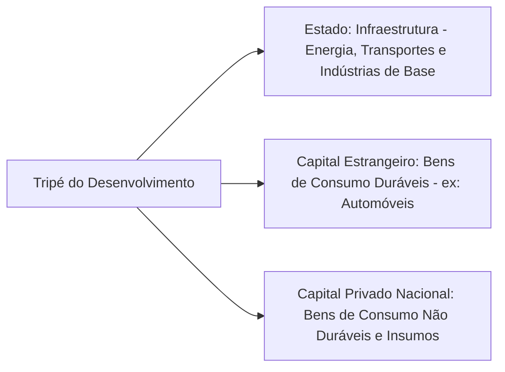


_Diagrama: Estrutura do "Tripé do Desenvolvimento" no Plano de Metas._ Os três pilares (Estado, capital estrangeiro e capital nacional) atuavam de forma coordenada para viabilizar a rápida industrialização entre 1956 e 1961. O **Estado** investia pesado em infraestrutura e setores básicos; o **capital estrangeiro** implantava fábricas de bens duráveis (protegido por incentivos cambiais, tarifas e crédito); e o **capital nacional** sustentava a produção de bens de consumo cotidiano e integrava as cadeias como fornecedor. Juntos, esses componentes impulsionaram o crescimento industrial, embora também gerassem desequilíbrios que seriam sentidos adiante.

## Os Setores do Plano e a Meta-Síntese (Brasília)

O Plano de Metas foi estruturado em **cinco grandes setores programáticos**, cada qual contendo várias metas específicas, totalizando **30 metas iniciais**. Os cinco setores eram: **Energia**, **Transportes**, **Indústrias de Base**, **Alimentação** e **Educação**. As metas nesses campos abrangiam projetos como: construção de usinas hidrelétricas e termoelétricas (Energia); abertura de rodovias, melhoria de portos e ferrovias (Transportes); instalação de novas siderúrgicas, fábricas de cimento, refinarias e mineração (Indústrias de Base); programas de aumento da produção agrícola e agronegócio (Alimentação); e expansão do ensino técnico e formação de mão de obra qualificada (Educação). Cada setor visava superar um conjunto de obstáculos ao desenvolvimento, e havia interdependência entre eles – por exemplo, os projetos de transporte estavam articulados às novas frentes agrícolas e à futura capital, e as indústrias de base forneceriam insumos para os demais setores.

Embora todos os campos fossem importantes, **Energia e Transportes tiveram prioridade destacada** nos investimentos públicos, pois eram vistos como pré-condições para viabilizar os demais (não se pode ter indústria sem energia elétrica confiável, nem integrar mercados sem estradas e ferrovias). Assim, JK canalizou recursos para grandes obras como a construção da usina de Furnas e Paulo Afonso (energia), e a abertura de estradas como a Via Dutra (Rio–São Paulo) e rodovias ligando o Centro-Oeste e Norte ao restante do país (transportes). Essa forte intervenção estatal era coerente com o papel do Estado no tripé do desenvolvimento, garantindo a infraestrutura necessária para que o capital privado (estrangeiro e nacional) pudesse expandir suas atividades produtivas.

Um elemento à parte – e altamente emblemático – do Plano de Metas foi a chamada **Meta 31, ou Meta-Síntese**: a **construção de Brasília**, a nova capital federal. Brasília condensou simbolicamente o espírito do plano "50 anos em 5". **Inaugurada em 1960** no centro do país, a cidade foi planejada para representar a _modernização_ e a _integração nacional_ promovidas pelo desenvolvimento. Ao transferir a capital do litoral (Rio de Janeiro) para o Planalto Central, JK buscou **impulsionar o desenvolvimento do interior** e reduzir o desequilíbrio regional histórico que privilegiava a faixa litorânea. Brasília nasceu em tempo recorde, povoada pelos **“candangos”** (trabalhadores migrantes de várias partes, principalmente do Nordeste), e sua arquitetura modernista e arrojada, assinada por Lúcio Costa e Oscar Niemeyer, tornou-se símbolo do otimismo desenvolvimentista. Em termos práticos, a construção da nova capital trouxe estradas, energia e telecomunicações para o coração do Brasil, conectando regiões antes isoladas. Brasília foi, portanto, a **síntese** das metas: englobava aspectos de todos os setores (energia para iluminar a nova cidade, transporte para ligá-la ao restante do país, mão de obra e alimentos para sustentar sua população, etc.) e personificava a ideia de um Brasil projetado rumo ao futuro.

## Resultados e Custos do Plano de Metas

### Sucessos: Crescimento Acelerado e Modernização Industrial

O Plano de Metas alcançou **resultados econômicos expressivos no curto prazo**. A economia brasileira experimentou **taxas de crescimento do PIB excepcionalmente altas** entre 1956 e 1961 – em torno de **8% ao ano**, em média –, enquanto a **renda per capita** aumentou cerca de 5% ao ano no período. O investimento maciço em infraestrutura e indústria pesada resultou em uma **diversificação significativa da estrutura industrial** brasileira. Novos setores produtivos ganharam forma: a **indústria automobilística** foi instalada, fábricas de bens de capital e equipamentos pesados entraram em operação, e as **indústrias de base** (aço, cimento, petroquímica) expandiram-se rapidamente. De fato, impulsionado pelo Plano de Metas, o setor industrial crescia a taxas superiores a 10% ao ano, com destaque para os segmentos de **bens de capital e bens de consumo duráveis**, que lideraram a expansão (Serra, 1983). Essa **rápida modernização** fez com que, ao início dos anos 1960, o Brasil tivesse uma economia muito mais complexa e integrada: produzia desde automóveis, caminhões e tratores até alumínio, navios, máquinas-ferramenta e eletrodomésticos, reduzindo a dependência de importações em muitos desses itens estratégicos.

Além do crescimento quantitativo, houve melhorias qualitativas na **infraestrutura** do país. A capacidade instalada de geração de energia elétrica aumentou substancialmente; a malha rodoviária federal dobrou de extensão, conectando regiões antes isoladas; a produção de aço e cimento atingiu patamares inéditos, fornecendo matéria-prima para a continuidade da industrialização. Grandes obras, como a construção de Brasília e de usinas hidrelétricas, deixaram um legado físico importante. Pode-se afirmar que o Plano de Metas cumpriu em boa medida seu objetivo de **“arrancar” o Brasil de um patamar econômico para outro superior**, lançando bases para o chamado “milagre econômico” da década seguinte. Em suma, os cinco anos de JK transformaram o Brasil em um **país mais urbano, industrial e moderno**, com o Estado desempenhando papel ativo de indutor do progresso.

### Custos e Consequências de Longo Prazo: Inflação, Dívida e Desigualdades

Por outro lado, os **custos do modelo desenvolvimentista** adotado por JK foram elevados e tiveram consequências duradouras nas décadas seguintes. O primeiro e mais evidente efeito colateral foi o **surto inflacionário**. Para financiar o grande volume de investimentos públicos (especialmente em infraestrutura) e estimular a economia, o governo recorreu pesadamente à **emissão monetária** e a déficits públicos – prática conhecida como **"desenvolvimentismo inflacionário"**. A própria meta do Plano era manter a inflação anual em torno de 13%, mas na realidade a inflação média do período JK atingiu cerca de **24,7% ao ano**, quase o dobro do previsto. Ou seja, o rápido crescimento veio acompanhado de uma forte **aceleração inflacionária**. JK e seus assessores viam a inflação moderada como um “preço a pagar” pelo desenvolvimento (atribuindo-a a desequilíbrios estruturais do subdesenvolvimento) e mostraram-se dispostos a tolerá-la em nome do progresso. De fato, JK chegou a romper negociações com o FMI em 1959 para não condicionar seu plano a políticas de austeridade anti-inflacionária, preferindo manter o ritmo das metas a seguir as duras exigências de estabilização do Fundo.

> [!important] **Desenvolvimentismo Inflacionário:** A opção de JK por financiar o crescimento via expansão da base monetária e gastos deficitários gerou inflação crescente. Esse mecanismo funcionou como uma forma de **“poupança forçada”**: a inflação corroía o poder de compra dos salários, transferindo recursos da população (especialmente dos trabalhadores) para sustentar o investimento. Em outras palavras, a classe trabalhadora, de menor poder de barganha política, arcou com grande parte do ônus do plano na forma de perda salarial real, enquanto o Estado e o empresariado direcionavam recursos para os projetos industriais. Tal processo agravou a **redistribuição regressiva de renda**, aumentando a concentração em favor dos setores vinculados ao capital e penalizando os assalariados.

Paralelamente, houve um **aumento expressivo do endividamento externo** brasileiro. Como as poupanças interna e receitas fiscais não bastavam para cobrir todos os investimentos, o governo buscou recursos no exterior. Além do investimento direto das multinacionais, o Plano de Metas foi financiado por **empréstimos de bancos e agências internacionais** (Eximbank, BIRD, etc.) e **créditos de fornecedores** para importação de máquinas. O resultado foi uma **explosão da dívida externa** ao final do período JK, excedendo em muito o crescimento das exportações. Indicadores da época mostram que a **relação dívida externa/exportações passou a superar 1 já a partir de 1956**, indicando forte desequilíbrio no setor externo. Em outras palavras, a dívida acumulada superava a capacidade anual de geração de divisas pelo país – um sinal de alerta para a solvência externa. Juscelino deixou para seus sucessores (Jânio Quadros e João Goulart) uma **pesada herança financeira**, consubstanciada em altos encargos da dívida e pressões inflacionárias não resolvidas. O início dos anos 1960 foi marcado pela necessidade de enfrentar esse duplo estrangulamento: inflação alta interna e crise cambial/externa devido ao endividamento, o que limitava a continuidade do mesmo modelo de crescimento.

Outro legado problemático foi o **aprofundamento das desigualdades sociais e regionais**. Apesar do crescimento agregado elevado, a prosperidade não beneficiou a todos por igual. O período JK não conseguiu resolver problemas de **desemprego e pobreza**; ao contrário, em alguns casos esses problemas se agravaram ou tornaram-se mais evidentes com o rápido êxodo rural e a urbanização desordenada. As regiões mais pobres, como o **Nordeste**, ficaram para trás em relação ao Centro-Sul industrializado, tanto que o governo sentiu necessidade de criar a **SUDENE (Superintendência de Desenvolvimento do Nordeste)** em 1959 para planejar ações específicas de estímulo àquela região. Dados históricos indicam que houve um **agravamento da concentração de renda** durante o Plano de Metas – a renda gerada pelo boom industrial ficou em grande parte com as camadas de alta renda e as empresas, enquanto as classes trabalhadoras lidavam com a inflação. Do ponto de vista regional, **as disparidades se mantiveram ou ampliaram**: o Sudeste (especialmente São Paulo e Rio de Janeiro) colheu os principais frutos da industrialização, enquanto regiões como o Norte e Nordeste pouco se beneficiaram diretamente das novas fábricas e infraestrutura. Em resumo, **as melhorias sociais e na distribuição de renda foram limitadas**, e o crescimento rápido veio acompanhado de **persistentes desigualdades regionais e sociais**. Esse quadro demonstra que o plano concentrou-se no objetivo do crescimento econômico, sem um equivalente esforço de políticas sociais redistributivas.

Por fim, os **desequilíbrios macroeconômicos gerados no governo JK deterioraram as bases do crescimento sustentável no longo prazo**. A economia brasileira saiu dos anos JK com uma estrutura industrial mais avançada, porém também com **inflação crônica, déficit externo e desequilíbrios fiscais** que minaram a estabilidade. Esses fatores contribuíram para um ambiente de crescente tensão econômica e política no início dos anos 1960. Alguns historiadores e economistas argumentam que as **contradições do modelo JK** – crescimento com inflação e dívida – prepararam o terreno para a crise que culminou na **ruptura institucional de 1964**. De fato, a necessidade de controlar a inflação e arrumar as contas externas tornou-se tema central dos governos pós-JK, gerando conflitos distributivos intensos e sucessivas tentativas de planos de estabilização que esbarraram em resistências políticas. A instabilidade política se agravou (greves, reformas de base propostas, reação de elites), até desembocar no golpe militar. Assim, embora JK não tenha sido a causa direta do golpe, **muitos de seus “problemas legados” – inflação alta, dívida, desigualdade – criaram um contexto de insatisfação e desordem econômica que enfraqueceu a jovem democracia**, facilitando a intervenção dos militares.

Em suma, o Plano de Metas legou ao Brasil um **paradoxo desenvolvimentista**: ao mesmo tempo em que promoveu um **salto de crescimento e modernização** sem precedentes, também **plantou sementes de desequilíbrio** que exigiriam correções difíceis nos anos seguintes. A experiência JK permanece, até hoje, como referência de planejamento bem-sucedido em termos de transformação estrutural rápida, mas também como alerta sobre os custos de se buscar desenvolvimento a qualquer preço.

## Questões para Autoavaliação

1. **Explique a lógica do "tripé do desenvolvimento" durante o Plano de Metas.** Como Estado, capital estrangeiro e capital nacional se complementaram nesse modelo e quais dilemas essa estratégia suscitou em termos de autonomia e financiamento do desenvolvimento?
    
2. **Analise os principais custos e consequências do Plano de Metas.** Em que medida a opção por um desenvolvimento rápido levou a desequilíbrios como a inflação e o endividamento externo? Como esses desequilíbrios afetaram a distribuição de renda e a estabilidade econômica e política nos anos posteriores?
    
3. **O Plano de Metas atingiu seus objetivos de “50 anos em 5”?** Avalie os resultados positivos alcançados em termos de crescimento e industrialização, contrapondo-os aos problemas estruturais gerados. Em sua opinião, o legado de JK foi predominantemente positivo ou negativo para o desenvolvimento de longo prazo do Brasil? Be sure to check sources for more details.

# Origem: _O Período 1962-1967 (Plano Trienal, PAEG)

---
title: O Período 1962-1967 (Plano Trienal, PAEG)
area: ECONOMIA
subarea: História econômica brasileira
tags:
  - cacd-2025
  - economia
  - historia-economica-brasileira
  - o-periodo-1962-1967
aliases:
  - 4.5 O Período 1962-1967.
---
# Economia Brasileira (1962–1967): Crise do Desenvolvimentismo, Plano Trienal e PAEG

## 1. Desaceleração e Crise do Desenvolvimentismo (1962–1963)

No início dos anos 1960, a economia brasileira entrou em uma fase de **crise do modelo nacional-desenvolvimentista**. Após três décadas de industrialização por substituição de importações (1930–60), sinais de **esgotamento desse modelo** tornaram-se evidentes. O **Plano de Metas** do governo Juscelino Kubitschek (1956–61) impulsionara um crescimento acelerado com investimentos maciços em infraestrutura e indústria de base, porém deixou como legado um forte desequilíbrio macroeconômico: **inflação em alta e endividamento externo significativo**. A capacidade do país de seguir substituindo importações diminuía, e setores dinâmicos, como bens de capital e duráveis, já haviam sido implantados com forte participação de capital externo durante os anos 1950. Entretanto, esse avanço veio **acompanhado de pressões inflacionárias cada vez maiores** e deterioração nas contas externas.

A transição política pós-Juscelino agravou a instabilidade econômica. O presidente **Jânio Quadros (1961)** tentou brevemente um ajuste ortodoxo, mas sua renúncia repentina gerou uma crise política. Seu sucessor, **João Goulart (1961–64)**, assumiu num contexto conturbado: primeiro sob regime parlamentarista (1961-62) – fase marcada por **constantes trocas ministeriais** – e depois, restaurado o presidencialismo em 1963, enfrentando forte oposição de setores conservadores. A **poupança pública caía** devido a déficits orçamentários e crescente gasto estatal, minando a capacidade de investimento do governo. Simultaneamente, **a inflação disparou** de 34,7% em 1961 para ~50% em 1962, e o déficit externo ampliou-se (importações superando exportações). Em **1963**, o quadro era de **estagflação**: o PIB cresceu apenas 0,6%, enquanto a inflação anual aproximou-se de 80%. Esse **colapso econômico (1962–63)** é frequentemente atribuído à conjunção de fatores: **esgotamento da substituição de importações, perda de dinamismo exportador, descontrole fiscal-monetário (em parte herdado do desenvolvimentismo acelerado)**, além de **instabilidade política e conflito distributivo intenso** sob Goulart.

> [!note] **Crise de 1963 – sintoma do esgotamento**   
> No início de 1964, projeções indicavam inflação acima de **100% ao ano**, um dos sinais mais evidentes da crise gerada pelo esgotamento do modelo desenvolvimentista baseado na substituição de importações. A estagnação econômica, acompanhada de alta inflação e **conflitos político-sociais**, criou um ambiente de ruptura que antecedeu o golpe militar de 1964.

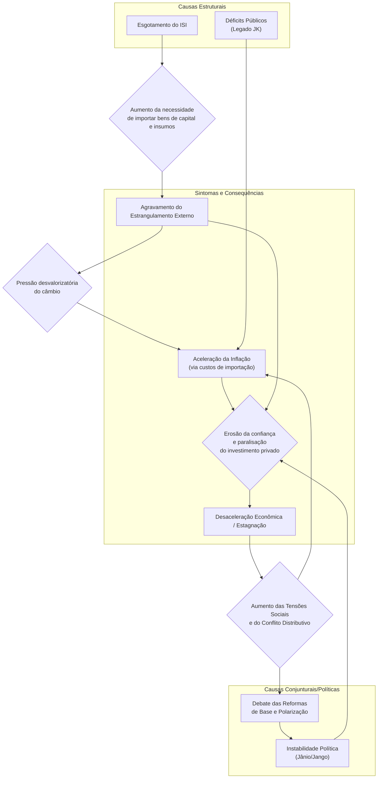

## 2. O Plano Trienal (1963–1965)

Diante do agravamento da crise, o governo João Goulart lançou, no final de 1962, o **Plano Trienal de Desenvolvimento Econômico e Social (1963–65)**. Idealizado pelo economista **Celso Furtado**, então Ministro do Planejamento, o Plano Trienal buscava **conciliar medidas ortodoxas de estabilização com reformas estruturais de inspiração cepalina**. Tratava-se de uma abordagem **“híbrida”**: por um lado, previa um período inicial de **austeridade** para domar a inflação (com **congelamento de salários e preços**, corte de gastos públicos e crédito restrito); por outro, colocava como essenciais as **“Reformas de Base”** – um conjunto de reformas estruturais (agrária, administrativa, bancária, fiscal, educacional e urbana) destinadas a remover **entraves institucionais ao desenvolvimento** de longo prazo. O plano almejava **reduzir a inflação para 25% em 1963 e 10% em 1965**, sem abrir mão do crescimento – projetava-se um **PIB crescendo ~7% ao ano** no triênio. A estratégia de Furtado era **gradualista**: combater a inflação passo a passo, evitando uma forte recessão, e ao mesmo tempo **redistribuir renda** e **retomar investimentos públicos** após a estabilização inicial.

> [!important] **Metas ambiciosas do Plano Trienal** 
> Reduzir a inflação de ~50% em 1962 para **10% até 1965**, mantendo o crescimento econômico anual em torno de **7%**. O plano combinava **ajuste fiscal-monetário** (para conter a alta de preços) com iniciativas de **reforma estrutural** (Reformas de Base) para sustentar o desenvolvimento no longo prazo.

**Conteúdo e contradições:** O Plano Trienal propunha medidas de ajuste típicas (corte de subsídios, equilíbrio orçamentário, restrição monetária) ao lado de políticas de desenvolvimento. Previa, por exemplo, **salário mínimo reajustado abaixo da inflação** num primeiro momento (para frear a espiral inflacionária), mas também uma política de distribuição de renda via investimentos sociais assim que a estabilidade fosse alcançada. Buscou-se ainda **gradualismo na substituição de importações**, incentivando a indústria nacional sem choques abruptos. Contudo, o plano enfrentou **dilemas**: algumas propostas soavam incoerentes – ex.: pretendia-se **atrair recursos externos** e ao mesmo tempo adotar retórica nacionalista contra capitais estrangeiros; ou ainda, **elevar salários reais a médio prazo**, mas inicialmente **aumentar impostos e conter ganhos salariais** para combater a inflação. Essas ambiguidades fragilizaram a credibilidade do programa.

**Fracasso e causas:** Na prática, o Plano Trienal **mal saiu do papel**. Vários fatores explicam seu insucesso: (a) **Falta de apoio político** – o país estava polarizado. As **esquerdas (sindicatos, CGT)** rechaçaram as medidas de austeridade, sobretudo o **arrocho salarial** proposto, enquanto **elites conservadoras** (empresários, latifundiários) opuseram-se às reformas estruturais e temiam a guinada “socialista” de Goulart. (b) **Isolamento do governo** – Goulart, sem maioria sólida no Congresso e pressionado por todos os lados, hesitou em bancar integralmente o plano. Conflitos entre Executivo e Legislativo e a proximidade das eleições de 1965 reduziram o engajamento do presidente nas medidas impopulares. (c) **Contexto socioeconômico adverso** – a inflação seguia alta (cerca de 80% em 1963) e as reservas cambiais eram baixas, exigindo resultados rápidos que o plano gradualista não conseguiu entregar. (d) **Falta de apoio externo** – o governo contava com ajuda financeira dos EUA (no âmbito da _Aliança para o Progresso_) para aliviar a restrição externa e viabilizar simultaneamente crescimento e estabilização. Entretanto, devido à desconfiança ideológica em relação a Goulart (visto por Washington como próximo da esquerda), os EUA **bloquearam recursos e crédito**, tornando impossível fechar as contas externas do triênio. Sem refinanciamento da dívida e novos empréstimos, faltou “fôlego” para o Brasil equilibrar combate à inflação com investimentos. (e) **Pressões inflacionárias inerciais** – mesmo com tentativas de controle, a inflação mostrou forte persistência, corroendo salários e gerando descontentamento popular contínuo.

Concretamente, já em meados de **1963 o Plano Trienal naufragara**: Goulart, pressionado pela base trabalhista, **concedeu reajustes salariais acima do previsto** e retomou subsídios (por exemplo, ao trigo e combustíveis) para aplacar empresários e consumidores. As metas fiscais e monetárias foram abandonadas. O resultado foi um **agravamento da crise**: 1963 fechou com crescimento pífio (~0%) e a inflação seguiu elevada; em **1964**, na véspera do golpe, a inflação ultrapassaria 90% ao ano. O **fracasso do Plano Trienal** minou a credibilidade do governo Goulart e contribuiu para a instabilidade que culminou em sua deposição em março de 1964.

> [!note] **Razões do fracasso do Plano Trienal:**
> 
> - **Oposição interna:** Sindicatos e movimentos de esquerda sabotaram as políticas de contenção (exigindo mais reajustes salariais), enquanto empresários e latifundiários bloquearam as Reformas de Base. Goulart ficou sem base política para implementar o plano.
>     
> - **Crise social e polarização:** Greves, manifestações e o acirramento ideológico dificultaram quaisquer consensos, num contexto em que _estabilidade econômica_ competia com _demandas por reformas sociais_.
>     
> - **Falta de suporte externo:** Os EUA condicionaram ajuda financeira a um rígido programa anti-inflacionário, mas ao mesmo tempo desconfiavam de Goulart. Na prática, **negaram o crédito** de que o Brasil necessitava, asfixiando o Plano Trienal.
>     
> - **Pressão do tempo:** Com a inflação corroendo salários rapidamente, faltou tempo hábil para a estratégia gradualista de Furtado produzir resultados – a impaciência dos diversos grupos levou ao abandono prematuro do plano em 1963.
>     

## 3. O PAEG (1964–1967)

Com o golpe militar de 31 de março de 1964, instalou-se o governo do general **Castello Branco (1964–67)**, que nomeou uma equipe econômica de perfil tecnocrático-liberal para enfrentar a crise. Os **ministros Octávio Gouvêa de Bulhões (Fazenda)** e **Roberto Campos (Planejamento)** formularam o **Programa de Ação Econômica do Governo (PAEG)**, lançado em novembro de 1964. Diferentemente do Plano Trienal, o PAEG adotou um **diagnóstico estritamente ortodoxo da crise** e perseguiu metas claras de estabilização de curto prazo, combinadas com **reformas institucionais profundas** para recolocar a economia nos trilhos do crescimento sustentado.

**Diagnóstico e objetivos:** Bulhões e Campos viam a economia brasileira atolada em **desequilíbrios múltiplos**: inflação alta e **inercial** (realimentada por expectativas e indexação informal), **déficit público crônico** (financiado via emissão de moeda), **setor externo frágil** (reservas escassas e dependência de capitais de curto prazo) e **sistema financeiro arcaico e desorganizado**. Além disso, identificavam a falta de incentivos à **poupança interna** e à formação de capital de longo prazo como entraves estruturais ao desenvolvimento. Em suma, a análise era de que a crise decorria de **excesso de demanda e descontrole fiscal-monetário**, agravados por um arcabouço econômico-institucional inadequado. Assim, o **PAEG** estabeleceu dois pilares: (1) **Estabilização imediata** – um _choque ortodoxo_ anti-inflacionário, com ajuste fiscal draconiano, controle da oferta de moeda e **política salarial rígida (arrocho)** para quebrar a espiral preços-salários; e (2) **Reformas estruturais** – um conjunto de medidas legislativas para modernizar a economia (sistema financeiro, mercado de capitais, sistema tributário, relações de trabalho e setor habitacional), visando lançar as bases de um crescimento sustentado com menores pressões inflacionárias no futuro.

**Medidas de estabilização (curto prazo):** De 1964 a 1966, a equipe econômica implementou um duro programa de ajuste. Houve um profundo **corte nas despesas públicas** e esforço de aumentar receitas (inclusive com criação de novos tributos em 1965–66), buscando equilibrar o orçamento. O Banco do Brasil restringiu drasticamente a expansão do crédito (**“enxugamento monetário”**), e as taxas de juros foram elevadas para conter a demanda. A taxa de câmbio foi **devaluada e unificada** (eliminando câmbios múltiplos) para incentivar exportações e equilibrar o balanço de pagamentos. A mais notória – e impopular – medida foi a **política salarial de arrocho**: em 1964, decretos limitaram os reajustes do funcionalismo; em 1965, a **Lei nº 4.725** estendeu a regra ao setor privado, estabelecendo que os salários seriam corrigidos apenas pela **média dos dois anos anteriores**, acrescida de uma parcela da inflação projetada. Na prática, isso significava **redução do salário real** ano após ano, pois a inflação efetiva superava a prevista, achatando o poder de compra dos trabalhadores. Além disso, proibiram-se acordos coletivos acima do índice oficial e, pela **Lei nº 4.923/65**, autorizou-se até redução nominal de salários em empresas em dificuldade. Esse **congelamento salarial**, aliado ao desemprego gerado pela recessão de 1965, foi o principal instrumento para desacelerar a inflação via contenção da demanda.

> [!definition] **“Arrocho salarial”** – Política de compressão dos salários aplicada pelo PAEG. Consistia em reajustar salários **abaixo da inflação**, via fórmula fixa anual (salário mínimo com base na média dos 24 meses anteriores + produtividade + metade da inflação futura projetada). Esse mecanismo, imposto por lei em 1965, **reduziu os salários reais em cerca de 25% entre 1965 e 1967**, quebrando a espiral inflacionária ao custo de forte perda de poder aquisitivo dos trabalhadores.

**Reformas estruturais (médio e longo prazo):** Paralelamente ao ajuste conjuntural, o PAEG promoveu um amplo pacote de **reformas institucionais** entre 1964 e 1967, mudando profundamente as “regras do jogo” da economia brasileira. As principais reformas implementadas foram:

1. **Reforma Financeira – Lei 4.595/1964:** Reconhecida como o eixo central do PAEG, a reforma do sistema financeiro criou o **Conselho Monetário Nacional (CMN)** e o **Banco Central do Brasil (Bacen)**, inaugurando um verdadeiro banco central no país. A autarquia assumiu funções antes exercidas pelo Banco do Brasil e pela SUMOC (Superintendência da Moeda e do Crédito, extinta pela nova lei). Ao **CMN** coube formular a política monetária e creditícia, enquanto o Bacen a executaria. A lei também **reestruturou o sistema bancário**, segmentando as instituições por especialidade: definiram-se bancos comerciais (curto prazo), **bancos de investimento** (médio/longo prazo, criados pela reforma), além de caixas econômicas, sociedades de crédito imobiliário, etc. O objetivo era **modernizar e controlar efetivamente o crédito**, dotando o governo de instrumentos mais eficazes de política monetária e ampliando a oferta de financiamento para setores produtivos específicos. **Importante:** a Lei 4.595 introduziu a **correção monetária** nos títulos públicos (_ORTNs_), protegendo-os da inflação. Com isso, o governo pôde passar a financiar seus déficits **via colocação de títulos no mercado**, ao invés de emitir moeda – já em 1965, mais da metade do déficit público foi coberta por venda de títulos; e em 1966, o Tesouro praticamente não dependia mais da “maquininha” do dinheiro. Essa mudança institucional foi crucial para **estancar a inflação**, ao atacar seu componente fiscal-monetário.
    
2. **Reforma do Mercado de Capitais – Lei 4.728/1965:** Complementando a reforma bancária, essa lei _“disciplinou o mercado de capitais e estabeleceu medidas para seu desenvolvimento”_. Incentivou a criação de **sociedades de investimento e fundos de investimento** (com benefícios fiscais para investidores), estimulando a captação de recursos privados para financiamento empresarial. Regulamentou e promoveu instrumentos como **debêntures** (títulos de dívida corporativa) e modernizou as práticas do mercado acionário, visando ampliar as fontes de financiamento de longo prazo para o setor privado. Também fixou bases legais para operações de crédito mais sofisticadas (como alienação fiduciária em garantias). Em suma, a Lei 4.728 buscou **desenvolver um mercado financeiro não bancário**, reduzindo a dependência das empresas do crédito público ou estrangeiro. Essa reforma, junto com a financeira, **segmentou o sistema financeiro**: instituições diferentes passaram a operar em faixas específicas de crédito (curto, médio e longo prazos), sob supervisão do CMN. Apesar das intenções, no curto prazo o mercado de capitais permaneceu incipiente – a popularização de certos instrumentos viria bem mais tarde. Porém, o arcabouço legal estava lançado para sustentar uma futura expansão do investimento privado doméstico.
    
3. **Reforma Tributária (1965–1966):** O PAEG empreendeu uma ampla modernização do **sistema tributário brasileiro**, aumentando a capacidade do Estado em arrecadar e gastar de forma racional. Em 1965 foi aprovada uma Emenda Constitucional (nº 18) redefinindo competências tributárias, seguida por leis complementares em 1966. As mudanças-chave incluíram: **eliminação de impostos “em cascata” e cumulativos** (típicos do antigo sistema) e sua substituição por tributos mais modernos. Criaram-se o **ICM (Imposto sobre Circulação de Mercadorias)**, de competência estadual, e o **IPI (Imposto sobre Produtos Industrializados)**, federal – ambos impostos não-cumulativos, cobrados no destino, que passaram a compor a espinha dorsal da arrecadação sobre consumo. O ICM substituiu o arcaico Imposto de Vendas e Consignações; já o IPI sucedeu o imposto de consumo. Também se unificaram e racionalizaram diversos tributos federais e municipais, **centralizando a arrecadação**. Houve melhorias na cobrança do **Imposto de Renda**, com atualização de bases e implantação gradual de retenção na fonte. Essa reforma aumentou significativamente a **carga tributária** e **reduziu a evasão**, permitindo que, a partir de 1967, o governo federal obtivesse **superávits primários** ou menores déficits, financiando investimentos sem recorrer à inflação. Como efeito colateral, porém, a estrutura tributária permaneceu **regressiva** (ênfase em tributos indiretos) e a maior carga incidiu proporcionalmente mais sobre consumo e salários, o que alguns autores criticam como **injustiça fiscal**. De todo modo, a reforma tributária de 1966 **restabeleceu a capacidade do Estado de investir em infraestrutura e impulsionar o desenvolvimento**, algo essencial para o _Milagre Econômico_ vindouro.
    
4. **Reforma Habitacional e Trabalhista (1964–1966):** Nessa frente, o governo reorganizou as políticas de habitação popular e alterou profundamente a legislação trabalhista para **flexibilizar as relações de emprego**. Em agosto de 1964 foi criado o **Banco Nacional de Habitação (BNH)**, gestor do novo **Sistema Financeiro da Habitação (SFH)**. A ideia era viabilizar crédito imobiliário em larga escala para construção de casas, estimulando a indústria da construção civil (setor escolhido como motor do crescimento urbano). Inicialmente, o SFH captaria recursos via cadernetas de poupança e fundos do próprio governo. Porém, percebeu-se que isso seria insuficiente para o volume de moradias pretendido. A solução veio com a criação do **FGTS (Fundo de Garantia do Tempo de Serviço)**, pela Lei nº 5.107 de setembro de 1966. O FGTS substituiu o antigo regime de _estabilidade decenal_ no emprego (pelo qual o trabalhador, após 10 anos na empresa, adquiria estabilidade ou indenização na demissão). Em vez disso, instituiu-se um **fundo de poupança compulsória do trabalhador**: os empregadores passaram a depositar mensalmente **8% do salário** de cada empregado em uma conta vinculada, que o trabalhador poderia sacar em caso de demissão sem justa causa ou para financiar casa própria, entre outras situações. Essa reforma **flexibilizou os contratos de trabalho** (facilitando admissões e demissões) e, ao mesmo tempo, **gerou uma massa de recursos de longo prazo** administrada pelo BNH para investimento em habitação e saneamento. O governo apresentava o FGTS como um **“colchão” para o trabalhador**, compensando parcialmente a perda salarial com um **patrimônio financeiro** que ele levaria de emprego a emprego. Também seria uma forma de realizar o “sonho da casa própria” – visto como um _salário indireto_ – ao permitir uso do saldo do FGTS na compra de imóveis populares. Na prática, o FGTS/BNH financiou principalmente moradias para a classe média-baixa urbana, dinamizando o setor de construção nos anos seguintes. Contudo, os mais pobres (renda de 1–3 salários mínimos) ficaram em grande parte excluídos dos financiamentos, revelando o **caráter excludente** do modelo habitacional criado. Ainda assim, a reforma habitacional-trabalhista do PAEG teve dois grandes efeitos: **reduziu custos trabalhistas para o empresariado** (fim da estabilidade onerosa) e **forneceu base para expansão urbana e do crédito imobiliário**, com impacto multiplicador no emprego e na indústria de materiais de construção.
    
5. **Política Salarial** e **Correção Monetária**: Além do arrocho já descrito, o governo instituiu mecanismos formais de **indexação na economia** para conviver melhor com a inflação remanescente. A **Lei 4.357/1964** introduziu a correção monetária em títulos públicos (ORTNs) e contratos de longo prazo, ajustando-os periodicamente pela variação de preços. Isso **protegeu a poupança financeira da corrosão inflacionária** e foi inovador mundialmente. Posteriormente, a correção monetária ampliou-se a diversos contratos privados (financiamentos imobiliários, por exemplo, passaram a ser reajustados). A lógica era **mitigar distorções da inflação**, incentivando agentes a manter investimentos no país. Entretanto, a própria indexação também **perpetuava a inflação** num patamar moderado, pois preços e salários passaram a incorporar expectativas de correção futura. No que tange aos salários, a política do PAEG foi completar o arcabouço legal do arrocho: em 1966, fixou-se uma **tabela oficial de reajustes** por categoria profissional, institucionalizando os aumentos salariais anuais conforme a fórmula predefinida e **vetando negociações coletivas livres**. Essa **disciplina salarial rígida** foi mantida até o início dos anos 1970, garantindo ganhos reais mínimos aos trabalhadores durante o período de estabilização. Simultaneamente, o governo revogou pontos da Lei de Remessa de Lucros (Lei 4.131/1962) – que limitava em 10% ao ano a remessa de dividendos por multinacionais. Em 1964, esse limite foi **eliminado**, atendendo a exigências dos EUA e do FMI. Isso **reabriu as portas ao investimento estrangeiro** e facilitou a entrada de capitais nos anos seguintes (ainda que ao custo de maior desnacionalização da economia).
    

> [!definition] **FGTS – Fundo de Garantia do Tempo de Serviço** 
> Criado em 1966, é um fundo compulsório onde empregadores depositam mensalmente uma porcentagem do salário de cada trabalhador (8%). Substituiu a estabilidade no emprego, permitindo às empresas maior flexibilidade nas demissões. Para os trabalhadores, o FGTS funciona como **poupança forçada**, acessível em situações especiais (demissão, compra da casa própria, aposentadoria, etc.). Os recursos do FGTS foram canalizados pelo BNH para financiar habitação popular, sendo apresentados pelo regime como um **“benefício social”** que compensaria parcialmente o arrocho salarial, ao possibilitar a aquisição da casa própria (salário indireto) e a constituição de um patrimônio portátil.

## 4. Avaliação do PAEG (1964–1967)

**Resultados econômicos:** As políticas do PAEG inicialmente aprofundaram a **desaceleração econômica** – um efeito esperado do ajuste. Em **1965**, o PIB cresceu apenas ~2,4%, chegando a haver **recessão industrial** (a produção manufatureira caiu cerca de 4,7% naquele ano). O desemprego urbano aumentou e várias empresas, sufocadas pela alta dos juros e contração do crédito, enfrentaram falência ou fusões forçadas. Porém, já em **1966** a economia começou a reagir: o PIB subiu 6,7%, puxado por recuperação industrial e investimentos estimulados pelas reformas. Em **1967**, o crescimento ficou em torno de 4%, consolidando uma **retomada gradual**. Do lado **inflacionário**, o PAEG obteve sucesso notável em **desacelerar a alta de preços**: partindo de quase 90% a.a. em 1964, a inflação caiu para ~34% em 1965, manteve-se em 1966 (39%) e recuou para **aprox. 25% em 1967**, o nível mais baixo em uma década. Ou seja, em três anos a inflação anual foi reduzida a cerca de **¼ do patamar pré-PAEG**. Essa **descompressão inflacionária** deve-se em grande medida ao **controle salarial e fiscal** exercido – a **política monetária austera** e o fim do financiamento inflacionário do déficit via emissão de moeda atacaram a raiz do processo. Além disso, a **melhora no setor externo** contribuiu: o ajuste cambial e a contração da demanda reduziram importações, e com algum apoio financeiro externo (acordo com FMI em 1965) o balanço de pagamentos estabilizou-se. Em 1967, o Brasil já apresentava **indicadores mais equilibrados**, preparando o terreno para a expansão que viria em seguida.

**Criação do arcabouço do “Milagre”:** Talvez o legado mais importante do PAEG tenha sido a **transformação institucional** que permitiu o chamado **“Milagre Econômico” (1968–1973)**. As reformas financeiras e fiscais criaram as condições para que, a partir de 1968, o país crescesse aceleradamente sem estrangular-se em inflação ou falta de recursos. Com o Banco Central operando, o governo passou a controlar melhor a liquidez e pôde inclusive adotar, a partir de 1968, políticas monetárias e creditícias expansionistas de forma coordenada. O **robusto sistema financeiro montado (1965)** canalizou uma explosão de crédito para o setor privado durante o Milagre – os empréstimos bancários ao setor produtivo cresceram **mais de 600% em termos reais entre 1966 e 1974**. A reforma tributária, por sua vez, assegurou **receitas crescentes ao Estado**, financiando investimentos públicos em infraestrutura (rodovias, energia, telecomunicações) que sustentaram a indústria durante o boom pós-67. Instrumentos como a correção monetária e o FGTS viabilizaram a manutenção de investimentos de longo prazo num ambiente de inflação moderada crônica, sem fuga massiva de capitais. Assim, **muitos analistas atribuem o sucesso do Milagre Econômico diretamente às bases lançadas pelo PAEG** – sem as quais o crescimento de 10% a.a. com inflação decrescente (abaixo de 20% após 1971) não teria ocorrido. Roberto Campos, retrospectivamente, apontou que _“o PAEG estabilizou a moeda e removeu as amarras institucionais que tolhiam nosso desenvolvimento, liberando as energias para o surto de crescimento dos anos 70”_ (discurso citado por diversos historiadores econômicos).

**Custos sociais e críticas:** Em contrapartida, os ganhos macroeconômicos do PAEG tiveram **elevado custo social**. A **política de arrocho** significou **expressiva perda salarial**: estima-se que os salários médios tiveram queda real acumulada de ~25% de 1964 a 1967. A participação dos salários na renda nacional diminuiu, enquanto a fatia dos lucros aumentou – em outras palavras, houve **concentração de renda** em favor do capital. **Indicadores de desigualdade** pioraram, com aumento da pobreza urbana em certas regiões devido ao desemprego e à alta no custo de vida (até que a inflação caísse). Além disso, os **juros altos** e o crédito escasso nos anos de ajuste penalizaram pequenas e médias empresas, muitas das quais não sobreviveram – o que **concentrou ainda mais o setor empresarial**, favorecendo grandes grupos econômicos. Autores como **Maria da Conceição Tavares** e **Carlos Lessa** destacam que o “modelo de 64” configurou um **padrão de desenvolvimento excludente**: estimulou-se o consumo de massas de bens duráveis (automóveis, eletrodomésticos) e a expansão urbana, mas **restrito à classe média** emergente, deixando as camadas populares à margem. Lessa (1981) argumenta que o PAEG lançou as bases de um crescimento concentrador, pois o Estado desenvolvimentista passou a **priorizar o capital privado aliado (nacional e estrangeiro)**, em detrimento de políticas distributivas mais amplas. Por outro lado, economistas liberais como **Mario Henrique Simonsen** – ele próprio discípulo de Campos e Bulhões – justificaram que o sacrifício salarial foi _temporário e necessário_: sem quebrar a espiral inflacionária, não haveria como retomar o crescimento; e o próprio Milagre dos anos 70 acabaria beneficiando indiretamente a população via mais empregos e queda da inflação. De qualquer forma, a expressão **“anos de chumbo, anos de ouro”** reflete essa dualidade: ouro para os indicadores econômicos agregados, chumbo para os trabalhadores e opositores políticos, reprimidos tanto economicamente (pelo arrocho) quanto politicamente (pela ditadura).

**Interpretações historiográficas:** A compreensão desse período varia conforme a perspectiva teórica. _Maria da Conceição Tavares_ enxergou a crise de 1962-63 como um **ponto de inflexão estrutural**: em seu clássico ensaio _“Auge e Declínio do Processo de Substituição de Importações”_, argumentou que o modelo anterior se exauriu ao esbarrar em estrangulamentos (externos e fiscais), exigindo um novo padrão de acumulação. Tavares interpreta o PAEG e o Milagre subsequente como a transição para um **“capitalismo associado e financeiro”**, no qual o crescimento se apoia em capital estrangeiro, concentração industrial e modernização financeira – mas aprofunda a dependência externa e a concentração de renda. _Luiz Carlos Bresser-Pereira_, por sua vez, analisou o período sob a ótica da **economia política**: ele caracteriza o PAEG como o fim do ciclo do **populismo desenvolvimentista** e o início de uma era de **tecnocracia autoritária**. Em _Desenvolvimento e Crise no Brasil_ (1984), Bresser destaca que os militares, ao assumirem, **romperam o pacto populista** (nacionalismo industrial + concessões trabalhistas) e optaram por um “**desenvolvimento conservador**”, onde a estabilidade monetária e a confiança do empresariado tinham prioridade sobre a distribuição de renda. Ainda assim, Bresser reconhece os **méritos técnicos do PAEG**: “colocou ordem na casa” ao controlar a inflação e criar instituições modernas, embora cobrando o preço de **aniquilar o ímpeto reformista social** do governo anterior. Já _Carlos Lessa_ enfatiza a **dimensão social e estratégica**: ele cunhou a expressão _“modelo brasileiro de contra-revolução do desenvolvimento”_ para descrever como o regime de 64 implantou mudanças econômicas profundas visando crescimento, porém **sem reformas sociais** – ao contrário, com **reversão de conquistas trabalhistas**. Lessa argumenta que o PAEG promoveu um crescimento “de alto custo social”, que mais tarde traria tensões (como a crise distributiva do fim dos anos 1970). Em sua obra _15 anos de política econômica_ (1972), Lessa detalha os resultados positivos em números (inflação, PIB) mas alerta para **“péssimos resultados sociais, por exemplo, concentração salarial e elevação da taxa de juros”**, concluindo que o “milagre” foi construído sob bases excludentes.

**Contexto latino-americano:** As experiências do Brasil entre 1962-67 inserem-se num contexto mais amplo da América Latina nos anos 60, marcado por tentativas de conciliar **estabilização econômica com reformas estruturais**. Sob a influência da **CEPAL** e do programa norte-americano **Aliança para o Progresso**, vários países buscaram modernizar suas economias e conter a inflação, em resposta tanto a crises internas quanto ao medo de convulsões sociais (no pós-Revolução Cubana). No **Chile**, por exemplo, o governo democrata-cristão de **Eduardo Frei Montalva (1964–70)** implementou a chamada _“Revolución en Libertad”_, que incluiu **reforma agrária**, **reforma tributária progressiva** e aumento do gasto social, combinados com acordos com o FMI para estabilização monetária. A inflação chilena foi reduzida de níveis superiores a 20% a.a. para cerca de 10% a.a. em meados da década, ao mesmo tempo em que se promoviam mudanças estruturais – embora o esforço tenha perdido fôlego próximo de 1970. No **México**, a fase conhecida como _“desarrollo estabilizador”_ (final dos 1950s até 1970) foi marcada por crescimento contínuo (~6% a.a.) com inflação baixa (abaixo de 5% a.a.), graças a uma política fiscal austera e câmbio fixo, enquanto o governo investia em industrialização – uma estratégia “ortodoxa” de sucesso relativo, embora acompanhada de alta concentração de renda. Esses exemplos ilustram que o Brasil não esteve só: **toda a região experimentou, de formas distintas, o dilema de equilibrar crescimento, estabilidade e demandas sociais**. A solução brasileira – via PAEG – foi das mais drásticas em termos de ajuste, mas criou um **modelo de desenvolvimento “pragmático-autoritário”** que influenciaria outros regimes militares sul-americanos posteriores. Aliás, economistas da CEPAL da época viam com ambivalência o caso brasileiro: por um lado, elogiaram as **reformas institucionais** (muitas coincidiam com propostas cepalinas, como reforma tributária e financeira); por outro, criticaram o **caráter regressivo** e a falta de reformas sociais (a CEPAL defendia fortemente a reforma agrária, por exemplo, que no Brasil de 64 foi abandonada). Em síntese, o PAEG combinou um receituário estabilizador similar ao de vários países (sob influência do FMI e do pensamento ortodoxo internacional) com um conjunto singular de reformas que moldaram a economia brasileira pelas décadas seguintes.

> [!important] **Balanço geral:** O PAEG (1964–67) conseguiu **estabilizar a economia brasileira**, domando a inflação galopante e superando a crise do início da década de 60, ao mesmo tempo em que **reestruturou profundamente o Estado e os mercados**. Suas reformas criaram as bases legais e institucionais para o **“Milagre Econômico”** dos anos seguintes – um período de crescimento acelerado com inflação moderada. Contudo, esse ajuste foi acompanhado por **sérios custos sociais**: compressão dos salários, aumento da concentração de renda e sacrifício das camadas mais pobres. A economia brasileira entrou nos anos 1970 mais dinâmica e integrada ao capitalismo global, porém **marcada por desigualdades** que continuariam desafiando os formuladores de políticas nas décadas seguintes.

## Questões para Autoavaliação

- **Q1.** Quais foram as principais causas da crise econômica brasileira no biênio 1962–1963 e por que esse período é considerado o esgotamento do ciclo desenvolvimentista?
    
- **Q2.** Em que consistia o Plano Trienal de Celso Furtado e quais fatores (domésticos e externos) explicam o fracasso dessa estratégia de estabilização e reforma?
    
- **Q3.** Cite as principais reformas estruturais implementadas pelo PAEG (1964–67) e explique como elas contribuíram para a estabilização econômica e a preparação do “Milagre Econômico”. Quais foram os impactos sociais dessas reformas no curto prazo?
    

**Resposta esperada (resumo):** _A crise de 62-63 decorreu do esgotamento do modelo de substituição de importações, evidenciado pela alta inflação (legado do Plano de Metas), desequilíbrio externo e perda de poupança pública, agravados pela instabilidade política no governo Goulart. O Plano Trienal buscou conciliar austeridade anti-inflacionária com reformas estruturais (Reformas de Base), mas fracassou pela falta de apoio político (pressões da esquerda e da direita), polarização social, persistência inflacionária e ausência de ajuda externa (EUA/FMI). Já o PAEG, formulado por Campos e Bulhões, adotou um diagnóstico ortodoxo da crise (combate à inflação e ao déficit) e implementou reformas de longo prazo: a reforma financeira (Lei 4.595/64) criou o Banco Central e o CMN; a reforma do mercado de capitais (Lei 4.728/65) estimulou investimentos privados; a reforma tributária modernizou a arrecadação (ICM, IPI, etc.); a reforma trabalhista/habitacional criou o FGTS e o BNH para fomentar habitação e flexibilizar o emprego; além da política salarial de arrocho e introdução da correção monetária. Essas medidas estabilizaram os preços (inflação caindo para ~25% em 1967) e estabeleceram bases institucionais para o surto de crescimento posterior, embora às custas de concentração de renda e redução dos salários reais._

**Fontes:** _Ver referências conectadas ao longo do texto, incluindo análises de Tavares, Bresser-Pereira, Lessa, e documentos históricos do período._


# Origem: 4.5.2 O Plano Trienal de Desenvolvimento Econômico e Social.

---
title: O Plano Trienal de Desenvolvimento Econômico e Social.8.
area: ECONOMIA
subarea: História econômica brasileira
tags:
  - cacd-2025
  - economia
  - historia-economica-brasileira
  - o-periodo-1962-1967
aliases:
  - O Plano Trienal de Desenvolvimento Econômico e Social.
---
# O Plano Trienal (1963-1965): A Tentativa de Conciliar Estabilização e Reformas no Governo Goulart

## Contexto e Formulação do Plano Trienal

No início dos anos 1960, a economia brasileira enfrentava graves desequilíbrios. Após o período de rápido crescimento sob Juscelino Kubitschek (1956-1961), surgiram **efeitos colaterais** indesejados: **inflação ascendente, déficit externo e desaceleração do crescimento**. Em 1961, a inflação atingiu **34,7%**, saltando para **50,1% em 1962**, ao mesmo tempo em que a balança comercial se tornou deficitária. Esse cenário delineava aquilo que a economista **Maria da Conceição Tavares** caracterizou como o “**declínio do ciclo de substituição de importações**” – o Brasil entrava numa fase de **crise com recessão e inflação crescente**. A instabilidade política agravava a situação: a renúncia de Jânio Quadros em 1961, a experiência do **parlamentarismo** e a frequente troca de ministros impediram qualquer política econômica consistente.

Diante desse quadro, ao reassumir plenos poderes presidenciais em 1963 (após plebiscito que encerrou o parlamentarismo), o presidente **João Goulart (Jango)** buscou uma resposta abrangente à crise. Ele encarregou **Celso Furtado**, então Ministro Extraordinário do Planejamento, de elaborar um plano de desenvolvimento econômico-social de alcance trienal. **Celso Furtado**, renomado economista **estruturalista**, fora um dos formuladores da teoria do desenvolvimento na CEPAL e fundador da Sudene. Com sua equipe, Furtado **diagnosticou os problemas brasileiros como estruturais** – fruto do esgotamento do modelo desenvolvimentista vigente – mas também reconheceu a necessidade de medidas emergenciais de estabilização monetária. Em apenas três meses de trabalho, produziu aquele que seria o **mais sofisticado plano econômico do período pré-64**, o **Plano Trienal de Desenvolvimento Econômico e Social (1963-65)**.

> [!note] **Celso Furtado e a concepção do Plano Trienal:** Celso Furtado aplicou uma visão estruturalista ao diagnóstico da crise. Para ele, a economia apresentava sinais de **esgotamento do modelo de substituição de importações** e risco de **recessão profunda** – exigindo reformas de base – mas, ao mesmo tempo, a inflação alta impunha ações imediatas de estabilização. Essa combinação refletia a tentativa de **compatibilizar o combate à inflação com a retomada do desenvolvimento**, numa fórmula de compromisso que marcaria todo o Plano Trienal.

O **Plano Trienal** foi anunciado no final de dezembro de 1962 e representava, em essência, uma plataforma dual: de um lado, **políticas ortodoxas de estabilização de curto prazo**; de outro, **reformas estruturais de longo prazo**. **Furtado** pretendia, assim, responder simultaneamente à pressão inflacionária imediata e aos “gargalos” históricos do subdesenvolvimento brasileiro. Conforme resumido pelo próprio plano, tratava-se de **retomar o crescimento do PIB a 7% ao ano**, reduzir a inflação gradualmente de ~50% (1962) para **25% em 1963** e **10% em 1965**, **melhorar a distribuição de renda** e atacar desequilíbrios regionais. Para atingir esses objetivos ambiciosos, seria necessária uma complexa coordenação de políticas econômicas de emergência e mudanças institucionais profundas.

## A Natureza Híbrida do Plano Trienal: Estabilização Ortodoxa vs. Reformas de Base

O ponto **central e mais característico** do Plano Trienal foi sua **natureza híbrida ou contraditória**. Ele combinava duas agendas que, em circunstâncias normais, pertenciam a campos políticos opostos:

1. **Medidas Ortodoxas de Estabilização (curto prazo):** O plano continha um receituário típico de combate imediato à inflação, alinhado ao que poderíamos chamar de _ortodoxia econômica_. Previa **controle rigoroso da expansão monetária e do crédito**, **redução do déficit público** (via corte de gastos e aumento de impostos e tarifas públicas) e até um **congelamento temporário de salários e preços**. A ideia era promover um **choque anti-inflacionário gradual**, num “período de estabilização” inicial. Essas medidas de austeridade aproximavam-se das recomendações do **FMI** e dos setores liberais: exigiam sacrifícios de curto prazo – contenção de demanda, moderação salarial – para desacelerar a alta de preços. **Celso Furtado** – conhecido defensor do desenvolvimento – mostrou-se pragmático ao incluir tais medidas. Não à toa, alguns desenvolvimentistas mais ortodoxos estranharam essa postura: economistas alinhados à CEPAL chegaram a acusá-lo de uma “**recaída ortodoxa**”, justamente por ele advogar equilíbrio fiscal e controle inflacionário naquele contexto. Em verdade, Furtado estava convencido de que o **equilíbrio das contas públicas** era condição necessária para a estabilidade e, portanto, para o desenvolvimento sustentável. Assim, o Plano Trienal, logo em seu front inicial, adotava ferramentas pouco populares à esquerda, como o **freio salarial temporário** (salários seriam reajustados apenas de acordo com a produtividade e custo de vida, evitando repasses automáticos da inflação) e a **eliminação de subsídios** que pressionavam o orçamento (por exemplo, subsídios a importação de trigo e derivados de petróleo seriam revistos). Essas ações ortodoxas visavam **”estancar” a inflação galopante** e restaurar a confiança – inclusive para obter apoio financeiro externo junto aos Estados Unidos e organismos internacionais.
    
2. **Reformas Estruturais de Base (longo prazo):** Paralelamente, o Plano Trienal incorporava uma agenda **claramente desenvolvimentista e reformista**, atendendo às demandas históricas da esquerda nacionalista. O documento definia como **“fundamentais” uma série de **Reformas de Base** – como a **reforma agrária**, **reforma tributária**, **reforma bancária/financeira** e **reforma administrativa** – destinadas a “**eliminar progressivamente os entraves de ordem institucional**” ao crescimento dos setores produtivos. Em outras palavras, Furtado argumentava que a inflação brasileira tinha **raízes estruturais**: a concentração fundiária que estrangulava a oferta de alimentos (puxando preços para cima), um sistema tributário regressivo e pouco eficiente, um mercado financeiro inadequado para financiar o desenvolvimento, e uma máquina administrativa arcaica. Somente removendo esses **gargalos estruturais** é que a estabilização de preços seria **sustentável** no longo prazo e que o país poderia escapar do subdesenvolvimento crônico. O plano vinculava, portanto, o sucesso do ajuste de curto prazo à execução dessas reformas profundas. Essa perspectiva refletia as propostas das **“Reformas de Base”** defendidas pelo governo Goulart e amplos setores da esquerda naquela época.
    

**Em teoria**, essa combinação **ousada** – austeridade de curto prazo + reformas estruturais de longo alcance – **conciliaria duas prioridades nacionais**: **estabilidade econômica** e **justiça social com desenvolvimento**. O Plano Trienal pretendia mostrar que era possível **domar a inflação sem abortar o crescimento**, desde que o Estado conduzisse reformas capazes de aumentar a produtividade, reduzir a concentração de renda e modernizar as estruturas produtivas. Celso Furtado e sua equipe buscavam um caminho intermediário entre a **ortodoxia monetarista** (focada apenas em ajustar as contas e a moeda) e o **populismo desenvolvimentista** (que muitas vezes negligenciava a estabilidade de preços). Nas palavras de Furtado, era preciso “conduzir a economia com austeridade _e_ reforma”, evitando tanto a hiperinflação quanto a estagnação social.

Contudo, **na prática**, essa natureza **híbrida revelou-se politicamente explosiva**. O Plano Trienal, ao **tentar agradar simultaneamente interesses conflitantes**, acabou por **despertar a desconfiança de ambos os lados do espectro político**:

- **Reações da Esquerda (sindicatos, setores populares e ala “nacionalista”):** Desde o anúncio do plano, houve forte **oposição das lideranças de esquerda e do movimento sindical** às medidas de contenção econômica. O **Comando Geral dos Trabalhadores (CGT)** – principal central sindical à época – criticou duramente o congelamento salarial e a redução do poder de compra dos salários. Na visão dos sindicatos, o plano penalizava os trabalhadores ao conter reajustes salariais e prometia benefícios futuros incertos (como a reforma agrária) em troca de sacrifícios imediatos bem reais. Parlamentares de esquerda e mesmo dentro do partido de Goulart (PTB) ecoaram críticas similares, acusando o plano de **“arrocho”** e **submissão a receitas capitalistas**. Essa ala esperava de Goulart um rompimento maior com o status quo econômico, e não um plano que, no curto prazo, **se assemelhava a um _plano de estabilização ortodoxo_**. As tensões ideológicas ficaram evidentes: **Celso Furtado, um desenvolvimentista histórico, passou a ser atacado por antigos aliados como tendo cedido ao monetarismo**. Uma frase ilustrativa desse clima veio anos depois: ao lembrar desse período, Bresser-Pereira registrou que **“quando Furtado propôs o Plano Trienal (1963), foi considerado por seguidores de segunda categoria como tendo sofrido uma ‘recaída ortodoxa’”**, apenas por defender o equilíbrio fiscal e o combate à inflação naquele contexto. Ou seja, para setores da esquerda, o Plano Trienal teria traído o desenvolvimentismo clássico ao adotar políticas de austeridade.
    
- **Reações da Direita (elites conservadoras, empresariado tradicional e liberais):** Paradoxalmente, enquanto a esquerda reclamava do viés austero, **as elites conservadoras temiam justamente o aspecto _reformista e intervencionista_** do plano. A menção explícita às **reformas de base** – especialmente à **reforma agrária** – acionou imediatamente a resistência de latifundiários, de setores da classe média conservadora e da oposição no Congresso (UDN e parte do PSD). Esses grupos viam nas reformas uma **ameaça aos seus interesses econômicos e sociais**, rotulando-as de **inspiradas no “socialismo”**. O tom de embate ideológico ficou evidente em declarações de economistas liberais como **Eugênio Gudin** (um dos principais nomes da ortodoxia no Brasil): Gudin desdenhou publicamente das reformas goulartistas, afirmando que “**é preciso ser integralmente imbecil para acreditar que essas reformas... possam ter qualquer influência sobre o progresso econômico e social do País**”. Essa frase áspera ilustra o **repúdio e descrédito** com que a direita via a agenda estruturalista do Plano Trienal. Para Gudin e outros monetaristas, a inflação era um fenômeno puramente monetário/fiscal – reformas agrárias ou tributárias seriam, no máximo, irrelevantes e, no pior caso, **“desaconselháveis”**. Além disso, segmentos do empresariado temiam que o plano implicasse **maior intervenção estatal e custos adicionais** (como aumento de impostos e controle de preços). Houve, de fato, **divisão entre os empresários**: enquanto alguns industriais nacionalistas apoiavam a tentativa de planejamento (focando na possível retomada do crescimento e no saneamento da economia), outros – especialmente ligados ao comércio importador, setor financeiro e agronegócio – rejeitavam pontos do plano. Em suma, para a direita, o Plano Trienal cheirava a **estatismo e reformismo perigoso**, podendo abrir caminho para uma guinada “esquerdista” de Goulart.
    

Essa **dupla resistência** evidencia que o Plano Trienal carregava em si uma **contradição intrínseca**: **era ambicioso e moderado ao mesmo tempo**, acenando à estabilidade e à mudança estrutural simultaneamente. Se do ponto de vista **técnico-econômico** podia-se argumentar que uma estratégia combinada fazia sentido (afinal, sem estabilidade não há crescimento sustentado, e sem reformas estruturais a estabilidade seria passageira), do ponto de vista **político** ficou claro que era extremamente difícil sustentar tal estratégia **no ambiente polarizado do Brasil em 1963**.

Um problema adicional foi que, embora incluísse as reformas no discurso, o plano não conseguiu detalhá-las ou viabilizá-las concretamente. Muitos historiadores econômicos apontam que as **“Reformas de Base” acabaram tratadas apenas de forma superficial no documento** do Plano Trienal, quase como princípios gerais, sem um _roadmap_ efetivo de implementação. O economista Paul Singer resumiu essa lacuna dizendo que o plano continha **recomendações simbólicas e genéricas** sobre reforma agrária, bancária e administrativa, em poucos parágrafos, sem força operacional. Além disso, deve-se notar que **as reformas dependiam fundamentalmente de aprovação legislativa** – estavam além da alçada direta de Furtado ou do Executivo. O Congresso Nacional (onde Goulart não tinha maioria coesa) precisaria deliberar sobre mudanças constitucionais e leis complementares para efetivar a reforma agrária, uma reforma tributária progressiva, a reestruturação do sistema bancário etc. Ou seja, mesmo com vontade política do Presidente, a **execução das reformas de base estava fora do controle imediato do Planalto**, limitando-se o governo a instrumentos tradicionais de política econômica (monetária, cambial e fiscal). Essa realidade institucional minava a _metade estrutural_ do Plano Trienal desde o início.

**Resumindo este ponto crucial:** O Plano Trienal era **“meio termo” em teoria, mas acabou **sem base de apoio na prática**. A esquerda o via como ortodoxo demais; a direita o via como radical demais. Ao tentar equilibrar combate à inflação e reformas sociais, Goulart e Furtado **não conseguiram construir um consenso mínimo** em torno do plano – pelo contrário, **ampliaram as desconfianças de todos os lados**. Essa contradição preanunciava grandes dificuldades na implementação.

## O Fracasso Político e o Abandono do Plano

Apesar de todo o esforço intelectual e técnico na elaboração, o **Plano Trienal fracassou rapidamente, em questão de meses, por razões essencialmente políticas**. Diferentemente de muitos planos econômicos que naufragam por inconsistências técnicas ou choques externos imprevistos, no caso do Plano Trienal **foi a falta de sustentação política e social** que inviabilizou sua execução. Vamos dissecar os fatores desse fracasso:

- **Falta de Apoio e Pressões Opostas:** Assim que as medidas do plano começaram a ser implementadas no início de 1963, **Jango enfrentou pressões intensas e contraditórias**. De um lado, **sindicatos e movimentos populares** pressionavam por **alívios imediatos** – exigiam **reajustes salariais acima do previsto** no plano, que limitava aumentos aos índices de produtividade/inflação controlada. Greves e manifestações trabalhistas pipocaram exigindo a recuperação das perdas salariais causadas pelo congelamento de salários. **Goulart, um político de base sindical e preocupado com sua popularidade, começou a ceder**: ao longo de 1963 autorizou aumentos salariais maiores que o recomendado pelo Plano Trienal. Simultaneamente, **setores do empresariado pressionavam na direção oposta** – pediam a retomada de incentivos que o plano havia cortado. Por exemplo, o governo vinha subsidiando preços de itens essenciais (trigo, combustíveis) para controlar a inflação; o Plano previa cortar subsídios para ajustar as contas, mas **empresários e grupos de interesse exigiam a volta desses subsídios** ou de créditos fáceis para não comprometer seus negócios. **Resultado:** Goulart acabou **afrouxando também nessas frentes**, retomando políticas de crédito facilitado e algum subsídio, diluindo as ações de austeridade. Essa **erosão das metas** ocorreu muito cedo, indicando que o governo não conseguiu segurar a linha dura anti-inflacionária diante do clamor popular e das **“negociações paralelas”** com empresários.
    
- **Resistência no Congresso e Alianças Partidárias Frágeis:** As **reformas de base encalharam no Poder Legislativo**. A oposição conservadora (UDN, grandes proprietários, setores da Igreja e das Forças Armadas) obstruiu sistematicamente qualquer tramitação de reformas estruturais profundas, rotulando-as de “aventuras comunistas”. Mesmo partidos mais ao centro, como o PSD (de orientação varguista moderada), mostravam-se céticos ou divididos. Goulart não conseguiu formar uma coalizão sólida para aprovar, por exemplo, uma emenda constitucional que permitisse desapropriações para a reforma agrária com pagamento em títulos (ponto crucial do seu projeto). Assim, **o núcleo de longo prazo do Plano Trienal ficou paralisado por falta de base parlamentar**. Em paralelo, a relação entre Executivo e Legislativo deteriorou-se: Goulart, impaciente com a morosidade do Congresso, passou a governar via **decretos-leis** em 1963-64 para implementar partes de seu programa (o que gerou críticas de autoritarismo e alarmou os conservadores). Essa **falta de consenso institucional** tornou inviável qualquer implementação coerente do Plano.
    
- **Fracasso no Apoio Externo (EUA):** O contexto internacional também pesou. **Goulart buscava auxílio financeiro externo** (créditos e renegociação da dívida) como complementação ao Plano Trienal – afinal, sem algum fluxo de dólares seria difícil equilibrar o balanço de pagamentos e investir ao mesmo tempo. Todavia, **as negociações com os Estados Unidos fracassaram** em grande medida. A administração John F. **Kennedy/ Lyndon Johnson mostrou-se reticente** em ajudar Goulart. Vários fatores explicam isso: Washington desconfiava das **ligações de Jango com a esquerda e supostos comunistas**, e condicionava qualquer ajuda à implementação **rigorosa do plano de estabilização** (ou seja, queriam que Goulart seguisse estritamente a cartilha anti-inflacionária, sem “populismos”). Na prática, **os EUA adotaram uma postura de “esperar para ver”** e seguraram recursos do _Alliance for Progress_ para o Brasil. Isso privou o Plano Trienal de um importante apoio: conforme estudo de Felipe Loureiro, _“sem ajuda externa substancial, seria impossível conciliar contenção inflacionária e crescimento econômico”_, dado o peso dos compromissos externos do país. Ou seja, a **intransigência dos EUA em liberar créditos** – motivada mais por considerações políticas (pressão anticomunista) do que econômicas – encurralou ainda mais o governo Goulart. Sem esse voto de confiança externo, a margem de manobra do Plano estreitou-se, agravando a vulnerabilidade frente às pressões domésticas.
    
- **Desaceleração econômica e deterioração dos indicadores:** À medida que 1963 avançava, os resultados econômicos não ajudavam a criar entusiasmo em torno do Plano. Pelo contrário, os dados daquele ano mostraram **estagnação** e persistência inflacionária. O PIB de 1963 cresceu apenas **0,6%**, uma drástica queda comparado aos anos anteriores. Já a inflação teimava em não ceder de imediato – fechou 1963 na casa de **78%** (muito acima da meta de 25%) e pior, acelerou para **91,8% em 1964**. Em parte, esses números refletem o próprio desmantelamento prematuro do Plano (afinal, ao abandoná-lo, Goulart voltou a emitir moeda para cobrir déficits e conceder reajustes, reacendendo a inflação). Mas, independentemente da causa, o fato é que **os objetivos proclamados do Plano Trienal não estavam sendo atingidos**. Isso minou a credibilidade técnica do programa e forneceu munição para seus críticos. A oposição bradava que o Plano Trienal era um “fiasco” e que Goulart levara o país à beira do caos econômico – narrativa que ganhou força junto à classe média diante da carestia crescente. Assim, o **fracasso em entregar resultados palpáveis** em pouco tempo erodiu ainda mais o suporte político.
    

Diante de todos esses fatores, **o Plano Trienal não sobreviveu além do primeiro semestre de 1963**. **Por volta de junho de 1963, ele já estava abandonado na prática**. Celso Furtado permaneceu ministro até agosto, mas sem poder executar seu plano; acabou deixando o governo antes do fim do ano. João Goulart, por sua vez, passou a apostar suas fichas restantes na mobilização popular pelas reformas de base diretamente (como exemplificado pelo célebre **Comício da Central do Brasil, em 13 de março de 1964**, quando Jango anunciou medidas reformistas por decreto). Esse **pêndulo final de Goulart para a esquerda** – uma tentativa desesperada de recuperar apoio popular e implementar reformas agrária e urbana – alarmou definitivamente os setores conservadores civis e militares. Em 31 de março de 1964, ocorreu o **golpe de Estado** que depôs Goulart. Ironicamente, **o colapso do Plano Trienal contribuiu para criar o ambiente de desordem econômica e polarização política que serviu de pretexto aos golpistas**. Muitos analistas concordam que _“a falência do programa econômico de Furtado certamente contribuiu para a instabilidade que levaria ao golpe militar de 1964”_.

Em síntese, **o fracasso do Plano Trienal deveu-se muito mais à falta de viabilidade política do que a erros técnicos intrínsecos**. Não foi a lógica econômica do plano que o derrubou – afinal, sua combinação de estabilização e reformas até fazia sentido em teoria –, mas sim a **incapacidade de costurar um pacto social e político mínimo em torno dele**. O Brasil de 1963 estava dividido em projetos antagônicos, sem espaço para soluções de compromisso. O Plano Trienal, sendo um compromisso em si, **tornou-se órfão de defensores**: a esquerda o sabotou por considerá-lo tímido ou lesivo aos trabalhadores, e a direita o sabotou por considerá-lo subversivo ou danoso aos empresários. **Goulart ficou isolado**, tentando agradar a dois senhores e perdendo ambos. Como observou o historiador René Armand Dreifuss, naquele contexto **“faltou a Goulart o apoio articulado de uma coalizão estável – o centro não segurou”**, deixando o governo ao sabor de pressões incompatíveis.

## Legado e Significado Histórico do Plano Trienal

Apesar de sua vida curta e resultados frustrantes, o Plano Trienal permanece como um **marco histórico revelador** dos impasses do Brasil pré-1964. Seu legado e significado podem ser analisados em vários aspectos:

- **Símbolo de uma Encruzilhada do Desenvolvimento:** O Plano Trienal sintetizou, em um único documento, as **tensões centrais do debate desenvolvimentista brasileiro** no auge da Guerra Fria. Ele explicitou o dilema entre **estabilizar a economia ou transformá-la estruturalmente**, mostrando que ambas as agendas eram urgentes mas politicamente difíceis de conciliar. Até hoje, estudiosos veem o Plano Trienal como **a última grande tentativa, no período democrático-populista (1946-64), de planejar racionalmente o desenvolvimento** do país. Nesse sentido, é uma referência obrigatória para entender por que o projeto nacional-desenvolvimentista entrou em colapso: não apenas por razões econômicas, mas por **falta de um projeto político unificador**. O historiador econômico **Celso Furtado**, em retrospecto, via seu plano como parte de uma missão inconclusa – ele continuou, no exílio, analisando as razões do subdesenvolvimento e defendendo a necessidade de harmonizar crescimento com equilíbrio (como em _Dialética do Desenvolvimento_, 1964). O próprio Furtado resumiu o Plano Trienal como um **“plano austero de estabilização”** que não chegou a ser implementado, deixando implícito que as condições políticas não permitiram testar sua validade.
    
- **Reformas de Base: uma agenda protelada:** O destino do Plano Trienal evidenciou que as **Reformas de Base**, embora reconhecidas como necessárias por muitos, eram inviáveis naquele contexto de democracia frágil. A plataforma reformista de Goulart morreu junto com o plano – e **nenhuma das principais reformas estruturais foi aprovada antes do golpe**. Ironicamente, algumas medidas de modernização econômica que o Plano Trienal preconizava foram posteriormente implementadas pelos militares após 1964, porém **descoladas do contexto democrático e social original**. Por exemplo, o regime autoritário instituiu em 1965-66 uma **reforma bancária** (criação do Banco Central e ajustes no sistema financeiro) e uma **reforma tributária** que centralizou receitas na União – passos técnicos que também estavam no escopo do Plano Trienal. No entanto, a **reforma agrária**, peça central para Furtado/Goulart, foi completamente engavetada pelo novo regime, perpetuando a estrutura fundiária concentrada. Assim, o legado do Plano Trienal é também o lembrete de uma **oportunidade perdida de realizar reformas sociais democráticas**. O **impasse político** impediu que o Brasil enfrentasse, naquela ocasião, problemas estruturais que continuariam a assombrar seu desenvolvimento (desigualdade agrária, injustiça fiscal, etc.).
    
- **Lição sobre Consenso e Polarização:** Do ponto de vista político, o Plano Trienal tornou-se um **estudo de caso sobre a importância do consenso mínimo na condução de políticas econômicas**. Ele demonstra que **boas intenções ou diagnósticos corretos não bastam**, se o governo não tiver a força política para implementá-los. A falha em unir as forças sociais em torno de um projeto comum levou ao desastre. Essa lição não se perdeu para a historiografia: análises como as de **Luis Carlos Bresser-Pereira** enfatizam que o Plano Trienal falhou por _“não haver uma coalizão desenvolvimentista coesa que o respaldasse”_, evidenciando a ruptura da aliança entre Estado, empresariado e trabalhadores que caracterizara o desenvolvimentismo dos anos 50. O colapso de 1964 mostrou que, sem essa coalizão, o caminho ficou aberto para uma estratégia oposta (a “ortodoxia” imposta pelos militares, inicialmente via **Plano de Ação Econômica do Governo – PAEG (1964-66)**). Em suma, o Plano Trienal é uma espécie de **“último capítulo” da República de 1946** – um documento que encapsula os impasses que a levaram ao fim. Seu fracasso simboliza como as divisões ideológicas da Guerra Fria, transplantadas para o Brasil, **travaram as possibilidades de um desenvolvimento negociado e inclusivo**.
    
- **Redescoberta historiográfica:** Por muitos anos, o Plano Trienal foi lembrado apenas como uma curiosidade ou “tentativa frustrada” na véspera do golpe. Entretanto, pesquisas recentes têm revalorizado sua importância. Estudos apontam, por exemplo, que se a conjuntura política tivesse sido outra – ou se houvesse maior apoio dos EUA em moldes parecidos com o Plano Marshall/Aliança para o Progresso – talvez o Plano Trienal pudesse ter estabilizado a economia e evitado a ruptura democrática. Essa especulação destaca o _caráter contingencial_ do fracasso: não era inevitável por razões técnicas, foi evitável caso as vontades políticas internas e externas convergissem de forma diferente. Hoje, economistas do **novo-desenvolvimentismo** olham para Celso Furtado e seu esforço de 63 com admiração renovada, vendo ali embriões de ideias sobre conciliar disciplina macroeconômica com intervenção desenvolvimentista. Em retrospecto, o Plano Trienal se tornou quase um **“documento de época”**, cuja leitura ajuda a entender não só a economia, mas também as paixões políticas e os projetos de nação em disputa no início dos anos 60.
    

> [!important] **Em conclusão,** o Plano Trienal (1963-65) foi a mais abrangente – e contraditória – estratégia de planejamento do governo João Goulart. Nasceu de uma crise econômica aguda e morreu em meio a uma crise política ainda maior. Seu objetivo de **conciliar estabilização e reformas estruturais** revelou-se **avançado no papel**, mas **inviável no contexto polarizado** da República de 1946. Não foi a “tecnocracia” que falhou, e sim a **política**: faltou-lhe base de sustentação para enfrentar os interesses contrariados. O legado do Plano Trienal, portanto, vai além dos números econômicos – ele nos conta sobre um Brasil que tentou reformar-se sem romper com a democracia, mas que esbarrou em **impasses insuperáveis**. Estudar esse plano é compreender as encruzilhadas de nosso desenvolvimento e os desafios de se promover mudanças com estabilidade em uma sociedade dividida.

---

**Referências (fontes citadas):** _Celso Furtado (Plano Trienal, 1962), Celso Furtado – _Dialética do Desenvolvimento_ (1964), Maria da Conceição Tavares (_Auge e Declínio do Processo de Substituição de Importações_, 1963), Luiz Carlos Bresser-Pereira, Felipe Pereira Loureiro (2013), Memorial da Democracia (FGV), InfoEscola, Wikipédia, entre outros._

## Perguntas para autoavaliação

> [!question] **Questões de reflexão:**
> 
> 1. Por que o Plano Trienal pode ser considerado “híbrido” em sua concepção, e como essa característica influenciou as reações de diferentes grupos políticos ao plano?
>     
> 2. Analise as principais causas do fracasso do Plano Trienal. Em que medida esse fracasso se deveu a fatores políticos, mais do que a equívocos técnicos do plano?
>     
> 3. Como o contexto histórico do início dos anos 1960 – incluindo a conjuntura internacional (Guerra Fria, Aliança para o Progresso) – impactou as chances de sucesso do Plano Trienal e o destino do governo Goulart?
>

# Origem: 4.5.3 Reformas do Programa de Ação Econômica do Governo (PAEG).

---
title: A Importância das reformas do PAEG para a retomada do crescimento em 1968.
area: ECONOMIA
subarea: História econômica brasileira
tags:
  - cacd-2025
  - economia
  - historia-economica-brasileira
  - o-periodo-1962-1967
aliases:
  - Reformas do Programa de Ação Econômica do Governo (PAEG).
  - PAEG
---
# As Reformas do PAEG (1964-1967): A Modernização Institucional da Economia Brasileira

## Contexto e Formulação do PAEG (1964-1967)

O **Programa de Ação Econômica do Governo (PAEG)** foi o plano econômico do primeiro governo do regime militar brasileiro, sob o presidente **Castello Branco**, elaborado em 1964 pela equipe de **Octávio Gouvêa de Bulhões** (Fazenda) e **Roberto Campos** (Planejamento). Lançado oficialmente em 1964, o PAEG tinha um duplo objetivo: **combater a inflação galopante** (que ameaçava superar 100% ao ano em 1964) e **modernizar as instituições econômicas** do país. O diagnóstico oficial atribuía a alta inflação sobretudo aos **déficits públicos**, à **expansão do crédito** e aos **reajustes salariais acima da produtividade** – problemas estes agravados pela política econômica permissiva do governo anterior e pela desorganização dos mercados de crédito e capitais. Assim, o PAEG combinou **medidas de estabilização de curto prazo** – cortes de gastos públicos, contenção do crédito, controle salarial – com um amplo programa de **reformas institucionais estruturais** para criar bases mais sólidas ao crescimento sustentado.

> [!note] **Estado e iniciativa privada no PAEG** 
> A equipe de Campos e Bulhões propunha redefinir o papel do Estado na economia, **abrindo espaço ao investimento privado** e removendo entraves do “populismo” anterior, mas **sem necessariamente reduzir** a atuação estatal no desenvolvimento. Em vez disso, o Estado seria reformado para atuar de forma **tecnocrática e planejada**, induzindo o desenvolvimento por meio de incentivos ao setor privado e de instituições modernas (como um banco central, mercado de capitais ativo, fundos de poupança compulsória etc.).

Entre agosto e dezembro de 1964, **diversas reformas estruturais** começaram a ser implementadas como parte do PAEG, transformando profundamente o arcabouço do capitalismo brasileiro. Essas reformas ocorreram em um contexto autoritário pós-1964, o que **facilitou sua aprovação** (muitas enfrentariam forte oposição sob regime democrático). Embora as políticas de estabilização do PAEG tenham tido **efeitos recessivos imediatos** – com redução drástica do déficit público e arrocho salarial, mas também falências de empresas e aumento do desemprego – as **mudanças institucionais** implantadas nesse período são amplamente reconhecidas como fundamentais para a recuperação e o **“Milagre Econômico” (1968-1973)** subsequente. A seguir, analisamos em detalhe as principais reformas do PAEG e seu legado modernizante.

## Principais Reformas Institucionais do PAEG

### 1. Reforma do Sistema Financeiro Nacional (Lei nº 4.595/64)

A **reforma bancária e financeira de 1964** foi central para o PAEG e é considerada sua **principal realização institucional**. Por meio da Lei nº 4.595, de 31 de dezembro de 1964, o governo **criou o Conselho Monetário Nacional (CMN)** e o **Banco Central do Brasil (BACEN)**, instituindo pela primeira vez um banco central de fato no país. O **CMN** tornou-se o órgão superior formulador das diretrizes da política monetária, cambial e de crédito, enquanto ao **Banco Central** coube a execução dessas diretrizes e o controle do sistema financeiro. Essa lei extinguiu a antiga Superintendência da Moeda e do Crédito (**SUMOC**), cujo papel regulador foi assumido pelas novas instituições. Com isso, profissionalizou-se e centralizou-se o controle da moeda e do crédito, alinhando o Brasil às melhores práticas internacionais de política monetária da época.

A reforma também estabeleceu novas **normas para as demais instituições financeiras**, públicas e privadas, reorganizando o Sistema Financeiro Nacional. **Segmentou-se o setor bancário** em diferentes categorias especializadas: a reforma **moldou a atuação dos bancos comerciais** (voltados a depósito à vista e crédito de curto prazo) e **criou a figura dos bancos de investimento**, dedicados a operações de longo prazo e mercado de capitais. Além disso, modernizou-se a regulamentação das **bolsas de valores**, **extinguindo o monopólio dos antigos corretores oficiais** e permitindo o surgimento de corretoras e distribuidoras privadas de títulos. Essas mudanças integraram-se ao esforço de **canalizar a poupança interna para investimentos produtivos**. Em suma, a Lei 4.595/64 instituiu uma arquitetura financeira mais moderna e funcional – um **CMN ativo, um Banco Central executor autônomo, e um sistema bancário adaptado ao desenvolvimento** – condição essencial para que a política monetária ganhasse eficácia e para que o crédito fluísse de forma ordenada na economia.

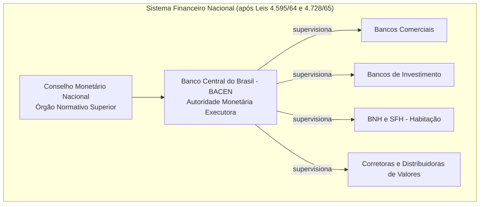

_Figura: Novo desenho institucional do Sistema Financeiro Nacional pós-reformas do PAEG. O CMN define diretrizes, o BACEN executa e supervisiona diversas instituições: bancos comerciais, bancos de investimento (criados em 1965), o Sistema Financeiro da Habitação (BNH e agentes de crédito imobiliário) e as corretoras de valores._

### 2. Reforma do Sistema Habitacional e Trabalhista: BNH e FGTS

Reconhecendo o **déficit habitacional** e a necessidade de estimular a construção civil (setor capaz de gerar empregos e crescimento com baixo conteúdo importado), o PAEG criou, em agosto de 1964, o **Sistema Financeiro da Habitação (SFH)** e seu órgão central, o **Banco Nacional da Habitação (BNH)**, através da Lei nº 4.380/64. O BNH tornou-se o principal **banco público de crédito habitacional**, responsável por financiar em grande escala a construção e aquisição da casa própria, especialmente para a classe média e baixa. Para alimentar esse sistema com recursos de longo prazo, a mesma lei instituiu **novos instrumentos de captação**, como a **caderneta de poupança** e a **letra imobiliária**, e previu a aplicação da **correção monetária** nos contratos habitacionais, protegendo-os da inflação. A construção civil foi deliberadamente estimulada pelo governo não só por sua função social (moradia) mas também porque _“disseminava a propriedade privada entre a classe média”_ – base social do novo regime – e por não pressionar o balanço de pagamentos (já que utiliza majoritariamente insumos nacionais).

Em paralelo, o governo endereçou a **rigidez do mercado de trabalho** herdada da legislação anterior. A **estabilidade decenal no emprego**, que garantia ao trabalhador do setor privado a manutenção no emprego após 10 anos na mesma empresa, era vista pelos formuladores do PAEG como um entrave à flexibilidade e à produtividade. Em substituição a esse regime, foi criado o **Fundo de Garantia do Tempo de Serviço (FGTS)**, pelo Lei nº 5.107, de 13 de setembro de 1966. O FGTS estabeleceu que as empresas passassem a depositar mensalmente o equivalente a **8% do salário** de cada empregado em uma conta vinculada, em nome do trabalhador. Em caso de demissão sem justa causa, o trabalhador poderia sacar o saldo acumulado, que também ficou acessível para **financiamento da casa própria** e outras finalidades definidas em lei.

> [!definition] **Fundo de Garantia do Tempo de Serviço (FGTS)** 
> Instituído em 1966 e em vigor a partir de 1967, o FGTS **substituiu a estabilidade no emprego após 10 anos**. Seu duplo objetivo era **facilitar a demissão de empregados** (reduzindo custos trabalhistas e aumentando a flexibilidade para o empregador) e **gerar um grande fundo de poupança compulsória** para **financiar habitações** via BNH. Cada trabalhador passou a ter uma conta de FGTS com depósitos mensais do empregador (8% do salário); os recursos, geridos pelo BNH, financiavam projetos habitacionais, **viabilizando políticas de moradia em larga escala**.

A criação do FGTS **eliminou gradualmente a “estabilidade decenal”** – que foi tornada letra morta e depois formalmente extinta – ao mesmo tempo em que **injetou recursos no SFH** a partir de 1967. Essa reforma trabalhista foi **polêmica**: inicialmente o FGTS era opcional (o empregado poderia escolher entre aderir ao fundo ou manter o regime antigo), mas na prática as novas contratações impuseram o FGTS como condição, e o projeto enfrentou resistência no Congresso, sendo aprovado somente graças a um **ato institucional** do regime militar que forçou sua promulgação. Apesar disso, o FGTS logo se tornou praticamente universal. **Do ponto de vista econômico**, essa medida cumpriu o papel de **flexibilizar o mercado de trabalho** – facilitando admissões e demissões e reduzindo encargos trabalhistas – e de **mobilizar uma poupança interna de longo prazo** que financiasse o desenvolvimento urbano (moradia e saneamento). Em conjunto, **BNH/SFH e FGTS** modernizaram as políticas habitacional e trabalhista no Brasil: ampliou-se o crédito imobiliário de longo prazo e alterou-se profundamente a relação capital-trabalho em favor da produtividade, ainda que às custas da perda de antigos direitos trabalhistas.

### 3. Reforma Tributária e Fiscal (1964-1966)

Outra frente crucial do PAEG foi a **modernização do sistema tributário brasileiro**, com vistas a **aumentar a capacidade financeira do Estado** e **corrigir distorções fiscais** que também alimentavam a inflação. Em 1964 e 1965 foram editadas medidas emergenciais, culminando na aprovação do **novo Código Tributário Nacional, em 1966**, que consolidou a reforma. Os objetivos principais eram **racionalizar a estrutura de impostos**, elevar a arrecadação e dar ao governo federal maior controle sobre as receitas, para financiar investimentos e reduzir déficits.

As mudanças tributárias abrangeram: **eliminação de impostos em cascata e obsoletos**, substituindo-os por tributos modernos do tipo valor-adicionado. Por exemplo, extinguiu-se o antigo _imposto sobre vendas e consignações_ e implementou-se o **Imposto sobre Produtos Industrializados (IPI)** e o **Imposto de Circulação de Mercadorias (ICM)**, este último de competência estadual – precursores do ICMS vigente posteriormente. No âmbito local, criou-se o **Imposto Sobre Serviços (ISS)** de competência municipal. Houve também **ampliação da base do Imposto de Renda** (especialmente de pessoas físicas) e melhoria nos mecanismos de arrecadação, como a **cobrança de tributos via rede bancária** e o fim de figuras arcaicas como o imposto do selo.

Importante inovação foi a **introdução da correção monetária no sistema tributário**, evitando que a inflação corroesse o valor real dos tributos entre o fato gerador e o recolhimento. Além disso, aumentaram-se tarifas públicas e preços administrados (energia, transporte etc.) para reduzir subsídios e recuperar financeiramente empresas estatais, mesmo ao custo de um impacto inflacionário imediato. **Redefiniu-se o pacto federativo fiscal**: a União passou a deter os impostos de maior base (IPI, Importação, Imposto de Renda e ITR rural), enquanto os estados ficaram com o ICM e os municípios com ISS e IPTU. Para compensar a centralização, parte da arrecadação do IPI e IR passou a ser distribuída aos estados e municípios via **Fundos de Participação (FPE e FPM)**.

Outra vertente foi a criação de **fundos parafiscais** vinculados, como o próprio FGTS e os novos **PIS/PASEP** (fundos de participação de trabalhadores do setor privado e público, respectivamente) – que funcionavam como _poupança compulsória_, elevando a taxa de investimento público/privado. Adotaram-se também **incentivos fiscais setoriais e regionais** (como isenções para investimentos no Nordeste via SUDENE, e estímulos à exportação) com o intuito de orientar o desenvolvimento conforme prioridades do governo.

Como resultado, a **carga tributária** do país aumentou substancialmente, passando de cerca de 16% do PIB em 1964 para **21% do PIB em 1967**. O Estado brasileiro passou a dispor de **maior poder financeiro** para realizar investimentos em infraestrutura e projetos de desenvolvimento. Em contrapartida, a reforma tributária reforçou o **caráter regressivo** do sistema, pois grande parte do incremento de arrecadação deu-se via impostos indiretos (como IPI e ICM), que pesam proporcionalmente mais sobre a renda dos mais pobres. Ainda assim, do ponto de vista institucional, a reforma fiscal de 64-66 **modernizou e centralizou** o sistema tributário, tornando-o mais eficiente e ampliando a capacidade do governo federal em conduzir política econômica – um alicerce importante para o financiamento do crescimento posterior do “milagre”.

### 4. Criação da Correção Monetária e Indexação da Economia

Diante de uma inflação persistente, o PAEG inovou ao **instituir oficialmente mecanismos de indexação**, permitindo à economia conviver com certa inflação remanescente sem desorganização completa dos contratos. A peça central foi a **correção monetária**, criada pela Lei nº 4.357 de 17 de julho de 1964. Essa lei introduziu as **Obrigações Reajustáveis do Tesouro Nacional (ORTN)**, títulos públicos cujos valores eram corrigidos periodicamente por um índice de inflação, garantindo assim remuneração real positiva aos investidores. **Pela primeira vez**, o governo passou a emitir dívida interna **corrigida pela inflação**, o que lhe permitiu financiar seu déficit de forma **não-inflacionária**, sem recorrer à emissão de moeda. Junto com as ORTNs, a lei estabeleceu o **mecanismo de correção monetária trimestral** para diversos contratos, com coeficientes fixados pelo Conselho Nacional de Economia (antecessor do CMN).

> [!note] **Importância da indexação** 
> A introdução da correção monetária _“tornou os títulos públicos atraentes, já que passaram a render juros reais positivos”_, permitindo ao governo se financiar sem emitir moeda. Em outras palavras, a indexação viabilizou **financiamento de longo prazo em meio à inflação**, ao proteger credores e investidores da perda inflacionária. Esse mecanismo foi estendido a financiamentos habitacionais (pela Lei 4.380/64) e depois a outros contratos privados, **minimizando distorções** causadas pela inflação e evitando a “repressão financeira” (fuga de recursos da economia formal devido à inflação).

A **monetização parcial da inflação via indexação** teve efeitos ambíguos: por um lado, **estabilizou expectativas** e permitiu a continuidade de investimentos de longo prazo (como habitação, infraestruturas) num ambiente de inflação moderada; por outro, ao proteger parcialmente os agentes econômicos da inflação, **poderia ter alimentado a inércia inflacionária** nos anos seguintes. No contexto do PAEG, contudo, a correção monetária foi vista como uma solução pragmática para **compatibilizar a luta contra a inflação com a manutenção do crédito de longo prazo**. De fato, foi graças a essa inovação que instrumentos como as ORTNs e as cadernetas de poupança ganharam confiança do público, **canalizando mais poupança** para o setor produtivo. A indexação passou a ser uma característica estrutural da economia brasileira pós-1964, compondo o chamado _“arcabouço de convivência com a inflação”_ que perduraria pelas décadas seguintes.

### 5. Reforma do Mercado de Capitais (Lei nº 4.728/65)

Completa esse elenco de reformas a reestruturação do **mercado de capitais**, formalizada pela Lei nº 4.728, de julho de 1965. Até então, o mercado acionário brasileiro era incipiente e disfuncional: poucas empresas de capital aberto, baixa proteção a acionistas minoritários, bolsas mal organizadas com **manipulação de cotações**, e predomínio de **corretores oficiais** herdados de práticas antigas. Além disso, a inflação crônica desestimulava investimentos em ações, levando a poupança privada a buscar ativos reais ou simplesmente a concentrar-se em depósitos bancários de curto prazo. Isso gerava um **hiato de financiamento**: empresas dependiam de empréstimos bancários (muitas vezes do Banco do Brasil ou externamente), já que não havia um canal robusto de financiamento via mercado de capitais.

A Lei 4.728/65 buscou **modernizar e dinamizar o mercado de ações brasileiro**. Para tal, a reforma **atacou os obstáculos estruturais**: _“modernizando as Bolsas, extinguindo o monopólio dos corretores públicos, etc.”_. Criou-se um novo **sistema de distribuição de valores mobiliários**, autorizando a operação de **sociedades corretoras e distribuidoras** privadas (no _varejo_ de ações) e instituindo os **bancos de investimento** como agentes _atacadistas_ do mercado de capitais. Esses bancos de investimento – uma novidade introduzida pela reforma – poderiam lançar e subscrever emissões de ações e debêntures, fomentando a ligação entre poupadores e empresas. A segregação entre bancos comerciais e de investimento visava evitar que o crédito de curto prazo se confundisse com operações de longo prazo e de maior risco, criando **instituições especializadas em financiar o desenvolvimento empresarial**.

A reforma também **aperfeiçoou o arcabouço legal societário** e **tributário** relativo ao mercado de capitais. Foram criados incentivos fiscais para investimento em ações e melhorias na proteção aos minoritários (embora a consolidação de uma Lei das S.A. mais robusta só viesse em 1976). Segundo depoimentos da época, a expectativa era que, _criando as condições institucionais necessárias_, fosse possível **mobilizar um fluxo significativo de poupança interna para capitalizar as empresas**. Como afirmou Bulhões de Freitas (um dos arquitetos da reforma), sem um mercado acionário ativo, **as empresas nacionais ficavam limitadas** – ou nasciam grandes já como estatais/estrangeiras, ou permaneciam pequenas – ao passo que um mercado de ações desenvolvido **permitiria que empresas médias se tornassem grandes** mediante abertura de capital e subscrição pública de ações.

Em suma, a Lei do Mercado de Capitais de 1965 criou os alicerces para um **capitalismo financeiro moderno** no Brasil: instituições intermediárias especializadas, bolsas mais transparentes e atrativas, e um começo de “democratização” do capital (com pequenos investidores acessando ações). Embora os resultados imediatos tenham sido modestos – o mercado acionário só decolou de fato no final da década, chegando a experimentar uma bolha especulativa em 1971 – o arcabouço legal implantado em 1965 foi **essencial para estruturar fontes alternativas de financiamento** para a industrialização brasileira, reduzindo a dependência de crédito bancário de curto prazo e de capital estrangeiro.

## O Legado das Reformas: Bases Institucionais para o “Milagre”

As reformas do PAEG (1964-67) configuraram um **marco de modernização institucional** da economia brasileira, cujos efeitos transcenderam o curto prazo. No imediato pós-1964, o país experimentou _estagnação econômica e custos sociais elevados_ em virtude da política anti-inflacionária rigorosa (salários reais em queda, falências de empresas menores, desemprego em alta). Entretanto, a médio e longo prazo, **as novas instituições e políticas lançadas pelo PAEG criaram os alicerces de um crescimento acelerado**. Conforme observa Fabrício de Oliveira, _“as mudanças ocorridas nesse período podem ser vistas como a gênese do aparato que seria crucial para a retomada do crescimento econômico”_ nos anos seguintes. De fato, a partir de 1968, com a economia mundial favorável e a estabilização interna encaminhada, o Brasil ingressou no seu período de crescimento mais rápido – o chamado **Milagre Econômico (1968-1973)** –, e grande parte desse desempenho só foi possível graças ao **arcabouço institucional mais moderno e funcional** herdado das reformas do PAEG.

Em termos concretos, o legado pode ser resumido assim:

- **Estabilidade monetária e financeira aprimorada:** A criação do Banco Central e do CMN profissionalizou a gestão da moeda e do crédito, permitindo controle mais eficaz da inflação e do sistema bancário. A existência de títulos indexados (ORTN) e a possibilidade de correção monetária evitaram rupturas financeiras em um contexto ainda inflacionário, garantindo confiança para investimentos de longo prazo.
    
- **Capacidade estatal reforçada:** A reforma tributária elevou significativamente a receita do Estado, fornecendo meios para investimentos maciços em infraestrutura (rodovias, energia, telecomunicações) durante o Milagre. A centralização fiscal no governo federal facilitou a coordenação de planos de desenvolvimento nacionais, enquanto os fundos compulsórios (FGTS, PIS/PASEP) e bancos públicos (BNH, depois BNDES reforçado) proveram capital de investimento de forma contínua.
    
- **Mercado de crédito e capitais diversificado:** O sistema financeiro nacional passou a contar com **novos canais de financiamento**: além dos bancos tradicionais, surgiram bancos de investimento, mercado de ações revitalizado e um sistema hipotecário sólido via BNH/SFH. Isso contribuiu para a expansão das empresas nacionais, muitas das quais aproveitaram os incentivos para abrir capital ou tomar financiamentos de longo prazo, viabilizando a formação de novos conglomerados privados durante os anos 70.
    
- **Flexibilização econômica e produtividade:** As reformas trabalhistas (FGTS) e a liberalização de preços/tarifas públicas removeram rígidas amarras que marcavam a economia pré-1964. As empresas passaram a ter mais **liberdade para ajustar seu quadro de funcionários** conforme o ciclo econômico, e a política salarial contida do PAEG, ainda que dura para os trabalhadores, **reduziu pressões inflacionárias de demanda**, permitindo ganhos de produtividade. Esse novo ambiente de negócios, somado à atração de capital externo (facilitada pela reforma da lei de remessa de lucros em 1964), estimulou a retomada do investimento privado.
    

Em perspectiva histórica, as reformas do PAEG representaram uma **inflexão do capitalismo brasileiro rumo à modernidade institucional**. Elas completaram – ainda que em contexto autoritário – muitas das agendas pendentes dos planos anteriores (como o **Plano Trienal** de Celso Furtado, que esbarrara em resistências políticas). O próprio Roberto Campos enfatizou posteriormente que o maior resultado do PAEG não foram metas de inflação ou crescimento de curto prazo, _“mas a importância do esforço dedicado a reformas institucionais e à modernização”_. As instituições criadas ou reformadas entre 1964 e 1967 demonstraram resiliência e permaneceram, em grande medida, operantes nas décadas seguintes – o Banco Central e o sistema bancário reformado, o FGTS, os impostos como IPI, e a própria mentalidade de planejamento tecnocrático estatal. Assim, o legado do PAEG transcende seu tempo: **ao modernizar o ambiente econômico**, pavimentou-se o caminho para quase uma década de crescimento extraordinário e lançou bases que influenciariam o desenvolvimento brasileiro subsequente.

> [!quote] **Roberto Campos sobre o PAEG:** 
> “O sucesso do PAEG não esteve na realização de objetivos específicos, mas na **importância do esforço dedicado a reformas institucionais e à modernização**”. _Sob essa ótica, a verdadeira conquista do plano foi dotar o Brasil de um conjunto de instituições econômicas modernas, capazes de sustentar o crescimento com estabilidade._

## Questões para Autoavaliação

> [!question] **1.** De que forma as reformas **financeira** (Lei 4.595/64) e **do mercado de capitais** (Lei 4.728/65) alteraram o papel do Estado e dos agentes privados no sistema financeiro brasileiro? Como essas mudanças contribuíram para viabilizar o desenvolvimento econômico nos anos do “Milagre Econômico”?

> [!question] **2.** Explique o duplo objetivo da criação do **FGTS** em 1966. Quais foram os efeitos dessa medida tanto para as relações trabalhistas quanto para o financiamento habitacional e o crescimento urbano no Brasil do período pós-1964?

> [!question] **3.** Avalie criticamente os **custos de curto prazo** das políticas de estabilização do PAEG em contraste com os **benefícios de longo prazo** gerados pelas reformas institucionais. Como essa dinâmica é interpretada pela historiografia econômica ao analisar o período 1964-1967?

# Origem: _A retomada do crescimento 1968-1973 ('Milagre Econômico')

---
title: A retomada do crescimento 1968-1973 ('Milagre Econômico')
area: ECONOMIA
subarea: História econômica brasileira
tags:
  - a-retomada-do-crescimento-1968-1973
  - cacd-2025
  - economia
  - historia-economica-brasileira
aliases:
  - 4.6 A retomada do crescimento 1968-1973.
---
# O “Milagre Econômico” Brasileiro (1968–1973) – Panorama e Análise Histórica

## Causas do “Milagre Econômico”

O período conhecido como **“Milagre Econômico”** no Brasil corresponde aos anos de 1968 a 1973, quando a economia apresentou crescimento extraordinário – em média cerca de **10–11% ao ano**, chegando a 14% em 1973. Esse boom ocorreu sob o regime autoritário militar e resultou de uma **conjunção singular de fatores internos e externos**. Importa analisar detalhadamente essas causas para compreender por que o “milagre” ocorreu e quais foram seus alicerces.

> [!note] **Fatores internos vs. externos do “Milagre”**  
> **Internos:** As reformas do **PAEG** (1964–66) estabilizaram a economia (ajuste fiscal, criação do Banco Central e correção monetária) e instituíram bases favoráveis ao crescimento. Havia **capacidade ociosa industrial**, fruto da estagnação anterior, permitindo expandir a produção sem pressionar os preços. Além disso, o regime impôs um **arrocho salarial**: mudou-se a fórmula de reajuste de salários pela inflação passada, causando queda do salário real. Essa contenção de custos laborais ajudou a **reduzir a inflação** e elevar a lucratividade, sob forte repressão aos sindicatos. Por fim, adotou-se política de **expansão do crédito** (especialmente ao consumo e setor agrícola) e **investimento público em infraestrutura**, estimulando a demanda interna.  
> **Externos:** O contexto internacional era a fase final da **“Era de Ouro” do capitalismo** (aprox. 1945–1973), marcada por crescimento robusto das economias desenvolvidas e do comércio global. Essa prosperidade elevou a demanda por exportações brasileiras e melhorou os termos de troca de certos produtos básicos. Ademais, havia **alta liquidez mundial**: abundância de crédito externo barato e entrada de investimentos estrangeiros. Bancos internacionais estavam dispostos a emprestar a juros baixos, e multinacionais encontraram no Brasil um mercado atrativo sob tutela militar. O país facilitou a entrada desses capitais (Resolução 63/67 do CMN, incentivos fiscais etc.), aproveitando esse cenário favorável.

### Reformas institucionais do PAEG (1964–1966)

Para entender as bases internas do milagre, é preciso destacar o **Plano de Ação Econômica do Governo (PAEG)**, implementado logo após o golpe de 1964, sob o governo Castelo Branco. As reformas do PAEG, conduzidas por Octávio Gouveia de Bulhões (Fazenda) e Roberto Campos (Planejamento), visavam debelar a **gravíssima inflação (quase 80% em 1963)** e retomar o crescimento. Entre as medidas estruturais adotadas destacam-se:

- **Reforma Fiscal e Tributária:** racionalizou e ampliou a arrecadação. Foram criados impostos modernos (como o ICM sobre valor agregado, e ISS para serviços), extintos tributos ineficientes e centralizada a cobrança via rede bancária. A carga tributária subiu de 16% para 21% do PIB (1963–67), aumentando a poupança pública, ainda que de forma regressiva (mais impostos indiretos sobre os pobres).
    
- **Reforma Financeira:** instituiu o **Banco Central do Brasil** e o **Conselho Monetário Nacional** em 1965, criando um mercado monetário e de capitais moderno. Introduziu-se a **correção monetária** (indexação) para títulos públicos (ORTNs) e contratos, viabilizando financiamento de longo prazo em cenário inflacionário. Também se incentivou a abertura financeira: a Resolução 63 autorizou bancos nacionais a captar **empréstimos externos** para repassar internamente, e facilitaram-se as remessas de lucro ao exterior para atrair investimento direto.
    
- **Reforma do Mercado de Trabalho:** criou-se o **FGTS** em 1966, substituindo o sistema de estabilidade no emprego após 10 anos. O FGTS (depósito de 8% do salário pelo empregador em conta vinculada) funcionou como poupança forçada e fonte de financiamento habitacional. Essa mudança aumentou a flexibilidade de demissão e reduziu custos trabalhistas imediatos. Além disso, instituiu-se em 1965 uma nova fórmula de **reajuste salarial**: ao invés de corrigir salários pelo pico inflacionário recente, passou-se a usar a média da inflação dos dois anos anteriores. Essa fórmula, aliada à **subestimação deliberada da inflação** residual, resultou em forte perda de poder de compra do salário mínimo até 1968 – o chamado _arrocho salarial_. De 1964 a 1985, o salário mínimo real chegou a cair cerca de 50%. Essa política reduziu a fatia dos salários na renda nacional e conteve a demanda doméstica de bens básicos, mas **elevou os lucros** do setor empresarial e ajudou a frear a alta de preços. Como observou Vinicius Müller, foi um crescimento “**às custas dos trabalhadores**” viabilizado pela repressão sindical na ditadura.
    
- **Política Monetária e Fiscal de Estabilização:** o PAEG impôs disciplina fiscal e monetária. Houve **ajuste fiscal** com corte de gastos e aumento de receitas (tarifas públicas e impostos). O orçamento monetário limitou a expansão da base monetária e do crédito, combatendo a inflação de demanda. Em 1965, 55% do déficit público já foi financiado via dívida pública em vez de emissão; em 1966 chegou a 86%. Essa mudança reduziu a monetização do déficit e arrefeceu a inflação gradualmente (embora a meta inflacionária do PAEG não tenha sido integralmente cumprida). A inflação anual, que beirava 80% em 1963, cedeu para cerca de 20% ao fim da década.
    

Essas reformas **saneadoras** criaram as condições institucionais para o boom posterior. Como pontua estudo de Veloso et al., houve um “sacrifício temporário” de crescimento entre 1964-67 para arrumar a casa, mas a estabilização e as reformas do PAEG **“criaram as condições”** para que a taxa de crescimento se elevasse em 1968-1973. Celso Furtado igualmente interpretou o “milagre” como resultado direto dessas mudanças: _“o Milagre Econômico foi a conjunção do uso da capacidade ociosa, [com]... prosperidade nos países industriais... e [crédito externo em] condições excepcionalmente favoráveis”_.

### Capacidade ociosa e política de demanda (1967–1968)

No final dos anos 60, a economia brasileira contava com **excesso de capacidade instalada não utilizada** devido à recessão/estagnação dos anos anteriores (especialmente 1963–67). Assim, _“a existência de significativa capacidade ociosa no setor industrial sugeria que a produção poderia reagir a estímulos adequados”_ sem gerar pressões inflacionárias. Esse diagnóstico, presente no **Programa Estratégico de Desenvolvimento (PED)** de 1967, levou a equipe econômica (agora chefiada por Antônio Delfim Netto no Ministério da Fazenda, a partir de 1967) a mudar de postura: do arrocho puramente contracionista para uma **política pró-crescimento** gradualista, mantendo a inflação sob controle.

A partir de 1967-68, com a inflação em trajetória de queda, adotou-se uma política fiscal e monetária **mais flexível e expansionista**. Exemplos dessa orientação:

- **Crédito ao consumo e agrícola:** Houve **forte expansão do crédito ao consumidor** (inclusive via incentivos a compras parceladas e consórcios) e **ao setor rural**. Bancos oficiais e privados ampliaram financiamentos de bens duráveis com prazos longos e juros contidos por tetos governamentais, tornando acessíveis automóveis e eletrodomésticos a camadas mais amplas da população. No campo, o governo concedeu **isenções fiscais e juros subsidiados** e ampliou o crédito rural, visando baratear os alimentos (combatendo a inflação de custos), elevar a produção agroexportadora e atenuar a pobreza rural.
    
- **Investimento público e estatal:** Com as contas públicas mais equilibradas pós-PAEG e dispondo do **financiamento via títulos**, o governo Médici aumentou seus **investimentos em infraestrutura** (rodovias, telecomunicações, energia etc.) sem expandir demasiadamente suas despesas correntes. Em vez de inchar a máquina administrativa, a estratégia foi dinamizar as **empresas estatais**, cujo investimento cresceu 20% ao ano (1967–73). Estatais como Petrobrás, Eletrobrás, Telebrás, Vale do Rio Doce e o sistema siderúrgico receberam maciços aportes, muitas vezes financiados por empréstimos externos garantidos pelo governo. O **BNDE** (Banco Nacional de Desenvolvimento Econômico) continuou a financiar projetos de infraestrutura, mas a partir de 1968 **mais da metade de seus empréstimos foram para o setor privado** industrial, indicando a intenção de estimular empresários nacionais.
    
- **Política industrial e incentivos:** O regime aprofundou a política de incentivos fiscais setoriais. A **Comissão de Desenvolvimento Industrial (CDI)** aprovava a maioria dos projetos industriais apresentados, concedendo isenções, crédito subsidiado e proteção – uma política deliberadamente liberal na concessão de benefícios. Destacam-se incentivos à indústria de bens de capital (máquinas e equipamentos) via a agência FINAME do BNDE, com crédito de longo prazo, revitalizando o setor de bens de produção. Também se ampliaram os **estímulos às exportações**: a partir de 1967-68, surgiram linhas especiais de crédito e isenção tributária para exportadores, a desburocratização via **CONCEX** e **Befiex**, e adotou-se o regime de _minidesvalorizações cambiais_ (pequenas depreciações periódicas do cruzeiro) para manter o câmbio competitivo. Isso impulsionou uma diversificação da pauta exportadora, com manufaturados passando de ~10% (1964) para 31% das exportações em 1973. A produção industrial tinha agora um horizonte externo maior.
    

Assim, internamente, **a demanda agregada foi fortemente estimulada**: consumo de bens duráveis em alta, investimento público e estatal crescendo, exportações ascendentes e construção civil aquecida (graças à expansão habitacional via SFH/FGTS). Esse _mix_ de políticas gerou, de fato, o “milagre”: **PIB crescendo >10% a.a., inflação cadente (~19% a.a. 68-73), desemprego urbano baixo (3–5%)** e rápida expansão da indústria de transformação (~13% a.a. 1968-73). A _facilidade_ de implementação dessas medidas foi garantida pelo contexto político autoritário – concentração de poder no Executivo, cooptação dos estados (via Fundo de Participação) e repressão a qualquer oposição de sindicatos ou Congresso.

### Conjuntura internacional favorável (a “Era de Ouro” do pós-guerra)

No lado **externo**, o Brasil surfou em mares tranquilos até 1973. Os anos 60 finais e início dos 70 integraram o último trecho de uma fase excepcional da economia mundial. As economias avançadas (EUA, Europa, Japão) cresciam de forma robusta, com pleno emprego e inovação tecnológica – quadro que Eric Hobsbawm denominou _Golden Age_. Essa prosperidade externa beneficiou o Brasil de várias formas:

- **Mercado externo em alta:** a forte demanda global permitiu ao Brasil expandir rapidamente suas **exportações**. Entre 1967 e 1973, o valor das exportações cresceu em média 24,6% ao ano. Houve melhora nos **termos de troca** de alguns produtos exportados, garantindo mais divisas por volume vendido. Por exemplo, os preços de commodities agrícolas se mantiveram favoráveis em parte do período, ajudando a entrada de dólares. Ao mesmo tempo, o Brasil diversificou parceiros: o Mercado Comum Europeu superou os EUA como principal destino das exportações brasileiras em 1973, indicando maior inserção internacional.
    
- **Capital estrangeiro abundante:** Os anos 70 iniciais foram marcados por ampla liquidez internacional. Bancos comerciais dispunham de **petrodólares e eurodólares** para emprestar. Assim, o crédito externo se tornou **farto e barato** para países em desenvolvimento. O governo brasileiro, bancos e estatais aproveitaram: a **dívida externa líquida** do país saltou de US$ 3,2 bilhões em 1968 para cerca de US$ 12 bilhões em 1973. Importante notar que, conforme análise de Delfim Netto e outros, esse endividamento até 1973 foi em grande medida **preventivo e oportunista**, mais do que estritamente necessário para financiar investimentos. Estima-se que, de 1967 a 1973, a absorção líquida de poupança externa foi apenas ~0,8% do PIB (1,2% em 70-73) – ou seja, o milagre foi financiado majoritariamente por **poupança interna**. Ainda assim, o _excesso_ de empréstimos contratados, além das necessidades imediatas, criou um passivo que só se revelaria problemático adiante.
    
- **Investimento estrangeiro direto:** A estabilidade e perspectiva de lucros atraíram **multinacionais** para o Brasil. O governo militar favoreceu essa entrada: garantias a investidores, facilidades cambiais e ampliação de mercados. Com a expansão do parque industrial e vantagens como mercado consumidor crescente e protecionismo moderado, **fluxos de investimento direto** se intensificaram. Empresas automotivas, eletroeletrônicas, químicas e outras ampliaram fábricas no país durante o milagre. Economistas destacam que o “milagre aconteceu principalmente regado a dinheiro internacional que aterrissou... através da entrada de multinacionais... e também por empréstimos externos”. Em suma, o cenário pós-1968 era o oposto do pré-1964 (quando instabilidade política e populismo espantavam investidores): o regime autoritário oferecia previsibilidade e ordem para o capital internacional operar.
    

Delfim Netto, ministro que personificou o milagre, sempre ressaltou que não houve magia alguma, mas sim **causas concretas por trás do crescimento**. _“Nunca houve milagre. Milagre é efeito sem causa. É tolice imaginar que o Brasil cresceu... por milagre”_, afirmou Delfim, aludindo às políticas tomadas. De fato, **políticas internas bem orquestradas aproveitaram o vento de popa externo**, resultando num ciclo virtuoso de investimento, consumo e crescimento acelerado. Todavia, como veremos adiante, esse crescimento apresentou um **lado sombrio** em termos sociais e acabou sendo freado bruscamente por um choque externo.

## O Primeiro Plano Nacional de Desenvolvimento (I PND, 1972–1974)

No auge do crescimento, o regime militar formulou um ambicioso plano para orientar e **consolidar o ciclo expansionista**: o **I Plano Nacional de Desenvolvimento (I PND)**, válido para 1972-74. Aprovado em novembro de 1971 (Lei nº 5.727/1971) no final do governo Médici, o I PND foi o primeiro plano econômico plurianual abrangente desde o Plano de Metas (anos 1950) e refletia a confiança gerada pelo “milagre”.

**Contexto de formulação:** Em 1971, o Brasil vinha de três anos seguidos de crescimento acima de 9% e inflação em queda. As reservas cambiais estavam fortalecidas, a indústria operava a pleno vapor e o país projetava uma imagem de potência emergente (_Brasil Grande_). Nesse clima, o regime – que também buscava legitimidade via desenvolvimento econômico – decidiu planejar os próximos passos para **transformar o rápido crescimento em desenvolvimento sustentado** e encaminhar o Brasil rumo ao clube dos países desenvolvidos. O I PND foi coordenado pelo Ministério do Planejamento (João Paulo dos Reis Velloso) em estreita sintonia com Delfim Netto (Fazenda), garantindo coerência entre diretrizes setoriais e política macroeconômica.

**Objetivos e diretrizes:** O I PND propunha, essencialmente, **manter o elevado crescimento econômico e começar a resolver estrangulamentos estruturais**. Entre suas metas anunciadas estavam: manter o PIB crescendo ao menos **7% a 9% ao ano, caminhando para 10%**; aumentar em 6% ao ano a renda per capita (ou seja, garantir que o crescimento superasse o aumento populacional); expandir o **investimento fixo bruto** em ~58% no triênio (elevar a taxa de investimento de ~16% para >18% do PIB) e **impulsionar as exportações** (meta original de +46% em valor de 1969 a 1973, que acabou amplamente superada). Em suma, visava **consolidar o ciclo de crescimento acelerado**, evitando uma volta à estagnação. Paralelamente, o plano declarava objetivos de “desenvolvimento social”, aumento do emprego e redução de desequilíbrios regionais, embora esses fossem secundários na prática.

**Estratégia de desenvolvimento:** Para atingir tais objetivos, o I PND delineou uma estratégia dual: grandes investimentos estatais em infraestrutura e estímulo à iniciativa privada em setores considerados estratégicos, muitos com perfil **exportador**. Pode-se destacar as seguintes linhas de ação:

- **Grandes obras de infraestrutura integradora:** O governo Médici investiu em projetos para _“integrar”_ o vasto território e reduzir custos logísticos. Exemplo emblemático foi a abertura da **Rodovia Transamazônica (BR-230)**, lançada em 1970 como parte do Programa de Integração Nacional (PIN). A Transamazônica, com 4 mil km cortando a Amazônia, pretendia povoar e desenvolver a região Norte, além de aliviar tensões sociais no Nordeste (transferindo migrantes para a Amazônia). Embora as justificativas econômicas fossem frágeis e o projeto resultasse em fracasso colonizador, ele mostra a escala das ambições. Outra obra chave foi a **Ponte Rio-Niterói**, iniciada em 1968 e inaugurada em março de 1974, ligando a capital Rio de Janeiro à cidade de Niterói através da Baía de Guanabara. Com 13 km de extensão, a ponte (batizada oficialmente Presidente Costa e Silva) foi a maior da América do Sul e símbolo do “Brasil Potência”, solucionando um gargalo de transporte urbano e rodoviário na região metropolitana fluminense. Essas obras ilustram o esforço de dotar o país de infraestrutura “de primeiro mundo”. Ferrovias e portos também receberam investimentos, mas as rodovias tiveram prioridade: a malha asfaltada crescia >25% ao ano no início dos 70.
    
- **Polos industriais e projetos estratégicos:** O I PND fomentou a criação ou expansão de **polos industriais** em setores pesados, muitos com foco exportador. Um destaque foi a **indústria petroquímica**: implementaram-se complexos integrados, como o polo de Camaçari (Bahia), iniciado em 1972, reunindo refinaria, fábrica de fertilizantes e unidades petroquímicas base – essenciais para reduzir a dependência de importados químicos. Outro exemplo, na **siderurgia**, foi a ampliação de capacidade de usinas existentes (Volta Redonda/CSN, Usiminas, Cosipa) e planejamento de novas (como Açominas em MG). Na **indústria naval**, o governo criou incentivos via Fundo de Marinha Mercante e encomendou navios a estaleiros nacionais, levando o Brasil a figurar entre os maiores construtores de navios do mundo no fim da década. Esses setores – petroquímica, aço, navios – eram vistos como _campeões nacionais_ para geração de divisas e fortalecimento da base industrial. Além disso, o I PND contemplou investimentos na **expansão energética** (usinas hidrelétricas como Ilha Solteira e Tucuruí – esta última apenas iniciada no período) e **telecomunicações** (instalação de centrais telefônicas modernas via Telebras).
    
- **Expansão agrícola e “correntes de exportação”:** Embora mais associado ao II PND, já no I PND havia projetos de expansão agropecuária voltados à exportação, como abertura de **“corredores de exportação”** no Centro-Oeste e Norte. A colonização da Amazônia via PIN pretendia incorporar novas fronteiras agrícolas. O governo investiu também em pesquisas agropecuárias (embrionariamente, o que viria a ser a Embrapa em 1973) para melhorar a produtividade, especialmente de soja, cuja produção explodiu nos anos 70. O objetivo era diversificar as exportações e atenuar o tradicional problema de balanço de pagamentos.
    

> [!note] **Destaques do I PND (1972–74)**  
> **Objetivos:** Manter o **crescimento acelerado** do PIB (meta ~9% a.a.) e avançar rumo à industrialização pesada, projetando o Brasil como país desenvolvido. Buscar melhoria na infraestrutura, maior integração territorial e aumento das exportações.  
> **Estratégias:** Realizar **grandes obras de infraestrutura** (rodovias, pontes, energia) para remover gargalos e integrar mercados regionais. **Fortalecer setores estratégicos** (siderurgia, petroquímica, construção naval, bens de capital) via investimento estatal direto e incentivos ao setor privado. **Promover pólos industriais** descentralizados e ampliar a presença do Estado na economia como indutor do desenvolvimento.  
> **Projetos emblemáticos:** Construção da **Rodovia Transamazônica** e programas de colonização na Amazônia; edificação da **Ponte Rio-Niterói** (entregue em 1974) conectando importantes regiões urbanas; criação de complexos **petroquímicos** (Camaçari-BA e outros) para reduzir importações de insumos; expansão de usinas **siderúrgicas** (aço) e financiamento da **indústria naval** que colocaria o Brasil entre os maiores produtores de navios na década.

Mesmo com a grandiosidade dos planos, vale ressaltar que o I PND **operou dentro do contexto do próprio milagre** – ou seja, suas metas foram amplificações das tendências já em curso. E, de fato, muitas foram superadas. Por exemplo, previa-se elevar o investimento fixo em 58% de 1969 a 1973; o aumento real foi de ~63%, com a taxa de investimento atingindo 22,4% do PIB em 1973. As exportações, meta de US$3,3 bi em 1973, alcançaram US$6,2 bi. Contudo, **indicadores sociais ficaram aquém**: a concentração de renda aumentou e a pobreza não cedeu na mesma medida do crescimento econômico. A doutrina oficial era que primeiro se “fazia o bolo crescer para depois distribuir” – frase atribuída a Delfim Netto. Na prática, **a distribuição dos frutos foi altamente desigual**: o índice de Gini da renda familiar subiu de 0,50 em 1965 para 0,56 em 1973 e 0,63 em 1977, indicando forte piora distributiva. Setores médios e empresários ficaram com a maior fatia dos ganhos, enquanto trabalhadores tiveram salários reajustados abaixo da produtividade. Autores como **Maria da Conceição Tavares e José Serra** denunciaram já em 1970 esse “modelo perverso” de crescimento: _“crescendo com concentração de renda”, o que **reajustava o padrão de consumo em favor das classes médias e altas** e aumentava o excedente para investimento, às custas dos salários dos pobres_. A expressão “modelo perverso” cunhada por Tavares & Serra tornou-se influente ao evidenciar o **lado sombrio do milagre**. De outro lado, economistas alinhados ao governo como Carlos Langoni argumentavam que a concentração era um efeito colateral temporário, decorrente da maior procura por mão de obra qualificada durante o boom – tese contestada pela escola estruturalista (Paul Singer, Bacha, Fishlow, Malan, entre outros), para quem a desigualdade resultava das **políticas deliberadas** do regime.

Em síntese, o I PND representou o ápice do esforço desenvolvimentista autoritário: um Estado forte, planejador e investidor, aliado ao capital privado e estrangeiro, buscando catapultar o Brasil a um novo patamar industrial. Muitas metas físicas foram alcançadas e a estrutura produtiva se sofisticou. Entretanto, o plano mal saíra do papel quando um fator externo **imprevisto e devastador** mudou completamente as perspectivas do Brasil.

## O Fim Abrupto do Milagre: o Choque do Petróleo de 1973

No final de 1973, a economia brasileira ainda exibia euforia: crescimento de 11,4% no ano, inflação em torno de 15%, déficit em conta-corrente sob controle e reservas em nível confortável. Foi quando ocorreu o **Primeiro Choque do Petróleo**. Em outubro de 1973, em meio à Guerra do Yom Kippur, os países árabes da OPEP decidiram embargar exportações e elevar drasticamente o preço do petróleo. O barril quadruplicou de preço em poucos meses (de ~US$3 para ~US$12). Para um país como o Brasil – **altamente dependente de petróleo importado** para suprir sua matriz energética – o impacto não poderia ser mais severo. Esse evento exógeno **marcou o fim abrupto do “milagre econômico”**.

> [!important] **Consequências do Choque de 1973 – o fim do “Milagre”**
> 
> - **Balanço de pagamentos em crise:** O aumento súbito do custo do petróleo _estrangulou_ as contas externas brasileiras. A importação de petróleo consumia parcela considerável das divisas; com preços 4x maiores, a **conta de importação de petróleo explodiu**, gerando déficits comerciais e em conta-corrente inéditos. Entre 1973 e 1974, o saldo em transações correntes do Brasil, que vinha próximo do equilíbrio, tornou-se fortemente negativo, pressionando a necessidade de financiamento externo.
>     
> - **Inflação e custos internos:** O choque acarretou **pressão inflacionária de custos**. Energia e combustíveis encarecidos elevaram preços em cascata na economia. A inflação, que já dava sinais de alta em 1973 (18%), saltou para patamares acima de 30% em meados da década de 70. O governo tentou amortecer parte do impacto com controle de preços e subsídios (por exemplo, segurando tarifas de derivados), mas isso implicou aumentar gastos públicos e endividamento.
>     
> - **Desaceleração do crescimento:** Sem possibilidade de continuar crescendo pelo mesmo modelo (importando insumos baratos e com inflação baixa), o PIB do Brasil desacelerou marcadamente. **A era de 10% a.a. chegou ao fim**. Em 1974, ainda houve crescimento elevado (cerca de 9%), pois muitos projetos em andamento mantiveram o ritmo. Mas a partir de 1975, a expansão média do PIB caiu para cerca de 5–6% ao ano – **metade do ritmo do milagre**. Estimativas econométricas indicam que, mesmo sem choque, a tendência seria desacelerar para ~5-6% a partir de meados da década, quando a capacidade ociosa já estivesse plenamente utilizada. Contudo, o choque tornou a queda **muito mais acentuada**, configurando uma mudança de patamar.
>     
> - **Mudança de estratégia – II PND:** Diante do novo cenário, o sucessor de Médici, General Ernesto Geisel (1974-79), optou por uma estratégia de enfrentamento ativo: lançou o **Segundo PND (1975-79)**, redirecionando o desenvolvimento com **ênfase na substituição de importações energéticas e de bens de capital**, financiada por forte **endividamento externo**. Em vez de contrair a economia para ajustar o déficit externo (como talvez preconizaria uma cartilha ortodoxa), o governo Geisel dobrou a aposta no crescimento, ainda que à custa de acumular dívida. Investiu em prospecção de petróleo (bacia de Campos), programa de **álcool combustível (Proálcool)**, usinas nucleares (Angra), gás natural, além de siderurgia, petroquímica (segundo fase, polos de Triunfo-RS e Paulínia-SP) e fertilizantes – consolidando projetos muitos delineados no I PND. O Estado ampliou sua participação na economia (criando empresas como a **Nuclebrás** e expandindo estatais existentes) e guiou o setor privado via incentivos. Essa estratégia, no entanto, aumentou a vulnerabilidade financeira: a dívida externa pulou de US$ 14 bilhões (1973) para cerca de US$ 50 bilhões em 1979, gerando pesada carga de juros que, combinada ao **segundo choque do petróleo** (1979) e à alta global dos juros em 1980-82, levaria o Brasil à crise da dívida dos anos 80. Em retrospecto, Delfim Netto criticou a continuidade dos déficits externos após 1973, afirmando que _“seria natural mudar a política de endividamento externo”_ diante do choque, _“não foi o que ocorreu. A euforia do ‘milagre’ contagiou a política econômica”_ e o governo insistiu em crescer via poupança externa até se chocar com a realidade.
>     

Em suma, o primeiro choque do petróleo **quebrou a “vara mágica” do milagre**. O Brasil, que conseguira equilibrar alto crescimento com inflação moderada e contas externas manejáveis até 1973, viu-se forçado a escolher entre **ajustar ou continuar crescendo à força**. A opção foi crescer – inaugurando o ciclo do II PND –, mas o resultado foi o acúmulo de distorções que desembocaram na crise dos anos 80 (estagflação e hiperinflação). Carlos Lessa qualificou o período Geisel como _“sonho e fracasso”_, pois tentou-se manter o milagre via intervenção estatal massiva, porém as **“crises exógenas impuseram fortes limitações à sustentabilidade do modelo”**, restringindo o êxito do II PND.

Historiograficamente, autores divergem sobre o legado do milagre. Alguns, como **Pedro Malan**, salientam que ele evidenciou _os “limites do possível”_, mostrando que crescimento acelerado sem distribuir renda gera tensões sociais e desequilíbrios que cobram seu preço. Já **Luiz Carlos Bresser-Pereira** enfatiza que o milagre representou a inserção dependente do Brasil no capitalismo global – com a pujança baseada em exportações industriais e endividamento – cujo fim expôs a **vulnerabilidade externa** do país. **Maria da Conceição Tavares e Carlos Lessa** apontaram que o milagre plantou sementes contraditórias: de um lado modernizou a estrutura produtiva (_“salto quantitativo e qualitativo”_ inegável), de outro aprofundou a concentração de riquezas e manteve intactas as “estruturas arcaicas” de distribuição, requerendo mudanças que somente a redemocratização traria. Delfim Netto, por sua vez, até o fim da vida defendeu que seu modelo foi necessário dadas as circunstâncias – _“Nós não temos competência para acabar com o Brasil... vai sobreviver a todas as bobagens”_, dizia em 2015, sugerindo que o país soube aproveitar aquela oportunidade de crescer, mesmo com percalços futuros.

Passados 50 anos, o “Milagre Econômico” brasileiro permanece um objeto de estudo fascinante, repleto de lições. Ele demonstra como **políticas econômicas bem conduzidas podem, sob determinadas condições históricas, produzir crescimento espetacular**, mas também alerta para os riscos de um desenvolvimento desequilibrado e dependente de fatores efêmeros. Para o candidato ao CACD, entender esse episódio é crucial para interpretar tanto as estratégias desenvolvimentistas brasileiras quanto os dilemas de nossa inserção internacional e distribuição de renda – temas que ressoam até os dias atuais.

## Perguntas para Autoavaliação

1. Quais foram os principais **fatores internos e externos** que explicam o chamado “Milagre Econômico” brasileiro (1968–1973)? Como eles contribuíram para o crescimento excepcional do período?
    
2. No que consistiu o **Primeiro Plano Nacional de Desenvolvimento (I PND)** e quais objetivos ele perseguia? Cite algumas **estratégias e projetos emblemáticos** implementados no auge do “milagre”.
    
3. Como o **Primeiro Choque do Petróleo (1973)** afetou a economia brasileira e quais foram as respostas do governo? Explique por que esse evento marcou o **fim do “Milagre Econômico”** e preparou o terreno para o II PND.


# Origem: 4.6.1 Causas do “Milagre Econômico”.

---
title: Causas do “Milagre Econômico”.
area: ECONOMIA
subarea: História econômica brasileira
tags:
  - a-retomada-do-crescimento-1968-1973
  - cacd-2025
  - economia
  - historia-economica-brasileira
aliases:
  - Causas do “Milagre Econômico”.
  - 4.6.1 Causas do “Milagre Econômico”.
---


# Origem: O Primeiro Plano Nacional de Desenvolvimento (I PND).

---
title: O Primeiro Plano Nacional de Desenvolvimento (I PND).
area: ECONOMIA
subarea: História econômica brasileira
tags:
  - a-retomada-do-crescimento-1968-1973
  - cacd-2025
  - economia
  - historia-economica-brasileira
aliases:
  - I PND
  - Primeiro Plano Nacional de Desenvolvimento (I PND).
  - O Primeiro Plano Nacional de Desenvolvimento (I PND).
---

# O I Plano Nacional de Desenvolvimento (1972-1974): Apogeu e Colapso do "Milagre Econômico"

## Introdução: O I PND como Estratégia de Consolidação, Não de Gênese

O I Plano Nacional de Desenvolvimento (I PND), instituído pela Lei 5.727 de 4 de novembro de 1971, durante o governo do General Emílio Garrastazu Médici, representa um marco fundamental na história econômica do Brasil. Contudo, uma análise aprofundada, crucial para a preparação para o entendimento do período, exige que se compreenda o I PND não como o arquiteto do chamado "Milagre Econômico", mas sim como seu herdeiro e principal instrumento de consolidação. Lançado no auge de um ciclo de crescimento sem precedentes, com o Produto Interno Bruto (PIB) registrando taxas anuais superiores a 11% entre 1968 e 1973, o objetivo do plano não era dar início a um surto de desenvolvimento, mas sim administrar, aprofundar e tentar prolongar um processo já em curso e em plena aceleração.

A historiografia econômica reconhece que o "Milagre" foi, em grande medida, um desdobramento de políticas adotadas em períodos anteriores, notadamente as reformas institucionais e o combate à inflação promovidos pelo Programa de Ação Econômica do Governo (PAEG), implementado entre 1964 e 1966 pelos ministros Roberto Campos e Octávio Gouveia de Bulhões, durante o governo Castelo Branco. O [[4.5.3 Reformas do Programa de Ação Econômica do Governo (PAEG).|PAEG]] criou as condições de estabilidade e de capacidade ociosa na indústria que, aliadas a um cenário internacional favorável, permitiram a arrancada econômica a partir de 1968. O I PND, portanto, surge em um cenário de euforia econômica e ufanismo nacionalista, mas também de contradições latentes, como a crescente concentração de renda, a repressão política e um modelo de financiamento que aprofundava a dependência do capital externo.

A tese central desta nota é que o I PND deve ser analisado como a expressão máxima da ideologia do "Brasil Potência". Foi um projeto de ambição monumental que, ao mesmo tempo em que buscava consolidar os ganhos do "Milagre" e superar os gargalos de infraestrutura que ameaçavam o crescimento, carregava em suas premissas as sementes de sua própria insustentabilidade. A sua estratégia, baseada em grandes projetos estatais e em um otimismo irrestrito quanto à conjuntura global, tornou a economia brasileira extremamente vulnerável, uma fragilidade que seria fatalmente exposta pelo Primeiro Choque do Petróleo em 1973. O plano pode ser interpretado não apenas como uma estratégia de crescimento, mas como uma aposta de altíssimo risco para gerenciar uma economia que já operava em superaquecimento. Os planejadores, liderados pelo Ministro do Planejamento João Paulo dos Reis Velloso, reconheciam que o ritmo de crescimento era insustentável sem investimentos maciços para remover os estrangulamentos em setores-chave como energia, transportes e insumos básicos. Nesse sentido, o I PND foi uma tentativa de construir a pista de pouso enquanto o avião já voava em velocidade máxima, um esforço para transformar o crescimento conjuntural em desenvolvimento estrutural de longo prazo.

## A Ideologia do "Brasil Potência": Segurança, Desenvolvimento e Ufanismo

O I PND não pode ser compreendido apenas por suas metas econômicas; ele foi a materialização de um projeto ideológico e geopolítico que marcou o auge do regime militar. A sua concepção está intrinsecamente ligada à Doutrina de Segurança Nacional, desenvolvida na Escola Superior de Guerra (ESG), que interligava os conceitos de segurança e desenvolvimento. Nessa visão, a segurança nacional não se limitava à defesa contra ameaças externas, mas incluía a promoção do desenvolvimento econômico e a coesão interna como forma de fortalecer o Estado e garantir sua soberania. A ocupação de "espaços vazios", como a Amazônia, e a integração física do território eram vistas como imperativos estratégicos para evitar a cobiça internacional e consolidar o poder nacional. O lema do *Plano de Integração Nacional (PIN)*, um dos programas centrais do I PND, "*Integrar para não entregar"*, é a síntese perfeita dessa visão geopolítica que animava os militares.

Paralelamente, o projeto "Brasil Potência" funcionou como uma poderosa ferramenta de propaganda e legitimação para o governo Médici, período conhecido como os "anos de chumbo" devido à intensificação da repressão política. Em um contexto de censura, perseguição a opositores e ausência de liberdades democráticas, o sucesso econômico e o ufanismo nacionalista eram explorados para gerar consenso e apoio popular. A conquista da Copa do Mundo de Futebol em 1970 foi habilmente utilizada pelo regime, associando a imagem do país vitorioso nos esportes à eficiência do governo. Slogans como "Ninguém segura este país" e "Brasil: Ame-o ou deixe-o" inundavam os meios de comunicação, criando um clima de otimismo que buscava ofuscar a violência do aparato repressivo e as crescentes desigualdades sociais.

Nesse contexto, as "obras faraônicas" do I PND assumiram um papel central. Projetos monumentais como a *Rodovia Transamazônica*, a *Ponte Rio-Niterói* e, posteriormente, a Usina de Itaipu, eram muito mais do que meros investimentos em infraestrutura. Eram concebidos como monumentos à grandeza e à capacidade técnica da nação, símbolos concretos da ambição de transformar o Brasil em uma potência mundial. A grandiosidade dessas obras servia para dar visibilidade e materialidade à ideologia do "Brasil Potência", projetando uma imagem de modernidade e progresso que justificava o modelo autoritário. A análise de alguns desses projetos revela que os objetivos geopolíticos e de propaganda frequentemente se sobrepunham a uma racionalidade estritamente econômica. A própria concepção de rodovias como a Transamazônica e a Perimetral Norte tinha raízes em antigos planos de defesa que visavam ao "cercamento do território". A fraca viabilidade econômica de tais empreendimentos, comprovada pelo fracasso retumbante da Transamazônica, sugere que a decisão de levá-los adiante foi impulsionada mais pela doutrina de segurança e pela necessidade de criar fatos políticos de grande impacto do que por uma análise de custo-benefício.

## A Estratégia Desenvolvimentista: Objetivos, Metas e Instrumentos

O I PND foi formalizado com um conjunto de metas extremamente ambiciosas, refletindo a euforia do período. O objetivo central era nada menos que transformar o Brasil em uma nação desenvolvida no prazo de uma geração. Metas quantitativas específicas incluíam duplicar a renda per capita até 1980 e sustentar um crescimento do PIB na faixa de 8% a 10% ao ano, ao mesmo tempo em que se buscava reduzir a inflação para menos de 20% anuais e, eventualmente, 10% no final do governo.

Para alcançar tais objetivos, o modelo adotado foi eminentemente estatista, consolidando o Estado como o principal motor do desenvolvimento. O I PND articulava a ação de um vasto complexo de empresas estatais, bancos oficiais e agências governamentais para direcionar os investimentos aos setores considerados estratégicos. Empresas como a Eletrobras, no setor de energia, e a recém-criada Telebras (1972), nas telecomunicações, foram instrumentos-chave. O Banco Nacional de Desenvolvimento Econômico (BNDE) teve um papel absolutamente central, atuando como o grande financiador dos projetos prioritários do plano, com foco especial na expansão do setor de bens de capital e na modernização da indústria. A percepção de economistas como Roberto Campos era de que este período representou o ponto máximo da intervenção do Estado na economia brasileira.

O financiamento dessa colossal empreitada desenvolvimentista repousava sobre um tripé: poupança interna (pública e privada), recursos do BNDE e, crucialmente, a captação maciça de capital externo. Aproveitando um cenário de alta liquidez no mercado financeiro internacional, em parte devido à reciclagem dos "petrodólares" após a quebra do sistema de Bretton Woods, o Brasil recorreu intensamente ao endividamento externo para financiar os grandes projetos e cobrir os déficits em seu balanço de pagamentos.

Essa estratégia de financiamento revela uma das contradições mais profundas do projeto "Brasil Potência". A busca por uma maior autonomia nacional e por um status de potência no cenário internacional era, paradoxalmente, financiada por um aprofundamento da dependência em relação ao capital e à tecnologia estrangeiros. Cada novo projeto, cada nova fábrica, aumentava a necessidade de importar equipamentos e de contrair empréstimos em dólar. Essa dinâmica criou o que pode ser chamado de "paradoxo da autonomia-dependência": o esforço para construir um Brasil autônomo estava, na prática, tornando a economia nacional cada vez mais vulnerável a choques externos e às flutuações das taxas de juros internacionais. Essa contradição fundamental, embora velada pela euforia do crescimento, seria brutalmente exposta pela crise de 1973.

> [!table] **Tabela 1: Metas Macroeconômicas e Setoriais do I PND (1972-1974)**
> 
> |Indicador|Meta Anual do I PND (1972-74)|Resultado Real (1972)|Resultado Real (1973)|Fontes|
> |---|---|---|---|---|
> |Crescimento do PIB|8% a 10%|12,1%|14,0%|1|
> |Crescimento da Indústria|10% a 12%|14,3%|15,8%|13|
> |Crescimento da Agricultura|7% a 8%|4,1%|4,9%|13|
> |Inflação (IGP-DI)|Redução gradual para < 20%|15,7%|15,5%|1|

A tabela demonstra como, nos dois primeiros anos de vigência do plano, as metas de crescimento do PIB e da indústria não apenas foram atingidas, como superadas com folga, alimentando a narrativa de sucesso do "Milagre". O crescimento da agricultura, no entanto, ficou aquém do esperado, e a inflação, embora controlada, permanecia em um patamar elevado, indicando pressões persistentes na economia.

## Os Grandes Projetos: Símbolos de uma Ambição Desmedida (Análise Setorial Detalhada)

O I PND se notabilizou por um conjunto de projetos de infraestrutura de escala monumental, que se tornaram os símbolos mais visíveis da ambição do regime militar. A análise detalhada desses projetos revela a complexa interação entre objetivos econômicos, geopolíticos e de propaganda.

### 4.1. Integração e Ocupação: As Rodovias Amazônicas (Transamazônica e Perimetral Norte)

No coração do Plano de Integração Nacional (PIN) estavam as grandes rodovias amazônicas, principalmente a Transamazônica (BR-230) e a Perimetral Norte (BR-210).7 O objetivo declarado era rasgar a floresta para conectar a Amazônia ao Nordeste e ao restante do país, promovendo a ocupação de um território considerado estratégico e vulnerável. O projeto também foi apresentado com um verniz social, como uma solução para a questão agrária, sob o lema "Uma terra sem homens para homens sem terra", prometendo assentar milhares de famílias, especialmente de nordestinos, ao longo da nova estrada.

O resultado, contudo, foi um fracasso retumbante do ponto de vista logístico e humano. Com um custo estimado em mais de 1 bilhão de dólares da época, a Transamazônica nunca foi concluída conforme o plano original. A maior parte de seus trechos nunca foi asfaltada, tornando-se intransitável durante o período de chuvas e sendo, em grande parte, "tragada pela floresta". Os projetos de colonização fracassaram, e os colonos foram largados à própria sorte, sem assistência técnica ou infraestrutura para escoar a produção.

O legado socioambiental foi ainda mais trágico. A construção da rodovia atravessou os territórios de pelo menos 29 povos indígenas, provocando um processo violento de contato forçado, desestruturação social, disseminação de epidemias e intensificação de conflitos fundiários que perduram até hoje. A estrada inaugurou um padrão de ocupação predatória e desmatamento, visível em imagens de satélite no formato de "espinha de peixe", tornando-se um vetor permanente de grilagem de terras, extração ilegal de madeira e violência no campo. A Transamazônica é o exemplo mais eloquente de como a lógica geopolítica e o desejo por um feito propagandístico se sobrepuseram a qualquer análise racional de viabilidade econômica e impacto socioambiental.

### 4.2. Engenharia e Propaganda: A Ponte Rio-Niterói

Em forte contraste com os fracassos amazônicos, a Ponte Rio-Niterói, oficialmente denominada Ponte Presidente Costa e Silva, emergiu como o grande símbolo de sucesso do I PND e do PIN. Inaugurada em março de 1974, a obra era um feito notável da engenharia nacional, ostentando o maior vão em viga reta contínua do mundo na época e sendo uma das mais extensas do planeta. Ao resolver um problema histórico de ligação entre as duas cidades, a ponte teve um impacto econômico e logístico positivo e imediato.

Analiticamente, a importância da ponte transcende sua função prática. Ela se tornou um poderoso instrumento de propaganda para o regime, a prova material da competência técnica e da capacidade de realização do "Brasil Potência". Enquanto a Transamazônica se afundava na lama e no esquecimento, a imagem da imponente estrutura de aço e concreto sobre a Baía de Guanabara era amplamente divulgada como a face de um Brasil moderno, eficiente e grandioso, ajudando a construir a legitimidade ideológica que o governo buscava.

### 4.3. Aprofundando a Industrialização: Siderurgia e Petroquímica

Um dos pilares estratégicos do I PND era o aprofundamento do processo de substituição de importações, com foco nos setores de insumos básicos e bens de capital, considerados essenciais para dar sustentação ao crescimento industrial.

No setor siderúrgico, o Plano Siderúrgico Nacional, incorporado ao I PND, previa investimentos maciços de Cr$ 4,7 bilhões (a preços de 1972) no triênio 1972-74. A meta era ambiciosa: elevar a capacidade de produção de aço bruto de 5,4 milhões de toneladas em 1970 para 12,4 milhões em 1975 e atingir 20 milhões em 1980. O foco principal era a expansão das grandes siderúrgicas estatais: a Companhia Siderúrgica Nacional (CSN), a Usiminas e a Cosipa.

No setor petroquímico, o plano destinou cerca de Cr$ 5,5 bilhões (a preços de 1972) com o objetivo de elevar a taxa de crescimento do setor para 12% ao ano. A estratégia se baseava em duas frentes: a consolidação do Polo Petroquímico de São Paulo, com a implantação de novos projetos de segunda e terceira geração, e a realização dos estudos que levariam à implantação do Polo Petroquímico de Camaçari, na Bahia, que se tornaria um dos maiores complexos do gênero no mundo. Embora esses investimentos tenham sido cruciais para a consolidação da base industrial brasileira, eles também deixaram um legado de graves problemas ambientais, com poluição do ar e da água nessas regiões, uma questão crítica que se estende até os dias atuais.

### 4.4. Conectando a Nação: Telecomunicações e Energia

O I PND reconhecia que a precariedade da infraestrutura de comunicações e energia era um grande entrave ao desenvolvimento. Por isso, destinou investimentos maciços a esses setores.

O marco mais importante no setor de telecomunicações foi a criação da *Telecomunicações Brasileiras S.A. (Telebras)*, pela Lei 5.792, de 11 de julho de 1972. A Telebras foi concebida como uma holding estatal com a missão de centralizar, planejar e expandir o sistema telefônico nacional, que até então era extremamente fragmentado, ineficiente e operado por centenas de pequenas concessionárias. A criação da Telebras e os investimentos subsequentes permitiram uma modernização e uma expansão sem precedentes da rede, com o plano estabelecendo a meta de alcançar um milhão de terminais telefônicos no país.

No setor de energia, a Eletrobras, como principal braço executor do governo, comandou um vasto programa de expansão da geração e transmissão para sustentar o ritmo da industrialização. Foi nesse período que se iniciou a construção da primeira usina nuclear do Brasil, Angra 1, e que foram concluídas as negociações para a construção da Usina Hidrelétrica de Itaipu, em parceria com o Paraguai. Itaipu, em particular, se tornaria o maior e mais icônico símbolo do gigantismo e da capacidade de realização do projeto "Brasil Potência", embora sua construção e seus impactos socioambientais só viessem a se materializar plenamente nos anos seguintes.

> [!table] **Tabela 2: Projetos Emblemáticos do I PND - Objetivos, Escala e Legado Crítico**
> 
> |Projeto Emblemático|Objetivo Declarado|Escala e Investimento|Resultado e Legado Crítico|Fontes|
> |---|---|---|---|---|
> |**Rodovia Transamazônica (BR-230)**|"Integrar para não entregar"; ocupação da Amazônia; reforma agrária.|Planejada com ~4.000 km; custo > US$ 1 bilhão.|Fracasso logístico, inconclusa, intransitável. Desastre socioambiental: desmatamento, violência, desestruturação de povos indígenas.|7|
> |**Ponte Rio-Niterói**|Integrar Rio e Niterói; modernizar o transporte.|13,29 km de extensão; marco da engenharia nacional.|Sucesso técnico e logístico. Poderoso símbolo de propaganda da eficiência e capacidade do regime.|7|
> |**Plano Siderúrgico Nacional**|Atingir autossuficiência em aço; consolidar a indústria de base.|Cr$ 4,7 bilhões (1972-74); meta de 20 milhões de ton/ano em 1980.|Expansão bem-sucedida da capacidade produtiva (CSN, Usiminas, Cosipa), mas com alto custo e endividamento.|30|
> |**Criação da Telebras**|Unificar e expandir o sistema de telecomunicações.|Holding estatal criada em 1972; meta de 1 milhão de telefones.|Modernização e expansão da rede telefônica, superando a estagnação anterior. Consolidou o monopólio estatal no setor.|13|
> |**Projeto Itaipu**|Garantir suprimento de energia para o crescimento industrial.|Negociações concluídas em 1973; maior hidrelétrica do mundo à época.|Tornou-se um ícone do "Brasil Potência", mas sua construção envolveu endividamento massivo e gerou graves impactos socioambientais.|13|

## A Face Oculta do Milagre: Concentração de Renda e Custo Social

Por trás da fachada de progresso e das taxas de crescimento espetaculares, o modelo do "Milagre Econômico", consolidado pelo I PND, tinha uma face oculta marcada pela profunda desigualdade social. A estratégia de desenvolvimento adotada pelo regime deliberadamente postergou a distribuição de renda, encapsulada na célebre máxima do então Ministro da Fazenda, Delfim Netto: "É preciso fazer o bolo crescer para depois dividi-lo". Na prática, o bolo cresceu, mas foi dividido de forma extremamente desigual.

Este tema gerou um dos debates mais importantes da historiografia econômica brasileira, essencial para a compreensão do período. De um lado, havia a tese oficial, defendida principalmente por Carlos Langoni em seu livro "Distribuição de Renda e Desenvolvimento Econômico do Brasil". Langoni argumentava, com base na teoria do capital humano, que o aumento da desigualdade era uma consequência natural e temporária do processo de desenvolvimento acelerado. Em uma economia em rápida modernização, a demanda por mão de obra qualificada crescia mais rápido que a oferta, elevando os salários desse grupo e, consequentemente, a concentração de renda. A solução, segundo essa visão, viria com o tempo, através da expansão da educação.

De outro lado, uma tese crítica, formulada por economistas como Albert Fishlow e Rodolfo Hoffmann, contestava veementemente essa interpretação. Para eles, a concentração de renda não foi um subproduto "natural" do crescimento, mas sim o resultado direto e intencional das políticas econômicas do regime militar. Os principais instrumentos dessa política concentradora foram o "arrocho salarial" — a política de contenção do valor real do salário mínimo, que servia de piso para grande parte dos trabalhadores — e a repressão sistemática aos sindicatos, que eliminou o poder de barganha da classe trabalhadora. Os dados corroboram essa visão crítica: entre 1960 e 1970, a parcela da renda nacional detida pelos 80% mais pobres da população caiu de 35% para apenas 27,5%, enquanto a fatia do 1% mais rico aumentou significativamente. O índice de Gini, que mede a desigualdade, saltou de 0,54 em 1960 para 0,63 em 1977, um dos níveis mais altos do mundo.

O custo social do modelo ia além da concentração de renda. O crescimento foi obtido à custa da exploração da mão de obra, com jornadas extenuantes e condições de trabalho frequentemente precárias, especialmente nos grandes canteiros de obras. Todo esse modelo era sustentado por um aparato de repressão política que silenciava qualquer voz dissidente. O próprio discurso oficial do I PND, ao apresentar uma visão harmoniosa de integração entre capital e trabalho, silenciava sobre a ausência de participação democrática e sobre os profundos conflitos sociais que estavam na base do "Milagre".

## O Colapso: O Choque do Petróleo e o Fim do Sonho

O modelo de desenvolvimento do I PND, apesar de sua aparente robustez, possuía uma vulnerabilidade estrutural crítica que o tornava uma aposta de alto risco. Sua sustentabilidade dependia de duas premissas otimistas sobre o cenário internacional: a continuidade do crescimento econômico mundial e, acima de tudo, a disponibilidade de energia abundante e barata. Essa dependência se manifestava em dois pontos fatais: a crescente dívida externa, necessária para financiar os investimentos, e uma altíssima dependência do petróleo importado. Na época, o Brasil importava cerca de 80% de todo o petróleo que consumia para mover sua indústria e seu sistema de transportes em expansão.

O gatilho que expôs essa fragilidade veio em outubro de 1973. Em retaliação ao apoio ocidental a Israel durante a Guerra do Yom Kippur, a Organização dos Países Exportadores de Petróleo (OPEP) decretou um embargo e promoveu uma elevação drástica nos preços. Em poucos meses, o preço do barril de petróleo quadruplicou, saltando de aproximadamente 3 dólares para 12 dólares. Para uma economia como a brasileira, o impacto foi fulminante.

O Primeiro Choque do Petróleo invalidou completamente as premissas sobre as quais o I PND havia sido construído. O custo das importações de combustíveis explodiu, abrindo um rombo gigantesco no balanço de pagamentos do país. A conta de importação de petróleo, que era de 769 milhões de dólares em 1973, saltou para 2,962 bilhões de dólares em 1974. A inflação, que o regime se orgulhava de ter controlado, voltou a disparar, impulsionada pelos custos mais altos de energia e de todos os produtos importados. O "Milagre Econômico", com suas taxas de crescimento de dois dígitos, chegou a um fim abrupto e incontestável.

A crise não deve ser vista meramente como um evento externo que desviou um plano bem-sucedido de sua rota. A crise atuou, na verdade, como um evento desmascarador. Ela revelou que o sucesso do "Milagre" estava assentado sobre bases insustentáveis. A estratégia do I PND, com seu foco em industrialização pesada e grandes projetos de infraestrutura, havia, na verdade, aprofundado a dependência do petróleo e do capital externo, aumentando a vulnerabilidade do país. O choque de 1973 não foi a causa do fracasso do modelo, mas o catalisador que expôs suas falhas estruturais e contradições preexistentes, desfazendo a ilusão de um desenvolvimento autônomo e sustentável.

A resposta do regime à crise selaria o destino da economia brasileira na década seguinte. Ao assumir a presidência em 1974, o General Ernesto Geisel se viu diante de uma escolha: promover um duro ajuste recessivo para conter a inflação e equilibrar as contas externas, ou tentar manter o crescimento a qualquer custo. A opção foi pela segunda via. O governo lançou o II Plano Nacional de Desenvolvimento, um projeto ainda mais ambicioso que o primeiro, que ficou conhecido como a "marcha forçada". O objetivo era aprofundar a substituição de importações nos setores de bens de capital e insumos básicos, exatamente para reduzir a dependência externa que a crise havia exposto. No entanto, sem as condições favoráveis do período anterior, essa estratégia só pôde ser financiada com um endividamento externo ainda mais agressivo, plantando as sementes da crise da dívida que paralisaria o Brasil e toda a América Latina na "década perdida" de 1980.

## Conclusão: O Legado Ambíguo do I PND

O I Plano Nacional de Desenvolvimento (1972-1974) ocupa um lugar central e paradoxal na história econômica brasileira. Ele representa, simultaneamente, o apogeu do modelo desenvolvimentista autoritário e o ponto de inflexão que precipitou seu colapso. Foi o momento em que a ambição do projeto "Brasil Potência" se manifestou em sua forma mais grandiosa, através de metas audaciosas e obras monumentais. Contudo, foi também o momento em que as contradições e vulnerabilidades desse mesmo modelo se tornaram insustentáveis, culminando no fim abrupto do "Milagre Econômico".

O legado do I PND é profundamente ambíguo. Por um lado, deixou uma herança material inegável. A expansão da infraestrutura de energia, com projetos como Itaipu; a modernização das telecomunicações, com a criação da Telebras; a consolidação da indústria de base, com os polos siderúrgicos e petroquímicos; e a ampliação da malha rodoviária, apesar dos fracassos, alteraram permanentemente a geografia econômica do país. Por outro lado, esse legado foi construído sobre um passivo social, ambiental и financeiro imenso. A brutal concentração de renda, a repressão política, a devastação ambiental irreversível na Amazônia e, acima de tudo, a explosão do endividamento externo foram os altos custos do projeto. A dívida contraída para financiar o I PND e, posteriormente, a "marcha forçada" do II PND, se tornaria a principal chaga da economia brasileira na década de 1980, levando à estagnação e à hiperinflação.

A compreensão do I PND é indispensável. Ele não é apenas um capítulo da história econômica, mas um estudo de caso sobre os dilemas do desenvolvimento. Os debates sobre o papel do Estado, os limites do crescimento com endividamento, a relação entre desenvolvimento e desigualdade, e a vulnerabilidade externa são temas perenes e de alta relevância para a política externa e para a formação do diplomata. Analisar o I PND é entender as origens de muitos dos desafios estruturais que o Brasil enfrentaria nas décadas seguintes e as complexas escolhas que moldaram sua trajetória contemporânea.

## Questões para Autoavaliação (Active Recall)

> [!question]
> 
> Questão 1: Diferencie o papel do PAEG (1964-66) e do I PND (1972-74) na trajetória do "Milagre Econômico". Por que é analiticamente incorreto afirmar que o I PND foi a "causa" do Milagre?

> [!question]
> 
> Questão 2: Analise criticamente a relação entre a ideologia do "Brasil Potência" e a seleção de projetos emblemáticos do I PND, como a Rodovia Transamazônica. De que forma os objetivos geopolíticos e de propaganda se sobrepuseram à racionalidade econômica?

> [!question]
> 
> Questão 3: Explique o "paradoxo da autonomia-dependência" no I PND. Como um plano que visava transformar o Brasil em uma potência autônoma acabou por aprofundar sua vulnerabilidade externa, e como o Choque do Petróleo de 1973 expôs essa contradição?

> [!question]
> 
> Questão 4: Discorra sobre o debate historiográfico acerca da concentração de renda durante o "Milagre Econômico", contrastando a tese do "capital humano" (Langoni) com a crítica do "arrocho salarial" (Fishlow). Qual a importância desse debate para a compreensão do modelo social e político do período?

# Origem: _Desaceleração econômica e o II PND

---
title: Desaceleração econômica e o II PND
area: ECONOMIA
subarea: História econômica brasileira
tags:
  - cacd-2025
  - desaceleracao-economica-e-o-ii-pnd
  - economia
  - historia-economica-brasileira
aliases:
  - 4.7 Desaceleração econômica e o segundo Plano Nacional de Desenvolvimento (II PND).
---
# II Plano Nacional de Desenvolvimento (1974–1979) – Governo Geisel e Resposta ao Choque do Petróleo de 1973

## O Fim do “Milagre” e o Primeiro Choque do Petróleo (1973)

O **“Milagre Econômico” brasileiro** (1968–1973) chegou ao fim justamente quando ocorreu o **primeiro choque do petróleo, em 1973**. Durante o “milagre”, o PIB do Brasil crescera acima de 10% ao ano por seis anos consecutivos, impulsionado por investimento estatal e afluxo de capitais externos. Contudo, a partir de 1973-74 a conjuntura mudou drasticamente: a **OPEP quadruplicou o preço do barril de petróleo**, elevando-o de cerca de US$ 2,50 para mais de US$ 11. Como o Brasil era altamente dependente de petróleo importado – cerca de **80% do consumo nacional vinha do exterior** – o impacto na **balança de pagamentos** foi severo. A conta de importação de petróleo disparou, pressionando déficits externos e a inflação interna (que subiu a patamares superiores a 40% ao ano). O crescimento do PIB desacelerou abruptamente, caindo de **14% em 1973 para cerca de 8% em 1974**, rompendo a euforia do “milagre” e inaugurando um período de incerteza econômica.

Diante desse choque externo, o governo do general **Ernesto Geisel (1974–1979)** enfrentou um **dilema de política econômica** imediato. Havia duas opções principais:

- **Ajuste recessivo (conjuntural):** Adotar políticas contracionistas ortodoxas (contenção de crédito, corte de gastos, desaceleração deliberada) para reduzir importações e equilibrar as contas externas, ao custo de menor crescimento e possível recessão – tal como fizeram muitos países desenvolvidos em 1974-75. Essa opção “realista”, defendida por economistas como Delfim Netto e inicialmente cogitada pelo próprio governo, significaria “**atrelar o crescimento às condições internacionais**”, aceitando uma queda temporária do PIB.
    
- **Manutenção do crescimento via endividamento externo:** Buscar fontes de financiamento externas para sustentar o investimento e o nível de atividade, postergando o ajuste. Essa alternativa, apelidada de **“fuga para a frente”**, implicava arriscar o aumento temporário de déficits comerciais e da **dívida externa**, na expectativa de que investimentos estruturais permitiriam ao país superar a crise e o subdesenvolvimento futuramente. Em outras palavras, em vez de contrair a economia no curto prazo, promover **crescimento com endividamento** para resolver vulnerabilidades de forma estrutural.
    

> [!definition] **Crescimento com Endividamento:** Estratégia na qual o país opta por **sustentar a expansão econômica financiando investimentos com empréstimos externos**, mesmo sob risco de endividar-se excessivamente. No caso brasileiro pós-1973, tratou-se de evitar a recessão obtendo crédito abundante dos bancos internacionais (os “**petrodólares**”) para financiar projetos de desenvolvimento, adiando o ajuste clássico. Essa “fuga para a frente” contrastou com a recomendação convencional de frear a economia e exemplifica o dilema entre **ajuste imediato vs. endividamento para investir visando crescimento futuro**.

Geisel inicialmente inclinou-se a um **ajuste ortodoxo moderado** sob orientação do ministro Mário Henrique Simonsen (Fazenda), incluindo contenção de demanda e algum controle de importações em 1974. Porém, essa política logo revelou custos políticos e sociais: a inflação permanecia alta e, nas eleições legislativas de 1974, o partido do governo sofreu reveses, sinalizando descontentamento. A legitimidade do regime autoritário, que em grande medida se apoiava no êxito econômico, estava em jogo. Como diagnosticou Bresser-Pereira à época, **sem crescimento acelerado a ditadura perdia sua principal fonte de legitimação** – o discurso de progresso econômico – tornando urgente redefinir estratégias para **“recuperar a legitimação perdida”**. Nesse contexto, Geisel e sua equipe (notadamente o ministro do Planejamento João Paulo dos Reis Velloso) optaram pela **segunda via: manter o crescimento a qualquer custo**, lançando mão de financiamento externo abundante. Essa decisão guiou a formulação do **II Plano Nacional de Desenvolvimento (II PND)**, concebido como resposta audaciosa à crise internacional de 1973 e instrumento para **reinventar o modelo de desenvolvimento brasileiro** sem recorrer à recessão imediata.

## O II Plano Nacional de Desenvolvimento (1975–1979)

Anunciado em setembro de 1974 e implementado a partir de 1975, o **II PND** foi um plano econômico governamental **ambicioso e abrangente**, último grande esforço do ciclo **nacional-desenvolvimentista** no Brasil. Seus principais **objetivos estratégicos** eram:

- **Completar e aprofundar a matriz industrial brasileira:** O plano priorizou investimentos em **insumos básicos** (matérias-primas industriais como aço, minerais, petroquímicos) e **bens de capital** (máquinas e equipamentos). A meta era permitir que o país dominasse **todo o ciclo produtivo industrial**, reduzindo dependência de importações de itens essenciais ao desenvolvimento industrial (por exemplo, fertilizantes, peças, equipamentos pesados). Em essência, o II PND visava concluir a substituição de importações iniciada nos anos 1930, alcançando a capacidade de produzir internamente desde insumos até produtos finais, e assim **diminuir a vulnerabilidade externa** da economia.
    
- **Diversificar a matriz energética e reduzir a dependência do petróleo importado:** Diante do choque de 1973, tornou-se prioridade nacional buscar **fontes alternativas de energia** e ampliar a oferta doméstica. O II PND canalizou recursos para grandes projetos no setor de **energia**, tais como: construção de enormes usinas hidrelétricas (notavelmente Itaipu Binacional, iniciada em 1975), lançamento do programa **Proálcool** em 1975 para produção de álcool combustível (etanol) como substituto da gasolina, investimento em pesquisa e exploração de petróleo interno (expansão da Petrobras, prospecção na Bacia de Campos) e um amplo **acordo nuclear com a Alemanha Ocidental** (1975) visando construir usinas nucleares e desenvolver tecnologia nuclear. Essas iniciativas buscavam tanto diminuir a importação de petróleo árabe quanto assegurar fontes próprias de energia (hidrelétrica, biomassa, nuclear) para sustentar o crescimento futuro.
    
- **Manutenção do crescimento econômico com forte investimento estatal:** O plano pretendia **evitar a estagnação** pós-choque fortalecendo o papel do Estado como indutor do desenvolvimento. Foram definidos **setores prioritários** para investimento maciço, muitos deles em **“projetos estruturantes”** de longo prazo. Entre os **principais projetos** do II PND destacaram-se: grandes empreendimentos siderúrgicos (expansão da Usiminas e Cosipa; criação da Açominas e da usina de Tubarão), pólos **petroquímicos** (Camaçari-BA e Triunfo-RS), ampliação da produção de **fertilizantes** e insumos agrícolas, projetos de **papel e celulose** (como a Celulose Aracruz), desenvolvimento da indústria de **bens de capital** (equipamentos pesados, turbinas, máquinas-ferramenta, reforço de empresas como Romi, Máquinas Piratininga etc.) e incentivos à indústria **aeronáutica e bélica** nascente (Embraer, ENGESA). Em síntese, o Estado atuou coordenando investimentos para _“desengargalar”_ setores-chave, visando preparar o Brasil para um novo patamar de industrialização integrada e autônoma.
    

> [!note] **Projetos Estruturantes:** No contexto do II PND, referem-se a **grandes projetos de infraestrutura e industriais** com impacto de longo prazo na estrutura produtiva do país. Exemplos incluem a construção da hidrelétrica de **Itaipu** (vital para garantir oferta de energia elétrica em grande escala), o programa **Proálcool** (que estruturou um novo setor energético baseado em biocombustíveis), e os novos polos **petroquímicos** e usinas **siderúrgicas** integradas. Tais projetos, intensivos em capital e tecnologia, foram concebidos para **mudar qualitativamente a economia brasileira**, fornecendo bases materiais (energia, matérias-primas, maquinaria) para sustentar o crescimento futuro e reduzir dependências externas. Embora arriscados e de maturação lenta, eram vistos como indispensáveis para “reorganizar as bases da economia” (ajuste **estrutural**), distinguindo-se de meras medidas conjunturais de curto prazo.

**Financiamento do II PND:** Para viabilizar esse vasto programa de investimentos, o governo Geisel contou com uma conjuntura internacional peculiar. Após 1973, bancos comerciais internacionais estavam abarrotados de **“petrodólares”** – as reservas dos países exportadores de petróleo, recicladas no sistema financeiro global. Havia, portanto, ampla liquidez e disposição dos bancos em emprestar a países em desenvolvimento. O Brasil aproveitou essa oportunidade e **expandiu fortemente seu endividamento externo**: o Tesouro Nacional, estatais (como Petrobras, Eletrobrás) e grandes empresas contraíram empréstimos em dólar a juros flutuantes, ancorados na expectativa de que o crescimento futuro permitiria arcar com o serviço da dívida. Em paralelo, instituições domésticas como o **BNDES** (Banco Nacional de Desenvolvimento Econômico e Social) forneceram crédito de longo prazo em moeda nacional para complementar os recursos. Na prática, **a dívida externa tornou-se a principal fonte de financiamento do II PND**, marcando o período 1975-79 como o **segundo grande ciclo de endividamento externo da história brasileira**, depois do verificado nos anos 1960 (e seguido mais tarde pelo terceiro ciclo nos anos 1990).

É importante notar que o aumento da dívida foi visto, naquele momento, como um investimento no futuro: entre 1974 e 1979, a **dívida externa líquida triplicou** de tamanho, mas acreditava-se que os empréstimos estavam financiando a construção de capacidades que tornariam o Brasil menos dependente e mais competitivo. Essa lógica foi resumida pelos economistas Antônio Barros de Castro e Francisco Souza como uma estratégia de _“crescimento forçado”_: assumir déficits e dívida agora para erguer uma estrutura industrial avançada, em vez de aceitar a estagnação imposta pela crise. O próprio Geisel defendia que _“não se enfrenta uma crise de desenvolvimento abrindo mão de desenvolver”_ – justificando, assim, a ousadia do II PND frente à maré recessiva global.

## Análise Crítica dos Resultados e Legado do II PND

**Sucessos de curto/médio prazo:** Apesar das críticas iniciais e do ceticismo até de membros do governo (o ministro Simonsen chegou a ironizar que não “lia ficção” quando perguntado sobre o plano), o II PND logrou alguns êxitos importantes até 1979:

- **Manutenção do crescimento econômico:** O Brasil evitou a recessão em meados dos anos 1970, ao contrário de muitos países desenvolvidos. As taxas de crescimento do PIB, embora menores que as do “milagre”, permaneceram positivas e robustas – por exemplo, quase **10% em 1976** – sustentadas pelo gasto público e investimentos do plano. Assim, o governo Geisel conseguiu atravessar a década com crescimento médio anual em torno de 6-7%, adiando a estagnação para o início dos anos 1980.
    
- **Industrialização e modernização produtiva:** Vários projetos estruturantes do II PND foram implementados com sucesso parcial, **ampliando a capacidade industrial nacional**. Até 1980, o Brasil inaugurou novas siderúrgicas, complexos petroquímicos e fábricas de bens de capital, alcançando _“pela primeira vez na história, dominar todo o ciclo produtivo industrial”_ do país. A densidade industrial aumentou: setores como aço, alumínio, papel e celulose, fertilizantes, máquinas pesadas e até indústria aeronáutica ganharam escala. Essa diversificação **reduziu a dependência de importações** de bens intermediários e de capital em finais dos anos 1970, preparando terreno para futuros saldos comerciais positivos.
    
- **Diversificação da matriz energética:** Embora os resultados plenos só viessem na década seguinte, o II PND deu arranque a uma série de iniciativas que mitigaram a vulnerabilidade energética. O programa **Proálcool** elevou exponencialmente a produção de etanol a partir de 1975, de modo que nos anos 1980 mais de 30% dos carros nacionais já eram movidos a álcool. Grandes hidrelétricas (Itaipu, Tucuruí) iniciadas no período entraram em operação nos anos subsequentes, aumentando significativamente a oferta interna de energia elétrica. A produção doméstica de petróleo também cresceu (novos campos na Bacia de Campos foram desenvolvidos no final da década de 70), passando a suprir parte maior do consumo nacional. Essas mudanças, combinadas, **reduziram a parcela de petróleo importado na matriz energética** no longo prazo e fortaleceram a segurança energética brasileira.
    
- **Integração regional e efeitos colaterais:** O II PND também teve a preocupação de **descentralizar investimentos regionalmente**, promovendo polos industriais fora do eixo tradicional Rio-São Paulo (e.g., petroquímica na Bahia e Rio Grande do Sul, usina de Itaipu no Paraná, projetos agroindustriais no Centro-Oeste). Isso gerou encadeamentos econômicos em regiões menos desenvolvidas e **fortaleceu empresas nacionais** em associação com capital estrangeiro e estatal (o plano operava com um _“tripé”_ de capital estatal, privado nacional e privado externo). No curto prazo, esses investimentos criaram empregos, estimularam inovação local (transferência de tecnologia nuclear alemã, por exemplo) e ampliaram a infraestrutura econômica do país.
    

**Custos e consequências de longo prazo:** Se por um lado o II PND cumpriu a missão de evitar o estrangulamento imediato do crescimento, por outro **gerou desequilíbrios significativos que se manifestariam tragicamente na década de 1980**. Os principais legados negativos incluem:

- **Explosão da dívida externa (“crescimento a crédito”):** O financiamento via empréstimos internacionais, vantajoso no início (devido a juros baixos e excesso de liquidez), tornou-se um fardo pesado no final dos anos 1970. A dívida externa brasileira saltou de cerca de US$ 12 bilhões em 1973 para mais de US$ 50 bilhões em 1979, quadruplicando em seis anos. Além do volume, a composição dessa dívida – **denominada em dólares e a juros flutuantes** – criou grande vulnerabilidade. Quando, a partir de 1979, ocorreu o **segundo choque do petróleo** (nova alta brusca no preço do barril) e, simultaneamente, os **Estados Unidos elevaram agressivamente suas taxas de juros** (Política de Volcker no FED), o custo de serviço da dívida brasileira disparou. Com a economia mundial em desaceleração e os juros internacionais em níveis recordes (os empréstimos contratados a 6% ao ano passaram a custar 15-20% ao ano no início dos 80), o Brasil viu sua conta de juros externa se tornar impagável. Assim, o modelo de _“crescimento com endividamento”_ cobrou seu preço: em 1982, poucos anos após o término do II PND, o país enfrentou a **Crise da Dívida Externa** e foi forçado a declarar **moratória** parcial no pagamento dos compromissos em moeda estrangeira. A década de 1980, apelidada de “década perdida”, herdou esse passivo pesado.
    
- **Desequilíbrios macroeconômicos e inflação:** O impulso desenvolvimentista do II PND veio acompanhado de elevado **déficit público** e expansão monetária. Além da dívida externa, a dívida interna cresceu e a emissão de moeda para financiar estatais e projetos contribuiu para **pressões inflacionárias** persistentes. A inflação, que já era alta em 1974 (~40%), manteve-se elevada no final da década (em torno de 50-70% a.a.) e fugiu do controle nos anos 1980, exacerbada pela maxidesvalorização do cruzeiro pós-1982. Dessa forma, o legado do II PND incluiu também um quadro de **fragilidade fiscal** e inércia inflacionária, cuja estabilização só seria tentada (com insucessos iniciais) nos planos econômicos dos governos seguintes.
    
- **Vulnerabilidade externa e ajuste compulsório:** Ao postergar o ajuste nos anos 70, o Brasil teve que enfrentar um ajuste muito mais duro nos anos 80. Sem acesso a novos créditos após 1982, o país foi obrigado a gerar superávits comerciais gigantescos para pagar juros – o que foi obtido via contracção de importações e **recessão profunda**. Ironicamente, muitas das conquistas industriais do II PND acabaram servindo para isso: graças à expansão de setores exportáveis (mineração, aço, papel/celulose, alimentos industrializados) e à redução de importações (petróleo substituído por álcool, bens de capital produzidos localmente), o Brasil conseguiu saldo comercial recorde após 1983. Porém, esse ajuste “forçado” cobrou seu tributo em termos de crescimento pífio e queda de renda per capita nos anos 80. Em síntese, a opção da “fuga para frente” resolveu temporariamente a crise de 1973, mas **ampliou a vulnerabilidade** a choques posteriores – quando estes vieram, o país estava altamente endividado e teve pouca escolha senão contrair-se bruscamente.
    

> [!important] **“Herança Maldita” – o Legado do II PND:** Assim foi rotulado o conjunto de problemas econômico-financeiros transmitidos pelos governos militares (especialmente Geisel e seu sucessor Figueiredo) à nova administração civil nos anos 1980. A expressão sintetiza a **pesada carga da dívida externa em dólares, inflação crônica e desequilíbrios estruturais** deixados pelo modelo de crescimento endividado. Para os formuladores do II PND, tratava-se do preço a pagar por realizar a modernização do país – argumentavam que, sem o plano, o Brasil teria caído em estagnação e não contaria com a base industrial que permitiu depois a geração de divisas. Ainda assim, do ponto de vista da década seguinte, essa “herança” foi maldita: limitou drasticamente as opções de política econômica, exigiu ajustes severos sob supervisão do FMI, culminou em hiperinflação e em anos de crescimento quase nulo. O termo evoca, portanto, a ideia de um **legado nefasto** – conquistas de um período que se converteram em fardo para o período seguinte.

**Interpretações analíticas de autores renomados:** O II PND e seus desdobramentos suscitaram intenso debate entre economistas e historiadores econômicos do Brasil, com avaliações distintas sobre sua racionalidade e consequências:

- **Maria da Conceição Tavares:** Para Tavares – ícone do pensamento desenvolvimentista crítico – o fiasco do II PND evidenciou os **limites do ciclo desenvolvimentista brasileiro**. Ela interpretou a desaceleração pós-1973 como parte de um **“ciclo descendente” inevitável**, resultado do esgotamento do modelo de substituição de importações diante de novas restrições internas e externas. Em dezembro de 1976, Tavares afirmava que _“o PND foi sendo paulatinamente abandonado como ideologia de desenvolvimento. Nunca passou disso. Não chegou a ser um plano propriamente dito e não há no momento alternativa alguma”_. Ou seja, na visão dela, o II PND não chegou a se concretizar plenamente: ficou no papel como uma espécie de ideologia (“Brasil Potência”) que não se traduziu em execução efetiva capaz de reverter a tendência de declínio. Tavares via a crise do início dos anos 80 como resultante não só de erros de condução, mas de um **esgotamento estrutural** do padrão de crescimento anterior. Seu ceticismo em 1976, quando muitos projetos do PND patinavam, antevia que o plano não lograria restaurar a dinâmica virtuosa do milagre.
    
- **Luiz Carlos Bresser-Pereira:** Bresser, que além de economista foi protagonista político (Ministro da Fazenda em 1987), oferece uma perspectiva centrada na **fragilidade financeira e na legitimação política**. Em sua análise da “grande crise” dos anos 1980, ele enfatiza que o crescimento dos anos 1970 foi **“artificialmente retomado pelo regime militar nos anos 70, financiado através do endividamento externo”**, o que levou ao **“colapso definitivo nos anos 80”**. Ou seja, na interpretação de Bresser, o milagre foi prolongado de forma não sustentável – a **explosão da dívida** seria a raiz dos graves desequilíbrios posteriores. Além disso, já em 1976 ele diagnosticava a motivação política por trás do II PND: a necessidade do governo autoritário de **reaver legitimidade via crescimento econômico**, uma vez que a desaceleração minava o discurso de progresso do regime. Bresser-Pereira classificou a crise dos 80 como uma combinação de **crise do modelo de substituição de importações** com **crise do Estado** (fiscal e de legitimidade) – e ambas têm conexão direta com as escolhas do II PND. Em suma, para esse autor, a “fuga para a frente” de Geisel foi compreensível politicamente, mas gerou uma **macroestrutura financeira perversa** (dívida alta, moeda fraca, Estado endividado) que inevitavelmente implodiu com as mudanças do cenário externo.
    
- **Carlos Lessa:** Economista de visão histórica e nacionalista, Lessa foi um **crítico contundente do II PND**, especialmente por seu caráter autoritário e centralizador. Em 1978, Lessa cunhou a expressão **“Estado-Príncipe”** para descrever o Estado tecnocrático que “majestosamente anuncia à sociedade o destino” sem diálogo, impondo um projeto de cima para baixo. Ele via o plano Geisel como expressão do ideário do _“Brasil Potência”_, um ufanismo militar que acreditava poder alçar o país à grandeza por meio de mega-projetos, mesmo em contexto adverso. Lessa reconhecia a intenção de _“montagem plena do modelo brasileiro de desenvolvimento”_ contida no II PND, porém questionava sua **pertinência conjuntural e democrática**. Para ele, acelerar investimentos estatais em meio à crise mundial era _extemporâneo_, além de reforçar traços de **patrimonialismo** e autoritarismo do Estado brasileiro. Em textos da época, Lessa chegou a elogiar a ambição de completar a industrialização, mas alertava que o plano pecava pelo _“voluntarismo”_ – acreditar que, “num último esforço”, o Brasil poderia enfim concretizar o sonho desenvolvimentista e virar potência industrial. Seu ceticismo provinha tanto da análise econômica (falta de financiamento sustentável, risco de inflação) quanto de uma crítica política: sem abertura e pactuação com a sociedade, o projeto estaria **destinado a enfrentar resistências e fracassos**.
    
- **Pedro Malan:** Economista que posteriormente seria Ministro da Fazenda nos anos 90, Malan analisou ainda nos anos 1970 os desafios do II PND, com foco especial no **setor externo e na viabilidade macroeconômica**. Junto de Regis Bonelli, Malan publicou em 1976 “Os limites do possível: notas sobre o balanço de pagamentos e indústria nos anos 70”, onde **questionava a racionalidade econômica do II PND** na intensidade proposta. Malan argumentava que o **desequilíbrio das contas externas não era conjuntural, mas sim estrutural**, refletindo limitações na capacidade de oferta do país. Para ele, enfrentar tal desequilíbrio exigia **mudanças de maior envergadura**, incluindo promover exportações e ajustar gradualmente o nível de atividade, em vez de simplesmente aprofundar a substituição de importações a qualquer custo. Em outras palavras, Malan concordava com a necessidade de reduzir a dependência externa, mas criticava **a “velocidade e intensidade” do esforço substitutivo do II PND**, sugerindo que o país talvez não tivesse fôlego financeiro para sustentar um pacote tão amplo de projetos simultâneos. Anos depois, já avaliando a crise da dívida, Malan enfatizou que o **endividamento acelerado dos 70 foi um fator determinante** da crise dos 80 – uma visão convergente com Bresser – mas com ênfase técnica: faltou compatibilizar o ímpeto desenvolvimentista com a **realidade dos constrangimentos externos** (isto é, a necessidade de divisas via exportações para pagar os empréstimos). Seu diagnóstico sublinha que a estratégia do II PND ampliou a capacidade produtiva interna, porém à custa de uma **exposição perigosa à volatilidade internacional**, problema que eclodiu no final daquela década.
    

Em suma, o **II Plano Nacional de Desenvolvimento (1974–79)** representou uma **encruzilhada na história econômica brasileira**, marcando o fim do período de crescimento fácil e barato e o início de escolhas difíceis. A **resposta de Geisel ao choque de 1973 – optar pelo crescimento financiado a crédito externo em vez do ajuste recessivo –** moldou a economia do país por décadas. No curto prazo, essa opção permitiu ganhos tangíveis: evitou-se o colapso imediato do crescimento e implantaram-se bases industriais e energéticas que frutificariam posteriormente. No longo prazo, entretanto, os **desequilíbrios gerados pavimentaram a crise da dívida externa dos anos 1980**, impondo elevados custos sociais e econômicos ao Brasil. Historicamente, o II PND é avaliado ora como **a mais ousada iniciativa do nacional-desenvolvimentismo**, que acelerou transformações estruturais imprescindíveis, ora como um **esforço imprudente**, movido por considerações políticas de curto prazo, cujo legado incluía a “herança maldita” da dívida e da crise. Entender esse episódio é fundamental para compreender as **virtuosas e viciosas espirais do desenvolvimento brasileiro**, bem como os desafios enfrentados pelos formuladores de política econômica ao tentarem equilibrar crescimento, estabilidade e soberania em um contexto de choques internacionais.

```mermaid
flowchart LR
    A["Choque do Petróleo de 1973<br/>(Preço quadruplicado)"] --> B{"Dilema de Política Econômica"}
    B -->|"Ajuste recessivo<br/>(cortar gasto, importar menos)"| C["Recessão de curto prazo<br/>+ Estagnação evitam dívida"]
    B -->|"**Fuga para a frente**<br/>(crescimento via dívida)"| D["**II PND (1975–1979)**"]
    D --> E["Metas do II PND:<br/>- Completar matriz industrial<br/>- Diversificar energia<br/>- Reduzir dependência externa"]
    E --> F["Investimentos Estruturais:<br/>Itaipu, Proálcool, Nuclear,<br/>Petroquímica, Siderurgia, etc."]
    F --> G["Financiamento:<br/>Empréstimos internacionais<br/>(petrodólares) + BNDES"]
    G --> H["Crescimento mantido<br/>1975–79 (sem recessão)"]
    H --> I["**Dívida Externa em alta**:<br/>Triplica entre 1974–79"]
    I --> J["Choques Futuros:<br/>2º choque petróleo 1979<br/>+ Juros EUA em alta"]
    J --> K["**Crise da Dívida 1982**:<br/>Moratória e \"década perdida\""]
```

> [!note] _Diagrama – Relação entre Choques, II PND e Consequências:_ O fluxograma acima resume a sequência causal: o choque externo de 1973 impôs um dilema; a escolha do governo Geisel pela “fuga para a frente” materializou-se no II PND, com metas de desenvolvimento e projetos financiados por endividamento; isso garantiu crescimento no final dos anos 70, **mas** resultou em alta vulnerabilidade financeira que explodiu com os choques do final da década, desaguando na crise da dívida dos anos 80.

## Questões para Autoavaliação (Active Recall)

1. **Explique o dilema enfrentado pelo governo brasileiro após 1973 entre “ajuste recessivo” e “fuga para a frente”.** Quais razões levaram Geisel a optar por financiar o crescimento via endividamento externo, e quais riscos essa estratégia envolvia?
    
2. **Avalie os resultados do II PND em termos de objetivos alcançados e problemas gerados.** Em que medida o plano conseguiu modernizar a economia brasileira e manter o crescimento, e como isso se relaciona com a crise econômica dos anos 1980?
    
3. **Compare diferentes interpretações sobre o legado do II PND.** Por exemplo, o que argumentam autores desenvolvimentistas como Conceição Tavares ou Carlos Lessa, em contraste com analistas como Bresser-Pereira ou Pedro Malan, acerca do endividamento externo e do sucesso/fracasso do plano?
    

**Responda às questões elaborando** os pontos-chave (não apenas fatos, mas relações de causa e efeito), exercitando assim a compreensão crítica sobre o II PND e seu contexto na História Econômica do Brasil.

**📚 Fontes Conectadas:** , entre outras citadas ao longo do texto.


# Origem: _A crise dos anos oitenta

---
title: A crise dos anos oitenta
area: ECONOMIA
subarea: História econômica brasileira
tags:
  - a-crise-dos-anos-oitenta
  - cacd-2025
  - economia
  - historia-economica-brasileira
aliases:
  - 4.8 A crise dos anos oitenta.
  - A interrupção do financiamento externo e as políticas de ajuste.
  - Aceleração inflacionária e os planos de combate à inflação.
---
# A Década Perdida: Crise Econômica do Brasil nos Anos 1980 

## 4.8.1 A Interrupção do Financiamento Externo e as Políticas de Ajuste

Durante a década de 1970, o Brasil aproveitou crédito externo abundante e barato para financiar um ambicioso ciclo de crescimento e investimentos – notadamente durante o **II Plano Nacional de Desenvolvimento (II PND, 1975-79)**. Esse modelo elevou a dívida externa brasileira, sob a expectativa de que o cenário internacional favorável persistiria. No fim dos anos 1970, porém, uma confluência de choques desfavoráveis precipitou a chamada _crise da dívida externa_: o **segundo choque do petróleo (1979)** elevou custos de importação de energia, enquanto nos EUA a política monetária do Fed sob **Paul Volcker** fez os juros internacionais dispararem para cerca de **20% ao ano** no início dos anos 1980. A alta global dos juros aumentou drasticamente os encargos das dívidas latino-americanas, dobrando o peso da dívida brasileira (de ~25% para >50% do PIB) e tornando-a praticamente impagável.

Em **agosto de 1982**, o México declarou moratória (suspensão unilateral do pagamento) de sua dívida externa, detonando uma crise regional de crédito. Os bancos internacionais fecharam a torneira de novos empréstimos para países em desenvolvimento, impondo ao Brasil uma severa **escassez de financiamento externo** (_credit crunch_). Em setembro de 1982 – o “**setembro negro**” – o Brasil quase deu calote e precisou de um empréstimo emergencial de US$ 3 bilhões para fechar seu balanço de pagamentos. Na prática, o acesso aos mercados de crédito externo ficou interrompido, marcando o início da _década perdida_ na América Latina.

> [!note] **“Dívida socializada” e estatização de perdas**:  
> Com a crise, grande parte da dívida externa contraída por empresas privadas foi assumida pelo Estado brasileiro, **estatizando a dívida** e socializando os prejuízos. Os pesados encargos da dívida externa, somados ao crescimento da dívida interna, provocaram profundo desequilíbrio nas contas públicas [revistas.ufpr.br](https://revistas.ufpr.br/economia/article/download/47611/32517#:~:text=secun%02dadas%20por%20crises%20no%20balan%C3%A7o,A%20d%C3%ADvida%20externa%20foi%20largamente). Esse fardo financeiro drenava recursos do desenvolvimento e alimentou uma **crise fiscal estrutural** do Estado nos anos 1980.

**Ajuste com o FMI e o ciclo “stop-and-go”:** Diante da crise, o governo brasileiro (ainda sob regime militar) recorreu ao **FMI** para renegociar prazos e obter aportes emergenciais. Em troca, precisou adotar duras **políticas de ajuste** de orientação _ortodoxa_, voltadas a gerar superávit comercial para pagar a dívida. O acordo de 1983 (“Carta de Intenções”) impôs corte de gastos públicos (meta de reduzir o déficit à metade) e forte contração da demanda interna [bresserpereira.org.br](https://www.bresserpereira.org.br/books/desenvolvimento-e-crise-no-brasil-5a-edicao/11-cap-11-crise-da-divida-externa-e-crise-fiscal-nos-anos-1980.pdf#:~:text=1980%20www,taxa%20de%20infla%C3%A7%C3%A3o%20de%2090). Medidas clássicas incluíram **desvalorização cambial** para estimular exportações, elevação de juros domésticos e contenção de crédito. Essas políticas contracionistas mergulharam o país em uma **profunda recessão**: entre o início de 1981 e 1983 o PIB brasileiro encolheu **8,5%**, a mais forte queda já registrada até então. A retração econômica combinada à maxidesvalorização de 1983 resultou em **disparada inflacionária interna**, agravando o quadro social.

Embora tenham obtido sucesso parcial no ajuste externo (o Brasil alcançou altos superávits comerciais em 1984-85), os planos ortodoxos de 1981-84 falharam em debelar a inflação galopante. O modelo de estabilização calcado em **contração da demanda agregada** produziu uma economia estagnada, alternando períodos de recessão com breves retomadas seguidas de inflação em alta. Em outras palavras, implantou-se um ciclo de “**stop-and-go**”: _para_ (com arrocho recessivo) e _anda_ (com alívio e retomada de crescimento), num vaivém que revelou dilemas entre ajustar as contas externas e evitar colapso interno. O resultado foi **estagflação**: <u>estagnação econômica com inflação resistente</u>.

A estratégia ortodoxa esbarrava em dois obstáculos: primeiro, a inflação brasileira mostrava-se resiliente – “com dinâmica própria, resistindo às pressões deflacionárias da recessão e do desemprego”. Segundo, o ajuste recessivo exauria as finanças públicas (_queda de arrecadação, aumento da dívida_) e o próprio apoio político às medidas de austeridade. O **desequilíbrio fiscal** tornou-se crônico: <u>a dívida pública mais que dobrou de 1981 a 1984, e o serviço dessa dívida alimentava a emissão monetária e a inflação, num círculo vicioso</u>. Assim, em meados dos anos 1980 o Brasil se viu em **impasse macroeconômico**: não havia espaço político para novos cortes drásticos (dada a transição à democracia), mas sem enfrentar a hiperinflação incipiente não seria possível retomar o crescimento.

**Moratória de 1987:** Com o esgotamento das soluções ortodoxas e a demora de um alívio internacional, o Brasil tomou a decisão extrema de suspender temporariamente o pagamento de parte dos juros da dívida externa em 1987 – declarando moratória unilateral (anunciada pelo ministro ==Luiz Carlos Bresser-Pereira== em fevereiro daquele ano). Embora a moratória brasileira de 1987 tenha sido curta, sinalizou a gravidade da crise e tensionou relações com credores. A questão da dívida externa latino-americana só começaria a ser solucionada no final da década, com o **Plano Brady (1989)** de reestruturação das dívidas – considerado o marco do fim da crise da dívida dos anos 80.

## 4.8.2 Aceleração Inflacionária e os Planos de Combate à Inflação

No Brasil, a primeira metade da década de 1980 combinou **choques externos, crise fiscal interna e indexação generalizada**, levando a uma **aceleração inflacionária** persistente. A inflação anual, que já era alta (100% em 1980), evoluiu para patamares cada vez mais caóticos: ao final da década, o país enfrentava um quadro de **quase-hiperinflação** (incrementos de preços acima de 20% ao mês). Esse fenômeno atingiu seu clímax no final de 1989, quando a inflação anual ultrapassou 1.700%, corroendo drasticamente salários e poupanças.

> [!note] **Indexação e memória inflacionária:**  
> Desde os anos 1960, o Brasil instituiu mecanismos formais de **correção monetária** (indexação) para contratos, salários e preços administrados, de modo a se adaptar à inflação crônica. Leis como a ORTN/OTN nos anos 1970 garantiam reajustes automáticos pela inflação passada. Isso criou uma _memória inflacionária_: mesmo após choques iniciais desaparecerem, os reajustes indexados mantinham a inflação elevada. A **institucionalização da indexação** estava no cerne do conceito de **inflação inercial**, desenvolvido por economistas brasileiros no início dos anos 1980 [downloads.fipe.org.br](https://downloads.fipe.org.br/publicacoes/bif/bif480-57-64.pdf#:~:text=valor%E2%80%9D%20%28FRANCO%2C%202017%2C%20p,A). Em suma, a inflação se realimentava “sozinha” a partir da inércia dos reajustes, o que exigia políticas não convencionais para quebrar esse ciclo.

Diante da **hiperinflação iminente**, o governo civil da **Nova República** (José Sarney) lançou uma série de **planos heterodoxos de estabilização**. Tais planos combinavam medidas de choque – especialmente **congelamento de preços e salários** – com reformas monetárias (novas moedas) e, em alguns casos, ajustes fiscais. Seu objetivo central era debelar a inflação inercial via **desindexação** da economia, em contraste às políticas ortodoxas tradicionais (que focavam apenas em contração fiscal/monetária). A seguir, analisamos cada plano e seus resultados.

### Plano Cruzado (fevereiro 1986)

Anunciado no segundo ano do governo Sarney (ministro Dílson Funaro), o **Plano Cruzado** foi a primeira tentativa de estabilização heterodoxa. Ele partia do diagnóstico de que a inflação brasileira não resultava de excesso de demanda, mas sim de um componente **inercial**, ligado à indexação generalizada de preços e salários. Portanto, o plano buscou “zerar” a memória inflacionária e **desindexar** a economia, rompendo a dinâmica de reajustes automáticos.

As **medidas principais** do Plano Cruzado incluíram:

- **Novo padrão monetário:** criação de uma nova moeda, o **Cruzado (CZ$)**, equivalente a 1000 cruzeiros. Todos os valores em cruzeiros foram convertidos a CZ pela taxa de 1000:1, **sem inflação residual** na conversão.
    
- **Congelamento geral de preços e salários:** a partir de 28/02/1986, todos os preços da economia foram **fixados nos níveis daquele dia**, sob fiscalização da recém-criada SUNAB. A população foi conclamada a ser “fiscal do presidente” contra remarcações. Salários também foram congelados, convertidos em cruzados com base na média dos últimos 6 meses (corrigidos pelo poder de compra) acrescidos de um **abono de 8%** – concedido como ganho real aos trabalhadores.
    
- **Gatilho salarial:** implementação de um mecanismo automático de reajuste de salários caso a inflação acumulada (após o congelamento) ultrapassasse **20%** – o chamado _gatilho_. Esse dispositivo visava proteger o poder de compra no caso de algum surto inflacionário durante o congelamento.
    
- **Conversão de contratos e desindexação:** contratos financeiros e títulos públicos foram convertidos para cruzados. A correção monetária futura foi proibida na maioria dos contratos de menos de um ano. A tradicional ORTN (Obrigações Reajustáveis do Tesouro Nacional), indexada à inflação, foi extinta, sendo criada a OTN (sem correção até mar/1987). Buscava-se assim eliminar a _realimentação inflacionária_ via indexadores.
    
- **Outras medidas:** **congelamento da taxa de câmbio** (mantendo o cruzado inicialmente pareado ao dólar); criação de novos impostos temporários; e controle de gastos públicos no curto prazo (houve euforia fiscal temporária com receita inflacionária).
    

**Resultados:** Inicialmente, o Plano Cruzado teve grande êxito e enorme apoio popular. A inflação, que em fevereiro de 1986 chegara a 15% no mês, caiu para praticamente 0% nos meses seguintes. Houve aumento do poder de compra e a economia viveu meses de boom de consumo sem inflação – o chamado “**efeito lua-de-mel**”. Politicamente, o plano rendeu dividendos: em novembro de 1986, o governo Sarney (PMDB) obteve vitória esmagadora nas eleições estaduais, conquistando todos os governos estaduais e maioria no Congresso, embalado pelo sucesso inicial do Cruzado.

No entanto, problemas estruturais logo emergiram. O congelamento prolongado, _sem medidas fiscais de ajuste duradouro_, levou a **distorções e escassez**: com preços fixos e demanda aquecida, surgiram faltas de produtos e mercados paralelos. A manutenção de salários e gastos elevados, combinada à queda de arrecadação real do governo (pela inflação zero), agravou o **déficit público oculto**. Em meados de 1986, sinais de **retorno inflacionário** apareceram (áreas da economia burlando controles). O governo relutou em fazer correções antes das eleições, postergando ajustes necessários. Após o pleito, lançou-se o chamado **“Cruzado II”** (nov/1986), que aumentou preços administrados e impostos, mas já era tarde: a credibilidade da política de preços administrados evaporou.

Em janeiro de 1987, a inflação mensal disparou novamente (**16% em janeiro e 26% em junho**). Concluiu-se que o Cruzado falhara em estabilizar de forma sustentável – ele **congelou os preços, mas não as causas da inflação**. Em especial, **não houve controle efetivo do déficit público**, e o choque heterodoxo ignorou a inflação de demanda decorrente do desajuste fiscal. Ademais, a maxidesvalorização do cruzado no primeiro semestre de 1987 (após o congelamento ser abandonado) repercutiu nos preços. Em resumo, o Cruzado logrou quebrar temporariamente a inércia inflacionária, mas **sem ancoragem fiscal e cambial**, a inflação reprimida voltou com força.

### Plano Bresser (junho 1987)

Após o colapso do Cruzado, Funaro deixou o Ministério da Fazenda e foi substituído por **Luiz Carlos Bresser-Pereira** em abril de 1987. Bresser implementou um novo plano em 12/06/1987, visando atacar simultaneamente a inflação inercial **e** componentes de demanda. O **Plano Bresser** tinha um diagnóstico _híbrido_: reconhecia a **inércia** inflacionária, mas também culpava o **excesso de demanda agregada** (déficit público) como causa da inflação. Assim, combinou medidas heterodoxas de curto prazo com um **ajuste ortodoxo** em paralelo – um pacote mais austero que o Cruzado.

Principais medidas do Plano Bresser:

- **Congelamento temporário de preços e salários:** novo congelamento, mas de duração determinada (inicialmente **por 3 meses**). Depois, os preços seriam gradualmente descongelados em etapas. Salários foram congelados e **indexados pela média trimestral** (criação da _Unidade de Referência de Preços_, URP) – ou seja, reajustes salariais trimestrais pela inflação média do trimestre anterior, evitando-se recomposição integral e eliminando o gatilho de 20%.
    
- **Política fiscal e monetária contracionista:** ao contrário do Cruzado, o Plano Bresser incluiu forte ajuste fiscal. Houve **cortes de gastos públicos**, eliminação de subsídios, aumentos de tarifas públicas antes do congelamento (energia, combustíveis, etc.), e elevação de impostos. Buscou-se reduzir o déficit público para 3% do PIB. A política monetária elevou juros para patamar real positivo, restringindo crédito e desestimulando a especulação com estoques.
    
- **Câmbio administrado:** para evitar o desequilíbrio externo visto no Cruzado, desta vez **não se congelou o câmbio**. Adotou-se uma “tablita” de desvalorização cambial diária programada, permitindo correção gradual do câmbio. Isso preveniu a explosão de importações e a perda de reservas sofridas em 1986.
    
- **Moratória da dívida externa:** conforme mencionado, o Brasil suspendeu em 1987 grande parte dos pagamentos de juros da dívida. Isso aliviou temporariamente a saída de divisas, complementando o plano (embora tenha isolado o país do crédito externo).
    

**Resultados:** O Plano Bresser obteve um **sucesso efêmero**. A inflação, que chegara a 26% em junho, caiu para **3,1% em julho de 1987** – uma desaceleração impressionante. Contudo, a partir de agosto a inflação retomou trajetória ascendente (6,4% em agosto e novamente dois dígitos mensais no fim do ano). O congelamento de preços mostrou-se insustentável além dos 3 meses previstos. Muitos agentes anteciparam-se ao fim do congelamento: sob temor de novo fracasso, empresas reajustaram preços “preventivamente” assim que puderam, distorcendo preços relativos.

Apesar da combinação de ajuste ortodoxo, o **déficit público não caiu conforme o planejado** – de fato, a meta de déficit de 3,5% do PIB não foi atingida. Um dos motivos foi o aumento salarial concedido ao funcionalismo após o plano, que contrapunha a intenção de austeridade. Com a inflação ainda alta e a economia patinando, Bresser-Pereira deixou o governo em dezembro de 1987. Seu plano teve mérito de reintroduzir disciplina fiscal no discurso, mas **falhou em estabilizar de vez os preços**, prolongando a sensação de frustração.

### Plano Verão (janeiro 1989)

Após 1987, a inflação entrou em trajetória de **hiperaceleração**. Em 1988 o IPCA ultrapassou 1000% no ano e, no início de 1989, já havia **inflação inercial elevada + descontrole fiscal**. O governo Sarney, então em seu último ano e extremamente desgastado, lançou em 15/01/1989 o **Plano Verão**, conduzido pelo ministro Mailson da Nóbrega. O diagnóstico continuou híbrido (inflação de demanda e inercial) e as medidas retomaram a fórmula congelamento + nova moeda, somadas a tentativas de reformas de cunho neoliberal.

Principais medidas do Plano Verão:

- **Nova moeda:** criação do **Cruzado Novo (NCz$)**, equivalente a 1000 cruzados. Essa reforma monetária cortou três zeros da moeda. Antes da conversão, houve uma desvalorização cambial de 18% do cruzado, e então a nova moeda foi **fixada a NCz$1,00 = US$1,00** no lançamento, valorizando temporariamente o câmbio.
    
- **Congelamento de preços e salários:** novo **freeze** geral por tempo indeterminado a partir de jan/1989. Diferentemente do plano anterior, **extinguiram-se de vez os mecanismos formais de indexação** remanescentes: a URP trimestral foi abolida, assim como qualquer correção automática de salários e contratos. O objetivo declarado era aplicar um _choque de desindexação_ total, eliminando de imediato a inércia.
    
- **Ajuste fiscal e monetário:** anunciou-se um **pacote de austeridade**: corte de ministérios e despesas, congelamento de contratações, e um **programa de privatizações** de estatais. Buscou-se controlar a expansão monetária via elevação drástica dos juros básicos, restrição de crédito e aumento dos depósitos compulsórios dos bancos. Tarifas públicas foram majoradas (energia, transportes, etc.) para reduzir subsídios. Em suma, política ortodoxa dura acompanhando o congelamento.
    

**Resultados:** O Plano Verão também não conteve a inflação por muito tempo. Houve uma queda pontual dos índices no mês imediato, mas logo nos meses seguintes os preços voltaram a subir, _caminhando para uma hiperinflação_ no final de 1989. Vários fatores contribuíram: com a memória inflacionária varrida, a economia ficou “**à deriva nominal**” – a oferta de moeda passou a responder ao descontrole fiscal e à perda de confiança, gerando repasse rápido aos preços. As altíssimas taxas de juros reais impostas não impediram que consumidores e empresas, temendo novo surto inflacionário pós-congelamento, **antecipassem compras** (pressão de demanda). Por outro lado, esses juros estratosféricos oneraram a dívida pública, ampliando o déficit nominal do governo. O setor público, sem acesso a financiamento inflacionário suficiente, recorreu à emissão monetária e a manobras que minaram a credibilidade do ajuste.

Em suma, o Plano Verão **fracassou rapidamente**. Ao final de 1989, a inflação mensal já se aproximava de 30% (composta anual > 1700%). A essa altura, Sarney já não tinha capital político para novas tentativas – 1989 foi ano de eleição presidencial direta, e a hiperinflação se tornou o tema central do debate nacional. O colapso econômico contribuiu para a vitória de **Fernando Collor de Mello** (que fazia campanha prometendo um “choque” contra a inflação). Sarney deixou como legado um país em moratória externa, inflação descontrolada e descrédito total nos planos econômicos.

### Planos Collor I e II (1990–1991)

Fernando Collor assumiu a Presidência em março de 1990, herdando uma situação de **hiperinflação** (82% ao mês em março/90) e caos econômico. Em seu **segundo dia de mandato**, lançou um plano de estabilização radical, inicialmente chamado **Plano Brasil Novo** – mas que ficou conhecido como **Plano Collor I**. Diferentemente dos planos anteriores, o Plano Collor apostou em uma medida inédita e chocante: o **confisco temporário da liquidez** disponível na economia. Tratava-se de um programa com _aparência heterodoxa_ (pelo sequestro de ativos e congelamento), porém combinado a uma agenda ortodoxa de reformas pró-mercado.

Medidas principais do Plano Collor I:

- **Confisco de depósitos bancários:** A medida mais drástica: **bloqueio de aproximadamente 80%** de todos os depósitos em poupança, contas correntes e aplicações financeiras acima de um certo valor. Cada pessoa física pôde resgatar apenas **50 mil cruzados novos** (NCz) imediatamente; o restante dos saldos acima desse teto foi congelado pelo Banco Central, a ser devolvido somente após **18 meses (em 12 parcelas)**, corrigido pela inflação mais juros de 6% a.a. Isso retirou de circulação o equivalente a _CR$ 100 bilhões_ (em NCz$) – cerca de 70% da base monetária – num esforço para **desmonetizar** a economia e conter instantaneamente a demanda.
    
- **Nova mudança de moeda:** o Cruzado Novo foi extinto e voltou-se a chamar **Cruzeiro (Cr$)**, _sem cortes de zeros_ dessa vez. Ou seja, NCz$1 = Cr$1. Essa “reversão” unificou a unidade monetária pós-confisco.
    
- **Congelamento de preços e salários:** assim como planos anteriores, houve **congelamento geral de preços por 45 dias**, acompanhado de controle de salários. Contratos foram novamente reajustados e indexadores suspensos.
    
- **Medidas liberalizantes:** O governo Collor acoplou ao plano um pacote de reformas estruturais: _abertura comercial_ (redução imediata de tarifas de importação e eliminação de subsídios industriais), anúncio de amplo **programa de privatizações** (68 estatais listadas para venda), extinção de órgãos públicos e demissão de servidores (para enxugar a máquina). A ideia era modernizar a economia e cortar gastos do Estado, atacando a raiz fiscal da inflação. Na prática, poucas privatizações se concretizaram durante Collor, mas a abertura comercial teve início efetivo.
    

**Resultados do Plano Collor I:** No curtíssimo prazo, o impacto foi dramático mas efetivo: a inflação despencou de 82% (março/90) para **7,6% em maio de 1990** – a menor taxa mensal em anos (ainda alta, mas uma vitória frente à hiperinflação). O choque de liquidez provocou uma **forte recessão** imediata, com o PIB caindo quase 5% em 1990. Contudo, a estabilização não se sustentou. Sem possibilidade de indexação, a inflação tornou a crescer nos meses seguintes: em dezembro/1990 já estava em ~20% ao mês novamente. Vários problemas emergiram:

- O **confisco da poupança**, embora tenha drenado liquidez inicial, **abalou profundamente a confiança** na economia e no governo. A medida foi extremamente impopular e contestada judicialmente, corroendo o capital político de Collor.
    
- O **ajuste fiscal estrutural** prometido não avançou suficientemente. Apesar do choque inicial, os gastos públicos voltaram a crescer e a dívida mobiliária subiu com os juros altos. Em poucos meses o governo se viu emitindo moeda para socorrer estados e bancos (ex.: em fevereiro/91, o BC expandiu a base monetária para cobrir dívidas estaduais), reacendendo a inflação.
    
- A **maxidesvalorização cambial** de 1990 (quando o câmbio foi liberalizado) pressionou preços de importados, enquanto a suspensão do congelamento após 45 dias liberou uma demanda reprimida. Como observou um estudo, “o bloqueio da liquidez falhou em conter a inflação... a retenção dos haveres financeiros esperava evitar monetização rápida, mas o câmbio flutuante contribuiu para frustrar esse resultado”.
    
- Em suma, faltou **credibilidade e sustentabilidade**: o mercado e a população, traumatizados pelos fracassos anteriores, rapidamente perderam a confiança assim que sinais de descontrole apareceram.
    

Diante da nova escalada inflacionária no final de 1990 (inflação mensal > 20% em jan/91), o governo lançou um _retoque_ conhecido como **Plano Collor II** em 31/01/1991. O **Plano Collor II** tentou corrigir falhas do primeiro plano, mas sem repetir o confisco amplo. Entre as medidas estiveram:

- **Novo congelamento de preços e salários** (tentando um segundo choque de preços);
    
- **Extinção das operações overnight** (investimentos de curtíssimo prazo), para forçar a queda dos juros muito altos. Foram criados instrumentos como a TRJ (Taxa Referencial de Juros) e o FAF para substituir os overnight;
    
- **Continuidade do ajuste fiscal e monetário:** novos aumentos de tarifas públicas, restrições a saques em aplicações (limites em CDBs, etc.), absorção de dívidas estaduais pelo Tesouro com expansão monetária controlada.
    

O Plano Collor II obteve ganhos efêmeros – ligeira queda dos juros nas primeiras semanas, alguma venda de títulos públicos – mas logo se revelou insuficiente. A inflação manteve-se alta (7% ao mês em maio/91) e a economia continuou em recessão. Em maio de 1991, a ministra Zélia Cardoso de Mello foi demitida, e Collor nomeou Marcílio Marques Moreira na Fazenda, adotando então uma linha abertamente ortodoxa (_Plano Marcílio_) de controle de gastos, juros altos e acordo com o FMI. Porém, a essa altura, a credibilidade das políticas econômicas estava no fundo do poço: após tantos planos frustrados, agentes econômicos já não acreditavam em congelamentos ou promessas oficiais. A inflação permaneceu descontrolada (chegando a 30% ao mês em algumas ocasiões de 1991-92), e o país seguiu em crise.

**Epílogo (Plano Real):** Somente em 1994, já no governo Itamar Franco (após o impeachment de Collor em 1992), o Brasil conseguiu enfim derrotar a hiperinflação, com o bem-sucedido **Plano Real**. Esse plano – arquitetado por Fernando Henrique Cardoso – beneficiou-se das lições duras da década perdida: combinou um ajuste fiscal firme, reforma monetária gradual (URV -> Real) e um amplo pacto de desindexação, logrando estabilizar os preços de forma permanente. Entre o final dos anos 1970 e o Plano Real (1994), a inflação acumulada no Brasil atingiu astronômicos **13,3 trilhões por cento**, e o país trocou de moeda **5 vezes em 8 anos** – um período verdadeiramente anômalo em nossa história econômica.

## 4.8.3 O Debate sobre a Natureza da Inflação no Brasil

Um aspecto marcante da “década perdida” foi o intenso debate intelectual sobre as **causas da inflação brasileira**. Duas grandes correntes interpretativas se confrontaram, informando estratégias de política econômica distintas:

- **Diagnóstico Ortodoxo (Monetarista):** Tradicionalmente, a inflação era vista como resultado de desequilíbrios monetários – _“muita moeda perseguindo poucos bens”_. Economistas dessa linha (inspirados na Escola de Chicago ou na experiência do Plano Cruzado) enfatizavam o **déficit fiscal crônico** do setor público brasileiro como raiz da inflação. O governo, para financiar gastos acima de sua receita, recorreria à emissão de moeda (_precisamente, à expansão da base monetária via Banco Central_), o que levaria à alta generalizada de preços. Assim, o remédio seria **austeridade fiscal e controle rigoroso da oferta de moeda**. Esse diagnóstico também atribui importância a choques de oferta e pressões de demanda: por exemplo, altas de preços de commodities ou salários acima da produtividade gerariam inflação de custos. Nos anos 1980, órgãos como o FMI e setores do governo (Banco Central, ministros como Dornelles e Marcílio Moreira) adotavam essa visão ortodoxa, focando em _cortes de gastos, elevação de juros e contração da demanda_ para enfrentar a inflação. Contudo, a frustração com as políticas ortodoxas iniciais (recessão de 81-83 sem queda da inflação) evidenciou limites dessa explicação puramente monetária. A inflação brasileira parecia insensível à alta do desemprego e à queda do consumo – algo estranho para a teoria ortodoxa.
    
- **Diagnóstico Heterodoxo (Inercialista):** Ganhou força no Brasil a partir de meados dos anos 1980 a chamada **teoria da inflação inercial**, liderada por economistas como **Celso Furtado, Maria da Conceição Tavares, Luiz Carlos Bresser-Pereira, Yoshiaki Nakano, André Lara Resende e Pérsio Arida**, entre outros. Essa corrente argumentava que, numa economia altamente indexada como a brasileira, a inflação passava a se **auto-perpetuar** independentemente de demanda ou oferta. Mesmo que o governo controlasse gastos ou a moeda, a mera _expectativa_ de inflação levava agentes a reajustar preços e salários continuamente, gerando inflação “por inércia”. Furtado já observava que a inflação dos anos 1980 era especialmente nociva por desestimular investimentos produtivos e premiar a especulação financeira. Para os inercialistas, a raiz do problema estava na _estrutura da indexação_: mecanismos como gatilhos salariais, correção monetária automática de contratos (ORTN/OTN) e ajustes mensais de tarifas faziam com que a inflação passada se incorporasse imediatamente aos preços presentes. Assim, _mesmo em recessão_, os preços continuavam a subir pela memória inflacionária. A consequência política dessa análise foi a defesa de **planos de estabilização heterodoxos**, centrados em **congelar preços/salários e desindexar a economia** de forma abrupta – em outras palavras, um “choque” para quebrar as expectativas. Conforme Bresser-Pereira (2023), a inovação dos planos heterodoxos brasileiros foi exatamente atacar o componente inercial: “a institucionalização da correção monetária estava no cerne da inflação inercial... O ponto central do Plano Cruzado foi sua estratégia de desindexação”.
    

> [!definition] **Inflação Inercial:** Fenômeno no qual a inflação se torna _autorreferente_. Numa economia indexada, todos reajustam preços com base na inflação passada, alimentando os índices futuros. Mesmo se o governo corta gastos ou aumenta juros (diminuindo demanda), a inércia dos contratos reajustados impede que os preços se estabilizem – a não ser que se quebre explicitamente esse ciclo, por exemplo, **congelando preços** ou mudando a moeda para “zerar” as referências.

No Brasil dos anos 1980, essa interpretação inercial tornou-se influente. Os _Planos Cruzado, Bresser e Verão_ derivaram em grande medida dessa escola de pensamento, aplicando políticas heterodoxas para suprimir a memória inflacionária. Entretanto, como vimos, **desconsiderar completamente os fatores monetários/fiscais** também se revelou problemático. Na prática, a inflação era resultado de um **mosaico de fatores** – inércia indexatória, déficit público, choques externos (maxidesvalorizações cambiais, alta do petróleo) e expectativas negativas – exigindo um _mix_ de políticas. O **Plano Real (1994)** acabaria sintetizando essas lições, combinando um congelamento “camuflado” via URV (um componente heterodoxo de gerenciamento de expectativas) com um forte ajuste fiscal e reformas de mercado (componentes ortodoxos).

Em retrospecto, o debate ortodoxos × inercialistas enriqueceu a compreensão da macroeconomia brasileira. Werner Baer notou que análises puramente ortodoxas tratavam sintomas e não causas da inflação brasileira, ao passo que a visão estruturalista/inercialista captava elementos únicos do nosso caso. No fim dos anos 80, já era claro que sem extinguir a _indexação generalizada_ nenhum plano teria êxito duradouro – mas também, sem equilibrar as contas públicas, a estabilização seria fugaz. Essa síntese guiaria a estratégia nos anos 90.

## Balanço Crítico da Década Perdida (anos 1980)

A “década perdida” legou ao Brasil importantes lições de política econômica, embora a um custo elevado para a sociedade. A seguir, destacamos três aspectos críticos: os **motivos do fracasso** dos planos, a **interconexão das crises** (externa, fiscal, monetária) e o **legado** do período.

**Por que os planos fracassaram?** Vários fatores explicam o insucesso sucessivo dos planos dos anos 80. Em primeiro lugar, **falta de consistência e continuidade**: as políticas eram de curto prazo, muitas vezes focadas em medidas de choque sem atacar as _causas estruturais_ da inflação. No Plano Cruzado, por exemplo, congelou-se preços mas _afrouxou-se_ a disciplina fiscal – receita para um rebote inflacionário. No Plano Collor, eliminou-se a liquidez momentaneamente, mas sem reduzir de forma sustentável o déficit público e a dívida, a emissão monetária voltou a alimentar a inflação em pouco tempo. Ou seja, **faltou coordenação entre políticas heterodoxas e ortodoxas**. Além disso, os planos sofriam de **problemas de credibilidade**: após algumas tentativas frustradas, empresários e consumidores começaram a duvidar da permanência das medidas, adotando comportamentos de antecipação (remarcando preços ocultamente, estocando produtos, etc.) que minaram os congelamentos. A cada novo plano, a _expectativa de fracasso_ tornava-se uma profecia autorrealizável.

Outro ponto foi a **condução política errática**. Muitos planos foram lançados com objetivos eleitorais de curto prazo (notadamente o Cruzado em 1986), fazendo com que ajustes necessários fossem adiados pelo cálculo político. A falta de apoio político consistente a medidas impopulares (cortes de gastos, por exemplo) limitou sua eficácia ou duração. Em síntese, **ausência de um pacto político-social** sustentado para controlar a inflação – a sociedade apoiava inicialmente o congelamento, mas resistia aos sacrifícios fiscais, e o governo cedia – resultou em **meias soluções**. Os planos heterodoxos resolveram um lado do problema (inércia) mas negligenciaram outros (fiscal, cambial), ao passo que medidas ortodoxas isoladas combatiam sintomas (demanda) sem quebrar o núcleo inercial. Foi somente em 1994, com uma abordagem abrangente, que essa coordenação foi atingida.

**Interconexão entre crise externa, crise fiscal e inflação:** Os anos 1980 escancararam que as dimensões externa, fiscal e monetária da economia brasileira estavam **profundamente entrelaçadas**. A crise da dívida externa de 1982 levou o governo a assumir dívidas privadas e pagar juros crescentes, o que **deteriorou as contas públicas**. Para honrar compromissos externos e internos, o Estado recorreu à emissão monetária e à inflação como “imposto oculto”. Assim, a **crise externa virou crise fiscal, que por sua vez virou crise inflacionária**. Inversamente, a hiperinflação minava a capacidade do Estado em poupar e investir, realimentando a estagnação econômica. Esse ciclo vicioso só começou a ser rompido ao final da década, quando acordos como o Plano Brady reestruturaram a dívida externa, aliviando o _estrangulamento externo_, e permitiram maior foco no front interno. Ficou a lição de que **equilíbrio macroeconômico é multifacetado**: não adianta consertar apenas o setor externo (via superávits comerciais) e ignorar o desequilíbrio fiscal, ou vice-versa. A estabilidade duradoura exige atacar **simultaneamente** o tripé: solvência externa, solvência fiscal e controle da inflação. Por isso, o Plano Real tratou tanto da reforma monetária quanto de ajustar as contas públicas e negociar a dívida externa (que foi solucionada em paralelo, em 1994). Nas palavras de um economista da época, “as tentativas de ajuste implicaram um quase esgotamento das finanças públicas e acrescentaram distorções... enquanto o problema das transferências externas podia ser equacionado, do lado fiscal os obstáculos eram reais” – indicando que sem arrumar a casa fiscal, o Brasil arriscava permanecer estagnado também nos anos 1990.

**Legado para a política econômica:** A década perdida deixou marcas profundas e ensinamentos duradouros. Em termos negativos, foi um período de **quase estagnação da renda per capita** (anos de crescimento zero ou negativo), aumento da pobreza e da desigualdade, e descrédito das instituições econômicas. A hiperinflação corroeu o tecido social e gerou **traumas políticos** – por exemplo, a experiência do confisco da poupança em 1990 deixou uma aversão popular a medidas intervencionistas abruptas, influenciando a forma gradualista do Plano Real. Por outro lado, alguns **consensos positivos** emergiram dos fracassos: consolidou-se a ideia de que **disciplina fiscal** é fundamental (governos posteriores adotaram leis de responsabilidade fiscal, metas de inflação, etc.), e que a **inflação alta é incompatível com o desenvolvimento** – lição absorvida pela sociedade brasileira, que depois dos anos 90 passou a valorizar a estabilidade monetária como bem público. Políticas de combate à inflação tornaram-se prioridade número um, sustentando planos como o Real e, mais tarde, o regime de metas de inflação.

Além disso, a crise dos 80 levou à **mudança do modelo econômico** brasileiro. A inviabilidade do modelo de substituição de importações financiado por endividamento externo e inflação forçou o país a se abrir e reformar. Nos anos 1990, inspirada pela necessidade e pelos ventos do Consenso de Washington, a política econômica brasileira embarcou em **liberalizações estruturais**: abertura comercial, privatizações de estatais ineficientes (telecomunicações, siderurgia, etc.), reforma bancária e maior integração às cadeias globais. Em grande medida, essas transformações foram o _contraponto_ à década perdida, buscando evitar a repetição daquele colapso. Também na esfera social, a Constituição de 1988 – filha do contexto de redemocratização e crise econômica – incorporou salvaguardas para trabalhadores (como direitos trabalhistas, proteção salarial) e mecanismos de proteção contra confiscos arbitários, refletindo respostas aos abusos econômicos da década de 80.

Em suma, a década perdida foi um período de **aprendizado doloroso**. Legou a certeza de que **não há atalhos fáceis ou mágicos para a estabilidade econômica**: congelar preços ou mudar a moeda sem arrumar os fundamentos só produz alívios temporários. O legado mais importante foi, talvez, a compreensão de que estabilidade e crescimento requerem **políticas macroeconômicas responsáveis e abrangentes**, e que a credibilidade e a confiança dos agentes são ativos intangíveis cruciais – fáceis de perder e difíceis de recuperar. Somente ao recuperar essa confiança, na metade dos anos 90, o Brasil pôde deixar para trás a herança da década perdida e retomar um rumo de crescimento com estabilidade.

> [!example] **O tema na prova do CACD:** O examinador do concurso de diplomata frequentemente aborda a “década perdida” sob diferentes ângulos. Por exemplo, no **TPS 2015**, uma questão assertiva cobrava reconhecer o **caráter heterodoxo do Plano Cruzado** – isto é, que ele priorizou o congelamento e a desindexação em vez do ajuste fiscal convencional. Já no **TPS 2020**, abordou-se a limitação desses planos: o comentário oficial lembrou que _“o Plano Cruzado foi unicamente heterodoxo, não considerando a inflação de demanda causada pelo desajuste fiscal”_, marcando a resposta como correta sobre sua falha. Em provas discursivas, não é raro aparecerem perguntas comparando **políticas econômicas dos anos 1980** (por ex., diferenças entre os planos ou entre o período Sarney e o Plano Real) e discutindo as **causas da hiperinflação**. O candidato deve demonstrar entendimento tanto factual (dados dos planos, anos, medidas) quanto conceitual (diagnósticos ortodoxo vs. inercial, etc.), articulando uma análise crítica – exatamente o objetivo desta nota de estudos.

## Questões de Autoavaliação

1. **Quais foram as principais causas da crise da dívida externa brasileira no início da década de 1980?** Explique como o choque de juros dos EUA e outros fatores externos levaram ao colapso do financiamento, e quais políticas de ajuste o Brasil adotou em resposta.
    
2. **Por que os sucessivos planos heterodoxos de combate à inflação (Cruzado, Bresser, Verão, Collor) falharam em estabilizar os preços de forma duradoura?** Em sua resposta, aborde aspectos como: desequilíbrio fiscal, credibilidade das medidas, dinâmica da indexação e fatores políticos.
    
3. **Compare as interpretações “monetarista” e “inercialista” para a inflação brasileira nos anos 1980.** Como cada corrente explicava a origem da inflação e que tipo de plano de estabilização propunha? Cite exemplos de medidas concretas inspiradas em cada diagnóstico.
    

## Fontes Consultadas

- **ABREU, Marcelo de Paiva** (org.). _A Ordem do Progresso: Dois Séculos de Política Econômica no Brasil (1889-1989)._ Rio de Janeiro: Editora Campus, 1990. (Vários capítulos, especialmente o de Dionísio Dias Carneiro sobre a crise dos anos 80).
    
- **FAUSTO, Boris.** _História do Brasil._ São Paulo: EDUSP, 2013 (cap. 9, “Da abertura política à crise dos anos 80”).
    
- **FURTADO, Celso.** _Brasil: A Construção Interrompida._ Rio de Janeiro: Paz e Terra, 1992. (Reflexões de Furtado sobre a crise dos anos 80 e o esgotamento do modelo desenvolvimentista).
    
- **BAER, Werner.** _The Brazilian Economy: Growth and Development._ Westport: Praeger, 4ª ed., 1995. (Análise econômica do Brasil, inclui seção sobre a “lost decade”).
    
- **BRESSER-PEREIRA, Luiz Carlos.** “The Theory of Inertial Inflation: A Brief History.” _Brazilian Journal of Political Economy_, vol. 43, n.2, 2023. (Histórico da teoria da inflação inercial por um dos formuladores do Plano Cruzado).
    
- **CARNEIRO, Dionísio D.; ABREU, Marcelo P.** “Dívida externa, recessão e ajuste estrutural: o Brasil diante da crise.” In: Abreu (org.), _A Ordem do Progresso_, 1990. (Estudo sobre a crise da dívida e seus impactos).
    
- **TAVARES, Maria da C.; ASSIS, José Carlos.** _Dívida externa, recessão e inflação:_ _o Brasil nos anos 80_. Rio de Janeiro: Paz e Terra, 1985. (Obra clássica da visão estruturalista sobre a década perdida).
    
- **Sites e artigos diversos:** Folha de S.Paulo (09/12/2019, _“Ao destruir a inflação nos EUA, Volcker tornou dívida do Brasil impagável”_); Terraço Econômico (2020, _“Real: a história por trás do maior plano…”_); verbetes da Wikipédia (_Crise da dívida latino-americana_; _Plano Cruzado; Plano Collor_); Centro de Economia Política (2015, _“A teoria da inflação inercial: uma breve história”_); entre outros estudos acadêmicos e materiais de curso preparatório (Sapientia, Clipping CACD)


# Origem: 4.8.3 O debate sobre a natureza da inflação no Brasil.

---
title: O debate sobre a natureza da inflação no Brasil.
area: ECONOMIA
subarea: História econômica brasileira
tags:
  - a-crise-dos-anos-oitenta
  - cacd-2025
  - economia
  - historia-economica-brasileira
aliases:
  - O debate sobre a natureza da inflação no Brasil.
---
# A Natureza da Inflação no Brasil: O Debate entre Ortodoxia e a Tese da Inflação Inercial

---

## Parte I: O Contexto da Crise – A Hiperinflação na "Década Perdida"

### 1.1. A Gênese da Instabilidade: Crise Externa e Esgotamento do Modelo Econômico

A aceleração inflacionária que culminou na hiperinflação brasileira da década de 1980 não foi um evento súbito ou isolado. Ela representou o sintoma mais agudo do esgotamento de um modelo de desenvolvimento econômico que vigorou no país por décadas, precipitado por um cenário internacional adverso. O período, conhecido como a "Década Perdida", foi marcado por uma "tríplice crise" que entrelaçou os desequilíbrios externo, fiscal e inflacionário, mergulhando o Brasil em uma estagnação sem precedentes.

O gatilho fundamental da crise foi o superendividamento externo contraído durante os anos 1970, no período do chamado "Milagre Econômico". O crescimento acelerado daquela época foi amplamente financiado por empréstimos externos, uma estratégia que se mostrou vulnerável quando o cenário internacional mudou drasticamente. Dois choques externos foram decisivos: o segundo choque do petróleo em 1979, que elevou drasticamente o custo das importações, e o choque de juros nos Estados Unidos, que aumentou vertiginosamente o serviço da dívida externa brasileira, cujos juros eram flutuantes. Em 1982, com a crise da dívida mexicana, o fluxo de financiamento externo voluntário para a América Latina foi abruptamente interrompido, e o Brasil, temendo um calote, viu-se sem acesso a novos empréstimos do Fundo Monetário Internacional (FMI).

Essa crise externa expôs a fragilidade do modelo de desenvolvimento brasileiro, que era baseado em forte intervenção estatal e dependência de capital estrangeiro. Com o fim do financiamento externo, o Estado brasileiro perdeu sua principal fonte de recursos para investimento, o que levou a uma crise fiscal profunda e ao esgotamento de seu papel como principal promotor do crescimento. O resultado foi uma queda vertiginosa nos indicadores econômicos. O crescimento médio do Produto Interno Bruto (PIB), que fora robusto nas décadas anteriores, despencou de uma média de 7% nos anos 70 para cerca de 2% nos anos 80. A produção industrial sofreu uma retração agressiva, e a inflação, que já era alta, entrou em uma espiral ascendente, atingindo patamares anuais de 235% em 1985, 1.037% em 1988 e 1.782% em 1989. Esse cenário de estagnação econômica, combinado com a inflação galopante, consolidou a denominação de "Década Perdida".

### 1.2. Anatomia de uma Inflação Crônica e seu Impacto Social

A inflação dos anos 1980 era um fenômeno patológico. Diferente de processos inflacionários moderados, ela se caracterizava por ser crônica, persistente e por atingir taxas mensais de dois dígitos, o que desorganizava completamente a vida econômica e social. A moeda brasileira perdeu suas funções mais elementares: como unidade de conta, era instável; como meio de troca, insegura; e como reserva de valor, completamente deteriorada.

O impacto sobre a população foi devastador. A hiperinflação funcionava como um imposto perverso, corroendo diariamente o poder de compra dos salários. As famílias eram forçadas a uma corrida frenética aos supermercados no dia do pagamento para estocar produtos antes que os preços subissem novamente, muitas vezes no dia seguinte. Esse processo aprofundou dramaticamente a pobreza, a fome e a desigualdade social. Os mais pobres, que não tinham acesso a instrumentos financeiros sofisticados como as aplicações no mercado _overnight_ para proteger seu dinheiro, eram os mais penalizados. A instabilidade econômica impedia qualquer tipo de planejamento de longo prazo, tanto para as famílias quanto para as empresas, gerando um ambiente de incerteza e ineficiência generalizada.

Em um paradoxo notável, a mesma década que foi "perdida" para a economia foi "ganha" para a política.8 A crise econômica, ao minar a legitimidade do regime militar, foi um dos fatores que aceleraram o processo de redemocratização. Esse processo culminou com o fim da ditadura, a eleição de um governo civil em 1985 e a promulgação da Constituição de 1988, que ampliou direitos e consolidou a democracia.

Essa transição política, contudo, teve implicações diretas para a condução da política econômica. O novo governo democrático, liderado por José Sarney, herdou uma crise econômica profunda, mas operava sob novas restrições políticas. A sociedade, recém-saída de um regime autoritário e com movimentos sociais reorganizados, era avessa a políticas de austeridade ortodoxas, que inevitavelmente causariam uma recessão profunda e desemprego em massa. A inviabilidade política de um ajuste recessivo "clássico" abriu um espaço crucial para o debate e a eventual adoção de novas ideias. Foi nesse vácuo que as propostas heterodoxas, que prometiam uma estabilização "sem dor" e sem os custos sociais da recessão, ganharam proeminência e chegaram ao centro do poder, fornecendo a base intelectual para planos como o Cruzado. A crise política e a crise econômica, portanto, não foram eventos paralelos, mas fenômenos que se retroalimentaram, e o contexto da redemocratização foi um fator causal determinante para a ascensão do pensamento inercialista.

---

## Parte II: A Visão Ortodoxa e o Diagnóstico Monetarista

### 2.1. A Tese do Excesso de Demanda

Diante do caos inflacionário, a corrente de pensamento econômico ortodoxa, com forte inspiração monetarista, apresentava um diagnóstico que, em sua essência, era clássico: a inflação brasileira era um fenômeno de excesso de demanda. A máxima que resumia essa visão era a de que havia "muito dinheiro correndo atrás de poucos bens". Para os economistas ortodoxos, a inflação era, fundamentalmente, um fenômeno monetário, cuja causa primária não residia em mecanismos complexos de indexação, mas sim em desequilíbrios macroeconômicos fundamentais.

O motor desse excesso de demanda, segundo o diagnóstico ortodoxo, eram os déficits públicos crônicos e crescentes. O Estado gastava sistematicamente mais do que arrecadava, e a forma de financiar essa diferença era a emissão de moeda. Esse processo, conhecido como senhoriagem, injetava liquidez na economia sem uma contrapartida na produção de bens e serviços, o que inevitavelmente levava à desvalorização da moeda e ao aumento generalizado dos preços. A política fiscal expansionista do governo era, portanto, a raiz do problema inflacionário.

Nessa perspectiva, o papel das expectativas dos agentes econômicos era crucial, mas de uma natureza distinta daquela proposta pelos inercialistas. Para os ortodoxos, a persistência da inflação (sua "inércia") não derivava de uma memória mecânica do passado, mas de expectativas racionais sobre o futuro. Os agentes econômicos, observando a incapacidade ou a falta de vontade política do governo em controlar seus gastos, antecipavam que os déficits continuariam a ser financiados com mais emissão monetária. Essa expectativa de inflação futura levava-os a reajustar seus preços no presente, num comportamento de antecipação que validava e perpetuava o processo inflacionário.

### 2.2. A Terapia de Ajuste Convencional

Coerente com o diagnóstico de uma inflação de demanda causada por desequilíbrio fiscal, a solução proposta pela escola ortodoxa era direta e alinhada com o receituário tradicional de organismos como o FMI: era preciso contrair a demanda agregada para alinhá-la à capacidade de oferta da economia. A terapia consistia em um forte e rigoroso ajuste macroeconômico.

A medida central e inegociável era um **ajuste fiscal severo**. Isso implicava um corte drástico nos gastos públicos e um esforço para aumentar a arrecadação, com o objetivo de eliminar o déficit público e, consequentemente, cessar a necessidade de financiamento via emissão de moeda.2 Sem a "impressão de dinheiro" para cobrir os rombos do governo, a causa primária da inflação seria removida.

Paralelamente, o ajuste fiscal deveria ser acompanhado por uma **política monetária restritiva**. O Banco Central teria a tarefa de contrair a oferta de moeda na economia, principalmente através da elevação das taxas de juros. Juros mais altos encareceriam o crédito, desestimulando o consumo das famílias e o investimento das empresas, o que ajudaria a reduzir a pressão de demanda sobre os preços.

Os proponentes dessa abordagem reconheciam que a terapia de choque teria um custo social elevado no curto prazo, manifestado em recessão econômica e aumento do desemprego. No entanto, viam esse custo não como um erro, mas como um "remédio amargo" e necessário. A recessão era o preço a ser pago para "quebrar a espinha" da inflação, reverter as expectativas dos agentes e restaurar a credibilidade da política econômica, criando as bases para um crescimento futuro sustentável.

### 2.3. A Crítica Ortodoxa aos Planos Heterodoxos

Do ponto de vista da ortodoxia, os planos de estabilização heterodoxos, como o Plano Cruzado, estavam fadados ao fracasso desde sua concepção. A crítica central era que esses planos atacavam o sintoma (a alta dos preços) enquanto ignoravam completamente a doença (o excesso de demanda e o desequilíbrio fiscal).

A falha fundamental, segundo essa visão, foi a ausência de uma contrapartida fiscal e monetária robusta. Os formuladores do Plano Cruzado acreditaram que a desindexação, por si só, seria suficiente para estabilizar a economia. Para os ortodoxos, isso era um erro crasso. Sem um ajuste fiscal para conter os gastos do governo e uma política monetária para enxugar o excesso de liquidez, o congelamento de preços apenas represaria as pressões inflacionárias, que explodiriam com ainda mais força assim que os controles fossem removidos.

Além disso, o congelamento artificial de preços foi criticado por gerar profundas distorções na economia. Ao impedir que os preços relativos se ajustassem livremente segundo a oferta e a demanda, o congelamento criou desequilíbrios setoriais, que levaram ao desabastecimento de produtos nas prateleiras e ao surgimento de um mercado paralelo com cobrança de ágio.

O golpe final, na visão ortodoxa, foi o abono salarial concedido no início do Plano Cruzado. A medida, que representou um aumento real do poder de compra, foi vista como um estímulo adicional e irresponsável à demanda, exatamente o oposto do que a economia precisava. Ao invés de conter a demanda, o plano a expandiu, jogando "gasolina na fogueira" e acelerando o seu inevitável colapso.

---

## Parte III: A Teoria da Inflação Inercial – A Contribuição Brasileira

### 3.1. O Diagnóstico Estrutural e a "Memória Inflacionária"

Em oposição direta ao diagnóstico monetarista, emergiu no Brasil, durante a década de 1980, uma corrente de pensamento original e influente: a teoria da inflação inercial. Esta tese, que representa talvez a mais importante contribuição do pensamento econômico brasileiro ao debate internacional, partia de uma premissa radicalmente diferente. Embora não negasse a existência de desequilíbrios de demanda, argumentava que o principal motor da inflação brasileira não era o excesso de gastos, mas sim um poderoso componente autônomo e auto-reprodutivo, uma espécie de "memória inflacionária" que se perpetuava independentemente do estado da economia.

A tese central era surpreendentemente simples em sua formulação: a inflação de hoje era, em grande medida, determinada pela inflação de ontem. O processo inflacionário possuía uma dinâmica própria, uma inércia que o fazia persistir em patamares elevados mesmo durante períodos de profunda recessão e desemprego, um fato que as políticas ortodoxas de contração de demanda não conseguiam explicar nem resolver.

Esta visão implicava uma crítica frontal à terapia ortodoxa. Se a causa principal da inflação não era o excesso de demanda, então um ajuste puramente recessivo seria ao mesmo tempo ineficaz e socialmente custoso. Seria ineficaz porque a recessão, por mais severa que fosse, não teria o poder de quebrar a "memória" dos reajustes de preços e salários, que continuariam a ser repassados com base na inflação passada. E seria socialmente custoso porque imporia à sociedade um sacrifício imenso (desemprego em massa) para obter um resultado pífio no combate à inflação. Nessa lógica, variáveis como a oferta de moeda e o déficit público eram vistas como endógenas ao processo. Ou seja, elas não eram a causa primária da inflação, mas sim uma consequência, um mecanismo que "sancionava" ou validava a inflação já existente, fornecendo a liquidez necessária para que o ciclo de reajustes continuasse.

### 3.2. O Mecanismo da Inércia: Indexação, Sincronização e Conflito

Para compreender a teoria inercialista, é fundamental analisar os três pilares que sustentam seu mecanismo: a indexação generalizada, a assincronia dos reajustes e a interpretação da inflação como um conflito distributivo.

#### 3.2.1. O Ciclo de Retroalimentação via Indexação

O coração do diagnóstico inercialista reside no papel desempenhado pela indexação. Criada pelo regime militar na década de 1960 como uma forma de permitir a convivência com uma inflação moderada (através da correção monetária), a indexação se disseminou por toda a economia e, nos anos 1980, transformou-se no principal motor de perpetuação da inflação.

O mecanismo operava como um ciclo vicioso de retroalimentação. Contratos de todos os tipos — salários, aluguéis, mensalidades escolares, ativos financeiros — passaram a ser reajustados, formal ou informalmente, com base na inflação do período anterior. Isso criou uma "memória" que transmitia a inflação do passado para o futuro. A inflação observada no mês T-1 era usada como referência para calcular os reajustes de preços e salários no mês T. Esses reajustes, por sua vez, representavam um aumento de custos para outros setores da economia, que os repassavam para seus próprios preços no mês T+1. Dessa forma, a inflação se autoperpetuava, mesmo na ausência de novos choques de demanda ou de custos. A economia brasileira havia perdido o seu "zero" nominal, um ponto de referência estável para a formação de preços, tornando a inflação um processo puramente retrospectivo.

#### 3.2.2. Diagrama do Ciclo Inercial

A dinâmica de retroalimentação da inflação inercial pode ser visualizada através do seguinte fluxograma, que ilustra como a inflação passada se torna a causa da inflação presente, num ciclo contínuo.

Snippet de código

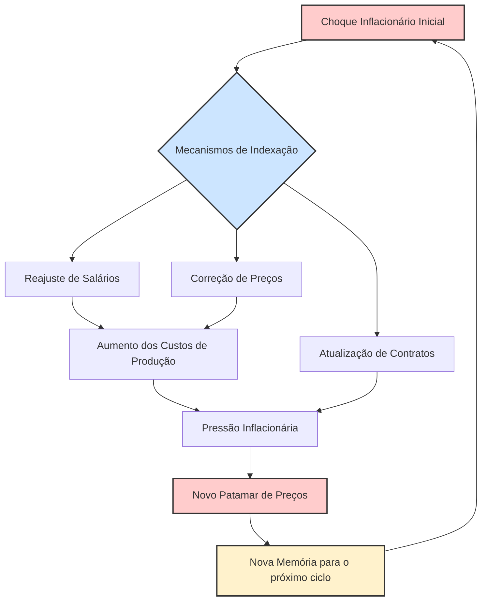

#### 3.2.3. A Inflação como "Conflito Distributivo"

A teoria inercialista possuía também uma dimensão sociopolítica profunda. A inflação não era vista apenas como um problema técnico-monetário, mas como a manifestação econômica de um **conflito distributivo** latente na sociedade brasileira.28

O mecanismo era agravado pelo fato de que os reajustes de preços e salários não ocorriam de forma sincronizada. Cada setor ou categoria profissional tinha sua própria data de reajuste. Nesse ambiente caótico, cada agente econômico (empresas, sindicatos, profissionais liberais) agia de forma defensiva. Ao reajustar seu preço ou reivindicar um aumento salarial, o objetivo não era necessariamente obter um ganho real, mas sim recompor o poder de compra que havia sido corroído pela inflação desde o último reajuste e se proteger contra a inflação futura.

Como nenhum agente confiava que os demais iriam cessar seus próprios reajustes, todos continuavam a remarcar, num comportamento racional do ponto de vista individual, mas desastroso do ponto de vista coletivo. Esse jogo não-cooperativo perpetuava a espiral inflacionária. A inflação, portanto, era o resultado de um impasse, de "reivindicações incompatíveis sobre a distribuição da renda nacional", onde cada grupo tentava manter sua fatia do bolo, e o resultado agregado era a contínua desvalorização da moeda.

### 3.3. Os Arquitetos da Teoria

A formulação da teoria da inflação inercial não foi obra de um único autor, mas o resultado de um intenso debate intelectual que envolveu alguns dos mais proeminentes economistas brasileiros da época, concentrados principalmente em duas instituições: a Pontifícia Universidade Católica do Rio de Janeiro (PUC-Rio) и a Fundação Getulio Vargas de São Paulo (FGV-SP).

Um precursor fundamental foi **Mário Henrique Simonsen**. Já em 1970, em sua obra "Inflação: Gradualismo x Tratamento de Choque", Simonsen desenvolveu o seu "modelo de realimentação", no qual decompunha a taxa de inflação em três componentes: um autônomo, um de demanda e um de "realimentação", que era explicitamente ligado à inflação do período anterior. Com isso, ele antecipou formalmente a ideia de que a inflação possuía um componente inercial que a propagava no tempo.

A teoria, no entanto, foi plenamente desenvolvida e consolidada no início dos anos 1980. Na PUC-Rio, um grupo de economistas conhecido como a "escola da Gávea" foi central nesse processo. Destacam-se os trabalhos de **Francisco Lopes**, **Pérsio Arida**, **André Lara Resende** e **Edmar Bacha**. Simultaneamente, na FGV-SP,

**Luiz Carlos Bresser-Pereira** e **Yoshiaki Nakano** também desenvolviam modelos e análises que chegavam a conclusões semelhantes sobre a natureza inercial e de conflito distributivo da inflação brasileira. Foi a convergência das ideias desses dois polos intelectuais que solidificou a teoria inercialista como o principal diagnóstico alternativo à ortodoxia e como a base para os planos de estabilização que se seguiriam.

---

## Parte IV: O Laboratório Heterodoxo e Suas Lições

### 4.1. A Lógica do "Choque Heterodoxo"

Se o diagnóstico apontava para uma inflação movida pela inércia e pela memória, a solução não poderia ser gradualista ou baseada apenas em instrumentos de mercado. A terapia proposta pela escola heterodoxa era, por natureza, intervencionista e drástica: o "choque heterodoxo". A lógica era que, para quebrar a psicologia inflacionária e o ciclo de reajustes automáticos, era necessária uma intervenção cirúrgica do Estado que interrompesse a propagação da inflação de uma só vez.

O principal instrumento desse choque era o **congelamento geral de preços e salários**. O objetivo do congelamento não era reprimir a inflação indefinidamente, mas sim atuar como um mecanismo de coordenação forçada. Ao proibir todos os reajustes simultaneamente, o governo visava quebrar a "memória" que ligava os preços presentes aos passados e "sincronizar" toda a economia em um "dia zero". Seria uma forma de romper o jogo não-cooperativo dos agentes, eliminando a justificativa para reajustes defensivos e estabelecendo um novo ponto de partida para a formação de preços em um ambiente de estabilidade.

Para reforçar simbolicamente essa ruptura com o passado inflacionário e facilitar a transição, o congelamento era frequentemente acompanhado de uma **reforma monetária**. Isso envolvia a criação de uma nova moeda, geralmente com o corte de zeros da moeda antiga, como ocorreu com a passagem do Cruzeiro para o Cruzado em 1986. A nova moeda deveria nascer "limpa" da memória inflacionária que contaminava a antiga.

### 4.2. Análise Comparada dos Planos

A segunda metade da década de 1980 transformou o Brasil em um verdadeiro laboratório de políticas anti-inflacionárias, com a implementação de sucessivos planos de estabilização que se basearam, em maior ou menor grau, na tese inercialista.

- **O Plano Cruzado (1986):** Foi a aplicação mais pura e famosa da teoria inercialista.9 Lançado em fevereiro de 1986, o plano promoveu um congelamento geral de preços e salários, instituiu o Cruzado como nova moeda e estabeleceu um gatilho salarial que previa reajustes automáticos caso a inflação atingisse 20%. O sucesso inicial foi espetacular: a inflação despencou, gerando uma onda de euforia popular e apoio ao governo.13 Contudo, o plano continha as sementes de seu próprio fracasso.
    
    **As principais causas do colapso foram:**
    
    1. **Ausência de Ajuste Fiscal e Monetário:** O plano ignorou completamente a necessidade de uma contrapartida ortodoxa. O governo não promoveu cortes de gastos nem contraiu a política monetária, permitindo que a demanda continuasse aquecida.
        
    2. **Explosão de Consumo:** O congelamento, combinado com um abono salarial inicial, gerou um aumento massivo do poder de compra. O resultado foi uma explosão de consumo que a oferta não conseguiu acompanhar, levando a filas, desabastecimento generalizado e ao surgimento de ágio.
        
    3. **Uso Político:** O governo Sarney, visando capitalizar a popularidade do plano nas eleições de novembro de 1986, adiou os ajustes necessários. A "festa do consumo" foi mantida por razões eleitorais, e logo após as eleições, com a economia em frangalhos, o plano foi abandonado e a inflação retornou com força ainda maior.
        
- **Os Planos Bresser (1987) e Verão (1989):** Foram tentativas de aprender com os erros do Cruzado. Ambos foram concebidos como planos "híbridos" ou "mistos", que buscavam combinar o congelamento de preços heterodoxo com medidas de austeridade ortodoxas. O Plano Bresser (junho de 1987) incluiu um congelamento mais curto e uma preocupação maior com o ajuste fiscal. O Plano Verão (janeiro de 1989) foi ainda mais longe na ortodoxia, combinando o congelamento com uma política de juros extremamente elevados para conter a demanda. Apesar das correções de rota, ambos os planos também fracassaram em estabilizar a economia. A inflação cedia temporariamente, mas logo retornava, evidenciando a profundidade da crise fiscal, a força avassaladora da inércia e a perda de credibilidade do governo em sustentar qualquer programa de ajuste.
    

### 4.3. O Debate Interno: Congelamento vs. Moeda Indexada

Dentro do próprio campo inercialista, existia uma divergência teórica fundamental sobre a melhor estratégia para quebrar a inércia, um ponto de grande sofisticação analítica. A controvérsia se dava entre a proposta de um choque abrupto via congelamento e uma reforma monetária mais gradualista.

- **Proposta do Congelamento (Francisco Lopes):** Esta vertente, que influenciou diretamente o Plano Cruzado, defendia que um choque direto e abrangente, com o congelamento de todos os preços e salários, era a única maneira eficaz de romper a inércia de forma rápida e sincronizada. A intervenção drástica seria necessária para impor a coordenação que o mercado não conseguia produzir.
    
- **Proposta da "Moeda Indexada" (Plano Larida - Pérsio Arida e André Lara Resende):** Este grupo de economistas da PUC-Rio era cético em relação ao congelamento. Argumentavam que congelar preços em uma economia com reajustes dessincronizados era administrativamente complexo e criaria distorções de preços relativos e perdas de renda insustentáveis, minando o apoio político ao plano. Em vez disso, propuseram uma reforma monetária mais sofisticada, que ficou conhecida como "Plano Larida". A ideia era criar uma "moeda indexada" — uma unidade de conta virtual, totalmente protegida da inflação (por exemplo, atrelada diariamente ao dólar) — que circularia em paralelo à moeda corrente e desvalorizada. O objetivo era que os agentes econômicos, de forma voluntária, passassem a usar essa "moeda boa" como referência para seus contratos e preços. Isso promoveria uma desindexação gradual e orientada pelo mercado, alinhando todos os preços relativos _antes_ da introdução definitiva da nova moeda, tornando o trauma do congelamento desnecessário.
    

A história dos planos de estabilização dos anos 80 acabou por validar, de forma indireta, a proposta da "moeda indexada". Os sucessivos fracassos dos planos baseados em congelamento (Cruzado, Bresser, Verão) demonstraram na prática as dificuldades e distorções apontadas por Arida e Resende. A proposta do Plano Larida, embora não implementada na década de 80, não foi esquecida. Em 1994, os formuladores do Plano Real, muitos dos quais participaram do debate inercialista, resgataram sua essência. A **Unidade Real de Valor (URV)** foi a implementação prática e genial da "moeda indexada": um indexador quase-moeda que serviu para alinhar todos os preços da economia de forma transparente e voluntária antes da introdução do Real.55 Portanto, o legado intelectual mais duradouro do debate dos anos 80 não foi a ideia do congelamento, que se provou falha, mas sim a proposta alternativa que, uma década depois, se tornaria a chave para o sucesso da estabilização brasileira.

---

## Parte V: Síntese e Legado para a Estabilidade Econômica

### 5.1. A Grande Lição dos Anos 1980

A tumultuada "Década Perdida" funcionou como um doloroso, porém indispensável, processo de aprendizado para a economia política brasileira. Ao final do período, um consenso havia se formado entre a maioria dos economistas e formuladores de política: nenhuma das duas grandes escolas de pensamento, ortodoxa ou heterodoxa, detinha, isoladamente, a solução completa para o problema da hiperinflação brasileira. A estabilidade duradoura exigiria uma síntese.

- **A Lição Heterodoxa:** A principal lição deixada pela escola inercialista foi o reconhecimento de que a inflação brasileira possuía, de fato, um componente inercial arraigado e poderoso, que não podia ser ignorado. A experiência demonstrou que políticas puramente recessivas, como as propostas pela ortodoxia, eram incapazes de debelar uma inflação dessa natureza e impunham um custo social proibitivo. Ficou claro que qualquer plano de estabilização bem-sucedido precisaria incorporar um mecanismo específico e eficaz para quebrar a memória inflacionária e desindexar a economia.
    
- **A Lição Ortodoxa:** Por outro lado, o fracasso retumbante dos planos heterodoxos, especialmente o Cruzado, ensinou uma lição igualmente crucial: quebrar a inércia era uma condição necessária, mas não suficiente. A desindexação e o congelamento de preços eram inúteis se não fossem sustentados por fundamentos macroeconômicos sólidos. Sem um ajuste fiscal rigoroso para estancar a fonte de desequilíbrio primário e sem uma política monetária consistente com a estabilidade, qualquer alívio seria temporário. A inflação, meramente reprimida, retornaria com força total assim que os controles fossem relaxados. A estabilidade de preços, concluiu-se, exigia responsabilidade fiscal e monetária.
    

### 5.2. O Caminho para o Plano Real: A Síntese Bem-Sucedida

O Plano Real, lançado em 1994, foi o herdeiro direto de todo esse legado intelectual. Seu sucesso notável em derrotar a hiperinflação deveu-se precisamente à sua capacidade de combinar, de forma engenhosa e pragmática, as lições aprendidas de ambas as correntes de pensamento. O Real não foi um plano puramente ortodoxo nem puramente heterodoxo; foi a síntese bem-sucedida das duas visões.

- **O Elemento Heterodoxo (Inercialista):** O coração do plano foi a criação da Unidade Real de Valor (URV). Inspirada diretamente na proposta da "moeda indexada" do Plano Larida, a URV funcionou como uma unidade de conta estável que conviveu com a moeda antiga (o Cruzeiro Real) por alguns meses. Ao obrigar a conversão de salários e, gradualmente, de todos os preços para a URV, o plano conseguiu desindexar a economia e alinhar os preços relativos de forma transparente, sem a necessidade de um congelamento traumático e distorcivo. Foi o mecanismo inteligente para quebrar a inércia.
    
- **O Elemento Ortodoxo:** A genialidade da URV não teria funcionado sem uma base sólida. O Plano Real só foi implementado após o governo ter promovido um rigoroso ajuste fiscal, notadamente com a criação do Fundo Social de Emergência (FSE), que deu ao governo a flexibilidade orçamentária necessária para equilibrar as contas públicas. Além disso, após a introdução da nova moeda, o Real, a estabilidade foi sustentada por políticas macroeconômicas consistentes, incluindo uma política monetária contracionista (juros altos) e o uso de uma âncora cambial nos primeiros anos. O Real funcionou porque atacou as duas frentes do problema: quebrou a inércia (lição heterodoxa) e corrigiu os desequilíbrios fundamentais (lição ortodoxa).
    

### 5.3. Tabela Comparativa: Ortodoxia vs. Inercialismo

A tabela a seguir resume as principais diferenças entre as duas correntes de pensamento, servindo como uma ferramenta de estudo e revisão para o candidato ao CACD.

|Eixo de Análise|**Visão Ortodoxa (Monetarista)**|**Visão Heterodoxa (Inercialista)**|
|---|---|---|
|**Diagnóstico Central**|Inflação de Demanda.|Inflação Inercial e de Custos.|
|**Causa Primária**|Déficits públicos crônicos financiados por emissão monetária.|Indexação generalizada da economia e conflito distributivo.|
|**Papel do Déficit Público**|Causa fundamental da inflação.|Fator secundário; sanciona a inflação, mas não a causa primária.|
|**Papel das Expectativas**|Racionais, formadas com base na política fiscal futura do governo.|Adaptativas, formadas com base na inflação passada ("memória").|
|**Mecanismo de Propagação**|Expansão contínua da base monetária para financiar o déficit.|Repasse automático e dessincronizado da inflação passada para os preços presentes.|
|**Solução Proposta**|Ajuste fiscal rigoroso e contração monetária (terapia de choque recessiva).|"Choque heterodoxo" (congelamento de preços) ou reforma monetária (moeda indexada) para quebrar a inércia.|
|**Custo Social**|A recessão e o desemprego são um custo inevitável e necessário para a estabilização.|A estabilização pode e deve ser alcançada sem recessão e com menor custo social.|
|**Crítica à Visão Oposta**|A heterodoxia ignora as causas fundamentais (fiscais) e ataca apenas os sintomas (preços).|A ortodoxia aplica um remédio ineficaz (recessão) para uma doença mal diagnosticada, com custo social proibitivo.|
|**Principais Nomes**|(Associados ao receituário do FMI e economistas como Delfim Netto no período)|M.H. Simonsen, F. Lopes, P. Arida, A.L. Resende, E. Bacha, L.C. Bresser-Pereira, Y. Nakano.|

---

## Parte VI: Questões Discursivas para Autoavaliação (Estilo CACD)

> [!question] Questão 1
> 
> Compare e contraste os diagnósticos das correntes ortodoxa e inercialista sobre as causas da hiperinflação brasileira na década de 1980. Discorra sobre como as diferentes interpretações a respeito do papel do déficit público e dos mecanismos de indexação levaram a propostas de política econômica radicalmente distintas.

> [!question] Questão 2
> 
> Analise o Plano Cruzado (1986) como uma aplicação da teoria da inflação inercial. Explique a lógica por trás do congelamento de preços e da reforma monetária como instrumentos de quebra da "memória inflacionária". Em seguida, discuta as principais razões para o seu fracasso, relacionando-as com a crítica da escola ortodoxa.

> [!question] Questão 3
> 
> O Plano Real (1994) é frequentemente considerado uma síntese bem-sucedida das lições aprendidas com os fracassos dos planos de estabilização da década de 1980. Discorra sobre como o Real incorporou elementos tanto da visão heterodoxa (inercialista) quanto da visão ortodoxa para alcançar a estabilidade de preços. Em sua resposta, detalhe o papel da Unidade Real de Valor (URV) como herdeira da proposta da "moeda indexada".

# Origem: _Economia Brasileira nos anos noventa (Abertura, Plano Real)

---
title: Economia Brasileira nos anos noventa (Abertura, Plano Real)
area: ECONOMIA
subarea: História econômica brasileira
tags:
  - cacd-2025
  - economia
  - economia-brasileira-nos-anos-noventa
  - historia-economica-brasileira
aliases:
  - 4.9 Economia Brasileira nos anos noventa.
---
# Economia Brasileira na Década de 1990: Abertura, Estabilização e Transformações Estruturais

A década de 1990 marcou um **ponto de inflexão** na economia brasileira, combinando reformas liberalizantes com um audacioso plano de estabilização monetária. Após anos de hiperinflação, crise da dívida externa e esgotamento do modelo desenvolvimentista de substituição de importações, o país ingressou num ciclo de **transformação estrutural**. Esse ciclo envolveu a **abertura comercial e financeira parcial** do início da década – o chamado "choque de competitividade" – e, posteriormente, a implementação do **Plano Real**, que debelou a hiperinflação. Os anos 90 testemunharam, portanto, a transição de um Estado altamente intervencionista para políticas inspiradas no Consenso de Washington, com privatizações, liberalização e nova inserção global da economia. A seguir, analisam-se em detalhe esses dois eixos – abertura e estabilização – e suas inter-relações, incluindo os desafios (déficits gêmeos, crises externas) e legados (fim da hiperinflação, **tripé macroeconômico** pós-1999) desse período.

> [!definition] **Consenso de Washington** 
> Conjunto de medidas econômicas concebidas em 1989 por instituições sediadas em Washington D.C. (FMI, Banco Mundial e Tesouro dos EUA) para países emergentes em crise. Enfatizava disciplina fiscal, controle da inflação, **privatizações** de estatais e **abertura econômica** (comercial e financeira) como caminhos para retomada do crescimento. No caso brasileiro, tais recomendações balizaram as reformas dos anos 1990, incluindo a estabilização monetária (Plano Real) e a liberalização da economia.

## 1. Abertura Comercial e Financeira Parcial da Economia Brasileira

### Contexto: Hiperinflação e Esgotamento do Modelo de Substituição de Importações

Nas décadas anteriores, especialmente entre os anos 1930 e 1980, o Brasil desenvolveu-se sob um modelo de **industrialização por substituição de importações**, com forte intervenção estatal e proteção do mercado interno. Esse modelo, embora tenha proporcionado crescimento acelerado até os anos 1970, começou a dar sinais de esgotamento no fim daquele período. A crise da dívida externa de 1982, os choques do petróleo e a elevação dos juros internacionais expuseram vulnerabilidades: o país adentrou os anos 1980 com estagnação econômica, inflação galopante e endividamento elevado. A chamada "crise do Estado desenvolvimentista" manifestou-se na **explosão inflacionária** (que atingiu níveis de hiperinflação acima de 2000% ao ano no início dos 90) e na perda de capacidade de investimento público. Diversos planos heterodoxos de estabilização nos anos 1980 (Cruzado, Bresser, Verão, Collor I e II) fracassaram em conter a inércia inflacionária.

Diante desse quadro de esgotamento, a elite dirigente buscou uma **mudança de paradigma** na década de 1990. A resposta veio sob a forma de reformas liberalizantes inspiradas nas ideias do Consenso de Washington e na onda global de **globalização financeira** e abertura de mercados pós-Guerra Fria. O governo Fernando Collor de Mello (1990–1992) deu início a esse movimento com medidas drásticas para **redimensionar o papel do Estado** na economia e expor a produção doméstica à concorrência externa. Trata-se de uma reação de perfil liberal aos desequilíbrios acumulados, pondo fim ao longo período de economia fechada e intervencionista. Em resumo, no começo dos anos 90 o Brasil estava pronto para abandonar o **nacional-desenvolvimentismo** e tentar um novo ciclo orientado pela estabilidade monetária, abertura e _market-friendly reforms_.

### O "Choque de Competitividade" e a Abertura Comercial

Uma das primeiras e mais emblemáticas iniciativas de Collor foi promover um **“choque de competitividade”** na indústria nacional, via abertura comercial unilateral. Desde sua posse em 1990, Collor criticava a indústria brasileira como obsoleta e pouco competitiva, comparando-a a uma “carroça” frente aos produtos estrangeiros. Para **forçar a modernização** e baixar os preços internos, seu governo desmontou o arcabouço protecionista herdado do período de substituição de importações. Em 1990 foi lançada a **Nova Política Industrial e de Comércio Exterior**, que **eliminou a maior parte das barreiras não-tarifárias** (como licenças de importação, cotas e proibições) e estabeleceu um cronograma para **reduzir drasticamente as tarifas de importação**. Entre 1990 e 1994, as alíquotas foram sendo cortadas gradualmente: ao final, a tarifa máxima caiu para 40% (antes chegava a 85% nos anos 80), a tarifa média para cerca de 14% e a tarifa modal para 20%. Na prática, o governo **antecipou** parte das reduções – já em 1992 muitos cortes previstos para 1993-94 foram implementados de imediato, aprofundando a abertura.

- **Antes e Depois da Abertura:** No final dos anos 1980, o Brasil era uma das economias mais fechadas do mundo, com tarifa média acima de 50% e diversos mecanismos protecionistas. Após as reformas de Collor, a tarifa média desceu a patamar próximo de 14% e inúmeras **reservas de mercado** foram extintas. Por exemplo, setores automobilístico e de informática – antes altamente protegidos – viram suas alíquotas reduzidas para 20–35%. Produtos sem similar nacional passaram a ter tarifa zero, ao passo que mesmo bens de consumo antes considerados “supérfluos” (como eletroeletrônicos) tiveram suas barreiras significativamente reduzidas. Esse **choque de abertura** inundou o mercado interno com importados mais baratos, pressionando empresas nacionais a cortar custos, elevar a produtividade e atualizar tecnologias.
    

> [!important] **Impacto Imediato** 
> A abertura comercial de Collor teve efeitos ambíguos. Por um lado, contribuiu para **derrubar a inflação inercial** ao baratear produtos importados e criar concorrência (o que foi útil na estabilização posterior). Também beneficiou os consumidores com maior oferta e preços menores. Por outro lado, muitas indústrias nacionais, habituadas à proteção, sofreram com a concorrência externa e a valorização cambial subsequente – fenômeno que seria agravado pelo Plano Real. Esse ajuste brusco levou à **desindustrialização** de alguns segmentos e ao aumento do coeficiente de importação na economia. Autores como Luiz Gonzaga Belluzzo destacam que a abertura “com câmbio valorizado e juros altos” nos anos 90 acabou **eliminando elos das cadeias produtivas locais**, sem contrapartida em aumento de exportações, enfraquecendo a indústria nacional. Essa tensão entre ganho de eficiência e perda de setores industriais é central para entender os **custos do ajuste neoliberal** da década.

Paralelamente à abertura comercial, o Brasil buscou integrar-se em blocos regionais e acordos internacionais. Em 1991 firmou-se o Tratado de Assunção criando o **Mercosul** (com Argentina, Uruguai e Paraguai), que estabeleceu uma união aduaneira gradual na região. O Mercosul foi importante para redirecionar exportações industriais brasileiras aos vizinhos num momento em que a concorrência asiática crescia globalmente. Além disso, o país participou de negociações da Área de Livre Comércio das Américas (ALCA) e aproximou-se de acordos com a União Europeia. Ou seja, a abertura unilateral veio acompanhada de uma **estratégia de integração comercial** mais ampla, sinalizando que o Brasil abandonava de vez o isolamento econômico.

### Liberalização Financeira e Vulnerabilidade Externa

A abertura do início dos anos 90 não se restringiu ao comércio de bens: incluiu também a **liberalização financeira**, ainda que de forma parcial e gradual. Após o acordo da dívida Brady em 1992, que reestruturou a dívida externa, o Brasil voltou a ter acesso aos mercados internacionais de capital. O governo Collor e, em seguida, a gestão de Itamar Franco (1992–1994) tomaram medidas para **atrair investimento estrangeiro** e **liberar fluxos de capital**:

- Em 1991, regulamentou-se a entrada de **investidores de portfólio estrangeiros** na bolsa brasileira, através das contas **CELEBR** (Convênio de Custódia) no mercado acionário, o que facilitou a vinda de recursos para ações nacionais.
    
- A partir de 1992-93, com a estabilização iminente, houve maior confiança para entrada de **Investimento Estrangeiro Direto (IED)**, incluindo privatizações que abriram setores a multinacionais.
    
- O governo também flexibilizou controles cambiais, permitindo às empresas maior acesso a crédito externo e **emissões de títulos no exterior** (eurobônus, ADRs etc.). A Constituição de 1988 foi emendada em 1995 para permitir a entrada de bancos estrangeiros no país (mediante acordos de reciprocidade), sinalizando maior abertura do setor financeiro.
    

Como resultado, nos meados da década de 90 o Brasil experimentou uma onda de influxos de capitais externos – parte impulsionada pela fama do Plano Real e pelos **juros altos** que o país passou a pagar (atraindo capital especulativo de curto prazo). Essa liberalização financeira teve efeitos positivos, como o aumento das reservas internacionais e financiamento para o déficit em conta corrente. Contudo, também **elevou a vulnerabilidade externa** do país. A economia ficou mais exposta ao chamado _hot money_ (capitais voláteis), passando a oscilar conforme o humor dos investidores globais.

> [!note] **Vulnerabilidade Externa** 
> Com a conta capital mais aberta, o Brasil dos anos 90 passou a registrar **entradas maciças de recursos** em alguns períodos e fugas abruptas em outros. Isso criou um padrão de crescimento instável – o "voo da galinha" – marcado por expansões curtas financiadas por poupança externa seguidas de súbitas paradas (“sudden stops”) quando ocorria aversão a risco. A dependência de capitais externos para fechar as contas gerou **risco cambial**: se os investidores saíssem, o Banco Central precisava elevar juros ou queimar reservas para segurar o câmbio, sacrificando crescimento. Essa fragilidade ficou evidente nas crises financeiras internacionais da segunda metade da década (Tequila 1995, Ásia 1997, Rússia 1998), quando o Brasil sofreu intensas pressões cambiais. A **liberalização financeira** sem salvaguardas plenas expôs o país a choques externos e aprofundou o dilema entre manter a estabilidade conquistada e retomar o desenvolvimento sustentado.

Em resumo, a abertura financeira dos anos 90 fez parte do receituário liberal adotado: atrair capitais estrangeiros era visto como forma de _boost_ no investimento e integração à globalização financeira. Economistas alinhados à nova estratégia – notadamente o grupo da PUC-Rio (Edmar Bacha, Gustavo Franco, André Lara Resende, Pérsio Arida, etc.) – argumentavam que essa inserção financeiramente aberta, combinada à abertura comercial, elevaria a eficiência alocativa e o **dinamismo tecnológico**, pavimentando um novo ciclo de crescimento. **Edmar Bacha**, um dos formuladores do Plano Real, defendia explicitamente a abertura comercial e financeira como imprescindíveis para aumentar a produtividade e disciplinar a economia brasileira frente à competição internacional. Ao mesmo tempo, críticos da esquerda, como **Maria da Conceição Tavares**, viam esse movimento como **predatório** aos interesses nacionais, pois subjugava o país às flutuações do capital global e enfraquecia a capacidade do Estado em liderar o desenvolvimento.

### Programa Nacional de Desestatização (PND) e as Primeiras Privatizações

Integrante fundamental do pacote liberalizante foi o **Programa Nacional de Desestatização (PND)**, que inaugurou um ciclo de **privatizações** de empresas estatais. Logo em abril de 1990, Collor conseguiu aprovar a Lei nº 8.031/1990, que criou o PND e estabeleceu as diretrizes para vender ou transferir o controle de empresas públicas para o setor privado. A motivação oficial do programa era dupla: **reduzir o tamanho do Estado** – considerado ineficiente, um “paquiderme lento e desengonçado” na propaganda da época – e **atrair capitais externos** para modernizar a economia. Em outras palavras, as privatizações eram tidas como parte da reforma do Estado e, simultaneamente, como parte da **abertura econômica** do país ao mundo.

- **PND Fase Collor (1990-1992):** Nessa primeira fase, o governo listou 68 empresas para desestatização, englobando siderúrgicas, petroquímica, fertilizantes, setor aeronáutico, mineração, etc. Na prática, porém, apenas **18 empresas foram privatizadas** antes de Collor sair do poder. A estreia se deu com a venda da **USIMINAS** (Usinas Siderúrgicas de Minas Gerais) em outubro de 1991, arrematada pelo grupo privado (liderado pela Gerdau) num leilão que gerou controvérsia, pois a usina era lucrativa e simbolizava o auge do planejamento estatal dos anos 50. Seguiram-se outras vendas de siderúrgicas: Açominas, Cosipa, e a Embraer (fabricante aeronáutica) também foi privatizada em 1994, já no governo Itamar. Collor enfrentou resistências políticas e escândalos (como o caso da VASP) que atrasaram o PND, mas lançou as bases do processo.
    
- **Continuação sob Itamar (1992-94):** O presidente Itamar Franco, embora de perfil desenvolvimentista histórico, deu sequência moderada ao PND. Seu governo concluiu a privatização da **Companhia Siderúrgica Nacional (CSN)** em 1993, um marco simbólico (a CSN fora inaugurada em 1946 como emblema do nacional-desenvolvimentismo de Vargas). Também vendeu a **Aço Minas Gerais (Açominas)** e a **Companhia Siderúrgica Paulista (Cosipa)**, consolidando a saída do Estado do setor siderúrgico. A Embraer foi privatizada em 1994, marcando a transferência de uma empresa de alta tecnologia para controle privado. Itamar, contudo, não avançou em setores politicamente sensíveis como telecomunicações, petróleo ou bancos públicos – essas ficaram para a próxima gestão.
    
- **Ampliação sob FHC (1995-2002):** Eleito após o sucesso do Real, Fernando Henrique Cardoso abraçou a agenda privatizante como parte central de seu projeto de reformas. Em 1995, criou o Conselho Nacional de Desestatização e, aderindo às recomendações do FMI e do Consenso de Washington, anunciou um **amplo programa de privatizações** em nível federal e estadual. Nos anos seguintes, o governo FHC vendeu empresas de setores estratégicos: a **Companhia Vale do Rio Doce (CVRD)** em 1997 (mineração), o **Sistema Telebrás** em 1998 (telecomunicações), além de empresas de energia (Light, Gerasul), bancos estaduais e várias empresas estaduais de eletricidade e saneamento. Houve forte oposição de sindicatos, movimentos sociais e mesmo setores acadêmicos, com protestos durante os leilões na Bolsa do Rio de Janeiro. Ainda assim, o processo prosseguiu, financiado em parte pelo BNDES e com uso de moedas podres (títulos da dívida) pelos compradores – aspectos bastante criticados pelos analistas da época.
    

É importante notar que as privatizações dos anos 90 não apenas aliviaram o caixa do governo (reduzindo dívida pública com as receitas das vendas), mas também **redesenharam o papel do Estado** na economia brasileira. Ao final da década, a União já não controlava setores-chave como siderurgia, mineração, telecomunicações e parte do sistema financeiro. Essa **reforma estrutural** atendeu aos preceitos neoliberais de diminuir o Estado produtor e fortalecê-lo como regulador. Economistas liberais argumentavam que, ao transferir empresas ao setor privado, o Estado abriria espaço fiscal e aumentaria a eficiência global da economia. Já críticos (incluindo muitos diplomatas formados no old school desenvolvimentista) viam com receio a desnacionalização de patrimônios e a formação de oligopólios privados. Para o candidato bem preparado, compreender essas nuances e argumentos pró e contra as privatizações é fundamental, visto que esse tema tem sido recorrente em provas de Política Econômica.

## 2. O Plano Real: Estratégia, Âncora Cambial e Estabilização

### Concepção e Fases do Plano Real (1993-1994)

Frente ao colapso inflacionário do final dos anos 80/início dos 90, o **Plano Real** emergiu como a mais bem-sucedida estratégia de estabilização da história brasileira. Formulado em 1993 durante o governo Itamar Franco, sob liderança do então ministro da Fazenda **Fernando Henrique Cardoso** e uma equipe de economistas (Persio Arida, Edmar Bacha, André Lara Resende, Gustavo Franco, entre outros), o Plano Real foi concebido como um programa **gradual e heterodoxo dentro da ortodoxia**. Em vez de um congelamento abrupto, optou-se por uma sequência de etapas para desarmar a inércia inflacionária:

1. **Ajuste Fiscal Prévio:** Em 1993, o governo aprovou medidas para equilibrar as contas públicas antes da estabilização monetária. Criou-se o **Fundo Social de Emergência** (FSE) – depois chamado Fundo de Estabilização Fiscal – permitindo desvincular 15% das receitas orçamentárias e direcioná-las à redução do déficit. Houve cortes de gastos e elevação de alguns tributos, compondo um esforço fiscal inicial. A ideia era sinalizar compromisso com disciplina fiscal, atacando a raiz monetária da inflação (financiamento do déficit via emissão).
    
2. **Criação da Unidade Real de Valor (URV):** Lançada em março de 1994, a **URV** foi uma moeda escritural indexada, cujo valor era ajustado diariamente pela inflação. Salários, preços e contratos foram convertidos para URV, enquanto o cruzeiro real continuava sendo a moeda corrente inflacionária. Essa etapa inovadora funcionou como um **divisor de águas**: a URV serviu de **âncora psicológica** e mecanismo de transição, rompendo a memória inflacionária ao habituar agentes a pensar em valores estáveis. Durante quatro meses, a URV coabitou com a moeda antiga, servindo de denominador comum para reajustes de preços e salários, de modo que, ao final, os preços reais estavam praticamente estabilizados em URV.
    
3. **Lançamento do Real:** Em 1º de julho de 1994, entrou em circulação a nova moeda, o **Real (R$)**, com paridade inicial de **R$1,00 = US$1,00**. A conversão dos salários e preços da URV para o Real consolidou a estabilização: a inflação mensal, que chegara a 50% no início de 1994, caiu para menos de 2% no mês seguinte ao lançamento da nova moeda. A partir de então, o Real seria sustentado por um regime de câmbio administrado, altos juros e monitoramento fiscal – componentes da estratégia de manutenção da estabilidade.
    

> [!definition] **Âncora Cambial** 
> Política de controle do regime de câmbio para ajudar a estabilizar preços internos. No Plano Real, adotou-se uma **âncora cambial** através de um regime de banda cambial (câmbio semi-fixo) em que o Banco Central fixava um patamar-alvo para o dólar frente ao real e intervinha constantemente para mantê-lo. Em 1994, fixou-se aproximadamente **1 real ≈ 1 dólar**, permitindo leve flutuação dentro de bandas. Para sustentar essa paridade, o BC **vendeu reservas internacionais** sempre que a cotação ameaçava ultrapassar o teto da banda e **elevou a taxa de juros** doméstica para atrair capitais externos, equilibrando o balanço de pagamentos. O objetivo explícito dessa âncora era **baratear os produtos importados** (tornando-os mais competitivos no mercado interno) e assim forçar a queda dos preços domésticos, quebrando a espiral inflacionária. Com a âncora cambial, a taxa de câmbio valorizada tornou-se o **pilar anti-inflacionário** no período 1994-1998.

### A Âncora Cambial (1994–1998): Funcionamento, Objetivos e Efeitos

Sob o Plano Real, de 1994 até início de 1999, o Brasil adotou essencialmente um regime de câmbio fixo (oficialmente bandas cambiais deslizantes). O real teve seu valor **administrado pelo Banco Central**, resultando numa moeda **sobrevalorizada** em termos reais. Esse arranjo serviu a múltiplos propósitos:

- **Combate à Inflação:** Como mencionado, a ideia era usar o câmbio como **âncora nominal**. A valorização cambial barateava importações – desde bens de consumo até insumos – e criava uma pressão competitiva que impedia produtores locais de repassar aumentos de custos aos preços. Isso complementava o fim da indexação proporcionado pela URV. O resultado foi espetacular: a inflação, que havia sido de 2.477% em 1993, despencou para 916% em 1994 (a maior parte concentrada no primeiro semestre pré-Real) e chegou a apenas **22% em 1995**, consolidando-se em torno de 7% ao ano em 1997-98. Ou seja, a hiperinflação foi dominada, restaurando a **moeda estável** – um feito histórico comemorado amplamente pela população.
    
- **Estabilização das Expectativas:** A **paridade quase fixa com o dólar** serviu como um **símbolo de credibilidade**. Consumidores e investidores passaram a acreditar que o governo manteria o valor do real, o que ancorou expectativas de inflação baixa e encorajou a **retomada do crédito e do consumo de bens duráveis** (antes inviabilizados pela inflação diária). Itens como automóveis e eletrodomésticos tornaram-se acessíveis a prazo. O poder de compra da classe média se recuperou, e houve um **boom de consumo** em 1994-95 graças à moeda forte.
    
- **Reformas Complementares:** Para sustentar o câmbio valorizado e atrair os dólares necessários, o governo combinou a âncora com **juros altos** e continuidade da abertura. A taxa básica de juros (SELIC) foi mantida em patamar elevado – frequentemente acima de 20% ao ano em termos reais – tornando o país atraente ao capital financeiro internacional (o chamado _carry trade_). Adicionalmente, flexibilizou-se ainda mais a entrada de capitais e deu-se seguimento às privatizações, que trouxeram bilhões de dólares em IED. Essas políticas compensatórias ajudavam a fechar as contas externas e preservar as reservas cambiais, mas ao custo de endividamento público caro e valorização adicional do real.
    

**Impactos Positivos:** O **sucesso inicial do Plano Real foi incontestável** no quesito inflação. A hiperinflação crônica, que corroía salários e desorganizava a economia, foi debelada. Em poucos meses, a população readquiriu a confiança na moeda – algo inédito para toda uma geração acostumada a indexar preços diariamente. Houve ganhos sociais imediatos: os salários reais médios subiram com a estabilização, pois os reajustes passaram a superar a inflação; a pobreza teve uma redução de curto prazo, já que a chamada "taxa de inflação dos pobres" (que sofrem mais com carestia de alimentos) caiu drasticamente. O mercado interno expandiu, com aumento das vendas no varejo e do crédito imobiliário. O Plano Real também **fortaleceu a democracia**, no sentido de mostrar que políticas econômicas consistentes poderiam resolver problemas antes tidos como insolúveis – isso elevou a confiança nas instituições e pavimentou a reeleição de FHC em 1998. Em síntese, a estabilização monetária trouxe um **dividendo político e econômico** significativo: fim do imposto inflacionário, estímulo ao planejamento de longo prazo e integração do Brasil na onda de estabilidade macro que várias economias emergentes também colhiam nos anos 90.

No entanto, ao analisar a década de 90 como um todo, é crucial entender que a estabilização veio acompanhada de **custos e contradições** importantes. O regime da âncora cambial, ao mesmo tempo em que resolvia o problema inflacionário, gerou desequilíbrios macroeconômicos que eventualmente cobrariam seu preço.

### Sucessos vs. Contradições: Déficits Gêmeos, Desindustrialização e Crises (1995-1998)

**Déficits Gêmeos:** Uma contradição central do modelo 94-98 foi o surgimento dos **“déficits gêmeos”** – déficit fiscal e déficit em conta corrente simultaneamente. Apesar do ajuste inicial, o governo não conseguiu sustentar um rigor fiscal permanente: os gastos públicos (especialmente com pessoal, previdência e juros da dívida) continuaram elevados, resultando em **déficit fiscais** consideráveis na segunda metade da década. Ao mesmo tempo, a âncora cambial valorizada provocou um **déficit externo (conta corrente)** crescente. Com o real forte, as importações explodiram e as exportações perderam fôlego. O coeficiente importação/PIB subiu rapidamente, enquanto a participação das exportações na economia caiu, levando o déficit em transações correntes a ultrapassar 4% do PIB em 1998. Assim, o país gastava mais do que produzia em termos de divisas, financiando a diferença com entrada de capital financeiro e de privatizações.

Os **déficits gêmeos** indicavam uma macroeconomia desequilibrada: o setor público absorvia poupança demais (via déficit) e o país como um todo dependia da poupança externa. Essa condição tornava o Brasil vulnerável: qualquer choque que interrompesse o financiamento externo pressionaria o câmbio e a inflação, dada a fragilidade fiscal e externa. Economistas críticos, como **Luiz Carlos Bresser-Pereira**, apontaram já na época que o Plano Real vencera a inflação **à custa de um câmbio sobreapreciado e juros estratosféricos**, o que minava a saúde financeira do Estado e da indústria. Bresser – ex-ministro e colaborador de FHC no início – tornou-se um **ferrenho opositor da “populismo cambial”** que, em sua visão, a equipe econômica praticava (ou seja, usar câmbio barato para agradar consumidores e segurar preços, sacrificando a solvência de longo prazo).

**Desindustrialização e Crescimento Pífio:** Outro efeito colateral observado foi a **desindustrialização precoce**. A conjugação de abertura comercial + câmbio valorizado barrou a inflação, mas também tornou produtos estrangeiros muito competitivos internamente, levando fábricas nacionais à falência ou à redução drástica. Setores inteiros, como têxteis, brinquedos, eletrônicos de consumo, sofreram com a invasão de importados pós-94. A indústria de transformação viu sua participação no PIB declinar ao longo dos anos 90. **Maria da Conceição Tavares** criticou duramente essa consequência, afirmando que houve uma abertura "excessiva" e que a política cambial do Plano Real foi "um erro" do ponto de vista do desenvolvimento industrial. Para Conceição (de orientação cepalina), o Brasil dos anos 90 trocou uma inflação crônica por uma **quase-estagnação** econômica: crescimento medíocre (média ~2,5% a.a. entre 1995-1998) apelidado de "voo da galinha", dada a incapacidade de sustentar um ciclo longo de expansão. Belluzzo resumiu assim: “o sucesso no combate à inflação foi acompanhado de um processo **rápido e intenso de desindustrialização**”, comprometendo as bases do crescimento futuro.

> [!note] **"Stop and Go"** 
> O padrão de crescimento brasileiro pós-Real foi marcado por ciclos curtos de alta seguidos de freada – devido ao estrangulamento externo. Com a abundância de dólares nos mercados internacionais em meados dos 90 (e.g. capitais procurando emergentes), o Brasil crescia por alguns trimestres. Mas logo surgia um choque externo ou esgotava-se a confiança, capital fugia, o câmbio ficava sob ataque e o Banco Central era obrigado a subir juros às alturas, provocando recessão. Esse movimento cíclico de avanço e recuo – chamado de **dinâmica do "stop and go" ou "voo da galinha"** – foi observado nas crises de 1995, 1997 e 1998. O resultado foi um crescimento instável e abaixo do potencial, incapaz de reduzir as desigualdades ou o desemprego de forma duradoura.

**Crises Financeiras Internacionais:** Os problemas latentes do modelo brasileiro foram expostos pelas turbulências externas da década. A **Crise do México (1994-95)** – o "Efeito Tequila" – foi o primeiro teste: investidores estrangeiros, assustados com o calote mexicano, retiraram capitais de vários emergentes. O Brasil perdeu reservas e enfrentou uma minicrise cambial em início de 1995. O governo respondeu com um _mix_ de elevação violenta dos juros (a SELIC foi a ~45% a.a. em março de 1995) e um pacote de ajuste (contingenciamento de gastos e criação da CPMF) para acalmar os mercados. Conseguiu segurar o Real e passou pelo susto, mas ao preço de uma desaceleração naquele ano.

Em seguida veio a **Crise da Ásia (1997)**: a quebra de bancos e moedas na Tailândia, Indonésia, Coreia, etc. causou nova fuga de capitais de países emergentes. Novamente o Brasil foi afetado – pressão no câmbio e nas reservas – obrigando o BC a elevar juros (entre outubro 1997 e março 1998 a SELIC subiu de ~20% para 40% a.a.) e adotar medidas emergenciais. Houve uma sobretaxa temporária de importação e cortes no orçamento para conter o déficit externo e restaurar confiança. Apesar do grande susto, a âncora cambial sobreviveu a 1997.

A **gota d’água veio em 1998**, com a moratória da Rússia em agosto. Esse choque gerou pânico global ("Efeito Orloff" ou "vodca") e estrangulou de vez o financiamento dos déficits brasileiros. Nas semanas seguintes, saques de capital obrigaram o Brasil a negociar um **resgate financeiro multilateral**: em novembro de 1998, o FMI anunciou um pacote de ~US$ 41 bilhões para o Brasil, condicionado a um forte ajuste fiscal (meta de superávit primário ~3% do PIB). Mesmo com o colchão do FMI, a situação se tornou insustentável: as reservas internacionais foram drenadas rapidamente na defesa do Real (caindo para cerca de US$ 24 bilhões no início de 1999, menos da metade do nível de um ano antes). A dívida pública em alta (devido aos juros) e a fragilidade política pós-eleitoral minaram a credibilidade da paridade cambial.

### A Crise de 1999 e a Transição para o Tripé Macroeconômico

Em janeiro de 1999, poucas semanas após FHC iniciar seu segundo mandato, o regime cambial ruiu. No dia 13/01/1999 o BC – sob novo presidente, Francisco Lopes – ainda tentou uma devaluação controlada criando bandas diagonais móveis (banda cambial exógena). Mas o mercado não se conteve: o BC perdeu bilhões em questão de dias tentando segurar o teto. Em 15/01/1999, capitulou e anunciou que **deixaria o câmbio flutuar livremente**, abandonando a âncora. Nas semanas seguintes, o real sofreu **forte desvalorização** (perda de mais de 50% do valor frente ao dólar em duas semanas), levando a cotação para cerca de R$2 por US$1 no começo de fevereiro.

Paradoxalmente, esse colapso cambial representou também o **nascimento de um novo regime macroeconômico** no Brasil, o chamado **Tripé Macroeconômico**. Reconhecendo que não dava mais para o câmbio “tomar conta da inflação”, o governo reorganizou sua estratégia econômico-financeira em três pilares a partir de 1999:

- **Câmbio Flutuante:** Com o fim da paridade fixa, o real ficou livre para oscilar conforme oferta e demanda no mercado. O BC passou a intervir apenas para suavizar volatilidades excessivas, mas sem meta explícita de preço. Isso permitiu um ajuste automático do desequilíbrio externo: a maxi-desvalorização tornou exportações brasileiras mais baratas e importações mais caras, corrigindo rapidamente o déficit em conta corrente (que caiu de 4.3% do PIB em 1998 para ~2.4% em 1999 e foi a superávit em 2003). Em suma, o câmbio flutuante assumiu a função de equilibrar o balanço de pagamentos, em vez de ser âncora de preços.
    
- **Metas de Inflação:** Para não deixar a inflação escapar com o câmbio flutuando (de fato, a inflação chegou a 8.9% em 1999 e 6% em 2000 devido à pass-through da desvalorização, mas longe de uma hiper), o governo implementou formalmente um **regime de metas de inflação**. Em junho de 1999, um decreto instituiu que o Conselho Monetário Nacional fixaria anualmente uma meta de inflação (IPCA) a ser perseguida pelo Banco Central. A primeira meta foi de 8% para 1999 (com banda de tolerância), depois 6% para 2000, e gradualmente descendo. O BC, agora presidido por **Armínio Fraga** (a partir de março/99), passou a utilizar a taxa de juros como principal instrumento para atingir a meta inflacionária. Ou seja, invertendo a lógica anterior, agora os **juros tomariam conta da inflação** (política monetária ativa), enquanto o câmbio cuidaria do equilíbrio externo. Transparência e comunicação (atas do COPOM, cartas abertas se meta não cumprida) passaram a fazer parte do arranjo, ancorando as expectativas do mercado na meta anunciada.
    
- **Ajuste Fiscal (Superávit Primário):** O terceiro pilar do tripé foi a responsabilidade fiscal. Sob pressão do FMI e para recuperar a confiança dos credores, FHC promoveu em 1999–2000 um forte ajuste nas contas públicas. Estabeleceram-se metas de **superávit primário** do setor público (excluindo juros da dívida) em torno de 3% do PIB – suficientes para estabilizar e depois reduzir a dívida pública como proporção do PIB. Em 2000, aprovou-se a **Lei de Responsabilidade Fiscal (LRF)**, institucionalizando limites de gasto e endividamento para União, estados e municípios. A disciplina fiscal visava sinalizar solvência de longo prazo, reduzindo o risco país e permitindo que, com o tempo, os juros pudessem convergir a níveis mais civilizados. Em suma, a política fiscal ficou subordinada ao objetivo de gerar superávits para pagar parte dos juros, complementando o esforço anti-inflacionário e viabilizando o câmbio livre sem crises.
    

Esses três pilares – câmbio flutuante, metas de inflação e superávit fiscal – formam o **Tripé Macroeconômico** brasileiro, vigente (com maior ou menor rigor) desde 1999. Armínio Fraga explicou didaticamente a nova lógica: antes, no regime de câmbio fixo, pedia-se ao câmbio que controlasse a inflação e aos juros que financiassem o balanço de pagamentos (atraindo dólares); a partir de 1999, inverteu-se: pede-se ao câmbio que equilibre o balanço de pagamentos (via ajuste de preços externos) e aos juros que controlem a inflação (via demanda agregada), tudo isso sustentado por uma política fiscal responsável que dê suporte à confiança na moeda.

> [!important] **Legado do Tripé** 
> A adoção do tripé macroeconômico marcou a **superação definitiva da era de alta inflação** e instabilidade cambial. Com ele, o Brasil ingressou no século XXI com um arcabouço de políticas alinhado às melhores práticas internacionais pós-consenso neoliberal. O tripé trouxe credibilidade e previsibilidade à política econômica, contribuindo para a queda do risco-país e permitindo crescimento sob inflação controlada nos anos 2000 (até choques posteriores). Entretanto, críticos apontam que esse modelo também cristalizou **juros persistentemente altos** e certa rigidez fiscal que limitou o investimento público. De todo modo, o tripé é referência obrigatória para entender a era pós-Real.

Os três pilares podem ser visualizados esquematicamente no diagrama a seguir, como os “pés” que sustentam a política macroeconômica desde 1999:

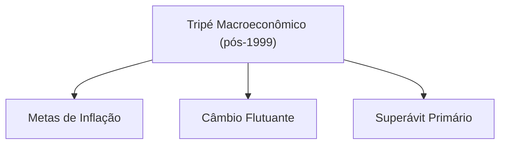

## Conclusão: A Década de 1990 como Ciclo de Transformação Estrutural

A economia brasileira nos anos 90 passou por uma **metamorfose**. Saímos de um modelo estatizante, fechado e instável para outro liberalizante, aberto e com moeda estável. Esse ciclo completo – **abertura e estabilização** – teve aspectos complementares: a abertura comercial/financeira foi não só uma reforma estrutural em si, mas também parte integrante da estratégia de estabilização (ao viabilizar a âncora cambial e inserir o país na liquidez internacional). Autores frequentemente cobrados no CACD analisam essa inter-relação. **Edmar Bacha** e outros arquitetos do Real viam na abertura um mecanismo de disciplina econômica e aumento de eficiência, necessário para que a estabilização de preços fosse sustentável e para que o Brasil ingressasse num novo ciclo de crescimento orientado pela produtividade. Já críticos como **Bresser-Pereira** e **Conceição Tavares** argumentam que a estabilização monetária foi obtida com base em políticas neoliberais que fragilizaram o desenvolvimento industrial e a solvência do Estado – uma troca de mal que cobrou seu pedágio no final da década.

Fato é que a década de 90 foi um **período de inflexão**: encerrou-se a velha ordem inflacionária e intervencionista, e inaugurou-se uma nova era de estabilidade de preços, regras de mercado e integração global. O **Consenso de Washington**, ainda que adaptado às especificidades brasileiras, serviu de guia para muitas medidas – privatizações, abertura comercial, ajuste fiscal, liberalização financeira. Internamente, o país modernizou marcos legais (quebra de monopólios, leis de responsabilidade fiscal, criação de agências reguladoras). No cenário internacional, o Brasil reposicionou-se: deixou de ser visto como economia cronicamente desajustada para ser considerado um mercado emergente promissor (nos anos 90 integrou o grupo dos “BRICs” emergentes potenciais). Essa transformação estrutural, contudo, veio acompanhada de contradições e continuidades de antigos problemas (desigualdade persistente, baixo crescimento, vulnerabilidade externa) que seriam temas dos anos 2000 e adiante.

A principal lição da economia brasileira dos anos 90 é entender **equilíbrios delicados**: a arte de fazer estabilização e reformas estruturais simultaneamente. A década iniciou com um ousado experimento liberal (Collor) feito de forma atabalhoada, transitou pela pragmática construção do Real e terminou com a consolidação de um novo consenso macroeconômico. Trata-se de um **ciclo** em que abertura e estabilização andaram juntos – ora se reforçando (como no combate à inflação), ora gerando tensões (como na perda de competitividade industrial). Interpretar a década nesse contexto integrado – e com suporte de autores e conceitos-chave (âncora cambial, déficits gêmeos, voo da galinha, Washington Consensus, tripé macro etc.) – é fundamental para responder questões discursivas e objetivas sobre o período.

> [!note] **Autores em Destaque:**
> 
> - _Edmar Bacha_ – membro da equipe do Plano Real, defensor da abertura comercial como ferramenta de aumento de produtividade e crítico da demora do Brasil em convergir para padrões internacionais de eficiência.
>     
> - _Luiz Carlos Bresser-Pereira_ – ex-ministro da Fazenda, teórico do “novo desenvolvimentismo”; aponta que após o Real o Brasil entrou numa armadilha de câmbio apreciado e juros altos, advogando políticas cambiais ativas e industriais para retomar o crescimento.
>     
> - _Maria da Conceição Tavares_ – economista estruturalista, enfatiza os custos sociais e produtivos das reformas neoliberais; qualificou a abertura dos anos 90 como **excessiva** e a estratégia cambial de FHC como equivocada e subordinada aos interesses do capital financeiro internacional.
>     
> - _Gustavo Franco_ – presidente do BC no auge do Plano Real, representante do pensamento liberal da PUC-Rio; defendeu que sem as reformas e o choque de importação, o Brasil não quebraria a espinha inflacionária. Para ele, a estabilidade de preços era pré-condição para qualquer retomada do desenvolvimento.
>     
> - _Luiz Gonzaga Belluzzo_ – economista desenvolvimentista, alerta que a forma como a estabilização foi conduzida (câmbio valorizado, abertura abrupta) desarticulou cadeias produtivas domésticas e relegou o Brasil a um crescimento medíocre nos anos 90.
>     

Cada um desses autores oferece uma lente interpretativa para a década, e é recomendável ao candidato conhecê-los para citar em respostas e enriquecer análises.

### Questões para Autoavaliação

1. **Abertura e Estabilização:** De que maneira a abertura comercial e financeira iniciada no governo Collor contribuiu (ou conflitou) com a estratégia de estabilização do Plano Real? Discuta a inter-relação entre essas políticas na década de 1990.
    
2. **Âncora Cambial:** Explique o funcionamento da âncora cambial adotada entre 1994 e 1998 e analise seus efeitos positivos (no combate à inflação) e negativos (sobre a balança comercial e a indústria nacional) para a economia brasileira.
    
3. **Tripé Macroeconômico:** O que é o tripé macroeconômico implantado a partir de 1999 e por que ele foi adotado em resposta à crise cambial daquele ano? Descreva os três pilares e como eles buscavam corrigir os desequilíbrios do período anterior.


# Origem: _Bancos digitais, meios de pagamento e transição para 'dinheiro digital'

---
title: "Bancos digitais, meios de pagamento e transição para 'dinheiro digital'"
area: "ECONOMIA"
subarea: "Economia Digital Século XXI"
tags:
  - bancos-digitais-meios-de-pagamento-e-transicao-para-dinheiro-digital
  - cacd-2025
  - economia
  - economia-digital-seculo-xxi
---
# A Revolução do Dinheiro Digital: As CBDCs, o Projeto Drex e o Futuro do Sistema Financeiro

## 1. Introdução: A Próxima Fronteira da Evolução Monetária

A história da moeda é a história da evolução da confiança, da tecnologia e do poder estatal. Desde as conchas e o sal, passando pelo metal cunhado, pelo papel-moeda garantido pelo soberano, até o dinheiro escritural nos livros contábeis dos bancos, cada transformação representou uma reconfiguração fundamental das relações econômicas e sociais. Estamos, no século XXI, testemunhando a mais recente e talvez mais profunda dessas transformações: a transição da mera digitalização de processos financeiros para a tokenização programável de ativos. Este não é um passo incremental; é uma mudança de paradigma que redefine a própria natureza do dinheiro e da soberania monetária.

O ponto de inflexão que catalisou a ação dos bancos centrais em todo o mundo não foi a emergência de criptomoedas descentralizadas como o Bitcoin. Embora inovadoras, sua volatilidade intrínseca as relegou, em grande medida, ao status de ativo especulativo, incapaz de cumprir plenamente as funções clássicas da moeda.1 O verdadeiro alarme soou com a proposta de _stablecoins_ privadas com potencial de alcance global, notadamente o projeto Libra (posteriormente renomeado para Diem) do Facebook.3 A perspectiva de uma corporação de tecnologia, com bilhões de usuários, emitir sua própria moeda digital atrelada a uma cesta de moedas fiduciárias representou uma ameaça direta e crível à soberania monetária dos Estados. O risco de uma "dolarização digital" ou de uma "privatização da moeda" em larga escala tornou-se palpável, forçando as autoridades monetárias a uma conclusão inevitável: se o Estado não oferecesse uma forma digital, segura e soberana de sua moeda, o setor privado ou uma potência estrangeira o faria, preenchendo um vácuo de poder com consequências imprevisíveis.

Nesse contexto, as Moedas Digitais de Banco Central (CBDCs) emergiram não apenas como uma modernização tecnológica, mas como uma resposta estratégica e, em muitos aspectos, defensiva. Elas representam o esforço do Estado para reafirmar seu papel central no sistema monetário, combinando a confiança e a estabilidade da moeda soberana com a eficiência e a programabilidade das novas tecnologias de registro distribuído (DLT).

Este relatório analisa a ascensão das CBDCs como a próxima fronteira da evolução monetária. A tese central é que o desenvolvimento desses instrumentos, com destaque para o ambicioso Projeto Drex do Brasil, transcende a simples criação de um novo meio de pagamento. Trata-se de uma reengenharia da infraestrutura do mercado financeiro, com implicações profundas e multifacetadas para a intermediação bancária, a inclusão social, a privacidade dos cidadãos e, crucialmente, para a geopolítica do sistema financeiro global. O Drex, em particular, com sua arquitetura inovadora, posiciona o Brasil na vanguarda desse debate, oferecendo um modelo que busca equilibrar inovação radical com a estabilidade do sistema financeiro existente.

## 2. O Espectro do Dinheiro Digital: Distinções Fundamentais

Para compreender a revolução em curso, é imperativo distinguir com precisão as diferentes formas de dinheiro digital que coexistem e competem no cenário atual. Embora compartilhem a base tecnológica, suas arquiteturas, filosofias e implicações são fundamentalmente distintas.

### 2.1. Criptomoedas Descentralizadas (Ex: Bitcoin)

As criptomoedas descentralizadas, inauguradas pelo Bitcoin em 2009, são ativos digitais nativos de redes que operam sem uma autoridade central de controle ou emissão.1 Sua filosofia subjacente é a da desintermediação radical e da resistência à censura, possibilitada pela tecnologia blockchain. As transações são validadas e registradas de forma distribuída por uma rede de participantes (nós), através de mecanismos de consenso como o _Proof-of-Work_.

Do ponto de vista econômico, suas características definem seu papel. A oferta de muitas criptomoedas, como o Bitcoin, é programaticamente escassa (limitada a 21 milhões de unidades), uma característica que, combinada com a demanda flutuante, resulta em altíssima volatilidade de preços.1 Isso compromete severamente sua função como unidade de conta e meio de troca estável, tornando-as mais adequadas como um ativo especulativo ou uma reserva de valor para um nicho de investidores. Em termos de privacidade, as transações são pseudônimas: registradas publicamente em um livro-razão imutável, mas associadas a endereços alfanuméricos, não a identidades civis. Contudo, técnicas de análise de blockchain podem, muitas vezes, rastrear e desanonimizar os usuários.

### 2.2. Stablecoins Privadas (Ex: Tether, USDC)

As _stablecoins_ surgiram como uma solução para a volatilidade das criptomoedas. São tokens digitais emitidos por entidades privadas que buscam manter uma paridade de valor (um "peg") com um ativo de referência, geralmente uma moeda fiduciária forte como o dólar americano.6 Elas atuam como uma ponte crucial entre o ecossistema cripto e o sistema financeiro tradicional. O mecanismo de estabilização depende do lastro, que pode ser _off-chain_ (reservas em depósitos bancários, títulos do tesouro ou outros ativos tradicionais) ou _on-chain_ (colateral em outros criptoativos).

Apesar de sua utilidade, as _stablecoins_ são uma fonte de grande preocupação para reguladores globais como o Fundo Monetário Internacional (FMI) e o Banco de Compensações Internacionais (BIS). Os riscos são múltiplos e sistêmicos:

- **Risco de "De-pegging" e Corridas:** A confiança em uma _stablecoin_ depende inteiramente da solvência e da transparência de seu emissor. Dúvidas sobre a qualidade ou a existência do lastro podem levar a uma perda de paridade com o ativo de referência, desencadeando corridas (saques em massa) e vendas forçadas (_fire sales_) dos ativos de reserva, com potencial de contágio para o sistema financeiro tradicional.
    
- **Risco à Soberania Monetária:** Em economias com moedas mais frágeis, a ampla adoção de _stablecoins_ lastreadas em dólar pode levar a um fenômeno de "dolarização digital". Cidadãos e empresas podem abandonar a moeda local, erodindo a base monetária do país e a capacidade do banco central de conduzir uma política monetária eficaz para gerir os ciclos econômicos.
    
- **Risco de Concentração de Poder:** A emissão de _stablecoins_ está concentrada em poucas grandes empresas, algumas delas gigantes da tecnologia ("Big Techs"). Isso cria novos centros de poder financeiro sistêmico que operam, em grande parte, fora do perímetro regulatório tradicional aplicado aos bancos, gerando preocupações sobre concorrência e estabilidade.
    

### 2.3. Moedas Digitais de Banco Central (CBDCs)

Uma CBDC é a forma digital da moeda soberana de um país. Sua característica definidora e mais importante é ser um **passivo direto do Banco Central**.14 Esta é a distinção fundamental que a separa de todas as outras formas de dinheiro digital. O dinheiro que a maioria das pessoas usa hoje, na forma de saldos em contas bancárias, é dinheiro de banco comercial – um passivo do banco privado onde a conta está depositada. As _stablecoins_ são passivos de seus emissores privados. Uma CBDC, por outro lado, carrega a mesma garantia, confiança e ausência de risco de crédito que o dinheiro físico (cédulas e moedas), pois é uma obrigação da autoridade monetária máxima do país.

A finalidade de uma CBDC é, portanto, combinar o melhor de dois mundos: a segurança e a estabilidade da moeda soberana com a inovação, a eficiência e a programabilidade que a tecnologia de registro distribuído possibilita.

Para visualizar essas diferenças estruturais, o diagrama a seguir ilustra a governança centralizada de uma CBDC em contraste com a rede descentralizada do Bitcoin.


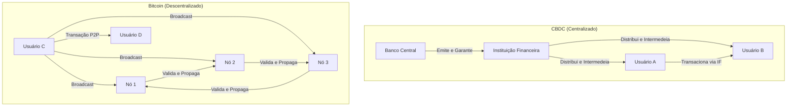

A tabela a seguir resume as características essenciais de cada tipo de ativo digital, oferecendo uma referência clara para a análise.

|Característica|Criptomoedas (Bitcoin)|Stablecoins (USDC)|CBDC (Drex)|
|---|---|---|---|
|**Emissor**|Rede Descentralizada|Entidade Privada (e.g., Circle)|Banco Central do Brasil|
|**Natureza do Passivo**|Nenhum (ativo nativo da rede)|Passivo da entidade emissora|Passivo direto do Banco Central|
|**Estabilidade de Valor**|Alta Volatilidade|Estável (atrelada ao USD)|Estável (atrelada ao BRL)|
|**Governança**|Descentralizada (código, mineradores)|Centralizada (empresa emissora)|Centralizada (Banco Central)|
|**Finalidade Principal**|Reserva de valor especulativa|Meio de troca no ecossistema cripto|Meio de liquidação e plataforma para serviços financeiros tokenizados|
|**Confiança**|Baseada em criptografia e código|Baseada na solvência e transparência do emissor|Baseada na confiança no Estado e na autoridade monetária|

## 3. As CBDCs no Cenário Global: Motivações e Modelos

A exploração e o desenvolvimento de CBDCs tornaram-se um fenômeno global. Segundo o Atlantic Council, em meados de 2024, 137 países e uniões monetárias, representando 98% do PIB mundial, estavam explorando uma CBDC. Este movimento quase unânime não é coincidência, mas uma resposta a um conjunto de imperativos estratégicos que pressionam as autoridades monetárias em todo o mundo.

### 3.1. O Imperativo Estratégico dos Bancos Centrais

As motivações para a emissão de uma CBDC variam em prioridade de acordo com o contexto de cada país, mas podem ser agrupadas em quatro vetores principais:

- **Garantia da Soberania Monetária:** Esta é, sem dúvida, a motivação primordial para as grandes economias e um fator de crescente importância para as economias emergentes. A ascensão de _stablecoins_ privadas globais, predominantemente lastreadas em dólar, e a potencial circulação transfronteiriça de CBDCs de outras nações representam uma ameaça existencial ao controle monetário doméstico.4 A emissão de uma CBDC nacional é uma ferramenta proativa para competir nesse novo ambiente digital, assegurando que a moeda soberana continue a ser a unidade de conta e o meio de troca preferencial dentro de seu território, preservando assim a eficácia da política monetária e a capacidade do Estado de arrecadar impostos e financiar-se.
    
- **Modernização e Eficiência:** Os sistemas de pagamento legados, especialmente para transações transfronteiriças, são frequentemente lentos, caros e opacos, dependendo de uma complexa cadeia de bancos correspondentes. As CBDCs prometem superar essas ineficiências, permitindo liquidações mais rápidas e baratas. Adicionalmente, há uma busca pela redução dos custos associados à gestão do dinheiro físico (impressão, transporte, segurança, substituição), que, segundo algumas estimativas, podem consumir até 1.5% do PIB de um país.
    
- **Inclusão Financeira:** Este é um objetivo frequentemente destacado, em particular por bancos centrais de países emergentes e em desenvolvimento. Globalmente, cerca de 1,4 bilhão de pessoas permanecem fora do sistema financeiro formal. Uma CBDC bem projetada, com baixos custos de transação, requisitos de identificação simplificados para contas de baixo valor e potencial operação offline, poderia servir como uma porta de entrada para a economia formal, permitindo que populações desbancarizadas acessem serviços financeiros básicos.19 No entanto, como será analisado adiante, essa motivação enfrenta o paradoxo da exclusão digital.
    
- **Novas Ferramentas de Política Monetária:** Em um nível mais teórico e controverso, as CBDCs abrem a possibilidade de novas e mais diretas ferramentas de política monetária. Um banco central poderia, por exemplo, implementar remuneração direta (positiva ou negativa) sobre os saldos em CBDC, influenciando o consumo e a poupança de forma mais imediata. Essa capacidade, no entanto, é politicamente sensível, pois levanta debates profundos sobre o grau de controle do Estado sobre as finanças dos cidadãos e o potencial para vigilância financeira.
    

### 3.2. Arquiteturas Fundamentais: Varejo vs. Atacado

A decisão mais fundamental no desenho de uma CBDC diz respeito ao seu público-alvo, o que define duas arquiteturas principais:

- **CBDC de Varejo (Retail):** Seria uma forma de dinheiro digital emitida pelo banco central para uso direto do público em geral – pessoas físicas e jurídicas – em suas transações cotidianas. O modelo de varejo é o que mais se aproxima da ideia de um "dinheiro digital para todos". Contudo, ele carrega um risco sistêmico significativo: a **desintermediação bancária**. Em um cenário de crise financeira, os cidadãos poderiam converter massivamente seus depósitos em bancos comerciais para uma CBDC de varejo, que é um ativo livre de risco de crédito (um passivo do banco central). Tal movimento poderia provocar uma corrida bancária em escala sistêmica, minando a capacidade de captação dos bancos comerciais e, consequentemente, sua capacidade de conceder crédito, um pilar da economia moderna.
    
- **CBDC de Atacado (Wholesale):** Este modelo prevê uma moeda digital de uso restrito a instituições financeiras (bancos, cooperativas, etc.) e ao próprio banco central. Sua finalidade é a liquidação de pagamentos de alto valor, transações no mercado interbancário e liquidação de ativos financeiros. A CBDC de atacado é vista como uma evolução mais natural e menos disruptiva dos atuais Sistemas de Liquidação Bruta em Tempo Real (RTGS), como o STR no Brasil. Ela moderniza a infraestrutura do "encanamento" financeiro sem competir diretamente com os bancos comerciais na captação de depósitos do varejo.
    

A percepção dos riscos associados ao modelo de varejo tem levado a uma mudança na tendência global. Uma pesquisa recente do BIS revelou que a probabilidade de os bancos centrais emitirem uma CBDC de atacado nos próximos anos agora supera a de emitirem uma de varejo.22 Essa não é uma decisão meramente técnica, mas profundamente político-econômica. Ela reflete tanto a influência do setor bancário estabelecido quanto o receio justificado das autoridades monetárias em desestabilizar um sistema financeiro que, para o bem ou para o mal, depende da intermediação dos bancos comerciais. Modelos de atacado ou híbridos, como o que o Brasil está desenvolvendo com o Drex, surgem como uma solução estratégica para incorporar as inovações da tecnologia DLT sem provocar uma ruptura sistêmica imediata.

## 4. O Projeto Drex: A Vanguarda da Tokenização no Brasil (Análise Aprofundada)

O Brasil, que já demonstrou sua capacidade de inovação em pagamentos com o sucesso do Pix, está novamente na fronteira da transformação financeira com o Projeto Drex. Contudo, é um erro fundamental enxergar o Drex como uma mera evolução do Pix ou simplesmente como o "Real Digital". Sua ambição é muito maior e mais estrutural.

### 4.1. Mais que um "Real Digital": Uma Plataforma para a Nova Economia

O objetivo estratégico do Banco Central do Brasil (BCB) com o Drex não é criar um novo aplicativo de pagamentos, mas sim estabelecer uma **plataforma de infraestrutura para a tokenização da economia brasileira**. A palavra-chave aqui é **tokenização**, o processo de criar uma representação digital (um _token_) de um ativo – seja ele financeiro (uma ação, um título) ou real (um imóvel, um veículo, um crédito de carbono, uma safra agrícola) – em uma rede baseada em tecnologia de registro distribuído (DLT).

A tokenização permite que ativos tradicionalmente ilíquidos, indivisíveis e de difícil transação sejam fracionados, negociados e liquidados de forma programável, segura, transparente e quase instantânea. O Drex, nesse ecossistema, não é o fim, mas o meio. Ele será o **dinheiro programável** – o ativo de liquidação seguro e soberano – que permitirá que as transações com todos esses outros ativos tokenizados ocorram de forma eficiente e com finalidade de pagamento.27 A visão do BCB é que o Drex será o trilho sobre o qual a nova economia digital de ativos tokenizados irá correr.

### 4.2. A Arquitetura Híbrida e Inovadora do Drex

Para alcançar essa visão ambiciosa sem desestabilizar o sistema financeiro atual, o BCB desenhou uma arquitetura híbrida e engenhosa, composta por duas camadas distintas que operam de forma integrada na Plataforma Drex.

- **Camada de Atacado (Drex Atacado):** Esta é a CBDC em seu estado puro. O Drex Atacado é um passivo direto do Banco Central, emitido e controlado por ele, e de uso restrito às instituições financeiras e de pagamento autorizadas a operar no Sistema Financeiro Nacional (SFN) e no Sistema de Pagamentos Brasileiro (SPB). Sua função primordial é ser o **ativo de liquidação final** (_settlement asset_) para as transações que ocorrem na plataforma DLT, garantindo a liquidação interbancária com a segurança da moeda do banco central.
    
- **Camada de Varejo (Drex Varejo):** Aqui reside a grande inovação do modelo brasileiro. O dinheiro que o cidadão comum e as empresas utilizarão no dia a dia na plataforma não será uma CBDC direta. Será o **depósito bancário tokenizado**. Na prática, quando um cliente de um banco desejar realizar uma operação na Plataforma Drex, seu banco irá "tokenizar" o saldo correspondente de seu depósito à vista convencional. Ou seja, o banco criará um token que representa digitalmente aquele depósito na rede DLT. Crucialmente, este token continua sendo um **passivo do banco comercial**, não do Banco Central.
    

Esta arquitetura de duas camadas é a solução brasileira para o dilema "varejo vs. atacado". Ela permite que o público de varejo acesse todos os benefícios da nova tecnologia – como a programabilidade dos _smart contracts_ e a liquidação atômica – mas o faz **através da intermediação dos bancos e instituições de pagamento existentes**. Com isso, o BCB inova radicalmente na infraestrutura tecnológica, mas preserva a estrutura de intermediação do SFN, mitigando de forma eficaz o risco de uma desintermediação bancária em massa.

O diagrama a seguir ilustra a interação entre as diferentes camadas e participantes do ecossistema Drex.


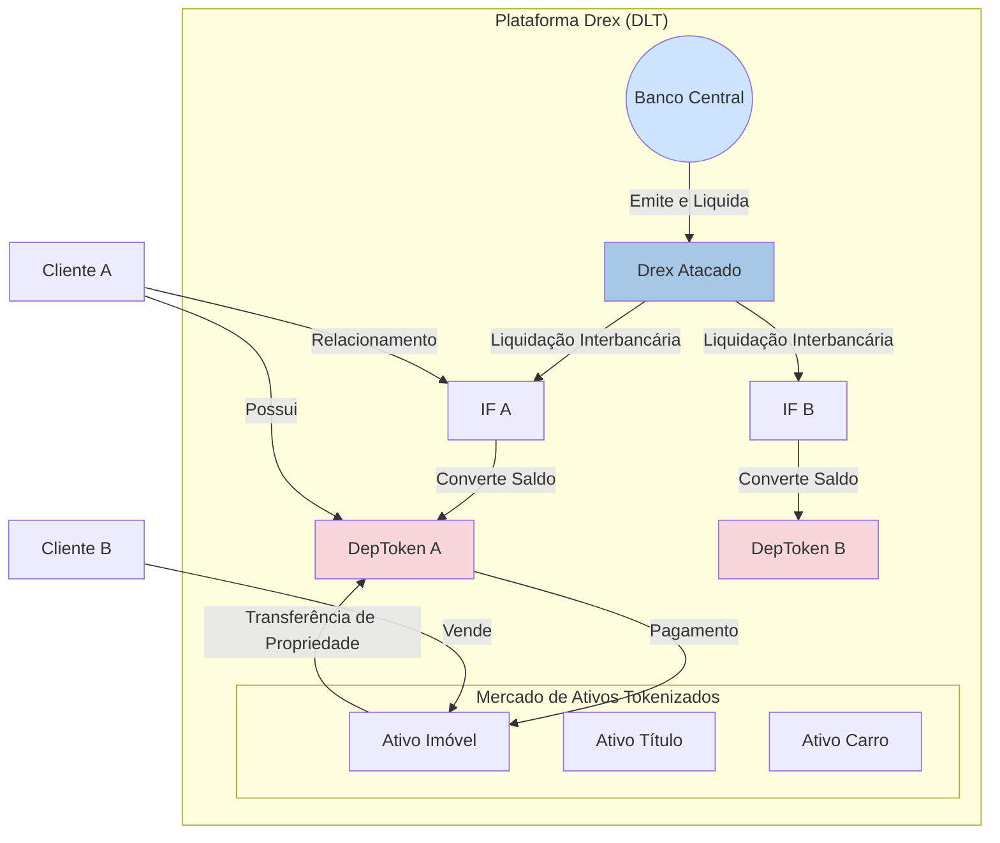

### 4.3. O "Piloto Drex" em Ação: Casos de Uso e a Lógica do DvP

A fase de testes do projeto, o "Piloto Drex", não é um exercício acadêmico. Seu objetivo é testar a viabilidade técnica e de negócios da plataforma em cenários do mundo real, resolvendo problemas concretos da economia. O cerne tecnológico de quase todos os testes é a funcionalidade de **Entrega contra Pagamento (Delivery versus Payment - DvP)**, também conhecida como liquidação atômica.

Através de **contratos inteligentes** (_smart contracts_) – programas de computador autoexecutáveis que rodam na plataforma DLT – a transferência do ativo tokenizado (a "entrega") e a transferência do dinheiro tokenizado (o "pagamento") ocorrem de forma simultânea, interdependente e irrevogável. O contrato só se executa se ambas as condições forem cumpridas. Isso elimina o **risco de contraparte**, que é a possibilidade de uma das partes em uma transação não cumprir sua obrigação (por exemplo, pagar por um carro e não receber a transferência de propriedade). Este risco é hoje uma das maiores fontes de custo, burocracia e ineficiência em muitos mercados.

Os casos de uso selecionados para a segunda fase do piloto ilustram o potencial transformador dessa lógica:

|Caso de Uso 31|Problema Atual|Solução com Drex (via Smart Contract)|
|---|---|---|
|**Compra/Venda de Título Público Federal**|Risco de liquidação, processo lento e restrito ao horário comercial do sistema financeiro.|Liquidação atômica (DvP) instantânea, 24 horas por dia, 7 dias por semana. O token do título e o Drex Varejo trocam de propriedade no mesmo instante, sem risco.|
|**Compra/Venda de Imóvel/Veículo**|Processo extremamente caro, lento e burocrático, dependente de cartórios, reconhecimento de firmas e com alto risco de fraude e de contraparte.|O bem é tokenizado, e o pagamento é feito com Drex Varejo. O _smart contract_ garante que o dinheiro só seja liberado para o vendedor no exato momento em que o token de propriedade do bem é transferido para o comprador.|
|**Crédito Colateralizado**|Processo complexo e custoso para usar ativos (como CDBs, títulos do tesouro ou até imóveis) como garantia para obter empréstimos.|O ativo tokenizado é "travado" no _smart contract_ como garantia, e o crédito é liberado instantaneamente. Em caso de inadimplência, a execução da garantia (transferência do ativo para o credor) é automática, reduzindo o risco e o custo do crédito.|
|**Comércio Internacional (Trade Finance)**|Processo arcaico, intensivo em papel (conhecimentos de embarque, cartas de crédito), envolvendo múltiplos intermediários e grande desconfiança entre as partes.|_Smart contracts_ podem automatizar a liberação de pagamentos em Drex conforme as etapas da cadeia logística (embarque, transporte, recebimento) são cumpridas e verificadas de forma confiável na rede.|

## 5. Desafios Críticos e Implicações Estratégicas

Apesar de seu enorme potencial, o caminho para a implementação plena do Drex é repleto de desafios complexos de natureza tecnológica, regulatória, social e geopolítica. O sucesso do projeto dependerá da capacidade do Banco Central e da sociedade brasileira de navegar por esses obstáculos.

### 5.1. O Trilema do Drex: Privacidade, Programabilidade e Segurança

O próprio Banco Central, no relatório de conclusão da primeira fase do piloto, reconheceu a existência de um "trilema" fundamental no desenho da plataforma, um equilíbrio delicado entre **privacidade, programabilidade e controle/segurança**.

- **Privacidade vs. Transparência:** A tecnologia DLT, por padrão, oferece um alto grau de transparência, onde as transações podem ser visíveis aos participantes da rede. Isso entra em conflito direto com direitos fundamentais consagrados na legislação brasileira, em especial a **Lei Complementar 105/2001 (Lei do Sigilo Bancário)** e a **Lei 13.709/2018 (Lei Geral de Proteção de Dados - LGPD)**. O desafio monumental é criar uma arquitetura que garanta a confidencialidade das transações dos usuários perante terceiros (outros bancos, por exemplo), ao mesmo tempo em que permite a supervisão legítima pelo Banco Central e o combate a atividades ilícitas como lavagem de dinheiro e financiamento ao terrorismo.
    
- **Soluções e Limitações Atuais:** Para enfrentar esse desafio, o BCB e os participantes do piloto testaram diversas Tecnologias de Aprimoramento de Privacidade (PETs), com destaque para as **Provas de Conhecimento Zero (Zero-Knowledge Proofs - ZKP)**.34 As ZKPs permitem que uma parte prove a outra que uma declaração é verdadeira (ex: "eu tenho saldo suficiente para esta transação") sem revelar nenhuma informação além da validade da própria declaração. No entanto, o relatório da Fase 1 concluiu que as soluções tecnológicas testadas, embora promissoras, ainda estão imaturas. Elas apresentaram limitações que comprometem a "componibilidade" (a capacidade de diferentes _smart contracts_ interagirem entre si de forma complexa) e a capacidade de supervisão do regulador, sendo consideradas, no momento, inadequadas para uma implementação em larga escala.
    
- **Cibersegurança:** A Plataforma Drex, ao concentrar a representação digital de uma vasta gama de ativos da economia, se tornará um alvo de altíssimo valor para ciberataques de atores estatais e não estatais. Uma falha de segurança poderia ter consequências sistêmicas devastadoras. Portanto, a construção de uma arquitetura de cibersegurança robusta, com múltiplas camadas de defesa, criptografia avançada e monitoramento constante, é um pré-requisito absoluto e não negociável para o lançamento do sistema.
    

### 5.2. Impacto na Intermediação Financeira

A arquitetura do Drex foi cuidadosamente desenhada para **preservar o papel dos intermediários financeiros**, evitando a desintermediação em massa. Contudo, preservar não significa manter inalterado. O Drex irá redefinir profundamente o papel e o modelo de negócios dos bancos comerciais. A simples atividade de custodiar depósitos e intermediar pagamentos básicos, já comoditizada pelo Pix, se tornará ainda menos um diferencial.

Os bancos serão compelidos a evoluir de meros intermediários para **provedores de serviços de valor agregado em um novo ecossistema digital aberto**. Seu sucesso e sua lucratividade dependerão da capacidade de inovar sobre a infraestrutura do Drex, criando produtos e serviços sofisticados, como novos modelos de crédito programável, fundos de investimento em ativos tokenizados, serviços de custódia e gestão de carteiras de ativos digitais, e soluções financeiras integradas à Internet das Coisas (IoT). As instituições que não conseguirem se adaptar a essa nova realidade, focada em tecnologia e inovação, correm o risco de perder relevância e rentabilidade.

### 5.3. O Risco da Exclusão Digital

Apesar do discurso oficial de que o Drex visa democratizar o acesso a serviços financeiros 44, sua natureza intrinsecamente tecnológica e complexa acende um alerta vermelho para o risco de **aprofundar a exclusão social e criar um "apartheid financeiro"**. O sucesso do Pix na inclusão de milhões de brasileiros não é uma garantia de que o mesmo ocorrerá com o Drex. O Pix resolveu um problema simples e universal: a necessidade de transferir dinheiro de forma rápida e barata. O Drex, por sua vez, opera com conceitos muito mais abstratos e complexos, como tokenização, carteiras digitais e contratos inteligentes.

A realidade brasileira impõe um desafio estrutural. Dados da Pesquisa Nacional por Amostra de Domicílios (Pnad) de 2023 indicam que **22,4 milhões de brasileiros com 10 anos ou mais não utilizaram a internet**. A exclusão digital no Brasil é um reflexo direto e cruel das desigualdades sociais, econômicas e regionais, afetando desproporcionalmente os mais pobres, os mais velhos e os habitantes de áreas rurais e remotas. Sem um investimento público massivo e coordenado em infraestrutura de acesso (internet de qualidade e acessível) e, principalmente, em **letramento digital e financeiro**, o Drex corre o risco de se tornar uma ferramenta para os já incluídos, enquanto uma parcela significativa da população fica para trás, marginalizada e restrita ao uso do dinheiro físico e de sistemas legados. Para um diplomata, a análise dessa dimensão social é de importância crítica.

### 5.4. A Dimensão Internacional e Geopolítica

As CBDCs não são apenas um fenômeno doméstico; elas têm o potencial de reconfigurar a arquitetura financeira global. Um de seus maiores atrativos é a capacidade de revolucionar os **pagamentos transfronteiriços**, que hoje são um dos pontos mais ineficientes do sistema financeiro global.

A questão central, no entanto, é a **interoperabilidade**: como os sistemas de CBDC de diferentes países irão se comunicar e transacionar entre si. Vários projetos internacionais, muitos coordenados pelo BIS, estão explorando modelos para essa interação. Dentre eles, dois se destacam:

- **Projeto Dunbar:** Uma colaboração entre os bancos centrais da Austrália, Malásia, Singapura e África do Sul, que explorou a viabilidade técnica de uma plataforma única e compartilhada para liquidação com múltiplas CBDCs.
    
- **Projeto mBridge:** Um projeto muito mais avançado e geopoliticamente significativo, que evoluiu para um produto mínimo viável (MVP). Seus membros plenos incluem os bancos centrais da China, Hong Kong, Tailândia, Emirados Árabes Unidos e, mais recentemente, Arábia Saudita. O Brasil participa como um dos mais de 30 membros observadores.
    

O Projeto mBridge é muito mais do que um experimento técnico. Ele é a manifestação mais concreta de um esforço para construir uma **infraestrutura de pagamentos internacionais alternativa àquela centrada no dólar americano e no sistema de mensagens SWIFT**. A participação de potências econômicas do Sul Global e de grandes produtores de energia sinaliza a formação de um bloco tecnológico-financeiro com o potencial de promover uma ordem financeira mais multipolar. A recente discussão sobre um possível afastamento do BIS do projeto, deixando-o sob a liderança dos bancos centrais participantes, evidencia as tensões geopolíticas que ele suscita.

Para o Brasil, a posição de observador no mBridge é um movimento estratégico prudente e necessário. Permite ao país compreender por dentro a evolução dessa nova arquitetura, avaliar seus benefícios e riscos, e se posicionar para participar ativamente, se e quando for de seu interesse, da governança de um futuro sistema financeiro global potencialmente menos dependente de uma única moeda e infraestrutura.

O diagrama abaixo oferece uma visão simplificada da arquitetura do Projeto mBridge.


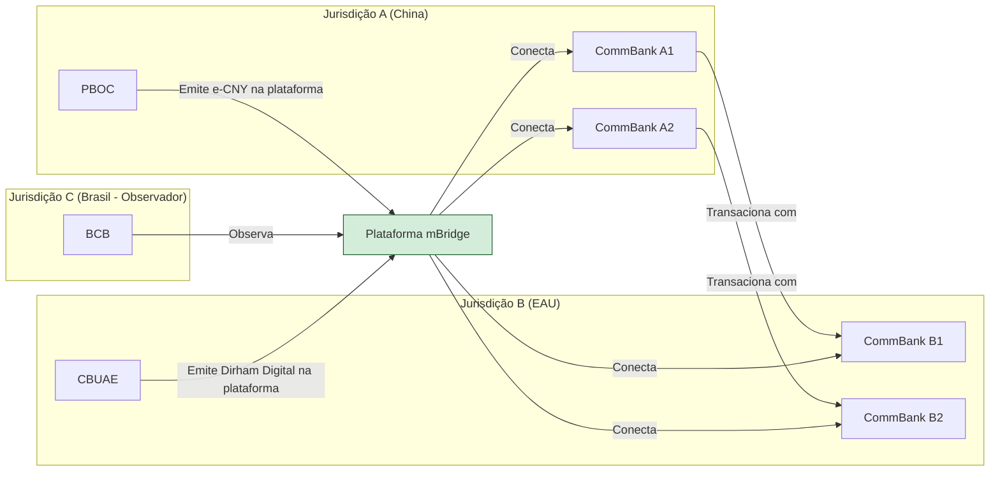

## 6. Conclusão: O Futuro do Dinheiro e o Papel do Brasil

O Projeto Drex representa muito mais do que uma simples modernização de pagamentos. Ele é uma iniciativa de infraestrutura estratégica, concebida para ser a espinha dorsal da economia digital brasileira no século XXI. Sua arquitetura híbrida, que combina uma CBDC de atacado com depósitos bancários tokenizados, é uma solução engenhosa e pragmática para os dilemas de disrupção sistêmica que desafiam outros países, buscando um delicado equilíbrio entre a promoção da inovação radical e a manutenção da estabilidade do sistema financeiro.

O sucesso do projeto, contudo, não está garantido. Ele dependerá da capacidade do Brasil de navegar por um complexo campo de forças, realizando um equilíbrio estratégico em múltiplas frentes. No campo tecnológico, será preciso resolver o "trilema" da privacidade, desenvolvendo ou adaptando soluções que garantam a confidencialidade das transações sem sacrificar a programabilidade e a segurança. No campo jurídico, a adequação plena à LGPD e à Lei do Sigilo Bancário é um pré-requisito inegociável para a confiança do público. No campo social, o desafio mais profundo é mitigar o risco de um apartheid digital, implementando políticas públicas robustas de inclusão e letramento que garantam que os benefícios do Drex alcancem toda a população. E, finalmente, no campo da política internacional, o Brasil deverá se posicionar ativamente nos debates sobre a governança da nova arquitetura financeira global, utilizando sua participação em fóruns como o mBridge para defender seus interesses e contribuir para a construção de um sistema mais equilibrado e multipolar.

O Drex é, em suma, uma aposta de alto risco e altíssima recompensa. Se bem-sucedido, tem o potencial de destravar trilhões de reais em valor ao tokenizar ativos ilíquidos, aumentar drasticamente a eficiência e a segurança dos mercados, e consolidar a posição do Brasil como líder global em inovação financeira. O fracasso em resolver seus desafios fundamentais, por outro lado, poderia levar a retrocessos em direitos como a privacidade, ao aprofundamento de desigualdades históricas e a uma perda de relevância estratégica no cenário internacional. O futuro do dinheiro está sendo escrito agora, e o Brasil escolheu ter um papel de protagonista nessa narrativa.

## 7. Questões para Autoavaliação (Active Recall)

> [!question] Questão 1
> 
> Analise criticamente a afirmação de que o Drex é primariamente uma plataforma de tokenização, e não uma moeda digital de varejo. Quais as implicações estratégicas (positivas e negativas) dessa escolha de arquitetura para o Sistema Financeiro Nacional e para o papel dos bancos comerciais?

> [!question] Questão 2
> 
> Discorra sobre o "trilema" enfrentado pelo Piloto Drex (privacidade, programabilidade e segurança), explicando como os requisitos da LGPD e da Lei de Sigilo Bancário, conforme detalhado no relatório da Fase 1 do piloto, representam o principal desafio técnico e regulatório para o projeto.

> [!question] Questão 3
> 
> Em uma perspectiva de política internacional, como projetos de interoperabilidade de CBDCs, a exemplo do mBridge, podem impactar a arquitetura financeira global, a hegemonia do dólar e o sistema SWIFT? Analise o posicionamento estratégico do Brasil como observador desse projeto no contexto da emergência de uma ordem financeira multipolar.


# Origem: _Normas jurídicas

---
title: Normas jurídicas
area: DIREITO
subarea: Teoria Geral e Direito Constitucional
tags:
  - cacd-2025
  - direito
  - normas-juridicas
  - teoria-geral-e-direito-constitucional
aliases:
  - Normas jurídicas.
---
# Normas Jurídicas

## Definição

A **norma jurídica** é um preceito geral e abstrato, criado pelo Estado, destinado a regular a conduta humana em sociedade, impondo deveres e conferindo direitos, sob ameaça de sanção em caso de descumprimento. As normas jurídicas visam assegurar a ordem social, a justiça e a segurança jurídica. **Doutrina:**

- **Hans Kelsen** define norma jurídica como um comando que prescreve, de modo geral e abstrato, um comportamento, cuja inobservância acarretará uma sanção (Teoria Pura do Direito).
- **Miguel Reale** aborda a tridimensionalidade do direito, concebendo a norma jurídica como resultado da interação entre fato, valor e norma (Filosofia do Direito).

## Características das Normas Jurídicas

As principais características das normas jurídicas são:

1. **Coercibilidade**: Possibilidade de imposição forçada pelo Estado. Se não cumprida voluntariamente, o Estado pode utilizar meios coercitivos para assegurar sua observância.
    - **Jurisprudência STF**: Na ADPF 130, o STF reconheceu a coercibilidade das normas ao declarar inconstitucional a Lei de Imprensa, assegurando a liberdade de expressão e impondo limites à censura.
2. **Heteronomia**: As normas são estabelecidas pelo Estado, independente da vontade individual dos destinatários.
3. **Generalidade**: Aplicam-se a todos que se encontrem nas situações previstas, não sendo destinadas a indivíduos específicos.
4. **Abstração**: Regulam situações hipotéticas, não casos concretos individuais.
5. **Bilateralidade Atributiva**: Estabelecem uma relação jurídica atribuindo direitos a um sujeito e deveres a outro.

**Doutrina:**

- **Norberto Bobbio** destaca que a coercibilidade é o elemento que diferencia a norma jurídica das demais normas sociais (Teoria da Norma Jurídica).

## Estrutura da Norma Jurídica

A norma jurídica possui uma estrutura lógica composta por:

1. **Hipótese (Fato ou Suporte Fático)**: Descrição genérica de uma situação de fato.
2. **Consequente (Efeito Jurídico)**: Estabelece as consequências jurídicas que decorrem da ocorrência da hipótese.

**Exemplo:**

- **Artigo 121 do Código Penal**: "Matar alguém: Pena - reclusão, de seis a vinte anos."
    - **Hipótese**: "Matar alguém"
    - **Consequente**: "Pena - reclusão, de seis a vinte anos"

**Doutrina:**

- **Maria Helena Diniz** explica que a norma jurídica é composta de antecedente (hipótese) e consequente, formando um juízo hipotético-condicional (Curso de Direito Civil).

## Classificação das Normas Jurídicas

### Quanto à Hierarquia

1. **Normas Constitucionais**: São as normas presentes na Constituição Federal, ocupando o mais alto grau na hierarquia do ordenamento jurídico.
    - **Legislação**: Constituição Federal de 1988.
    - **Jurisprudência STF**: Na ADC 29, o STF reafirmou a supremacia da Constituição ao interpretar normas infraconstitucionais em conformidade com a Lei Maior.
2. **Normas Infraconstitucionais**: Normas que estão subordinadas à Constituição e devem estar em conformidade com ela.
    - **Leis Complementares**: Regulam matérias específicas previstas na Constituição. Exemplo: Lei Complementar nº 101/2000 (Lei de Responsabilidade Fiscal).
        - **Legislação**: Art. 59, II, da CF/1988.
        - **Jurisprudência STF**: Na ADI 2238, o STF declarou constitucional a Lei de Responsabilidade Fiscal.
    - **Leis Ordinárias**: Disciplinam matérias gerais não reservadas às leis complementares. Exemplo: Código Civil (Lei nº 10.406/2002).
        - **Legislação**: Art. 59, III, da CF/1988.
    - **Medidas Provisórias**: Atos normativos com força de lei, editados pelo Presidente da República em caso de relevância e urgência.
        - **Legislação**: Art. 59, V, e Art. 62 da CF/1988.
        - **Jurisprudência STF**: Na ADI 4029, o STF estabeleceu critérios para a reedição de medidas provisórias.
    - **Decretos e Regulamentos**: Atos do Poder Executivo para a fiel execução das leis.
        - **Legislação**: Art. 84, IV, da CF/1988.
        - **Jurisprudência STF**: No RE 710.293, o STF reiterou que decretos regulamentares não podem inovar o ordenamento jurídico.

### Quanto à Imperatividade

1. **Normas Cogentes (Obrigatórias ou Imperativas)**: Não admitem convenção em contrário; são de observância obrigatória.
    - **Exemplo**: Normas penais, normas de ordem pública.
    - **Jurisprudência STF**: No HC 104.410, o STF asseverou a indisponibilidade de normas penais de ordem pública.
2. **Normas Supletivas (Dispositivas ou Permissivas)**: Podem ser afastadas pela vontade das partes.
    - **Exemplo**: Regras de contratos no Código Civil que permitem acordos distintos entre as partes.
    - **Legislação**: Art. 425 do Código Civil permite contratos atípicos conforme a vontade das partes.

### Quanto à Função

1. **Normas de Direito Público**: Regulam relações em que o Estado exerce sua supremacia sobre o particular.
    - **Exemplos**: Direito Constitucional, Direito Administrativo, Direito Penal.
2. **Normas de Direito Privado**: Disciplinam relações entre particulares, em condições de igualdade jurídica.
    - **Exemplos**: Direito Civil, Direito Comercial.

**Doutrina:**

- **Pablo Stolze Gagliano e Rodolfo Pamplona Filho** diferenciam as normas de direito público e privado com base na finalidade e na natureza das relações jurídicas (Novo Curso de Direito Civil).

## Importância das Normas Jurídicas

As normas jurídicas desempenham papéis fundamentais na sociedade:

- **Garantia da Ordem Social**: Proporcionam a organização e o funcionamento harmonioso da sociedade.
- **Proteção de Direitos**: Salvaguardam os direitos individuais e coletivos, garantindo sua efetividade.
- **Segurança Jurídica**: Asseguram previsibilidade e estabilidade nas relações jurídicas.
- **Instrumento de Justiça**: Permitem a aplicação de sanções justas e proporcionais, promovendo a equidade.

**Doutrina:**

- **Miguel Reale** aborda a função integradora do direito na sociedade, enfatizando o papel das normas jurídicas na realização dos valores sociais (Lições Preliminares de Direito).

## Relação com Outras Normas Sociais

As normas jurídicas diferenciam-se de outros tipos de normas:

- **Normas Morais**: Conjunto de preceitos baseados na consciência individual e nos valores éticos.
- **Normas Religiosas**: Regras estabelecidas por uma crença ou fé religiosa.
- **Normas Sociais**: Costumes e convenções sociais não necessariamente coercitivas.

**Distinção Fundamental**: A norma jurídica possui coercibilidade e poder de imposição pelo Estado, ao contrário das demais normas sociais.

- **Jurisprudência STJ**: No REsp 1.286.466, o STJ reconheceu a distinção entre obrigação jurídica e obrigação moral, destacando que somente a primeira é exigível judicialmente.

## Aplicação e Integração das Normas Jurídicas

Quando há lacunas ou antinomias (conflitos) no ordenamento jurídico, aplicam-se métodos de interpretação e integração:

- **Analogia**: Aplicação de norma semelhante ao caso não previsto.
- **Costumes**: Práticas reiteradas e aceitas socialmente.
- **Princípios Gerais do Direito**: Valores fundamentais que orientam o ordenamento jurídico.

**Legislação**:

- **Lei de Introdução às Normas do Direito Brasileiro (LINDB)**: Decreto-Lei nº 4.657/1942.
    - **Art. 4º**: "Quando a lei for omissa, o juiz decidirá o caso de acordo com a analogia, os costumes e os princípios gerais de direito."

**Jurisprudência STJ**:

- No REsp 1.201.993, o STJ utilizou os princípios gerais do direito para solucionar caso não previsto expressamente em lei.

## Conclusão

As normas jurídicas são fundamentais para a organização da sociedade, garantindo direitos, impondo deveres e assegurando a justiça. Compreender sua natureza, características e aplicação é essencial para a atuação jurídica e cidadania consciente.

---

**Referências Bibliográficas**

- **KELSEN, Hans**. _Teoria Pura do Direito_. Tradução de João Baptista Machado. São Paulo: Martins Fontes, 2006.
- **REALE, Miguel**. _Filosofia do Direito_. São Paulo: Saraiva, 1999.
- **DINIZ, Maria Helena**. _Curso de Direito Civil Brasileiro_. 30. ed. São Paulo: Saraiva, 2013.
- **BOBBIO, Norberto**. _Teoria da Norma Jurídica_. Brasília: EdUnB, 1995.
- **GAGLIANO, Pablo Stolze; PAMPLONA FILHO, Rodolfo**. _Novo Curso de Direito Civil_. Vol. 1. São Paulo: Saraiva, 2012.
- **REALE, Miguel**. _Lições Preliminares de Direito_. 27. ed. São Paulo: Saraiva, 2002.

**Legislação e Jurisprudência**

- **Constituição Federal de 1988.**
- **Código Civil (Lei nº 10.406/2002).**
- **Código Penal (Decreto-Lei nº 2.848/1940).**
- **Lei de Introdução às Normas do Direito Brasileiro (Decreto-Lei nº 4.657/1942).**
- **STF - Supremo Tribunal Federal**:
    - **ADPF 130/DF**: Liberdade de expressão e censura - [Link](http://www.stf.jus.br/portal/processo/verProcessoAndamento.asp?numero=130&classe=ADPF)
    - **ADC 29/DF**: Lei da Ficha Limpa - [Link](http://portal.stf.jus.br/processos/detalhe.asp?incidente=4119883)
    - **ADI 2238/DF**: Lei de Responsabilidade Fiscal - [Link](http://www.stf.jus.br/portal/processo/verProcessoAndamento.asp?numero=2238&classe=ADI)
    - **ADI 4029/DF**: Medidas Provisórias - [Link](http://www.stf.jus.br/portal/processo/verProcessoAndamento.asp?numero=4029&classe=ADI)
    - **RE 710.293/RS**: Poder regulamentar - [Link](http://www.stf.jus.br/portal/processo/verProcessoAndamento.asp?numero=710293&classe=RE)
    - **HC 104.410/RS**: Normas penais de ordem pública - [Link](http://www.stf.jus.br/portal/processo/verProcessoAndamento.asp?incidente=3973884)
- **STJ - Superior Tribunal de Justiça**:
    - **REsp 1.286.466/RS**: Obrigação jurídica versus obrigação moral - [Link](https://ww2.stj.jus.br/processo/pesquisa/?src=1.0.1&aplicacao=processos.ea&tipoPesquisa=tipoPesquisaGenerica&termo=1286466)
    - **REsp 1.201.993/PR**: Princípios gerais do direito - [Link](https://ww2.stj.jus.br/processo/pesquisa/?src=1.0.1&aplicacao=processos.ea&tipoPesquisa=tipoPesquisaGenerica&termo=1201993)


# Origem: _Personalidade jurídica

---
title: Personalidade jurídica
area: DIREITO
subarea: Teoria Geral e Direito Constitucional
tags:
  - cacd-2025
  - direito
  - personalidade-juridica
  - teoria-geral-e-direito-constitucional
aliases:
  - Personalidade jurídica.
---
## Introdução

A **personalidade jurídica** é um conceito fundamental no Direito, servindo de base para a atribuição de direitos e deveres aos sujeitos de direito. Compreender a personalidade jurídica é essencial para entender como as pessoas, físicas ou jurídicas, interagem no âmbito legal, bem como para a atuação profissional no Direito e na diplomacia.

---

## Conceito de Personalidade Jurídica

A **personalidade jurídica** é a aptidão genérica reconhecida pelo ordenamento jurídico para que um ente possa adquirir direitos e contrair obrigações. É a qualidade que permite a um sujeito ser titular de direitos e deveres na ordem civil. **Doutrina:**

- **Maria Helena Diniz** define personalidade jurídica como "a aptidão genérica para adquirir direitos e contrair deveres na ordem civil" (_Curso de Direito Civil Brasileiro_).
- **Silvio de Salvo Venosa** explica que "a personalidade jurídica é um atributo que o ordenamento confere a certos entes, permitindo-lhes serem sujeitos de relações jurídicas" (_Direito Civil_).

---

## Características da Personalidade Jurídica

1. **Universalidade**: A personalidade jurídica é reconhecida a todas as pessoas naturais desde o nascimento com vida, conforme o artigo 2º do Código Civil.
2. **Independência**: As pessoas jurídicas possuem existência distinta de seus membros ou sócios, podendo exercer direitos e assumir obrigações em nome próprio.
3. **Unicidade**: Cada ente possui uma única personalidade jurídica, mesmo que exerça múltiplas atividades.
4. **Indivisibilidade**: A personalidade jurídica não pode ser fracionada; é inerente ao sujeito de direito em sua totalidade.

---

## Início e Término da Personalidade Jurídica

### Pessoas Naturais (Físicas)

- **Início**: Com o nascimento com vida (CC, art. 2º). O nascituro tem seus direitos resguardados desde a concepção.
- **Jurisprudência do STF**: No RE 635.659, o STF reconheceu direitos sucessórios ao nascituro, reforçando a proteção desde a concepção.
- **Término**: Com a morte (CC, art. 6º). A personalidade jurídica cessa, mas direitos relativos à sucessão transmitem-se aos herdeiros.

### Pessoas Jurídicas

- **Constituição**: Adquirem personalidade jurídica com a inscrição de seus atos constitutivos no respectivo registro (CC, art. 45).
- **Classificação**:
    - **Pessoas Jurídicas de Direito Público Interno**: União, Estados, Municípios, autarquias, fundações públicas.
    - **Pessoas Jurídicas de Direito Privado**: Associações, sociedades, fundações, organizações religiosas, partidos políticos.
- **Extinção**: Com a dissolução regularmente formalizada, seguindo os procedimentos legais.

---

## Teorias sobre a Personalidade Jurídica

### Teoria da Ficção

- **Defendida por**: Friedrich Carl Von Savigny.
- **Conceito**: A personalidade jurídica das pessoas jurídicas é uma criação artificial da lei, uma ficção legal para atribuir personalidade a entidades distintas das pessoas naturais.

### Teoria da Realidade

- **Defendida por**: Otto von Gierke.
- **Conceito**: As pessoas jurídicas são realidades jurídicas e sociais, com existência própria e distinta dos indivíduos que a compõem.

### Teoria da Realidade Técnica

- **Elaborada por**: Hans Kelsen.
- **Conceito**: A personalidade jurídica é uma técnica jurídica para imputar direitos e deveres a um centro autônomo de relações jurídicas.

**Doutrina:**

- **Pablo Stolze Gagliano e Rodolfo Pamplona Filho** discutem as diferentes teorias em _Novo Curso de Direito Civil_, destacando suas implicações práticas.

---

## Personalidade Judiciária

A **personalidade judiciária** é a aptidão para figurar em juízo, como autor ou réu, independentemente de possuir personalidade jurídica.

- **Exemplos de entes sem personalidade jurídica, mas com personalidade judiciária**:
    - Espólios.
    - Massas falidas.
    - Condomínios edilícios.

**Jurisprudência do STJ**:

- No REsp 1.391.819, o STJ reconheceu a legitimidade do condomínio edilício para figurar em juízo, mesmo sem personalidade jurídica própria.

---

## Desconsideração da Personalidade Jurídica

A **desconsideração da personalidade jurídica** é um mecanismo legal que permite, em casos excepcionais, ultrapassar a separação entre a pessoa jurídica e seus sócios ou administradores para responsabilizá-los diretamente.

- **Previsão Legal**: Artigo 50 do Código Civil.
- **Hipóteses**: Abuso da personalidade jurídica, caracterizado pelo desvio de finalidade ou confusão patrimonial.

**Jurisprudência do STJ**:

- **Teoria Menor**: Aplicada em matérias consumeristas e trabalhistas, onde a mera insolvência já justificaria a desconsideração (REsp 279.273).
- **Teoria Maior**: Exige a comprovação de fraude ou abuso (REsp 1.306.553).

---

## Jurisprudência do STF e STJ Relacionada à Personalidade Jurídica

- **STF**:
    - **Súmula Vinculante nº 10**: "Viola a cláusula de reserva de plenário a decisão de órgão fracionário que, embora não declare expressamente a inconstitucionalidade de lei ou ato normativo do Poder Público, afasta sua incidência no todo ou em parte."
    - **ADPF 324**: O STF reafirmou a licitude da terceirização, respeitando a autonomia da vontade e as personalidades jurídicas envolvidas.
- **STJ**:
    - **Súmula 435**: "Presume-se dissolvida irregularmente a empresa que deixar de funcionar no seu domicílio fiscal sem comunicação aos órgãos competentes, legitimando o redirecionamento da execução fiscal para o sócio-gerente."
    - **REsp 1.844.166**: O STJ consolidou entendimentos acerca da desconsideração inversa da personalidade jurídica, permitindo alcançar bens da pessoa jurídica para satisfazer dívidas pessoais dos sócios em casos de abuso.

---

## Considerações Finais

A personalidade jurídica é um instituto essencial que permite a organização da vida em sociedade, atribuindo capacidade para adquirir direitos e contrair obrigações tanto a pessoas naturais quanto a pessoas jurídicas. Compreender suas nuances, teorias e aplicabilidades práticas é fundamental para a atuação jurídica e diplomática, especialmente diante de casos que envolvam desconsideração da personalidade jurídica e relações internacionais.

***


# Origem: _Constituição (conceito, classificações, controle)

---
title: Constituição (conceito, classificações, controle)
area: DIREITO
subarea: Teoria Geral e Direito Constitucional
tags:
  - cacd-2025
  - constituicao
  - direito
  - teoria-geral-e-direito-constitucional
aliases:
  - Constituição
---
# Conceito,classificações, primado da Constituição, controle de constitucionalidade.

## Introdução

A **Constituição** é o fundamento jurídico de um Estado, estabelecendo a organização dos Poderes, os direitos e garantias fundamentais e os princípios que regem a ordem jurídica. No Brasil, a Constituição Federal de 1988 é a Lei Maior que rege todo o ordenamento jurídico, consagrando o Estado Democrático de Direito.

---

## Conceito de Constituição

A **Constituição** pode ser definida como o conjunto de normas jurídicas supremas que organizam os elementos fundamentais do Estado, estabelecendo as regras básicas para o funcionamento da sociedade política. **Doutrina:**

- **José Afonso da Silva** define Constituição como "o conjunto de normas que organiza os elementos constitutivos do Estado, regula a formação dos seus órgãos e estabelece os limites entre os poderes" (_Curso de Direito Constitucional Positivo_).
- **Hans Kelsen** conceitua a Constituição sob dois aspectos:
    - **Sentido lógico-jurídico**: Norma hipotética fundamental, pressuposto necessário para a validade das normas jurídicas.
    - **Sentido jurídico-positivo**: Norma jurídica suprema, situada no ápice da hierarquia do ordenamento jurídico.

---

## Classificações das Constituições

As constituições podem ser classificadas segundo diversos critérios:

### Quanto à Forma

- **Escrita**: Constituídas por um documento formal, sistematizado e codificado. Exemplo: Constituição Federal de 1988.
- **Não Escrita (Consuetudinária)**: Formadas por costumes, convenções e precedentes judiciais. Exemplo: Constituição do Reino Unido.

### Quanto à Origem

- **Promulgada (Democrática ou Popular)**: Elaborada por um poder constituinte originário, representativo da vontade popular, por meio de uma Assembleia Constituinte. Exemplo: Constituição Federal de 1988.
- **Outorgada**: Imposta unilateralmente pelo governante, sem participação popular efetiva. Exemplo: Constituição de 1824, outorgada por D. Pedro I.

### Quanto à Estabilidade

- **Rígida**: Possui um processo de alteração mais dificultoso que o das leis ordinárias. Exige procedimentos especiais para emendas. Exemplo: Constituição Federal de 1988.
- **Semirrígida (Flexível em parte)**: Parte rígida e parte flexível. Algumas normas são alteradas com procedimento especial, outras não. Exemplo: Constituição da França de 1848.
- **Flexível**: Pode ser alterada pelo mesmo processo legislativo das leis ordinárias. Exemplo: Constituição do Reino Unido.

### Quanto ao Conteúdo

- **Formal**: Engloba todas as normas codificadas em um documento solene, independentemente do conteúdo.
- **Material**: Compreende apenas as normas que tratam da organização do Estado e dos direitos fundamentais.

### Quanto à Extensão

- **Analítica (Prolixa)**: Detalhada, abrange inúmeros assuntos e normas. Exemplo: Constituição Federal de 1988.
- **Sintética**: Contém apenas princípios fundamentais e normas básicas. Exemplo: Constituição dos Estados Unidos.

### Quanto à Ideologia

- **Ortodoxa**: Segue uma única ideologia ou doutrina política.
- **Eclética (Compromissória)**: Combina princípios de diferentes ideologias. Exemplo: Constituição Federal de 1988, que reúne elementos liberais e sociais.

### Quanto ao Modo de Elaboração

- **Dogmática**: Elaborada em um determinado momento histórico, geralmente por um órgão constituinte específico.
- **Histórica**: Resultado de uma lenta evolução histórica, sem um ato específico de instituição.

---

## Primado da Constituição (Supremacia Constitucional)

### Conceito

O **primado da Constituição** refere-se à supremacia jurídica da Constituição em relação às demais normas do ordenamento jurídico. Todas as leis e atos normativos devem estar em conformidade com a Constituição, sob pena de serem declarados inconstitucionais.

### Supremacia Formal e Material

- **Supremacia Formal**: A Constituição está no topo da hierarquia normativa, e seu processo de modificação é mais solene e complexo que o das normas infraconstitucionais.
- **Supremacia Material**: A Constituição contém as normas fundamentais e os valores essenciais que orientam todo o ordenamento jurídico.

**Doutrina:**

- **Celso Bastos** afirma que a supremacia constitucional é o princípio fundamental que garante a coerência e a unidade do ordenamento jurídico (_Curso de Direito Constitucional_).

### Aplicação no Brasil

No Brasil, a supremacia da Constituição é garantida pelo controle de constitucionalidade. A Constituição Federal de 1988 possui supremacia formal (por ser rígida) e material (por conter os princípios fundamentais). **Jurisprudência do STF:**

- **ADI 939/DF**: O STF reafirmou a supremacia da Constituição ao declarar inconstitucional lei estadual que contrariava dispositivo constitucional.

---

## Controle de Constitucionalidade

### Conceito

O **controle de constitucionalidade** é o mecanismo pelo qual se verifica a compatibilidade das leis e atos normativos com a Constituição. Caso haja incompatibilidade, a norma infraconstitucional pode ser declarada inconstitucional e retirada do ordenamento jurídico.

### Sistemas de Controle

#### 1. Sistema Difuso (Concreto ou Aberto)

- **Características**:
    - Pode ser exercido por qualquer juiz ou tribunal, em qualquer processo judicial.
    - Atua no caso concreto, a pedido das partes.
    - Efeitos inter partes (entre as partes do processo).
- **Origem**: Modelo norte-americano, a partir do caso _Marbury v. Madison_ (1803).
- **Aplicação no Brasil**: A partir da Constituição de 1891.

**Jurisprudência do STF:**

- **RE 197.917/SP**: O STF reconheceu a possibilidade de todos os órgãos do Judiciário exercerem o controle difuso de constitucionalidade.

#### 2. Sistema Concentrado (Abstrato ou Fechado)

- **Características**:
    - Exercido por um órgão específico (no Brasil, o STF).
    - Atua em abstrato, sem vinculação a um caso concreto.
    - Efeitos erga omnes (para todos) e vinculantes.
- **Origem**: Modelo austríaco, proposto por Hans Kelsen em 1920.
- **Aplicação no Brasil**: Instituído pela Emenda Constitucional nº 16/1965 e aprofundado pela CF/88.

**Principais ações no controle concentrado:**

- **Ação Direta de Inconstitucionalidade (ADI)**:
    - Objetiva declarar a inconstitucionalidade de lei ou ato normativo federal ou estadual.
- **Ação Declaratória de Constitucionalidade (ADC)**:
    - Busca afirmar a constitucionalidade de lei ou ato normativo federal.
- **Ação Direta de Inconstitucionalidade por Omissão (ADO)**:
    - Visa suprir omissão inconstitucional do Poder Público em legislar ou agir.
- **Arguição de Descumprimento de Preceito Fundamental (ADPF)**:
    - Tem por objeto evitar ou reparar lesão a preceito fundamental resultante de ato do Poder Público.

**Legislação:**

- **Artigos 102 e 103 da CF/88**: Disciplinam o controle concentrado de constitucionalidade.

### Legitimados para Propor Ações de Controle Concentrado

Conforme o **art. 103 da CF/88**, são legitimados:

- Presidente da República.
- Mesa do Senado Federal.
- Mesa da Câmara dos Deputados.
- Mesa de Assembleia Legislativa ou da Câmara Legislativa do DF.
- Governador de Estado ou do DF.
- Procurador-Geral da República.
- Conselho Federal da OAB.
- Partido político com representação no Congresso Nacional.
- Confederação sindical ou entidade de classe de âmbito nacional.

### Controle Preventivo e Repressivo

#### Controle Preventivo

- **Momento**: Antes da norma entrar em vigor.
- **Órgãos Competentes**: Poder Legislativo e Poder Executivo.
- **Exemplos**:
    - Atuação das Comissões de Constituição e Justiça (CCJ) no Congresso Nacional.
    - Veto jurídico do Presidente da República por inconstitucionalidade (art. 66, §1º, CF/88).

#### Controle Repressivo

- **Momento**: Após a norma entrar em vigor.
- **Órgãos Competentes**: Poder Judiciário, principalmente o STF.
- **Meios de Controle**: Ações diretas (ADI, ADC, ADO, ADPF) e controle difuso.

### Efeitos da Declaração de Inconstitucionalidade

- **Efeito Ex Tunc**: Retroage desde a edição da norma inconstitucional.
- **Efeito Ex Nunc**: Produz efeitos a partir da decisão.

**Legislação:**

- **Art. 27 da Lei nº 9.868/1999**: O STF pode, por razões de segurança jurídica ou excepcional interesse social, restringir os efeitos da decisão ou modular sua eficácia.

**Jurisprudência do STF:**

- **ADI 3.105/DF (Cláusula de Barreira)**: O STF modulou os efeitos da decisão para garantir segurança jurídica.

---

## Considerações Finais

A compreensão do conceito de Constituição, suas classificações, o primado constitucional e o controle de constitucionalidade é fundamental para o estudo do Direito Constitucional e para a atuação jurídica no Brasil. A supremacia da Constituição assegura a coerência e a hierarquia normativa, enquanto o controle de constitucionalidade é a ferramenta essencial para garantir que as leis e atos normativos estejam em conformidade com os princípios e regras constitucionais. **Doutrina:**

- **Gilmar Ferreira Mendes** enfatiza a importância do controle de constitucionalidade como mecanismo de proteção dos direitos fundamentais (_Curso de Direito Constitucional_).
- **Luís Roberto Barroso** destaca o papel do STF na guarda da Constituição e na promoção de justiça constitucional (_O Controle de Constitucionalidade no Direito Brasileiro_).


# Origem: _Estado (elementos, soberania, formas)

---
title: Estado (elementos, soberania, formas)
area: DIREITO
subarea: Teoria Geral e Direito Constitucional
tags:
  - cacd-2025
  - direito
  - estado
  - teoria-geral-e-direito-constitucional
aliases:
  - Estado
---
# Elementos do Estado

O Estado é uma entidade política e jurídica formada por quatro elementos essenciais:

1. **População**: conjunto de indivíduos submetidos às leis e à autoridade do Estado.
2. **Território**: espaço geográfico onde o Estado exerce sua soberania, incluindo solo, subsolo, águas e espaço aéreo.
3. **Governo Soberano**: conjunto de instituições que exercem o poder político, organizando e administrando o Estado.
4. **Soberania**: poder supremo do Estado, que não reconhece nenhum outro acima dele, tanto internamente quanto externamente.

**Referências:**

- **Constituição Federal (CF) de 1988**: Art. 1º - "A República Federativa do Brasil, formada pela união indissolúvel dos Estados e Municípios e do Distrito Federal..."
- **Jurisprudência do STF**: A soberania nacional é fundamento da República (STF, ADI 1625, Rel. Min. Sydney Sanches).

## Soberania

A soberania é a capacidade do Estado de exercer autoridade suprema sobre seu território e população, sem ingerência externa.

- **Soberania Interna**: poder de organizar-se politicamente e impor ordens aos indivíduos e instituições dentro do território.
- **Soberania Externa**: independência frente a outros Estados, possibilitando relações internacionais autônomas.

**Referências:**

- **CF/1988**: Art. 4º, incisos I e II - Princípios que regem as relações internacionais: independência nacional e prevalência dos direitos humanos.
- **Corte Internacional de Justiça (CIJ)**: *Caso Nicarágua vs. EUA (1986)* - Reafirmação do princípio da não intervenção e respeito à soberania.

## Formas de Estado

### Estado Unitário

- **Definição**: Poder central único, com possíveis divisões administrativas sem autonomia política.
- **Características**:
    - Centralização política.
    - Leis uniformes em todo o território.

**Exemplo**: França.

### Estado Federado (Federação)

- **Definição**: União de entidades territoriais autônomas sob um governo federal.
- **Características**:
    - Distribuição constitucional de competências.
    - Autonomia política, administrativa e financeira dos entes federativos.

**Referências:**

- **CF/1988**: Art. 18 - "A organização político-administrativa da República Federativa do Brasil compreende a União, os Estados, o Distrito Federal e os Municípios..."
- **STF**: Súmula 647 - "Compete privativamente à União legislar sobre direito civil, comercial, penal, processual, eleitoral, agrário, marítimo, aeronáutico, espacial e do trabalho."

### Confederação

- **Definição**: Aliança entre Estados soberanos que mantêm sua independência, delegando funções limitadas a um órgão central.
- **Características**:
    - Soberania dos Estados-membros preservada.
    - Decisões dependem da unanimidade ou consenso.

**Exemplos Históricos**: Confederação Alemã (1815-1866).

## Modelos de Divisão de Competência com Entes Subnacionais

### No Estado Federativo Brasileiro

A Constituição estabelece competências para evitar conflitos entre os entes federativos.

- **Competências Exclusivas da União**: Art. 21 e 22 da CF/1988.
- **Competências Concorrentes**: Art. 24 da CF/1988 - União estabelece normas gerais; Estados e Distrito Federal suplementam.
- **Competências Municipais**: Art. 30 da CF/1988 - Assuntos de interesse local.

**Referências:**

- **CF/1988**: Art. 23 - Competências comuns da União, Estados, Distrito Federal e Municípios.
- **STF**: ADI 3406 - Competência dos Municípios para legislar sobre assuntos de interesse local.

## Sistemas de Governo

Refere-se à relação entre os poderes Executivo e Legislativo e à forma como o poder é exercido.

### Presidencialismo

- **Características**:
    - Chefe de Estado e de Governo é o Presidente da República.
    - Mandato fixo, eleito pelo povo.
    - Separação dos poderes.

**Referências:**

- **CF/1988**: Art. 76 - "O Poder Executivo é exercido pelo Presidente da República, auxiliado pelos Ministros de Estado."
- **STF**: Na ADPF 378, o STF reforçou a separação de poderes e as atribuições do Presidente.

### Parlamentarismo

- **Características**:
    - Chefe de Estado (Monarca ou Presidente) é figura simbólica.
    - Chefe de Governo é o Primeiro-Ministro, responsável perante o Parlamento.
    - Poder Executivo depende do apoio do Legislativo.

**Exemplos**: Reino Unido, Alemanha.

### Semipresidencialismo

- **Características**:
    - Combinação do presidencialismo com o parlamentarismo.
    - Presidente compartilha poder com um Primeiro-Ministro.
    - Presidente eleito pelo povo; Primeiro-Ministro depende do Parlamento.

**Exemplo**: França. **Referências Internacionais:**

- **Constituição Francesa de 1958**: Estabelece o semipresidencialismo.
- **Jurisprudência Internacional**: Decisões do Conselho Constitucional Francês sobre a coabitação entre Presidente e Primeiro-Ministro.


# Origem: _Estado democrático de direito

---
title: "Estado democrático de direito"
area: "DIREITO"
subarea: "Teoria Geral e Direito Constitucional"
tags:
  - cacd-2025
  - direito
  - estado-democratico-de-direito
  - teoria-geral-e-direito-constitucional
---


# Origem: _Organização e competências dos poderes no Direito Brasileiro

---
title: Organização e competências dos poderes no Direito Brasileiro
area: DIREITO
subarea: Teoria Geral e Direito Constitucional
tags:
  - cacd-2025
  - direito
  - organizacao-e-competencias-dos-poderes-no-direito-brasileiro
  - teoria-geral-e-direito-constitucional
aliases:
  - Organização e competências dos poderes no Direito Brasileiro.
---
# A Organização dos Poderes no Brasil: Estrutura, Competências e o Sistema de Freios e Contrapesos

## I. O Princípio da Separação dos Poderes: A Matriz do Estado Constitucional

### A. Fundamentos Teóricos: De Montesquieu à Concepção Contemporânea

A arquitetura do Estado Democrático de Direito moderno é inseparável da teoria da separação dos poderes, um princípio fundamental para a limitação do poder e a garantia das liberdades individuais. Embora suas raízes possam ser rastreadas até a antiguidade clássica, com as reflexões de Aristóteles em "A Política" sobre as funções de deliberar, executar e julgar, e passando por formulações de pensadores como John Locke, que distinguiu os poderes Legislativo, Executivo e Federativo, foi na obra do filósofo iluminista francês Charles-Louis de Secondat, o Barão de Montesquieu, que a teoria ganhou sua formulação clássica e mais influente.

Em sua obra seminal, "O Espírito das Leis" (1748), Montesquieu, ao analisar o sistema constitucional britânico, desenvolveu a tese de que a concentração de poder nas mãos de uma única pessoa ou órgão é a semente da tirania. Para ele, a liberdade política só seria possível em governos moderados, nos quais o abuso de poder fosse contido. A chave para essa contenção residia em uma engenharia institucional precisa, resumida em sua máxima célebre: "é preciso que, pela disposição das coisas, o poder freie o poder". Montesquieu propôs, assim, a distribuição das funções estatais em três esferas distintas e autônomas: o Poder Legislativo, responsável por criar as leis; o Poder Executivo, encarregado de administrar e executar essas leis; e o Poder Judiciário, com a função de julgar os conflitos com base nas leis estabelecidas.2 O objetivo não era uma simples divisão de tarefas, mas a criação de um sistema de equilíbrio dinâmico para assegurar a segurança e a liberdade dos cidadãos.

A doutrina constitucional contemporânea, no entanto, aprimorou essa concepção. A ideia de uma "separação" rígida e absoluta foi suplantada pela noção de uma "distribuição de funções" de um Poder estatal que, em sua essência, é uno, indivisível e indelegável. O poder do Estado emana do povo e é soberano. O que se divide não é o poder em si, mas as suas funções especializadas, que são atribuídas a órgãos distintos e independentes para otimizar sua execução e, crucialmente, para permitir um controle recíproco. Portanto, quando a Constituição Federal de 1988 se refere aos "Poderes da União", ela adota a terminologia clássica, mas deve ser interpretada sob a ótica moderna de uma divisão funcional dentro de uma unidade de poder soberano.

### B. A Consagração no Direito Brasileiro: Análise do Art. 2º da CF/88

A Constituição da República Federativa do Brasil de 1988, promulgada sob o signo da redemocratização, elegeu a separação de poderes como um de seus pilares estruturantes. O princípio está consagrado de forma expressa e lapidar no Art. 2º: "São Poderes da União, independentes e harmônicos entre si, o Legislativo, o Executivo e o Judiciário".

A centralidade deste princípio é tamanha que ele foi alçado à condição de **cláusula pétrea**, conforme o Art. 60, § 4º, inciso III, da Constituição. Isso significa que nenhuma proposta de emenda constitucional que vise a abolir a separação de poderes pode ser sequer objeto de deliberação.1 Tal blindagem constitucional demonstra que, para o constituinte originário, não há Estado Democrático de Direito sem a existência de poderes autônomos e um sistema de controle mútuo.

A interpretação dos adjetivos "independentes" e "harmônicos" é crucial para a compreensão da dinâmica institucional brasileira:

- **Independência:** Refere-se à ausência de subordinação ou hierarquia entre os Poderes. Cada um possui autonomia orgânica, funcional e financeira para se organizar e exercer suas competências típicas sem sofrer interferência indevida dos demais. A independência é a garantia de que cada poder possa atuar como um contrapeso eficaz.
    
- **Harmonia:** Significa que a independência não pode ser absoluta a ponto de gerar o caos ou a paralisia do Estado. Os Poderes devem atuar de forma coordenada, colaborativa e com lealdade institucional, visando à realização dos objetivos fundamentais da República. A harmonia pressupõe o diálogo e o respeito às competências alheias.
    

Nesse contexto, os termos "independentes" e "harmônicos" não são meramente descritivos; eles estabelecem uma tensão dialética que define a vida política do país. A independência faculta a cada Poder agir conforme suas prerrogativas, enquanto a harmonia exige que essa ação seja coordenada para o bem comum. O sistema de **freios e contrapesos** (_checks and balances_) emerge, então, não como um adendo, mas como o mecanismo essencial projetado para gerenciar essa tensão intrínseca. É o conjunto de instrumentos constitucionais que permite a um poder "frear" os excessos do outro (assegurando a independência contra abusos) e, ao mesmo tempo, força a negociação e a cooperação (buscando a harmonia). A análise de crises institucionais, como conflitos entre o STF e o Congresso, frequentemente revela um embate de narrativas em que a afirmação da "independência" por um lado é percebida como uma quebra da "harmonia" pelo outro. A jurisprudência do Supremo Tribunal Federal em conflitos de atribuições é, em última análise, a tentativa de arbitrar e equilibrar essa tensão fundamental.

## II. O Poder Legislativo: A Casa do Povo e da Federação

### A. Estrutura e Representação: O Bicameralismo Federal

O Poder Legislativo federal no Brasil é exercido pelo **Congresso Nacional**, que adota uma estrutura bicameral, sendo composto por duas Casas: a Câmara dos Deputados e o Senado Federal. Essa dualidade não é aleatória, mas reflete a própria natureza federativa do Estado brasileiro.

- **Câmara dos Deputados:** É a casa de representação do povo. Seus membros, os deputados federais, são eleitos pelo sistema proporcional em cada Estado e no Distrito Federal, para um mandato de quatro anos. O número de deputados por unidade federativa é proporcional à sua população, com um piso de 8 e um teto de 70 representantes. A Câmara é, portanto, o locus da representação popular em sua diversidade de ideias e interesses.
    
- **Senado Federal:** É a casa de representação dos Estados e do Distrito Federal, as unidades da Federação. Sua composição é paritária: cada estado e o DF elegem três senadores pelo princípio majoritário, para um mandato de oito anos, com renovação de um terço e dois terços a cada quatro anos, alternadamente. O Senado assegura o equilíbrio federativo, conferindo igual poder de representação a todas as unidades, independentemente de sua população ou poderio econômico.
    

A principal justificativa para a adoção do bicameralismo é a busca por um processo legislativo mais qualificado e prudente. Ao exigir que as propostas legislativas sejam discutidas e votadas em duas casas distintas, com lógicas de representação diferentes, o sistema cria um mecanismo de revisão intrínseco. Uma casa atua como revisora da outra, o que tende a moderar os debates, aprofundar a análise das matérias e minimizar a aprovação de leis precipitadas ou que atendam a interesses excessivamente particularistas.

### B. Funções Típicas: Legislar e Fiscalizar

O Poder Legislativo possui duas funções precípuas, ou típicas, que definem sua essência no arranjo constitucional: a função de legislar e a de fiscalizar.

#### 1. A Função de Legislar

A mais visível das funções do Legislativo é a de criar o ordenamento jurídico, estabelecendo as normas gerais e abstratas que regem a vida em sociedade. Esse processo é formal e complexo, regido pela Constituição e pelos regimentos internos das Casas Legislativas. O processo legislativo ordinário, que resulta na criação das leis ordinárias, compreende, em linhas gerais, as seguintes etapas:

1. **Iniciativa:** A apresentação de um projeto de lei, que pode ser de autoria de parlamentares, comissões, do Presidente da República, do Judiciário, do Procurador-Geral da República ou por iniciativa popular.
    
2. **Discussão e Votação:** O projeto tramita nas comissões temáticas permanentes de cada Casa, onde é analisado, debatido e pode receber emendas. A maioria dos projetos é votada em caráter conclusivo nas comissões, mas os mais importantes seguem para deliberação do Plenário.15
    
3. **Revisão:** Aprovado em uma Casa (Casa Iniciadora), o projeto é enviado à outra (Casa Revisora). Se aprovado sem alterações, segue para a fase seguinte. Se alterado, retorna à Casa Iniciadora para que esta delibere exclusivamente sobre as modificações.
    
4. **Sanção ou Veto:** Após a aprovação final pelo Congresso, o projeto é enviado ao Presidente da República, que pode sancioná-lo (transformando-o em lei) ou vetá-lo, total ou parcialmente.
    

#### 2. A Função de Fiscalizar

Menos visível ao público, mas de igual importância para o sistema de freios e contrapesos, é a função fiscalizatória. O Congresso Nacional tem o dever de exercer o **controle externo** da Administração Pública, abrangendo os aspectos contábil, financeiro, orçamentário, operacional e patrimonial da União e de suas entidades, conforme o Art. 70 da Constituição. Para essa tarefa, o Legislativo conta com dois instrumentos principais: o Tribunal de Contas da União e as Comissões Parlamentares de Inquérito.

- **O Tribunal de Contas da União (TCU):**
    
> [!note] O TCU é um órgão de estatura constitucional que **auxilia** o Congresso Nacional na missão de controle externo.
- 
    Sua natureza institucional é complexa. Embora formalmente vinculado ao Legislativo, o TCU goza de ampla autonomia administrativa, financeira e funcional, com um corpo técnico altamente especializado. Suas decisões, baseadas em auditorias e análises técnicas, conferem-lhe um poder que transcende o de um mero órgão assessor. Na prática, o TCU opera como um ator institucional com agenda e poder próprios, um pilar técnico fundamental no sistema de freios e contrapesos. Suas competências, previstas no Art. 71 da CF/88, são vastas e incluem:
    
    - Apreciar as contas prestadas anualmente pelo Presidente da República, emitindo um **parecer prévio** que subsidiará o julgamento político pelo Congresso.
        
    - **Julgar** as contas dos administradores e demais responsáveis por recursos públicos federais. Uma decisão do TCU que imputa débito ou multa tem eficácia de título executivo.
        
    - Apreciar a legalidade dos atos de admissão de pessoal e de concessão de aposentadorias e pensões.
        
    - Realizar, por iniciativa própria ou por solicitação do Congresso, inspeções e auditorias de diversas naturezas.
        
    - Aplicar aos responsáveis, em caso de ilegalidade, as sanções previstas em lei, como multas e inabilitação para o exercício de cargos em comissão.
        
    
    A atuação do TCU, como no caso do parecer que apontou as "pedaladas fiscais" nas contas de 2014, pode ter um impacto político imenso, fornecendo a base fática e técnica para a ação de controle político do Congresso, inclusive em processos de impeachment.
    
- **As Comissões Parlamentares de Inquérito (CPIs):**
    
> [!info] As CPIs são instrumentos de investigação do Poder Legislativo, dotadas de "poderes de investigação próprios das autoridades judiciais", conforme o Art. 58, § 3º, da Constituição.
- 
    São criadas mediante requerimento de um terço dos membros de uma das Casas (ou de ambas, no caso da CPMI) para a apuração de um **fato determinado** e por **prazo certo**.21 Seus poderes são amplos, incluindo a convocação de testemunhas e autoridades, a requisição de documentos e a quebra de sigilos bancário, fiscal e de dados (telefônico), esta última mediante autorização judicial.
    
    Contudo, as CPIs possuem limites importantes: não podem determinar medidas de competência exclusiva do Judiciário, como prisões (salvo em flagrante de falso testemunho), mandados de busca e apreensão, ou interceptações telefônicas. Fundamentalmente, uma CPI **não julga nem pune**. Ao final de seus trabalhos, suas conclusões são encaminhadas ao Ministério Público, que tem a titularidade para promover a responsabilidade civil ou criminal dos eventuais infratores.
    

### C. Funções Atípicas: A Competência para Julgar

Embora a função de julgar seja típica do Poder Judiciário, a Constituição atribui ao Legislativo, de forma excepcional, a competência para processar e julgar determinadas autoridades por crimes de responsabilidade. O exemplo máximo dessa função atípica é o **processo de impeachment**.

O impeachment é um processo de natureza político-jurídica. É político porque a decisão final é tomada por parlamentares, com base em critérios de conveniência e oportunidade. É jurídico porque só pode ser instaurado com base em condutas previamente tipificadas como crime de responsabilidade na Constituição (Art. 85) e na Lei nº 1.079/1950.

O processo contra o Presidente da República se desenrola em duas fases distintas no Congresso Nacional:

1. **Juízo de Admissibilidade na Câmara dos Deputados:** A denúncia, que pode ser apresentada por qualquer cidadão, é analisada pelo Presidente da Câmara. Se acolhida, uma comissão especial é formada para emitir um parecer. A autorização para a instauração do processo depende do voto favorável de, no mínimo, **dois terços (342) dos deputados**.
    
2. **Processo e Julgamento no Senado Federal:** Uma vez autorizado pela Câmara, o Presidente da República é afastado de suas funções por até 180 dias. O Senado, sob a presidência do Presidente do Supremo Tribunal Federal, assume a função de tribunal de julgamento. A condenação, que resulta na perda definitiva do cargo e na inabilitação para o exercício de função pública por oito anos, exige o voto de **dois terços (54) dos senadores**.
    

## III. O Poder Executivo: A Chefia de Estado e de Governo no Presidencialismo

### A. Estrutura: O Presidente da República e a Administração Pública

No sistema presidencialista adotado pelo Brasil, a figura do Presidente da República concentra uma dualidade de funções que define sua posição proeminente na estrutura do Estado. Ele é, simultaneamente, **Chefe de Estado** e **Chefe de Governo**.

- **Como Chefe de Estado**, o Presidente é o representante máximo da República Federativa do Brasil em suas relações internacionais. Ele personifica a nação, celebra tratados, declara guerra e paz, e credencia representantes diplomáticos.
    
- **Como Chefe de Governo**, o Presidente é o comandante supremo da administração pública federal. Ele exerce a direção da política interna, nomeia ministros, sanciona leis e é o responsável pela execução das políticas públicas e do orçamento.
    

Essa concentração de poder na figura presidencial é uma característica estrutural do sistema brasileiro, frequentemente descrita como uma "hipertrofia presidencial". O Presidente detém não apenas o comando da vasta máquina administrativa e das Forças Armadas, mas também prerrogativas legislativas significativas, como a iniciativa de leis cruciais (orçamento, criação de cargos) e o poderoso instrumento da Medida Provisória. Essa assimetria de poder em relação a um Legislativo politicamente fragmentado e a um Judiciário que, por natureza, é reativo, cria uma força expansiva inerente ao Executivo. Consequentemente, muitos dos mecanismos de freios e contrapesos podem ser entendidos como reações do Legislativo e do Judiciário a essa tendência do Executivo de testar os limites de suas competências constitucionais.

### B. Função Típica: Administrar e Executar

A função precípua do Poder Executivo é a de administrar a coisa pública e executar as leis e as decisões judiciais. Isso se materializa na gestão cotidiana do Estado, na prestação de serviços públicos, na implementação de programas governamentais e na execução do orçamento aprovado pelo Legislativo. É a função de dar concretude às normas e aos planos de governo.

### C. Funções Atípicas: Legislar e Julgar

A Constituição permite que o Poder Executivo, em situações específicas, exerça funções que, em sua natureza, são típicas de outros Poderes.

#### 1. A Função de Legislar: A Medida Provisória (MP)

O mais notável exemplo da função legislativa atípica do Executivo é a edição de Medidas Provisórias (MPs).

> [!definition] A Medida Provisória é um ato normativo, com força de lei, editado pelo Presidente da República em casos de **relevância e urgência**, conforme o Art. 62 da Constituição.

A MP produz efeitos jurídicos imediatos a partir de sua publicação, mas tem caráter precário. Sua vigência é de 60 dias, prorrogável uma única vez por igual período. Para se converter definitivamente em lei ordinária, precisa ser aprovada pelo Congresso Nacional. Caso não seja apreciada em até 45 dias, a MP entra em regime de urgência, sobrestando (trancando) a pauta de votações da Casa em que estiver tramitando.

- **Requisitos e Controle:** Os pressupostos de "relevância" e "urgência" são conceitos jurídicos indeterminados, cuja avaliação inicial é discricionária do Presidente. O controle sobre esses requisitos é, primariamente, de natureza política, exercido pelo Congresso Nacional, que pode rejeitar a MP por entender que não estão presentes. Contudo, o Supremo Tribunal Federal (STF) tem admitido o controle judicial desses pressupostos de forma excepcional, em casos de abuso flagrante do poder de legislar ou de desvio de finalidade.
    
- **Jurisprudência do STF sobre Reedição:** Um ponto de alta relevância para o CACD é a interpretação do STF sobre a vedação à reedição de MPs. O § 10 do Art. 62 da CF/88 proíbe a reedição, na mesma sessão legislativa, de MP que tenha sido rejeitada ou que tenha perdido sua eficácia por decurso de prazo. Em julgamento paradigmático (ADI 5727), o STF firmou a tese de que a revogação de uma MP pelo próprio Presidente, seguida pela edição de uma nova MP com conteúdo idêntico ou similar na mesma sessão legislativa, constitui uma **burla à vedação constitucional**. Esse vício de origem, segundo a Corte, contamina a totalidade do novo ato normativo, não sendo sanado nem mesmo pela sua eventual conversão em lei.
    

#### 2. A Função de Julgar: O Contencioso Administrativo

O Poder Executivo também exerce uma função materialmente jurisdicional quando decide em processos administrativos, nos quais são assegurados o contraditório e a ampla defesa. Isso ocorre, por exemplo, em:

- **Processos Administrativos Disciplinares (PAD):** Instaurados para apurar a responsabilidade de servidores públicos por infrações funcionais, regidos pela Lei nº 8.112/1990 e por manuais da Controladoria-Geral da União (CGU).
    
- **Processos Punitivos:** Em que a Administração aplica sanções a particulares, como multas de trânsito ou ambientais.
    

A Lei nº 9.784/1999 estabelece as normas gerais para o processo administrativo no âmbito federal, garantindo uma série de direitos aos administrados. O limite fundamental dessa função de julgar é que a decisão administrativa **não faz coisa julgada material**. Ou seja, a questão pode sempre ser submetida à apreciação do Poder Judiciário, em obediência ao princípio da inafastabilidade da jurisdição (Art. 5º, XXXV, da CF/88).

## IV. O Poder Judiciário: O Guardião da Constituição e das Leis

### A. Estrutura Organizacional

O Poder Judiciário brasileiro possui uma estrutura complexa e diversificada, delineada a partir do Art. 92 da Constituição Federal.9 Ele se organiza em Justiças Especializadas (Trabalho, Eleitoral e Militar) e Justiça Comum (Federal e Estadual). No topo dessa estrutura, encontram-se os tribunais superiores, com destaque para o Supremo Tribunal Federal e o Superior Tribunal de Justiça, cujas competências distintas são de fundamental compreensão.

- **Supremo Tribunal Federal (STF):** É o órgão de cúpula do Judiciário e sua missão primordial, definida no Art. 102 da CF/88, é a de ser o **"guardião da Constituição"**. Sua competência principal envolve o julgamento de questões constitucionais, seja em sede de controle concentrado (ADI, ADC, ADO, ADPF), seja em recurso extraordinário. Ele detém a palavra final sobre a interpretação da Carta Magna.
    
- **Superior Tribunal de Justiça (STJ):** Criado pela Constituição de 1988, o STJ é conhecido como o **"guardião da lei federal"** ou o "Tribunal da Cidadania". Sua principal atribuição, conforme o Art. 105 da CF/88, é uniformizar a interpretação da legislação infraconstitucional em todo o território nacional, principalmente por meio do julgamento de recursos especiais. O STJ garante que a mesma lei federal seja aplicada de maneira isonômica por todos os tribunais do país, pacificando divergências e assegurando a segurança jurídica. A distinção clara entre a competência do STF (matéria constitucional) e a do STJ (matéria infraconstitucional federal) é um pilar da organização judiciária brasileira.
    

### B. Função Típica: A Jurisdição

A função típica do Poder Judiciário é a **jurisdição**, que consiste em dizer o direito (_juris dictio_) no caso concreto. Através do processo judicial, o Judiciário aplica a lei para resolver conflitos de interesses, pacificando as relações sociais e proferindo decisões que, ao transitarem em julgado, tornam-se imutáveis e de cumprimento obrigatório.

### C. O Controle de Constitucionalidade

O principal instrumento de que dispõe o Poder Judiciário para atuar como um freio sobre os demais Poderes é o **controle de constitucionalidade**. Trata-se do mecanismo de verificação da compatibilidade vertical das leis e dos atos normativos com a Constituição Federal, que ocupa o ápice do ordenamento jurídico. Esse controle é essencial para garantir a supremacia da Constituição e a estabilidade do sistema. No Brasil, o controle de constitucionalidade se manifesta por duas vias principais:

- **Controle Difuso (ou Incidental):** Inspirado no modelo norte-americano do caso _Marbury v. Madison_ (1803), o controle difuso pode ser exercido por **qualquer juiz ou tribunal** no julgamento de um caso concreto. A inconstitucionalidade não é o objeto principal da ação, mas uma questão incidental (_causa de pedir_) que precisa ser resolvida para o julgamento do mérito. A decisão, em regra, produz efeitos apenas entre as partes do processo (_inter partes_).
    
- **Controle Concentrado (ou Principal):** Neste modelo, a inconstitucionalidade da lei ou do ato normativo é o objeto principal da ação. A competência para exercê-lo é concentrada em um único órgão: o **Supremo Tribunal Federal**, no plano federal (e os Tribunais de Justiça, no plano estadual, em face das Constituições estaduais). É realizado por meio de ações específicas, como a Ação Direta de Inconstitucionalidade (ADI), a Ação Declaratória de Constitucionalidade (ADC), a Ação Direta de Inconstitucionalidade por Omissão (ADO) e a Arguição de Descumprimento de Preceito Fundamental (ADPF). A decisão proferida em controle concentrado tem eficácia contra todos (_erga omnes_) e efeito vinculante em relação aos demais órgãos do Poder Judiciário e à Administração Pública.
    

## V. O Sistema de Freios e Contrapesos em Ação (Foco Analítico Principal)

A dinâmica entre os Poderes, marcada pela tensão entre independência e harmonia, é operacionalizada por um complexo sistema de controles recíprocos. Cada Poder, no exercício de suas funções, dispõe de mecanismos para limitar e fiscalizar os outros, garantindo que nenhum se sobreponha aos demais e que o equilíbrio institucional seja mantido.

### A. Diagrama da Interdependência

O diagrama a seguir ilustra visualmente os principais fluxos de controle entre os três Poderes da União, evidenciando a teia de interdependência que caracteriza o sistema de freios e contrapesos.


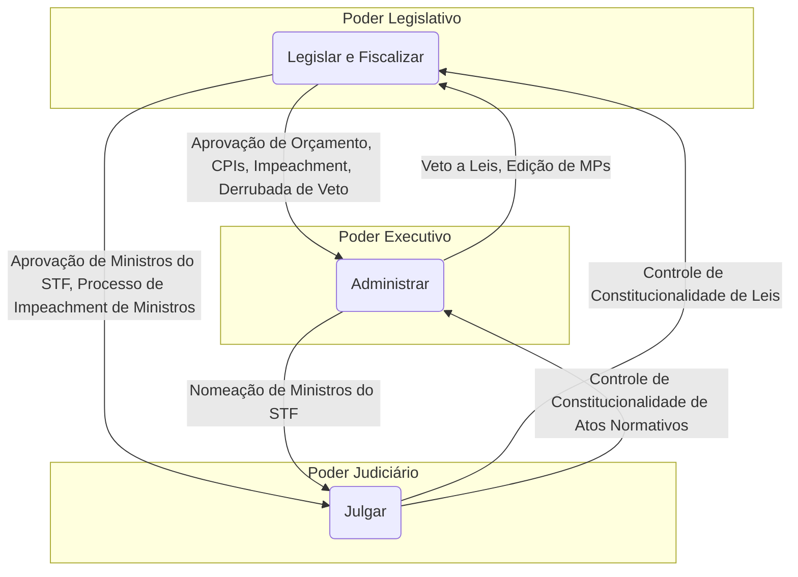

### B. Tabela Consolidada: Funções Típicas e Atípicas

A distribuição de funções entre os Poderes não é estanque. O exercício de funções atípicas é a própria essência do sistema de freios e contrapesos, pois permite que um poder participe, de forma limitada, da esfera de competência de outro. A tabela abaixo sintetiza essa distribuição funcional.

|Poder|Função Típica (Preponderante)|Funções Atípicas (Exercício Secundário)|
|---|---|---|
|**Legislativo**|**Legislar** (criar leis) e **Fiscalizar** (TCU, CPIs)|**Julgar:** Crimes de responsabilidade (impeachment). **Administrar:** Organização interna, provimento de cargos.|
|**Executivo**|**Administrar** (executar políticas e leis)|**Legislar:** Edição de Medidas Provisórias, leis delegadas. **Julgar:** Decisões em processos administrativos.|
|**Judiciário**|**Julgar** (aplicar a lei aos casos concretos)|**Legislar:** Elaboração de seus regimentos internos. **Administrar:** Gestão de pessoal, orçamento e organização interna.|

### C. Análise dos Mecanismos de Controle Recíproco

A seguir, são detalhados os exemplos mais emblemáticos de como os Poderes se controlam mutuamente na prática constitucional brasileira.

#### 1. Controle do Executivo sobre o Legislativo

- **Veto Presidencial:** O Presidente da República possui o poder de vetar, total ou parcialmente, os projetos de lei aprovados pelo Congresso Nacional. O veto pode ser **jurídico**, por inconstitucionalidade, ou **político**, por contrariedade ao interesse público. Este é um freio direto e poderoso sobre a principal função do Legislativo, impedindo que uma lei entre em vigor.
    

#### 2. Controle do Legislativo sobre o Executivo

- **Derrubada do Veto:** Como contrapeso ao poder de veto, o Congresso Nacional pode rejeitá-lo. Para tanto, é necessário o voto da **maioria absoluta** dos Deputados (257) e dos Senadores (41), em sessão conjunta. Se o veto for derrubado, o projeto é promulgado e se torna lei, superando a objeção do Presidente.
    
- **Aprovação do Orçamento:** O Poder Executivo não pode gastar recursos públicos sem a prévia autorização do Legislativo, consubstanciada na Lei Orçamentária Anual (LOA). O processo de discussão e aprovação do orçamento (que inclui o PPA e a LDO) confere ao Congresso um imenso poder de barganha e de direcionamento das políticas governamentais.
    
- **Fiscalização via TCU e CPIs:** Como já detalhado, o controle financeiro e investigativo exercido com o auxílio do TCU e por meio de CPIs são ferramentas cruciais de fiscalização dos atos do Executivo.
    
- **Processo de Impeachment:** É o mecanismo de controle mais drástico, que pode levar à destituição do Chefe do Executivo por crimes de responsabilidade, representando a sanção política máxima do Legislativo.
    

#### 3. Controle do Judiciário sobre o Executivo e o Legislativo

- **Controle de Constitucionalidade:** Este é o freio jurídico por excelência. O STF pode, provocado, declarar a inconstitucionalidade de leis aprovadas pelo Congresso e sancionadas pelo Presidente, bem como de atos normativos do Executivo (como Medidas Provisórias e decretos). Tal decisão retira o ato viciado do ordenamento jurídico, impedindo sua aplicação e desfazendo seus efeitos (em regra, desde a origem, _ex tunc_).
    

#### 4. Controle do Legislativo e do Executivo sobre o Judiciário

A independência do Judiciário não o torna imune ao controle dos outros Poderes, o que garante sua responsividade democrática.

- **Nomeação de Ministros do STF:** A composição da mais alta corte do país é um ato complexo que envolve dois Poderes. O **Presidente da República indica** o nome, mas a nomeação só se efetiva após o candidato ser submetido a uma sabatina na Comissão de Constituição e Justiça e ter seu nome **aprovado pela maioria absoluta do Senado Federal**. Esse processo assegura que a escolha dos guardiões da Constituição tenha a chancela dos representantes eleitos do povo e dos estados.
    
- **Impeachment de Ministros do STF:** Assim como o Presidente, os Ministros do STF também podem ser processados e julgados por crimes de responsabilidade. A competência para esse julgamento é do **Senado Federal**, configurando um poderoso instrumento de controle político sobre a cúpula do Judiciário.
    
- **Fixação de Subsídios:** Compete ao Congresso Nacional, por meio de lei de sua iniciativa, fixar os subsídios dos Ministros do STF, o que representa uma forma de controle financeiro sobre o Judiciário.
    

## VI. Tensões e Debates Contemporâneos: A Separação de Poderes na Prática

### A. O Ativismo Judicial e a Judicialização da Política

Nas últimas décadas, observa-se no Brasil um fenômeno crescente de **judicialização da política**, no qual questões de grande relevância política, moral e social, que tradicionalmente seriam resolvidas na arena do Legislativo ou do Executivo, são levadas à decisão final do Poder Judiciário, especialmente do STF. Em muitos casos, isso ocorre por uma omissão dos Poderes políticos em lidar com temas sensíveis. Uma consequência desse processo é o chamado **ativismo judicial**, em que o Judiciário, ao interpretar a Constituição para dar resposta a essas demandas, adota posturas mais proativas, por vezes em decisões que têm efeitos análogos aos de uma lei. Esse fenômeno gera constantes tensões e acusações de que o Judiciário estaria extrapolando suas funções e invadindo a competência dos outros Poderes, reaquecendo o debate sobre os limites da interpretação constitucional.

### B. Conflitos entre Poderes: A Jurisprudência do STF como Árbitro

A dinâmica do sistema de freios e contrapesos inevitavelmente gera conflitos de atribuições entre os Poderes. O STF tem sido cada vez mais provocado a atuar como um árbitro nessas disputas, definindo os limites da competência de cada um. Decisões sobre o rito de tramitação de Medidas Provisórias, os poderes de investigação de CPIs, a possibilidade de controle judicial de atos do processo legislativo ou os limites da atuação presidencial são exemplos de como a jurisprudência da Corte se tornou uma fonte normativa crucial para a compreensão da separação de poderes na prática. O STF, ao mediar esses embates, não apenas resolve casos concretos, mas molda o equilíbrio e a relação de forças entre as instituições da República.

## VII. Questões para Autoavaliação (Active Recall)

> [!question] Questão 1
> 
> Considerando a jurisprudência do STF sobre a vedação à reedição de Medidas Provisórias (Art. 62, § 10, CF/88), analise a seguinte situação hipotética: O Presidente da República edita a MP nº 1, que trata de matéria tributária. Diante de forte resistência no Congresso, o Presidente revoga formalmente a MP nº 1 e, na mesma sessão legislativa, edita a MP nº 2, com texto substancialmente idêntico. A MP nº 2 é convertida na Lei nº X. Um partido político com representação no Congresso Nacional pode questionar a constitucionalidade da Lei nº X perante o STF? Com base em que fundamentos e qual seria a provável decisão da Corte?

> [!question] Questão 2
> 
> Discorra sobre o papel do Tribunal de Contas da União (TCU) como um instrumento de controle do Poder Legislativo sobre o Executivo. Em sua análise, explique como a natureza técnica do TCU se articula com o controle político do Congresso e como essa relação se manifesta, por exemplo, no processo de julgamento das contas presidenciais.

> [!question] Questão 3
> 
> O processo de nomeação de um Ministro do STF envolve a participação do Presidente da República e do Senado Federal. Descreva as etapas desse processo e analise-o sob a ótica do sistema de freios e contrapesos, explicando como ele representa um mecanismo de controle recíproco entre os Poderes Executivo, Legislativo e Judiciário.


# Organização Político-Administrativa

## 1. Teoria Geral do Estado

A doutrina tradicional considera que os elementos constitutivos do Estado são o **território**, o **povo** e o **governo** soberano. O território é a dimensão física sobre a qual o Estado exerce seus poderes; é o domínio espacial (material) onde vigora uma determinada ordem jurídica estatal. O povo é a dimensão pessoal do Estado, são os seus nacionais. 

O governo, por sua vez, é a dimensão política; ele deve ser soberano, ou seja, sua vontade não se subordina a nenhum outro poder, seja no plano interno ou no plano internacional. 

Sintetizando o conceito de Estado, Manoel Gonçalves Ferreira Filho afirma que “ *o Estado é uma associação humana (povo), radicada em base espacial (território), que vive sob o comando de uma autoridade (poder) não sujeita a qualquer outra (soberana)*.”

Os Estados possuem diferentes maneiras de se organizar, isto é, existem diferentes formas de
Estado. Forma de estado, ressalte-se, é a maneira pela qual o poder está distribuído no interior
do Estado; em outras palavras, ela ilustra a distribuição territorial do poder.
Três pilares são fundamentais para a estruturação política de uma nação: a **forma de Estado**, a **forma de Governo** e o **sistema de Governo**. Atualmente, nosso país adota a **Federação**, a **República** e o **Presidencialismo** em cada um desses eixos. Em acréscimo, adotamos a **democracia** como regime de governo.

- **Forma de Estado**: Federação.
- **Forma de Governo**: República.
- **Sistema de Governo**: Presidencialismo. 

### 1.1 Estado Unitário
No Estado unitário, existe um único centro de poder político no país. Esse poder central pode optar por exercer suas atribuições de maneira *centralizada* (*Estado unitário puro*), ou *descentralizada* (*Estado unitário descentralizado administrativamente*). Vale lembrar que mesmo nos unitários descentralizados não haverá a autonomia na amplitude como ocorre com a Federação.

### 1.2 Estado Federado

No Estado federado, *o poder político é repartido entre diferentes esferas de governo*. Ocorre, assim, uma **descentralização política**, a partir da **repartição de competências** (repartição de poder). Há igualmente repartição de receitas, como se vê na definição de tributos federais (ex.: IOF), estaduais (ex.: IPVA) e municipais (ex.: IPTU).

Na Federação, existe um *órgão central* e *órgãos regionais* (os estados). Em alguns países,
como no nosso, há também órgãos locais, que são os municípios. Ressalto que todos *os entes federados possuem autonomia, mas nenhum deles possui soberania*. Em razão disso, *não se permite o direito de separação (secessão)*. A Federação pode ser formada **por agregação** ou **por desagregação/segregação**.

>**Federação por agregação**: estados independentes e soberanos se juntam para a formação de um único Estado federal. É mais conhecida como *Federação centrípeta*. Nesse caso, as colônias, que eram soberanas, independentes, abriram mão dessa independência passando a ser apenas autônomas. O exemplo clássico é o que aconteceu quando as 13 colônias se uniram para a formação dos Estados Unidos da América.

>**Federação por desagregação ou segregação**: havia um Estado unitário, que se reparte em unidades federadas, dotadas de autonomia em maior ou menor grau. É a chamada *Federação centrífuga*, sendo exemplo a República Federativa do Brasil, que deixou de ser unitário com a Constituição de 1891. Uma importante consequência prática dessa distinção: nos países formados por agregação, boa parte das competências é mantida nas mãos dos estados/colônias, que abriram mão de uma pequena parcela de poder em prol da formação da nova nação. Em contrapartida, quando uma Federação nasce por desagregação, *a parcela maior de competências (poder) fica nas mãos do órgão central*. Exemplificando, basta você se lembrar de que em alguns lugares dos EUA há a pena de morte, enquanto noutros, não. Isso acontece porque cabe aos estados legislar sobre Direito Penal. Já no Brasil, a competência para legislar sobre Direito Penal é privativa da União. Aliás, é comum aparecer nas provas a afirmação segundo a qual legislar sobre esse ou aquele assunto caberia aos estados, DF ou municípios, o que normalmente é incorreto, exatamente por conta da excessiva concentração de competência nas mãos da União (art. 22 da CF/1988).

![[Pasted image 20250107191824.png]]


> A passagem do sistema dual para o sistema cooperativo caracteriza a evolução do federalismo no Brasil.
Gabarito oficial: item certo

A federação tem como característica central a **descentralização do poder político**. Os entes federativos são dotados de **autonomia política**, que se manifesta por meio de 4 (quatro) aptidões:
	a) **Auto-organização**: os entes federativos têm competência para se auto-organizar. Os estados auto-organizam-se por meio da elaboração das Constituições Estaduais, exercitando o Poder Constituinte Derivado Decorrente. Os municípios também se auto-organizam, por meio da elaboração das suas *Leis Orgânicas*. O Prof. Paulo Gonet chama o poder de auto-organização dos estados de capacidade de autoconstituição.
	b) **Autolegislação**: muitos autores entendem que a capacidade de autolegislação estaria compreendida dentro da capacidade de auto-organização.2 No entanto, podemos considerá-la uma capacidade diferente. Autolegislação é a capacidade de os entes federativos editarem suas próprias leis. Em razão dessa característica é que podemos dizer que, em uma federação, há diferentes centros produtores de normas e, em consequência, pluralidade de ordenamentos jurídicos.
	c) **Autoadministração**: é o poder que os entes federativos têm para exercer suas atribuições de natureza administrativa, tributária e orçamentária. Assim, os entes federativos elaboram seus próprios orçamentos, arrecadam seus próprios tributos e executam políticas públicas, dentro da esfera de atuação de cada um, segundo a repartição constitucional de competências.
	d) **Autogoverno**: os entes federativos têm poder para *eleger seus próprios representantes*. É com base nessa capacidade que os Estados elegem seus Governadores e os municípios, os seus Prefeitos.

Podemos afirmar que uma federação deve possuir as seguintes características:
	a) **Repartição constitucional de competências**: para que a ação estatal seja o mais eficaz possível, cada ente federativo é dotado de uma gama de atribuições que lhe são próprias.
	A repartição de competências entre os entes federativos é definida pela Constituição.
	Ressalte-se que, no Estado federal, existe também uma repartição de rendas. Nesse sentido, a CF/88 estabelece regras sobre o repasse aos Estados e Municípios de receitas oriundas dos impostos federais. Segundo a doutrina, há que existir um equilíbrio entre competências e rendas, de modo que não seria possível, aos entes federativos, executar suas atribuições sem recursos financeiros suficientes para tanto.
	b) **Indissolubilidade do vínculo federativo**: em uma federação, não existe direito de
	secessão; em outras palavras, os entes federativos estão ligados por um vínculo
	indissolúvel.
	c) **Nacionalidade única**: os cidadãos dos estados da federação possuem uma nacionalidade única; não há nacionalidades parciais. Aquele que nasce em Minas Gerais, São Paulo ou Pernambuco terá a nacionalidade brasileira.
	d) **Rigidez constitucional**: em um Estado federal, é necessário que exista uma Constituição
	escrita e rígida, que proteja o pacto federativo. Isso decorre do fato de que é a Constituição que estabelece o funcionamento da federação, logo ela somente poderá ser modificada por um procedimento mais dificultoso e solene. Ressalte-se que, no Brasil, o princípio federativo é uma cláusula pétrea, portanto não pode ser objeto de deliberação emenda constitucional que tenda a aboli-lo. Como decorrência da rigidez constitucional, existirá, em um Estado federal, um mecanismo de controle de constitucionalidade das leis. Com isso, busca-se evitar que um ente federativo invada a esfera de competência de outro.
	e) **Existência de mecanismo de intervenção**: conforme já estudamos, não há direito de secessão em uma federação. Assim, atos que contrariem o pacto federativo darão ensejo à utilização dos mecanismos de intervenção (intervenção federal ou estadual, dependendo do caso). Por meio desse mecanismo, fica suprimida, temporariamente, a autonomia política de um ente federativo.
	f) **Existência de um Tribunal Federativo**: é necessário que exista um Tribunal com a
	competência para solucionar litígios envolvendo os entes federativos. No Brasil, o STF atua
	como Tribunal federativo ao processar e julgar, originariamente, as causas e os conflitos
	entre a União e os Estados ou entre os Estados. Cabe destacar que o STF não julga os
	conflitos envolvendo Municípios.
	g) **Participação dos entes federativos na formação da vontade nacional**: nas federações, deve existir um órgão legislativo representante dos poderes regionais. No Brasil, esse órgão é o Senado Federal, que representa os Estados e o Distrito Federal. Destaque-se que, na federação brasileira, os Municípios não participam da vontade nacional.

Há também a distinção entre **federalismo simétrico** e **assimétrico**. 

>**Federalismo Simétrico**: ocorre quando existe homogeneidade em aspectos ligados à cultura, ao desenvolvimento e à língua. Novamente lembro o modelo norte-americano.

>**Federalismo Assimétrico**: apresenta divergências ligadas à cultura ou ao idioma. No Canadá, por exemplo, há dois idiomas oficiais, inglês e francês.

**NO BRASIL**: A doutrina fala em “**erro de simetria**”, lembrando que temos um mesmo idioma e
pretende-se tratar os Estados-membros de forma igualitária – ex.: número de senadores.
Porém, é certo que o mundo real escancara assimetrias, peculiaridades. 

>**Federalismo Orgânico**: é marcado por uma *concepção centralizadora*, na qual *os Estados-membros são fragilizados pelo poder central*. Isso foi verificado em alguns regimes ditatoriais ao longo da história. Aqui no Brasil, entre idas e vindas, vimos maior ou menor grau de autonomia atribuída aos entes federados.

>**Federalismo por Integração**: nele há igualmente preponderância do governo central sobre os outros entes federados, mas a busca pela integração nacional minimiza essa concentração de poder. É um modelo de Estado mais parecido com o Estado unitário descentralizado.

>**Federalismo de Equilíbrio**: busca harmonia entre os entes federados, que atuariam cada um em sua esfera de competência, mas reafirmando laços por meio da criação de regiões metropolitanas, zonas de desenvolvimento etc.

### 1.3 Estado Confederado

Sua característica principal é ser *formada pela união dissolúvel* (possibilidade de separação – secessão) de estados soberanos. Essas nações se vinculam, normalmente, por meio de tratados internacionais.

![[Pasted image 20250107193205.png]]


![[Pasted image 20250107193255.png]]


## 2. A Federação Brasileira

A *República Federativa do Brasil* possui soberania, enquanto os entes que a compõem (**União**, **estados**, **Distrito Federal** e **municípios**) gozam apenas de *autonomia*. O *Presidente da República* acumula as funções de *chefe de Estado* e de *chefe de Governo*, no plano federal.

Nesse contexto, é ele quem comanda o Poder Executivo da União e quem representa o Brasil internacionalmente, celebrando tratados e convenções sobre temas variados. No entanto, não se pode dizer que a União possui ou detém soberania, mesmo quando representa o Brasil no exterior. 

A União, os estados, o DF e os municípios contam com a tríplice autonomia: **financeira**, **administrativa** e **política** (autonomia FAP).

A autonomia do DF é parcialmente tutelada pela União. Isso é verdade, porque cabe à União organizar e manter o TJDFT, o MPDFT, a PCDF, a PMDF e o CBMDF – incisos XIII e XIV do artigo 21 da CF.

Por sua vez, os **territórios federais**, acaso sejam criados (atualmente não existe nenhum), não serão dotados de autonomia. Ao contrário, eles pertencerão à União, integrando a sua Administração indireta, na condição de autarquias.

**Força Nacional** é fruto da chamada *cooperação federativa*, sendo que os servidores recebem treinamento do Ministério da Justiça, capacitando-se para atuação conjunta entre integrantes das polícias federais e dos órgãos de segurança pública. Então, na verdade, a Força Nacional não tem pessoal próprio, reunindo representantes das polícias e é responsável pelo policiamento ostensivo. A mobilização da tropa depende de solicitação expressa do Governador de Estado, do DF ou ainda de Ministro de Estado. Só fique atento a um detalhe: *ela só pode ser enviada a algum Estado caso haja pedido do respectivo governador*. Do contrário, o envio violaria o **princípio da autonomia municipal** (STF, ACO n. 3.427).

Ainda sobre autonomia, preste atenção num julgado que tem grande impacto para as
provas, até por envolver legislação de interesse de toda a população brasileira, que sofre
com o saneamento básico deficiente. O STF validou a lei federal que criou o **Marco Legal do Saneamento Básico (Lei n. 1.026/2020)**. A norma visa aumentar a eficácia da prestação dos serviços de água potável e esgoto tratado, buscando sua universalização, reduzindo as desigualdades sociais e regionais. Porém, havia questionamentos relativos à violação ao pacto federativo e de violação à autonomia municipal. Ambos foram afastados pelo STF, ao entendimento de que não havia ofensa ao modelo federativo na atribuição de competência à Agência Nacional de Águas e Saneamento Básico (ANA) para criar normas sobre regulamentação tarifária e padronização dos instrumentos negociais; além do que a previsão legal para que os estados instituam normas para a integração compulsória de regiões metropolitanas, visando ao planejamento e à execução de serviços de saneamento básico, não violaria a autonomia municipal. Prevaleceu a compreensão segundo a qual *o interesse comum justifica a formação de microrregiões e regiões metropolitanas para a transferência de competências para estado* (STF, ADI n. 6.492). O STF decidiu que as normas estabelecidas pelo novo marco legal são compatíveis com a Constituição, enfatizando que o processo de saneamento deve ser orientado para a **efetividade dos direitos fundamentais**, especialmente o direito à saúde e ao meio ambiente equilibrado. 

Até 1988, o Brasil adotava o chamado Federalismo de segundo grau (repartição de
competência entre a União e os estados). A Constituição atual também conferiu aos municípios a tríplice autonomia (financeira, administrativa e política). Assim, prevalece a orientação de que hoje possuímos uma **Federação de terceiro grau**.

> **Federação de Terceiro Grau**: União, Estados e municípios possuem a tríplice autonomia (financeira, administrativa e política).

Como decorrência da escolha da forma federativa de Estado, a Constituição estabelece
que os entes da Federação (União, estados, DF e municípios) *não podem recusar fé a*
*documentos públicos*.

Igualmente, os entes federados também *não podem criar distinções entre brasileiros ou preferências entre si*. Com base nesse dispositivo que se entendeu pela *inconstitucionalidade de duas leis estaduais ligadas a licitações*, tema recorrente em provas de concursos. Na primeira, a norma estadual previa, como condição de acesso à disputa, que a empresa tivesse fábrica ou sede naquele estado (**STF, ADI n. 3.583**). Já na segunda, havia a cláusula segundo a qual, na análise da proposta mais vantajosa, um dos itens a serem considerados era o montante de impostos pagos pela empresa à Fazenda Pública daquele Estado-membro (**STF, ADI n. 3.070**). O STF entendeu, também,  ser *inconstitucional lei do estado da Bahia que, em caso de empate, dava preferência ao candidato que contasse com mais tempo de serviço àquele estado*. Entendeu-se pela violação dos artigos 5º e 19 da CF (**STF, ADI 5.776**).

O **RE 668.810** julgado pelo Supremo Tribunal Federal (STF) *aborda a constitucionalidade de uma lei municipal de São Paulo que exige que os veículos utilizados em contratos com a Administração Municipal sejam licenciados no próprio município. A justificativa para essa exigência é que, embora o IPVA seja um imposto estadual, metade da arrecadação é destinada ao município onde o veículo está registrado*. *O STF decidiu que a norma municipal é válida, pois não viola a autonomia dos municípios nem a livre concorrência*. A Corte argumentou que a exigência visa garantir que os recursos do IPVA sejam revertidos em benefícios para a população local, promovendo a eficiência administrativa. Assim, a decisão reafirma a capacidade dos municípios de legislar sobre questões que impactam diretamente sua arrecadação e a prestação de serviços, respeitando os princípios constitucionais e o pacto federativo.

*É inconstitucional lei estadual que preveja cota reservada na universidade local*
*apenas a candidatos que tenham cursado o ensino médio integralmente em instituições*
*da mesma unidade federativa*. Haveria afronta ao princípio da isonomia e à proibição de
distinções entre brasileiros, prevista no artigo 19 da CF (STF, RE n. 614.873).

O **RE n. 1.067.086**, julgado pelo Supremo Tribunal Federal (STF), trata da **inscrição de entes federados em cadastros de inadimplentes** e a condicionalidade da entrega de recursos financeiros aos municípios. A decisão estabelece diretrizes importantes sobre como a União e os Estados podem exigir que os municípios regularizem suas pendências financeiras para receber transferências voluntárias de recursos.

#### Tese Fixada

A tese fixada pelo STF determina que a **inscrição de entes federados em cadastro de inadimplentes** deve respeitar os seguintes princípios e procedimentos:

1. **Respeito ao contraditório e à ampla defesa**: É necessário garantir que o ente federado tenha a oportunidade de se defender antes de ser considerado inadimplente.
2. **Devido processo legal**: A inscrição só pode ocorrer após a realização de um julgamento em uma tomada de contas especial ou procedimento análogo, nos casos de descumprimento de convênios, prestação de contas rejeitada ou débitos contratuais.
3. **Notificação prévia**: O ente federado deve ser notificado sobre a irregularidade, com um prazo para regularização, antes de ser inscrito como inadimplente.

**Implicações**

Essa decisão é crucial para as carreiras de controle e gestão, pois assegura que os princípios do devido processo legal sejam observados nas relações entre a União, os Estados e os Municípios. Ao enfatizar a necessidade de notificação e a possibilidade de defesa, o STF protege os direitos dos entes federados, promovendo um ambiente mais justo e transparente na administração pública e no uso de recursos financeiros.

#### Resumo das Decisões do STF sobre Estado Laico

Atualmente, a **Constituição Federal de 1988** estabelece um **Estado laico**, que implica a separação entre o Estado e as instituições religiosas, não reconhecendo uma religião oficial. Isso não significa que o Estado seja ateu, mas sim que ele não deve favorecer ou discriminar nenhuma religião.

#### Inconstitucionalidade da Lei de Rondônia (ADI 5.257)

O **STF declarou a inconstitucionalidade de uma lei do Estado de Rondônia** que oficializava a **Bíblia Sagrada** como livro-base para fundamentar princípios de comunidades e igrejas, reconhecendo esta ação como uma violação ao artigo 19 da Constituição. Esse artigo proíbe a União, os Estados, o Distrito Federal e os Municípios de estabelecer cultos religiosos ou igrejas, subvencioná-los ou embaraçar seu funcionamento. A decisão reafirma o princípio da neutralidade do Estado em relação às religiões.

#### Inconstitucionalidade da Constituição do Estado do Rio de Janeiro (ADI 3.478)

O STF também declarou a **inconstitucionalidade de um dispositivo da Constituição do Estado do Rio de Janeiro** que designava pastores evangélicos para atuar nas corporações militares do Estado. Essa norma foi considerada incompatível com a **neutralidade religiosa** e com o direito à **liberdade de religião**, pois demonstrava uma preferência por uma orientação religiosa específica (no caso, a evangélica) em detrimento de outras.


Essas decisões do STF são fundamentais para reforçar a **neutralidade do Estado** em questões religiosas e garantir que todos os cidadãos tenham liberdade para praticar sua fé sem discriminação ou favorecimento por parte das instituições públicas.

## 3. União

 União possui dupla personalidade jurídica, tendo em vista que assume um papel interno e outro internacional. Isso se deve ao fato de o Presidente da República ser, ao mesmo tempo, chefe do Governo Federal e chefe de Estado.

No plano doméstico, a União é uma pessoa jurídica de direito público interno, compondo a República Federativa do Brasil – RFB juntamente com os estados, o DF e os municípios. Nesse “papel”, ela tem autonomia financeira, administrativa e política.

Já no âmbito internacional, é a União quem representa a RFB. Assim, age em nome
de toda a Federação.

Um exemplo que representa bem essa distinção acontece com a proibição da concessão de isenções heterônomas. Isso porque *um ente da Federação não pode conceder isenções de tributos pertencentes a outro ente (art. 151, III, da Constituição)*. Nessa linha, um Estado não poderia conceder isenção de IPTU, imposto pertencente aos municípios.

Contudo, nenhuma restrição haverá nas hipóteses em que a União agir em nome da
República Federativa do Brasil, no âmbito internacional.

Para ficar mais fácil a percepção, imagine um tratado internacional celebrado entre o
Brasil e a Bolívia, acerca da importação de gás natural.

Por ser derivado de petróleo, haveria nessa operação a incidência de ICMS, imposto
próprio dos estados. No entanto, visando baratear os custos desse produto, a União pode
prever a isenção desse tributo. Isso é possível, porque a União está agindo em nome do
Brasil (STF, RE n. 543.943).

##### Limites para Isenções Tributárias

Existem **limites para as isenções tributárias**, que são estabelecidos tanto pela Constituição quanto pela legislação infraconstitucional. Aqui estão alguns dos principais limites:

- **Competência Legislativa**: A isenção tributária deve ser instituída por **lei**. Isso significa que apenas o poder público competente para exigir o tributo pode conceder a isenção. A União, por exemplo, não pode criar isenções para tributos que são de competência dos Estados ou Municípios.
- **Finalidade e Justificativa**: As isenções devem ter uma **justificativa clara** e estar alinhadas com o interesse público. Elas não podem ser concedidas de forma arbitrária ou sem um propósito que beneficie a sociedade, como a promoção do desenvolvimento econômico ou a proteção de setores vulneráveis.
- **Limitações Constitucionais**: A Constituição Federal estabelece princípios que limitam a concessão de isenções, como a **igualdade tributária**. Isso significa que a isenção não pode criar desigualdades entre contribuintes, favorecendo um grupo em detrimento de outro sem uma justificativa adequada.
- **Requisitos Legais**: A concessão de isenções pode estar sujeita a **requisitos específicos** estabelecidos em leis, como a necessidade de cumprimento de certas condições por parte do contribuinte. Por exemplo, a isenção pode ser condicionada à realização de atividades que atendam a objetivos sociais ou econômicos.
- **Controle e Fiscalização**: As isenções estão sujeitas a **controle e fiscalização** por parte das autoridades competentes. Isso garante que as isenções sejam aplicadas corretamente e que não haja abusos ou fraudes.

### 3.1 Bens da União

Quando cair na sua prova alguma questão sobre bens da União, a primeira coisa que deve vir à sua mente é a ideia de que o *rol do art. 20 da Constituição é meramente exemplificativo*.

Art. 20. São bens da União:

I - os que *atualmente lhe pertencem e os que lhe vierem a ser atribuídos*;

II - as *terras devolutas indispensáveis à defesa das fronteiras*, *das fortificações e construções militares*, *das vias federais de comunicação e à preservação ambiental*, definidas em lei;

III - os lagos, rios e quaisquer correntes de água em terrenos de seu domínio, ou que banhem mais de um Estado, sirvam de limites com outros países, ou se estendam a território estrangeiro ou dele provenham, bem como os terrenos marginais e as praias fluviais;

IV - *as ilhas fluviais e lacustres nas zonas limítrofes com outros países*; as praias marítimas; as ilhas oceânicas e as costeiras, excluídas, destas, as que contenham a sede de Municípios, exceto aquelas áreas afetadas ao serviço público e a unidade ambiental federal, e as referidas no art. 26, II;                 [(Redação dada pela Emenda Constitucional nº 46, de 2005)](https://www.planalto.gov.br/ccivil_03/constituicao/Emendas/Emc/emc46.htm#art1)

V - os *recursos naturais da plataforma continental e da zona econômica exclusiva*;

VI - o *mar territorial*;

VII - os *terrenos de marinha* e seus acrescidos;

VIII - os *potenciais de energia hidráulica*;

IX - os *recursos minerais, inclusive os do subsolo*;

X - as *cavidades naturais subterrâneas* e os *sítios arqueológicos e pré-históricos*;

XI - as *terras tradicionalmente ocupadas pelos índios*.

O art. 231 da CF/1988 dispõe que as *terras tradicionalmente ocupadas pelos índios se destinam a sua posse permanente*, *cabendo-lhes o usufruto exclusivo das riquezas do solo, dos rios e dos lagos nelas existentes*. Essas terras são **inalienáveis** e **indisponíveis**, além do que os direitos sobre elas são **imprescritíveis**. Outro ponto importantíssimo para as provas é que *não pertencem à União os aldeamentos extintos, ainda que ocupados por indígenas em tempos remotos* (**STF, Súmula n. 650**). Aqui, no entanto, entra a grande discussão acerca da existência ou não de um marco temporal para a definição do que seria terra indígena. O STF definiu que o reconhecimento de terras indígenas não deve se limitar ao marco temporal.


Insurgindo-se contra a decisão do STF, o Congresso Nacional aprovou o “PL do Marco
Temporal”, ou seja, um projeto de lei definindo exatamente o oposto. Assim, *só poderia*
*ser reconhecida como terra indígena aquela que estivesse sendo por eles ocupadas em*
*5.10.1988*.

Esse movimento é chamado de *reação legislativa* (ou **ativismo congressual** ou **efeito backlash**) e tende a acontecer em outros temas sensíveis, como a possibilidade da interrupção da gestação nas primeiras 12 semanas. A reação legislativa também foi vista, por exemplo, quando o STF declarou a inconstitucionalidade de lei estadual que regulamentava a prática de vaquejada.
Aprovado no Legislativo, o projeto seguiu para deliberação executiva (sanção/veto). O Presidente Lula sancionou em partes o projeto, vetando o trecho mais importante: a definição do marco temporal. Tudo indica que haverá derrubada pelo Congresso, seguindo para a promulgação.

No âmbito infraconstitucional, o Decreto-Lei nº 9.760, de 5 de setembro de 1946,
dispõe sobre os bens imóveis da União. Nessa norma, estão *incluídos, entre os*
*bens imóveis da União, aqueles localizados em zonas sob a influência das marés*.
O STF, ao julgar a **ADPF 1.008/DF** (Rel. Min. Cármen Lúcia, julgamento finalizado
em 19.05.2023), decidiu que é compatível com a atual ordem constitucional a
norma que inclui entre os bens imóveis da União as zonas onde se faça sentir a
influência das marés.
Os bens pertencentes à União na data da promulgação da Constituição Federal
de 1988 foram mantidos em sua titularidade e as zonas de influência das marés
são consideradas como terrenos de marinha, os quais integram o patrimônio da
União.
***
#### Características dos Bens Públicos

Os **bens públicos** são aqueles que pertencem à Administração Pública e são utilizados para a realização das funções do Estado. De acordo com a doutrina e a **Constituição Federal (CF)** de 1988, os bens públicos possuem características específicas que os diferenciam dos bens privados. Aqui estão as principais características:

1. **Impenhorabilidade**:
    - Os bens públicos são **impenhoráveis**, ou seja, não podem ser utilizados como garantia em dívidas ou obrigações. Essa característica protege o patrimônio público e assegura que os bens destinados ao interesse coletivo não sejam desviados para fins particulares.
2. **Inalienabilidade**:
    - Os bens públicos, em regra, não podem ser **alienados**, ou seja, vendidos ou transferidos a terceiros, salvo em situações excepcionais previstas em lei, como a venda de bens que não são mais necessários ao interesse público.
3. **Indisponibilidade**:
    - Os bens públicos são **indisponíveis**, o que significa que a Administração Pública não pode dispor deles livremente. Qualquer ato que envolva a utilização ou a transferência de bens públicos deve seguir os trâmites legais e atender ao interesse público.
4. **Uso Comum**:
    - Os bens públicos são destinados ao **uso comum** da população, permitindo que todos os cidadãos tenham acesso a eles. Essa característica é especialmente evidente em bens como praças, ruas e parques.
5. **Utilidade Pública**:
    - Os bens públicos devem atender à **utilidade pública**, ou seja, sua utilização deve ser voltada para o bem-estar da sociedade. Isso inclui a prestação de serviços essenciais, como saúde, educação e segurança.
6. **Classificação**:
    - A Constituição Federal classifica os bens públicos em diferentes categorias, como:
        - **Bens de uso comum do povo**: praças, ruas, estradas, etc.
        - **Bens de uso especial**: imóveis utilizados para a prestação de serviços públicos, como escolas e hospitais.
        - **Bens dominiais**: bens que pertencem ao Estado, mas que não têm uma destinação específica, podendo ser utilizados para diversos fins administrativos.

**Considerações Finais**

As características dos bens públicos garantem que o patrimônio público esteja protegido e que sua utilização seja feita em benefício da sociedade. A gestão desses bens deve sempre respeitar os princípios da legalidade, moralidade e eficiência, assegurando que os recursos públicos sejam utilizados de forma responsável e transparente. A compreensão dessas características é fundamental para a atuação da Administração Pública e para a defesa dos direitos dos cidadãos.
***

## 4. Territórios

Embora atualmente não exista nenhum, *podem ser criados por lei complementar federal*.

Os Territórios Federais integram a União, sendo considerados meras descentralizações administrativas; a doutrina chama-os, por isso, de **autarquias territoriais** da União. Portanto, eles não são entes federativos e não possuem autonomia política.

***

Art. 33. A lei disporá sobre a organização administrativa e judiciária dos Territórios.

§ 1º Os Territórios poderão ser divididos em Municípios, aos quais se aplicará, no
que couber, o disposto no Capítulo IV deste Título.

§ 2º As contas do Governo do Território serão submetidas ao Congresso
Nacional, com parecer prévio do Tribunal de Contas da União.

§ 3º Nos Territórios Federais com mais de cem mil habitantes, além do Governador nomeado na forma desta Constituição, haverá órgãos judiciários de primeira e segunda instância, membros do Ministério Público e defensores públicos federais; a lei disporá sobre as eleições para a Câmara Territorial e sua competência deliberativa.

***

O nascimento de um novo Estado-membro pode ser feito de duas formas: a primeira é feita diretamente, por meio de uma das formatações previstas na Constituição: **fusão**,
**incorporação**, **anexação** ou **desmembramento**.

Foi o que aconteceu com o Estado de Tocantins, criado na própria Constituição de 1988 (art. 13 do ADCT), a partir do desmembramento de parte do Estado de Goiás. A segunda, mais cautelosa, leva em consideração um receio quanto à viabilidade político-econômica do novo ente. Para evitar ter de “voltar atrás”, o legislador opta por formar inicialmente um território. Usando um linguajar popular, se “vingar”, vira Estado; se não, retorna à situação anterior. Para você entender melhor, vou lembrar que, na época da promulgação de nossa Constituição de 1988, havia três territórios federais: Roraima, Amapá e Fernando de Noronha

Ao contrário do que ocorre com os entes federados (U, E, DF e M), *os territórios não gozam de autonomia política*, pois o seu governador será nomeado pelo Presidente da República, após aprovação prévia, por voto secreto, do Senado Federal. *Compete privativamente à União legislar sobre a organização administrativa dos Territórios (art. 22, XVII)*.

Como são um “projeto de Estado”, *os territórios podem ser divididos em municípios*. caso haja a necessidade de intervenção em município situado dentro de Território Federal, quem atuará será a União, que é “a dona” do território. Nessa hipótese, a União agirá fazendo função de um Estado.

o Tribunal de Justiça e o Ministério Público do Distrito Federal carregam a letra t no final de suas siglas (TJDFT e MPDFT) porque são os responsáveis por atuar em um Território Federal, caso ele venha a ser criado. Já a fiscalização (controle externo) no âmbito do DF é feita pela Câmara Legislativa (CLDF), com o auxílio do Tribunal de Contas do DF ([TCDF]()). Veja que não apareceu a letra t na sigla do TCDF, o que afasta a sua atribuição para a análise de contas nos territórios. Mas, então, quem é o responsável por fazer a fiscalização (e quem é o TC auxiliar)?
Indo direto ao ponto, a fiscalização de contas dos Territórios Federais caberá ao Congresso Nacional, após prévio parecer do TCU.

Avançando, se possuir mais de 100 mil habitantes, o território terá Poder Judiciário de 1ª e 2ª instâncias, além de Ministério Público e Defensoria Pública Federal.

Território conta com representantes no Congresso Nacional?
Primeiro, eu acho necessário lembrar que um Estado-membro conta com três senadores
(número fixo), além de número de deputados federais que varia entre 8 a 70, a depender
da população local.

Dito isso, e considerando que o território é um projeto de Estado, nada mais natural do que ele contar com metade do número mínimo de representantes na *Câmara dos Deputados a que um Estado faria jus – quatro integrantes (metade de oito)*.

Já *no Senado Federal, o território não possuirá nenhum representante*, assim como acontece com os Municípios.
## 5. Estados

A Constituição trata especificamente dos estados nos arts. 25 a 27. Já no início dispõe que eles também *serão regidos por Constituição*. No entanto, destaco que a Constituição Federal é fruto do **Poder Constituinte Originário**, enquanto a Estadual é obra do **Poder Constituinte Derivado Decorrente**.

Aliás, é exatamente por ser obra do **Poder Constituinte Derivado** (ou, Poder Constituído),
que a Constituição Estadual deve observar as limitações previstas na CF/1988.
Mas quais limitações seriam essas?

A doutrina cita três espécies de princípios:
1. **Princípios constitucionais sensíveis**: são assim chamados (sensíveis) porque, se forem violados, *gerarão intervenção federal*. Preste atenção, pois estão no art. 34, VII, da CF/1988, mas não são considerados cláusulas pétreas pelo simples fato de poderem gerar intervenção.
2. **Princípios constitucionais estabelecidos (organizatórios)**: limitam, vedam ou proíbem a ação indiscriminada do Poder Constituinte Decorrente, funcionando como balizas reguladoras da auto-organização dos estados (Uadi Lamego Bulos). Nessa categoria estariam, por exemplo, as regras que limitam a criação de novos municípios e aquelas que proíbem recusar fé a documentos de outros entes federados.
3. **Princípios constitucionais extensíveis**: tratam de normas relacionadas à *estrutura da Federação brasileira*, abrangendo a forma de investidura em cargos eletivos (art. 77), o processo legislativo (arts. 59 a 69), os orçamentos (arts. 165 e seguintes) e os preceitos ligados à Administração Pública (art. 37)

Art. 34. A União não intervirá nos Estados nem no Distrito Federal, exceto para:
(...)
VII - assegurar a observância dos seguintes princípios constitucionais:

	a) forma republicana, sistema representativo e regime democrático;
	
	b) direitos da pessoa humana;
	
	c) autonomia municipal;
	
	d) prestação de contas da administração pública, direta e indireta;
	
	e) aplicação do mínimo exigido da receita resultante de impostos estaduais, compreendida a proveniente de transferências, na manutenção e desenvolvimento do ensino e nas ações e serviços públicos de saúde


Muita atenção para um ponto já julgado pelo STF e que tem dominado o noticiário
político nos últimos tempos: *as regras sobre reeleição de membros da Mesa Diretora*
*das Casas Legislativas*.

Eu falei ainda agora que é proibida a recondução dos parlamentares para as Mesas das Casas Legislativas na mesma legislatura. Até aí, tudo bem. 

Acontece que o regimento interno da Câmara dos Deputados (artigo 5º, § 1º) previa que, tratando-se de legislaturas diferentes, nada impediria a recondução para o mesmo cargo (usando os dois últimos anos de uma legislatura e os dois primeiros da próxima). 

No âmbito do Senado, seguia-se a mesma orientação, com base em um parecer da CCJ. Isso porque o artigo 59 do RISF apenas citava que “os membros da Mesa serão eleitos para mandato de dois anos, vedada a reeleição para o período imediatamente subsequente”. Então, houve o ajuizamento da ADI 6.524 no STF, questionando o citado dispositivo do RICD, o qual, nesse ponto, seria um ato normativo primário. O pedido formulado pelo PTB era no sentido de que fosse proibida a reeleição seja para eleições ocorridas na mesma legislatura ou em legislaturas diferentes. Ao apreciar o caso, o Plenário do STF, em votação majoritária, julgou parcialmente procedente a ação. *De um lado, confirmou a regra do artigo 57, § 4º, vedando a reeleição na mesma legislatura; de outro lado, possibilitou a continuidade da orientação que já vinha sendo adotada, no sentido de admitir a reeleição para legislaturas diferentes.*

Mas, voltando ao ponto que eu queria tratar, *seria possível que normas estaduais*
*possibilitassem a reeleição na mesma legislatura, ou a proibição constitucional se*
*estenderia, exigindo aplicação em simetria?*

*A resposta é afirmativa. No entender do STF, a proibição existente na CF não seria norma de repetição obrigatória, pois não se enquadra entre os princípios constitucionais estabelecidos* (**STF, ADI n. 793**).

>No mesmo dia seriam realizadas eleições concomitantes para o primeiro e o segundo biênios.
Pode isso, Arnaldo?
Claro que não!
O STF entendeu que a realização de eleições simultâneas violava os princípios
republicano e democrático.


Os Estados-membros ou Estados federados, assim como a União, são entes autônomos, apresentando personalidade jurídica de direito público interno. São dotados de autonomia política, por isso apresentam capacidade de auto-organização, autolegislação, autoadministração
e autogoverno.

A preservação da autonomia dos estados-membros embasou a decisão do *STF que impediu a convocação de governadores por Comissão Parlamentar de Inquérito (CPI) instaurada pelo Senado Federal*. Segundo o Supremo, " caracteriza excesso de poder a ampliação do poder investigativo das CPIs para atingir a esfera de competência dos estados federados ou as atribuições exclusivas — competências autônomas — do Tribunal de Contas da União". O art. 25 da CF/88 dispõe sobre a capacidade de auto-organização e autolegislação dos Estados-membros

> Art. 25. Os Estados organizam-se e regem-se pelas Constituições e leis que adotarem, observados os princípios desta Constituição.

Segundo o STF, é inconstitucional norma de Constituição estadual que preveja quórum diverso de 3/5 (três quintos) dos membros do Poder Legislativo para aprovação de emendas constitucionais. Ou seja, qualquer alteração no texto da Constituição Estadual deve ser aprovada por 3/5 (três quintos) dos Deputados Estaduais.

>Art. 27. O número de Deputados à Assembleia Legislativa corresponderá ao
triplo da representação do Estado na Câmara dos Deputados e, atingido o
número de trinta e seis, será acrescido de tantos quantos forem os Deputados
Federais acima de doze.
[...]
	§ 2º O subsídio dos Deputados Estaduais será fixado por lei de iniciativa da
	Assembléia Legislativa, na razão de, no máximo, setenta e cinco por cento
	daquele estabelecido, em espécie, para os Deputados Federais, observado o
	que dispõem os arts. 39, § 4º, 57, § 7º, 150, II, 153, III, e 153, § 2º, I.
	§ 3º Compete às Assembléias Legislativas dispor sobre seu regimento interno,
	polícia e serviços administrativos de sua secretaria, e prover os respectivos
	cargos.
	§ 4º A lei disporá sobre a iniciativa popular no processo legislativo estadual

O número de deputados estaduais será, então, o triplo dos deputados federais. Se um Estado-membro possuir 10 deputados federais, ele terá, por consequência, 30 deputados estaduais (3 x 10). Se um Estado tiver 11 deputados federais, ele terá 33 deputados estaduais (3 x 11). No entanto, uma vez atingido o número de 36, serão acrescidos tantos quantos forem os Deputados Federais acima de 12. Assim, caso um estado tenha 20 deputados federais, fazemos a conta (3 x 12) + (20-12), o que totaliza 44 deputados estaduais. No entendimento do Supremo Tribunal Federal, o subsídio dos deputados estaduais deve ser fixado por lei em sentido formal (CF, art. 27, § 2º). Além disso, a vinculação do valor do subsídio dos deputados estaduais ao quantum estipulado pela União aos deputados federais é incompatível com o princípio federativo e com a autonomia dos entes federados (CF/88, art. 18,caput).


# Origem: _Processo legislativo brasileiro

---
title: Processo legislativo brasileiro
area: DIREITO
subarea: Teoria Geral e Direito Constitucional
tags:
  - cacd-2025
  - direito
  - processo-legislativo-brasileiro
  - teoria-geral-e-direito-constitucional
aliases:
  - Processo legislativo brasileiro
---
# Processo Legislativo Brasileiro - Etapas e Procedimentos

## Sumário

O processo legislativo brasileiro compreende o conjunto de atos sequenciais e ordenados constitucionalmente previstos para a elaboração das normas jurídicas. Regulamentado nos artigos 59 a 69 da Constituição Federal de 1988, esse processo representa o mecanismo essencial pelo qual o Estado Democrático de Direito traduz a vontade popular em comandos normativos.

A importância do processo legislativo transcende sua função técnica, constituindo-se como instrumento fundamental para a materialização da democracia representativa e participativa. Por meio dele, assegura-se a discussão ampla e plural das proposições normativas, a publicidade dos debates e a legitimidade das decisões políticas.

O processo legislativo brasileiro é regido por princípios constitucionais fundamentais que garantem sua regularidade formal e material. Entre eles destacam-se: a publicidade, a oralidade, a separação da discussão e votação, a unidade da legislatura e o exame prévio dos projetos por comissões parlamentares. Esses princípios são essenciais para garantir a legitimidade democrática e a conformidade constitucional de todo o ciclo de produção normativa.

## Conceitos Principais

* **Processo Legislativo**: Conjunto de atos constitucionalmente previstos para a elaboração das normas jurídicas, englobando iniciativa, discussão, votação, sanção/veto, promulgação e publicação. Está previsto nos artigos 59 a 69 da Constituição Federal.

* **Proposta de Emenda à Constituição (PEC)**: Proposição legislativa destinada a alterar o texto constitucional, sujeita a limitações materiais (cláusulas pétreas) e formais (iniciativa, quórum de aprovação especial, tramitação diferenciada).

* **Lei Complementar**: Espécie normativa destinada a regulamentar dispositivos constitucionais específicos, exigindo aprovação por maioria absoluta dos membros de cada Casa Legislativa. Trata de matérias de maior relevância e complexidade constitucional.

* **Lei Ordinária**: Espécie normativa mais comum no ordenamento jurídico brasileiro, que trata de assuntos diversos. Requer aprovação por maioria simples e constitui a forma típica de regulação das relações sociais.

* **Medida Provisória (MP)**: Ato normativo com força de lei, editado pelo Presidente da República em caso de relevância e urgência. Tem eficácia imediata, mas vigência temporária (60 dias, prorrogáveis uma vez por igual período), dependendo de posterior aprovação pelo Congresso Nacional.

* **Decreto Legislativo**: Ato normativo destinado a regular matérias de competência exclusiva do Congresso Nacional, como a aprovação de tratados internacionais e a sustação de atos do Poder Executivo.

* **Resolução**: Ato normativo destinado a regular matérias de competência privativa da Câmara dos Deputados ou do Senado Federal, incluindo seus assuntos internos.

* **Sanção**: Manifestação de concordância do Presidente da República com o projeto de lei aprovado pelo Legislativo. Pode ser expressa (quando há manifestação formal) ou tácita (quando decorre do silêncio presidencial após o prazo constitucional).

* **Veto**: Discordância formal do Presidente da República com projeto de lei aprovado pelo Legislativo. Pode ser total (todo o projeto) ou parcial (dispositivos específicos), sempre com fundamentação em inconstitucionalidade ou contrariedade ao interesse público.

* **Promulgação**: Ato que atesta a existência da lei, certificando sua regularidade no processo legislativo. Marca o momento em que a lei passa a existir no ordenamento jurídico.

* **Publicação**: Ato que dá conhecimento público da lei, condição para sua vigência. Ocorre normalmente no Diário Oficial, tornando a norma cognoscível a todos.

* **Quórum**: Número mínimo de parlamentares presentes para que ocorra votação (quórum de instalação) ou para aprovação de matérias (quórum de deliberação).

* **Maioria Simples**: Quórum de aprovação que exige mais votos favoráveis que contrários, considerando apenas os parlamentares presentes na sessão.

* **Maioria Absoluta**: Quórum de aprovação que exige votos favoráveis de mais da metade do número total de membros da Casa Legislativa, independentemente do número de presentes.

* **Maioria Qualificada**: Quórum de aprovação que exige número específico de votos, superior à maioria absoluta. No caso das PECs, é necessária aprovação por 3/5 dos membros de cada Casa, em dois turnos.

* **Comissões Parlamentares**: Órgãos internos do Legislativo, formados por grupos de parlamentares, com finalidade de estudar e debater matérias específicas, além de exercer funções fiscalizatórias. Podem ser permanentes, temporárias ou de inquérito (CPIs).

## Análise Detalhada do Processo Legislativo Brasileiro

### Etapas e Procedimentos do Processo Legislativo Comum (Lei Ordinária e Lei Complementar)

#### Iniciativa Legislativa

A iniciativa é o ato que desencadeia o processo legislativo, colocando em movimento o aparelho estatal para a elaboração da norma. O artigo 61 da Constituição Federal estabelece quem pode apresentar proposições:

```
Art. 61. A iniciativa das leis complementares e ordinárias cabe a qualquer membro ou Comissão da Câmara dos Deputados, do Senado Federal ou do Congresso Nacional, ao Presidente da República, ao Supremo Tribunal Federal, aos Tribunais Superiores, ao Procurador-Geral da República e aos cidadãos, na forma e nos casos previstos nesta Constituição.
```

* **Iniciativa Geral ou Concorrente**: Facultada a qualquer membro ou comissão da Câmara dos Deputados ou do Senado Federal.
  
* **Iniciativa Reservada ou Privativa**: Casos em que a Constituição confere a determinados órgãos ou autoridades a exclusividade para propor leis sobre determinadas matérias.
  * Destaque para as matérias de iniciativa privativa do Presidente da República (Art. 61, §1º da CF).
  * Iniciativa privativa do Supremo Tribunal Federal, Tribunais Superiores e Procurador-Geral da República em matérias específicas.

* **Iniciativa Popular**: Exercida mediante apresentação à Câmara dos Deputados de projeto de lei subscrito por, no mínimo, 1% do eleitorado nacional, distribuído pelo menos por cinco Estados, com não menos de 0,3% dos eleitores de cada um deles.

#### Tramitação

* **Casa Iniciadora e Casa Revisora**:
  * Em regra, os projetos de lei têm início na Câmara dos Deputados, que funciona como Casa iniciadora, seguindo depois para o Senado Federal como Casa revisora.
  * Exceção: Projetos de autoria de senadores ou comissões do Senado, que iniciam no próprio Senado.

* **Comissões**:
  * **Comissões Permanentes**: Previstas no regimento interno, com atribuições fixas. Analisam projetos de lei, emitem pareceres técnicos, podem convocar autoridades e realizar audiências públicas.
  * **Comissões Temporárias**: Criadas para tratar de temas específicos, com prazo determinado.
  * **Comissão de Constituição e Justiça**: Uma das mais importantes, analisa a constitucionalidade, legalidade e juridicidade dos projetos.
  * **Poder Conclusivo das Comissões**: Em determinados casos, as comissões podem aprovar projetos sem necessidade de deliberação pelo Plenário.

* **Discussão e Votação em Plenário**:
  * Fase deliberativa parlamentar onde o projeto é discutido e votado.
  * A Casa iniciadora, ao aprovar o projeto, o envia à Casa revisora.
  * A Casa revisora pode aprovar integralmente (o projeto segue para sanção), rejeitar (o projeto é arquivado) ou aprovar com emendas (o projeto retorna à Casa iniciadora para apreciação apenas das emendas).

* **Quórum e Maioria para Aprovação**:
  * Lei ordinária: maioria simples, presentes a maioria absoluta dos membros.
  * Lei complementar: maioria absoluta dos membros de cada Casa.

#### Sanção e Veto

* **Sanção Presidencial**:
  * Expressa: manifestação formal do Presidente.
  * Tácita: silêncio do Presidente após 15 dias úteis do recebimento.

* **Veto Presidencial**:
  * Fundamentado em inconstitucionalidade ou contrariedade ao interesse público.
  * Pode ser total (todo o projeto) ou parcial (dispositivos específicos).
  * O veto é apreciado pelo Congresso Nacional em sessão conjunta, podendo ser rejeitado pelo voto da maioria absoluta dos Deputados e Senadores.

#### Promulgação e Publicação

* **Promulgação**: Atesta a existência da lei, realizada pelo Presidente da República ou, em alguns casos, pelo Presidente do Senado ou da Câmara.
* **Publicação**: Divulgação oficial da lei no Diário Oficial, condição para sua vigência.

#### Princípio da Bicameralidade e suas Exceções

* O processo legislativo brasileiro é marcado pelo bicameralismo, onde ambas as Casas Legislativas devem se manifestar sobre as proposições.
* O princípio admite exceções, como:
  * Medidas Provisórias, apreciadas diretamente pelo Congresso Nacional em sessão conjunta.
  * Matérias de competência exclusiva do Congresso Nacional, da Câmara ou do Senado.

### Procedimentos Legislativos Especiais

#### Processo Legislativo das Emendas à Constituição (art. 60 da CF)

```
Art. 60. A Constituição poderá ser emendada mediante proposta:
I - de um terço, no mínimo, dos membros da Câmara dos Deputados ou do Senado Federal;
II - do Presidente da República;
III - de mais da metade das Assembleias Legislativas das unidades da Federação, manifestando-se, cada uma delas, pela maioria relativa de seus membros.
```

* **Limitações ao Poder de Reforma**:
  * **Limitações Materiais**: Cláusulas pétreas (art. 60, §4º) - não pode ser objeto de deliberação proposta tendente a abolir a forma federativa de Estado, o voto direto, secreto, universal e periódico, a separação dos Poderes e os direitos e garantias individuais.
  * **Limitações Circunstanciais**: Vedação à emenda durante intervenção federal, estado de defesa ou estado de sítio.
  * **Limitações Procedimentais**: Rejeição ou improcedência impede nova proposta na mesma sessão legislativa.

* **Procedimento**:
  * Discussão e votação em cada Casa, em dois turnos.
  * Aprovação por 3/5 dos membros de cada Casa.
  * Não há sanção presidencial - a emenda é promulgada pelas Mesas da Câmara e do Senado.

#### Processo Legislativo das Medidas Provisórias (art. 62 da CF)

* **Requisitos Constitucionais**:
  * Relevância e urgência.
  * Vedações materiais (art. 62, §1º) - não podem ser objeto de MP matérias relativas a nacionalidade, cidadania, direitos políticos, partidos políticos, direito penal, processual penal e processual civil, entre outras.

* **Tramitação**:
  * Vigência inicial de 60 dias, prorrogável uma vez por igual período.
  * Apreciação por comissão mista de Deputados e Senadores, que emite parecer.
  * Votação separada na Câmara e no Senado.
  * Podem ser aprovadas com ou sem alterações (emendas).

* **Efeitos da Rejeição ou Perda de Eficácia**:
  * Relações jurídicas constituídas durante a vigência da MP devem ser regulamentadas por decreto legislativo.
  * Na ausência deste, em 60 dias, as relações jurídicas continuam regidas pela MP.
  * Vedação à reedição na mesma sessão legislativa de MP rejeitada ou que tenha perdido eficácia.

#### Processo Legislativo dos Decretos Legislativos e Resoluções

* **Decretos Legislativos**:
  * Regulam matérias de competência exclusiva do Congresso Nacional (art. 49 da CF).
  * Não há sanção ou veto presidencial.
  * Promulgados pelo Presidente do Senado Federal.

* **Resoluções**:
  * Regulam matérias de competência privativa da Câmara ou do Senado.
  * Não há sanção ou veto presidencial.
  * Promulgadas pelo Presidente da respectiva Casa.

### Comissões Parlamentares

* **Comissões Permanentes**:
  * Existem durante toda a legislatura.
  * Têm competências temáticas específicas (ex: CCJ, Comissão de Finanças e Tributação).
  * Podem aprovar projetos em caráter conclusivo, dispensando apreciação do Plenário.

* **Comissões Temporárias**:
  * Criadas para fins específicos.
  * Extinguem-se ao término da legislatura ou antes, quando alcançado o fim a que se destinavam.

* **Comissões Parlamentares de Inquérito (CPIs)**:
  * Poderes de investigação próprios das autoridades judiciais.
  * Criadas mediante requerimento de 1/3 dos membros da Casa.
  * Prazo certo de funcionamento.
  * Finalidade de apurar fato determinado.

* **Comissões Mistas**:
  * Compostas por membros da Câmara e do Senado.
  * Examinam medidas provisórias, vetos presidenciais e outras matérias específicas.

### Aspectos Constitucionais Relevantes

#### Princípio da Separação dos Poderes e Processo Legislativo

* O processo legislativo reflete o sistema de freios e contrapesos, especialmente na interação entre Legislativo e Executivo.
* O Judiciário, especialmente o STF, exerce controle de constitucionalidade sobre o processo legislativo, respeitando a separação dos poderes.
* O STF reconhece limites ao controle judicial de atos interna corporis do Legislativo, mas admite intervenção em caso de violações constitucionais explícitas.

#### Controle de Constitucionalidade das Leis

* **Controle Preventivo**:
  * Exercido durante o processo legislativo.
  * Pode ser realizado pelo Legislativo (comissões) e pelo Executivo (veto).
  * O STF reconhece a possibilidade de controle judicial preventivo em casos excepcionais, mediante mandado de segurança impetrado por parlamentar para garantir o devido processo legislativo.

* **Controle Repressivo**:
  * Exercido após a promulgação da lei.
  * Realizado pelo Judiciário nos sistemas difuso e concentrado.
  * Visa expurgar do ordenamento jurídico normas incompatíveis com a Constituição.

#### Devido Processo Legislativo

* O STF reconhece a existência de um "devido processo legislativo", pautado por garantias e procedimentos que asseguram a legitimidade democrática da produção normativa.
* Violações ao devido processo legislativo podem ocasionar a inconstitucionalidade formal das leis.

### Jurisprudência do STF sobre o Processo Legislativo

* **Controle Judicial do Processo Legislativo**:
  * O STF reconhece que a inobservância das regras constitucionais do processo legislativo gera inconstitucionalidade formal.
  * Em respeito à separação dos poderes, o controle judicial é excepcional e restrito às violações explícitas de normas constitucionais, não abrangendo normas meramente regimentais (interna corporis).

* **Medidas Provisórias**:
  * O STF tem jurisprudência consolidada sobre os requisitos de relevância e urgência para edição de MPs (STF, Tema nº 33).
  * Reconhece a possibilidade de controle judicial dos pressupostos constitucionais de MPs em casos excepcionais.
  * Admite a suspensão de MPs que violem o devido processo legislativo, como no caso da MP que alterou o apoio ao setor cultural (2022).

* **Emendas à Constituição**:
  * O STF admite o controle preventivo de PECs que violem cláusulas pétreas, mediante mandado de segurança impetrado por parlamentar.
  * Reconhece a impossibilidade de controle judicial de mérito de propostas legislativas, exceto quando há violação explícita a cláusulas pétreas.

* **Limites ao Poder de Emenda Parlamentar**:
  * O STF reconhece limites ao poder de emenda parlamentar, especialmente em projetos de iniciativa reservada.
  * Emendas parlamentares devem guardar pertinência temática com o projeto original e não podem aumentar despesa em projetos de iniciativa privativa do Presidente.

## Conexões

* **Direito Constitucional**: O processo legislativo é parte fundamental do estudo do Direito Constitucional, especialmente nos tópicos relacionados à organização dos poderes e ao sistema de checks and balances. A Constituição Federal estabelece as bases e os limites para a produção normativa.

* **Direito Administrativo**: Os produtos do processo legislativo (leis, decretos, etc.) são a fonte primária do Direito Administrativo, estabelecendo as bases para a atuação da Administração Pública. Existe uma conexão direta entre a qualidade do processo legislativo e a eficácia da gestão pública.

* **Direito Tributário**: O processo legislativo tem importância crucial para o Direito Tributário, especialmente em razão do princípio da legalidade tributária (nullum tributum sine lege). Diversos princípios específicos, como a anterioridade e a anualidade, derivam diretamente de exigências do processo legislativo tributário.

* **Direito Financeiro**: O processo legislativo orçamentário apresenta peculiaridades importantes, especialmente no que se refere às leis orçamentárias (Plano Plurianual, Lei de Diretrizes Orçamentárias e Lei Orçamentária Anual). O processo de elaboração e aprovação dessas leis segue regras específicas previstas na Constituição Federal.

* **Ciência Política**: O processo legislativo é objeto central de estudo da Ciência Política, especialmente nas análises sobre representação democrática, sistemas eleitorais, comportamento parlamentar e relações entre os poderes. A qualidade do processo legislativo é frequentemente utilizada como indicador da qualidade democrática.

## Pontos de Atenção

* **Tópicos de maior relevância para o CACD**:
  * Diferenças entre os tipos de normas produzidas pelo processo legislativo (Emendas Constitucionais, Leis Complementares, Leis Ordinárias, Medidas Provisórias, etc.).
  * Processo legislativo especial das Medidas Provisórias e suas limitações materiais.
  * Controle preventivo e repressivo de constitucionalidade do processo legislativo.
  * Jurisprudência do STF sobre intervenção judicial no processo legislativo.
  * Princípios constitucionais que regem o processo legislativo.

* **Possíveis questões discursivas e de estudo de caso**:
  * Análise da constitucionalidade de Medidas Provisórias específicas.
  * Debate sobre a judicialização do processo legislativo e seus limites.
  * Estudo de caso sobre vetos presidenciais e sua análise pelo Congresso Nacional.
  * Reflexão sobre o papel do controle preventivo de constitucionalidade no sistema brasileiro.
  * Análise da evolução jurisprudencial do STF sobre o controle do processo legislativo.

* **Principais controvérsias e debates teóricos e práticos**:
  * Limites da atuação do STF no controle preventivo de constitucionalidade.
  * Poder de agenda do Executivo no processo legislativo brasileiro.
  * Hipertrofia do Poder Executivo na produção normativa via Medidas Provisórias.
  * Tensão entre o princípio democrático e o controle judicial do processo legislativo.
  * Efetividade dos mecanismos de participação popular no processo legislativo.

* **Análise crítica da eficácia e da morosidade do processo legislativo brasileiro**:
  * Excesso de procedimentos e impacto na celeridade da produção normativa.
  * Dificuldades na implementação efetiva das leis aprovadas.
  * Baixa qualidade técnica de muitas proposições legislativas.
  * Predominância de interesses políticos sobre a técnica legislativa.
  * Multiplicidade de instâncias deliberativas e seu impacto na morosidade.

* **Propostas de reforma do processo legislativo**:
  * Discussões sobre o fim do bicameralismo simétrico.
  * Propostas de redução do número de Medidas Provisórias.
  * Ampliação dos mecanismos de participação popular direta.
  * Maior transparência e publicidade em todas as fases do processo.
  * Fortalecimento das comissões parlamentares e redução da concentração de poder nas Mesas Diretoras.

* **Impacto do processo legislativo na formulação de políticas públicas**:
  * Relação entre o desenho institucional do processo legislativo e a eficácia das políticas públicas.
  * Capacidade do Legislativo de fiscalizar a implementação das políticas pelo Executivo.
  * Fragmentação partidária e seu impacto na coerência das políticas aprovadas.
  * Participação dos grupos de interesse e lobbies no processo de formulação das leis.

* **Principais autores e referências bibliográficas**:
  * José Afonso da Silva (Processo Constitucional de Formação das Leis)
  * Manoel Gonçalves Ferreira Filho (Do Processo Legislativo)
  * Alexandre de Moraes (Direito Constitucional)
  * Gilmar Mendes e Paulo Gustavo Gonet Branco (Curso de Direito Constitucional)
  * Luís Roberto Barroso (O Controle de Constitucionalidade no Direito Brasileiro)

## Material Complementar

* **Bibliografia essencial**:
  * SILVA, José Afonso da. Curso de Direito Constitucional Positivo. São Paulo: Malheiros.
  * FERREIRA FILHO, Manoel Gonçalves. Do Processo Legislativo. São Paulo: Saraiva.
  * MENDES, Gilmar Ferreira; BRANCO, Paulo Gustavo Gonet. Curso de Direito Constitucional. São Paulo: Saraiva.
  * BARROSO, Luís Roberto. O Controle de Constitucionalidade no Direito Brasileiro. São Paulo: Saraiva.
  * CAVALCANTE FILHO, João Trindade. Processo Legislativo Constitucional. Salvador: JusPodivm.
  * COÊLHO, Marcus Vinicius Furtado. O devido processo legislativo na jurisprudência do STF. Estudos Eleitorais, Brasília, v. 10, n. 3, 2015.


# Origem: _Direitos e garantias fundamentais

---
title: "Direitos e garantias fundamentais"
area: "DIREITO"
subarea: "Teoria Geral e Direito Constitucional"
tags:
  - cacd-2025
  - direito
  - direitos-e-garantias-fundamentais
  - teoria-geral-e-direito-constitucional
---


# Origem: Direitos Humanos, Nacionalidade, Asilo e Migração

---
title: "Direitos Humanos, Nacionalidade, Asilo e Migração"
area: "DIREITO"
subarea: "Teoria Geral e Direito Constitucional"
tags:
  - cacd-2025
  - direito
  - direitos-e-garantias-fundamentais
  - teoria-geral-e-direito-constitucional
conexões: Direito Internacional, Direito Constitucional, Direitos Fundamentais
---
# Direitos Humanos, Nacionalidade, Asilo e Migração

## Sumário
Esta nota aborda os regimes jurídicos de nacionalidade, asilo e migração sob perspectivas internacional e brasileira, com ênfase nos direitos humanos. Analisa a interação entre a Constituição Federal de 1988, a Lei de Migração (13.445/2017) e instrumentos internacionais como a Declaração Universal dos Direitos Humanos (1948) e a Convenção sobre o Estatuto dos Refugiados (1951). Destacam-se debates contemporâneos sobre apatridia, critérios de concessão de asilo e os desafios da política migratória brasileira.

## Conceitos Principais

* **Nacionalidade**: Vínculo jurídico-político entre indivíduo e Estado, conferindo direitos e deveres recíprocos (art. 12, CF/88).
* **Apatridia**: Condição de pessoa não reconhecida como nacional por nenhum Estado, violando o art. 15 da Declaração Universal dos Direitos Humanos.
* **Asilo Político**: Proteção concedida por um Estado a estrangeiro perseguido por motivos políticos, com base no princípio de não-devolução (non-refoulement).
* **Migração**: Movimento transfronteiriço de pessoas, regulado por normas nacionais e internacionais para garantir direitos fundamentais.
* **Migrantes**: Indivíduos que residem temporária ou permanentemente em país diferente de sua origem, abrangendo refugiados, apátridas e deslocados.
* **Direitos Humanos**: Normas universais de proteção à dignidade humana, consagradas em tratados internacionais com status constitucional (art. 5º, §2º, CF/88).
* **Declaração Universal dos Direitos Humanos (1948)**: Primeiro instrumento global a reconhecer o direito à nacionalidade (art. 15) e asilo (art. 14).
* **Constituição Federal de 1988**: Estabelece princípios humanitários (art. 4º) e direitos dos estrangeiros (art. 5º), além de regular a nacionalidade (art. 12).
* **Lei de Migração (Lei nº 13.445/2017)**: Substituiu o Estatuto do Estrangeiro (Lei 6.815/1980), priorizando direitos humanos e integração social.

## Análise Detalhada dos Temas

### 1. Nacionalidade e Apatridia

* **Direito à Nacionalidade:**
  - **Instrumentos Internacionais:** Convenção sobre Redução de Apatridia (1961), Convenção sobre os Direitos da Criança (1989) e Pacto de San José da Costa Rica (1969).
  - **Apatridia:** Afeta 4,4 milhões globalmente (ACNUR, 2023). No Brasil, o Comitê Nacional para os Refugiados (CONARE) implementou em 2023 procedimentos para identificação de apátridas.
  - **Crítica:** A meta da ONU de erradicar a apatridia até 2024 não foi alcançada devido a conflitos e lacunas legislativas em países como Mianmar e República Dominicana.

* **Nacionalidade no Direito Brasileiro:**
  - **Aquisição:** 
    - *Natos:* _Jus soli_ (art. 12, I, a) com exceções para filhos de diplomatas estrangeiros.
    - *Naturalizados:* Residência contínua (4 anos) e capacidade civil (art. 12, II).
  - **Perda:** Naturalização cancelada por atividade contrária ao interesse nacional (art. 12, §4º).
  - **Casamento:** Não confere nacionalidade automática desde a EC 54/2007. Exige residência por 1 ano e processo administrativo.

### 2. Asilo Político

* **Asilo no Direito Internacional:**
  - **Princípios:** Não intervenção (art. 2º, §7, Carta da ONU) e proibição de extradição por crimes políticos (Convenção de Caracas, 1954).
  - **Exclusões:** Terroristas e acusados de crimes contra a humanidade não podem pleitear asilo (Estatuto de Roma, art. 7º).

* **Asilo no Direito Brasileiro:**
  - **Concessão:** Atribuição do Ministério da Justiça (Lei 9.474/1997), com consulta ao CONARE. Entre 2018-2023, o Brasil recebeu 1.200 pedidos, majoritariamente de venezuelanos e nicaraguenses.
  - **Casos Relevantes:** Asilo concedido a Evo Morales (2019) e negado a Julian Assange (2012).

### 3. Migração

* **Direito à Migração:**
  - **Tratados:** Convenção Internacional sobre Proteção dos Direitos de Todos os Trabalhadores Migrantes (1990), ratificada pelo Brasil em 2023.
  - **Desafios:** Discriminação contra haitianos e venezuelanos no acesso a serviços de saúde.

* **Lei de Migração (Lei nº 13.445/2017):**
  - **Inovações:** Visto humanitário (art. 14), proteção contra deportação sumária (art. 26) e acesso a SUS e educação básica (art. 4º).
  - **Controvérsias:** Portaria 652/2023 do Ministério da Justiça restringiu reagrupamento familiar para migrantes sem comprovante de renda.

## Conexões
* **Direito Internacional:** Incorporação de tratados via decreto presidencial (art. 5º, §3º, CF/88).
* **Direito Constitucional:** Hierarquia normativa entre Constituição e tratados de direitos humanos (ADPF 153/2008).
* **Direitos Humanos:** Tensão entre soberania estatal e proteção universal (Caso Ximenes-Lopes vs. Brasil na Corte IDH).
* **Política Internacional:** Acordos regionais como o Mercosul para livre circulação de pessoas.
* **Migração:** Impacto econômico da diáspora venezuelana no mercado de trabalho brasileiro.

## Pontos de Atenção
* **CACD:** 
  - Diferença entre refúgio e asilo (o primeiro não exige motivação política).
  - Efeitos da EC 109/2021 sobre deportação de condenados por crimes hediondos.
* **Questões Discursivas:** 
  - "Analise a constitucionalidade da Portaria 652/2023 à luz do art. 5º da CF/88".
  - "Compare os critérios de concessão de asilo no Brasil e na União Europeia".
* **Debates:** 
  - Projeto de Lei 2.516/2022 que propõe restrições à naturalização de cidadãos de países não democráticos.
  - Julgamento do RE 1.277.231 sobre deportação de migrantes em situação irregular.
* **Autores:** Celso Lafer (direito internacional), Luís Roberto Barroso (direitos fundamentais), Gérard-René de Groot (nacionalidade).

## Material Complementar
* **Bibliografia:**
  - RAMOS, André de Carvalho. _Direito Internacional Humanitário_.
  - MAZZUOLI, Valerio. _Direito Internacional Público_.
  - ACNAUR, _Global Trends: Forced Displacement in 2023_.

# Origem: Controle de Constitucionalidade na Constituição Federal de 1988

---
title: Controle de Constitucionalidade na Constituição Federal de 1988
area: DIREITO
subarea: Teoria Geral e Direito Constitucional
tags:
  - cacd-2025
  - direito
  - normas-juridicas
  - teoria-geral-e-direito-constitucional
aliases:
  - Controle de Constitucionalidade.
---
# Controle de Constitucionalidade na Constituição Federal de 1988: Sistema, Instrumentos, Evolução e Desafios

## Introdução

A Constituição Federal de 1988 (CF/88) consagrou um sistema de controle de constitucionalidade robusto e multifacetado, fundamental para assegurar a supremacia da Carta Magna e a proteção dos direitos fundamentais. Este sistema é caracterizado por sua natureza híbrida ou mista, conjugando elementos do modelo difuso (incidental, concreto, de origem norte-americana) e do modelo concentrado (abstrato, principal, de inspiração austríaca/europeia). A dinâmica desse sistema é constantemente moldada pela jurisprudência do Supremo Tribunal Federal (STF) e do Superior Tribunal de Justiça (STJ), bem como por intensos debates doutrinários que questionam sua eficácia, coerência e os limites da jurisdição constitucional.

## O Modelo Híbrido: Fundamentos

### 1. Controle Difuso (Incidental ou Concreto)

Originário do direito norte-americano (leading case: *Marbury v. Madison*, 1803), o controle difuso permite que qualquer juiz ou tribunal, no curso de um processo judicial concreto, declare incidentalmente a inconstitucionalidade de uma lei ou ato normativo aplicável ao caso.
*   **Características**:
    *   **Incidental**: A questão da constitucionalidade surge como um incidente processual, uma questão prejudicial ao julgamento do mérito da causa principal.
    *   **Concreto**: Analisa-se a constitucionalidade da norma em face de um caso específico.
    *   **Efeitos**: A decisão, em regra, produz efeitos *inter partes* (apenas entre as partes do processo) e *ex tunc* (retroativos, desfazendo os atos praticados com base na norma inconstitucional).
*   **Cláusula de Reserva de Plenário (Art. 97, CF/88)**: Os tribunais somente podem declarar a inconstitucionalidade de lei ou ato normativo pelo voto da maioria absoluta de seus membros ou dos membros do respectivo órgão especial.

### 2. Controle Concentrado (Abstrato ou Principal)

Este modelo confere a um único órgão, no Brasil o Supremo Tribunal Federal (e os Tribunais de Justiça, no âmbito estadual), a competência para julgar a constitucionalidade de leis e atos normativos em tese, independentemente de um caso concreto. A CF/88 ampliou significativamente os instrumentos e os legitimados para este tipo de controle.

#### a. Ação Direta de Inconstitucionalidade (ADI)
- **Previsão**: Art. 102, I, 'a', CF/88; Lei nº 9.868/1999.
- **Objeto**: Leis ou atos normativos federais ou estaduais que contrariem a Constituição Federal. Não cabe ADI contra lei municipal em face da CF (controle feito via ADPF ou difuso), nem contra leis pré-constitucionais (controladas via ADPF).
- **Finalidade**: Declarar a inconstitucionalidade da norma, retirando-a do ordenamento jurídico com efeitos gerais.
- **Quórum de Julgamento**: Presença de, no mínimo, oito Ministros (Art. 22, Lei 9.868/99). A declaração de constitucionalidade ou inconstitucionalidade exige o voto da maioria absoluta dos membros do STF (Art. 97, CF/88).
- **Medida Cautelar**: Pode ser concedida, por maioria absoluta, para suspender a eficácia da norma impugnada até o julgamento final.
- **Amicus Curiae**: O relator, considerando a relevância da matéria e a representatividade dos postulantes, poderá admitir a manifestação de outros órgãos ou entidades (Art. 7º, §2º, Lei 9.868/99).


#### b. Ação Declaratória de Constitucionalidade (ADC)
- **Previsão**: Art. 102, I, 'a', CF/88 (redação da EC nº 3/1993); Lei nº 9.868/1999.
- **Objeto**: Exclusivamente lei ou ato normativo *federal*.
- **Finalidade**: Declarar a constitucionalidade de lei ou ato normativo federal, visando dissipar controvérsia judicial relevante sobre sua aplicação e conferir segurança jurídica.
- **Requisito Específico**: Demonstração de controvérsia judicial relevante que coloque em risco a presunção de constitucionalidade da norma.
- **Medida Cautelar**: Pode ser concedida para determinar que os juízes e tribunais suspendam o julgamento dos processos que envolvam a aplicação da lei ou ato normativo objeto da ação até seu julgamento definitivo.


#### c. Arguição de Descumprimento de Preceito Fundamental (ADPF)
*   **Previsão**: Art. 102, §1º, CF/88; Lei nº 9.882/1999.
*   **Objeto**: Evitar ou reparar lesão a preceito fundamental resultante de ato do Poder Público (federal, estadual ou municipal), inclusive leis ou atos normativos anteriores à Constituição (direito pré-constitucional não recepcionado) ou leis municipais em face da CF.
*   **Caráter Subsidiário**: Só é cabível quando não houver outro meio eficaz de sanar a lesividade.
*   **Finalidade**: Assegurar a observância dos preceitos fundamentais da Constituição.
*   **Medida Cautelar**: Pode ser deferida para suspender o andamento de processos ou os efeitos de decisões judiciais, ou qualquer outra medida que apresente relação com a matéria objeto da ADPF.

#### d. Ação Direta de Inconstitucionalidade por Omissão (ADO)
*   **Previsão**: Art. 103, §2º, CF/88; Lei nº 12.063/2009 (alterou a Lei 9.868/99).
*   **Objeto**: Omissão (total ou parcial) do Poder Público em adotar medidas legislativas ou administrativas necessárias para tornar efetiva norma constitucional de eficácia limitada.
*   **Finalidade**: Dar ciência ao poder competente para a adoção das providências necessárias e, em se tratando de órgão administrativo, para fazê-lo em trinta dias. O STF tem evoluído para, em certos casos, fixar prazo para o legislador ou até mesmo suprir a omissão com efeitos concretos.

### 3. Legitimados para o Controle Concentrado (Art. 103, CF/88) 

Os legitimados para propor ADI, ADC, ADPF e ADO são:
*   **Legitimados Universais** (não precisam demonstrar pertinência temática):
    1.  O Presidente da República;
    2.  A Mesa do Senado Federal;
    3.  A Mesa da Câmara dos Deputados;
    4.  O Procurador-Geral da República;
    5.  O Conselho Federal da Ordem dos Advogados do Brasil;
    6.  Partido político com representação no Congresso Nacional.
*   **Legitimados Especiais** (precisam demonstrar pertinência temática – relação entre o objeto da ação e seus objetivos institucionais):
    7.  A Mesa de Assembleia Legislativa ou da Câmara Legislativa do Distrito Federal;
    8.  O Governador de Estado ou do Distrito Federal;
    9.  Confederação sindical ou entidade de classe de âmbito nacional.

## Momentos do Controle de Constitucionalidade

### 1. Controle Preventivo

Realizado antes que a lei ou ato normativo entre em vigor.
*   **Político**:
    *   Pelas Comissões de Constituição e Justiça (CCJs) da Câmara e do Senado.
    *   Pelo Chefe do Executivo (veto jurídico por inconstitucionalidade – Art. 66, §1º, CF/88).
*   **Judicial (Excepcional)**:
    *   Via Mandado de Segurança impetrado por parlamentar para assegurar o devido processo legislativo constitucional (controle de constitucionalidade formal do processo legislativo).

### 2. Controle Repressivo (ou Posterior)

Realizado após a entrada em vigor da norma.
*   **Político**:
    *   Pelo Congresso Nacional (Art. 49, V, CF/88 – sustar atos normativos do Executivo que exorbitem do poder regulamentar).
    *   Pelo Tribunal de Contas da União (TCU), que pode, no exercício de suas atribuições, apreciar a constitucionalidade de leis e atos do poder público (Súmula 347 STF, com interpretação restritiva recente do STF no MS 25.888/DF).
*   **Judicial**: É a forma principal, exercida pelos modelos difuso e concentrado (ADI, ADC, ADPF, ADO), além do Mandado de Injunção (MI) e da Ação Popular.

### 3. Controle Concomitante

Ocorre durante o processo de elaboração da norma (*iter legislativo*). O exemplo mais citado é o controle judicial preventivo via Mandado de Segurança impetrado por parlamentar, que se dá enquanto a norma ainda está em formação.

## Papel do Congresso Nacional no Controle

O Congresso Nacional não é mero espectador do controle de constitucionalidade:
*   **Controle Preventivo Político**: Através das CCJs e da análise de vetos presidenciais.
*   **Controle Repressivo Político**: Art. 49, V, CF/88.
*   **Poder de Emenda Constitucional**: Pode alterar a Constituição (respeitadas as cláusulas pétreas – Art. 60, §4º), superando entendimentos do STF.
*   **Legislação Corretiva ou Suplementar**: Pode editar leis para regulamentar ou corrigir situações decorrentes de decisões do STF.
*   **Art. 52, X, CF/88**: Atuação do Senado na suspensão de leis declaradas inconstitucionais pelo STF em controle difuso (papel atualmente mitigado pela "abstrativização do controle difuso").

## Efeitos das Decisões e Técnicas de Julgamento

*   **Efeitos Temporais**: A regra é a eficácia *ex tunc* (retroativa). Contudo, o STF pode modular os efeitos (Art. 27, Lei 9.868/99), atribuindo eficácia *ex nunc* (a partir da decisão) ou prospectiva (a partir de um momento futuro), por razões de segurança jurídica ou excepcional interesse social.
*   **Efeitos Subjetivos**: No controle difuso, a regra é *inter partes*. No controle concentrado, os efeitos são *erga omnes* (contra todos) e vinculantes em relação aos demais órgãos do Poder Judiciário e à Administração Pública.
*   **Técnicas de Decisão**:
    *   **Interpretação Conforme a Constituição**: Fixa a interpretação válida da norma.
    *   **Declaração Parcial de Inconstitucionalidade sem Redução de Texto**: Afasta aplicações inconstitucionais da norma.
    *   **Declaração de Nulidade Parcial com Redução de Texto**: Suprime parte do texto da norma.
    *   **Sentenças Aditivas**: O STF "adiciona" um sentido à norma para torná-la constitucional, suprindo uma omissão parcial.
    *   **Sentenças Substitutivas**: O STF substitui uma interpretação ou aplicação inconstitucional por outra.
*   **Mutação Constitucional**: Alteração informal do sentido da Constituição sem alteração do seu texto, por meio da interpretação judicial.
*   **Transcendência dos Motivos Determinantes**: Debate sobre se os fundamentos da decisão do STF também possuem efeito vinculante.

## Bloco de Constitucionalidade e Controle de Convencionalidade

O parâmetro do controle não se limita ao texto estrito da CF/88. O **bloco de constitucionalidade** inclui princípios implícitos, direitos fundamentais e, crucialmente, os tratados internacionais de direitos humanos (os aprovados pelo rito do Art. 5º, §3º têm status de emenda constitucional; os demais, status supralegal). Isso leva ao **controle de convencionalidade**, que verifica a compatibilidade das leis internas com esses tratados.

## Controle de Constitucionalidade de Emendas Constitucionais 

Emendas Constitucionais também podem ser objeto de controle, mas de forma excepcional. O STF admite ADI contra emenda constitucional que viole:
*   As **cláusulas pétreas** (Art. 60, §4º, CF/88).
*   O **devido processo legislativo** para sua aprovação.

## Controle em Âmbito Estadual e Municipal

*   **Estadual**: Os Estados podem instituir ADI estadual perante seus Tribunais de Justiça para controlar leis ou atos normativos estaduais ou municipais em face da Constituição Estadual (Art. 125, §2º, CF/88).
*   **Municipal**: Leis municipais podem ser controladas em face da CF via controle difuso ou ADPF. Em face da Constituição Estadual, via ADI estadual.

## Jurisprudência Recente e Debates Doutrinários

### STF: Dinamismo e Expansão do Controle

- **Tribunais de Contas (MS 25.888/DF, 2023)**: O STF reafirmou a competência dos Tribunais de Contas para, no exercício de suas atribuições, afastar incidentalmente a aplicação de leis ou atos normativos considerados inconstitucionais, desde que em consonância com a jurisprudência do STF.
- **"Orçamento Secreto" (ADPF 854, 2022/2023)**: O STF declarou a inconstitucionalidade das emendas de relator (RP9) na forma como vinham sendo praticadas, por violação aos princípios da transparência, impessoalidade e moralidade.
- **Lei de Improbidade Administrativa (ADI 7.026, 2024)**: O Tribunal modulou efeitos de decisão sobre a LIA para preservar a segurança jurídica.
- **"ADPF das Favelas" (ADPF 635)**: O STF impôs restrições a operações policiais em comunidades do Rio de Janeiro, reconhecendo a possibilidade de controle judicial de políticas públicas em matéria de direitos fundamentais.
- **Lei Anticrime (ADI 6.296, 2024)**: Suspensão de dispositivos da lei, como o "juiz de garantias", por vícios no processo legislativo e potencial violação à separação de poderes, gerando debate sobre ativismo.

### STJ: Controle Difuso e Convencionalidade

- **Limites do Controle em REsp (REsp 2.134.598/SP, 2024)**: O STJ reiterou que, em sede de Recurso Especial, sua análise de constitucionalidade é apenas incidental e indeclinável para a solução da lide, não podendo substituir a competência do STF. Questões constitucionais puras devem ser remetidas ao STF.
- **Controle de Convencionalidade (REsp 1.945.123/DF)**: O STJ tem aplicado tratados internacionais de direitos humanos como parâmetro de controle, verificando a compatibilidade das leis internas com esses tratados, especialmente em matéria penal e processual penal.
## Controle de Constitucionalidade em Âmbito Estadual e Municipal

As notas anteriores focaram no controle federal, mas é importante destacar que a CF/88 também prevê o controle de constitucionalidade estadual. O art. 125, §2º estabelece que cabe aos Estados instituir representação de inconstitucionalidade de leis ou atos normativos estaduais ou municipais em face da Constituição Estadual. As Ações Diretas de Inconstitucionalidade estaduais (ADI estadual) são julgadas pelos Tribunais de Justiça locais e não admitem recurso ao STF, salvo quando a questão envolver norma de reprodução obrigatória da Constituição Federal.Quanto às leis municipais, seu controle em face da CF pode ocorrer:

1. De forma difusa, por qualquer juiz ou tribunal
2. Via ADPF no STF, quando não houver outro meio eficaz
3. Via ADI estadual, quando contrariar a Constituição do Estado

## Técnicas de Decisão no Controle de Constitucionalidade

Além da modulação de efeitos já mencionada, o STF utiliza outras técnicas decisórias relevantes:

1. **Interpretação conforme a Constituição**: Não declara a inconstitucionalidade da norma, mas fixa a interpretação que a torna compatível com a Constituição. Exemplo: ADI 4.277/ADPF 132, que reconheceu uniões homoafetivas como entidades familiares.

2. **Declaração parcial de inconstitucionalidade sem redução de texto**: Mantém o texto integral da norma, mas afasta determinadas aplicações consideradas inconstitucionais. Exemplo: ADI 1.946, que excluiu do teto previdenciário o salário-maternidade.

3. **Sentenças manipulativas aditivas**: O STF acrescenta sentido à norma para torná-la constitucional. Exemplo: MI 670, 708 e 712, que garantiram o direito de greve aos servidores públicos ante a omissão legislativa.

4. **Sentenças manipulativas substitutivas**: O STF substitui a interpretação inconstitucional por outra compatível com a Constituição. Exemplo: ADI 4.650, que proibiu doações de empresas a campanhas eleitorais.

## Mutação Constitucional e Reinterpretação de Dispositivos

O STF tem aplicado o conceito de mutação constitucional para alterar a interpretação de normas constitucionais sem modificação formal do texto. Exemplo marcante é a nova interpretação dada ao art. 52, X, da CF/88, pela qual o papel do Senado na suspensão de lei declarada inconstitucional em controle difuso teria se transformado de constitutivo para meramente publicizador (teoria da abstrativização do controle difuso). Esta tese foi desenvolvida no julgamento da Reclamação 4.335/AC e reafirmada em decisões posteriores, como as ADIs 3.406 e 3.470.

## Transcendência dos Motivos Determinantes

Um debate importante diz respeito à extensão da eficácia vinculante das decisões do STF: se ela alcança apenas o dispositivo ou também os fundamentos determinantes (ratio decidendi). A tese da transcendência dos motivos determinantes, embora rejeitada pelo STF como regra geral (Rcl 3.014), tem sido aplicada em casos específicos, especialmente após o CPC/2015, que valorizou o sistema de precedentes.

## Controle de Constitucionalidade e Pandemia de COVID-19

A pandemia de COVID-19 levantou importantes questões sobre controle de constitucionalidade e federalismo. Na ADI 6.341, o STF reconheceu a competência concorrente de Estados e Municípios para adotar medidas sanitárias, em interpretação significativa do sistema constitucional de repartição de competências. Em várias ADPFs (como a ADPF 672), o Tribunal atuou para garantir a proteção de direitos fundamentais em contexto de emergência sanitária, demonstrando a flexibilidade e a relevância dos instrumentos de controle de constitucionalidade em situações excepcionais.

## Jurisprudência Recente dos Tribunais Superiores

### STF: Dinamismo e Expansão do Controle

- **Tribunais de Contas (MS 25.888/DF, 2023):** O STF reafirmou a competência dos Tribunais de Contas para, no exercício de suas atribuições, afastar incidentalmente a aplicação de leis ou atos normativos considerados inconstitucionais, desde que em consonância com a jurisprudência do STF.
- **"Orçamento Secreto" (ADPF 854, 2022/2023):** O STF declarou a inconstitucionalidade das emendas de relator (RP9) na forma como vinham sendo praticadas, por violação aos princípios da transparência, impessoalidade e moralidade.
- **Lei de Improbidade Administrativa (ADI 7.026, 2024):** O Tribunal modulou efeitos de decisão sobre a LIA para preservar a segurança jurídica.
- **"ADPF das Favelas" (ADPF 635):** O STF impôs restrições a operações policiais em comunidades do Rio de Janeiro, reconhecendo a possibilidade de controle judicial de políticas públicas em matéria de direitos fundamentais.
- **Lei Anticrime (ADI 6.296, 2024):** Suspensão de dispositivos da lei, como o "juiz de garantias", por vícios no processo legislativo e potencial violação à separação de poderes, gerando debate sobre ativismo.
- **Súmula Vinculante (Art. 103-A CF):** O STF continua a editar súmulas vinculantes para pacificar questões constitucionais com grande repercussão, como a Súmula Vinculante nº 56 (sobre regime prisional).

### STJ: Controle Difuso e Convencionalidade

- **Limites do Controle em REsp (REsp 2.134.598/SP, 2024):** O STJ reiterou que, em sede de Recurso Especial, sua análise de constitucionalidade é apenas incidental e indeclinável para a solução da lide, não podendo substituir a competência do STF. Questões constitucionais puras devem ser remetidas ao STF.
- **Controle de Convencionalidade (REsp 1.945.123/DF):** O STJ tem aplicado tratados internacionais de direitos humanos como parâmetro de controle, verificando a compatibilidade das leis internas com esses tratados (controle de convencionalidade), especialmente em matéria penal e processual penal.


## Novas Tendências: Constitucionalismo Digital e Tecnologia

O controle de constitucionalidade enfrenta novos desafios diante de tecnologias emergentes e do ambiente digital. O STF tem sido chamado a examinar questões como o marco civil da internet (ADI 5.527), proteção de dados pessoais (ADI 6.387) e regulação de plataformas digitais, estendendo os parâmetros constitucionais a novas realidades. Esta fronteira representa um campo fértil para o desenvolvimento da jurisdição constitucional nos próximos anos.

## Diálogo Institucional e Novas Formas de Legitimação

O STF tem buscado ampliar o diálogo institucional por meio de:

1. **Audiências públicas**: Permitem a participação de especialistas e da sociedade civil em temas constitucionais complexos, como ocorreu nas ADIs sobre aborto de anencéfalos, células-tronco e sistema de cotas.

2. **Amicus curiae**: Figura prevista no art. 7º, §2º da Lei 9.868/1999, expandida pelo CPC/2015, permite a manifestação de entidades representativas em processos de controle de constitucionalidade.

3. **Apelos ao legislador**: Em casos de omissão inconstitucional, o STF tem estabelecido prazos para atuação legislativa, como na ADO 26 (criminalização da homofobia).

Estes mecanismos buscam fortalecer a legitimidade democrática das decisões em sede de controle de constitucionalidade, tema especialmente sensível considerando a tensão entre constitucionalismo e democracia.

### Controle de Constitucionalidade e Pandemia de COVID-19

A pandemia de COVID-19 levantou importantes questões sobre controle de constitucionalidade e federalismo. Na ADI 6.341, o STF reconheceu a competência concorrente de Estados e Municípios para adotar medidas sanitárias, em interpretação significativa do sistema constitucional de repartição de competências. Em várias ADPFs (como a ADPF 672), o Tribunal atuou para garantir a proteção de direitos fundamentais em contexto de emergência sanitária, demonstrando a flexibilidade e a relevância dos instrumentos de controle de constitucionalidade em situações excepcionais.

## Aspectos Comparados: Breve Panorama Internacional

O sistema brasileiro possui características únicas quando comparado a modelos internacionais:

- Difere do modelo americano puro por adotar instrumentos de controle abstrato
- Diferencia-se do modelo europeu por não ter um Tribunal Constitucional separado
- Apresenta maior variedade de instrumentos processuais que a maioria dos sistemas
- Possui um dos mais amplos rol de legitimados para propositura de ações diretas

Esta característica híbrida e abrangente confere ao sistema brasileiro uma riqueza de possibilidades, mas também desafios únicos de coordenação e coerência.Esta complementação oferece elementos adicionais que, somados às notas anteriores, proporcionam um panorama bastante completo do sistema brasileiro de controle de constitucionalidade, fundamental para a compreensão do funcionamento do Estado Democrático de Direito no Brasil.

## Conclusão

O controle de constitucionalidade na CF/88 é um pilar da democracia brasileira, garantindo a supremacia da Constituição e a proteção dos direitos fundamentais. Sua evolução, impulsionada pela jurisprudência do STF e pelos debates acadêmicos, demonstra sua vitalidade, mas também os desafios inerentes à sua aplicação em uma sociedade plural e em constante transformação. O equilíbrio entre a proteção efetiva dos preceitos fundamentais, o respeito à separação de poderes e a garantia da segurança jurídica continuará sendo o principal desafio para os operadores do direito e para as instituições brasileiras. A compreensão detalhada de seus instrumentos, legitimados, momentos e efeitos é crucial para qualquer operador do direito e, em especial, para aqueles que almejam a carreira diplomática, dada a crescente intersecção entre direito interno e ordem internacional.

# Origem: _Administração Pública no Brasil (Princípios, Estrutura)

---
title: Administração Pública no Brasil (Princípios, Estrutura)
area: DIREITO
subarea: Direito Administrativo e Servidor Público
tags:
  - administracao-publica-no-brasil
  - cacd-2025
  - direito
  - direito-administrativo-e-servidor-publico
aliases:
  - Administração Pública no Brasil.
---
# 9. Administração Pública no Brasil

## Princípios Constitucionais da Administração Pública e dos Servidores Públicos

### Fundamentos Constitucionais

O artigo 37 da Constituição Federal de 1988 estabelece os princípios fundamentais que regem a administração pública brasileira, constituindo verdadeiros pilares do regime jurídico-administrativo. O caput do dispositivo consagra expressamente cinco princípios: legalidade, impessoalidade, moralidade, publicidade e eficiência, este último introduzido pela Emenda Constitucional nº 19/1998.

A jurisprudência do Supremo Tribunal Federal tem consolidado o entendimento de que estes princípios não são meramente programáticos, mas possuem eficácia normativa direta e imediata, vinculando toda a atividade administrativa [1]. Na ADI 2975/DF, o STF reafirmou que a violação a qualquer desses princípios constitui vício de inconstitucionalidade passível de controle jurisdicional.

### Princípio da Legalidade

O princípio da legalidade administrativa distingue-se fundamentalmente da legalidade aplicável aos particulares. Enquanto estes podem fazer tudo aquilo que a lei não proíbe, a administração pública só pode atuar quando autorizada por lei, nos exatos termos da autorização legal. Esta distinção foi magistralmente explicitada pelo STF no julgamento do MS 24.268/MG, onde se estabeleceu que "a administração pública está sujeita ao princípio da legalidade estrita, não podendo agir contra legem ou praeter legem, mas apenas secundum legem" [2].

A Corte Suprema tem entendido que o princípio da legalidade não se limita à conformidade formal com a lei, mas exige também a observância do espírito e da finalidade da norma. No RE 365.368/SC, o STF decidiu que "o princípio da legalidade impõe à administração pública a observância não apenas da letra da lei, mas também de seu espírito e finalidade, vedando-se interpretações que contrariem o interesse público" [3].

### Princípio da Impessoalidade

O princípio da impessoalidade manifesta-se em duas dimensões principais: a vedação ao favorecimento pessoal e a proibição da autopromoção. O STF, no Informativo nº 1015/2020, consolidou o entendimento de que "o agente público não pode se valer do cargo que exerce ou dos recursos públicos que gere para a autopromoção política, sob pena de incorrer em violação aos princípios constitucionais da impessoalidade, da publicidade e da eficiência na Administração Pública" [4].

A jurisprudência tem sido rigorosa na aplicação deste princípio, especialmente em matéria de contratações públicas. O STJ, no AgRESp 1.777.909/MS, decidiu que "qualquer conduta atentatória aos princípios da impessoalidade, da moralidade e da legalidade, nos termos da jurisprudência desta Corte, é suficiente para caracterizar a nulidade do ato administrativo" [5].

### Princípio da Moralidade

A moralidade administrativa constitui princípio autônomo, não se confundindo com a legalidade. O STF tem reconhecido que a moralidade administrativa "impõe ao administrador público um padrão de conduta ética que vai além da mera observância da lei, exigindo probidade, boa-fé e lealdade às instituições" [6].

A Corte Suprema estabeleceu importante precedente no sentido de que a violação à moralidade administrativa pode ser aferida objetivamente, independentemente da demonstração de dolo ou má-fé do agente. No MS 21.729/DF, decidiu-se que "a imoralidade administrativa prescinde da demonstração de má-fé ou dolo, bastando a comprovação de que o ato contraria padrões éticos de probidade, decoro e boa-fé" [7].

### Princípio da Publicidade

O princípio da publicidade não se resume à mera divulgação dos atos administrativos, mas constitui instrumento de controle da administração pela sociedade. O STF tem entendido que "a publicidade é condição de eficácia e moralidade dos atos administrativos, constituindo fator de transparência e instrumento de controle social" [8].

A jurisprudência constitucional tem estabelecido que o princípio da publicidade comporta exceções constitucionalmente previstas, como o sigilo necessário à segurança da sociedade e do Estado (art. 5º, XXXIII, CF). No MS 23.452/RJ, o STF decidiu que "o princípio da publicidade não é absoluto, admitindo restrições quando necessárias à preservação de outros valores constitucionalmente protegidos" [9].

### Princípio da Eficiência

Introduzido pela Emenda Constitucional nº 19/1998, o princípio da eficiência tem sido objeto de crescente atenção da jurisprudência. O STF tem entendido que a eficiência "impõe à administração pública o dever de realizar suas atribuições com presteza, perfeição e rendimento funcional, buscando sempre os melhores resultados na aplicação dos recursos públicos" [10].

Importante estudo publicado na Revista de Direito Administrativo da FGV analisou especificamente "O princípio da eficiência na jurisprudência do STF", demonstrando como a Corte tem aplicado este princípio de forma progressiva, especialmente em matéria de controle de políticas públicas e gestão de recursos [11].

## Estrutura da Administração Pública Federal

### Organização Constitucional

A estrutura da administração pública federal encontra seus fundamentos nos artigos 84 a 91 da Constituição Federal, que estabelecem as competências do Poder Executivo e definem a organização da Presidência da República e dos Ministérios. O Decreto-Lei nº 200/1967, recepcionado pela Constituição de 1988, continua sendo o diploma fundamental para a compreensão da organização administrativa federal.

### Administração Direta

A administração direta é composta pelos órgãos integrantes da estrutura da Presidência da República e dos Ministérios. Estes órgãos não possuem personalidade jurídica própria, sendo meros centros de competência dentro da pessoa jurídica União. O STF tem consolidado o entendimento de que "os órgãos da administração direta são despersonalizados, não podendo ser sujeitos de direitos e obrigações, salvo quando expressamente autorizado por lei" [12].

### Administração Indireta

A administração indireta compreende as autarquias, fundações públicas, empresas públicas e sociedades de economia mista. Cada uma dessas entidades possui regime jurídico específico, definido em lei. O STF tem estabelecido importantes distinções entre essas categorias, especialmente no que se refere ao regime de pessoal e ao controle exercido pela administração direta.

No julgamento do RE 589.998/PI, o STF decidiu que "as empresas públicas e sociedades de economia mista que exploram atividade econômica estão sujeitas ao regime jurídico próprio das empresas privadas, inclusive quanto aos direitos e obrigações trabalhistas, não se aplicando a elas o regime estatutário" [13].

## Atos Administrativos

### Conceito e Características

O ato administrativo constitui manifestação unilateral de vontade da administração pública que, agindo nessa qualidade, tenha por fim imediato adquirir, resguardar, transferir, modificar, extinguir e declarar direitos, ou impor obrigações aos administrados ou a si própria. A doutrina clássica de Hely Lopes Meirelles, amplamente aceita pela jurisprudência, define cinco elementos essenciais do ato administrativo: competência, finalidade, forma, motivo e objeto [14].

### Atributos dos Atos Administrativos

A jurisprudência do STF tem reconhecido três atributos fundamentais dos atos administrativos: presunção de legitimidade, imperatividade e autoexecutoriedade. No MS 24.268/MG, a Corte decidiu que "os atos administrativos gozam de presunção de legitimidade e veracidade, cabendo a quem os impugna o ônus de provar a ilegalidade ou ilegitimidade" [15].

### Vícios dos Atos Administrativos

O STF tem estabelecido importante distinção entre atos nulos e anuláveis. No MS 21.564/DF, decidiu-se que "os atos administrativos eivados de vício de legalidade são nulos, não produzindo efeitos jurídicos válidos, enquanto os atos com vícios sanáveis podem ser convalidados pela administração" [16].

## Processo e Procedimento Administrativo

### Lei nº 9.784/1999

A Lei nº 9.784/1999 regula o processo administrativo no âmbito da administração pública federal, estabelecendo normas básicas sobre o procedimento administrativo. O STF tem reconhecido que esta lei "constitui marco fundamental na democratização da administração pública, assegurando aos administrados o direito ao contraditório e à ampla defesa nos processos administrativos" [17].

### Princípios do Processo Administrativo

O artigo 2º da Lei nº 9.784/1999 estabelece os princípios específicos do processo administrativo, que se somam aos princípios constitucionais gerais da administração. O STF tem entendido que estes princípios "possuem aplicação obrigatória em todos os processos administrativos, independentemente de sua natureza ou finalidade" [18].

### Contraditório e Ampla Defesa

O STF tem jurisprudência consolidada no sentido de que o contraditório e a ampla defesa aplicam-se a todos os processos administrativos, mesmo aqueles de natureza sancionatória. Na Súmula Vinculante nº 21, estabeleceu-se que "é inconstitucional a exigência de depósito ou arrolamento prévios de dinheiro ou bens para admissibilidade de recurso administrativo" [19].

## Referências

[1] BRASIL. Supremo Tribunal Federal. ADI 2975/DF. Relator: Min. Edson Fachin. Disponível em: https://jurisprudencia.stf.jus.br/pages/search/sjur439452/false

[2] BRASIL. Supremo Tribunal Federal. Informativos STF 2014-2018: Teses e Fundamentos - Direito Administrativo. Disponível em: https://www.stf.jus.br/arquivo/cms/informativoSTF/anexo/1_direito_administrativo.pdf

[3] BRASIL. Supremo Tribunal Federal. Informativo STF nº 1015/2020. Disponível em: https://www.mpgo.mp.br/portal/arquivos/2022/04/25/14_08_59_232_jurisprudencia_junho_2021.pdf

[4] BRASIL. Superior Tribunal de Justiça. AgRESp 1.777.909/MS. Disponível em: https://scon.stj.jus.br/SCON/GetInteiroTeorDoAcordao?num_registro=202002745594&dt_publicacao=16/12/2021

[5] SARLET, Ingo Wolfgang. O princípio da eficiência na jurisprudência do STF. Revista de Direito Administrativo, v. 277, n. 2, p. 7-44, 2018. Disponível em: https://periodicos.fgv.br/rda/article/view/76706

[6] BRASIL. Supremo Tribunal Federal. Portal de Jurisprudência - Teoria do Risco Administrativo. Disponível em: https://portal.stf.jus.br/jurisprudencia/tesauro/pesquisa.asp?pesquisaLivre=TEORIA%20DO%20RISCO%20ADMINISTRATIVO


# Origem: _Licitações e contratos administrativos

---
title: Licitações e contratos administrativos
area: DIREITO
subarea: Direito Administrativo e Servidor Público
tags:
  - cacd-2025
  - direito
  - direito-administrativo-e-servidor-publico
  - licitacoes-e-contratos-administrativos
aliases:
  - Licitações e contratos administrativos.
---
# 10. Licitações e Contratos Administrativos

## Fundamentos Constitucionais e Legais

### Base Constitucional

O artigo 37, inciso XXI, da Constituição Federal estabelece a obrigatoriedade de licitação para contratações da administração pública, ressalvados os casos especificados na legislação. Este dispositivo constitui fundamento do regime jurídico das licitações no Brasil, tendo sido regulamentado inicialmente pela Lei nº 8.666/1993 e, mais recentemente, pela Lei nº 14.133/2021 [1].

O Supremo Tribunal Federal tem entendido que a exigência constitucional de licitação "visa assegurar a observância dos princípios da isonomia, da legalidade, da impessoalidade, da moralidade, da publicidade e da probidade administrativa, bem como o julgamento objetivo das propostas e a seleção da mais vantajosa para a administração" [2].

### Evolução Legislativa

A Lei nº 8.666/1993 vigorou por quase três décadas como principal diploma regulamentador das licitações e contratos administrativos no Brasil. Durante este período, acumulou vasta jurisprudência dos tribunais superiores, especialmente do STF e STJ, que consolidaram importantes entendimentos sobre a matéria [3].

A Lei nº 14.133/2021, que instituiu a Nova Lei de Licitações e Contratos Administrativos, trouxe significativas inovações ao regime jurídico das contratações públicas, mantendo, contudo, os princípios fundamentais estabelecidos pela legislação anterior. O STF ainda não teve oportunidade de se manifestar amplamente sobre a nova lei, mas a doutrina especializada tem indicado que os precedentes consolidados sob a Lei nº 8.666/1993 continuam aplicáveis quando compatíveis com o novo regime [4].

## Princípios das Licitações

### Princípio da Legalidade

O princípio da legalidade nas licitações exige estrita observância aos procedimentos estabelecidos em lei. O STF tem jurisprudência consolidada no sentido de que "qualquer desvio do procedimento licitatório previsto em lei constitui vício de legalidade passível de anulação do certame" [5].

No julgamento do MS 25.888/DF, o STF decidiu que "a administração pública não pode criar exigências não previstas em lei para participação em licitação, sob pena de violação ao princípio da legalidade e da isonomia" [6].

### Princípio da Isonomia

A isonomia constitui princípio fundamental das licitações, garantindo tratamento igualitário a todos os licitantes. O STF tem entendido que este princípio "veda tanto o favorecimento quanto o prejuízo injustificado a qualquer licitante, devendo o edital estabelecer critérios objetivos e impessoais de julgamento" [7].

A jurisprudência do STJ tem sido rigorosa na aplicação deste princípio. No REsp 1.235.230/RS, decidiu-se que "a exigência de qualificação técnica desproporcional ao objeto licitado constitui violação ao princípio da isonomia, restringindo indevidamente a competitividade do certame" [8].

### Princípio da Competitividade

O princípio da competitividade visa assegurar a participação do maior número possível de interessados na licitação. O TCU tem orientação consolidada no sentido de que "as exigências editalícias devem ser proporcionais e adequadas ao objeto licitado, evitando-se restrições desnecessárias à competitividade" [9].

### Princípio da Proposta Mais Vantajosa

Este princípio determina que a administração deve selecionar a proposta que ofereça a melhor relação custo-benefício. O STF tem entendido que "a proposta mais vantajosa não é necessariamente a de menor preço, devendo considerar-se todos os fatores relevantes para a contratação, conforme critérios objetivos estabelecidos no edital" [10].

## Modalidades de Licitação

### Concorrência

A concorrência é a modalidade de licitação cabível para contratações de maior valor e complexidade. O STF tem decidido que "a concorrência é modalidade que assegura a mais ampla competitividade, devendo ser utilizada sempre que não couber modalidade mais específica" [11].

### Tomada de Preços

A tomada de preços destina-se a contratações de valor intermediário, com participação restrita a licitantes previamente cadastrados. A jurisprudência tem estabelecido que "o cadastramento prévio não pode constituir obstáculo injustificado à participação, devendo a administração manter sistema de cadastramento acessível e transparente" [12].

### Convite

O convite é modalidade simplificada para contratações de menor valor. O STJ tem entendido que "mesmo no convite, devem ser observados os princípios fundamentais da licitação, especialmente a isonomia e a competitividade" [13].

### Pregão

O pregão, instituído pela Lei nº 10.520/2002, constitui modalidade específica para aquisição de bens e serviços comuns. O STF tem reconhecido que "o pregão representa importante avanço na modernização dos procedimentos licitatórios, proporcionando maior agilidade e economicidade às contratações públicas" [14].

### Diálogo Competitivo

A Lei nº 14.133/2021 introduziu o diálogo competitivo como nova modalidade de licitação para contratações complexas. Esta modalidade permite interação entre administração e licitantes durante o procedimento, visando ao desenvolvimento de soluções inovadoras [15].

## Regime Diferenciado de Contratações (RDC)

### Constitucionalidade

O Regime Diferenciado de Contratações Públicas, instituído pela Lei nº 12.462/2011, foi objeto de questionamento no STF através da ADI 4655/DF. Por unanimidade, a Corte declarou a constitucionalidade do RDC, entendendo que "as inovações introduzidas pelo RDC não violam os princípios constitucionais da licitação, constituindo aperfeiçoamento do sistema de contratações públicas" [16].

### Características Principais

O RDC introduziu importantes inovações, como a inversão de fases, o julgamento por lances, a remuneração variável e a contratação integrada. O STF reconheceu que estas inovações "visam conferir maior eficiência e celeridade aos procedimentos licitatórios, sem comprometer os princípios fundamentais da licitação" [17].

## Contratos Administrativos

### Características Específicas

Os contratos administrativos distinguem-se dos contratos privados pela presença de cláusulas exorbitantes, que conferem à administração prerrogativas especiais. O STF tem entendido que "as cláusulas exorbitantes constituem instrumentos necessários à preservação do interesse público, devendo ser exercidas dentro dos limites legais e com observância do princípio da proporcionalidade" [18].

### Prerrogativas da Administração

As principais prerrogativas da administração nos contratos administrativos incluem: alteração unilateral, rescisão unilateral, fiscalização, aplicação de penalidades e ocupação provisória. A jurisprudência tem estabelecido que "o exercício dessas prerrogativas deve ser motivado e proporcional, vedando-se o abuso de poder" [19].

### Equilíbrio Econômico-Financeiro

O STF tem jurisprudência consolidada sobre a manutenção do equilíbrio econômico-financeiro dos contratos administrativos. No RE 630.733/CE, decidiu-se que "a administração tem o dever de manter o equilíbrio econômico-financeiro dos contratos, recompondo-o sempre que alterações supervenientes o comprometam" [20].

## Inexigibilidade e Dispensa de Licitação

### Inexigibilidade

A inexigibilidade de licitação ocorre quando há impossibilidade jurídica de competição. O STF tem entendido que "a inexigibilidade pressupõe a singularidade do objeto ou do fornecedor, tornando inviável a competição" [21].

### Dispensa

A dispensa de licitação ocorre nas hipóteses taxativamente previstas em lei, mesmo sendo possível a competição. A jurisprudência tem sido rigorosa na interpretação dessas hipóteses, estabelecendo que "as hipóteses de dispensa devem ser interpretadas restritivamente, não admitindo analogia ou interpretação extensiva" [22].

## Crimes em Licitações

### Tipificação Penal

A Lei nº 8.666/1993 tipifica diversos crimes relacionados a licitações e contratos administrativos. O STF tem entendido que "os crimes licitatórios são de natureza formal, consumando-se com a mera conduta, independentemente do resultado" [23].

### Jurisprudência Penal

O STJ tem jurisprudência consolidada sobre crimes licitatórios. No HC 234.984/MG, decidiu-se que "a participação em licitação com documentação falsa configura crime do art. 90 da Lei nº 8.666/1993, independentemente da adjudicação do objeto" [24].

## Controle das Licitações

### Controle Interno

O controle interno das licitações é exercido pela própria administração, através de seus órgãos de controle. O STF tem entendido que "o controle interno constitui dever da administração, não podendo ser negligenciado sob pena de responsabilização dos gestores" [25].

### Controle Externo

O controle externo é exercido pelo Poder Legislativo, com auxílio dos Tribunais de Contas. O STF tem reconhecido amplos poderes aos Tribunais de Contas para fiscalização das licitações, incluindo a possibilidade de sustação de editais e contratos irregulares [26].

### Controle Judicial

O controle judicial das licitações pode ser exercido tanto na via administrativa quanto na judicial. O STF tem estabelecido que "o Poder Judiciário pode anular licitações eivadas de vício de legalidade, mas não pode substituir a administração na escolha de critérios de conveniência e oportunidade" [27].

## Referências

[1] BRASIL. Constituição Federal de 1988. Art. 37, XXI. Disponível em: https://www.planalto.gov.br/ccivil_03/constituicao/constituicao.htm

[2] BRASIL. Supremo Tribunal Federal. ADI 4655/DF. Disponível em: https://www.jusbrasil.com.br/jurisprudencia/stf/2015404163

[3] CONJUR. Licitação: como transpor a jurisprudência da Lei 8.666 para 14.133. Disponível em: https://www.conjur.com.br/2024-ago-25/licitacao-como-transpor-jurisprudencia-da-lei-8-666-para-a-lei-14-133/

[4] BRASIL. Tribunal de Contas da União. Licitações e Contratos: Orientações e Jurisprudência do TCU. 5ª ed. 2024. Disponível em: https://licitacoesecontratos.tcu.gov.br/wp-content/uploads/sites/11/2024/09/Licitacoes-e-Contratos-Orientacoes-e-Jurisprudencia-do-TCU-5a-Edicao-29-08-2024.pdf

[5] BRASIL. Senado Federal. Licitações e contratos administrativos: teoria e jurisprudência. Disponível em: https://www2.senado.leg.br/bdsf/bitstream/handle/id/533714/licitacoes_e_contratos_administrativos_1ed.pdf

[6] BUSCADOR DIZER O DIREITO. Jurisprudência sobre Licitações. Disponível em: https://buscadordizerodireito.com.br/jurisprudencia/listar?categoria=2&subcategoria=17

[7] BRASIL. Supremo Tribunal Federal. Portal de Notícias - RDC. Disponível em: https://portal.stf.jus.br/noticias/verNoticiaDetalhe.asp?idConteudo=514308&tip=UN


# Origem: _Responsabilidade civil do Estado

---
title: Responsabilidade civil do Estado
area: DIREITO
subarea: Direito Administrativo e Servidor Público
tags:
  - cacd-2025
  - direito
  - direito-administrativo-e-servidor-publico
  - responsabilidade-civil-do-estado
aliases:
  - Responsabilidade civil do Estado.
---
# Responsabilidade Civil do Estado – Nota de Estudo (CACD)

## 1. Evolução Histórica e Teórica da Responsabilidade Estatal

> [!important] **Visão Geral:** A doutrina identifica uma **evolução em fases** na responsabilidade civil do Estado, desde a completa **irresponsabilidade** nos regimes absolutistas até as modernas teorias de responsabilidade **objetiva**, passando por uma fase intermediária de responsabilidade **subjetiva** (civilista). Esse progresso reflete a transição do Estado soberano intocável para o Estado de Direito que responde pelos danos causados aos particulares.

```mermaid
graph LR
    A["Irresponsabilidade\n(O Estado não erra)"] --> B["Responsabilidade Subjetiva\n(teoria civilista)"]
    B --> C["Culpa do Serviço\n(faute du service)"]
    C --> D["Risco Administrativo\n(objetiva c/ excludentes)"]
    D --> E["Risco Integral\n(objetiva sem excludentes)"]
```

### Fase da Irresponsabilidade (Negativista)

Na época do absolutismo vigorou a **teoria da irresponsabilidade** do Estado. Prevalecia a máxima de direito divino _“the king can do no wrong”_ – o rei não erra, portanto não poderia ser responsabilizado. Os atos do soberano, confundido com a figura do Estado, eram dotados de autoridade incontestável e não geravam dever de indenizar, mesmo que causassem prejuízo a alguém. Essa fase históricamente valorizou a soberania intocável, mas foi superada com o surgimento do Estado de Direito.

### Fase da Responsabilidade Subjetiva (Civilista)

Com o Estado liberal e o fortalecimento do princípio da legalidade, emergiu a **responsabilidade civil com culpa**, inspirada no direito privado. Aplicavam-se as regras gerais de responsabilização por atos ilícitos: o Estado era equiparado a um particular, devendo indenizar danos apenas se houvesse **culpa ou dolo** do agente público, demonstrados pelo lesado[ambitojuridico.com.br](https://ambitojuridico.com.br/a-responsabilidade-civil-do-estado-e-o-terceiro-nao-usuario-do-servico-publico/#:~:text=Outra%20teoria%20doutrin%C3%A1ria%20foi%20a,%C3%B4nus%20de%20comprova%C3%A7%C3%A3o%20aos%20particulares)[jusbrasil.com.br](https://www.jusbrasil.com.br/artigos/responsabilidade-civil-do-estado/349001006#:~:text=De%20acordo%20com%20essa%20teoria%2C,e%20deve%20haver%20nexo%20causal). Nessa fase, prevalecia a divisão entre **atos de império** e **atos de gestão**: somente estes últimos (atos da Administração em igualdade com os particulares, de natureza não soberana) poderiam gerar indenização mediante prova de culpa; já os atos de império (praticados no exercício da autoridade soberana) eram, em regra, insuscetíveis de responsabilização[migalhas.com.br](https://www.migalhas.com.br/coluna/migalhas-de-responsabilidade-civil/341102/responsabilidade-civil-do-estado-por-leis-inconstitucionais#:~:text=incontest%C3%A1vel%3B%20,que%20inadmite%20excludentes%20de).

Para superar injustiças desse modelo estrito, a jurisprudência francesa desenvolveu a ideia da **faute du service** – a chamada **culpa do serviço** ou **culpa administrativa**. Por essa teoria publicista (ainda de índole subjetiva), não importava identificar a falha pessoal de um agente, mas sim verificar uma **falha do próprio serviço público**. **Inexistência, mau funcionamento ou retardamento do serviço** público seriam modalidades de culpa administrativa capazes de responsabilizar o Estado. Nas palavras de _Celso Antônio Bandeira de Mello_, “a ausência do serviço devido ou seu defeituoso funcionamento, inclusive por demora, basta para configurar a responsabilidade do Estado pelos danos daí decorrentes”[jusbrasil.com.br](https://www.jusbrasil.com.br/artigos/responsabilidade-civil-do-estado/349001006#:~:text=funcionamento%20do%20servi%C3%A7o%20ou%20retardamento,do%20servi%C3%A7o), independentemente da identificação de um agente específico faltoso. Em suma, se o serviço público falhou no seu dever (por omissão, falha ou inexistência), considera-se configurada a culpa estatal (teoria essa que é aplicada especialmente nos casos de omissão, como veremos)[jusbrasil.com.br](https://www.jusbrasil.com.br/artigos/responsabilidade-civil-do-estado/349001006#:~:text=Al%C3%A9m%20da%20comprova%C3%A7%C3%A3o%20de%20culpa%2C,servi%C3%A7o%20ou%20retardamento%20do%20servi%C3%A7o).

### Fase da Responsabilidade Objetiva (Teorias Publicistas)

A evolução doutrinária culminou no abandono da exigência de culpa e na adoção de teorias **objetivas** de responsabilidade estatal, de cunho publicista. A Constituição brasileira de 1946 foi marco ao introduzir expressamente a responsabilidade civil **objetiva** do Estado em nosso ordenamento (art. 194)[ambitojuridico.com.br](https://ambitojuridico.com.br/a-responsabilidade-civil-do-estado-e-o-terceiro-nao-usuario-do-servico-publico/#:~:text=As%20Constitui%C3%A7%C3%B5es%20de%201824%20e,nessa%20qualidade%2C%20causem%20a%20terceiros%E2%80%9D), orientação mantida nas Constituições de 1967 e reforçada na Constituição Federal de 1988 (art. 37, § 6º). Dentro dessa fase objetiva destacam-se duas teorias principais:

- **Teoria do Risco Administrativo:** É a regra geral adotada no Brasil e em diversos países. Por essa teoria, o Estado responde objetivamente pelos danos causados por seus agentes no desempenho de suas funções **independentemente de culpa**, mas admite situações que excluem ou atenuam a responsabilidade (excludentes). Basta a existência de uma **ação ou omissão lesiva estatal, o dano e o nexo causal** para surgir o dever de indenizar[jusbrasil.com.br](https://www.jusbrasil.com.br/artigos/responsabilidade-civil-do-estado/349001006#:~:text=Sobre%20a%20Teoria%20do%20Risco,sem%20o%20concurso%20do%20lesado%E2%80%9D)[jusbrasil.com.br](https://www.jusbrasil.com.br/artigos/responsabilidade-civil-do-estado/349001006#:~:text=Celso%20Antonio%20Bandeira%20de%20Mello,o%20comportamento%20e%20o%20dano%E2%80%9D). O eminente administrativista _Hely Lopes Meirelles_ resume que essa teoria “faz surgir a obrigação de indenizar o dano do só ato lesivo e injusto causado à vítima pela Administração. **Não se exige qualquer falta de serviço público, nem culpa de seus agentes. Basta a lesão, sem o concurso do lesado**”[jusbrasil.com.br](https://www.jusbrasil.com.br/artigos/responsabilidade-civil-do-estado/349001006#:~:text=Sobre%20a%20Teoria%20do%20Risco,sem%20o%20concurso%20do%20lesado%E2%80%9D). Ou seja, não é preciso provar falha do serviço ou culpa do agente – a atividade estatal por si acarreta um risco cuja materialização impõe a reparação do dano injusto[jusbrasil.com.br](https://www.jusbrasil.com.br/artigos/responsabilidade-civil-do-estado/349001006#:~:text=Sobre%20a%20Teoria%20do%20Risco,sem%20o%20concurso%20do%20lesado%E2%80%9D). Todavia, por não se tratar de responsabilidade absoluta, o risco administrativo **admite excludentes** de causalidade (como culpa exclusiva da vítima, caso fortuito etc., conforme adiante detalhado)[jusbrasil.com.br](https://www.jusbrasil.com.br/artigos/responsabilidade-civil-do-estado/349001006#:~:text=a,v%C3%ADtima%20na%20ocorr%C3%AAncia%20do%20fato). Essa é a teoria consagrada no art. 37, § 6º da CF/1988[jusbrasil.com.br](https://www.jusbrasil.com.br/artigos/responsabilidade-civil-do-estado/349001006#:~:text=,casos%20de%20dolo%20ou%20culpa%E2%80%9D) e prevalece como padrão no direito brasileiro.
    
- **Teoria do Risco Integral:** Representa o polo mais extremo da responsabilidade objetiva. Nessa concepção, **não se admitem excludentes** – o Estado responderia por todo e qualquer dano ocorrido em sua esfera de atuação ou serviço, **ainda que decorrente de força maior ou de culpa exclusiva da vítima**[ambitojuridico.com.br](https://ambitojuridico.com.br/a-responsabilidade-civil-do-estado-e-o-terceiro-nao-usuario-do-servico-publico/#:~:text=J%C3%A1%20a%20teoria%20do%20risco,de%20culpa%20exclusiva%20do%20particular). Trata-se de hipótese excepcionalíssima, pois **equivale a fazer do Estado um segurador universal**, o que não foi acolhido pelo direito brasileiro de forma geral[jurishand.com](https://jurishand.com/jurisprudencia-stf-841526-de-01-agosto-2016#:~:text=1988%2C%20em%20seu%20artigo%2037%2C,de%20prote%C3%A7%C3%A3o%20ao%20detento%20somente)[jurishand.com](https://jurishand.com/jurisprudencia-stf-841526-de-01-agosto-2016#:~:text=Constitui%C3%A7%C3%A3o%20Federal,hip%C3%B3teses%20em%20que%20o%20Poder). A teoria do risco integral somente tem lugar em **casos expressamente previstos em lei**, geralmente envolvendo atividades de altíssimo risco ou interesse público dominante. Um exemplo clássico é o **dano nuclear**: a Lei nº 6.453/1977 impõe responsabilidade integral pelas atividades nucleares, de modo que, em caso de acidente, o operador (e em última instância o Estado) responde por todos os danos, sem possibilidade de alegar excludentes como força maior. Fora dessas situações específicas, o STF e o STJ rejeitam a aplicação ampla do risco integral, permanecendo fiel à teoria do risco administrativo prevista na Constituição[jurishand.com](https://jurishand.com/jurisprudencia-stf-841526-de-01-agosto-2016#:~:text=1988%2C%20em%20seu%20artigo%2037%2C,de%20prote%C3%A7%C3%A3o%20ao%20detento%20somente)[jurishand.com](https://jurishand.com/jurisprudencia-stf-841526-de-01-agosto-2016#:~:text=Constitui%C3%A7%C3%A3o%20Federal,hip%C3%B3teses%20em%20que%20o%20Poder).
    

> [!important] **Resumo Evolutivo:** Em síntese, passamos do **Estado irresponsável** (absolutismo) para um Estado que admite responsabilização **subjetiva** (com culpa provada, teoria civilista e culpa do serviço) e finalmente para o Estado de Direito contemporâneo, regido pela **responsabilidade objetiva** (teoria do risco administrativo). No Brasil atual, a responsabilidade civil do Estado está **subsumida à teoria do risco administrativo**, que **dispensa a prova de culpa** do agente e se satisfaz com a constatação do dano e do nexo com a atuação estatal, **ressalvadas as excludentes legais**, ao passo que a teoria do risco integral fica restrita a hipóteses excepcionais previstas em lei[jurishand.com](https://jurishand.com/jurisprudencia-stf-841526-de-01-agosto-2016#:~:text=1988%2C%20em%20seu%20artigo%2037%2C,de%20prote%C3%A7%C3%A3o%20ao%20detento%20somente)[jurishand.com](https://jurishand.com/jurisprudencia-stf-841526-de-01-agosto-2016#:~:text=Constitui%C3%A7%C3%A3o%20Federal,hip%C3%B3teses%20em%20que%20o%20Poder).

## 2. Regime da Responsabilidade Objetiva no Direito Brasileiro (CF/88, art. 37, § 6º)

O art. 37, § 6º da Constituição Federal de 1988 consagrou expressamente a responsabilidade civil objetiva das pessoas estatais nos seguintes termos:

> **Art. 37, § 6º, CF/88:** “As **pessoas jurídicas de direito público** e as de **direito privado prestadoras de serviço público** responderão pelos **danos que seus agentes, nessa qualidade, causarem a terceiros**, assegurado o **direito de regresso** contra o responsável nos casos de dolo ou culpa”[jusbrasil.com.br](https://www.jusbrasil.com.br/artigos/responsabilidade-civil-do-estado/349001006#:~:text=,casos%20de%20dolo%20ou%20culpa%E2%80%9D).

Essa norma é de enorme relevância para o Direito Administrativo e consolida, no plano constitucional, a opção pela teoria do risco administrativo. A seguir, analisam-se seus aspectos centrais:

### Alcance e Sujeitos Abrangidos

A redação do art. 37, § 6º abrange todas as pessoas jurídicas de direito público (União, Estados, Distrito Federal, Municípios, autarquias e fundações públicas de direito público) e também as pessoas jurídicas de direito **privado** que sejam **prestadoras de serviços públicos**. Isso significa que concessionárias, permissionárias ou qualquer entidade privada que execute serviço público por delegação do Estado também se submetem à responsabilidade objetiva por danos causados no exercício dessa atividade delegada[jusbrasil.com.br](https://www.jusbrasil.com.br/artigos/responsabilidade-civil-do-estado/349001006#:~:text=,casos%20de%20dolo%20ou%20culpa%E2%80%9D). Em contrapartida, pessoas jurídicas de direito privado **não prestadoras de serviço público** (p. ex. empresas estatais exploradoras de atividade econômica em regime de concorrência) não estão cobertas pelo dispositivo constitucional – nestes casos, a jurisprudência costuma exigir a demonstração de culpa, aplicando as regras de direito privado (salvo se a vítima estava na condição de usuária de serviço público por elas prestado, o que pode atrair a regra objetiva).

**Atos legislativos e jurisdicionais:** Nota-se que o dispositivo menciona danos causados por “agentes” de pessoas de direito público, **nessa qualidade**. Doutrinariamente, entende-se que agentes políticos (como parlamentares e magistrados, no exercício típico de função legislativa ou jurisdicional) não estão abrangidos pela regra objetiva do art. 37, § 6º, mas sim por regimes específicos. Em outras palavras, a responsabilidade do Estado por atos **legislativos** ou **judiciais** segue parâmetros excepcionais (tratados adiante na seção de jurisprudência). Já os **atos administrativos** em geral, praticados por servidores públicos ou particulares em colaboração com a administração, inserem-se no âmbito da responsabilidade objetiva comum.

### Elementos da Responsabilidade Objetiva: Conduta, Dano e Nexo Causal

Para configurar a responsabilidade objetiva do Estado (risco administrativo), o particular lesado deve demonstrar **três elementos básicos**: **(a)** a conduta comissiva ou omissiva imputável ao Estado (ato de um agente público nessa qualidade, ou a falta de um dever de agir); **(b)** a ocorrência de um **dano** concreto sofrido (material ou moral); e **(c)** o **nexo de causalidade** entre a conduta estatal e o dano. **Não se exige a prova de culpa** do agente ou da Administração. Basta que o dano decorra, como resultado, da ação ou omissão ligada ao serviço público.

Conforme destacou o STF, presentes esses pressupostos (conduta/ato estatal, dano e nexo causal), **surge o dever de indenizar** pela Administração, **salvo** se comprovada alguma causa excludente da responsabilidade. Em suma, o nexo causal entre o ato ou omissão administrativa e o prejuízo gera uma **presunção de responsabilidade estatal**, dispensando perquirir dolo ou culpa. Nas palavras de _Celso Antônio Bandeira de Mello_, para a responsabilidade objetiva “basta a mera relação causal entre o comportamento e o dano”[jusbrasil.com.br](https://www.jusbrasil.com.br/artigos/responsabilidade-civil-do-estado/349001006#:~:text=Celso%20Antonio%20Bandeira%20de%20Mello,o%20comportamento%20e%20o%20dano%E2%80%9D). Essa objetividade visa proteger melhor o lesado, corrigindo a desigualdade entre este (geralmente em posição de vulnerabilidade) e o Estado, que detém o monopólio da força e dos meios de atuação.

**Exemplo (Responsabilidade por ação):** se um veículo oficial atropela um pedestre, ou se um agente público causa danos ao invadir indevidamente uma propriedade, o ente público será objetivamente responsável – o particular só precisa provar que o fato ocorreu e que dele resultou o prejuízo. Não importa se o motorista ou agente agiu com imprudência ou não; a investigação de culpa só será relevante posteriormente para eventual ação regressiva contra o agente.

### Causas Excludentes de Responsabilidade

A teoria do risco administrativo **não torna o Estado garantidor universal**; ela admite situações que afastam o dever de indenizar por **romperem o nexo causal** entre a ação/omissão estatal e o dano. As principais **causas excludentes** reconhecidas pela doutrina e jurisprudência superiores são:

- **Culpa exclusiva da vítima:** quando o dano resulta unicamente de comportamento da própria vítima, sem relação com a conduta estatal. Ex.: um motorista colide contra a viatura estacionada corretamente; ou o pedestre atropelado se lançou intencionalmente na frente do veículo público. Nesses casos, a ação estatal não foi causa do dano, eximindo o Estado de responsabilidade[jusbrasil.com.br](https://www.jusbrasil.com.br/artigos/responsabilidade-civil-do-estado/349001006#:~:text=a,v%C3%ADtima%20na%20ocorr%C3%AAncia%20do%20fato). Se houver culpa **concorrente** da vítima e do Estado, pode haver mitigação proporcional da indenização (redução equitativa).
    
- **Fato exclusivo de terceiro:** quando um **terceiro, estranho** à relação entre vítima e Administração, é o único causador do dano. Por exemplo, num acidente envolvendo veículo oficial e um terceiro, se a culpa foi 100% desse terceiro (p.ex. um outro motorista embriagado que colidiu tanto no veículo do Estado quanto no da vítima), o Estado não responderá pelos danos da vítima, cabendo a esta acionar o verdadeiro causador. Importante ressaltar: para excluir completamente a responsabilidade estatal, o fato de terceiro deve ser **inevitável e desvinculado** do serviço público. Caso o terceiro atue em **conjunção** com a atividade estatal causadora do dano (ex.: tiroteio entre policial e criminoso, ambos contribuindo para o dano a um transeunte), não há exclusão total – nessa hipótese, o evento envolve risco da ação estatal, e a vítima poderá acionar o Estado (que depois pode buscar o terceiro). Logo, somente fatos de terceiro que configurem causa totalmente independente rompem o nexo.
    
- **Caso fortuito ou força maior:** acontecimentos imprevisíveis e inevitáveis, alheios à vontade das partes, que causam o dano. Por exemplo, desastres naturais (enchentes, raios) que destruam bens de particulares **sem relação com uma ação estatal específica**. Se um raio atinge a rede elétrica e provoca um incêndio, não há responsabilidade do Estado pela perda, pois o nexo causal é rompido pelo evento de força maior. **Atenção:** Deve-se verificar se o fortuito realmente independe de falha estatal; se houver omissão na prevenção de desastres dentro do dever administrativo (p.ex. ausência de manutenção de galerias pluviais agravando enchente), pode haver responsabilidade pelo **agravamento do evento**. Em tese pura, porém, caso fortuito/força maior exclui a responsabilidade ao eliminar o nexo[jusbrasil.com.br](https://www.jusbrasil.com.br/artigos/responsabilidade-civil-do-estado/349001006#:~:text=a,v%C3%ADtima%20na%20ocorr%C3%AAncia%20do%20fato).
    
- **Exercício regular de um direito ou estrito cumprimento do dever legal:** embora menos comum em provas de diplomacia, cita-se que se o Estado causa um dano agindo dentro da legalidade estrita e no exercício regular de um direito/dever, poder-se-á afastar a ilicitude e, não havendo anormalidade ou especial sacrifício imposto a alguém, não caberá indenização. Um exemplo é o **poder de polícia**: a demolição de construção irregular, feita conforme a lei e o devido processo, apesar de causar prejuízo ao proprietário, não gera responsabilidade civil (pois o ato foi legítimo). Trata-se de hipótese de exclusão da ilicitude e, por conseguinte, da obrigação de indenizar. (Em casos de sacrifício de propriedade por utilidade pública, contudo, incidem os **institutos próprios** como desapropriação e indenização legislativamente previstas).
    

Conclui-se que o Estado **não responde objetivamente por danos estranhos à sua atuação** ou por aqueles que não poderia evitar. Como sintetiza o STF, _ad impossibilia nemo tenetur_: o Poder Público não é obrigado ao impossível, de modo que, **quando o evento danoso ocorreria independentemente da atuação estatal, ou escapa totalmente da possibilidade de prevenção, o nexo causal se rompe e afasta-se a responsabilidade, sob pena de se adotar indevidamente a teoria do risco integral**[jurishand.com](https://jurishand.com/jurisprudencia-stf-841526-de-01-agosto-2016#:~:text=Constitui%C3%A7%C3%A3o%20Federal,hip%C3%B3teses%20em%20que%20o%20Poder). Em suma, a Constituição não fez do Estado um segurador universal; há que existir uma relação causal razoável entre a conduta pública e o dano, **resguardadas as causas excludentes**.

### Responsabilidade do Estado por Omissão

Um ponto delicado é a aplicação da responsabilidade objetiva **aos casos de omissão** do Estado. Na omissão, ao contrário do ato comissivo, o nexo causal é menos direto – afinal, o dano resulta da ausência de atuação estatal esperada. A CF/88 não diferencia expressamente atos comissivos e omissivos no art. 37, §6º (usa a expressão genérica “danos que seus agentes causarem”). Entretanto, a **jurisprudência do STF e STJ** tem construído uma compreensão de que, nos casos de omissão estatal, **a responsabilidade não é “plenamente objetiva”**, exigindo a comprovação de uma **falha do serviço** (teoria da culpa administrativa) para que surja o dever de indenizar.

Em outras palavras, exige-se verificar se o Estado **descumpriu um dever jurídico específico de agir** e se, **podendo agir, deixou de evitar o evento danoso**. Se o dano ocorreu por mera fatalidade, ou por fatos inteiramente fora do controle estatal, não se pode responsabilizar o Poder Público. Já se ficar demonstrado que **o serviço público faltou** – seja por **omissão específica** (dever legal de proteção descumprido) ou **ineficiência/atraso** que contribuíram para o resultado – entendeu-se presente a culpa do serviço, autorizando a responsabilização objetiva (pois o defeito do serviço supre a necessidade de perquirir a culpa pessoal de agentes).

Distinguem-se na doutrina as **omissões específicas** das **omissões genéricas**:

- **Omissão específica:** ocorre quando havia um dever jurídico específico de impedir o resultado em relação àquela vítima ou situação concreta. Ex.: um detento sob custódia do Estado, que tem direito à proteção especial (CF, art. 5º, XLIX); ou quando há prévio aviso de perigo específico e a autoridade se omite. Nesses casos, a jurisprudência tende a reconhecer a responsabilidade estatal se o evento lesivo se consumou por inação ou serviço deficiente, pois o Estado tinha a obrigação clara de agir para proteger e não o fez. **Equivale quase a um ato comissivo**, uma vez que a omissão é concretamente ligada a um dever de agir.
    
- **Omissão genérica:** é a omissão no dever geral de proteção ou vigilância que incumbe ao Estado (deveres difusos, como segurança pública em geral, fiscalização ambiental em abstrato, etc.). Aqui, não há um destinatário específico e uma ação determinada exigível previamente – cobra-se do Estado uma atuação geral que poderia ou não evitar o dano. A jurisprudência, nesse contexto, costuma ser mais restritiva: somente haverá responsabilidade se ficar demonstrado que houve uma **falha específica do serviço público**, ou seja, que o Estado **negligenciou totalmente ou atuou de forma flagrantemente deficiente** frente a suas obrigações genéricas, e que essa omissão qualificada foi determinante para o dano. Do contrário, entende-se que não se pode responsabilizar o Estado por todo infortúnio social (novamente para evitar o risco integral irrestrito).
    

O **Supremo Tribunal Federal, no julgamento do RE 841.526/RS (Tema 592 de Repercussão Geral)**, consolidou essa orientação ao analisar a morte de um detento (caso de omissão específica do dever de custódia). A tese fixada foi clara: **“Em caso de inobservância do seu dever específico de proteção previsto no art. 5º, inciso XLIX, da Constituição Federal, o Estado é responsável pela morte de detento.”**[jurishand.com](https://jurishand.com/jurisprudencia-stf-841526-de-01-agosto-2016#:~:text=O%20Tribunal%2C%20por%20unanimidade%20e,respons%C3%A1vel%20pela%20morte%20de%20detento%E2%80%9D). Nesse precedente, o STF enfatizou que a responsabilidade objetiva por omissão **exige a presença de um dever jurídico violado e a possibilidade de atuação estatal para evitar o resultado**[jurishand.com](https://jurishand.com/jurisprudencia-stf-841526-de-01-agosto-2016#:~:text=1988%2C%20em%20seu%20artigo%2037%2C,de%20prote%C3%A7%C3%A3o%20ao%20detento%20somente)[jurishand.com](https://jurishand.com/jurisprudencia-stf-841526-de-01-agosto-2016#:~:text=Constitui%C3%A7%C3%A3o%20Federal,hip%C3%B3teses%20em%20que%20o%20Poder). Se o Poder Público **tinha o dever legal e efetiva possibilidade de agir** para impedir o dano e, mesmo assim, se manteve inerte ou falhou, configura-se a omissão culposa do serviço, atraindo a responsabilidade objetiva[jurishand.com](https://jurishand.com/jurisprudencia-stf-841526-de-01-agosto-2016#:~:text=1988%2C%20em%20seu%20artigo%2037%2C,de%20prote%C3%A7%C3%A3o%20ao%20detento%20somente). Por outro lado, se o infortúnio se daria mesmo com todas as providências ou escapava ao poder de intervenção do Estado, **rompe-se o nexo de causalidade**, afastando o dever de indenizar[jurishand.com](https://jurishand.com/jurisprudencia-stf-841526-de-01-agosto-2016#:~:text=Constitui%C3%A7%C3%A3o%20Federal,hip%C3%B3teses%20em%20que%20o%20Poder). Assim, na omissão do Estado aplica-se, em essência, a **teoria da culpa do serviço**: exige-se demonstrar que o serviço público faltou (ausente, inadequado ou ineficiente) no cumprimento de obrigação de agir, caracterizando uma _faute du service_. Esse é o entendimento tanto do STF quanto pacificamente do STJ[jurishand.com](https://jurishand.com/jurisprudencia-stf-841526-de-01-agosto-2016#:~:text=1988%2C%20em%20seu%20artigo%2037%2C,de%20prote%C3%A7%C3%A3o%20ao%20detento%20somente)[jurishand.com](https://jurishand.com/jurisprudencia-stf-841526-de-01-agosto-2016#:~:text=Constitui%C3%A7%C3%A3o%20Federal,hip%C3%B3teses%20em%20que%20o%20Poder).

**Exemplos de omissão gerando responsabilidade:**

- Estado deixa de consertar um semáforo quebrado por dias, apesar de avisado, e ocorre um acidente grave ali – omissão específica da administração viária.
    
- Detento que morre vítima de violência de outros presos em cela superlotada e sem vigilância – omissão específica no dever de custódia (STF reconheceu a responsabilidade nesse caso, Tema 592).
    
- Enchente agravada porque a prefeitura não limpou bueiros entupidos há muito tempo – omissão no serviço de manutenção urbana contribuindo para o dano.
    

**Exemplos de omissão sem responsabilidade:**

- Crime cometido por terceiro em local e momento inesperados, apesar de policiamento geral – não havia como prever exatamente, é omissão genérica na segurança pública sem falha concreta.
    
- Desastre natural súbito e inevitável, sem culpa administrativa, como um raio que causa danos – Estado não podia evitá-lo.
    

> [!important] **Em suma**, a responsabilidade por omissão do Estado é tratada como **subjetiva em sua objetividade**: embora o regime seja objetivo (não se exige provar culpa do agente), requer-se comprovar que **houve uma falta do serviço público** (ação negligente ou ausência de ação quando dever era agir). Ausente essa falha administrativa, a omissão pura não gera indenização. Como ensina _Celso Antônio Bandeira de Mello_, **“a omissão não causa o dano, mas é condição para que o dano ocorra”**, devendo-se verificar se competia ao Estado impedir o resultado e se havia meios para tanto[revistaagu.agu.gov.br](https://revistaagu.agu.gov.br/index.php/AGU/article/view/644/2822#:~:text=Celso%20Ant%C3%B4nio%20Bandeira%20de%20Mello%2C,O%20pr%C3%B3ximo%20argumento%20desta). Caso positivo e não o fez, responde; caso negativo, não há nexo imputável ao Poder Público.

### Ação de Regresso contra o Agente Público

O final do art. 37, § 6º da CF/88 assegura ao Estado o **direito de regresso** contra o agente causador do dano **nos casos de dolo ou culpa**. Essa parte é fundamental para compatibilizar a responsabilidade objetiva estatal com a accountability do agente público faltoso. Funciona assim: o Estado indeniza o terceiro lesado objetivamente (independentemente de culpa do agente). Porém, se aquele **dano resultou de uma conduta dolosa ou culposa do agente**, o Estado pode (e deve, em nome do erário) ingressar com ação regressiva para reaver do agente a quantia indenizada. Ou seja, transfere-se para o servidor responsável o encargo financeiro, **desde que ele tenha atuado com culpa ou dolo**.

Caso o agente **não tenha culpa** (foi um acidente inevitável, por exemplo), o Estado arca sozinho com a indenização – trata-se de um ônus distribuído socialmente, justificável pelo risco administrativo da atividade pública. **Só se pune financeiramente o agente se ele de fato agiu em desconformidade com o dever de serviço (culpa grave ou dolo)**. Esse ponto evita que servidores sejam automaticamente arruinados por meros infortúnios ocorridos no serviço, ao mesmo tempo em que previne condutas negligentes ou abusivas (pois o agente sabe que, se agir com culpa ou dolo e causar dano, poderá sofrer o regresso).

Em termos práticos, a **ação de regresso** requer: (i) que o ente público tenha sido condenado a indenizar ou tenha feito um acordo para reparar o dano; (ii) fique comprovado que o agente público teve **dolo ou culpa** no evento lesivo; e (iii) após pagar a vítima, o Estado ajuíze ação contra o agente para ressarcimento[jusbrasil.com.br](https://www.jusbrasil.com.br/artigos/responsabilidade-civil-do-estado/349001006#:~:text=Caso%20condenado%2C%20o%20Estado%20poder%C3%A1,necess%C3%A1rio%20que%20existam%20alguns%20pressupostos)[jusbrasil.com.br](https://www.jusbrasil.com.br/artigos/responsabilidade-civil-do-estado/349001006#:~:text=Esses%20pressupostos%20s%C3%A3o%3A%20Condena%C3%A7%C3%A3o%20da,da%20indeniza%C3%A7%C3%A3o%20imposta%20em%20ju%C3%ADzo). A responsabilidade do agente perante o Estado, portanto, é **subjetiva** (depende de prova de sua falta pessoal).

Exemplo: um policial, dirigindo a viatura de forma imprudente, causa um acidente com danos a terceiros. O Estado indeniza a vítima (objetivamente). Em seguida, instaurado processo, fica comprovada a imprudência (culpa) do policial; logo, o Estado pode cobrá-lo regressivamente. Se, porém, o acidente ocorreu sem culpa do policial (p.ex., um defeito mecânico imprevisível do carro causou o acidente), o Estado indeniza, mas **não poderá regressar**, pois o agente não agiu culposamente.

Historicamente, _Hely Lopes Meirelles_ já destacava a importância desse regramento: “a ação regressiva somente será cabível se houver dolo ou culpa do agente” (Direito Administrativo, 33ª ed., p. 675). Inclusive, há previsão em lei de abuso de autoridade (Lei 4.898/65, art. 9º) permitindo que a vítima de abuso processe diretamente o agente causador antes mesmo de o Estado ser condenado – mas trata-se de hipótese específica. No geral, o usual é: o lesado demanda o Estado (responsabilidade objetiva) e, após pagar, o Estado demanda o servidor responsável (responsabilidade subjetiva do agente).

**Observação:** Do ponto de vista do concursando do CACD, é importante notar a diferença de regime: _objetiva para o lesado x subjetiva para o regresso_. Isso reflete o caráter público da responsabilidade estatal – protege-se plenamente o terceiro lesado, mas mantém-se a **justa responsabilização pessoal** do funcionário mal-intencionado ou negligente. Afinal, como ensina a boa doutrina, o erário não deve suportar sozinho os danos causados por **desvio ou falha funcional** individual. Já nos casos de acidente inevitável, o prejuízo fica socializado (sem regresso), pois decorre do risco administrativo assumido pelo Estado em prol da coletividade.

## 3. Jurisprudência Relevante e Atualizada (STF/STJ até 2025)

Nesta seção, selecionamos **leading cases** dos tribunais superiores brasileiros que ilustram e consolidam os entendimentos atuais sobre a responsabilidade civil do Estado. Cada caso traz um contexto específico e uma tese jurídica de destaque, **priorizando decisões do STF e STJ** de interesse para o CACD, com ementas e pontos principais.

> [!example] **Balas perdidas em operações policiais – dever de indenizar mesmo sem prova de autoria exata (STF)**. Em **março de 2023**, o STF (2ª Turma) enfrentou o caso de uma **criança de 3 anos**, morta dentro de casa, atingida por bala perdida durante uma incursão da Polícia Militar na comunidade da Quitanda (RJ). Os familiares haviam perdido nas instâncias ordinárias sob o argumento de não estar provado se o projétil partiu da arma dos policiais ou de criminosos. Ao julgar o ARE 1.382.159/RJ, o STF reformou as decisões anteriores e **condenou o Estado do Rio de Janeiro a indenizar**, firmando uma tese importante: **em confrontos armados envolvendo agentes do Estado, se um cidadão é atingido por projétil de arma de fogo, presume-se o nexo causal com a atuação estatal, cabendo ao Estado provar alguma excludente (como culpa exclusiva da vítima, caso fortuito, fato de terceiro etc.) para afastar a responsabilidade**[dizerodireito.com.br](https://www.dizerodireito.com.br/2023/05/se-uma-pessoa-e-atingida-por-bala.html#:~:text=No%20caso%20de%20v%C3%ADtima%20atingida,dano%2C%20pois%20ele%20%C3%A9%20presumido)[dizerodireito.com.br](https://www.dizerodireito.com.br/2023/05/se-uma-pessoa-e-atingida-por-bala.html#:~:text=STF,Info%201089). Ficou claro que, preenchidos os pressupostos de: **(a)** confronto armado envolvendo policiais (ação estatal de risco), **(b)** dano (lesão ou morte da vítima) e **(c)** nexo (vítima atingida por disparo de arma de fogo no contexto da operação), **impõe-se o dever de indenizar**, salvo prova cabal de causa excludente[dizerodireito.com.br](https://www.dizerodireito.com.br/2023/05/se-uma-pessoa-e-atingida-por-bala.html#:~:text=No%20contexto%20de%20incurs%C3%B5es%20policiais%2C,a%20indenizar%20se%20ficar%20comprovado)[dizerodireito.com.br](https://www.dizerodireito.com.br/2023/05/se-uma-pessoa-e-atingida-por-bala.html#:~:text=A%20a%C3%A7%C3%A3o%20de%20agentes%20estatais,e%20circunst%C3%A2ncias%20do%20evento%20danoso). O ônus da prova quanto a essas excludentes recai sobre o Poder Público, por uma “decorrência lógica do monopólio estatal do uso da força e dos meios de investigação” – somente o Estado tem capacidade de esclarecer devidamente as circunstâncias do ocorrido[dizerodireito.com.br](https://www.dizerodireito.com.br/2023/05/se-uma-pessoa-e-atingida-por-bala.html#:~:text=A%20a%C3%A7%C3%A3o%20de%20agentes%20estatais,e%20circunst%C3%A2ncias%20do%20evento%20danoso)[dizerodireito.com.br](https://www.dizerodireito.com.br/2023/05/se-uma-pessoa-e-atingida-por-bala.html#:~:text=A%20atribui%C3%A7%C3%A3o%20desse%20%C3%B4nus%20probat%C3%B3rio,dentro%20de%20sua%20pr%C3%B3pria%20resid%C3%AAncia). No caso concreto, a perícia foi inconclusiva sobre a origem exata do tiro, mas a criança foi baleada dentro de casa enquanto agentes estatais fortemente armados atuavam na área[dizerodireito.com.br](https://www.dizerodireito.com.br/2023/05/se-uma-pessoa-e-atingida-por-bala.html#:~:text=os%20laudos%20que%20permitam%20a,dentro%20de%20sua%20pr%C3%B3pria%20resid%C3%AAncia). Não havendo o Estado demonstrado nenhuma causa que rompesse o nexo (não provou que a bala veio de terceiros nem alguma situação de força maior etc.), restou **inevitável o dever de indenizar**[dizerodireito.com.br](https://www.dizerodireito.com.br/2023/05/se-uma-pessoa-e-atingida-por-bala.html#:~:text=Assim%2C%20ausente%20a%20comprova%C3%A7%C3%A3o%20pelo,inafast%C3%A1vel%20o%20dever%20de%20indenizar)[dizerodireito.com.br](https://www.dizerodireito.com.br/2023/05/se-uma-pessoa-e-atingida-por-bala.html#:~:text=No%20caso%20de%20v%C3%ADtima%20atingida,dano%2C%20pois%20ele%20%C3%A9%20presumido). **Tese**: _“No caso de vítima atingida por projétil de arma de fogo durante operação policial, o Estado, em decorrência de sua responsabilidade objetiva, deve indenizar, presumindo-se o nexo causal; cabe ao poder público provar alguma exclusão do nexo para se eximir”_. Esse julgado, relatado pelo Min. Nunes Marques (red. p/ o acórdão Min. Gilmar Mendes), reforça que o **risco administrativo** da atividade policial armada em área urbana densa impõe ao Estado a responsabilidade pelos danos a terceiros inocentes, invertendo-se na prática o ônus de demonstrar a quebra do nexo[dizerodireito.com.br](https://www.dizerodireito.com.br/2023/05/se-uma-pessoa-e-atingida-por-bala.html#:~:text=No%20caso%20de%20v%C3%ADtima%20atingida,dano%2C%20pois%20ele%20%C3%A9%20presumido). Trata-se de importante proteção ao cidadão, alinhada à jurisprudência que já vinha do STJ no mesmo sentido (vítimas de bala perdida em operações têm direito a indenização, ainda que não se identifique de qual arma partiu o tiro, pois o evento danoso decorre do confronto envolvendo agentes estatais).

> [!example] **Morte de detento sob custódia do Estado – Responsabilidade Objetiva por omissão (STF, Repercussão Geral)**. O STF pacificou, no julgamento do **RE 841.526/RS (Tema 592)** em 2016, a responsabilidade estatal em casos de detentos que morrem dentro de prisões ou delegacias. O caso envolvia um preso encontrado morto na cela. A Suprema Corte fixou a seguinte tese de repercussão geral: _“Em caso de inobservância do seu **dever específico de proteção** previsto no art. 5º, inciso XLIX, da CF, o **Estado é responsável pela morte de detento**.”_[jurishand.com](https://jurishand.com/jurisprudencia-stf-841526-de-01-agosto-2016#:~:text=O%20Tribunal%2C%20por%20unanimidade%20e,respons%C3%A1vel%20pela%20morte%20de%20detento%E2%80%9D). Fundamentou que o art. 5º, XLIX (direito do preso à integridade física e moral) impõe ao Estado **dever jurídico expresso de proteção especial** dos custodiados. Assim, quando um detento morre ou sofre lesão enquanto está sob a guarda estatal, há uma **presunção de falha do serviço** no dever de custódia, **invertendo-se o ônus ao Estado de provar** que agiu com todas as medidas possíveis e que, ainda assim, o evento era inevitável[jurishand.com](https://jurishand.com/jurisprudencia-stf-841526-de-01-agosto-2016#:~:text=1988%2C%20em%20seu%20artigo%2037%2C,de%20prote%C3%A7%C3%A3o%20ao%20detento%20somente)[jurishand.com](https://jurishand.com/jurisprudencia-stf-841526-de-01-agosto-2016#:~:text=Constitui%C3%A7%C3%A3o%20Federal,hip%C3%B3teses%20em%20que%20o%20Poder). O STF rejeitou a alegação de defesa genérica (“prisões são difíceis, o Estado não garante segurança absoluta”) e afirmou que somente se excluirá a responsabilidade em hipóteses excepcionais: por exemplo, se ficar demonstrado que a morte ocorreu por uma causa totalmente alheia e impossível de ser evitada pelo Estado (_ad impossibilia nemo tenetur_), como um evento imprevisível que teria ocorrido mesmo em liberdade[jurishand.com](https://jurishand.com/jurisprudencia-stf-841526-de-01-agosto-2016#:~:text=Constitui%C3%A7%C3%A3o%20Federal,hip%C3%B3teses%20em%20que%20o%20Poder). Fora isso, **responde o Estado objetivamente**, ainda que a causa direta do óbito tenha sido um terceiro (como outro detento) – pois o fato de terceiro, nesse contexto, **não rompe o nexo causal**, já que prevenir a violência entre presos é parte do dever de vigilância do Estado. Na decisão, a Corte apontou que a Administração pode se exonerar se provar alguma **causa impeditiva de sua atuação protetiva**, rompendo o nexo da omissão com o resultado[jurishand.com](https://jurishand.com/jurisprudencia-stf-841526-de-01-agosto-2016#:~:text=legem%20e%20a%20opinio%20doctorum,5%C2%BA%2C%20inciso%20XLIX%2C%20da%20Constitui%C3%A7%C3%A3o), mas que não era o caso: não houve comprovação de suicídio, nem outra causa inevitável que afastasse a responsabilidade[jurishand.com](https://jurishand.com/jurisprudencia-stf-841526-de-01-agosto-2016#:~:text=o%20nexo%20de%20causalidade%20da,Recurso%20extraordin%C3%A1rio%20DESPROVIDO). Pelo contrário, evidenciou-se falta de vigilância. Portanto, manteve-se a condenação do Estado ao pagamento de indenização à família do detento. **Leading case:** _RE 841.526/RS_, Rel. Min. Luiz Fux, julgado em 30/03/2016 (Plenário). **Tese prevalecente:** o Estado **responde objetivamente por danos resultantes de omissão na custódia de presos**, configurada pela falta do serviço de proteção, em violação ao dever do art. 5º, XLIX da CF[jurishand.com](https://jurishand.com/jurisprudencia-stf-841526-de-01-agosto-2016#:~:text=O%20Tribunal%2C%20por%20unanimidade%20e,respons%C3%A1vel%20pela%20morte%20de%20detento%E2%80%9D). Esse precedente é agora referência obrigatória: sempre que um detento for ferido ou morto sob custódia, presume-se responsabilidade estatal, salvo prova de que o Estado realmente não poderia evitar o ocorrido. Ressalte-se que o STF já aplicou a mesma lógica a **internos de hospitais psiquiátricos** e outras situações de custódia legal. O STJ, por sua vez, possui jurisprudência pacífica e anterior no mesmo sentido: _“a responsabilidade civil do Estado pela morte de detento em delegacia ou presídio é objetiva”_ (STJ, Súmula 602).

> [!example] **Omissão na fiscalização ambiental – responsabilidade solidária e Sumula 652/STJ.** A proteção ambiental é dever constitucional do Estado (CF, art. 225), de modo que a **omissão do poder público em fiscalizar e impedir danos ambientais** pode gerar sua responsabilização objetiva. O **STJ**, em jurisprudência consolidada na **Súmula 652 (2020)**, estabeleceu que: _“A responsabilidade civil da Administração Pública por danos ao meio ambiente, decorrente de sua omissão no dever de fiscalização, é de caráter **solidário**, mas de execução **subsidiária**.”_[nasser.adv.br](https://nasser.adv.br/publicacoes/sumula-stj-no-652-reconhecimento-da-responsabilidade-do-estado-por-danos-ao-meio-ambiente-por-omissao-no-dever-de-fiscalizar/#:~:text=A%20responsabilidade%20civil%20da%20Administra%C3%A7%C3%A3o,solid%C3%A1rio%2C%20mas%20de%20execu%C3%A7%C3%A3o%20subsidi%C3%A1ria). Isso significa que o Estado (União, Estado-membro, Município, conforme o caso) responde **solidariamente** junto com o **poluidor direto** pelos prejuízos ambientais causados, quando deixa de exercer seu poder-dever de fiscalização ambiental adequadamente[nasser.adv.br](https://nasser.adv.br/publicacoes/sumula-stj-no-652-reconhecimento-da-responsabilidade-do-estado-por-danos-ao-meio-ambiente-por-omissao-no-dever-de-fiscalizar/#:~:text=Assim%2C%20a%20Administra%C3%A7%C3%A3o%20P%C3%BAblica%20%C3%A9,seu%20agravamento%2C%20consolida%C3%A7%C3%A3o%20ou%20perpetua%C3%A7%C3%A3o)[nasser.adv.br](https://nasser.adv.br/publicacoes/sumula-stj-no-652-reconhecimento-da-responsabilidade-do-estado-por-danos-ao-meio-ambiente-por-omissao-no-dever-de-fiscalizar/#:~:text=A%20jurisprud%C3%AAncia%20do%20STJ%2C%20antes,Og%20Fernandes%2C%20DJe%2011%2F11%2F2019). No entanto, a execução dessa responsabilidade deve ser **subsidiária**, ou seja, prioriza-se a efetivação da reparação pelo poluidor direto (causador imediato); somente se este for insolvente ou incapaz de arcar integralmente, é que o Poder Público omisso será chamado a cumprir a parte restante[nasser.adv.br](https://nasser.adv.br/publicacoes/sumula-stj-no-652-reconhecimento-da-responsabilidade-do-estado-por-danos-ao-meio-ambiente-por-omissao-no-dever-de-fiscalizar/#:~:text=A%20responsabilidade%20civil%20da%20Administra%C3%A7%C3%A3o,solid%C3%A1rio%2C%20mas%20de%20execu%C3%A7%C3%A3o%20subsidi%C3%A1ria). Essa solução procura equilibrar o princípio do **poluidor-pagador** com o dever estatal de tutela ambiental. Doutrinariamente, fala-se que o ente omisso age como **poluidor indireto**, pois sua inação contribuiu para o dano[nasser.adv.br](https://nasser.adv.br/publicacoes/sumula-stj-no-652-reconhecimento-da-responsabilidade-do-estado-por-danos-ao-meio-ambiente-por-omissao-no-dever-de-fiscalizar/#:~:text=Assim%2C%20a%20Administra%C3%A7%C3%A3o%20P%C3%BAblica%20%C3%A9,seu%20agravamento%2C%20consolida%C3%A7%C3%A3o%20ou%20perpetua%C3%A7%C3%A3o)[nasser.adv.br](https://nasser.adv.br/publicacoes/sumula-stj-no-652-reconhecimento-da-responsabilidade-do-estado-por-danos-ao-meio-ambiente-por-omissao-no-dever-de-fiscalizar/#:~:text=A%20jurisprud%C3%AAncia%20do%20STJ%2C%20antes,Og%20Fernandes%2C%20DJe%2011%2F11%2F2019). Importante destacar que a responsabilidade ambiental tem feição objetiva e **ilimitada**, visando à reparação integral do dano ecológico. O STJ já decidira, em casos concretos, que “há responsabilidade civil do Estado, decorrente do dever constitucional de proteção ambiental, quando a omissão no dever de fiscalizar for **determinante** para a ocorrência ou agravamento do dano”[nasser.adv.br](https://nasser.adv.br/publicacoes/sumula-stj-no-652-reconhecimento-da-responsabilidade-do-estado-por-danos-ao-meio-ambiente-por-omissao-no-dever-de-fiscalizar/#:~:text=A%20jurisprud%C3%AAncia%20do%20STJ%2C%20antes,Og%20Fernandes%2C%20DJe%2011%2F11%2F2019). Exemplos: se uma prefeitura deixa de fiscalizar uma indústria que polui um rio, ou um órgão ambiental licencia e não acompanha barragens que rompem, **responde conjuntamente** pelos danos ambientais, pois sua omissão possibilitou ou exacerbou o desastre. Contudo, a responsabilidade é subsidiária na prática da execução: busca-se primeiro o patrimônio do poluidor direto (empresa, indivíduo) e, apenas na falta, recorre-se ao Estado. Essa orientação sumular uniformiza o entendimento e reforça aos entes públicos a obrigação de atuarem de forma diligente na fiscalização ambiental, sob pena de responderem pelos danos difusos que deveriam prevenir.

> [!example] **Atos Legislativos Inconstitucionais – possibilidade de indenização (STF e doutrina).** Em regra, a função legislativa é considerada atividade **sobranceira** (expressão da vontade geral), gozando de certo grau de imunidade quanto a responsabilidades civis. Entretanto, o **Supremo Tribunal Federal** tem precedentes admitindo a _responsabilidade civil do Estado por atos legislativos_, em situações excepcionais, **quando uma lei causa dano a particulares por ser inconstitucional**. Nesses casos, entende o STF que o Estado-legislador atuou fora dos limites da Constituição, portanto **cometeu um ilícito** que pode ensejar reparação. Em dois julgados paradigmáticos (RE 153.464 e RE 158.962), a Corte assentou que _“o Estado responde civilmente por danos causados aos particulares pelo desempenho inconstitucional da função de legislar”_[migalhas.com.br](https://www.migalhas.com.br/coluna/migalhas-de-responsabilidade-civil/341102/responsabilidade-civil-do-estado-por-leis-inconstitucionais#:~:text=ilustrativos%3A%20no%20primeiro%2C%20o%20STF,inconstitucional%20da%20fun%C3%A7%C3%A3o%20de%20legislar). Ou seja, se uma lei ou medida provisória posteriormente é declarada inconstitucional (com efeitos retroativos) e desse ato normativo inválido resultaram prejuízos mensuráveis a alguém, cabe pleitear indenização do Estado. **Condições:** a jurisprudência indica algumas condições para isso: (i) a inconstitucionalidade da lei deve estar formalmente reconhecida pelo órgão competente (em geral, decisão do STF em controle concentrado ou difuso com repercussão geral); (ii) **não pode haver modulação de efeitos** que preserve a lei no período – se o STF, ao declarar a inconstitucionalidade, modular efeitos para não gerar efeitos retroativos, isso em regra inviabiliza a indenização[migalhas.com.br](https://www.migalhas.com.br/coluna/migalhas-de-responsabilidade-civil/341102/responsabilidade-civil-do-estado-por-leis-inconstitucionais#:~:text=decis%C3%A3o%20judicial%20pertinente,no%20segundo)[migalhas.com.br](https://www.migalhas.com.br/coluna/migalhas-de-responsabilidade-civil/341102/responsabilidade-civil-do-estado-por-leis-inconstitucionais#:~:text=n%C3%A3o%20ser%20a%20fulmina%C3%A7%C3%A3o%20do,Cabe%20responsabilidade%20civil%20pelo%20desempenho); e (iii) idealmente trata-se de leis de efeitos concretos ou que atinjam um grupo determinado, onde é mais claro o nexo com prejuízos individualizáveis (ex.: lei criando tributo indevido pago por alguém, depois invalidado sem possibilidade de restituição via repetição de indébito, etc.). A _Profª Maria Sylvia Zanella Di Pietro_ leciona que a responsabilidade por leis inconstitucionais **depende da prévia declaração do vício pelo STF**[ambitojuridico.com.br](https://ambitojuridico.com.br/a-responsabilidade-civil-do-estado-e-o-terceiro-nao-usuario-do-servico-publico/#:~:text=%E2%80%9CA%20responsabilidade%20por%20leis%20inconstitucionais,declara%C3%A7%C3%A3o%20do%20v%C3%ADcio%20pelo%20STF). Ela esclarece que a mesma regra vale para atos normativos do Executivo (decretos, regulamentos ilegais): reconhecida sua invalidade, podem gerar dever de indenizar, pois o dano advém de um ato **contra legem**, fora da competência legítima do Estado[ambitojuridico.com.br](https://ambitojuridico.com.br/a-responsabilidade-civil-do-estado-e-o-terceiro-nao-usuario-do-servico-publico/#:~:text=%E2%80%9CA%20responsabilidade%20por%20leis%20inconstitucionais,declara%C3%A7%C3%A3o%20do%20v%C3%ADcio%20pelo%20STF). Di Pietro ainda ressalva que as **leis de efeito concreto** (feitas pelo Legislativo mas com destinatários certos, ex.: lei que concede determinado benefício ou impõe sanção a alguém nominalmente) fogem à abstração própria da lei e, materialmente, equivalem a atos administrativos; por isso, **acarretam responsabilidade civil do Estado independentemente de questões de constitucionalidade**, já que impõem ônus diferenciados a particulares específicos[ambitojuridico.com.br](https://ambitojuridico.com.br/a-responsabilidade-civil-do-estado-e-o-terceiro-nao-usuario-do-servico-publico/#:~:text=Com%20rela%C3%A7%C3%A3o%20%C3%A1s%20leis%20de,%E2%80%9D). Em suma, a posição atual admite sim a responsabilidade estatal por atividade legislativa _inconstitucional_, embora não seja frequente. É, de fato, um entendimento que concretiza o postulado do Estado de Direito: nenhuma atuação estatal ilícita (aqui, inconstitucional) deve ficar sem controle e sem reparação a vítimas concretas. Por outro lado, **não se responsabiliza o Estado por leis meramente editadas no exercício regular da função legislativa** e que eventualmente causem danos dentro do risco normal (e.g., uma mudança legislativa que prejudica economicamente um setor não gera indenização, pois nesse caso não há ilegalidade, mas exercício válido da competência legislativa dentro da conformação da política pública).

> [!example] **Atos do Poder Judiciário – erro judiciário e abuso de autoridade.** A atividade jurisdicional típica, em regra, **não gera responsabilidade civil do Estado** contra a parte perdedora, visto que há todo um sistema recursal para corrigir erros e a independência do Judiciário veda responsabilização por decisões meramente equivocadas. No entanto, a própria Constituição Federal prevê explicitamente uma hipótese de responsabilidade objetiva do Estado por ato jurisdicional: o **art. 5º, LXXV** garante que _“o Estado indenizará o condenado por **erro judiciário**, assim como o que ficar preso além do tempo fixado na sentença”_. Trata-se de uma cláusula de segurança individual. Se alguém foi condenado injustamente e depois se reconhece sua inocência (via revisão criminal, por exemplo), ou se um cidadão permaneceu preso além do prazo legal da pena, **o Estado deve indenizá-lo pelos danos morais e materiais** sofridos. Essa responsabilidade independe de se provar dolo ou culpa do juiz ou de quem quer que seja – decorre objetivamente da patente violação do direito do indivíduo por ato judicial incorreto[ambitojuridico.com.br](https://ambitojuridico.com.br/a-responsabilidade-civil-do-estado-e-o-terceiro-nao-usuario-do-servico-publico/#:~:text=particulares,abrangidos%20por%20este%20dispositivo%20constitucional). Note-se, como ressalta a doutrina, que esse dispositivo refere-se **apenas a processos penais** (condenação criminal equivocada ou prisão indevida). Em âmbito cível, não há regra equivalente: se alguém perde uma demanda cível por erro do juiz, não cabe indenização estatal (deve buscar reforma na via recursal). Fora do erro judiciário criminal, a jurisprudência só admite responsabilidade do Estado por atos judiciais em casos de **dolo, fraude ou abuso** por parte do magistrado ou seus auxiliares. Nessa linha, o Código de Processo Civil (art. 143 do CPC/2015, antigo art. 133 do CPC/1973) prevê que o **juiz responderá por perdas e danos** quando agir com dolo ou fraude, ou se recusar/omitir providência devida, etc.[ambitojuridico.com.br](https://ambitojuridico.com.br/a-responsabilidade-civil-do-estado-e-o-terceiro-nao-usuario-do-servico-publico/#:~:text=O%20ordenamento%20p%C3%A1trio%20prev%C3%AA%20a,do%20C%C3%B3digo%20de%20Processo%20Civil). Mas mesmo aqui a vítima lesada não aciona o juiz diretamente (salvo hipóteses penais); ela aciona o Estado, que depois pode tentar regresso contra o magistrado, similar à lógica do agente administrativo. Em síntese, **atos jurisdicionais típicos gozam de quase imunidade**, salvo situações extremas: _erro judiciário comprovado_ (responsabilidade objetiva do Estado, por texto expresso) ou _atuação dolosa/abusiva do julgador_ (responsabilidade subjetiva, com regresso possível). Ademais, a doutrina menciona a chamada “falta do serviço judiciário”: se a **má prestação do serviço for causa de dano** (ex: demora processual excessiva por inércia injustificada da secretaria do fórum causando prescrição de uma ação do autor, etc.), é possível pensar em responsabilidade civil do Estado. Há casos na jurisprudência em que indenizou-se particular por **morosidade judicial decorrente de falha administrativa**. Um caso ilustrativo citado em doutrina (TJRJ, Ap. Cív. 23.325/2001) tratou de um cidadão preso indevidamente por erro burocrático (não deram baixa em mandado de prisão já revogado) – o Tribunal reconheceu a responsabilidade objetiva do Estado com base no art. 37, §6º, por **atividade judiciária falha**, gerando dano moral ao autor[ambitojuridico.com.br](https://ambitojuridico.com.br/a-responsabilidade-civil-do-estado-e-o-terceiro-nao-usuario-do-servico-publico/#:~:text=Responsabilidade%20civil%20do%20Estado%20%E2%80%93,de%20razoabilidade%20%E2%80%93%20Honor%C3%A1rios%20advocat%C3%ADcios)[ambitojuridico.com.br](https://ambitojuridico.com.br/a-responsabilidade-civil-do-estado-e-o-terceiro-nao-usuario-do-servico-publico/#:~:text=A%20prova%20do%20dano%20est%C3%A1,a%20condena%C3%A7%C3%A3o%20fixada%20na%20senten%C3%A7a). Portanto, embora cauteleira, a responsabilização por atos judiciais existe nos **casos excepcionais** em que o próprio ordenamento a prevê ou quando há comportamento judicial exorbitante. Para o CACD, é crucial lembrar do art. 5º, LXXV (erro judiciário/prisão além do devido) como garantia individual, e ter em mente que a “regra do risco administrativo” do art. 37, §6º não abrange automaticamente juízes no exercício típico da jurisdição.

---

**Bibliografia Recomendada:** Celso Antônio Bandeira de Mello – _Curso de Direito Administrativo_ (cap. de Responsabilidade do Estado); Maria Sylvia Zanella Di Pietro – _Direito Administrativo_ (responsabilidade civil); Hely Lopes Meirelles – _Direito Administrativo Brasileiro_ (responsabilidade objetiva); jurisprudência do STF (RE 841.526/RS; ARE 1.382.159/RJ) e STJ (Súmulas 652, 601, 602). Essas obras e precedentes aprofundam os fundamentos teóricos e práticos do tema, alinhados ao perfil cobrado no CACD.

> [!important] **Dica final:** A responsabilidade civil do Estado é um tema recorrente e multifacetado. Ao estudá-lo, foque em compreender **as razões** das teorias (justiça, igualdade de encargos[ambitojuridico.com.br](https://ambitojuridico.com.br/a-responsabilidade-civil-do-estado-e-o-terceiro-nao-usuario-do-servico-publico/#:~:text=%E2%80%9CAlguns%20princ%C3%ADpios%20respaldam%20a%20concep%C3%A7%C3%A3o,direitos%20da%20v%C3%ADtima%20ante%20o)[ambitojuridico.com.br](https://ambitojuridico.com.br/a-responsabilidade-civil-do-estado-e-o-terceiro-nao-usuario-do-servico-publico/#:~:text=Em%20segundo%20lugar%2C%20o%20preceito,%E2%80%9D), supremacia do interesse público vs. direito dos indivíduos) e **as exceções**. Lembre-se de relacionar os casos práticos com os princípios: por que em balas perdidas o ônus recai sobre o Estado? Porque ele detém o monopólio da força e deve responder pelos riscos de suas ações armadas[dizerodireito.com.br](https://www.dizerodireito.com.br/2023/05/se-uma-pessoa-e-atingida-por-bala.html#:~:text=A%20a%C3%A7%C3%A3o%20de%20agentes%20estatais,e%20circunst%C3%A2ncias%20do%20evento%20danoso). Por que em morte de preso há indenização? Porque há dever específico de proteger quem está sob custódia[jurishand.com](https://jurishand.com/jurisprudencia-stf-841526-de-01-agosto-2016#:~:text=o%20dever%20legal%20e%20a,artigo%2037%2C%20%C2%A7%206%C2%BA%2C%20da)[jurishand.com](https://jurishand.com/jurisprudencia-stf-841526-de-01-agosto-2016#:~:text=O%20Tribunal%2C%20por%20unanimidade%20e,respons%C3%A1vel%20pela%20morte%20de%20detento%E2%80%9D). Essa visão crítica e fundamentada é esperada em questões analítico-críticas do CACD.

## Questões de Autoavaliação (Active Recall)

1. **Responsabilidade objetiva vs. omissão do Estado:** Em que condições a omissão do Poder Público gera dever de indenizar? Compare uma _omissão genérica_ (ex: segurança pública deficiente diante de crime comum) com uma _omissão específica_ (ex: falha na custódia de um detento) e explique, à luz da jurisprudência do STF, por que o tratamento jurídico difere em termos de responsabilidade civil.
    
2. **Teoria do risco administrativo x risco integral:** Diferencie as duas teorias quanto à necessidade de provar culpa e à admissão de excludentes. Em seguida, aplique cada teoria a um exemplo prático (p. ex., dano causado por veículo oficial vs. dano decorrente de atividade nuclear) para evidenciar os resultados distintos em termos de responsabilização do Estado.
    
3. **Atos legislativos e jurisdicionais – reflexão crítica:** Avalie se é correto que o Estado nunca responda por leis ou decisões judiciais que causem prejuízos a indivíduos. Quais são as exceções existentes no ordenamento brasileiro (cite pelo menos uma de cada Poder) e que fundamentos teóricos as justificam? Na sua opinião, esses mecanismos são suficientes para reparar injustiças provenientes do Legislativo e Judiciário, ou seriam necessárias regras mais amplas? Justifique.

# Origem: _Direitos, deveres e responsabilidades do servidor público

---
title: Direitos, deveres e responsabilidades do servidor público
area: DIREITO
subarea: Direito Administrativo e Servidor Público
tags:
  - cacd-2025
  - direito
  - direito-administrativo-e-servidor-publico
  - direitos-deveres-e-responsabilidades-do-servidor-publico
aliases:
  - Direitos, deveres e responsabilidades do servidor público. Improbidade administrativa. Regime disciplinar e processo administrativo disciplinar.
---
# 12. Direitos, Deveres e Responsabilidades do Servidor Público

## Regime Jurídico dos Servidores Públicos

### Fundamentos Constitucionais

O regime jurídico dos servidores públicos encontra seus fundamentos nos artigos 37 a 41 da Constituição Federal, que estabelecem os princípios gerais da administração pública e as normas específicas sobre o funcionalismo público. O artigo 39 da Constituição Federal estabelece que "a União, os Estados, o Distrito Federal e os Municípios instituirão, no âmbito de sua competência, regime jurídico único e planos de carreira para os servidores da administração pública direta, das autarquias e das fundações públicas" [1].

### Lei nº 8.112/1990

A Lei nº 8.112/1990 institui o Regime Jurídico Único dos servidores públicos civis da União, das autarquias e das fundações públicas federais. Esta lei constitui o principal diploma normativo sobre o funcionalismo público federal, estabelecendo direitos, deveres, responsabilidades e o regime disciplinar aplicável aos servidores [2].

O Supremo Tribunal Federal tem entendimento consolidado de que "a Lei nº 8.112/1990 constitui norma geral sobre servidores públicos, aplicando-se subsidiariamente aos demais entes federativos que não possuam legislação específica" [3].

## Direitos dos Servidores Públicos

### Direitos Constitucionais

A Constituição Federal assegura aos servidores públicos diversos direitos fundamentais, incluindo:

1. **Estabilidade**: Após três anos de efetivo exercício, o servidor adquire estabilidade (art. 41, CF)
2. **Irredutibilidade de vencimentos**: Garantia contra redução nominal dos vencimentos
3. **Aposentadoria**: Direito à aposentadoria com proventos integrais ou proporcionais
4. **Pensão**: Direito dos dependentes à pensão por morte do servidor
5. **Licenças e afastamentos**: Para tratamento de saúde, maternidade, capacitação, etc. [4]

### Estabilidade

A estabilidade constitui uma das principais garantias do servidor público. O STF tem jurisprudência consolidada no sentido de que "a estabilidade visa assegurar a independência funcional do servidor, protegendo-o contra perseguições políticas e garantindo a continuidade do serviço público" [5].

No julgamento da ADI 2.135/DF, o STF decidiu que "a estabilidade não constitui direito absoluto, podendo o servidor estável ser demitido mediante processo administrativo disciplinar, sentença judicial transitada em julgado ou procedimento de avaliação periódica de desempenho" [6].

### Remuneração

O sistema remuneratório dos servidores públicos é complexo, envolvendo vencimentos, vantagens pessoais e vantagens funcionais. O STF tem entendido que "a remuneração do servidor público deve observar os princípios da legalidade, da irredutibilidade e da isonomia, vedando-se a concessão de aumentos sem previsão legal" [7].

A Súmula Vinculante nº 15 do STF estabelece que "o cálculo de gratificações e outras vantagens do servidor público não incide sobre abonos, indenizações e outras parcelas indenizatórias" [8].

## Deveres dos Servidores Públicos

### Deveres Fundamentais

A Lei nº 8.112/1990, em seu artigo 116, estabelece os principais deveres do servidor público, incluindo:

1. **Exercer com zelo e dedicação as atribuições do cargo**
2. **Ser leal às instituições a que servir**
3. **Observar as normas legais e regulamentares**
4. **Cumprir as ordens superiores, exceto quando manifestamente ilegais**
5. **Atender com presteza ao público em geral**
6. **Levar as irregularidades ao conhecimento da autoridade superior**
7. **Zelar pela economia do material e conservação do patrimônio público**
8. **Guardar sigilo sobre assuntos da repartição**
9. **Manter conduta compatível com a moralidade administrativa**
10. **Ser assíduo e pontual ao serviço** [9]

### Dever de Probidade

O dever de probidade constitui princípio fundamental da administração pública. O STF tem entendido que "a probidade administrativa exige do servidor público conduta ética irrepreensível, vedando-se qualquer forma de enriquecimento ilícito ou lesão ao patrimônio público" [10].

### Dever de Sigilo

O dever de sigilo impõe ao servidor a obrigação de manter reserva sobre informações obtidas em razão do cargo. O STF tem decidido que "o dever de sigilo não é absoluto, cedendo quando em conflito com o direito fundamental de acesso à informação ou com o interesse público na transparência" [11].

## Responsabilidades do Servidor Público

### Tríplice Responsabilidade

O servidor público está sujeito à tríplice responsabilidade: civil, penal e administrativa. Estas responsabilidades são independentes entre si, podendo ser aplicadas cumulativamente. O STF tem entendimento consolidado de que "as responsabilidades civil, penal e administrativa são independentes, podendo a absolvição criminal não afastar a responsabilidade administrativa quando fundada em fundamentos diversos" [12].

### Responsabilidade Civil

A responsabilidade civil do servidor decorre de atos praticados com dolo ou culpa que causem prejuízos ao erário ou a terceiros. O STF tem decidido que "o servidor responde civilmente pelos danos que causar ao erário por ação ou omissão dolosa ou culposa" [13].

### Responsabilidade Penal

A responsabilidade penal do servidor público é regulada pelo Código Penal e por leis especiais. Os crimes contra a administração pública estão tipificados nos artigos 312 a 359 do Código Penal. O STF tem jurisprudência no sentido de que "os crimes funcionais são de natureza especial, exigindo a qualidade de funcionário público para sua configuração" [14].

### Responsabilidade Administrativa

A responsabilidade administrativa é apurada através de processo administrativo disciplinar. O STF tem entendido que "a responsabilidade administrativa independe da responsabilidade civil e penal, podendo ser aplicada mesmo quando não configurado crime ou dano patrimonial" [15].

## Improbidade Administrativa

### Lei nº 8.429/1992

A Lei nº 8.429/1992, conhecida como Lei de Improbidade Administrativa, estabelece as sanções aplicáveis aos agentes públicos nos casos de enriquecimento ilícito, dano ao erário e violação aos princípios da administração pública. Esta lei foi significativamente alterada pela Lei nº 14.230/2021 [16].

### Modalidades de Improbidade

A lei estabelece três modalidades de atos de improbidade administrativa:

1. **Atos que importam enriquecimento ilícito** (art. 9º)
2. **Atos que causam prejuízo ao erário** (art. 10)
3. **Atos que atentam contra os princípios da administração pública** (art. 11) [17]

### Alterações da Lei nº 14.230/2021

A Lei nº 14.230/2021 trouxe importantes alterações ao regime de improbidade administrativa, incluindo:

1. **Elemento subjetivo**: Exigência de dolo para todas as modalidades de improbidade
2. **Prescrição**: Estabelecimento de prazos prescricionais específicos
3. **Acordo de não persecução cível**: Possibilidade de celebração de acordos
4. **Gradação de sanções**: Critérios mais precisos para aplicação das penalidades [18]

### Jurisprudência sobre Improbidade

O STJ tem jurisprudência consolidada sobre improbidade administrativa. A Súmula 651 do STJ estabelece que "a condenação por ato de improbidade administrativa independe da aprovação ou rejeição das contas pelo Tribunal de Contas" [19].

O STF tem entendido que "a ação de improbidade administrativa possui natureza civil, não se aplicando os princípios do direito penal, salvo quando expressamente previstos na lei" [20].

## Regime Disciplinar

### Penalidades Disciplinares

A Lei nº 8.112/1990 estabelece as seguintes penalidades disciplinares:

1. **Advertência**: Para faltas leves
2. **Suspensão**: De até 90 dias para faltas médias
3. **Demissão**: Para faltas graves
4. **Cassação de aposentadoria ou disponibilidade**: Para ex-servidores
5. **Destituição de cargo em comissão**: Para ocupantes de cargos comissionados
6. **Destituição de função comissionada**: Para ocupantes de funções comissionadas [21]

### Processo Administrativo Disciplinar (PAD)

O processo administrativo disciplinar é o instrumento destinado a apurar responsabilidade de servidor por infração praticada no exercício de suas atribuições. O STF tem entendimento consolidado de que "o PAD deve observar rigorosamente os princípios do contraditório e da ampla defesa, sob pena de nulidade" [22].

### Fases do PAD

O PAD compreende três fases:

1. **Instauração**: Portaria que determina a abertura do processo
2. **Inquérito administrativo**: Instrução probatória
3. **Julgamento**: Decisão da autoridade competente [23]

### Comissão Processante

A comissão processante deve ser composta por três servidores estáveis, sendo um deles bacharel em Direito. O STF tem decidido que "a composição irregular da comissão processante constitui vício insanável, acarretando a nulidade do processo" [24].

## Sindicância

### Conceito e Finalidade

A sindicância é procedimento administrativo sumário destinado a apurar irregularidades no serviço público. Pode ter caráter meramente investigativo ou punitivo, quando a infração for punível com advertência ou suspensão de até 30 dias [25].

### Diferenças em Relação ao PAD

As principais diferenças entre sindicância e PAD são:

1. **Prazo**: Sindicância tem prazo de 30 dias, PAD de 60 dias
2. **Penalidades**: Sindicância pode aplicar até suspensão de 30 dias
3. **Formalidade**: Sindicância é menos formal que o PAD
4. **Comissão**: Sindicância pode ser conduzida por um único servidor [26]

## Prescrição Administrativa

### Prazos Prescricionais

A Lei nº 8.112/1990 estabelece os seguintes prazos prescricionais para a ação disciplinar:

1. **5 anos**: Para infrações puníveis com demissão, cassação de aposentadoria ou disponibilidade e destituição de cargo em comissão
2. **2 anos**: Para infrações puníveis com suspensão
3. **180 dias**: Para infrações puníveis com advertência [27]

### Interrupção da Prescrição

A prescrição interrompe-se com a abertura de sindicância ou instauração de processo disciplinar. O STF tem entendido que "a prescrição administrativa é matéria de ordem pública, podendo ser reconhecida de ofício a qualquer tempo" [28].

## Independência entre PAD e Ação de Improbidade

### Súmula 651 do STJ

A Súmula 651 do STJ estabelece que "a condenação por ato de improbidade administrativa independe da aprovação ou rejeição das contas pelo Tribunal de Contas". Esta súmula reflete o entendimento de que os processos administrativos disciplinares e as ações de improbidade são independentes [29].

### Jurisprudência Consolidada

O STJ tem jurisprudência consolidada no sentido de que "o processo administrativo disciplinar é independente em relação à ação de improbidade administrativa, podendo tramitar simultaneamente sem prejuízo mútuo" [30].

O STF tem entendido que "a Lei de Improbidade Administrativa não revogou dispositivos da Lei nº 8.112/1990, mantendo-se a independência entre as sanções disciplinares e aquelas previstas na Lei nº 8.429/1992" [31].

## Referências

[1] BRASIL. Constituição Federal de 1988. Art. 39. Disponível em: https://www.planalto.gov.br/ccivil_03/constituicao/constituicao.htm

[2] BRASIL. Lei nº 8.112/1990. Disponível em: https://www.planalto.gov.br/ccivil_03/leis/l8112cons.htm

[3] BRASIL. Lei nº 8.429/1992. Disponível em: https://www.planalto.gov.br/ccivil_03/leis/l8429.htm

[4] COGNIJUS. Ato de Improbidade Administrativa e Demissão de Servidor. Disponível em: https://www.cognijus.com/blog/ato-de-improbidade-administrativa-e-demissao-de-servidor-rms-24901df-supremo-tribunal-federal-stf

[5] BRASIL. Superior Tribunal de Justiça. Súmula 651. Disponível em: https://www.stj.jus.br/publicacaoinstitucional/index.php/sumstj/article/download/12312/12417

[6] BUSCADOR DIZER O DIREITO. PAD e Improbidade Administrativa. Disponível em: https://www.buscadordizerodireito.com.br/jurisprudencia/detalhes/beed13602b9b0e6ecb5b568ff5058f07

[7] CONJUR. Súmula 651/STJ e a nova Lei de Improbidade Administrativa. Disponível em: https://www.conjur.com.br/2021-nov-07/johnston-sumula-651stj-lei-improbidade-administrativa/

[8] ESTRATÉGIA CONCURSOS. O PAD contra servidor público na jurisprudência do STJ. Disponível em: https://www.estrategiaconcursos.com.br/blog/o-pad-contra-servidor-publico-federal/

[9] TRIBUNAL DE JUSTIÇA DO DISTRITO FEDERAL. Ação de ressarcimento ao erário por ato doloso de improbidade. Disponível em: https://www.tjdft.jus.br/consultas/jurisprudencia/jurisprudencia-em-temas/jurisprudencia-em-detalhes/administracao-publica/imprescritibilidade-da-acao-de-reparacao-de-danos-ao-erario-por-ato-de-improbidade

[10] DIZER O DIREITO. As alterações promovidas pela Lei 14.231/2021. Disponível em: https://www.dizerodireito.com.br/2024/03/as-alteracoes-promovidas-pela-lei.html


# Origem: _Regime Jurídico dos Servidores do SEB (Lei 11.440-2006)

---
title: Regime Jurídico dos Servidores do SEB (Lei 11.440-2006)
area: DIREITO
subarea: Direito Administrativo e Servidor Público
tags:
  - cacd-2025
  - direito
  - direito-administrativo-e-servidor-publico
  - regime-juridico-dos-servidores-do-seb
aliases:
  - Regime Jurídico dos Servidores do Serviço Exterior Brasileiro (Lei nº 11.440/2006).
---
# 13. Regime Jurídico dos Servidores do Serviço Exterior Brasileiro (Lei nº 11.440/2006)

## Fundamentos Legais e Estrutura

### Lei nº 11.440/2006

A Lei nº 11.440, de 29 de dezembro de 2006, institui o Regime Jurídico dos Servidores do Serviço Exterior Brasileiro, alterando a Lei nº 8.829/1993, que criou o Serviço Exterior Brasileiro. Esta lei estabelece as normas específicas aplicáveis aos servidores que integram as carreiras do Ministério das Relações Exteriores [1].

A lei representa marco importante na organização do serviço diplomático brasileiro, estabelecendo regime jurídico específico que considera as peculiaridades da atividade diplomática e consular, especialmente o exercício de funções no exterior [2].

### Objetivos e Finalidades

O Serviço Exterior Brasileiro tem por finalidade a execução da política externa do Brasil, compreendendo as atividades diplomáticas e consulares. A lei estabelece que o Serviço Exterior deve "promover os interesses do Brasil no exterior, proteger os direitos e interesses dos nacionais brasileiros no estrangeiro e contribuir para o desenvolvimento das relações internacionais do País" [3].

## Composição do Serviço Exterior Brasileiro

### Carreiras Integrantes

O artigo 2º da Lei nº 11.440/2006 estabelece que o Serviço Exterior Brasileiro é composto por três carreiras específicas:

1. **Carreira de Diplomata**
2. **Carreira de Oficial de Chancelaria**
3. **Carreira de Assistente de Chancelaria** [4]

Cada carreira possui atribuições específicas e regime jurídico próprio, embora submetidas aos princípios gerais estabelecidos na lei.

### Carreira de Diplomata

A Carreira de Diplomata constitui o núcleo principal do Serviço Exterior Brasileiro, sendo responsável pela formulação, execução e acompanhamento da política externa brasileira. Os diplomatas exercem funções de alta complexidade e responsabilidade, tanto no Brasil quanto no exterior [5].

#### Classes da Carreira de Diplomata

A Carreira de Diplomata é estruturada nas seguintes classes:

1. **Terceiro Secretário**: Classe inicial da carreira
2. **Segundo Secretário**: Segunda classe da carreira
3. **Primeiro Secretário**: Terceira classe da carreira
4. **Conselheiro**: Quarta classe da carreira
5. **Ministro de Segunda Classe**: Quinta classe da carreira
6. **Ministro de Primeira Classe**: Classe mais elevada da carreira [6]

#### Atribuições dos Diplomatas

O artigo 4º da Lei nº 11.440/2006 estabelece as atribuições privativas dos diplomatas, incluindo:

1. **Formulação da política externa**: Participação na elaboração das diretrizes da política externa brasileira
2. **Representação diplomática**: Representação do Brasil junto a governos estrangeiros e organizações internacionais
3. **Negociação internacional**: Condução de negociações diplomáticas e comerciais
4. **Análise política**: Elaboração de análises sobre conjuntura política internacional
5. **Proteção consular**: Assistência a nacionais brasileiros no exterior [7]

### Carreira de Oficial de Chancelaria

A Carreira de Oficial de Chancelaria é responsável por atividades de apoio técnico e administrativo ao Serviço Exterior. Os Oficiais de Chancelaria exercem funções especializadas que requerem conhecimento técnico específico [8].

#### Atribuições dos Oficiais de Chancelaria

O artigo 6º da Lei nº 11.440/2006 estabelece as atribuições privativas dos Oficiais de Chancelaria:

1. **Planejamento e supervisão**: Das atividades técnicas e administrativas
2. **Gestão de recursos**: Administração de recursos humanos e materiais
3. **Apoio técnico**: Às atividades diplomáticas e consulares
4. **Controle financeiro**: Das operações financeiras e orçamentárias
5. **Comunicações**: Operação de sistemas de comunicação diplomática [9]

### Carreira de Assistente de Chancelaria

A Carreira de Assistente de Chancelaria é responsável por atividades de apoio operacional ao Serviço Exterior. Os Assistentes de Chancelaria exercem funções de execução e apoio administrativo [10].

#### Atribuições dos Assistentes de Chancelaria

As atribuições dos Assistentes de Chancelaria incluem:

1. **Apoio administrativo**: Às atividades do Serviço Exterior
2. **Execução de tarefas**: Operacionais e de rotina
3. **Atendimento ao público**: Em repartições consulares
4. **Suporte técnico**: Às atividades especializadas
5. **Manutenção de arquivos**: E sistemas de informação [11]

## Ingresso nas Carreiras

### Concurso Público

O ingresso nas carreiras do Serviço Exterior Brasileiro ocorre exclusivamente mediante concurso público de provas e títulos. A lei estabelece requisitos específicos para cada carreira, considerando a natureza das atribuições a serem exercidas [12].

### Concurso de Admissão à Carreira Diplomática (CACD)

O Concurso de Admissão à Carreira Diplomática (CACD) é um dos concursos públicos mais concorridos do Brasil, exigindo amplo conhecimento em diversas áreas do conhecimento. O concurso é realizado em três fases:

1. **Primeira Fase**: Prova objetiva de conhecimentos gerais
2. **Segunda Fase**: Provas discursivas especializadas
3. **Terceira Fase**: Prova oral e avaliação psicológica [13]

### Curso de Formação

Os aprovados no CACD devem realizar o Curso de Formação no Instituto Rio Branco, com duração aproximada de dois anos. O curso abrange formação teórica e prática em diversas disciplinas relacionadas à atividade diplomática [14].

## Regime de Trabalho e Peculiaridades

### Exercício no Exterior

Uma das principais peculiaridades do Serviço Exterior é o exercício de funções no exterior. A lei estabelece regime especial para os servidores em exercício no exterior, considerando as especificidades da representação diplomática e consular [15].

### Remoção

A remoção constitui forma específica de movimentação dos servidores do Serviço Exterior, podendo ocorrer entre postos no exterior ou entre o exterior e o Brasil. A lei estabelece critérios objetivos para a remoção, considerando os interesses do serviço e a situação pessoal do servidor [16].

### Licenças e Afastamentos

O regime de licenças e afastamentos dos servidores do Serviço Exterior considera as peculiaridades do exercício no exterior. A lei prevê licenças específicas, como a licença para acompanhar cônjuge em missão oficial no exterior [17].

## Direitos e Vantagens

### Vencimentos e Vantagens

Os servidores do Serviço Exterior fazem jus a vencimentos e vantagens específicas, estabelecidas em lei. O regime remuneratório considera as responsabilidades especiais da atividade diplomática e as condições de exercício no exterior [18].

### Adicional de Representação no Exterior

Os servidores em exercício no exterior fazem jus ao adicional de representação no exterior, destinado a custear as despesas adicionais decorrentes da representação oficial do Brasil [19].

### Auxílio-Moradia

A lei prevê auxílio-moradia para servidores em exercício no exterior, considerando as dificuldades de obtenção de moradia adequada em alguns postos [20].

## Deveres e Responsabilidades

### Deveres Específicos

Além dos deveres gerais dos servidores públicos, os servidores do Serviço Exterior estão sujeitos a deveres específicos, incluindo:

1. **Sigilo diplomático**: Manutenção de sigilo sobre informações diplomáticas
2. **Representação adequada**: Manutenção de conduta compatível com a representação do Brasil
3. **Disponibilidade**: Para exercício em qualquer posto no exterior
4. **Atualização profissional**: Participação em cursos de aperfeiçoamento [21]

### Regime Disciplinar

O regime disciplinar dos servidores do Serviço Exterior segue as normas gerais da Lei nº 8.112/1990, com adaptações específicas considerando as peculiaridades da atividade diplomática [22].

## Aposentadoria e Pensões

### Regime Previdenciário

Os servidores do Serviço Exterior estão sujeitos ao Regime Próprio de Previdência Social dos servidores públicos federais, com algumas especificidades relacionadas ao exercício no exterior [23].

### Aposentadoria Especial

A lei prevê condições especiais de aposentadoria para servidores do Serviço Exterior, considerando as peculiaridades da carreira e as condições de exercício no exterior [24].

## Organização Administrativa

### Estrutura do Ministério das Relações Exteriores

O Ministério das Relações Exteriores possui estrutura específica para administração do Serviço Exterior, incluindo órgãos responsáveis pela gestão de pessoal, formação e aperfeiçoamento [25].

### Instituto Rio Branco

O Instituto Rio Branco constitui órgão fundamental do Serviço Exterior, responsável pela formação e aperfeiçoamento dos servidores. O Instituto realiza o Curso de Formação de diplomatas e diversos cursos de especialização [26].

## Controle e Avaliação

### Avaliação de Desempenho

A lei estabelece sistema de avaliação de desempenho específico para os servidores do Serviço Exterior, considerando as peculiaridades da atividade diplomática e consular [27].

### Promoções

O sistema de promoções nas carreiras do Serviço Exterior baseia-se em critérios de merecimento e antiguidade, com avaliação específica das atividades desenvolvidas pelos servidores [28].

## Disposições Especiais

### Cônjuge de Servidor

A lei contém disposições especiais sobre a situação do cônjuge de servidor do Serviço Exterior, incluindo possibilidade de exercício de atividade remunerada no exterior e direito a passagens [29].

### Dependentes

O regime jurídico estabelece direitos específicos para os dependentes de servidores do Serviço Exterior, especialmente em relação ao exercício no exterior [30].

## Alterações e Atualizações

### Modificações Posteriores

A Lei nº 11.440/2006 sofreu algumas alterações posteriores, especialmente em relação ao regime remuneratório e às condições de exercício no exterior. Essas modificações visaram adequar o regime jurídico às necessidades do serviço e às mudanças na conjuntura internacional [31].

### Regulamentação

A lei foi regulamentada por diversos decretos e portarias, que estabelecem normas específicas sobre diversos aspectos do regime jurídico dos servidores do Serviço Exterior [32].

## Referências

[1] BRASIL. Lei nº 11.440, de 29 de dezembro de 2006. Disponível em: https://www.planalto.gov.br/ccivil_03/_ato2004-2006/2006/lei/l11440.htm

[2] BRASIL. Presidência da República. Lei nº 11.440 de 29 de dezembro de 2006. Disponível em: https://legislacao.presidencia.gov.br/ficha/?/legisla/legislacao.nsf/Viw_Identificacao/lei%2011.440-2006&OpenDocument

[3] CURSO SAPIENTIA. Lei nº 11.440: Regime Jurídico dos Servidores do Serviço Exterior Brasileiro. Disponível em: https://www.cursosapientia.com.br/conteudo/noticias/lei-no-11-440-regime-juridico-dos-servidores-do-servico-exterior-brasileiro

[4] SENADO FEDERAL. Lei nº 11.440 de 29/12/2006. Disponível em: https://legis.senado.leg.br/norma/572592

[5] CÂMARA DOS DEPUTADOS. Lei nº 11.440, de 29 de dezembro de 2006. Disponível em: https://www.camara.leg.br/proposicoesWeb/prop_mostrarintegra?codteor=599158&filename=LegislacaoCitada%20MPV%20441/2008

[6] JUSBRASIL. Lei nº 11.440/06. Disponível em: https://www.jusbrasil.com.br/legislacao/95040/lei-11440-06

[7] SINDITAMARATY. Regime Jurídico dos Servidores do Serviço Exterior Brasileiro. Disponível em: https://sinditamaraty.org.br/images/RJSEB_-_Versao_Final_-_10_de_Abril.pdf

[8] MODELO INICIAL. Lei nº 11.440/2006 - Das Classes, dos Cargos e das Funções. Disponível em: https://modeloinicial.com.br/lei/L-11440-2006/classes-cargos-das-funcoes-@___I_IV_II

[9] YOUTUBE. Regime Jurídico dos Servidores do Serviço Exterior Brasileiro. Disponível em: https://www.youtube.com/watch?v=lutcbT5WVDQ


# Origem: _Finanças públicas. Normas orçamentárias

---
title: Finanças públicas. Normas orçamentárias
area: DIREITO
subarea: Direito Financeiro
tags:
  - cacd-2025
  - direito
  - direito-financeiro
  - financas-publicas-normas-orcamentarias
aliases:
  - Finanças públicas. Normas orçamentárias.
---
# 14. Finanças Públicas e Normas Orçamentárias

## Fundamentos Constitucionais

### Competência Orçamentária

A Constituição Federal de 1988 estabelece as bases do sistema orçamentário brasileiro nos artigos 165 a 169, definindo as competências para elaboração, aprovação e execução dos orçamentos públicos. O sistema orçamentário brasileiro é composto por três instrumentos principais: o Plano Plurianual (PPA), a Lei de Diretrizes Orçamentárias (LDO) e a Lei Orçamentária Anual (LOA) [1].

O Supremo Tribunal Federal tem entendimento consolidado de que "o orçamento público constitui instrumento fundamental de planejamento e controle da atividade financeira do Estado, devendo observar rigorosamente os princípios constitucionais e as normas legais aplicáveis" [2].

### Princípios Orçamentários Constitucionais

A Constituição Federal estabelece diversos princípios orçamentários fundamentais:

1. **Legalidade**: Todo gasto público deve ter previsão legal
2. **Anualidade**: O orçamento deve ser elaborado para período determinado
3. **Universalidade**: Todas as receitas e despesas devem constar do orçamento
4. **Unidade**: Cada ente federativo deve ter orçamento único
5. **Não afetação**: Vedação à vinculação de receitas, salvo exceções constitucionais [3]

## Lei nº 4.320/1964

### Normas Gerais de Direito Financeiro

A Lei nº 4.320/1964 estatui normas gerais de direito financeiro para elaboração e controle dos orçamentos e balanços da União, Estados, Municípios e Distrito Federal. Esta lei constitui o principal diploma normativo sobre finanças públicas no Brasil, tendo sido recepcionada pela Constituição de 1988 [4].

O artigo 1º da lei estabelece que suas disposições aplicam-se a todos os entes federativos, constituindo normas gerais de direito financeiro. O STF tem entendido que "a Lei nº 4.320/1964 estabelece normas gerais de direito financeiro, de observância obrigatória por todos os entes federativos" [5].

### Estrutura da Lei

A Lei nº 4.320/1964 está estruturada em quatro títulos principais:

1. **Título I**: Da Lei de Orçamento (arts. 1º a 32)
2. **Título II**: Da Execução do Orçamento (arts. 33 a 70)
3. **Título III**: Dos Fundos Especiais (arts. 71 a 74)
4. **Título IV**: Da Contabilidade (arts. 75 a 106) [6]

### Classificação das Receitas

A lei estabelece classificação detalhada das receitas públicas, distinguindo entre receitas correntes e de capital. As receitas correntes compreendem as receitas tributárias, patrimoniais, industriais e outras, enquanto as receitas de capital incluem operações de crédito, alienação de bens e outras [7].

### Classificação das Despesas

As despesas públicas são classificadas em correntes e de capital. As despesas correntes compreendem as despesas de custeio e transferências correntes, enquanto as despesas de capital incluem investimentos, inversões financeiras e transferências de capital [8].

## Lei de Responsabilidade Fiscal (LRF)

### Lei Complementar nº 101/2000

A Lei Complementar nº 101/2000, conhecida como Lei de Responsabilidade Fiscal (LRF), estabelece normas de finanças públicas voltadas para a responsabilidade na gestão fiscal. Esta lei representa marco fundamental na modernização da gestão pública brasileira, introduzindo conceitos de transparência, controle e responsabilização [9].

O artigo 1º da LRF estabelece que a lei tem "amparo no Capítulo II do Título VI da Constituição Federal", referindo-se às normas constitucionais sobre finanças públicas. O STF tem reconhecido a importância da LRF como instrumento de controle fiscal [10].

### Princípios da LRF

A Lei de Responsabilidade Fiscal baseia-se em quatro princípios fundamentais:

1. **Planejamento**: Elaboração de metas fiscais e estratégias de longo prazo
2. **Transparência**: Divulgação ampla das informações fiscais
3. **Controle**: Acompanhamento sistemático da execução orçamentária
4. **Responsabilização**: Aplicação de sanções por descumprimento das normas [11]

### Limites Fiscais

A LRF estabelece diversos limites fiscais obrigatórios:

1. **Despesa com pessoal**: Limitada a percentuais da receita corrente líquida
2. **Dívida pública**: Sujeita a limites estabelecidos pelo Senado Federal
3. **Operações de crédito**: Limitadas a percentuais da receita corrente líquida
4. **Garantias**: Limitadas a percentuais da receita corrente líquida [12]

### Regra de Ouro

A regra de ouro, prevista no artigo 167, III, da Constituição Federal, veda a realização de operações de crédito que excedam o montante das despesas de capital. O STF tem jurisprudência sobre a aplicação desta regra, especialmente em relação à sua forma de apuração [13].

No julgamento da ADI 5.595/DF, o STF decidiu sobre aspectos específicos da regra de ouro, estabelecendo critérios para sua aplicação. A Corte entendeu que "a regra de ouro constitui importante instrumento de controle fiscal, devendo ser aplicada de forma a preservar o equilíbrio das contas públicas" [14].

## Planejamento Orçamentário

### Plano Plurianual (PPA)

O Plano Plurianual constitui instrumento de planejamento de médio prazo, estabelecendo diretrizes, objetivos e metas da administração pública para período de quatro anos. O PPA deve ser elaborado no primeiro ano de mandato e vigorar até o primeiro ano do mandato seguinte [15].

### Lei de Diretrizes Orçamentárias (LDO)

A Lei de Diretrizes Orçamentárias estabelece as metas e prioridades da administração pública para o exercício seguinte, orientando a elaboração da lei orçamentária anual. A LDO deve ser compatível com o PPA e estabelecer critérios para limitação de empenho [16].

### Lei Orçamentária Anual (LOA)

A Lei Orçamentária Anual estima as receitas e fixa as despesas para o exercício financeiro. A LOA deve ser compatível com o PPA e a LDO, observando os princípios orçamentários constitucionais [17].

## Execução Orçamentária

### Fases da Despesa Pública

A execução da despesa pública compreende três fases principais:

1. **Empenho**: Reserva de dotação orçamentária para fazer face a compromisso assumido
2. **Liquidação**: Verificação do direito adquirido pelo credor
3. **Pagamento**: Entrega de numerário ao credor [18]

### Restos a Pagar

Os restos a pagar constituem despesas empenhadas mas não pagas até 31 de dezembro. A Lei nº 4.320/1964 distingue entre restos a pagar processados (liquidados) e não processados (não liquidados) [19].

### Controle da Execução

O controle da execução orçamentária é exercido pelos Poderes Legislativo e Executivo, com auxílio dos Tribunais de Contas. O STF tem reconhecido amplos poderes aos Tribunais de Contas para fiscalização da execução orçamentária [20].

## Receita Pública

### Conceito e Classificação

A receita pública compreende todos os ingressos de recursos nos cofres públicos. A Lei nº 4.320/1964 classifica as receitas em correntes e de capital, subdividindo-as em diversas categorias [21].

### Receitas Tributárias

As receitas tributárias constituem a principal fonte de recursos dos entes públicos, compreendendo impostos, taxas e contribuições de melhoria. O STF tem jurisprudência consolidada sobre diversos aspectos da tributação [22].

### Receitas Patrimoniais

As receitas patrimoniais decorrem da exploração do patrimônio público, incluindo aluguéis, dividendos, participações e outras. Estas receitas devem ser adequadamente contabilizadas e controladas [23].

## Despesa Pública

### Conceito e Características

A despesa pública compreende todos os gastos realizados pelos entes públicos para cumprimento de suas finalidades. As despesas devem observar os princípios da legalidade, economicidade e eficiência [24].

### Despesas Obrigatórias

Algumas despesas possuem caráter obrigatório, como o pagamento de pessoal, encargos da dívida e transferências constitucionais. Estas despesas têm prioridade na execução orçamentária [25].

### Despesas Discricionárias

As despesas discricionárias são aquelas cuja realização depende de decisão do administrador público, observados os limites orçamentários e legais. Estas despesas podem ser objeto de contingenciamento [26].

## Dívida Pública

### Conceito e Modalidades

A dívida pública compreende o conjunto de obrigações financeiras assumidas pelo ente público. Distingue-se entre dívida fundada (longo prazo) e dívida flutuante (curto prazo) [27].

### Limites da Dívida

O Senado Federal tem competência para estabelecer limites para a dívida pública dos entes federativos. A LRF estabelece que o descumprimento desses limites acarreta vedações específicas [28].

### Operações de Crédito

As operações de crédito estão sujeitas a limites e condições estabelecidos na LRF. O STF tem jurisprudência sobre diversos aspectos das operações de crédito públicas [29].

## Transparência e Controle

### Transparência Fiscal

A LRF estabelece amplas obrigações de transparência, incluindo a divulgação de relatórios fiscais e a realização de audiências públicas. A transparência constitui instrumento fundamental de controle social [30].

### Relatórios Fiscais

A LRF exige a elaboração de diversos relatórios fiscais, incluindo o Relatório Resumido da Execução Orçamentária (RREO) e o Relatório de Gestão Fiscal (RGF) [31].

### Controle Social

O controle social das finanças públicas é exercido através de diversos mecanismos, incluindo audiências públicas, conselhos de políticas públicas e acesso à informação [32].

## Sanções e Penalidades

### Crimes Fiscais

A LRF tipifica diversos crimes relacionados à gestão fiscal irresponsável. Estes crimes são de ação penal pública incondicionada e podem acarretar penas de reclusão [33].

### Sanções Administrativas

O descumprimento das normas da LRF acarreta diversas sanções administrativas, incluindo vedações para realização de operações de crédito e transferências voluntárias [34].

### Responsabilização dos Gestores

Os gestores públicos respondem pessoalmente pelo descumprimento das normas fiscais, podendo ser responsabilizados civil, penal e administrativamente [35].

## Federalismo Fiscal

### Repartição de Competências

A Constituição Federal estabelece a repartição de competências tributárias entre os entes federativos, definindo os tributos de competência de cada um [36].

### Transferências Intergovernamentais

O sistema de transferências intergovernamentais visa reduzir as desigualdades regionais e garantir recursos adequados para todos os entes federativos [37].

### Fundos de Participação

Os Fundos de Participação dos Estados (FPE) e dos Municípios (FPM) constituem importantes instrumentos de redistribuição de recursos tributários [38].

## Referências

[1] BRASIL. Constituição Federal de 1988. Arts. 165-169. Disponível em: https://www.planalto.gov.br/ccivil_03/constituicao/constituicao.htm

[2] BRASIL. Lei nº 4.320, de 17 de março de 1964. Disponível em: https://www.planalto.gov.br/ccivil_03/leis/l4320.htm

[3] BRASIL. Lei Complementar nº 101, de 4 de maio de 2000. Disponível em: https://www.planalto.gov.br/ccivil_03/leis/lcp/lcp101.htm

[4] CONJUR. O STF e a forma de apuração da regra de ouro das finanças públicas. Disponível em: https://www.conjur.com.br/2024-jan-16/o-stf-e-a-forma-de-apuracao-da-regra-de-ouro-das-financas-publicas/

[5] TESOURO NACIONAL. Responsabilidade Fiscal e Finanças Públicas. Disponível em: https://publicacoes.tesouro.gov.br/index.php/cadernos/article/view/207

[6] SENADO FEDERAL. Lei de Responsabilidade Fiscal. Disponível em: https://www2.senado.leg.br/bdsf/bitstream/handle/id/70313/738485.pdf

[7] CÂMARA DOS DEPUTADOS. Princípios Orçamentários. Disponível em: https://www2.camara.leg.br/orcamento-da-uniao/cidadao/entenda/cursopo/principios

[8] TRIBUNAL DE CONTAS DE SANTA CATARINA. Guia da Lei de Responsabilidade Fiscal. Disponível em: https://www.tcesc.tc.br/sites/default/files/guia_lrf_2ed.pdf

[9] IPEA. A Revisão da Lei nº 4.320/1964 no Contexto da Lei de Responsabilidade Fiscal. Disponível em: https://repositorio.ipea.gov.br/bitstream/11058/17103/1/Boletim_de_Desenvolvimento_Fiscal_5_Capitulo_2_A_Revisao_da_lei4320.pdf


# Origem: _Relação entre Direito Internacional e Direito Interno

---
title: Relação entre Direito Internacional e Direito Interno
area: DIREITO
subarea: Direito Internacional Público - Fundamentos
tags:
  - cacd-2025
  - direito
  - direito-internacional-publico---fundamentos
  - relacao-entre-direito-internacional-e-direito-interno
aliases:
  - Direito Internacional. Desenvolvimento. Direito internacional Público (DIP) e o Direito Interno. Constituição e Direito Internacional. Estados federados e entes federados.
---
# 15. Direito Internacional. Desenvolvimento. Direito Internacional Público (DIP) e o Direito Interno. Constituição e Direito Internacional. Estados federados e entes federados.

## Fundamentos do Direito Internacional Público

### Conceito e Características

O Direito Internacional Público (DIP) constitui o conjunto de normas jurídicas que regem as relações entre os sujeitos da comunidade internacional, principalmente os Estados soberanos e as organizações internacionais. O DIP caracteriza-se pela ausência de uma autoridade supranacional com poder coercitivo, baseando-se fundamentalmente no consentimento dos Estados [1].

O Direito Internacional moderno tem suas origens no sistema westfaliano de 1648, que estabeleceu os princípios da soberania estatal e da igualdade jurídica entre os Estados. Desde então, o DIP tem evoluído significativamente, especialmente após as duas guerras mundiais, com o desenvolvimento de organizações internacionais e a codificação de normas internacionais [2].

### Fontes do Direito Internacional

O artigo 38 do Estatuto da Corte Internacional de Justiça enumera as principais fontes do Direito Internacional:

1. **Tratados internacionais**: Acordos escritos entre Estados
2. **Costume internacional**: Prática geral aceita como direito
3. **Princípios gerais de direito**: Reconhecidos pelas nações civilizadas
4. **Decisões judiciais e doutrina**: Como meios auxiliares [3]

### Sujeitos do Direito Internacional

Os principais sujeitos do Direito Internacional são:

1. **Estados soberanos**: Sujeitos originários e principais
2. **Organizações internacionais**: Sujeitos derivados
3. **Indivíduos**: Em certas circunstâncias, especialmente em direitos humanos
4. **Outros entes**: Como movimentos de libertação nacional [4]

## Direito Internacional e Direito Interno

### Teorias sobre a Relação

A relação entre o Direito Internacional e o direito interno tem sido objeto de intenso debate doutrinário, com duas teorias principais:

#### Teoria Dualista

A teoria dualista, desenvolvida por Heinrich Triepel e Dionisio Anzilotti, sustenta que o Direito Internacional e o direito interno constituem sistemas jurídicos distintos e independentes. Segundo esta teoria, as normas internacionais somente produzem efeitos no âmbito interno após sua incorporação através de ato normativo específico [5].

#### Teoria Monista

A teoria monista, defendida por Hans Kelsen, sustenta a unidade do sistema jurídico, podendo ser monista internacionalista (primazia do Direito Internacional) ou monista nacionalista (primazia do direito interno). Esta teoria admite a aplicação direta das normas internacionais no âmbito interno [6].

### Posição do Brasil

O Brasil adota sistema misto, com características predominantemente dualistas. O Supremo Tribunal Federal tem jurisprudência consolidada no sentido de que os tratados internacionais necessitam de incorporação ao ordenamento jurídico interno para produzir efeitos [7].

## Hierarquia dos Tratados Internacionais no Brasil

### Evolução Jurisprudencial

A jurisprudência do STF sobre a hierarquia dos tratados internacionais passou por significativa evolução:

#### Primeira Fase: Supremacia dos Tratados

Inicialmente, o STF reconhecia supremacia dos tratados internacionais sobre as leis internas, conforme decidido no RE 80.004/SE (1977) [8].

#### Segunda Fase: Paridade

A partir do julgamento da ADI 1.480/DF (1997), o STF passou a adotar a teoria da paridade entre tratados e leis internas, aplicando o critério cronológico (lex posterior derogat priori) [9].

#### Terceira Fase: Hierarquia Diferenciada

Com o julgamento do RE 466.343/SP (2008), o STF estabeleceu hierarquia diferenciada para os tratados de direitos humanos, criando a chamada "tripla hierarquia":

1. **Tratados de direitos humanos aprovados pelo rito do art. 5º, § 3º, CF**: Status constitucional
2. **Tratados de direitos humanos aprovados pelo rito ordinário**: Status supralegal
3. **Demais tratados**: Status de lei ordinária [10]

### Tratados de Direitos Humanos

#### Status Constitucional

Os tratados de direitos humanos aprovados pelo procedimento especial do artigo 5º, § 3º, da Constituição Federal (dois turnos em cada Casa do Congresso Nacional, por três quintos dos votos) possuem status de emenda constitucional [11].

#### Status Supralegal

Os tratados de direitos humanos aprovados pelo procedimento ordinário possuem status supralegal, situando-se abaixo da Constituição mas acima das leis ordinárias. Esta posição foi consolidada no julgamento do RE 466.343/SP, que tratou da prisão civil do depositário infiel [12].

### Controle de Constitucionalidade

O STF tem competência para exercer controle de constitucionalidade sobre tratados internacionais. No julgamento da ADI 1.625/DF, a Corte decidiu que "os tratados internacionais estão sujeitos ao controle de constitucionalidade, não podendo contrariar normas constitucionais" [13].

## Constituição Federal e Direito Internacional

### Princípios Constitucionais

O artigo 4º da Constituição Federal estabelece os princípios que regem as relações internacionais do Brasil:

1. **Independência nacional**
2. **Prevalência dos direitos humanos**
3. **Autodeterminação dos povos**
4. **Não-intervenção**
5. **Igualdade entre os Estados**
6. **Defesa da paz**
7. **Solução pacífica dos conflitos**
8. **Repúdio ao terrorismo e ao racismo**
9. **Cooperação entre os povos para o progresso da humanidade**
10. **Concessão de asilo político** [14]

### Processo de Celebração de Tratados

A Constituição Federal estabelece competências específicas para a celebração de tratados:

1. **Presidente da República**: Competência para celebrar tratados (art. 84, VIII)
2. **Congresso Nacional**: Competência para aprovar tratados (art. 49, I)
3. **Supremo Tribunal Federal**: Controle de constitucionalidade [15]

### Incorporação de Tratados

O processo de incorporação de tratados ao ordenamento jurídico brasileiro compreende as seguintes fases:

1. **Negociação e assinatura**: Pelo Poder Executivo
2. **Aprovação legislativa**: Pelo Congresso Nacional
3. **Ratificação**: Pelo Presidente da República
4. **Promulgação**: Por decreto presidencial
5. **Publicação**: No Diário Oficial da União [16]

## Estados Federados e Entes Federados

### Federalismo e Direito Internacional

O federalismo brasileiro apresenta características específicas em relação ao Direito Internacional. A Constituição Federal estabelece que a competência para relações internacionais é privativa da União, vedando aos Estados, Distrito Federal e Municípios a celebração de tratados internacionais [17].

### Competência da União

O artigo 21, I, da Constituição Federal estabelece como competência privativa da União "manter relações com Estados estrangeiros e participar de organizações internacionais". Esta competência abrange:

1. **Relações diplomáticas**: Estabelecimento e manutenção de relações diplomáticas
2. **Celebração de tratados**: Negociação e celebração de acordos internacionais
3. **Participação em organizações**: Adesão e participação em organismos internacionais [18]

### Limitações dos Entes Federados

Os Estados, Distrito Federal e Municípios não possuem personalidade jurídica internacional, não podendo celebrar tratados ou manter relações diplomáticas com Estados estrangeiros. Esta limitação decorre do princípio da unidade da personalidade internacional do Estado federal [19].

### Paradiplomacia

Embora não possam celebrar tratados, os entes federados podem desenvolver atividades de cooperação internacional, conhecidas como paradiplomacia. Estas atividades incluem:

1. **Acordos de cooperação**: Em áreas específicas como educação e cultura
2. **Participação em redes**: De cidades e regiões
3. **Promoção comercial**: Atração de investimentos e promoção de exportações [20]

## Desenvolvimento e Direito Internacional

### Direito Internacional do Desenvolvimento

O Direito Internacional do Desenvolvimento constitui ramo específico do DIP que trata das normas e princípios aplicáveis às relações entre países desenvolvidos e em desenvolvimento. Este ramo ganhou importância especialmente após a descolonização e a criação da UNCTAD [21].

### Princípios do Desenvolvimento

Os principais princípios do Direito Internacional do Desenvolvimento incluem:

1. **Soberania permanente sobre recursos naturais**
2. **Direito ao desenvolvimento**
3. **Tratamento especial e diferenciado**
4. **Cooperação internacional**
5. **Transferência de tecnologia** [22]

### Nova Ordem Econômica Internacional

A Declaração sobre o Estabelecimento de uma Nova Ordem Econômica Internacional (1974) e a Carta dos Direitos e Deveres Econômicos dos Estados (1974) estabeleceram princípios importantes para as relações econômicas internacionais [23].

## Organizações Internacionais

### Conceito e Características

As organizações internacionais são entes criados por Estados através de tratados, dotados de personalidade jurídica internacional e órgãos próprios. Caracterizam-se pela permanência, institucionalização e autonomia [24].

### Classificação

As organizações internacionais podem ser classificadas segundo diversos critérios:

1. **Quanto ao âmbito**: Universais ou regionais
2. **Quanto às competências**: Gerais ou especializadas
3. **Quanto aos poderes**: Cooperação ou integração [25]

### Principais Organizações

O Brasil participa de diversas organizações internacionais importantes:

1. **ONU**: Organização das Nações Unidas
2. **OEA**: Organização dos Estados Americanos
3. **MERCOSUL**: Mercado Comum do Sul
4. **OMC**: Organização Mundial do Comércio
5. **BRICS**: Brasil, Rússia, Índia, China e África do Sul [26]

## Solução de Controvérsias Internacionais

### Meios Pacíficos

A Carta da ONU e o Direito Internacional estabelecem diversos meios pacíficos de solução de controvérsias:

1. **Negociação direta**: Entre as partes
2. **Bons ofícios**: Facilitação por terceiro
3. **Mediação**: Proposta de solução por terceiro
4. **Arbitragem**: Decisão vinculante por árbitros
5. **Solução judicial**: Por tribunais internacionais [27]

### Tribunais Internacionais

Os principais tribunais internacionais incluem:

1. **Corte Internacional de Justiça**: Órgão judicial principal da ONU
2. **Tribunal Internacional do Direito do Mar**: Para questões marítimas
3. **Corte Interamericana de Direitos Humanos**: Para direitos humanos nas Américas [28]

## Direito Internacional dos Direitos Humanos

### Desenvolvimento Histórico

O Direito Internacional dos Direitos Humanos desenvolveu-se especialmente após a Segunda Guerra Mundial, com a adoção da Declaração Universal dos Direitos Humanos (1948) e a criação de sistemas regionais de proteção [29].

### Sistema Universal

O sistema universal de proteção dos direitos humanos tem como base a Carta da ONU e compreende diversos tratados e órgãos de monitoramento [30].

### Sistema Interamericano

O sistema interamericano de proteção dos direitos humanos baseia-se na Convenção Americana sobre Direitos Humanos (Pacto de San José da Costa Rica) e compreende a Comissão e a Corte Interamericanas de Direitos Humanos [31].

## Direito Internacional Econômico

### Conceito e Evolução

O Direito Internacional Econômico regula as relações econômicas entre Estados e outros sujeitos internacionais. Este ramo ganhou importância com a globalização e a criação de organizações econômicas internacionais [32].

### OMC e Sistema Multilateral de Comércio

A Organização Mundial do Comércio (OMC) constitui o principal foro para regulação do comércio internacional, baseando-se nos princípios da não discriminação, transparência e liberalização progressiva [33].

### Integração Regional

Os processos de integração regional, como o MERCOSUL, criam regimes jurídicos específicos que se situam entre o Direito Internacional e o direito interno [34].

## Responsabilidade Internacional

### Conceito e Elementos

A responsabilidade internacional surge quando um Estado viola obrigação internacional. Os elementos da responsabilidade são: ato ilícito internacional, imputabilidade ao Estado e ausência de circunstâncias excludentes [35].

### Consequências

As consequências da responsabilidade internacional incluem:

1. **Cessação do ato ilícito**
2. **Garantias de não repetição**
3. **Reparação**: Restituição, compensação ou satisfação [36]

## Imunidades Internacionais

### Imunidade de Jurisdição

Os Estados gozam de imunidade de jurisdição perante tribunais estrangeiros, princípio que tem evoluído da imunidade absoluta para a imunidade restrita [37].

### Imunidades Diplomáticas

A Convenção de Viena sobre Relações Diplomáticas (1961) estabelece o regime de imunidades e privilégios diplomáticos, incluindo inviolabilidade pessoal e imunidade de jurisdição [38].

## Referências

[1] SHAW, Malcolm N. International Law. 8th ed. Cambridge: Cambridge University Press, 2017.

[2] ACCIOLY, Hildebrando; SILVA, G.E. do Nascimento e; CASELLA, Paulo Borba. Manual de Direito Internacional Público. 23ª ed. São Paulo: Saraiva, 2017.

[3] CORTE INTERNACIONAL DE JUSTIÇA. Estatuto da Corte Internacional de Justiça. Art. 38. Disponível em: https://www.icj-cij.org/en/statute

[4] CONJUR. STF e tratados internacionais de direitos humanos aos 36 anos da Constituição. Disponível em: https://www.conjur.com.br/2024-out-07/stf-e-tratados-internacionais-de-direitos-humanos-aos-36-anos-da-constituicao/

[5] SENADO FEDERAL. O Supremo Tribunal Federal e os conflitos entre tratados internacionais e o direito interno brasileiro. Disponível em: https://www2.senado.leg.br/bdsf/bitstream/handle/id/768/R154-02.pdf

[6] CORTEIDH. Supralegalidade dos Tratados Internacionais de Direitos Humanos. Disponível em: https://www.corteidh.or.cr/tablas/r32493.pdf

[7] BRASIL. Supremo Tribunal Federal. Informativo STF. Disponível em: https://www.stf.jus.br/arquivo/informativo/documento/informativo228.htm

[8] TRIBUNAL REGIONAL FEDERAL DA 5ª REGIÃO. Hierarquia dos tratados internacionais em face do ordenamento jurídico brasileiro. Disponível em: https://www.jfpe.jus.br/JFPE/Biblioteca%20%20Juizes%20Atuais%20/Biblioteca__Juizes_Atuais_/2021/05/11/20210511Hierarquiadosrevesmafen142007pdf.PDF

[9] REVISTA DIREITO FRANCA. A relação entre o Supremo Tribunal Federal e os tratados internacionais. Disponível em: https://revista.direitofranca.br/index.php/icfdf/article/view/664/pdf

[10] JUSBRASIL. O STF adota a "tripla hierarquia dos Tratados Internacionais"? Disponível em: https://www.jusbrasil.com.br/noticias/o-stf-adota-a-tripla-hierarquia-dos-tratados-internacionais/321803352

[11] BUSCADOR DIZER O DIREITO. Tratados internacionais que não tratam sobre direitos humanos. Disponível em: https://buscadordizerodireito.com.br/jurisprudencia/detalhes/f7177163c833dff4b38fc8d2872f1ec6

[12] UNIVERSIDADE DE CAXIAS DO SUL. A posição dos tratados internacionais sobre direitos humanos no ordenamento jurídico brasileiro. Disponível em: https://seer.uscs.edu.br/index.php/revista_direito/article/download/2328/1554/8694

[13] TRIBUNAL SUPERIOR DO TRABALHO. As relações entre a Constituição e o direito interno dos Estados. Disponível em: https://juslaboris.tst.jus.br/bitstream/handle/20.500.12178/28337/006_sarlet.pdf


# Origem: _Princípios que regem o Brasil nas relações internacionais (art. 4 CF-88)

---
title: Princípios que regem o Brasil nas relações internacionais (art. 4 CF-88)
area: DIREITO
subarea: Direito Internacional Público - Fundamentos
tags:
  - cacd-2025
  - direito
  - direito-internacional-publico---fundamentos
  - principios-que-regem-o-brasil-nas-relacoes-internacionais
aliases:
  - Princípios que regem o Brasil nas relações internacionais
---
# Nota de Estudo para o CACD: Princípios das Relações Internacionais do Brasil (Art. 4º CF/1988)

## (1) Definições de Conceitos Principais

- **Princípios das Relações Internacionais:** Conjunto de normas, valores e diretrizes fundamentais que orientam a conduta de um Estado em suas interações com outros sujeitos de Direito Internacional. Na Constituição Federal de 1988 (CF/88), o Artigo 4º elenca os princípios que regem a República Federativa do Brasil em suas relações internacionais, refletindo tanto normas consuetudinárias e princípios gerais do Direito Internacional quanto valores e tradições da política externa brasileira. Esses princípios conferem previsibilidade e coerência à atuação externa do país, vinculando juridicamente o Estado brasileiro.1
    
- **Autodeterminação dos Povos:** Direito reconhecido aos povos de decidirem livremente sobre seu estatuto político (independência, livre associação, integração) e de buscarem seu desenvolvimento econômico, social e cultural sem ingerência externa. Possui uma dimensão externa, ligada à descolonização e à definição do status internacional de um território, e uma dimensão interna, referente à escolha do regime político e econômico dentro de um Estado, associada à democracia e à soberania popular.3
    
- **Não Intervenção:** Princípio basilar do Direito Internacional que proíbe um Estado ou grupo de Estados de interferir, direta ou indiretamente, por qualquer motivo, nos assuntos internos ou externos que sejam da competência exclusiva de outro Estado. Abrange não apenas a intervenção armada, mas também qualquer forma de coerção ou ingerência política, econômica ou cultural que vise subordinar o exercício dos direitos soberanos de outro Estado.1
    
- **Igualdade entre os Estados:** Princípio que estabelece a igualdade jurídica e soberana de todos os Estados perante o Direito Internacional, independentemente de seu tamanho, poderio econômico ou militar, ou sistema político. Implica que todos os Estados possuem os mesmos direitos e deveres fundamentais e não estão subordinados juridicamente a nenhum outro Estado. É um princípio formal que coexiste com desigualdades de fato no cenário internacional.6
    
- **Defesa da Paz:** Compromisso ativo do Estado com a manutenção da paz e da segurança internacionais, que vai além da mera ausência de guerra. Envolve a promoção da solução pacífica de controvérsias, a diplomacia preventiva, o desarmamento, a participação em operações de manutenção da paz sob égide multilateral e a compreensão da interdependência entre paz, segurança, desenvolvimento e direitos humanos.8
    
- **Solução Pacífica de Controvérsias:** Obrigação jurídica e princípio fundamental do Direito Internacional que determina aos Estados resolverem suas disputas internacionais exclusivamente por meios pacíficos, de modo a não ameaçar a paz e a segurança internacionais. Inclui meios diplomáticos (negociação, bons ofícios, mediação, inquérito, conciliação) e jurisdicionais (arbitragem, solução judicial perante tribunais internacionais como a Corte Internacional de Justiça - CIJ).10
    
- **Prevalência dos Direitos Humanos:** Princípio constitucional que estabelece os direitos humanos como valor fundamental e diretriz preponderante na condução das relações internacionais do Brasil. Significa que a promoção e a proteção da dignidade humana devem orientar a política externa, colocando o indivíduo também como sujeito e beneficiário do Direito Internacional e abrindo o ordenamento jurídico interno às normas internacionais de direitos humanos.11
    
- **Asilo Político:** Instituto de proteção concedido por um Estado, em seu território (asilo territorial) ou em suas missões diplomáticas (asilo diplomático), a um estrangeiro que sofra ou tema sofrer perseguição por motivos de natureza política ou ideológica em seu país de origem. É considerado um ato discricionário do Estado que concede o asilo, fundamentado em sua soberania, e possui forte tradição no Direito Internacional latino-americano.13
    
- Integração da América Latina: Objetivo constitucional (Art. 4º, Parágrafo Único) que orienta o Brasil a buscar a formação de uma comunidade de nações latino-americanas por meio da integração econômica, política, social e cultural. Representa uma opção geopolítica e uma estratégia de desenvolvimento e projeção regional.15...source - cooperação entre os povos para o progresso da humanidade;
    
    X - concessão de asilo político.
    
    Parágrafo único. A República Federativa do Brasil buscará a integração econômica, política, social e cultural dos povos da América Latina, visando à formação de uma comunidade latino-americana de nações.
    

17

## (3) Análise Detalhada dos Princípios do Art. 4º da CF/88

### I - Independência Nacional

- **(a) Significado e Alcance:**
    
    - Este princípio é a manifestação externa da soberania, um dos fundamentos da República Federativa do Brasil (Art. 1º, I).1 No plano internacional, significa que o Brasil não se subordina a nenhuma autoridade externa e só acata regras internacionais às quais consentiu voluntariamente.2 Está em posição de igualdade jurídica com outros Estados soberanos.1
    - A definição clássica de Max Huber no caso da Ilha de Palmas (1928) – "Soberania na relação entre Estados significa Independência" – é frequentemente evocada para elucidar o conceito.1 Essa independência territorial confere ao Estado o direito exclusivo de exercer suas funções em seu território, mas também o dever correlato de proteger os direitos de outros Estados e seus nacionais.1
    - Além da dimensão jurídica de não subordinação, o princípio pode abranger a busca por autonomia em outras esferas, como a econômica (controle sobre investimentos estrangeiros, exploração de recursos naturais) e a cultural (proteção de manifestações culturais nacionais), encontrando eco em outros dispositivos constitucionais que tratam da ordem econômica e cultural.2
    - Historicamente, a menção à "independência nacional" em textos constitucionais anteriores, como o de 1824, tinha um sentido mais voltado a assegurar internamente a irreversibilidade da separação de Portugal.18 Na CF/88, insere-se no contexto da redemocratização e da busca por uma inserção internacional autônoma, refletindo a intenção de "domesticar" o poder externo por meio de balizas jurídicas internas.2
- **(b) Relação com Conceitos Correlatos:**
    
    - **Soberania:** A independência nacional é indissociável da soberania, sendo sua projeção externa. Enquanto a soberania interna se refere ao poder supremo dentro das fronteiras do Estado, a independência (soberania externa) afirma a ausência de subordinação a outros Estados na ordem internacional.1
    - **Igualdade entre os Estados:** A independência só é plena se houver reconhecimento da igualdade jurídica entre os Estados. Um Estado dependente ou subordinado não é verdadeiramente igual.1
    - **Não Intervenção:** A garantia da independência requer o respeito mútuo ao princípio da não intervenção nos assuntos internos e externos de cada Estado.1
- **(c) Exemplos Históricos e Contemporâneos:**
    
    - **Histórico:** A própria tradição diplomática brasileira, desde o Império, buscou afirmar a soberania e a independência frente a potências europeias e aos vizinhos, embora com nuances e alinhamentos conjunturais.1 A Política Externa Independente (PEI) dos anos 1960, embora anterior à CF/88, é um exemplo marcante da busca por maior autonomia.19
    - **Caso Battisti:** A decisão do Presidente da República de negar a extradição do cidadão italiano Cesare Battisti e conceder-lhe refúgio (posteriormente revisto) foi interpretada pelo Supremo Tribunal Federal (STF) como um ato de soberania, expressão da independência nacional, ressaltando o caráter discricionário da decisão presidencial em matéria de extradição passiva.2
    - **Demarcação da Terra Indígena Raposa Serra do Sol (Pet. 3388):** O STF, ao confirmar a demarcação contínua, reafirmou que as terras indígenas integram o território nacional e se submetem exclusivamente ao Direito brasileiro, invocando o princípio da soberania ou "independência nacional" contra eventuais contestações baseadas em interesses externos ou normas internacionais não internalizadas.2
    - **Importação de Pneus Usados (ADPF 101):** O STF discutiu a proibição da importação de pneus usados à luz de compromissos na Organização Mundial do Comércio (OMC), evocando a soberania nacional para justificar medidas de proteção à saúde pública e ao meio ambiente, mesmo que pudessem ter implicações comerciais internacionais.2
- **(d) Controvérsias e Debates:**
    
    - **Soberania Absoluta vs. Interdependência:** O conceito clássico de independência, ligado a uma soberania quase absoluta, é crescentemente desafiado pela realidade da globalização e da interdependência. Questões transnacionais como mudanças climáticas, pandemias, crises financeiras e fluxos migratórios exigem cooperação e, por vezes, a aceitação de limitações à autonomia decisória nacional.
    - **Relativização da Soberania:** Existe um debate contínuo sobre os limites da soberania. A adesão a regimes internacionais (OMC, Tribunal Penal Internacional - TPI) e a crescente importância de normas internacionais de direitos humanos (inclusive com a possibilidade de intervenção sob a égide da R2P) levantam questões sobre até que ponto a independência nacional pode ser relativizada em nome de outros valores ou compromissos internacionais.
    - **Influências Assimétricas:** A independência formal coexiste com relações internacionais marcadas por profundas assimetrias de poder. Discute-se até que ponto a independência de países em desenvolvimento é efetiva diante de pressões políticas e econômicas exercidas por potências hegemônicas ou condicionadas por organismos financeiros internacionais.

### II - Prevalência dos Direitos Humanos

- **(a) Significado e Alcance:**
    
    - Este princípio eleva os direitos humanos (DH) a um valor fundamental que deve permear e orientar a conduta do Brasil em suas relações internacionais.11 Não se trata apenas de respeitar os DH internamente, mas de fazer deles um vetor da política externa.
    - Representa uma mudança paradigmática ao reconhecer que o indivíduo, e não apenas o Estado, é sujeito e destinatário de normas internacionais, devendo sua dignidade ser protegida tanto na ordem interna quanto na externa.11
    - Simboliza a ruptura com o regime autoritário anterior (1964-1985) e o compromisso da Nova República com a democracia e a cidadania, incorporando a perspectiva dos governados no exercício do poder, inclusive no âmbito internacional.11
    - Implica uma postura ativa do Brasil na promoção e defesa dos DH no cenário global, o que se traduz na adesão a tratados e convenções de DH, na participação em organismos e mecanismos internacionais de proteção (como o Sistema Interamericano e os órgãos da ONU), e na cooperação internacional para a solução de problemas relacionados aos DH.11
    - Funciona como um cânone hermenêutico para todo o ordenamento jurídico brasileiro, influenciando a interpretação das demais normas constitucionais e infraconstitucionais.22
- **(b) Relação com Conceitos Correlatos:**
    
    - **Direito Internacional dos Direitos Humanos (DIDH):** A prevalência dos DH é o princípio constitucional que fundamenta a abertura da ordem jurídica brasileira ao DIDH. Essa abertura é operacionalizada pelos parágrafos 2º e 3º do Art. 5º da CF/88, que tratam da incorporação e da hierarquia dos tratados de DH.11
    - **Soberania e Não Intervenção:** Este é o principal ponto de tensão. A defesa ativa dos DH pode levar o Brasil a criticar violações ocorridas em outros países ou a apoiar sanções e outras medidas internacionais, o que pode ser visto como uma relativização dos princípios da soberania e da não intervenção.1 O debate sobre a Responsabilidade de Proteger (R2P) exemplifica essa tensão.25
    - **Dignidade da Pessoa Humana (Art. 1º, III):** A prevalência dos DH nas relações internacionais é uma consequência direta e uma projeção externa do princípio fundamental da dignidade da pessoa humana, que alicerça toda a ordem constitucional brasileira.22
- **(c) Exemplos Históricos e Contemporâneos:**
    
    - **Apoio à Declaração Universal dos Direitos Humanos (1948):** O Brasil teve participação ativa na elaboração e aprovação da DUDH, com diplomatas como Austregésilo de Athayde defendendo sua importância.21
    - **Condenação do Apartheid:** A partir do governo Geisel, o Brasil adotou uma postura de condenação ao regime de segregação racial na África do Sul, alinhando sua política africana com a defesa dos DH.21
    - **Adesão a Tratados de DH:** Após a redemocratização, o Brasil aderiu aos principais instrumentos internacionais de DH, como os Pactos Internacionais da ONU sobre Direitos Civis e Políticos e sobre Direitos Econômicos, Sociais e Culturais (1992), a Convenção Americana sobre Direitos Humanos (Pacto de San José da Costa Rica, 1992), e as Convenções contra a Tortura da ONU e da OEA.12
    - **Reconhecimento da Jurisdição da Corte Interamericana de Direitos Humanos (1998):** O Brasil aceitou a competência contenciosa da Corte IDH, submetendo-se à sua jurisdição para casos de violações da Convenção Americana.12
    - **Apoio à Criação do Tribunal Penal Internacional (TPI):** O Brasil apoiou a criação do TPI e ratificou o Estatuto de Roma (2002), demonstrando compromisso com a responsabilização por crimes internacionais graves.21
    - **Atuação no Conselho de Direitos Humanos da ONU:** O Brasil tem sido membro ativo do Conselho, defendendo a universalidade, indivisibilidade e interdependência dos DH e promovendo o diálogo e a cooperação.21
    - **Cooperação Técnica em DH:** A ABC desenvolve projetos de cooperação Sul-Sul que incluem o fortalecimento institucional em matéria de DH em países parceiros.11
    - **Política de "Não-Indiferença":** Conceito utilizado para justificar o engajamento diplomático brasileiro em situações de crise humanitária ou graves violações de DH em outros países, buscando conciliar a prevalência dos DH com a não intervenção.1
- **(d) Controvérsias e Debates:**
    
    - **Hierarquia dos Tratados de DH:** Este é um dos debates mais relevantes e recorrentes no direito brasileiro. Antes da Emenda Constitucional nº 45/2004, o STF entendia que tratados de DH tinham status de lei ordinária.24 Doutrinadores como Flávia Piovesan defendiam o status constitucional com base no Art. 5º, §2º.23 Valerio Mazzuoli argumentava por uma hierarquia supraconstitucional ou, no mínimo, supralegal, baseada na prevalência dos DH (Art. 4º, II) e na dignidade humana (Art. 1º, III).23 A EC 45/2004 introduziu o Art. 5º, §3º, prevendo status de emenda constitucional para tratados de DH aprovados por quorum qualificado. Isso gerou novas controvérsias sobre o status dos tratados anteriores à emenda ou aprovados sem o quorum especial. Atualmente, a jurisprudência do STF (leading case RE 466.343/SP) confere status **supralegal** aos tratados de DH não aprovados pelo rito do §3º, significando que estão acima das leis ordinárias, mas abaixo da Constituição.23
    - **Prevalência dos DH vs. Soberania/Não Intervenção:** A aplicação prática da prevalência dos DH gera constantes debates sobre os limites da soberania. Até que ponto o Brasil deve ou pode intervir ou criticar a situação interna de outros países em nome dos DH? Há acusações de seletividade e uso político dos DH por parte de potências ocidentais, o que alimenta a cautela brasileira em relação a intervenções.21 A proposta brasileira de "Responsabilidade ao Proteger" (RwP) reflete essa preocupação.25
    - **Efetividade Interna vs. Externa:** Persistem desafios significativos para garantir a plena efetividade dos DH dentro do próprio Brasil, apesar do discurso de prevalência na política externa. Críticas apontam para a necessidade de maior coerência entre a postura internacional e a realidade doméstica.21

### III - Autodeterminação dos Povos

- **(a) Significado e Alcance:**
    
    - Consagra o direito de cada "povo" – entendido como um grupo humano com identidade e vontade coletiva 4 – de determinar livremente seu destino político e buscar seu próprio caminho de desenvolvimento econômico, social e cultural, sem dominação ou tutela externa.3
    - Possui uma **dimensão externa**, historicamente associada à descolonização, que confere aos povos submetidos a domínio colonial ou ocupação estrangeira o direito de escolher seu status internacional, seja pela independência, livre associação a outro Estado ou integração.3 A prática da ONU foi crucial para consolidar essa dimensão.3
    - Possui também uma **dimensão interna**, que se refere ao direito de um povo, dentro de um Estado já existente, de escolher sua forma de governo e participar das decisões políticas, vinculando-se à democracia e à soberania popular.3
    - Após a Declaração sobre Relações Amigáveis da ONU (Res. 2625, 1970), consolidou-se o entendimento de que o princípio tem valor universal, aplicando-se a todos os povos, e não apenas àqueles em situação colonial.3
- **(b) Relação com Conceitos Correlatos:**
    
    - **Independência Nacional/Soberania:** A autodeterminação externa, quando exercida na forma de independência, leva à constituição de um novo Estado soberano, que passará a gozar do princípio da independência nacional.3
    - **Não Intervenção:** O respeito à autodeterminação de um povo implica, necessariamente, a abstenção de intervir em suas escolhas políticas, econômicas ou culturais.1
    - **Integridade Territorial:** Este é um ponto de tensão frequente. O exercício da autodeterminação externa por um grupo dentro de um Estado existente pode levar a movimentos secessionistas, que colidem com o princípio da integridade territorial desse Estado.3 O Direito Internacional contemporâneo tende a privilegiar a integridade territorial, admitindo a secessão apenas em circunstâncias excepcionais de grave opressão e violação de direitos, quando outras formas de acomodação falharam (a controversa doutrina da "remedial secession").3
- **(c) Exemplos Históricos e Contemporâneos:**
    
    - **Apoio à Descolonização na África:** A política externa brasileira, especialmente a partir da Política Externa Independente (PEI) e, de forma mais assertiva, durante o governo Geisel, apoiou na ONU o processo de descolonização das colônias portuguesas (Angola, Moçambique, Guiné-Bissau), invocando o princípio da autodeterminação, ainda que buscando equilibrar com a relação histórica com Portugal.28 O reconhecimento pioneiro da independência da Guiné-Bissau em 1974 foi um marco.29
    - **Apoio à Independência de Timor-Leste:** O Brasil desempenhou papel ativo na diplomacia multilateral e na cooperação técnica para apoiar a autodeterminação do povo timorense após a ocupação indonésia. Participou de missões da ONU (UNAMET, UNTAET, UNMISET) e o diplomata brasileiro Sérgio Vieira de Mello liderou a administração transitória da ONU (UNTAET) que preparou o país para a independência.30
    - **Posição sobre a Questão Palestina:** O Brasil tradicionalmente reconhece o direito do povo palestino à autodeterminação, incluindo a formação de um Estado independente, coexistindo pacificamente com Israel, em linha com as resoluções pertinentes da ONU. A aplicação prática desse direito, contudo, permanece um dos desafios mais complexos da agenda internacional.4
    - **Primavera Árabe (2011):** Diante dos levantes populares em países árabes, a posição brasileira, conforme relatado em resposta a questão do CACD, foi de respeito ao direito dessas populações de definirem seus próprios sistemas políticos, sem intervenção externa, alinhando-se ao princípio da autodeterminação.32
- **(d) Controvérsias e Debates:**
    
    - **Definição de "Povo":** Não há uma definição jurídica universalmente aceita de "povo" para fins de autodeterminação. Isso gera debates sobre se minorias nacionais, étnicas, linguísticas ou religiosas dentro de um Estado constituem um "povo" com direito à autodeterminação externa (secessão) ou se seus direitos devem ser protegidos no âmbito da autonomia interna e dos direitos das minorias. A questão é particularmente sensível para povos indígenas.
    - **Direito à Secessão:** O Direito Internacional é extremamente restritivo quanto a um direito geral à secessão unilateral. A prática dos Estados e a jurisprudência internacional privilegiam a estabilidade das fronteiras e a integridade territorial. Casos como Kosovo, Crimeia, Catalunha e Curdistão ilustram a complexidade e a politização do tema.3
    - **Autodeterminação vs. Interesses Estratégicos:** A aplicação ou o reconhecimento do direito à autodeterminação muitas vezes é influenciado por considerações geopolíticas e interesses econômicos das grandes potências ou de atores regionais, levando a inconsistências e acusações de "dois pesos, duas medidas".

### IV - Não Intervenção

- **(a) Significado e Alcance:**
    
    - Princípio cardeal do Direito Internacional que veda a qualquer Estado ou grupo de Estados a ingerência nos assuntos que pertencem à jurisdição doméstica (interna ou externa) de outro Estado soberano.1
    - A proibição abrange não apenas a intervenção militar (uso da força), mas também formas mais sutis de coerção, como pressões econômicas, políticas ou culturais, destinadas a forçar a vontade de um Estado sobre outro.5
    - Visa proteger a soberania, a independência política e a integridade territorial dos Estados, permitindo que cada um escolha livremente seu sistema político, econômico, social e cultural.1
    - Está consagrado no Artigo 2º, parágrafo 7º, da Carta das Nações Unidas, que limita inclusive a atuação da própria ONU em assuntos internos dos Estados-membros, embora essa limitação não se aplique a medidas coercitivas sob o Capítulo VII.1
- **(b) Relação com Conceitos Correlatos:**
    
    - **Soberania/Independência Nacional:** A não intervenção é um corolário lógico e uma garantia essencial da soberania e da independência dos Estados. Respeitar a soberania alheia implica não intervir em seus assuntos.1
    - **Autodeterminação dos Povos:** O respeito ao direito de um povo escolher seu próprio destino político e econômico exige a não intervenção externa nessas escolhas.1
    - **Prevalência dos Direitos Humanos:** Este é o principal ponto de tensão e debate. A obrigação internacional de proteger os direitos humanos, especialmente diante de violações massivas, pode colidir com o dever de não intervir. A doutrina da Responsabilidade de Proteger (R2P) tenta conciliar essa tensão, permitindo a intervenção em casos extremos (genocídio, crimes de guerra, etc.), mas sob condições estritas e autorização multilateral.1
    - **Uso da Força:** A intervenção armada é a forma mais grave de violação do princípio da não intervenção e é proibida pela Carta da ONU (Art. 2º, 4), exceto nos casos de legítima defesa (Art. 51) ou quando autorizada pelo Conselho de Segurança (Capítulo VII).
- **(c) Exemplos Históricos e Contemporâneos:**
    
    - **Tradição Diplomática Brasileira:** O Brasil tem uma longa tradição de defesa do princípio da não intervenção, utilizando-o para resguardar sua autonomia e para se opor a intervenções de potências externas na América Latina.1
    - **Oposição a Intervenções Unilaterais:** A diplomacia brasileira consistentemente se opõe a intervenções militares que não tenham o respaldo do Conselho de Segurança da ONU. O exemplo mais citado é a forte oposição à invasão do Iraque liderada pelos EUA em 2003.18
    - **Participação em Operações de Manutenção da Paz (OMPs):** A participação brasileira em OMPs da ONU (como na MINUSTAH, no Haiti) é justificada pelo governo como legítima e não interventiva, por ocorrer sob mandato do Conselho de Segurança, com base na Carta da ONU (Capítulos VI ou VII) e, idealmente, com o consentimento do Estado anfitrião.8 A legalidade e a legitimidade conferidas pela ONU são vistas como essenciais para diferenciar a OMP de uma intervenção unilateral.18
    - **Conceito de "Não-Indiferença":** Desenvolvido pela diplomacia brasileira (especialmente nos governos Lula e Dilma) como uma forma de matizar o princípio da não intervenção. Argumenta-se que, embora o Brasil não deva intervir militar ou politicamente nos assuntos internos de outros Estados, também não pode permanecer indiferente a graves crises humanitárias, violações de direitos humanos ou instabilidade regional. A "não-indiferença" se manifestaria por meio da diplomacia, da mediação, da cooperação e do apoio a soluções negociadas e multilaterais.1 A posição brasileira sobre a crise na Síria, defendendo ação do Conselho de DH e soluções negociadas, foi apresentada como exemplo dessa abordagem.1
    - **Proposta de "Responsabilidade ao Proteger" (RwP):** Em resposta às controvérsias geradas pela intervenção na Líbia (2011) sob a égide da R2P, o Brasil propôs o conceito de RwP. Essa proposta buscava estabelecer critérios mais rigorosos e maior controle multilateral (via CSNU) sobre o uso da força para fins de proteção de civis, visando prevenir abusos do conceito de R2P e reafirmar a importância da não intervenção como regra geral.25
- **(d) Controvérsias e Debates:**
    
    - **Não Intervenção vs. Responsabilidade de Proteger (R2P):** Este continua sendo o debate mais acirrado. Quando e como a comunidade internacional pode intervir legitimamente para proteger populações de atrocidades em massa, sem abrir a porta para intervenções seletivas baseadas em interesses geopolíticos? Países em desenvolvimento, incluindo o Brasil, expressam preocupação com o potencial de abuso da R2P.25 A proposta brasileira de RwP foi uma tentativa de abordar essa controvérsia.25
    - **Intervenção Humanitária:** Existe um debate sobre a legalidade e a legitimidade de intervenções militares realizadas sem autorização explícita do Conselho de Segurança, mas justificadas com base em necessidades humanitárias urgentes (ex: intervenção da OTAN em Kosovo, 1999). A maioria dos Estados, incluindo o Brasil, rejeita a legalidade de tais intervenções unilaterais.
    - **Novas Formas de Intervenção:** A definição clássica de intervenção é desafiada por novas práticas, como a guerra cibernética, a disseminação de desinformação (fake news) com fins políticos, a imposição de sanções econômicas unilaterais e o financiamento de grupos de oposição em outros países. Definir o limiar da intervenção ilícita nesses novos domínios é um desafio para o Direito Internacional.5
    - **Intervenção "Consentida":** A linha entre uma intervenção solicitada ou consentida pelo governo local e uma intervenção imposta pode ser tênue, especialmente em contextos de guerra civil ou instabilidade política, levantando questões sobre a legitimidade do governo que consente.

### V - Igualdade entre os Estados

- **(a) Significado e Alcance:**
    
    - Este princípio afirma que todos os Estados, independentemente de suas diferenças de tamanho, população, regime político, poderio militar ou desenvolvimento econômico, são juridicamente iguais perante o Direito Internacional.6 É o princípio da igualdade soberana.
    - Como consequência, todos os Estados possuem os mesmos direitos e deveres fundamentais sob o Direito Internacional, como o direito à soberania, à integridade territorial e o dever de cumprir suas obrigações internacionais.7
    - É um princípio fundamental da Carta das Nações Unidas (Artigo 2º, parágrafo 1º) e de outros documentos constitutivos da ordem internacional contemporânea.7
    - É crucial ressaltar que se trata de uma **igualdade formal ou jurídica**, que não elimina nem reflete as profundas desigualdades de fato (poder, riqueza, influência) existentes entre os Estados no sistema internacional.6
- **(b) Relação com Conceitos Correlatos:**
    
    - **Soberania/Independência Nacional:** A igualdade jurídica é uma decorrência direta da soberania. Se todos os Estados são soberanos, nenhum pode estar juridicamente subordinado a outro, devendo ser tratados como iguais.1
    - **Multilateralismo:** O princípio da igualdade é a pedra angular do multilateralismo, onde as decisões em organizações internacionais deveriam, idealmente, ser tomadas com base na regra "um Estado, um voto" (como na Assembleia Geral da ONU), refletindo a igualdade soberana de seus membros.35
    - **Imunidade de Jurisdição:** Uma das consequências práticas mais importantes da igualdade soberana é a imunidade de jurisdição, que impede que um Estado seja julgado pelos tribunais de outro Estado (_par in parem non habet jurisdictionem_ - um igual não tem jurisdição sobre outro igual).7 Embora essa imunidade não seja absoluta hoje, ela ainda é um princípio basilar.
- **(c) Exemplos Históricos e Contemporâneos:**
    
    - **Conferência de Paz de Haia (1907):** A delegação brasileira, liderada por Ruy Barbosa, teve atuação marcante na defesa intransigente do princípio da igualdade jurídica dos Estados, contra propostas que visavam criar hierarquias ou privilégios para as grandes potências em mecanismos de solução de controvérsias.9
    - **Defesa do Multilateralismo:** A política externa brasileira consistentemente defende o fortalecimento das instituições multilaterais (ONU, OMC, etc.) como espaços onde o princípio da igualdade pode ser mais bem exercido e onde países em desenvolvimento podem ter maior voz e capacidade de influenciar a agenda internacional.18
    - **Candidatura à Reforma do Conselho de Segurança da ONU:** A principal bandeira da diplomacia brasileira nas últimas décadas tem sido a reforma do CSNU para torná-lo mais representativo da realidade geopolítica atual e mais legítimo. O Brasil, junto com outros parceiros (G4: Alemanha, Índia, Japão), pleiteia um assento permanente, argumentando que a estrutura atual, com cinco membros permanentes com poder de veto, viola o princípio da igualdade soberana e prejudica a eficácia do órgão.35
    - **Atuação em Negociações Comerciais (OMC):** Paradoxalmente, em negociações econômicas, o Brasil e outros países em desenvolvimento frequentemente defendem o "tratamento especial e diferenciado". Argumenta-se que, devido às desigualdades materiais, aplicar regras formalmente iguais a todos perpetuaria as desvantagens. Busca-se, assim, uma "desigualdade compensatória" ou equidade, para permitir que países em desenvolvimento possam competir em condições mais justas e alcançar uma igualdade de resultados.6
- **(d) Controvérsias e Debates:**
    
    - **Igualdade Formal vs. Desigualdade Real:** A crítica mais fundamental é que a igualdade jurídica formal consagrada no Direito Internacional serve, muitas vezes, para mascarar ou até legitimar as profundas desigualdades de poder e influência que caracterizam as relações internacionais. Na prática, os Estados mais poderosos têm maior capacidade de moldar as regras e de fazer valer seus interesses.6
    - **Instituições Internacionais Desiguais:** A própria estrutura de algumas das mais importantes organizações internacionais reflete e perpetua a desigualdade. O exemplo mais claro é o Conselho de Segurança da ONU, com seus membros permanentes e poder de veto.7 Instituições financeiras internacionais (FMI, Banco Mundial) também possuem sistemas de votação baseados em cotas, conferindo maior poder aos países mais ricos.
    - **Direito Internacional Econômico:** Há um debate constante sobre se as regras do comércio e do investimento internacional (promovidas pela OMC, acordos bilaterais de investimento, etc.) promovem uma competição justa ou se, ao aplicarem princípios como "não discriminação" de forma estritamente formal, acabam por favorecer os países e empresas já dominantes, dificultando o desenvolvimento dos mais pobres.6

### VI - Defesa da Paz

- **(a) Significado e Alcance:**
    
    - Este princípio representa um compromisso ativo e permanente do Brasil com a promoção e a manutenção da paz e da segurança internacionais.8 Não se limita a uma postura passiva de não agressão, mas implica ações concretas.
    - Vai além da simples ausência de conflito armado (paz negativa), buscando construir as condições para uma paz duradoura (paz positiva), o que envolve a promoção do desenvolvimento, o respeito aos direitos humanos e o fortalecimento da justiça e da cooperação internacional.8
    - Engloba a priorização da solução pacífica de controvérsias (Inciso VII), mas também abarca a diplomacia preventiva, os esforços de desarmamento e não proliferação, a participação em operações de manutenção da paz (OMPs) e a reconstrução pós-conflito.8
    - Fundamenta a participação brasileira em mecanismos de segurança coletiva, principalmente no âmbito da ONU, mas sempre com ênfase na legitimidade multilateral.8
- **(b) Relação com Conceitos Correlatos:**
    
    - **Solução Pacífica dos Conflitos (Art. 4, VII):** A solução pacífica é o principal instrumento para a defesa da paz. A defesa da paz fornece o objetivo maior, enquanto a solução pacífica oferece os meios.9
    - **Segurança Coletiva (Carta da ONU):** O princípio se alinha ao sistema de segurança coletiva previsto na Carta da ONU, que centraliza no Conselho de Segurança a responsabilidade primordial pela manutenção da paz e segurança internacionais. A participação brasileira em OMPs se insere nesse sistema.8
    - **Desarmamento e Controle de Armamentos:** Iniciativas voltadas ao desarmamento nuclear e convencional, bem como ao controle da proliferação de armas, são consideradas componentes essenciais da defesa da paz.9
    - **Desenvolvimento e Direitos Humanos:** A política externa brasileira contemporânea enfatiza a interconexão entre paz, segurança, desenvolvimento e direitos humanos, argumentando que não pode haver paz duradoura sem desenvolvimento sustentável e respeito aos direitos fundamentais.8
- **(c) Exemplos Históricos e Contemporâneos:**
    
    - **Tradição de Relações Pacíficas:** O Brasil orgulha-se de seu histórico de mais de um século de convivência pacífica com seus dez vizinhos sul-americanos, tendo resolvido suas questões fronteiriças majoritariamente por meios diplomáticos e arbitrais (legado do Barão do Rio Branco).9
    - **Participação em Operações de Manutenção da Paz da ONU:** O Brasil tem uma longa e significativa história de contribuição para as OMPs da ONU, desde a primeira força de emergência em Suez (UNEF I, 1956) até missões mais recentes em Angola (UNAVEM), Moçambique (ONUMOZ), Timor-Leste (UNTAET, UNMISET) e, notavelmente, o comando da componente militar da MINUSTAH no Haiti (2004-2017).8
    - **Iniciativas Diplomáticas Regionais e Globais:** O Brasil participou ativamente da criação de mecanismos regionais de paz e segurança, como a Zona de Paz e Cooperação do Atlântico Sul (ZOPACAS) e o Conselho de Defesa Sul-Americano da UNASUL. Globalmente, defende o desarmamento nuclear e participou da negociação de tratados como o Tratado de Tlatelolco (que criou a zona livre de armas nucleares na América Latina e Caribe) e o Tratado de Não Proliferação Nuclear (TNP), embora com críticas a este último por seu caráter discriminatório.
    - **Política Nacional de Defesa (PND):** A PND, embora voltada para a capacidade militar, articula-se com a política externa e o princípio da defesa da paz. Ela prevê a cooperação internacional, a atuação sob a égide de organismos multilaterais e a participação em OMPs como formas de contribuir para a estabilidade internacional, ao mesmo tempo em que busca uma capacidade de dissuasão para garantir a soberania.37
- **(d) Controvérsias e Debates:**
    
    - **Uso da Força em OMPs (Capítulo VII):** A participação em OMPs com mandatos mais robustos, que autorizam o uso da força para além da autodefesa (Capítulo VII da Carta da ONU), como foi o caso da MINUSTAH, gera debates sobre os riscos de envolvimento em conflitos internos, a perda de imparcialidade e a potencial contradição com a tradição pacifista. O Brasil condiciona sua participação ao respeito a princípios como consentimento das partes, imparcialidade e uso limitado da força.8
    - **Eficácia e Limites das OMPs:** Há questionamentos sobre a real capacidade das OMPs de resolverem as causas profundas dos conflitos e de construírem uma paz sustentável, especialmente em cenários complexos com múltiplos atores e interesses divergentes.
    - **Coerência entre Discurso Pacifista e Política de Defesa:** Críticos apontam para uma possível tensão entre o discurso de defesa da paz e investimentos em modernização militar e desenvolvimento de tecnologias de defesa. A PND busca conciliar essas dimensões argumentando que a capacidade de dissuasão é necessária para a paz.37

### VII - Solução Pacífica dos Conflitos

- **(a) Significado e Alcance:**
    
    - Este princípio estabelece a obrigação jurídica fundamental, consagrada no Direito Internacional (Art. 2º, 3 da Carta da ONU), de que os Estados devem resolver suas disputas internacionais exclusivamente por meios pacíficos, de forma a não colocar em risco a paz, a segurança e a justiça internacionais.10
    - Implica a renúncia ao uso da força ou à ameaça do uso da força como meio de solução de controvérsias.
    - O Brasil incorpora essa obrigação de forma explícita não apenas no Art. 4º, VII, mas também no Preâmbulo da Constituição, que menciona a solução pacífica das controvérsias como um dos valores supremos da sociedade.1
    - O princípio abrange uma variedade de meios, tradicionalmente classificados em diplomáticos/políticos (negociação, bons ofícios, mediação, inquérito, conciliação) e jurisdicionais (arbitragem, solução judicial).10
- **(b) Relação com Conceitos Correlatos:**
    
    - **Defesa da Paz (Art. 4, VI):** A solução pacífica é o método por excelência para realizar o objetivo maior da defesa da paz.9
    - **Direito Internacional Público (DIP):** Os diversos meios de solução pacífica são institutos clássicos do DIP, regulados por tratados (como as Convenções da Haia de 1899 e 1907, o Pacto de Bogotá de 1948) e pelo costume internacional.10
    - **Proibição do Uso da Força:** A obrigação de buscar soluções pacíficas é a contrapartida necessária da proibição do uso da força (Art. 2º, 4 da Carta da ONU). Se a força é vedada, os meios pacíficos tornam-se a única alternativa legítima.
- **(c) Exemplos Históricos e Contemporâneos:**
    
    - **Resolução de Contenciosos Fronteiriços:** O Brasil tem um histórico notável de utilização de meios pacíficos, especialmente a negociação direta e a arbitragem internacional, para definir suas extensas fronteiras terrestres durante o final do século XIX e início do século XX, sob a liderança do Barão do Rio Branco.9 Casos como a Questão de Palmas (com a Argentina, arbitrada pelo presidente dos EUA) e a Questão do Amapá (com a França, arbitrada pelo Conselho Federal Suíço) são emblemáticos.
    - **Adesão a Tratados de Solução Pacífica:** O Brasil é parte de importantes tratados multilaterais e bilaterais que estabelecem mecanismos de solução pacífica, como as Convenções da Haia, o Tratado Interamericano de Soluções Pacíficas (Pacto de Bogotá), o Pacto Saavedra Lamas, e diversos tratados bilaterais de conciliação e arbitragem.10
    - **Recurso à Arbitragem:** Além dos casos fronteiriços históricos, o Brasil tem recorrido à arbitragem em disputas comerciais e de investimentos mais recentes, embora a arbitragem interestatal clássica seja menos frequente hoje.
    - **Aceitação da Jurisdição da Corte Internacional de Justiça (CIJ):** O Brasil nunca aceitou a cláusula facultativa de jurisdição obrigatória da CIJ (Art. 36, 2 do Estatuto), mas aceitou sua jurisdição em diversos tratados multilaterais e bilaterais para a solução de controvérsias relativas à interpretação ou aplicação desses tratados específicos.10
    - **Mediação e Bons Ofícios Regionais:** O Brasil tem atuado, por vezes, como mediador ou facilitador em crises políticas e conflitos internos em países vizinhos da América do Sul, buscando promover o diálogo e soluções negociadas, em linha com o princípio.
- **(d) Controvérsias e Debates:**
    
    - **Eficácia e Cumprimento:** A principal limitação dos meios pacíficos é sua dependência da vontade política dos Estados envolvidos. Meios diplomáticos não geram decisões obrigatórias, e mesmo decisões jurisdicionais (laudos arbitrais, sentenças da CIJ) podem enfrentar dificuldades de cumprimento se a parte perdedora resistir.10
    - **Obrigatoriedade vs. Consentimento:** Com exceção das decisões do CSNU sob o Capítulo VII e das decisões de tribunais internacionais cuja jurisdição foi previamente aceita, a submissão de uma controvérsia a um meio específico de solução pacífica geralmente requer o consentimento _ad hoc_ ou prévio (via tratado) de todas as partes envolvidas.10 A recusa de uma das partes em negociar ou aceitar a mediação/arbitragem pode bloquear a solução.
    - **Politização dos Mecanismos:** Especialmente os meios diplomáticos (negociação, mediação) são suscetíveis a influências políticas e assimetrias de poder entre as partes. Mesmo órgãos jurisdicionais podem ser percebidos como politizados em certos casos.
    - **Escolha do Meio Adequado:** A Carta da ONU (Art. 33) lista os meios disponíveis, mas não estabelece uma hierarquia rígida, deixando aos Estados a liberdade de escolher o meio mais apropriado para cada caso. Isso pode levar a divergências sobre qual método utilizar.

### VIII - Repúdio ao Terrorismo e ao Racismo

- **(a) Significado e Alcance:**
    
    - Este inciso expressa a condenação inequívoca e veemente do Brasil a duas práticas consideradas particularmente odiosas e contrárias aos valores fundamentais da comunidade internacional e da própria sociedade brasileira: o terrorismo e o racismo.1
    - Implica um compromisso ético e jurídico, tanto na ordem interna quanto na externa, de prevenir e combater ativamente essas práticas e de cooperar internacionalmente para sua erradicação.1
    - **Terrorismo:** É entendido como o uso de violência sistemática e indiscriminada, geralmente contra civis, com o objetivo de disseminar o medo e coagir governos ou sociedades a adotar determinadas posições políticas ou ideológicas, frequentemente fora de um contexto de conflito armado tradicional.39 É visto como uma grave ameaça à paz, à segurança e aos direitos humanos.1
    - **Racismo:** Refere-se a qualquer teoria ou prática que pregue a superioridade ou inferioridade de grupos raciais ou étnicos, levando à discriminação, exclusão, restrição ou preferência baseada em raça, cor, descendência ou origem nacional ou étnica, com o efeito de anular ou prejudicar o gozo de direitos humanos em igualdade de condições.1 É repudiado como uma violação da dignidade humana e um obstáculo à igualdade e ao desenvolvimento social.39
- **(b) Relação com Conceitos Correlatos:**
    
    - **Direitos Humanos:** Tanto o terrorismo (violação do direito à vida, à segurança, etc.) quanto o racismo (violação do princípio da igualdade e não discriminação) constituem graves atentados aos direitos humanos fundamentais.
    - **Direito Penal Internacional:** Certos atos de terrorismo podem configurar crimes contra a humanidade ou crimes de guerra, dependendo do contexto. O racismo institucionalizado, como o apartheid, é considerado um crime contra a humanidade. O Brasil é parte do Estatuto de Roma do TPI.
    - **Legislação Interna:** O repúdio constitucional se traduz em normas penais específicas. O racismo é crime inafiançável e imprescritível (Art. 5º, XLII da CF/88; Lei nº 7.716/1989).1 O terrorismo é considerado crime equiparado a hediondo, inafiançável e insuscetível de graça ou anistia (Art. 5º, XLIII da CF/88; Lei nº 13.260/2016).1
    - **Cooperação Jurídica e Policial Internacional:** O combate eficaz ao terrorismo transnacional e às redes de discriminação racial exige intensa cooperação entre os Estados, incluindo troca de informações, extradição e assistência jurídica mútua.1
- **(c) Exemplos Históricos e Contemporâneos:**
    
    - **Adesão a Convenções Internacionais:** O Brasil é parte da Convenção Internacional sobre a Eliminação de Todas as Formas de Discriminação Racial (desde 1969) 1 e de diversas convenções setoriais da ONU sobre o combate ao terrorismo (financiamento, atos nucleares, etc.).
    - **Implementação de Resoluções da ONU:** O Brasil implementa as resoluções do Conselho de Segurança da ONU relativas ao combate ao terrorismo, especialmente as adotadas após os ataques de 11 de setembro de 2001, que impõem obrigações aos Estados-membros.1
    - **Legislação Interna Específica:** Promulgação da Lei nº 7.716/1989 (Lei Caó), que define os crimes resultantes de preconceito de raça ou de cor, e da Lei nº 13.260/2016 (Lei Antiterrorismo), que tipifica o crime de terrorismo e estabelece medidas investigatórias e processuais.
    - **Cooperação Regional:** Participação em iniciativas regionais, como na OEA, para a elaboração de convenções contra o racismo e a discriminação.1 Cooperação em matéria de inteligência e segurança no âmbito do MERCOSUL e da UNASUL para prevenir atos terroristas.
    - **Posicionamento do STF:** O STF tem jurisprudência consolidada sobre a gravidade do crime de racismo e sobre a não caracterização do terrorismo como crime político para fins de extradição ou asilo, reforçando o repúdio constitucional a essas práticas.1
- **(d) Controvérsias e Debates:**
    
    - **Definição Universal de Terrorismo:** A falta de um consenso internacional sobre uma definição única e abrangente de terrorismo dificulta a cooperação jurídica e abre espaço para a politização do termo, com acusações de que a luta contra o terrorismo é usada para reprimir movimentos de oposição legítimos ou de libertação nacional.
    - **Lei Antiterrorismo vs. Direitos e Garantias:** A Lei Antiterrorismo brasileira (Lei nº 13.260/2016) foi objeto de intensos debates durante sua tramitação e após sua aprovação, com críticas de movimentos sociais e especialistas em direitos humanos sobre a amplitude de sua definição e o risco de sua utilização para criminalizar protestos sociais e restringir liberdades fundamentais, como a de expressão e reunião.
    - **Racismo Estrutural e Institucional:** Apesar da legislação punitiva, persiste o debate sobre a necessidade de políticas públicas mais eficazes para combater as manifestações estruturais e institucionais do racismo na sociedade brasileira, que vão além dos atos individuais de discriminação.
    - **Aplicação Seletiva e Politização:** No cenário internacional, há críticas frequentes sobre a aplicação seletiva de medidas antiterrorismo por parte de algumas potências, bem como sobre a instrumentalização da luta contra o racismo para fins políticos.

### IX - Cooperação entre os Povos para o Progresso da Humanidade

- **(a) Significado e Alcance:**
    
    - Este princípio estabelece um dever e uma orientação para que o Brasil participe ativamente da colaboração internacional, em suas mais diversas formas (técnica, científica, econômica, cultural, social, humanitária), com o objetivo de promover o desenvolvimento compartilhado, o bem-estar global e o avanço da humanidade.1
    - Reconhece a interdependência entre as nações e a necessidade de esforços conjuntos para enfrentar desafios globais, como a pobreza, as desigualdades, as doenças, as crises ambientais e a busca pelo conhecimento.
    - Serve como fundamento constitucional para a política brasileira de Cooperação Internacional para o Desenvolvimento (CID), tanto na vertente de cooperação recebida quanto, principalmente nas últimas décadas, na de cooperação prestada (Cooperação Sul-Sul).40
- **(b) Relação com Conceitos Correlatos:**
    
    - **Desenvolvimento Sustentável:** A cooperação internacional é considerada um instrumento fundamental para alcançar os Objetivos de Desenvolvimento Sustentável (ODS) da Agenda 2030 da ONU, promovendo o crescimento econômico, a inclusão social e a proteção ambiental de forma integrada.
    - **Direito Internacional do Desenvolvimento:** Este campo do Direito Internacional estuda as normas, princípios e instituições que regem a cooperação entre Estados e organizações internacionais com vistas a promover o desenvolvimento, especialmente dos países menos avançados.
    - **Multilateralismo:** Grande parte da cooperação internacional ocorre no âmbito de organizações multilaterais (ONU e suas agências especializadas, bancos regionais de desenvolvimento, etc.), que servem como plataformas para o diálogo, a negociação e a implementação de projetos conjuntos.
    - **Cooperação Sul-Sul (CSS):** Modalidade específica de cooperação entre países em desenvolvimento, que se diferencia da tradicional cooperação Norte-Sul por seus princípios de horizontalidade, não condicionalidade, respeito mútuo e busca por benefícios compartilhados. O Brasil tem sido um proponente e praticante ativo da CSS.40
- **(c) Exemplos Históricos e Contemporâneos:**
    
    - **Atuação da Agência Brasileira de Cooperação (ABC):** Criada em 1987, a ABC é a agência do Ministério das Relações Exteriores (MRE) responsável por negociar, coordenar, implementar e avaliar a cooperação técnica prestada e recebida pelo Brasil.41 Sua atuação abrange diversas áreas, como agricultura, saúde, educação, formação profissional, meio ambiente, administração pública, entre outras.40
    - **Projetos de Cooperação Sul-Sul (CSS):** O Brasil desenvolveu uma vasta gama de projetos de CSS, especialmente com países da América Latina e da África. Exemplos notórios incluem a transferência de tecnologia agrícola adaptada a climas tropicais (Embrapa), a cooperação em saúde pública (programas de combate ao HIV/AIDS, bancos de leite humano), a formação profissional (SENAI) e o apoio a programas de alimentação escolar.40
    - **Cooperação Trilateral:** O Brasil também participa de projetos de cooperação trilateral, nos quais se associa a um país desenvolvido ou a uma organização internacional para realizar projetos em um terceiro país em desenvolvimento, combinando recursos e expertise.41
    - **Participação e Contribuições a Organismos Internacionais:** O Brasil contribui financeiramente para o orçamento regular e para programas específicos de diversas organizações internacionais (ONU, FAO, OMS, OIT, UNESCO, etc.) e participa ativamente de seus órgãos diretivos e técnicos.
    - **Cooperação Científica e Tecnológica:** O país mantém acordos bilaterais e participa de programas multilaterais que promovem o intercâmbio de pesquisadores, o desenvolvimento conjunto de pesquisas e a transferência de tecnologia em áreas estratégicas.
    - **Cooperação Humanitária:** O Brasil também presta cooperação humanitária em resposta a desastres naturais ou crises humanitárias em outros países, coordenada pela ABC.41
- **(d) Controvérsias e Debates:**
    
    - **Medição e Avaliação da Efetividade:** Um dos grandes desafios, especialmente na CSS, é medir e avaliar o impacto real e a efetividade das ações de cooperação no desenvolvimento dos países parceiros, dada a natureza muitas vezes intangível da cooperação técnica e a complexidade dos processos de desenvolvimento.40
    - **Condicionalidades na Ajuda:** Há um debate persistente entre os doadores tradicionais (Norte) e os provedores de CSS (Sul) sobre a imposição de condicionalidades (políticas, econômicas) à ajuda ao desenvolvimento. O Brasil e outros países do Sul defendem uma cooperação baseada na demanda dos parceiros e sem condicionalidades.40
    - **Volume e Alocação de Recursos:** A definição do volume de recursos orçamentários a serem destinados à cooperação internacional e a escolha das prioridades geográficas e setoriais são frequentemente objeto de debate interno, envolvendo diferentes atores governamentais e da sociedade civil.
    - **Coordenação Institucional e Fragmentação:** A multiplicidade de órgãos e entidades brasileiras que executam projetos de cooperação internacional pode levar a desafios de coordenação, fragmentação de esforços e dificuldades na construção de uma visão estratégica unificada.40
    - **Transparência e Prestação de Contas:** A necessidade de maior transparência na gestão dos recursos e na execução dos projetos de cooperação, bem como mecanismos eficazes de prestação de contas (accountability), é um tema relevante.

### X - Concessão de Asilo Político

- **(a) Significado e Alcance:**
    
    - O asilo político é um instituto jurídico pelo qual o Estado brasileiro, exercendo um ato de soberania, concede proteção em seu território (asilo territorial) ou em suas representações diplomáticas no exterior (asilo diplomático) a um indivíduo estrangeiro que esteja sofrendo perseguição de natureza eminentemente política ou ideológica em seu país de origem ou de residência habitual.13
    - É um ato **discricionário** do Estado brasileiro, ou seja, não há um direito subjetivo do indivíduo ao asilo, cabendo ao governo brasileiro (especificamente à Presidência da República, após análise do Ministério da Justiça e do MRE) decidir sobre a conveniência e oportunidade de sua concessão.13
    - Possui forte **tradição histórica e jurídica na América Latina**, sendo regulado por diversas convenções regionais (Montevidéu 1889, Havana 1928, Caracas 1954).13
    - Distingue-se fundamentalmente do **refúgio**, que é regulado pela Lei nº 9.474/1997 e pela Convenção da ONU de 1951. O refúgio baseia-se no fundado temor de perseguição por motivos de raça, religião, nacionalidade, grupo social ou opiniões políticas, ou em situações de grave e generalizada violação de direitos humanos. A concessão de refúgio é um ato declaratório (reconhece uma condição preexistente) e vinculado a critérios legais, analisado pelo Comitê Nacional para os Refugiados (CONARE).13 O asilo, por sua vez, é constitutivo e baseado em perseguição política individualizada.13
- **(b) Relação com Conceitos Correlatos:**
    
    - **Refúgio:** Embora ambos sejam institutos de proteção internacional, diferem quanto à base legal (asilo é constitucional e ato soberano; refúgio é legal/convencional e vinculado), aos motivos da perseguição (asilo foca no político/ideológico; refúgio é mais amplo), ao órgão decisório (asilo é Presidência; refúgio é CONARE) e à natureza do ato (asilo é discricionário/constitutivo; refúgio é vinculado/declaratório).13
    - **Direitos Humanos:** O asilo político é um importante instrumento de proteção dos direitos humanos fundamentais do perseguido, como o direito à vida, à liberdade, à integridade física e à liberdade de expressão e opinião.
    - **Soberania:** A decisão de conceder ou negar asilo é uma prerrogativa inerente à soberania do Estado, refletindo sua independência e capacidade de decidir sobre a admissão e permanência de estrangeiros em seu território.2
    - **Não Intervenção:** Embora a concessão de asilo a um opositor político possa gerar tensões diplomáticas com o Estado de origem do asilado, ela não é considerada, pelo Direito Internacional (especialmente o regional americano), uma forma de intervenção ilícita nos assuntos internos daquele Estado.
    - **Extradição:** A concessão de asilo político impede a extradição do indivíduo para o Estado que o persegue, especificamente pelos fatos que motivaram a concessão do asilo. O STF tem jurisprudência sobre a relação entre asilo, refúgio e extradição.
- **(c) Exemplos Históricos e Contemporâneos:**
    
    - **Asilo a Latino-Americanos (Décadas de 1960-1970):** Durante os regimes militares na América do Sul, o Brasil concedeu asilo (e também refúgio, embora a distinção não fosse tão clara na época) a diversos perseguidos políticos de países como Chile, Argentina e Uruguai.44
    - **Caso Cesare Battisti (Itália):** Embora formalmente tratado como refúgio, o caso envolveu forte conotação política. A decisão final do Presidente Lula de não extraditar Battisti, posteriormente confirmada pelo STF como um ato soberano, ilustra a complexa interação entre refúgio, asilo, extradição e considerações políticas.2
    - **Caso Edward Snowden (EUA):** Houve um debate público e especulações sobre a possibilidade de o Brasil conceder asilo político a Edward Snowden, ex-analista da NSA, após suas revelações sobre espionagem. O asilo não foi formalmente solicitado ou concedido.
    - **Abrigo a Manuel Zelaya (Honduras, 2009):** Após ser deposto por um golpe de Estado, o presidente hondurenho Manuel Zelaya refugiou-se na Embaixada do Brasil em Tegucigalpa por vários meses. Embora não seja tecnicamente um asilo diplomático formal, a situação teve características semelhantes, oferecendo proteção em local inviolável por motivação política.
    - **Asilo a Políticos Bolivianos (2019-2020):** Após a crise política na Bolívia que levou à renúncia de Evo Morales, alguns políticos ligados a ele buscaram e receberam asilo na Embaixada do México, e houve discussões sobre a possibilidade de buscarem asilo no Brasil ou em outros países.
- **(d) Controvérsias e Debates:**
    
    - **Discricionariedade vs. Obrigações de Proteção:** A natureza discricionária do asilo pode gerar críticas, especialmente quando um pedido é negado por razões políticas, levantando questões sobre se o Estado não teria, ainda assim, obrigações de proteção decorrentes do princípio do _non-refoulement_ (não devolução do indivíduo a um local onde corra risco de perseguição ou tortura), que é considerado norma imperativa de Direito Internacional (_jus cogens_).
    - **Politização do Instituto:** Por ser um ato soberano e discricionário, a concessão ou negação de asilo é altamente suscetível a considerações de política externa, relações bilaterais e alinhamentos ideológicos do governo no poder, o que pode levar a inconsistências ou decisões controversas.
    - **Distinção Prática com Refúgio:** Na prática, pode ser difícil distinguir claramente se a perseguição sofrida por um indivíduo é puramente política (cabendo asilo) ou se enquadra nos motivos da Convenção de 1951 (cabendo refúgio), especialmente em contextos de conflito ou instabilidade onde a perseguição política se mistura com outras formas de violência e violação de direitos.
    - **Risco de Abuso:** Existe o risco de que o instituto do asilo seja invocado por indivíduos que cometeram crimes comuns graves, buscando escapar da justiça em seus países. A Lei de Migração (Lei nº 13.445/2017), em seu Art. 28, busca prevenir isso ao vedar a concessão de asilo a quem tenha cometido crimes de genocídio, contra a humanidade, de guerra ou de agressão, conforme o Estatuto de Roma.14

### Parágrafo Único - Integração da América Latina

- **(a) Significado e Alcance:**
    
    - Este dispositivo constitucional estabelece uma diretriz fundamental e um objetivo permanente para a política externa brasileira: buscar ativamente a integração com os demais povos da América Latina, visando à formação de uma comunidade regional de nações.15
    - A integração almejada é multidimensional, abrangendo não apenas a esfera **econômica** (comércio, investimentos, infraestrutura), mas também a **política** (coordenação de posições, fortalecimento da democracia, mecanismos de solução de controvérsias), **social** (livre circulação de pessoas, políticas sociais coordenadas, direitos de cidadania regional) e **cultural** (intercâmbio, reconhecimento mútuo, identidade regional).15
    - Trata-se de uma **norma programática**, ou seja, não confere direitos subjetivos imediatos, mas impõe ao Estado brasileiro (Executivo, Legislativo, Judiciário) o dever de adotar medidas concretas para promover a integração regional.15 Funciona como uma "cláusula autorizativa" para a participação do Brasil em processos de integração.15
    - Reflete uma opção geopolítica e geoeconômica considerada estratégica para o Brasil, visando fortalecer sua posição no cenário internacional, ampliar mercados, promover o desenvolvimento regional e consolidar um espaço de paz e cooperação na vizinhança.
- **(b) Relação com Conceitos Correlatos:**
    
    - **Cooperação entre os Povos (Art. 4, IX):** A integração regional é uma forma específica, mais profunda e institucionalizada de cooperação entre povos vizinhos, que compartilham laços históricos e culturais.
    - **Soberania:** A integração regional, especialmente em modelos mais avançados que preveem instituições supranacionais, inevitavelmente levanta debates sobre a delegação ou o compartilhamento de parcelas da soberania nacional.15 A Constituição brasileira, embora incentive a integração, não estabelece mecanismos explícitos para a transferência de soberania, o que representa um desafio para o aprofundamento de blocos como o MERCOSUL.
    - **Desenvolvimento Regional:** A integração é vista como uma estratégia crucial para superar obstáculos ao desenvolvimento na América Latina, como mercados internos pequenos, deficiências de infraestrutura e dependência externa. A criação de um mercado ampliado e a coordenação de políticas poderiam gerar economias de escala e maior poder de barganha internacional.
    - **Política Externa Brasileira:** A busca pela integração sul-americana e latino-americana tem sido um dos eixos estruturantes da PEB, com maior ou menor intensidade dependendo do período histórico e do governo. A prioridade dada à América do Sul se consolidou a partir da redemocratização.16
- **(c) Exemplos Históricos e Contemporâneos:**
    
    - **Mercado Comum do Sul (MERCOSUL):** Criado em 1991 pelo Tratado de Assunção (Brasil, Argentina, Paraguai, Uruguai), é o principal projeto de integração com participação central do Brasil. Inicialmente focado na criação de uma zona de livre comércio e união aduaneira, o MERCOSUL evoluiu para incorporar dimensões políticas (Cláusula Democrática), sociais (Estatuto da Cidadania) e institucionais (Parlamento do MERCOSUL - Parlasul, Fundo de Convergência Estrutural - FOCEM).16 Apesar das crises e desafios, continua sendo um pilar da integração regional para o Brasil.
    - **União de Nações Sul-Americanas (UNASUL):** Lançada em 2008 com forte impulso brasileiro, a UNASUL visava criar um espaço de concertação política e cooperação em nível sul-americano, abrangendo áreas como infraestrutura (através da Iniciativa para a Integração da Infraestrutura Regional Sul-Americana - IIRSA), defesa (Conselho de Defesa Sul-Americano), saúde, energia, entre outras.16 A UNASUL entrou em profunda crise nos últimos anos devido a divergências políticas entre seus membros, com a saída ou suspensão de vários países, incluindo o Brasil.
    - **Comunidade de Estados Latino-Americanos e Caribenhos (CELAC):** Criada em 2011, a CELAC reúne todos os 33 países da América Latina e do Caribe, servindo como um foro de diálogo e concertação política regional, sem a presença dos Estados Unidos e Canadá. Busca promover posições comuns da região em temas da agenda internacional.45 O Brasil suspendeu sua participação em 2020, mas retornou em 2023.
    - **Outras Iniciativas:** O Brasil também participa de outros mecanismos de integração e cooperação regional, como a Associação Latino-Americana de Integração (ALADI), a Organização do Tratado de Cooperação Amazônica (OTCA) e iniciativas setoriais.
- **(d) Controvérsias e Debates:**
    
    - **Desafios Estruturais da Integração:** A integração na América Latina enfrenta obstáculos persistentes, como as grandes **assimetrias econômicas e de desenvolvimento** entre os países 16; a **baixa diversificação das pautas de exportação** e a dependência de commodities; **barreiras não tarifárias e regulatórias** que dificultam o comércio intra-regional; **deficiências graves em infraestrutura** de transporte e energia 16; e a **falta de uma cultura de integração** mais arraigada nas sociedades e elites nacionais.16
    - **Modelo de Integração:** Há um debate recorrente sobre qual modelo de integração é mais adequado para a região: um focado estritamente no livre comércio e na abertura para o mercado global (regionalismo aberto), ou um modelo mais profundo, com ambições políticas e sociais, que busque construir maior autonomia regional? O MERCOSUL, por exemplo, oscilou entre essas abordagens.16
    - **Supranacionalidade vs. Intergovernamentalismo:** A forte tradição de defesa da soberania nacional na região dificulta a criação de instituições regionais com poderes supranacionais efetivos, capazes de tomar decisões vinculantes e de implementá-las. A maioria dos mecanismos de integração opera sob uma lógica intergovernamental, dependendo do consenso entre os Estados-membros, o que muitas vezes leva à paralisia decisória.15
    - **Impacto de Crises Políticas e Econômicas:** A instabilidade política e as crises econômicas recorrentes em vários países da região afetam negativamente o ritmo e a profundidade dos processos de integração, gerando desconfiança e priorização de agendas nacionais em detrimento das regionais. A crise da UNASUL é um exemplo claro desse impacto.
    - **Liderança Brasileira:** O papel de liderança natural do Brasil, devido ao seu peso econômico e político, é ambivalente. Por um lado, é essencial para impulsionar a integração; por outro, pode gerar receios e resistências por parte dos países vizinhos, que temem uma dominação brasileira. A forma como o Brasil exerce essa liderança é crucial para o sucesso da integração.16
    - **Sobreposição de Blocos:** A proliferação de diferentes acordos e blocos regionais (MERCOSUL, Aliança do Pacífico, CAN, SICA, etc.) com diferentes membros e regras cria um cenário complexo e por vezes contraditório, conhecido como "espaguete regional", dificultando a convergência.46

---

**Tabela Resumo dos Princípios do Art. 4º CF/88**

|   |   |   |   |
|---|---|---|---|
|**Princípio (Inciso/Par. Único)**|**Significado Central**|**Exemplo Chave na PEB**|**Principal Controvérsia/Desafio**|
|I - Independência Nacional|Afirmação da soberania externa; não subordinação a outros Estados. 1|Decisões soberanas em casos como Battisti e Raposa Serra do Sol. 2|Tensão entre soberania clássica e interdependência global.|
|II - Prevalência dos DH|DH como valor central e guia da ação externa; abertura ao DIDH. 11|Adesão a tratados de DH; reconhecimento da jurisdição da Corte IDH. 12|Tensão com Não Intervenção/Soberania; Hierarquia de tratados.|
|III - Autodeterminação|Direito dos povos de escolherem livremente seu destino político/econômico. 3|Apoio à descolonização africana e à independência de Timor-Leste. 28|Definição de "povo"; Direito à secessão vs. Integridade terr.|
|IV - Não Intervenção|Proibição de ingerência nos assuntos internos/externos de outros Estados. 5|Oposição a intervenções unilaterais (Iraque 2003); Conceito de "Não-Indiferença". 1|Tensão com Prevalência dos DH / R2P; Novas formas de interv.|
|V - Igualdade entre Estados|Igualdade jurídica/soberana de todos os Estados perante o DIP. 6|Defesa do multilateralismo; Pleito por reforma do CSNU. 35|Igualdade formal vs. Desigualdade fática; Instituições desiguais.|
|VI - Defesa da Paz|Compromisso ativo com a paz e segurança internacionais; paz positiva. 8|Participação em Operações de Manutenção da Paz da ONU (MINUSTAH). 8|Uso da força em OMPs; Coerência discurso/prática.|
|VII - Solução Pacífica|Obrigação de resolver disputas por meios não violentos. 10|Histórico de solução de fronteiras por arbitragem/negociação. 9|Eficácia dos meios; Dependência do consentimento estatal.|
|VIII - Repúdio Terror/Racismo|Condenação e compromisso de combate a essas práticas. 1|Legislação interna (Leis 7.716/89, 13.260/16); Cooperação internacional. 1|Definição de terrorismo; Lei Antiterror vs. DH; Racismo estrut.|
|IX - Cooperação p/ Progresso|Dever de colaborar internacionalmente para o desenvolvimento humano. 1|Atuação da ABC; Cooperação Sul-Sul (África, Am. Latina). 40|Medição de efetividade; Condicionalidades; Coordenação.|
|X - Concessão Asilo Político|Ato discricionário de proteção a perseguido político/ideológico. 13|Tradição de asilo na América Latina; Casos históricos e recentes. 44|Discricionariedade vs. Non-refoulement; Politização.|
|Par. Único - Integração AL|Objetivo de formar comunidade latino-americana (econ., pol., soc., cult.). 15|Criação e participação no MERCOSUL, UNASUL, CELAC. 16|Assimetrias; Modelo de integração; Crises políticas/econ.|

---

## (4) Conexões com Outras Áreas Relevantes

Os princípios consagrados no Artigo 4º da Constituição Federal não existem em um vácuo normativo ou político. Eles estão profundamente interconectados com outras áreas do direito, da história e da teoria, formando um complexo arcabouço que orienta e, ao mesmo tempo, reflete a inserção internacional do Brasil.

- Relação com outros dispositivos da CF/88:
    
    O Art. 4º dialoga diretamente com os pilares da própria Constituição. A Soberania (Art. 1º, I) é a base da Independência Nacional (Art. 4º, I) e da Igualdade entre os Estados (Art. 4º, V). A Dignidade da Pessoa Humana (Art. 1º, III) serve como fundamento último para a Prevalência dos Direitos Humanos (Art. 4º, II) nas relações internacionais.1 Os Objetivos Fundamentais da República (Art. 3º), como construir uma sociedade justa e solidária, garantir o desenvolvimento e promover o bem de todos, encontram expressão externa nos princípios da Cooperação entre os Povos (Art. 4º, IX), Prevalência dos DH (II), Repúdio ao Racismo (VIII) e na busca pela Integração Regional (Par. Único).
    
    Fundamentalmente, os Direitos e Garantias Fundamentais do Art. 5º são a contraparte interna da Prevalência dos DH no plano externo. Os parágrafos 2º e 3º do Art. 5º são decisivos para a operacionalização dessa prevalência, ao tratarem da incorporação e da hierarquia dos tratados internacionais de direitos humanos no ordenamento jurídico brasileiro.12 O repúdio constitucional ao racismo e ao terrorismo (Art. 4º, VIII) é reforçado pela criminalização específica dessas condutas no Art. 5º (incisos XLII e XLIII).1
    
    Finalmente, as competências do Presidente da República (Art. 84, VII e VIII – manter relações com Estados estrangeiros, celebrar tratados) e do Congresso Nacional (Art. 49, I – resolver sobre tratados) devem ser exercidas em conformidade com os princípios listados no Art. 4º. Isso demonstra a intenção do constituinte de submeter a condução da política externa a balizas constitucionais claras, alinhando a ação externa do Brasil aos valores democráticos e humanistas da ordem interna estabelecida em 1988. O Art. 4º funciona, assim, como uma ponte normativa entre o direito interno e o internacional.
    
- Relação com o Direito Internacional Público (DIP):
    
    Há uma simbiose entre o Art. 4º e o DIP. Muitos de seus princípios – Não Intervenção (IV), Igualdade entre os Estados (V), Solução Pacífica de Conflitos (VII) – são, na verdade, princípios gerais do Direito Internacional e normas consuetudinárias consolidadas, internalizados pela Constituição.1 Ao fazer isso, o Brasil não apenas reafirma seu compromisso com a ordem jurídica internacional baseada na Carta da ONU, mas também confere a esses princípios uma força normativa interna superior.2
    
    A Prevalência dos Direitos Humanos (II) impulsiona a adesão do Brasil a tratados internacionais (fonte primária do DIP) e sua participação em mecanismos de supervisão, impactando diretamente a recepção e a hierarquia dessas normas no direito interno.12 O reconhecimento do indivíduo como sujeito (ou, no mínimo, destinatário) de normas internacionais, implícito na prevalência dos DH, também reflete uma evolução do próprio DIP.11
    
    A aplicação de princípios como a Defesa da Paz (VI) e a Solução Pacífica (VII) ocorre dentro do marco institucional do DIP, como a participação em OMPs da ONU ou o recurso a meios como a negociação, a mediação ou a jurisdição da CIJ.8 A proibição do uso da força, central no DIP contemporâneo (Art. 2º, 4 da Carta da ONU), é diretamente refletida nesses princípios.
    
    Questões de Responsabilidade Internacional do Estado podem surgir da violação de princípios como a não intervenção ou da falha em proteger direitos humanos. O debate sobre a R2P se insere nesse contexto.25 Em suma, o Art. 4º evidencia a profunda interpenetração entre o direito constitucional brasileiro e o DIP, vinculando a política externa a parâmetros jurídicos internacionais e constitucionais.
    
- Relação com a História da Política Externa Brasileira (PEB):
    
    O Art. 4º não surgiu do nada; ele codifica e eleva ao patamar constitucional elementos da longa tradição diplomática brasileira. Princípios como a Não Intervenção, a Solução Pacífica de Controvérsias e a Igualdade Jurídica entre os Estados são marcas da PEB desde o Império e a Primeira República, associados a figuras como o Barão do Rio Branco e Ruy Barbosa.1
    
    Outros princípios refletem inflexões e novas prioridades ao longo da história. A Autodeterminação dos Povos (III) ganhou força com a Política Externa Independente (PEI) nos anos 1960 e se consolidou no apoio aos processos de descolonização.28 A Cooperação entre os Povos (IX), especialmente na modalidade Sul-Sul, tornou-se um eixo importante da PEB a partir dos anos 1970 e se intensificou no século XXI.40 A Integração Regional (Par. Único) é um objetivo recorrente, ganhando impulso significativo com a criação do MERCOSUL em 1991.16
    
    A Prevalência dos Direitos Humanos (II) representa, talvez, a maior novidade e ruptura introduzida pela CF/88, refletindo o fim do regime militar e o realinhamento da PEB com os valores democráticos e humanistas da redemocratização.11 O Repúdio ao Terrorismo (VIII), embora sempre latente, ganhou proeminência na agenda internacional e, consequentemente, na PEB, após os eventos de 11 de setembro de 2001.1
    
    Dessa forma, o Art. 4º funciona como um espelho da evolução histórica da PEB, consolidando princípios tradicionais e incorporando novas agendas e valores, servindo como um referencial normativo para analisar continuidades e mudanças na diplomacia brasileira.47
    
- Relação com a Teoria das Relações Internacionais (TRI):
    
    Os princípios do Art. 4º podem ser analisados sob diferentes lentes teóricas das Relações Internacionais. A Independência Nacional (I) e a defesa da soberania dialogam com a escola Realista, que enfatiza o poder, o interesse nacional e a anarquia do sistema internacional. A Igualdade entre os Estados (V) e a Não Intervenção (IV) também podem ser vistas sob essa ótica, como normas que regulam a coexistência de Estados soberanos em um sistema anárquico.
    
    Por outro lado, princípios como a Prevalência dos Direitos Humanos (II), a Defesa da Paz (VI), a Solução Pacífica de Conflitos (VII) e a Cooperação entre os Povos (IX) alinham-se mais claramente com a tradição Liberal ou Idealista, que valoriza as instituições internacionais, o direito internacional, a democracia, os direitos humanos e a interdependência como fatores que promovem a paz e a cooperação. A busca pela Integração Regional (Par. Único) também se conecta com teorias liberais de integração.
    
    A perspectiva Construtivista pode ser útil para analisar como esses princípios foram socialmente construídos durante a Assembleia Constituinte 49, como eles moldam a identidade e os interesses do Brasil no cenário internacional, e como normas internacionais (como a R2P ou as normas de DH) influenciam a interpretação e a aplicação desses princípios ao longo do tempo.
    
    A coexistência de princípios associados a diferentes escolas teóricas no Art. 4º sugere que a política externa brasileira não segue um único paradigma teórico de forma rígida. Pelo contrário, ela parece adotar uma abordagem pragmática e multifacetada, buscando equilibrar a defesa de seus interesses nacionais e de sua autonomia (elementos realistas) com um compromisso com normas, valores e instituições internacionais (elementos liberais), tudo isso moldado por sua identidade e história diplomática (elementos construtivistas). As tensões inerentes entre alguns princípios (como soberania vs. DH) refletem os próprios dilemas e debates existentes dentro da TRI.
    
- Relação com o Direito Internacional dos Direitos Humanos (DIDH):
    
    Esta relação é particularmente estreita e dinâmica, dada a Prevalência dos Direitos Humanos (Art. 4º, II) e a arquitetura constitucional de abertura ao DIDH (Art. 5º, §§ 2º e 3º).11 A Constituição não apenas declara a importância dos DH, mas cria mecanismos para que as normas internacionais de DH integrem o ordenamento jurídico brasileiro e influenciem sua interpretação.
    
    Isso implica que o Brasil está vinculado aos principais tratados de DH que ratificou e sujeito à supervisão de órgãos internacionais, como os comitês de tratados da ONU e, de forma mais incisiva, a Corte Interamericana de Direitos Humanos, cuja jurisdição contenciosa o Brasil reconheceu.12
    
    Decisões da Corte IDH contra o Brasil ou a jurisprudência geral do Sistema Interamericano e dos órgãos da ONU tornam-se referências importantes para o Judiciário brasileiro, em um processo conhecido como "diálogo de cortes" e aplicação do "controle de convencionalidade" (verificação da compatibilidade das leis internas com os tratados de DH ratificados).
    
    Princípios como o Repúdio ao Racismo (Art. 4º, VIII) e a Concessão de Asilo Político (Art. 4º, X) também são temas centrais no DIDH, embora o asilo tenha uma regulamentação internacional mais forte no âmbito regional americano.
    
    A interação entre a Constituição brasileira e o DIDH é, portanto, uma via de mão dupla: a Constituição se abre ao DIDH, e o DIDH, por sua vez, enriquece e desafia a interpretação e a aplicação das normas constitucionais de direitos fundamentais, promovendo um padrão de proteção mais elevado.12
    

## (5) Pontos de Atenção Específicos para o Exame do CACD

A compreensão aprofundada do Artigo 4º da CF/88 é crucial para o Concurso de Admissão à Carreira de Diplomata (CACD), permeando diversas disciplinas como Direito Constitucional, Direito Internacional Público, Política Externa Brasileira e História do Brasil. Abaixo, destacam-se os pontos que merecem atenção especial do candidato:

- **(a) Tópicos de maior incidência e relevância:**
    
    - **Não Intervenção (IV) vs. Prevalência dos DH (II):** A tensão entre esses dois princípios é um tema clássico e recorrente, especialmente no contexto de crises humanitárias, intervenções e o debate sobre a Responsabilidade de Proteger (R2P).1 É fundamental entender os argumentos de cada lado e a posição brasileira (incluindo a proposta de RwP).
    - **Hierarquia dos Tratados de DH:** A discussão sobre o status normativo dos tratados de direitos humanos no Brasil (constitucional, supralegal, legal) após a EC 45/2004 (Art. 5º, §3º) é central. Conhecer as diferentes posições doutrinárias (Piovesan, Mazzuoli, etc.) e a evolução da jurisprudência do STF é indispensável.23
    - **Multilateralismo e Reforma do CSNU:** A defesa do multilateralismo e a campanha pela reforma do Conselho de Segurança da ONU são pilares da PEB contemporânea, diretamente ligados ao princípio da **Igualdade entre os Estados (V)**.35 Compreender os argumentos brasileiros e os desafios do processo de reforma é essencial.
    - **Integração Regional (Par. Único):** O papel do Brasil no MERCOSUL e em outras iniciativas de integração sul-americana (como a UNASUL, apesar de sua crise atual), seus objetivos, avanços e, principalmente, os desafios e obstáculos, são temas frequentes.15
    - **Aplicação Histórica e Contemporânea:** Exemplos concretos da aplicação de princípios como **Autodeterminação dos Povos (III)** (descolonização, Timor-Leste, Palestina) e **Solução Pacífica de Conflitos (VII)** (tradição de Rio Branco, arbitragem, mediação) são importantes para ilustrar a PEB.4
    - **Asilo Político (X) vs. Refúgio:** Dominar a distinção conceitual, jurídica e procedimental entre esses dois institutos de proteção é crucial.13
    - **Relação Art. 4º com Arts. 1º e 3º:** Saber diferenciar os princípios das relações internacionais (Art. 4º) dos fundamentos da República (Art. 1º) e dos objetivos fundamentais (Art. 3º) é uma exigência básica em provas objetivas.50
- **(b) Possíveis questões discursivas ou temas para estudo de caso:**
    
    - _Questão 1:_ "Discorra sobre a tensão normativa e prática entre os princípios da não intervenção (Art. 4º, IV) e da prevalência dos direitos humanos (Art. 4º, II) na política externa brasileira, analisando criticamente o conceito de Responsabilidade de Proteger (R2P) e a contribuição da proposta brasileira de Responsabilidade ao Proteger (RwP)."
    - _Questão 2:_ "Analise a evolução da incorporação e da hierarquia dos tratados internacionais de direitos humanos no ordenamento jurídico brasileiro, desde a promulgação da CF/88 até a jurisprudência atual do STF sobre o Art. 5º, §§ 2º e 3º. Discuta as principais correntes doutrinárias sobre o tema."
    - _Questão 3:_ "Examine como o princípio da igualdade entre os Estados (Art. 4º, V) informa a defesa do multilateralismo pela política externa brasileira e sua campanha por uma reforma do Conselho de Segurança da ONU que contemple maior representatividade e legitimidade."
    - _Questão 4:_ "Avalie criticamente o papel do Brasil na promoção da integração regional na América Latina, conforme preconiza o Art. 4º, Parágrafo Único, da CF/88. Considere os avanços e os principais desafios enfrentados por iniciativas como o MERCOSUL e a UNASUL."
    - _Estudo de Caso:_ "Analise a atuação diplomática e a cooperação técnica brasileira no processo de independência e construção do Estado em Timor-Leste, relacionando-a aos princípios constitucionais da autodeterminação dos povos (Art. 4º, III) e da cooperação entre os povos para o progresso da humanidade (Art. 4º, IX)."
- **(c) Principais controvérsias e debates (teóricos e práticos) a dominar:**
    
    - A já mencionada tensão **Não Intervenção vs. Prevalência dos DH/R2P**.25
    - O debate sobre a **Hierarquia dos tratados de DH** (constitucional, supralegal, legal).23
    - A contradição entre **Igualdade Jurídica e Desigualdade Fática** e suas implicações para a reforma de instituições como o CSNU.35
    - Os limites da **Autodeterminação** e a questão da secessão.3
    - A natureza **Discricionária do Asilo Político** versus obrigações de proteção como o _non-refoulement_.13
    - Os desafios e o modelo ideal para a **Integração Regional** na América Latina.16
    - A dificuldade em alcançar uma **Definição Universal de Terrorismo**.1
- **(d) Evolução histórica da interpretação do Art. 4º e seu papel na formulação e execução da política externa:**
    
    - É fundamental entender que o Art. 4º não é uma fotografia estática, mas um conjunto de princípios cuja interpretação e aplicação evoluem com o tempo. Essa evolução é influenciada pela conjuntura política interna (governos com diferentes prioridades), pelo cenário internacional (fim da Guerra Fria, 11 de Setembro, ascensão de novas potências, crises globais), pela jurisprudência do STF (especialmente em DH) e pela própria prática e reflexão diplomática (como a formulação do conceito de "não indiferença").1
    - O Art. 4º consolidou a virada democrática e humanista da PEB pós-1988.11 Ele serve como um referencial normativo constante, mas sua aplicação concreta é dinâmica. Por exemplo, a ênfase na integração regional ou na cooperação Sul-Sul variou de intensidade entre diferentes governos, embora o princípio permaneça na Constituição.
    - O artigo também funciona como um importante instrumento discursivo para legitimar a política externa perante a opinião pública interna e a comunidade internacional, enquadrando as ações do Brasil em princípios reconhecidos.2 A análise da construção social dos princípios na Constituinte revela as tensões e os consensos que marcaram sua origem e que podem ressurgir em debates contemporâneos.49
- **(e) Analise os desafios contemporâneos à aplicação desses princípios:**
    
    - O atual cenário internacional, marcado por **crescente rivalidade geopolítica** (EUA-China), **crise do multilateralismo**, **ascensão de nacionalismos e protecionismos**, e **desafios transnacionais complexos** (mudanças climáticas, pandemias, migrações em massa, crime organizado, desinformação), coloca os princípios do Art. 4º sob pressão.49
    - A **Igualdade entre Estados (V)** e a **Cooperação (IX)** são desafiadas pela paralisia de órgãos multilaterais e pela tendência a soluções bilaterais ou de "clubes" restritos.
    - A **Defesa da Paz (VI)** e a **Solução Pacífica (VII)** enfrentam um ambiente de maior instabilidade e conflitos regionais.
    - A **Não Intervenção (IV)** é tensionada por novas formas de ingerência (cibernética, econômica) e pelo debate sobre intervenções em nome da segurança ou dos DH.
    - A **Prevalência dos DH (II)** e a **Concessão de Asilo (X)** são testadas por crises migratórias e pela retórica anti-imigração em várias partes do mundo.
    - A **Integração Regional (Par. Único)** na América Latina enfrenta crises políticas e econômicas internas e divergências ideológicas que dificultam o avanço.
    - A **polarização política interna** no Brasil também pode dificultar a manutenção de uma política externa de Estado, baseada nos princípios constitucionais, gerando maior volatilidade e questionamentos sobre a coerência da aplicação desses princípios.
- **(f) Liste autores e referências bibliográficas chave sobre o tema:**
    
    - **Celso Lafer:** Essencial para entender a interação entre RI, PEB e Diplomacia, com foco em DH, multilateralismo e a tradição diplomática brasileira.11
    - **Antônio Augusto Cançado Trindade:** Autor


# Origem: _DIP e direito internacional privado (LINDB)

---
title: DIP e direito internacional privado (LINDB)
area: DIREITO
subarea: Direito Internacional Público - Fundamentos
tags:
  - cacd-2025
  - dip-e-direito-internacional-privado
  - direito
  - direito-internacional-publico---fundamentos
aliases:
  - DIP e direito internacional privado (Lei de Introdução às Normas do Direito Brasileiro).
---
# Direito Internacional Público x Privado e as Normas de Conexão da LINDB para o CACD

> [!note] Nota de Estudo CACD Esta nota examina a distinção entre DIP e DIPr com análise detalhada das normas de conexão da LINDB, elementos essenciais para o Concurso de Admissão à Carreira Diplomática.

## 1. Distinção conceitual entre DIP e DIPr

### 1.1 Conceituação e natureza jurídica

> [!definition] Direito Internacional Público (DIP) **Conjunto de normas jurídicas que regula as relações entre sujeitos de direito internacional público** (Estados, organizações internacionais, e excepcionalmente indivíduos).
> 
> - **Natureza**: Direito internacional propriamente dito
> - **Método**: Criação de normas uniformes entre Estados
> - **Aplicação**: Direta pelas autoridades internacionais competentes
> - **Enforcement**: Através de mecanismos internacionais (CIJ, órgãos da ONU, etc.)

> [!definition] Direito Internacional Privado (DIPr) **Ramo do direito interno que soluciona conflitos de leis no espaço**, regulando relações jurídicas de direito privado com elemento estrangeiro (relações multiconectadas).
> 
> - **Natureza**: Direito interno (nacional) sobre questões internacionais
> - **Método**: Normas de sobredireito (indiretas/indicativas/conflituais)
> - **Aplicação**: Pelos tribunais nacionais
> - **Enforcement**: Pelos sistemas judiciários nacionais

### 1.2 Quadro comparativo

|Aspecto|DIP|DIPr|
|---|---|---|
|**Sujeitos**|Estados, OIs, indivíduos (excepcional)|Pessoas físicas e jurídicas de direito privado|
|**Fontes**|Tratados, costume internacional, PGD|Legislação nacional (LINDB), tratados de DIPr|
|**Objeto**|Relações interestatais|Relações privadas multiconectadas|
|**Método**|Uniformização material|Método conflitual (regras de conexão)|
|**Tribunal**|Cortes internacionais|Tribunais nacionais|

> [!important] Distinção fundamental para o CACD O DIP cria **normas materiais uniformes** aplicáveis diretamente, enquanto o DIPr estabelece **normas indicativas** que apontam qual direito material aplicar. Esta distinção é frequentemente cobrada no concurso.

## 2. Objeto do DIPr: as três questões fundamentais

O DIPr brasileiro resolve três questões essenciais quando uma relação jurídica possui elemento estrangeiro:

### 2.1 Competência internacional

> [!question] Quando a justiça brasileira pode julgar?

**Base normativa**: Art. 12 da LINDB + Arts. 21-25 do CPC/2015

**Competência concorrente** (art. 21 CPC):

- Réu domiciliado no Brasil
- Obrigação a ser cumprida no Brasil
- Ação originada de fato ocorrido ou praticado no Brasil

**Competência exclusiva** (art. 23 CPC):

- Ações relativas a imóveis situados no Brasil
- Inventário e partilha de bens situados no Brasil
- Divórcio, separação e dissolução de união estável com processamento no Brasil

### 2.2 Lei aplicável (direito material)

> [!question] Qual direito material o juiz brasileiro deve aplicar?

**Base normativa**: Arts. 7º-11 da LINDB

O Brasil adota o **sistema de regras de conexão bilaterais rígidas**, com elementos de conexão predeterminados:

- **Domicílio**: regra geral para estatuto pessoal
- **Lex rei sitae**: para bens
- **Lex loci celebrationis**: para obrigações
- **Domicílio do de cujus**: para sucessões

### 2.3 Reconhecimento e execução de decisões estrangeiras

> [!question] Como dar eficácia no Brasil a decisões proferidas no exterior?

**Base normativa**: Arts. 15-17 da LINDB + Arts. 960-965 do CPC/2015

**Procedimento**: Homologação pelo STJ (competência transferida do STF pela EC 45/2004)

**Requisitos cumulativos** (art. 15 LINDB):

1. Competência da autoridade estrangeira
2. Citação regular do réu
3. Trânsito em julgado
4. Tradução oficial
5. Homologação pelo STJ
6. Não ofensa à ordem pública

## 3. A LINDB como fonte principal do DIPr brasileiro

### 3.1 Contextualização histórica

> [!note] Evolução legislativa
> 
> - **1942**: Decreto-Lei 4.657 (Lei de Introdução ao Código Civil)
> - **2010**: Lei 12.376 altera o nome para Lei de Introdução às Normas do Direito Brasileiro
> - **Paradigma**: Abandono da nacionalidade (CC/1916) pela adoção do domicílio como elemento de conexão principal

### 3.2 Análise detalhada dos elementos de conexão (Arts. 7º-19)

#### Art. 7º - Estatuto pessoal (lex domicilii)

> [!definition] Elemento de conexão: DOMICÍLIO **Objeto de conexão**: Começo e fim da personalidade, nome, capacidade, direitos de família

**Análise dos parágrafos**:

- **§1º**: Casamento realizado no Brasil → lei brasileira quanto a impedimentos e formalidades
- **§2º**: Casamento de estrangeiros perante autoridades consulares → validade segundo lei do país
- **§3º**: Invalidade do matrimônio → lei do país onde foi realizado o casamento
- **§4º**: Regime de bens → lei do país do domicílio dos nubentes ou primeiro domicílio conjugal
- **§5º**: Estrangeiro casado com cônjuge brasileiro → divórcio no Brasil (proteção do nacional)
- **§6º**: Divórcio de brasileiro no exterior → reconhecimento após 1 ano (salvo separação prévia)
- **§7º**: [Revogado] - extensão do domicílio ao grupo familiar
- **§8º**: Ausência de domicílio → aplicação subsidiária da residência ou local onde se encontre

> [!example] Exemplo prático - Capacidade civil João, português de 17 anos, domiciliado em São Paulo, deseja celebrar contrato de compra e venda. Aplicação: lei brasileira (domicílio) determina sua capacidade. Embora a lei portuguesa permita contratar aos 16 anos, no Brasil será considerado relativamente incapaz.

#### Art. 8º - Bens (lex rei sitae)

> [!definition] Elemento de conexão: LOCAL DA SITUAÇÃO DOS BENS **Objeto de conexão**: Qualificação dos bens e relações a eles concernentes

**Exceções importantes**:

- **§1º**: Bens móveis em trânsito → lei do domicílio do proprietário
- **§2º**: Penhor → lei do domicílio de quem possui a coisa apenhada

> [!example] Exemplo prático - Imóvel no exterior Maria, brasileira, possui apartamento em Paris. Para venda, doação ou hipoteca, aplica-se a lei francesa (lex rei sitae), incluindo formalidades, registro e tributação.

#### Art. 9º - Obrigações (lex loci celebrationis)

> [!definition] Elemento de conexão: LOCAL DA CONSTITUIÇÃO DA OBRIGAÇÃO **Objeto de conexão**: Qualificação e regência das obrigações

**Regras específicas**:

- **§1º**: Obrigação executada no Brasil + forma essencial → observância adicional da lei brasileira
- **§2º**: Contratos entre ausentes → constituição no local de residência do proponente

> [!example] Exemplo prático - Contrato internacional Empresa brasileira envia proposta de Miami para empresa argentina em Buenos Aires. A argentina aceita. Local de constituição: Miami (residência do proponente no momento). Lei aplicável: lei da Flórida/EUA.

#### Art. 10 - Sucessão (lei do domicílio do de cujus)

> [!definition] Elemento de conexão: DOMICÍLIO DO FALECIDO/DESAPARECIDO **Objeto de conexão**: Sucessão por morte ou ausência

**Proteção aos nacionais**:

- **§1º**: Lei brasileira mais favorável ao cônjuge/filhos brasileiros (princípio da norma mais favorável)
- **§2º**: Capacidade para suceder → lei do domicílio do herdeiro/legatário

> [!example] Exemplo prático - Sucessão internacional Empresário alemão, domiciliado em Frankfurt, falece deixando filhos brasileiros e bens no Brasil. Regra geral: lei alemã. Exceção: se a lei brasileira for mais favorável aos filhos brasileiros, aplica-se a lei brasileira quanto aos bens situados no Brasil.

#### Art. 11 - Pessoas jurídicas

**Elemento de conexão**: Local da constituição **Limitações**:

- Necessidade de autorização governamental para funcionamento no Brasil
- Proibição de governos estrangeiros adquirirem imóveis (exceto sedes diplomáticas)

#### Arts. 12-16 - Normas processuais

> [!important] Competência e procedimento
> 
> - **Art. 12**: Competência da autoridade judiciária brasileira
> - **Art. 13**: Prova dos fatos ocorridos no estrangeiro (lei estrangeira)
> - **Art. 14**: Prova do direito estrangeiro (juiz pode exigir)
> - **Art. 15**: Requisitos para homologação de sentença estrangeira
> - **Art. 16**: Vedação ao reenvio

#### Art. 17 - Ordem pública (limites à aplicação do direito estrangeiro)

> [!important] Tríplice limite O direito estrangeiro indicado pelas normas de conexão não será aplicado quando ofender:
> 
> 1. **Soberania nacional**
> 2. **Ordem pública**
> 3. **Bons costumes**

> [!example] Exemplo de aplicação da ordem pública Contrato celebrado em país que permite juros de 100% ao ano. Embora a lex loci celebrationis indique aplicação dessa lei, o juiz brasileiro afastará a cláusula por ofensa à ordem pública brasileira (usura).

#### Arts. 18-19 - Autoridades consulares

Competência para:

- Celebração de casamentos
- Atos de registro civil
- Divórcio consensual (Lei 11.441/2007)

## 4. Exemplos práticos de aplicação

### 4.1 Casos paradigmáticos por elemento de conexão

> [!example] Estatuto pessoal - Mudança de domicílio **Situação**: Adolescente argentino de 16 anos, emancipado pela lei argentina, muda-se para o Brasil. **Análise**: Com a mudança de domicílio, passa a reger-se pela lei brasileira. Perde a capacidade plena, tornando-se relativamente incapaz até os 18 anos.

> [!example] Bens móveis em trânsito **Situação**: Colecionador brasileiro envia obras de arte dos EUA para leilão em Londres. **Análise**: Durante o trânsito, aplica-se a lei brasileira (domicílio do proprietário), não a lei do local onde momentaneamente se encontram.

> [!example] Obrigações - Contratos eletrônicos **Situação**: Brasileiro em São Paulo compra produto de site chinês hospedado em servidor nos EUA. **Análise**: Local da constituição = residência do proponente (vendedor chinês). Aplica-se a lei chinesa, salvo se execução no Brasil com forma essencial.

> [!example] Sucessão com aplicação do §1º do art. 10 **Situação**: Milionário suíço domiciliado em Zurique falece deixando viúva brasileira e imóvel no Rio. **Análise**: Compara-se regime sucessório suíço com brasileiro. Se o brasileiro garantir maior quinhão à viúva (meação + herança), aplica-se a lei brasileira ao imóvel.

### 4.2 Jurisprudência relevante do STJ

**REsp 1.354.195/SP** - Guarda internacional

- Aplicação da Convenção de Haia sobre Aspectos Civis do Sequestro Internacional
- Conceito de residência habitual da criança prevalece sobre nacionalidade

**SEC 14.034/EX** - Divórcio no exterior

- Reconhecimento automático após cumprimento do prazo do art. 7º, §6º
- Desnecessidade de homologação quando há acordo

**REsp 1.581.009/SC** - Ordem pública

- Afastamento de lei estrangeira que permitia casamento poligâmico
- Proteção dos princípios fundamentais do ordenamento brasileiro

## 5. Pontos de contato entre DIP e DIPr

### 5.1 Convenções da Haia

> [!note] Principal organização de DIPr A Conferência da Haia de Direito Internacional Privado produz convenções que uniformizam regras de DIPr entre Estados-membros.

**Convenções ratificadas pelo Brasil**:

1. **Convenção sobre Sequestro Internacional de Crianças (1980)**
    
    - Decreto 3.413/2000
    - Conceito central: residência habitual
    - Exceções: art. 13 (grave risco) e art. 20 (direitos fundamentais)
    - Autoridade Central: Secretaria de Direitos Humanos
2. **Convenção sobre Apostila (1961)**
    
    - Decreto 8.660/2016
    - Simplifica legalização de documentos públicos
    - Substitui legalização consular pela apostila
3. **Convenção sobre Alimentos (2007)**
    
    - Decreto 9.176/2017
    - Facilita cobrança internacional de alimentos
    - Cooperação entre Autoridades Centrais

### 5.2 Instrumentos do Mercosul

> [!important] Protocolo de Las Leñas Principal instrumento de cooperação jurisdicional no Mercosul (Decreto 2.067/1996):
> 
> - Igualdade de tratamento processual
> - Reconhecimento facilitado de sentenças
> - Cooperação entre Autoridades Centrais
> - Informação sobre direito estrangeiro

**Outros protocolos relevantes**:

- Protocolo de Buenos Aires (jurisdição contratual)
- Protocolo de São Luís (responsabilidade civil)
- Acordo sobre Residência (livre circulação)

### 5.3 Tratados bilaterais

O Brasil mantém acordos de cooperação jurídica com diversos países:

- **Cartas rogatórias**: simplificação de citações e intimações
- **Assistência mútua**: intercâmbio de provas
- **Transferência de presos**: cumprimento de pena no país de origem
- **Extradição**: entrega de foragidos (com limitações constitucionais)

## 6. Aspectos estratégicos para o CACD

### 6.1 Temas de alta incidência

> [!important] Prioridade de estudo **1ª Fase (TPS)**:
> 
> - Elementos de conexão (memorização literal dos arts. 7º-11)
> - Ordem pública como limite (art. 17)
> - Competência internacional (art. 12 LINDB + CPC)
> - Convenção de Haia sobre Sequestro
> 
> **3ª Fase (Discursiva)**:
> 
> - Análise de casos complexos
> - Conflito entre fontes de DIPr
> - Cooperação jurídica internacional
> - Aplicação de tratados

### 6.2 Pegadinhas frequentes

> [!warning] Atenção especial
> 
> 1. **Domicílio ≠ Nacionalidade**: Brasil adotou domicílio como regra geral desde 1942
> 2. **Competência ≠ Lei aplicável**: Juiz brasileiro pode aplicar direito estrangeiro
> 3. **Proibição de reenvio**: Art. 16 veda remissão a terceira lei
> 4. **STJ homologa** (não mais STF desde EC 45/2004)
> 5. **Ordem pública**: Conceito variável no tempo e espaço

### 6.3 Conexões interdisciplinares

**Com Direito Constitucional**:

- Art. 4º, IX CF - cooperação para o progresso da humanidade
- Art. 5º, LI e LII - limitações à extradição
- Art. 12 - critérios de nacionalidade

**Com Direito Civil**:

- Conceito de domicílio (arts. 70-78 CC)
- Capacidade civil (arts. 3º-5º CC)
- Direito de família e sucessões

**Com Política Internacional**:

- Integração regional (Mercosul)
- Cooperação Sul-Sul
- Multilateralismo brasileiro

## 7. Questões de autoavaliação

### Questão 1 - Aplicação complexa de elementos de conexão

> [!question] Caso hipotético **Situação**: Carlos, brasileiro nato, reside há 10 anos em Tóquio, onde constituiu família. Casa-se com Yuki, japonesa, em cerimônia realizada no Consulado Brasileiro. O casal adquire imóvel em São Paulo e outro em Osaka. Carlos possui conta bancária na Suíça com valores significativos. Posteriormente, estabelecem primeiro domicílio conjugal em Paris, onde Carlos aceita proposta de trabalho. Dois anos depois, Carlos falece em acidente durante viagem a negócios em Nova York.
> 
> **Determine**: a) A validade do casamento e qual lei rege o regime de bens b) A lei aplicável a cada bem do casal c) A lei que regerá a sucessão de Carlos d) Eventual aplicação da norma mais favorável do art. 10, §1º

**Roteiro de resolução**:

- Identificar cada elemento de conexão aplicável
- Verificar possíveis conflitos entre normas
- Aplicar as regras da LINDB sistematicamente
- Considerar tratados internacionais aplicáveis

### Questão 2 - Ordem pública e limites

> [!question] Análise crítica **Situação**: Empresa multinacional com sede em país que permite trabalho infantil a partir dos 10 anos celebra contrato de prestação de serviços com empresa brasileira. O contrato, assinado na sede estrangeira, prevê que menores de 14 anos podem trabalhar nas instalações da empresa no Brasil, conforme permitido pela lei do país sede. A cláusula contratual estabelece aplicação exclusiva da lei estrangeira.
> 
> **Analise**: a) A aplicabilidade da cláusula no Brasil b) Os fundamentos para eventual afastamento da lei estrangeira c) As consequências jurídicas da aplicação do art. 17 da LINDB d) Possíveis alternativas para adequação do contrato

### Questão 3 - Cooperação jurídica internacional

> [!question] Caso prático Mercosul **Situação**: Empresa argentina obtém sentença condenatória contra empresa paraguaia em Buenos Aires. A devedora possui filial e bens no Brasil. Simultaneamente, a empresa paraguaia obtém decisão favorável no Paraguai, reconhecendo inexistência da dívida. Ambas as decisões transitaram em julgado.
> 
> **Responda**: a) Qual decisão pode ser homologada no Brasil? b) Quais os requisitos específicos no âmbito do Protocolo de Las Leñas? c) Como resolver o conflito entre decisões? d) Qual o procedimento para execução após homologação?

> [!note] Orientação para estudo Estas questões exigem:
> 
> - Domínio sistemático da LINDB
> - Compreensão da hierarquia das fontes
> - Capacidade de resolver conflitos normativos
> - Aplicação prática de conceitos teóricos

## Considerações finais

O domínio da distinção entre DIP e DIPr, especialmente das normas de conexão da LINDB, constitui conhecimento fundamental para o futuro diplomata. A aplicação dessas normas em casos concretos, sempre considerando os limites da ordem pública e a crescente importância dos tratados internacionais, demonstra a complexidade e relevância do tema para as relações internacionais contemporâneas.

> [!important] Síntese para o CACD **Memorize**: Arts. 7º-17 da LINDB (literalmente) **Compreenda**: A lógica dos elementos de conexão **Pratique**: Resolução de casos concretos **Atualize-se**: Jurisprudência do STJ sobre DIPr **Conecte**: DIPr com outras disciplinas do concurso


# Origem: _Estado (Surgimento, Sucessão, Soberania, Reconhecimento)

---
title: Estado (Surgimento, Sucessão, Soberania, Reconhecimento)
area: DIREITO
subarea: Direito Internacional Público - Fundamentos
tags:
  - cacd-2025
  - direito
  - direito-internacional-publico---fundamentos
  - estado
aliases:
  - Estado. Surgimento e extinção de Estados. Sucessão de Estados. Direitos e Deveres. Soberania. Reconhecimento de Estado e Governo.
---
# O Estado no Direito Internacional: Soberania, Reconhecimento, Sucessão e Deveres Fundamentais

O Estado constitui o sujeito primário, originário e de capacidade jurídica plena do Direito Internacional Público (DIP). Diferentemente das Organizações Internacionais, que são sujeitos derivados e cuja personalidade jurídica emana de um tratado constitutivo, a personalidade do Estado emerge de sua própria existência soberana. A ordem internacional moderna, inaugurada com a Paz de Vestfália em 1648, é, em sua essência, uma sociedade de Estados soberanos.1 A compreensão aprofundada da natureza jurídica do Estado, de suas prerrogativas e dos limites que lhe são impostos, representa, portanto, o alicerce para o estudo de todos os demais temas do Direito Internacional. Esta nota de estudo examina os pilares conceituais que definem o Estado na cena internacional: seus elementos constitutivos, o princípio cardeal da soberania, as dinâmicas políticas e jurídicas do reconhecimento e as complexas regras que governam a sucessão de Estados.

## O Estado e seus Elementos Constitutivos: A Arquitetura da Personalidade Internacional

A definição clássica e mais amplamente aceita dos elementos que constituem um Estado no plano internacional foi codificada no século XX, oferecendo um marco normativo para a identificação deste sujeito de direito.

### A Convenção de Montevidéu (1933) como Marco Codificador

A Convenção sobre os Direitos e Deveres dos Estados, assinada em Montevidéu em 1933, é universalmente reconhecida como a principal fonte de codificação dos critérios para a existência de um Estado.7 O Brasil é parte deste tratado, tendo-o ratificado e promulgado em seu ordenamento jurídico interno.7

> [!definition] Elementos Constitutivos do Estado (Art. 1º da Convenção de Montevidéu)
> 
> O Estado como pessoa de Direito Internacional deve reunir os seguintes requisitos:
> 
> I – População permanente;
> 
> II – Território determinado;
> 
> III – Governo;
> 
> IV – Capacidade de entrar em relações com os demais Estados. 7

### Análise Detalhada dos Quatro Elementos Clássicos

1. **População Permanente**: Este elemento refere-se ao conjunto de indivíduos que habitam o território estatal de forma estável. O Direito Internacional não estabelece um número mínimo ou máximo de habitantes para a constituição de um Estado.11 O componente essencial deste requisito é o vínculo jurídico da
    
    **nacionalidade**, que conecta o indivíduo ao Estado e define seu povo. Para fins de análise, é crucial distinguir "povo", um conceito jurídico-político que abrange os nacionais de um Estado, de "nação", um conceito sociológico e cultural que descreve um grupo de pessoas unidas por laços de identidade comuns, como língua, história ou etnia.12 Um Estado pode ser multinacional (abrigar várias nações), e uma nação pode estar dispersa por diversos Estados (e.g., a nação curda).
    
2. **Território Definido**: Corresponde à base espacial sobre a qual o Estado exerce sua soberania com exclusividade, compreendendo o solo, o subsolo, o espaço aéreo sobrejacente e as águas sob sua jurisdição.11 O Direito Internacional demonstra flexibilidade quanto a este critério, não exigindo que todas as fronteiras de um Estado estejam perfeitamente delimitadas ou livres de controvérsias. A existência de disputas fronteiriças não invalida a estatalidade, desde que exista um núcleo territorial coeso sobre o qual o governo exerça controle efetivo. O caso de Israel, admitido como membro da ONU em 1949, mesmo com fronteiras ainda não plenamente definidas, é um exemplo clássico dessa flexibilidade.
    
3. **Governo**: Refere-se à existência de uma autoridade política organizada, capaz de exercer controle efetivo sobre o território e a população, mantendo a ordem interna e assegurando a execução das funções estatais.11 O critério clássico do DIP é o da
    
    **efetividade** do controle governamental, e não a forma de governo (monarquia, república) ou sua legitimidade democrática. Embora a prática internacional contemporânea exerça crescente pressão para o respeito a padrões democráticos, a ausência de um governo democrático, por si só, não descaracteriza um Estado perante o Direito Internacional.
    
4. **Capacidade de Entrar em Relações com os Demais Estados**: Este quarto elemento é a manifestação externa da soberania e o que efetivamente distingue um Estado, sujeito pleno de DIP, de outras entidades territoriais.7 Não se trata apenas de uma capacidade factual, mas de uma
    
    **independência jurídica** para conduzir a própria política externa, celebrar tratados, enviar e receber missões diplomáticas e participar da vida internacional sem subordinação a outra autoridade. Uma entidade pode possuir população, território e governo efetivo (como um estado-membro de uma federação, a exemplo da Califórnia nos EUA), mas se sua competência para se relacionar externamente é juridicamente subordinada a um poder central (o governo federal), ela não é um Estado para o DIP. O Artigo 2º da Convenção de Montevidéu reforça essa noção ao estipular que "O Estado federal constitui uma só pessoa ante o direito internacional".7 Portanto, a "capacidade" mencionada no Art. 1(IV) é sinônimo de soberania e independência.
    

## Soberania, Direitos e Deveres Fundamentais dos Estados

A soberania é o conceito central que organiza as relações entre os Estados, definindo suas prerrogativas e obrigações na ordem internacional.

### A Soberania como Pilar da Ordem Internacional

A soberania desdobra-se em duas dimensões complementares:

- **Soberania Interna**: É a supremacia do poder estatal dentro de suas fronteiras. O Estado não reconhece poder superior ao seu na ordem interna, manifestando-se na capacidade de criar e aplicar suas leis a todos que se encontram em seu território.1
    
- **Soberania Externa**: É a independência na ordem internacional. Implica que o Estado não está subordinado a nenhuma autoridade externa, relacionando-se com os demais em uma base de igualdade jurídica.1 Este princípio está consagrado no Artigo 2(1) da Carta da ONU, que afirma que a Organização se baseia "no princípio da igualdade soberana de todos os seus Membros".
    

### A Relativização Contemporânea da Soberania

A soberania, no século XXI, vive um paradoxo: ao mesmo tempo que serve de princípio fundador para garantir a ordem e a igualdade jurídica entre os Estados 18, é o conceito que mais sofre erosão para permitir a governança de temas de interesse global. O sistema westfaliano e a Carta da ONU 19 se fundamentam na soberania para garantir a coexistência pacífica e a não intervenção. Contudo, fenômenos como a globalização econômica 20, a crise ambiental 22 e a universalização dos direitos humanos 24 demonstram que o "domínio reservado" dos Estados, ou seja, a esfera de assuntos internos imune à regulação internacional, encolheu drasticamente. A ação de um Estado gera externalidades que afetam toda a comunidade internacional, criando uma tensão dialética entre a necessidade de preservar a soberania (especialmente para os Estados mais fracos) e a urgência de limitá-la para proteger bens e valores universais. A jurisprudência de tribunais internacionais 25 e o surgimento de normas imperativas de direito internacional geral (

_jus cogens_) são a prova material dessa relativização.1

Os principais limites contemporâneos à soberania incluem:

- **Direitos Humanos**: A soberania não pode ser invocada como um escudo para justificar violações graves e sistemáticas dos direitos humanos. A emergência de conceitos como a Responsabilidade de Proteger (R2P) ilustra essa tendência, embora sua aplicação seja politicamente controversa.
    
- **Direito Ambiental**: O direito soberano de explorar os próprios recursos é limitado pelo dever de não causar dano ao meio ambiente de outros Estados ou a áreas fora de qualquer jurisdição nacional, conforme consagrado no Princípio 21 da Declaração de Estocolmo (1972) e no Princípio 2 da Declaração do Rio (1992).22
    
- **Jurisdição Internacional**: Ao ratificar tratados que criam cortes internacionais, como o Tribunal Penal Internacional (TPI), os Estados consentem voluntariamente em uma limitação de sua soberania jurisdicional.25
    

> [!important] O Dilema Brasileiro e o Tribunal Penal Internacional (TPI)
> 
> A adesão do Brasil ao Estatuto de Roma, que criou o TPI, gerou um conflito jurídico de alta complexidade entre obrigações internacionais e normas constitucionais pétreas.27 O Estatuto do TPI prevê a pena de prisão perpétua e a "entrega" de indivíduos para julgamento em Haia. A Constituição Federal de 1988, por sua vez, veda expressamente penas de caráter perpétuo e a extradição de brasileiro nato (Art. 5º), sendo estas consideradas cláusulas pétreas.27 Essa incompatibilidade coloca a diplomacia e o judiciário brasileiros diante de um desafio significativo. Uma linha de argumentação jurídica e diplomática, relevante para o CACD, distingue a "entrega" de um nacional a um tribunal internacional do qual o Brasil é parte, da "extradição" para um Estado estrangeiro. A primeira seria um ato de cooperação com uma jurisdição que o próprio Brasil ajudou a criar e da qual faz parte, enquanto a segunda é a entrega a uma soberania alheia. No entanto, a questão da pena perpétua permanece um obstáculo, cuja solução prática dependeria da efetiva aplicação do princípio da complementaridade, garantindo que o Brasil sempre exerça sua jurisdição para julgar tais crimes, evitando assim a atuação subsidiária do TPI.

### Direitos e Deveres Fundamentais dos Estados

Derivados da Carta da ONU 19, de resoluções da Assembleia Geral (como a Res. 2625 - Declaração sobre os Princípios de Direito Internacional Relativos às Relações Amistosas e à Cooperação entre os Estados) e do direito internacional consuetudinário 29, os Estados possuem um conjunto de direitos e deveres fundamentais.

- **Direitos**: Independência, igualdade soberana, legítima defesa individual ou coletiva (Art. 51 da Carta), e o exercício de jurisdição sobre seu território e população.
    
- **Deveres**: Não intervenção nos assuntos internos de outros Estados (Art. 2(7)), solução pacífica de controvérsias (Art. 2(3)), abstenção da ameaça ou do uso da força (Art. 2(4)), respeito aos direitos humanos (Art. 1(3)), e o cumprimento de boa-fé das obrigações internacionais assumidas (_pacta sunt servanda_).
    

## Reconhecimento de Estado e de Governo: O Ato Político e suas Consequências Jurídicas

Este é um dos temas mais importantes e complexos, envolvendo um debate teórico central com profundas implicações práticas.

### Reconhecimento de Estado: O Debate Teórico Central

O reconhecimento de Estado é o ato unilateral, discricionário e de natureza eminentemente política pelo qual um Estado existente constata o surgimento de uma nova entidade estatal na cena internacional.31 O debate sobre sua natureza jurídica divide-se em duas grandes teorias:

- **Teoria Constitutiva**: Defende que o ato de reconhecimento é um requisito essencial que _cria_ a personalidade jurídica internacional do novo Estado. Sem o reconhecimento pelos pares, a entidade não seria um sujeito de DIP.12 Esta teoria é hoje amplamente minoritária, criticada por sua subjetividade e por conferir a Estados existentes um poder de "veto" sobre o surgimento de novos atores, o que poderia ser usado para fins políticos.34
    
- **Teoria Declaratória (Tese Dominante)**: Sustenta que o reconhecimento apenas _constata_ uma situação de fato preexistente. O Estado existe como sujeito de DIP a partir do momento em que reúne os quatro elementos constitutivos (população, território, governo e soberania), independentemente do reconhecimento por outros.12 O ato de reconhecer, portanto, não cria o Estado, mas apenas declara a intenção de manter relações com ele. Esta é a teoria consagrada no Artigo 3º da Convenção de Montevidéu 7 e no Artigo 12 da Carta da Organização dos Estados Americanos (OEA).35
    

> [!note] Relevância Prática do Reconhecimento
> 
> Embora a teoria declaratória seja a dominante, o reconhecimento (ou a sua ausência) possui consequências práticas imensas. Um Estado não reconhecido pela maioria da comunidade internacional enfrenta severo isolamento político e econômico, com dificuldades para celebrar tratados, ingressar em organizações internacionais e ter a imunidade de seus atos e agentes respeitada no exterior.31

### Reconhecimento de Governo: Doutrinas e a Posição Brasileira

A questão do reconhecimento de governo é distinta e mais específica. Ela se torna relevante apenas quando ocorre uma mudança de poder por vias não constitucionais, como um golpe de Estado, uma vez que o reconhecimento do Estado subjacente permanece inalterado.35 Duas doutrinas principais balizam o debate:

|Característica|Doutrina Tobar (Doutrina da Legitimidade)|Doutrina Estrada (Doutrina da Efetividade)|
|---|---|---|
|**Origem**|Carlos Tobar, Chanceler do Equador (1907) 37|Genaro Estrada, Chanceler do México (1930) 39|
|**Critério Principal**|Legitimidade democrática. Propõe o não reconhecimento de governos que ascendam ao poder por meios de força, até que sejam legitimados pelo apoio popular.37|Efetividade. O critério é o controle de fato do aparato estatal, independentemente da forma como o governo chegou ao poder.|
|**Natureza do Ato**|Intervencionista. Utiliza o reconhecimento como ferramenta para promover a democracia e influenciar a política interna de outros Estados.37|Anti-intervencionista. Considera a própria prática de reconhecer ou não reconhecer um governo como uma forma de ingerência indevida na soberania alheia.37|
|**Prática Proposta**|Recusa explícita de reconhecimento a governos de fato, como forma de pressão política e isolamento internacional.37|Abolição da prática do reconhecimento de governo. A posição de um Estado se manifestaria, de forma tácita, pela manutenção ou pela retirada de seus agentes diplomáticos.39|
|**Princípio Guia**|Promoção da democracia e da estabilidade constitucional.|Não intervenção, autodeterminação dos povos e soberania estatal.39|

> [!important] Análise Estratégica: A Posição Tradicional do Brasil
> 
> A adesão histórica do Brasil à Doutrina Estrada não é uma escolha diplomática isolada, mas um corolário lógico dos princípios fundamentais de sua política externa. Consagrados no Artigo 4º da Constituição Federal de 1988, os princípios da autodeterminação dos povos (inciso III) e da não intervenção (inciso IV) encontram sua aplicação prática na Doutrina Estrada no que tange ao reconhecimento de governos.42 Ao abster-se de emitir juízo de valor sobre a legitimidade de governos estrangeiros, o Brasil:
> 
> 1. **Reforça a norma de não intervenção**, protegendo a si mesmo de futuras ingerências em seus assuntos domésticos.
>     
> 2. **Mantém a flexibilidade diplomática** e canais de diálogo abertos, o que é um imperativo pragmático para a defesa de interesses nacionais, como a proteção de seus cidadãos e empresas no exterior.
>     
> 3. **Adota a postura tradicional de reconhecer Estados, e não governos**, como reafirmado pelo Ministro das Relações Exteriores, Mauro Vieira, o que confere continuidade, previsibilidade e pragmatismo à sua diplomacia.42
>     

## Dinâmicas da Existência Estatal: Surgimento, Extinção e Sucessão

A composição da sociedade internacional não é estática. Estados surgem, desaparecem e se transformam, gerando complexas questões jurídicas, especialmente no que tange à sucessão de direitos e obrigações.

### Formas de Surgimento e Extinção de Estados

- **Surgimento**: As principais modalidades são a **secessão** (uma parte do território se separa para formar um novo Estado, e.g., Sudão do Sul do Sudão em 2011), a **dissolução** (o Estado original deixa de existir, dando lugar a dois ou mais novos Estados, e.g., a Tchecoslováquia dando origem à República Tcheca e à Eslováquia), a **unificação** ou fusão (dois ou mais Estados se unem para formar um novo, e.g., a unificação da Alemanha em 1990) e a **descolonização** (a independência de um povo anteriormente submetido a domínio colonial, e.g., a independência do Brasil em relação a Portugal).43
    
- **Extinção**: Ocorre pela perda de um dos elementos constitutivos ou por meio dos processos de fusão e dissolução. A conquista militar é considerada uma forma ilícita de extinção de um Estado, e as aquisições territoriais por meio da força não devem ser reconhecidas, conforme o Art. 11 da Convenção de Montevidéu.43
    

### A Sucessão de Estados e suas Complexas Consequências Jurídicas

A sucessão de Estados trata da substituição de um Estado (predecessor) por outro (sucessor) na responsabilidade pelas relações internacionais de um determinado território.35 As Convenções de Viena de 1978 (sobre Sucessão em Matéria de Tratados) e de 1983 (sobre Sucessão em Matéria de Bens, Arquivos e Dívidas de Estado) são as principais tentativas de codificação do tema.35 O Brasil é parte da Convenção de 1978 desde 2019.48

#### Sucessão em Matéria de Tratados (Convenção de 1978)

O regime jurídico da sucessão em matéria de tratados reflete uma tensão fundamental entre a necessidade de estabilidade nas relações convencionais e o direito à autodeterminação de um novo povo soberano, que não deve ser vinculado por obrigações com as quais não consentiu. A Convenção de 1978 busca equilibrar esses interesses.

A regra geral para casos de unificação e secessão (separação de parte de um território) é a da continuidade dos tratados no território afetado. Contudo, a Convenção estabeleceu um regime especial para os "Novos Estados Independentes" — categoria criada especificamente para os casos de descolonização — aplicando a regra da **"tábula rasa"** (_clean slate_).49 Isso significa que o novo Estado surgido do processo de descolonização nasce livre das obrigações convencionais do Estado colonizador, privilegiando sua soberania recém-adquirida.48 Ele pode, contudo, optar por aderir aos tratados multilaterais por meio de uma simples notificação de sucessão.

> [!example] A Exceção da Estabilidade: Uti Possidetis Juris
> 
> A regra da "tábula rasa" possui uma exceção de fundamental importância: ela não se aplica a tratados que estabelecem fronteiras ou que criam outros regimes territoriais objetivos (como direitos de passagem ou a desmilitarização de uma zona).50 Nestes casos, prevalece o princípio do
> 
> **_uti possidetis juris_**, que determina que as antigas fronteiras administrativas (coloniais ou internas de uma federação que se dissolve) se convertem nas novas fronteiras internacionais.51 Este princípio, de origem latino-americana e posteriormente aplicado na África e na Europa, visa garantir a estabilidade e prevenir conflitos fronteiriços, priorizando a paz e a segurança internacionais sobre a revisão de limites territoriais no momento da independência. É considerado um princípio de ordem pública internacional.

#### Sucessão em Matéria de Bens, Arquivos e Dívidas (Convenção de 1983)

Esta convenção, que ainda não entrou em vigor por não ter atingido o número necessário de ratificações, busca regular a transferência do patrimônio estatal.47

- **Bens e Arquivos**: A regra geral prevê a transferência dos bens imóveis situados no território para o Estado sucessor, e a partilha equitativa dos bens móveis e dos arquivos, com base em critérios de funcionalidade e conexão com o território.47
    
- **Dívidas**: Este é o ponto mais controverso. Para a maioria dos casos de sucessão, a Convenção prevê a partilha da dívida do Estado predecessor em uma "proporção equitativa". No entanto, refletindo a forte influência dos países em desenvolvimento durante sua negociação, a Convenção estabelece, para os "Novos Estados Independentes" (descolonização), que nenhuma dívida do Estado predecessor passará para o Estado sucessor, a menos que haja um acordo entre eles. Tal acordo, contudo, não pode "infringir o princípio da soberania permanente de cada povo sobre suas riquezas e seus recursos naturais, nem colocar em perigo os equilíbrios econômicos fundamentais do Estado de recente independência".47 Esta norma protetiva explica, em grande parte, a resistência dos Estados credores em ratificar o tratado.54
    

## Conclusão

O Estado, embora desafiado por dinâmicas de globalização e pela emergência de novos atores, permanece a unidade política fundamental e o sujeito primário do Direito Internacional. Sua definição, baseada nos elementos de população, território, governo e soberania, fornece a estrutura sobre a qual se constrói a ordem jurídica internacional. O princípio da soberania, pilar deste sistema, experimenta uma contínua e necessária relativização para permitir a gestão de desafios globais, como a proteção dos direitos humanos e do meio ambiente, criando uma tensão permanente entre a autonomia estatal e a responsabilidade perante a comunidade internacional.

Para a diplomacia brasileira, a compreensão desses institutos é estratégica. A política externa do Brasil, historicamente, pauta-se pela defesa intransigente da soberania, da não intervenção e da solução pacífica de controvérsias, princípios que encontram expressão direta na adoção da Doutrina Estrada. Ao mesmo tempo, o país engaja-se construtivamente em regimes multilaterais que, por natureza, implicam a aceitação de limites à autonomia em prol de objetivos comuns. Navegar nesse equilíbrio entre a defesa de prerrogativas soberanas e a cooperação para a governança global é, e continuará sendo, o grande desafio da ordem internacional e da atuação diplomática do Brasil.

---

### Questões para Autoavaliação (Active Recall)

> [!question]
> 
> 1. Analise criticamente a relação entre o quarto elemento do Estado (capacidade de entrar em relações com outros Estados), conforme a Convenção de Montevidéu, e o conceito de soberania externa. De que forma o Art. 2º da mesma Convenção, sobre Estados federais, elucida essa relação?
>     

> [!question]
> 
> 2. Discorra sobre o debate entre a Doutrina Tobar e a Doutrina Estrada, explicando por que a posição tradicionalmente adotada pelo Brasil se alinha à segunda. Relacione sua resposta aos princípios da política externa brasileira consagrados na Constituição de 1988 e à distinção entre reconhecimento de Estado e reconhecimento de governo.

> [!question]
> 
> 3. Explique a regra da "tábula rasa" na sucessão de Estados em matéria de tratados, conforme a Convenção de Viena de 1978. Em seguida, analise por que o princípio do uti possidetis juris constitui uma exceção fundamental a essa regra, destacando a importância deste princípio para a estabilidade das relações internacionais.


# Origem: _Território (Formação do território brasileiro)

---
title: "Território (Formação do território brasileiro)"
area: "DIREITO"
subarea: "Direito Internacional Público - Fundamentos"
tags:
  - cacd-2025
  - direito
  - direito-internacional-publico---fundamentos
  - territorio
---


# Origem: _Povo (Nacionalidade, Proteção, Estrangeiro, Extradição, Asilo)

---
title: Povo (Nacionalidade, Proteção, Estrangeiro, Extradição, Asilo)
area: DIREITO
subarea: Direito Internacional Público - Fundamentos
tags:
  - cacd-2025
  - direito
  - direito-internacional-publico---fundamentos
  - povo
aliases:
  - Povo. Nacionalidade. Formas de aquisição, perda e reaquisição. Proteção a brasileiros no exterior. Direitos e deveres de nacionais no exterior. Dupla e/ou múltipla nacionalidade. Situação jurídica do estrangeiro. Extradição. Apatridia e polipatria. Asilo.
---
# O Elemento Povo no Direito: Nacionalidade, Estrangeiros, Asilo e Extradição no Brasil

## Introdução: O Povo como Elemento Constitutivo do Estado

O Estado, em sua concepção clássica, é formado pela conjunção de três elementos essenciais: território, governo soberano e povo. Enquanto o território delimita a base espacial e o governo soberano representa a capacidade de autodeterminação e de exercício do poder, o povo constitui a dimensão pessoal, o substrato humano sobre o qual a ordem jurídica e política se assenta. O Preâmbulo da Constituição da República Federativa do Brasil de 1988 (CF/88) evoca essa dimensão ao declarar que "Nós, representantes do povo brasileiro, reunidos em Assembléia Nacional Constituinte...". Esta afirmação não é meramente retórica; ela estabelece que todo poder emana do povo, que o exerce por meio de seus representantes ou diretamente (Art. 1º, parágrafo único, CF/88).

Compreender o tratamento jurídico conferido ao "povo" é, portanto, fundamental para a análise do Direito Constitucional e do Direito Internacional Público. Este elemento não é um conceito demográfico abstrato, mas uma categoria jurídica definida pelo vínculo que une o indivíduo ao Estado: a nacionalidade. A nacionalidade é o ponto de partida, o "direito a ter direitos", que distingue o nacional do estrangeiro e estabelece a base para o exercício da cidadania e para a proteção do Estado, mesmo para além de suas fronteiras.

Este relatório se propõe a realizar uma análise aprofundada e estratégica do elemento "povo" sob a ótica do ordenamento jurídico brasileiro, em diálogo constante com as normas e princípios do Direito Internacional. Inicia-se com o núcleo do conceito, a **Nacionalidade**, dissecando suas formas de aquisição, as recentes e revolucionárias alterações sobre a perda e a proteção estatal ao brasileiro no exterior. Em seguida, a análise se volta para a figura do não-nacional presente no território, explorando a **Situação Jurídica do Estrangeiro** à luz do paradigma de direitos humanos inaugurado pela Lei de Migração (Lei nº 13.445/2017). Por fim, o relatório examina os institutos jurídicos que medeiam a complexa relação entre o Estado, o indivíduo e a ordem internacional: a **Extradição**, o **Asilo** e a **Apatridia**.

Ao longo de toda a exposição, a ênfase recairá sobre a interconexão entre esses institutos, a legislação aplicável (Constituição Federal, Lei de Migração, tratados internacionais) e, de forma crucial, a jurisprudência mais atual e relevante dos tribunais superiores brasileiros, notadamente do Supremo Tribunal Federal (STF), cujas decisões moldam a aplicação prática e a interpretação desses direitos e deveres fundamentais.

## Parte I: O Vínculo Fundamental – A Nacionalidade no Ordenamento Brasileiro

### 1.1. Conceito e Natureza Jurídica

A nacionalidade é o vínculo jurídico-político de Direito Público interno que une um indivíduo a um determinado Estado, fazendo dele um dos elementos componentes da dimensão pessoal desse Estado. Essa definição, consolidada na doutrina, revela a dupla faceta do instituto: é **jurídico** por ser disciplinado por normas e produzir efeitos concretos (direitos e deveres), e é **político** por estar intrinsecamente ligado à soberania estatal e à própria composição do corpo social que legitima o poder.

Tradicionalmente, a definição das regras de aquisição e perda de nacionalidade é matéria de competência discricionária de cada Estado, inserida no seu _domaine réservé_. No Brasil, essa matéria possui status constitucional, sendo tratada de forma exaustiva no Artigo 12 da Constituição Federal. Contudo, essa soberania não é absoluta. Ela é temperada por princípios de Direito Internacional, especialmente aqueles relacionados aos direitos humanos, que buscam evitar a apatridia e garantir um núcleo mínimo de proteção ao indivíduo.

A importância da nacionalidade transcende a ordem interna. No plano internacional, ela é a condição para o exercício da proteção diplomática, instituto pelo qual um Estado assume a causa de um de seus nacionais contra outro Estado que tenha violado o Direito Internacional em prejuízo daquele indivíduo. A nacionalidade é, portanto, a chave que abre a porta para a proteção do Estado no cenário global, sendo corretamente descrita como o "direito a ter direitos".

### 1.2. Formas de Aquisição da Nacionalidade Brasileira (Art. 12, CF/88)

A Constituição de 1988 estabelece um sistema misto para a aquisição da nacionalidade, combinando os critérios do _jus soli_ (direito de solo) e do _jus sanguinis_ (direito de sangue). A nacionalidade pode ser originária, atribuída no momento do nascimento, ou derivada, adquirida posteriormente por um ato de vontade.

#### 1.2.1. Nacionalidade Originária (Nato)

Ser brasileiro nato confere um status jurídico diferenciado, com a garantia de direitos exclusivos (como a titularidade de certos cargos públicos, previstos no Art. 12, § 3º, da CF/88) e a proteção absoluta contra a extradição (Art. 5º, LI, da CF/88). As hipóteses de nacionalidade originária estão taxativamente previstas no Art. 12, inciso I, da Constituição.

> [!definition] **Critérios para Nacionalidade Originária (Art. 12, I, CF/88)**
> 
> - **a) _Jus Soli_ (Regra Geral):** São brasileiros natos "os nascidos na República Federativa do Brasil, ainda que de pais estrangeiros, desde que estes não estejam a serviço de seu país". Esta é a regra principal do ordenamento brasileiro, que prestigia o vínculo territorial. A exceção se aplica apenas quando _ambos_ os pais estrangeiros estão a serviço oficial de seu Estado de origem. Se apenas um estiver, ou se estiverem a serviço de uma empresa privada ou organismo internacional, o critério do _jus soli_ prevalece.
>     
> - **b) _Jus Sanguinis_ + Vínculo Funcional:** São brasileiros natos "os nascidos no estrangeiro, de pai brasileiro ou de mãe brasileira, desde que qualquer deles esteja a serviço da República Federativa do Brasil". Aqui, o critério sanguíneo é combinado com um vínculo funcional com o Estado brasileiro.
>     
> - **c) _Jus Sanguinis_ + Registro ou Opção (Redação da EC 54/2007):** São brasileiros natos "os nascidos no estrangeiro de pai brasileiro ou de mãe brasileira, desde que sejam registrados em repartição brasileira competente ou venham a residir na República Federativa do Brasil e optem, em qualquer tempo, depois de atingida a maioridade, pela nacionalidade brasileira". Esta alínea, com a redação dada pela Emenda Constitucional nº 54/2007, corrigiu uma falha da redação anterior (da EC de Revisão nº 3/1994) que criava um limbo jurídico para os filhos de brasileiros nascidos no exterior, conhecidos como "brasileirinhos apátridas". A norma atual estabelece duas vias para a aquisição da nacionalidade nata nestes casos:
>     
>     1. **Registro Consular:** O simples registro do nascimento em uma embaixada ou consulado brasileiro confere, de forma imediata e definitiva, a condição de brasileiro nato.
>         
>     2. **Residência e Opção:** Caso não tenha sido feito o registro consular, o indivíduo pode, a qualquer tempo após atingir a maioridade, vir a residir no Brasil e manifestar sua vontade perante a Justiça Federal em um processo de "opção de nacionalidade".6 A decisão neste processo tem natureza declaratória, ou seja, retroage à data do nascimento (_ex tunc_).


#### 1.2.2. Nacionalidade Derivada (Naturalização)

A naturalização é a forma de aquisição da nacionalidade brasileira por um estrangeiro que, preenchendo os requisitos legais, manifesta sua vontade de se tornar brasileiro. É um ato de soberania do Estado, que pode concedê-la ou não, embora em algumas hipóteses a concessão seja um direito subjetivo do requerente. A naturalização é um ato de vontade do indivíduo, não podendo ser imposta pelo Estado. As regras gerais estão no Art. 12, II, da CF/88, e o detalhamento procedimental encontra-se na Lei de Migração (Lei nº 13.445/2017) e em seu decreto regulamentador.

As principais modalidades são:

- **Naturalização Ordinária (Art. 12, II, 'a'):** Destinada aos originários de países de língua portuguesa. Exige-se apenas residência por 1 ano ininterrupto no Brasil e idoneidade moral.
    
- **Naturalização Extraordinária (Art. 12, II, 'b'):** Para estrangeiros de qualquer nacionalidade. Os requisitos são mais rigorosos: residência no Brasil por mais de 15 anos ininterruptos e ausência de condenação penal. Preenchidos esses requisitos, a concessão da nacionalidade é um direito do estrangeiro, não podendo ser negada por juízo de conveniência e oportunidade do Estado.
    
- **Naturalização Especial:** Prevista na Lei de Migração, aplica-se a casos específicos, como o de quem seja cônjuge ou companheiro, há mais de 5 anos, de integrante do Serviço Exterior Brasileiro em atividade ou de pessoa a serviço do Estado brasileiro no exterior; ou seja ou tenha sido empregado em missão diplomática ou em repartição consular do Brasil por mais de 10 anos ininterruptos.
    
- **Naturalização Provisória:** Concedida ao migrante criança ou adolescente que tenha fixado residência em território nacional antes de completar 10 anos de idade, podendo ser convertida em definitiva se o interessado assim o requerer no prazo de 2 anos após atingir a maioridade.
    

### 1.3. Polipatria e a Perda da Nacionalidade: A Revolução da EC 131/2023

A questão da perda da nacionalidade brasileira por aquisição de outra foi, por décadas, um dos temas mais sensíveis e controversos do direito constitucional, com profundas implicações para milhões de brasileiros residentes no exterior. A jurisprudência do STF e a recente Emenda Constitucional nº 131/2023 alteraram radicalmente o panorama.

#### 1.3.1. O Paradigma Anterior e a Jurisprudência Restritiva do STF

Antes da EC 131/2023, o Art. 12, § 4º, inciso II, da Constituição determinava a perda da nacionalidade do brasileiro que adquirisse outra nacionalidade, exceto em duas situações: (a) reconhecimento de nacionalidade originária pela lei estrangeira (ex: descendentes de italianos ou portugueses); ou (b) imposição de naturalização como condição para permanência ou exercício de direitos civis em Estado estrangeiro.

O ponto central da controvérsia residia na interpretação do que constituiria uma aquisição "voluntária" versus uma "imposição". O STF adotou uma interpretação extremamente restritiva, que gerou grande insegurança jurídica, consolidada em dois casos paradigmáticos.

> [!example] Caso Cláudia Sobral (EXT 1462)
> 
> Cláudia Sobral, brasileira nata, adquiriu a cidadania norte-americana em 1999. Na época, ela já possuía o green card, que lhe garantia o direito de residência e trabalho nos EUA. Acusada de homicídio nos EUA, seu pedido de extradição foi solicitado ao Brasil. Em 2017, a Primeira Turma do STF entendeu que, como ela já detinha os direitos civis básicos pelo green card, a aquisição da cidadania foi um ato de "livre e espontânea vontade", não uma imposição. Consequentemente, declarou a perda de sua nacionalidade brasileira e deferiu a extradição, pois ela passou a ser tratada como estrangeira.8 Essa decisão foi um marco, pois abriu a possibilidade de extraditar um brasileiro nato por meio de um ato administrativo prévio de perda de nacionalidade, contrariando a percepção geral e a prática consular.9

> [!example] Caso Carlos Wanzeler (AR 2800)
> 
> Envolvido no esquema da Telexfree e com dupla cidadania (brasileira e norte-americana), Carlos Wanzeler teve sua nacionalidade brasileira declarada perdida pelo Ministério da Justiça. Ele recorreu ao STF, alegando que a aquisição da cidadania americana não foi voluntária, mas uma condição para conviver com sua filha. O STF, em 2021, julgou a ação improcedente, reafirmando o entendimento do caso Sobral. A Corte considerou que Wanzeler já possuía Green Card e poderia ter explorado outras vias para garantir a permanência da filha, concluindo que a naturalização foi um ato voluntário que acarretou a perda da nacionalidade originária.10

Essas decisões do STF, embora tecnicamente fundamentadas na letra da Constituição à época, criaram um abismo entre a interpretação judicial e a realidade de milhões de brasileiros com dupla cidadania, que adquiriram outra nacionalidade por razões profissionais, familiares ou de integração, sem qualquer intenção de renunciar ao vínculo com o Brasil. A situação tornou-se insustentável, demandando uma resposta do Poder Legislativo.

#### 1.3.2. A Mudança de Paradigma da Emenda Constitucional nº 131/2023

A Emenda Constitucional nº 131, de 3 de outubro de 2023, representou uma verdadeira revolução conceitual na matéria. Ela não apenas ajustou o texto, mas alterou fundamentalmente o paradigma da nacionalidade no Brasil, consagrando a **permissividade da polipatria** (múltiplas nacionalidades) como regra geral.

A nova redação do Art. 12, § 4º, eliminou a aquisição de outra nacionalidade como causa de perda da brasileira. A perda agora só ocorre em duas hipóteses estritas:

> [!important] **Hipóteses Atuais de Perda da Nacionalidade (Pós-EC 131/2023)**
> 
> 1. **Cancelamento da Naturalização:** A nacionalidade derivada (naturalização) pode ser cancelada por sentença judicial, em virtude de "atividade nociva ao interesse nacional". A emenda removeu a menção à "fraude" como causa de cancelamento, mantendo o conceito jurídico indeterminado de "atividade nociva", que carece de regulamentação legal e pode gerar insegurança jurídica.11
>     
> 2. **Renúncia Expressa:** O brasileiro, nato ou naturalizado, pode perder a nacionalidade por meio de um pedido expresso de renúncia perante a autoridade brasileira competente. Contudo, essa renúncia só produzirá efeitos se a pessoa possuir outra nacionalidade ou tiver a aquisição de outra nacionalidade garantida. Essa condição visa a prevenir a apatridia.
>     

A EC 131/2023 é mais do que uma simples reforma; é a adequação do ordenamento brasileiro à realidade da globalização e dos intensos fluxos migratórios. Ela abandona uma visão de soberania baseada na fidelidade exclusiva e adota uma concepção _pro persona_ da nacionalidade, que valoriza os vínculos afetivos e a autonomia do indivíduo. A aquisição de outra cidadania deixa de ser vista como um ato de deslealdade para ser entendida como uma expansão de direitos e oportunidades.

Uma das implicações sistêmicas mais relevantes dessa mudança reside na sua conexão com a extradição. A jurisprudência nos casos _Sobral_ e _Wanzeler_ havia criado uma "porta dos fundos" para a extradição de brasileiros natos: primeiro, um ato administrativo declarava a perda da nacionalidade; depois, já como estrangeiro, o indivíduo podia ser extraditado. A EC 131/2023 fechou definitivamente essa porta. Ao tornar a polipatria a regra, a emenda reforçou de maneira extraordinária a vedação absoluta à extradição de brasileiro nato, prevista no Art. 5º, LI, da Constituição. Para o candidato ao CACD, é crucial compreender essa conexão direta entre a reforma do Art. 12 e o fortalecimento de uma garantia fundamental do Art. 5º.

### 1.4. Reaquisição da Nacionalidade

Aquele que perdeu a nacionalidade brasileira pode, em certas circunstâncias, readquiri-la. O procedimento é administrativo e regulado pela Portaria nº 623, de 13 de novembro de 2020, do Ministério da Justiça e Segurança Pública. É importante distinguir duas figuras:

- **Reaquisição da Nacionalidade:** Aplica-se àquele que efetivamente perdeu a nacionalidade (por exemplo, por renúncia expressa sob a nova regra) e deseja reavê-la. O processo geralmente exige que o interessado renuncie à nacionalidade estrangeira adquirida, e os efeitos da reaquisição são _ex nunc_, ou seja, não retroagem. A pessoa volta a ser brasileira a partir da publicação da portaria de reaquisição.
    
- **Revogação do Ato de Perda:** Aplica-se àqueles que tiveram a perda da nacionalidade declarada sob a regra antiga, mas que, na verdade, se enquadravam em uma das exceções (ex: nacionalidade originária reconhecida ou imposição). Nesses casos, o ato de perda foi indevido e sua revogação tem efeitos _ex tunc_, como se a perda nunca tivesse ocorrido.
    

### 1.5. O Nacional no Exterior e a Proteção do Estado

O vínculo de nacionalidade não se extingue quando o brasileiro reside no exterior. Ele continua a ser titular de direitos e sujeito a deveres perante o Estado brasileiro, além de ser o destinatário de mecanismos de proteção específicos.

#### 1.5.1. Direitos e Deveres

- **Direitos:** O principal direito político mantido é o de **votar** para Presidente e Vice-Presidente da República. Brasileiros no exterior também mantêm direitos civis, como a proteção de sua propriedade no Brasil e o acesso a serviços consulares.
    
- **Deveres:** A residência no exterior não exime o brasileiro de suas obrigações fundamentais. As principais são:
    
    - **Obrigações Eleitorais:** O alistamento e o voto são obrigatórios para os maiores de 18 e menores de 70 anos. A não justificativa da ausência pode levar a pendências que impedem a obtenção de passaporte ou a regularização do CPF.
        
    - **Serviço Militar:** O alistamento militar é obrigatório para os homens que completam 18 anos, devendo ser feito na repartição consular mais próxima.
        
    - **Obrigações Fiscais:** Brasileiros residentes no exterior devem observar as regras da Receita Federal sobre declaração de saída definitiva e tributação de rendimentos, estando sujeitos a acordos internacionais para evitar a dupla tributação.
        

#### 1.5.2. Assistência Consular vs. Proteção Diplomática

É crucial distinguir os dois principais mecanismos de proteção ao nacional no exterior. A confusão entre eles é comum, mas suas naturezas jurídicas são fundamentalmente distintas.

> [!definition] Assistência Consular
> 
> É um dever do Estado, fundamentado na Convenção de Viena sobre Relações Consulares de 1963, da qual o Brasil é parte. Consiste em um conjunto de medidas práticas de auxílio ao cidadão em situações de dificuldade no exterior, como prisão ou detenção, acidentes graves, perda de documentos de viagem, necessidade de repatriação sanitária, entre outras. A assistência consular é um direito do indivíduo. A Corte Internacional de Justiça (CIJ), no paradigmático **Caso LaGrand (Alemanha vs. EUA)**, estabeleceu que o Artigo 36 da Convenção de Viena não cria apenas obrigações entre Estados, mas também confere **direitos individuais** ao nacional detido, incluindo o direito de ser informado sobre a possibilidade de contatar sua repartição consular. Essa interpretação representa uma "humanização" do direito consular, fortalecendo a posição do indivíduo no cenário internacional.

> [!definition] Proteção Diplomática
> 
> É um direito discricionário do Estado. Ocorre quando o Estado de nacionalidade "endossa" a reclamação de seu nacional contra outro Estado que tenha cometido um ato ilícito internacional em seu prejuízo. Diferentemente da assistência consular, a proteção diplomática é uma relação de Estado para Estado. O Estado não é obrigado a exercê-la; é uma decisão soberana baseada em critérios de oportunidade política. Para que possa ser exercida, a regra geral do Direito Internacional Costumeiro exige o **esgotamento prévio dos recursos internos** disponíveis no Estado infrator pelo indivíduo prejudicado.

A evolução da jurisprudência internacional, impulsionada por casos como _LaGrand_, solidifica a assistência consular como um direito fundamental do indivíduo, oponível tanto ao Estado anfitrião (que tem o dever de permitir o contato) quanto ao Estado de nacionalidade (que tem o dever de prestar o auxílio). Isso torna a distinção com a natureza discricionária e interestatal da proteção diplomática ainda mais clara e relevante.

## Parte II: A Situação Jurídica do Estrangeiro no Brasil

### 2.1. O Paradigma dos Direitos Humanos na Lei de Migração (Lei nº 13.445/2017)

A promulgação da Lei de Migração em 2017 marcou uma ruptura paradigmática com a legislação anterior, o Estatuto do Estrangeiro (Lei nº 6.815/1980). O Estatuto, editado durante o regime militar, era pautado por uma lógica de segurança nacional, tratando o migrante primordialmente como uma ameaça potencial à ordem interna e aos interesses nacionais. A nova lei, em contrapartida, alinha-se à Constituição de 1988 e aos tratados internacionais de direitos humanos dos quais o Brasil é parte, adotando uma perspectiva humanista e garantista.

Os princípios e diretrizes que norteiam a política migratória brasileira, elencados no Art. 3º da Lei, são a prova dessa mudança. Destacam-se a **universalidade, indivisibilidade e interdependência dos direitos humanos**, o **repúdio à xenofobia e ao racismo**, a **não criminalização da migração** e a **acolhida humanitária**. A lei abandona a terminologia pejorativa de "alienígena" e adota o termo "migrante", reconhecendo a migração como um direito humano.

Uma controvérsia histórica no direito brasileiro diz respeito à abrangência da expressão "estrangeiros residentes no País", contida no _caput_ do Art. 5º da CF/88. Uma interpretação literal poderia sugerir que os direitos fundamentais ali elencados se aplicariam apenas aos estrangeiros com residência regular. Contudo, o Supremo Tribunal Federal consolidou há muito o entendimento de que o rol de direitos fundamentais se estende a todos os estrangeiros que se encontrem em território nacional, independentemente de sua situação migratória. A Lei de Migração veio para positivar e reforçar essa interpretação, garantindo ao migrante, em seu Art. 4º, um amplo leque de direitos "em condição de igualdade com os nacionais", independentemente da sua condição migratória.

### 2.2. Direitos e Deveres dos Migrantes

O Art. 4º da Lei de Migração assegura ao migrante a inviolabilidade do direito à vida, à liberdade, à igualdade, à segurança e à propriedade, e detalha uma série de direitos específicos, entre os quais se destacam:

- **Direitos Sociais:** Acesso igualitário a serviços públicos de saúde, assistência social, previdência social e educação pública, sendo vedada qualquer discriminação em razão da nacionalidade ou da condição migratória.
    
- **Direito à Reunião Familiar:** Considerado um dos pilares da lei, garante ao migrante o direito de trazer para o Brasil seu cônjuge ou companheiro, filhos, ascendentes e outros dependentes.
    
- **Direitos Trabalhistas:** Garantia de aplicação das normas de proteção ao trabalhador, sem discriminação.
    
- **Acesso à Justiça:** Direito a amplo acesso à justiça e à assistência jurídica integral e gratuita para os que comprovarem insuficiência de recursos.
    
- **Liberdade de Circulação:** Direito de circular livremente pelo território nacional.
    
- **Direito de Associação:** Incluindo a associação para fins sindicais e profissionais.
    

Em contrapartida, o estrangeiro tem o dever de respeitar a Constituição e as leis brasileiras, bem como de se registrar junto às autoridades migratórias e manter seus dados atualizados.

### 2.3. Medidas de Retirada Compulsória

A Lei de Migração prevê três institutos distintos para a retirada compulsória de um estrangeiro do território nacional. É fundamental compreender as diferenças entre eles, pois cada um possui pressupostos, procedimentos e consequências próprias.

> [!definition] Repatriação (Art. 49)
> 
> É uma medida administrativa de devolução imediata, na fronteira (terrestre, portuária ou aeroportuária), da pessoa que foi impedida de ingressar no Brasil. Ocorre quando, no momento do controle migratório, a autoridade constata alguma irregularidade que impede a entrada (ex: falta de visto, documento de viagem inválido). A repatriação não se aplica a refugiados, apátridas ou pessoas que necessitem de acolhida humanitária.

> [!definition] Deportação (Art. 50)
> 
> É uma medida administrativa para a retirada daquele que, tendo ingressado regularmente, se encontra em situação migratória irregular (ex: prazo de estada vencido). A deportação não é imediata. A lei exige uma notificação prévia, concedendo ao migrante um prazo mínimo de 60 dias para que ele possa regularizar sua situação. Somente após o decurso desse prazo, sem a devida regularização, é que a deportação pode ser efetivada.

> [!definition] Expulsão (Art. 54)
> 
> É a medida mais grave. Trata-se de um ato administrativo de retirada compulsória que decorre de uma condenação penal com trânsito em julgado por crime específico (genocídio, crime contra a humanidade, crime de guerra, ou crime comum doloso passível de pena privativa de liberdade). A expulsão não apenas retira o estrangeiro, mas também gera um impedimento de reingresso no Brasil por prazo determinado, que não pode exceder o dobro do tempo da pena aplicada.

A jurisprudência dos tribunais superiores, especialmente do STJ, tem se debruçado sobre as vedações à expulsão previstas no Art. 55 da Lei, que visam proteger a família e os vínculos socioafetivos. O entendimento consolidado é que a existência de filho brasileiro que esteja sob a guarda ou dependência econômica ou socioafetiva do expulsando é um óbice à medida, mesmo que o nascimento do filho ou o estabelecimento do vínculo seja posterior ao crime que motivou a expulsão. Essa interpretação privilegia o princípio do melhor interesse da criança e a proteção constitucional da família.

|Tabela 1: Medidas de Retirada Compulsória na Lei de Migração|
|---|
|**Instituto**|
|**Fundamento/Motivo**|
|**Natureza do Ato**|
|**Autoridade Competente**|
|**Procedimento**|
|**Efeito Principal**|

## Parte III: Instrumentos de Cooperação e Proteção na Ordem Internacional e Interna

### 3.1. Extradição: Cooperação Penal e Limites da Soberania

A extradição é o mais tradicional instrumento de cooperação jurídica internacional em matéria penal. Por meio dela, um Estado (o Estado requerido) entrega a outro Estado (o Estado requerente) um indivíduo que se encontra em seu território, para que seja processado ou para que cumpra pena por crime cometido na jurisdição do requerente. Não se trata de um ato de hostilidade, mas de colaboração para evitar a impunidade de criminosos que cruzam fronteiras.

#### 3.1.1. Conceito, Finalidade e Princípios

A extradição é regida por tratados (bilaterais ou multilaterais) ou, na ausência destes, pela promessa de reciprocidade. O processo é balizado por princípios fundamentais do Direito Internacional, dos quais se destacam:

- **Princípio da Dupla Incriminação (ou Dupla Tipicidade):** A extradição só será concedida se o fato que a motiva for considerado crime tanto pela legislação do Estado requerente quanto pela do Estado requerido.
    
- **Princípio da Especialidade:** O indivíduo extraditado só poderá ser julgado ou punido pelo crime específico que fundamentou o pedido de extradição. Qualquer processo por fato diverso e anterior ao pedido dependerá de nova autorização (extensão) do Estado que concedeu a extradição.
    
- **Princípio da Comutação da Pena:** O Brasil não extradita para países onde o crime imputado seja punível com pena de morte ou de prisão perpétua, a menos que o Estado requerente se comprometa formalmente a comutar tais penas em pena privativa de liberdade, respeitado o limite máximo de cumprimento previsto na legislação brasileira.
    

#### 3.1.2. Vedações Constitucionais (Art. 5º, LI e LII, CF/88)

A Constituição Federal estabelece vedações expressas e absolutas à extradição, que constituem cláusulas pétreas e refletem valores fundamentais do Estado brasileiro.

> [!important] **Vedações Constitucionais à Extradição**
> 
> - **Não extradição de Brasileiro Nato (Art. 5º, LI):** "Nenhum brasileiro será extraditado, salvo o naturalizado, em caso de crime comum, praticado antes da naturalização, ou de comprovado envolvimento em tráfico ilícito de entorpecentes e drogas afins, na forma da lei". A vedação para o brasileiro nato é **absoluta e incondicional**. Como analisado anteriormente, a EC 131/2023 fortaleceu imensamente essa garantia ao tornar a polipatria a regra, impedindo a manobra de declarar a perda da nacionalidade para viabilizar a extradição.
>     
> - **Não extradição por Crime Político ou de Opinião (Art. 5º, LII):** "Não será concedida extradição de estrangeiro por crime político ou de opinião". Esta é uma garantia fundamental que protege as liberdades de expressão, manifestação e oposição política, impedindo que a cooperação penal seja instrumentalizada para fins de perseguição política. A qualificação do crime como político ou comum é de competência exclusiva do STF.
>     

#### 3.1.3. O Processo de Extradição no Brasil

O processo de extradição no Brasil é **bifásico** ou **dual**, envolvendo a atuação de dois Poderes: o Executivo e o Judiciário.

1. **Fase Administrativa/Executiva:** O processo se inicia com o pedido de extradição, encaminhado por via diplomática pelo Estado requerente ao Ministério das Relações Exteriores, que o repassa ao Ministério da Justiça e Segurança Pública. Este órgão faz uma análise preliminar de admissibilidade e, se for o caso, encaminha o pedido ao STF.
    
2. **Fase Judicial:** A competência para processar e julgar, originariamente, os pedidos de extradição é do **Supremo Tribunal Federal** (Art. 102, I, 'g', CF/88).38 O STF realiza um
    
    **juízo de legalidade** (ou de delibação), no qual verifica se todos os requisitos formais e materiais do tratado e da lei brasileira foram cumpridos (dupla tipicidade, prescrição, ausência de vedação constitucional, etc.). O STF não julga o mérito da acusação; não decide se o extraditando é culpado ou inocente.
    
3. **Ato Final do Presidente da República:** Se o STF **indefere** o pedido, a decisão é final e vincula o Executivo. Se o STF **defere** o pedido, ele autoriza a extradição. A decisão final sobre a **entrega** efetiva do extraditando ao Estado requerente é um ato de **discricionariedade política do Presidente da República**, que exerce a soberania do Estado brasileiro.
    

#### 3.1.4. Análise de Casos Paradigmáticos do STF

O STF já julgou inúmeros casos de extradição, mas alguns se tornaram emblemáticos por definirem a interpretação de princípios cruciais.

> [!example] Caso Cesare Battisti (Ext 1085)
> 
> Este é, possivelmente, o caso de extradição mais importante para a preparação do CACD. O governo italiano solicitou a extradição do ex-ativista de esquerda Cesare Battisti, condenado à prisão perpétua na Itália por quatro homicídios cometidos na década de 1970. A defesa alegava que os crimes eram políticos. Em 2009, o STF, por maioria, afastou a natureza de crime político, considerando os atos como crimes comuns (homicídio qualificado) e, portanto, deferiu o pedido de extradição.
> 
> A parte mais relevante do julgamento, contudo, foi a definição da natureza do ato presidencial. O STF assentou que sua decisão de deferimento era uma **autorização**, não uma ordem de entrega. A decisão final de entregar ou não o extraditando caberia ao Presidente da República, como um **ato de soberania** inserido em sua competência de manter relações com Estados estrangeiros. Com base nesse entendimento, o então Presidente Luiz Inácio Lula da Silva, no último dia de seu mandato, decidiu **negar a extradição** de Battisti, fundamentando seu ato em razões humanitárias e na condição de refugiado que havia sido concedida anteriormente pelo Ministro da Justiça.
> 
> O caso _Battisti_ cristaliza a tensão fundamental entre o controle de legalidade do Judiciário e a discricionariedade política do Executivo em matéria de extradição. Ele demonstra que, mesmo uma extradição considerada legalmente viável pelo STF, pode não se concretizar por razões de conveniência e oportunidade política do Chefe de Estado.

### 3.2. Asilo: Proteção Soberana e Tradição Regional

O asilo é um instituto de proteção ao indivíduo perseguido, mas com características muito particulares que o distinguem de outras formas de proteção, como o refúgio.

#### 3.2.1. Distinções Fundamentais

É imperativo para o candidato ao CACD dominar as diferenças entre asilo e refúgio, e entre asilo territorial e diplomático.

- **Asilo vs. Refúgio:** A principal distinção reside na **natureza da perseguição**. O **asilo** destina-se a proteger o indivíduo contra uma perseguição de natureza **política e individualizada** (ex: um líder de oposição, um jornalista crítico). O **refúgio**, por sua vez, aplica-se a situações de **grave e generalizada violação de direitos humanos**, que afetam um grupo de pessoas (perseguição coletiva) por motivos de raça, religião, nacionalidade, grupo social ou opiniões políticas. Outra diferença crucial é a natureza do ato de concessão: o asilo é um **ato discricionário e soberano** do Estado (ninguém tem o "direito" a asilo); o refúgio é uma **obrigação internacional** decorrente da Convenção de 1951, e o indivíduo que preenche os critérios tem direito ao reconhecimento de sua condição. No Brasil, o asilo é concedido pelo Presidente da República, enquanto o refúgio é analisado e deferido pelo Comitê Nacional para os Refugiados (CONARE).
    
- **Asilo Territorial vs. Asilo Diplomático:** O **asilo territorial** é concedido ao estrangeiro que já se encontra no território do Estado que lhe oferece proteção. O **asilo diplomático**, por outro lado, é concedido em locais que gozam de extraterritorialidade, como embaixadas, consulados, navios de guerra ou aeronaves militares, ou seja, quando o perseguido ainda está no território do Estado perseguidor.
    

|Tabela 2: Asilo Político vs. Refúgio|
|---|
|**Critério**|
|**Natureza da Perseguição**|
|**Abrangência do Fenômeno**|
|**Fundamento Jurídico (Brasil)**|
|**Órgão Decisório (Brasil)**|
|**Natureza da Decisão**|

#### 3.2.2. O Asilo Diplomático como Instituto do Direito Interamericano

O asilo diplomático é uma criação e uma tradição quase exclusiva do **Direito Internacional Americano**.44 Enquanto na Europa e em outras partes do mundo ele é visto com desconfiança, nas Américas ele foi consolidado por meio de tratados, notadamente a

**Convenção sobre Asilo de Havana (1928)** e, principalmente, a **Convenção sobre Asilo Diplomático de Caracas (1954)**, ambas ratificadas pelo Brasil.

As principais características do asilo diplomático sob a Convenção de Caracas são:

- **Qualificação Unilateral do Delito:** Compete exclusivamente ao **Estado asilante** (o que concede o asilo) classificar a natureza do delito ou os motivos da perseguição (Art. IV). Essa é a pedra angular do instituto, pois impede que o Estado territorial vete o asilo alegando tratar-se de um crime comum.
    
- **Obrigação de Conceder Salvo-Conduto:** Uma vez concedido o asilo, o Estado territorial tem a **obrigação** de expedir um salvo-conduto para que o asilado possa deixar o país em segurança (Art. XII).
    

#### 3.2.3. O Asilo no Ordenamento Brasileiro

O asilo político é elevado a princípio que rege as relações internacionais do Brasil, conforme o Art. 4º, inciso X, da Constituição Federal. Apesar da previsão constitucional, **não existe uma lei específica** que regulamente o procedimento de concessão de asilo. Trata-se de um ato puramente político e discricionário, de competência exclusiva do **Presidente da República**.

Um caso prático que ilustra a aplicação do instituto pelo Brasil foi o do senador boliviano **Roger Pinto Molina**. Opositor do governo de Evo Morales, Molina refugiou-se na embaixada brasileira em La Paz em 2012, onde permaneceu por mais de um ano. O Brasil lhe concedeu asilo diplomático, mas o governo boliviano se recusava a emitir o salvo-conduto, alegando que Molina respondia por crimes comuns. Em 2013, em uma operação controversa e não autorizada formalmente pelo governo brasileiro à época, um diplomata brasileiro organizou a fuga do senador para o Brasil. O caso evidenciou as tensões diplomáticas que podem surgir da aplicação do asilo diplomático, especialmente quando há divergência sobre a natureza dos crimes imputados ao asilado.

### 3.3. Apatridia: O Direito a Ter Direitos

A apatridia (ou _heimatlos_) é a condição da pessoa que não é considerada como nacional por nenhum Estado segundo a sua legislação.49 É uma das mais graves violações de direitos humanos no plano internacional, pois a ausência do vínculo de nacionalidade priva o indivíduo do acesso a direitos básicos e à proteção de um Estado, tornando-o juridicamente "invisível".

#### 3.3.1. Conceito, Causas e Proteção Internacional

As causas da apatridia são variadas e podem incluir conflitos entre leis de nacionalidade de diferentes países (uma criança nascida em um país puramente _jus sanguinis_ de pais oriundos de um país puramente _jus soli_), sucessão de Estados, práticas discriminatórias contra minorias étnicas ou religiosas, e lacunas na legislação.

A comunidade internacional respondeu a esse problema com dois tratados centrais: a **Convenção sobre o Estatuto dos Apátridas de 1954**, que define quem é apátrida e estabelece um padrão mínimo de tratamento, e a **Convenção para a Redução dos Casos de Apatridia de 1961**, que estabelece regras para os Estados prevenirem a apatridia em suas leis de nacionalidade.

#### 3.3.2. A Solução Brasileira na Lei de Migração

O Brasil se destaca no cenário internacional por sua legislação avançada na proteção aos apátridas. A Lei de Migração de 2017 foi um marco ao criar um mecanismo interno para lidar com a questão, posicionando o país na vanguarda da implementação das convenções da ONU.

A lei instituiu um **procedimento administrativo simplificado para o reconhecimento da condição de apátrida**, conduzido pelo Ministério da Justiça e Segurança Pública através do sistema SisApatridia.50 Uma vez reconhecida a condição, o indivíduo tem direito a uma autorização de residência por prazo indeterminado e ao acesso a todos os direitos garantidos aos migrantes.

Mais importante ainda, a Lei de Migração estabeleceu uma **via facilitada para a naturalização** do apátrida reconhecido. Enquanto a naturalização ordinária exige longos prazos de residência, a lei prevê condições especiais e mais céleres para o apátrida, demonstrando o compromisso efetivo do Brasil não apenas em proteger, mas em erradicar a apatridia, oferecendo ao indivíduo o "direito a ter direitos" por meio da concessão da nacionalidade brasileira. Essa abordagem proativa transformou um compromisso internacional em uma política pública concreta e eficaz, alinhada ao princípio constitucional da prevalência dos direitos humanos.

## Conclusão: A Evolução do Tratamento do Elemento Povo no Direito Brasileiro

A análise dos institutos da nacionalidade, da situação jurídica do estrangeiro, da extradição, do asilo e da apatridia revela uma clara e consistente trajetória evolutiva no ordenamento jurídico brasileiro. O ponto de inflexão é, inequivocamente, a Constituição Federal de 1988, que estabeleceu um novo paradigma fundado na dignidade da pessoa humana, na prevalência dos direitos humanos e na cooperação entre os povos.

Observa-se a superação de um modelo anterior, marcadamente focado na segurança nacional e na desconfiança em relação ao estrangeiro, como o que informava o Estatuto do Estrangeiro de 1980. A Lei de Migração de 2017 e a Emenda Constitucional nº 131/2023 são os corolários mais recentes desse processo de humanização do direito. A primeira, ao abandonar a criminalização da migração e garantir um vasto rol de direitos aos migrantes, independentemente de sua condição documental. A segunda, ao resolver uma tensão histórica e consagrar a polipatria como regra, adequando a norma constitucional à realidade de um mundo globalizado e fortalecendo a proteção do brasileiro nato contra a extradição.

A jurisprudência do Supremo Tribunal Federal, embora com oscilações, tem desempenhado um papel crucial nessa evolução. Seja ao estender os direitos fundamentais a todos os estrangeiros em território nacional, seja ao modular a aplicação das medidas de retirada compulsória para proteger a unidade familiar, ou ao delinear os complexos limites entre o controle judicial e a discricionariedade política em casos sensíveis de extradição, como no caso _Battisti_.

O tratamento jurídico do elemento "povo" no Brasil contemporâneo reflete, em última análise, a busca por uma coerência sistêmica entre os princípios fundamentais da República (Art. 1º a 4º da CF/88) e sua aplicação concreta na legislação e na jurisprudência. O resultado é um arcabouço jurídico que, embora ainda com desafios de implementação, se posiciona como um dos mais avançados e garantistas do mundo no que tange à proteção do indivíduo, seja ele nacional, estrangeiro, asilado, refugiado ou apátrida.

## Questões para Autoavaliação (Active Recall)

1. **Questão 1 (Nacionalidade e Extradição):** Um cidadão brasileiro nato, residente na Alemanha, adquire a nacionalidade alemã para exercer um cargo público naquele país, ato que a legislação alemã não impõe como condição para o exercício de direitos civis, mas sim para a posse no cargo específico. Anos depois, ele é acusado de um crime de corrupção na Alemanha, cujo fato também é tipificado como crime no Brasil, e foge para o território brasileiro. O governo alemão solicita sua extradição. Com base na Constituição Federal de 1988, com as alterações da EC 131/2023, e na jurisprudência do STF, analise: (a) O cidadão em questão perdeu a nacionalidade brasileira? Fundamente. (b) O pedido de extradição poderia ser deferido pelo STF? Justifique, abordando os institutos pertinentes.
    
2. **Questão 2 (Estrangeiros e Asilo):** Um jornalista de um país vizinho, conhecido por suas críticas contundentes ao governo autoritário de seu país, entra no Brasil como turista. Durante sua estada, ele é condenado _in absentia_ por "traição à pátria" (crime de natureza eminentemente política) e tem sua prisão decretada. Simultaneamente, seu visto de turista expira. Analise a situação jurídica do jornalista, diferenciando as medidas que o Estado brasileiro poderia tomar em relação à sua situação migratória irregular (deportação) e ao seu pedido de proteção (asilo político). Discorra sobre a natureza jurídica, o fundamento legal e a autoridade competente para cada um desses institutos no Brasil.
    
3. **Questão 3 (Comparativa):** Discorra sobre a distinção fundamental entre os institutos da expulsão e da extradição no direito brasileiro, abordando: (a) a finalidade de cada um; (b) os pressupostos para sua aplicação; e (c) o papel do Poder Judiciário (STF) e do Poder Executivo em cada procedimento. Utilize a Lei de Migração e a jurisprudência pertinente para fundamentar sua resposta.


# Origem: _Jurisdição (Relações diplomáticas, Imunidades, Proteção diplomática)

---
title: Jurisdição (Relações diplomáticas, Imunidades, Proteção diplomática)
area: DIREITO
subarea: Direito Internacional Público - Fundamentos
tags:
  - cacd-2025
  - direito
  - direito-internacional-publico---fundamentos
  - jurisdicao
aliases:
  - Jurisdição.
---
# Jurisdição no Direito Internacional: Relações Diplomáticas, Imunidades, Responsabilidade Estatal e Proteção Diplomática – Perspectivas de Tratados, da CIJ e do STF

> [!abstract] Síntese
> 
> A jurisdição, manifestação primordial da soberania estatal, refere-se à competência do Estado para prescrever, julgar e executar suas leis. No Direito Internacional Público (DIP), o exercício da jurisdição estatal encontra limites na soberania dos demais Estados e nas normas internacionais, costumeiras e convencionais. Esta nota explora os fundamentos e tipos de jurisdição, adentrando no regime jurídico das relações diplomáticas e consulares, com ênfase nas imunidades conferidas pelas Convenções de Viena de 1961 e 1963. Analisa-se, ainda, a imunidade de jurisdição do Estado estrangeiro, sua evolução da concepção absoluta para a relativa, e a complexa questão da imunidade de execução. Subsequentemente, são examinados os pilares da responsabilidade internacional do Estado por atos internacionalmente ilícitos, com base no Projeto de Artigos da Comissão de Direito Internacional (CDI) de 2001, e o instituto da proteção diplomática, conforme delineado no Projeto de Artigos da CDI de 2006. A análise incorpora a jurisprudência da Corte Internacional de Justiça (CIJ) e as interpretações do Supremo Tribunal Federal (STF) do Brasil, cruciais para a compreensão da aplicação prática desses institutos.

## 1. Jurisdição Estatal e seus Limites no Direito Internacional

> [!question] Questão-Chave: Como o Direito Internacional concilia o exercício da jurisdição soberana dos Estados com a necessidade de cooperação e respeito mútuo na ordem internacional?

A jurisdição é um atributo fundamental da soberania estatal, representando o poder do Estado de editar, aplicar e executar suas leis dentro de sua esfera de competência. No contexto internacional, essa prerrogativa não é ilimitada. Ela é modulada pela coexistência de múltiplas soberanias estatais e pelas normas do Direito Internacional Público. A crescente interdependência global e a natureza transnacional de muitos fenômenos e ilícitos, como o cibercrime, o terrorismo e os danos ambientais transfronteiriços, desafiam as concepções tradicionais de jurisdição, predominantemente baseadas na territorialidade. Isso tem impulsionado a discussão e, em certa medida, a expansão de fundamentos para o exercício de jurisdição extraterritorial, como a jurisdição de proteção e, de forma ainda mais proeminente, a jurisdição universal. Essa expansão, contudo, não ocorre sem tensões, pois o exercício de jurisdição sobre fatos ocorridos fora do território nacional pode ser percebido por outros Estados como uma ingerência em seus assuntos internos e uma violação de sua soberania, especialmente quando não há um consenso claro sobre a aplicabilidade e os limites de tais princípios jurisdicionais extraterritoriais.

> [!definition] Jurisdição Estatal no DI
> 
> A jurisdição estatal no Direito Internacional (DI) abrange o poder de um Estado de ditar normas (jurisdição legislativa ou prescritiva), julgar controvérsias (jurisdição judiciária ou de adjudicação) e assegurar o cumprimento de suas decisões (jurisdição executiva ou de execução). Essa competência fundamenta-se em diversos princípios de conexão, que estabelecem um vínculo entre o Estado e o fato, pessoa ou bem sobre o qual se pretende exercer jurisdição:
> 
> - **Jurisdição Territorial:** Este é o fundamento primordial e mais amplamente aceito, pelo qual o Estado exerce jurisdição sobre todos os fatos, pessoas e bens localizados dentro de seu território. O território inclui o espaço terrestre, as águas interiores, o mar territorial e o espaço aéreo sobrejacente. Este princípio é uma decorrência direta da soberania territorial do Estado. A globalização e a complexidade das relações transnacionais, no entanto, demonstram que uma aplicação estritamente territorial da jurisdição pode ser insuficiente para lidar com certas condutas cujos efeitos ou autores transcendem as fronteiras físicas.
> - **Jurisdição Pessoal (Princípio da Nacionalidade):** Este princípio estende o alcance do poder estatal para além de suas fronteiras geográficas, baseando-se no vínculo jurídico-político da nacionalidade.
>     - **Nacionalidade Ativa:** O Estado reivindica jurisdição sobre seus nacionais, mesmo que estes se encontrem no exterior, por atos que pratiquem.2 Fundamenta-se na relação de lealdade e submissão do nacional para com seu Estado.
>     - **Nacionalidade Passiva:** Alguns Estados exercem jurisdição sobre crimes cometidos por estrangeiros em território estrangeiro, quando a vítima é um de seus nacionais. Este critério é mais controverso e sua aceitação não é universal, pois pode gerar conflitos de jurisdição com o Estado territorial ou o Estado da nacionalidade do autor do delito. A aplicação da nacionalidade passiva, bem como da jurisdição universal, pode ser suscetível à instrumentalização para fins políticos, o que suscita debates sobre sua legitimidade e a necessidade de salvaguardas processuais robustas e um amplo reconhecimento internacional.
> - **Jurisdição de Proteção (ou Real):** Permite ao Estado exercer jurisdição sobre atos cometidos por estrangeiros no exterior que atentem contra a segurança nacional, a fé pública (como a falsificação de moeda ou documentos públicos) ou outros interesses estatais considerados fundamentais. Este princípio visa resguardar interesses vitais do Estado que poderiam ser vulnerados por condutas extraterritoriais. A definição clara do que constitui um "interesse essencial" é crucial para evitar uma aplicação excessivamente ampla ou arbitrária deste tipo de jurisdição.
> - **Jurisdição Universal (ou da Universalidade):** Autoriza qualquer Estado a exercer jurisdição sobre certos crimes internacionais de particular gravidade, independentemente do local de sua ocorrência, da nacionalidade do autor ou da vítima. Fundamenta-se na premissa de que tais crimes, como genocídio, crimes contra a humanidade, crimes de guerra, tortura e pirataria, ofendem a comunidade internacional como um todo, e, portanto, todos os Estados teriam um interesse legítimo em sua repressão. A Corte Internacional de Justiça (CIJ), no caso _Obrigação de Processar ou Extraditar (Bélgica c. Senegal)_, contribuiu para a afirmação deste princípio. A discussão sobre uma dimensão cível da jurisdição universal, especialmente em casos de violações de direitos humanos, como no caso _Kiobel_ nos EUA, também tem ganhado relevo.

> [!note] Limites Internacionais à Jurisdição
> 
> O exercício da jurisdição estatal não é absoluto, encontrando limites impostos pela soberania dos demais Estados e pelas normas de Direito Internacional, tanto costumeiras quanto convencionais. O princípio fundamental *par in parem non habet imperium (ou judicium)*, que significa que "entre iguais não há império (ou jurisdição)", é a base da imunidade de jurisdição dos Estados.6 Este princípio reflete a estrutura horizontal da sociedade internacional, composta por Estados soberanamente iguais, e é o alicerce lógico para as imunidades diplomáticas, consulares e do próprio Estado, que visam assegurar o respeito mútuo e a condução fluida das relações internacionais.
> 
> Além disso, tratados internacionais podem estabelecer restrições ou regulações específicas ao exercício da jurisdição em domínios como o direito do mar, o direito espacial e, crucialmente para esta nota, o regime das imunidades diplomáticas e consulares. As normas internacionais de direitos humanos também podem impor limites, proibindo, por exemplo, a aplicação de leis ou a prática de atos jurisdicionais que violem direitos fundamentais, mesmo que formalmente dentro da competência territorial ou pessoal do Estado. A ordem jurídica internacional busca, assim, um delicado equilíbrio entre a autonomia jurisdicional dos Estados e a necessidade de prevenir conflitos de jurisdição, garantir o respeito mútuo e proteger valores fundamentais da comunidade internacional.

## 2. O Regime Jurídico das Relações Diplomáticas e Consulares

> [!important] Fundamento e Finalidade
> 
> As relações diplomáticas e consulares constituem a infraestrutura essencial para a coexistência pacífica, a cooperação multifacetada e a comunicação contínua entre os Estados soberanos. Elas viabilizam a representação de interesses estatais, a negociação de acordos, a proteção de nacionais no exterior, a coleta lícita de informações sobre o Estado acreditado/receptor e a promoção de laços de amizade e intercâmbio nas esferas econômica, cultural e científica. O regime jurídico que as governa, codificado de forma proeminente nas *Convenções de Viena sobre Relações Diplomáticas de 1961 (CVRD-61)* e sobre *Relações Consulares de 1963 (CVRC-63)*, tem como objetivo primordial assegurar o desempenho eficaz e desimpedido dessas funções. Para tanto, concede um conjunto de privilégios e imunidades destinados a proteger as missões (diplomáticas e consulares) e seus respectivos agentes contra qualquer forma de interferência ou coerção por parte do Estado que os acolhe. A estabilidade e a previsibilidade normativa proporcionadas por estas convenções são, portanto, indispensáveis para a manutenção da ordem internacional e para o desenvolvimento de relações construtivas entre os membros da sociedade internacional.

### Relações Diplomáticas (Convenção de Viena de 1961)

A Convenção de Viena sobre Relações Diplomáticas de 1961 (CVRD-61) é um dos tratados multilaterais mais bem-sucedidos e universalmente ratificados, refletindo, em grande medida, normas de direito internacional consuetudinário consolidadas ao longo de séculos de prática estatal. Ela estabelece o arcabouço normativo para o estabelecimento, a condução e a terminação das relações diplomáticas permanentes entre os Estados.

> [!definition] Missão Diplomática e Funções
> 
> A missão diplomática é o órgão permanente de um Estado (o Estado acreditante) estabelecido no território de outro Estado (o Estado acreditado), mediante consentimento mútuo, para o exercício de funções diplomáticas. As suas principais funções, enumeradas no Artigo 3 da CVRD-61, compreendem:
> 
> - Representar o Estado acreditante perante o Estado acreditado.
> - Proteger no Estado acreditado os interesses do Estado acreditante e de seus nacionais, dentro dos limites permitidos pelo Direito Internacional.
> - Negociar com o governo do Estado acreditado.
> - Inteirar-se, por todos os meios lícitos, das condições existentes e da evolução dos acontecimentos no Estado acreditado e informar a esse respeito o governo do Estado acreditante.
> - Promover relações amistosas e desenvolver as relações econômicas, culturais e científicas entre o Estado acreditante e o Estado acreditado. Adicionalmente, o Artigo 3, parágrafo 2, da CVRD-61, estipula que nenhuma disposição da Convenção impedirá o exercício de funções consulares pela missão diplomática.8 Essas funções são vitais para a articulação de políticas externas, a gestão de interesses mútuos e a prevenção ou resolução de divergências entre os Estados.

> [!example] Privilégios e Imunidades Diplomáticas
> 
> Para assegurar o livre e eficaz desempenho de suas funções, a missão diplomática, seus locais, bens e seus membros (agentes diplomáticos e, em certa medida, suas famílias e pessoal de apoio) gozam de um conjunto de privilégios e imunidades, detalhados na CVRD-61. O *princípio da funcionalidade* é o alicerce dessas imunidades: elas não são concedidas em benefício pessoal dos indivíduos, mas para garantir que o Estado possa exercer suas funções de representação soberana sem interferências indevidas.
> 
> - **Inviolabilidade dos Locais da Missão (Art. 22 CVRD-61):** Os locais da missão (edifícios ou partes de edifícios e terrenos anexos utilizados para as finalidades da missão) são invioláveis. Os agentes do Estado acreditado não podem neles penetrar sem o consentimento do chefe da missão. O Estado acreditado tem a obrigação especial de adotar todas as medidas apropriadas para proteger os locais da missão contra qualquer intrusão ou dano e para evitar qualquer perturbação da tranquilidade da missão ou ofensa à sua dignidade. Os locais da missão, seu mobiliário e demais bens neles situados, assim como os meios de transporte da missão, não podem ser objeto de busca, requisição, embargo ou medida de execução. Esta é uma das garantias mais fundamentais para a autonomia da missão.
> - **Inviolabilidade dos Arquivos e Documentos (Art. 24 CVRD-61):** Os arquivos e documentos da missão são invioláveis em qualquer momento e onde quer que se encontrem.
> - **Liberdade e Inviolabilidade da Correspondência Oficial (Art. 27 CVRD-61):** O Estado acreditado permitirá e protegerá a livre comunicação da missão para todos os fins oficiais. A missão pode empregar todos os meios de comunicação adequados, incluindo correios diplomáticos e mensagens em código ou cifra. A correspondência oficial da missão é inviolável, e a mala diplomática não poderá ser aberta nem retida.8
> - **Inviolabilidade Pessoal do Agente Diplomático (Art. 29 CVRD-61):** A pessoa do agente diplomático é inviolável. Não poderá ser objeto de nenhuma forma de detenção ou prisão. O Estado acreditado tratá-lo-á com o devido respeito e adotará todas as medidas adequadas para impedir qualquer ofensa à sua pessoa, liberdade ou dignidade.8
> - **Imunidade de Jurisdição do Agente Diplomático (Art. 31 CVRD-61):**
>     - **Jurisdição Penal:** A imunidade é absoluta. O agente diplomático não pode ser processado ou julgado criminalmente pelos tribunais do Estado acreditado, qualquer que seja a gravidade do ato.8
>     - **Jurisdição Civil e Administrativa:** A regra geral é a imunidade, mas com exceções taxativamente previstas: *(a) uma ação real sobre imóvel privado situado no território do Estado acreditado, a não ser que o agente diplomático o possua por conta do Estado acreditante para os fins da missão*; *(b) uma ação sucessória na qual o agente diplomático figure, a título privado e não em nome do Estado acreditante, como executor testamentário, administrador, herdeiro ou legatário*; *(c) uma ação referente a qualquer profissão liberal ou atividade comercial exercida pelo agente diplomático no Estado acreditado fora de suas funções oficiais*. O agente diplomático não é obrigado a prestar depoimento como testemunha.8
> - **Renúncia à Imunidade (Art. 32 CVRD-61):** A imunidade de jurisdição dos agentes diplomáticos pode ser renunciada pelo Estado acreditante. A renúncia deverá ser sempre expressa. Importante ressaltar que a renúncia à imunidade de jurisdição para uma ação civil ou administrativa não implicará renúncia à imunidade quanto às medidas de execução da sentença, para as quais será necessária uma renúncia distinta e também expressa.
> - **Imunidade Fiscal (Art. 34 CVRD-61):** O agente diplomático gozará de isenção de todos os impostos e taxas, pessoais ou reais, nacionais, regionais ou municipais, com certas exceções, como impostos indiretos normalmente incluídos no preço de mercadorias ou serviços, e impostos sobre bens imóveis privados não utilizados para fins da missão.8

> [!note] Perspectiva do STF sobre Imunidades Diplomáticas
> 
> O Supremo Tribunal Federal (STF) possui uma jurisprudência consolidada e em evolução sobre a aplicação das imunidades diplomáticas no Brasil, buscando harmonizar as obrigações internacionais decorrentes da CVRD-61 com os preceitos da Constituição Federal, especialmente no que tange ao acesso à justiça e à proteção de direitos fundamentais.
> 
> - **Imunidade de Jurisdição Penal:** O STF consistentemente reconhece o caráter absoluto da imunidade penal dos agentes diplomáticos, em conformidade com o Artigo 31.1 da CVRD-61. Em caso de cometimento de crime por um agente diplomático, as medidas cabíveis ao Estado acreditado são a declaração de _persona non grata_ (Art. 9 CVRD-61), que implica a sua retirada do país, ou a solicitação ao Estado acreditante para que renuncie à imunidade.
> - **Imunidade de Jurisdição Civil e Trabalhista:** No que concerne à imunidade de jurisdição civil e, particularmente, trabalhista, a jurisprudência do STF passou por uma significativa evolução. Inicialmente, havia uma tendência a uma interpretação mais absoluta. Contudo, especialmente após a Constituição de 1988, o Tribunal passou a adotar a teoria da imunidade relativa (ou restrita), distinguindo entre atos de império (_jure imperii_), que continuam acobertados pela imunidade, e atos de gestão (_jure gestionis_), para os quais a imunidade pode ser afastada. A contratação de empregados locais para funções que não envolvam o exercício direto da soberania estatal é geralmente classificada como ato de gestão. O Recurso Extraordinário (RE) 222.368 é um julgado paradigmático nesse sentido, no qual o STF, por sua Segunda Turma, sob a relatoria do *Ministro Celso de Mello, consolidou o entendimento de que a imunidade de jurisdição de Estados estrangeiros (e, por extensão, de suas missões diplomáticas) não é absoluta em litígios trabalhistas envolvendo contratos celebrados com trabalhadores brasileiros em território nacional*.9 O Tribunal ressaltou que os privilégios diplomáticos não podem servir de pretexto para o enriquecimento sem causa do Estado estrangeiro em detrimento de direitos sociais básicos dos trabalhadores. Esta postura reflete uma ponderação de valores, buscando evitar que a soberania estrangeira se converta em um escudo para o descumprimento da legislação trabalhista e para a denegação de acesso à justiça.
> - **Imunidade de Execução:** Uma distinção crucial, e que persiste com vigor na jurisprudência do STF, é entre a imunidade de jurisdição (ou de conhecimento, que permite o processo e julgamento da causa) e a imunidade de execução (que impede a constrição de bens da missão ou do Estado estrangeiro para satisfazer uma sentença). Mesmo quando a imunidade de jurisdição é afastada em uma causa trabalhista, a imunidade de execução é mantida com maior rigor. O Artigo 32, parágrafo 4, da CVRD-61, é claro ao exigir uma renúncia expressa e distinta para a execução, e o Artigo 22, parágrafo 3, protege os bens da missão de medidas executivas.8 O STF entende que a execução judicial contra Estados estrangeiros é, em regra, juridicamente inviável, exceto se houver renúncia expressa à imunidade de execução ou, excepcionalmente, se for demonstrado que os bens a serem executados não estão afetos às finalidades da missão diplomática ou a fins públicos soberanos – uma prova muitas vezes difícil de ser produzida pelo credor. Esta distinção crítica entre as fases de conhecimento e execução evidencia o núcleo duro da soberania estatal, pois a expropriação forçada de bens é uma interferência consideravelmente mais grave do que o simples ato de submeter o Estado a julgamento. Isso pode, na prática, levar a uma situação de "justiça incompleta" para o reclamante que, mesmo com uma sentença favorável, encontra dificuldades em efetivá-la.

### Relações Consulares (Convenção de Viena de 1963)

A Convenção de Viena sobre Relações Consulares de 1963 (CVRC-63) é o principal tratado multilateral que codifica as normas relativas ao estabelecimento, funções, facilidades, privilégios e imunidades das repartições consulares e de seus membros. Diferentemente das relações diplomáticas, que são de natureza eminentemente política e de representação do Estado em seu mais alto nível, as relações consulares possuem um enfoque mais técnico, administrativo e voltado para a proteção e assistência aos nacionais do Estado de envio, bem como para a promoção de intercâmbios específicos.

> [!definition] Posto Consular e Funções
> 
> Um posto consular (consulado-geral, consulado, vice-consulado ou agência consular) é estabelecido por um Estado (o Estado de envio) no território de outro Estado (o Estado receptor), com o consentimento deste último. Suas funções são diversas e detalhadas no Artigo 5 da CVRC-63, incluindo, entre outras:
> 
> - Proteger no Estado receptor os interesses do Estado de envio e de seus nacionais, tanto pessoas físicas como jurídicas, dentro dos limites permitidos pelo Direito Internacional.
> - Fomentar o desenvolvimento das relações comerciais, econômicas, culturais e científicas entre o Estado de envio e o Estado receptor e promover, por qualquer outro modo, relações amistosas entre eles.
> - Informar-se por todos os meios lícitos das condições e da evolução da vida comercial, econômica, cultural e científica do Estado receptor, informar a esse respeito o Governo do Estado de envio e fornecer dados às pessoas interessadas.
> - Expedir passaportes e documentos de viagem aos nacionais do Estado de envio, bem como vistos e documentos apropriados às pessoas que desejarem viajar para o referido Estado.
> - Prestar ajuda e assistência aos nacionais, pessoas físicas e jurídicas, do Estado de envio.
> - Agir na qualidade de notário e oficial do registro civil e exercer funções similares, bem como certas funções de caráter administrativo, sempre que não contrariem as leis e regulamentos do Estado receptor.
> - Proteger os interesses dos nacionais do Estado de envio, sejam pessoas físicas ou jurídicas, nos casos de sucessão _mortis causa_ no território do Estado receptor, em conformidade com as leis e regulamentos deste.
> - Proteger, dentro dos limites fixados pelas leis e regulamentos do Estado receptor, os interesses dos menores e outros desprovidos de plena capacidade que sejam nacionais do Estado de envio, particularmente quando se requer a instituição de tutela ou curatela.
> - Representar os nacionais do Estado de envio ou tomar medidas para assegurar sua representação adequada perante os tribunais e outras autoridades do Estado receptor.
> - Transmitir atos judiciais e extrajudiciais ou executar cartas rogatórias em conformidade com os acordos internacionais em vigor ou, na sua falta, de qualquer outra maneira compatível com as leis e regulamentos do Estado receptor.
> - Exercer os direitos de controle e inspeção previstos nas leis e regulamentos do Estado de envio sobre os navios que tenham a nacionalidade do dito Estado, e sobre as aeronaves nele matriculadas, bem como sobre suas tripulações.
> - Prestar assistência aos referidos navios e aeronaves e às suas tripulações. As funções consulares são, portanto, eminentemente práticas e orientadas para as necessidades dos cidadãos e para a facilitação de intercâmbios específicos, distinguindo-se das funções primariamente políticas e de alta representação das missões diplomáticas.

> [!example] Privilégios e Imunidades Consulares
> 
> Os funcionários consulares e os locais consulares também gozam de um regime de privilégios e imunidades, embora, em geral, de escopo mais restrito do que aqueles concedidos aos agentes e missões diplomáticas. Essa diferença reflete a natureza distinta das funções.
> 
> - **Inviolabilidade dos Locais Consulares (Art. 31 CVRC-63):** A parte dos locais consulares utilizada exclusivamente para o trabalho da repartição consular é inviolável. As autoridades do Estado receptor não poderão nela penetrar, salvo com o consentimento do chefe da repartição consular, de uma pessoa por ele designada ou do chefe da missão diplomática do Estado de envio. Contudo, o consentimento do chefe da repartição consular poderá ser presumido em caso de incêndio ou outra calamidade que exija medidas de proteção imediatas. O Estado receptor tem a obrigação especial de tomar todas as medidas apropriadas para proteger os locais consulares. Os locais consulares, seu mobiliário, os bens da repartição consular e seus meios de transporte estão isentos de qualquer forma de requisição para fins de defesa nacional ou utilidade pública, mas podem ser objeto de desapropriação mediante indenização.
> - **Inviolabilidade dos Arquivos e Documentos Consulares (Art. 33 CVRC-63):** Os arquivos e documentos consulares são invioláveis em todos os momentos e onde quer que se encontrem.
> - **Inviolabilidade Pessoal dos Funcionários Consulares (Art. 41 CVRC-63):** Os funcionários consulares de carreira não estarão sujeitos à prisão ou detenção preventiva, exceto no caso de crime grave e em virtude de decisão da autoridade judiciária competente. Salvo no caso de crime grave, os funcionários consulares não poderão ser presos nem submetidos a qualquer outra forma de limitação de sua liberdade pessoal, senão em execução de sentença judicial definitiva.
> - **Imunidade de Jurisdição (Art. 43 CVRC-63):** Os funcionários consulares e os empregados consulares não estarão sujeitos à jurisdição das autoridades judiciárias e administrativas do Estado receptor pelos **atos praticados no exercício das funções consulares**. Esta é a chamada imunidade funcional ou _ratione materiae_.
>     - Esta imunidade não se aplica, todavia, a uma ação civil: (a) resultante de um contrato que não haja sido concertado pelo funcionário consular ou pelo empregado consular explícita ou implicitamente como mandatário do Estado de envio; ou (b) intentada por terceiro por danos causados por acidente, ocorrido no Estado receptor, ocasionado por um veículo, navio ou aeronave.
> - **Obrigação de Prestar Depoimento (Art. 44 CVRC-63):** Os membros da repartição consular poderão ser chamados a depor como testemunhas no curso de processos judiciais e administrativos. Um funcionário consular de carreira poderá eximir-se de depor se se tratar de fatos relacionados com o exercício de suas funções ou de apresentar correspondência e documentos oficiais relativos a essas funções. Nenhuma medida coercitiva ou outra sanção poderá ser aplicada a um funcionário consular que se recuse a depor.
> - **Renúncia à Imunidade (Art. 45 CVRC-63):** O Estado de envio pode renunciar, em relação a um membro da repartição consular, aos privilégios e imunidades. A renúncia deverá ser sempre expressa, salvo certas exceções, e comunicada por escrito ao Estado receptor.
> 
> Diferenças Chave em Relação ao Regime Diplomático:
> 
> A distinção mais marcante reside no escopo da imunidade de jurisdição. Enquanto os agentes diplomáticos gozam de imunidade de jurisdição penal absoluta e de imunidade de jurisdição civil e administrativa bastante ampla, cobrindo atos da vida privada (imunidade pessoal ou ratione personae), os funcionários consulares possuem, via de regra, apenas imunidade funcional (ratione materiae), restrita aos atos praticados no exercício de suas funções. A inviolabilidade pessoal dos funcionários consulares também é menos absoluta que a dos diplomatas, admitindo exceção para crimes graves. Similarmente, a inviolabilidade dos locais consulares comporta a presunção de consentimento para entrada em situações emergenciais, o que não se aplica aos locais diplomáticos. Essas diferenças são um reflexo direto do caráter predominantemente técnico e menos sensível politicamente das funções consulares em comparação com as diplomáticas.

> [!note] Perspectiva do STF sobre Imunidades Consulares
> 
> A jurisprudência do Supremo Tribunal Federal (STF) sobre imunidades consulares acompanha de perto as disposições da CVRC-63, reconhecendo o caráter primariamente funcional dessas imunidades e distinguindo-as claramente do regime diplomático.
> 
> - **Imunidade de Jurisdição:** O STF aplica a imunidade de jurisdição aos funcionários consulares de forma restrita aos atos praticados no exercício de suas funções oficiais. Atos que extrapolam esse escopo, ou que se inserem na esfera puramente privada, não são cobertos pela imunidade. Em matéria trabalhista, a lógica aplicada aos consulados (enquanto órgãos do Estado estrangeiro que contratam pessoal local) é análoga àquela desenvolvida para as embaixadas: a contratação de pessoal para serviços gerais é considerada um ato de gestão (_jure gestionis_), o que afasta a imunidade de jurisdição para fins de conhecimento da causa.
> - **Imunidade de Execução:** Assim como no regime diplomático, a imunidade de execução contra bens consulares ou do Estado de envio é mantida com considerável rigor pelo STF. A satisfação de créditos reconhecidos judicialmente contra um consulado enfrenta os mesmos obstáculos da execução contra uma embaixada, exigindo, em regra, a renúncia expressa do Estado de envio à imunidade de execução ou a complexa demonstração de que os bens passíveis de constrição não são essenciais ao desempenho das funções consulares.
> 
> O STF, portanto, ao interpretar e aplicar a CVRC-63, leva em conta a natureza específica das funções consulares, resultando em um regime de imunidades mais limitado quando comparado ao diplomático, em consonância com o texto e o espírito da Convenção.

---

**Quadro Comparativo: Imunidades Diplomáticas vs. Consulares (Principais Diferenças)**

|   |   |   |
|---|---|---|
|**Aspecto**|**Regime Diplomático (CVRD-61)**|**Regime Consular (CVRC-63)**|
|**Inviolabilidade Pessoal**|Absoluta para agente diplomático (Art. 29).|Não sujeito à prisão/detenção, exceto por crime grave e decisão judicial (Art. 41). Menos absoluta.|
|**Imunidade de Jurisdição Penal**|Absoluta para agente diplomático (Art. 31.1).|Apenas para atos no exercício das funções consulares (imunidade funcional - Art. 43).|
|**Imunidade de Jurisdição Civil/Adm.**|Regra geral de imunidade, com exceções limitadas (Art. 31.1 a,b,c - atos privados específicos). Imunidade pessoal ampla.|Apenas para atos no exercício das funções consulares (imunidade funcional - Art. 43). Exceções para contratos privados e acidentes.|
|**Obrigação de Prestar Depoimento**|Agente diplomático não é obrigado (Art. 31.2).|Funcionário consular pode se recusar sobre atos funcionais; demais membros podem ser chamados (Art. 44).|
|**Inviolabilidade dos Locais**|Absoluta para locais da missão (Art. 22).|Invioláveis, mas consentimento para entrada pode ser presumido em emergências (Art. 31).|
|**Inviolabilidade de Arquivos/Docs.**|Absoluta (Art. 24).|Absoluta (Art. 33).|
|**Natureza Principal da Imunidade**|Pessoal (_ratione personae_) e funcional (_ratione materiae_), com forte componente pessoal para o agente diplomático.|Primariamente funcional (_ratione materiae_) para funcionários e empregados consulares.|

########## _Justificativa da Tabela:_ Este quadro comparativo visa elucidar de forma concisa e direta as distinções fundamentais entre os regimes de imunidades diplomáticas e consulares. Dada a complexidade e as nuances de cada regime, uma comparação lado a lado facilita a identificação dos pontos de divergência, auxiliando na compreensão e memorização, o que é particularmente útil para a preparação para o CACD. A tabela destaca como o princípio da funcionalidade, embora presente em ambos, manifesta-se com intensidades e alcances distintos, refletindo a natureza diversa das funções diplomáticas e consulares.

## 3. Imunidades Soberanas no Direito Internacional

> [!definition] Imunidade de Jurisdição do Estado Estrangeiro
> 
> A imunidade de jurisdição do Estado estrangeiro é um princípio basilar do Direito Internacional Público, intrinsecamente ligado aos conceitos de soberania estatal e igualdade entre os Estados. Este princípio encontra sua expressão clássica na máxima latina par in parem non habet imperium (ou judicium), que se traduz como "um igual não exerce império (ou jurisdição) sobre outro igual". Em sua essência, significa que um Estado soberano não pode ser submetido aos tribunais de outro Estado soberano sem o seu consentimento prévio e expresso. Esta imunidade protege o Estado de ser parte passiva (réu) em processos judiciais perante cortes estrangeiras, resguardando sua autonomia e independência na ordem internacional. Este preceito é crucial para a manutenção de relações internacionais pacíficas e ordenadas, prevenindo que a soberania de um Estado seja indevidamente constrangida ou subjugada pela autoridade judicial de outro.

> [!important] Evolução Histórica: Da Imunidade Absoluta à Relativa (Restrita)
> 
> A concepção da imunidade de jurisdição do Estado estrangeiro passou por uma significativa evolução histórica. Durante um longo período, prevaleceu a doutrina da imunidade absoluta, segundo a qual o Estado estrangeiro gozava de imunidade total perante os tribunais de outros Estados, independentemente da natureza do ato praticado. Essa teoria refletia uma visão mais rígida da soberania estatal, típica de uma era em que as atividades estatais eram predominantemente de natureza pública e soberana.
> 
> Contudo, a partir do final do século XIX e, de forma mais acentuada, ao longo do século XX, essa doutrina começou a ser erodida. A crescente participação dos Estados em atividades de natureza comercial e privada, atuando de forma similar a particulares no mercado global, tornou a imunidade absoluta um anacronismo e uma fonte de injustiça para indivíduos e empresas que se relacionavam contratual ou comercialmente com entes estatais estrangeiros. Se os Estados cada vez mais se engajavam em atividades que não eram estritamente soberanas, mas sim de gestão de interesses privados ou comerciais, a manutenção de uma imunidade irrestrita gerava desequilíbrio e insegurança jurídica.
> 
> Em resposta a essa nova realidade, emergiu e consolidou-se a doutrina da **imunidade relativa ou restrita**. Esta teoria, que hoje representa a prática predominante na maioria dos Estados e é amplamente considerada como parte do direito internacional consuetudinário, estabelece uma distinção crucial entre os atos estatais:
> 
> - **Atos de Império (_jure imperii_):** São aqueles praticados pelo Estado no exercício de suas prerrogativas soberanas e funções públicas (e.g., atos legislativos, executivos, judiciais, atividades militares, condução de relações diplomáticas). Para estes atos, a imunidade de jurisdição é mantida, pois se relacionam diretamente com a essência da soberania estatal.
> - **Atos de Gestão (_jure gestionis_):** São atos de natureza privada, comercial ou patrimonial que o Estado pratica de forma análoga a um particular (e.g., celebração de contratos comerciais, emissão de títulos de dívida no mercado financeiro, relações trabalhistas com pessoal local não envolvido em funções soberanas, gestão de imóveis com fins lucrativos). Para estes atos, a imunidade de jurisdição pode ser afastada, permitindo que o Estado estrangeiro seja demandado perante tribunais locais.
> 
> A **Convenção das Nações Unidas sobre Imunidades Jurisdicionais dos Estados e de Seus Bens**, adotada em 2004, representa um importante esforço de codificação e desenvolvimento progressivo desta matéria, consagrando a teoria da imunidade relativa. A Convenção enumera uma série de exceções à imunidade do Estado, como transações comerciais, contratos de trabalho, danos a pessoas e bens, propriedade e posse de bens, entre outras. No entanto, é importante notar que esta Convenção ainda não entrou em vigor, pois não alcançou o número mínimo de 30 ratificações necessárias, conforme seu Artigo 30. A dificuldade em se obter um consenso universal sobre o conteúdo detalhado e as exceções à imunidade do Estado, evidenciada pela lenta ratificação da Convenção de 2004, demonstra a persistente tensão entre a proteção da soberania estatal e a busca por justiça e responsabilização no plano internacional. Muitos Estados ainda preferem regular a matéria por meio de sua legislação interna e prática judicial, baseadas no direito consuetudinário, o que pode levar a diferentes abordagens sobre o tema. A Convenção foi, inclusive, considerada "eminentemente conservadora" por não incluir, em seu texto principal, exceções explícitas à imunidade em casos de violações de normas de _jus cogens_.

> [!example] Aplicação da Imunidade Relativa em Casos Concretos
> 
> A teoria da imunidade relativa encontra aplicação prática em diversas situações, nas quais a imunidade de jurisdição do Estado estrangeiro pode ser afastada. Estas situações geralmente correspondem aos atos de gestão (jure gestionis) e são frequentemente listadas como exceções em legislações nacionais sobre imunidade soberana e na Convenção da ONU de 2004:
> 
> - **Transações Comerciais:** Quando um Estado estrangeiro celebra um contrato de natureza comercial com uma pessoa física ou jurídica estrangeira, ou quando se envolve em atividades comerciais que poderiam ser realizadas por um particular.
> - **Contratos de Trabalho:** Litígios decorrentes de contratos de trabalho entre um Estado estrangeiro e um indivíduo, para trabalho a ser executado total ou parcialmente no território do Estado do foro, especialmente quando o empregado é nacional ou residente do Estado do foro e não exerce funções diretamente ligadas ao poder soberano (e.g., pessoal administrativo, técnico ou de serviços em missões diplomáticas ou consulares). A jurisprudência brasileira, notadamente do STF, tem sido clara em afastar a imunidade de jurisdição nesses casos.
> - **Ações Indenizatórias por Danos a Pessoas e Bens (Delitos Civis):** Quando atos ou omissões atribuíveis ao Estado estrangeiro causam morte, lesão corporal a uma pessoa, ou dano ou perda de bens tangíveis, e o ato ou omissão ocorreu total ou parcialmente no território do Estado do foro, e o autor do ato ou omissão estava presente nesse território no momento do ato.
> - **Propriedade, Posse e Uso de Bens:** Litígios relativos à determinação de direitos ou interesses do Estado estrangeiro sobre bens imóveis situados no Estado do foro, ou obrigações decorrentes desses direitos ou interesses, a menos que o bem seja utilizado para fins governamentais não comerciais (diplomáticos ou consulares).
> - **Propriedade Intelectual e Industrial:** Litígios relativos à determinação de direitos de propriedade intelectual ou industrial do Estado estrangeiro que gozam de proteção legal no Estado do foro.
> - **Participação em Sociedades ou Outras Coletividades:** Quando o litígio se refere à participação do Estado estrangeiro em uma pessoa jurídica (como uma empresa) constituída segundo as leis do Estado do foro ou com sede ou principal estabelecimento nesse Estado.
> - **Navios de Propriedade Estatal Utilizados para Fins Não Governamentais e Não Comerciais:** A Convenção da ONU de 2004 e o direito consuetudinário preveem regras específicas para a imunidade de navios estatais, distinguindo aqueles utilizados para fins comerciais daqueles em serviço governamental não comercial.
> - **Acordos de Arbitragem:** Quando um Estado estrangeiro consente, por acordo escrito, em submeter à arbitragem litígios com particulares estrangeiros relativos a uma transação comercial. Estes exemplos ilustram a aplicação da distinção entre atos de soberania e atos de gestão, com o objetivo de assegurar que os Estados não se eximam de responsabilidade em transações e situações que se assemelham àquelas conduzidas por entes privados, garantindo maior equidade e previsibilidade nas relações jurídicas transnacionais.

> [!note] Posição do STF sobre Imunidade de Jurisdição e Execução do Estado Estrangeiro
> 
> A jurisprudência do Supremo Tribunal Federal (STF) acerca da imunidade de jurisdição e, de forma distinta, da imunidade de execução de Estados estrangeiros é de crucial importância para o Direito Internacional Público no Brasil, refletindo a complexa interação entre as normas internacionais e o ordenamento jurídico interno.
> 
> - **Evolução da Imunidade de Jurisdição (Cognitiva):**
>     - Historicamente, o STF aderiu à teoria da **imunidade absoluta** de jurisdição dos Estados estrangeiros, considerando que não poderiam ser demandados perante tribunais brasileiros sob nenhuma circunstância, salvo consentimento expresso.
>     - O ponto de inflexão ocorreu em 1989, com o julgamento da **Apelação Cível nº 9.696-SP (caso Genny de Oliveira vs. República Federal da Alemanha)**. Nessa decisão pioneira, o Plenário do STF, por maioria, abandonou a tese da imunidade absoluta em uma causa trabalhista, adotando a **teoria da imunidade relativa (ou restrita)**. O Tribunal aplicou a distinção entre atos de império (_jure imperii_), que continuariam protegidos pela imunidade, e atos de gestão (_jure gestionis_), para os quais a imunidade seria afastada. A contratação de uma cozinheira pela Embaixada da Alemanha foi considerada um ato de gestão.
>     - Esse entendimento foi posteriormente consolidado em diversos julgados, como o **RE 222.368 (Consulado do Japão)**, relatado pelo Ministro Celso de Mello, que pacificou a orientação de que não há imunidade de jurisdição para Estados estrangeiros em causas trabalhistas movidas por empregados brasileiros contratados no Brasil para exercer funções em missões diplomáticas ou repartições consulares, por se tratar de ato de gestão.9 O STF ressaltou que os privilégios diplomáticos não podem ser invocados para justificar o desrespeito a direitos sociais fundamentais dos trabalhadores.
> - **Imunidade de Jurisdição e Violações de Direitos Humanos – Tema 944 (ARE 954.858):**
>     - Uma evolução mais recente e de profundo significado ocorreu com a fixação da tese no **Tema de Repercussão Geral nº 944 (ARE 954.858/RJ)**, julgado em 2021, sob relatoria do Ministro Edson Fachin: **"Atos ilícitos praticados por Estados estrangeiros em violação a direitos humanos não gozam de imunidade de jurisdição"**.15 Esta decisão representa um avanço notável, alinhando o Brasil a uma corrente internacional crescente que considera que a proteção dos direitos humanos, especialmente aqueles que constituem normas de _jus cogens_ (normas imperativas de direito internacional geral), pode prevalecer sobre a imunidade soberana do Estado, mesmo que os atos violadores sejam, em tese, classificados como _jure imperii_. Este precedente pode ser interpretado como um reconhecimento, por parte do STF, de uma hierarquia normativa no Direito Internacional, onde a proteção de valores fundamentais da humanidade limita o alcance de princípios tradicionais como a imunidade estatal.
> - **Imunidade de Execução:**
>     - Apesar da significativa relativização da imunidade de jurisdição (cognitiva), o STF tem mantido uma postura tradicionalmente mais rigorosa e restritiva no que tange à **imunidade de execução**. A regra geral que prevalece na Corte é que a execução de sentenças condenatórias contra bens de Estados estrangeiros situados no Brasil é juridicamente impossível, salvo em duas hipóteses principais:
>         1. **Renúncia expressa e específica** do Estado estrangeiro à imunidade de execução. Essa renúncia deve ser distinta daquela eventualmente concedida para a imunidade de jurisdição, conforme o Artigo 32, parágrafo 4, da CVRD-61.
>         2. Existência de **bens do Estado estrangeiro que não estejam afetos às finalidades da missão diplomática ou consular, ou a outros fins públicos ou soberanos**. A principal dificuldade prática reside na comprovação dessa desafetação, pois a identificação e a caracterização de tais bens como "privados" ou "comerciais" do Estado estrangeiro, e, portanto, passíveis de penhora, é um ônus complexo para o credor. Idealmente, a indicação de bens passíveis de execução deveria partir do próprio Estado executado, o que raramente ocorre.
>     - Mesmo o Ministro Celso de Mello, que pessoalmente se inclinava a admitir a execução sobre bens não vinculados à atividade diplomática, ressalvava a necessidade de observar o princípio da colegialidade e a jurisprudência então predominante do STF, que considerava a imunidade de execução como uma prerrogativa de caráter mais abrangente. Notícias do STF indicam que, embora a jurisdição trabalhista seja reconhecida, a execução contra bens diplomáticos ainda enfrenta "obstáculos na questão da intangibilidade".
> 
> A postura do STF evidencia uma constante ponderação entre o respeito à soberania dos Estados estrangeiros e às normas internacionais que regem as imunidades, de um lado, e a garantia do acesso à justiça e a proteção de direitos fundamentais, especialmente os direitos trabalhistas e os direitos humanos, de outro. A distinção entre a fase de conhecimento (onde a imunidade é mais flexível) e a fase de execução (onde a imunidade é mais rígida) permanece um ponto central na jurisprudência da Corte. O impacto integral da tese do Tema 944 sobre a imunidade de execução em casos de graves violações de direitos humanos ainda é um campo em desenvolvimento.

> [!definition] Imunidade de Execução
> 
> A imunidade de execução é conceitualmente distinta da imunidade de jurisdição. Enquanto a imunidade de jurisdição impede que um Estado seja processado e julgado pelos tribunais de outro Estado, a imunidade de execução impede que os bens de um Estado estrangeiro sejam objeto de medidas coercitivas (como penhora, arresto, sequestro ou leilão) destinadas a satisfazer uma sentença judicial proferida contra ele. Mesmo que um Estado tenha renunciado à sua imunidade de jurisdição, ou que esta tenha sido afastada por um tribunal com base na natureza do ato (ato de gestão), a imunidade de execução pode persistir como um obstáculo à efetivação da decisão judicial.
> 
> - **Fundamento:** A imunidade de execução visa proteger os bens do Estado estrangeiro que são necessários ao desempenho de suas funções soberanas, diplomáticas ou consulares, evitando que a coerção judicial de um Estado sobre os bens de outro paralise suas atividades essenciais ou viole sua dignidade soberana.
> - **Renúncia:** A renúncia à imunidade de execução deve ser específica e, via de regra, expressa. Ela não se presume da renúncia à imunidade de jurisdição, conforme estabelecido, por exemplo, no Artigo 32, parágrafo 4, da Convenção de Viena sobre Relações Diplomáticas de 1961.
> - **Bens Afetos a Fins Soberanos vs. Bens Comerciais:** A tendência moderna, refletida na Convenção da ONU de 2004 (embora ainda não em vigor), é permitir a execução contra bens do Estado estrangeiro que sejam utilizados para fins puramente comerciais ou que não estejam afetos a serviços públicos não comerciais. Contudo, bens utilizados para fins governamentais soberanos (como os edifícios de embaixadas, contas bancárias oficiais da missão, bens militares) são geralmente considerados imunes à execução. A dificuldade prática reside na identificação e segregação desses bens. A imunidade de execução representa, portanto, uma proteção mais robusta à soberania estatal do que a imunidade de jurisdição, pois a expropriação forçada de bens constitui uma interferência mais direta e potencialmente mais disruptiva nas prerrogativas do Estado estrangeiro.

> [!note] Imunidades de Organizações Internacionais
> 
> As Organizações Internacionais (OIs), enquanto sujeitos de Direito Internacional, também gozam de privilégios e imunidades, que são essenciais para assegurar sua independência funcional e a realização de seus propósitos institucionais, livres de indevida interferência por parte dos Estados membros ou do Estado sede.
> 
> - **Origem e Fundamento:** As imunidades das OIs não derivam do princípio da igualdade soberana (como no caso dos Estados), mas sim de fontes convencionais e do princípio da especialidade. Sua origem primária encontra-se:
>     - Nos **tratados constitutivos** da própria organização.
>     - Nos **acordos de sede** celebrados entre a OI e o Estado em cujo território ela está localizada.
>     - Em **convenções multilaterais específicas**, como a Convenção sobre Privilégios e Imunidades das Nações Unidas de 1946 e a Convenção sobre Privilégios e Imunidades das Agências Especializadas de 1947.
> - **Escopo Funcional (_Ratione Materiae_):** As imunidades das OIs são, em regra, de natureza funcional, ou seja, são concedidas na estrita medida necessária para o cumprimento de seus objetivos e funções institucionais, e para proteger sua independência e autonomia em relação aos Estados. Elas abrangem a própria organização (sua personalidade jurídica, bens e haveres) e, de forma distinta, seus funcionários.
>     - Tipicamente, incluem imunidade de jurisdição (salvo renúncia expressa pela organização), inviolabilidade de seus locais, arquivos e comunicações, e isenções fiscais e aduaneiras.
>     - Os funcionários das OIs também possuem imunidades, cujo escopo varia consideravelmente conforme o seu cargo, a natureza de suas funções e o disposto no instrumento jurídico aplicável (e.g., imunidade para atos oficiais praticados no exercício de suas funções).
> - **Posição do STF:** O Supremo Tribunal Federal tem uma jurisprudência consolidada no sentido de reconhecer a imunidade de jurisdição de organismos internacionais como a Organização das Nações Unidas (ONU) e suas agências especializadas, inclusive em causas trabalhistas. Essa imunidade é considerada de caráter absoluto, exceto em caso de renúncia expressa pela própria organização. Tal entendimento baseia-se nos tratados constitutivos e nas convenções específicas internalizadas pelo Brasil, como o Decreto nº 27.784/1950 (Convenção sobre Privilégios e Imunidades da ONU).10 O Tribunal Superior do Trabalho (TST), por meio da Orientação Jurisprudencial nº 416 da SBDI-1, segue essa mesma linha.10 A imunidade funcional das OIs, embora crucial para sua atuação independente, levanta questões complexas sobre a responsabilização por seus atos e o acesso à justiça para indivíduos ou entidades privadas que possam ser prejudicados por suas ações ou omissões. A ausência ou ineficácia de mecanismos internos de resolução de litígios em algumas OIs pode criar um "vácuo de responsabilidade" (_accountability gap_), onde o particular se vê sem um foro adequado para buscar reparação, dado o reconhecimento da imunidade perante os tribunais nacionais.

## 4. A Responsabilidade do Estado por Atos Internacionalmente Ilícitos

> [!question] Questão-Chave: Quando e como um Estado é considerado responsável por violar o Direito Internacional, e quais as consequências?

A responsabilidade internacional do Estado é um pilar do Direito Internacional Público, estabelecendo que toda ação ou omissão de um Estado que configure uma violação de uma de suas obrigações internacionais acarreta sua responsabilidade perante a comunidade internacional ou o Estado lesado. Este regime jurídico define as condições sob as quais um ato é classificado como internacionalmente ilícito e atribuível ao Estado, bem como as consequências jurídicas que dele decorrem, notadamente o dever de cessar o ilícito e de reparar integralmente o prejuízo causado.

> [!definition] Fundamentos e Natureza Jurídica
> 
> A responsabilidade internacional do Estado, conforme consolidada no Projeto de Artigos da Comissão de Direito Internacional (CDI) de 2001, é, em regra, de natureza objetiva. Isso significa que ela emerge da simples constatação da violação de uma obrigação internacional por um ato (ação ou omissão) que seja atribuível ao Estado. Em princípio, não se exige a demonstração de culpa (dolo ou negligência) por parte dos agentes estatais para que a responsabilidade se configure, a menos que a própria norma primária violada (a regra de conduta específica) contenha um elemento subjetivo como requisito (por exemplo, a Convenção para a Prevenção e Repressão do Crime de Genocídio exige uma intenção específica de destruir um grupo).18
> 
> Similarmente, o dano material ou moral a outro Estado ou a seus nacionais, embora frequentemente presente e crucial para determinar a extensão e a forma da reparação, não é um elemento universalmente indispensável para a configuração do ato ilícito em si. A mera violação da norma internacional já pode, por si só, constituir o ilícito, especialmente no caso de obrigações que visam proteger interesses coletivos ou que impõem deveres de conduta específicos (como obrigações de direitos humanos ou de desarmamento).18 A natureza objetiva da responsabilidade estatal simplifica sua aferição, concentrando a análise na conduta do Estado e sua (in)conformidade com o Direito Internacional, em vez de se embrenhar na complexa investigação sobre as intenções individuais dos agentes estatais.

> [!important] Elementos do Ato Internacionalmente Ilícito
> 
> De acordo com o Artigo 2º do Projeto de Artigos da CDI sobre Responsabilidade do Estado por Atos Internacionalmente Ilícitos (2001) 18, dois elementos são cumulativamente essenciais para a caracterização de um ato internacionalmente ilícito:
> 
> 1. **Elemento Subjetivo: Atribuição da Conduta ao Estado.** É necessário que o comportamento (ação ou omissão) que constitui a alegada violação possa ser imputado ou atribuído ao Estado segundo as regras do Direito Internacional. O Projeto da CDI, em seus Artigos 4 a 11, detalha exaustivamente essas regras de atribuição. São atribuíveis ao Estado:
>     - A conduta de qualquer de seus órgãos, seja ele legislativo, executivo, judiciário ou de qualquer outra natureza, qualquer que seja sua posição na organização do Estado e seu caráter como órgão do governo central ou de uma unidade territorial do Estado (Art. 4).
>     - A conduta de uma pessoa ou entidade que não seja órgão do Estado, mas que esteja habilitada pelo direito desse Estado a exercer prerrogativas do poder público, desde que, no caso em questão, essa pessoa ou entidade atue nessa capacidade (Art. 5).
>     - A conduta de um órgão posto à disposição de um Estado por outro Estado, desde que esse órgão atue no exercício de prerrogativas do poder público do Estado à cuja disposição se encontra (Art. 6).
>     - A conduta de um órgão do Estado ou de uma pessoa ou entidade habilitada a exercer prerrogativas do poder público, mesmo que exceda sua competência ou contrarie instruções (_atos ultra vires_), desde que atue nessa capacidade (Art. 7).
>     - A conduta de uma pessoa ou grupo de pessoas, se estas agem de fato sob instruções ou sob a direção ou controle desse Estado ao levar a cabo essa conduta (Art. 8).
>     - A conduta de uma pessoa ou grupo de pessoas, se estas exercem de fato prerrogativas do poder público na ausência ou omissão das autoridades oficiais e em circunstâncias que exijam o exercício de tais prerrogativas (Art. 9).
>     - A conduta de um movimento insurrecional que se torne o novo governo de um Estado, ou que estabeleça um novo Estado em parte do território de um Estado preexistente (Art. 10).
>     - A conduta que não seja atribuível ao Estado com base nos artigos precedentes, mas que o Estado reconheça e adote como sua (Art. 11).
> 2. **Elemento Objetivo: Violação de uma Obrigação Internacional.** A conduta atribuível ao Estado deve constituir uma violação de uma obrigação internacional vigente para esse Estado no momento em que o ato ocorre (princípio _tempus regit actum_, Art. 13 da CDI).18 A origem da obrigação violada – seja ela um tratado, um costume internacional, um princípio geral de direito ou um ato unilateral – é irrelevante para a configuração da ilicitude (Art. 12 da CDI).18 Igualmente irrelevante é a caracterização do ato como lícito pelo direito interno do Estado; se o ato viola uma obrigação internacional, ele é internacionalmente ilícito, reafirmando a primazia do Direito Internacional sobre o direito doméstico nesta matéria (Art. 3 da CDI).
> 
> - **Papel do Dano e da Culpa:**
>     - **Dano:** Conforme já mencionado, embora o dano (material ou moral) seja frequentemente uma consequência direta do ato ilícito e um fator determinante para o cálculo da reparação, ele não é, em si, um elemento constitutivo autônomo do ato ilícito para todas as obrigações internacionais. A violação de certas obrigações, como aquelas relativas aos direitos humanos ou ao desarmamento, pode configurar um ilícito internacional mesmo na ausência de um dano material específico e quantificável a outro Estado. A necessidade de dano depende da natureza da obrigação primária violada.
>     - **Culpa:** A culpa, entendida como dolo (intenção) ou negligência dos agentes estatais, também não é um requisito geral para o estabelecimento da responsabilidade do Estado. A responsabilidade é, em princípio, objetiva, baseando-se na simples ocorrência da violação da obrigação por um ato atribuível ao Estado. Apenas se a norma primária que estabelece a obrigação exigir um elemento mental específico (como a intenção no crime de genocídio) é que a culpa se tornará relevante para determinar a violação.
> 
> A clareza na definição e aplicação desses dois elementos (atribuição e violação) é fundamental para a estabilidade e previsibilidade das relações internacionais, permitindo que os Estados compreendam quando suas ações ou omissões podem gerar responsabilidade no plano internacional.

> [!note] O Projeto de Artigos da Comissão de Direito Internacional (CDI) sobre Responsabilidade do Estado (2001)
> 
> O Projeto de Artigos da CDI sobre Responsabilidade do Estado por Atos Internacionalmente Ilícitos, concluído em 2001, representa um marco na codificação e no desenvolvimento progressivo do Direito Internacional nesta área.18 Embora não seja um tratado formalmente vinculante (a Assembleia Geral da ONU apenas tomou nota dos Artigos e os recomendou à atenção dos governos), ele é amplamente reconhecido e utilizado por Estados, tribunais internacionais (incluindo a CIJ) e pela doutrina como a mais autorizada e abrangente sistematização das regras consuetudinárias relativas à responsabilidade estatal. Muitos de seus dispositivos são considerados como reflexo do direito internacional costumeiro. A sua influência é inegável, servindo como referência indispensável para o estudo e a aplicação prática do direito da responsabilidade internacional. É importante notar que, durante sua elaboração, o projeto passou por transformações significativas, como o abandono da controversa noção de "crime de Estado", que foi substituída pelo conceito de "violações graves de obrigações decorrentes de normas imperativas do direito internacional geral" (Artigos 40 e 41 do Projeto da CDI). Esta mudança reflete um esforço pragmático da CDI para alcançar um maior consenso entre os Estados, ao mesmo tempo em que reconhece a existência de uma categoria especial de ilícitos de particular gravidade que geram consequências específicas para toda a comunidade internacional, como as obrigações erga omnes de não reconhecimento da situação criada pela violação e de cooperação para pôr fim a ela.

### Circunstâncias que Excluem a Ilicitude

O Projeto de Artigos da CDI, em seu Capítulo V da Parte Um (Artigos 20 a 27), elenca um conjunto de circunstâncias que, se presentes e devidamente comprovadas, têm o efeito de excluir a ilicitude de um ato de um Estado que, de outra forma, estaria em não conformidade com uma de suas obrigações internacionais. É crucial compreender que essas circunstâncias não anulam ou extinguem a obrigação internacional subjacente; elas apenas justificam ou desculpam o seu descumprimento em situações específicas e excepcionais. Assim, se a circunstância que exclui a ilicitude deixar de existir, o dever de cumprir a obrigação ressurge (Art. 27.a da CDI). Além disso, a invocação de uma circunstância excludente de ilicitude não prejudica, em princípio, a questão da indenização por qualquer perda material efetiva causada pelo ato em questão (Art. 27.b da CDI), embora isso possa depender da circunstância específica invocada.

> [!example] Causas de Exclusão
> 
> As circunstâncias que excluem a ilicitude, conforme detalhadas nos Artigos da CDI e seus comentários, são:
> 
> - **Consentimento (Art. 20 CDI):** O consentimento válido de um Estado à prática de um determinado ato por outro Estado exclui a ilicitude desse ato em relação ao Estado que consentiu, na medida em que o ato permaneça dentro dos limites desse consentimento. O consentimento deve ser prévio (ou contemporâneo ao ato), claramente estabelecido, atribuível ao Estado e dado livremente por autoridade competente.
> - **Legítima Defesa (Art. 21 CDI):** A ilicitude de um ato de um Estado é excluída se esse ato constituir uma medida lícita de legítima defesa, tomada em conformidade com a Carta das Nações Unidas (particularmente seu Artigo 51). A legítima defesa deve ser uma resposta a um ataque armado e observar os princípios da necessidade e da proporcionalidade.
> - **Contramedidas (Art. 22 CDI):** A ilicitude de um ato de um Estado que não esteja em conformidade com uma obrigação internacional sua para com outro Estado é excluída se, e na medida em que, esse ato constitua uma contramedida tomada contra este último Estado, em conformidade com as condições estabelecidas no Capítulo II da Parte Três dos Artigos da CDI (Artigos 49-54). As contramedidas são atos ilícitos que se tornam lícitos por serem uma resposta a um ato ilícito anterior de outro Estado, visando induzi-lo a cumprir suas obrigações. Devem ser proporcionais e não podem afetar certas obrigações fundamentais (e.g., proibição do uso da força, direitos humanos fundamentais, normas de _jus cogens_).
> - **Força Maior (Art. 23 CDI):** A ilicitude de um ato é excluída se este for devido à força maior, isto é, à ocorrência de uma força irresistível ou de um acontecimento imprevisto, alheio ao controle do Estado, que torne materialmente impossível, nas circunstâncias, o cumprimento da obrigação.18 Não se aplica se a situação de força maior for devida, isoladamente ou em combinação com outros fatores, à conduta do Estado que a invoca, ou se o Estado assumiu o risco da ocorrência dessa situação.
> - **Perigo Extremo (Distress) (Art. 24 CDI):** A ilicitude de um ato é excluída se o autor do ato em questão não tinha outro meio razoável, numa situação de perigo extremo, de salvar a sua própria vida ou a vida de outras pessoas confiadas à sua guarda. Esta circunstância não pode ser invocada se a situação de perigo extremo for devida, isoladamente ou em combinação com outros fatores, à conduta do Estado que a invoca, ou se o ato em questão for suscetível de criar um perigo comparável ou maior.
> - **Estado de Necessidade (Art. 25 CDI):** O estado de necessidade só pode ser invocado como causa de exclusão da ilicitude sob condições muito estritas: o ato deve ser o único meio para o Estado salvaguardar um interesse essencial contra um perigo grave e iminente; e não pode prejudicar seriamente um interesse essencial do Estado ou Estados para com os quais a obrigação existe, ou da comunidade internacional como um todo. O estado de necessidade não pode ser invocado se a obrigação internacional em questão excluir a possibilidade de invocá-lo ou se o Estado contribuiu para a situação de necessidade. A CIJ, no caso _Gabčíkovo-Nagymaros_, reconheceu o estado de necessidade como norma consuetudinária, mas aplicou seus requisitos de forma rigorosa.
> 
> Estas circunstâncias refletem situações excepcionais nas quais o cumprimento de uma obrigação internacional se torna materialmente impossível, excessivamente oneroso ou justificado por um interesse superior ou pela conduta prévia de outro Estado. Sua invocação é sempre restrita e sujeita a condições cumulativas e estritas para evitar abusos e preservar a integridade do sistema normativo internacional.

### Conteúdo e Formas de Reparação da Responsabilidade Internacional

Uma vez estabelecida a responsabilidade internacional de um Estado por um ato internacionalmente ilícito, e não havendo circunstância que exclua a ilicitude, surgem novas relações jurídicas entre o Estado responsável e o Estado lesado (ou outros sujeitos de DIP). Essas consequências estão detalhadas na Parte Dois do Projeto de Artigos da CDI.

> [!definition] Consequências do Ato Ilícito
> 
> As principais consequências jurídicas de um ato internacionalmente ilícito, conforme os Artigos 29, 30 e 31 do Projeto da CDI, são:
> 
> 1. **Dever de Continuar Cumprindo a Obrigação Violada (Art. 29 CDI):** As consequências jurídicas de um ato internacionalmente ilícito não afetam a continuidade do dever do Estado responsável de cumprir a obrigação que foi violada. A ilicitude não "libera" o Estado da obrigação para o futuro.
> 2. **Dever de Cessar o Ato Ilícito e Oferecer Garantias de Não Repetição (Art. 30 CDI):** O Estado responsável pelo ato internacionalmente ilícito tem a obrigação de:
>     - **Cessar esse ato**, se ele for de natureza contínua.
>     - **Oferecer seguranças e garantias apropriadas de não repetição**, se as circunstâncias assim o exigirem. Isso visa prevenir futuras violações da mesma natureza.
> 3. **Dever de Reparar Integralmente o Prejuízo (Art. 31 CDI):** O Estado responsável tem a obrigação de reparar integralmente o prejuízo causado pelo ato internacionalmente ilícito. O prejuízo compreende todo dano, tanto material quanto moral, resultante do ato ilícito. O objetivo primordial da reparação é, na medida do possível, apagar todas as consequências do ato ilegal e restabelecer a situação que, com toda probabilidade, teria existido se esse ato não tivesse sido cometido (princípio da _restitutio in integrum_, consagrado no caso da _Fábrica de Chorzów_). É fundamental a existência de um nexo causal entre o ato ilícito e o prejuízo sofrido para que a obrigação de reparar se configure em sua plenitude.
> 
> O objetivo central dessas consequências é restabelecer a legalidade internacional que foi rompida e eliminar, na medida do possível e de forma justa, os efeitos negativos da violação.

> [!example] Formas de Reparação
> 
> A reparação integral do prejuízo, conforme o Artigo 34 do Projeto da CDI, pode assumir três formas distintas, que podem ser aplicadas isolada ou combinadamente, dependendo da natureza e das circunstâncias do ilícito e do dano:
> 
> - **Restituição (_restitutio in integrum_) (Art. 35 CDI):** Consiste em restabelecer a situação que existia antes da prática do ato ilícito. É a forma prioritária de reparação, pois visa eliminar as consequências do ilícito de maneira mais direta. Exemplos incluem a devolução de bens apreendidos ilegalmente, a libertação de pessoas detidas indevidamente, a anulação de uma lei contrária ao DIP, ou a evacuação de um território ocupado. A restituição não será exigida se for materialmente impossível ou se acarretar um ônus totalmente desproporcional em relação ao benefício que resultaria da restituição em vez da indenização.
> - **Indenização (Art. 36 CDI):** Se o dano não for (ou não puder ser totalmente) reparado pela restituição, o Estado responsável tem a obrigação de indenizar o prejuízo que seja financeiramente avaliável, incluindo o lucros cessantes (o ganho que se deixou de auferir), na medida em que estes forem comprovados.18 A indenização cobre, portanto, os danos materiais diretos e indiretos, desde que haja nexo causal com o ilícito.
> - **Satisfação (Art. 37 CDI):** Esta forma de reparação é aplicável quando o prejuízo causado pelo ato ilícito não puder ser reparado por restituição ou indenização, sendo particularmente relevante para danos morais ou simbólicos sofridos pelo Estado lesado (como uma ofensa à sua honra ou dignidade). A satisfação pode consistir no reconhecimento da violação, num pedido formal de desculpas, na punição dos indivíduos responsáveis, ou em outra modalidade apropriada.18 Contudo, a satisfação não deve ser desproporcional ao prejuízo e não pode assumir uma forma humilhante para o Estado responsável.
> - **Juros (Art. 38 CDI):** Podem ser devidos sobre qualquer quantia principal fixada a título de indenização, a partir da data em que a soma principal deveria ter sido paga até a data do efetivo pagamento, quando necessários para assegurar a reparação integral. A taxa de juros e o modo de cálculo devem visar a compensar a perda do uso do capital.
> 
> A escolha e a combinação dessas formas de reparação devem ser orientadas pelo princípio da reparação integral, buscando, sempre que possível, eliminar todas as consequências do ato ilícito e restaurar a situação anterior à sua ocorrência, conforme o famoso dictum da CPJI no caso da _Fábrica de Chorzów_.

> [!important] Jurisprudência da CIJ sobre Responsabilidade Estatal
> 
> A Corte Internacional de Justiça (CIJ) e sua antecessora, a Corte Permanente de Justiça Internacional (CPJI), desempenharam um papel crucial na formação, consolidação e desenvolvimento progressivo dos princípios da responsabilidade internacional do Estado. Suas decisões não apenas aplicam as regras existentes, mas frequentemente as clarificam e as adaptam a novas realidades, influenciando o trabalho de codificação da CDI e a prática estatal. Alguns casos emblemáticos incluem:
> 
> - **Caso da Fábrica de Chorzów (Alemanha c. Polônia), CPJI (1927-1928):** Este caso é fundamental por ter estabelecido o princípio basilar de que a violação de uma obrigação internacional acarreta o dever de reparar o dano causado. A CPJI afirmou que a reparação deve, na medida do possível, apagar todas as consequências do ato ilícito e restabelecer a situação que, com toda probabilidade, teria existido se o referido ato não tivesse sido cometido (_restitutio in integrum_ como forma prioritária de reparação).
> - **Caso do Estreito de Corfu (Reino Unido c. Albânia), CIJ (1949):** A CIJ considerou a Albânia responsável por omissão, por não ter notificado a existência de minas em suas águas territoriais e por não ter alertado os navios de guerra britânicos sobre o perigo, mesmo sem prova direta de que a própria Albânia tivesse colocado as minas. O caso estabeleceu a importância do dever de diligência (_due diligence_) dos Estados em relação a atividades em seu território que possam causar dano a outros Estados e admitiu o uso de provas circunstanciais e inferências. A Corte também se pronunciou sobre o direito de passagem inocente em estreitos internacionais e sobre a ilegalidade de certas ações tomadas pelo Reino Unido (a operação de desminagem sem consentimento albanês) que foram consideradas como contramedidas desproporcionais ou intervenção ilícita.
> - **Caso Relativo ao Pessoal Diplomático e Consular dos Estados Unidos em Teerã (EUA c. Irã), CIJ (1980):** O Irã foi considerado responsável, inicialmente, por sua omissão em cumprir o dever de proteger a Embaixada e o pessoal diplomático e consular dos EUA contra ataques de militantes e, posteriormente, por endossar e perpetuar a tomada de reféns, transformando assim os atos dos militantes em atos de Estado. A decisão reafirmou a importância cardeal dos princípios da inviolabilidade diplomática e consular e das obrigações decorrentes das Convenções de Viena sobre Relações Diplomáticas e Consulares.
> - **Caso das Atividades Militares e Paramilitares na e contra a Nicarágua (Nicarágua c. EUA), CIJ (1986):** A CIJ considerou os Estados Unidos responsáveis por múltiplas violações do direito internacional consuetudinário, incluindo a violação do princípio da não intervenção nos assuntos internos de outro Estado, a proibição do uso da força (exceto em legítima defesa) e a violação da soberania territorial da Nicarágua, ao apoiar, financiar, treinar e dirigir as atividades dos "contras" nicaraguenses. O caso é célebre por sua análise dos critérios de atribuição de conduta de atores não estatais (grupos armados) ao Estado, introduzindo o teste do "controle efetivo" sobre as operações específicas em que as violações ocorreram.
> - **Caso Relativo ao Projeto Gabčíkovo-Nagymaros (Hungria/Eslováquia), CIJ (1997):** Neste complexo caso envolvendo um tratado bilateral para a construção de um sistema de barragens no rio Danúbio, a CIJ abordou uma miríade de questões de responsabilidade estatal. Analisou a legalidade da suspensão e abandono das obras pela Hungria, a invocação do estado de necessidade (que foi rejeitada por falta de iminência do perigo e por contribuição da própria Hungria para a situação), a legalidade da "Variante C" (solução unilateral implementada pela Eslováquia, considerada em parte como uma contramedida, mas desproporcional em certos aspectos), e as consequências da notificação de extinção do tratado pela Hungria. A Corte concluiu pela responsabilidade concorrente de ambas as partes por diferentes atos ilícitos e determinou que deveriam negociar uma solução para o cumprimento dos objetivos do tratado.
> 
> Estes casos, entre muitos outros, não apenas ilustram a aplicação prática dos princípios de atribuição, violação, exclusão de ilicitude e reparação, mas também demonstram o papel dinâmico da CIJ no desenvolvimento progressivo do direito da responsabilidade internacional, muitas vezes antecipando ou consolidando tendências que foram posteriormente codificadas pela CDI. Há uma clara simbiose entre o trabalho de codificação da CDI e o desenvolvimento jurisprudencial pela Corte.

> [!example] Fluxograma Simplificado da Responsabilidade Estatal
> 

```mermaid
graph TD
    A["Ato ou Omissão"] -- "Atribuível ao Estado?<br>(Arts. 4-11 CDI)" --> B{"Conduta do Estado"};
    B -- "Viola Obrigação Internacional?<br>(Arts. 12-13 CDI)" --> C{"Ato Internacionalmente Ilícito<br>(Art. 2 CDI)"};
    C -- "Existe Causa Excludente?<br>(Arts. 20-25 CDI)" --> D{Exclui Ilicitude?};
    D -- "Não" --> E["<b>Surge a Responsabilidade<br>Internacional do Estado</b>"];
    D -- "Sim" --> F["Ilicitude Excluída<br>(Ato Lícito)"];
    
    subgraph "Conteúdo da Responsabilidade"
      direction LR
      E --> G["Dever de Cessar o Ato<br>(Art. 30.a)"];
      E --> H["Garantias de Não Repetição<br>(Art. 30.b)"];
      E --> I["Dever de Reparação Plena<br>(Art. 31)"];
    end
    
    subgraph "Formas de Reparação"
      direction LR
      I -- "Primária" --> K["Restituição<br><i>(Restitutio in integrum)</i><br>(Art. 35)"];
      I -- "Subsidiária" --> L["Indenização<br>(Art. 36)"];
      I -- "Simbólica" --> M["Satisfação<br>(Art. 37)"];
    end

    style E fill:#ff9999,stroke:#333,stroke-width:2px
```
> 
> _Justificativa do Diagrama:_ Este fluxograma foi elaborado para simplificar o processo lógico de determinação da responsabilidade internacional do Estado e suas principais consequências jurídicas, conforme delineado nos Artigos da CDI. Ele visa proporcionar uma visualização clara da sequência de questionamentos e dos resultados possíveis em cada etapa, o que pode ser de grande valor didático para um tema com múltiplos componentes interligados. A referência aos artigos relevantes da CDI em cada nó do fluxograma reforça a conexão com a principal fonte normativa sobre a matéria, facilitando o estudo e a revisão.

## 5. A Proteção Diplomática de Nacionais no Exterior

> [!definition] Proteção Diplomática
> 
> A proteção diplomática é o instituto de Direito Internacional Público pelo qual um Estado (o Estado da nacionalidade) invoca, por meio de ação diplomática ou outros meios de solução pacífica de controvérsias, a responsabilidade internacional de outro Estado pela violação do Direito Internacional em relação a um de seus nacionais (seja pessoa física ou jurídica), com o objetivo de obter a reparação do prejuízo resultante dessa violação. Conforme a clássica "ficção Mavrommatis", formulada pela CPJI no caso Concessões Mavrommatis na Palestina, ao assumir o caso de um de seus súditos e ao recorrer à ação diplomática ou judicial internacional em seu favor, um Estado está, na realidade, fazendo valer o seu próprio direito – o direito de que seja respeitado, na pessoa de seus nacionais, o Direito Internacional.34 Embora exercida em favor do indivíduo ou da empresa lesada, a proteção diplomática é, em sua natureza jurídica, um direito do Estado, e não do particular.

> [!important] Condições de Exercício (Requisitos Essenciais)
> 
> Para que um Estado possa exercer legitimamente a proteção diplomática em favor de um de seus nacionais, o direito internacional consuetudinário, refletido e desenvolvido no Projeto de Artigos da CDI sobre Proteção Diplomática de 2006, exige o preenchimento de certas condições cumulativas:
> 
> 1. **Nacionalidade do Indivíduo ou da Empresa (Art. 3 e 4-13 do Projeto da CDI):**
>     - **Vínculo de Nacionalidade:** Deve existir um vínculo jurídico-político de nacionalidade entre a pessoa (física ou jurídica) que sofreu o prejuízo e o Estado que pretende exercer a proteção diplomática.
>     - **Continuidade da Nacionalidade (Art. 5 Projeto CDI):** Como regra geral, a nacionalidade deve existir de forma contínua desde a data da ocorrência do prejuízo até, pelo menos, a data da apresentação oficial da reclamação internacional. Idealmente, deve persistir até a decisão final do caso. Exceções a essa regra podem ocorrer, por exemplo, em casos de sucessão de Estados ou quando a mudança de nacionalidade não teve o propósito de "comprar" um foro mais favorável (_nationality shopping_).
>     - **Nacionalidade Efetiva em Casos de Dupla ou Múltipla Nacionalidade (Art. 7 Projeto CDI e Caso Nottebohm):** Quando um indivíduo possui a nacionalidade de mais de um Estado, a proteção diplomática só pode ser exercida pelo Estado com o qual ele possui um vínculo de nacionalidade "efetivo" ou "predominante". Essa efetividade é aferida com base em diversos fatores, como residência habitual, centro principal de interesses, laços familiares, participação na vida pública e outros elementos que demonstrem uma conexão real e substancial entre o indivíduo e o Estado. O caso _Nottebohm (Liechtenstein c. Guatemala)_, julgado pela CIJ em 1955, é o precedente fundamental a esse respeito. Nele, a Corte negou a Liechtenstein o direito de proteger diplomaticamente Friedrich Nottebohm contra a Guatemala, por considerar que a naturalização de Nottebohm em Liechtenstein não se baseava em um vínculo genuíno e efetivo com aquele país, mas sim em uma conveniência para escapar às consequências de sua nacionalidade alemã em tempo de guerra.
>     - **Proteção contra um Estado do qual o Indivíduo também é Nacional:** Tradicionalmente, um Estado não pode exercer proteção diplomática em favor de um nacional seu contra outro Estado do qual essa pessoa também seja nacional. Contudo, o Artigo 7 do Projeto da CDI admite uma exceção: se a nacionalidade do Estado reclamante for predominante sobre a do Estado reclamado, tanto na data do prejuízo quanto na data da apresentação da reclamação.
>     - **Pessoas Jurídicas (Art. 9-13 Projeto CDI):** Para as empresas, a nacionalidade é, em regra, determinada pelo Estado sob cujas leis ela foi constituída (local de incorporação) e onde possui sua sede social ou seu principal local de negócios. O caso _Barcelona Traction_ (discutido abaixo) é central para a proteção de acionistas.
>     - **Apátridas e Refugiados (Art. 8 Projeto CDI):** Excepcionalmente, um Estado pode exercer proteção diplomática em favor de uma pessoa apátrida ou de um refugiado que, na data do prejuízo e na data da apresentação da reclamação, resida legal e habitualmente em seu território.
> 2. **Esgotamento dos Recursos Internos (Art. 14-15 do Projeto da CDI):**
>     - Como regra geral, antes que a proteção diplomática possa ser formalmente exercida no plano internacional, o indivíduo ou empresa prejudicada deve ter esgotado todos os recursos legais (judiciais e administrativos) que estavam razoavelmente disponíveis e que poderiam oferecer uma reparação efetiva no ordenamento jurídico interno do Estado que supostamente cometeu a violação.
>     - **Fundamento:** Este requisito baseia-se no respeito à soberania do Estado infrator, concedendo-lhe a oportunidade primária de remediar o erro e reparar o dano por seus próprios meios, antes de ser confrontado com uma reclamação internacional.
>     - **Exceções (Art. 15 Projeto CDI):** A regra do esgotamento dos recursos internos não é absoluta e não se aplica em certas circunstâncias, tais como:
>         - Se os recursos internos são inexistentes ou claramente ineficazes (não oferecem perspectiva razoável de reparação).
>         - Se o acesso aos recursos internos é obstruído pelo Estado responsável.
>         - Se há uma demora injustificada e excessiva na administração da justiça interna, atribuível ao Estado.
>         - Se há uma jurisprudência consolidada e desfavorável no Estado responsável, tornando o recurso fútil.
>         - Se o dano foi causado diretamente ao próprio Estado reclamante (e não apenas ao seu nacional).
>         - Se o Estado responsável renunciou expressamente ao requisito do esgotamento dos recursos internos. O requisito do esgotamento dos recursos internos, embora fundado no respeito à soberania, pode representar um ônus significativo e, por vezes, intransponível para o particular, especialmente em Estados com sistemas judiciais lentos, dispendiosos, ou carentes de independência e imparcialidade. As exceções a essa regra são, portanto, cruciais para garantir a efetividade da proteção diplomática e o acesso à justiça.
> 3. **(Opcional e Controverso) Conduta do Particular – Doutrina das "Mãos Limpas" (_Clean Hands_):**
>     - Alguns setores da doutrina e certas jurisprudências mais antigas sugerem que a conduta ilícita ou inadequada do particular prejudicado (por exemplo, envolvimento em atividades ilegais no Estado anfitrião) poderia constituir um impedimento ao exercício da proteção diplomática por seu Estado de nacionalidade. A ideia é que ninguém deve se beneficiar de sua própria torpeza (_ex dolo malo non oritur actio_).
>     - Contudo, esta doutrina é bastante controversa no contexto da proteção diplomática. O Projeto de Artigos da CDI de 2006, após considerável debate, optou por não incluir a "conduta correta do particular" como um requisito formal para a admissibilidade da proteção diplomática, devido à incerteza sobre sua existência como norma de direito internacional consuetudinário e às dificuldades em sua aplicação prática. Argumentou-se que a conduta do particular poderia, quando muito, ser relevante para o mérito da reclamação ou para a determinação do montante da reparação, mas não para a admissibilidade da proteção em si.
> 
> O cumprimento rigoroso desses requisitos visa assegurar que a proteção diplomática seja exercida de forma criteriosa e legítima, evitando abusos e respeitando a jurisdição primária do Estado onde o dano ocorreu.

> [!note] Natureza Jurídica e Discricionariedade
> 
> Um dos aspectos mais característicos da proteção diplomática é sua natureza jurídica: ela é um direito do Estado, e não um direito do indivíduo ou da empresa nacional. Embora o Estado exerça a proteção em favor de seu nacional, a decisão de concedê-la ou não, a forma como será exercida (e.g., via negociações diplomáticas, submissão a um tribunal internacional) e o destino de qualquer indenização eventualmente recebida do Estado responsável são atos que se inserem na esfera de poder discricionário do Estado da nacionalidade.
> 
> - **Caso Barcelona Traction, Light and Power Company, Limited (Bélgica c. Espanha), CIJ (1970):** Neste caso seminal, a CIJ reafirmou de forma contundente o caráter estatal e discricionário da proteção diplomática. A Corte decidiu que, no contexto da proteção diplomática de acionistas de uma empresa, o direito de exercer a proteção pertence, em regra, ao Estado da nacionalidade da empresa (Canadá, no caso), e não aos Estados da nacionalidade dos acionistas (Bélgica, no caso). Mais importante para este ponto, a CIJ ressaltou que o Estado é o único juiz para decidir se concederá sua proteção, em que medida o fará e quando ela cessará. Ele possui, a esse respeito, um poder discricionário cujo exercício pode depender de considerações, sobretudo de ordem política, estranhas ao caso particular.
> - **Implicações da Discricionariedade:** A consequência direta dessa natureza discricionária é que o indivíduo ou empresa nacional, em regra, não pode exigir judicialmente que seu Estado de nacionalidade exerça a proteção diplomática em seu favor, nem controlar a forma como ela é conduzida. O Estado pode optar por não apresentar uma reclamação, mesmo que juridicamente válida, se julgar que isso seria contrário a seus interesses de política externa ou prejudicaria suas relações com o Estado infrator. Embora o direito interno de alguns países possa prever certos deveres do Estado de considerar pedidos de proteção ou de repassar indenizações aos lesados, a decisão final no plano internacional geralmente permanece discricionária. Essa discricionariedade, compreensível do prisma da soberania estatal e da condução das relações exteriores, pode, contudo, resultar em uma denegação de justiça para o nacional que se vê sem o amparo de seu Estado.

> [!example] O Projeto de Artigos da CDI sobre Proteção Diplomática (2006)
> 
> Assim como ocorreu com o tema da responsabilidade estatal, a Comissão de Direito Internacional (CDI) dedicou um extenso trabalho à codificação e ao desenvolvimento progressivo das normas consuetudinárias relativas à proteção diplomática, culminando na adoção do Projeto de Artigos sobre Proteção Diplomática em 2006. Este Projeto, embora também não seja um tratado vinculante, constitui uma referência de grande autoridade e importância para o estudo e a aplicação do instituto. Ele aborda de forma sistemática os requisitos de nacionalidade (para pessoas físicas e jurídicas, incluindo casos de dupla nacionalidade, apátridas e refugiados), o esgotamento dos recursos internos e suas exceções, entre outros aspectos relevantes. Sua adoção pela Assembleia Geral da ONU, com recomendação aos Estados, reforça seu peso como evidência do direito internacional contemporâneo na matéria.

> [!important] Distinção entre Proteção Diplomática e Assistência Consular
> 
> É fundamental não confundir o instituto da proteção diplomática com a assistência consular, embora ambos visem, em sentido amplo, a proteger os interesses dos nacionais de um Estado no exterior. Suas naturezas, fundamentos, condições de exercício e consequências são distintos:
> 
> - **Assistência Consular:** Refere-se ao conjunto de serviços, auxílios e orientações prestados pelas repartições consulares (consulados, embaixadas com seção consular) aos seus nacionais que se encontram no território de outro Estado. Essa assistência é exercida independentemente da ocorrência de um ato internacionalmente ilícito por parte do Estado receptor. Ela se baseia nas funções consulares típicas, enumeradas no Artigo 5 da Convenção de Viena sobre Relações Consulares de 1963 (CVRC-63), e inclui, por exemplo, a emissão de passaportes e outros documentos, o registro de nascimentos e óbitos, a prestação de auxílio em caso de prisão, detenção, doença grave ou acidente, a facilitação de repatriação, a orientação jurídica básica, entre outros. A assistência consular é, em muitos casos, considerada um dever do funcionário consular e um direito do nacional, embora o grau de obrigatoriedade possa variar conforme a legislação interna do Estado de envio.
> - **Proteção Diplomática:** Como visto, é um procedimento formal de Estado contra Estado, que só é acionado após a ocorrência de uma violação do Direito Internacional em detrimento de um nacional e, como regra, após o esgotamento dos recursos internos no Estado infrator. Seu objetivo é obter a reparação pela violação e restaurar a legalidade internacional. É um direito discricionário do Estado da nacionalidade.
> 
> Em suma, a assistência consular é uma atividade mais rotineira, de caráter administrativo e de apoio direto ao cidadão em suas necessidades no exterior, podendo ser preventiva ou reativa a situações individuais. A proteção diplomática, por outro lado, é um mecanismo mais formal e contencioso de responsabilização internacional de um Estado por um ilícito cometido contra um nacional de outro Estado.

> [!note] Perspectiva da CIJ e do STF (se houver casos relevantes envolvendo o Brasil)
> 
> - **CIJ:** A jurisprudência da Corte Internacional de Justiça é absolutamente central para a definição e o desenvolvimento do direito da proteção diplomática. Casos como _Nottebohm_ (requisito da nacionalidade efetiva) 35, _Barcelona Traction_ (proteção de acionistas de empresas e caráter discricionário da proteção) 37, _Interhandel (Suíça c. EUA)_ (esgotamento de recursos internos) e _Elettronica Sicula S.p.A. (ELSI) (EUA c. Itália)_ (também sobre esgotamento de recursos e a natureza do dano) são referências obrigatórias e moldaram profundamente o entendimento contemporâneo do instituto.
> - **STF:** A atuação do Supremo Tribunal Federal em matéria de proteção diplomática é, compreensivelmente, menos proeminente no que tange ao desenvolvimento doutrinário do instituto em si, uma vez que a decisão de exercer a proteção diplomática e sua condução no plano internacional são prerrogativas do Poder Executivo, especificamente do Ministério das Relações Exteriores. Contudo, o STF pode ser chamado a se pronunciar sobre questões que são pré-requisitos ou que se conectam indiretamente à proteção diplomática, como:
>     - **Nacionalidade:** A definição de quem é considerado nacional brasileiro, para fins de poder receber a proteção do Estado brasileiro, é matéria constitucional. O STF tem jurisprudência consolidada sobre a aquisição da nacionalidade brasileira, incluindo a questão da opção pela nacionalidade para filhos de brasileiros nascidos no exterior, conforme discutido em. O Tribunal entende, por exemplo, que a opção pela nacionalidade brasileira é um ato personalíssimo e só pode ser validamente exercida após atingida a maioridade civil.
>     - **Direitos de Brasileiros no Exterior:** Embora não se trate diretamente do exercício da proteção diplomática, o STF pode ser instado a se manifestar sobre a extensão de direitos constitucionais a brasileiros no exterior ou sobre a responsabilidade do Estado brasileiro em lhes prestar assistência, o que pode tangenciar a esfera da assistência consular, distinta, mas relacionada à proteção mais ampla dos nacionais. Os documentos 41 e 43, embora não tenham fornecido jurisprudência específica do STF sobre o _exercício_ da proteção diplomática em casos de violação de direitos humanos de brasileiros no exterior, indicam a relevância do tema dos direitos humanos na jurisprudência da Corte.
> 
> Enquanto a CIJ estabelece os contornos internacionais do instituto da proteção diplomática, o STF influencia aspectos do direito interno brasileiro que são cruciais como pré-condições para seu eventual exercício pelo Brasil, notadamente no que se refere à definição e aquisição da nacionalidade brasileira. A "ficção Mavrommatis", que fundamenta a natureza estatal da proteção diplomática, embora historicamente crucial para permitir que Estados representassem seus nacionais no plano internacional (onde indivíduos tradicionalmente não tinham acesso direto), pode, sob a ótica contemporânea dos direitos humanos, parecer obscurecer o fato de que é o indivíduo quem, em última instância, sofreu o dano direto. Essa tensão entre a soberania estatal e os direitos individuais continua a permear os debates sobre a evolução do instituto.

## 6. Jurisdição Internacional em Contexto

> [!info] Conexões Relevantes
> 
> A compreensão aprofundada da jurisdição no Direito Internacional e dos temas a ela associados – relações diplomáticas e consulares, imunidades, responsabilidade estatal e proteção diplomática – exige uma visão integrada com outras áreas do Direito Internacional Público e, frequentemente, com o Direito Interno dos Estados. Para o candidato ao Concurso de Admissão à Carreira de Diplomata (CACD), essa capacidade de interligar conceitos é particularmente valiosa.
> 
> - **Solução Pacífica de Controvérsias Internacionais:** A determinação da responsabilidade internacional de um Estado, a delimitação do alcance das imunidades ou a efetivação da proteção diplomática frequentemente dependem da utilização de mecanismos de solução pacífica de controvérsias. A negociação, a mediação, a conciliação, a arbitragem e, de forma preeminente, o recurso à **Corte Internacional de Justiça (CIJ)** são instrumentais. A CIJ, como principal órgão judicial das Nações Unidas, desempenha um papel central na interpretação e aplicação do DIP, e sua jurisprudência é fonte indispensável para entender como os princípios de jurisdição, imunidades e responsabilidade são aplicados em casos concretos entre Estados.
> - **Direitos Humanos no Direito Internacional:** Existe uma intersecção crescente e significativa entre os temas desta nota e o Direito Internacional dos Direitos Humanos. Muitas das violações que dão origem à responsabilidade internacional do Estado e que podem ensejar o exercício da proteção diplomática constituem, fundamentalmente, violações de direitos humanos de indivíduos cometidas por um Estado estrangeiro. Ademais, a emergência de normas de direitos humanos como _jus cogens_ (normas imperativas de Direito Internacional geral) tem impactado a interpretação de institutos tradicionais, como a imunidade de jurisdição do Estado, como se observa na recente jurisprudência do STF (Tema 944).
> - **Direito dos Tratados:** As Convenções de Viena sobre Relações Diplomáticas (1961) e sobre Relações Consulares (1963) são exemplos primordiais de tratados que codificam e desenvolvem progressivamente o direito internacional em áreas específicas da jurisdição e das imunidades. O estudo do Direito dos Tratados (formação, interpretação, validade, extinção) é, portanto, essencial para compreender a base normativa desses regimes. Similarmente, os Projetos de Artigos da CDI sobre Responsabilidade do Estado e sobre Proteção Diplomática, embora não sejam tratados, são o resultado de um processo de codificação que se assemelha à elaboração de um tratado e são interpretados à luz dos princípios do direito dos tratados.
> - **Relação entre Direito Internacional e Direito Interno:** A aplicação e a interpretação das normas internacionais sobre jurisdição, imunidades e responsabilidade estatal pelos tribunais domésticos, como o Supremo Tribunal Federal (STF) no Brasil, são manifestações cruciais da interação entre o Direito Internacional e o Direito Interno. As decisões do STF sobre a imunidade de jurisdição de Estados estrangeiros em causas trabalhistas 9 ou sobre a não aplicabilidade da imunidade em casos de violações de direitos humanos 15 ilustram como os Estados incorporam e, por vezes, moldam a aplicação do DIP em sua ordem jurídica interna, buscando um equilíbrio entre suas obrigações internacionais e seus imperativos constitucionais.

## 7. Questões para Revisão e Análise Crítica

> [!question] Para Refletir e Revisar
> 
> 1. Diferencie a imunidade de jurisdição do agente diplomático, do funcionário consular e do próprio Estado estrangeiro, explicando os fundamentos jurídicos, o alcance (pessoal ou funcional, absoluto ou relativo) e as principais exceções aplicáveis a cada uma, com base nas Convenções de Viena de 1961 e 1963 e na evolução do direito consuetudinário e jurisprudencial (incluindo a posição do STF).
> 2. Quais são os elementos constitutivos de um ato internacionalmente ilícito do Estado, conforme o Projeto de Artigos da CDI sobre Responsabilidade do Estado (2001) e a jurisprudência da CIJ? Discuta, com exemplos, uma circunstância que exclui a ilicitude de um ato estatal e explique as condições para sua invocação.
> 3. Analise os requisitos para o exercício da proteção diplomática por um Estado em favor de seu nacional (pessoa física), com base no Direito Internacional consuetudinário, no Projeto de Artigos da CDI sobre Proteção Diplomática (2006) e na jurisprudência da CIJ (especialmente os casos _Nottebohm_ e _Barcelona Traction_). Qual a natureza jurídica desse instituto e qual o entendimento do STF sobre a questão da nacionalidade como pressuposto para a proteção por parte do Brasil?

## 8. Dicas para o CACD

> [!tip] Estratégia para Prova:
> 
> Para um desempenho sólido no tema "Jurisdição no Direito Internacional" e seus correlatos no CACD, é crucial o domínio aprofundado dos seguintes pontos:
> 
> - **Convenções de Viena:** Estudo minucioso da Convenção de Viena sobre Relações Diplomáticas de 1961 8 e da Convenção de Viena sobre Relações Consulares de 1963 11, com especial atenção às definições, funções, e, principalmente, ao regime de privilégios e imunidades (comparando e contrastando os dois regimes).
> - **Projetos de Artigos da CDI:** Conhecimento detalhado do Projeto de Artigos da CDI sobre Responsabilidade do Estado por Atos Internacionalmente Ilícitos (2001) – elementos do ato ilícito, regras de atribuição, circunstâncias excludentes de ilicitude, formas de reparação 18 – e do Projeto de Artigos da CDI sobre Proteção Diplomática (2006) – requisitos de nacionalidade e esgotamento de recursos internos, natureza jurídica.34
> - **Jurisprudência da CIJ:** Familiaridade com os casos emblemáticos da CIJ que moldaram esses institutos, como _Fábrica de Chorzów_ 22, _Estreito de Corfu_ 24, _Pessoal Diplomático e Consular dos EUA em Teerã_ 26, _Atividades Militares e Paramilitares na Nicarágua_ 29, _Gabčíkovo-Nagymaros_ 31, _Nottebohm_ 35 e _Barcelona Traction_.37 Compreender o _ratio decidendi_ e os princípios estabelecidos.
> - **Jurisprudência do STF:** Atenção especial à evolução da jurisprudência do Supremo Tribunal Federal sobre imunidade de jurisdição e de execução de Estados estrangeiros e organizações internacionais, especialmente em causas trabalhistas e em casos de violações de direitos humanos (e.g., RE 222.368 9, Tema 944/ARE 954.858 15).
> - **Distinções Conceituais:** Clareza nas distinções entre: imunidade de jurisdição e imunidade de execução; imunidade diplomática e consular; atos de império e atos de gestão; proteção diplomática e assistência consular.
> - **Atualização:** Acompanhar eventuais desenvolvimentos jurisprudenciais ou convencionais relevantes.


# Responsabilidade Internacional do Estado e o Mecanismo da Proteção Diplomática

## A Responsabilidade Internacional do Estado

### Fundamentos da Responsabilidade Internacional

A responsabilidade internacional do Estado é o **corolário jurídico da violação de uma obrigação internacional**. Em outras palavras, sempre que um Estado comete um ato contrário ao direito internacional, ele incorre em responsabilidade perante outros sujeitos de direito internacional. Esse princípio fundamental foi consolidado pelo projeto de artigos da Comissão de Direito Internacional (CDI) da ONU: **“Todo ato internacionalmente ilícito de um Estado acarreta a responsabilidade internacional desse Estado.”**. Assim, a responsabilidade internacional funciona como garantia da observância do direito internacional: se um Estado descumpre uma obrigação (seja decorrente de um tratado, costume ou princípio geral), deverá responder por isso, cessando a violação e reparando os danos causados.

> [!note] **CDI e Regras Primárias vs. Secundárias:** Os artigos da CDI sobre responsabilidade (2001) codificam as regras **secundárias** que definem _quando_ há um ato ilícito e _quais as consequências_. Eles não tratam das regras **primárias** (as obrigações substantivas em si, como proteger direitos humanos, não intervir, etc.), mas partem do pressuposto de que tais obrigações existem e podem ser violadas. Em 2001, a CDI finalizou a segunda leitura de um conjunto de 59 artigos, hoje largamente reconhecidos como reflexo do costume internacional, apesar de não vinculantes (_soft law_). Esses artigos estruturam a responsabilidade estatal desde os elementos do ilícito até as formas de reparação e as condições de invocação da responsabilidade.

### Elementos do Ato Internacionalmente Ilícito

Para que surja a responsabilidade internacional, é necessário que ocorra um **ato internacionalmente ilícito** imputável a um Estado. Dois elementos essenciais compõem tal ato ilícito segundo o Artigo 2 dos artigos da CDI:

1. **Atribuição (imputabilidade)** – A conduta (ação ou omissão) tem de ser atribuível a um Estado, **conforme o direito internacional**. Isso significa que o autor do ato deve estar agindo como um agente do Estado (ex.: órgãos governamentais, servidores públicos) ou em nome dele. O Artigo 4 da CDI estabelece que **qualquer conduta de um órgão do Estado é considerada um ato do Estado** para fins de responsabilidade, mesmo que esse órgão exceda sua autoridade ou contrarie instruções. Além dos órgãos de jure, também podem ser atribuídas ao Estado condutas de particulares que atuem sob direção ou controle efetivo do Estado (Art. 8), de autoridades de fato exercendo poder público (Art. 9) ou ainda de movimentos insurreccionais que se tornem novos governos (Art. 10). Em suma, a primeira pergunta é: _“Quem praticou o ato? Pode essa conduta ser juridicamente imputada ao Estado?”_ Se sim, passa-se ao segundo elemento.
    
2. **Violação de uma obrigação internacional** – É necessário que a conduta atribuível ao Estado **viole uma obrigação internacional em vigor para aquele Estado**. Ou seja, o comportamento deve ser contrário ao que o direito internacional exige (por tratado, costume etc.). Conforme a CDI, configura-se violação quando o comportamento do Estado “não está em conformidade com o que dele exige a obrigação internacional”. Importante notar que **não se exige, como elemento, a existência de dano** – embora na prática o dano seja usualmente o motivo pelo qual a violação é invocada, juridicamente basta o descumprimento da obrigação para surgir a responsabilidade. Ademais, a ilicitude é definida pelo direito internacional, **independentemente do direito interno**: um Estado não pode escudar-se em sua lei doméstica para alegar licitude de um ato que viola o direito internacional.
    

Em síntese, se uma conduta é **(a)** imputável ao Estado e **(b)** infringe uma obrigação internacional do Estado, configura-se um ato internacionalmente ilícito, gerando o dever de reparação.

### Circunstâncias que Excluem a Ilicitude

O direito internacional prevê certas **situações excepcionais** em que um ato que violaria uma obrigação pode, contudo, ter sua ilicitude excluída. As chamadas “circunstâncias excludentes de ilicitude” são tratadas nos Artigos 20 a 25 do projeto da CDI, e incluem:

- **Consentimento do Estado lesado:** Se um Estado consente validamente que outro Estado pratique determinado ato (que de outra forma violaria uma obrigação em relação ao Estado consentidor), tal ato deixa de ser ilícito **na medida em que respeitar os limites do consentimento dado**. Ex: um Estado permite a entrada de tropas estrangeiras em seu território; não há violação de soberania pois houve consentimento.
    
- **Legítima defesa:** Um ato cometido em legítima defesa, conforme o Artigo 51 da Carta da ONU e o direito consuetudinário, não é considerado ilícito se for uma medida necessária e proporcional contra um ataque armado em curso.
    
- **Contramedidas:** Medidas de retorsão ilícitas à primeira vista, mas adotadas por um Estado lesado **em resposta a um ato ilícito anterior de outro Estado**, com a finalidade de induzir o Estado infrator a voltar à legalidade, podem ter sua ilicitude excluída. Ex: suspender o cumprimento de uma obrigação em represália proporcionada a uma violação cometida pelo outro Estado (seguindo os estritos requisitos das contramedidas delineados no Capítulo II da Parte III dos artigos da CDI).
    
- **Força maior:** Situação em que uma força irresistível ou um evento imprevisto, fora do controle do Estado, torna materialmente impossível cumprir a obrigação. Ex: um desastre natural imprevisível impede temporariamente um Estado de cumprir determinado tratado – enquanto durar a impossibilidade, não há ilicitude. (Não se aplica se o Estado contribuiu para a situação de força maior ou assumiu o risco de seu acontecimento.)
    
- **Perigo extremo (distress):** Quando um agente do Estado descumpre uma obrigação internacional para **salvar vidas humanas em perigo**, especialmente a própria vida ou de pessoas sob sua responsabilidade, a ilicitude pode ser excluída. Ex: uma aeronave oficial entra sem autorização em espaço aéreo estrangeiro para fazer um pouso de emergência a fim de salvar passageiros.
    
- **Estado de necessidade:** Situação em que o Estado viola provisoriamente uma obrigação para **salvaguardar um interesse essencial seu ou da comunidade internacional contra um perigo grave e iminente**, não havendo outro meio e desde que o ato não prejudique gravemente o interesse essencial do Estado em relação ao qual a obrigação existe, nem viole norma imperativa (jus cogens). É uma exceção restritiva e controversa, aplicada em circunstâncias extremas.
    

Cabe ressaltar que essas circunstâncias **não “legalizam” permanentemente o ato** nem extinguem a obrigação violada; apenas impedem que aquele ato específico seja considerado ilícito nas condições dadas. Além disso, não se aplicam a violações de normas de jus cogens (por exemplo, nenhum estado de necessidade pode justificar genocídio ou tortura). Se a condição excepcional cessa, o dever de cumprimento da obrigação revive.

### Consequências da Violação: Dever de Cessar e Reparar

Uma vez caracterizado o ato ilícito, surgem obrigações consequentes para o Estado responsável. Em primeiro lugar, há o **dever de cessar o ilícito** (se for continuado) e garantir a não-repetição, quando aplicável. Em seguida, o Estado deve empreender a **reparação integral** do dano causado pelo ato ilícito. O Artigo 31 da CDI dispõe que _“o Estado responsável está obrigado a fazer uma reparação integral pelo dano causado pelo ato internacionalmente ilícito”_. A reparação deve, tanto quanto possível, **recolocar a vítima na situação em que estaria se o ilícito não tivesse ocorrido**, suprimindo todos os efeitos do ato. Nas palavras clássicas do PCIJ no caso **Chorzów (1928)**: _“a reparação deve, na medida do possível, apagar todas as consequências do ato ilegal e restabelecer o estado de coisas que, provavelmente, teria existido se esse ato não fosse cometido”_.

> [!important] **Princípio da Reparação Integral:** Conforme o caso _Chorzów_ e consagrado no Artigo 31 da CDI, o Estado responsável deve reparar **todos os prejuízos – materiais ou morais – decorrentes do ilícito**. Esse princípio garante que a vítima (Estado lesado ou nacionais) seja colocada, na medida do possível, na situação anterior à violação. A reparação integral inclui danos emergentes, lucros cessantes e danos morais, conforme for apropriado.

**Formas de reparação:** O direito internacional clássicamente reconhece três formas principais (Artigo 34 da CDI): **restituição, indenização e satisfação**. A **restituição** consiste em restaurar a situação original, retornando o bem ou restabelecendo o status quo ante (por exemplo, devolver um território ocupado ilegalmente, libertar um nacional preso indevidamente). Se a restituição for impossível ou inadequada, recorre-se à **indenização financeira**, que cobre os prejuízos quantificáveis – inclusive lucros cessantes comprovados. Já a **satisfação** é uma forma de reparação imaterial, usada para danos não passíveis de quantificação econômica ou ofensas à honra do Estado lesado; ela pode envolver um pedido formal de desculpas, punição dos responsáveis, reconhecimento da violação, homenagens póstumas, etc.. Muitas vezes, as três formas são combinadas para alcançar a reparação completa. Por exemplo, em casos de violações de direitos humanos, pode-se ter restituição (reabrir um julgamento injusto), indenização às vítimas e satisfação (desculpas públicas).

Em suma, a responsabilidade internacional aciona o **dever do Estado infrator de parar o ato ilícito e reparar plenamente os danos** – dimensões fundamentais para garantir o respeito ao direito internacional e justiça ao Estado (ou indivíduos) lesados.

## A Proteção Diplomática

### Conceito e Caracterização Geral

A **proteção diplomática** é o mecanismo jurídico tradicional pelo qual um Estado invoca a responsabilidade de outro Estado **em favor de um nacional seu** que foi lesado por um ato ilícito internacional cometido por esse outro Estado. Trata-se, pois, de uma forma de **implementação da responsabilidade internacional**: o Estado de nacionalidade do indivíduo lesado leva adiante, em seu próprio nome, uma reclamação contra o Estado violador, buscando reparação. A CDI definiu proteção diplomática como _“a invocação, por um Estado, da responsabilidade de outro Estado por um prejuízo causado por um ato internacionalmente ilícito desse outro Estado a um nacional do primeiro Estado”_. Em termos simples, é quando um Estado **“adota a causa”** de seu cidadão ou empresa e a eleva ao plano internacional, pleiteando que o Estado infrator responda pelo dano.

**Proteção diplomática vs. responsabilidade internacional:** Note-se a ligação intrínseca: sem um ato ilícito que gere responsabilidade internacional, não há fundamento para proteção diplomática. Este instituto é precisamente o canal pelo qual um Estado **faz valer a responsabilidade** de outro Estado _quando o lesado imediato foi um particular_ (seu nacional). Assim, a proteção diplomática atua como **ponte entre o direito do indivíduo e o direito interestatal**: a lesão ao indivíduo é convertida em lesão (jurídica) ao Estado, permitindo acionar a máquina do direito internacional.

### Natureza Jurídica: Um Direito do Estado (não do indivíduo)

Um ponto central – e potencialmente contraintuitivo – é que a proteção diplomática é considerada, no direito internacional clássico, um **direito do Estado, e não do indivíduo lesado**. Isso se fundamenta na ficção jurídica de que **uma ofensa cometida contra um nacional, em última análise, ofende o próprio Estado desse nacional**. Desde Vattel (1758) e passando pela jurisprudência do PCIJ, consolidou-se a noção de que _“uma lesão a um nacional é uma lesão ao Estado”_. No caso Mavrommatis (PCIJ, 1924), por exemplo, a Corte afirmou que **“ao tomar a seu cargo o caso de um de seus súditos e ao recorrer à proteção diplomática ou a procedimentos judiciais internacionais em seu nome, um Estado está de fato fazendo valer seu próprio direito – o direito de assegurar, na pessoa de seus súditos, o respeito pelas regras do Direito Internacional”**. Ou seja, na proteção diplomática, tecnicamente **é o direito do Estado lesado (indiretamente) que está em jogo**.

> [!important] **Direito Discricionário do Estado:** Porque o direito material invocado é do Estado, decorre que **o Estado é livre para exercer (ou não) a proteção diplomática**. Conforme enfatou a CIJ no caso _Barcelona Traction_ (1970), _“o Estado deve ser considerado juiz exclusivo para decidir se concederá sua proteção, em que medida a concederá e em que momento ela cessará. Ele mantém, a esse respeito, um poder discricionário, cujo exercício pode ser determinado por considerações de ordem política ou de outra natureza, alheias ao caso em particular”_. Em outras palavras, **não existe obrigação jurídica de o Estado exercer proteção diplomática em favor de seus nacionais**, por mais gravosa que tenha sido a violação. O indivíduo lesado **não possui, no plano do Direito Internacional, um direito subjetivo de exigir** que seu Estado o proteja – trata-se de uma faculdade estatal. O costume internacional confirma essa característica: o Estado atua _por graça_, conforme seus próprios interesses e avaliação do caso concreto.

Essa natureza discricionária tem **consequências práticas importantes**. Primeiro, o nacional prejudicado depende da _vontade política_ do Estado para obter a proteção diplomática – muitos fatores (relações diplomáticas, conveniência, custos) podem levar o Estado a recusar-se a agir. Segundo, eventual reparação obtida cabe, no plano internacional, **ao Estado**. Mesmo que a motivação seja proteger o cidadão, **a reparação é de titularidade do Estado** reclamante, que pode dispô-la como entender (embora, em prática, Estados frequentemente repassem a indenização ao indivíduo lesado). Por fim, o Estado pode escolher _quando_ e _como_ encerrar a reclamação, podendo inclusive desistir do pleito, aceitar uma satisfação simbólica etc., sem que o indivíduo possa se opor.

> [!example] **Exemplo – Decisão Discricionária:** O caso _Barcelona Traction_ ilustra a liberdade estatal: o Canadá (Estado de nacionalidade da empresa lesada) inicialmente protegeu a companhia contra a Espanha, mas depois interrompeu sua reclamação. A Bélgica tentou assumir o caso em prol dos acionistas belgas, mas a CIJ negou legitimidade à Bélgica, afirmando que **a cessação da proteção por parte do Canadá não gerava um “vácuo jurídico”**, nem criava obrigação de outro Estado intervir. Isso mostra que, se o Estado com direito de agir opta por não fazê-lo, a lesão pode ficar sem reparação internacional – o que não configura violação jurídica, pois _“não há obrigação dos detentores de direitos de exercê-los”_.

_Observação:_ Em tempos recentes, debate-se se essa natureza absolutamente discricionária deveria sofrer exceções, especialmente diante de violações graves de **jus cogens** ou de direitos humanos fundamentais. Já houve propostas para reconhecer ao menos um **dever moral ou político** de exercer a proteção diplomática nesses casos extremos. A própria CDI, em seus artigos sobre Proteção Diplomática (2006), incluiu uma recomendação não vinculante para que os Estados "_deem a devida consideração à possibilidade de exercer proteção diplomática, especialmente quando ocorreu um dano significativo_". Contudo, juridicamente, prevalece a regra clássica: **a proteção diplomática é um direito do Estado, não um dever**.

### Requisitos de Exercício da Proteção Diplomática

Embora o Estado tenha ampla discricionariedade para decidir _se_ irá exercer proteção diplomática, o direito internacional impõe **condições formais** para que essa proteção seja **admissível**. São dois requisitos tradicionais: (1) a **nacionalidade** do reclamante e (2) o **esgotamento dos recursos internos** no Estado demandado. Esses critérios visam legitimar a intervenção do Estado protetor e respeitar a soberania do Estado onde ocorreu o dano.

**1. Nacionalidade do reclamante (vínculo de nacionalidade):** Somente o Estado **nacional do indivíduo lesado** pode exercer proteção diplomática em seu favor. Essa exigência, afirmada em inúmeros casos (_Mavrommatis_, _Nottebohm_, _Barcelona Traction_), decorre do princípio de que a ofensa a um estrangeiro só diz respeito internacionalmente ao Estado ao qual ele pertence. Assim, é preciso provar que a pessoa física ou jurídica em nome de quem se reclama **possui a nacionalidade do Estado protetor**, em regra tanto **no momento do dano quanto no da reclamação** (_regra da continuidade da nacionalidade_).

Para pessoas físicas, a nacionalidade é geralmente determinada pelas leis internas (jus sanguinis, soli, naturalização etc.), mas o direito internacional pode questionar a efetividade dessa nacionalidade em casos excepcionais. O **famoso caso Nottebohm (CIJ, 1955)** é ilustrativo: Liechtenstein concedeu naturalização a Nottebohm e tentou protegê-lo contra a Guatemala, onde ele residira por décadas. A CIJ negou a admissibilidade da reclamação, argumentando que a nacionalidade adquirida não correspondia a um **vínculo real** entre Nottebohm e Liechtenstein – ele não tinha laços efetivos com o país que pudessem justificar, perante a Guatemala, a intervenção liechtensteinense. A Corte definiu a nacionalidade, para fins internacionais, como _“um vínculo jurídico cuja base é um fato social de conexão, uma ligação genuína de existência, interesses e sentimentos, conjuntamente com a existência de direitos e deveres recíprocos”_. Em outras palavras, a nacionalidade efetiva supõe uma ligação **qualificadamente genuína** entre o indivíduo e o Estado que o pretende proteger.

> [!example] **Caso Nottebohm (1955):** O Sr. Nottebohm era alemão de origem, residente na Guatemala por 34 anos, que obteniu naturalização em Liechtenstein em 1939 – sem possuir laços sólidos com esse pequeno Estado (nunca residiu lá, obteve a nacionalidade pouco antes da guerra, com aparente objetivo de escapar às consequências de ser alemão durante a Segunda Guerra). Liechtenstein ingressou com ação contra a Guatemala por ter expulsado e expropriado Nottebohm, mas a CIJ decidiu que a Guatemala não era obrigada a reconhecer aquela nacionalidade “de papel”. **A ausência de um nexo genuíno fez a Corte considerar inadmissível a reclamação**, ressaltando que Nottebohm não tinha _“nenhum vínculo de convívio ou apego”_ a Liechtenstein, ao passo que seus laços com a Guatemala permaneceram predominantes. Esse caso consagrou a doutrina da _nacionalidade efetiva_, embora se entenda que ela se aplica a situações de abuso ou fraude de nacionalidade, não invalidando nacionalidades ordinárias de indivíduos que naturalmente possuam conexão com seu Estado. De fato, a CDI optou por **não exigir um “vínculo genuíno” autônomo** em suas regras gerais – basta a nacionalidade formal válida.

No caso de **pessoas jurídicas**, critérios distintos se aplicam. A regra geral, reafirmada no caso _Barcelona Traction_ (CIJ, 1970), é que **o Estado de nacionalidade de uma empresa (sociedade)** – tipicamente o Estado onde ela está **constituída/incorporada e tem sua sede** – é quem pode protegê-la. No _Barcelona Traction_, a empresa era canadense e a CIJ não aceitou que a Bélgica (nacionalidade dos acionistas majoritários) reclamasse em lugar do Canadá. Assim, para sociedades, prevalece o critério da **incorporação/sede**. Contudo, reconhecem-se **exceções** limitadas: por exemplo, se a empresa deixar de existir no Estado de incorporação, ou se o próprio Estado de incorporação for o responsável pelo dano, os acionistas ou seus Estados nacionais poderiam ter direito de agir. A própria CIJ sugeriu em _Barcelona_ a necessidade de um **“vínculo permanente e próximo”** entre o Estado protetor e a empresa, caso se alegue uma nacionalidade diversa da mera incorporação.

Vale notar que a CDI, em seus artigos sobre proteção diplomática (2006), trouxe inovações pontuais no requisito da nacionalidade: ela **flexibilizou a proteção de nacionais com múltiplas nacionalidades** e até permitiu, de forma progressiva, proteção de **apátridas e refugiados** residentes. No caso de **dupla nacionalidade**, a regra tradicional é que **não cabe proteção diplomática contra um Estado do qual a pessoa também seja nacional** (pois este Estado a trata como sua cidadã). A CDI manteve essa vedação, salvo se for demonstrado que a nacionalidade do Estado reclamante é **predominante** em relação à do outro Estado no momento do dano e da reclamação. Já para **apátridas e refugiados**, a CDI permitiu que o Estado de residência habitual exerça proteção diplomática em seu favor (Artigo 8 do projeto de 2006) – uma evolução motivada por considerações humanitárias, ainda não plenamente testada na prática.

**2. Esgotamento dos recursos internos:** O segundo requisito clássico é que o indivíduo lesado **deve primeiramente buscar a reparação nas instâncias internas** do Estado responsável pela violação, antes que seu Estado possa agir diplomaticamente. Conhecido como **regra do esgotamento dos recursos internos**, esse princípio visa dar ao Estado acusado a oportunidade de corrigir o ato lesivo por meios próprios (tribunais ou autoridades locais), evitando internacionalizar disputas prematuramente. Somente se, após recorrer a todos os tribunais e mecanismos disponíveis, o nacional não obteve justiça, é que a questão se “qualifica” como um litígio internacional suscetível de proteção diplomática.

Na prática, esse requisito significa que o indivíduo deve interpor as ações judiciais cabíveis, apelar às cortes superiores localmente, ou usar vias administrativas adequadas, **até a última instância**. _Enquanto houver recurso efetivo ainda não tentado, a reclamação internacional é inadmissível_. A ICJ reiterou essa regra no caso **Interhandel** (Suíça vs. EUA, 1959), barrando a demanda suíça porque um processo pendente nos EUA não havia sido concluído. De forma semelhante, no caso **ELSI** (EUA vs. Itália, 1989), discutiu-se se os acionistas americanos de uma empresa na Itália tinham esgotado os meios judiciais italianos – a Itália levantou essa preliminar, mas no contexto daquele caso específico, a aplicação de um tratado bilateral dispensou a exigência.

Há **exceções limitadas** à necessidade de esgotamento: se ficar comprovado que os recursos internos são **indisponíveis ou ineficazes** – por exemplo, inexistem vias processuais para abordar a queixa, ou os tribunais são notoriamente parciais ou excessivamente demorados –, então se pode relativizar o requisito. Em tais casos, insistir no esgotamento seria uma formalidade vã (_“futility”_). A CDI codificou, em 2006, que não é preciso esgotar recursos quando _“não há recurso razoavelmente disponível”_. Exemplos clássicos: o Estado violador _negou acesso à justiça_ ao estrangeiro, ou impôs atrasos indevidos que tornariam inútil continuar litigando (denegação de justiça). Ademais, em situações em que a violação não ocorreu no território ou jurisdição direta do Estado (e.g., um nacional morre devido a desastre transfronteiriço causado por outro Estado), a exigência de recursos internos pode ser dispensada.

Em suma, a lógica do requisito é que a **proteção diplomática é subsidiária**: primeiro tenta-se resolver _em casa_ do violador; só se isso falhar, traz-se a questão ao plano interestatal.

### Proteção Diplomática vs. Assistência Consular

É crucial distinguir proteção diplomática de um instituto afim, porém distinto: a **assistência consular**. Ambos envolvem a relação entre um Estado e seus nacionais no exterior, mas seus **natureza e efeitos** são diferentes:

- **Assistência (ou proteção) consular** refere-se às ações de auxílio direto que os agentes consulares e diplomáticos prestam aos seus cidadãos em território estrangeiro, com base na Convenção de Viena sobre Relações Consulares (1963). Isso inclui visitar nacionais presos, prestar orientação jurídica, comunicar-se com autoridades locais para assegurar tratamento digno, emitir documentos de viagem, entre outros. **Não se trata de uma reclamação legal contra o Estado anfitrião**, mas sim de um serviço de apoio ao indivíduo, exercido _de Estado para indivíduo_. Por exemplo, se um brasileiro é preso em outro país, o consulado do Brasil pode providenciar um advogado, verificar as condições carcerárias e notificar a família – tudo isso é assistência consular, e ocorre dentro do respeito às leis locais e ao direito consular internacional.
    
- **Proteção diplomática**, por sua vez, é um ato **formal de Estado contra Estado**. O Estado protetor afirma que o Estado estrangeiro violou o direito internacional ao lesar seu nacional – é, essencialmente, uma acusação de ilícito internacional e um pedido de reparação. A proteção diplomática usualmente envolve notas diplomáticas de protesto, pedidos de indenização, e pode escalar a arbitragem ou processos perante cortes internacionais (como a CIJ). Diferente da assistência consular, aqui o Estado de nacionalidade age **como parte em uma controvérsia internacional**, não apenas como intermediário assistencial.
    

Em resumo, a assistência consular é **preventiva e individualizada**, enquanto a proteção diplomática é **reativa e estatal**. Ambas podem ocorrer em sequência: por exemplo, se um nacional é condenado sem devido processo, o país de origem primeiro pode oferecer assistência consular (garantir advogado, apelar no sistema local). Caso ainda assim ocorra uma injustiça flagrante violando o direito internacional (por ex., descumprimento de garantias mínimas de um tratado), então o Estado poderá lançar mão da proteção diplomática, convertendo o caso em uma disputa entre Estados. Foi o que aconteceu nos casos **LaGrand (Alemanha vs. EUA, CIJ 2001)** e **Avena (México vs. EUA, CIJ 2004)**, nos quais os países reclamantes processaram os EUA por não notificarem os nacionais estrangeiros de seu direito a assistência consular antes da aplicação da pena de morte – violando a Convenção de Viena de 1963. Nesses casos, embora a matéria envolvesse o direito do indivíduo de receber auxílio consular, quem defendeu esse direito em juízo internacional foram os Estados de nacionalidade, caracterizando uma proteção diplomática _sui generis_ baseada em obrigação consular.

Para finalizar, convém frisar: a proteção diplomática **não abrange a proteção de cidadãos contra seu próprio Estado**. Quando um nacional sofre violações de seu _próprio_ Estado, a solução não é diplomática (já que nenhum “Estado protetor” terceiro pode intervir reivindicando seu nacional), mas sim os mecanismos de direitos humanos internacionais e direito interno. Esse foi um dos grandes avanços do pós-II Guerra – a internacionalização dos direitos humanos supriu, em parte, a limitação da proteção diplomática tradicional, que só ampara indivíduos fora de seu país.

---

> [!question] **Questões para Autoavaliação:**
> 
> 1. Por que a proteção diplomática é considerada um _direito do Estado_ e não um direito do indivíduo? Explique os fundamentos dessa doutrina e avalie se há tendências recentes que desafiam ou mitigam esse entendimento.
>     
> 2. Detalhe os dois requisitos essenciais para o exercício da proteção diplomática (nacionalidade e esgotamento de recursos internos), indicando as exceções ou dificuldades práticas de cada um. Como os casos _Nottebohm_ e _Barcelona Traction_ contribuíram para moldar esses requisitos?
>     
> 3. Diferencie proteção diplomática de assistência consular. Quais são as implicações jurídicas de cada instituto e de que forma eles se complementam na proteção de nacionais no exterior?
>     

**Bibliografia Selecionada:** Direito Internacional Público (Fontes e Jurisprudência da CIJ), Artigos finais da CDI sobre Responsabilidade do Estado (2001) e sobre Proteção Diplomática (2006), casos _Mavrommatis_ (PCIJ, 1924), _Nottebohm_ (CIJ, 1955), _Barcelona Traction_ (CIJ, 1970), _LaGrand_ (CIJ, 2001) e _Avena_ (CIJ, 2004), entre outros.

# Origem: _Sujeitos especiais do Direito Internacional

---
title: Sujeitos especiais do Direito Internacional
area: DIREITO
subarea: Direito Internacional Público - Fundamentos
tags:
  - cacd-2025
  - direito
  - direito-internacional-publico---fundamentos
  - sujeitos-especiais-do-direito-internacional
aliases:
  - Sujeitos especiais do Direito Internacional.
---
# Os Sujeitos Especiais do Direito Internacional: Análise Estratégica para o CACD

## I. Introdução: Para Além do Estado – A Expansão do Círculo de Sujeitos Internacionais

### A. O Conceito de Personalidade Jurídica Internacional

No âmbito do Direito Internacional Público (DIP), a personalidade jurídica internacional é a aptidão para ser titular de direitos e contrair obrigações na ordem jurídica internacional.1 Essa capacidade, contudo, não é um conceito monolítico e absoluto. Ela se manifesta em diferentes graus, variando desde a capacidade plena, atributo exclusivo dos Estados, até uma capacidade limitada ou funcional, conferida a outros atores para o desempenho de missões específicas.1 A personalidade jurídica confere a um ente a habilidade de atuar diretamente no plano internacional, o que pode incluir a celebração de tratados, a participação em organizações internacionais, o exercício do direito de legação (enviar e receber representantes diplomáticos) e a capacidade de apresentar reclamações perante instâncias internacionais.

### B. A Classificação Doutrinária: Sujeitos Primários vs. Derivados e Atípicos

A doutrina do Direito Internacional costuma classificar seus sujeitos com base na origem e na extensão de sua personalidade jurídica:

- **Sujeitos Primários ou Originários:** Os **Estados** são os sujeitos primários e plenos do Direito Internacional. Sua personalidade jurídica não deriva da vontade de nenhum outro ente; ela é um atributo inerente e indissociável de sua própria existência como entidade soberana.1 São eles a base sobre a qual toda a estrutura do DIP clássico foi erigida.
    
- **Sujeitos Derivados:** Esta categoria inclui principalmente as **Organizações Internacionais (OIs)**. Sua personalidade jurídica é secundária, pois deriva da vontade expressa dos Estados, manifestada por meio de um tratado constitutivo.1 A personalidade das OIs é também funcional, ou seja, limitada aos objetivos e às competências que lhes foram atribuídos pelos Estados-membros em seu ato de criação.
    
- **Sujeitos Especiais, Atípicos ou _Sui Generis_:** Este grupo abrange entidades que não se enquadram perfeitamente nas categorias anteriores. A Santa Sé, a Soberana Ordem Militar de Malta e o Comitê Internacional da Cruz Vermelha (CICV) são os exemplos mais notórios. Sua personalidade jurídica não se fundamenta nos critérios clássicos de estatalidade nem em um tratado constitutivo entre Estados, mas em fontes distintas como a tradição histórica, o reconhecimento consuetudinário ou a atribuição de funções específicas por meio de convenções internacionais.3
    

### C. A Relevância do Tema no Direito Internacional Contemporâneo e para o CACD

O estudo desses sujeitos é crucial para a compreensão da superação do paradigma estritamente estatocêntrico que caracterizou o Direito Internacional westphaliano. A existência e a atuação de entidades como a Santa Sé ou o CICV demonstram a flexibilidade e o pragmatismo da ordem jurídica internacional, que reconhece a personalidade de atores não estatais capazes de desempenhar funções relevantes para a comunidade internacional.

A análise da evolução do DIP revela que a expansão do rol de seus sujeitos não foi um processo aleatório, mas sim uma resposta pragmática às crescentes complexidades da cooperação global. A personalidade jurídica, nesse sentido, emerge como uma ferramenta que a comunidade de Estados emprega para capacitar atores específicos a cumprirem funções que os próprios Estados, isoladamente, não poderiam ou não desejariam gerir. A necessidade de regular conflitos armados de forma neutra levou ao reconhecimento funcional do CICV; a importância de manter um canal de diálogo com uma instituição de influência moral universal justificou a contínua aceitação da personalidade da Santa Sé.

 A probabilidade de cobrança deste tema é elevada, pois avalia a capacidade do candidato de ir além do conhecimento básico, exigindo a compreensão de nuances, a realização de distinções jurídicas precisas e a análise de conceitos complexos que fogem à regra geral do Estado como sujeito por excelência.

## II. A Santa Sé e o Estado da Cidade do Vaticano: Uma Análise da Dualidade Jurídica

A relação entre a Santa Sé e o Estado da Cidade do Vaticano é um dos temas mais complexos e fascinantes do Direito Internacional, exigindo uma análise cuidadosa de sua dualidade jurídica.

### A. Análise Central: A Natureza Dual e a Solução da "Questão Romana"

> [!important] A Distinção Crucial para o CACD
> 
> A personalidade jurídica internacional pertence, primária e historicamente, à Santa Sé, a entidade não-territorial. O Estado da Cidade do Vaticano é uma criação posterior e instrumental, que serve de suporte à soberania da Santa Sé. Nas relações internacionais, é a Santa Sé que atua, representando a si mesma (como governo da Igreja universal) e também o Estado da Cidade do Vaticano.9

#### 1. A Santa Sé: A Personalidade Jurídica Histórica e Não-Territorial

A **Santa Sé** é a denominação jurídica do governo central da Igreja Católica Apostólica Romana, composto pelo Papa, em sua qualidade de Sumo Pontífice, e pelos órgãos da Cúria Romana que o auxiliam.9 Trata-se de uma entidade de natureza essencialmente espiritual e não-territorial.

A sua personalidade jurídica internacional é única, pois é de origem **histórica e consuetudinária**, sendo considerada por alguns doutrinadores como "pré-jurídica".10 Ela antecede em séculos o surgimento do Estado moderno e do próprio Direito Internacional clássico.13 Crucialmente, a Santa Sé nunca deixou de ser reconhecida como sujeito de direito das gentes, mesmo durante o período de 1870 a 1929, quando, após a unificação da Itália e a dissolução dos Estados Pontifícios, ficou privada de uma base territorial.9 Seu status se manteve com base no princípio da efetividade, dada a continuidade de suas relações diplomáticas e da celebração de tratados (concordatas) com outros Estados.9

#### 2. O Estado da Cidade do Vaticano: A Base Territorial Instrumental

O **Estado da Cidade do Vaticano (ECV)** foi criado pelo **Tratado de Latrão**, assinado em 11 de fevereiro de 1929 entre a Santa Sé e o Reino da Itália.14 Este tratado pôs fim à chamada "Questão Romana", o impasse político e jurídico que se arrastava desde 1870.14 Com uma área de apenas 0,44 km², o Vaticano é o menor Estado do mundo.9

Sua natureza jurídica é a de um **"Estado anômalo"** ou **"Estado-meio"**.9 Sua finalidade não é a de um Estado-nação tradicional, com foco nos interesses de uma população nacional, mas sim servir como base territorial para garantir e manifestar a soberania e a independência da Santa Sé no cenário internacional.9 Sua existência é, portanto, instrumental à missão da Santa Sé.

A estrutura dual Santa Sé/Vaticano pode ser vista como uma engenhosa solução jurídica para um paradoxo fundamental: como uma entidade de vocação universal e natureza não-territorial (a Igreja) poderia operar eficazmente em um sistema internacional westphaliano, que é fundamentalmente baseado na soberania territorial? A solução foi criar um "corpo" territorial mínimo e soberano (o Vaticano) para abrigar a "alma" com personalidade internacional pré-existente (a Santa Sé). O Tratado de Latrão não _criou_ a personalidade da Santa Sé, mas a _reafirmou_ e lhe deu um suporte prático e visível.14

### B. A Atuação Internacional da Santa Sé

É a Santa Sé, e não o Estado da Cidade do Vaticano, que exerce as prerrogativas da personalidade jurídica internacional.

#### 1. O _Ius Legationis_ (Direito de Legação)

A Santa Sé exerce plenamente o direito de legação ativo e passivo, mantendo relações diplomáticas com mais de 180 países e diversas organizações internacionais.12

- **Nunciaturas e Núncios Apostólicos:** Suas missões diplomáticas são chamadas de **Nunciaturas Apostólicas**, e seus chefes de missão, os **Núncios Apostólicos**, possuem o status de embaixadores.16 Por uma tradição consolidada no Congresso de Viena de 1815 e mantida até hoje em muitos países de maioria católica, o Núncio Apostólico detém a posição de **Decano do Corpo Diplomático**.
    

#### 2. O _Ius Tractuum_ (Direito de Celebrar Tratados)

A Santa Sé possui plena capacidade para celebrar tratados internacionais, que podem ser bilaterais ou multilaterais.

- **Concordatas:** São a forma mais tradicional de tratado celebrado pela Santa Sé. Trata-se de acordos com Estados que regulam matérias de interesse mútuo, como o estatuto jurídico da Igreja Católica no país, a liberdade religiosa, o ensino religioso em escolas públicas, o reconhecimento de feriados religiosos e o status civil do matrimônio canônico.9 Exemplos notórios incluem a Concordata com a Alemanha Nazista (Reichskonkordat, 1933), com Portugal (1940, revisada em 2004) e o Acordo Brasil-Santa Sé (2008).
    
- **Tratados Multilaterais:** A Santa Sé é parte em inúmeras convenções multilaterais, atuando em áreas como direitos humanos (é parte da Convenção sobre os Direitos da Criança), desarmamento, direito humanitário e proteção ambiental (aderiu ao Acordo de Paris sobre o Clima).
    

#### 3. A Presença Multilateral e a Mediação

A Santa Sé tem uma presença ativa em fóruns multilaterais, onde exerce considerável influência moral (_soft power_).

- **Status na ONU:** Desde 1964, a Santa Sé detém o status de **Estado Não-Membro Observador Permanente** junto às Nações Unidas. Isso lhe confere o direito de participar dos debates da Assembleia Geral e de suas comissões, mas sem direito a voto.
    
- **Mediação de Conflitos:** Valendo-se de sua neutralidade política e autoridade moral, a Santa Sé tem um histórico de atuação como mediadora em disputas internacionais. O exemplo mais célebre é a sua mediação bem-sucedida no conflito do Canal de Beagle, que levou à assinatura do Tratado de Paz e Amizade de 1984 entre a Argentina e o Chile.
    

## III. A Soberana Ordem Militar de Malta: Persistência Histórica e Personalidade Funcional

A Soberana Ordem Militar e Hospitalária de São João de Jerusalém, de Rodes e de Malta representa um caso singular de persistência histórica no Direito Internacional.

### A. Origem Histórica e Natureza Jurídica

Fundada em Jerusalém por volta de 1048, antes da Primeira Cruzada, como uma comunidade monástica dedicada a cuidar dos peregrinos e doentes, a Ordem foi reconhecida pelo Papa Pascoal II em 1113.19 Posteriormente, assumiu funções militares para a defesa dos territórios cristãos na Terra Santa.19 Ao longo dos séculos, exerceu soberania territorial plena sobre a ilha de Rodes (1310-1523) e, posteriormente, sobre o arquipélago de Malta (1530-1798).

Com a expulsão de Malta por Napoleão Bonaparte em 1798, a Ordem perdeu sua base territorial. Após um período de itinerância, estabeleceu sua sede em Roma em 1834, onde hoje ocupa o Palazzo Magistrale e a Villa Magistrale, ambos com status de extraterritorialidade concedido pela Itália. Sua natureza jurídica é a de uma entidade _sui generis_: uma ordem religiosa leiga da Igreja Católica que, por força de uma longa tradição histórica, reteve certas prerrogativas de sujeito de direito internacional mesmo após a perda de seu território.

### B. A Personalidade Derivada, Funcional e Contestada

> [!note] A Controvérsia Doutrinária
> 
> A personalidade jurídica da Ordem de Malta é um dos pontos mais controversos da doutrina do DIP. Autores de peso, como Francisco Rezek e Valerio Mazzuoli, argumentam que a Ordem não possui verdadeira personalidade internacional, sendo suas relações diplomáticas um ato de mera cortesia internacional (pura courtoisie) e não um direito. A sua dependência da Santa Sé e a falta de território são os principais argumentos para negar-lhe o status de sujeito de direito das gentes.

O status da Ordem de Malta pode ser descrito como um "fóssil vivo" do Direito Internacional. Sua personalidade é um legado de uma era pré-westphaliana que sobrevive no presente por uma combinação de tradição, cortesia diplomática e, crucialmente, utilidade funcional.

- **Fundamento Funcional e Histórico:** A personalidade da Ordem não é inerente, mas baseada em sua história como entidade soberana e no reconhecimento discricionário por parte de mais de 100 Estados.20 Esse reconhecimento é justificado e limitado por sua **missão humanitária e assistencial**. Suas relações diplomáticas, por exemplo, têm o objetivo explícito de facilitar o acesso a zonas de crise e a implementação de seus programas de ajuda.
    
- **Relação com a Santa Sé:** A complexidade de seu status é acentuada por sua dupla natureza. A Ordem é, ao mesmo tempo, subordinada à Santa Sé no plano do Direito Canônico (sendo uma ordem religiosa católica), mas se apresenta como um ator soberano e independente em suas relações diplomáticas com os Estados. Essa aparente contradição revela os limites de sua soberania, como ficou evidente em 2017, quando uma intervenção direta do Papa Francisco levou à renúncia de seu Grão-Mestre, demonstrando a prevalência da autoridade canônica em sua governança interna.
    

### C. Atuação Contemporânea e Prerrogativas

Hoje, a Ordem de Malta dedica-se exclusivamente a atividades humanitárias, médicas e sociais em mais de 120 países. Suas prerrogativas, embora contestadas, manifestam-se na prática internacional:

- **Direito de Legação:** Mantém relações diplomáticas plenas com 114 Estados e com a União Europeia, possuindo embaixadas e recebendo representantes diplomáticos. O Brasil reconheceu a Ordem e estabeleceu relações diplomáticas em 1951.
    
- **Status na ONU:** Desde 1994, possui o status de **Entidade Observadora Permanente** na Assembleia Geral das Nações Unidas, o que lhe permite participar dos debates.
    
- **Outras Prerrogativas:** Emite seus próprios passaportes diplomáticos e selos postais, que são reconhecidos por muitos dos Estados com os quais mantém relações.
    

Para o candidato ao CACD, é essencial ser capaz de articular tanto os argumentos que sustentam a personalidade da Ordem (história, reconhecimento prático, função humanitária) quanto aqueles que a negam (falta de território, soberania limitada pela subordinação à Santa Sé), demonstrando domínio sobre essa complexa controvérsia jurídica.

## IV. O Comitê Internacional da Cruz Vermelha (CICV): Um Ator Convencional Único

O CICV representa a mais clara manifestação do funcionalismo no Direito Internacional, provando que a personalidade jurídica pode ser desvinculada de noções de soberania ou território para ser uma consequência direta de uma função atribuída por tratado.

### A. O Status Jurídico Singular

A natureza jurídica do CICV é paradoxal e única.

- **Natureza Interna:** Em sua origem e estrutura formal, o CICV é uma **associação privada regida pelo Código Civil Suíço**, com sede em Genebra.7 Seus órgãos dirigentes são compostos exclusivamente por cidadãos suíços, uma característica que visa reforçar sua neutralidade e independência em relação a qualquer Estado.
    
- **Personalidade Internacional:** Apesar de sua natureza privada, o CICV possui uma personalidade jurídica internacional de caráter **funcional**. Seus próprios estatutos, adotados em 2018, afirmam que, para cumprir sua missão, "o CICV goza de um status equivalente ao de uma organização internacional e tem personalidade legal internacional para realizar o seu trabalho".
    

### B. A Fonte da Personalidade: O Direito Convencional

> [!definition] Uma Personalidade Criada por Tratado
> 
> A personalidade do CICV não é histórica (como a da Santa Sé) nem baseada primariamente no reconhecimento discricionário (como a da Ordem de Malta). Sua personalidade é conferida diretamente pelos tratados de Direito Internacional Humanitário (DIH), principalmente as quatro Convenções de Genebra de 1949 e seus Protocolos Adicionais de 1977.

O processo lógico é claro: os Estados, ao enfrentarem o problema de como garantir a proteção humanitária em meio a conflitos, delegaram por meio de tratado uma série de funções a um ator que, por definição, seria neutro e independente.8 Para que o CICV pudesse executar esse mandato, era logicamente necessário dotá-lo de capacidade jurídica internacional, como o direito de firmar acordos de sede, imunidades para seus delegados e inviolabilidade de suas instalações.7 A personalidade do CICV não é um fim em si mesma; é a consequência necessária do mandato que lhe foi conferido. A forma jurídica seguiu a função humanitária.

### C. Mandato e Funções

O mandato do CICV é duplo:

1. **Proteção e Assistência:** Sua missão primordial é proteger a vida e a dignidade das vítimas de conflitos armados e outras situações de violência, e prestar-lhes assistência. Isso inclui atividades como visitar prisioneiros de guerra e detidos civis, restabelecer laços familiares, fornecer ajuda médica e alimentar, e garantir o acesso à água potável.
    
2. **Guardião do DIH:** O CICV possui o papel único de ser o **"guardião" do Direito Internacional Humanitário**.8 Isso implica não apenas promover a difusão e o respeito ao DIH, mas também zelar por sua aplicação, identificar violações (geralmente por meio de um diálogo bilateral e confidencial com as partes em conflito) e trabalhar ativamente para o desenvolvimento e a clarificação de suas normas.
    

### D. Os Princípios Fundamentais como Condição de Atuação (_Conditio Sine Qua Non_)

A eficácia e a aceitação do CICV no terreno são inteiramente dependentes de sua adesão estrita aos Sete Princípios Fundamentais do Movimento Internacional da Cruz Vermelha e do Crescente Vermelho. Os quatro primeiros são os pilares de sua ação operacional:

- **Humanidade:** Prevenir e aliviar o sofrimento humano onde quer que ele se encontre.
    
- **Imparcialidade:** Não fazer distinção de nacionalidade, raça, religião, classe social ou opinião política, guiando-se apenas pela necessidade e dando prioridade aos casos mais urgentes.
    
- **Neutralidade:** Abster-se de tomar partido em hostilidades ou de se envolver em controvérsias de natureza política, racial, religiosa ou ideológica.
    
- **Independência:** Manter a autonomia em relação a governos e outras influências para poder agir sempre de acordo com os princípios do Movimento.
    

Os outros três princípios são **Voluntariado**, **Unidade** e **Universalidade**. A neutralidade e a independência, em particular, são a chave para obter a confiança de todas as partes em um conflito, o que é indispensável para garantir o acesso seguro às vítimas.

## V. Quadro Comparativo e Análise Sistêmica

### A. Tabela Comparativa Estratégica

| **Critério de Análise**          | **Santa Sé**                                                              | **Soberana Ordem de Malta**                                                         | **Comitê Internacional da Cruz Vermelha (CICV)**                                      |
| -------------------------------- | ------------------------------------------------------------------------- | ----------------------------------------------------------------------------------- | ------------------------------------------------------------------------------------- |
| **Natureza Jurídica Interna**    | Governo central da Igreja Católica (entidade religiosa).                  | Ordem religiosa católica leiga.                                                     | Associação privada regida pelo Código Civil Suíço.                                    |
| **Fonte da Personalidade Intl.** | **Histórica/Consuetudinária**. Reconhecimento imemorial, pré-estatal.     | **Histórica/Reconhecimento**. Tradição e reconhecimento discricionário por Estados. | **Convencional (Tratados)**. Conferida pelas Convenções de Genebra de 1949.           |
| **Base Territorial**             | **Sim**. Estado da Cidade do Vaticano, como suporte instrumental.9        | **Não**. Sede em Roma com status de extraterritorialidade.                          | **Não**. Sede em Genebra com imunidades garantidas por acordo de sede.                |
| **Natureza da Personalidade**    | _Sui generis_, análoga à de um Estado, com fins espirituais e universais. | _Sui generis_, **funcional**, com fins humanitários e assistenciais.                | _Sui generis_, **estritamente funcional**, com fins de proteção e assistência no DIH. |
| **Relação com a Soberania**      | **Soberania plena**, análoga à de um Estado, exercida sobre o Vaticano.   | **Soberania funcional e contestada**. Subordinada à Santa Sé no plano canônico.     | **Não é soberana**. Possui **independência e neutralidade** garantidas por tratado.26 |
| **Principais Prerrogativas**     | _Ius legationis_ e _ius tractuum_ plenos.                                 | _Ius legationis_ e _ius tractuum_ limitados à sua função.                           | Imunidades, privilégios e **direito de iniciativa humanitária**.                      |
| **Status na ONU**                | Estado Não-Membro Observador Permanente.                                  | Entidade Observadora Permanente.                                                    | Entidade Observadora Permanente.                                                      |

### B. Análise Sistêmica das Distinções

A tabela acima revela distinções fundamentais que vão além da mera descrição. A **fonte da personalidade** jurídica de cada entidade determina diretamente a **extensão de suas prerrogativas**. A Santa Sé, com uma personalidade histórica análoga à de um Estado, possui as capacidades mais amplas e plenas, incluindo o _ius legationis_ e o _ius tractuum_ sem restrições funcionais aparentes. No extremo oposto, o CICV, cuja personalidade deriva estritamente de um mandato convencional, possui prerrogativas poderosas, como o direito de iniciativa humanitária, mas que são rigorosamente limitadas ao escopo do Direito Internacional Humanitário. A Ordem de Malta ocupa uma posição intermediária: suas prerrogativas, como o direito de legação, existem na prática, mas sua legitimidade e extensão dependem do reconhecimento discricionário que recebe de cada Estado, refletindo a natureza contestada e funcional de seu status. A relação com a soberania também é um diferenciador chave: a Santa Sé é soberana; a Ordem de Malta tem uma soberania funcional, mas limitada pela subordinação canônica; e o CICV não é soberano, mas sim independente e neutro, um status que é a própria condição de sua eficácia.

## VI. Outras Entidades com Personalidade Transitória ou Limitada

Além dos três sujeitos _sui generis_ principais, o Direito Internacional reconhece, em circunstâncias específicas, a personalidade jurídica limitada e transitória de outros grupos não estatais.

### A. Insurgentes e Beligerantes

Estes termos referem-se a grupos armados organizados que se levantam contra o governo estabelecido no contexto de um conflito armado interno.

- **Distinção:** A principal diferença reside na escala do conflito e no controle territorial. Os **beligerantes** são grupos que alcançaram um alto grau de organização, controlam uma parte significativa do território do Estado, exercem uma autoridade de fato sobre essa área e conduzem as hostilidades de acordo com as leis da guerra. O conflito, nesse caso, atinge a magnitude de uma guerra civil. Os **insurgentes**, por sua vez, representam uma revolta de menor escala, que ainda não atingiu o nível de organização ou controle territorial para ser qualificada como beligerância.
    
- **Personalidade Jurídica:** A personalidade desses grupos é **temporária, limitada e dependente de reconhecimento**. O reconhecimento da beligerância é um ato político e discricionário, seja pelo próprio governo contra o qual lutam, seja por terceiros Estados. Esse ato é constitutivo e confere ao grupo o status de sujeito de Direito Internacional Humanitário, com direitos (e.g., seus combatentes capturados devem ser tratados como prisioneiros de guerra) e deveres (e.g., devem respeitar as Convenções de Genebra). O reconhecimento da insurgência tem efeitos mais restritos, geralmente limitados a não tratar os atos dos revoltosos como mera criminalidade comum.
    

### B. Movimentos de Libertação Nacional (MLN)

Os Movimentos de Libertação Nacional são entidades que representam um povo lutando pelo **direito à autodeterminação** contra dominação colonial, ocupação estrangeira ou um regime racista.

- **Fonte da Personalidade:** Diferentemente dos beligerantes, a personalidade jurídica dos MLNs não deriva primariamente do controle de território, mas sim da legitimidade de sua causa, fundamentada no princípio da autodeterminação dos povos, consagrado na Carta da ONU e em diversas resoluções da Assembleia Geral.
    
- **Exemplo Clássico:** A **Organização para a Libertação da Palestina (OLP)**, fundada em 1964, é o exemplo paradigmático.36 Por décadas, mesmo sem uma base estatal soberana, a OLP foi reconhecida pela comunidade internacional como a representante legítima do povo palestino, obteve o status de observadora na ONU, participou de conferências diplomáticas e celebrou acordos internacionais, como os Acordos de Oslo.
    

A personalidade jurídica de insurgentes, beligerantes e MLNs é inerentemente **política e transitória**. Ela existe para gerir juridicamente uma situação de crise (guerra civil, luta por independência) e tende a desaparecer com a resolução do conflito, seja pela vitória do grupo (que pode se tornar o novo governo ou formar um novo Estado), seja por sua derrota e dissolução.

## VII. Conclusão: Pontos Essenciais para a Preparação para o CACD

A análise dos sujeitos especiais do Direito Internacional revela uma ordem jurídica dinâmica e pragmática, que evoluiu para além do modelo estritamente estatal. 

É fundamental sintetizar as distinções cruciais: a tricotomia das fontes de personalidade (histórica/consuetudinária para a Santa Sé; convencional para o CICV; e histórica/reconhecimento para a Ordem de Malta); a diferença entre soberania plena (Santa Sé), soberania funcional e contestada (Ordem de Malta) e independência não-soberana (CICV); e a distinção entre a personalidade permanente dos sujeitos _sui generis_ e a personalidade transitória dos beligerantes e MLNs.

O foco para a prova deve ser a habilidade de **comparar e contrastar** essas entidades, utilizando a terminologia jurídica correta. A dualidade Santa Sé/Vaticano e a natureza convencional da personalidade do CICV são tópicos de altíssima relevância e probabilidade de cobrança, exigindo uma compreensão aprofundada de seus fundamentos e manifestações práticas. Dominar esses conceitos demonstra não apenas conhecimento, mas maturidade analítica, uma qualidade indispensável para a carreira diplomática.

## VIII. Questões para Autoavaliação (Active Recall)

> [!question] Questão 1
> 
> Compare e contraste as fontes, a natureza e a extensão da personalidade jurídica internacional da Santa Sé e do Comitê Internacional da Cruz Vermelha (CICV), destacando como suas respectivas missões moldam suas prerrogativas no cenário internacional.

> [!question] Questão 2
> 
> Discorra sobre a personalidade jurídica sui generis da Soberana Ordem Militar de Malta, abordando os fundamentos históricos de seu status, as controvérsias doutrinárias a seu respeito e a relação complexa entre sua soberania funcional e sua subordinação canônica à Santa Sé.

> [!question] Questão 3
> 
> Diferencie o status jurídico dos beligerantes e dos movimentos de libertação nacional no Direito Internacional Público, analisando o papel do reconhecimento e o fundamento jurídico da personalidade de cada um. Utilize exemplos históricos para ilustrar sua resposta.


# Sujeitos Especiais do Direito Internacional

---


> **O Direito Internacional Público tradicionalmente reconhece os Estados como seus sujeitos principais e plenos. Contudo, a evolução histórica das relações internacionais e a crescente complexidade do sistema internacional têm levado ao reconhecimento de outros atores com personalidade jurídica internacional limitada ou específica, denominados "sujeitos especiais". Esses atores, que incluem organizações internacionais, indivíduos, a Santa Sé e outros, possuem capacidades jurídicas distintas e desempenham papéis relevantes na evolução do direito e das relações internacionais contemporâneas.**

## Sumário

Esta nota analisa os sujeitos especiais do Direito Internacional, suas características, capacidades jurídicas e relevância no sistema jurídico internacional. Apresenta as principais categorias reconhecidas, sua evolução histórica, a perspectiva brasileira sobre o tema e tendências contemporâneas na matéria.

## Conceitos Principais

### 1. Definição e Elementos Constitutivos

Os sujeitos especiais do Direito Internacional são entidades que, embora não sejam Estados soberanos, possuem personalidade jurídica internacional limitada ou específica. Esta personalidade jurídica implica:

- **Capacidade para possuir direitos e deveres internacionais**
- **Possibilidade de participar em relações jurídicas internacionais**
- **Legitimidade para apresentar reclamações por violação do direito internacional**
- **Capacidade de celebrar acordos regidos pelo direito internacional**

A personalidade jurídica desses sujeitos é geralmente funcional e limitada, diferentemente da personalidade plena dos Estados, restringindo-se ao escopo necessário para o cumprimento de seus objetivos e funções específicas.

### 2. Organizações Internacionais

As organizações internacionais representam a categoria mais consolidada de sujeitos especiais, com personalidade jurídica claramente reconhecida pela jurisprudência internacional desde o Parecer Consultivo da Corte Internacional de Justiça sobre "Reparação de Danos Sofridos a Serviço das Nações Unidas" (1949).

#### Características:

- **Formação por tratado internacional**: Sua personalidade jurídica deriva de um instrumento constitutivo
- **Vontade própria**: Possuem órgãos que expressam vontade distinta da de seus Estados-membros
- **Capacidade jurídica funcional**: Limitada aos objetivos e funções estabelecidos em seu ato constitutivo
- **Direitos e privilégios específicos**: Como imunidades, inviolabilidade de sede e comunicações

#### Exemplos principais:

- **Organizações universais**: ONU e suas agências especializadas (OMS, UNESCO, FAO)
- **Organizações regionais**: OEA, União Africana, União Europeia
- **Organizações técnicas ou temáticas**: OMC, OTAN, OPEP

### 3. Indivíduos

Tradicionalmente, os indivíduos não eram considerados sujeitos de Direito Internacional, sendo mediados pelos Estados. No entanto, o desenvolvimento progressivo do direito internacional dos direitos humanos, do direito internacional humanitário e do direito penal internacional alterou significativamente esse paradigma.

#### Capacidades jurídicas:

- **Titularidade de direitos**: Reconhecidos em tratados internacionais de direitos humanos
- **Acesso a mecanismos de proteção internacional**: Tribunais regionais de direitos humanos, comitês de tratados da ONU
- **Responsabilidade por crimes internacionais**: Perante tribunais como o TPI
- **Participação em procedimentos internacionais**: Como peticionários, vítimas ou testemunhas

#### Limitações:

- **Capacidade restrita**: Não podem celebrar tratados ou estabelecer relações diplomáticas
- **Dependência institucional**: Necessitam de mecanismos previamente estabelecidos para exercer direitos
- **Mediação estatal**: Em muitos casos, ainda dependem da intermediação ou consentimento estatal

### 4. Santa Sé e Estado da Cidade do Vaticano

A Santa Sé representa um caso sui generis no Direito Internacional, com uma personalidade jurídica internacional que precede e transcende o Estado da Cidade do Vaticano, estabelecido pelos Acordos de Latrão de 1929.

#### Características:

- **Distinção entre Santa Sé e Vaticano**: A Santa Sé é a autoridade suprema da Igreja Católica e sujeito de direito internacional; o Vaticano é o território que garante sua independência.
- **Capacidade de manter relações diplomáticas**: Mantém relações com mais de 180 Estados.
- **Participação em organizações e conferências internacionais**: Como membro ou observador.
- **Celebração de concordatas e outros acordos internacionais**: Com Estados e organizações internacionais.

### 5. Outros Sujeitos Especiais

#### Comitê Internacional da Cruz Vermelha (CICV)

- **Status único**: Organização privada com funções internacionais reconhecidas nas Convenções de Genebra.
- **Personalidade jurídica funcional**: Específica para o cumprimento de seu mandato humanitário.
- **Neutralidade e independência**: Características essenciais para sua atuação em conflitos armados.

#### Movimentos de Libertação Nacional

- **Reconhecimento limitado**: Em contextos específicos, especialmente no âmbito da ONU.
- **Base jurídica**: Direito à autodeterminação dos povos.
- **Capacidade jurídica**: Para participar em negociações e, em certos casos, celebrar acordos.
- **Exemplo**: Organização para a Libertação da Palestina (OLP).

#### Ordem Soberana de Malta

- **Entidade soberana sem território**: Sujeito sui generis com personalidade jurídica internacional histórica.
- **Relações diplomáticas**: Mantém relações com numerosos Estados e status de observador na ONU.
- **Capacidades limitadas**: Focadas em suas funções humanitárias e assistenciais.

## Evolução Histórica

### De Westfália ao Século XX

O sistema internacional westfaliano (1648) consolidou os Estados como sujeitos exclusivos do direito internacional. Esta visão estadocêntrica predominou até o início do século XX, quando surgiram as primeiras organizações internacionais permanentes como a Liga das Nações.

### Pós-Segunda Guerra Mundial

A criação da ONU em 1945 e o desenvolvimento subsequente do sistema multilateral marcaram um ponto de inflexão no reconhecimento de sujeitos não-estatais. O Parecer Consultivo da CIJ de 1949 sobre a personalidade jurídica da ONU é considerado um marco nesta evolução.

### Desenvolvimentos Contemporâneos

As últimas décadas testemunharam uma expansão progressiva do reconhecimento de sujeitos especiais, impulsionada por:

- **Globalização e interdependência**: Criando necessidade de governança além dos Estados
- **Emergência dos direitos humanos**: Colocando o indivíduo como centro de preocupação internacional
- **Complexificação das relações internacionais**: Demandando participação de atores diversos
- **Fragmentação do direito internacional**: Gerando regimes especializados com atores próprios

## Perspectiva Brasileira

O Brasil adota uma visão progressista e construtiva em relação aos sujeitos especiais do direito internacional, caracterizada por:

### Posicionamento Geral

- **Multilateralismo**: Forte apoio ao sistema multilateral e às organizações internacionais
- **Reconhecimento amplo**: Da personalidade jurídica de organizações internacionais
- **Respeito à soberania**: Equilibrado com o reconhecimento de novos sujeitos

### Atuação Específica

- **Organizações Internacionais**: Participação ativa, inclusive com nacionais em altos cargos
- **Direitos Humanos**: Ratificação dos principais instrumentos que conferem direitos aos indivíduos
- **Cooperação com a Santa Sé**: Acordo Brasil-Santa Sé de 2008, reconhecendo seu status especial
- **Apoio à autodeterminação**: Reconhecimento histórico de movimentos de libertação nacional

### Contribuições à Doutrina

Juristas brasileiros como Antônio Augusto Cançado Trindade têm contribuído significativamente para o desenvolvimento teórico sobre a subjetividade internacional, especialmente quanto aos indivíduos.

## Questões Contemporâneas

### Empresas Transnacionais

Debate crescente sobre o status das empresas transnacionais como possíveis sujeitos do direito internacional:

- **Participação em arbitragens internacionais**: ICSID e outros mecanismos.
- **Responsabilidade por violações de direitos humanos**: Princípios Orientadores da ONU.
- **Influência na formação de normas internacionais**: Soft law e autorregulação.

### ONGs Internacionais

Discussão sobre o papel das ONGs no sistema internacional:

- **Participação em conferências e negociações**: Status consultivo em organizações como ONU e OEA.
- **Monitoramento e implementação de normas**: Função de "watchdog".
- **Limitações de status jurídico**: Geralmente não reconhecidas como sujeitos plenos.

### Regimes Autônomos (Self-contained regimes)

Desenvolvimento de regimes jurídicos especializados com seus próprios sujeitos:

- **Direito Internacional dos Investimentos**: Investidores como sujeitos em arbitragens.
- **Direito do Mar**: Autoridade Internacional dos Fundos Marinhos.
- **Direito Ambiental Internacional**: ONGs e indivíduos com status em procedimentos específicos.

## Pontos de Atenção

1. **Gradações de personalidade jurídica**: Não há uma distinção binária entre sujeitos e não-sujeitos, mas um espectro de capacidades jurídicas.
2. **Tensão entre visões tradicionais e progressistas**: O reconhecimento de novos sujeitos frequentemente gera resistência de abordagens mais estadocêntricas do direito internacional.
3. **Impactos práticos**: O status de sujeito de direito internacional tem consequências concretas, como capacidade processual, imunidades e responsabilidade.
4. **Legitimidade e representatividade**: Questões sobre quem esses sujeitos representam e com que legitimidade participam do sistema internacional.
5. **Evolução em curso**: A subjetividade internacional é um conceito em permanente evolução, respondendo às transformações das relações internacionais.

## Material Complementar

### Bibliografia Essencial

1. ACCIOLY, Hildebrando; SILVA, G. E. do Nascimento; CASELLA, Paulo Borba. **Manual de Direito Internacional Público**. São Paulo: Saraiva.
2. CANÇADO TRINDADE, Antônio Augusto. **A Humanização do Direito Internacional**. Belo Horizonte: Del Rey.
3. PORTELA, Paulo Henrique Gonçalves. **Direito Internacional Público e Privado**. São Paulo: JusPodivm.
4. REZEK, Francisco. **Direito Internacional Público: Curso Elementar**. São Paulo: Saraiva.
5. VARELLA, Marcelo D. **Direito Internacional Público**. São Paulo: Saraiva.

### Documentos Principais

1. Parecer Consultivo da CIJ sobre Reparação de Danos Sofridos a Serviço das Nações Unidas (1949).
2. Convenção de Viena sobre o Direito dos Tratados entre Estados e Organizações Internacionais ou entre Organizações Internacionais (1986).
3. Estatuto de Roma do Tribunal Penal Internacional (1998).
4. Acordo entre o Brasil e a Santa Sé relativo ao Estatuto Jurídico da Igreja Católica no Brasil (2008).

### Artigos e Publicações Especializadas (FUNAG)

1. SEITENFUS, Ricardo. **Manual das Organizações Internacionais**. Porto Alegre: Livraria do Advogado.
2. ALMEIDA, Paulo Roberto de. **O estudo das relações internacionais do Brasil**. São Paulo: Unimarco.
3. MEDEIROS, Antônio Paulo Cachapuz de. **O poder de celebrar tratados: competência dos poderes constituídos para a celebração de tratados, à luz do Direito Internacional, do Direito Comparado e do Direito Constitucional Brasileiro**. Porto Alegre: Sergio Antonio Fabris.

# Jurisprudência Internacional sobre Sujeitos Especiais do Direito Internacional

---

> **A evolução do reconhecimento dos sujeitos especiais do Direito Internacional foi profundamente moldada por decisões e pareceres de tribunais internacionais, com destaque para a Corte Internacional de Justiça (CIJ). Estas decisões estabeleceram critérios para o reconhecimento da personalidade jurídica internacional de entidades não estatais, delimitaram suas capacidades e responsabilidades, e progressivamente expandiram o escopo de atores capazes de participar nas relações jurídicas internacionais.**

## 1. O Caso Bernadotte: Fundamento da Personalidade Jurídica das Organizações Internacionais

### 1.1 Contexto Histórico e Fatos

O Parecer Consultivo sobre "Reparação por Danos Sofridos a Serviço das Nações Unidas" (1949), também conhecido como Caso Bernadotte, surgiu após o assassinato do Conde Folke Bernadotte, mediador da ONU na Palestina, por extremistas judeus do grupo LEHI, em setembro de 1948. A Assembleia Geral da ONU solicitou à CIJ que se manifestasse sobre duas questões fundamentais:

- Se a ONU teria capacidade para apresentar uma reclamação internacional contra um Estado responsável por danos causados a um agente da organização.
- Como conciliar essa possível reclamação com os direitos do Estado de nacionalidade da vítima.

### 1.2 Decisão e Fundamentação Jurídica

Em 11 de abril de 1949, a CIJ emitiu um parecer que revolucionou o entendimento da subjetividade internacional:

- **Reconhecimento da personalidade jurídica internacional da ONU**: A Corte determinou que a ONU possui personalidade jurídica internacional, distinta da de seus Estados-membros.

- **Capacidade para apresentar reclamações internacionais**: A CIJ afirmou que a ONU poderia apresentar reclamações por danos sofridos pela própria organização e por seus agentes.

- **Teoria da necessidade funcional**: A Corte desenvolveu o princípio de que uma organização internacional deve possuir os poderes necessários, mesmo que implícitos, para o cumprimento efetivo de suas funções.

> **"A Organização das Nações Unidas foi destinada a exercer funções e gozar de direitos que só podem ser explicados com base na posse de uma ampla medida de personalidade internacional e capacidade de operar no plano internacional."** - CIJ, Parecer Consultivo sobre Reparação por Danos, 1949

### 1.3 Impacto Jurídico

O Caso Bernadotte estabeleceu fundamentos que permanecem essenciais para o direito internacional contemporâneo:

- Reconhecimento formal de sujeitos não estatais no direito internacional.
- Base para o desenvolvimento da teoria da personalidade jurídica internacional funcional.
- Precedente para o reconhecimento de outras organizações internacionais como sujeitos de direito internacional.

## 2. Evolução Jurisprudencial: Organizações Internacionais

### 2.1 Desenvolvimentos Posteriores ao Caso Bernadotte

Após o reconhecimento pioneiro da personalidade jurídica da ONU, a CIJ e outros tribunais expandiram essa doutrina:

- **Parecer sobre a Interpretação do Acordo de 25 de março de 1951 entre a OMS e o Egito (1980)**: A CIJ reafirmou a personalidade jurídica das organizações internacionais e sua capacidade de celebrar acordos de sede com Estados.
- **Parecer sobre a Legalidade do Uso de Armas Nucleares (1996)**: A Corte reconheceu a personalidade jurídica da Organização Mundial da Saúde (OMS), mas limitou seu escopo de atuação ao âmbito funcional da organização, demonstrando o caráter funcional dessa personalidade.

### 2.2 Limitações e Especificidades

A jurisprudência também estabeleceu importantes limitações:

- **Personalidade objetiva vs. relativa**: Enquanto a ONU possui personalidade jurídica objetiva (oponível mesmo a não-membros), organizações regionais geralmente têm personalidade relativa (limitada aos Estados que as reconhecem).
- **Imunidades e privilégios**: As imunidades das organizações internacionais foram confirmadas em diversos casos, como Difference Relating to Immunity from Legal Process of a Special Rapporteur of the Commission on Human Rights (1999).

## 3. Jurisprudência sobre Indivíduos como Sujeitos de Direito Internacional

### 3.1 Caso LaGrand (Alemanha v. Estados Unidos, 2001)

O Caso LaGrand representa um marco no reconhecimento dos indivíduos como sujeitos de direito internacional:

- **Contexto**: Envolveu dois cidadãos alemães, Karl e Walter LaGrand, executados nos EUA sem que lhes fosse garantido o direito à assistência consular previsto na Convenção de Viena sobre Relações Consulares.
 

- **Decisão histórica**: A CIJ determinou que o Artigo 36 da Convenção de Viena confere direitos individuais que podem ser invocados pelos nacionais afetados, além dos direitos dos Estados parte da convenção.

- **Reconhecimento de direitos individuais**: Estabeleceu que tratados internacionais podem conferir direitos diretamente aos indivíduos, sem necessidade de mediação estatal para sua efetivação.

### 3.2 Tribunais Internacionais de Direitos Humanos

A jurisprudência de tribunais regionais fortaleceu o status do indivíduo:

- **Corte Europeia de Direitos Humanos**: No caso Loizidou v. Turquia (1995), a Corte estabeleceu que a Convenção Europeia de Direitos Humanos cria obrigações para os Estados e direitos individuais exigíveis diretamente pelos beneficiários.
- **Corte Interamericana de Direitos Humanos**: No Parecer Consultivo OC-16/99 (1999), influenciada pelo caso LaGrand, reconheceu que o direito à assistência consular é um direito individual e componente do devido processo legal.

## 4. Outros Sujeitos Especiais na Jurisprudência Internacional

### 4.1 Movimentos de Libertação Nacional e Entidades Não-Estatais

- **Parecer Consultivo sobre a Namíbia (1971)**: A CIJ reconheceu implicitamente o status especial da South West Africa People's Organization (SWAPO) como legítima representante do povo da Namíbia.
- **Parecer Consultivo sobre o Muro na Palestina (2004)**: Reconhecimento implícito do status da Palestina, embora sem definir claramente sua condição jurídica internacional.

### 4.2 Santa Sé e Estado da Cidade do Vaticano

A jurisprudência internacional tem reconhecido consistentemente o status sui generis da Santa Sé:

- Em Sede Apostolica v. Copic (1994), o Tribunal de Roma reconheceu a personalidade jurídica internacional da Santa Sé independentemente do Estado da Cidade do Vaticano.

### 4.3 Comitê Internacional da Cruz Vermelha (CICV)

- **Prosecutor v. Simić (TPIY, 2002)**: O Tribunal Penal Internacional para a ex-Iugoslávia reconheceu o CICV como uma entidade com personalidade jurídica internacional funcional, concedendo-lhe privilégios e imunidades específicos para o cumprimento de seu mandato.

## 5. Caso Nicaragua: Implicações para Atores Não-Estatais

### 5.1 Contexto e Decisão

O caso "Atividades Militares e Paramilitares na e contra a Nicarágua" (Nicarágua v. Estados Unidos, 1986) trouxe importantes definições sobre a responsabilidade estatal por atos de entidades não-estatais:

- A CIJ estabeleceu distinções entre diferentes graus de controle exercido por Estados sobre grupos armados não-estatais.

- A Corte definiu o teste do "controle efetivo" como critério para atribuir responsabilidade internacional a um Estado pelos atos de atores não-estatais.
### 5.2 Impacto na Subjetividade Internacional

Esta decisão teve consequências importantes para a compreensão de atores não-estatais no direito internacional:

- Contribuiu para o desenvolvimento de critérios de atribuição de conduta entre Estados e entidades não-estatais.
- Estabeleceu parâmetros para avaliar quando atores não-estatais atuam como agentes de facto de Estados.
- Impactou a jurisprudência posterior sobre grupos armados e organizações paramilitares.

## 6. Tendências Contemporâneas na Jurisprudência Internacional

### 6.1 Empresas Transnacionais

- **Urbaser S.A. v. Argentina (ICSID, 2016)**: Primeiro caso em que um tribunal arbitral reconheceu explicitamente que empresas podem ter obrigações derivadas do direito internacional, particularmente em matéria de direitos humanos.
- **Vedanta Resources v. Lungowe (Suprema Corte do Reino Unido, 2019)**: Embora se trate de um caso nacional, estabeleceu importantes precedentes sobre a responsabilidade de empresas transnacionais por suas operações globais.

### 6.2 ONGs e Sociedade Civil

- **Advisory Opinion on the Legality of the Threat or Use of Nuclear Weapons (1996)**: A CIJ aceitou submissões escritas de ONGs, sinalizando seu crescente papel no contencioso internacional.
- **Acesso a tribunais de direitos humanos**: Diversas decisões reconheceram capacidade processual de ONGs para apresentar casos em nome de vítimas, especialmente no sistema africano de direitos humanos.

## 7. Implicações para a Doutrina dos Sujeitos do Direito Internacional

### 7.1 Da Visão Binária à Perspectiva de Gradação

A jurisprudência internacional evoluiu de uma visão binária (sujeitos vs. objetos) para um entendimento mais sofisticado:

- Reconhecimento de diferentes graus de personalidade jurídica internacional.
- Capacidades jurídicas específicas e contextuais.
- Personalidade jurídica funcional adaptada às necessidades de cada entidade.

### 7.2 Tendências Futuras

A análise da evolução jurisprudencial sugere:

- Crescente reconhecimento de capacidades jurídicas para atores não-estatais.
- Desenvolvimento de regimes especializados para diferentes categorias de sujeitos.
- Maior integração entre sistemas jurídicos nacionais e internacionais na regulação de atores transnacionais.

## Conclusão

A jurisprudência internacional desempenhou papel fundamental na evolução do conceito de sujeitos especiais do direito internacional. Partindo do marco histórico do Caso Bernadotte, tribunais internacionais progressivamente expandiram o escopo de entidades reconhecidas como dotadas de personalidade jurídica internacional, ainda que limitada ou funcional. Este processo reflete a adaptação do direito internacional às transformações da sociedade internacional, com a emergência de novos atores e o desenvolvimento de relações jurídicas cada vez mais complexas que transcendem o paradigma estritamente estadocêntrico.

## Material Complementar

### Bibliografia Essencial

1. BROWNLIE, Ian. **Principles of Public International Law**. 8th ed. Oxford: Oxford University Press, 2012.
2. CANÇADO TRINDADE, Antônio Augusto. **International Law for Humankind: Towards a New Jus Gentium**. Leiden/Boston: Martinus Nijhoff Publishers, 2010.
3. PORTMANN, Roland. **Legal Personality in International Law**. Cambridge: Cambridge University Press, 2010.
4. ALVAREZ, José E. **International Organizations as Law-makers**. Oxford: Oxford University Press, 2005.
5. CRAWFORD, James. **Brownlie's Principles of Public International Law**. 9th ed. Oxford: Oxford University Press, 2019.

### Documentos Jurisprudenciais Fundamentais

1. CIJ, Parecer Consultivo sobre Reparação por Danos Sofridos a Serviço das Nações Unidas (1949)
2. CIJ, Caso relativo às Atividades Militares e Paramilitares na e contra a Nicarágua (1986)
3. CIJ, Caso LaGrand (Alemanha v. Estados Unidos) (2001)
4. TPIY, Prosecutor v. Simić et al. (Decisão sobre Moção de Citação) (2002)
5. CIJ, Parecer Consultivo sobre as Consequências Jurídicas da Construção de um Muro no Território Palestino Ocupado (2004)


# Origem: _Fontes do DIP (Tratados, Costume, Princípios, Jus cogens, Soft Law)

---
title: Fontes do DIP (Tratados, Costume, Princípios, Jus cogens, Soft Law)
area: DIREITO
subarea: Direito Internacional Público - Fundamentos
tags:
  - cacd-2025
  - direito
  - direito-internacional-publico---fundamentos
  - fontes-do-dip
aliases:
  - Fontes do DIP. Tratados internacionais. Costume Internacional. Princípios Gerais. Jurisprudência e Doutrina. Atos Unilaterais. Atos de Organizações Internacionais. Analogia e Equidade. Normas imperativas (jus cogens). Obrigações erga omnes. Soft Law. Acordos executivos. Conflito entre fontes. Incorporação de fontes extraconvencionais ao Direito brasileiro.
---
# As Fontes Formais do Direito Internacional: Tratados, Costume, Princípios Gerais, Jurisprudência e Doutrina

## Introdução: O Art. 38 do Estatuto da CIJ

O **Artigo 38 do Estatuto da Corte Internacional de Justiça (CIJ)** é o ponto de partida clássico para identificar as fontes do Direito Internacional Público (DIP). Ele estabelece que a CIJ, ao decidir disputas, deve aplicar: tratados internacionais, costume internacional e princípios gerais de direito, além de considerar decisões judiciais e doutrina como meios auxiliares. Importa destacar que se trata de um **rol não exaustivo** (exemplificativo) – a prática internacional já admite outras fontes ou formas de criação normativa não mencionadas expressamente no Art. 38, como atos unilaterais de Estados, resoluções de organizações internacionais e até formas de _soft law_ em certos contextos. Ademais, **não existe hierarquia formal** entre os tratados, os costumes e os princípios gerais: o Art. 38 não impõe ordem de prevalência entre essas fontes, de modo que uma norma costumeira pode modificar ou revogar uma regra de tratado, assim como um tratado pode afastar um costume, a depender do caso concreto. (A única possível exceção é o caráter superior das normas imperativas de direito internacional geral, _jus cogens_, que prevalecem sobre obrigações comuns de tratados e costumes, embora _jus cogens_ seja um conceito de hierarquia material de normas, não uma “fonte” autônoma listada no Art. 38.)

> [!important] **Sem _status_ hierárquico entre fontes primárias:** Em regra, tratados, costumes e princípios gerais coexistem no mesmo plano normativo do DIP, sem supremacia pré-definida. Soluções de conflito entre normas derivam de critérios como especialidade ou cronologia, não de uma hierarquia abstrata de fontes.

## Tratados Internacionais (Direito Convencional)

**Conceito:** Tratados internacionais (também chamados convenções, acordos, pactos etc.) são acordos formais celebrados por escrito entre sujeitos de direito internacional, principalmente Estados, e regidos pelo direito internacional. A definição consagrada na **Convenção de Viena sobre o Direito dos Tratados (1969)** estabelece que “tratado” **“significa um acordo internacional concluído por escrito entre Estados e regido pelo Direito Internacional, quer conste de um instrumento único, quer de dois ou mais instrumentos conexos, qualquer que seja sua denominação específica”**. Em outras palavras, para um instrumento ser considerado tratado é necessário que envolva entidades com personalidade internacional (ex.: Estados ou organizações internacionais, conforme a Convenção de Viena de 1986) e que seja juridicamente vinculado pelo direito internacional (acordos regidos apenas pelo direito interno não se qualificam como tratados internacionais). Por serem acordos formais, **tratados exigem forma escrita** e tramitação específica – não há “tratado verbal” no DIP. A obrigatoriedade de cumprir os tratados firmados baseia-se no princípio fundamental do **pacta sunt servanda** (os pactos devem ser respeitados), expresso no Art. 26 da Convenção de Viena de 1969.

**Importância:** Os tratados são amplamente reconhecidos como a **principal fonte do DIP contemporâneo**, dada sua clareza, previsibilidade e a segurança jurídica que conferem às relações internacionais. Diferentemente do costume não escrito, um tratado tipicamente define obrigações de forma expressa e consentida, reduzindo ambiguidades. Além disso, a elaboração de tratados costuma ocorrer em fóruns multilaterais inclusivos (conferências diplomáticas, Nações Unidas etc.), o que legitima seu conteúdo pela participação ampla dos Estados. Em suma, no mundo moderno, a produção normativa via tratados permite precisão normativa e compromisso claro entre as partes, razão pela qual a expansão do direito internacional no século XX e XXI está intimamente ligada à proliferação de tratados nas mais diversas áreas (direitos humanos, comércio, meio ambiente, etc.). Vale lembrar que os tratados em vigor obrigam apenas os Estados que os ratificaram (princípio do consentimento), mas alguns tratados de caráter geral podem alcançar adesão quase universal e refletir até mesmo normas costumeiras preexistentes ou emergentes.

**Classificação:** Os tratados podem ser classificados sob vários critérios, dos quais dois merecem destaque: (1) **Quanto ao número de partes**, um tratado pode ser **bilateral** (entre dois Estados apenas) ou **multilateral** (envolvendo três ou mais Estados). Tratados multilaterais podem ser “abertos” (admitindo adesão posterior de outros Estados) ou “fechados” à participação apenas dos signatários originais. (2) **Quanto à natureza jurídica de suas obrigações**, costuma-se distinguir entre **tratados-lei** e **tratados-contrato**. Os **tratados-lei** são aqueles que estabelecem normas gerais e abstratas, com pretensão de regime jurídico objetivo para as partes – via de regra são documentos multilaterais de alcance amplo, muitas vezes permitindo a adesão de novos Estados, por exemplo, convenções de codificação de direito internacional ou tratados constitutivos de organizações internacionais. Já os **tratados-contrato** são acordos nos quais os Estados estipulam obrigações concretas e recíprocas visando interesses particulares (por exemplo, um acordo comercial específico, um tratado de fronteiras ou um contrato de empréstimo entre Estados); nesses, o caráter é mais próximo de um contrato no direito interno, e normalmente envolvem um número restrito de partes e objetos específicos.

> [!example] _Tratado-lei vs. Tratado-contrato:_ Um **tratado-lei** costuma fixar regras gerais de direito internacional aplicáveis de forma abstrata aos Estados participantes – por exemplo, a Convenção de Viena de 1969 (que codifica normas gerais sobre tratados) ou a Carta da ONU de 1945 (que institui a ONU e estabelece obrigações gerais de manutenção da paz). Já um **tratado-contrato** tipicamente consagra trocas ou compromissos pontuais entre os signatários – por exemplo, um **acordo bilateral de cooperação comercial** ou um **tratado de paz específico** entre dois países, contendo obrigações estritamente recíprocas.

## Costume Internacional

**Conceito:** O costume internacional é a segunda grande fonte formal do DIP e pode ser definido, conforme o Art. 38(1)(b) do Estatuto da CIJ, como **“uma prática geral, aceita como sendo Direito”**. Em termos práticos, uma norma consuetudinária forma-se quando os Estados, de modo geral, **seguem consistentemente determinada prática com a convicção de estarem juridicamente obrigados a tanto**. Assim, dois elementos essenciais devem coexistir no costume: um elemento objetivo, referente à prática em si, e um elemento subjetivo, referente à convicção jurídica. Essa formulação é consagrada pela chamada **Teoria dos Dois Elementos** do costume.

- **Elemento material (objetivo)** – corresponde à _prática geral dos Estados_, isto é, o comportamento constante, repetido e relativamente uniforme dos sujeitos de DIP em relação a determinada situação. Inclui tanto atos comissivos (ações do Estado) quanto omissões relevantes, desde que sejam consistentes. A prática deve ser **geral** (adotada pela maioria significativa dos Estados, especialmente os mais interessados na matéria), **reiterada e uniforme** (padrão de comportamento similar ao longo do tempo). Não se exige uma estrita unanimidade, mas divergências raras ou pontuais na conduta estatal não devem comprometer a percepção de uma prática comum. Importante salientar que a duração do uso, embora relevante, não tem critério temporal fixo – alguns costumes se consolidam em anos ou mesmo rapidamente em circunstâncias especiais, ao passo que outros levaram décadas ou séculos para firmar-se. O crucial é a **consistência e extensão da prática** entre os Estados.
    
- **Elemento subjetivo (psicológico)** – conhecido pela expressão latina _opinio juris sive necessitatis_, é a **convicção de obrigatoriedade jurídica** que os Estados atribuem à prática em questão. Em outras palavras, além de observarem certa conduta, os Estados devem fazê-lo **porque creem estarem juridicamente obrigados** a tal, e não meramente por cortesia, conveniência política ou hábito. É esse sentimento de dever legal que transforma uma prática qualquer em norma consuetudinária. _Opinio juris_ pode ser evidenciada em declarações oficiais, posicionamentos diplomáticos, assessoramento jurídico estatal, resoluções internacionais, entre outros meios, em que os Estados reconhecem determinada conduta como sendo exigida pelo direito. **Em suma, sem _opinio juris_, a prática por si só não gera um costume vinculante**, pois faltaria o reconhecimento jurídico do caráter obrigatório da regra.
    

> [!definition] **Opinio Juris:** Convicção de que uma prática é _juridicamente_ obrigatória. Em formulação clássica da CIJ (caso _North Sea Continental Shelf_, 1969), _opinio juris_ é “a crença de que [uma] prática é considerada obrigatória pela existência de uma regra de direito que a exige” – ou, em termos simples, a percepção de que _“os Estados obedecem porque sentem-se obrigados por uma norma jurídica”_. Trata-se do elemento distintivo que distingue um mero uso social ou político de uma verdadeira norma de direito internacional.

A presença **conjunta** desses dois elementos caracteriza o costume internacional em sentido estrito. Assim, uma prática consistente, por mais extensa que seja, **não será direito vinculante se os Estados a seguirem apenas por conveniência, temor ou hábito**, mas sem aceitar uma obrigação jurídica subjacente. Da mesma forma, uma convicção jurídica desacompanhada de prática real (opinio juris “verbal” sem comportamento concreto correspondente) tampouco cria costume. A CIJ frequentemente confirma essa dualidade; por exemplo, no _Caso do Canal da Nicarágua_ (1986), ao avaliar se havia um costume internacional proibindo o uso da força, a Corte examinou extensamente tanto a prática estatal (resoluções da ONU, exercícios militares, intervenções ocorridas) quanto as declarações dos Estados sobre a legalidade dessas práticas, para verificar se havia opinio juris. Em suma, **a força do costume reside na convergência entre o que os Estados _fazem_ e o que _entendem dever fazer_ conforme o direito**.

**O “Objetor Persistente”:** No direito consuetudinário internacional, vigora em princípio a regra de que um costume geral obriga _todos_ os Estados (desde que não limitados _ratione loci_ ou _personae_, como costumes regionais ou bilaterais). Entretanto, a doutrina desenvolveu a chamada **teoria do objetor persistente (persistent objector)**, segundo a qual um Estado que **manifestar oposição consistente e expressa a uma norma costumeira desde o seu período de formação** não estaria vinculado a ela uma vez que esta se cristalize. Em homenagem ao caráter voluntarista do DIP, esse Estado dissidente – tendo rejeitado a prática e a obrigação correspondente de forma _persistente e inequívoca_ desde o início – **poderia se eximir de ser considerado destinatário do costume**. A CIJ fez referência a essa ideia no _Caso dos Pescadores Anglo-Noruegueses_ (1951): o Reino Unido alegara que a Noruega descumpria um costume internacional que limitaria a 10 milhas marítimas a extensão de certas baias; a Corte observou que não estava claro sequer que tal regra costumeira geral existia, mas, ainda que existisse, a Noruega **sempre negara sua aplicação às suas costas**, de modo que não poderia ser obrigada a observá-la. Esse é um exemplo concreto de _objetor persistente_: o Estado que **nega consistentemente uma prática durante todo o processo de gênese do costume** não consente em se vincular a ele. Em termos doutrinários, “os Estados que se opõem a uma prática durante a gestação de um costume não estarão vinculados pela norma quando esta se consagrar”.

É importante frisar os limites dessa teoria: (a) a objeção deve ocorrer **desde o início e ao longo de toda a formação do costume** – se um Estado passa a discordar somente após o costume já estar consolidado (_objetor tardio_), estará apenas violando a norma e incorrendo em responsabilidade internacional, não escapando a ela; (b) a objeção deve ser clara, consistente e conhecida – silêncio ou protestos esporádicos podem não bastar; (c) a teoria não se aplica a normas de _jus cogens_ ou costumes de natureza imperativa universal, já que estes vinculam a comunidade internacional como um todo, independentemente de objeções individuais. De todo modo, na prática internacional são raros os exemplos confirmados de objetor persistente, mas a possibilidade teórica serve para ilustrar a interação entre consentimento estatal e formação do costume.

## Princípios Gerais de Direito

**Conceito e função supletiva:** Os **princípios gerais de direito reconhecidos pelas nações civilizadas** constituem a terceira fonte formal mencionada no Art. 38(1)(c) da CIJ. Em essência, referem-se a princípios jurídicos fundamentais **comuns aos principais sistemas jurídicos internos**, os quais podem ser transpostos para o plano internacional. Sua função clássica é **supletiva ou integradora**: servem para **preencher lacunas** no ordenamento internacional e **evitar o _non liquet_** (isto é, evitar que não haja decisão por falta de norma aplicável) quando não se encontrarem regras específicas em tratados ou costumes sobre determinada controvérsia. Em outras palavras, se um caso perante um tribunal internacional não puder ser decidido com base em um tratado vigente nem por alguma norma costumeira, o juiz pode recorrer aos princípios gerais de direito para fundamentar sua decisão, ao invés de deixar o caso sem solução. Foi para suprir essa necessidade – muito presente no período entre-guerras, quando o direito internacional positivo era menos desenvolvido – que princípios gerais foram incluídos no Estatuto da CPJI em 1920 (mantidos no da CIJ em 1945).

A redação histórica “reconhecidos pelas nações civilizadas” hoje é objeto de interpretação mais ampla e menos etnocêntrica: entende-se que equivale a dizer **reconhecidos pelos grandes sistemas jurídicos do mundo**. Como nota o jurista Rezek, não se trata de discriminar nações, mas de ressaltar que _onde há ordem jurídica desenvolvida, há civilização_, de forma que princípios básicos derivados de qualquer ordem jurídica nacional poderiam ser aproveitados no âmbito internacional. Assim, excluem-se apenas sociedades sem estrutura legal organizada (e que, de todo modo, não participariam como Estados nas cortes internacionais). Em resumo, os “princípios gerais de direito” referidos no Art. 38 são geralmente entendidos como **princípios comuns às legislações nacionais (direito comparado)**, os quais podem ser elevados ao nível internacional quando pertinentes.

**Exemplos de princípios gerais:** Clássicos exemplos incluem os **princípios da boa-fé** (base de toda relação jurídica, também consagrado no direito dos tratados pelo _pacta sunt servanda_), **pacta sunt servanda** em si (os acordos obrigam; embora positivado em tratados como vimos, também é princípio geral subjacente), o **princípio da coisa julgada** (res judicata – decisão judicial definitiva deve ser respeitada, aplicado por analogia nos tribunais internacionais arbitrais e judiciais), o **princípio que veda o abuso de direito** (não se pode exercer direitos de forma a frustrar a finalidade da norma ou lesar outrem, um conceito oriundo de diversos ordenamentos internos), o **princípio da reparação integral** por ato ilícito (obrigação de indenizar plenamente o dano causado, reconhecido desde jurisprudência do PCIJ, caso _Chorzów_, 1928), dentre outros. Tais princípios não derivam de tratados ou costumes internacionais específicos, mas da convergência de diversos sistemas jurídicos internos. Uma definição didática os descreve como **“princípios aceitos por todos os ordenamentos jurídicos em nível doméstico, transpostos para o DIP para colmatar lacunas”**. Por exemplo, o princípio geral da **boa-fé** permeia tanto contratos privados nas legislações nacionais quanto tratados e condutas internacionais, orientando o cumprimento leal das obrigações. Da mesma forma, a noção de que _ninguém pode ser julgado duas vezes pela mesma causa_ (garantia contra dupla jurisdição sobre o mesmo fato) é aplicada internacionalmente por analogia às garantias de coisa julgada nos sistemas nacionais.

É importante distinguir esses princípios gerais _de direito_ (oriundos do direito comparado) dos chamados **princípios do direito internacional** no sentido de _princípios fundamentais da ordem internacional_ (como igualdade soberana, não intervenção, autodeterminação dos povos, etc.). Estes últimos são diretrizes basilares das relações internacionais modernas, consagradas na Carta da ONU e em outras declarações, mas não são “princípios gerais” no sentido técnico do Art. 38(1)(c); muitos deles, na verdade, constituem normas de caráter costumeiro ou convencional de alto nível. Já os **princípios gerais de direito** aqui tratados têm um caráter mais _subsidiário_: atuam quando não há norma internacional específica aplicável, emprestando soluções do direito comum das nações. Conforme a doutrina, seu uso foi mais frequente no passado, quando havia poucas convenções e costumes codificados; **no direito internacional contemporâneo, sua relevância diminuiu na medida em que muitas de suas matérias foram positivadas** (princípios que antes eram implícitos agora figuram expressamente em tratados ou viraram costumes). Ainda assim, permanecem uma fonte válida – por exemplo, tribunais internacionais continuam invocando princípios como equidade, boa-fé processual, dever de mitigação de danos, etc., quando adequado. Os princípios gerais também possuem uma função **interpretativa**: servem de guia para interpretar outras normas de DIP de modo coerente com valores jurídicos universais.

## Meios Auxiliares: Jurisprudência e Doutrina

O Art. 38(1)(d) do Estatuto da CIJ menciona, **“sob a ressalva do disposto no art. 59”**, que **as decisões judiciais e os ensinamentos dos publicistas (doutrina) são meios auxiliares para a determinação das regras de direito**. Isso significa que, estritamente, **jurisprudência e doutrina não são fontes formais de direito internacional** no mesmo sentido que tratados, costumes e princípios gerais. Em vez de _criarem_ diretamente normas jurídicas, elas servem de **suporte na identificação, interpretação e desenvolvimento do direito internacional vigente**. Por essa razão, são muitas vezes denominadas **“fontes secundárias” ou “fontes auxiliares”** do DIP.

**Jurisprudência internacional:** Refere-se às decisões de tribunais internacionais, como a própria CIJ, bem como cortes especializadas (Tribunal Internacional do Direito do Mar, Tribunais Penais Internacionais, Corte Europeia de DH, Corte Interamericana de DH, tribunais arbitrais, etc.). Cada decisão vincula somente as partes daquele caso (_efeito inter partes_), conforme estipula o Art. 59 do Estatuto da CIJ (nenhuma decisão da Corte tem força obrigatória _erga omnes_ ou para casos futuros). Logo, **não existe no DIP um sistema de _precedentes vinculantes_ equivalente ao _stare decisis_ da common law**. Apesar disso, a jurisprudência desempenha papel fundamental ao **esclarecer o conteúdo de normas internacionais e atestar a existência (ou inexistência) delas**. Quando a CIJ, por exemplo, declara que certa prática configura costume internacional, essa declaração, embora não crie a norma, serve de forte evidência de que o costume de fato existe. Decisões reiteradas em um determinado sentido podem consolidar a compreensão de uma regra. Por isso, mesmo não sendo fonte formal, a jurisprudência é frequentemente citada como material persuasivo e orientador. Tribunais internacionais tendem a **seguir suas próprias decisões anteriores** por razões de segurança jurídica e consistência, ainda que não estejam obrigados a isso. Além disso, as **sentenças arbitrais** e julgados nacionais sobre temas internacionais também podem ser considerados dentro dessa “jurisprudência” auxiliar, oferecendo precedentes ilustrativos. Em suma, a jurisprudência funciona como **prova e interpretação autorizada do direito**: auxilia a determinar qual é a norma aplicável e como ela deve ser entendida.

**Doutrina:** Engloba os trabalhos dos juristas e publicistas de maior autoridade nas diversas nações, bem como estudos jurídicos oficiais (relatórios da Comissão de Direito Internacional da ONU, por exemplo). A doutrina **não vincula Estados nem tribunais**, mas serve como **referência intelectual e sistematizadora do Direito Internacional**. Grandes tratados doutrinários (por exemplo, Oppenheim, Verdross, Rezek, Cassese, Malcom Shaw, entre outros) e artigos acadêmicos influentes frequentemente são citados em decisões internacionais para respaldar determinada interpretação ou expor o estado da arte sobre um assunto. Os próprios julgados da CIJ às vezes fazem referências a ensinamentos doutrinários clássicos para fundamentar conceitos. A **Comissão de Direito Internacional (CDI)** da ONU merece destaque: embora seus projetos e comentários não sejam lei em si, a CDI é composta por juristas renomados que produzem _drafts_ de convenções e “conclusões” sobre temas consuetudinários, os quais têm enorme peso persuasivo e frequentemente refletem a opinio juris dos Estados (já que a CDI colhe práticas estatais e consultas durante seus trabalhos). Assim, os textos da CDI são considerados parte da doutrina qualificada e costumam ser usados como meios auxiliares pelos tribunais e Estados para identificar regras emergentes ou lacunas.

> [!note] **Peso da doutrina no DIP:** Devido às lacunas e ao caráter descentralizado do sistema internacional, a doutrina possui influência notável na formação e identificação das normas. Autores como Celso Mello observam que a doutrina **atua como elaboradora do significado e alcance de regras imprecisas** do DIP, tendo até mais relevância no plano internacional do que nas ordens internas (onde a lei e a jurisprudência ocupam espaço mais definitivo). Essa maior influência se deve, em parte, ao conteúdo político e principiológico do direito internacional, que requer frequentemente a construção teórica pelos publicistas para ganhar contornos claros. Embora a doutrina não crie obrigação jurídica direta, as ideias doutrinárias tendem a moldar o consenso e podem até inspirar a evolução progressiva do direito (por exemplo, conceitos desenvolvidos em academia influenciando negociações diplomáticas e julgados futuros).

Em suma, **jurisprudência e doutrina são ferramentas auxiliares essenciais**: a primeira, aportando o resultado da experiência judiciária e arbitral na aplicação do direito, e a segunda, fornecendo análises estruturais e críticas que iluminam os princípios e regras subjacentes. O juiz internacional vale-se de ambas para _determinar_ qual é a regra aplicável e seu sentido exato. Contudo, ele não está estritamente _adstrito_ a nenhuma delas – pode divergir de precedente ou do entendimento de um publicista se convencer-se de outra interpretação jurídica. O fato de constarem no Art. 38 “com ressalva do Art. 59” reforça essa ideia de subsidiariedade: **decisões anteriores e estudos doutrinários não vinculam o Tribunal, servindo apenas de meios de prova do direito**. Ainda assim, na prática, dificilmente uma corte internacional ignorará completamente a jurisprudência consolidada ou a doutrina prevalecente sem apresentar sólidos argumentos, pois isso poderia abalar a estabilidade e a coerência do sistema jurídico internacional.

## Questões para Autoavaliação

> [!question] **1.** Quais são os **dois elementos essenciais** para a formação de um costume internacional vinculante? Explique em que consistem o elemento material e o elemento subjetivo (_opinio juris_), e por que **ambos** são necessários. Em seguida, comente brevemente o que estabelece a teoria do **objetor persistente** e como ela pode afetar a obrigatoriedade de uma norma consuetudinária para certos Estados.

> [!question] **2.** Qual é o **papel dos princípios gerais de direito** no ordenamento jurídico internacional? Em que circunstâncias eles são aplicados como fonte e **como evitam o _non liquet_?** Forneça **exemplos** de princípios gerais comumente reconhecidos e explique por que eles podem ser invocados na ausência de tratados ou costumes específicos.

> [!question] **3.** Por que **jurisprudência e doutrina** não são consideradas fontes formais de DIP no mesmo sentido que tratados, costumes e princípios gerais? Descreva a **função** que decisões de tribunais internacionais e os trabalhos doutrinários desempenham segundo o Art. 38 do Estatuto da CIJ, esclarecendo em que medida eles **influenciam a determinação do direito** sem, contudo, criar normas por si próprios. Citando exemplos, comente a importância desses meios auxiliares para a aplicação e o desenvolvimento do direito internacional.

**Bibliografia Selecionada:** Estatuto da CIJ, Art. 38; Convenção de Viena sobre o Direito dos Tratados (1969); MALANCZUK, Peter. _Akehurst’s Modern Introduction to International Law_, 7ª ed.; MEYER, Jean. _Curso de Direito Internacional Público_; CASSESE, Antonio. _International Law_, 2ª ed.; Comissão de Direito Internacional da ONU, _Projeto de Conclusões sobre Identificação do Costume Internacional (2018)_; BROWNLIE, Ian. _Principles of Public International Law_, 8ª ed.; REZEK, José Francisco. _Direito Internacional Público: Curso Elementar_, 2015.


# Fontes Não Convencionais do Direito Internacional: Atos Unilaterais, Decisões de OIs e o Papel do _Soft Law_

No Direito Internacional Público (DIP), além das fontes clássicas previstas no Art. 38 do Estatuto da Corte Internacional de Justiça (tratados, costumes e princípios gerais), existem outras manifestações normativas relevantes. Estas **fontes “não convencionais”** incluem os **atos unilaterais de Estados**, as **decisões de organizações internacionais** e os instrumentos de _**soft law**_. Embora não estejam listadas expressamente no Art. 38, tais manifestações podem produzir efeitos jurídicos importantes na ordem internacional contemporânea. A seguir, analisa-se cada uma dessas categorias em detalhe – sua natureza jurídica, fundamento e exemplos – bem como outros elementos como os acordos executivos e o papel da analogia e da equidade no DIP.

## Atos Unilaterais dos Estados

### Conceito e Fundamento dos Atos Unilaterais

Um **ato unilateral de Estado** consiste na manifestação de vontade de um único sujeito internacional (tipicamente um Estado) com a intenção de produzir efeitos jurídicos no plano internacional. Em outras palavras, é uma declaração ou conduta pela qual o Estado **se auto-vincula** a certa norma de conduta, mesmo sem acordo prévio com outros Estados. O fundamento jurídico que confere eficácia a esses atos repousa nos princípios da **boa-fé** e da **confiança legítima** entre os Estados – relacionados ao conceito de _estoppel_. Assim, se um Estado anuncia claramente que adotará ou se abstendrá de certa conduta, outros Estados podem confiar nessa palavra, e o Estado emissor fica obrigado a cumprir o que prometeu, em respeito à boa-fé nas relações internacionais.

Para que um ato unilateral seja **juridicamente vinculante**, alguns pressupostos devem ser atendidos segundo a doutrina clássica e a prática internacional. Em síntese, exige-se que:

- **Emissor competente:** seja emanado por um Estado soberano (ou, eventualmente, por outra entidade de direito internacional reconhecida, como um governo em exílio ou mesmo uma organização internacional dentro de sua competência). Deve provir de autoridade com poderes para manifestar a vontade do Estado (por exemplo, chefe de Estado, chefe de governo ou ministro das Relações Exteriores).
    
- **Conteúdo lícito e possível:** o teor do ato deve ser compatível com o Direito Internacional, não podendo contrariar normas imperativas (_jus cogens_) ou direitos de terceiros Estados.
    
- **Manifestação livre de vícios:** a declaração de vontade não pode conter erro, dolo, coação ou outra invalidade. Ela deve ser feita com clareza e de forma inequívoca.
    
- **Publicidade adequada:** não há forma prescrita (pode ser oral ou escrita, solene ou informal), porém o ato deve ser público e notificado aos destinatários relevantes. A publicidade garante que os demais conheçam a declaração e possam basear-se nela; sem notificação ao sujeito interessado, o ato não produz efeitos jurídicos.
    
- **Intenção de se obrigar:** o elemento subjetivo é crucial – o Estado deve ter a **vontade de contrair uma obrigação jurídica** por meio daquele ato. Se a declaração for meramente política ou retórica, sem intenção de vinculação, não gerará obrigação legal. A intenção de obrigar-se deve ser inferida pelas circunstâncias e pela formulação da declaração, aplicando-se interpretação restritiva (ou seja, presume-se que o Estado não pretende limitar sua liberdade a menos que isso esteja claramente expresso).
    

Atendidos esses requisitos, o ato unilateral passa a vincular o Estado nos termos por ele declarados. Isso significa que **não se exige aceitação ou reciprocidade de outros Estados** para que surja a obrigação – diferentemente de um tratado, o ato unilateral válido é um compromisso autoimposto, verdadeiramente _unilateral_. Vale ressaltar, contudo, que **nem toda manifestação unilateral gera obrigação**: declarações ambíguas, condicionais ou manifestamente políticas tendem a não ser reconhecidas como compromissos jurídicos. Em caso de dúvida, prevalece a interpretação restritiva, evitando atribuir obrigações além do claramente pretendido pelo Estado declarante.

### Tipos Principais de Atos Unilaterais

A doutrina identifica diversos tipos clássicos de atos unilaterais de Estados, entre os quais destacam-se: **protesto, notificação, renúncia, reconhecimento e promessa**. Cada um possui características e finalidades específicas:

- **Protesto:** Declaração pela qual um Estado manifesta objeção firme a uma pretensão ou situação jurídica, a fim de prevenir que seu silêncio seja interpretado como consentimento. Por exemplo, protestos diplomáticos contra violações de tratados ou contra reivindicações territoriais alheias servem para resguardar direitos e impedir a formação de um costume internacional em sentido contrário aos interesses do Estado que protesta.
    
- **Notificação:** Comunicação oficial de um fato ou situação relevante, que um Estado é obrigado ou interessado em tornar conhecido internacionalmente. Pode não criar, por si, uma obrigação nova, mas cumpre exigências de tratados ou costumes (e.g. notificar lançamento de satélites, acidentes nucleares, exercícios militares próximos a fronteiras, etc.). A notificação integra a boa-fé e a transparência nas relações internacionais e pode desencadear efeitos jurídicos, como prazos ou responsabilidades.
    
- **Renúncia:** Ato pelo qual um Estado abdica de um direito ou pretensão que poderia exercer. Deve ser inequívoca, pois implica abrir mão de algo que o Direito Internacional lhe conferia. Exemplos: renúncia a imunidade de jurisdição (permitindo ser processado em tribunal estrangeiro) ou renúncia a uma reparação ou indenização a que teria direito. Uma vez feita validamente, a renúncia impede o Estado de reivindicar aquele direito no futuro, devido ao princípio de que **restrições à soberania não se presumem e devem ser claras**.
    
- **Reconhecimento:** Declaração de aceitação de uma situação de fato ou de direito como legítima no plano internacional. Pode ser **reconhecimento de Estado ou governo**, reconhecimento de um novo status territorial (como fronteiras, anexações, independência de uma colônia), ou ainda reconhecimento de beligerância em conflitos. Pelo reconhecimento, o Estado aceita os efeitos jurídicos daquela situação e não pode depois voltar atrás (_estoppel_). Exemplo histórico: a **Declaração Ihlen (1919)**, na qual a Noruega reconheceu que não se oporia às pretensões da Dinamarca sobre a Groenlândia – esse reconhecimento unilateral tornou-se vinculante para a Noruega posteriormente.
    
- **Promessa:** Compromisso explícito de comportamento futuro, assumido pelo Estado espontaneamente. É o caso paradigmático de um país anunciar que adotará ou cessará determinada conduta, gerando expectativa jurídica nos demais. Por exemplo, um Estado pode prometer unilateralmente **não proliferar armas nucleares** ou **reduzir suas emissões de carbono** além do exigido, mesmo sem acordo internacional formal – e será pressionado a cumprir tal promessa pela comunidade internacional.
    

Esses atos podem se manifestar de formas variadas: _por escrito ou oralmente_, _expressamente ou tacitamente_. Até mesmo o **silêncio** de um Estado, em certas circunstâncias, pode constituir um ato unilateral relevante – por exemplo, a omissão diante da alegação de outro Estado sobre limites territoriais pode ser interpretada como _aquiescência_, equivalendo a consentimento tácito. Em geral, porém, a forma escrita e pública (como notas diplomáticas, declarações oficiais, pronunciamentos em foros internacionais) oferece maior segurança jurídica para caracterizar a obrigação. Não há, em direito internacional, requisitos formais rígidos para validade – “seja oral ou escrito, o ato pode criar compromissos, pois a **questão da forma não é decisiva**, importando principalmente a intenção clara de obrigar-se” (como afirmou a CIJ citando o caso do _Templo de Préah Vihear_, 1962).

### Jurisprudência: O Caso dos Testes Nucleares (1974)

> [!example] **Caso dos Testes Nucleares (Austrália/Nova Zelândia vs. França, CIJ 1974)** – Neste marco jurisprudencial, a Corte Internacional de Justiça reconheceu de forma inequívoca que **uma declaração unilateral pode, sob certas condições, criar obrigações jurídicas para o Estado que a emite**. Em 1973-1974, Austrália e Nova Zelândia processaram a França na CIJ para contestar a realização de testes nucleares atmosféricos no Pacífico. No curso do processo, autoridades francesas (inclusive o Presidente da República e o Ministro do Exterior) fizeram **declarações públicas** anunciando a cessação dos testes atmosféricos. Diante dessas promessas unilaterais de suspender os testes, a CIJ julgou que o litígio perdera objeto – pois a França, por sua própria declaração, assumira a obrigação de não mais realizar os testes nucleares que os demandantes pretendiam impedir.

> Importante foi a fundamentação: a Corte salientou que _“quando é intenção do Estado, ao fazer a declaração, ficar juridicamente obrigado conforme seus termos, essa declaração constitui um compromisso legal”_. Tais compromissos são válidos **mesmo fora de um tratado e sem aceitação alheia**, bastando a manifestação pública e clara de querer obrigar-se. Ademais, o Tribunal destacou que _“um dos princípios básicos que regem a criação e o cumprimento das obrigações jurídicas, qualquer que seja sua fonte, é o princípio da **boa-fé**_. A confiança e a segurança são inerentes à cooperação internacional... Assim como a regra _pacta sunt servanda_ em matéria de tratados se baseia na boa-fé, **também o caráter obrigatório de uma obrigação internacional assumida por declaração unilateral se baseia na boa-fé**. Os demais Estados interessados podem tomar conhecimento dessas declarações unilaterais, confiar nelas, e têm o direito de exigir que a obrigação por elas criada seja respeitada”*. Esse pronunciamento consolidou que a quebra de uma promessa pública configura violação do Direito Internacional, pois fere a confiança legítima depositada pela comunidade internacional naquela declaração.

Desse modo, o caso dos _Testes Nucleares_ serve de **precedente-chave**: estabeleceu critérios como publicidade, clareza e intenção de se vincular como elementos para se aferir o caráter obrigatório de atos unilaterais. Após 1974, outras situações confirmaram a doutrina – por exemplo, disputas territoriais em que um país reconheceu fronteiras e depois tentou recuar, sendo impedido pela doutrina do ato unilateral vinculante (_estoppel_). A Comissão de Direito Internacional (CDI) das Nações Unidas, em relatórios posteriores, também compilou princípios orientadores confirmando que **declarações unilaterais de Estados, quando feitas por autoridades competentes com intenção de obrigar-se, geram compromisso jurídico** e devem ser observadas de boa-fé.

## Atos de Organizações Internacionais (Decisões)

### Capacidade Normativa das Organizações Internacionais

As **organizações internacionais (OIs)**, criadas por Estados via tratados constitutivos, também podem atuar como fontes produtoras de normas internacionais. A própria existência de organismos como a ONU, OEA, UE, entre outros, traz a necessidade de **decisões coletivas** que, em certos casos, impõem-se aos Estados-membros. Em princípio, uma OI **só pode criar obrigações na medida em que seu tratado constitutivo lhe confira tal poder** – é o princípio da _atribuição de competências_. Portanto, para que as decisões de uma organização tenham **caráter vinculante**, deve haver base jurídica nos instrumentos constitutivos que estipule esse efeito obrigatório. Por exemplo, a Carta da ONU (1945) estabelece, em seu Artigo 25, que _“Os Membros das Nações Unidas concordam em aceitar e cumprir as decisões do Conselho de Segurança”_, e diversos artigos do Capítulo VII conferem ao Conselho de Segurança autoridade para adotar medidas obrigatórias em prol da paz e segurança internacionais. Assim, as resoluções do Conselho de Segurança tomadas dentro dessa competência são juridicamente mandatórias para os Estados. Em contraste, órgãos sem poder normativo vinculante (como a Assembleia Geral da ONU em temas de paz e segurança) limitam-se a adotar **atos não obrigatórios**, como recomendações ou declarações de princípios.

### Atos Não Vinculantes vs. Atos Vinculantes

É fundamental distinguir os **atos não vinculantes** (_soft law_ institucional) das **decisões vinculantes** emanadas de OIs. Muitos órgãos internacionais produzem resoluções, recomendações, declarações ou diretrizes que, apesar de não criarem obrigações jurídicas estrito senso, têm grande peso político e podem influenciar o desenvolvimento do Direito Internacional. Exemplos típicos são as **Resoluções da Assembleia Geral da ONU** (salvo assuntos internos e orçamentários): mesmo sem força cogente, resoluções como a famosa Declaração 2625/1970 (Princípios de Direito Internacional sobre Relações Amistosas) consolidaram princípios que mais tarde ingressaram no corpus jurídico consuetudinário. Da mesma forma, **declarações de conferências internacionais** (e.g. a Declaração de Viena sobre Direitos Humanos de 1993) e **recomendações de agências especializadas** (como as Recomendações da UNESCO, OMS, OIT) não obrigam legalmente, porém servem de parâmetros e fomentam a formação de consensos globais.

Por outro lado, diversas organizações – especialmente aquelas de integração mais profunda ou com mandatos específicos – possuem órgãos capazes de emitir **decisões vinculantes aos seus membros**. Na União Europeia, por exemplo, **regulamentos e diretivas** adotados pelas instituições comunitárias obrigam diretamente os Estados-membros (e até os indivíduos, no caso dos regulamentos), graças ao regime jurídico próprio da UE previsto em seus tratados fundacionais. Em âmbitos regionais como o Mercosul, decisões do Conselho do Mercado Comum podem vincular os Estados-partes após incorporadas internamente. Ainda em outras entidades, como a Organização de Aviação Civil Internacional (OACI) ou a Organização Marítima Internacional (OMI), certas deliberações técnicas tornam-se obrigatórias mediante procedimentos de adesão simplificada previstos nos tratados (como emendas a anexos técnicos aceitas tacitamente). **A chave é sempre verificar o tratado constitutivo da OI**: é ele que define quais atos têm natureza de _“decisão”_ obrigatória e quais são meras recomendações. Em suma, **atos de OIs podem ser fontes de obrigações** desde que **autorizados pelo direito originário (tratado constitutivo)** e **emitidos segundo os procedimentos adequados**, distinguindo-se atos _hard_ (duros) dos _soft_ (brandos) também no âmbito institucional.

### Decisões Vinculantes do Conselho de Segurança da ONU (Capítulo VII)

O exemplo mais contundente do poder normativo das organizações internacionais são as **Resoluções do Conselho de Segurança das Nações Unidas adotadas sob o Capítulo VII** da Carta da ONU. Quando o Conselho determina que há uma ameaça à paz, ruptura da paz ou ato de agressão (Art. 39 da Carta), ele pode adotar **medidas coercitivas** – incluindo sanções econômicas, embargo de armas, rompimento de relações diplomáticas, ou mesmo uso da força militar coletiva. Tais decisões, materializadas em resoluções, **obrigam todos os Estados-membros da ONU** a cumpri-las, independente de terem votado a favor ou não no Conselho. Trata-se de uma característica singular: o Conselho de Segurança, ao agir em nome da comunidade internacional para manter a paz e a segurança, cria normas situacionais _erga omnes_ (para todos os membros), exemplo claro de _hard law_ emanado de uma organização. A base jurídica está nos artigos 25 e 48 da Carta: os membros concordam em cumprir as decisões do Conselho, e este pode exigir ações de todo o conjunto ou de alguns Estados específicos conforme o caso.

**Exemplos práticos** abundam: as resoluções que impuseram sanções à África do Sul durante o apartheid, o bloqueio às exportações de petróleo do Iraque após a invasão do Kuwait (Res. 661/1990), ou as obrigações gerais de repressão ao financiamento do terrorismo (Res. 1373/2001) e de não proliferação de armas de destruição em massa a atores não-estatais (Res. 1540/2004). Todas essas decisões tiveram (e têm) caráter mandatório, exigindo que os Estados internalizassem medidas em sua legislação doméstica e na atuação administrativa. Muitos países, inclusive o Brasil, promulgam decretos internos para dar execução às resoluções do Conselho de Segurança – o que evidencia sua natureza obrigatória e efeitos concretos no ordenamento interno.

Em contraste, as resoluções adotadas sob o **Capítulo VI** da Carta (solução pacífica de controvérsias) são normalmente recomendações, sem força impositiva jurídica – por exemplo, pedidos para cessar-fogo ou ofertas de mediação. Também as resoluções da Assembleia Geral da ONU, como mencionado, **não são vinculantes** em sentido estrito. Contudo, mesmo nesses casos, a prática mostra que documentos não obrigatórios podem influenciar o comportamento dos Estados e até ser citados em decisões judiciais internacionais como evidência de opinio juris ou auxiliar na interpretação de obrigações existentes.

**Em suma**, as decisões das OIs representam uma evolução nas fontes do DIP: refletem a **dimensão coletiva e institucional** da elaboração de normas, indo além da clássica produção interestatal via tratados ou costumes. Desde que respaldadas pela autorização dos tratados constitutivos, essas decisões são parte integrante do quadro normativo internacional – e, no caso do Conselho de Segurança da ONU, constituem talvez o mecanismo mais robusto de imposição de deveres a Estados, equiparável a “leis internacionais” em determinadas matérias urgentes.

## O Conceito de _Soft Law_

### Definição de _Soft Law_

Chama-se de **soft law** (ou _quase-direito_, _droit mou_, direito brando/flexível) o conjunto de normas, princípios e declarações de caráter **não vinculante** no plano jurídico, mas que possuem relevância normativa e política. Em geral, **soft law** refere-se a instrumentos internacionais escritos (distintos de tratados), que expressam padrões de comportamento esperados, diretrizes ou compromissos de intenção, _sem criarem obrigações jurídicas estritas_. São normas de valor **programático ou recomendatório**, frequentemente redigidas em linguagem aberta e genérica, justamente por não passarem pelo crivo de uma negociação obrigatória. Em razão dessa flexibilidade, o soft law **não enseja sanções legais pelo seu descumprimento** – sua força reside na pressão política, moral ou na _accountability_ internacional.

Do ponto de vista formal, os instrumentos de soft law podem assumir diversas denominações: **declarações**, **programas de ação**, **agendas**, **princípios**, **diretrizes**, **recomendações**, **códigos de conduta**, **memorandos de entendimento**, **resoluções não obrigatórias**, etc. A característica comum é a **ausência de exigibilidade jurídica imediata**. Por exemplo, a _Declaração Universal dos Direitos Humanos_ (ONU, 1948) é um documento não vinculante – uma resolução da Assembleia Geral – mas enunciou direitos fundamentais que serviram de base para tratados posteriores e costumes internacionais. Da mesma forma, a _Declaração do Rio sobre Meio Ambiente e Desenvolvimento_ (1992) fixou 27 princípios (como o desenvolvimento sustentável, princípio da precaução, responsabilidades comuns porém diferenciadas) que orientam a conduta dos Estados na área ambiental, sem contudo serem diretamente acionáveis em tribunal internacional caso um princípio não seja seguido.

É importante notar que **soft law não significa “ausência total de efeitos”**. Ao contrário, esses instrumentos podem **produzir efeitos práticos e até jurídicos indiretos**: podem guiar a interpretação de tratados obrigatórios, clarificar obrigações vagas, sinalizar a direção da _opinio juris_ para formação de um costume, ou preparar o terreno para negociações de um futuro tratado (_soft law_ muitas vezes é o **primeiro passo no processo legislativo internacional**). Por exemplo, antes da adoção de uma convenção internacional, os Estados às vezes aprovam uma declaração conjunta ou “princípios” sobre o tema – que, embora não obrigatórios, representam compromisso político e criam expectativas de conformidade. A linguagem frequentemente menos rígida do soft law também permite consenso onde um tratado seria impossível, mantendo os Estados engajados em vez de paralisados por impasses jurídicos.

### Funções e Exemplos do _Soft Law_ na Prática Internacional

O **papel do soft law** no DIP contemporâneo é notável em várias frentes:

- **Guia de Conduta e Padronização:** Soft law serve como **guia para o comportamento dos Estados** e outros atores internacionais, estabelecendo padrões que se espera sejam seguidos. Exemplo: os _Princípios Orientadores das Nações Unidas sobre Deslocamento Interno_ (1998) não são tratados, mas fornecem diretivas humanitárias claras aos países sobre como tratar deslocados internos, e muitos Estados incorporaram esses princípios em suas políticas nacionais. De modo semelhante, as **Diretrizes da OCDE sobre Empresas Multinacionais** criam expectativas de conduta responsável para empresas atuantes globalmente, sem caráter coercitivo mas com impacto reputacional considerável.
    
- **Precursor de _Hard Law_:** Uma função crucial do soft law é atuar como **embrião de normas jurídicas futuras**. Frequentemente, princípios consagrados em documentos não obrigatórios acabam evoluindo para obrigações formais. Por exemplo, o conceito de _desenvolvimento sustentável_ adotado em soft law na Declaração do Rio/1992 mais tarde foi incorporado em diversos tratados e hoje permeia decisões judiciais internacionais. Da mesma forma, a _Agenda 2030_ e os **Objetivos de Desenvolvimento Sustentável (ODS)** da ONU, acordados em 2015, não são um tratado mas influenciam legislações domésticas e podem, no futuro, dar origem a compromissos internacionais mais rígidos. Conforme Shelton observa, **orientações internacionais sem força vinculante têm o condão de influenciar instituições e práticas internas, podendo posteriormente transformar-se em regras juridicamente obrigatórias**. Em outras palavras, o soft law funciona muitas vezes como _laboratório normativo_: ideias são testadas no campo político antes de ganharem status legal.
    
- **Interpretação e preenchimento de lacunas:** Instrumentos de soft law são usados por cortes e tribunais internacionais como meios auxiliares para interpretar obrigações existentes. Embora não sejam fontes formais, podem esclarecer o conteúdo de normas de tratados ou costume. Por exemplo, tribunais de direitos humanos referem-se a declarações da ONU ou comentários de órgãos de monitoramento (que são soft law) para interpretar cláusulas de convenções. No Direito Internacional Ambiental, princípios de soft law como _poluidor-pagador_ e _precaução_ têm orientado decisões arbitrais e judiciais, mesmo quando não formalmente vinculantes, por serem amplamente aceitos como boas práticas. Além disso, em situações não cobertas explicitamente por tratados, os Estados às vezes recorrem a códigos de conduta internacionais existentes como referência para suas obrigações.
    
- **Flexibilidade e consenso político:** Diferentemente de tratados, que requerem ratificação e são difíceis de emendar, o soft law pode ser elaborado e adaptado com **maior rapidez e menor burocracia**. Isso é útil em áreas técnicas ou emergentes (como governança da internet, biotecnologia, inteligência artificial) onde aguardar um tratado formal poderia levar décadas enquanto os desafios exigem respostas imediatas. A flexibilidade de não ser estritamente vinculante facilita que mais Estados concordem com o texto, ampliando o consenso. Em termos diplomáticos, adotar uma declaração política conjunta é mais viável do que assumir um tratado com fiscalização e sanções. O custo, obviamente, é a falta de garantias jurídicas de cumprimento. Mesmo assim, muitas vezes **a pressão política e a reputação** funcionam como mecanismos de cumprimento para soft law: Estados que desrespeitam normas acordadas politicamente podem sofrer desgaste na sua imagem internacional, o que atua como incentivo para observá-las.
    

**Exemplos emblemáticos de soft law** incluem: as **Declarações Finais de grandes conferências da ONU**, como Estocolmo 1972 (meio ambiente), Viena 1993 (direitos humanos), Pequim 1995 (direitos das mulheres) – todas estabelecendo plataformas de ação sem obrigatoriedade jurídica. Outros casos são os **Acordos de Cavalheiros (Gentlemen’s Agreements)**, compromissos informais muitas vezes verbais entre chefes de Estado ou diplomatas, que não chegam a ser tratados oficiais mas guiam entendimentos (por exemplo, acordos políticos no G7 ou G20). No campo econômico, **princípios de órgãos regulatórios internacionais** (como Basiléia III para regulamentação bancária, emitida pelo Comitê de Basiléia, ou as normas da Organização Internacional de Normalização – ISO) disseminam padrões que, embora voluntários, tendem a ser adotados universalmente por questão de confiança mútua. Observa-se, portanto, que o soft law permeia quase todas as áreas – do meio ambiente aos direitos humanos, do comércio à cooperação em saúde – complementando o arcabouço formal do Direito Internacional.

## Acordos Executivos

No contexto dos tratados internacionais, fala-se em **acordos executivos** (ou acordos em forma simplificada) para designar uma modalidade de ajuste internacional concluído **sem a necessidade de aprovação prévia pelo Poder Legislativo** do Estado. Em termos práticos, um acordo executivo é um **tratado internacional celebrado em única fase**, ou seja, que entra em vigor com a simples assinatura pelas partes, **dispensando a ratificação parlamentar** normalmente exigida nos tratados solenes. O termo originou-se no direito norte-americano (_executive agreement_) para distinguir certos acordos firmados pelo Presidente dos EUA sem o _advice and consent_ do Senado. Hoje, a expressão é adotada também no Brasil e outros países para indicar tratados que não passam pelo rito legislativo ordinário.

> [!definition] **Conceito (Rezek)** – _“Acordo executivo é a expressão criada nos Estados Unidos para designar aquele tratado que se conclui sob a autoridade do chefe do Poder Executivo, independentemente do parecer e consentimento do Senado... Um tratado em forma simples, concluído e posto em imediato vigor pela assinatura das partes, ou por troca de notas, não se confundirá com um acordo executivo se os governos pactuantes estiverem agindo com apoio em aprovação parlamentar tópica... Ao reverso, é **executivo** o tratado solene... em que o intervalo entre a assinatura e a ratificação de cada parte se preenche não com a consulta ao parlamento – acaso desnecessária, segundo seu sistema constitucional – mas com estudos e reflexões confinados no governamental.”_

Em outras palavras, o **critério definidor** do acordo executivo é **a inexistência de controle parlamentar na formação do consentimento do Estado**. Alguns tratados internacionais, por versarem sobre matérias de menor complexidade ou já abrangidas por legislação existente, podem ser concluídos diretamente pelo Executivo. No Brasil, a regra geral da Constituição (art. 84, VIII c/c art. 49, I) é que os tratados sejam sujeitos a referendo do Congresso Nacional antes da ratificação. Contudo, na prática, o **Executivo Federal celebra diversos acordos internacionais sem submissão ao Congresso**, baseando-se em entendimentos de que certos ajustes não configuram “tratados” na acepção estrita ou já estão autorizados por leis anteriores. Esses acordos em forma simplificada são firmados pelo Presidente da República (ou por autoridades com plenos poderes delegados) e **têm a mesma autoridade jurídica que os tratados ratificados**, uma vez que o Estado se vincula internacionalmente do mesmo modo.

A utilização de acordos executivos no Brasil se dá especialmente em matérias **administrativas, técnicas ou de implementação** de tratados já aprovados. Por exemplo, **memorandos de entendimento** (MoUs) para cooperação técnica, ajustes complementares a convênios culturais ou científicos, acordos operacionais entre ministérios, etc., costumam ser feitos sem decreto legislativo. Também **acordos sigilosos ou urgentes**, como certos acordos militares pontuais, historicamente recorreram a essa via simplificada. A justificativa apontada é a **maior agilidade** – evita-se a demora do processo legislativo para temas que requerem resposta rápida ou que não alteram significativamente a ordem jurídica interna. De fato, o acordo executivo, _“tendo como única formalidade a assinatura”_, mostra-se **mais flexível e célere** do que os tratados submetidos a longas ratificações.

Contudo, a prática dos acordos executivos não é isenta de controvérsia. **Do ponto de vista constitucional, questiona-se** até que ponto o Poder Executivo pode comprometer o Estado internacionalmente sem autorização do Parlamento. Juristas como Francisco Rezek criticam a banalização desses acordos, argumentando que a rapidez não pode servir de pretexto para “driblar” o Constituinte. Afinal, a exigência de aprovação congressual nos tratados visa garantir controle democrático e compatibilidade com o ordenamento interno. No Brasil, o Supremo Tribunal Federal já foi chamado a apreciar casos envolvendo acordos executivos, buscando delimitar em quais situações eles seriam admissíveis. Em geral, **entende-se que acordos internacionais que acarretem encargos gravosos ao Estado ou impliquem alterações legislativas devem ser aprovados pelo Congresso**, não podendo o Executivo classificá-los como “simples” arbitrariamente. Por outro lado, **ajustes de cooperação técnica, empréstimos internacionais por entidades públicas autorizados em lei, ou instrumentos derivados de tratados-quadro** (já aprovados previamente) tendem a ser aceitos como válidos sem novo crivo parlamentar.

Em síntese, _acordos executivos_ são uma forma simplificada de conclusão de tratados, **válidos no plano externo** por manifestarem o consentimento do Estado em se vincular, porém com peculiaridades no **plano interno de cada país** quanto ao processo de aprovação. No Brasil, apesar das críticas, a prática mostra diversos acordos em forma simplificada sendo publicados no _Diário Oficial_ como **Decretos do Presidente da República**, formalizando sua execução. Cabe ao intérprete do DIP e do direito constitucional analisar, caso a caso, se tal procedimento respeita as balizas legais e a vontade do legislador doméstico.

## Analogia e Equidade no DIP

Por fim, cabe abordar **analogia e equidade**, não como fontes autônomas de normas internacionais, mas como métodos de decisão e interpretação jurídica no DIP. Diferentemente das categorias anteriores (que, ainda que não tradicionais, produzem normas ou obrigações), _analogia_ e _equidade_ não geram regras de direito por si sós – elas são ferramentas à disposição dos aplicadores do direito para solucionar casos onde as fontes normativas existentes sejam insuficientes ou inaplicáveis.

**Analogia** é um método pelo qual, diante de uma lacuna ou omissão do direito positivo, aplica-se a uma situação não regulamentada a norma destinada a reger caso semelhante. No Direito Internacional, a analogia pode ser empregada, por exemplo, para transpor princípios do direito interno comum aos sistemas nacionais (_princípios gerais de direito_) a fim de suprir vacâncias. Também se observa analogia quando tribunais internacionais estendem regras de um tratado a situações análogas por interpretação extensiva, desde que haja compatibilidade de propósito. Contudo, a analogia **não figura como fonte formal** – ela depende sempre de uma norma preexistente a ser estendida por semelhança. É, pois, um **procedimento hermenêutico** complementar. Sua utilização visa impedir o _non liquet_ (uma situação em que não há norma aplicável), em conjunto com os princípios gerais. O próprio Art. 38(1)(c) do Estatuto da CIJ, ao mencionar os “princípios gerais de direito reconhecidos pelas nações civilizadas”, abre espaço para a aplicação analógica de conceitos comuns nos ordenamentos internos. Ainda assim, a analogia é exercida com cautela, para não criar obrigações _ex nihilo_ sem base consensual.

**Equidade**, por sua vez, refere-se à noção de justiça material e considera fatores de equanimidade na decisão de uma controvérsia. No âmbito internacional, podemos distinguir a _equidade infra legem_ (quando princípios equitativos informam a interpretação e aplicação de regras existentes) da _equidade praeter legem_ ou _ex aequo et bono_, quando se decide o caso **com base unicamente na equidade**, à margem das regras jurídicas estritas. O **Artigo 38, §2º, do Estatuto da CIJ** contempla expressamente essa segunda modalidade ao estabelecer que a Corte “pode decidir um litígio _ex aequo et bono_ se as partes concordarem”. Trata-se, portanto, de uma faculdade excepcional: somente com consentimento expresso dos Estados em disputa é que a CIJ (ou outro tribunal internacional) pode afastar as normas aplicáveis e buscar uma solução equitativa, de foro mais discricionário. Na prática, raramente os litigantes autorizam tal julgamento, pois preferem a segurança do direito positivo; por isso, **não há muitos precedentes de decisões puramente por equidade** na CIJ.

Importa frisar que, **sem o acordo das partes, a equidade _stricto sensu_ não pode ser fonte da decisão obrigatória** – isto diferencia a equidade de um verdadeiro “fonte” do DIP. Contudo, elementos equitativos frequentemente permeiam a argumentação jurídica internacional: por exemplo, em casos de delimitação de fronteiras marítimas, a CIJ e tribunais arbitrais aplicam _princípios equitativos_ (equidade _infra legem_) para ajustar linhas divisórias, ainda que fundamentados em normas legais (como a Convenção da ONU sobre Direito do Mar). Assim, a equidade atua como **critério de interpretação ou complementação**, mas **não figura como fonte autônoma de obrigações** porque depende sempre de um quadro jurídico prévio ou da anuência das partes para prevalecer.

Em suma, **analogia e equidade não entram no rol tradicional de fontes do DIP por não criarem direito novo de forma independente**. A analogia ajuda a **transpor normas existentes a casos não cobertos**, evitando lacunas, enquanto a equidade proporciona uma **perspectiva de justiça e razoabilidade** na aplicação do direito, ou excepcionalmente substitui o direito com autorização das partes (_ex aequo et bono_). Ambas são importantes na dinâmica da solução de controvérsias internacionais – mas sempre como _métodos auxiliares_, e não como fontes materiais ou formais de obrigações por si sós.

---

> [!question] **Questões para Autoavaliação**
> 
> 1. _Atos unilaterais de Estados podem gerar obrigações jurídicas internacionais? Explique quais são os requisitos para que uma declaração unilateral seja considerada vinculante, à luz do caso dos Testes Nucleares (CIJ, 1974)._
>     
> 2. _Qual a diferença entre as resoluções da Assembleia Geral da ONU e as resoluções do Conselho de Segurança sob o Capítulo VII da Carta da ONU, no que tange à sua força jurídica obrigatória? Exemplifique o impacto das decisões do Conselho de Segurança para os Estados-membros._
>     
> 3. _O que se entende por **soft law** no Direito Internacional e qual é a importância desses instrumentos na evolução do DIP contemporâneo? Forneça exemplos de soft law e analise como eles podem influenciar a criação de normas de **hard law** no futuro._

# A Dinâmica das Fontes no DIP: Hierarquia, Conflitos e Incorporação no Direito Brasileiro

## Normas Imperativas (_Jus Cogens_): O Topo da Hierarquia Material

> [!definition] **Definição (Art. 53 da CVDT/1969)**: _Jus cogens_ são normas imperativas de direito internacional geral, aceitas e reconhecidas pela comunidade internacional de Estados como um todo, das quais **nenhuma derrogação é permitida** e que só podem ser modificadas por norma posterior de igual natureza. Em outras palavras, trata-se de um núcleo de normas superiores que exprimem os valores fundamentais da sociedade internacional, prevalecendo sobre quaisquer outras normas internacionais.

- **Consequência jurídica:** Qualquer **tratado que conflite com uma norma de jus cogens é nulo** desde sua conclusão. Assim, se um acordo internacional violar uma norma imperativa (por exemplo, autorizando genocídio ou tortura), tal tratado será desprovido de validade jurídica. Além disso, a Convenção de Viena estabelece que **o surgimento de uma nova norma de jus cogens invalida tratados existentes que entrem em conflito com ela** (art. 64), reforçando a supremacia hierárquica dessas normas imperativas.
    
- **Exemplos consagrados:** Não há lista exaustiva, mas algumas normas são amplamente consideradas _jus cogens_. Entre elas destacam-se as proibições do **genocídio**, da **escravidão**, da **pirataria**, da **tortura** e do **uso da força em violação à Carta da ONU** (agressão). Esses ilícitos representam violações tão graves dos valores universais que a comunidade internacional os reconhece como inderrogáveis. Outras normas frequentemente citadas incluem a proibição de **crimes contra a humanidade** e de **discriminação racial**, bem como o respeito ao **direito à autodeterminação dos povos**, entre poucas outras do mesmo calibre. Em suma, tais normas peremptórias formam a “consciência moral” do direito internacional, impondo obrigações absolutas a todos os Estados.
    

## Obrigações _Erga Omnes_

> [!definition] **Conceito**: Obrigações _erga omnes_ são aquelas **devidas por um Estado à comunidade internacional como um todo**, em virtude da importância dos direitos tutelados. Nesses casos, **todos os Estados têm interesse jurídico em seu cumprimento** e, portanto, qualquer Estado pode invocar a responsabilidade daquele que viole tais obrigações.

- O termo _erga omnes_ (latim: “em relação a todos”) foi consagrado pela **Corte Internacional de Justiça no caso _Barcelona Traction_ (1970)**. Nesse julgamento, a CIJ destacou “uma distinção essencial” entre as obrigações de um Estado para com a comunidade internacional em seu conjunto e aquelas relativas a outro Estado em contextos bilaterais. **Devido à importância dos direitos em causa, todos os Estados podem ser considerados como tendo interesse jurídico na proteção desses direitos; são obrigações _erga omnes_**. Como exemplos, a Corte mencionou obrigações derivadas da proscrição do **ato de agressão**, do **genocídio** e da proteção dos direitos humanos básicos (como a proibição da escravidão e do apartheid/discriminação racial). Tais obrigações vinculam _todos_ os Estados, mesmo que a violação não os afete diretamente.
    
- **Implicação processual:** Por serem “obrigações perante todos”, a violação de uma obrigação _erga omnes_ confere a **qualquer Estado** o direito de exigir a cessação do ilícito e reparação, mesmo que não seja um Estado diretamente lesado. Em termos da Comissão de Direito Internacional, trata-se da possibilidade de invocação da responsabilidade por Estados não diretamente atingidos, nos moldes hoje previstos no art. 48 dos Artigos da CDI sobre Responsabilidade Internacional (2001). Desse modo, diante de um genocídio, de um crime de agressão ou de outras violações a obrigações _erga omnes_, _todos_ os países possuem legitimidade ativa universal para acionar mecanismos de responsabilização internacional do Estado infrator.
    
- **Relação com _jus cogens_** (análise central): _Jus cogens_ e obrigações _erga omnes_ são conceitos relacionados, porém distintos. Uma norma de _jus cogens_ tem a ver com sua **natureza material inderrogável e superioridade hierárquica**, enquanto a noção de _erga omnes_ se refere ao **alcance universal da obrigação e à titularidade difusa de sua exigência**. Em geral, _jus cogens_ e _erga omnes_ caminham juntos: toda norma de jus cogens gera uma obrigação oponível erga omnes. Por exemplo, a norma que proíbe genocídio é _cogente_ (nenhum tratado pode permitir genocídio) e, ao mesmo tempo, qualquer Estado pode cobrar a sua observância, mesmo que não seja vítima direta – configurando obrigação _erga omnes_. **No entanto, nem toda obrigação _erga omnes_ provém de norma jus cogens estrito senso**. Algumas obrigações erga omnes podem derivar de tratados ou do próprio direito consuetudinário sem, necessariamente, atingirem o status material de inderrogabilidade (pense-se no direito à autodeterminação dos povos, reconhecido como erga omnes pela CIJ, embora haja debate se é _jus cogens_). Em síntese, **jus cogens refere-se ao patamar hierárquico superior da norma, ao passo que erga omnes diz respeito à abrangência de quem está legitimado a exigir o seu cumprimento**. Ambos refletem a protecção de valores fundamentais da comunidade internacional, mas sob prismas distintos – um material e outro relacional/procedimental.
    

## O Conflito entre Fontes do Direito Internacional

- **Ausência de hierarquia formal**: No direito internacional clássico, **não existe uma hierarquia rígida entre as fontes formais** (tratados, costumes e princípios gerais). Diferentemente do direito interno – em que a Constituição está no topo, seguida de leis complementares, ordinárias etc. – as fontes internacionais estão num plano relativamente horizontal. O artigo 38 do Estatuto da CIJ lista as fontes primárias (convenções, costume, princípios) sem estabelecer precedência entre elas. Isso significa que, _em tese_, **um tratado pode prevalecer sobre um costume anterior, assim como um costume posterior pode modificar regras de um tratado**. Essa flexibilidade decorre do fato de que a validade das normas internacionais em geral se funda no consentimento dos Estados, seja expresso em tratados, seja tácito via prática consuetudinária. **Não havendo hierarquia formal, quando duas normas internacionais conflitam, o intérprete recorre a critérios de solução de antinomias**, analogamente aos aplicados no direito interno.
    
- **Critérios clássicos de solução**: Dois princípios se destacam:
    
    1. _**Lex specialis derogat legi generali**_: a norma mais **específica** prevalece sobre a mais geral. Por exemplo, se um tratado ambiental específico contiver regras diferentes de um costume geral de direito internacional ambiental, a regra especial do tratado costuma ter primazia naquilo que for _especializado_, por refletir a vontade dos Estados _no contexto particular_ daquela matéria.
        
    2. _**Lex posterior derogat legi priori**_: a norma **posterior** prevalece sobre a anterior (desde que ambas tenham igual nível hierárquico). Assim, um costume internacional novo pode suplantar um costume antigo; ou um tratado posterior entre as mesmas partes pode modificar disposições de um tratado anterior entre elas. Por exemplo, caso surja um costume internacional global posterior conflitante com um tratado bilateral anterior, os Estados partes podem entender modificado (ou até tácita ou expressamente revogado) o tratado anterior pelo novo costume, se este preencher os requisitos de formação e for realmente incompatível. _Importante:_ Esse critério temporal não se aplica se a norma anterior for de **jus cogens** – já que, conforme visto, normas imperativas não podem ser afastadas sequer por acordo posterior em contrário.
        
- **Exceção da Carta da ONU – _Lex superior_ específica**: Embora não haja supremacia genérica entre fontes, a ordem internacional positiva consagrou **uma exceção notável no art. 103 da Carta das Nações Unidas**. Este artigo dispõe que, **em caso de conflito entre as obrigações dos Estados Membros sob a Carta da ONU e quaisquer outras obrigações internacionais, prevalecem as obrigações derivadas da Carta**. Trata-se de uma cláusula de primazia que coloca os deveres da Carta (especialmente aqueles emanados do Conselho de Segurança em matéria de paz e segurança) acima de outros tratados. Na prática, isso significa que, p. ex., **se uma resolução vinculante do Conselho de Segurança contraria obrigações de um tratado anterior, os Estados devem cumprir a resolução do CSNU em detrimento do tratado conflitante**. O art. 103 consolida, portanto, uma hierarquia pontual em favor da ordem de segurança coletiva da ONU. Convém lembrar que muitas normas da Carta – como a proibição do uso da força (art. 2§4) – também são consideradas _jus cogens_, o que reforça sua autoridade. De toda forma, mesmo quando não se trate de norma cogente, o art. 103 assegura supremacia _formal_ das obrigações da Carta, refletindo a centralidade da ONU no ordenamento internacional pós-1945.
    

## A Incorporação de Fontes “Extraconvencionais” ao Direito Brasileiro

No contexto brasileiro (e de muitos países de tradição romano-germânica), a incorporação do direito internacional ao plano interno varia conforme a **espécie de fonte** envolvida. A seguir, examinamos a entrada em vigor no ordenamento pátrio de fontes que não sejam tratados, com ênfase no costume internacional e em atos de organizações internacionais, conforme cobrado no CACD:

- **Costume Internacional**: A maioria da doutrina e da jurisprudência brasileiras entende que as normas consuetudinárias gerais do direito internacional são **recebidas automaticamente no direito interno**, dispensando ato formal de transformação ou aprovação legislativa. Diferentemente dos tratados – que, segundo a Constituição (art. 84, VIII, c/c art. 49, I), requerem aprovação do Congresso Nacional (Decreto Legislativo) e posterior ratificação/promoção pelo Presidente via Decreto – os costumes internacionais ingressariam no ordenamento de forma espontânea, por serem expressões da prática geral dos Estados vinculante _erga omnes_. Em outros termos, o Brasil adota uma postura **monista moderada** no tocante aos costumes: as regras consuetudinárias válidas no plano internacional passam a valer internamente sem necessidade de lei transformadora específica. _Exemplo:_ princípios do direito internacional consuetudinário, como a imunidade de jurisdição de Estados estrangeiros, têm sido reconhecidos pelos tribunais brasileiros mesmo na ausência de tratado ou lei interna específica, justamente pela aceitação do costume como fonte obrigatória. Naturalmente, essa incorporação automática fica condicionada à compatibilidade com a Constituição Federal – ou seja, caso hipotético houvesse um costume internacional contrário a preceitos constitucionais fundamentais, prevaleceria a Constituição (supremacia do direito interno em matéria constitucional). Contudo, em geral, **os costumes internacionais gozam de status de lei ordinária federal no Brasil**, posicionando-se hierarquicamente abaixo da Constituição e de tratados de direitos humanos aprovados com quorum qualificado, mas em pé de igualdade com leis complementares e ordinárias. Vale acrescentar que, na prática forense, os costumes servem frequentemente como critério interpretativo e integrativo: os juízes brasileiros os utilizam para preencher lacunas ou interpretar normas internas em conformidade com as obrigações internacionais do país, assegurando a harmonia entre a conduta interna e os _usus_ internacionais aceitos.
    
- **Decisões Vinculantes de Organizações Internacionais (Resoluções do CSNU)**: As resoluções do Conselho de Segurança da ONU, quando adotadas com base no Capítulo VII da Carta (Manutenção da Paz e Segurança), criam obrigações internacionais imediatas para o Brasil (que, como membro da ONU, deve cumpri-las por força do art. 25 da Carta). Todavia, **no plano interno brasileiro costuma-se dar publicidade e eficácia a essas resoluções por meio de Decretos Presidenciais**. Esse procedimento, embora não constitutivo da obrigatoriedade (que já existe no plano internacional), visa garantir sua execução doméstica de forma coordenada e transparente. Por exemplo, quando o CSNU impôs sanções ao Iraque pela Resolução 661 (1990), o Brasil a incorporou internamente através do **Decreto nº 99.441/1990**, expedido pelo Presidente da República com fundamento no art. 84, IV da CF/88. De forma similar, diversas resoluções sancionatórias (contra Irã, Coreia do Norte, grupos terroristas etc.) têm sido implementadas via decretos que reproduzem os termos das resoluções da ONU, instruindo os órgãos nacionais competentes a cumpri-los. Em 2019, foi editada inclusive a **Lei nº 13.810/2019**, estabelecendo um procedimento uniforme para o cumprimento de sanções do CSNU, como o bloqueio de ativos e restrição de viagens, sem prejuízo da continuidade da prática dos Decretos para incorporar cada resolução específica. **Em síntese**, embora do ponto de vista internacional a resolução do CSNU já obrigue o Brasil _per se_, internamente adota-se a prudência de um ato normativo para seu fiel cumprimento e publicidade oficial – seja por razões de segurança jurídica, seja para definir competências e procedimentos nacionais (por exemplo, determinar que o Banco Central congele bens de indivíduos listados pela ONU, etc.). Ressalte-se que esse trâmite não requer aprovação do Legislativo, pois decorre de compromisso já assumido pelo Brasil no tratado da ONU (a Carta) – diferentemente de tratados novos, que dependem de aprovação parlamentar. Trata-se, pois, de **incorporação executiva** direta, reforçando a prevalência do art. 103 da Carta da ONU no plano doméstico.
    
- **Princípios Gerais, Atos Unilaterais e Outras Fontes**: Os **princípios gerais de direito internacional** (por exemplo, _pacta sunt servanda_, boa-fé, equidade, dignidade da pessoa humana em esfera internacional, etc.) são reconhecidos no art. 4º da Constituição Federal (princípios que regem as relações internacionais do Brasil) e permeiam a interpretação das normas internas. Os tribunais brasileiros usualmente aplicam esses princípios **como vetores hermenêuticos e supletivos**, ainda que raramente como base única de decisão. Por exemplo, o princípio _pacta sunt servanda_ (os tratados obrigam) é frequentemente mencionado pelo STF e STJ para enfatizar o dever de cumprimento dos tratados ratificados pelo Brasil. Outro caso é o princípio da **autodeterminação dos povos** e da **não intervenção**, também insculpidos na Constituição (art. 4º, III e IV), guiando a atuação do Brasil em litígios envolvendo reconhecimento de governos ou implementação de sanções unilaterais. Já os **atos unilaterais de Estado** (promessas, reconhecimento, renúncia, protesto, etc.), embora fontes de obrigações no DI, não possuem um processo formal de “incorporação” – eles são, na verdade, manifestações da própria soberania brasileira gerando efeitos jurídicos internacionais. Se um ato unilateral for praticado pelo Brasil (por exemplo, o reconhecimento de um país ou a renúncia a fazer valer certa imunidade), seus efeitos serão considerados _ipso facto_ pelo ordenamento interno, na medida em que vinculam internacionalmente o país. Finalmente, outras figuras como **decisões de cortes internacionais** e **opiniões de organismos** (soft law) são utilizadas pelos juristas e tribunais brasileiros de modo **persuasivo**, como subsídios interpretativos. Por exemplo, decisões da Corte Interamericana de Direitos Humanos têm sido invocadas pelo STF como elementos interpretativos do conteúdo de direitos fundamentais (embora, tecnicamente, só sejam vinculantes para os casos contra o Brasil naquela Corte). Da mesma forma, resoluções não vinculantes de organismos internacionais (soft law) – como recomendações da ONU, declarações e códigos de conduta internacionais – não precisam de “incorporação” formal, mas podem influenciar a aplicação do direito interno _pro homine_ (no caso de direitos humanos) ou servir de critério de interpretação conforme os compromissos internacionais do país.
    

> [!important] **Resumo Estratégico – Hierarquia e Incorporação**: Em Direito Internacional Público, a **hierarquia material** das normas se expressa pelo _jus cogens_ (normas imperativas superiores) e, em situações específicas, pela primazia da Carta da ONU (art. 103). Fora desses casos, as fontes formais **não possuem escala hierárquica rígida**, resolvendo-se conflitos por critérios de especialidade e posteridade. No Brasil, país de tradição dualista moderada, os **tratados** precisam de aprovação legislativa e decreto presidencial para vigência interna, mas as **outras fontes (costumes, princípios, atos de OIs)** entram de forma mais espontânea: costumes internacionais são **incorporados automaticamente**, e as resoluções vinculantes do CSNU são cumpridas via decretos executivos, assegurando sua eficácia doméstica. Com isso, busca-se equilibrar a soberania nacional com o cumprimento de obrigações internacionais, mantendo o Brasil em consonância com o DIP sem descurar dos procedimentos constitucionais internos.

## Perguntas para Autoavaliação

1. **Jus cogens vs. erga omnes:** Qual a diferença conceitual entre uma norma de _jus cogens_ e uma obrigação _erga omnes_? Como esses conceitos se relacionam e por que nem toda obrigação erga omnes necessita ser _jus cogens_ (ilustre com exemplos práticos).
    
2. **Conflito de normas internacionais:** Diante de um conflito entre um tratado e um costume internacional, quais critérios o jurista deve aplicar para resolver a antinomia? Em que medida o Artigo 103 da Carta da ONU altera a solução que seria dada apenas pelos critérios clássicos _lex specialis_ e _lex posterior_?
    
3. **Incorporação no direito brasileiro:** Explique como uma norma de costume internacional pode ser aplicada pelos tribunais brasileiros sem lei interna que a tenha formalmente recepcionado. Qual o procedimento adotado no Brasil para cumprir resoluções do Conselho de Segurança da ONU, e por que se faz uso desse procedimento?
    

**Bibliografia Recomendada:** Direito Internacional Público – Caio Mário da Silva Pereira; Curso de DI Público – Francisco Rezek; Artigos da CDI sobre Responsabilidade do Estado (2001); JULIO, Aurélio. _Jus Cogens e Erga Omnes: Teoria e Prática_. Brasília: FUNAG, 2020. (entre outros)

**Fontes**: