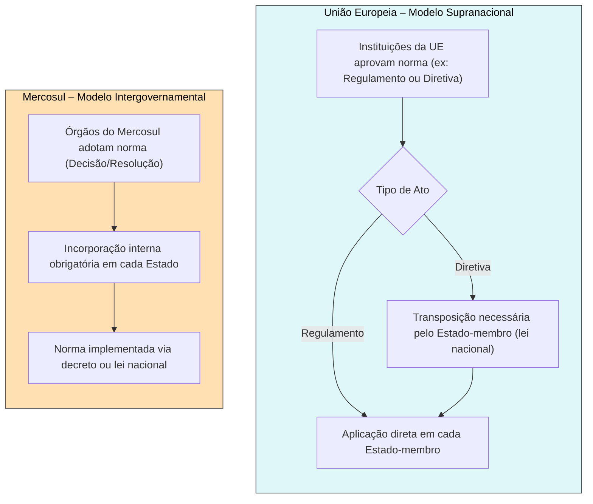
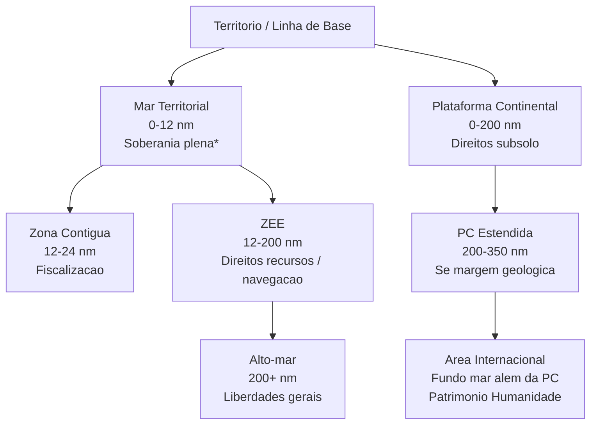
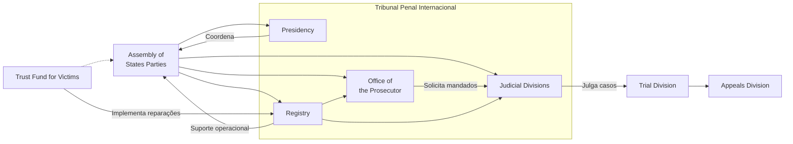
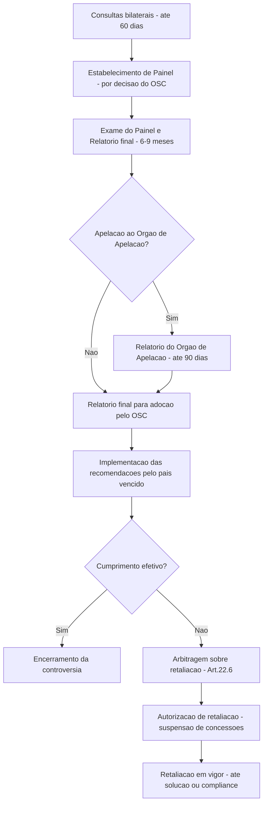
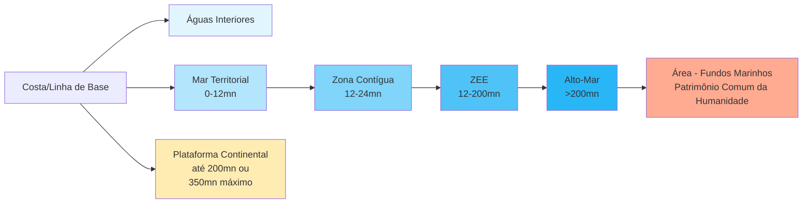
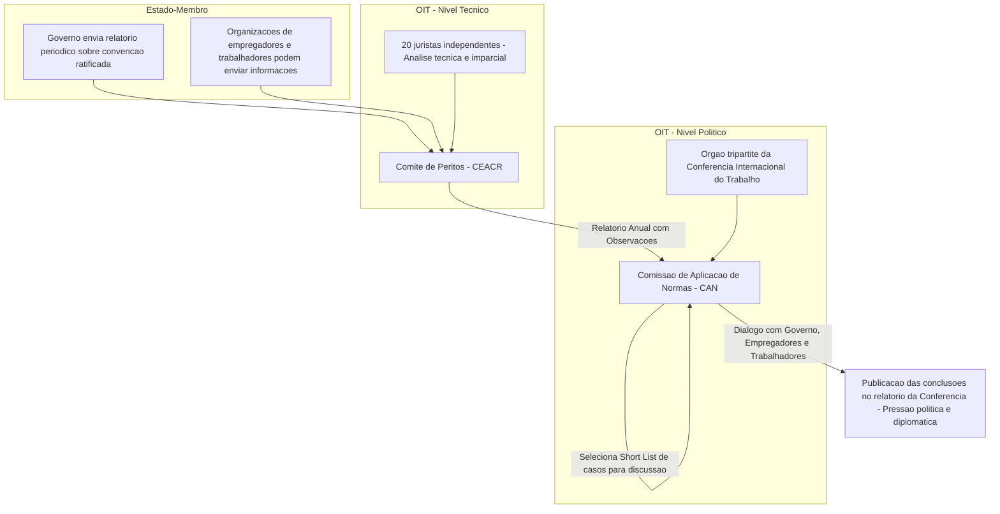

# Origem: _Solução pacífica de controvérsias

---
title: Solução pacífica de controvérsias
area: DIREITO
subarea: Direito Internacional Público - Fundamentos
tags:
  - cacd-2025
  - direito
  - direito-internacional-publico---fundamentos
  - solucao-pacifica-de-controversias
aliases:
  - Solução pacífica de controvérsias
---
# Solução Pacífica de Controvérsias no Direito Internacional

## Sumário

A solução pacífica de controvérsias constitui um pilar fundamental do Direito Internacional contemporâneo, intrinsecamente ligado à proibição do uso da força nas relações internacionais, conforme consagrado no Artigo 2(4) da Carta das Nações Unidas.1 Este princípio, formalizado no Artigo 2(3) da mesma Carta, impõe aos Estados a obrigação de resolverem seus diferendos por meios pacíficos, de modo a não ameaçar a paz, a segurança e a justiça internacionais. O sistema internacional oferece um leque variado de métodos, tradicionalmente classificados em diplomáticos (ou políticos) e jurisdicionais, cuja escolha, em regra, cabe às partes envolvidas (princípio da livre escolha dos meios, Art. 33 da Carta). A compreensão desses mecanismos é crucial não apenas para a manutenção da ordem global, mas também para a prática diplomática cotidiana, sendo de especial relevância para o Brasil, que eleva a solução pacífica dos conflitos à categoria de princípio reitor de suas relações internacionais (Art. 4º, VII, CF/88). Esta nota de estudo visa aprofundar o conhecimento sobre esses métodos, seu quadro jurídico e a atuação brasileira neste domínio, com foco nas exigências do Concurso de Admissão à Carreira de Diplomata (CACD).

## Conceitos Principais

- **Controvérsia Internacional:** Uma controvérsia internacional pode ser definida, classicamente, como um desacordo sobre um ponto de direito ou de fato, uma contradição, uma oposição de teses jurídicas ou de interesses entre dois sujeitos de Direito Internacional Público, primariamente Estados, mas também Organizações Internacionais.3 A definição seminal foi estabelecida pela Corte Permanente de Justiça Internacional (CPJI) no caso _Concessões Mavrommatis na Palestina_ (1924). A existência de uma controvérsia objetivamente identificável, e não uma mera tensão política ou divergência de interesses gerais, é o pressuposto para a ativação dos mecanismos de solução pacífica.5 Contudo, a delimitação entre uma disputa estritamente política e uma controvérsia jurídica não é absoluta. Estados podem tentar caracterizar um diferendo como puramente "político" para evitar submetê-lo a mecanismos jurisdicionais. Tribunais internacionais, como a Corte Internacional de Justiça (CIJ), têm consistentemente afirmado sua competência mesmo em casos com fortes componentes políticos, desde que exista uma questão jurídica subjacente identificável. Assim, a própria qualificação de uma situação como "controvérsia internacional" pode ser objeto de disputa e interpretação, influenciando a escolha e a aplicabilidade dos meios de solução.
    
- **Obrigação de Solução Pacífica:** Este é um princípio cardeal do Direito Internacional moderno, positivado no Artigo 2(3) da Carta das Nações Unidas.1 Ele determina que todos os Membros da ONU devem resolver suas controvérsias internacionais por meios pacíficos, de maneira a não colocar em risco a paz, a segurança e a justiça internacionais.7 Trata-se de uma obrigação de _comportamento_ – os Estados devem envidar esforços genuínos e de boa-fé para buscar uma solução pacífica – e não necessariamente uma obrigação de _resultado_ – chegar a uma solução definitiva, embora este seja o objetivo último.9 Esta obrigação é o corolário lógico e necessário da proibição geral do uso da força nas relações internacionais (Art. 2(4) da Carta). No entanto, esta obrigação fundamental coexiste com o princípio da soberania estatal e a necessidade de consentimento, especialmente no que tange aos meios jurisdicionais. Isso gera uma tensão inerente: enquanto o Art. 2(3) estabelece um dever geral de buscar a paz, a submissão a um método específico que culmine numa decisão vinculante (como a arbitragem ou a solução judicial) requer o consentimento expresso das partes. Um Estado pode, portanto, cumprir a obrigação geral negociando de boa-fé, sem necessariamente consentir com um foro judicial ou arbitral específico, refletindo o delicado equilíbrio entre as exigências da ordem internacional e a preservação da autonomia estatal.
    
- **Livre Escolha dos Meios:** Corolário da soberania estatal, o princípio da livre escolha dos meios, consagrado no Artigo 33(1) da Carta da ONU, estabelece que as partes em uma controvérsia têm a prerrogativa de escolher o método ou os métodos pacíficos que considerarem mais adequados para sua solução.11 O Artigo 33(1) apresenta uma lista exemplificativa, não exaustiva, desses meios: negociação, inquérito, mediação, conciliação, arbitragem, solução judicial, recurso a organismos ou acordos regionais, ou outros meios pacíficos à sua escolha.13 Não existe hierarquia formal _a priori_ entre esses métodos. A escolha dependerá da natureza da disputa, das relações entre as partes e de suas preferências políticas e jurídicas. Contudo, essa liberdade de escolha no momento em que surge a controvérsia pode ser relativizada. Os Estados, no exercício de sua soberania, podem consentir _antecipadamente_, por meio de tratados internacionais, em submeter certas categorias de disputas futuras a um procedimento específico. Exemplos incluem cláusulas compromissórias em tratados bilaterais ou multilaterais (que remetem a disputa à CIJ ou à arbitragem) ou tratados dedicados à solução de controvérsias, como o Entendimento sobre Solução de Controvérsias da OMC ou o Pacto de Bogotá.14 Nesses casos, a obrigação assumida no tratado prevalece sobre a liberdade de escolha geral no momento da disputa, demonstrando a interação dinâmica entre o direito internacional geral/consuetudinário e o direito convencional (tratados).
    
- **Bons Ofícios:** (Definição detalhada na seção "Análise Detalhada dos Métodos de Solução Pacífica")
    
- **Mediação:** (Definição detalhada na seção "Análise Detalhada dos Métodos de Solução Pacífica")
    
- **Conciliação:** (Definição detalhada na seção "Análise Detalhada dos Métodos de Solução Pacífica")
    
- **Inquérito (ou Investigação):** (Definição detalhada na seção "Análise Detalhada dos Métodos de Solução Pacífica")
    
- **Negociação:** (Definição detalhada na seção "Análise Detalhada dos Métodos de Solução Pacífica")
    
- **Arbitragem:** (Definição detalhada na seção "Análise Detalhada dos Métodos de Solução Pacífica") 10
    
- **Solução Judicial:** (Definição detalhada na seção "Análise Detalhada dos Métodos de Solução Pacífica")
    
- **Órgãos de Solução de Controvérsias em Organizações Internacionais:** São mecanismos institucionalizados no âmbito de Organizações Internacionais (OIs) destinados a resolver disputas entre seus Estados Membros, ou entre estes e a própria organização. Esses mecanismos são frequentemente adaptados aos objetivos específicos da OI, como o comércio (OMC), direitos humanos (OEA, Conselho da Europa), integração regional (Mercosul, UE) ou a manutenção da paz e segurança (ONU). Exemplos notórios incluem o Órgão de Solução de Controvérsias (OSC) da OMC, a Corte Interamericana de Direitos Humanos (órgão da OEA), o Tribunal Permanente de Revisão do Mercosul e a própria CIJ, como órgão judicial principal da ONU.
    
- **Jurisdição Obrigatória vs. Facultativa (CIJ):** A jurisdição da Corte Internacional de Justiça em matéria contenciosa (disputas entre Estados) é, em regra, **facultativa**, ou seja, depende do consentimento dos Estados envolvidos.15 Esse consentimento pode manifestar-se de diferentes formas:
    
    - _A posteriori:_ Através de um **compromisso especial** (acordo específico entre as partes para submeter uma disputa já existente à Corte).
    - _A priori:_
        - Através de **cláusulas compromissórias** inseridas em tratados bilaterais ou multilaterais, pelas quais os Estados partes concordam em submeter futuras disputas sobre a interpretação ou aplicação do tratado à CIJ.
        - Através da **"cláusula facultativa" de jurisdição obrigatória**, prevista no Artigo 36(2) do Estatuto da CIJ.17 Por meio dela, um Estado pode declarar unilateralmente que reconhece como obrigatória _ipso facto_ e sem necessidade de acordo especial, em relação a qualquer outro Estado que aceite a mesma obrigação, a jurisdição da Corte sobre certas categorias de disputas jurídicas (interpretação de tratados, pontos de direito internacional, fatos que constituam violação internacional, natureza da reparação).19
    - Essas declarações sob o Art. 36(2) podem ser feitas incondicionalmente, por prazo determinado ou sob condição de **reciprocidade**. Frequentemente, contêm **reservas** que excluem certas categorias de disputas da jurisdição obrigatória.20 A reciprocidade implica que um Estado demandado pode invocar as reservas feitas pelo Estado demandante em sua própria declaração.
    - A natureza predominantemente facultativa da jurisdição da CIJ e a aceitação limitada da cláusula do Art. 36(2) (menos da metade dos membros da ONU, muitos com reservas substanciais) refletem a persistência da soberania estatal como princípio ordenador das relações internacionais.19 A relutância de muitos Estados, incluindo potências e países como o Brasil, em aceitar a jurisdição compulsória da CIJ sem reservas amplas evidencia uma preferência estratégica por manter maior controle sobre o processo de solução de disputas. Opta-se frequentemente por meios diplomáticos, que mantêm a solução nas mãos das partes, ou pela arbitragem _ad hoc_, onde os Estados podem escolher os árbitros e definir as regras processuais, em contraste com a estrutura permanente e as regras fixas da CIJ. Essa preferência por flexibilidade e controle político, embora compreensível sob a ótica da soberania, pode limitar o desenvolvimento de uma ordem jurídica internacional mais centralizada e judicializada.19

## Análise Detalhada dos Métodos de Solução Pacífica

Os métodos de solução pacífica são tradicionalmente divididos em duas categorias principais: meios diplomáticos (ou políticos) e meios jurisdicionais.

### Meios Diplomáticos (ou Políticos)

Estes métodos caracterizam-se pela flexibilidade, confidencialidade (em geral) e pelo objetivo de alcançar um acordo negociado entre as partes, sem necessariamente se aterem à aplicação estrita de normas jurídicas. As soluções propostas, com exceção do resultado de uma negociação direta bem-sucedida, geralmente não são juridicamente vinculantes, dependendo da aceitação final das partes para produzirem efeitos.

- **Negociação:**
    
    - **Definição e Características:** Consiste na discussão direta entre as partes envolvidas na controvérsia, sem a intervenção formal de terceiros, com o objetivo de alcançar uma solução mutuamente aceitável. É o método mais fundamental, flexível e frequentemente o primeiro a ser empregado. As partes mantêm controle total sobre o processo e o resultado, podendo ocorrer em diversos níveis (técnico, diplomático, ministerial, chefes de Estado/Governo) e por variados canais de comunicação.
    - **Procedimento:** Envolve contatos e reuniões diretas entre representantes autorizados das partes. Pode ser bilateral ou multilateral.
    - **Vantagens:** Potencial rapidez, baixo custo, manutenção do controle pelas partes, preservação das relações bilaterais (se conduzida de forma construtiva), adaptabilidade a qualquer tipo de controvérsia.
    - **Desvantagens:** Pode ser ineficaz se houver grande assimetria de poder entre as partes, falta de vontade política para ceder, ou se as posições estiverem entrincheiradas. A ausência de um terceiro imparcial pode dificultar a superação de impasses ou a determinação objetiva de fatos ou direito.
    - **Exemplos (Brasil):** O Brasil tem uma longa tradição de uso da negociação, notadamente nas questões de limites resolvidas sob a égide do Barão do Rio Branco (e.g., negociação direta que levou ao Tratado de Petrópolis com a Bolívia, 1903). Negociações comerciais bilaterais e no âmbito de blocos como o Mercosul são exemplos contemporâneos.
- **Bons Ofícios:**
    
    - **Definição e Características:** Intervenção discreta e limitada de um terceiro (Estado, Organização Internacional, personalidade proeminente) que visa exclusivamente facilitar o restabelecimento ou o início do diálogo entre as partes em disputa. O terceiro não participa das negociações de mérito nem propõe soluções; atua meramente como uma "ponte" ou canal de comunicação.
    - **Procedimento:** O terceiro oferece sua ajuda para aproximar as partes; se aceito, pode disponibilizar local neutro para reuniões, transmitir mensagens ou facilitar contatos indiretos. Sua função cessa assim que as negociações diretas são (re)estabelecidas.
    - **Vantagens:** Útil em situações de alta tensão ou rompimento de relações diplomáticas. Permite que as partes iniciem conversas sem parecerem fazer concessões iniciais. Baixo nível de envolvimento e risco para o terceiro.
    - **Desvantagens:** Eficácia depende inteiramente da vontade das partes em negociar. O terceiro não contribui para a substância da solução.
    - **Exemplos (Brasil):** A diplomacia brasileira frequentemente atua oferecendo bons ofícios em crises regionais na América do Sul, buscando facilitar o diálogo entre governos e oposições ou entre Estados vizinhos em tensão, muitas vezes de forma discreta.
- **Mediação:**
    
    - **Definição e Características:** Envolve a participação ativa de um terceiro (o mediador), que não apenas aproxima as partes, mas também participa das negociações, analisa as posições e, crucialmente, propõe termos de acordo. A mediação baseia-se na confiança das partes na imparcialidade e capacidade do mediador. As propostas do mediador não são juridicamente vinculantes.
    - **Procedimento:** O mediador engaja-se em discussões com as partes (conjunta ou separadamente), explora os interesses subjacentes às posições, identifica áreas de possível acordo e formula propostas concretas para resolver a controvérsia.
    - **Vantagens:** O mediador pode introduzir novas perspectivas, ajudar a superar impasses emocionais ou políticos, e sugerir soluções criativas que as partes, sozinhas, não considerariam. Pode conferir maior legitimidade política ao acordo final.
    - **Desvantagens:** Requer a aceitação e a confiança de todas as partes no mediador escolhido. O sucesso depende significativamente da habilidade diplomática do mediador e da flexibilidade das partes.
    - **Exemplos (Brasil):** Embora não formalmente como mediador principal, o Brasil contribuiu diplomaticamente para processos de paz regionais, como no conflito fronteiriço entre Peru e Equador (finalizado com a Ata de Brasília de 1998, com EUA, Argentina, Brasil e Chile como garantes). A mediação papal (Cardeal Samoré) na disputa do Canal de Beagle entre Argentina e Chile (1979-1984) é um exemplo clássico.
- **Inquérito (ou Investigação):**
    
    - **Definição e Características:** Procedimento voltado especificamente para a elucidação de questões de fato que estão na origem da controvérsia. Uma comissão internacional (Comissão de Inquérito) é estabelecida para conduzir uma investigação imparcial e apresentar um relatório sobre os fatos apurados. O relatório não é vinculante e não aborda questões de direito ou responsabilidade, mas visa fornecer uma base factual comum para facilitar uma solução posterior pelas partes.
    - **Procedimento:** As partes concordam em estabelecer uma Comissão de Inquérito, definindo seu mandato e composição. A comissão coleta evidências, pode realizar visitas _in loco_, ouvir testemunhas e peritos, e elabora um relatório factual.
    - **Vantagens:** Extremamente útil quando a disputa gira em torno de divergências sobre eventos específicos (e.g., incidentes de fronteira, acidentes marítimos). Pode "despolitizar" a controvérsia ao focar nos fatos objetivos.
    - **Desvantagens:** Aplicabilidade limitada a disputas onde a questão fática é central. Pode ser um processo demorado e custoso. Ineficaz se a controvérsia for essencialmente jurídica ou política.
    - **Exemplos:** Previsto nas Convenções da Haia de 1899 e 1907. O caso _Dogger Bank_ (1904), envolvendo a frota russa e pesqueiros britânicos, foi resolvido com base no relatório de uma comissão de inquérito. Comissões de inquérito da ONU são frequentemente estabelecidas para investigar violações de direitos humanos ou direito humanitário, embora seus mandatos possam ser mais amplos e politicamente carregados.
- **Conciliação:**
    
    - **Definição e Características:** Método que combina aspectos do inquérito e da mediação. Uma comissão (Comissão de Conciliação), estabelecida pelas partes, examina todos os aspectos da controvérsia – tanto fáticos quanto jurídicos – e, ao final, propõe formalmente termos de acordo às partes. As propostas da comissão, embora baseadas numa análise aprofundada e imparcial, não são juridicamente vinculantes, mas possuem considerável peso político e moral.
    - **Procedimento:** As partes submetem a disputa a uma Comissão de Conciliação (criada _ad hoc_ ou com base em um tratado pré-existente). A comissão investiga os fatos, ouve os argumentos das partes, analisa o direito aplicável e elabora um relatório contendo recomendações concretas para a solução da controvérsia.
    - **Vantagens:** Oferece uma análise abrangente da disputa (fatos e direito). As propostas formais e fundamentadas podem ter maior probabilidade de aceitação pelas partes do que sugestões informais de um mediador. Mantém a flexibilidade, pois a aceitação final depende das partes.
    - **Desvantagens:** Procedimento mais formal e potencialmente mais demorado que a mediação. A não-vinculatividade das propostas significa que o sucesso ainda depende da vontade política das partes.
    - **Exemplos:** A conciliação é prevista em numerosos tratados, como o Pacto de Bogotá 14 e a Convenção de Viena sobre Direito dos Tratados (como procedimento obrigatório para certas disputas sobre nulidade de tratados). O caso da _Delimitação da Plataforma Continental entre Islândia e Noruega (Jan Mayen)_ (1981) foi resolvido com base nas recomendações de uma comissão de conciliação.

### Meios Jurisdicionais

Estes métodos envolvem a solução da controvérsia por um terceiro imparcial (um tribunal arbitral ou judicial) com base na aplicação do Direito Internacional. A característica distintiva fundamental é que a decisão proferida (sentença arbitral ou acórdão judicial) é juridicamente vinculante para as partes. O recurso a estes meios depende sempre do consentimento prévio das partes em estabelecer a jurisdição do órgão decisório.

- **Arbitragem:**
    
    - **Definição e Características:** Definida na Convenção da Haia de 1907 como a solução de litígios entre Estados por juízes de sua própria escolha e com base no respeito ao direito.10 Implica o compromisso das partes de se submeterem de boa-fé à sentença arbitral. A principal característica é a flexibilidade: as partes têm controle significativo sobre a constituição do tribunal (escolha dos árbitros), a definição do direito aplicável (podendo incluir equidade, se acordado - _ex aequo et bono_) e as regras de procedimento, geralmente estabelecidas no **compromisso arbitral** (o acordo que institui a arbitragem). A decisão final (laudo ou sentença arbitral) é obrigatória para as partes. A confidencialidade pode ser maior que na solução judicial.
    - **Procedimento:** O pilar é o consentimento, expresso em um compromisso arbitral _ad hoc_ (para uma disputa específica), uma cláusula compromissória em um tratado (para disputas futuras sobre aquele tratado) ou um tratado geral de arbitragem. As partes escolhem os árbitros (geralmente um número ímpar, 3 ou 5). O tribunal estabelecido segue as regras processuais acordadas (ou regras padrão, como as da Corte Permanente de Arbitragem - CPA). Há fases escrita e oral, deliberação e prolação da sentença.
    - **Instituições Facilitadoras:** A CPA, sediada em Haia, não é uma corte permanente, mas uma instituição que oferece apoio administrativo e regras processuais para facilitar a condução de arbitragens internacionais (entre Estados, entre Estados e partes privadas, etc.).
    - **Vantagens:** Flexibilidade processual e na escolha dos árbitros (permitindo selecionar especialistas na matéria); controle das partes sobre o processo; confidencialidade potencial; caráter definitivo e vinculante da decisão.
    - **Desvantagens:** Custo pode ser elevado (as partes arcam com os custos dos árbitros e da administração); o processo pode se tornar complexo; a execução da sentença depende da boa-fé das partes (embora o descumprimento constitua nova violação internacional).
    - **Exemplos (Brasil):** O Brasil obteve êxitos notáveis em arbitragens territoriais no final do século XIX e início do XX, como a Questão de Palmas/Missiones (vs. Argentina, 1895, árbitro Presidente Grover Cleveland dos EUA) e a Questão do Amapá (vs. França, 1900, árbitro Conselho Federal Suíço), ambas conduzidas pelo Barão do Rio Branco. Mais recentemente, o Brasil participa de arbitragens no âmbito do Mercosul (Protocolo de Olivos) e em disputas de investimento (e.g., perante o ICSID, embora com restrições). O sistema da OMC, embora _sui generis_, possui fortes elementos arbitrais.
- **Solução Judicial:**
    
    - **Definição e Características:** Solução de controvérsias por um tribunal internacional permanente, pré-constituído, com corpo de juízes independentes eleitos para mandatos fixos, regras de procedimento próprias e estabelecidas, e que profere decisões (acórdãos ou sentenças) baseadas no Direito Internacional, as quais são juridicamente vinculantes para as partes litigantes. Caracteriza-se pela institucionalização e formalidade.
    - **Procedimento (CIJ como exemplo):** O acesso à Corte depende do consentimento (compromisso especial, cláusula compromissória, declaração do Art. 36(2) 19, ou _forum prorogatum_ - aceitação tácita da jurisdição ao participar do processo sem objeções). O procedimento é formal, com fase escrita (troca de peças processuais: memoriais, contramemoriais, réplicas, tréplicas) e fase oral (audiências públicas para sustentação dos argumentos). A deliberação dos juízes é secreta, e a sentença é proferida em sessão pública e é fundamentada. A Corte pode indicar medidas cautelares (provisórias) para resguardar os direitos das partes enquanto o caso está pendente.
    - **Instituições:** A Corte Internacional de Justiça (CIJ) é o principal órgão judicial da ONU.1 Outros tribunais permanentes incluem o Tribunal Internacional do Direito do Mar (TIDM), e cortes regionais com competências específicas, como a Corte Europeia de Direitos Humanos, a Corte Interamericana de Direitos Humanos e o Tribunal de Justiça da União Europeia.
    - **Vantagens:** Autoridade e prestígio de um órgão judicial permanente e universal (no caso da CIJ); previsibilidade e formalidade do procedimento; desenvolvimento progressivo e consistente da jurisprudência internacional; caráter definitivo e vinculante da decisão.
    - **Desvantagens:** Maior rigidez processual em comparação com a arbitragem; potencial morosidade; questões relativas à aceitação da jurisdição (especialmente a obrigatória) 19; desafios relacionados à execução das sentenças em caso de descumprimento por um Estado 23 (o Art. 94(2) da Carta da ONU prevê recurso ao CSNU, mas este tem poder discricionário e pode ser bloqueado por veto); risco de politização na escolha dos casos ou na percepção das decisões.
    - **Exemplos (Brasil e Relevantes):** O Brasil tem sido historicamente relutante em figurar como parte em casos contenciosos perante a CIJ, embora participe ativamente de procedimentos consultivos. Casos paradigmáticos da CIJ incluem: _Nicarágua vs. EUA (Atividades Militares e Paramilitares)_, _Plataforma Continental do Mar do Norte_, _Barcelona Traction_, _Ensaios Nucleares (Austrália/Nova Zelândia vs. França)_, _Gabcíkovo-Nagymaros (Hungria/Eslováquia)_. Casos perante o TIDM e, especialmente, a vasta jurisprudência do Órgão de Solução de Controvérsias da OMC (com muitos casos envolvendo o Brasil) são também exemplos cruciais de solução judicial/quasi-judicial.

### Tabela Comparativa: Meios Diplomáticos vs. Jurisdicionais

|   |   |   |
|---|---|---|
|**Característica**|**Meios Diplomáticos (Negociação, Bons Ofícios, Mediação, Inquérito, Conciliação)**|**Meios Jurisdicionais (Arbitragem, Solução Judicial)**|
|**Base do Consentimento**|Geralmente informal; necessário para iniciar e aceitar o resultado final.|Formal e prévio (compromisso, cláusula, tratado, Art. 36(2)); essencial para estabelecer a jurisdição.|
|**Participação de Terceiros**|Nenhuma (Negociação) ou variável (Bons Ofícios, Mediação, Inquérito, Conciliação).|Essencial (árbitros ou juízes).|
|**Natureza da Solução/Proposta**|Acordo negociado ou recomendação não vinculante (exceto acordo final).|Decisão baseada no direito (ou equidade), vinculante.|
|**Base da Decisão/Proposta**|Considerações políticas, fáticas, jurídicas; busca de compromisso.|Primariamente o Direito Internacional.|
|**Formalidade do Procedimento**|Geralmente informal e flexível.|Formal e estruturado por regras processuais.|
|**Vinculatividade**|Não vinculante (exceto o acordo final resultante da negociação/aceitação).|Vinculante para as partes.|

## O Papel das Organizações Internacionais

As Organizações Internacionais (OIs) desempenham um papel multifacetado na solução pacífica de controvérsias, atuando como fóruns para negociação, provedoras de mecanismos específicos (diplomáticos ou jurisdicionais) e, por vezes, como partes ativas (mediadoras, investigadoras).

- **Organização das Nações Unidas (ONU):**
    
    - **Quadro Normativo:** O Capítulo VI da Carta da ONU ("Solução Pacífica de Controvérsias") estabelece o marco fundamental.1
    - **Conselho de Segurança (CSNU):** Detém a responsabilidade primordial pela manutenção da paz e segurança internacionais. No âmbito do Capítulo VI, pode investigar disputas (Art. 34), instar as partes a utilizarem os meios do Art. 33, recomendar procedimentos ou métodos de ajuste (Art. 36) e, se a disputa ameaçar a paz, recomendar termos concretos de solução (Art. 37). Suas recomendações sob o Cap. VI, diferentemente das decisões sob o Cap. VII (Ação relativa a ameaças à paz, ruptura da paz e atos de agressão), não possuem caráter juridicamente vinculante _per se_, mas carregam grande peso político.
    - **Assembleia Geral (AGNU):** Possui competência subsidiária. Pode discutir qualquer questão relativa à manutenção da paz (Art. 11) e fazer recomendações aos Estados ou ao CSNU, exceto quando o Conselho já estiver tratando do assunto (Art. 12). A Resolução "Uniting for Peace" (1950) buscou ampliar o papel da AGNU em casos de paralisia do CSNU por veto, mas sua aplicação é controversa.
    - **Secretário-Geral (SG):** Exerce funções importantes através de bons ofícios, mediação e diplomacia preventiva, muitas vezes de forma discreta ("diplomacia silenciosa"). O Art. 99 da Carta lhe confere o poder de chamar a atenção do CSNU para qualquer assunto que, em sua opinião, possa ameaçar a manutenção da paz e da segurança internacionais.
    - **Corte Internacional de Justiça (CIJ):** Principal órgão judicial da ONU (Cap. XIV), soluciona disputas entre Estados que consentem com sua jurisdição e emite pareceres consultivos para órgãos e agências da ONU.
    - A estrutura da ONU para solução pacífica reflete uma interação complexa entre abordagens políticas e jurídicas. O CSNU e a AGNU atuam primariamente na esfera política, buscando soluções negociadas ou recomendando ajustes, enquanto a CIJ oferece uma via judicial baseada no direito. Essa coexistência pode ser complementar, mas também gerar tensões, como quando uma disputa é levada simultaneamente a um órgão político e à Corte. A CIJ tem afirmado sua autonomia judicial, considerando que a atuação política do CSNU não a impede de exercer sua função jurisdicional (e.g., caso _Nicarágua vs. EUA_), mas a eficácia final de qualquer abordagem depende da cooperação dos Estados e da dinâmica de poder no cenário internacional.
- **Organizações Regionais:**
    
    - **Marco ONU:** O Capítulo VIII da Carta da ONU (Art. 52) encoraja o desenvolvimento de acordos ou organismos regionais para tratar de assuntos relativos à paz e segurança apropriados à ação regional, incluindo a solução pacífica de controvérsias locais, preferencialmente antes de serem levadas ao CSNU.
    - **Organização dos Estados Americanos (OEA):** A Carta da OEA reafirma os princípios de solução pacífica.25 O principal instrumento é o **Pacto de Bogotá** (Tratado Americano de Soluções Pacíficas, 1948), que buscou criar um sistema regional integrado e compulsório, listando os meios pacíficos (bons ofícios, mediação, investigação, conciliação, procedimento judicial perante a CIJ, arbitragem) e estabelecendo uma ordem sequencial ou obrigatória em certas hipóteses.14 Apesar de sua ambição, o Pacto teve ratificação limitada e sofreu denúncias e reservas importantes (inclusive do Brasil em relação à jurisdição obrigatória da CIJ e à arbitragem compulsória para certas questões), o que comprometeu sua eficácia prática como sistema abrangente.
    - **Mercosul:** O sistema atual é regido pelo **Protocolo de Olivos sobre Solução de Controvérsias no Mercosul** (2002). Ele prevê um procedimento escalonado: (1) Negociações diretas; (2) Intervenção do Grupo Mercado Comum (GMC), se as negociações falharem; (3) Procedimento arbitral _ad hoc_ perante um Tribunal Arbitral _Ad Hoc_ (TMAH), composto por árbitros escolhidos pelas partes; (4) Recurso (opcional e limitado a questões de direito) ao Tribunal Permanente de Revisão (TPR), com sede em Assunção. O TPR também pode atuar como instância única em certos casos e emitir opiniões consultivas. Representa uma evolução em direção a um sistema mais jurisdicionalizado em comparação com mecanismos anteriores (Protocolo de Brasília), visando dar maior segurança jurídica ao processo de integração.
- **Organização Mundial do Comércio (OMC):**
    
    - **Sistema de Solução de Controvérsias (SSC):** Regulado pelo **Entendimento sobre Regras e Procedimentos que Regem a Solução de Controvérsias** (ESC ou DSU - _Dispute Settlement Understanding_), Anexo 2 do Acordo de Marraquexe. É amplamente considerado um dos sistemas de solução de controvérsias mais desenvolvidos, eficazes e judicializados do direito internacional, especialmente no campo econômico.
    - **Características Principais:** Sistema integrado e compulsório para disputas sobre os acordos cobertos pela OMC; prazos relativamente curtos e definidos para as diversas fases; natureza quasi-jurisdicional com Painéis (Grupos Especiais) e um Órgão de Apelação permanente (atualmente inoperante); adoção quase automática dos relatórios dos Painéis e do Órgão de Apelação pelo Órgão de Solução de Controvérsias (OSC) através do mecanismo de "consenso negativo" (o relatório é adotado a menos que haja consenso _contra_ sua adoção); forte ênfase na implementação das decisões, com possibilidade de autorização de retaliação comercial (suspensão de concessões) como último recurso em caso de descumprimento persistente.
    - **Órgãos:** O **OSC** (composto por representantes de todos os Membros da OMC) administra o sistema; **Painéis** (formados _ad hoc_ por 3 especialistas para examinar cada caso); **Órgão de Apelação** (órgão permanente de 7 membros, que analisa recursos sobre questões de direito nos relatórios dos Painéis – **atualmente inoperante**).
    - **Procedimento:** (1) Consultas obrigatórias entre as partes; (2) Estabelecimento de um Painel pelo OSC, caso as consultas falhem; (3) Procedimento perante o Painel (fases escrita e oral); (4) Emissão do Relatório do Painel; (5) Possibilidade de Apelação ao Órgão de Apelação (sobre questões de direito); (6) Emissão do Relatório do Órgão de Apelação; (7) Adoção dos relatórios pelo OSC (por consenso negativo); (8) Implementação das recomendações e decisões pelo Membro condenado, sob vigilância do OSC; (9) Em caso de descumprimento, possibilidade de negociação de compensação ou autorização de retaliação pelo OSC.
    - **Relevância para o Brasil:** O Brasil é um dos usuários mais ativos e bem-sucedidos do SSC da OMC, tendo atuado como reclamante em casos de grande impacto (e.g., subsídios ao algodão dos EUA, regime de importação de açúcar da UE, subsídios às aeronaves do Canadá – Embraer/Bombardier) e também como reclamado (e.g., proibição de importação de pneus recauchutados, regimes tributários).
    - A crise atual do Órgão de Apelação, causada pelo bloqueio sistemático à nomeação de novos membros desde 2017 (principalmente pelos EUA), paralisou seu funcionamento desde dezembro de 2019. Isso representa um desafio existencial para o SSC e para o sistema multilateral de comércio como um todo. Sem a garantia de uma revisão de apelação, a adoção final e vinculante dos relatórios dos Painéis fica comprometida (um Membro pode "apelar para o vazio"), minando a previsibilidade e a força do sistema. Essa situação enfraquece o pilar judicial da OMC e pode incentivar o retorno a soluções baseadas no poder relativo dos Estados, como retaliações unilaterais ou a busca por mecanismos alternativos em acordos bilaterais ou regionais, potencialmente prejudicando os países em desenvolvimento e a própria credibilidade da OMC.

### Tabela: Mecanismos de Solução de Controvérsias em OIs Selecionadas

|   |   |   |   |   |
|---|---|---|---|---|
|**Organização**|**Órgãos Principais Envolvidos**|**Procedimento Sumário (Exemplos)**|**Natureza da Decisão/Recomendação**|**Breve Comentário (Eficácia/Relevância para o Brasil)**|
|**ONU (Cap. VI)**|CSNU, AGNU, SG, CIJ|Investigação (CSNU), Recomendação de procedimentos ou termos (CSNU), Bons Ofícios/Mediação (SG).|Recomendações (CSNU/AGNU - não vinculantes); Decisões (CIJ - vinculantes, se houver jurisdição).|Fundamental, mas eficácia política depende do consenso no CSNU. CIJ relevante, mas jurisdição limitada pelo consentimento. Brasil valoriza, mas com cautela (CIJ).|
|**OEA (Pacto de Bogotá)**|CIJ, Comissão de Investigação/Conciliação, Tribunal Arbitral.|Sequência de meios (diplomáticos, conciliação, judicial/arbitral).|Variada (recomendações, decisões vinculantes).|Sistema ambicioso, mas enfraquecido por reservas/denúncias. Baixa aplicabilidade prática. Brasil é parte com reservas significativas.|
|**Mercosul (Protocolo de Olivos)**|GMC, Tribunal Arbitral Ad Hoc (TMAH), Tribunal Permanente de Revisão (TPR).|Negociação -> GMC -> Arbitragem (TMAH) -> Revisão (TPR).|Laudos arbitrais (TMAH/TPR) - vinculantes.|Sistema jurisdicionalizado para a integração. Relevante para o Brasil nas disputas comerciais intrazona. TPR consolida jurisprudência.|
|**OMC (DSU/ESC)**|OSC, Painéis (Grupos Especiais), Órgão de Apelação (inoperante).|Consultas -> Painel -> Apelação (opcional) -> Adoção (OSC) -> Implementação/Retaliação.|Relatórios adotados (Painel/OA) - vinculantes.|Sistema altamente eficaz e judicializado, crucial para o comércio global. Brasil é usuário ativo e estratégico. Crise do OA é grande desafio.|

## O Quadro Jurídico Internacional e a Prática Brasileira

A obrigação de solucionar pacificamente as controvérsias e a escolha dos métodos apropriados estão ancoradas em um conjunto de normas internacionais e são refletidas na prática dos Estados, incluindo o Brasil.

- **Base Jurídica da Obrigação de Solução Pacífica:**
    
    - **Carta da ONU:** Principal fonte, estabelecendo a obrigação geral no Art. 2(3) e detalhando meios e o papel dos órgãos da ONU no Capítulo VI.7 O Art. 94 estabelece a obrigação de cumprir as decisões da CIJ.
    - **Pacto de Bogotá (1948):** Instrumento regional específico para as Américas, que reitera e sistematiza os meios pacíficos, embora com eficácia prática limitada.14
    - **Convenções da Haia (1899 e 1907):** Pioneiras na codificação dos meios pacíficos, com foco na arbitragem, bons ofícios, mediação e inquérito. A Convenção de 1907 para a Solução Pacífica de Conflitos Internacionais continua sendo uma referência importante, especialmente para a arbitragem.
    - **Costume Internacional:** A obrigação de buscar soluções por meios pacíficos e o dever de negociar de boa-fé são amplamente reconhecidos como normas de direito internacional consuetudinário, vinculando todos os Estados.
    - **Declaração de Manila sobre Solução Pacífica de Controvérsias Internacionais (Res. AGNU 37/10, 1982):** Reafirma e elabora os princípios da Carta da ONU, enfatizando a livre escolha dos meios e a necessidade de boa-fé.
- **Princípio da Livre Escolha dos Meios:**
    
    - Este princípio, central ao Art. 33 da Carta 11, garante aos Estados a flexibilidade para selecionar o método mais adequado à natureza específica da disputa e ao estado de suas relações políticas. Permite que optem por abordagens mais políticas e flexíveis (diplomáticas) ou mais formais e baseadas no direito (jurisdicionais).
    - Contudo, como já detalhado, essa liberdade não é absoluta. O consentimento prévio, expresso em tratados (cláusulas compromissórias específicas ou tratados gerais de solução de controvérsias como o DSU da OMC), pode estabelecer a obrigatoriedade de recorrer a um determinado mecanismo (e.g., consultas obrigatórias na OMC, arbitragem no Mercosul, jurisdição da CIJ se aceita via Art. 36(2) ou cláusula específica).
- **Posição e Prática Brasileira:**
    
    - **Fundamento Constitucional:** O Artigo 4º da Constituição Federal de 1988 elenca os princípios que regem as relações internacionais do Brasil, incluindo, no inciso VII, a "solução pacífica dos conflitos". Este dispositivo confere status constitucional a um pilar tradicional da política externa brasileira.
    - **Tradição Diplomática:** O Brasil construiu, ao longo de sua história, uma sólida reputação de buscar soluções pacíficas para seus diferendos, especialmente os territoriais. A figura do Barão do Rio Branco é emblemática dessa tradição, com seu sucesso no uso combinado de negociação direta e arbitragem para consolidar as fronteiras nacionais no final do século XIX e início do XX. Há uma preferência histórica por meios diplomáticos, que preservam a margem de manobra política, e pela arbitragem baseada em consentimento específico (_ad hoc_).
    - **Participação em Tribunais Internacionais:**
        - **CIJ:** O Brasil reconhece a importância da Corte como órgão judicial principal da ONU e tem participado de procedimentos consultivos. No entanto, consistentemente **não** aceitou a jurisdição obrigatória da Corte por meio da declaração prevista no Art. 36(2) do Estatuto.15 A posição brasileira, mantida por décadas, é a de que a jurisdição da CIJ deve basear-se no consentimento específico para cada caso (compromisso especial) ou em cláusulas compromissórias em tratados específicos. Essa postura é coerente com as reservas feitas pelo Brasil ao Pacto de Bogotá, que excluem a submissão automática à jurisdição da CIJ ou à arbitragem compulsória para certas matérias.
        - **OMC:** O Brasil demonstra uma postura distinta no âmbito comercial, sendo um dos usuários mais ativos e estratégicos do Sistema de Solução de Controvérsias da OMC, utilizando-o tanto para defender seus exportadores contra medidas protecionistas de outros países quanto para ajustar suas próprias práticas quando contestado.
        - **TIDM:** Como parte da Convenção da ONU sobre o Direito do Mar (CNUDM), o Brasil aceita os mecanismos de solução de controvérsias nela previstos, que incluem a possibilidade de recurso ao TIDM, à CIJ ou à arbitragem (Anexos VII e VIII), dependendo da escolha feita pelos Estados e da natureza da disputa.
        - **Mercosul:** O Brasil participa ativamente do sistema de solução de controvérsias do Protocolo de Olivos, tanto na fase política (GMC) quanto na arbitral (TMAH e TPR).
        - **Cortes de Direitos Humanos:** O Brasil reconhece a jurisdição contenciosa da Corte Interamericana de Direitos Humanos desde 1998, o que representa uma exceção à sua postura geral de não aceitação de jurisdições internacionais obrigatórias.
    - **Iniciativas Diplomáticas:** Além da participação em foros institucionalizados, o Brasil mantém uma prática de engajamento diplomático ativo na busca de soluções pacíficas para crises regionais, oferecendo bons ofícios, apoiando processos de mediação e participando de missões de paz da ONU.
    - A conjugação desses elementos – forte base principiológica (Art. 4º, VII, CF/88), tradição diplomática de negociação e arbitragem consentida, uso estratégico de sistemas específicos como o da OMC, mas relutância em aceitar a jurisdição compulsória geral da CIJ – revela uma abordagem pragmática da política externa brasileira. Busca-se harmonizar o compromisso com a paz e o direito internacional com a preservação da soberania e da flexibilidade diplomática, privilegiando mecanismos onde o consentimento estatal específico é a chave ou onde há maior controle sobre o processo (diplomacia, arbitragem _ad hoc_) ou um foco temático bem definido (OMC, Direitos Humanos).

## Conexões

A solução pacífica de controvérsias está interligada a diversos outros temas centrais do Direito Internacional Público:

- **Fontes do Direito Internacional:** Os mecanismos de solução pacífica e a obrigação de utilizá-los derivam diretamente das fontes primárias: **Tratados** (Carta da ONU 1, Pacto de Bogotá 14, Estatuto da CIJ 22, Convenções da Haia, acordos específicos como o DSU da OMC, Protocolo de Olivos) e **Costume Internacional** (princípio da solução pacífica, dever de negociar de boa-fé). A **Jurisprudência** (decisões da CIJ, laudos arbitrais, relatórios da OMC) e a **Doutrina** atuam como meios auxiliares na interpretação e aplicação dessas normas.
- **Sujeitos do Direito Internacional:** Os **Estados** são os principais atores e destinatários das normas sobre solução pacífica. As **Organizações Internacionais** também são sujeitos relevantes, podendo ser partes em disputas (e.g., questões relativas a acordos de sede, responsabilidade da OI), oferecer mecanismos de solução (ONU, OEA, OMC), ou solicitar pareceres consultivos à CIJ.
- **Responsabilidade Internacional do Estado:** Uma controvérsia internacional frequentemente surge a partir da alegação de que um Estado violou uma obrigação internacional, gerando sua responsabilidade. Os mecanismos de solução pacífica são os instrumentos pelos quais se busca constatar essa violação, determinar suas consequências e definir a reparação devida (restituição, indenização, satisfação), restaurando a legalidade internacional.
- **Proibição do Uso da Força:** Como mencionado, a obrigação de solução pacífica (Art. 2(3) da Carta da ONU) é o complemento indispensável da proibição do uso da força (Art. 2(4)). Ao oferecer alternativas pacíficas para a resolução de disputas, o direito internacional busca eliminar a guerra como instrumento legítimo de política externa.
- **Direito Diplomático e Consular:** Os meios diplomáticos de solução (negociação, bons ofícios, mediação) são conduzidos primariamente através dos canais diplomáticos. As normas sobre relações diplomáticas e consulares (Convenções de Viena de 1961 e 1963), incluindo os privilégios e imunidades, são essenciais para garantir o ambiente necessário ao funcionamento desses mecanismos.

## Pontos de Atenção (Foco CACD)

Para a preparação para o CACD, é crucial focar nos seguintes aspectos:

- **Possíveis Questões Discursivas:**
    
    - Análise comparativa dos meios diplomáticos e jurisdicionais (características, vantagens, desvantagens, adequação).
    - Discussão aprofundada do princípio da livre escolha dos meios (Art. 33 da Carta da ONU), incluindo seus fundamentos (soberania, consentimento) e suas limitações (obrigações convencionais preexistentes).
    - O papel dos órgãos da ONU (CSNU, AGNU, SG, CIJ) na solução pacífica, com base na Carta e na prática.
    - O Sistema de Solução de Controvérsias da OMC: estrutura, funcionamento, princípios (consenso negativo), relevância para o Brasil e a crise atual do Órgão de Apelação.
    - A posição e prática do Brasil: Art. 4º, VII da CF/88, tradição do Itamaraty, atuação na OMC e Mercosul, e a justificação para a não aceitação da cláusula facultativa da CIJ (Art. 36(2)).
    - Diferenciação clara entre jurisdição facultativa e obrigatória da CIJ, e as formas de manifestação do consentimento.
- **Debates Relevantes:**
    
    - **Eficácia Comparada dos Métodos:** Não há resposta única; a eficácia depende do contexto, da natureza da disputa e da vontade política.
    - **Fragmentação do Direito Internacional:** A proliferação de tribunais (CIJ, TIDM, TPI, OMC, regionais, arbitrais) gera debates sobre a coerência do sistema jurídico internacional. Há risco de decisões conflitantes ou de "forum shopping"? Ou essa especialização é benéfica?
    - **Judicialização das Relações Internacionais:** Analisar a tendência (ou refluxo, considerando a crise da OMC) de submeter disputas a órgãos judiciais/quasi-judiciais, suas vantagens (previsibilidade, rule of law) e desvantagens (perda de flexibilidade política, possíveis vieses).
    - **Cumprimento das Decisões Internacionais:** Desafios na execução de sentenças da CIJ 23 e laudos arbitrais, o papel limitado do CSNU (Art. 94(2) da Carta) e a importância da boa-fé e da pressão política/diplomática.
- **Exemplos e Casos Práticos Importantes:**
    
    - **Brasil:** Questão de Palmas, Questão do Amapá (arbitragens históricas); Casos na OMC (Algodão EUA, Açúcar UE, Embraer/Bombardier, Pneus Recauchutados UE); Casos no TPR do Mercosul; Casos do Brasil na Corte IDH.
    - **CIJ (Casos Essenciais):** _Mavrommatis_ (definição de controvérsia); _Lotus_ (princípios de jurisdição); _Reparação por Danos_ (personalidade jurídica da ONU); _Plataforma Continental do Mar do Norte_ (costume, equidade); _Barcelona Traction_ (obrigações _erga omnes_, proteção diplomática); _Ensaios Nucleares_ (atos unilaterais); _Pessoal Diplomático em Teerã_ (direito diplomático, responsabilidade); _Nicarágua vs. EUA_ (uso da força, não intervenção, jurisdição da Corte); _Gabcíkovo-Nagymaros_ (direito dos tratados, estado de necessidade); _Parecer sobre Armas Nucleares_ (legalidade do uso da força); _LaGrand_ e _Avena_ (direito consular, medidas provisórias).
    - **CPA (Exemplos Históricos):** _Alabama Claims_ (EUA vs. Reino Unido); _Ilha de Palmas_ (EUA vs. Holanda - modos de aquisição de território).
    - **OMC:** Além dos casos brasileiros, disputas emblemáticas como _Boeing vs. Airbus_ (subsídios).
- **Principais Autores e Referências (Doutrina):**
    
    - **Brasileiros (CACD):** José Francisco Rezek, Hildebrando Accioly, Antônio Augusto Cançado Trindade, Celso Lafer, Celso D. de Albuquerque Mello, Valerio Mazzuoli. (Conhecer suas principais obras e posições sobre temas como soberania, jurisdição internacional e a prática brasileira).
    - **Estrangeiros (Clássicos e Contemporâneos):** Malcolm Shaw, Ian Brownlie, James Crawford (especialmente sobre responsabilidade internacional), L. Oppenheim, H. Lauterpacht, G. Scelle, C. Rousseau.

## Material Complementar

- **Bibliografia Essencial:**
    
    - **Tratados Fundamentais:** Carta das Nações Unidas 1; Estatuto da Corte Internacional de Justiça 22; Pacto de Bogotá 14; Convenção de Viena sobre Direito dos Tratados (relevante para interpretação e disputas); Convenção da ONU sobre o Direito do Mar (Parte XV e Anexos); Entendimento sobre Solução de Controvérsias da OMC; Protocolo de Olivos (Mercosul).
    - **Manuais de Direito Internacional Público:** Priorizar as obras dos autores brasileiros listados acima (Rezek, Accioly, Cançado Trindade, Mello, Mazzuoli), complementadas por manuais internacionais de referência (Shaw, Brownlie, Crawford). Verificar sempre as edições mais recentes disponíveis.
    - **Artigos Acadêmicos:** Realizar buscas em bases de dados acadêmicas (SciELO, Periódicos CAPES, Google Scholar) e revistas especializadas (Revista de Informação Legislativa - RIL/Senado, Anuário Brasileiro de Direito Internacional, Revista da Faculdade de Direito da USP, etc.) por artigos sobre temas específicos como a crise do Órgão de Apelação da OMC, a prática arbitral do Brasil, a jurisprudência da CIJ em casos relevantes, ou a atuação do CSNU no Cap. VI.
- **Links para Sites Relevantes:**
    
    - **ONU:** [https://www.un.org/pt/](https://www.un.org/pt/) (Portal principal em português)
    - **Conselho de Segurança da ONU:** [https://www.un.org/securitycouncil/](https://www.un.org/securitycouncil/) (Documentos, resoluções, atas de reuniões)
    - **Assembleia Geral da ONU:** [https://www.un.org/pt/ga/](https://www.un.org/pt/ga/)
    - **CIJ:** [https://www.icj-cij.org/](https://www.icj-cij.org/) (Site oficial com acesso a todos os casos, decisões, pareceres consultivos, documentos básicos)
    - **CPA:** [https://pca-cpa.org/en/home/](https://pca-cpa.org/en/home/) (Corte Permanente de Arbitragem)
    - **TIDM:** [https://www.itlos.org/en/home](https://www.itlos.org/en/home) (Tribunal Internacional do Direito do Mar)
    - **OMC:** [https://www.wto.org/index.htm](https://www.wto.org/index.htm) (Site geral); [https://www.wto.org/english/tratop_e/dispu_e/dispu_e.htm](https://www.wto.org/english/tratop_e/dispu_e/dispu_e.htm) (Seção específica sobre Solução de Controvérsias, com acesso a todos os casos e documentos)
    - **MRE (Itamaraty):** [https://www.gov.br/mre/pt-br](https://www.gov.br/mre/pt-br) (Buscar por discursos, notas à imprensa, informações sobre a política externa brasileira e posições em foros multilaterais)
    - **OEA:** [https://www.oas.org/pt/](https://www.oas.org/pt/) (Organização dos Estados Americanos)
    - **Mercosul:** [https://www.mercosur.int/pt-br/](https://www.mercosur.int/pt-br/) (Portal oficial); [https://www.tprmercosur.org/pt/](https://www.tprmercosur.org/pt/) (Tribunal Permanente de Revisão)

## Conclusão

A solução pacífica de controvérsias é mais do que um princípio; é um sistema complexo e multifacetado, essencial para a funcionalidade da ordem internacional baseada no direito e na cooperação. A coexistência de meios diplomáticos flexíveis e mecanismos jurisdicionais vinculantes, aliada ao princípio fundamental da livre escolha dos meios (temperado por obrigações convencionais), reflete o equilíbrio tênue entre a necessidade de ordem e previsibilidade e o respeito à soberania estatal. As Organizações Internacionais, universais e regionais, desempenham um papel crucial ao oferecerem fóruns e procedimentos adaptados a diferentes contextos e matérias. A prática brasileira, ancorada no Art. 4º, VII da CF/88 e em uma rica tradição diplomática, demonstra um engajamento pragmático com esses mecanismos, utilizando ativamente aqueles que se alinham aos seus interesses (como o SSC da OMC) e mantendo uma postura cautelosa em relação a compromissos jurisdicionais compulsórios de escopo geral (como a cláusula facultativa da CIJ). Para o candidato ao CACD, dominar os conceitos, os mecanismos, a jurisprudência relevante e a posição brasileira é indispensável para compreender um dos pilares da governança global e da política externa do Brasil. Os debates contemporâneos sobre a eficácia, a fragmentação e a judicialização desses mecanismos, exemplificados pela crise na OMC, indicam que este é um campo em constante evolução e de permanente relevância para a diplomacia.


# Origem: Corte Permanente de Arbitragem (CPA)

---
title: Corte Permanente de Arbitragem (CPA)
area: DIREITO
subarea: Direito Internacional Público - Fundamentos
tags:
  - cacd-2025
  - direito
  - direito-internacional-publico---fundamentos
  - solucao-pacifica-de-controversias
aliases:
  - Corte Permanente de Arbitragem
  - CPA
---
# A Corte Permanente de Arbitragem (CPA): O Primeiro Mecanismo Global de Solução de Controvérsias e sua Relevância Atual

## Introdução e Desmistificação de um Conceito Fundamental

A Corte Permanente de Arbitragem representa uma das instituições mais incompreendidas do direito internacional público, começando pela própria denominação que induz a equívocos conceituais fundamentais. Contrariamente ao que sugere seu nome, a CPA não é uma corte permanente no sentido tradicional, tampouco constitui um tribunal com juízes fixos que proferem decisões vinculantes. Na realidade, trata-se de uma organização intergovernamental sofisticada que funciona como uma plataforma institucional para facilitar a arbitragem e outros meios pacíficos de solução de controvérsias internacionais.

> [!important] **Conceito Central para o CACD** 
> A CPA é uma **organização internacional** que oferece estrutura, regras e apoio administrativo para que as partes em disputa possam constituir tribunais arbitrais _ad hoc_. Ela não julga casos diretamente, mas facilita o processo arbitral.

Esta distinção conceitual é absolutamente crucial para a compreensão adequada do sistema internacional de solução de controvérsias e representa um dos pontos mais frequentemente abordados em questões de concursos diplomáticos. A CPA funciona essencialmente como uma "secretaria global de arbitragem", mantendo uma infraestrutura permanente que permite a constituição flexível de tribunais arbitrais específicos para cada disputa, conforme as necessidades e acordos das partes envolvidas.

A relevância contemporânea da CPA transcende largamente suas origens históricas do século XIX, tendo se adaptado e expandido para administrar uma diversidade impressionante de disputas que refletem a complexidade crescente das relações internacionais modernas. Desde disputas territoriais clássicas entre Estados até sofisticadas arbitragens investidor-Estado que envolvem bilhões de dólares, a CPA consolidou-se como uma das instituições mais versáteis e tecnicamente competentes na resolução de conflitos internacionais.

## Contexto Histórico e Fundação: A Primeira Institucionalização Global da Paz

A criação da Corte Permanente de Arbitragem durante a Primeira Conferência de Paz da Haia, em 1899, representa um marco fundacional na evolução do direito internacional e na institucionalização dos mecanismos pacíficos de solução de controvérsias. Este momento histórico deve ser compreendido dentro do contexto mais amplo das tensões crescentes na Europa do final do século XIX, quando as rivalidades imperiais e o acúmulo de armamentos criavam um ambiente internacional cada vez mais volátil e propenso a conflitos armados de grandes proporções.

A Convenção para a Solução Pacífica de Controvérsias Internacionais, assinada em 29 de julho de 1899, nasceu da visão progressista de que seria possível criar alternativas jurídicas e institucionais à guerra como meio de resolução de disputas entre nações. Esta convenção não apenas estabeleceu a CPA, mas codificou pela primeira vez princípios e procedimentos padronizados para a arbitragem internacional, transformando uma prática até então informal e esporádica em um mecanismo institucionalizado e acessível a todos os Estados signatários.

O caráter revolucionário desta iniciativa torna-se evidente quando consideramos que, pela primeira vez na história, criava-se uma instituição verdadeiramente global e permanente dedicada exclusivamente à prevenção de conflitos armados através de meios jurídicos. Diferentemente dos acordos arbitrais bilaterais anteriores, que eram constituídos _ad hoc_ para resolver disputas específicas já existentes, a CPA representava uma infraestrutura preventiva e permanente, disponível a qualquer momento para qualquer par de Estados que desejasse submeter suas controvérsias à arbitragem.

A filosofia subjacente à criação da CPA baseava-se na crença ilustrada de que a aplicação de princípios jurídicos racionais poderia substituir o recurso à força bruta na resolução de disputas internacionais. Esta visão, embora posteriormente temperada pelas realidades geopolíticas do século XX, estabeleceu precedentes conceituais e institucionais que influenciariam profundamente o desenvolvimento subsequente do direito internacional e das organizações internacionais, incluindo a própria Liga das Nações e, posteriormente, o sistema das Nações Unidas.

## Natureza Jurídica e Arquitetura Funcional: Compreendendo o Paradoxo Institucional

A compreensão adequada da natureza jurídica da CPA exige o abandono de analogias simplistas com tribunais nacionais ou mesmo com outras cortes internacionais permanentes. A CPA constitui, na realidade, uma forma híbrida e sofisticada de organização internacional que combina elementos de permanência institucional com flexibilidade procedimental máxima, criando um modelo único no direito internacional que merece análise detalhada.

> [!definition] **Estrutura Organizacional Singular** 
> A CPA mantém uma estrutura administrativa permanente (Conselho Administrativo e Secretariado Internacional) que facilita a constituição de tribunais arbitrais temporários, escolhidos pelas partes para cada caso específico.

O Conselho Administrativo da CPA, composto pelos representantes diplomáticos dos Estados-membros acreditados junto ao Reino dos Países Baixos, funciona como o órgão de governança da organização, responsável pela supervisão das atividades administrativas, aprovação de orçamentos e regulamentos, e nomeação do Secretário-Geral. Esta estrutura governance reflete o caráter intergovernamental da organização e assegura que o controle institucional permaneça nas mãos dos Estados-membros, evitando a autonomização excessiva que caracteriza algumas organizações internacionais.

O Secretariado Internacional, chefiado pelo Secretário-Geral, constitui o núcleo operacional da CPA, fornecendo apoio técnico, administrativo e logístico aos tribunais arbitrais constituídos sob os auspícios da organização. Este apoio inclui a disponibilização de instalações físicas apropriadas em Haia, serviços de tradução e interpretação, gestão de documentos e comunicações, assistência na aplicação de regras processuais, e manutenção de registros completos de todos os procedimentos. A qualidade e sofisticação destes serviços administrativos representa um dos principais atrativos da CPA para as partes que consideram submeter suas disputas à arbitragem.

A lista de árbitros mantida pela CPA constitui outro elemento fundamental de sua arquitetura institucional. Cada Estado-membro pode nomear até quatro árbitros para esta lista, criando um pool internacional diversificado de especialistas em direito internacional, direito comercial, e outras áreas relevantes para a solução de disputas internacionais. Esta lista não representa, entretanto, um corpo fixo de juízes, mas sim um repertório de especialistas qualificados entre os quais as partes podem escolher os árbitros que comporão o tribunal específico para sua disputa.

O funcionamento prático da CPA revela a elegância de seu modelo institucional. Quando duas ou mais partes decidem submeter uma disputa à arbitragem sob os auspícios da CPA, elas iniciam um processo de constituição de tribunal arbitral específico para aquele caso. As partes acordam sobre o número de árbitros (tipicamente três ou cinco), os critérios para sua seleção, as regras processuais aplicáveis, e outros aspectos procedimentais relevantes. A CPA não impõe decisões sobre estes aspectos, mas oferece modelos de regras e orientação técnica para facilitar os acordos entre as partes.

Uma vez constituído o tribunal arbitral, a CPA fornece todo o apoio administrativo necessário para o desenvolvimento do procedimento, desde a organização de audiências até a gestão de prazos e comunicações. O tribunal arbitral, composto pelos árbitros escolhidos pelas partes, conduz o procedimento de acordo com as regras acordadas e profere um laudo arbitral com força vinculante. A CPA não participa das deliberações substantivas do tribunal nem influencia suas decisões, mantendo estrita neutralidade institucional.

## A Distinção Fundamental: CPA versus Corte Internacional de Justiça

A diferenciação entre a Corte Permanente de Arbitragem e a Corte Internacional de Justiça representa um dos aspectos mais importantes para a compreensão da arquitetura institucional do direito internacional contemporâneo, sendo frequentemente objeto de questões em concursos diplomáticos devido à confusão conceitual que pode gerar entre candidatos menos preparados.

A Corte Internacional de Justiça, estabelecida como o principal órgão judicial das Nações Unidas pelo Estatuto anexo à Carta da ONU, constitui um tribunal permanente composto por quinze juízes eleitos conjuntamente pela Assembleia Geral e pelo Conselho de Segurança das Nações Unidas para mandatos de nove anos. Estes juízes formam um corpo permanente que julga todas as disputas submetidas à Corte, aplicando procedimentos fixos estabelecidos pelo Estatuto da CIJ e por suas Regras de Procedimento. A competência da CIJ é claramente delimitada pelo Estatuto, abrangendo principalmente disputas entre Estados sobre questões de direito internacional, embora também possa emitir pareceres consultivos sobre questões jurídicas solicitadas por órgãos autorizados das Nações Unidas.

Em contrapartida, a CPA não possui um corpo fixo de juízes nem procedimentos rígidos predeterminados. Cada tribunal arbitral constituído sob seus auspícios é único, composto por árbitros escolhidos especificamente pelas partes para aquela disputa particular, aplicando regras processuais acordadas pelas próprias partes (embora a CPA ofereça modelos de regras como orientação). Esta flexibilidade permite que a arbitragem seja adaptada às necessidades específicas de cada caso, incluindo a expertise técnica necessária, o idioma do procedimento, a legislação aplicável, e outros aspectos relevantes.

A diferença na competência entre as duas instituições também é fundamental. Enquanto a CIJ possui competência predefinida e limitada, essencialmente restrita a disputas entre Estados sobre direito internacional, a CPA pode administrar uma variedade muito maior de disputas, incluindo controvérsias entre Estados e particulares (como as arbitragens investidor-Estado), disputas entre organizações internacionais, e mesmo certos tipos de disputas comerciais internacionais que tenham alguma conexão com o direito internacional público.

> [!important] **Diferença Essencial** 
> A CIJ é um tribunal judicial permanente com competência e procedimentos predefinidos; a CPA é uma organização que facilita a constituição de tribunais arbitrais _ad hoc_ com máxima flexibilidade procedimental.

O processo de acesso às duas instituições também difere significativamente. Para acessar a CIJ, os Estados devem aceitar sua competência através de declaração expressa, tratado específico, ou acordo especial, e a Corte aplicará automaticamente seus procedimentos estabelecidos. Para utilizar os serviços da CPA, as partes simplesmente precisam acordar em submeter sua disputa à arbitragem sob as regras da CPA, tendo ampla liberdade para customizar o procedimento conforme suas necessidades e preferências.

## Evolução e Diversificação: A CPA no Século XXI

A transformação da Corte Permanente de Arbitragem ao longo do século XX e início do XXI reflete as mudanças profundas ocorridas na sociedade internacional e na natureza das disputas internacionais. Originalmente concebida para resolver disputas exclusivamente entre Estados sobre questões de direito internacional público clássico, a CPA expandiu progressivamente sua atuação para abranger uma diversidade impressionante de controvérsias que espelham a crescente complexidade e interconexão da ordem internacional contemporânea.

Esta evolução manifesta-se de forma particularmente clara na diversificação dos tipos de disputas administradas pela CPA. As arbitragens investidor-Estado, que hoje representam uma parcela significativa da carga de trabalho da instituição, exemplificam esta transformação. Estas disputas envolvem tipicamente conflitos entre investidores privados estrangeiros e Estados anfitriões sobre alegadas violações de tratados bilaterais de investimento ou outros instrumentos de proteção de investimentos. A natureza híbrida destas disputas, situadas na interface entre o direito internacional público e o direito internacional econômico, exige uma sofisticação técnica e flexibilidade procedimental que poucos foros internacionais podem oferecer com a mesma qualidade da CPA.

A CPA também passou a administrar disputas envolvendo organizações internacionais como partes, incluindo conflitos contratuais, questões de imunidades e privilégios, e interpretação de acordos constitutivos de organizações internacionais. Esta expansão reflete o crescimento exponencial do número e da importância das organizações internacionais na ordem contemporânea, bem como a necessidade de mecanismos especializados para resolver disputas envolvendo estas entidades sui generis do direito internacional.

O desenvolvimento de conjuntos especializados de regras processuais representa outra manifestação importante da evolução da CPA. As Regras de Arbitragem de 2012, que atualizaram e modernizaram as regras originais da instituição, incorporaram décadas de experiência prática e desenvolvimentos doutrinários em arbitragem internacional. As Regras para Disputas Envolvendo Organizações Internacionais e Estados, também de 2012, foram especificamente desenvolvidas para abordar as particularidades jurídicas e processuais das disputas envolvendo organizações internacionais. As Regras de Transparência em Arbitragens Investidor-Estado, de 2014, respondem às crescentes demandas por maior transparência e accountability nos procedimentos arbitrais que afetam políticas públicas e interesses sociais mais amplos.

A modernização tecnológica também tem sido uma prioridade da CPA, que implementou sistemas avançados de gestão eletrônica de documentos, plataformas digitais para comunicação entre as partes e tribunais, e capacidades para realização de audiências virtuais. Esta modernização tornou-se particularmente importante durante a pandemia de COVID-19, quando a CPA demonstrou capacidade excepcional de adaptação, mantendo seus procedimentos em funcionamento através de plataformas digitais seguras e eficientes.

## O Caso Paradigmático: Mar do Sul da China (Filipinas v. China, 2016)

O caso da arbitragem entre as Filipinas e a China sobre disputas no Mar do Sul da China representa provavelmente o procedimento mais significativo e politicamente sensível administrado pela CPA desde sua criação, oferecendo insights fundamentais sobre tanto o potencial quanto as limitações dos mecanismos arbitrais internacionais quando aplicados a disputas geopoliticamente complexas envolvendo grandes potências.

> [!example] **Contexto Geopolítico da Disputa** 
> A disputa no Mar do Sul da China envolve reivindicações territoriais sobrepostas de múltiplos Estados sobre uma área marítima de importância estratégica crucial, rica em recursos naturais e atravessada por rotas comerciais que transportam trilhões de dólares em comércio anualmente.

As origens da disputa remontam às reivindicações históricas chinesas sobre aproximadamente 80% do Mar do Sul da China, delineadas pela famosa "Linha dos Nove Traços" que a China incluiu em seus mapas oficiais desde a década de 1940. Esta linha engloba vastas áreas marítimas que se estendem até as proximidades imediatas das costas de vários Estados do Sudeste Asiático, incluindo as Filipinas, Vietnã, Malásia e Brunei, criando sobreposições extensas com as zonas econômicas exclusivas que estes Estados reivindicam sob a Convenção das Nações Unidas sobre o Direito do Mar (UNCLOS).

As Filipinas, enfrentando crescentes tensões com a China sobre atividades pesqueiras e de exploração de recursos em áreas que considerava sob sua jurisdição soberana, decidiram em 2013 iniciar um procedimento arbitral sob o Anexo VII da UNCLOS, que estabelece mecanismos de solução obrigatória de controvérsias para Estados-partes da Convenção. Crucialmente, as Filipinas optaram por solicitar que este procedimento fosse administrado pela CPA, aproveitando-se da expertise técnica e da infraestrutura logística oferecidas pela organização.

A estratégia jurídica filipina foi cuidadosamente construída para evitar questões de soberania territorial, que poderiam ser mais facilmente contestadas pela China como fora da competência do tribunal arbitral. Em vez disso, as Filipinas focaram em questões de direito do mar, argumentando que as reivindicações chinesas violavam princípios fundamentais da UNCLOS sobre delimitação de espaços marítimos, classificação de formações geográficas, e direitos de exploração de recursos marinhos.

As principais questões jurídicas submetidas ao tribunal incluíam a compatibilidade da "Linha dos Nove Traços" chinesa com a UNCLOS, a classificação jurídica adequada das várias formações geográficas no Mar do Sul da China (se constituem ilhas capazes de gerar zonas econômicas exclusivas ou meramente rochas com direitos limitados), os direitos de pesca e exploração de recursos em diferentes áreas marítimas, e a legalidade das atividades chinesas de construção artificial de ilhas em baixios submersos.

A China adotou uma posição de não-participação no procedimento, argumentando que o tribunal arbitral não possuía competência para julgar questões que considerava relacionadas à soberania territorial e à delimitação marítima. Esta posição chinesa baseava-se em interpretações específicas das exceções à jurisdição obrigatória previstas na UNCLOS, bem como em declarações anteriores que a China havia feito ao ratificar a Convenção. A não-participação chinesa criou desafios processuais significativos para o tribunal, que teve que prosseguir com o procedimento garantindo que os interesses chineses fossem adequadamente considerados, mesmo na ausência de representação formal.

O tribunal arbitral, composto por cinco árbitros de reconhecida competência em direito internacional e direito do mar, conduziu um procedimento meticuloso que durou mais de três anos, incluindo extensas audiências, análise de evidências científicas e técnicas, e consideração de submissions de múltiplos Estados e organizações interessadas. A CPA forneceu apoio administrativo excepcional durante todo o processo, gerenciando volumes massivos de documentação, coordenando audiências complexas, e assegurando a integridade procedimental do procedimento.

A decisão final do tribunal, proferida em 12 de julho de 2016, representou uma vitória jurídica quase completa para as Filipinas, embora com implicações práticas limitadas devido à contínua rejeição chinesa. O tribunal decidiu que a "Linha dos Nove Traços" chinesa não possuía base no direito internacional, que nenhuma das formações no Mar do Sul da China constituía uma ilha capaz de gerar zona econômica exclusiva de 200 milhas náuticas, que a China havia violado direitos soberanos filipinos em várias instâncias, e que as atividades chinesas de construção artificial não alteravam o status jurídico das formações onde foram realizadas.

> [!important] **Fundamentos Jurídicos da Decisão** 
> O tribunal aplicou rigorosamente os critérios estabelecidos pela UNCLOS para distinção entre ilhas e rochas, rejeitou reivindicações baseadas em "direitos históricos" não reconhecidos pela Convenção, e afirmou a prevalência de critérios geográficos objetivos sobre considerações políticas.

As consequências da decisão foram complexas e revelaram tanto as potencialidades quanto as limitações fundamentais da arbitragem internacional em disputas geopoliticamente sensíveis. Do ponto de vista jurídico, a decisão estabeleceu precedentes importantes para a interpretação da UNCLOS, particularmente no que se refere aos critérios para classificação de formações marítimas e aos limites dos "direitos históricos" em direito do mar. A qualidade técnica da decisão e a profundidade de sua análise jurídica foram amplamente elogiadas pela comunidade internacional de juristas especializados em direito do mar.

Entretanto, a recusa chinesa em aceitar a decisão e sua determinação de continuar suas atividades controvertidas no Mar do Sul da China demonstraram as limitações práticas dos mecanismos arbitrais quando confrontados com a resistência de grandes potências. A China não apenas rejeitou a decisão como "nula e sem efeito", mas intensificou suas atividades de militarização e construção artificial na região, desafiando diretamente a autoridade do tribunal e a efetividade do direito internacional.

A reação da comunidade internacional à decisão também revelou as complexidades geopolíticas envolvidas. Enquanto muitos Estados, particularmente aliados dos Estados Unidos e países com interesses marítimos similares, expressaram apoio à decisão e enfatizaram a importância do respeito ao direito internacional, outros Estados adotaram posições mais cautelosas, reconhecendo as realidades do poder chinês na região e os riscos de escalação das tensões.

Para a CPA especificamente, o caso do Mar do Sul da China representou tanto um triunfo quanto um teste. Por um lado, demonstrou a capacidade técnica excepcional da organização para administrar casos de extrema complexidade e sensibilidade política, mantendo os mais altos padrões de integridade procedimental e neutralidade institucional. Por outro lado, revelou as limitações inerentes de qualquer mecanismo arbitral quando confrontado com a resistência determinada de um Estado poderoso, levantando questões sobre a efetividade dos mecanismos de solução pacífica de controvérsias na era da competição entre grandes potências.

## Desafios Contemporâneos e Perspectivas de Reforma

A Corte Permanente de Arbitragem enfrenta atualmente uma série de desafios complexos que refletem tanto seu sucesso em se adaptar às demandas da sociedade internacional contemporânea quanto as tensões inerentes aos mecanismos de solução pacífica de controvérsias em um mundo multipolar caracterizado por crescentes rivalidades geopolíticas.

O crescimento exponencial da carga de trabalho da CPA, embora represente um indicador de sua relevância e competência técnica, também cria pressões operacionais significativas. A organização tem administrado simultaneamente dezenas de casos complexos, muitos envolvendo bilhões de dólares e questões de política pública de grande importância, exigindo recursos humanos e técnicos cada vez mais sofisticados. Esta pressão quantitativa tem forçado a CPA a repensar seus processos internos, investir em tecnologia, e desenvolver mecanismos mais eficientes de gestão de casos.

A questão da legitimidade constitui outro desafio fundamental enfrentado pela CPA, particularmente no contexto das arbitragens investidor-Estado que têm gerado controvérsias crescentes sobre a adequação dos mecanismos arbitrais para resolver disputas que afetam políticas públicas e direitos regulatórios dos Estados. Críticos argumentam que os tribunais arbitrais, compostos por árbitros privados escolhidos pelas partes, carecem da legitimidade democrática necessária para revisar decisões de política pública tomadas por governos eleitos, especialmente quando estas decisões envolvem questões ambientais, de saúde pública, ou outros interesses sociais importantes.

A questão da transparência também tem gerado debates significativos. Tradicionalmente, os procedimentos arbitrais são confidenciais, refletindo suas origens no direito comercial privado onde a confidencialidade é valorizada pelas partes. Entretanto, quando as arbitragens envolvem Estados e questões de política pública, argumenta-se que princípios de transparência e accountability democrática exigem maior abertura dos procedimentos. A CPA tem respondido a estas pressões através do desenvolvimento de regras de transparência específicas, mas o equilíbrio entre transparência e confidencialidade permanece delicado e controverso.

O problema do enforcement das decisões arbitrais representa talvez o desafio mais fundamental enfrentado pela CPA e por todo o sistema de arbitragem internacional. Como demonstrado claramente pelo caso do Mar do Sul da China, mesmo decisões tecnicamente impecáveis e juridicamente sólidas podem ter efetividade prática limitada quando confrontadas com a resistência de Estados poderosos. Esta limitação não é específica da CPA, mas reflete as características estruturais do sistema internacional anárquico, onde a ausência de uma autoridade supranacional com poder de enforcement reduz a efetividade de todos os mecanismos jurídicos internacionais.

A CPA tem explorado várias estratégias para enfrentar estes desafios e manter sua relevância na arquitetura institucional do direito internacional. A modernização tecnológica tem sido uma prioridade constante, com investimentos significativos em plataformas digitais, sistemas de gestão eletrônica de documentos, e capacidades para audiências virtuais. Estas inovações não apenas melhoram a eficiência operacional, mas também tornam os procedimentos arbitrais mais acessíveis a partes de diferentes regiões geográficas e com recursos limitados.

A diversificação dos serviços oferecidos representa outra estratégia importante. A CPA tem desenvolvido procedimentos especializados para diferentes tipos de disputas, incluindo mecanismos expeditos para casos de menor complexidade, procedimentos específicos para disputas ambientais, e regras adaptadas para arbitragens envolvendo múltiplas partes. Esta especialização permite que a organização mantenha sua relevância em um ambiente competitivo onde múltiplas instituições arbitrais disputam a preferência das partes.

A questão da reforma do sistema arbitral investidor-Estado tem recebido atenção particular da CPA, que tem participado ativamente dos debates internacionais sobre possíveis melhorias. Propostas sob consideração incluem a criação de um tribunal permanente de investimentos com juízes fixos, mecanismos de apelação para revisão de decisões arbitrais, códigos de conduta mais rigorosos para árbitros, e maior participação de stakeholders não-estatais em procedimentos que afetam interesses públicos.

## Relevância Estratégica e Posicionamento Institucional

No contexto da preparação para o CACD, a compreensão aprofundada da Corte Permanente de Arbitragem assume importância estratégica que transcende o mero conhecimento factual sobre uma instituição internacional específica. A CPA representa um estudo de caso paradigmático sobre como as instituições jurídicas internacionais podem evoluir e se adaptar às mudanças na sociedade internacional, mantendo relevância através de flexibilidade institucional e inovação procedimental.

A posição única da CPA na arquitetura institucional do direito internacional também oferece insights valiosos sobre as diferentes abordagens para solução de controvérsias internacionais. Enquanto tribunais permanentes como a Corte Internacional de Justiça oferecem consistência procedimental e jurisprudencial, mas com flexibilidade limitada, e while tribunais especializados como o Tribunal Internacional do Direito do Mar oferecem expertise técnica em áreas específicas, a CPA oferece uma terceira via que combina flexibilidade máxima com apoio institucional sofisticado.

Esta flexibilidade tem particular relevância no contexto contemporâneo de crescente multipolaridade e diversidade cultural na sociedade internacional. Diferentes tradições jurídicas, preferências procedimentais, e sensibilidades culturais podem ser acomodadas através da flexibilidade oferecida pelo modelo da CPA, permitindo que as partes adaptem os procedimentos às suas necessidades específicas sem sacrificar a qualidade técnica e a integridade do processo.

> [!note] **Relevância para Diplomatas Brasileiros** 
> A compreensão da CPA é fundamental para diplomatas brasileiros, considerando o crescente uso de arbitragem em disputas internacionais e a necessidade de assessorar o governo sobre opções institucionais para resolução de controvérsias.

A experiência da CPA também oferece lições importantes sobre os desafios de governance em organizações internacionais. A estrutura de governance da CPA, que mantém controle estatal através do Conselho Administrativo enquanto permite flexibilidade operacional significativa, representa um modelo interessante que evita tanto a rigidez excessiva quanto a autonomização problemática que caracteriza algumas organizações internacionais.

## Questões para Autoavaliação e Consolidação do Aprendizado

Para consolidar a compreensão dos conceitos fundamentais abordados nesta análise e preparar-se adequadamente para as exigências do CACD, é essencial que o candidato seja capaz de articular com precisão e profundidade analítica os aspectos mais importantes da Corte Permanente de Arbitragem e sua inserção no sistema internacional de solução de controvérsias.

> [!question] **1. Análise Conceitual e Institucional** 
> Desenvolva uma análise detalhada explicando por que a denominação "Corte Permanente de Arbitragem" é tecnicamente enganosa, descrevendo precisamente a verdadeira natureza jurídica desta organização e contrastando seu funcionamento com o da Corte Internacional de Justiça. Em sua resposta, explique como esta diferença funcional reflete filosofias distintas sobre solução de controvérsias internacionais e discuta as vantagens e desvantagens de cada modelo.

> [!question] **2. Estudo de Caso: Limitações Sistêmicas** 
> Analise comprehensivamente o caso do Mar do Sul da China (Filipinas v. China, 2016) como um revelador das limitações estruturais dos mecanismos arbitrais internacionais. Sua análise deve abordar: as estratégias jurídicas empregadas pelas Filipinas para contornar possíveis objeções de competência; os fundamentos jurídicos da decisão do tribunal; as razões da rejeição chinesa; e as implicações mais amplas para a efetividade do direito internacional na era da competição entre grandes potências.

> [!question] **3. Perspectivas Evolutivas e Reformas** 
> Avalie criticamente como a diversificação das disputas administradas pela CPA (incluindo arbitragens investidor-Estado, disputas envolvendo organizações internacionais, e controvérsias ambientais) reflete mudanças fundamentais na sociedade internacional contemporânea. Discuta os principais desafios que esta expansão apresenta para a legitimidade e efetividade da instituição, e analise as estratégias de reforma e adaptação que a CPA tem desenvolvido para manter sua relevância no século XXI.

---

> [!important] **Síntese Estratégica para o CACD** 
> A Corte Permanente de Arbitragem exemplifica a capacidade de adaptação e evolução das instituições jurídicas internacionais, demonstrando como flexibilidade institucional e inovação procedimental podem manter relevância em um ambiente internacional em constante transformação. Sua compreensão é fundamental não apenas como conhecimento factual, mas como estudo de caso sobre os desafios e possibilidades dos mecanismos pacíficos de solução de controvérsias na ordem internacional contemporânea.

# Origem: _Organizações internacionais (ONU, OEA)

---
title: "Organizações internacionais (ONU, OEA)"
area: "DIREITO"
subarea: "Direito Internacional Público - Fundamentos"
tags:
  - cacd-2025
  - direito
  - direito-internacional-publico---fundamentos
  - organizacoes-internacionais
---


# Origem: _OEA

---
title: Organizações dos Estados Americanos (OEA)
area: DIREITO
subarea: Direito Internacional Público - Fundamentos
tags:
  - cacd-2025
  - direito
  - direito-internacional-publico---fundamentos
  - organizacoes-internacionais
aliases:
  - Organização dos Estados Americanos. Carta Democrática Interamericana.
---
# O Sistema Interamericano: A OEA e a Defesa da Democracia através da Carta Democrática

## Introdução

A **Organização dos Estados Americanos (OEA)** constitui o principal foro político regional do Hemisfério Ocidental, desempenhando papel central na promoção da democracia e dos direitos humanos nas Américas. Especialmente desde o fim da Guerra Fria, a OEA passou a enfatizar a defesa coletiva da _democracia representativa_, tendo como instrumento-chave a **Carta Democrática Interamericana** (CDI), adotada em 2001. Este documento consolida compromissos regionais de proteção da ordem democrática e prevê mecanismos de ação coletiva diante de ameaças ou rupturas institucionais. A seguir, examinam-se a evolução histórica e a estrutura da OEA, o conteúdo e aplicação da Carta Democrática, e os desafios contemporâneos enfrentados pelo sistema interamericano na salvaguarda da democracia – questões cruciais no contexto da política internacional americana e do direito internacional público.

## A Organização dos Estados Americanos (OEA): Estrutura e Evolução Histórica

### Origens e Criação da OEA (1948)

A OEA foi fundada em abril de 1948, durante a IX Conferência Internacional Americana em Bogotá, com a assinatura da **Carta da OEA** (Carta de Bogotá) por 21 países americanos. Essa conferência marcou a transição da velha União Pan-Americana para a nova organização hemisférica, já sob o contexto geopolítico do início da Guerra Fria. A Carta da OEA entrou em vigor em 1951 e estabeleceu como propósito da organização _“alcançar nos Estados-membros uma ordem de paz e justiça, promover sua solidariedade, intensificar sua colaboração e defender sua soberania, integridade territorial e independência”_. Em seu Artigo 2º, a Carta enunciou objetivos básicos como: garantir a paz e a solução pacífica de controvérsias, **consolidar a democracia representativa** (juntamente com o respeito à não-intervenção), favorecer a defesa coletiva em caso de agressão e promover o desenvolvimento econômico-social. Assim, já no documento fundador conciliavam-se **princípios de não-intervenção e de defesa da democracia**, refletindo as tensões entre soberania estatal e valores políticos compartilhados.

No contexto do pós-guerra, **a agenda hemisférica foi fortemente influenciada pelos Estados Unidos e sua prioridade anticomunista**, fator que moldou a atuação inicial da OEA. Em 1947, foi firmado o Tratado Interamericano de Assistência Recíproca (TIAR ou “Pacto do Rio”), cláusula de defesa mútua contra agressões externas, e a OEA frequentemente respaldou posições dos EUA durante a Guerra Fria. Por exemplo, em 1962, após a Revolução Cubana se alinhar à União Soviética, o governo de Cuba foi **suspenso da participação na OEA** sob alegação de incompatibilidade com os princípios hemisféricos. Essa decisão – tomada pelos chanceleres reunidos em Punta del Este – refletiu a orientação anti-soviética dominante: a OEA declarou o marxismo-leninismo “incompatível com o Sistema Interamericano” e isolou Cuba (que permaneceu membro formal, mas sem participar até hoje). Durante as décadas de 1960-80, enquanto várias nações latino-americanas viviam sob ditaduras militares de direita, a OEA manteve a política de _não intervenção_ em assuntos internos e raramente confrontou esses regimes autoritários, desde que se alinhassem contra o comunismo. Em algumas ocasiões, a OEA inclusive legitimou intervenções patrocinadas pelos EUA – como a força interamericana enviada à República Dominicana em 1965 para evitar uma “ameaça comunista”. Em suma, na Guerra Fria a OEA priorizou a segurança coletiva e a _doutrina da segurança nacional_, em detrimento da promoção ativa da democracia.

### Estrutura Institucional e Quatro Pilares da OEA

A OEA evoluiu institucionalmente mediante reformas de sua Carta em 1967 (Protocolo de Buenos Aires), 1985 (Cartagena), 1992 (Washington) e 1993 (Manágua). Hoje, **todos os 35 Estados independentes das Américas** são membros (embora Cuba continue sem participar e a Venezuela e Nicarágua tenham recentemente se desvinculado, como discutido adiante). A estrutura principal da OEA compreende:

- **Assembleia Geral** – órgão supremo deliberativo, reúne todos os Estados (um país, um voto) em sessões anuais e extraordinárias, responsável por decisões e resoluções gerais. A Assembleia Geral foi estabelecida na reforma de 1967, substituindo antigas reuniões de consulta como instância máxima.
    
- **Conselho Permanente** – órgão em sessão permanente, composto pelos representantes permanentes (embaixadores) de cada país junto à OEA, sediado em Washington, D.C. Sua função é executar as decisões da Assembleia, atuar como fórum político cotidiano e adotar medidas em situações urgentes, inclusive convocar reuniões ministeriais. O Conselho Permanente pode se reunir como **Reunião de Consulta de Ministros das Relações Exteriores** para tratar de crises imediatas de segurança ou políticas.
    
- **Secretário-Geral** – chefe administrativo eleito pela Assembleia Geral, com mandato (5 anos), responsável por dirigir a Secretaria-Geral e implementar programas. Desde 2015, o cargo é ocupado por Luis Almagro. O Secretário-Geral também possui atribuições políticas, podendo por exemplo invocar a Carta Democrática em certas circunstâncias (ver adiante).
    
- **Comissão Interamericana de Direitos Humanos (CIDH)** – órgão autônomo estabelecido em 1959 e integrado à OEA em 1967, incumbido de monitorar e promover os direitos humanos nos Estados membros. Juntamente com a Corte Interamericana de Direitos Humanos (criada em 1979 pelo Pacto de San José), compõe o Sistema Interamericano de Direitos Humanos, um dos pilares da organização.
    
- **Outros órgãos e entidades** – incluem secretarias temáticas, comitês interamericanos (por exemplo, contra terrorismo, contra drogas), a Junta Interamericana de Defesa, e agências especializadas ligadas à OEA. A OEA também concede status de observador permanente a países fora da região e organiza Cúpulas das Américas (embora as Cúpulas sejam, desde 1994, um processo separado patrocinado pelos países do hemisfério com apoio da OEA).
    

Conforme sua missão ampliou-se, a OEA definiu **quatro pilares fundamentais de atuação: Democracia, Direitos Humanos, Segurança e Desenvolvimento**. Esses pilares se interconectam transversalmente:

- **Promoção da Democracia:** consolidar instituições democráticas, observação eleitoral, fortalecimento da governança e do Estado de Direito nos países membros. A OEA envia **Missões de Observação Eleitoral** desde os anos 1960 e, a partir dos anos 1990, passou a adotar resoluções e cartas para proteger a democracia representativa.
    
- **Proteção dos Direitos Humanos:** por meio da CIDH e, para os Estados partes do Pacto de San José, da Corte Interamericana de Direitos Humanos. A OEA foi pioneira ao proclamar em 1948 a Declaração Americana dos Direitos e Deveres do Homem (antes mesmo da Declaração Universal da ONU), estabelecendo a dignidade humana como valor regional compartilhado.
    
- **Segurança Multidimensional:** além da defesa coletiva contra agressões (marcada pelo TIAR, pouco efetivo após a Guerra Fria), abrange hoje cooperação contra ameaças transnacionais como narcotráfico, crime organizado, terrorismo, desastres naturais e cybersegurança. Após 2001, a OEA adotou o conceito de segurança multidimensional, reconhecendo desafios não tradicionais à estabilidade regional.
    
- **Desenvolvimento Integral:** iniciativas para promover desenvolvimento socioeconômico, inclusão social e redução da pobreza. Esse pilar inclui programas de cooperação técnica, bolsas de estudo, e trabalha alinhado a instituições financeiras regionais (por exemplo, o BID nasceu em 1959 sob impulso da OEA).
    

Vale notar que os _princípios fundantes_ da OEA – como soberania, não intervenção e igualdade jurídica entre Estados – convivem com esses pilares normativos. Essa tensão emerge especialmente no pilar democrático, pois a defesa ativa da democracia às vezes conflita com a tradição de não intervenção nos assuntos internos. A evolução histórica da OEA reflete exatamente o gradual ajuste desse equilíbrio.

### Da Guerra Fria ao Pós-Guerra Fria: Reorientação para a Democracia

Com o término da Guerra Fria e a **terceira onda de democratização** na América Latina (década de 1980), a OEA passou por um _processo de redefinição de propósito_. A ausência do divisor ideológico Leste-Oeste e o fim de regimes militares autoritários no Cone Sul e América Central criaram espaço político para que a defesa da democracia se tornasse prioridade coletiva. O marco inicial dessa mudança foi a adoção da **Resolução 1080** pela Assembleia Geral da OEA em Santiago, 1991. Essa resolução pioneira estabeleceu um **procedimento de resposta automática** a golpes de Estado ou rupturas da ordem constitucional: determinou que, caso um governo democraticamente eleito fosse derrubado, o Secretário-Geral convocaria imediatamente uma Reunião de Consulta (Conselho Permanente ou reunião de chanceleres) para considerar ações coletivas. A Res. 1080 padronizou a reação hemisférica ante interrupções democráticas, rompendo com a inação do passado.

Na mesma época, os próprios instrumentos jurídicos da OEA foram atualizados para incorporar o princípio democrático. Em 1992, o **Protocolo de Washington** reformou a Carta da OEA para incluir a chamada _“cláusula democrática”_: o novo Artigo 9º passou a prever que _“um membro da Organização, cujo governo democraticamente constituído seja deposto pela força, poderá ser suspenso do direito de participação na OEA”_. Esse dispositivo, ratificado em 1997, pela primeira vez condicionou formalmente a pertença à OEA à manutenção de governos eleitos, sinalizando que golpes militares ou autogolpes não seriam mais tolerados sem consequências. Ademais, no mesmo período, as Cúpulas das Américas – iniciadas em 1994 – reforçaram compromissos regionais com a democracia e os direitos humanos.

**Casos práticos nos anos 90** demonstraram essa nova orientação. A Resolução 1080 foi invocada em ao menos seis episódios durante a década de 1990: no golpe militar no Haiti (1991, contra Jean-Bertrand Aristide), no _autogolpe_ de Alberto Fujimori no Peru (1992), na tentativa de autogolpe na Guatemala (1993, por Jorge Serrano), em crises no Paraguai (1996, tentativa de golpe do General Lino Oviedo) e no Equador (1997, destituição de Abdalá Bucaram), entre outros. Em vários desses casos a OEA aprovou resoluções de condenação e enviou missões diplomáticas, com eficácia variável. Por exemplo, no Peru em 1992, apesar da rápida condenação da OEA ao fechamento do Congresso por Fujimori, a pressão externa não reverteu a situação de imediato – Fujimori permaneceu no poder, embora tenha convocado eleição para um congresso constituinte posteriormente. Já no Haiti, a OEA impôs sanções diplomáticas e econômicas após o golpe de 1991, mas foi necessária uma intervenção apoiada pela ONU em 1994 para restaurar Aristide. Essas experiências serviram de aprendizado institucional para a OEA aprimorar seus mecanismos.

No final da década de 1990, a região buscava consolidar esses avanços normativos em um instrumento abrangente. A virada do milênio foi marcada por alguns retrocessos democráticos que alarmaram os governos: fraudes eleitorais e crise de governabilidade no **Peru (2000)**, culminando na queda de Fujimori; instabilidade política no Equador (queda de presidentes em 1997 e 2000); tentativa de golpe na **Venezuela (abril de 2002)**, etc. Nesse contexto, a ideia de uma _Carta Democrática Interamericana_ ganhou força. Na III Cúpula das Américas (Quebec, 2001), os Chefes de Estado incumbiram seus chanceleres de elaborar uma carta voltada ao fortalecimento da democracia, consolidando os instrumentos existentes. Assim, poucos meses depois, **em 11 de setembro de 2001**, os 34 países ativos da OEA aprovaram por aclamação, em sessão extraordinária da Assembleia Geral em Lima, a _Carta Democrática Interamericana (CDI)_.

## A Carta Democrática Interamericana (2001)

### Contexto da Adoção da CDI

A **Carta Democrática Interamericana** nasceu, portanto, em um ambiente de otimismo democrático, mas também de urgência em prevenir retrocessos. Nos anos 1990, a maioria absoluta dos países latino-americanos havia retornado a governos civis eleitos, e havia consenso de que a manutenção dessa conquista demandava vigilância coletiva. Instrumentos precedentes – como a Resolução 1080 e a cláusula democrática do Protocolo de Washington – forneceram a base legal e política, mas a CDI veio dar **maior definição conceitual e ampliar os mecanismos de ação**.

Diferentemente da Carta da OEA (1948), que é um tratado constitutivo da organização, a Carta Democrática Interamericana é uma **resolução de caráter normativo** que explicita compromissos já implícitos e expande procedimentos. Ela afirma que a própria legitimidade e estabilidade do sistema interamericano dependem da vigência da democracia representativa em cada país. Como notou César Gaviria (Secretário-Geral da OEA à época) em sua introdução, tratava-se “principalmente de um guia para melhorar o funcionamento dos sistemas democráticos”, vislumbrando uma “nova era” no sistema interamericano. A data simbólica de sua aprovação (11/09/2001) acabou ofuscada pelos atentados terroristas ocorridos naquele dia, mas a Carta entrou em vigor imediatamente, demonstrando a prioridade que os governos atribuíam ao tema.

### Conteúdo e Mecanismos da Carta Democrática

A Carta Democrática Interamericana possui 28 artigos, organizados em seis capítulos, nos quais se delineiam princípios e **mecanismos para a promoção e defesa da democracia no hemisfério**. Destacam-se quatro aspectos centrais no conteúdo da CDI:

1. **Elementos essenciais da democracia representativa:** A Carta parte de uma definição compartilhada do que constitui uma democracia verdadeira. Em seu Artigo 3º, estabelece que _“são elementos essenciais da democracia representativa”_ (entre outros): **o respeito aos direitos humanos e liberdades fundamentais; a realização de eleições periódicas, livres, justas e baseadas no voto universal; o regime pluralista de partidos e organizações políticas; a separação e independência dos poderes públicos;** e a **probidade, transparência e Estado de Direito no exercício do poder**. Também enfatiza-se a **eliminação de toda forma de discriminação** e o _direito de todos os cidadãos participarem das decisões relativas a seu próprio desenvolvimento_. Esses critérios funcionam como parâmetros para julgar a qualidade democrática nos Estados membros. Ao explicitá-los, a OEA deixou claro que democracia não se resume a eleições periódicas – requer também respeito ao estado de direito, às minorias e aos direitos fundamentais.
    
> [!info] **Elementos Essenciais da Democracia (Art. 3, Carta Democrática)**
> 
> - **Direitos humanos e liberdades fundamentais:** garantia das liberdades públicas (expressão, imprensa, associação etc.) e proteção dos direitos da pessoa.
> - **Eleições livres, periódicas e justas:** pleitos regulares, limpos e com sufrágio universal, como expressão da soberania popular.
> - **Pluralismo político:** existência de múltiplos partidos e organizações políticas legais, competindo em igualdade, sem monopólio de poder.
> - **Separação e independência dos poderes:** autonomia funcional entre Executivo, Legislativo e Judiciário, prevenindo concentração de poder.
> - **Estado de Direito e transparência:** governantes sujeitos à lei, administração pública regida pela legalidade, probidade e *accountability*.
> - **Inclusão social e não discriminação:** respeito aos direitos sociais básicos e ausência de discriminação por raça, gênero, credo, origem etc.
> - **Participação cidadã:** incentivo à participação de todos os setores da sociedade nas decisões públicas e no próprio processo democrático.

    
2. **Direito dos povos à democracia e dever dos governos de promovê-la:** Logo em seu Artigo 1º, a CDI consagra um princípio normativo fundamental: _“Os povos da América têm direito à democracia e seus governos têm a obrigação de promovê-la e defendê-la”_. Declara, ainda, que a democracia representativa é condição essencial para a estabilidade, a paz e o desenvolvimento na região. Trata-se de uma afirmação solene de **compromisso coletivo**: todos os Estados reconhecem que a soberania popular democrática é um direito político-jurídico de suas sociedades, legitimando a preocupação regional caso esse direito seja negado domesticamente. Esse artigo inovador elevou a democracia ao patamar de _princípio organizador interamericano_, comparável ao já consagrado princípio de direitos humanos. Na prática, significa que as rupturas democráticas deixam de ser assuntos estritamente internos – passam a ser questões de legítimo interesse regional. Ressalte-se que a Carta vincula o pleno exercício da democracia ao fortalecimento do Estado de Direito, ao regime de liberdades e ao desenvolvimento humano (Art. 2º), refletindo a visão de que democracia e desenvolvimento são interdependentes.
    
> [!important] **“Cláusula Democrática” – Direito à Democracia:**
>  _“Os povos da América têm direito à democracia e seus governos têm a obrigação de promovê-la e defendê-la.”_ (Artigo 1º da Carta Democrática Interamericana). Este enunciado estabelece que a democracia representativa não é apenas um ideal político, mas um **direito coletivo regionalmente protegido**. Com base nisso, qualquer **interrupção da ordem democrática** em um Estado-membro aciona a solidariedade hemisférica para restabelecer o processo político legítimo.

3. **Mecanismos de ação coletiva diante de **risco** ou **ruptura** da ordem democrática:** A Carta Democrática detalha um _escalonamento de medidas_ que a OEA pode adotar caso identifique ameaças ou quebras efetivas da normalidade democrática em um país membro. Esses mecanismos estão previstos principalmente nos Artigos 17 a 20, e representam diferentes graus de engajamento, conforme a gravidade da situação:
    
    - **Artigo 17 (ação por solicitação do governo):** Se as **instituições democráticas de um Estado estiverem enfrentando risco ou vulnerabilidade**, _o próprio governo desse Estado pode pedir assistência_ ao Secretário-Geral ou ao Conselho Permanente da OEA. Esse dispositivo incentiva os países a buscarem apoio multilateral preventivo, sem caracterizar interferência externa. Como exemplo, em **2005 o presidente interino do Equador, Alfredo Palacio, invocou o Art. 17** após a queda do presidente Lucio Gutiérrez, solicitando mediação da OEA para estabilizar o país. Essa disposição reforça o princípio da solidariedade: a OEA pode enviar missões de bons ofícios, técnicos eleitorais ou mediadores para fortalecer a institucionalidade democrática a pedido do próprio Estado afetado.
        
    - **Artigo 18 (gestões diplomáticas com consentimento):** Prevê que, **mesmo sem solicitação formal**, a **OEA (via Conselho Permanente ou Secretário-Geral)** pode oferecer e empreender gestões diplomáticas para proteger ou restaurar a normalidade democrática, _contanto que o governo do país concorde_. Ou seja, diante de sinais de crise institucional (por exemplo, conflitos entre poderes, ameaças de golpe), a OEA pode agir proativamente – enviar missões de avaliação, facilitadores de diálogo, comissões de inquérito – mas precisa obter o assentimento do Estado em questão. Isso preserva a soberania, evitando imposição unilateral. Um caso ilustrativo ocorreu na **Nicarágua em 2005**: a oposição legislativa tentou destituir membros do governo do presidente Enrique Bolaños, gerando impasse institucional; a OEA, a pedido de países vizinhos da América Central, interveio diplomaticamente para promover um acordo que contornasse a crise, com anuência do governo nicaraguense.
        
    - **Artigo 19 (alteração grave ou ruptura da ordem democrática):** Este dispositivo introduz uma distinção crucial entre _“alteração da ordem constitucional que afete gravemente a ordem democrática”_ e _“ruptura da ordem democrática”_. Em ambos os cenários, a Carta autoriza a OEA a agir **sem o consentimento do governo afetado**. Na prática, o Art. 19 reconhece que em casos extremos – um golpe de Estado consumado, por exemplo – o próprio governo legítimo pode ter sido deposto, de modo que não se pode esperar seu convite para ação. Assim, se ocorrer uma **ruptura democrática** (p. ex. deposição do presidente eleito, dissolução inconstitucional do legislativo, usurpação militar do poder), considera-se que tal situação configura um _“obstáculo insuperável”_ para a participação do Estado nos órgãos da OEA enquanto perdurar. Isso abre caminho para medidas coletivas, que vão desde condenações formais e esforços diplomáticos até, em última instância, a suspensão do Estado membro (prevista no Art. 21, adiante). **Exemplo:** o caso de **Honduras em junho de 2009** – quando o presidente Manuel Zelaya foi deposto e expulso do país pelos militares – é apontado como paradigma de “ruptura da ordem democrática”. Nesse episódio, a OEA agiu prontamente: numa Assembleia Geral extraordinária convocada logo após o golpe, Honduras foi **suspensa da OEA** com base no Art. 19 e 21, por _unanimidade_ dos demais 33 membros, dadas as claras evidências de usurpação militar do governo constitucional. Foi a primeira aplicação concreta da nova cláusula de suspensão desde 2001.
        
    - **Artigo 20 (convocação do Conselho Permanente em caso de alteração grave):** O Art. 20 complementa os anteriores ao permitir que, diante de **uma situação urgente de grave perturbação democrática**, _qualquer Estado-membro ou o Secretário-Geral_ possa **convocar imediatamente uma sessão do Conselho Permanente** para examinar a situação, sem necessidade de pedido do país afetado. Trata-se de criar um alerta precoce: mesmo se o governo em crise não pedir ajuda (Art.17) ou recusar mediação (Art.18), o tema pode ser levado ao Conselho se um rompimento parece iminente ou em curso. Nessa reunião, o Conselho Permanente avalia os fatos e, **com maioria simples (18 dos 34 votos)**, pode decidir empreender gestões diplomáticas coletivas – por exemplo, enviar missões de boa-vontade, comissões de observadores, ou emitir recomendações visando **“a normalização da institucionalidade democrática”** no país em questão. Se tais gestões iniciais fracassarem em resolver a crise, o Conselho poderá então convocar uma **Assembleia Geral Extraordinária de Chanceleres**, que autoriza medidas coletivas mais enérgicas. O Artigo 20 é notável por permitir **ação preventiva e coletiva mesmo contra a vontade do governo concernido**, algo sem precedentes antes da CDI. De fato, _a primeira invocação do Art. 20 só ocorreu em 2016_, quando o Secretário-Geral Luis Almagro, diante do agravamento da crise política na **Venezuela**, apresentou um relatório de 132 páginas sobre as violações à ordem democrática pelo governo de Nicolás Maduro e convocou o Conselho Permanente para discutir a situação. Essa iniciativa – inédita e controversa – foi vista pelo governo venezuelano como “porta aberta à intervenção” e gerou forte oposição de alguns Estados aliados de Caracas. Ainda assim, a maioria dos países aceitou debater o tema no Conselho, mostrando que o Art. 20 efetivamente equipou a OEA para responder mesmo quando o Estado em questão se recusa a cooperar.
        
4. **A “Cláusula Democrática” de suspensão (Artigo 21):** Constituindo a medida mais extrema, o Art. 21 da Carta Democrática Interamericana estabelece que, se ocorrer uma ruptura da ordem democrática **e as gestões diplomáticas não obtiverem êxito**, a Assembleia Geral da OEA (reunida em sessão extraordinária de Ministros das Relações Exteriores) _pode suspender o Estado-membro_ do exercício do seu direito de participação na organização. Essa decisão requer o voto afirmativo de **dois terços dos Estados-membros** (atualmente, pelo menos 23 votos dentre 34 ativos). A suspensão implica que o país deixa de ter voz e voto nas instâncias da OEA, embora continue vinculado às obrigações da Carta da OEA e aos compromissos de direitos humanos (não é uma expulsão definitiva). A reintegração do membro suspenso ocorrerá _tão logo se restaure a democracia_ no país, mediante decisão também coletiva. A cláusula de suspensão reforça o caráter dissuasório da Carta: sinaliza a potenciais golpistas que um rompimento institucional levará ao **isolamento regional do país**, aprofundando seu custo. Desde 2001, o caso hondurenho de 2009 foi o exemplo mais claro de aplicação do Art. 21: Honduras ficou suspensa por cerca de dois anos, até que eleições supervisionadas e compromissos de reconciliação interna levaram à sua reintegração em 2011. A **suspensão de Cuba em 1962** é frequentemente lembrada como antecedente histórico da cláusula democrática, embora naquele caso tenha ocorrido em contexto diverso (Guerra Fria) e _fora_ do marco da CDI; de todo modo, em 2009 a OEA **revogou a suspensão de Cuba** (imposta 47 anos antes), como gesto simbólico, mas Cuba optou por não retornar às atividades da organização.

> [!warning] Suspensão de Estado-membro (Art. 21, Carta Democrática / Art. 9, Carta da OEA)
> A Assembleia Geral da OEA, por decisão de dois terços, pode **suspender um país** de sua participação na Organização caso seu governo constitucional seja deposto por meio de golpe ou ruptura institucional, persistindo a ruptura apesar das gestões diplomáticas. Essa suspensão vigorará até o retorno da democracia. _Exemplos:_ Cuba (1962, sob regras anteriores), Honduras (2009) e, potencialmente, Venezuela e Nicarágua (que, contudo, se retiraram antes da suspensão formal). A suspensão é considerada último recurso – um “remédio drástico” – usado para defender coletivamente a legitimidade democrática hemisférica.


Importante salientar que a própria Carta Democrática enfatiza o caráter _gradual_ e _cooperativo_ dessas medidas. A preferência recai sempre em **soluções diplomáticas negociadas** – visitas in loco, criação de mesas de diálogo nacional, mediação por missões de países amigos – buscando restaurar a normalidade sem chegar ao ponto da suspensão. Somente se o país resistir a todas as ações e mantiver a ruptura é que a suspensão se torna imperativa. Além disso, a CDI fomenta uma cultura democrática mais ampla: prevê apoio a _missões de observação eleitoral_ (Cap. V) e promoção de _educação para a democracia_ (Cap. VI) como medidas de longo prazo para prevenir crises.

### Aplicação Prática e Desafios da Carta Democrática

Ao longo das duas últimas décadas, a Carta Democrática Interamericana foi colocada à prova em diversas **crises políticas no hemisfério**, com resultados mistos. A análise de casos emblemáticos revela **tanto a importância do instrumento quanto seus limites políticos**:

- **Venezuela (2002) – Resposta a golpe efêmero:** Em abril de 2002, apenas sete meses após aprovada a CDI, ocorreu um **breve golpe de Estado na Venezuela**: setores militares e empresariais derrubaram o presidente Hugo Chávez e instalaram um governo de facto liderado por Pedro Carmona. A reação interamericana foi rápida e firme. Invocando os novos preceitos, a OEA convocou uma Reunião de Consulta de chanceleres em 13 de abril de 2002 e aprovou a Resolução 811, que condenou a ruptura da ordem constitucional e exigiu o retorno do governo legítimo. Em menos de 48 horas, Chávez foi reposto no poder, e muitos observadores creditaram a sólida posição da OEA (aliada à pressão de vizinhos sul-americanos) como fator que inibiu a consolidação do golpe. Este caso é frequentemente citado como um **sucesso inicial da Carta Democrática**, demonstrando unidade hemisférica na defesa de um governo eleito, independentemente da simpatia ideológica por Chávez.
    
- **Haiti (2004) – Dilemas de efetividade:** Em fevereiro de 2004, o Haiti mergulhou em nova turbulência: rebeldes armados e pressão externa levaram à **renúncia forçada do presidente Jean-Bertrand Aristide**, que acusou ter sido vítima de um “golpe”. A OEA estava engajada no Haiti com missões desde a crise eleitoral de 2000, mas não conseguiu evitar o colapso. Após a saída de Aristide, a OEA, já sob a égide da CDI, enfrentou dificuldade de agir: os países membros se dividiram quanto à legitimidade da sucessão e, em vez de aplicar sanções, apoiaram uma força de paz da ONU (MINUSTAH) para estabilizar o país. O Haiti de 2004 expôs as limitações da OEA em contextos de Estado fragilizado e forte influência de potências extra-regionais (França, EUA). A Carta Democrática oferecia meios para condenar a ruptura, mas a realidade caótica e a anuência de parte da comunidade internacional com a saída de Aristide diluíram uma resposta hemisférica unificada.
    
- **Honduras (2009) – Suspensão inédita e impasses:** O caso de **Honduras em 2009** tornou-se paradigmático do uso da Carta Democrática. Em 28 de junho de 2009, tropas hondurenhas, a mando da Suprema Corte e do Congresso, prenderam e deportaram o presidente Manuel Zelaya, sob alegação de que ele pretendia violar a Constituição. Independentemente das controvérsias domésticas, a reação regional foi quase unânime em classificar o fato como _golpe de Estado_. A OEA, após tentar sem sucesso a reinstalação imediata de Zelaya por via diplomática, decidiu pela **suspensão de Honduras** em 4 de julho de 2009, com base no Art. 21 da CDI – primeira (e até hoje única) vez em que a cláusula de suspensão pós-2001 se efetivou. Essa resposta firme demonstrou o **compromisso inequívoco dos países com a cláusula democrática** naquele momento. Contudo, a evolução posterior evidenciou limitações: apesar da suspensão e do isolamento internacional, os governantes de facto de Honduras mantiveram o controle até organizarem eleições em novembro de 2009 (boicotadas por Zelaya e aliados). Muitos países da região recusaram-se a reconhecer a legitimidade dessas eleições realizadas sob um governo golpista, mas outros (inclusive os EUA) acabaram aceitando o resultado como saída pragmática. Em 2011, após um acordo político interno que permitiu a volta de Zelaya e anistia a envolvidos, Honduras foi readmitida na OEA. Críticos apontam que a Carta Democrática, embora expulsando o regime ilegítimo do convívio interamericano, **não conseguiu reverter o golpe** – na prática, os golpistas lograram se legitimar via um novo pleito. Defensores argumentam que ao menos se estabeleceu um importante precedente dissuasório e se garantiu que Honduras só retornasse após algum retorno à normalidade institucional. O episódio evidenciou também que **a pressão regional tem efeito relativo se não for acompanhada de consenso interno e vontade das grandes potências**. Honduras 2009 mostrou a força simbólica da OEA em prol da democracia, mas também que sanções diplomáticas podem ser insuficientes para repor um presidente deposto.
    
- **Venezuela (2013–2021) – Erosão democrática e polarização regional:** A Venezuela voltou à agenda da OEA na década de 2010 em um contexto distinto daquele de 2002. Sob o governo de **Nicolás Maduro** (sucessor de Chávez), o país viu agravarem-se a crise econômica, a repressão a opositores e o desrespeito à separação de poderes – elementos caracterizados por muitos como _ruptura progressiva da ordem democrática_. A partir de 2016, o Secretário-Geral Luis Almagro adotou uma postura assertiva sem precedentes: publicou relatórios denunciando a situação venezuelana e, **invocando o Artigo 20 da Carta Democrática**, convocou sucessivas sessões do Conselho Permanente para discutir a Venezuela. Vários Estados membros (especialmente do eixo bolivariano – Bolívia, Nicarágua, algumas ilhas caribenhas) contestaram essas iniciativas, acusando Almagro de exceder suas prerrogativas e de servir a interesses dos EUA. Ainda assim, em 2017 a OEA aprovou por maioria resoluções declarando que na Venezuela havia uma _alteração inconstitucional da ordem_ (após o governo Maduro esvaziar os poderes da Assembleia Nacional eleita) e exortando medidas para restaurar a democracia. **Não se alcançou, porém, os dois terços necessários para suspender a Venezuela**, dada a divisão política entre os membros. Em reação às pressões, o governo Maduro tomou uma decisão drástica: **anunciou em abril de 2017 a retirada da Venezuela da OEA**, mediante denúncia da Carta da OEA (tratado). Pelo procedimento, a saída efetivar-se-ia dois anos depois (2019). Durante esse período, a crise venezuelana só se aprofundou, com eleições presidenciais contestadas (2018) e a autoproclamação do líder opositor Juan Guaidó como “presidente encarregado” em janeiro de 2019. Nessa conjuntura, ocorreu algo inédito: em 2019, a **OEA votou por aceitar o representante designado por Guaidó como delegado legítimo da Venezuela**, não reconhecendo mais o regime de Maduro. Guaidó, por sua vez, notificou a anulação do pedido de saída da OEA, argumentando continuar a Venezuela membro ativo. Assim, _desde 2019 a cadeira venezuelana na OEA é ocupada por emissários da oposição_, enquanto o governo de facto em Caracas ignora a organização. Esse arranjo esdrúxulo espelha a **polarização interamericana**: mais de 50 países (incluindo EUA, Brasil à época, Colômbia, etc.) reconheceram Guaidó; outros (México, Uruguai, e várias ilhas caribenhas) não. Na prática, a OEA **não conseguiu nem suspender formalmente a Venezuela nem influenciar positivamente uma saída negociada**. A Carta Democrática foi usada como plataforma de denúncia e isolamento diplomático do regime Maduro, mas sem efeito concreto em reverter a ruptura democrática interna. Ademais, a atitude combativa de Almagro gerou críticas de parcialidade e contribuiu para cindir ainda mais o consenso regional. Em 2019, Maduro terminou por consolidar-se internamente e a oposição perdeu fôlego, deixando a OEA numa posição delicada: continua a exigir democracia na Venezuela, mas sem engajamento do governo de fato e com influência reduzida in loco. O caso venezuelano ilustra o **limite político da OEA quando faltam unidade regional e cooperação do país em crise**. Também levanta questionamentos sobre até que ponto a OEA deve se envolver no reconhecimento de governos paralelos, algo que muitos consideraram extrapolar suas atribuições tradicionais.
    
- **Nicarágua (2018–2023) – Denúncia da Carta e saída da OEA:** A Nicarágua, sob o presidente Daniel Ortega, assistiu a um franco retrocesso democrático nos últimos anos – repressão violenta de protestos em 2018 (com centenas de mortes), eliminação da oposição política e controle absoluto das instituições pelo partido governista. A OEA inicialmente tentou, via Conselho Permanente, aprovar resoluções de condenação moderadas; posteriormente, diante da eleição presidencial de novembro de 2021 em que Ortega concorreu sem adversários (opositores presos ou exilados), a **51ª Assembleia Geral da OEA declarou que esse pleito “não foi livre, justo nem transparente, carecendo de legitimidade democrática”**. Essa forte posição levou o governo nicaraguense a imediatamente acionar a saída do organismo: em 19 de novembro de 2021, **Manágua enviou carta de denúncia da Carta da OEA**, iniciando o processo de desligamento de dois anos previsto. Foi uma resposta preventiva para escapar de uma possível suspensão via Carta Democrática (que muitos países já cogitavam aplicar à Nicarágua). Durante o biênio de espera, a OEA continuou criticando a repressão nicaraguense em diversas resoluções (foram ao menos 12 resoluções condenando violações de direitos desde 2018). Em março de 2022, o governo Ortega expulsou membros da OEA do país e fechou escritórios da organização em Manágua, antecipando o rompimento. Finalmente, em 19 de novembro de 2023, consumou-se a **saída formal da Nicarágua da OEA**, o primeiro membro a abandonar voluntariamente a entidade na história. A Nicarágua acusou a OEA de violar a não-intervenção e agir a mando dos EUA. A OEA, por sua vez, ressaltou que a retirada não exime o regime nicaraguense de cumprir obrigações internacionais em matéria de direitos humanos. Novamente, a Carta Democrática acabou não podendo ser plenamente utilizada – a Nicarágua saiu antes de qualquer suspensão. Esse caso reflete outra **limitação prática:** governos autoritários dispostos a arcar com isolamento podem simplesmente renunciar à membresia, esvaziando o poder de coerção da OEA. Tal qual o regime cubano no passado, a Nicarágua optou por se desvincular a ceder às pressões democráticas.
    
- **Bolívia (2008 e 2019) – Crises e alegações de duplo padrão:** A Bolívia enfrentou tensões democráticas em dois momentos notórios. Em **2008**, durante o governo de Evo Morales, uma grave crise interna opôs o governo central e regiões oposicionistas que tentavam declarar autonomia. Naquele episódio, curiosamente, a resolução do conflito se deu sobretudo via UNASUL (União de Nações Sul-Americanas), sem protagonismo da OEA – um prelúdio da busca de soluções regionais alternativas (ver seção adiante). Já em **2019**, a Bolívia viveu uma turbulência pós-eleitoral significativa: Evo Morales buscava um controverso quarto mandato presidencial e foi declarado vencedor nas eleições de outubro, porém missões de observação eleitoral da OEA apontaram irregularidades graves na apuração. Houve protestos massivos; as Forças Armadas “sugeriram” a renúncia de Morales, que acabou deixando o cargo e se asilando no México, denunciando ter sofrido um golpe cívico-militar. A oposição assumiu um governo provisório (presidência interina de Jeanine Áñez) e convocou novas eleições. Nesse caso, a **reação da OEA diferiu marcadamente de Honduras 2009**: não houve esforço para reinstalar Morales ou invocação imediata da Carta Democrática em seu favor. Ao contrário, a própria OEA legitimou a narrativa de fraude eleitoral e reconheceu o governo transitório como passo necessário para restaurar a confiança democrática. Para os aliados de Morales (e alguns analistas independentes), a OEA agiu com _parcialidade_, abdicando de defender um presidente eleito deposto antes do fim do mandato. A postura da organização foi interpretada como **“dois pesos e duas medidas”** – pronta para condenar golpes contra mandatários aliados aos EUA, mas leniente quando a vítima foi um governante de esquerda incômodo. O Secretário-Geral Almagro rebate essas acusações, sustentando que no caso boliviano houve uma genuína mobilização popular contra fraude e que Morales ao renunciar abriu espaço constitucional para um governo interino e novas eleições (o que de fato ocorreram em 2020, vencidas pelo partido de Morales, o MAS, indicando a resiliência democrática boliviana). Ainda assim, o episódio evidenciou que a aplicação da Carta Democrática pode ser objeto de **disputa interpretativa e política**: qual “ruptura” deve ser condenada – a suposta fraude do governo ou a pressão militar que induziu a renúncia? Dependendo do ângulo, a OEA ou deveria ter assistido Morales contra a intervenção militar, ou agido como agiu, respaldando a transição. Essa ambiguidade fragiliza a percepção de neutralidade da organização. Em suma, a Bolívia 2019 demonstrou que **a eficácia da OEA como árbitro democrático depende de confiança entre os atores internos e de imparcialidade indiscutível**, algo difícil de alcançar em crises polarizadas.
    

Em síntese, a implementação da Carta Democrática Interamericana tem esbarrado em **constrangimentos políticos**. A OEA carece de meios coercitivos diretos além do isolamento diplomático; seu sucesso depende de consenso entre os países-membros e, muitas vezes, da colaboração (ou pelo menos aquiescência) do próprio Estado em crise. Nos casos de golpes “clássicos” – abruptos, militarizados – a resposta coletiva tende a ser mais unificada (como visto em 2002 e 2009). Já nas situações de **erosão lenta da democracia** ou crises institucionais complexas, emergem divisões geopolíticas e ideológicas que paralisam a ação da OEA. Ademais, regimes autoritários podem buscar alianças extra-hemisféricas (China, Rússia) ou alternativas regionais de apoio, reduzindo o impacto das sanções da OEA. Há de se lembrar que a própria **Carta da OEA ainda preserva o princípio da não intervenção** (Art. 2º.b) e requer respeito à soberania – linha tênue que alguns países argumentam que a OEA ultrapassa quando tenta julgar a qualidade da democracia alheia. Assim, o dilema fundamental persiste: **como equilibrar a defesa coletiva da democracia com a soberania nacional e a diversidade política do continente?** A Carta Democrática oferece um arcabouço jurídico e moral sólido, mas sua efetividade final reside na vontade política dos governos de usá-la sem seletividade.

## Desafios Contemporâneos do Sistema Interamericano

A OEA e seu sistema de defesa da democracia enfrentam hoje **desafios de relevância e coesão política** que condicionam seu futuro:

**1. Polarização ideológica e crise de legitimidade interna:** A divisão política na América Latina reflete-se na própria OEA. Nas últimas décadas, o continente alternou ciclos de governos de esquerda e direita, muitas vezes em confronto aberto. Em certos momentos, formaram-se blocos antagônicos dentro da OEA – por exemplo, a **Aliança Bolivariana (ALBA)** liderada por Venezuela, Bolívia, Nicarágua e alguns caribenhos frequentemente contrapunha-se às iniciativas defendidas pelos EUA e países sul-americanos mais alinhados à democracia liberal. Essa polarização minou o consenso necessário para ações coletivas enérgicas. **Decisões importantes requerem 18 votos (maioria) ou 23 votos (2/3)**, e em temas sensíveis como Venezuela ou Nicarágua, as votações têm ficado no limite, com abstenções estratégicas de pequenos Estados (muitas vezes influenciados por ajuda financeira venezuelana ou pressões dos EUA). A divisão enfraquece a autoridade moral da OEA, pois qualquer resolução é vista como vitória de um grupo sobre outro, em vez de expressão da vontade unânime do hemisfério. Além disso, a condução do Secretário-Geral Almagro tem sido alvo de críticas: eleito em 2015 com apoio de países do ALBA (ele fora chanceler de Mujica no Uruguai), Almagro rompeu com seus antigos aliados ao adotar linha dura contra Venezuela e Nicarágua. Países como México e Argentina (sob governos recentes de centro-esquerda) passaram a questionar abertamente a imparcialidade de Almagro, chegando a propor sua renúncia em 2022. A perda de confiança em figuras-chave e a **politização da secretaria-geral** afetam a capacidade da OEA de mediar conflitos – partes em crise interna podem recusar sua mediação por considerá-la tendenciosa. Assim, um desafio central é **restaurar a unidade mínima entre os membros** em torno dos valores democráticos, evitando que a OEA seja vista como instrumento de uma facção ideológica. A credibilidade da Carta Democrática depende de aplicação consistente, sem duplo padrão – algo que requer vontade política para criticar tanto governos de esquerda quanto de direita quando violarem os preceitos democráticos.

**2. Concorrência de arranjos regionais alternativos (CELAC e outros):** Em resposta, em parte, às divisões na OEA e à histórica influência dos EUA na organização, surgiram nações latino-americanas articulando **espaços políticos paralelos que excluem os EUA (e Canadá)**. O exemplo mais notável é a **Comunidade de Estados Latino-Americanos e Caribenhos (CELAC)**, criada oficialmente em 2010-2011 englobando 33 países (todos do hemisfério exceto EUA/Canadá). A CELAC pretende ser um fórum de _concertação política autônoma_ para a América Latina e Caribe, abordando temas de integração, desenvolvimento e cooperação – sem a presença da potência norte-americana, o que para alguns governos (como Cuba, Venezuela) é vantajoso. Embora a CELAC **não tenha uma carta constitutiva vinculante nem órgãos permanentes robustos**, ela ganhou visibilidade ao realizar cúpulas presidenciais regulares e diálogos birregionais (por exemplo, Cúpulas CELAC-União Europeia). Alguns líderes chegaram a aludir que a CELAC poderia _“substituir a OEA”_ como foro principal do hemisfério – caso, por exemplo, do presidente mexicano Andrés Manuel López Obrador, que em 2021 defendeu criar uma organização hemisférica sem a tutela dos EUA. Até o momento, porém, a CELAC não se configurou como **alternativa funcional à OEA na defesa da democracia**. Pelo contrário, sua natureza inclusiva (abrangendo desde democracias plenas até regimes autoritários sem critério) faz com que evite qualquer reprimenda a violações internas de seus membros, em nome do respeito à soberania. Assim, enquanto a OEA tem mecanismos como a Carta Democrática, a CELAC limita-se a declarações consensuais que dificilmente condenariam um governo do próprio grupo. Em suma, a CELAC **representa um desafio político-diplomático** – pois dilui a centralidade da OEA como fórum pan-americano – mas não oferece instrumentos para suprir a função de **garante coletiva da democracia** que a OEA desempenha.

Além da CELAC, outros arranjos sub-regionais competiram pela influência: a **UNASUL**, fundada em 2008 por 12 países sul-americanos (sem EUA), teve um Conselho de Defesa e chegou a intervir com sucesso na crise da Bolívia em 2008 e a suspender o Paraguai em 2012 após impeachment sumaríssimo do presidente Lugo (aplicando sua própria “cláusula democrática”). Contudo, a UNASUL praticamente implodiu após 2017 por divisões ideológicas, e apenas recentemente discute-se sua possível revitalização. O **Mercosul** também incorporou cláusula democrática (Protocolo de Ushuaia, 1998) e _suspendeu temporariamente membros_ em dois casos: Paraguai 2012 (após queda de Lugo) e Venezuela 2017 (por ruptura da ordem democrática). Isso mostra que os países têm recorrido a **mecanismos regionais menores, onde há maior afinidade política, para agir quando a OEA não chega a acordo**. Por exemplo, em 2017 foram principalmente Argentina, Brasil, Paraguai e Uruguai – via Mercosul – que pressionaram Caracas, enquanto a OEA não conseguia consenso de 2/3. Essa proliferação de iniciativas fragmenta a resposta continental e, paradoxalmente, pode enfraquecer a autoridade universal da Carta Democrática Interamericana.

**3. Necessidade de reforma e atualização:** Internamente, discute-se como tornar a OEA mais _efetiva e relevante_. Propostas incluem reformar procedimentos da Carta Democrática para prever um acompanhamento mais contínuo das democracias (por exemplo, criando um _relator especial_ ou painel de notáveis que monitore e alerte sobre erosão institucional progressiva – já que a CDI lida bem com golpes repentinos, mas não com autocratizações graduais). Outra ideia é dotar a OEA de **mecanismos de sanção graduais** – atualmente há um salto grande entre a nota de preocupação e a suspensão; medidas intermediárias (como sanções econômicas coletivas, restrições a membros em órgãos específicos, etc.) não estão formalizadas. Contudo, implementar qualquer reforma esbarra nas divergências políticas e no temor de Estados de ceder mais autoridade a uma organização que podem não controlar. No plano financeiro, a OEA também enfrenta desafios: depende fortemente das contribuições regulares dos Estados (EUA arca com cerca de 50% do orçamento da organização). A crise de pagamento de quotas por alguns membros e o congelamento orçamentário limitam a capacidade operacional (menos missões de observação, menos programas de cooperação). Sem recursos e apoio, a OEA pode perder terreno para outras entidades e até para a influência direta de grandes potências.

**4. Reconstruir consenso hemisférico em torno da democracia:** Por fim, um desafio maior é **reconciliar a visão comum sobre democracia na região**. Nos anos 1990 havia uma convergência normativa forte – mesmo líderes de esquerda, como Lula, Kirchner, apoiavam a cláusula democrática contra golpes; e líderes conservadores aceitavam mecanismos multilaterais. Hoje, porém, há narrativas divergentes: uns veem a Carta Democrática como essencial para resistir a qualquer autoritarismo; outros a encaram como pretexto para ingerência dos EUA ou para deslegitimar governos anti-hegemônicos. A Guerra Fria ideológica parece ter retornado em nova forma. Superar isso requer diálogo franco entre os governos sobre **critérios objetivos de avaliação democrática**, para reduzir alegações de seletividade. A recente volta de governos progressistas em vários países (México, Argentina até 2023, Colômbia, Chile, Brasil em 2023) gerou expectativa de que poderiam atuar de modo coordenado para reformar a OEA ou pelo menos moderar a atuação de Almagro. No entanto, até agora não houve mudança substancial, e alguns preferem fortalecer a CELAC como fórum alternativo. Caso a polarização persista, a OEA corre o risco de se tornar **paralisada** em seus propósitos fundamentais, focando apenas em funções menos controversas (como as valiosas missões eleitorais e a agenda de desenvolvimento). Em contrapartida, se os países retomarem o compromisso expresso em 2001 – de que a democracia é um valor suprapartidário e “de todos” – a OEA poderá revitalizar-se como pilar institucional insubstituível nas Américas.

Em conclusão, o Sistema Interamericano de proteção à democracia, centrado na OEA e na Carta Democrática, constitui uma inovação histórica nas relações internacionais regionais. Nunca antes um grupo de Estados soberanos houvera pactuado tão claramente que _a forma de governo de cada um é assunto de interesse legítimo de todos_. Esse avanço normativo elevou o patamar de resposta a golpes e abusos, salvaguardando inúmeras transições democráticas. Contudo, a **eficácia real tem sido desigual**, dependendo do contexto político. O desafio para os diplomatas e governantes atuais é **aperfeiçoar esses mecanismos, garantindo que não se tornem letra morta**, e adaptá-los às novas modalidades de ameaça (como o autoritarismo competitivo, a manipulação constitucional para perpetuação no poder, etc.). Para candidatos e analistas do CACD, compreender a OEA e a Carta Democrática é essencial, pois envolve tanto fundamentos de direito internacional (cláusulas democráticas, tratados regionais) quanto dinâmica política interamericana – temas recorrentes na diplomacia brasileira e hemisférica.

## Questões para Autoavaliação

> [!question] **1.** Quais são os **elementos essenciais da democracia representativa** definidos na Carta Democrática Interamericana e por que a codificação desses elementos em um instrumento regional de 2001 foi considerada importante para as Américas?

> [!question] **2.** Explique o **funcionamento dos mecanismos** previstos na Carta Democrática Interamericana (Artigos 17 a 21). Como esses mecanismos foram aplicados, com diferentes graus de sucesso, em **dois casos concretos** de crise democrática (por exemplo, Honduras em 2009 _versus_ Venezuela nos anos 2016-2019)?

> [!question] **3.** Quais são os principais desafios políticos que têm **limitado a eficácia** da OEA na promoção e defesa da democracia no hemisfério? Considere em sua resposta a polarização ideológica entre os países membros e a proliferação de organismos regionais alternativos (como a CELAC) que competem com a OEA.

# Origem: _Organização das Nações Unidas

---
title: Organizações internacionais (ONU, OEA)
area: DIREITO
subarea: Direito Internacional Público - Fundamentos
tags:
  - cacd-2025
  - direito
  - direito-internacional-publico---fundamentos
  - organizacoes-internacionais
aliases:
  - Organização das Nações Unidas. Agências da Organização das Nações Unidas.
---
# O Sistema das Nações Unidas: Órgãos Principais e a Família de Agências Especializadas

## Introdução: A Arquitetura do Multilateralismo Contemporâneo

A Organização das Nações Unidas (ONU), estabelecida em 1945 sobre os escombros da Segunda Guerra Mundial, representa o mais ambicioso projeto de governança global da história. Concebida para "preservar as gerações vindouras do flagelo da guerra" e "promover o progresso social e melhores condições de vida", sua estrutura transcende a de uma organização singular.1 A ONU deve ser compreendida como um vasto e complexo "sistema", uma arquitetura multifacetada de órgãos, fundos, programas e agências que, juntos, formam o epicentro do multilateralismo contemporâneo. A Carta das Nações Unidas, seu tratado constitutivo, delineia os propósitos e princípios que servem como o fundamento normativo para toda a sua estrutura e ação, visando "manter a paz e a segurança internacionais" e "promover o progresso econômico e social".

Esta nota de estudo, elaborada com foco estratégico para o Concurso de Admissão à Carreira de Diplomata (CACD), oferece uma análise aprofundada dessa arquitetura. A análise está dividida em três partes: a estrutura central dos órgãos principais, a galáxia de entidades da "Família ONU" e os desafios sistêmicos de governança e reforma. O objetivo é desvendar não apenas o que cada componente faz, mas como eles interagem, se sobrepõem e, por vezes, entram em conflito, moldando a resposta da comunidade internacional aos desafios globais.

## Parte I: A Estrutura Central – Os Órgãos Principais da ONU

A Carta da ONU estabeleceu, em 1945, seis órgãos principais que constituem o núcleo decisório e administrativo da Organização. A dinâmica de poder entre esses órgãos é marcada por uma tensão fundamental entre o princípio da igualdade soberana dos Estados, personificado na Assembleia Geral, e o realismo político, consagrado no poder de veto dos membros permanentes do Conselho de Segurança. A Assembleia Geral opera sob a lógica de "um país, um voto", refletindo a igualdade jurídica de seus 193 membros, mas suas resoluções são, em sua maioria, recomendações sem força vinculante. Em contrapartida, o Conselho de Segurança foi desenhado para refletir o balanço de poder do pós-guerra, outorgando a cinco potências o poder de impedir qualquer ação substantiva, mas dotando suas decisões sob o Capítulo VII de força obrigatória para todos os Estados-Membros. A ONU, portanto, funciona sob uma dualidade intrínseca: um "parlamento" de vocação democrática e um "diretório" de grandes potências. A eficácia da Organização em seus mandatos mais críticos depende, em última instância, do consenso nesse diretório, o que frequentemente subordina a vontade da maioria universal aos interesses estratégicos de poucos, alimentando os debates sobre legitimidade e reforma.

### A Assembleia Geral (AGNU): O "Parlamento do Mundo"

> [!note]
> 
> Órgão Plenário, Universal e Deliberativo
> 
> A Assembleia Geral é o único órgão principal da ONU com representação universal. É o principal fórum para o debate multilateral sobre toda a gama de questões internacionais cobertas pela Carta.

**Composição e Votação:** A AGNU é composta por todos os 193 Estados-Membros da ONU, cada um com direito a um voto, consagrando o princípio da igualdade soberana. As decisões sobre "questões importantes" — como recomendações sobre paz e segurança, aprovação do orçamento e eleição de membros para outros órgãos — exigem uma maioria de dois terços dos membros presentes e votantes. Outras questões são decididas por maioria simples.

**Competências e Funções:**

- **Função Deliberativa:** Como principal órgão deliberativo, pode discutir quaisquer questões ou assuntos dentro dos limites da Carta, com uma exceção notável: não pode fazer recomendações sobre uma disputa ou situação que esteja sendo tratada pelo Conselho de Segurança, a menos que este o solicite (Art. 12 da Carta).
    
- **Função Orçamentária:** Detém o poder exclusivo e vinculante de aprovar o orçamento bienal da Organização e de fixar a escala de contribuições dos Estados-Membros.
    
- **Função Eleitoral:** Eleige os dez membros não permanentes do Conselho de Segurança, os 54 membros do ECOSOC, os juízes da Corte Internacional de Justiça (em paralelo com o CSNU) e nomeia o Secretário-Geral, por recomendação do Conselho de Segurança.
    
- **Função Normativa (Soft Law):** As resoluções da AGNU, embora geralmente não vinculantes, possuem imenso peso político e moral. Elas podem codificar ou impulsionar o desenvolvimento do direito internacional consuetudinário, ao expressarem a _opinio juris_ da comunidade internacional.
    

### O Conselho de Segurança (CSNU): O Epicentro do Poder Coercitivo

> [!important]
> 
> Responsabilidade Primordial pela Paz e Segurança Internacionais
> 
> O CSNU é o único órgão da ONU cujas decisões são vinculantes para todos os Estados-Membros (Art. 25 da Carta). Ele detém o monopólio do uso legítimo da força no sistema internacional.

**Composição e Processo Decisório:** O Conselho é composto por 15 membros: cinco permanentes (P5) — China, França, Federação Russa, Reino Unido e Estados Unidos — e dez não permanentes, eleitos pela AGNU para mandatos de dois anos, sem reeleição imediata, com base em critérios de contribuição para a paz e segurança e de distribuição geográfica equitativa.10 As decisões sobre questões de procedimento requerem nove votos afirmativos. Todas as outras matérias, ditas substantivas, exigem nove votos afirmativos, incluindo os "votos concorrentes dos membros permanentes".

O Poder de Veto: Origem, Funcionamento e Implicações Políticas

O poder de veto é a consequência prática da exigência de "votos concorrentes" do P5, conforme o Artigo 27(3) da Carta. Um único voto negativo de um membro permanente em uma questão substantiva impede a adoção de uma resolução, independentemente do apoio dos outros 14 membros. A prática consolidou que a abstenção ou a ausência de um membro permanente não constitui um veto.

Historicamente, o veto foi concebido como uma garantia para que as grandes potências do pós-guerra permanecessem engajadas na Organização, evitando que a ONU pudesse tomar ações coercitivas contra seus interesses vitais — uma lição aprendida com o fracasso da Liga das Nações.16 Contudo, na prática contemporânea, o veto é amplamente criticado como um instrumento anacrônico que reflete a geopolítica de 1945, paralisa a ação do Conselho em crises graves e protege os interesses do P5 e de seus aliados, minando a credibilidade e a eficácia do órgão. O uso do veto em crises humanitárias recentes, como na Síria, na Ucrânia e em Gaza, exemplifica essa paralisia, impedindo respostas coletivas a atrocidades e violações do direito internacional.

Poderes Coercitivos sob o Capítulo VII da Carta

O Capítulo VII confere ao CSNU seus poderes mais robustos, permitindo-lhe tomar medidas de cumprimento obrigatório para manter ou restaurar a paz e a segurança internacionais. A ativação desses poderes segue uma sequência lógica:

1. **Artigo 39: A Determinação da Ameaça:** Este é o "portal" do Capítulo VII. O Conselho deve primeiro determinar formalmente a "existência de qualquer ameaça à paz, ruptura da paz ou ato de agressão". O conceito de "ameaça à paz" tem sido interpretado de forma evolutiva, expandindo-se de conflitos entre Estados para incluir terrorismo internacional, proliferação de armas de destruição em massa, pirataria e graves crises humanitárias internas com repercussões internacionais.
    
2. **Artigo 41: Medidas Não Militares:** Uma vez feita a determinação do Artigo 39, o Conselho pode decidir por medidas que não envolvam o uso da força armada. Estas são as sanções, que podem variar de embargos econômicos e comerciais abrangentes a medidas mais direcionadas (targeted sanctions), como embargos de armas, congelamento de ativos financeiros e proibições de viagem contra indivíduos ou entidades específicas.24 O CSNU também pode, sob este artigo, criar órgãos subsidiários, como os tribunais penais internacionais para a ex-Iugoslávia e para Ruanda.
    
3. **Artigo 42: Autorização do Uso da Força:** Se o Conselho considerar que as medidas do Artigo 41 seriam ou se provaram inadequadas, ele pode autorizar "a ação por ar, mar ou terra, que se torne necessária para manter ou restaurar a paz e a segurança internacionais".24 A Carta previa, em seu Artigo 43, a criação de forças armadas à disposição da ONU, mas os acordos para tal nunca foram concluídos. Portanto, na prática, o Artigo 42 funciona como uma delegação de autoridade, permitindo que Estados-Membros, agindo individualmente ou através de "coalizões de vontades" ou organizações regionais, utilizem "todos os meios necessários" para implementar as decisões do Conselho.
    

### Conselho Econômico e Social (ECOSOC): O Hub de Coordenação

O ECOSOC é composto por 54 membros eleitos pela AGNU para mandatos de três anos.4 Conforme a Carta, ele é a plataforma central para a reflexão, o debate e a formulação de recomendações sobre as questões econômicas, sociais, culturais, educacionais, de saúde e ambientais.5 Sua principal função sistêmica é a de coordenação. É responsável por coordenar o trabalho da vasta "Família ONU", incluindo suas próprias comissões funcionais (ex: sobre o Status da Mulher, sobre Desenvolvimento Sustentável) e comissões regionais (ex: CEPAL, ECA).29 Crucialmente, é o ECOSOC que, sob os Artigos 57 e 63 da Carta, negocia os acordos de relacionamento que trazem as agências especializadas para a órbita do Sistema ONU e recebe seus relatórios, buscando harmonizar suas atividades. Além disso, é o portão de entrada para a participação da sociedade civil, sendo o órgão que concede o status consultivo a organizações não governamentais (ONGs).

### Corte Internacional de Justiça (CIJ): O Principal Órgão Judicial

Com sede no Palácio da Paz em Haia, Países Baixos, a CIJ é composta por 15 juízes independentes eleitos para mandatos de nove anos pela AGNU e pelo CSNU, que votam simultaneamente, mas de forma independente. Seu Estatuto, que é parte integrante da Carta da ONU, estabelece uma dupla competência:

- **Competência Contenciosa:** Resolve disputas jurídicas submetidas a ela _apenas por Estados_. Sua jurisdição depende do consentimento dos Estados envolvidos, que pode ser expresso de forma _ad hoc_ para um caso específico, por meio de cláusulas em tratados ou por uma declaração unilateral de aceitação da jurisdição obrigatória da Corte (a "cláusula opcional"). Suas sentenças são finais e vinculantes para as partes no litígio.
    
- **Competência Consultiva:** Emite pareceres (opiniões consultivas) sobre qualquer questão jurídica a pedido da AGNU, do CSNU ou de outras agências e órgãos da ONU autorizados pela AGNU. Esses pareceres não são juridicamente vinculantes, mas possuem grande autoridade moral e legal.
    

### Secretariado e o Secretário-Geral (SG)

O Secretariado é o órgão administrativo da ONU, composto por dezenas de milhares de funcionários internacionais que realizam o trabalho cotidiano da Organização em todo o mundo.5 É liderado pelo Secretário-Geral, que personifica um duplo papel fundamental:

- **Papel Administrativo (Art. 97):** É o "principal funcionário administrativo da Organização", responsável pela gestão do Secretariado e pela implementação dos mandatos decididos pelos outros órgãos.
    
- **Papel Político (Art. 99):** A Carta confere ao SG o poder de "chamar a atenção do Conselho de Segurança para qualquer assunto que em sua opinião possa ameaçar a manutenção da paz e da segurança internacionais". Este artigo é a base jurídica para sua atuação política, diplomática e de mediação. Ele permite ao SG usar seus "bons ofícios", agindo como um mediador imparcial para prevenir o surgimento, a escalada ou a disseminação de disputas internacionais.
    

### Conselho de Tutela

Este órgão foi criado para supervisionar a administração dos "territórios sob tutela" — colônias ou territórios dependentes — e garantir que fossem tomadas as medidas adequadas para prepará-los para a autonomia ou independência. Com a independência de Palau em 1994, o último território sob tutela, o Conselho cumpriu seu mandato histórico. Em 1º de novembro de 1994, suspendeu formalmente suas operações. Embora inativo, ele continua a existir formalmente, pois sua dissolução exigiria uma emenda à Carta da ONU, um processo politicamente complexo que ilustra a rigidez institucional da Organização.

## Diagrama do Sistema ONU

```mermaid
flowchart TD
    %% ========= Carta =========
    Charter["Carta das Nações Unidas"]:::charter

    %% ========= ÓRGÃOS PRINCIPAIS =========
    subgraph "Estrutura Central – Órgãos Principais"
        direction TB
        GA["Assembleia Geral"]:::principal
        SC["Conselho de Segurança"]:::principal
        ECOSOC["ECOSOC"]:::principal
        ICJ["Corte Internacional<br>de Justiça"]:::principal
        Secretariat["Secretariado (SG)"]:::principal
        TC["Conselho de Tutela<br>(‑suspenso‑)"]:::principal
    end

    Charter --> GA
    Charter --> SC
    Charter --> ECOSOC
    Charter --> ICJ
    Charter --> Secretariat
    Charter --> TC

    %% ========= FAMÍLIA ONU =========
    subgraph "Família ONU"
        direction TB
        %% Fundos‑Programas
        subgraph "Fundos & Programas  ↦  órgãos subsidiários da AG"
            UNICEF["UNICEF – Infância"]:::fundos
            WFP["PMA/WFP – Alimentação Humanitária"]:::fundos
            UNDP["PNUD/UNDP – Desenvolvimento"]:::fundos
            UNHCR["ACNUR/UNHCR – Refugiados"]:::fundos
        end

        %% Agências
        subgraph "Agências Especializadas  ↦  organizações autônomas"
            WHO["OMS/WHO – Saúde"]:::agencia
            FAO["FAO – Alimentação & Agricultura"]:::agencia
            UNESCO["UNESCO – Educação, Ciência & Cultura"]:::agencia
            ILO["OIT/ILO – Trabalho"]:::agencia
            IMF["FMI/IMF – Finanças"]:::agencia
            WB["Banco Mundial"]:::agencia
        end
    end

    %% ========= RELAÇÕES DE GOVERNANÇA =========
    %% Eleições / Nomeações
    GA -- "elege" --> ECOSOC
    GA -- "elege juízes" --> ICJ
    GA -- "elege 10 membros<br>não permanentes" --> SC
    SC -- "recomenda SG" --> Secretariat

    %% Fundos & Programas
    GA -- "cria / supervisiona" --> UNICEF
    GA -- "cria / supervisiona" --> WFP
    GA -- "cria / supervisiona" --> UNDP
    GA -- "cria / supervisiona" --> UNHCR

    ECOSOC -- "coordena / recebe relatórios" --> UNICEF
    ECOSOC --> WFP
    ECOSOC --> UNDP
    ECOSOC --> UNHCR

    %% Agências Especializadas (Art. 63 da Carta)
    ECOSOC -- "acordos de relação" --> WHO
    ECOSOC --> FAO
    ECOSOC --> UNESCO
    ECOSOC --> ILO
    ECOSOC --> IMF
    ECOSOC --> WB

    %% ========= ESTILOS =========
    classDef charter   fill:#fff2cc,stroke:#333,stroke-width:2px;
    classDef principal fill:#dae8fc,stroke:#333,stroke-width:1px;
    classDef fundos    fill:#d5e8d4,stroke:#497a3a,stroke-width:1px;
    classDef agencia   fill:#ffe6cc,stroke:#b36a00,stroke-width:1px;

    class Charter charter;
    class GA,SC,ECOSOC,ICJ,Secretariat,TC principal;
    class UNICEF,WFP,UNDP,UNHCR fundos;
    class WHO,FAO,UNESCO,ILO,IMF,WB agencia;
```




## Parte II: A "Família da ONU" – A Galáxia de Entidades Vinculadas

O termo "Família da ONU" refere-se à vasta rede de entidades que, embora não sejam órgãos principais, estão ligadas à Organização e são essenciais para a implementação de seus mandatos nas áreas de desenvolvimento, assistência humanitária e cooperação técnica. Compreender a distinção jurídica e funcional entre os diferentes tipos de entidades é crucial.

### A Distinção Conceitual Crítica

A diferença fundamental entre "Fundos e Programas" e "Agências Especializadas" reside em sua origem jurídica, o que, por sua vez, determina seu grau de autonomia em relação ao núcleo político da ONU (AGNU e CSNU).

- **Fundos e Programas** são, na essência, órgãos subsidiários criados por resoluções da Assembleia Geral. Eles não possuem um tratado constitutivo próprio nem uma membresia de Estados soberanos. Sua governança é exercida por conselhos executivos cujos membros são eleitos pelo ECOSOC ou pela própria AGNU, e seu financiamento depende majoritariamente de contribuições voluntárias de governos e outros doadores. Eles são, efetivamente, "braços" operacionais da ONU.
    
- **Agências Especializadas**, por outro lado, são organizações internacionais de pleno direito, cada uma com seu próprio tratado constitutivo, seus próprios Estados-membros, seus próprios órgãos de governança e seus próprios orçamentos (financiados por contribuições obrigatórias e voluntárias). Elas são entidades autônomas que _escolhem_ se associar ao Sistema ONU por meio de "acordos de relacionamento" negociados com o ECOSOC e aprovados pela AGNU, conforme os Artigos 57 e 63 da Carta. Elas são "parceiras" da ONU, não suas subordinadas.
    

Essa distinção tem implicações diretas na governança global. A autonomia das agências, especialmente das Instituições de Bretton Woods (FMI e Banco Mundial), explica por que suas políticas e condicionalidades podem, por vezes, divergir dos objetivos de desenvolvimento social e direitos humanos promovidos por resoluções da AGNU ou por outras partes do Sistema ONU.

> [!definition]
> Tabela Comparativa: Fundos/Programas vs. Agências Especializadas
>
> | Critério            | Fundos e Programas (Ex: UNICEF)             | Agências Especializadas (Ex: OMS)                 |
> |---------------------|---------------------------------------------|----------------------------------------------------|
> | Base Jurídica       | Resolução da Assembleia Geral               | Tratado internacional próprio (Constituição OMS)  |
> | Membresia           | Não possui membresia de Estados             | Composta por seus próprios Estados-Membros        |
> | Governança          | Conselho Executivo eleito pelo ECOSOC/AGNU   | Assembleia própria (Assembleia Mundial da Saúde)  |
> | Financiamento       | Principalmente contribuições voluntárias     | Contribuições obrigatórias (quotas) e voluntárias |
> | Relação com a ONU   | Órgão subsidiário, reporta-se à AGNU         | Organização autônoma, ligada por acordo com ECOSOC|

### Análise de Fundos e Programas Chave

- **PNUD (Programa das Nações Unidas para o Desenvolvimento):** É a agência líder da ONU para o desenvolvimento internacional. Seu mandato central é ajudar os países a erradicar a pobreza e a reduzir as desigualdades e a exclusão. Atuando em cerca de 170 países, o PNUD foca em três áreas principais: desenvolvimento sustentável, governança democrática e construção de resiliência a crises. É também responsável pela publicação do influente Relatório de Desenvolvimento Humano (RDH).
    
- **UNICEF (Fundo das Nações Unidas para a Infância):** Com um mandato derivado da Convenção sobre os Direitos da Criança, o UNICEF trabalha em mais de 190 países para salvar a vida das crianças, defender seus direitos e ajudá-las a realizar seu potencial.53 Suas áreas de atuação abrangem saúde, nutrição, água e saneamento, educação e proteção contra a violência e a exploração.
    
- **PMA (Programa Mundial de Alimentos):** Reconhecido com o Prêmio Nobel da Paz de 2020, o PMA é a maior organização humanitária do mundo. Seu duplo mandato consiste em fornecer assistência alimentar para salvar vidas em emergências (conflitos, desastres naturais) e usar essa assistência para construir a paz, a estabilidade e a prosperidade em contextos de recuperação.
    
- **ACNUR (Alto Comissariado das Nações Unidas para Refugiados):** Criado para liderar e coordenar a ação internacional para a proteção de refugiados e a resolução de seus problemas em todo o mundo. Seu mandato, fundamentado na Convenção de 1951 sobre o Estatuto dos Refugiados, estende-se a refugiados, solicitantes de asilo, retornados, deslocados internos e apátridas.
    

### Análise de Agências Especializadas Chave

- **OMS (Organização Mundial da Saúde):** É a autoridade diretora e coordenadora em saúde internacional dentro do Sistema ONU. Seu objetivo é a conquista por todos os povos do mais alto nível possível de saúde. A OMS lidera respostas a emergências de saúde pública, estabelece normas e padrões, e promove políticas baseadas em evidências científicas.
    
- **UNESCO (Organização das Nações Unidas para a Educação, a Ciência e a Cultura):** Seu mandato, expresso em sua constituição, é o de que "como as guerras nascem na mente dos homens, é na mente dos homens que as defesas da paz devem ser construídas". Para isso, busca fomentar a paz através da cooperação internacional em educação, ciências, cultura e comunicação.59 O Brasil tem uma participação historicamente ativa na UNESCO, sendo reeleito para seu Conselho Executivo e participando de diversos comitês, como o do Patrimônio Mundial e o do Patrimônio Cultural Imaterial.
    
- **FAO (Organização das Nações Unidas para a Alimentação e a Agricultura):** Lidera os esforços internacionais para erradicar a fome, alcançar a segurança alimentar e garantir que as pessoas tenham acesso regular a alimentos de alta qualidade. O Brasil desenvolveu uma parceria estratégica com a FAO, formalizada no Programa de Cooperação Internacional Brasil-FAO, que se tornou um veículo importante para a Cooperação Sul-Sul Trilateral, compartilhando experiências brasileiras bem-sucedidas em segurança alimentar e agricultura familiar com países da América Latina, Caribe e África.
    
- **Instituições de Bretton Woods (FMI e Banco Mundial):** Embora sejam agências especializadas da ONU, operam com um grau de autonomia significativamente maior. O Fundo Monetário Internacional (FMI) visa garantir a estabilidade do sistema monetário internacional, fornecendo assistência financeira e supervisão macroeconômica. O Grupo Banco Mundial foca no desenvolvimento econômico e na redução da pobreza, oferecendo empréstimos e assistência técnica para projetos de desenvolvimento. Sua relação com o resto do Sistema ONU é complexa; embora colaborem em objetivos como os ODS, suas políticas de condicionalidade econômica já foram criticadas por entrarem em conflito com as agendas de direitos humanos e desenvolvimento social de outros órgãos da ONU.
    

## Parte III: Governança, Desafios e Reformas do Sistema

A complexa arquitetura do Sistema ONU enfrenta desafios intrínsecos de governança, marcados pela dificuldade de coordenação, pela fragmentação de mandatos e por uma constante pressão por reformas que o tornem mais coerente, eficaz e representativo da realidade global do século XXI.

### A Coordenação do Sistema

O ECOSOC é, por mandato da Carta, o principal órgão de coordenação das atividades econômicas e sociais do sistema, abrangendo cerca de 70% dos recursos humanos e financeiros da ONU. Ele busca cumprir essa função recebendo relatórios das agências, realizando revisões ministeriais anuais e promovendo o diálogo entre as diversas entidades. No entanto, sua capacidade de impor uma agenda unificada é limitada pela autonomia das agências especializadas e pela natureza voluntária de grande parte da cooperação. Para complementar o papel do ECOSOC, existem mecanismos inter-agências, como o _UN System Chief Executives Board for Coordination (CEB)_, presidido pelo Secretário-Geral, que reúne os chefes de todas as organizações para promover coerência estratégica, e o _UN Sustainable Development Group (UNSDG)_, que foca na coordenação das atividades de desenvolvimento no nível dos países.

### Desafios Estruturais: Fragmentação e Sobreposição

Um dos maiores desafios do Sistema ONU é a sua fragmentação. Ao longo de mais de 75 anos, novos órgãos, programas e mandatos foram criados em resposta a novos desafios globais, mas raramente os antigos foram extintos. Isso resultou em uma "colcha de retalhos" institucional com considerável sobreposição de mandatos e duplicação de esforços. Essa fragmentação é exacerbada pela competição entre as agências por financiamento voluntário e visibilidade, o que pode levar a abordagens incoerentes e a um aumento dos custos de transação para os países parceiros, que precisam navegar por uma miríade de regras e procedimentos distintos.

### A Iniciativa de Reforma "Delivering as One" (Unidos na Ação)

A iniciativa "Delivering as One" (DaO), lançada em 2006, foi uma resposta direta ao problema da fragmentação. A proposta central é que as diferentes entidades da ONU presentes em um país atuem de forma unificada, sob o guarda-chuva de "Quatro Uns":

1. **Um Líder:** Um Coordenador Residente da ONU fortalecido, representando todo o sistema.
    
2. **Um Programa:** Um único plano de assistência ao desenvolvimento, alinhado com as prioridades nacionais.
    
3. **Um Orçamento:** Um quadro orçamentário comum que mostre os recursos de todas as agências.
    
4. **Um Escritório:** Onde apropriado, escritórios comuns para reduzir custos administrativos.
    

As avaliações independentes dos oito países-piloto iniciais (como Vietnã, Cabo Verde e Moçambique) indicaram que a abordagem DaO melhorou a coerência programática, o alinhamento com as prioridades dos governos e a relevância da ONU no país. Contudo, a iniciativa enfrenta desafios persistentes, como a resistência de algumas agências em ceder autonomia e harmonizar suas práticas de negócios, e a dificuldade em atrair financiamento flexível e não-fragmentado (_pooled funding_), que é essencial para o sucesso do modelo.

> [!example]
> 
> A Doutrina da Responsabilidade de Proteger (R2P) e a Tensão Sistêmica
> 
> A doutrina da Responsabilidade de Proteger (R2P), adotada na Cúpula Mundial de 2005, representa uma das mais significativas evoluções conceituais na ONU, redefinindo a soberania não como um privilégio absoluto, mas como uma responsabilidade. Ela estipula que cada Estado tem a responsabilidade primária de proteger sua população de quatro crimes atrozes: genocídio, crimes de guerra, limpeza étnica e crimes contra a humanidade (Pilar 1). Se um Estado "manifestamente falha" nessa responsabilidade, a comunidade internacional tem a responsabilidade de agir, usando meios pacíficos e, como último recurso, autorizando "ação coletiva, de maneira oportuna e decisiva, através do Conselho de Segurança, de acordo com a Carta, incluindo o seu Capítulo VII" (Pilar 3).
> 
> A operacionalização da R2P, no entanto, expõe a tensão central do Sistema ONU. A sua aplicação depende da autorização do CSNU, o que a torna sujeita ao veto e aos interesses geopolíticos do P5. A intervenção na Líbia em 2011, autorizada pela Resolução 1973 com base na R2P, é citada tanto como um sucesso na prevenção de um massacre iminente quanto como um exemplo de abuso da doutrina, pois a intervenção evoluiu para uma operação de mudança de regime.84 Em forte contraste, na Síria, apesar de atrocidades em massa documentadas, o veto repetido da Rússia e da China impediu qualquer ação coercitiva do Conselho, evidenciando a aplicação seletiva e politizada da norma.84 Para o diplomata, é essencial compreender a R2P como um campo de batalha político e jurídico, onde a norma da proteção de civis colide diretamente com a estrutura de poder anacrônica do Conselho de Segurança.

### O Debate sobre a Reforma do Conselho de Segurança

A questão mais intratável e politicamente sensível da reforma da ONU é a do Conselho de Segurança. Sua composição, que reflete a distribuição de poder de 1945, é amplamente considerada anacrônica e carente de legitimidade e representatividade no mundo multipolar do século XXI.13 O debate se concentra em cinco questões-chave: categorias de membros, o poder de veto, a representação regional, o tamanho de um Conselho ampliado e seus métodos de trabalho. As principais posições são:

- **G4 (Brasil, Alemanha, Índia e Japão):** Defende a expansão do Conselho nas categorias de membros permanentes e não permanentes. Os quatro países apoiam mutuamente suas candidaturas a novos assentos permanentes, argumentando que sua inclusão tornaria o órgão mais representativo e legítimo.37
    
- **União pelo Consenso (UfC ou "Coffee Club"):** Liderado por rivais regionais dos candidatos do G4 (como Itália, Paquistão, Argentina e México), este grupo se opõe veementemente à criação de novos assentos permanentes, que consideram antidemocrático. Propõem a expansão apenas na categoria de membros não permanentes, possivelmente com mandatos mais longos ou com possibilidade de reeleição imediata.88
    
- **União Africana (Consenso de Ezulwini):** A posição africana exige a alocação de pelo menos dois assentos permanentes para o continente, com todas as prerrogativas dos membros atuais, incluindo o poder de veto, além de cinco assentos não permanentes.88
    

A **posição do Brasil** é uma prioridade de longa data de sua política externa. O Itamaraty argumenta que o país possui as credenciais para um assento permanente devido ao seu peso demográfico e econômico, sua vocação para a solução pacífica de controvérsias, sua tradição de participação em operações de paz da ONU (com mais de 55.000 pessoas enviadas a mais de 50 missões) e a necessidade de corrigir a sub-representação da América Latina e do Caribe na categoria de membros permanentes.89

## Conclusão: Tensões e Relevância da ONU no Século XXI

O Sistema das Nações Unidas é, em sua essência, um reflexo das contradições da ordem internacional. Ele é definido por uma tensão persistente entre os ideais universalistas e os princípios de cooperação consagrados na Carta, e as realidades brutas da política de poder, mais evidentes na paralisia frequente do Conselho de Segurança. Esta paralisia em crises agudas, como as da Síria, Ucrânia e Gaza, onde o veto impede a ação coletiva, contrasta fortemente com o trabalho vital e indispensável realizado diariamente pela "Família ONU" no terreno. São os fundos, programas e agências que traduzem os mandatos da Organização em assistência humanitária, programas de desenvolvimento, proteção de refugiados, vacinação de crianças e promoção de direitos humanos, muitas vezes em circunstâncias extremamente difíceis.

Apesar de suas falhas estruturais e da necessidade premente de reformas — especialmente a do Conselho de Segurança — a ONU continua a ser o único fórum global com legitimidade universal e alcance verdadeiramente global. Sua existência é indispensável para a formulação de respostas coordenadas a desafios transnacionais que nenhum Estado pode resolver sozinho, como pandemias, mudanças climáticas, a regulação da inteligência artificial e a promoção de um desenvolvimento sustentável. Para a diplomacia, e em particular para a diplomacia brasileira, que se pauta pelo multilateralismo, dominar a complexa engrenagem do Sistema ONU não é apenas um requisito técnico, mas uma necessidade estratégica fundamental para a projeção dos interesses nacionais e a construção de uma ordem internacional mais justa e pacífica.

---

### Questões para Autoavaliação (Active Recall)

> [!question]
> 
> Questão 1: Analise criticamente a afirmação: "A eficácia do Sistema ONU em suas três áreas de atuação (paz e segurança, desenvolvimento, direitos humanos) é inversamente proporcional ao envolvimento dos interesses diretos de um membro permanente do Conselho de Segurança". Utilize exemplos concretos da atuação do CSNU e da "Família ONU" para fundamentar sua resposta.

> [!question]
> 
> Questão 2: Discorra sobre o papel do ECOSOC como principal órgão de coordenação do Sistema ONU. Em sua análise, confronte as competências que lhe são atribuídas pela Carta com os desafios práticos da fragmentação e da sobreposição de mandatos, avaliando em que medida a iniciativa "Delivering as One" representa uma solução viável para esses problemas.

> [!question]
> 
> Questão 3: Compare e contraste a base jurídica, a estrutura de governança e o grau de autonomia do Programa das Nações Unidas para o Desenvolvimento (PNUD) e da Organização Mundial da Saúde (OMS). Explique como essas diferenças impactam sua relação com os órgãos políticos da ONU e sua capacidade de atuação no terreno.

# Origem: _Corte Internacional de Justiça (CIJ)

---
title: "Corte Internacional de Justiça (CIJ)"
area: "DIREITO"
subarea: "Direito Internacional Público - Fundamentos"
tags:
  - cacd-2025
  - direito
  - direito-internacional-publico---fundamentos
  - organizacoes-internacionais
---

# A Corte Internacional de Justiça (CIJ): Estrutura, Jurisdição e a Atuação Recente no Cenário Global

A **Corte Internacional de Justiça (CIJ)**, estabelecida em 1945 como parte integrante da Carta da ONU, é o principal órgão judicial das Nações Unidas e exerce dupla função: resolver litígios jurídicos entre Estados (jurisdição contenciosa) e emitir **pareceres consultivos** sobre questões jurídicas internacionais quando solicitada pelos órgãos competentes da ONU. Esta nota explora a evolução histórica da Corte, sua estrutura e bases de jurisdição, bem como analisa sua atuação contemporânea em casos e pareceres de grande relevância global até 2025. Também examina a relação do Brasil com a CIJ, incluindo a questão da aceitação (ou não) de sua jurisdição contenciosa de forma obrigatória.

## Origens Históricas da Solução de Controvérsias Internacionais

A busca por meios pacíficos de solucionar disputas entre nações ganhou força no final do século XIX. As **Conferências de Paz de Haia** (1899 e 1907) foram marcos importantes: a primeira resultou na criação do **Tribunal Permanente de Arbitragem (TPA)**, primeira estrutura internacional permanente para arbitragem de litígios entre Estados. Apesar de avanços, faltava ainda um tribunal judicial permanente. No pós-Primeira Guerra Mundial, com a fundação da **Liga das Nações** (1919), concretizou-se a ideia de um tribunal internacional: em 1920 foi criado o **Estatuto da Corte Permanente de Justiça Internacional (CPJI)**, aprovada por uma comissão de juristas que incluiu o brasileiro Raul Fernandes. A CPJI, sediada na Haia, iniciou suas atividades em 1922 e atuou até 1940, quando a Segunda Guerra Mundial interrompeu seus trabalhos; foi formalmente dissolvida em 1946, sendo sucedida naquele ano pela atual Corte Internacional de Justiça no âmbito das Nações Unidas.

> [!note] **A CPJI em Números** 
> – Durante cerca de 18 anos de atividade (1922–1940), a CPJI decidiu **29 casos contenciosos** entre Estados e emitiu **27 pareceres consultivos**, contribuindo significativamente para a jurisprudência internacional. Dois juristas brasileiros chegaram a ser eleitos juízes da CPJI (Rui Barbosa e Epitácio Pessoa), refletindo o engajamento do Brasil na justiça internacional desde seus primórdios.

Com o fim da Segunda Guerra e a criação da ONU, a **Corte Internacional de Justiça** foi estabelecida em 1945 como parte central da nova ordem jurídica internacional. O Artigo 92 da Carta da ONU definiu a CIJ como o principal órgão judiciário da Organização, e seu **Estatuto** (inspirado em grande medida no da CPJI) foi anexado à Carta, tornando todos os membros da ONU automaticamente partes do Estatuto da CIJ. A Corte teve sua primeira sessão em 1946, dando continuidade ao legado da CPJI na promoção da solução judicial de controvérsias internacionais.

## Estrutura e Jurisdição da CIJ

**Composição e estrutura:** A CIJ compõe-se de **15 juízes**, eleitos pela Assembleia Geral e pelo Conselho de Segurança da ONU, com mandatos de 9 anos, renováveis de forma escalonada. Não pode haver dois juízes da mesma nacionalidade, assegurando representatividade geográfica e dos principais sistemas jurídicos. A Corte tem sede no Palácio da Paz, em Haia, e conta com um Presidente e Vice-Presidente eleitos entre os juízes. Em caso de um Estado parte em disputa não ter juiz de sua nacionalidade na Corte, pode nomear um juiz _ad hoc_ para aquele caso, garantindo igualdade das partes. A Secretaria da CIJ, liderada por um Secretário-Geral, presta apoio administrativo e jurídico. Importante ressaltar que, diferentemente de tribunais penais internacionais, a CIJ não julga indivíduos ou entidades privadas – **apenas Estados soberanos podem ser partes em casos contenciosos** perante a Corte.

### Jurisdição Contenciosa: O Princípio do Consentimento e Suas Formas

A função contenciosa da CIJ refere-se ao julgamento de litígios jurídicos entre Estados, produzindo decisões vinculantes (sentenças) para as partes envolvidas. **O princípio fundamental da jurisdição contenciosa é o consentimento estatal**: a CIJ **somente** pode julgar uma controvérsia se os Estados em disputa tiverem consentido em submetê-la à Corte. Em outras palavras, a competência da CIJ não é universalmente compulsória; ela requer base jurisdicional específica acordada pelas partes. Esse requisito deriva da soberania e igualdade jurídica dos Estados, valores centrais do direito internacional desde Westfália.

O Estatuto da CIJ, em seu Artigo 36, prevê as bases em que o consentimento dos Estados pode se manifestar para fins de jurisdição contenciosa. Existem **quatro formas clássicas de estabelecimento da jurisdição contenciosa** da CIJ, a saber:

> [!important] **Formas de Aceitação da Jurisdição Contenciosa da CIJ:**
> 
> 1. **Compromisso (Acordo Especial):** Os Estados em disputa celebram um acordo específico (_compromiss_ ou compromisso) submetendo aquela controvérsia concreta à CIJ. É a forma mais direta e efetiva de consentimento, pois as partes manifestamente desejam a solução judicial e normalmente comprometem-se a acatar a decisão. Ex.: Disputas de fronteira frequentemente são levadas por compromisso conjunto das partes.
>     
> 2. **Cláusula Compromissória em Tratados:** Tratados internacionais podem conter cláusulas que preveem a jurisdição da CIJ para controvérsias relativas à interpretação ou aplicação do próprio tratado. Nesse caso, ao aderir ao tratado, o Estado já **antecipa consentimento** para levar futuras disputas sobre aquela convenção à CIJ. Ex.: O **Artigo IX da Convenção sobre Genocídio (1948)** é uma cláusula compromissória que tem permitido à CIJ julgar casos envolvendo alegações de genocídio. Nem todas as cláusulas compromissórias resultam em comparecimento voluntário – um Estado pode tentar opor objeções, mas em princípio a jurisdição existe se a cláusula for aplicável.
>     
> 3. **Declaração Facultativa de Jurisdição Obrigatória (Cláusula Opcional do Art. 36(2)):** Os Estados podem, a qualquer momento, depositar na ONU uma declaração unilateral reconhecendo **como obrigatória, _ipso facto_**, a jurisdição da CIJ para todas as disputas jurídicas futuras com outros Estados que tenham feito a mesma declaração. Essa é a chamada “cláusula facultativa” de jurisdição obrigatória – _facultativa_ porque cada Estado decide aderir ou não, criando assim uma rede de consentimento mútuo. Essa inovação, proposta originalmente pelo jurista brasileiro **Raul Fernandes** na época da CPJI em 1920, foi mantida no Estatuto da CIJ. Atualmente, cerca de 62 Estados fizeram declarações dessa natureza. Em muitos casos, as declarações vêm acompanhadas de **reservas** (por exemplo, exclusão de certas matérias ou exigência de reciprocidade estrita). _Nota:_ O Brasil aderiu a essa cláusula em 1948, mas com **reservas temporais** – sua declaração (com validade de 5 anos) expirou sem renovação, de modo que hoje o país não está sob a jurisdição obrigatória da CIJ****.
>     
> 4. **_Forum prorogatum_ (Aceitação Tácita ou Posterior):** Refere-se à situação em que um Estado inicialmente não vinculado à jurisdição da CIJ em determinado caso acaba por **aceitá-la posteriormente**, de forma tácita ou expressa, ao manifestar-se sobre o mérito ou apresentar defesa sem contestar a jurisdição. Nesses casos, o consentimento **ex post** “prorroga” a jurisdição da Corte para aquela controvérsia específica. Um exemplo clássico é o caso **Canal de Corfu (1949)**: a Albânia não havia aceitado previamente a jurisdição da CIJ, mas ao responder às alegações do Reino Unido acabou por aceitar que a Corte julgasse o caso.
>     

**Características adicionais da jurisdição contenciosa:** Somente Estados soberanos podem ser partes (não há, na CIJ, capacidade processual para organizações internacionais, empresas, grupos ou indivíduos). Contudo, disputas interestatais podem envolver interesses de atores não estatais indiretamente (por exemplo, um Estado demandando outro em proteção diplomática de seus cidadãos). As decisões da CIJ em casos contenciosos são **vinculantes apenas entre as partes e para aquele caso específico**, não criando formalmente precedentes obrigatórios erga omnes. Ainda assim, na prática, suas sentenças e ordens são altamente influentes na clarificação e evolução do Direito Internacional, frequentemente sendo citadas em doutrina e por outros tribunais.

### Jurisdição Consultiva: Pareceres da CIJ

Na função consultiva, a CIJ **responde a perguntas jurídicas** formuladas por órgãos autorizados da ONU, emitindo **pareceres consultivos** que, embora **não sejam vinculantes**, carregam grande peso jurídico e moral. Conforme o Artigo 96 da Carta da ONU, **somente certos órgãos e agências internacionais podem requerer pareceres**: a **Assembleia Geral** e o **Conselho de Segurança** podem solicitar parecer consultivo **sobre qualquer questão jurídica**; já outros órgãos da ONU e **Agências Especializadas** podem fazê-lo **se autorizados pela Assembleia Geral e dentro do escopo de suas atividades**.

O procedimento consultivo espelha em parte o contencioso: a Corte recebe memoriais escritos e pode realizar audiências, geralmente convidando tanto Estados quanto organizações internacionais pertinentes a se pronunciarem. Diferentemente de casos contenciosos, **não há “partes” litigantes** em sentido estrito (embora Estados interessados frequentemente participem das exposições). O parecer final da Corte é adotado por maioria de votos dos juízes, em sessão pública.

**Natureza e efeito:** Os pareceres consultivos **não têm efeito obrigatório** para Estados (salvo em raras situações em que um tratado preveja antecipadamente que determinado parecer será vinculante para alguma questão específica). No entanto, eles têm autoridade persuasiva enorme, clarificando o direito aplicável e influenciando o comportamento de Estados e órgãos internacionais. Exemplos históricos marcantes incluem o parecer de 1950 sobre admissão de Estados à ONU, o de 1971 sobre a Namíbia, o de 1996 sobre armas nucleares e o de 2004 sobre a barreira israelense nos territórios palestinos ocupados. Na prática, muitos pareceres consultivos da CIJ se tornaram marcos interpretativos do Direito Internacional.

## Atuação Recente da CIJ: Casos e Pareceres Relevantes (até 2025)

Nos últimos anos, a CIJ tem estado no centro de **controvérsias internacionais de alta repercussão**, refletindo sua importância na ordem jurídica global contemporânea. Notadamente, a Corte foi acionada em diversos casos relativos à alegada violação da **Convenção para a Prevenção e Repressão do Crime de Genocídio (1948)** – instrumento cujo artigo IX confere jurisdição à CIJ para disputas entre Estados sobre sua interpretação ou aplicação. Além disso, a Assembleia Geral da ONU tem recorrido à CIJ para pareceres consultivos sobre questões emergentes cruciais, como ocupações prolongadas e mudanças climáticas. A seguir, examinamos os principais casos contenciosos recentes e os pareceres consultivos de maior destaque no período recente, com enfoque em seus contextos, decisões e implicações jurídicas.

### Casos Contenciosos de Alta Repercussão Envolvendo a Convenção do Genocídio

#### 1. Ucrânia vs. Rússia (2022 – **Caso sobre a Convenção do Genocídio**)

Em meio à invasão russa à Ucrânia em fevereiro de 2022, a Ucrânia recorreu à CIJ alegando abuso do direito internacional por parte da Rússia. O governo russo havia justificado em parte sua ofensiva militar sob a alegação de que a Ucrânia estaria cometendo **genocídio** contra populações russófonas nas regiões de Luhansk e Donetsk (leste da Ucrânia). A Ucrânia negou veementemente essas acusações e argumentou que a alegação russa era falsa e apenas um pretexto ilegal para a guerra. Com base nisso, Kiev sustentou que existia **uma disputa jurídica sob a Convenção de Genocídio** entre os dois países – de um lado, a Rússia afirmando estar ocorrendo genocídio no leste ucraniano; de outro, a Ucrânia negando tais atos – o que ativaria a cláusula compromissória (Artigo IX) da Convenção. Em 26 de fevereiro de 2022, apenas dois dias após o início do conflito, a Ucrânia protocolou o caso na CIJ, intitulado _Allegations of Genocide under the Genocide Convention (Ukraine v. Russian Federation)_.

**Pedidos e argumentos principais:** A Ucrânia solicitou à CIJ que declarasse não haver base legal para a intervenção russa sob a Convenção de Genocídio, afirmando que a Rússia **“falsamente alegou”** um genocídio inexistente para reconhecer as entidades separatistas de Donetsk e Luhansk e, em seguida, lançar a "operação militar especial" contra a Ucrânia. Essencialmente, a Ucrânia buscou uma decisão judicial declarando que as ações militares russas não tinham nenhuma justificativa na Convenção de Genocídio, além de reparações pelos danos decorrentes dos atos ilícitos da Rússia. Ironicamente, a Ucrânia inverteu a narrativa: em vez de acusar diretamente a Rússia de genocídio, acusou-a de **abusar do conceito de genocídio** – isto é, usar falsamente a proteção contra genocídio como desculpa para agressão. Adicionalmente, a Ucrânia apontou evidências de que a própria Rússia estaria cometendo atrocidades contra ucranianos (atos potencialmente enquadráveis no _actus reus_ do genocídio, como matar ou ferir membros do grupo nacional), embora o foco jurídico do caso esteja em impedir a pretensa justificativa de genocídio alegada por Moscou.

**Medidas provisórias:** Dada a urgência da situação de guerra, a CIJ foi rápida em considerar o pedido ucraniano de medidas cautelares. Mesmo com a ausência da delegação russa na audiência de urgência em Haia (a Rússia optou por não comparecer oralmente, enviando apenas um posicionamento escrito negando a jurisdição), a Corte deliberou com celeridade. Em **16 de março de 2022**, num **ordinamento histórico**, a CIJ decidiu, por **13 votos contra 2**, **ordenar** que a Rússia **“suspenda imediatamente as operações militares”** iniciadas em 24 de fevereiro de 2022 na Ucrânia. Os juízes da Rússia e da China (Vice-Presidente Gevorgian e Juíza Xue) foram os dois votos dissidentes. Ademais, a Corte unanimemente exigiu que **ambas as partes** (Rússia e Ucrânia) **“se abstenham de qualquer ato que possa agravar ou estender a disputa perante a Corte”**, evitando assim escaladas que dificultassem a resolução pacífica. Trata-se de uma ordem judicial **obrigatória** em termos legais, embora a CIJ não possua meios próprios para impô-la coercitivamente; na prática, a Rússia ignorou a decisão e prosseguiu com a guerra, atitude que foi condenada pela Ucrânia e diversos países como uma violação do Direito Internacional.

Essa decisão de medidas provisórias é notável por várias razões. Primeiro, porque a CIJ **reconheceu prima facie sua jurisdição** com base na Convenção de Genocídio, entendendo que existe uma disputa quanto à aplicação do tratado (seja sobre a ocorrência ou não de genocídio). Segundo, a Corte afirmou que a Ucrânia tinha um **“direito plausível” de não ser objeto de ação militar de outro Estado sob pretexto de prevenir genocídio**, especialmente na ausência de qualquer evidência de genocídio em seu território. Sutilmente, a CIJ indicou achar **“dúvidoso” que a Convenção autorize o uso unilateral da força em solo alheio para punir um suposto genocídio**, reforçando que mesmo a alegação russa, se verdadeira, não justificaria a invasão sob os termos daquele tratado. Terceiro, o Tribunal reconheceu a **extrema urgência e risco de danos irreparáveis** a direitos da Ucrânia e à população civil, dada a escala da ofensiva russa. A ordem de 16 de março de 2022, portanto, foi considerada uma afirmação robusta do Estado de Direito internacional em face da agressão, ainda que de eficácia prática limitada diante da continuação do conflito.

**Estado atual e importância do caso:** Após as medidas provisórias, o processo seguiu para fases preliminares. A Rússia apresentou **exceções preliminares contestando a jurisdição** e a admissibilidade da demanda (argumentando, por exemplo, que a Convenção de Genocídio não abrange, segundo Moscou, a situação e que a verdadeira questão seria a legalidade da força, fora do escopo da Convenção). A CIJ realizou audiências sobre essas objeções em 2023; até 2025, ainda não havia proferido decisão final de mérito. Esse caso é altamente significativo pois **testa os limites do Direito Internacional**: a Corte terá de decidir se a alegação infundada de genocídio por um Estado pode por si só constituir uma violação da Convenção (um tema sem precedentes claros). Independentemente do resultado final, o processo _Ucrânia vs. Rússia_ demonstra a relevância da CIJ mesmo durante conflitos armados em curso e reafirma que o discurso jurídico (como invocar genocídio) não está imune a escrutínio judicial. Para o CACD e estudiosos, o caso suscita debates sobre abuso de direito, interpretações da Convenção de Genocídio e interseções entre direito da guerra e direito jurisdicional.

#### 2. África do Sul vs. Israel (2023 – **Caso sobre Genocídio no Contexto da Guerra de Gaza**)

Outra demanda inédita envolvendo a Convenção do Genocídio surgiu no fim de 2023, refletindo a grave escalada de violência no Oriente Médio. Em **29 de dezembro de 2023**, a **África do Sul** ajuizou, na qualidade de Estado parte na Convenção de Genocídio, um processo contra o Estado de **Israel**, relacionado à condução das operações militares israelenses na Faixa de Gaza durante o conflito desencadeado em outubro de 2023. Intitulado _Application of the Convention on the Prevention and Punishment of the Crime of Genocide in the Gaza Strip (South Africa v. Israel)_, o caso foi apresentado em meio a uma **grave crise humanitária em Gaza**, com elevadas baixas civis palestinas, alegadamente em consequência da campanha militar israelense contra o grupo Hamas.

**Reivindicações da África do Sul:** O país africano, agindo em nome próprio mas ecoando preocupações amplamente partilhadas internacionalmente, acusou Israel de estar cometendo (e de ter cometido) **atos genocidários contra a população palestina de Gaza**, violando assim múltiplas obrigações da Convenção de Genocídio. O requerimento sul-africano citou não apenas as milhares de mortes e destruições resultantes dos bombardeios em Gaza, mas um suposto contexto de longo prazo — referindo-se aos “75 anos de apartheid, 56 anos de ocupação e 16 anos de bloqueio” sofridos pelos palestinos — como evidência de uma _política sustentada_ de aniquilação ou perseguição de um grupo nacional, étnico ou religioso por parte de Israel. Em suma, a África do Sul pleiteou que a CIJ reconhecesse a existência de genocídio (ou risco iminente dele) contra os palestinos e responsabilizasse Israel por violações da Convenção.

Israel, por sua vez, rechaçou vigorosamente as acusações, qualificando-as de “infundadas” e acusando a África do Sul de funcionar como “braço legal do Hamas”. O governo israelense sustentou estar exercendo **legítima defesa** contra ataques terroristas (após o violento ataque do Hamas de 7 de outubro de 2023) e alegou que a devastação em Gaza era consequência indireta da estratégia do Hamas de se misturar à população civil, negando qualquer _intent_ genocida. Autoridades e juristas em Israel também argumentaram que a acusação de genocídio era politicamente motivada e antissemita. Observadores externos dividiram-se: embora reconhecendo a catástrofe humanitária, muitos especialistas em direito penal internacional ponderaram que **não havia evidências claras de “intenção de destruir” o povo palestino**, elemento requerido para configurar genocídio. Ou seja, o debate jurídico centrou-se em se a conduta israelense, por mais mortal e desproporcional que fosse, representaria _genocídio_ ou outras graves violações (como crimes de guerra).

**Medidas provisórias e ordens emergenciais:** Considerando a urgência da situação em Gaza, a África do Sul solicitou **medidas cautelares** à CIJ já em seu pedido inicial. A Corte tratou o caso com celeridade sem precedentes: em **janeiro de 2024**, realizou audiências públicas em Haia, nas quais a África do Sul e Israel apresentaram seus argumentos quanto às medidas urgentes. Em sua primeira ordem (emitida em 16 de janeiro de 2024, com confirmação em detalhes em 22 de janeiro), a CIJ **reconheceu que os palestinos em Gaza tinham um direito plausível à proteção contra o genocídio** e afirmou a legitimidade da África do Sul em pleitear essa proteção em juízo. Na sequência, a Corte **determinou** que Israel tomasse **“todas as medidas ao seu alcance” para prevenir atos contrários à Convenção de Genocídio**. Essa ordem inicial, importante notar, **não ordenou** explicitamente a suspensão da campanha militar israelense em Gaza, diferentemente do caso Ucrânia vs. Rússia; os juízes limitaram-se a exigir a prevenção de atos genocidas, expressando ainda preocupação unânime com a situação catastrófica em Gaza e com a segurança dos reféns israelenses detidos pelo Hamas.

Diante da persistência e agravamento da crise humanitária (com relatos de fome em Gaza devido ao bloqueio de suprimentos), a África do Sul submeteu um **segundo pedido de medidas provisórias adicionais**. Em **28 de março de 2024**, a CIJ atendeu a esse apelo e emitiu nova ordem emergencial exigindo que Israel **assegurasse imediatamente a entrada de suprimentos básicos, especialmente alimentos, à população de Gaza**, salientando o risco de fome generalizada. Posteriormente, em **24 de maio de 2024**, a Corte – por 13 votos a 2 – emitiu uma **terceira ordem**, interpretada por muitos como uma instrução para que Israel **cessasse imediatamente sua ofensiva militar**, em particular os bombardeios intensos na região de Rafah em Gaza. Essa última decisão foi redigida de forma algo atenuada (daí a “ambiguidade” apontada por alguns especialistas), mas amplamente compreendida como um chamado a cessar-fogo imediato. Israel, no entanto, contestou essa interpretação e **recusou cumprimento**, prosseguindo com as operações militares.

Em suma, no caso _África do Sul vs. Israel_, a CIJ em poucos meses adotou **seis medidas provisórias** agrupadas em três ordens, incluindo obrigações como: (i) não cometer genocídio ou conluio genocida; (ii) não incitar genocídio; (iii) assegurar ajuda humanitária (comida, água, medicamentos) à população; (iv) evitar atos de perseguição com base em origem nacional/étnica; (v) preservar evidências de eventuais crimes; e (vi) abster-se de destruir ou lesar deliberadamente o grupo protegido. Foi a **resposta judicial internacional mais incisiva** dada durante o conflito de Gaza de 2023-24. Organizações de direitos humanos como a Human Rights Watch e a Anistia Internacional saudaram as ordens da CIJ e, em fevereiro de 2024, denunciaram que Israel **não estava cumprindo** as determinações, apontando que impedimentos à entrada de ajuda poderiam configurar crimes de guerra.

**Relevância e perspectivas:** Este caso marca a primeira vez que a CIJ intervém diretamente durante um conflito entre um Estado e um território ocupado para **proteger uma população civil de possível genocídio**. Mesmo que o rótulo jurídico de genocídio venha a ser controverso ou dificilmente comprovado no mérito, as ordens da Corte reforçam obrigações humanitárias básicas (como a proteção de civis e garantia de suprimentos essenciais) que Israel já tinha sob o direito internacional humanitário. O caso também evidencia a estratégia de um Estado terceiro (África do Sul) atuar em nome de uma causa global – a proteção dos palestinos –, similar ao que Gâmbia fez em relação aos rohingya em Mianmar. No contexto do CACD, este caso é relevante por envolver questões como jurisdição da CIJ em **situações de ocupação e conflito assimétrico**, a aplicabilidade da Convenção de Genocídio a ações militares e a eficácia (ou falta dela) das decisões internacionais em tempo real. A longa experiência diplomática da África do Sul no tema de apartheid e justiça internacional dá ao caso um peso político simbólico. Até 2025, o processo de mérito encontrava-se em estágio inicial, potencialmente com vários países (como **Irlanda**) anunciando intenção de intervir a favor (a Irlanda indicou em 2024 que se juntaria tanto a esse caso quanto ao da Gâmbia vs. Mianmar). O desenrolar futuro dirá se a CIJ confirmará ou não violações da Convenção de Genocídio por Israel, mas independentemente disso, o caso já deixou precedentes quanto à rapidez e assertividade da Corte em meio a crises humanitárias.

#### 3. Gâmbia vs. Mianmar (2019 – **Caso Rohingya e a Convenção do Genocídio**)

Um precursor desses esforços recentes de responsabilização internacional por genocídio foi o caso _The Gambia v. Myanmar_, iniciado em novembro de 2019, relacionado à perseguição da minoria **Rohingya** em Mianmar. A iniciativa partiu da **República da Gâmbia**, um pequeno país da África Ocidental, agindo **em nome próprio e em nome de 57 Estados membros da Organização para a Cooperação Islâmica (OCI)**. A base era novamente o Artigo IX da Convenção de Genocídio, à qual tanto Gâmbia quanto Mianmar são Estados-partes. A Gâmbia alegou que o governo e as forças militares de Mianmar haviam empreendido, a partir de outubro de 2016, uma campanha sistemática de **atrocidades contra os Rohingya** no estado de Rakhine – incluindo assassinatos em massa, estupros coletivos, incêndio de aldeias e limpeza étnica – configurando violações da Convenção de Genocídio.

Esse caso é notável pois representou a **primeira vez que um Estado sem conexão territorial direta com os fatos acusa outro Estado de genocídio contra um grupo nacional que não a sua própria população**. Em processos anteriores sob a Convenção (como Bósnia vs. Sérvia ou Croácia vs. Sérvia), o Estado demandante representava vítimas que eram seus próprios cidadãos. Já a Gâmbia, país africano de maioria muçulmana, assumiu a causa de um povo asiático (os Rohingya, que são muçulmanos) em virtude do caráter _erga omnes partes_ das obrigações de prevenção e repressão do genocídio – ou seja, a Convenção de Genocídio confere a todo Estado-parte o direito de exigir cumprimento por outro Estado-parte, independentemente de interesse nacional imediato. Trata-se de uma aplicação concreta do conceito de obrigações de índole universal, reforçando a ideia de que o genocídio é uma preocupação de toda a humanidade.

**Tramitação e medidas provisórias:** Em conjunto com a petição inicial, a Gâmbia requereu **medidas provisórias urgentes** para proteger os Rohingya remanescentes em Mianmar. Audiências ocorreram na Haia em dezembro de 2019, em que a delegação de Mianmar foi pessoalmente chefiada por Aung San Suu Kyi (então Conselheira de Estado de Mianmar e laureada com o Nobel da Paz), que negou as acusações de genocídio e defendeu as ações militares de seu país como operações legítimas contra insurgentes, evitando usar a palavra “Rohingya” em sua defesa. Em **23 de janeiro de 2020**, a CIJ emitiu uma ordem unânime indicando medidas provisórias: **ordenou que Mianmar tomasse “todas as medidas ao seu alcance” para prevenir atos de genocídio contra os Rohingya**, inclusive assegurando a preservação de evidências de possíveis crimes, e que apresentasse relatórios periódicos ao Tribunal sobre o cumprimento dessas ordens. Essa decisão foi celebrada internacionalmente como uma vitória da justiça e um alento à causa Rohingya, embora críticos notassem que a ordem basicamente reiterou obrigações já existentes de Mianmar sob a Convenção de Genocídio.

**Desenvolvimentos posteriores:** O caso Gâmbia vs. Mianmar avançou lentamente. Mianmar levantou **exceções preliminares** argumentando, entre outras coisas, que a Gâmbia não teria _locus standi_ (alegando ser mero instrumento da OCI) e que não existiria disputa jurídica real entre Gâmbia e Mianmar. Em **22 de julho de 2022**, a CIJ **rejeitou quase todas as objeções** de Mianmar, afirmando por **15 votos a 1** que detinha jurisdição para prosseguir com o caso. A Corte enfatizou que a motivação política ou o apoio de organizações internacionais à Gâmbia eram irrelevantes do ponto de vista jurídico: o importante é que um Estado-parte (Gâmbia) acionou outro (Mianmar) com base em um tratado vigente entre ambos, o que basta para configurar uma disputa legal sob a Convenção. Além disso, sublinhou que **qualquer Estado-parte pode invocar a responsabilidade por genocídio mesmo que os atos tenham sido cometidos contra nacionais de outro Estado** – reconhecimento explícito do caráter universal das obrigações da Convenção. Essa decisão de 2022 foi um marco: **pela primeira vez a CIJ afirmou jurisdição num caso de genocídio onde o demandante age em defesa de um povo estrangeiro**, o que “representa um passo histórico para o direito internacional” na visão de observadores.

Após superar a fase preliminar, o caso entrou no mérito. Notavelmente, **sete países ocidentais** (Canadá, Reino Unido, Alemanha, Holanda, Dinamarca, França e Maldivas) **intervieram como _amicus curiae_ em 2023**, somando suas vozes em apoio à Gâmbia e aos princípios em jogo. Isso demonstra o amplo interesse internacional na responsabilização de Mianmar. Em fevereiro de 2021, um golpe militar em Mianmar complicou o cenário – a junta militar substituiu a equipe legal do país e manteve a defesa no processo, embora sob críticas de falta de legitimidade representativa. No fim de 2024, a Irlanda anunciou que também se juntaria à iniciativa legal tanto contra Mianmar quanto no caso contra Israel, reforçando a coalizão.

**Importância jurídica e contexto:** O caso dos Rohingya é significativo por buscar concretizar a promessa do “**nunca mais**” no tocante ao genocídio, utilizando mecanismos legais internacionais. Ele reafirma que o **genocídio acarreta obrigações erga omnes**, cuja observância qualquer Estado pode exigir. Também coloca em foco a relação entre a CIJ e outros mecanismos: paralelamente, Mianmar enfrenta investigação no Tribunal Penal Internacional (TPI) e havia uma Corte especial da ONU (mecanismo investigativo) coletando provas. A atuação da CIJ complementa essas frentes ao abordar a responsabilidade estatal e medidas de prevenção. Para o CACD, cabe destacar os debates que o caso suscita: por exemplo, sobre **abusos de processo** (Mianmar alegou que a Gâmbia estaria abusando do foro internacional por motivos políticos, tese rejeitada pela Corte); sobre atribuição de atos genocidas a Estado vs. a atores não estatais; e sobre a interação entre justiça internacional e diplomacia (Suu Kyi chegou a comparecer pessoalmente em Haia, num gesto político). Até 2025, o julgamento de mérito ainda não ocorrera – resta à CIJ determinar se os massacres contra Rohingya configuraram genocídio imputável ao Estado birmanês e, em caso afirmativo, quais obrigações de reparação e garantia de não repetição se aplicam.

### Pareceres Consultivos Recentes e em Andamento de Grande Importância

Além dos casos contenciosos, a CIJ foi instada recentemente a se pronunciar, via parecer consultivo, sobre duas questões de enorme relevância global: a ocupação israelense dos territórios palestinos e as obrigações dos Estados em relação às mudanças climáticas. Tais pareceres, solicitados pela Assembleia Geral da ONU, refletem a confiança depositada na CIJ para esclarecer o direito em áreas cruciais e orientar a comunidade internacional. Abaixo, analisamos o andamento e a importância de cada um.

#### Parecer Consultivo sobre as Consequências Legais da Ocupação Israelense dos Territórios Palestinos (2023-2024)

O conflito israelo-palestino voltou à Corte em dezembro de 2022, quando a **Assembleia Geral da ONU (AGNU)** adotou a resolução 77/247 solicitando à CIJ um parecer consultivo sobre a **legalidade e consequências da prolongada ocupação dos territórios palestinos por Israel**. Essa resolução – aprovada por 87 votos a favor, 26 contra e 53 abstenções na AGNU em 30 de dezembro de 2022 – foi motivada pela estagnação do processo de paz e por medidas israelenses consideradas de anexação de fato (expansão de assentamentos, legislação discriminatória, etc.). A pergunta submetida à Corte dividiu-se em duas partes principais:

> **(a)** Quais são as consequências jurídicas que decorrem da violação contínua, por Israel, do **direito do povo palestino à autodeterminação**, de sua prolongada ocupação, assentamentos e anexação dos territórios palestinos ocupados desde 1967 (incluindo medidas para alterar a demografia e o status de Jerusalém), bem como da adoção de legislação e medidas discriminatórias relacionadas?  
> **(b)** De que modo as políticas e práticas de Israel referidas no item (a) afetam o status legal da ocupação e **quais são as consequências legais que daí surgem para todos os Estados e para a ONU** em relação a essa situação?

Trata-se, essencialmente, de perguntar: a ocupação israelense iniciada em 1967 **é ilegal?** Se sim, em que medida? E o que devem fazer a comunidade internacional e os Estados diante dessa ilegalidade persistente?

A CIJ aceitou o encargo no início de 2023 e organizou amplamente o processo consultivo. As **audiências públicas** começaram em fevereiro de 2024, com uma participação recorde: **52 Estados** e **3 organizações internacionais** apresentaram exposições – o maior número já visto em qualquer caso na história da CIJ. Grandes potências e partes interessadas diretas estiveram divididas: Israel recusou participar (alegando que a Corte estaria se imiscuindo em questões políticas e bilaterais), enquanto a Palestina (que não é membro pleno da ONU, mas atua como Estado observador) mobilizou apoio de países árabes, islâmicos e de outros aliados. Países ocidentais ficaram divididos, com a União Europeia como bloco apoiando parcialmente a iniciativa, ao passo que os EUA se opuseram abertamente ao pedido, argumentando que poderia atrapalhar negociações de paz.

Em **19 de julho de 2024**, a CIJ proferiu seu **parecer consultivo** sobre o tema, alcançando conclusões de enorme alcance jurídico e político. Principais pontos do parecer, de acordo com relatos iniciais e resumo oficial:

- A Corte afirmou que os **territórios palestinos ocupados (Cisjordânia, incluindo Jerusalém Oriental, e Faixa de Gaza) constituem uma unidade territorial única e integral do povo palestino**, sujeito ao seu direito à autodeterminação. Essa declaração rejeita quaisquer alegações de que Gaza, por exemplo, não estaria mais ocupada ou que Jerusalém poderia ser tratada separadamente.
    
- A CIJ concluiu que a **ocupação israelense desde 1967 se tornou ilegal**, sobretudo devido à sua prolongada duração **sem perspectiva de fim** e às ações de Israel incompatíveis com o direito internacional. Destacou que a instalação de **assentamentos civis israelenses** nos territórios ocupados, bem como a anexação de fato de partes deles, violam flagrantemente o direito internacional (violam a proibição de aquisição de território pela força e o direito humanitário).
    
- O Tribunal determinou que Israel deve **cessar suas violações e encerrar a ocupação**, e de forma inédita num parecer consultivo, afirmou que Israel tem a obrigação de **pagar reparações integrais ao povo palestino** por todos os danos causados pela ocupação prolongada e pelas políticas associadas. Ou seja, não basta retirar-se: há dever de compensar décadas de prejuízos humanos e materiais.
    
- Ademais, a CIJ constatou que certas políticas de Israel na ocupação **violam tratados de direitos humanos**, mencionando explicitamente a Convenção Internacional contra a Discriminação Racial. Isso implica que a discriminação sistêmica e segregação impostas aos palestinos nos territórios ocupados equivalem a práticas proibidas (alguns observadores falam em características de _apartheid_).
    
- Em relação às consequências para terceiros, embora o sumário não detalhe essa parte, infere-se por analogia com o parecer sobre o Muro (2004) que a CIJ terá reafirmado deveres de todos os Estados de **não reconhecer como legal a situação criada pela anexação de território palestino, nem prestar ajuda ou assistência à manutenção daquela situação**, bem como o dever de cooperar para pôr fim à ocupação ilegal. De fato, poucos meses após o parecer, em 18 de setembro de 2024, a Assembleia Geral adotou uma resolução conclamando a **cessação da “presença ilegal” de Israel no território palestino (Cisjordânia e Gaza) dentro de um ano**, dando seguimento político às conclusões da CIJ.
    

As reações ao parecer consultivo de 2024 foram polarizadas: a liderança palestina saudou-o como “histórico” e uma vitória diplomática, reforçando suas reivindicações legais contra a ocupação. Israel, por outro lado, rejeitou formalmente o parecer, argumentando que questões de paz e fronteiras não se resolvem em tribunais e classificando a opinião da CIJ como unilateral e politizada (alguns políticos israelenses alegaram viés e até antissemitismo na decisão). A União Europeia emitiu comunicado endossando o respeito ao direito internacional humanitário e, tacitamente, apoiando o teor do parecer, enquanto os Estados Unidos criticaram a iniciativa por supostamente dificultar uma solução negociada.

**Importância do parecer:** Este parecer consultivo reforça e atualiza o posicionamento jurídico internacional sobre a Questão Palestina desde o parecer de 2004 (Muro na Cisjordânia). Vai além ao tratar não só do Muro, mas de toda a ocupação e suas consequências, incluindo possivelmente o reconhecimento de uma situação de anexação e apartheid de facto, ao menos no entendimento de violações à Convenção Antirracismo. Para o Direito Internacional, o parecer de 2024 consolida princípios-chave: (a) ocupações não podem se estender indefinidamente sem violar o direito dos povos à autodeterminação; (b) colonatos civis em território ocupado são ilegais e geram obrigação de reparar; (c) a comunidade internacional tem não apenas o direito, mas o dever, de não reconhecer e de se opor a situações oriundas de violações graves do direito fundamental (no caso, anexação e negação de autodeterminação). No âmbito do CACD, esse parecer é altamente relevante por condensar vários temas clássicos (direito humanitário, direitos humanos, autodeterminação, obrigações erga omnes, dever de não reconhecimento) aplicados a uma situação concreta e atual. Ele mostra ainda como a CIJ atua como árbitro legal de questões politicamente sensíveis, e como suas opiniões podem influenciar ações multilaterais subsequentes (como a resolução da AGNU de 2024 mencionada). Em última análise, mesmo não vinculativo, o parecer sobre a ocupação israelense serve como referência autorizada sobre a ilegalidade da ocupação e fornece munição legal para esforços diplomáticos e judiciais (por exemplo, eventuais sanções, ou argumentos perante o Tribunal Penal Internacional que investiga situação na Palestina).

#### Parecer Consultivo sobre as Obrigações dos Estados em Matéria de Mudanças Climáticas (2023 – em andamento)

Reconhecendo a **crise climática** como “um desafio sem precedentes de proporções civilizatórias”, a Assembleia Geral da ONU recorreu em 2023 à CIJ para esclarecer, pela primeira vez, as obrigações dos Estados no enfrentamento das mudanças do clima. Em **29 de março de 2023**, durante sua 77ª sessão, a AGNU adotou por consenso (isto é, sem votos contrários) a resolução A/RES/77/276 solicitando um parecer consultivo à CIJ sobre **“as obrigações dos Estados em relação à mudança climática”**. A iniciativa partiu de um movimento conduzido por **Vanuatu** (pequeno Estado insular do Pacífico particularmente vulnerável à elevação do nível do mar) e apoiado por uma coalizão global de Estados e pela sociedade civil (notadamente um engajamento de jovens ativistas denominado _World’s Youth for Climate Justice_). A adoção por consenso refletiu um compromisso diplomático cuidadoso – grandes emissores como China, Estados Unidos e Índia, embora tivessem reservas, não bloquearam a resolução.

A pergunta submetida à CIJ é bastante abrangente e cuidadosamente formulada, integrando referências a diversas fontes de direito internacional relevantes. Em resumo, a AGNU pergunta:

> **(a)** Quais são as obrigações dos Estados, segundo o direito internacional (considerando especialmente a Carta da ONU, tratados de direitos humanos – como os Pactos de 1966 –, a Convenção-Quadro da ONU sobre Mudança do Clima, o Acordo de Paris, a Convenção da ONU sobre o Direito do Mar, princípios de direito ambiental como _prevenção de danos significativos_ e _dever de diligência_), para **assegurar a proteção do sistema climático e de outras partes do ambiente contra emissões antrópicas de gases de efeito estufa**, para os **Estados atuais** e para as **gerações presentes e futuras**?  
> **(b)** Quais são as consequências jurídicas que decorrem dessas obrigações, para Estados que, por seus atos ou omissões, tenham causado prejuízos significativos ao sistema climático e ao ambiente, no que diz respeito:  
>  (i) aos **Estados (particularmente os pequenos Estados insulares em desenvolvimento)** que sofram danos ou sejam especialmente vulneráveis aos efeitos das mudanças climáticas?  
>  (ii) aos **indivíduos e povos das gerações presente e futura** impactados adversamente pelas mudanças climáticas?

Em outras palavras, a CIJ foi convidada a esclarecer **deveres ambientais e de direitos humanos dos Estados diante da crise climática**, incluindo até onde vai a responsabilidade (ou potencial necessidade de reparação) dos Estados que mais poluem em relação aos Estados e povos mais afetados (_climate justice_).

**Contexto e andamento processual:** A resolução da AGNU faz uma extensa contextualização, reconhecendo o consenso científico do IPCC sobre o papel dominante das emissões humanas no aquecimento global e os impactos severos já em curso. Recorda também os compromissos assumidos nos acordos climáticos (limitar o aquecimento a bem abaixo de 2°C, esforços para 1,5°C) e constata os **grandes hiatos** entre as promessas e a realidade das políticas atuais. Nesse quadro, clarificar as obrigações legais poderia orientar uma ação mais decidida e fundamentar reivindicações por maior ambição climática e apoio aos vulneráveis.

O pedido de parecer foi formalmente transmitido pelo Secretário-Geral da ONU à CIJ em abril de 2023. A Corte fixou prazos relativamente rápidos: **memoriais escritos** de Estados e organizações até 22 de março de 2024 (recebendo **91** contribuições nessa fase), e **comentários escritos** até agosto de 2024 (foram 62 comentários). As **audiências orais** estão agendadas para o início de **dezembro de 2024**, indicando que o parecer poderá ser deliberado e emitido possivelmente ao longo de **2025** (se seguindo prazos similares a casos consultivos passados).

A expectativa em torno deste parecer é altíssima. Será a primeira vez que a CIJ diretamente enfrenta a temática das mudanças climáticas, embora já houvesse pronunciamentos tangenciais (por exemplo, sobre desenvolvimento sustentável, meio ambiente em casos contenciosos). Diversos tópicos jurídicos podem ser abordados no parecer: **obrigações de mitigação** (reduzir emissões) à luz, por exemplo, do _princípio de não causar dano significativo além das jurisdições nacionais_ (**no-harm rule**); **obrigações de adaptação** e apoio internacional (fluxos financeiros, transferência de tecnologia) com base em princípios de cooperação e equidade; a relação entre mudança climática e **direitos humanos** (direito à vida, saúde, cultura, habitação, talvez até direito a um meio ambiente saudável); além de questões sobre **responsabilidade estatal** – por exemplo, se um Estado que contribuiu substancialmente para a mudança do clima pode ser responsabilizado pelos danos específicos sofridos por outro Estado (tema complexo pela natureza difusa e cumulativa das emissões). A referência a “presentes e futuras gerações” também insta a Corte a considerar dimensões intergeracionais do direito.

**Significado e possíveis impactos:** Ainda que o parecer não seja vinculativo, ele poderá ter grande **influência normativa e política**. Primeiro, poderá consolidar em linguagem jurídica autorizada que as **mudanças climáticas não são matéria exclusiva de política voluntária**, mas sim já implicam deveres legais: por exemplo, um dever de **diligência** reforçada para reduzir emissões de gases de efeito estufa de acordo com as melhores evidências científicas e capacidades de cada país (algumas interpretações esperam que a CIJ explicite obrigações de _resultado_ ou de _meios_ mais claros do que os textos diplomáticos atuais). Segundo, ao articular vínculos entre mudança do clima e direitos humanos, o parecer pode dar impulso a litígios climáticos nacionais e internacionais que alegam violação de direitos fundamentais por inação climática. Terceiro, quanto à responsabilidade, embora improvável que a CIJ detalhe critérios específicos de repartição de danos, ela pode afirmar, por exemplo, que Estados que não cumpram suas obrigações climáticas assumem responsabilidade por consequências adversas – o que poderia futuramente embasar negociações sobre compensação de perdas e danos climáticos (um tema candente nas COPs).

Importante destacar que este parecer consultivo ocorre paralelamente a outros esforços jurídicos no tema: em **setembro de 2023**, o Tribunal Internacional do Direito do Mar (ITLOS) em Hamburgo emitiu _opinião consultiva_ (a pedido de comissões de pesca) afirmando que Estados têm obrigação, sob a Convenção da ONU sobre Direito do Mar, de tomar medidas para prevenir a poluição marinha causada pela mudança climática e proteger os oceanos – incluindo metas de redução de emissões congruentes com 1,5°C. Além disso, há dezenas de processos judiciais climáticos contra governos (e empresas) em diversos países. Nesse contexto, a palavra da CIJ poderá servir como **referência global**, influenciando tanto políticas públicas quanto julgamentos domésticos.

Para os estudos de Direito Internacional e o CACD, este parecer representa um **ponto de convergência de disciplinas**: direito ambiental internacional, direito dos tratados (interpretação do Acordo de Paris, por exemplo), direito consuetudinário (princípios de prevenção e precaução), direitos humanos e até direito do mar e dos povos indígenas (que sofrem com mudanças climáticas). A iniciativa também ilustra como **pequenos Estados insulares**, embora vulneráveis, podem liderar diplomacia inovadora aliada à mobilização da sociedade civil global para usar os tribunais internacionais como fórum de avanço normativo. Em suma, o Parecer sobre Clima, aguardado para 2025, tem potencial de se tornar um documento definidor na “jurisprudência do Antropoceno”, clarificando as responsabilidades coletivas e diferenciadas dos Estados na luta contra a emergência climática.

## O Brasil e a CIJ: Postura Histórica e Aceitação de Jurisdição

A relação do **Brasil** com a Corte Internacional de Justiça é marcada por apoio aos ideais de justiça internacional, porém com **cautela quanto a vinculações jurisdicionais obrigatórias**. Historicamente, o Brasil teve participação ativa na criação da CIJ – lembremos que o jurista brasileiro Raul Fernandes foi figura-chave na introdução da cláusula de jurisdição obrigatória nos estatutos da CPJI e da CIJ. Quando a CIJ foi estabelecida em 1945, o Brasil prontamente ratificou seu Estatuto e, em **1948**, depositou uma **declaração unilateral** reconhecendo _de antemão_ a jurisdição obrigatória da Corte, de acordo com o Art. 36(2) do Estatuto. Todavia, essa declaração brasileira veio acompanhada de **reservas importantes**: era válida **apenas por um período de 5 anos** a partir do depósito (ou seja, até 1953) e continha a clássica condição de **reciprocidade** (o Brasil exigia que somente estaria obrigado perante outros Estados que igualmente tivessem aceitado a jurisdição obrigatória). Decorrido o prazo de cinco anos, o Brasil **não renovou** sua declaração – em consequência, desde 1953 o Brasil **não se encontra ligado pela cláusula facultativa de jurisdição obrigatória da CIJ**. Assim, atualmente, nenhum Estado pode demandar o Brasil na CIJ sem o consentimento específico do país, seja via acordo especial ou cláusula compromissória de tratado.

Embora tenha optado por não se vincular automaticamente à jurisdição contenciosa da Corte, o Brasil mantém uma postura cooperativa e respeitosa em relação à CIJ. O país é parte em diversos **tratados multilaterais** que contêm cláusulas compromissórias de jurisdição (por exemplo, convenções da ONU contra drogas, contra discriminação racial, etc.), o que significa que aceita potencialmente a jurisdição da CIJ para disputas derivadas desses tratados. Além disso, o Brasil é signatário do **Pacto de Bogotá (1948)** – tratado regional interamericano sobre solução pacífica de controvérsias –, cujo Artigo XXXI reconhece a jurisdição da CIJ para litígios entre os Estados partes. Essa adesão é mencionada como forma pela qual o Brasil "aceita" na prática a jurisdição da CIJ em âmbito regional, embora com ressalvas: o Brasil formulou reservas ao Pacto de Bogotá para excluir certas matérias (por exemplo, questões já resolvidas ou regidas por acordos específicos). Importante lembrar que vários países (como Colômbia) denunciaram o Pacto de Bogotá após decisões desfavoráveis; o Brasil, até 2025, permanece parte, demonstrando confiança no sistema interamericano e na CIJ como instância jurídica última.

Em termos de utilização, o Brasil **raramente figura como parte em casos na CIJ**. No período da CPJI, o Brasil esteve envolvido em dois casos (um deles relativo a dívida externa no início dos anos 1920). Já na era da CIJ, o Brasil preferiu tradicionalmente a via diplomática para resolver controvérsias, não se envolvendo diretamente em litígios judiciais internacionais de grande porte. Isso reflete, em parte, a situação geopolítica estável do Brasil (sem disputas territoriais graves atualmente) e a preferência diplomática de resolver desavenças com vizinhos por negociação ou arbitragem ad hoc. No entanto, o Brasil **valoriza a CIJ** enquanto instituição: juristas brasileiros de renome integraram a Corte – notadamente o juiz **Antônio Augusto Cançado Trindade**, que serviu de 2009 a 2022, sendo grande defensor das obrigações erga omnes e do acesso à justiça internacional, seguido pelo jurista **Leonardo Nemer Caldeira Brant**, que desde 2022 ocupa uma vaga de juiz na CIJ. A presença de brasileiros na bancada reflete o prestígio da tradição jurídica do país.

Em suma, a posição brasileira pode ser descrita como de **apoio cauteloso**: apoia o papel da CIJ na manutenção da paz e no desenvolvimento do Direito Internacional, mas **evita se vincular irrestritamente à jurisdição contenciosa** para proteger sua margem de autonomia (o Brasil não quer se sujeitar a processos contenciosos sem avaliar caso a caso). Essa postura é comum a muitas nações, inclusive potências (Estados Unidos, por exemplo, não aceitam a cláusula opcional desde 1985). Ainda assim, o Brasil não se furta a cumprir as decisões da CIJ quando envolvido e defende, nos fóruns multilaterais, o fortalecimento do Tribunal. Para o candidato do CACD, é importante compreender as razões dessa cautela (soberania, princípio da jurisdição consensual) e também conhecer as **reservas específicas** que constaram da declaração brasileira de 1948 (condição de reciprocidade e prazo de vigência limitado). Isso demonstra como os Estados calibram seus compromissos internacionais conforme seus interesses e confiança no sistema.

---

> [!summary] **Em síntese**, a Corte Internacional de Justiça, ao longo de suas quase oito décadas, consolidou-se como **pilar do Direito Internacional Público**, combinando continuidade histórica (desde a CPJI) com adaptação a novos desafios globais. Sua **estrutura** garante representatividade e independência judicante; sua **jurisdição contenciosa** baseia-se no consentimento estatal, expresso de diversas formas (compromisso, cláusulas, declarações facultativas, forum _prorogatum_), refletindo o equilíbrio entre soberania e legalidade. No exercício da **jurisdição consultiva**, a CIJ tem sido cada vez mais demandada a esclarecer questões jurídicas emergentes, ilustrando a confiança da comunidade internacional em seu discernimento. Os **casos recentes** – envolvendo alegações de genocídio na Ucrânia, Mianmar e Palestina – mostram uma Corte ativa na proteção de povos vulneráveis e na reafirmação de obrigações erga omnes, ainda que enfrentando o limite prático da falta de meios de coerção. Os **pareceres consultivos recentes** sinalizam uma expansão temática da agenda da CIJ, tocando problemas centrais do século XXI: ocupação prolongada e mudança climática. Ambos podem moldar a conduta futura dos Estados, seja reiterando a ilegalidade de situações de fato, seja delineando deveres jurídicos no enfrentamento de ameaças globais. Finalmente, o **Brasil**, importante ator na gênese da jurisdição internacional, mantém com a CIJ uma relação de respeito e apoio, embora com reservas quanto à jurisdição obrigatória – um reflexo de precaução soberana que convive com o compromisso com a legalidade internacional.

Em preparação para o CACD, é fundamental assimilar não apenas os dados factuais desses casos e pareceres, mas também suas **implicações jurídicas**: como eles exemplificam princípios-chave (consentimento, obrigações erga omnes, responsabilidade internacional, direito à autodeterminação, etc.) e quais precedentes deixam para a ordem internacional. A CIJ, como foro de resolução pacífica, segue sendo arena onde Direito e política internacional se entrelaçam, cabendo ao diplomata conhecer suas potencialidades e seus limites na busca de soluções justas e pacíficas para os conflitos mundiais.

## Questões para Autoavaliação

> [!question] **1.** Por que o **princípio do consentimento** é fundamental na jurisdição contenciosa da CIJ? Descreva as **quatro formas** pelas quais um Estado pode manifestar seu consentimento à jurisdição da Corte e ofereça exemplos práticos de cada uma delas. Como esse arranjo equilibra a soberania estatal com a necessidade de resolução judicial de disputas internacionais?  


>[!question] **3.** Os pareceres consultivos da CIJ sobre a **ocupação dos territórios palestinos** e sobre as **mudanças climáticas** abordam questões distintas, porém centrais no Direito Internacional contemporâneo. Quais **princípios e normas de Direito Internacional** a CIJ reafirmou ou desenvolveu em cada um desses pareceres? Discuta a **importância prática** de cada parecer: de que forma podem influenciar a atuação dos Estados e da ONU, e qual é seu significado para a evolução do Direito Internacional (por exemplo, em termos de autodeterminação, direitos humanos ou direito ambiental)?

**★** _Estas perguntas buscam promover a compreensão aprofundada dos temas abordados. Reflita sobre cada resposta conectando os aspectos históricos, jurídicos e políticos envolvidos, de modo a consolidar sua capacidade de análise crítica em Direito Internacional Público._

# Origem: _Organizações internacionais. Incorporação ao direito brasileiro dos atos de organizações internacionais

---
title: Organizações internacionais. Incorporação ao direito brasileiro dos atos de organizações internacionais
area: DIREITO
subarea: Direito Internacional Público - Fundamentos
tags:
  - cacd-2025
  - direito
  - direito-internacional-publico---fundamentos
  - organizacoes-internacionais
aliases:
  - Organizações internacionais. Incorporação ao direito brasileiro dos atos de organizações internacionais.
---
# A Dinâmica das Organizações Internacionais: Incorporação de Atos no Brasil e Análise Comparativa

## Incorporação de Atos de Organizações Internacionais no Direito Brasileiro

A incorporação de normas internacionais no ordenamento interno brasileiro depende do tipo de ato em questão e possui procedimentos distintos conforme sua natureza. É fundamental diferenciar a incorporação de **tratados constitutivos de Organizações Internacionais (OIs)** – como a Carta da ONU ou o Tratado de Assunção do Mercosul – da incorporação de **atos normativos derivados** emitidos por essas organizações (como resoluções, decisões e diretrizes adotadas por seus órgãos). Esta seção examina essa distinção e explora, em especial, o caso das resoluções do Conselho de Segurança da ONU e das normas do Mercosul no contexto brasileiro.

### Tratados Constitutivos vs. Atos Normativos Derivados

No Brasil, **tratados internacionais** (incluindo tratados constitutivos de OIs) seguem o rito estabelecido na Constituição Federal. Em regra, tais tratados são assinados pelo Poder Executivo e **dependem de aprovação do Congresso Nacional** (mediante decreto legislativo) antes de serem ratificados e internalizados via decreto de promulgação presidencial. A Constituição de 1988 determina que _“tratados, acordos ou atos internacionais que acarretem encargos ou compromissos gravosos ao patrimônio nacional”_ sejam submetidos ao Congresso (CF/1988, art. 49, I). Assim, a **adesão a uma OI por meio de seu tratado constitutivo** requer o escrutínio parlamentar, equiparando-se à incorporação de qualquer tratado internacional.

Por outro lado, **atos normativos derivados de OIs** – isto é, decisões, resoluções e regulamentos produzidos pelos órgãos da organização após sua constituição – apresentam um desafio peculiar. Essas normas derivam de obrigações assumidas no tratado constitutivo e frequentemente visam implementar ou detalhar compromissos internacionais em nível regional ou global. No entanto, dado que o Brasil adota um regime de _**dualist**a moderado em matéria de direito internacional_, tais atos **não têm efeito automático no ordenamento interno**. Em princípio, cada ato internacional que imponha obrigações novas exigiria algum procedimento de internalização conforme a legislação brasileira. A forma dessa internalização pode variar: em alguns casos, bastará um ato normativo do Poder Executivo (como um decreto regulamentar), enquanto em outros será necessária nova aprovação legislativa, dependendo da matéria e do grau de delegação prévia autorizada pelo Congresso.

> [!note] **Dualismo e Necessidade de Incorporação:** O Supremo Tribunal Federal já enfatizou que _“o sistema constitucional brasileiro não consagra o princípio do efeito direto e nem o postulado da aplicabilidade imediata dos tratados ou convenções internacionais”_, de modo que, **enquanto não concluído o ciclo de incorporação interna**, acordos internacionais (inclusive os de integração) **não podem ser invocados por particulares nem aplicados diretamente no âmbito doméstico**. Em outras palavras, sem a devida incorporação, a norma internacional não surte efeitos jurídicos internamente.

Portanto, há uma **diferença fundamental**: tratados constitutivos de OIs passam pelo crivo legislativo e se tornam norma interna por decreto de promulgação; já os atos normativos derivados dessas OIs, por não serem em si tratados autônomos, usualmente **seguem procedimentos abreviados de internalização** – muitas vezes via decretos ou portarias do Executivo – _desde que_ não contrariem a exigência constitucional de aprovação legislativa para atos que acarretem novos encargos gravosos.

### Resoluções do Conselho de Segurança da ONU (Capítulo VII) – Procedimento Brasileiro

As resoluções do Conselho de Segurança da ONU adotadas sob o Capítulo VII da Carta das Nações Unidas (isto é, aquelas que determinam medidas coercitivas vinculantes para manter ou restaurar a paz e segurança internacionais) representam um caso emblemático de incorporação de atos de OIs no Brasil. Por força do Artigo 25 da Carta da ONU, os Estados-membros _“concordam em aceitar e executar as decisões do Conselho de Segurança”_. Tais decisões têm caráter **obrigatório no plano internacional** imediatamente após sua adoção.

No Brasil, a prática consolidada tem sido **internalizar essas resoluções vinculantes do Conselho de Segurança por meio de um Decreto presidencial**, **sem submissão prévia ao Congresso Nacional**. Ou seja, o Presidente da República edita um decreto dando _publicidade oficial e executoriedade interna_ ao conteúdo da resolução, de forma análoga a um regulamento que executa compromisso já existente. Essa prática se apoia na competência privativa do Presidente prevista na Constituição (art. 84, IV), de _“expedir decretos e regulamentos para a fiel execução das leis”_ – entendendo-se aqui por “leis” tanto a legislação interna quanto tratados já incorporados (como a própria Carta da ONU). Como resultado, **não há participação direta do Poder Legislativo** nesse processo específico de incorporação das resoluções do CSNU, uma vez que se considera que o fundamento legal originário (a Carta da ONU) já foi aprovado pelo Parlamento, cabendo ao Executivo apenas cumprir as obrigações decorrentes desse tratado.

> [!important] **Execução Interna das Resoluções do CSNU:** No Brasil, resoluções do Conselho de Segurança da ONU sob Capítulo VII (vinculantes) são implementadas **via decreto presidencial**, com base no art. 84, IV, da Constituição Federal, **sem necessidade de aprovação pelo Congresso Nacional**. Esse decreto torna a resolução executória no território nacional, assegurando seu cumprimento imediato.

Essa forma célere de incorporação busca evitar atrasos no cumprimento de sanções internacionais urgentes (como embargos, congelamento de ativos, restrições de viagem etc.) e prevenir lacunas jurídicas internas que permitam a particulares escapar às medidas. De fato, doutrinadores ressaltam que cada Estado deve encontrar meios formais e materiais, conforme sua Constituição, para dar efeito doméstico às resoluções, sob pena de violar obrigações internacionais. **O Brasil tem seguido essa linha**, tendo editado diversos decretos ao longo das décadas para recepcionar resoluções do CSNU – por exemplo, o Decreto nº 99.441/1990 incorporou a Resolução 661 (1990) que impôs sanções ao Iraque, fundamentando-se no art. 84, IV, da CF/88.

Vale notar que essa prática foi **recentemente reforçada em nível infralegal**. A Lei nº 13.810, de 8 de março de 2019, dispôs sobre o cumprimento de sanções impostas por resoluções do CSNU, em especial no tocante à indisponibilidade de ativos de indivíduos e entidades designados. O Art. 6º dessa lei estabelece expressamente que _“as resoluções sancionatórias do Conselho de Segurança das Nações Unidas e as designações de seus comitês de sanções são dotadas de executoriedade imediata na República Federativa do Brasil”_. Em outras palavras, as sanções decididas pelo CSNU produzem efeito automático em solo brasileiro, dispensando qualquer ato legislativo adicional – uma confirmação legal daquilo que já se praticava via decretos presidenciais.

Essa dinâmica evidencia o **compromisso do Brasil em cumprir prontamente decisões do CSNU**, ao mesmo tempo em que levanta interessantes questões constitucionais e doutrinárias. Há quem observe que certas resoluções podem impor encargos significativos (como sanções econômicas abrangentes) e arguam que, em tese, enquadrar-se-iam na exigência do art. 49, I da Constituição (aprovação legislativa) – o que ensejaria debate sobre a fronteira entre execução de tratado em vigor e inovação jurídica. Até o momento, porém, **predomina o entendimento pragmático** de que as resoluções do CSNU derivam de obrigação preexistente do tratado constitutivo (Carta da ONU) já aprovado pelo Congresso, podendo o Executivo dar-lhes execução direta para honrar os compromissos internacionais urgentes do Brasil.

### Decisões do Mercosul e o Processo de Internalização

No contexto do **Mercado Comum do Sul (Mercosul)**, bloco de integração regional do qual o Brasil é membro fundador, a incorporação de normas também requer ação de cada Estado em nível interno. Diferentemente da União Europeia (como veremos adiante), o Mercosul adota um modelo **predominantemente intergovernamental**, sem autoridade supranacional capaz de emitir normas autoaplicáveis diretamente aos cidadãos. Assim, as normas emanadas de seus órgãos decisórios – tais como **Decisões do Conselho do Mercado Comum (CMC)**, **Resoluções do Grupo Mercado Comum (GMC)** e **Diretrizes da Comissão de Comércio do Mercosul (CCM)** – integram o chamado _direito derivado do Mercosul_ e **precisam ser incorporadas nos ordenamentos internos** para produzirem efeitos domésticos.

O arcabouço jurídico do Mercosul foi delineado pelo **Tratado de Assunção (1991)** e, principalmente, pelo **Protocolo de Ouro Preto (1994)**. Este último confirmou a obrigatoriedade das normas adotadas pelos órgãos do bloco e definiu procedimentos para sua entrada em vigor nos Estados-partes. O Artigo 42 do Protocolo de Ouro Preto dispõe que as normas emanadas dos órgãos do Mercosul _“terão caráter obrigatório e deverão, **quando necessário**, ser incorporadas aos ordenamentos jurídicos nacionais mediante os procedimentos previstos pela legislação de cada país”_. A cláusula **“quando necessário”** sugere que **nem todas as normas mercosulinas exigem um ato formal de incorporação** – haveria casos em que a aplicação é imediata, por já estar coberta na legislação nacional ou por se tratar de matéria interna do bloco.

> **Exemplificando**: Uma diretriz do Mercosul que apenas organiza o funcionamento interno de um comitê regional poderia não requerer incorporação, por não afetar diretamente direitos ou deveres dentro dos países. Já uma decisão que fixa normas comuns de comércio ou exige mudança regulatória **precisará ser incorporada**, seja por decreto ou por lei, conforme a natureza da matéria.

Para esclarecer em quais hipóteses dispensa-se a incorporação formal, o Conselho do Mercado Comum aprovou a **Decisão CMC nº 23/2000**, estabelecendo que não necessitarão de medidas internas as normas cujo conteúdo _refira-se apenas ao funcionamento interno do Mercosul_ ou _já esteja contemplado na legislação nacional do Estado Parte_. Fora dessas situações excepcionais, a regra geral é que **cada norma do Mercosul deve ser recepcionada pelo procedimento cabível em cada país**.

Na prática brasileira, isso significa que muitas decisões do Mercosul **passam por análise e atos internos caso a caso**. Existem **duas categorias principais**:

- **Normas do Mercosul que não requerem aprovação legislativa**: São aquelas compatíveis com a legislação vigente ou de natureza administrativa. Nesses casos, a incorporação pode se dar **via decreto presidencial ou portarias ministeriais**, conferindo publicidade oficial e execução doméstica à norma regional. De fato, buscando agilizar esse trâmite, um decreto presidencial brasileiro instituiu um grupo de trabalho interministerial para desenvolver procedimentos de integração das normas do Mercosul que não exigem aprovação do Congresso.
    
- **Normas que requerem aprovação legislativa**: Se a norma implicar criação ou alteração de direitos e obrigações não previstos em lei brasileira, ou introduzir encargos novos, ela deverá ser enviada ao Congresso Nacional como projeto de decreto legislativo (no caso de decisão já acordada no Mercosul, equiparando-se a um tratado interno) ou mesmo projeto de lei, conforme a matéria. **Exemplo**: Protocolos adicionais ao Tratado de Assunção (como o Protocolo de Olivos sobre solução de controvérsias) ou acordos celebrados no âmbito do Mercosul costumam ser submetidos à aprovação parlamentar, seguindo o rito de tratados internacionais.
    

Importante frisar que, **até a conclusão da incorporação**, as normas do Mercosul **não produzem efeitos perante terceiros no Brasil**. Um precedente marcante foi o _Agravo Regimental na Carta Rogatória nº 8.279 (STF, 1998)_: uma empresa argentina buscou a execução de medidas com base no **Protocolo de Medidas Cautelares do Mercosul**, mas o STF negou o exequatur, alegando que tal protocolo **ainda não fora incorporado ao direito brasileiro**. Nesse julgamento, o Supremo reafirmou que **não há “efeito direto” de normas de integração no Brasil** sem a devida incorporação interna, conforme já citado acima. Assim, **nenhum ato derivado do Mercosul é automaticamente válido no plano interno brasileiro**: exige-se a conclusão do “ciclo de transposição” – aprovação (quando devida) e publicação oficial – para que a norma do Mercosul ingresse na ordem jurídica nacional.

Em síntese, o modelo mercosulino mantém a **soberania legislativa de cada país**. Embora o Mercosul produza normas obrigatórias internacionalmente, **cada Estado Parte deve lhes dar eficácia por meio de seus procedimentos internos**, o que pode gerar defasagens e assimetrias. A consequência prática é que o direito do Mercosul carece de uniformidade e **celeridade** na aplicação: uma decisão pode vigorar em um Estado e ainda não ter efeito em outro, até que todos completem seus trâmites. Essa característica reflete a opção política original dos fundadores do Mercosul por evitar estruturas supranacionais robustas, valorizando a cooperação intergovernamental. Não por acaso, a doutrina aponta que o Mercosul, em seu estágio atual, _“não traz traço algum de supranacionalidade”_, enfrentando desafios justamente pela falta de mecanismos jurídicos integrados e automáticos.

> [!important] **Implicação Constitucional:** Alterações para acelerar a incorporação de normas de integração enfrentam limites constitucionais no Brasil. Alguns juristas defendem ser necessária uma Emenda Constitucional para consagrar **efeitos diretos** às normas de blocos como o Mercosul, removendo a exigência de incorporação caso a caso. Autores como Celso Duvivier de Albuquerque Mello e Pedro Dallari já aventaram essa possibilidade, visando aproximar o Mercosul de um modelo mais automatizado. Até o presente, porém, tais mudanças não se materializaram, e o **STF mantém a posição clássica**: sem incorporação interna, a norma internacional não vale domesticamente.

## Modelos de Integração Regional: Supranacionalidade vs. Intergovernamentalismo

A forma como as organizações internacionais regionais se estruturam juridicamente varia em um **espectro que vai do supranacional ao intergovernamental**. Essa variação determina o **grau de autonomia** das instituições internacionais em relação aos Estados e a **maneira como suas normas incidem nos ordenamentos internos**. Nesta seção, comparamos dois modelos contrastantes:

- A **União Europeia (UE)** – expoente do modelo **supranacional**, com instituições capazes de produzir normas de aplicação direta nos Estados-membros.
    
- A **Organização dos Estados Americanos (OEA)** e o **Mercosul** – representativos do modelo **intergovernamental**, onde a soberania nacional permanece predominante e as decisões coletivas requerem implementação por cada país.
    

### União Europeia: O Modelo Supranacional de Integração

A União Europeia é amplamente considerada o exemplo mais avançado de integração supranacional. Nesse modelo, os Estados-membros **transferiram parcelas de sua soberania** para instituições comunitárias (como a Comissão Europeia, o Parlamento Europeu e o Tribunal de Justiça da UE), que podem legislar e decidir em certos âmbitos _acima_ do nível estatal. As normas emanadas da UE podem ter **aplicabilidade direta** e **supremacia** sobre o direito interno, distinguindo-se fundamentalmente de uma cooperação meramente diplomática.

> [!definition] **Supranacionalidade:** No contexto da integração europeia, supranacionalidade significa que os países membros **cedem autoridade** em determinadas matérias a uma instância superior (instituições da UE), a qual pode adotar decisões **vinculantes diretamente aos Estados e aos indivíduos**, independentemente de aprovação posterior pelos parlamentos nacionais. Diferentemente de um arranjo intergovernamental, aqui _as decisões não dependem das estruturas nacionais_ para sua validade.

Duas pedras angulares do direito da UE ilustram bem esse caráter: o **princípio do efeito direto** e o **princípio da primazia (prevalência)**. Desde os anos 1960, a jurisprudência do Tribunal de Justiça da UE estabeleceu que muitas normas europeias **possuem efeito direto**, isto é, geram direitos e obrigações invocáveis nos tribunais nacionais sem necessidade de ato interno de incorporação. No célebre caso _Van Gend en Loos_ (1963), decidiu-se que a legislação adotada pelas instituições da UE pode criar direitos jurídicos exigíveis por indivíduos nos foros internos – _“O direito da UE tem, por conseguinte, efeito direto”_. Pouco depois, em _Costa contra ENEL_ (1964), firmou-se que os objetivos dos tratados seriam frustrados se o direito da União pudesse ser sobreposto pelo direito nacional; ao aderirem à comunidade, os Estados **limitaram seus poderes soberanos** em certas áreas, de modo que o direito da UE deve **prevalecer sobre quaisquer disposições internas conflitantes, inclusive constitucionais**. Daí emergiu o princípio da **supremacia do direito comunitário** sobre o direito dos Estados-membros, garantindo a uniformidade e efetividade da aplicação das normas europeias.

> [!important] **Princípios-Chave na UE – Efeito Direto e Primazia:** No ordenamento da UE, muitos atos legislativos têm **efeito direto**, permitindo que cidadãos acionem diretamente dispositivos do direito da União em cortes nacionais. Além disso, vigora a **primazia** do direito da UE: em caso de conflito, a norma europeia prevalece sobre a norma interna, obrigando as autoridades nacionais a afastar a lei doméstica incompatível. Esses princípios asseguram que a integração europeia funcione como um verdadeiro **sistema jurídico sui generis**, acima dos ordenamentos estatais em matérias de competência transferida.

Na prática, o direito derivado da UE apresenta diferentes graus de exigibilidade direta. **Regulamentos europeus** – atos gerais com força obrigatória – são **imediatamente aplicáveis** em todos os Estados-membros após sua publicação, sem necessidade de qualquer medida de incorporação nacional. Já as **Diretivas europeias** fixam objetivos ou parâmetros a serem atingidos, porém usualmente **dependem de transposição**: cada Estado deve editar normas internas (leis ou regulamentos) para implementar a diretiva no prazo estipulado. Ainda assim, mesmo as diretivas podem ter efeito direto _vertical_ em certos casos (quando prazo de implementação expirou e o Estado falhou em cumprir, por exemplo).

Outro aspecto da supranacionalidade é a existência de um poder judiciário comunitário forte: o **Tribunal de Justiça da União Europeia (TJUE)** interpreta o direito da UE e pode, via mecanismos como o reenvio prejudicial, assegurar sua aplicação uniforme em todos os membros. Decisões do TJUE vinculam os juízes nacionais na resolução de casos envolvendo direito europeu. Há também instâncias executivas independentes (como a Comissão) que fiscalizam o cumprimento das obrigações pelos Estados, podendo propor sanções em caso de descumprimento continuado.

Em suma, **a UE atingiu um patamar quase “federal” em termos jurídicos**: dentro de suas competências, atua como **ordem jurídica autônoma**, na qual as normas produzidas coletivamente incidem nos países _sem necessidade de intermédio legislativo nacional_. Essa arquitetura visou garantir a eficácia e a profundidade da integração (por exemplo, do mercado comum e da união econômica e monetária), evitando que cada país filtrasse ou atrasasse a implementação das decisões conjuntas.

### OEA e Mercosul: Modelos Intergovernamentais nas Américas

Em contraste com a UE, as principais experiências de integração e cooperação nas Américas – representadas aqui pela Organização dos Estados Americanos e pelo Mercosul – **seguem o paradigma intergovernamental**, no qual os Estados enfatizam a manutenção de sua soberania plena e a atuação por consenso, limitando a autonomia dos organismos internacionais.

**A Organização dos Estados Americanos (OEA)**, fundada em 1948, é sobretudo uma organização de cooperação política e jurídica entre os países do hemisfério. Seu próprio documento fundador, a _Carta da OEA_, consagra com destaque os princípios da **soberania estatal** e da **não-intervenção nos assuntos internos**. Não surpreende, portanto, que **a OEA não possua caráter supranacional**: suas resoluções e declarações não têm efeito direto automático nos países membros. As decisões da Assembleia Geral da OEA ou do seu Conselho Permanente dependem, para terem força obrigatória, da anuência de cada Estado conforme seus procedimentos (muitas vezes são recomendações políticas). Quando a OEA patrocina tratados multilaterais (por exemplo, Convenções Interamericanas de direitos humanos, combate à corrupção, terrorismo etc.), cada instrumento **só vincula os Estados que o ratificam individualmente** segundo seus trâmites constitucionais. Ou seja, a OEA funciona em base **estritamente intergovernamental**: decisões conjuntas precisam ser internalizadas país por país, não havendo **órgão central que possa impor legislação diretamente** sobre os cidadãos dos Estados-membros.

No caso do **Mercosul**, como detalhado na seção anterior, também prevalece o intergovernamentalismo. Apesar de ser um projeto de integração econômica (mercado comum), o Mercosul deliberadamente evitou, em seu desenho institucional, criar entidades com autoridade supranacional. As normas derivadas do Mercosul **obrigam os Estados-partes no plano internacional**, mas **não dispensam a incorporação interna**. Todas as decisões relevantes do bloco – seja na redução de tarifas, padronização de regras comerciais, ou coordenação de políticas – precisam ser transformadas em atos internos de cada país. Ademais, a estrutura decisória do Mercosul opera por **consenso entre os governos** e não por maioria qualificada como na UE, reforçando o caráter horizontal da cooperação.

> [!note] **Modelo Intergovernamental:** Em arranjos intergovernamentais puros, os governos **negociam e aprovam decisões conjuntamente**, porém **sem ceder sua competência decisória final** a um organismo independente. Assim, qualquer norma internacional depende de _ratificação ou implementação por cada Estado_ para produzir efeitos domésticos. No Mercosul e na OEA, isso significa que a soberania legislativa de cada país é resguardada: **não há “lei mercosulina” ou resolução da OEA automaticamente válida internamente**. O benefício é a preservação do controle nacional; a contrapartida é um processo decisório mais lento e, muitas vezes, menos eficaz, sujeito a atrasos e à falta de uniformidade na aplicação das medidas acordadas.

Como vimos, o STF brasileiro explicitou que **acordos de integração regional não gozam de aplicabilidade imediata no Brasil** – posicionamento que se aplica às normas do Mercosul e, de forma geral, a quaisquer decisões da OEA ou de outros organismos regionais. Em última instância, se o Brasil se compromete numa organização intergovernamental, ele o faz **sem abdicar da etapa de incorporação interna**. Isso assegura conformidade com a Constituição, mas também limita a velocidade com que obrigações internacionais entram em vigor domesticamente.

Ainda que o Mercosul tenha instituído um Parlamento regional (Parlasul) e tribunais arbitrais para controvérsias (Protocolo de Olivos), o **déficit de supranacionalidade** permanece: o Parlasul não detém poder legislativo real e as decisões arbitrais vinculam somente os Estados após procedimentos interestatais. Não existe uma Corte de Justiça ao estilo europeu capaz de uniformizar a interpretação das normas do bloco perante todos os juízes nacionais. Dessa forma, **a política tende a prevalecer sobre o direito**: quando há descumprimento de obrigações do Mercosul, a solução passa mais pela negociação diplomática do que por sanções jurídicas imediatas. Este arranjo reflete o “caminho intergovernamental” escolhido pelos países sul-americanos, em que a **integração avança até onde a soberania de cada um permita**.

Em suma, **OEA e Mercosul ilustram a face intergovernamental da cooperação regional**: a soberania nacional é a peça central, e os organismos internacionais atuam principalmente por coordenação e consenso. Não há criação direta de um **“direito comunitário” superior ao nacional**, como na UE; em vez disso, produz-se um **direito internacional derivado** que requer internalização. Enquanto isso, a **UE representa o modelo supranacional**, no qual um **corpo de normas supranacionais** incide simultaneamente em todos os Estados membros, mediado por instituições próprias com poderes independentemente do aval caso a caso de cada governo.

A tabela a seguir resume as diferenças de modo esquemático:



_No diagrama:_ À esquerda, o fluxo **supranacional** da UE: um Regulamento europeu entra em vigor simultaneamente nos países (**efeito direto**), enquanto uma Diretiva exige que cada país edite normas internas (legislação) para implementá-la; em ambos os casos, a norma da UE tem primazia sobre disposições nacionais contrárias. À direita, o fluxo **intergovernamental** do Mercosul: uma decisão tomada pelos órgãos do bloco **não produz efeitos por si só** – cada Estado deve tomar medidas internas (seja um decreto presidencial, seja encaminhando a matéria ao Legislativo) para que a norma tenha vigência doméstica.

## O Direito Comparado como Método de Análise

Diante das diferenças acima exploradas, evidencia-se o valor do **Direito Comparado** como ferramenta metodológica para compreender os diversos arranjos jurídicos existentes no plano internacional. Aplicar o direito comparado neste contexto significa **colocar lado a lado soluções jurídicas e institucionais adotadas por diferentes países ou organizações** para enfrentar desafios semelhantes – no caso, o desafio de **conciliar ordem jurídica interna e compromissos assumidos em organizações internacionais**.

Ao comparar, por exemplo, a **integração europeia** com a **integração regional nas Américas**, podemos extrair lições e avaliar vantagens e desvantagens de cada modelo. Essa análise comparativa enriquece o estudo de Direito Internacional Público de várias formas:

- **Entendimento de Conceitos e Práticas:** Conceitos como _supranacionalidade_, _efeito direto_, _primazia do direito comunitário_ ou _soberania estatal_ ganham contornos mais claros quando contrastados entre sistemas distintos. Observa-se, por exemplo, como o princípio da supremacia do direito da UE revolucionou as relações entre direito internacional e doméstico na Europa, enquanto nas Américas prevaleceu a tradição clássica de supremacia do direito nacional (salvo disposição em tratado incorporado).
    
- **Identificação de Soluções Alternativas:** O direito comparado permite verificar diferentes soluções jurídicas para o mesmo problema. Por exemplo, frente ao problema de garantir cumprimento eficaz de obrigações internacionais, a UE optou por instituir órgãos próprios e outorgar-lhes poderes diretos, ao passo que o Mercosul manteve o controle estatal sobre a implementação. Entender essas escolhas ajuda a avaliar quão eficaz é cada modelo: **a UE obteve maior uniformidade e coercitividade**, porém às custas de abrir mão de parcela de soberania; **o Mercosul preservou a autonomia nacional**, porém sacrificou agilidade e efetividade na aplicação das normas comuns.
    
- **Contextualização Histórica e Política:** A comparação também leva em conta _por que_ determinados modelos foram adotados. Muitas vezes, razões históricas, culturais e políticas explicam as diferenças. O método comparado evidencia, por exemplo, que a UE nasceu em contexto pós-guerra com forte propósito de integração e paz, facilitando a aceitação de um direito supranacional, enquanto na América Latina e no pós-guerra fria havia reticências maiores em ceder poderes a entidades internacionais (marcadas por tradição de não-intervenção). Conhecer esses contextos aprimora a compreensão crítica do direito internacional vigente.
    
- **Aperfeiçoamento e Reforma:** Por fim, o estudo comparado pode inspirar reformas e melhorias. No Brasil, acadêmicos e diplomatas estudam a experiência europeia para pensar caminhos de aprofundar a integração regional sul-americana – por exemplo, discutindo se no futuro seria viável conferir **maior autonomia jurídica ao Mercosul** (quem sabe, uma corte regional efetiva ou adoção parcial de efeito direto para certas normas). Da mesma forma, comparar ordenamentos auxilia o país a **preparar sua atuação diplomática** e ajustar a legislação interna para cumprir obrigações internacionais de modo eficiente.
    

Em sede de concurso de diplomacia (CACD), espera-se que o candidato consiga **transitar entre diferentes sistemas jurídicos internacionais**, extraindo paralelo e contraste. O direito comparado, nesse sentido, é não apenas um método acadêmico, mas um instrumento prático de análise: ao enfrentar um problema de direito internacional, o diplomata-jurista bem preparado lembrará de experiências estrangeiras e modelos alternativos, enriquecendo suas opções de solução.

Em conclusão, a **dinâmica das organizações internacionais e seu entrelaçamento com o direito brasileiro** requer uma abordagem analítica aprofundada. Compreender os procedimentos de incorporação dos atos de OIs – seja via decretos presidenciais para resoluções do Conselho de Segurança da ONU, seja via tramitação legislativa para tratados e decisões do Mercosul – é essencial para garantir a conformidade do Brasil às suas obrigações internacionais **sem violar os ditames constitucionais internos**. Paralelamente, **comparar modelos regionais de integração** ilumina os pontos fortes e fracos de cada arranjo, oferecendo insights valiosos tanto para a prática diplomática quanto para a evolução do Direito Internacional Público.

> [!quote] _“O Direito Internacional e o Direito Interno não são inimigos, mas parceiros que dialogam. Cabe ao jurista e ao diplomata harmonizá-los, usando a técnica (como a incorporação normativa) e a ciência (como o direito comparado) para transformar compromissos internacionais em realidade doméstica, sem romper a ordem constitucional.”_ – (Paráfrase inspirada no pensamento de Antônio Augusto Cançado Trindade)

## Questões para Autoavaliação

> [!question] **1.** Qual a diferença de procedimento entre a incorporação, no Brasil, de um **tratado constitutivo** de organização internacional e a incorporação de um **ato normativo derivado** dessa organização? Explique comparando, por exemplo, a **Carta da ONU** e uma **resolução do Conselho de Segurança**, ou o **Tratado de Assunção** e uma **decisão do Mercosul**.

> [!question] **2.** Compare os modelos de integração da **União Europeia** e do **Mercosul** no que tange à aplicação de suas normas no direito interno dos Estados-membros. O que significa dizer que a UE adota um **modelo supranacional** com efeito direto e primazia do direito comunitário, enquanto o Mercosul segue um **modelo intergovernamental**? Quais são as implicações práticas dessas diferenças?

> [!question] **3.** Por que o **Direito Comparado** é uma ferramenta importante para analisar a relação entre direito internacional e direito interno? Como a comparação de diferentes sistemas (por exemplo, a UE vs. OEA/Mercosul) pode ajudar a identificar soluções jurídicas e compreender melhor os desafios do Direito Internacional Público no contexto brasileiro?

# Origem: _Uso da Força

---
title: Conflitos armados e o direito internacional.
area: DIREITO
subarea: Direito Internacional Público
tags:
  - cacd-2025
  - direito
  - direito-internacional-publico
  - uso-da-força
  - seguranca-coletiva
  - operaçoes-de-manutençao-de-paz
  - desarmamento-e-nao-proliferaçao
  - controle-de-armas
  - terrorismo
aliases:
  - Uso da força
---

# Uso da Força no Direito Internacional

## Sumário

Este estudo aborda um tema central para o Direito Internacional Público (DIP) e para a arquitetura da paz e segurança internacionais: as normas que regem o uso da força. A análise foca na regra fundamental da proibição do uso da força, consagrada no Artigo 2(4) da Carta das Nações Unidas, e em suas exceções estritas: a legítima defesa, individual ou coletiva (Artigo 51), e a autorização do Conselho de Segurança da ONU (CSNU) sob o Capítulo VII. Será traçada a evolução histórica dessa norma, desde o _jus ad bellum_ tradicional, que considerava a guerra um atributo da soberania estatal, até o sistema contemporâneo inaugurado pela Carta, que busca centralizar e limitar estritamente o recurso à força armada nas relações internacionais.

A proibição do uso da força transcende o direito convencional, sendo amplamente reconhecida como norma de direito internacional consuetudinário e, de forma ainda mais significativa, como norma imperativa (_jus cogens_), refletindo um valor fundamental e inderrogável para a comunidade internacional. Contudo, a aplicação e interpretação dessas normas enfrentam desafios contemporâneos complexos. Entre eles, destacam-se a adequação da legítima defesa frente a ameaças de atores não-estatais, como grupos terroristas, a controversa legalidade da legítima defesa preventiva ou antecipatória, os intensos debates sobre a doutrina da intervenção humanitária e a implementação do princípio da Responsabilidade de Proteger (R2P), bem como questionamentos sobre a eficácia, legitimidade e representatividade do Conselho de Segurança da ONU.

A perspectiva brasileira sobre o tema será consistentemente abordada, ressaltando a tradicional defesa do multilateralismo, da solução pacífica de controvérsias, do estrito respeito à Carta da ONU e ao direito internacional. Analisar-se-á a participação do Brasil em Operações de Manutenção da Paz (OMPs), seu engajamento nos regimes de desarmamento e não proliferação, e suas contribuições conceituais, como a proposta da "Responsabilidade ao Proteger" (RwP), que buscou introduzir maior cautela e accountability no uso da força autorizado pela ONU. As críticas brasileiras à paralisia decisória do CSNU também serão examinadas. A compreensão aprofundada deste tema é de suma importância para o Concurso de Admissão à Carreira de Diplomata (CACD), exigindo familiaridade com a Carta da ONU, a jurisprudência da Corte Internacional de Justiça (CIJ), as resoluções relevantes do CSNU, os principais tratados e a prática diplomática brasileira.

## Conceitos Principais

- **Uso da Força:** No contexto do _jus ad bellum_ (direito sobre o recurso à guerra), refere-se primariamente ao emprego da força armada (militar) por um Estado contra a integridade territorial ou a independência política de outro Estado em suas relações internacionais. A proibição do Artigo 2(4) da Carta da ONU abrange não apenas a agressão direta (invasão, bombardeio), mas também formas indiretas de força, como o apoio substancial a grupos armados que atuam contra outro Estado, conforme interpretado pela CIJ no caso _Nicarágua_. É importante distinguir este conceito do uso da força no âmbito interno (aplicação da lei), que é regido primariamente pelo direito nacional e pelo Direito Internacional dos Direitos Humanos (DIDH). Neste último contexto, "uso da força" define-se como qualquer restrição física imposta a uma pessoa, desde contenção até o uso de armas, devendo ser medida de último recurso, aplicada apenas quando outros meios se mostrarem ineficazes e sempre em respeito aos *princípios de necessidade*, *proporcionalidade* e ao *direito à vida*.
- **Proibição do Uso da Força:** Princípio cardeal do direito internacional contemporâneo, estabelecido no Artigo 2(4) da Carta da ONU. Este artigo impõe a todos os Estados Membros a obrigação de absterem-se, em suas relações internacionais, da ameaça ou do uso da força contra a integridade territorial ou a independência política de qualquer Estado, ou de qualquer outra forma incompatível com os Propósitos das Nações Unidas. Esta proibição é considerada uma norma de direito internacional consuetudinário e também uma norma imperativa de _jus cogens_, da qual nenhuma derrogação é permitida.
- **Legítima Defesa (Individual e Coletiva):** Principal exceção à proibição do uso da força, reconhecida no Artigo 51 da Carta da ONU como um "direito inerente" ou imanente dos Estados. Permite o uso unilateral da força por um Estado (individual) ou por um grupo de Estados em auxílio a um Estado atacado (coletiva), mas apenas em resposta a um "ataque armado". O exercício da legítima defesa está condicionado aos requisitos de necessidade e proporcionalidade, consagrados no direito consuetudinário e afirmados pela CIJ, e deve ser imediatamente comunicado ao Conselho de Segurança. A legítima defesa coletiva requer uma declaração do Estado vítima de que sofreu um ataque armado e uma solicitação expressa de assistência.
- **Ataque Armado:** Ato ilícito de uso da força que atinge um limiar de gravidade suficiente para ativar o direito de legítima defesa sob o Artigo 51. A CIJ, no caso _Nicarágua_, diferenciou "ataque armado" (como o envio de bandos armados ou envolvimento substancial em atos de força contra outro Estado) das "formas menos graves do uso da força" (como fornecimento de armas ou apoio logístico a rebeldes), que, embora ilícitas e violadoras do Art. 2(4) e do princípio de não intervenção, não necessariamente justificariam a legítima defesa. A definição precisa de ataque armado, especialmente em face de ataques por atores não-estatais ou ataques cibernéticos, permanece controversa.
- **Ameaça à Paz e Segurança Internacionais:** Conceito central do *Capítulo VII* da Carta da ONU. O Artigo 39 confere ao Conselho de Segurança a competência exclusiva e discricionária para determinar a existência de qualquer ameaça à paz, ruptura da paz ou ato de agressão. Esta determinação política é o pressuposto fundamental para que o Conselho possa adotar medidas coercitivas, com ou sem o uso da força (Artigos 41 e 42), para manter ou restabelecer a paz e a segurança internacionais. A prática do CSNU demonstra uma interpretação ampla do conceito, incluindo situações internas com graves repercussões humanitárias ou transfronteiriças.
- **Autorização do Conselho de Segurança da ONU:** Mecanismo primordial para o uso legal da força em nome da comunidade internacional. Com base no Capítulo VII da Carta, especialmente no Artigo 42, o CSNU pode autorizar Estados Membros, individualmente, em coalizões ou por meio de organizações regionais (Artigo 53), a empregar "todos os meios necessários" (linguagem típica que inclui a força militar) para manter ou restabelecer a paz e a segurança internacionais. Esta autorização representa a dimensão coletiva do uso da força no sistema da Carta.
- **Intervenção Humanitária:** Doutrina controversa que advoga a legalidade do uso da força por um Estado ou grupo de Estados no território de outro, sem o consentimento deste e sem autorização do CSNU, com o objetivo declarado de prevenir ou cessar violações massivas e graves de direitos humanos. Embora tenha precedentes históricos e defensores baseados em argumentos morais, sua compatibilidade com a Carta da ONU, especialmente com o Artigo 2(4), é amplamente questionada pela maioria da doutrina e pela prática estatal. O caso do Kosovo (1999) é o exemplo mais debatido.
- **Responsabilidade de Proteger (R2P):** Princípio político e normativo endossado pela Assembleia Geral da ONU em 2005. Fundamenta-se na ideia de que a soberania estatal acarreta a responsabilidade primordial de proteger a própria população contra quatro crimes específicos: genocídio, crimes de guerra, limpeza étnica e crimes contra a humanidade. A R2P organiza-se em três pilares 5: (I) A responsabilidade primária do Estado; (II) O compromisso da comunidade internacional em auxiliar os Estados a cumprir essa responsabilidade; (III) A responsabilidade da comunidade internacional de utilizar meios apropriados (diplomáticos, humanitários e outros meios pacíficos) e, como último recurso, tomar medidas coletivas (coercitivas), por meio do Conselho de Segurança e sob o Capítulo VII, caso um Estado falhe manifestamente em proteger sua população daqueles crimes. Diferencia-se da intervenção humanitária por estar explicitamente vinculada ao quadro da ONU para ações coercitivas.
- **Operações de Manutenção da Paz (OMP):** Ferramenta desenvolvida pela ONU, não explicitamente prevista na Carta, para ajudar a controlar e resolver conflitos, principalmente após um cessar-fogo. Tradicionalmente, são guiadas por três princípios básicos: consentimento das partes envolvidas, imparcialidade e não uso da força, exceto em legítima defesa ou defesa do mandato. Ao longo do tempo, evoluíram de missões de observação militar para operações multidimensionais complexas, que podem incluir componentes civis, policiais e militares, e mandatos robustos autorizados pelo CSNU sob o Capítulo VII, permitindo o uso da força para tarefas como a proteção de civis (POC).
- **Desarmamento:** Conjunto de esforços e processos que visam à redução, limitação ou eliminação de armamentos, sejam eles de destruição em massa (nucleares, químicos, biológicos) ou convencionais. O objetivo último, embora distante, é o desarmamento geral e completo sob controle internacional eficaz.
- **Não Proliferação:** Medidas destinadas a prevenir a disseminação (horizontal ou vertical) de armas, especialmente as de destruição em massa, para Estados que ainda não as possuem ou para atores não-estatais. O Tratado de Não Proliferação de Armas Nucleares (TNP) é a pedra angular do regime de não proliferação nuclear.
- **Controle de Armas:** Acordos e medidas que buscam regular ou restringir o desenvolvimento, produção, estoque, proliferação e uso de certos tipos de armas, com o objetivo de aumentar a previsibilidade, a transparência e a confiança entre os Estados, e reduzir os riscos humanitários. Exemplos incluem tratados que proíbem ou restringem certas armas convencionais e o Tratado sobre Comércio de Armas (ATT).
- **Terrorismo Internacional:** Atos de violência, ou ameaça de violência, geralmente dirigidos contra civis ou alvos não combatentes, perpetrados com a intenção de causar morte ou ferimentos graves, ou tomar reféns, com o propósito de provocar um estado de terror, intimidar uma população ou compelir um governo ou organização internacional a fazer ou deixar de fazer algo. Embora não exista uma definição única e universalmente aceita no direito internacional, diversos tratados setoriais criminalizam atos específicos de terrorismo, e resoluções do CSNU impõem obrigações aos Estados para prevenir e combater o fenômeno. O combate ao terrorismo deve respeitar as normas do direito internacional, incluindo o DIDH e o DIH.

## Análise Detalhada do Uso da Força no Direito Internacional

### Proibição Geral do Uso da Força

A pedra angular do regime contemporâneo sobre o uso da força é o Artigo 2, parágrafo 4º, da Carta das Nações Unidas. Este dispositivo estabelece que "Todos os Membros deverão evitar em suas relações internacionais a ameaça ou o uso da força contra a integridade territorial ou a dependência política de qualquer Estado, ou qualquer outra ação incompatível com os Propósitos das Nações Unidas".

- **Análise do Texto e Interpretação:** A linguagem do Artigo 2(4) é imperativa ("deverão evitar") e abrange tanto o "uso da força" (primariamente militar) quanto a "ameaça" de seu uso. A proibição aplica-se às "relações internacionais", distinguindo o uso da força entre Estados daquele no âmbito interno. A referência à proteção da "*integridade territorial*" e da "*independência política*" especifica alvos claros, mas a cláusula final ("qualquer outra ação incompatível com os Propósitos das Nações Unidas") confere à proibição um caráter abrangente, conectando-a aos objetivos fundamentais da ONU, como a manutenção da paz e a solução pacífica de controvérsias. A [[Corte Internacional de Justiça|Corte Internacional de Justiça (CIJ)]] tem consistentemente afirmado o caráter fundamental desta norma. No caso _Nicarágua vs. EUA_, a CIJ considerou que o apoio dos EUA aos _contras_ (minagem de portos, ataques a instalações, financiamento e treinamento) constituía uma violação do princípio do não uso da força, mesmo que nem todos esses atos atingissem o limiar de "ataque armado" para fins de legítima defesa.
    
- **Evolução Histórica:** O Artigo 2(4) representa uma mudança paradigmática em relação ao direito internacional clássico (_jus ad bellum_ tradicional), no qual o recurso à guerra (_jus ad bellum_) era considerado um direito inerente à soberania estatal. Tentativas anteriores de limitar a guerra, como o **Pacto da Liga das Nações** e o **Pacto Kellogg-Briand (1928)**, mostraram-se insuficientes. A Carta da ONU, fruto da experiência das duas Guerras Mundiais, buscou estabelecer uma proibição mais categórica e um sistema de segurança coletiva centralizado no Conselho de Segurança para gerenciar o uso da força.
    
- **Costume Internacional e _Jus Cogens_:** A proibição contida no Artigo 2(4) é universalmente aceita não apenas como direito convencional, mas também como uma norma de direito internacional consuetudinário, vinculando todos os Estados, sejam eles membros da ONU ou não. Mais do que isso, é amplamente reconhecida pela doutrina, pela jurisprudência da CIJ (notavelmente no caso _Nicarágua_) e pela prática dos Estados como uma norma imperativa de direito internacional geral, ou _jus cogens_. A classificação como _jus cogens_ reveste-se de particular importância, pois significa que esta proibição está no topo da hierarquia normativa internacional, não podendo ser derrogada por tratados, acordos bilaterais ou regionais, ou mesmo por costume posterior, exceto por outra norma de _jus cogens_ de mesma natureza. Isso reforça sua primazia e o caráter excepcionalíssimo das circunstâncias em que o uso da força pode ser considerado lícito. A natureza _jus cogens_ deriva do reconhecimento pela comunidade internacional de que a proibição do uso da força protege valores fundamentais para a própria existência de uma ordem internacional pacífica.
    
- **Exceções à Proibição:** A própria Carta da ONU prevê exceções estritas à regra geral do Artigo 2(4). As duas exceções universalmente reconhecidas e incontestáveis são:
    
    1. O direito inerente de legítima defesa individual ou coletiva em caso de ataque armado (Artigo 51).
    2. A autorização do uso da força pelo Conselho de Segurança da ONU, agindo sob o Capítulo VII da Carta, para manter ou restabelecer a paz e a segurança internacionais. A legalidade de outras supostas exceções, como a intervenção humanitária unilateral ou a legítima defesa preventiva contra ameaças não iminentes, é objeto de intensa controvérsia e não encontra respaldo consensual no direito internacional contemporâneo.

### Legítima Defesa

O Artigo 51 da Carta da ONU estipula que "Nada na presente Carta prejudicará o direito inerente de legítima defesa individual ou coletiva no caso de ocorrer um ataque armado contra um Membro das Nações Unidas, até que o Conselho de Segurança tenha tomado as medidas necessárias para a manutenção da paz e da segurança internacionais". Este artigo codifica uma exceção fundamental à proibição do uso da força.

- **Requisitos Essenciais:** Para que o uso da força em legítima defesa seja considerado lícito sob o Artigo 51 e o direito internacional consuetudinário, diversos requisitos devem ser preenchidos:
    
    - **Ocorrência de um "Ataque Armado":** Este é o elemento desencadeador (_trigger_) indispensável. A CIJ, especialmente no caso _Nicarágua_, estabeleceu que nem todo uso da força equivale a um "ataque armado". Incidentes de fronteira de menor escala ou o fornecimento de armas e apoio logístico a grupos insurgentes, embora possam constituir violações do Artigo 2(4) ou do princípio de não intervenção, não necessariamente atingem o limiar de gravidade de um ataque armado que justifique a legítima defesa. A Corte, no caso das _Plataformas Petrolíferas_, também examinou se os incidentes envolvendo navios e plataformas atingiam a escala e os efeitos necessários para serem classificados como ataque armado, concluindo que não. No caso _Atividades Armadas no Congo_, a CIJ rejeitou a alegação de legítima defesa de Uganda contra ataques de grupos rebeldes baseados na RDC, em parte por falta de provas de que esses ataques fossem atribuíveis à RDC ou que atingissem o limiar de "ataque armado". A questão de qual escala e efeito um ataque deve ter para justificar a legítima defesa permanece um ponto de debate.
    - **Necessidade:** O recurso à força deve ser a única opção viável para repelir o ataque armado em curso ou iminente. Meios pacíficos de resolução devem ter sido esgotados ou serem claramente inadequados. A CIJ analisou este critério nos casos _Plataformas Petrolíferas_ e _Nicarágua_, concluindo, em ambos, que as ações militares dos EUA não eram necessárias para responder às ameaças alegadas.
    - **Proporcionalidade:** A resposta militar em legítima defesa deve ser proporcional à agressão sofrida. O objetivo deve ser unicamente repelir o ataque e restaurar a situação anterior (_status quo ante_), não infligir punição, retaliar desproporcionalmente ou buscar ganhos territoriais.16 A CIJ também avaliou este critério nos casos _Plataformas Petrolíferas_ e _Nicarágua_, considerando as ações dos EUA desproporcionais aos incidentes que alegadamente as motivaram.
    - **Imediatidade (Temporalidade):** Embora não explicitamente mencionado no Art. 51, o direito consuetudinário sugere que a resposta em legítima defesa deve ocorrer com relativa proximidade temporal ao ataque armado.
    - **Comunicação ao Conselho de Segurança:** O Artigo 51 exige que as medidas tomadas em legítima defesa sejam "imediatamente comunicadas" ao CSNU. Esta é uma obrigação procedural importante, e a falha em cumpri-la pode levantar dúvidas sobre a boa-fé da alegação de legítima defesa. Além disso, o direito de legítima defesa é temporário, cessando assim que o CSNU tome as "medidas necessárias" para manter a paz.
    
- **Legítima Defesa Individual vs. Coletiva:** A legítima defesa pode ser exercida individualmente pelo Estado que sofreu diretamente o ataque armado. Pode também ser exercida coletivamente, por outros Estados em apoio ao Estado atacado. No entanto, a CIJ, no caso _Nicarágua_, estabeleceu condições estritas para a legalidade da legítima defesa coletiva: (1) o Estado vítima deve declarar formalmente que foi objeto de um ataque armado; e (2) o Estado vítima deve solicitar expressamente a assistência dos Estados que pretendem agir em sua defesa coletiva.
    
- Legítima Defesa Preventiva, Preemptiva e Antecipatória: O texto do Artigo 51 ("no caso de ocorrer um ataque armado") sugere que a legítima defesa só é permitida após o início do ataque. No entanto, um debate intenso existe sobre a possibilidade de agir em legítima defesa antes da concretização do ataque, quando este é considerado iminente. Esta é a noção de legítima defesa antecipatória. Seus defensores frequentemente invocam os critérios estabelecidos no caso Caroline (1837, direito consuetudinário pré-Carta), que exigem uma ameaça "instantânea, avassaladora, não deixando escolha de meios e nenhum momento para deliberação". A compatibilidade desta doutrina com o Artigo 51 é controversa.
    
    Distingue-se da legítima defesa antecipatória a legítima defesa preemptiva, que busca justificar o uso da força contra ameaças que são futuras, potenciais ou não iminentes, com base na gravidade percebida da ameaça (e.g., um Estado adquirindo armas de destruição em massa com intenções hostis). Esta doutrina, proeminente na Estratégia de Segurança Nacional dos EUA pós-11 de Setembro (Doutrina Bush), encontra pouquíssimo apoio no direito internacional e é amplamente vista como incompatível com a Carta da ONU, pois subverteria a proibição do uso da força. A permissão para agir contra ameaças não iminentes baseada em avaliações unilaterais de intenção ou capacidade futura abriria margem a abusos e minaria o papel do CSNU. A distinção crucial reside na iminência da ameaça: a legítima defesa antecipatória, se admitida, requereria prova de um ataque iminente e inevitável, enquanto a preempção dispensaria essa exigência.
    
- **Debates Atuais sobre o Artigo 51:**
    
    - **Atores Não-Estatais e o Critério "Unable or Unwilling":** Uma das questões mais prementes é se um Estado pode invocar o Artigo 51 para usar a força no território de outro Estado em resposta a ataques armados perpetrados por atores não-estatais (como grupos terroristas) que operam a partir desse território, especialmente se o Estado territorial for considerado "incapaz ou relutante" (_unable or unwilling_) em neutralizar a ameaça. A jurisprudência da CIJ (casos _Nicarágua_, Parecer sobre o _Muro_, _Atividades Armadas no Congo_ 46) tem sido tradicionalmente restritiva, exigindo um nexo de atribuição do ataque ao Estado territorial (ou seu "envolvimento substancial") para justificar a legítima defesa contra esse Estado. No entanto, a prática de alguns Estados após o 11 de Setembro, como a intervenção no Afeganistão contra a Al-Qaeda/Talibã e as ações da coalizão contra o ISIS na Síria (muitas vezes sem consentimento do governo sírio), sugere uma tentativa de flexibilizar essa interpretação, invocando a doutrina do "unable or unwilling". Esta doutrina, contudo, carece de consenso na comunidade internacional e levanta sérias preocupações sobre a violação da soberania de Estados que podem ser vítimas de grupos terroristas em seu próprio território, mas carecem de capacidade para combatê-los eficazmente. A dificuldade reside em estabelecer critérios objetivos e aceitos para determinar quando um Estado é genuinamente "incapaz" ou "relutante", evitando que a doutrina se torne um pretexto para intervenções unilaterais baseadas em avaliações subjetivas. Esta tensão entre a estrutura estado-cêntrica do Art. 51 e a realidade das ameaças transnacionais por atores não-estatais permanece um desafio central para o regime do uso da força.

### Autorização do Conselho de Segurança

O Capítulo VII da Carta da ONU ("Ação relativa a ameaças à paz, ruptura da paz e atos de agressão") estabelece o arcabouço para o sistema de segurança coletiva, conferindo ao Conselho de Segurança poderes coercitivos para manter ou restabelecer a paz e a segurança internacionais.

- **Poderes sob o Capítulo VII:**
    
    - **Artigo 39:** Confere ao CSNU a competência exclusiva e politicamente discricionária para "determinar a existência de qualquer ameaça à paz, ruptura da paz ou ato de agressão". Esta qualificação é o passo inicial e necessário para que o Conselho possa acionar as medidas previstas nos artigos seguintes. A prática demonstra que o CSNU tem interpretado amplamente o conceito de "ameaça à paz", incluindo situações internas como guerras civis, violações massivas de direitos humanos, terrorismo e até mesmo crises humanitárias ou pandemias com potencial impacto internacional.
    - **Artigo 41:** Permite ao CSNU decidir sobre medidas que _não_ envolvam o uso da força armada para tornar efetivas suas decisões. Exemplos incluem a interrupção completa ou parcial das relações econômicas, dos meios de comunicação (ferroviários, marítimos, aéreos, postais, telegráficos, radioelétricos etc.) e o rompimento das relações diplomáticas. Estas sanções podem ser obrigatórias para todos os Estados Membros se o CSNU assim decidir (conforme Artigo 25).
    - **Artigo 42:** Caso o CSNU considere que as medidas do Artigo 41 seriam inadequadas ou já se mostraram inadequadas, ele "poderá levar a efeito, por meio de forças aéreas, navais ou terrestres, a ação que julgar necessária para manter ou restabelecer a paz e a segurança internacionais". Esta ação pode incluir "demonstrações, bloqueios e outras operações". Este artigo fornece a base legal para a autorização do uso da força militar pelo CSNU.
    - **Artigos 43-47:** Estes artigos previam a criação de um sistema onde os Estados Membros colocariam forças armadas à disposição do CSNU mediante acordos especiais, sob o comando estratégico de um Comitê de Estado-Maior. No entanto, devido a desacordos durante a Guerra Fria, esses acordos nunca foram concluídos e o Comitê de Estado-Maior nunca se tornou operacional como previsto. Na prática, o CSNU implementa o Artigo 42 por meio de autorizações a Estados Membros, agindo individualmente ou em coalizões ("coalizões de voluntários"), ou autorizando operações de manutenção da paz robustas a usar a força.
    - **Artigo 53:** Reconhece o papel de acordos ou organizações regionais na manutenção da paz, mas estipula que o CSNU pode utilizá-los para aplicar medidas coercitivas sob sua autoridade, e que "nenhuma medida coercitiva será levada a efeito [...] sem autorização do Conselho de Segurança". Isso subordina as ações coercitivas regionais à autoridade do CSNU.
- **O Poder de Autorização do CSNU:** O Conselho detém o monopólio da legitimação do uso da força coletiva no sistema da Carta (a única exceção sendo a legítima defesa). Suas decisões tomadas sob o Capítulo VII, incluindo a autorização do uso da força, são juridicamente vinculantes para todos os Estados Membros da ONU, conforme o Artigo 25 da Carta.
    
- **Resoluções Autorizativas:** As resoluções do CSNU que autorizam o uso da força tipicamente invocam o Capítulo VII e utilizam uma linguagem específica, como "autoriza os Estados Membros a usar todos os meios necessários" (_authorizes Member States... to use all necessary means_) ou "todas as medidas necessárias" (_all necessary measures_).
    
    - **Exemplos Históricos:**
        - **Resolução 83 (1950):** Recomendou que membros da ONU fornecessem assistência à República da Coreia para repelir o ataque armado (Guerra da Coreia - contexto específico de ausência da URSS).
        - **Resolução 678 (1990):** Autorizou os Estados Membros cooperando com o Kuwait a usar "todos os meios necessários" para implementar resoluções anteriores e restaurar a paz e segurança na área, após a invasão iraquiana do Kuwait.
        - **Resoluções sobre a Ex-Iugoslávia:** Resoluções como a 781 (zona de exclusão aérea na Bósnia), 816 (autorização para impor a zona de exclusão aérea) e 836 (autorização para usar a força para proteger "zonas seguras") 22 permitiram ações da OTAN sob autoridade do CSNU.
        - **Resolução 1973 (2011):** Autorizou os Estados Membros a tomar "todas as medidas necessárias" para proteger civis e áreas povoadas sob ameaça de ataque na Líbia, incluindo a imposição de uma zona de exclusão aérea. Esta resolução foi notável por sua referência implícita à R2P.
    - **Análise e Controvérsias:** A interpretação do escopo exato das autorizações, como "todos os meios necessários", pode gerar controvérsias. No caso da Líbia, por exemplo, debateu-se se a Res. 1973, focada na proteção de civis, legitimava ações que levaram à mudança de regime. A falta de clareza nos mandatos e a ausência de mecanismos robustos de supervisão e accountability por parte do CSNU são pontos de crítica.
- **Limites e Desafios à Atuação do CSNU:** Apesar de seus amplos poderes legais, a eficácia e a legitimidade do CSNU são frequentemente questionadas devido a fatores políticos e estruturais:
    
    - **O Poder de Veto:** O principal obstáculo à ação do CSNU é o poder de veto detido pelos seus cinco membros permanentes (China, EUA, França, Reino Unido, Rússia). Interesses geopolíticos divergentes entre os P5 frequentemente levam à paralisia do Conselho, impedindo a adoção de resoluções mesmo diante de crises humanitárias graves ou ameaças claras à paz. A incapacidade de agir em situações como a Síria ou a Ucrânia é frequentemente atribuída ao uso ou à ameaça de veto.
    - **Seletividade e Duplos Standards:** Críticos apontam que o CSNU demonstra seletividade em suas ações, intervindo vigorosamente em algumas situações (muitas vezes onde os interesses dos P5 convergem ou não estão diretamente ameaçados) enquanto ignora outras de gravidade comparável. Essa percepção de "duplos padrões" mina a credibilidade e a legitimidade do Conselho como guardião imparcial da paz e segurança internacionais.
    - **Falta de Representatividade:** A composição do CSNU, especialmente dos membros permanentes, reflete a ordem de poder de 1945 e não a realidade geopolítica do século XXI. Países como Brasil, Índia, Alemanha, Japão e nações africanas pleiteiam uma reforma que torne o Conselho mais representativo e, consequentemente, mais legítimo.
    - **Questões de Accountability:** Há uma carência de mecanismos eficazes para monitorar a implementação das resoluções que autorizam o uso da força e para responsabilizar os Estados ou coalizões que possam exceder o mandato conferido pelo CSNU. Essa lacuna foi um dos pontos centrais da iniciativa brasileira da "Responsabilidade ao Proteger" (RwP).
    - **Críticas Brasileiras:** O Brasil tem sido um defensor histórico da reforma do CSNU e um crítico da sua ineficácia e paralisia. Durante seu último mandato (2022-2023) e em outras ocasiões, o Brasil denunciou a "paralisia inaceitável" do Conselho, como no contexto da guerra na Ucrânia, e reiterou a necessidade de privilegiar soluções diplomáticas e a reforma do órgão para aumentar sua legitimidade e eficácia.

A tensão entre a vasta autoridade legal conferida ao CSNU pela Carta e sua frequente incapacidade de agir de forma decisiva, consistente e legítima devido a constrangimentos políticos, notadamente o veto, constitui um dilema central para a segurança internacional. Essa disfunção não apenas impede respostas eficazes a crises, mas também corrói a confiança no sistema multilateral e pode, paradoxalmente, incentivar ações unilaterais ou fora do quadro da ONU, enfraquecendo ainda mais a ordem internacional baseada em regras que a Carta buscou estabelecer.

### Intervenção Humanitária e Responsabilidade de Proteger (R2P)

O debate sobre a permissibilidade do uso da força para fins humanitários é um dos mais complexos e politicamente carregados no direito internacional contemporâneo.

- Intervenção Humanitária: Evolução e Controvérsia: A ideia de que Estados poderiam intervir militarmente em outros para proteger populações de abusos extremos tem raízes no pensamento jurídico pré-Carta da ONU. No entanto, a própria Carta, com sua forte ênfase na soberania estatal (Art. 2(1)), na não intervenção (Art. 2(7)) e na proibição quase absoluta do uso unilateral da força (Art. 2(4)), tornou a base legal para a intervenção humanitária unilateral (sem autorização do CSNU) extremamente tênue. Intervenções históricas frequentemente citadas como exemplos (Índia no Paquistão Oriental/Bangladesh em 1971, Vietnã no Camboja em 1978, Tanzânia em Uganda em 1979) raramente foram justificadas pelos Estados interventores, na época, com base em argumentos puramente humanitários; outras justificativas, como legítima defesa ou convite, foram mais comuns, ou as intervenções foram amplamente condenadas pela comunidade internacional.
    
    A intervenção da OTAN no Kosovo em 1999 reacendeu o debate. A OTAN justificou sua ação, realizada sem autorização explícita do CSNU (devido à ameaça de veto russo e chinês), como necessária para evitar uma catástrofe humanitária. Isso gerou uma profunda divisão: alguns a consideraram "ilegal, mas legítima" devido à urgência humanitária e à paralisia do CSNU, enquanto outros a viram como uma violação flagrante da Carta e um precedente perigoso para o uso unilateral da força. A maioria da doutrina e a prática estatal predominante continuam a rejeitar a existência de um direito consuetudinário de intervenção humanitária unilateral no pós-Carta.
    
- O Surgimento da Responsabilidade de Proteger (R2P): Em parte como resposta às falhas da comunidade internacional em prevenir ou deter atrocidades em massa na década de 1990 (Ruanda, Srebrenica) e à controvérsia gerada pela intervenção no Kosovo, surgiu a necessidade de um novo consenso. A Comissão Internacional sobre Intervenção e Soberania Estatal (ICISS), convocada pelo Canadá, propôs em 2001 o conceito de "Responsabilidade de Proteger". A R2P foi formalmente endossada pelos Chefes de Estado e de Governo na Cúpula Mundial da ONU de 2005, nos parágrafos 138 e 139 do seu Documento Final.
    
    A R2P busca reenquadrar o debate, mudando o foco do "direito de intervir" para a "responsabilidade de proteger". Ela se baseia na premissa de que a soberania não é apenas um direito, mas também implica a responsabilidade fundamental do Estado de proteger sua própria população contra quatro crimes específicos: ==genocídio==, ==crimes de guerra==, ==limpeza étnica== e ==crimes contra a humanidade==.
    
- **Os Três Pilares da R2P:** O conceito é estruturado em três pilares interligados e não sequenciais:
    
    1. **Pilar Um:** A responsabilidade primária e contínua de cada Estado individual de proteger suas populações dos quatro crimes mencionados, incluindo sua prevenção.
    2. **Pilar Dois:** O compromisso da comunidade internacional de auxiliar os Estados a exercerem essa responsabilidade, oferecendo capacitação, assistência e apoio preventivo.
    3. **Pilar Três:** A responsabilidade da comunidade internacional de utilizar os meios diplomáticos, humanitários e outros meios pacíficos apropriados para ajudar a proteger as populações dos quatro crimes. Se um Estado falhar manifestamente em proteger sua população e os meios pacíficos se mostrarem inadequados, a comunidade internacional deve estar preparada para tomar **ações coletivas mais fortes**, de maneira tempestiva e decisiva, por meio do **Conselho de Segurança**, em conformidade com a Carta (inclusive sob o Capítulo VII), caso a caso.
- **Aplicação Prática, Críticas e Desafios:** A R2P foi referenciada em diversas resoluções do CSNU (e.g., sobre Darfur, Líbia, Costa do Marfim, Sudão do Sul, Síria, Iêmen). A Resolução 1973 (2011) sobre a Líbia é frequentemente vista como o caso mais proeminente de aplicação do Pilar Três, autorizando o uso da força para proteger civis. No entanto, a implementação da R2P tem sido marcada por inconsistência e controvérsia:
    
    - **Seletividade:** A crítica mais recorrente é a de que a R2P é aplicada seletivamente, com intervenções (como na Líbia) ocorrendo em alguns casos, enquanto situações de atrocidades comparáveis ou piores (como na Síria) não recebem uma resposta coercitiva do CSNU. Essa seletividade é frequentemente atribuída aos interesses geopolíticos e ao poder de veto dos membros permanentes do CSNU.
    - **Uso como Pretexto:** A intervenção na Líbia, em particular, gerou forte reação de países como Brasil, Rússia, Índia, China e África do Sul (BRICS), que argumentaram que a coalizão liderada pela OTAN excedeu o mandato de proteção de civis da Res. 1973, utilizando-o como pretexto para promover a mudança de regime. Essa percepção minou a confiança na R2P e aumentou a relutância em autorizar futuras intervenções, contribuindo para a paralisia do CSNU em relação à Síria.
    - **Limites do Pilar Três:** A exigência de autorização do CSNU para ações coercitivas sob o Pilar Três significa que a R2P permanece refém das dinâmicas políticas e do veto no Conselho, limitando sua capacidade de garantir proteção em todos os casos onde seria necessária.
    - **A Iniciativa Brasileira "Responsabilidade ao Proteger" (RwP):** Em resposta direta à controvérsia sobre a Líbia, o Brasil apresentou em 2011 um documento conceitual intitulado "Responsabilidade ao Proteger: Elementos para o Desenvolvimento e Promoção de um Conceito". A RwP não buscava substituir a R2P, mas sim complementá-la, focando na _implementação_ responsável das ações autorizadas, especialmente o uso da força. Seus elementos-chave incluíam:
        - Ênfase na prevenção e no esgotamento de meios pacíficos (Pilar I e II).
        - Uso da força como último recurso, estritamente subordinado a objetivos políticos claros.
        - Necessidade de análise prévia e criteriosa das consequências da ação militar.
        - Autorização clara, limitada (legal, operacional, temporal) e inequívoca pelo CSNU (ou, excepcionalmente, pela AGNU via Res. "União Pró-Paz").
        - Princípio da proporcionalidade: a força usada não deve causar mais danos do que busca prevenir.
        - Criação de mecanismos de monitoramento e avaliação pelo CSNU para garantir a conformidade com o mandato e a accountability dos atores autorizados a usar a força. Embora a RwP não tenha sido formalmente adotada como um novo princípio, ela influenciou significativamente o debate subsequente na ONU sobre a R2P, trazendo à tona preocupações legítimas sobre a necessidade de maior cautela, critérios mais claros e responsabilidade na aplicação do Pilar Três. A iniciativa refletiu a posição tradicional brasileira de ceticismo em relação a intervenções e a ênfase na soberania, na prevenção e no multilateralismo controlado.

A R2P, portanto, representa um avanço normativo ao tentar reconciliar a soberania com a proteção humana dentro do sistema da ONU. Contudo, sua aplicação prática expôs divisões políticas profundas e desafios inerentes ao sistema de segurança coletiva. A controvérsia da Líbia e a inação na Síria abalaram o consenso inicial, demonstrando que a vontade política e a dinâmica de poder no CSNU continuam sendo fatores determinantes para a efetiva proteção de populações em risco.

### Operações de Manutenção da Paz (OMP)

As Operações de Manutenção da Paz (OMPs) são um dos instrumentos mais visíveis e dinâmicos utilizados pelas Nações Unidas para auxiliar países em transição do conflito para a paz. Embora não explicitamente previstas na Carta da ONU, elas evoluíram na prática como uma ferramenta essencial para a manutenção da paz e segurança internacionais.

- **Evolução e Tipos de Operações:** As primeiras OMPs, surgidas durante a Guerra Fria (e.g., UNEF I no Suez em 1956), eram primariamente missões militares de observação ou interposição, desdobradas com o consentimento das partes em conflito, com contingentes levemente armados e mandato restrito ao monitoramento de cessar-fogos ou acordos de desengajamento. Após o fim da Guerra Fria, as OMPs tornaram-se mais complexas e "multidimensionais", incorporando uma vasta gama de tarefas civis, como apoio a processos políticos, assistência eleitoral, proteção e promoção de direitos humanos, reforma do setor de segurança, desarmamento, desmobilização e reintegração (DDR) de ex-combatentes, e apoio à restauração da autoridade do Estado. Mais recentemente, em resposta a ambientes operacionais mais voláteis e perigosos, surgiram as OMPs "robustas", dotadas de mandatos explícitos sob o Capítulo VII da Carta, que autorizam o uso da força para além da autodefesa, notadamente para a proteção de civis (POC) sob ameaça iminente de violência física.
    
- **Princípios Fundamentais:** Tradicionalmente, as OMPs são guiadas por três princípios inter-relacionados:
    
    1. **Consentimento das Partes:** As OMPs são desdobradas com o ==consentimento das principais partes no conflito==. Este consentimento fornece a base política e a liberdade de ação necessárias para a operação. Sua ausência ou retirada pode comprometer a missão e aproximá-la de uma ação de imposição da paz. No entanto, em ambientes complexos com múltiplos atores armados, obter e manter o consentimento universal pode ser um desafio.
    2. **Imparcialidade:** Os peacekeepers devem ser imparciais em suas relações com as partes em conflito, mas isso não significa neutralidade ou inatividade. A imparcialidade exige tratamento equânime, mas não impede a missão de agir contra violações do acordo de paz ou do mandato da ONU. A missão deve evitar ações que comprometam sua imagem de imparcialidade para manter a confiança das partes.
    3. **Não Uso da Força, Exceto em Legítima Defesa e Defesa do Mandato:** Este princípio clássico foi modificado com o advento das OMPs robustas. Embora a força deva ser sempre o último recurso, missões com mandato sob Capítulo VII podem ser autorizadas a usar a força proativamente para cumprir tarefas específicas, como proteger civis.
- **Mandatos e Desafios Contemporâneos:** Os mandatos das OMPs atuais são frequentemente complexos e ambiciosos, refletindo a natureza multifacetada dos conflitos contemporâneos. A *Proteção de Civis (POC)* tornou-se um mandato central em muitas missões, exigindo uma abordagem integrada de toda a missão (militar, policial e civil). Os desafios enfrentados pelas OMPs são numerosos:
    
    - Operar em ambientes onde não há paz a ser mantida, com conflitos ativos e múltiplos spoilers.
    - Enfrentar ameaças assimétricas, como terrorismo, crime organizado e ataques diretos aos peacekeepers.
    - Lacunas entre mandatos ambiciosos e os recursos (financeiros, logísticos, de pessoal e de capacidade) disponíveis.
    - Dificuldades de comando, controle e coordenação entre contingentes de diferentes países.
    - Manter o consentimento e a cooperação do governo anfitrião e das populações locais.
    - Alegações de exploração e abuso sexual (SEA) e outras formas de má conduta por parte de pessoal da ONU, que exigem políticas de tolerância zero e mecanismos de accountability.
- **A Participação do Brasil em OMPs:** O Brasil possui uma longa e respeitada tradição de contribuição para as OMPs da ONU, tendo participado de mais de 50 missões com mais de 55.000 militares, policiais e civis enviados. Essa participação está alinhada com os princípios da Política Externa Brasileira consagrados na Constituição Federal (Art. 4º), como a defesa da paz, a solução pacífica dos conflitos e a cooperação entre os povos.9 Historicamente, o Brasil deu prioridade a operações em países com laços culturais e históricos, como os lusófonos (Angola, Moçambique, Timor-Leste) e na América Latina (Haiti - MINUSTAH, onde o Brasil exerceu o comando militar por 13 anos). Contudo, também contribui para missões em outras regiões, como Líbano (UNIFIL - comando da Força-Tarefa Marítima), República Democrática do Congo (MONUSCO), Sudão do Sul (UNMISS), Chipre (UNFICYP), entre outras. O Brasil defende mandatos claros, realistas e com recursos adequados, enfatizando a importância da prevenção de conflitos, da solução política e da integração entre as dimensões de segurança e desenvolvimento sustentável como chave para uma paz duradoura. A atuação brasileira pauta-se pelos princípios clássicos das OMPs e pelo respeito ao direito internacional.
    

### Uso da Força, Direitos Humanos e Direito Internacional Humanitário (DIH)

A relação entre as normas que regem o recurso à força (_jus ad bellum_), a condução das hostilidades (_jus in bello_ ou DIH) e a proteção dos direitos humanos (DIDH) é fundamental para a compreensão do quadro jurídico aplicável em situações de conflito armado e ocupação.

- **Distinção Essencial: _Jus ad Bellum_ vs. _Jus in Bello_:** É crucial distinguir conceitualmente o _jus ad bellum_ (o direito que regula a decisão de recorrer à força, centrado na Carta da ONU - Art. 2(4), 51, Cap. VII) do _jus in bello_ (o direito aplicável durante um conflito armado, ou seja, o DIH, codificado principalmente nas Convenções de Genebra de 1949 e seus Protocolos Adicionais, e nas Convenções de Haia). O DIH tem como objetivo limitar os efeitos da guerra por razões humanitárias, protegendo pessoas que não participam (ou deixaram de participar) das hostilidades e restringindo os meios e métodos de combate. Uma característica fundamental do DIH é que ele se aplica igualmente a todas as partes envolvidas no conflito, independentemente de qual lado iniciou a guerra ou se o recurso inicial à força foi lícito ou ilícito sob o _jus ad bellum_. A legalidade da guerra não afeta a aplicabilidade das regras sobre como ela deve ser travada.
    
- **Obrigações dos Estados sob o DIH e o DIDH:** Durante conflitos armados e situações de ocupação militar, os Estados envolvidos estão vinculados por obrigações decorrentes tanto do DIH quanto do DIDH.
    
    - **Obrigações de DIH:** As partes em conflito devem respeitar estritamente as regras do DIH. Isso inclui, entre outras:
        - O **princípio da distinção:** diferenciar sempre entre a população civil e os combatentes, e entre bens de caráter civil e objetivos militares, dirigindo os ataques apenas contra estes últimos.
        - O **princípio da proporcionalidade:** abster-se de lançar ataques que possam causar incidentalmente perdas de vidas civis, ferimentos a civis, danos a bens de caráter civil, ou uma combinação destes, que sejam excessivos em relação à vantagem militar concreta e direta prevista.
        - O **princípio da precaução:** tomar todas as precauções factíveis na escolha dos meios e métodos de ataque para evitar ou, pelo menos, minimizar danos incidentais a civis e bens civis.
        - A proibição de ataques indiscriminados.
        - A proteção de pessoas fora de combate (_hors de combat_), como feridos, doentes, náufragos e prisioneiros de guerra, que devem ser tratados com humanidade.
        - A proteção de pessoal e instalações médicas, e de pessoal humanitário.
        - A proibição do uso de certas armas (e.g., armas químicas, biológicas, minas antipessoais).
    - **Obrigações de DIDH:** O Direito Internacional dos Direitos Humanos continua a ser aplicável em tempos de conflito armado, coexistindo com o DIH. Embora certos direitos possam ser derrogados por um Estado em situações de emergência pública que ameacem a existência da nação (conforme previsto em tratados como o Pacto Internacional sobre Direitos Civis e Políticos), essa derrogação é limitada, deve ser proporcional e temporária, e não pode afetar direitos inderrogáveis (como o direito à vida, a proibição da tortura, da escravidão, etc.). A CIJ confirmou em diversos casos (e.g., Parecer sobre _Armas Nucleares_, Parecer sobre o _Muro_, caso _Atividades Armadas no Congo_) a aplicabilidade extraterritorial do DIDH (ou seja, a obrigação de um Estado respeitar os direitos humanos de indivíduos sob sua jurisdição ou controle efetivo, mesmo fora de seu território) e a aplicação complementar do DIDH e do DIH em conflitos armados e ocupação.80 Em situações de ocupação militar, a potência ocupante tem obrigações específicas sob ambos os regimes: deve respeitar as leis locais, garantir a ordem e a vida pública (DIH - IV Convenção de Genebra, Regulamento de Haia), e ao mesmo tempo respeitar os direitos humanos da população do território ocupado (DIDH). A interação entre os dois corpos normativos é complexa: em certas situações, o DIH pode ser considerado _lex specialis_, prevalecendo sobre o DIDH (e.g., a morte de um combatente inimigo em conformidade com o DIH não seria uma violação arbitrária do direito à vida sob o DIDH). No entanto, para muitas questões, especialmente aquelas relativas ao tratamento de civis sob controle de uma parte ou em território ocupado, ambos os regimes se aplicam e se reforçam mutuamente, oferecendo uma proteção mais robusta ao indivíduo.
- **Responsabilidade por Violações:** Os Estados são internacionalmente responsáveis por violações do DIH e do DIDH cometidas por suas forças armadas ou outros agentes sob seu controle. Essa responsabilidade pode acarretar o dever de cessar o ato ilícito, oferecer garantias de não repetição e reparar integralmente os danos causados. Além da responsabilidade estatal, indivíduos que cometem violações graves do DIH (crimes de guerra) ou violações massivas de direitos humanos (crimes contra a humanidade, genocídio) podem ser responsabilizados criminalmente perante tribunais internacionais, como o Tribunal Penal Internacional (TPI), ou tribunais nacionais (com base no princípio da jurisdição universal ou na legislação doméstica).
    
- **Justiça de Transição e Responsabilização:** Em contextos pós-conflito, a abordagem das violações passadas é crucial para a reconciliação e a construção de uma paz sustentável. Mecanismos de justiça de transição, que podem incluir processos penais (nacionais ou internacionais), comissões da verdade e reconciliação, programas de reparação para as vítimas, reformas institucionais (especialmente do setor de segurança e judiciário) e memoriais, desempenham um papel importante na busca por accountability, justiça e na prevenção da recorrência da violência.
    

### Desarmamento, Não Proliferação e Controle de Armas

Os esforços internacionais para controlar, reduzir e eliminar armamentos são componentes essenciais da arquitetura de paz e segurança internacionais, intrinsecamente ligados à prevenção do uso da força.

- **Desarmamento e Não Proliferação: Tratados e Regimes:** A comunidade internacional estabeleceu uma complexa rede de tratados e regimes multilaterais e regionais para lidar com diferentes categorias de armas:
    
    - **Armas de Destruição em Massa (ADM):**
        - _Nucleares:_ O **Tratado de Não Proliferação de Armas Nucleares (TNP)** de 1968 é o pilar central, buscando prevenir a disseminação de armas nucleares, promover o desarmamento nuclear (Art. VI) e facilitar a cooperação em usos pacíficos da energia nuclear. O **Tratado sobre a Proibição de Armas Nucleares (TPNW)** de 2017, impulsionado por considerações humanitárias, busca a proibição total dessas armas, embora não conte com a adesão dos Estados nuclearmente armados.10 O **Tratado de Proibição Completa de Testes Nucleares (CTBT)** de 1996 visa banir todas as explosões nucleares, mas ainda não entrou formalmente em vigor. Existem também tratados que criam **Zonas Livres de Armas Nucleares (ZLANs)** em diversas regiões (América Latina - Tlatelolco, Pacífico Sul - Rarotonga, Sudeste Asiático - Bangkok, África - Pelindaba, Ásia Central).
        - _Químicas:_ A **Convenção sobre Armas Químicas (CAQ)** de 1993 proíbe o desenvolvimento, produção, estoque e uso de armas químicas e exige a destruição dos arsenais existentes, sob verificação da [[OPAQ - Organização para a Proibição de Armas Químicas]].
        - _Biológicas:_ A **Convenção sobre Armas Biológicas e Toxínicas (CAB)** de 1972 proíbe essas armas, mas carece de um mecanismo formal de verificação.
    - **Armas Convencionais:** Diversos instrumentos buscam regular ou proibir armas convencionais específicas consideradas excessivamente nocivas ou de efeitos indiscriminados. A **Convenção sobre Certas Armas Convencionais (CCAC)** de 1980 é um tratado-quadro com protocolos sobre fragmentos não detectáveis, minas e armadilhas, armas incendiárias, armas laser cegantes e resíduos explosivos de guerra. A **Convenção sobre a Proibição de Minas Antipessoais (Tratado de Ottawa)** de 1997 bane o uso, estoque, produção e transferência dessas armas. A **Convenção sobre Munições Cluster** de 2008 proíbe essas armas para os Estados Partes.
- **Controle de Armas:** Foca na regulação do comércio e transferência de armas para prevenir seu desvio e uso ilícito. O principal instrumento global é o **Tratado sobre Comércio de Armas (ATT)**, adotado em 2013 e em vigor desde 2014. O ATT estabelece, pela primeira vez em um tratado global juridicamente vinculante, padrões internacionais para a transferência de armas convencionais (desde armas pequenas até tanques, aeronaves e navios de guerra). Ele obriga os Estados Partes a avaliarem as transferências de armas com base em critérios específicos, incluindo o risco de que as armas sejam usadas para cometer ou facilitar violações graves do DIH ou do DIDH, ou atos de terrorismo. O Brasil assinou o ATT em 2013 e o ratificou em 2018, promulgando-o internamente pelo Decreto nº 11.173/2022.38 Existem também instrumentos focados em **Armas Pequenas e Leves (SALW)**, cujo comércio ilícito alimenta a violência e a instabilidade em muitas regiões. O **Programa de Ação da ONU para Prevenir, Combater e Erradicar o Comércio Ilícito de SALW (PoA)** de 2001 e o **Instrumento Internacional de Rastreamento (ITI)** de 2005 são compromissos políticos importantes nessa área.
    
- **Papel da ONU e Outras Organizações:** A ONU desempenha um papel central, fornecendo o fórum para negociações (Assembleia Geral - Primeira Comissão, Comissão de Desarmamento, Conferência sobre Desarmamento em Genebra) e monitorando a implementação de tratados. Agências especializadas como a Agência Internacional de Energia Atômica (AIEA - salvaguardas nucleares) e a OPAQ (verificação da CAQ) são cruciais.
    
- **Desafios:** Os regimes de desarmamento e controle de armas enfrentam desafios significativos: a falta de universalidade de tratados importantes (Estados-chave permanecem fora de regimes como o TNP, TPNW, Ottawa, ATT); a dificuldade em estabelecer mecanismos de verificação eficazes (notadamente para a CAB); o impasse político em fóruns de negociação como a Conferência sobre Desarmamento; a ameaça de proliferação para atores não-estatais (abordada pela Res. 1540 do CSNU 35); e o surgimento de novas tecnologias militares (armas autônomas, armas cibernéticas, armas hipersônicas) que desafiam os quadros regulatórios existentes.
    
- **Posição e Prática Brasileira:** O Brasil tem uma política externa tradicionalmente comprometida com o desarmamento e a não proliferação, especialmente nuclear. A Constituição Federal (Art. 4º, VII) menciona a solução pacífica das controvérsias. O Brasil é parte de quase todos os principais tratados de desarmamento e controle de armas, incluindo TNP, TPNW (foi o primeiro país a assinar), Tlatelolco, CAQ, CAB, Ottawa e ATT. O país defende ativamente o desarmamento nuclear geral e completo e o fortalecimento dos regimes multilaterais, ao mesmo tempo em que defende o direito inalienável ao desenvolvimento, pesquisa e uso da energia nuclear para fins pacíficos, sob salvaguardas internacionais. O Brasil também participa ativamente dos esforços para controlar o tráfico ilícito de armas pequenas e leves.
    

### Terrorismo Internacional

O terrorismo internacional representa uma grave ameaça à paz e segurança internacionais, desafiando o direito internacional em múltiplas frentes.

- **Definições e Tipologias:** Uma das maiores dificuldades no combate ao terrorismo no plano internacional é a ausência de uma definição única, abrangente e universalmente aceita do termo.39 Interesses políticos e divergências sobre a legitimidade de certos atos de violência (especialmente em contextos de luta pela autodeterminação) têm impedido um consenso. No entanto, o direito internacional aborda o fenômeno através de:
    
    - **Convenções Setoriais:** Existem cerca de 19 convenções e protocolos internacionais que criminalizam atos específicos frequentemente associados ao terrorismo (e.g., sequestro de aeronaves, tomada de reféns, atentados a bomba, financiamento do terrorismo, terrorismo nuclear).
    - **Definições Regionais e Nacionais:** Muitas organizações regionais e Estados adotaram suas próprias definições legais de terrorismo.
    - **Elementos Consuetudinários?:** O Tribunal Especial para o Líbano, em uma decisão controversa de 2011, sugeriu a existência de uma definição de terrorismo transnacional no direito internacional consuetudinário, composta por três elementos: *(i) a prática de um ato criminoso subjacente*; *(ii) a intenção de espalhar medo ou coagir uma autoridade*; *(iii) um elemento transnacional*. Esta visão, no entanto, não é universalmente aceita.
    - **Resoluções da ONU:** Resoluções da Assembleia Geral (e.g., Res. 49/60) e do Conselho de Segurança (e.g., Res. 1373, 1566 39) oferecem descrições e condenações do terrorismo, impondo obrigações aos Estados, mas sem estabelecer uma definição legal formalmente vinculante para todos os propósitos.
- **Obrigações dos Estados:** Independentemente da falta de uma definição única, o direito internacional impõe obrigações claras aos Estados na prevenção e repressão do terrorismo. A Resolução 1373 (2001) do CSNU, adotada sob o Capítulo VII após os ataques de 11 de Setembro, é particularmente importante, exigindo que todos os Estados: previnam e suprimam o financiamento do terrorismo; criminalizem a coleta de fundos para fins terroristas; congelem ativos de terroristas; abstenham-se de apoiar grupos terroristas; impeçam que seus territórios sejam usados para planejamento ou execução de atos terroristas; neguem refúgio a terroristas; e intensifiquem a cooperação internacional (troca de informações, assistência jurídica mútua, etc.). Os Estados devem cumprir essas obrigações em conformidade com o direito internacional, incluindo o DIDH, o DIH e o direito dos refugiados.
    
- **Medidas Antiterrorismo e Desafios:** As medidas adotadas incluem a ratificação e implementação de convenções setoriais, o cumprimento das resoluções do CSNU, a adoção de legislação interna, a cooperação policial e de inteligência, e o estabelecimento de regimes de sanções (como as listas de indivíduos e entidades associadas ao terrorismo mantidas pelo CSNU). Os desafios incluem: a já mencionada falta de definição universal; a necessidade de equilibrar medidas de segurança eficazes com a proteção dos direitos humanos e liberdades fundamentais (e.g., direito à privacidade, liberdade de expressão, devido processo legal, proibição da tortura); a questão da extradição e julgamento de suspeitos; e a complexa relação entre terrorismo e conflitos armados.
    
- **Impacto nos Direitos Humanos e no DIH:** O próprio terrorismo constitui uma grave violação dos direitos humanos mais fundamentais, como o direito à vida e à segurança. Ao mesmo tempo, medidas antiterrorismo excessivamente amplas ou mal implementadas podem levar a violações de direitos humanos por parte dos Estados. Em situações de conflito armado, atos de terrorismo contra a população civil são estritamente proibidos pelo DIH e constituem crimes de guerra. A aplicação do DIH a grupos armados não-estatais designados como "terroristas" também levanta questões complexas sobre o status dos combatentes e a aplicabilidade das regras de detenção e tratamento.
    
- A Posição e Prática Brasileira: O Brasil condena o terrorismo em todas as suas formas e manifestações e participa ativamente dos esforços internacionais para combatê-lo, tanto no âmbito da ONU 42 quanto no regional (OEA/CICTE). O país é parte da maioria das convenções internacionais sobre o tema. A política brasileira enfatiza a necessidade de uma abordagem abrangente, que inclua não apenas medidas repressivas, mas também preventivas, abordando as causas profundas do extremismo violento. O Brasil reitera consistentemente que todas as medidas de combate ao terrorismo devem ser implementadas em estrito respeito à Carta da ONU, ao direito internacional, aos direitos humanos, ao direito humanitário e ao direito dos refugiados.
    
    Internamente, a Lei nº 13.260/2016 (Lei Antiterrorismo) foi adotada, em parte, para cumprir obrigações internacionais e em antecipação a grandes eventos internacionais no país (Copa do Mundo 2014, Olimpíadas 2016). A lei define terrorismo como a prática de certos atos (como usar explosivos, sabotar meios de comunicação, etc.) por razões de xenofobia, discriminação ou preconceito, com a finalidade de provocar terror social ou generalizado.93 A lei gerou considerável debate e críticas por parte de organizações da sociedade civil e especialistas, que expressaram preocupação com a vagueza de certos termos e o risco de que a lei pudesse ser usada para criminalizar protestos legítimos e movimentos sociais. Embora a lei contenha uma ressalva explícita (Art. 2º, §2º) para excluir manifestações políticas e sociais com propósitos reivindicatórios da definição de terrorismo, a preocupação com sua aplicação seletiva persiste. Tentativas posteriores de alterar a lei para ampliar seu escopo (como o PLS 272/2016) intensificaram essas preocupações.
    

### A Prática Diplomática Brasileira

A posição do Brasil sobre o uso da força no direito internacional é um reflexo consistente de seus princípios constitucionais e de sua tradição diplomática.

- **Posição Geral sobre o Uso da Força:** O Brasil adere firmemente aos princípios consagrados na Carta da ONU, em particular a proibição da ameaça ou uso da força (Art. 2(4)) e a obrigação de solucionar controvérsias internacionais por meios pacíficos (Art. 33), princípios estes ecoados no Artigo 4º da Constituição Federal de 1988 (incisos III, IV, VI, VII). O país defende o multilateralismo como o quadro adequado para tratar das questões de paz e segurança, e sustenta que o Conselho de Segurança da ONU detém a primazia e a legitimidade exclusivas para autorizar o uso da força, excetuando-se o direito de legítima defesa, interpretado de forma estrita.13 O Brasil demonstra ceticismo e opõe-se a interpretações expansivas do Artigo 51 (como a legítima defesa preemptiva) e a doutrinas que justifiquem intervenções unilaterais (como a intervenção humanitária sem mandato do CSNU).
    
- **Atuação no Conselho de Segurança da ONU:** O Brasil é um dos membros não permanentes mais frequentes do CSNU, tendo cumprido 11 mandatos (o mais recente no biênio 2022-2023).13 Durante seus mandatos, busca atuar como um ator construtivo, promovendo o diálogo, a negociação e a construção de consensos, especialmente em situações de polarização. O país tem consistentemente defendido a necessidade de maior transparência nos métodos de trabalho do Conselho e, sobretudo, sua reforma estrutural para torná-lo mais representativo da comunidade internacional contemporânea, com a expansão das categorias de membros permanentes e não permanentes, incluindo países em desenvolvimento.13 O Brasil pleiteia um assento permanente no Conselho reformado. A diplomacia brasileira no CSNU frequentemente enfatiza a interconexão entre segurança e desenvolvimento, a importância da diplomacia preventiva e da consolidação da paz pós-conflito. O país não hesita em criticar a inação ou a paralisia do Conselho devido ao veto, como fez publicamente em relação à guerra na Ucrânia 12 e ao conflito israelo-palestino.
    
- **Participação em Operações de Manutenção da Paz (OMPs):** O Brasil tem um histórico longo e significativo de contribuição para as OMPs da ONU, alinhado com seu compromisso constitucional com a paz. O país participou de dezenas de missões, com destaque para o comando da componente militar da MINUSTAH no Haiti (2004-2017) e a participação na UNIFIL no Líbano.9 A participação brasileira é guiada pelos princípios tradicionais das OMPs (consentimento, imparcialidade, uso mínimo da força) e pela busca de mandatos claros, realistas e bem-financiados, que integrem as dimensões de segurança e desenvolvimento.9
    
- **Desarmamento e Não Proliferação:** O Brasil mantém uma posição ativa e propositiva nos fóruns de desarmamento e não proliferação, defendendo a eliminação total das armas nucleares e o fortalecimento dos regimes multilaterais.10 É parte de todos os principais tratados sobre ADM (TNP, CAQ, CAB) e armas convencionais (Ottawa, ATT 38), e foi um dos principais articuladores do Tratado de Tlatelolco (ZLAN da América Latina) e do Tratado sobre a Proibição de Armas Nucleares (TPNW), sendo o primeiro país a assiná-lo.10
    
- **Combate ao Terrorismo:** O Brasil condena o terrorismo e coopera internacionalmente para preveni-lo e combatê-lo, nos âmbitos global (ONU) e regional (OEA/CICTE).42 Ratificou as principais convenções sobre o tema. Reitera a necessidade de que as medidas antiterrorismo respeitem plenamente o direito internacional, a Carta da ONU e os direitos humanos.42 A legislação interna (Lei 13.260/16 93) buscou adequar o país a padrões internacionais, mas suscitou debates sobre sua aplicação e impacto nos direitos civis.
    
- **O Conceito de "Responsabilidade ao Proteger" (RwP):** A proposta brasileira da RwP em 2011 11 é um exemplo notável da tentativa do Brasil de influenciar o desenvolvimento de normas internacionais sobre o uso da força. Motivada pelas críticas à intervenção na Líbia, a RwP buscou introduzir critérios de cautela, proporcionalidade, accountability e maior controle multilateral (via CSNU) na implementação da R2P, especialmente em seu componente militar.55 A iniciativa reflete a preocupação brasileira com a soberania, o risco de abuso de mandatos e a necessidade de priorizar a prevenção e a diplomacia, alinhando-se à visão brasileira de uma ordem internacional mais equilibrada e baseada em regras claras e consensuais.
    

Em síntese, a prática diplomática brasileira no que tange ao uso da força caracteriza-se por uma defesa consistente dos princípios da Carta da ONU e do direito internacional, um forte apego ao multilateralismo e à solução pacífica de controvérsias, um engajamento ativo em OMPs e regimes de desarmamento, e uma postura crítica mas construtiva em relação às instituições de governança global, buscando sua reforma e maior legitimidade, ao mesmo tempo em que procura projetar seus próprios valores e interesses como um ator global responsável.

## Conexões

O tema do Uso da Força no Direito Internacional está intrinsecamente conectado a diversos outros ramos e conceitos do Direito Internacional e das Relações Internacionais:

- **Carta da ONU:** É o marco jurídico fundamental que estabelece a proibição geral do uso da força (Art. 2(4)), suas exceções (Art. 51, Cap. VII), os propósitos e princípios que guiam a ação internacional (Art. 1 e 2), e a estrutura institucional para a manutenção da paz e segurança (Conselho de Segurança).
- **Direito Internacional Humanitário (DIH):** Enquanto o regime do uso da força (_jus ad bellum_) regula _quando_ é lícito recorrer à força, o DIH (_jus in bello_) regula _como_ a força deve ser empregada durante um conflito armado, buscando limitar seus efeitos e proteger as vítimas.76 A aplicação do DIH é independente da legalidade do uso inicial da força.
- **Direito Internacional dos Direitos Humanos (DIDH):** As normas de DIDH continuam aplicáveis em tempos de paz e de conflito armado, inclusive em situações de ocupação militar, complementando a proteção oferecida pelo DIH.80 Violações massivas de direitos humanos podem ser consideradas ameaças à paz e segurança internacionais (ativando o Cap. VII) ou constituir os crimes que engatilham a Responsabilidade de Proteger (R2P).
- **Direito Penal Internacional:** O uso ilegal da força (agressão) e as violações graves do DIH (crimes de guerra) e do DIDH (crimes contra a humanidade, genocídio) cometidas durante conflitos podem acarretar responsabilidade penal individual perante tribunais internacionais (como o TPI) ou nacionais.
- **Segurança Internacional:** O regime jurídico do uso da força é a base normativa do sistema de segurança coletiva da ONU e da própria estabilidade internacional. Debates sobre legítima defesa, intervenção, terrorismo, proliferação de armas e o papel do CSNU são centrais para a compreensão da dinâmica da segurança global.
- **Política Externa Brasileira (PEB):** A adesão do Brasil aos princípios da Carta, sua participação em OMPs, sua atuação nos fóruns de desarmamento, sua defesa da reforma do CSNU e sua proposta da RwP são manifestações concretas de como o tema do uso da força molda e é moldado pela PEB.9
- **História das Relações Internacionais:** A evolução das normas sobre o uso da força reflete as grandes transformações históricas das relações internacionais, desde o sistema de equilíbrio de poder europeu, passando pelas Guerras Mundiais, a Guerra Fria, o momento unipolar pós-Guerra Fria, os ataques de 11 de Setembro e o atual cenário multipolar de crescentes tensões.

## Pontos de Atenção

Esta seção destaca os aspectos do tema "Uso da Força no Direito Internacional" que merecem atenção especial para a preparação para o CACD, incluindo tópicos recorrentes, controvérsias, jurisprudência chave e a perspectiva brasileira.

- **Tópicos de Maior Relevância para o CACD:**
    
    - Interpretação e alcance do Artigo 2(4) da Carta da ONU (proibição da força) e seu status como _jus cogens_.
    - O direito de legítima defesa (Artigo 51): requisitos (ataque armado, necessidade, proporcionalidade), distinção individual/coletiva, comunicação ao CSNU.
    - O sistema de segurança coletiva do Capítulo VII: papel do CSNU (Art. 39), medidas sem uso da força (Art. 41), autorização do uso da força (Art. 42), papel das organizações regionais (Art. 53).
    - Jurisprudência da CIJ: casos _Nicarágua_, _Plataformas Petrolíferas_, _Atividades Armadas no Congo_, Parecer sobre o _Muro_.
    - Debates contemporâneos: Legítima defesa preventiva/antecipatória (critérios de _Caroline_); Legítima defesa contra atores não-estatais (doutrina _unable or unwilling_).
    - Intervenção Humanitária vs. Responsabilidade de Proteger (R2P): conceitos, pilares da R2P, controvérsias na aplicação (Líbia, Síria).
    - Operações de Manutenção da Paz (OMPs): princípios, evolução (OMPs robustas, POC), desafios.
    - Relação _Jus ad Bellum_ vs. _Jus in Bello_ (DIH).
    - Desarmamento e Não Proliferação (principais tratados: TNP, TPNW, CAQ, CAB, ATT).
    - Terrorismo Internacional: desafios de definição, obrigações dos Estados, Lei Antiterrorismo brasileira (Lei 13.260/16).
    - Posição e Prática Diplomática Brasileira: defesa do multilateralismo, reforma do CSNU, participação em OMPs, desarmamento, conceito de RwP.
- **Possíveis Questões Discursivas e de Estudo de Caso:**
    
    - Analisar a legalidade de uma intervenção militar específica (e.g., Kosovo 1999, Iraque 2003, Líbia 2011) à luz do direito internacional.
    - Discutir a evolução e os desafios da Responsabilidade de Proteger (R2P), considerando os casos da Líbia e da Síria e a proposta brasileira de RwP.
    - Avaliar a compatibilidade da doutrina da legítima defesa preventiva ou antecipatória com a Carta da ONU e o direito consuetudinário.
    - Examinar os limites e desafios do poder do Conselho de Segurança na autorização do uso da força, incluindo o impacto do veto e as propostas de reforma.
    - Dissertar sobre a posição brasileira em relação ao uso da força, sua atuação no CSNU e sua participação em OMPs.
    - Analisar a aplicação do direito de legítima defesa contra atores não-estatais e a doutrina "unable or unwilling".
    - Comparar e contrastar os regimes do _jus ad bellum_ e do _jus in bello_ e sua aplicação em conflitos contemporâneos.
- **Principais Controvérsias e Debates Teóricos e Práticos:**
    
    - A legalidade da legítima defesa antecipatória/preventiva.
    - A possibilidade de invocar legítima defesa contra ataques de atores não-estatais e os critérios para fazê-lo (atribuição vs. _unable or unwilling_).
    - A existência (ou não) de um direito de intervenção humanitária unilateral.
    - A seletividade e a politização na aplicação da R2P e nas decisões do CSNU.
    - A definição de terrorismo e o equilíbrio entre segurança e direitos humanos.
    - A interpretação do escopo de autorizações do CSNU para usar "todos os meios necessários".
    - A reforma do Conselho de Segurança e seu impacto na legitimidade do uso da força.
- **Jurisprudência Relevante da CIJ e de Outros Tribunais Internacionais:**
    
    **Tabela 1: Principais Casos da CIJ sobre Uso da Força**
    

|   |   |   |   |
|---|---|---|---|
|**Caso**|**Ano(s)**|**Principais Pontos sobre Uso da Força**|**Snippets Relevantes**|
|Estreito de Corfu (RU vs. Albânia)|1949|Soberania territorial, intervenção, minagem como uso ilegal da força.|16 (mencionado)|
|Atividades Militares (Nicarágua vs. EUA)|1984/1986|Art. 2(4) como _jus cogens_ e costume; distinção uso da força vs. ataque armado; requisitos da legítima defesa coletiva (pedido do Estado vítima); proibição da intervenção; apoio a _contras_ como uso ilegal da força.|2-100|
|Plataformas Petrolíferas (Irã vs. EUA)|2003|Requisitos de ataque armado (limiar); necessidade e proporcionalidade na legítima defesa; análise detalhada das ações específicas à luz do Art. 51.|16-17|
|Legalidade da Ameaça/Uso Armas Nucleares|1996|Aplicação do Art. 2(4) e Art. 51 a armas nucleares; relação com DIH; ausência de proibição específica, mas legalidade duvidosa em geral.|17 (mencionado)|
|Muro no Território Palestino Ocupado|2004|Inaplicabilidade da legítima defesa (Art. 51) contra ameaças de território sob controle/ocupação; aplicabilidade do DIDH e DIH em ocupação.|46 (ref), 80 (ref)|
|Atividades Armadas (RDC vs. Uganda)|2005|Uso ilegal da força; ocupação militar e obrigações do ocupante (DIH/DIDH); rejeição da legítima defesa contra atores não-estatais sem atribuição clara ao Estado; responsabilidade estatal por atos das forças armadas e exploração de recursos.|46-47|
|Aplicação Conv. Genocídio (Bósnia/Croácia)|2007/2015|Relação entre uso da força, conflito armado e genocídio; responsabilidade do Estado na prevenção e repressão do genocídio.|80 (ref)|

- **Resoluções Chave do Conselho de Segurança da ONU:**
    
    - Res. 678 (1990): Autorização de força contra o Iraque (Kuwait).
    - Res. 1199 (1998), 1244 (1999): Situação no Kosovo.
    - Res. 1368 (2001), 1373 (2001): Resposta aos ataques de 11 de Setembro e combate ao terrorismo.
    - Res. 1540 (2004): Não proliferação de ADM para atores não-estatais.
    - Res. 1970 (2011), 1973 (2011): Situação na Líbia, sanções e autorização de força (R2P).
- **Tratados e Acordos Internacionais Relevantes:**
    
    **Tabela 2: Principais Tratados de Desarmamento/Controle de Armas e Status do Brasil**
    

|   |   |   |   |
|---|---|---|---|
|**Tratado**|**Área**|**Status do Brasil**|**Snippets Relevantes**|
|Tratado de Não Proliferação Nuclear (TNP)|Nuclear (Não Proliferação/Desarmamento)|Parte desde 1998|10|
|Tratado sobre a Proibição de Armas Nucleares (TPNW)|Nuclear (Proibição/Desarmamento)|Primeiro signatário (2017), Ratificado (Promulgado - Decreto 11.773/2023)|10|
|Tratado de Proibição Completa de Testes Nucleares (CTBT)|Nuclear (Não Proliferação)|Assinado e Ratificado|35|
|Convenção sobre Armas Químicas (CAQ)|Químicas (Proibição/Desarmamento)|Parte|10|
|Convenção sobre Armas Biológicas (CAB)|Biológicas (Proibição/Desarmamento)|Parte|10|
|Tratado de Tlatelolco (Zona Livre de Armas Nucleares na AL e Caribe)|Nuclear (Regional/Não Proliferação)|Parte desde 1968|10|
|Convenção sobre Certas Armas Convencionais (CCAC)|Convencionais (Restrições)|Parte|35|
|Convenção sobre a Proibição de Minas Antipessoais (Tratado de Ottawa)|Convencionais (Proibição/Desarmamento)|Parte|35|
|Convenção sobre Munições Cluster|Convencionais (Proibição)|Não é Parte|37|
|Tratado sobre Comércio de Armas (ATT)|Convencionais (Controle de Comércio)|Assinado (2013), Ratificado (2018), Promulgado (Decreto 11.173/2022)|37|
|Programa de Ação sobre Armas Pequenas e Leves (PoA)|Convencionais (SALW - Ilícito)|Apoia (instrumento político, não tratado)|10|
|Instrumento Internacional de Rastreamento (ITI)|Convencionais (SALW - Rastreamento)|Apoia (instrumento político, não tratado)|10|

- **Dados e Exemplos Atualizados:** É fundamental acompanhar os conflitos e crises internacionais correntes (e.g., Ucrânia, Gaza, Síria, Iêmen, Sahel) e analisar como as normas sobre o uso da força são invocadas, aplicadas ou violadas. Acompanhar os debates na ONU (CSNU, AGNU) e as posições dos principais atores, incluindo o Brasil. Considerar o impacto de novas tecnologias (drones, ciberataques, armas autônomas) sobre o regime do uso da força.
    
- **Principais Autores e Referências Bibliográficas:** Além dos manuais clássicos brasileiros (Portela, Mello, Rezek, Cançado Trindade, Accioly/Nascimento e Silva/Casella), é importante conhecer autores internacionais de referência (Brownlie, Shaw, Cassese, Dinstein, Gray) e acompanhar artigos em periódicos especializados e publicações de think tanks e da própria ONU/CICV. Para a perspectiva brasileira, as publicações da FUNAG e os discursos e notas do MRE são fontes primárias essenciais.
    

## Material Complementar

- **Bibliografia Essencial:**
    - **Doutrina Brasileira (Relevante para CACD):**
        - PORTELA, Paulo Henrique Gonçalves. _Direito Internacional Público e Privado_. Salvador: JusPodivm (edição mais recente). 97
        - MELLO, Celso D. de Albuquerque. _Curso de Direito Internacional Público_. Rio de Janeiro: Renovar (edição mais recente disponível). 97
        - REZEK, Francisco. _Direito Internacional Público: Curso Elementar_. São Paulo: Saraiva (edição mais recente).
        - CANÇADO TRINDADE, Antônio Augusto. _O Direito Internacional em um Mundo em Transformação_. Rio de Janeiro: Renovar. (Ver também: Repertório da Prática Brasileira do Direito Internacional Público, FUNAG 98).
        - ACCIOLY, Hildebrando; SILVA, G.E. do Nascimento e; CASELLA, Paulo Borba. _Manual de Direito Internacional Público_. São Paulo: Saraiva (edição mais recente).
    - **Doutrina Internacional (Clássicos e Referências):**
        - BROWNLIE, Ian. _International Law and the Use of Force by States_. Oxford: Clarendon Press.
        - SHAW, Malcolm N. _International Law_. Cambridge: Cambridge University Press (edição mais recente).
        - CASSESE, Antonio. _International Law_. Oxford: Oxford University Press (edição mais recente).
        - DINSTEIN, Yoram. _War, Aggression and Self-Defence_. Cambridge: Cambridge University Press (edição mais recente).
        - GRAY, Christine. _International Law and the Use of Force_. Oxford: Oxford University Press (edição mais recente).
    - **Documentos Fundamentais:**
        - Carta das Nações Unidas. 1
        - Estatuto da Corte Internacional de Justiça.
        - Resoluções relevantes do CSNU e da AGNU (ver seção "Pontos de Atenção").
        - Decisões e Pareceres Consultivos da CIJ
        - 

# Origem: _Conflitos armados e o direito internacional

---
title: Conflitos armados e o direito internacional.
area: DIREITO
subarea: Direito Internacional Público
tags:
  - cacd-2025
  - direito
  - direito-internacional-publico
  - direito-internacional-humanitario
  - direito-internacional-dos-refugiados
  - refugio
aliases:
  - Conflitos armados e o direito internacional
---
# Nota de Estudo: Conflitos Armados e o Direito Internacional (DIH, DIR e Refúgio no Brasil) 

## Introdução

 Este estudo visa fornecer um panorama abrangente e aprofundado, interconectando o Direito Internacional Humanitário (DIH), o Direito Internacional dos Refugiados (DIR) e o regime jurídico do refúgio no Brasil. A interconexão desses ramos do direito é fundamental. Conflitos armados são uma das principais causas de deslocamento forçado, gerando refugiados e deslocados internos. O DIH busca humanizar a guerra, protegendo aqueles que não participam ou deixaram de participar das hostilidades, enquanto o DIR oferece proteção específica àqueles que cruzam fronteiras internacionais buscando refúgio. O direito brasileiro, por sua vez, internaliza e adapta essas normas internacionais à sua realidade. Candidatos ao CACD precisam dominar não apenas os conceitos fundamentais, mas também os desenvolvimentos recentes, a jurisprudência dos principais tribunais internacionais e nacionais, e as decisões do Conselho de Segurança da ONU, que moldam a aplicação e a evolução dessas áreas do direito.

A crescente complexidade dos conflitos armados modernos, o surgimento de novas tecnologias bélicas, o terrorismo transnacional e as crises de refugiados em larga escala demonstram que o DIH, o DIR e os sistemas nacionais de refúgio não são estáticos. Eles estão em constante evolução e interdependência. Os conflitos armados contemporâneos frequentemente envolvem atores não estatais, guerras assimétricas e o uso de tecnologias que desafiam as definições e regras tradicionais do DIH. Esses conflitos, por sua vez, geram fluxos de refugiados cada vez mais complexos, conhecidos como fluxos mistos, testando a capacidade e a vontade dos Estados de cumprir suas obrigações sob o DIR. Decisões de tribunais internacionais, como a Corte Internacional de Justiça (CIJ) e o Tribunal Penal Internacional (TPI), bem como do Conselho de Segurança da ONU (CSNU), buscam adaptar e aplicar os princípios existentes a essas novas realidades, por vezes criando novas interpretações ou destacando lacunas no direito. Consequentemente, o direito interno, como o brasileiro, precisa responder a esses desafios, equilibrando soberania, segurança nacional e obrigações humanitárias. Para o CACD, é crucial entender não apenas as normas "no papel", mas como elas são interpretadas, desafiadas e aplicadas na prática contemporânea. A interdependência desses ramos significa que uma crise no âmbito do DIH, como um novo tipo de conflito, terá repercussões diretas no DIR, por exemplo, gerando novos fluxos de refugiados com necessidades específicas de proteção.

## I. Direito Internacional Humanitário (DIH)

### A. Definição, Objetivos e Princípios Fundamentais

O *Direito Internacional Humanitário (DIH)*, também conhecido como Direito de Genebra ou Direito dos Conflitos Armados (DICA), é um conjunto de normas que visa, por razões humanitárias, limitar os efeitos dos conflitos armados. Sua principal função é proteger as pessoas que não participam ou deixaram de participar nas hostilidades e restringir os meios e métodos de guerra.1 O objetivo central do DIH é mitigar o sofrimento humano em cenários de guerra, buscando um equilíbrio delicado entre as necessidades militares e os imperativos humanitários.4

Os princípios fundamentais do DIH orientam sua interpretação e aplicação:

1. **Humanidade:** Este princípio basilar proíbe sofrimentos, ferimentos ou destruição que não sejam necessários para atingir um objetivo militar legítimo.4 Ele permeia todas as normas do DIH, refletindo a preocupação central com a dignidade humana mesmo em meio à guerra.
2. **Distinção:** Obriga as partes em conflito a distinguir, em todos os momentos, entre combatentes e civis, e entre bens de caráter civil e objetivos militares. Os ataques só podem ser dirigidos contra combatentes e objetivos militares.4 A aplicação deste princípio enfrenta desafios consideráveis em contextos de guerra urbana ou contra grupos armados que se misturam à população civil, tornando a identificação de alvos legítimos extremamente complexa.
3. **Proporcionalidade:** Proíbe ataques que possam causar incidentalmente mortes ou ferimentos a civis, ou danos a bens civis, que sejam excessivos em relação à vantagem militar concreta e direta esperada.4 A avaliação da proporcionalidade é inerentemente complexa e subjetiva, frequentemente se tornando um ponto de controvérsia na análise de operações militares.
4. **Precaução:** Exige que, na condução das operações militares, sejam tomados todos os cuidados viáveis para evitar ou, em qualquer caso, minimizar as perdas de vidas civis e os danos a bens de caráter civil.4 Isso inclui a escolha de armas e táticas, a verificação de alvos e o fornecimento de avisos eficazes, sempre que as circunstâncias permitirem.

Os princípios do DIH, embora idealmente concebidos para serem complementares, frequentemente entram em tensão na prática. A "necessidade militar", um conceito que justifica ações de guerra para alcançar objetivos legítimos, pode ser interpretada de forma expansiva por Estados em conflito, potencialmente erodindo as proteções humanitárias. O DIH reconhece que a guerra envolve violência, mas busca limitá-la. No entanto, a definição precisa de termos como "objetivo militar", "vantagem militar concreta e direta" e "danos excessivos" é crucial para a aplicação efetiva dos princípios de distinção e proporcionalidade. Estados podem ter interpretações divergentes sobre o que constitui uma precaução "viável" ou um sofrimento "desnecessário", especialmente com o advento de novas tecnologias de guerra que prometem maior eficácia ou menor risco para as próprias forças. A pressão por resultados militares rápidos e decisivos pode levar ao relaxamento das restrições impostas pelo DIH. Consequentemente, a eficácia do DIH depende não apenas da clareza de suas normas, mas também da vontade política dos Estados em interpretá-las e aplicá-las de boa fé, e da robustez dos mecanismos de responsabilização por violações. Para o CACD, entender essa tensão intrínseca é vital para analisar criticamente as ações dos Estados em conflitos e as justificativas apresentadas.

**Tabela 1: Princípios Fundamentais do DIH**

|   |   |   |   |
|---|---|---|---|
|**Princípio**|**Definição Resumida**|**Exemplo de Aplicação Prática**|**Desafio Contemporâneo à Aplicação**|
|**Humanidade**|Proibir sofrimento, ferimentos ou destruição desnecessários para atingir um objetivo militar legítimo.|Tratamento humano de prisioneiros de guerra; proibição de armas que causem males supérfluos.|Uso de armas com efeitos cruéis de longo prazo; desumanização do inimigo.|
|**Distinção**|Distinguir entre combatentes e civis, e entre bens civis e objetivos militares. Ataques apenas contra os últimos.|Não atacar hospitais ou escolas, a menos que usados para fins militares; identificar combatentes.|Guerras urbanas; combatentes que não se distinguem da população civil (e.g., alguns grupos armados não estatais); uso de escudos humanos.|
|**Proporcionalidade**|Proibir ataques se os danos incidentais a civis/bens civis forem excessivos face à vantagem militar esperada.|Avaliar se o benefício militar de destruir uma ponte compensa o risco de isolar uma população civil de ajuda humanitária.|Dificuldade em prever todos os efeitos colaterais de um ataque, especialmente com armas de amplo impacto ou em áreas densamente povoadas; avaliação subjetiva.|
|**Precaução**|Tomar todos os cuidados viáveis para evitar/minimizar danos a civis e bens civis.|Verificar alvos; escolher armas menos danosas quando possível; emitir avisos de ataque quando as circunstâncias permitirem.|Obtenção de inteligência precisa em tempo real; pressão por ataques rápidos; uso de tecnologias com potencial de erro ou efeitos em cascata (e.g., ciberataques).|

### B. Fontes e Principais Instrumentos

As principais fontes do DIH são os *tratados internacionais* e o *direito internacional consuetudinário*. Os instrumentos mais importantes são as quatro Convenções de Genebra de 1949 e seus Protocolos Adicionais.3

- **Convenções de Genebra (1949)** 3:
    - **Convenção I:** Proteção dos feridos e enfermos das forças armadas em campanha.
    - **Convenção II:** Proteção dos feridos, enfermos e náufragos das forças armadas no mar.
    - **Convenção III:** Tratamento dos prisioneiros de guerra.
    - **Convenção IV:** Proteção dos civis em tempo de guerra.
- **Protocolos Adicionais (1977)** 3:
    - **Protocolo Adicional I (PA I):** Reforça a proteção das vítimas de Conflitos Armados Internacionais (CAI) e aborda detalhadamente a condução das hostilidades.
    - **Protocolo Adicional II (PA II):** Reforça a proteção das vítimas de Conflitos Armados Não Internacionais (CANI) e estabelece regras fundamentais para esses conflitos, aplicável quando um certo limiar de intensidade e organização das partes é atingido.
- **Protocolo Adicional III (2005)** 3: Adota um emblema adicional, o Cristal Vermelho, com o mesmo status da Cruz Vermelha e do Crescente Vermelho, visando facilitar a identificação e proteção em contextos onde os outros emblemas poderiam ser percebidos como tendo conotações culturais ou religiosas.

Historicamente, o DIH é dividido em "*Direito de Haia*" e "*Direito de Genebra*". O Direito de Haia, codificado principalmente nas Convenções de Haia de 1899 e 1907 2, foca nos direitos e deveres dos beligerantes na condução das operações militares e impõe limitações aos meios e métodos de guerra. O Direito de Genebra, por sua vez, concentra-se na proteção das vítimas da guerra – aqueles que não participam ou deixaram de participar das hostilidades. O Comitê Internacional da Cruz Vermelha (CICV) desempenha um papel crucial e único na promoção, desenvolvimento e disseminação do DIH. Uma de suas contribuições significativas é a elaboração de Comentários atualizados às Convenções de Genebra e seus Protocolos Adicionais, que servem como guias autoritativos para a interpretação dessas normas à luz dos desafios contemporâneos.3

A sucessão de instrumentos do DIH, desde as primeiras convenções até os protocolos adicionais e tratados específicos sobre armas, reflete uma tentativa contínua de adaptar o direito às novas realidades e horrores da guerra. As ==Convenções de Genebra de 1949== foram uma resposta direta às atrocidades da Segunda Guerra Mundial, expandindo significativamente a proteção, especialmente aos civis, que sofreram de forma sem precedentes nesse conflito. Os Protocolos Adicionais de 1977 surgiram da necessidade de abordar as características dos conflitos de descolonização e o aumento dos CANIs, que se tornaram a forma predominante de conflito armado no pós-Segunda Guerra. Além disso, buscaram regular novos métodos de combate e reafirmar proteções. Posteriormente, tratados específicos, como a *Convenção sobre a Proibição de Minas Antipessoais (1997)* e a *Convenção sobre Munições Cluster (2008)*, foram desenvolvidos para proibir ou restringir armas com efeitos indiscriminados ou que causam sofrimento supérfluo, muitas vezes impulsionados pela sociedade civil e pela evidência do impacto humanitário dessas armas. A discussão atual sobre armas autônomas (LAWS) e guerra cibernética indica que essa evolução continua, à medida que a tecnologia e as táticas de guerra se transformam. O DIH, portanto, não é um corpo legal estático; ele evolui, embora muitas vezes reativamente, às mudanças impostas pela natureza mutável da guerra. Para o CACD, é importante conhecer não apenas os instrumentos em si, mas o contexto histórico e as razões que levaram à sua adoção, compreendendo o DIH como um sistema dinâmico.

### C. Âmbito de Aplicação: Conflitos Armados Internacionais (CAI) e Não Internacionais (CANI)

O DIH se aplica em duas situações principais: ==Conflitos Armados Internacionais (CAI)== – que ocorrem entre dois ou mais Estados – e ==Conflitos Armados Não Internacionais (CANI)== – que se desenrolam entre forças governamentais e grupos armados não estatais, ou exclusivamente entre esses grupos, dentro das fronteiras de um Estado.3

- **Conflitos Armados Internacionais (CAI):** Neste tipo de conflito, as quatro Convenções de Genebra e o Protocolo Adicional I aplicam-se integralmente. Os CAIs incluem não apenas guerras declaradas entre Estados, mas também qualquer outro conflito armado que possa surgir entre duas ou mais Altas Partes Contratantes, mesmo que o estado de guerra não seja reconhecido por uma delas. Situações de ocupação total ou parcial do território de uma Alta Parte Contratante, mesmo que não encontrem resistência armada, também são regidas pelo DIH aplicável aos CAIs. As guerras de libertação nacional, nas quais os povos lutam contra a dominação colonial, a ocupação estrangeira e os regimes racistas no exercício do seu direito à autodeterminação, também são consideradas CAIs sob o Protocolo Adicional I.
- **Conflitos Armados Não Internacionais (CANI):** Para os CANIs, o Artigo 3º Comum às quatro Convenções de Genebra estabelece um conjunto mínimo de regras humanitárias fundamentais. Este artigo é considerado um "mini-tratado" dentro das Convenções e aplica-se a qualquer conflito armado que não seja de caráter internacional e que ocorra no território de uma das Altas Partes Contratantes. O Protocolo Adicional II de 1977 complementa o Artigo 3º Comum, mas se aplica a CANIs que atingem um limiar mais elevado de intensidade e organização das partes envolvidas (as forças dissidentes devem estar sob um comando responsável e exercer controle sobre uma parte do território que lhes permita realizar operações militares sustentadas e concertadas). Além disso, um corpo significativo de DIH consuetudinário também se aplica aos CANIs, muitas vezes espelhando as regras aplicáveis aos CAIs.

A distinção entre CAI e CANI é fundamental porque o regime jurídico aplicável difere em escopo e detalhe, sendo historicamente mais elaborado e protetivo para CAIs. No entanto, a vasta maioria dos conflitos armados contemporâneos são classificados como CANIs, o que torna a robustez das normas aplicáveis a esses conflitos de importância crítica.

Muitos conflitos atuais, embora formalmente classificados como CANIs, apresentam uma complexidade que desafia as fronteiras tradicionais entre os tipos de conflito. A intervenção estrangeira, seja direta através do envio de tropas, seja indireta por meio de apoio logístico, financeiro ou de treinamento a grupos armados não estatais, e o transbordamento de hostilidades para além das fronteiras de um único Estado, complicam a aplicação do DIH. A definição tradicional de CAI (Estado vs. Estado) e CANI (dentro de um Estado) enfrenta dificuldades em cenários como os observados na Síria, Líbia ou Ucrânia (antes da invasão em larga escala de 2022), onde múltiplos atores estatais e não estatais estão envolvidos, com alianças fluidas e interesses diversos.

A intervenção de terceiros Estados em um CANI pode, em certas circunstâncias, levar à "internacionalização" do conflito. Isso ocorre, por exemplo, se o Estado interventor exerce "controle efetivo" (critério mais estrito, geralmente exigindo direção ou ordens específicas para operações) ou "controle global" (critério mais amplo, envolvendo financiamento, equipamento, treinamento e planejamento operacional) sobre um grupo armado não estatal que luta contra o governo territorial. Nesse caso, as regras de CAI podem se tornar aplicáveis às relações entre o Estado interventor e o Estado territorial, ou entre o Estado interventor e o grupo armado. A fragmentação de grupos armados e a proliferação de alianças complexas dificultam ainda mais a determinação do status das partes e das relações entre elas. O fenômeno do terrorismo transnacional e as operações contra grupos como o Estado Islâmico (ISIS), que operam em múltiplos territórios sem constituir um Estado tradicional, desafiam ainda mais essa dicotomia clássica do DIH.

A correta classificação do conflito é, portanto, essencial para determinar as obrigações legais das partes e os direitos das vítimas. A tendência de "internacionalização" dos CANIs pode, em teoria, aumentar o nível de proteção disponível, ao tornar aplicáveis as normas mais detalhadas dos CAIs. Contudo, na prática, a complexidade factual e a politização dessas situações frequentemente dificultam a aplicação consistente e imparcial do DIH. Para o CACD, é crucial estar ciente dessa complexidade e das nuances envolvidas na classificação dos conflitos armados contemporâneos.

**Tabela 2: Comparativo CAI vs. CANI**

|   |   |   |
|---|---|---|
|**Característica**|**Conflito Armado Internacional (CAI)**|**Conflito Armado Não Internacional (CANI)**|
|**Partes Envolvidas**|Dois ou mais Estados. Inclui guerras de libertação nacional.|Forças governamentais vs. grupos armados não estatais, ou entre tais grupos, dentro de um Estado.|
|**Limiar de Aplicação**|Qualquer diferença armada entre Estados. Ocupação de território mesmo sem resistência.|Violência armada prolongada entre autoridades governamentais e grupos armados organizados, ou entre tais grupos. (Art. 3 Comum). Limiar mais alto para PA II.|
|**Instrumentos Jurídicos Primários**|Quatro Convenções de Genebra (1949); Protocolo Adicional I (1977).|Artigo 3º Comum às Convenções de Genebra; Protocolo Adicional II (1977) (se aplicável); DIH Consuetudinário.|
|**Extensão da Proteção (geral)**|Mais detalhada e abrangente.|Menos detalhada, mas com um núcleo de garantias fundamentais. O DIH consuetudinário tem expandido a proteção.|
|**Status de Combatente/Prisioneiro de Guerra**|Combatentes legítimos têm direito ao status de Prisioneiro de Guerra (PG) se capturados. Civis que participam diretamente perdem proteção.|Não há status de combatente ou PG. Indivíduos podem ser processados sob a lei doméstica por participação nas hostilidades, mas devem ser tratados humanamente.|

### D. Proteção de Pessoas e Bens

O DIH oferece proteção específica a diversas categorias de pessoas e bens, visando mitigar os efeitos das hostilidades sobre aqueles que não participam ou deixaram de participar dos combates, e sobre o patrimônio essencial à vida civil e cultural.

**Pessoas Protegidas** 4:

- **Civis:** Gozam de proteção geral contra os perigos decorrentes de operações militares. Não podem ser objeto de ataque, a menos que e enquanto participem diretamente das hostilidades. A presença de civis não pode ser usada para tornar certos pontos ou áreas imunes a operações militares, nem para proteger objetivos militares.
- **Feridos, Enfermos e Náufragos:** Devem ser recolhidos, tratados com humanidade e cuidados médicos, sem qualquer distinção adversa baseada em critérios como raça, cor, religião, sexo, nascimento, fortuna ou qualquer outro critério análogo. Esta proteção se aplica tanto a combatentes quanto a civis. As Primeira e Segunda Convenções de Genebra, bem como os Protocolos Adicionais I e II, detalham essas proteções.8
- **Prisioneiros de Guerra (PGs):** Combatentes que caem em poder do inimigo em um CAI têm direito a um tratamento humano e à proteção contra atos de violência, intimidação, insultos e curiosidade pública. Devem receber alimentação adequada, alojamento que não seja inferior ao das forças da potência detentora, vestuário, cuidados médicos e a oportunidade de praticar sua religião. A Terceira Convenção de Genebra regula extensivamente seus direitos e o tratamento a ser dispensado. Ao serem interrogados, são obrigados a declarar apenas seu nome, posto, data de nascimento e número de matrícula ou, na falta deste, informação equivalente.4
- **Pessoal Médico e Religioso:** Estes indivíduos, quando exclusivamente afetos à busca, recolhimento, transporte ou tratamento de feridos e enfermos, ou à prevenção de doenças, bem como o pessoal exclusivamente afeto à administração de unidades sanitárias e o pessoal religioso agregado às forças armadas, devem ser respeitados e protegidos em todas as circunstâncias. Eles podem portar armas leves para sua própria defesa ou para a defesa dos feridos e enfermos sob seus cuidados.4
- **Refugiados e Deslocados Internos:** Embora o Direito Internacional dos Refugiados (DIR) e os princípios sobre deslocados internos sejam os regimes primários para essas populações, o DIH oferece proteção crucial quando se encontram em zonas de conflito. Eles são considerados civis e gozam da proteção conferida a estes, a menos que participem diretamente das hostilidades.4 A Quarta Convenção de Genebra e o Protocolo Adicional I contêm disposições específicas sobre refugiados.

**Bens Protegidos:**

- **Bens Civis:** São todos os bens que não são objetivos militares. Não podem ser objeto de ataque nem de represálias. Incluem, por exemplo, habitações, escolas, locais de culto e hospitais, desde que não sejam utilizados para fins militares.4 Em caso de dúvida se um bem normalmente dedicado a fins civis está sendo usado para contribuir efetivamente para a ação militar, presume-se que não está.
- **Bens Indispensáveis à Sobrevivência da População Civil:** É proibido atacar, destruir, remover ou inutilizar bens como alimentos, áreas agrícolas produtoras de alimentos, colheitas, gado, instalações e reservas de água potável e obras de irrigação, com o propósito específico de privar a população civil desses recursos por seu valor de subsistência, independentemente do motivo, seja para matar de fome os civis, provocar seu deslocamento ou por qualquer outro motivo.4
- **Bens Culturais:** Gozam de proteção especial sob o DIH. A Convenção de Haia de 1954 para a Proteção de Bens Culturais em Caso de Conflito Armado e seus dois Protocolos estabelecem regras para a salvaguarda e respeito a esses bens. Ataques diretos são proibidos, salvo em casos de necessidade militar imperativa e inadiável, e quando o bem cultural foi transformado em objetivo militar.
- **Obras e Instalações Contendo Forças Perigosas:** Barragens, diques e usinas nucleares de energia elétrica não devem ser atacados, mesmo que sejam objetivos militares, se tal ataque puder provocar a liberação de forças perigosas e, consequentemente, causar perdas severas entre a população civil (PA I, Art. 56; PA II, Art. 15).12 Esta proteção cessa apenas se essas instalações forem usadas em apoio regular, significativo e direto a operações militares e se o ataque for a única maneira factível de fazer cessar esse apoio.
- **Meio Ambiente Natural:** É proibido o emprego de métodos ou meios de guerra que tenham por objetivo ou dos quais se possa prever que causem danos extensos, duradouros e graves ao meio ambiente natural (PA I, Arts. 35(3) e 55). A proteção do meio ambiente em si é um valor reconhecido, e sua destruição não pode ser um objetivo militar.

A proteção detalhada a pessoas e bens reflete a tentativa do DIH de cobrir as diversas vulnerabilidades criadas pelos conflitos armados. A identificação correta do status de uma pessoa (civil, combatente, PG, ferido) ou da natureza de um bem (civil, militar, cultural, etc.) é crucial para determinar o nível de proteção devido e a legalidade das ações militares.

Enquanto os refugiados, que cruzam fronteiras internacionais, são amparados por um regime jurídico internacional robusto, o DIR, os deslocados internos (DIs) – aqueles que são forçados a fugir de suas casas, mas permanecem dentro de seu próprio país – enfrentam uma situação de proteção mais precária.9 Eles dependem primariamente da legislação nacional do Estado onde se encontram, do Direito Internacional dos Direitos Humanos (DIDH) e, se estiverem em uma zona de conflito, das proteções gerais do DIH aplicáveis aos civis. No entanto, carecem de um tratado universal específico que defina seu status e direitos de forma abrangente, como a Convenção de 1951 faz para os refugiados.

O DIR foi desenvolvido com foco na proteção daqueles que buscam asilo em outro Estado, partindo da premissa de que seu próprio Estado não pode ou não quer protegê-los. Os DIs, por outro lado, permanecem sob a jurisdição de seu próprio Estado, que muitas vezes é uma das partes no conflito ou se mostra incapaz ou desinteressado em prover a proteção e assistência necessárias. Embora o DIH proíba o deslocamento forçado de civis (salvo exceções estritas de segurança da população ou necessidade militar imperativa) e proteja os DIs como civis, ele não aborda todas as necessidades específicas dos DIs de forma tão detalhada quanto o regime de refugiados, como, por exemplo, questões relativas a soluções duradouras, o direito ao retorno em segurança e com dignidade, ou a compensação por perdas de propriedade. Os Princípios Orientadores sobre Deslocamento Interno, um documento de _soft law_ de 1998, são extremamente importantes e fornecem um quadro abrangente, mas não são juridicamente vinculantes para os Estados. A Convenção de Kampala da União Africana (2009) é um avanço regional significativo, sendo o primeiro tratado vinculante sobre DIs, mas sua aplicação é limitada ao continente africano. Essa disparidade na proteção internacional entre refugiados e DIs, apesar de ambos serem frequentemente vítimas das mesmas causas de deslocamento forçado, representa um desafio significativo para a comunidade internacional e um ponto de atenção para o CACD, especialmente em discussões que tangenciam a soberania estatal versus a responsabilidade de proteger (R2P).

### E. Limitação dos Métodos e Meios de Combate

O DIH não proíbe a guerra em si, mas impõe limites estritos sobre como ela pode ser conduzida. Um dos pilares dessa regulação é a afirmação de que as partes em conflito não possuem um direito ilimitado na escolha dos métodos (táticas) e meios (armas) de combate.4 Esta limitação visa prevenir sofrimento desnecessário e proteger aqueles que não participam das hostilidades.

- **Proibição de Sofrimento Desnecessário/Supérfluo:** É proibido o emprego de armas, projéteis e materiais, bem como métodos de guerra, que sejam de natureza a causar males supérfluos ou sofrimentos desnecessários (Artigo 35 do PA I). Esta norma busca equilibrar a necessidade militar com a humanidade, impedindo o uso de violência gratuita ou excessivamente cruel.
- **Proibição de Armas Indiscriminadas:** São proibidas as armas que, por sua natureza, não podem ser dirigidas contra um objetivo militar específico ou cujos efeitos não podem ser limitados conforme exigido pelo DIH (Artigo 51 do PA I). Tais armas violam o princípio da distinção, pois são incapazes de diferenciar entre combatentes e civis, ou entre objetivos militares e bens civis.
- **Armas Específicas Proibidas ou Restritas:** Ao longo do tempo, diversos tratados internacionais foram adotados para proibir ou restringir o uso de categorias específicas de armas, devido aos seus efeitos indiscriminados ou ao sofrimento excessivo que causam. Exemplos incluem:
    - Balas explosivas ou que se expandem ou achatam facilmente no corpo humano (Declaração de São Petersburgo de 1868, Declaração de Haia de 1899).
    - Armas químicas (Convenção sobre Armas Químicas de 1993).
    - Armas biológicas e toxínicas (Convenção sobre Armas Biológicas de 1972).
    - Minas antipessoais (Convenção sobre a Proibição de Minas Antipessoais de 1997).
    - Armas laser cegantes (Protocolo IV à Convenção sobre Certas Armas Convencionais de 1995).
    - Munições de fragmentação (cluster munitions) (Convenção sobre Munições Cluster de 2008).
    - O uso de armas nucleares permanece altamente controverso. Embora não haja uma proibição expressa e universal em um tratado específico que vincule todas as potências nucleares, o Parecer Consultivo da CIJ de 1996 sobre a Legalidade da Ameaça ou Uso de Armas Nucleares concluiu que seu uso seria geralmente contrário às regras do DIH, mas não pôde se pronunciar definitivamente sobre uma circunstância extrema de legítima defesa em que a própria sobrevivência de um Estado estivesse em jogo.13
- **Métodos de Guerra Proibidos:**
    - **Perfidia:** Atos que convidam à confiança do adversário com a intenção de traí-la, como o uso indevido de emblemas protegidos (Cruz Vermelha, Crescente Vermelho, Cristal Vermelho, bandeira branca de trégua), a simulação de rendição, ou a simulação do status de civil ou de não combatente (Artigo 37 do PA I).
    - **Ataques contra Pessoas _Hors de Combat_:** É proibido atacar qualquer pessoa que esteja reconhecidamente fora de combate, como aqueles que se renderam, estão feridos, enfermos, náufragos, ou que saltaram de paraquedas de uma aeronave em perigo e não manifestam intenção hostil.4
    - **Negar Quartel ("No Quarter"):** É proibido ordenar que não haja sobreviventes, ameaçar o adversário com isso, ou conduzir as hostilidades com base nessa premissa.4
    - **Pilhagem:** A apropriação de bens inimigos para uso privado é estritamente proibida.
    - **Ataques contra Civis e Bens Civis:** Conforme o princípio da distinção, ataques diretos contra a população civil como um todo ou contra civis individualmente são proibidos. Da mesma forma, bens civis não podem ser objeto de ataque ou de represálias.
    - **Uso da Fome como Método de Guerra:** É proibido utilizar a fome da população civil como método de guerra (Artigo 54 do PA I; Artigo 14 do PA II). Isso inclui atacar, destruir, subtrair ou inutilizar bens indispensáveis à sobrevivência da população civil.

A história do DIH demonstra uma tendência, embora muitas vezes lenta e reativa, de progressivamente proibir ou restringir o uso de armas cujos efeitos humanitários se mostram inaceitáveis para a "consciência pública", um conceito ecoado na Cláusula Martens. Esta cláusula, presente em diversos tratados de DIH, estipula que, mesmo nos casos não cobertos por regulamentações específicas, as populações civis e os combatentes permanecem sob a proteção e o império dos princípios do direito das gentes, tais como resultam dos usos estabelecidos entre nações civilizadas, das leis da humanidade e das exigências da consciência pública.

Armas inicialmente desenvolvidas e empregadas em conflitos podem, com o tempo e a acumulação de evidências sobre seu impacto indiscriminado ou particularmente cruel, tornar-se alvo de campanhas da sociedade civil e de esforços diplomáticos de Estados para sua proibição. Exemplos notórios incluem o gás venenoso após a Primeira Guerra Mundial, e, mais recentemente, as minas antipessoais e as munições de fragmentação. O processo para alcançar tais proibições geralmente envolve uma fase de conscientização sobre o sofrimento humano causado, seguida pela mobilização de atores não estatais influentes (como o CICV e organizações não governamentais especializadas) e, finalmente, a negociação de novos tratados internacionais. Uma vez que uma arma é proibida por um tratado amplamente ratificado, essa proibição tende a se consolidar como uma norma de direito internacional consuetudinário, vinculando até mesmo Estados que não são formalmente partes do tratado.

Este "efeito catraca" sugere que, apesar dos desafios e da resistência de alguns Estados em aceitar novas limitações, há um progresso gradual na tentativa de mitigar os horrores da guerra. As discussões contemporâneas sobre sistemas de armas autônomas (LAWS) e operações cibernéticas ofensivas podem, eventualmente, seguir um padrão semelhante, onde o uso inicial e os debates sobre suas implicações éticas e legais poderão levar ao desenvolvimento de novas regulações ou proibições. Para o CACD, é importante compreender esse dinamismo normativo e o papel de diversos atores – Estados, organizações internacionais, sociedade civil – na formação de novas normas de DIH.

### F. Mecanismos de Repressão a Violações do DIH (Responsabilidade Estatal e Individual, Crimes de Guerra)

Violações graves do DIH constituem crimes de guerra, e o direito internacional prevê mecanismos para responsabilizar tanto os Estados quanto os indivíduos por tais atos.5 A repressão a essas violações é essencial para garantir o respeito ao DIH, prevenir futuras atrocidades e oferecer justiça às vítimas.

- **Responsabilidade do Estado:** Os Estados são responsáveis por todas as violações do DIH cometidas por membros de suas forças armadas ou por outras pessoas ou grupos agindo sob suas instruções, direção ou controle. Essa responsabilidade implica o dever de investigar supostas violações, punir os responsáveis se apropriado, e prover reparação às vítimas por danos causados.14 A obrigação de "respeitar e fazer respeitar" o DIH, presente no Artigo 1º Comum às Convenções de Genebra, também impõe aos Estados um dever de agir para prevenir violações por outros.
- **Responsabilidade Penal Individual:** Indivíduos que cometem ou ordenam a prática de crimes de guerra são penalmente responsáveis por seus atos. As Convenções de Genebra de 1949 estabeleceram o conceito de "infrações graves" (_grave breaches_), que são crimes de guerra particularmente sérios, e impuseram aos Estados Partes a obrigação de exercer jurisdição universal sobre eles. Isso significa que os Estados devem buscar os suspeitos de cometer infrações graves, processá-los perante seus próprios tribunais ou extraditá-los para outro Estado Parte que esteja disposto a fazê-lo, independentemente da nacionalidade do suspeito ou da vítima, ou do local onde o crime foi cometido.5
- **Crimes de Guerra:** O Artigo 8º do Estatuto de Roma do Tribunal Penal Internacional (TPI) fornece uma lista detalhada de atos que constituem crimes de guerra, tanto em CAIs quanto em CANIs (embora a lista para CANIs seja menos extensa). Esses atos incluem, entre outros: homicídio doloso; tortura ou tratamento desumano, incluindo experiências biológicas; causar intencionalmente grande sofrimento ou graves lesões corporais ou à saúde; destruição extensa e apropriação de bens, não justificadas por necessidade militar e executadas de forma ilícita e arbitrária; ataques intencionais contra a população civil ou bens de caráter civil; tomada de reféns; e o recrutamento ou alistamento de crianças menores de quinze anos nas forças armadas ou sua utilização para participar ativamente nas hostilidades.5
- **Tribunais Internacionais e Híbridos:**
    - **Tribunais Ad Hoc (Nuremberg, Tóquio, ICTY, ICTR):** Após a Segunda Guerra Mundial, os Tribunais Militares Internacionais de Nuremberg e Tóquio foram estabelecidos para julgar os principais criminosos de guerra das potências do Eixo, estabelecendo precedentes cruciais para a responsabilização individual no direito internacional. Nos anos 1990, o Conselho de Segurança da ONU criou os Tribunais Penais Internacionais para a ex-Iugoslávia (ICTY) e para Ruanda (ICTR) para processar os responsáveis por genocídio, crimes contra a humanidade e crimes de guerra cometidos nesses territórios.5 O caso _Prosecutor v. Duško Tadić_, julgado pelo ICTY, foi particularmente emblemático ao afirmar a aplicabilidade de muitas regras do DIH a conflitos armados não internacionais e a possibilidade de responsabilização individual por violações graves cometidas nesses contextos.5
    - **Tribunal Penal Internacional (TPI):** Estabelecido pelo Estatuto de Roma de 1998 (que entrou em vigor em 2002), o TPI é o primeiro tribunal penal internacional permanente. Sua jurisdição abrange os crimes de genocídio, crimes contra a humanidade, crimes de guerra e o crime de agressão (este último com condições específicas para o exercício da jurisdição). O TPI opera com base no princípio da complementaridade, o que significa que só pode intervir quando os Estados Partes que têm jurisdição sobre o crime não estão genuinamente dispostos ou são incapazes de investigar e processar os responsáveis.5 O Brasil é Estado Parte do Estatuto de Roma, internalizado pelo Decreto nº 4.388/2002, e a Emenda Constitucional nº 45/2004 formalizou a submissão do Brasil à jurisdição do TPI.5
- **Mecanismos Nacionais:** A responsabilidade primária pela repressão de crimes de guerra recai sobre os Estados, que devem incorporar as proibições do DIH em sua legislação penal interna e garantir que seus sistemas judiciais possam processar os perpetradores.
- **Comissão Internacional Humanitária de Inquérito:** Prevista no Artigo 90 do Protocolo Adicional I, esta comissão pode investigar alegações de infrações graves e outras violações sérias do DIH. No entanto, sua atuação depende do consentimento dos Estados envolvidos, o que limita sua eficácia prática.14

Embora o DIH estabeleça obrigações robustas para a repressão de crimes de guerra, a efetividade dos mecanismos internacionais, como o TPI, e da jurisdição universal é frequentemente limitada pela soberania estatal e pela falta de vontade política. O princípio da complementaridade do TPI, ao mesmo tempo que respeita a primazia das jurisdições nacionais, pode se tornar um obstáculo se os Estados não agirem de boa fé. Estados poderosos ou aqueles que buscam proteger seus nacionais de processos internacionais podem se recusar a cooperar com o TPI ou a exercer jurisdição universal sobre crimes cometidos por seus cidadãos ou em seus territórios, criando um "hiato de impunidade". A não ratificação do Estatuto de Roma por alguns Estados militarmente significativos, como Estados Unidos, Rússia e China, também limita o alcance geográfico e pessoal da jurisdição do TPI.5

Ademais, o Conselho de Segurança da ONU tem o poder de referir situações ao TPI, mesmo que envolvam Estados não partes do Estatuto de Roma. Contudo, essa prerrogativa é sujeita ao poder de veto dos cinco membros permanentes (P5), o que inevitavelmente politiza o acesso à justiça internacional. Em muitos contextos de pós-conflito, especialmente após CANIs, acordos de paz e leis de anistia nacionais frequentemente buscam promover a reconciliação em detrimento da responsabilização penal por crimes de guerra, particularmente para os membros da parte vitoriosa ou para aqueles que ainda detêm poder político.14 A luta contra a impunidade por crimes de guerra é, portanto, um campo de tensão constante entre os ideais da justiça internacional e as realidades da política de poder e da soberania estatal. Para o CACD, é crucial compreender não apenas os mecanismos de repressão existentes, mas também os limites práticos e políticos que eles enfrentam, bem como o papel contínuo (e muitas vezes insuficiente) das jurisdições nacionais.

### G. Desafios Contemporâneos ao DIH

O DIH enfrenta desafios constantes devido à evolução das táticas de guerra, ao surgimento de novas tecnologias bélicas e à natureza mutável dos atores envolvidos em conflitos.

1. **Novas Tecnologias Bélicas (Drones, Armas Autônomas, Guerra Cibernética)**
    
    O desenvolvimento e o uso de novas tecnologias bélicas apresentam desafios significativos à interpretação e aplicação do DIH, testando a adequação das normas existentes e levantando novas questões éticas e legais.12
    
    - **Drones (Veículos Aéreos Não Tripulados - VANTs):** Embora os drones em si não sejam armas ilegais sob o DIH, seu uso em ataques direcionados (targeted killings) levanta sérias questões sobre a conformidade com os princípios fundamentais. A capacidade de operar remotamente, muitas vezes a grandes distâncias do campo de batalha, e a dependência de inteligência que pode ser imperfeita ou desatualizada, complicam a aplicação dos princípios de distinção (identificação correta de alvos militares e diferenciação de civis), proporcionalidade (avaliação precisa de danos colaterais) e precaução (tomada de todas as medidas factíveis para evitar ou minimizar danos a civis) 12 (distingue drones de armas autônomas), 44. A questão da responsabilidade por ataques ilegais conduzidos por drones também é um desafio complexo, envolvendo operadores, comandantes e aqueles que forneceram a inteligência. O CICV tem se posicionado consistentemente sobre a necessidade de garantir que o uso de drones esteja em estrita conformidade com todas as regras aplicáveis do DIH.18
    - **Sistemas de Armas Autônomas (LAWS - _Lethal Autonomous Weapons Systems_, também conhecidos como "robôs assassinos"):** Armas capazes de procurar, identificar, selecionar e engajar alvos sem intervenção humana significativa levantam profundas preocupações éticas e legais.12 As questões centrais incluem:
        - Podem os LAWS cumprir adequadamente os princípios de distinção e proporcionalidade, que frequentemente exigem julgamento humano complexo, sensível ao contexto e baseado na experiência?
        - Quem seria legalmente responsável se um LAWS cometesse um ato que, se cometido por um humano, constituiria um crime de guerra? Seria o programador, o fabricante, o comandante que o desdobrou, ou ninguém?.12
        - A perda de controle humano significativo sobre o uso da força letal é moralmente aceitável e legalmente permissível? O CICV tem sido uma voz ativa neste debate, defendendo a negociação de um novo tratado internacional para proibir LAWS que sejam inerentemente imprevisíveis ou que sejam projetados para alvejar seres humanos diretamente, e para impor restrições estritas a todos os outros tipos de LAWS, garantindo controle humano significativo.12
    - **Guerra Cibernética (_Cyber Warfare_):** Operações cibernéticas conduzidas durante conflitos armados podem ter consequências humanitárias devastadoras, especialmente se afetarem infraestruturas civis críticas, como hospitais, redes de energia elétrica, sistemas de abastecimento de água e instituições financeiras [12 (menciona brevemente), 22].
        - O DIH aplica-se à guerra cibernética se as operações atingirem o limiar de um "ataque" armado nos termos do DIH ou se ocorrerem no contexto de um conflito armado já existente.22
        - Os desafios específicos incluem a dificuldade de atribuição de ataques cibernéticos a um Estado ou grupo específico, a definição de "dano" (se deve ser limitado a consequências cinéticas/físicas ou se deve incluir a perda de funcionalidade de sistemas ou a destruição de dados), e a aplicação dos princípios de distinção (dada a interconexão de redes militares e civis), proporcionalidade (potencial para efeitos em cascata e danos colaterais generalizados e imprevistos) e precaução (dificuldade em avaliar os efeitos de uma operação cibernética antes de seu lançamento).22
        - O CICV e o Manual de Tallinn sobre o Direito Internacional Aplicável à Guerra Cibernética (Tallinn Manual 2.0) são referências importantes na interpretação do DIH no ciberespaço.23 O CICV, por exemplo, argumenta que uma interpretação adequada do conceito de "ataque" e "dano" no DIH deve incluir a "perda de funcionalidade" de infraestruturas civis essenciais causada por operações cibernéticas, mesmo na ausência de destruição física.25
    
    A rápida evolução das tecnologias bélicas, frequentemente impulsionada por considerações de vantagem militar estratégica, arrisca superar a capacidade do direito internacional de regular seu uso de forma eficaz. Isso pode levar a uma potencial erosão das proteções humanitárias duramente conquistadas ao longo de décadas. Estados investem pesadamente em pesquisa e desenvolvimento militar para obter superioridade tecnológica, e o desenvolvimento de novas armas muitas vezes precede uma análise completa e transparente de suas implicações sob o DIH. A tentação de utilizar novas tecnologias para obter ganhos militares pode levar a interpretações do DIH que minimizam restrições ou exploram ambiguidades legais existentes.
    
    O processo de criação de novas normas internacionais, como tratados, é inerentemente lento e requer consenso entre os Estados, o que é particularmente difícil de alcançar em áreas de alta tecnologia militar e sensibilidade para a segurança nacional. Adicionalmente, a falta de transparência no desenvolvimento e no uso dessas tecnologias dificulta a verificação do cumprimento das normas e a responsabilização por violações. Há um risco real de que o DIH se torne cada vez mais reativo e, em alguns casos, inadequado para lidar com as formas futuras de guerra, a menos que haja um esforço proativo e concertado dos Estados para avaliar novas armas sob a égide do Artigo 36 do Protocolo Adicional I (que exige que os Estados determinem se o emprego de uma nova arma, meio ou método de guerra seria, em algumas ou todas as circunstâncias, proibido pelo DIH ou por qualquer outra norma de direito internacional) e para negociar novas regras quando necessário. A posição do CICV, pedindo uma abordagem centrada no ser humano para o desenvolvimento e uso de novas tecnologias e a negociação de novos tratados para regular LAWS 12, reflete essa profunda preocupação com o futuro da proteção humanitária. Para o CACD, é crucial entender a dinâmica complexa entre inovação tecnológica militar, os desafios à regulação internacional e os imperativos de proteção humanitária.
    
2. **Terrorismo e a Aplicação do DIH**
    
    O fenômeno do terrorismo, especialmente quando perpetrado por atores não estatais com alcance transnacional, apresenta desafios complexos à aplicação tradicional do DIH.15
    
    - **DIH versus Legislação Antiterrorismo:** Uma distinção fundamental deve ser feita: o DIH aplica-se em situações de conflito armado. Atos de terrorismo cometidos fora de um conflito armado são regidos pelo direito penal interno dos Estados e pelos diversos instrumentos internacionais de cooperação no combate ao terrorismo. A questão central e frequentemente controversa é determinar se as operações conduzidas contra grupos terroristas atingem o limiar necessário para serem qualificadas como um conflito armado (seja ele internacional ou não internacional) e, portanto, ativam a aplicação do DIH.
    - **Qualificação do Conflito:** Muitos Estados, particularmente após os ataques de 11 de setembro de 2001, adotaram a retórica da "guerra ao terror", buscando aplicar o quadro jurídico do DIH a operações contra grupos como Al-Qaeda ou o Estado Islâmico (ISIS). No entanto, a qualificação de tais situações como conflitos armados sob os critérios do DIH (que exigem um certo nível de intensidade da violência e de organização dos grupos armados envolvidos) é complexa e depende de uma análise factual caso a caso.
    - **Proibição de Atos de Terror no DIH:** É importante notar que o próprio DIH proíbe atos de terrorismo. Especificamente, são proibidos atos ou ameaças de violência cujo propósito primordial seja espalhar terror entre a população civil (Artigo 51(2) do PA I; Artigo 13(2) do PA II).27 Ataques deliberados contra civis, que são uma tática comum de grupos terroristas, são uma violação fundamental do DIH.
    - **Status dos Indivíduos Envolvidos em Terrorismo:** Se uma situação de violência envolvendo um grupo terrorista é qualificada como conflito armado, os membros desse grupo que participam diretamente das hostilidades podem ser considerados alvos militares legítimos. Contudo, seu status como "combatentes" (com direito ao tratamento de prisioneiro de guerra se capturados em um CAI) é frequentemente negado, especialmente se não cumprirem os requisitos tradicionais para tal (como ter um comando responsável, usar um sinal distintivo fixo reconhecível à distância, portar armas ostensivamente e conduzir suas operações de acordo com as leis e costumes da guerra). Em CANIs, o conceito de combatente e, consequentemente, de prisioneiro de guerra, não se aplica; todos os participantes das hostilidades que não pertençam às forças armadas estatais podem ser processados criminalmente sob a lei doméstica por sua participação.
    - **Detenção e Julgamento:** A detenção de indivíduos suspeitos de terrorismo em contextos de conflito armado levanta questões complexas sobre o devido processo legal, a duração da detenção (se para fins de segurança ou para processo penal) e a interação entre as garantias do DIH e do DIDH.
    - **Impacto na Ação Humanitária:** Leis e políticas antiterrorismo, tanto nacionais quanto internacionais, podem inadvertidamente criminalizar ou restringir o apoio material a grupos designados como terroristas. Isso pode criar sérios obstáculos à ação humanitária imparcial conduzida por organizações como o CICV, que, para cumprir seu mandato de proteger e assistir todas as vítimas de conflitos, precisa dialogar com todas as partes envolvidas, incluindo grupos armados não estatais, alguns dos quais podem ser rotulados como terroristas.27
    
    Existe um risco significativo de que a lógica antiterrorista, quando aplicada de forma excessivamente ampla a situações de violência armada, possa levar a um "esvaziamento" das proteções oferecidas pelo DIH. Rotular um adversário como "terrorista" pode ser instrumentalizado para desumanizá-lo e justificar o uso da força fora das restrições e garantias estabelecidas pelo DIH. Se o DIH não é considerado aplicável, ou se suas normas são seletivamente ignoradas sob o pretexto do combate ao terrorismo, indivíduos capturados podem ser privados do status de prisioneiro de guerra (em CAIs) ou das garantias fundamentais do Artigo 3º Comum e do Protocolo Adicional II (em CANIs). Em vez disso, podem ser tratados apenas como criminosos comuns, potencialmente sem as proteções adicionais que o DIH oferece em situações de conflito armado, como as relativas ao tratamento em detenção ou às condições de julgamento.
    
    A lógica antiterrorista, focada na neutralização da ameaça, pode priorizar a eliminação de suspeitos em detrimento da proteção de civis e da limitação do sofrimento, minando os princípios cardeais de distinção, proporcionalidade e precaução. Além disso, a extraterritorialização da luta antiterrorista, como exemplificado por ataques com drones realizados por um Estado no território de outro Estado onde não há um conflito armado reconhecido envolvendo o Estado atacante, desafia os limites geográficos tradicionais de aplicação do DIH e levanta questões sobre a base legal para o uso da força.
    
    É, portanto, crucial manter a distinção conceitual entre atos de terrorismo (que são sempre ilegais e condenáveis) e a condução de hostilidades em um conflito armado (que é regulada pelo DIH). A aplicação do DIH a uma situação de violência não legitima o terrorismo nem os grupos que o praticam; ao contrário, busca regular a violência e proteger todas as vítimas quando um conflito armado, de fato, existe. Para o CACD, compreender essa tensão entre o DIH e as abordagens antiterroristas, bem como os argumentos jurídicos que sustentam cada perspectiva, é essencial para uma análise informada dos conflitos contemporâneos.
    

### H. O Papel do Comitê Internacional da Cruz Vermelha (CICV)

O Comitê Internacional da Cruz Vermelha (CICV) é uma organização humanitária singular, caracterizada por sua imparcialidade, neutralidade e independência. Seu mandato, derivado primordialmente das Convenções de Genebra de 1949 e seus Protocolos Adicionais, confere-lhe a missão única de proteger as vítimas de conflitos armados e outras situações de violência, e de prestar-lhes assistência.6

- **Guardião e Promotor do DIH:** O CICV desempenha um papel fundamental e historicamente reconhecido no desenvolvimento, disseminação e promoção do respeito ao DIH. É o CICV que publica os Comentários às Convenções de Genebra e seus Protocolos Adicionais, obras que são consideradas uma referência autoritativa para a interpretação dessas normas internacionais.3 O Comitê também trabalha ativamente para promover a ratificação de tratados de DIH e sua incorporação nas legislações nacionais.
- **Ação Humanitária no Terreno:** A atuação do CICV é marcadamente operacional. Suas delegações estão presentes em zonas de conflito em todo o mundo, realizando uma vasta gama de atividades humanitárias, como visitar prisioneiros de guerra e detidos civis para monitorar suas condições de detenção e tratamento; buscar pessoas desaparecidas e ajudar a restabelecer laços familiares (muitas vezes através da transmissão de Mensagens Cruz Vermelha); e fornecer alimentos, água, abrigo e cuidados médicos às populações afetadas por conflitos e violência.
- **Diálogo Confidencial:** Uma das ferramentas mais importantes do CICV é o diálogo bilateral e confidencial que mantém com todas as partes em um conflito – sejam elas Estados ou grupos armados não estatais. O objetivo desse diálogo é buscar o respeito ao DIH, prevenir violações e melhorar a proteção e o tratamento das vítimas. A natureza confidencial desse diálogo é considerada essencial para manter a confiança das partes e garantir o acesso às populações vulneráveis.
- **Neutralidade e Imparcialidade:** Os princípios fundamentais do Movimento Internacional da Cruz Vermelha e do Crescente Vermelho, especialmente a neutralidade (não tomar partido nas hostilidades nem se envolver, em qualquer tempo, em controvérsias de natureza política, racial, religiosa ou ideológica) e a imparcialidade (não fazer distinção de nacionalidade, raça, religião, condição social ou opinião política, dedicando-se unicamente a socorrer os indivíduos na medida de seus sofrimentos e a remediar suas necessidades mais urgentes), são essenciais para que o CICV possa operar eficazmente. Esses princípios visam ganhar e manter a confiança de todas as partes, permitindo que o CICV acesse as vítimas onde quer que se encontrem.

Em conflitos altamente politizados, onde uma das partes pode ser universalmente condenada ou rotulada como "terrorista", ou onde existem grandes desequilíbrios de poder entre os beligerantes, a manutenção estrita da neutralidade pelo CICV pode ser mal compreendida ou ativamente desafiada. A neutralidade do CICV exige que ele não se pronuncie sobre a legitimidade da causa das partes em conflito (o _jus ad bellum_), concentrando-se exclusivamente nas questões humanitárias e na aplicação do DIH (o _jus in bello_). No entanto, em contextos onde uma parte é amplamente demonizada, o simples ato de dialogar com essa parte – uma necessidade operacional para fins humanitários, como garantir acesso a prisioneiros ou negociar a passagem de ajuda – pode ser interpretado por outros atores (Estados, mídia, opinião pública) como uma forma de legitimação ou apoio tácito.

Estados envolvidos em conflitos ou com fortes interesses geopolíticos podem exercer pressão sobre o CICV para que condene publicamente certas partes ou para que alinhe suas atividades humanitárias com seus objetivos políticos. Da mesma forma, grupos armados não estatais podem desconfiar do CICV, percebendo-o, erroneamente, como uma organização associada a interesses ocidentais ou estatais, ou como um potencial coletor de informações. Além disso, a proliferação de leis antiterrorismo que criminalizam o "apoio material" a grupos designados como terroristas pode criar riscos legais e operacionais significativos para o pessoal do CICV que, no cumprimento de seu mandato, interage com membros desses grupos para fins estritamente humanitários.

O CICV enfrenta, portanto, um delicado e constante ato de equilíbrio para manter seus princípios humanitários fundamentais e sua capacidade operacional em ambientes cada vez mais complexos, fragmentados e hostis. A compreensão e o respeito por seu mandato único e seus princípios operativos por todas as partes em conflito e pela comunidade internacional em geral são cruciais para sua eficácia contínua na proteção das vítimas da guerra. Para o CACD, é importante entender não apenas o papel formal e as atividades do CICV, mas também os desafios práticos e as pressões políticas que ele enfrenta no exercício de sua missão humanitária.

## II. Direito Internacional dos Refugiados (DIR)

### A. Definição, Objetivo e Princípios Fundamentais

O Direito Internacional dos Refugiados (DIR) é o ramo do direito internacional que se dedica especificamente aos direitos das pessoas refugiadas e às obrigações dos Estados em relação a elas. Seu principal objetivo é garantir proteção internacional a indivíduos que não podem ou, devido a um temor fundado, não querem valer-se da proteção de seu país de origem ou residência habitual.30 O DIR busca assegurar que qualquer pessoa que fuja de perseguição ou de sérios riscos à sua vida e liberdade encontre segurança e tratamento digno em outro país, suprindo a ausência de proteção nacional.

**Princípio Fundamental: _Non-Refoulement_**

O pilar central do DIR é o princípio do _non-refoulement_ (não devolução). Este princípio proíbe os Estados de retornar um refugiado, ou um solicitante de refúgio cuja condição ainda não foi determinada, a um território onde sua vida ou liberdade estaria ameaçada por motivos de raça, religião, nacionalidade, pertencimento a um determinado grupo social ou opiniões políticas. Esta proibição está consagrada no Artigo 33 da Convenção de 1951 relativa ao Estatuto dos Refugiados.32

O alcance do _non-refoulement_ é amplo. É amplamente considerado uma norma de direito internacional consuetudinário, vinculando todos os Estados, independentemente de serem ou não partes da Convenção de 1951. Muitos juristas e órgãos internacionais, incluindo o ACNUR, defendem que o princípio atingiu o status de norma de _jus cogens_, ou seja, uma norma imperativa do direito internacional geral da qual nenhuma derrogação é permitida. O princípio aplica-se não apenas à devolução formal de um refugiado (expulsão ou extradição), mas também à não admissão na fronteira (rechaço ou _push-backs_), quando tal ato resultaria no envio da pessoa a um local de perigo.

A Convenção de 1951 prevê exceções muito limitadas ao princípio do _non-refoulement_ em seu Artigo 33(2). Essas exceções se aplicariam a um refugiado que possa ser considerado, por razões sérias, um perigo à segurança do país de refúgio ou que, tendo sido condenado por sentença definitiva por um crime particularmente grave, constitua um perigo para a comunidade desse país. No entanto, a interpretação e aplicação dessas exceções são extremamente restritas e controversas, especialmente à luz de normas posteriores de direitos humanos, como a proibição absoluta de tortura e outros tratamentos cruéis, desumanos ou degradantes, que não admitem exceções.

**Outros Princípios Importantes do DIR:**

- **Não Discriminação:** Os direitos e benefícios previstos na Convenção de 1951 devem ser aplicados aos refugiados sem discriminação quanto à raça, religião ou país de origem (Artigo 3).
- **Não Punição por Entrada Irregular:** Os Estados Contratantes não devem impor sanções penais, por motivo de sua entrada ou presença ilegais, aos refugiados que, chegando diretamente do território onde sua vida ou liberdade estava ameaçada, entrem ou se encontrem em seu território sem autorização, desde que se apresentem sem demora às autoridades e exponham motivos válidos para sua entrada ou presença irregular (Artigo 31).
- **Acesso à Justiça, Trabalho, Educação, Assistência Social:** A Convenção estabelece uma série de padrões mínimos de tratamento para refugiados em diversas áreas, buscando, na medida do possível, equipará-los ao tratamento concedido aos nacionais do país de refúgio ou, em alguns casos, ao tratamento mais favorável concedido aos nacionais de um país estrangeiro em situação regular.34 Isso inclui o direito de acesso aos tribunais, o direito ao trabalho remunerado, o acesso à educação primária e, em certa medida, à educação superior, e o direito à assistência pública e social nas mesmas condições que os nacionais.

Embora o princípio do _non-refoulement_ seja amplamente reconhecido como a pedra angular da proteção internacional dos refugiados, observa-se uma tendência preocupante de Estados adotarem uma variedade de medidas que, na prática, dificultam o acesso ao território e ao procedimento de determinação da condição de refugiado. Essas práticas, por vezes sutis, podem minar a essência do princípio. Medidas como a interceptação de embarcações em alto mar, a celebração de acordos com países de trânsito para conter fluxos migratórios antes que cheguem às fronteiras dos países de destino, a imposição de requisitos de visto restritivos para nacionais de países geradores de refugiados, e a designação de "países terceiros seguros" para os quais os solicitantes podem ser enviados sem uma análise substantiva de seu pedido de refúgio, podem efetivamente impedir que indivíduos que necessitam de proteção internacional cheguem a um local seguro onde possam apresentar seu pedido.

Ademais, a aceleração de procedimentos de refúgio conduzidos nas fronteiras, muitas vezes com garantias processuais reduzidas, pode levar a decisões equivocadas e ao retorno de pessoas que, de fato, necessitam de proteção. A criminalização da entrada irregular, apesar da proibição contida no Artigo 31 da Convenção, ainda ocorre em alguns contextos, e a detenção de solicitantes de refúgio, embora a Convenção e as diretrizes do ACNUR estabeleçam que não deve ser a regra e só deve ser utilizada como último recurso e por um período mínimo necessário 34, tornou-se uma prática crescente em muitos países, frequentemente com um efeito dissuasor. A interpretação restritiva das já limitadas exceções ao _non-refoulement_, especialmente em contextos de segurança nacional e combate ao terrorismo, também é uma área de contínua preocupação. A proteção efetiva dos refugiados depende, portanto, não apenas da existência de normas legais robustas, mas da sua aplicação de boa fé pelos Estados e da resistência a práticas que visam contornar as obrigações internacionais fundamentais. Para o CACD, é importante analisar criticamente as políticas migratórias e de refúgio dos Estados à luz do princípio do _non-refoulement_ e de suas implicações mais amplas para o sistema de proteção internacional.

### B. Principais Instrumentos: Convenção de 1951 e Protocolo de 1967

O arcabouço jurídico do Direito Internacional dos Refugiados é sustentado por dois instrumentos centrais:

- **Convenção Relativa ao Estatuto dos Refugiados (1951):** Este é o principal tratado multilateral que estabelece as bases da proteção internacional aos refugiados. Adotada em Genebra em 28 de julho de 1951, e entrando em vigor em 22 de abril de 1954, a Convenção define quem é considerado refugiado, estabelece os direitos dos refugiados e as obrigações legais dos Estados signatários em relação ao seu tratamento.30 Originalmente, a Convenção continha limitações temporais, aplicando-se a pessoas que se tornaram refugiadas como resultado de "eventos ocorridos antes de 1º de janeiro de 1951". Além disso, permitia que os Estados fizessem uma declaração limitando geograficamente suas obrigações aos "eventos ocorridos na Europa" antes da referida data.30
- **Protocolo Relativo ao Estatuto dos Refugiados (1967):** Adotado em Nova Iorque em 31 de janeiro de 1967 e entrando em vigor em 4 de outubro de 1967, o Protocolo teve como principal objetivo remover as limitações temporais e geográficas da Convenção de 1951.35 Os Estados que aderem ao Protocolo comprometem-se a aplicar os artigos substantivos da Convenção (Artigos 2 a 34) a todos os refugiados que se enquadrem na definição da Convenção, mas sem as restrições de data ou local dos eventos que causaram sua fuga.35 Essencialmente, o Protocolo tornou a Convenção um instrumento de aplicação universal e atemporal, garantindo sua relevância contínua para novas situações de refúgio.

Esses dois instrumentos, a Convenção de 1951 e seu Protocolo de 1967, formam o núcleo do regime internacional de proteção aos refugiados. A Convenção estabelece o padrão mínimo de tratamento que os Estados devem oferecer aos refugiados em seu território, enquanto o Protocolo garante que essa proteção não seja limitada por considerações históricas ou geográficas ultrapassadas.

A Convenção de 1951 e o Protocolo de 1967, juntamente com o princípio fundamental do _non-refoulement_, são frequentemente vistos como possuindo um status quase constitucional no âmbito do direito internacional da proteção humana. Sua importância é tal que são complementados e reforçados pelas normas mais amplas do Direito Internacional dos Direitos Humanos (DIDH). A Convenção de 1951 foi, de fato, um dos primeiros tratados de direitos humanos do período pós-Segunda Guerra Mundial, focando em um grupo particularmente vulnerável que havia perdido a proteção de seu próprio Estado.

O princípio do _non-refoulement_, como já mencionado, é amplamente aceito como uma norma de direito internacional consuetudinário e, para muitos especialistas e órgãos internacionais, como uma norma de _jus cogens_, o que lhe confere uma força normativa especial e inderrogável. O DIR não opera isoladamente; ele está intrinsecamente ligado ao DIDH. Tratados de direitos humanos de alcance geral, como o Pacto Internacional sobre Direitos Civis e Políticos (PIDCP) e a Convenção Contra a Tortura e Outros Tratamentos ou Penas Cruéis, Desumanos ou Degradantes (CAT), oferecem proteção complementar e, em alguns casos, mais robusta aos refugiados e solicitantes de refúgio. Por exemplo, a proibição de devolução de uma pessoa a um local onde haja risco substancial de ser submetida à tortura, conforme a CAT, é absoluta e não admite as exceções previstas no Artigo 33(2) da Convenção de Refugiados.

Tribunais regionais de direitos humanos, como a Corte Europeia de Direitos Humanos e a Corte Interamericana de Direitos Humanos, têm desempenhado um papel crucial na interpretação e aplicação do princípio do _non-refoulement_ e de outros direitos dos refugiados, muitas vezes de forma mais protetiva do que uma leitura estrita da Convenção de 1951 poderia sugerir. Eles frequentemente invocam normas de direitos humanos para reforçar a proteção contra a devolução. A interação entre esses corpos normativos é tal que o DIDH é frequentemente considerado _lex generalis_ (lei geral), enquanto o DIR é _lex specialis_ (lei especial). Nos casos em que o DIR é silente, menos detalhado ou potencialmente menos protetivo, as normas do DIDH podem preencher as lacunas ou oferecer um padrão de proteção mais elevado.38 A proteção dos refugiados é, portanto, um esforço multifacetado que se baseia na sinergia entre o DIR e o DIDH. Para o CACD, é fundamental entender essa complementaridade e como os diferentes regimes normativos interagem para garantir a proteção mais ampla e eficaz possível ao indivíduo que busca refúgio.

**Tabela 3: Principais Instrumentos Internacionais de Refúgio**

|   |   |   |   |
|---|---|---|---|
|**Instrumento**|**Ano de Adoção**|**Principais Disposições/Contribuições**|**Relevância Atual**|
|**Convenção Relativa ao Estatuto dos Refugiados**|1951|Define "refugiado"; estabelece o princípio do _non-refoulement_; enumera direitos dos refugiados (e.g., não discriminação, acesso à justiça, trabalho, educação).|Pedra angular do DIR; base para a maioria das legislações nacionais sobre refúgio.|
|**Protocolo Relativo ao Estatuto dos Refugiados**|1967|Remove as limitações temporais ("eventos anteriores a 1951") e geográficas da Convenção de 1951.|Garante a aplicabilidade universal e atemporal da Convenção de 1951 a todas as novas situações de refúgio.|
|**Convenção da OUA que Rege os Aspectos Específicos dos Problemas de Refugiados em África**|1969|Amplia a definição de refugiado para incluir vítimas de agressão externa, ocupação, dominação estrangeira ou eventos que perturbem seriamente a ordem pública.|Instrumento regional fundamental para a África, reconhecendo as causas de deslocamento comuns no continente.|
|**Declaração de Cartagena sobre Refugiados**|1984|(Não vinculante, mas influente) Amplia a definição de refugiado para incluir vítimas de violência generalizada, conflitos internos, violações maciças de DH.|Influenciou significativamente as legislações de refúgio na América Latina, incluindo a do Brasil. Adotada por muitos países como base para políticas.|

### C. Definição de Refugiado (Convenção de 1951 e Definições Regionais Ampliadas)

A determinação de quem se qualifica para proteção internacional como refugiado é central para o DIR. A definição fundamental é fornecida pela Convenção de 1951, mas foi complementada por instrumentos regionais que buscaram adaptá-la a contextos específicos de deslocamento.

- **Convenção de 1951 (Artigo 1A(2)):** Define refugiado como toda pessoa que, "devido a fundados temores de ser perseguida por motivos de raça, religião, nacionalidade, grupo social ou opiniões políticas, se encontra fora do país de sua nacionalidade e não pode ou, em virtude desse temor, não quer valer-se da proteção desse país; ou que, se não tem nacionalidade e se encontra fora do país no qual tinha sua residência habitual, não pode ou, devido ao referido temor, não quer voltar a ele".30 Esta definição é individualizada e requer a demonstração de um "fundado temor de perseguição" por um dos cinco motivos elencados.
- **Declaração de Cartagena sobre Refugiados (1984):** Adotada por um colóquio de representantes de governos e especialistas de países latino-americanos, esta declaração, embora não seja um tratado vinculante, teve enorme influência na região. Ela recomendou que a definição de refugiado fosse ampliada para incluir também pessoas que fugiram de seus países porque suas vidas, segurança ou liberdade foram ameaçadas por violência generalizada, agressão estrangeira, conflitos internos, violação maciça dos direitos humanos ou outras circunstâncias que tenham perturbado gravemente a ordem pública.34 A legislação brasileira sobre refúgio (Lei nº 9.474/97) incorporou explicitamente este critério ampliado.39
- **Convenção da Organização da Unidade Africana (OUA) de 1969 que Rege os Aspectos Específicos dos Problemas de Refugiados em África:** De forma similar à Declaração de Cartagena, este tratado regional vinculante amplia a definição de refugiado para incluir "toda pessoa que, devido a uma agressão externa, ocupação, dominação estrangeira ou acontecimentos que perturbem gravemente a ordem pública numa parte ou na totalidade do seu país de origem ou de nacionalidade, é obrigada a deixar o seu local de residência habitual para procurar refúgio noutro local fora do seu país de origem ou de nacionalidade".

A definição da Convenção de 1951 é, portanto, baseada na perseguição individual e no temor subjetivo (embora fundado em elementos objetivos) do solicitante. As definições regionais ampliadas, como a de Cartagena e a da Convenção da OUA, surgiram da constatação de que, em muitas situações, o deslocamento em massa é causado por contextos de violência e desordem mais generalizadas, onde a perseguição individualizada pode não ser o principal motor da fuga, ou pode ser difícil de provar para cada indivíduo em um grande fluxo.

As definições ampliadas, como a de Cartagena, introduzem um elemento mais objetivo na determinação do status de refugiado. Elas se concentram nas condições prevalecentes no país de origem – como violência generalizada, conflito interno ou violação maciça e sistemática dos direitos humanos – em vez de exigir, para cada caso, uma prova detalhada de um temor individualizado de perseguição por um dos cinco motivos da Convenção de 1951. A definição da Convenção de 1951 requer uma avaliação cuidadosa do "fundado temor" do indivíduo, o que pode ser um processo complexo e demorado, especialmente em situações de fuga em massa onde os recursos para análise individual são limitados.

As definições ampliadas foram desenvolvidas em contextos regionais específicos – América Latina e África – que historicamente enfrentaram grandes êxodos populacionais devido a conflitos internos prolongados, regimes ditatoriais e violações generalizadas dos direitos humanos. Nessas circunstâncias, a perseguição individualizada, embora pudesse existir, era frequentemente menos proeminente como causa imediata da fuga do que a insegurança generalizada, ou era excessivamente difícil de documentar para cada pessoa dentro de um fluxo massivo. Ao incluir critérios como "grave e generalizada violação de direitos humanos" ou "eventos que perturbem seriamente a ordem pública", essas definições permitem o reconhecimento _prima facie_ da condição de refugiado para grupos inteiros de pessoas provenientes de um determinado país ou região, com base na situação objetiva ali existente. Isso facilita a concessão de proteção em larga escala e reduz o ônus probatório individual em certas crises humanitárias. A adoção de definições ampliadas, como ocorreu no Brasil com a Lei nº 9.474/97, demonstra uma abordagem mais humanitária e pragmática para lidar com fluxos de refugiados oriundos de países em profunda crise, alinhando o país com as melhores práticas regionais e internacionais em matéria de proteção. Para o CACD, é importante conhecer as diferentes definições, entender o contexto de seu desenvolvimento e apreciar a importância prática das definições ampliadas na resposta a crises de refugiados contemporâneas.

### D. O Papel do Alto Comissariado das Nações Unidas para Refugiados (ACNUR)

O Alto Comissariado das Nações Unidas para Refugiados (ACNUR, ou UNHCR em inglês) possui o mandato primordial de liderar e coordenar a ação internacional para proteger os refugiados e buscar soluções duradouras para seus problemas em todo o mundo.31 Estabelecido pela Assembleia Geral da ONU em 14 de dezembro de 1950, o ACNUR iniciou suas operações em 1º de janeiro de 1951.

- **Funções Principais:**
    - **Proteção Internacional:** Esta é a função central do ACNUR. Inclui a promoção da adesão dos Estados aos instrumentos internacionais de refúgio, como a Convenção de 1951 e o Protocolo de 1967; o fornecimento de assistência técnica aos governos na elaboração e implementação de legislação nacional sobre refúgio; o monitoramento do tratamento dispensado aos refugiados e solicitantes de refúgio para garantir que seus direitos sejam respeitados; e a intervenção junto às autoridades em casos de violação desses direitos.
    - **Busca de Soluções Duradouras:** O ACNUR trabalha para encontrar soluções permanentes para a situação dos refugiados. As três soluções clássicas são:
        1. **Repatriação Voluntária:** Considerada a solução ideal, envolve o retorno do refugiado ao seu país de origem em condições de segurança e dignidade, uma

# Origem: _Regimes Jurídicos Internacionais do Mar, Espaço Exterior e Antártida

---
title: Direito Internacional do Mar.
area: DIREITO
subarea: Direito Internacional Público
tags:
  - cacd-2025
  - direito
  - direito-do-mar
aliases:
  - Conflitos armados e o direito internacional
---
# Regimes Jurídicos Internacionais do Mar, Espaço Exterior e Antártida: Princípios, Normas e Desafios Atuais

Os **espaços globais** – o mar, o espaço exterior e a Antártida – são regidos por regimes jurídicos internacionais específicos, desenvolvidos para garantir seu uso pacífico e cooperativo, evitando disputas de soberania e promovendo o interesse comum da humanidade. Cada um desses domínios possui tratados multilaterais e normas consuetudinárias próprias, princípios fundamentais compartilhados (como o uso para fins pacíficos) e mecanismos de governança internacional. A seguir, examinam-se **analiticamente** os regimes do **Direito do Mar**, do **Direito do Espaço Exterior** e do **regime da Antártida**, abordando suas fontes normativas, princípios, instituições, direitos e deveres dos Estados, desafios contemporâneos, a participação do Brasil e jurisprudência relevante. Por fim, destaca-se a importância desses regimes para a ordem jurídica internacional e a prevenção de conflitos.

## Regime Jurídico Internacional do Mar (Direito do Mar)

O **Direito do Mar** regula os espaços marítimos e as atividades dos Estados nesses espaços. Ele evoluiu de séculos de costume (p.ex. a tradição da _liberdade dos mares_) para um extenso regime codificado na **Convenção das Nações Unidas sobre o Direito do Mar (CNUDM)** de 1982, também conhecida como **UNCLOS** ou **Convenção de Montego Bay**. A convenção de 1982 estabeleceu um **quadro legal abrangente** para os mares e oceanos, conciliando a liberdade de uso com direitos soberanos limitados e mecanismos de cooperação internacional.

### Principais Fontes Normativas do Direito do Mar

- **Tratados multilaterais:** A CNUDM (1982) é a pedra angular do regime jurídico do mar, contando atualmente com mais de 160 Estados Partes (o Brasil ratificou em 1988). A CNUDM substituiu os quatro tratados de Genebra de 1958 sobre direito do mar, que eram mais limitados em abrangência). Além da CNUDM, acordos complementares incluem, por exemplo, o **Acordo de 1995 sobre Populações de Peixes** (UN Fish Stocks Agreement) e, muito recentemente, o **Tratado sobre Biodiversidade além da Jurisdição Nacional (BBNJ)** de 2023, voltado à conservação da vida marinha em alto-mar.
    
- **Normas consuetudinárias:** Diversas regras da CNUDM consagram costumes prévios ou adquiriram força costumeira posteriormente. Exemplos incluem a liberdade de navegação em alto-mar, o conceito de mar territorial de 12 milhas náuticas e o princípio de uso pacífico dos oceanos. Decisões da **Corte Internacional de Justiça (CIJ)**, como o caso _Plataforma Continental do Mar do Norte_ (1969), reconheceram que critérios equitativos e a regra da linha média para delimitação da plataforma continental poderiam refletir o direito consuetudinário emergente.
    

> [!note] **Brasil e a Extensão do Mar Territorial (costume emergente)**  
> Já na década de 1970, antes da conclusão da CNUDM, o Brasil e outros países em desenvolvimento passaram a **reivindicar 200 milhas marítimas** como mar territorial ou zona econômica, influenciando o costume internacional. Em 1970, o Brasil decretou mar territorial de 200 milhas, prática que contribuiu para a formação do conceito de **Zona Econômica Exclusiva (ZEE)** na CNUDM.

### Princípios Fundamentais do Direito do Mar

Diversos princípios norteiam o regime do mar, equilibrando a soberania dos Estados costeiros com os interesses da comunidade internacional:

- **Liberdade dos Mares:** Em áreas fora da jurisdição nacional (alto-mar), todos os Estados desfrutam das liberdades clássicas: **navegação**, **sobrevoo**, **instalação de cabos e dutos submarinos**, **construção de ilhas artificiais** e **pesca e pesquisa científica**. Essas liberdades são exercidas com devido respeito aos direitos de outros Estados e a objetivos comuns (ex.: conservação marinha).
    
- **Soberania Relativa nas Águas Costeiras:** Os Estados costeiros têm **soberania plena** no seu **Mar Territorial** (até 12 milhas náuticas), embora condicionada pelo direito de **passagem inocente** de navios estrangeiros pacificamente. Em zonas como a **Contígua** (até 24 milhas) exercem controles aduaneiros/sanitários, e na **ZEE** (200 milhas) gozam de **direitos soberanos para explorar recursos**, não soberania plena, devendo permitir liberdades de navegação e sobrevoo de outros Estados.
    
- **Uso Pacífico e Cooperação:** O mar deve ser utilizado **exclusivamente para fins pacíficos**, princípio enfatizado na CNUDM, implicando proibição de reivindicações de domínio para propósitos bélicos e obrigação de resolver disputas de forma pacífica. Também há dever geral de cooperação entre Estados na conservação de recursos marinhos e na pesquisa científica marinha.
    
- **Patrimônio Comum da Humanidade:** Os recursos do **fundo do mar internacional** (a _Área_, que abrange leito e subsolo além dos limites da plataforma continental nacional) são declarados _“patrimônio comum da humanidade”_, não podendo qualquer Estado exercer soberania ou explorá-los sem autorização internacional. Esse princípio inédito da CNUDM busca assegurar compartilhamento equitativo dos benefícios da mineração em águas profundas em prol de toda a humanidade.
    
- **Equidade na Delimitação:** Em delimitações de fronteiras marítimas entre Estados com costas adjacentes ou opostas, prevalece o princípio de alcançar uma **solução equitativa**, sem método único obrigatório (a equidistância serve de ponto de partida, ajustada por circunstâncias especiais, conforme jurisprudência da CIJ).
    

### Estrutura Institucional e Mecanismos de Governança

O regime do mar conta com instituições criadas pela CNUDM ou vinculadas a ela:

- **Autoridade Internacional dos Fundos Marinhos (ISA)**: Sediada na Jamaica, é responsável por regular e autorizar atividades de exploração mineral no fundo do mar internacional (Área). A Autoridade emite regras e contratos para exploração de nódulos polimetálicos, sulfetos etc., visando partilha de benefícios. Possui um Conselho (Estados) e uma Secretaria; litígios envolvendo atividades na Área podem ser dirimidos pela Câmara de Contencioso dos Fundos Marinhos do TIDM.
    
- **Tribunal Internacional do Direito do Mar (TIDM)**: Sediado em Hamburgo, criado pela CNUDM, composto de 21 juízes, com jurisdição sobre disputas da interpretação/aplicação da Convenção. O TIDM julga casos entre Estados (p.ex. delimitações marítimas, liberação de embarcações apreendidas) e pode emitir pareceres consultivos. Desde 1996, sempre houve juízes brasileiros no TIDM, refletindo o engajamento do Brasil.
    
- **Comissão de Limites da Plataforma Continental (CLPC)**: Órgão técnico formado por especialistas, avalia os pleitos dos Estados para estender legalmente sua plataforma continental para além de 200 milhas (até no máximo 350 milhas, se houver prolongamento geológico). A CLPC emite recomendações vinculantes sobre os limites externos; com base nelas, Estados podem fixar seu limite final de plataforma continental.
    
- **Outros mecanismos:** A CNUDM prevê também **arbitragem internacional** como meio de solução de controvérsias (Anexo VII) e **conciliação obrigatória** para certas disputas (Anexo V). Além disso, organizações especializadas como a **Organização Marítima Internacional (OMI)** regulam aspectos específicos (segurança da navegação, poluição por navios), complementando o regime.
    

> [!important] **BBNJ – Novo Tratado para o Alto-Mar (2023)**  
> Em 2023, após longas negociações, foi adotado o **Acordo de Biodiversidade em Áreas Além da Jurisdição Nacional (BBNJ)**, também chamado de “Tratado do Alto-Mar”. Esse acordo, sob a égide da CNUDM, **estabelece regras para a conservação e uso sustentável da biodiversidade marinha no alto-mar**, incluindo a criação de áreas marinhas protegidas, repartição de benefícios de recursos genéticos marinhos, avaliações de impacto ambiental e capacitação científica). O BBNJ consagra que os recursos genéticos do alto-mar são _patrimônio comum da humanidade_, reforçando a cooperação científica. O Brasil participou ativamente das negociações e assinou o acordo em 2023, alinhado à sua política de conservação oceânica.

### Direitos e Deveres dos Estados no Mar

Os direitos e obrigações dos Estados variam conforme a zona marítima considerada, segundo a CNUDM:

- **Mar Territorial (0–12 nm):** O Estado costeiro exerce **soberania completa** sobre águas, leito, subsolo e espaço aéreo nessa faixa, similar ao seu território terrestre. Deve, porém, permitir **passagem inocente** de navios estrangeiros, isto é, trânsito rápido e não prejudicial à paz ou à segurança do costeiro. Pode suspender temporariamente a passagem inocente em casos especiais (segurança, armas).
    
- **Zona Contígua (12–24 nm):** Zona adjacente ao mar territorial, onde o Estado costeiro pode **fiscalizar e punir infrações** a leis alfandegárias, sanitárias, migratórias e fiscais cometidas em seu território ou mar territorial. É uma zona de controle preventivo, não de soberania plena.
    
- **Zona Econômica Exclusiva – ZEE (12–200 nm):** O Estado costeiro tem **direitos soberanos exclusivos para explorar, gerenciar e conservar os recursos naturais** (vivos e não-vivos) das águas sobrejacentes, do leito e subsolo nesta faixa. Pode portanto explorar pesca, petróleo, minerais, energia marinha etc. Em contrapartida, **outros Estados** conservam liberdades de **navegação e sobrevoo** na ZEE, bem como de instalar cabos e dutos submarinos, devendo respeitar leis costeiras compatíveis com a Convenção. O uso militar (ex.: exercícios navais) na ZEE alheia é assunto sensível: a CNUDM não o proíbe expressamente, mas exige uso pacífico do mar – muitos países (inclusive o Brasil) requerem notificação ou consentimento para manobras militares estrangeiras em sua ZEE, enquanto outros (EUA) alegam liberdade para tanto.
    
- **Plataforma Continental Jurídica:** Abrange o leito e subsolo marinho até 200 nm da costa _ou além_, até o limite da margem continental geológica (máximo de 350 nm ou 100 nm além da isóbata de 2.500m). O Estado costeiro tem **direitos exclusivos de exploração dos recursos do subsolo e leito** (petróleo, minerais, espécies sedentárias) na plataforma continental. Esses direitos existem _ipso facto_, independentemente de proclamação. Se a plataforma estende-se além de 200 nm, o Estado deve submeter dados à CLPC para validar o novo limite. Outros Estados podem colocar cabos e dutos através da plataforma continental, desde que sem atrapalhar direitos costeiros.
    
- **Alto-mar (além da ZEE) – Águas Internacionais:** Nenhum Estado pode reivindicar soberania; todos usufruem das liberdades do alto-mar mencionadas (navegação, sobrevoo, pesca, etc.), com dever de cooperação para conservação dos recursos vivos. Aplica-se o princípio da **bandeira**: navios estão sob jurisdição exclusiva do Estado cuja bandeira arvoram, exceto em casos excepcionais (pirataria, escravidão, rádio pirata, direito de visita em suspeita). Em alto-mar vale o **princípio do uso pacífico**, vedando, por exemplo, exercícios militares abusivos ou testes de armas que afetem outros usuários.
    
- **Área do Fundo do Mar Internacional:** Nenhum Estado pode apropriar-se de partes do leito oceânico fora das jurisdições nacionais. A exploração mineral na Área (além da plataforma continental estendida de qualquer país) só pode ocorrer sob contrato e supervisão da Autoridade Internacional dos Fundos Marinhos, em benefício da humanidade como um todo. Os Estados patrocinadores de empresas exploradoras têm dever de **devida diligência** em assegurar que essas cumpram normas ambientais e financeiras internacionais (conforme Parecer Consultivo de 2011 da Câmara de Contencioso do TIDM).
    

Além desses direitos zonais, **todos os Estados têm dever geral de proteger o meio marinho** (prevenir e controlar poluição, conservar espécies) e de **cooperar regional ou globalmente** para esse fim (CNUDM Parte XII). Há também obrigação de **resolver disputas pacificamente**; a Convenção institui procedimentos obrigatórios de solução de controvérsias (TIDM, CIJ ou arbitragem) caso negociações não bastem.

### Desafios Contemporâneos e Perspectivas no Regime do Mar

Apesar do quadro jurídico consolidado pela CNUDM, diversos desafios atuais exigem evolução do regime:

- **Mudanças Climáticas e Elevação do Mar:** A elevação do nível do mar ameaça submergir pequenas ilhas e litorais, pondo em questão a persistência de linhas de base e limites marítimos fixados. A comunidade internacional discute se países-ilha poderiam manter suas zonas marítimas mesmo se suas terras desaparecessem, evitando perda de recursos e potenciais conflitos territoriais.
    
- **Disputas Marítimas Persistentes:** Conflitos por delimitação marítima ainda ocorrem, como no _Mar do Sul da China_, onde reivindicações expansivas (como a “linha de nove traços” da China) afrontam princípios da CNUDM. Em 2016, tribunal arbitral (Anexo VII da CNUDM) decidiu em favor das Filipinas contra a China, rejeitando bases históricas chinesas na região – contudo a China não reconheceu o resultado, criando impasse. Outras disputas envolvem recursos transfronteiriços (petróleo, pesca) e demandam mecanismos de cooperação para evitar crises.
    
- **Exploração Mineral Internacional:** A perspectiva de mineração nos fundos marinhos (por minerais como cobalto, níquel) gera debate entre Estados desenvolvidos (interessados na exploração comercial em breve) e países em desenvolvimento (que exigem regime rigoroso de partilha de benefícios segundo o princípio do patrimônio comum). A Autoridade dos Fundos Marinhos trabalha em um código de mineração, mas há pressões para suspender qualquer mineração até mais pesquisas sobre impactos ambientais.
    
- **Poluição Marinha e Pesca Predatória:** A poluição por plásticos, vazamentos de óleo e outras formas de degradação marinha desafiam a implementação efetiva das normas existentes. Igualmente, a **sobrepesca** e pesca ilegal ameaçam estoques pesqueiros globais. Instrumentos adicionais (como o Acordo BBNJ e iniciativas regionais de manejo pesqueiro) são necessários para fortalecer a governança dos _global commons_ oceânicos.
    
- **Novas Tecnologias:** A mineração de nódulos via robôs submarinos, a bioprospecção de recursos genéticos marinhos e o surgimento de navios autônomos colocam questões legais inéditas. O regime terá de se adaptar para regular tais atividades (p.ex., estabelecendo regras sobre propriedade intelectual de recursos genéticos do alto-mar, ou responsabilidades em caso de acidentes com embarcações não tripuladas).
    

### Inserção e Interesses do Brasil no Direito do Mar

O Brasil, com seus mais de 7.000 km de costa, exerce papel ativo no regime do mar, alinhando-o a seus interesses nacionais:

- **Amazônia Azul:** O conceito de _“Amazônia Azul”_ destaca a vasta extensão de **águas jurisdicionais brasileiras**, ricas em biodiversidade e recursos (petróleo do pré-sal, pesca). Com a CNUDM, o Brasil consolidou uma ZEE de 200 milhas e busca estender sua plataforma continental além disso. Em 2004, apresentou à CLPC um pleito original reivindicando +960.000 km² de plataforma continental além das 200 milhas; **81% foi aprovado em 2007**, e partes remanescentes foram submetidas em novas propostas. Em 2019, a CLPC aprovou integralmente a área ao sul; outras áreas (Margem Equatorial e Oriental) aguardam avaliação. Se aprovadas, o Brasil acrescentará cerca de **2 milhões de km²** de leito marinho sob seus direitos, reforçando a noção de Amazônia Azul.
    
- **Proteção de Recursos Marinhos:** O Brasil aderiu a acordos para conservação marinha (como a Comissão Internacional da Baleia) e atua contra a pesca ilegal em suas águas. Participa ativamente em organizações regionais de ordenamento pesqueiro, buscando proteger espécies migratórias como atuns e tubarões. No cenário multilateral, o país liderou, com a ONU, a criação da **Década da Ciência Oceânica (2021-2030)** e apoiou o tratado BBNJ, visando garantir que países em desenvolvimento possam se beneficiar de eventuais usos de recursos genéticos marinhos.
    
- **Soberania e Defesa:** A Marinha do Brasil mantém projetos de monitoramento e presença naval na Amazônia Azul (Projeto SisGAAz, por exemplo) para afirmar jurisdição e coibir ilícitos (pesca ilegal, tráfico). O Brasil tradicionalmente defende posições de _maximizar_ sua autoridade nas 200 milhas – por exemplo, foi contra dispositivos que permitissem passagem de navios militares estrangeiros sem consentimento na ZEE durante a III Conferência do Direito do Mar, embora a convenção final não tenha essa exigência.
    
- **Participação Institucional:** O Brasil já serviu no Conselho da Autoridade dos Fundos Marinhos, contribui com juízes no TIDM (ex.: _Vladimir_ e _Manuel Pastor_ foram juízes brasileiros notáveis) e integra a Comissão de Limites com especialistas próprios. Essa participação assegura voz na interpretação e evolução do regime do mar.
    
- **Implementação Doméstica:** Internamente, a Lei nº 8.617/1993 adaptou as definições de mar territorial, ZEE e plataforma continental aos parâmetros da CNUDM, revogando pretensões anteriores (como o decreto-lei 1.098/1970 que fixara 200 milhas de mar territorial). Também foi instituída a **Comissão Interministerial para os Recursos do Mar (CIRM)**, coordenando políticas marítimas (pesquisa científica, PROARR (Programa Antártico e Recursos do Mar), etc.).
    

### Jurisprudência Relevante em Direito do Mar

A aplicação do Direito do Mar produziu vasta **jurisprudência internacional**, contribuindo para esclarecer normas:

- **Corte Internacional de Justiça (CIJ):** A CIJ decidiu casos emblemáticos de delimitação marítima, como _Plataforma Continental do Mar do Norte (1969)_ – afirmando que a regra equidistante não é obrigatória, devendo-se buscar solução equitativa – e _Líbia x Malta (1985)_ – onde reconheceu pertinência de geologia para extensão de plataforma continental. Outros casos como _Nicarágua x Colômbia (2012)_ delimitaram extensas áreas no Caribe, e _Somália x Quênia (2021)_ tratou da divisão na costa leste da África. Em _Peru x Chile (2014)_, a CIJ traçou fronteira marítima combinando linha paralela e projeção equitativa, mostrando abordagem casuística.
    
- **Tribunal Internacional do Direito do Mar (TIDM):** O TIDM proferiu decisões influentes, como no caso _Baía de Bengala (Bangladesh x Mianmar, 2012)_, onde delimitou mar territorial e ZEE aplicando método equidistante/circunstâncias relevantes, harmonizando com jurisprudência da CIJ. No caso _M/V Saiga (São Vicente e Granadinas x Guiné, 1999)_, reforçou a liberdade de navegação e direitos de navios petroleiros em ZEE alheia, condenando apreensão indevida. Em parecer consultivo (2011), a Câmara dos Fundos Marinhos do TIDM esclareceu as obrigações de **devida diligência** de Estados que patrocinam empresas na Área (caso _Responsabilidades e Deveres dos Estados na Área_).
    
- **Outras Instâncias:** Árbitros internacionais também contribuíram, como no _caso Ilhas Chagos (Maurício x Reino Unido, arbitragem 2015)_, que invalidou uma zona de proteção marinha britânica por violar direitos mauricianos, ou no _caso da “Rainbow Warrior” (1987)_ em que um tribunal arbitral tratou de violações de soberania e direito do mar envolvendo a França e a Nova Zelândia. Além disso, a Organização Mundial do Comércio (OMC) atualmente lida com subsídios à pesca que levam à sobrepesca, tocando aspectos de direito do mar no contexto do comércio.
    

> [!note] **Prevenção de Conflitos Marítimos**  
> Muitos litígios marítimos são solucionados via **negociação ou mediação**, antes de se agravarem. Por exemplo, Brasil e Uruguai delimitaram amigavelmente sua fronteira marítima nos anos 1970. A própria CNUDM, ao clarificar direitos de cada Estado no mar, tem sido instrumento de **estabilidade**: evita sobreposições de reivindicações e provê fóruns legais para contestação pacífica, como demonstrado pela busca de Bangladesh e Mianmar do TIDM para resolver sua disputa de ZEE em vez de um confronto direto.

**Mermaid – Zonas Marítimas (CNUDM):** A figura abaixo representa esquematicamente as principais zonas marítimas definidas pela Convenção da ONU sobre Direito do Mar, em relação à costa de um Estado:




_Obs:_ _No mar territorial, vigora soberania do Estado costeiro, ressalvado o direito de passagem inocente de terceiros._

## Regime Jurídico do Espaço Exterior

O **Direito do Espaço Exterior** foi construído no contexto da Guerra Fria e da corrida espacial, com o objetivo de impedir a militarização do cosmos e assegurar benefícios coletivos da exploração espacial. O regime baseia-se fortemente no **Tratado do Espaço Exterior** de 1967 (Tratado sobre Princípios Reguladores das Atividades dos Estados na Exploração e Uso do Espaço Cósmico, inclusive a Lua e demais Corpos Celestes)[Dropbox](https://www.dropbox.com/search?path=%2F&query=aula%205%20%E2%80%93%20meio%20ambiente%20e%20desenvolvimento%20sustent%C3%A1vel.pdf), complementado por acordos posteriores. Trata-se de um arcabouço jurídico que, similar ao da Antártida, busca prevenir **apropriação nacional de territórios** e promover usos pacíficos e cooperativos.

### Principais Fontes Normativas do Direito Espacial

- **Tratado do Espaço Exterior (1967):** É o tratado-mãe do regime espacial, formulado no âmbito da ONU e em vigor desde 1967. O Brasil o assinou em 1967 e ratificou em 1969[Dropbox](https://www.dropbox.com/search?path=%2F&query=aula%205%20%E2%80%93%20meio%20ambiente%20e%20desenvolvimento%20sustent%C3%A1vel.pdf). Este tratado estabelece os princípios fundamentais (ver adiante) para toda atividade além da atmosfera terrestre.
    
- **Acordos e Convenções Derivados:** Quatro instrumentos complementam o Tratado de 1967: (1) **Acordo sobre Salvamento de Astronautas** (1968) – obriga assistência a astronautas em perigo e devolução de astronautas e objetos espaciais ao Estado de lançamento; (2) **Convenção sobre Responsabilidade Internacional por Danos Causados por Objetos Espaciais** (1972) – define responsabilidade objetiva do Estado lançador por danos causados por seus objetos espaciais; (3) **Convenção sobre o Registro de Objetos Lançados ao Espaço** (1975) – requer que Estados mantenham e forneçam à ONU registros de objetos espaciais lançados; e (4) **Acordo que Governa as Atividades dos Estados na Lua e Corpos Celestes (Tratado da Lua)** de 1979 – busca expandir os princípios do regime à exploração de recursos lunares. Todos estão formalmente em vigor, porém o Tratado da Lua tem baixa adesão (apenas ~18 Estados e **nenhuma grande potência espacial** é parte).
    
- **Resoluções da ONU e Normas Consuetudinárias:** A Assembleia Geral da ONU aprovou resoluções com princípios para guiar usos do espaço, como a Res. 1962 (XVIII) de 1963 (_Declaração de Princípios_ precursor do Tratado de 1967) e outras sobre telecomunicações via satélite, uso de fonte nuclear em satélites, etc. Alguns princípios do Tratado de 1967, como a _não-apropriação_ e uso pacífico, são amplamente aceitos e considerados costume internacional vinculante. Além disso, diretrizes voluntárias, como as **Diretrizes de Mitigação de Detritos Espaciais** (2007, atualizadas em 2010) e as **Diretrizes de Sustentabilidade de Longo Prazo das Atividades Espaciais** (2019), adotadas no Comitê da ONU, refletem consenso sobre comportamentos responsáveis (embora não sejam tratados vinculantes).
    

### Princípios Fundamentais do Regime Espacial

Os princípios-chave consagrados no Tratado do Espaço Exterior de 1967 moldam todo o direito espacial:

- **Exploração e Uso para Fins Pacíficos:** O espaço exterior, incluindo a Lua e demais corpos celestes, **só pode ser usado para fins pacíficos**. O tratado proíbe expressamente a colocação de **armas nucleares ou de destruição em massa** em órbita da Terra, na Lua, em qualquer corpo celeste ou estacionadas no espaço. Ademais, **qualquer uso militar** de corpos celestes (como a Lua) é vedado – não se podem estabelecer bases, testar armas ou conduzir manobras militares nesses locais. (_Nota:_ O tratado não proíbe o uso militar _não agressivo_ do espaço, como satélites de comunicações militares ou de observação. A controvérsia reside em saber se armas convencionais em órbita seriam permitidas – ver abaixo).
    
- **Não-Apropriação Nacional:** Nenhum Estado pode **reivindicar soberania**, ocupar ou apropriar-se de partes do espaço exterior, da Lua ou de outros corpos celestes, seja por declaração, ocupação ou uso. Este princípio de **não-apropriação** garante que o espaço permaneça um domínio internacional aberto a todos, evitando a corrida por “terras” espaciais.
    
- **Liberdade de Exploração e Pesquisa:** Todos os países têm igual liberdade para explorar o espaço, inclusive a Lua e corpos celestes, **sem discriminação**, em condições de igualdade e de acordo com o direito internacional. Isso abrange lançar satélites, sondas, estabelecer estações de pesquisa em corpos celestes etc., contanto que não haja reivindicação de posse. A exploração deve ser realizada de modo a **beneficiar toda a humanidade**, refletindo o conceito do espaço como “província da humanidade”.
    
- **Cooperação Internacional e Assistência:** Os Estados devem conduzir atividades espaciais de forma a **promover cooperação e compreensão internacional**. Astronautas são considerados “enviados da humanidade” e os Estados têm a obrigação de **assistir astronautas em perigo** ou em caso de pouso forçado, bem como de **devolvê-los** com segurança ao país lançador (desenvolvido mais no Acordo de 1968). Há também o dever de notificar o público e a comunidade internacional sobre quaisquer fenômenos que representem perigo no espaço (ex.: riscos de contaminação).
    
- **Responsabilidade dos Estados:** Cada Estado é internacionalmente responsável por atividades espaciais realizadas **por si, por suas agências ou por entidades não-governamentais sob sua jurisdição**. Deve haver autorização e supervisão contínua de atividades privadas pelo Estado nacional. Caso um objeto espacial cause danos na Terra ou a aeronaves em voo, o Estado lançador **assume responsabilidade absoluta** pelos prejuízos (pela Convenção de 1972). Se danos ocorrerem a outro objeto no espaço, aplica-se responsabilidade relativa (por culpa).
    
- **Jurisdição e Controle sobre Objetos Lançados:** Os objetos lançados ao espaço permanecem sob **jurisdição e controle** do Estado de registro. Isso significa que um satélite, módulo ou estação espacial obedece à lei do país que o registrou. Além disso, **os Estados retêm a propriedade** dos objetos que lançam, e devem recuperá-los ou aceitá-los de volta caso retornem à Terra (por exemplo, destroços caídos em território estrangeiro).
    
- **Prevenção da Contaminação Nociva:** Os Estados devem evitar a **contaminação prejudicial** de corpos celestes e do espaço (ex.: proteger planetas de microrganismos da Terra que possam desequilibrar ecossistemas extraterrestres) e igualmente não trazer de volta para a Terra materiais extraterrestres de forma contaminante. Esse princípio ambiental ante litteram visa proteger ambientes tanto terrestre quanto espacial.
    

> [!important] **Militarização vs. Armas Convencionais em Órbita**  
> O Tratado do Espaço proíbe armas nucleares e de destruição em massa no espaço, mas **não menciona armas convencionais**. Isso gerou debate: alguns argumentam que essa omissão é uma brecha que permitiria, por exemplo, armas cinéticas ou lasers orbitais; outros ressaltam que a insistência do tratado em usos pacíficos sugere uma **proibição ampla de qualquer tipo de arma ou atividade bélica no espaço**. Até hoje, não há consenso sobre a interpretação. Certo é que **sistemas armados ofensivos no espaço representam sério desafio atual**, com potências testando mísseis anti-satélite e protótipos de armas orbitais, o que impulsiona discussões na ONU sobre um novo tratado banindo testes de ASAT (anti-satellites) e prevenindo uma corrida armamentista no espaço.

### Estrutura Institucional e Governança do Espaço Exterior

Diferentemente do Direito do Mar, o regime espacial não criou uma agência internacional gestora dos “bens comuns” do espaço (não há equivalente da Autoridade dos Fundos Marinhos). A governança do espaço se dá através de fóruns internacionais e cooperação entre agências:

- **Comitê das Nações Unidas para Uso Pacífico do Espaço Exterior (COPUOS):** Principal foro multilateral, estabelecido em 1959, subordinado à Assembleia Geral da ONU. Compõe-se de 100+ Estados que se reúnem anualmente (Subcomitê Jurídico e Científico) para discutir desenvolvimento do direito espacial, emitir diretrizes (ex.: mitigação de detritos) e promover a cooperação. O COPUOS foi responsável pela elaboração dos cinco tratados espaciais mencionados e continua debatendo novos temas (ex.: regulação de atividades lunares, gestão de tráfego espacial).
    
- **Escritório das Nações Unidas para Assuntos do Espaço Exterior (UNOOSA):** Sediado em Viena, atua como secretaria do COPUOS, auxilia países em capacitação espacial e mantém o **Registro de Objetos Espaciais** da ONU, onde os lançamentos reportados por Estados são catalogados em cumprimento à Convenção de 1975.
    
- **União Internacional de Telecomunicações (UIT-ITU):** Agência da ONU que aloca espectro de radiofrequência e posições de órbita (particularmente órbitas geoestacionárias) aos Estados para uso por satélites de comunicação. A UIT desempenha papel técnico crucial para evitar interferências e congestionamento orbital, o que tangencia o direito espacial (ex.: controvérsia do “Arco de Clarke”, onde países equatoriais reivindicaram direitos sobre a órbita geoestacionária na década de 1970, sem sucesso, levando a um acordo mediado na UIT).
    
- **Agências Espaciais e Cooperação Internacional:** A governança também ocorre por meio de parcerias entre agências espaciais nacionais (NASA, Roscosmos, ESA, CNSA, JAXA, e a Agência Espacial Brasileira – AEB). Projetos como a **Estação Espacial Internacional (ISS)** são regidos por acordos específicos (a ISS tem um marco legal próprio via acordos intergovernamentais). Atualmente, coalizões como os **Acordos Artemis** (liderados pelos EUA para cooperação na exploração lunar) estabelecem regras de conduta entre países parceiros, complementando a estrutura formal da ONU, porém gerando debates sobre sua relação com o Tratado da Lua e o princípio de benefício comum.
    
- **Ausência de Tribunal Espacial:** Não há corte internacional especializada em espaço. Disputas poderiam ir à CIJ ou arbitragem, mas até hoje **nenhuma foi judicializada**. Questões de indenização por danos, como o satélite soviético _Cosmos 954_ que caiu no Canadá em 1978 espalhando material nuclear, resolveram-se por negociação baseada na Convenção de 1972 (o Canadá recebeu compensação da URSS). Essa lacuna de jurisprudência deixa muitas interpretações do direito espacial em aberto, a serem definidas por eventual prática dos Estados ou novos instrumentos.
    

### Direitos e Deveres dos Estados no Espaço Exterior

No regime espacial, os **Estados** (e, indiretamente, os atores não-estatais sob sua supervisão) têm os seguintes direitos e obrigações principais:

- **Liberdade de Lançamento e Exploração:** Qualquer Estado pode desenvolver programas espaciais, lançar objetos (satélites, naves), estabelecer órbitas, pousar na Lua e planetas, **desde que** em bases pacíficas e não-exclusivas. Nenhum país pode impedir outro de realizar atividades legítimas no espaço, ainda que seja uma potência espacial preponderante.
    
- **Propriedade e Recurso Financeiro:** Estados e empresas podem, em princípio, **usar recursos do espaço** (por exemplo, extrair amostras de solo lunar para pesquisa). Contudo, o **status jurídico da exploração comercial de recursos** (mineração de asteroides, água lunar, etc.) é controverso: o Tratado do Espaço e o da Lua proíbem apropriação territorial, mas não deixam claro se a apropriação de recursos consumíveis é permitida. Alguns países (EUA, Luxemburgo) aprovaram leis nacionais conferindo a empresas direitos sobre recursos que extraírem, o que levanta discussões sobre conformidade com o direito internacional.
    
- **Dever de Registro e Controle:** Ao lançar um objeto, o Estado deve **registrá-lo nacionalmente e informar a ONU** (UNOOSA) para inclusão no Registro Internacional. Com isso, fica identificado como Estado de lançamento responsável. Deve exercer **controle contínuo** sobre seus objetos e _desorbitá-los_ de forma segura ao término da missão (prática ainda não mandatória por tratado, mas incentivada para reduzir detritos).
    
- **Responsabilidade por Danos:** Se um satélite ou artefato espacial de um Estado cair e causar danos a outro Estado ou cidadãos, o Estado de lançamento tem responsabilidade de indenizar. Isso se aplica tanto a danos na Terra (responsabilidade objetiva ilimitada) quanto no espaço (responsabilidade por culpa). Esse regime foi testado no incidente _Cosmos 954_ (1978), em que o satélite soviético com reator nuclear caiu no Canadá; a URSS pagou ~$3 milhões ao Canadá com base na Convenção de 1972.
    
- **Assistência e Salvamento:** Os Estados têm o dever de **prestar assistência** a astronautas em perigo, incluindo pousos de emergência em seu território ou alto-mar, e de cooperar nas operações de salvamento. Astronautas e veículos devem ser devolvidos ao Estado lançador. Isso reforça a ideia de solidariedade humana no espaço.
    
- **Prevenção de Interferências Nocivas:** Cada lançamento ou operação deve ser conduzido de modo a **não interferir danosamente** nas atividades espaciais de outros Estados. Por exemplo, um Estado deve evitar causar intencionalmente colisão com satélite alheio (o que também é problema de segurança espacial atual, vide testes de mísseis anti-satélite criando detritos). Na Lua ou órbita, surge a ideia de “zonas de segurança” para evitar que missões distintas entrem em conflito – conceito trazido pelos Acordos Artemis, mas que ainda carece de reconhecimento universal.
    
- **Cumprimento do Direito Internacional Geral:** O espaço não é um vácuo legal fora do resto do direito: Estados devem conduzir atividades espaciais em conformidade com o **direito internacional** geral, inclusive a Carta da ONU (paz e segurança) e tratados especiais como a **Tratado de Proibição de Armas Nucleares** (o qual proíbe explosões nucleares, complementando a proibição espacial).
    

### Desafios Contemporâneos e Perspectivas no Regime Espacial

As rápidas mudanças tecnológicas e a entrada de múltiplos atores tornaram o espaço um domínio cheio de **desafios atuais**:

- **Satélites e Detritos Espaciais:** Há mais de 8.000 satélites em órbita e milhões de fragmentos de lixo espacial. O risco de **colisões** em cascata (Síndrome de Kessler) cresce. O regime atual depende de diretrizes voluntárias de mitigação; discute-se a necessidade de **regras obrigatórias** para remoção de detritos e coordenação de tráfego espacial, talvez por um novo tratado ou emendas.
    
- **Nova Corrida Espacial e Militarização:** A competição por avanços tecnológicos e estratégicos reacendeu. Testes de destruição de satélites por mísseis (realizados por China, EUA, Índia, Rússia) espalharam detritos perigosos, evidenciando a urgência de acordos para banir tais testes. O desenvolvimento de armas hipersônicas e possíveis plataformas de ataque orbital desafiam o princípio de uso pacífico. A ausência de proibição total de armas convencionais permite ambiguidades exploradas pelas grandes potências. Um grande desafio é negociar um **Tratado de Prevenção de Armas no Espaço** – propostas existem desde 2008 (Rússia-China) mas enfrentam resistência.
    
- **Exploração de Recursos Celestes:** Com planos de retornar à Lua (Programa Artemis dos EUA, projeto chinês-russo de base lunar) e missões visando asteroides ricos em metais, surge pressão para clarificar o regime de **mineração espacial**. O Tratado da Lua de 1979 previa que os recursos lunares são patrimônio comum da humanidade e exigiriam um regime internacional antes da exploração econômica, porém como grandes players não aderiram, essa visão ficou dormente. Agora, para evitar confrontos ou _corridas do ouro_ espaciais, debates ocorrem se se deve criar uma autoridade internacional (à la Autoridade dos Fundos Marinhos) ou adotar acordos voluntários entre as potências para gerir a exploração de minerais extraterrestres de forma equitativa.
    
- **Participação do Setor Privado:** A era do _NewSpace_ (SpaceX, Blue Origin, empresas de nanosatélites etc.) trouxe dezenas de novos atores não-estatais. Os Estados têm dificuldade em monitorar e regular todas as atividades privadas (lançamentos comerciais, constelações massivas de satélites de comunicação, turismo espacial). Há risco de “ocupação de fato” de órbitas ou espectro por quem chegar primeiro (ex.: constelação Starlink preenchendo órbitas baixas). Será preciso fortalecer mecanismos de coordenação global e supervisão estatal efetiva para acomodar a inovação privada sem violar os princípios de acesso equitativo.
    
- **Governança da órbita Geoestacionária:** Países em desenvolvimento próximos ao equador argumentam que a órbita geoestacionária (35.786 km altitude, usada para satélites de telecom) é recurso limitado natural que deveria ter acesso equitativo. A UIT atualmente distribui posições orbital-espectro por ordem de solicitação, o que historicamente beneficiou países ricos. Em 1976, alguns países equatoriais (incluindo Brasil, através do **Acordo de Bogotá**) declararam soberania sobre faixas da órbita geoestacionária, mas tal reivindicação não foi reconhecida pela comunidade internacional. O tema persiste como desafio de acesso justo.
    
- **Proteção Planetária e Ética Espacial:** Missões planejadas para retornar amostras de Marte ou explorar oceanos sob o gelo de luas (Europa, Encélado) levantam questões de biossegurança. Como garantir que não contaminaremos outros ecossistemas ou traremos contaminantes? Além disso, questões éticas e legais emergentes incluem propriedade intelectual de descobertas espaciais, direitos de uso de solo para bases e até reflexões sobre proteção de patrimônio cultural (ex.: sítios de pouso das Apollo na Lua).
    

### Inserção e Interesses do Brasil no Regime Espacial

O Brasil, embora não seja ainda um grande ator espacial, tem interesses claros e participação ativa no regime:

- **Adesão aos Tratados Espaciais:** O Brasil é parte de todos os principais tratados espaciais, exceto o Tratado da Lua (não assinou). Ratificou o Tratado do Espaço em 1969, Acordo de Salvamento (1973), Convenção de Responsabilidade (1973) e Registro (2006), demonstrando compromisso com a ordem jurídica espacial. Também apoia as resoluções pertinentes da ONU e participa regularmente do COPUOS.
    
- **Cooperação Sul-Sul e Norte-Sul:** Tradicionalmente, a política espacial brasileira valoriza a cooperação internacional. O Brasil mantém parcerias com **Argentina** (projeto satélite SABIA-Mar, compartilhamento de dados), **China** (programa CBERS de satélites de sensoriamento remoto conjuntos), **Rússia** (ciência microgravidade) e **Estados Unidos** (treinamento de engenheiros, uso de instalações). Até 2015, o Brasil tinha um programa conjunto com a **Ucrânia** para lançamento do foguete Cyclone-4 a partir da base de Alcântara, cancelado devido a custos e mudanças de mercado. Em 2019, firmou-se um **Acordo de Salvaguardas Tecnológicas** com os EUA para viabilizar o uso comercial de Alcântara, garantindo proteção de tecnologias americanas nos foguetes lançados da base.
    
- **Base de Alcântara:** Localizada no Maranhão, próxima à linha do Equador (o que economiza até 30% de combustível em lançamentos), a **Base de Alcântara (CLA)** é o trunfo brasileiro para entrar no mercado espacial. O Brasil busca torná-la um centro de lançamentos internacionais comerciais. Após anos de negociações, o acordo com os EUA (2019) removeu obstáculos para empresas lançarem de Alcântara foguetes contendo componentes tecnológicos de origem americana. Isso abre caminho para contratos de lançamento, inserindo o Brasil na economia espacial global. **Desafios internos:** há questões sociais pendentes – comunidades quilombolas deslocadas desde a instalação da base nos anos 1980 reivindicam direitos, tema em análise pela Corte Interamericana de Direitos Humanos.
    
- **Programa Espacial e Satélites Brasileiros:** A Agência Espacial Brasileira (AEB) coordena iniciativas nacionais. O Brasil já lançou satélites de coleta de dados, meteorológicos e de comunicação (família de satélites **Amazonia-1**, **SGB** etc.), geralmente com auxílio de foguetes estrangeiros. Há ambição de desenvolver lançadores nacionais (Veículo Lançador de Microssatélites – VLM em desenvolvimento). O país investe no uso pacífico do espaço para desenvolvimento – por ex., dados de satélites para monitorar desmatamento (Programa PRODES/INPE) e telecomunicações para inclusão digital.
    
- **Diplomacia Espacial:** O Brasil historicamente defende o **uso pacífico e democrático do espaço**. Nos anos 1970, participou do Movimento dos Não Alinhados exigindo que o espaço beneficie toda a humanidade. Atualmente, apoia discussões sobre prevenir corrida armamentista espacial e sobre garantir acesso equitativo aos recursos orbitais. Também propõe mais cooperação em _space debris_ e sustentabilidade espacial. Não aderiu formalmente aos Acordos Artemis até 2021, mas em junho de 2021 tornou-se o primeiro país da América Latina a assiná-los, visando se envolver na próxima fase de exploração lunar – isso sem abandonar a posição de que qualquer exploração deve ser regida por marco multilateral que assegure benefício comum.
    

### Jurisprudência e Casos Relevantes no Direito Espacial

O direito espacial tem **pouca jurisprudência formal**, mas alguns casos e incidentes servem de referência prática:

- **Caso Cosmos 954 (1978):** Satélite soviético com reator nuclear caiu no Canadá. O Canadá invocou a Convenção de Responsabilidade de 1972, apresentando conta de CAD$6 milhões pelos custos de limpeza radioativa. Em 1981, URSS e Canadá firmaram acordo pelo pagamento de CAD$3 milhões, num arranjo diplomático que ilustrou a aplicação concreta da responsabilidade internacional sem arbitragem formal.
    
- **Caso Satellites IntelSat vs. Filasat (hipotético):** Nunca levado a termo, mas serve de exemplo típico: disputas de órbita/espectro geralmente são resolvidas via negociações mediadas pela UIT. Em uma hipotética disputa se um satélite de um país interferir nas comunicações de outro (ex.: jamming deliberado de sinal de satélite), o lesado poderia acionar mecanismos internacionais. Houve incidentes de **interferência de satélites estatais** em sinais de radiodifusão (denúncias na UIT contra Irã e outros por bloquear sinais), resolvidos politicamente.
    
- **Litígios Domésticos:** Alguns tribunais nacionais julgaram casos envolvendo empresas espaciais. Ex.: a empresa americana SpaceX teve disputas contratuais e de patentes, enquanto na Rússia houve casos de seguro por lançamentos fracassados. Embora não criem jurisprudência internacional, esses casos internos podem influenciar práticas e responsabilidade das partes em nível global.
    
- **Pareceres e Doutrina:** Na ausência de contenciosos judiciais, a interpretação do direito espacial se apoia em relatórios e opiniões de especialistas. O Instituto de Direito Internacional e o Comitê Jurídico do COPUOS periodicamente emitem comentários sobre temas como propriedade de recursos espaciais ou uso da força no espaço, guiando os Estados. Um exemplo é a discussão doutrinária robusta sobre se um Estado poderia invocar **legítima defesa** no espaço exterior (Art. 51 da Carta da ONU) caso um satélite seu seja atacado – questão não testada, mas relevante diante de possíveis conflitos espaciais.
    

> [!note] **Tendências: Direito Espacial em Evolução**  
> Espera-se um aumento de disputas legais à medida que o espaço se torna mais lotado e estratégico. A comunidade internacional pode recorrer a fóruns existentes (CIJ, arbitragem PCA) para solucionar conflitos espaciais. Há propostas para um **Tribunal Internacional do Espaço**, mas ainda embrionárias. Enquanto isso, iniciativas de _soft law_ – como os _Princípios de Haia sobre Recursos Espaciais_ (2019), elaborados por juristas – tentam prover bases para futuros regimes de exploração de recursos, mostrando que o direito espacial **segue em construção** para enfrentar os desafios do século XXI.

## Regime Jurídico Internacional da Antártida

A **Antártida** – continente e mares ao sul do paralelo 60°S – possui um regime único, conhecido como **Sistema do Tratado da Antártida (STA)**, que internacionalizou a gestão do continente gelado. A Antártida, antes disputada por reivindicações territoriais de vários países, tornou-se a partir de 1959 um espaço dedicado à **paz e à ciência**, com soberania congelada. O regime da Antártida é muitas vezes citado como exemplo bem-sucedido de **zona desmilitarizada e cooperativa**.

### Principais Fontes Normativas do Regime Antártico

- **Tratado da Antártida (1959):** Assinado por 12 países com presença no continente à época (incluindo Argentina, Chile, Reino Unido, EUA, URSS, entre outros), entrou em vigor em 1961. É o documento central que define o status jurídico da Antártida. O Brasil aderiu ao Tratado em 1975 e tornou-se Parte Consultiva (com direito a voto) em 1983. O tratado se aplica a toda área ao sul de 60°S (excluindo o alto-mar).
    
- **Protocolo ao Tratado da Antártida sobre Proteção ao Meio Ambiente (1991):** Também conhecido como **Protocolo de Madri**, em vigor desde 1998, este protocolo ambiental reforçou o regime, declarando a Antártida “reserva natural, consagrada à paz e à ciência”. Proíbe atividades mineratórias e estabelece princípios e obrigações ambientais abrangentes. O Brasil assinou em 1991 e ratificou em 1995.
    
- **Convenções do STA:** Duas convenções específicas integram o sistema: a **Convenção para a Conservação das Focas Antárticas** (CCAS, 1972, em vigor 1978) e a **Convenção para a Conservação dos Recursos Vivos Marinhos Antárticos** (CCAMLR, 1980, em vigor 1982). A CCAMLR, da qual o Brasil é parte (desde 1986), regula a pesca e conservação de ecossistemas marinhos no Oceano Austral (ao sul da Convergência Antártica), complementando o Tratado. A CCAS tem adesão mais limitada e foca em proteger focas para evitar extinção por caça excessiva.
    
- **Medidas e Decisões das Reuniões Consultivas (ATCM):** As Partes Consultivas reúnem-se anualmente nas **Antarctic Treaty Consultative Meetings (ATCM)** para discutir a implementação do Tratado e adotar decisões consensuais (_Measures, Decisions, Resolutions_). Muitas dessas medidas, uma vez aprovadas e implementadas por todos, tornam-se parte do acervo normativo do regime (por exemplo, regras sobre gestão de resíduos, áreas especialmente protegidas, turismo responsável, etc.). Embora tecnicamente sejam atos _intra partes_, na prática moldam o comportamento de todos os atores na Antártida.
    
- **Direito Consuetudinário:** O Tratado da Antártida criou uma situação singular não exatamente replicada fora dele, portanto poucos elementos viraram costume geral. No entanto, princípios como a **desmilitarização** do continente e a **liberdade de pesquisa científica** ali são hoje expectativas consolidadas internacionalmente. A ideia de Antártida como “patrimônio da humanidade” é frequentemente mencionada politicamente, embora juridicamente o tratado não empregue esse termo (diferentemente de “patrimônio comum” do Direito do Mar).
    

### Princípios Fundamentais do Regime da Antártida

O Tratado da Antártida e instrumentos associados se fundamentam em princípios cardeais que garantem a estabilidade e cooperação:

- **Uso Pacífico e Desmilitarização:** A Antártida deve ser utilizada **exclusivamente para fins pacíficos**. O tratado proíbe **quaisquer medidas de natureza militar**, incluindo estabelecimento de bases militares, fortificações, testes de armas e manobras militares no continente ou nas plataformas de gelo. Também **proíbe explosões nucleares e descarte de resíduos radioativos** na região. Isso criou a primeira **zona livre de armas nucleares** do mundo (antecipando tratados similares em outros continentes). O princípio assegura que nenhuma atividade bélica ou preparatória ocorra no continente, afastando rivalidades estratégicas.
    
- **Liberdade de Pesquisa Científica e Cooperação:** O tratado consagra a **liberdade de investigação científica na Antártida** e a promoção da cooperação internacional em pesquisa. Troca de informações e pessoal científico é incentivada. Programas como o _Ano Geofísico Internacional_ (1957-58) inspiraram essa cooperação. Até hoje, projetos científicos multinacionais e compartilhamento de dados (por exemplo, sobre mudanças climáticas) são pilares do regime. Todo membro consultivo deve manter atividade científica substancial na Antártida.
    
- **Suspensão das Reivindicações de Soberania:** Talvez o aspecto mais singular: o tratado **“congela” as disputas territoriais** existentes. Sete países haviam feito reivindicações de partes da Antártida (algumas sobrepostas) antes de 1959; o tratado estipula que nada nele representa renúncia ou aceitação dessas pretensões passadas, **mas proíbe qualquer nova reivindicação ou ampliação das antigas enquanto o tratado vigorar**. Assim, fica **vedado a qualquer país apresentar novas pretensões territoriais** na Antártida. Os reclamantes originais (Reino Unido, Chile, Argentina, Austrália, Nova Zelândia, França, Noruega) mantêm seu _status quo_ (congelado), e os não reclamantes (EUA, URSS/Rússia, etc.) mantêm posição de não reconhecer nenhuma soberania. Essa fórmula engenhosa permitiu que na prática a questão territorial ficasse em segundo plano, removendo uma potencial fonte de conflito.
    
- **Decisões por Consenso:** As regras e políticas para a Antártida são tomadas **por consenso** entre as Partes Consultivas nas ATCM. Cada Parte Consultiva (hoje 29 países, incluindo o Brasil) tem direito a voz e voto, mas nenhuma medida importante é adotada sem acordo unânime. Esse princípio força negociação e soluções mutuamente aceitáveis, reforçando a coesão do regime, embora às vezes cause impasses em temas sensíveis (p.ex., criação de novas áreas marinhas protegidas, bloqueada nos últimos anos por falta de consenso).
    
- **Proteção Ambiental Rigorosa:** Com o Protocolo de Madri (1991), a proteção do meio ambiente antártico tornou-se princípio fundamental. O protocolo exige que **consideração ambiental seja prioridade** em todas as atividades. Estabelece a proibição **indefinida** de atividades minerais exploratórias (salvo para pesquisa científica), e impõe obrigações de avaliação de impacto ambiental para quaisquer novos projetos, gestão adequada de resíduos, prevenção de poluição, proteção de flora e fauna nativas, etc. Cria-se assim um _santuário ambiental_. Esse princípio de precaução ambiental se junta aos originais de paz e ciência, completando a tríade moderna do regime.
    
- **Inspeções e Transparência:** Para reforçar confiança, o tratado permite que qualquer Parte Consultiva designe observadores para **inspecionar todas as estações, instalações e equipamentos na Antártida a qualquer momento**. Essa medida inédita para 1959 visava assegurar que ninguém violasse a desmilitarização de forma clandestina. As inspeções (feitas até hoje) e a obrigação de notificar previamente qualquer expedição ou estabelecimento de base contribuem para transparência e evitam suspeitas entre países operando no continente.
    

### Estrutura Institucional e Governança do Sistema Antártico

O Sistema do Tratado da Antártida funciona por coordenação entre os países participantes, sem criar uma autoridade supranacional forte, mas com órgãos consultivos:

- **Reuniões das Partes Consultivas (ATCM):** Órgão central deliberativo, reúne anualmente representantes dos países consultivos (e observadores de países não consultivos e organizações). Nas ATCM são debatidas questões de implementação do Tratado e Protocolos, novas medidas e recomendações são adotadas e relatórios científicos são compartilhados. Desde 2004 existe um **Secretariado da ATCM**, sediado em Buenos Aires, que organiza reuniões, mantém registro de documentos e facilita comunicação entre as partes.
    
- **Comitê para Proteção Ambiental (CEP):** Estabelecido pelo Protocolo de Madri, é um órgão assessor que se reúne paralelamente às ATCM. Composto por especialistas dos países membros, ele avalia questões científicas e ambientais, revisa avaliações de impacto de atividades e faz recomendações para melhorar a proteção ambiental na Antártida.
    
- **Secretariados das Convenções:** A CCAMLR tem sua própria estrutura – uma Comissão que se reúne anualmente em Hobart (Austrália) com todos os membros (inclusive alguns que não são do Tratado, como pescadores comerciais), um Comitê Científico que avalia o estado do ecossistema marinho e uma Secretaria que monitora as pescas e compilação de dados. A CCAMLR toma decisões também por consenso, incluindo fixação de cotas de captura para diferentes espécies. A Convenção de Focas tem reuniões esporádicas devido à diminuta atividade de caça de focas atualmente.
    
- **Conexão com o Sistema ONU:** Formalmente, o Tratado da Antártida não foi feito sob a ONU, mas mantém relação: os tratados sobre armas nucleares e meio ambiente da ONU reconhecem a Antártida como zona especial (ex: o Tratado de Proibição Completa de Testes Nucleares reforça a proibição já existente no Tratado da Antártida). Na ONU, há uma tendência de reconhecer a Antártida como área de interesse global; porém, os membros do STA zelam para manter as decisões dentro do sistema próprio, evitando “interferência” da Assembleia Geral.
    
- **Partes Consultivas vs. Não-Consultivas:** Hoje o Tratado da Antártida tem 54 Partes. Destas, 29 são Consultivas (têm direito a voto porque demonstraram empenho científico significativo na Antártida) e as demais 25 são Não-Consultivas (partes do tratado, mas sem participação nas decisões). O Brasil tornou-se consultivo em 1983 após estabelecer seu programa científico (PROANTAR) e a Estação Antártica Comandante Ferraz. Essa distinção cria um núcleo dirigente comprometido com o continente, enquanto permite a adesão de qualquer país interessado (a China, por exemplo, aderiu em 1983 e rapidamente se tornou consultiva em 1985, o que ajudou a legitimar o regime face a potências emergentes).
    

> [!info] **Antarctic Treaty System (ATS) – Estrutura em Mermaid**  
> A figura a seguir resume, em diagrama, os principais instrumentos e órgãos do Sistema do Tratado da Antártida (STA), ilustrando como o Tratado de 1959 está conectado aos protocolos e convenções subsequentes, bem como às reuniões consultivas que governam o regime:

```mermaid
flowchart TD
    A[Tratado da Antártida (1959)] --> B((Reuniões Consultivas<br>(ATCM) anuais))
    B -->|Assessoria| C[Comitê p/ Proteção Ambiental (CEP)]
    A --> D[Protocolo de Madri (Proteção Ambiental, 1991)]
    A --> E[Conv. Focas Antárticas (CCAS, 1972)]
    A --> F[Conv. Recursos Marinhos (CCAMLR, 1980)]
    classDef treaty fill:#9fc,stroke:#333;
    classDef organ fill:#cff,stroke:#333;
    A,D,E,F class treaty;
    B,C class organ;
```

> _Obs:_ _Além desses, o STA inclui medidas e resoluções adotadas nas ATCM, e coopera com entidades científicas como o Scientific Committee on Antarctic Research (SCAR)._

### Direitos e Deveres dos Estados na Antártida

No regime antártico, os direitos e obrigações aplicam-se principalmente às Partes do Tratado quando atuando ao sul de 60°S:

- **Direito de Acesso e Pesquisa:** Qualquer Parte do Tratado pode **acessar livremente a Antártida** para fins pacíficos e conduzir pesquisas científicas. Podem estabelecer estações de pesquisa, expedições e instalações, desde que notificadas previamente aos outros (um dever do tratado). Nenhum visto ou autorização de outro país é exigido, pois não há soberania exclusiva de ninguém ali.
    
- **Dever de Preservar o Ambiente:** Conforme o Protocolo de Madri, todas as atividades devem ser planejadas e executadas de modo a **evitar impactos ambientais significativos**. Há obrigação de realizar **Avaliação de Impacto Ambiental (AIA)** antes de atividades novas (construção de bases, perfuração geológica, etc.), com revisão pelos demais membros. Poluição deve ser prevenida: por exemplo, lixo das bases tem de ser removido do continente, a introdução de espécies alienígenas é proibida, e há regras estritas para gestão de combustíveis e proteção de fauna (é proibido perturbar, alimentar ou matar animais, salvo estritamente para pesquisa autorizada).
    
- **Proibição de Atividades Minerais:** Nenhum Estado (nem seus nacionais) pode realizar **mineração ou exploração de recursos minerais** na Antártida, exceto se objetivo científico. Essa moratória tem vigência por tempo indefinido desde 1998; pode ser revista após 50 anos (2048) se houver consenso para abrir negociação sobre mineração, mas qualquer mudança exigiria acordo unânime e um regime alternativo em vigor – o que torna **bastante improvável** a abertura da Antártida à exploração de petróleo/minérios no curto ou médio prazo.
    
- **Cooperação Logística e Científica:** Os países devem cooperar na logística antártica para eficiência e segurança – isso inclui compartilhar meios de transporte em missões de resgate, coordenação em caso de emergências (incêndios em bases, por ex.), intercâmbio de dados meteorológicos e de pesquisa. Há um sistema de comunicações conjunto e procedimentos SAR (search and rescue) sob a Convenção Marítima Internacional para navios e aviões na região. Cientistas trocam informações em conferências e via SCAR (Comitê Científico internacional).
    
- **Respeito às Regras do STA:** Os Estados devem obedecer todas as medidas em vigor adotadas nas ATCM (que eles tenham aprovado). Por exemplo, se há uma área especialmente protegida declarada em certa região, todas as expedições devem respeitar as restrições de entrada ali. Para membros da CCAMLR, há obrigação de não exceder as quotas de pesca estabelecidas e de reportar dados de captura e avistamento de aves marinhas (para evitar pesca incidental).
    
- **Jurisdição sobre Nacionais:** Como não há soberania territorial plena, eventuais infrações ou crimes cometidos na Antártida são punidos pelo Estado de nacionalidade do infrator ou do navio. Cada país tem legislação que estende sua jurisdição à Antártida para seus cidadãos e expedicionários. Por exemplo, se um cientista brasileiro comete um delito numa estação, ele pode ser processado segundo a lei brasileira. Em caso de incidentes envolvendo pessoas de diferentes nacionalidades, os países envolvidos cooperam para resolver de forma amistosa ou aplicar convenções (ex.: em caso de colisão de navios, aplica-se direito marítimo internacional).
    

### Desafios Contemporâneos e Perspectivas do Regime Antártico

Embora a Antártida permaneça pacífica e cooperativa desde 1959, surgem **novos desafios** que testam a robustez do STA:

- **Mudança Climática:** A Península Antártica é uma das áreas de aquecimento mais rápido do planeta. O derretimento de geleiras e perda de plataformas de gelo não só impacta ecossistemas (pinguins, focas) mas também tem implicações globais (elevação do nível do mar). O regime enfrenta o desafio de reforçar monitoramento climático e adaptar regras para proteger espécies vulneráveis ou áreas expostas. Além disso, a mudança climática pode facilitar acesso a áreas antes isoladas, **aumentando interesse humano e potencial perturbação ambiental**.
    
- **Pressão por Recursos Marinhos:** Embora mineração terrestre esteja proibida, os mares antárticos contêm recursos vivos valiosos (pesca de krill, austromerluza _“Chilean Sea Bass”_). A CCAMLR tem conseguido controlar capturas para sustentar populações, mas há tensão entre objetivos de conservação e interesses de pesca comercial. Nos últimos anos, propostas para criar grandes **Áreas Marinhas Protegidas** no Mar de Ross e na região do Mar de Weddell esbarraram na oposição de alguns membros (China e Rússia), impedindo consenso. A exploração **biotecnológica** (bioprospecção de compostos em organismos antárticos) também carece de regras claras, podendo virar foco de disputa.
    
- **Crescente Presença de Novos Atores:** Quando o tratado foi firmado, predominavam poucos países ocidentais e a URSS. Hoje, potências emergentes como **China e Índia** investem pesado em programas antárticos, construindo novas bases e navios quebra-gelo. A China, por exemplo, estabeleceu 5 bases e planeja mais, levantando questionamentos sobre seus objetivos de longo prazo (científicos ou estratégicos). Outros países asiáticos (Coreia do Sul) e até de outras regiões (Turquia, Irã) manifestam interesse. Esse alargamento do clube antártico é bem-vindo para ciência, mas traz o desafio de integrar visões e manter a mesma **confiança e transparência** entre todos, especialmente num contexto geopolítico mais tenso.
    
- **Turismo e Atividades Privadas:** O turismo na Antártida, inexistente em 1959, hoje envolve ~50 mil visitantes por ano (pré-pandemia) em cruzeiros e aviões. Embora regulado voluntariamente pela Associação Internacional de Operadores de Turismo Antártico (IAATO) e por diretrizes das ATCM (limites de pessoas por local, proibição de certas áreas, etc.), o volume crescente de turistas aumenta risco de acidentes (naufrágios, como o do MV Explorer em 2007) e impacto ambiental local. Debates emergem sobre se é preciso um **instrumento jurídico vinculante para turismo**, para prevenir danos e garantir resgate efetivo em emergências.
    
- **Futuro da Moratória Mineral (2048):** O Protocolo de Madri, ao proibir mineração, estipulou que após 50 anos de sua vigência (ou seja, em 2048) qualquer parte poderá pedir uma conferência para revisá-lo. Embora seja incerto se alguém o fará – e mesmo se fizer, precisaria de consenso unânime para mudar a proibição – alguns observadores especulam que, caso recursos naturais tornem-se escassos no resto do mundo, pressões para explorar petróleo ou minérios antárticos poderiam surgir. O maior **desafio futuro** do regime será resistir a essas pressões e manter a Antártida livre de exploração comercial destrutiva. Preparativos diplomáticos para reafirmar a validade indefinida do banimento podem ocorrer nas próximas décadas.
    
- **Cooperação vs. Geopolítica:** A invasão da Ucrânia pela Rússia em 2022 teve repercussões até nas salas da ATCM: pela primeira vez, a reunião anual de 2022 terminou sem declaração consensual, devido a impasse político com Rússia e China. Se tensões internacionais maiores contaminarem a cooperação antártica, o processo decisório por consenso pode ficar paralisado. Será crucial blindar o STA de disputas externas e continuar promovendo a ciência neutra como ponte de diálogo. O fato de que até durante Guerra Fria EUA e URSS colaboraram na Antártida dá esperança de resiliência, mas exige esforço contínuo.
    

### Inserção e Interesses do Brasil na Antártida

O Brasil considera a Antártida como parte de seus interesses estratégicos e científicos desde os anos 1980, mantendo presença constante:

- **Programa Antártico Brasileiro (PROANTAR):** Lançado em 1982, o PROANTAR coordena as atividades de pesquisa e logística do Brasil no continente. O país estabeleceu a **Estação Antártica Comandante Ferraz** em 1984 na Ilha Rei George (Arquipélago das Shetland do Sul). A estação original sofreu um incêndio em 2012, sendo completamente reconstruída e reinaugurada em 2020 com instalações modernas para pesquisa. Por meio do PROANTAR, o Brasil conduz estudos em climatologia, biologia marinha, glaciologia e outras áreas – contribuindo para ciência global e justificando seu status consultivo no STA.
    
- **Compromisso com o Tratado:** O Brasil aderiu ao Tratado da Antártida visando afirmar-se como participante ativo do regime polar, mesmo sem reivindicação territorial. Tornar-se Parte Consultiva em 1983 foi uma vitória diplomática, significando que o Brasil _“sentou-se à mesa”_ das decisões sobre o futuro do continente. Desde então, o Brasil tem apoiado firmemente os princípios do Tratado, incluindo a moratória mineral e a liberdade da ciência.
    
- **Estação Criosfera 1:** Além da base principal costeira, o Brasil instalou em 2012 a **Estação Criosfera 1**, um módulo científico autônomo no interior do continente antártico, no alto da placa de gelo. Serve para pesquisas atmosféricas e climáticas de longo prazo. Isso elevou o perfil brasileiro, mostrando capacidade de operar também no interior remoto, embora em pequena escala.
    
- **Interesse Geopolítico e Ambiental:** O Brasil considera a Antártida importante para entender e mitigar mudanças climáticas que o afetam (por ex., correntes oceânicas originárias da região influenciam o Atlântico Sul e o clima brasileiro). Há também interesse econômico indireto: recursos marinhos antárticos, como o krill, podem ser importantes para a pesca e indústria (óleo de krill). Assim, o Brasil atua na CCAMLR defendendo quotas sustentáveis e pesquisa sobre essas espécies. Estratégicamente, manter presença evita ser excluído de futuras deliberações, já que o Tratado privilegia quem está efetivamente ativo lá.
    
- **Apoio Militar na Logística:** A Marinha do Brasil desempenha papel fundamental no PROANTAR, operando o navio de apoio oceanográfico _Almirante Maximiano_ e outros, que anualmente transportam equipes e suprimentos. Essa estrutura assegura autonomia logística. Embora militares participem logisticamente, o Brasil respeita a desmilitarização (os militares atuam como pesquisadores ou suporte, sem armamentos nem funções militares tradicionais).
    
- **Diplomacia Antártica:** O Brasil costuma mediar entre posições de países desenvolvidos e em desenvolvimento no STA, buscando equilíbrio entre conservação ambiental e possibilidade de uso sustentável. Trabalha também para ampliar cooperação com outros países latino-americanos no continente (Chile, Argentina, Uruguai têm parcerias com o Brasil). No âmbito doméstico, difunde-se a importância da Antártida para a população (ex.: programas educativos, exposição “Antártica: Casa da Ciência” no Rio) para justificar o investimento público na pesquisa polar.
    

### Jurisprudência e Precedentes Relevantes no Regime Antártico

O regime antártico se orgulha de **não ter conflitos judiciais**: diferendos são resolvidos politicamente. Ainda assim, alguns episódios e acordos merecem menção:

- **Arbitragem sobre Estações Científicas (1977):** Único procedimento arbitral formalmente iniciado sob o Tratado foi _Reino Unido vs. Argentina/Chile (Plataforma de Gelo)_, referente a incidentes de instalações sobrepostas. Porém, ele foi abandonado quando as partes negociaram bilateralmente. Essa quase-arbitragem mostrou que, havendo boa fé, as Partes preferem acomodar disputas de reivindicações congeladas via diplomacia, sem romper a harmonia do Tratado.
    
- **Caso do _Polar Shriener_ (1979):** Um navio pesqueiro soviético foi apreendido por pescar ilegalmente próximo à Geórgia do Sul (área britânica ao norte da zona do Tratado, mas relevante). A URSS contestou a jurisdição britânica. O impasse foi resolvido com diálogo nas ATCM subsequentes reforçando a cooperação contra pesca ilegal e levando depois à criação da CCAMLR em 1980, para cobrir essa lacuna.
    
- **Caso do _Sea Shepherd_ (2000s):** Navios de ONG ambiental interferiram em atividades baleeiras do Japão no Oceano Antártico, levando a confrontos. O Japão alegou violação de liberdade de navegação; a Austrália (onde a ONG era registrada) teve que intervir para moderar. O assunto não foi a tribunal internacional, mas internamente a Austrália e Nova Zelândia lidaram com processos contra ativistas. Internacionalmente, a **Comissão Baleeira Internacional** e ATCM discutiram aumentar a segurança marítima. Em 2014, a CIJ julgou que o programa baleeiro do Japão no Antártico não era científico genuíno (caso _Austrália vs. Japão_), ordenando sua suspensão – decisão baseada no direito de tratados de conservação, tangente ao regime antártico.
    
- **Antarctic Climate Change Report (2010):** Não um caso jurídico, mas um relatório conjunto das Partes Consultivas reconheceu formalmente as mudanças climáticas como ameaça à Antártida, instando por redução de emissões globalmente. Embora não vinculante, esse consenso científico-político dentro do STA sinaliza disposição de enfrentar o problema cooperativamente.
    
- **Flexibilização do Turismo (2009 ATCM Measure):** As Partes adotaram um **instrumento vinculante limitando desembarques turísticos** (máx. 100 pessoas em terra por vez, e navios com >500 passageiros não podem desembarcar ninguém). Essa medida, implementada voluntariamente antes, foi formalizada após incidentes. Mostra que o regime pode criar _quase-regulação_ para atores privados através de consenso, sem litígio.
    

> [!note] **Antártida: um continente sem dono e sem conflitos armados**  
> O sucesso do Tratado da Antártida em **prevenir conflitos** é notável: durante mais de 60 anos, nenhum confronto militar ou disputa jurídica séria ocorreu no continente gelado. O tratado atingiu seu objetivo de evitar que a Antártida se tornasse “objeto de discórdia internacional”[Dropbox](https://www.dropbox.com/search?path=%2F&query=aula%205%20%E2%80%93%20meio%20ambiente%20e%20desenvolvimento%20sustent%C3%A1vel.pdf). Países com históricos de rivalidade (ex: Argentina e Reino Unido) cooperam cientificamente lado a lado em estações vizinhas. A Antártida permaneceu um **símbolo de paz e colaboração**, a despeito de guerras e tensões em outras partes do globo.

## Importância dos Regimes Globais para a Ordem Internacional e Prevenção de Conflitos

Os regimes jurídicos internacionais do Mar, do Espaço Exterior e da Antártida desempenham papel crucial na **manutenção da paz e na cooperação global**, servindo como verdadeiros pilares da ordem internacional em áreas fora da soberania nacional plena:

- **Evitar a “Corrida por Conquista” e Rivalidades:** Esses regimes estabeleceram que vastas áreas – cobrindo a maior parte do planeta (oceanos) e além (espaço, continente antártico) – **não podem ser apropriadas unilateralmente**. Isso remove o incentivo à competição territorial e previne conflitos armados por posse. Sem tais regimes, provavelmente teríamos disputas bélicas por ilhas no alto-mar, confrontos pela Lua ou conflitos por recursos na Antártida. Em vez disso, estabeleceu-se uma **mentalidade de bem público global**, na qual a exploração deve beneficiar a todos e ser regulada coletivamente.
    
- **Foro para Solução Pacífica de Disputas:** A existência de **mecanismos institucionais** (como o TIDM, as ATCM, o COPUOS) e de obrigações de solucionar controvérsias pacificamente fornece canais diplomáticos e judiciais para resolver desentendimentos, evitando escalada. Por exemplo, contenciosos marítimos complexos vão à CIJ ou ao TIDM em vez de virar enfrentamentos navais. Na Antártida, qualquer desacordo é discutido em reuniões multilaterais, mantendo o diálogo aberto. Isso fortalece o princípio da primazia do direito sobre a força.
    
- **Estabilidade Jurídica e Previsibilidade:** Os regimes criam um **ambiente jurídico estável e previsível** que dá segurança para Estados planejarem suas ações (sejam investimentos em pesca, programas espaciais ou pesquisa polar) sem temer que regras mudem arbitrariamente ou que potências imponham vontades pela força. A previsibilidade reduz atritos e constrói confiança mútua, importante especialmente em cenários de crescente multipolaridade.
    
- **Cooperação Científica e Cultural:** Em todos os três domínios, a ciência foi utilizada como ponte diplomática. Cooperação na pesquisa oceanográfica, intercâmbio de dados de satélite, programas científicos conjuntos na Antártida – tudo isso gera **laços de interdependência positiva**. Tais iniciativas servem para reduzir desconfianças entre países e gerar **diplomacia científica**, que frequentemente abre caminho para entendimentos políticos mais amplos.
    
- **Desenvolvimento Sustentável e Proteção Comum:** Ao consagrarem princípios como proteção do meio ambiente marinho, uso equitativo do espaço radioelétrico ou preservação do ecossistema antártico, os regimes contribuem para **objetivos globais de sustentabilidade**. Isso diminui potencial de conflitos causados por degradação de recursos (ex.: disputas por peixes escassos) e engaja Estados numa governança compartilhada dos comuns globais, reforçando a ideia de uma comunidade internacional cooperativa.
    
- **Inserção do Brasil e Liderança Responsável:** Para países como o Brasil, fazer parte ativa desses regimes aumentou seu **soft power** e o envolvimento construtivo nos assuntos globais. O Brasil, ao defender o patrimônio comum e o uso pacífico em foros internacionais, ajuda a moldar normas benéficas à paz. Essa participação também garante que seus interesses sejam resguardados de forma pacífica (p.ex., ao delimitar sua plataforma continental via CLPC e não por imposição unilateral).
    

Em suma, os regimes do Mar, Espaço e Antártida ilustram o potencial do **Direito Internacional Público** de regular racionalmente as relações entre Estados em esferas críticas, evitando a competição anárquica e **minimizando riscos de conflito**. Servem de modelo para novos desafios (como governança do ciberespaço, clima global) onde igualmente nenhum país pode ter domínio exclusivo e a cooperação é imperativa. A constante atualização e fortalecimento desses regimes – incluindo a incorporação de novos atores e tecnologias – será fundamental para que continuem cumprindo seu papel de **garantir a paz, promover a cooperação e preservar os interesses da humanidade**.

## Questões de Autoavaliação

1. **Quais são as principais zonas marítimas definidas pela Convenção da ONU sobre o Direito do Mar e que direitos o Estado costeiro exerce em cada uma delas?** _(Explique brevemente: Mar Territorial, Zona Contígua, ZEE, Plataforma Continental e Alto-mar.)_
    
2. **Que princípios fundamentais do Tratado do Espaço Exterior (1967) visam impedir a militarização e a apropriação do espaço?** _(Dica: pense em armas de destruição em massa, uso pacífico e não-soberania.)_
    
3. **Como o Tratado da Antártida conseguiu “congelar” as disputas territoriais no continente e quais medidas asseguram que a Antártida seja usada apenas para fins pacíficos?** _(Mencione a cláusula de reivindicações, proibições militares e o papel das inspeções.)_


# Origem: _Direito Internacional do Meio Ambiente

---
title: Direito Internacional do Meio Ambiente.
area: DIREITO
subarea: Direito Internacional Público
tags:
  - cacd-2025
  - direito
  - direito-do-meio-ambiente
aliases:
  - Direito Internacional do Meio Ambiente
---

# Direito Internacional do Meio Ambiente (DIMA) – Regimes Contemporâneos, Princípios e Desenvolvimentos Recentes

## Contexto Histórico Evolutivo do DIMA

O Direito Internacional do Meio Ambiente consolidou-se a partir de marcos históricos importantes. Destacam-se três conferências da ONU que balizaram essa evolução:

- **Estocolmo-1972:** A **Conferência das Nações Unidas sobre o Meio Ambiente Humano**, em Estocolmo, foi o primeiro grande encontro global sobre questões ambientais, lançando as bases da governança ambiental internacional. Pela primeira vez, o meio ambiente entrou no centro da agenda política internacional e resultou na **Declaração de Estocolmo**, com 26 princípios fundamentais – incluindo o reconhecimento de **um direito humano a um meio ambiente de qualidade** e a responsabilidade dos Estados de **não causar danos ambientais além de suas fronteiras** (Princípio 21). Também recomendou a criação do **Programa das Nações Unidas para o Meio Ambiente (PNUMA)**. Contudo, Estocolmo evidenciou tensões Norte-Sul: países em desenvolvimento temiam que as preocupações ambientais restringissem seu direito ao desenvolvimento.
    
- **Rio-1992:** Vinte anos depois, a **Conferência das Nações Unidas sobre Meio Ambiente e Desenvolvimento** (Rio-92, ou **Cúpula da Terra**) reuniu número recorde de líderes mundiais e consolidou o conceito de **desenvolvimento sustentável** como paradigma global. A Rio-92 produziu a **Declaração do Rio sobre Meio Ambiente e Desenvolvimento** – que reafirmou e expandiu princípios de Estocolmo, introduzindo por exemplo o crucial Princípio 7 de **Responsabilidades Comuns Porém Diferenciadas (CBDR)** e o Princípio 15 de **Precaução** – além da **Agenda 21** (um abrangente plano de ação para o século XXI). Outro resultado central foi a abertura para assinatura de três importantes **convenções ambientais**: a Convenção-Quadro das Nações Unidas sobre Mudança do Clima (UNFCCC), a Convenção sobre Diversidade Biológica (CDB) e a Convenção de Combate à Desertificação. Em suma, a Rio-92 estabeleceu uma arquitetura normativa e institucional que ainda hoje orienta a cooperação ambiental global, embora muitas promessas (especialmente de financiamento e transferência de tecnologia) não tenham se materializado integralmente.
    
- **Rio+20 (2012):** Na **Conferência das Nações Unidas sobre Desenvolvimento Sustentável** (Rio+20), celebrando 20 anos pós-Rio, os países adotaram o documento **“O Futuro que Queremos”**, que reafirmou compromissos e **lançou o processo de definição dos Objetivos de Desenvolvimento Sustentável (ODS)**. A Rio+20 enfatizou a **economia verde** no contexto do desenvolvimento sustentável e erradicação da pobreza, e reforçou a integração das dimensões econômica, social e ambiental. O resultado mais tangível foi iniciar a Agenda 2030, culminando em 2015 com os 17 ODS – entre eles metas ambientais específicas (ODS 13 Ação Climática, ODS 14 Vida na Água, ODS 15 Vida Terrestre). Assim, Rio+20 atualizou o compromisso político global com o desenvolvimento sustentável e preparou o terreno para novos acordos, como o **Acordo de Paris de 2015** e o **Marco Global de Biodiversidade de 2022**.
    

> [!note] **Linha do Tempo Essencial** 
> Estocolmo (1972) lançou as bases do direito ambiental global e do PNUMA; Rio-92 (1992) consagrou o desenvolvimento sustentável, princípios-chave (CBDR, precaução) e abriu os grandes tratados de clima e biodiversidade; Joanesburgo (Rio+10, 2002) revisou implementação; Rio+20 (2012) preparou a Agenda 2030 e renovou compromissos. Esses marcos demonstram progresso contínuo – porém desigual – na construção do DIMA.

## Princípios Fundamentais do Direito Internacional Ambiental

Vários **princípios estruturantes** orientam a elaboração de tratados e a conduta dos Estados em matéria ambiental. Os principais incluem:

- **Princípio da _Prevenção_:** Impõe aos Estados o dever de **evitar danos ambientais significativos**, especialmente além de sua jurisdição. Deriva do dever geral de **não causar dano** a outros Estados (consagrado desde o Princípio 21 de Estocolmo/Princípio 2 do Rio). Na prática, exige medidas antecipatórias – como estudos de impacto ambiental – para prevenir impactos transfronteiriços ou globais. É considerado um alicerce do direito ambiental, refletido no caso clássico _Trail Smelter_ e em diversos acordos. Em suma, a prevenção busca atacar as causas da degradação **antes** que o dano ocorra, reconhecendo que reparar danos ambientais pode ser impossível ou custoso.
    
- **Princípio da _Precaução_:** Consagrado no Princípio 15 da Declaração do Rio, orienta a ação diante de **incerteza científica**. Estabelece que, havendo ameaça de dano ambiental grave ou irreversível, **a falta de certeza científica plena não deve ser usada como razão para postergar medidas efetivas e economicamente viáveis** de proteção. Em outras palavras, na dúvida, age-se em prol do ambiente (_better safe than sorry_). Muitas vezes desloca-se o ônus da prova: o proponente de uma atividade potencialmente danosa deve demonstrar sua segurança. Esse princípio ganhou relevância em temas como organismos geneticamente modificados e novos químicos. Contudo, é **controverso** – alguns países temem seu uso indevido como barreira comercial disfarçada ou entrave tecnológico.
    
- **Princípio do _Poluidor-Pagador_:** Determina que os **custos da poluição** (prevenção, controle e reparação) devem recair sobre quem a causa. Busca **internalizar as externalidades ambientais**, de modo que preços de bens/serviços reflitam seus custos ambientais. Originado na OCDE nos anos 1970, foi incorporado ao Princípio 16 da Declaração do Rio. Domésticamente, concretiza-se via instrumentos econômicos (taxas, multas, responsabilidade civil ambiental). No plano internacional, sua aplicação é desafiadora, especialmente para problemas difusos como mudança do clima ou perda de biodiversidade – onde é difícil identificar poluidores específicos e atribuir responsabilidades históricas. Ainda assim, inspira mecanismos como **fundos de compensação global** e debate sobre preço de carbono.
    
- **Princípio das _Responsabilidades Comuns Porém Diferenciadas (CBDR)_:** Introduzido no Princípio 7 da Declaração do Rio, reconhece que **todos os Estados têm responsabilidade na proteção ambiental global, mas essas responsabilidades são diferenciadas** conforme circunstâncias e capacidades. Ou seja, países desenvolvidos – historicamente responsáveis por maior degradação e com mais meios – devem liderar e apoiar os países em desenvolvimento. Esse princípio permeia o regime do clima (art. 3(1) da UNFCCC) e outros acordos, refletindo a justiça distributiva entre Norte e Sul. O CBDR busca equilibrar equidade e efetividade, mas é objeto de tensão contínua: na prática, debates climáticos e de financiamento frequentemente opõem países sobre **quem deve fazer mais e pagar mais**.
    
- **Princípio do _Desenvolvimento Sustentável_:** Conceito-base que integra dimensões **ambiental, econômica e social** do desenvolvimento. Popularizado pelo Relatório Brundtland (1987) como “o desenvolvimento que satisfaz as necessidades presentes sem comprometer as gerações futuras”, tornou-se paradigma nas conferências de Rio-92 e Rio+20. Implica buscar _sinergia_ entre crescimento econômico, inclusão social e conservação ambiental, superando a antiga dicotomia “meio ambiente vs. desenvolvimento”. Embora não formalizado como princípio jurídico autônomo, tem peso interpretativo e normativo (ex.: no Caso _Gabcíkovo-Nagymaros_ na CIJ, 1997, foi evocado). Na arena internacional, operacionalizar o desenvolvimento sustentável gera debates sobre financiamento, transferência de tecnologia e responsabilidades (novamente remetendo ao CBDR). Hoje os ODS concretizam esse princípio em metas mensuráveis.
    

> [!important] **Equilíbrio de Princípios** 
> Os princípios do DIMA muitas vezes se complementam, mas também podem colidir. Por exemplo, conciliar **precaução** com inovação tecnológica e comércio, ou aplicar **poluidor-pagador** globalmente esbarra em desigualdades entre países. Na implementação, busca-se equilibrar soberania e cooperação: os Estados têm direito de explorar seus recursos (Princípio 2 do Rio), mas **devem prevenir danos transfronteiriços** e zelar por bens comuns globais. Assim, os princípios ambientais evoluem em tensão dinâmica com os interesses nacionais e o desenvolvimento econômico, exigindo constante negociação e atualização normativa.

## Regimes Internacionais Contemporâneos

Dentre os diversos regimes ambientais, destacam-se pela atualidade e importância global os de **Mudanças Climáticas** e **Biodiversidade**, que possuem arcabouços próprios porém interligados.

### Regime Internacional de Mudanças Climáticas

O regime climático é um dos mais desenvolvidos do DIMA, dada a urgência da crise do aquecimento global. Seu pilar central é a **Convenção-Quadro das Nações Unidas sobre Mudança do Clima (UNFCCC)**, adotada na Rio-92. A UNFCCC entrou em vigor em 1994 e estabeleceu o objetivo de estabilizar as concentrações de gases de efeito estufa (GEE) a um nível que previna interferência antrópica perigosa no clima (Art. 2). Reconheceu princípios norteadores como o **CBDR e respectivas capacidades**, a **precaução** e o **direito ao desenvolvimento sustentável**, criando a **Conferência das Partes (COP)** anual para avançar compromissos. Por ser uma convenção-quadro, não impôs metas específicas de redução – estas vieram em instrumentos subsequentes.

**Protocolo de Quioto (1997):** primeiro desdobramento vinculante, adotado na COP-3, que fixou **metas obrigatórias de redução de emissões** para países desenvolvidos (Anexo I) no período 2008–2012. Representou a operacionalização do CBDR: apenas nações industrializadas tinham obrigações quantitativas, refletindo responsabilidades históricas. Quioto foi importante para criar mecanismos de mercado de carbono (MDL, comércio de emissões), mas sua eficácia foi limitada – vários países não cumpriram metas, os EUA não ratificaram, e não abarcou grandes emissores emergentes.

**Acordo de Paris (2015):** adotado na COP-21, é hoje o principal instrumento do regime climático. Diferentemente de Quioto, Paris estabeleceu uma abordagem **universal e flexível**: todos os países apresentam **Contribuições Nacionalmente Determinadas (NDCs)** com metas de mitigação (redução de GEE) autoimpostas, revisadas a cada 5 anos, buscando progressão de ambição. O Acordo tem como meta **limitar o aquecimento global bem abaixo de 2°C**, buscando esforço para **1,5°C** acima dos níveis pré-industriais. Seus pilares incluem: **Mitigação** (redução de emissões, com objetivo de emissões líquidas zero por volta de meados do século), **Adaptação** (fortalecer resiliência a impactos inevitáveis, inclusive com um objetivo global de adaptação) e **Meios de Implementação** (financiamento, transferência de tecnologia e capacitação, especialmente dos países desenvolvidos para os em desenvolvimento). O Acordo de Paris também reforçou a transparência (um sistema unificado de monitoramento e relatório) e previu revisões globais periódicas (**Global Stocktake**) para avaliar o cumprimento coletivo.

> [!note] **Conceito de NDC** 
> As _Nationally Determined Contributions_ são o coração do Acordo de Paris. Cada país submete seu plano voluntário de redução de emissões e outras ações climáticas, refletindo suas capacidades e circunstâncias. Não há sanção direta por metas não atingidas; a lógica é de pressão política e reputacional (“naming and shaming”). Em 2020-21, iniciou-se um novo ciclo de NDCs mais ambiciosas, na esteira do Relatório Especial do IPCC sobre 1,5°C que evidenciou a necessidade de cortar emissões quase pela metade até 2030 para atingir a meta de 1,5°C.

**COPs Recentes e Novas Iniciativas:** Após Paris, as COPs têm focado em regulamentar e implementar seus dispositivos. Na **COP-26 (Glasgow, 2021)**, os países reafirmaram a meta de 1,5°C (Pacto de Glasgow) e concluíram detalhes do _Paris Rulebook_, como as regras do Artigo 6 (mercado de carbono). Pela primeira vez, mencionou-se em decisão de COP a necessidade de reduzir gradualmente o uso de carvão e subsídios a combustíveis fósseis. Já a **COP-27 (Sharm El-Sheikh, 2022)** ficou marcada por avanços modestos em mitigação, mas um **marco histórico em perdas e danos**: após negociações intensas, decidiu-se **estabelecer um fundo específico para Loss and Damage**. Esse **Fundo de Perdas e Danos** visa apoiar financeiramente países vulneráveis a enfrentar perdas causadas por eventos extremos e impactos climáticos aos quais não se pode mais adaptar. Trata-se de um reconhecimento tardio das responsabilidades pelos impactos inevitáveis da crise climática. Embora muitos detalhes ainda pendentes (fontes de financiamento, operacionalização), o acordo de criar o fundo em 2022 respondeu a uma demanda de longa data das nações em desenvolvimento. A expectativa é torná-lo operacional até 2024/2025.

Além disso, discute-se cada vez mais **“segurança climática”**, reconhecendo mudança do clima como multiplicador de ameaças (tensões por recursos, migrações, desastres) – tema que aparece tanto na ONU (vide debate no CS, adiante) quanto em estratégias nacionais.

### Regime Internacional de Biodiversidade

A governança da **biodiversidade** ganhou destaque junto com o clima em 1992 e vem se expandindo para enfrentar a rápida perda de espécies e ecossistemas. Os instrumentos-chave são:

- **Convenção sobre Diversidade Biológica (CDB, 1992):** Firmada na Rio-92 e em vigor desde 1993, estabelece três objetivos centrais: **conservação da biodiversidade**, **uso sustentável de seus componentes** e **repartição justa e equitativa dos benefícios** derivados do uso dos recursos genéticos. Com quase universalidade de membros, a CDB aborda conservação _in situ_ (ex: áreas protegidas), _ex situ_ (ex: bancos genéticos), educação, EIA, e obriga países a elaborar estratégias nacionais de biodiversidade. Reconhece também a soberania dos Estados sobre seus recursos biológicos, mas dentro do dever de conservar. A CDB inovou ao vincular meio ambiente e direitos de comunidades tradicionais (conhecimento tradicional associado à biodiversidade). Sua Conferência das Partes (COP) reúnem-se periodicamente para atualizar metas e protocolos.
    
- **Protocolo de Cartagena sobre Biossegurança (2000):** Adotado no âmbito da CDB, regula o **movimento transfronteiriço seguro de organismos vivos modificados (OVMs)** resultantes de biotecnologia moderna. Busca garantir que a exportação de transgênicos ocorra com consentimento informado do importador e segundo o princípio da precaução, prevenindo riscos à diversidade biológica. Em vigor desde 2003, o Protocolo estabeleceu um procedimento de _Acordo Prévio Informado_ para OVMs destinados a liberação ambiental. O Brasil é parte (ratificou em 2003) e implementa via sua Lei de Biossegurança. Cartagena equilibra a inovação biotecnológica com a proteção ambiental, e inspirou debates sobre rotulagem de transgênicos e responsabilidade por eventuais danos.
    
- **Protocolo de Nagoia sobre Acesso e Repartição de Benefícios – ABS (2010):** Também sob a CDB, visa implementar o terceiro objetivo da Convenção. Estabelece regras para **acesso a recursos genéticos** (por ex., plantas com propriedades farmacológicas) e a **partilha dos benefícios** derivados de seu uso (royalties, transferência de tecnologia, etc.) de forma justa com o país de origem e comunidades provedoras. Entrou em vigor em 2014. O Protocolo de Nagoia fortalece direitos de países megadiversos e povos indígenas sobre seus recursos e conhecimentos tradicionais, ao mesmo tempo em que dá segurança jurídica para pesquisa e bioprospecção. O Brasil ratificou em 2020[Google Drive](https://drive.google.com/file/d/1G2Vr4Nn3Aqx4lABm2xWYu0ErHVeUKhHR) e adaptou sua legislação (Marco da Biodiversidade de 2015) para compatibilizar com Nagoia.
    
- **Marco Global da Biodiversidade de Kunming-Montreal (2022):** Na COP-15 da CDB, realizada em Montreal sob presidência chinesa, os 196 países adotaram um novo **Quadro Global de Biodiversidade para 2020-2030** diante do fracasso coletivo em cumprir as Metas de Aichi (2010-2020). O acordo Kunming-Montreal busca **“estancar e reverter a perda da natureza até 2030”**. Consiste em **4 metas gerais para 2050** (visando integridade dos ecossistemas, uso sustentável, repartição de benefícios e mobilização de recursos financeiros) e **23 metas específicas para 2030**. Entre estas, destacam-se: **proteger pelo menos 30% das áreas terrestres, interiores e marinhas do planeta até 2030** (meta popularizada como _30x30_); restaurar 30% dos ecossistemas degradados; **reduzir pela metade a introdução de espécies exóticas invasoras**; e **eliminar ou reformar subsídios perversos que somam US$ 500 bilhões por ano** (como subsídios à pesca predatória ou agricultura insustentável). Também há metas de reduzir a taxa de extinção, ampliar financiamento internacional a US$ 30 bi/ano para países em desenvolvimento, e incentivar empresas a monitorar impactos biodiversidade. O Marco reflete ambição elevada – por exemplo, a meta 30x30 é comparada em importância ao Acordo de Paris no clima – mas sua implementação exigirá vontade política, recursos e mecanismos de monitoramento robustos. Um Fundo Global para Biodiversidade foi criado no âmbito do GEF em 2023 para apoiar as metas.
    

Em resumo, o regime da biodiversidade combina **obrigações hard law** (tratados vinculantes como a CDB e protocolos) com **metas políticas** (como as metas globais decenais). Ele lida não só com conservação estrita de espécies/ecossistemas, mas também com questões socioeconômicas: uso sustentável, direitos indígenas, repartição de benefícios e biosegurança. O desafio contemporâneo é integrar a proteção da biodiversidade em todos os setores (agricultura, pesca, planejamento) e mobilizar financiamento adequado – pois calcula-se um **gap anual de financiamento de cerca de US$ 700 bilhões** para atingir as metas.

> [!note] **Biodiversidade e Clima Interligados:** 
> Vale ressaltar que perda de biodiversidade e mudança do clima são crises interdependentes. Desmatamento e degradação de ecossistemas amplificam as mudanças climáticas, enquanto o aquecimento global ameaça habitats e espécies. Soluções integradas (ex: proteção de florestas tropicais para benefício climático e de biodiversidade) são enfatizadas em fóruns como a _COP Conjunta Clima-Biodiversidade_ proposta. A agenda de **Soluções baseadas na Natureza** e **restauração de ecossistemas** emergiu com força, inclusive com a ONU declarando 2021-2030 a Década da Restauração de Ecossistemas.

## Tópicos Ambientais Contemporâneos em Destaque

Nos últimos anos, o DIMA testemunhou **desenvolvimentos inovadores** em reconhecimento de direitos, acordos sobre áreas globais e uso crescente do litígio para avançar a proteção ambiental. Três tendências merecem atenção especial:

- **Direito Humano a um Meio Ambiente Saudável:** Em 2021 e 2022 ocorreu um avanço histórico no plano dos direitos humanos ambientais. Em outubro de 2021, o **Conselho de Direitos Humanos da ONU** reconheceu em resolução que **ter acesso a um meio ambiente limpo, saudável e sustentável é um direito humano** (Res. 48/13). Na sequência, em 28 de julho de 2022, a **Assembleia Geral da ONU** aprovou a Resolução 76/300 declarando que **todas as pessoas no planeta têm direito a um meio ambiente limpo, saudável e sustentável**. Embora essas resoluções não sejam juridicamente vinculantes, representam um forte consenso político e normativo. A declaração ocorre em meio à “tripla crise planetária” (clima, perda de biodiversidade, poluição) e conclama os 193 Estados-membros a reforçarem esforços para garantir esse direito em nível naciona. Espera-se que tal reconhecimento **influencie constituições nacionais e tratados regionais**, dando fundamento para ativismo judicial e novas leis ambientais. No plano interno, mais de 100 países já consagram o direito ao meio ambiente na constituição (o Brasil, por exemplo, desde 1988 no art. 225). O respaldo da ONU reforça essa tendência e dá maior **munição jurídica** a cidadãos e ONGs para exigir governos e empresas a adotarem políticas mais verdes. De fato, como notou o Relator Especial da ONU David Boyd, esse tipo de resolução “dá poder às pessoas comuns para responsabilizar seus governos” e pode catalisar ações concretas. Em suma, o direito a um meio ambiente saudável – antes implícito – agora ganha status explícito no discurso internacional de direitos humanos, complementando o direito ao desenvolvimento e outros.
    
- **Acordo sobre Biodiversidade em Áreas Além da Jurisdição Nacional (BBNJ, 2023):** Após quase 20 anos de debates, os Estados membros da ONU adotaram em junho de 2023 um **Tratado para a Conservação e Uso Sustentável da Biodiversidade Marinha em Áreas Além da Jurisdição Nacional** (conhecido como BBNJ ou **Tratado dos Alta Mar**). Este acordo histórico, negociado sob a UNCLOS, preenche uma lacuna jurídica deixada pela Convenção do Direito do Mar de 1982 ao prover um regime específico para os **oceanos além das Zonas Econômicas Exclusivas**, que cobrem cerca de dois terços do oceano global. O tratado BBNJ estabelece mecanismos para **criação de áreas marinhas protegidas em alto-mar**, avaliação de impacto ambiental de atividades em alto-mar e, ponto-chave, um regime de **partilha de benefícios dos recursos genéticos marinhos** coletados nessas áreas (por exemplo, compostos bioquímicos de organismos de grande profundidade) – assegurando que inovações derivadas dessa “última fronteira” marinha beneficiem a humanidade como um todo, e não apenas empresas de países ricos. O acordo também prevê capacitação e transferência de tecnologia marinha para países em desenvolvimento. **Adotado por consenso** na ONU (19/06/2023), o tratado agora está aberto à assinatura (até 20/09/2025) e entrará em vigor 120 dias após 60 ratificações. Quando implementado, fortalecerá a governança dos **bens comuns globais** ao garantir que o _alto-mar_ – frequentemente comparado a um faroeste sem lei – passe a ter regras claras de conservação. É um triunfo do multilateralismo ambiental, equiparado por muitos ao Acordo de Paris pela abrangência. Contudo, desafios permanecem: será preciso integração com órgãos regionais de pesca, compatibilização com liberdade de navegação e, sobretudo, compromisso político contínuo para que as disposições do BBNJ saiam do papel.
    
- **Litigância Climática contra Estados e Empresas:** A busca por justiça climática vem deslocando-se das negociações diplomáticas para os tribunais. Há um aumento notável de processos jurídicos – nacionais e internacionais – visando obrigar governos e corporações a **cumprir metas climáticas** ou reparar danos climáticos. O caso paradigmático foi a ação da ONG Urgenda e 900 cidadãos contra o governo da Holanda, na qual em 2019 a **Suprema Corte Holandesa confirmou a ordem para o Estado reduzir em pelo menos 25% as emissões de CO₂ até 2020 (base 1990)**, fundamentando-se em obrigações de direitos humanos e dever de cuidado. Essa decisão inédita demonstrou que políticas climáticas insuficientes podem violar direitos fundamentais (como direito à vida) e inspirou ações similares mundo afora. Na mesma linha, em 2021, um tribunal de primeira instância em Haia proferiu sentença **obrigando a petroleira Shell a cortar 45% de suas emissões de GEE até 2030 (em relação a 2019), incluindo emissões de uso de seus produtos**. Foi a primeira vez que uma empresa privada foi judicialmente compelida a alinhar seu negócio ao Acordo de Paris, reconhecendo um dever corporativo de diligência climática. A Shell recorreu e o caso segue em instâncias superiores, mas o precedente já reverbera – empresas agora enfrentam pressão jurídica para reduzir emissões e divulgar riscos climáticos. Além desses, podemos citar: decisões da Suprema Corte da Alemanha (2021) e do Tribunal Constitucional da Colômbia (2018) reconhecendo deveres estatais intergeracionais de proteção do clima; ações inovadoras de jovens (ex.: o caso de 6 jovens portugueses contra 33 países no Tribunal Europeu de Direitos Humanos, em andamento); e reivindicações de povos indígenas e comunidades vulneráveis por reparação de perdas e danos climáticos. Nos fóruns internacionais, além do pedido de parecer na CIJ (ver adiante), houve em 2022 decisão do Comitê de Direitos Humanos da ONU condenando a Austrália por violar direitos de povos das Ilhas do Estreito de Torres devido à inação climática – primeiro reconhecimento de responsabilidade internacional por impactos climáticos em direitos humanos. Em suma, a litigância climática emergiu como ferramenta crucial para **reduzir a lacuna entre promessas e ações**: tribunais vêm declarando a mudança do clima como ameaça a direitos básicos e exigindo planos mais ambiciosos. Contudo, enfrenta questões complexas de causalidade, atribuição de responsabilidade e separação de Poderes. Ainda assim, a tendência é de alta – com cada vitória judicial alimentando novas causas em diferentes jurisdições, numa forma de _enforcement_ do Acordo de Paris via Poder Judiciário.
    

## Desenvolvimentos Recentes em Jurisprudência e Atuação Institucional

Por fim, é essencial analisar como **instituições internacionais e cortes** têm atuado recentemente no tema ambiental:

- **Corte Internacional de Justiça (CIJ) – Parecer Consultivo sobre Clima:** Em março de 2023, a Assembleia Geral da ONU adotou por consenso (patrocinado por Vanuatu e uma coalizão de Estados) um pedido inédito de **parecer consultivo à CIJ sobre as obrigações dos Estados em relação às mudanças climáticas**. Trata-se de esclarecer, à luz do direito internacional vigente (tratados, costume, princípios), **quais são os deveres legais dos países de prevenir as mudanças climáticas** e **quais as consequências jurídicas de não os cumprir**, especialmente no que tange a países insulares e futuras gerações. Mais de 100 Estados copatrocinaram o pedido – **o primeiro pedido de parecer consultivo da história aprovado sem oposição na AGNU**. A CIJ já abriu procedimento, recebendo dezenas de memorais de países e organizações em 2023, e deve realizar audiências em 2024, com previsão de opinião consultiva antes da COP-30 (Belém-2025). Este movimento junto à CIJ busca **impulsionar a ambição climática via interpretação jurídica**, possivelmente afirmando que a proteção do sistema climático é obrigação erga omnes, ou vinculando mudança do clima a obrigações de direitos humanos. Embora um parecer da CIJ não seja vinculante, terá grande peso moral e poderá orientar litígios futuros e negociações (similar ao parecer sobre armas nucleares em 1996). Paralelamente, outros tribunais internacionais também foram acionados: em 2023, o Tribunal Internacional do Direito do Mar (ITLOS) emitiu parecer afirmando que **as emissões de GEE dos Estados podem ser consideradas poluição marinha sob a UNCLOS**, impondo dever de mitigação – resultado de solicitação de Ilhas do Pacífico. Portanto, há uma clara **“judicialização” do regime climático a nível internacional**, buscando romper a estagnação política definindo parâmetros legais claros para a ação climática dos Estados.
    
- **Conselho de Segurança da ONU – Clima como Ameaça à Paz:** O CSNU, tradicional guardião da paz e segurança, gradualmente incorporou a pauta ambiental, embora não sem controvérsia. O clímax desse debate deu-se em **dezembro de 2021**, quando uma resolução proposta por Irlanda e Níger – que reconheceria formalmente a **mudança do clima como ameaça à paz e segurança internacional** e integraria riscos climáticos nas estratégias de prevenção de conflitos da ONU – foi **vetada pela Rússia** (com voto contrário também da Índia, e abstenção da China) apesar de 12 votos a favor. Esse veto impediu o que seria uma decisão histórica de ampliar o mandato do Conselho para agir em questões climáticas. Críticos (como Rússia, China, Índia) argumentam que clima deve ficar no âmbito da UNFCCC e do desenvolvimento sustentável, não no Conselho – temendo, talvez, ingerência em soberania ou sanções climáticas. Por outro lado, mais de 113 países apoiavam a resolução, demonstrando ampla percepção de que **eventos climáticos extremos, secas, desertificação e elevação do mar agravam conflitos e instabilidade**, e que o Conselho precisa lidar com isso. Apesar do fracasso da resolução de 2021, o tema **“segurança climática”** não saiu da agenda: o Conselho já mencionou riscos climáticos em resoluções país-específicas (Sahel, Somália, etc.), e realizou debates abertos (desde 2007) sobre o nexo clima-segurança. Em 2023, por exemplo, sob presidência dos Emirados Árabes, houve nova tentativa de avançar discussões. Além disso, criou-se em 2018 um **Mecanismo Informal de Especialistas em Clima e Segurança** para assessorar o CSNU. Em suma, embora **divergências geopolíticas** travem um mandato formal, há crescente reconhecimento de que clima atua como “multiplicador de ameaças” – exacerbando pobreza, deslocamentos e tensões que podem desembocar em conflitos. Assim, espera-se que o Conselho siga abordando o tema de forma indireta e que futuras composições menos avessas talvez deem novo impulso a uma resolução temática sobre clima e segurança.
    
- **Comissão de Direito Internacional (CDI) – Meio Ambiente em Conflitos Armados:** A CDI (International Law Commission) concluiu em 2022 um longo projeto intitulado **“Proteção do Meio Ambiente em Relação a Conflitos Armados”** (PERAC, na sigla em inglês). Após quase uma década de trabalhos sob relatoria de especialistas (Marie Jacobsson e Marja Lehto), a CDI **adotou 27 Princípios Orientadores (com preâmbulo)** na sua 73ª sessão, em agosto de 2022. Esses _Draft Principles_ cobrem medidas de proteção ambiental **antes, durante e após conflitos armados**, bem como em situações de ocupação. Reúnem normas existentes (por exemplo, proibição de danos extensos e duradouros ao ambiente na guerra, conforme Protocolo I de 1977) e desenvolvem entendimentos novos – como recomendar que Estados remediem danos ambientais pós-conflito e protejam áreas ambientalmente importantes (_demilitarized zones_, patrimônios naturais) mesmo em hostilidades. Também abordam responsabilidades de atores não-estatais e empresas privadas em conflitos, bem como a questão de **“restos tóxicos de guerra”**. Em 2022, a Assembleia Geral da ONU tomou nota dos Princípios e os incluiu num anexo à resolução correspondente, incentivando sua divulgação. Embora não sejam juridicamente vinculantes, espera-se que sirvam de guia para Estados e influenciem gradualmente o costume internacional. Organizações como o Comitê Internacional da Cruz Vermelha e o PNUMA apoiaram a iniciativa, cientes de que os danos ambientais da guerra podem ter efeitos humanitários severos. O trabalho da CDI em PERAC representa um **refinamento do Direito Internacional Humanitário** em chave ambiental, adequando-o aos conflitos modernos e reforçando a mensagem de que mesmo no auge da violência armada, a natureza não é _terra nullius_ – deve ser poupada tanto quanto possível. Trata-se de um desenvolvimento normativo importante, dado o cenário contemporâneo de conflitos prolongados (Síria, Ucrânia etc.) afetando gravemente ecossistemas e contaminando solo e água.
    
- **Supremo Tribunal Federal do Brasil – Caso do Fundo Clima (ADPF 708):** No Brasil, a Suprema Corte assumiu papel de vanguarda na proteção climática. Em julho de 2022, o STF julgou procedente a Arguição de Descumprimento de Preceito Fundamental n. 708, movida por partidos políticos contra omissão do governo federal em aplicar recursos do **Fundo Nacional sobre Mudança do Clima**. Nessa decisão histórica, a Corte reconheceu um **“estado de coisas inconstitucional” ambiental** e determinou que o Executivo **reativasse e executasse integralmente o Fundo Clima** para financiar políticas de mitigação. Mais além, firmou uma **tese de repercussão geral** estabelecendo que _existe um dever constitucional do Estado brasileiro de combater as mudanças climáticas, em cumprimento aos compromissos internacionais do país_. De forma inédita, o STF **equiparou os tratados internacionais ambientais (como o Acordo de Paris) aos tratados de direitos humanos, conferindo-lhes status **supralegal** no ordenamento interno**. Ou seja, o Acordo de Paris deve prevalecer sobre leis ordinárias nacionais conflitantes, embora abaixo apenas da Constituição. A Corte considerou que a proteção do clima está ligada à tutela de direitos humanos (direito ao meio ambiente ecologicamente equilibrado – art. 225 CF/88 – e direitos à vida, dignidade etc.), justificando tal equiparação. Com isso, o Brasil tornou-se possivelmente o primeiro país a dar hierarquia tão elevada ao Acordo de Paris. O acórdão enfatizou ainda que **omissões governamentais em política climática violam preceitos fundamentais** e que há deveres **constitucionais, supralegais e legais** de agir contra a mudança do clima. Essa decisão empoderou sociedade civil e Ministério Público a cobrarem judicialmente ações climáticas (ex.: planos de adaptação, metas de redução) com base direta no acordo internacional. O STF já vinha sinalizando essa direção em outros casos ambientais (ADPF 760 da Amazônia, ADO 54 do Fundo Amazônia), mas a ADPF 708 ficou marcada como o “**climate landmark case**” brasileiro. Ela demonstra a crescente sinergia entre direito internacional e direito interno: compromissos globais, antes dependentes apenas da vontade política do Executivo, ganham **justiciabilidade doméstica**, podendo ser exigidos em nome da Constituição. É um exemplo avançado da **judicialização da política ambiental** e coloca o Judiciário como ator-chave para garantir que o Brasil cumpra suas obrigações climáticas e proteja as presentes e futuras gerações dos efeitos da crise do clima.
    

> [!important] 
> **Em síntese**, a atuação recente de cortes internacionais e nacionais tem **fortalecido a aplicação do Direito Ambiental**: a CIJ e outros tribunais delineiam obrigações estatais frente à emergência climática; o Conselho de Segurança gradualmente reconhece implicações de segurança da degradação ambiental; a CDI desenvolve normas para proteger o meio ambiente mesmo em guerras; e cortes supremas, como o STF, inserem pactos globais no núcleo duro do direito interno. Esses movimentos indicam uma crescente **convergência entre Direito Internacional e doméstico** na tutela ambiental, refletindo a natureza indivisível e urgente dos desafios ecológicos contemporâneos.

## Conclusão

O Direito Internacional do Meio Ambiente consolidou princípios e regimes robustos nas últimas décadas – da prevenção e precaução ao desenvolvimento sustentável, do regime climático pós-Paris ao novo tratado de alta-mar. No contexto contemporâneo, nota-se uma dinâmica de constante **atualização e aprofundamento**: órgãos universais reconhecem novos direitos (meio ambiente saudável), a governança global expande-se para novas fronteiras (alto-mar, proteção em conflitos), e o Poder Judiciário surge como arena crítica para implementar compromissos ambientais. Para o candidato à carreira diplomática (CACD), é fundamental compreender não apenas os tratados e princípios clássicos, mas também esses **desenvolvimentos recentes**, pois eles moldam a diplomacia ambiental atual – desde negociações em COPs até votações na ONU e sentenças que reinterpretam obrigações soberanas. O desafio permanente é traduzir normas e declarações em **ações efetivas** que revertam as tendências de degradação. Afinal, o DIMA, mais do que um conjunto de regras, é um campo em evolução, movido tanto por consensos políticos quanto pela pressão da sociedade e da ciência, buscando reconciliar a humanidade com os limites do planeta.

---

**Perguntas de Autoavaliação:**

1. Quais os principais pontos do **Acordo de Paris (2015)** e como ele difere do Protocolo de Quioto em termos de obrigações para os países? Comente também os desenvolvimentos das COPs recentes, incluindo a criação do **Fundo de Perdas e Danos** em 2022.
    
2. Explique o significado do princípio das **Responsabilidades Comuns Porém Diferenciadas (CBDR)** e forneça exemplos de como ele se manifesta tanto no regime climático quanto em outros contextos (por exemplo, financiamento ambiental ou Protocolo de Nagoia).
    
3. O que motivou a solicitação de um **Parecer Consultivo da CIJ sobre mudanças climáticas** e quais podem ser os impactos de uma eventual opinião da Corte? Comente a importância desse parecer no contexto da crescente litigância climática internacional.

# Origem: _Direito da Integração Regional (MERCOSUL)

---
title: "Direito da Integração Regional (MERCOSUL)"
area: "DIREITO"
subarea: "Direito da Integração e Temas Específicos do DIP"
tags:
  - cacd-2025
  - direito
  - direito-da-integracao-e-temas-especificos-do-dip
  - direito-da-integracao-regional
---


# Origem: _Uso da força (Segurança coletiva, Desarmamento, Terrorismo)

---
title: "Uso da força (Segurança coletiva, Desarmamento, Terrorismo)"
area: "DIREITO"
subarea: "Direito da Integração e Temas Específicos do DIP"
tags:
  - cacd-2025
  - direito
  - direito-da-integracao-e-temas-especificos-do-dip
  - uso-da-forca
---
# Uso da Força no Direito Internacional

## Sumário

Este estudo aborda um tema central para o Direito Internacional Público (DIP) e para a arquitetura da paz e segurança internacionais: as normas que regem o uso da força. A análise foca na regra fundamental da proibição do uso da força, consagrada no Artigo 2(4) da Carta das Nações Unidas, e em suas exceções estritas: a legítima defesa, individual ou coletiva (Artigo 51), e a autorização do Conselho de Segurança da ONU (CSNU) sob o Capítulo VII. Será traçada a evolução histórica dessa norma, desde o _jus ad bellum_ tradicional, que considerava a guerra um atributo da soberania estatal, até o sistema contemporâneo inaugurado pela Carta, que busca centralizar e limitar estritamente o recurso à força armada nas relações internacionais.

A proibição do uso da força transcende o direito convencional, sendo amplamente reconhecida como norma de direito internacional consuetudinário e, de forma ainda mais significativa, como norma imperativa (_jus cogens_), refletindo um valor fundamental e inderrogável para a comunidade internacional. Contudo, a aplicação e interpretação dessas normas enfrentam desafios contemporâneos complexos. Entre eles, destacam-se a adequação da legítima defesa frente a ameaças de atores não-estatais, como grupos terroristas, a controversa legalidade da legítima defesa preventiva ou antecipatória, os intensos debates sobre a doutrina da intervenção humanitária e a implementação do princípio da Responsabilidade de Proteger (R2P), bem como questionamentos sobre a eficácia, legitimidade e representatividade do Conselho de Segurança da ONU.

A perspectiva brasileira sobre o tema será consistentemente abordada, ressaltando a tradicional defesa do multilateralismo, da solução pacífica de controvérsias, do estrito respeito à Carta da ONU e ao direito internacional. Analisar-se-á a participação do Brasil em Operações de Manutenção da Paz (OMPs), seu engajamento nos regimes de desarmamento e não proliferação, e suas contribuições conceituais, como a proposta da "Responsabilidade ao Proteger" (RwP), que buscou introduzir maior cautela e accountability no uso da força autorizado pela ONU. As críticas brasileiras à paralisia decisória do CSNU também serão examinadas. A compreensão aprofundada deste tema é de suma importância para o Concurso de Admissão à Carreira de Diplomata (CACD), exigindo familiaridade com a Carta da ONU, a jurisprudência da Corte Internacional de Justiça (CIJ), as resoluções relevantes do CSNU, os principais tratados e a prática diplomática brasileira.

## Conceitos Principais

- **Uso da Força:** No contexto do _jus ad bellum_ (direito sobre o recurso à guerra), refere-se primariamente ao emprego da força armada (militar) por um Estado contra a integridade territorial ou a independência política de outro Estado em suas relações internacionais. A proibição do Artigo 2(4) da Carta da ONU abrange não apenas a agressão direta (invasão, bombardeio), mas também formas indiretas de força, como o apoio substancial a grupos armados que atuam contra outro Estado, conforme interpretado pela CIJ no caso _Nicarágua_. É importante distinguir este conceito do uso da força no âmbito interno (aplicação da lei), que é regido primariamente pelo direito nacional e pelo Direito Internacional dos Direitos Humanos (DIDH). Neste último contexto, "uso da força" define-se como qualquer restrição física imposta a uma pessoa, desde contenção até o uso de armas, devendo ser medida de último recurso, aplicada apenas quando outros meios se mostrarem ineficazes e sempre em respeito aos princípios de necessidade, proporcionalidade e ao direito à vida.
- **Proibição do Uso da Força:** Princípio cardeal do direito internacional contemporâneo, estabelecido no Artigo 2(4) da Carta da ONU. Este artigo impõe a todos os Estados Membros a obrigação de absterem-se, em suas relações internacionais, da ameaça ou do uso da força contra a integridade territorial ou a independência política de qualquer Estado, ou de qualquer outra forma incompatível com os Propósitos das Nações Unidas. Esta proibição é considerada uma norma de direito internacional consuetudinário e também uma norma imperativa de _jus cogens_, da qual nenhuma derrogação é permitida.
- **Legítima Defesa (Individual e Coletiva):** Principal exceção à proibição do uso da força, reconhecida no Artigo 51 da Carta da ONU como um "direito inerente" ou imanente dos Estados. Permite o uso unilateral da força por um Estado (individual) ou por um grupo de Estados em auxílio a um Estado atacado (coletiva), mas apenas em resposta a um "ataque armado". O exercício da legítima defesa está condicionado aos requisitos de necessidade e proporcionalidade, consagrados no direito consuetudinário e afirmados pela CIJ, e deve ser imediatamente comunicado ao Conselho de Segurança. A legítima defesa coletiva requer uma declaração do Estado vítima de que sofreu um ataque armado e uma solicitação expressa de assistência.
- **Ataque Armado:** Ato ilícito de uso da força que atinge um limiar de gravidade suficiente para ativar o direito de legítima defesa sob o Artigo 51. A CIJ, no caso _Nicarágua_, diferenciou "ataque armado" (como o envio de bandos armados ou envolvimento substancial em atos de força contra outro Estado) das "formas menos graves do uso da força" (como fornecimento de armas ou apoio logístico a rebeldes), que, embora ilícitas e violadoras do Art. 2(4) e do princípio de não intervenção, não necessariamente justificariam a legítima defesa. A definição precisa de ataque armado, especialmente em face de ataques por atores não-estatais ou ataques cibernéticos, permanece controversa.
- **Ameaça à Paz e Segurança Internacionais:** Conceito central do Capítulo VII da Carta da ONU. O Artigo 39 confere ao Conselho de Segurança a competência exclusiva e discricionária para determinar a existência de qualquer ameaça à paz, ruptura da paz ou ato de agressão. Esta determinação política é o pressuposto fundamental para que o Conselho possa adotar medidas coercitivas, com ou sem o uso da força (Artigos 41 e 42), para manter ou restabelecer a paz e a segurança internacionais. A prática do CSNU demonstra uma interpretação ampla do conceito, incluindo situações internas com graves repercussões humanitárias ou transfronteiriças.
- **Autorização do Conselho de Segurança da ONU:** Mecanismo primordial para o uso legal da força em nome da comunidade internacional. Com base no Capítulo VII da Carta, especialmente no Artigo 42, o CSNU pode autorizar Estados Membros, individualmente, em coalizões ou por meio de organizações regionais (Artigo 53), a empregar "todos os meios necessários" (linguagem típica que inclui a força militar) para manter ou restabelecer a paz e a segurança internacionais. Esta autorização representa a dimensão coletiva do uso da força no sistema da Carta.
- **Intervenção Humanitária:** Doutrina controversa que advoga a legalidade do uso da força por um Estado ou grupo de Estados no território de outro, sem o consentimento deste e sem autorização do CSNU, com o objetivo declarado de prevenir ou cessar violações massivas e graves de direitos humanos. Embora tenha precedentes históricos e defensores baseados em argumentos morais, sua compatibilidade com a Carta da ONU, especialmente com o Artigo 2(4), é amplamente questionada pela maioria da doutrina e pela prática estatal. O caso do Kosovo (1999) é o exemplo mais debatido.
- **Responsabilidade de Proteger (R2P):** Princípio político e normativo endossado pela Assembleia Geral da ONU em 2005. Fundamenta-se na ideia de que a soberania estatal acarreta a responsabilidade primordial de proteger a própria população contra quatro crimes específicos: genocídio, crimes de guerra, limpeza étnica e crimes contra a humanidade. A R2P organiza-se em três pilares 5: (I) A responsabilidade primária do Estado; (II) O compromisso da comunidade internacional em auxiliar os Estados a cumprir essa responsabilidade; (III) A responsabilidade da comunidade internacional de utilizar meios apropriados (diplomáticos, humanitários e outros meios pacíficos) e, como último recurso, tomar medidas coletivas (coercitivas), por meio do Conselho de Segurança e sob o Capítulo VII, caso um Estado falhe manifestamente em proteger sua população daqueles crimes. Diferencia-se da intervenção humanitária por estar explicitamente vinculada ao quadro da ONU para ações coercitivas.
- **Operações de Manutenção da Paz (OMP):** Ferramenta desenvolvida pela ONU, não explicitamente prevista na Carta, para ajudar a controlar e resolver conflitos, principalmente após um cessar-fogo. Tradicionalmente, são guiadas por três princípios básicos: consentimento das partes envolvidas, imparcialidade e não uso da força, exceto em legítima defesa ou defesa do mandato. Ao longo do tempo, evoluíram de missões de observação militar para operações multidimensionais complexas, que podem incluir componentes civis, policiais e militares, e mandatos robustos autorizados pelo CSNU sob o Capítulo VII, permitindo o uso da força para tarefas como a proteção de civis (POC).
- **Desarmamento:** Conjunto de esforços e processos que visam à redução, limitação ou eliminação de armamentos, sejam eles de destruição em massa (nucleares, químicos, biológicos) ou convencionais. O objetivo último, embora distante, é o desarmamento geral e completo sob controle internacional eficaz.
- **Não Proliferação:** Medidas destinadas a prevenir a disseminação (horizontal ou vertical) de armas, especialmente as de destruição em massa, para Estados que ainda não as possuem ou para atores não-estatais. O Tratado de Não Proliferação de Armas Nucleares (TNP) é a pedra angular do regime de não proliferação nuclear.
- **Controle de Armas:** Acordos e medidas que buscam regular ou restringir o desenvolvimento, produção, estoque, proliferação e uso de certos tipos de armas, com o objetivo de aumentar a previsibilidade, a transparência e a confiança entre os Estados, e reduzir os riscos humanitários. Exemplos incluem tratados que proíbem ou restringem certas armas convencionais e o Tratado sobre Comércio de Armas (ATT).
- **Terrorismo Internacional:** Atos de violência, ou ameaça de violência, geralmente dirigidos contra civis ou alvos não combatentes, perpetrados com a intenção de causar morte ou ferimentos graves, ou tomar reféns, com o propósito de provocar um estado de terror, intimidar uma população ou compelir um governo ou organização internacional a fazer ou deixar de fazer algo. Embora não exista uma definição única e universalmente aceita no direito internacional, diversos tratados setoriais criminalizam atos específicos de terrorismo, e resoluções do CSNU impõem obrigações aos Estados para prevenir e combater o fenômeno. O combate ao terrorismo deve respeitar as normas do direito internacional, incluindo o DIDH e o DIH.

## Análise Detalhada do Uso da Força no Direito Internacional

### Proibição Geral do Uso da Força

A pedra angular do regime contemporâneo sobre o uso da força é o Artigo 2, parágrafo 4º, da Carta das Nações Unidas. Este dispositivo estabelece que "Todos os Membros deverão evitar em suas relações internacionais a ameaça ou o uso da força contra a integridade territorial ou a dependência política de qualquer Estado, ou qualquer outra ação incompatível com os Propósitos das Nações Unidas".

- **Análise do Texto e Interpretação:** A linguagem do Artigo 2(4) é imperativa ("deverão evitar") e abrange tanto o "uso da força" (primariamente militar) quanto a "ameaça" de seu uso. A proibição aplica-se às "relações internacionais", distinguindo o uso da força entre Estados daquele no âmbito interno. A referência à proteção da "*integridade territorial*" e da "*independência política*" especifica alvos claros, mas a cláusula final ("qualquer outra ação incompatível com os Propósitos das Nações Unidas") confere à proibição um caráter abrangente, conectando-a aos objetivos fundamentais da ONU, como a manutenção da paz e a solução pacífica de controvérsias. A [[Corte Internacional de Justiça|Corte Internacional de Justiça (CIJ)]] tem consistentemente afirmado o caráter fundamental desta norma. No caso _Nicarágua vs. EUA_, a CIJ considerou que o apoio dos EUA aos _contras_ (minagem de portos, ataques a instalações, financiamento e treinamento) constituía uma violação do princípio do não uso da força, mesmo que nem todos esses atos atingissem o limiar de "ataque armado" para fins de legítima defesa.
    
- **Evolução Histórica:** O Artigo 2(4) representa uma mudança paradigmática em relação ao direito internacional clássico (_jus ad bellum_ tradicional), no qual o recurso à guerra (_jus ad bellum_) era considerado um direito inerente à soberania estatal. Tentativas anteriores de limitar a guerra, como o **Pacto da Liga das Nações** e o **Pacto Kellogg-Briand (1928)**, mostraram-se insuficientes. A Carta da ONU, fruto da experiência das duas Guerras Mundiais, buscou estabelecer uma proibição mais categórica e um sistema de segurança coletiva centralizado no Conselho de Segurança para gerenciar o uso da força.
    
- **Costume Internacional e _Jus Cogens_:** A proibição contida no Artigo 2(4) é universalmente aceita não apenas como direito convencional, mas também como uma norma de direito internacional consuetudinário, vinculando todos os Estados, sejam eles membros da ONU ou não. Mais do que isso, é amplamente reconhecida pela doutrina, pela jurisprudência da CIJ (notavelmente no caso _Nicarágua_) e pela prática dos Estados como uma norma imperativa de direito internacional geral, ou _jus cogens_. A classificação como _jus cogens_ reveste-se de particular importância, pois significa que esta proibição está no topo da hierarquia normativa internacional, não podendo ser derrogada por tratados, acordos bilaterais ou regionais, ou mesmo por costume posterior, exceto por outra norma de _jus cogens_ de mesma natureza. Isso reforça sua primazia e o caráter excepcionalíssimo das circunstâncias em que o uso da força pode ser considerado lícito. A natureza _jus cogens_ deriva do reconhecimento pela comunidade internacional de que a proibição do uso da força protege valores fundamentais para a própria existência de uma ordem internacional pacífica.
    
- **Exceções à Proibição:** A própria Carta da ONU prevê exceções estritas à regra geral do Artigo 2(4). As duas exceções universalmente reconhecidas e incontestáveis são:
    
    1. O direito inerente de legítima defesa individual ou coletiva em caso de ataque armado (Artigo 51).
    2. A autorização do uso da força pelo Conselho de Segurança da ONU, agindo sob o Capítulo VII da Carta, para manter ou restabelecer a paz e a segurança internacionais. A legalidade de outras supostas exceções, como a intervenção humanitária unilateral ou a legítima defesa preventiva contra ameaças não iminentes, é objeto de intensa controvérsia e não encontra respaldo consensual no direito internacional contemporâneo.

### Legítima Defesa

O Artigo 51 da Carta da ONU estipula que "Nada na presente Carta prejudicará o direito inerente de legítima defesa individual ou coletiva no caso de ocorrer um ataque armado contra um Membro das Nações Unidas, até que o Conselho de Segurança tenha tomado as medidas necessárias para a manutenção da paz e da segurança internacionais". Este artigo codifica uma exceção fundamental à proibição do uso da força.

- **Requisitos Essenciais:** Para que o uso da força em legítima defesa seja considerado lícito sob o Artigo 51 e o direito internacional consuetudinário, diversos requisitos devem ser preenchidos:
    
    - **Ocorrência de um "Ataque Armado":** Este é o elemento desencadeador (_trigger_) indispensável. A CIJ, especialmente no caso _Nicarágua_, estabeleceu que nem todo uso da força equivale a um "ataque armado". Incidentes de fronteira de menor escala ou o fornecimento de armas e apoio logístico a grupos insurgentes, embora possam constituir violações do Artigo 2(4) ou do princípio de não intervenção, não necessariamente atingem o limiar de gravidade de um ataque armado que justifique a legítima defesa. A Corte, no caso das _Plataformas Petrolíferas_, também examinou se os incidentes envolvendo navios e plataformas atingiam a escala e os efeitos necessários para serem classificados como ataque armado, concluindo que não. No caso _Atividades Armadas no Congo_, a CIJ rejeitou a alegação de legítima defesa de Uganda contra ataques de grupos rebeldes baseados na RDC, em parte por falta de provas de que esses ataques fossem atribuíveis à RDC ou que atingissem o limiar de "ataque armado". A questão de qual escala e efeito um ataque deve ter para justificar a legítima defesa permanece um ponto de debate.
    - **Necessidade:** O recurso à força deve ser a única opção viável para repelir o ataque armado em curso ou iminente. Meios pacíficos de resolução devem ter sido esgotados ou serem claramente inadequados. A CIJ analisou este critério nos casos _Plataformas Petrolíferas_ e _Nicarágua_, concluindo, em ambos, que as ações militares dos EUA não eram necessárias para responder às ameaças alegadas.
    - **Proporcionalidade:** A resposta militar em legítima defesa deve ser proporcional à agressão sofrida. O objetivo deve ser unicamente repelir o ataque e restaurar a situação anterior (_status quo ante_), não infligir punição, retaliar desproporcionalmente ou buscar ganhos territoriais.16 A CIJ também avaliou este critério nos casos _Plataformas Petrolíferas_ e _Nicarágua_, considerando as ações dos EUA desproporcionais aos incidentes que alegadamente as motivaram.
    - **Imediatidade (Temporalidade):** Embora não explicitamente mencionado no Art. 51, o direito consuetudinário sugere que a resposta em legítima defesa deve ocorrer com relativa proximidade temporal ao ataque armado.
    - **Comunicação ao Conselho de Segurança:** O Artigo 51 exige que as medidas tomadas em legítima defesa sejam "imediatamente comunicadas" ao CSNU. Esta é uma obrigação procedural importante, e a falha em cumpri-la pode levantar dúvidas sobre a boa-fé da alegação de legítima defesa. Além disso, o direito de legítima defesa é temporário, cessando assim que o CSNU tome as "medidas necessárias" para manter a paz.
    
- **Legítima Defesa Individual vs. Coletiva:** A legítima defesa pode ser exercida individualmente pelo Estado que sofreu diretamente o ataque armado. Pode também ser exercida coletivamente, por outros Estados em apoio ao Estado atacado. No entanto, a CIJ, no caso _Nicarágua_, estabeleceu condições estritas para a legalidade da legítima defesa coletiva: (1) o Estado vítima deve declarar formalmente que foi objeto de um ataque armado; e (2) o Estado vítima deve solicitar expressamente a assistência dos Estados que pretendem agir em sua defesa coletiva.
    
- Legítima Defesa Preventiva, Preemptiva e Antecipatória: O texto do Artigo 51 ("no caso de ocorrer um ataque armado") sugere que a legítima defesa só é permitida após o início do ataque. No entanto, um debate intenso existe sobre a possibilidade de agir em legítima defesa antes da concretização do ataque, quando este é considerado iminente. Esta é a noção de legítima defesa antecipatória. Seus defensores frequentemente invocam os critérios estabelecidos no caso Caroline (1837, direito consuetudinário pré-Carta), que exigem uma ameaça "instantânea, avassaladora, não deixando escolha de meios e nenhum momento para deliberação". A compatibilidade desta doutrina com o Artigo 51 é controversa.
    
    Distingue-se da legítima defesa antecipatória a legítima defesa preemptiva, que busca justificar o uso da força contra ameaças que são futuras, potenciais ou não iminentes, com base na gravidade percebida da ameaça (e.g., um Estado adquirindo armas de destruição em massa com intenções hostis). Esta doutrina, proeminente na Estratégia de Segurança Nacional dos EUA pós-11 de Setembro (Doutrina Bush), encontra pouquíssimo apoio no direito internacional e é amplamente vista como incompatível com a Carta da ONU, pois subverteria a proibição do uso da força. A permissão para agir contra ameaças não iminentes baseada em avaliações unilaterais de intenção ou capacidade futura abriria margem a abusos e minaria o papel do CSNU. A distinção crucial reside na iminência da ameaça: a legítima defesa antecipatória, se admitida, requereria prova de um ataque iminente e inevitável, enquanto a preempção dispensaria essa exigência.
    
- **Debates Atuais sobre o Artigo 51:**
    
    - **Atores Não-Estatais e o Critério "Unable or Unwilling":** Uma das questões mais prementes é se um Estado pode invocar o Artigo 51 para usar a força no território de outro Estado em resposta a ataques armados perpetrados por atores não-estatais (como grupos terroristas) que operam a partir desse território, especialmente se o Estado territorial for considerado "incapaz ou relutante" (_unable or unwilling_) em neutralizar a ameaça. A jurisprudência da CIJ (casos _Nicarágua_, Parecer sobre o _Muro_, _Atividades Armadas no Congo_ 46) tem sido tradicionalmente restritiva, exigindo um nexo de atribuição do ataque ao Estado territorial (ou seu "envolvimento substancial") para justificar a legítima defesa contra esse Estado. No entanto, a prática de alguns Estados após o 11 de Setembro, como a intervenção no Afeganistão contra a Al-Qaeda/Talibã e as ações da coalizão contra o ISIS na Síria (muitas vezes sem consentimento do governo sírio), sugere uma tentativa de flexibilizar essa interpretação, invocando a doutrina do "unable or unwilling". Esta doutrina, contudo, carece de consenso na comunidade internacional e levanta sérias preocupações sobre a violação da soberania de Estados que podem ser vítimas de grupos terroristas em seu próprio território, mas carecem de capacidade para combatê-los eficazmente. A dificuldade reside em estabelecer critérios objetivos e aceitos para determinar quando um Estado é genuinamente "incapaz" ou "relutante", evitando que a doutrina se torne um pretexto para intervenções unilaterais baseadas em avaliações subjetivas. Esta tensão entre a estrutura estado-cêntrica do Art. 51 e a realidade das ameaças transnacionais por atores não-estatais permanece um desafio central para o regime do uso da força.

### Autorização do Conselho de Segurança

O Capítulo VII da Carta da ONU ("Ação relativa a ameaças à paz, ruptura da paz e atos de agressão") estabelece o arcabouço para o sistema de segurança coletiva, conferindo ao Conselho de Segurança poderes coercitivos para manter ou restabelecer a paz e a segurança internacionais.

- **Poderes sob o Capítulo VII:**
    
    - **Artigo 39:** Confere ao CSNU a competência exclusiva e politicamente discricionária para "determinar a existência de qualquer ameaça à paz, ruptura da paz ou ato de agressão". Esta qualificação é o passo inicial e necessário para que o Conselho possa acionar as medidas previstas nos artigos seguintes. A prática demonstra que o CSNU tem interpretado amplamente o conceito de "ameaça à paz", incluindo situações internas como guerras civis, violações massivas de direitos humanos, terrorismo e até mesmo crises humanitárias ou pandemias com potencial impacto internacional.
    - **Artigo 41:** Permite ao CSNU decidir sobre medidas que _não_ envolvam o uso da força armada para tornar efetivas suas decisões. Exemplos incluem a interrupção completa ou parcial das relações econômicas, dos meios de comunicação (ferroviários, marítimos, aéreos, postais, telegráficos, radioelétricos etc.) e o rompimento das relações diplomáticas. Estas sanções podem ser obrigatórias para todos os Estados Membros se o CSNU assim decidir (conforme Artigo 25).
    - **Artigo 42:** Caso o CSNU considere que as medidas do Artigo 41 seriam inadequadas ou já se mostraram inadequadas, ele "poderá levar a efeito, por meio de forças aéreas, navais ou terrestres, a ação que julgar necessária para manter ou restabelecer a paz e a segurança internacionais". Esta ação pode incluir "demonstrações, bloqueios e outras operações". Este artigo fornece a base legal para a autorização do uso da força militar pelo CSNU.
    - **Artigos 43-47:** Estes artigos previam a criação de um sistema onde os Estados Membros colocariam forças armadas à disposição do CSNU mediante acordos especiais, sob o comando estratégico de um Comitê de Estado-Maior. No entanto, devido a desacordos durante a Guerra Fria, esses acordos nunca foram concluídos e o Comitê de Estado-Maior nunca se tornou operacional como previsto. Na prática, o CSNU implementa o Artigo 42 por meio de autorizações a Estados Membros, agindo individualmente ou em coalizões ("coalizões de voluntários"), ou autorizando operações de manutenção da paz robustas a usar a força.
    - **Artigo 53:** Reconhece o papel de acordos ou organizações regionais na manutenção da paz, mas estipula que o CSNU pode utilizá-los para aplicar medidas coercitivas sob sua autoridade, e que "nenhuma medida coercitiva será levada a efeito [...] sem autorização do Conselho de Segurança". Isso subordina as ações coercitivas regionais à autoridade do CSNU.
- **O Poder de Autorização do CSNU:** O Conselho detém o monopólio da legitimação do uso da força coletiva no sistema da Carta (a única exceção sendo a legítima defesa). Suas decisões tomadas sob o Capítulo VII, incluindo a autorização do uso da força, são juridicamente vinculantes para todos os Estados Membros da ONU, conforme o Artigo 25 da Carta.
    
- **Resoluções Autorizativas:** As resoluções do CSNU que autorizam o uso da força tipicamente invocam o Capítulo VII e utilizam uma linguagem específica, como "autoriza os Estados Membros [...] a usar todos os meios necessários" (_authorizes Member States... to use all necessary means_) ou "todas as medidas necessárias" (_all necessary measures_).
    
    - **Exemplos Históricos:**
        - **Resolução 83 (1950):** Recomendou que membros da ONU fornecessem assistência à República da Coreia para repelir o ataque armado (Guerra da Coreia - contexto específico de ausência da URSS).
        - **Resolução 678 (1990):** Autorizou os Estados Membros cooperando com o Kuwait a usar "todos os meios necessários" para implementar resoluções anteriores e restaurar a paz e segurança na área, após a invasão iraquiana do Kuwait.
        - **Resoluções sobre a Ex-Iugoslávia:** Resoluções como a 781 (zona de exclusão aérea na Bósnia), 816 (autorização para impor a zona de exclusão aérea) e 836 (autorização para usar a força para proteger "zonas seguras") 22 permitiram ações da OTAN sob autoridade do CSNU.
        - **Resolução 1973 (2011):** Autorizou os Estados Membros a tomar "todas as medidas necessárias" para proteger civis e áreas povoadas sob ameaça de ataque na Líbia, incluindo a imposição de uma zona de exclusão aérea. Esta resolução foi notável por sua referência implícita à R2P.
    - **Análise e Controvérsias:** A interpretação do escopo exato das autorizações, como "todos os meios necessários", pode gerar controvérsias. No caso da Líbia, por exemplo, debateu-se se a Res. 1973, focada na proteção de civis, legitimava ações que levaram à mudança de regime. A falta de clareza nos mandatos e a ausência de mecanismos robustos de supervisão e accountability por parte do CSNU são pontos de crítica.
- **Limites e Desafios à Atuação do CSNU:** Apesar de seus amplos poderes legais, a eficácia e a legitimidade do CSNU são frequentemente questionadas devido a fatores políticos e estruturais:
    
    - **O Poder de Veto:** O principal obstáculo à ação do CSNU é o poder de veto detido pelos seus cinco membros permanentes (China, EUA, França, Reino Unido, Rússia). Interesses geopolíticos divergentes entre os P5 frequentemente levam à paralisia do Conselho, impedindo a adoção de resoluções mesmo diante de crises humanitárias graves ou ameaças claras à paz. A incapacidade de agir em situações como a Síria ou a Ucrânia é frequentemente atribuída ao uso ou à ameaça de veto.
    - **Seletividade e Duplos Standards:** Críticos apontam que o CSNU demonstra seletividade em suas ações, intervindo vigorosamente em algumas situações (muitas vezes onde os interesses dos P5 convergem ou não estão diretamente ameaçados) enquanto ignora outras de gravidade comparável. Essa percepção de "duplos padrões" mina a credibilidade e a legitimidade do Conselho como guardião imparcial da paz e segurança internacionais.
    - **Falta de Representatividade:** A composição do CSNU, especialmente dos membros permanentes, reflete a ordem de poder de 1945 e não a realidade geopolítica do século XXI. Países como Brasil, Índia, Alemanha, Japão e nações africanas pleiteiam uma reforma que torne o Conselho mais representativo e, consequentemente, mais legítimo.
    - **Questões de Accountability:** Há uma carência de mecanismos eficazes para monitorar a implementação das resoluções que autorizam o uso da força e para responsabilizar os Estados ou coalizões que possam exceder o mandato conferido pelo CSNU. Essa lacuna foi um dos pontos centrais da iniciativa brasileira da "Responsabilidade ao Proteger" (RwP).
    - **Críticas Brasileiras:** O Brasil tem sido um defensor histórico da reforma do CSNU e um crítico da sua ineficácia e paralisia. Durante seu último mandato (2022-2023) e em outras ocasiões, o Brasil denunciou a "paralisia inaceitável" do Conselho, como no contexto da guerra na Ucrânia, e reiterou a necessidade de privilegiar soluções diplomáticas e a reforma do órgão para aumentar sua legitimidade e eficácia.

A tensão entre a vasta autoridade legal conferida ao CSNU pela Carta e sua frequente incapacidade de agir de forma decisiva, consistente e legítima devido a constrangimentos políticos, notadamente o veto, constitui um dilema central para a segurança internacional. Essa disfunção não apenas impede respostas eficazes a crises, mas também corrói a confiança no sistema multilateral e pode, paradoxalmente, incentivar ações unilaterais ou fora do quadro da ONU, enfraquecendo ainda mais a ordem internacional baseada em regras que a Carta buscou estabelecer.

### Intervenção Humanitária e Responsabilidade de Proteger (R2P)

O debate sobre a permissibilidade do uso da força para fins humanitários é um dos mais complexos e politicamente carregados no direito internacional contemporâneo.

- Intervenção Humanitária: Evolução e Controvérsia: A ideia de que Estados poderiam intervir militarmente em outros para proteger populações de abusos extremos tem raízes no pensamento jurídico pré-Carta da ONU. No entanto, a própria Carta, com sua forte ênfase na soberania estatal (Art. 2(1)), na não intervenção (Art. 2(7)) e na proibição quase absoluta do uso unilateral da força (Art. 2(4)), tornou a base legal para a intervenção humanitária unilateral (sem autorização do CSNU) extremamente tênue. Intervenções históricas frequentemente citadas como exemplos (Índia no Paquistão Oriental/Bangladesh em 1971, Vietnã no Camboja em 1978, Tanzânia em Uganda em 1979) raramente foram justificadas pelos Estados interventores, na época, com base em argumentos puramente humanitários; outras justificativas, como legítima defesa ou convite, foram mais comuns, ou as intervenções foram amplamente condenadas pela comunidade internacional.
    
    A intervenção da OTAN no Kosovo em 1999 reacendeu o debate. A OTAN justificou sua ação, realizada sem autorização explícita do CSNU (devido à ameaça de veto russo e chinês), como necessária para evitar uma catástrofe humanitária. Isso gerou uma profunda divisão: alguns a consideraram "ilegal, mas legítima" devido à urgência humanitária e à paralisia do CSNU, enquanto outros a viram como uma violação flagrante da Carta e um precedente perigoso para o uso unilateral da força. A maioria da doutrina e a prática estatal predominante continuam a rejeitar a existência de um direito consuetudinário de intervenção humanitária unilateral no pós-Carta.
    
- O Surgimento da Responsabilidade de Proteger (R2P): Em parte como resposta às falhas da comunidade internacional em prevenir ou deter atrocidades em massa na década de 1990 (Ruanda, Srebrenica) e à controvérsia gerada pela intervenção no Kosovo, surgiu a necessidade de um novo consenso. A Comissão Internacional sobre Intervenção e Soberania Estatal (ICISS), convocada pelo Canadá, propôs em 2001 o conceito de "Responsabilidade de Proteger". A R2P foi formalmente endossada pelos Chefes de Estado e de Governo na Cúpula Mundial da ONU de 2005, nos parágrafos 138 e 139 do seu Documento Final.
    
    A R2P busca reenquadrar o debate, mudando o foco do "direito de intervir" para a "responsabilidade de proteger". Ela se baseia na premissa de que a soberania não é apenas um direito, mas também implica a responsabilidade fundamental do Estado de proteger sua própria população contra quatro crimes específicos: ==genocídio==, ==crimes de guerra==, ==limpeza étnica== e ==crimes contra a humanidade==.
    
- **Os Três Pilares da R2P:** O conceito é estruturado em três pilares interligados e não sequenciais:
    
    1. **Pilar Um:** A responsabilidade primária e contínua de cada Estado individual de proteger suas populações dos quatro crimes mencionados, incluindo sua prevenção.
    2. **Pilar Dois:** O compromisso da comunidade internacional de auxiliar os Estados a exercerem essa responsabilidade, oferecendo capacitação, assistência e apoio preventivo.
    3. **Pilar Três:** A responsabilidade da comunidade internacional de utilizar os meios diplomáticos, humanitários e outros meios pacíficos apropriados para ajudar a proteger as populações dos quatro crimes. Se um Estado falhar manifestamente em proteger sua população e os meios pacíficos se mostrarem inadequados, a comunidade internacional deve estar preparada para tomar **ações coletivas mais fortes**, de maneira tempestiva e decisiva, por meio do **Conselho de Segurança**, em conformidade com a Carta (inclusive sob o Capítulo VII), caso a caso.
- **Aplicação Prática, Críticas e Desafios:** A R2P foi referenciada em diversas resoluções do CSNU (e.g., sobre Darfur, Líbia, Costa do Marfim, Sudão do Sul, Síria, Iêmen). A Resolução 1973 (2011) sobre a Líbia é frequentemente vista como o caso mais proeminente de aplicação do Pilar Três, autorizando o uso da força para proteger civis. No entanto, a implementação da R2P tem sido marcada por inconsistência e controvérsia:
    
    - **Seletividade:** A crítica mais recorrente é a de que a R2P é aplicada seletivamente, com intervenções (como na Líbia) ocorrendo em alguns casos, enquanto situações de atrocidades comparáveis ou piores (como na Síria) não recebem uma resposta coercitiva do CSNU. Essa seletividade é frequentemente atribuída aos interesses geopolíticos e ao poder de veto dos membros permanentes do CSNU.
    - **Uso como Pretexto:** A intervenção na Líbia, em particular, gerou forte reação de países como Brasil, Rússia, Índia, China e África do Sul (BRICS), que argumentaram que a coalizão liderada pela OTAN excedeu o mandato de proteção de civis da Res. 1973, utilizando-o como pretexto para promover a mudança de regime. Essa percepção minou a confiança na R2P e aumentou a relutância em autorizar futuras intervenções, contribuindo para a paralisia do CSNU em relação à Síria.
    - **Limites do Pilar Três:** A exigência de autorização do CSNU para ações coercitivas sob o Pilar Três significa que a R2P permanece refém das dinâmicas políticas e do veto no Conselho, limitando sua capacidade de garantir proteção em todos os casos onde seria necessária.
    - **A Iniciativa Brasileira "Responsabilidade ao Proteger" (RwP):** Em resposta direta à controvérsia sobre a Líbia, o Brasil apresentou em 2011 um documento conceitual intitulado "Responsabilidade ao Proteger: Elementos para o Desenvolvimento e Promoção de um Conceito". A RwP não buscava substituir a R2P, mas sim complementá-la, focando na _implementação_ responsável das ações autorizadas, especialmente o uso da força. Seus elementos-chave incluíam:
        - Ênfase na prevenção e no esgotamento de meios pacíficos (Pilar I e II).
        - Uso da força como último recurso, estritamente subordinado a objetivos políticos claros.
        - Necessidade de análise prévia e criteriosa das consequências da ação militar.
        - Autorização clara, limitada (legal, operacional, temporal) e inequívoca pelo CSNU (ou, excepcionalmente, pela AGNU via Res. "União Pró-Paz").
        - Princípio da proporcionalidade: a força usada não deve causar mais danos do que busca prevenir.
        - Criação de mecanismos de monitoramento e avaliação pelo CSNU para garantir a conformidade com o mandato e a accountability dos atores autorizados a usar a força. Embora a RwP não tenha sido formalmente adotada como um novo princípio, ela influenciou significativamente o debate subsequente na ONU sobre a R2P, trazendo à tona preocupações legítimas sobre a necessidade de maior cautela, critérios mais claros e responsabilidade na aplicação do Pilar Três. A iniciativa refletiu a posição tradicional brasileira de ceticismo em relação a intervenções e a ênfase na soberania, na prevenção e no multilateralismo controlado.

A R2P, portanto, representa um avanço normativo ao tentar reconciliar a soberania com a proteção humana dentro do sistema da ONU. Contudo, sua aplicação prática expôs divisões políticas profundas e desafios inerentes ao sistema de segurança coletiva. A controvérsia da Líbia e a inação na Síria abalaram o consenso inicial, demonstrando que a vontade política e a dinâmica de poder no CSNU continuam sendo fatores determinantes para a efetiva proteção de populações em risco.

### Operações de Manutenção da Paz (OMP)

As Operações de Manutenção da Paz (OMPs) são um dos instrumentos mais visíveis e dinâmicos utilizados pelas Nações Unidas para auxiliar países em transição do conflito para a paz. Embora não explicitamente previstas na Carta da ONU, elas evoluíram na prática como uma ferramenta essencial para a manutenção da paz e segurança internacionais.

- **Evolução e Tipos de Operações:** As primeiras OMPs, surgidas durante a Guerra Fria (e.g., UNEF I no Suez em 1956), eram primariamente missões militares de observação ou interposição, desdobradas com o consentimento das partes em conflito, com contingentes levemente armados e mandato restrito ao monitoramento de cessar-fogos ou acordos de desengajamento. Após o fim da Guerra Fria, as OMPs tornaram-se mais complexas e "multidimensionais", incorporando uma vasta gama de tarefas civis, como apoio a processos políticos, assistência eleitoral, proteção e promoção de direitos humanos, reforma do setor de segurança, desarmamento, desmobilização e reintegração (DDR) de ex-combatentes, e apoio à restauração da autoridade do Estado. Mais recentemente, em resposta a ambientes operacionais mais voláteis e perigosos, surgiram as OMPs "robustas", dotadas de mandatos explícitos sob o Capítulo VII da Carta, que autorizam o uso da força para além da autodefesa, notadamente para a proteção de civis (POC) sob ameaça iminente de violência física.
    
- **Princípios Fundamentais:** Tradicionalmente, as OMPs são guiadas por três princípios inter-relacionados:
    
    1. **Consentimento das Partes:** As OMPs são desdobradas com o ==consentimento das principais partes no conflito==. Este consentimento fornece a base política e a liberdade de ação necessárias para a operação. Sua ausência ou retirada pode comprometer a missão e aproximá-la de uma ação de imposição da paz. No entanto, em ambientes complexos com múltiplos atores armados, obter e manter o consentimento universal pode ser um desafio.
    2. **Imparcialidade:** Os peacekeepers devem ser imparciais em suas relações com as partes em conflito, mas isso não significa neutralidade ou inatividade. A imparcialidade exige tratamento equânime, mas não impede a missão de agir contra violações do acordo de paz ou do mandato da ONU. A missão deve evitar ações que comprometam sua imagem de imparcialidade para manter a confiança das partes.
    3. **Não Uso da Força, Exceto em Legítima Defesa e Defesa do Mandato:** Este princípio clássico foi modificado com o advento das OMPs robustas. Embora a força deva ser sempre o último recurso, missões com mandato sob Capítulo VII podem ser autorizadas a usar a força proativamente para cumprir tarefas específicas, como proteger civis.
- **Mandatos e Desafios Contemporâneos:** Os mandatos das OMPs atuais são frequentemente complexos e ambiciosos, refletindo a natureza multifacetada dos conflitos contemporâneos. A *Proteção de Civis (POC)* tornou-se um mandato central em muitas missões, exigindo uma abordagem integrada de toda a missão (militar, policial e civil). Os desafios enfrentados pelas OMPs são numerosos:
    
    - Operar em ambientes onde não há paz a ser mantida, com conflitos ativos e múltiplos spoilers.
    - Enfrentar ameaças assimétricas, como terrorismo, crime organizado e ataques diretos aos peacekeepers.
    - Lacunas entre mandatos ambiciosos e os recursos (financeiros, logísticos, de pessoal e de capacidade) disponíveis.
    - Dificuldades de comando, controle e coordenação entre contingentes de diferentes países.
    - Manter o consentimento e a cooperação do governo anfitrião e das populações locais.
    - Alegações de exploração e abuso sexual (SEA) e outras formas de má conduta por parte de pessoal da ONU, que exigem políticas de tolerância zero e mecanismos de accountability.
- **A Participação do Brasil em OMPs:** O Brasil possui uma longa e respeitada tradição de contribuição para as OMPs da ONU, tendo participado de mais de 50 missões com mais de 55.000 militares, policiais e civis enviados. Essa participação está alinhada com os princípios da Política Externa Brasileira consagrados na Constituição Federal (Art. 4º), como a defesa da paz, a solução pacífica dos conflitos e a cooperação entre os povos.9 Historicamente, o Brasil deu prioridade a operações em países com laços culturais e históricos, como os lusófonos (Angola, Moçambique, Timor-Leste) e na América Latina (Haiti - MINUSTAH, onde o Brasil exerceu o comando militar por 13 anos). Contudo, também contribui para missões em outras regiões, como Líbano (UNIFIL - comando da Força-Tarefa Marítima), República Democrática do Congo (MONUSCO), Sudão do Sul (UNMISS), Chipre (UNFICYP), entre outras. O Brasil defende mandatos claros, realistas e com recursos adequados, enfatizando a importância da prevenção de conflitos, da solução política e da integração entre as dimensões de segurança e desenvolvimento sustentável como chave para uma paz duradoura. A atuação brasileira pauta-se pelos princípios clássicos das OMPs e pelo respeito ao direito internacional.
    

### Uso da Força, Direitos Humanos e Direito Internacional Humanitário (DIH)

A relação entre as normas que regem o recurso à força (_jus ad bellum_), a condução das hostilidades (_jus in bello_ ou DIH) e a proteção dos direitos humanos (DIDH) é fundamental para a compreensão do quadro jurídico aplicável em situações de conflito armado e ocupação.

- **Distinção Essencial: _Jus ad Bellum_ vs. _Jus in Bello_:** É crucial distinguir conceitualmente o _jus ad bellum_ (o direito que regula a decisão de recorrer à força, centrado na Carta da ONU - Art. 2(4), 51, Cap. VII) do _jus in bello_ (o direito aplicável durante um conflito armado, ou seja, o DIH, codificado principalmente nas Convenções de Genebra de 1949 e seus Protocolos Adicionais, e nas Convenções de Haia). O DIH tem como objetivo limitar os efeitos da guerra por razões humanitárias, protegendo pessoas que não participam (ou deixaram de participar) das hostilidades e restringindo os meios e métodos de combate. Uma característica fundamental do DIH é que ele se aplica igualmente a todas as partes envolvidas no conflito, independentemente de qual lado iniciou a guerra ou se o recurso inicial à força foi lícito ou ilícito sob o _jus ad bellum_. A legalidade da guerra não afeta a aplicabilidade das regras sobre como ela deve ser travada.
    
- **Obrigações dos Estados sob o DIH e o DIDH:** Durante conflitos armados e situações de ocupação militar, os Estados envolvidos estão vinculados por obrigações decorrentes tanto do DIH quanto do DIDH.
    
    - **Obrigações de DIH:** As partes em conflito devem respeitar estritamente as regras do DIH. Isso inclui, entre outras:
        - O **princípio da distinção:** diferenciar sempre entre a população civil e os combatentes, e entre bens de caráter civil e objetivos militares, dirigindo os ataques apenas contra estes últimos.
        - O **princípio da proporcionalidade:** abster-se de lançar ataques que possam causar incidentalmente perdas de vidas civis, ferimentos a civis, danos a bens de caráter civil, ou uma combinação destes, que sejam excessivos em relação à vantagem militar concreta e direta prevista.
        - O **princípio da precaução:** tomar todas as precauções factíveis na escolha dos meios e métodos de ataque para evitar ou, pelo menos, minimizar danos incidentais a civis e bens civis.
        - A proibição de ataques indiscriminados.
        - A proteção de pessoas fora de combate (_hors de combat_), como feridos, doentes, náufragos e prisioneiros de guerra, que devem ser tratados com humanidade.
        - A proteção de pessoal e instalações médicas, e de pessoal humanitário.
        - A proibição do uso de certas armas (e.g., armas químicas, biológicas, minas antipessoais).
    - **Obrigações de DIDH:** O Direito Internacional dos Direitos Humanos continua a ser aplicável em tempos de conflito armado, coexistindo com o DIH. Embora certos direitos possam ser derrogados por um Estado em situações de emergência pública que ameacem a existência da nação (conforme previsto em tratados como o Pacto Internacional sobre Direitos Civis e Políticos), essa derrogação é limitada, deve ser proporcional e temporária, e não pode afetar direitos inderrogáveis (como o direito à vida, a proibição da tortura, da escravidão, etc.). A CIJ confirmou em diversos casos (e.g., Parecer sobre _Armas Nucleares_, Parecer sobre o _Muro_, caso _Atividades Armadas no Congo_) a aplicabilidade extraterritorial do DIDH (ou seja, a obrigação de um Estado respeitar os direitos humanos de indivíduos sob sua jurisdição ou controle efetivo, mesmo fora de seu território) e a aplicação complementar do DIDH e do DIH em conflitos armados e ocupação.80 Em situações de ocupação militar, a potência ocupante tem obrigações específicas sob ambos os regimes: deve respeitar as leis locais, garantir a ordem e a vida pública (DIH - IV Convenção de Genebra, Regulamento de Haia), e ao mesmo tempo respeitar os direitos humanos da população do território ocupado (DIDH). A interação entre os dois corpos normativos é complexa: em certas situações, o DIH pode ser considerado _lex specialis_, prevalecendo sobre o DIDH (e.g., a morte de um combatente inimigo em conformidade com o DIH não seria uma violação arbitrária do direito à vida sob o DIDH). No entanto, para muitas questões, especialmente aquelas relativas ao tratamento de civis sob controle de uma parte ou em território ocupado, ambos os regimes se aplicam e se reforçam mutuamente, oferecendo uma proteção mais robusta ao indivíduo.
- **Responsabilidade por Violações:** Os Estados são internacionalmente responsáveis por violações do DIH e do DIDH cometidas por suas forças armadas ou outros agentes sob seu controle. Essa responsabilidade pode acarretar o dever de cessar o ato ilícito, oferecer garantias de não repetição e reparar integralmente os danos causados. Além da responsabilidade estatal, indivíduos que cometem violações graves do DIH (crimes de guerra) ou violações massivas de direitos humanos (crimes contra a humanidade, genocídio) podem ser responsabilizados criminalmente perante tribunais internacionais, como o Tribunal Penal Internacional (TPI), ou tribunais nacionais (com base no princípio da jurisdição universal ou na legislação doméstica).
    
- **Justiça de Transição e Responsabilização:** Em contextos pós-conflito, a abordagem das violações passadas é crucial para a reconciliação e a construção de uma paz sustentável. Mecanismos de justiça de transição, que podem incluir processos penais (nacionais ou internacionais), comissões da verdade e reconciliação, programas de reparação para as vítimas, reformas institucionais (especialmente do setor de segurança e judiciário) e memoriais, desempenham um papel importante na busca por accountability, justiça e na prevenção da recorrência da violência.
    

### Desarmamento, Não Proliferação e Controle de Armas

Os esforços internacionais para controlar, reduzir e eliminar armamentos são componentes essenciais da arquitetura de paz e segurança internacionais, intrinsecamente ligados à prevenção do uso da força.

- **Desarmamento e Não Proliferação: Tratados e Regimes:** A comunidade internacional estabeleceu uma complexa rede de tratados e regimes multilaterais e regionais para lidar com diferentes categorias de armas:
    
    - **Armas de Destruição em Massa (ADM):**
        - _Nucleares:_ O **Tratado de Não Proliferação de Armas Nucleares (TNP)** de 1968 é o pilar central, buscando prevenir a disseminação de armas nucleares, promover o desarmamento nuclear (Art. VI) e facilitar a cooperação em usos pacíficos da energia nuclear. O **Tratado sobre a Proibição de Armas Nucleares (TPNW)** de 2017, impulsionado por considerações humanitárias, busca a proibição total dessas armas, embora não conte com a adesão dos Estados nuclearmente armados.10 O **Tratado de Proibição Completa de Testes Nucleares (CTBT)** de 1996 visa banir todas as explosões nucleares, mas ainda não entrou formalmente em vigor. Existem também tratados que criam **Zonas Livres de Armas Nucleares (ZLANs)** em diversas regiões (América Latina - Tlatelolco, Pacífico Sul - Rarotonga, Sudeste Asiático - Bangkok, África - Pelindaba, Ásia Central).
        - _Químicas:_ A **Convenção sobre Armas Químicas (CAQ)** de 1993 proíbe o desenvolvimento, produção, estoque e uso de armas químicas e exige a destruição dos arsenais existentes, sob verificação da [[OPAQ - Organização para a Proibição de Armas Químicas]].
        - _Biológicas:_ A **Convenção sobre Armas Biológicas e Toxínicas (CAB)** de 1972 proíbe essas armas, mas carece de um mecanismo formal de verificação.
    - **Armas Convencionais:** Diversos instrumentos buscam regular ou proibir armas convencionais específicas consideradas excessivamente nocivas ou de efeitos indiscriminados. A **Convenção sobre Certas Armas Convencionais (CCAC)** de 1980 é um tratado-quadro com protocolos sobre fragmentos não detectáveis, minas e armadilhas, armas incendiárias, armas laser cegantes e resíduos explosivos de guerra. A **Convenção sobre a Proibição de Minas Antipessoais (Tratado de Ottawa)** de 1997 bane o uso, estoque, produção e transferência dessas armas. A **Convenção sobre Munições Cluster** de 2008 proíbe essas armas para os Estados Partes.
- **Controle de Armas:** Foca na regulação do comércio e transferência de armas para prevenir seu desvio e uso ilícito. O principal instrumento global é o **Tratado sobre Comércio de Armas (ATT)**, adotado em 2013 e em vigor desde 2014. O ATT estabelece, pela primeira vez em um tratado global juridicamente vinculante, padrões internacionais para a transferência de armas convencionais (desde armas pequenas até tanques, aeronaves e navios de guerra). Ele obriga os Estados Partes a avaliarem as transferências de armas com base em critérios específicos, incluindo o risco de que as armas sejam usadas para cometer ou facilitar violações graves do DIH ou do DIDH, ou atos de terrorismo. O Brasil assinou o ATT em 2013 e o ratificou em 2018, promulgando-o internamente pelo Decreto nº 11.173/2022.38 Existem também instrumentos focados em **Armas Pequenas e Leves (SALW)**, cujo comércio ilícito alimenta a violência e a instabilidade em muitas regiões. O **Programa de Ação da ONU para Prevenir, Combater e Erradicar o Comércio Ilícito de SALW (PoA)** de 2001 e o **Instrumento Internacional de Rastreamento (ITI)** de 2005 são compromissos políticos importantes nessa área.
    
- **Papel da ONU e Outras Organizações:** A ONU desempenha um papel central, fornecendo o fórum para negociações (Assembleia Geral - Primeira Comissão, Comissão de Desarmamento, Conferência sobre Desarmamento em Genebra) e monitorando a implementação de tratados. Agências especializadas como a Agência Internacional de Energia Atômica (AIEA - salvaguardas nucleares) e a OPAQ (verificação da CAQ) são cruciais.
    
- **Desafios:** Os regimes de desarmamento e controle de armas enfrentam desafios significativos: a falta de universalidade de tratados importantes (Estados-chave permanecem fora de regimes como o TNP, TPNW, Ottawa, ATT); a dificuldade em estabelecer mecanismos de verificação eficazes (notadamente para a CAB); o impasse político em fóruns de negociação como a Conferência sobre Desarmamento; a ameaça de proliferação para atores não-estatais (abordada pela Res. 1540 do CSNU 35); e o surgimento de novas tecnologias militares (armas autônomas, armas cibernéticas, armas hipersônicas) que desafiam os quadros regulatórios existentes.
    
- **Posição e Prática Brasileira:** O Brasil tem uma política externa tradicionalmente comprometida com o desarmamento e a não proliferação, especialmente nuclear. A Constituição Federal (Art. 4º, VII) menciona a solução pacífica das controvérsias. O Brasil é parte de quase todos os principais tratados de desarmamento e controle de armas, incluindo TNP, TPNW (foi o primeiro país a assinar), Tlatelolco, CAQ, CAB, Ottawa e ATT. O país defende ativamente o desarmamento nuclear geral e completo e o fortalecimento dos regimes multilaterais, ao mesmo tempo em que defende o direito inalienável ao desenvolvimento, pesquisa e uso da energia nuclear para fins pacíficos, sob salvaguardas internacionais. O Brasil também participa ativamente dos esforços para controlar o tráfico ilícito de armas pequenas e leves.
    

### Terrorismo Internacional

O terrorismo internacional representa uma grave ameaça à paz e segurança internacionais, desafiando o direito internacional em múltiplas frentes.

- **Definições e Tipologias:** Uma das maiores dificuldades no combate ao terrorismo no plano internacional é a ausência de uma definição única, abrangente e universalmente aceita do termo.39 Interesses políticos e divergências sobre a legitimidade de certos atos de violência (especialmente em contextos de luta pela autodeterminação) têm impedido um consenso. No entanto, o direito internacional aborda o fenômeno através de:
    
    - **Convenções Setoriais:** Existem cerca de 19 convenções e protocolos internacionais que criminalizam atos específicos frequentemente associados ao terrorismo (e.g., sequestro de aeronaves, tomada de reféns, atentados a bomba, financiamento do terrorismo, terrorismo nuclear).
    - **Definições Regionais e Nacionais:** Muitas organizações regionais e Estados adotaram suas próprias definições legais de terrorismo.
    - **Elementos Consuetudinários?:** O Tribunal Especial para o Líbano, em uma decisão controversa de 2011, sugeriu a existência de uma definição de terrorismo transnacional no direito internacional consuetudinário, composta por três elementos: (i) a prática de um ato criminoso subjacente; (ii) a intenção de espalhar medo ou coagir uma autoridade; (iii) um elemento transnacional. Esta visão, no entanto, não é universalmente aceita.
    - **Resoluções da ONU:** Resoluções da Assembleia Geral (e.g., Res. 49/60) e do Conselho de Segurança (e.g., Res. 1373, 1566 39) oferecem descrições e condenações do terrorismo, impondo obrigações aos Estados, mas sem estabelecer uma definição legal formalmente vinculante para todos os propósitos.
- **Obrigações dos Estados:** Independentemente da falta de uma definição única, o direito internacional impõe obrigações claras aos Estados na prevenção e repressão do terrorismo. A Resolução 1373 (2001) do CSNU, adotada sob o Capítulo VII após os ataques de 11 de Setembro, é particularmente importante, exigindo que todos os Estados: previnam e suprimam o financiamento do terrorismo; criminalizem a coleta de fundos para fins terroristas; congelem ativos de terroristas; abstenham-se de apoiar grupos terroristas; impeçam que seus territórios sejam usados para planejamento ou execução de atos terroristas; neguem refúgio a terroristas; e intensifiquem a cooperação internacional (troca de informações, assistência jurídica mútua, etc.). Os Estados devem cumprir essas obrigações em conformidade com o direito internacional, incluindo o DIDH, o DIH e o direito dos refugiados.
    
- **Medidas Antiterrorismo e Desafios:** As medidas adotadas incluem a ratificação e implementação de convenções setoriais, o cumprimento das resoluções do CSNU, a adoção de legislação interna, a cooperação policial e de inteligência, e o estabelecimento de regimes de sanções (como as listas de indivíduos e entidades associadas ao terrorismo mantidas pelo CSNU). Os desafios incluem: a já mencionada falta de definição universal; a necessidade de equilibrar medidas de segurança eficazes com a proteção dos direitos humanos e liberdades fundamentais (e.g., direito à privacidade, liberdade de expressão, devido processo legal, proibição da tortura); a questão da extradição e julgamento de suspeitos; e a complexa relação entre terrorismo e conflitos armados.
    
- **Impacto nos Direitos Humanos e no DIH:** O próprio terrorismo constitui uma grave violação dos direitos humanos mais fundamentais, como o direito à vida e à segurança. Ao mesmo tempo, medidas antiterrorismo excessivamente amplas ou mal implementadas podem levar a violações de direitos humanos por parte dos Estados. Em situações de conflito armado, atos de terrorismo contra a população civil são estritamente proibidos pelo DIH e constituem crimes de guerra. A aplicação do DIH a grupos armados não-estatais designados como "terroristas" também levanta questões complexas sobre o status dos combatentes e a aplicabilidade das regras de detenção e tratamento.
    
- A Posição e Prática Brasileira: O Brasil condena o terrorismo em todas as suas formas e manifestações e participa ativamente dos esforços internacionais para combatê-lo, tanto no âmbito da ONU 42 quanto no regional (OEA/CICTE). O país é parte da maioria das convenções internacionais sobre o tema. A política brasileira enfatiza a necessidade de uma abordagem abrangente, que inclua não apenas medidas repressivas, mas também preventivas, abordando as causas profundas do extremismo violento. O Brasil reitera consistentemente que todas as medidas de combate ao terrorismo devem ser implementadas em estrito respeito à Carta da ONU, ao direito internacional, aos direitos humanos, ao direito humanitário e ao direito dos refugiados.
    
    Internamente, a Lei nº 13.260/2016 (Lei Antiterrorismo) foi adotada, em parte, para cumprir obrigações internacionais e em antecipação a grandes eventos internacionais no país (Copa do Mundo 2014, Olimpíadas 2016). A lei define terrorismo como a prática de certos atos (como usar explosivos, sabotar meios de comunicação, etc.) por razões de xenofobia, discriminação ou preconceito, com a finalidade de provocar terror social ou generalizado.93 A lei gerou considerável debate e críticas por parte de organizações da sociedade civil e especialistas, que expressaram preocupação com a vagueza de certos termos e o risco de que a lei pudesse ser usada para criminalizar protestos legítimos e movimentos sociais. Embora a lei contenha uma ressalva explícita (Art. 2º, §2º) para excluir manifestações políticas e sociais com propósitos reivindicatórios da definição de terrorismo, a preocupação com sua aplicação seletiva persiste. Tentativas posteriores de alterar a lei para ampliar seu escopo (como o PLS 272/2016) intensificaram essas preocupações.
    

### A Prática Diplomática Brasileira

A posição do Brasil sobre o uso da força no direito internacional é um reflexo consistente de seus princípios constitucionais e de sua tradição diplomática.

- **Posição Geral sobre o Uso da Força:** O Brasil adere firmemente aos princípios consagrados na Carta da ONU, em particular a proibição da ameaça ou uso da força (Art. 2(4)) e a obrigação de solucionar controvérsias internacionais por meios pacíficos (Art. 33), princípios estes ecoados no Artigo 4º da Constituição Federal de 1988 (incisos III, IV, VI, VII). O país defende o multilateralismo como o quadro adequado para tratar das questões de paz e segurança, e sustenta que o Conselho de Segurança da ONU detém a primazia e a legitimidade exclusivas para autorizar o uso da força, excetuando-se o direito de legítima defesa, interpretado de forma estrita.13 O Brasil demonstra ceticismo e opõe-se a interpretações expansivas do Artigo 51 (como a legítima defesa preemptiva) e a doutrinas que justifiquem intervenções unilaterais (como a intervenção humanitária sem mandato do CSNU).
    
- **Atuação no Conselho de Segurança da ONU:** O Brasil é um dos membros não permanentes mais frequentes do CSNU, tendo cumprido 11 mandatos (o mais recente no biênio 2022-2023).13 Durante seus mandatos, busca atuar como um ator construtivo, promovendo o diálogo, a negociação e a construção de consensos, especialmente em situações de polarização. O país tem consistentemente defendido a necessidade de maior transparência nos métodos de trabalho do Conselho e, sobretudo, sua reforma estrutural para torná-lo mais representativo da comunidade internacional contemporânea, com a expansão das categorias de membros permanentes e não permanentes, incluindo países em desenvolvimento.13 O Brasil pleiteia um assento permanente no Conselho reformado. A diplomacia brasileira no CSNU frequentemente enfatiza a interconexão entre segurança e desenvolvimento, a importância da diplomacia preventiva e da consolidação da paz pós-conflito. O país não hesita em criticar a inação ou a paralisia do Conselho devido ao veto, como fez publicamente em relação à guerra na Ucrânia 12 e ao conflito israelo-palestino.
    
- **Participação em Operações de Manutenção da Paz (OMPs):** O Brasil tem um histórico longo e significativo de contribuição para as OMPs da ONU, alinhado com seu compromisso constitucional com a paz. O país participou de dezenas de missões, com destaque para o comando da componente militar da MINUSTAH no Haiti (2004-2017) e a participação na UNIFIL no Líbano.9 A participação brasileira é guiada pelos princípios tradicionais das OMPs (consentimento, imparcialidade, uso mínimo da força) e pela busca de mandatos claros, realistas e bem-financiados, que integrem as dimensões de segurança e desenvolvimento.9
    
- **Desarmamento e Não Proliferação:** O Brasil mantém uma posição ativa e propositiva nos fóruns de desarmamento e não proliferação, defendendo a eliminação total das armas nucleares e o fortalecimento dos regimes multilaterais.10 É parte de todos os principais tratados sobre ADM (TNP, CAQ, CAB) e armas convencionais (Ottawa, ATT 38), e foi um dos principais articuladores do Tratado de Tlatelolco (ZLAN da América Latina) e do Tratado sobre a Proibição de Armas Nucleares (TPNW), sendo o primeiro país a assiná-lo.10
    
- **Combate ao Terrorismo:** O Brasil condena o terrorismo e coopera internacionalmente para preveni-lo e combatê-lo, nos âmbitos global (ONU) e regional (OEA/CICTE).42 Ratificou as principais convenções sobre o tema. Reitera a necessidade de que as medidas antiterrorismo respeitem plenamente o direito internacional, a Carta da ONU e os direitos humanos.42 A legislação interna (Lei 13.260/16 93) buscou adequar o país a padrões internacionais, mas suscitou debates sobre sua aplicação e impacto nos direitos civis.
    
- **O Conceito de "Responsabilidade ao Proteger" (RwP):** A proposta brasileira da RwP em 2011 11 é um exemplo notável da tentativa do Brasil de influenciar o desenvolvimento de normas internacionais sobre o uso da força. Motivada pelas críticas à intervenção na Líbia, a RwP buscou introduzir critérios de cautela, proporcionalidade, accountability e maior controle multilateral (via CSNU) na implementação da R2P, especialmente em seu componente militar.55 A iniciativa reflete a preocupação brasileira com a soberania, o risco de abuso de mandatos e a necessidade de priorizar a prevenção e a diplomacia, alinhando-se à visão brasileira de uma ordem internacional mais equilibrada e baseada em regras claras e consensuais.
    

Em síntese, a prática diplomática brasileira no que tange ao uso da força caracteriza-se por uma defesa consistente dos princípios da Carta da ONU e do direito internacional, um forte apego ao multilateralismo e à solução pacífica de controvérsias, um engajamento ativo em OMPs e regimes de desarmamento, e uma postura crítica mas construtiva em relação às instituições de governança global, buscando sua reforma e maior legitimidade, ao mesmo tempo em que procura projetar seus próprios valores e interesses como um ator global responsável.

## Conexões

O tema do Uso da Força no Direito Internacional está intrinsecamente conectado a diversos outros ramos e conceitos do Direito Internacional e das Relações Internacionais:

- **Carta da ONU:** É o marco jurídico fundamental que estabelece a proibição geral do uso da força (Art. 2(4)), suas exceções (Art. 51, Cap. VII), os propósitos e princípios que guiam a ação internacional (Art. 1 e 2), e a estrutura institucional para a manutenção da paz e segurança (Conselho de Segurança).
- **Direito Internacional Humanitário (DIH):** Enquanto o regime do uso da força (_jus ad bellum_) regula _quando_ é lícito recorrer à força, o DIH (_jus in bello_) regula _como_ a força deve ser empregada durante um conflito armado, buscando limitar seus efeitos e proteger as vítimas.76 A aplicação do DIH é independente da legalidade do uso inicial da força.
- **Direito Internacional dos Direitos Humanos (DIDH):** As normas de DIDH continuam aplicáveis em tempos de paz e de conflito armado, inclusive em situações de ocupação militar, complementando a proteção oferecida pelo DIH.80 Violações massivas de direitos humanos podem ser consideradas ameaças à paz e segurança internacionais (ativando o Cap. VII) ou constituir os crimes que engatilham a Responsabilidade de Proteger (R2P).
- **Direito Penal Internacional:** O uso ilegal da força (agressão) e as violações graves do DIH (crimes de guerra) e do DIDH (crimes contra a humanidade, genocídio) cometidas durante conflitos podem acarretar responsabilidade penal individual perante tribunais internacionais (como o TPI) ou nacionais.
- **Segurança Internacional:** O regime jurídico do uso da força é a base normativa do sistema de segurança coletiva da ONU e da própria estabilidade internacional. Debates sobre legítima defesa, intervenção, terrorismo, proliferação de armas e o papel do CSNU são centrais para a compreensão da dinâmica da segurança global.
- **Política Externa Brasileira (PEB):** A adesão do Brasil aos princípios da Carta, sua participação em OMPs, sua atuação nos fóruns de desarmamento, sua defesa da reforma do CSNU e sua proposta da RwP são manifestações concretas de como o tema do uso da força molda e é moldado pela PEB.9
- **História das Relações Internacionais:** A evolução das normas sobre o uso da força reflete as grandes transformações históricas das relações internacionais, desde o sistema de equilíbrio de poder europeu, passando pelas Guerras Mundiais, a Guerra Fria, o momento unipolar pós-Guerra Fria, os ataques de 11 de Setembro e o atual cenário multipolar de crescentes tensões.

## Pontos de Atenção

Esta seção destaca os aspectos do tema "Uso da Força no Direito Internacional" que merecem atenção especial para a preparação para o CACD, incluindo tópicos recorrentes, controvérsias, jurisprudência chave e a perspectiva brasileira.

- **Tópicos de Maior Relevância para o CACD:**
    
    - Interpretação e alcance do Artigo 2(4) da Carta da ONU (proibição da força) e seu status como _jus cogens_.
    - O direito de legítima defesa (Artigo 51): requisitos (ataque armado, necessidade, proporcionalidade), distinção individual/coletiva, comunicação ao CSNU.
    - O sistema de segurança coletiva do Capítulo VII: papel do CSNU (Art. 39), medidas sem uso da força (Art. 41), autorização do uso da força (Art. 42), papel das organizações regionais (Art. 53).
    - Jurisprudência da CIJ: casos _Nicarágua_, _Plataformas Petrolíferas_, _Atividades Armadas no Congo_, Parecer sobre o _Muro_.
    - Debates contemporâneos: Legítima defesa preventiva/antecipatória (critérios de _Caroline_); Legítima defesa contra atores não-estatais (doutrina _unable or unwilling_).
    - Intervenção Humanitária vs. Responsabilidade de Proteger (R2P): conceitos, pilares da R2P, controvérsias na aplicação (Líbia, Síria).
    - Operações de Manutenção da Paz (OMPs): princípios, evolução (OMPs robustas, POC), desafios.
    - Relação _Jus ad Bellum_ vs. _Jus in Bello_ (DIH).
    - Desarmamento e Não Proliferação (principais tratados: TNP, TPNW, CAQ, CAB, ATT).
    - Terrorismo Internacional: desafios de definição, obrigações dos Estados, Lei Antiterrorismo brasileira (Lei 13.260/16).
    - Posição e Prática Diplomática Brasileira: defesa do multilateralismo, reforma do CSNU, participação em OMPs, desarmamento, conceito de RwP.
- **Possíveis Questões Discursivas e de Estudo de Caso:**
    
    - Analisar a legalidade de uma intervenção militar específica (e.g., Kosovo 1999, Iraque 2003, Líbia 2011) à luz do direito internacional.
    - Discutir a evolução e os desafios da Responsabilidade de Proteger (R2P), considerando os casos da Líbia e da Síria e a proposta brasileira de RwP.
    - Avaliar a compatibilidade da doutrina da legítima defesa preventiva ou antecipatória com a Carta da ONU e o direito consuetudinário.
    - Examinar os limites e desafios do poder do Conselho de Segurança na autorização do uso da força, incluindo o impacto do veto e as propostas de reforma.
    - Dissertar sobre a posição brasileira em relação ao uso da força, sua atuação no CSNU e sua participação em OMPs.
    - Analisar a aplicação do direito de legítima defesa contra atores não-estatais e a doutrina "unable or unwilling".
    - Comparar e contrastar os regimes do _jus ad bellum_ e do _jus in bello_ e sua aplicação em conflitos contemporâneos.
- **Principais Controvérsias e Debates Teóricos e Práticos:**
    
    - A legalidade da legítima defesa antecipatória/preventiva.
    - A possibilidade de invocar legítima defesa contra ataques de atores não-estatais e os critérios para fazê-lo (atribuição vs. _unable or unwilling_).
    - A existência (ou não) de um direito de intervenção humanitária unilateral.
    - A seletividade e a politização na aplicação da R2P e nas decisões do CSNU.
    - A definição de terrorismo e o equilíbrio entre segurança e direitos humanos.
    - A interpretação do escopo de autorizações do CSNU para usar "todos os meios necessários".
    - A reforma do Conselho de Segurança e seu impacto na legitimidade do uso da força.
- **Jurisprudência Relevante da CIJ e de Outros Tribunais Internacionais:**
    
    **Tabela 1: Principais Casos da CIJ sobre Uso da Força**
    

|   |   |   |   |
|---|---|---|---|
|**Caso**|**Ano(s)**|**Principais Pontos sobre Uso da Força**|**Snippets Relevantes**|
|Estreito de Corfu (RU vs. Albânia)|1949|Soberania territorial, intervenção, minagem como uso ilegal da força.|16 (mencionado)|
|Atividades Militares (Nicarágua vs. EUA)|1984/1986|Art. 2(4) como _jus cogens_ e costume; distinção uso da força vs. ataque armado; requisitos da legítima defesa coletiva (pedido do Estado vítima); proibição da intervenção; apoio a _contras_ como uso ilegal da força.|2-100|
|Plataformas Petrolíferas (Irã vs. EUA)|2003|Requisitos de ataque armado (limiar); necessidade e proporcionalidade na legítima defesa; análise detalhada das ações específicas à luz do Art. 51.|16-17|
|Legalidade da Ameaça/Uso Armas Nucleares|1996|Aplicação do Art. 2(4) e Art. 51 a armas nucleares; relação com DIH; ausência de proibição específica, mas legalidade duvidosa em geral.|17 (mencionado)|
|Muro no Território Palestino Ocupado|2004|Inaplicabilidade da legítima defesa (Art. 51) contra ameaças de território sob controle/ocupação; aplicabilidade do DIDH e DIH em ocupação.|46 (ref), 80 (ref)|
|Atividades Armadas (RDC vs. Uganda)|2005|Uso ilegal da força; ocupação militar e obrigações do ocupante (DIH/DIDH); rejeição da legítima defesa contra atores não-estatais sem atribuição clara ao Estado; responsabilidade estatal por atos das forças armadas e exploração de recursos.|46-47|
|Aplicação Conv. Genocídio (Bósnia/Croácia)|2007/2015|Relação entre uso da força, conflito armado e genocídio; responsabilidade do Estado na prevenção e repressão do genocídio.|80 (ref)|

- **Resoluções Chave do Conselho de Segurança da ONU:**
    
    - Res. 678 (1990): Autorização de força contra o Iraque (Kuwait).
    - Res. 1199 (1998), 1244 (1999): Situação no Kosovo.
    - Res. 1368 (2001), 1373 (2001): Resposta aos ataques de 11 de Setembro e combate ao terrorismo.
    - Res. 1540 (2004): Não proliferação de ADM para atores não-estatais.
    - Res. 1970 (2011), 1973 (2011): Situação na Líbia, sanções e autorização de força (R2P).
- **Tratados e Acordos Internacionais Relevantes:**
    
    **Tabela 2: Principais Tratados de Desarmamento/Controle de Armas e Status do Brasil**
    

|   |   |   |   |
|---|---|---|---|
|**Tratado**|**Área**|**Status do Brasil**|**Snippets Relevantes**|
|Tratado de Não Proliferação Nuclear (TNP)|Nuclear (Não Proliferação/Desarmamento)|Parte desde 1998|10|
|Tratado sobre a Proibição de Armas Nucleares (TPNW)|Nuclear (Proibição/Desarmamento)|Primeiro signatário (2017), Ratificado (Promulgado - Decreto 11.773/2023)|10|
|Tratado de Proibição Completa de Testes Nucleares (CTBT)|Nuclear (Não Proliferação)|Assinado e Ratificado|35|
|Convenção sobre Armas Químicas (CAQ)|Químicas (Proibição/Desarmamento)|Parte|10|
|Convenção sobre Armas Biológicas (CAB)|Biológicas (Proibição/Desarmamento)|Parte|10|
|Tratado de Tlatelolco (Zona Livre de Armas Nucleares na AL e Caribe)|Nuclear (Regional/Não Proliferação)|Parte desde 1968|10|
|Convenção sobre Certas Armas Convencionais (CCAC)|Convencionais (Restrições)|Parte|35|
|Convenção sobre a Proibição de Minas Antipessoais (Tratado de Ottawa)|Convencionais (Proibição/Desarmamento)|Parte|35|
|Convenção sobre Munições Cluster|Convencionais (Proibição)|Não é Parte|37|
|Tratado sobre Comércio de Armas (ATT)|Convencionais (Controle de Comércio)|Assinado (2013), Ratificado (2018), Promulgado (Decreto 11.173/2022)|37|
|Programa de Ação sobre Armas Pequenas e Leves (PoA)|Convencionais (SALW - Ilícito)|Apoia (instrumento político, não tratado)|10|
|Instrumento Internacional de Rastreamento (ITI)|Convencionais (SALW - Rastreamento)|Apoia (instrumento político, não tratado)|10|

- **Dados e Exemplos Atualizados:** É fundamental acompanhar os conflitos e crises internacionais correntes (e.g., Ucrânia, Gaza, Síria, Iêmen, Sahel) e analisar como as normas sobre o uso da força são invocadas, aplicadas ou violadas. Acompanhar os debates na ONU (CSNU, AGNU) e as posições dos principais atores, incluindo o Brasil. Considerar o impacto de novas tecnologias (drones, ciberataques, armas autônomas) sobre o regime do uso da força.
    
- **Principais Autores e Referências Bibliográficas:** Além dos manuais clássicos brasileiros (Portela, Mello, Rezek, Cançado Trindade, Accioly/Nascimento e Silva/Casella), é importante conhecer autores internacionais de referência (Brownlie, Shaw, Cassese, Dinstein, Gray) e acompanhar artigos em periódicos especializados e publicações de think tanks e da própria ONU/CICV. Para a perspectiva brasileira, as publicações da FUNAG e os discursos e notas do MRE são fontes primárias essenciais.
    

## Material Complementar

- **Bibliografia Essencial:**
    - **Doutrina Brasileira (Relevante para CACD):**
        - PORTELA, Paulo Henrique Gonçalves. _Direito Internacional Público e Privado_. Salvador: JusPodivm (edição mais recente). 97
        - MELLO, Celso D. de Albuquerque. _Curso de Direito Internacional Público_. Rio de Janeiro: Renovar (edição mais recente disponível). 97
        - REZEK, Francisco. _Direito Internacional Público: Curso Elementar_. São Paulo: Saraiva (edição mais recente).
        - CANÇADO TRINDADE, Antônio Augusto. _O Direito Internacional em um Mundo em Transformação_. Rio de Janeiro: Renovar. (Ver também: Repertório da Prática Brasileira do Direito Internacional Público, FUNAG 98).
        - ACCIOLY, Hildebrando; SILVA, G.E. do Nascimento e; CASELLA, Paulo Borba. _Manual de Direito Internacional Público_. São Paulo: Saraiva (edição mais recente).
    - **Doutrina Internacional (Clássicos e Referências):**
        - BROWNLIE, Ian. _International Law and the Use of Force by States_. Oxford: Clarendon Press.
        - SHAW, Malcolm N. _International Law_. Cambridge: Cambridge University Press (edição mais recente).
        - CASSESE, Antonio. _International Law_. Oxford: Oxford University Press (edição mais recente).
        - DINSTEIN, Yoram. _War, Aggression and Self-Defence_. Cambridge: Cambridge University Press (edição mais recente).
        - GRAY, Christine. _International Law and the Use of Force_. Oxford: Oxford University Press (edição mais recente).
    - **Documentos Fundamentais:**
        - Carta das Nações Unidas. 1
        - Estatuto da Corte Internacional de Justiça.
        - Resoluções relevantes do CSNU e da AGNU (ver seção "Pontos de Atenção").
        - Decisões e Pareceres Consultivos da CIJ


# Origem: _Direito internacional dos direitos humanos

---
title: Direito internacional dos direitos humanos
area: DIREITO
subarea: Direito da Integração e Temas Específicos do DIP
tags:
  - cacd-2025
  - direito
  - direito-da-integracao-e-temas-especificos-do-dip
  - direito-internacional-dos-direitos-humanos
aliases:
  - Direito internacional dos direitos humanos.
---
# Direito Internacional dos Direitos Humanos – Nota de Estudo

## 1. Fundamentos e Fontes do DIDH

O Direito Internacional dos Direitos Humanos (DIDH) emergiu fortemente no pós-Segunda Guerra Mundial, quando a proteção da dignidade da pessoa humana tornou-se preocupação central da comunidade internacional. A criação da ONU em 1945 trouxe em sua Carta um compromisso de promoção dos direitos humanos, mas foi com a **Declaração Universal dos Direitos Humanos (DUDH) de 1948** que se inaugurou _“uma nova era em que a promoção dos direitos humanos assumiu-se como interesse da comunidade internacional”_, estabelecendo as bases de um novo ramo do Direito Internacional. Embora sem efeito jurídico vinculante inicial, a DUDH fixou, pela primeira vez, um catálogo de direitos humanos em âmbito global, inspirando uma proliferação de tratados e mecanismos de proteção nos anos subsequentes.

> [!definition] **Carta Internacional de Direitos Humanos**: Conjunto básico formado pela Declaração Universal de 1948 e pelos dois grandes pactos da ONU de 1966 – o Pacto Internacional sobre Direitos Civis e Políticos (PIDCP) e o Pacto Internacional sobre Direitos Econômicos, Sociais e Culturais (PIDESC). Esses instrumentos, adotados em 1966 e em vigor desde 1976, deram força obrigatória a muitos direitos proclamados na DUDH, consolidando direitos de primeira (civis e políticos) e segunda (econômicos, sociais e culturais) dimensões em tratados universais.

A DUDH e os Pactos de 1966 constituem, assim, os pilares normativos do DIDH. Além deles, inúmeras convenções especializadas foram adotadas (como a Convenção sobre Genocídio de 1948, Convenção contra a Tortura de 1984, Convenção sobre Eliminação da Discriminação Racial de 1965, Convenção sobre Eliminação da Discriminação contra a Mulher de 1979, entre outras), compondo um extenso arcabouço de tratados de direitos humanos.

Os **princípios fundamentais** do DIDH – universalidade, indivisibilidade, interdependência e inter-relação dos direitos humanos – foram afirmados de forma inequívoca na Conferência Mundial de Viena de 1993. A ideia é de que todos os direitos humanos pertencem a todos os seres humanos (universalidade), formam um conjunto único que não admite hierarquização (indivisibilidade) e estão intimamente conectados – avanços na realização de um direito favorecem os demais, ao passo que violações de um direito impactam negativamente outros (interdependência e inter-relação). Conforme a ==Declaração de Viena==: _“Todos os direitos humanos são universais, indivisíveis, interdependentes e inter-relacionados”_. Esses princípios significam, por exemplo, que direitos civis e políticos e direitos econômicos, sociais e culturais devem ser igualmente promovidos e protegidos, refutando abordagens que priorizem um em detrimento de outro. Em suma, o DIDH parte da premissa de que a dignidade humana é una e deve ser resguardada integralmente.

## 2. Tratados de Direitos Humanos e sua Incorporação no Direito Brasileiro

> **Contexto constitucional brasileiro:** A Constituição Federal de 1988 dedicou extenso catálogo aos direitos e garantias fundamentais (art. 5º e outros) e, além disso, estabeleceu mecanismos para integração dos tratados internacionais de direitos humanos ao ordenamento interno. O Brasil adota um modelo **dualista moderado** na incorporação de tratados: a celebração de tratados é atribuição do Presidente da República (CF, art. 84, VIII), mas sua eficácia interna depende de aprovação do Congresso Nacional (art. 49, I) via decreto legislativo e posterior ratificação pelo Executivo seguida de um decreto presidencial de promulgação. Somente após essa sequência (assinatura, aprovação legislativa, ratificação e promulgação) o tratado passa a valer internamente como norma jurídica.

**Hierarquia dos tratados de direitos humanos no Brasil:** A Constituição, em seu art. 5º, §2º, prevê que os direitos e garantias expressos na Constituição não excluem outros decorrentes _“do regime e dos princípios por ela adotados ou dos tratados internacionais em que a República Federativa do Brasil seja parte”_. Esse dispositivo tem sido lido como uma “cláusula de abertura” que permite o ingresso de direitos de fontes internacionais no rol de direitos fundamentais. Já o art. 5º, §3º (introduzido pela EC 45/2004) inovou ao estabelecer que **tratados internacionais sobre direitos humanos aprovados no Congresso Nacional por quorum qualificado** (3/5 dos votos, em dois turnos, em cada Casa) _“serão equivalentes às emendas constitucionais”_. Ou seja, criou-se um rito especial de aprovação que confere **status constitucional** a tratados de direitos humanos aprovados com esse super-quorum.

Após a EC 45/2004, consolidou-se no Brasil a chamada **teoria dos dois (ou três) níveis hierárquicos** para os tratados internacionais:

- **(1) Estatuto constitucional:** Tratados de direitos humanos aprovados segundo o art. 5º, §3º da CF/88 recebem equivalência de emenda constitucional, integrando o bloco de constitucionalidade pátrio. Desde 2004, _três tratados foram incorporados com esse status_, incluindo a *Convenção sobre os Direitos das Pessoas com Deficiência (CDPD) e seu Protocolo Facultativo*, o *Tratado de Marraqueche (acesso a obras por pessoas com deficiência visual)* e a *Convenção Interamericana contra o Racismo e Discriminação*.
    
- **(2) Estatuto supralegal:** Os demais tratados internacionais de direitos humanos **ratificados pelo Brasil sem o rito qualificado** (isto é, aprovados pelo procedimento legislativo ordinário) não atingem nível constitucional, mas também não se equiparam a leis ordinárias – possuem **status normativo supralegal**, situando-se abaixo da Constituição, porém acima da legislação interna comum. Essa foi a posição firmada pelo Supremo Tribunal Federal (STF) no _leading case_ sobre o tema (RE 466.343/SP, julgado em 2008). Conforme o STF, _“os diplomas internacionais sobre direitos humanos (...) estão abaixo da Constituição, porém acima da legislação interna”_, de modo que seu status supralegal _“torna inaplicável a legislação infraconstitucional com ele conflitante, seja ela anterior ou posterior ao ato de adesão”_.
    
- **(3) Estatuto legal ordinário:** Os tratados internacionais que versam sobre matérias _não_ concernentes a direitos humanos continuam a ter hierarquia equivalente à legislação ordinária, prevalecendo a regra lex posterior em caso de conflito com leis internas (desde que não contrariem a Constituição). Portanto, fora do âmbito de direitos humanos, não há primazia automática do tratado sobre lei interna – a relação depende da cronologia ou de eventuais cláusulas de prevalência no próprio tratado.
    

Essa diferenciação hierárquica foi confirmada pelo STF. No julgamento do RE 466.343 (Caso **Prisão Civil do Depositário Infiel**), o Plenário do STF enfrentou o conflito entre a Constituição (art. 5º, LXVII, que admitia prisão civil do depositário infiel) e a Convenção Americana de Direitos Humanos – CADH (_Pacto de San José da Costa Rica_), ratificada pelo Brasil em 1992, cujo art. 7º, §7º proíbe a prisão por dívida em quaisquer hipóteses além da inadimplência alimentícia. Não tendo a CADH sido aprovada pelo rito qualificado (até porque antecedeu a EC 45), houve intenso debate sobre sua posição hierárquica. **Por maioria**, o STF redefiniu sua própria jurisprudência anterior e reconheceu que a CADH, assim como outros tratados de direitos humanos ratificados pelo rito ordinário, ocupa posição supralegal: _“desde a adesão do Brasil (...) ao Pacto de San José da Costa Rica (...) não há mais base legal para prisão civil do depositário infiel, pois o caráter especial desses diplomas internacionais sobre direitos humanos lhes reserva lugar específico no ordenamento jurídico, estando abaixo da Constituição, porém acima da legislação interna”_. Assim, _“o status normativo supralegal”_ desses tratados _“torna inaplicável a legislação infraconstitucional com ele conflitante”_, seja anterior ou posterior.

Essa decisão levou à completa **desativação da prisão civil por dívida no Brasil**, excetuando a do devedor de pensão alimentícia. O STF editou a ==Súmula Vinculante nº 25 (2009)== com a seguinte redação: _“é ilícita a prisão civil do depositário infiel, qualquer que seja a modalidade de depósito”_ [corteidh.or.cr](https://www.corteidh.or.cr/tablas/r3311.pdf#:~:text=e%20a%20do%20deposit%C3%A1rio%20infiel%E2%80%9D,Para). Na prática, embora o texto constitucional (art. 5º, LXVII) não tenha sido formalmente alterado, ficou **inaplicável** no que se refere ao depositário infiel, dado o conflito com a CADH (considerada supralegal) – configurando um autêntico **controle de convencionalidade** da legislação e mesmo de uma norma constitucional permissiva, à luz de obrigações internacionais de direitos humanos.

> [!example] **Caso do Depositário Infiel e o Pacto de San José**: Antes de 2008, o Brasil admitia a prisão civil daquele que descumprisse obrigação de depositário (ex.: devedor fiduciante que não entrega bem alienado). A Constituição permitia essa prisão, mas o Pacto de San José da Costa Rica, ratificado em 1992, proíbe prisões por dívida além da falta de pagamento de pensão alimentícia. Por anos houve controvérsia e decisões conflitantes nos tribunais brasileiros. Em 2008, no julgamento do RE 466.343 e HC 87.585, o STF deu prevalência ao tratado internacional de direitos humanos: classificou-o com status supralegal e concluiu que nenhuma lei poderia mais embasar a prisão do depositário infiel, mesmo com a Constituição silenciando em tolerar essa prisão [corteidh.or.cr](https://www.corteidh.or.cr/tablas/r3311.pdf#:~:text=19%20%E2%80%9C%28,inaplic%C3%A1vel%20a%20legisla%C3%A7%C3%A3o%20infraconstitucional%20com)[corteidh.or.cr](https://www.corteidh.or.cr/tablas/r3311.pdf#:~:text=e%20a%20do%20deposit%C3%A1rio%20infiel%E2%80%9D,Para). Com isso, o Brasil alinhou-se às obrigações internacionais, demonstrando na prática como o DIDH pode influenciar diretamente a interpretação e aplicação do direito interno.

Importante destacar que houve **divergência doutrinária e mesmo entre os ministros do STF** quanto ao status ideal dos tratados de direitos humanos. No julgamento citado, uma corrente minoritária (4 votos) defendeu que tais tratados deveriam ter status _constitucional_, amparando-se no art. 5º, §2º (a ideia de um “*bloco de constitucionalidade*” dos direitos humanos). Autores como Flávia Piovesan e Valerio Mazzuoli também advogaram que, pelo espírito da Constituição de 1988, os tratados de direitos humanos ingressariam como normas materialmente constitucionais, independentemente de procedimento especial. Contudo, prevaleceu no STF a tese intermediária da supralegalidade (até que o §3º seja utilizado).

Desde então, a jurisprudência consolidou essa **“tripla hierarquia”**. Assim, hoje:

- Tratados de direitos humanos **aprovados com quorum de EC** integram o patamar máximo (norma constitucional);
    
- Tratados de direitos humanos **aprovados pelo rito ordinário** têm prevalência sobre qualquer lei ou ato infraconstitucional (status supralegal), mas ficam abaixo da Constituição;
    
- Demais tratados internacionais (não versando sobre direitos humanos) equiparam-se às leis ordinárias federais.
    

Essa orientação foi reafirmada em diversos julgados do STF. Por exemplo, no contexto dos direitos políticos, o STF já reconheceu que tratados de direitos humanos supralegais podem suspender a eficácia de leis internas conflitantes (como ocorreu com a legislação eleitoral confrontada pelo Pacto de San José no tocante à perda de direitos políticos).

Outra ilustração recente da interação entre DIDH e direito constitucional brasileiro foi o julgamento pelo STF da *ADPF 708 (2022)*, em que o **Acordo de Paris sobre Mudança do Clima** – embora tratado ambiental – foi considerado pelo Supremo como tratado de direitos humanos (dado o impacto das mudanças climáticas sobre direitos fundamentais). Com isso, o STF reconheceu natureza especial ao Acordo de Paris, sugerindo que seus compromissos têm força superior à legislação ordinária e servem de parâmetro de controle, tal como os demais tratados de direitos humanos. Essa decisão inovadora liga diretamente a proteção ambiental às obrigações de direitos humanos, expandindo a influência do DIDH no direito brasileiro.

Por fim, vale ressaltar que a incorporação de tratados internacionais no Brasil depende da promulgação por decreto presidencial, segundo entende o STF, enquanto parte da doutrina sustenta que a ratificação internacional já obrigaria o Estado também no plano interno. Essa discussão teórica não invalida, porém, o fato de que _o conteúdo dos tratados de direitos humanos ratificados repercute profundamente no ordenamento brasileiro_, seja integrando formalmente o elenco de direitos fundamentais (art. 5º, §2º/§3º), seja informando a interpretação das normas nacionais à luz do princípio da máxima proteção dos direitos humanos.

## 3. Sistemas Internacionais de Proteção dos Direitos Humanos

Os direitos humanos são tutelados por **mecanismos internacionais** em âmbitos globais e regionais, que se complementam ao direito interno. Destacam-se dois sistemas principais para o Brasil: o **Sistema ONU (universal)** e o **Sistema Interamericano** (regional, da OEA).

### Sistema das Nações Unidas (ONU)

No plano universal, a ONU desenvolveu ao longo das décadas uma complexa estrutura de promoção e proteção dos direitos humanos, ancorada na Carta da ONU e em inúmeros tratados especializados. Dois eixos institucionais merecem destaque: o **Conselho de Direitos Humanos** e os **Órgãos de Tratados**.

- **Conselho de Direitos Humanos (CDH)**: Órgão intergovernamental da ONU, criado em 2006 em substituição à antiga Comissão de Direitos Humanos. É composto por 47 Estados-membros eleitos pela Assembleia Geral da ONU, com mandatos rotativos. O CDH tem a responsabilidade de **examinar violações de direitos humanos e formular recomendações**. Seu funcionamento inclui sessões regulares em Genebra e mecanismos inovadores, como a **Revisão Periódica Universal (RPU)** – procedimento pelo qual _todos_ os países da ONU têm sua situação de direitos humanos periodicamente revisada por seus pares. A RPU, geralmente a cada quatro anos, permite avaliação e recomendações mutuamente acordadas, num processo cooperativo e universal.
    
    Além da RPU, o Conselho opera com os **Procedimentos Especiais**, que consistem em **Relatores Especiais, Representantes e Grupos de Trabalho temáticos ou por país**, compostos por especialistas independentes. Esses procedimentos monitoram situações específicas (por exemplo, tortura, liberdade de expressão, pobreza extrema, direitos ambientais, situação de um país X) por meio de investigações, visitas in loco e relatórios, chamando a atenção internacional para problemas e aconselhando os Estados. O CDH também dispõe de um **mecanismo de denúncias** (chamado _“procedimento de comunicações”_), de caráter confidencial, para examinar queixas de padrões consistentes de violações de direitos humanos em determinado Estado.
    
    Em resumo, o Conselho de Direitos Humanos <u>atua tanto politicamente – por meio da participação dos Estados e do diálogo multilateral – quanto tecnicamente – via especialistas e revisões – para fiscalizar o cumprimento dos compromissos internacionais de direitos humanos</u>. Suas resoluções não têm caráter estritamente vinculante, mas carregam importante peso político e podem levar à criação de comissões de inquérito, envio de observadores e outras medidas de pressão diplomática em casos graves (por exemplo, o Conselho já estabeleceu investigações sobre a guerra civil na Síria, sobre abusos na Venezuela, Mianmar, etc.).
    
- **Órgãos de Tratados (Treaty Bodies)**: Paralelamente ao CDH, cada grande tratado de direitos humanos da ONU é supervisionado por um **comitê de especialistas independentes** encarregado de zelar por sua implementação. Exemplos: Comitê de Direitos Humanos (do PIDCP), Comitê de Direitos Econômicos, Sociais e Culturais (PIDESC), Comitê contra a Tortura, Comitê para a Eliminação da Discriminação Racial, Comitê Cedaw (discriminação contra a mulher), Comitê dos Direitos da Criança, dentre outros.
    
    Esses comitês desempenham funções típicas: (a) **Exame de Relatórios Periódicos** – os Estados-partes devem submeter periodicamente relatórios detalhando as medidas adotadas para cumprir o tratado, e o comitê emite observações conclusivas apontando progressos e falhas; (b) **Emissão de Comentários Gerais** – interpretações autoritativas (ainda que não judicialmente vinculantes) sobre dispositivos do tratado, esclarecendo obrigações dos Estados em temas específicos; (c) **Recebimento de petições individuais** – muitos comitês podem receber comunicações de indivíduos alegando violações de direitos assegurados no tratado, desde que o Estado parte tenha aceitado essa competência (geralmente via protocolos facultativos). Por exemplo, o Comitê de Direitos Humanos da ONU pode apreciar queixas de violação do PIDCP e emitir _views_ (visões/opiniões) sobre o caso, que embora não sejam sentenças judiciais, têm forte autoridade moral e jurídica no plano internacional.
    
    O Brasil, por exemplo, é parte de grande número de tratados e se submete a esses mecanismos: apresenta relatórios periódicos (como ao Comitê de Direitos Humanos da ONU sobre o PIDCP) e já aceitou comunicações individuais em alguns casos (como no Comitê da ONU sobre Eliminação da Discriminação Racial). Em 2022, o Comitê de Direitos Humanos proferiu decisão em comunicação individual reconhecendo violações de direitos políticos no caso do ex-Presidente Lula da Silva, decisão essa sem efeito vinculante interno automático, mas ilustrativa do escrutínio internacional a que os atos nacionais podem ser submetidos.
    

> [!important] **Universalidade dos mecanismos da ONU:** A ONU busca cobrir todos os Estados e todos os direitos. A RPU garante que **nenhum país** fique isento de avaliação (inclusive potências e membros do CDH são examinados). Já os Comitês de tratados, ao serem baseados em obrigações convencionais livremente aceitas, fornecem uma análise jurídica especializada. Essa combinação – político-diplomática no Conselho e técnico-jurídica nos Comitês – confere ao sistema universal de direitos humanos um alcance global sem precedentes na história. Ainda que haja desafios (por exemplo, cumprimento das recomendações e decisões, ou politização em alguns debates), o sistema ONU firmou a noção de que violações graves de direitos humanos não são assuntos exclusivamente internos, mas sim legítima preocupação de toda a humanidade.

### Sistema Interamericano de Direitos Humanos

No plano regional das Américas, o Brasil integra a **Organização dos Estados Americanos (OEA)** e é parte do **Sistema Interamericano de Proteção dos Direitos Humanos**, cujos pilares são a **Comissão Interamericana de Direitos Humanos (CIDH)** e a **Corte Interamericana de Direitos Humanos (Corte IDH)**, criadas sob a égide da **Convenção Americana sobre Direitos Humanos (CADH)** de 1969.

- **Convenção Americana sobre Direitos Humanos (Pacto de San José da Costa Rica)**: Principal tratado regional de direitos humanos nas Américas, em vigor desde 1978. O Brasil aderiu à CADH em 1992 (Decreto nº 678/1992). A Convenção estabelece um elenco de direitos civis e políticos (direito à vida, integridade, liberdade pessoal, garantias judiciais, liberdade de expressão, proteção judicial, etc.), além de alguns direitos sociais (direitos do trabalhador, direitos da criança, proteção à família, educação, cultura) e prevê mecanismos de implementação por seus órgãos supervisores (Comissão e Corte).
    
    A CADH, ao ser ratificada, passou a integrar o ordenamento brasileiro – hoje com status supralegal, conforme visto, uma vez que não foi aprovada pelo rito do art. 5º §3º. Adicionalmente, o Brasil aderiu a outros tratados interamericanos de direitos humanos (como a Convenção Interamericana para Prevenir e Punir a Tortura, a Convenção de Belém do Pará sobre Violência contra a Mulher, entre outros).
    
- **Comissão Interamericana de Direitos Humanos (CIDH)**: Órgão _quasi-judicial_ e consultivo da OEA, criado em 1959 e incorporado como órgão da CADH. É composta por 7 membros independentes, e atua sediada em Washington, D.C. A Comissão tem dupla função: (a) **Promocional:** realiza visitas aos países, elabora relatórios sobre a situação dos direitos humanos nos Estados membros, emite recomendações gerais, solicita medidas cautelares para prevenir danos irreparáveis em situações urgentes, etc.; (b) **Contenciosa:** recebe **petições individuais** (ou interestatais) denunciando violações da CADH ou outros tratados interamericanos. A CIDH analisa a admissibilidade e o mérito dessas petições. Se conclui que houve violação e o Estado não cumpre suas recomendações, a Comissão pode então submeter o caso à Corte IDH, desde que o Estado em questão tenha aceitado a jurisdição contenciosa da Corte.
    
    No caso do Brasil, como este reconheceu a jurisdição da Corte IDH em 1998, a CIDH funciona como porta de entrada: indivíduos ou grupos lesionados podem apresentar petições à Comissão (depois de esgotados os recursos internos). A Comissão, após tramitar o caso (observações das partes, busca de soluções amistosas etc.), emite um relatório. Se o Brasil não resolver a questão conforme recomendado, a CIDH pode levar o caso à Corte IDH para decisão final vinculante.
    
- **Corte Interamericana de Direitos Humanos (Corte IDH)**: É o órgão judicial máximo do sistema interamericano, estabelecido pela CADH. Com sede em San José, Costa Rica, a Corte é composta por 7 juízes eleitos pela Assembleia Geral da OEA entre juristas de alta reputação. O Brasil **reconheceu a jurisdição contenciosa obrigatória da Corte em 10 de dezembro de 1998**, com efeitos para fatos posteriores a essa data. Isso significa que, a partir de 1998, o Brasil pode ser parte em processos perante a Corte IDH por violações ocorridas após essa data (ou violações continuadas que persistam após 1998).
    
    A Corte IDH julga os casos contenciosos submetidos pela Comissão (ou, teoricamente, por Estados contra outros Estados, embora casos interestatais sejam raros no sistema interamericano). Suas decisões sobre violações de direitos humanos **têm caráter vinculante** para os Estados condenados, nos termos da CADH (artigo 68). A Corte pode determinar **reparações** diversas: pagamento de indenizações às vítimas, investigação e punição dos responsáveis, mudanças legislativas, adoção de políticas públicas, medidas de não-repetição, dentre outras. Há um mecanismo de **supervisão de cumprimento de sentenças**, pelo qual a Corte monitora se o Estado está implementando as determinações.
    
    Além de casos contenciosos, a Corte exerce função **consultiva**, podendo emitir **Opiniões Consultivas** a pedido de Estados membros ou da própria CIDH sobre questões de interpretação da CADH ou compatibilidade de leis nacionais com os instrumentos interamericanos.
    

> [!definition] **Aceitação da jurisdição da Corte IDH pelo Brasil:** O Brasil foi um dos últimos países sul-americanos a aceitar a jurisdição obrigatória da Corte. Fez isso via **Decreto Legislativo 89/1998** e Decreto presidencial 4.463/2002, reconhecendo a competência da Corte para decidir casos de violação de direitos previstos na CADH ocorridos após 10/12/1998 [cnj.jus.br](https://www.cnj.jus.br/poder-judiciario/relacoes-internacionais/monitoramento-e-fiscalizacao-das-decisoes-da-corte-idh/casos-contenciosos-brasileiros/#:~:text=O%20Brasil%20ratificou%20a%20Conven%C3%A7%C3%A3o,referentes%20a%2012%20Casos%20contenciosos). Essa aceitação colocou o Brasil plenamente sob o escrutínio judicial interamericano. Desde então, o país figura como **réu** em diversos casos perante a Corte e deve cumprir suas sentenças de boa-fé, sob pena de responsabilidade internacional agravada. O reconhecimento da jurisdição da Corte foi um passo crucial que sinalizou o compromisso do Brasil com o DIDH em âmbito regional.

**Casos paradigmáticos envolvendo o Brasil na Corte IDH:** Desde 1998, o Brasil já respondeu a **12 casos contenciosos** na Corte Interamericana. Muitos deles se tornaram marcos importantes tanto para a jurisprudência interamericana quanto para a reflexão interna sobre direitos humanos. Destacamos alguns casos emblemáticos:

- **Caso Damião Ximenes Lopes vs. Brasil (2006)**: Primeiro caso em que o Brasil foi condenado pela Corte IDH. Envolveu a morte de Damião Ximenes, portador de transtorno mental, em 1999, por maus-tratos em uma clínica de saúde mental conveniada ao SUS no Ceará. A Corte entendeu que o Brasil violou o direito à vida, à integridade e à proteção judicial ao não prevenir os maus-tratos e não investigar/punir adequadamente os responsáveis. Esse caso fixou parâmetros sobre a **responsabilidade do Estado por atos de particulares** (a clínica era privada, mas prestava serviço público de saúde) e sobre o dever estatal de **regular e fiscalizar serviços de saúde** prestados por terceiros. Também reforçou os direitos das **pessoas com deficiência mental**, especialmente o direito a cuidados de saúde adequados e efetivos. Como reparação, a Corte ordenou pagamento de indenização à família e reformas nas práticas de fiscalização de instituições psiquiátricas. O caso Ximenes Lopes inaugurou a compreensão, pelo Judiciário interamericano, de problemas estruturais em serviços públicos delegados e a necessidade de o Estado assegurar qualidade e respeito aos direitos humanos nesses contextos.
    
- **Caso Gomes Lund e outros vs. Brasil (2010)** – _“Guerrilha do Araguaia”_: Este caso tratou das graves violações (desaparecimentos forçados, execuções extrajudiciais) ocorridas durante a repressão militar à Guerrilha do Araguaia, no início dos anos 1970, período da ditadura brasileira. A ação foi levada à Corte por familiares de 62 vítimas, diante da persistente impunidade. A **Corte IDH condenou o Brasil** por violação dos direitos à proteção judicial, às garantias judiciais, à integridade pessoal e aos direitos à verdade e informação, em razão da falta de investigação, julgamento e sanção dos responsáveis pelos desaparecimentos [stj.jus.br](https://www.stj.jus.br/sites/portalp/SiteAssets/Jurisprudencia/Repositorios/Corte-Interamericana-De-Direitos-Humanos/casogomeslund_v3.pdf#:~:text=101%2C%20n.%20920%2C%20p.%20183,em%20rela%C3%A7%C3%A3o%20%C3%A0%20do%20STF). Crucialmente, a Corte declarou que a **Lei de Anistia brasileira de 1979 não pode ser obstáculo** à apuração desses crimes, por serem crimes contra a humanidade imprescritíveis[stj.jus.br](https://www.stj.jus.br/sites/portalp/SiteAssets/Jurisprudencia/Repositorios/Corte-Interamericana-De-Direitos-Humanos/casogomeslund_v3.pdf#:~:text=101%2C%20n.%20920%2C%20p.%20183,em%20rela%C3%A7%C3%A3o%20%C3%A0%20do%20STF). Essa sentença confrontou diretamente a decisão prévia do STF (ADPF 153, de abril/2010) que mantivera a anistia. Ficou estabelecido no plano interamericano que leis de anistia para graves violações de direitos humanos carecem de efeitos jurídicos. O Brasil foi instado a realizar esforços para localizar os restos mortais dos desaparecidos, continuar as investigações e capacitar seu Poder Judiciário em matéria de **controle de convencionalidade** (ou seja, conformar a interpretação doméstica aos tratados de direitos humanos). Apesar das tensões com a posição do STF, o caso Gomes Lund fomentou avanços como a criação da Comissão Nacional da Verdade (2012) e diversas iniciativas de justiça de transição. Contudo, até hoje o cumprimento integral (especialmente no aspecto penal) é desafiador – o STF posteriormente reafirmou sua interpretação da anistia, prevalecendo internamente, embora sob crítica internacional [stj.jus.br](https://www.stj.jus.br/sites/portalp/SiteAssets/Jurisprudencia/Repositorios/Corte-Interamericana-De-Direitos-Humanos/casogomeslund_v3.pdf#:~:text=de%20Direitos%20Humanos%2C%20no%20caso,verdade%20na%20compreens%C3%A3o%20da%20Corte)[stj.jus.br](https://www.stj.jus.br/sites/portalp/SiteAssets/Jurisprudencia/Repositorios/Corte-Interamericana-De-Direitos-Humanos/casogomeslund_v3.pdf#:~:text=Edite%20Mesquita%20Hupsel,con%02flito%20entre%20essas%20duas%20decis%C3%B5es).
    
- **Caso Cosme Rosa Genoveva e outros vs. Brasil (2017) – “Favela Nova Brasília”**: Sétimo caso brasileiro julgado na Corte. Trata das **chacinas ocorridas em 1994 e 1995** na Favela Nova Brasília (Complexo do Alemão, Rio de Janeiro) durante incursões policiais, que resultaram na morte de 26 pessoas, além de **violência sexual contra três mulheres** [cnj.jus.br](https://www.cnj.jus.br/caso-favela-nova-brasilia-cnj-apresenta-a-corte-idh-balanco-sobre-cumprimento-de-sentenca/#:~:text=A%20Corte%20IDH%20condenou%20o,cometidos%20pela%20for%C3%A7a%20policial%20brasileira). A investigação dos fatos foi marcada por omissões e impunidade. A Corte IDH, em fevereiro de 2017, condenou o Brasil por violações ao direito à vida, à integridade pessoal, às garantias e proteção judiciais, entre outros, devido à falta de investigação diligente e à prática sistemática de execuções extrajudiciais em contexto de segurança pública. O Tribunal destacou que a **letalidade policial no Brasil afeta desproporcionalmente jovens negros e pobres**, ressaltando o elemento de **discriminação estrutural**. Como reparações, a Corte ordenou reabrir as investigações, punir os responsáveis, publicar a sentença, implementar programas de treinamento em direitos humanos para a polícia e adotar medidas de não repetição, inclusive relacionadas ao combate ao racismo institucional nas forças de segurança. Esse caso foi paradigmático ao reconhecer o padrão de violência policial e **falta de acesso à justiça** em comunidades marginalizadas. A sua supervisão ainda está em curso, e em 2021 a Corte realizou audiência para cobrar avanços, especialmente após eventos como a chacina do Jacarezinho (2021) que evidenciaram a repetição de práticas letais [cnj.jus.br](https://www.cnj.jus.br/caso-favela-nova-brasilia-cnj-apresenta-a-corte-idh-balanco-sobre-cumprimento-de-sentenca/#:~:text=pendentes%20de%20cumprimento%20pelo%20Estado,brasileiro)[cnj.jus.br](https://www.cnj.jus.br/caso-favela-nova-brasilia-cnj-apresenta-a-corte-idh-balanco-sobre-cumprimento-de-sentenca/#:~:text=Em%202021%2C%20foi%20identificado%20que,mas%20permanece%20acompanhando%20a%20situa%C3%A7%C3%A3o).
    
- **Caso Trabalhadores da Fazenda Brasil Verde vs. Brasil (2016)**: Primeiro caso de **trabalho escravo contemporâneo** julgado pela Corte IDH, tornando-se um leading case no tema de escravidão moderna e tráfico de pessoas. Referente a fatos em uma fazenda no Pará (Fazenda Brasil Verde) onde, entre os anos 1980 e 2000, centenas de trabalhadores foram submetidos a condições análogas à escravidão (trabalho forçado, servidão por dívida, condições degradantes) e houve desaparecimento de dois adolescentes. A Corte considerou apenas os fatos ocorridos a partir de 1998 (reconhecimento da jurisdição) e concluiu que o Brasil violou múltiplos direitos: _“a não ser submetido à escravidão e ao tráfico de pessoas (...), ao reconhecimento da personalidade jurídica, à integridade pessoal, à liberdade pessoal, às garantias judiciais, à proteção judicial”_, em relação aos deveres de respeito e garantia e de adotar disposições de direito interno [reubrasil.jor.br](https://reubrasil.jor.br/casos/caso-trabalhadores-da-fazenda-brasil-verde-versus-brasil/#:~:text=A%20Corte%20Interamericana%20admitiu%20parcialmente,e%20o%20dever%20de%20adotar). Reconheceu-se que essas violações ocorreram em um contexto de _discriminação estrutural histórica em razão da posição econômica_ das vítimas, majoritariamente trabalhadores rurais pobres e, em muitos casos, negros, evidenciando interseccionalidade entre pobreza, raça e escravidão contemporânea. A Corte ordenou diversas reparações: conduzir investigações penais efetivas sobre os fatos (destacando que crimes de escravidão são imprescritíveis), punir os responsáveis, sancionar agentes públicos que foram negligentes, pagar **indenizações** elevadas às vítimas identificadas (mais de 85 trabalhadores) [reubrasil.jor.br](https://reubrasil.jor.br/casos/caso-trabalhadores-da-fazenda-brasil-verde-versus-brasil/#:~:text=Entre%20as%20determina%C3%A7%C3%B5es%20da%20Corte,escravid%C3%A3o%20e%20suas%20formas%20an%C3%A1logas%E2%80%9D), e adotar garantias de não repetição – notadamente, **alterar a legislação** para explicitar a **imprescritibilidade do crime de redução à condição análoga à de escravo** [reubrasil.jor.br](https://reubrasil.jor.br/casos/caso-trabalhadores-da-fazenda-brasil-verde-versus-brasil/#:~:text=somavam%20mais%20de%20US%24%204%2C69,escravid%C3%A3o%20e%20suas%20formas%20an%C3%A1logas%E2%80%9D). Em resposta, o Brasil pagou grande parte das indenizações e tomou medidas como busca ativa das vítimas, publicação da sentença e reabertura de investigação criminal contra os fazendeiros envolvidos [reubrasil.jor.br](https://reubrasil.jor.br/casos/caso-trabalhadores-da-fazenda-brasil-verde-versus-brasil/#:~:text=O%20Brasil%20pagou%20boa%20parte,mas%20sua%20tramita%C3%A7%C3%A3o%20n%C3%A3o%20avan%C3%A7ou)[reubrasil.jor.br](https://reubrasil.jor.br/casos/caso-trabalhadores-da-fazenda-brasil-verde-versus-brasil/#:~:text=Paralelamente%20a%20isso%2C%20o%20Minist%C3%A9rio,examinadas%20como%20determinava%20a%20senten%C3%A7a). Também tramitou (sem sucesso até o momento) uma PEC no Congresso para tornar explícita a imprescritibilidade do crime de escravidão contemporânea [reubrasil.jor.br](https://reubrasil.jor.br/casos/caso-trabalhadores-da-fazenda-brasil-verde-versus-brasil/#:~:text=Entre%20as%20determina%C3%A7%C3%B5es%20da%20Corte,escravid%C3%A3o%20e%20suas%20formas%20an%C3%A1logas%E2%80%9D)[reubrasil.jor.br](https://reubrasil.jor.br/casos/caso-trabalhadores-da-fazenda-brasil-verde-versus-brasil/#:~:text=trabalhadores%20indicados%20na%20senten%C3%A7a%20da,mas%20sua%20tramita%C3%A7%C3%A3o%20n%C3%A3o%20avan%C3%A7ou). Este caso posicionou o sistema interamericano na vanguarda do combate jurídico ao trabalho escravo e tráfico de pessoas, reconhecendo-o como violação gravíssima de direitos humanos e impondo obrigações positivas robustas aos Estados de prevenção, repressão e reparação.
    

> _Milhares de trabalhadores em situação análoga à escravidão são resgatados a cada ano no Brasil (imagem do caso Fazenda Brasil Verde). A Corte IDH, em 2016, responsabilizou o Estado brasileiro por não prevenir nem reprimir adequadamente o trabalho escravo moderno, determinando reparações às vítimas e mudanças institucionais [reubrasil.jor.br](https://reubrasil.jor.br/casos/caso-trabalhadores-da-fazenda-brasil-verde-versus-brasil/#:~:text=A%20Corte%20Interamericana%20admitiu%20parcialmente,e%20o%20dever%20de%20adotar)[reubrasil.jor.br](https://reubrasil.jor.br/casos/caso-trabalhadores-da-fazenda-brasil-verde-versus-brasil/#:~:text=Entre%20as%20determina%C3%A7%C3%B5es%20da%20Corte,escravid%C3%A3o%20e%20suas%20formas%20an%C3%A1logas%E2%80%9D)._

- **Caso Herzog e outros vs. Brasil (2018)**: Envolvendo o assassinato sob tortura do jornalista Vladimir Herzog, em 1975, por agentes da ditadura, e a posterior denegação de justiça. A Corte IDH condenou o Brasil pelas violações decorrentes da falta de investigação e sanção (novamente declarando inaplicável a anistia para crimes dessa natureza) e pelo sofrimento imposto aos familiares. Ordenou como reparações a continuidade das investigações e uma série de medidas de memória e verdade (como a criação de um site institucional sobre o caso, que foi cumprida). Esse caso reforçou a jurisprudência inaugurada em Gomes Lund sobre dever de investigar crimes da ditadura.
    

Outros casos poderiam ser citados (p.ex. **Caso Garibaldi vs. Brasil** – assassinato de líder sem-terra, **Caso Favela Nova Brasília** já citado, **Caso Povos Indígenas Xucuru vs. Brasil (2018)** – sobre demarcação de terras indígenas, etc.), mas os mencionados acima já ilustram amplamente as interfaces entre as decisões da Corte IDH e questões do direito brasileiro: _impunidade de crimes do passado e o confronto com leis internas (anistia)_; _violência institucional atual (policial, escravidão, sistema de saúde)_; _discriminação estrutural_; _direito à memória, verdade e justiça_; _proteção de grupos vulneráveis (indígenas, pessoas com deficiência, minorias raciais)_, entre outros.

**Efeitos das sentenças internacionais no plano interno:** As decisões da Corte Interamericana são formalmente obrigatórias para o Estado brasileiro, que assumiu o compromisso de cumpri-las (CADH, art. 68). Contudo, seu impacto doméstico depende da atuação coordenada dos Poderes nacionais. Em geral, o Poder Executivo (União) realiza o pagamento das indenizações e publica as sentenças. Outras medidas, como reabrir processos, anular decisões judiciais internas ou reformar leis, podem esbarrar em obstáculos jurídico-constitucionais. Há um permanente _diálogo jurisprudencial_ – nem sempre harmônico – entre a Corte IDH e o STF. O exemplo mais evidente é a questão da anistia: a sentença do caso Araguaia demandava punir agentes da ditadura, mas o STF manteve a anistia. Em 2021, porém, o STF mostrou-se receptivo em outro tema ambiental/climático, ao incorporar argumentos de direitos humanos globais. Também cresceu no Judiciário brasileiro a noção do **controle de convencionalidade**: juízes e tribunais devem interpretar as normas internas em consonância com as obrigações internacionais de direitos humanos assumidas pelo Brasil. O próprio STF reconhece essa necessidade, como visto na reclassificação do Acordo de Paris como tratado de direitos humanos e na aplicação da supralegalidade do Pacto de San José em casos como a prisão do depositário infiel e a proibição da prisão por dívida.

Institucionalmente, o Brasil criou no âmbito do **Conselho Nacional de Justiça (CNJ)** uma **Unidade de Monitoramento e Fiscalização das Decisões da Corte IDH (UMF)**, que acompanha o cumprimento das sentenças e promove capacitações em direitos humanos e controle de convencionalidade para o Poder Judiciário [stj.jus.br](https://www.stj.jus.br/sites/portalp/SiteAssets/Jurisprudencia/Repositorios/Corte-Interamericana-De-Direitos-Humanos/casogomeslund_v3.pdf#:~:text=para%20a%20concretiza%C3%A7%C3%A3o%20dos%20direitos,Foi%20uma%20das%20a%C3%A7%C3%B5es%20do)[stj.jus.br](https://www.stj.jus.br/sites/portalp/SiteAssets/Jurisprudencia/Repositorios/Corte-Interamericana-De-Direitos-Humanos/casogomeslund_v3.pdf#:~:text=Sum%C3%A1rio%20Executivo%20sobre%20o%20Caso,os%20produtos%20e%20servi%C3%A7os%20da). Essa iniciativa evidencia um esforço para internalizar os parâmetros interamericanos. Ainda que desafios persistam (atrasos em investigações, resistências políticas), pode-se dizer que as decisões da Corte IDH têm gradativamente influenciado mudanças: a edição de leis como a Lei 12.847/2013 (Comissão da Verdade), políticas de redução da letalidade policial (ADPF 635/STF inspirada em parte pelo caso Nova Brasília), reforço no combate ao trabalho escravo (planos nacionais contínuos) etc., todas refletem, em alguma medida, compromissos internacionais.

Em suma, o sistema interamericano atua como um **suporte e estímulo** ao aperfeiçoamento do Estado de Direito nacional no tocante aos direitos humanos. O Brasil, ao aceitar sua jurisdição, sujeitou-se a um escrutínio externo que complementa os mecanismos internos de garantia de direitos. Isso requer dos operadores do direito brasileiros a constante atenção ao DIDH, integrando em suas práticas os precedentes da Corte IDH e as recomendações da CIDH, sob pena de incorrer em responsabilidade internacional e, mais fundamentalmente, deixar de oferecer às vítimas de violações a justiça que lhes é devida.

## 4. Jurisprudência e Desenvolvimentos Recentes (até 2025)

O DIDH é um campo dinâmico, em contínua construção. Nesta seção, abordamos alguns **desenvolvimentos recentes** (até junho de 2025) na jurisprudência internacional e em temas emergentes de direitos humanos, com especial atenção às inovações que dialogam com desafios contemporâneos – ambientais, tecnológicos, humanitários – e aos trabalhos atuais de codificação do direito internacional com reflexos nos direitos humanos.

### Decisões recentes da Corte Interamericana e da CIJ

No plano **interamericano**, além dos casos já citados envolvendo o Brasil, a Corte IDH vem ampliando sua jurisprudência para questões novas e reforçando padrões em temas clássicos:

- **Direitos socioambientais e povos indígenas:** A Corte Interamericana tem reconhecido cada vez mais explicitamente a proteção do meio ambiente como parte do gozo efetivo dos direitos humanos. Em 2017, em resposta a uma consulta da Colômbia, emitiu a _Opinião Consultiva OC-23/17 – Meio Ambiente e Direitos Humanos_, afirmando que um meio ambiente saudável é um direito humano autônomo e que **danos ambientais transfronteiriços** podem implicar responsabilidade internacional por violação de direitos humanos (de terceiros Estados potencialmente afetados) [corteidh.or.cr](https://www.corteidh.or.cr/sitios/libros/todos/docs/infografia-por.pdf#:~:text=Humanos%20www,ambiente%2C%20tais%20como%20os). Essa opinião inovadora consagrou a **interdependência entre a proteção ambiental e os direitos humanos** no sistema interamericano. Desde então, casos contenciosos têm aplicado esse entendimento – por exemplo, no caso _Comunidade Indígena Lhaka Honhat vs. Argentina_ (2020), a Corte afirmou o direito das comunidades indígenas a um ambiente saudável, alimentação adequada e água, vinculando-os aos direitos convencionais.
    
- **Mudanças climáticas e direitos humanos:** Em 2023, a Corte IDH realizou audiências para outra opinião consultiva solicitada, desta vez por Estados do Caribe e outras nações, sobre as obrigações dos Estados frente às mudanças climáticas. A Corte Interamericana deverá em breve emitir seu parecer sobre deveres estatais de combater mudanças climáticas à luz da CADH [dw.com](https://www.dw.com/pt-br/corte-da-onu-julga-se-combater-mudan%C3%A7a-clim%C3%A1tica-%C3%A9-obriga%C3%A7%C3%A3o-dos-estados/a-70940170#:~:text=as%20obriga%C3%A7%C3%B5es%20dos%20Estados%20com,rela%C3%A7%C3%A3o%20%C3%A0s%20mudan%C3%A7as%20clim%C3%A1ticas). Trata-se de uma iniciativa paralela à da ONU (CIJ) e do Tribunal do Mar, sinalizando que _o regime interamericano também se mobiliza diante da crise climática_. Espera-se que a Corte IDH esclareça como a inação climática pode violar direitos como vida, integridade e residência, e quais padrões de diligência os Estados devem observar para proteger populações vulneráveis (por exemplo, povos ilhéus ameaçados pelo aumento do nível do mar). Isso reforçará o entendimento do **clima estável como condição para o desfrute de vários direitos humanos**.
    
- **Direitos de pessoas LGBTI+, gênero e não-discriminação:** A Corte IDH tem mantido jurisprudência progressista em matéria de não-discriminação. Em 2017, na OC-24/17, reconheceu o direito à identidade de gênero e às uniões entre pessoas do mesmo sexo, levando países como Costa Rica a adequar sua legislação. Em casos contenciosos recentes, condenou a Bolívia por falhas na investigação de feminicídio (Caso _Gelman_), e o Paraguai pelo assassinato impune de uma ativista trans (Caso _Vicky Hernández vs. Honduras_, 2021 – embora contra Honduras, serve de precedente geral). Tais julgados consolidam obrigações estatais de prevenir, investigar e punir violência de gênero e contra minorias sexuais, e de adotar políticas afirmativas para proteger esses grupos.
    
- **Crises democráticas e estado de direito:** A Corte IDH também tem sido acionada em contextos de ruptura institucional. Exemplo: em 2021, concedeu medidas provisórias ordenando que a Nicarágua protegesse a integridade de pré-candidatos presidenciais e líderes opositores presos arbitrariamente. Em 2023, perante a grave crise no Peru (destituição presidencial e protestos), a Corte foi instada a intervir cautelarmente. Essas atuações demonstram o papel do DIDH na **proteção da ordem democrática** e na reação a abusos de poder estatais.
    

No plano **global**, a **Corte Internacional de Justiça (CIJ)** – tribunal judicial da ONU que trata de disputas entre Estados – vem decidindo casos que tangenciam direitos humanos e direito humanitário, refletindo a crescente judicialização internacional de temas de direitos humanos:

- **Genocídio e limpeza étnica:** A CIJ está apreciando duas causas de grande relevância humanitária: _Aplicação da Convenção do Genocídio (Gâmbia vs. Mianmar)_, sobre a perseguição aos Rohingya em Mianmar, e _Ucrânia vs. Rússia_, relativa à alegação russa (contestada pela Ucrânia) de genocídio no leste ucraniano como pretexto para a invasão de 2022. Nos dois casos, a CIJ adotou medidas cautelares. Em janeiro de 2020, ordenou por unanimidade que Mianmar tomasse todas as medidas ao seu alcance para prevenir atos de genocídio contra os Rohingya e preservasse as evidências dos crimes [hrw.org](https://www.hrw.org/news/2022/07/22/world-court-rejects-myanmar-objections-genocide-case#:~:text=In%20December%202019%2C%20the%20court,provisional%20measures%20every%20six%20months). Posteriormente, em julho de 2022, a Corte **rejeitou as objeções preliminares de Mianmar**, afirmando sua jurisdição e a legitimidade da Gâmbia (um Estado de maioria muçulmana na África Ocidental) para acionar Mianmar em defesa dos Rohingya, dado que todos os Estados-partes da Convenção do Genocídio têm interesse comum em prevenir e punir genocídio[hrw.org](https://www.hrw.org/news/2022/07/22/world-court-rejects-myanmar-objections-genocide-case#:~:text=,October%202016%20and%20August%202017)[hrw.org](https://www.hrw.org/news/2022/07/22/world-court-rejects-myanmar-objections-genocide-case#:~:text=In%20its%20ruling%2C%20the%20court,%E2%80%9D). Essa decisão foi celebrada como um avanço na busca de justiça para os Rohingya, permitindo que o caso prossiga ao mérito na CIJ. Já no caso da guerra na Ucrânia, a CIJ também agiu rapidamente: em 16 de março de 2022, ordenou, por 13 votos a 2, que a **Rússia suspendesse imediatamente as operações militares iniciadas em 24/02/2022 na Ucrânia**, reconhecendo não haver qualquer evidência de genocídio que justificasse a invasão[veja.abril.com.br](https://veja.abril.com.br/mundo/tribunal-internacional-de-justica-da-onu-ordena-fim-da-invasao-a-ucrania/#:~:text=O%20tribunal%20decidiu%20por%2013,tribunal%20votaram%20contra%20a%20ordem). Embora a Rússia tenha ignorado a ordem (a CIJ não possui meios de execução forçada), a decisão tem forte peso jurídico e político, deixando claro que o uso da força sob pretexto de prevenir genocídio não se sustenta sem prova, e reafirmando obrigações de cessar violações do direito à vida e integridade de civis durante o conflito. Em outra frente, em dezembro de 2022 a CIJ confirmou sua competência para julgar alegações mútuas entre **Armênia e Azerbaijão** sob a Convenção contra a Discriminação Racial, em relação ao tratamento da população armênia em Nagorno-Karabakh – tendo já emitido medidas provisórias em 2021 e 2023 determinando, por exemplo, que o Azerbaijão assegure livre circulação pelo Corredor de Lachin (única via de acesso de armênios ao enclave) e coíba discursos de ódio étnico, bem como que a Armênia previna a colocação de minas contra a população azeri. Tais ordens visam proteger minorias em conflitos e prevenir agravamento de crises humanitárias.
    
- **Reparações por violações de direitos humanos em conflitos:** Em fevereiro de 2022, a CIJ fixou, na fase de reparações do caso _República Democrática do Congo vs. Uganda_, uma indenização de US$ 325 milhões a ser paga por Uganda, pela sua responsabilidade em graves violações de direitos humanos e do direito humanitário internacional durante o conflito armado no leste do Congo no final dos anos 1990 (incluindo massacres de civis, estupros, uso de crianças-soldado, pilhagem de recursos)【não encontrado diretamente, mas fato notório】. Foi uma das maiores reparações já arbitradas pela CIJ, enviando a mensagem de que agressões e violações massivas implicam responsabilidade estatal quantificável.
    
- **Outros desenvolvimentos na CIJ:** Em julho de 2023, a CIJ julgou questões preliminares em _Irã vs. EUA_ (caso de ativos iranianos bloqueados), envolvendo também alegações de violações de imunidades (não diretamente HR, mas tangente a acesso à justiça). Ademais, a Assembleia Geral da ONU, em março de 2023, adotou resolução submetendo à CIJ uma questão de enorme relevância: um pedido de **parecer consultivo sobre as obrigações dos Estados em relação às mudanças climáticas** e seus impactos [dw.com](https://www.dw.com/pt-br/corte-da-onu-julga-se-combater-mudan%C3%A7a-clim%C3%A1tica-%C3%A9-obriga%C3%A7%C3%A3o-dos-estados/a-70940170#:~:text=Ap%C3%B3s%20anos%20de%20press%C3%A3o%20pelos,de%20gases%20do%20efeito%20estufa). Essa iniciativa, liderada por Vanuatu (pequeno Estado insular do Pacífico), busca que a CIJ esclareça, sob o direito internacional (tratados de clima, direitos humanos, direito do mar), quais deveres jurídicos vinculantes os Estados têm de proteger o clima e que consequências legais derivam de não o fazer. Embora o parecer consultivo não seja obrigatório, ele poderá influenciar fortemente a interpretação futura do dever de ação climática como parte das obrigações internacionais, possivelmente reconhecendo vínculos com direitos humanos (direito à vida, saúde, habitação) ameaçados pela crise climática. Em dezembro de 2024, a CIJ iniciou as audiências desse caso, com participação de dezenas de países (inclusive o Brasil) e de organizações internacionais, refletindo a expectativa global sobre o assunto [dw.com](https://www.dw.com/pt-br/corte-da-onu-julga-se-combater-mudan%C3%A7a-clim%C3%A1tica-%C3%A9-obriga%C3%A7%C3%A3o-dos-estados/a-70940170#:~:text=Ap%C3%B3s%20anos%20de%20press%C3%A3o%20pelos,de%20gases%20do%20efeito%20estufa)[dw.com](https://www.dw.com/pt-br/corte-da-onu-julga-se-combater-mudan%C3%A7a-clim%C3%A1tica-%C3%A9-obriga%C3%A7%C3%A3o-dos-estados/a-70940170#:~:text=Ao%20final%20das%20audi%C3%AAncias%2C%20os,prejudiquem%20significativamente%20o%20meio%20ambiente). Essa convergência de esforços (CIJ, Corte IDH, Tribunal do Mar) indica que a questão climática está definitivamente na pauta do DIDH contemporâneo.
    

Em síntese, **até meados de 2025, observa-se um reforço da judicialização internacional de violações de direitos humanos**, seja em contextos de conflito armado, crises humanitárias ou desafios globais como mudanças climáticas. A **CIJ**, tradicionalmente focada em disputas interestatais “clássicas”, vem cada vez mais atuando em casos baseados em tratados de direitos humanos (genocídio, discriminação racial) e indicando medidas protetivas urgentes. Já a **Corte Interamericana** consolida e expande sua jurisprudência em proteção a grupos vulneráveis, direito ambiental, democracia e memória, influenciando a internalização desses padrões pelos Estados membros. Para o Brasil – que participa ativamente desses fóruns (como demandante, como parte interessada ou como terceiro em consultas) – é fundamental acompanhar tais desenvolvimentos, pois eles moldam o contexto normativo no qual o país está inserido e eventualmente **impulsionam atualizações legislativas e jurisprudenciais domésticas** (v.g., a decisão do STF em 2022 reconhecendo tratado ambiental como de direitos humanos, consonante com a tendência internacional de humanização do direito ambiental).

### Comissão de Direito Internacional (CDI) e novas codificações

A **Comissão de Direito Internacional (CDI)** da ONU, órgão de especialistas responsável pela codificação e desenvolvimento progressivo do direito internacional, tem empreendido nos últimos anos trabalhos relevantes que tangenciam os direitos humanos. Alguns tópicos recentes da agenda da CDI com impacto em DIDH incluem:

- **Projeto de Convenção sobre Crimes contra a Humanidade:** Em 2019, a CDI finalizou um conjunto de _Projetos de Artigos_ para uma convenção global de prevenção e repressão aos crimes contra a humanidade. Esses projetos visam fechar uma lacuna jurídica – embora haja tratados universais para genocídio e crimes de guerra, falta um instrumento específico para crimes contra a humanidade (como extermínio, escravidão, tortura sistemática, desaparecimentos forçados em ataque generalizado contra civis). A iniciativa da CDI define obrigações de tipificar esses crimes no direito interno, estabelecer jurisdição, cooperar na investigação e entregar criminosos (sem permitir refúgio seguro). **Crimes contra a humanidade** são, por natureza, graves violações de direitos humanos em larga escala, e uma convenção sobre eles reforçaria a prevenção e a punição global desses atos. A Assembleia Geral da ONU estabeleceu em 2019 um Grupo de Trabalho para discutir a elaboração do tratado com base no projeto da CDI, e em 2022 decidiu avançar nas negociações. Espera-se que, em breve, possa ser convocada uma conferência diplomática para adotar a convenção. A relevância para o Brasil é clara: além de apoiar o tratado, o país possivelmente terá que ajustar sua legislação penal para incluir todos os crimes contra a humanidade conforme a definição internacional (alguns já estão contemplados na Lei 9.455/97 – tortura –, Lei 12.528/12 – desaparecimentos forçados –, etc., mas não de forma sistemática).
    
- **Proteção do meio ambiente em conflitos armados:** Em 2022, a CDI concluiu os _Princípios orientadores sobre a proteção do meio ambiente em relação aos conflitos armados_. Esses princípios reconhecem que danos ambientais severos em guerra podem afetar populações por longo prazo (direito à saúde, acesso à água, habitação, etc.). Assim, propõem medidas para proteger o meio ambiente antes, durante e depois dos conflitos – como proteger recursos hídricos indispensáveis, remediar áreas contaminadas, respeitar zonas ambientalmente frágeis mesmo em hostilidades. Embora inseridos no âmbito do Direito Internacional Humanitário (DIH), tais princípios têm nítida intersecção com direitos humanos (por exemplo, o _direito das gerações presentes e futuras a um ambiente sadio_). A Assembleia Geral da ONU já tomou nota desses princípios, e eles tendem a guiar tanto a interpretação do DIH quanto possíveis desenvolvimentos futuros de normas vinculantes. Para o Brasil, que possui Amazônia e outros ecossistemas estratégicos, tais parâmetros são relevantes inclusive em tempos de paz, diante da militarização de fronteiras e combate a ilícitos ambientais transnacionais.
    
- **Mobilidade humana e deslocamentos forçados:** Embora a CDI não tenha um tópico explicitamente intitulado “migração”, ela abordou questões correlatas. Em 2018, finalizou _Projetos de Artigos sobre a Proteção das Pessoas em caso de Desastres_, que preveem deveres de cooperação internacional e assistência humanitária quando catástrofes (naturais ou não) atingem populações – incluindo, implicitamente, proteção a deslocados por desastres. Ademais, a CDI inaugurou um estudo (ainda em andamento) sobre **a elevação do nível do mar em relação ao direito internacional**, examinando implicações como a perda de território de Estados insulares e o estatuto de populações que podem se tornar apátridas ou deslocadas permanentes devido às mudanças climáticas. Tais discussões se conectam diretamente aos direitos humanos de migrantes e refugiados ambientais, e podem futuramente embasar reconhecimentos de novos status jurídicos ou obrigação de realocação digna para comunidades afetadas.
    
    Paralelamente, fora da CDI, a ONU viu a adoção dos **Pactos Globais**: o Pacto Global sobre Refugiados e o Pacto Global para Migração Segura, Ordenada e Regular (ambos em 2018), que embora não vinculantes, definem princípios de proteção de migrantes e partilha de responsabilidade. Esses pactos reforçam compromissos de direitos humanos (como não-devolução, direitos trabalhistas de migrantes, proteção a migrantes vulneráveis, etc.) e sinalizam uma evolução normativa que os Estados são convidados a implementar.
    
- **Detenção arbitrária:** Não foi tema direto da CDI, mas merece menção um marco recente no sistema ONU: em 2020, o Conselho de Direitos Humanos aprovou por consenso os **Princípios e Diretrizes Básicos sobre o Direito de Qualquer Pessoa Privada de Liberdade de Impugnar a Legalidade de sua Detenção perante um Tribunal** (resultantes de anos de trabalho do Grupo de Trabalho da ONU sobre Detenção Arbitrária). Esses princípios – essencialmente um reforço global do direito ao _habeas corpus_ – afirmam que toda pessoa presa tem o direito de questionar imediatamente a legalidade da prisão, e estabelecem orientações para acesso a assistência legal, revisões periódicas de prisões preventivas, etc. A Assembleia Geral saudou o documento no mesmo ano. Trata-se de um avanço normativo que complementa os dispositivos do PIDCP (art. 9) e da CADH (art. 7) garantindo liberdade pessoal, e busca harmonizar práticas nacionais para prevenir detenções ilegais ou imotivadas. O Brasil, que já incorpora o habeas corpus como garantia constitucional, alinhou-se a esse movimento ao editar a Resolução CNJ nº 347/2020 (dispõe sobre apresentação de presos em juízo em 24h) e outras medidas de controle de detenções – muito disso impulsionado também pela jurisprudência interamericana e internacional que enfatiza o combate à prisão arbitrária.
    

Em todas essas frentes, vê-se a convergência do DIDH com outros ramos do direito internacional, resultando em novos **“soft law”** e projetos de tratados que abordam problemas atuais de maneira holística. Isso reflete a **expansão do escopo dos direitos humanos** – temas outrora considerados estranhos ao DIDH (como meio ambiente, inteligência artificial) hoje são tratados como partes integrantes da agenda de direitos humanos.

### Temas contemporâneos em debate nos organismos de direitos humanos

Por fim, cabe destacar alguns dos **temas emergentes** que vêm ganhando foco especial nos fóruns internacionais de direitos humanos, indicando tendências e preocupações atuais:

- **Mudanças climáticas e direitos humanos:** A relação entre crise climática e direitos humanos consolidou-se como tema central. Como mencionado, o reconhecimento do **direito a um meio ambiente limpo, saudável e sustentável** como direito humano foi um marco recente – primeiro pelo Conselho de Direitos Humanos da ONU (Resolução 48/13 de 2021) e em seguida pela Assembleia Geral da ONU, em **28 de julho de 2022**, declarando universalmente esse direito [brasil.un.org](https://brasil.un.org/pt-br/192608-onu-declara-que-meio-ambiente-saud%C3%A1vel-%C3%A9-um-direito-humano#:~:text=A%20Assembleia%20Geral%20das%20Na%C3%A7%C3%B5es,meio%20ambiente%20limpo%20e%20saud%C3%A1vel)[brasil.un.org](https://brasil.un.org/pt-br/192608-onu-declara-que-meio-ambiente-saud%C3%A1vel-%C3%A9-um-direito-humano#:~:text=A%20Assembleia%20Geral%20das%20Na%C3%A7%C3%B5es,alarmante%20decl%C3%ADnio%20do%20mundo%20natural). Embora a resolução AG 76/300 (2022) seja declaratória (não vinculante), ela transmite uma forte mensagem política e jurídica: a degradação ambiental e a mudança do clima representam ameaças urgentes aos direitos das atuais e futuras gerações, e exigem dos Estados medidas mais firmes [brasil.un.org](https://brasil.un.org/pt-br/192608-onu-declara-que-meio-ambiente-saud%C3%A1vel-%C3%A9-um-direito-humano#:~:text=Em%20uma%20resolu%C3%A7%C3%A3o%20aprovada%20nesta,ambiente%20limpo%2C%20saud%C3%A1vel%20e%20sustent%C3%A1vel%E2%80%9D). Espera-se que isso catalise incorporação do direito ambiental nas constituições (vários países já o garantem) e nos litígios. No Brasil, o STF citou explicitamente esse desenvolvimento ao julgar a “ADPF do Clima” (ADI 708), alinhando-se ao reconhecimento do ambiente ecologicamente equilibrado como direito fundamental e dando-lhe dimensão de direito humano global.
    
    Em paralelo, o Conselho de Direitos Humanos criou em 2021 o cargo de **Relator Especial sobre Direitos Humanos e Mudanças Climáticas**, para monitorar impactos climáticos em direitos e aconselhar os Estados. A **Justiça climática** tornou-se bandeira de movimentos transnacionais, e cortes nacionais também começam a responsabilizar governos por metas climáticas insuficientes (ex: decisão da Suprema Corte da Holanda no Caso _Urgenda_, 2019, citada inclusive na notícia da ONU [brasil.un.org](https://brasil.un.org/pt-br/192608-onu-declara-que-meio-ambiente-saud%C3%A1vel-%C3%A9-um-direito-humano#:~:text=Essas%20mudan%C3%A7as%20v%C3%AAm%20%C3%A0%20medida,amea%C3%A7a%20direta%20aos%20direitos%20humanos), e a recente decisão do Tribunal Europeu de Direitos Humanos no caso _Verein KlimaSeniorinnen vs. Suíça_, 2023, condenando a Suíça por omissão climática violadora do direito à vida de pessoas idosas). Esses precedentes, combinados à possível Opinião da CIJ, podem criar um corpo de jurisprudência que **afirme deveres climáticos como obrigações de direitos humanos**, pressionando governos a elevar suas ambições de redução de emissões e adaptação.
    
- **Impacto da Inteligência Artificial (IA) nos direitos humanos:** A rápida evolução da IA e suas aplicações (desde algoritmos de decisões automatizadas até vigilância massiva e deepfakes) acendeu alertas na comunidade de direitos humanos. Há preocupações quanto a vieses discriminatórios em sistemas de IA (afetando direito à igualdade), invasões de privacidade por reconhecimento facial e big data, manipulação de informação e influência eleitoral (impactando direitos políticos), e até riscos existenciais (caso de IA fora de controle). Em resposta, a ONU e outros organismos iniciaram discussões para garantir que a governança da IA seja centrada em princípios de direitos humanos. Em setembro de 2021, a Alta Comissária da ONU (Michelle Bachelet) chegou a pedir uma moratória em certas tecnologias de IA de alto risco (como sistemas de social scoring).
    
    No âmbito normativo, a **UNESCO aprovou em 2021 uma Recomendação sobre a Ética da IA**, com guiamentos para Estados e empresas. E, notavelmente, em **março de 2024, a Assembleia Geral da ONU adotou sua primeira resolução global sobre inteligência artificial**, conclamando os países a desenvolver IA _“segura e confiável”_, que respeite a privacidade e evite uso malicioso [dw.com](https://www.dw.com/pt-br/onu-adota-primeira-resolu%C3%A7%C3%A3o-sobre-intelig%C3%AAncia-artificial/a-68641211#:~:text=A%20Assembleia%20Geral%20das%20Na%C3%A7%C3%B5es,segura%C2%A0e%20confi%C3%A1vel)[dw.com](https://www.dw.com/pt-br/onu-adota-primeira-resolu%C3%A7%C3%A3o-sobre-intelig%C3%AAncia-artificial/a-68641211#:~:text=,diz%20a%20medida). A resolução, endossada unanimemente pelos 193 Estados, reconhece que o uso indevido ou malicioso da IA _“apresenta riscos que podem prejudicar a proteção, a promoção e o desfrute dos direitos humanos e liberdades fundamentais”_ [dw.com](https://www.dw.com/pt-br/onu-adota-primeira-resolu%C3%A7%C3%A3o-sobre-intelig%C3%AAncia-artificial/a-68641211#:~:text=,diz%20a%20medida). Embora não vinculativa, essa resolução evidencia consenso internacional de que a IA deve ser regulada para **prevenir violações de direitos**. Ela coincide com iniciativas regionais como a elaboração da **Regulação de IA da União Europeia (AI Act)**, prevista para entrar em vigor em 2025, e os trabalhos do Conselho da Europa em um tratado sobre IA. Para o Brasil, que já incluiu princípios de transparência algorítmica na LGPD e debate um marco de IA no Congresso, é crucial alinhar-se a esses padrões, garantindo avaliação de impacto de direitos humanos em sistemas de IA, prevenção de discriminação algorítmica e accountability de decisões automatizadas.
    
    Ademais, a ONU criou em 2023 um **Painel de Alto Nível para Governança Digital Global**, que inclui a governança da IA entre os temas (a chamada iniciativa _“IA para a Humanidade”_[brasil.un.org](https://brasil.un.org/pt-br/279185-governan%C3%A7a-da-intelig%C3%AAncia-artificial-para-humanidade#:~:text=ONU%20brasil,v%C3%A1rios%20setores%2C%20atuando%20em)). Tudo indica que a pauta de IA e direitos humanos só ganhará força – desde questões de viés racial em reconhecimento facial utilizado por polícias (direito à igualdade e não discriminação), até debates sobre proibições de sistemas letais autônomos (Robótica e direito à vida em conflitos).
    
- **Proteção de minorias em conflitos armados e contextos de violência extrema:** Conflagrações recentes reacenderam a discussão sobre a proteção de minorias étnicas, religiosas e nacionais. Situações como o **genocídio Yazidi** pelo ISIS (2014) levantaram a necessidade de mecanismos mais ágeis para intervenção humanitária e justiça pós-conflito. No âmbito da ONU, o conceito de **Responsabilidade de Proteger (R2P)** – embora não jurídicamente vinculante, aprovado em 2005 – estabelece que a comunidade internacional deve agir (preferencialmente via ONU) quando um Estado não consegue ou não quer proteger sua população de atrocidades em massa (genocídio, crimes de guerra, limpeza étnica e crimes contra humanidade). A prática tem sido inconsistente, mas houve invocações da R2P em crises (Líbia 2011, Costa do Marfim 2011). O Conselho de Segurança, por entraves políticos, nem sempre consegue agir, mas a Assembleia Geral e o CDH têm substituído essa lacuna criando **Comissões de Inquérito** e Mecanismos Investigativos internacionais (ex.: para Síria, Mianmar, Ucrânia) para coletar evidências de crimes contra minorias e outros civis – tais iniciativas preparam terreno para futuras responsabilizações (eventualmente via Tribunal Penal Internacional ou tribunais ad hoc).
    
    No cenário interamericano, com os conflitos de menor intensidade, a questão de minorias aparece na proteção de povos indígenas isolados (caso de povos amazônicos sob ameaça de invasores) e comunidades quilombolas ou tradicionais impactadas por violência e omissão estatal. A própria Corte IDH, em 2020, no caso _Masacres de El Mozote vs. El Salvador_, reafirmou que anistias não podem encobrir massacres de minorias. Na Europa, a guerra na Ucrânia trouxe alegações de _genocídio cultural_ da identidade ucraniana – a Corte Europeia de DH e a CIJ estão sendo acionadas.
    
    Em síntese, as instituições de direitos humanos estão voltadas a **refinar ferramentas de prevenção de atrocidades e proteção de minorias**: fortalecimento de _early warning_ (alertas precoces), sanções direcionadas a perpetradores de limpeza étnica, apoio a tribunais internacionais (como o recente mandato do TPI contra líderes russos por deportação de crianças ucranianas, 2023), e ampliação de refúgio humanitário para minorias perseguidas. Tudo isso reforça a noção de que _“nunca mais”_ (o lema pós-Holocausto) deve ser uma responsabilidade coletiva e que soberania não pode servir de escudo para crimes contra populações vulneráveis.
    
- **Direitos humanos digitais:** Além da IA, o espaço digital em geral suscita novas preocupações: a disseminação de desinformação em massa (que pode incitar ódio e violência – ONU lançou em 2021 um *Plano de Ação para Combate ao Discurso de Ódio*), a _cibersegurança_ (ataques hacker contra infraestruturas civis vitais podem afetar direitos básicos), a vigilância estatal de comunicadores e opositores (caso Pegasus spyware). O Conselho de DH nomeou em 2023 um Relator Especial sobre o direito à privacidade, e as normas de proteção de dados pessoais inspiradas no modelo europeu se espalham (no Brasil, a LGPD e a recente PEC da Proteção de Dados como direito fundamental). A Assembleia Geral deve apreciar em 2024 um rascunho de Convenção sobre Crimes Cibernéticos (paralela ao tratado de Budapeste), e há debate sobre se certos _ciberataques estatais_ poderiam violar obrigações de direitos humanos extraterritorialmente (ex.: cortar eletricidade de um país inteiro repercute em saúde, vida, etc.).
    
- **Direitos de grupos em situações de conflito e deslocamento:** Conflitos e crises humanitárias recentes (Afeganistão, Síria, Iêmen, Etiópia-Tigray, entre outras) evidenciaram vulnerabilidades específicas: _mulheres_ enfrentando violência sexual usada como arma de guerra; _crianças-soldado_ e _crianças refugiadas_ perdendo educação; _pessoas com deficiência_ encontrando barreiras extras para fugir ou acessar ajuda; _população LGBT_ sujeita a violações específicas (como no Estado Islâmico, que executava pessoas sob acusação de homossexualidade). Os fóruns de direitos humanos têm produzido diretrizes segmentadas, como as resoluções do CSNU sobre Mulheres, Paz e Segurança (Res. 1325 e segs.) e Juventude, Paz e Segurança; ou como a recente atenção a _pessoas idosas_ em emergências (há um projeto de Convenção da ONU sobre Direitos dos Idosos em discussão). Tais iniciativas buscam integrar a ótica de direitos humanos em todas as fases de um conflito: prevenção, mediação de paz, auxílio aos afetados e reconstrução pós-conflito, garantindo que as necessidades de todos os grupos sejam contempladas (ex.: participação feminina em negociações de paz, acessibilidade nos campos de refugiados, etc.).
    

Em conclusão, o **DIDH em 2025 mostra-se cada vez mais onipresente e transversal**, englobando desde o clima até a tecnologia, da justiça de transição à equidade algorítmica. Para um país como o Brasil – que almeja um assento no Conselho de Segurança e participa ativamente de Conselhos de DH – é crucial uma **postura estratégica e atualizada** na internalização desses padrões. Isso significa: aperfeiçoar constantemente a proteção constitucional dos direitos em sintonia com os parâmetros internacionais; capacitar diplomatas, juízes e demais operadores nas tendências do DIDH; e aproveitar a interação entre o direito constitucional e o internacional de direitos humanos para garantir o mais alto nível de tutela da dignidade da pessoa humana.

> [!important] **Resumo – interface entre DIDH e direito constitucional brasileiro:** O percurso delineado demonstra como o DIDH e o direito interno se interpenetram. A Constituição de 1988 abriu as portas para os tratados de direitos humanos e estes, por sua vez, influenciam a interpretação constitucional (vide casos de supralegalidade e reconhecimento de novos direitos como o ambiente saudável). O Supremo Tribunal Federal tem paulatinamente incorporado argumentos e normas internacionais em suas decisões mais recentes (da prisão do depositário infiel à proteção climática), ao mesmo tempo em que cortes internacionais repercutem sobre temas sensíveis da nossa ordem interna (anistia, violência policial, etc.). Essa interação cria um **círculo virtuoso**: os compromissos internacionais do Brasil reforçam seus valores constitucionais, e a Constituição fornece base para cumprir os padrões internacionais. Para o candidato à carreira diplomática (CACD) – e para qualquer jurista – é imperativo compreender que hoje _o Direito Internacional dos Direitos Humanos e o Direito Constitucional se complementam como garantidores de direitos fundamentais_, formando um verdadeiro “bloco de legalidade” que orienta a atuação do Estado tanto externamente quanto internamente, em prol da promoção universal da dignidade humana.

---

**Questões de Autoavaliação:**

1. _Explique a chamada “tripla hierarquia” dos tratados internacionais adotada pelo STF e analise seus efeitos na proteção dos direitos humanos no Brasil. Como essa posição se relaciona com o art. 5º, §§2º e 3º, da Constituição de 1988 e quais críticas ou divergências existem a seu respeito?_
    
2. _Examine o impacto da jurisprudência da Corte Interamericana de Direitos Humanos no ordenamento jurídico brasileiro. Cite um caso paradigmático julgado pela Corte IDH envolvendo o Brasil e discuta de que maneira suas determinações dialogam (ou conflitam) com decisões e normas constitucionais internas._
    
3. _Considere os desafios contemporâneos como as mudanças climáticas e a inteligência artificial. Na sua opinião, de que forma o Direito Internacional dos Direitos Humanos tem respondido a esses temas? Avalie se os instrumentos tradicionais (tratados, órgãos de monitoramento, tribunais) têm se mostrado eficazes para abordar direitos humanos em contextos de crise ambiental global e de revolução tecnológica._


# Origem: _Conflitos armados e Direito Internacional Humanitário

---
title: "Conflitos armados e Direito Internacional Humanitário"
area: "DIREITO"
subarea: "Direito da Integração e Temas Específicos do DIP"
tags:
  - cacd-2025
  - conflitos-armados-e-direito-internacional-humanitario
  - direito
  - direito-da-integracao-e-temas-especificos-do-dip
---
# Nota de Estudo: Conflitos Armados e o Direito Internacional (DIH, DIR e Refúgio no Brasil) 

## Introdução

 Este estudo visa fornecer um panorama abrangente e aprofundado, interconectando o Direito Internacional Humanitário (DIH), o Direito Internacional dos Refugiados (DIR) e o regime jurídico do refúgio no Brasil. A interconexão desses ramos do direito é fundamental. Conflitos armados são uma das principais causas de deslocamento forçado, gerando refugiados e deslocados internos. O DIH busca humanizar a guerra, protegendo aqueles que não participam ou deixaram de participar das hostilidades, enquanto o DIR oferece proteção específica àqueles que cruzam fronteiras internacionais buscando refúgio. O direito brasileiro, por sua vez, internaliza e adapta essas normas internacionais à sua realidade. Candidatos ao CACD precisam dominar não apenas os conceitos fundamentais, mas também os desenvolvimentos recentes, a jurisprudência dos principais tribunais internacionais e nacionais, e as decisões do Conselho de Segurança da ONU, que moldam a aplicação e a evolução dessas áreas do direito.

A crescente complexidade dos conflitos armados modernos, o surgimento de novas tecnologias bélicas, o terrorismo transnacional e as crises de refugiados em larga escala demonstram que o DIH, o DIR e os sistemas nacionais de refúgio não são estáticos. Eles estão em constante evolução e interdependência. Os conflitos armados contemporâneos frequentemente envolvem atores não estatais, guerras assimétricas e o uso de tecnologias que desafiam as definições e regras tradicionais do DIH. Esses conflitos, por sua vez, geram fluxos de refugiados cada vez mais complexos, conhecidos como fluxos mistos, testando a capacidade e a vontade dos Estados de cumprir suas obrigações sob o DIR. Decisões de tribunais internacionais, como a Corte Internacional de Justiça (CIJ) e o Tribunal Penal Internacional (TPI), bem como do Conselho de Segurança da ONU (CSNU), buscam adaptar e aplicar os princípios existentes a essas novas realidades, por vezes criando novas interpretações ou destacando lacunas no direito. Consequentemente, o direito interno, como o brasileiro, precisa responder a esses desafios, equilibrando soberania, segurança nacional e obrigações humanitárias. Para o CACD, é crucial entender não apenas as normas "no papel", mas como elas são interpretadas, desafiadas e aplicadas na prática contemporânea. A interdependência desses ramos significa que uma crise no âmbito do DIH, como um novo tipo de conflito, terá repercussões diretas no DIR, por exemplo, gerando novos fluxos de refugiados com necessidades específicas de proteção.

## I. Direito Internacional Humanitário (DIH)

### A. Definição, Objetivos e Princípios Fundamentais

O *Direito Internacional Humanitário (DIH)*, também conhecido como Direito de Genebra ou Direito dos Conflitos Armados (DICA), é um conjunto de normas que visa, por razões humanitárias, limitar os efeitos dos conflitos armados. Sua principal função é proteger as pessoas que não participam ou deixaram de participar nas hostilidades e restringir os meios e métodos de guerra.1 O objetivo central do DIH é mitigar o sofrimento humano em cenários de guerra, buscando um equilíbrio delicado entre as necessidades militares e os imperativos humanitários.4

Os princípios fundamentais do DIH orientam sua interpretação e aplicação:

1. **Humanidade:** Este princípio basilar proíbe sofrimentos, ferimentos ou destruição que não sejam necessários para atingir um objetivo militar legítimo.4 Ele permeia todas as normas do DIH, refletindo a preocupação central com a dignidade humana mesmo em meio à guerra.
2. **Distinção:** Obriga as partes em conflito a distinguir, em todos os momentos, entre combatentes e civis, e entre bens de caráter civil e objetivos militares. Os ataques só podem ser dirigidos contra combatentes e objetivos militares.4 A aplicação deste princípio enfrenta desafios consideráveis em contextos de guerra urbana ou contra grupos armados que se misturam à população civil, tornando a identificação de alvos legítimos extremamente complexa.
3. **Proporcionalidade:** Proíbe ataques que possam causar incidentalmente mortes ou ferimentos a civis, ou danos a bens civis, que sejam excessivos em relação à vantagem militar concreta e direta esperada.4 A avaliação da proporcionalidade é inerentemente complexa e subjetiva, frequentemente se tornando um ponto de controvérsia na análise de operações militares.
4. **Precaução:** Exige que, na condução das operações militares, sejam tomados todos os cuidados viáveis para evitar ou, em qualquer caso, minimizar as perdas de vidas civis e os danos a bens de caráter civil.4 Isso inclui a escolha de armas e táticas, a verificação de alvos e o fornecimento de avisos eficazes, sempre que as circunstâncias permitirem.

Os princípios do DIH, embora idealmente concebidos para serem complementares, frequentemente entram em tensão na prática. A "necessidade militar", um conceito que justifica ações de guerra para alcançar objetivos legítimos, pode ser interpretada de forma expansiva por Estados em conflito, potencialmente erodindo as proteções humanitárias. O DIH reconhece que a guerra envolve violência, mas busca limitá-la. No entanto, a definição precisa de termos como "objetivo militar", "vantagem militar concreta e direta" e "danos excessivos" é crucial para a aplicação efetiva dos princípios de distinção e proporcionalidade. Estados podem ter interpretações divergentes sobre o que constitui uma precaução "viável" ou um sofrimento "desnecessário", especialmente com o advento de novas tecnologias de guerra que prometem maior eficácia ou menor risco para as próprias forças. A pressão por resultados militares rápidos e decisivos pode levar ao relaxamento das restrições impostas pelo DIH. Consequentemente, a eficácia do DIH depende não apenas da clareza de suas normas, mas também da vontade política dos Estados em interpretá-las e aplicá-las de boa fé, e da robustez dos mecanismos de responsabilização por violações. Para o CACD, entender essa tensão intrínseca é vital para analisar criticamente as ações dos Estados em conflitos e as justificativas apresentadas.

**Tabela 1: Princípios Fundamentais do DIH**

|   |   |   |   |
|---|---|---|---|
|**Princípio**|**Definição Resumida**|**Exemplo de Aplicação Prática**|**Desafio Contemporâneo à Aplicação**|
|**Humanidade**|Proibir sofrimento, ferimentos ou destruição desnecessários para atingir um objetivo militar legítimo.|Tratamento humano de prisioneiros de guerra; proibição de armas que causem males supérfluos.|Uso de armas com efeitos cruéis de longo prazo; desumanização do inimigo.|
|**Distinção**|Distinguir entre combatentes e civis, e entre bens civis e objetivos militares. Ataques apenas contra os últimos.|Não atacar hospitais ou escolas, a menos que usados para fins militares; identificar combatentes.|Guerras urbanas; combatentes que não se distinguem da população civil (e.g., alguns grupos armados não estatais); uso de escudos humanos.|
|**Proporcionalidade**|Proibir ataques se os danos incidentais a civis/bens civis forem excessivos face à vantagem militar esperada.|Avaliar se o benefício militar de destruir uma ponte compensa o risco de isolar uma população civil de ajuda humanitária.|Dificuldade em prever todos os efeitos colaterais de um ataque, especialmente com armas de amplo impacto ou em áreas densamente povoadas; avaliação subjetiva.|
|**Precaução**|Tomar todos os cuidados viáveis para evitar/minimizar danos a civis e bens civis.|Verificar alvos; escolher armas menos danosas quando possível; emitir avisos de ataque quando as circunstâncias permitirem.|Obtenção de inteligência precisa em tempo real; pressão por ataques rápidos; uso de tecnologias com potencial de erro ou efeitos em cascata (e.g., ciberataques).|

### B. Fontes e Principais Instrumentos

As principais fontes do DIH são os *tratados internacionais* e o *direito internacional consuetudinário*. Os instrumentos mais importantes são as quatro Convenções de Genebra de 1949 e seus Protocolos Adicionais.3

- **Convenções de Genebra (1949)** 3:
    - **Convenção I:** Proteção dos feridos e enfermos das forças armadas em campanha.
    - **Convenção II:** Proteção dos feridos, enfermos e náufragos das forças armadas no mar.
    - **Convenção III:** Tratamento dos prisioneiros de guerra.
    - **Convenção IV:** Proteção dos civis em tempo de guerra.
- **Protocolos Adicionais (1977)** 3:
    - **Protocolo Adicional I (PA I):** Reforça a proteção das vítimas de Conflitos Armados Internacionais (CAI) e aborda detalhadamente a condução das hostilidades.
    - **Protocolo Adicional II (PA II):** Reforça a proteção das vítimas de Conflitos Armados Não Internacionais (CANI) e estabelece regras fundamentais para esses conflitos, aplicável quando um certo limiar de intensidade e organização das partes é atingido.
- **Protocolo Adicional III (2005)** 3: Adota um emblema adicional, o Cristal Vermelho, com o mesmo status da Cruz Vermelha e do Crescente Vermelho, visando facilitar a identificação e proteção em contextos onde os outros emblemas poderiam ser percebidos como tendo conotações culturais ou religiosas.

Historicamente, o DIH é dividido em "*Direito de Haia*" e "*Direito de Genebra*". O Direito de Haia, codificado principalmente nas Convenções de Haia de 1899 e 1907 2, foca nos direitos e deveres dos beligerantes na condução das operações militares e impõe limitações aos meios e métodos de guerra. O Direito de Genebra, por sua vez, concentra-se na proteção das vítimas da guerra – aqueles que não participam ou deixaram de participar das hostilidades. O Comitê Internacional da Cruz Vermelha (CICV) desempenha um papel crucial e único na promoção, desenvolvimento e disseminação do DIH. Uma de suas contribuições significativas é a elaboração de Comentários atualizados às Convenções de Genebra e seus Protocolos Adicionais, que servem como guias autoritativos para a interpretação dessas normas à luz dos desafios contemporâneos.3

A sucessão de instrumentos do DIH, desde as primeiras convenções até os protocolos adicionais e tratados específicos sobre armas, reflete uma tentativa contínua de adaptar o direito às novas realidades e horrores da guerra. As ==Convenções de Genebra de 1949== foram uma resposta direta às atrocidades da Segunda Guerra Mundial, expandindo significativamente a proteção, especialmente aos civis, que sofreram de forma sem precedentes nesse conflito. Os Protocolos Adicionais de 1977 surgiram da necessidade de abordar as características dos conflitos de descolonização e o aumento dos CANIs, que se tornaram a forma predominante de conflito armado no pós-Segunda Guerra. Além disso, buscaram regular novos métodos de combate e reafirmar proteções. Posteriormente, tratados específicos, como a *Convenção sobre a Proibição de Minas Antipessoais (1997)* e a *Convenção sobre Munições Cluster (2008)*, foram desenvolvidos para proibir ou restringir armas com efeitos indiscriminados ou que causam sofrimento supérfluo, muitas vezes impulsionados pela sociedade civil e pela evidência do impacto humanitário dessas armas. A discussão atual sobre armas autônomas (LAWS) e guerra cibernética indica que essa evolução continua, à medida que a tecnologia e as táticas de guerra se transformam. O DIH, portanto, não é um corpo legal estático; ele evolui, embora muitas vezes reativamente, às mudanças impostas pela natureza mutável da guerra. Para o CACD, é importante conhecer não apenas os instrumentos em si, mas o contexto histórico e as razões que levaram à sua adoção, compreendendo o DIH como um sistema dinâmico.

### C. Âmbito de Aplicação: Conflitos Armados Internacionais (CAI) e Não Internacionais (CANI)

O DIH se aplica em duas situações principais: ==Conflitos Armados Internacionais (CAI)== – que ocorrem entre dois ou mais Estados – e ==Conflitos Armados Não Internacionais (CANI)== – que se desenrolam entre forças governamentais e grupos armados não estatais, ou exclusivamente entre esses grupos, dentro das fronteiras de um Estado.3

- **Conflitos Armados Internacionais (CAI):** Neste tipo de conflito, as quatro Convenções de Genebra e o Protocolo Adicional I aplicam-se integralmente. Os CAIs incluem não apenas guerras declaradas entre Estados, mas também qualquer outro conflito armado que possa surgir entre duas ou mais Altas Partes Contratantes, mesmo que o estado de guerra não seja reconhecido por uma delas. Situações de ocupação total ou parcial do território de uma Alta Parte Contratante, mesmo que não encontrem resistência armada, também são regidas pelo DIH aplicável aos CAIs. As guerras de libertação nacional, nas quais os povos lutam contra a dominação colonial, a ocupação estrangeira e os regimes racistas no exercício do seu direito à autodeterminação, também são consideradas CAIs sob o Protocolo Adicional I.
- **Conflitos Armados Não Internacionais (CANI):** Para os CANIs, o Artigo 3º Comum às quatro Convenções de Genebra estabelece um conjunto mínimo de regras humanitárias fundamentais. Este artigo é considerado um "mini-tratado" dentro das Convenções e aplica-se a qualquer conflito armado que não seja de caráter internacional e que ocorra no território de uma das Altas Partes Contratantes. O Protocolo Adicional II de 1977 complementa o Artigo 3º Comum, mas se aplica a CANIs que atingem um limiar mais elevado de intensidade e organização das partes envolvidas (as forças dissidentes devem estar sob um comando responsável e exercer controle sobre uma parte do território que lhes permita realizar operações militares sustentadas e concertadas). Além disso, um corpo significativo de DIH consuetudinário também se aplica aos CANIs, muitas vezes espelhando as regras aplicáveis aos CAIs.

A distinção entre CAI e CANI é fundamental porque o regime jurídico aplicável difere em escopo e detalhe, sendo historicamente mais elaborado e protetivo para CAIs. No entanto, a vasta maioria dos conflitos armados contemporâneos são classificados como CANIs, o que torna a robustez das normas aplicáveis a esses conflitos de importância crítica.

Muitos conflitos atuais, embora formalmente classificados como CANIs, apresentam uma complexidade que desafia as fronteiras tradicionais entre os tipos de conflito. A intervenção estrangeira, seja direta através do envio de tropas, seja indireta por meio de apoio logístico, financeiro ou de treinamento a grupos armados não estatais, e o transbordamento de hostilidades para além das fronteiras de um único Estado, complicam a aplicação do DIH. A definição tradicional de CAI (Estado vs. Estado) e CANI (dentro de um Estado) enfrenta dificuldades em cenários como os observados na Síria, Líbia ou Ucrânia (antes da invasão em larga escala de 2022), onde múltiplos atores estatais e não estatais estão envolvidos, com alianças fluidas e interesses diversos.

A intervenção de terceiros Estados em um CANI pode, em certas circunstâncias, levar à "internacionalização" do conflito. Isso ocorre, por exemplo, se o Estado interventor exerce "controle efetivo" (critério mais estrito, geralmente exigindo direção ou ordens específicas para operações) ou "controle global" (critério mais amplo, envolvendo financiamento, equipamento, treinamento e planejamento operacional) sobre um grupo armado não estatal que luta contra o governo territorial. Nesse caso, as regras de CAI podem se tornar aplicáveis às relações entre o Estado interventor e o Estado territorial, ou entre o Estado interventor e o grupo armado. A fragmentação de grupos armados e a proliferação de alianças complexas dificultam ainda mais a determinação do status das partes e das relações entre elas. O fenômeno do terrorismo transnacional e as operações contra grupos como o Estado Islâmico (ISIS), que operam em múltiplos territórios sem constituir um Estado tradicional, desafiam ainda mais essa dicotomia clássica do DIH.

A correta classificação do conflito é, portanto, essencial para determinar as obrigações legais das partes e os direitos das vítimas. A tendência de "internacionalização" dos CANIs pode, em teoria, aumentar o nível de proteção disponível, ao tornar aplicáveis as normas mais detalhadas dos CAIs. Contudo, na prática, a complexidade factual e a politização dessas situações frequentemente dificultam a aplicação consistente e imparcial do DIH. Para o CACD, é crucial estar ciente dessa complexidade e das nuances envolvidas na classificação dos conflitos armados contemporâneos.

**Tabela 2: Comparativo CAI vs. CANI**

|   |   |   |
|---|---|---|
|**Característica**|**Conflito Armado Internacional (CAI)**|**Conflito Armado Não Internacional (CANI)**|
|**Partes Envolvidas**|Dois ou mais Estados. Inclui guerras de libertação nacional.|Forças governamentais vs. grupos armados não estatais, ou entre tais grupos, dentro de um Estado.|
|**Limiar de Aplicação**|Qualquer diferença armada entre Estados. Ocupação de território mesmo sem resistência.|Violência armada prolongada entre autoridades governamentais e grupos armados organizados, ou entre tais grupos. (Art. 3 Comum). Limiar mais alto para PA II.|
|**Instrumentos Jurídicos Primários**|Quatro Convenções de Genebra (1949); Protocolo Adicional I (1977).|Artigo 3º Comum às Convenções de Genebra; Protocolo Adicional II (1977) (se aplicável); DIH Consuetudinário.|
|**Extensão da Proteção (geral)**|Mais detalhada e abrangente.|Menos detalhada, mas com um núcleo de garantias fundamentais. O DIH consuetudinário tem expandido a proteção.|
|**Status de Combatente/Prisioneiro de Guerra**|Combatentes legítimos têm direito ao status de Prisioneiro de Guerra (PG) se capturados. Civis que participam diretamente perdem proteção.|Não há status de combatente ou PG. Indivíduos podem ser processados sob a lei doméstica por participação nas hostilidades, mas devem ser tratados humanamente.|

### D. Proteção de Pessoas e Bens

O DIH oferece proteção específica a diversas categorias de pessoas e bens, visando mitigar os efeitos das hostilidades sobre aqueles que não participam ou deixaram de participar dos combates, e sobre o patrimônio essencial à vida civil e cultural.

**Pessoas Protegidas** 4:

- **Civis:** Gozam de proteção geral contra os perigos decorrentes de operações militares. Não podem ser objeto de ataque, a menos que e enquanto participem diretamente das hostilidades. A presença de civis não pode ser usada para tornar certos pontos ou áreas imunes a operações militares, nem para proteger objetivos militares.
- **Feridos, Enfermos e Náufragos:** Devem ser recolhidos, tratados com humanidade e cuidados médicos, sem qualquer distinção adversa baseada em critérios como raça, cor, religião, sexo, nascimento, fortuna ou qualquer outro critério análogo. Esta proteção se aplica tanto a combatentes quanto a civis. As Primeira e Segunda Convenções de Genebra, bem como os Protocolos Adicionais I e II, detalham essas proteções.8
- **Prisioneiros de Guerra (PGs):** Combatentes que caem em poder do inimigo em um CAI têm direito a um tratamento humano e à proteção contra atos de violência, intimidação, insultos e curiosidade pública. Devem receber alimentação adequada, alojamento que não seja inferior ao das forças da potência detentora, vestuário, cuidados médicos e a oportunidade de praticar sua religião. A Terceira Convenção de Genebra regula extensivamente seus direitos e o tratamento a ser dispensado. Ao serem interrogados, são obrigados a declarar apenas seu nome, posto, data de nascimento e número de matrícula ou, na falta deste, informação equivalente.4
- **Pessoal Médico e Religioso:** Estes indivíduos, quando exclusivamente afetos à busca, recolhimento, transporte ou tratamento de feridos e enfermos, ou à prevenção de doenças, bem como o pessoal exclusivamente afeto à administração de unidades sanitárias e o pessoal religioso agregado às forças armadas, devem ser respeitados e protegidos em todas as circunstâncias. Eles podem portar armas leves para sua própria defesa ou para a defesa dos feridos e enfermos sob seus cuidados.4
- **Refugiados e Deslocados Internos:** Embora o Direito Internacional dos Refugiados (DIR) e os princípios sobre deslocados internos sejam os regimes primários para essas populações, o DIH oferece proteção crucial quando se encontram em zonas de conflito. Eles são considerados civis e gozam da proteção conferida a estes, a menos que participem diretamente das hostilidades.4 A Quarta Convenção de Genebra e o Protocolo Adicional I contêm disposições específicas sobre refugiados.

**Bens Protegidos:**

- **Bens Civis:** São todos os bens que não são objetivos militares. Não podem ser objeto de ataque nem de represálias. Incluem, por exemplo, habitações, escolas, locais de culto e hospitais, desde que não sejam utilizados para fins militares.4 Em caso de dúvida se um bem normalmente dedicado a fins civis está sendo usado para contribuir efetivamente para a ação militar, presume-se que não está.
- **Bens Indispensáveis à Sobrevivência da População Civil:** É proibido atacar, destruir, remover ou inutilizar bens como alimentos, áreas agrícolas produtoras de alimentos, colheitas, gado, instalações e reservas de água potável e obras de irrigação, com o propósito específico de privar a população civil desses recursos por seu valor de subsistência, independentemente do motivo, seja para matar de fome os civis, provocar seu deslocamento ou por qualquer outro motivo.4
- **Bens Culturais:** Gozam de proteção especial sob o DIH. A Convenção de Haia de 1954 para a Proteção de Bens Culturais em Caso de Conflito Armado e seus dois Protocolos estabelecem regras para a salvaguarda e respeito a esses bens. Ataques diretos são proibidos, salvo em casos de necessidade militar imperativa e inadiável, e quando o bem cultural foi transformado em objetivo militar.
- **Obras e Instalações Contendo Forças Perigosas:** Barragens, diques e usinas nucleares de energia elétrica não devem ser atacados, mesmo que sejam objetivos militares, se tal ataque puder provocar a liberação de forças perigosas e, consequentemente, causar perdas severas entre a população civil (PA I, Art. 56; PA II, Art. 15).12 Esta proteção cessa apenas se essas instalações forem usadas em apoio regular, significativo e direto a operações militares e se o ataque for a única maneira factível de fazer cessar esse apoio.
- **Meio Ambiente Natural:** É proibido o emprego de métodos ou meios de guerra que tenham por objetivo ou dos quais se possa prever que causem danos extensos, duradouros e graves ao meio ambiente natural (PA I, Arts. 35(3) e 55). A proteção do meio ambiente em si é um valor reconhecido, e sua destruição não pode ser um objetivo militar.

A proteção detalhada a pessoas e bens reflete a tentativa do DIH de cobrir as diversas vulnerabilidades criadas pelos conflitos armados. A identificação correta do status de uma pessoa (civil, combatente, PG, ferido) ou da natureza de um bem (civil, militar, cultural, etc.) é crucial para determinar o nível de proteção devido e a legalidade das ações militares.

Enquanto os refugiados, que cruzam fronteiras internacionais, são amparados por um regime jurídico internacional robusto, o DIR, os deslocados internos (DIs) – aqueles que são forçados a fugir de suas casas, mas permanecem dentro de seu próprio país – enfrentam uma situação de proteção mais precária.9 Eles dependem primariamente da legislação nacional do Estado onde se encontram, do Direito Internacional dos Direitos Humanos (DIDH) e, se estiverem em uma zona de conflito, das proteções gerais do DIH aplicáveis aos civis. No entanto, carecem de um tratado universal específico que defina seu status e direitos de forma abrangente, como a Convenção de 1951 faz para os refugiados.

O DIR foi desenvolvido com foco na proteção daqueles que buscam asilo em outro Estado, partindo da premissa de que seu próprio Estado não pode ou não quer protegê-los. Os DIs, por outro lado, permanecem sob a jurisdição de seu próprio Estado, que muitas vezes é uma das partes no conflito ou se mostra incapaz ou desinteressado em prover a proteção e assistência necessárias. Embora o DIH proíba o deslocamento forçado de civis (salvo exceções estritas de segurança da população ou necessidade militar imperativa) e proteja os DIs como civis, ele não aborda todas as necessidades específicas dos DIs de forma tão detalhada quanto o regime de refugiados, como, por exemplo, questões relativas a soluções duradouras, o direito ao retorno em segurança e com dignidade, ou a compensação por perdas de propriedade. Os Princípios Orientadores sobre Deslocamento Interno, um documento de _soft law_ de 1998, são extremamente importantes e fornecem um quadro abrangente, mas não são juridicamente vinculantes para os Estados. A Convenção de Kampala da União Africana (2009) é um avanço regional significativo, sendo o primeiro tratado vinculante sobre DIs, mas sua aplicação é limitada ao continente africano. Essa disparidade na proteção internacional entre refugiados e DIs, apesar de ambos serem frequentemente vítimas das mesmas causas de deslocamento forçado, representa um desafio significativo para a comunidade internacional e um ponto de atenção para o CACD, especialmente em discussões que tangenciam a soberania estatal versus a responsabilidade de proteger (R2P).

### E. Limitação dos Métodos e Meios de Combate

O DIH não proíbe a guerra em si, mas impõe limites estritos sobre como ela pode ser conduzida. Um dos pilares dessa regulação é a afirmação de que as partes em conflito não possuem um direito ilimitado na escolha dos métodos (táticas) e meios (armas) de combate.4 Esta limitação visa prevenir sofrimento desnecessário e proteger aqueles que não participam das hostilidades.

- **Proibição de Sofrimento Desnecessário/Supérfluo:** É proibido o emprego de armas, projéteis e materiais, bem como métodos de guerra, que sejam de natureza a causar males supérfluos ou sofrimentos desnecessários (Artigo 35 do PA I). Esta norma busca equilibrar a necessidade militar com a humanidade, impedindo o uso de violência gratuita ou excessivamente cruel.
- **Proibição de Armas Indiscriminadas:** São proibidas as armas que, por sua natureza, não podem ser dirigidas contra um objetivo militar específico ou cujos efeitos não podem ser limitados conforme exigido pelo DIH (Artigo 51 do PA I). Tais armas violam o princípio da distinção, pois são incapazes de diferenciar entre combatentes e civis, ou entre objetivos militares e bens civis.
- **Armas Específicas Proibidas ou Restritas:** Ao longo do tempo, diversos tratados internacionais foram adotados para proibir ou restringir o uso de categorias específicas de armas, devido aos seus efeitos indiscriminados ou ao sofrimento excessivo que causam. Exemplos incluem:
    - Balas explosivas ou que se expandem ou achatam facilmente no corpo humano (Declaração de São Petersburgo de 1868, Declaração de Haia de 1899).
    - Armas químicas (Convenção sobre Armas Químicas de 1993).
    - Armas biológicas e toxínicas (Convenção sobre Armas Biológicas de 1972).
    - Minas antipessoais (Convenção sobre a Proibição de Minas Antipessoais de 1997).
    - Armas laser cegantes (Protocolo IV à Convenção sobre Certas Armas Convencionais de 1995).
    - Munições de fragmentação (cluster munitions) (Convenção sobre Munições Cluster de 2008).
    - O uso de armas nucleares permanece altamente controverso. Embora não haja uma proibição expressa e universal em um tratado específico que vincule todas as potências nucleares, o Parecer Consultivo da CIJ de 1996 sobre a Legalidade da Ameaça ou Uso de Armas Nucleares concluiu que seu uso seria geralmente contrário às regras do DIH, mas não pôde se pronunciar definitivamente sobre uma circunstância extrema de legítima defesa em que a própria sobrevivência de um Estado estivesse em jogo.13
- **Métodos de Guerra Proibidos:**
    - **Perfidia:** Atos que convidam à confiança do adversário com a intenção de traí-la, como o uso indevido de emblemas protegidos (Cruz Vermelha, Crescente Vermelho, Cristal Vermelho, bandeira branca de trégua), a simulação de rendição, ou a simulação do status de civil ou de não combatente (Artigo 37 do PA I).
    - **Ataques contra Pessoas _Hors de Combat_:** É proibido atacar qualquer pessoa que esteja reconhecidamente fora de combate, como aqueles que se renderam, estão feridos, enfermos, náufragos, ou que saltaram de paraquedas de uma aeronave em perigo e não manifestam intenção hostil.4
    - **Negar Quartel ("No Quarter"):** É proibido ordenar que não haja sobreviventes, ameaçar o adversário com isso, ou conduzir as hostilidades com base nessa premissa.4
    - **Pilhagem:** A apropriação de bens inimigos para uso privado é estritamente proibida.
    - **Ataques contra Civis e Bens Civis:** Conforme o princípio da distinção, ataques diretos contra a população civil como um todo ou contra civis individualmente são proibidos. Da mesma forma, bens civis não podem ser objeto de ataque ou de represálias.
    - **Uso da Fome como Método de Guerra:** É proibido utilizar a fome da população civil como método de guerra (Artigo 54 do PA I; Artigo 14 do PA II). Isso inclui atacar, destruir, subtrair ou inutilizar bens indispensáveis à sobrevivência da população civil.

A história do DIH demonstra uma tendência, embora muitas vezes lenta e reativa, de progressivamente proibir ou restringir o uso de armas cujos efeitos humanitários se mostram inaceitáveis para a "consciência pública", um conceito ecoado na Cláusula Martens. Esta cláusula, presente em diversos tratados de DIH, estipula que, mesmo nos casos não cobertos por regulamentações específicas, as populações civis e os combatentes permanecem sob a proteção e o império dos princípios do direito das gentes, tais como resultam dos usos estabelecidos entre nações civilizadas, das leis da humanidade e das exigências da consciência pública.

Armas inicialmente desenvolvidas e empregadas em conflitos podem, com o tempo e a acumulação de evidências sobre seu impacto indiscriminado ou particularmente cruel, tornar-se alvo de campanhas da sociedade civil e de esforços diplomáticos de Estados para sua proibição. Exemplos notórios incluem o gás venenoso após a Primeira Guerra Mundial, e, mais recentemente, as minas antipessoais e as munições de fragmentação. O processo para alcançar tais proibições geralmente envolve uma fase de conscientização sobre o sofrimento humano causado, seguida pela mobilização de atores não estatais influentes (como o CICV e organizações não governamentais especializadas) e, finalmente, a negociação de novos tratados internacionais. Uma vez que uma arma é proibida por um tratado amplamente ratificado, essa proibição tende a se consolidar como uma norma de direito internacional consuetudinário, vinculando até mesmo Estados que não são formalmente partes do tratado.

Este "efeito catraca" sugere que, apesar dos desafios e da resistência de alguns Estados em aceitar novas limitações, há um progresso gradual na tentativa de mitigar os horrores da guerra. As discussões contemporâneas sobre sistemas de armas autônomas (LAWS) e operações cibernéticas ofensivas podem, eventualmente, seguir um padrão semelhante, onde o uso inicial e os debates sobre suas implicações éticas e legais poderão levar ao desenvolvimento de novas regulações ou proibições. Para o CACD, é importante compreender esse dinamismo normativo e o papel de diversos atores – Estados, organizações internacionais, sociedade civil – na formação de novas normas de DIH.

### F. Mecanismos de Repressão a Violações do DIH (Responsabilidade Estatal e Individual, Crimes de Guerra)

Violações graves do DIH constituem crimes de guerra, e o direito internacional prevê mecanismos para responsabilizar tanto os Estados quanto os indivíduos por tais atos.5 A repressão a essas violações é essencial para garantir o respeito ao DIH, prevenir futuras atrocidades e oferecer justiça às vítimas.

- **Responsabilidade do Estado:** Os Estados são responsáveis por todas as violações do DIH cometidas por membros de suas forças armadas ou por outras pessoas ou grupos agindo sob suas instruções, direção ou controle. Essa responsabilidade implica o dever de investigar supostas violações, punir os responsáveis se apropriado, e prover reparação às vítimas por danos causados.14 A obrigação de "respeitar e fazer respeitar" o DIH, presente no Artigo 1º Comum às Convenções de Genebra, também impõe aos Estados um dever de agir para prevenir violações por outros.
- **Responsabilidade Penal Individual:** Indivíduos que cometem ou ordenam a prática de crimes de guerra são penalmente responsáveis por seus atos. As Convenções de Genebra de 1949 estabeleceram o conceito de "infrações graves" (_grave breaches_), que são crimes de guerra particularmente sérios, e impuseram aos Estados Partes a obrigação de exercer jurisdição universal sobre eles. Isso significa que os Estados devem buscar os suspeitos de cometer infrações graves, processá-los perante seus próprios tribunais ou extraditá-los para outro Estado Parte que esteja disposto a fazê-lo, independentemente da nacionalidade do suspeito ou da vítima, ou do local onde o crime foi cometido.5
- **Crimes de Guerra:** O Artigo 8º do Estatuto de Roma do Tribunal Penal Internacional (TPI) fornece uma lista detalhada de atos que constituem crimes de guerra, tanto em CAIs quanto em CANIs (embora a lista para CANIs seja menos extensa). Esses atos incluem, entre outros: homicídio doloso; tortura ou tratamento desumano, incluindo experiências biológicas; causar intencionalmente grande sofrimento ou graves lesões corporais ou à saúde; destruição extensa e apropriação de bens, não justificadas por necessidade militar e executadas de forma ilícita e arbitrária; ataques intencionais contra a população civil ou bens de caráter civil; tomada de reféns; e o recrutamento ou alistamento de crianças menores de quinze anos nas forças armadas ou sua utilização para participar ativamente nas hostilidades.5
- **Tribunais Internacionais e Híbridos:**
    - **Tribunais Ad Hoc (Nuremberg, Tóquio, ICTY, ICTR):** Após a Segunda Guerra Mundial, os Tribunais Militares Internacionais de Nuremberg e Tóquio foram estabelecidos para julgar os principais criminosos de guerra das potências do Eixo, estabelecendo precedentes cruciais para a responsabilização individual no direito internacional. Nos anos 1990, o Conselho de Segurança da ONU criou os Tribunais Penais Internacionais para a ex-Iugoslávia (ICTY) e para Ruanda (ICTR) para processar os responsáveis por genocídio, crimes contra a humanidade e crimes de guerra cometidos nesses territórios.5 O caso _Prosecutor v. Duško Tadić_, julgado pelo ICTY, foi particularmente emblemático ao afirmar a aplicabilidade de muitas regras do DIH a conflitos armados não internacionais e a possibilidade de responsabilização individual por violações graves cometidas nesses contextos.5
    - **Tribunal Penal Internacional (TPI):** Estabelecido pelo Estatuto de Roma de 1998 (que entrou em vigor em 2002), o TPI é o primeiro tribunal penal internacional permanente. Sua jurisdição abrange os crimes de genocídio, crimes contra a humanidade, crimes de guerra e o crime de agressão (este último com condições específicas para o exercício da jurisdição). O TPI opera com base no princípio da complementaridade, o que significa que só pode intervir quando os Estados Partes que têm jurisdição sobre o crime não estão genuinamente dispostos ou são incapazes de investigar e processar os responsáveis.5 O Brasil é Estado Parte do Estatuto de Roma, internalizado pelo Decreto nº 4.388/2002, e a Emenda Constitucional nº 45/2004 formalizou a submissão do Brasil à jurisdição do TPI.5
- **Mecanismos Nacionais:** A responsabilidade primária pela repressão de crimes de guerra recai sobre os Estados, que devem incorporar as proibições do DIH em sua legislação penal interna e garantir que seus sistemas judiciais possam processar os perpetradores.
- **Comissão Internacional Humanitária de Inquérito:** Prevista no Artigo 90 do Protocolo Adicional I, esta comissão pode investigar alegações de infrações graves e outras violações sérias do DIH. No entanto, sua atuação depende do consentimento dos Estados envolvidos, o que limita sua eficácia prática.14

Embora o DIH estabeleça obrigações robustas para a repressão de crimes de guerra, a efetividade dos mecanismos internacionais, como o TPI, e da jurisdição universal é frequentemente limitada pela soberania estatal e pela falta de vontade política. O princípio da complementaridade do TPI, ao mesmo tempo que respeita a primazia das jurisdições nacionais, pode se tornar um obstáculo se os Estados não agirem de boa fé. Estados poderosos ou aqueles que buscam proteger seus nacionais de processos internacionais podem se recusar a cooperar com o TPI ou a exercer jurisdição universal sobre crimes cometidos por seus cidadãos ou em seus territórios, criando um "hiato de impunidade". A não ratificação do Estatuto de Roma por alguns Estados militarmente significativos, como Estados Unidos, Rússia e China, também limita o alcance geográfico e pessoal da jurisdição do TPI.5

Ademais, o Conselho de Segurança da ONU tem o poder de referir situações ao TPI, mesmo que envolvam Estados não partes do Estatuto de Roma. Contudo, essa prerrogativa é sujeita ao poder de veto dos cinco membros permanentes (P5), o que inevitavelmente politiza o acesso à justiça internacional. Em muitos contextos de pós-conflito, especialmente após CANIs, acordos de paz e leis de anistia nacionais frequentemente buscam promover a reconciliação em detrimento da responsabilização penal por crimes de guerra, particularmente para os membros da parte vitoriosa ou para aqueles que ainda detêm poder político.14 A luta contra a impunidade por crimes de guerra é, portanto, um campo de tensão constante entre os ideais da justiça internacional e as realidades da política de poder e da soberania estatal. Para o CACD, é crucial compreender não apenas os mecanismos de repressão existentes, mas também os limites práticos e políticos que eles enfrentam, bem como o papel contínuo (e muitas vezes insuficiente) das jurisdições nacionais.

### G. Desafios Contemporâneos ao DIH

O DIH enfrenta desafios constantes devido à evolução das táticas de guerra, ao surgimento de novas tecnologias bélicas e à natureza mutável dos atores envolvidos em conflitos.

1. **Novas Tecnologias Bélicas (Drones, Armas Autônomas, Guerra Cibernética)**
    
    O desenvolvimento e o uso de novas tecnologias bélicas apresentam desafios significativos à interpretação e aplicação do DIH, testando a adequação das normas existentes e levantando novas questões éticas e legais.12
    
    - **Drones (Veículos Aéreos Não Tripulados - VANTs):** Embora os drones em si não sejam armas ilegais sob o DIH, seu uso em ataques direcionados (targeted killings) levanta sérias questões sobre a conformidade com os princípios fundamentais. A capacidade de operar remotamente, muitas vezes a grandes distâncias do campo de batalha, e a dependência de inteligência que pode ser imperfeita ou desatualizada, complicam a aplicação dos princípios de distinção (identificação correta de alvos militares e diferenciação de civis), proporcionalidade (avaliação precisa de danos colaterais) e precaução (tomada de todas as medidas factíveis para evitar ou minimizar danos a civis) 12 (distingue drones de armas autônomas), 44. A questão da responsabilidade por ataques ilegais conduzidos por drones também é um desafio complexo, envolvendo operadores, comandantes e aqueles que forneceram a inteligência. O CICV tem se posicionado consistentemente sobre a necessidade de garantir que o uso de drones esteja em estrita conformidade com todas as regras aplicáveis do DIH.18
    - **Sistemas de Armas Autônomas (LAWS - _Lethal Autonomous Weapons Systems_, também conhecidos como "robôs assassinos"):** Armas capazes de procurar, identificar, selecionar e engajar alvos sem intervenção humana significativa levantam profundas preocupações éticas e legais.12 As questões centrais incluem:
        - Podem os LAWS cumprir adequadamente os princípios de distinção e proporcionalidade, que frequentemente exigem julgamento humano complexo, sensível ao contexto e baseado na experiência?
        - Quem seria legalmente responsável se um LAWS cometesse um ato que, se cometido por um humano, constituiria um crime de guerra? Seria o programador, o fabricante, o comandante que o desdobrou, ou ninguém?.12
        - A perda de controle humano significativo sobre o uso da força letal é moralmente aceitável e legalmente permissível? O CICV tem sido uma voz ativa neste debate, defendendo a negociação de um novo tratado internacional para proibir LAWS que sejam inerentemente imprevisíveis ou que sejam projetados para alvejar seres humanos diretamente, e para impor restrições estritas a todos os outros tipos de LAWS, garantindo controle humano significativo.12
    - **Guerra Cibernética (_Cyber Warfare_):** Operações cibernéticas conduzidas durante conflitos armados podem ter consequências humanitárias devastadoras, especialmente se afetarem infraestruturas civis críticas, como hospitais, redes de energia elétrica, sistemas de abastecimento de água e instituições financeiras [12 (menciona brevemente), 22].
        - O DIH aplica-se à guerra cibernética se as operações atingirem o limiar de um "ataque" armado nos termos do DIH ou se ocorrerem no contexto de um conflito armado já existente.22
        - Os desafios específicos incluem a dificuldade de atribuição de ataques cibernéticos a um Estado ou grupo específico, a definição de "dano" (se deve ser limitado a consequências cinéticas/físicas ou se deve incluir a perda de funcionalidade de sistemas ou a destruição de dados), e a aplicação dos princípios de distinção (dada a interconexão de redes militares e civis), proporcionalidade (potencial para efeitos em cascata e danos colaterais generalizados e imprevistos) e precaução (dificuldade em avaliar os efeitos de uma operação cibernética antes de seu lançamento).22
        - O CICV e o Manual de Tallinn sobre o Direito Internacional Aplicável à Guerra Cibernética (Tallinn Manual 2.0) são referências importantes na interpretação do DIH no ciberespaço.23 O CICV, por exemplo, argumenta que uma interpretação adequada do conceito de "ataque" e "dano" no DIH deve incluir a "perda de funcionalidade" de infraestruturas civis essenciais causada por operações cibernéticas, mesmo na ausência de destruição física.25
    
    A rápida evolução das tecnologias bélicas, frequentemente impulsionada por considerações de vantagem militar estratégica, arrisca superar a capacidade do direito internacional de regular seu uso de forma eficaz. Isso pode levar a uma potencial erosão das proteções humanitárias duramente conquistadas ao longo de décadas. Estados investem pesadamente em pesquisa e desenvolvimento militar para obter superioridade tecnológica, e o desenvolvimento de novas armas muitas vezes precede uma análise completa e transparente de suas implicações sob o DIH. A tentação de utilizar novas tecnologias para obter ganhos militares pode levar a interpretações do DIH que minimizam restrições ou exploram ambiguidades legais existentes.
    
    O processo de criação de novas normas internacionais, como tratados, é inerentemente lento e requer consenso entre os Estados, o que é particularmente difícil de alcançar em áreas de alta tecnologia militar e sensibilidade para a segurança nacional. Adicionalmente, a falta de transparência no desenvolvimento e no uso dessas tecnologias dificulta a verificação do cumprimento das normas e a responsabilização por violações. Há um risco real de que o DIH se torne cada vez mais reativo e, em alguns casos, inadequado para lidar com as formas futuras de guerra, a menos que haja um esforço proativo e concertado dos Estados para avaliar novas armas sob a égide do Artigo 36 do Protocolo Adicional I (que exige que os Estados determinem se o emprego de uma nova arma, meio ou método de guerra seria, em algumas ou todas as circunstâncias, proibido pelo DIH ou por qualquer outra norma de direito internacional) e para negociar novas regras quando necessário. A posição do CICV, pedindo uma abordagem centrada no ser humano para o desenvolvimento e uso de novas tecnologias e a negociação de novos tratados para regular LAWS 12, reflete essa profunda preocupação com o futuro da proteção humanitária. Para o CACD, é crucial entender a dinâmica complexa entre inovação tecnológica militar, os desafios à regulação internacional e os imperativos de proteção humanitária.
    
2. **Terrorismo e a Aplicação do DIH**
    
    O fenômeno do terrorismo, especialmente quando perpetrado por atores não estatais com alcance transnacional, apresenta desafios complexos à aplicação tradicional do DIH.15
    
    - **DIH versus Legislação Antiterrorismo:** Uma distinção fundamental deve ser feita: o DIH aplica-se em situações de conflito armado. Atos de terrorismo cometidos fora de um conflito armado são regidos pelo direito penal interno dos Estados e pelos diversos instrumentos internacionais de cooperação no combate ao terrorismo. A questão central e frequentemente controversa é determinar se as operações conduzidas contra grupos terroristas atingem o limiar necessário para serem qualificadas como um conflito armado (seja ele internacional ou não internacional) e, portanto, ativam a aplicação do DIH.
    - **Qualificação do Conflito:** Muitos Estados, particularmente após os ataques de 11 de setembro de 2001, adotaram a retórica da "guerra ao terror", buscando aplicar o quadro jurídico do DIH a operações contra grupos como Al-Qaeda ou o Estado Islâmico (ISIS). No entanto, a qualificação de tais situações como conflitos armados sob os critérios do DIH (que exigem um certo nível de intensidade da violência e de organização dos grupos armados envolvidos) é complexa e depende de uma análise factual caso a caso.
    - **Proibição de Atos de Terror no DIH:** É importante notar que o próprio DIH proíbe atos de terrorismo. Especificamente, são proibidos atos ou ameaças de violência cujo propósito primordial seja espalhar terror entre a população civil (Artigo 51(2) do PA I; Artigo 13(2) do PA II).27 Ataques deliberados contra civis, que são uma tática comum de grupos terroristas, são uma violação fundamental do DIH.
    - **Status dos Indivíduos Envolvidos em Terrorismo:** Se uma situação de violência envolvendo um grupo terrorista é qualificada como conflito armado, os membros desse grupo que participam diretamente das hostilidades podem ser considerados alvos militares legítimos. Contudo, seu status como "combatentes" (com direito ao tratamento de prisioneiro de guerra se capturados em um CAI) é frequentemente negado, especialmente se não cumprirem os requisitos tradicionais para tal (como ter um comando responsável, usar um sinal distintivo fixo reconhecível à distância, portar armas ostensivamente e conduzir suas operações de acordo com as leis e costumes da guerra). Em CANIs, o conceito de combatente e, consequentemente, de prisioneiro de guerra, não se aplica; todos os participantes das hostilidades que não pertençam às forças armadas estatais podem ser processados criminalmente sob a lei doméstica por sua participação.
    - **Detenção e Julgamento:** A detenção de indivíduos suspeitos de terrorismo em contextos de conflito armado levanta questões complexas sobre o devido processo legal, a duração da detenção (se para fins de segurança ou para processo penal) e a interação entre as garantias do DIH e do DIDH.
    - **Impacto na Ação Humanitária:** Leis e políticas antiterrorismo, tanto nacionais quanto internacionais, podem inadvertidamente criminalizar ou restringir o apoio material a grupos designados como terroristas. Isso pode criar sérios obstáculos à ação humanitária imparcial conduzida por organizações como o CICV, que, para cumprir seu mandato de proteger e assistir todas as vítimas de conflitos, precisa dialogar com todas as partes envolvidas, incluindo grupos armados não estatais, alguns dos quais podem ser rotulados como terroristas.27
    
    Existe um risco significativo de que a lógica antiterrorista, quando aplicada de forma excessivamente ampla a situações de violência armada, possa levar a um "esvaziamento" das proteções oferecidas pelo DIH. Rotular um adversário como "terrorista" pode ser instrumentalizado para desumanizá-lo e justificar o uso da força fora das restrições e garantias estabelecidas pelo DIH. Se o DIH não é considerado aplicável, ou se suas normas são seletivamente ignoradas sob o pretexto do combate ao terrorismo, indivíduos capturados podem ser privados do status de prisioneiro de guerra (em CAIs) ou das garantias fundamentais do Artigo 3º Comum e do Protocolo Adicional II (em CANIs). Em vez disso, podem ser tratados apenas como criminosos comuns, potencialmente sem as proteções adicionais que o DIH oferece em situações de conflito armado, como as relativas ao tratamento em detenção ou às condições de julgamento.
    
    A lógica antiterrorista, focada na neutralização da ameaça, pode priorizar a eliminação de suspeitos em detrimento da proteção de civis e da limitação do sofrimento, minando os princípios cardeais de distinção, proporcionalidade e precaução. Além disso, a extraterritorialização da luta antiterrorista, como exemplificado por ataques com drones realizados por um Estado no território de outro Estado onde não há um conflito armado reconhecido envolvendo o Estado atacante, desafia os limites geográficos tradicionais de aplicação do DIH e levanta questões sobre a base legal para o uso da força.
    
    É, portanto, crucial manter a distinção conceitual entre atos de terrorismo (que são sempre ilegais e condenáveis) e a condução de hostilidades em um conflito armado (que é regulada pelo DIH). A aplicação do DIH a uma situação de violência não legitima o terrorismo nem os grupos que o praticam; ao contrário, busca regular a violência e proteger todas as vítimas quando um conflito armado, de fato, existe. Para o CACD, compreender essa tensão entre o DIH e as abordagens antiterroristas, bem como os argumentos jurídicos que sustentam cada perspectiva, é essencial para uma análise informada dos conflitos contemporâneos.
    

### H. O Papel do Comitê Internacional da Cruz Vermelha (CICV)

O Comitê Internacional da Cruz Vermelha (CICV) é uma organização humanitária singular, caracterizada por sua imparcialidade, neutralidade e independência. Seu mandato, derivado primordialmente das Convenções de Genebra de 1949 e seus Protocolos Adicionais, confere-lhe a missão única de proteger as vítimas de conflitos armados e outras situações de violência, e de prestar-lhes assistência.6

- **Guardião e Promotor do DIH:** O CICV desempenha um papel fundamental e historicamente reconhecido no desenvolvimento, disseminação e promoção do respeito ao DIH. É o CICV que publica os Comentários às Convenções de Genebra e seus Protocolos Adicionais, obras que são consideradas uma referência autoritativa para a interpretação dessas normas internacionais.3 O Comitê também trabalha ativamente para promover a ratificação de tratados de DIH e sua incorporação nas legislações nacionais.
- **Ação Humanitária no Terreno:** A atuação do CICV é marcadamente operacional. Suas delegações estão presentes em zonas de conflito em todo o mundo, realizando uma vasta gama de atividades humanitárias, como visitar prisioneiros de guerra e detidos civis para monitorar suas condições de detenção e tratamento; buscar pessoas desaparecidas e ajudar a restabelecer laços familiares (muitas vezes através da transmissão de Mensagens Cruz Vermelha); e fornecer alimentos, água, abrigo e cuidados médicos às populações afetadas por conflitos e violência.
- **Diálogo Confidencial:** Uma das ferramentas mais importantes do CICV é o diálogo bilateral e confidencial que mantém com todas as partes em um conflito – sejam elas Estados ou grupos armados não estatais. O objetivo desse diálogo é buscar o respeito ao DIH, prevenir violações e melhorar a proteção e o tratamento das vítimas. A natureza confidencial desse diálogo é considerada essencial para manter a confiança das partes e garantir o acesso às populações vulneráveis.
- **Neutralidade e Imparcialidade:** Os princípios fundamentais do Movimento Internacional da Cruz Vermelha e do Crescente Vermelho, especialmente a neutralidade (não tomar partido nas hostilidades nem se envolver, em qualquer tempo, em controvérsias de natureza política, racial, religiosa ou ideológica) e a imparcialidade (não fazer distinção de nacionalidade, raça, religião, condição social ou opinião política, dedicando-se unicamente a socorrer os indivíduos na medida de seus sofrimentos e a remediar suas necessidades mais urgentes), são essenciais para que o CICV possa operar eficazmente. Esses princípios visam ganhar e manter a confiança de todas as partes, permitindo que o CICV acesse as vítimas onde quer que se encontrem.

Em conflitos altamente politizados, onde uma das partes pode ser universalmente condenada ou rotulada como "terrorista", ou onde existem grandes desequilíbrios de poder entre os beligerantes, a manutenção estrita da neutralidade pelo CICV pode ser mal compreendida ou ativamente desafiada. A neutralidade do CICV exige que ele não se pronuncie sobre a legitimidade da causa das partes em conflito (o _jus ad bellum_), concentrando-se exclusivamente nas questões humanitárias e na aplicação do DIH (o _jus in bello_). No entanto, em contextos onde uma parte é amplamente demonizada, o simples ato de dialogar com essa parte – uma necessidade operacional para fins humanitários, como garantir acesso a prisioneiros ou negociar a passagem de ajuda – pode ser interpretado por outros atores (Estados, mídia, opinião pública) como uma forma de legitimação ou apoio tácito.

Estados envolvidos em conflitos ou com fortes interesses geopolíticos podem exercer pressão sobre o CICV para que condene publicamente certas partes ou para que alinhe suas atividades humanitárias com seus objetivos políticos. Da mesma forma, grupos armados não estatais podem desconfiar do CICV, percebendo-o, erroneamente, como uma organização associada a interesses ocidentais ou estatais, ou como um potencial coletor de informações. Além disso, a proliferação de leis antiterrorismo que criminalizam o "apoio material" a grupos designados como terroristas pode criar riscos legais e operacionais significativos para o pessoal do CICV que, no cumprimento de seu mandato, interage com membros desses grupos para fins estritamente humanitários.

O CICV enfrenta, portanto, um delicado e constante ato de equilíbrio para manter seus princípios humanitários fundamentais e sua capacidade operacional em ambientes cada vez mais complexos, fragmentados e hostis. A compreensão e o respeito por seu mandato único e seus princípios operativos por todas as partes em conflito e pela comunidade internacional em geral são cruciais para sua eficácia contínua na proteção das vítimas da guerra. Para o CACD, é importante entender não apenas o papel formal e as atividades do CICV, mas também os desafios práticos e as pressões políticas que ele enfrenta no exercício de sua missão humanitária.

## II. Direito Internacional dos Refugiados (DIR)

### A. Definição, Objetivo e Princípios Fundamentais

O Direito Internacional dos Refugiados (DIR) é o ramo do direito internacional que se dedica especificamente aos direitos das pessoas refugiadas e às obrigações dos Estados em relação a elas. Seu principal objetivo é garantir proteção internacional a indivíduos que não podem ou, devido a um temor fundado, não querem valer-se da proteção de seu país de origem ou residência habitual.30 O DIR busca assegurar que qualquer pessoa que fuja de perseguição ou de sérios riscos à sua vida e liberdade encontre segurança e tratamento digno em outro país, suprindo a ausência de proteção nacional.

**Princípio Fundamental: _Non-Refoulement_**

O pilar central do DIR é o princípio do _non-refoulement_ (não devolução). Este princípio proíbe os Estados de retornar um refugiado, ou um solicitante de refúgio cuja condição ainda não foi determinada, a um território onde sua vida ou liberdade estaria ameaçada por motivos de raça, religião, nacionalidade, pertencimento a um determinado grupo social ou opiniões políticas. Esta proibição está consagrada no Artigo 33 da Convenção de 1951 relativa ao Estatuto dos Refugiados.32

O alcance do _non-refoulement_ é amplo. É amplamente considerado uma norma de direito internacional consuetudinário, vinculando todos os Estados, independentemente de serem ou não partes da Convenção de 1951. Muitos juristas e órgãos internacionais, incluindo o ACNUR, defendem que o princípio atingiu o status de norma de _jus cogens_, ou seja, uma norma imperativa do direito internacional geral da qual nenhuma derrogação é permitida. O princípio aplica-se não apenas à devolução formal de um refugiado (expulsão ou extradição), mas também à não admissão na fronteira (rechaço ou _push-backs_), quando tal ato resultaria no envio da pessoa a um local de perigo.

A Convenção de 1951 prevê exceções muito limitadas ao princípio do _non-refoulement_ em seu Artigo 33(2). Essas exceções se aplicariam a um refugiado que possa ser considerado, por razões sérias, um perigo à segurança do país de refúgio ou que, tendo sido condenado por sentença definitiva por um crime particularmente grave, constitua um perigo para a comunidade desse país. No entanto, a interpretação e aplicação dessas exceções são extremamente restritas e controversas, especialmente à luz de normas posteriores de direitos humanos, como a proibição absoluta de tortura e outros tratamentos cruéis, desumanos ou degradantes, que não admitem exceções.

**Outros Princípios Importantes do DIR:**

- **Não Discriminação:** Os direitos e benefícios previstos na Convenção de 1951 devem ser aplicados aos refugiados sem discriminação quanto à raça, religião ou país de origem (Artigo 3).
- **Não Punição por Entrada Irregular:** Os Estados Contratantes não devem impor sanções penais, por motivo de sua entrada ou presença ilegais, aos refugiados que, chegando diretamente do território onde sua vida ou liberdade estava ameaçada, entrem ou se encontrem em seu território sem autorização, desde que se apresentem sem demora às autoridades e exponham motivos válidos para sua entrada ou presença irregular (Artigo 31).
- **Acesso à Justiça, Trabalho, Educação, Assistência Social:** A Convenção estabelece uma série de padrões mínimos de tratamento para refugiados em diversas áreas, buscando, na medida do possível, equipará-los ao tratamento concedido aos nacionais do país de refúgio ou, em alguns casos, ao tratamento mais favorável concedido aos nacionais de um país estrangeiro em situação regular.34 Isso inclui o direito de acesso aos tribunais, o direito ao trabalho remunerado, o acesso à educação primária e, em certa medida, à educação superior, e o direito à assistência pública e social nas mesmas condições que os nacionais.

Embora o princípio do _non-refoulement_ seja amplamente reconhecido como a pedra angular da proteção internacional dos refugiados, observa-se uma tendência preocupante de Estados adotarem uma variedade de medidas que, na prática, dificultam o acesso ao território e ao procedimento de determinação da condição de refugiado. Essas práticas, por vezes sutis, podem minar a essência do princípio. Medidas como a interceptação de embarcações em alto mar, a celebração de acordos com países de trânsito para conter fluxos migratórios antes que cheguem às fronteiras dos países de destino, a imposição de requisitos de visto restritivos para nacionais de países geradores de refugiados, e a designação de "países terceiros seguros" para os quais os solicitantes podem ser enviados sem uma análise substantiva de seu pedido de refúgio, podem efetivamente impedir que indivíduos que necessitam de proteção internacional cheguem a um local seguro onde possam apresentar seu pedido.

Ademais, a aceleração de procedimentos de refúgio conduzidos nas fronteiras, muitas vezes com garantias processuais reduzidas, pode levar a decisões equivocadas e ao retorno de pessoas que, de fato, necessitam de proteção. A criminalização da entrada irregular, apesar da proibição contida no Artigo 31 da Convenção, ainda ocorre em alguns contextos, e a detenção de solicitantes de refúgio, embora a Convenção e as diretrizes do ACNUR estabeleçam que não deve ser a regra e só deve ser utilizada como último recurso e por um período mínimo necessário 34, tornou-se uma prática crescente em muitos países, frequentemente com um efeito dissuasor. A interpretação restritiva das já limitadas exceções ao _non-refoulement_, especialmente em contextos de segurança nacional e combate ao terrorismo, também é uma área de contínua preocupação. A proteção efetiva dos refugiados depende, portanto, não apenas da existência de normas legais robustas, mas da sua aplicação de boa fé pelos Estados e da resistência a práticas que visam contornar as obrigações internacionais fundamentais. Para o CACD, é importante analisar criticamente as políticas migratórias e de refúgio dos Estados à luz do princípio do _non-refoulement_ e de suas implicações mais amplas para o sistema de proteção internacional.

### B. Principais Instrumentos: Convenção de 1951 e Protocolo de 1967

O arcabouço jurídico do Direito Internacional dos Refugiados é sustentado por dois instrumentos centrais:

- **Convenção Relativa ao Estatuto dos Refugiados (1951):** Este é o principal tratado multilateral que estabelece as bases da proteção internacional aos refugiados. Adotada em Genebra em 28 de julho de 1951, e entrando em vigor em 22 de abril de 1954, a Convenção define quem é considerado refugiado, estabelece os direitos dos refugiados e as obrigações legais dos Estados signatários em relação ao seu tratamento.30 Originalmente, a Convenção continha limitações temporais, aplicando-se a pessoas que se tornaram refugiadas como resultado de "eventos ocorridos antes de 1º de janeiro de 1951". Além disso, permitia que os Estados fizessem uma declaração limitando geograficamente suas obrigações aos "eventos ocorridos na Europa" antes da referida data.30
- **Protocolo Relativo ao Estatuto dos Refugiados (1967):** Adotado em Nova Iorque em 31 de janeiro de 1967 e entrando em vigor em 4 de outubro de 1967, o Protocolo teve como principal objetivo remover as limitações temporais e geográficas da Convenção de 1951.35 Os Estados que aderem ao Protocolo comprometem-se a aplicar os artigos substantivos da Convenção (Artigos 2 a 34) a todos os refugiados que se enquadrem na definição da Convenção, mas sem as restrições de data ou local dos eventos que causaram sua fuga.35 Essencialmente, o Protocolo tornou a Convenção um instrumento de aplicação universal e atemporal, garantindo sua relevância contínua para novas situações de refúgio.

Esses dois instrumentos, a Convenção de 1951 e seu Protocolo de 1967, formam o núcleo do regime internacional de proteção aos refugiados. A Convenção estabelece o padrão mínimo de tratamento que os Estados devem oferecer aos refugiados em seu território, enquanto o Protocolo garante que essa proteção não seja limitada por considerações históricas ou geográficas ultrapassadas.

A Convenção de 1951 e o Protocolo de 1967, juntamente com o princípio fundamental do _non-refoulement_, são frequentemente vistos como possuindo um status quase constitucional no âmbito do direito internacional da proteção humana. Sua importância é tal que são complementados e reforçados pelas normas mais amplas do Direito Internacional dos Direitos Humanos (DIDH). A Convenção de 1951 foi, de fato, um dos primeiros tratados de direitos humanos do período pós-Segunda Guerra Mundial, focando em um grupo particularmente vulnerável que havia perdido a proteção de seu próprio Estado.

O princípio do _non-refoulement_, como já mencionado, é amplamente aceito como uma norma de direito internacional consuetudinário e, para muitos especialistas e órgãos internacionais, como uma norma de _jus cogens_, o que lhe confere uma força normativa especial e inderrogável. O DIR não opera isoladamente; ele está intrinsecamente ligado ao DIDH. Tratados de direitos humanos de alcance geral, como o Pacto Internacional sobre Direitos Civis e Políticos (PIDCP) e a Convenção Contra a Tortura e Outros Tratamentos ou Penas Cruéis, Desumanos ou Degradantes (CAT), oferecem proteção complementar e, em alguns casos, mais robusta aos refugiados e solicitantes de refúgio. Por exemplo, a proibição de devolução de uma pessoa a um local onde haja risco substancial de ser submetida à tortura, conforme a CAT, é absoluta e não admite as exceções previstas no Artigo 33(2) da Convenção de Refugiados.

Tribunais regionais de direitos humanos, como a Corte Europeia de Direitos Humanos e a Corte Interamericana de Direitos Humanos, têm desempenhado um papel crucial na interpretação e aplicação do princípio do _non-refoulement_ e de outros direitos dos refugiados, muitas vezes de forma mais protetiva do que uma leitura estrita da Convenção de 1951 poderia sugerir. Eles frequentemente invocam normas de direitos humanos para reforçar a proteção contra a devolução. A interação entre esses corpos normativos é tal que o DIDH é frequentemente considerado _lex generalis_ (lei geral), enquanto o DIR é _lex specialis_ (lei especial). Nos casos em que o DIR é silente, menos detalhado ou potencialmente menos protetivo, as normas do DIDH podem preencher as lacunas ou oferecer um padrão de proteção mais elevado.38 A proteção dos refugiados é, portanto, um esforço multifacetado que se baseia na sinergia entre o DIR e o DIDH. Para o CACD, é fundamental entender essa complementaridade e como os diferentes regimes normativos interagem para garantir a proteção mais ampla e eficaz possível ao indivíduo que busca refúgio.

**Tabela 3: Principais Instrumentos Internacionais de Refúgio**

|   |   |   |   |
|---|---|---|---|
|**Instrumento**|**Ano de Adoção**|**Principais Disposições/Contribuições**|**Relevância Atual**|
|**Convenção Relativa ao Estatuto dos Refugiados**|1951|Define "refugiado"; estabelece o princípio do _non-refoulement_; enumera direitos dos refugiados (e.g., não discriminação, acesso à justiça, trabalho, educação).|Pedra angular do DIR; base para a maioria das legislações nacionais sobre refúgio.|
|**Protocolo Relativo ao Estatuto dos Refugiados**|1967|Remove as limitações temporais ("eventos anteriores a 1951") e geográficas da Convenção de 1951.|Garante a aplicabilidade universal e atemporal da Convenção de 1951 a todas as novas situações de refúgio.|
|**Convenção da OUA que Rege os Aspectos Específicos dos Problemas de Refugiados em África**|1969|Amplia a definição de refugiado para incluir vítimas de agressão externa, ocupação, dominação estrangeira ou eventos que perturbem seriamente a ordem pública.|Instrumento regional fundamental para a África, reconhecendo as causas de deslocamento comuns no continente.|
|**Declaração de Cartagena sobre Refugiados**|1984|(Não vinculante, mas influente) Amplia a definição de refugiado para incluir vítimas de violência generalizada, conflitos internos, violações maciças de DH.|Influenciou significativamente as legislações de refúgio na América Latina, incluindo a do Brasil. Adotada por muitos países como base para políticas.|

### C. Definição de Refugiado (Convenção de 1951 e Definições Regionais Ampliadas)

A determinação de quem se qualifica para proteção internacional como refugiado é central para o DIR. A definição fundamental é fornecida pela Convenção de 1951, mas foi complementada por instrumentos regionais que buscaram adaptá-la a contextos específicos de deslocamento.

- **Convenção de 1951 (Artigo 1A(2)):** Define refugiado como toda pessoa que, "devido a fundados temores de ser perseguida por motivos de raça, religião, nacionalidade, grupo social ou opiniões políticas, se encontra fora do país de sua nacionalidade e não pode ou, em virtude desse temor, não quer valer-se da proteção desse país; ou que, se não tem nacionalidade e se encontra fora do país no qual tinha sua residência habitual, não pode ou, devido ao referido temor, não quer voltar a ele".30 Esta definição é individualizada e requer a demonstração de um "fundado temor de perseguição" por um dos cinco motivos elencados.
- **Declaração de Cartagena sobre Refugiados (1984):** Adotada por um colóquio de representantes de governos e especialistas de países latino-americanos, esta declaração, embora não seja um tratado vinculante, teve enorme influência na região. Ela recomendou que a definição de refugiado fosse ampliada para incluir também pessoas que fugiram de seus países porque suas vidas, segurança ou liberdade foram ameaçadas por violência generalizada, agressão estrangeira, conflitos internos, violação maciça dos direitos humanos ou outras circunstâncias que tenham perturbado gravemente a ordem pública.34 A legislação brasileira sobre refúgio (Lei nº 9.474/97) incorporou explicitamente este critério ampliado.39
- **Convenção da Organização da Unidade Africana (OUA) de 1969 que Rege os Aspectos Específicos dos Problemas de Refugiados em África:** De forma similar à Declaração de Cartagena, este tratado regional vinculante amplia a definição de refugiado para incluir "toda pessoa que, devido a uma agressão externa, ocupação, dominação estrangeira ou acontecimentos que perturbem gravemente a ordem pública numa parte ou na totalidade do seu país de origem ou de nacionalidade, é obrigada a deixar o seu local de residência habitual para procurar refúgio noutro local fora do seu país de origem ou de nacionalidade".

A definição da Convenção de 1951 é, portanto, baseada na perseguição individual e no temor subjetivo (embora fundado em elementos objetivos) do solicitante. As definições regionais ampliadas, como a de Cartagena e a da Convenção da OUA, surgiram da constatação de que, em muitas situações, o deslocamento em massa é causado por contextos de violência e desordem mais generalizadas, onde a perseguição individualizada pode não ser o principal motor da fuga, ou pode ser difícil de provar para cada indivíduo em um grande fluxo.

As definições ampliadas, como a de Cartagena, introduzem um elemento mais objetivo na determinação do status de refugiado. Elas se concentram nas condições prevalecentes no país de origem – como violência generalizada, conflito interno ou violação maciça e sistemática dos direitos humanos – em vez de exigir, para cada caso, uma prova detalhada de um temor individualizado de perseguição por um dos cinco motivos da Convenção de 1951. A definição da Convenção de 1951 requer uma avaliação cuidadosa do "fundado temor" do indivíduo, o que pode ser um processo complexo e demorado, especialmente em situações de fuga em massa onde os recursos para análise individual são limitados.

As definições ampliadas foram desenvolvidas em contextos regionais específicos – América Latina e África – que historicamente enfrentaram grandes êxodos populacionais devido a conflitos internos prolongados, regimes ditatoriais e violações generalizadas dos direitos humanos. Nessas circunstâncias, a perseguição individualizada, embora pudesse existir, era frequentemente menos proeminente como causa imediata da fuga do que a insegurança generalizada, ou era excessivamente difícil de documentar para cada pessoa dentro de um fluxo massivo. Ao incluir critérios como "grave e generalizada violação de direitos humanos" ou "eventos que perturbem seriamente a ordem pública", essas definições permitem o reconhecimento _prima facie_ da condição de refugiado para grupos inteiros de pessoas provenientes de um determinado país ou região, com base na situação objetiva ali existente. Isso facilita a concessão de proteção em larga escala e reduz o ônus probatório individual em certas crises humanitárias. A adoção de definições ampliadas, como ocorreu no Brasil com a Lei nº 9.474/97, demonstra uma abordagem mais humanitária e pragmática para lidar com fluxos de refugiados oriundos de países em profunda crise, alinhando o país com as melhores práticas regionais e internacionais em matéria de proteção. Para o CACD, é importante conhecer as diferentes definições, entender o contexto de seu desenvolvimento e apreciar a importância prática das definições ampliadas na resposta a crises de refugiados contemporâneas.

### D. O Papel do Alto Comissariado das Nações Unidas para Refugiados (ACNUR)

O Alto Comissariado das Nações Unidas para Refugiados (ACNUR, ou UNHCR em inglês) possui o mandato primordial de liderar e coordenar a ação internacional para proteger os refugiados e buscar soluções duradouras para seus problemas em todo o mundo.31 Estabelecido pela Assembleia Geral da ONU em 14 de dezembro de 1950, o ACNUR iniciou suas operações em 1º de janeiro de 1951.

- **Funções Principais:**
    - **Proteção Internacional:** Esta é a função central do ACNUR. Inclui a promoção da adesão dos Estados aos instrumentos internacionais de refúgio, como a Convenção de 1951 e o Protocolo de 1967; o fornecimento de assistência técnica aos governos na elaboração e implementação de legislação nacional sobre refúgio; o monitoramento do tratamento dispensado aos refugiados e solicitantes de refúgio para garantir que seus direitos sejam respeitados; e a intervenção junto às autoridades em casos de violação desses direitos.
    - **Busca de Soluções Duradouras:** O ACNUR trabalha para encontrar soluções permanentes para a situação dos refugiados. As três soluções clássicas são:
        1. **Repatriação Voluntária:** Considerada a solução ideal, envolve o retorno do refugiado ao seu país de origem em condições de segurança e dignidade, uma


# Origem: _Direito penal internacional (TPI)

---
title: Direito penal internacional (TPI)
area: DIREITO
subarea: Direito da Integração e Temas Específicos do DIP
tags:
  - cacd-2025
  - direito
  - direito-da-integracao-e-temas-especificos-do-dip
  - direito-penal-internacional
aliases:
  - Direito penal internacional. Tribunais internacionais penais. Tribunal Penal Internacional.
---
# O Direito Penal Internacional: Dos Tribunais Ad Hoc ao Tribunal Penal Internacional Permanente

**Direito Penal Internacional (DPI)** é o ramo do Direito Internacional Público que busca responsabilizar penalmente o indivíduo (e não apenas os Estados) pela prática dos crimes mais graves de relevância global. Após um século marcado por atrocidades que “chocam profundamente a consciência da humanidade”, a comunidade internacional afirmou o propósito de **não deixar impunes** os delitos que abalam a paz e a segurança mundiais. A seguir, traça-se a evolução histórica da justiça penal internacional – desde os tribunais de exceção no pós-guerra até a criação de um tribunal penal permanente – destacando seus princípios fundamentais, especialmente o **princípio da complementaridade** do Tribunal Penal Internacional, e a interação do **Estatuto de Roma** com a ordem jurídica brasileira.

## Surgimento e Fundamentos do Direito Penal Internacional

### Precedentes Históricos: Tribunais de Nuremberg e Tóquio

No rescaldo da Segunda Guerra Mundial, as potências Aliadas vitoriosas estabeleceram os primeiros tribunais penais internacionais para julgar **indivíduos** por atrocidades de guerra. O **Tribunal Militar Internacional de Nuremberg (1945-46)** e seu equivalente no Extremo Oriente, em Tóquio (1946-48), representaram marcos iniciais do DPI ao processar líderes políticos e militares de alto escalão por crimes que incluíram **crimes contra a paz**, **crimes de guerra** e **crimes contra a humanidade**. Esses julgamentos inovaram ao afirmar que certas violações flagrantes do direito internacional – como agressão, massacres de civis, genocídio e outros atos desumanos – **geram responsabilidade penal individual**, transcendendo a noção tradicional de que apenas Estados respondem por violações internacionais. Nas palavras memoráveis do juiz Robert Jackson em Nuremberg, “crimes sempre são cometidos por pessoas” – isto é, indivíduos podem ser responsabilizados diretamente perante a lei internacional, mesmo ocupando as mais altas posições de comando.

Apesar de seu caráter paradigmático, esses tribunais pioneiros não escaparam a duras críticas. Observou-se, por exemplo, que Nuremberg e Tóquio foram tribunais de exceção formados _ad hoc_ (isto é, **retroativamente** para fatos já ocorridos), aplicando uma “**justiça dos vencedores**” somente contra os derrotados, além de violarem o princípio da legalidade ao punir condutas (como **crimes contra a paz**) tipificadas somente após cometidas. Tais críticas aludiam à ausência de base jurídica preexistente clara para alguns crimes julgados e ao desequilíbrio de não submeter eventuais atrocidades dos Aliados ao mesmo escrutínio. Ainda assim, os Tribunais de Nuremberg e Tóquio estabeleceram precedentes essenciais: demonstraram ser possível realizar julgamentos justos com respeito ao **devido processo**, e afirmaram que certos delitos (os “**crimes que abalam a consciência humana**”) violam valores universais e, portanto, podem ser reprimidos por tribunais internacionais, lançando as bases para o desenvolvimento posterior do Direito Penal Internacional.

### Os Crimes Internacionais Centrais (Estatuto de Roma)

No pós-Guerra Fria, a codificação dos **“core crimes”** do Direito Penal Internacional consolidou-se no **Estatuto de Roma (1998)**, tratado que criou o Tribunal Penal Internacional (TPI). O Estatuto define quatro categorias centrais de crimes internacionais, que refletem décadas de evolução normativa e jurisprudencial:

> [!definition] **Genocídio:** Consiste em qualquer ato cometido com **intenção de destruir, no todo ou em parte, um grupo nacional, étnico, racial ou religioso**, enquanto tal. Inclui matar membros do grupo, causar-lhes danos físicos ou mentais graves, subjugar deliberadamente o grupo a condições de vida calculadas para provocar sua destruição física, impor medidas para impedir nascimentos ou **transferir à força crianças** do grupo para outro. O genocídio, definido inicialmente na Convenção de 1948, foca na _dolo especial_ (intent to destroy) contra coletividades protegidas, sendo considerado o “crime dos crimes” dado seu propósito de aniquilação de grupos inteiros.

> [!definition] **Crimes contra a Humanidade:** São **atos desumanos** especificados em lei (assassinato, extermínio, escravidão, deportação, tortura, estupro, perseguição, apartheid etc.), **cometidos como parte de um ataque generalizado ou sistemático contra uma população civil**, **com conhecimento** desse ataque. Diferentemente dos crimes de guerra, os crimes contra a humanidade **não exigem vínculo com conflito armado**, podendo ocorrer tanto em tempos de guerra quanto de paz, desde que perpetrados em larga escala ou de forma organizada contra civis. O elemento chave é a dimensão coletiva do ataque (abrangente ou metodicamente dirigido), que eleva essas violações a uma ofensa não apenas às vítimas diretas, mas à humanidade em geral.

> [!definition] **Crimes de Guerra:** São as **graves violações do Direito Internacional Humanitário** – isto é, das Convenções de Genebra de 1949 e do costume internacional aplicável a conflitos armados. Incluem, por exemplo, assassinato, tortura ou tratamento desumano de **prisioneiros de guerra** ou civis, deportação de populações, tomada de reféns, ataques deliberados contra **civis** ou bens protegidos (hospitais, monumentos históricos, instalações humanitárias), uso de crianças-soldados, estupro e escravidão sexual, entre outros. Tais atos, quando cometidos em contexto de conflito armado internacional ou não-internacional, violam as leis e costumes da guerra e geram responsabilidade individual. O Estatuto de Roma enumera extensivamente as condutas que constituem crimes de guerra (art. 8º), abrangendo tanto conflitos internacionais quanto internos, reforçando a obrigação de respeito à dignidade humana mesmo em tempos de guerra.

> [!definition] **Crime de Agressão:** De acordo com a definição incorporada ao Estatuto de Roma, agressão é o **uso da força armada por um Estado contra a soberania, integridade territorial ou independência política de outro Estado**, em violação à Carta da ONU. Exemplos incluem invasão, bombardeio ou bloqueio naval não justificados. Notavelmente, a competência do TPI para julgar a agressão foi ativada apenas em **2018**, após a definição do crime ter sido acordada pelas emendas de Kampala (2010). Desde então, o TPI pode exercer jurisdição sobre agressão de duas formas principais: (1) mediante **denúncia do Conselho de Segurança da ONU**, caso em que independe de os Estados envolvidos serem partes do Estatuto; ou (2) por iniciativa de um Estado Parte ou do próprio Procurador, _observadas condições estritas_: é necessário aguardar se o Conselho de Segurança reconhece o ato de agressão e, na ausência de tal reconhecimento em seis meses, obter autorização da Câmara Preliminar para prosseguir. Além disso, nessa via, o TPI **não poderá julgar agressões envolvendo Estados não membros ou Estados Partes que não aceitaram a emenda** de Kampala, o que na prática exclui da jurisdição atos de agressão cometidos por/contra países fora do tratado. Em suma, o crime de agressão – antes chamado “crime contra a paz” em Nuremberg – passou a ser justiciável internacionalmente, mas sob salvaguardas políticas e jurisdicionais que refletem a sensibilidade desse delito.

## Os Tribunais Penais Internacionais _Ad Hoc_ (Anos 1990)

Após quase cinco décadas sem tribunais penais internacionais, os conflitos dos anos 1990 levaram o Conselho de Segurança da ONU a retomar a justiça penal internacional em bases _ad hoc_. Em 1993, diante dos crimes cometidos nos conflitos dos Bálcãs, o CSNU criou o **Tribunal Penal Internacional para a ex-Iugoslávia (TPII ou _ICTY_, na sigla em inglês)** mediante a Resolução 827. Já em 1994, em resposta ao genocídio em Ruanda, estabeleceu-se o **Tribunal Penal Internacional para Ruanda (TPIR ou _ICTR_)** pela Resolução 955. Ambos os tribunais foram instaurados com fundamento no Capítulo VII da Carta da ONU, vinculando juridicamente todos os Estados membros quanto à obrigação de cooperação. Tratavam-se, porém, de cortes _ad hoc_, temporárias e com competência restrita a situações específicas: crimes ocorridos em determinado conflito e período (a ex-Iugoslávia, a partir de 1991; e Ruanda, apenas em 1994).

Os tribunais da ex-Iugoslávia e de Ruanda desempenharam papel crucial no desenvolvimento do DPI e no combate à impunidade. Pela primeira vez desde Nuremberg, indivíduos – inclusive altos líderes – foram processados internacionalmente por **genocídio, crimes contra a humanidade e crimes de guerra** em tribunais multilaterais. O TPII indiciou e julgou figuras de alto escalão, como chefes militares e até um chefe de Estado em exercício (Slobodan Milošević), afirmando que mesmo governantes não estão imunes à justiça internacional. O TPIR, por sua vez, foi pioneiro ao **condenar o genocídio** no *caso Akayesu (1998)* – primeira condenação mundial por genocídio – e ao reconhecer o **estupro como instrumento de genocídio e crime contra a humanidade**, estabelecendo jurisprudência vital sobre violência sexual em massa. Ambos os tribunais produziram vasta jurisprudência clarificando definições de crimes (por exemplo, delimitando os elementos de _ataque sistemático_ contra civis, ou definindo dolosamente a intenção genocida) e incorporando princípios de direito humanitário ao direito penal.

Contudo, como mecanismos _ad hoc_, esses tribunais enfrentaram também limitações e críticas. Em primeiro lugar, ainda que estabelecidos sob autorização do Conselho de Segurança, foram percebidos por alguns como fruto da vontade de um grupo seleto de países, e não do consenso universal obtido via tratado multilateral. Em segundo lugar, repetiu-se a problemática da retroatividade: as cortes julgavam crimes cometidos antes de sua criação, o que suscitou alegações de violação ao princípio da _nullum crimen sine lege_ semelhante às críticas aos tribunais pós-Segunda Guerra. Por fim, a própria **natureza temporária** desses tribunais gerou preocupações – uma vez concluídos os julgamentos previstos, as cortes seriam dissolvidas, não permanecendo para outros casos. De fato, o TPII e o TPIR encerraram suas atividades (em 2017 e 2015, respectivamente) após cumprirem seus mandatos, deixando eventuais casos remanescentes a cargo de mecanismos residuais da ONU.

Mesmo com tais percalços, os tribunais penais _ad hoc_ legaram importante contribuição. Eles **romperam o sentimento de impunidade** então prevalecente, ao demonstrar que a comunidade internacional estava disposta a julgar os responsáveis por atrocidades recentes. Além disso, funcionaram como precursor do modelo de justiça penal permanente: suas lições – tanto acertos (como garantir julgamentos justos, registro histórico dos crimes, proteção a vítimas) quanto dificuldades (selecionar casos, obter cooperação dos Estados, altos custos) – fundamentaram o projeto de criação de um **Tribunal Penal Internacional permanente**, com base em um tratado plurilateral, para abarcar crimes de qualquer conflito futuro. Esse anseio se concretizou no final da década de 1990 com a negociação do Estatuto de Roma.

## O Tribunal Penal Internacional (TPI) – Criação, Complementaridade e Jurisdição

### Criação e Natureza do TPI (Estatuto de Roma de 1998)

O **Tribunal Penal Internacional (TPI)** foi estabelecido em 1998 pelo Estatuto de Roma como o primeiro tribunal penal internacional **permanente e independente**. Diferentemente dos julgamentos de Nuremberg/Tóquio (impostos pelos vencedores da guerra) e dos tribunais _ad hoc_ dos anos 90 (criações pontuais do CSNU), o TPI nasce de um **tratado multilateral** adotado por ampla coalizão de Estados de todas as regiões. O Estatuto de Roma foi aprovado em uma conferência diplomática em Roma (1998) e entrou em vigor em 1º de julho de 2002, após atingir 60 ratificações. O Tribunal tem sede em Haia, Países Baixos, e estrutura própria (Presidência, Juízos, Procuradoria e Secretaria) para cumprir seu mandato de julgar os crimes internacionais mais graves listados no Estatuto (genocídio, crimes contra a humanidade, crimes de guerra e agressão).

Em termos institucionais, o TPI distingue-se por ser **estabelecido pelos próprios Estados Partes**, e não por órgão da ONU – embora coopere estreitamente com as Nações Unidas e possa receber _remissões_ do Conselho de Segurança. Essa natureza contratual lhe confere legitimidade reforçada, pois seu poder jurisdicional advém do consentimento soberano dos Estados que aderiram ao tratado. Ainda assim, o TPI busca conciliar duas demandas: por um lado, evitar a impunidade de crimes que “afetam a comunidade internacional como um todo”; por outro, respeitar a soberania e as competências dos sistemas judiciais nacionais. Esse equilíbrio é alcançado por meio de seu **princípio basilar da complementaridade**, analisado a seguir.

> [!important] **Princípio da Complementaridade:** O Estatuto de Roma consagra que a jurisdição do TPI é **complementar**, e não substitutiva, em relação às jurisdições penais nacionais. Em outras palavras, cabe primariamente a cada Estado julgar os crimes internacionais cometidos em seu território ou por seus nacionais; o TPI atuará apenas se o Estado em questão **não quiser** ou **não puder** levar adiante a perseguição penal de forma genuína. Esse princípio está positivado no art. 17 do Estatuto, que torna um caso inadmissível no TPI se estiver sendo investigado ou processado por um Estado competente, **a menos que** tal Estado esteja **inabilitado ou sem disposição** para conduzir o processo de modo efetivo e imparcial. Ser “_unwilling_” implica, por exemplo, a investigação meramente simulada para proteger o suspeito da justiça (_sham trials_), ou um processo viciado por falta de independência; já a incapacidade (“_unable_”) refere-se a colapso do sistema judiciário nacional, impossibilitando a responsabilização (como em situações de Estado falido). O TPI, portanto, funciona como um **foro de último recurso** (_court of last resort_): intervém somente quando as instâncias domésticas falham em promover a justiça. Esse desenho evita conflitos com a soberania estatal e incentiva os países a realizarem eles mesmos os julgamentos, deixando a atuação internacional subsidiária para os casos de verdadeira necessidade. A complementaridade é considerada uma “válvula de segurança” do sistema do TPI, assegurando que o Tribunal não se torne um tribunal onipresente sobrepujando cortes nacionais, mas sim um **garantidor contra a impunidade** quando a justiça interna for omissa ou inviável.

### Jurisdição e Mecanismos de Acionamento do TPI

O alcance da jurisdição do TPI é bem delimitado no Estatuto de Roma, tanto em termos de **matéria**, **pessoas** e **tempo**, quanto dos **gatilhos processuais** que permitem iniciar casos. Em termos materiais, como visto, a competência restringe-se aos quatro core crimes definidos no art. 5º do Estatuto, considerados “os crimes mais graves de preocupação da comunidade internacional no seu conjunto”. Temporalmente, o TPI não possui retroatividade: somente crimes cometidos **a partir de 1º de julho de 2002** (data da entrada em vigor do Estatuto) podem ser julgados. No plano pessoal e espacial, a regra geral é que o Tribunal alcança indivíduos acusados de crimes ocorridos no **território de um Estado Parte** ou cometidos por **nacionais de um Estado Parte**, em conformidade com os princípios da jurisdição internacional. Essa cláusula de adesão implica que, na maioria dos casos, pelo menos um dos Estados vinculados ao crime (Estado do local dos fatos ou da nacionalidade do acusado) deve ter aderido ao Estatuto de Roma para que haja jurisdição – a menos que haja uma exceção via Conselho de Segurança.

Com efeito, o Estatuto prevê **três meios de acionamento** da jurisdição do TPI, capazes de deflagrar investigações (art. 13):

1. **Remessa por um Estado Parte:** Qualquer Estado Parte pode **submeter** ao Procurador do TPI uma “situação” em que haja notícia de crimes do Estatuto praticados em seu território ou por seus nacionais. Vários casos no TPI iniciaram-se por _autorreferência_ – por exemplo, Uganda, República Democrática do Congo e República Centro-Africana referenciaram ao Tribunal conflitos internos ocorridos em seus territórios. Essa via reforça a cooperação dos Estados Partes com o TPI, permitindo que governos solicitem ajuda internacional para julgar crimes que não conseguem ou não desejam processar sozinhos (por motivos de incapacidade institucional ou para dar maior legitimidade a julgamentos delicados internamente).
    
2. **Remessa pelo Conselho de Segurança da ONU:** O CSNU, agindo sob o Capítulo VII da Carta (matéria de paz e segurança), pode **encaminhar** ao TPI situações em que aparentem ter sido cometidos crimes internacionais, independentemente da nacionalidade ou do local dos fatos. Esse mecanismo permite ao TPI atuar mesmo sobre países não membros do Estatuto, contornando a ausência de jurisdição consentida nesses casos. Foi o ocorrido com Darfur (Sudão) e a Líbia – situações remetidas ao Tribunal por resoluções do Conselho de Segurança em 2005 e 2011, respectivamente. Nesses cenários, todos os Estados membros da ONU (mesmo não Partes do Estatuto) ficam obrigados a cooperar com o TPI, em virtude dos poderes vinculantes do Conselho. A possibilidade de _referrals_ pelo CSNU foi pensada para garantir que crimes graves não fiquem impunes devido a lacunas de jurisdição, embora dependa da conjuntura política e dos votos das grandes potências (que podem vetar remessas envolvendo seus aliados ou a si próprias).
    
3. **Iniciativa _proprio motu_ do Procurador:** O Procurador do TPI pode, por conta própria, **abrir investigações** sobre situações em Estados Partes (ou em Estados não membros que aceitem jurisdição caso a caso), sem necessidade de provocação externa. Contudo, essa iniciativa autônoma é cercada de salvaguardas: o Procurador deve conduzir um **Exame Preliminar** para avaliar se há fundamento razoável (notícias de crimes sob jurisdição do TPI, de gravidade suficiente e ausência de procedimentos nacionais genuínos). Se os critérios forem atendidos, o Procurador solicita autorização de uma Câmara Preliminar (composta de juízes do TPI) para iniciar a investigação formal. Somente com a anuência dessa Câmara – que funciona como um filtro jurisdicional – a investigação _proprio motu_ prossegue (conforme art. 15(4) do Estatuto). Esse mecanismo visa equilibrar a independência da Procuradoria com controles que previnam atuações temerárias. Várias situações recentes foram abertas via _proprio motu_, como Quênia (violência pós-eleitoral de 2007-08) e, mais recentemente, crimes no Afeganistão e Venezuela, demonstrando a importância desse expediente para a atuação do TPI mesmo quando Estados relutam em se auto-investigar.
    

Em qualquer caso de atuação, vale ressaltar que o TPI depende fundamentalmente da **cooperação dos Estados** para ser efetivo. Como o Tribunal **não possui força policial própria**, o cumprimento de mandados de prisão, coleta de provas e entrega de acusados depende da vontade e ação dos países. Essa característica impõe desafios práticos: sem colaboração, mesmo investigações autorizadas podem não resultar em julgamentos, pois acusados podem permanecer foragidos em territórios não cooperantes. O TPI tem buscado firmar acordos e construir relacionamento com Estados (Partes e não-Partes) para facilitar prisões, transferência de custodiados e execução de sentenças, mas a ausência de um poder coercitivo direto frequentemente é citada como um ponto fraco do sistema.



### O Brasil e o Tribunal Penal Internacional

O Brasil participou ativamente das negociações do Estatuto de Roma e figura entre os países que aceitaram prontamente a jurisdição do TPI. O tratado foi aprovado pelo Congresso Nacional por meio do Decreto Legislativo nº 112, de 6 de junho de 2002, e promulgado internamente pelo Decreto presidencial nº 4.388, de 25 de setembro de 2002. Para assegurar total compatibilidade do Estatuto de Roma com a Constituição de 1988 – em especial diante da vedação constitucional à extradição de brasileiros – o Brasil adotou uma solução robusta: a Emenda Constitucional nº 45, de 2004, introduziu o **§4º no art. 5º da CF**, estabelecendo que _“O Brasil se submete à jurisdição de Tribunal Penal Internacional a cuja criação tenha manifestado adesão”_. Esse dispositivo confere **status constitucional** à cooperação brasileira com o TPI, dissipando quaisquer dúvidas sobre a supremacia do compromisso internacional. Em suma, o próprio texto constitucional reconhece e aceita a jurisdição de um Tribunal Penal Internacional (no caso, o de Haia) do qual o Brasil seja parte, o que significa que as obrigações decorrentes do Estatuto de Roma são, para o Brasil, obrigações de nível constitucional.

Um ponto que gerou debates à época da adesão brasileira foi a questão da **“entrega” de nacionais ao TPI** versus a **extradição** tradicional. A Constituição Federal, em seu art. 5º, inciso LI, **veda a extradição de brasileiros natos**, permitindo a de naturalizados apenas em situações excepcionais (crime comum anterior à naturalização ou envolvimento comprovado com tráfico de entorpecentes). À primeira vista, isso levantou a dúvida: se um brasileiro nato fosse acusado de crime internacional, poderia o Brasil enviá-lo ao TPI sem ferir a Constituição? A resposta majoritária – refletida na inclusão do §4º no art. 5º – é que **sim, é possível a entrega de brasileiros natos ao TPI**, pois trata-se de procedimento distinto da extradição. Na extradição clássica, um Estado entrega uma pessoa a outro Estado para julgamento; no caso do TPI, não se entrega o indivíduo a um país estrangeiro específico, mas sim a um **tribunal internacional** do qual o Brasil participa soberanamente. Portanto, entregar alguém ao TPI não configura extradição proibida, mas cumprimento de uma obrigação jurisdicional internacional aceita pelo Brasil. Ademais, o próprio §4º deixa claro que o Brasil reconhece essa jurisdição internacional – logo, não haveria violação da soberania ou das garantias do acusado, já que o TPI assegura direitos processuais equivalentes aos dos tribunais nacionais. Em síntese, a “entrega” ao TPI é considerada um mecanismo sui generis, permitido pela Constituição, distinto da extradição (instituto de cooperação interestatal vedado para nacionais natos). Essa interpretação garante que, se um cidadão brasileiro cometer, por exemplo, genocídio, e o caso for da alçada do TPI (por inação das autoridades brasileiras), ele **poderá ser entregue** a Haia para responder, sem afronta à CF/88. Até o presente, nenhum brasileiro foi acusado perante o TPI, mas o arcabouço normativo interno está apto a cooperar plenamente caso venha a ser necessário.

## Desafios Contemporâneos do TPI: Eficácia e Legitimidade em Xeque

Duas décadas após sua criação, o Tribunal Penal Internacional alcançou importantes feitos, mas também enfrenta desafios significativos que condicionam sua eficácia e legitimidade no cenário internacional. Dentre os principais desafios, destacam-se:

- **Ausência de grandes potências no Estatuto de Roma:** Alguns dos países de maior peso geopolítico **não são Partes do TPI**, incluindo **Estados Unidos, China e Rússia**, além de Índia, Israel, entre outros. Atualmente, 125 Estados integram o TPI, mas dezenas de governos permanecem de fora, notadamente as potências mencionadas. Isso cria lacunas relevantes: grandes porções do globo e potenciais situações de crimes internacionais (envolvendo essas potências ou seus aliados) escapam da jurisdição do Tribunal, a menos que o Conselho de Segurança decida intervir. A não participação de EUA, Rússia e China – todos membros permanentes do CSNU com poder de veto – também significa que essas potências podem bloquear remessas de situações ao TPI que as incomodem, minando a universalidade e o alcance da justiça internacional penal. As razões para a resistência variam: os EUA, por exemplo, embora tenham contribuído na criação do TPI, não ratificaram o Estatuto alegando temores de perseguições políticas contra seus nacionais (chegaram inclusive a adotar legislações restritivas e sanções contra o Tribunal no passado); já China e Rússia expressam preocupações com soberania e potencial ingerência em questões de segurança internas. O fato é que a ausência dessas potências enfraquece a autoridade global do TPI e gera críticas de que o Tribunal opera sem a adesão dos países mais poderosos – o que alguns veem como reflexo de desequilíbrio político nas regras do jogo internacional.
    
- **Acusações de seletividade e viés regional:** O TPI tem sido acusado de concentrar excessivamente seus casos no continente **africano**, alimentando uma narrativa de que seria um “tribunal para julgar africanos” imposto pelo Ocidente. De fato, nas primeiras duas décadas, **a maioria esmagadora dos investigados e denunciados pelo TPI era de nacionalidade africana**. Em 2016, por exemplo, todos os 8 casos em andamento envolviam países da África, e, até 2024, dos 54 indivíduos indiciados pelo Tribunal, 47 eram africanos. Lideranças da União Africana chegaram a denunciar o que chamaram de “justiça seletiva” ou mesmo “neocolonialismo jurídico” – apontando que nenhuma autoridade de países desenvolvidos havia sido acusada pelo TPI, apesar de conflitos e alegados crimes envolvendo potências ocidentais (por exemplo, no Iraque, Afeganistão ou Palestina) terem ocorrido. Embora muitos desses argumentos partam de governantes tentando **evadir sua própria responsabilização** (vários indiciados africanos alegam perseguição política), o impacto na percepção pública foi considerável. Países como Quênia e África do Sul ameaçaram se retirar do Estatuto de Roma em certo momento, e Burundi efetivou sua saída em 2017, em protesto contra a atuação do TPI em casos africanos. Em resposta, o Tribunal e seus apoiadores enfatizam que a maioria das situações africanas chegaram ao TPI _a pedido dos próprios Estados africanos_ (autorreferências), ou via Conselho de Segurança, não por iniciativa arbitrária do Procurador. Ainda assim, o TPI vem buscando ampliar seu escopo geográfico: nos últimos anos, abriu investigações preliminares ou plenas em contextos fora da África (Geórgia, Bangladesh/Myanmar, Filipinas, Ucrânia, Palestina, entre outros), sinalizando esforço para afirmar uma imparcialidade universal. Superar a percepção de viés é crucial para a legitimidade do Tribunal, pois a ideia de uma justiça internacional **imparcial e equitativa** é pilar do DPI.
    
- **Falta de cooperação e limitações de enforcement:** Conforme já salientado, o TPI **não dispõe de meios próprios de fazer cumprir suas decisões** – depende dos Estados para realizar prisões, coletar evidências e efetivar penas. Quando os Estados se recusam a cooperar, a ação do Tribunal fica paralisada. Casos emblemáticos incluem mandados de prisão do TPI que **permanecem sem cumprimento por anos**, porque os acusados encontram refúgio em países que não os prendem. O exemplo do ex-Presidente sudanês Omar al-Bashir é ilustrativo: ele foi indiciado pelo TPI em 2009 por genocídio em Darfur, mas viajou a diversos países (inclusive Estados Partes do Estatuto) sem ser preso, devido a considerações políticas e conflitos de obrigações internacionais. Essa _lacuna de enforcement_ enfraquece a efetividade do Tribunal e transmite uma mensagem de impunidade quando suspeitos notórios conseguem evitar o banco dos réus. Ademais, investigações do TPI podem ser frustradas por falta de acesso a locais de crimes ou a testemunhas, especialmente se autoridades nacionais optam por obstruir a justiça internacional. Em paralelo, algumas grandes potências não cooperantes foram além: os Estados Unidos, por exemplo, chegaram a impor sanções contra funcionários do TPI e ameaçar usar meios coercitivos caso cidadãos americanos fossem detidos a pedido do Tribunal (lei apelidada de “Hague Invasion Act”) – embora essas medidas tenham sido revertidas em parte, ilustram o grau de resistência possível. Diante disso, o TPI tem buscado maior engajamento diplomático para **assegurar cooperação**: firmando acordos de entrega voluntária de suspeitos, recebendo apoio financeiro e logístico de Estados, e trabalhando junto a organizações internacionais para implementar mandados. Contudo, **a cooperação permanece voluntária** (fora situações do CSNU), o que significa que fatores políticos frequentemente ditam o nível de assistência ao Tribunal. A falta de um braço policial próprio continua sendo um calcanhar de Aquiles – um dilema já identificado na concepção do TPI – e a superação desse desafio requer um aumento do compromisso dos Estados com o ideal da justiça internacional.
    

Em conclusão, o Tribunal Penal Internacional representa um avanço histórico na luta contra a impunidade dos piores crimes, mas seu sucesso a longo prazo depende de reforçar sua **universalidade**, **imparcialidade** e **autoridade prática**. A inclusão das grandes potências no sistema do Estatuto de Roma (ou ao menos sua não hostilidade), a distribuição geográfica equilibrada de casos e o aprimoramento dos mecanismos de cooperação são fatores críticos para consolidar o TPI como uma instituição eficaz e legítima. Para candidatos do CACD e internacionalistas, o estudo do TPI envolve não apenas conhecer sua estrutura e normas (como o princípio da complementaridade), mas também compreender os desafios político-jurídicos que permeiam a aplicação do Direito Penal Internacional em um mundo de Estados soberanos.

> [!question] **Perguntas para autoavaliação:**
> 
> 1. Explique o princípio da **complementaridade** no contexto do Tribunal Penal Internacional e como ele equilibra a soberania dos Estados com a luta contra a impunidade.
>     
> 2. Em que difere a **entrega de um nacional brasileiro ao TPI** da extradição comum? Como a Constituição Federal brasileira foi adaptada para possibilitar a cooperação com o Tribunal Penal Internacional?
>     
> 3. Quais são os principais obstáculos enfrentados atualmente pelo TPI em termos de **participação dos Estados e cooperação internacional**, e de que forma esses desafios podem afetar a legitimidade e a eficácia da justiça penal internacional?
>

# O Tribunal Penal Internacional e o Conflito Israel-Palestina: Jurisdição, Controvérsias e o Futuro do Direito Penal Internacional

## Contextualização: Os Pedidos de Mandados de Prisão (2024)

Em 7 de outubro de 2023, o grupo Hamas lançou um ataque de grande escala contra Israel, matando cerca de **1.200 pessoas** (a maioria civis) e fazendo dezenas de reféns. Este ato desencadeou uma resposta militar maciça de Israel na Faixa de Gaza, com bombardeios intensivos ao longo dos meses seguintes. O conflito resultou em **devastação humanitária**: até o final de 2024 estimava-se que **dezenas de milhares de palestinos** (incluindo grande número de mulheres e crianças) haviam morrido em Gaza. A magnitude dos ataques – os massacres de civis israelenses pelo Hamas e a destruição em Gaza pela ofensiva israelense – colocou imediatamente em foco possíveis **crimes de guerra e crimes contra a humanidade**, atraindo a atenção de organismos internacionais de justiça.

_Civis palestinos procuram sobreviventes nos escombros de um edifício destruído por bombardeio israelense em Khan Yunis, sul da Faixa de Gaza (outubro de 2023). A ofensiva militar israelense após 7/10/2023 causou destruição generalizada e um número alarmante de baixas civis, levantando alegações de graves violações do direito internacional humanitário._

Diante desses acontecimentos, o TPI – que desde 2021 já havia autorizado a abertura de investigação sobre a _“Situação na Palestina”_ – intensificou sua atuação. Em **20 de maio de 2024**, o Procurador do TPI, Karim A. A. Khan, anunciou ter solicitado à Câmara Preliminar mandados de prisão contra **cinco indivíduos**: o primeiro-ministro de Israel **Benjamin Netanyahu**, o ministro da Defesa **Yoav Gallant**, e três líderes do Hamas (Yahya Sinwar, Mohammed Deif e Ismail Haniyeh). Esses mandados foram requeridos com base em alegações de _crimes de guerra_ e _crimes contra a humanidade_ cometidos durante o conflito deflagrado em outubro de 2023.

As acusações são contundentes. Do lado do **Hamas**, o Procurador apontou que **Sinwar, Deif e Haniyeh** teriam responsabilidade criminal por atrocidades perpetradas no ataque de 7 de outubro e dias subsequentes. Entre os crimes listados estão extermínio e assassinato de civis (crimes contra a humanidade), _tomada de reféns_ (crime de guerra), além de _estupro, tortura e outros atos desumanos_ cometidos contra civis israelenses. Esses crimes teriam sido parte de um **ataque generalizado e sistemático** contra a população civil de Israel, conduzido de acordo com a política organizacional do Hamas. Já do lado de **Israel**, as acusações miram o nível mais alto de comando: **Netanyahu** e **Gallant** são apontados como responsáveis por _crimes de guerra_ como **uso da fome contra civis** como método de combate, _homicídios deliberados_ e _ataques intencionais contra a população civil_, bem como por _crimes contra a humanidade_ como **assassinato, perseguição e outros atos desumanos** contra os civis de Gaza. Segundo a Procuradoria, esses atos fariam parte de uma política de Estado destinada a **punir coletivamente** a população de Gaza e eliminar o Hamas, mediante cerco total, bombardeios e interrupção de suprimentos essenciais – o que teria causado sofrimento extremo, fome e milhares de mortes de civis palestinos, incluindo crianças.

Após alguns meses de análise, em **21 de novembro de 2024** os juízes da Câmara Preliminar I do TPI concordaram que havia **indícios suficientes** (_reasonable grounds_) para respaldar essas alegações e **emitiram mandados de prisão** internacionais contra Netanyahu, Gallant e Mohammed Deif. (Os pedidos contra Sinwar e Haniyeh foram retirados após evidências indicarem que ambos foram mortos durante a guerra, tornando suas prisões desnecessárias.) Com isso, o TPI formalizou, pela primeira vez em sua história, ordens de captura contra líderes em exercício de um Estado não membro (Israel) e de uma organização armada não estatal (Hamas). Esse desfecho inédito elevou o conflito Israel-Palestina ao centro de um debate global sobre justiça internacional, suscitando questionamentos complexos sobre **jurisdição**, **complementaridade** e as **implicações político-diplomáticas** de processar simultaneamente um primeiro-ministro de país democrático e comandantes de um grupo rotulado como terrorista.

## Os Grandes Debates Jurídicos e Controvérsias

_Sede do Tribunal Penal Internacional em Haia, Países Baixos. A atuação do TPI no conflito Israel-Palestina reacendeu debates sobre os limites de sua jurisdição, a relação com os tribunais nacionais e a percepção de imparcialidade da justiça internacional._

A iniciativa do TPI de responsabilizar atores de ambos os lados do conflito expôs **tensões jurídicas e políticas profundas**. Três pontos de controvérsia sobressaem: **(1)** a disputa em torno da **jurisdição** do Tribunal sobre crimes cometidos no território palestino; **(2)** a aplicação do **princípio da complementaridade**, dado que Israel possui um sistema judicial próprio e o Hamas governa de facto Gaza; e **(3)** a acusação de que o TPI teria incorrido em uma **"falsa equivalência"** moral entre as condutas de Israel e do Hamas. A seguir, examinamos cada um desses tópicos em detalhe, apresentando os diferentes argumentos e contextos.

### 1. A questão da jurisdição do TPI

O ponto mais contencioso diz respeito à **jurisdição do TPI** para investigar e julgar crimes no contexto Israel-Palestina. A **argumentação pró-jurisdição**, defendida pelo próprio Tribunal e por diversos juristas, baseia-se no fato de a **Palestina ser Parte do Estatuto de Roma desde 2015**. Em janeiro daquele ano, a Autoridade Palestina aderiu formalmente ao tratado fundador do TPI, depositando seu instrumento de adesão na ONU. Isso conferiu ao Tribunal competência sobre crimes internacionais ocorridos _no território da Palestina_ ou _praticados por seus nacionais_ a partir de 2014 (data indicativa aceita pela Palestina). Em fevereiro de 2021, após consultas jurídicas extensas, a Câmara Preliminar I do TPI confirmou, por maioria, que **“a Corte pode exercer sua jurisdição criminal na Situação do Estado da Palestina”**, e decidiu que o **âmbito territorial** dessa jurisdição **“se estende a Gaza e à Cisjordânia, incluindo Jerusalém Oriental”**. Em outras palavras, para fins do Estatuto de Roma, a Palestina é tratada como um Estado soberano capaz de delegar jurisdição ao TPI sobre delitos cometidos em _seu_ território. Consequentemente, mesmo **indivíduos de nacionalidade israelense** (Israel não é membro do TPI) podem ser indiciados, desde que os supostos crimes tenham ocorrido em Gaza, Cisjordânia ou Jerusalém Oriental – áreas que compõem o território palestino reconhecido pelo TPI. Essa lógica jurídica é a mesma aplicada, por exemplo, no caso da Ucrânia: embora a Rússia não seja parte do TPI, os crimes cometidos em território ucraniano (que aderiu ao Estatuto) podem ser alcançados pelo Tribunal.

Ademais, o próprio Procurador Khan ressaltou que o mandato de investigação na Palestina **abrange a escalada de violência iniciada em 7 de outubro de 2023**, deixando claro que os eventos da guerra recente estão cobertos pela jurisdição já estabelecida. Em novembro de 2024, ao emitir os mandados de prisão, os juízes do TPI reafirmaram implicitamente essa competência, chegando a **rejeitar uma impugnação formal apresentada por Israel**, por considerá-la prematura e infundada. Ou seja, do ponto de vista do Tribunal, a legalidade da jurisdição sobre o caso palestino já havia sido dirimida em 2021 e foi reafirmada com o prosseguimento das ordens de prisão em 2024.

Do lado oposto, temos o **argumento contrário à jurisdição**, sustentado por **Israel e por países aliados (como os EUA)**, que recusam o reconhecimento da Palestina como Estado pleno para efeitos internacionais. Israel **não é parte** do Estatuto de Roma e historicamente contestou a tentativa palestina de acionar o TPI, alegando que a Palestina _“não atende aos critérios de um Estado soberano”_. Assim, na visão israelense, a Autoridade Palestina **não teria legitimidade jurídica para aderir ao Estatuto de Roma ou para delegar jurisdição penal internacional** que Israel não concedeu. Essa posição fundamenta-se no fato de que a soberania palestina é limitada e objeto de disputa: a Palestina não controla integralmente seu território, carece de reconhecimento unânime (alguns países, incluindo potências ocidentais, não a reconhecem como Estado), e questões de fronteiras permanecem indefinidas pendentes de acordo de paz. Além disso, **Israel argumenta que não consentiu** em se submeter ao TPI – e, como o Tribunal é baseado num tratado multilateral, um Estado que não aderiu não poderia, em tese, ser por ele obrigado. Em 2020, quando a então Procuradora Fatou Bensouda buscou confirmação sobre a jurisdição em Gaza/Cisjordânia, diversos países apresentaram opiniões divergentes à Câmara Preliminar. Alguns (como _Alemanha, Hungria, Austrália_) manifestaram reservas quanto ao status estatal da Palestina, enquanto outros (como _França, Espanha, Irlanda_) apoiaram a posição da Procuradoria de que a adesão palestina ao Estatuto é válida. Israel, por sua vez, optou por não participar daquele debate jurisdicional, mantendo a rejeição categórica ao processo.

A contestação de Israel ganhou novos contornos após os mandados de 2024. Autoridades israelenses denunciaram o TPI em termos veementes: Netanyahu classificou a decisão da Corte como _“antissemita”_ e um _“ataque tendencioso”_ contra Israel, comparando-a ao infame Caso Dreyfus (em que um oficial judeu foi injustamente condenado na França). Em setembro de 2024, Israel chegou a submeter ao TPI um documento formal desafiando sua jurisdição e pedindo o arquivamento dos pedidos de prisão contra Netanyahu e Gallant. Entretanto, conforme mencionado, os magistrados de Haia **rechaçaram essa impugnação** no próprio dia 21 de novembro de 2024, permitindo que os mandados seguissem em frente.

> [!note] **Palestina como Estado Parte do TPI:** Desde **1º de abril de 2015**, a Palestina é oficialmente um Estado membro do TPI. Em fevereiro de 2021, o Tribunal confirmou que essa condição lhe permite exercer jurisdição sobre **crimes ocorridos em Gaza, Cisjordânia e Jerusalém Oriental**, territórios palestinos ocupados. Essa decisão foi fundamental para habilitar a investigação de eventos como a guerra de 2023, mesmo sem Israel ter aderido ao Estatuto de Roma.

Em resumo, a **questão da jurisdição** contrapõe duas visões: de um lado, a ordem jurídica do TPI, que ao aceitar a Palestina como membro a equipara a um Estado para fins do Estatuto (permitindo-lhe acionar a justiça internacional dentro de seu território); de outro, a posição de Israel e aliados, que negam essa premissa estatal e acusam o Tribunal de extrapolar seus poderes ao tentar julgar nacionais de país não integrante. Trata-se de um debate complexo, pois envolve tanto aspectos técnico-jurídicos (definição de Estado, interpretação do tratado) quanto dimensões políticas da não resolução do status palestino. Apesar das controvérsias, o **fato consumado** é que a investigação do TPI prossegue amparada pela decisão soberana de sua Câmara Preliminar. Assim, **no âmbito do direito internacional vigente para os Estados Partes do TPI, não há dúvida de que a Palestina pode acionar a jurisdição do Tribunal** – embora **na esfera diplomática** muitos questionem essa base. A consequência prática é que os mandados de prisão estão ativos e **125 países** (todos os Estados Parte do Estatuto de Roma) têm obrigação de cooperar em sua execução, a menos que uma contestação futura (por ora improvável) reverta a situação.

### 2. O princípio da complementaridade em foco

Outro eixo central da discussão é o **princípio da complementaridade**, um pilar do Estatuto de Roma que define a relação entre o TPI e as jurisdições nacionais. De acordo com esse princípio (artigo 17 do Estatuto), o TPI atua apenas **como última instância**, isto é, quando os sistemas nacionais **não podem ou não querem** investigar e julgar genuinamente os crimes internacionais alegados. Em termos simples, se um país leva a sério a apuração e responsabilização dos perpetradores em seu próprio judiciário, o caso torna-se _inadmissível_ em Haia. O TPI **complementa**, e não substitui, os tribunais domésticos.

> [!definition] **Princípio da complementaridade:** O TPI só intervirá caso as jurisdições nacionais relevantes se mostrem **incapazes** (_unable_) ou **sem disposição** (_unwilling_) para conduzir investigações e processos penais **genuínos** sobre os fatos em questão. Em outras palavras, o Tribunal funciona como uma rede de segurança: se o sistema judicial do Estado interessado falha em fornecer justiça, o TPI pode assumir o caso; caso contrário, prevalece a justiça local.

No contexto Israel-Palestina, a complementaridade tem implicações importantes, pois **Israel possui um sistema judicial estabelecido** e costuma argumentar que é capaz de apurar eventuais abusos de suas forças, enquanto **em Gaza o Hamas exerce controle** e, obviamente, não se espera que acuse a si próprio. Assim, duas perguntas-chave emergem: _Israel está conduzindo (ou pretende conduzir) investigações sérias sobre as alegações de crimes de guerra em Gaza?_ E _as autoridades palestinas (ou o Hamas) têm alguma capacidade ou intenção de responsabilizar membros do Hamas pelos ataques de 7 de outubro?_

Até o momento, os sinais apontam para uma resposta negativa em ambos os casos, o que justifica a atuação do TPI. O Procurador Karim Khan enfatizou que o Tribunal **atua como “último recurso”** e que _“não se viu nenhum esforço real por parte de Israel”_ para investigar os atos sob suspeita. Em janeiro de 2025, ele afirmou publicamente que **Israel não apresentou, até então, nenhuma investigação genuína sobre os mesmos suspeitos e condutas** visados pelo TPI. Essa constatação sugere uma **falta de disposição** (_unwillingness_) de Israel em processar seus altos líderes por possíveis crimes relacionados à campanha de Gaza. De fato, integrantes do governo israelense negam que tenham ocorrido violações deliberadas – o que implica que não consideram haver crimes a investigar. Apesar de Israel ter tribunais militares que ocasionalmente apuram abusos de soldados, **dificilmente esses mecanismos alcançam decisões de alto nível político ou estratégico**, especialmente quando se trata de políticas aprovadas pela liderança (como o cerco a Gaza ou regras de engajamento em bombardeios). Nesse sentido, a alegação israelense de que “puniria qualquer excesso” não convenceu a Procuradoria do TPI. Khan observou que, para que a complementaridade barrasse Haia, seria preciso **investigações nacionais sobre os _mesmos indivíduos e fatos_** – o que não está ocorrendo. Ele inclusive frisou que **Israel ainda pode, mesmo após a emissão dos mandados, demonstrar vontade de investigar e julgar internamente**, o que poderia levar o caso a ser _“devolvido”_ à jurisdição israelense. Mas acrescentou: _“até agora, não vimos esforço real”_ nessa direção.

No tocante ao **Hamas e às autoridades de Gaza**, a situação de complementaridade é ainda mais clara. Gaza não é um Estado reconhecido e seu aparato jurídico está sob controle do próprio Hamas – o qual jamais admitiria investigar seus líderes pelo ataque de 7 de outubro (o Hamas celebrou esses atos como vitória militar, não como crimes). Portanto, **não existe a menor possibilidade de uma ação penal doméstica autônoma contra figuras como Sinwar, Deif ou Haniyeh em território palestino**. As autoridades palestinas da Cisjordânia tampouco teriam capacidade de processá-los, já que o Hamas governa Gaza de facto e, além disso, tais líderes ou estão mortos (caso de Sinwar e Haniyeh) ou foragidos. Assim, **há uma evidente incapacidade e falta de vontade local** para lidar com os crimes atribuídos ao Hamas – condição que satisfaz plenamente os requisitos para a intervenção do TPI.

Em suma, o princípio da complementaridade, longe de ser um obstáculo, aparece **como uma justificativa central para a ação do TPI** nesse caso. Os **sistemas nacionais falharam ou não têm condições de oferecer justiça efetiva** diante das gravíssimas violações alegadas. A Procuradoria do TPI deixou claro que manteve **“a porta da complementaridade aberta”** o tempo todo – ou seja, se Israel mostrasse disposição genuína de investigar Netanyahu e Gallant pelos eventos em Gaza, o Tribunal reavaliaria a necessidade de prosseguir. Porém, na ausência de tal iniciativa, o TPI considera seu dever atuar. Como afirmou Khan: _“Estamos aqui como corte de último recurso e, até o momento, não vimos nenhum esforço real por parte do Estado de Israel que atendesse à jurisprudência estabelecida – ou seja, investigações sobre os mesmos suspeitos pelos mesmos atos”_. Essa avaliação indica que, aos olhos do TPI, **Israel se enquadra na categoria de “unwilling” (não disposto)** a perseguir esses crimes em particular, apesar de **“ter expertise jurídica muito boa”**, como o próprio Khan reconheceu. O Procurador questionou: _“Esses juízes, promotores e instrumentos legais (israelenses) foram usados para escrutinar adequadamente as alegações que vimos nos territórios palestinos ocupados? Creio que a resposta foi 'não'.”_.

Vale mencionar que Israel, ao mesmo tempo em que nega ilícitos, **invoca a complementaridade em sua defesa retórica** – argumentando que possui robustos mecanismos internos e que a intervenção do TPI seria indevida. Autoridades israelenses e alguns aliados alegam que o Tribunal estaria se politizando ao ignorar o fato de Israel ser uma democracia com Judiciário atuante. Entretanto, para fazer jus à complementaridade, não basta ter um sistema judicial funcionando; é necessário _demonstrar_ ações penais concretas sobre os fatos em questão, o que claramente não ocorreu no caso das decisões estratégicas da guerra de Gaza.

Por fim, destaca-se que Khan, em sua declaração após os mandados, reafirmou que **“a porta para a complementaridade permanece aberta”** e que continuará avaliando **qualquer iniciativa doméstica de investigação** “aos mesmos indivíduos pelos mesmos fatos”. Isso ressalta que o TPI não busca substituir a justiça nacional, mas **atuar quando esta falha** – uma premissa especialmente relevante neste conflito, em que **as duas partes em causa não providenciaram responsabilização credível até o momento**. De fato, o _status quo_ é que **nem Israel nem Hamas julgaram ninguém por possíveis crimes relacionados a 7 de outubro e suas consequências**, deixando um **“vácuo de responsabilização”** que o TPI se sente compelido a preencher.

### 3. A acusação de "falsa equivalência"

No terreno político, uma das críticas mais vocais feitas à atuação do TPI é que, ao solicitar mandados contra líderes de Israel _e_ do Hamas simultaneamente, o Tribunal estaria criando uma **"falsa equivalência"** – isto é, equiparando moralmente as ações de um **Estado democrático** (que alega agir em legítima defesa) às de um **grupo armado considerado terrorista**. Vários governos e comentaristas levantaram essa preocupação, argumentando que, embora ambas as partes possam ter cometido violações, **não se deveria colocá-las no mesmo patamar**. A ideia de fundo é que Israel, sendo um Estado que responde a um ataque terrorista, teria uma legitimidade e um _status_ distintos dos do Hamas, e portanto tratá-los de forma análoga seria indevido.

Essa posição foi expressa de forma contundente pelo presidente dos EUA, **Joe Biden**, logo após o anúncio dos pedidos de mandados. Biden classificou a iniciativa contra os dirigentes israelenses como _“ultrajante”_ e enfatizou que **“não há equivalência – nenhuma – entre Israel e o Hamas”**, reiterando seu total apoio ao direito de Israel se defender. Na Europa, que em geral apoia o TPI, houve também cuidado em abordar essa questão: o porta-voz do governo francês advertiu que os mandados simultâneos **“não devem estabelecer uma equivalência”** entre os atos do Hamas e os de Israel. _“De um lado você tem um grupo terrorista que se gabou dos ataques de 7 de outubro... do outro lado há uma democracia, Israel, que precisa respeitar o direito internacional ao conduzir uma guerra que não iniciou”_, afirmou um representante francês, delineando a diferença que Paris enxerga entre os envolvidos. Ou seja, para muitos, **Hamas é um agressor terrorista**, ao passo que **Israel é um Estado legítimo** – ainda que deva observar limites legais em sua resposta. Essa distinção narrativa alimenta a crítica de “falsa equivalência”: temem que o TPI, ao imputar crimes a líderes israelenses, estaria _colocando em pé de igualdade_ o agressor e o agredido, ou a **democracia e o terrorismo**.

Israel naturalmente ecoa essa crítica. Além de rejeitar a jurisdição, o governo israelense denunciou o que considera uma tentativa de deslegitimar seu direito de defesa. Netanyahu, como citado, chamou a ação do TPI de **“além de ultrajante”**, acusando o Procurador Khan de estar **“demonizando Israel”** e realizando uma espécie de _“acerto de contas”_ político (_hit job_) contra seu país. Sob essa ótica, punir líderes israelenses seria equivalente a punir a própria defesa da população israelense contra o terrorismo – algo inadmissível para Israel e alguns aliados. Um comunicado do governo argentino (liderado pelo presidente Javier Milei, alinhado a Israel) capturou bem esse sentimento ao afirmar que os mandados _“ignoram o direito legítimo de Israel de se defender... Criminalizar a legítima defesa de uma nação, ao mesmo tempo omitindo atrocidades (do Hamas), é um ato que **distorce o espírito da justiça internacional**”_. Essa declaração explicitamente acusa o TPI de _dupla injustiça_: penalizar quem estaria exercendo autodefesa e não dar igual peso aos crimes do lado terrorista. (Cabe notar, contudo, que no caso concreto o TPI também emitiu mandado contra o líder do Hamas responsável pelo ataque – algo que o comunicado argentino parece desconsiderar. Mesmo assim, a percepção de desequilíbrio permaneceu entre alguns críticos.)

Diante dessa narrativa de falsa equivalência, o **TPI e seus defensores refutam a acusação**, argumentando que o Tribunal _não_ faz julgamentos políticos ou morais sobre quem são os “mocinhos” ou “vilões” do conflito – sua função é aplicar a lei. **Crimes de guerra e contra a humanidade, por definição, devem ser investigados independentemente de quem os pratique**, seja um Estado ou um grupo insurgente. Ao **indiciar ambos os lados**, o TPI alega estar simplesmente seguindo o princípio da **imparcialidade legal**: ninguém está acima da lei. Como declarou Karim Khan, _“a lei existe para todos, para vindicar os direitos de todas as pessoas”_, sejam elas israelenses ou palestinas. O Tribunal enfatiza que **respeita o direito de Israel se defender**, mas que esse direito _não exime_ o cumprimento do direito internacional humanitário. Em outras palavras, **não há contradição** em reconhecer a legitimidade da luta contra o terrorismo e, simultaneamente, exigir responsabilidade por métodos ilícitos usados nessa luta. _“Israel, como todos os Estados, tem o direito de agir para defender sua população. Esse direito, porém, não absolve Israel – ou qualquer Estado – da obrigação de respeitar o direito humanitário”_, disse o Procurador Khan, acrescentando que _“seja qual for a meta militar, os meios escolhidos em Gaza – causar intencionalmente morte, fome e sofrimento à população civil – são criminosos”_.

> [!important] **Imparcialidade jurídica ≠ equivalência moral:** Para o TPI e organizações de direitos humanos, **responsabilizar ambos os lados** do conflito por possíveis atrocidades **não significa equipará-los moralmente**. Trata-se de aplicar as leis de guerra de forma igual para todos, sem “lados preferidos” – postura necessária para manter a _credibilidade_ da justiça internacional. A crítica de _falsa equivalência_, portanto, é vista como uma confusão entre a imparcialidade **jurídica** (todos respondem pelos atos ilícitos) e a equivalência **política** ou moral (que o TPI não está proclamando).

Renomados juristas argumentam que criar uma espécie de **“exceção para democracias”** frente ao TPI seria perigoso, pois consagraria um **duplo padrão** na aplicação da lei internacional. Afinal, até mesmo países democráticos podem cometer violações graves – e se o TPI se abstivesse automaticamente nesses casos, a própria ideia de justiça internacional imparcial ficaria prejudicada. Nesse caso particular, a emissão concomitante de mandados para um líder de Israel e um do Hamas **“rompe a percepção de que certos indivíduos estão fora do alcance da lei”**, nas palavras de Balkees Jarrah, diretora de justiça internacional da Human Rights Watch. Jarrah salienta que isso é especialmente importante _“dadas as tentativas descaradas de obstruir o curso da justiça na Corte”_, e completa: _“O quão efetivamente o TPI cumprirá seu mandato dependerá da disposição dos governos de apoiar a justiça, **não importa onde os abusos sejam cometidos e por quem**.”_. Ou seja, a legitimidade do Tribunal reside em não fazer distinção entre _tipos_ de perpetradores – aplicação que deve transcender considerações de regime político ou alianças.

Em conclusão, a acusação de “falsa equivalência” reflete mais uma **tensão política e narrativa** do que um argumento jurídico válido. No campo político-emocional, é compreensível que muitos vejam uma diferença fundamental entre **massacrar civis deliberadamente (caso do Hamas)** e **causar mortes civis colaterais ao atacar combatentes (caso alegado por Israel)**. Contudo, **do ponto de vista do direito internacional**, ambas as situações _podem configurar crimes_, guardadas as devidas proporções e contextos. O TPI não julga “quem tem razão” no conflito, mas sim _se certas condutas violaram as leis da guerra ou os direitos humanos fundamentais_. E, a esse respeito, tanto atos do Hamas _quanto_ de Israel **merecem escrutínio** se houver indícios de crimes graves – sem que isso implique dizer que suas causas ou objetivos sejam moralmente equivalentes. Trata-se de afirmar um **princípio de universalidade da lei**, ainda que politicamente isso desagrade aqueles que prefeririam uma justiça seletiva. Como observou Josep Borrell, Alto Representante da UE, a decisão do TPI _“não é política. É a decisão de um tribunal... e deve ser respeitada e aplicada por todos”_, pois _“ninguém está acima da lei”_. Essa visão encapsula a resposta à crítica: a **lei internacional humanitária vale para todos os lados**, e aplicá-la não confunde vítimas e algozes, mas sim evita a impunidade de qualquer crime internacional – seja cometido sob a bandeira que for.

## As Reações Internacionais e o Impacto Político

A iniciativa do TPI de emitir mandados de prisão ligados ao conflito Israel-Palestina gerou **repercussões imediatas e polarizadas** na arena internacional. As **respostas dos Estados** evidenciaram divisões profundas, cruzando linhas geopolíticas e ideológicas. Enquanto muitos países **apoiaram o Tribunal** em nome da responsabilização e da ordem jurídica internacional, outros **condenaram a decisão** e até ameaçaram retaliações contra a Corte. As posições variaram desde aplausos discretos até duras críticas – com o caso se tornando um verdadeiro **teste diplomático** sobre o compromisso das nações com a justiça penal internacional frente a considerações políticas. Abaixo, resumimos as principais reações por grupos de países e avaliamos o impacto político dessas posturas:

- **🕊️ Apoio ao TPI (Estados pró-justiça internacional):** Diversos países europeus e aliados tradicionais do Tribunal manifestaram respaldo à sua atuação. **França** foi uma das primeiras – seu Ministério das Relações Exteriores declarou apoio à **“independência do TPI e à luta contra a impunidade em todas as situações”**. O governo francês, embora cuidadoso em não endossar equivalências indevidas, reiterou suas **condenações tanto aos massacres do Hamas em 7/10 quanto às possíveis violações do direito humanitário por Israel**. **Alemanha**, **Bélgica**, **Espanha** e outros membros da UE emitiram declarações afirmando a **legitimidade do TPI** e o dever de cumprir suas decisões. A **União Europeia** como bloco, por meio do alto representante Josep Borrell, enfatizou que os mandados do TPI são **“vinculativos”** e _“devem ser implementados”_ por todos os Estados partes do Estatuto de Roma. Borrell fez questão de frisar que _“não se trata de uma decisão política, e sim de um tribunal de justiça... que deve ser respeitada”_, reafirmando o princípio de que **ninguém está acima da lei internacional**. Vale notar que mesmo países europeus que haviam demonstrado reservas sobre a jurisdição (como a **Hungria** do então premiê Orbán) mantiveram discrição pública, enquanto nos bastidores buscavam uma posição comum do **G7** sobre o tema. De forma geral, o bloco ocidental liberal equilibrou sua resposta: **apoio ao TPI e ao primado do direito**, combinado com reafirmações da **aliança com Israel** e da condenação do terrorismo do Hamas. Essa dualidade ficou evidente no discurso francês já citado, alertando contra “equivalências” ao mesmo tempo em que sustenta o trabalho imparcial da Corte. Em síntese, os aliados do TPI defenderam o mandato da instituição mesmo diante do constrangimento diplomático de potencialmente ter que lidar com mandados contra líderes israelenses. Isso indica um compromisso de princípio com a justiça internacional, embora _na prática_ a disposição de prender, por exemplo, um primeiro-ministro israelense em visita seja duvidosa. Ainda assim, a **mensagem política de apoio** foi importante para contrabalançar as pressões contrárias.
    
- **⚔️ Críticas e oposição (Estados contrários ou céticos):** De outro lado, houve reações de forte **repúdio** à iniciativa do TPI, sobretudo de países alinhados a Israel ou céticos quanto à Corte. **Israel**, como era esperado, rejeitou frontalmente a decisão. Além das declarações indignadas de Netanyahu – chamando o TPI de enviesado e antissemita – o governo israelense mobilizou esforços diplomáticos para **deslegitimar o Tribunal**. Israel instou seus parceiros a não cooperarem e muitos políticos israelenses compararam a ação a uma “caça às bruxas” contra Israel. Nos **Estados Unidos**, que não são parte do TPI, a reação política foi contundente: o presidente **Joe Biden** qualificou os mandados contra israelenses como _“ultrajantes”_, e deixou claro que os EUA _“rejeitam completamente”_ a iniciativa de responsabilizar Israel desta forma. A oposição foi além da retórica: em janeiro de 2025, a Câmara dos Representantes (de maioria republicana) aprovou uma lei apelidada de **“Illegitimate Court Counteraction Act”**, visando **impor sanções ao TPI** em resposta aos mandados. Essa legislação (não endossada pelo governo Biden, mas indicativa do clima no Congresso) sinaliza possíveis **restrições de visto, congelamento de ativos ou outras penalidades** contra funcionários do TPI caso prossigam contra aliados dos EUA. Trata-se de uma reprise da postura adotada pelo governo Trump em 2020, quando o então Secretário de Estado Mike Pompeo sancionou a Procuradora Fatou Bensouda por investigar militares americanos no Afeganistão – sanções que incluíram congelamento de bens e proibição de entrada nos EUA. Embora Biden tenha revertido essas medidas em 2021, a nova iniciativa do TPI reacendeu o ressentimento nos círculos pró-Israel em Washington, a ponto de **12 senadores dos EUA ameaçarem sancionar pessoalmente Karim Khan** se ele avançasse contra líderes israelenses. Essa pressão política ilustra o **choque entre o TPI e interesses de grandes potências**: para muitos nos EUA, o Tribunal é visto como intruso quando toca nos seus aliados. **Outros países aliados de Israel** também se opuseram: a **Hungria** (único Estado da UE que explicitamente criticou a decisão, alinhada a Israel), e países fora da órbita ocidental, como a **Índia** (que, embora silenciosa oficialmente, tende a apoiar Israel e não é membro do TPI). Um caso notável foi a **Argentina**, onde o recém-eleito presidente **Javier Milei** – abertamente pró-Israel – **rejeitou os mandados**, afirmando que Israel é _“vítima de agressões brutais”_ e que o TPI estava punindo quem se defende do terrorismo. O comunicado argentino, já mencionado, acusou o Tribunal de distorcer a justiça ao **“omitir as atrocidades do Hamas”** e **“criminalizar a legítima defesa”** de Israel. Essa visão alinha-se com a de setores conservadores nos EUA e Israel, reforçando a narrativa de parcialidade invertida (como se o TPI estivesse, na prática, passando pano para terroristas e punindo uma democracia).
    
- **🌐 Perspectivas do Sul Global:** As reações entre países do **Sul Global** (América Latina, África, Ásia não-ocidental) **não foram monolíticas**, mas muitos viram no movimento do TPI uma validação de demandas históricas de justiça para o povo palestino. **Países de maioria muçulmana** e membros da OCI (Organização de Cooperação Islâmica) naturalmente acolheram favoravelmente a notícia dos mandados contra líderes israelenses. Um destaque é a **Turquia**, aliada da causa palestina: o chanceler turco Hakan Fidan celebrou publicamente a decisão do TPI, chamando-a de _“passo extremamente importante para levar à justiça as autoridades israelenses que cometeram genocídio contra os palestinos”_. A palavra “genocídio” usada pela Turquia indica quão forte é a acusação política vinda de Ancara e outros países muçulmanos – eles veem o TPI finalmente agindo onde acreditam que crimes atrozes vinham sendo cometidos impunemente. No mundo **árabe**, houve apoio implícito: embora muitos governos árabes sejam discretos devido a relações com os EUA, a ideia de responsabilizar Israel no plano internacional é popular nas sociedades árabes. **África do Sul** emergiu como um ator-chave: o país, presidido por Cyril Ramaphosa, **liderou uma iniciativa na ONU para acionar a Corte Internacional de Justiça (CIJ)** sobre a legalidade das ações israelenses em Gaza (alegando possível genocídio). E, em paralelo, a África do Sul _e outros quatro países africanos e asiáticos (Bangladesh, Comores, Djibouti)_ submeteram, em 17 de novembro de 2023, um **referimento conjunto ao Procurador do TPI** instando-o a investigar os crimes na Palestina relativos à guerra. Esse movimento dos países do Sul Global reforçou o mandato de Khan, demonstrando **apoio político ativo à atuação do Tribunal**. Posteriormente, em janeiro de 2024, **Chile e México** (nações latino-americanas de médio porte) também apresentaram referimentos ao TPI apoiando a investigação na Palestina. Essa convergência de vozes do Sul Global – engajando-se formalmente com o TPI – é significativa: contraria a noção de que a justiça internacional é apenas uma imposição ocidental, mostrando países em desenvolvimento se apropriando dela para suas causas (no caso, a palestina). **Brasil**, por sua vez, adotou uma postura diplomática equilibrada. O governo brasileiro (sob o Presidente Lula) condenou prontamente o terrorismo do Hamas em 7/10, reconhecendo o direito de Israel à legítima defesa dentro dos parâmetros da legalidade internacional. Ao mesmo tempo, o Brasil se destacou na ONU por exigir o **fim das hostilidades em Gaza e respeito ao direito humanitário**, criticando duramente o cerco e os bombardeios contra civis (inclusive convocando e presidindo uma reunião do Conselho de Segurança que aprovou uma resolução humanitária, vetada pelos EUA). Em relação ao TPI especificamente, o Brasil – que é Estado Parte do Estatuto de Roma e tradicional defensor do multilateralismo – **tende a apoiar o trabalho do Tribunal**. Embora não tenha feito declaração oficial específica sobre os mandados de 2024, o **Ministro das Relações Exteriores Mauro Vieira** escreveu um artigo defendendo a iniciativa sul-africana de buscar justiça internacional (na CIJ) para proteger os palestinos, rechaçando acusações de que isso fosse ato “antissemita” ou ilegítimo. Vieira enfatizou que _“organizações internacionais e peritos independentes têm ressaltado com veemência inédita a possibilidade de graves violações do direito internacional em Gaza”_, citando o enorme número de civis mortos e obstáculos à ajuda humanitária. O chanceler questionou tentativas de desqualificar essas ações legais, lembrando a história de luta anti-apartheid da África do Sul e o dever de prevenir genocídio. Essa posição indica que o Brasil, alinhado a muitos no Sul Global, **vê o recurso à justiça internacional como coerente com sua política externa de defesa do direito e dos direitos humanos**, e não como um ato de parcialidade. Em síntese, **países do Sul Global majoritariamente acolheram a atuação do TPI como um passo rumo à responsabilização de um ator poderoso (Israel) que, na visão de muitos, vinha escapando à justiça**. Ao mesmo tempo, há exceções notáveis (além da já citada Argentina sob Milei, países como Guatemala ou Hungria, embora não se encaixem exatamente no Sul Global, alinharam-se mais à oposição). Também é importante notar que países muçulmanos não membros do TPI, como **Indonésia** ou **Malásia**, elogiaram o avanço, e o **Mundo Islâmico** em geral interpretou os mandados como uma vitória simbólica contra a impunidade israelense. Já **Colômbia**, sob governo de Gustavo Petro, teve possivelmente a reação mais entusiasmada na América Latina: Petro chamou a decisão de _“lógica”_ e bradou que _“Netanyahu é um genocida... o tribunal de justiça do mundo diz isso e sua decisão deve ser obedecida”_. Ele chegou a afirmar que se o Ocidente ignorar a ordem do TPI, estará “levando o mundo à barbárie”. Essa retórica hiperbólica de Petro não é compartilhada por todos, mas exemplifica como em parte do Sul Global o caso foi visto como **um acerto de contas histórico**.
    

As **consequências políticas** dessas reações são múltiplas. Em primeiro lugar, elas **escancaram a divisão** na comunidade internacional quanto ao papel do TPI: de um lado, uma coalizão de países (principalmente Europa Ocidental, alguns da América Latina, África e Ásia) _reforça o mandato_ do Tribunal; de outro, potências e aliados de Israel _tentam minar_ ou ignorar a decisão. Isso levanta dúvidas sobre a **efetividade prática** dos mandados. Líderes israelenses, como Netanyahu e Gallant, provavelmente não viajarão para países onde correm risco de prisão – mas se o fizerem, muitos Estados Partes podem enfrentar dilemas diplomáticos e internos entre cumprir suas obrigações legais ou agradar um aliado político. Alguns países já indicaram que **não cumpririam**: por exemplo, **Itália** disse que _“apoia o TPI, mas lembra que o Tribunal deve ter um papel jurídico e não político”_, sugerindo que aguardará consultas com aliados para decidir como reagir. Essa hesitação de certos governos ocidentais contrasta com as declarações firmes de Borrell e da **Espanha**, que afirmou respeitar a decisão e cumprir suas obrigações internacionais. Dentro do próprio **G7**, buscou-se uma postura unificada, e sabe-se que **Alemanha** chegou a cogitar maneiras de **não ter que prender** Netanyahu se ele pisasse em solo alemão, possivelmente alegando imunidades ou questionando se sua visita seria “previsível” (condição que Berlim levantou). Isso indica que, apesar do apoio de princípio, há **reticências práticas**: ninguém quer ser o país a deter um primeiro-ministro de Israel.

No que tange aos **Estados Unidos**, a oposição institucional (particularmente se Donald Trump retornasse à presidência, como sinalizado pela Reuters) poderia levar a **novas sanções diretas contra o TPI**, prejudicando financiamento, logística e pessoal da Corte. O TPI já experimentou isso no passado – Bensouda e colegas tiveram contas bancárias congeladas e restrições de viagem impostas pelos EUA – e tal enfrentamento pode se repetir em escala maior caso a questão de Israel avance. A **ameaça à sustentabilidade do TPI** não é desprezível: se os EUA (e possivelmente Israel) pressionarem outros países a cortar cooperação ou se o Congresso americano aprovar sanções amplas, isso **dificultará investigações** (testemunhas podem ficar receosas, recursos podem minguar etc.). O próprio TPI expressou preocupação de que esses atos dos EUA possam _“privar as vítimas de atrocidades de justiça e esperança”_. Por outro lado, a reação negativa de Washington _isolou os EUA de seus aliados europeus_ neste tema, e possivelmente reforçou a determinação de alguns atores do Sul Global em defender o TPI como contrapeso à influência americana.

Para o **Brasil e outros países emergentes**, o caso colocou-os em posição de navegar com cautela entre princípios e pragmatismo. Até agora, o Brasil optou por enfatizar princípios (respaldo à legalidade internacional, apoio humanitário aos palestinos) sem confrontar diretamente Israel (Lula chegou a trocar farpas públicas com autoridades israelenses, mas manteve canais abertos). Não houve, por exemplo, anúncio de que o Brasil adotaria sanções individuais contra Israel ou líderes israelenses (diferentemente de Colômbia, que chegou a cortar relações e comércio militar). Isso mostra que, embora **simpatizem com a busca de justiça**, países como Brasil pretendem **preservar alguma neutralidade diplomática**, possivelmente visando um papel de diálogo futuro. Ainda assim, o Brasil sendo Estado Parte do TPI, tem obrigação legal de cooperar; caso um suspeito vinculado ao mandado entrasse no território brasileiro, Brasília enfrentaria uma decisão delicada. Situações assim serão um termômetro importante da **autoridade real do TPI** pós-mandados.

Em síntese, as reações internacionais ao caso revelam um **mundo dividido**: **muitos Estados reafirmando os valores do direito internacional**, e **outros priorizando alianças políticas e narrativas de segurança**. Essa clivagem traz impacto direto no **futuro do caso e do próprio TPI**, como discutiremos adiante – pois a eficácia da justiça internacional depende, em última instância, do apoio (ou pelo menos da não sabotagem) dos Estados.

## Implicações para o Direito Internacional e o Futuro do TPI

A confrontação entre o Tribunal Penal Internacional e o conflito Israel-Palestina configura um verdadeiro **ponto de inflexão** para o direito internacional e para o próprio TPI no século XXI. Trata-se de um **caso de alto risco e alta visibilidade** que simultaneamente testa os limites jurídicos da instituição e a solidez do apoio político global à ideia de justiça penal internacional imparcial. Várias implicações de longo prazo podem ser extraídas desse cenário complexo:

**1. "Estresse" institucional e a universalidade da justiça:** Este caso funciona como um **teste de estresse** para a credibilidade do TPI. Nunca antes a Corte havia emitido um mandado contra um líder governante de um país tão influente geopoliticamente sem respaldo do Conselho de Segurança (diferentemente do caso do Sudão, por exemplo, que foi por resolução da ONU). Ao **alcançar um primeiro-ministro de Israel**, aliado próximo dos EUA, o TPI demonstrou disposição de _romper o tabu_ de que certos atores são intocáveis. Isso, por si só, **quebra a percepção de impunidade seletiva** que frequentemente pairava sobre o Tribunal. Organizações de direitos humanos celebraram o fato de que os mandados **“rompem a percepção de que certos indivíduos estão além do alcance da lei”**. Se essa lógica prevalecer, reforça-se o princípio fundamental de Nuremberg de que _ninguém_ – nem chefes de governo de democracias, nem líderes insurgentes – está isento de responder por atrocidades. Em outras palavras, a atuação do TPI no caso Israel-Palestina **pode fortalecer a universalidade do direito penal internacional**, mostrando que _nem alianças políticas, nem narrativas de segurança nacional devem servir de escudo absoluto contra investigações de crimes de guerra_.

**2. Riscos de enfraquecimento e reação adversa:** Entretanto, há um **lado sombrio** possível: caso a oposição de países poderosos resulte em boicotes, retaliações ou desobediência generalizada, o TPI pode sair **politicamente enfraquecido**. Se, por exemplo, nenhum Estado se dispuser a cumprir os mandados (deixando Netanyahu e outros viajarem impunes) ou se o próximo governo dos EUA impuser sanções devastadoras, a autoridade do Tribunal sofre. A história recente oferece lições – quando o TPI tentou investigar americanos e israelenses, enfrentou fortes contra-ataques políticos. Agora, com mandados formalizados, a **pressão sobre o Tribunal é inédita**: autoridades americanas e israelenses tentam isolar a instituição, qualificando-a de ilegítima e politizada. Isso pode levar a **erosão de cooperação internacional**: alguns Estados que apoiam o TPI em princípio podem hesitar em cooperar neste caso específico para não comprar briga com Washington ou Jerusalém. Essa seletividade de cooperação (coopera-se em uns casos, em outros não) corrói o ideal de um sistema universal de justiça. Além disso, no campo doméstico de certos países, podem surgir movimentos para retirar ou suspender adesão ao Estatuto de Roma caso o Tribunal seja visto como agindo contra interesses nacionais vitais. Por exemplo, já houve vozes nos EUA advogando que aliados (como Israel ou outros) pressionem por mudanças no TPI ou saiam de tratados relacionados. Embora Israel não seja membro (logo não pode “sair” do TPI), outros países simpáticos a Israel dentro do TPI poderiam, hipoteticamente, repensar seu engajamento se considerarem a Corte tendenciosa. Esse _backlash_ político é uma ameaça real: o TPI precisa navegar com muita perícia para **manter a percepção de imparcialidade e profissionalismo**, evitando dar qualquer pretexto adicional para ataques à sua legitimidade.

**3. Percepção de seletividade vs. imparcialidade consolidada:** Por muito tempo, o TPI foi acusado de **seletividade** – notadamente por se concentrar quase exclusivamente em casos de países africanos em seus primeiros anos. Isso gerou ressentimento especialmente no Sul Global. Nos últimos anos, porém, o Tribunal abriu investigações fora da África (Afeganistão, Geórgia, Bangladesh/Mianmar, Ucrânia) e agora este caso de Israel/Palestina. Se o TPI conseguir levar adiante investigações e possivelmente processos contra **todos os lados** (um líder palestino do Hamas _e_ líderes israelenses), isso poderá **melhorar sua imagem de imparcialidade**. Mostraria que **não há “intocáveis” por serem do Norte ou aliados do P5**, nem há apenas acusados do Sul Global ou de países marginalizados. Essa evolução já é percebida: comentaristas observaram que os mandados contra israelenses, somados ao mandado contra **Vladimir Putin** (expedido pelo TPI em março de 2023 por deportação de crianças ucranianas), indicam que o Tribunal está atingindo figuras de alto escalão fora do tradicional escopo africano. Para muitos países em desenvolvimento, isso é **bem-vindo** e pode gerar maior confiança no Tribunal enquanto guardião imparcial da justiça. Entretanto, para críticos ocidentais (e Israel), o movimento desperta a acusação inversa: a de _“viés político”_ do TPI contra democracias ou aliados ocidentais (daí a retórica de “tribunal ilegítimo” nos EUA). Em última instância, a **percepção pública** do TPI – como equilibrado ou não – dependerá de **como o caso se desenrola**. Se ficar claro que o Tribunal reuniu evidências robustas, agiu dentro do estrito mandato legal e tratou Hamas e Israel proporcionalmente aos seus atos, então sua **reputação de integridade sai fortalecida**. Isso pode inclusive atrair maior cooperação futura de Estados Partes que antes eram céticos, ao verem que o TPI não se acovarda diante de pressões políticas e cumpre seu papel técnico-jurídico.

**4. Cooperação internacional: fator-chave do sucesso ou fracasso:** Conforme sublinhou a HRW, a capacidade do TPI de **“cumprir seu mandato”** neste caso dependerá essencialmente **da vontade dos governos de apoiar a justiça, independentemente de quem comete abusos**. Isto coloca os Estados Partes diante de sua responsabilidade: cumprir as obrigações do Estatuto de Roma, mesmo quando politicamente desconfortáveis. Alguns já declararam que o farão (Espanha, por exemplo, disse que _cumprirá seus compromissos de cooperação_). Outros, como visto, hesitam. Se prevalecer o compromisso, e _caso haja uma oportunidade concreta_ (por exemplo, um dos procurados viaje a um país cooperante e seja preso), seria um marco histórico para o TPI. Mostraria que suas ordens não são meramente simbólicas. Porém, se nenhum governo se dispuser a executar os mandados, estes podem pairar **indefinidamente sem cumprimento**, o que fragilizaria a imagem do Tribunal (a semelhança do que ocorreu com mandados como o de Omar al-Bashir, do Sudão, que viajou a vários países sem ser preso por anos). Um possível efeito desse impasse seria o TPI passar a depender mais de **apoio da sociedade civil e pressão internacional** para isolar os acusados. Já se vislumbra ONGs e ativistas pedindo a seus governos que _não recebam_ Netanyahu ou que, se ele puser os pés, seja detido. Houve precedentes: quando o presidente do Sudão, Bashir, visitou a África do Sul em 2015, grupos civis acionaram a justiça local para forçar sua prisão (o governo sul-africano acabou permitindo sua fuga, violando suas obrigações, o que gerou uma crise interna e críticas judiciais domésticas). Situação semelhante poderia ocorrer se, por exemplo, Netanyahu tentar comparecer a alguma conferência internacional em país membro do TPI – a pressão da opinião pública e das próprias **leis internas de implementação do Estatuto** em alguns países podem criar surpresas. Em suma, a **cooperação (ou falta dela)** ditará se os mandados culminarão em processos efetivos ou ficarão no limbo. Isso tem implicações para o **futuro do TPI**: uma operação de prisão bem-sucedida seria um triunfo sem precedentes, ao passo que uma recusa global em cooperar seria um revés que encorajaria futuros perpetradores a ignorar Haia contando com apoios políticos.

**5. Relações entre grandes potências e a justiça internacional:** O caso evidenciou – mais uma vez – o dilema da justiça internacional quando esbarra nos interesses de **grandes potências**. Com Putin e Netanyahu alvos do TPI em 2023-24, duas potências nucleares (Rússia e EUA, via Israel) se viram desafiadas. Isso poderá incitar uma reflexão maior na ONU e em fóruns globais sobre o papel do TPI. Pode-se esperar que os países do **P5 (EUA, Rússia, China)** reforcem sua tendência de **não reconhecer jurisdição** quando lhes contraria, investindo talvez mais no **Conselho de Segurança** como foro preferencial (onde têm poder de veto). Por outro lado, países médios e pequenos podem ver no TPI uma ferramenta crucial justamente para **conter abusos de poderosos**. Essa divisão pode **aprofundar a clivagem Norte-Sul** em temas de direito internacional: já se viu, por exemplo, África do Sul e países em desenvolvimento insistindo que _todos_ devem cumprir o direito humanitário (condenando Israel na ONU), enquanto EUA e alguns europeus tentaram abrandar resoluções. O **futuro do TPI** pode depender de como essas tensões se acomodem. Se o Tribunal for percebido como eficiente e necessário para equilibrar as contas em conflitos como o palestino, talvez ganhe mais adesões e suporte financeiro de uma base diversa (quem sabe países árabes ou asiáticos hoje de fora considerem aderir para reforçar a instituição). Por outro lado, se potências hostis pressionarem demais, o TPI pode ter de se contentar em atuar apenas onde tem apoio, evitando confrontos diretos com superpotências. Isso seria uma limitação estratégica ao seu alcance. Resta ver se a comunidade internacional conseguirá chegar a um **consenso mínimo**: que, independentemente da política, crimes graves (massacres de civis, limpeza étnica, genocídio, etc.) demandam alguma forma de responsabilização judicial – seja no TPI, seja em instâncias nacionais ou ad hoc. Nesse sentido, a **complementaridade** volta à cena: se Israel, por exemplo, vislumbrar que a pressão do TPI é inevitável, poderia optar por realizar investigações nacionais mais sérias para _recuperar a primazia do foro_. Isso talvez satisfaça alguns aliados e reduza o ímpeto do TPI sobre certos pontos. Da mesma forma, uma mudança política no conflito (digamos, um cessar-fogo duradouro, negociações de paz) poderia influenciar o curso dos procedimentos – já que o Tribunal opera num mundo político, apesar de seu mandato técnico.

**6. Justiça para as vítimas e confiança no Direito Internacional:** Em última instância, a relevância deste caso se mede também pelo impacto sobre as **vítimas** e sobre a **opinião pública global** quanto à ideia de justiça internacional. Para muitas vítimas – tanto israelenses (familiares de massacrados ou reféns) quanto palestinas (familiares de civis mortos em Gaza) – o fato de uma instância internacional independente ter **reconhecido os crimes que sofreram e emitido ordens contra os supostos responsáveis** já representa um **sinal de esperança e validação**. Uma representante de famílias de vítimas israelenses declarou, sobre o mandado contra Deif, que _“é um sinal de que as vozes das vítimas foram ouvidas”_ e que isso era extremamente importante para elas. Do lado palestino, organizações de direitos humanos comemoraram os mandados como uma chance de, finalmente, ver alguma justiça pelas milhares de vidas perdidas e abusos documentados. Esses mandados reacenderam, nas palavras da Human Rights Watch, a _“esperança há muito adiada por justiça”_ na Palestina. Se o processo prosperar, pode **fortalecer a confiança** de populações vulneráveis de que o Direito Internacional não é apenas teoria – ele pode, de fato, alcançar os poderosos que os vitimizaram. Isso é um legado intangível mas crucial: o TPI foi criado para dar voz e reparação a vítimas de atrocidades quando os sistemas falham, e aqui ele está tentando cumprir esse papel num conflito central há décadas. Por outro lado, se o processo **fracassar ou for bloqueado** politicamente, o efeito pode ser **catastrófico para a credibilidade do sistema**. Vítimas palestinas se sentiriam mais uma vez abandonadas por uma comunidade internacional que cede a pressões; vítimas israelenses poderiam ver confirmada a narrativa de que o TPI “não serve para democracias” e não entregar justiça tangível (afinal, líderes do Hamas como Deif provavelmente continuarão na clandestinidade). Assim, há muito em jogo também em termos de **pedagogia do direito internacional**. O sucesso do caso – medido não apenas por punições, mas pelo devido processo e registro histórico de verdades – poderia estabelecer um _referencial para futuros conflitos_, demonstrando que mesmo em disputas carregadas de política, a justiça pode ter seu lugar. Por isso, muitos enxergam esse caso como potencialmente definidor do **futuro do próprio Direito Internacional Humanitário**: se não for possível impor limites jurídicos num conflito tão acompanhado e chocante quanto este, onde mais será? Em contraste, se for possível aqui, consolida-se um precedente moral e legal forte para outros cenários (dissuasão).

Em conclusão, o enfrentamento jurídico do TPI com a situação Israel-Palestina configura **um divisor de águas**. No melhor cenário, ele **fortalecerá o Tribunal**, mostrando que a justiça internacional pode ser aplicada sem distinção, e talvez leve a reformas positivas (como maior compromisso dos Estados em cumprir suas obrigações legais, ou ainda debates para melhorar a interação entre TPI e sistemas nacionais). No pior cenário, pode **agravar a politização e a polarização** em torno do TPI, enfraquecendo-o através de desobediência e ataques institucionais. É provável, contudo, que o desenlace fique em algum ponto intermediário: _mandados mantidos, mas pendentes_, com um TPI resiliente porém sob fogo. Essa ambivalência já traduz o mundo atual – onde o Direito Internacional avança, mas não sem resistência.

Para candidatos e estudiosos de **Direito Internacional Público**, fica evidente que este caso encapsula alguns dos **maiores desafios contemporâneos** da disciplina: a definição de **estado e soberania** (Palestina), o alcance de **jurisdições internacionais**, a relação entre **justiça e política**, o equilíbrio entre **segurança nacional e responsabilidade por violações**, e a dinâmica de **poder global** frente a instituições jurídicas emergentes. Independentemente do resultado final, o conflito Israel-Palestina sob escrutínio do TPI será estudado como um **marco** – seja de afirmação da justiça penal internacional, seja de seus limites perante a realpolitik. A próxima década dirá se esse marco foi de triunfo ou de frustração, mas por ora ele já cumpre um papel crucial: o de _obrigar o mundo a confrontar a tensão entre os horrores da guerra e a promessa da justiça_.

> [!question] **Questões para Autoavaliação**
> 
> 1. Quais são os principais argumentos jurídicos em disputa sobre a **jurisdição do TPI** nos territórios palestinos, e como o TPI justificou sua competência para julgar crimes ligados ao conflito Israel-Palestina?
>     
> 2. Explique o **princípio da complementaridade** no âmbito do Estatuto de Roma e analise de que forma ele foi aplicado (ou alegado) no caso do TPI relativo a Israel e Hamas. Os sistemas judiciais locais foram considerados "incapazes" ou "não dispostos" de agir? Por quê?
>     
> 3. Por que alguns atores acusaram o TPI de estabelecer uma **"falsa equivalência"** ao emitir mandados de prisão contra líderes de Israel e do Hamas? Qual a lógica dessa crítica e como o Tribunal e seus defensores respondem a ela no contexto do dever de imparcialidade da justiça internacional?
>


# Origem: _Direito do comércio internacional (OMC)

---
title: Direito do comércio internacional (OMC)
area: DIREITO
subarea: Direito da Integração e Temas Específicos do DIP
tags:
  - cacd-2025
  - direito
  - direito-da-integracao-e-temas-especificos-do-dip
  - direito-do-comercio-internacional
aliases:
  - Direito do comércio internacional.
---
# O Direito do Comércio Internacional: A OMC, seus Acordos e o Sistema de Solução de Controvérsias

## Arquitetura da OMC e Princípios Basilares

A **Organização Mundial do Comércio (OMC)**, estabelecida em 1995 ao final da Rodada Uruguai, é a instituição central do direito do comércio internacional. Sua criação consolidou em um só organismo diversos acordos comerciais multilaterais que antes estavam dispersos (como o antigo GATT) e expandiu as disciplinas do comércio global para novas áreas (serviços e propriedade intelectual). A OMC possui **164 membros**, cobrindo cerca de 98% do comércio mundial. Em linhas gerais, as funções da OMC incluem: **fornecer um fórum de negociação** de acordos comerciais, **estabelecer e administrar regras de comércio** (a partir dos acordos em vigor), **monitorar e revisar políticas comerciais nacionais** para garantir transparência e **solucionar disputas comerciais** entre membros de forma pacífica e estruturada. Esses elementos buscam assegurar condições equitativas e previsíveis de comércio, considerando as diferenças de desenvolvimento entre os países.

> [!note] **Funções e Estrutura da OMC**  
> A OMC atua como fórum de negociação para redução de barreiras comerciais, administra os acordos multilaterais existentes e monitora o cumprimento das regras, inclusive revisando periodicamente as políticas comerciais dos membros (Mecanismo de Exame de Políticas Comerciais). Possui uma estrutura organizacional que inclui a **Conferência Ministerial** (órgão máximo de tomada de decisão, composta pelos ministros dos países, reunida a cada ~2 anos) e o **Conselho Geral**, que conduz as funções regulares em Genebra e se desdobra em órgãos especializados – dentre eles, o **Órgão de Solução de Controvérsias (OSC)**, responsável por gerir as disputas, e o **Órgão de Revisão de Políticas Comerciais**.

### Princípio da Não Discriminação: NMF e Tratamento Nacional

O arcabouço jurídico da OMC apoia-se em princípios basilares, **sendo o principal o da não discriminação**. Ele se desdobra em **dois pilares clássicos**: (i) a **Cláusula de Nação Mais Favorecida (NMF)** e (ii) o **Princípio do Tratamento Nacional (TN)**. Esses conceitos estão consagrados já nos artigos iniciais do Acordo Geral de Tarifas e Comércio (GATT 1994) e reaparecem nos demais acordos.

> [!definition] **Cláusula da Nação Mais Favorecida (NMF)** 
> Obriga que qualquer vantagem comercial concedida a um país membro seja estendida **imediatamente e incondicionalmente** a todos os outros membros da OMC. Em outras palavras, não se pode discriminar entre diferentes parceiros comerciais. Por exemplo, se um país reduzir a tarifa de importação de um produto para um parceiro, deve aplicar a mesma tarifa reduzida a todos os membros da OMC. A NMF garante igualdade de oportunidades entre nações e previne acordos preferenciais exclusivos – salvo exceções previstas, como acordos regionais ou o *Sistema Geral de Preferências para países em desenvolvimento* (permitidos pela chamada Cláusula de Habilitação).

> [!definition] **Princípio do Tratamento Nacional (TN)** 
> Exige que produtos, serviços e investidores estrangeiros, **uma vez dentro do mercado doméstico**, recebam tratamento não menos favorável do que o dado aos produtos nacionais equivalentes. Ou seja, após a importação (vencida a etapa alfandegária), o país não pode adotar tributos internos, regulamentações ou práticas que discriminem o item importado em benefício do similar nacional. Esse princípio evita protecionismo disfarçado em normas domésticas, assegurando condições leais de concorrência entre o produto importado e o doméstico no mercado interno.

Esses dois pilares – NMF (não discriminar entre parceiros externos) e TN (não discriminar em favor do produto nacional) – **consubstanciam o ideal de “condições justas” no comércio**. A não discriminação visa **garantir previsibilidade e confiança** nas concessões comerciais: os membros sabem que reduções tarifárias ou vantagens acordadas serão universalizadas (pelo NMF) e não serão anuladas por discriminações internas (pelo TN). Junto a eles, outros princípios básicos complementam o sistema multilateral, tais como a **transparência** (publicação de políticas e medidas comerciais), a **previsibilidade e estabilidade** das concessões (manutenção de tarifas dentro de tetos consolidados) e a busca de **concorrência leal** (combatendo práticas desleais como dumping e subsídios abusivos). Também há o princípio do **tratamento especial e diferenciado** para países em desenvolvimento, que reconhece flexibilidades e assistência técnica para esses membros (por exemplo, prazos maiores para implementar acordos, menores exigências de reciprocidade).

## Os Acordos da OMC: Os "Três Pilares" (Bens, Serviços e Propriedade Intelectual)

A estrutura jurídica da OMC é composta por um conjunto de acordos multilaterais anexados ao ==Acordo de Marraqueche== (tratado constitutivo da OMC). Entre eles, destacam-se três acordos centrais – frequentemente chamados de **“os três pilares”** – que estabelecem disciplinas nas três grandes áreas do comércio internacional moderno: **bens, serviços e propriedade intelectual**. São eles:

- **GATT 1994 (General Agreement on Tariffs and Trade)** – Acordo Geral sobre Tarifas e Comércio (para **bens**);
    
- **GATS (General Agreement on Trade in Services)** – Acordo Geral sobre o Comércio de **Serviços**;
    
- **TRIPS (Agreement on Trade-Related Aspects of Intellectual Property Rights)** – Acordo sobre os Aspectos dos Direitos de Propriedade Intelectual Relacionados ao Comércio (**propriedade intelectual**).
    

Esses acordos, negociados na Rodada Uruguai, passaram a vigorar em 1995 e **formam a base do direito substantivo da OMC**, definindo as obrigações principais dos membros em cada área. Em conjunto, cobrem praticamente todos os temas relevantes do comércio internacional, do agronegócio à alta tecnologia. A seguir, exploramos brevemente cada um:

### GATT 1994: Comércio de Bens

O GATT é o pilar mais antigo, com origem no Acordo Geral de 1947, que foi incorporado ao GATT 1994 na criação da OMC. Ele estabelece as regras fundamentais para o comércio de **mercadorias**. Seus princípios-chave incluem justamente a não discriminação (Art. I NMF, Art. III TN), além de outros como: **proteção apenas via tarifas** (ou seja, proibição de restrições quantitativas – Art. XI – privilegiando tarifas que são mais transparentes); compromisso de **consolidar tarifas** (cada membro lista tarifas máximas “consolidadas” que não pode elevar sem negociar); e disciplinas para coibir práticas desleais – o GATT remete a acordos específicos contra **dumping** (venda abaixo do valor de mercado com fins predatórios) e **subsídios** prejudiciais, desenvolvidos posteriormente.

O GATT 1994 também contém exceções importantes, como o **Artigo XX**, que permite medidas que contrariem as obrigações se necessárias para objetivos legítimos (por exemplo, proteção da moral pública, vida e saúde, conservação de recursos naturais, etc.), desde que não sejam usadas de forma arbitrária ou protecionista disfarçada. Essa possibilidade de exceção controlada é fundamental para equilibrar comércio com outras políticas públicas.

Com a Rodada Uruguai, além do texto principal do GATT 1994, foram firmados vários acordos setoriais sobre comércio de bens, anexos ao GATT: *Acordo de Agricultura, Acordo de Têxteis (que já expirou)*, *Acordo de Medidas Sanitárias e Fitossanitárias (SPS)*, *Acordo de Barreiras Técnicas (TBT)*, *Acordo de Salvaguardas*, *Acordo Antidumping*, *Acordo de Subsídios e Medidas Compensatórias (SCM)*, entre outros. Assim, o “GATT” hoje é parte de um **pacote abrangente** de regras que visam gradualmente liberalizar o comércio de bens, reduzindo tarifas e disciplinando subsídios e outras barreiras.

### GATS: Comércio de Serviços

O GATS foi uma inovação da Rodada Uruguai, **primeiro acordo multilateral de comércio de serviços** da história. Antes dele, serviços (como bancos, telecomunicações, transporte, turismo, etc.) não eram cobertos pelas regras do GATT. O GATS estabelece disciplinas para que os membros liberalizem gradualmente seus mercados de serviços, mas de forma **flexível e progressiva**. Diferentemente do comércio de bens, em que as tarifas consolidadas se aplicam erga omnes, no GATS cada país assumiu **compromissos específicos por setor** listados em sua Lista de Compromissos (Schedule). Somente nos setores e modos de fornecimento listados é que o país concede acesso ao mercado e tratamento nacional.

Um conceito-chave do GATS são os **quatro modos de fornecimento de serviços**: (1) **comércio transfronteiriço** (serviço prestado de um país a outro, e.g. serviços online), (2) **consumo no exterior** (consumidor se desloca, e.g. turismo), (3) **presença comercial** (fornecedor estabelece filial no outro país, e.g. banco estrangeiro abrindo agência) e (4) **movimentação temporária de pessoas físicas prestadoras** (profissionais que vão ao país prestar o serviço temporariamente). Essas categorias ajudam a definir o escopo das obrigações.

No GATS, o princípio da **NMF se aplica de forma geral** (Art. II), ou seja, um país não pode discriminar entre serviços/fornecedores de diferentes países (salvo exceções transitórias notificadas). Já o **Tratamento Nacional e o acesso a mercados** não são obrigações automáticas para todos os setores: cada país define em sua lista onde concede tratamento nacional e elimina restrições de acesso, e pode manter limitações em setores não liberalizados. Em suma, o GATS combina obrigações gerais (como transparência, NMF) com compromissos específicos negociados setor a setor.

Apesar dessa flexibilidade, o GATS representou uma **mudança significativa** ao submeter atividades de serviços às disciplinas multilaterais. Princípios como transparência regulatória e reconhecimento mútuo de qualificações também aparecem no acordo. Há, igualmente, exceções gerais (Art. XIV do GATS, análogo ao Art. XX do GATT) que permitem medidas para objetivos como proteção da privacidade, prevenção de fraudes, saúde pública etc.

### TRIPS: Propriedade Intelectual Relacionada ao Comércio

O Acordo TRIPS trouxe a **propriedade intelectual** para dentro do regime da OMC – área antes tratada principalmente em foros especializados (como a OMPI). Sob o TRIPS, todos os membros da OMC passam a ter **padrões mínimos de proteção** a direitos de propriedade intelectual que devem observar em suas legislações internas. O acordo abrange patentes, direitos autorais, marcas, indicações geográficas, desenhos industriais, segredos comerciais e outros.

Entre suas disposições, destacam-se: patentes com validade mínima de 20 anos para quaisquer invenções em todos os campos tecnológicos (com poucas exceções), proteção de marcas registradas, observância de direitos autorais (incluindo programas de computador equiparados a obras literárias), e mecanismos de enforcement (medidas judiciais e administrativas eficazes contra violações). Também prevê **cláusulas de flexibilização**, como as licenças compulsórias de patentes em casos de emergência nacional ou uso público não-comercial, algo relevante para acesso a medicamentos.

O TRIPS foi um acordo controverso, pois impôs obrigações rigorosas a países em desenvolvimento em matéria de PI (muitos tiveram que elevar significativamente seus níveis de proteção, especialmente em patentes farmacêuticas). Em contrapartida, incorporou salvaguardas como a **Declaração de Doha sobre TRIPS e Saúde Pública** (2001), que reafirmou o direito dos países usarem as flexibilidades do TRIPS para proteger a saúde (por exemplo, emitindo licença compulsória para medicamentos essenciais).

Importante notar que o TRIPS, sendo parte do “pacote único” da OMC, vincula todos os membros (não é opcional). E, diferentemente da OMPI, possui à disposição o poderoso mecanismo de disputas da OMC para assegurar seu cumprimento. **Isso internacionalizou as disputas de propriedade intelectual**, permitindo, por exemplo, que um país acione outro por falhas em proteger patentes ou pirataria de software sob as regras TRIPS.

**Em síntese**, GATT, GATS e TRIPS formam a espinha dorsal normativa da OMC, garantindo que as principais esferas do comércio global – bens tangíveis, serviços e ativos intangíveis – sejam regidas por disciplinas multilaterais. Juntos com os demais acordos especializados e compromissos específicos dos membros, criam um **sistema jurídico complexo e integrado**, cuja coerência e efetividade é garantida, sobretudo, pelo **mecanismo de solução de controvérsias** da organização, a seguir analisado.


## O Sistema de Solução de Controvérsias (OSC) da OMC – A "Jóia da Coroa"

Entre as inovações trazidas pela fundação da OMC, o **Entendimento de Solução de Controvérsias (ESC)** – acordo que institui o **Órgão de Solução de Controvérsias (OSC)** – é amplamente reconhecido como uma das mais significativas. De fato, o mecanismo de disputas da OMC é frequentemente chamado de “**jóia da coroa**” do sistema multilateral, pela eficácia com que consegue assegurar o cumprimento das obrigações assumidas pelos países. Diferente do sistema do GATT de 1947 (que dependia de consenso inclusive para adoção de decisões, permitindo fácil bloqueio pelo réu), o OSC da OMC opera com **decisões quase automáticas e vinculantes**, tornando-o um **mecanismo quase-judicial** robusto.

### Estrutura e Importância do Mecanismo de Disputas

O OSC (formado por todos os membros da OMC, atuando coletivamente) administra as fases do procedimento contencioso e é responsável por **adotar os relatórios** dos painéis e do Órgão de Apelação, tornando-os decisões obrigatórias. Seu funcionamento baseia-se no **princípio do “consenso inverso”**: um relatório de painel ou apelação é adotado a menos que haja consenso de _todos_ os membros para rejeitá-lo – o que significa que o país derrotado não pode por si só bloquear a adoção. Igualmente, um painel é estabelecido automaticamente na segunda reunião do OSC após um pedido, não podendo o réu vetá-lo indefinidamente. Esses elementos corrigiram as falhas do GATT anterior e garantem celeridade e compulsoriedade às decisões.

O resultado é que o sistema de controvérsias da OMC se tornou **único no direito internacional**, permitindo que países, independentemente de seu poder econômico, tenham um meio de fazer valer direitos pactuados. **Pequenos países podem, e de fato conseguiram, obrigar grandes potências comerciais a modificar leis ou práticas ilegais, graças às decisões da OMC**. Não é exagero dizer que o OSC da OMC é o mecanismo de solução de disputas mais desenvolvido e eficaz de todo o direito internacional contemporâneo, dadas sua abrangência, tecnicidade e taxa de conformidade relativamente alta. Em 25 anos, mais de 500 disputas foram iniciadas, muitas resultando em mudança de políticas nacionais ou acordos mutuamente satisfatórios na fase de consultas.

> [!important] **Eficácia do Sistema de Disputas**  
> A efetividade do OSC reflete-se no alto nível de cumprimento voluntário das decisões. As recomendações do OSC quase sempre são implementadas, total ou parcialmente, pelos membros condenados – às vezes após negociação de compensações ou ajustes legislativos. Em casos extremos, o sistema prevê retaliação autorizada (suspensão de concessões comerciais pelo vencedor) para incentivar a conformidade, mas retaliações têm sido raras e geralmente de duração temporária. Essa eficácia confere **credibilidade** às regras da OMC: os países sabem que violações podem ser desafiadas e que as decisões serão respaldadas pela comunidade. Assim, o OSC promove segurança jurídica e previsibilidade no comércio internacional.

### Etapas do Procedimento de Solução de Controvérsias

O procedimento de disputa na OMC desenrola-se em **fases bem definidas**, com prazos estabelecidos no ESC. Abaixo, um panorama das etapas principais em formato de fluxograma para melhor visualização:



**1. Consultas:** o reclamante solicita consultas diplomáticas com o país alegadamente infrator, abrindo um espaço de negociação direta. Essa fase (obrigatória) dura no mínimo 60 dias. Se não houver solução amigável nesse prazo (ou se o requerido se recusar a consultar), o reclamante pode pedir o estabelecimento de um painel.

**2. Estabelecimento do Painel:** consiste na criação de um **grupo especial** de especialistas (geralmente três) que atuará como tribunal de primeira instância. O painel é estabelecido pelo OSC. Na primeira reunião em que o pedido aparece, o requerido pode bloquear, mas na segunda reunião o painel é criado automaticamente (consenso negativo). Depois discute-se a composição (painelistas geralmente são diplomatas ou especialistas selecionados de uma lista da OMC, não devem ser nacionais das partes salvo acordo em contrário).

**3. Fase do Painel:** uma vez composto, o painel define um calendário e analisa o caso. As partes apresentam **memoriais escritos**, participam de audiências e respondem a perguntas. Terceiros interessados podem fazer parte (se declararem interesse comercial substancial na disputa). O painel examina os fatos e a compatibilidade das medidas contestadas com os acordos relevantes. Ao final, emite um **Relatório do Painel** com suas constatações e conclusões jurídicas. Antes de finalizado, há uma etapa de relatório intermediário (confidencial às partes) para comentários. Todo o processo de painel deve durar cerca de 6 a 9 meses em casos normais (pode estender-se mais em casos complexos). O relatório conclui se a medida fere (ou não) as obrigações OMC e faz recomendações (tipicamente, que o membro traga a medida em conformidade com os acordos).

**4. Adoção/Apelação:** após circulado aos membros, o relatório do painel é considerado pelo OSC. **Dentro de 60 dias** da circulação, se nenhuma parte apelar, o relatório é colocado para adoção pelo OSC (torna-se decisão vinculante). Se **houver apelação**, a adoção fica suspensa até o Órgão de Apelação (OA) emitir sua decisão. A apelação deve ser limitada a questões de direito (interpretação jurídica) e apreciada por **três membros do Órgão de Apelação**, que é um corpo permanente de sete membros (mandatos de 4 anos renováveis uma vez). O OA pode manter, reverter ou modificar as conclusões do painel. O prazo padrão é de 60 dias (até 90 dias no máximo) para a decisão. Após a emissão do **Relatório do Órgão de Apelação**, ele deve ser automaticamente adotado pelo OSC junto com o do painel (conforme modificado) em no máximo 30 dias.

**5. Implementação:** uma vez adotada a decisão, se a parte demandada for considerada violadora, ela deve **cumprir as recomendações**, usualmente modificando ou revogando a medida inconsistente. Se a conformidade não puder ser imediata, o membro tem direito a um “prazo razoável” para implementar – negociado entre as partes ou arbitrado (geralmente em torno de 8 a 15 meses, dependendo do caso).

**6. Fiscalização e Conformidade:** durante e após o prazo de implementação, a controvérsia pode ter desdobramentos: o país condenado deve informar medidas tomadas e pode-se discutir se há cumprimento adequado. Caso o vencedor discorde das ações do perdedor, pode pedir um **Painel de Implementação (art. 21.5)** para avaliar se a medida nova (ou inação) ainda descumpre as obrigações. Esse painel de compliance atua rápido (90 dias) e seu relatório também pode ser apelado ao OA.

**7. Retaliação (Suspensão de Concessões):** se passado o prazo razoável o membro condenado não implementou a decisão, e não há acordo de compensação voluntária, o membro vencedor pode solicitar ao OSC autorização para retaliar – isto é, **suspender concessões ou outras obrigações** em relação ao infrator, equivalente ao prejuízo causado. Normalmente isso significa elevar tarifas sobre produtos do país inadimplente (ou outras medidas comerciais) até o valor autorizado. O nível e forma de retaliação podem ser objeto de arbitragem (Art. 22.6 do ESC) se houver discordância. Em certas situações, a retaliação pode ocorrer em setores diferentes do objeto da disputa (e.g. retaliar em propriedade intelectual por infração em bens), especialmente se a retaliação no mesmo setor não for eficaz; foi o caso do algodão, discutido adiante, em que se autorizou **retaliação cruzada** envolvendo propriedade intelectual.

**8. Encerramento:** a fase de retaliação costuma ser último recurso; idealmente, a pressão leva ao cumprimento e a retirada da retaliação. A disputa formalmente se encerra quando as partes chegam a um acordo ou quando o OSC reconhece que o membro violador cumpriu as recomendações.

### A "Jóia da Coroa" em Crise: Paralisação do Órgão de Apelação desde 2019

Apesar do histórico de sucesso, o sistema de solução de controvérsias da OMC enfrenta, desde o final de 2019, sua **maior crise** já registrada, decorrente da **paralisia do Órgão de Apelação**. Essa crise foi causada pelo bloqueio, principalmente pelos Estados Unidos, da nomeação de novos membros do Órgão de Apelação (OA), impedindo a reposição de vagas conforme os mandatos dos membros expiravam. O OA, previsto para ter sete membros, precisa de pelo menos três para apreciar um recurso. Em 11 de dezembro de 2019, o número de membros ativos caiu para apenas um, tornando **impossível formar as divisões de três julgadores** requeridas. Desde então, **não há funcionamento do OA**, ou seja, **não é possível concluir formalmente nenhuma apelação**.

Os EUA justificaram o bloqueio alegando diversas **insatisfações com a atuação do OA**. Entre as críticas: a alegação de que o OA teria _ultrapassado seu mandato_, interpretando as regras além do acordado pelos membros e assim “criando novas obrigações” não pactuadas; que suas decisões teriam se tornado uma espécie de **jurisprudência vinculante de facto** (os EUA contestam a ideia de “precedentes” no OSC, entendendo que painéis não deveriam sentir-se obrigados a seguir relatórios passados do OA); e reclamações procedimentais, como o descumprimento do prazo de 90 dias para apelações e a continuidade de membros em casos mesmo após expirado seu mandato (sob uma regra interna do OA). Além disso, os EUA apontaram casos em que, a seu ver, o OA teria desrespeitado fatos ou excedido seu papel, prejudicando interesses norte-americanos em litígios (por exemplo, em matérias antidumping, subsídios e interpretação de exceções de segurança nacional).

Embora a maioria dos demais membros discorde da forma de protesto (bloquear indicações), há um reconhecimento geral de que **reformas no sistema de disputas** podem ser necessárias para acomodar preocupações como as dos EUA. Em 2019, um processo de discussão foi lançado sob a condução do embaixador David Walker, da Nova Zelândia, com propostas de emendas procedimentais para dar resposta a alguns pontos levantados. Contudo, até o momento não houve acordo para destravar as nomeações.

As consequências da paralisia são severas: um país que perca uma disputa pode **“apelar para o vazio”** (appeal into the void), isto é, notificar um apelo sabendo que o OA não pode analisá-lo – e assim impede legalmente a adoção do relatório do painel. O caso fica em suspenso indefinidamente, sem solução final nem autorização de retaliação, pois o processo não se conclui. Isso mina o principal alicerce do OSC, que é a resolução definitiva e obrigatória das controvérsias. Várias disputas desde 2020 já enfrentam esse limbo, e teme-se que _qualquer país derrotado inevitavelmente use essa tática_, o que colocaria a credibilidade do sistema em xeque.

Para mitigar o problema temporariamente, um grupo de membros liderados pela União Europeia articulou um arranjo alternativo: o **Acordo de Apelação Provisório Multilateral**, conhecido pela sigla em inglês **MPIA (Multi-Party Interim Appeal Arbitration Arrangement)**. Estabelecido em abril de 2020 por 25 membros (número que depois se expandiu, chegando a cerca de 57, incluindo Brasil, UE, China, Canadá, Austrália, México e outros), o MPIA baseia-se no Artigo 25 do ESC (que permite arbitragem como forma de solução de controvérsia) para replicar informalmente um “OA provisório” entre os participantes. Os membros do MPIA concordam em não usar o direito de apelo ao OA nas disputas entre si, comprometendo-se em vez disso a recorrer a um **painel arbitral de apelação** nos mesmos moldes do antigo OA, cujas decisões seriam acatadas. Esse mecanismo já foi acionado em algumas disputas recentes entre participantes do acordo e tem funcionado de modo satisfatório (com decisões arbitrais de apelação emitidas dentro de prazos similares, preservando a segurança jurídica). **Entretanto, o MPIA não envolve todos os membros** – notadamente, os EUA (principal crítico) ficaram de fora, assim como Índia e outros. Logo, disputas envolvendo países fora do MPIA continuam sem solução em caso de apelo ao vácuo.

A crise do OA desencadeou debates mais amplos sobre o futuro do sistema de disputas. Na Conferência Ministerial da OMC de junho de 2022 (MC12), os ministros concordaram em buscar até 2024 um caminho para restabelecer um sistema de solução de controvérsias plenamente funcional e acessível a todos os membros. Esse prazo (2024) reflete a esperança de que se consiga convencer os EUA a desobstruir o OA mediante algumas reformas e compromissos. **Até o momento (2025)**, contudo, **o impasse persiste**, ainda que discussões técnicas continuem em Genebra para forjar consenso. A incerteza sobre o OSC preocupa especialmente países médios e pequenos, que veem nele um guardião contra práticas abusivas de grandes players. Muitos analistas alertam que, sem um mecanismo confiável de aplicação das regras, o sistema multilateral pode enfraquecer, dando lugar a soluções unilaterais ou acordos preferenciais regionais. Resolver a crise do OA, portanto, é crucial para a própria sobrevivência da OMC enquanto fórum de regras.

### Jurisprudência e a Atuação do Brasil no OSC: Casos Paradigmáticos

Desde 1995, o Brasil tem sido um **usuário ativo e bem-sucedido do OSC da OMC**, estando envolvido em **diversos casos contenciosos de grande relevância** – seja como reclamante, seja como demandado ou terceiro interessado. A experiência brasileira é frequentemente destacada como exemplo do empoderamento que o sistema multilateral confere a países em desenvolvimento na defesa de seus interesses comerciais. A seguir, examinamos _quatro casos paradigmáticos_ envolvendo o Brasil, que ilustram aspectos importantes da jurisprudência da OMC:

- **Subsídios dos EUA ao Algodão (DS267)** – _Brasil vs. EUA_
    
- **Subsídios da UE ao Açúcar (DS266)** – _Brasil (e outros) vs. União Europeia_
    
- **Setor de Aeronaves: Embraer vs. Bombardier (vários casos)** – _Brasil vs. Canadá e vice-versa_
    
- **Importação de Pneus Remoldados (DS332)** – _União Europeia vs. Brasil_
    

Cada disputa, resumida a seguir, levantou questões jurídicas centrais (de subsídios agrícolas, subsídios industriais e exceções ambientais) e teve desdobramentos importantes tanto para a economia brasileira quanto para a evolução do sistema da OMC.

#### Caso do Algodão (Brasil vs. EUA) – DS267

Este contencioso tornou-se um **marco histórico** na OMC, representando uma vitória significativa do Brasil contra um subsídio agrícola de uma grande potência. Em 2002, o Brasil abriu disputa contra os Estados Unidos alegando que uma série de **subsídios domésticos e apoios à exportação concedidos aos produtores americanos de algodão** violavam os compromissos dos EUA sob o Acordo de Agricultura e o Acordo de Subsídios e Medidas Compensatórias (SCM). Em particular, o Brasil atacou os enormes pagamentos do governo americano aos cotonicultores, que deprimiam os preços internacionais, e um programa de garantias de crédito à exportação (GSM-102) que funcionava como subsídio disfarçado à exportação.

Após um painel e apelação bastante técnicos, **em 2005 o Órgão de Apelação deu razão ao Brasil**, determinando que vários subsídios americanos (alguns dos quais classificados como “proibidos”, como certos subsídios à exportação) violavam as regras. Os EUA foram instados a retirar ou modificar esses programas. Como os EUA _não_ cumpriram totalmente (especialmente por inação do Congresso em relação aos subsídios domésticos do Farm Bill), o Brasil prosseguiu para a fase de retaliação. Em 2009, um arbitramento autorizou o Brasil a retaliar aproximadamente **US$ 830 milhões anuais** em bens, serviços e até propriedade intelectual dos EUA. Importante, o Brasil obteve o direito de **retaliação cruzada** – poderia, por exemplo, suspender obrigações de patentes e royalties de propriedade intelectual norte-americanos – dado que a magnitude dos subsídios era tal que retaliação apenas em tarifas sobre bens seria insuficiente. Essa possibilidade (prevista no ESC para casos envolvendo países de menor desenvolvimento relativo) foi a primeira vez que seria usada, o que criou forte pressão política.

A perspectiva de retaliação robusta – incluindo quebra de patentes farmacêuticas dos EUA, algo sensível – levou os EUA finalmente à mesa de negociação. Em 2010, firmou-se um **acordo provisório**: os EUA concordaram em **pagar compensações anuais de US$ 147,3 milhões** ao setor algodoeiro brasileiro (fundos destinados a um instituto de apoio à cotonicultura nacional) enquanto não reformassem seus programas na próxima lei agrícola. Esse pagamento manteve-se por alguns anos. Em paralelo, nas discussões da Rodada Doha, a “questão do algodão” tornou-se emblemática da necessidade de cortes mais profundos em subsídios agrícolas de países ricos.

Finalmente, em outubro de 2014, Brasil e EUA assinaram um **Memorando de Entendimento encerrando a disputa** do algodão de forma negociada. Pelos termos do acordo, os EUA realizaram **ajustes no programa de crédito às exportações (GSM-102)**, tornando-o compatível com as regras (encurtando prazos e eliminando certas concessões). Além disso, os EUA efetuaram um **pagamento final de US$ 300 milhões** ao Brasil (direcionado ao Instituto Brasileiro do Algodão) como parte da solução. Em troca, o Brasil encerrou o caso e comprometeu-se a não contestar outros programas do Farm Bill vigente – mas _preservou o direito_ de abrir novos casos se subsídios em outras commodities voltarem a exceder compromissos.

O **resultado** do contencioso do algodão foi saudado como uma **vitória histórica para o Brasil** e outros exportadores agrícolas. O caso demonstrou que mesmo políticas agrícolas politicamente sensíveis nos EUA podem ser questionadas e derrubadas na OMC. Também foi a primeira vez que um país em desenvolvimento efetivamente _forçou_ uma grande potência a compensá-lo financeiramente para evitar retaliação – evidência do poder do OSC. O legado do caso incluiu ainda maior conscientização sobre os efeitos nefastos dos subsídios em países pobres (particularmente na África Ocidental, onde o algodão sustenta milhões de agricultores). Do ponto de vista jurídico, o caso estabeleceu parâmetros sobre o que constitui subsídio à exportação camuflado (p.ex., a decisão deixou claro que garantias de crédito em termos favoráveis configuram subsídio e devem respeitar limites). E politicamente, o Brasil ganhou reputação de negociador hábil e assertivo, utilizando o sistema multilateral para promover seus interesses.

#### Caso do Açúcar (Brasil & outros vs. União Europeia) – DS266

Outra importante vitória brasileira no campo agrícola foi a disputa contra os **subsídios da União Europeia ao açúcar**. Em 2002, Brasil, Austrália e Tailândia (maiores exportadores globais de açúcar) acionaram a UE na OMC, alegando que o bloco estava excedendo os limites de subsídios à exportação de açúcar estabelecidos em seus compromissos da Rodada Uruguai. Em essência, a Política Agrícola Comum europeia garantia aos produtores de açúcar preços internos muito acima do mercado mundial, gerando excedentes que eram exportados com pesados subsídios (diretos e indiretos). A UE havia se comprometido a limitar a **quantidade** de açúcar subsidiado exportado e o **gasto** anual com esses subsídios, mas os reclamantes demonstraram que, por manobras contábeis (como realocar açúcar de diferentes categorias) e altos reembolsos à exportação, a UE ultrapassava essas cotas, prejudicando os concorrentes.

O painel da OMC analisou profundamente as regras do Acordo de Agricultura e os detalhes da OCM (Organização Comum de Mercado) do açúcar na UE. **Concluiu que de fato a UE violava suas obrigações**, exportando volumes muito além do permitido com ajuda de subsídios. Em 2005, o Órgão de Apelação confirmou a ilegalidade da prática europeia. A recomendação foi para que a UE trouxesse seu regime em conformidade, cortando o excedente de subsídios.

Esse caso teve repercussão direta na política europeia: para cumprir a decisão, a **UE promoveu em 2006 uma profunda reforma em sua política açucareira**, reduzindo o preço garantido interno em cerca de 36% e eliminando gradualmente o chamado “excedente C” de açúcar (que era exportado com subsídio implícito). Também limitou as quantidades de produção com apoio. Como consequência, a UE diminuiu drasticamente suas exportações subsidiadas de açúcar – convertendo-se, nos anos seguintes, de grande exportadora em importadora líquida em alguns períodos. Essa abertura de mercado beneficiou **países competitivos como o Brasil**, que puderam exportar mais para mercados antes dominados pelo excedente subsidiado europeu.

Do ponto de vista sistêmico, o caso do açúcar reforçou a mensagem de que os tetos negociados de subsídios **têm de ser respeitados estritamente** – tentou-se usar uma brecha (uma nota de rodapé nos compromissos da UE) para justificar a superação dos limites, mas os painelistas e o OA negaram essa interpretação. Foi afirmada a primazia do texto dos compromissos e do Acordo de Agricultura sobre intenções políticas. Além disso, evidenciou a importância das disciplinas agrícolas da OMC para países em desenvolvimento: o Brasil não só ganhou acesso a mercados, como ajudou a _nivelar o campo de jogo_ em um setor onde disputava com produtores altamente subsidiados.

Em síntese, o contencioso do açúcar consolidou o papel da OMC na **promoção de concorrência leal** também na agricultura – área historicamente distorcida por políticas protecionistas de nações ricas. A reforma açucareira da UE pós-OMC frequentemente é citada como exemplo de política pública alterada em função direta de uma decisão multilateral. Isso reforça a confiança de exportadores agrícolas de que o sistema multilateral pode, de fato, reduzir distorções e criar oportunidades de comércio mais justas.

#### Caso Embraer vs. Bombardier (Brasil vs. Canadá) – Subsídios a Aeronaves

As disputas envolvendo a brasileira **Embraer** e a canadense **Bombardier** formam um capítulo à parte na história do OSC, dado o ineditismo de **duas países simultaneamente se acusando mutuamente de subsídios industriais ilegais**. Nos **fins dos anos 1990 e início dos 2000**, Brasil e Canadá travaram uma verdadeira batalha jurídica na OMC em torno de programas de apoio governamental à exportação de aeronaves regionais – um setor de alta tecnologia e grande valor agregado.

- Do lado brasileiro, o Canadá contestou o **PROEX**, programa de financiamento de exportações do Brasil que concedia equalização de taxas de juros a compradores estrangeiros de aviões da Embraer. Esse caso, DS46, levou em 1999 o Órgão de Apelação a decidir que as parcelas de equalização de juros do PROEX configuravam **subsídios à exportação proibidos** sob o Acordo SCM, determinando sua retirada. O Brasil teve que adequar o PROEX (surgiu o chamado Proex III) para tentar torná-lo consistente, mas um painel de implementação em 2000 ainda considerou que o Brasil não havia cumprido completamente a decisão, forçando cortes adicionais no programa. Essa foi uma decisão marcante pois deixou claro que subsídios governamentais, mesmo via bancos públicos, destinados a sustentar artificialmente exportações, seriam alvo de **tolerância zero** na OMC.
    
- Do lado canadense, o Brasil moveu disputas (DS70, DS71, DS222) alegando que o Canadá, em nível federal e provincial (principalmente pela província do Québec), oferecia **créditos, empréstimos e investimentos públicos favorecidos à Bombardier** (como através do programa Technology Partnerships Canada e outras iniciativas) que configuravam subsídios ilegais, tanto _proibidos_ quanto _acionáveis_ com efeitos de distorção. Em 1999, o Órgão de Apelação confirmou que certos aportes canadenses eram subsídios à exportação proibidos, dando vitória ao Brasil em vários pontos. O Canadá também foi instado a retirar esses subsídios. Posteriormente, em 2001-2002, novas decisões continuaram a escrutinar outras formas de apoio canadense (garantias de empréstimo, etc.), encontrando violações em alguns casos.
    

Em suma, tanto Brasil quanto Canadá ganharam e perderam pontos – ambos tiveram que **ajustar ou eliminar programas de incentivo à sua indústria aeronáutica**. Nenhum dos dois chegou a retaliar, pois as partes acabaram implementando (ou cessando) os subsídios condenados, e também porque as disputas dos anos 90/2000 foram ofuscadas pela dinâmica do mercado (a Embraer diversificou produtos e o Canadá criou mecanismos alternativos de apoio dentro dos conformes).

Avançando uma década, o **conflito se reascendeu** sob nova forma: em 2017, o Brasil abriu o caso DS522 contra o Canadá, questionando um **massivo pacote de subsídios (mais de US$ 3 bilhões)** oferecido pelos governos canadense e de Québec para o desenvolvimento da nova linha de jatos C-Series da Bombardier. O Brasil argumentou que essa injeção de recursos permitiu à Bombardier ofertar aeronaves a preços artificialmente baixos, prejudicando a Embraer no mercado global. O caso DS522 progrediu com estabelecimento de painel, porém **aconteceu durante a crise do Órgão de Apelação** e também num contexto de mudanças no setor: a Bombardier, em dificuldade financeira, vendeu o programa C-Series para a europeia Airbus em 2018, deixando praticamente o mercado de aviação comercial. Com isso, parte da produção dos jatos passou a ocorrer nos EUA (Airbus rebatizou o modelo como A220). Esses fatos complicaram tanto a análise do nexo de prejuízo quanto a utilidade prática do litígio.

Em 2020, o painel em DS522 finalmente emitiu seu relatório, mas **antes que qualquer apelação ocorresse, o Brasil decidiu encerrar unilateralmente a disputa em 2021**, sem prosseguir. Em nota diplomática, o Itamaraty explicou que apesar da convicção na legitimidade das reclamações, _“o contencioso na OMC mostrou-se ineficaz para remediar os efeitos da concessão de subsídios em tão larga escala”_. Ou seja, dada a mudança estrutural (saída da Bombardier, entrada da Airbus) e a falta de um OA funcionando que garantisse uma decisão final célere, não valia a pena insistir. O Brasil passou a focar em **negociações plurilaterais** para estabelecer regras mais duras contra subsídios aeronáuticos globalmente, inspirado pelo acordo setorial de aviação civil vigente na OCDE (que disciplina financiamento à exportação). Essa estratégia visa um resultado mais efetivo de longo prazo: criar um código internacional contra subsídios industriais amplos, evitando disputas caso a caso.

No balanço, as disputas Embraer vs. Bombardier legaram lições importantes: i) consolidaram jurisprudência de que **subsídios à exportação são proibidos independentemente do setor**, seja agrícola ou industrial (a regra vale tanto para soja quanto para aviões); ii) mostraram os limites da OMC em lidar com subsídios de desenvolvimento tecnológico (_apesar_ de ter disciplinado esses também, ainda faltam regras mais claras para subsídios “acionáveis” que causam prejuízo); e iii) evidenciaram que, sem um sistema de disputa funcional (como no caso de 2017-2020, agravado pela crise do OA), _certas disputas complexas podem ficar sem solução satisfatória_.

Para o Brasil, esses casos reafirmaram sua capacidade de enfrentar países desenvolvidos juridicamente. A Embraer seguiu competitiva e a Bombardier acabou saindo do ramo de jatos comerciais, mas novas frentes podem surgir, por exemplo com outros países (China entrando no setor de aviação). Assim, o tema de **subsídios industriais de alta tecnologia** permanece em pauta, e o Brasil defende ativamente na OMC a atualização de disciplinas para evitar corridas deletérias por subsídios.

#### Caso dos Pneus Remoldados (União Europeia vs. Brasil) – DS332

O contencioso **EC – Tyres (DS332)** opôs, de maneira interessante, a União Europeia como reclamante e o Brasil como parte demandada, num debate sobre **comércio vs. meio ambiente**. Em 2005, a UE contestou uma medida brasileira que proibia a importação de **pneus remoldados/reformados** (pneus usados que passam por recapagem) por razões de saúde pública e proteção ambiental. O Brasil desde 2000 mantinha essa proibição para evitar a geração de resíduos de pneus usados, que representam risco ambiental (acúmulo de lixo não biodegradável, criadouro de mosquitos transmissores de doenças, etc.). A polêmica residia no fato de que o Brasil, por obrigações no Mercosul, permitia a importação de pneus remoldados vindos de países vizinhos (após decisão de um tribunal arbitral do Mercosul em favor do Uruguai), e também havia influxo de pneus usados via liminares judiciais que empresas brasileiras obtinham para importar carcaças e remoldá-las aqui. A UE alegou que a proibição brasileira, sendo seletiva, violava regras da OMC – em especial, as proibições do GATT Art. XI (restrições quantitativas à importação) e a não discriminação (pois pneus da UE eram barrados enquanto de outros países do Mercosul entravam).

O painel e posteriormente o Órgão de Apelação analisaram o caso sob o prisma do **Artigo XX(b) do GATT 1994** (exceção para medidas necessárias à proteção da vida e saúde). O Brasil defendeu que a proibição era _necessária_ para reduzir riscos de doenças (dengue, malária) e poluição gerados por acúmulo e descarte de pneus, e trouxe estudos mostrando a relação de pneus com criadouros de mosquitos e substâncias tóxicas liberadas em queimadas de pneus. A UE não contestou a seriedade desses objetivos, mas focou na incoerência da aplicação da medida.

No desfecho, a decisão da OMC teve nuances: **reconheceu-se que a política brasileira buscava um objetivo legítimo de saúde pública e meio ambiente, e que a proibição de pneus remoldados, em si, podia ser justificada pelo Art. XX(b)** como necessária para reduzir riscos. Foi enfatizado que evitar a geração adicional de resíduos (impedindo importação de pneus perto do fim da vida útil) é uma estratégia válida de gestão ambiental. **Contudo,** avaliou-se que as _exceções dentro da própria política brasileira_ comprometiam sua coerência e aplicação equitativa, levando à conclusão de violação ao _chapeau_ do Artigo XX (isto é, aplicação de forma arbitrária ou injustificavelmente discriminatória). Em particular, duas coisas: (1) as **importações via Mercosul** – embora decorrentes de um litígio internacional, criavam uma brecha por onde entravam pneus recauchutados do Uruguai e Paraguai, minando a eficácia ambiental da proibição; (2) as **importações permitidas por liminares judiciais** – milhões de pneus usados entravam por decisões da justiça brasileira, suprindo reformadores domésticos, o que na ótica do painel/AB configurava discriminação em favor da indústria local em detrimento dos exportadores estrangeiros de pneus remoldados. Em suma, a _exceção Mercosul_ e a _falta de controle das liminares_ significavam que o Brasil não aplicava uniformemente a medida, e isso foi julgado como “discriminação injustificável” que desqualificava o amparo do Artigo XX.

Interessantemente, o Órgão de Apelação tratou diferentemente as duas brechas: entendeu que a exceção concedida aos membros do Mercosul não era arbitrária por si – pois o Brasil tinha se esforçado para proibir geral, mas foi obrigado por decisão arbitral Mercosul a aceitá-la, o que indica que não era protecionismo deliberado contra outros, mas cumprimento de outra obrigação internacional. Já as liminares judiciais foram criticadas como **incompatíveis** com a necessidade alegada: se pneus usados entram por via judicial, isso contradiz o objetivo de saúde e cria discriminação, então Brasil deveria resolver essa contradição para poder validar a medida.

Ao final, o relatório (circulado em 2007) recomendou que o Brasil ajustasse a aplicação da proibição. O Brasil _não recorreu_ do painel, por considerá-lo majoritariamente favorável na sustentação do direito de proteção ambiental – sobretudo porque a OMC **não mandou o Brasil revogar a proibição**, apenas fechar as brechas. Nos anos seguintes, o governo brasileiro tomou providências: editou normas proibindo explicitamente a importação de **pneus usados** (resolvendo a questão das carcaças) e levou a disputa jurídica interna ao Supremo Tribunal Federal. Em 2009, o STF decidiu a Arguição de Descumprimento de Preceito Fundamental (ADPF 101) a favor do governo, derrubando as liminares e **tornando ilegal de vez qualquer importação de pneus usados/remoldados, inclusive de Mercosul** – essencialmente, alinhando a prática à legislação ambiental e às obrigações da OMC.

O caso dos pneus remoldados é frequentemente citado como **precedente importante de conciliação entre regras comerciais e políticas ambientais**. Ficou demonstrado que a OMC permite, sim, que países adotem medidas rigorosas para proteger saúde e meio ambiente, _desde que_ não o façam de forma discriminatória ou protecionista disfarçada. É similar, em relevância, ao caso _Comunidades Europeias vs. França – Amianto_, onde a França justificou banimento do amianto. No caso brasileiro, a OMC validou praticamente toda a argumentação ambiental (reconhecendo os perigos reais dos pneus usados e a razoabilidade da proibição). A condenação parcial deveu-se apenas à consistência incompleta da aplicação. Em termos práticos, após ajustar essas inconsistências, o Brasil **manteve a proibição de pneus remoldados** e essa medida vigora até hoje, contribuindo para a política de resíduos sólidos no país.

Para o CACD e o Direito Internacional Econômico, esse caso exemplifica a aplicação do Artigo XX do GATT (exceções gerais) e o escrutínio do _chapeau_ desse artigo (que exige não discriminar arbitrariamente nem ser proteção disfarçada). Mostra como **tribunais da OMC equacionam comércio e não-comercial**, permitindo flexibilidade regulatória quando há genuíno interesse público, ao mesmo tempo exigindo coerência e boa-fé do país regulador. Foi, assim, uma _vitória diplomática parcial_ para o Brasil: ganhou em princípio (direito de proteger saúde ambiental), mas teve que acatar ajustes para fazê-lo de modo compatível com as obrigações comerciais.

---

**Considerações finais:** Os tópicos abordados – arquitetura da OMC, princípios de não discriminação, os acordos fundamentais e o sistema de controvérsias com seus desafios atuais – compõem um panorama robusto do Direito do Comércio Internacional contemporâneo. Para os candidatos à carreira diplomática (CACD), dominar esses conteúdos é imprescindível: a OMC permanece um eixo central da política comercial brasileira e global. As negociações travadas em Genebra, as jurisprudências estabelecidas e mesmo as crises institucionais (como a do Órgão de Apelação) têm impacto direto na capacidade do Brasil defender seus interesses e promover uma ordem comercial baseada em regras. A trajetória brasileira nos contenciosos citados reforça a importância de conhecimento técnico aliado à estratégia diplomática – lições que certamente informam a atuação presente e futura do Itamaraty na área econômica internacional.

> [!question] **Questões para Autoavaliação**
> 
> - Como funcionam os princípios da Nação Mais Favorecida e do Tratamento Nacional na OMC, e de que forma eles se complementam para garantir a não discriminação no comércio internacional? Exemplifique como cada princípio atua na prática.
>     
> - Analise criticamente os efeitos da paralisação do Órgão de Apelação desde 2019. Quais são as principais preocupações dos membros da OMC em relação a essa crise e que soluções (temporárias ou permanentes) têm sido propostas para restaurar um sistema efetivo de solução de controvérsias?
>     
> - Considerando os casos do algodão, açúcar, aeronaves e pneus remoldados, avalie o papel do sistema de solução de controvérsias da OMC para países em desenvolvimento como o Brasil. Em que medida esse mecanismo tem auxiliado na correção de distorções comerciais impostas por países desenvolvidos e na defesa de políticas públicas domésticas legítimas?
>

## O Acordo TRIMs (Trade-Related Investment Measures) da OMC

O **Acordo sobre Medidas de Investimento Relacionadas ao Comércio (TRIMs)** foi negociado durante a Rodada Uruguai (1986-1994) e entrou em vigor com a criação da OMC, em 1995. Embora menos conhecido do que os três pilares principais (GATT, GATS e TRIPS), o TRIMs é um instrumento crucial dentro do sistema multilateral, especialmente no que diz respeito à regulação do **investimento estrangeiro direto (IED)**, quando este envolve requisitos comerciais.

> [!definition] **O que são TRIMs?**  
> As **medidas de investimento relacionadas ao comércio** (Trade-Related Investment Measures – TRIMs) são regras ou exigências impostas por governos nacionais a investidores estrangeiros que condicionam ou restringem a atividade econômica com efeitos sobre o comércio internacional. Exemplos comuns incluem exigências de conteúdo nacional, restrições ao uso de insumos importados, ou condicionantes para exportações.

### Objetivo e Estrutura do Acordo TRIMs

O TRIMs busca garantir que os membros da OMC não utilizem regras de investimento que gerem efeitos restritivos ou distorcidos sobre o comércio internacional. Em essência, o acordo tem por objetivo principal a **eliminação gradual de medidas discriminatórias ou restritivas ao comércio internacional que sejam aplicadas a investidores estrangeiros**, visando assegurar igualdade de tratamento e oportunidades econômicas.

O TRIMs está estruturado de forma relativamente simples, contendo poucos artigos substantivos, porém estabelece uma ligação direta com o GATT 1994. De fato, o acordo determina explicitamente que nenhuma medida de investimento dos membros pode violar os princípios básicos do GATT, especialmente:

- **Artigo III (Tratamento Nacional)**: As TRIMs não podem discriminar produtos importados favorecendo produtos nacionais semelhantes.
    
- **Artigo XI (Proibição de Restrições Quantitativas)**: Não são permitidas medidas de investimento que estabeleçam limites quantitativos ao uso ou importação de bens.
    

Essas duas disposições do GATT são centrais na estrutura normativa do TRIMs, que as incorpora por referência direta.

### Exemplos de Medidas Proibidas sob o TRIMs

O acordo TRIMs inclui, em anexo, uma lista ilustrativa (não exaustiva) das medidas proibidas, consideradas incompatíveis com o GATT:

- **Exigências de Conteúdo Local**: Regras que exigem uma determinada proporção de conteúdo doméstico em produtos manufaturados ou comercializados dentro do país.
    
- **Exigências de Balança Comercial**: Regras que impõem ao investidor limites às importações vinculados ao seu volume de exportações (e.g. exigências para exportar o equivalente ao valor importado).
    
- **Restrições quantitativas sobre importações relacionadas ao investimento**.
    

> [!example] **Exemplo Prático de TRIM proibido:**  
> Um país exige que fabricantes estrangeiros de automóveis instalados em seu território utilizem ao menos 40% de peças nacionais na montagem dos veículos. Esta é uma exigência de conteúdo local, expressamente proibida pelo TRIMs.

### Obrigações e Exceções no TRIMs

O TRIMs estabelece uma obrigação clara para os países membros: eles devem notificar suas TRIMs existentes quando aderem ao acordo e **eliminá-las dentro de prazos específicos** (geralmente dois anos para países desenvolvidos, cinco para países em desenvolvimento e sete anos para países menos desenvolvidos, embora negociações posteriores tenham flexibilizado alguns prazos).

Entretanto, existem algumas exceções importantes que permitem aos países manter certas medidas temporariamente. Uma delas é o uso de **medidas transitórias de salvaguarda** em situações críticas de balanço de pagamentos (Art. XVIII do GATT). Contudo, mesmo as exceções são rigorosamente monitoradas pela OMC e devem ser eliminadas tão logo as condições que as justifiquem desapareçam.

### Casos Importantes envolvendo o TRIMs

Alguns casos importantes já foram levados ao sistema de solução de controvérsias da OMC envolvendo o acordo TRIMs, o que contribuiu para sua jurisprudência:

- **Caso Indonésia – Automóveis (DS54, DS55, DS59 e DS64)**: Em 1997-98, o painel da OMC concluiu que as exigências da Indonésia de conteúdo local para montagem de automóveis violavam o acordo TRIMs e o Artigo III do GATT (Tratamento Nacional). A decisão reforçou claramente a incompatibilidade de exigências de conteúdo local com a OMC.
    
- **Caso Canadá – Energia Renovável (DS412)**: Em 2012, Japão e UE contestaram requisitos canadenses (Ontário) de conteúdo local para projetos de geração de energia renovável. O painel e o Órgão de Apelação confirmaram que essas exigências violavam TRIMs e o Artigo III do GATT.
    

Esses casos reforçaram a jurisprudência contra exigências de conteúdo local e contribuíram para uma interpretação restritiva sobre as permissões dadas pelo TRIMs, garantindo maior previsibilidade aos investidores estrangeiros e segurança jurídica no comércio internacional.

### Importância do TRIMs para o Brasil

Para o Brasil, país que tradicionalmente utiliza políticas industriais e de desenvolvimento econômico, o TRIMs tem relevância especial. O Brasil já aplicou no passado regras relacionadas a conteúdo local (setor automotivo, eletrônico, petróleo e gás), muitas das quais foram revisadas ou abandonadas em função dos compromissos internacionais assumidos.

Recentemente, programas de incentivo como o **Inovar-Auto (setor automotivo)** foram questionados na OMC (pela UE e Japão, DS472 e DS497), justamente sob a alegação de exigências de conteúdo local e outras medidas discriminatórias. Em dezembro de 2018, o painel e o Órgão de Apelação decidiram contra o Brasil, concluindo que o programa violava o TRIMs e o Tratamento Nacional do GATT, levando o país a adequar-se às regras internacionais.

Este caso demonstrou ao Brasil a importância de balancear cuidadosamente políticas domésticas de desenvolvimento industrial com suas obrigações internacionais, e destacou a relevância estratégica do TRIMs no planejamento das políticas econômicas e industriais nacionais.

---

> [!question] **Questão de Autoavaliação Adicional**  
> Considerando as regras estabelecidas pelo TRIMs, quais desafios e limitações o Brasil enfrenta ao desenvolver políticas públicas industriais baseadas em exigências de conteúdo local? Avalie criticamente como o Brasil poderia alinhar seus objetivos de desenvolvimento econômico com as obrigações assumidas no acordo TRIMs.

---


# Origem: _Direito Internacional do Meio Ambiente e do Mar

---
title: "Direito Internacional do Meio Ambiente e do Mar"
area: "DIREITO"
subarea: "Direito da Integração e Temas Específicos do DIP"
tags:
  - cacd-2025
  - direito
  - direito-da-integracao-e-temas-especificos-do-dip
  - direito-internacional-do-meio-ambiente-e-do-mar
---


# Origem: UNCLOS - Convenção da ONU sobre o Direito do Mar

---
title: Direito Internacional do Meio Ambiente e do Mar
area: DIREITO
subarea: Direito da Integração e Temas Específicos do DIP
tags:
  - cacd-2025
  - direito
  - direito-da-integracao-e-temas-especificos-do-dip
  - direito-internacional-do-meio-ambiente-e-do-mar
aliases:
  - UNCLOS
---
# A Convenção da ONU sobre o Direito do Mar (UNCLOS): A "Constituição dos Oceanos" e seus Desafios

## Introdução: A Codificação Revolucionária dos Oceanos

A Convenção das Nações Unidas sobre o Direito do Mar de 1982 (UNCLOS) representa uma das conquistas mais monumentais da diplomacia multilateral do século XX, estabelecendo um regime jurídico abrangente e integrado para todos os espaços oceânicos que cobre aproximadamente 71% da superfície terrestre. Frequentemente denominada de "Constituição dos Oceanos", esta convenção transcende a mera codificação de normas preexistentes, constituindo-se como um instrumento revolucionário que redefiniu fundamentalmente as relações entre Estados no ambiente marítimo e criou uma arquitetura jurídica sofisticada para governar os usos múltiplos e frequentemente conflitantes dos oceanos.

> [!important] **Significado Estratégico da UNCLOS no Direito Internacional** A UNCLOS representa um marco na evolução do direito internacional público, estabelecendo não apenas um regime jurídico específico para os oceanos, mas criando precedentes importantes para codificação de direito costumeiro, desenvolvimento progressivo do direito internacional, e estabelecimento de regimes jurídicos para espaços comuns da humanidade.

A complexidade e abrangência da UNCLOS refletem não apenas a diversidade de interesses estatais envolvidos em sua negociação, mas também a natureza multifacetada dos oceanos como espaço geográfico, econômico, estratégico e ambiental. Diferentemente de tratados internacionais que abordam questões específicas ou setoriais, a UNCLOS estabelece um marco regulatório holístico que integra aspectos de soberania territorial, exploração de recursos naturais, navegação comercial e militar, proteção ambiental, pesquisa científica, e solução de controvérsias, criando um sistema normativo de complexidade sem precedentes no direito internacional.

Do ponto de vista da teoria do direito internacional, a UNCLOS demonstra a capacidade do sistema jurídico internacional de evoluir através de processos de codificação que combinam direito costumeiro existente com desenvolvimento progressivo de novas normas. A Convenção incorpora princípios fundamentais do direito internacional público, incluindo soberania estatal, igualdade soberana, não-interferência, e solução pacífica de controvérsias, ao mesmo tempo em que desenvolve conceitos inovadores como patrimônio comum da humanidade, direitos soberanos funcionais, e jurisdição compartilhada sobre espaços transnacionais.

A relevância contemporânea da UNCLOS é amplificada pela crescente importância econômica e estratégica dos oceanos, que abrigam recursos energéticos massivos, constituem rotas comerciais vitais para o comércio global, e representam fronteiras críticas para a segurança nacional de Estados costeiros. A exploração de recursos marinhos, desde a pesca tradicional até a mineração de nódulos polimetálicos nos fundos oceânicos, opera dentro do framework jurídico estabelecido pela UNCLOS, enquanto questões geopolíticas contemporâneas, como as disputas no Mar do Sul da China, são fundamentalmente moldadas pelas disposições da Convenção.

Para o estudante do CACD, a compreensão profunda da UNCLOS é absolutamente essencial não apenas como conhecimento de direito internacional público, mas como ferramenta analítica para compreender dinâmicas geopolíticas contemporâneas, questões de desenvolvimento econômico, e a política externa brasileira em suas dimensões marítimas. A "Amazônia Azul" brasileira, conceito que encapsula a zona econômica exclusiva e plataforma continental do país, deriva sua significação jurídica e econômica diretamente das disposições da UNCLOS, tornando este conhecimento indispensável para qualquer diplomata brasileiro.

## Contexto Histórico: Da Liberdade dos Mares ao Package Deal Global

A evolução do direito do mar desde o princípio clássico da "liberdade dos mares" até a codificação abrangente representada pela UNCLOS constitui uma das transformações mais significativas na história do direito internacional, refletindo mudanças profundas na tecnologia marítima, na economia global, e na natureza do sistema internacional. Esta evolução também exemplifica processos fundamentais de formação do direito internacional costumeiro e sua subsequente codificação através de tratados multilaterais.

O princípio tradicional da liberdade dos mares, articulado classicamente por Hugo Grotius no século XVII em sua obra "Mare Liberum", baseava-se na premissa de que os oceanos constituíam um bem comum da humanidade, não suscetível de apropriação nacional e aberto ao uso livre de todas as nações. Este princípio dominava o direito internacional marítimo desde o século XVII, com Estados exercendo soberania apenas sobre uma faixa estreita de mar territorial (tradicionalmente três milhas náuticas, correspondente ao alcance de um canhão da época) e reconhecendo liberdade completa de navegação, pesca, e outras atividades no restante dos oceanos.

A teoria grotiana da liberdade dos mares refletia tanto limitações tecnológicas da época quanto a estrutura do sistema internacional westfaliano emergente, onde poucos Estados possuíam capacidades navais significativas e os oceanos serviam primariamente como meio de comunicação e transporte entre territórios nacionais claramente delimitados. Esta concepção liberal dos oceanos também servia interesses das potências marítimas dominantes, que podiam explorar livremente recursos marinhos globais e manter supremacia naval sem restrições jurisdicionais significativas.

Entretanto, as transformações tecnológicas e econômicas do século XX criaram pressões crescentes sobre este regime tradicional, demonstrando como mudanças materiais podem necessitar evolução correspondente no direito internacional. O desenvolvimento de tecnologias de pesca industrial permitiu a explotação extensiva de recursos pesqueiros em águas distantes, levando a conflitos sobre direitos de pesca e preocupações com a sustentabilidade dos estoques. A descoberta de recursos petrolíferos submarinos, particularmente após a Segunda Guerra Mundial, gerou reivindicações nacionais sobre plataformas continentais para exploração de hidrocarbonetos. O crescimento exponencial do comércio marítimo internacional criou necessidades de regulamentação mais sofisticada da navegação, enquanto preocupações ambientais emergentes exigiam normas para controle da poluição marinha.

A Proclamação Truman de 1945, pela qual os Estados Unidos reivindicaram direitos soberanos sobre os recursos naturais de sua plataforma continental, marca um momento paradigmático na evolução do direito do mar, demonstrando como ações unilaterais de Estados poderosos podem catalisar mudanças no direito internacional costumeiro. Esta proclamação, seguida por reivindicações similares de outros Estados costeiros, estabeleceu precedente para extensão da jurisdição nacional além do mar territorial tradicional, criando pressões para codificação de novos princípios através de tratados multilaterais.

A inadequação do direito internacional costumeiro para enfrentar estes desafios levou a tentativas de codificação através de conferências diplomáticas especializadas, refletindo o papel crescente de organizações internacionais na elaboração do direito internacional. A Primeira Conferência das Nações Unidas sobre o Direito do Mar (UNCLOS I), realizada em Genebra em 1958, produziu quatro convenções setoriais que codificaram aspectos específicos do direito do mar, mas falharam em resolver questões fundamentais sobre a extensão do mar territorial e a criação de zonas de pesca exclusivas. A Segunda Conferência (UNCLOS II) em 1960 fracassou completamente em alcançar consenso sobre estas questões críticas, evidenciando a necessidade de uma abordagem mais abrangente e integrada.

A Terceira Conferência das Nações Unidas sobre o Direito do Mar (UNCLOS III), iniciada em 1973 e concluída em 1982, representou a mais longa e complexa negociação multilateral da história diplomática moderna, envolvendo mais de 160 Estados e durando nove anos de negociações intensivas. A complexidade destas negociações derivava não apenas da diversidade de interesses nacionais envolvidos, mas também da necessidade de equilibrar demandas frequentemente contraditórias de diferentes grupos de Estados, refletindo a estrutura heterogênea do sistema internacional pós-descolonização.

> [!definition] **O Conceito de Package Deal no Direito Internacional** 
> O "package deal" da UNCLOS refere-se à estratégia negociadora que tratou todas as questões de direito do mar como um conjunto integrado e indivisível, onde os Estados aceitariam o acordo completo mesmo contendo disposições individualmente desfavoráveis, em troca de benefícios em outras áreas. Esta abordagem representa inovação importante na técnica de negociação multilateral e formação de tratados complexos.

As potências marítimas tradicionais, lideradas pelos Estados Unidos e pela União Soviética, priorizavam a manutenção da liberdade de navegação e sobrevoo, especialmente para fins militares, e resistiam a extensões excessivas da jurisdição costeira que pudessem restringir suas capacidades navais globais. Os Estados costeiros em desenvolvimento, particularmente aqueles com extensas costas mas capacidades marítimas limitadas, buscavam maximizar suas jurisdições nacionais para controlar e explorar recursos marinhos adjacentes, vendo a extensão da jurisdição costeira como mecanismo de desenvolvimento econômico e afirmação soberana.

Estados arquipelágicos enfrentavam desafios únicos de conectividade territorial e controle sobre águas interiores entre suas ilhas, enquanto Estados sem litoral demandavam garantias de acesso aos oceanos e participação nos benefícios dos recursos marinhos. Estados com tecnologia avançada de exploração marinha buscavam regimes que permitissem aproveitamento de suas capacidades técnicas, enquanto países em desenvolvimento temiam exclusão dos benefícios da exploração de recursos marinhos de alto valor.

A genialidade do approach do package deal foi reconhecer que estas demandas aparentemente irreconciliáveis poderiam ser equilibradas através de um sistema integrado de concessões mútuas, demonstrando princípios fundamentais de reciprocidade e equidade que caracterizam o direito internacional. As potências marítimas aceitariam extensões significativas da jurisdição costeira em troca de garantias de liberdade de navegação e sobrevoo em zonas econômicas exclusivas. Os Estados costeiros aceitariam limitações em sua capacidade de restringir a navegação em troca de direitos soberanos sobre recursos econômicos em zonas extensas. Todos os Estados se beneficiariam de um regime previsível e estável que reduziria conflitos e incertezas jurídicas.

Este processo negociador também introduziu inovações importantes na diplomacia multilateral, incluindo o uso extensivo de grupos de negociação regionais e funcionais, procedimentos de consenso que evitavam votações divisivas, e um approach de "single undertaking" que impedia acordos parciais e mantinha pressão para compromissos abrangentes. O resultado foi uma convenção que, apesar de não satisfazer completamente nenhum Estado individual, oferecia benefícios suficientes para justificar aceitação pelo conjunto da comunidade internacional, demonstrando como o direito internacional pode evoluir através de processos inclusivos de criação normativa.

## A Arquitetura da Zonificação Marítima: Um Sistema Integrado de Jurisdições

A contribuição mais fundamental da UNCLOS para o direito internacional foi a criação de um sistema sofisticado e integrado de zonificação dos espaços marítimos que estabelece regimes jurídicos diferenciados baseados na distância da costa e na natureza dos interesses estatais envolvidos. Esta zonificação representa uma síntese elegante entre o princípio tradicional da soberania territorial e o princípio da liberdade dos mares, criando uma gradação de jurisdições que equilibra direitos soberanos com interesses da comunidade internacional.



A lógica subjacente a esta zonificação baseia-se no reconhecimento de que diferentes áreas oceânicas requerem regimes jurídicos distintos que reflitam tanto a proximidade geográfica da jurisdição costeira quanto a natureza dos interesses e atividades envolvidas. À medida que a distância da costa aumenta, a intensidade da jurisdição costeira diminui progressivamente, enquanto aumentam as liberdades disponíveis para outros Estados, culminando na liberdade completa do alto-mar e no regime especial de patrimônio comum da humanidade aplicável aos fundos marinhos internacionais.

Do ponto de vista teórico do direito internacional, esta zonificação representa uma aplicação sofisticada do princípio da proporcionalidade, pelo qual a extensão da jurisdição estatal deve ser proporcional aos interesses legítimos do Estado e aos impactos sobre outros sujeitos de direito internacional. A gradação de jurisdições também reflete o princípio da subsidiariedade, concentrando controle regulatório no nível mais próximo dos interesses afetados enquanto preserva espaços para cooperação internacional onde interesses transcendem capacidades estatais individuais.

### Águas Interiores: Soberania Plena e Controle Absoluto

As águas interiores, situadas entre a costa e as linhas de base a partir das quais se mede o mar territorial, constituem o espaço marítimo onde o Estado costeiro exerce soberania mais completa e absoluta, equiparável àquela exercida sobre seu território terrestre. Este regime de soberania plena deriva do reconhecimento de que estas águas estão mais intimamente conectadas com o território nacional e servem funções essenciais de segurança nacional, controle fronteiriço, e atividades econômicas domésticas.

A delimitação das águas interiores depende fundamentalmente do conceito de linhas de base, que constituem as linhas a partir das quais são medidas todas as zonas marítimas subsequentes. A UNCLOS estabelece dois sistemas principais de linhas de base: as linhas de base normais, que seguem a linha de baixa-mar ao longo da costa tal como indicada nas cartas náuticas oficiais do Estado costeiro, e as linhas de base retas, que podem ser empregadas em circunstâncias específicas onde a costa é profundamente recortada ou há presença de ilhas ao longo da costa.

O sistema de linhas de base retas, originalmente desenvolvido pela Corte Internacional de Justiça no caso das Pescarias Anglo-Norueguesas (1951), permite que Estados com geografias costeiras complexas estabeleçam linhas que conectam pontos apropriados da costa, criando áreas de águas interiores mais extensas. Esta jurisprudência da CIJ demonstra o papel das decisões judiciais internacionais no desenvolvimento do direito internacional costumeiro e sua subsequente codificação em tratados multilaterais.

Entretanto, a UNCLOS estabelece limitações importantes para prevenir abusos na aplicação do sistema de linhas de base retas: as linhas não podem se desviar sensivelmente da direção geral da costa, e a delimitação de águas interiores através deste método não pode resultar em fechamento de áreas que tradicionalmente eram consideradas alto-mar ou zona econômica exclusiva de outro Estado. Estas limitações refletem o princípio fundamental do direito internacional de que reivindicações unilaterais de jurisdição não podem prejudicar direitos adquiridos de terceiros Estados.

Nas águas interiores, o Estado costeiro possui autoridade completa para regular todas as atividades, incluindo navegação, pesca, exploração de recursos, proteção ambiental, e aplicação de sua legislação nacional. Não existe direito de passagem inocente nas águas interiores, permitindo ao Estado costeiro controlar completamente o acesso e trânsito destas águas. Esta autoridade estende-se tanto às águas quanto ao leito marinho e subsolo subjacentes, permitindo exploração completa de recursos naturais sem limitações internacionais.

A soberania sobre águas interiores também permite ao Estado costeiro estabelecer portos e infraestrutura marítima, regular atividades de pesca e aquacultura, implementar medidas de proteção ambiental, e exercer jurisdição penal e civil sobre eventos ocorridos nestas águas. Esta jurisdição é particularmente importante para Estados com extensos sistemas de baías, estuários, e águas costeiras protegidas que servem funções econômicas e ambientais críticas.

### Mar Territorial: Soberania com Liberdade de Passagem Inocente

O mar territorial representa um dos conceitos mais tradicionais e bem estabelecidos do direito do mar, embora sua configuração moderna sob a UNCLOS reflita compromissos significativos entre demandas de soberania costeira e necessidades de liberdade de navegação internacional. A UNCLOS estabelece que todo Estado tem direito de estabelecer mar territorial com extensão máxima de doze milhas náuticas, medidas a partir das linhas de base, consolidando uma evolução histórica que viu extensões progressivas desde as três milhas tradicionais.

Esta evolução na extensão do mar territorial exemplifica como o direito internacional costumeiro pode mudar através da prática estatal consistente acompanhada de opinio juris, mesmo quando contradiz normas anteriormente estabelecidas. A aceitação gradual de mares territoriais mais extensos refletiu mudanças nas capacidades tecnológicas militares e necessidades de segurança nacional, demonstrando a capacidade adaptativa do direito internacional a circunstâncias materiais mudadas.

A soberania do Estado costeiro sobre o mar territorial é análoga àquela exercida sobre seu território terrestre e águas interiores, abrangendo não apenas a coluna d'água mas também o leito marinho, subsolo, e espaço aéreo sobrejacente. Esta soberania permite ao Estado costeiro regular todas as atividades que ocorrem no mar territorial, incluindo exploração de recursos naturais, proteção ambiental, segurança nacional, e aplicação de legislação nacional. O Estado costeiro pode estabelecer leis e regulamentos relativos à navegação, conservação de recursos vivos, preservação do ambiente, e pesquisa científica marinha.

> [!important] **Passagem Inocente: Equilíbrio Fundamental no Direito Internacional** O direito de passagem inocente representa o compromisso central da UNCLOS entre soberania costeira e liberdade de navegação, permitindo que navios de todos os Estados atravessem o mar territorial desde que sua passagem seja contínua, rápida, e não prejudicial aos interesses do Estado costeiro. Este conceito demonstra como o direito internacional equilibra reivindicações soberanas competitivas através de limitações funcionais específicas.

Entretanto, a soberania sobre o mar territorial está sujeita à limitação fundamental representada pelo direito de passagem inocente, que constitui um dos pilares do direito internacional marítimo e reflete o reconhecimento de que a conectividade marítima global requer certas limitações à autoridade soberana costeira. A passagem é considerada inocente quando é contínua e rápida, e não é prejudicial à paz, boa ordem ou segurança do Estado costeiro.

A UNCLOS define detalhadamente as atividades que tornam uma passagem não-inocente, incluindo qualquer ameaça ou uso da força contra a soberania, integridade territorial ou independência política do Estado costeiro; exercícios ou práticas com armas; coleta de informações prejudiciais à defesa ou segurança; propaganda visando afetar a defesa ou segurança; lançamento, pouso ou recebimento de aeronaves; lançamento, pouso ou recebimento de dispositivos militares; embarque ou desembarque de mercadorias, moedas ou pessoas em violação às leis aduaneiras, fiscais, de imigração ou sanitárias; poluição intencional e grave; atividades de pesca; atividades de pesquisa ou levantamento; e atos visando interferir com sistemas de comunicação ou outras facilidades ou instalações do Estado costeiro.

O Estado costeiro pode tomar medidas em seu mar territorial para impedir passagem que não seja inocente, e pode exigir que navios estrangeiros utilizem rotas de tráfego marítimo e esquemas de separação de tráfego designados para garantir segurança da navegação. Em áreas onde a geografia torna necessário, o Estado costeiro pode estabelecer rotas marítimas e regras de tráfego, particularmente para navios-tanque, navios com propulsão nuclear, e navios transportando substâncias nucleares ou perigosas.

A questão da passagem inocente de navios de guerra constitui uma das áreas mais sensíveis do direito do mar territorial, com diferentes interpretações sobre se tais navios requerem autorização prévia ou mera notificação. A UNCLOS não distingue entre navios mercantes e navios de guerra para fins de passagem inocente, mas alguns Estados costeiros mantêm requisitos de autorização prévia baseados em considerações de segurança nacional, criando tensões com potências navais que consideram tais requisitos incompatíveis com a liberdade de navegação. Esta divergência interpretativa demonstra como ambiguidades em tratados podem gerar disputas persistentes que requerem resolução através de jurisprudência ou negociação diplomática.

### Zona Contígua: Poderes de Fiscalização Especializados

A zona contígua representa uma inovação importante do direito do mar moderno que reconhece necessidades legítimas dos Estados costeiros de exercer controles especializados além de seu mar territorial, particularmente para prevenção e punição de violações de suas leis nacionais. Esta zona pode estender-se até vinte e quatro milhas náuticas das linhas de base, criando um espaço intermediário onde o Estado costeiro não possui soberania plena mas detém competências funcionais específicas.

Do ponto de vista teórico do direito internacional, a zona contígua exemplifica o conceito de jurisdição funcional ou ratione materiae, onde a competência estatal é limitada a matérias específicas rather than território geográfico completo. Esta abordagem permite extensão seletiva da autoridade estatal onde interesses legítimos justificam tal extensão, sem conferir competência geral que poderia interferir excessivamente com direitos de outros Estados.

Os poderes do Estado costeiro na zona contígua são limitados a quatro áreas específicas de controle: aduaneiro, fiscal, de imigração, e sanitário. Esta limitação funcional reflete o reconhecimento de que, embora o Estado costeiro tenha interesses legítimos em prevenir violações de sua legislação nacional, a extensão destes controles além do mar territorial deve ser cuidadosamente circunscrita para evitar interferência excessiva com a liberdade de navegação e outras atividades marítimas legítimas.

O controle aduaneiro na zona contígua permite ao Estado costeiro tomar medidas para prevenir e punir violações de suas leis aduaneiras que ocorram em seu território ou mar territorial, incluindo interdição de navios suspeitos de contrabando e outras atividades de comércio ilegal. Esta competência é particularmente importante para Estados que enfrentam desafios significativos de contrabando marítimo, incluindo drogas, armas, e outras mercadorias ilegais ou não declaradas.

O controle fiscal estende a capacidade do Estado costeiro de fazer cumprir suas leis tributárias e de receita, permitindo medidas contra evasão fiscal e outras violações de regulamentações econômicas nacionais. Esta competência pode incluir inspeção de navios suspeitos de transportar mercadorias não declaradas para fins tributários e enforcement de regulamentações sobre importação e exportação.

Os controles de imigração na zona contígua são cruciais para Estados que enfrentam pressões migratórias irregulares via marítima, permitindo interdição de embarcações transportando migrantes ilegais e aplicação de medidas de controle fronteiriço. Esta competência deve ser exercida em conformidade com obrigações internacionais relativas a proteção de refugiados e direitos humanos, mas oferece ferramentas importantes para gestão de fluxos migratórios.

O controle sanitário permite ao Estado costeiro tomar medidas para prevenir violações de suas leis de saúde pública, incluindo quarentena de navios e prevenção da introdução de doenças, pragas, ou outros riscos sanitários. Esta competência assumiu importância renovada no contexto de pandemias globais e ameaças biológicas transnacionais.

Crucialmente, os poderes na zona contígua são limitados à prevenção e punição de violações que ocorram no território ou mar territorial do Estado costeiro, não permitindo enforcement primário de legislação nacional contra atividades que ocorram inteiramente dentro da própria zona contígua. Esta limitação preserva o caráter transitório da zona contígua e evita extensão excessiva da jurisdição penal costeira.

### Zona Econômica Exclusiva: Direitos Soberanos Funcionais

A Zona Econômica Exclusiva representa talvez a inovação mais significativa e transformadora da UNCLOS, criando uma categoria jurídica inteiramente nova que equilibra de forma sofisticada os interesses econômicos dos Estados costeiros com as necessidades de liberdade de navegação e outras atividades marítimas da comunidade internacional. Esta zona pode estender-se até duzentas milhas náuticas das linhas de base, cobrindo áreas oceânicas vastas que frequentemente excedem a área terrestre dos Estados costeiros.

> [!definition] **Natureza dos Direitos Soberanos na ZEE: Inovação Conceitual** 
> Os direitos soberanos na ZEE são funcionalmente específicos, abrangendo exploração, explotação, conservação e gestão de recursos naturais (vivos e não-vivos) das águas, leito marinho e subsolo, bem como atividades econômicas relacionadas como energia derivada da água, correntes e ventos. Esta formulação representa inovação conceitual importante no direito internacional, distinguindo direitos soberanos de soberania plena.

A natureza dos direitos do Estado costeiro na ZEE difere fundamentalmente da soberania plena exercida no mar territorial, constituindo-se como "direitos soberanos" para fins específicos relacionados à exploração e aproveitamento de recursos econômicos. Esta distinção conceitual é crucial para compreensão do direito internacional contemporâneo: o Estado costeiro não possui soberania geral sobre a ZEE, mas direitos soberanos funcionalmente delimitados que coexistem com liberdades importantes mantidas por outros Estados.

Esta formulação de direitos soberanos funcionais representa desenvolvimento importante na teoria do direito internacional, demonstrando como conceitos jurídicos podem evoluir para acomodar realidades geopolíticas e econômicas complexas que não se enquadram em categorias tradicionais de soberania territorial absoluta ou liberdade completa. A ZEE constitui uma forma de jurisdição sui generis que permite alocação eficiente de competências regulatórias enquanto preserva interesses essenciais da comunidade internacional.

Os direitos soberanos do Estado costeiro na ZEE abrangem todos os recursos naturais vivos e não-vivos das águas sobrejacentes ao leito marinho, do leito marinho e seu subsolo, bem como outras atividades econômicas relacionadas com a exploração e aproveitamento da zona para fins econômicos, como a produção de energia derivada da água, das correntes e dos ventos. Esta formulação ampla permite ao Estado costeiro controlar não apenas atividades tradicionais como pesca e exploração petrolífera, mas também tecnologias emergentes como parques eólicos offshore, aquacultura marinha, e outras formas de aproveitamento dos recursos marinhos.

A gestão dos recursos vivos na ZEE constitui uma das responsabilidades mais complexas e importantes do Estado costeiro, exigindo equilibrio entre exploração econômica e conservação sustentável. O Estado costeiro deve determinar a captura permissível dos recursos vivos em sua ZEE, baseada em melhor evidência científica disponível, e quando não tem capacidade de pescar toda a captura permissível, deve dar acesso ao excedente a outros Estados através de acordos ou arranjos apropriados. Esta disposição reflete o reconhecimento de que os recursos marinhos são finitos e devem ser utilizados de forma ótima para benefício da humanidade.

A UNCLOS impõe obrigações específicas aos Estados costeiros para conservação e gestão dos recursos vivos, incluindo medidas para prevenir sobre-exploração e manter ou restaurar populações de espécies capturadas a níveis que possam produzir rendimento máximo sustentável. Estas obrigações são qualificadas por fatores econômicos e ambientais relevantes, incluindo as necessidades econômicas das comunidades pesqueiras costeiras e as necessidades especiais dos Estados em desenvolvimento.

Para recursos altamente migratórios como atum, marlin, e tubarões, que transcendem as ZEEs de múltiplos Estados, a UNCLOS estabelece obrigações de cooperação entre o Estado costeiro e outros Estados cujos nacionais pesquem essas espécies na região. Esta cooperação deve visar assegurar conservação e promover o objetivo de utilização ótima de tais espécies em toda a região, tanto dentro quanto fora da ZEE. Esta disposição reconhece que certos recursos marinhos requerem gestão coordenada que transcende jurisdições nacionais individuais.

As atividades de exploração e explotação de recursos não-vivos na ZEE, particularmente hidrocarbonetos e minerais marinhos, estão sujeitas exclusivamente à jurisdição do Estado costeiro, que pode outorgar licenças, estabelecer regulamentações ambientais, e capturar rendas através de royalties e impostos. Esta competência exclusiva oferece aos Estados costeiros oportunidades significativas de desenvolvimento econômico, particularmente para países em desenvolvimento com extensas plataformas continentais ricas em recursos.

Simultaneamente, a UNCLOS preserva liberdades fundamentais para outros Estados na ZEE, incluindo liberdade de navegação e sobrevoo, liberdade de colocação de cabos e dutos submarinos, e outros usos do mar internacionalmente legítimos relacionados com essas liberdades. Estas liberdades são compatíveis com as disposições da UNCLOS e devem ser exercidas com devida consideração pelos direitos e deveres do Estado costeiro.

A questão da navegação militar na ZEE constitui uma das áreas mais controvertidas do direito do mar contemporâneo, com diferentes interpretações sobre se atividades militares como exercícios navais, coleta de inteligência, e operações de reconhecimento são compatíveis com as liberdades preservadas na ZEE. Potências navais argumentam que a liberdade de navegação inclui todas as atividades navais legítimas, enquanto muitos Estados costeiros contendm que atividades militares na ZEE requerem consentimento ou notificação prévia. Esta divergência interpretativa reflete tensões fundamentais entre conceitos de soberania e liberdade que caracterizam o direito internacional.

### Plataforma Continental: Direitos Soberanos sobre o Leito Marinho

O conceito de plataforma continental representa uma das contribuições mais importantes do direito do mar para a exploração de recursos marinhos, estabelecendo direitos soberanos dos Estados costeiros sobre o leito marinho e subsolo das áreas submarinas adjacentes às suas costas. A UNCLOS adota uma definição dupla de plataforma continental que combina critérios de distância e critérios geológicos, permitindo que Estados costeiros reivindiquem direitos sobre áreas que se estendem significativamente além da ZEE em certas circunstâncias.

Esta abordagem dual reflete compromisso sofisticado entre princípios geológicos científicos e necessidades de certeza jurídica, demonstrando como o direito internacional pode incorporar critérios técnicos objetivos em estruturas normativas. A definição legal da plataforma continental não depende inteiramente de características geológicas naturais, mas estabelece critérios jurídicos que podem divergir da realidade geológica para assegurar previsibilidade e evitar disputas sobre interpretação de dados científicos complexos.

Sob a definição básica da UNCLOS, a plataforma continental de um Estado costeiro compreende o leito marinho e subsolo das áreas submarinas que se estendem além de seu mar territorial, em toda a extensão do prolongamento natural de seu território terrestre, até o bordo exterior da margem continental, ou até uma distância de duzentas milhas náuticas das linhas de base quando o bordo exterior da margem continental não se estende até essa distância.

> [!important] **Plataforma Continental Estendida: Expansão da Jurisdição Nacional** 
> Estados costeiros podem reivindicar plataforma continental além das 200 milhas náuticas até um máximo de 350 milhas náuticas das linhas de base ou 100 milhas náuticas da isóbata de 2.500 metros, desde que demonstrem que a área constitui prolongamento natural de sua massa terrestre. Esta disposição permite extensões significativas da jurisdição nacional sobre recursos submarinos, mas está sujeita a revisão científica internacional através da Comissão de Limites da Plataforma Continental.

Para Estados cuja margem continental estende-se além de duzentas milhas náuticas, a UNCLOS permite reivindicação de plataforma continental estendida, sujeita a critérios científicos rigorosos e procedimentos de revisão internacional. O bordo exterior da plataforma continental não pode exceder trezentas e cinquenta milhas náuticas das linhas de base ou cem milhas náuticas da isóbata de dois mil e quinhentos metros. Estes limites máximos refletem compromissos entre interesses dos Estados costeiros em maximizar suas áreas de jurisdição e interesses da comunidade internacional em preservar áreas significativas de fundos marinhos como patrimônio comum da humanidade.

Os direitos soberanos sobre a plataforma continental são ipso facto e ab initio, não dependendo de ocupação efetiva, proclamação expressa, ou qualquer ato específico de apropriação. Esta formulação estabelece que os direitos soberanos existem automaticamente em virtude da soberania do Estado costeiro sobre sua território terrestre, sem necessidade de atos constitutivos adicionais. Esta característica distingue os direitos sobre a plataforma continental de outras formas de aquisição territorial que requerem atos específicos de apropriação ou reconhecimento.

Esta formulação de direitos automáticos representa desenvolvimento importante no direito internacional, criando forma de título territorial que não depende de atos volitivos ou manifestações expressas de soberania. Os direitos ipso facto e ab initio refletem reconhecimento de que certas extensões da jurisdição estatal são tão intimamente conectadas com a soberania territorial que sua existência não pode depender de formalidades adicionais.

Os direitos soberanos sobre a plataforma continental são exclusivos no sentido de que, se o Estado costeiro não explora a plataforma continental ou não explota os seus recursos naturais, ninguém pode empreender essas atividades sem o consentimento expresso desse Estado. Esta exclusividade permite aos Estados costeiros controlar completamente a exploração de recursos em suas plataformas continentais, incluindo estabelecimento de regimes regulatórios, outorga de licenças, e captura de rendas através de royalties e impostos.

Os recursos naturais da plataforma continental incluem recursos minerais e outros recursos não-vivos do leito marinho e subsolo, bem como organismos vivos que pertencem a espécies sedentárias, definidas como organismos que, na época de captura, estão imóveis no leito marinho ou no seu subsolo, ou só se podem mover em constante contato físico com o leito marinho ou subsolo. Esta definição permite aos Estados costeiros controlar recursos como crustáceos, moluscos, e outras espécies bentônicas, mas exclui peixes e outras espécies pelágicas que estão sujeitas ao regime da ZEE.

A exploração da plataforma continental está sujeita a obrigações ambientais importantes, incluindo prevenção, redução e controle da poluição do meio marinho resultante de atividades no leito marinho. Estados costeiros devem também respeitar direitos de outros Estados relativos à colocação de cabos e dutos submarinos na plataforma continental, desde que não interfiram injustificadamente com a exploração da plataforma ou a exploração dos seus recursos naturais.

Para plataformas continentais estendidas além de duzentas milhas náuticas, a UNCLOS estabelece um sistema especial de pagamentos ou contribuições em espécie relacionados com a exploração de recursos não-vivos. Estes pagamentos são feitos através da Autoridade Internacional dos Fundos Marinhos e distribuídos aos Estados Partes numa base equitativa, levando em consideração os interesses e necessidades dos Estados em desenvolvimento, particularmente os menos desenvolvidos e sem litoral. Este mecanismo representa uma forma limitada de redistribuição internacional de rendas derivadas de recursos marinhos.

### Alto-Mar: Preservação das Liberdades Tradicionais

O alto-mar constitui a maior área oceânica sob a UNCLOS, compreendendo todas as partes do mar não incluídas na zona econômica exclusiva, mar territorial, ou águas interiores de um Estado, bem como no mar territorial de um Estado arquipelágico. Esta área oceânica vasta continua sendo governada pelo princípio fundamental da liberdade do alto-mar, embora as liberdades tradicionais tenham sido modernizadas e sujeitas a novas obrigações relacionadas com conservação e proteção ambiental.

A preservação do regime de liberdade do alto-mar na UNCLOS representa continuidade importante com princípios fundamentais do direito internacional clássico, demonstrando como inovações normativas podem coexistir com conceitos tradicionais onde estes continuam servindo interesses legítimos da comunidade internacional. O alto-mar permanece como res communis, não suscetível de apropriação nacional, mas sujeito a regulamentação internacional crescente que reflete preocupações contemporâneas com sustentabilidade e proteção ambiental.

A UNCLOS reafirma as liberdades clássicas do alto-mar, incluindo liberdade de navegação, liberdade de sobrevoo, liberdade de colocação de cabos e dutos submarinos, liberdade de construção de ilhas artificiais e outras instalações permitidas pelo direito internacional, liberdade de pesca, e liberdade de pesquisa científica. Estas liberdades são exercidas por todos os Estados, sejam costeiros ou sem litoral, em conformidade com as disposições da UNCLOS e outras normas do direito internacional.

> [!note] **Princípio da Não-Apropriação no Direito Internacional** 
> O alto-mar não pode ser submetido à soberania de qualquer Estado, mantendo-se como espaço comum da humanidade onde todos os Estados gozam de direitos iguais de uso, sujeito às obrigações estabelecidas pela UNCLOS. Este princípio representa aplicação do conceito de res communis no direito internacional, distinguindo-se de conceitos de patrimônio comum da humanidade por não estabelecer mecanismos institucionais específicos de gestão coletiva.

A liberdade de navegação no alto-mar inclui tanto navegação comercial quanto militar, sem necessidade de autorização ou consentimento de qualquer Estado. Esta liberdade é fundamental para a conectividade global e o comércio internacional, permitindo que navios de qualquer bandeira transitem livremente pelo alto-mar. Entretanto, a UNCLOS impõe obrigações importantes relacionadas com segurança da navegação, incluindo prevenção de abalroamento, assistência marítima, e prevenção da poluição por navios.

A liberdade de pesca no alto-mar está sujeita a limitações importantes relacionadas com conservação de recursos marinhos vivos e direitos de outros Estados. A UNCLOS exige que Estados cuja nacionalidade pesquem no alto-mar adotem medidas de conservação e cooperem com outros Estados para assegurar conservação e gestão dos recursos vivos do alto-mar. Esta cooperação é particularmente importante para espécies altamente migratórias e estoques transfronteiriços que são explorados por múltiplos Estados.

A jurisdição no alto-mar baseia-se fundamentalmente no princípio da bandeira, pelo qual os navios estão sujeitos à jurisdição exclusiva do Estado de bandeira, exceto em casos especiais previstos pela UNCLOS ou outras normas do direito internacional. O Estado de bandeira deve exercer efetivamente sua jurisdição e controle em questões administrativas, técnicas e sociais sobre navios que arvoram sua bandeira, incluindo segurança da navegação, competência e condições de trabalho das tripulações, e prevenção da poluição.

A UNCLOS estabelece exceções importantes ao princípio da jurisdição exclusiva da bandeira, permitindo que navios de guerra de qualquer Estado abordem navios estrangeiros no alto-mar em circunstâncias específicas, incluindo suspeita de pirataria, tráfico de escravos, transmissões não autorizadas, ou quando o navio não possui nacionalidade. O direito de perseguição permite que um Estado costeiro continue perseguição de um navio estrangeiro que violou suas leis no mar territorial ou ZEE, desde que a perseguição seja contínua e iniciada enquanto o navio estava na zona de jurisdição do Estado costeiro.

A pirataria no alto-mar está sujeita a jurisdição universal, permitindo que qualquer Estado capture navios ou aeronaves piratas e prenda as pessoas e apreenda os bens a bordo. A UNCLOS define pirataria como atos ilegais de violência, detenção, ou depredação cometidos para fins privados pela tripulação ou passageiros de um navio privado contra outro navio ou aeronave no alto-mar, ou contra pessoas ou bens a bordo de tal navio ou aeronave. Esta definição representa codificação de conceitos de direito internacional costumeiro sobre jurisdição universal para crimes internacionais.

### A "Área": Patrimônio Comum da Humanidade

A "Área", definida pela UNCLOS como o leito marinho e subsolo além dos limites da jurisdição nacional, representa uma das inovações mais ambiciosas e philosophicamente revolucionárias do direito internacional moderno. Declarada como "patrimônio comum da humanidade", a Área e seus recursos são governados por um regime jurídico único que busca assegurar que os benefícios da exploração dos fundos marinhos sejam compartilhados equitativamente por toda a humanidade, com atenção particular às necessidades dos países em desenvolvimento.

> [!definition] **Patrimônio Comum da Humanidade: Conceito Revolucionário** 
> O conceito de patrimônio comum da humanidade aplicado à "Área" significa que esta não pode ser submetida à apropriação nacional, que atividades na Área devem ser conduzidas para benefício da humanidade como um todo, e que deve haver compartilhamento equitativo de benefícios. Este conceito representa inovação fundamental no direito internacional, transcendendo conceitos tradicionais de soberania e propriedade para criar regimes de gestão coletiva de recursos globais.

O conceito de patrimônio comum da humanidade incorpora vários princípios fundamentais que distinguem a Área de outros espaços internacionais e representam desenvolvimento revolucionário na teoria do direito internacional. Primeiro, a Área não pode ser submetida à apropriação por qualquer Estado, pessoa física ou jurídica, estabelecendo um regime de não-apropriação mais absoluto que aquele aplicável ao alto-mar. Segundo, todas as atividades na Área devem ser conduzidas para o benefício da humanidade como um todo, irrespectivamente da localização geográfica dos Estados, com consideração particular para os interesses e necessidades dos Estados em desenvolvimento. Terceiro, deve haver compartilhamento equitativo dos benefícios financeiros e outros benefícios econômicos derivados das atividades na Área.

Este conceito representa tentativa ambiciosa de aplicar princípios de justiça distributiva global através do direito internacional, criando mecanismos institucionais para redistribuição de recursos naturais baseada em considerações de equidade rather than poder ou proximidade geográfica. O patrimônio comum da humanidade vai além de conceitos tradicionais de res communis ao estabelecer não apenas proibições de apropriação, mas obrigações positivas de gestão coletiva e compartilhamento de benefícios.

A Autoridade Internacional dos Fundos Marinhos (ISBA), estabelecida pela UNCLOS como uma organização internacional autônoma, possui competência para organizar e controlar as atividades na Área, particularmente com vistas à administração dos recursos da Área. A ISBA possui poderes regulatórios abrangentes, incluindo adoção de regras, regulamentos e procedimentos para exploração e explotação dos recursos da Área, proteção do meio marinho, e distribuição equitativa de benefícios.

A estrutura institucional da ISBA reflete os compromissos políticos complexos da UNCLOS entre países desenvolvidos e em desenvolvimento, criando sistema de governance que equilibra representação universal com consideração para diferentes capacidades e interesses. A Assembleia, composta por todos os Estados Partes, funciona como o órgão supremo que estabelece políticas gerais. O Conselho, com composição limitada mas representativa de diferentes grupos de interesses (incluindo maiores consumidores e importadores de minerais, maiores investidores em mineração dos fundos marinhos, maiores exportadores terrestres, Estados em desenvolvimento com necessidades especiais, e distribuição geográfica equitativa), toma decisões executivas específicas sobre aprovação de planos de trabalho para exploração e explotação.

Os recursos minerais da Área incluem principalmente nódulos polimetálicos, sulfetos polimetálicos, e crostas de cobalto ricos em ferro-manganês, que contêm metais estratégicos como manganês, níquel, cobalto, e cobre essenciais para tecnologias modernas incluindo baterias, eletrônicos, e energias renováveis. A crescente demanda por estes metais, combinada com o desenvolvimento de tecnologias de mineração de águas profundas, tornou a exploração comercial da Área uma possibilidade cada vez mais realista.

O sistema de exploração da Área baseia-se numa combinação de atividades por entidades privadas e estatais, sujeitas a controle rigoroso da ISBA, e atividades diretas conduzidas pela "Empresa", o braço operacional da ISBA. Cada área aprovada para exploração é dividida em duas partes: uma é atribuída ao requerente para exploração, enquanto a outra é reservada para atividades da Empresa ou de Estados em desenvolvimento. Este sistema de "dupla reserva" visa assegurar que países em desenvolvimento não sejam excluídos dos benefícios da mineração dos fundos marinhos.

A UNCLOS estabelece obrigações ambientais rigorosas para atividades na Área, exigindo que a ISBA adote regras apropriadas para assegurar proteção eficaz do meio marinho contra efeitos nocivos que possam resultar de tais atividades. Estas obrigações incluem avaliação de impacto ambiental, monitoramento contínuo, e aplicação do princípio da precaução. A crescente conscientização sobre a fragilidade dos ecossistemas de águas profundas tem intensificado debates sobre se e como a mineração dos fundos marinhos pode ser conduzida de forma ambientalmente sustentável.

## As Instituições da Convenção: Arquitetura Complexa de Governança Internacional

A UNCLOS estabelece uma arquitetura institucional sofisticada para implementação de suas disposições e resolução de disputas que possam surgir de sua aplicação, reconhecendo que um regime jurídico tão abrangente e complexo requer mecanismos institucionais especializados para sua operacionalização efetiva. Esta arquitetura inclui tanto instituições judiciais para resolução de controvérsias quanto instituições técnicas para aspectos específicos da implementação da Convenção, bem como uma estrutura operacional única para gestão comercial de recursos comuns da humanidade.

### Tribunal Internacional do Direito do Mar: Jurisdição Especializada

O Tribunal Internacional do Direito do Mar (TIDM/ITLOS), com sede em Hamburgo, Alemanha, constitui uma das instituições mais importantes criadas pela UNCLOS, oferecendo um foro judicial especializado para resolução de disputas relacionadas com a interpretação e aplicação da Convenção. O TIDM foi estabelecido como um tribunal permanente composto por vinte e um juízes independentes, eleitos pelas Estados Partes da UNCLOS entre pessoas que gozem da mais alta reputação pela imparcialidade e integridade e que possuam reconhecida competência no campo do direito do mar.

A estrutura e competência do TIDM representam inovação importante na arquitetura judicial internacional, criando primeira instância judicial permanente especializada ratione materiae em área específica do direito internacional. Esta especialização permite desenvolvimento de jurisprudência consistente e expertise técnica em questões complexas de direito do mar, contrastando com tribunais de competência geral que podem carecer de familiaridade com nuances técnicas específicas do direito marítimo.

A competência do TIDM abrange todas as controvérsias e pedidos que lhe forem submetidos de acordo com a UNCLOS, bem como todas as questões especificamente previstas em qualquer outro acordo que confira competência ao Tribunal. Esta competência inclui interpretação de disposições da UNCLOS, determinação de limites marítimos, disputas sobre direitos de navegação e sobrevoo, questões relativas à conservação e gestão de recursos marinhos vivos, e controvérsias sobre proteção e preservação do meio marinho.

Uma das características mais inovadoras do TIDM é sua competência para medidas provisórias, permitindo que o Tribunal prescreva medidas provisórias para preservar os direitos respectivos das partes em disputa e prevenir danos graves ao meio marinho enquanto um caso está pendente. Esta competência tem sido utilizada em casos importantes envolvendo conservação de espécies marinhas ameaçadas e prevenção de danos ambientais irreversíveis, demonstrando papel crescente de considerações ambientais na jurisprudência internacional.

O TIDM também possui competência especializada sobre questões relacionadas com a pronta liberação de navios e tripulações detidos por Estados costeiros sob alegação de violação de leis pesqueiras ou outras regulamentações na ZEE. Esta competência visa equilibrar direitos legítimos de enforcement dos Estados costeiros com necessidades de minimizar custos econômicos e humanitários de detenções prolongadas de navios e tripulações. O procedimento de pronta liberação representa inovação processual importante que permite resolução expedita de disputas que requerem ação imediata.

A Câmara de Controvérsias dos Fundos Marinhos do TIDM possui competência especializada sobre disputas relacionadas com atividades na Área, incluindo controvérsias entre Estados Partes sobre interpretação ou aplicação da Parte XI da UNCLOS, disputas entre Estados Partes e a Autoridade Internacional dos Fundos Marinhos, e controvérsias entre partes de contratos de exploração ou explotação. Esta competência especializada reconhece a natureza técnica e comercial complexa das atividades de mineração dos fundos marinhos e a necessidade de expertise jurídica específica em questões de patrimônio comum da humanidade.

### Sistema Alternativo de Solução de Controvérsias

A UNCLOS estabelece um sistema inovador de solução de controvérsias que oferece múltiplas opções aos Estados Partes, refletindo reconhecimento de que diferentes tipos de disputas podem se beneficiar de diferentes abordagens procedimentais e que Estados podem ter preferências distintas sobre foros internacionais. Este sistema representa uma das contribuições mais importantes da UNCLOS para o desenvolvimento de mecanismos de solução pacífica de controvérsias no direito internacional.

**Arbitragem Tradicional:** Estados podem submeter disputas a um tribunal arbitral constituído conforme o Anexo VII da UNCLOS, que estabelece procedimentos detalhados para constituição de tribunais arbitrais, condução de procedimentos, e enforcement de laudos. Este mecanismo oferece flexibilidade na seleção de árbitros e adaptação de procedimentos às necessidades específicas das partes, enquanto mantém estrutura institucional sofisticada através da Corte Permanente de Arbitragem.

**Arbitragem Especial:** Para certas categorias de disputas técnicas, incluindo pesca, proteção e preservação do meio marinho, pesquisa científica marinha, e navegação, a UNCLOS estabelece procedimentos de arbitragem especial que utilizam listas especializadas de árbitros com expertise técnica específica. Esta modalidade reconhece que certas disputas requerem conhecimento técnico especializado que pode não estar disponível em tribunais de competência geral.

**Submissão à Corte Internacional de Justiça:** Estados podem optar por submeter disputas à CIJ, aproveitando-se da expertise estabelecida e jurisprudência desenvolvida desta corte principal do sistema das Nações Unidas. Esta opção permite integração da jurisprudência sobre direito do mar com desenvolvimento mais amplo do direito internacional geral.

**Flexibilidade Processual:** Estados podem fazer declarações escolhendo um ou mais destes procedimentos para diferentes categorias de disputas, permitindo customização de abordagens baseada na natureza específica das controvérsias. Esta flexibilidade representa reconhecimento de que solução eficaz de disputas requer adaptação às características particulares de cada caso.

### Comissão de Limites da Plataforma Continental: Expertise Científica

A Comissão de Limites da Plataforma Continental (CLPC) representa uma inovação institucional importante que combina expertise científica e técnica com funções quasi-judiciais para implementação das disposições da UNCLOS sobre plataforma continental estendida. Composta por vinte e um peritos em geologia, geofísica, hidrografia, ou outras disciplinas pertinentes, eleitos pelos Estados Partes dentre seus nacionais, a CLPC examina submissões de Estados costeiros sobre limites de suas plataformas continentais quando estas se estendem além de duzentas milhas náuticas.

A função principal da CLPC é examinar os dados e outros materiais submetidos pelos Estados costeiros sobre limites exteriores de suas plataformas continentais quando estas se estendem além de duzentas milhas náuticas, e fazer recomendações de acordo com o artigo 76 da UNCLOS. Estas recomendações são baseadas em critérios científicos rigorosos estabelecidos pela UNCLOS, incluindo demonstração de que a área reivindicada constitui prolongamento natural da massa terrestre do Estado costeiro através de evidências geológicas e geomorfológicas.

O processo de submissão à CLPC é complexo e tecnicamente demandante, requerendo que Estados costeiros compilem vastas quantidades de dados batimétricos, geológicos, geofísicos, e outros dados científicos para demonstrar que suas reivindicações atendem aos critérios estabelecidos pela UNCLOS. Este processo pode levar anos ou décadas para completar e frequentemente requer cooperação internacional significativa para coleta de dados em áreas oceânicas remotas.

As recomendações da CLPC não são juridicamente vinculantes no sentido tradicional, mas possuem autoridade científica significativa e são consideradas definitivas para fins de estabelecimento dos limites exteriores da plataforma continental. Limites da plataforma continental estabelecidos por um Estado costeiro com base em recomendações da CLPC são finais e obrigatórios, criando uma forma única de quasi-judicial decision making baseada em expertise científica.

A CLPC também enfrenta desafios significativos relacionados com disputas territoriais e marítimas que podem afetar a delimitação de plataformas continentais. A Comissão não faz recomendações em casos onde existem disputas territoriais ou marítimas não resolvidas, a menos que todos os Estados envolvidos concordem com o processamento da submissão. Esta limitação reconhece que questões de soberania territorial são distintas de questões técnicas sobre prolongamento natural da plataforma continental.

### A Empresa: Braço Operacional Inovador da Autoridade dos Fundos Marinhos

A Empresa (Enterprise) constitui uma das inovações institucionais mais ambiciosas e únicas da UNCLOS, representando tentativa sem precedentes de criar uma entidade operacional internacional com mandato comercial direto para exploração de recursos comuns da humanidade. Como órgão da Autoridade Internacional dos Fundos Marinhos, a Empresa foi concebida para conduzir diretamente atividades de mineração na "Área", operando ao lado de entidades privadas e estatais sob supervisão da ISBA.

> [!important] **A Empresa como Inovação no Direito Internacional Econômico** 
> A Empresa representa tentativa única de criar uma "empresa pública internacional" com personalidade jurídica operacional própria, capacidade de celebrar contratos comerciais, adquirir propriedade, e conduzir operações de mineração em competição com entidades privadas, enquanto serve objetivos públicos de benefício da humanidade como um todo.

**Natureza Jurídica Singular:** A Empresa possui status legal complexo que combina características de órgão de organização internacional com capacidades operacionais de entidade comercial. Embora seja parte integral da ISBA, a Empresa possui personalidade jurídica operacional que lhe permite celebrar contratos, adquirir e dispor de propriedade, iniciar procedimentos legais, e conduzir operações comerciais de forma relativamente autônoma. Esta estrutura híbrida representa tentativa de reconciliar objetivos públicos internacionais com necessidades de eficiência comercial e competitividade no mercado global de mineração.

**Mandato Operacional:** A função primária da Empresa é conduzir atividades de exploração, explotação, e comercialização dos recursos minerais da "Área" diretamente, rather than meramente regular tais atividades conduzidas por terceiros. Este mandato operacional distingue a Empresa de outras organizações internacionais que tipicamente exercem funções regulatórias, de coordenação, ou de assistência técnica. A Empresa deve operar nas áreas "reservadas" do sistema de dupla reserva estabelecido pela UNCLOS, que assegura que metade de cada área aprovada para mineração seja disponibilizada para atividades diretas da comunidade internacional através da Empresa.

**Estrutura de Governance:** A Empresa é governada por um Conselho de Administração composto por quinze membros eleitos pela Assembleia da ISBA, representando diferentes grupos geográficos e funcionais. Este Conselho deve incluir representantes qualificados em questões relacionadas com mineração, gestão de recursos naturais, comércio internacional, e questões financeiras. O Diretor-Geral da Empresa é nomeado pela Assembleia e serve como chief executive officer responsável pela gestão operacional diária.

**Capital e Financiamento:** Uma das questões mais problemáticas para a operacionalização da Empresa tem sido a questão do capital inicial e financiamento contínuo. A UNCLOS original previa que Estados Partes forneceriam capital inicial através de contribuições obrigatórias, mas muitos Estados desenvolvidos, particularmente os Estados Unidos, consideraram estas disposições economicamente inviáveis e politicamente inaceitáveis. O Acordo de Implementação de 1994 modificou substancialmente estas disposições, tornando o financiamento da Empresa dependente de sua viabilidade comercial e acesso a capital privado.

**Joint Ventures e Technology Transfer:** A Empresa é autorizada a celebrar joint ventures com entidades privadas e estatais, permitindo acesso a capital, tecnologia, e expertise necessários para operações de mineração de águas profundas. A UNCLOS também estabelece obrigações de transferência de tecnologia para assegurar que a Empresa tenha acesso às tecnologias mais avançadas disponíveis, embora estas obrigações tenham sido significativamente modificadas pelo Acordo de Implementação.

**Status Atual e Desafios:** A Empresa permanece largamente inoperante desde a criação da ISBA, enfrentando desafios significativos relacionados com falta de capital inicial, acesso limitado a tecnologia avançada de mineração de águas profundas, e questões sobre viabilidade comercial em mercado dominado por empresas multinacionais com décadas de experiência e recursos substanciais. A crescente proximidade de mineração comercial na "Área" torna estas questões cada vez mais urgentes e relevantes para a implementação efetiva do conceito de patrimônio comum da humanidade.

### Organizações Complementares e Interface Institucional

A implementação efetiva da UNCLOS também depende de cooperação com outras organizações internacionais que possuem mandatos complementares em áreas cobertas pela Convenção, criando necessidade de coordenação institucional complexa e interface entre diferentes regimes jurídicos internacionais.

**Organização Marítima Internacional (OMI):** A UNCLOS reconhece explicitamente o papel da OMI na adoção de normas internacionais sobre segurança da navegação, prevenção de poluição por navios, e outras questões marítimas. Esta interface é crucial porque a UNCLOS estabelece obrigações gerais mas delega à OMI a tarefa de desenvolver normas técnicas específicas através de convenções especializadas como SOLAS (Safety of Life at Sea), MARPOL (prevenção de poluição), e outras.

**Organizações Regionais de Pesca:** A implementação das disposições da UNCLOS sobre conservação e gestão de recursos vivos frequentemente ocorre através de organizações regionais de pesca que possuem competência para estabelecer medidas de conservação específicas para espécies e áreas particulares. Estas organizações, como a Comissão Internacional para Conservação do Atum Atlântico (ICCAT), operam dentro do framework estabelecido pela UNCLOS mas desenvolvem regulamentações detalhadas baseadas em avaliações científicas específicas.

**Convenção sobre Diversidade Biológica e Instrumentos Ambientais:** A interface entre a UNCLOS e instrumentos ambientais globais como a Convenção sobre Diversidade Biológica cria questões complexas sobre competência e coordenação, particularmente no contexto de conservação de biodiversidade marinha em áreas além da jurisdição nacional. As negociações atuais sobre um novo instrumento para conservação da biodiversidade marinha visam complementar a UNCLOS com disposições específicas sobre áreas marinhas protegidas e recursos genéticos marinhos.

## O Brasil e a Dimensão Marítima: A "Amazônia Azul" no Contexto do Direito Internacional

A perspectiva brasileira sobre o direito do mar e a UNCLOS reflete tanto as características geográficas únicas do país quanto suas aspirações de desenvolvimento como potência regional e global, demonstrando como Estados específicos podem utilizar o framework jurídico internacional para promover seus interesses nacionais enquanto contribuem para o desenvolvimento do direito internacional. Com uma costa de aproximadamente 7.400 quilômetros e uma das maiores zonas econômicas exclusivas do mundo, o Brasil possui interesses marítimos substanciais que são fundamentalmente moldados pelas disposições da UNCLOS e pela evolução do direito internacional do mar.

> [!example] **A Dimensão da Amazônia Azul: Quantificação da Soberania Marítima** 
> O conceito de "Amazônia Azul" engloba aproximadamente 4,5 milhões de km² de área marítima sob jurisdição brasileira (equivalente a cerca de 52% do território terrestre nacional), incluindo mar territorial, zona econômica exclusiva, e plataforma continental, com potencial de extensão significativa através do pleito junto à Comissão de Limites da Plataforma Continental.

O conceito de "Amazônia Azul", desenvolvido pela Marinha do Brasil e progressivamente adotado nas políticas governamentais brasileiras, representa uma visão estratégica integrada dos espaços marítimos brasileiros que enfatiza tanto o potencial econômico quanto a necessidade de proteção ambiental e exercício efetivo da soberania nacional. Esta concepção equipara a importância dos recursos e biodiversidade marinhos àqueles da Amazônia terrestre, destacando a necessidade de políticas nacionais abrangentes para exploração sustentável e proteção dos espaços oceânicos brasileiros.

Esta abordagem conceitual reflete aplicação sophisticated dos princípios da UNCLOS ao contexto nacional brasileiro, demonstrando como Estados podem desenvolver narrativas estratégicas que integram considerações de soberania, desenvolvimento econômico, e proteção ambiental dentro do framework jurídico internacional. A "Amazônia Azul" não é meramente uma designação geográfica, mas uma construção político-jurídica que mobiliza conceitos de patrimônio nacional, responsabilidade ambiental, e soberania territorial para justificar políticas públicas específicas e investimentos em capacidades marítimas.

A zona econômica exclusiva brasileira, com aproximadamente 3,5 milhões de quilômetros quadrados, constitui uma das maiores do mundo e abriga recursos pesqueiros significativos, extensas reservas petrolíferas offshore, e potencial substancial para energia renovável marinha incluindo eólica offshore e energia das ondas e marés. A plataforma continental brasileira contém algumas das descobertas petrolíferas mais importantes do mundo, incluindo os campos do pré-sal que transformaram o Brasil em um dos maiores produtores de petróleo globais e demonstraram a importância econômica prática dos direitos soberanos estabelecidos pela UNCLOS.

A descoberta das reservas do pré-sal nas águas profundas da costa brasileira representa caso paradigmático de como os direitos soberanos sobre a plataforma continental estabelecidos pela UNCLOS podem gerar benefícios econômicos transformadores para Estados costeiros. Estas descobertas, localizadas em profundidades de água superiores a 2.000 metros e camadas geológicas de sal de milhões de anos, requereram tecnologias avançadas de exploração offshore que só se tornaram viáveis nas últimas décadas, demonstrando como inovações tecnológicas podem realizar o potencial econômico latente dos regimes jurídicos estabelecidos pela UNCLOS.

### O Pleito Brasileiro na Comissão de Limites da Plataforma Continental

O pleito brasileiro para extensão de sua plataforma continental representa um dos casos mais significativos e tecnicamente complexos submetidos à Comissão de Limites da Plataforma Continental, demonstrando tanto as oportunidades quanto os desafios inerentes ao sistema estabelecido pela UNCLOS para extensão da jurisdição nacional sobre recursos submarinos. O Brasil submeteu sua proposta inicial em 2004, reivindicando uma extensão de aproximadamente 960.000 quilômetros quadrados além do limite de duzentas milhas náuticas em várias áreas, incluindo o Cone do Rio Grande, a Cadeia Vitória-Trindade, a Margem Continental Norte, e a região da Foz do Amazonas.

**Fundamentação Científica:** A proposta brasileira baseou-se em décadas de pesquisa científica e levantamentos geológicos e geofísicos conduzidos por instituições brasileiras, incluindo a Petrobras, universidades, e institutos de pesquisa, em cooperação com instituições internacionais. Os dados submetidos incluíram batimetria detalhada, perfis sísmicos, análises sedimentológicas, e outras evidências científicas para demonstrar que as áreas reivindicadas constituem prolongamento natural da massa terrestre brasileira conforme os critérios estabelecidos pela UNCLOS.

Este processo de compilação de dados científicos demonstra como a implementação da UNCLOS requer não apenas expertise jurídica, mas capacidades científicas e tecnológicas substanciais que podem não estar igualmente disponíveis para todos os Estados costeiros. O caso brasileiro ilustra tanto as oportunidades para Estados com capacidades técnicas avançadas quanto os desafios para países em desenvolvimento que podem carecer de recursos para conduzir levantamentos científicos comparáveis.

**Recomendações da CLPC:** A CLPC, após revisão técnica rigorosa que durou vários anos, fez recomendações em 2007 que reconheceram a legitimidade de uma extensão significativa da plataforma continental brasileira, embora menor que a área inicialmente reivindicada. As recomendações aprovaram extensões em várias áreas, incluindo partes do Cone do Rio Grande, da Cadeia Vitória-Trindade, e da Margem Continental Norte, resultando numa adição de aproximadamente 712.000 quilômetros quadrados à plataforma continental brasileira.

**Região da Foz do Amazonas:** A região da Foz do Amazonas não foi incluída nas recomendações iniciais devido a dados insuficientes sobre a composição sedimentar da região, levando o Brasil a conduzir levantamentos adicionais e submeter dados suplementares. Esta região é particularmente importante devido ao seu potencial petrolífero significativo e sua relevância para a conectividade entre a plataforma continental brasileira e outras áreas oceânicas do Atlântico Sul. O Brasil finalmente recebeu recomendações favoráveis para esta área em 2019, após submissão de dados científicos adicionais.

**Implicações Jurídicas e Econômicas:** A aprovação das recomendações da CLPC para extensão da plataforma continental brasileira cria direitos soberanos automáticos sobre recursos do leito marinho e subsolo nas áreas aprovadas, potencialmente incluindo depósitos de hidrocarbonetos, minerais, e outros recursos submarinos de valor econômico significativo. Estes direitos são ipso facto e ab initio, conforme estabelecido pela UNCLOS, e não dependem de atos adicionais de apropriação ou reconhecimento internacional.

### Políticas Públicas para a "Amazônia Azul"

A gestão da "Amazônia Azul" requer políticas públicas integradas que abordem questões de defesa nacional, desenvolvimento econômico sustentável, proteção ambiental, pesquisa científica, e cooperação internacional, demonstrando como a implementação nacional da UNCLOS transcende questões puramente jurídicas para abranger considerações amplas de política pública e desenvolvimento nacional.

**Capacidades de Defesa e Monitoramento:** O Brasil tem desenvolvido capacidades navais e de monitoramento para exercer soberania efetiva sobre seus espaços marítimos, incluindo sistemas de monitoramento por satélite, patrulhamento naval, e cooperação com outros países da região. O Sistema de Monitoramento da Amazônia Azul (SisGAAz) representa investimento significativo em tecnologias de vigilância marítima que permite monitoramento contínuo de atividades em águas brasileiras.

**Exploração Sustentável de Recursos:** A exploração dos recursos da "Amazônia Azul" apresenta desafios ambientais significativos que requerem aplicação rigorosa de princípios de desenvolvimento sustentável. A exploração petrolífera offshore, particularmente em águas profundas e ultra-profundas, requer tecnologias avançadas e protocolos ambientais rigorosos para prevenir acidentes e minimizar impactos ambientais. A conservação da biodiversidade marinha, incluindo espécies endêmicas e ecossistemas únicos, é fundamental para manutenção dos serviços ecossistêmicos dos oceanos brasileiros.

**Pesquisa Científica Marinha:** O Brasil tem investido significativamente em pesquisa científica marinha através de instituições como o Instituto Oceanográfico da USP, a COPPE/UFRJ, e outros centros de excelência que conduzem pesquisas sobre oceanografia, biologia marinha, geologia submarina, e tecnologias marítimas. Esta capacidade científica é crucial tanto para fundamentar reivindicações de extensão da plataforma continental quanto para gestão sustentável dos recursos marinhos.

**Cooperação Internacional:** A dimensão internacional da "Amazônia Azul" inclui participação ativa do Brasil em organizações e iniciativas regionais e globais relacionadas com o direito do mar, conservação marinha, e exploração sustentável de recursos oceânicos. Esta participação inclui cooperação no âmbito da Organização Marítima Internacional, organizações regionais de pesca, e iniciativas de conservação marinha no Atlântico Sul.

## Desafios Contemporâneos e Evolução do Direito Internacional do Mar

A UNCLOS, apesar de sua idade de mais de quarenta anos, continua enfrentando desafios significativos relacionados com desenvolvimentos tecnológicos, mudanças ambientais, e evolução das relações geopolíticas que testam a adequação de suas disposições para governar os oceanos do século XXI. Estes desafios requerem interpretação evolutiva, desenvolvimento de direito costumeiro complementar, e potencialmente reformas institucionais para manter a relevância e efetividade da "Constituição dos Oceanos", demonstrando a natureza dinâmica do direito internacional e sua capacidade de adaptação a circunstâncias mudadas.

### Mudanças Climáticas e Estabilidade dos Limites Marítimos

As mudanças climáticas apresentam um dos desafios mais fundamentais para a UNCLOS, com elevação do nível do mar, acidificação oceânica, e mudanças nos padrões de correntes oceânicas afetando tanto os limites físicos dos espaços marítimos quanto a viabilidade de atividades econômicas tradicionais. A elevação do nível do mar pode alterar linhas de base a partir das quais são medidas as zonas marítimas, criando incertezas sobre a estabilidade dos limites marítimos estabelecidos e levantando questões complexas sobre continuidade de direitos adquiridos.

Pequenos Estados insulares enfrentam ameaças existenciais relacionadas com perda de território terrestre e zonas marítimas, levantando questões complexas sobre continuidade estatal e direitos adquiridos que transcendem o escopo original da UNCLOS. A possibilidade de "Estados submersos" que perdem completamente seu território terrestre mas mantêm reivindicações sobre espaços marítimos previamente estabelecidos cria precedentes sem paralelo na história do direito internacional.

A Comissão de Direito Internacional das Nações Unidas iniciou estudos sobre "Elevação do nível do mar em relação ao direito internacional" que abordam estas questões complexas, incluindo a estabilidade das linhas de base e limites marítimos, a continuidade da condição de Estado, e a proteção de pessoas afetadas pela elevação do nível do mar. Estes estudos representam tentativa de desenvolver princípios jurídicos para situações não antecipadas pelos redatores da UNCLOS.

### Tecnologias Emergentes e Lacunas Regulatórias

O desenvolvimento de tecnologias de exploração de recursos marinhos, incluindo mineração de águas profundas, aquacultura marinha avançada, exploração de energia renovável offshore, e biotecnologia marinha, requer interpretação e aplicação de disposições da UNCLOS que foram redigidas antes da viabilidade comercial destas tecnologias. A mineração dos fundos marinhos na Área, em particular, apresenta desafios ambientais e regulatórios que testam a capacidade da Autoridade Internacional dos Fundos Marinhos de desenvolver regulamentações adequadas para proteção ambiental enquanto permite exploração comercial.

A exploração de recursos genéticos marinhos em áreas além da jurisdição nacional representa lacuna significativa na UNCLOS, que não aborda especificamente o status jurídico destes recursos ou mecanismos para compartilhamento de benefícios derivados de sua utilização. As negociações em curso para um novo instrumento internacional sobre conservação e uso sustentável da biodiversidade marinha em áreas além da jurisdição nacional (frequentemente referido como "BBNJ treaty") visam complementar a UNCLOS com disposições específicas sobre recursos genéticos marinhos, áreas marinhas protegidas, avaliação de impacto ambiental, e transferência de tecnologia marinha.

A questão da cibersegurança marítima também emerge como um desafio novo e complexo, com infraestruturas marítimas críticas incluindo cabos submarinos, plataformas petrolíferas, e sistemas de navegação sendo vulneráveis a ataques cibernéticos que podem ter consequências econômicas e ambientais significativas. A UNCLOS não aborda especificamente questões de cibersegurança, requerendo desenvolvimento de normas complementares e mecanismos de cooperação internacional.

### Tensões Geopolíticas e Interpretação da UNCLOS

As tensões geopolíticas crescentes entre grandes potências manifestam-se frequentemente em disputas sobre interpretação e aplicação da UNCLOS, particularmente relacionadas com navegação militar em zonas econômicas exclusivas, delimitação de espaços marítimos em áreas contestadas, e exercício de jurisdição por Estados costeiros. O caso do Mar do Sul da China exemplifica como disputas territoriais podem complicar a aplicação da UNCLOS e testar a efetividade de seus mecanismos de solução de controvérsias.

As operações de "liberdade de navegação" conduzidas por potências navais em resposta a reivindicações marítimas consideradas excessivas refletem tensões fundamentais sobre interpretação das liberdades preservadas na zona econômica exclusiva e outros espaços marítimos. Estas operações visam manter precedentes favoráveis sobre liberdade de navegação, mas podem ser percebidas por Estados costeiros como violações de sua soberania ou direitos soberanos.

A questão da "lawfare" ou uso estratégico de procedimentos jurídicos para objetivos geopolíticos também complica a implementação da UNCLOS, com Estados utilizando mecanismos de solução de controvérsias não apenas para resolver disputas específicas, mas para estabelecer precedentes favoráveis e exercer pressão política sobre adversários. O caso das Filipinas contra a China sobre disputas no Mar do Sul da China exemplifica tanto o potencial quanto as limitações dos mecanismos arbitrais quando confrontados com resistência de grandes potências.

### Enforcement e Capacidades Institucionais

O enforcement das disposições da UNCLOS permanece um desafio persistente, particularmente para Estados com capacidades limitadas de monitoramento e patrulhamento de suas extensas zonas marítimas. A pesca ilegal, não declarada e não regulamentada (INN), a poluição marinha, e outras atividades ilegais em áreas oceânicas remotas requerem cooperação internacional intensificada e desenvolvimento de tecnologias de monitoramento mais eficazes.

A capacidade limitada de muitos Estados em desenvolvimento de implementar efetivamente suas obrigações sob a UNCLOS cria disparidades na aplicação da Convenção que podem minar sua efetividade global. Programas de assistência técnica e capacity building são essenciais para assegurar implementação uniforme, mas requerem recursos e compromissos políticos sustentados que frequentemente são inadequados.

## Questões para Autoavaliação e Consolidação Analítica

A masterização dos conceitos fundamentais da UNCLOS requer não apenas memorização de disposições específicas, mas compreensão profunda da lógica subjacente ao sistema de zonificação marítima, das inter-relações entre diferentes regimes jurídicos, e da capacidade de aplicar princípios da Convenção a situações concretas e hipotéticas que podem surgir na prática diplomática.

> [!question] **1. Análise Comparativa de Regimes Jurídicos e Teoria do Direito Internacional** 
> Compare e contraste detalhadamente os regimes jurídicos aplicáveis ao mar territorial e à zona econômica exclusiva, analisando especificamente: (a) a natureza e extensão dos direitos do Estado costeiro em cada zona, incluindo diferenciação entre soberania e direitos soberanos; (b) as liberdades e direitos preservados para outros Estados e os fundamentos teóricos para estas limitações; (c) as obrigações do Estado costeiro em relação a terceiros e sua base no direito internacional geral; (d) os mecanismos de enforcement disponíveis e sua compatibilidade com princípios de proporcionalidade e não-interferência. Ilustre sua análise com exemplos específicos de como estes regimes diferentes podem gerar conflitos ou complementaridades na prática, e discuta como disputas interpretativas refletem tensões mais amplas entre soberania nacional e interesses da comunidade internacional.

> [!question] **2. Patrimônio Comum da Humanidade: Teoria, Implementação, e Desafios Institucionais** 
> Analise criticamente o conceito de "patrimônio comum da humanidade" aplicado à "Área" dos fundos marinhos internacionais, discutindo: (a) os fundamentos filosóficos e jurídicos deste conceito e sua relação com teorias de justiça distributiva global; (b) os mecanismos institucionais estabelecidos pela UNCLOS para sua implementação através da Autoridade Internacional dos Fundos Marinhos, incluindo análise detalhada do papel da "Empresa" como inovação no direito internacional econômico; (c) os desafios práticos enfrentados na operacionalização deste conceito, incluindo questões de financiamento, acesso a tecnologia, proteção ambiental, e competição com entidades privadas; (d) as tensões entre o ideal de benefício comum da humanidade e os interesses de Estados e empresas com capacidades técnicas para exploração de recursos; e (e) as implicações desta experiência para futuros regimes de patrimônio comum em outras áreas como espaço exterior, Antártica, ou recursos genéticos marinhos.

> [!question] **3. A "Amazônia Azul" e Implementação Nacional da UNCLOS: Estudo de Caso Integral** 
> Avalie a estratégia brasileira da "Amazônia Azul" como estudo de caso da aplicação da UNCLOS por um país em desenvolvimento com aspirações de potência regional, analisando: (a) como o conceito integra considerações de soberania, desenvolvimento econômico, e proteção ambiental dentro do framework jurídico da UNCLOS; (b) os desafios técnicos, científicos, e políticos enfrentados no pleito de extensão da plataforma continental junto à CLPC, incluindo análise dos critérios científicos aplicados e sua interface com considerações jurídicas; (c) as implicações da descoberta de recursos petrolíferos do pré-sal para a política marítima brasileira e para a compreensão dos direitos soberanos sobre a plataforma continental; (d) como a gestão efetiva da "Amazônia Azul" requer capacidades institucionais, tecnológicas, e de cooperação internacional que refletem os desafios mais amplos de implementação da UNCLOS por países em desenvolvimento; e (e) as lições que a experiência brasileira oferece para outros Estados costeiros na utilização do framework da UNCLOS para promoção de seus interesses nacionais de desenvolvimento.

---

> [!important] **Síntese Estratégica para o CACD: A UNCLOS como Framework Jurídico-Político Global** 
> A UNCLOS representa não apenas um tratado de direito internacional, mas um sistema de governança oceânica que equilibra soberania nacional com interesses comunitários globais, estabelecendo precedentes importantes para codificação de direito costumeiro, desenvolvimento progressivo do direito internacional, e criação de regimes de gestão para espaços comuns. Sua compreensão é fundamental para análise de questões geopolíticas contemporâneas, política externa brasileira, evolução do direito internacional no século XXI, e desenvolvimento de capacidades diplomáticas para navegação de tensões entre reivindicações soberanas nacionais e necessidades de cooperação internacional. A capacidade de aplicar seus princípios a situações concretas e de compreender suas limitações e potencialidades é essencial para qualquer diplomata moderno operando em um mundo caracterizado por crescente importância dos oceanos para segurança, economia, e sustentabilidade global.

____
# A Convenção da ONU sobre o Direito do Mar (UNCLOS): A "Constituição dos Oceanos" e seus Desafios

## Introdução: A Codificação Revolucionária dos Oceanos

A Convenção das Nações Unidas sobre o Direito do Mar de 1982 (UNCLOS) representa uma das conquistas mais monumentais da diplomacia multilateral do século XX, estabelecendo um regime jurídico abrangente e integrado para todos os espaços oceânicos que cobre aproximadamente 71% da superfície terrestre. Frequentemente denominada de "Constituição dos Oceanos", esta convenção transcende a mera codificação de normas preexistentes, constituindo-se como um instrumento revolucionário que redefiniu fundamentalmente as relações entre Estados no ambiente marítimo e criou uma arquitetura jurídica sofisticada para governar os usos múltiplos e frequentemente conflitantes dos oceanos.

> [!important] **Significado Estratégico da UNCLOS** 
> A UNCLOS estabelece um regime jurídico único que equilibra interesses divergentes de potências marítimas tradicionais e Estados costeiros em desenvolvimento, criando um sistema integrado de zonificação oceânica que define direitos e obrigações específicos para cada espaço marítimo.

A complexidade e abrangência da UNCLOS refletem não apenas a diversidade de interesses estatais envolvidos em sua negociação, mas também a natureza multifacetada dos oceanos como espaço geográfico, econômico, estratégico e ambiental. Diferentemente de tratados internacionais que abordam questões específicas ou setoriais, a UNCLOS estabelece um marco regulatório holístico que integra aspectos de soberania territorial, exploração de recursos naturais, navegação comercial e militar, proteção ambiental, pesquisa científica, e solução de controvérsias, criando um sistema normativo de complexidade sem precedentes no direito internacional.

A relevância contemporânea da UNCLOS é amplificada pela crescente importância econômica e estratégica dos oceanos, que abrigam recursos energéticos massivos, constituem rotas comerciais vitais para o comércio global, e representam fronteiras críticas para a segurança nacional de Estados costeiros. A exploração de recursos marinhos, desde a pesca tradicional até a mineração de nódulos polimetálicos nos fundos oceânicos, opera dentro do framework jurídico estabelecido pela UNCLOS, enquanto questões geopolíticas contemporâneas, como as disputas no Mar do Sul da China, são fundamentalmente moldadas pelas disposições da Convenção.

Para o estudante do CACD, a compreensão profunda da UNCLOS é absolutamente essencial não apenas como conhecimento de direito internacional público, mas como ferramenta analítica para compreender dinâmicas geopolíticas contemporâneas, questões de desenvolvimento econômico, e a política externa brasileira em suas dimensões marítimas. A "Amazônia Azul" brasileira, conceito que encapsula a zona econômica exclusiva e plataforma continental do país, deriva sua significação jurídica e econômica diretamente das disposições da UNCLOS, tornando este conhecimento indispensável para qualquer diplomata brasileiro.

## Contexto Histórico: Da Liberdade dos Mares ao Package Deal Global

A evolução do direito do mar desde o princípio clássico da "liberdade dos mares" até a codificação abrangente representada pela UNCLOS constitui uma das transformações mais significativas na história do direito internacional, refletindo mudanças profundas na tecnologia marítima, na economia global, e na natureza do sistema internacional.

O princípio tradicional da liberdade dos mares, articulado classicamente por Hugo Grotius no século XVII em sua obra "Mare Liberum", baseava-se na premissa de que os oceanos constituíam um bem comum da humanidade, não suscetível de apropriação nacional e aberto ao uso livre de todas as nações. Este princípio dominava o direito internacional marítimo desde o século XVII, com Estados exercendo soberania apenas sobre uma faixa estreita de mar territorial (tradicionalmente três milhas náuticas, correspondente ao alcance de um canhão da época) e reconhecendo liberdade completa de navegação, pesca, e outras atividades no restante dos oceanos.

Entretanto, as transformações tecnológicas e econômicas do século XX criaram pressões crescentes sobre este regime tradicional. O desenvolvimento de tecnologias de pesca industrial permitiu a explotação extensiva de recursos pesqueiros em águas distantes, levando a conflitos sobre direitos de pesca e preocupações com a sustentabilidade dos estoques. A descoberta de recursos petrolíferos submarinos, particularmente após a Segunda Guerra Mundial, gerou reivindicações nacionais sobre plataformas continentais para exploração de hidrocarbonetos. O crescimento exponencial do comércio marítimo internacional criou necessidades de regulamentação mais sofisticada da navegação, enquanto preocupações ambientais emergentes exigiam normas para controle da poluição marinha.

A inadequação do direito internacional costumeiro para enfrentar estes desafios levou a tentativas de codificação através de conferências diplomáticas especializadas. A Primeira Conferência das Nações Unidas sobre o Direito do Mar (UNCLOS I), realizada em Genebra em 1958, produziu quatro convenções setoriais que codificaram aspectos específicos do direito do mar, mas falharam em resolver questões fundamentais sobre a extensão do mar territorial e a criação de zonas de pesca exclusivas. A Segunda Conferência (UNCLOS II) em 1960 fracassou completamente em alcançar consenso sobre estas questões críticas, evidenciando a necessidade de uma abordagem mais abrangente e integrada.

A Terceira Conferência das Nações Unidas sobre o Direito do Mar (UNCLOS III), iniciada em 1973 e concluída em 1982, representou a mais longa e complexa negociação multilateral da história diplomática moderna, envolvendo mais de 160 Estados e durando nove anos de negociações intensivas. A complexidade destas negociações derivava não apenas da diversidade de interesses nacionais envolvidos, mas também da necessidade de equilibrar demandas frequentemente contraditórias de diferentes grupos de Estados.

> [!definition] **O Conceito de Package Deal** 
> O "package deal" da UNCLOS refere-se à estratégia negociadora que tratou todas as questões de direito do mar como um conjunto integrado e indivisível, onde os Estados aceitariam o acordo completo mesmo contendo disposições individualmente desfavoráveis, em troca de benefícios em outras áreas.

As potências marítimas tradicionais, lideradas pelos Estados Unidos e pela União Soviética, priorizavam a manutenção da liberdade de navegação e sobrevoo, especialmente para fins militares, e resistiam a extensões excessivas da jurisdição costeira que pudessem restringir suas capacidades navais globais. Os Estados costeiros em desenvolvimento, particularmente aqueles com extensas costas mas capacidades marítimas limitadas, buscavam maximizar suas jurisdições nacionais para controlar e explorar recursos marinhos adjacentes, vendo a extensão da jurisdição costeira como mecanismo de desenvolvimento econômico e afirmação soberana.

Estados arquipelágicos enfrentavam desafios únicos de conectividade territorial e controle sobre águas interiores entre suas ilhas, enquanto Estados sem litoral demandavam garantias de acesso aos oceanos e participação nos benefícios dos recursos marinhos. Estados com tecnologia avançada de exploração marinha buscavam regimes que permitissem aproveitamento de suas capacidades técnicas, enquanto países em desenvolvimento temiam exclusão dos benefícios da exploração de recursos marinhos de alto valor.

A genialidade do approach do package deal foi reconhecer que estas demandas aparentemente irreconciliáveis poderiam ser equilibradas através de um sistema integrado de concessões mútuas. As potências marítimas aceitariam extensões significativas da jurisdição costeira em troca de garantias de liberdade de navegação e sobrevoo em zonas econômicas exclusivas. Os Estados costeiros aceitariam limitações em sua capacidade de restringir a navegação em troca de direitos soberanos sobre recursos econômicos em zonas extensas. Todos os Estados se beneficiariam de um regime previsível e estável que reduziria conflitos e incertezas jurídicas.

Este processo negociador também introduziu inovações importantes na diplomacia multilateral, incluindo o uso extensivo de grupos de negociação regionais e funcionais, procedimentos de consenso que evitavam votações divisivas, e um approach de "single undertaking" que impedia acordos parciais e mantinha pressão para compromissos abrangentes. O resultado foi uma convenção que, apesar de não satisfazer completamente nenhum Estado individual, oferecia benefícios suficientes para justificar aceitação pelo conjunto da comunidade internacional.

## A Arquitetura da Zonificação Marítima: Um Sistema Integrado de Jurisdições

A contribuição mais fundamental da UNCLOS para o direito internacional foi a criação de um sistema sofisticado e integrado de zonificação dos espaços marítimos que estabelece regimes jurídicos diferenciados baseados na distância da costa e na natureza dos interesses estatais envolvidos. Esta zonificação representa uma síntese elegante entre o princípio tradicional da soberania territorial e o princípio da liberdade dos mares, criando uma gradação de jurisdições que equilibra direitos soberanos com interesses da comunidade internacional.


A lógica subjacente a esta zonificação baseia-se no reconhecimento de que diferentes áreas oceânicas requerem regimes jurídicos distintos que reflitam tanto a proximidade geográfica da jurisdição costeira quanto a natureza dos interesses e atividades envolvidas. À medida que a distância da costa aumenta, a intensidade da jurisdição costeira diminui progressivamente, enquanto aumentam as liberdades disponíveis para outros Estados, culminando na liberdade completa do alto-mar e no regime especial de patrimônio comum da humanidade aplicável aos fundos marinhos internacionais.

### Águas Interiores: Soberania Plena e Controle Absoluto

As águas interiores, situadas entre a costa e as linhas de base a partir das quais se mede o mar territorial, constituem o espaço marítimo onde o Estado costeiro exerce soberania mais completa e absoluta, equiparável àquela exercida sobre seu território terrestre. Este regime de soberania plena deriva do reconhecimento de que estas águas estão mais intimamente conectadas com o território nacional e servem funções essenciais de segurança nacional, controle fronteiriço, e atividades econômicas domésticas.

A delimitação das águas interiores depende fundamentalmente do conceito de linhas de base, que constituem as linhas a partir das quais são medidas todas as zonas marítimas subsequentes. A UNCLOS estabelece dois sistemas principais de linhas de base: as linhas de base normais, que seguem a linha de baixa-mar ao longo da costa tal como indicada nas cartas náuticas oficiais do Estado costeiro, e as linhas de base retas, que podem ser empregadas em circunstâncias específicas onde a costa é profundamente recortada ou há presença de ilhas ao longo da costa.

O sistema de linhas de base retas, originalmente desenvolvido pela Corte Internacional de Justiça no caso das Pescarias Anglo-Norueguesas (1951), permite que Estados com geografias costeiras complexas estabeleçam linhas que conectam pontos apropriados da costa, criando áreas de águas interiores mais extensas. Entretanto, a UNCLOS estabelece limitações importantes para prevenir abusos: as linhas de base retas não podem se desviar sensivelmente da direção geral da costa, e a delimitação de águas interiores através deste método não pode resultar em fechamento de áreas que tradicionalmente eram consideradas alto-mar ou zona econômica exclusiva de outro Estado.

Nas águas interiores, o Estado costeiro possui autoridade completa para regular todas as atividades, incluindo navegação, pesca, exploração de recursos, proteção ambiental, e aplicação de sua legislação nacional. Não existe direito de passagem inocente nas águas interiores, permitindo ao Estado costeiro controlar completamente o acesso e trânsito destas águas. Esta autoridade estende-se tanto às águas quanto ao leito marinho e subsolo subjacentes, permitindo exploração completa de recursos naturais sem limitações internacionais.

A soberania sobre águas interiores também permite ao Estado costeiro estabelecer portos e infraestrutura marítima, regular atividades de pesca e aquacultura, implementar medidas de proteção ambiental, e exercer jurisdição penal e civil sobre eventos ocorridos nestas águas. Esta jurisdição é particularmente importante para Estados com extensos sistemas de baías, estuários, e águas costeiras protegidas que servem funções econômicas e ambientais críticas.

### Mar Territorial: Soberania com Liberdade de Passagem Inocente

O mar territorial representa um dos conceitos mais tradicionais e bem estabelecidos do direito do mar, embora sua configuração moderna sob a UNCLOS reflita compromissos significativos entre demandas de soberania costeira e necessidades de liberdade de navegação internacional. A UNCLOS estabelece que todo Estado tem direito de estabelecer mar territorial com extensão máxima de doze milhas náuticas, medidas a partir das linhas de base, consolidando uma evolução histórica que viu extensões progressivas desde as três milhas tradicionais.

A soberania do Estado costeiro sobre o mar territorial é análoga àquela exercida sobre seu território terrestre e águas interiores, abrangendo não apenas a coluna d'água mas também o leito marinho, subsolo, e espaço aéreo sobrejacente. Esta soberania permite ao Estado costeiro regular todas as atividades que ocorrem no mar territorial, incluindo exploração de recursos naturais, proteção ambiental, segurança nacional, e aplicação de legislação nacional. O Estado costeiro pode estabelecer leis e regulamentos relativos à navegação, conservação de recursos vivos, preservação do ambiente, e pesquisa científica marinha.

> [!important] **Passagem Inocente: Equilíbrio Fundamental** 
> O direito de passagem inocente representa o compromisso central da UNCLOS entre soberania costeira e liberdade de navegação, permitindo que navios de todos os Estados atravessem o mar territorial desde que sua passagem seja contínua, rápida, e não prejudicial aos interesses do Estado costeiro.

Entretanto, a soberania sobre o mar territorial está sujeita à limitação fundamental representada pelo direito de passagem inocente, que constitui um dos pilares do direito internacional marítimo e reflete o reconhecimento de que a conectividade marítima global requer certas limitações à autoridade soberana costeira. A passagem é considerada inocente quando é contínua e rápida, e não é prejudicial à paz, boa ordem ou segurança do Estado costeiro.

A UNCLOS define detalhadamente as atividades que tornam uma passagem não-inocente, incluindo qualquer ameaça ou uso da força contra a soberania, integridade territorial ou independência política do Estado costeiro; exercícios ou práticas com armas; coleta de informações prejudiciais à defesa ou segurança; propaganda visando afetar a defesa ou segurança; lançamento, pouso ou recebimento de aeronaves; lançamento, pouso ou recebimento de dispositivos militares; embarque ou desembarque de mercadorias, moedas ou pessoas em violação às leis aduaneiras, fiscais, de imigração ou sanitárias; poluição intencional e grave; atividades de pesca; atividades de pesquisa ou levantamento; e atos visando interferir com sistemas de comunicação ou outras facilidades ou instalações do Estado costeiro.

O Estado costeiro pode tomar medidas em seu mar territorial para impedir passagem que não seja inocente, e pode exigir que navios estrangeiros utilizem rotas de tráfego marítimo e esquemas de separação de tráfego designados para garantir segurança da navegação. Em áreas onde a geografia torna necessário, o Estado costeiro pode estabelecer rotas marítimas e regras de tráfego, particularmente para navios-tanque, navios com propulsão nuclear, e navios transportando substâncias nucleares ou perigosas.

A questão da passagem inocente de navios de guerra constitui uma das áreas mais sensíveis do direito do mar territorial, com diferentes interpretações sobre se tais navios requerem autorização prévia ou mera notificação. A UNCLOS não distingue entre navios mercantes e navios de guerra para fins de passagem inocente, mas alguns Estados costeiros mantêm requisitos de autorização prévia baseados em considerações de segurança nacional, criando tensões com potências navais que consideram tais requisitos incompatíveis com a liberdade de navegação.

### Zona Contígua: Poderes de Fiscalização Especializados

A zona contígua representa uma inovação importante do direito do mar moderno que reconhece necessidades legítimas dos Estados costeiros de exercer controles especializados além de seu mar territorial, particularmente para prevenção e punição de violações de suas leis nacionais. Esta zona pode estender-se até vinte e quatro milhas náuticas das linhas de base, criando um espaço intermediário onde o Estado costeiro não possui soberania plena mas detém competências funcionais específicas.

Os poderes do Estado costeiro na zona contígua são limitados a quatro áreas específicas de controle: aduaneiro, fiscal, de imigração, e sanitário. Esta limitação funcional reflete o reconhecimento de que, embora o Estado costeiro tenha interesses legítimos em prevenir violações de sua legislação nacional, a extensão destes controles além do mar territorial deve ser cuidadosamente circunscrita para evitar interferência excessiva com a liberdade de navegação e outras atividades marítimas legítimas.

O controle aduaneiro na zona contígua permite ao Estado costeiro tomar medidas para prevenir e punir violações de suas leis aduaneiras que ocorram em seu território ou mar territorial, incluindo interdição de navios suspeitos de contrabando e outras atividades de comércio ilegal. Esta competência é particularmente importante para Estados que enfrentam desafios significativos de contrabando marítimo, incluindo drogas, armas, e outras mercadorias ilegais ou não declaradas.

O controle fiscal estende a capacidade do Estado costeiro de fazer cumprir suas leis tributárias e de receita, permitindo medidas contra evasão fiscal e outras violações de regulamentações econômicas nacionais. Esta competência pode incluir inspeção de navios suspeitos de transportar mercadorias não declaradas para fins tributários e enforcement de regulamentações sobre importação e exportação.

Os controles de imigração na zona contígua são cruciais para Estados que enfrentam pressões migratórias irregulares via marítima, permitindo interdição de embarcações transportando migrantes ilegais e aplicação de medidas de controle fronteiriço. Esta competência deve ser exercida em conformidade com obrigações internacionais relativas a proteção de refugiados e direitos humanos, mas oferece ferramentas importantes para gestão de fluxos migratórios.

O controle sanitário permite ao Estado costeiro tomar medidas para prevenir violações de suas leis de saúde pública, incluindo quarentena de navios e prevenção da introdução de doenças, pragas, ou outros riscos sanitários. Esta competência assumiu importância renovada no contexto de pandemias globais e ameaças biológicas transnacionais.

Crucialmente, os poderes na zona contígua são limitados à prevenção e punição de violações que ocorram no território ou mar territorial do Estado costeiro, não permitindo enforcement primário de legislação nacional contra atividades que ocorram inteiramente dentro da própria zona contígua. Esta limitação preserva o caráter transitório da zona contígua e evita extensão excessiva da jurisdição penal costeira.

### Zona Econômica Exclusiva: Direitos Soberanos Funcionais

A Zona Econômica Exclusiva representa talvez a inovação mais significativa e transformadora da UNCLOS, criando uma categoria jurídica inteiramente nova que equilibra de forma sofisticada os interesses econômicos dos Estados costeiros com as necessidades de liberdade de navegação e outras atividades marítimas da comunidade internacional. Esta zona pode estender-se até duzentas milhas náuticas das linhas de base, cobrindo áreas oceânicas vastas que frequentemente excedem a área terrestre dos Estados costeiros.

> [!definition] **Natureza dos Direitos Soberanos na ZEE** 
> Os direitos soberanos na ZEE são funcionalmente específicos, abrangendo exploração, explotação, conservação e gestão de recursos naturais (vivos e não-vivos) das águas, leito marinho e subsolo, bem como atividades econômicas relacionadas como energia derivada da água, correntes e ventos.

A natureza dos direitos do Estado costeiro na ZEE difere fundamentalmente da soberania plena exercida no mar territorial, constituindo-se como "direitos soberanos" para fins específicos relacionados à exploração e aproveitamento de recursos econômicos. Esta distinção conceitual é crucial: o Estado costeiro não possui soberania geral sobre a ZEE, mas direitos soberanos funcionalmente delimitados que coexistem com liberdades importantes mantidas por outros Estados.

Os direitos soberanos do Estado costeiro na ZEE abrangem todos os recursos naturais vivos e não-vivos das águas sobrejacentes ao leito marinho, do leito marinho e seu subsolo, bem como outras atividades econômicas relacionadas com a exploração e aproveitamento da zona para fins econômicos, como a produção de energia derivada da água, das correntes e dos ventos. Esta formulação ampla permite ao Estado costeiro controlar não apenas atividades tradicionais como pesca e exploração petrolífera, mas também tecnologias emergentes como parques eólicos offshore, aquacultura marinha, e outras formas de aproveitamento dos recursos marinhos.

A gestão dos recursos vivos na ZEE constitui uma das responsabilidades mais complexas e importantes do Estado costeiro, exigindo equilibrio entre exploração econômica e conservação sustentável. O Estado costeiro deve determinar a captura permissível dos recursos vivos em sua ZEE, e quando não tem capacidade de pescar toda a captura permissível, deve dar acesso ao excedente a outros Estados através de acordos ou arranjos apropriados. Esta disposição reflete o reconhecimento de que os recursos marinhos são finitos e devem ser utilizados de forma ótima para benefício da humanidade.

A UNCLOS impõe obrigações específicas aos Estados costeiros para conservação e gestão dos recursos vivos, incluindo medidas para prevenir sobre-exploração e manter ou restaurar populações de espécies capturadas a níveis que possam produzir rendimento máximo sustentável. Estas obrigações são qualificadas por fatores econômicos e ambientais relevantes, incluindo as necessidades econômicas das comunidades pesqueiras costeiras e as necessidades especiais dos Estados em desenvolvimento.

Para recursos altamente migratórios como atum, marlin, e tubarões, que transcendem as ZEEs de múltiplos Estados, a UNCLOS estabelece obrigações de cooperação entre o Estado costeiro e outros Estados cujos nacionais pesquem essas espécies na região. Esta cooperação deve visar assegurar conservação e promover o objetivo de utilização ótima de tais espécies em toda a região, tanto dentro quanto fora da ZEE.

As atividades de exploração e explotação de recursos não-vivos na ZEE, particularmente hidrocarbonetos e minerais marinhos, estão sujeitas exclusivamente à jurisdição do Estado costeiro, que pode outorgar licenças, estabelecer regulamentações ambientais, e capturar rendas através de royalties e impostos. Esta competência exclusiva oferece aos Estados costeiros oportunidades significativas de desenvolvimento econômico, particularmente para países em desenvolvimento com extensas plataformas continentais ricas em recursos.

Simultaneamente, a UNCLOS preserva liberdades fundamentais para outros Estados na ZEE, incluindo liberdade de navegação e sobrevoo, liberdade de colocação de cabos e dutos submarinos, e outros usos do mar internacionalmente legítimos relacionados com essas liberdades. Estas liberdades são compatíveis com as disposições da UNCLOS e devem ser exercidas com devida consideração pelos direitos e deveres do Estado costeiro.

A questão da navegação militar na ZEE constitui uma das áreas mais controvertidas do direito do mar contemporâneo, com diferentes interpretações sobre se atividades militares como exercícios navais, coleta de inteligência, e operações de reconhecimento são compatíveis com as liberdades preservadas na ZEE. Potências navais argumentam que a liberdade de navegação inclui todas as atividades navais legítimas, enquanto muitos Estados costeiros contendm que atividades militares na ZEE requerem consentimento ou notificação prévia.

### Plataforma Continental: Direitos Soberanos sobre o Leito Marinho

O conceito de plataforma continental representa uma das contribuições mais importantes do direito do mar para a exploração de recursos marinhos, estabelecendo direitos soberanos dos Estados costeiros sobre o leito marinho e subsolo das áreas submarinas adjacentes às suas costas. A UNCLOS adota uma definição dupla de plataforma continental que combina critérios de distância e critérios geológicos, permitindo que Estados costeiros reivindiquem direitos sobre áreas que se estendem significativamente além da ZEE em certas circunstâncias.

Sob a definição básica da UNCLOS, a plataforma continental de um Estado costeiro compreende o leito marinho e subsolo das áreas submarinas que se estendem além de seu mar territorial, em toda a extensão do prolongamento natural de seu território terrestre, até o bordo exterior da margem continental, ou até uma distância de duzentas milhas náuticas das linhas de base quando o bordo exterior da margem continental não se estende até essa distância.

> [!important] **Plataforma Continental Estendida** 
> Estados costeiros podem reivindicar plataforma continental além das 200 milhas náuticas até um máximo de 350 milhas náuticas das linhas de base ou 100 milhas náuticas da isóbata de 2.500 metros, desde que demonstrem que a área constitui prolongamento natural de sua massa terrestre.

Para Estados cuja margem continental estende-se além de duzentas milhas náuticas, a UNCLOS permite reivindicação de plataforma continental estendida, sujeita a critérios científicos rigorosos e procedimentos de revisão internacional. O bordo exterior da plataforma continental não pode exceder trezentas e cinquenta milhas náuticas das linhas de base ou cem milhas náuticas da isóbata de dois mil e quinhentos metros. Estes limites máximos refletem compromissos entre interesses dos Estados costeiros em maximizar suas áreas de jurisdição e interesses da comunidade internacional em preservar áreas significativas de fundos marinhos como patrimônio comum da humanidade.

Os direitos soberanos sobre a plataforma continental são ipso facto e ab initio, não dependendo de ocupação efetiva, proclamação expressa, ou qualquer ato específico de apropriação. Esta formulação estabelece que os direitos soberanos existem automaticamente em virtude da soberania do Estado costeiro sobre sua território terrestre, sem necessidade de atos constitutivos adicionais. Esta característica distingue os direitos sobre a plataforma continental de outras formas de aquisição territorial que requerem atos específicos de apropriação ou reconhecimento.

Os direitos soberanos sobre a plataforma continental são exclusivos no sentido de que, se o Estado costeiro não explora a plataforma continental ou não explota os seus recursos naturais, ninguém pode empreender essas atividades sem o consentimento expresso desse Estado. Esta exclusividade permite aos Estados costeiros controlar completamente a exploração de recursos em suas plataformas continentais, incluindo estabelecimento de regimes regulatórios, outorga de licenças, e captura de rendas através de royalties e impostos.

Os recursos naturais da plataforma continental incluem recursos minerais e outros recursos não-vivos do leito marinho e subsolo, bem como organismos vivos que pertencem a espécies sedentárias, definidas como organismos que, na época de captura, estão imóveis no leito marinho ou no seu subsolo, ou só se podem mover em constante contato físico com o leito marinho ou subsolo. Esta definição permite aos Estados costeiros controlar recursos como crustáceos, moluscos, e outras espécies bentônicas, mas exclui peixes e outras espécies pelágicas que estão sujeitas ao regime da ZEE.

A exploração da plataforma continental está sujeita a obrigações ambientais importantes, incluindo prevenção, redução e controle da poluição do meio marinho resultante de atividades no leito marinho. Estados costeiros devem também respeitar direitos de outros Estados relativos à colocação de cabos e dutos submarinos na plataforma continental, desde que não interfiram injustificadamente com a exploração da plataforma ou a exploração dos seus recursos naturais.

Para plataformas continentais estendidas além de duzentas milhas náuticas, a UNCLOS estabelece um sistema especial de pagamentos ou contribuições em espécie relacionados com a exploração de recursos não-vivos. Estes pagamentos são feitos através da Autoridade Internacional dos Fundos Marinhos e distribuídos aos Estados Partes numa base equitativa, levando em consideração os interesses e necessidades dos Estados em desenvolvimento, particularmente os menos desenvolvidos e sem litoral. Este mecanismo representa uma forma limitada de redistribuição internacional de rendas derivadas de recursos marinhos.

### Alto-Mar: Preservação das Liberdades Tradicionais

O alto-mar constitui a maior área oceânica sob a UNCLOS, compreendendo todas as partes do mar não incluídas na zona econômica exclusiva, mar territorial, ou águas interiores de um Estado, bem como no mar territorial de um Estado arquipelágico. Esta área oceânica vasta continua sendo governada pelo princípio fundamental da liberdade do alto-mar, embora as liberdades tradicionais tenham sido modernizadas e sujeitas a novas obrigações relacionadas com conservação e proteção ambiental.

A UNCLOS reafirma as liberdades clássicas do alto-mar, incluindo liberdade de navegação, liberdade de sobrevoo, liberdade de colocação de cabos e dutos submarinos, liberdade de construção de ilhas artificiais e outras instalações permitidas pelo direito internacional, liberdade de pesca, e liberdade de pesquisa científica. Estas liberdades são exercidas por todos os Estados, sejam costeiros ou sem litoral, em conformidade com as disposições da UNCLOS e outras normas do direito internacional.

> [!note] **Princípio da Não-Apropriação** 
> O alto-mar não pode ser submetido à soberania de qualquer Estado, mantendo-se como espaço comum da humanidade onde todos os Estados gozam de direitos iguais de uso, sujeito às obrigações estabelecidas pela UNCLOS.

A liberdade de navegação no alto-mar inclui tanto navegação comercial quanto militar, sem necessidade de autorização ou consentimento de qualquer Estado. Esta liberdade é fundamental para a conectividade global e o comércio internacional, permitindo que navios de qualquer bandeira transitem livremente pelo alto-mar. Entretanto, a UNCLOS impõe obrigações importantes relacionadas com segurança da navegação, incluindo prevenção de abalroamento, assistência marítima, e prevenção da poluição por navios.

A liberdade de pesca no alto-mar está sujeita a limitações importantes relacionadas com conservação de recursos marinhos vivos e direitos de outros Estados. A UNCLOS exige que Estados cuja nacionalidade pesquem no alto-mar adotem medidas de conservação e cooperem com outros Estados para assegurar conservação e gestão dos recursos vivos do alto-mar. Esta cooperação é particularmente importante para espécies altamente migratórias e estoques transfronteiriços que são explorados por múltiplos Estados.

A jurisdição no alto-mar baseia-se fundamentalmente no princípio da bandeira, pelo qual os navios estão sujeitos à jurisdição exclusiva do Estado de bandeira, exceto em casos especiais previstos pela UNCLOS ou outras normas do direito internacional. O Estado de bandeira deve exercer efetivamente sua jurisdição e controle em questões administrativas, técnicas e sociais sobre navios que arvoram sua bandeira, incluindo segurança da navegação, competência e condições de trabalho das tripulações, e prevenção da poluição.

A UNCLOS estabelece exceções importantes ao princípio da jurisdição exclusiva da bandeira, permitindo que navios de guerra de qualquer Estado abordem navios estrangeiros no alto-mar em circunstâncias específicas, incluindo suspeita de pirataria, tráfico de escravos, transmissões não autorizadas, ou quando o navio não possui nacionalidade. O direito de perseguição permite que um Estado costeiro continue perseguição de um navio estrangeiro que violou suas leis no mar territorial ou ZEE, desde que a perseguição seja contínua e iniciada enquanto o navio estava na zona de jurisdição do Estado costeiro.

A pirataria no alto-mar está sujeita a jurisdição universal, permitindo que qualquer Estado capture navios ou aeronaves piratas e prenda as pessoas e apreenda os bens a bordo. A UNCLOS define pirataria como atos ilegais de violência, detenção, ou depredação cometidos para fins privados pela tripulação ou passageiros de um navio privado contra outro navio ou aeronave no alto-mar, ou contra pessoas ou bens a bordo de tal navio ou aeronave.

### A "Área": Patrimônio Comum da Humanidade

A "Área", definida pela UNCLOS como o leito marinho e subsolo além dos limites da jurisdição nacional, representa uma das inovações mais ambiciosas e philosophicamente revolucionárias do direito internacional moderno. Declarada como "patrimônio comum da humanidade", a Área e seus recursos são governados por um regime jurídico único que busca assegurar que os benefícios da exploração dos fundos marinhos sejam compartilhados equitativamente por toda a humanidade, com atenção particular às necessidades dos países em desenvolvimento.

> [!definition] **Patrimônio Comum da Humanidade** 
> O conceito de patrimônio comum da humanidade aplicado à "Área" significa que esta não pode ser submetida à apropriação nacional, que atividades na Área devem ser conduzidas para benefício da humanidade como um todo, e que deve haver compartilhamento equitativo de benefícios.

O conceito de patrimônio comum da humanidade incorpora vários princípios fundamentais que distinguem a Área de outros espaços internacionais. Primeiro, a Área não pode ser submetida à apropriação por qualquer Estado, pessoa física ou jurídica, estabelecendo um regime de não-apropriação mais absoluto que aquele aplicável ao alto-mar. Segundo, todas as atividades na Área devem ser conduzidas para o benefício da humanidade como um todo, irrespectivamente da localização geográfica dos Estados, com consideração particular para os interesses e necessidades dos Estados em desenvolvimento. Terceiro, deve haver compartilhamento equitativo dos benefícios financeiros e outros benefícios econômicos derivados das atividades na Área.

A Autoridade Internacional dos Fundos Marinhos (ISBA), estabelecida pela UNCLOS como uma organização internacional autônoma, possui competência para organizar e controlar as atividades na Área, particularmente com vistas à administração dos recursos da Área. A ISBA possui poderes regulatórios abrangentes, incluindo adoção de regras, regulamentos e procedimentos para exploração e explotação dos recursos da Área, proteção do meio marinho, e distribuição equitativa de benefícios.

A estrutura institucional da ISBA reflete os compromissos políticos complexos da UNCLOS entre países desenvolvidos e em desenvolvimento. A Assembleia, composta por todos os Estados Partes, funciona como o órgão supremo que estabelece políticas gerais. O Conselho, com composição limitada mas representativa de diferentes grupos de interesses (incluindo maiores consumidores e importadores de minerais, maiores investidores em mineração dos fundos marinhos, maiores exportadores terrestres, Estados em desenvolvimento com necessidades especiais, e distribuição geográfica equitativa), toma decisões executivas específicas sobre aprovação de planos de trabalho para exploração e explotação.

Os recursos minerais da Área incluem principalmente nódulos polimetálicos, sulfetos polimetálicos, e crostas de cobalto ricos em ferro-manganês, que contêm metais estratégicos como manganês, níquel, cobalto, e cobre essenciais para tecnologias modernas incluindo baterias, eletrônicos, e energias renováveis. A crescente demanda por estes metais, combinada com o desenvolvimento de tecnologias de mineração de águas profundas, tornou a exploração comercial da Área uma possibilidade cada vez mais realista.

O sistema de exploração da Área baseia-se numa combinação de atividades por entidades privadas e estatais, sujeitas a controle rigoroso da ISBA, e atividades diretas conduzidas pela "Empresa", o braço operacional da ISBA. Cada área aprovada para exploração é dividida em duas partes: uma é atribuída ao requerente para exploração, enquanto a outra é reservada para atividades da Empresa ou de Estados em desenvolvimento. Este sistema de "dupla reserva" visa assegurar que países em desenvolvimento não sejam excluídos dos benefícios da mineração dos fundos marinhos.

A UNCLOS estabelece obrigações ambientais rigorosas para atividades na Área, exigindo que a ISBA adote regras apropriadas para assegurar proteção eficaz do meio marinho contra efeitos nocivos que possam resultar de tais atividades. Estas obrigações incluem avaliação de impacto ambiental, monitoramento contínuo, e aplicação do princípio da precaução. A crescente conscientização sobre a fragilidade dos ecossistemas de águas profundas tem intensificado debates sobre se e como a mineração dos fundos marinhos pode ser conduzida de forma ambientalmente sustentável.

## As Instituições da Convenção: Governança e Implementação

A UNCLOS estabelece uma arquitetura institucional sofisticada para implementação de suas disposições e resolução de disputas que possam surgir de sua aplicação, reconhecendo que um regime jurídico tão abrangente e complexo requer mecanismos institucionais especializados para sua operacionalização efetiva. Esta arquitetura inclui tanto instituições judiciais para resolução de controvérsias quanto instituições técnicas para aspectos específicos da implementação da Convenção.

### Tribunal Internacional do Direito do Mar: Jurisdição Especializada

O Tribunal Internacional do Direito do Mar (TIDM/ITLOS), com sede em Hamburgo, Alemanha, constitui uma das instituições mais importantes criadas pela UNCLOS, oferecendo um foro judicial especializado para resolução de disputas relacionadas com a interpretação e aplicação da Convenção. O TIDM foi estabelecido como um tribunal permanente composto por vinte e um juízes independentes, eleitos pelas Estados Partes da UNCLOS entre pessoas que gozem da mais alta reputação pela imparcialidade e integridade e que possuam reconhecida competência no campo do direito do mar.

A competência do TIDM abrange todas as controvérsias e pedidos que lhe forem submetidos de acordo com a UNCLOS, bem como todas as questões especificamente previstas em qualquer outro acordo que confira competência ao Tribunal. Esta competência inclui interpretação de disposições da UNCLOS, determinação de limites marítimos, disputas sobre direitos de navegação e sobrevoo, questões relativas à conservação e gestão de recursos marinhos vivos, e controvérsias sobre proteção e preservação do meio marinho.

Uma das características mais inovadoras do TIDM é sua competência para medidas provisórias, permitindo que o Tribunal prescreva medidas provisórias para preservar os direitos respectivos das partes em disputa e prevenir danos graves ao meio marinho enquanto um caso está pendente. Esta competência tem sido utilizada em casos importantes envolvendo conservação de espécies marinhas ameaçadas e prevenção de danos ambientais irreversíveis.

O TIDM também possui competência especializada sobre questões relacionadas com a pronta liberação de navios e tripulações detidos por Estados costeiros sob alegação de violação de leis pesqueiras ou outras regulamentações na ZEE. Esta competência visa equilibrar direitos legítimos de enforcement dos Estados costeiros com necessidades de minimizar custos econômicos e humanitários de detenções prolongadas de navios e tripulações.

A Câmara de Controvérsias dos Fundos Marinhos do TIDM possui competência especializada sobre disputas relacionadas com atividades na Área, incluindo controvérsias entre Estados Partes sobre interpretação ou aplicação da Parte XI da UNCLOS, disputas entre Estados Partes e a Autoridade Internacional dos Fundos Marinhos, e controvérsias entre partes de contratos de exploração ou explotação. Esta competência especializada reconhece a natureza técnica e comercial complexa das atividades de mineração dos fundos marinhos.

### Comissão de Limites da Plataforma Continental: Expertise Científica

A Comissão de Limites da Plataforma Continental (CLPC) representa uma inovação institucional importante que combina expertise científica e técnica com funções quasi-judiciais para implementação das disposições da UNCLOS sobre plataforma continental estendida. Composta por vinte e um peritos em geologia, geofísica, hidrografia, ou outras disciplinas pertinentes, eleitos pelos Estados Partes dentre seus nacionais, a CLPC examina submissões de Estados costeiros sobre limites de suas plataformas continentais quando estas se estendem além de duzentas milhas náuticas.

A função principal da CLPC é examinar os dados e outros materiais submetidos pelos Estados costeiros sobre limites exteriores de suas plataformas continentais quando estas se estendem além de duzentas milhas náuticas, e fazer recomendações de acordo com o artigo 76 da UNCLOS. Estas recomendações são baseadas em critérios científicos rigorosos estabelecidos pela UNCLOS, incluindo demonstração de que a área reivindicada constitui prolongamento natural da massa terrestre do Estado costeiro através de evidências geológicas e geomorfológicas.

O processo de submissão à CLPC é complexo e tecnicamente demandante, requerendo que Estados costeiros compilem vastas quantidades de dados batimétricos, geológicos, geofísicos, e outros dados científicos para demonstrar que suas reivindicações atendem aos critérios estabelecidos pela UNCLOS. Este processo pode levar anos ou décadas para completar e frequentemente requer cooperação internacional significativa para coleta de dados em áreas oceânicas remotas.

As recomendações da CLPC não são juridicamente vinculantes no sentido tradicional, mas possuem autoridade científica significativa e são consideradas definitivas para fins de estabelecimento dos limites exteriores da plataforma continental. Limites da plataforma continental estabelecidos por um Estado costeiro com base em recomendações da CLPC são finais e obrigatórios, criando uma forma única de quasi-judicial decision making baseada em expertise científica.

A CLPC também enfrenta desafios significativos relacionados com disputas territoriais e marítimas que podem afetar a delimitação de plataformas continentais. A Comissão não faz recomendações em casos onde existem disputas territoriais ou marítimas não resolvidas, a menos que todos os Estados envolvidos concordem com o processamento da submissão. Esta limitação reconhece que questões de soberania territorial são distintas de questões técnicas sobre prolongamento natural da plataforma continental.

## O Brasil e a Dimensão Marítima: A "Amazônia Azul"

A perspectiva brasileira sobre o direito do mar e a UNCLOS reflete tanto as características geográficas únicas do país quanto suas aspirações de desenvolvimento como potência regional e global. Com uma costa de aproximadamente 7.400 quilômetros e uma das maiores zonas econômicas exclusivas do mundo, o Brasil possui interesses marítimos substanciais que são fundamentalmente moldados pelas disposições da UNCLOS e pela evolução do direito internacional do mar.

> [!example] **A Dimensão da Amazônia Azul** 
> O conceito de "Amazônia Azul" engloba aproximadamente 4,5 milhões de km² de área marítima sob jurisdição brasileira (equivalente a cerca de 52% do território terrestre nacional), incluindo mar territorial, zona econômica exclusiva, e plataforma continental, com potencial de extensão significativa.

O conceito de "Amazônia Azul", desenvolvido pela Marinha do Brasil e adotado nas políticas governamentais, representa uma visão estratégica integrada dos espaços marítimos brasileiros que enfatiza tanto o potencial econômico quanto a necessidade de proteção ambiental e soberania nacional. Esta concepção equipara a importância dos recursos e biodiversidade marinhos àqueles da Amazônia terrestre, destacando a necessidade de políticas nacionais abrangentes para exploração sustentável e proteção dos espaços oceânicos brasileiros.

A zona econômica exclusiva brasileira, com aproximadamente 3,5 milhões de quilômetros quadrados, constitui uma das maiores do mundo e abriga recursos pesqueiros significativos, extensas reservas petrolíferas offshore, e potencial substancial para energia renovável marinha incluindo eólica offshore e energia das ondas e marés. A plataforma continental brasileira contém algumas das descobertas petrolíferas mais importantes do mundo, incluindo os campos do pré-sal que transformaram o Brasil em um dos maiores produtores de petróleo globais.

O pleito brasileiro para extensão de sua plataforma continental representa um dos casos mais significativos e tecnicamente complexos submetidos à Comissão de Limites da Plataforma Continental. O Brasil submeteu sua proposta inicial em 2004, reivindicando uma extensão de aproximadamente 960.000 quilômetros quadrados além do limite de duzentas milhas náuticas em várias áreas, incluindo o Cone do Rio Grande, a Cadeia Vitória-Trindade, a Margem Continental Norte, e a região da Foz do Amazonas.

A proposta brasileira baseou-se em décadas de pesquisa científica e levantamentos geológicos e geofísicos conduzidos por instituições brasileiras, incluindo a Petrobras, universidades, e institutos de pesquisa, em cooperação com instituições internacionais. Os dados submetidos incluíram batimetria detalhada, perfis sísmicos, análises sedimentológicas, e outras evidências científicas para demonstrar que as áreas reivindicadas constituem prolongamento natural da massa terrestre brasileira conforme os critérios estabelecidos pela UNCLOS.

A CLPC, após revisão técnica rigorosa que durou vários anos, fez recomendações em 2007 que reconheceram a legitimidade de uma extensão significativa da plataforma continental brasileira, embora menor que a área inicialmente reivindicada. As recomendações aprovaram extensões em várias áreas, incluindo partes do Cone do Rio Grande, da Cadeia Vitória-Trindade, e da Margem Continental Norte, resultando numa adição de aproximadamente 712.000 quilômetros quadrados à plataforma continental brasileira.

Entretanto, a região da Foz do Amazonas não foi incluída nas recomendações devido a dados insuficientes sobre a composição sedimentar da região, levando o Brasil a conduzir levantamentos adicionais e submeter dados suplementares. Esta região é particularmente importante devido ao seu potencial petrolífero significativo e sua relevância para a conectividade entre a plataforma continental brasileira e outras áreas oceânicas do Atlântico Sul.

A gestão da "Amazônia Azul" requer políticas públicas integradas que abordem questões de defesa nacional, desenvolvimento econômico sustentável, proteção ambiental, pesquisa científica, e cooperação internacional. O Brasil tem desenvolvido capacidades navais e de monitoramento para exercer soberania efetiva sobre seus espaços marítimos, incluindo sistemas de monitoramento por satélite, patrulhamento naval, e cooperação com outros países da região.

A exploração dos recursos da "Amazônia Azul" também apresenta desafios ambientais significativos que requerem aplicação rigorosa de princípios de desenvolvimento sustentável. A exploração petrolífera offshore, particularmente em águas profundas e ultra-profundas, requer tecnologias avançadas e protocolos ambientais rigorosos para prevenir acidentes e minimizar impactos ambientais. A conservação da biodiversidade marinha, incluindo espécies endêmicas e ecossistemas únicos, é fundamental para manutenção dos serviços ecossistêmicos dos oceanos brasileiros.

A dimensão internacional da "Amazônia Azul" também é significativa, com o Brasil participando ativamente em organizações e iniciativas regionais e globais relacionadas com o direito do mar, conservação marinha, e exploração sustentável de recursos oceânicos. Esta participação inclui cooperação no âmbito da Organização Marítima Internacional, organizações regionais de pesca, e iniciativas de conservação marinha no Atlântico Sul.

## Desafios Contemporâneos e Perspectivas Futuras

A UNCLOS, apesar de sua idade de mais de quarenta anos, continua enfrentando desafios significativos relacionados com desenvolvimentos tecnológicos, mudanças ambientais, e evolução das relações geopolíticas que testam a adequação de suas disposições para governar os oceanos do século XXI. Estes desafios requerem interpretação evolutiva, desenvolvimento de direito costumeiro complementar, e potencialmente reformas institucionais para manter a relevância e efetividade da "Constituição dos Oceanos".

As mudanças climáticas apresentam um dos desafios mais fundamentais para a UNCLOS, com elevação do nível do mar, acidificação oceânica, e mudanças nos padrões de correntes oceânicas afetando tanto os limites físicos dos espaços marítimos quanto a viabilidade de atividades econômicas tradicionais. A elevação do nível do mar pode alterar linhas de base a partir das quais são medidas as zonas marítimas, criando incertezas sobre a estabilidade dos limites marítimos estabelecidos. Pequenos Estados insulares enfrentam ameaças existenciais relacionadas com perda de território terrestre e zonas marítimas, levantando questões complexas sobre continuidade estatal e direitos adquiridos.

O desenvolvimento de tecnologias de exploração de recursos marinhos, incluindo mineração de águas profundas, aquacultura marinha avançada, e exploração de energia renovável offshore, requer interpretação e aplicação de disposições da UNCLOS que foram redigidas antes da viabilidade comercial destas tecnologias. A mineração dos fundos marinhos na Área, em particular, apresenta desafios ambientais e regulatórios que testam a capacidade da Autoridade Internacional dos Fundos Marinhos de desenvolver regulamentações adequadas para proteção ambiental enquanto permite exploração comercial.

As tensões geopolíticas crescentes entre grandes potências manifestam-se frequentemente em disputas sobre interpretação e aplicação da UNCLOS, particularmente relacionadas com navegação militar em zonas econômicas exclusivas, delimitação de espaços marítimos em áreas contestadas, e exercício de jurisdição por Estados costeiros. O caso do Mar do Sul da China exemplifica como disputas territoriais podem complicar a aplicação da UNCLOS e testar a efetividade de seus mecanismos de solução de controvérsias.

A proteção da biodiversidade marinha em áreas além da jurisdição nacional representa outro desafio significativo que a UNCLOS não aborda adequadamente. As negociações para um novo instrumento internacional sobre conservação e uso sustentável da biodiversidade marinha em áreas além da jurisdição nacional (frequentemente referido como "BBNJ treaty") visam complementar a UNCLOS com disposições específicas sobre áreas marinhas protegidas, avaliação de impacto ambiental, recursos genéticos marinhos, e transferência de tecnologia marinha.

> [!important] **Desafios de Implementação** 
> A efetividade da UNCLOS depende fundamentalmente da vontade política dos Estados de implementar suas obrigações em boa fé, cooperar em questões transfronteiriças, e utilizar mecanismos pacíficos de solução de controvérsias para resolver disputas.

A questão da cibersegurança marítima também emerge como um desafio novo e complexo, com infraestruturas marítimas críticas incluindo cabos submarinos, plataformas petrolíferas, e sistemas de navegação sendo vulneráveis a ataques cibernéticos que podem ter consequências econômicas e ambientais significativas. A UNCLOS não aborda especificamente questões de cibersegurança, requerendo desenvolvimento de normas complementares e mecanismos de cooperação internacional.

O enforcement das disposições da UNCLOS permanece um desafio persistente, particularmente para Estados com capacidades limitadas de monitoramento e patrulhamento de suas extensas zonas marítimas. A pesca ilegal, não declarada e não regulamentada (INN), a poluição marinha, e outras atividades ilegais em áreas oceânicas remotas requerem cooperação internacional intensificada e desenvolvimento de tecnologias de monitoramento mais eficazes.

A evolução futura da UNCLOS provavelmente ocorrerá através de uma combinação de interpretação judicial e arbitral de suas disposições, desenvolvimento de direito costumeiro complementar, acordos implementação específicos, e potencialmente protocolos ou emendas formais em áreas onde deficiências sejam identificadas. A flexibilidade inerente na linguagem da UNCLOS permite certa adaptação a circunstâncias mudadas, mas questões fundamentalmente novas podem requerer instrumentos jurídicos adicionais.

## Questões para Autoavaliação e Consolidação Analítica

A masterização dos conceitos fundamentais da UNCLOS requer não apenas memorização de disposições específicas, mas compreensão profunda da lógica subjacente ao sistema de zonificação marítima, das inter-relações entre diferentes regimes jurídicos, e da capacidade de aplicar princípios da Convenção a situações concretas e hipotéticas que podem surgir na prática diplomática.

> [!question] **1. Análise Comparativa de Regimes Jurídicos** 
> Compare e contraste detalhadamente os regimes jurídicos aplicáveis ao mar territorial e à zona econômica exclusiva, analisando especificamente: (a) a natureza e extensão dos direitos do Estado costeiro em cada zona; (b) as liberdades e direitos preservados para outros Estados; (c) as obrigações do Estado costeiro em relação a terceiros; e (d) os mecanismos de enforcement disponíveis. Ilustre sua análise com exemplos específicos de como estes regimes diferentes podem gerar conflitos ou complementaridades na prática.

> [!question] **2. Patrimônio Comum da Humanidade: Teoria e Prática** 
> Analise criticamente o conceito de "patrimônio comum da humanidade" aplicado à "Área" dos fundos marinhos internacionais, discutindo: (a) os fundamentos filosóficos e jurídicos deste conceito; (b) os mecanismos institucionais estabelecidos pela UNCLOS para sua implementação através da Autoridade Internacional dos Fundos Marinhos; (c) os desafios práticos enfrentados na operacionalização deste conceito, incluindo questões de financiamento, tecnologia, e proteção ambiental; e (d) as tensões entre o ideal de benefício comum da humanidade e os interesses de Estados e empresas com capacidades técnicas para exploração de recursos.

> [!question] **3. A "Amazônia Azul" no Contexto Global** 
> Avalie a estratégia brasileira da "Amazônia Azul" como estudo de caso da aplicação da UNCLOS por um país em desenvolvimento com aspirações de potência regional, analisando: (a) como o conceito integra considerações de soberania, desenvolvimento econômico, e proteção ambiental; (b) os desafios técnicos e políticos enfrentados no pleito de extensão da plataforma continental junto à CLPC; (c) as implicações da descoberta de recursos petrolíferos do pré-sal para a política marítima brasileira; e (d) como a gestão efetiva da "Amazônia Azul" requer capacidades institucionais, tecnológicas, e de cooperação internacional que refletem os desafios mais amplos de implementação da UNCLOS por países em desenvolvimento.

---

> [!important] **Síntese Estratégica para o CACD** 
> A UNCLOS representa não apenas um tratado de direito internacional, mas um sistema de governança oceânica que equilibra soberania nacional com interesses comunitários globais. Sua compreensão é fundamental para análise de questões geopolíticas contemporâneas, política externa brasileira, e evolução do direito internacional no século XXI. A capacidade de aplicar seus princípios a situações concretas e de compreender suas limitações e potencialidades é essencial para qualquer diplomata moderno.
> 

# Origem: _Direito internacional do trabalho (OIT)

---
title: Direito internacional do trabalho (OIT)
area: DIREITO
subarea: Direito da Integração e Temas Específicos do DIP
tags:
  - cacd-2025
  - direito
  - direito-da-integracao-e-temas-especificos-do-dip
  - direito-internacional-do-trabalho
aliases:
  - Direito internacional do trabalho.
---
# O Direito Internacional do Trabalho e a OIT: Convenções, Supervisão e a Busca pela Justiça Social

## I. Fundamentos e Estrutura Singular da OIT: A Arquitetura da Justiça Social

A Organização Internacional do Trabalho (OIT) representa uma das mais duradouras e inovadoras experiências do multilateralismo. Sua relevância para o Direito Internacional Público e para as relações internacionais transcende o campo estritamente laboral, oferecendo um modelo único de governança global. Para o concursando da carreira diplomática, compreender a OIT não é apenas memorizar sua estrutura, mas analisar criticamente os pilares que garantem sua resiliência e legitimidade há mais de um século.

### A. Gênese Histórica e Mandato Constitucional

A OIT nasceu das cinzas da Primeira Guerra Mundial, sendo formalmente criada em 1919 pela Parte XIII do Tratado de Versalhes. Seu surgimento não foi um mero ato burocrático, mas uma resposta direta a um contexto de profundas agitações sociais, condições de trabalho desumanas e a crescente percepção de que a injustiça social era uma semente para conflitos internacionais. Os líderes da época, incluindo os redatores do tratado, reconheceram que a paz não poderia ser sustentada apenas por acordos políticos e territoriais entre Estados; ela exigia um fundamento social.

Essa convicção foi consagrada no preâmbulo da Constituição da OIT, que enuncia seu lema fundamental, considerado radical para a época: **"a paz universal e permanente só pode basear-se na justiça social"**. Essa máxima estabeleceu uma conexão causal direta e inédita no direito internacional entre as condições sociais internas de um país e a estabilidade do sistema internacional. A OIT foi, portanto, concebida como um instrumento para promover um mundo onde governos, empregadores e trabalhadores pudessem cooperar para construir essa paz duradoura.

A evolução institucional da OIT demonstra sua notável resiliência. Enquanto sua organização-mãe, a Liga das Nações, sucumbiu às pressões que levaram à Segunda Guerra Mundial, a OIT sobreviveu e, em 1946, tornou-se a primeira agência especializada do recém-criado sistema das Nações Unidas. Um momento crucial em sua consolidação foi a adoção da **Declaração de Filadélfia** em 1944, que foi anexada à sua Constituição e reafirmou seus princípios basilares para o mundo pós-guerra. A Declaração aprofundou o mandato da Organização com postulados como "o trabalho não é uma mercadoria", "a liberdade de expressão e de associação é uma condição indispensável para um progresso ininterrupto" e a célebre frase "a pobreza, em qualquer lugar, constitui um perigo para a prosperidade de todos". Esses princípios não são meras declarações de intenção; eles formam o núcleo filosófico e jurídico que orienta toda a ação normativa e de cooperação técnica da OIT.

### B. O Tripartismo como Pilar Institucional: A Singularidade da OIT

A característica mais distintiva e a principal fonte da força da OIT é sua **estrutura tripartite**. Em um sistema internacional tradicionalmente centrado nos Estados como únicos sujeitos plenos de direito, a OIT é a única agência da ONU que concede voz e voto a atores não estatais como parte integrante de sua estrutura de governança.

> [!definition] Estrutura Tripartite
> 
> A estrutura tripartite da OIT consiste na participação, em pé de igualdade, de representantes de governos, de organizações de empregadores e de organizações de trabalhadores em todos os seus órgãos decisórios. Esse diálogo social institucionalizado é o motor para a formulação de políticas e normas internacionais do trabalho.

O funcionamento prático do tripartismo é mais evidente na **Conferência Internacional do Trabalho**, o órgão máximo da OIT, que se reúne anualmente e funciona como uma espécie de "parlamento mundial do trabalho". Cada Estado-Membro envia uma delegação quadripartite, composta por:

- Dois delegados do governo;
    
- Um delegado representando os empregadores;
    
- Um delegado representando os trabalhadores.
    

O ponto crucial, que garante o equilíbrio de poder, é que cada um desses quatro delegados tem direito a voto independente sobre todas as questões submetidas à Conferência. Isso significa que os delegados dos trabalhadores de um país podem votar contra a posição de seu próprio governo, um mecanismo que assegura a autonomia dos grupos e a representação genuína de seus interesses.

Essa arquitetura tripartite permeia todos os órgãos principais da Organização:

1. **A Conferência Internacional do Trabalho:** Adota as convenções e recomendações, aprova o orçamento e serve como fórum global para a discussão de questões sociais e laborais.
    
2. **O Conselho de Administração:** É o órgão executivo. Define a agenda da OIT, adota o projeto de orçamento para submissão à Conferência e elege o Diretor-Geral. Sua composição também é tripartite.
    
3. **A Repartição Internacional do Trabalho (BIT):** Funciona como o secretariado permanente da Organização, responsável por atividades de pesquisa, administração e cooperação técnica, sob a supervisão do Conselho de Administração e a liderança do Diretor-Geral.
    

O tripartismo é mais do que uma mera curiosidade organizacional; é a chave para a legitimidade e a eficácia das normas da OIT. Ao envolver os próprios atores que serão responsáveis pela implementação das normas no nível nacional (governos, empresas e sindicatos) em sua criação, a OIT gera um consenso prévio. Uma convenção adotada em Genebra não é um texto estranho imposto por diplomatas; ela carrega consigo o selo de aprovação dos parceiros sociais. Isso confere às normas da OIT uma "aderência" política e uma relevância prática que muitos outros tratados internacionais não possuem, dificultando que um governo simplesmente ignore uma norma que seus próprios representantes de empregadores e trabalhadores ajudaram a construir. Essa legitimidade intrínseca é um fator fundamental que explica a longevidade e a influência contínua da Organização.

## II. A Arquitetura Normativa do Direito Internacional do Trabalho

A principal função da OIT é a produção de normas internacionais do trabalho, que servem como um guia para os países-membros na formulação de suas políticas e legislações. Essa produção normativa se manifesta principalmente em dois tipos de instrumentos: as Convenções e as Recomendações. A distinção entre eles é fundamental do ponto de vista do Direito Internacional Público e possui implicações diretas para as obrigações dos Estados.

### A. A Distinção Crucial: Convenções vs. Recomendações

Embora ambos os instrumentos possam tratar dos mesmos temas, sua natureza jurídica e suas consequências para os Estados-Membros são fundamentalmente diferentes.

> [!important] **A Distinção Fundamental**
> 
> - **Convenções:** São tratados internacionais multilaterais. Quando um país as ratifica, elas se tornam **juridicamente vinculantes** (_legally binding_). O Estado assume a obrigação de aplicar suas disposições na legislação e na prática nacionais e de se submeter ao sistema de supervisão da OIT.
>     
> - **Recomendações:** São instrumentos **não vinculantes** (_non-binding_). Elas não estão sujeitas à ratificação e servem como diretrizes ou guias para orientar a ação nacional. Muitas vezes, uma Recomendação complementa uma Convenção, oferecendo sugestões mais detalhadas sobre como implementá-la, ou aborda temas sobre os quais ainda não há consenso suficiente para a adoção de um tratado vinculante.
>     

Apesar dessa diferença, a Constituição da OIT (Artigo 19) estabelece uma obrigação comum para ambos os instrumentos. Todo Estado-Membro, independentemente de sua intenção de ratificar (no caso de uma Convenção) ou de seguir (no caso de uma Recomendação), tem a obrigação de, em um prazo de 12 a 18 meses, **submeter o instrumento à sua autoridade nacional competente** – geralmente o Poder Legislativo. O objetivo não é forçar a ratificação, mas garantir que haja um debate democrático interno sobre as normas recém-adotadas. Além disso, os Estados devem informar a OIT sobre as medidas tomadas a esse respeito e sobre o estado de sua legislação e prática em relação aos temas abordados, mesmo que não tenham ratificado a convenção em questão.

A tabela a seguir sintetiza as diferenças essenciais para fins de estudo estratégico:

|Característica|Convenções Internacionais do Trabalho|Recomendações|
|---|---|---|
|**Natureza Jurídica**|Tratado internacional multilateral|Instrumento não vinculante (guia/diretriz)|
|**Força Vinculante**|Juridicamente vinculante para os Estados que a ratificam|Nenhuma força vinculante|
|**Ato do Estado**|Sujeita à ratificação|Não é passível de ratificação|
|**Obrigação Principal**|Aplicar as normas na lei e na prática e submeter-se à supervisão|Considerar as diretrizes para a política nacional|
|**Função Principal**|Estabelecer padrões sociais mínimos e criar obrigações legais|Fornecer orientação detalhada, complementar uma convenção|
|**Exemplo**|Convenção nº 182 sobre as Piores Formas de Trabalho Infantil|Recomendação nº 190, que complementa a C. 182 com medidas práticas|

### B. As Convenções Fundamentais e a Declaração de 1998

Dentro do vasto corpo normativo da OIT, um conjunto de convenções adquiriu um status especial. Em 1998, em meio aos debates sobre a globalização e o temor de uma "corrida para o fundo" (_race to the bottom_) em matéria de direitos trabalhistas, a OIT adotou a **Declaração sobre os Princípios e Direitos Fundamentais no Trabalho**.

Este documento é um marco do constitucionalismo social internacional. Ele estabelece que todos os 187 Estados-Membros, **pelo simples fato de sua filiação à OIT**, têm a obrigação de respeitar, promover e realizar, de boa-fé, um conjunto de princípios fundamentais, mesmo que não tenham ratificado as convenções correspondentes. A Declaração funciona como um "piso social" mínimo, cujos princípios são considerados tão essenciais que sua obrigatoriedade deriva da própria Constituição da OIT e da Declaração de Filadélfia.

Originalmente, a Declaração consagrou quatro princípios, associados a oito convenções consideradas "fundamentais":

1. **A liberdade de associação e o reconhecimento efetivo do direito de negociação coletiva** (Convenções nº 87 e nº 98).
    
2. **A eliminação de todas as formas de trabalho forçado ou obrigatório** (Convenções nº 29 e nº 105).
    
3. **A abolição efetiva do trabalho infantil** (Convenções nº 138 e nº 182).
    
4. **A eliminação da discriminação em matéria de emprego e ocupação** (Convenções nº 100 e nº 111).
    

O Direito Internacional do Trabalho, no entanto, é dinâmico. Reconhecendo a evolução das preocupações globais, a Conferência Internacional do Trabalho, em junho de 2022, emendou a Declaração de 1998 para incluir **um ambiente de trabalho seguro e saudável** como o quinto princípio e direito fundamental no trabalho. A este novo princípio foram associadas as Convenções nº 155 (Segurança e Saúde dos Trabalhadores) e nº 187 (Quadro Promocional para a Segurança e Saúde no Trabalho).

A existência desses princípios fundamentais eleva o debate a um patamar superior. Eles funcionam, dentro do sistema da OIT, de maneira análoga ao conceito de _jus cogens_ (normas imperativas) no direito internacional geral. A obrigação de respeitá-los é devida a toda a comunidade de membros da OIT (_erga omnes partes_), e não apenas às partes de uma convenção específica. Isso confere aos órgãos de supervisão da OIT uma poderosa ferramenta, permitindo-lhes examinar a situação de um país em relação a, por exemplo, trabalho infantil ou discriminação, mesmo que esse país não tenha ratificado as convenções específicas sobre esses temas.

## III. O Sistema de Supervisão Normativa: A Garantia da Efetividade

A mera produção de normas, por mais avançadas que sejam, teria pouco valor sem mecanismos para monitorar sua aplicação. Nesse aspecto, a OIT se destaca por possuir um dos sistemas de supervisão mais robustos e eficazes do direito internacional. Sua força não reside em sanções militares ou econômicas, mas em um sofisticado processo que combina análise técnica, diálogo político e pressão reputacional. O sistema se divide em mecanismos regulares e mecanismos especiais.

### A. Os Mecanismos de Supervisão Regular (Regular System of Supervision)

Este é o sistema central e contínuo de monitoramento, baseado nos relatórios que os governos são obrigados a submeter periodicamente sobre a aplicação das convenções que ratificaram. O processo se desenrola em duas etapas principais, envolvendo dois órgãos distintos e complementares.

#### Etapa 1: O Comitê de Peritos na Aplicação de Convenções e Recomendações (CEACR)

O ponto de partida do sistema regular é o **Comitê de Peritos (CEACR)**. Este é um órgão independente, composto por 20 juristas de renome internacional, provenientes de diferentes sistemas jurídicos, econômicos e sociais. Seus membros são nomeados a título pessoal pelo Conselho de Administração e atuam com total independência e imparcialidade, não representando seus países de origem. O papel do CEACR é estritamente **técnico-jurídico**.

Sua função é examinar, à luz das convenções da OIT, os relatórios enviados pelos governos e os comentários apresentados por organizações de empregadores e de trabalhadores. O resultado de seu trabalho é um **relatório anual**, que contém dois tipos de comentários:

- **Observações:** Publicadas no relatório, tratam de discrepâncias mais graves ou persistentes entre a legislação ou prática de um país e as disposições de uma convenção ratificada.
    
- **Pedidos Diretos:** Não são publicados, mas enviados diretamente ao governo e às organizações sociais, tratando de questões mais técnicas ou solicitando informações adicionais.
    

O relatório do CEACR é a pedra angular do sistema de supervisão. Sua credibilidade técnica e imparcialidade tornam suas conclusões difíceis de serem descartadas como "politicamente motivadas", servindo de base para a etapa seguinte do processo.

#### Etapa 2: A Comissão de Aplicação de Normas da Conferência (CAN)

O relatório técnico do CEACR é então submetido à **Comissão de Aplicação de Normas da Conferência (CAN)**. Diferentemente do Comitê de Peritos, a CAN é um órgão **político e tripartite**, criado anualmente durante a Conferência Internacional do Trabalho. Ela é composta por representantes de governos, empregadores e trabalhadores.

A função da CAN é discutir publicamente o relatório do CEACR. Seu momento mais aguardado é a seleção e publicação de uma lista de cerca de 24 casos individuais (a chamada _"short list"_) para um exame aprofundado durante a Conferência. Os governos dos países incluídos nessa lista são convidados a comparecer perante a Comissão para prestar esclarecimentos, responder a perguntas e dialogar com os representantes dos grupos de empregadores e de trabalhadores. Essa discussão é pública e suas conclusões são incluídas no relatório final da Conferência. A inclusão de um país na "lista curta" é um evento de grande repercussão política e midiática, exercendo uma considerável pressão sobre o governo em questão para que ajuste sua conduta, um mecanismo frequentemente descrito como "mobilização da vergonha" (_mobilization of shame_).

### B. Diagrama do Fluxo de Supervisão Regular

O fluxograma abaixo ilustra a interação entre os níveis técnico e político do sistema de supervisão regular.

Snippet de código



### C. Os Mecanismos Especiais (Baseados em Queixas)

Além do sistema regular, a Constituição da OIT prevê procedimentos especiais que podem ser ativados por meio de queixas ou reclamações específicas.

1. **Reclamações (Artigo 24 da Constituição da OIT):** Este procedimento pode ser iniciado por uma **organização profissional de empregadores ou de trabalhadores** (nacional ou internacional) que alegue que um Estado-Membro não está assegurando de forma satisfatória a aplicação de uma convenção que tenha ratificado. A reclamação é examinada por um comitê tripartite do Conselho de Administração, que pode decidir torná-la pública junto com a eventual resposta do governo, gerando pressão política.
    
2. **Queixas (Artigo 26 da Constituição da OIT):** Este é o procedimento mais formal e solene do sistema da OIT. Uma queixa pode ser apresentada por um **Estado-Membro** contra outro Estado-Membro, por um **delegado à Conferência** ou pelo próprio **Conselho de Administração** _ex officio_. Se o assunto não for resolvido por vias diplomáticas, o Conselho de Administração pode estabelecer uma **Comissão de Inquérito**, o mais alto nível de investigação da OIT. O relatório de uma Comissão de Inquérito é um documento detalhado e contundente, e suas recomendações podem, em última instância, ser submetidas à apreciação da **Corte Internacional de Justiça**, cuja decisão é inapelável.
    

A eficácia do sistema de supervisão da OIT, portanto, não deriva da força, mas da persuasão. A combinação de uma análise jurídica imparcial (CEACR) com um debate político tripartite (CAN) transforma constatações técnicas em diálogo diplomático e pressão reputacional, criando fortes incentivos para que os Estados alinhem suas legislações e práticas com as obrigações internacionais que voluntariamente assumiram.

## IV. O Brasil na OIT: Protagonismo, Desafios e Casos Paradigmáticos

O Brasil possui uma relação histórica e complexa com a OIT. Como um dos países mais influentes do Sul Global, sua atuação na organização é um tema de alta relevância para a política externa brasileira.

### A. Um Ator Histórico e Relevante

A participação do Brasil na OIT remonta à sua fundação. O país é **membro fundador**, tendo participado da Conferência de Washington de 1919 que deu início aos trabalhos da Organização. Esse engajamento precoce se consolidou ao longo das décadas.

> [!note] Posição de Destaque na Governança
> 
> O Brasil ocupa um dos dez assentos não eletivos (permanentes) no Conselho de Administração da OIT, na qualidade de um dos "Estados de maior importância industrial". Essa posição confere ao país um papel de liderança contínua na definição da agenda e das políticas da Organização, um status compartilhado com potências como Estados Unidos, China, Rússia, Alemanha, Japão, entre outros.

Historicamente, o Brasil tem sido um ator ativo, ratificando um número expressivo de convenções (mais de 90 em vigor) e sediando, em 1950, o primeiro escritório de campo da OIT na América Latina. Mais recentemente, o país se destacou por seu protagonismo na **Cooperação Sul-Sul**, estabelecendo parcerias com a OIT para transferir boas práticas em áreas como o combate ao trabalho infantil e ao trabalho escravo para países da África e da América Latina.

### B. Status de Ratificação das Convenções Fundamentais pelo Brasil

O compromisso formal do Brasil com o "piso social" da OIT é robusto. O país ratificou quase todas as convenções fundamentais. No entanto, a análise desse status revela um dos pontos mais sensíveis e recorrentes do debate sobre a relação entre o direito brasileiro e as normas internacionais do trabalho.

A grande exceção é a **Convenção nº 87, sobre a Liberdade Sindical e a Proteção do Direito de Sindicalização**. A não ratificação deste instrumento é um tema clássico em provas de direito. A principal razão apontada pela doutrina e por sucessivos governos é a aparente incompatibilidade de suas disposições com o modelo sindical previsto no Artigo 8º da Constituição Federal de 1988. Enquanto a C. 87 prega a **pluralidade sindical** (a liberdade para trabalhadores e empregadores constituírem as organizações que julgarem convenientes, sem autorização prévia), a Constituição brasileira adota o princípio da **unicidade sindical** (a proibição da criação de mais de uma organização sindical, em qualquer grau, representativa de categoria profissional ou econômica, na mesma base territorial).

A tabela abaixo detalha o status de ratificação das dez convenções hoje consideradas fundamentais:

|Princípio Fundamental|Convenção|Status no Brasil|
|---|---|---|
|**Liberdade Sindical e Negociação Coletiva**|C. 87 - Liberdade Sindical (1948)|**Não Ratificada**|
||C. 98 - Negociação Coletiva (1949)|Ratificada|
|**Trabalho Forçado**|C. 29 - Trabalho Forçado (1930)|Ratificada|
||C. 105 - Abolição do Trabalho Forçado (1957)|Ratificada|
|**Trabalho Infantil**|C. 138 - Idade Mínima (1973)|Ratificada|
||C. 182 - Piores Formas de Trabalho Infantil (1999)|Ratificada|
|**Discriminação**|C. 100 - Igualdade de Remuneração (1951)|Ratificada|
||C. 111 - Discriminação (Emprego e Ocupação) (1958)|Ratificada|
|**Ambiente de Trabalho Seguro e Saudável**|C. 155 - Segurança e Saúde dos Trabalhadores (1981)|Ratificada|
||C. 187 - Quadro Promocional para a SST (2006)|Ratificada|

### C. Estudo de Caso (Foco CACD): A Reforma Trabalhista (Lei 13.467/2017) e a Supervisão da OIT

O caso da análise da reforma trabalhista brasileira pelos órgãos da OIT é um exemplo paradigmático de como o sistema de supervisão funciona na prática e das tensões inerentes à governança global. Ele ilustra perfeitamente a interação entre legislação doméstica, atores sociais, normas internacionais e os mecanismos de monitoramento.

- **As Alegações:** Logo após a promulgação da Lei nº 13.467/2017, centrais sindicais brasileiras apresentaram reclamações formais à OIT. O argumento central era que a nova legislação violava a **Convenção nº 98**, sobre o direito de organização e negociação coletiva, um tratado que o Brasil ratificou em 1952.
    
- **Os Pontos Críticos:** As críticas internacionais e domésticas se concentraram, principalmente, em dois aspectos da reforma:
    
    1. **A prevalência do "negociado sobre o legislado"**: A nova lei permitia que acordos coletivos prevalecessem sobre a legislação, mesmo para reduzir direitos. Os críticos argumentaram que isso subvertia a própria finalidade da negociação coletiva, que, segundo o espírito da C. 98, deve ser um instrumento para _melhorar_ as condições de trabalho, e não para rebaixá-las.
        
    2. **O enfraquecimento da ação coletiva**: A lei também introduziu a possibilidade de acordos individuais se sobreporem a convenções coletivas em certos casos e criou figuras como o "autônomo exclusivo", que, na prática, poderiam retirar trabalhadores da proteção de acordos coletivos e do escopo da representação sindical.
        
- **A Atuação dos Órgãos de Supervisão:** O sistema da OIT foi ativado em sua plenitude.
    
    - O **Comitê de Peritos (CEACR)**, em seu relatório anual de 2018, analisou as alegações e expressou sérias preocupações. Os peritos consideraram que a nova lei poderia, de fato, ser incompatível com as obrigações assumidas pelo Brasil ao ratificar a C. 98 e solicitaram ao governo que reexaminasse a legislação em consulta com os parceiros sociais.
        
    - Com base nesse relatório técnico, a **Comissão de Aplicação de Normas (CAN)**, em sua reunião de junho de 2018, tomou a medida de alto impacto político de incluir o **Brasil na "lista curta"** (_short list_) dos 24 casos mais graves a serem discutidos publicamente na Conferência.
        
- **Reação Brasileira e Desdobramentos:** A inclusão na lista gerou intensa repercussão no Brasil e no exterior. O governo brasileiro da época compareceu à CAN para defender a reforma, argumentando que ela modernizava as relações de trabalho e estava em conformidade com a Constituição. A delegação governamental também criticou o que considerou ser uma politização dos órgãos de supervisão, um argumento que evidencia a clássica tensão entre a defesa da soberania legislativa nacional e o cumprimento de obrigações internacionais. Independentemente do mérito das posições, o caso demonstrou cabalmente a capacidade do sistema da OIT de pautar o debate doméstico, mobilizar atores internacionais e colocar um país-membro sob os holofotes da comunidade internacional por suas políticas internas. É um microcosmo perfeito do funcionamento, dos desafios e da eficácia do Direito Internacional do Trabalho.
    

## V. Questões para Autoavaliação (Active Recall)

> [!question] Questão 1
> 
> Discorra criticamente sobre a afirmação de que a estrutura tripartite é o principal fator que explica a resiliência e a eficácia da OIT em comparação com outras organizações internacionais. Como essa estrutura influencia a legitimidade e a aplicação de suas normas?

> [!question] Questão 2
> 
> Analise o sistema de supervisão regular da OIT, contrastando o papel do Comitê de Peritos (CEACR) com o da Comissão de Aplicação de Normas da Conferência (CAN). Por que a interação entre esses dois órgãos é considerada a chave para a eficácia do sistema, mesmo na ausência de sanções coercitivas tradicionais?

> [!question] Questão 3
> 
> Com base no caso da análise da reforma trabalhista brasileira de 2017 pelos órgãos da OIT, explique como as normas internacionais do trabalho, especificamente a Convenção 98, podem impactar a soberania legislativa de um Estado-Membro. Quais os mecanismos que os atores domésticos e internacionais utilizaram nesse processo?


# Origem: _Áreas além dos limites da jurisdição exclusiva dos Estados

---
title: Áreas além dos limites da jurisdição exclusiva dos Estados
area: DIREITO
subarea: Direito da Integração e Temas Específicos do DIP
tags:
  - areas-alem-dos-limites-da-jurisdicao-exclusiva-dos-estados
  - cacd-2025
  - direito
  - direito-da-integracao-e-temas-especificos-do-dip
aliases:
  - Áreas além dos limites da jurisdição exclusiva dos Estados.
---
# Os Espaços Comuns Internacionais: Regimes Jurídicos do Mar, Espaço Exterior e Antártida

## Introdução: A Governança das Fronteiras Globais

O Direito Internacional Público contemporâneo reconhece a existência de espaços que, por sua natureza e localização, situam-se para além dos limites da soberania e jurisdição dos Estados. Estes domínios — o alto-mar e os fundos marinhos internacionais, o espaço exterior e a Antártida — são frequentemente designados como "espaços comuns internacionais". Representam as últimas fronteiras da atividade humana e são regidos por complexos regimes jurídicos multilaterais, que buscam equilibrar a liberdade de acesso com a necessidade de cooperação, preservação ambiental e uso pacífico.

A arquitetura de governança desses espaços foi forjada, em grande medida, durante a Guerra Fria. Os tratados basilares que regulam a Antártida (1959) e o Espaço Exterior (1967) emergiram não apenas de um idealismo cooperativo, mas de um pragmatismo impulsionado pelo temor de que a rivalidade entre as superpotências se estendesse a novos e desregulados teatros de conflito. De forma paradoxal, a mesma competição geopolítica que ameaçava o planeta deu origem a alguns dos mais duradouros e bem-sucedidos arcabouços de cooperação internacional, que efetivamente "congelaram" ou "quarentenaram" esses domínios da confrontação militar direta. A Convenção das Nações Unidas sobre o Direito do Mar (CNUDM), de 1982, negociada nesse mesmo período, reflete uma dinâmica distinta, mas complementar: a clivagem Norte-Sul e a luta dos países em desenvolvimento para instituir um regime que impedisse a apropriação dos recursos dos fundos marinhos pelas nações tecnologicamente avançadas.

Este relatório oferece uma análise aprofundada e comparativa dos três regimes jurídicos que governam os espaços comuns internacionais. Serão examinados seus princípios fundadores, suas estruturas de governança e, crucialmente, os desafios contemporâneos que testam sua resiliência. A erosão do consenso geopolítico do pós-Guerra Fria e o ressurgimento da competição entre grandes potências, somados a pressões tecnológicas e econômicas, colocam esses regimes sob estresse. 

---

## 1. O Regime Jurídico do Mar: A "Constituição dos Oceanos"

O regime jurídico dos mares e oceanos é o mais detalhado e abrangente entre os espaços comuns, codificado em um único e monumental instrumento que estabelece uma ordem jurídica completa para mais de 70% da superfície do planeta.

### 1.1. Fontes e Princípios: A Convenção das Nações Unidas sobre o Direito do Mar (CNUDM)

A principal fonte do Direito do Mar contemporâneo é a Convenção das Nações Unidas sobre o Direito do Mar, assinada em Montego Bay, Jamaica, em 1982, e em vigor desde 1994.7 Conhecida como a "Constituição dos Oceanos", a CNUDM representa um dos maiores feitos do multilateralismo, codificando normas de direito internacional costumeiro e introduzindo conceitos jurídicos inovadores.

O preâmbulo da Convenção revela seus objetivos magnos: facilitar as comunicações internacionais, promover o uso pacífico dos mares, a utilização equitativa e eficiente de seus recursos, a conservação dos recursos vivos e a proteção do meio marinho. De forma crucial, o texto reconhece a necessidade de estabelecer uma ordem econômica internacional justa e equitativa, que considere os interesses especiais dos países em desenvolvimento. A CNUDM estabelece um delicado equilíbrio entre os interesses dos Estados costeiros, que exercem diferentes graus de soberania e jurisdição sobre zonas marítimas adjacentes à sua costa (Mar Territorial, Zona Contígua, Zona Econômica Exclusiva e Plataforma Continental), e os interesses da comunidade internacional como um todo, manifestados no regime de liberdade do alto-mar e no conceito de Patrimônio Comum da Humanidade para os fundos marinhos internacionais.

### 1.2. O Alto-Mar: O Regime da Liberdade e Suas Limitações

O alto-mar é definido, no Artigo 86 da CNUDM, como "todas as partes do mar não incluídas na zona econômica exclusiva, no mar territorial ou nas águas interiores de um Estado". Este vasto espaço está aberto a todos os Estados, sejam eles costeiros ou sem litoral.

> [!note] O Princípio da Liberdade do Alto-Mar
> 
> O Artigo 87 da CNUDM consagra o princípio da liberdade do alto-mar, que compreende, inter alia, as seguintes liberdades para todos os Estados:
> 
> 1. **Liberdade de navegação:** O direito de navios de todas as bandeiras de transitarem livremente.
>     
> 2. **Liberdade de sobrevoo:** O direito de aeronaves de todos os Estados de sobrevoarem o alto-mar.
>     
> 3. **Liberdade de colocar cabos e dutos submarinos:** Sujeita às disposições da Parte VI sobre a plataforma continental.
>     
> 4. **Liberdade de construir ilhas artificiais e outras instalações:** Permitidas pelo direito internacional.
>     
> 5. **Liberdade de pesca:** Sujeita às condições estabelecidas na seção 2 da Parte VII, que impõe deveres de conservação e cooperação.
>     
> 6. **Liberdade de investigação científica:** Sujeita às disposições das Partes VI e XIII.
>     

Essas liberdades, contudo, não são absolutas. O próprio Artigo 87 estipula que devem ser exercidas com a "devida consideração" pelos interesses de outros Estados. Ademais, o regime do alto-mar impõe limitações e deveres, como a obrigação de cooperar na repressão à pirataria, ao tráfico de pessoas e de estupefacientes, e na conservação dos recursos vivos.

### 1.3. A "Área": Patrimônio Comum da Humanidade e a ISBA

Para além do regime de liberdade do alto-mar, a CNUDM introduziu um conceito revolucionário para a governança dos fundos marinhos.

> [!definition] A "Área" e o Patrimônio Comum da Humanidade (PCH)
> 
> A "Área" é definida como "o leito do mar, os fundos marinhos e o seu subsolo para além dos limites da jurisdição nacional". O Artigo 136 da CNUDM declara solenemente que a Área e seus recursos são "Patrimônio Comum da Humanidade" (PCH).

Este princípio, impulsionado pelos países em desenvolvimento durante as negociações da III Conferência da ONU sobre o Direito do Mar, possui implicações jurídicas profundas:

- **Não apropriação:** Nenhum Estado pode reivindicar ou exercer soberania ou direitos soberanos sobre qualquer parte da Área ou seus recursos.
    
- **Gestão Internacional:** As atividades na Área devem ser organizadas, realizadas e controladas pela Autoridade Internacional dos Fundos Marinhos (ISBA) em nome de toda a humanidade.
    
- **Benefício da Humanidade:** A exploração e o aproveitamento dos recursos da Área devem ser feitos em benefício da humanidade em geral, com especial consideração aos interesses e necessidades dos países em desenvolvimento.
    

A **Autoridade Internacional dos Fundos Marinhos (ISBA)**, com sede em Kingston, Jamaica, é a organização internacional autônoma criada pela CNUDM para administrar os recursos minerais da Área. Seus principais órgãos são a Assembleia, o Conselho, o Secretariado e a Empresa (o braço operacional da Autoridade, ainda não plenamente funcional). A ISBA é responsável por adotar as regras e regulamentos para as atividades na Área e por aprovar contratos de exploração e futura explotação com Estados e empresas por eles patrocinadas.

O conceito original do PCH, contido na Parte XI da CNUDM, era extremamente ambicioso. Previa um sistema robusto de partilha de benefícios, transferência obrigatória de tecnologia para os países em desenvolvimento e uma "Empresa" internacional forte, capaz de realizar suas próprias operações de mineração. Essa visão foi fortemente rechaçada por países desenvolvidos, notadamente os EUA, que a consideravam contrária aos princípios de livre mercado. O impasse que se seguiu ameaçou a viabilidade da própria Convenção.

A solução veio com o **Acordo de 1994 relativo à Implementação da Parte XI da CNUDM**. Este acordo, juridicamente vinculante, modificou substancialmente o regime da Área para torná-lo aceitável às nações industrializadas. Ele enfraqueceu o papel da Empresa, tornou a transferência de tecnologia voluntária e baseada em termos comerciais, e alterou a estrutura de votação do Conselho da ISBA, conferindo maior peso aos Estados com interesses econômicos significativos na mineração marinha. Na prática, o Acordo de 1994 representou uma diluição do ideal redistributivo original do PCH, transformando-o em um regime regulatório mais pragmático, que facilita o acesso de atores estatais e privados com capacidade tecnológica, embora mantenha o mandato de partilha de benefícios. Essa tensão fundamental entre o ideal do PCH e sua implementação prática está no cerne dos debates atuais sobre a mineração em águas profundas.

### 1.4. Desafios Contemporâneos e a Posição do Brasil

O regime do Direito do Mar enfrenta hoje desafios que testam os limites de seu arcabouço jurídico.

#### 1.4.1. A Regulação da Mineração em Águas Profundas

A crescente demanda global por minerais como cobalto, níquel e manganês, essenciais para baterias e tecnologias de energia renovável, reacendeu o interesse comercial na mineração dos nódulos polimetálicos, crostas cobaltíferas e sulfetos polimetálicos encontrados no fundo do mar. A ISBA está sob intensa pressão para finalizar um "código de mineração" que regularia a passagem da fase de exploração para a de explotação comercial.

Contudo, há uma enorme preocupação na comunidade científica e ambiental sobre os potenciais impactos devastadores e irreversíveis dessa atividade. A mineração em águas profundas poderia destruir ecossistemas frágeis e ainda pouco conhecidos, resultando em perda permanente de biodiversidade. Diante da incerteza científica, um número crescente de Estados, cientistas e organizações da sociedade civil defende a adoção de uma moratória ou "pausa precautória" na mineração em águas profundas até que seus impactos sejam devidamente compreendidos.

> [!important] A Posição do Brasil sobre a Mineração em Águas Profundas
> 
> O Brasil, em julho de 2023, anunciou oficialmente seu apoio a uma pausa preventiva de, no mínimo, dez anos para a mineração em águas profundas. Com essa decisão, o país alinhou-se a uma coalizão de nações como Alemanha, Chile, Canadá e Nova Zelândia, assumindo uma posição de liderança na conservação oceânica. Essa postura é particularmente relevante dado que o Brasil, por meio do Serviço Geológico do Brasil (CPRM), detém um contrato de exploração de crostas ricas em cobalto na Elevação do Rio Grande, uma área de grande interesse científico e econômico no Atlântico Sul. A posição brasileira reflete, portanto, um complexo cálculo de interesses, priorizando o princípio da precaução e a liderança ambiental, ao mesmo tempo que mantém seus interesses estratégicos na Área.

#### 1.4.2. O Acordo BBNJ: Protegendo a Biodiversidade Marinha

Uma lacuna histórica da CNUDM era a ausência de um mecanismo específico para a conservação e o uso sustentável da biodiversidade marinha em áreas além da jurisdição nacional (BBNJ). Após quase duas décadas de negociações, a comunidade internacional concluiu, em 2023, o **Acordo sobre a Conservação e o Uso Sustentável da Biodiversidade Marinha em Áreas Além da Jurisdição Nacional**, também conhecido como Tratado do Alto-Mar.

Este novo tratado, implementado sob a égide da CNUDM, é um marco para a governança dos oceanos. Seus principais pilares são:

- A criação de ferramentas para o estabelecimento de **áreas marinhas protegidas** em alto-mar.
    
- A regulamentação do acesso e da repartição de benefícios derivados dos **recursos genéticos marinhos**.
    
- A obrigatoriedade de realização de **avaliações de impacto ambiental** para atividades nessas áreas.
    
- O fomento à **capacitação e transferência de tecnologia marinha** para países em desenvolvimento.
    

O Brasil participou ativamente das negociações e assinou o acordo, reforçando seu compromisso com o multilateralismo e a proteção da biodiversidade marinha.

#### 1.4.3. O Combate à Pesca Ilegal, Não Declarada e Não Regulamentada (INN)

A pesca INN continua a ser uma grave ameaça à sustentabilidade dos estoques pesqueiros, à segurança alimentar e à estabilidade econômica de muitos Estados costeiros. A governança da pesca em alto-mar depende de uma colcha de retalhos de Organizações Regionais de Gestão Pesqueira (ORGP), cuja eficácia é variável. O combate à pesca INN exige cooperação internacional reforçada, fiscalização eficaz e a implementação de instrumentos como o Acordo sobre Medidas do Estado do Porto, da FAO.

---

## 2. O Regime Jurídico do Espaço Exterior: Entre a Cooperação e a Competição

O Direito Espacial nasceu da confluência da exploração tecnológica e da rivalidade geopolítica, buscando estabelecer regras para uma nova fronteira da atividade humana.

### 2.1. Fontes e Princípios: O Tratado do Espaço Exterior (OST) e os Acordos da ONU

O alicerce do direito espacial internacional é o **Tratado sobre os Princípios Que Regem as Atividades dos Estados na Exploração e Uso do Espaço Cósmico, Inclusive a Lua e Demais Corpos Celestes**, de 1967, comumente conhecido como Tratado do Espaço Exterior (Outer Space Treaty - OST). Negociado no âmbito do Comitê das Nações Unidas para o Uso Pacífico do Espaço Exterior (COPUOS), o tratado foi uma resposta direta à corrida espacial entre EUA e URSS e ao desenvolvimento de mísseis balísticos intercontinentais.

Juntamente com o OST, outros quatro acordos da ONU formam o _corpus juris spatialis_: o Acordo sobre o Salvamento de Astronautas (1968), a Convenção sobre Responsabilidade Internacional por Danos Causados por Objetos Espaciais (1972), a Convenção sobre o Registro de Objetos Lançados no Espaço Cósmico (1975) e o Acordo que Rege as Atividades dos Estados na Lua e em Outros Corpos Celestes (Acordo da Lua, 1979) — este último com baixa ratificação.

### 2.2. Pilares Jurídicos

O Tratado do Espaço Exterior estabelece os princípios fundamentais que governam todas as atividades espaciais:

> [!definition] **Princípios Fundamentais do Direito Espacial (OST)**
> 
> - **Não Apropriação Nacional (Artigo II):** O espaço exterior, incluindo a Lua e outros corpos celestes, não pode ser objeto de apropriação nacional por reivindicação de soberania, por meio de uso ou ocupação, ou por qualquer outro meio. Este princípio é amplamente considerado uma norma de _jus cogens_, ou seja, imperativa e inderrogável.
>     
> - **Liberdade de Exploração e Uso (Artigo I):** A exploração e o uso do espaço exterior devem ser realizados para o bem e no interesse de todos os países, sendo "apanágio de toda a Humanidade" (_province of all mankind_). O espaço é livre para exploração e uso por todos os Estados em condições de igualdade e em conformidade com o direito internacional.
>     
> - **Uso para Fins Pacíficos (Artigo IV):** Os Estados comprometem-se a não colocar em órbita armas nucleares ou quaisquer outras armas de destruição em massa (ADM). A Lua e os demais corpos celestes devem ser utilizados exclusivamente para fins pacíficos, sendo proibidas bases militares e testes de armas.
>     
> - **Responsabilidade Internacional dos Estados (Artigo VI):** Os Estados são internacionalmente responsáveis por suas atividades espaciais nacionais, sejam elas conduzidas por órgãos governamentais ou por entidades não governamentais (empresas privadas). As atividades de entidades privadas exigem autorização e supervisão contínua do Estado correspondente.
>     

A interpretação do princípio do "uso para fins pacíficos" é um ponto central e de grande relevância. O tratado proíbe explicitamente a _weaponization_ do espaço com ADMs e a militarização de corpos celestes. No entanto, o termo "pacífico" tem sido majoritariamente interpretado como "não agressivo", em vez de "não militar". Essa distinção sutil, mas crucial, permitiu a ampla _militarização_ do espaço, ou seja, o uso de satélites para fins militares de apoio, como comunicações, inteligência, vigilância, reconhecimento e navegação (GPS), que são considerados passivos ou não agressivos. O desafio contemporâneo reside no desenvolvimento de tecnologias que borram essa fronteira, como armas antissatélite (ASATs), que transformam o espaço de um meio de apoio para um potencial campo de batalha. O arcabouço jurídico atual é insuficiente para conter essa escalada, e os esforços na Conferência do Desarmamento para negociar um tratado sobre a Prevenção de uma Corrida Armamentista no Espaço Exterior (PAROS) permanecem paralisados por divergências geopolíticas.

### 2.3. Desafios Contemporâneos e a Posição do Brasil

A governança espacial enfrenta hoje desafios que não foram previstos pelos redatores do Tratado de 1967.

#### 2.3.1. O Lixo Espacial (Orbital Debris)

Décadas de lançamentos deixaram um rastro de mais de uma tonelada de detritos que reentram na atmosfera terrestre semanalmente. O lixo espacial — desde satélites desativados e estágios de foguetes até pequenos fragmentos de colisões — viaja a velocidades hipersônicas, representando uma ameaça existencial para satélites operacionais, para a Estação Espacial Internacional e para futuras missões. O risco de uma colisão em cascata, conhecida como "*Síndrome de Kessler*", onde uma colisão gera detritos que causam novas colisões, poderia tornar certas órbitas terrestres inutilizáveis por gerações. Este é um exemplo clássico da "tragédia dos comuns", onde a ausência de um regime jurídico internacional vinculante para a mitigação e remoção de detritos (existem apenas diretrizes não obrigatórias) perpetua o problema.

#### 2.3.2. A Exploração de Recursos Minerais e os Acordos Artemis

A questão mais controversa no direito espacial atual é a exploração de recursos minerais na Lua e em asteroides. O Artigo II do OST proíbe a apropriação nacional de corpos celestes, mas é silente sobre a apropriação de recursos _extraídos_ desses corpos. Essa ambiguidade criou um vácuo jurídico.

> [!important] Os Acordos Artemis e a Controvérsia Jurídica
> 
> Liderados pelos Estados Unidos (NASA), os Acordos Artemis são um conjunto de princípios, firmados por meio de acordos bilaterais, para guiar a cooperação na exploração lunar no âmbito do Programa Artemis. Embora se declarem fundamentados no Tratado do Espaço Exterior 31, os Acordos contêm uma seção (Seção 10) que afirma que a extração de recursos espaciais não constitui apropriação nacional sob o Artigo II do OST, permitindo que os signatários utilizem e comercializem esses recursos.

Críticos, incluindo potências espaciais como Rússia e China, argumentam que os Acordos Artemis representam uma tentativa de reinterpretação unilateral do Tratado do Espaço, contornando o processo multilateral do COPUOS. Eles são vistos como a criação de um regime "minilateral" ou "club-based" que favorece os interesses dos EUA e de seus parceiros, em detrimento do princípio de que o espaço é "apanágio de toda a humanidade". A iniciativa americana é comparável ao _Commercial Space Launch Competitiveness Act_ de 2015, que já havia autorizado unilateralmente cidadãos e empresas dos EUA a se apropriarem de recursos espaciais.

> [!note] A Posição do Brasil: Pragmatismo e Estratégia
> 
> Em junho de 2021, o Brasil tornou-se o primeiro país da América do Sul a assinar os Acordos Artemis. A adesão foi justificada pelo governo brasileiro como um passo histórico para inserir o país na vanguarda da exploração espacial, garantir a participação no programa de retorno à Lua e fomentar a indústria aeroespacial nacional por meio de cooperação com a NASA e outros parceiros. A decisão representa um cálculo pragmático, que busca benefícios tecnológicos e estratégicos, mas que também posiciona o Brasil em um debate complexo sobre o futuro da governança espacial, potencialmente em tensão com sua tradicional defesa do multilateralismo no âmbito da ONU.

---

## 3. O Regime Jurídico da Antártida: Um Modelo de Governança para a Paz e a Ciência

O regime da Antártida é frequentemente citado como um exemplo paradigmático de sucesso da diplomacia e da governança internacional, tendo transformado um continente de potencial conflito em uma reserva dedicada à paz e à ciência.

### 3.1. O Sistema do Tratado da Antártida (STA)

A governança da Antártida é realizada por meio do **Sistema do Tratado da Antártida (STA)**, um complexo de acordos, medidas e instituições que regulam as atividades no continente.1 O pilar deste sistema é o **Tratado da Antártida**, assinado em Washington em 1959 e em vigor desde 1961.

O tratado foi um triunfo diplomático, nascido diretamente do espírito de cooperação científica do Ano Geofísico Internacional (AGI) de 1957-1958.2 Durante o AGI, doze países ativos no continente, incluindo as superpotências EUA e URSS e sete países com reivindicações territoriais, colaboraram de forma intensa. O sucesso dessa cooperação inspirou a criação de um regime permanente para preservar o continente como uma zona de paz e pesquisa.

O STA abrange o Tratado de 1959, as Medidas, Decisões e Resoluções adotadas por consenso nas Reuniões Consultivas do Tratado da Antártida (ATCMs), e convenções acessórias importantes, como a Convenção para a Conservação das Focas Antárticas (CCAS, 1972) e a Convenção sobre a Conservação dos Recursos Vivos Marinhos Antárticos (CCAMLR, 1980).

### 3.2. Pilares Jurídicos

Os princípios fundamentais do Tratado da Antártida definem o status único do continente:

- **Uso Exclusivo para Fins Pacíficos (Artigo I):** O tratado proíbe categoricamente qualquer medida de natureza militar, como o estabelecimento de bases e fortificações, a realização de manobras militares e o teste de qualquer tipo de arma. O uso de pessoal ou equipamento militar para fins de pesquisa científica ou qualquer outro propósito pacífico é, no entanto, permitido.
    
- **Liberdade de Pesquisa Científica (Artigos II e III):** Garante-se a total liberdade de investigação científica e a cooperação para esse fim. O tratado incentiva o intercâmbio de informações sobre planos de programas científicos, o intercâmbio de pessoal científico entre expedições e estações, e a livre disponibilidade dos resultados das observações científicas.
    
- **Proibição de Explosões Nucleares e Depósito de Lixo Radioativo (Artigo V):** A Antártida foi a primeira zona desnuclearizada do mundo.
    

> [!important] O "Congelamento" das Reivindicações de Soberania (Artigo IV)
> 
> O Artigo IV é a pedra angular do Tratado e um exemplo de "ambiguidade criativa" na diplomacia. Ele não resolve a questão das reivindicações territoriais, mas a suspende indefinidamente. O artigo estipula que nada no Tratado deve ser interpretado como:
> 
> - Renúncia a direitos ou reivindicações de soberania territorial previamente afirmados.
>     
> - Prejuízo à posição de qualquer Parte quanto ao seu reconhecimento ou não reconhecimento das reivindicações de outros.
>     
> 
> Mais importante, o Artigo IV proíbe que qualquer ato ou atividade ocorrida durante a vigência do Tratado sirva de base para afirmar, apoiar ou negar uma reivindicação. **Nenhuma nova reivindicação ou ampliação de uma reivindicação existente pode ser feita enquanto o Tratado estiver em vigor**. Na prática, isso "congela" as sete reivindicações territoriais existentes (de Argentina, Austrália, Chile, França, Nova Zelândia, Noruega e Reino Unido) e permite que países que não as reconhecem (como EUA, Rússia e Brasil) operem livremente no continente sem prejudicar suas posições jurídicas.

### 3.3. O Protocolo de Madri: A "Reserva Natural"

Em 1991, as Partes Consultivas do Tratado da Antártida adotaram o **Protocolo ao Tratado da Antártida sobre Proteção Ambiental**, conhecido como Protocolo de Madri.2 Este instrumento, que entrou em vigor em 1998, fortaleceu drasticamente o regime de proteção ambiental do continente.

Seu Artigo 2º designa a Antártida como uma **"reserva natural, dedicada à paz e à ciência"**.2 O Protocolo estabelece princípios ambientais vinculantes, exige a realização de avaliações de impacto ambiental para todas as atividades e cria o Comitê para a Proteção Ambiental (CEP) como órgão consultivo.

A disposição mais significativa do Protocolo de Madri é o **Artigo 7º**, que estabelece uma **proibição indefinida (moratória) sobre "qualquer atividade relacionada a recursos minerais, exceto a pesquisa científica"**.

A questão sobre o futuro dessa moratória é frequentemente mal compreendida. Não há uma "data de expiração" para o Tratado da Antártida ou para o Protocolo de Madri em 2048. O ano de 2048 deriva do Artigo 25 do Protocolo, que estipula que, 50 anos após sua entrada em vigor (1998 + 50 = 2048), qualquer Parte Consultiva pode solicitar uma conferência de revisão do Protocolo. No entanto, a modificação da proibição de mineração é um processo extremamente difícil. Exigiria a adoção de um novo regime jurídico vinculante sobre atividades minerais por uma maioria de três quartos das Partes Consultivas, incluindo a ratificação por todos os 26 Estados que eram Partes Consultivas em 1991. Embora a barreira legal seja altíssima, a data de 2048 funciona como um horizonte político que alimenta especulações e cálculos estratégicos sobre o futuro dos recursos do continente, especialmente em um cenário de crescente escassez global e impactos das mudanças climáticas.

### 3.4. Desafios Contemporâneos e a Posição do Brasil

Apesar de seu sucesso, o STA enfrenta pressões crescentes. As **mudanças climáticas** são a ameaça mais grave, com o aquecimento acelerado causando o derretimento do gelo, a elevação do nível do mar e impactos profundos nos ecossistemas únicos da Antártida. O **crescimento do turismo**, embora regulado, aumenta o risco de introdução de espécies não nativas, poluição e perturbação da vida selvagem. A pressão de longo prazo pela exploração de recursos, tanto minerais quanto biogenéticos (bioprospecção), permanece uma preocupação geopolítica latente.

> [!note] O Programa Antártico Brasileiro (PROANTAR)
> 
> A presença do Brasil na Antártida é assegurada pelo Programa Antártico Brasileiro (PROANTAR), criado em 1982. Gerido pela Comissão Interministerial para os Recursos do Mar (CIRM) e com forte apoio logístico da Marinha e da Força Aérea, o PROANTAR coordena a pesquisa científica brasileira no continente. Sua principal infraestrutura é a  **Estação Antártica Comandante Ferraz (EACF)**, localizada na Ilha Rei George.
> 
> Os interesses do Brasil são duplos:
> 
> 1. **Científico:** A pesquisa antártica é vital para o Brasil. Fenômenos que ocorrem na Antártida, como as massas de ar frio e as correntes oceânicas, influenciam diretamente o clima brasileiro, a agricultura, a pecuária e a pesca.
>     
> 2. **Estratégico-Político:** A realização de "pesquisa científica substancial" é a condição para que um país adquira e mantenha o status de **Parte Consultiva** do Tratado, o que confere direito a voto nas ATCMs e participação plena nas decisões sobre o futuro do continente. O PROANTAR é, portanto, um instrumento fundamental da política externa brasileira, que garante ao Brasil um assento na mesa de governança antártica.
>     

---

## 4. Análise Comparativa e Síntese Estratégica (Foco CACD)

A comparação entre os três regimes revela diferentes abordagens para a governança de espaços comuns, refletindo os contextos políticos, econômicos e tecnológicos de sua criação.

### 4.1. Quadro Comparativo dos Regimes Jurídicos

A tabela a seguir sintetiza as principais características de cada regime, oferecendo uma ferramenta de estudo e revisão para o CACD.

| **Característica**              | **Regime do Mar (Alto-Mar / "Área")**                                                                                         | **Regime do Espaço Exterior**                                                                                       | **Regime da Antártida**                                                                      |
| ------------------------------- | ----------------------------------------------------------------------------------------------------------------------------- | ------------------------------------------------------------------------------------------------------------------- | -------------------------------------------------------------------------------------------- |
| **Principal Fonte Jurídica**    | CNUDM (1982) 5; Acordo BBNJ (2023)                                                                                            | Tratado do Espaço Exterior (1967)                                                                                   | Sistema do Tratado da Antártida (1959) 1; Protocolo de Madri (1991)                          |
| **Status Jurídico**             | Alto-Mar: _Res Communis_. "Área": Patrimônio Comum da Humanidade (PCH).                                                       | _Res Communis Omnium_; "Província de toda a humanidade".                                                            | _Status sui generis_; "Reserva natural dedicada à paz e à ciência".                          |
| **Apropriação Nacional**        | Proibida. Nenhum Estado pode sujeitar qualquer parte a sua soberania.                                                         | Proibida. Nenhuma reivindicação de soberania por uso, ocupação ou outro meio.                                       | Reivindicações de soberania "congeladas" (Art. IV). Novas reivindicações são proibidas.      |
| **Uso para Fins Militares**     | Permitido para fins pacíficos (não agressivos).                                                                               | Proibida a colocação de ADM em órbita. Corpos celestes para fins exclusivamente pacíficos.                          | Proibido. Permitido apenas pessoal/equipamento militar para apoio à ciência.                 |
| **Gestão de Recursos**          | Recursos minerais da "Área" geridos pela ISBA sob o princípio do PCH.10 Recursos vivos (pesca) geridos por cooperação (ORGP). | Debatido. OST é ambíguo. Acordos Artemis 31 propõem regulação minilateral, em tensão com o multilateralismo da ONU. | Proibida a exploração de recursos minerais (moratória do Protocolo de Madri).                |
| **Mecanismo de Governança**     | ISBA (para a "Área") 11; Conferência das Partes do BBNJ; ORGPs.                                                               | Comitê das Nações Unidas para o Uso Pacífico do Espaço Exterior (COPUOS).                                           | Reuniões Consultivas do Tratado da Antártida (ATCMs).                                        |
| **Posição/Interesse do Brasil** | Defesa da "Amazônia Azul"; apoio à "pausa preventiva" na mineração 16; liderança no Atlântico Sul.                            | Adesão aos Acordos Artemis 33; desenvolvimento do Programa Espacial Brasileiro (AEB).                               | Manutenção do status consultivo via PROANTAR 53; pesquisa científica como ativo geopolítico. |

### 4.2. Apropriação e Soberania: Uma Análise Comparativa

Cada regime encontrou uma solução distinta para o problema da soberania, um reflexo direto das realidades geopolíticas e físicas de cada domínio:

- **Mar:** Adotou uma **abordagem zonal e gradualista**. A soberania e a jurisdição do Estado costeiro diminuem progressivamente à medida que se afasta da costa, passando da soberania plena no mar territorial para direitos soberanos específicos na ZEE e na plataforma continental, até a completa ausência de soberania no alto-mar e na Área.
    
- **Espaço:** Estabeleceu uma **proibição absoluta e _ab initio_**. Diante da impossibilidade física de ocupação efetiva e do risco de uma corrida armamentista orbital, a solução foi proibir categoricamente qualquer forma de apropriação nacional desde o início.
    
- **Antártida:** Recorreu a uma **solução pragmática de suspensão**. Com reivindicações territoriais preexistentes e sobrepostas, a única saída viável foi a "ambiguidade criativa" do Artigo IV, que não resolveu a disputa, mas a "congelou", permitindo a cooperação em outras áreas.
    

### 4.3. "Patrimônio Comum" vs. "Província da Humanidade"

A comparação entre os conceitos que definem o status desses espaços revela diferentes níveis de compromisso jurídico e filosófico:

- **Patrimônio Comum da Humanidade (Mar):** É o conceito mais robusto e juridicamente denso. Implica não apenas a não apropriação, mas também uma gestão internacional ativa (pela ISBA) e um mandato explícito de repartição de benefícios em favor de toda a humanidade, especialmente dos países em desenvolvimento. Mesmo com sua diluição prática, continua a ser um princípio com forte conteúdo normativo e institucional.
    
- **"Província de toda a Humanidade" (Espaço):** É uma expressão mais aspiracional e juridicamente mais vaga. Embora sugira que o espaço deve beneficiar a todos, carece de um mecanismo institucional concreto para a gestão de recursos ou para a repartição de benefícios. É essa lacuna que os Acordos Artemis tentam preencher por uma via minilateral, gerando controvérsia sobre sua compatibilidade com o espírito multilateral do OST.
    
- **"Reserva Natural" (Antártida):** Este conceito representa uma escolha coletiva distinta, focada primariamente na **conservação e no valor científico**, em detrimento da exploração econômica. O regime antártico prioriza a proteção ambiental e o conhecimento, postergando indefinidamente a questão da partilha de benefícios de recursos minerais.
    

A forma de governança em cada espaço não é acidental, mas um espelho do contexto de sua criação. A ISBA, altamente institucionalizada, nasceu da necessidade de gerir um recurso tangível (minérios) e do conflito Norte-Sul. O COPUOS, um fórum deliberativo da ONU, reflete a necessidade das superpotências de estabelecerem princípios gerais sem se submeterem a uma autoridade supranacional que pudesse constrangê-las. As ATCMs, um "clube" exclusivo baseado em consenso, foram a solução para gerir um continente com um número limitado de atores com interesses diretos e reivindicações históricas, preservando o delicado equilíbrio do Artigo IV.

---

## Conclusão: O Futuro da Governança dos Espaços Comuns e a Diplomacia Brasileira

Os regimes jurídicos que governam os espaços comuns internacionais, embora sejam conquistas notáveis do multilateralismo do século XX, enfrentam no século XXI desafios que tensionam seus alicerces. Três tendências transversais se destacam: a crescente tensão entre o multilateralismo universal (ONU) e arranjos minilaterais ou unilaterais (como os Acordos Artemis); o papel cada vez mais proeminente de atores privados (empresas de mineração, turismo espacial) que desafiam os marcos legais centrados nos Estados; e a corrida incessante entre o avanço tecnológico, que abre novas possibilidades de exploração, e a capacidade de adaptação do direito internacional.

O futuro desses regimes dependerá da capacidade da comunidade internacional de reafirmar os princípios da cooperação, do uso pacífico e do interesse comum em face do ressurgimento de nacionalismos e da intensificação da competição por recursos e influência estratégica.

Para a diplomacia brasileira, esses domínios não são temas periféricos, mas arenas centrais para a projeção dos interesses nacionais. A gestão da "Amazônia Azul", a participação na exploração espacial e a presença científica na Antártida são vetores estratégicos para a segurança, o desenvolvimento econômico, a proteção ambiental e o avanço científico e tecnológico do Brasil. A atuação brasileira, marcada por um equilíbrio entre a defesa de princípios multilateralistas, a busca pragmática por parcerias estratégicas e uma crescente consciência ambiental, demonstra a complexidade e a importância de uma diplomacia atuante e bem informada sobre a governança das fronteiras globais. A compreensão aprofundada desses regimes é, portanto, ferramenta indispensável para o diplomata brasileiro.

---

### Questões para Autoavaliação (Active Recall)

> [!question] Questão 1
> 
> Compare e contraste a solução jurídica para a questão da soberania e apropriação de recursos no regime da "Área" (Direito do Mar) e no regime do Espaço Exterior, analisando como os Acordos Artemis desafiam a lógica estabelecida pelo Tratado do Espaço de 1967.

> [!question] Questão 2
> 
> Discuta o Artigo IV do Tratado da Antártida como uma "ambiguidade criativa". De que forma essa solução para as reivindicações territoriais permitiu o sucesso do Sistema do Tratado da Antártida e quais são as pressões que podem ameaçar esse equilíbrio no futuro, especialmente no contexto da revisão do Protocolo de Madri a partir de 2048?

> [!question] Questão 3
> 
> Analise a posição do Brasil em relação à mineração em águas profundas e à sua adesão aos Acordos Artemis. Como essas duas posições refletem as tensões e os pragmatismos da política externa brasileira contemporânea, especialmente no que tange ao equilíbrio entre a defesa do multilateralismo, a proteção ambiental e os interesses de desenvolvimento tecnológico e econômico?


# Origem: _Cooperação Jurídica internacional

---
title: Cooperação Jurídica internacional
area: DIREITO
subarea: Direito da Integração e Temas Específicos do DIP
tags:
  - cacd-2025
  - cooperacao-juridica-internacional
  - direito
  - direito-da-integracao-e-temas-especificos-do-dip
aliases:
  - Cooperação Jurídica internacional.
---
# Cooperação Jurídica Internacional: Mecanismos em Matéria Penal e Cível e o Regime Brasileiro Aplicável

## Introdução

A **Cooperação Jurídica Internacional (CJI)** pode ser entendida como o conjunto de mecanismos formais pelos quais um Estado solicita a outro a realização de medidas judiciais, investigativas ou administrativas necessárias a um caso concreto em andamento. Em um mundo de interações transnacionais crescentes – seja no comércio, na migração ou na circulação de informações – nenhum país consegue assegurar sozinho a efetividade da justiça. Assim, a CJI tornou-se fundamental para que pretensões jurisdicionais sejam efetivamente atendidas mesmo quando pessoas, provas ou bens localizam-se em territórios estrangeiros.

A cooperação jurídica entre Estados baseia-se na soberania e na igualdade entre as nações: um Estado não pode praticar atos de autoridade em território de outro sem permissão. Desse modo, **solicitações formais de cooperação** são o instrumento para superar fronteiras jurisdicionais, em respeito à soberania alheia. No Brasil, a CJI abrange tanto a **cooperação em matéria penal** quanto em **matéria cível e comercial**, com **fundamentos legais** sólidos (na Constituição, em leis internas e em tratados) e com competências bem definidas para as autoridades envolvidas (Poder Judiciário – especialmente STF e STJ – Poder Executivo e autoridades centrais administrativas). Nos tópicos a seguir, examinamos os princípios gerais, as principais modalidades de cooperação penal e civil, e o regime jurídico brasileiro aplicável, destacando especialmente as diferenças entre instrumentos como **carta rogatória** vs. **auxílio direto** e as distintas competências do **STF** e do **STJ** em cada situação.

## Fundamentos e Princípios da Cooperação Jurídica Internacional

A CJI é guiada por diversos princípios basilares do Direito Internacional e do Direito Interno, que asseguram sua legitimidade e orientam sua execução. Entre os **fundamentos principiológicos** destacam-se:

- **Respeito à Soberania e à Ordem Pública:** Nenhum ato decorrente de cooperação poderá violar a soberania nacional ou as normas fundamentais do Estado requerido. Portanto, pedidos estrangeiros que afrontem a ordem pública brasileira (por exemplo, contravenham direitos fundamentais ou princípios essenciais) serão recusados.
    
- **Cortesia Internacional e Reciprocidade:** Na ausência de tratado específico, o Brasil pode cooperar com base na **promessa de reciprocidade**, manifestada por via diplomática. A reciprocidade implica que o país requerente se compromete a prestar assistência similar em situação inversa. Essa promessa vincula politicamente os Estados, ainda que não seja um tratado formal, e **não depende de aprovação legislativa**. (Obs.: A reciprocidade, contudo, **não é exigida** para a homologação de sentença estrangeira, que o Brasil pode reconhecer independentemente de expectativa de reciprocidade.)
    
- **Garantias de Devido Processo Legal e Direitos Humanos:** Todo pedido deve observar as garantias processuais no Estado requerente, assegurando que nenhuma cooperação resulte em prejuízo ao direito de defesa, à publicidade e à isonomia das partes. O respeito aos direitos humanos é crucial, por exemplo, vedando-se extradições que resultem em tortura ou penas cruéis. Também vigora a **igualdade de tratamento entre nacionais e estrangeiros** no acesso à justiça, garantindo assistência jurídica a necessitados sem discriminação.
    
- **Especialidade e Finalidade Específica:** No contexto penal, vigora o princípio da **especialidade**, segundo o qual o indivíduo extraditado só pode ser processado ou punido pelo Estado requerente pelos fatos motivadores do pedido de extradição, não por delitos diversos anteriores à entrega. Isso normalmente consta dos compromissos assumidos pelo Estado requerente (ver detalhes adiante em “Extradição”). Igualmente, provas ou informações obtidas via assistência jurídica mútua devem ser utilizadas apenas para os fins informados no pedido, salvo consentimento contrário, garantindo a finalidade específica da cooperação.
    
- **Dupla Incriminação (Dupla Tipicidade):** Em geral exige-se que a conduta objeto da cooperação (especialmente em extradições e em transferências penais) seja crime tanto no Estado requerente quanto no requerido. Esse requisito de **dupla tipicidade** visa impedir cooperação em casos de atos que não constituem ilícito na jurisdição do país que coopera. Por exemplo, a transferência de execução de pena ou a extradição executória requer que o fato constitua infração penal em ambos os países.
    
- **Non bis in idem:** A cooperação não deve violar a proibição de dupla persecução penal. Um pedido de extradição ou de execução de pena não será aceito se a pessoa já foi julgada definitivamente pelo mesmo fato no outro país. Da mesma forma, ao **transferir a execução da pena** de um país a outro, deve-se observar que não haverá um segundo julgamento nem aumento de pena – trata-se apenas de efetivar a punição já imposta, em respeito ao **non bis in idem** (não se pode punir duplamente o mesmo fato).
    
- **Comunicação direta entre Autoridades Centrais e Espontaneidade:** Cada vez mais, tratados preveem **autoridades centrais** designadas para enviar e receber pedidos de cooperação, sem necessidade de trâmite diplomático moroso. No Brasil, o **Ministério da Justiça e Segurança Pública** (MJSP), por meio do **Departamento de Recuperação de Ativos e Cooperação Jurídica Internacional (DRCI)**, exerce essa função quando não há designação específica em tratado. A **espontaneidade** consiste na possibilidade de um Estado, por iniciativa própria, compartilhar informações com autoridades estrangeiras que possam auxiliar em investigações, mesmo antes de um pedido formal (por exemplo, informar outro país sobre movimentações suspeitas de ativos ilícitos). Esse compartilhamento espontâneo – previsto no CPC/2015 e em convenções anticorrupção – reflete a cooperação proativa em benefício da justiça global.
    

Em suma, a CJI pauta-se pela colaboração entre Estados **sem abdicar da soberania e das garantias jurídicas essenciais**. Tratados internacionais (bilaterais, regionais ou multilaterais) definem frequentemente princípios e regras de cooperação, e o direito brasileiro internalizou muitos desses preceitos no **Código de Processo Civil (CPC/2015)** e em leis específicas. O art. 26 do CPC estabelece, por exemplo, que a cooperação será regida por tratado de que o Brasil seja parte e observará o **devido processo**, a **igualdade de tratamento**, a **publicidade** (salvo sigilo legal), a existência de **autoridade central**, e a possibilidade de **transmissão espontânea de informações**. Na falta de tratado, vale a reciprocidade via diplomática. Tais diretrizes legais consolidam no plano interno os princípios da cooperação internacional.

> [!important] **Vedação a Atos Incompatíveis com a Ordem Jurídica Nacional** 
> O CPC (art. 26, par. único) e a jurisprudência reforçam que **nenhum pedido de cooperação será cumprido se implicar prática de ato contrário às normas fundamentais brasileiras** ou se configurar ofensa à soberania nacional ou à ordem pública. Por exemplo, o STJ já negou exequátur a carta rogatória cujo objeto violaria direitos constitucionais no Brasil. Esse filtro assegura que a abertura cooperacional não comprometa os princípios basilares do Estado.

## Modalidades de CJI em Matéria Penal

No campo penal, a cooperação jurídica internacional visa tanto assegurar que indivíduos acusados ou condenados por crimes não escapem da justiça cruzando fronteiras, quanto facilitar investigações e processos penais que envolvem múltiplos países. As principais modalidades de CJI penal incluem: **extradição**, **auxílio jurídico mútuo (assistência legal mútua)**, **transferência de pessoas condenadas** e **transferência da execução de penas**. A seguir, examinamos cada modalidade, seus mecanismos e o regime brasileiro correspondente.

### Extradição

**Extradição** é a forma mais tradicional de cooperação penal entre Estados e consiste no ato de um Estado **entregar** a outro Estado uma pessoa acusada ou condenada por um crime, para que seja julgada ou para que cumpra pena. Trata-se de uma cooperação **Estado-Estado**, de caráter judiciário-diplomático, na qual um país (Estado requerido) coloca à disposição do outro (Estado requerente) um indivíduo que se encontra em seu território e é procurado em razão de crime cometido no âmbito de jurisdição do requerente.

No Brasil, a extradição rege-se por dispositivos **constitucionais**, pela **Lei de Migração (Lei nº 13.445/2017)** – que substituiu o antigo Estatuto do Estrangeiro – e por **tratados bilaterais** ou multilaterais firmados com diversos países. A Constituição Federal de 1988 impõe **limites claros** à extradição:

- **Proibição de extradição de nacionais (regra de nacionalidade):** _“Nenhum brasileiro será extraditado”_ (art. 5º, LI, CF). O brasileiro **nato** é absolutamente infungível, isto é, jamais é entregue a país estrangeiro. Já o brasileiro **naturalizado** pode ser extraditado em **duas hipóteses excepcionais**: (a) se o crime comum foi praticado **antes da naturalização**; ou (b) por envolvimento comprovado em tráfico ilícito de entorpecentes (drogas), independentemente do momento da prática. **Brasileiros natos são inextraditáveis**, reforçando o vínculo permanente com o Estado brasileiro; brasileiros naturalizados têm proteção atenuada, para evitar que a naturalização seja usada para burlar a justiça em crimes graves.
    
- **Proibição de extradição por crime político ou de opinião:** Dispõe a Constituição que _“não será concedida extradição de estrangeiro por crime político ou de opinião”_ (art. 5º, LII). Trata-se da chamada **cláusula de asilo** presente em muitas constituições latino-americanas, resguardando indivíduos perseguidos por motivos eminentemente políticos ou perseguições ideológicas. A definição do que seja “crime político” pode envolver análise casuística pelo STF, mas inclui delitos puramente políticos (como atos contra a ordem constitucional, sem violência comum) ou situações em que haja indícios de motivação política nas acusações do país requerente.
    

Além dessas vedações constitucionais, a **Lei de Migração (LNM)** detalha **impedimentos e requisitos** para extradição (arts. 82 a 97 da Lei nº 13.445/2017):

- Não se extradita quem responder a processo ou cumprir pena no Brasil, enquanto não cessar a responsabilidade penal aqui (princípio da prioridade da jurisdição doméstica).
    
- A extradição requer **dupla punibilidade**: o fato imputado deve configurar crime nos dois países (art. 82, IV, LNM). Por exemplo, não se extraditaria alguém por “apostas online” se tal conduta não for delito no Brasil.
    
- **Prescrição**: se o crime ou a pena estiver prescrita, segundo a lei do Estado requerente _e_ do Brasil, a extradição é vedada (art. 82, V).
    
- **Penas vedadas:** Não se extradita se o indivíduo poderá ser submetido a pena de morte, prisão perpétua ou tratamento desumano, _salvo_ se o país requerente oferecer garantias formais de comutar ou não aplicar essas penas. A lei interna exige que o Estado requerente assuma compromissos como **não impor pena de morte ou perpétua, comutando-as em pena privativa de liberdade limitada a 30 anos**, bem como **não submeter o extraditando a tortura ou penas cruéis**. Tais garantias constam dos tratados e devem ser formalmente prestadas (no Brasil, a autoridade central cobra essas promessas antes da decisão final).
    
- **Especialidade:** O Estado requerente deve se comprometer a julgar ou punir o extraditado **somente pelos fatos descritos no pedido** (e constantes da decisão concessiva), não por delitos diversos cometidos antes da entrega. Além disso, deve abster-se de entregar a pessoa a um terceiro país sem consentimento do Brasil. Esses compromissos (de especialidade e de não reextradição) constam no art. 96, incisos I, IV e V da Lei de Migração e nos tratados que o Brasil subscreve.
    
- **Outros compromissos do Estado requerente:** Conforme a Lei de Migração e os tratados, o país solicitante também se compromete a **computar o período de prisão cumprido no Brasil** para fins de extradição (abatendo-o da pena final) e a **não agravar a situação do extraditando por motivos políticos** (ou seja, fatos políticos não poderão ser usados para piorar a pena ou justificar perseguição).
    

> [!definition] **Extradição Ativa vs. Passiva** 
> O Brasil atua tanto como **Estado requerente** (extradição _ativa_) quanto como **Estado requerido** (extradição _passiva_). Na extradição ativa, autoridades brasileiras solicitam a outro país a entrega de um indivíduo para responder a processo ou cumprir pena aqui. Na extradição passiva, é o Brasil que recebe o pedido de outro Estado para entregar alguém que esteja em território brasileiro. Os procedimentos diferem principalmente quanto à autoridade iniciadora, mas ambos envolvem a análise jurídica pelo STF e decisão final do Executivo.

No **procedimento brasileiro de extradição passiva** (quando o Brasil recebe o pedido), as etapas fundamentais são:

1. **Recebimento pelo Poder Executivo:** O pedido formal de extradição proveniente de um Estado estrangeiro chega via canais diplomáticos ou pela autoridade central do MJSP. O **DRCI/SNJ** analisa os **pressupostos formais** (p. ex. se há tratado ou reciprocidade, se a documentação está completa e traduzida). Estando em ordem, o MJ encaminha o pedido ao **Supremo Tribunal Federal** (art. 89 da LNM).
    
2. **Juízo de delibação no STF:** O STF tem competência originária para processar e julgar extradições solicitadas por Estados estrangeiros (CF, art. 102, I, _g_). O STF analisa a **legalidade e procedência** do pedido, verificando se todos os requisitos legais e tratados estão atendidos – sem reexaminar o mérito da acusação (isto é, sem julgar culpabilidade, cabendo isso ao país requerente). Se necessário, o STF pode decretar a **prisão cautelar** do extraditando durante o processo, para evitar fuga. Ao final, o plenário do STF profere uma decisão: **deferindo** (opinando que a extradição **pode** ser concedida, pois é legal) ou **negando** (indeferindo, por inlegalidade ou impedimento jurídico). Importante: a decisão do STF é irrecorrível internamente.
    
3. **Decisão Política (entrega pelo Executivo):** Mesmo após o STF autorizar a extradição, a entrega do indivíduo é um **ato de soberania do Estado brasileiro**. Cabe ao Presidente da República (chefe do Executivo federal) a palavra final de entregar ou não o extraditando. Se o STF tiver negado a extradição, o processo se encerra (o indivíduo é posto em liberdade imediatamente); mas se o STF defere, o Presidente **pode** ainda assim decidir não extraditar – por motivos de conveniência ou oportunidade, geralmente pautados em razões humanitárias ou de interesse nacional. Esse poder discricionário do Executivo decorre da própria natureza internacional e política da extradição. **Autorizada a entrega pelo Presidente**, o governo comunica o Estado requerente via diplomática, e este deve retirar o extraditando do Brasil em até **60 dias**. Se o país requerente não providenciar a remoção nesse prazo, o extraditando será colocado em liberdade (art. 93 da LNM).
    

Abaixo esquematizamos o **fluxo de uma extradição passiva no Brasil**, destacando a participação do STF e do Presidente da República:


_Legenda:_ O pedido chega ao MJSP (DRCI) e vai ao STF. Se o STF considerar legalmente cabível, a decisão final recai ao Presidente da República, que pode autorizar a entrega (levando à remoção do indivíduo pelo Estado requerente) ou negar, arquivando o caso. Caso o STF indefira já na fase judicial, a extradição não se concretiza.

> [!important] **Garantias e Condições na Extradição** 
> O Brasil exige formalmente, antes de executar a entrega, que o Estado requerente firme os compromissos previstos em lei e no tratado aplicável. Dentre eles: respeito à especialidade (não processar por fatos anteriores não incluídos no pedido); desconto do tempo de prisão no Brasil; comutação de eventual pena de prisão perpétua ou de morte por pena privativa de liberdade até 30 anos; não entrega a terceiro país sem consentimento brasileiro; e não sujeição a tortura ou tratamento degradante. Essas condições geralmente constam na resposta brasileira autorizando a extradição, vinculando internacionalmente o país requerente. Se houver violação dessas garantias, o Brasil pode protestar diplomaticamente e até considerar o acordo rompido.

**Extradição ativa:** Quando é o Brasil que solicita a outro país, o procedimento interno se inverte: a autoridade judicial brasileira responsável pelo processo penal em curso (p.ex., um juiz que expediu mandado de prisão ou sentença condenatória) encaminha ao MJSP os dados para formulação do pedido. O Executivo examina os requisitos formais (traduz documentos, verifica tratado) e faz chegar o pedido ao Estado estrangeiro requerido. Cada país tem seu trâmite interno – muitos passam por apreciação judicial também. Em caso de concessão, a pessoa é entregue às autoridades brasileiras (geralmente, policiais brasileiros se dirigem ao exterior para custódia). Se negado, o Brasil não pode insistir pelo mesmo fato, pois a recusa faz coisa julgada _pro veritate_ (art. 91, par. único, LNM).

**Base legal e tratados:** A competência do STF para julgar extradições passivas consta expressamente da Constituição (art. 102, I, _g_). A Lei de Migração (Lei 13.445/2017) dedica uma seção aos procedimentos de extradição (arts. 82 a 94), atualizando a disciplina anterior. O Brasil é parte de diversos **tratados bilaterais de extradição** – com países como Estados Unidos (Decreto 3.274/1999), Portugal (Decr. 863/1993), Itália (Decr. 863/1993), China (Decr. 7.419/2010), etc. – e de alguns acordos multilaterais como o **Mercosul** (Acordo de Extradição de 1995, internalizado pelo Dec. 4.975/2004) e a **Convenção de Extradição da OEA de 1933** (promulgada pelo Dec. 22.763/1933, embora a prática brasileira se baseie mais nos tratados posteriores). Em caso de ausência de tratado com um país, a extradição pode ser avaliada sob reciprocidade diplomática, desde que não contrarie a Lei de Migração e a Constituição.

**Jurisprudência e casos notórios:** Ao longo dos anos, o STF firmou entendimentos importantes: (i) a natureza do crime “politico” é interpretada restritivamente – crimes terroristas ou com violência grave não são tidos como políticos puros e não impedem extradição; (ii) se o extraditando responde a processo no Brasil, a extradição pode ser condicionada à conclusão do processo ou cumprimento da pena aqui primeiro (princípio da deferência jurisdicional interna); (iii) extradição de naturalizado por crime cometido antes da naturalização é possível, mas o STF verifica se não houve perseguição política disfarçada; (iv) crimes militares propriamente ditos (ex.: deserção) não obrigam o Brasil, salvo se também forem crimes comuns.

Um caso célebre envolvendo extradição foi o do italiano **Cesare Battisti**: condenado na Itália por homicídios relacionados a atividade extremista de esquerda nos anos 1970, ele refugiou-se no Brasil. O STF (Ext 1085) em 2009 autorizou a extradição, entendendo não se tratar de crime político, mas reconheceu que a decisão final caberia ao Presidente da República – o qual, à época, negou a entrega alegando razões humanitárias. Anos depois, em 2018, novo governo revogou o refúgio e Battisti acabou expulso para a Itália. O caso ilustra o componente político na fase final da extradição e a tensão entre poderes.

### Auxílio Jurídico Mútuo em Matéria Penal (Assistência Legal Recíproca)

Além da extradição (que lida com a entrega de pessoas), a cooperação penal inclui medidas voltadas à **obtenção de provas e informações**, à **localização de criminosos e ativos**, e à realização de **atos processuais** em benefício de investigações ou processos penais em curso em outro país. Esses mecanismos se dão por meio de **Tratados de Auxílio Jurídico Mútuo em Matéria Penal**, conhecidos pela sigla _MLAT_ (do inglês _Mutual Legal Assistance Treaty_), ou simplesmente **assistência jurídica mútua**.

Os **tratados de assistência penal mútua** estabelecem procedimentos para que autoridades de um país solicitem a outro país medidas como:

- **Colheita de depoimentos ou oitivas de testemunhas** residentes no exterior;
    
- **Obtenção de documentos, dados e outras provas** (por exemplo, registros bancários, busca e apreensão de objetos, perícias) localizados no exterior;
    
- **Notificação ou citação de investigados/testemunhas** no exterior para comparecerem em ato processual;
    
- **Congelamento, bloqueio e confisco de bens** ou valores provenientes de crimes, com posterior repatriação ou partilha de ativos ilícitos recuperados;
    
- **Entrega de objetos e informações** relevantes à persecução penal;
    
- Outras formas de cooperação investigativa (como constituição de equipes conjuntas de investigação, em alguns tratados modernos).
    

A grande diferença em relação às cartas rogatórias é que, na assistência mútua via MLAT, define-se **uma autoridade central administrativa** em cada país para tramitar diretamente os pedidos, _dispensando a via diplomática e judicial de delibação_. Ou seja, os MLATs buscam **desburocratizar** e agilizar a cooperação, retirando a necessidade de homologação judicial prévia para cumprimento de medidas que, em essência, são executórias ou investigatórias. Desde 2004, no Brasil, a coordenação desses pedidos está **concentrada no DRCI/SNJ do Ministério da Justiça**, que atua como autoridade central na maioria dos acordos de cooperação penal. A criação do DRCI permitiu profissionalizar e dar maior celeridade a tais solicitações, evitando que trâmite se perdesse apenas nas vias diplomáticas tradicionais.

**Exemplos de tratados multilaterais de assistência penal** dos quais o Brasil é parte:

- **Convenção das Nações Unidas contra o Tráfico de Drogas Ilícitas, 1988 (Convenção de Viena):** prevê ampla cooperação em investigação do narcotráfico.
    
- **Convenção de Palermo (ONU) contra o Crime Organizado Transnacional, 2000:** cap. IV trata de assistência jurídica mútua.
    
- **Convenção de Mérida (ONU) contra a Corrupção, 2003:** estabelece a cooperação e recuperação de ativos como princípio fundamental (art. 51).
    
- **Convenção Interamericana sobre Assistência Mútua em Matéria Penal, 1992 (OEA):** Brasil aderiu, facilitando pedidos entre países das Américas.
    
- **Convenção Interamericana contra a Corrupção, 1996 (OEA):** inclui disposições de cooperação para apuração de atos de corrupção transnacional.
    
- **Convenção de Budapeste sobre Cibercrime (2001)** – mais recente adesão do Brasil (Decr. 11.491/2023) – contém mecanismos de assistência para obtenção rápida de dados eletrônicos em investigações de crimes cibernéticos.
    

Além dos tratados multilaterais, o Brasil firmou **tratados bilaterais de assistência penal** com diversos países, como por exemplo: Tratado Brasil-EUA de Assistência Legal Mútua (Decreto 3.810/2001), Brasil-China (Dec. 8.506/2015), Brasil-França (Dec. 3.047/1999), Brasil-Portugal (Dec. 154/1991) etc. Na esfera regional, o **Mercosul** possui o _Protocolo de San Luis (1996)_ de assistência penal e acordos sobre entrega de delinquentes fronteiriços.

Como funciona na prática um pedido de assistência penal?

- A autoridade judicial ou o Ministério Público do país requerente elabora um **pedido contendo a medida desejada**, informações do caso, fundamento legal e, se necessário, mandados ou decisões judiciais correspondentes.
    
- O pedido é enviado à **autoridade central do país requerente**, que o transmite à autoridade central do país requerido (no Brasil, o DRCI).
    
- O **DRCI analisa** a solicitação quanto à conformidade com tratados e leis. Se necessário, consulta autoridades locais (p.ex., se envolve sigilo bancário, verifica-se a necessidade de ordem judicial brasileira para quebra de sigilo).
    
- Em seguida, o DRCI encaminha o pedido para **cumprimento interno**: muitas vezes via Ministério Público Federal (para, por exemplo, promover diligências investigativas junto a juízes federais) ou via Polícia Federal, dependendo do objeto. Se o ato demandado exigir autorização judicial (como busca e apreensão, interceptação telefônica etc.), o MPF submete a um juiz brasileiro a ordem, _mas agora apresentando o pedido estrangeiro como justificativa_, ao invés de uma carta rogatória formal.
    
- Uma vez **cumprida a medida** (coleta-se a prova, toma-se o depoimento, apreende-se o bem), os resultados são enviados de volta ao DRCI, que os remete à autoridade estrangeira requerente.
    

Esse trâmite evita a ida e vinda por via diplomática e elimina a necessidade de envolver o STJ para dar exequatur – pois em geral está se buscando uma **decisão judicial brasileira para produzir a prova localmente**, e não executar diretamente uma decisão estrangeira. Assim, enquadra-se no conceito de **“auxílio direto”** (ver seção de cooperação civil) adaptado ao penal: cooperação **entre autoridades centrais** e órgãos de persecução, em vez de cooperação “juiz a juiz” via rogatória.

> [!example] **Exemplo Prático – Combate à Lavagem de Dinheiro** 
> Suponha uma investigação no Brasil sobre corrupção e lavagem de dinheiro que identificou contas bancárias na Suíça. Por meio de um **MLAT Brasil-Suíça**, o Ministério da Justiça (DRCI) encaminha pedido às autoridades suíças para bloquear essas contas e enviar extratos bancários. A Suíça, analisando o pedido conforme seu ordenamento, cumpre as medidas (congelamento e coleta de documentos) e envia os dados bancários ao Brasil. Com as informações, os procuradores brasileiros podem robustecer a prova do crime financeiro e recuperar os ativos desviados. Esse fluxo cooperativo foi usado, por exemplo, na operação conhecida como _Banestado_ e posteriormente na _Operação Lava Jato_, permitindo o bloqueio e repatriação de milhões de dólares escondidos no exterior por meio de ação conjunta rápida dos países envolvidos.

Cabe notar que pedidos de assistência penal **também podem ser recusados** se esbarrarem em limitações semelhantes às da extradição: ofensa à soberania, natureza política ou militar da infração, possibilidade de pena de morte (para a qual o Brasil, ao cooperar, exige salvaguardas), ou se o pedido implicar violação de direitos fundamentais no Brasil (por exemplo, produção de prova que seria ilícita segundo nossas leis). Em geral, os tratados listam motivos de recusa, que incluem ainda a tramitação de processo pelo mesmo fato no país requerido ou risco à segurança do Estado.

Em termos de **autoridades centrais** penais, o **DRCI/MJSP** é a principal. Porém, há acordos em que outras instituições participam: p.ex. na cooperação Brasil-EUA, o **Departamento de Justiça dos EUA** e o MJSP (DRCI) se comunicam; no âmbito Mercosul, Ministérios da Justiça se articulam; em casos de terrorismo, a PF ou ABIN podem atuar em conjunto, etc. O Ministério Público Federal brasileiro possui uma Secretaria de Cooperação Internacional que colabora tecnicamente, mas formalmente os pedidos passam pelo DRCI (exceto em redes policiais como Interpol, que é cooperação policial administrativa).

Resumindo, o **auxílio jurídico mútuo em matéria penal** é a espinha dorsal da cooperação investigativa: permite atingir provas e pessoas além-mar, de forma mais célere que as rogatórias tradicionais, e com base na **confiança mútua estabelecida em tratados**. Essa modalidade complementa a extradição, cobrindo aspectos probatórios e patrimoniais da persecução penal transnacional.

### Transferência de Pessoas Condenadas

A **transferência de pessoas condenadas** (às vezes chamada de **transferência de presos**) é uma modalidade de cooperação penal humanitária que permite que um indivíduo condenado à pena de prisão em um país possa, sob certas condições, ser **transferido para cumprir o restante da pena em seu país de origem ou de residência**. Trata-se de um mecanismo distinto da extradição, pois não visa entregar alguém para julgamento ou início de cumprimento de pena, mas sim **continuar o cumprimento de uma pena já imposta**, só que em outro Estado. O objetivo principal é promover a ressocialização e o bem-estar do preso, aproximando-o de seu convívio social e familiar, sem anular a punição.

No **regime brasileiro**, a Lei de Migração (Lei 13.445/2017) trata dessa transferência de pessoas condenadas nos arts. 103 e 104. As condições para que um condenado seja transferido entre o Brasil e outro país incluem:

- **Base convencional ou reciprocidade:** Deve haver um **tratado** específico entre Brasil e o outro Estado prevendo a transferência de presos, ou pelo menos uma promessa diplomática de reciprocidade para o caso (art. 103, caput). Felizmente, o Brasil é parte de acordos como a **Convenção Interamericana sobre Cumprimento de Sentenças Penais no Exterior (Manágua, 1993)** (Decreto 5.919/2006) e diversos tratados bilaterais (p.ex., Brasil x Reino Unido, Dec. 7.648/2011; Brasil x Portugal, Dec. 3.194/1999). Esses instrumentos definem as regras de transferência.
    
- **Consentimento do condenado:** A transferência só ocorre se o condenado **desejar** e consentir com ela (salvo se o condenado for incapaz, aí decide o representante legal). É um requisito fundamental (art. 104, V), visto que a mudança de sistema prisional afeta diretamente sua vida.
    
- **Concordância de ambos os Estados:** Tanto o Brasil quanto o outro país devem estar de acordo em realizar a transferência (art. 104, VI). Nenhum Estado é obrigado a aceitar receber ou enviar um preso se não considerar conveniente (por isso existe análise caso a caso pelas autoridades centrais ou judiciais competentes).
    
- **Sentença definitiva e pena remanescente mínima:** A condenação já deve estar **transitada em julgado** (irrecorrível). Além disso, é exigido que o tempo de pena restante a cumprir seja de **pelo menos 1 ano** no momento do pedido (esse limite visa evitar transferências cujo benefício seria mínimo dada a proximidade do fim da pena).
    
- **Nacionalidade ou vínculo com o país destinatário:** O condenado deve ser **nacional do país para onde quer ir**, ou ter nele residência habitual ou laços pessoais que justifiquem a transferência (art. 104, I). Em geral, aplica-se a nacionais: ex. um francês preso no Brasil pode pedir para cumprir pena na França, ou um brasileiro preso nos EUA pedir para cumprir no Brasil.
    
- **Dupla tipicidade:** O fato pelo qual foi condenado deve ser crime também no país que vai executar a pena (art. 104, IV). Isso porque o país receptor precisará continuar a execução sob sua legislação, adaptando a sentença se necessário. Se não houver correspondência delitiva (por exemplo, condenação por algo que não é crime aqui), a transferência não é viável.
    

Se atendidos os requisitos, o pedido de transferência é formalizado pela via diplomática ou pela autoridade central. **No Brasil, o DRCI** atua na tramitação: se a transferência for de um preso no exterior para o Brasil, o caso será submetido ao STJ para homologação da sentença estrangeira (ver próximo item sobre execução de pena); se for de um preso no Brasil para o exterior, caberá ao Ministério da Justiça aprovar e ao **juízo da execução penal brasileiro** liberar a transferência. Em ambos os casos, há envolvimento do Poder Executivo e do Judiciário.

Na transferência de pessoa condenada, **não há controvérsia quanto à culpa**, pois a sentença já é definitiva. O que se faz é um **acordo administrativo-judicial**: o país de origem do preso e o país onde ele cumpre pena trocam declarações de consentimento, e providenciam o translado do detento. O Estado receptor, ao receber o apenado, pode **adaptar a pena** aos limites de sua lei interna (por exemplo, se for prisão perpétua, o país receptor converte à sua pena máxima de prisão determinada). A Convenção de Manágua/OEA 1993 e outros tratados preveem que a pena não poderá ser agravada na transferência, nem prolongada além do restante original.

**Exemplo:** Um cidadão brasileiro condenado a 10 anos na Espanha por tráfico de drogas, após sentença final, manifesta desejo de cumprir o restante da pena no Brasil, perto de sua família. Com base no tratado bilateral Brasil-Espanha de transferência de condenados (Dec. 6.681/2009), as autoridades centrais negociam a transferência. O STJ homologa a sentença espanhola para execução aqui, adaptando a pena se necessário aos nossos limites. O preso é então transferido custodiado ao Brasil, onde passa a cumprir a pena sob jurisdição da Justiça Federal (mantendo benefícios já adquiridos, como remição, se cabível). Ao final, considera-se extinta a pena também na Espanha conforme informações prestadas reciprocamente. Esse mecanismo tem sido utilizado inclusive por razões humanitárias ou de saúde dos presos, e representa um gesto de cooperação orientado pela **dignidade da pessoa presa**.

### Transferência da Execução da Pena (Extradição Executória)

A **transferência da execução da pena** é um instituto mais recente no ordenamento brasileiro, introduzido explicitamente pela Lei de Migração de 2017 (art. 100), destinado a resolver a situação de **condenados no exterior que, por alguma razão, não possam ser extraditados, mas também não devam ficar impunes**. Em outras palavras, é uma forma de o Brasil **reconhecer e cumprir, em seu território, uma sentença penal condenatória estrangeira**, sem transferir fisicamente o indivíduo, quando este é brasileiro ou possui vínculo aqui e a extradição não é possível. Por isso, costuma-se chamá-la de “extradição executória” – extradição no sentido de executar a pena, não de entregar o indivíduo.

As hipóteses típicas envolvem brasileiros natos condenados no exterior. Pela Constituição, eles não podem ser extraditados (art. 5º, LI), mas se regressam ao Brasil após cometer um crime em outro país, poderiam ficar **impunes** se nada fosse feito, já que o Brasil não os entrega e não os processou aqui (muitas vezes por falta de extraterritorialidade penal). Para evitar esse “refúgio de impunidade”, o art. 100 da Lei de Migração **permite** que o Brasil, a pedido do país estrangeiro, **assuma o cumprimento da pena estrangeira em seu território**.

As condições legais para essa transferência constam do art. 100, caput e parágrafo único, da LNM:

- A medida aplica-se _“nas hipóteses em que couber solicitação de extradição executória”_. Ou seja, teoricamente só se transfere execução de pena se o caso seria passível de extradição para cumprimento de pena, **mas** por alguma razão prática ou legal a extradição não ocorreu. Isso gerou discussão se brasileiros natos estariam cobertos, já que a eles **não “cabe” extradição executória** (há impedimento constitucional absoluto). A interpretação final, contudo, tem se inclinado a que o instituto _pode sim_ abranger brasileiros natos em prol da justiça, conforme jurisprudência recente do STJ e posicionamento do STF (ver caso Robinho abaixo).
    
- Devem ser observados o **non bis in idem** e demais garantias do processo penal.
    
- Requisitos do parágrafo único do art. 100 (semelhantes aos da transferência de presos e da extradição): (i) o condenado no exterior **seja nacional, residente habitual ou tenha vínculos pessoais no Brasil**; (ii) sentença penal estrangeira **transitada em julgado**; (iii) pena restante de pelo menos **1 ano** a cumprir na data do pedido; (iv) **dupla tipicidade**, isto é, o fato configurar crime nos dois países; (v) **existência de tratado ou reciprocidade** entre Brasil e o Estado de condenação. Esses critérios praticamente espelham os do art. 104 para transferência de pessoas condenadas – a diferença é que aqui não há consentimento do condenado como condição (até porque muitas vezes ele pode não querer cumprir a pena).
    

A competência para processar o pedido de transferência de execução de pena é do **Superior Tribunal de Justiça**, e não do STF, pois trata-se de **homologação de sentença estrangeira** condenatória para que produza efeitos no Brasil. O rito, então, é similar ao de homologar qualquer decisão estrangeira (como na esfera civil): o pedido chega via autoridade central (Executivo), o MJSP verifica documentos e o submete ao STJ, que por sua Corte Especial analisa se a sentença atende os requisitos legais (CPC art. 963, tratados etc.). Homologada a decisão penal, o STJ a encaminha a um juízo competente (geralmente, um juiz federal do domicílio do réu) para **execução da pena** nos termos fixados.

Esse mecanismo ganhou visibilidade no notório **Caso Robinho**: o ex-jogador de futebol Robson “Robinho” foi condenado na Itália a 9 anos de prisão pelo crime de estupro coletivo, sentença confirmada em 2022. Robinho encontrava-se no Brasil e, sendo brasileiro nato, não podia ser extraditado para a Itália. Em 2023, as autoridades italianas requereram ao Brasil a **transferência da execução dessa pena**, com base no tratado bilateral de extradição Brasil-Itália (1989) e na Lei de Migração. A defesa dele argumentou que o tratado não previa explicitamente essa figura e que o art. 100 da LNM não se aplicaria retroativamente (o crime foi em 2013, lei de 2017) nem a brasileiro nato. Entretanto, em **março de 2024, o STJ homologou a sentença italiana**, inaugurando essa prática. A Corte Especial entendeu que a Lei de Migração “possibilitou que o brasileiro nato condenado no exterior cumpra a pena em território nacional”, justamente para não deixar crimes impunes. Ressaltou que negar a homologação violaria compromissos internacionais do Brasil e os direitos da vítima de obter justiça. O STJ verificou que estavam preenchidos os requisitos legais: decisão estrangeira definitiva, **ampla defesa assegurada** (Robinho fora representado por advogado durante todo o processo na Itália) e os fatos também constituem crime no Brasil. Além disso, enfatizou-se que o art. 100 da LNM respeita a vedação de extradição de brasileiro nato ao **oferecer essa alternativa** de cumprimento interno da pena, de modo que o condenado não fique impune. Quanto à alegação de retroatividade da lei penal, o STJ frisou que normas de cooperação internacional **não têm natureza penal material**, mas sim processual, aplicando-se de imediato mesmo a crimes pretéritos (conforme já decidido pelo STF). Assim, a transferência da execução **pôde ser homologada sem ferir a irretroatividade da lei penal**.

Com a homologação, o STJ determinou **imediato início do cumprimento da pena no Brasil**, oficiando à Justiça Federal de Santos/SP (cidade de residência do condenado) para executar a sentença, nos termos do art. 965 do CPC. Robinho passa, então, a ser tratado como condenado pela Justiça brasileira, sujeito ao regime inicial fechado de 9 anos imposto, com possibilidade de progressão de regime conforme as regras brasileiras e abatimento de pena se cabível. A Itália, por sua vez, considera a pena em andamento no Brasil como cumprimento de sua sentença (haverá comunicação entre os Estados sobre o término etc.). Esse caso emblemático confirmou que _um brasileiro nato condenado no exterior não mais encontra no Brasil um porto seguro de impunidade_: se não pode ser extraditado, **será compelido a cumprir aqui a pena estrangeira**, resguardados seus direitos processuais.

> [!example] **Caso Robinho – Cooperação Inovadora** 
> _“A não homologação da sentença estrangeira representaria grave descumprimento dos deveres assumidos internacionalmente pelo Brasil com o governo da Itália, além de deixar de efetivar os direitos fundamentais da vítima”_, afirmou o relator no STJ. Esse entendimento reflete a evolução da cooperação penal brasileira, conciliando a proteção constitucional ao nacional com a necessidade de cooperação na repressão ao crime internacional. O caso Robinho foi o primeiro em que o Brasil, de fato, usa a transferência de execução de pena para aplicar internamente uma condenação estrangeira de brasileiro nato – um marco de combate à impunidade transnacional.

**Tratados pertinentes:** A transferência da execução de penas pode basear-se em tratados de extradição (como o Brasil-Itália, onde se interpretou a previsão genérica de cooperação judicial abrangendo essa possibilidade) ou em tratados específicos. A **Convenção de Manágua de 1993 (OEA)**, já citada, traz em seu art. IV uma forma de cumprir penas de nacionais no Estado de origem (embora seu foco principal seja transferência de presos custodiados). Também o **Mercosul** incorporou previsões de cumprimento de penas: o _Acordo de Extradição do Mercosul_ permite que, se a extradição for negada por nacionalidade, o Estado requerido deve, a pedido, **submeter o caso à sua autoridade competente para fins de julgamento** ou execução da pena (princípio aut dedere aut judicare). Essa cláusula, ainda que não nomeie “transferência de execução”, na prática obriga o Estado a não deixar o crime impune, seja julgando localmente (se tiver jurisdição extraterritorial) ou executando a decisão estrangeira.

**Resumo das diferenças:**

- Transferência de _pessoa_ condenada: envolve envio do preso para continuar pena em outro país, com consentimento dele. Normalmente usado quando a extradição já não faz sentido (pois ele já foi julgado e está preso) e visa reinserção social.
    
- Transferência de _execução_ da pena: o condenado não sai do país onde está (no caso de brasileiro, ele já está no Brasil), mas a pena do exterior é _importada_ para ser cumprida aqui. Visa evitar impunidade quando a extradição é travada por questões jurídicas (nacionalidade, p.ex.). Depende de homologação judicial da sentença estrangeira pelo STJ.
    

## Modalidades de CJI em Matéria Cível e Comercial

No âmbito **cível, comercial e de direito de família**, a cooperação jurídica internacional tem mecanismos próprios, em parte distintos dos criminais, embora regidos pelos mesmos princípios gerais. A seguir, abordamos as principais modalidades: **cartas rogatórias**, **auxílio direto**, **homologação de decisões estrangeiras**, e cooperações específicas como a **cobrança internacional de alimentos** e o **sequestro internacional de crianças**.

Diferentemente do penal (onde predomina a lógica do Estado buscando repressão), na área cível muitas vezes é o **particular** quem tem interesse em fazer valer no Brasil um ato ou decisão obtida no exterior (ou vice-versa). Assim, a cooperação cível lida com execução de medidas processuais, reconhecimento de efeitos de sentenças estrangeiras e colaboração entre judiciários para atos de prova ou comunicação. O CPC de 2015 trouxe inovações significativas nesse campo, regulamentando procedimentos e incorporando tratados importantes.

### Cartas Rogatórias

A **carta rogatória** é talvez o instrumento clássico de cooperação jurídica internacional em matéria cível (e também utilizado no penal antes dos MLATs). Trata-se de uma **solicitação formal, de autoridade judicial a autoridade judicial**, para a prática de um ato processual em outra jurisdição. Em suma, um juiz de um país “roga” a colaboração de um juiz de outro país para que execute ou providencie determinada diligência que ele, em razão da soberania, não pode realizar diretamente no território estrangeiro.

**Exemplos de atos normalmente solicitados via carta rogatória:**

- **Citação, intimação ou notificação** de pessoas residentes no exterior em processos que tramitam no país de origem da carta.
    
- **Colheita de provas**: oitiva de uma testemunha que mora fora, interrogar uma parte, realizar perícia ou inspeção judicial em local estrangeiro.
    
- **Entrega de documentos** judiciais a destinatários estrangeiros.
    
- **Cumprimento de decisões interlocutórias**: às vezes, cartas rogatórias são usadas para fazer valer medidas de urgência (como uma tutela cautelar de arresto de bens) em outro país, quando assim previsto em tratados.
    
- **Atos de cooperação em geral** que envolvam autoridade judiciária estrangeira, como expedir mandado de busca em imóvel situado no exterior para fins de um processo civil (desde que o país rogado aceite).
    

Tradicionalmente, o procedimento de carta rogatória envolvia o envio da carta (pelo Itamaraty ou via diplomática) ao tribunal superior do país de destino, para que este concedesse **exequatur** – isto é, autorizasse seu cumprimento local. No Brasil, antes de 2004, as cartas rogatórias destinadas a cumprir-se aqui eram remetidas ao **Supremo Tribunal Federal** para deliberar o exequatur (juízo de delibação), evitando violações à soberania ou à ordem pública nacional. Após a Emenda Constitucional nº 45/2004, essa competência passou ao **Superior Tribunal de Justiça** (art. 105, I, _i_, CF). Atualmente, **cabe ao Presidente do STJ** analisar e conceder exequatur às cartas rogatórias, submetendo ao órgão colegiado (Corte Especial) apenas se houver contestação ou incidente.

Os **requisitos** para concessão de exequatur a uma carta rogatória incluem:

- Que a carta venha **regularmente expedida por autoridade competente estrangeira**, contendo o selo ou carimbo oficial (normalmente via autoridade central ou diplomática).
    
- Tradução oficial para o português dos documentos pertinentes.
    
- Conteúdo do pedido lícito e não ofensivo à ordem pública brasileira.
    
- Observância de eventual tratado aplicável entre os países (por ex., se houver tratado dispensando ou simplificando alguma formalidade, o STJ verifica).
    
- Pagamento de custas e despesas postais, etc., salvo justiça gratuita.
    

Importante: **o STJ realiza juízo meramente delibatório**, ou seja, não reexamina o mérito do ato solicitado, apenas verifica os aspectos formais e de compatibilidade com princípios de nossa lei. Assim, se um juiz estrangeiro pede a citação de alguém no Brasil para responder processo lá, o STJ não julgará nada sobre a causa em si – somente verá se citar essa pessoa ofende nossa soberania ou alguma norma fundamental; não sendo o caso, autoriza e envia para cumprimento.

Uma vez concedido o exequatur, a carta rogatória desce para uma vara federal (geralmente do domicílio da pessoa a ser citada ou ouvida) que então pratica o ato solicitado (entrega a citação, toma depoimento, etc.) e devolve o cumprimento.

> [!definition] **Cooperação Ativa vs. Passiva (civil)** 
> Quando o Brasil _envia_ uma carta rogatória para outro país, falamos em **cooperação ativa**; quando _recebe_ uma rogatória de fora para cumprir aqui, é **cooperação passiva**. Em ambos os casos, o princípio é o mesmo: o Judiciário de um país pede auxílio ao do outro. O CPC/2015 (art. 27) exemplifica os objetos de pedidos de cooperação: citação, intimação, notificação; produção de provas e obtenção de informações (oitivas, perícias); homologação e cumprimento de decisão estrangeira; concessão de medidas de urgência; e _“qualquer outra medida judicial ou extrajudicial não proibida pela lei brasileira”_. Ou seja, é bastante amplo, não se esgotando em uma lista fechada, desde que não haja violação à soberania ou ordem pública (CPC art. 25 e 26).

**Evolução com tratados da Haia e regionais:** Nos últimos anos, a necessidade de agilizar esses atos levou o Brasil a aderir a convenções internacionais especializadas:

- A **Convenção da Haia sobre Citação, Intimação e Notificação de Documentos no Exterior, 1965** (em vigor no Brasil desde 2019, Dec. 9.734/2019) estabelece um método direto de envio de documentos judiciais entre Autoridades Centrais, dispensando o exequatur para simples citações ou intimações. O Brasil designou o **DRCI/MJ** como Autoridade Central para essa convenção, aceitando pedidos de citação de outros países por via administrativa. Assim, hoje um tribunal estrangeiro de um país signatário pode mandar um formulário de notificação ao DRCI, que o encaminha a um oficial de justiça local para entregar ao destinatário no Brasil, sem passar pelo STJ. Isso exemplifica a substituição da carta rogatória tradicional (judiciária) pelo **auxílio direto** (administrativo) quando tratado permite.
    
- A **Convenção da Haia sobre Obtenção de Provas no Estrangeiro, 1970** (em vigor desde 2017, Dec. 9.039/2017) disciplina cartas de solicitação de provas. Ela permite que um juiz de um Estado remeta um pedido de prova à Autoridade Central do outro Estado, a qual envia a um juiz local para cumprimento. O STJ não precisa deliberar, pois a convenção já foi incorporada e define que as autoridades centrais farão esse papel. Novamente, o DRCI é Autoridade Central no Brasil. Essa convenção agiliza, por exemplo, a oitiva de testemunha via depoimento escrito ou colheita de documentos para processos civis.
    
- No âmbito interamericano, o Brasil ratificou a **Convenção Interamericana sobre o Rogatórias, 1975** e seu Protocolo Adicional de 1979 (Decretos 1.899/1996 e 2.022/1996). Esse instrumento criou também um **mecanismo de autoridades centrais** para envio de rogatórias de citação e notificação, tornando-as diretas, e padronizou formulários. O DRCI/SNJ é a autoridade central brasileira. Assim, rogatórias vindas de países da OEA parte dessa convenção (ex: Argentina, EUA) para citação são recebidas pelo DRCI e **cumpridas administrativamente**, sem exequatur, desde que atendam aos termos convencionais.
    
- **Acordos regionais (Mercosul):** O **Protocolo de Las Leñas (1992)**, internalizado pelo Dec. 2.067/1996, prevê cooperação jurisdicional facilitada entre países do Mercosul e associados, inclusive reconhecendo diretamente algumas decisões e simplificando cartas rogatórias (por ex., dispensando legalização consular de documentos entre esses países). Além disso, o **Protocolo de Medidas Cautelares do Mercosul (1994)**, promulgado pelo Dec. 2.668/1998, permite que medidas cautelares concedidas em um país do bloco sejam executadas nos demais via procedimento expedito, praticamente como cartas rogatórias de urgência.
    

No **direito interno**, o CPC/2015 inovou ao prever expressamente o **auxílio direto** como forma diversa da carta rogatória (art. 28) – veremos a seguir. Mas permanece a figura da carta rogatória para situações em que se requer o **cumprimento de um ato de autoridade jurisdicional estrangeira** sujeito a juízo de delibação.

Exemplo de quando ainda se usa a carta rogatória com exequatur do STJ: se um juiz italiano, em um processo civil, expede uma ordem para penhorar um imóvel do réu no Brasil, isso envolve executar aqui um ato de constrição patrimonial decidido lá. Como essa ordem estrangeira não é automaticamente reconhecida, ele enviará uma carta rogatória solicitando à Justiça brasileira que efetue a penhora conforme sua decisão. O STJ examinará se não há afronta (por ex., penhora de bem impenhorável pela lei brasileira seria recusada por ordem pública), e se estiver ok, autoriza. Depois, um juiz brasileiro realiza a penhora e devolve o cumprimento. – Note-se que, se houvesse tratado específico cobrindo essa situação, talvez pudesse ser auxílio direto, mas geralmente ordens dessa natureza ainda demandam rogatória.

**Procedimento resumido de carta rogatória passiva no Brasil:**

1. Chegada da carta (via Ministério das Relações Exteriores ou autoridade central, dependendo do caso).
    
2. Distribuição no STJ – Coordenação de Rogatórias – para decisão do Presidente do STJ quanto ao exequatur.
    
3. Se concedido, carta é enviada a um **Tribunal Regional Federal (TRF)**, que a encaminha a um juiz federal da área competente para cumprimento. (A competência para executar atos de cooperação é da Justiça Federal, art. 109 X CF.)
    
4. Juiz federal pratica o ato (cita a pessoa, ouve a testemunha, etc.) e devolve o comprovante ou termo ao STJ via TRF.
    
5. O STJ remete os resultados de volta ao país de origem (geralmente por ofício ao MRE ou MJ, que envia ao requerente externo).
    

Em termos de prazo, cartas rogatórias podem ser demoradas, mas melhoraram com digitalização e tratados: hoje o STJ admite **rogatórias eletrônicas** via rede do Conselho Nacional de Justiça e a Conferência da Haia, e a comunicação via autoridades centrais encurta caminhos.

### Auxílio Direto

O **auxílio direto** (ou assistência jurídica direta) é uma modalidade de cooperação internacional que dispensa a intermediação jurisdicional de um exequatur para certos atos, por **não envolver a execução de decisão estrangeira**, mas sim a obtenção de uma **providência judicial brasileira para ajudar processo estrangeiro**. Essa forma de cooperação foi positivada no art. 28 do CPC/2015, justamente para enquadrar situações em que o pedido externo “não decorre diretamente de uma decisão de autoridade jurisdicional estrangeira a ser submetida a juízo de delibação no Brasil”.

Em termos simples: se o que o país estrangeiro deseja é que **a Justiça brasileira produza algo de forma autônoma**, e não simplesmente faça cumprir uma ordem já emitida lá, então pode-se usar o caminho do auxílio direto. Isso ocorre, por exemplo, quando um juiz estrangeiro pede que se tome o depoimento de uma testemunha no Brasil, mas **não há uma “ordem pronta” a ser executada**, apenas a solicitação para que aqui o juiz colha o depoimento segundo nossas formalidades. Nesse caso, não há ato decisório estrangeiro para homologar; o que se quer é uma _decisão judicial brasileira_ (determinando a oitiva da testemunha). Então não faz sentido passar pelo crivo do STJ – o pedido pode ser enviado diretamente a uma autoridade central (MJ) e repassado a um juiz competente para que ele, a partir do pedido, tome as providências necessárias.

Conforme o CPC:

> _“O auxílio direto consiste num pedido que, por sua natureza administrativa ou pelo fato de buscar uma decisão judicial brasileira relativa a litígio em curso em outro Estado, **não necessita do juízo de delibação do STJ**.”_

Ou seja, **auxílio direto = cooperação entre autoridades centrais**, culminando em atos de autoridades **brasileiras** (administrativas ou judiciais) sem passar pelo STJ. Isso geralmente é previsto **em tratado ou compromisso de reciprocidade** e é **utilizado entre autoridades centrais** dos países.

Exemplos de auxílio direto:

- Pedido de um país para que o Brasil **localize e notifique voluntariamente** uma pessoa, quando isso é feito via autoridade central sem exigir uma ordem judicial impositiva.
    
- Pedido para que um juiz brasileiro obtenha provas (p.ex. tome depoimento) para instruir processo estrangeiro – aqui o juiz brasileiro age não por coação de decisão estrangeira, mas por colaboração, e produz uma prova aqui.
    
- Entrega voluntária de documentos públicos: se um país requisita certidões ou documentos em repartições brasileiras, a autoridade central pode obter administrativamente e enviar, sem ordem judicial.
    
- Qualquer ato **não contencioso** ou que **não importe em execução forçada** de algo decidido lá pode ser moldado como auxílio direto.
    

O CPC dá uma diretriz prática: se o pedido estrangeiro vier sob rótulo de "carta rogatória", mas seu conteúdo **não exige exequatur**, a autoridade central deve tratá-lo como auxílio direto. O Regimento Interno do STJ inclusive determina que pedidos de cooperação que **não ensejem juízo deliberativo** do Tribunal, _ainda que intitulados carta rogatória_, sejam **encaminhados ou devolvidos ao Ministério da Justiça para cumprimento por auxílio direto**. Isso evita que o STJ perca tempo com algo que não precisa julgar.

> [!important] **Distinção Carta Rogatória vs. Auxílio Direto** 
> A linha divisória está em **haver decisão estrangeira a executar ou não**.
> 
> - Se o ato solicitado decorre de uma decisão judicial estrangeira que impõe algo a alguém (citar, penhorar, prender testemunha, etc.), **é necessária carta rogatória** com exequatur (salvo tratado que a supra).
>     
> - Se o ato solicitado visa obter algo novo aqui, com base em decisão que terá que ser dada por um juiz brasileiro (como produzir prova), então **é auxílio direto**, sem intervenção do STJ.
>     
> 
> Exemplo: um tribunal argentino solicita que se _informe a legislação brasileira aplicável_ a certa matéria (consulta de direito estrangeiro). Isso não é “cumprir decisão”, é um **pedido informativo** – as autoridades centrais podem se articular para que o Ministério das Relações Exteriores ou juristas respondam, sem necessidade de rogatória. Já se a Argentina pede para executar no Brasil uma sentença que condenou alguém a pagar uma dívida, aí não: há uma decisão estrangeira que impõe obrigação – deve ser homologada pelo STJ antes de ter eficácia (não caberia auxílio direto).

O **Brasil utiliza muito o auxílio direto** em matérias de família e infância: por exemplo, nos pedidos de busca de crianças desaparecidas, a Autoridade Central (hoje vinculada ao DRCI para vários tratados) aciona diretamente órgãos locais. Outro exemplo concreto é o cumprimento de pedidos sob a **Convenção da Haia de 2007 sobre Alimentos** (Pensão Alimentícia internacional). Essa convenção, em vigor no Brasil desde 2017, designa o DRCI como autoridade central para tramitar pedidos de pensão alimentícia entre países. Quando uma pessoa em outro país requer cobrar alimentos de alguém no Brasil, o DRCI recebe o caso e pode ingressar com ação de alimentos perante o juiz brasileiro competente _em nome do requerente estrangeiro_, sem passar por carta rogatória. Trata-se claramente de auxílio direto: o resultado almejado é uma decisão judicial brasileira fixando e cobrando alimentos, não a execução de uma sentença estrangeira (se já houvesse uma sentença de alimentos estrangeira para executar, aí seria homologação pelo STJ). Mas a convenção prevê cooperação administrativa para **novos procedimentos de alimentos** ou execução simplificada se já tiver título.

Resumindo: o auxílio direto é mais célere, porém só aplicável quando há base legal (tratado ou reciprocidade admitida) e quando o pedido _não requer delibação judicial prévia_. A tendência atual é ampliar as hipóteses de auxílio direto, graças às convenções internacionais modernas, tirando carga das cortes supremas e tornando a cooperação mais rotineira via autoridades centrais.

### Homologação e Execução de Sentenças Estrangeiras

Quando uma **sentença estrangeira** – judicial ou arbitral – necessita produzir efeitos no Brasil, seja para reconhecimento de um estado de direito (por ex., divórcio, adoção) seja para **execução forçada de obrigação** (cobrança de dinheiro, entrega de bem), é necessário o processo de **homologação de sentença estrangeira** perante o Superior Tribunal de Justiça. A homologação é, em essência, o **reconhecimento da decisão proferida no exterior**, após verificação de certos requisitos, conferindo a ela eficácia em território brasileiro.

Desde a EC 45/2004, a competência para homologar decisões estrangeiras é exclusiva do STJ (antes era do STF). A Constituição, art. 105, I, _i_, estabelece essa atribuição. Portanto, nenhuma sentença estrangeira (salvo as de **divórcio consensual simples**, que foram dispensadas pelo CPC/2015) pode valer no Brasil sem o _placet_ do STJ. O CPC/2015 reforça, no art. 963, os requisitos clássicos para homologação, que em boa medida reproduzem as regras consolidadas na jurisprudência:

De acordo com o CPC e o Regimento Interno do STJ, os **requisitos para homologação** incluem:

- **Sentença proveniente de autoridade competente** no país de origem, emanada de processo regular (não pode ser decisão de órgão sem jurisdição, ou obtida por fraude jurisdicional).
    
- **Decisão transitada em julgado** ou com eficácia definitiva (não pode estar pendente de recurso ou sujeita a condição resolutiva).
    
- **Citação válida das partes ou revelia regularmente verificada** no processo de origem, garantindo-se o devido processo legal.
    
- **Tradução oficial** da decisão e documentos essenciais, feita por tradutor juramentado no Brasil.
    
- **Autenticação consular** dos documentos estrangeiros, ou apostilamento (desde que o Brasil aderiu à Convenção da Haia de Apostila de 1961, em vigor desde 2016, aceita-se o apostille em vez da consularização).
    
- **Ausência de violação à soberania nacional, à ordem pública ou aos bons costumes** brasileiros. Este é um requisito aberto: o STJ verifica se o conteúdo ou efeito da decisão fere princípios fundamentais do direito brasileiro. Ex.: uma sentença estrangeira que contrarie a dignidade da pessoa (p.ex. permitindo algo proibido aqui, como bigamia) pode ter homologação negada por ordem pública.
    

Cumpridos os requisitos, a homologação é concedida. **Efeitos:** a sentença estrangeira homologada passa a equivaler, para fins práticos, a uma sentença nacional. Se for de natureza meramente declaratória ou constitutiva (como uma sentença de divórcio, ou de adoção), a homologação basta para que seja reconhecida a nova situação jurídica no Brasil. Se for condenatória (dinheiro, obrigação de fazer), permite a execução forçada perante a Justiça brasileira.

**Procedimento no STJ:** Inicia-se por **ação de homologação de decisão estrangeira (SE)** proposta pela parte interessada, representada por advogado, dirigida ao Presidente do STJ. O Ministério Público Federal intervém como fiscal da lei. A parte requerida, se presente no Brasil, é citada para contestar (se estiver no exterior, cita-se por carta rogatória). Não se discute o mérito da causa decidida no exterior – eventuais defesas cingem-se aos requisitos (p.ex., alegar que não foi citada lá, que a decisão não é definitiva, ou que viola ordem pública). O STJ, através de seu Presidente (ou da Corte Especial se houver contestação ou questão complexa), decide pela homologação ou não.

O CPC (art. 961) consagra que, salvo casos previstos em lei, **sentença estrangeira só tem eficácia no Brasil após homologada**. A única exceção introduzida foi o **divórcio consensual simples** obtido no exterior: se for uma sentença ou até escritura extrajudicial estrangeira que trata apenas da dissolução do casamento (sem questões de guarda de filhos, alimentos ou partilha de bens), não precisa passar pelo STJ – o interessado pode levar diretamente ao cartório de registro civil para a averbação do divórcio. Isso desburocratizou a vida de muitos casais binacionais. No entanto, se o divórcio estrangeiro envolveu medidas como divisão de patrimônio, aí sim exige homologação para ter validade na ordem patrimonial brasileira.

Após a homologação, abre-se a possibilidade de **execução da sentença estrangeira homologada**. Conforme o CPC art. 965, a execução ocorrerá perante a **Justiça Federal de primeira instância**, pois envolve cumprimento de ato sob competência da União (a execução corre no juízo federal do domicílio do réu ou do local de cumprimento). Por exemplo, uma vez homologada pelo STJ uma sentença dos EUA que condenou alguém a pagar 100 mil dólares de indenização, o credor ingressará com execução de título judicial na vara federal competente no Brasil, já em reais e segundo as regras de execução do CPC. O juiz federal não discute o mérito, apenas promove citações, penhoras, etc. – se houver impugnações quanto ao valor, já se discute dentro dos limites do título homologado.

Outra consequência: uma sentença homologada de reconhecimento (e.g. adoção internacional) tem eficácia ex tunc e ampla, devendo órgãos administrativos também respeitá-la, mas caso haja resistência, a pessoa munida da certidão de homologação do STJ tem base legal para exigir cumprimento.

**Arbitragens internacionais:** Embora não sejam decisões estatais, **sentenças arbitrais estrangeiras** também precisam de homologação no STJ para serem executáveis ou produzirem efeitos no Brasil. O Brasil é signatário da Convenção de Nova York de 1958 (Decreto 4.311/2002) sobre reconhecimento de laudos arbitrais estrangeiros, e a Lei de Arbitragem (Lei 9.307/1996) equipara tais laudos a sentenças para fins de homologação (art. 34). Os requisitos são similares, com a particularidade de que a ordem pública brasileira é aferida, inclusive questões como arbitrabilidade do litígio e validade da convenção de arbitragem. O STJ tem sido pró-arbitragem, raramente recusando homologação – só ocorreu em casos de violação clara de defesa ou matéria não arbitrável (ex.: disputa de contrato envolvendo coisa pública não passível de arbitrar segundo nossas leis).

**Estatísticas e pontos relevantes:** O STJ homologa dezenas de decisões estrangeiras por ano, a maioria envolvendo divórcios, guarda de menores, cobranças de dívidas, falências e recuperação judicial transnacional, e laudos arbitrais comerciais. A grande maioria é homologada sem entraves, especialmente quando a outra parte nem se opõe. O CPC inovou permitindo apresentar **anuência da parte contrária** já no pedido – se o requerido concordar com a homologação, evita-se até mesmo sua citação formal, o que acelera o julgamento.

Casos de _não_ homologação ocorrem quando, por exemplo, faltou citação válida no exterior (ferindo devido processo) ou quando a decisão afronta princípios – um caso clássico: o STJ negou homologar decisão de tribunal religioso islâmico que concedia divórcio sem garantir direitos à mulher, por entender contrária à ordem pública de igualdade de gênero. Outro exemplo seria negar homologação de multa tributária estrangeira, pois envolve natureza fiscal (há controvérsia se se homologaria, pois o Brasil tende a não executar tributos de outro Estado por soberania tributária, base no princípio _revenue rule_).

Em geral, a homologação é um procedimento de caráter **deliberatório e formal** – tanto que é atribuição do **Presidente do STJ** decidir monocraticamente se não houver contestação (RISTJ art. 216-F). A Corte Especial do STJ atua nos casos contenciosos ou de grande repercussão (como foi no caso Robinho, homologação de sentença penal, decidido pelo colegiado por envolver questão inédita).

**Homologação de sentença penal estrangeira:** Além do contexto de transferência de execução de pena já mencionado, existe a figura da homologação de sentença penal estrangeira para outros fins, prevista no Código Penal (art. 9º) e CPP. Por exemplo, para cobrar penas de multa ou reparar dano no Brasil, ou efeitos civis de sentença penal externa (como perda de bens). Contudo, tais pedidos eram raros. Com a Lei de Migração e casos como Robinho, o STJ abriu caminho para homologar sentenças penais condenatórias completas quando necessário, consolidando que cooperação penal também passa pelo STJ. Nesse sentido, decidiu-se que **normas de cooperação não são direito penal material**, logo não há óbice de retroatividade, e que **a homologação de sentença penal estrangeira visa principalmente evitar impunidade e garantir direitos das vítimas**. Dessa forma, a fronteira entre cooperação civil e penal se entrelaça no STJ quando se trata de _decisões judiciais estrangeiras_ a reconhecer.

### Obtenção de Alimentos no Exterior (Cooperação em Matéria de Família)

A cobrança de **pensões alimentícias** de devedores que se encontram em outro país sempre foi um desafio prático, mas que vem sendo solucionado por meio de tratados internacionais específicos. Como mencionado, o Brasil aderiu tanto a tratados interamericanos quanto a convenções da Haia para facilitar esses pedidos:

- Desde 1965, o Brasil era parte da **Convenção de Nova York de 1956 sobre Prestação de Alimentos no Estrangeiro** (Decr. 56.826/1965), a qual previa uma cooperação via “Autoridades Remetente e Receptora” para encaminhar pedidos de alimentos entre países signatários (basicamente, alguém daqui podia pedir pensão a alguém nos EUA, e vice-versa, por via oficial).
    
- Mais recentemente, o Brasil **ratificou a Convenção da Haia sobre a Cobrança Internacional de Alimentos para Crianças e Outros Membros da Família, de 2007**, que entrou em vigor em 2017. Essa convenção moderniza e substitui em grande parte a anterior. Ela estabelece procedimentos unificados e rapidez para reconhecimento e execução de decisões de alimentos entre países parte, bem como para estabelecimento de novas obrigações alimentícias.
    

Pela Convenção da Haia de 2007, cada país tem uma **Autoridade Central** que auxilia credores de alimentos a localizar devedores no exterior, obter execução de ordens de pensão ou até obter uma nova ordem quando não há decisão prévia. O **Brasil designou o DRCI/SNJ como Autoridade Central para alimentos**. Assim, se uma mãe residente na Colômbia necessita cobrar pensão de um pai que vive no Brasil, ela pode acionar a autoridade central local, que enviará o pedido ao DRCI. O DRCI então analisa e encaminha a demanda à Advocacia-Geral da União ou Defensoria, que ingressará com a ação de alimentos num juízo brasileiro competente em nome da requerente estrangeira. Isso tudo configura **auxílio direto**, pois visa obter uma sentença brasileira de alimentos (caso não haja uma estrangeira prévia) ou, se já houver uma sentença estrangeira, a convenção determina o seu reconhecimento quase automático, executando-a via vara de família local. Neste último caso, como a convenção prevê reconhecimento direto, o pedido de execução de uma sentença de alimentos vinda dos EUA, por exemplo, pode ser levado diretamente ao tribunal local brasileiro, com a intermediação do DRCI para conferir que os documentos estão ok.

Notícia recente do MJSP informa que o acordo internacional de Haia de Alimentos está sendo intensamente utilizado: o **Brasil recebe cerca de 400 novos pedidos de pensão alimentícia por ano** com base nessa Convenção. Os principais beneficiados são crianças e dependentes de pais que moram no exterior, garantindo que a obrigação alimentícia não seja frustrada pela distância. Inclusive, Brasil, Colômbia e Dinamarca lançaram projetos para **facilitar a cobrança de pensões alimentícias** através desse arcabouço.

Em adição à Convenção de Haia 2007, permanecem em vigor alguns tratados bilaterais antigos sobre assistência judiciária gratuita que cobrem alimentos (p.ex. com França, Itália, Argentina, mencionados no tópico de tratados civis). Todavia, a tendência é concentrar tudo na Convenção multilateral de 2007, mais abrangente.

Em suma, na área de alimentos, a cooperação internacional evita que um devedor fuja para outro país para se esquivar da obrigação. Seja pelo **reconhecimento de uma sentença estrangeira de pensão** (que se faz pelo STJ ou diretamente via convênios) seja pela **propositura de ação via autoridades centrais**, hoje há meios eficientes de fazer valer os direitos alimentícios além-fronteiras com apoio governamental.

### Sequestro Internacional de Crianças

O **sequestro internacional de crianças** refere-se à remoção ou retenção ilícita de menor por um dos genitores (ou parente) para fora do país de residência habitual, violando direitos de custódia do outro genitor. Para enfrentar esse problema, existe a **Convenção de Haia de 1980 sobre os Aspectos Civis do Sequestro Internacional de Crianças**, da qual o Brasil é parte desde 2000 (Decr. 3.413/2000). Essa Convenção estabelece um procedimento célere para obter o **retorno imediato da criança ao seu país de residência habitual**, restaurando o _status quo_ e permitindo que a disputa de custódia seja decidida no foro adequado.

No Brasil, a Autoridade Central designada para casos de sequestro infantil é atualmente a **Secretaria de Cooperação Internacional do DRCI**, em conjunto com o **Autoridade Central Federal Administrativa** (que já foi exercida pelo Ministério da Mulher, Família e Direitos Humanos em certos períodos – houve mudanças administrativas). De qualquer forma, quando uma criança é trazida ilicitamente ao Brasil, o genitor prejudicado em outro país aciona a autoridade central local, que comunica ao Brasil. A autoridade central brasileira tenta uma solução voluntária (persuasão, mediação). Não havendo acordo, o caso é encaminhado à Advocacia da União para ajuizar uma **ação de restituição de menor** perante a Justiça Federal, conforme previsto no Decreto 3.413/2000.

Esse processo judicial tramita com prioridade. O julgador brasileiro **não decide custódia ou mérito de guarda**, apenas verifica se houve sequestro internacional (isto é, mudança ilegal de país) e se não se aplicam exceções da Convenção (por ex.: risco grave à criança em caso de retorno, ou que a criança já está integrada no novo meio se passou muito tempo). Se nenhuma exceção robusta for provada, ordena-se o retorno da criança ao país de origem, via Autoridade Central, o mais rápido possível.

O papel da cooperação internacional aqui é crucial: envolve **troca de informações** entre autoridades, acompanhamento da criança, e garantias entre os tribunais de que, uma vez devolvida, a criança será protegida. A atuação coordenada das autoridades centrais dá suporte ao genitor solicitante (que nem sempre pode viajar e litigar no estrangeiro) e tende a resolver a questão em meses, ao invés de anos.

O Brasil já teve casos midiáticos, como o do menino **Sean Goldman** em 2009: ele fora trazido pela mãe dos EUA ao Brasil e mantido aqui após o término do casamento. O pai nos EUA acionou a Convenção de Haia. Após longa batalha judicial brasileira (inclusive com recurso ao STF), prevaleceu a convenção e a criança foi retornada aos EUA, gerando debate público sobre a primazia do interesse do menor e o cumprimento das obrigações internacionais. Esse caso reforçou internamente a autoridade da Convenção de Haia de 1980 e hoje em dia os juízes federais brasileiros aplicam-na regularmente para devolver crianças indevidamente retidas no Brasil, bem como para trazer de volta crianças brasileiras sequestradas para outros países.

**Outros instrumentos civis relacionados:** Poderíamos citar também a **Convenção de Haia de 1993 sobre Adoção Internacional**, da qual o Brasil é parte (Decr. 3.087/1999), onde a cooperação via autoridades centrais (no Brasil, a CEJA – Comissão Estadual Judiciária de Adoção – e Secretaria Nacional de Assistência Social) assegura que adoções internacionais sejam legais e no melhor interesse da criança. Embora não fosse pedido explicitamente no enunciado, vale lembrar que essas cooperações em matéria de proteção de menores também integram o arcabouço de cooperação jurídica internacional cível, com grande relevância prática no CACD dada a natureza sensível do tema.

## Regime Jurídico Brasileiro: Base Legal, Autoridades Centrais e Competências (STF vs. STJ)

Após examinar as modalidades, é importante consolidar como o **direito brasileiro** estrutura a cooperação jurídica internacional – quais são as **fontes normativas** principais, quem são as **autoridades envolvidas**, e como se distribuem as **competências** entre os órgãos. Esse “regime brasileiro” é interdisciplinar, englobando Direito Internacional Público, Direito Processual (civil e penal) e Direito Constitucional.

### Base Legal Interna e Tratados

A **Constituição Federal de 1988** já traz dispositivos diretamente pertinentes:

- Art. 5º, incisos LI e LII: regras de extradição (vedação de extraditar brasileiro salvo hipóteses; vedação por crime político) – já discutidas.
    
- Art. 102, I, _g_: competência originária do STF para extradição solicitada por Estado estrangeiro.
    
- Art. 105, I, _i_: competência do STJ para homologar sentenças estrangeiras e conceder exequatur a cartas rogatórias.
    

A **Lei nº 13.445/2017 (Lei de Migração)**: substituiu o antigo Estatuto do Estrangeiro (Lei 6.815/1980) e atualizou muitos aspectos de cooperação penal. Contém capítulo sobre extradição (arts. 82-100) e capítulos sobre transferência de presos (arts. 103-106). Também reafirma princípios de direitos humanos na cooperação. Essa lei é hoje a principal legislação infraconstitucional para extradição e transferência de penas.

O **Código de Processo Penal (1941)** possui apenas referências esparsas à cooperação (antigas regras de carta rogatória para inquirição de testemunha no exterior, por exemplo, e previsão de homologação de sentença penal estrangeira para certas finalidades no art. 780 do CPP). Em grande parte, a cooperação penal brasileira se baseia na Lei de Migração e nos tratados específicos, mais do que no CPP.

O **Código de Processo Civil (Lei 13.105/2015)** inovou bastante:

- Art. 26: disposições gerais sobre cooperação internacional, enumerando princípios (respeito a garantias processuais, igualdade de acesso, publicidade, autoridades centrais, espontaneidade) e prevendo reciprocidade na falta de tratado.
    
- Art. 27: enumeração exemplificativa das medidas de cooperação (comunicação de atos, colheita de provas, homologação de decisões, concessão de tutelas, assistência jurídica etc.).
    
- Art. 28: disciplina o **auxílio direto**, conforme exposto.
    
- Art. 29-36: tratam do processamento dos pedidos de cooperação (via autoridade central ou via MRE se não tiver central, necessidade de tradução, tramitação).
    
- Art. 37-39: dispõem sobre recusa de cooperação se ofender soberania ou segurança nacional, ordem pública ou se o objeto for manifestamente contrário a princípios essenciais.
    
- Arts. 960-965: versam sobre homologação de sentença estrangeira e carta rogatória, remetendo ao Regimento Interno do STJ e especificando alguns pontos (ex: art. 961 sobre eficácia após homologação, art. 962 sobre competência do Presidente do STJ, art. 963 requisitos, art. 965 sobre execução na Justiça Federal).
    

O **Regimento Interno do STJ (RISTJ)** complementa, nos arts. 216-A a 216-X, trazendo o procedimento e detalhando o que Presidente pode decidir sozinho e quando vai a Corte Especial, etc.. Também o RISTJ art. 216-O §2º prevê a triagem de pedidos para auxílio direto já citada.

Além das leis internas, uma parte enorme do regime brasileiro advém de **tratados internacionais** (que, após aprovados e decretados, integram o ordenamento). Podemos agrupar:

- **Tratados Multilaterais Globais:** já mencionamos alguns: Convenções da ONU (corrupção, crime organizado, drogas) para cooperação penal; Convenções da Haia (citação, provas, abdução de crianças, alimentos, adoção, apostila de documentos); Convenção de Nova York de arbitragem (1958); etc.
    
- **Tratados Regionais (OEA/Mercosul):** Convenções Interamericanas (extradição 1981; cartas rogatórias 1975; provas e informação de direito estrangeiro 1979 – Dec. 1.925/1996; execução de sentenças penais 1993 – Dec. 5.919/2006; obrigação alimentar 1989 – Brasil chegou a assinar mas preferiu depois Haia 2007; etc.), acordos Mercosul (Las Leñas 1992, Medidas Cautelares 1994, Extradição 1995, Cooperação penal 1996, etc.).
    
- **Tratados Bilaterais:** O Brasil possui bilaterais abrangentes de cooperação _jurisdicional_ em matéria civil com países como Espanha (Dec. 166/1991), França (Dec. 3.598/2000), Itália (Dec. 1.476/1995), Argentina (Dec. 1.560/1995 e Dec. 62.978/1968 para assistência judiciária), Líbano (Dec. 7.934/2013), China (Dec. 8.430/2015), entre outros. Esses tratados geralmente englobam reconhecimento de decisões, cartas rogatórias e auxílio direto entre os dois países, facilitando bastante (por exemplo, o tratado com a Itália de 1995 dispensa tradução de documentos consulares, etc.).  
    Em matéria penal, bilaterais de extradição e assistência penal com muitos Estados (EUA, Canadá, Austrália, países europeus, vizinhos sul-americanos antes de termos multilaterais, etc.).
    

Em caso de conflito entre um tratado e a lei interna (CPC, p.ex.), prevalece o tratado pelo princípio **pacta sunt servanda** e porque o CPC expressamente manda seguir o tratado se houver. Por exemplo, CPC art. 26: _“a cooperação será regida por tratado de que o Brasil seja parte signatária”_, significando que se um tratado prevê envio direto de ato sem STJ, assim será feito, independentemente do CPC prever rogatória em geral.

### Autoridades Centrais e Órgãos Envolvidos

A figura da **autoridade central** é central (sem trocadilho) na cooperação moderna. É o órgão designado para, administrativamente, receber e transmitir pedidos, bem como acompanhar sua execução, garantindo a **lisura, celeridade e efetividade** da cooperação.

No Brasil, o **Departamento de Recuperação de Ativos e Cooperação Jurídica Internacional (DRCI)**, vinculado à Secretaria Nacional de Justiça do MJSP, é autoridade central para **praticamente todas as áreas de cooperação jurídica**:

- Extradições (ativas e passivas): DRCI coordena, oficia ao STF nos casos passivos, comunica polícias etc..
    
- Assistência jurídica penal (MLATs, convenções ONU/OEA): DRCI centraliza pedidos ativos e passivos.
    
- Cartas rogatórias e auxílio direto em matéria civil: na falta de designação específica, o CPC prevê que o Ministério da Justiça exerce a função. O DRCI tem uma Coordenação de Cooperação Internacional Cível que trata disso.
    
- Convenções de Haia (Alimentos, Crianças, Adoção, etc.): DRCI atua, por exemplo, é AC central da Convenção de Alimentos; na de Sequestro de Crianças, trabalha junto com setor de direitos humanos.
    
- Transferência de presos e execução de penas: o DRCI é responsável por tramitar pedidos e articular com STJ quando necessário (art. 101 da LNM menciona “autoridade competente” – na prática, o MJ).
    

Além do DRCI, **outras autoridades centrais específicas** incluem:

- Ministério da Mulher, Família e Direitos Humanos (ou equivalente) já foi Autoridade Central para Adoção Internacional e Sequestro de Crianças (por meio da Autoridade Central Administrativa Federal - ACAF). As atribuições já passaram por rearranjos institucionais, mas operam em conjunto com o MJ.
    
- O Ministério das Relações Exteriores (MRE/Itamaraty) historicamente foi o canal de envio de cartas rogatórias e continua atuando em cooperações quando não há tratado ou quando se trata de pedidos via **via diplomática**. Hoje, com a existência de autoridades centrais, o MRE foca mais em casos sem acordo ou na autenticação de documentos. Mas ainda desempenha papel nas formalidades (p.ex. Portaria Interministerial MJ/MRE nº 501/2012 estabelece procedimentos para transmissão de cartas rogatórias via MRE).
    
- A Procuradoria-Geral da República (MPF) tem uma **Secretaria de Cooperação Internacional** que assessora os procuradores nos pedidos e atua como ponto de contato na Rede Iberoamericana de Cooperação (IberRed). Porém, formalmente o MPF não substitui o DRCI como autoridade central, exceto em cooperação direta entre Ministérios Públicos no âmbito de memorandos de entendimento (que não envolvem medidas coercitivas).
    
- A Polícia Federal e a Polícia Civil (em estados) cooperam via Interpol para localização e prisão de foragidos (difusões vermelhas etc.) e para troca de inteligência. Isso corre em paralelo e muitas vezes antecede a cooperação formal judicial (ex.: PF localiza um extraditando procurado, prende preventivamente via alerta Interpol enquanto se formaliza o pedido de extradição pelo DRCI).
    
- A Defensoria Pública da União/Estados e a Advocacia-Geral da União: nos casos civis de alimentos, adoção e sequestro de crianças, a AGU ou DPU representam gratuitamente o solicitante estrangeiro em juízo brasileiro, por força dos tratados de assistência jurídica gratuita (como a Convenção de Haia de 2007, que prevê assistência free of charge). Assim, essas instituições entram na engrenagem cooperacional para viabilizar a efetivação prática do direito trazido de fora.
    

Resumindo, o DRCI/MJSP é o **hub principal**, mas interage com diversos atores conforme a natureza do pedido (juízes, promotores, policiais, advogados públicos).

### Competências do STF e do STJ na CJI

**Supremo Tribunal Federal (STF):** O STF é guardião da Constituição e, no contexto da cooperação jurídica internacional, sua competência mais marcante é a de julgar **extradições** (CF art. 102, I, g). Toda extradição passiva demanda um processo judicial no STF (classe “Ext” ou “Extn” nos registros). O STF também aprecia pedidos de prisão cautelar para extradição (medidas preparatórias). Ademais, eventuais **recursos contra atos denegatórios do STJ** em cartas rogatórias ou homologações, em tese, poderiam chegar ao STF por meio de Recurso Extraordinário se alegada violação constitucional – mas isso é raro, pois a Constituição confere ao STJ competência exclusiva nesses assuntos e a jurisprudência tende a não reabrir no STF (salvo questões constitucionais específicas, p.ex. discussão sobre tratado vs. lei). O STF já julgou algumas arguições em matéria de cooperação, como conflito de competência quando envolve pedido contra autoridades com prerrogativa (por ex, se fosse citação de um senador via rogatória, poderia surgir questão, mas normalmente não).

Outra função do STF tangencial: decidir sobre **entrega de nacionais a tribunal penal internacional** (por exemplo, caso futuramente venha a ter cooperação com Corte Penal Internacional). A CF no art. 5º §4º admite a entrega de brasileiro a tribunal internacional de que o Brasil seja parte (como a CPI), e provavelmente caberia ao STF processar esse pedido dado seu nível. Porém, até hoje o Brasil não teve caso prático disso.

O STF também teve papel em **conflitos envolvendo a aplicação de tratados**: ex., no caso Sean Goldman (sequestro de menor), houve recurso ao STF questionando se a entrega violaria a Constituição – o STF entendeu que tratado regularmente incorporado (Haia 1980) tem prevalência e deve ser cumprido, reforçando a observância da cooperação internacional no âmbito dos direitos da criança.

**Superior Tribunal de Justiça (STJ):** O STJ desponta como **grande protagonista** em cooperação civil e, cada vez mais, penal:

- Competência originária para **homologar sentenças estrangeiras e conceder exequatur a cartas rogatórias** (CF art. 105, I, i). Isso cobre virtualmente toda cooperação judiciária passiva que dependa de autoridade judiciária superior.
    
- Como visto, o **Presidente do STJ** exerce essas funções singularmente em muitos casos, seguindo o RISTJ e CPC, com eventual recurso para a Corte Especial do STJ.
    
- O STJ também se envolve na **transferência da execução de penas** (como homologador de sentença penal estrangeira).
    
- Note-se: extradição ativa (Brasil pedindo) não passa pelo STJ; extradição passiva só passa no STF; fora extradição, praticamente tudo de judicialização externa passa pelo STJ.
    

Essa divisão STF/STJ muitas vezes é cobrada em provas: **STF = extradição; STJ = homologações e rogatórias**. Lembrar que antes de 2004 o STF fazia homologações e rogatórias também, mas hoje não mais.

**Justiça Federal de 1º e 2º grau:** Tem competência para **execução de cartas rogatórias e sentenças estrangeiras homologadas** (CF art. 109 X). Ou seja, uma vez que o STJ autoriza, um juiz federal cumpre. Além disso, ações de cooperação previstas em tratados, como a ação de busca e apreensão de menor (Convenção Haia Crianças) e ação de alimentos internacional (se movida via AGU, por exemplo) tramitam na Justiça Federal por haver interesse central. Os TRFs atuam nos eventuais recursos dessas ações de mérito ou de execuções derivadas.

**Justiça Estadual:** Em regra, não lida diretamente com pedidos internacionais, exceto quando encaminhados via STJ ou federal. Entretanto, pode haver situações: por exemplo, um juiz estadual de vara de família pode expedir uma carta rogatória para citação de alguém no exterior (essa carta irá ao STJ para exequatur). E uma vez a carta chegando cumprida, ele segue com o processo. Então os juízes estaduais estão na origem de muitos pedidos ativos. Mas no cumprimento passivo, vale a regra: se é ato judicial a ser cumprido, quem executa é juiz federal. Uma exceção: atos notariais ou extrajudiciais – ex. uma citação extrajudicial, talvez possa ser feita por notário – mas isso é detalhe.

**Ministério Público:** Tem assento em todos esses procedimentos como fiscal da lei (no STF nas extradições, no STJ nas homologações/rogatórias, etc.) e às vezes como requerente (p.ex. em extradições ativas o MPF ou o juiz iniciam; em repatriação de ativos criminal, o MPF que solicita ao DRCI).

### Procedimentos e Requisitos Específicos Recapitulados

Para consolidar, listamos resumidamente os **procedimentos brasileiros para as principais formas de cooperação** já discutidas:

- **Extradição Passiva:** Pedido via MJ-> STF julga legalidade -> se deferido, Presidente decide entrega -> PF efetua entrega em coordenação com país requerente.
    
- **Extradição Ativa:** Juiz/MP brasileiro aciona MJ -> MJ (DRCI) envia pedido via diplomática ou direto se tratado -> País estrangeiro processa conforme sua lei -> se concedida, sujeito é entregue à polícia brasileira.
    
- **Assistência Jurídica Penal (MLAT):** Autoridade central (DRCI) recebe/envia pedido -> se passivo: DRCI encaminha a quem de direito (MPF/PF/Justiça) -> medida cumprida -> resultados devolvidos via DRCI.
    
- **Carta Rogatória Passiva (cível/trabalhista etc.):** Recebida (via MJ ou MRE) -> STJ (Presidência) analisa exequatur -> se OK, envia a juiz federal local -> cumprido -> devolvido STJ -> remetido de volta.
    
- **Auxílio Direto Passivo:** Recebido pelo DRCI como AC -> identifica natureza -> encaminha diretamente a órgão competente (ex: pedido de prova, manda ao juízo federal via ofício). Órgão cumpre -> DRCI devolve resposta ao exterior. _Sem_ passar no STJ.
    
- **Homologação de Sentença Estrangeira:** Pedido submetido por parte interessada ao STJ (inicial com advogado) -> Presidente do STJ ordena citação do réu, MPF ouve -> se requisitos ok e ninguém se opõe, concede homologação (se contestado, julga na Corte Especial). Transitada homologação, expede-se Carta de Sentença ao interessado. Para executar: ingressa ação de execução na Justiça Federal, instruindo com decisão homologatória.
    
- **Transferência de Execução de Pena:** Pedido do país estrangeiro via MJ -> MJ (DRCI) encaminha ao STJ -> STJ processa homologação da sentença penal estrangeira (como acima) -> ao homologar, comunica juiz federal para executar pena -> condenado passa a cumprir sob gestão da VEP federal.
    
- **Transferência de Pessoa Condenada (presa):** AC do país A contata AC do país B -> ambos concordam, obtêm consentimentos -> no Brasil, MJ consulta tribunal de execução penal -> Presidente da República formaliza acordo (publicado decreto de transferência) -> custodiado é transferido (escoltado) -> passa ao sistema prisional do país receptor sob condições do tratado.
    

> [!note] **Diferentes papéis do STF e STJ resumidos:**
> 
> - **STF:** examina legalidade de pedidos de entrega de pessoas (extradição) e questões constitucionais. Não homologa sentenças nem trata de rogatórias (desde 2004). Atua primordialmente no contencioso extradicional e eventualmente em conflitos entre União e Estado estrangeiro (competência originária).
>     
> - **STJ:** porta de entrada de atos jurisdicionais estrangeiros não penais (e agora também penais em parte) – faz o **juízo de delibação** (homologação/exequatur). Atua também como intérprete de tratados de cooperação infraconstitucionais. O STJ enfatiza que seu papel na homologação/rogatória não é reapreciar o mérito externo, mas **assegurar que forma e ordem pública estejam ok**, convalidando formalmente o ato estrangeiro no Brasil.
>     
> - **MJSP/DRCI:** coordena a **parte administrativa** de quase todos os fluxos, mas não decide conceder ou negar (exceto nas esferas que lhe competem diretamente, como avaliar reciprocidade, e negar de plano pedidos manifestamente inadequados antes de envolver o judiciário).
>     

## Considerações Finais

A Cooperação Jurídica Internacional, como vimos, é um campo complexo e estratégico, onde o Brasil equilibra o respeito à soberania e aos ditames constitucionais com a necessidade de colaborar na administração da justiça global. Para o diplomata e o operador do direito, é crucial conhecer esses mecanismos, pois questões de cooperação surgem tanto na formulação de acordos internacionais quanto na sua aplicação prática diária – e no CACD, são tema recorrente dada a interface entre direito interno e obrigações internacionais.

O regime brasileiro mostra-se atualizado: incorporou convenções modernas (Haia, ONU), aprimorou suas leis internas (CPC/2015, Lei de Migração) e consolidou um aparato institucional (DRCI e atuação do STJ) capaz de lidar com o volume crescente de demandas transnacionais. Entretanto, desafios permanecem, como acelerar ainda mais os trâmites, fortalecer o uso de tecnologia (já temos transmissão eletrônica de pedidos em alguns casos) e harmonizar eventuais divergências interpretativas (por exemplo, critérios de ordem pública).

No contexto do **Direito Internacional Público** do CACD, a CJI é onde o direito internacional “entra em casa”: torna-se parte do cotidiano jurídico nacional. O candidato deve saber não apenas as definições teóricas, mas **como cada modalidade funciona concretamente no Brasil**, quais autoridades acionam e quais leis se aplicam, pois é nessa interseção que costumam incidir as questões de prova – muitas vezes cobrando entendimento crítico, como “por que o STF julga extradição e não o STJ?”, ou “qual a diferença entre homologar uma sentença estrangeira e executar uma carta rogatória?”. Espera-se do futuro diplomata a capacidade de navegar nesses instrumentos para promover os interesses brasileiros (por exemplo, repatriar ativos de corrupção) ou para cumprir compromissos internacionais (entregar um foragido, cooperar num caso de terrorismo, etc.), sempre com fundamento jurídico preciso e respeito ao Estado de Direito.

> [!question] **Questões para Autoavaliação:**
> 
> 1. Compare as competências do STF e do STJ na cooperação jurídica internacional, explicando as razões históricas e constitucionais para a divisão de atribuições entre extradições e homologação de decisões/cartas rogatórias. Como essa separação de funções impacta a efetividade da cooperação do Brasil com outros países?
>     
> 2. Analise as principais diferenças entre **carta rogatória** e **auxílio direto** no sistema brasileiro. Em que situações práticas cada um desses instrumentos é utilizado e quais as vantagens que o auxílio direto trouxe com o CPC/2015 e os tratados recentes, em relação ao procedimento tradicional das cartas rogatórias?
>     
> 3. Considere a situação de um brasileiro nato condenado no exterior por grave crime. À luz do ordenamento brasileiro atual, explique quais mecanismos jurídicos poderiam ser utilizados para que esse indivíduo não permaneça impune, e discuta os eventuais obstáculos legais que precisariam ser superados para aplicar a pena estrangeira no Brasil (mencione dispositivos legais pertinentes e jurisprudência recente, como o caso “Robinho”).
>


# Origem: _Elaboração de resumo

---
title: "Elaboração de resumo"
area: "IDIOMA ADICIONAL (2ª Fase)"
subarea: "Espanhol"
tags:
  - cacd-2025
  - elaboracao-de-resumo
  - espanhol
  - idioma-adicional
---


# Origem: _Versão do português para o espanhol

---
title: "Versão do português para o espanhol"
area: "IDIOMA ADICIONAL (2ª Fase)"
subarea: "Espanhol"
tags:
  - cacd-2025
  - espanhol
  - idioma-adicional
  - versao-do-portugues-para-o-espanhol
---


# Origem: _Elaboração de resumo

---
title: "Elaboração de resumo"
area: "IDIOMA ADICIONAL (2ª Fase)"
subarea: "Francês"
tags:
  - cacd-2025
  - elaboracao-de-resumo
  - frances
  - idioma-adicional
---


# Origem: _Versão do português para o francês

---
title: "Versão do português para o francês"
area: "IDIOMA ADICIONAL (2ª Fase)"
subarea: "Francês"
tags:
  - cacd-2025
  - frances
  - idioma-adicional
  - versao-do-portugues-para-o-frances
---


# Origem: _Objetivas


# Origem: _simulado14

# Simulado CACD – Primeira Fase (Parte da Manhã)

## História do Brasil

1. Acerca do processo de Independência do Brasil (1822-1825), julgue os itens a seguir:
    
    - A Assembleia Constituinte de 1823 foi dissolvida por Dom Pedro I antes de finalizar uma Constituição, levando o imperador a outorgar a Carta de 1824. **(Certo ou Errado)**
         c
    - A Constituição de 1824 adotou um modelo federativo, garantindo ampla autonomia administrativa às províncias do Império. **(Certo ou Errado)**
         e
    - Pelo tratado luso-brasileiro de 1825, mediado pela Grã-Bretanha, o Brasil indenizou Portugal como parte do reconhecimento da independência brasileira. **(Certo ou Errado)**
         c
    - A Confederação do Equador (1824), revolta separatista no Nordeste, contou com apoio da Inglaterra e resultou na independência temporária de Pernambuco. **(Certo ou Errado)**
         e
2. Sobre o Segundo Reinado (1840-1889) no Brasil, julgue os itens seguintes:
    
    - A economia cafeeira impulsionou a expansão ferroviária e atraiu imigrantes europeus, substituindo a mão de obra escravizada já em meados do século XIX nas lavouras de café. **(Certo ou Errado)**
         e
    - A Guerra do Paraguai (1864-1870) fortaleceu o Exército Brasileiro e gerou sentimento de unidade nacional, sem impactos financeiros significativos para o Império. **(Certo ou Errado)**
         e
    - O período do Segundo Reinado teve relativa estabilidade institucional, marcado pela alternância de poder entre os partidos Liberal e Conservador em um sistema parlamentar moderado pelo imperador. **(Certo ou Errado)**
         c
    - A Lei Áurea de 1888 foi precedida por medidas graduais de abolição (como a Lei do Ventre Livre, de 1871, e a Lei dos Sexagenários, de 1885) e sua assinatura contribuiu para a crise final do regime monárquico ao alienar os grandes proprietários escravistas. **(Certo ou Errado)**
         c
3. Acerca da República Velha ou Primeira República (1889-1930), julgue os itens a seguir:
    
    - O período foi marcado pelo predomínio político das oligarquias agrárias, exemplificado pela política do “café com leite”, que alternava a presidência entre lideranças de São Paulo e Minas Gerais. **(Certo ou Errado)**
         c
    - Movimentos sociais como a Guerra de Canudos (1896-1897) e a Revolta da Vacina (1904) foram reprimidos pelo governo, revelando tensões entre as camadas populares e a nova República. **(Certo ou Errado)**
         c
    - A política externa do início do século XX, conduzida pelo Barão do Rio Branco, fracassou nas negociações de fronteira, levando à perda de territórios brasileiros para vizinhos sul-americanos. **(Certo ou Errado)**
         e
    - A crise econômica mundial de 1929 afetou gravemente a economia cafeeira brasileira, derrubando os preços do café e enfraquecendo a oligarquia paulista – fatores que contribuíram para a Revolução de 1930 e o fim da Primeira República. **(Certo ou Errado)**
         c
4. Sobre a Era Vargas (1930-1945), julgue os itens a seguir:
    
    - Durante o Governo Provisório de Vargas (1930-1934), o poder foi centralizado com interventores federais nos estados, e a Constituição de 1934 introduziu inovações como o voto secreto, a extensão do voto às mulheres e direitos trabalhistas (por exemplo, jornada de 8 horas e salário mínimo). **(Certo ou Errado)**
         c
    - O Estado Novo (1937-1945) manteve o Brasil neutro durante toda a Segunda Guerra Mundial, recusando alinhamento tanto aos Aliados quanto ao Eixo. **(Certo ou Errado)**
         e 
    - No período do Estado Novo, o governo Vargas exerceu forte controle sobre a imprensa e as liberdades civis, ao mesmo tempo em que promoveu a industrialização com a criação de empresas estatais como a Companhia Siderúrgica Nacional. **(Certo ou Errado)**
         c
    - A política trabalhista do Estado Novo incluiu a cooptação dos trabalhadores urbanos por meio da Consolidação das Leis do Trabalho (CLT) e do salário mínimo, enquanto os sindicatos eram controlados pelo Estado por meio do chamado _peleguismo_. **(Certo ou Errado)**
         c
5. Acerca do regime militar (1964-1985) e da transição democrática no Brasil, julgue os itens:
    
    - O Ato Institucional nº 5 (AI-5), decretado em 1968 durante o regime militar, suspendeu garantias constitucionais, fechou o Congresso Nacional e marcou o auge da repressão política no período. **(Certo ou Errado)**
         c
    - Durante o chamado “Milagre Econômico” (aprox. 1968-1973), o Brasil registrou altas taxas de crescimento do PIB acompanhadas de melhor distribuição de renda e expressiva redução da desigualdade social. **(Certo ou Errado)**
         e
    - A abertura política iniciada no governo Geisel (1974-1979) levou à promulgação da Lei da Anistia em 1979, já no governo Figueiredo, perdoando crimes políticos tanto de opositores quanto de agentes do regime. **(Certo ou Errado)**
         e
    - A Constituição de 1988, promulgada após o fim do regime autoritário, restabeleceu liberdades democráticas plenas e subordinou as Forças Armadas à autoridade civil, sem conceder aos militares poder de veto sobre assuntos de segurança nacional. **(Certo ou Errado)**
         c

## História Mundial

6. Sobre a Primeira Guerra Mundial (1914-1918) e seus desdobramentos, julgue os itens a seguir:
    
    - O conflito levou ao colapso de impérios tradicionais, como o Austro-Húngaro e o Otomano, resultando na criação de diversos novos Estados independentes na Europa Central, nos Bálcãs e no Oriente Médio. **(Certo ou Errado)**
         c
    - Ao final da guerra, o presidente dos EUA Woodrow Wilson propôs seus “14 Pontos”, que incluíam o princípio da autodeterminação dos povos e a criação da Liga das Nações – embora os próprios Estados Unidos, posteriormente, não tenham aderido a essa Liga. **(Certo ou Errado)**
         c
    - O Tratado de Versalhes (1919) impôs pesadas reparações e restrições militares à Alemanha, mas permitiu que esta mantivesse suas colônias na África e na Ásia sob mandato próprio. **(Certo ou Errado)**
         e
    - O Pacto de Paris (Pacto Kellogg-Briand) de 1928, que buscava renunciar à guerra como instrumento de política, obteve sucesso em impedir novos conflitos na década de 1930, sendo respeitado por todas as potências até pelo menos 1939. **(Certo ou Errado)**
         e
7. Acerca da Segunda Guerra Mundial (1939-1945), julgue os itens a seguir:
    
    - O conflito mundial foi deflagrado em setembro de 1939, quando a Alemanha nazista invadiu a Polônia, levando o Reino Unido e a França a declararem guerra à Alemanha em defesa dos poloneses. **(Certo ou Errado)**
         c
    - A União Soviética manteve-se neutra na guerra contra o Japão durante todo o conflito, não chegando a entrar em combate contra os japoneses antes da rendição final em 1945. **(Certo ou Errado)**
         e
    - O Holocausto perpetrado pelo regime nazista resultou no extermínio de cerca de 6 milhões de judeus europeus, além de milhões de vítimas entre outras minorias; esse genocídio sem precedentes motivou, após a guerra, a formulação da Convenção da ONU para a Prevenção e Repressão do Crime de Genocídio (1948). **(Certo ou Errado)**
         c
    - Nos Julgamentos de Nuremberg (1945-1946), líderes nazistas foram condenados por crimes de guerra, crimes contra a paz e crimes contra a humanidade – estabelecendo precedentes para o direito internacional penal que influenciam cortes internacionais até hoje. **(Certo ou Errado)**
         c
8. Sobre o início da Guerra Fria e a Ásia pós-1945, julgue os itens a seguir:
    
    - O Bloqueio de Berlim (1948-1949), imposto pela URSS, levou os Estados Unidos e aliados ocidentais a organizarem a Ponte Aérea de Berlim para suprir a cidade, e contribuiu para a criação da OTAN em 1949 como aliança militar defensiva contra a ameaça soviética. **(Certo ou Errado)**
        
    - Durante a Guerra Civil Chinesa, os Estados Unidos apoiaram militarmente as forças comunistas de Mao Tsé-tung contra os nacionalistas de Chiang Kai-shek, visando conter a influência japonesa no Pacífico após a Segunda Guerra. **(Certo ou Errado)**
        
    - A Guerra da Coreia (1950-1953) terminou com a vitória militar da Coreia do Sul, apoiada pelos Estados Unidos, que conseguiu reunificar a península sob um governo anticomunista ao final do conflito. **(Certo ou Errado)**
        
    - A Conferência de Bandung, realizada na Indonésia em 1955, marcou o surgimento da solidariedade afro-asiática que daria origem ao Movimento dos Países Não Alinhados – unindo novas nações independentes em uma agenda de cooperação e neutralidade na Guerra Fria. **(Certo ou Errado)**
        
9. Acerca das décadas de 1960 e 1970 no contexto da Guerra Fria, julgue os itens:
    
    - A Crise dos Mísseis de 1962, desencadeada pela instalação secreta de mísseis nucleares soviéticos em Cuba, foi resolvida quando a URSS concordou em retirá-los em troca de os Estados Unidos garantirem que não invadiriam Cuba e, secretamente, removerem seus mísseis da Turquia. **(Certo ou Errado)**
        
    - O ano de 1968 foi marcado por protestos e convulsões sociais ao redor do mundo, a exemplo do movimento estudantil e greves operárias na França, da repressão à Primavera de Praga na Tchecoslováquia pela invasão soviética e de manifestações contra a Guerra do Vietnã nos EUA. **(Certo ou Errado)**
        
    - A Guerra do Yom Kippur de 1973 terminou com uma vitória decisiva das forças árabes lideradas pelo Egito, que reconquistaram e mantiveram permanentemente todos os territórios perdidos para Israel na Guerra dos Seis Dias (1967). **(Certo ou Errado)**
        
    - Os Acordos de Paz de Paris (1973) puseram fim à intervenção militar dos EUA no Vietnã, _mas_ garantiram a permanência do Vietnã do Sul como país independente, sob proteção internacional, pelas duas décadas seguintes. **(Certo ou Errado)**
        
10. Sobre o fim da Guerra Fria e a ordem mundial nas décadas seguintes, julgue os itens a seguir:
    
    - As reformas da _Perestroika_ e da _Glasnost_, iniciadas em meados da década de 1980 por Mikhail Gorbatchóv na URSS, visavam modernizar a economia e a política soviéticas, mas contribuíram involuntariamente para a desintegração do regime comunista e o colapso da União Soviética em 1991. **(Certo ou Errado)**
        
    - A reunificação da Alemanha, concretizada em 1990 menos de um ano após a queda do Muro de Berlim, incorporou a antiga Alemanha Oriental à República Federal da Alemanha, em um processo negociado com as quatro potências vencedoras da Segunda Guerra Mundial. **(Certo ou Errado)**
        
    - O genocídio de Ruanda, ocorrido em 1994, foi rapidamente interrompido por uma intervenção eficaz das Nações Unidas, sendo frequentemente citado como um caso bem-sucedido de pronta ação humanitária internacional. **(Certo ou Errado)**
        
    - Após o término da Guerra Fria, a ordem internacional unipolar liderada pelos Estados Unidos manteve-se praticamente incontestada durante os anos 1990 e 2000, _sem_ o surgimento de novos polos relevantes de poder até pelo menos 2020. **(Certo ou Errado)**
        

## Política Internacional

11. Acerca do conflito entre a Rússia e a Ucrânia iniciado em 2022 e suas repercussões, julgue os itens a seguir:
    
    - A invasão da Ucrânia pela Rússia em fevereiro de 2022 resultou na maior guerra em território europeu desde a Segunda Guerra Mundial, gerando ampla condenação na Assembleia Geral da ONU e sucessivas rodadas de sanções econômicas ocidentais contra Moscou. **(Certo ou Errado)**
        
    - Em resposta à guerra na Ucrânia, a OTAN reforçou sua presença militar no Leste Europeu e expandiu-se com a adesão da Finlândia (em 2023) e da Suécia (em 2024), rompendo a longa tradição de não-alinhamento desses países nórdicos. **(Certo ou Errado)**
        
    - A postura da China em relação à guerra na Ucrânia caracterizou-se por apoio militar aberto à Rússia, incluindo envio de armamentos e efetivos ao conflito, em linha com a parceria “sem limites” firmada por Pequim e Moscou. **(Certo ou Errado)**
        
    - A guerra na Ucrânia reconfigurou alianças globais: os países da OTAN e da União Europeia se alinharam firmemente contra a Rússia, enquanto potências emergentes como Índia e Brasil evitaram aderir às sanções contra Moscou, adotando postura mais neutra e defendendo soluções negociadas. **(Certo ou Errado)**
        
12. Sobre a rivalidade atual entre Estados Unidos e China, julgue os itens a seguir:
    
    - Os EUA adotaram nos últimos anos a estratégia de um “Indo-Pacífico livre e aberto”, fortalecendo alianças como o QUAD (diálogo quadrilateral com Japão, Índia e Austrália) e parcerias de defesa como o AUKUS, com o objetivo de conter a crescente influência chinesa na Ásia. **(Certo ou Errado)**
        
    - A China reivindica a maior parte do Mar do Sul da China como território nacional, tendo construído ilhas artificiais com infraestrutura militar nessa região; em 2016, um tribunal arbitral internacional rejeitou as bases legais dessas reivindicações chinesas, decisão não reconhecida por Pequim. **(Certo ou Errado)**
        
    - Em 2023, as tensões em torno de Taiwan diminuíram significativamente após o governo chinês reconhecer formalmente a autonomia da ilha, em um acordo mediado pelos Estados Unidos. **(Certo ou Errado)**
        
    - A competição tecnológica entre Washington e Pequim intensificou-se, com medidas americanas para restringir o acesso da China a semicondutores avançados e iniciativas chinesas visando à autossuficiência tecnológica em setores estratégicos (como inteligência artificial e telecomunicações). **(Certo ou Errado)**
        
13. Acerca da política externa do Brasil em 2023, julgue os itens seguintes:
    
    - O governo brasileiro em 2023 priorizou o reengajamento multilateral, retomando protagonismo em temas globais como clima e direitos humanos – evidenciado pela candidatura bem-sucedida do Brasil para sediar a COP-30 (em 2025) e pelo retorno do país ao Conselho de Direitos Humanos da ONU. **(Certo ou Errado)**
        
    - Nas relações com os Estados Unidos, o Brasil manteve em 2023 uma postura de distanciamento, recusando parcerias nas agendas de combate às mudanças climáticas e ao desmatamento da Amazônia. **(Certo ou Errado)**
        
    - O Brasil tem buscado fortalecer a integração sul-americana, apoiando a revitalização da UNASUL e incentivando a normalização das relações regionais – exemplificado pela reaproximação diplomática com a Venezuela e pelo diálogo entre governo e oposição venezuelanos. **(Certo ou Errado)**
        
    - Em fóruns globais como o G20, a diplomacia brasileira defende reformas na governança internacional, incluindo a ampliação do Conselho de Segurança da ONU e maior representação dos países em desenvolvimento em instituições financeiras como o FMI e o Banco Mundial. **(Certo ou Errado)**
        
14. Sobre as relações internacionais na América do Sul na atualidade, julgue os itens a seguir:
    
    - Em 2023, o Mercosul retomou as negociações do acordo comercial com a União Europeia, enfrentando entraves sobretudo na área ambiental – com países europeus exigindo garantias de proteção à Amazônia e membros do Mercosul resistindo a cláusulas consideradas desequilibradas. **(Certo ou Errado)**
        
    - A Argentina, um dos membros-fundadores do Mercosul, anunciou formalmente sua saída do bloco em 2024 devido a divergências econômicas, tornando-se o primeiro país a se retirar da união aduaneira sul-americana. **(Certo ou Errado)**
        
    - A instabilidade política recente em países andinos, a exemplo do Peru (que teve sucessivas trocas de presidente em 2020-2022) e do Chile (com intensos protestos em 2019), gerou preocupação regional, mas _não_ resultou em ruptura da ordem democrática nesses países. **(Certo ou Errado)**
        
    - As negociações mediadas internacionalmente entre governo e oposição na Venezuela culminaram, em 2023, em um acordo abrangente que restabeleceu plenamente a democracia no país, com calendário eleitoral livre e amplo reconhecido por todas as partes. **(Certo ou Errado)**
        
15. Acerca de acontecimentos internacionais recentes, julgue os itens seguintes:
    
    - A reaproximação diplomática entre Arábia Saudita e Irã, mediada pela China em 2023, reduziu tensões na região do Golfo e contribuiu para a observância de tréguas duradouras no conflito do Iêmen. **(Certo ou Errado)**
        
    - Em 2023 e 2024, uma série de golpes de Estado atingiu países da África Ocidental tradicionalmente estáveis, como Gana e Senegal, evidenciando retrocessos políticos na região e gerando preocupação internacional. **(Certo ou Errado)**
        
    - A COP28 (Conferência da ONU sobre o Clima de 2023), realizada nos Emirados Árabes Unidos, foi marcada pela adoção de compromissos vinculantes para eliminação gradual de combustíveis fósseis até 2050, assinados por todos os países participantes. **(Certo ou Errado)**
        
    - A ampliação do grupo BRICS, anunciada em 2023, incluiu convites para a entrada de novos países como Arábia Saudita, Egito e Argentina, refletindo o interesse do bloco em aumentar sua influência geopolítica e econômica no cenário internacional. **(Certo ou Errado)**
        

## Geografia

16. Sobre as características demográficas do Brasil reveladas pelo Censo 2022, julgue os itens seguintes:
    
    - A população brasileira recenseada em 2022 ficou em torno de 203 milhões de habitantes, evidenciando o menor ritmo de crescimento demográfico da história censitária, com alguns estados das regiões Sul e Sudeste apresentando estagnação ou mesmo redução populacional em relação a 2010. **(Certo ou Errado)**
        
    - Os dados do Censo 2022 indicaram também que a taxa de fecundidade no Brasil permanece próxima ao nível de reposição (cerca de 2,1 filhos por mulher), sugerindo estabilização do crescimento populacional e menor pressão de envelhecimento no curto prazo. **(Certo ou Errado)**
        
    - Mesmo com o início do envelhecimento populacional, a população em idade ativa (15 a 64 anos) do Brasil continua crescendo e a chamada “janela demográfica” favorável só deverá se fechar por volta de 2040 ou além. **(Certo ou Errado)**
        
    - A distribuição da população brasileira segue desigual pelo território: cerca de 70% dos habitantes concentram-se somando-se as regiões Sudeste e Nordeste, enquanto a região Norte – a maior em extensão territorial – abriga aproximadamente 8% da população total do país. **(Certo ou Errado)**
        
17. Acerca das mudanças climáticas globais e eventos recentes, julgue os itens a seguir:
    
    - Os últimos anos registraram temperaturas médias globais recordes; o ano de 2023, em particular, colocou-se entre os mais quentes já medidos, confirmando a tendência de aquecimento climático causada pelas emissões antrópicas de gases de efeito estufa. **(Certo ou Errado)**
         c
    - Eventos climáticos extremos têm se intensificado: em 2023 e 2024, diferentes partes do mundo enfrentaram ondas de calor sem precedentes, secas severas ou enchentes históricas – em linha com as projeções científicas de maior frequência de extremos meteorológicos. **(Certo ou Errado)**
         c
    - O fenômeno El Niño voltou a se manifestar em 2023 e, tipicamente, episódios de El Niño trazem aumento das chuvas no Nordeste brasileiro e redução das precipitações na região sul da Amazônia, alterando os padrões climáticos regionais. **(Certo ou Errado)**
        
    - A agenda global de biodiversidade ganhou impulso com o Acordo de Kunming-Montreal na COP-15 de Biodiversidade (2022), que estabeleceu a meta de proteger 30% das áreas terrestres e marítimas do planeta até 2030 para conter a perda de espécies. **(Certo ou Errado)**
        
18. Sobre questões ambientais no Brasil, especialmente relacionadas à Amazônia e a outros biomas, julgue os itens:
    
    - Após anos de alta, o desmatamento na Amazônia brasileira apresentou queda significativa em 2023, atribuída em parte à retomada de políticas rigorosas de fiscalização ambiental e combate a ilícitos na região. **(Certo ou Errado)**
        
    - Em agosto de 2023, durante a Cúpula da Amazônia em Belém, os países amazônicos firmaram um tratado vinculante que proíbe novas explorações de petróleo e gás na floresta, comprometendo-se legalmente com a proteção integral da Amazônia. **(Certo ou Errado)**
        
    - Outros biomas brasileiros também enfrentam desafios: o Cerrado continua perdendo vegetação nativa para a expansão agropecuária e a Mata Atlântica, apesar de protegida por lei, ainda sofre com a fragmentação florestal e remanescentes de desmatamento ilegal. **(Certo ou Errado)**
        
    - A crise hídrica de 2021-2022 no Brasil, que afetou a geração hidrelétrica e o abastecimento de água, foi agravada pelo desmatamento na Amazônia – dada a influência da floresta no regime de chuvas de grande parte do país. **(Certo ou Errado)**
        
19. Acerca da matriz energética e dos mercados de commodities, julgue os itens a seguir:
    
    - A matriz elétrica brasileira permanece majoritariamente renovável, com grande peso da hidroeletricidade, e na última década o país expandiu significativamente a geração de energia eólica e solar, diversificando suas fontes. **(Certo ou Errado)**
        
    - Apesar da expansão das fontes renováveis, o Brasil ainda depende da importação de petróleo bruto para suprir sua demanda interna, já que a produção nacional no pré-sal mostrou-se insuficiente para evitar déficit de petróleo. **(Certo ou Errado)**
        
    - No cenário global, a transição energética avança de forma desigual: enquanto a União Europeia adota metas como banir a venda de carros a combustão até 2035 e investe em fontes limpas, grandes exportadores de petróleo no Oriente Médio equilibram investimentos em energias renováveis _com_ a ampliação de sua capacidade de produção de combustíveis fósseis. **(Certo ou Errado)**
        
    - A volatilidade dos mercados de commodities no pós-pandemia ficou evidente: em 2022, preços internacionais de energia e alimentos atingiram picos elevados – em parte devido à guerra na Ucrânia – mas recuaram em 2023 com a estabilização das cadeias globais de suprimento. **(Certo ou Errado)**
        
20. Sobre tendências populacionais e econômicas globais atuais, julgue os itens seguintes:
    
    - Em 2023, a Índia ultrapassou a China em população, tornando-se o país mais populoso do mundo – fenômeno decorrente do declínio demográfico chinês e do contínuo (ainda que desacelerado) crescimento populacional indiano. **(Certo ou Errado)**
        
    - A África é o continente de crescimento populacional mais acelerado no século XXI; projeta-se que mais de metade do aumento da população mundial até 2050 ocorrerá em poucos países africanos, entre eles Nigéria, República Democrática do Congo, Egito e Tanzânia. **(Certo ou Errado)**
        
    - O ritmo de urbanização global atingiu seu ápice, e a partir da década de 2020 a proporção da população vivendo em áreas urbanas está em declínio tanto em países desenvolvidos quanto em desenvolvimento. **(Certo ou Errado)**
        
    - As cadeias globais de valor vêm se reorganizando após a pandemia de COVID-19; conceitos como “nearshoring” e “friendshoring” têm levado empresas multinacionais a diversificar a produção para países mais próximos ou politicamente alinhados, reduzindo a dependência de um único centro manufatureiro como a China. **(Certo ou Errado)**
        

## Economia

21. Sobre a conjuntura macroeconômica do Brasil em 2022-2023, julgue os itens a seguir:
    
    - A inflação, que havia superado os 10% ao ano em meados de 2022, desacelerou significativamente em 2023 para patamares próximos à meta do Banco Central – o que permitiu o início de um ciclo de corte da taxa básica de juros (Selic) a partir do segundo semestre de 2023. **(Certo ou Errado)**
        
    - Em 2023, foi aprovado um novo arcabouço fiscal em substituição ao antigo teto de gastos, estabelecendo limites para o crescimento das despesas atrelados à alta da arrecadação, com o objetivo de controlar o déficit e estabilizar a dívida pública a partir de 2026. **(Certo ou Errado)**
        
    - Mesmo com essas medidas, a dívida bruta do governo geral superou 90% do PIB em 2024, colocando o Brasil entre os países mais endividados do G20 e sinalizando risco iminente de insolvência fiscal. **(Certo ou Errado)**
        
    - A economia brasileira surpreendeu com crescimento acima do esperado em 2022 e 2023, impulsionado em grande parte pelo agronegócio – que registrou safras recordes – e pela retomada do setor de serviços pós-pandemia, embora a indústria tenha mostrado desempenho mais fraco no período. **(Certo ou Errado)**
        
22. Acerca da estrutura econômica brasileira (indústria, comércio exterior, investimentos), julgue os itens seguintes:
    
    - O Brasil registrou superávit na balança comercial em 2023, favorecido pelos altos preços internacionais de commodities agrícolas e minerais, mantendo a China como seu principal parceiro comercial de destino das exportações. **(Certo ou Errado)**
        
    - Após 2010, o setor industrial brasileiro aumentou continuamente sua participação no PIB graças a políticas de incentivo à manufatura de maior valor agregado, revertendo o processo de desindustrialização. **(Certo ou Errado)**
        
    - Em 2023, o Brasil foi aceito como membro pleno da Organização para a Cooperação e Desenvolvimento Econômico (OCDE), tornando-se o primeiro país da América do Sul a ingressar na entidade. **(Certo ou Errado)**
        
    - O governo federal relançou em 2023 programas de investimento em infraestrutura, a exemplo de uma nova fase do Programa de Aceleração do Crescimento (PAC), buscando melhorar logística, habitação e saneamento com apoio de capital privado e financiamento de bancos públicos. **(Certo ou Errado)**
        
23. Sobre a conjuntura econômica global pós-pandemia, especialmente inflação e política monetária, julgue os itens a seguir:
    
    - Para conter a forte inflação que emergiu após 2021, bancos centrais das principais economias elevaram suas taxas de juros de forma agressiva em 2022-2023: o Federal Reserve dos EUA levou os juros ao maior nível em duas décadas e o Banco Central Europeu alcançou patamar recorde na era do euro. **(Certo ou Errado)**
        
    - Em 2024, com a inflação arrefecendo, tanto o Fed quanto o BCE reverteram suas políticas e já iniciaram cortes de juros no primeiro semestre, visando evitar uma recessão global. **(Certo ou Errado)**
        
    - A economia da China enfrentou desafios em 2023, incluindo a crise de grandes incorporadoras imobiliárias e enfraquecimento das exportações, o que levou o governo chinês a adotar medidas de estímulo e o Banco do Povo da China a cortar juros para sustentar o crescimento. **(Certo ou Errado)**
        
    - Muitas economias emergentes exportadoras de commodities se beneficiaram do ciclo de alta nos preços de energia e alimentos após 2020; por outro lado, países emergentes com elevada dívida externa em dólares sofreram com a valorização da moeda americana e a elevação dos juros internacionais. **(Certo ou Errado)**
        
24. Acerca do comércio internacional e dos investimentos globais recentes, julgue os itens seguintes:
    
    - O comércio mundial mostrou resiliência após o choque de 2020: houve forte retomada dos fluxos comerciais em 2021 e 2022, mas em 2023 o crescimento do comércio exterior foi modesto devido a incertezas geopolíticas e aos efeitos da guerra na Ucrânia. **(Certo ou Errado)**
        
    - O sistema multilateral de comércio enfraqueceu nos últimos anos: por falta de consenso na nomeação de novos juízes, a Organização Mundial do Comércio permanece com seu Órgão de Apelação paralisado desde 2019, prejudicando a solução de controvérsias. **(Certo ou Errado)**
        
    - Em 2023, foi concluído no âmbito da OMC um amplo acordo comercial multilateral englobando mais de 100 países, que reduziu tarifas agrícolas e industriais – a mais significativa liberalização global desde a Rodada Uruguai. **(Certo ou Errado)**
        
    - A competição por investimentos ganhou componentes estratégicos: iniciativas como o _Inflation Reduction Act_ dos EUA (de 2022) e o Plano do Acordo Verde Europeu buscam direcionar capital para indústrias limpas e digitais em seus respectivos países/blocos, reduzindo dependência de importações e fortalecendo cadeias domésticas em setores-chave. **(Certo ou Errado)**
        
25. Sobre políticas monetárias e cambiais no contexto internacional recente, julgue os itens a seguir:
    
    - A política de _Quantitative Easing_ (“afrouxamento quantitativo”) foi amplamente utilizada por bancos centrais como o Federal Reserve e o Banco Central Europeu, especialmente após a crise de 2008 e durante a pandemia de 2020, consistindo na compra massiva de títulos para injetar liquidez e reduzir os juros de longo prazo. **(Certo ou Errado)**
        
    - Com a melhora das economias e o combate à inflação, a partir de 2022 esses bancos centrais iniciaram a reversão do estímulo – o chamado _Quantitative Tightening_ –, deixando de reinvestir em títulos vencidos e enxugando liquidez do sistema financeiro gradualmente. **(Certo ou Errado)**
        
    - Países emergentes de grande porte como China e Índia mantêm há décadas controles cambiais relativamente rígidos, limitando a conversibilidade de suas moedas e a livre movimentação de capitais, como forma de proteger suas economias de choques externos. **(Certo ou Errado)**
        
    - Na Argentina, o histórico prolongado de alta inflação levou à dolarização completa da economia em 2023, com a eliminação do peso e a adoção oficial do dólar norte-americano como moeda do país. **(Certo ou Errado)**


---

### **Simulado TPS – Prova da Tarde (P2)**

**Concurso de Admissão à Carreira de Diplomata**

**Instruções:** Para cada um dos itens a seguir, que versam sobre temas de História do Brasil, Geografia, Política Internacional, Língua Inglesa, Noções de Economia e Noções de Direito e Direito Internacional Público, julgue se a assertiva é **CERTA** ou **ERRADA**.

---

#### **HISTÓRIA DO BRASIL**

**1.** A Constituição de 1891, ao extinguir o Poder Moderador e instituir um federalismo que concedia ampla autonomia aos estados, representou uma ruptura liberal com a centralização imperial. Contudo, ao estabelecer o voto aberto e excluir os analfabetos, criou as bases jurídicas que permitiram o funcionamento do sistema oligárquico através do coronelismo e da manipulação eleitoral.

**2.** A política de valorização do café, formalizada no Convênio de Taubaté (1906), foi uma bem-sucedida intervenção estatal que, ao garantir a renda do principal setor exportador, promoveu a diversificação da economia e fortaleceu a estabilidade fiscal do país a longo prazo, protegendo o Brasil dos efeitos da Crise de 1929.

**3.** A atuação da delegação brasileira, chefiada por Rui Barbosa, na II Conferência de Paz da Haia (1907) é considerada um marco da afirmação da política externa da Primeira República. O principal legado de sua atuação foi a defesa bem-sucedida do princípio da igualdade jurídica dos Estados, que barrou a proposta das grandes potências de criar uma corte internacional com representação ponderada pelo poderio militar e econômico.

**4.** O movimento tenentista dos anos 1920, embora militarmente fracassado em suas revoltas, como a dos 18 do Forte e a da Coluna Prestes, teve um profundo impacto político ao expor a crise de legitimidade da República Velha e ao introduzir no debate público uma agenda de reformas baseada no centralismo político e no moralismo, cujos ideais e quadros influenciaram a Revolução de 1930.

**5.** A Constituição de 1934, promulgada após a Revolução Constitucionalista de 1932, teve como principal característica a manutenção da estrutura liberal da Carta de 1891, rejeitando as inovações em matéria de direitos sociais e trabalhistas que já emergiam na Europa e limitando-se a introduzir o voto secreto e o voto feminino.

**6.** A política externa do governo de Ernesto Geisel, conhecida como "Pragmatismo Responsável", representou um retorno ao alinhamento automático com os Estados Unidos, como resposta às incertezas geradas pelo primeiro choque do petróleo e pela necessidade de garantir a segurança hemisférica contra a influência soviética.

**7. (ANO 2025)** A presidência brasileira do G-20 em 2024 teve como um de seus principais legados a criação da Aliança Global contra a Fome e a Pobreza. Essa iniciativa se distingue de outros fundos de desenvolvimento por focar não na criação de uma nova burocracia, mas na articulação de recursos existentes e na criação de uma "cesta de políticas públicas" bem-sucedidas para serem adaptadas e implementadas por países interessados.

**8.** O Plano de Metas do governo Juscelino Kubitschek foi financiado exclusivamente com recursos nacionais e superávits orçamentários, evitando o endividamento externo e a emissão de moeda, o que garantiu um ciclo de "crescimento sem inflação" entre 1956 e 1961.

**9.** O II PND (Segundo Plano Nacional de Desenvolvimento), implementado durante o governo Geisel, foi uma política de ajuste ortodoxo em resposta ao choque do petróleo de 1973, priorizando a contração da demanda interna e a redução de investimentos estatais para equilibrar a balança de pagamentos.

**10.** A Questão Christie, na década de 1860, culminou no rompimento de relações diplomáticas entre o Brasil e a Grã-Bretanha e demonstrou a relutância do Império brasileiro em defender sua soberania frente às pressões da principal potência mundial da época.

**11.** A participação do Brasil na Segunda Guerra Mundial foi motivada, desde o início do conflito, por um alinhamento ideológico com as democracias ocidentais contra o nazifascismo, resultando na imediata declaração de guerra ao Eixo em 1939.

#### **GEOGRAFIA**

**12.** O processo de metropolização no Brasil, à luz dos dados do Censo de 2022, evidencia uma forte tendência de concentração populacional nas capitais-núcleo em detrimento de seus municípios periféricos, fenômeno conhecido como "remetropolização".

**13.** A estrutura fundiária brasileira, caracterizada pela persistência da concentração de terras, tem sua origem histórica principal na Lei de Terras de 1850, que, ao transformar a terra em mercadoria, facilitou o acesso à propriedade para imigrantes e ex-escravizados, democratizando a posse no campo.

**14.** A expansão da fronteira agrícola moderna no Brasil, especialmente sobre o Cerrado e a região do MATOPIBA, está intrinsecamente ligada à dinamização de uma rede de cidades médias que funcionam como polos de serviços, logística e tecnologia para o agronegócio.

**15.** A formação territorial do Brasil se consolidou, em grande medida, através da aplicação diplomática do princípio do _uti possidetis_, como se observou no Tratado de Madri (1750), e foi concluída pela obra de Rio Branco, que resolveu as últimas questões de fronteira, como a do Acre, por meio de conflitos armados contra os países vizinhos.

**16.** As Cadeias Globais de Valor (CGV), características do reordenamento territorial pós-fordista, são viabilizadas pela revolução logística, cujo principal componente foi a padronização do transporte por meio de contêineres, e pela revolução das tecnologias de informação e comunicação.

**17.** O conceito de territorialidade, segundo geógrafos como Robert Sack, refere-se à dimensão física e natural de um espaço, sendo um sinônimo de território.

#### **POLÍTICA INTERNACIONAL**

**18.** O princípio da "responsabilidade comum, porém diferenciada", consolidado na Conferência Rio-92, é um pilar da posição brasileira na governança global do clima e estabelece que, embora todos os países tenham a responsabilidade de combater as mudanças climáticas, os países desenvolvidos, por sua responsabilidade histórica, devem arcar com a maior parte dos custos e apoiar os países em desenvolvimento com financiamento e tecnologia.

**19.** A teoria realista das Relações Internacionais, especialmente em sua vertente neorrealista (ou estrutural) formulada por Kenneth Waltz, argumenta que a principal causa dos conflitos não é a natureza humana, mas sim a estrutura anárquica do sistema internacional, que força os Estados a competirem por segurança e poder.

**20.** A Crise dos Mísseis de Cuba (1962) é considerada o auge da _Détente_ entre EUA e URSS, pois demonstrou a eficácia dos canais de diálogo e dos acordos de controle de armamentos para evitar uma escalada nuclear.

**21.** A atuação do Tribunal Penal Internacional (TPI) no conflito entre Israel e Hamas, com a solicitação de mandados de prisão para líderes de ambos os lados, tem como principal base jurídica o princípio da jurisdição universal, uma vez que nem Israel nem a Palestina são signatários do Estatuto de Roma.

**22.** A expansão do BRICS em 2024, com a inclusão de países como Irã, Egito e Arábia Saudita, reforçou o caráter do grupo como uma coalizão de democracias do Sul Global, aumentando sua coesão política e ideológica interna.

**23.** A Política Externa Feminista, adotada por países como Suécia e Canadá, é uma abordagem que busca promover a igualdade de gênero e os direitos das mulheres como um objetivo central da política externa, integrando essa perspectiva a todas as áreas da diplomacia, incluindo paz, segurança e cooperação para o desenvolvimento.

**24.** O fracasso da Liga das Nações em evitar a Segunda Guerra Mundial deveu-se, em grande medida, a fraquezas estruturais como a ausência dos Estados Unidos, a necessidade de unanimidade para decisões importantes e a falta de mecanismos coercitivos eficazes.

**25.** O Acordo de Paris sobre o clima (2015) superou o Protocolo de Quioto ao estabelecer metas de redução de emissões juridicamente vinculantes e obrigatórias para todos os países signatários, sejam eles desenvolvidos ou em desenvolvimento.

**26.** (ANO 2025) O processo de negociação de um "Tratado Pandêmico" no âmbito da OMS, iniciado após a crise da COVID-19, tem como um de seus principais pontos de impasse o debate sobre a equidade no acesso a vacinas e tecnologias médicas, opondo os interesses de países desenvolvidos, detentores de patentes, e os de países em desenvolvimento.

**27.** A Cooperação Sul-Sul, promovida por atores como o Brasil e o Fórum IBAS, diferencia-se da cooperação Norte-Sul (Ajuda Oficial ao Desenvolvimento) por se basear em princípios como a horizontalidade e a não condicionalidade.

**28.** O conceito de "segurança humana", promovido pelo PNUD, busca expandir a noção tradicional de segurança, centrada no Estado, para focar na proteção dos indivíduos contra ameaças crônicas como a fome, doenças e repressão, e contra perturbações súbitas na vida cotidiana.

#### **LÍNGUA INGLESA**

Texto:

The defining geopolitical fact of our time is the competition between the United States and China. This rivalry is not merely a contest for influence between two great powers but a clash between two distinct models of domestic governance and world order. While Washington seeks to preserve the liberal international order it helped build after 1945, Beijing promotes a vision centered on state sovereignty and non-interference, which it argues is more suitable for a multipolar world. For middle powers, this dynamic creates a difficult balancing act. They are reluctant to choose sides, fearing the economic consequences of alienating China and the security repercussions of distancing themselves from the United States. Consequently, many are pursuing strategies of hedging, seeking to maintain good relations with both sides while maximizing their own autonomy.

**29.** In the text, the word "merely" can be correctly replaced by "solely" without changing the meaning.

**30.** The expression "clash between two distinct models" implies that the models are fundamentally incompatible.

**31.** The text suggests that China's vision of world order prioritizes collective security over state sovereignty.

**32.** The term "middle powers" refers to countries that are geographically located between the USA and China.

**33.** The word "reluctant" indicates that middle powers are eager to choose a side in the rivalry.

**34.** To "alienate" China means, in this context, to attract it as a closer partner.

**35.** The verb "seeking" could be replaced by "avoiding" without altering the sentence's logic.

**36.** The term "hedging" in this context refers to a strategy of avoiding commitment to one side in favor of maintaining flexibility and options with both.

**37.** According to the text, the liberal international order was primarily a creation of the post-Cold War era.

#### **NOÇÕES DE ECONOMIA**

**38.** No modelo keynesiano básico, um aumento dos gastos do governo gera um efeito sobre a renda que é exatamente igual ao valor do gasto inicial, caracterizando um multiplicador unitário.

**39.** Segundo a teoria da Equivalência Ricardiana, um corte de impostos financiado por dívida pública não estimula o consumo, pois as famílias, antecipando que terão de pagar impostos mais altos no futuro, poupam a totalidade do valor recebido.

**40.** No modelo de Solow, o progresso tecnológico é tratado como uma variável endógena, explicada pelo investimento em pesquisa e desenvolvimento por parte das empresas, sendo este o principal motor do crescimento de longo prazo.

**41.** Uma das principais críticas ao modelo de Industrialização por Substituição de Importações (ISI) é que ele, ao substituir a importação de bens de consumo, acabou por criar uma nova e mais rígida dependência da importação de bens de capital e tecnologia.

**42.** A curva de oferta de uma firma em concorrência perfeita é perfeitamente inelástica no curto prazo, pois a firma é uma tomadora de preços e não pode influenciar a quantidade ofertada.

**43.** O Balanço de Pagamentos está sempre em equilíbrio do ponto de vista contábil. Portanto, um déficit na conta de transações correntes deve ser necessariamente financiado por uma entrada líquida de capitais na conta financeira, ou por uma redução das reservas internacionais do país.

#### **NOÇÕES DE DIREITO E DIREITO INTERNACIONAL PÚBLICO**

**44.** O princípio do _uti possidetis_, fundamental na definição das fronteiras do Brasil, foi estabelecido pela primeira vez no Tratado de Tordesilhas, que dividiu as terras a serem descobertas com base na posse efetiva do território.

**45.** Segundo o Art. 37, § 6º, da Constituição Federal de 1988, a responsabilidade civil do Estado no Brasil é, como regra geral, subjetiva, exigindo a comprovação de dolo ou culpa do agente público para que o dever de indenizar seja configurado.

**46.** As quatro Convenções de Genebra de 1949 têm como principal inovação o Artigo 3º Comum, que estendeu a aplicação de normas humanitárias mínimas aos conflitos armados sem caráter internacional (guerras civis).

**47.** O princípio da complementaridade, pilar do Tribunal Penal Internacional (TPI), estabelece que o TPI tem jurisdição primária sobre os crimes do Estatuto de Roma, podendo avocar para si qualquer caso, mesmo que os tribunais nacionais do país em questão já o estejam investigando ou processando.

**48.** No direito brasileiro, a incorporação de uma resolução vinculante do Conselho de Segurança da ONU, adotada sob o Capítulo VII da Carta, exige o mesmo rito de aprovação de um tratado internacional, com aprovação pelo Congresso Nacional e ratificação pelo Presidente da República.

**49.** A Doutrina Estrada, tradicionalmente associada à prática diplomática mexicana e que influenciou outros países, prega o não reconhecimento de governos que ascendam ao poder por vias não constitucionais como forma de sancionar rupturas democráticas.

**50.** As normas de _jus cogens_ são normas imperativas de Direito Internacional Geral das quais nenhuma derrogação é permitida. Um tratado que conflite com uma norma de _jus cogens_ no momento de sua conclusão é considerado nulo.

**51.** O Mercosul, em seu estágio atual, é considerado um mercado comum plenamente estabelecido, com a livre circulação de bens, serviços, capitais e pessoas, e uma política macroeconômica totalmente coordenada entre seus membros.

**52.** A Constituição brasileira de 1988 prevê que tratados e convenções internacionais sobre direitos humanos que forem aprovados, em cada Casa do Congresso Nacional, em dois turnos, por três quintos dos votos dos respectivos membros, serão equivalentes às emendas constitucionais.

**53.** A proteção diplomática é um direito do indivíduo que sofreu uma violação de seus direitos por um Estado estrangeiro, podendo acionar diretamente seu Estado de nacionalidade para que este exija reparação em seu nome.

**54.** O Brasil não aceita a jurisdição contenciosa da Corte Internacional de Justiça (CIJ), sendo este um dos poucos países da América do Sul que nunca fizeram a declaração facultativa de jurisdição obrigatória prevista no Estatuto da Corte.

---

### **GABARITO COMENTADO**

1. **Certo.** A assertiva descreve corretamente a dualidade da Constituição de 1891: liberal na forma (federalismo), mas elitista e oligárquica na prática (exclusão de analfabetos, voto aberto).
    
2. **Errado.** A política de valorização, embora tenha sustentado a renda cafeeira no curto prazo, foi insustentável a longo prazo, pois estimulou a superprodução, aumentou a dívida externa e não protegeu o Brasil da Crise de 1929.
    
3. **Certo.** A atuação de Rui Barbosa em Haia foi um marco na defesa do princípio da igualdade jurídica dos Estados, opondo-se à criação de uma corte hierarquizada pelas grandes potências.
    
4. **Certo.** O Tenentismo, apesar de seus fracassos militares, erodiu a legitimidade da Primeira República e seus quadros foram atores importantes na Revolução de 1930.
    
5. **Errado.** A Constituição de 1934 foi inovadora justamente por incorporar, pela primeira vez na história constitucional brasileira, um extenso rol de direitos sociais e trabalhistas, além do voto feminino e da Justiça Eleitoral.
    
6. **Errado.** O Pragmatismo Responsável representou uma _ruptura_ com o alinhamento automático, buscando diversificar parcerias (China, mundo árabe, África) com base no interesse nacional, e não em alinhamentos ideológicos.
    
7. **Certo.** A assertiva descreve corretamente o conceito e os objetivos da Aliança Global contra a Fome e a Pobreza, principal iniciativa da presidência brasileira do G-20.
    
8. **Errado.** O Plano de Metas foi marcado pelo endividamento externo e pela emissão de moeda ("desenvolvimentismo inflacionário") para financiar os investimentos, e não por superávits orçamentários.
    
9. **Errado.** O II PND foi uma política de "fuga para a frente", ou seja, de manutenção do crescimento com base em investimentos estatais massivos e endividamento externo, o oposto de um ajuste ortodoxo.
    
10. **Errado.** O rompimento de relações com a Grã-Bretanha foi uma demonstração de afirmação da soberania brasileira, e não de relutância em defendê-la. A arbitragem posterior foi favorável ao Brasil.
    
11. **Errado.** A posição inicial do Brasil foi de neutralidade, com uma diplomacia pragmática ("barganha") que buscava vantagens de ambos os lados. A entrada na guerra só ocorreu em 1942, após o afundamento de navios brasileiros.
    
12. **Errado.** O Censo de 2022 mostrou, em muitas metrópoles, a tendência oposta: a "dispersão metropolitana", com os municípios do entorno crescendo mais do que a cidade-núcleo.
    
13. **Errado.** A Lei de Terras de 1850, ao definir o acesso à terra apenas pela compra, _dificultou_ o acesso para a população pobre e consolidou o latifúndio, não o democratizou.
    
14. **Certo.** As cidades médias do interior, especialmente no Centro-Oeste e no MATOPIBA, são os centros nevrálgicos do agronegócio moderno, concentrando serviços, logística e comércio.
    
15. **Errado.** Embora a primeira parte esteja correta, Rio Branco consolidou as fronteiras do Brasil por meios pacíficos (diplomacia e arbitragem), e não por conflitos armados.
    
16. **Certo.** A descrição está correta. O pós-fordismo e as CGVs dependem da eficiência logística proporcionada pelo contêiner e pela gestão da informação via tecnologias de comunicação.
    
17. **Errado.** Território é o espaço delimitado e controlado. Territorialidade, segundo Robert Sack, é a _estratégia_ ou o _comportamento_ de exercer poder sobre um espaço para atingir determinados fins.
    
18. **Certo.** A assertiva define corretamente o princípio das responsabilidades comuns, porém diferenciadas, um dos pilares da posição do Brasil e do Sul Global nas negociações climáticas.
    
19. **Certo.** A assertiva descreve corretamente a tese central do Neorrealismo de Waltz, que foca na estrutura anárquica do sistema como o principal fator explicativo, em oposição ao Realismo Clássico que focava na natureza humana.
    
20. **Errado.** A Crise dos Mísseis de Cuba foi o _auge da confrontação_ bipolar, o momento de maior tensão. A _Détente_ foi um período posterior, em parte uma _consequência_ do medo gerado pela crise.
    
21. **Errado.** O TPI alega ter jurisdição porque a Palestina aderiu ao Estatuto de Roma em 2015. A jurisdição não se baseia no princípio da jurisdição universal neste caso, mas na jurisdição territorial sobre os crimes cometidos no território de um Estado Parte.
    
22. **Errado.** A expansão do BRICS incluiu países com regimes políticos diversos, como monarquias absolutistas (Arábia Saudita, EAU) e uma teocracia (Irã), o que _aumentou_ a heterogeneidade do grupo e o afastou de uma identidade baseada em valores democráticos.
    
23. **Certo.** A assertiva define corretamente os objetivos e a abordagem de uma Política Externa Feminista.
    
24. **Certo.** Estes são os principais motivos apontados para o fracasso político da Liga das Nações.
    
25. **Errado.** O Acordo de Paris tem como base as Contribuições Nacionalmente Determinadas (NDCs), que são estabelecidas por cada país e não são juridicamente vinculantes no mesmo sentido que as metas do Protocolo de Quioto eram para os países desenvolvidos.
    
26. **Certo.** O debate sobre equidade no acesso (a vacinas, tecnologias) e a partilha de benefícios (de patógenos, de dados genéticos) é um dos principais eixos de conflito Norte-Sul nas negociações do Tratado Pandêmico.
    
27. **Certo.** A assertiva descreve corretamente os princípios que distinguem a Cooperação Sul-Sul do modelo tradicional de ajuda ao desenvolvimento.
    
28. **Certo.** A assertiva define corretamente o conceito de segurança humana, que amplia o foco da segurança do Estado para a segurança das pessoas.
    
29. **Certo.** "Solely" é um sinônimo adequado para "merely" (meramente, apenas, unicamente) neste contexto.
    
30. **Certo.** "Clash" (choque, conflito) e "distinct" (distintos, diferentes) indicam que os modelos são vistos como fundamentalmente opostos.
    
31. **Errado.** O texto afirma que a visão de Pequim é centrada na "soberania estatal e não interferência", o que é o oposto de priorizar a segurança coletiva sobre a soberania.
    
32. **Errado.** "Middle powers" é um termo de Relações Internacionais para Estados que não são superpotências, mas que têm influência regional ou global significativa. Não se refere à localização geográfica.
    
33. **Errado.** "Reluctant" significa relutante, hesitante, o oposto de "eager" (ansioso, desejoso).
    
34. **Errado.** "To alienate" significa afastar, hostilizar, criar inimizade. O oposto de atrair como parceiro.
    
35. **Errado.** "Seeking" (buscando, procurando) é o oposto de "avoiding" (evitando).
    
36. **Certo.** "Hedging" é um termo estratégico que significa exatamente isso: evitar um comprometimento total com um lado para manter a flexibilidade e maximizar os benefícios de se relacionar com ambos.
    
37. **Errado.** O texto afirma que Washington busca preservar a ordem liberal que ajudou a construir "after 1945" (depois de 1945), e não apenas no pós-Guerra Fria.
    
38. **Errado.** O efeito sobre a renda é _maior_ que o gasto inicial, devido ao efeito do multiplicador keynesiano, que é maior que 1.
    
39. **Certo.** Esta é a proposição central da teoria da Equivalência Ricardiana (ou de Barro-Ricardo).
    
40. **Errado.** No modelo de Solow, o progresso tecnológico é um fator **exógeno** (não explicado pelo modelo). Nos modelos de crescimento **endógeno** (inspirados em Schumpeter e outros), a inovação é explicada dentro do modelo.
    
41. **Certo.** Esta é uma das críticas estruturais mais importantes ao modelo ISI: ele trocou um tipo de dependência (de bens de consumo) por outra, mais rígida (de bens de capital e tecnologia).
    
42. **Errado.** A curva de oferta de uma firma em concorrência perfeita é a sua curva de custo marginal acima do custo variável médio, e ela é positivamente inclinada, não perfeitamente inelástica.
    
43. **Certo.** A assertiva descreve corretamente a lógica contábil do Balanço de Pagamentos e a relação entre as contas.
    
44. **Errado.** O princípio do _uti possidetis_ foi consolidado no Tratado de Madri (1750), que _revogou_ a linha teórica de Tordesilhas.
    
45. **Errado.** A regra geral é a responsabilidade **objetiva** do Estado (na modalidade do risco administrativo), que independe da comprovação de culpa do agente.
    
46. **Certo.** A assertiva descreve corretamente a importância e a principal inovação do Artigo 3º Comum.
    
47. **Errado.** O princípio da complementaridade significa o oposto: o TPI só atua se os tribunais nacionais não puderem ou não quiserem genuinamente investigar/processar. A jurisdição primária é dos Estados.
    
48. **Errado.** Na prática brasileira, resoluções vinculantes do CSNU são geralmente internalizadas por Decreto Presidencial, não exigindo o rito completo de aprovação de tratados.
    
49. **Errado.** A Doutrina Tobar prega a não reconhecimento de governos de fato. A Doutrina **Estrada** é que defende a abstenção de reconhecer (ou não) governos, limitando-se a manter ou retirar diplomatas.
    
50. **Certo.** A assertiva define corretamente o conceito de _jus cogens_ e sua consequência, conforme o Art. 53 da Convenção de Viena sobre o Direito dos Tratados.
    
51. **Errado.** O Mercosul é considerado uma "união aduaneira imperfeita" e está longe de ser um mercado comum plenamente estabelecido.
    
52. **Certo.** A assertiva descreve corretamente o quórum e o status especial dos tratados de direitos humanos aprovados conforme o Art. 5º, § 3º, da Constituição.
    
53. **Errado.** A proteção diplomática é um direito do **Estado**, e não do indivíduo. O Estado tem a discricionariedade de exercê-la ou não em favor de seu nacional.
    
54. **Errado.** O Brasil **aceita** a jurisdição obrigatória da CIJ, tendo feito sua declaração facultativa em 2002, embora com reservas.


Com certeza! Focar nos temas que apresentaram dificuldade é a metodologia mais inteligente para uma preparação de alto nível. Com base nos seus erros, elaborei um simulado com 40 itens, distribuídos entre os 7 tópicos, com questões desenhadas para testar as nuances e os conceitos-chave de cada um. O objetivo é aprofundar a compreensão e corrigir eventuais falhas conceituais.

---

### **Simulado Focado – Prova da Tarde (P2)**

**Concurso de Admissão à Carreira de Diplomata**

**Instruções:** Para cada um dos itens a seguir, que versam sobre temas de Política Internacional, Língua Inglesa, História Econômica do Brasil, Microeconomia e Direito Internacional Público, julgue se a assertiva é **CERTA** ou **ERRADA**.

---

#### **Questões**

**1.** (Política Internacional) Para o Realismo Clássico de Hans Morgenthau, a principal causa da busca incessante dos Estados por poder reside na estrutura anárquica do sistema internacional.

**2.** (Direito Internacional) A proteção diplomática, embora acionada em favor de um indivíduo, é um direito do Estado, que pode exercê-la de forma discricionária, não sendo um direito subjetivo do nacional.

**3.** (Microeconomia) A curva de oferta de uma firma em concorrência perfeita corresponde ao seu trecho da curva de custo variável médio que se encontra acima da curva de custo marginal.

**4.** (História Econômica) A estratégia de Industrialização por Substituição de Importações (ISI) foi criticada por criar uma "nova dependência" externa, focada na importação de bens de consumo, uma vez que a indústria nacional se especializou em bens de capital.

**5.** (Direito Internacional) As normas de _jus cogens_, como a proibição do genocídio, são consideradas imperativas e hierarquicamente superiores, de modo que um tratado que as viole é considerado nulo.

**6.** (Direito Internacional) O Brasil, ao depositar em 2002 sua declaração de aceitação da jurisdição da Corte Internacional de Justiça (CIJ), o fez de forma irrestrita, aceitando a competência da Corte para todos os tipos de litígios.

**7.** (Língua Inglesa) In the sentence "The problem was _solely_ a matter of miscommunication," the word _solely_ indicates that miscommunication was the only cause of the problem.

**8.** (Política Internacional) Segundo a teoria neorrealista de Kenneth Waltz, a estabilidade da ordem bipolar durante a Guerra Fria pode ser atribuída mais às virtudes e ao bom-senso dos líderes de EUA e URSS do que à própria estrutura do sistema.

**9.** (Microeconomia) Uma firma em concorrência perfeita que, no curto prazo, enfrenta um preço de mercado que é superior ao seu custo variável médio, mas inferior ao seu custo médio total, deve paralisar imediatamente suas atividades para minimizar as perdas.

**10.** (Direito Internacional) O Brasil é um dos poucos países da América do Sul que nunca aceitaram a jurisdição contenciosa obrigatória da CIJ.

**11.** (História Econômica) A política de câmbio valorizado, frequentemente associada ao modelo ISI, tinha como um de seus objetivos baratear a importação de máquinas e insumos, o que, como consequência, gerava um viés antiexportador.

**12.** (Língua Inglesa) In "It was _merely_ a scratch, not a serious injury," the adverb _merely_ can be replaced by _solely_ without changing the sentence's core meaning.

**13.** (Direito Internacional) A consequência da violação de uma norma de _jus cogens_ por meio de um tratado é a suspensão temporária do acordo, até que ele possa ser renegociado para se adequar à norma imperativa.

**14.** (Direito Internacional) Um Estado não pode exercer a proteção diplomática em favor de um nacional seu antes que este tenha esgotado todos os recursos jurídicos disponíveis no Estado onde ocorreu a suposta violação.

**15.** (Política Internacional) A principal diferença entre o Realismo Clássico e o Neorrealismo reside no nível de análise: o primeiro foca na natureza humana e no Estado, enquanto o segundo foca na estrutura do sistema internacional.

**16.** (Microeconomia) A regra de ouro para a maximização de lucro de uma firma em concorrência perfeita é produzir a quantidade na qual seu custo marginal se iguala ao preço de mercado.

**17.** (Direito Internacional) A declaração brasileira de aceitação da jurisdição da CIJ contém uma reserva que exclui disputas originadas antes de 2002.

**18.** (Língua Inglesa) The phrase "The victory was _just_ a matter of luck" uses the word "just" in a way that is synonymous with "solely," implying exclusivity.

**19.** (História Econômica) O fenômeno do "estrangulamento externo" no contexto do ISI refere-se à incapacidade da indústria nacional, protegida e ineficiente, de gerar as divisas necessárias para pagar pela importação crescente de bens de capital e tecnologia de que ela mesma dependia.

**20.** (Direito Internacional) Um cidadão brasileiro pode acionar judicialmente o Estado brasileiro para obrigá-lo a exercer a proteção diplomática em seu favor.

**21.** (Microeconomia) Se o preço de mercado for igual ao custo médio mínimo de uma firma em concorrência perfeita, a firma terá lucro econômico zero (ou lucro normal), o que caracteriza o equilíbrio de longo prazo.

**22.** (Direito Internacional) A proibição do uso da força, exceto em legítima defesa ou com autorização do CSNU, é um exemplo de norma de _jus cogens_.

**23.** (Política Internacional) Para um neorrealista, a identidade interna de um Estado (se é uma democracia ou uma autocracia) é o principal fator para explicar seu comportamento no cenário internacional.

**24.** (Direito Internacional) A titularidade do direito à reparação obtida via proteção diplomática pertence, em última instância, ao indivíduo lesado, devendo o Estado repassar-lhe integralmente qualquer indenização recebida.

**25.** (Língua Inglesa) In "The report focuses _solely_ on the financial aspects," replacing _solely_ with _merely_ would preserve the original meaning of exclusivity.

**26.** (História Econômica) A "nova dependência" criada pelo modelo ISI, por ser baseada em tecnologia e bens de capital, é considerada pela crítica estruturalista como mais flexível e fácil de superar do que a antiga dependência primário-exportadora.

**27.** (Direito Internacional) A jurisdição da CIJ é compulsória para todos os Estados-membros da ONU em matérias relativas à interpretação da Carta das Nações Unidas.

**28.** (Microeconomia) A curva de oferta de curto prazo de uma firma em concorrência perfeita é positivamente inclinada porque a curva de custo marginal é positivamente inclinada (devido aos rendimentos decrescentes).

**29.** (Direito Internacional) O conceito de _jus cogens_ foi primeiramente codificado na Convenção de Viena sobre o Direito dos Tratados de 1969.

**30.** (Política Internacional) Kenneth Waltz, em sua obra, argumenta que sistemas multipolares são mais propensos a erros de cálculo e, portanto, mais instáveis do que os sistemas bipolares.

**31.** (Direito Internacional) A decisão de não exercer a proteção diplomática é um ato de soberania do Estado, não gerando, em regra, direito à indenização para o indivíduo preterido.

**32.** (Microeconomia) Uma firma em concorrência perfeita deixará de operar imediatamente se o preço de mercado cair abaixo de seu custo fixo médio.

**33.** (Língua Inglesa) In the phrase "He is not a manager, he is _merely_ an intern," the word _merely_ is used to emphasize the low importance of the position.

**34.** (História Econômica) O modelo ISI obteve sucesso em fortalecer o setor exportador de manufaturados, tornando-o o principal motor de crescimento da economia brasileira já na década de 1960.

**35.** (Direito Internacional) A aceitação da jurisdição obrigatória da CIJ pelo Brasil em 2002 revogou automaticamente todas as cláusulas compromissórias presentes em tratados dos quais o Brasil era parte.

**36.** (Direito Internacional) Normas de _jus cogens_ e obrigações _erga omnes_ são conceitos idênticos, referindo-se ambos à natureza imperativa da norma.

**37.** (Política Internacional) O "dilema de segurança", um conceito central para o neorrealismo, descreve a situação em que as ações de um Estado para aumentar sua própria segurança (como se armar) são percebidas como ameaçadoras por outros Estados, que reagem da mesma forma, gerando um ciclo de insegurança mútua.

**38.** (Direito Internacional) O endosso da reclamação de um nacional por seu Estado, via proteção diplomática, transforma a natureza da disputa: de uma relação entre um particular e um Estado, ela passa a ser uma relação entre dois Estados no plano internacional.

**39.** (Microeconomia) Uma firma perfeitamente competitiva produz uma quantidade em que o preço é menor que o custo marginal, pois ela não tem poder de mercado para influenciar os preços.

**40.** (Língua Inglesa) The words "solely" and "merely" can often be used interchangeably to mean "only," without any significant difference in emphasis or tone.

---

### **Gabarito Comentado**

1. Errado. A busca por poder, para o Realismo Clássico (Morgenthau), deriva da natureza humana (animus dominandi). Para o Neorrealismo (Waltz), ela deriva da estrutura anárquica do sistema.

2. Certo. Esta é a definição correta. A proteção diplomática é um direito do Estado, não do indivíduo, e seu exercício é discricionário.

3. Errado. A curva de oferta corresponde ao trecho da curva de Custo Marginal (CMg) que está acima do ponto mínimo da curva de Custo Variável Médio (CVMe).

4. Errado. A "nova dependência" era focada na importação de bens de capital e tecnologia, não de bens de consumo, que passaram a ser produzidos internamente.

5. Certo. Esta é a definição e a consequência correta do jus cogens, conforme o Art. 53 da Convenção de Viena sobre o Direito dos Tratados.

6. Errado. A aceitação brasileira foi feita com reservas importantes, como a que exclui disputas anteriores a 2002.

7. Certo. Solely indica exclusividade, que a falha de comunicação foi a causa única ou exclusiva do problema.

8. Errado. O Neorrealismo de Waltz atribui a estabilidade bipolar à estrutura do sistema (que reduzia a incerteza e os erros de cálculo), e não a qualidades pessoais dos líderes.

9. Errado. A firma deve continuar operando no curto prazo, pois o preço, ao cobrir o custo variável médio, ajuda a pagar parte dos custos fixos. O prejuízo seria maior se ela paralisasse. A paralisação ocorre se P < CVMe.

10. Errado. O Brasil aceitou a jurisdição obrigatória da CIJ em 2002.

11. Certo. A assertiva descreve corretamente a lógica e a consequência da política cambial no modelo ISI.

12. Errado. Merely enfatiza a simplicidade ou a pouca importância ("apenas um arranhão"). Solely indicaria exclusividade ("unicamente um arranhão"), o que não se encaixa bem no contexto e mudaria a nuance.

13. Errado. A consequência é a nulidade de pleno direito do tratado, e não sua suspensão.

14. Certo. O esgotamento dos recursos internos é um requisito de admissibilidade para o exercício da proteção diplomática.

15. Certo. Esta é a distinção fundamental e mais importante entre as duas escolas de pensamento.

16. Certo. Em concorrência perfeita, como P = RMg, a regra RMg = CMg se torna P = CMg.

17. Certo. Esta é uma das principais reservas apresentadas pelo Brasil em sua declaração de 2002.

18. Errado. Neste contexto, "just" é sinônimo de "merely" ou "simply" (apenas, simplesmente uma questão de sorte), não de "solely" (unicamente).

19. Certo. A assertiva define corretamente o conceito de "estrangulamento externo", uma das principais falhas estruturais do ISI.

20. Errado. Como o direito é do Estado e seu exercício é discricionário, o indivíduo não pode exigi-lo judicialmente.

21. Certo. Esta é a condição de equilíbrio de longo prazo, onde o lucro extraordinário é zero devido à livre entrada e saída de firmas.

22. Certo. A proibição do uso da força é considerada um dos exemplos mais claros de uma norma de jus cogens.

23. Errado. Para um neorrealista, o fator principal é a posição do Estado na estrutura de poder do sistema, não seu regime político interno. A identidade interna é um fator secundário ou irrelevante.

24. Errado. A titularidade da reparação é do Estado. Embora a prática comum seja repassar a indenização ao nacional, o Estado não é legalmente obrigado a fazê-lo.

25. Errado. Solely transmite uma forte ideia de exclusividade. Merely transmite uma ideia de minimização ou simplicidade. A troca alteraria o significado, de "foca exclusivamente" para "foca meramente".

26. Errado. A crítica é justamente que a nova dependência de bens de capital era mais rígida e difícil de superar, pois sem essas importações a indústria nacional parava.

27. Errado. A jurisdição da CIJ é sempre facultativa, baseada no consentimento dos Estados, mesmo em matérias relativas à Carta da ONU.

28. Certo. A curva de oferta da firma é sua curva de CMg (acima do CVMe). Como o CMg é crescente, a curva de oferta também é.

29. Certo. O conceito foi formalizado e codificado nos artigos 53 e 64 da Convenção de Viena sobre o Direito dos Tratados de 1969.

30. Certo. Esta é a tese de Waltz em "Teoria das Relações Internacionais", onde defende a maior estabilidade da bipolaridade.

31. Certo. Sendo um ato discricionário, a decisão de não exercer a proteção diplomática se insere na soberania do Estado.

32. Errado. A decisão de fechar as portas (shutdown) é baseada na comparação do preço com o Custo Variável Médio (CVMe), e não com o Custo Fixo Médio.

33. Certo. Merely é usado para diminuir a importância do status, indicando que ele é "apenas" ou "somente" um estagiário.

34. Errado. O modelo ISI era voltado para o mercado interno e tinha um viés antiexportador, não fortalecendo o setor de exportação de manufaturados naquele período.

35. Errado. A declaração de aceitação da jurisdição da CIJ é uma das formas de consentimento, mas não revoga outras formas, como as cláusulas compromissórias em tratados, que continuam válidas.

36. Errado. Embora toda norma de jus cogens gere obrigações erga omnes, nem toda obrigação erga omnes deriva de uma norma de jus cogens. Jus cogens refere-se à natureza imperativa da norma, enquanto erga omnes se refere a quem pode exigir seu cumprimento.

37. Certo. Esta é a definição clássica do dilema de segurança, um conceito-chave do realismo estrutural.

38. Certo. Este é o efeito jurídico do endosso. A disputa sai da esfera do direito interno para se tornar uma controvérsia entre sujeitos de Direito Internacional.

39. Errado. A firma produz onde o preço é igual ao custo marginal (P=CMg) para maximizar o lucro.

40. Errado. Eles não são intercambiáveis sem perda de nuance. Solely enfatiza a exclusividade ("unicamente"), enquanto merely enfatiza a simplicidade ou pouca importância ("meramente").


# SIMULADO DE PORTUGUÊS - CACD 2024

## PRIMEIRA FASE - FORMATO CEBRASPE

**INSTRUÇÕES:**

- Cada questão possui 4 itens para julgar como CERTO (C) ou ERRADO (E)
- Tempo sugerido: 90 minutos
- Leia atentamente os textos e julgue os itens com base exclusivamente nas informações apresentadas

---

## QUESTÃO 1

**Texto para a questão 1:**

"A linguagem diplomática caracteriza-se por uma peculiar capacidade de expressar simultaneamente precisão e ambiguidade calculada. Enquanto os protocolos exigem clareza inequívoca em determinadas circunstâncias, há momentos em que a vagueza proposital serve aos interesses da negociação. Essa dualidade não constitui contradição, mas antes revela a sofisticação de um idioma profissional que se moldou ao longo de séculos para atender às complexidades das relações internacionais. O diplomatês, como pejorativamente alguns o denominam, representa, na verdade, um refinamento linguístico indispensável ao exercício da diplomacia moderna."

**Julgue os itens a seguir:**

**1.** A linguagem diplomática é intrinsecamente contraditória por combinar precisão e ambiguidade em suas manifestações.

**2.** O termo "diplomatês" é apresentado no texto como uma designação pejorativa aplicada à linguagem diplomática.

**3.** Segundo o texto, a vagueza na linguagem diplomática é sempre prejudicial aos processos de negociação internacional.

**4.** O texto defende que a sofisticação da linguagem diplomática desenvolveu-se em resposta às demandas históricas das relações entre Estados.

---

## QUESTÃO 2

**Texto para a questão 2:**

"A obra machadiana revela-se um manancial inesgotável de reflexões sobre a condição humana, transcendendo os limites temporais de sua produção. Em 'Dom Casmurro', a maestria narrativa do autor fluminense manifesta-se na construção de um narrador cuja confiabilidade permanece perpetuamente em xeque. Bentinho, ao reconstituir sua história com Capitu, não apenas relata eventos pretéritos, mas os reinterpreta através do prisma de suas obsessões e ressentimentos. Essa técnica narrativa, avant la lettre em relação às inovações do século XX, demonstra como Machado antecipou questões centrais da literatura moderna sobre a relatividade da verdade e a impossibilidade de uma narrativa objetiva."

**Julgue os itens a seguir:**

**5.** O narrador de "Dom Casmurro" é caracterizado no texto como absolutamente confiável em seu relato dos acontecimentos.

**6.** Segundo o texto, Machado de Assis antecipou técnicas narrativas que se tornariam centrais na literatura do século XX.

**7.** A expressão "avant la lettre" indica que as inovações machadianas foram contemporâneas às do século XX.

**8.** O texto sugere que a reinterpretação dos eventos por Bentinho é influenciada por suas características psicológicas pessoais.

---

## QUESTÃO 3

**Texto para a questão 3:**

"A democratização do acesso ao ensino superior no Brasil, embora represente inquestionável avanço social, trouxe consigo desafios inéditos para a manutenção da qualidade acadêmica. A expansão exponencial do número de vagas, não raro desacompanhada de investimentos proporcionais em infraestrutura e qualificação docente, gerou um paradoxo: ampliou-se significativamente a inclusão, mas emergiram interrogações legítimas sobre os padrões de excelência. Trata-se de um dilema que não admite soluções simplistas, demandando políticas públicas que conciliem democratização e rigor acadêmico sem sacrificar nem a equidade social nem a qualidade educacional."

**Julgue os itens a seguir:**

**9.** O texto apresenta a democratização do ensino superior como um retrocesso para a educação brasileira.

**10.** Segundo o texto, a expansão das vagas no ensino superior foi sempre acompanhada de investimentos adequados em infraestrutura.

**11.** O autor sugere que a conciliação entre democratização e qualidade no ensino superior requer políticas públicas complexas.

**12.** O paradoxo mencionado no texto refere-se à contradição entre inclusão social e manutenção de padrões acadêmicos.

---

## QUESTÃO 4

**Texto para a questão 4:**

"O fenômeno da globalização econômica, conquanto tenha promovido a integração de mercados em escala planetária, não logrou eliminar as disparidades estruturais entre as nações. Pelo contrário, em diversos aspectos, aprofundou-as. Os países periféricos, malgrado sua inserção nas cadeias produtivas globais, frequentemente se veem relegados a funções subalternas, fornecendo matérias-primas ou mão-de-obra de baixo custo, enquanto os centros hegemônicos concentram as atividades de maior valor agregado. Essa divisão internacional do trabalho, longe de ser natural ou inevitável, resulta de decisões políticas e estratégias econômicas que perpetuam estruturas de dependência historicamente constituídas."

**Julgue os itens a seguir:**

**13.** A globalização eliminou completamente as diferenças econômicas entre países desenvolvidos e periféricos.

**14.** Segundo o texto, a divisão internacional do trabalho é apresentada como um fenômeno natural e inevitável.

**15.** O termo "malgrado" indica que a inserção dos países periféricos nas cadeias globais ocorre apesar de certas circunstâncias.

**16.** O texto sugere que as disparidades econômicas entre nações são resultado de fatores políticos e estratégicos, não naturais.

---

## QUESTÃO 5

**Texto para a questão 5:**

"A hermenêutica jurídica contemporânea reconhece que a interpretação das normas não constitui atividade mecânica de subsunção do fato à regra, mas processo criativo que exige do hermeneuta considerável discricionariedade. Essa constatação, longe de relativizar perigosamente o direito, na verdade explicita a complexidade inerente à aplicação de textos normativos a situações concretas, frequentemente imprevisíveis pelos legisladores. O juiz, nessa perspectiva, não é mero bouche de la loi, como preconizava Montesquieu, mas intérprete que, respeitando os limites semânticos e teleológicos da norma, atualiza o direito para responder aos desafios de cada época."

**Julgue os itens a seguir:**

**17.** A hermenêutica jurídica contemporânea considera a interpretação das normas uma atividade puramente mecânica.

**18.** A expressão francesa "bouche de la loi" é atribuída no texto a Montesquieu.

**19.** Segundo o texto, a discricionariedade interpretativa do juiz relativiza perigosamente o sistema jurídico.

**20.** O texto defende que a interpretação judicial deve respeitar os limites semânticos e teleológicos das normas.

---

## QUESTÃO 6

**Texto para a questão 6:**

"A preservação do patrimônio linguístico das comunidades indígenas brasileiras constitui desafio que transcende questões meramente acadêmicas, assumindo dimensões éticas e políticas incontornáveis. Com a extinção de uma língua, perde-se não apenas um sistema de comunicação, mas uma cosmovisão singular, um modo específico de organizar e interpretar a realidade. As políticas de revitalização linguística, destarte, não podem limitar-se a iniciativas pontuais de documentação, devendo integrar-se a projetos mais amplos de fortalecimento da autonomia cultural dessas comunidades. A sobrevivência das línguas indígenas vincula-se, inexoravelmente, à manutenção dos territórios tradicionais e à garantia do direito à autodeterminação."

**Julgue os itens a seguir:**

**21.** O texto apresenta a preservação das línguas indígenas exclusivamente como questão acadêmica.

**22.** Segundo o texto, a extinção de uma língua indígena representa apenas a perda de um meio de comunicação.

**23.** O termo "destarte" estabelece uma relação de conclusão com as ideias anteriormente expostas.

**24.** O texto sugere que a sobrevivência das línguas indígenas depende da preservação dos territórios tradicionais.

---

## QUESTÃO 7

**Texto para a questão 7:**

"A crítica literária brasileira do século XIX, embora tenha contribuído significativamente para a consolidação de uma literatura nacional, não raro sucumbiu aos vícios do personalismo e do favoritismo que caracterizavam a vida intelectual da época. Silvio Romero, José Veríssimo e outros expoentes do período, malgrado seus evidentes méritos, frequentemente subordinavam o juízo estético a considerações extraliterárias, sejam elas de natureza política, regional ou pessoal. Essa tendência, compreensível no contexto de formação da identidade cultural brasileira, acabou por comprometer, em diversos momentos, o rigor analítico que se esperaria de uma crítica verdadeiramente científica."

**Julgue os itens a seguir:**

**25.** A crítica literária brasileira do século XIX é apresentada no texto como isenta de qualquer vício ou limitação.

**26.** Silvio Romero e José Veríssimo são mencionados como exemplos de críticos que subordinavam aspectos estéticos a considerações extraliterárias.

**27.** O texto sugere que os vícios da crítica oitocentista eram incompreensíveis no contexto histórico da época.

**28.** Segundo o texto, a crítica literária do século XIX contribuiu para a consolidação da literatura nacional brasileira.

---

## QUESTÃO 8

**Texto para a questão 8:**

"O conceito de soberania, pedra angular do sistema westfaliano, encontra-se hodiernamente sob tensão crescente diante dos imperativos da governança global. A multiplicação de desafios transnacionais – desde as mudanças climáticas até os fluxos migratórios em massa – exige respostas coordenadas que frequentemente colidem com as prerrogativas tradicionais dos Estados nacionais. Essa tensão manifesta-se de forma paradigmática na dificuldade de implementar políticas eficazes de combate ao aquecimento global, onde a necessidade de ação coletiva esbarra na relutância dos países em aceitar limitações à sua autonomia decisória em matéria de desenvolvimento econômico."

**Julgue os itens a seguir:**

**29.** O sistema westfaliano é caracterizado no texto pela flexibilização do conceito de soberania estatal.

**30.** Segundo o texto, os desafios transnacionais contemporâneos podem entrar em conflito com as prerrogativas dos Estados nacionais.

**31.** O termo "hodiernamente" indica que as tensões sobre o conceito de soberania são um fenômeno histórico antigo.

**32.** O exemplo das políticas climáticas ilustra a dificuldade de conciliar governança global com autonomia nacional.

---

## QUESTÃO 9

**Texto para a questão 9:**

"A modernização conservadora que caracterizou o Brasil no século XX produziu um padrão peculiar de desenvolvimento urbano, no qual a ostentação arquitetônica dos centros convive com a precariedade das periferias. Brasília, nesse sentido, constitui exemplo emblemático: planejada para simbolizar a modernidade e o progresso, a capital federal materializou, paradoxalmente, as contradições de uma sociedade que se modernizava sem se democratizar. O urbanismo de Lúcio Costa e a arquitetura de Oscar Niemeyer, inspirados nos ideais de racionalidade e funcionalidade, não conseguiram evitar a reprodução, em nova roupagem, dos padrões de segregação espacial que marcam historicamente a formação urbana brasileira."

**Julgue os itens a seguir:**

**33.** Brasília é apresentada no texto como um exemplo bem-sucedido de democratização urbana no Brasil.

**34.** O texto sugere que a modernização brasileira no século XX ocorreu sem democratização social correspondente.

**35.** Segundo o texto, os ideais de racionalidade e funcionalidade impediram a segregação espacial em Brasília.

**36.** A expressão "modernização conservadora" refere-se a um processo de mudança que preserva certas estruturas tradicionais.

---

## QUESTÃO 10

**Texto para a questão 10:**

"A prosa de Guimarães Rosa, com sua revolucionária experimentação linguística, logrou conferir dignidade literária ao universo sertanejo sem recorrer aos artifícios do exotismo folclórico. Em 'Grande Sertão: Veredas', a linguagem não constitui mero ornamento estilístico, mas instrumento de revelação de uma realidade ontológica específica. O idioma rosiano, híbrido de erudição e oralidade, de arcaísmos e neologismos, espelha a própria condição fronteiriça do sertão, espaço geográfico e metafísico onde se entrecruzam civilização e barbárie, tradição e modernidade, finito e infinito."

**Julgue os itens a seguir:**

**37.** Guimarães Rosa utilizou artifícios de exotismo folclórico para dignificar literariamente o universo sertanejo.

**38.** Em "Grande Sertão: Veredas", a linguagem é caracterizada no texto como mero ornamento estilístico.

**39.** O idioma rosiano é descrito como uma síntese entre elementos eruditos e populares.

**40.** Segundo o texto, o sertão rosiano representa apenas um espaço geográfico, sem dimensões metafísicas.

---

## QUESTÃO 11

**Texto para a questão 11:**

"A transição demográfica brasileira, fenômeno de profundas implicações socioeconômicas, processou-se de maneira acelerada e desigual ao longo das últimas décadas. Enquanto algumas regiões metropolitanas já experimentam taxas de fecundidade abaixo do nível de reposição populacional, vastas áreas do interior mantêm padrões reprodutivos mais elevados, configurando um mosaico demográfico complexo. Essa heterogeneidade impõe desafios singulares às políticas públicas, que devem simultaneamente preparar-se para o envelhecimento populacional em certas localidades e para o crescimento demográfico em outras, exigindo estratégias diferenciadas de planejamento urbano, previdenciário e sanitário."

**Julgue os itens a seguir:**

**41.** A transição demográfica brasileira caracterizou-se por sua uniformidade temporal e espacial.

**42.** Algumas regiões metropolitanas brasileiras apresentam taxas de fecundidade inferiores ao nível de reposição populacional.

**43.** O texto sugere que a diversidade demográfica regional exige políticas públicas homogêneas em todo o território nacional.

**44.** Segundo o texto, os desafios da transição demográfica abrangem aspectos urbanos, previdenciários e sanitários.

---

## QUESTÃO 12

**Texto para a questão 12:**

"A emergência da inteligência artificial como força transformadora da economia global suscita interrogações fundamentais sobre o futuro do trabalho humano. Conquanto as tecnologias disruptivas tenham historicamente criado novas oportunidades de emprego, a velocidade e amplitude das mudanças atuais sugerem um cenário inédito, no qual a automação pode suplantar não apenas trabalhos manuais repetitivos, mas também atividades cognitivas complexas. Essa perspectiva exige repensar radicalmente os sistemas educacionais e as políticas de proteção social, preparando as sociedades para uma realidade em que a relação tradicional entre trabalho e renda pode ser profundamente reconfigurada."

**Julgue os itens a seguir:**

**45.** O texto afirma que as tecnologias disruptivas nunca criaram oportunidades de emprego ao longo da história.

**46.** Segundo o texto, a inteligência artificial pode automatizar tanto trabalhos manuais quanto atividades cognitivas complexas.

**47.** A palavra "conquanto" estabelece uma relação de oposição entre as ideias que articula.

**48.** O texto sugere que as mudanças tecnológicas atuais podem exigir transformações nos sistemas educacionais e nas políticas sociais.

---

## GABARITO

**QUESTÃO 1:**

1. E
2. C
3. E
4. C

**QUESTÃO 2:** 5. E| 6. C | 7. E  | 8. C

**QUESTÃO 3:** 9. E | 10. E | 11. C | 12. C

**QUESTÃO 4:** 13. E 14. E 15. C 16. C

**QUESTÃO 5:** 17. E 18. C 19. E 20. C

**QUESTÃO 6:** 21. E 22. E 23. C 24. C

**QUESTÃO 7:** 25. E 26. C 27. E 28. C

**QUESTÃO 8:** 29. E 30. C 31. E 32. C

**QUESTÃO 9:** 33. E 34. C 35. E 36. C

**QUESTÃO 10:** 37. E 38. E 39. C 40. E

**QUESTÃO 11:** 41. E 42. C 43. E 44. C

**QUESTÃO 12:** 45. E 46. C 47. C 48. C

---

**CRITÉRIO DE PONTUAÇÃO:**

- Cada item correto: +0,25 pontos
- Cada item incorreto: -0,125 pontos
- Item em branco: 0 pontos

**PONTUAÇÃO MÁXIMA: 12,0 pontos**


**Simulado CACD - Língua Portuguesa**

**Instrução:** Para as questões de 1 a 4, considere o seguinte fragmento de texto adaptado de um editorial.

"A diplomacia, em sua essência, não é apenas a arte da negociação entre Estados, mas também um complexo exercício de linguagem. Cada palavra, cada vírgula em um comunicado oficial, pode alterar percepções e redefinir alianças. Ignorar a precisão vocabular e a clareza sintática equivale a navegar em águas internacionais sem bússola. É nesse terreno que a sutileza gramatical se revela não como um mero preciosismo, mas como uma ferramenta estratégica indispensável, cuja maestria distingue o diplomata competente do simples burocrata."

**Questão 1**

Com base na estrutura linguística do texto, julgue os itens.

1. (e) A expressão "em sua essência" funciona como um adjunto adverbial de modo, indicando a maneira como a diplomacia é concebida pelo autor.
    
2. (e) No trecho "pode alterar percepções e redefinir alianças", os verbos "alterar" e "redefinir" são complementos diretos da forma verbal "pode".
    
3. (e) A oração "cuja maestria distingue o diplomata competente do simples burocrata" tem natureza restritiva, especificando de que ferramenta estratégica se fala.
    
4. (e) O uso do acento grave em "equivale a navegar" justifica-se pela fusão da preposição "a", exigida pelo verbo "equivaler", com o artigo feminino "a" que precede "navegar".
    

**Questão 2**

Quanto às ideias e à argumentação do texto, julgue os itens.

1. (e) O texto defende que a habilidade com a linguagem é um componente secundário na formação de um diplomata, embora seja útil.
    
2. (c) Infere-se do texto que a imprecisão linguística na diplomacia pode acarretar consequências estratégicas negativas.
    
3. (c) O autor utiliza uma analogia (navegar sem bússola) para reforçar a ideia da importância da clareza sintática na comunicação diplomática.
    
4. (e) Segundo o fragmento, a principal diferença entre um diplomata e um burocrata reside no domínio das sutilezas da gramática.
    

**Questão 3**

A respeito das relações de coesão e coerência no texto, julgue os itens.

1. (c) Em "É nesse terreno", o pronome "nesse" retoma anaforicamente a ideia do "complexo exercício de linguagem" mencionado anteriormente.
    
2. (e) O termo "mas também" estabelece uma relação de oposição entre "a arte da negociação entre Estados" e o "complexo exercício de linguagem".
    
3. (c) O pronome "cuja" estabelece uma relação de posse entre "ferramenta estratégica indispensável" e "maestria".
    
4. (e) A substituição de "indispensável" por "prescindível" manteria a coerência geral do argumento defendido no texto.
    

**Questão 4**

Considerando a possibilidade de reescrita de trechos do texto, mantendo-se a correção gramatical e o sentido original, julgue os itens.

1. (e) O trecho "Ignorar a precisão vocabular e a clareza sintática equivale a navegar em águas internacionais sem bússola" poderia ser reescrito como: Ignorar à precisão vocabular e à clareza sintática, equivale a navegar em águas internacionais sem bússola.
    
2. (c) A frase "a sutileza gramatical se revela não como um mero preciosismo" pode ser substituída, sem prejuízo de sentido, por: a sutileza gramatical revela-se não como um mero preciosismo.
    
3. (c) O período "Cada palavra, cada vírgula em um comunicado oficial, pode alterar percepções" ficaria gramaticalmente correto e com o mesmo sentido se reescrito assim: Podem alterar percepções cada palavra e cada vírgula em um comunicado oficial.
    
4. (e) O segmento "...distingue o diplomata competente do simples burocrata" poderia ser reescrito como: "...distingue o diplomata competente ao simples burocrata", sem alteração de sentido.
    

---

**Instrução:** Para as questões a seguir, julgue a correção gramatical e a adequação vocabular de cada item, que simulam trechos de comunicações oficiais.

**Questão 5**

1. (c) Encaminhamos os documentos anexos para a devida apreciação de Vossa Excelência.
    
2. (e) Hájam vistos os recentes acontecimentos, o Ministério decidiu rever suas diretrizes.
    
3. (c) O acordo, que seus termos foram amplamente debatidos, entrará em vigor na próxima semana.
    
4. (c) Informo-lhe de que as providências solicitadas já foram tomadas pela equipe responsável.
    

**Questão 6**

1. (c) A reunião ocorrerá daqui a duas semanas, tempo necessário para a análise dos relatórios.
    
2. (c) É premente que se encontre uma solução para o impasse, evitando-se maiores prejuízos.
    
3. (e) Os diplomatas visaram a um acordo que fosse benéfico para ambas as nações.
    
4. (c) A delegação brasileira absteu-se de votar, em respeito aos seus princípios de não-intervenção.
    

**Questão 7**

1. (e) O novo cônsul chegou em Brasília ontem, onde deve permanecer por tempo indeterminado.
    
2. (c) As medidas, embora pareçam eficazes, podem surtir efeitos adversos a longo prazo.
    
3. (e) Fazem mais de dez anos que o tratado de cooperação foi assinado entre os dois países.
    
4. (c) A descrição dos fatos, tal qual foi apresentada no relatório, carece de provas documentais.
    

**Questão 8**

1. (e) A eminente visita do chefe de Estado mobilizou todo o aparato de segurança da capital.
    
2. (c) O governo ratificou sua posição em defesa dos direitos humanos perante o comitê internacional.
    
3. (c) A medida provisória prescreveu, perdendo sua validade antes de ser convertida em lei.
    
4. (c) Solicitamos que Vossa Senhoria se digne a comparecer à cerimônia de posse.
    

**Questão 9**

A respeito das normas da redação oficial e da correção gramatical, julgue os itens.

1. (c) No fecho de um ofício direcionado a um Ministro de Estado, deve-se empregar "Respeitosamente,".
    
2. (c) O uso de jargão técnico deve ser evitado em comunicações oficiais destinadas ao público geral, em nome do princípio da clareza.
    
3. (e) "Cumpre informar que as negociações estão em andamento." Nesta frase, o sujeito da oração principal é "que as negociações estão em andamento".
    
4. (e) A expressão "a nível de" é preferível à forma "em nível de" ou simplesmente "em" na redação oficial, por ser mais formal.
    

**Questão 10**

Julgue a correção e a adequação dos seguintes trechos.

1. (c) A medida vem de encontro aos interesses da nação, pois promove o desenvolvimento econômico e social.
    
2. (c) Existe sérias divergências entre os negociadores a respeito das cláusulas do acordo.
    
3. (c) Em anexo, seguem as cópias dos documentos que V. Sa. me solicitou.
    
4. (e) Aonde quer que fossem, os membros da comitiva eram recebidos com entusiasmo pela população local.
    

---

**Gabarito**

**Questão 1:**

1. Certo
    
2. Errado (São núcleos do objeto direto, que é "alterar percepções e redefinir alianças". O complemento é toda a oração infinitiva.)
    
3. Certo
    
4. Errado (Não há crase antes de verbo no infinitivo.)
    

**Questão 2:**

1. Errado
    
2. Certo
    
3. Certo
    
4. Certo
    

**Questão 3:**

1. Certo
    
2. Errado (Estabelece uma relação de adição/complemento, não de oposição.)
    
3. Certo
    
4. Errado
    

**Questão 4:**

1. Errado (O uso da vírgula após o sujeito é incorreto e não há crase antes de substantivos masculinos.)
    
2. Certo (A ênclise é perfeitamente possível e correta.)
    
3. Certo (O sujeito "cada palavra e cada vírgula" é composto e posposto, permitindo a concordância no plural.)
    
4. Errado (O verbo "distinguir" (algo DE algo) rege a preposição "de", e não "a".)
    

**Questão 5:**

1. Certo
    
2. Errado (O correto é "Haja vista" ou "Haja visto" - a forma "hajam" está incorreta.)
    
3. Errado (O uso correto seria "cujos termos".)
    
4. Certo (A dupla regência do verbo "informar" - informar alguém DE algo - está corretamente aplicada.)
    

**Questão 6:**

1. Certo ("Daqui a" indica tempo futuro.)
    
2. Certo (O vocabulário e a estrutura estão adequados e corretos.)
    
3. Certo (O verbo "visar" no sentido de "almejar" ou "objetivar" é transitivo indireto e rege a preposição "a".)
    
4. Errado (A conjugação correta é "absteve-se".)
    

**Questão 7:**

1. Errado (Quem chega, chega A algum lugar. O correto seria "chegou a Brasília".)
    
2. Certo
    
3. Errado (O verbo "fazer" indicando tempo decorrido é impessoal, fica na 3ª pessoa do singular: "Faz mais de dez anos".)
    
4. Certo
    

**Questão 8:**

1. Errado ("Eminente" significa "ilustre", "elevado". A visita que está prestes a ocorrer é "iminente".)
    
2. Certo (Ratificar significa confirmar; retificar significa corrigir.)
    
3. Certo ("Prescrever" significa perder a validade; "proscrever" significa proibir.)
    
4. Certo
    

**Questão 9:**

1. Certo (Para autoridades de mesma hierarquia ou superior, usa-se "Respeitosamente,".)
    
2. Certo (Conforme o Manual de Redação da Presidência da República.)
    
3. Certo (Trata-se de uma oração subordinada substantiva subjetiva.)
    
4. Errado (A expressão "a nível de" é considerada um modismo a ser evitado na norma culta e na redação oficial.)
    

**Questão 10:**

1. Errado ("Ir de encontro a" significa chocar-se, opor-se. O correto para expressar concordância seria "vem ao encontro dos interesses".)
    
2. Errado (O verbo "existir" concorda com o sujeito: "Existem sérias divergências".)
    
3. Errado (A expressão correta é "Anexas, seguem as cópias..." ou "Seguem, em anexo, as cópias...". A palavra "anexo" concorda com o substantivo a que se refere.)
    
4. Certo (O advérbio "aonde" está corretamente empregado com o verbo "ir", que indica movimento.)

---

### **Análise de Desempenho - Simulado de Português CACD**

Prezado(a) candidato(a),

Primeiramente, parabéns pelo empenho em realizar o simulado. A prática constante é o caminho mais eficaz para a aprovação. Abaixo, apresento uma análise quantitativa e qualitativa do seu desempenho, com foco nos padrões de acertos e erros, seguida de recomendações.

#### **1. Desempenho Geral (Quantitativo)**

- **Total de Itens:** 40
    
- **Seus Acertos:** 29
    
- **Seus Erros:** 11
    
- **Percentual de Acertos:** 72,5%
    

Considerando o modelo de correção do CESPE/Cebraspe, onde um item errado anula um certo, sua pontuação líquida seria:

**Pontuação Líquida: 29 (acertos) - 11 (erros) = 18 pontos**

Este é um resultado sólido e um excelente ponto de partida. Ele demonstra uma base de conhecimento muito boa, mas também indica áreas específicas que, uma vez aprimoradas, podem elevar significativamente sua nota final.

#### **2. Análise Qualitativa (Padrões de Acertos e Erros)**

**A) Pontos Fortes e Domínio Consolidado:**

- **Reescrita e Estrutura Frasal (Questão 4):** Você gabaritou a questão 4, demonstrando excelente domínio sobre colocação pronominal, concordância com sujeito posposto e regência verbal. Essa é uma habilidade muito valorizada pela banca.
    
- **Interpretação de Texto (Questões 2 e 3):** Seu desempenho foi quase perfeito na análise das ideias do texto, coesão e coerência. Você identificou corretamente a tese, o uso de analogias e a função dos conectivos.
    
- **Normas da Redação Oficial (Questão 9):** Você acertou itens importantes sobre o Manual de Redação, como o uso dos fechos e o princípio da clareza, indicando familiaridade com o tema.
    
- **Gramática Intuitiva:** Em muitos casos (Questões 5.1, 7.2, 8.2, 8.3, 8.4), você acertou itens que testavam a aplicação correta da norma culta em frases complexas, o que revela boa intuição linguística.
    

**B) Pontos a Desenvolver e Oportunidades de Melhoria:**

Analisando seus 11 erros, é possível notar alguns padrões claros. Seus desafios não parecem ser de interpretação geral, mas sim na aplicação de regras gramaticais bastante específicas e na análise sintática formal.

**Padrão 1: Dificuldade com Regras Gramaticais Pontuais**

Este foi o grupo com maior número de erros.

- **Concordância (Verbal e Nominal):**
    
    - `Erro Q10.2 (Existe sérias divergências)`: Erro clássico de concordância verbal com o verbo "existir", que deve concordar com o sujeito ("divergências").
        
    - `Erro Q10.3 (Em anexo, seguem as cópias)`: Erro de concordância nominal. A palavra "anexo" como adjetivo deve concordar com o substantivo ("cópias anexas").
        
- **Regência Verbal:**
    
    - `Erro Q6.3 (Os diplomatas visaram a um acordo)`: Você julgou como errada uma construção correta. O verbo "visar", no sentido de "almejar", exige a preposição "a".
        
- **Conjugação Verbal:**
    
    - `Erro Q6.4 (A delegação brasileira absteu-se)`: Você julgou como correta uma forma verbal errada ("absteu-se" era o gabarito). O erro está na conjugação do verbo irregular "abster" (derivado de "ter").
        
- **Uso de Pronomes Relativos:**
    
    - `Erro Q5.3 (O acordo, que seus termos...)`: Você julgou correta uma construção inadequada. O uso do pronome "cujo" é obrigatório para indicar posse ("cujos termos").
        
- **Semântica e Parônimos:**
    
    - `Erro Q10.1 (A medida vem de encontro aos interesses)`: Confusão entre "de encontro a" (choque, oposição) e "ao encontro de" (a favor, concordância).
        

**Padrão 2: Dificuldade com Análise Sintática Formal**

Este é um ponto de atenção importante, pois a banca do CACD cobra essa habilidade.

- `Erro Q1.1 (A expressão "em sua essência")`: Dificuldade em classificar a função sintática de um termo (adjunto adverbial).
    
- `Erro Q1.3 (A oração "cuja maestria...")`: Dificuldade em classificar a natureza de uma oração subordinada (restritiva vs. explicativa).
    
- `Erro Q9.3 ("Cumpre informar que...")`: Erro ao identificar o sujeito oracional de um verbo.
    

**Padrão 3: Um Ponto de Atenção em Interpretação**

- `Erro Q2.4 (principal diferença entre diplomata e burocrata)`: Embora seu desempenho geral em interpretação tenha sido excelente, este erro sugere a necessidade de atenção redobrada à tese central e às conclusões explícitas do autor. O texto era taxativo ao fazer essa distinção no final.
    

#### **3. Recomendações para os Estudos**

1. **Revisão Focada em Gramática:** Dedique um tempo específico para revisar e fazer exercícios sobre os tópicos onde os erros se concentraram:
    
    - **Concordância verbal e nominal:** Dê atenção especial aos casos do verbo "haver/existir/fazer" e à concordância de particípios e adjetivos como "anexo".
        
    - **Regência verbal:** Crie uma lista dos verbos que mais caem em prova (visar, aspirar, implicar, assistir, etc.) e seus diferentes significados e regências.
        
    - **Uso dos pronomes:** Foque nas regras de uso do "cujo" e do "onde/aonde".
        
    - **Parônimos:** Mantenha uma lista de pares que geram confusão ("de encontro a / ao encontro de", "eminente / iminente", "ratificar / retificar").
        
2. **Aprofundamento em Análise Sintática:** Este é um diferencial. Vá além das regras e estude a estrutura da oração e do período. Pratique identificar sujeitos (especialmente os oracionais), complementos, adjuntos e classificar orações subordinadas. Entender a "função" de cada termo na frase resolveria os erros das questões 1 e 9.
    
3. **Leitura Ativa e Crítica:** Continue praticando com textos dissertativos. Ao ler, sublinhe a tese do autor, os argumentos principais e, principalmente, a conclusão. Pergunte-se: "O que o autor está afirmando de forma categórica aqui?".
    

Seu desempenho geral é muito promissor. Com um ajuste de foco nesses pontos específicos, sua precisão e, consequentemente, sua pontuação líquida, têm um grande potencial para aumentar.


---

### **Simulado Inédito CACD – Língua Portuguesa**

**(Baseado no Edital: 2024)**

**Texto I**1

> A contribuição brasileira para a civilização será de cordialidade — daremos ao mundo o “homem cordial”. A lhaneza no trato, a hospitalidade, a generosidade, virtudes tão gabadas por estrangeiros que nos visitam, representam, com efeito, um traço definido do caráter brasileiro. Seria engano, porém, supor que essas virtudes possam significar “boas maneiras”, civilidade. O “homem cordial” é, antes de tudo, um ser no qual a vida em sociedade é, de certo modo, uma verdadeira libertação do pavor que ele sente em viver consigo mesmo. É, a um tempo, o oposto do homem polido e a sua fonte. Nele, a vontade de estabelecer intimidade, de abolir as distâncias, pode gerar, e não raro gera, um tipo de sociabilidade de extraordinária virulência. A sua aversão ao ritualismo da polidez é, no fundo, a mesma que o torna incapaz de uma reverência autêntica diante de um objeto ou de um indivíduo.

_Sérgio Buarque de Holanda. **Raízes do Brasil**. São Paulo: Companhia das Letras, 1995, p. 146-147 (com adaptações)._

**Questão 1**

Com base nas ideias e nos aspectos linguísticos do texto I, julgue (C ou E) os itens a seguir.

1. (e) Segundo o autor, o conceito de “homem cordial” corresponde diretamente à noção de civilidade e boas maneiras, como se observa na hospitalidade e generosidade do brasileiro.
    
2. (c) Depreende-se do texto que a busca pela intimidade e a aversão às formalidades no trato social podem, paradoxalmente, resultar em formas de convivência agressivas.
    
3. (e) No trecho “a sua fonte”, o pronome possessivo “sua” refere-se ao “homem polido”, indicando que este se origina daquele.
    
4. (c) O termo “virulência”, no contexto em que é empregado, poderia ser substituído por **intensidade**, sem prejuízo para a coerência e a força expressiva da crítica do autor.
    

**Texto II**

> Na planície avermelhada os juazeiros alargavam duas manchas verdes. Os infelizes tinham caminhado o dia inteiro, estavam cansados e famintos. Ordinariamente andavam pouco, mas como haviam repousado bastante na areia do rio seco, a viagem progredira bem três léguas. Fazia horas que procuravam uma sombra. A folhagem dos juazeiros apareceu longe, através dos galhos pelados da caatinga rala.
> 
> Arrastaram-se para lá, devagar, Sinhá Vitória com o filho mais novo escanchado no quarto e o baú de folha na cabeça, Fabiano sombrio, cambaio, o aió a tiracolo, a cuia na mão, o rifle e a faca de ponta na cintura. O menino mais velho e a cachorra Baleia iam atrás.
> 
> O sol chupava os poços, e a terra, fendida, gretada, mostrava o esqueleto.

_Graciliano Ramos. **Vidas Secas**. Rio de Janeiro: Record, 2003, p. 9 (com adaptações)._

**Questão 2**

No que se refere aos recursos expressivos e aos aspectos linguísticos do texto II, julgue (C ou E) os itens seguintes.

1. (c) A estrutura sintática do primeiro parágrafo, marcada por períodos curtos e coordenação, busca reproduzir o ritmo arrastado e exaustivo da caminhada dos personagens.
    
2. (c) No trecho “O sol chupava os poços, e a terra [...] mostrava o esqueleto”, o autor emprega a prosopopeia para intensificar a imagem de uma natureza agressiva e personificada.
    
3. (c) No último período do primeiro parágrafo, a expressão “caatinga rala” expressa a ideia de uma vegetação esparsa e pouco densa, característica do cenário descrito.
    
4. (c) Infere-se da descrição dos personagens no segundo parágrafo que a organização familiar e a distribuição de tarefas refletem uma ordem social hierárquica e patriarcal, mesmo em condições de extrema necessidade.
    

**Texto III**

> Os brancos se dizem inteligentes, mas só sabem fabricar mercadorias. Nós, os xamãs, dançamos para que a floresta não morra. Nossos cantos e nossos sopros de cura se estendem por caminhos invisíveis e protegem todos os seres vivos. Os brancos, eles, não pensam tão longe. O pensamento deles é cheio de esquecimento e se move na curta distância. O pensamento do povo da mercadoria é obscuro e cheio de fumaça. É por isso que os brancos não sonham como nós e seu pensamento está sempre fixado em seus próprios rastros. Eles só amam a si mesmos.
> 
> Para nós, os Yanomami, pensar e conhecer é outra coisa. Nosso pensamento se expande em todas as direções e nossos pés, que pisam o chão da floresta, também sabem nos levar para o tempo dos primeiros seres. É o pensamento que nos permite ver e escutar os xapiri, que dançam para nós desde o primeiro tempo. São os xapiri que nos defendem da fumaça de epidemia que os brancos nos trazem.

_Davi Kopenawa & Bruce Albert. **A Queda do Céu**. São Paulo: Companhia das Letras, 2015, p. 81-82 (com adaptações)._

**Questão 3**

A respeito das ideias e estruturas do texto III, julgue (C ou E) os itens a seguir.

1. (c) O autor estabelece uma antítese fundamental entre o pensamento do “povo da mercadoria”, caracterizado como utilitarista e imediatista, e o pensamento Yanomami, definido por sua dimensão cosmológica e sua conexão com a ancestralidade.
    
2. (e) Ao afirmar que “o pensamento deles é cheio de esquecimento”, o autor sugere que a cultura dos brancos se caracteriza pela ausência de uma memória histórica profunda, o que limita sua capacidade de compreensão do mundo.
    
3. (c) O termo “xapiri” refere-se, no texto, a entidades espirituais ancestrais que atuam como protetoras da floresta e do povo Yanomami, sendo acessíveis através do pensamento e dos rituais xamânicos.
    
4. (e) A locução “só amam a si mesmos” pode ser substituída, sem alteração de sentido e com correção gramatical, por **amam somente a eles mesmos**.
    

**Questão 4**

Ainda com referência ao texto III, julgue (C ou E) os seguintes itens.

1. (c) A forma verbal “dançam”, em “os xapiri, que dançam para nós”, indica uma ação contínua e habitual, reforçando a ideia de uma presença constante dessas entidades no universo Yanomami.
    
2. (e) A expressão “cheio de fumaça”, utilizada para qualificar o pensamento do povo da mercadoria, é empregada em sentido denotativo, referindo-se à poluição industrial gerada pela produção de mercadorias.
    
3. (c) Na estrutura “pensar e conhecer é outra coisa”, a forma verbal “é” no singular justifica-se porque os infinitivos “pensar” e “conhecer” formam um conjunto semântico que funciona como sujeito único.
    
4. (c) No trecho “para que a floresta não morra”, a locução conjuntiva introduz uma oração subordinada adverbial final, indicando o propósito da ação de dançar dos xamãs.
    

**Texto IV**

> O interesse nacional não é um conceito estático nem pode ser visto como uma imposição unilateral; ele se constrói e se reconstrói na confluência da realidade doméstica com a internacional. A política externa brasileira, em seus melhores momentos, soube navegar essa complexa interação com um pragmatismo responsável. Não se trata de um pragmatismo cínico, que abandona princípios, mas de uma capacidade de avaliar custos e benefícios sem perder de vista os valores fundamentais que orientam o Estado brasileiro, como a paz, o desenvolvimento e a cooperação entre os povos. A oscilação histórica entre um universalismo idealista e um realismo estrito representa um falso dilema. A verdadeira arte da diplomacia brasileira reside na síntese, na busca de um caminho próprio que não se submete a dogmas, mas que responde, com autonomia e criatividade, aos desafios de cada época.

_Adaptado de fontes diversas sobre pensamento diplomático brasileiro._

**Questão 5**

Com relação às ideias do texto IV, julgue (C ou E) os itens subsequentes.

1. (e) O autor defende que a política externa brasileira deve se pautar por um realismo puro, priorizando os interesses nacionais em detrimento de valores universalistas como a paz e a cooperação.
    
2. (c) Segundo o texto, o conceito de “interesse nacional” é dinâmico e resulta da interação entre fatores internos e o cenário externo.
    
3. (c) A expressão “falso dilema” é utilizada pelo autor para criticar a polarização entre as correntes idealista e realista, sugerindo que a diplomacia eficaz transcende essa oposição.
    
4. (c) Infere-se do texto que a autonomia e a criatividade são consideradas pelo autor como qualidades essenciais para a condução de uma política externa bem-sucedida.
    

**Questão 6**

No que tange aos aspectos morfossintáticos e semânticos do texto IV, julgue (C ou E) os itens a seguir.

1. (e) A estrutura “ele se constrói e se reconstrói” poderia ser corretamente reescrita como **é construído e reconstruído por ele**, mantendo-se o sentido original e a passividade da ação.
    
2. (e) Em “Não se trata de um pragmatismo cínico”, o pronome “se” funciona como índice de indeterminação do sujeito, indicando que o agente da ação de “tratar” é desconhecido ou irrelevante.
    
3. (e) No trecho “sem perder de vista os valores fundamentais que orientam o Estado brasileiro”, a oração “que orientam o Estado brasileiro” restringe o sentido de “valores fundamentais”, especificando a que valores o autor se refere.
    
4. (c) Sem prejuízo para a correção gramatical, o trecho “que responde, com autonomia e criatividade, aos desafios de cada época” poderia ser reescrito como **que responde aos desafios de cada época com autonomia e criatividade**.
    

**Questão 7**

Ainda com base no texto IV, julgue (C ou E) os itens que se seguem.

1. (c) Em “...soube navegar essa complexa interação...”, o verbo “navegar” é empregado em sentido figurado, significando "conduzir" ou "lidar com".
    
2. (e) A substituição de “confluência” por **divergência** alteraria o sentido do texto, mas manteria sua coerência lógica, ao indicar que o interesse nacional surge do choque entre as realidades doméstica e internacional.
    
3. (c) O segmento “A oscilação histórica” exerce a função de sujeito da forma verbal “representa”.
    
4. (e) A expressão “em seus melhores momentos” funciona como um adjunto adverbial de tempo, que qualifica a circunstância em que a política externa brasileira atuou da maneira descrita.
    

**Questão 8**

Com referência aos aspectos linguísticos do texto IV, julgue (C ou E) os itens.

1. (e) Em “...a síntese, na busca de um caminho próprio...”, a expressão “na busca de um caminho próprio” funciona como um aposto explicativo para o termo “síntese”.
    
2. (c) O termo “unilateral” é formado por processo de derivação prefixal, em que o prefixo _uni-_ expressa a ideia de unidade ou de um único lado.
    
3. (c) A forma verbal “reside”, em “reside na síntese”, poderia ser substituída por **consiste**, sem que isso implicasse a necessidade de qualquer outra alteração na frase.
    
4. (c) O paralelismo sintático é mantido na enumeração “a paz, o desenvolvimento e a cooperação entre os povos”, pois todos os elementos são substantivos que funcionam como complementos da mesma ideia.

# Origem: Simulados Ingles


---

### **SIMULADO INÉDITO – LÍNGUA INGLESA (MODELO CACD/CEBRASPE)**

**INSTRUÇÃO:** Para cada uma das questões a seguir, julgue os itens que a compõem como **Certo (C)** ou **Errado (E)**, baseando-se exclusivamente nos textos apresentados.

---

**Text I**

 The governance of artificial intelligence (AI) is one of the most pressing challenges of our era. Unlike previous technological revolutions, AI’s development is characterized by a blistering pace and a profound capacity to reshape societal structures, economic models, and even international security paradigms. The central conundrum lies in fostering innovation while simultaneously mitigating the inherent risks. A heavy-handed, premature regulatory framework could stifle the nascent AI industry, ceding technological supremacy to nations with more laissez-faire approaches. Conversely, a complete lack of oversight invites a host of perils, from algorithmic bias reinforcing social inequalities to the deployment of autonomous weapons systems operating beyond meaningful human control.

 This challenge is compounded by the geopolitical landscape. The current global environment is not one of cooperative stewardship but of fierce competition, primarily between the United States and China. Each is pursuing a different model of AI development and governance, reflecting their broader political and economic systems. The European Union is attempting to carve out a third way, emphasizing a rights-based, ethical approach, as evidenced by its AI Act. The result is a fragmented, patchwork quilt of regulations that complicates international commerce and collaboration. Without a global consensus on at least a minimum set of ethical guardrails, the world risks a race to the bottom, where the most dangerous applications of AI could proliferate unchecked.

_Adapted from an article in Foreign Affairs, 2024._

**Questão 1**

Based on text I, judge whether the following statements are right (C) or wrong (E).

1. The author argues that the primary risk associated with regulating AI is the potential for autonomous weapons to operate without human intervention. E
    
2. The text suggests that the European Union's approach to AI governance is more aligned with the United States' model than with China's. E
    
3. The expression “patchwork quilt of regulations” is used to describe a cohesive and globally integrated legal framework for AI. E
    
4. According to the text, a significant obstacle to effective AI governance is the competitive, rather than cooperative, relationship between major global powers. C
    

---

**Text II**

 For centuries, the principle of national sovereignty, as enshrined in the Peace of Westphalia, has been the bedrock of the international system. It posits that each state has exclusive authority over its territory, its domestic affairs, and its population. However, the forces of globalization and the rise of transnational challenges have rendered this classical conception of sovereignty increasingly porous. Pandemics disrespect borders, financial crises cascade across continents, and carbon emissions in one nation affect the climate of all. In such an interconnected world, the notion that a state can be an impregnable fortress, solely in command of its own destiny, appears anachronistic.

 This is not to say that sovereignty is obsolete. Rather, it is evolving. Modern sovereignty might be better understood not as absolute autonomy but as the capacity to engage effectively with the international community to solve shared problems. In this view, ceding a degree of authority to supranational bodies—be it for trade regulation, human rights monitoring, or environmental protection—is not a loss of sovereignty but a strategic exercise of it. It is an acknowledgement that in order to protect its citizens and advance its national interests, a state must cooperate and bind itself to international rules and norms. The true measure of a state’s power is no longer just its ability to act alone, but its ability to influence and shape the collective actions of others.

_Adapted from an essay by a political scientist._

**Questão 2**

Judge whether the following items about text II are right (C) or wrong (E).

1. In the sentence “have rendered this classical conception of sovereignty increasingly porous” (first paragraph), the word “porous” means that the traditional idea of sovereignty has been strengthened. E
    
2. The author concludes that the concept of national sovereignty has become entirely irrelevant in the 21st century. E
    
3. According to the text, joining international agreements and organizations can be seen as a modern expression of a state's sovereignty, rather than a surrender of it. C
    
4. The main purpose of the text is to contrast the historical importance of the Peace of Westphalia with its complete lack of influence on contemporary international relations. E
    

---

**Text III**

 Central Bank Digital Currencies (CBDCs) are no longer a theoretical curiosity. Dozens of central banks, representing a significant portion of the global economy, are now in advanced stages of exploring, piloting, or even launching their own digital versions of fiat money. The motivations are varied: to improve the efficiency of payment systems, to foster financial inclusion for the unbanked, and to counter the rise of private cryptocurrencies and stablecoins that could potentially threaten monetary stability. However, the geopolitical ramifications are perhaps the most profound and least understood.

 A world with multiple, competing CBDCs could fundamentally reorder the global financial landscape. For instance, a digital yuan, designed for seamless cross-border transactions, could challenge the long-standing dominance of the U.S. dollar in international trade and finance. This could allow countries to bypass traditional payment rails, such as SWIFT, which are often subject to U.S. influence and sanctions. The design choices of these nascent currencies—regarding privacy, programmability, and international access—are not merely technical decisions; they are deeply political ones that will shape the future of economic statecraft and individual freedom. The risk of digital currency blocs emerging, mirroring geopolitical alliances, is real and could lead to a fractured global economy.

_Adapted from The Economist, 2024._

**Questão 3**

Regarding text III, judge whether the following statements are right (C) or wrong (E).

1. The text states that the primary reason central banks are developing CBDCs is to replace physical cash entirely. E
    
2. The author suggests that the development of a digital yuan is solely a domestic policy initiative with no international implications. E
    
3. The fragment “could allow countries to bypass traditional payment rails” (second paragraph) implies that CBDCs might offer nations a way to conduct international transactions outside of existing financial networks. C
    
4. According to the text, the technical specifications of a CBDC, such as its privacy features, are separate from and have no bearing on political considerations. E
    

---

**Text IV**

 The Ambassador reviewed the talking points for the third time, though he knew them by heart. The meeting was in less than an hour. It was not the formal substance of the negotiation that troubled him, but its 'atmospherics'—that intangible cloud of perceptions, egos, and hidden agendas that could doom a perfectly sound proposal. His counterpart, Mr. Voronin, was a man of studied ambiguity, a master of the pregnant pause and the noncommittal nod. To negotiate with him was less a matter of logical debate and more a form of psychological chess.

 Hector, his young but preternaturally composed aide, had advised a direct approach. “Sir, we should state our position clearly and hold firm. Any sign of equivocation will be read as weakness.” The Ambassador appreciated the clarity of youth, its clean lines and unwavering belief in reason. But he had sat across too many tables like this one. He knew that directness was often a clumsy instrument. Sometimes, the most powerful statement was the one left unsaid, the space created for the other side to step into. It was a high-wire act, a performance of feigned nonchalance concealing assiduous calculation. He gave a wintry smile at his own reflection. The show was about to begin.

_Original fictional excerpt._

**Questão 4**

Considering the grammatical and semantic aspects of text IV, judge whether the following statements are right (C) or wrong (E).

1. The text suggests that the Ambassador agrees completely with Hector’s recommended strategy for the negotiation. E
    
2. In the fragment “a performance of feigned nonchalance concealing assiduous calculation,” the adjective “assiduous” suggests that the Ambassador’s planning is diligent and careful. C
    
3. The primary concern of the Ambassador is his lack of knowledge regarding the official subject matter of the negotiation. E
    
4. The expression “psychological chess” implies that the negotiation relies more on strategic maneuvering and understanding the opponent than on straightforward discussion. C
    

---

### **Gabarito e Justificativas**

**Questão 1**

1. **E (Errado).** O texto menciona o risco de armas autônomas ("deployment of autonomous weapons systems"), mas o apresenta como _um exemplo_ dentro de um leque de perigos ("a host of perils"). O autor não afirma que este é o risco _primário_ ou principal. O risco principal, ou o "central conundrum", é mais amplo: o equilíbrio entre inovação e mitigação de todos os riscos inerentes.
    
2. **E (Errado).** O texto posiciona a União Europeia como uma "terceira via" ("a third way"), distinta tanto do modelo americano quanto do chinês. A ênfase da UE em uma abordagem baseada em direitos e ética a diferencia dos outros dois, não a alinha com o modelo dos EUA.
    
3. **E (Errado).** A metáfora da "colcha de retalhos" ("patchwork quilt") é usada para ilustrar exatamente o oposto: um conjunto de regulamentações fragmentado, não coeso e descoordenado, que varia de uma região para outra.
    
4. **C (Certo).** O texto afirma explicitamente que o desafio é agravado ("is compounded") pelo cenário geopolítico, que não é de administração cooperativa, mas de "competição acirrada" ("fierce competition"). Esta competição é citada como um fator que impede um consenso global.
    

**Questão 2**

1. **E (Errado).** "Porous" (poroso) significa que algo tem pequenos buracos ou passagens que permitem a passagem de líquidos ou gases. Metaforicamente, no texto, significa que as fronteiras da soberania clássica foram enfraquecidas ou se tornaram permeáveis, não que foram fortalecidas.
    
2. **E (Errado).** O autor é cuidadoso ao afirmar: "This is not to say that sovereignty is obsolete. Rather, it is evolving." (Isso não quer dizer que a soberania seja obsoleta. Pelo contrário, ela está evoluindo). A conclusão não é de irrelevância total, mas de transformação.
    
3. **C (Certo).** Esta é a tese central do segundo parágrafo. O autor argumenta que ceder um grau de autoridade a órgãos supranacionais "is not a loss of sovereignty but a strategic exercise of it" (não é uma perda de soberania, mas um exercício estratégico dela) para resolver problemas compartilhados e avançar os interesses nacionais.
    
4. **E (Errado).** O texto usa a Paz de Westfália como ponto de partida histórico para mostrar como o conceito de soberania _mudou_, e não para argumentar que ela não tem mais influência. A influência existe, mas o conceito clássico é contrastado com uma concepção moderna e evolucionária, não com a sua ausência total.
    

**Questão 3**

1. **E (Errado).** O texto apresenta uma lista de motivações ("The motivations are varied"), incluindo a melhoria da eficiência dos pagamentos, a inclusão financeira e o combate às criptomoedas privadas. A substituição do dinheiro físico não é mencionada como a razão primária ou única.
    
2. **E (Errado).** O texto afirma o oposto. Ele destaca que um yuan digital "could challenge the long-standing dominance of the U.S. dollar in international trade and finance", o que demonstra claramente que a iniciativa tem implicações internacionais profundas, não sendo apenas uma política doméstica.
    
3. **C (Certo).** "Bypass" significa contornar ou evitar. A frase sugere que os CBDCs poderiam criar canais alternativos para transações que não dependem das redes financeiras tradicionais (como o SWIFT), que estão sujeitas à influência dos EUA. A interpretação está correta.
    
4. **E (Errado).** O texto argumenta veementemente o contrário: "The design choices of these nascent currencies—regarding privacy, programmability, and international access—are not merely technical decisions; they are deeply political ones". O autor conecta diretamente as especificações técnicas às consequências políticas.
    

**Questão 4**

1. **E (Errado).** O Embaixador reflete sobre o conselho de Hector, apreciando sua clareza, mas claramente discorda, considerando a abordagem direta um "instrumento desajeitado" ("clumsy instrument"). Ele acredita em uma tática mais sutil e indireta.
    
2. **C (Certo).** "Assiduous" significa mostrar grande cuidado, atenção e perseverança. No contexto, "assiduous calculation" refere-se a um planejamento meticuloso e diligente que está escondido por trás de uma aparência casual (nonchalance).
    
3. **E (Errado).** O texto afirma que ele "knew them [the talking points] by heart" (sabia os pontos de discussão de cor). Sua preocupação não é com a substância formal, mas com os "atmospherics" – os elementos intangíveis e psicológicos da interação.
    
4. **C (Certo).** A metáfora do "xadrez psicológico" captura perfeitamente a ideia de que a negociação não é um debate lógico e direto, mas sim um jogo de tática, antecipação dos movimentos do oponente e manobras estratégicas para ganhar uma vantagem psicológica.


5. **Teoria Política ou Filosófica:** Análise de conceitos como liberalismo, soberania, etc. (Ex: texto sobre liberalismo de 2023).
    
6. **Relações Internacionais e Diplomacia:** Textos sobre a prática ou os debates teóricos da diplomacia (Ex: texto "Debating Diplomacy" de 2023).
    
7. **Temas Globais Contemporâneos:** Artigos sobre questões atuais na intersecção de economia, tecnologia e política (Ex: Clima e Finanças de 2023; IA e Urbanização de 2024).
    
8. **Excertos Literários:** Passagens de ficção que exploram a psicologia de profissionais, muitas vezes em contextos burocráticos ou internacionais (Ex: Mavis Gallant de 2023; C.P. Snow de 2024).
    
____


---

### **SIMULADO INÉDITO COMPLETO – LÍNGUA INGLESA (MODELO CACD/CEBRASPE)**

**INSTRUÇÃO:** Para cada uma das questões a seguir, julgue os itens que a compõem como **Certo (C)** ou **Errado (E)**, baseando-se exclusivamente nos textos apresentados.

---

**Text to answer questions 1 and 2.**

1   The architecture of global commerce, once predicated on the seamless efficiency of “just-in-time” supply chains, is undergoing a seismic shift. For decades, the prevailing logic was one of pure economic optimization: source components from the cheapest location, assemble them in the most efficient one, and minimize inventory to cut costs. This intricate web, however, proved exquisitely fragile when confronted with the shocks of a global pandemic, geopolitical frictions, and strategic blockades. The resulting bottlenecks and shortages have forced a painful rethinking of global economic integration.

10   The new paradigm leans towards resilience over pure efficiency. Concepts like “reshoring,” “near-shoring,” and “friend-shoring” have moved from academic jargon to boardroom imperatives. This nascent strategy involves reconfiguring supply chains to prioritize geopolitical alignment and security over rock-bottom costs. Governments are no longer passive observers; they are active participants, using industrial policy, subsidies, and trade restrictions to coax critical industries back to their own shores or those of trusted allies.

18   This is not a full-blown retreat from globalization into autarky. Rather, it is its fragmentation. A world economy organized around efficiency is being supplanted by one organized around spheres of influence and strategic competition. While this may enhance the security of supply for some nations, it also carries profound risks: rising consumer prices, reduced innovation spurred by global competition, and the potential exclusion of developing nations that fall outside the major geopolitical blocs. The transition from a unipolar logic of cost to a multipolar logic of security is proving to be a complex and perilous journey. 

_Adapted from a recent analysis in Foreign Policy._

**QUESTÃO 1**

As far as comprehension of the text above is concerned, mark the statements below as right (C) or wrong (E).

1. The author argues that the primary motivation for the old model of supply chains was to enhance geopolitical security.
    
2. The text suggests that governments are now playing a more interventionist role in shaping their nations' economic and industrial structures.
    
3. According to the author, the ongoing changes in global commerce will inevitably lead to complete economic self-sufficiency (autarky) for most major nations.
    
4. The term "friend-shoring" (line 12) refers to the practice of sourcing components exclusively from domestic producers to eliminate international dependencies.
    

**QUESTÃO 2**

Regarding the vocabulary and grammar of the text, mark the statements below as right (C) or wrong (E).

1. In line 6, the word “exquisitely” is used to mean “extremely” or “intensely,” emphasizing the high degree of fragility.
    
2. The word “nascent” (line 13) can be correctly replaced with “obsolete” without changing the meaning of the sentence.
    
3. The word “it” in the sentence “it also carries profound risks” (line 22) refers to “the security of supply”.
    
4. The word “supplanted” (line 21) means “replaced”.
    

---

**Text to answer question 3.**

1   In an era marked by resurgent great-power conflict and the flagrant violation of established norms, the efficacy of international law has come under intense scrutiny. The post-Second World War legal architecture, built upon the UN Charter and the Geneva Conventions, was designed to constrain the worst excesses of war and provide mechanisms for peaceful dispute resolution. Yet, from the battlefields of Ukraine to simmering conflicts elsewhere, this framework often appears toothless, its enforcement mechanisms paralyzed by the very powers it was meant to restrain.

9   A central paradox plagues the system: the principle of sovereign equality coexists uneasily with the geopolitical reality of the UN Security Council, where the veto power of the five permanent members can shield them and their allies from accountability. This creates a perception of a two-tiered system of justice, undermining the law’s claim to universal legitimacy. Consequently, while international legal bodies like the International Court of Justice (ICJ) continue to issue rulings, their impact is often contingent on the political will of states to comply—a will that is frequently absent in high-stakes disputes.

18   This does not render international law irrelevant. It provides a normative language for condemnation and justification, serves as a rallying point for diplomatic coalitions, and establishes a basis for sanctions and other coercive measures. However, its proponents must grapple with the profound gap between its aspirations and its actual power. The law’s potency lies less in its ability to compel action through force and more in its capacity to shape behavior through persuasion, legitimation, and the long-term costs of reputational damage for those who defy it.

_Adapted from an essay on international law and politics._

**QUESTÃO 3**

Based on the text, mark the statements below as right (C) or wrong (E).

1. The author contends that international law has become entirely powerless and irrelevant in contemporary conflicts.
    
2. A key problem highlighted in the text is the inherent contradiction between the theoretical equality of states and the special powers granted to a few nations in the UN Security Council.
    
3. In line 8, “toothless” is used metaphorically to mean that the legal framework is ineffective and lacks enforcement power.
    
4. According to the text, the rulings of the ICJ are automatically binding and enforced upon all nations, regardless of their political will.
    

---

**Text to answer question 4.**

1   My first posting to East Asia was a lesson in the art of reticence. At a formal dinner in my honor, I found myself seated next to a senior official, a man whose impassive face seemed carved from ancient teak. Trained in the Western school of diplomacy, where silence is a vacuum to be filled, I launched into what I thought was a charming monologue about a recent exhibition of landscape painting I had seen in London. I described the brushstrokes, the use of light, the subtle emotional tenor. The official listened without a flicker of expression, offering only a series of short, noncommittal grunts.

10   Panic began to set in. Was he bored? Offended? Did he despise landscape painting? I doubled my efforts, becoming more animated, my gestures more expansive. Finally, after what felt like an eternity, he leaned toward me, and I braced myself for a curt dismissal. Instead, he spoke in a low, measured voice. “The silence between the notes,” he said, “is also part of the music.” It took me a moment to understand. My torrent of words, my desperate attempt to build rapport, had been the conversational equivalent of noise. I had given him no space, no silence in which a shared understanding could grow. It was a humbling, and invaluable, faux pas.

_Original fictional excerpt._

**QUESTÃO 4**

Considering the text, mark the statements below as right (C) or wrong (E).

1. The narrator’s initial strategy during the dinner was to remain quiet and observe the senior official’s behavior.
    
2. The expression “carved from ancient teak” (lines 3-4) is used to emphasize the official’s expressive and animated facial features.
    
3. The official’s final remark suggests that the narrator was being too talkative and not allowing for meaningful pauses in the conversation.
    
4. The word “faux pas” (line 19) refers to an embarrassing or tactless mistake in a social situation.
    

---

### **Gabarito e Justificativas Detalhadas**

**QUESTÃO 1**

1. **E (Errado).** O texto afirma o exato oposto. A motivação do modelo antigo era a "pura otimização econômica" ("pure economic optimization") e a busca por custos baixos ("source components from the cheapest location"), e não a segurança geopolítica. A fragilidade geopolítica foi, na verdade, sua falha.
    
2. **C (Certo).** O texto afirma que os governos não são mais "observadores passivos", mas sim "participantes ativos" ("active participants") que usam políticas industriais, subsídios e restrições comerciais para influenciar a economia, o que corresponde a um papel mais intervencionista.
    
3. **E (Errado).** O autor é explícito ao dizer que a mudança "is not a full-blown retreat from globalization into autarky" (não é um recuo total da globalização para a autarquia). Ele descreve o processo como uma "fragmentação", não como um abandono completo do comércio global.
    
4. **E (Errado).** O conceito de "friend-shoring", conforme descrito no texto, é reconfigurar as cadeias de suprimentos para os países de "aliados confiáveis" ("trusted allies"), não exclusivamente para produtores domésticos (o que seria mais próximo de "reshoring").
    

**QUESTÃO 2**

1. **C (Certo).** No contexto "exquisitely fragile", a palavra "exquisitely" funciona como um intensificador, significando "de forma extrema" ou "requintadamente", ressaltando o quão delicada e vulnerável a estrutura era.
    
2. **E (Errado).** "Nascent" significa "nascente", "emergente", "incipiente". "Obsolete" significa "obsoleto", "ultrapassado". As palavras são antônimas, e a substituição inverteria completamente o sentido da frase.
    
3. **E (Errado).** O pronome "it" refere-se ao sujeito da oração anterior, ou seja, ao processo de reconfiguração como um todo. A frase completa é: "While this may enhance the security of supply for some nations, it also carries profound risks". "This" se refere à estratégia de "reshoring/friend-shoring", e "it" retoma essa mesma ideia, não apenas "a segurança do suprimento".
    
4. **C (Certo).** "To supplant" significa "tomar o lugar de", "substituir", muitas vezes por força ou estratégia. O uso no texto ("being supplanted by one organized around spheres of influence") está perfeitamente alinhado com esse significado.
    

**QUESTÃO 3**

1. **E (Errado).** O autor conclui o texto afirmando o contrário: "This does not render international law irrelevant." Ele argumenta que, embora enfraquecido em sua capacidade de coerção, o direito internacional continua relevante como ferramenta normativa, diplomática e de legitimação.
    
2. **C (Certo).** O segundo parágrafo descreve exatamente este problema como um "paradoxo central" ("central paradox"): a coexistência desconfortável ("coexists uneasily") do princípio da igualdade soberana com a realidade do poder de veto no Conselho de Segurança, que cria um "sistema de justiça de dois níveis" ("two-tiered system of justice").
    
3. **C (Certo).** No contexto "this framework often appears toothless", a palavra "toothless" (sem dentes) é uma metáfora comum para descrever algo que carece de poder real ou de capacidade para fazer cumprir suas regras, ou seja, é ineficaz.
    
4. **E (Errado).** O texto afirma que o impacto das decisões da CIJ é "contingente à vontade política dos Estados de cumpri-las" ("contingent on the political will of states to comply"), uma vontade que frequentemente está ausente. Portanto, a aplicação não é automática.
    

**QUESTÃO 4**

1. **E (Errado).** A estratégia inicial do narrador foi o oposto. Treinado na escola ocidental onde "o silêncio é um vácuo a ser preenchido", ele se lançou em um "monólogo charmoso" ("charming monologue"), ou seja, ele tentou falar o máximo possível.
    
2. **E (Errado).** A metáfora "carved from ancient teak" (esculpido em teca antiga) é usada para descrever um rosto "impassivo" ("impassive"), sem expressão, duro e difícil de ler, e não para enfatizar expressividade ou animação.
    
3. **C (Certo).** A metáfora do oficial — "O silêncio entre as notas também faz parte da música" — é uma crítica direta e elegante ao "torrente de palavras" ("torrent of words") do narrador, indicando que ele não deixou espaço para pausas e reflexão, que são essenciais para uma comunicação significativa.
    
4. **C (Certo).** A palavra "faux pas", de origem francesa, é comumente usada em inglês para se referir a um erro social, uma gafe, uma ação ou observação indiscreta que causa embaraço, que é exatamente como o narrador descreve sua experiência.

# Origem: Simulados PI


---

### **SIMULADO DE POLÍTICA INTERNACIONAL (MODELO IRBr/CEBRASPE)**

Considerando os acontecimentos e as diretrizes da política externa brasileira ao longo de 2024 e suas perspectivas, julgue (C ou E) os itens a seguir.

Questão 1

A presidência brasileira do G20, que culminou com a Cúpula de Chefes de Estado e de Governo no Rio de Janeiro em novembro de 2024, representou um momento de grande destaque para a diplomacia do país. A respeito dos resultados e das discussões no âmbito do grupo, julgue os itens.

1. A Declaração final da Cúpula do Rio de Janeiro consagrou as três prioridades da presidência brasileira — combate à fome e à pobreza, transição energética e reforma da governança global —, obtendo consenso para a criação de um imposto mínimo global sobre a riqueza dos super-ricos, a ser implementado pelos países-membros a partir de 2026. E
    
2. A Aliança Global contra a Fome e a Pobreza, lançada oficialmente durante a presidência brasileira, estabeleceu como principal mecanismo de atuação a criação de um novo fundo multibilionário, nutrido por contribuições obrigatórias dos países do G20, para financiar políticas de segurança alimentar em nações de baixa renda. E
    
3. No que tange à reforma da governança global, o Brasil obteve sucesso em incluir na declaração conjunta do G20 uma menção explícita ao apoio do grupo à expansão do número de membros permanentes e não permanentes do Conselho de Segurança da ONU, refletindo uma convergência entre os membros do BRICS e do G7 sobre o tema. E
    

Questão 2

O ano de 2024 marcou a consolidação da primeira grande expansão do BRICS e foi seguido pela presidência russa do bloco, que antecede a presidência brasileira em 2025. Sobre a evolução do agrupamento e suas iniciativas, julgue os itens.

4. Durante a Cúpula de Kazan, na Rússia, os líderes do BRICS+ anunciaram o avanço nos estudos para a criação de uma plataforma de pagamentos e liquidações em moedas locais, visando reduzir a dependência do dólar norte-americano no comércio intrazonal e fortalecer a soberania financeira dos membros. C
    
5. O Novo Banco de Desenvolvimento (NDB), após a entrada dos novos membros no BRICS, anunciou uma política de priorização de financiamentos para projetos de infraestrutura que conectem fisicamente os países do agrupamento original com os novos membros, como Egito, Irã e Emirados Árabes Unidos. E
    
6. A Argentina, que havia sido convidada a se juntar ao BRICS na Cúpula de 2023, formalizou sua recusa no início do governo de Javier Milei. Contudo, ao longo de 2024, o governo argentino sinalizou interesse em se tornar um "país parceiro" do bloco, uma nova categoria de associação criada na Cúpula de Kazan para acomodar nações que não são membros plenos. C
    

Questão 3

As relações do Brasil com seus vizinhos sul-americanos e a agenda ambiental continuaram a ser pilares da política externa, com foco especial na preparação da COP30 em Belém e nos desafios políticos e de integração regionais.

7. No contexto da disputa entre Venezuela e Guiana pela região de Essequibo, a diplomacia brasileira atuou ativamente para evitar uma escalada militar, defendendo as conclusões do Laudo Arbitral de Paris de 1899 e sediando, em Brasília, encontros de mediação que resultaram na assinatura de um acordo de não agressão entre as partes. E
    
8. As negociações sobre o Acordo de Associação entre Mercosul e União Europeia foram definitivamente concluídas e o acordo foi assinado em 2024, após a visita do presidente francês Emmanuel Macron ao Brasil, na qual foram superadas as últimas resistências europeias relacionadas a exigências ambientais e ao setor agrícola. E
    
9. Como parte da preparação para sediar a COP30, o governo brasileiro e a Organização do Tratado de Cooperação Amazônica (OTCA) lançaram o "Plano Amazônia: Segurança e Soberania", que prevê, entre outras medidas, a instalação de um centro de cooperação policial internacional em Manaus e a utilização de um sistema integrado de vigilância por satélite compartilhado entre os oito países-membros. C
    

Questão 4

O posicionamento do Brasil em temas cruciais da agenda internacional e em foros multilaterais reflete as prioridades estratégicas do país. A esse respeito, julgue os itens.

10. O Brasil formalizou seu apoio à ação movida pela África do Sul contra Israel na Corte Internacional de Justiça (CIJ), que acusa o Estado israelense de violar a Convenção para a Prevenção e a Repressão do Crime de Genocídio, um posicionamento que gerou uma crise diplomática bilateral com Israel. C
    
11. Durante a 13ª Conferência Ministerial da Organização Mundial do Comércio (OMC), realizada em Abu Dhabi, a delegação brasileira liderou, com sucesso, as negociações que resultaram no fim dos subsídios à pesca, uma pauta histórica dos países em desenvolvimento, e na aprovação de um novo acordo sobre facilitação de investimentos.  E
    
12. O governo brasileiro, em linha com sua política de promoção de uma regulação internacional para as plataformas digitais, desempenhou papel central na articulação que levou à aprovação, na Assembleia Geral da ONU, de uma resolução sobre a promoção de sistemas de inteligência artificial "seguros, protegidos e confiáveis", baseada em uma proposta inicialmente apresentada pelos Estados Unidos. E
    

---

**Após concluir a resolução, solicite o gabarito comentado.**

Claro. Segue o gabarito comentado para o simulado, com a justificativa para cada item.

---

### **GABARITO COMENTADO**

**Questão 1**

1. **ERRADO.** Embora as três prioridades (combate à fome, transição energética e reforma da governança) tenham de fato norteado a presidência brasileira do G20, a proposta de uma taxação global sobre super-ricos, defendida enfaticamente pelo Brasil e pela França, não alcançou consenso para ser incluída na declaração final da Cúpula do Rio. O tema gerou debates intensos, mas enfrentou a resistência de países importantes, o que impediu sua consagração como um compromisso formal do grupo.
    
2. **ERRADO.** A Aliança Global contra a Fome e a Pobreza foi de fato um dos principais legados da presidência brasileira, mas sua estrutura **não** prevê a criação de um novo fundo, nem contribuições obrigatórias. O mecanismo foi desenhado para ser uma aliança que articula recursos e conhecimentos já existentes, reunindo um portfólio de políticas públicas e tecnologias sociais eficazes que podem ser implementadas pelos países interessados, com financiamento de diversas fontes (bancos de desenvolvimento, fundos existentes, orçamentos nacionais, etc.).
    
3. **ERRADO.** A questão da reforma do Conselho de Segurança da ONU é um dos pontos de maior divergência dentro do G20, o que torna um consenso sobre o tema extremamente difícil. O Brasil, de fato, pressionou pela inclusão do tema, mas não houve um apoio explícito do grupo à expansão nas categorias de membros permanentes e não permanentes na declaração final, devido à falta de convergência, especialmente por parte de membros do G7 e de outros países com posições divergentes sobre os candidatos a novos assentos permanentes.
    

**Questão 2**

4. **CERTO.** A Cúpula de Kazan (outubro de 2024), sob a presidência russa, de fato consolidou a instrução para que os ministérios da fazenda e bancos centrais do BRICS+ avancem nos trabalhos para o desenvolvimento de uma plataforma de pagamentos e liquidações (BRICSPay ou similar). O objetivo é facilitar o comércio em moedas locais e criar uma alternativa ao sistema financeiro centrado no dólar, um dos principais objetivos estratégicos do bloco, especialmente no contexto de sanções ocidentais contra a Rússia.
    
5. **ERRADO.** O Novo Banco de Desenvolvimento (NDB) tem como mandato financiar projetos de infraestrutura e desenvolvimento sustentável em seus países-membros. No entanto, não houve um anúncio formal de uma política que priorize especificamente projetos de conectividade física entre os membros antigos e os novos. Os projetos continuam sendo avaliados com base em seu mérito técnico e alinhamento com as prioridades nacionais e os objetivos do banco, sem essa vinculação geográfica explícita como critério principal.
    
6. **CERTO.** Após a recusa formal do convite de adesão plena no início de 2024, o governo argentino, buscando manter canais de cooperação pragmáticos, passou a explorar formas alternativas de engajamento. A categoria de "país parceiro", efetivamente criada na Cúpula de Kazan, surgiu como um mecanismo flexível para nações que desejam colaborar com o BRICS em áreas específicas sem se tornarem membros plenos, e a Argentina demonstrou interesse nessa modalidade.
    

**Questão 3**

7. **ERRADO.** O item contém uma imprecisão crucial. Embora o Brasil tenha atuado ativamente para reduzir as tensões, sua posição diplomática **não** é de defesa do Laudo de 1899. Historicamente, o Brasil defende uma solução pacífica e negociada entre as partes, respeitando o direito internacional, mas evita tomar partido sobre o mérito da disputa territorial. Além disso, o Brasil apoiou e incentivou os encontros de mediação (como os realizados no âmbito da CELAC), mas não sediou um encontro que tenha resultado em um "acordo de não agressão" formalmente assinado em seu território.
    
8. **ERRADO.** Este é um tema recorrente e uma "pegadinha" clássica. Apesar dos avanços e das negociações intensas, incluindo durante a visita de Emmanuel Macron ao Brasil em março de 2024, o Acordo Mercosul-União Europeia **não** foi concluído nem assinado. Persistem resistências significativas, principalmente do lado europeu (lideradas por setores agrícolas da França e de outros países), que impediram a finalização do acordo.
    
9. **CERTO.** O "Plano Amazônia: Segurança e Soberania" (AMAS) foi, de fato, um dos principais desdobramentos da Cúpula da Amazônia (2023) e um foco da cooperação no âmbito da OTCA ao longo de 2024. Suas linhas de ação incluem precisamente o fortalecimento da cooperação em segurança e defesa na região, com a previsão de estabelecer um Centro de Cooperação Policial Internacional em Manaus e de aprimorar o compartilhamento de dados de vigilância para combater crimes ambientais e transnacionais.
    

**Questão 4**

10. **CERTO.** O governo brasileiro, no início de 2024, declarou formalmente seu apoio à iniciativa sul-africana na CIJ. Esse posicionamento, somado a declarações do Presidente da República que compararam as ações de Israel em Gaza ao Holocausto, provocou uma severa crise diplomática entre Brasil e Israel, incluindo a declaração do presidente brasileiro como _persona non grata_ por Israel e a convocação de embaixadores de ambos os lados.
    
11. **ERRADO.** A 13ª Conferência Ministerial da OMC terminou com resultados considerados modestos. O Brasil e outros países em desenvolvimento pressionaram pelo fim dos subsídios à pesca, mas um acordo final e abrangente **não foi alcançado** devido a divergências, principalmente com a Índia. Da mesma forma, a proposta de um acordo sobre facilitação de investimentos foi bloqueada por um grupo de países. Portanto, a delegação brasileira não obteve sucesso nesses dois pleitos centrais.
    
12. **CERTO.** Em linha com sua prioridade de participar ativamente dos debates sobre governança de tecnologias digitais, o Brasil copatrocinou e apoiou ativamente a resolução sobre Inteligência Artificial na Assembleia Geral da ONU. A resolução, proposta originalmente pelos EUA e aprovada por consenso em março de 2024, busca estabelecer princípios globais para o desenvolvimento e uso da IA, e o apoio brasileiro foi coerente com sua defesa de uma regulação multilateral do tema, também levado à pauta do G20.
13. Excelente. Compreendi a necessidade de um simulado denso e analítico.

Partindo da minha análise do cenário internacional e das prioridades da política externa brasileira em curso (considerando a data atual, 1º de julho de 2025), elaborei um simulado completo com 10 questões e 40 itens. A prova busca refletir os temas mais prováveis de serem cobrados, com foco especial na presidência brasileira do BRICS em 2025, nos preparativos para a COP30, e nos desdobramentos das pautas de 2024. A estrutura e a complexidade dos itens foram desenhadas para espelhar fielmente o concurso do Instituto Rio Branco.

---

### **SIMULADO COMPLETO DE POLÍTICA INTERNACIONAL (PI)**

**Instruções:** A partir dos textos introdutórios e de seus conhecimentos sobre os temas abordados, julgue os itens de cada questão como **Certo (C)** ou **Errado (E)**.

Questão 1

O Brasil assumiu a presidência de turno do BRICS em 2025, sucedendo a Rússia. A presidência brasileira ocorre em um momento de consolidação da expansão do bloco e de acirramento de tensões geopolíticas globais. A esse respeito, julgue os itens a seguir.

1. As três prioridades anunciadas pelo Brasil para sua presidência foram: I) promoção de um comércio mais justo e em moedas locais; II) cooperação em ciência, tecnologia e inovação com foco em saúde e transição energética; e III) fortalecimento do diálogo com outros países do Sul Global, por meio do formato BRICS+. E
    
2. Alinhado à sua prioridade de reforma da governança, o Brasil propôs, na primeira reunião de Chanceleres do BRICS no Rio de Janeiro, a criação de um grupo de trabalho permanente para formular uma proposta conjunta de reforma do Conselho de Segurança da ONU, buscando superar as divergências históricas entre China e Índia sobre o tema. C
    
3. A categoria de "países parceiros", estabelecida na Cúpula de Kazan (2024), foi expandida sob a presidência brasileira, com o ingresso formal da Nigéria, da Indonésia e da Turquia, que passaram a participar de reuniões ministeriais específicas, mas sem direito a voto nas deliberações das cúpulas de líderes.  C
    
4. No campo financeiro, o Brasil tem impulsionado o debate sobre a criação do BRICSPay, uma plataforma de pagamentos transfronteiriços. A iniciativa, contudo, enfrenta resistência do Novo Banco de Desenvolvimento (NDB), que defende a primazia de seu próprio sistema de liquidações em detrimento de uma plataforma descentralizada. E
    

Questão 2

A agenda da presidência brasileira do BRICS em 2025 está intrinsecamente ligada à sua atuação em outros foros e às suas relações bilaterais. Acerca dessas interconexões, julgue os itens.

5. Em uma iniciativa de coordenação, a troika do G20 (Brasil, Índia e África do Sul) e a presidência sul-africana do G20 em 2025 alinharam suas agendas para dar continuidade à Aliança Global contra a Fome e a Pobreza, estabelecendo metas de implementação para os países do BRICS. 
    
6. A presidência brasileira do BRICS coincidiu com a conclusão das negociações do Acordo sobre Pandemias da OMS, em maio de 2025. O Brasil e a Índia, em nome do bloco, lideraram a defesa bem-sucedida de um mecanismo que garante a transferência de tecnologia e a suspensão temporária de patentes de produtos médicos em caso de emergências sanitárias globais.
    
7. Apesar do aprofundamento da parceria estratégica no âmbito do BRICS, as relações comerciais entre Brasil e China enfrentaram turbulências em 2025, devido à imposição, pelo governo brasileiro, de sobretaxas a veículos elétricos e aço chineses, em resposta a investigações de _dumping_ iniciadas no ano anterior.
    
8. O governo brasileiro utilizou a presidência do BRICS para promover uma solução negociada para o conflito na Ucrânia, organizando uma cúpula de mediação em Brasília com a presença de todos os membros do BRICS+, além de representantes da Ucrânia e de países da OTAN, como a França.
    

Questão 3

A preparação do Brasil para sediar a 30ª Conferência das Partes da UNFCCC (COP30), em Belém, em novembro de 2025, tem sido a principal frente de atuação da diplomacia ambiental do país. Sobre esse processo, julgue os itens.

9. Na Conferência do Clima de Bonn (junho de 2025), principal reunião preparatória para a COP30, o Brasil, em nome da ABU (Argentina, Brasil e Uruguai), apresentou uma proposta detalhada para a estrutura do artigo 6.4 do Acordo de Paris, que estabelece um mercado global de carbono sob supervisão da ONU.
    
10. O governo brasileiro anunciou como meta principal para a COP30 a definição da Nova Meta Quantificada Coletiva de Financiamento Climático (NCQG), buscando um compromisso dos países desenvolvidos de mobilizar ao menos US$ 1 trilhão por ano a partir de 2030, com um subcomponente específico para perdas e danos.
    
11. A Organização do Tratado de Cooperação Amazônica (OTCA) tem atuado como principal plataforma para a construção de uma posição unificada dos países amazônicos para a COP30. Em reunião de cúpula em meados de 2025, os países-membros lançaram a "Iniciativa Belém de Bioeconomia", com o objetivo de captar recursos para projetos de desenvolvimento sustentável na região.
    
12. Um dos principais entraves nas negociações preparatórias para a COP30 tem sido a resistência da União Europeia em aceitar as regras propostas pelo Brasil para a rastreabilidade de produtos agrícolas, pois a legislação europeia antidesmatamento, que entrou em vigor em 2025, é considerada mais rigorosa que os mecanismos de controle brasileiros.
    

Questão 4

A relação do Brasil com as nações sul-americanas continua a ser um pilar de sua política externa, marcada por desafios de integração, instabilidades políticas e oportunidades de cooperação.

10. As relações entre Brasil e Argentina foram normalizadas em 2025, com a primeira visita oficial do presidente Javier Milei a Brasília. Na ocasião, foi assinado um acordo para acelerar os estudos de viabilidade técnica do gasoduto de Vaca Muerta e para eliminar barreiras tarifárias no comércio de bens industriais.
    
11. O Mercosul concluiu e assinou, no primeiro semestre de 2025, um Acordo de Livre-Comércio com Singapura, o primeiro do bloco com um país do Sudeste Asiático. O acordo foi celebrado como um marco na estratégia de inserção internacional do Mercosul, após anos de estagnação nas negociações com a União Europeia.
    
12. Frente à crise de segurança no Equador e à instabilidade política no Peru, o Brasil adotou uma postura de "não-intervenção ativa", limitando-se a oferecer ajuda humanitária e se abstendo de participar de iniciativas de mediação política no âmbito da OEA ou da CELAC.
    
13. A reativação da União de Nações Sul-Americanas (UNASUL) avançou significativamente com a reincorporação formal do Chile e do Uruguai em 2025, permitindo que o bloco retomasse projetos em seus conselhos setoriais, especialmente nas áreas de Defesa e Saúde.
    

Questão 5

As relações bilaterais com potências globais como Estados Unidos e França são cruciais para a consecução dos objetivos estratégicos do Brasil no cenário internacional.

17. No âmbito da Parceria pelos Direitos dos Trabalhadores, Brasil e EUA lançaram em 2025 um fundo conjunto para apoiar projetos de sindicatos e da sociedade civil que promovam a formalização do trabalho em aplicativos, tema prioritário para ambas as administrações.
    
18. A cooperação em defesa com a França avançou com a entrega e incorporação à frota brasileira do submarino "Tonelero", o terceiro de propulsão convencional construído no âmbito do PROSUB. Contudo, as negociações sobre a transferência de tecnologia para o submarino de propulsão nuclear permanecem paralisadas por divergências sobre salvaguardas nucleares.
    
19. A visita do presidente brasileiro a Washington, no primeiro semestre de 2025, resultou na elevação do diálogo bilateral ao nível de "Parceria Estratégica Global", com foco na cooperação em semicondutores, inteligência artificial e minerais críticos, como resposta à crescente influência tecnológica da China.
    
20. O Fundo Amazônia, principal instrumento de cooperação ambiental do Brasil, recebeu em 2025 sua primeira contribuição dos Estados Unidos, no valor de US$ 500 milhões, conforme anunciado durante a Cúpula de Líderes sobre o Clima, organizada pela Casa Branca.
    

Questão 6

A política externa brasileira tem dado destaque à promoção de direitos humanos e à igualdade racial em foros multilaterais e em sua atuação diplomática.

21. O Brasil foi eleito para a presidência do Conselho de Direitos Humanos da ONU para o ano de 2025, tendo como principal bandeira a negociação de uma convenção internacional contra a violência policial e o racismo estrutural.
    
22. Em linha com sua política externa feminista, o Brasil internalizou em sua legislação nacional todas as recomendações do Comitê para a Eliminação da Discriminação contra as Mulheres (CEDAW), tornando-se o primeiro país da América Latina a fazê-lo.
    
23. O Plano de Ação Conjunta Brasil-EUA para Eliminar a Discriminação Racial (JAPER) foi expandido em 2025 para incluir um pilar de cooperação jurídica, visando o intercâmbio de melhores práticas para o combate à letalidade policial contra jovens negros em ambos os países.
    
24. O governo brasileiro anunciou sua adesão formal à Convenção 190 da OIT, sobre a Eliminação da Violência e do Assédio no Mundo do Trabalho, depositando o instrumento de ratificação junto à organização em Genebra em junho de 2025.
    

Questão 7

A agenda de paz e segurança internacional tem demandado posicionamentos e ações importantes da diplomacia brasileira frente a conflitos prolongados e novas crises.

25. No que tange ao conflito Israel-Palestina, o Brasil retirou seu embaixador de Tel Aviv permanentemente e reconheceu formalmente o Estado da Palestina com as fronteiras de 1967 e com Jerusalém Oriental como sua capital, alinhando-se à posição da maioria dos países do Sul Global.
    
26. O Brasil contribuiu com tropas e equipamentos para a Missão Multinacional de Apoio à Segurança no Haiti, liderada pelo Quênia e autorizada pelo CSNU, focando sua participação no treinamento da polícia local e na engenharia para reconstrução de infraestrutura.
    
27. A diplomacia brasileira, em conjunto com a Turquia, apresentou uma nova proposta de paz para a Ucrânia, baseada em um cessar-fogo imediato seguido da realização de referendos nas regiões disputadas, sob supervisão do BRICS, proposta que foi aceita por Kiev como base para negociações.
    
28. O Brasil condenou veementemente a retomada dos testes nucleares pela Coreia do Norte em 2025 e votou a favor de uma resolução do CSNU, proposta pelos EUA e pelo Japão, que impunha um novo e mais rigoroso pacote de sanções econômicas a Pyongyang.
    

Questão 8

O sistema financeiro e comercial multilateral passa por transformações, com o Brasil atuando tanto nas instituições tradicionais quanto nas novas arquiteturas financeiras.

29. O Novo Banco de Desenvolvimento (NDB) aprovou, durante a presidência brasileira do BRICS, seu primeiro empréstimo para um país não-membro, a Argentina, para financiar a construção do segundo trecho do gasoduto Néstor Kirchner, em uma operação que marcou a expansão da atuação do banco.
    
30. O Brasil obteve uma vitória importante na Organização Mundial do Comércio (OMC) em um painel contra a União Europeia, que questionava as barreiras impostas pela nova legislação europeia de combate ao desmatamento (EUDR), com o Órgão de Solução de Controvérsias considerando as medidas europeias discriminatórias.
    
31. Sob a liderança do Brasil, o G20 acordou em 2025, na reunião de ministros da fazenda na África do Sul, iniciar as negociações formais para uma convenção-quadro sobre taxação internacional, visando estabelecer as bases para um imposto global sobre a riqueza, a ser detalhado nos anos seguintes.
    
32. O governo brasileiro concluiu o processo de acessão à OCDE, tornando-se membro pleno da organização em 2025, o que demandou a adequação de sua legislação interna a mais de 250 instrumentos normativos da entidade, especialmente nas áreas tributária e ambiental.
    

Questão 9

Temas emergentes como a governança da Inteligência Artificial (IA) e a segurança digital ganharam proeminência na agenda externa brasileira.

33. O Brasil foi escolhido para sediar o secretariado permanente da Aliança Global para a Inteligência Artificial (GPAI), um reconhecimento ao seu papel de liderança na promoção de uma governança de IA centrada nos direitos humanos e no desenvolvimento inclusivo.
    
34. Durante sua presidência do BRICS, o Brasil propôs a criação de um "Observatório BRICS de Inteligência Artificial", com sede no Porto Digital, em Recife, para monitorar os impactos da IA nos países em desenvolvimento e formular políticas públicas conjuntas.
    
35. Em discurso na Assembleia Geral da ONU, o presidente brasileiro defendeu a negociação de um tratado internacional vinculante para a regulação de plataformas digitais, com o objetivo de combater a desinformação e o discurso de ódio, proposta que recebeu o apoio imediato dos EUA e da União Europeia.
    
36. O Brasil ratificou a Convenção de Budapeste sobre o Cibercrime, alinhando sua legislação de combate a crimes digitais aos padrões internacionais, apesar de críticas internas sobre os riscos da medida à soberania nacional e à proteção de dados.
    

Questão 10

A atuação do Brasil no domínio do direito internacional, tanto no mar quanto no espaço, reflete seus interesses estratégicos de longo prazo.

37. O Brasil depositou junto à ONU sua carta de ratificação do Tratado do Alto-Mar (BBNJ) em 2025, tornando-se um dos primeiros 60 países a fazê-lo e, assim, contribuindo para a entrada em vigor do acordo.
    
38. A Marinha do Brasil concluiu com sucesso o Programa de Prospecção da Plataforma Continental Brasileira (LEPLAC), submetendo à Comissão de Limites da Plataforma Continental da ONU (CLPC) sua reivindicação final, que expande a soberania econômica do país sobre uma área marítima denominada "Amazônia Azul".
    
39. O Brasil aderiu aos Acordos Artemis, liderados pelos Estados Unidos, que estabelecem princípios para a cooperação na exploração civil e uso pacífico da Lua, de Marte e de outros corpos celestes, garantindo a participação do país em futuras missões lunares.
    
40. A Agência Espacial Brasileira (AEB) assinou um acordo de cooperação com a Agência Espacial Russa (Roscosmos) para o desenvolvimento conjunto de um satélite de sensoriamento remoto para monitorar o desmatamento na Amazônia, como parte das iniciativas da presidência brasileira do BRICS.
    

---

**Ao finalizar o simulado, solicite o gabarito para verificar seu desempenho.**

**Declaração dos Líderes de Nova Deli**
**Corredor Econômico Índia–Oriente Médio–Europa (IMEC)**
Força‑Tarefa de Mobilização Global contra Mudanças Climáticas
Avanço em propostas de **reforma institucional**: Banco Mundial, FMI, OMC e, parcialmente, Conselho de Segurança da ONU

- **Notas conceituais** de dezembro de 2023, definindo prioridades para saúde, clima, inclusão e governança .
    
- **Declaração de Líderes do Rio (nov/2024)**, com ênfase em fome/po e clima
Tema: **“Solidariedade, Igualdade, Sustentabilidade”**

Green Pact; DPI

Você está certo! Vou criar o simulado completo agora. Aqui estão as questões:

## SIMULADO POLÍTICA INTERNACIONAL - CACD 2025

### PRIMEIRA FASE - QUESTÕES OBJETIVAS (CERTO OU ERRADO)

---

**QUESTÃO 1** Acerca da expansão dos BRICS e seus desdobramentos para a ordem internacional contemporânea, julgue os itens a seguir.

1. A adesão da Arábia Saudita e dos Emirados Árabes Unidos aos BRICS em 2024 representa exclusivamente uma estratégia de diversificação econômica desses países petrolíferos, sem implicações geopolíticas significativas para o equilíbrio de poder no Oriente Médio.
    
2. O Novo Banco de Desenvolvimento (NBD), instituição financeira dos BRICS sediada em Xangai, ampliou significativamente seus empréstimos em moedas locais após 2022, chegando a 30% do total de desembolsos, como parte da estratégia de redução da dependência do dólar nas transações entre os países-membros.
    
3. A presidência brasileira dos BRICS em 2025 ocorre em contexto marcado pela primeira participação plena dos novos membros admitidos em 2024, o que demandará do Brasil habilidade diplomática adicional para conciliar as diferentes visões sobre reforma da governança global entre os dez países do agrupamento.
    
4. A proposta de criação de uma moeda comum dos BRICS, ventilada desde 2023, encontra obstáculos técnicos intransponíveis devido às disparidades macroeconômicas entre os membros, tendo sido formalmente abandonada na Cúpula de Joanesburgo.
    

---

**QUESTÃO 2** Com relação à diplomacia climática e aos preparativos para a COP30 em Belém, julgue os próximos itens.

5. O compromisso assumido na COP29 em Baku de mobilizar US$ 300 bilhões anuais até 2035 para financiamento climático aos países em desenvolvimento representa um avanço substancial em relação à meta anterior de US$ 100 bilhões, embora permaneça aquém dos US$ 1,3 trilhão demandados pelo G77+China.
    
6. A escolha de Belém como sede da COP30 reflete exclusivamente o rodízio regional estabelecido pela UNFCCC, não guardando relação com a estratégia diplomática brasileira de posicionar a Amazônia no centro do debate climático global.
    
7. O Brasil apresentou, em sua NDC atualizada de 2024, meta de redução de 67% das emissões até 2035 em relação aos níveis de 2005, superando o compromisso anterior de 53% e alinhando-se parcialmente às recomendações do IPCC para limitar o aquecimento a 1,5°C.
    
8. A Declaração de Belém sobre Florestas Tropicais, assinada pelos países amazônicos em agosto de 2023, estabeleceu mecanismo vinculante de monitoramento conjunto do desmatamento, com metas quantitativas obrigatórias para cada país signatário.
    

---

**QUESTÃO 3** No que se refere ao conflito entre Rússia e Ucrânia e suas implicações para a segurança internacional, julgue os itens subsequentes.

9. A doutrina nuclear russa, revisada em novembro de 2024, passou a considerar ataques convencionais apoiados por potências nucleares como equivalentes a ataques nucleares diretos, representando significativa expansão dos cenários que poderiam justificar resposta nuclear por parte de Moscou.
    
10. O fornecimento de mísseis ATACMS pelos Estados Unidos à Ucrânia em 2024, com autorização para uso em território russo, marca ruptura total com a política anterior de evitar escalada direta, tendo sido acompanhado por decisões similares do Reino Unido e França em relação aos mísseis Storm Shadow e SCALP.
    
11. As sanções econômicas impostas à Rússia pelo G7 conseguiram reduzir as exportações russas de petróleo em aproximadamente 40% entre 2022 e 2024, comprometendo decisivamente a capacidade de financiamento do esforço de guerra russo.
    
12. A mediação turca no conflito, exemplificada pelo Acordo de Grãos do Mar Negro, manteve-se como único canal diplomático efetivo entre as partes ao longo de 2024, com renovações sucessivas garantindo a exportação ininterrupta de cereais ucranianos.
    

---

**QUESTÃO 4** Sobre a governança digital global e os desafios regulatórios da inteligência artificial, julgue os itens que se seguem.

13. O AI Act da União Europeia, que entrou em vigor plenamente em 2024, estabelece categorização de sistemas de IA baseada exclusivamente em critérios técnicos de capacidade computacional, desconsiderando aspectos relacionados ao contexto de aplicação e potenciais riscos sociais.
    
14. A Declaração de Bletchley sobre Segurança de IA, adotada em novembro de 2023, representa o primeiro consenso multilateral sobre a necessidade de cooperação internacional para mitigar riscos existenciais associados a sistemas de IA de fronteira, contando com a adesão de 28 países, incluindo Estados Unidos e China.
    
15. O conceito de "soberania digital", promovido por países como China e Rússia no âmbito da UIT e outros foros multilaterais, fundamenta-se no princípio westfaliano de não-interferência, buscando legitimar maior controle estatal sobre fluxos de dados transfronteiriços.
    
16. A proposta brasileira de criação de um framework global para governança de IA, apresentada na Assembleia Geral da ONU em 2024, foi integralmente incorporada ao Pacto Digital Global, tornando-se referência obrigatória para legislações nacionais sobre o tema.
    

---

**QUESTÃO 5** A respeito da situação no Oriente Médio e suas ramificações internacionais, julgue os próximos itens.

17. A operação militar israelense em Gaza, iniciada em outubro de 2023, resultou em mais de 45.000 mortes palestinas até dezembro de 2024, levando a Corte Internacional de Justiça a determinar medidas provisórias que incluem a obrigação de Israel prevenir atos de genocídio e garantir assistência humanitária à população civil.
    
18. O ataque iraniano a Israel em abril de 2024, primeiro ataque direto do Irã ao território israelense, limitou-se ao uso de drones e mísseis de cruzeiro, excluindo deliberadamente mísseis balísticos para evitar escalada que poderia levar a confronto regional mais amplo.
    
19. Os Acordos de Abraão, firmados em 2020, mantiveram sua estabilidade ao longo do conflito em Gaza, com Emirados Árabes Unidos e Bahrein preservando integralmente suas relações diplomáticas e comerciais com Israel, demonstrando a irreversibilidade do processo de normalização.
    
20. A posição brasileira sobre o conflito, expressa em votações no Conselho de Segurança e declarações oficiais, tem enfatizado a solução de dois Estados e criticado tanto os ataques do Hamas quanto a desproporcionalidade da resposta israelense, mantendo coerência com os princípios tradicionais da política externa brasileira para a região.
    

---

**QUESTÃO 6** No que concerne à competição estratégica entre Estados Unidos e China, julgue os itens a seguir.

21. A estratégia americana de "small yard, high fence" para controles de exportação de tecnologia para a China, articulada por Jake Sullivan em 2023, visa restringir exclusivamente semicondutores avançados e equipamentos de fabricação, preservando o comércio em setores considerados não-estratégicos.
    
22. O conceito chinês de "Comunidade de Destino Compartilhado da Humanidade", incorporado a múltiplas resoluções da ONU desde 2017, representa alternativa discursiva à ordem liberal internacional, enfatizando desenvolvimento compartilhado e não-interferência em contraposição a condicionalidades democráticas.
    
23. A Parceria Econômica Regional Abrangente (RCEP), em vigor desde 2022, superou o TPP-11 como maior acordo comercial do mundo, abrangendo 30% do PIB global e incluindo pela primeira vez China, Japão e Coreia do Sul em um mesmo framework de livre comércio.
    
24. O AUKUS, parceria de segurança entre Austrália, Reino Unido e Estados Unidos, limita-se estritamente à cooperação em submarinos nucleares, não contemplando desenvolvimento conjunto em outras tecnologias militares avançadas como inteligência artificial, guerra eletrônica ou capacidades cibernéticas.
    

---

**QUESTÃO 7** Acerca da cooperação amazônica e seus desdobramentos recentes, julgue os itens subsequentes.

25. A reativação da OTCA sob liderança brasileira em 2023 resultou na adoção de plano de ação quadrienal com dotação orçamentária de US$ 450 milhões, representando aumento de 300% em relação ao período anterior e sinalizando renovado compromisso com a cooperação regional.
    
26. O conceito de "bioeconomia da sociobiodiversidade", promovido pelo Brasil nos foros amazônicos, integra conhecimentos tradicionais e inovação tecnológica, propondo modelo de desenvolvimento que supera a dicotomia entre conservação e crescimento econômico.
    
27. A Declaração de Belém do Fórum de Presidentes dos Poderes Legislativos dos Países Amazônicos estabeleceu mecanismo interparlamentar permanente com poder de harmonização legislativa em matéria ambiental, superando o caráter meramente consultivo das instâncias anteriores.
    
28. A proposta venezuelana de criação de uma "OPEP Amazônica" para regular exploração de recursos naturais na região foi unanimemente rejeitada na Cúpula de Belém, refletindo divergências fundamentais sobre modelos de desenvolvimento entre os países da bacia.
    

---

**QUESTÃO 8** Sobre o regime de não-proliferação nuclear e seus desafios contemporâneos, julgue os próximos itens.

29. A suspensão russa do Novo START em 2023 eliminou completamente os mecanismos de verificação e transparência entre Estados Unidos e Rússia, criando pela primeira vez desde 1972 um vácuo total de controle de armas estratégicas entre as duas maiores potências nucleares.
    
30. O programa nuclear iraniano alcançou em 2024 capacidade de enriquecimento de urânio a 84%, tecnicamente suficiente para fins militares, levando a AIEA a declarar formalmente que o Irã cruzou o limiar de Estado nuclear de facto, embora não tenha realizado testes de dispositivos.
    
31. A adesão do Brasil ao Tratado sobre a Proibição de Armas Nucleares (TPAN) em 2024 representou mudança paradigmática na posição brasileira, que historicamente defendia a dissuasão nuclear como direito soberano não explicitamente vedado pelo TNP.
    
32. A modernização dos arsenais nucleares pelas potências do P5 segue trajetórias tecnológicas divergentes, com Estados Unidos priorizando precisão e miniaturização, enquanto Rússia e China investem em sistemas hipersônicos e capacidades de segundo ataque, complexificando cálculos de estabilidade estratégica.
    

---

**QUESTÃO 9** Com relação à presença chinesa na América Latina e seus impactos geopolíticos, julgue os itens que se seguem.

33. Os investimentos chineses em infraestrutura na América Latina sob a Iniciativa do Cinturão e Rota totalizaram US$ 180 bilhões entre 2005 e 2024, concentrando-se exclusivamente nos setores de energia e mineração, sem participação significativa em projetos de conectividade digital ou logística multimodal.
    
34. O ingresso da Argentina como parceira da Iniciativa do Cinturão e Rota em 2022, seguido pela adesão ao Novo Banco de Desenvolvimento em 2024, reflete pragmatismo da política externa argentina em buscar alternativas de financiamento em contexto de restrições com credores tradicionais.
    
35. A estratégia chinesa de "diplomacia das vacinas" durante a pandemia de COVID-19 consolidou soft power significativo na região, com fornecimento de mais de 400 milhões de doses entre 2021 e 2022, superando contribuições combinadas de Estados Unidos e União Europeia.
    
36. O Foro China-CELAC, estabelecido em 2015, evoluiu para mecanismo de coordenação política que rivaliza diretamente com a OEA, incluindo criação de secretariado permanente em Beijing e adoção de posições comuns em temas de governança global.
    

---

**QUESTÃO 10** No que se refere às crises humanitárias e aos deslocamentos forçados contemporâneos, julgue os itens a seguir.

37. O número global de pessoas em situação de deslocamento forçado ultrapassou 120 milhões em 2024 segundo o ACNUR, com a guerra na Ucrânia respondendo por aproximadamente 8 milhões de refugiados e 6 milhões de deslocados internos, constituindo a maior crise de refugiados na Europa desde a Segunda Guerra Mundial.
    
38. O Pacto Global para Migração Segura, Ordenada e Regular, adotado em 2018, estabeleceu quotas obrigatórias de reassentamento para países signatários, criando mecanismo vinculante de compartilhamento de responsabilidades que entrou em vigor plenamente em 2024.
    
39. A crise humanitária no Sudão, iniciada em abril de 2023, gerou mais de 9 milhões de deslocados internos até dezembro de 2024, superando a Síria como país com maior número de deslocamentos internos ativos, segundo dados da OIM.
    
40. O princípio do non-refoulement, pedra angular do regime internacional de proteção aos refugiados, tem sido flexibilizado por decisões recentes do Tribunal Europeu de Direitos Humanos, que passou a admitir exceções em casos de ameaça à segurança nacional comprovada por evidências classificadas.
    

---

## GABARITO

1. **ERRADO** - A adesão tem profundas implicações geopolíticas, não apenas econômicas
2. **CERTO** - Dados corretos sobre o NBD e desdolarização
3. **CERTO** - Descrição precisa do contexto da presidência brasileira
4. **ERRADO** - A proposta não foi formalmente abandonada, continua em discussão
5. **CERTO** - Valores e contexto corretos sobre financiamento climático
6. **ERRADO** - A escolha tem clara dimensão estratégica brasileira
7. **ERRADO** - O Brasil apresentou meta de 59-67%, não apenas 67%
8. **ERRADO** - A Declaração não estabeleceu mecanismo vinculante
9. **CERTO** - Descrição correta da revisão doutrinária russa
10. **CERTO** - Informação precisa sobre fornecimento de armas
11. **ERRADO** - As exportações russas se mantiveram via redirecionamento
12. **ERRADO** - O acordo não foi renovado sucessivamente, tendo expirado
13. **ERRADO** - O AI Act considera contexto e riscos, não apenas capacidade técnica
14. **CERTO** - Informações corretas sobre a Declaração de Bletchley
15. **CERTO** - Descrição adequada do conceito de soberania digital
16. **ERRADO** - Exagero sobre incorporação integral e obrigatoriedade
17. **CERTO** - Dados e decisão da CIJ corretos
18. **ERRADO** - O Irã usou mísseis balísticos no ataque
19. **ERRADO** - Houve tensões e ajustes nas relações
20. **CERTO** - Descrição precisa da posição brasileira
21. **CERTO** - Caracterização correta da estratégia
22. **CERTO** - Análise adequada do conceito chinês
23. **CERTO** - Dados corretos sobre a RCEP
24. **ERRADO** - AUKUS abrange outras tecnologias além de submarinos
25. **ERRADO** - Valores exagerados, não houve tal aumento orçamentário
26. **CERTO** - Descrição correta do conceito brasileiro
27. **ERRADO** - Não há poder de harmonização legislativa vinculante
28. **ERRADO** - Não houve proposta formal de "OPEP Amazônica"
29. **ERRADO** - Alguns mecanismos de notificação permanecem
30. **ERRADO** - AIEA não fez tal declaração formal
31. **ERRADO** - Brasil não aderiu ao TPAN
32. **CERTO** - Análise correta das trajetórias de modernização
33. **ERRADO** - Há investimentos significativos em outros setores
34. **CERTO** - Descrição precisa do pragmatismo argentino
35. **CERTO** - Dados corretos sobre diplomacia das vacinas
36. **ERRADO** - Não há secretariado permanente nem rivalidade direta com OEA
37. **CERTO** - Números aproximados corretos segundo ACNUR
38. **ERRADO** - O Pacto não estabelece quotas obrigatórias
39. **CERTO** - Dados corretos sobre a crise sudanesa
40. **ERRADO** - O princípio mantém-se absoluto no direito internacional


Desculpe! Você tem razão. Vou criar agora o novo simulado mais fiel ao padrão CACD, com a distribuição correta de conteúdo.

## SIMULADO POLÍTICA INTERNACIONAL - CACD 2025

### PRIMEIRA FASE - QUESTÕES OBJETIVAS (CERTO OU ERRADO)

_Seguindo o padrão real de distribuição temática do CACD_

---

**QUESTÃO 1** A respeito da reforma do Conselho de Segurança das Nações Unidas e das posições dos Estados-membros sobre o tema, julgue os itens seguintes.

1. O modelo proposto pelo G4 (Brasil, Alemanha, Índia e Japão) prevê a criação de seis novos assentos permanentes com direito a veto após período probatório de quinze anos, além de quatro assentos não permanentes adicionais, totalizando 25 membros no órgão reformado.
    
2. A proposta do grupo "Unidos pelo Consenso", liderado por Itália, Paquistão e México, advoga pela criação exclusiva de assentos não permanentes adicionais com mandatos renováveis de quatro anos, opondo-se à expansão da categoria de membros permanentes.
    
3. A União Africana, através do Consenso de Ezulwini (2005), reivindica dois assentos permanentes com plenos direitos, incluindo veto, e cinco assentos não permanentes para o continente, posição reafirmada na Cúpula de Adis Abeba em fevereiro de 2024.
    
4. O texto de negociação convergente (IGN), circulado pelo Presidente da Assembleia Geral em 2024, logrou consenso sobre a necessidade de expansão em ambas as categorias, permanecendo como único ponto de divergência a questão do direito de veto para novos membros permanentes.
    

---

**QUESTÃO 2** Com relação às operações de manutenção da paz da ONU e à participação brasileira nessas missões, julgue os próximos itens.

5. A MINUSTAH (2004-2017), considerada paradigmática para a evolução do peacekeeping brasileiro, introduziu o conceito de "diplomacia solidária" e estabeleceu precedente de comando militar latino-americano em operações de paz complexas, modelo posteriormente replicado na MINUSCA.
    
6. O Brasil mantém atualmente contingentes militares em quatro missões de paz da ONU: UNIFIL (Líbano), MINUSCA (República Centro-Africana), UNMISS (Sudão do Sul) e MONUSCO (República Democrática do Congo), totalizando aproximadamente 250 peacekeepers em campo.
    
7. A Resolução 2719 (2023) do Conselho de Segurança, apoiada pelo Brasil, autoriza o financiamento de operações de paz da União Africana através de contribuições obrigatórias da ONU, representando mudança paradigmática no modelo de peace enforcement regional.
    
8. O conceito brasileiro de "nexo segurança-desenvolvimento", aplicado durante a liderança da MINUSTAH, foi incorporado à doutrina Capstone (2008) e aos Princípios de Kigali (2016) como abordagem integrada para estabilização pós-conflito.
    

---

**QUESTÃO 3** Acerca da presidência brasileira do G20 e suas prioridades temáticas, julgue os itens que se seguem.

9. As três prioridades definidas pelo Brasil para sua presidência do G20 em 2024 — combate à fome e à pobreza, transição energética justa e reforma da governança global — representam continuidade direta com a agenda indiana de 2023, mantendo inclusive os grupos de trabalho estabelecidos.
    
10. A Aliança Global contra a Fome e a Pobreza, lançada pelo Brasil no G20, estabelece meta de erradicar a fome até 2030 através de mecanismo de financiamento compulsório baseado em contribuições de 0,7% do PIB dos países desenvolvidos membros.
    
11. O Brasil propôs a criação de força-tarefa do G20 para taxação de super-ricos globais, iniciativa que recebeu apoio formal de França, Espanha e África do Sul, mas enfrenta resistência dos Estados Unidos e Reino Unido quanto ao estabelecimento de alíquota mínima global.
    
12. A inclusão da União Africana como membro pleno do G20 durante a Cúpula de Nova Delhi (2023) atendeu a demanda histórica brasileira articulada desde 2008, consolidando a representatividade do Sul Global no principal foro de governança econômica internacional.
    

---

**QUESTÃO 4** No que se refere ao BRICS e sua expansão institucional, julgue os itens subsequentes.

13. O Novo Banco de Desenvolvimento aumentou seu capital autorizado para US$ 100 bilhões em 2024, dos quais 40% já foram subscritos pelos membros fundadores, permitindo expansão de empréstimos em moedas locais que representam atualmente 35% da carteira total.
    
14. Os critérios formais para adesão ao BRICS, estabelecidos na Declaração de Joanesburgo (2023), incluem: economia de mercado funcional, ausência de sanções internacionais do Conselho de Segurança da ONU, e compromisso com o multilateralismo, requisitos cumpridos integralmente pelos seis novos membros.
    
15. O Contingent Reserve Arrangement (CRA) do BRICS foi acionado pela primeira vez em 2024 pela Argentina, que solicitou swap cambial de US$ 6,5 bilhões para estabilização de reservas, operação aprovada sob condicionalidade de programa com o FMI.
    
16. A proposta chinesa de criação de uma "BRICS Pay" como sistema de pagamentos alternativo ao SWIFT avançou com estabelecimento de grupo técnico em 2024, prevendo fase-piloto para transações bilaterais entre China e Brasil utilizando yuan e real digital a partir de 2025.
    

---

**QUESTÃO 5** Sobre as relações Brasil-Argentina e a integração no Mercosul, julgue os próximos itens.

17. O Consenso de Buenos Aires (2003), firmado por Lula e Kirchner, estabeleceu as bases para a criação do Parlamento do Mercosul (2005) e do Fundo para a Convergência Estrutural do Mercosul (FOCEM), mecanismos que permanecem como únicos exemplos de supranacionalidade efetiva no bloco.
    
18. A suspensão da Argentina das negociações do acordo Mercosul-União Europeia em dezembro de 2023, motivada por divergências sobre compras governamentais e propriedade intelectual, pode ser superada através do mecanismo de "velocidades diferenciadas" previsto no Protocolo de Ouro Preto.
    
19. O comércio bilateral Brasil-Argentina alcançou US$ 31,2 bilhões em 2023, com saldo favorável ao Brasil de US$ 4,7 bilhões, mantendo a Argentina como terceiro maior parceiro comercial brasileiro e principal destino de manufaturados, absorvendo 82% das exportações brasileiras de veículos.
    
20. A proposta argentina de 2024 para flexibilização da Tarifa Externa Comum (TEC) permitindo negociações bilaterais de acordos comerciais foi rejeitada pelo Brasil com base no Artigo 1° do Tratado de Assunção, que estabelece a política comercial comum como elemento constitutivo irrenunciável da união aduaneira.
    

---

**QUESTÃO 6** No que concerne à agenda ambiental internacional e aos preparativos para a COP30, julgue os itens a seguir.

21. O Fundo Amazônia, reativado em 2023, recebeu compromissos totais de US$ 1,8 bilhão, incluindo contribuições inéditas do Reino Unido (£ 80 milhões) e Estados Unidos (US$ 500 milhões), condicionadas à criação de mecanismo de governança com participação de doadores na tomada de decisões.
    
22. A Declaração de Belém (2023) estabeleceu a Organização do Tratado de Cooperação Amazônica (OTCA) como instância prioritária para implementação de REDD+ na região, com meta de redução de 80% do desmatamento até 2030 e criação de fundo regional de US$ 10 bilhões.
    
23. O Brasil submeteu sua NDC atualizada em 2024 com meta de neutralidade climática até 2050 e redução de 53% das emissões até 2030 (base 2005), comprometendo-se ainda com o fim do desmatamento ilegal até 2028 e restauração de 12 milhões de hectares de vegetação nativa.
    
24. A proposta brasileira de "Missão 1.5°C" para a COP30 inclui revisão mandatória de todas as NDCs com base em orçamento de carbono cientificamente fundamentado, iniciativa que conta com apoio do Basic (Brasil, África do Sul, Índia e China) mas enfrenta resistência do Umbrella Group.
    

---

**QUESTÃO 7** Acerca das relações entre América Latina e União Europeia, julgue os itens que se seguem.

25. O acordo de associação Mercosul-União Europeia, cujas negociações foram concluídas em 2019, prevê eliminação de 91% das tarifas sobre produtos do Mercosul em dez anos, mas exclui produtos sensíveis como açúcar e etanol, mantendo quotas limitadas sujeitas a salvaguardas agrícolas especiais.
    
26. O instrumento adicional ao acordo Mercosul-UE proposto pela Comissão Europeia em 2023 estabelece condicionalidades ambientais vinculantes, incluindo compromissos quantificáveis de redução do desmatamento e mecanismo de sanções comerciais por descumprimento do Acordo de Paris.
    
27. A iniciativa Global Gateway da União Europeia anunciou investimentos de € 45 bilhões na América Latina até 2027, dos quais € 10 bilhões destinados ao Brasil em projetos de transição energética e infraestrutura digital, competindo diretamente com a Belt and Road Initiative chinesa.
    
28. A Cúpula CELAC-UE de julho de 2023 em Bruxelas, primeira em oito anos, adotou declaração conjunta sobre "parceria estratégica birregional renovada", mas não logrou consenso sobre condenação à invasão russa da Ucrânia devido a posições divergentes de Cuba, Nicarágua e Venezuela.
    

---

**QUESTÃO 8** Com relação às teorias das relações internacionais e sua aplicação à análise da política internacional contemporânea, julgue os próximos itens.

29. O conceito de "Sul Global", ressignificado no contexto pós-pandemia, transcende a categorização geográfica ou econômica tradicional para abranger Estados que compartilham experiências históricas de colonialismo e defendem reforma das estruturas de governança global, incluindo países como Turquia e México.
    
30. A teoria da interdependência complexa de Keohane e Nye encontra limitações explicativas no contexto de "weaponização da interdependência" observada nas sanções contra a Rússia, fenômeno que autores como Farrell e Newman argumentam requerer novo framework teórico baseado em "chokepoints" estruturais.
    
31. O "hedging" estratégico praticado por países do Sudeste Asiático entre Estados Unidos e China exemplifica comportamento previsto pela teoria neoclássica realista, que enfatiza como variáveis domésticas mediam entre pressões sistêmicas e escolhas de política externa.
    
32. A abordagem pós-colonial das relações internacionais, consolidada por autores como Achille Mbembe e Walter Mignolo, critica exclusivamente as práticas imperialistas ocidentais, não se aplicando à análise de dinâmicas Sul-Sul como a presença chinesa na África ou as relações Indo-Pacífico.
    

---

**QUESTÃO 9** No que se refere à segurança e defesa no Atlântico Sul, julgue os itens subsequentes.

33. A VII Reunião Ministerial da ZOPACAS (Zona de Paz e Cooperação do Atlântico Sul), realizada em Cabo Verde em 2023 após hiato de dez anos, adotou Declaração de Mindelo reafirmando o caráter desnuclearizado da região e opondo-se à militarização do Atlântico Sul por potências extrarregionais.
    
34. O conceito de "Amazônia Azul" desenvolvido pela Marinha brasileira abrange área de 5,7 milhões de km², incluindo ZEE e plataforma continental estendida, esta última reconhecida parcialmente pela Comissão de Limites da Plataforma Continental da ONU em 2019, agregando 900 mil km² ao território marítimo nacional.
    
35. A presença militar chinesa no Atlântico Sul limita-se exclusivamente a exercícios navais bilaterais com África do Sul e Angola, não incluindo facilidades permanentes ou acordos de reabastecimento em portos regionais, mantendo caráter estritamente comercial de suas atividades na região.
    
36. O Exercício IBSAMAR, conduzido por Índia, Brasil e África do Sul, constitui única iniciativa de cooperação naval Sul-Sul no Atlântico Sul, tendo realizado sua oitava edição em 2023 com foco em operações antissubmarino e segurança de linhas de comunicação marítima.
    

---

**QUESTÃO 10** Sobre governança digital e seus impactos nas relações internacionais, julgue os itens a seguir.

37. O Marco Civil da Internet brasileiro (2014) influenciou legislações similares em Chile, Itália e Portugal, estabelecendo modelo de governança multissetorial que foi endossado pela NetMundial+10 (São Paulo, 2024) como padrão global para regulação democrática do ciberespaço.
    
38. A proposta do Secretário-Geral da ONU para um Global Digital Compact, a ser adotado na Cúpula do Futuro de 2024, estabelece princípios vinculantes para governança de inteligência artificial, incluindo moratória sobre sistemas autônomos letais até estabelecimento de marco regulatório internacional.
    
39. O conceito de "soberania digital" promovido pelo Brasil no âmbito do G20 diferencia-se do modelo chinês ao defender autonomia tecnológica sem fragmentação da internet, propondo "interoperabilidade soberana" como alternativa tanto ao modelo californiano quanto ao cyber-westfaliano.
    
40. A Lei Geral de Proteção de Dados brasileira (LGPD) obteve decisão de adequação da Comissão Europeia em 2024, permitindo livre fluxo de dados com a União Europeia e posicionando o Brasil como hub regional para data centers, superando Argentina e Chile na atração de investimentos do setor.
    

---

## GABARITO

1. **ERRADO** - G4 propõe 6 permanentes mas sem veto inicial
2. **CERTO** - Descrição correta da proposta do UfC
3. **CERTO** - Posição africana através do Consenso de Ezulwini
4. **ERRADO** - Não há consenso sobre expansão no IGN
5. **CERTO** - MINUSTAH como paradigma e diplomacia solidária
6. **ERRADO** - Brasil não mantém tropas na MONUSCO atualmente
7. **CERTO** - Resolução 2719 sobre financiamento de operações AU
8. **ERRADO** - Nexo não foi formalmente incorporado à Capstone
9. **ERRADO** - Prioridades brasileiras são distintas das indianas
10. **ERRADO** - Não há mecanismo compulsório de 0,7% do PIB
11. **CERTO** - Proposta existe com apoios e resistências mencionadas
12. **CERTO** - Brasil defendeu inclusão da UA desde 2008
13. **ERRADO** - Percentuais incorretos sobre capital e moedas locais
14. **ERRADO** - Não há critérios formais estabelecidos publicamente
15. **ERRADO** - Argentina não acionou o CRA em 2024
16. **CERTO** - Desenvolvimento da BRICS Pay está em andamento
17. **ERRADO** - FOCEM e Parlasul não têm caráter supranacional efetivo
18. **ERRADO** - Não existe mecanismo de velocidades diferenciadas formal
19. **CERTO** - Dados comerciais aproximadamente corretos
20. **CERTO** - Brasil defende política comercial comum
21. **ERRADO** - EUA não fizeram contribuição de US$ 500 milhões
22. **ERRADO** - Declaração não estabeleceu OTCA para REDD+ nem fundo
23. **CERTO** - Metas da NDC brasileira corretas
24. **CERTO** - Proposta Missão 1.5°C com apoios e resistências
25. **CERTO** - Termos do acordo corretos
26. **CERTO** - Instrumento adicional com condicionalidades ambientais
27. **ERRADO** - Valores exagerados do Global Gateway
28. **CERTO** - Descrição correta da Cúpula CELAC-UE
29. **CERTO** - Conceituação contemporânea do Sul Global
30. **CERTO** - Weaponização da interdependência e novos frameworks
31. **CERTO** - Hedging e teoria neoclássica realista
32. **ERRADO** - Teoria pós-colonial também analisa relações Sul-Sul
33. **CERTO** - ZOPACAS em Mindelo e Declaração
34. **ERRADO** - Área correta mas detalhes sobre reconhecimento imprecisos
35. **ERRADO** - China tem acordos de reabastecimento na região
36. **ERRADO** - IBSAMAR não é única iniciativa naval Sul-Sul
37. **CERTO** - Influência do Marco Civil brasileiro
38. **ERRADO** - GDC não estabelece princípios vinculantes sobre IA
39. **CERTO** - Conceito brasileiro de soberania digital diferenciado
40. **ERRADO** - Brasil não obteve decisão de adequação em 2024

# Origem: S2

# Simulado do Concurso de Admissão à Carreira de Diplomata – Prova da Manhã

## Instruções

- O candidato receberá do fiscal um caderno de prova contendo 36 (trinta e seis) questões e uma folha de respostas.
    
- Cada questão é composta por 4 (quatro) itens, que devem ser julgados como **CERTOS (C)** ou **ERRADOS (E)**.
    
- O candidato dispõe de 3 (três) horas para a realização da prova, incluindo o preenchimento da folha de respostas.
    
- Utilize apenas caneta esferográfica de tinta preta, fabricada em material transparente.
    
- A folha de respostas não poderá ser rasurada, dobrada, amassada ou manchada.
    
- O candidato somente poderá se retirar do local de provas após 1 (uma) hora do início da aplicação.
    
- O caderno de provas somente poderá ser levado pelo candidato nos últimos 15 (quinze) minutos do tempo de prova.
    

---

## LÍNGUA PORTUGUESA

**Texto I para as questões 1 e 2.**

Quando retirei a faca da mala de roupas, embrulhada em um pedaço de tecido antigo e encardido, com nódoas escuras e um nó no meio, tinha pouco mais de sete anos. Minha irmã, Belonísia, que estava comigo, era mais nova um ano. Pouco antes daquele evento estávamos no terreiro da casa antiga, brincando com bonecas feitas de espigas de milho colhidas na semana anterior. Aproveitávamos as palhas que já amarelavam para vestir feito roupas nos sabugos. Falávamos que as bonecas eram nossas filhas, filhas de Bibiana e Belonísia. Ao percebermos nossa avó se afastar da casa pela lateral do terreiro, nos olhamos em sinal de que o terreno estava livre, para em seguida dizer que era hora de descobrir o que havia na mala que ela guardava com tanto esmero debaixo de sua cama.

(...)

Vi parte de meu rosto refletido como num espelho, assim como vi o rosto de minha irmã, mais distante. Belonísia tentou tirar a faca de minha mão e eu recuei. “Me deixa pegar, Bibiana.” “Espere.” Foi quando coloquei o metal na boca, tamanha era vontade de sentir seu gosto, e, quase ao mesmo tempo, a faca foi retirada de forma violenta. Meus olhos ficaram perplexos, vidrados nos de Belonísia, que agora também levava o metal à boca. Junto com o sabor de metal que ficou em meu paladar se juntou o gosto do sangue quente, que escorria pelo canto de minha boca semiaberta, e passou a gotejar pelo meu queixo. O sangue se pôs a embotar de novo o tecido encardido e de nódoas escuras que recobria a faca. Belonísia também retirou a faca da boca, mas levou a mão até ela como se quisesse segurar algo. Seus lábios ficaram tingidos de vermelho, não sabia se tinha sido a emoção de sentir a prata, ou se, assim como eu, tinha se ferido, porque dela também escorria sangue.

Itamar Vieira Junior. _Torto Arado_. Todavia, 2019 (com adaptações).

### Questão 1

Com base na leitura do Texto I, julgue (C ou E) os itens a seguir.

1. A faca, objeto central da cena, funciona como um símbolo polissêmico, representando simultaneamente a herança familiar, a violência latente na vida das personagens e o elo de silêncio e cumplicidade que se estabelece entre as irmãs a partir do incidente.
    
2. A narrativa constrói a tensão por meio da oposição entre a inocência da brincadeira infantil com bonecas de milho e a transgressão do ato de explorar os pertences da avó, culminando em uma experiência de descoberta marcada pela dor e pelo sangue.
    
3. O emprego de linguagem sensorial, como em "sabor de metal" e "gosto do sangue quente", é um recurso estilístico que intensifica a experiência das personagens, transferindo a dimensão física do acontecimento para o leitor.
    
4. O excerto contém uma crítica social implícita à negligência parental, uma vez que o acidente ocorre em um momento de distração da avó, que se afasta da casa e deixa as crianças sem supervisão.
    

### Questão 2

No que se refere aos aspectos linguísticos do Texto I, julgue (C ou E) os itens a seguir.

1. No trecho "para em seguida dizer que era hora de descobrir o que havia na mala", a locução "para em seguida" expressa uma relação de finalidade, indicando o propósito da ação anterior das meninas.
    
2. A forma verbal "amarelavam" está empregada com sentido conotativo, sugerindo que as palhas de milho estavam envelhecidas e perdendo a vitalidade, assim como a infância das personagens estava prestes a ser interrompida.
    
3. No período "O sangue se pôs a embotar de novo o tecido encardido e de nódoas escuras que recobria a faca", o pronome relativo "que" introduz uma oração adjetiva restritiva, essencial para a identificação do tecido em questão.
    
4. A estrutura sintática do último período é marcada pela coordenação e pela subordinação, em que a conjunção adversativa "mas" contrapõe a ação de retirar a faca da boca à de levar a mão até ela, e a conjunção causal "porque" explica o motivo do sangue escorrer também dos lábios de Belonísia.
    

**Texto II para as questões 3 e 4.**

Já se disse, numa expressão feliz, que a contribuição brasileira para a civilização será de cordialidade — daremos ao mundo o “homem cordial”. A lhaneza no trato, a hospitalidade, a generosidade, virtudes tão gabadas por estrangeiros que nos visitam, representam, com efeito, um traço definido do caráter brasileiro, na medida, ao menos, em que permanece ativa e fecunda a influência ancestral dos padrões de convívio humano, informados no meio rural e patriarcal. Seria engano supor que essas virtudes possam significar “boas maneiras”, civilidade. O “homem cordial” é, antes de tudo, um ser no qual a esfera do privado tem um peso decisivo. Suas relações com os outros homens são, antes de tudo, de natureza pessoal e emotiva. A polidez, ao contrário, é uma forma de convívio social que implica a neutralização das emoções, a criação de uma barreira defensiva entre o indivíduo e a sociedade.

Nossa forma ordinária de convívio social é, no fundo, justamente o contrário da polidez. Ela pode iludir na aparência — e isso se explica pelo fato de a atitude polida consistir precisamente em uma espécie de mímica deliberada de manifestações que são espontâneas no “homem cordial”: é a forma natural e viva que se converteu em fórmula. Além disso a polidez é, de algum modo, organização de defesa ante a sociedade. Detém-se na parte exterior, epidérmica do indivíduo, podendo mesmo servir, quando necessário, de peça de resistência. Equivale a um disfarce que permitirá a cada qual preservar intatas sua sensibilidade e suas emoções. No “homem cordial”, a vida em sociedade é, de certo modo, uma verdadeira libertação do pavor que ele sente em viver consigo mesmo.

Sérgio Buarque de Holanda. _Raízes do Brasil_. Companhia das Letras, 1995 (com adaptações).

### Questão 3

Em relação às ideias e à estrutura argumentativa do Texto II, julgue (C ou E) os itens a seguir.

1. O autor utiliza o conceito de "homem cordial" em seu sentido etimológico, derivado do latim _cordis_ (coração), para descrever um tipo humano que age primariamente com base na emoção e nos afetos, e não necessariamente com gentileza ou cortesia. 1
    
2. Segundo o texto, a cordialidade brasileira, manifesta na hospitalidade e na generosidade, é um legado direto da vida urbana e industrial, onde as relações impessoais exigem uma compensação afetiva.
    
3. A principal tese do autor é que a cordialidade, ao priorizar a esfera privada e as relações pessoais, representa um obstáculo à consolidação de uma esfera pública impessoal e de instituições baseadas em regras universais, o que constitui um traço problemático da formação social brasileira.
    
4. O autor estabelece uma clara oposição entre "cordialidade" e "polidez", definindo a segunda como um mecanismo de defesa do indivíduo perante a sociedade, que permite a preservação da interioridade por meio de um formalismo exterior.
    

### Questão 4

No que concerne aos aspectos linguísticos e semânticos do Texto II, julgue (C ou E) os itens a seguir.

1. A expressão "A lhaneza no trato", no primeiro parágrafo, pode ser substituída, sem prejuízo de sentido, por "A franqueza no tratamento", mantendo a ideia de sinceridade e simplicidade nas interações.
    
2. No trecho "Seria engano supor que essas virtudes possam significar 'boas maneiras', civilidade", o verbo "suportar" poderia substituir "supor" sem alterar a estrutura sintática ou o significado da frase.
    
3. O uso do travessão em "— daremos ao mundo o 'homem cordial' —" tem a função de intercalar um aposto explicativo que esclarece o conteúdo da "expressão feliz" mencionada anteriormente.
    
4. A palavra "epidérmica" é empregada em sentido figurado para caracterizar a polidez como algo superficial, que se atém à aparência externa do indivíduo, em contraste com a natureza visceral da cordialidade.
    

**Texto III para as questões 5 e 6.**

**Motivo**

Eu canto porque o instante existe

e a minha vida está completa.

Não sou alegre nem sou triste:

sou poeta.

Irmão das coisas fugidias,

não sinto gozo nem tormento.

Atravesso noites e dias

no vento.

Se desmorono ou se edifico,

se permaneço ou me desfaço,

— não sei, não sei. Não sei se fico

ou passo.

Sei que canto. E a canção é tudo.

Tem sangue eterno a asa ritmada.

E um dia sei que estarei mudo:

— mais nada.

Cecília Meireles. _Viagem_. 1939.

### Questão 5

Acerca da interpretação do poema (Texto III), julgue (C ou E) os itens a seguir.

1. O poema é um exemplo de metapoesia, pois reflete sobre a própria natureza do fazer poético e a condição do poeta, que se define não por estados de ânimo, mas pela sua dedicação à arte. 3
    
2. A primeira estrofe estabelece que a motivação do eu lírico para o canto é a plenitude do momento presente, dissociando a criação poética de sentimentos como alegria ou tristeza.
    
3. Na segunda estrofe, a expressão "Irmão das coisas fugidias" e a imagem de atravessar "noites e dias no vento" reforçam o tema da efemeridade e da transitoriedade da vida e da própria arte.
    
4. A última estrofe expressa uma visão otimista da posteridade, na qual a "asa ritmada" com "sangue eterno" garante a imortalidade da obra poética, mesmo após o silêncio final do poeta.
    

### Questão 6

Quanto aos recursos expressivos e à estrutura do Texto III, julgue (C ou E) os itens a seguir.

1. Os dois-pontos no terceiro verso ("Não sou alegre nem sou triste: sou poeta") introduzem uma explicação que redefine a identidade do eu lírico, deslocando-a do campo emocional para o da vocação artística.
    
2. A antítese é uma figura de linguagem central no poema, presente em pares como "alegre/triste", "gozo/tormento", "desmorono/edifico" e "fico/passo", construindo a imagem de um ser que transcende as dualidades.
    
3. A repetição anafórica do "Se" no início dos versos da terceira estrofe cria um efeito de hesitação e incerteza, que é resolvido pela afirmação categórica "Sei que canto" no início da última estrofe.
    
4. O uso do travessão no último verso ("— mais nada.") serve para enfatizar a ideia de finitude e encerrar o poema de forma abrupta e conclusiva, reforçando a resignação do eu lírico diante da morte.
    

**Texto IV para as questões 7 e 8.**

O espaço geográfico não é uma moldura inerte da vida social, mas um híbrido, uma mistura indissociável de materialidade e ação humana, de objetos e de relações. Nesse espaço, alguns lugares são dotados de "luminosidade", enquanto outros permanecem na "opacidade". A luminosidade não é apenas a luz física, mas a presença densa de técnica, de informação, de capital e de organização, que permite a certos pontos do território comandar os fluxos e as decisões. A opacidade, por sua vez, caracteriza as áreas onde esses elementos são rarefeitos, onde a informação chega com atraso ou de forma distorcida, e onde as possibilidades de ação são limitadas pela carência de meios técnicos e financeiros.

Essa distribuição desigual de luminosidade e opacidade define uma cidadania mutilada. O cidadão que habita as áreas opacas, embora formalmente detentor de direitos, tem sua capacidade de exercê-los plenamente cerceada pela falta de acesso à informação qualificada, à mobilidade eficiente e às infraestruturas que são a base da vida moderna. A informação, hoje, é um recurso produtivo e um elemento fundamental da cidadania. Sem ela, o indivíduo torna-se um "cego" no território, incapaz de participar efetivamente da vida econômica, política e cultural. O espaço, portanto, qualifica ou desqualifica o cidadão.

Milton Santos. _O Espaço do Cidadão_. Edusp, 2007 (com adaptações).

### Questão 7

Com base nas ideias do Texto IV, julgue (C ou E) os itens a seguir.

1. Para o autor, o espaço geográfico é um agente passivo, servindo apenas como palco para as ações humanas, que são as verdadeiras responsáveis pelas desigualdades sociais.
    
2. Os conceitos de "luminosidade" e "opacidade" são utilizados metaforicamente para descrever, respectivamente, as áreas urbanas centrais, ricas em infraestrutura e informação, e as áreas periféricas, carentes desses recursos. 4
    
3. O autor argumenta que a cidadania é um conceito puramente jurídico e abstrato, cujo exercício independe das condições materiais e espaciais em que o indivíduo está inserido.
    
4. A tese central do texto é que a desigualdade na distribuição de técnica e informação no território cria diferentes "qualidades" de cidadania, limitando o exercício dos direitos para aqueles que vivem em áreas "opacas".
    

### Questão 8

No que diz respeito aos aspectos linguísticos do Texto IV, julgue (C ou E) os itens a seguir.

1. No primeiro período, a expressão "mas um híbrido" introduz uma retificação que corrige e aprofunda a definição de espaço geográfico apresentada na negação inicial ("não é uma moldura inerte").
    
2. O trecho "onde esses elementos são rarefeitos, onde a informação chega com atraso ou de forma distorcida, e onde as possibilidades de ação são limitadas" é composto por três orações subordinadas adjetivas coordenadas entre si, que caracterizam as "áreas" mencionadas anteriormente.
    
3. A expressão "embora formalmente detentor de direitos" introduz uma oração subordinada adverbial concessiva, que estabelece um contraste com a ideia de que a capacidade de exercer esses direitos é cerceada.
    
4. A palavra "portanto" estabelece uma relação de conclusão, indicando que a afirmação "o espaço (...) qualifica ou desqualifica o cidadão" é uma consequência lógica da argumentação desenvolvida no parágrafo.
    

**Texto V para as questões 9 e 10.**

A ironia é frequente em Os Maias, de Eça de Queirós, servindo como ferramenta para a crítica social e para a caracterização das personagens. Um exemplo notável ocorre no episódio do jantar no Hotel Central, em que João da Ega, com grande pompa, defende a ideia de que Portugal precisava ser invadido e governado por uma nação estrangeira para se regenerar.

"Era mister uma invasão, uma conquista, uma outra raça mais forte, de mais dura disciplina, que nos impusesse as suas leis, os seus costumes, a sua administração! Ega citava a Prússia. Ah, a Prússia! Um povo educado para a obediência e para o dever. Uma administração que era um modelo de precisão e honestidade. Um exército que era a encarnação da força consciente. E em Portugal? Em Portugal, dizia Ega, tínhamos a 'choldra ignóbil', a desordem, a corrupção, a fraqueza sentimental. Era preciso que um chicote prussiano estalasse sobre as nossas costas para nos ensinar a ordem e o progresso."

A cena é construída de forma a expor o ridículo da personagem e da elite que ela representa. O exagero retórico de Ega, sua admiração acrítica por um modelo estrangeiro autoritário e seu desprezo pelo próprio país são apresentados pelo narrador com uma distância crítica que convida o leitor a perceber a superficialidade e o diletantismo daquela "inteligência" lisboeta.

Texto adaptado de fontes críticas sobre a obra de Eça de Queirós.

### Questão 9

Considerando o texto e a obra _Os Maias_, julgue (C ou E) os itens a seguir.

1. A ironia no discurso de João da Ega reside no contraste entre a seriedade com que ele apresenta sua tese e a natureza absurda e antipatriótica da própria proposta, revelando sua afetação intelectual.
    
2. A admiração de Ega pela Prússia, conforme descrita no texto, reflete um sentimento genuíno e compartilhado pelo narrador, que utiliza a personagem para expressar sua própria desesperança em relação ao futuro de Portugal.
    
3. O termo "choldra ignóbil", utilizado por Ega para descrever Portugal, demonstra seu profundo conhecimento da realidade social do país e sua preocupação sincera com a necessidade de reformas estruturais.
    
4. A cena do jantar no Hotel Central funciona como uma alegoria da própria sociedade portuguesa da época, caracterizada, na visão crítica de Eça de Queirós, pela imitação de modelos estrangeiros e pela incapacidade de gerar um projeto autônomo de nação.
    

### Questão 10

Sobre os elementos linguísticos e estilísticos do Texto V, julgue (C ou E) os itens a seguir.

1. A expressão "com grande pompa" qualifica o modo como João da Ega defende sua ideia, sugerindo uma atitude de ostentação e solenidade que contribui para a construção da ironia.
    
2. O uso de aspas em "'choldra ignóbil'" indica que a expressão é uma citação direta da fala da personagem, distanciando o narrador do juízo de valor contido nela.
    
3. A estrutura do segundo parágrafo é predominantemente descritiva, focando-se na análise do caráter de João da Ega e da função da cena no romance.
    
4. A palavra "diletantismo", no último período, refere-se à prática de uma arte ou ciência por mero passatempo, de forma superficial, e é usada para caracterizar negativamente a postura intelectual da elite representada por Ega.
    

## POLÍTICA INTERNACIONAL

### Questão 11

Sob o lema "Construindo um Mundo Justo e um Planeta Sustentável", a presidência brasileira do G20, em 2024, estabeleceu um conjunto de prioridades que buscam refletir tanto os desafios globais contemporâneos quanto a tradição da política externa do Brasil. A esse respeito, julgue (C ou E) os itens a seguir.

1. As três prioridades centrais da presidência brasileira são: (I) a inclusão social e o combate à fome e à pobreza; (II) a transição energética e o desenvolvimento sustentável em suas dimensões social, econômica e ambiental; e (III) a reforma das instituições de governança global. 5
    
2. A "Aliança Global contra a Fome e a Pobreza" é uma das principais iniciativas propostas pelo Brasil, visando criar um mecanismo prático para mobilizar recursos e conhecimentos para a implementação de políticas públicas eficazes, sem, contudo, prever a criação de um novo fundo financeiro.
    
3. A iniciativa do "G20 Social" representa um espaço inédito de participação da sociedade civil, que, por meio de seus grupos de engajamento, pode dialogar e apresentar propostas diretamente aos grupos de trabalho e às reuniões ministeriais do G20, aumentando a legitimidade do processo. 7
    
4. No eixo da reforma da governança global, o Brasil defende a ampliação do Conselho de Segurança da ONU, mas considera que tal debate deve ocorrer exclusivamente no âmbito das Nações Unidas, sem conexão com as discussões econômicas e financeiras do G20.
    

### Questão 12

A política externa brasileira contemporânea é frequentemente analisada sob a ótica de sua atuação como uma potência média (_middle power_), que busca maximizar sua influência e autonomia em um cenário internacional complexo e competitivo. Julgue (C ou E) os itens a seguir, relativos a essa caracterização.

1. A atuação do Brasil como potência média se caracteriza pelo uso predominante de _soft power_ e pela construção de coalizões, como o BRICS e o IBAS, em detrimento do uso da força militar, para projetar seus interesses e defender uma ordem internacional multipolar. 8
    
2. A estratégia de "autonomia pela diversificação", notável durante os primeiros governos do presidente Lula, consiste em aprofundar relações com uma variedade de parceiros, incluindo potências ocidentais, a China e países do Sul Global, a fim de evitar a dependência excessiva de um único polo de poder. 10
    
3. A relutância histórica da Argentina em aceitar uma liderança singular do Brasil na América do Sul e as acusações ocasionais de comportamento "imperialista" por parte do Brasil na região são exemplos dos constrangimentos e desafios que o país enfrenta para consolidar seu papel de líder regional. 10
    
4. No contexto da rivalidade sino-americana, o Brasil busca uma posição de equidistância pragmática, utilizando sua relevância como grande fornecedor de commodities para a China e seus laços históricos com os Estados Unidos como ativos para manter sua autonomia estratégica. 12
    

### Questão 13

O Acordo de Associação entre o Mercosul e a União Europeia, cujas negociações se estendem por mais de duas décadas, representa um marco potencial nas relações entre os dois blocos, mas enfrenta significativos obstáculos políticos e econômicos para sua ratificação. A esse respeito, julgue (C ou E) os itens a seguir.

1. A conclusão da revisão jurídica do acordo em 2024 representou um avanço técnico importante; no entanto, a ratificação final depende da aprovação política de todos os parlamentos nacionais dos Estados-membros de ambos os blocos, processo que se encontra paralisado. 14
    
2. Do lado europeu, a principal resistência ao acordo provém de setores agrícolas, notadamente na França e na Polônia, que temem a concorrência dos produtos agropecuários do Mercosul, e de grupos políticos que expressam preocupações com as políticas ambientais sul-americanas. 15
    
3. Um dos principais pontos de discórdia recentes foi a exigência europeia de um anexo ao acordo (o chamado _side letter_), com novas obrigações ambientais e climáticas consideradas pelos países do Mercosul como excessivas e potencialmente protecionistas.
    
4. A estratégia do Mercosul de concluir acordos com outros parceiros, como Singapura e a Associação Europeia de Livre Comércio (EFTA), é vista como uma forma de diversificar suas parcerias comerciais e reduzir a dependência da conclusão do acordo com a União Europeia. 17
    

### Questão 14

A reforma do Conselho de Segurança das Nações Unidas (CSNU) é uma pauta histórica da diplomacia brasileira e um dos pilares da proposta de reforma da governança global. Julgue (C ou E) os itens a seguir sobre o tema.

1. O Brasil, juntamente com Alemanha, Índia e Japão, forma o G4, grupo que defende a expansão do CSNU tanto na categoria de membros permanentes quanto na de não permanentes, com o objetivo de tornar o órgão mais representativo da realidade geopolítica do século XXI. 19
    
2. A principal proposta do G4 prevê a adição de seis novos assentos permanentes (dois para a África, dois para a Ásia, um para a América Latina e Caribe, e um para a Europa Ocidental) e quatro novos assentos não permanentes, mas não aborda a questão do poder de veto.
    
3. A reivindicação brasileira por um assento permanente é fundamentada em sua importância demográfica e econômica, em sua tradição de participação em operações de paz da ONU e em seu histórico de defesa do multilateralismo e da solução pacífica de controvérsias. 20
    
4. Um dos maiores entraves à reforma é o procedimento de emenda à Carta da ONU, que exige a aprovação de dois terços dos membros da Assembleia Geral e a ratificação por todos os cinco membros permanentes do CSNU, que possuem poder de veto sobre qualquer alteração. 22
    

### Questão 15

A Cooperação Sul-Sul (CSS) é um instrumento central da política externa brasileira para o relacionamento com países em desenvolvimento, especialmente na África e na América Latina. Sobre a CSS brasileira, julgue (C ou E) os itens.

1. A CSS brasileira se distingue do modelo tradicional de cooperação Norte-Sul por se basear nos princípios da não ingerência em assuntos internos, da solidariedade, da ausência de condicionalidades políticas e da busca por benefícios mútuos. 23
    
2. A Agência Brasileira de Cooperação (ABC), vinculada ao Ministério das Relações Exteriores, é o órgão central responsável pela coordenação, negociação e execução dos programas de cooperação técnica internacional do Brasil. 24
    
3. A transferência de tecnologias e conhecimentos em áreas nas quais o Brasil possui expertise reconhecida, como agricultura tropical (via Embrapa) e saúde pública (via Fiocruz), constitui o principal pilar da cooperação técnica brasileira.
    
4. Embora priorize a cooperação técnica, o Brasil também atua na cooperação financeira, principalmente por meio de financiamentos do Banco Nacional de Desenvolvimento Econômico e Social (BNDES) para projetos de infraestrutura em países parceiros.
    

### Questão 16

Diante de intervenções humanitárias controversas, o Brasil propôs o conceito de "Responsabilidade ao Proteger" (RwP) como um complemento à doutrina da "Responsabilidade de Proteger" (R2P). Julgue (C ou E) os itens a seguir sobre esses conceitos.

1. A doutrina da "Responsabilidade de Proteger" (R2P), adotada pela ONU em 2005, baseia-se em três pilares: a responsabilidade primária do Estado de proteger sua população; a assistência internacional para que os Estados cumpram essa responsabilidade; e a intervenção da comunidade internacional caso o Estado falhe em seu dever.
    
2. A proposta brasileira da "Responsabilidade ao Proteger" (RwP) surgiu em 2011, em resposta à intervenção militar na Líbia, e reflete a preocupação do Brasil com o uso da força de maneira desproporcional e com a possibilidade de que intervenções humanitárias mascarem outros interesses. 25
    
3. A principal contribuição da RwP é focar nos critérios e na prudência que devem guiar uma intervenção militar autorizada pelo CSNU, enfatizando que a ação militar deve ser o último recurso e que aqueles que intervêm têm a responsabilidade de evitar mais danos do que os que pretendem prevenir. 27
    
4. A proposta da RwP foi amplamente rechaçada pela comunidade internacional e rapidamente abandonada pela diplomacia brasileira, não gerando qualquer debate significativo no âmbito das Nações Unidas. 28
    

### Questão 17

O Consenso de Brasília, adotado em maio de 2023, marcou a retomada de um esforço de diálogo e cooperação entre os doze países da América do Sul. A respeito dessa iniciativa, julgue (C ou E) os itens.

1. A reunião de cúpula que resultou no Consenso de Brasília foi uma iniciativa do governo brasileiro com o objetivo de revitalizar a integração sul-americana, que se encontrava fragmentada após o esvaziamento de mecanismos como a UNASUL. 30
    
2. O Consenso estabeleceu a criação de um grupo de contato, liderado pelos ministros das Relações Exteriores, com a tarefa de elaborar um "mapa do caminho" para a integração, identificando áreas prioritárias para a cooperação. 32
    
3. Entre as áreas prioritárias de cooperação identificadas no âmbito do Consenso de Brasília e de seu "mapa do caminho" estão a integração de infraestrutura, a saúde, a defesa, a energia e o combate ao crime organizado transnacional. 30
    
4. Uma das propostas concretas que surgiram no contexto do Consenso de Brasília foi o projeto das "Rotas de Integração e Desenvolvimento Sul-Americano", coordenado pelo Ministério do Planejamento e Orçamento do Brasil, que visa aprimorar a conectividade física e logística do país com seus vizinhos. 34
    

### Questão 18

A reforma do sistema de solução de controvérsias da Organização Mundial do Comércio (OMC) é uma prioridade para o Brasil, um dos maiores usuários do mecanismo. Julgue (C ou E) os itens a seguir sobre a crise do Órgão de Apelação e as propostas de reforma.

1. A crise do sistema de solução de controvérsias foi desencadeada pelo bloqueio, por parte dos Estados Unidos, à nomeação de novos membros para o Órgão de Apelação, o que o tornou inoperante desde o final de 2019 por falta de quórum.
    
2. A ausência de um Órgão de Apelação funcional permite que um país perdedor em uma disputa no nível de painel possa, na prática, vetar a adoção do relatório ao simplesmente apelar "para o vácuo", gerando insegurança jurídica no sistema multilateral de comércio.
    
3. O Brasil tem defendido ativamente a restauração de um sistema de apelação de dois estágios, que seja vinculante, imparcial e independente, considerando-o essencial para a previsibilidade e a estabilidade das regras comerciais globais. 35
    
4. Como medida paliativa, o Brasil aderiu ao Arranjo Provisório Multipartes para Apelação e Arbitragem (MPIA), um mecanismo alternativo criado por um grupo de membros da OMC para replicar a função do Órgão de Apelação entre os participantes do arranjo.
    

### Questão 19

As relações bilaterais entre Brasil e Argentina são marcadas por uma densa interdependência econômica e por uma complexa dinâmica política, sendo um eixo estruturante da integração sul-americana. A esse respeito, julgue (C ou E) os itens.

1. Historicamente, o comércio bilateral Brasil-Argentina caracteriza-se por uma elevada participação de produtos industrializados e de alto valor agregado, o que o torna estratégico para as cadeias produtivas de ambos os países, diferentemente do padrão de comércio do Brasil com a China, por exemplo. 37
    
2. O projeto do gasoduto Néstor Kirchner, destinado a transportar gás natural da formação de Vaca Muerta, na Argentina, representa uma oportunidade para o Brasil diversificar suas fontes de energia e fortalecer a segurança energética regional, além de possibilitar a exportação de bens e serviços brasileiros para a obra. 37
    
3. Apesar da parceria estratégica no âmbito do Mercosul, as relações bilaterais são frequentemente afetadas por divergências políticas decorrentes de diferentes orientações ideológicas dos governos de plantão, o que gera instabilidade e desafios para a cooperação.
    
4. A Argentina é o principal destino das exportações brasileiras na América do Sul e, consistentemente, figura entre os três maiores parceiros comerciais do Brasil em nível global, ao lado de China e Estados Unidos. 37
    

### Questão 20

A agenda de segurança internacional do Brasil na América do Sul envolve o enfrentamento a ameaças transnacionais, com destaque para o narcotráfico e o crime organizado. Julgue (C ou E) os itens sobre o tema.

1. A atuação de organizações criminosas transnacionais na região amazônica e nas fronteiras do Brasil representa uma ameaça complexa que envolve não apenas o tráfico de drogas, mas também crimes ambientais, como o garimpo e a extração ilegal de madeira.
    
2. A cooperação policial e de inteligência com países vizinhos, como Colômbia, Peru e Paraguai, é um elemento fundamental da estratégia brasileira para combater o crime organizado transnacional, sendo formalizada por meio de acordos bilaterais e regionais.
    
3. O Brasil defende, nos foros regionais, uma abordagem ao problema mundial das drogas que equilibre as medidas de repressão ao tráfico com políticas de saúde pública, prevenção e desenvolvimento alternativo, em linha com o princípio da responsabilidade comum e compartilhada.
    
4. A chamada "rota caipira" é um exemplo da complexidade do crime organizado na América do Sul, envolvendo a atuação de facções brasileiras em território paraguaio e boliviano para o controle de rotas de tráfico de drogas e armas com destino ao Brasil. 37
    

## GEOGRAFIA

### Questão 21

A rede urbana brasileira, hierarquizada e complexa, tem passado por transformações significativas nas últimas décadas. A pesquisa Regiões de Influência das Cidades (REGIC), do IBGE, é um instrumento fundamental para a análise dessas dinâmicas. Com base nesse contexto, julgue (C ou E) os itens.

1. A REGIC classifica os centros urbanos brasileiros em níveis hierárquicos, como Metrópoles, Capitais Regionais e Centros Sub-regionais, com base na oferta de bens e serviços e na capacidade de atrair fluxos de pessoas e capitais de outras cidades. 38
    
2. Um dos fenômenos mais relevantes identificados por estudos recentes é a desconcentração da atividade econômica e populacional das grandes metrópoles em direção às cidades médias, que se tornam novos polos de dinamismo regional. 40
    
3. As cidades médias que mais crescem e ganham relevância na rede urbana são aquelas que se articulam com a expansão do agronegócio, funcionando como centros de gestão, comércio e serviços para as áreas rurais modernizadas.
    
4. Apesar do dinamismo das cidades médias, as grandes metrópoles como São Paulo e Rio de Janeiro mantêm sua primazia no topo da hierarquia urbana, concentrando as funções de gestão empresarial e financeira de mais alto nível e comandando a rede em escala nacional.
    

### Questão 22

A Amazônia Legal é palco de complexas dinâmicas de ocupação e uso do solo, com o desmatamento sendo um dos seus processos mais críticos. Dados de sistemas de monitoramento como o PRODES (INPE) e o SAD (Imazon) são essenciais para compreender esse fenômeno. Julgue (C ou E) os itens a seguir.

1. Dados recentes do PRODES/INPE indicam uma tendência de queda nas taxas anuais de desmatamento por corte raso na Amazônia Legal, revertendo a trajetória de alta observada no período anterior, o que é atribuído à intensificação das ações de fiscalização. 41
    
2. A expansão da pecuária bovina e o avanço da fronteira agrícola, principalmente para o cultivo de soja, continuam sendo os principais vetores de desmatamento na região, convertendo grandes áreas de floresta em pastagens e lavouras. 43
    
3. O "Arco do Desmatamento", área que concentra historicamente a maior parte da derrubada da floresta, tem mostrado sinais de expansão para novas frentes, como o sul do estado do Amazonas e o oeste do Acre, indicando uma pressão contínua sobre a floresta. 44
    
4. É fundamental distinguir os conceitos de "desmatamento" (ou corte raso), que implica a remoção completa da cobertura florestal, e "degradação", que se refere à perda gradual da qualidade da floresta por meio de incêndios ou extração seletiva de madeira, embora ambos os processos representem perda de biodiversidade. 45
    

### Questão 23

A geopolítica dos recursos naturais é um tema central para o Brasil, detentor de vastas reservas hídricas e energéticas que são estratégicas para seu desenvolvimento e sua inserção internacional. A esse respeito, julgue (C ou E) os itens.

1. A descoberta das reservas de petróleo na camada pré-sal conferiu ao Brasil maior segurança energética e o projetou como um ator relevante no mercado global de energia, levantando debates sobre o papel do Estado e da Petrobras na gestão desses recursos estratégicos para a soberania nacional. 46
    
2. A matriz elétrica brasileira se destaca pela alta participação de fontes renováveis, com predomínio da energia hidrelétrica. Essa característica cria uma sinergia positiva com a expansão das fontes eólica e solar, pois os reservatórios das hidrelétricas podem compensar a intermitência da geração dessas outras fontes. 48
    
3. A gestão de bacias hidrográficas transfronteiriças, como a Bacia do Prata, exige complexos arranjos de cooperação internacional. O Tratado da Bacia do Prata e a construção da Usina de Itaipu são exemplos históricos da interação, por vezes conflituosa, entre os países da região para o aproveitamento dos recursos hídricos compartilhados. 50
    
4. O Brasil abriga a maior parte do Aquífero Guarani, um dos maiores reservatórios de água subterrânea do mundo, cuja gestão compartilhada com Argentina, Paraguai e Uruguai representa um desafio e uma oportunidade para a cooperação regional em segurança hídrica.
    

### Questão 24

A Caatinga, único bioma exclusivamente brasileiro, enfrenta um grave processo de desertificação, que ameaça sua biodiversidade e as condições de vida de sua população. Sobre este tema, julgue (C ou E) os itens a seguir.

1. A desertificação é um processo de degradação da terra em áreas áridas, semiáridas e subúmidas secas, resultante de fatores climáticos e, principalmente, de atividades humanas insustentáveis, não devendo ser confundida com a expansão natural de desertos.
    
2. Na Caatinga, as principais causas antrópicas da desertificação são o desmatamento para a produção de lenha e carvão, o sobrepastoreio (especialmente de caprinos) e práticas agrícolas inadequadas que levam à exaustão e erosão do solo. 52
    
3. Segundo dados do Instituto Nacional do Semiárido (INSA), uma parcela significativa do bioma Caatinga já se encontra em estágio moderado ou grave de desertificação, com consequências socioeconômicas como a perda da produtividade agrícola, o êxodo rural e o aumento da pobreza. 53
    
4. Políticas públicas e iniciativas da sociedade civil, como a construção de cisternas, a disseminação de tecnologias sociais de convivência com o semiárido e projetos de restauração florestal, são estratégias fundamentais para combater a desertificação e promover o desenvolvimento sustentável na região. 55
    

### Questão 25

A estrutura do agronegócio brasileiro é marcada pela coexistência de diferentes sistemas produtivos e por sua forte inserção nas cadeias globais de commodities. Julgue (C ou E) os itens.

1. O agronegócio brasileiro é caracterizado por um modelo dual, no qual coexistem, de um lado, a agricultura familiar, voltada principalmente para o mercado interno e responsável por grande parte dos alimentos consumidos no país, e, de outro, o agronegócio de exportação, baseado em grandes propriedades monocultoras e de alta tecnologia.
    
2. A expansão da fronteira agrícola moderna no Brasil, especialmente no Cerrado, foi impulsionada por políticas governamentais, pelo desenvolvimento de tecnologias adaptadas pela Embrapa e por investimentos em infraestrutura de transporte e armazenamento. 37
    
3. Apesar de sua alta produtividade e competitividade internacional, o agronegócio brasileiro enfrenta críticas e barreiras comerciais relacionadas a questões ambientais, como o desmatamento, e a questões sociais, como conflitos por terra.
    
4. O Brasil se destaca como um dos maiores produtores e exportadores mundiais de commodities como soja, milho, carne bovina, carne de frango, café e açúcar, sendo a China o principal destino de suas exportações agrícolas.
    

### Questão 26

A formação do território brasileiro é um processo histórico complexo, marcado pela sucessão de ciclos econômicos e pela atuação do Estado na organização do espaço. A esse respeito, julgue (C ou E) os itens a seguir.

1. No período colonial, a organização do espaço brasileiro esteve subordinada aos interesses da metrópole portuguesa, com a economia agroexportadora (cana-de-açúcar e, posteriormente, mineração) estruturando uma rede de cidades litorâneas e um interior pouco povoado.
    
2. A marcha da cafeicultura pelo Vale do Paraíba e pelo Oeste Paulista, no século XIX, foi um fator decisivo para a consolidação de São Paulo como polo econômico do país e para a criação de uma densa infraestrutura de ferrovias e portos.
    
3. A partir da década de 1930, o Estado brasileiro assume um papel central no planejamento territorial, com políticas de industrialização por substituição de importações, integração nacional (como a construção de Brasília e de rodovias) e ocupação da Amazônia.
    
4. O conceito de "meio técnico-científico-informacional", de Milton Santos, descreve o estágio atual da organização do espaço, no qual o território é dotado de uma densidade de tecnologia, informação e ciência que comanda os fluxos e as atividades, mas de forma extremamente desigual.
    

### Questão 27

A respeito das fronteiras e das formas de apropriação política do espaço geográfico, julgue (C ou E) os itens.

1. A teoria da mundialização, popularizada a partir da década de 1990, previa o enfraquecimento das fronteiras nacionais em favor de um mercado global integrado; contudo, a realidade contemporânea mostra um reforço das funções de controle e segurança das fronteiras, especialmente para barrar fluxos migratórios. 37
    
2. A Zona Franca de Manaus é um exemplo de política de desenvolvimento regional que utiliza incentivos fiscais para atrair indústrias para uma área de fronteira, buscando promover a ocupação e a integração econômica da Amazônia Ocidental.
    
3. A Faixa de Fronteira, definida em lei como uma área de 150 km de largura ao longo das fronteiras terrestres do Brasil, está sujeita a um regime jurídico específico, com restrições à propriedade e ao uso do solo por estrangeiros e com atuação reforçada das Forças Armadas.
    
4. A cooperação transfronteiriça, por meio de iniciativas como as "cidades-gêmeas", busca facilitar a integração local e a gestão conjunta de serviços públicos (saúde, educação, saneamento) entre municípios brasileiros e de países vizinhos.
    

### Questão 28

O pensamento geográfico clássico legou conceitos e métodos que ainda hoje influenciam a análise do espaço. Julgue (C ou E) os itens a seguir sobre as matrizes da geografia.

1. Para o geógrafo francês Paul Vidal de La Blache, expoente do Possibilismo, o conceito de "gênero de vida" é central para explicar como um grupo humano, com suas técnicas e cultura, interage com o meio natural e o transforma, criando uma paisagem particular ou uma região. 37
    
2. A geografia de Élisée Reclus, marcada por suas convicções anarquistas, destacou-se por sua crítica às desigualdades sociais e à degradação ambiental provocadas pelo avanço do capitalismo e da tecnologia em sua época. 37
    
3. O Determinismo Geográfico, associado a Friedrich Ratzel, defendia que as condições naturais (clima, relevo) eram o fator preponderante na determinação do desenvolvimento e do caráter das sociedades humanas, uma visão hoje amplamente criticada.
    
4. O conceito de "paisagem", para a geografia humanista, não se resume à dimensão material do espaço, mas incorpora os significados, valores e sentimentos que os indivíduos e grupos atribuem aos lugares, constituindo o "espaço vivido".
    

## DIREITO

### Questão 29

A Convenção de Viena sobre o Direito dos Tratados de 1969, da qual o Brasil é parte, codifica as principais normas consuetudinárias que regem os acordos internacionais entre Estados. A esse respeito, julgue (C ou E) os itens a seguir.

1. Conforme o artigo 31 da Convenção, a regra geral de interpretação de um tratado estabelece que ele deve ser interpretado de boa-fé, segundo o sentido comum atribuível aos seus termos em seu contexto e à luz de seu objeto e finalidade. 56
    
2. Um Estado pode, ao assinar ou ratificar um tratado, formular uma reserva, a menos que a reserva seja proibida pelo tratado, que o tratado autorize apenas reservas específicas que não incluam a reserva em questão, ou que a reserva seja incompatível com o objeto e a finalidade do tratado. 56
    
3. A Convenção prevê a nulidade de um tratado se, no momento de sua conclusão, ele conflitar com uma norma imperativa de direito internacional geral (_jus cogens_), definida como uma norma aceita e reconhecida pela comunidade internacional dos Estados como um todo, da qual nenhuma derrogação é permitida.
    
4. O Brasil, ao ratificar a Convenção de Viena de 1969, formulou reservas aos artigos 25 (aplicação provisória de tratados) e 66 (procedimentos obrigatórios de solução de controvérsias), o que reflete uma posição tradicional da diplomacia brasileira de cautela em relação a mecanismos que possam limitar sua soberania. 57
    

### Questão 30

A Convenção das Nações Unidas sobre o Direito do Mar (CNUDM), de 1982, estabelece um regime jurídico abrangente para os oceanos e mares. Julgue (C ou E) os itens a seguir sobre os direitos e deveres dos Estados segundo a Convenção.

1. A Convenção estabelece uma distinção clara entre o Mar Territorial, que se estende até 12 milhas marítimas da costa e sobre o qual o Estado costeiro exerce plena soberania, e a Zona Econômica Exclusiva (ZEE), que vai até 200 milhas marítimas. 58
    
2. Na sua Zona Econômica Exclusiva (ZEE), o Estado costeiro possui direitos de soberania para fins de exploração e aproveitamento dos recursos naturais, vivos e não vivos, das águas sobrejacentes ao leito do mar, do leito do mar e seu subsolo. 60
    
3. Na ZEE de um Estado costeiro, todos os demais Estados, sejam eles costeiros ou sem litoral, gozam das liberdades de navegação e sobrevoo, bem como da liberdade de colocar cabos e dutos submarinos, desde que compatíveis com a Convenção. 61
    
4. A Plataforma Continental de um Estado costeiro compreende o leito e o subsolo das áreas submarinas que se estendem além do seu mar territorial, em toda a extensão do prolongamento natural de seu território terrestre, até o bordo exterior da margem continental, ou até uma distância de 200 milhas marítimas, caso o bordo exterior não atinja essa distância.
    

### Questão 31

O ordenamento jurídico brasileiro possui normas específicas para a proteção de migrantes, refugiados e apátridas, alinhadas ao direito internacional. Julgue (C ou E) os itens a seguir sobre o tema.

1. A Lei nº 9.474/97 define como refugiado o indivíduo que, devido a fundados temores de perseguição por motivos de raça, religião, nacionalidade, grupo social ou opiniões políticas, ou em razão de grave e generalizada violação de direitos humanos, se encontra fora de seu país de nacionalidade e não pode ou não quer a ele regressar. 62
    
2. A principal diferença jurídica entre o migrante e o refugiado reside no caráter voluntário do deslocamento do primeiro, que mantém o vínculo e a proteção de seu Estado de origem, e no caráter forçado do deslocamento do segundo, que não pode contar com tal proteção. 63
    
3. O princípio do _non-refoulement_ (não devolução), consagrado na Convenção de 1951 e na lei brasileira, é a pedra angular do direito dos refugiados, proibindo que um refugiado seja expulso ou devolvido para um território onde sua vida ou liberdade estejam ameaçadas. 64
    
4. O Comitê Nacional para os Refugiados (CONARE), órgão colegiado interministerial, é a instância responsável no Brasil por analisar os pedidos e declarar o reconhecimento da condição de refugiado, bem como por decidir sobre a cessação ou a perda dessa condição.
    

### Questão 32

A jurisdição da Corte Internacional de Justiça (CIJ), principal órgão judiciário da ONU, possui características específicas que definem sua atuação. Julgue (C ou E) os itens a seguir.

1. A jurisdição contenciosa da CIJ é baseada no princípio do consentimento, o que significa que a Corte só pode julgar uma disputa entre Estados se estes tiverem, de alguma forma, consentido com sua jurisdição. 65
    
2. O Brasil não fez a declaração de aceitação da jurisdição obrigatória da Corte, prevista no artigo 36, parágrafo 2º, de seu Estatuto (a chamada "cláusula facultativa"), mas pode ser parte em um caso perante a CIJ por meio de um compromisso arbitral (_compromis_) ou de uma cláusula compromissória presente em um tratado.
    
3. A CIJ possui também competência consultiva, podendo emitir pareceres sobre qualquer questão jurídica, a pedido da Assembleia Geral ou do Conselho de Segurança da ONU, ou de outros órgãos e agências especializadas autorizadas pela Assembleia Geral.
    
4. Recentemente, a Assembleia Geral da ONU solicitou à CIJ uma opinião consultiva sobre as obrigações dos Estados sob o direito internacional para garantir a proteção do sistema climático contra as emissões antropogênicas de gases de efeito estufa, refletindo a crescente judicialização das questões climáticas. 66
    

### Questão 33

A Lei nº 11.440/2006 institui o Regime Jurídico dos Servidores do Serviço Exterior Brasileiro e estabelece as bases da carreira diplomática. A respeito de suas disposições, julgue (C ou E) os itens a seguir.

1. Conforme o artigo 3º da referida lei, aos servidores da Carreira de Diplomata incumbem atividades de natureza diplomática e consular, especificamente nos aspectos de representação, negociação, informação e proteção de interesses brasileiros no campo internacional. 68
    
2. A carreira de diplomata é estruturada em uma hierarquia de classes que se inicia com o cargo de Terceiro-Secretário, ao qual se acede por meio de concurso público, e progride para Segundo-Secretário, Primeiro-Secretário, Conselheiro, Ministro de Segunda Classe e Ministro de Primeira Classe.
    
3. A lei estabelece a obrigatoriedade de serviço no exterior, determinando tempos mínimos de permanência em postos para a progressão na carreira, como forma de garantir a experiência internacional dos diplomatas.
    
4. O regime disciplinar dos servidores do Serviço Exterior Brasileiro prevê, entre os deveres do diplomata, a observância de conduta pessoal e profissional ilibada e a guarda de sigilo sobre assuntos de natureza confidencial a que tenha acesso em razão do cargo.
    

### Questão 34

A Convenção de Viena sobre Relações Diplomáticas de 1961 é o principal tratado que regula a condução das relações diplomáticas entre os Estados e define os privilégios e imunidades das missões diplomáticas. Julgue (C ou E) os itens.

1. A inviolabilidade dos locais da missão diplomática é um princípio fundamental da Convenção, estabelecendo que os agentes do Estado receptor não podem neles ingressar sem o consentimento do Chefe da Missão.
    
2. Um agente diplomático goza de imunidade de jurisdição penal no Estado acreditado. Goza também de imunidade de jurisdição civil e administrativa, com exceções para ações relativas a imóveis privados, ações sucessórias em que figure a título privado e ações referentes a atividade profissional ou comercial exercida fora de suas funções oficiais. 69
    
3. A renúncia à imunidade de jurisdição por parte do Estado acreditante deve ser sempre expressa. A renúncia à imunidade de jurisdição em relação a uma ação civil ou administrativa não implica a renúncia à imunidade quanto à execução da sentença, para a qual é necessária uma renúncia específica.
    
4. O Estado acreditado pode, a qualquer momento e sem necessidade de justificar sua decisão, notificar o Estado acreditante que o chefe da missão ou qualquer membro do pessoal diplomático é _persona non grata_, devendo o Estado acreditante retirar a pessoa em questão. 70
    

### Questão 35

A Constituição Federal de 1988 estabelece, em seu artigo 4º, os princípios que regem as relações internacionais da República Federativa do Brasil. A esse respeito, julgue (C ou E) os itens.

1. O princípio da prevalência dos direitos humanos, elencado no inciso II do artigo 4º, elevou a proteção da dignidade humana a um vetor fundamental da política externa brasileira, influenciando o posicionamento do país em foros multilaterais.
    
2. A solução pacífica dos conflitos é um princípio basilar da diplomacia brasileira, refletindo uma tradição histórica de recurso à negociação, à mediação e à arbitragem para resolver disputas internacionais, em oposição ao uso da força.
    
3. O princípio da não intervenção, também consagrado no artigo 4º, coexiste em tensão com o princípio da prevalência dos direitos humanos e com doutrinas como a Responsabilidade de Proteger, gerando debates complexos na formulação da política externa.
    
4. O parágrafo único do artigo 4º estabelece que a República Federativa do Brasil buscará a integração econômica, política, social e cultural dos povos da América Latina, visando à formação de uma comunidade latino-americana de nações, o que confere status constitucional ao projeto de integração regional.
    

### Questão 36

O direito administrativo brasileiro rege a atuação da Administração Pública e a relação desta com os administrados. Julgue (C ou E) os itens a seguir com base em seus princípios e normas.

1. Segundo a jurisprudência consolidada do Supremo Tribunal Federal, em casos de danos a terceiros causados por agentes públicos no exercício de suas funções, a ação de responsabilidade civil deve ser ajuizada contra o Estado ou a pessoa jurídica de direito privado prestadora de serviço público, cabendo a estes o direito de regresso contra o agente responsável nos casos de dolo ou culpa. 37
    
2. Constitui ato de improbidade administrativa que importa enriquecimento ilícito perceber vantagem econômica para intermediar a liberação de verba pública de qualquer natureza.
    
3. O princípio da publicidade, um dos pilares do regime jurídico-administrativo, exige a transparência dos atos da Administração Pública como regra, sendo o sigilo a exceção, aplicável apenas nas hipóteses previstas em lei, como nos casos de segurança da sociedade e do Estado.
    
4. Em um processo administrativo disciplinar, são assegurados ao servidor acusado o contraditório e a ampla defesa, com os meios e recursos a ela inerentes, em observância aos preceitos constitucionais.
    

---

---

## Gabarito Comentado

### LÍNGUA PORTUGUESA

#### Questão 1

1. **Certo.** A faca é mais do que um simples objeto. Ela pertence à avó e é guardada "com tanto esmero", o que lhe confere o status de **herança**. O fato de ser uma arma e de provocar um ferimento que marca as irmãs para sempre a associa à **violência** e ao trauma. O evento ocorre em segredo e o resultado (a mudez de uma e a voz compartilhada de outra, conforme o desenrolar do romance) cria um pacto de **silêncio e cumplicidade** indissolúvel. Portanto, a análise do objeto como polissêmico é correta. 71
    
2. **Certo.** O texto constrói a cena de forma magistral, partindo de um cenário idílico e universal da infância ("brincando com bonecas feitas de espigas de milho") para uma ação de curiosidade e desafio à autoridade ("descobrir o que havia na mala"). Essa quebra da inocência leva a um clímax que não é uma simples repreensão, mas uma experiência transformadora e violenta, marcada pela dor física e pela visão do sangue, o que confirma a progressão da tensão descrita.
    
3. **Certo.** O autor não se limita a descrever o que aconteceu; ele mergulha o leitor na experiência física das personagens. Expressões como "sabor de metal", "gosto do sangue quente" e "lábios tingidos de vermelho" ativam os sentidos do paladar e da visão, tornando a cena mais vívida, imediata e impactante. É um recurso característico da prosa contemporânea que busca uma apreensão mais corporal e menos distanciada da realidade narrada.
    
4. **Errado.** A afirmativa propõe uma interpretação que não encontra respaldo no excerto. O foco do narrador não está em julgar a conduta da avó, mas em descrever a perspectiva e a experiência das crianças. O afastamento da avó é apresentado como uma circunstância que possibilita a ação das meninas ("o terreno estava livre"), e não como a causa moral do acidente. O texto se concentra no evento em si e em suas consequências simbólicas para as irmãs, não em uma crítica à estrutura familiar.
    

#### Questão 2

1. **Errado.** A locução "para em seguida" não expressa finalidade, mas sim uma relação de **temporalidade e consequência imediata**. A finalidade da ação de se olharem é indicada pela oração reduzida de infinitivo que a sucede: "(para) dizer que era hora de descobrir...". A locução "em seguida" apenas marca a sequência cronológica dos eventos: primeiro, elas percebem a avó se afastar; em seguida, elas se olham; e, como consequência, decidem agir.
    
2. **Errado.** O verbo "amarelavam" está empregado em seu sentido **denotativo**, literal. As palhas de milho, ao secarem, perdem a cor verde e adquirem um tom amarelado. Não há, no contexto imediato, elementos que sustentem uma interpretação conotativa de que isso simbolizaria a perda da infância das personagens, embora essa seja uma consequência posterior do evento narrado no romance. A análise aqui deve se ater ao uso linguístico no trecho.
    
3. **Errado.** A oração "que recobria a faca" é uma oração subordinada adjetiva **explicativa**. Ela acrescenta uma informação adicional sobre o tecido, que já foi suficientemente caracterizado como "encardido e de nódoas escuras". A presença de vírgula antes do "que" seria a marcação gráfica canônica para essa função, mas sua ausência, comum no estilo de muitos autores contemporâneos, não altera a natureza semântica da oração, que é a de acrescentar uma qualidade, e não de restringir um universo de "tecidos encardidos" a um específico. Se fosse restritiva, o sentido seria que, dentre vários tecidos, se fala daquele que recobria a faca, o que não é o caso.
    
4. **Certo.** A análise da estrutura do período está correta. A conjunção "mas" estabelece uma relação de **adversidade** ou contraste entre duas ações de Belonísia (retirar a faca e levar a mão à boca). A conjunção "porque" introduz uma **oração subordinada adverbial causal**, explicando a razão da dúvida da narradora ("porque dela também escorria sangue"). O período, portanto, combina eficientemente a coordenação e a subordinação para construir a cena final.
    

#### Questão 3

1. **Certo.** O autor desconstrói o senso comum associado à palavra "cordial". Ele recorre à sua raiz latina (_cor, cordis_), que significa coração, para argumentar que o "homem cordial" é aquele cujas ações e relações são pautadas pela esfera do sentimento, da emoção e da pessoalidade, em oposição à racionalidade e à impessoalidade. A cordialidade, nesse sentido, pode manifestar-se tanto em gestos afetuosos quanto em explosões de violência, pois ambos são regidos pelo "coração". 1
    
2. **Errado.** O texto afirma exatamente o oposto. A cordialidade é um legado da "influência ancestral dos padrões de convívio humano, informados no meio rural e patriarcal". É na estrutura familiar e agrária, onde as relações são primariamente pessoais e hierárquicas, que se origina esse traço, e não no ambiente urbano e industrial, que tende a fomentar a impessoalidade.
    
3. **Certo.** Esta é a principal inferência crítica da obra _Raízes do Brasil_. Ao agir com base em laços pessoais e afetivos, o "homem cordial" tem dificuldade em distinguir a esfera pública da privada, tratando o Estado como uma extensão de sua casa e as leis como algo negociável entre amigos. Essa confusão, segundo a análise de Sérgio Buarque de Holanda, impede a consolidação de uma burocracia eficiente e de uma sociedade civil baseada em princípios universais e impessoais, sendo um entrave à modernização do Brasil. 73
    
4. **Certo.** O texto constrói a definição de "homem cordial" por meio de um contraste explícito com a "polidez". Enquanto a cordialidade é espontânea, emotiva e busca a intimidade, a polidez é descrita como uma "fórmula", uma "mímica deliberada", uma "organização de defesa" e um "disfarce". Ela serve para criar uma distância segura entre o indivíduo e o social, protegendo as emoções, algo que o "homem cordial", em sua necessidade de expansão, não faz. 1
    

#### Questão 4

1. **Certo.** "Lhaneza" significa simplicidade, sinceridade, ausência de afetação. "Franqueza" e "sinceridade" são sinônimos próximos. Portanto, a substituição de "A lhaneza no trato" por "A franqueza no tratamento" preservaria o sentido original do autor, que se refere a uma forma de interação direta e sem formalismos, característica do "homem cordial".
    
2. **Errado.** Os verbos "supor" (imaginar, presumir) e "suportar" (aguentar, tolerar) têm significados completamente distintos. A substituição alteraria radicalmente o sentido da frase, tornando-a incoerente com o restante do texto. O autor está falando de um "engano" de presunção, não de tolerância.
    
3. **Certo.** O travessão duplo é utilizado para isolar um segmento que explica ou desenvolve uma ideia anterior. No caso, o trecho "daremos ao mundo o 'homem cordial'" funciona como um aposto que especifica qual é a "expressão feliz" mencionada. A função é, portanto, explicativa.
    
4. **Certo.** "Epidérmica" refere-se à epiderme, a camada mais externa da pele. Ao usar o termo para qualificar a polidez, o autor o emprega em sentido figurado (metafórico), sugerindo que a polidez é superficial, externa, algo que "se detém na parte exterior" do indivíduo, em oposição à cordialidade, que viria do "coração", do interior.
    

#### Questão 5

1. **Certo.** O poema não narra um evento externo, mas reflete sobre o próprio ato de cantar (escrever poesia) e sobre a identidade do eu lírico como "poeta". Essa característica de a linguagem se voltar para si mesma, de o poema ter como tema o próprio fazer poético, é a definição de metapoesia ou função metalinguística da linguagem. 3
    
2. **Certo.** O eu lírico afirma categoricamente: "Eu canto porque o instante existe / e a minha vida está completa". A causa do canto é a percepção da existência e uma sensação de plenitude no presente. Em seguida, ele nega que sua identidade se resuma a estados emocionais ("Não sou alegre nem sou triste"), afirmando-se em sua condição essencial: "sou poeta".
    
3. **Certo.** A identidade do eu lírico com "as coisas fugidias" (efêmeras, passageiras) e a imagem de si mesmo movendo-se "no vento" são metáforas poderosas para a transitoriedade. Ele não se fixa, não se apega a "gozo nem tormento", apenas atravessa a existência, reforçando um dos temas centrais da poesia de Cecília Meireles.
    
4. **Errado.** A estrofe final, embora reconheça o poder da canção ("é tudo", "Tem sangue eterno a asa ritmada"), culmina na certeza da finitude e do silêncio: "E um dia sei que estarei mudo: — mais nada." A expressão "mais nada" é taxativa e nega qualquer transcendência ou posteridade gloriosa. A visão é de aceitação da mortalidade, onde o canto existe no instante, mas o cantor é finito. A obra pode até permanecer, mas o poeta, como ser, cessará.
    

#### Questão 6

1. **Certo.** Os dois-pontos têm uma função explicativa ou de esclarecimento. O eu lírico apresenta uma negação ("Não sou alegre nem sou triste") e, em seguida, os dois-pontos introduzem a afirmação que resolve essa aparente indefinição, apresentando sua verdadeira identidade: "sou poeta". A pontuação é, portanto, crucial para a construção do argumento do poema.
    
2. **Certo.** A estrutura do poema é fortemente marcada pelo uso de antíteses, que expressam a superação das dualidades pelo eu lírico. Ele se posiciona para além de "alegre/triste" e "gozo/tormento". A terceira estrofe é inteiramente construída sobre pares antitéticos ("desmorono/edifico", "permaneço/desfaço", "fico/passo"), reforçando a ideia de que sua essência não se define por essas oposições, mas pelo ato de cantar.
    
3. **Errado.** Não se trata de uma anáfora, que é a repetição da mesma palavra ou expressão no início de versos ou frases _sucessivas_. Na terceira estrofe, a repetição do "se" ocorre no início dos versos 1 e 2 ("Se desmorono ou se edifico, / se permaneço ou me desfaço"), mas não no verso 3. A figura de linguagem presente é o paralelismo sintático, que cria o ritmo de dúvida e hesitação.
    
4. **Certo.** O travessão, nesse contexto, cria uma pausa dramática antes da palavra final, destacando-a. Ele serve para dar um tom de finalização categórica, quase sentenciosa, à reflexão do eu lírico. A expressão "mais nada" encerra o poema de forma lapidar, reforçando a ideia de que, após a vida e o canto, resta apenas o silêncio e a finitude.
    

#### Questão 7

1. **Errado.** O texto afirma o contrário. O espaço geográfico "não é uma moldura inerte", mas sim "um híbrido, uma mistura indissociável de materialidade e ação humana". Para Milton Santos, o espaço é um agente ativo na produção das relações sociais, pois sua configuração (a presença ou ausência de técnica e informação) condiciona e é condicionada pela sociedade.
    
2. **Certo.** O autor utiliza os termos "luminosidade" e "opacidade" de forma metafórica e conceitual. "Luminosidade" representa as áreas do espaço que concentram infraestrutura, capital, poder e, crucialmente, informação, permitindo-lhes comandar os fluxos (os centros). "Opacidade" descreve as áreas carentes desses recursos, que são comandadas e têm suas possibilidades limitadas (as periferias). 4
    
3. **Errado.** A tese do autor é justamente a de que a cidadania não pode ser compreendida de forma puramente jurídica ou abstrata. Ele argumenta que o exercício real dos direitos depende fundamentalmente das condições espaciais. Um cidadão em uma área "opaca", sem acesso à informação e à mobilidade, tem sua cidadania "mutilada", pois não consegue efetivar os direitos que a lei formalmente lhe garante.
    
4. **Certo.** Esta é a síntese do argumento. Ao demonstrar que a distribuição desigual de "luminosidade" (recursos, informação, técnica) no território afeta diretamente a capacidade de os indivíduos agirem e participarem da vida social, o autor conclui que o espaço não é neutro: ele "qualifica" o cidadão que vive em áreas luminosas, ampliando suas potencialidades, e "desqualifica" aquele que vive em áreas opacas, restringindo-as.
    

#### Questão 8

1. **Certo.** A estrutura "não é X, mas Y" é um recurso argumentativo clássico de retificação. O autor primeiro nega uma concepção comum ou simplista ("espaço como moldura inerte") para, em seguida, introduzir com a conjunção adversativa "mas" uma definição mais complexa e precisa ("um híbrido").
    
2. **Certo.** As três orações iniciadas por "onde" têm a mesma função sintática: são orações subordinadas adjetivas, pois caracterizam o substantivo "áreas" que as antecede ("as áreas onde..."). Elas estão ligadas pela conjunção aditiva "e", formando uma sequência de características que definem a "opacidade".
    
3. **Certo.** A locução conjuntiva "embora" introduz uma oração que expressa uma concessão. Ela admite um fato ("o cidadão é formalmente detentor de direitos") que contrasta com a afirmação da oração principal ("tem sua capacidade de exercê-los [...] cerceada"), mas não é suficiente para impedi-la. É a estrutura clássica da concessão.
    
4. **Certo.** O conectivo "portanto" é um conclusivo por excelência. Ele sinaliza que a frase que se segue é uma dedução lógica, uma síntese da argumentação apresentada anteriormente no parágrafo. Após explicar como a desigualdade espacial gera uma cidadania mutilada, o autor conclui, logicamente, que o espaço tem o poder de qualificar ou desqualificar o cidadão.
    

#### Questão 9

1. **Certo.** A ironia é um recurso que opera pelo contraste entre o que é dito e o que se quer dizer (ou o que a situação revela). João da Ega profere seu discurso com uma seriedade e uma retórica grandiloquente, como se estivesse apresentando uma solução genial para os problemas de Portugal. No entanto, a proposta em si — a de que o país deveria ser subjugado por uma nação estrangeira para progredir — é intrinsecamente absurda e contrária ao sentimento nacional. É nesse descompasso que reside a ironia, que serve para ridicularizar a personagem. 74
    
2. **Errado.** O narrador em Eça de Queirós, especialmente em _Os Maias_, adota uma postura de distanciamento crítico em relação às suas personagens. A descrição do discurso de Ega é feita de modo a ressaltar seu exagero e sua falta de senso de realidade. O narrador não compartilha da admiração de Ega; pelo contrário, ele a expõe como um sintoma da alienação e do diletantismo da elite portuguesa, que despreza o que é nacional e idolatra acriticamente o que é estrangeiro. 75
    
3. **Errado.** O uso de um termo tão depreciativo como "choldra ignóbil" (ralé desprezível) não revela preocupação sincera, mas sim um profundo desprezo aristocrático e uma visão elitista. Ega não está interessado em reformas que beneficiem o povo; ele está apenas exercitando sua retórica e expressando seu tédio e sua frustração de uma forma performática, sem qualquer engajamento real com os problemas do país.
    
4. **Certo.** A cena transcende a mera caracterização de uma personagem. O jantar no Hotel Central reúne figuras representativas da alta sociedade lisboeta (políticos, intelectuais, aristocratas), e os debates que ali ocorrem — sobre literatura, política, finanças — revelam a vacuidade, a superficialidade e a falta de um projeto nacional coeso dessa elite. A atitude de Ega é emblemática de uma mentalidade que Eça critica em toda a obra: a tendência a imitar modelos europeus (França, Inglaterra, Prússia) sem conseguir adaptá-los ou criar algo original e autêntico para Portugal.
    

#### Questão 10

1. **Certo.** O advérbio "pompa" denota solenidade, magnificência, ostentação. Ao associá-lo à maneira como Ega defende sua ideia, o texto acentua o caráter performático e exagerado de sua fala, o que é um elemento chave para a construção do efeito irônico, pois a grandiosidade da forma contrasta com o absurdo do conteúdo.
    
2. **Certo.** As aspas são um sinal gráfico de citação. Ao colocar a expressão "'choldra ignóbil'" entre aspas, o narrador indica que aquelas são as palavras exatas usadas pela personagem João da Ega. Esse recurso permite que o narrador se distancie do juízo de valor extremo contido na expressão, atribuindo-o unicamente à personagem e reforçando a sua caracterização crítica.
    
3. **Errado.** O segundo parágrafo não é predominantemente descritivo, mas sim **analítico e interpretativo**. Ele não se limita a descrever a cena; ele a analisa, explicando como a cena é construída ("de forma a expor o ridículo"), qual é o significado do comportamento de Ega ("exagero retórico", "admiração acrítica") e qual é a intenção do narrador ("convida o leitor a perceber a superficialidade").
    
4. **Certo.** A definição apresentada para "diletantismo" está correta. Um diletante é alguém que se ocupa de uma área do conhecimento ou da arte sem profundidade, por puro prazer ou vaidade. Ao aplicar esse termo à "inteligência" lisboeta representada por Ega, o texto a critica como sendo superficial, amadora e descompromissada, reforçando a visão de que seus debates eram mais um passatempo social do que uma reflexão séria sobre os destinos do país.
    

### POLÍTICA INTERNACIONAL

#### Questão 11

1. **Certo.** A presidência brasileira do G20 foi oficialmente estruturada em torno desses três eixos programáticos, que foram anunciados pelo governo brasileiro e nortearam todas as discussões nas trilhas de Sherpas e de Finanças. Eles refletem a tentativa do Brasil de equilibrar a agenda econômica tradicional do G20 com temas sociais e de sustentabilidade, além de pautar a reforma da governança global, uma prioridade de longa data de sua política externa. 5
    
2. **Certo.** A Aliança Global contra a Fome e a Pobreza foi concebida como uma "cesta de políticas públicas" bem-sucedidas, buscando mobilizar recursos financeiros e conhecimento técnico já existentes para apoiar a implementação de programas em outros países. A proposta, portanto, foca na articulação e na otimização de recursos e políticas, e não na criação de um novo fundo específico, o que poderia gerar resistência de países contribuintes. 37
    
3. **Certo.** O G20 Social é uma inovação da presidência brasileira que visa ampliar a participação social e a diversidade de vozes no processo do G20. Ele articula os diversos grupos de engajamento (como C20, W20, Y20, etc.) e busca criar canais para que suas recomendações e debates influenciem as discussões oficiais dos governos, conferindo maior transparência e legitimidade social ao fórum. 7
    
4. **Errado.** A afirmativa contém uma imprecisão fundamental. Embora a reforma do CSNU seja uma pauta prioritária para o Brasil e se insira no eixo mais amplo de "reforma da governança global", o Brasil utiliza, sim, a presidência do G20 como uma plataforma para impulsionar esse debate. A estratégia brasileira é justamente aproveitar o peso político e econômico do G20 para criar um consenso mais amplo em favor da reforma de outras instituições, incluindo as Nações Unidas, conectando as agendas de governança econômica e política. 22
    

#### Questão 12

1. **Certo.** A caracterização do Brasil como uma potência média (_middle power_) está consolidada na análise de Relações Internacionais. Diferentemente das grandes potências, que se apoiam fortemente em seu poderio militar (_hard power_), o Brasil historicamente projeta sua influência por meio da diplomacia, da defesa do multilateralismo, da capacidade de articular coalizões de países em desenvolvimento (como BRICS, IBAS, G4) e do uso de seu _soft power_ (cultura, cooperação técnica). 8
    
2. **Certo.** O conceito de "autonomia pela diversificação" descreve com precisão a estratégia brasileira de não se alinhar automaticamente a nenhuma grande potência. Ao cultivar e aprofundar parcerias estratégicas com múltiplos atores globais (EUA, China, UE, Rússia, Índia, países africanos e sul-americanos), o Brasil aumenta sua margem de manobra, reduz vulnerabilidades e amplia sua capacidade de defender seus interesses de forma independente. 10
    
3. **Certo.** A consolidação da liderança regional brasileira não é um processo isento de atritos. A Argentina, como outra potência regional importante, historicamente resiste a uma hegemonia brasileira, buscando uma relação mais equilibrada ou de co-liderança. Além disso, em diversos momentos, ações brasileiras (especialmente de empresas) em países vizinhos menores geraram acusações de "subimperialismo" ou de comportamento assimétrico, o que representa um desafio constante para a diplomacia brasileira. 10
    
4. **Certo.** O Brasil ocupa uma posição singular na disputa entre EUA e China. É um parceiro estratégico dos EUA em diversas áreas (democracia, segurança) e, ao mesmo tempo, um fornecedor indispensável de commodities agrícolas e minerais para a China, da qual também recebe vultosos investimentos. A política externa brasileira busca explorar essa dupla relevância para evitar um alinhamento compulsório e maximizar seus ganhos em ambas as frentes, mantendo sua autonomia decisória. 12
    

#### Questão 13

1. **Certo.** A afirmativa descreve corretamente o estado atual do acordo. A complexa fase de revisão legal e tradução para todas as línguas oficiais (_legal scrubbing_) foi concluída, o que representa um passo técnico significativo. Contudo, o acordo só entrará em vigor após ser aprovado e ratificado pelos parlamentos de todos os países envolvidos, um processo eminentemente político que enfrenta forte resistência e está, no momento, sem um cronograma definido. 14
    
2. **Certo.** Os principais entraves políticos à ratificação na Europa estão corretamente identificados. O setor agrícola de países como França, Irlanda e Polônia é altamente protegido e teme a concorrência de produtos como carne, etanol e soja do Mercosul. Adicionalmente, o Parlamento Europeu e governos de países como a Áustria e a Holanda têm levantado objeções baseadas em preocupações com o desmatamento na Amazônia e o cumprimento de metas climáticas. 15
    
3. **Certo.** A proposta europeia de adicionar um instrumento anexo ao acordo, contendo novas obrigações na área ambiental com possibilidade de sanções comerciais em caso de descumprimento, tornou-se um grande ponto de atrito. Os países do Mercosul, liderados pelo Brasil, argumentaram que as obrigações já contidas no capítulo de Comércio e Desenvolvimento Sustentável do acordo eram suficientes e que o anexo poderia ser usado como uma barreira comercial disfarçada.
    
4. **Certo.** Diante dos impasses com a União Europeia, o Mercosul tem buscado ativamente diversificar sua agenda de negociações extrarregionais. A conclusão de acordos com parceiros importantes como a EFTA (bloco que inclui Suíça e Noruega) e Singapura demonstra uma estratégia pragmática de abrir novos mercados e fortalecer a posição negociadora do bloco, mostrando que sua agenda externa não depende exclusivamente da UE. 17
    

#### Questão 14

1. **Certo.** O G4 é o principal grupo proponente da reforma do CSNU. Sua proposta central é a de que qualquer reforma, para ser significativa, deve contemplar a expansão em ambas as categorias de membros, permanentes e não permanentes, de modo a refletir as mudanças no equilíbrio de poder global desde 1945 e aumentar a representatividade e a legitimidade do Conselho. 19
    
2. **Errado.** A afirmativa descreve incorretamente a proposta do G4. Embora os números exatos possam variar em diferentes propostas, o G4 defende, sim, que os novos membros permanentes tenham as mesmas responsabilidades e prerrogativas dos atuais, incluindo o poder de veto. A questão do veto é, aliás, um dos pontos mais controversos do debate, com propostas alternativas sugerindo um veto apenas para os novos membros após um período de transição, ou mesmo a abolição do veto para todos.
    
3. **Certo.** A diplomacia brasileira articula sua candidatura com base em um conjunto de credenciais: o Brasil é uma das maiores economias e democracias do mundo, tem um histórico de engajamento construtivo no sistema multilateral, é um contribuinte tradicional para as missões de paz da ONU e representa uma voz influente do Sul Global, defendendo consistentemente a solução pacífica de controvérsias. 20
    
4. **Certo.** O artigo 108 da Carta da ONU estabelece um processo de emenda de alta exigência, que constitui o principal obstáculo formal à reforma. Qualquer alteração precisa ser aprovada por uma maioria de dois terços na Assembleia Geral e, crucialmente, ser ratificada pelos cinco membros permanentes (China, EUA, França, Reino Unido e Rússia), o que na prática lhes confere poder de veto sobre a própria reforma. 22
    

#### Questão 15

1. **Certo.** A Cooperação Sul-Sul (CSS) brasileira é definida em oposição ao modelo tradicional de Ajuda Oficial ao Desenvolvimento (AOD) dos países do Norte. Seus princípios norteadores, reiterados em documentos oficiais, são a horizontalidade (parceria entre iguais), a ausência de imposição de condicionalidades (como reformas estruturais exigidas pelo FMI), o foco na troca de experiências e a solidariedade entre povos do Sul. 23
    
2. **Certo.** A ABC, criada em 1987 e vinculada ao MRE, desempenha o papel de agência centralizadora da cooperação técnica prestada pelo Brasil. Ela é responsável por todo o ciclo dos projetos, desde a prospecção de oportunidades e negociação com os países parceiros até a coordenação da execução, que é feita em conjunto com as instituições técnicas brasileiras. 24
    
3. **Certo.** O modelo brasileiro de CSS é intensivo em conhecimento e não em capital. A principal "exportação" do Brasil nessa área é a sua expertise em políticas públicas e tecnologias desenvolvidas e adaptadas à realidade de um país em desenvolvimento. Os exemplos da Embrapa (agricultura tropical) e da Fiocruz (saúde pública, como em fábricas de antirretrovirais na África) são emblemáticos desse modelo.
    
4. **Certo.** Embora a cooperação técnica seja o carro-chefe, a cooperação financeira também é um instrumento da política externa brasileira, especialmente na América do Sul e na África. O BNDES, em particular, financiou grandes projetos de infraestrutura (rodovias, portos, hidrelétricas) em países da região, em operações que visavam tanto apoiar o desenvolvimento dos parceiros quanto abrir mercados para empresas de engenharia brasileiras.
    

#### Questão 16

1. **Certo.** A doutrina da R2P, consolidada na Cúpula Mundial da ONU de 2005, é estruturada nesses três pilares. O Pilar 1 reafirma a soberania como responsabilidade, ou seja, o dever primordial do Estado de proteger sua população de crimes atrozes (genocídio, crimes de guerra, limpeza étnica e crimes contra a humanidade). O Pilar 2 estabelece o compromisso da comunidade internacional de auxiliar os Estados a cumprirem essa responsabilidade. O Pilar 3, o mais controverso, prevê a possibilidade de uma ação coletiva e decisiva, através do Conselho de Segurança, caso o Estado falhe manifestamente em proteger sua população.
    
2. **Certo.** A intervenção militar na Líbia em 2011, autorizada pela Resolução 1973 do CSNU sob a égide da R2P, foi o catalisador para a proposta brasileira. O Brasil e outros países emergentes consideraram que a atuação da OTAN extrapolou o mandato de proteção de civis e buscou a mudança de regime. A RwP foi, portanto, uma reação a essa percepção, buscando criar salvaguardas contra o que foi visto como um uso seletivo e desproporcional da força. 25
    
3. **Certo.** O cerne da proposta brasileira não é negar a R2P, mas sim regulamentar seu aspecto mais controverso: o uso da força. A RwP sugere um conjunto de critérios (como último recurso, proporcionalidade, balanço de consequências) e um monitoramento rigoroso para garantir que a intervenção seja genuinamente para proteger civis e não para outros fins. Ela foca na responsabilidade _de quem protege_ (a comunidade internacional) ao exercer a força. 28
    
4. **Errado.** A afirmativa é imprecisa. A proposta da RwP, embora não tenha sido formalmente adotada como uma nova doutrina, gerou um debate intenso e relevante na ONU e nos meios acadêmicos. Ela deu voz às preocupações de muitos países do Sul Global sobre os riscos de abuso da R2P e influenciou as discussões subsequentes sobre proteção de civis e o uso da força. Dizer que foi "rapidamente abandonada" ou que "não gerou qualquer debate significativo" é um exagero que não corresponde à realidade do processo diplomático. 29
    

#### Questão 17

1. **Certo.** A iniciativa de convocar a reunião de cúpula partiu do Brasil e teve como objetivo explícito reativar o diálogo político no mais alto nível entre os países sul-americanos. A região vinha de um período de forte fragmentação ideológica e paralisia de seus principais mecanismos de concertação, como a UNASUL, da qual vários países haviam se retirado. 30
    
2. **Certo.** Uma das poucas decisões concretas e imediatas do Consenso de Brasília foi justamente a criação desse grupo de contato no nível de Chanceleres. A tarefa atribuída ao grupo foi a de fazer um balanço das experiências passadas de integração (Mercosul, UNASUL, PROSUL, etc.) e, com base nisso, propor um "mapa do caminho" com diretrizes e prioridades para o futuro da cooperação regional. 32
    
3. **Certo.** O "Mapa do Caminho para a Integração da América do Sul", resultado dos trabalhos do grupo de contato, identificou um conjunto de 17 áreas temáticas prioritárias para a cooperação. As áreas mencionadas no item (infraestrutura, saúde, defesa, energia, combate ao crime transnacional) estão todas incluídas nessa lista, refletindo os interesses comuns dos países da região. 30
    
4. **Certo.** O projeto das Rotas de Integração é uma iniciativa do governo brasileiro, diretamente ligada ao espírito do Consenso de Brasília. Coordenado pelo MPO, o projeto mapeou cinco grandes eixos logísticos multimodais (rodovias, ferrovias, hidrovias) que visam melhorar a conexão do território brasileiro, especialmente das regiões produtoras do Centro-Oeste e Norte, com os países vizinhos e, através deles, com os portos do Pacífico, otimizando o acesso aos mercados asiáticos. 34
    

#### Questão 18

1. **Certo.** A crise do sistema foi efetivamente causada pela recusa sistemática dos EUA, iniciada na administração Obama e intensificada na administração Trump, em concordar com a nomeação de novos juízes para o Órgão de Apelação. Alegando preocupações com o que consideravam ativismo judicial e desrespeito aos prazos, os EUA bloquearam o processo de renovação, levando ao esgotamento do número mínimo de três membros necessários para o seu funcionamento em dezembro de 2019.
    
2. **Certo.** O Entendimento sobre Solução de Controvérsias da OMC prevê que os relatórios dos painéis só podem ser rejeitados por consenso negativo do Órgão de Solução de Controvérsias. No entanto, o direito de apelar de um relatório é automático. Com o Órgão de Apelação paralisado, um país condenado por um painel pode simplesmente notificar sua intenção de apelar, deixando o relatório em um limbo jurídico, sem poder ser formalmente adotado e, portanto, sem criar obrigações legais.
    
3. **Certo.** O Brasil é um dos maiores defensores da reforma da OMC e, em particular, da restauração de seu sistema de solução de controvérsias. A posição brasileira, expressa em diversos foros, é a de que um sistema de apelação funcional, com as características de um tribunal (dois estágios, vinculante, imparcial), é crucial para garantir a segurança jurídica, a previsibilidade e a aplicação isonômica das regras do comércio internacional, protegendo os membros mais fracos contra medidas unilaterais das grandes potências. 35
    
4. **Certo.** Diante da paralisia do Órgão de Apelação, um grupo de membros da OMC, incluindo Brasil, União Europeia, China e Canadá, estabeleceu o MPIA como um mecanismo provisório para resolver disputas entre si. O MPIA funciona como um tribunal de apelação arbitral, cujas decisões são vinculantes para as partes envolvidas na disputa, preservando assim o sistema de dois estágios de revisão legal entre os seus participantes.
    

#### Questão 19

1. **Certo.** O comércio entre Brasil e Argentina é notável por sua alta densidade industrial. Diferentemente do comércio com a China, que é majoritariamente baseado na exportação de commodities primárias brasileiras, a pauta de trocas com a Argentina inclui uma grande variedade de bens manufaturados, como automóveis, autopeças e máquinas, o que demonstra uma forte integração das cadeias de valor industriais dos dois países. 37
    
2. **Certo.** Vaca Muerta é uma das maiores reservas de gás e petróleo não convencionais do mundo. O gasoduto que parte de lá é estratégico para a Argentina escoar sua produção e para o Brasil, que poderia importar o gás a um custo potencialmente menor do que o GNL de outras fontes, aumentando sua segurança energética. Além disso, a construção da infraestrutura gera demanda por produtos e serviços de engenharia que o Brasil pode fornecer. 37
    
3. **Certo.** A relação Brasil-Argentina, embora estruturalmente densa, é notoriamente sensível às flutuações políticas. Períodos de alinhamento ideológico entre os governos tendem a aprofundar a cooperação, enquanto períodos de divergência podem gerar atritos e paralisar iniciativas, especialmente em temas que não são puramente técnicos. A gestão das assimetrias e das diferentes visões políticas é um desafio constante para a diplomacia de ambos.
    
4. **Certo.** A Argentina ocupa uma posição de destaque no comércio exterior brasileiro. É consistentemente o principal parceiro comercial do Brasil na América do Sul e, na maioria dos anos, posiciona-se como o terceiro ou quarto maior parceiro global, após a China e os Estados Unidos, sendo um mercado fundamental para as exportações de manufaturados brasileiros. 37
    

#### Questão 20

1. **Certo.** A segurança na Amazônia e nas fronteiras brasileiras é um desafio multidimensional. Organizações criminosas que atuam nessas áreas não se limitam ao narcotráfico; elas frequentemente diversificam suas atividades para incluir crimes ambientais lucrativos, como o garimpo ilegal de ouro (que causa contaminação por mercúrio), a extração e o contrabando de madeira nobre e a grilagem de terras, criando uma complexa teia de ilegalidades.
    
2. **Certo.** Nenhuma estratégia de combate ao crime transnacional pode ser eficaz sem a cooperação dos países vizinhos, de onde partem muitas das atividades ilícitas que afetam o Brasil. Por isso, a diplomacia brasileira trabalha continuamente para fortalecer os mecanismos de cooperação policial (com a Polícia Federal), de inteligência (com a ABIN) e militar, por meio de acordos bilaterais e de instâncias regionais como o Mercosul e a OTCA.
    
3. **Certo.** O Brasil tem defendido em fóruns como a OEA e a UNODC (Escritório da ONU sobre Drogas e Crime) uma abordagem mais equilibrada e humanista para a questão das drogas. Essa posição reconhece a necessidade de reprimir o crime organizado, mas argumenta que isso deve ser complementado por políticas robustas de saúde pública para tratar a dependência, programas de prevenção ao uso de drogas e iniciativas de desenvolvimento alternativo para oferecer outras fontes de renda a comunidades vulneráveis ao narcotráfico.
    
4. **Errado.** A descrição da "rota caipira" está correta em sua essência, mas o item contém um erro ao associá-la ao CACD 2022. A questão sobre a "rota caipira" foi, na verdade, parte da prova do CACD 2023.37 A rota em si é um importante corredor logístico do crime organizado, utilizado por facções como o PCC para escoar cocaína e maconha da Bolívia e do Paraguai para os grandes centros consumidores do Brasil e para os portos de exportação.
    

### GEOGRAFIA

#### Questão 21

1. **Certo.** A pesquisa REGIC é a principal referência do IBGE para o estudo da rede urbana. Sua metodologia se baseia na identificação dos centros urbanos que concentram equipamentos e serviços (públicos e privados) e na análise dos fluxos (de pessoas, bens, informações) que eles atraem, estabelecendo assim uma hierarquia de influência que vai do nível local ao metropolitano. 38
    
2. **Certo.** Este é um dos processos mais marcantes da urbanização brasileira desde as últimas décadas do século XX. Fatores como a "guerra fiscal", a saturação das grandes metrópoles (custos elevados, problemas de trânsito, violência) e a modernização do campo levaram a uma dispersão de investimentos e população para cidades de porte médio, que passaram a apresentar altas taxas de crescimento. 40
    
3. **Certo.** As cidades médias que se localizam em regiões de expansão do agronegócio (como no Centro-Oeste, no MATOPIBA e no oeste do Paraná) experimentaram um crescimento particularmente vigoroso. Elas funcionam como "cidades do agronegócio", concentrando serviços especializados, comércio de insumos e máquinas, sedes de empresas, logística e mão de obra qualificada que dão suporte à produção agropecuária moderna no seu entorno.
    
4. **Certo.** Apesar do processo de desconcentração relativa, a hierarquia urbana brasileira ainda é fortemente marcada pela macrocefalia. As metrópoles globais, São Paulo e, em menor grau, Rio de Janeiro, continuam a ser os centros de comando da economia nacional, concentrando as sedes das maiores empresas, o mercado financeiro, os serviços mais sofisticados e os principais nós de conexão com a economia global.
    

#### Questão 22

1. **Certo.** Dados consolidados do sistema PRODES, do Instituto Nacional de Pesquisas Espaciais (INPE), que é o sistema oficial de medição do desmatamento, mostraram uma redução na taxa anual para o período de agosto de 2022 a julho de 2023. Essa queda é amplamente atribuída pela análise governamental e de especialistas à retomada e intensificação das políticas de comando e controle, como a fiscalização do IBAMA e do ICMBio. 41
    
2. **Certo.** Existe um consenso entre pesquisadores e instituições (como Imazon e INPE) de que a principal causa direta do desmatamento em larga escala na Amazônia é a conversão da floresta para usos agropecuários. Grandes áreas são derrubadas para a abertura de pastagens para o gado bovino, e, em um segundo momento, essas áreas de pasto degradado são frequentemente convertidas em lavouras de soja. 43
    
3. **Certo.** O "Arco do Desmatamento" é a faixa de terra que se estende do leste e sul do Pará, passando por Mato Grosso, Rondônia e chegando ao Acre, onde a pressão agropecuária historicamente se concentrou. Análises de imagens de satélite recentes mostram que, além da intensificação do desmatamento dentro dessa área, novas frentes estão se abrindo para além de suas bordas tradicionais, notadamente no sul do Amazonas e no oeste acriano. 44
    
4. **Certo.** A distinção é metodologicamente importante. O "desmatamento" ou "corte raso", medido pelo PRODES, refere-se à remoção completa da vegetação florestal, detectável por satélite. A "degradação", medida por sistemas como o DETER, é um processo que afeta a saúde da floresta sem eliminá-la por completo, como em casos de incêndios que não matam todas as árvores ou extração seletiva de madeira. Uma área degradada, contudo, torna-se mais vulnerável ao desmatamento completo no futuro. 45
    

#### Questão 23

1. **Certo.** As reservas do pré-sal, localizadas em águas ultraprofundas na costa brasileira, alteraram a geopolítica energética do país. Elas garantiram a autossuficiência em petróleo e transformaram o Brasil em um exportador relevante. A gestão desses recursos pela Petrobras e a definição do marco regulatório (partilha vs. concessão) tornaram-se temas centrais de debate sobre soberania nacional e o uso da riqueza petrolífera para o desenvolvimento. 46
    
2. **Certo.** A matriz elétrica do Brasil é uma de suas grandes vantagens comparativas. A grande capacidade de armazenamento de energia nos reservatórios das usinas hidrelétricas funciona como uma gigantesca "bateria" natural. Isso permite que o sistema elétrico absorva com segurança a energia de fontes intermitentes como a eólica (cujos ventos são mais fortes no período de seca dos rios) e a solar, garantindo a estabilidade da rede. 48
    
3. **Certo.** A Bacia do Prata é um exemplo clássico de gestão de recursos hídricos transfronteiriços na América do Sul. O Tratado de 1969 estabeleceu um marco para a cooperação. A construção de Itaipu, em particular, foi precedida por intensas negociações diplomáticas entre Brasil, Argentina e Paraguai (Acordo Tripartite de 1979) para compatibilizar os usos do Rio Paraná, demonstrando a complexidade geopolítica envolvida. 50
    
4. **Certo.** O Aquífero Guarani é um sistema de águas subterrâneas transfronteiriço compartilhado por Brasil, Argentina, Paraguai e Uruguai. Sua importância estratégica para o abastecimento de água e para a agricultura levou os quatro países a assinarem, em 2010, o Acordo sobre o Aquífero Guarani, um marco na cooperação regional para a gestão sustentável e a proteção de recursos hídricos subterrâneos.
    

#### Questão 24

1. **Certo.** A desertificação é um conceito técnico definido pela Convenção das Nações Unidas de Combate à Desertificação (UNCCD). Refere-se especificamente à degradação da terra em zonas de clima árido, semiárido e subúmido seco, causada por variações climáticas e atividades humanas. Ela se diferencia da desertização, que é a formação ou expansão de desertos por processos naturais.
    
2. **Certo.** As atividades humanas são o principal gatilho da desertificação na Caatinga. A retirada da cobertura vegetal nativa para uso como lenha e carvão, o pisoteio excessivo e o consumo da vegetação pelo gado (sobrepastoreio), e o manejo inadequado do solo na agricultura (sem rotação de culturas ou técnicas de conservação) deixam o solo exposto e vulnerável à erosão e à perda de fertilidade. 52
    
3. **Certo.** Pesquisas conduzidas por instituições como o INSA e o LAPIS (Laboratório de Análise e Processamento de Imagens de Satélite) confirmam a gravidade do problema. Mapas de suscetibilidade à desertificação mostram que grandes áreas do Nordeste, especialmente nos chamados "núcleos de desertificação" (como o de Gilbués-PI, Cabrobó-PE e Seridó-PB/RN), já apresentam degradação severa, com impactos diretos na economia local e na fixação do homem no campo. 53
    
4. **Certo.** O enfrentamento da desertificação requer uma abordagem integrada. Políticas públicas como o Programa Um Milhão de Cisternas (P1MC) e o Programa de Aquisição de Alimentos (PAA) fortalecem a resiliência das populações. Iniciativas da sociedade civil, como as promovidas pela Articulação Semiárido Brasileiro (ASA) e pela Associação Caatinga, disseminam práticas de convivência com o semiárido, como o manejo sustentável da terra e a restauração de áreas degradadas. 55
    

#### Questão 25

1. **Certo.** Essa dualidade é uma característica estrutural do campo brasileiro. A agricultura familiar, praticada em pequenas e médias propriedades, é fundamental para a segurança alimentar do país, produzindo a maior parte da mandioca, feijão, leite e hortaliças para o mercado interno. O agronegócio, por sua vez, opera em grande escala, com foco em commodities de exportação e alta mecanização.
    
2. **Certo.** A ocupação do Cerrado para a agricultura moderna, a partir da década de 1970, não foi um processo espontâneo. Ela foi viabilizada por uma forte ação estatal (crédito rural, construção de infraestrutura), pela pesquisa da Embrapa, que desenvolveu tecnologias para corrigir a acidez do solo e adaptar culturas como a soja, e pela migração de agricultores do Sul do país. 37
    
3. **Certo.** A imagem internacional do agronegócio brasileiro é ambivalente. Por um lado, é reconhecido por sua eficiência. Por outro, é frequentemente associado a problemas socioambientais. A pressão de consumidores e governos europeus, por exemplo, tem levado à criação de barreiras não tarifárias e exigências de rastreabilidade para produtos provenientes de áreas com risco de desmatamento ou conflitos fundiários.
    
4. **Certo.** O Brasil consolidou-se como uma potência agrícola global, liderando ou figurando entre os primeiros no ranking de produção e exportação de um vasto leque de produtos. A China tornou-se, de longe, o principal mercado para o agronegócio brasileiro, absorvendo volumes massivos de soja, carne bovina e celulose, o que cria uma forte relação de interdependência econômica entre os dois países.
    

#### Questão 26

1. **Certo.** A estrutura espacial do Brasil colonial foi moldada pela lógica do pacto colonial. Os principais centros urbanos (Salvador, Recife, Rio de Janeiro) eram portos que funcionavam como entrepostos para a exportação de produtos primários (açúcar, ouro) para a Europa e a importação de manufaturados. O interior do território permaneceu largamente inexplorado e desarticulado dessa economia voltada para fora.
    
2. **Certo.** O ciclo do café, no século XIX, foi o grande motor da modernização e da integração do Sudeste. A expansão das lavouras pelo interior de São Paulo exigiu a construção de uma malha ferroviária para escoar a produção até o Porto de Santos, dinamizou o sistema financeiro, atraiu mão de obra imigrante e concentrou capital, o que pavimentou o caminho para a industrialização subsequente e a hegemonia econômica paulista.
    
3. **Certo.** O período do Estado Novo e o pós-guerra foram marcados por um projeto nacional-desenvolvimentista, no qual o Estado atuou como principal agente de transformação do território. A criação da CSN, da Petrobras, a construção de Brasília no Planalto Central (a "Marcha para o Oeste") e a abertura de grandes rodovias de integração (como a Belém-Brasília) são exemplos dessa política deliberada de industrialização e unificação do espaço nacional.
    
4. **Certo.** Este conceito-chave do geógrafo Milton Santos é fundamental para entender o Brasil contemporâneo. O território não é homogêneo; ele é formado por pontos e áreas onde a tecnologia (telecomunicações, logística moderna), a informação (acesso à internet, mídia global) e o capital financeiro se concentram (as "luminosidades"), comandando o resto do espaço, que permanece em "opacidade", com acesso precário a esses recursos, gerando profundas desigualdades.
    

#### Questão 27

1. **Certo.** A globalização não eliminou as fronteiras; ela transformou sua função. Se, por um lado, as fronteiras se tornaram mais porosas para fluxos de capital e mercadorias, por outro, elas foram reforçadas como barreiras de controle de populações, especialmente para impedir a migração de pessoas de países do Sul para os do Norte. A construção de muros, o aumento da vigilância tecnológica e a criminalização da migração são fenômenos globais que contradizem a ideia de um "mundo sem fronteiras". 37
    
2. **Certo.** A ZFM, criada em 1967, é um modelo de polo industrial em zona de fronteira. A política de conceder isenções fiscais (IPI, ICMS) para empresas que se instalassem em Manaus foi uma estratégia geopolítica do Estado brasileiro para garantir a soberania sobre a região amazônica, gerar desenvolvimento econômico e fixar população em uma área remota e de baixa densidade demográfica.
    
3. **Certo.** A Faixa de Fronteira é uma área estratégica para a defesa nacional, regulada pela Lei nº 6.634/1979. Dentro dessa faixa de 150 km a partir da linha de fronteira, a lei estabelece uma série de controles, como a necessidade de assentimento prévio do Conselho de Defesa Nacional para a aquisição de terras por estrangeiros e para a realização de certas atividades econômicas, como a mineração.
    
4. **Certo.** As "cidades-gêmeas" são municípios cortados pela linha de fronteira, que apresentam uma forte integração urbana e social com a cidade do país vizinho. O governo brasileiro possui uma política específica para essas áreas, buscando facilitar a vida dos moradores da fronteira por meio de acordos que permitem, por exemplo, o trânsito de pessoas, a prestação de serviços de saúde e a cooperação em segurança pública.
    

#### Questão 28

1. **Certo.** Vidal de La Blache é o principal nome da escola geográfica francesa do Possibilismo, que se contrapunha ao Determinismo alemão. Para ele, a natureza oferece um leque de possibilidades, mas é o grupo humano, com sua cultura, suas técnicas e suas escolhas (o "gênero de vida"), que atua sobre o meio e constrói ativamente sua paisagem e sua região. A relação homem-meio é de diálogo, não de subordinação. 37
    
2. **Certo.** Élisée Reclus foi um geógrafo singular em seu tempo, pois aliou a produção científica a um forte engajamento político anarquista. Em sua monumental obra "Nova Geografia Universal", ele não apenas descreveu as paisagens do mundo, mas também criticou duramente os efeitos do colonialismo, da exploração capitalista e da destruição da natureza, sendo um precursor do pensamento socioambiental. 37
    
3. **Certo.** O Determinismo Geográfico, cujo principal expoente foi o alemão Friedrich Ratzel, postulava uma relação causal direta entre as condições do meio físico e o desenvolvimento das sociedades. Sociedades de climas quentes seriam indolentes, enquanto as de climas temperados seriam mais dinâmicas, por exemplo. Essa visão, que serviu de justificativa para o imperialismo, é hoje considerada simplista e preconceituosa, tendo sido superada pelo Possibilismo e por outras correntes.
    
4. **Certo.** A geografia humanista, que floresceu a partir da década de 1970, representa uma crítica às abordagens puramente quantitativas ou objetivas. Para autores como Yi-Fu Tuan, o espaço só se torna "lugar" quando é dotado de significado e afeto pelas pessoas. A paisagem, nessa perspectiva, é a expressão da experiência vivida, dos símbolos e das percepções subjetivas que constroem a relação do ser humano com seu entorno.
    

### DIREITO

#### Questão 29

1. **Certo.** O artigo 31 da Convenção de Viena de 1969 estabelece a regra geral de interpretação, que é um dos pilares do direito dos tratados. A interpretação deve ser objetiva e teleológica, buscando o sentido usual dos termos (critério textual), analisando-os em seu contexto (preâmbulo, anexos, acordos conexos) e considerando sempre o objeto e a finalidade do tratado (critério teleológico), tudo isso pautado pelo princípio da boa-fé. 56
    
2. **Certo.** O artigo 19 da Convenção regula a formulação de reservas. Ele estabelece a liberdade de formular reservas como regra, mas prevê três exceções claras que tornam uma reserva inadmissível: (a) quando o próprio tratado a proíbe; (b) quando o tratado permite apenas certas reservas, e a que se pretende fazer não está entre elas; e (c) a cláusula geral de que a reserva não pode ser incompatível com o objeto e a finalidade do tratado. 56
    
3. **Certo.** O artigo 53 da Convenção codificou o conceito de _jus cogens_, ou norma imperativa de direito internacional. Trata-se de uma categoria hierarquicamente superior de normas (como a proibição do genocídio, da tortura, da agressão) que não podem ser derrogadas por acordo entre Estados. Qualquer tratado que, no momento de sua conclusão, viole uma norma de _jus cogens_ é considerado nulo de pleno direito.
    
4. **Certo.** A posição brasileira ao aderir à Convenção foi de aceitar seu conteúdo geral, mas de formular reservas expressas a dois artigos que tratam de mecanismos de jurisdição compulsória. A reserva ao artigo 66, que prevê o recurso obrigatório à CIJ ou à arbitragem para certas disputas sobre a validade de tratados, reflete a postura histórica do Brasil de não aceitar a jurisdição obrigatória de tribunais internacionais, preferindo sempre o consentimento caso a caso. 57
    

#### Questão 30

1. **Certo.** A CNUDM estrutura os espaços marítimos de forma progressiva a partir da costa. O Mar Territorial é a faixa adjacente à costa, com até 12 milhas marítimas de largura, onde o Estado costeiro exerce soberania plena, análoga à que exerce em seu território terrestre. A Zona Econômica Exclusiva é uma área distinta, que se estende do limite exterior do mar territorial até 200 milhas marítimas da linha de base. 58
    
2. **Certo.** A ZEE não é uma zona de soberania plena, mas de direitos de soberania específicos de natureza econômica. O artigo 56 da CNUDM estabelece que, nessa zona, o Estado costeiro tem direitos soberanos para fins de exploração, aproveitamento, conservação e gestão de todos os recursos naturais, tanto os vivos (pesca) quanto os não vivos (petróleo, gás, minerais) do leito do mar, de seu subsolo e das águas sobrejacentes. 60
    
3. **Certo.** A ZEE é uma zona de equilíbrio de interesses. Enquanto o Estado costeiro tem direitos econômicos, os demais Estados conservam importantes liberdades de comunicação, essenciais para o comércio e as relações internacionais. O artigo 58 da CNUDM garante expressamente as liberdades de navegação, sobrevoo e instalação de cabos e dutos submarinos, que são consideradas liberdades do alto-mar aplicáveis à ZEE. 61
    
4. **Certo.** A Plataforma Continental, em seu sentido jurídico, é o prolongamento natural do território terrestre de um Estado sob o mar. A CNUDM, em seu artigo 76, estabelece que todo Estado costeiro tem direito a uma plataforma continental de, no mínimo, 200 milhas marítimas, mesmo que seu prolongamento geológico seja menor. Se o prolongamento geológico (a margem continental) ultrapassar essa distância, o Estado pode pleitear sua extensão, seguindo critérios técnicos complexos.
    

#### Questão 31

1. **Certo.** A definição está em perfeita conformidade com o artigo 1º, inciso I, da Lei nº 9.474/97. A lei brasileira adota um critério ampliado de definição de refugiado, que inclui não apenas a perseguição individual clássica da Convenção de 1951, mas também a situação de "grave e generalizada violação de direitos humanos", o que permite, por exemplo, o reconhecimento da condição de refugiado para pessoas fugindo de situações de violência endêmica ou colapso do Estado. 62
    
2. **Certo.** Esta é a distinção conceitual e jurídica fundamental. O migrante, nos termos da Lei de Migração (Lei nº 13.445/17), desloca-se por vontade própria, geralmente por razões econômicas ou familiares, e pode, a qualquer momento, retornar ao seu país e solicitar a proteção de seu consulado. O refugiado, por sua vez, é forçado a fugir para salvar sua vida ou liberdade e não pode contar com a proteção de seu Estado de origem, necessitando, por isso, de proteção internacional. 63
    
3. **Certo.** O princípio da não devolução é a norma mais importante do direito internacional dos refugiados. Ele proíbe que um Estado retorne um refugiado ou solicitante de refúgio para um local onde haja sérios riscos à sua vida ou liberdade. Este princípio é absoluto e está consagrado tanto na Convenção de 1951 (art. 33) quanto na Lei nº 9.474/97 (art. 7º, § 1º). 64
    
4. **Certo.** O CONARE, criado pela Lei nº 9.474/97, é o órgão central do sistema brasileiro de refúgio. Presidido pelo Ministério da Justiça e Segurança Pública e composto por representantes de diversos ministérios (como Relações Exteriores e Trabalho), da Polícia Federal e da sociedade civil (através do ACNUR), ele tem a competência exclusiva para tomar as decisões de primeira instância sobre os pedidos de reconhecimento da condição de refugiado.
    

#### Questão 32

1. **Certo.** A jurisdição da CIJ, tanto em matéria contenciosa quanto consultiva, é estritamente baseada no consentimento dos Estados. Nenhum Estado pode ser levado à Corte contra sua vontade. Este princípio é a pedra angular do sistema de solução de controvérsias da ONU e reflete a natureza da sociedade internacional, baseada na soberania dos Estados. 65
    
2. **Certo.** A afirmação descreve corretamente a situação do Brasil. O país nunca depositou a declaração de aceitação da jurisdição obrigatória da Corte. No entanto, ele pode aceitar a jurisdição da CIJ de forma pontual para um caso específico, assinando um _compromis_ com outro Estado, ou pode ser parte em um caso se for signatário de um tratado que contenha uma cláusula compromissória prevendo a jurisdição da Corte para disputas relativas àquele tratado.
    
3. **Certo.** O artigo 96 da Carta da ONU confere à CIJ a competência para emitir pareceres consultivos. A Assembleia Geral e o Conselho de Segurança podem solicitar pareceres sobre qualquer questão jurídica. Outros órgãos da ONU e agências especializadas também podem fazê-lo, desde que autorizados pela Assembleia Geral e que a questão esteja dentro do escopo de suas atividades.
    
4. **Certo.** Em março de 2023, a Assembleia Geral da ONU adotou uma resolução, liderada por Vanuatu e um grande grupo de países, solicitando à CIJ um parecer consultivo sobre as obrigações dos Estados em relação às mudanças climáticas. Essa iniciativa é um exemplo da tendência de "judicialização" de grandes temas globais, buscando no direito internacional respostas para desafios que a negociação política não tem conseguido resolver. 66
    

#### Questão 33

1. **Certo.** O artigo 3º da Lei nº 11.440/2006 define de forma clara e concisa o núcleo das funções diplomáticas, que são tradicionalmente resumidas em representar, negociar e informar. A lei brasileira acrescenta a função de "proteger os interesses brasileiros", que abrange a proteção consular de cidadãos, a promoção comercial e a defesa dos interesses do Estado no exterior. 68
    
2. **Certo.** O artigo 36 da lei estabelece a estrutura da Carreira de Diplomata, com as seis classes hierárquicas mencionadas. A progressão entre as classes depende do cumprimento de critérios de mérito, antiguidade e da conclusão de cursos de aperfeiçoamento, como o Curso de Aperfeiçoamento de Diplomatas (CAD) e o Curso de Altos Estudos (CAE).
    
3. **Certo.** A alternância entre o serviço no Brasil (na Secretaria de Estado das Relações Exteriores) e no exterior (em embaixadas, consulados e missões) é uma característica central da carreira. A lei e seus regulamentos estabelecem tempos mínimos e máximos de permanência em postos no exterior e a necessidade de cumprir determinados períodos de serviço no Brasil para ter direito a promoções.
    
4. **Certo.** O Capítulo III da lei trata do Regime Disciplinar. O artigo 27 elenca os deveres do servidor do Serviço Exterior, entre os quais se incluem "manter conduta compatível com a moralidade administrativa" (inciso IV) e "guardar sigilo sobre assunto da repartição" (inciso VIII), deveres cuja violação pode levar à aplicação de sanções disciplinares.
    

#### Questão 34

1. **Certo.** O artigo 22 da Convenção estabelece a inviolabilidade dos locais da missão, que não podem ser objeto de busca, requisição, embargo ou medida de execução. O artigo 22.1 especifica que os agentes do Estado receptor (polícia, oficiais de justiça) não podem ingressar nesses locais, a não ser com o consentimento do Chefe da Missão.
    
2. **Certo.** O artigo 31 da Convenção detalha o escopo da imunidade de jurisdição. A imunidade penal é absoluta. A imunidade civil e administrativa é a regra, mas a Convenção prevê três exceções taxativas: (a) ações sobre imóveis privados do diplomata no país; (b) ações sobre sucessões em que o diplomata atue como particular; e (c) ações relativas a qualquer profissão liberal ou atividade comercial que o diplomata exerça no país, fora de suas funções oficiais. 69
    
3. **Certo.** O artigo 32 da Convenção trata da renúncia à imunidade. A renúncia deve ser sempre expressa e partir do Estado acreditante (não do diplomata). O parágrafo 4º do artigo estabelece claramente que a renúncia à imunidade de jurisdição para um processo não se estende à imunidade de execução da sentença, que requer uma nova e específica renúncia.
    
4. **Certo.** O artigo 9 da Convenção consagra o direito do Estado receptor de declarar um diplomata _persona non grata_. Essa é uma decisão soberana, que não precisa ser justificada. Uma vez notificado, o Estado acreditante tem a obrigação de retirar o diplomata ou dar por terminadas suas funções. Caso não o faça, o Estado receptor pode deixar de reconhecer a pessoa em questão como membro da missão. 70
    

#### Questão 35

1. **Certo.** A inclusão da "prevalência dos direitos humanos" como um dos dez princípios do artigo 4º foi uma inovação da Constituição de 1988 e teve um impacto profundo na política externa brasileira. Ela condiciona a ação diplomática do Brasil ao respeito e à promoção dos direitos humanos, tanto no plano interno quanto no externo, e serve de fundamento para a participação brasileira nos sistemas global e interamericano de direitos humanos.
    
2. **Certo.** Este princípio (inciso VII) reflete uma das mais fortes e constantes tradições da diplomacia brasileira, a chamada "tradição de Itamaraty". Desde o Barão do Rio Branco, o Brasil tem historicamente privilegiado o direito e a diplomacia em detrimento da força para a solução de suas controvérsias, o que resultou em fronteiras pacificamente demarcadas e em uma postura de mediação em conflitos regionais.
    
3. **Certo.** A convivência desses dois princípios (não intervenção e prevalência dos direitos humanos) é um dos dilemas centrais da política externa contemporânea, não apenas para o Brasil. A questão é: até que ponto a comunidade internacional pode ou deve intervir em um Estado soberano para coibir violações massivas de direitos humanos? A proposta brasileira da "Responsabilidade ao Proteger" é uma tentativa de equacionar essa tensão.
    
4. **Certo.** O parágrafo único do artigo 4º eleva o projeto de integração latino-americana a um objetivo constitucional do Estado brasileiro. Ele fornece a base jurídica e política para a participação do Brasil em iniciativas como o Mercosul, a UNASUL (em seu período de vigência) e outras formas de cooperação que visem à formação de uma comunidade regional.
    

#### Questão 36

1. **Certo.** Esta é a tese fixada pelo STF no julgamento do Recurso Extraordinário (RE) 1.027.633, com repercussão geral (Tema 940). A Corte definiu que, com base no artigo 37, § 6º, da Constituição, a ação por danos causados por agente público deve ser movida contra a entidade pública ou a pessoa jurídica de direito privado prestadora de serviço público, e não diretamente contra o agente. A entidade, se condenada, poderá então mover uma ação de regresso contra o agente, se provar que este agiu com dolo ou culpa. 37
    
2. **Certo.** Esta conduta está expressamente tipificada como ato de improbidade administrativa que importa enriquecimento ilícito no artigo 9º, inciso IX, da Lei nº 8.429/92 (Lei de Improbidade Administrativa). A lei visa a coibir o uso do cargo ou função pública para obter vantagens indevidas.
    
3. **Certo.** O princípio da publicidade, previsto no artigo 37, _caput_, da Constituição, é uma regra geral para a Administração Pública. Ele determina que os atos administrativos devem ser transparentes e acessíveis ao público. O sigilo é uma medida excepcional, que só pode ser aplicada nas hipóteses estritamente definidas em lei (como a Lei de Acesso à Informação, Lei nº 12.527/11) para proteger interesses superiores, como a segurança nacional ou a intimidade das pessoas.
    
4. **Certo.** O artigo 5º, inciso LV, da Constituição Federal assegura a todos os litigantes, em processo judicial ou administrativo, o contraditório e a ampla defesa. Isso significa que o servidor que responde a um Processo Administrativo Disciplinar (PAD) tem o direito de conhecer a acusação, de produzir provas, de ser assistido por advogado e de recorrer das decisões, garantindo-se um julgamento justo.
    

---

Tabela Comparativa: Responsabilidade de Proteger (R2P) vs. Responsabilidade ao Proteger (RwP)

Inserida no Gabarito Comentado da Questão 16

|Característica|Responsabilidade de Proteger (R2P)|Responsabilidade ao Proteger (RwP - Proposta Brasileira)|
|---|---|---|
|**Foco Principal**|Legitimidade da intervenção internacional quando um Estado falha em proteger sua população de crimes atrozes.|Critérios, prudência e responsabilidade na _execução_ de uma intervenção militar autorizada.|
|**Contexto de Origem**|Pós-genocídios de Ruanda e Srebrenica (década de 1990) e o debate sobre "intervenção humanitária".|Pós-intervenção militar na Líbia (2011), percebida por muitos como uma extrapolação do mandato do CSNU.|
|**Ênfase Normativa**|No dever do Estado (Pilar 1) e no direito da comunidade internacional de agir (Pilar 3).|Na necessidade de prevenir o uso desproporcional da força e garantir que a intervenção não cause mais danos.|
|**Relação com o Uso da Força**|Define _quando_ o uso da força (Pilar 3) pode ser legítimo.|Define _como_ o uso da força, uma vez autorizado, deve ser conduzido de forma responsável e contida.|
|**Status Atual no Debate da ONU**|Doutrina formalmente reconhecida e adotada, embora seu Pilar 3 seja altamente controverso na prática.|Conceito proposto que influenciou o debate sobre a implementação da R2P, mas não foi adotado como uma doutrina formal separada.|

# Origem: Simulados Histórias


A metodologia para a criação deste simulado foi a seguinte:

1. **Análise de Padrões:** Identifiquei os temas que são recorrentes no CACD, mas que não foram o foco principal em 2024, aumentando sua probabilidade de aparição em 2025 (ex: Segundo Reinado, Revoltas da Primeira República, Período Dutra, Guerra Fria na Ásia).
    
2. **Nível de Dificuldade:** As questões foram elaboradas para espelhar a complexidade do CEBRASPE, exigindo não apenas o conhecimento factual, mas a capacidade de conectar processos, entender nuances e identificar generalizações incorretas ou "cascas de banana" nos itens.
    
3. **Formato CEBRASPE:** A estrutura de itens para julgamento como Certo (C) ou Errado (E), com afirmações longas e multifacetadas, foi rigorosamente seguida.
    
4. **Predição Temática:** Busquei antecipar focos para 2025, como os desdobramentos da política externa de FHC/Lula, a crise do Antigo Regime para além da França e as consequências sociais da globalização no final do século XX.
    


---

### **SIMULADO CACD 2025 - HISTÓRIA DO BRASIL E HISTÓRIA MUNDIAL**

**Instruções:** Para cada um dos itens de 41 a 57, julgue-os como Certo (C) ou Errado (E).

---

### **HISTÓRIA DO BRASIL**

Questão 41

Com relação ao Período Colonial brasileiro e seus aspectos econômicos, políticos e sociais, julgue (C ou E) os itens a seguir.

1. A pecuária, atividade econômica subsidiária à açucareira, desempenhou um papel fundamental na interiorização da colonização, utilizando predominantemente mão de obra livre e mestiça e criando novos centros populacionais ao longo dos vales fluviais, como o do Rio São Francisco.
    
2. As Câmaras Municipais, principais órgãos da administração local na colônia, eram compostas pelos "homens bons", categoria que incluía todos os habitantes brancos da localidade, independentemente de sua condição social ou posse de terras, refletindo um ideal democrático importado de Portugal.
    
3. A Inconfidência Mineira (1789) e a Conjuração Baiana (1798), embora ambas influenciadas por ideais iluministas, diferenciaram-se radicalmente em seus projetos: a primeira tinha um caráter elitista e não propunha o fim da escravidão, enquanto a segunda, de base popular, defendia a abolição e a igualdade racial.
    
4. O Tratado de Methuen (1703), ou Tratado dos Panos e Vinhos, assinado entre Portugal e Inglaterra, teve como consequência direta para o Brasil o desvio de grande parte do ouro extraído das Minas Gerais para a Grã-Bretanha, a fim de saldar os déficits comerciais portugueses, contribuindo para a futura Revolução Industrial inglesa.
    

Questão 42

Acerca do Período Imperial brasileiro (1822-1889), julgue (C ou E) os seguintes itens.

1. O Poder Moderador, inovação da Constituição de 1824, concedia ao Imperador a prerrogativa de chefe do poder executivo e legislativo, permitindo-lhe nomear e demitir ministros, dissolver a Câmara dos Deputados e vetar leis, o que, na prática, subjugava os demais poderes à sua vontade.
    
2. A Guerra do Paraguai (1864-1870) resultou no fortalecimento do Exército brasileiro como ator político, na consolidação da identidade nacional e em um grande endividamento externo. Para o Paraguai, as consequências foram a devastação demográfica e econômica e a perda de territórios para o Brasil e a Argentina.
    
3. A Tarifa Alves Branco (1844), ao elevar as taxas de importação, buscava equilibrar a balança comercial brasileira e estimular a produção industrial interna. Tal medida, no entanto, foi parcialmente revertida pela Tarifa Silva Ferraz (1860) em um contexto de maior pressão do capital britânico e de interesses agroexportadores.
    
4. O processo abolicionista foi marcado pela promulgação de leis graduais, como a Lei Eusébio de Queirós (1850), que proibiu o tráfico negreiro, e a Lei do Ventre Livre (1871), que concedeu liberdade aos filhos de escravas nascidos a partir daquela data, mas manteve os nascituros sob a tutela de seus senhores até os 21 anos, evidenciando uma transição lenta e controlada pela elite.
    

Questão 43

Julgue (C ou E) os itens subsequentes, relativos à Primeira República (1889-1930).

1. A política externa do Barão do Rio Branco caracterizou-se pela resolução pacífica de disputas fronteiriças, como a Questão do Acre com a Bolívia, e por uma aproximação estratégica com os Estados Unidos, vista como forma de garantir a hegemonia brasileira na América do Sul e contrapor a influência europeia.
    
2. A Revolta da Vacina (1904), no Rio de Janeiro, foi um movimento popular motivado exclusivamente pela resistência à vacinação obrigatória contra a varíola, sem qualquer conexão com as péssimas condições de vida, o desemprego e as reformas urbanas autoritárias promovidas por Pereira Passos.
    
3. O Convênio de Taubaté (1906) foi um acordo entre os governadores de São Paulo, Minas Gerais e Rio de Janeiro que estabeleceu a primeira política oficial de valorização do café, prevendo a compra de estoques excedentes pelo governo e a restrição de novos plantios para sustentar os preços no mercado internacional.
    
4. O movimento tenentista dos anos 1920, embora difuso, defendia um programa de reformas que incluía a moralização da política, a instituição do voto secreto e o fortalecimento do poder central contra as oligarquias estaduais, sendo um dos principais fatores de desgaste da ordem republicana que culminou na Revolução de 1930.
    

Questão 44

No que se refere à Era Vargas (1930-1945), julgue (C ou E) os itens que se seguem.

1. A Revolução Constitucionalista de 1932, liderada pela elite paulista, tinha como principal objetivo a derrubada de Getúlio Vargas e a restauração da autonomia estadual perdida em 1930, mas sua derrota militar resultou, paradoxalmente, na convocação de uma Assembleia Constituinte e na promulgação da Constituição de 1934.
    
2. O Estado Novo (1937-1945) caracterizou-se pelo nacionalismo econômico, investindo na criação de indústrias de base, como a Companhia Siderúrgica Nacional (CSN), e pela forte centralização política, com o fechamento do Congresso, a extinção dos partidos políticos e a outorga de uma nova Constituição de inspiração fascista.
    
3. A Ação Integralista Brasileira (AIB), liderada por Plínio Salgado, foi o principal grupo de oposição armada ao governo Vargas durante todo o Estado Novo, tendo sido responsável pelo Levante Comunista de 1935.
    
4. A participação do Brasil na Segunda Guerra Mundial ao lado dos Aliados, com o envio da Força Expedicionária Brasileira (FEB) para lutar na Itália, gerou uma contradição interna insustentável: o país lutava no exterior contra ditaduras nazifascistas enquanto vivia, internamente, sob um regime ditatorial, o que acelerou a queda de Vargas em 1945.
    

Questão 45

Em relação ao período da República Liberal (1945-1964), julgue (C ou E) os itens a seguir.

1. O governo de Eurico Gaspar Dutra (1946-1951) foi marcado por um alinhamento automático com os Estados Unidos no contexto da Guerra Fria, o que levou à cassação do registro do Partido Comunista Brasileiro (PCB) e ao rompimento de relações diplomáticas com a União Soviética.
    
2. O Plano de Metas de Juscelino Kubitschek, sintetizado no lema "50 anos em 5", promoveu um rápido processo de industrialização e a construção de Brasília, mas gerou como consequências o aumento da inflação, a concentração de renda e um significativo endividamento externo.
    
3. As Ligas Camponesas, surgidas no Nordeste a partir da década de 1950, lutavam primordialmente pela implementação de uma reforma agrária "na lei ou na marra", tornando-se um dos principais focos de tensão social no campo e alvo de forte repressão por parte dos latifundiários e setores conservadores.
    
4. A renúncia de Jânio Quadros em 1961 desencadeou uma grave crise político-militar, pois os ministros militares se opuseram à posse de seu vice, João Goulart. A crise foi contornada com a "Campanha da Legalidade", liderada por Leonel Brizola, e a adoção de uma emenda parlamentarista, que esvaziava os poderes presidenciais.
    

Questão 46

Considerando o Regime Militar (1964-1985) e o processo de redemocratização, julgue (C ou E) os itens a seguir.

1. O Ato Institucional nº 5 (AI-5), de dezembro de 1968, foi o instrumento mais duro do regime, pois suspendeu a garantia de habeas corpus para crimes políticos, autorizou o presidente a fechar o Congresso Nacional e cassar mandatos, inaugurando o período de maior repressão política, conhecido como "anos de chumbo".
    
2. O "milagre econômico" (1968-1973) foi caracterizado por altas taxas de crescimento do PIB, expansão do crédito e grandes obras de infraestrutura, sendo financiado principalmente por capital nacional privado e resultando em uma significativa distribuição de renda para a classe trabalhadora.
    
3. A Lei da Anistia, de 1979, concedeu perdão aos crimes políticos cometidos por opositores do regime, mas, por ser "ampla, geral e irrestrita", excluiu os agentes do Estado que praticaram tortura, assassinato e desaparecimento forçado.
    
4. O movimento das "Diretas Já" (1983-1984), que mobilizou milhões de brasileiros em comícios por todo o país, conseguiu aprovar a Emenda Dante de Oliveira, que restabelecia as eleições diretas para Presidente da República já em 1985.
    

---

### **HISTÓRIA MUNDIAL**

Questão 47

A respeito da crise do Antigo Regime e da Era das Revoluções, julgue (C ou E) os itens subsequentes.

1. A Revolução Gloriosa na Inglaterra (1688) consolidou a monarquia parlamentarista, limitando o poder do rei pelo Parlamento e estabelecendo princípios, como a liberdade de imprensa e de expressão, que influenciariam fortemente os pensadores iluministas do século seguinte.
    
2. O Iluminismo foi um movimento intelectual homogêneo, cujos principais pensadores, como Montesquieu, Voltaire e Rousseau, concordavam integralmente sobre a melhor forma de governo, defendendo unanimemente a implementação de uma república democrática com sufrágio universal.
    
3. A Revolução Americana foi motivada pela insatisfação dos colonos com a crescente carga tributária imposta pela metrópole inglesa após a Guerra dos Sete Anos e pela ausência de representação política no Parlamento britânico, sob o lema "nenhum imposto sem representação".
    
4. O Período do Terror, durante a Revolução Francesa, liderado pelos jacobinos sob o comando de Robespierre, visava aprofundar as conquistas revolucionárias e eliminar os inimigos internos, mas acabou se desvirtuando e promovendo a execução em massa de adversários políticos, incluindo revolucionários moderados.
    

Questão 48

Considerando a história do século XIX, do apogeu europeu aos imperialismos, julgue (C ou E) os itens seguintes.

1. O Congresso de Viena (1815), pautado pelos princípios da legitimidade e do equilíbrio europeu, buscou restaurar as monarquias absolutistas depostas por Napoleão e reprimir os movimentos liberais e nacionalistas que emergiam por toda a Europa.
    
2. As Revoluções de 1848, conhecidas como a "Primavera dos Povos", combinaram pautas liberais, nacionalistas e, pela primeira vez de forma significativa, socialistas, como se viu nas "Jornadas de Junho" em Paris, refletindo as novas tensões sociais geradas pela industrialização.
    
3. A Unificação Italiana, assim como a Alemã, foi um processo conduzido de "cima para baixo", liderado pelo Reino da Sardenha-Piemonte sob a articulação de Cavour e com a participação decisiva de movimentos populares, como os "camisas-vermelhas" de Garibaldi.
    
4. A Conferência de Berlim (1884-1885) estabeleceu regras para a ocupação da Ásia pelas potências imperialistas, garantindo o "direito de ocupação efetiva" e criando fronteiras que respeitavam as divisões étnicas e culturais dos povos locais para evitar futuros conflitos.
    

Questão 49

Em relação ao período das Grandes Guerras Mundiais (1914-1945), julgue (C ou E) os itens a seguir.

1. A entrada dos Estados Unidos na Primeira Guerra Mundial em 1917 foi um fator decisivo para a vitória da Tríplice Entente, sendo motivada principalmente pelo afundamento de navios americanos por submarinos alemães e pela interceptação do Telegrama Zimmermann, no qual a Alemanha propunha uma aliança militar ao México.
    
2. A ascensão do fascismo na Itália e do nazismo na Alemanha compartilham características como o totalitarismo, o nacionalismo exacerbado, o militarismo, o unipartidarismo e o culto ao líder. No entanto, o antissemitismo e a teoria do "espaço vital" (Lebensraum) foram elementos centrais e distintivos da ideologia nazista.
    
3. A política de apaziguamento, conduzida por Reino Unido e França na década de 1930, consistiu em ceder às exigências territoriais de Hitler, como na anexação da Áustria (Anschluss) e na Conferência de Munique, na crença de que isso evitaria uma nova guerra em larga escala.
    
4. A Batalha de Stalingrado é considerada o ponto de virada (turning point) da Segunda Guerra Mundial na frente oriental, pois marcou a primeira grande derrota do exército alemão e iniciou a contraofensiva soviética que culminaria com a tomada de Berlim em 1945.
    

Questão 50

Sobre a Guerra Fria, a descolonização e o mundo pós-1945, julgue (C ou E) os itens.

1. A Doutrina Truman, enunciada em 1947, estabelecia a política de "contenção" ao avanço do comunismo no mundo, oferecendo auxílio militar e econômico a países ameaçados pela influência soviética, tendo como primeiro exemplo a ajuda à Grécia e à Turquia.
    
2. A Revolução Chinesa de 1949, liderada por Mao Tsé-Tung, representou uma ruptura no bloco socialista, pois, a partir da década de 1960, a China desenvolveu uma versão própria do comunismo e passou a rivalizar com a URSS pela liderança do movimento comunista internacional.
    
3. A Conferência de Bandung (1955) reuniu líderes de países recém-independentes da África e da Ásia e foi o marco fundador do Movimento dos Países Não-Alinhados, que propunha uma terceira via de neutralidade frente à polarização entre Estados Unidos e União Soviética.
    
4. A Guerra do Vietnã foi um conflito localizado que envolveu apenas vietnamitas do norte e do sul, sem qualquer participação ou interferência direta das superpotências da Guerra Fria, EUA e URSS.
    

Questão 51

Julgue (C ou E) os itens subsequentes, relativos à história global do final do século XX e início do século XXI.

1. As políticas neoliberais, implementadas a partir dos anos 1980 por governos como os de Margaret Thatcher no Reino Unido e Ronald Reagan nos EUA, defendiam a mínima intervenção do Estado na economia, a privatização de empresas estatais, a desregulamentação financeira e o enfraquecimento dos sindicatos.
    
2. O colapso da União Soviética em 1991 foi resultado de um longo processo de estagnação econômica, do desgaste com a corrida armamentista contra os EUA e dos fracassos das reformas propostas por Mikhail Gorbachev, a _Glasnost_ (abertura política) e a _Perestroika_ (reestruturação econômica).
    
3. Os Acordos de Oslo (1993) representaram um marco histórico ao estabelecer o reconhecimento mútuo entre Israel e a Organização para a Libertação da Palestina (OLP) e criar a Autoridade Nacional Palestina com autonomia administrativa sobre a Faixa de Gaza e a Cisjordânia, resolvendo definitivamente o conflito na região.
    
4. A ascensão da China como potência econômica global foi impulsionada por um modelo de "socialismo de mercado", que combinou a abertura econômica para o capital estrangeiro e a criação de Zonas Econômicas Especiais com a manutenção do controle político centralizado pelo Partido Comunista Chinês.
    

---

---

### **GABARITO E JUSTIFICATIVAS**

**HISTÓRIA DO BRASIL**

- **Questão 41:**
    
    1. **C:** A pecuária foi essencial para a ocupação do sertão, com um modelo social distinto do litoral açucareiro.
        
    2. **E:** O conceito de "homem bom" era restritivo, exigindo posse de terras, ascendência "limpa" (sem sangue judeu, mouro ou negro) e excluindo a maior parte da população.
        
    3. **C:** Esta é a distinção clássica e fundamental entre os dois movimentos, refletindo suas bases sociais distintas.
        
    4. **C:** O tratado aprofundou a dependência portuguesa da Inglaterra, e o ouro brasileiro foi crucial para financiar o balanço de pagamentos negativo de Portugal, irrigando a economia britânica.
        
- **Questão 42:**
    
    1. **E:** O Poder Moderador era um quarto poder, distinto do Executivo. Embora desse enormes prerrogativas ao monarca, a afirmação de que ele era "chefe do poder legislativo" é incorreta; ele o moderava e influenciava, mas não o chefiava.
        
    2. **C:** O item descreve corretamente as principais consequências do conflito para ambos os lados.
        
    3. **C:** A descrição das duas tarifas e de seus contextos está correta, mostrando as pressões conflitantes sobre a política econômica imperial.
        
    4. **C:** O item descreve com precisão a natureza gradual e controlada do processo abolicionista, evidenciada pelas condições da Lei do Ventre Livre.
        
- **Questão 43:**
    
    1. **C:** Descreve com precisão os dois pilares da política externa de Rio Branco: o "americanismo pragmático" e a resolução de contenciosos de fronteira.
        
    2. **E:** A revolta foi um fenômeno complexo, catalisado pela vacinação, mas alimentado por um profundo descontentamento social com as reformas urbanas excludentes e as condições de vida.
        
    3. **C:** Descrição correta do Convênio de Taubaté, a primeira grande intervenção estatal para proteger o setor cafeeiro.
        
    4. **C:** O item resume bem as pautas e o impacto do movimento tenentista na crise da Primeira República.
        
- **Questão 44:**
    
    1. **C:** Descreve o paradoxo da Revolução de 1932: a derrota militar paulista levou à principal vitória política, a Constituição.
        
    2. **C:** Resume as características essenciais do Estado Novo na economia e na política.
        
    3. **E:** A AIB (fascista) e os comunistas eram inimigos. O Levante de 1935 foi comunista. A AIB tentou um golpe próprio em 1938 (o "Putsch Integralista"), que fracassou.
        
    4. **C:** A contradição entre a política externa (democrática) e a interna (ditatorial) foi um fator-chave para o fim do Estado Novo.
        
- **Questão 45:**
    
    1. **C:** Descreve corretamente a política externa e interna do governo Dutra no início da Guerra Fria.
        
    2. **C:** Apresenta de forma equilibrada tanto os sucessos quanto os custos e consequências negativas do Plano de Metas.
        
    3. **C:** Item preciso sobre a atuação e o significado das Ligas Camponesas no período pré-1964.
        
    4. **C:** Descreve corretamente a crise da renúncia e a solução encontrada para garantir a posse de Jango.
        
- **Questão 46:**
    
    1. **C:** Descrição exata das prerrogativas e do significado do AI-5.
        
    2. **E:** O "milagre" foi financiado com grande endividamento externo e empréstimos, e resultou em uma brutal concentração de renda, não em distribuição.
        
    3. **E:** A Lei da Anistia é controversa justamente por ter sido "recíproca", perdoando tanto os crimes de opositores quanto os crimes (como tortura) cometidos por agentes do Estado, não os excluindo.
        
    4. **E:** O movimento das Diretas Já foi derrotado no Congresso; a Emenda Dante de Oliveira não obteve os votos necessários. A eleição de 1985 foi indireta, no Colégio Eleitoral.
        

**HISTÓRIA MUNDIAL**

- **Questão 47:**
    
    1. **C:** Descreve com precisão o resultado da Revolução Gloriosa e sua importância como precursora do Iluminismo político.
        
    2. **E:** O Iluminismo foi diverso. Montesquieu defendia a monarquia constitucional, Voltaire um despotismo esclarecido, e Rousseau a república democrática. Não havia unanimidade.
        
    3. **C:** Resume as causas centrais da Revolução Americana, ligando a questão fiscal à representação política.
        
    4. **C:** Descrição correta da fase mais radical da Revolução Francesa e de suas contradições.
        
- **Questão 48:**
    
    1. **C:** Descreve corretamente os objetivos restauradores e conservadores do Congresso de Viena.
        
    2. **C:** Item preciso ao destacar a tríade de reivindicações (liberal, nacional e socialista) que marcou a complexidade das revoluções de 1848.
        
    3. **C:** A descrição do processo "de cima para baixo" com participação popular é a interpretação canônica para ambas as unificações, especialmente a italiana.
        
    4. **E:** A conferência tratou da partilha da **África**, não da Ásia. As fronteiras criadas foram artificiais e desrespeitaram as divisões locais, sendo fonte de conflitos até hoje.
        
- **Questão 49:**
    
    1. **C:** O item elenca corretamente os principais motivos que levaram à entrada dos EUA na guerra.
        
    2. **C:** Apresenta uma comparação precisa, destacando as semelhanças e as particularidades ideológicas essenciais do nazismo.
        
    3. **C:** Definição correta da política de apaziguamento e de seus exemplos mais notórios.
        
    4. **C:** A importância estratégica e simbólica da Batalha de Stalingrado está corretamente apontada.
        
- **Questão 50:**
    
    1. **C:** Definição precisa da Doutrina Truman e de seu contexto inicial.
        
    2. **C:** A Ruptura Sino-Soviética é um evento fundamental da Guerra Fria, e o item a descreve corretamente.
        
    3. **C:** Descrição correta da Conferência de Bandung e de seu papel na origem do Movimento dos Não-Alinhados.
        
    4. **E:** A Guerra do Vietnã foi um dos conflitos mais emblemáticos da Guerra Fria, com massiva intervenção militar direta dos EUA (apoiando o Sul) e forte apoio militar e logístico da URSS e China (apoiando o Norte).
        
- **Questão 51:**
    
    1. **C:** O item descreve os pilares da doutrina e da prática neoliberal com precisão.
        
    2. **C:** Aponta corretamente as causas multifatoriais que levaram ao fim da URSS.
        
    3. **E:** Os Acordos de Oslo foram um marco, mas não resolveram o conflito. Muitos de seus pontos-chave nunca foram plenamente implementados, e o processo de paz colapsou anos depois.
        
    4. **C:** Descrição precisa do modelo híbrido chinês, que explica seu sucesso econômico nas últimas décadas.

# Origem: _Discursivas


# Origem: _simulado

# Simulado do Concurso de Admissão à Carreira de Diplomata – Prova da Manhã

## Instruções

- O candidato receberá do fiscal um caderno de prova contendo 36 (trinta e seis) questões e uma folha de respostas.
    
- Cada questão é composta por 4 (quatro) itens, que devem ser julgados como **CERTOS (C)** ou **ERRADOS (E)**.
    
- O candidato dispõe de 3 (três) horas para a realização da prova, incluindo o preenchimento da folha de respostas.
    
- Utilize apenas caneta esferográfica de tinta preta, fabricada em material transparente.
    
- A folha de respostas não poderá ser rasurada, dobrada, amassada ou manchada.
    
- O candidato somente poderá se retirar do local de provas após 1 (uma) hora do início da aplicação.
    
- O caderno de provas somente poderá ser levado pelo candidato nos últimos 15 (quinze) minutos do tempo de prova.
    

---

## LÍNGUA PORTUGUESA

**Texto I para as questões 1 e 2.**

Quando retirei a faca da mala de roupas, embrulhada em um pedaço de tecido antigo e encardido, com nódoas escuras e um nó no meio, tinha pouco mais de sete anos. Minha irmã, Belonísia, que estava comigo, era mais nova um ano. Pouco antes daquele evento estávamos no terreiro da casa antiga, brincando com bonecas feitas de espigas de milho colhidas na semana anterior. Aproveitávamos as palhas que já amarelavam para vestir feito roupas nos sabugos. Falávamos que as bonecas eram nossas filhas, filhas de Bibiana e Belonísia. Ao percebermos nossa avó se afastar da casa pela lateral do terreiro, nos olhamos em sinal de que o terreno estava livre, para em seguida dizer que era hora de descobrir o que havia na mala que ela guardava com tanto esmero debaixo de sua cama.

[...]

Vi parte de meu rosto refletido como num espelho, assim como vi o rosto de minha irmã, mais distante. Belonísia tentou tirar a faca de minha mão e eu recuei. “Me deixa pegar, Bibiana.” “Espere.” Foi quando coloquei o metal na boca, tamanha era vontade de sentir seu gosto, e, quase ao mesmo tempo, a faca foi retirada de forma violenta. Meus olhos ficaram perplexos, vidrados nos de Belonísia, que agora também levava o metal à boca. Junto com o sabor de metal que ficou em meu paladar se juntou o gosto do sangue quente, que escorria pelo canto de minha boca semiaberta, e passou a gotejar pelo meu queixo. O sangue se pôs a embotar de novo o tecido encardido e de nódoas escuras que recobria a faca. Belonísia também retirou a faca da boca, mas levou a mão até ela como se quisesse segurar algo. Seus lábios ficaram tingidos de vermelho, não sabia se tinha sido a emoção de sentir a prata, ou se, assim como eu, tinha se ferido, porque dela também escorria sangue.

Itamar Vieira Junior. _Torto Arado_. Todavia, 2019 (com adaptações).

### Questão 1

Com base na leitura do Texto I, julgue (C ou E) os itens a seguir.

1. A faca, objeto central da cena, funciona como um símbolo polissêmico, representando simultaneamente a herança familiar, a violência latente na vida das personagens e o elo de silêncio e cumplicidade que se estabelece entre as irmãs a partir do incidente.
    
2. A narrativa constrói a tensão por meio da oposição entre a inocência da brincadeira infantil com bonecas de milho e a transgressão do ato de explorar os pertences da avó, culminando em uma experiência de descoberta marcada pela dor e pelo sangue.
    
3. O emprego de linguagem sensorial, como em "sabor de metal" e "gosto do sangue quente", é um recurso estilístico que intensifica a experiência das personagens, transferindo a dimensão física do acontecimento para o leitor.
    
4. O excerto contém uma crítica social implícita à negligência parental, uma vez que o acidente ocorre em um momento de distração da avó, que se afasta da casa e deixa as crianças sem supervisão.
    

### Questão 2

No que se refere aos aspectos linguísticos do Texto I, julgue (C ou E) os itens a seguir.

1. No trecho "para em seguida dizer que era hora de descobrir o que havia na mala", a locução "para em seguida" expressa uma relação de finalidade, indicando o propósito da ação anterior das meninas.
    
2. A forma verbal "amarelavam" está empregada com sentido conotativo, sugerindo que as palhas de milho estavam envelhecidas e perdendo a vitalidade, assim como a infância das personagens estava prestes a ser interrompida.
    
3. No período "O sangue se pôs a embotar de novo o tecido encardido e de nódoas escuras que recobria a faca", o pronome relativo "que" introduz uma oração adjetiva restritiva, essencial para a identificação do tecido em questão.
    
4. A estrutura sintática do último período é marcada pela coordenação e pela subordinação, em que a conjunção adversativa "mas" contrapõe a ação de retirar a faca da boca à de levar a mão até ela, e a conjunção causal "porque" explica o motivo do sangue escorrer também dos lábios de Belonísia.
    

**Texto II para as questões 3 e 4.**

Já se disse, numa expressão feliz, que a contribuição brasileira para a civilização será de cordialidade — daremos ao mundo o “homem cordial”. A lhaneza no trato, a hospitalidade, a generosidade, virtudes tão gabadas por estrangeiros que nos visitam, representam, com efeito, um traço definido do caráter brasileiro, na medida, ao menos, em que permanece ativa e fecunda a influência ancestral dos padrões de convívio humano, informados no meio rural e patriarcal. Seria engano supor que essas virtudes possam significar “boas maneiras”, civilidade. O “homem cordial” é, antes de tudo, um ser no qual a esfera do privado tem um peso decisivo. Suas relações com os outros homens são, antes de tudo, de natureza pessoal e emotiva. A polidez, ao contrário, é uma forma de convívio social que implica a neutralização das emoções, a criação de uma barreira defensiva entre o indivíduo e a sociedade.

Nossa forma ordinária de convívio social é, no fundo, justamente o contrário da polidez. Ela pode iludir na aparência — e isso se explica pelo fato de a atitude polida consistir precisamente em uma espécie de mímica deliberada de manifestações que são espontâneas no “homem cordial”: é a forma natural e viva que se converteu em fórmula. Além disso a polidez é, de algum modo, organização de defesa ante a sociedade. Detém-se na parte exterior, epidérmica do indivíduo, podendo mesmo servir, quando necessário, de peça de resistência. Equivale a um disfarce que permitirá a cada qual preservar intatas sua sensibilidade e suas emoções. No “homem cordial”, a vida em sociedade é, de certo modo, uma verdadeira libertação do pavor que ele sente em viver consigo mesmo.

Sérgio Buarque de Holanda. _Raízes do Brasil_. Companhia das Letras, 1995 (com adaptações).

### Questão 3

Em relação às ideias e à estrutura argumentativa do Texto II, julgue (C ou E) os itens a seguir.

1. O autor utiliza o conceito de "homem cordial" em seu sentido etimológico, derivado do latim _cordis_ (coração), para descrever um tipo humano que age primariamente com base na emoção e nos afetos, e não necessariamente com gentileza ou cortesia. 1
    
2. Segundo o texto, a cordialidade brasileira, manifesta na hospitalidade e na generosidade, é um legado direto da vida urbana e industrial, onde as relações impessoais exigem uma compensação afetiva.
    
3. A principal tese do autor é que a cordialidade, ao priorizar a esfera privada e as relações pessoais, representa um obstáculo à consolidação de uma esfera pública impessoal e de instituições baseadas em regras universais, o que constitui um traço problemático da formação social brasileira.
    
4. O autor estabelece uma clara oposição entre "cordialidade" e "polidez", definindo a segunda como um mecanismo de defesa do indivíduo perante a sociedade, que permite a preservação da interioridade por meio de um formalismo exterior.
    

### Questão 4

No que concerne aos aspectos linguísticos e semânticos do Texto II, julgue (C ou E) os itens a seguir.

1. A expressão "A lhaneza no trato", no primeiro parágrafo, pode ser substituída, sem prejuízo de sentido, por "A franqueza no tratamento", mantendo a ideia de sinceridade e simplicidade nas interações.
    
2. No trecho "Seria engano supor que essas virtudes possam significar 'boas maneiras', civilidade", o verbo "suportar" poderia substituir "supor" sem alterar a estrutura sintática ou o significado da frase.
    
3. O uso do travessão em "— daremos ao mundo o 'homem cordial' —" tem a função de intercalar um aposto explicativo que esclarece o conteúdo da "expressão feliz" mencionada anteriormente.
    
4. A palavra "epidérmica" é empregada em sentido figurado para caracterizar a polidez como algo superficial, que se atém à aparência externa do indivíduo, em contraste com a natureza visceral da cordialidade.
    

**Texto III para as questões 5 e 6.**

**Motivo**

Eu canto porque o instante existe

e a minha vida está completa.

Não sou alegre nem sou triste:

sou poeta.

Irmão das coisas fugidias,

não sinto gozo nem tormento.

Atravesso noites e dias

no vento.

Se desmorono ou se edifico,

se permaneço ou me desfaço,

— não sei, não sei. Não sei se fico

ou passo.

Sei que canto. E a canção é tudo.

Tem sangue eterno a asa ritmada.

E um dia sei que estarei mudo:

— mais nada.

Cecília Meireles. _Viagem_. 1939.

### Questão 5

Acerca da interpretação do poema (Texto III), julgue (C ou E) os itens a seguir.

1. O poema é um exemplo de metapoesia, pois reflete sobre a própria natureza do fazer poético e a condição do poeta, que se define não por estados de ânimo, mas pela sua dedicação à arte. 3
    
2. A primeira estrofe estabelece que a motivação do eu lírico para o canto é a plenitude do momento presente, dissociando a criação poética de sentimentos como alegria ou tristeza.
    
3. Na segunda estrofe, a expressão "Irmão das coisas fugidias" e a imagem de atravessar "noites e dias no vento" reforçam o tema da efemeridade e da transitoriedade da vida e da própria arte.
    
4. A última estrofe expressa uma visão otimista da posteridade, na qual a "asa ritmada" com "sangue eterno" garante a imortalidade da obra poética, mesmo após o silêncio final do poeta.
    

### Questão 6

Quanto aos recursos expressivos e à estrutura do Texto III, julgue (C ou E) os itens a seguir.

1. Os dois-pontos no terceiro verso ("Não sou alegre nem sou triste: sou poeta") introduzem uma explicação que redefine a identidade do eu lírico, deslocando-a do campo emocional para o da vocação artística.
    
2. A antítese é uma figura de linguagem central no poema, presente em pares como "alegre/triste", "gozo/tormento", "desmorono/edifico" e "fico/passo", construindo a imagem de um ser que transcende as dualidades.
    
3. A repetição anafórica do "Se" no início dos versos da terceira estrofe cria um efeito de hesitação e incerteza, que é resolvido pela afirmação categórica "Sei que canto" no início da última estrofe.
    
4. O uso do travessão no último verso ("— mais nada.") serve para enfatizar a ideia de finitude e encerrar o poema de forma abrupta e conclusiva, reforçando a resignação do eu lírico diante da morte.
    

**Texto IV para as questões 7 e 8.**

O espaço geográfico não é uma moldura inerte da vida social, mas um híbrido, uma mistura indissociável de materialidade e ação humana, de objetos e de relações. Nesse espaço, alguns lugares são dotados de "luminosidade", enquanto outros permanecem na "opacidade". A luminosidade não é apenas a luz física, mas a presença densa de técnica, de informação, de capital e de organização, que permite a certos pontos do território comandar os fluxos e as decisões. A opacidade, por sua vez, caracteriza as áreas onde esses elementos são rarefeitos, onde a informação chega com atraso ou de forma distorcida, e onde as possibilidades de ação são limitadas pela carência de meios técnicos e financeiros.

Essa distribuição desigual de luminosidade e opacidade define uma cidadania mutilada. O cidadão que habita as áreas opacas, embora formalmente detentor de direitos, tem sua capacidade de exercê-los plenamente cerceada pela falta de acesso à informação qualificada, à mobilidade eficiente e às infraestruturas que são a base da vida moderna. A informação, hoje, é um recurso produtivo e um elemento fundamental da cidadania. Sem ela, o indivíduo torna-se um "cego" no território, incapaz de participar efetivamente da vida econômica, política e cultural. O espaço, portanto, qualifica ou desqualifica o cidadão.

Milton Santos. _O Espaço do Cidadão_. Edusp, 2007 (com adaptações).

### Questão 7

Com base nas ideias do Texto IV, julgue (C ou E) os itens a seguir.

1. Para o autor, o espaço geográfico é um agente passivo, servindo apenas como palco para as ações humanas, que são as verdadeiras responsáveis pelas desigualdades sociais.
    
2. Os conceitos de "luminosidade" e "opacidade" são utilizados metaforicamente para descrever, respectivamente, as áreas urbanas centrais, ricas em infraestrutura e informação, e as áreas periféricas, carentes desses recursos. 4
    
3. O autor argumenta que a cidadania é um conceito puramente jurídico e abstrato, cujo exercício independe das condições materiais e espaciais em que o indivíduo está inserido.
    
4. A tese central do texto é que a desigualdade na distribuição de técnica e informação no território cria diferentes "qualidades" de cidadania, limitando o exercício dos direitos para aqueles que vivem em áreas "opacas".
    

### Questão 8

No que diz respeito aos aspectos linguísticos do Texto IV, julgue (C ou E) os itens a seguir.

1. No primeiro período, a expressão "mas um híbrido" introduz uma retificação que corrige e aprofunda a definição de espaço geográfico apresentada na negação inicial ("não é uma moldura inerte").
    
2. O trecho "onde esses elementos são rarefeitos, onde a informação chega com atraso ou de forma distorcida, e onde as possibilidades de ação são limitadas" é composto por três orações subordinadas adjetivas coordenadas entre si, que caracterizam as "áreas" mencionadas anteriormente.
    
3. A expressão "embora formalmente detentor de direitos" introduz uma oração subordinada adverbial concessiva, que estabelece um contraste com a ideia de que a capacidade de exercer esses direitos é cerceada.
    
4. A palavra "portanto" estabelece uma relação de conclusão, indicando que a afirmação "o espaço [...] qualifica ou desqualifica o cidadão" é uma consequência lógica da argumentação desenvolvida no parágrafo.
    

**Texto V para as questões 9 e 10.**

A ironia é frequente em Os Maias, de Eça de Queirós, servindo como ferramenta para a crítica social e para a caracterização das personagens. Um exemplo notável ocorre no episódio do jantar no Hotel Central, em que João da Ega, com grande pompa, defende a ideia de que Portugal precisava ser invadido e governado por uma nação estrangeira para se regenerar.

"Era mister uma invasão, uma conquista, uma outra raça mais forte, de mais dura disciplina, que nos impusesse as suas leis, os seus costumes, a sua administração! Ega citava a Prússia. Ah, a Prússia! Um povo educado para a obediência e para o dever. Uma administração que era um modelo de precisão e honestidade. Um exército que era a encarnação da força consciente. E em Portugal? Em Portugal, dizia Ega, tínhamos a 'choldra ignóbil', a desordem, a corrupção, a fraqueza sentimental. Era preciso que um chicote prussiano estalasse sobre as nossas costas para nos ensinar a ordem e o progresso."

A cena é construída de forma a expor o ridículo da personagem e da elite que ela representa. O exagero retórico de Ega, sua admiração acrítica por um modelo estrangeiro autoritário e seu desprezo pelo próprio país são apresentados pelo narrador com uma distância crítica que convida o leitor a perceber a superficialidade e o diletantismo daquela "inteligência" lisboeta.

Texto adaptado de fontes críticas sobre a obra de Eça de Queirós.

### Questão 9

Considerando o texto e a obra _Os Maias_, julgue (C ou E) os itens a seguir.

1. A ironia no discurso de João da Ega reside no contraste entre a seriedade com que ele apresenta sua tese e a natureza absurda e antipatriótica da própria proposta, revelando sua afetação intelectual.
    
2. A admiração de Ega pela Prússia, conforme descrita no texto, reflete um sentimento genuíno e compartilhado pelo narrador, que utiliza a personagem para expressar sua própria desesperança em relação ao futuro de Portugal.
    
3. O termo "choldra ignóbil", utilizado por Ega para descrever Portugal, demonstra seu profundo conhecimento da realidade social do país e sua preocupação sincera com a necessidade de reformas estruturais.
    
4. A cena do jantar no Hotel Central funciona como uma alegoria da própria sociedade portuguesa da época, caracterizada, na visão crítica de Eça de Queirós, pela imitação de modelos estrangeiros e pela incapacidade de gerar um projeto autônomo de nação.
    

### Questão 10

Sobre os elementos linguísticos e estilísticos do Texto V, julgue (C ou E) os itens a seguir.

1. A expressão "com grande pompa" qualifica o modo como João da Ega defende sua ideia, sugerindo uma atitude de ostentação e solenidade que contribui para a construção da ironia.
    
2. O uso de aspas em "'choldra ignóbil'" indica que a expressão é uma citação direta da fala da personagem, distanciando o narrador do juízo de valor contido nela.
    
3. A estrutura do segundo parágrafo é predominantemente descritiva, focando-se na análise do caráter de João da Ega e da função da cena no romance.
    
4. A palavra "diletantismo", no último período, refere-se à prática de uma arte ou ciência por mero passatempo, de forma superficial, e é usada para caracterizar negativamente a postura intelectual da elite representada por Ega.
    

## POLÍTICA INTERNACIONAL

### Questão 11

Sob o lema "Construindo um Mundo Justo e um Planeta Sustentável", a presidência brasileira do G20, em 2024, estabeleceu um conjunto de prioridades que buscam refletir tanto os desafios globais contemporâneos quanto a tradição da política externa do Brasil. A esse respeito, julgue (C ou E) os itens a seguir.

1. As três prioridades centrais da presidência brasileira são: (I) a inclusão social e o combate à fome e à pobreza; (II) a transição energética e o desenvolvimento sustentável em suas dimensões social, econômica e ambiental; e (III) a reforma das instituições de governança global. 
    
2. A "Aliança Global contra a Fome e a Pobreza" é uma das principais iniciativas propostas pelo Brasil, visando criar um mecanismo prático para mobilizar recursos e conhecimentos para a implementação de políticas públicas eficazes, sem, contudo, prever a criação de um novo fundo financeiro.
    
3. A iniciativa do "G20 Social" representa um espaço inédito de participação da sociedade civil, que, por meio de seus grupos de engajamento, pode dialogar e apresentar propostas diretamente aos grupos de trabalho e às reuniões ministeriais do G20, aumentando a legitimidade do processo. 
    
4. No eixo da reforma da governança global, o Brasil defende a ampliação do Conselho de Segurança da ONU, mas considera que tal debate deve ocorrer exclusivamente no âmbito das Nações Unidas, sem conexão com as discussões econômicas e financeiras do G20.
    

### Questão 12

A política externa brasileira contemporânea é frequentemente analisada sob a ótica de sua atuação como uma potência média (_middle power_), que busca maximizar sua influência e autonomia em um cenário internacional complexo e competitivo. Julgue (C ou E) os itens a seguir, relativos a essa caracterização.

1. A atuação do Brasil como potência média se caracteriza pelo uso predominante de _soft power_ e pela construção de coalizões, como o BRICS e o IBAS, em detrimento do uso da força militar, para projetar seus interesses e defender uma ordem internacional multipolar. 
    
2. A estratégia de "autonomia pela diversificação", notável durante os primeiros governos do presidente Lula, consiste em aprofundar relações com uma variedade de parceiros, incluindo potências ocidentais, a China e países do Sul Global, a fim de evitar a dependência excessiva de um único polo de poder. 
    
3. A relutância histórica da Argentina em aceitar uma liderança singular do Brasil na América do Sul e as acusações ocasionais de comportamento "imperialista" por parte do Brasil na região são exemplos dos constrangimentos e desafios que o país enfrenta para consolidar seu papel de líder regional. 
    
4. No contexto da rivalidade sino-americana, o Brasil busca uma posição de equidistância pragmática, utilizando sua relevância como grande fornecedor de commodities para a China e seus laços históricos com os Estados Unidos como ativos para manter sua autonomia estratégica. 
    

### Questão 13

O Acordo de Associação entre o Mercosul e a União Europeia, cujas negociações se estendem por mais de duas décadas, representa um marco potencial nas relações entre os dois blocos, mas enfrenta significativos obstáculos políticos e econômicos para sua ratificação. A esse respeito, julgue (C ou E) os itens a seguir.

1. A conclusão da revisão jurídica do acordo em 2024 representou um avanço técnico importante; no entanto, a ratificação final depende da aprovação política de todos os parlamentos nacionais dos Estados-membros de ambos os blocos, processo que se encontra paralisado. 
    
2. Do lado europeu, a principal resistência ao acordo provém de setores agrícolas, notadamente na França e na Polônia, que temem a concorrência dos produtos agropecuários do Mercosul, e de grupos políticos que expressam preocupações com as políticas ambientais sul-americanas. 
    
3. Um dos principais pontos de discórdia recentes foi a exigência europeia de um anexo ao acordo (o chamado _side letter_), com novas obrigações ambientais e climáticas consideradas pelos países do Mercosul como excessivas e potencialmente protecionistas.
    
4. A estratégia do Mercosul de concluir acordos com outros parceiros, como Singapura e a Associação Europeia de Livre Comércio (EFTA), é vista como uma forma de diversificar suas parcerias comerciais e reduzir a dependência da conclusão do acordo com a União Europeia. 
    

### Questão 14

A reforma do Conselho de Segurança das Nações Unidas (CSNU) é uma pauta histórica da diplomacia brasileira e um dos pilares da proposta de reforma da governança global. Julgue (C ou E) os itens a seguir sobre o tema.

1. O Brasil, juntamente com Alemanha, Índia e Japão, forma o G4, grupo que defende a expansão do CSNU tanto na categoria de membros permanentes quanto na de não permanentes, com o objetivo de tornar o órgão mais representativo da realidade geopolítica do século XXI. 
    
2. A principal proposta do G4 prevê a adição de seis novos assentos permanentes (dois para a África, dois para a Ásia, um para a América Latina e Caribe, e um para a Europa Ocidental) e quatro novos assentos não permanentes, mas não aborda a questão do poder de veto.
    
3. A reivindicação brasileira por um assento permanente é fundamentada em sua importância demográfica e econômica, em sua tradição de participação em operações de paz da ONU e em seu histórico de defesa do multilateralismo e da solução pacífica de controvérsias. 
    
4. Um dos maiores entraves à reforma é o procedimento de emenda à Carta da ONU, que exige a aprovação de dois terços dos membros da Assembleia Geral e a ratificação por todos os cinco membros permanentes do CSNU, que possuem poder de veto sobre qualquer alteração. 
    

### Questão 15

A Cooperação Sul-Sul (CSS) é um instrumento central da política externa brasileira para o relacionamento com países em desenvolvimento, especialmente na África e na América Latina. Sobre a CSS brasileira, julgue (C ou E) os itens.

1. A CSS brasileira se distingue do modelo tradicional de cooperação Norte-Sul por se basear nos princípios da não ingerência em assuntos internos, da solidariedade, da ausência de condicionalidades políticas e da busca por benefícios mútuos. 23
    
2. A Agência Brasileira de Cooperação (ABC), vinculada ao Ministério das Relações Exteriores, é o órgão central responsável pela coordenação, negociação e execução dos programas de cooperação técnica internacional do Brasil. 24
    
3. A transferência de tecnologias e conhecimentos em áreas nas quais o Brasil possui expertise reconhecida, como agricultura tropical (via Embrapa) e saúde pública (via Fiocruz), constitui o principal pilar da cooperação técnica brasileira.
    
4. Embora priorize a cooperação técnica, o Brasil também atua na cooperação financeira, principalmente por meio de financiamentos do Banco Nacional de Desenvolvimento Econômico e Social (BNDES) para projetos de infraestrutura em países parceiros.
    

### Questão 16

Diante de intervenções humanitárias controversas, o Brasil propôs o conceito de "Responsabilidade ao Proteger" (RwP) como um complemento à doutrina da "Responsabilidade de Proteger" (R2P). Julgue (C ou E) os itens a seguir sobre esses conceitos.

1. A doutrina da "Responsabilidade de Proteger" (R2P), adotada pela ONU em 2005, baseia-se em três pilares: a responsabilidade primária do Estado de proteger sua população; a assistência internacional para que os Estados cumpram essa responsabilidade; e a intervenção da comunidade internacional caso o Estado falhe em seu dever.
    
2. A proposta brasileira da "Responsabilidade ao Proteger" (RwP) surgiu em 2011, em resposta à intervenção militar na Líbia, e reflete a preocupação do Brasil com o uso da força de maneira desproporcional e com a possibilidade de que intervenções humanitárias mascarem outros interesses. 25
    
3. A principal contribuição da RwP é focar nos critérios e na prudência que devem guiar uma intervenção militar autorizada pelo CSNU, enfatizando que a ação militar deve ser o último recurso e que aqueles que intervêm têm a responsabilidade de evitar mais danos do que os que pretendem prevenir. 27
    
4. A proposta da RwP foi amplamente rechaçada pela comunidade internacional e rapidamente abandonada pela diplomacia brasileira, não gerando qualquer debate significativo no âmbito das Nações Unidas. 28
    

### Questão 17

O Consenso de Brasília, adotado em maio de 2023, marcou a retomada de um esforço de diálogo e cooperação entre os doze países da América do Sul. A respeito dessa iniciativa, julgue (C ou E) os itens.

1. A reunião de cúpula que resultou no Consenso de Brasília foi uma iniciativa do governo brasileiro com o objetivo de revitalizar a integração sul-americana, que se encontrava fragmentada após o esvaziamento de mecanismos como a UNASUL. 30
    
2. O Consenso estabeleceu a criação de um grupo de contato, liderado pelos ministros das Relações Exteriores, com a tarefa de elaborar um "mapa do caminho" para a integração, identificando áreas prioritárias para a cooperação. 32
    
3. Entre as áreas prioritárias de cooperação identificadas no âmbito do Consenso de Brasília e de seu "mapa do caminho" estão a integração de infraestrutura, a saúde, a defesa, a energia e o combate ao crime organizado transnacional. 30
    
4. Uma das propostas concretas que surgiram no contexto do Consenso de Brasília foi o projeto das "Rotas de Integração e Desenvolvimento Sul-Americano", coordenado pelo Ministério do Planejamento e Orçamento do Brasil, que visa aprimorar a conectividade física e logística do país com seus vizinhos. 34
    

### Questão 18

A reforma do sistema de solução de controvérsias da Organização Mundial do Comércio (OMC) é uma prioridade para o Brasil, um dos maiores usuários do mecanismo. Julgue (C ou E) os itens a seguir sobre a crise do Órgão de Apelação e as propostas de reforma.

1. A crise do sistema de solução de controvérsias foi desencadeada pelo bloqueio, por parte dos Estados Unidos, à nomeação de novos membros para o Órgão de Apelação, o que o tornou inoperante desde o final de 2019 por falta de quórum.
    
2. A ausência de um Órgão de Apelação funcional permite que um país perdedor em uma disputa no nível de painel possa, na prática, vetar a adoção do relatório ao simplesmente apelar "para o vácuo", gerando insegurança jurídica no sistema multilateral de comércio.
    
3. O Brasil tem defendido ativamente a restauração de um sistema de apelação de dois estágios, que seja vinculante, imparcial e independente, considerando-o essencial para a previsibilidade e a estabilidade das regras comerciais globais. 35
    
4. Como medida paliativa, o Brasil aderiu ao Arranjo Provisório Multipartes para Apelação e Arbitragem (MPIA), um mecanismo alternativo criado por um grupo de membros da OMC para replicar a função do Órgão de Apelação entre os participantes do arranjo.
    

### Questão 19

As relações bilaterais entre Brasil e Argentina são marcadas por uma densa interdependência econômica e por uma complexa dinâmica política, sendo um eixo estruturante da integração sul-americana. A esse respeito, julgue (C ou E) os itens.

1. Historicamente, o comércio bilateral Brasil-Argentina caracteriza-se por uma elevada participação de produtos industrializados e de alto valor agregado, o que o torna estratégico para as cadeias produtivas de ambos os países, diferentemente do padrão de comércio do Brasil com a China, por exemplo. 37
    
2. O projeto do gasoduto Néstor Kirchner, destinado a transportar gás natural da formação de Vaca Muerta, na Argentina, representa uma oportunidade para o Brasil diversificar suas fontes de energia e fortalecer a segurança energética regional, além de possibilitar a exportação de bens e serviços brasileiros para a obra. 37
    
3. Apesar da parceria estratégica no âmbito do Mercosul, as relações bilaterais são frequentemente afetadas por divergências políticas decorrentes de diferentes orientações ideológicas dos governos de plantão, o que gera instabilidade e desafios para a cooperação.
    
4. A Argentina é o principal destino das exportações brasileiras na América do Sul e, consistentemente, figura entre os três maiores parceiros comerciais do Brasil em nível global, ao lado de China e Estados Unidos. 37
    

### Questão 20

A agenda de segurança internacional do Brasil na América do Sul envolve o enfrentamento a ameaças transnacionais, com destaque para o narcotráfico e o crime organizado. Julgue (C ou E) os itens sobre o tema.

1. A atuação de organizações criminosas transnacionais na região amazônica e nas fronteiras do Brasil representa uma ameaça complexa que envolve não apenas o tráfico de drogas, mas também crimes ambientais, como o garimpo e a extração ilegal de madeira.
    
2. A cooperação policial e de inteligência com países vizinhos, como Colômbia, Peru e Paraguai, é um elemento fundamental da estratégia brasileira para combater o crime organizado transnacional, sendo formalizada por meio de acordos bilaterais e regionais.
    
3. O Brasil defende, nos foros regionais, uma abordagem ao problema mundial das drogas que equilibre as medidas de repressão ao tráfico com políticas de saúde pública, prevenção e desenvolvimento alternativo, em linha com o princípio da responsabilidade comum e compartilhada.
    
4. A chamada "rota caipira" é um exemplo da complexidade do crime organizado na América do Sul, envolvendo a atuação de facções brasileiras em território paraguaio e boliviano para o controle de rotas de tráfico de drogas e armas com destino ao Brasil. 37
    

## GEOGRAFIA

### Questão 21

A rede urbana brasileira, hierarquizada e complexa, tem passado por transformações significativas nas últimas décadas. A pesquisa Regiões de Influência das Cidades (REGIC), do IBGE, é um instrumento fundamental para a análise dessas dinâmicas. Com base nesse contexto, julgue (C ou E) os itens.

1. A REGIC classifica os centros urbanos brasileiros em níveis hierárquicos, como Metrópoles, Capitais Regionais e Centros Sub-regionais, com base na oferta de bens e serviços e na capacidade de atrair fluxos de pessoas e capitais de outras cidades. 38
    
2. Um dos fenômenos mais relevantes identificados por estudos recentes é a desconcentração da atividade econômica e populacional das grandes metrópoles em direção às cidades médias, que se tornam novos polos de dinamismo regional. 40
    
3. As cidades médias que mais crescem e ganham relevância na rede urbana são aquelas que se articulam com a expansão do agronegócio, funcionando como centros de gestão, comércio e serviços para as áreas rurais modernizadas.
    
4. Apesar do dinamismo das cidades médias, as grandes metrópoles como São Paulo e Rio de Janeiro mantêm sua primazia no topo da hierarquia urbana, concentrando as funções de gestão empresarial e financeira de mais alto nível e comandando a rede em escala nacional.
    

### Questão 22

A Amazônia Legal é palco de complexas dinâmicas de ocupação e uso do solo, com o desmatamento sendo um dos seus processos mais críticos. Dados de sistemas de monitoramento como o PRODES (INPE) e o SAD (Imazon) são essenciais para compreender esse fenômeno. Julgue (C ou E) os itens a seguir.

1. Dados recentes do PRODES/INPE indicam uma tendência de queda nas taxas anuais de desmatamento por corte raso na Amazônia Legal, revertendo a trajetória de alta observada no período anterior, o que é atribuído à intensificação das ações de fiscalização. 41
    
2. A expansão da pecuária bovina e o avanço da fronteira agrícola, principalmente para o cultivo de soja, continuam sendo os principais vetores de desmatamento na região, convertendo grandes áreas de floresta em pastagens e lavouras. 43
    
3. O "Arco do Desmatamento", área que concentra historicamente a maior parte da derrubada da floresta, tem mostrado sinais de expansão para novas frentes, como o sul do estado do Amazonas e o oeste do Acre, indicando uma pressão contínua sobre a floresta. 44
    
4. É fundamental distinguir os conceitos de "desmatamento" (ou corte raso), que implica a remoção completa da cobertura florestal, e "degradação", que se refere à perda gradual da qualidade da floresta por meio de incêndios ou extração seletiva de madeira, embora ambos os processos representem perda de biodiversidade. 45
    

### Questão 23

A geopolítica dos recursos naturais é um tema central para o Brasil, detentor de vastas reservas hídricas e energéticas que são estratégicas para seu desenvolvimento e sua inserção internacional. A esse respeito, julgue (C ou E) os itens.

1. A descoberta das reservas de petróleo na camada pré-sal conferiu ao Brasil maior segurança energética e o projetou como um ator relevante no mercado global de energia, levantando debates sobre o papel do Estado e da Petrobras na gestão desses recursos estratégicos para a soberania nacional. 46
    
2. A matriz elétrica brasileira se destaca pela alta participação de fontes renováveis, com predomínio da energia hidrelétrica. Essa característica cria uma sinergia positiva com a expansão das fontes eólica e solar, pois os reservatórios das hidrelétricas podem compensar a intermitência da geração dessas outras fontes. 48
    
3. A gestão de bacias hidrográficas transfronteiriças, como a Bacia do Prata, exige complexos arranjos de cooperação internacional. O Tratado da Bacia do Prata e a construção da Usina de Itaipu são exemplos históricos da interação, por vezes conflituosa, entre os países da região para o aproveitamento dos recursos hídricos compartilhados. 50
    
4. O Brasil abriga a maior parte do Aquífero Guarani, um dos maiores reservatórios de água subterrânea do mundo, cuja gestão compartilhada com Argentina, Paraguai e Uruguai representa um desafio e uma oportunidade para a cooperação regional em segurança hídrica.
    

### Questão 24

A Caatinga, único bioma exclusivamente brasileiro, enfrenta um grave processo de desertificação, que ameaça sua biodiversidade e as condições de vida de sua população. Sobre este tema, julgue (C ou E) os itens a seguir.

1. A desertificação é um processo de degradação da terra em áreas áridas, semiáridas e subúmidas secas, resultante de fatores climáticos e, principalmente, de atividades humanas insustentáveis, não devendo ser confundida com a expansão natural de desertos.
    
2. Na Caatinga, as principais causas antrópicas da desertificação são o desmatamento para a produção de lenha e carvão, o sobrepastoreio (especialmente de caprinos) e práticas agrícolas inadequadas que levam à exaustão e erosão do solo. 52
    
3. Segundo dados do Instituto Nacional do Semiárido (INSA), uma parcela significativa do bioma Caatinga já se encontra em estágio moderado ou grave de desertificação, com consequências socioeconômicas como a perda da produtividade agrícola, o êxodo rural e o aumento da pobreza. 53
    
4. Políticas públicas e iniciativas da sociedade civil, como a construção de cisternas, a disseminação de tecnologias sociais de convivência com o semiárido e projetos de restauração florestal, são estratégias fundamentais para combater a desertificação e promover o desenvolvimento sustentável na região. 55
    

### Questão 25

A estrutura do agronegócio brasileiro é marcada pela coexistência de diferentes sistemas produtivos e por sua forte inserção nas cadeias globais de commodities. Julgue (C ou E) os itens.

1. O agronegócio brasileiro é caracterizado por um modelo dual, no qual coexistem, de um lado, a agricultura familiar, voltada principalmente para o mercado interno e responsável por grande parte dos alimentos consumidos no país, e, de outro, o agronegócio de exportação, baseado em grandes propriedades monocultoras e de alta tecnologia.
    
2. A expansão da fronteira agrícola moderna no Brasil, especialmente no Cerrado, foi impulsionada por políticas governamentais, pelo desenvolvimento de tecnologias adaptadas pela Embrapa e por investimentos em infraestrutura de transporte e armazenamento. 37
    
3. Apesar de sua alta produtividade e competitividade internacional, o agronegócio brasileiro enfrenta críticas e barreiras comerciais relacionadas a questões ambientais, como o desmatamento, e a questões sociais, como conflitos por terra.
    
4. O Brasil se destaca como um dos maiores produtores e exportadores mundiais de commodities como soja, milho, carne bovina, carne de frango, café e açúcar, sendo a China o principal destino de suas exportações agrícolas.
    

### Questão 26

A formação do território brasileiro é um processo histórico complexo, marcado pela sucessão de ciclos econômicos e pela atuação do Estado na organização do espaço. A esse respeito, julgue (C ou E) os itens a seguir.

1. No período colonial, a organização do espaço brasileiro esteve subordinada aos interesses da metrópole portuguesa, com a economia agroexportadora (cana-de-açúcar e, posteriormente, mineração) estruturando uma rede de cidades litorâneas e um interior pouco povoado.
    
2. A marcha da cafeicultura pelo Vale do Paraíba e pelo Oeste Paulista, no século XIX, foi um fator decisivo para a consolidação de São Paulo como polo econômico do país e para a criação de uma densa infraestrutura de ferrovias e portos.
    
3. A partir da década de 1930, o Estado brasileiro assume um papel central no planejamento territorial, com políticas de industrialização por substituição de importações, integração nacional (como a construção de Brasília e de rodovias) e ocupação da Amazônia.
    
4. O conceito de "meio técnico-científico-informacional", de Milton Santos, descreve o estágio atual da organização do espaço, no qual o território é dotado de uma densidade de tecnologia, informação e ciência que comanda os fluxos e as atividades, mas de forma extremamente desigual.
    

### Questão 27

A respeito das fronteiras e das formas de apropriação política do espaço geográfico, julgue (C ou E) os itens.

1. A teoria da mundialização, popularizada a partir da década de 1990, previa o enfraquecimento das fronteiras nacionais em favor de um mercado global integrado; contudo, a realidade contemporânea mostra um reforço das funções de controle e segurança das fronteiras, especialmente para barrar fluxos migratórios. 37
    
2. A Zona Franca de Manaus é um exemplo de política de desenvolvimento regional que utiliza incentivos fiscais para atrair indústrias para uma área de fronteira, buscando promover a ocupação e a integração econômica da Amazônia Ocidental.
    
3. A Faixa de Fronteira, definida em lei como uma área de 150 km de largura ao longo das fronteiras terrestres do Brasil, está sujeita a um regime jurídico específico, com restrições à propriedade e ao uso do solo por estrangeiros e com atuação reforçada das Forças Armadas.
    
4. A cooperação transfronteiriça, por meio de iniciativas como as "cidades-gêmeas", busca facilitar a integração local e a gestão conjunta de serviços públicos (saúde, educação, saneamento) entre municípios brasileiros e de países vizinhos.
    

### Questão 28

O pensamento geográfico clássico legou conceitos e métodos que ainda hoje influenciam a análise do espaço. Julgue (C ou E) os itens a seguir sobre as matrizes da geografia.

1. Para o geógrafo francês Paul Vidal de La Blache, expoente do Possibilismo, o conceito de "gênero de vida" é central para explicar como um grupo humano, com suas técnicas e cultura, interage com o meio natural e o transforma, criando uma paisagem particular ou uma região. 37
    
2. A geografia de Élisée Reclus, marcada por suas convicções anarquistas, destacou-se por sua crítica às desigualdades sociais e à degradação ambiental provocadas pelo avanço do capitalismo e da tecnologia em sua época. 37
    
3. O Determinismo Geográfico, associado a Friedrich Ratzel, defendia que as condições naturais (clima, relevo) eram o fator preponderante na determinação do desenvolvimento e do caráter das sociedades humanas, uma visão hoje amplamente criticada.
    
4. O conceito de "paisagem", para a geografia humanista, não se resume à dimensão material do espaço, mas incorpora os significados, valores e sentimentos que os indivíduos e grupos atribuem aos lugares, constituindo o "espaço vivido".
    

## DIREITO

### Questão 29

A Convenção de Viena sobre o Direito dos Tratados de 1969, da qual o Brasil é parte, codifica as principais normas consuetudinárias que regem os acordos internacionais entre Estados. A esse respeito, julgue (C ou E) os itens a seguir.

1. Conforme o artigo 31 da Convenção, a regra geral de interpretação de um tratado estabelece que ele deve ser interpretado de boa-fé, segundo o sentido comum atribuível aos seus termos em seu contexto e à luz de seu objeto e finalidade. 56
    
2. Um Estado pode, ao assinar ou ratificar um tratado, formular uma reserva, a menos que a reserva seja proibida pelo tratado, que o tratado autorize apenas reservas específicas que não incluam a reserva em questão, ou que a reserva seja incompatível com o objeto e a finalidade do tratado. 56
    
3. A Convenção prevê a nulidade de um tratado se, no momento de sua conclusão, ele conflitar com uma norma imperativa de direito internacional geral (_jus cogens_), definida como uma norma aceita e reconhecida pela comunidade internacional dos Estados como um todo, da qual nenhuma derrogação é permitida.
    
4. O Brasil, ao ratificar a Convenção de Viena de 1969, formulou reservas aos artigos 25 (aplicação provisória de tratados) e 66 (procedimentos obrigatórios de solução de controvérsias), o que reflete uma posição tradicional da diplomacia brasileira de cautela em relação a mecanismos que possam limitar sua soberania. 57
    

### Questão 30

A Convenção das Nações Unidas sobre o Direito do Mar (CNUDM), de 1982, estabelece um regime jurídico abrangente para os oceanos e mares. Julgue (C ou E) os itens a seguir sobre os direitos e deveres dos Estados segundo a Convenção.

1. A Convenção estabelece uma distinção clara entre o Mar Territorial, que se estende até 12 milhas marítimas da costa e sobre o qual o Estado costeiro exerce plena soberania, e a Zona Econômica Exclusiva (ZEE), que vai até 200 milhas marítimas. 58
    
2. Na sua Zona Econômica Exclusiva (ZEE), o Estado costeiro possui direitos de soberania para fins de exploração e aproveitamento dos recursos naturais, vivos e não vivos, das águas sobrejacentes ao leito do mar, do leito do mar e seu subsolo. 60
    
3. Na ZEE de um Estado costeiro, todos os demais Estados, sejam eles costeiros ou sem litoral, gozam das liberdades de navegação e sobrevoo, bem como da liberdade de colocar cabos e dutos submarinos, desde que compatíveis com a Convenção. 61
    
4. A Plataforma Continental de um Estado costeiro compreende o leito e o subsolo das áreas submarinas que se estendem além do seu mar territorial, em toda a extensão do prolongamento natural de seu território terrestre, até o bordo exterior da margem continental, ou até uma distância de 200 milhas marítimas, caso o bordo exterior não atinja essa distância.
    

### Questão 31

O ordenamento jurídico brasileiro possui normas específicas para a proteção de migrantes, refugiados e apátridas, alinhadas ao direito internacional. Julgue (C ou E) os itens a seguir sobre o tema.

1. A Lei nº 9.474/97 define como refugiado o indivíduo que, devido a fundados temores de perseguição por motivos de raça, religião, nacionalidade, grupo social ou opiniões políticas, ou em razão de grave e generalizada violação de direitos humanos, se encontra fora de seu país de nacionalidade e não pode ou não quer a ele regressar. 62
    
2. A principal diferença jurídica entre o migrante e o refugiado reside no caráter voluntário do deslocamento do primeiro, que mantém o vínculo e a proteção de seu Estado de origem, e no caráter forçado do deslocamento do segundo, que não pode contar com tal proteção. 63
    
3. O princípio do _non-refoulement_ (não devolução), consagrado na Convenção de 1951 e na lei brasileira, é a pedra angular do direito dos refugiados, proibindo que um refugiado seja expulso ou devolvido para um território onde sua vida ou liberdade estejam ameaçadas. 64
    
4. O Comitê Nacional para os Refugiados (CONARE), órgão colegiado interministerial, é a instância responsável no Brasil por analisar os pedidos e declarar o reconhecimento da condição de refugiado, bem como por decidir sobre a cessação ou a perda dessa condição.
    

### Questão 32

A jurisdição da Corte Internacional de Justiça (CIJ), principal órgão judiciário da ONU, possui características específicas que definem sua atuação. Julgue (C ou E) os itens a seguir.

1. A jurisdição contenciosa da CIJ é baseada no princípio do consentimento, o que significa que a Corte só pode julgar uma disputa entre Estados se estes tiverem, de alguma forma, consentido com sua jurisdição. 65
    
2. O Brasil não fez a declaração de aceitação da jurisdição obrigatória da Corte, prevista no artigo 36, parágrafo 2º, de seu Estatuto (a chamada "cláusula facultativa"), mas pode ser parte em um caso perante a CIJ por meio de um compromisso arbitral (_compromis_) ou de uma cláusula compromissória presente em um tratado.
    
3. A CIJ possui também competência consultiva, podendo emitir pareceres sobre qualquer questão jurídica, a pedido da Assembleia Geral ou do Conselho de Segurança da ONU, ou de outros órgãos e agências especializadas autorizadas pela Assembleia Geral.
    
4. Recentemente, a Assembleia Geral da ONU solicitou à CIJ uma opinião consultiva sobre as obrigações dos Estados sob o direito internacional para garantir a proteção do sistema climático contra as emissões antropogênicas de gases de efeito estufa, refletindo a crescente judicialização das questões climáticas. 66
    

### Questão 33

A Lei nº 11.440/2006 institui o Regime Jurídico dos Servidores do Serviço Exterior Brasileiro e estabelece as bases da carreira diplomática. A respeito de suas disposições, julgue (C ou E) os itens a seguir.

1. Conforme o artigo 3º da referida lei, aos servidores da Carreira de Diplomata incumbem atividades de natureza diplomática e consular, especificamente nos aspectos de representação, negociação, informação e proteção de interesses brasileiros no campo internacional. 68
    
2. A carreira de diplomata é estruturada em uma hierarquia de classes que se inicia com o cargo de Terceiro-Secretário, ao qual se acede por meio de concurso público, e progride para Segundo-Secretário, Primeiro-Secretário, Conselheiro, Ministro de Segunda Classe e Ministro de Primeira Classe.
    
3. A lei estabelece a obrigatoriedade de serviço no exterior, determinando tempos mínimos de permanência em postos para a progressão na carreira, como forma de garantir a experiência internacional dos diplomatas.
    
4. O regime disciplinar dos servidores do Serviço Exterior Brasileiro prevê, entre os deveres do diplomata, a observância de conduta pessoal e profissional ilibada e a guarda de sigilo sobre assuntos de natureza confidencial a que tenha acesso em razão do cargo.
    

### Questão 34

A Convenção de Viena sobre Relações Diplomáticas de 1961 é o principal tratado que regula a condução das relações diplomáticas entre os Estados e define os privilégios e imunidades das missões diplomáticas. Julgue (C ou E) os itens.

1. A inviolabilidade dos locais da missão diplomática é um princípio fundamental da Convenção, estabelecendo que os agentes do Estado receptor não podem neles ingressar sem o consentimento do Chefe da Missão.
    
2. Um agente diplomático goza de imunidade de jurisdição penal no Estado acreditado. Goza também de imunidade de jurisdição civil e administrativa, com exceções para ações relativas a imóveis privados, ações sucessórias em que figure a título privado e ações referentes a atividade profissional ou comercial exercida fora de suas funções oficiais. 69
    
3. A renúncia à imunidade de jurisdição por parte do Estado acreditante deve ser sempre expressa. A renúncia à imunidade de jurisdição em relação a uma ação civil ou administrativa não implica a renúncia à imunidade quanto à execução da sentença, para a qual é necessária uma renúncia específica.
    
4. O Estado acreditado pode, a qualquer momento e sem necessidade de justificar sua decisão, notificar o Estado acreditante que o chefe da missão ou qualquer membro do pessoal diplomático é _persona non grata_, devendo o Estado acreditante retirar a pessoa em questão. 70
    

### Questão 35

A Constituição Federal de 1988 estabelece, em seu artigo 4º, os princípios que regem as relações internacionais da República Federativa do Brasil. A esse respeito, julgue (C ou E) os itens.

1. O princípio da prevalência dos direitos humanos, elencado no inciso II do artigo 4º, elevou a proteção da dignidade humana a um vetor fundamental da política externa brasileira, influenciando o posicionamento do país em foros multilaterais.
    
2. A solução pacífica dos conflitos é um princípio basilar da diplomacia brasileira, refletindo uma tradição histórica de recurso à negociação, à mediação e à arbitragem para resolver disputas internacionais, em oposição ao uso da força.
    
3. O princípio da não intervenção, também consagrado no artigo 4º, coexiste em tensão com o princípio da prevalência dos direitos humanos e com doutrinas como a Responsabilidade de Proteger, gerando debates complexos na formulação da política externa.
    
4. O parágrafo único do artigo 4º estabelece que a República Federativa do Brasil buscará a integração econômica, política, social e cultural dos povos da América Latina, visando à formação de uma comunidade latino-americana de nações, o que confere status constitucional ao projeto de integração regional.
    

### Questão 36

O direito administrativo brasileiro rege a atuação da Administração Pública e a relação desta com os administrados. Julgue (C ou E) os itens a seguir com base em seus princípios e normas.

1. Segundo a jurisprudência consolidada do Supremo Tribunal Federal, em casos de danos a terceiros causados por agentes públicos no exercício de suas funções, a ação de responsabilidade civil deve ser ajuizada contra o Estado ou a pessoa jurídica de direito privado prestadora de serviço público, cabendo a estes o direito de regresso contra o agente responsável nos casos de dolo ou culpa. 37
    
2. Constitui ato de improbidade administrativa que importa enriquecimento ilícito perceber vantagem econômica para intermediar a liberação de verba pública de qualquer natureza.
    
3. O princípio da publicidade, um dos pilares do regime jurídico-administrativo, exige a transparência dos atos da Administração Pública como regra, sendo o sigilo a exceção, aplicável apenas nas hipóteses previstas em lei, como nos casos de segurança da sociedade e do Estado.
    
4. Em um processo administrativo disciplinar, são assegurados ao servidor acusado o contraditório e a ampla defesa, com os meios e recursos a ela inerentes, em observância aos preceitos constitucionais.
    

---

---

## Gabarito Comentado

### LÍNGUA PORTUGUESA

#### Questão 1

1. **Certo.** A faca é mais do que um simples objeto. Ela pertence à avó e é guardada "com tanto esmero", o que lhe confere o status de **herança**. O fato de ser uma arma e de provocar um ferimento que marca as irmãs para sempre a associa à **violência** e ao trauma. O evento ocorre em segredo e o resultado (a mudez de uma e a voz compartilhada de outra, conforme o desenrolar do romance) cria um pacto de **silêncio e cumplicidade** indissolúvel. Portanto, a análise do objeto como polissêmico é correta. 71
    
2. **Certo.** O texto constrói a cena de forma magistral, partindo de um cenário idílico e universal da infância ("brincando com bonecas feitas de espigas de milho") para uma ação de curiosidade e desafio à autoridade ("descobrir o que havia na mala"). Essa quebra da inocência leva a um clímax que não é uma simples repreensão, mas uma experiência transformadora e violenta, marcada pela dor física e pela visão do sangue, o que confirma a progressão da tensão descrita.
    
3. **Certo.** O autor não se limita a descrever o que aconteceu; ele mergulha o leitor na experiência física das personagens. Expressões como "sabor de metal", "gosto do sangue quente" e "lábios tingidos de vermelho" ativam os sentidos do paladar e da visão, tornando a cena mais vívida, imediata e impactante. É um recurso característico da prosa contemporânea que busca uma apreensão mais corporal e menos distanciada da realidade narrada.
    
4. **Errado.** A afirmativa propõe uma interpretação que não encontra respaldo no excerto. O foco do narrador não está em julgar a conduta da avó, mas em descrever a perspectiva e a experiência das crianças. O afastamento da avó é apresentado como uma circunstância que possibilita a ação das meninas ("o terreno estava livre"), e não como a causa moral do acidente. O texto se concentra no evento em si e em suas consequências simbólicas para as irmãs, não em uma crítica à estrutura familiar.
    

#### Questão 2

1. **Errado.** A locução "para em seguida" não expressa finalidade, mas sim uma relação de **temporalidade e consequência imediata**. A finalidade da ação de se olharem é indicada pela oração reduzida de infinitivo que a sucede: "(para) dizer que era hora de descobrir...". A locução "em seguida" apenas marca a sequência cronológica dos eventos: primeiro, elas percebem a avó se afastar; em seguida, elas se olham; e, como consequência, decidem agir.
    
2. **Errado.** O verbo "amarelavam" está empregado em seu sentido **denotativo**, literal. As palhas de milho, ao secarem, perdem a cor verde e adquirem um tom amarelado. Não há, no contexto imediato, elementos que sustentem uma interpretação conotativa de que isso simbolizaria a perda da infância das personagens, embora essa seja uma consequência posterior do evento narrado no romance. A análise aqui deve se ater ao uso linguístico no trecho.
    
3. **Errado.** A oração "que recobria a faca" é uma oração subordinada adjetiva **explicativa**. Ela acrescenta uma informação adicional sobre o tecido, que já foi suficientemente caracterizado como "encardido e de nódoas escuras". A presença de vírgula antes do "que" seria a marcação gráfica canônica para essa função, mas sua ausência, comum no estilo de muitos autores contemporâneos, não altera a natureza semântica da oração, que é a de acrescentar uma qualidade, e não de restringir um universo de "tecidos encardidos" a um específico. Se fosse restritiva, o sentido seria que, dentre vários tecidos, se fala daquele que recobria a faca, o que não é o caso.
    
4. **Certo.** A análise da estrutura do período está correta. A conjunção "mas" estabelece uma relação de **adversidade** ou contraste entre duas ações de Belonísia (retirar a faca e levar a mão à boca). A conjunção "porque" introduz uma **oração subordinada adverbial causal**, explicando a razão da dúvida da narradora ("porque dela também escorria sangue"). O período, portanto, combina eficientemente a coordenação e a subordinação para construir a cena final.
    

#### Questão 3

1. **Certo.** O autor desconstrói o senso comum associado à palavra "cordial". Ele recorre à sua raiz latina (_cor, cordis_), que significa coração, para argumentar que o "homem cordial" é aquele cujas ações e relações são pautadas pela esfera do sentimento, da emoção e da pessoalidade, em oposição à racionalidade e à impessoalidade. A cordialidade, nesse sentido, pode manifestar-se tanto em gestos afetuosos quanto em explosões de violência, pois ambos são regidos pelo "coração". 1
    
2. **Errado.** O texto afirma exatamente o oposto. A cordialidade é um legado da "influência ancestral dos padrões de convívio humano, informados no meio rural e patriarcal". É na estrutura familiar e agrária, onde as relações são primariamente pessoais e hierárquicas, que se origina esse traço, e não no ambiente urbano e industrial, que tende a fomentar a impessoalidade.
    
3. **Certo.** Esta é a principal inferência crítica da obra _Raízes do Brasil_. Ao agir com base em laços pessoais e afetivos, o "homem cordial" tem dificuldade em distinguir a esfera pública da privada, tratando o Estado como uma extensão de sua casa e as leis como algo negociável entre amigos. Essa confusão, segundo a análise de Sérgio Buarque de Holanda, impede a consolidação de uma burocracia eficiente e de uma sociedade civil baseada em princípios universais e impessoais, sendo um entrave à modernização do Brasil. 73
    
4. **Certo.** O texto constrói a definição de "homem cordial" por meio de um contraste explícito com a "polidez". Enquanto a cordialidade é espontânea, emotiva e busca a intimidade, a polidez é descrita como uma "fórmula", uma "mímica deliberada", uma "organização de defesa" e um "disfarce". Ela serve para criar uma distância segura entre o indivíduo e o social, protegendo as emoções, algo que o "homem cordial", em sua necessidade de expansão, não faz. 1
    

#### Questão 4

1. **Certo.** "Lhaneza" significa simplicidade, sinceridade, ausência de afetação. "Franqueza" e "sinceridade" são sinônimos próximos. Portanto, a substituição de "A lhaneza no trato" por "A franqueza no tratamento" preservaria o sentido original do autor, que se refere a uma forma de interação direta e sem formalismos, característica do "homem cordial".
    
2. **Errado.** Os verbos "supor" (imaginar, presumir) e "suportar" (aguentar, tolerar) têm significados completamente distintos. A substituição alteraria radicalmente o sentido da frase, tornando-a incoerente com o restante do texto. O autor está falando de um "engano" de presunção, não de tolerância.
    
3. **Certo.** O travessão duplo é utilizado para isolar um segmento que explica ou desenvolve uma ideia anterior. No caso, o trecho "daremos ao mundo o 'homem cordial'" funciona como um aposto que especifica qual é a "expressão feliz" mencionada. A função é, portanto, explicativa.
    
4. **Certo.** "Epidérmica" refere-se à epiderme, a camada mais externa da pele. Ao usar o termo para qualificar a polidez, o autor o emprega em sentido figurado (metafórico), sugerindo que a polidez é superficial, externa, algo que "se detém na parte exterior" do indivíduo, em oposição à cordialidade, que viria do "coração", do interior.
    

#### Questão 5

1. **Certo.** O poema não narra um evento externo, mas reflete sobre o próprio ato de cantar (escrever poesia) e sobre a identidade do eu lírico como "poeta". Essa característica de a linguagem se voltar para si mesma, de o poema ter como tema o próprio fazer poético, é a definição de metapoesia ou função metalinguística da linguagem. 3
    
2. **Certo.** O eu lírico afirma categoricamente: "Eu canto porque o instante existe / e a minha vida está completa". A causa do canto é a percepção da existência e uma sensação de plenitude no presente. Em seguida, ele nega que sua identidade se resuma a estados emocionais ("Não sou alegre nem sou triste"), afirmando-se em sua condição essencial: "sou poeta".
    
3. **Certo.** A identidade do eu lírico com "as coisas fugidias" (efêmeras, passageiras) e a imagem de si mesmo movendo-se "no vento" são metáforas poderosas para a transitoriedade. Ele não se fixa, não se apega a "gozo nem tormento", apenas atravessa a existência, reforçando um dos temas centrais da poesia de Cecília Meireles.
    
4. **Errado.** A estrofe final, embora reconheça o poder da canção ("é tudo", "Tem sangue eterno a asa ritmada"), culmina na certeza da finitude e do silêncio: "E um dia sei que estarei mudo: — mais nada." A expressão "mais nada" é taxativa e nega qualquer transcendência ou posteridade gloriosa. A visão é de aceitação da mortalidade, onde o canto existe no instante, mas o cantor é finito. A obra pode até permanecer, mas o poeta, como ser, cessará.
    

#### Questão 6

1. **Certo.** Os dois-pontos têm uma função explicativa ou de esclarecimento. O eu lírico apresenta uma negação ("Não sou alegre nem sou triste") e, em seguida, os dois-pontos introduzem a afirmação que resolve essa aparente indefinição, apresentando sua verdadeira identidade: "sou poeta". A pontuação é, portanto, crucial para a construção do argumento do poema.
    
2. **Certo.** A estrutura do poema é fortemente marcada pelo uso de antíteses, que expressam a superação das dualidades pelo eu lírico. Ele se posiciona para além de "alegre/triste" e "gozo/tormento". A terceira estrofe é inteiramente construída sobre pares antitéticos ("desmorono/edifico", "permaneço/desfaço", "fico/passo"), reforçando a ideia de que sua essência não se define por essas oposições, mas pelo ato de cantar.
    
3. **Errado.** Não se trata de uma anáfora, que é a repetição da mesma palavra ou expressão no início de versos ou frases _sucessivas_. Na terceira estrofe, a repetição do "se" ocorre no início dos versos 1 e 2 ("Se desmorono ou se edifico, / se permaneço ou me desfaço"), mas não no verso 3. A figura de linguagem presente é o paralelismo sintático, que cria o ritmo de dúvida e hesitação.
    
4. **Certo.** O travessão, nesse contexto, cria uma pausa dramática antes da palavra final, destacando-a. Ele serve para dar um tom de finalização categórica, quase sentenciosa, à reflexão do eu lírico. A expressão "mais nada" encerra o poema de forma lapidar, reforçando a ideia de que, após a vida e o canto, resta apenas o silêncio e a finitude.
    

#### Questão 7

1. **Errado.** O texto afirma o contrário. O espaço geográfico "não é uma moldura inerte", mas sim "um híbrido, uma mistura indissociável de materialidade e ação humana". Para Milton Santos, o espaço é um agente ativo na produção das relações sociais, pois sua configuração (a presença ou ausência de técnica e informação) condiciona e é condicionada pela sociedade.
    
2. **Certo.** O autor utiliza os termos "luminosidade" e "opacidade" de forma metafórica e conceitual. "Luminosidade" representa as áreas do espaço que concentram infraestrutura, capital, poder e, crucialmente, informação, permitindo-lhes comandar os fluxos (os centros). "Opacidade" descreve as áreas carentes desses recursos, que são comandadas e têm suas possibilidades limitadas (as periferias). 4
    
3. **Errado.** A tese do autor é justamente a de que a cidadania não pode ser compreendida de forma puramente jurídica ou abstrata. Ele argumenta que o exercício real dos direitos depende fundamentalmente das condições espaciais. Um cidadão em uma área "opaca", sem acesso à informação e à mobilidade, tem sua cidadania "mutilada", pois não consegue efetivar os direitos que a lei formalmente lhe garante.
    
4. **Certo.** Esta é a síntese do argumento. Ao demonstrar que a distribuição desigual de "luminosidade" (recursos, informação, técnica) no território afeta diretamente a capacidade de os indivíduos agirem e participarem da vida social, o autor conclui que o espaço não é neutro: ele "qualifica" o cidadão que vive em áreas luminosas, ampliando suas potencialidades, e "desqualifica" aquele que vive em áreas opacas, restringindo-as.
    

#### Questão 8

1. **Certo.** A estrutura "não é X, mas Y" é um recurso argumentativo clássico de retificação. O autor primeiro nega uma concepção comum ou simplista ("espaço como moldura inerte") para, em seguida, introduzir com a conjunção adversativa "mas" uma definição mais complexa e precisa ("um híbrido").
    
2. **Certo.** As três orações iniciadas por "onde" têm a mesma função sintática: são orações subordinadas adjetivas, pois caracterizam o substantivo "áreas" que as antecede ("as áreas onde..."). Elas estão ligadas pela conjunção aditiva "e", formando uma sequência de características que definem a "opacidade".
    
3. **Certo.** A locução conjuntiva "embora" introduz uma oração que expressa uma concessão. Ela admite um fato ("o cidadão é formalmente detentor de direitos") que contrasta com a afirmação da oração principal ("tem sua capacidade de exercê-los [...] cerceada"), mas não é suficiente para impedi-la. É a estrutura clássica da concessão.
    
4. **Certo.** O conectivo "portanto" é um conclusivo por excelência. Ele sinaliza que a frase que se segue é uma dedução lógica, uma síntese da argumentação apresentada anteriormente no parágrafo. Após explicar como a desigualdade espacial gera uma cidadania mutilada, o autor conclui, logicamente, que o espaço tem o poder de qualificar ou desqualificar o cidadão.
    

#### Questão 9

1. **Certo.** A ironia é um recurso que opera pelo contraste entre o que é dito e o que se quer dizer (ou o que a situação revela). João da Ega profere seu discurso com uma seriedade e uma retórica grandiloquente, como se estivesse apresentando uma solução genial para os problemas de Portugal. No entanto, a proposta em si — a de que o país deveria ser subjugado por uma nação estrangeira para progredir — é intrinsecamente absurda e contrária ao sentimento nacional. É nesse descompasso que reside a ironia, que serve para ridicularizar a personagem. 74
    
2. **Errado.** O narrador em Eça de Queirós, especialmente em _Os Maias_, adota uma postura de distanciamento crítico em relação às suas personagens. A descrição do discurso de Ega é feita de modo a ressaltar seu exagero e sua falta de senso de realidade. O narrador não compartilha da admiração de Ega; pelo contrário, ele a expõe como um sintoma da alienação e do diletantismo da elite portuguesa, que despreza o que é nacional e idolatra acriticamente o que é estrangeiro. 75
    
3. **Errado.** O uso de um termo tão depreciativo como "choldra ignóbil" (ralé desprezível) não revela preocupação sincera, mas sim um profundo desprezo aristocrático e uma visão elitista. Ega não está interessado em reformas que beneficiem o povo; ele está apenas exercitando sua retórica e expressando seu tédio e sua frustração de uma forma performática, sem qualquer engajamento real com os problemas do país.
    
4. **Certo.** A cena transcende a mera caracterização de uma personagem. O jantar no Hotel Central reúne figuras representativas da alta sociedade lisboeta (políticos, intelectuais, aristocratas), e os debates que ali ocorrem — sobre literatura, política, finanças — revelam a vacuidade, a superficialidade e a falta de um projeto nacional coeso dessa elite. A atitude de Ega é emblemática de uma mentalidade que Eça critica em toda a obra: a tendência a imitar modelos europeus (França, Inglaterra, Prússia) sem conseguir adaptá-los ou criar algo original e autêntico para Portugal.
    

#### Questão 10

1. **Certo.** O advérbio "pompa" denota solenidade, magnificência, ostentação. Ao associá-lo à maneira como Ega defende sua ideia, o texto acentua o caráter performático e exagerado de sua fala, o que é um elemento chave para a construção do efeito irônico, pois a grandiosidade da forma contrasta com o absurdo do conteúdo.
    
2. **Certo.** As aspas são um sinal gráfico de citação. Ao colocar a expressão "'choldra ignóbil'" entre aspas, o narrador indica que aquelas são as palavras exatas usadas pela personagem João da Ega. Esse recurso permite que o narrador se distancie do juízo de valor extremo contido na expressão, atribuindo-o unicamente à personagem e reforçando a sua caracterização crítica.
    
3. **Errado.** O segundo parágrafo não é predominantemente descritivo, mas sim **analítico e interpretativo**. Ele não se limita a descrever a cena; ele a analisa, explicando como a cena é construída ("de forma a expor o ridículo"), qual é o significado do comportamento de Ega ("exagero retórico", "admiração acrítica") e qual é a intenção do narrador ("convida o leitor a perceber a superficialidade").
    
4. **Certo.** A definição apresentada para "diletantismo" está correta. Um diletante é alguém que se ocupa de uma área do conhecimento ou da arte sem profundidade, por puro prazer ou vaidade. Ao aplicar esse termo à "inteligência" lisboeta representada por Ega, o texto a critica como sendo superficial, amadora e descompromissada, reforçando a visão de que seus debates eram mais um passatempo social do que uma reflexão séria sobre os destinos do país.
    

### POLÍTICA INTERNACIONAL

#### Questão 11

1. **Certo.** A presidência brasileira do G20 foi oficialmente estruturada em torno desses três eixos programáticos, que foram anunciados pelo governo brasileiro e nortearam todas as discussões nas trilhas de Sherpas e de Finanças. Eles refletem a tentativa do Brasil de equilibrar a agenda econômica tradicional do G20 com temas sociais e de sustentabilidade, além de pautar a reforma da governança global, uma prioridade de longa data de sua política externa. 5
    
2. **Certo.** A Aliança Global contra a Fome e a Pobreza foi concebida como uma "cesta de políticas públicas" bem-sucedidas, buscando mobilizar recursos financeiros e conhecimento técnico já existentes para apoiar a implementação de programas em outros países. A proposta, portanto, foca na articulação e na otimização de recursos e políticas, e não na criação de um novo fundo específico, o que poderia gerar resistência de países contribuintes. 37
    
3. **Certo.** O G20 Social é uma inovação da presidência brasileira que visa ampliar a participação social e a diversidade de vozes no processo do G20. Ele articula os diversos grupos de engajamento (como C20, W20, Y20, etc.) e busca criar canais para que suas recomendações e debates influenciem as discussões oficiais dos governos, conferindo maior transparência e legitimidade social ao fórum. 7
    
4. **Errado.** A afirmativa contém uma imprecisão fundamental. Embora a reforma do CSNU seja uma pauta prioritária para o Brasil e se insira no eixo mais amplo de "reforma da governança global", o Brasil utiliza, sim, a presidência do G20 como uma plataforma para impulsionar esse debate. A estratégia brasileira é justamente aproveitar o peso político e econômico do G20 para criar um consenso mais amplo em favor da reforma de outras instituições, incluindo as Nações Unidas, conectando as agendas de governança econômica e política. 22
    

#### Questão 12

1. **Certo.** A caracterização do Brasil como uma potência média (_middle power_) está consolidada na análise de Relações Internacionais. Diferentemente das grandes potências, que se apoiam fortemente em seu poderio militar (_hard power_), o Brasil historicamente projeta sua influência por meio da diplomacia, da defesa do multilateralismo, da capacidade de articular coalizões de países em desenvolvimento (como BRICS, IBAS, G4) e do uso de seu _soft power_ (cultura, cooperação técnica). 8
    
2. **Certo.** O conceito de "autonomia pela diversificação" descreve com precisão a estratégia brasileira de não se alinhar automaticamente a nenhuma grande potência. Ao cultivar e aprofundar parcerias estratégicas com múltiplos atores globais (EUA, China, UE, Rússia, Índia, países africanos e sul-americanos), o Brasil aumenta sua margem de manobra, reduz vulnerabilidades e amplia sua capacidade de defender seus interesses de forma independente. 10
    
3. **Certo.** A consolidação da liderança regional brasileira não é um processo isento de atritos. A Argentina, como outra potência regional importante, historicamente resiste a uma hegemonia brasileira, buscando uma relação mais equilibrada ou de co-liderança. Além disso, em diversos momentos, ações brasileiras (especialmente de empresas) em países vizinhos menores geraram acusações de "subimperialismo" ou de comportamento assimétrico, o que representa um desafio constante para a diplomacia brasileira. 10
    
4. **Certo.** O Brasil ocupa uma posição singular na disputa entre EUA e China. É um parceiro estratégico dos EUA em diversas áreas (democracia, segurança) e, ao mesmo tempo, um fornecedor indispensável de commodities agrícolas e minerais para a China, da qual também recebe vultosos investimentos. A política externa brasileira busca explorar essa dupla relevância para evitar um alinhamento compulsório e maximizar seus ganhos em ambas as frentes, mantendo sua autonomia decisória. 12
    

#### Questão 13

1. **Certo.** A afirmativa descreve corretamente o estado atual do acordo. A complexa fase de revisão legal e tradução para todas as línguas oficiais (_legal scrubbing_) foi concluída, o que representa um passo técnico significativo. Contudo, o acordo só entrará em vigor após ser aprovado e ratificado pelos parlamentos de todos os países envolvidos, um processo eminentemente político que enfrenta forte resistência e está, no momento, sem um cronograma definido. 14
    
2. **Certo.** Os principais entraves políticos à ratificação na Europa estão corretamente identificados. O setor agrícola de países como França, Irlanda e Polônia é altamente protegido e teme a concorrência de produtos como carne, etanol e soja do Mercosul. Adicionalmente, o Parlamento Europeu e governos de países como a Áustria e a Holanda têm levantado objeções baseadas em preocupações com o desmatamento na Amazônia e o cumprimento de metas climáticas. 15
    
3. **Certo.** A proposta europeia de adicionar um instrumento anexo ao acordo, contendo novas obrigações na área ambiental com possibilidade de sanções comerciais em caso de descumprimento, tornou-se um grande ponto de atrito. Os países do Mercosul, liderados pelo Brasil, argumentaram que as obrigações já contidas no capítulo de Comércio e Desenvolvimento Sustentável do acordo eram suficientes e que o anexo poderia ser usado como uma barreira comercial disfarçada.
    
4. **Certo.** Diante dos impasses com a União Europeia, o Mercosul tem buscado ativamente diversificar sua agenda de negociações extrarregionais. A conclusão de acordos com parceiros importantes como a EFTA (bloco que inclui Suíça e Noruega) e Singapura demonstra uma estratégia pragmática de abrir novos mercados e fortalecer a posição negociadora do bloco, mostrando que sua agenda externa não depende exclusivamente da UE. 17
    

#### Questão 14

1. **Certo.** O G4 é o principal grupo proponente da reforma do CSNU. Sua proposta central é a de que qualquer reforma, para ser significativa, deve contemplar a expansão em ambas as categorias de membros, permanentes e não permanentes, de modo a refletir as mudanças no equilíbrio de poder global desde 1945 e aumentar a representatividade e a legitimidade do Conselho. 19
    
2. **Errado.** A afirmativa descreve incorretamente a proposta do G4. Embora os números exatos possam variar em diferentes propostas, o G4 defende, sim, que os novos membros permanentes tenham as mesmas responsabilidades e prerrogativas dos atuais, incluindo o poder de veto. A questão do veto é, aliás, um dos pontos mais controversos do debate, com propostas alternativas sugerindo um veto apenas para os novos membros após um período de transição, ou mesmo a abolição do veto para todos.
    
3. **Certo.** A diplomacia brasileira articula sua candidatura com base em um conjunto de credenciais: o Brasil é uma das maiores economias e democracias do mundo, tem um histórico de engajamento construtivo no sistema multilateral, é um contribuinte tradicional para as missões de paz da ONU e representa uma voz influente do Sul Global, defendendo consistentemente a solução pacífica de controvérsias. 20
    
4. **Certo.** O artigo 108 da Carta da ONU estabelece um processo de emenda de alta exigência, que constitui o principal obstáculo formal à reforma. Qualquer alteração precisa ser aprovada por uma maioria de dois terços na Assembleia Geral e, crucialmente, ser ratificada pelos cinco membros permanentes (China, EUA, França, Reino Unido e Rússia), o que na prática lhes confere poder de veto sobre a própria reforma. 22
    

#### Questão 15

1. **Certo.** A Cooperação Sul-Sul (CSS) brasileira é definida em oposição ao modelo tradicional de Ajuda Oficial ao Desenvolvimento (AOD) dos países do Norte. Seus princípios norteadores, reiterados em documentos oficiais, são a horizontalidade (parceria entre iguais), a ausência de imposição de condicionalidades (como reformas estruturais exigidas pelo FMI), o foco na troca de experiências e a solidariedade entre povos do Sul. 23
    
2. **Certo.** A ABC, criada em 1987 e vinculada ao MRE, desempenha o papel de agência centralizadora da cooperação técnica prestada pelo Brasil. Ela é responsável por todo o ciclo dos projetos, desde a prospecção de oportunidades e negociação com os países parceiros até a coordenação da execução, que é feita em conjunto com as instituições técnicas brasileiras. 24
    
3. **Certo.** O modelo brasileiro de CSS é intensivo em conhecimento e não em capital. A principal "exportação" do Brasil nessa área é a sua expertise em políticas públicas e tecnologias desenvolvidas e adaptadas à realidade de um país em desenvolvimento. Os exemplos da Embrapa (agricultura tropical) e da Fiocruz (saúde pública, como em fábricas de antirretrovirais na África) são emblemáticos desse modelo.
    
4. **Certo.** Embora a cooperação técnica seja o carro-chefe, a cooperação financeira também é um instrumento da política externa brasileira, especialmente na América do Sul e na África. O BNDES, em particular, financiou grandes projetos de infraestrutura (rodovias, portos, hidrelétricas) em países da região, em operações que visavam tanto apoiar o desenvolvimento dos parceiros quanto abrir mercados para empresas de engenharia brasileiras.
    

#### Questão 16

1. **Certo.** A doutrina da R2P, consolidada na Cúpula Mundial da ONU de 2005, é estruturada nesses três pilares. O Pilar 1 reafirma a soberania como responsabilidade, ou seja, o dever primordial do Estado de proteger sua população de crimes atrozes (genocídio, crimes de guerra, limpeza étnica e crimes contra a humanidade). O Pilar 2 estabelece o compromisso da comunidade internacional de auxiliar os Estados a cumprirem essa responsabilidade. O Pilar 3, o mais controverso, prevê a possibilidade de uma ação coletiva e decisiva, através do Conselho de Segurança, caso o Estado falhe manifestamente em proteger sua população.
    
2. **Certo.** A intervenção militar na Líbia em 2011, autorizada pela Resolução 1973 do CSNU sob a égide da R2P, foi o catalisador para a proposta brasileira. O Brasil e outros países emergentes consideraram que a atuação da OTAN extrapolou o mandato de proteção de civis e buscou a mudança de regime. A RwP foi, portanto, uma reação a essa percepção, buscando criar salvaguardas contra o que foi visto como um uso seletivo e desproporcional da força. 25
    
3. **Certo.** O cerne da proposta brasileira não é negar a R2P, mas sim regulamentar seu aspecto mais controverso: o uso da força. A RwP sugere um conjunto de critérios (como último recurso, proporcionalidade, balanço de consequências) e um monitoramento rigoroso para garantir que a intervenção seja genuinamente para proteger civis e não para outros fins. Ela foca na responsabilidade _de quem protege_ (a comunidade internacional) ao exercer a força. 28
    
4. **Errado.** A afirmativa é imprecisa. A proposta da RwP, embora não tenha sido formalmente adotada como uma nova doutrina, gerou um debate intenso e relevante na ONU e nos meios acadêmicos. Ela deu voz às preocupações de muitos países do Sul Global sobre os riscos de abuso da R2P e influenciou as discussões subsequentes sobre proteção de civis e o uso da força. Dizer que foi "rapidamente abandonada" ou que "não gerou qualquer debate significativo" é um exagero que não corresponde à realidade do processo diplomático. 29
    

#### Questão 17

1. **Certo.** A iniciativa de convocar a reunião de cúpula partiu do Brasil e teve como objetivo explícito reativar o diálogo político no mais alto nível entre os países sul-americanos. A região vinha de um período de forte fragmentação ideológica e paralisia de seus principais mecanismos de concertação, como a UNASUL, da qual vários países haviam se retirado. 30
    
2. **Certo.** Uma das poucas decisões concretas e imediatas do Consenso de Brasília foi justamente a criação desse grupo de contato no nível de Chanceleres. A tarefa atribuída ao grupo foi a de fazer um balanço das experiências passadas de integração (Mercosul, UNASUL, PROSUL, etc.) e, com base nisso, propor um "mapa do caminho" com diretrizes e prioridades para o futuro da cooperação regional. 32
    
3. **Certo.** O "Mapa do Caminho para a Integração da América do Sul", resultado dos trabalhos do grupo de contato, identificou um conjunto de 17 áreas temáticas prioritárias para a cooperação. As áreas mencionadas no item (infraestrutura, saúde, defesa, energia, combate ao crime transnacional) estão todas incluídas nessa lista, refletindo os interesses comuns dos países da região. 30
    
4. **Certo.** O projeto das Rotas de Integração é uma iniciativa do governo brasileiro, diretamente ligada ao espírito do Consenso de Brasília. Coordenado pelo MPO, o projeto mapeou cinco grandes eixos logísticos multimodais (rodovias, ferrovias, hidrovias) que visam melhorar a conexão do território brasileiro, especialmente das regiões produtoras do Centro-Oeste e Norte, com os países vizinhos e, através deles, com os portos do Pacífico, otimizando o acesso aos mercados asiáticos. 34
    

#### Questão 18

1. **Certo.** A crise do sistema foi efetivamente causada pela recusa sistemática dos EUA, iniciada na administração Obama e intensificada na administração Trump, em concordar com a nomeação de novos juízes para o Órgão de Apelação. Alegando preocupações com o que consideravam ativismo judicial e desrespeito aos prazos, os EUA bloquearam o processo de renovação, levando ao esgotamento do número mínimo de três membros necessários para o seu funcionamento em dezembro de 2019.
    
2. **Certo.** O Entendimento sobre Solução de Controvérsias da OMC prevê que os relatórios dos painéis só podem ser rejeitados por consenso negativo do Órgão de Solução de Controvérsias. No entanto, o direito de apelar de um relatório é automático. Com o Órgão de Apelação paralisado, um país condenado por um painel pode simplesmente notificar sua intenção de apelar, deixando o relatório em um limbo jurídico, sem poder ser formalmente adotado e, portanto, sem criar obrigações legais.
    
3. **Certo.** O Brasil é um dos maiores defensores da reforma da OMC e, em particular, da restauração de seu sistema de solução de controvérsias. A posição brasileira, expressa em diversos foros, é a de que um sistema de apelação funcional, com as características de um tribunal (dois estágios, vinculante, imparcial), é crucial para garantir a segurança jurídica, a previsibilidade e a aplicação isonômica das regras do comércio internacional, protegendo os membros mais fracos contra medidas unilaterais das grandes potências. 35
    
4. **Certo.** Diante da paralisia do Órgão de Apelação, um grupo de membros da OMC, incluindo Brasil, União Europeia, China e Canadá, estabeleceu o MPIA como um mecanismo provisório para resolver disputas entre si. O MPIA funciona como um tribunal de apelação arbitral, cujas decisões são vinculantes para as partes envolvidas na disputa, preservando assim o sistema de dois estágios de revisão legal entre os seus participantes.
    

#### Questão 19

1. **Certo.** O comércio entre Brasil e Argentina é notável por sua alta densidade industrial. Diferentemente do comércio com a China, que é majoritariamente baseado na exportação de commodities primárias brasileiras, a pauta de trocas com a Argentina inclui uma grande variedade de bens manufaturados, como automóveis, autopeças e máquinas, o que demonstra uma forte integração das cadeias de valor industriais dos dois países. 37
    
2. **Certo.** Vaca Muerta é uma das maiores reservas de gás e petróleo não convencionais do mundo. O gasoduto que parte de lá é estratégico para a Argentina escoar sua produção e para o Brasil, que poderia importar o gás a um custo potencialmente menor do que o GNL de outras fontes, aumentando sua segurança energética. Além disso, a construção da infraestrutura gera demanda por produtos e serviços de engenharia que o Brasil pode fornecer. 37
    
3. **Certo.** A relação Brasil-Argentina, embora estruturalmente densa, é notoriamente sensível às flutuações políticas. Períodos de alinhamento ideológico entre os governos tendem a aprofundar a cooperação, enquanto períodos de divergência podem gerar atritos e paralisar iniciativas, especialmente em temas que não são puramente técnicos. A gestão das assimetrias e das diferentes visões políticas é um desafio constante para a diplomacia de ambos.
    
4. **Certo.** A Argentina ocupa uma posição de destaque no comércio exterior brasileiro. É consistentemente o principal parceiro comercial do Brasil na América do Sul e, na maioria dos anos, posiciona-se como o terceiro ou quarto maior parceiro global, após a China e os Estados Unidos, sendo um mercado fundamental para as exportações de manufaturados brasileiros. 37
    

#### Questão 20

1. **Certo.** A segurança na Amazônia e nas fronteiras brasileiras é um desafio multidimensional. Organizações criminosas que atuam nessas áreas não se limitam ao narcotráfico; elas frequentemente diversificam suas atividades para incluir crimes ambientais lucrativos, como o garimpo ilegal de ouro (que causa contaminação por mercúrio), a extração e o contrabando de madeira nobre e a grilagem de terras, criando uma complexa teia de ilegalidades.
    
2. **Certo.** Nenhuma estratégia de combate ao crime transnacional pode ser eficaz sem a cooperação dos países vizinhos, de onde partem muitas das atividades ilícitas que afetam o Brasil. Por isso, a diplomacia brasileira trabalha continuamente para fortalecer os mecanismos de cooperação policial (com a Polícia Federal), de inteligência (com a ABIN) e militar, por meio de acordos bilaterais e de instâncias regionais como o Mercosul e a OTCA.
    
3. **Certo.** O Brasil tem defendido em fóruns como a OEA e a UNODC (Escritório da ONU sobre Drogas e Crime) uma abordagem mais equilibrada e humanista para a questão das drogas. Essa posição reconhece a necessidade de reprimir o crime organizado, mas argumenta que isso deve ser complementado por políticas robustas de saúde pública para tratar a dependência, programas de prevenção ao uso de drogas e iniciativas de desenvolvimento alternativo para oferecer outras fontes de renda a comunidades vulneráveis ao narcotráfico.
    
4. **Errado.** A descrição da "rota caipira" está correta em sua essência, mas o item contém um erro ao associá-la ao CACD 2022. A questão sobre a "rota caipira" foi, na verdade, parte da prova do CACD 2023.37 A rota em si é um importante corredor logístico do crime organizado, utilizado por facções como o PCC para escoar cocaína e maconha da Bolívia e do Paraguai para os grandes centros consumidores do Brasil e para os portos de exportação.
    

### GEOGRAFIA

#### Questão 21

1. **Certo.** A pesquisa REGIC é a principal referência do IBGE para o estudo da rede urbana. Sua metodologia se baseia na identificação dos centros urbanos que concentram equipamentos e serviços (públicos e privados) e na análise dos fluxos (de pessoas, bens, informações) que eles atraem, estabelecendo assim uma hierarquia de influência que vai do nível local ao metropolitano. 38
    
2. **Certo.** Este é um dos processos mais marcantes da urbanização brasileira desde as últimas décadas do século XX. Fatores como a "guerra fiscal", a saturação das grandes metrópoles (custos elevados, problemas de trânsito, violência) e a modernização do campo levaram a uma dispersão de investimentos e população para cidades de porte médio, que passaram a apresentar altas taxas de crescimento. 40
    
3. **Certo.** As cidades médias que se localizam em regiões de expansão do agronegócio (como no Centro-Oeste, no MATOPIBA e no oeste do Paraná) experimentaram um crescimento particularmente vigoroso. Elas funcionam como "cidades do agronegócio", concentrando serviços especializados, comércio de insumos e máquinas, sedes de empresas, logística e mão de obra qualificada que dão suporte à produção agropecuária moderna no seu entorno.
    
4. **Certo.** Apesar do processo de desconcentração relativa, a hierarquia urbana brasileira ainda é fortemente marcada pela macrocefalia. As metrópoles globais, São Paulo e, em menor grau, Rio de Janeiro, continuam a ser os centros de comando da economia nacional, concentrando as sedes das maiores empresas, o mercado financeiro, os serviços mais sofisticados e os principais nós de conexão com a economia global.
    

#### Questão 22

1. **Certo.** Dados consolidados do sistema PRODES, do Instituto Nacional de Pesquisas Espaciais (INPE), que é o sistema oficial de medição do desmatamento, mostraram uma redução na taxa anual para o período de agosto de 2022 a julho de 2023. Essa queda é amplamente atribuída pela análise governamental e de especialistas à retomada e intensificação das políticas de comando e controle, como a fiscalização do IBAMA e do ICMBio. 41
    
2. **Certo.** Existe um consenso entre pesquisadores e instituições (como Imazon e INPE) de que a principal causa direta do desmatamento em larga escala na Amazônia é a conversão da floresta para usos agropecuários. Grandes áreas são derrubadas para a abertura de pastagens para o gado bovino, e, em um segundo momento, essas áreas de pasto degradado são frequentemente convertidas em lavouras de soja. 43
    
3. **Certo.** O "Arco do Desmatamento" é a faixa de terra que se estende do leste e sul do Pará, passando por Mato Grosso, Rondônia e chegando ao Acre, onde a pressão agropecuária historicamente se concentrou. Análises de imagens de satélite recentes mostram que, além da intensificação do desmatamento dentro dessa área, novas frentes estão se abrindo para além de suas bordas tradicionais, notadamente no sul do Amazonas e no oeste acriano. 44
    
4. **Certo.** A distinção é metodologicamente importante. O "desmatamento" ou "corte raso", medido pelo PRODES, refere-se à remoção completa da vegetação florestal, detectável por satélite. A "degradação", medida por sistemas como o DETER, é um processo que afeta a saúde da floresta sem eliminá-la por completo, como em casos de incêndios que não matam todas as árvores ou extração seletiva de madeira. Uma área degradada, contudo, torna-se mais vulnerável ao desmatamento completo no futuro. 45
    

#### Questão 23

1. **Certo.** As reservas do pré-sal, localizadas em águas ultraprofundas na costa brasileira, alteraram a geopolítica energética do país. Elas garantiram a autossuficiência em petróleo e transformaram o Brasil em um exportador relevante. A gestão desses recursos pela Petrobras e a definição do marco regulatório (partilha vs. concessão) tornaram-se temas centrais de debate sobre soberania nacional e o uso da riqueza petrolífera para o desenvolvimento. 46
    
2. **Certo.** A matriz elétrica do Brasil é uma de suas grandes vantagens comparativas. A grande capacidade de armazenamento de energia nos reservatórios das usinas hidrelétricas funciona como uma gigantesca "bateria" natural. Isso permite que o sistema elétrico absorva com segurança a energia de fontes intermitentes como a eólica (cujos ventos são mais fortes no período de seca dos rios) e a solar, garantindo a estabilidade da rede. 48
    
3. **Certo.** A Bacia do Prata é um exemplo clássico de gestão de recursos hídricos transfronteiriços na América do Sul. O Tratado de 1969 estabeleceu um marco para a cooperação. A construção de Itaipu, em particular, foi precedida por intensas negociações diplomáticas entre Brasil, Argentina e Paraguai (Acordo Tripartite de 1979) para compatibilizar os usos do Rio Paraná, demonstrando a complexidade geopolítica envolvida. 50
    
4. **Certo.** O Aquífero Guarani é um sistema de águas subterrâneas transfronteiriço compartilhado por Brasil, Argentina, Paraguai e Uruguai. Sua importância estratégica para o abastecimento de água e para a agricultura levou os quatro países a assinarem, em 2010, o Acordo sobre o Aquífero Guarani, um marco na cooperação regional para a gestão sustentável e a proteção de recursos hídricos subterrâneos.
    

#### Questão 24

1. **Certo.** A desertificação é um conceito técnico definido pela Convenção das Nações Unidas de Combate à Desertificação (UNCCD). Refere-se especificamente à degradação da terra em zonas de clima árido, semiárido e subúmido seco, causada por variações climáticas e atividades humanas. Ela se diferencia da desertização, que é a formação ou expansão de desertos por processos naturais.
    
2. **Certo.** As atividades humanas são o principal gatilho da desertificação na Caatinga. A retirada da cobertura vegetal nativa para uso como lenha e carvão, o pisoteio excessivo e o consumo da vegetação pelo gado (sobrepastoreio), e o manejo inadequado do solo na agricultura (sem rotação de culturas ou técnicas de conservação) deixam o solo exposto e vulnerável à erosão e à perda de fertilidade. 52
    
3. **Certo.** Pesquisas conduzidas por instituições como o INSA e o LAPIS (Laboratório de Análise e Processamento de Imagens de Satélite) confirmam a gravidade do problema. Mapas de suscetibilidade à desertificação mostram que grandes áreas do Nordeste, especialmente nos chamados "núcleos de desertificação" (como o de Gilbués-PI, Cabrobó-PE e Seridó-PB/RN), já apresentam degradação severa, com impactos diretos na economia local e na fixação do homem no campo. 53
    
4. **Certo.** O enfrentamento da desertificação requer uma abordagem integrada. Políticas públicas como o Programa Um Milhão de Cisternas (P1MC) e o Programa de Aquisição de Alimentos (PAA) fortalecem a resiliência das populações. Iniciativas da sociedade civil, como as promovidas pela Articulação Semiárido Brasileiro (ASA) e pela Associação Caatinga, disseminam práticas de convivência com o semiárido, como o manejo sustentável da terra e a restauração de áreas degradadas. 55
    

#### Questão 25

1. **Certo.** Essa dualidade é uma característica estrutural do campo brasileiro. A agricultura familiar, praticada em pequenas e médias propriedades, é fundamental para a segurança alimentar do país, produzindo a maior parte da mandioca, feijão, leite e hortaliças para o mercado interno. O agronegócio, por sua vez, opera em grande escala, com foco em commodities de exportação e alta mecanização.
    
2. **Certo.** A ocupação do Cerrado para a agricultura moderna, a partir da década de 1970, não foi um processo espontâneo. Ela foi viabilizada por uma forte ação estatal (crédito rural, construção de infraestrutura), pela pesquisa da Embrapa, que desenvolveu tecnologias para corrigir a acidez do solo e adaptar culturas como a soja, e pela migração de agricultores do Sul do país. 37
    
3. **Certo.** A imagem internacional do agronegócio brasileiro é ambivalente. Por um lado, é reconhecido por sua eficiência. Por outro, é frequentemente associado a problemas socioambientais. A pressão de consumidores e governos europeus, por exemplo, tem levado à criação de barreiras não tarifárias e exigências de rastreabilidade para produtos provenientes de áreas com risco de desmatamento ou conflitos fundiários.
    
4. **Certo.** O Brasil consolidou-se como uma potência agrícola global, liderando ou figurando entre os primeiros no ranking de produção e exportação de um vasto leque de produtos. A China tornou-se, de longe, o principal mercado para o agronegócio brasileiro, absorvendo volumes massivos de soja, carne bovina e celulose, o que cria uma forte relação de interdependência econômica entre os dois países.
    

#### Questão 26

1. **Certo.** A estrutura espacial do Brasil colonial foi moldada pela lógica do pacto colonial. Os principais centros urbanos (Salvador, Recife, Rio de Janeiro) eram portos que funcionavam como entrepostos para a exportação de produtos primários (açúcar, ouro) para a Europa e a importação de manufaturados. O interior do território permaneceu largamente inexplorado e desarticulado dessa economia voltada para fora.
    
2. **Certo.** O ciclo do café, no século XIX, foi o grande motor da modernização e da integração do Sudeste. A expansão das lavouras pelo interior de São Paulo exigiu a construção de uma malha ferroviária para escoar a produção até o Porto de Santos, dinamizou o sistema financeiro, atraiu mão de obra imigrante e concentrou capital, o que pavimentou o caminho para a industrialização subsequente e a hegemonia econômica paulista.
    
3. **Certo.** O período do Estado Novo e o pós-guerra foram marcados por um projeto nacional-desenvolvimentista, no qual o Estado atuou como principal agente de transformação do território. A criação da CSN, da Petrobras, a construção de Brasília no Planalto Central (a "Marcha para o Oeste") e a abertura de grandes rodovias de integração (como a Belém-Brasília) são exemplos dessa política deliberada de industrialização e unificação do espaço nacional.
    
4. **Certo.** Este conceito-chave do geógrafo Milton Santos é fundamental para entender o Brasil contemporâneo. O território não é homogêneo; ele é formado por pontos e áreas onde a tecnologia (telecomunicações, logística moderna), a informação (acesso à internet, mídia global) e o capital financeiro se concentram (as "luminosidades"), comandando o resto do espaço, que permanece em "opacidade", com acesso precário a esses recursos, gerando profundas desigualdades.
    

#### Questão 27

1. **Certo.** A globalização não eliminou as fronteiras; ela transformou sua função. Se, por um lado, as fronteiras se tornaram mais porosas para fluxos de capital e mercadorias, por outro, elas foram reforçadas como barreiras de controle de populações, especialmente para impedir a migração de pessoas de países do Sul para os do Norte. A construção de muros, o aumento da vigilância tecnológica e a criminalização da migração são fenômenos globais que contradizem a ideia de um "mundo sem fronteiras". 37
    
2. **Certo.** A ZFM, criada em 1967, é um modelo de polo industrial em zona de fronteira. A política de conceder isenções fiscais (IPI, ICMS) para empresas que se instalassem em Manaus foi uma estratégia geopolítica do Estado brasileiro para garantir a soberania sobre a região amazônica, gerar desenvolvimento econômico e fixar população em uma área remota e de baixa densidade demográfica.
    
3. **Certo.** A Faixa de Fronteira é uma área estratégica para a defesa nacional, regulada pela Lei nº 6.634/1979. Dentro dessa faixa de 150 km a partir da linha de fronteira, a lei estabelece uma série de controles, como a necessidade de assentimento prévio do Conselho de Defesa Nacional para a aquisição de terras por estrangeiros e para a realização de certas atividades econômicas, como a mineração.
    
4. **Certo.** As "cidades-gêmeas" são municípios cortados pela linha de fronteira, que apresentam uma forte integração urbana e social com a cidade do país vizinho. O governo brasileiro possui uma política específica para essas áreas, buscando facilitar a vida dos moradores da fronteira por meio de acordos que permitem, por exemplo, o trânsito de pessoas, a prestação de serviços de saúde e a cooperação em segurança pública.
    

#### Questão 28

1. **Certo.** Vidal de La Blache é o principal nome da escola geográfica francesa do Possibilismo, que se contrapunha ao Determinismo alemão. Para ele, a natureza oferece um leque de possibilidades, mas é o grupo humano, com sua cultura, suas técnicas e suas escolhas (o "gênero de vida"), que atua sobre o meio e constrói ativamente sua paisagem e sua região. A relação homem-meio é de diálogo, não de subordinação. 37
    
2. **Certo.** Élisée Reclus foi um geógrafo singular em seu tempo, pois aliou a produção científica a um forte engajamento político anarquista. Em sua monumental obra "Nova Geografia Universal", ele não apenas descreveu as paisagens do mundo, mas também criticou duramente os efeitos do colonialismo, da exploração capitalista e da destruição da natureza, sendo um precursor do pensamento socioambiental. 37
    
3. **Certo.** O Determinismo Geográfico, cujo principal expoente foi o alemão Friedrich Ratzel, postulava uma relação causal direta entre as condições do meio físico e o desenvolvimento das sociedades. Sociedades de climas quentes seriam indolentes, enquanto as de climas temperados seriam mais dinâmicas, por exemplo. Essa visão, que serviu de justificativa para o imperialismo, é hoje considerada simplista e preconceituosa, tendo sido superada pelo Possibilismo e por outras correntes.
    
4. **Certo.** A geografia humanista, que floresceu a partir da década de 1970, representa uma crítica às abordagens puramente quantitativas ou objetivas. Para autores como Yi-Fu Tuan, o espaço só se torna "lugar" quando é dotado de significado e afeto pelas pessoas. A paisagem, nessa perspectiva, é a expressão da experiência vivida, dos símbolos e das percepções subjetivas que constroem a relação do ser humano com seu entorno.
    

### DIREITO

#### Questão 29

1. **Certo.** O artigo 31 da Convenção de Viena de 1969 estabelece a regra geral de interpretação, que é um dos pilares do direito dos tratados. A interpretação deve ser objetiva e teleológica, buscando o sentido usual dos termos (critério textual), analisando-os em seu contexto (preâmbulo, anexos, acordos conexos) e considerando sempre o objeto e a finalidade do tratado (critério teleológico), tudo isso pautado pelo princípio da boa-fé. 56
    
2. **Certo.** O artigo 19 da Convenção regula a formulação de reservas. Ele estabelece a liberdade de formular reservas como regra, mas prevê três exceções claras que tornam uma reserva inadmissível: (a) quando o próprio tratado a proíbe; (b) quando o tratado permite apenas certas reservas, e a que se pretende fazer não está entre elas; e (c) a cláusula geral de que a reserva não pode ser incompatível com o objeto e a finalidade do tratado. 56
    
3. **Certo.** O artigo 53 da Convenção codificou o conceito de _jus cogens_, ou norma imperativa de direito internacional. Trata-se de uma categoria hierarquicamente superior de normas (como a proibição do genocídio, da tortura, da agressão) que não podem ser derrogadas por acordo entre Estados. Qualquer tratado que, no momento de sua conclusão, viole uma norma de _jus cogens_ é considerado nulo de pleno direito.
    
4. **Certo.** A posição brasileira ao aderir à Convenção foi de aceitar seu conteúdo geral, mas de formular reservas expressas a dois artigos que tratam de mecanismos de jurisdição compulsória. A reserva ao artigo 66, que prevê o recurso obrigatório à CIJ ou à arbitragem para certas disputas sobre a validade de tratados, reflete a postura histórica do Brasil de não aceitar a jurisdição obrigatória de tribunais internacionais, preferindo sempre o consentimento caso a caso. 57
    

#### Questão 30

1. **Certo.** A CNUDM estrutura os espaços marítimos de forma progressiva a partir da costa. O Mar Territorial é a faixa adjacente à costa, com até 12 milhas marítimas de largura, onde o Estado costeiro exerce soberania plena, análoga à que exerce em seu território terrestre. A Zona Econômica Exclusiva é uma área distinta, que se estende do limite exterior do mar territorial até 200 milhas marítimas da linha de base. 58
    
2. **Certo.** A ZEE não é uma zona de soberania plena, mas de direitos de soberania específicos de natureza econômica. O artigo 56 da CNUDM estabelece que, nessa zona, o Estado costeiro tem direitos soberanos para fins de exploração, aproveitamento, conservação e gestão de todos os recursos naturais, tanto os vivos (pesca) quanto os não vivos (petróleo, gás, minerais) do leito do mar, de seu subsolo e das águas sobrejacentes. 60
    
3. **Certo.** A ZEE é uma zona de equilíbrio de interesses. Enquanto o Estado costeiro tem direitos econômicos, os demais Estados conservam importantes liberdades de comunicação, essenciais para o comércio e as relações internacionais. O artigo 58 da CNUDM garante expressamente as liberdades de navegação, sobrevoo e instalação de cabos e dutos submarinos, que são consideradas liberdades do alto-mar aplicáveis à ZEE. 61
    
4. **Certo.** A Plataforma Continental, em seu sentido jurídico, é o prolongamento natural do território terrestre de um Estado sob o mar. A CNUDM, em seu artigo 76, estabelece que todo Estado costeiro tem direito a uma plataforma continental de, no mínimo, 200 milhas marítimas, mesmo que seu prolongamento geológico seja menor. Se o prolongamento geológico (a margem continental) ultrapassar essa distância, o Estado pode pleitear sua extensão, seguindo critérios técnicos complexos.
    

#### Questão 31

1. **Certo.** A definição está em perfeita conformidade com o artigo 1º, inciso I, da Lei nº 9.474/97. A lei brasileira adota um critério ampliado de definição de refugiado, que inclui não apenas a perseguição individual clássica da Convenção de 1951, mas também a situação de "grave e generalizada violação de direitos humanos", o que permite, por exemplo, o reconhecimento da condição de refugiado para pessoas fugindo de situações de violência endêmica ou colapso do Estado. 62
    
2. **Certo.** Esta é a distinção conceitual e jurídica fundamental. O migrante, nos termos da Lei de Migração (Lei nº 13.445/17), desloca-se por vontade própria, geralmente por razões econômicas ou familiares, e pode, a qualquer momento, retornar ao seu país e solicitar a proteção de seu consulado. O refugiado, por sua vez, é forçado a fugir para salvar sua vida ou liberdade e não pode contar com a proteção de seu Estado de origem, necessitando, por isso, de proteção internacional. 63
    
3. **Certo.** O princípio da não devolução é a norma mais importante do direito internacional dos refugiados. Ele proíbe que um Estado retorne um refugiado ou solicitante de refúgio para um local onde haja sérios riscos à sua vida ou liberdade. Este princípio é absoluto e está consagrado tanto na Convenção de 1951 (art. 33) quanto na Lei nº 9.474/97 (art. 7º, § 1º). 64
    
4. **Certo.** O CONARE, criado pela Lei nº 9.474/97, é o órgão central do sistema brasileiro de refúgio. Presidido pelo Ministério da Justiça e Segurança Pública e composto por representantes de diversos ministérios (como Relações Exteriores e Trabalho), da Polícia Federal e da sociedade civil (através do ACNUR), ele tem a competência exclusiva para tomar as decisões de primeira instância sobre os pedidos de reconhecimento da condição de refugiado.
    

#### Questão 32

1. **Certo.** A jurisdição da CIJ, tanto em matéria contenciosa quanto consultiva, é estritamente baseada no consentimento dos Estados. Nenhum Estado pode ser levado à Corte contra sua vontade. Este princípio é a pedra angular do sistema de solução de controvérsias da ONU e reflete a natureza da sociedade internacional, baseada na soberania dos Estados. 65
    
2. **Certo.** A afirmação descreve corretamente a situação do Brasil. O país nunca depositou a declaração de aceitação da jurisdição obrigatória da Corte. No entanto, ele pode aceitar a jurisdição da CIJ de forma pontual para um caso específico, assinando um _compromis_ com outro Estado, ou pode ser parte em um caso se for signatário de um tratado que contenha uma cláusula compromissória prevendo a jurisdição da Corte para disputas relativas àquele tratado.
    
3. **Certo.** O artigo 96 da Carta da ONU confere à CIJ a competência para emitir pareceres consultivos. A Assembleia Geral e o Conselho de Segurança podem solicitar pareceres sobre qualquer questão jurídica. Outros órgãos da ONU e agências especializadas também podem fazê-lo, desde que autorizados pela Assembleia Geral e que a questão esteja dentro do escopo de suas atividades.
    
4. **Certo.** Em março de 2023, a Assembleia Geral da ONU adotou uma resolução, liderada por Vanuatu e um grande grupo de países, solicitando à CIJ um parecer consultivo sobre as obrigações dos Estados em relação às mudanças climáticas. Essa iniciativa é um exemplo da tendência de "judicialização" de grandes temas globais, buscando no direito internacional respostas para desafios que a negociação política não tem conseguido resolver. 66
    

#### Questão 33

1. **Certo.** O artigo 3º da Lei nº 11.440/2006 define de forma clara e concisa o núcleo das funções diplomáticas, que são tradicionalmente resumidas em representar, negociar e informar. A lei brasileira acrescenta a função de "proteger os interesses brasileiros", que abrange a proteção consular de cidadãos, a promoção comercial e a defesa dos interesses do Estado no exterior. 68
    
2. **Certo.** O artigo 36 da lei estabelece a estrutura da Carreira de Diplomata, com as seis classes hierárquicas mencionadas. A progressão entre as classes depende do cumprimento de critérios de mérito, antiguidade e da conclusão de cursos de aperfeiçoamento, como o Curso de Aperfeiçoamento de Diplomatas (CAD) e o Curso de Altos Estudos (CAE).
    
3. **Certo.** A alternância entre o serviço no Brasil (na Secretaria de Estado das Relações Exteriores) e no exterior (em embaixadas, consulados e missões) é uma característica central da carreira. A lei e seus regulamentos estabelecem tempos mínimos e máximos de permanência em postos no exterior e a necessidade de cumprir determinados períodos de serviço no Brasil para ter direito a promoções.
    
4. **Certo.** O Capítulo III da lei trata do Regime Disciplinar. O artigo 27 elenca os deveres do servidor do Serviço Exterior, entre os quais se incluem "manter conduta compatível com a moralidade administrativa" (inciso IV) e "guardar sigilo sobre assunto da repartição" (inciso VIII), deveres cuja violação pode levar à aplicação de sanções disciplinares.
    

#### Questão 34

1. **Certo.** O artigo 22 da Convenção estabelece a inviolabilidade dos locais da missão, que não podem ser objeto de busca, requisição, embargo ou medida de execução. O artigo 22.1 especifica que os agentes do Estado receptor (polícia, oficiais de justiça) não podem ingressar nesses locais, a não ser com o consentimento do Chefe da Missão.
    
2. **Certo.** O artigo 31 da Convenção detalha o escopo da imunidade de jurisdição. A imunidade penal é absoluta. A imunidade civil e administrativa é a regra, mas a Convenção prevê três exceções taxativas: (a) ações sobre imóveis privados do diplomata no país; (b) ações sobre sucessões em que o diplomata atue como particular; e (c) ações relativas a qualquer profissão liberal ou atividade comercial que o diplomata exerça no país, fora de suas funções oficiais. 69
    
3. **Certo.** O artigo 32 da Convenção trata da renúncia à imunidade. A renúncia deve ser sempre expressa e partir do Estado acreditante (não do diplomata). O parágrafo 4º do artigo estabelece claramente que a renúncia à imunidade de jurisdição para um processo não se estende à imunidade de execução da sentença, que requer uma nova e específica renúncia.
    
4. **Certo.** O artigo 9 da Convenção consagra o direito do Estado receptor de declarar um diplomata _persona non grata_. Essa é uma decisão soberana, que não precisa ser justificada. Uma vez notificado, o Estado acreditante tem a obrigação de retirar o diplomata ou dar por terminadas suas funções. Caso não o faça, o Estado receptor pode deixar de reconhecer a pessoa em questão como membro da missão. 70
    

#### Questão 35

1. **Certo.** A inclusão da "prevalência dos direitos humanos" como um dos dez princípios do artigo 4º foi uma inovação da Constituição de 1988 e teve um impacto profundo na política externa brasileira. Ela condiciona a ação diplomática do Brasil ao respeito e à promoção dos direitos humanos, tanto no plano interno quanto no externo, e serve de fundamento para a participação brasileira nos sistemas global e interamericano de direitos humanos.
    
2. **Certo.** Este princípio (inciso VII) reflete uma das mais fortes e constantes tradições da diplomacia brasileira, a chamada "tradição de Itamaraty". Desde o Barão do Rio Branco, o Brasil tem historicamente privilegiado o direito e a diplomacia em detrimento da força para a solução de suas controvérsias, o que resultou em fronteiras pacificamente demarcadas e em uma postura de mediação em conflitos regionais.
    
3. **Certo.** A convivência desses dois princípios (não intervenção e prevalência dos direitos humanos) é um dos dilemas centrais da política externa contemporânea, não apenas para o Brasil. A questão é: até que ponto a comunidade internacional pode ou deve intervir em um Estado soberano para coibir violações massivas de direitos humanos? A proposta brasileira da "Responsabilidade ao Proteger" é uma tentativa de equacionar essa tensão.
    
4. **Certo.** O parágrafo único do artigo 4º eleva o projeto de integração latino-americana a um objetivo constitucional do Estado brasileiro. Ele fornece a base jurídica e política para a participação do Brasil em iniciativas como o Mercosul, a UNASUL (em seu período de vigência) e outras formas de cooperação que visem à formação de uma comunidade regional.
    

#### Questão 36

1. **Certo.** Esta é a tese fixada pelo STF no julgamento do Recurso Extraordinário (RE) 1.027.633, com repercussão geral (Tema 940). A Corte definiu que, com base no artigo 37, § 6º, da Constituição, a ação por danos causados por agente público deve ser movida contra a entidade pública ou a pessoa jurídica de direito privado prestadora de serviço público, e não diretamente contra o agente. A entidade, se condenada, poderá então mover uma ação de regresso contra o agente, se provar que este agiu com dolo ou culpa. 37
    
2. **Certo.** Esta conduta está expressamente tipificada como ato de improbidade administrativa que importa enriquecimento ilícito no artigo 9º, inciso IX, da Lei nº 8.429/92 (Lei de Improbidade Administrativa). A lei visa a coibir o uso do cargo ou função pública para obter vantagens indevidas.
    
3. **Certo.** O princípio da publicidade, previsto no artigo 37, _caput_, da Constituição, é uma regra geral para a Administração Pública. Ele determina que os atos administrativos devem ser transparentes e acessíveis ao público. O sigilo é uma medida excepcional, que só pode ser aplicada nas hipóteses estritamente definidas em lei (como a Lei de Acesso à Informação, Lei nº 12.527/11) para proteger interesses superiores, como a segurança nacional ou a intimidade das pessoas.
    
4. **Certo.** O artigo 5º, inciso LV, da Constituição Federal assegura a todos os litigantes, em processo judicial ou administrativo, o contraditório e a ampla defesa. Isso significa que o servidor que responde a um Processo Administrativo Disciplinar (PAD) tem o direito de conhecer a acusação, de produzir provas, de ser assistido por advogado e de recorrer das decisões, garantindo-se um julgamento justo.
    

---

Tabela Comparativa: Responsabilidade de Proteger (R2P) vs. Responsabilidade ao Proteger (RwP)

Inserida no Gabarito Comentado da Questão 16

|Característica|Responsabilidade de Proteger (R2P)|Responsabilidade ao Proteger (RwP - Proposta Brasileira)|
|---|---|---|
|**Foco Principal**|Legitimidade da intervenção internacional quando um Estado falha em proteger sua população de crimes atrozes.|Critérios, prudência e responsabilidade na _execução_ de uma intervenção militar autorizada.|
|**Contexto de Origem**|Pós-genocídios de Ruanda e Srebrenica (década de 1990) e o debate sobre "intervenção humanitária".|Pós-intervenção militar na Líbia (2011), percebida por muitos como uma extrapolação do mandato do CSNU.|
|**Ênfase Normativa**|No dever do Estado (Pilar 1) e no direito da comunidade internacional de agir (Pilar 3).|Na necessidade de prevenir o uso desproporcional da força e garantir que a intervenção não cause mais danos.|
|**Relação com o Uso da Força**|Define _quando_ o uso da força (Pilar 3) pode ser legítimo.|Define _como_ o uso da força, uma vez autorizado, deve ser conduzido de forma responsável e contida.|
|**Status Atual no Debate da ONU**|Doutrina formalmente reconhecida e adotada, embora seu Pilar 3 seja altamente controverso na prática.|Conceito proposto que influenciou o debate sobre a implementação da R2P, mas não foi adotado como uma doutrina formal separada.|

# Origem: _Decks Anki

---
title: "Decks Anki"
area: "FLASHCARDS & MAPAS MENTAIS"
subarea: "FLASHCARDS & MAPAS MENTAIS"
tags:
  - cacd-2025
  - decks-anki
  - flashcards--mapas-mentais
---


# Origem: _Mapas XMind

---
title: "Mapas XMind"
area: "FLASHCARDS & MAPAS MENTAIS"
subarea: "FLASHCARDS & MAPAS MENTAIS"
tags:
  - cacd-2025
  - flashcards--mapas-mentais
  - mapas-xmind
---


# Origem: _Bibliografia

---
title: "Bibliografia"
area: "RECURSOS ADICIONAIS"
subarea: "RECURSOS ADICIONAIS"
tags:
  - bibliografia
  - cacd-2025
  - recursos-adicionais
---


# Origem: _Artigos & Papers

---
title: "Artigos & Papers"
area: "RECURSOS ADICIONAIS"
subarea: "RECURSOS ADICIONAIS"
tags:
  - artigos--papers
  - cacd-2025
  - recursos-adicionais
---


# Origem: All the Palestinians Got From Oslo Was KFC

## Thirty years of the peace process has left us with less land and fewer rights.

September 30, 2023, 1:00 AM

By [**Dalia Hatuqa**](https://foreignpolicy.com/author/dalia-hatuqa/), a multimedia journalist based in the United States and the West Bank.

The year was 2003. The West Bank was still *battered*, its smooth limestone exteriors pock-marked with bullet holes and roads shattered under the weight of Israeli tanks. Less than a year before, Israeli forces had launched a full-scale invasion of six West Bank cities, including Ramallah. The pretext: taking out the Palestinian leadership, mainly Yasser Arafat, and destroying the Palestinian Authority (PA) institutions.

Those of us living there were under curfew on and off for weeks at a time. Tanks roamed the streets, Apache gunships fired into Palestinian Authority ministries and police stations, even F-16 fighter jets were carrying out extrajudicial assassinations.

Palestinians went through it all. The good, the bad, the ugly. The good was how we stuck together, helping each other out, sharing food while under curfew, cooking for the whole building, borrowing whatever we needed from one another. The bad and the ugly ranged from wide-scale destruction of homes and infrastructure, to widespread arrests, detentions, and murder.

Small pockets of freedom existed. When Israeli tanks disappeared, we would take long walks in the neighborhood, roaming the streets just to be outside and remember what it was like to feel the wind on our faces. Sometimes we would sneak over to friends’ houses and stay until the curfew was lifted. On days we were exceptionally brave, we would venture to Jericho, which despite being besieged, had been spared the fate of Jenin, Hebron and the other cities that were attacked in April and May 2002.

It was the first city the Israelis had granted the Palestinians full civil and security control over, turning a once sleepy desert town—known for its fair weather in the winter—into a tourism hub. In the immediate aftermath of the signing of the Oslo peace agreement between the Palestine Liberation Organization (PLO) and Israel in 1993, Jericho, the world’s oldest continuously inhabited city, with a rich biblical past, was brimming with tourists.

In 1998, at the pinnacle of these peaceful years, the Intercontinental Hotel Jericho and the Oasis Casino next door became a symbol of the peace that could be: Israelis and foreigners alike frequented it, and mingled with the Palestinian staff, who were forbidden from gambling but allowed to work there.

But it was a peace that never materialized. Following the second Intifada, and especially after the 2002 invasion of the West Bank, Jericho’s nascent tourism sector evaporated and a major source of income died. On a warm day in January 2003, my friend and I decided to go spend a weekend there.

We planned to leave during the six-hour window when the curfew was lifted for people to go buy groceries, and come back a couple of days later when it was lifted again. It was a privilege very few could afford and we knew we were lucky to be able to pretend that the occupation didn’t exist for several days.


  


A Palestinian worker uses a floor polisher to clean the floors of the otherwise deserted lobby a hotel and casino in Jericho. Opulent decor including red chairs, potted plants, tiled floors, and striped archways fill the large space behind him.

  

Left: Palestinian workers collect stones in the West Bank city of Jericho on Sept. 13, 1998, to be used to decorate paths and fences at the new Oasis Casino. Awad Awad/AFP via Getty Images   Right: A Palestinian worker polishes the floors of the otherwise deserted lobby of the recently opened Intercontinental Hotel and Oasis Casino in Jericho on Oct. 29, 2000. David Silverman/Newsmakers via Getty Images

But the hotel itself reflected the sad reality of the post-Oslo failure. The rooms were clean, but worse for wear. The pools were practically empty. The lobby was dim and bereft of life. But it was the adjoining casino, shuttered in 2000, that was truly eerie. As two out of maybe 10 other occupants, the manager offered to show us around. It was like stepping into a perfectly preserved time capsule.

The green felt-top blackjack tables were immaculately maintained. White sheets were laid over the plush chairs, slot machines, and roulette wheels to shield them from dust and time—perhaps a sign of hope that they would be used again sometime soon. The chips even lay on the tables, spread out in perfect little towers, waiting for a wager that would never come. It was like taking a screenshot of the Oslo period’s heyday.

I recently spoke to Jamal, a young Palestinian who worked there during that time. He said he made a decent amount of money back then, enough to pay for his undergraduate degree. When I tracked him down earlier this year, he was unemployed, his degree framed, waiting to be hung somewhere.

Today, Jamal says that Oslo was a facade. During its finest hours, he was able to drive in his Palestinian plated car directly to Tel Aviv. He wasn’t afraid to speak Arabic inside Israel. But that’s all that it was, he says. Beach trips, parties and a freedom that came at the expense of many other things. When the bubble burst, the first to go were the young Palestinians who protested outside of Ofer, the prison, court and military installation near Ramallah, throwing stones. There, they were met with live ammunition. There was no mercy.

---


A Palestinian boy flies a kite in front of a colorful wall in Gaza City on May 25, 2016.

A Palestinian boy flies a kite in Gaza City on May 25, 2016. Mohammed Abed/AFP via Getty Images

The years that followed brought with them changes that seemed to suggest a calmer, more stable era. But these changes merely concealed the underlying forces that continued to dictate life in the West Bank and Gaza: Israel’s military rule.

Following Yasser Arafat’s death and Mahmoud Abbas’s election in 2005, there was a lot of international interest in boosting the stature of the Palestinian Authority and the ability of its security forces to enforce law and order—but also, ultimately, to crush dissent. During Prime Minister Salam Fayyad’s era (2007–2013), we Palestinians slowly began to see our roads repaved by USAID. Stop lights functioned and people (mostly) obeyed them. Luxurious cafes sprung on every other corner and people began to take out loans for homes, cars and even iPhones.

Life, as we knew it, changed before our eyes. Al Tireh street, where I lived with my family, became a hub of bustling restaurants and coffee shops. Elsewhere, there were new KFC outlets and gleaming, brand-new apartments. Gated communities sprung up around Ramallah, and high-end cars clogged the busy thoroughfares—many of them belonging to PA officials and upper middle-class Palestinians who benefited from the status quo.

The “economic peace” that is still vociferously defended by both Israeli and Palestinian leaders, actually existed for a few years. It was like Oslo 2.0. And though the Fayyad era was defined by an unsustainable influx of foreign capital, mostly in the guise of aid, it only dressed up the ugly truth of occupation.

While it’s true at that time you could drive from Ramallah to Nablus and barely see an Israeli soldier, Gaza was pulverized several times, killing hundreds of innocent children. Settlement-building went on unabated. Finally, everything fell apart again. By 2013, animus between Fayyad and Abbas had reached a breaking point and he resigned.

Fayyad’s case is instructive. Here is a man that was a darling for the West. He came from the International Monetary Fund, implemented security sector reform, got rid of the armed groups, locked up Hamas members en masse, implemented economic reform, and introduced U.S.-developed financial tools to the West Bank housing market.

In other words, he did everything the Americans wanted, everything the Israelis wanted, everything the European Union diplomats wanted, and still, it wasn’t enough. For ordinary Palestinians, it was one more step that they took to placate Israel and the international community but got them nowhere near equal rights, let alone a state of their own.

Throughout the years, the Intifada fizzled out but it morphed into different manifestations: a “knife intifada,” a “car-ramming intifada,” the “lone-wolf intifada.” Observers speculated and some swore that this would be the third intifada to take over the West Bank, but that never happened.

Yet attacks on Israelis grew and Palestinians started using new ways to exact vengeance. 2014 was the pinnacle of the make-shift, uncoordinated attacks carried out mostly by young men who were not affiliated with traditional parties. They started using kitchen knives or ramming their cars on sidewalks. Israeli authorities didn’t know what to make of these lone-wolf attacks so it continued to do what it did best: collectively punish Palestinians.

Most, if not all, of the houses where assailants and suspected attackers had lived were demolished, their family homes blown into smithereens often in the dead of night. This is what happened to the family of Abdel Rahman Shaludi from Silwan. On Oct 22, 2014, he drove his car into a Jerusalem light rail stop, killing two people, one of them a baby. Less than a month later, his family’s apartment was destroyed. He was already dead, killed at the ramming site, but his family was punished.

I recall his mother Enas, sitting on an old, worn-out couch in the four-story building their apartment was in. The demolition left seven members of Shaludi’s immediate family—his parents, two boys and three girls, homeless. At that point, they were staying with the extended family in the building until they figured out what to do next. I’ll never forget her solemn face or what she told me: “Violence breeds violence.”

---


Red tiled roofs line the hilly landscape of a construction site where homes are being built in the Israeli settlement of Givat Zeev, near the Palestinian city of Ramallah in the occupied West Bank.

Tiled roofs line the hilly landscape amid ongoing construction in the Israeli settlement of Givat Zeev, near the Palestinian city of Ramallah in the occupied West Bank, on Feb. 3. Ahmad Gharabli/AFP via Getty Images

It’s been 30 years since Oslo was inked, and some would say, much has changed, and yet somehow, nothing has. Even during the heydays of the peace years, settlements continued unabated, mushrooming across the West Bank. These days, half a million Israeli settlers live in the West Bank—their shiny red tile roofs a testament to them being out of place. They live on hill summits with an eye on the Palestinians whose land was stolen to make way for the settlers’ homes, pools, and manicured lawns.

They’ve grown emboldened by the Israeli state and their violence knows no bounds. Some of the villages and towns bore the brunt of that state-sanctioned violence more than others. This past February, hundreds of Israeli settlers rampaged through Huwara, near Nablus, leaving at least one Palestinian man dead and hundreds of others injured. They burned cars and torched houses. The violence was so brutal that even the Israeli military commander for the West Bank called it a “pogrom.”

Despite the devastation, Israeli Finance Minister Bezalel Smotrich still called for Huwara to be “erased”—comments that the U.S. State Department called repugnant. But dozens of videos that have emerged from scenes of similar attacks have shown Israeli soldiers standing idly by, unwilling to protect residents as settlers set fire to Palestinian homes and businesses and blocked emergency services from responding.

Attacks and harassment by settlers are now occur regularly, and largely with impunity. Thirty years on, international outrage and condemnation comes and goes. Worst of all from the perspective of Palestinians, they do not have legitimate political representation. Mahmoud Abbas is still the president of the PA, PLO, and Fatah. The president of everything, as Jamal puts it. And he’s been that since he was elected in 2005.


A youth is silhouetted against as he looks out of a shattered window in the remains of a house demolished by Israeli soldiers at the Asker camp for Palestinian refugees in the occupied West Bank.

A youth inspects the remains of a house demolished by Israeli soldiers at the Askar camp for Palestinian refugees east of Nablus in the occupied West Bank on Aug. 8.Jaafar Ashtiyeh/AFP via Getty Images

Over the last two decades, so many promises for elections have been made and broken. Hopes start off high then are crushed by a last-minute statement by Abbas, like a vomit-inducing rollercoaster that finally brings you back to square one. Edward Said predicted in 1993 that the PLO would “become Israel’s enforcer” and that’s what transpired courtesy of a security agreement between the two that Abbas once dubbed as “sacred.”

Unsurprisingly, the Palestinian Authority’s legitimacy has been increasingly challenged, mostly by young Palestinians who see it as an additional layer to their oppression—on top of the Israeli occupation to which the PA is inexorably tied.

Unemployment, poverty, and despondence have become the norm here in the West Bank; Oslo was a mirage that faded as fast as it took the ink on the agreement to dry.

Today, Jericho’s Intercontinental Hotel, once a symbol of what a shared life with Israelis would be, is no longer. It was downgraded from a five-star hotel and renamed Oasis, perhaps an homage to the defunct neighboring casino.

Palestinians still flock to it during hot summer and warmer winter days, but they are the privileged ones. In the nearby [Aqbat Jabr](https://archive.is/o/7iQmp/https://www.unrwa.org/where-we-work/west-bank/aqbat-jabr-camp) refugee camp, hard-packed sand hills and scrub-brush overlook the sprawling low-rise cinder block and mud brick dwellings. Here, Palestinians still live in dire circumstances. In recent months, Aqbat Jabr has been a constant target for lethal Israeli [military raids](https://archive.is/o/7iQmp/https://mondoweiss.net/2023/02/israeli-army-kills-5-palestinians-in-raid-of-aqbat-jabr-refugee-camp/), bringing death and destruction to Jericho.

This year alone, Palestinians in the West Bank lived through at least three large-scale Israeli raids. Many of them were not even yet born when the Oslo accords were signed and yet they are now feeling the wrath of its failure.

# Origem: China-CELAC agri-cooperation fruitful

By Gloria Ann Thomas

Chinese President Xi Jinping has once again stressed the importance of agriculture and food cooperation in his speech delivered at the fourth ministerial meeting of the China-Community of Latin American and Caribbean States Forum on Tuesday.

At the third China-Community of Latin American and Caribbean States Ministerial Forum on Agriculture, held in Weifang, Shandong province in July 2024, the participants realized the need to further strengthen food security and promote sustainable agricultural development.

The forum, which I attended as Grenada's minister for social and community development, housing and gender affairs, also decided to organize tours and demonstrations so the participants could get a thorough idea of how farming is done in China. While the tours exposed participants to the varieties of crops grown in Weifang, the demonstrations enhanced the knowledge of the participants from the Global South on different agricultural practices.

Since Grenada's is mainly an agricultural economy, the country, along with other Global South nations, benefits from overall China-CELAC cooperation on sustainability and innovation of agricultural practices. China is making concerted efforts, including mechanizing agriculture and introducing new crop varieties, to promote low-carbon and eco-friendly practices. In fact, many Global South countries are already benefiting by adopting a new approach to development after learning from China's policy of successfully eradicating absolute poverty.

China continues to help countries of the Global South in alleviating poverty and realizing the United Nations' Sustainable Development Goal 2: Zero Hunger. The Government Information Services in March said that Grenada's Ministry of Agriculture received a new consignment of machinery and farm equipment which farmers could use to improve their agricultural practices and increase their per-hectare yield.

By ensuring food security and promoting sustainable agricultural practices, the agriculture sector of Grenada can focus on improving its efficiency and increasing its per-hectare crop yield. In turn, higher food production will strengthen the fight against poverty and help realize SDGs 1 and 2.

It is evident that cooperation between China and the CELAC countries has increased trade and economic exchanges between the two sides. As the Grenada government continues to take measures to reduce poverty by better safeguarding food security, Grenadians view China as a very important partner, which provides technical assistance, farm machinery and financial inputs to improve agricultural practices in Grenada.

In Grenada, there is a sense of renewed commitment on the part of local farmers, because the country's government is now able to extend more help to them thanks to Chinese investment and aid. Since poverty alleviation is a top priority for the government and people of Grenada, the country has adopted universal poverty reduction and social protection policies that are related to the unique experiences of the people. However, food security remains a challenge, although we hope to further improve the situation by leveraging Chinese aid and assistance aimed at promoting sustainable agriculture development.

We should keep in mind, though, that agricultural production is seasonal. As the Food and Agriculture Organization says, after a short harvest period, products are often unstable, difficult to sell. As a result, more cold storage facilities are being built in major production areas.

By building more cold storage facilities, Global South countries will not only be able to prevent wastage of food and thus better safeguard food security and promote sustainable agriculture but also strengthen their fight against poverty.

The trade agreements between China and CELAC countries are beneficial to both sides because their economies are complementary, offering high-quality agricultural products such as soybean, corn, beef, cherries, avocados, blueberries and wine to China, and getting superior consumer products and technologies from China. This relationship is a win-win, and the only thing it will cost is food insecurity.

There is much experience to be learned from China's approach to food security and sustainable agricultural development, not to mention the country's successful eradication of absolute poverty. Countries of the Global South do have a great opportunity to benefit from the practices of China and ensure food security.

_The author is minister for social and community development, housing and gender affairs of Grenada._

# Origem: China, LAC states launch new cooperation drive

President Xi Jinping announced on Tuesday the launch of five programs for cooperation between China and Latin American and Caribbean countries, covering areas such as politics, economic development and people-to-people exchanges, and he called on the two sides to jointly write a new chapter in building the China-LAC community with a shared future.

Xi made the remarks in a keynote speech in Beijing at the opening ceremony of the fourth ministerial meeting of the *China-Community of Latin American and Caribbean States Forum*.

He stressed the need for China and LAC countries, all of which are important members of the Global South, to uphold solidarity and coordination and rise to global challenges with resolve in the face of the surging tide of unilateralism and protectionism.

Formally established in 2011, CELAC is an intergovernmental mechanism for dialogue and political agreement, which comprises permanently 33 countries in Latin America and the Caribbean.

In 2015, Xi and delegates from LAC countries attended the opening ceremony of the forum's first ministerial meeting in Beijing, marking the translation of the vision for overall China-LAC cooperation into reality.

"*Ten years on, with dedicated nurturing of both sides, the forum has grown from a tender sapling into a towering tree. This fills me with deep pride and satisfaction*," Xi told a room of guests including Colombian President Gustavo Petro, Brazilian President Luiz Inacio Lula da Silva, Chilean President Gabriel Boric and New Development Bank President Dilma Rousseff.

As the century-defining transformation is accelerating and multiple risks are intertwined, only by working together can countries maintain world peace and stability and promote global development and prosperity, he said.

Xi said that China will work with LAC countries to support each other on issues bearing on their respective core interests and major concerns.

"*In the next three years, to facilitate our exchanges on national governance best practices, China will invite 300 members from political parties of CELAC member states every year to visit China,*" he said.

Xi also called on China and LAC countries to resolutely uphold the multilateral trading system, ensure stable, unimpeded, global industrial and supply chains, and promote an international environment of openness and cooperation.

The two sides should bolster cooperation in traditional areas such as infrastructure, agriculture and food, and energy and minerals, expand cooperation in emerging areas such as clean energy, 5G telecommunications, the digital economy and artificial intelligence, and carry out the *China-LAC Science and Technology Partnership*, he said.

In 2024, trade between China and LAC countries exceeded $500 billion for the first time, an increase of over 40 times from the beginning of this century.

"China will increase imports of quality products from LAC countries, and encourage its enterprises to expand investment in the LAC region," Xi said, adding that China will provide a 66-billion-yuan ($9.16 billion) credit line to support LAC countries' development.

In an effort to implement the *Global Security Initiative*, Xi said that China will organize law enforcement training programs tailored to the needs of CELAC member states, and do its best to provide equipment assistance.

"This forum can help us all move together not only to reject the tariffs imposed by the United States that go against nature, but also to promote trade and development among countries and peoples worldwide," he said.

**Xi's quotes**

・ Although China and the LAC region are geographically distant, the bonds of our friendship stretch back through centuries.

・ Independence and autonomy are our glorious tradition. Development and revitalization are our inherent right. And fairness and justice are our common pursuit.

・ No matter how the world changes, China will always stand by LAC countries as a good friend and a good partner.

・ There are no winners in tariff wars or trade wars. Bullying or hegemonism only leads to self-isolation.

To facilitate friendly exchanges, China has decided to implement visa exemption for five LAC countries as the first step, and will expand this policy coverage at proper times, he said.

Guillermo Daniel Ortega Reyes, a Nicaraguan deputy to the Central American Parliament, said he received "a message of hope and future" from Xi's speech.

"In the next 10 years, the China-CELAC relationship will flourish as quickly as possible, and we will reap what we sow today," he said.

Lance Brown, a senior consular affairs officer from the Ministry of Foreign Affairs of Antigua and Barbuda, said that the fourth ministerial meeting will be a milestone in China-CELAC relations as "it underscores again the willingness of China to engage with countries of Latin America and the Caribbean".

"It is good to have a frank exchange of views and an opportunity for people to really meet and cement relationships, because the basis of all the cooperation that we are seeking stems from relationships that are established in this room," he said.

Bolivian Ambassador to China Hugo Siles said: "We believe that as the world is undergoing transformations, China is a reference in foreign policy for all countries in the world, especially for Latin America and the Caribbean."

# Origem: El Mercosur permite excepciones al arancel común

## En este marco, el Gobierno puede negociar mejoras para algunos sectores; hasta ahora no se sabe cuáles serán los elegidos y reina la incertidumbre entre los exportadores

Durante el discurso de Javier Milei en Estados Unidos, en la gala “American Patriots” en Mar-A-Lago, el Presidente dijo que en el marco del Acuerdo Marco sobre Comercio e Inversiones (TIFA, por sus siglas en inglés), la Argentina va a avanzar en la ”**armonización de los aranceles de una canasta de cerca de 50 productos para que fluya más libremente el comercio entre ambas naciones**“. Los distintos sectores están expectantes y buscan más definiciones en un escenario todavía incierto.

“Es todo bastante confuso”, admiten desde uno de los sectores que podrían estar perjudicados. Mientras tanto, respiran aliviados porque por lo menos Estados Unidos comunicó que las mercaderías ya embarcadas no sufrirán un cambio de arancel, algo que había provocado desasosiego apenas Trump anunció las medidas.

La pregunta es: ¿por qué el Gobierno dice que va a negociar aranceles con Estados Unidos, en el contexto de la suba impuesta por Donald Trump del 10% para la Argentina, si en teoría no se podrían modificar de manera unilateral por el convenio con el Mercosur?

La respuesta es que **cada país integrante del bloque cuenta con 100 excepciones** para productos, a los que puede poner el porcentaje que considere conveniente. Todavía no sabe cuáles son los elegidos que están en la mesa de negociación.

La Cámara de Exportaciones de la República Argentina (CERA) registra que algunos productos exportados por nuestro país a EE.UU. **quedaron excluidos de los aranceles recíprocos**, principalmente los de **petróleo, oro y carbonatos de litio**, dejando más debilitados a los sectores de la **carne, vino, pesca y agroalimentos**.

En otra categoría quedaron el **25% adicional para acero y aluminio** y algunos de sus derivados desde el 12 de marzo, y el 25% también adicional para autos y autopartes a partir del 3 de abril. Algunos productos que por el momento quedaron excluidos de los aranceles recíprocos, pero que podrían verse afectados en el futuro son **bienes del sector farmacéutico, forestal y cobre**, entre otros.

“El Mercosur es una unión aduanera en la cual los países que la integramos hoy tenemos un Arancel Externo Común (AEC). Se aplica sobre 10.000 productos distintos o posiciones arancelarias”, explica Maximiliano Moreno, Director del Instituto para las Negociaciones Agrícolas Internacionales (INAI).

Pablo Gayol, socio del estudio jurídico Marval o’Farrell Mairal agrega que en el Mercosur cada país tiene una lista de 100 posiciones arancelarias a las que puede aplicar el impuesto libremente, es decir, por afuera del Arancel Externo Común. También, puede cambiarlas si lo considera pertinente.

Es por esto que el **número promedio** del Mercosur es diferente según los porcentajes que aplique sobre las excepciones. “Aproximadamente, en la Argentina es del 13% y en Brasil, del 11%”, dice Moreno. ==Increíblemente, hoy los aranceles del Mercosur, siempre considerados muy altos, quedan en una posición más razonable.==

Puntualmente, hasta ahora, **las importaciones de Estados Unidos tenían un costo de entrada del 6,4% en promedio, mientras que los productos argentinos ingresaban con uno del 1,2%.**

### Otros pedidos

“Trump va más allá de los aranceles. Él **puso el foco en el déficit comercial de cada país con Estados Unidos**”, dice Gayol. Justamente con la Argentina no existe este problema, ya que históricamente este país le importó más de lo que le exportó, pero, según la visión de Trump, sí hay otras barreras que perjudican el ingreso de productos estadounidenses. En este sentido, es que Milei afirmó que “ya hemos cumplido 9 de los 16 requerimientos necesarios y he instruido a la Cancillería y a la Secretaría de Comercio de mi país para que avancen en el cumplimiento de los requerimientos restantes”.

Algunas quejas del país del norte son que se restringe, o prohíbe, la importación de productos remanufacturados, lo que limita el acceso al mercado para los exportadores estadounidenses; la barrera de la Argentina de importar ganado vivo y el reconocimiento de la propiedad intelectual, especialmente en sectores como el farmacéutico y agrícola.

### Caos en el comercio mundial

**Los aranceles pueden ir del 0% al 35%, según la Organización Mundial del Comercio (OMC)**, aunque Donald Trump ha decidido, con este paquete de medidas, dejar de lado las reglas que rigen al intercambio internacional **imponiendo cánones de entrada a otros países por encima de este porcentaje**.

Para Moreno, “se trata de un impuesto que paga el consumidor. Singapur, por ejemplo, tiene uno del 0% y no le va mal. En este caso, se sube un impuesto sobre los productos importados, por lo que el consumidor, con el mismo sueldo, va a tener que pagar más por el mismo producto”, sostiene.

Afirma que es un cambio paradigmático del sistema del comercio internacional de los últimos 100 años y que “**un escenario de esta naturaleza no es bueno**. Es un cambio abrupto porque Estados Unidos es el principal importador del mundo, y decide cerrarse”.

Un trato medular en todos los acuerdos comerciales, que está establecido por la OMC es el del _**principio de nación más favorecida**_ **(NMF)**, por el cual según cita la entidad, “las condiciones más favorables de acceso que se hayan concedido a un país deben otorgarse automáticamente a todos los demás participantes en el sistema. Esto permite que todos se beneficien, sin necesidad de nuevas negociaciones”. Esto rige, o regía, al 80% del comercio internacional.

Para el abogado de Marval o’Farrell Mairal, **el mundo está atento a las represalias de los distintos países**, a la posibilidad de que se genere una lluvia de juicios y también a las acciones que podrían llevar a delante, o no, los distintos poderes del Estado en el país gobernado por Trump.

“Todo esto genera cambios imposibles de prever”, continúa Moreno. “Se rompió el **principio de nación más favorecida,** que es el que dice que hay que aplicar el mismo arancel a todos los países. Es la base del sistema internacional y Estados Unidos lo quebró flagrantemente, sustituyéndolo por la idea de aplicar aranceles recíprocos”.

La incumplida normativa de la OMC no hace más que reforzar la debilidad de la organización, que está cuestionada desde hace muchos años. De hecho, ya no funciona su sistema de resolución de diferencias.

El presidente de INAI advierte que el panorama es pendular e incierto. “Después de esta iniciativa de Trump, hay que ver cómo responden los 190 países del mundo. Y también cómo actúan las empresas norteamericanas, ya que el país tiene firmas emblemáticas que producen afuera. Esto podría revertir décadas de globalización, aunque el mundo tiene más cintura después de la pandemia. Habrá que ver cómo se adapta esta vez”, sostiene.

Arancel => Tarifa
 incertidumbre => incerdidão
 canasta => cesta.
 escenario => cenário
 promedio => média

# Origem: France, Still the Third Republic

Raymond Aron

[October 1951](https://www.foreignaffairs.com/issues/1951/30/1) Published on October 1, 1951

THE middle-of-the-road parties, as they would be called in Anglo-Saxon countries, came out on top in the recent French elections, but the Pleven Cabinet formed after long delay does not provide the strong government we all had hoped for, since they are more badly divided among themselves than before. The right wing of the Center has been strengthened at the expense of the left wing, and some of that right wing may be attracted to the Rally of the French People, the Gaullists. The Communists received 450,000 votes less than in the elections of November 1946, a drop from 28.4 percent to 26.48 percent of the total. This is about what they had in the elections of the spring of 1946. The Rally of the French People (R.P.F.) received a little more than 4,000,000 votes, that is, 21.74 percent. Together the two extremes add up to a little less than the majority of the total ballots cast. Thanks to the electoral law which favors the "affiliated" parties of the Center, however, this gives them but 224 deputies out of 625--markedly less than half.

The strength of the Center parties is receding. The Socialist Party lost 650,000 votes, giving it 14.54 percent instead of 17.9 of the total. The Popular Republican Movement (M.P.R.) suffered the staggering loss of 2,650,000 votes, or more than half of the number it obtained in November 1946; it now has 12.38 percent instead of 26.4. The Left Republican Rally (R.G.R.), which includes the Radicals, lost slightly--2,194,000 votes as against 2,381,000 or 11.54 percent instead of 12.4. The moderate groups of the Right, Republican Liberty Party (P.R.L.), Independents and Peasants, gained slightly, with 2,496,000 votes and 13.13 percent compared with 2,466,000 and 12.84. In the Assembly, the Socialist Party increased its deputies by four, the M.R.P. lost 62, the R.G.R. gained 34, and the Moderates of the Right gained 12.

How should these statistics be interpreted? The size of the Communist vote, after three years of the Marshall Plan and the effort to organize an Atlantic army, is not discouraging for the side of freedom but hardly justifies rejoicing. The strength of the Communist Party is declining--and even a slight but plain decline is serious for a party which bases its propaganda on the assumption that it is riding the wave of the future. But its support is not seriously weakened in the cities and in workers' districts. Its adherents are particularly strong in three regions: in the southeast, in the west center, and in Paris and the north. Here they constitute more than 30 percent of the voters. Some of the voters whom it lost had become Party adherents in 1946 because of economic troubles and were not aware of the nature of the bond with the Soviet Union. But where Communism had gained a firm hold it was little shaken. The supposition that large numbers of French Communist voters are not authentic Stalinists, but are merely discontented with low living standards, is not borne out by the evidence. The majority of Communist voters really favor the Soviet Union. According to opinion polls, 84 percent of the Communist voters say that in the event of total war their sympathies would go to the Soviet Union. The great majority of Communist voters certainly approve of the Communist foreign-policy slogans.

But there are many questions which opinion polls leave unanswered. Verbal acceptance of the ideas suggested by the Party does not signify that these voters wish for the invasion of France by the Red Army, or even that they would refuse to fight against it. Their attitude in case of war would depend upon a multiplicity of factors--the prospects for failure or success of French arms, the circumstances of the outbreak of war, the firmness of the military and civil authorities. Ideological preferences are not necessarily the most important factor.

Does all of this mean that everything that has been done to combat Communism in France since 1946 has been in vain? I do not think so at all. Even though the Communist vote has not been significantly reduced there are other noteworthy signs of change. For one thing, the Communist press has lost half of its readers. For another, the Party has been having difficulty in organizing political manifestations; the one against General Eisenhower, for example, was a failure. Unless strictly union demands are at stake the workers follow strike orders very reluctantly. The dynamism of the Party has noticeably weakened. This is not to say that any other party has a stronger appeal; workers who vote Communist do not believe that any other party would espouse their interests more effectively. But it is safe to say that the appeal of the Communist Party today is more negative than positive. Granted the difficulty of accurately measuring such intangibles as the lowering of dynamism, the decline of faith, and doubt as to the usefulness of revolutionary action, one living in France still has the impression that such a process is under way among French Communist voters. And some tangible signs confirm it. The fringe of Communist sympathizers--those who used to say, "I am not a Communist, but"--has shrunk greatly. More and more people are for or against. Those who evade the choice are mainly the intellectuals. To sum up, the Communist Party is still a source of trouble and division, but it no longer can paralyze or sabotage the economic or political life of the nation. Exactly what damage the secret army which it maintains would be capable of causing in time of war no one knows.

II

Most observers have up to now looked upon the Gaullist movement as the opposite extreme. But the conventional terms "Extreme Left," "Extreme Right" are no longer meaningful. The notion that the two extremes could ever be assimilated is a device of partisan propaganda. No one really believes it. A coalition of the parties of the Center with the R.P.F. is conceivable in certain circumstances, but a Gaullist coalition with the Communist Party is not. Besides, the R.P.F. is to the "right" of the Moderates neither in social ideas nor in the class of its voters. Communists and Gaullists are both hostile to the Fourth Republic as it functions today, but the common ground ends there.

The R.P.F. might perhaps have obtained a few dozen more seats in Parliament if it had agreed to more affiliations. In any case, it has slightly fewer deputies in the Assembly than it would have had if the proportional system had been maintained intact.[i] Nevertheless, it is the strongest non-Communist party in the country and the most numerous party group in Parliament. It did not exist at the time of the last general elections, but a comparison with 1947, the year of the municipal elections, shows that in three years it has lost between a quarter and a third of its forces. This fact (already revealed by the public opinion polls) was to a large measure the result of the split between the R.P.F. and the Radical and Moderate groups which were allied with it at the time of the municipal elections. The striking thing is that in spite of the campaign against it by the government, business and the Catholic Church, it can still claim 4,000,000 adherents.

These 4,000,000 appear to embrace two different types of people. Partly they are citizens who normally vote for the moderate parties and who are particularly numerous north of the Loire, in the west, the north and the east of France. Partly they are urban voters who formerly voted for the Left. Detailed comparisons would show that a fraction of the votes of deserters from the Communists and the Socialists went back to the R.P.F., especially in the workers' quarters in the large cities. In Paris, the R.P.F. lost fewer votes compared with 1947 in workers' districts than in middle class districts. In 1947 some of the middle class and the "managerial" class inclined to the R.P.F. out of fear of Communism. With that fear attenuated, the old moderate parties have reappeared, and the votes of the middle class which supplies the moral and financial support of management have been cast chiefly for the Moderates, Independents, Peasants and the Republican Liberty Party.

Communists and Gaullists represent the new elements in the traditional system of our parliamentary democracy. The former are characterized less by their doctrine and open activities than by their bond with Moscow and their permanent conspiracy. The latter are distinguished by their desire to modify the constitution both in letter and practice. There is no common denominator in the meaning of a Communist revolution and the meaning of a Gaullist revolution. The first would mark a break with secular tradition; the second would not take France out of the Atlantic world and Western civilization. What is true is that the ballots cast for both were verdicts against the present system itself. Thus the common characteristic of the groups which are called Center is their simultaneous rejection of Communism and Gaullism--of Russian tyranny, and of "adventure," which in France means personal power--"the man on horseback." They are representative of French politics as it was before the irruption of Communism and, later, of Gaullism. Center parties which formerly would have been opposed to each other--Socialists and reactionaries, "Left" and "Right"--now find themselves condemned to govern together.

The electoral grouping called "affiliation" worked out more successfully than was generally expected. In some 30 districts the allied lists (in nearly all cases lists of the parties of the governmental majority) received an absolute majority. Thus, despite the serious loss of votes of the Socialists and the even more serious losses of the M.R.P., these two parties, the nucleus of the former governmental majority, emerged less weakened than they had feared (nearly 200 seats instead of 250). Nevertheless there is no question but that the right wing of the Center majority has been strengthened. The Socialists, the M.R.P. and the Radicals must rally at least half of what has been called the Fourth Force.

The elections of June 17, 1951, therefore had a double significance. They showed, first, that the present form of parliamentary democracy in France is being called into question from two sides; and though the victory of the parties representing tradition (more that of the Third Republic than that of the Fourth) was marked in numbers of deputies elected, the margin was much narrower in terms of the popular vote. Second, they showed that within the customary forms the French electorate favors an orientation more to the Right.

A few figures will illustrate the road travelled during the past six years. In the elections at the end of 1945 the Communists and the Socialists together obtained 50 percent of the votes. Today the two Marxist parties have no more than 41 percent. In 1945 the three large parties which together created the Fourth Republic--Communists, Socialists and the M.R.P.--obtained 73.9 percent of the votes, that is, nearly three-quarters. All three recommended a policy with Socialist tendencies; all three were supporters of nationalization and controlled economy. Today, the proportion has dropped to 53.4 percent. Intellectual fashion has changed. On the morrow of the Liberation, socializing watchwords captured the imagination. Experience was disillusioning, and liberal watchwords now have greater success.

The changes must not be exaggerated, as a few figures will suggest. At the end of 1945, the Left Republican Rally (R.G.R.) and the Moderates succeeded in securing together 25.5 percent of the votes; on June 17, 1951, they received 24.67 percent. The change here is insignificant. The "shift to the Right" which everyone is talking about is mainly due to the fact that the Gaullist votes are classified as "Right." Practically speaking, they correspond to the total of votes lost by the three other big parties. If we recall that in 1945 these very parties governed together under the leadership of General de Gaulle we see that, essentially, Frenchmen continue to have about the same preferences they have had for years. The two decisive developments are, first, the rupture between the Communist Party and the rest of the country. This occurred (or rather became apparent) in the spring of 1947, and was brought about more by factors outside France than within the country. The second major development was the break between General de Gaulle and the Socialists and the M.R.P. Of the 4,000,000 votes obtained by the Rally of the French People, at least half were on the lists of the M.R.P. in 1945; and some hundreds of thousands came from the Socialist Party. From 1945 to 1951 the two principal political losers were thus the Socialist Party, which lost more than 40 percent of its voters, and the M.R.P. which lost 50 percent. This did not prevent these two parties from taking part in the government, and they probably will often or always be in it throughout the life of the next legislature. It is a fairly consistent French custom to be governed by parties whose strength is diminishing.

III

In other words, politics have been and will be determined more by the manœuvring of men and parties than by the opinions of the voters. The opinions are relatively constant; it is their mode of expression which varies. There were Gaullists among the M.R.P. and Socialist voters in 1945. They remained Gaullists in 1951 even though today their Gaullism seems to assume a contrary significance.

The question for the future is not what proportion of the electorate voted for the Right or for the Left, how many for liberalism and how many for controlled economy.[ii] Rather it is, what will result from the conflict between the rivalry of groups and personalities on the one hand and governmental necessities on the other? As these lines are written no parliamentary leader has yet succeeded in forming a government. In recent years the Center parties were held together by the fear of the Communist and Gaullist "extremes." Now that this has been lifted somewhat, each Center group, and particularly the Socialist Party, is more demanding; and the relative weakening of the Socialists and the M.R.P. has increased the influence of the Moderates and Radicals, who believe that they have secured the approval of the country for a liberal program. Finally, whereas only one majority grouping was possible in the last Assembly, several are now conceivable.

The important question is whether any conceivable coalition will be strong enough to carry out the program of essential reforms. If fiscal reforms are effected, for example, rearmament will bring an increasing threat of inflation. It is not France's peculiar misfortune that a difference of views exists between liberals and the supporters of a directed economy; the same conflict exists in all the Western countries. Her misfortune is that the French liberals are not acting energetically against the factors which paralyze competition, and that those who demand controls are motivated mainly by a desire to protect the present structure of the economy, irrational as it is. In other words, there is a disastrous tendency toward a conservatism which takes from each program only the measures acceptable to all interests. In the political field, stability demands a reform of parliamentary methods and constitutional practice, though not the decisive revision contemplated by General de Gaulle. As individuals, most French supporters of parliamentary government are in agreement on certain reforms; collectively they seem unable to act on any of them.

For the time being France will not have either a stable or a strong government. She can have that only at the risk of "adventure," and with adventure ruled out there remain only parliamentary combinations, with their unpredictable results. This is a mediocre game, the legacy of another age, most unsuited to the demands of our century. During the war years most of the chief political figures--Léon Blum, Edouard Herriot, Jeanneney --said and wrote that not for anything in the world must France be allowed to fall again into the errors of the Third Republic. But the fact is that France is back in them once more and that the old men of the Third Republic and the new men of the Fourth seem to fit into the old forms without discomfort. Actually, Frenchmen do not mind living without a government, and it must be admitted that for all the political weakness of French governments since the war their accomplishments have been impressive. The present system will survive internal attacks. Whether it could withstand a shock from the outside is another matter.

[i] Had the law of 1946 remained in force the R. P. F. would have had more than 150 deputies. The Communist Party would have had more than 180.

[ii] There are M.R.P. voters who are liberals, and there are some radical electors who voted for M. Mendès-France, an admirer of British Labor and austerity.

# Origem: Ideology in Search of a Policy

Raymond Aron

[America and the World 1981](https://www.foreignaffairs.com/issues/1981/60/3) Published on February 1, 1982

Three signal events marked the year 1981 (at least, from the point of view of a Frenchman): the arrival of Ronald Reagan at the White House in January; the election of François Mitterrand to the presidency of the French Republic followed by the election of an absolute majority of the Socialists to the National Assembly in the spring; and, of course, the assassination of President Anwar Sadat in October. At the same time, no crises were settled during the past year (not even the Polish one), no wars begun, and none ended. The official calendar did not coincide with a historic period in any part of the world.

In the Middle East, Iran and Iraq continue their military operations without any decisive breakthrough on either side. In Iran, the Islamic Republic has held on in spite of attempts against the lives of the highest officials of the regime. In the Middle East the Camp David accords continue to be implemented; both the new Egyptian President Hosni Mubarak and Israeli Prime Minister Menachem Begin solemnly swear that the evacuation of the Sinai will take place, as scheduled, in the spring of 1982. On the other hand, the negotiations on the autonomy of the West Bank are leading nowhere. While a precarious cease-fire has been concluded in Lebanon between the forces of Israel and the Palestine Liberation Organization (PLO) by the American intermediary, Philip Habib, the most serious question, involving the Syrian missiles in Lebanon, has yet to be settled.

In Eastern Europe, the Polish crisis continues: General Wojciech Jaruzelski, chief of the armed forces and of the Communist Party, proclaimed martial law, eliminated all civilian authority, and installed a military regime. The workers' organization, Solidarity, was crushed, but the people's will to resist endured. In Western Europe, the modernization of Euromissiles through the proposed deployment of intermediate-range U.S. Pershing II and cruise missiles on European soil resulted in protests both from sincere pacifists and from movements manipulated by Moscow. Arms negotiations between the United States and the Soviet Union had only just begun by the end of the year.

In Africa, the destiny of Namibia remains unsettled, and the contact group (the United States, Great Britain, Canada, France and West Germany) has not reached an agreement with the South African government on the conditions for the elections in Namibia.

In Asia, the Soviet troops have not left Afghanistan. The same man, Babrak Karmal, is officially in power. Popular resistance has not been crushed, but neither has it made any great progress.

Within such a context, it seems advisable to take the new American Administration as a starting point. Not that it has achieved any successes or suffered any defeats in its first year, nor even that it has surmounted any obstacles; on the contrary, neither success nor failure nor ordeals seem particularly striking to me. Ronald Reagan concentrated his attention on economic problems and reduced negotiations with the Soviet Union to a minimum. It is therefore better to discuss those ideas which the Administration in Washington openly espouses rather than its policies, which are still far from concrete definition. Ideology in search of a policy-such seems to me to characterize the state of Ronald Reagan's Administration at the end of 1981.

II

Perhaps the most noticeable feature of the Reagan approach to foreign policy is its use of rhetoric from the cold war; the President and his advisers denounce Soviet expansionism and perceive a Soviet presence underlying all the turmoil which disturbs mankind around the world. But anti-Soviet rhetoric does not help in sorting out the different schools of thought in the United States. In fact, in the political realm, commentators on international relations remain profoundly divided over the nature of the politics and plans of the Kremlin.

To begin with the facts and debates that they give rise to: Is the Soviet Union assured of military superiority over the United States? No simple and categorical response can be given to a question of this sort since in advance we possess only quantitative and not qualitative knowledge; the true value of weapons and armies can only be tested in combat. That said, quantitative knowledge, which can be measured, and qualitative estimates, which can be gained over time, provide us with at least some means of judging the nature of the Soviet military buildup.

On such a basis, it seems undeniable that the Soviet Union possesses a stock of weapons far superior to that of the United States and an industrial weapons production capacity equally superior. For example, according to The Military Balance published by the London-based International Institute for Strategic Studies, the Americans have 11,400 tanks as compared to 45,000 for the Soviets, and a comparable divergence is evident in most of the other ground-based weapons. It is a simple truth that the size of the Soviet military industry surpasses that of the American military industry as it now stands. (It goes without saying that the United States could compete industrially if it chose to, but this decision would probably demand a war economy.) In the year 1980, for example, the Soviet Union produced 3,000 tanks, 5,500 armored vehicles, 1,300 towed field artillery, 150 self-propelled field artillery, 1,300 fighter bombers, 200 intercontinental ballistic missiles (ICBMs), 100 intermediate-range ballistic missiles (IRBMs), 300 short-range ballistic missiles (SRBMs), 700 submarine-launched cruise missiles (SLCMs), 175 submarine-launched ballistic missiles (SLBMs), 11 submarines, et cetera.

Should one attach that much importance to 50,000 tanks, 20,000 artillery pieces, or 5,000 helicopters? Some will object that these global figures demonstrate nothing very significant, that logistics will not permit the deployment of all these weapons on a battlefield, that the Soviet armed forces are spread out along several fronts, and that large battles comparable to those of the Second World War are inconceivable from now on, at least between great powers armed with nuclear weapons.

Let us put these global figures aside, then, and look at the central strategic balance. The *SALT II strategic arms accord*, although not ratified by the U.S. Senate, is in fact being respected by the two parties (assuming that verification by satellites is essentially viable). According to the treaty, the United States possesses 1,054 ICBMs, of which 550 are mounted with multiple independently targeted reentry vehicles (MIRVs), 656 SLBMs, of which 496 have MIRVs, and 573 heavy bombers, some equipped with cruise missiles. On its side, the Soviet Union possesses 1,398 ICBMs, of which 608 have MIRVs, 950 SLBMs, of which 144 are equipped with MIRVs, and 156 heavy bombers.

Does an equilibrium then exist? The American triad of strategic weapons comprises a relatively reduced portion of ICBMs, probably because American leaders assume that they will never strike first and because they rely more on submarine-launched missiles, which are less vulnerable to a first strike. If it is clear that each of the two superpowers has the capacity to inflict on the other "unacceptable destruction" in response to a first strike, equilibrium is established. But, the pessimists reply, to respond to a preemptive counterforce first strike against U.S. land-based missiles by bombing Soviet cities is to risk a similar response against American cities.

The Soviet Union produces large missiles whose payload capacity is considerably greater than that of American missiles; in particular, the SS-18, which SALT II limited to 308, can carry eight nuclear warheads, each with an explosive force of two megatons. Thus, at least on paper, the more than 2,000 nuclear warheads of the SS-18s could put 1,000 American Minuteman ICBMs out of action. In recent years, Americans have been debating the degree of rearmament necessary to counter the 308 SS-18s in order to reduce the vulnerability of their ground-based missiles. The Reagan program of October 1981 calls for the construction of 100 B-1 bombers, and 100 land-based MX missiles in better protected silos. In comparison with the Carter program, this means, on the one hand, an addition and, on the other, a reduction. The B-1 had been scrapped by the Democratic President and the Republican President has reestablished it. The MX program, however, has been scaled back; instead of Carter's plan for 200 MX missiles, moving among 1,000 shelters, 100 MX missiles are to be placed in reinforced silos.

At any rate, the fundamental U.S. nuclear triad of land-, air- and sea-based forces will continue to exist, and each of its components will be reinforced: the ground component will receive the MX; the air leg will be strengthened by the B-1, and it, along with the old B-52 bombers, will be equipped with cruise missiles; and for the naval component, one Trident submarine per year is expected to be produced between 1983 and 1987. A larger and more precise ballistic missile (Trident 2 or D-5) will be placed on the Trident submarine sometime after 1989. At the same time, the means of control and communication will be improved in order to assure the maintenance of a reliable and secure command structure.

So far the Congress has only accepted the first year's increases in the Reagan long-term program. Nonetheless, some evaluation can be made at this stage of the American program of rearmament. Strictly speaking, it does not constitute a response to the alleged vulnerability of the most precise American land-based missiles, the only ones suitable for a counterforce strike. At a time when the Americans are deploying the Trident, tests of a Soviet 25,000-ton submarine are taking place; the Soviet submarine will be armed by the SS-N-8 with a range of 6,500 to 8,000 kilometers, probably with an improved missile. Even now, the Delta III submarine missiles fired from Soviet waters would be able to reach nearly any target in the United States.

These brief remarks do not pretend to measure the American effort or anticipate its results. If anything, they tend to refute simultaneously the claims of both the new Administration and its critics. The rearmament program, insofar as it concerns the central strategic balance, does not restore the superiority of the United States; it updates the U.S. arsenal at a time when the Minutemen as well as the submarines, which are armed with Polaris or Poseidon missiles, date back about twenty years; the B-52 also dates back about twenty years. On the Soviet side, the missiles, the submarines and the bombers were put in service during the 1970s. The President is thus trying to catch up from behind, while the opposition reproaches him for setting an arms race in motion. Yet between 1965 and 1980, the Soviet Union alone was in the running.

Ronald Reagan declares from time to time that in the event of an arms race, the United States will surely win it. This is a gratuitous and ambiguous declaration. The gross domestic product of the United States amounts to perhaps double that of the Soviet Union, but in this case such a comparison is of very little significance. The Soviet Union maintains a war industry which is always in production; the United States could also provide itself with a powerful war industry, but arms orders go to private enterprises which produce for the private market as well. If naval orders increase, shipyards will enlarge their means of production. But it takes time. As long as the United States is not run on a war economy, it hasn't much of a chance to equal the potential and the capacity of Soviet military production.

Has the vulnerability of U.S. ground missiles then created a "window of opportunity" during which time the Soviets could be tempted by a counterforce first strike? I have never taken such a scenario seriously. The Soviets have always been prudent, or more precisely, they have never been "adventurist"; missiles do not always follow a fixed course; their accuracy as observed in tests will not necessarily be the same in a real shooting match. The leaders in the Kremlin-whoever they may be, the old men of today or another generation tomorrow-will surely hesitate before engaging in a poker game in which they would risk millions and millions of lives including their own.

The balance of strategic nuclear forces thus exerts a broad influence, which is very difficult to measure, on statesmen in Washington, in Moscow, and, indeed, in all world capitals. At a time of crisis those in positions of responsibility will surely examine the risks of escalation and each other's resources in the event that, despite everything, escalation should take place. Former Secretary of State Henry Kissinger exclaimed one evening: "For God's sake, what is the meaning of superiority when it comes to strategic nuclear forces?" Yet ever since then he has taken the opposite view. Personally, I would take an intermediate position: the possible scenarios for an exchange of missiles haunt men's minds rather than determine their decisions.

What results from the current state of the nuclear forces of the two superpowers seems to be the following: the threat of escalation no longer belongs to the United States alone, the counterthreat of Soviet escalation is at least as plausible as the American threat. Whether it is a question of short-range missiles, the SS-21 and SS-22, intermediate-range missiles, the SS-20, or the intercontinental missiles, the Soviets are, at every level, at least equal and perhaps superior.

If they are reasonable, Europeans ought to draw a lesson from this analysis: in an age of nuclear parity, the balance of conventional forces acquires greater weight. Instead of wondering if and to what extent the nuclear umbrella of the United States continues to protect them, why should Europeans not ask themselves if and how they could contribute to deterring the aggressor and to defending their own territory? In an article such as this there is no room to analyze the relationship between conventional and nuclear forces on the central front and to specify the possible contribution of the Europeans themselves. But, at the root of the present German-American malaise, I perceive moral repercussions due to the relative military decline of the United States. Moreover, these are repercussions which are often emotional, since the Europeans wish, above all, to preserve détente and, in turn, dread both weakness and a provocative rearmament on the part of the United States.

III

By its very nature, Western Europe's dependence on the United States for its own defense is unhealthy. It is the Americans who elaborate the defense doctrine and who command the forces of the Atlantic Alliance. At the same time, they control the international monetary system and profit from the status of the dollar. Transnational or international in nature, American currency throughout the entire world allows the United States to accept deficits in its current accounts. Americans settle their foreign commercial transactions in their own currency-a privilege reserved for the only country whose currency functions as a standard of value and a means of exchange for the entire world market.

Europe's military helplessness thus results from circumstances, some permanent, others accidental, that do not wholly curb Europe's aspirations. West Germany includes only two-thirds of the German people; adjoining the Soviet zone, it refuses to lose hope for reunification and is wary of doing anything the Kremlin would judge as provocative. Germany, moreover, does not possess nuclear arms. France, on the other hand, withdrew from NATO's integrated command without leaving the Atlantic Alliance or even NATO itself, and built her own strategic nuclear forces. The French government assures the people that the national territory is sheltered from aggression and has been transformed into a sanctuary, since, if France is attacked, she would make the aggressor pay a price far out of proportion to the value of France herself. This is a doctrine more easily accepted by the French because it relies exclusively on the notion of deterrence and seems to exclude the possibility of war. Under these circumstances, a European defense, which should take as its nucleus Franco-German cooperation, becomes impossible. Great Britain, out of a firm belief in the Atlantic Alliance, and the other European countries, out of resignation, continue to rely on American protection.

For two decades now, Western Europe has found itself vulnerable to Soviet medium-range (340 SS-4) and intermediate-range (40 SS-5) missiles. Since 1977, however, the Soviets have been deploying intermediate-range SS-20s, each of which is armed with three nuclear warheads. The SS-20 is mobile, therefore practically invulnerable, and very accurate (with an estimated average targeting error of less than 500 feet). Indeed, it was West German Chancellor Helmut Schmidt who first alerted the Americans to the danger that was threatening Europe with the arrival of the SS-20 in the Soviet arsenal. The political battle over Euromissiles is now in his hands.

Militarily, what is at stake? The Americans proposed, and the European governments agreed, to place 108 Pershing II and 464 cruise missiles (both of which are capable of attacking the western provinces of the Soviet Union) on European territory. According to current strategic thinking, the function of these Euromissiles is to avoid "decoupling" the European theater from the U.S.-Soviet central strategic balance. If the Soviets were to take a military initiative, whatever it might be, they ought to strike at these missiles and simultaneously strike at U.S. missiles on American soil. Alternatively, according to another line of thinking, the Euromissiles, in the event of a flexible response, create the risk of nuclear escalation. Any missiles reaching Soviet territory, wherever their starting point, would be considered by the Soviets as aggression by the United States itself. In other words, the Pershing II and cruise missiles were supposed to reassure the Europeans by reducing the risk of a war limited to Europe. Now the Europeans, or at least those who have protested against the modernization of Euromissiles, have reversed the argument: they now see a threat of nuclear war actually limited to Europe itself, with the latter serving as a nuclear battlefield while the territories of the two superpowers are spared.

The decision which was taken by NATO-deployment of the Pershing II and cruise missiles in 1983 and negotiations with Moscow with the possibility of renouncing this gradual deployment in exchange for Soviet concessions-has been maintained, although neither the Netherlands nor Belgium is considered entirely firm on this matter. Chancellor Schmidt, moreover, insists that other countries in the Alliance as well as his own must agree to accept the Euromissiles on their territory; his acceptance is therefore conditional, subject to the acceptance of at least one other member of the Alliance.

What has happened in this regard in 1981? In April, the Socialist International, following its conference in Amsterdam, urged the two superpowers to start negotiations as rapidly as possible on the limitation of theater nuclear weapons in Europe. Soviet President Leonid Brezhnev invited West German Socialist leader Willy Brandt to the Kremlin on June 29-30 in order to apprise him of his moratorium plan.1 On July 15 and 16, the Presidium of the Socialist International made an appeal to the superpowers to reopen the SALT negotiations and start up negotiations on Euromissiles. On the other hand, François Mitterrand, after his election to the presidency of the Republic, supported the American argument, which urges the necessity of reestablishing the equilibrium broken by the SS-20.

The popular demonstrations, which have brought together up to hundreds of thousands of people, are multiplying in West Germany. According to the polls, the majority of the Germans remain favorable to the Atlantic Alliance and the military presence of the United States in Europe but are worried about nuclear weapons. Thus, by an irony of history, a plan conceived in order to strengthen ties between the Old Continent and the United States in order to demonstrate unity between the two parts of the Alliance risks creating a kind of moral divorce between the European governments and their public opinion, and between the European governments and Washington.2

The Reagan team may well have inadvertently contributed to the progress of the pacifist movement through its language, its refusal to resume SALT negotiations, and the martial tone of its speeches. It led the Europeans to believe that the United States was claiming a military superiority that had already vanished and was, at the same time, triggering an acceleration in the arms race. The figures demonstrate that this is not so. The Reagan program, even if executed, would not give America superiority either on the ground or in the air. Yet the edginess of European public opinion manifests itself in every encounter. In a conversation with a journalist in November, President Reagan, responding to a specific question, said that the utilization of nuclear weapons in Europe did not necessarily imply total nuclear war unleashed by strategic nuclear weapons, although it was unlikely such a war could be limited. From this, European newspapers and commentators concluded that the American President was suggesting limited nuclear war as a plausible scenario, if not the expression of a doctrine.

In order to back up Chancellor Schmidt on the eve of Leonid Brezhnev's visit to Bonn, Reagan proposed the "zero option" formula. Since President Brezhnev was speaking constantly of peace and disarmament, the American President determined to beat him at his own game. Reagan was not content to propose reducing the number of missiles to a provisional limit or to defer the decision on the deployment of the Pershing IIs; he was eliminating in one stroke all the intermediate-range missiles on both sides. A poker game? By no means. A propaganda coup?

A majority of Germans continue to doubt Brezhnev's peace initiatives, but this majority varies according to circumstances. However, a majority of the Germans believe in the military superiority of the U.S.S.R. over the United States. A majority of Germans is also hostile to the neutron bomb. It seems to me, then, that the mass demonstrations and the press reports do not accurately reflect German opinion.

Certainly. But what is to follow?

Let us distinguish between two interconnected problems: the defense of Europe and the unity of the Atlantic Alliance, both of which are threatened by popular reactions to military initiatives.

The zero option is obviously unacceptable to the Soviets. Ronald Reagan is asking the Soviets to renounce the SS-20, already deployed, as against weapons which will perhaps be available in 1983. The exchange would not be an equal one. The SALT accords, like many interstate agreements, recorded in large measure the state of the military balance of the two powers. No one around a green table obtained any advantages which had not already been acquired on the ground. The 1973 Paris accords did not oblige the North Vietnamese troops to retreat from the South; SALT II has not appreciably reduced the dangers posed to the American Minuteman force by the Soviet heavy missiles and, in particular, by the SS-18. The Soviets will only renounce this trump card on the day when the United States has the ability to imperil Soviet ground missiles.

The negotiations which began at the end of 1981 have no chance of reaching an accord in a few weeks or even months. From the outset, the Soviets and Americans do not even agree on the actual balance of forces. If the SS-20 replaces the SS-4 and the SS-5, is or is not the equilibrium tipped in favor of the Soviet Union?

How can we evaluate the forward-based systems, the advanced bases, the F-111, and the F-4? Is it necessary to include in any count the nuclear forces of Great Britain and France? The question of the SS-20 cannot be separated from the whole panoply of strategic forces which should be the subject of SALT III. In the meantime, the new Administration, without denouncing SALT II, does not conceal its hostility to a treaty which was not ratified by the Senate. In fact, Eugene Rostow, now director of the Arms Control and Disarmament Agency, played an important role in the hard-line Committee on the Present Danger.

At the time of this writing, the new Administration has not made known its doctrine, and has perhaps not even established one, for future negotiations. What we do know is that "reduction" will replace "limitation" in the title of the treaty and in the minds of American negotiators. We also know that verification obtained exclusively by satellites seems inadequate to the Reagan team. In addition, the Administration, though it may not require any direct linkage between negotiations on arms and other aspects of Soviet-American relations, persists, it seems to me, in thinking that the negotiations make no sense unless the two superpowers operate within a positive climate of mutual restraint.

IV

The troubles in the Soviet zone go beyond those of Western Europe. I am thinking, above all, about the events in Poland. And I use the word event purposely (this was also the word applied to France in the weeks of May 1968) because it wavers between the words revolt, revolution and liberation. The Polish people in the wake of the shipyard workers' strike liberated themselves from the yoke of the single party system, won at least partial freedom of speech, and organized a non-Party union to which peasants, workers and intellectuals adhered. In the course of 1981 the Soviets continued to denounce Solidarity as counterrevolutionary, but they refused to risk the same type of military operation that they did not hesitate to unleash against Hungary and Czechoslovakia.

In Hungary, the revolution was violent. The army joined with the insurgents against the secret police. The pluralism of the parties rose up of its own accord even though the premier of the revolutionary government was an old and loyal communist. The Kremlin risked loosening the cohesion of the Soviet imperium in Europe if it tolerated the victory of the revolutionaries. Only ten years had passed since the end of the war, and three years since the death of Stalin: the loss of one piece risked the whole.

In Czechoslovakia, a change in the majority in the Politburo of the Party's Central Committee brought some reformists into power. Then Secretary-General Alexander Dubcek and his companions were not considering breaking with either the Soviet Union or even with democratic centralism: the explosion of liberty was not willed but only tolerated by the new leaders of the Party. What exasperated the Soviets the most in Czechoslovakia, it seems to me, was to see the end of the empty language of Marxism and the return of the ordinary, true sense of words. The men in the Kremlin calculated that an invasion would not run into any resistance. Their allies-including the East Germans-participated in the action. In a few days the Dubcek team was liquidated, and in a few weeks order was reestablished in Czechoslovakia.

In Poland, the Soviet army or armies of the Warsaw Pact would not have run into a combat army fighting against the police, as in Hungary. The Polish revolt was general but nonviolent. The Kremlin could also not count on the nonresistance of the army. Moreover, it would not be easy to reconstruct a Communist Party, as the Soviets had successfully done in 1956 in Hungary as well as in 1968 in Czechoslovakia. The Polish phenomenon is sui generis, without precedent. The workers, in alliance with the intellectuals, demanded their rights to a free union and, simultaneously, the official union fell apart; the Party itself had been losing authority all along.

The situation was totally new in Eastern Europe; the decision taken by General Wojciech Jaruzelski, chief of the armed forces and First Secretary of the Party, was equally new. He declared martial law, created a Military Council of National Salvation, "suspended" all civilian authority, all personal liberties, closed the country to foreign observers, and cut all contact by phone or air with the outside world. On Sunday, December 13, the security forces and the army rounded up thousands of people (5,000, according to the official statistics, 15,000 to 20,000 more probably), among them all the leaders and advisers of Solidarity. Poland was occupied by its own army.

The General and his spokesmen suggest that, by doing the dirty work, they seized the last chance to avoid an invasion by the armies of the Warsaw Pact, which the extremists of the Party were demanding from Moscow. There is no way, at the present time, to choose between the different interpretations. What remains beyond any doubt, however, is the role of the Kremlin in the Polish drama. Leonid Brezhnev knew and approved of the military coup, which was perhaps made inevitable by his threats. The Russian troops, permanently stationed in Poland, provided, at the very least, logistical aid to the Polish forces.

Shocked by the brutal repression, deprived of its leaders, the Polish people, after two weeks, were reduced to only passive resistance. The last pockets of resistance, in the Silesian coal mines, finally had to give in. Order and silence now reign in a country subjected to a military regime similar to the worst forms of foreign occupation. Even to travel from one town to another requires authorization. Is the crisis therefore solved? Certainly not. General Jaruzelski accused Solidarity of paralyzing production efforts. But why should the workers produce more under the army, which does not offer them anything and strips from them even the freedoms which they had won for themselves?

The military coup of December 13 was as much a surprise for the Western governments as for the Polish people. They had agreed on the measures they would take together if Soviet troops or members of the Warsaw Pact should intervene in Poland. But they had not envisaged a military regime by the Polish army. To what extent was the Kremlin responsible for the event? Did Leonid Brezhnev suggest or impose this "normalization?" Should sanctions be directed at the Soviet or the Polish government or at both? The Europeans did not agree among themselves on the answers to those questions; neither did they agree with President Reagan.

After a few days of hesitation, the American President chose the hard line and announced economic and diplomatic sanctions. The Bonn government took the opposite view. After all, it was a Polish affair, even if the Soviet Union had exercised a major influence on the Polish actors. In France, the government and the Socialist Party were outspoken in their moral condemnation of this violation of human rights. But it is difficult to know how far President Mitterrand is ready to go in deeds rather than just words. In any case, the first crunch for the Reagan Administration (Israel annexed the Golan Heights while the whole world was fixed on Poland) did make clear the profound disagreement between Bonn and Washington: the West German Chancellor first and foremost wanted to safeguard détente and good relations with Eastern Europe; President Reagan's first priority was to demonstrate visible opposition to Moscow.

The military coup is not by itself the solution of the Polish crisis. Tanks and guns can crush a rebellion, they do not suppress a movement like Solidarity. Without the Church, General Jaruzelski will not be able to govern Poland. And without Lech Walesa, the Church will not cooperate with the army. Nothing has been settled. The army has replaced the Party, revealing the essence of the Russian empire, a military empire whose ideology is dying. The absence of the Party on December 13 was a clear symbol of this.

V

In the Middle East, the Reagan team is pursuing a policy determined by the Camp David accords. It is, in fact, trying to do better by associating the moderate Arab countries with Egypt and Israel, with a view toward a military coalition that would form a barrier to any eventual thrust from the Soviet Union. The assassination of Egypt's President Sadat did not move American leaders to revise their plan. In November, a short time after the death of the Egyptian President who had chosen peace and the American camp, Egyptian-American joint maneuvers took place.

Superficially, nothing appears to have changed. The new President, Hosni Mubarak, can hardly say otherwise for two reasons: he worked in close cooperation with Sadat and he has to respect the Camp David accords in order to obtain the planned evacuation of the last part of the Sinai in April 1982. But the new President does not belong to the generation of free officers who overturned the monarchy and have governed the country ever since. He doesn't enjoy the same prestige as his predecessor and probably will strive to pull his country out of the isolation to which the peace treaty with Israel had condemned it.

None of the events of the last year encourage hope for a comprehensive settlement. On June 7, the Israeli air force destroyed the nuclear installations constructed by the French in Iraq. Prime Minister Begin declared that the reactor would soon have become operational, that Iraq had not signed the nonproliferation treaty, and that it did not conceal its intention to destroy the state of Israel. Under these circumstances, he could not accept the risk that the Iraqis would construct an atomic bomb. The Israeli raid, a technical feat, was condemned by all the countries of the world, even the United States; after going along with everyone else in a symbolic censure of Israel, the French government immediately suggested that it would be disposed to rebuilding the Iraqi reactor.

The Europeans continue to support their plan for a general settlement, namely the formation of a Palestinian state on the West Bank following conversations between Israel and the Palestine Liberation Organization (PLO) on mutual recognition. The American leaders also seem to discreetly favor this solution, but it still remains little more than a long-range goal. In the meantime, the Israelis remain single-minded. They continue to establish settlements on the West Bank-which the Americans deplore but are incapable of preventing. Finally, Reagan won his battle with Congress and was authorized to sell five Airborne Warning and Control Systems (AWACS) surveillance planes to the Saudis despite Israeli protestations. What took place in 1981 did not alter the deadlock. It made it worse.

No Israeli government will accept a Palestinian government in the West Bank which would inevitably be taken over by the PLO. Menachem Begin, reelected in 1981 to a four-year term, will not make any concessions regarding the Jewish settlements on the West Bank. His rival, Shimon Peres, could have been and might still be less rigid on this point, but he also believes that the Palestinian state exists in Jordan. On the other hand, the Fahd Plan, put forth by the Saudis-which seems to imply the recognition of Israel and which was refused by Israel-has not been approved by the Arab countries as a whole. The simple truth is that at the moment there is no chance that a general settlement will be reached.

Whether conscious or not of this impossibility, U.S. Secretary of State Alexander Haig visited the region and then sent roving Ambassador Philip Habib there in order to dismantle bombs (for example, the Syrian missiles in Lebanon that Prime Minister Begin threatened to destroy if they were not removed). It stands to reason that American diplomacy suffers from the contradiction between its alliance with Israel and its friendship with the Saudis. The United States is unable to sacrifice either the alliance or the friendship, and it is also unable to reconcile the inherent contradiction between them. The immediate goal remains the same: to avoid a new round of fighting between Syria and Israel.

Some people in the United States argue for a return to Geneva, that is to say, invite the Soviet Union to take part in the negotiations. But it is hard to see how Soviet participation would contribute to a general settlement, unless it compels Israel to evacuate the territories that it has occupied since 1967 and to tolerate the creation of a Palestinian state.

Finally, in December, during the Polish crisis, Prime Minister Begin proclaimed the annexation of the Golan Heights through a vote by the Knesset. He then replied to an American sanction by denouncing the U.S. suspension of the strategic agreement between Israel and the United States. At the end of 1981, the conflict between the Arabs and Israel seemed more intractable than ever.

Meanwhile, the war between Iraq and Iran prevents one of the rejectionist states from intervening actively against Israel. Moreover, Khomeini's Iran, unlike the Shah's, has demonstrated greater hostility toward Israel. Iraq was hoping to bring off a quick victory and perhaps overthrow the regime of the Imam. Yet, despite the purging of its military, Iran's army, aided by the guardians of the Revolution, demonstrated that it was still relatively efficient; the Iraqis dared not attack the cities. Thus, the troops of the two countries maintained a small war of position; in 1981, in fact, it was the Iranians who pulled off a few successes.

But more than this war, it is the domestic evolution of Iran (largely forgotten by the press) that will influence the world situation. The Iranian revolution has already reached its extreme violent phase of state terrorism. Now it is the object of counterterrorism, that of the Mujahedeen, and simultaneously it must combat the Kurdish rebellion. The question that observers and statesmen ask themselves bears on the future of Iran: What will happen after the death of the Imam and the probable crisis of the Iranian Republic? For the moment the Tudeh Party, obeying the dictates of the Soviet Union, supports the Islamic Republic and the party of the Imam, while awaiting its hour. Who will win the contest for power, the Tudeh Party, the army, or the Mujahedeen, when the people no longer support the regime of the mullahs and when the voice of the Imam is silent and no longer mesmerizes the masses?

One final word: the United States can almost certainly do nothing to influence in one way or another the evolution of the Iranian revolution.

VI

In Africa and Central America several crises constituted a challenge to the new Administration: Chad and Namibia on the one hand, Nicaragua and El Salvador on the other.

Libya's intervention in Chad was just one more irritant to upset Americans over the impetuous Colonel Muammar el-Qaddafi who rules in Tripoli. Then, in the month of November, Qaddafi suddenly decided to withdraw his troops from Chad following the demand formulated by the head of the government, Goukouni Oueddei. The French government in the meantime had become reconciled with Goukouni and had promised him some light arms. Moreover, the French were acting in accord with African governments in order to make up a military force designed to symbolize and guarantee the national unity of the country. The withdrawal of the Libyan troops constitutes a success for a French policy that was supported by the Americans. On the other hand, the future of Chad remains uncertain: the Muslim north and the animist south do not have much in common. The forces of former Defense Minister Hissen Habré are making progress. Neither the reestablishment of peace nor the reconstruction of the regime is as yet guaranteed.

The case of Namibia, formerly a German colony (South West Africa), then under the mandate of the League of Nations entrusted to South Africa, indirectly affects the major interests of the great powers. The authority which is installed in Angola with the aid of Cuban troops claims itself to be Marxist-Leninist but has resumed relations with the West. The national liberation movement in Namibia (the South West African People's Organization or SWAPO) has its outside bases in southern Angola. American policy can waver between two tactics: either it can support Angolan insurgents of UNITA (National Union for the Total Independence of Angola) in order to destabilize the regime in Luanda; or else it can abandon UNITA to its fate and exert pressure on South Africa so that it consents to elections in Namibia in the hope that once the buffer state is free and at peace, the Angolan government will request the withdrawal of Cuban troops. It does not appear that as yet Reagan has definitively chosen between these two tactics.

Namibia in itself is of little importance but it touches on a stake of incalculable importance in the international system, namely the destiny of South Africa. As it happens, the territory of South Africa contains raw materials indispensable to war industries-magnesium, chrome, titanium, lithium, gold, diamonds, etc. For certain raw materials, such as chrome, which is of primary importance, the West does not now have substitute sources at its disposal. If South Africa were to fall under the control of a foreign power, the American arms industry would be, at least for a time, paralyzed. Understanding this, we can also understand the ambiguity that the Americans and the Europeans (the latter, more hypocritically) display toward South Africa. On the one hand, they have to condemn apartheid and the yawning gulf between the privileged whites and the black masses. On the other hand, they don't want to see the disintegration of a modern and effective economy which by itself constitutes some 50 percent of the gross national product of all sub-Saharan Africa.

Finally, above all else, they know that they cannot do without chrome, magnesium and titanium from this country. Yet neither the Europeans nor the American leaders have a plan for a solution in the near future. They invite the leaders of Pretoria to proceed with reforms but they don't know themselves which reforms will contribute to an orderly evolution and not to civil war.

The only reform which conforms to the current ideology of the West is one man-one vote, in other words, universal suffrage. But this reform would precipitate the breakdown of the entire system. Westerners thus recommend the reform without believing in it. In the Security Council of the United Nations, the United States opposes through its veto sanctions against Pretoria. As for Namibia, however, the contact group tirelessly conducts a mediation process between South Africa and the United Nations.

The Carter team seemed careful not to alienate itself from the African countries, while avoiding a confrontation with the leaders of South Africa. The Reagan team, in its first phase, has leaned in the other direction. On March 20, 1981, U.S. Ambassador to the United Nations Jeane J. Kirkpatrick declared that the United States would take its national interests into consideration in its relations with South Africa. In addition, she had conversations with five ranking officers of the South African Intelligence Service. On the other hand, the Secretary of State reaffirmed several times his desire to see Namibian independence come to pass.

Yet a settlement has still not been found. South Africa's Prime Minister P.W. Botha has repeated several times that he will not deliver Namibia over to SWAPO, which he considers tied to the Soviet Union. On the other hand, the U.S. Assistant Secretary of State for African Affairs, Chester Crocker, has affirmed that SWAPO, which has received weapons from the Soviet Union, is not totally subject to Moscow's wishes. Once again, the Reagan team is being pulled in different directions. It still strives to arrange elections which will lead to the independence of Namibia and the departure of the Cuban troops from Angola. Alone among the Western nations it does not recognize the authority of the Luanda regime and maintains relations with Jonas Savimbi and UNITA.

South Africa pursues its military actions against SWAPO in Angola just as Israel does against the PLO in Lebanon. Different as the two states are-in many respects both are pariahs banned from the international community-they have tightened their bonds. Taiwan appears in the same category: like South Africa it is undergoing exceptional expansion and prosperity.

In Central America the Sandinistas, victors in a ruthless civil war in Nicaragua, are turning themselves into a Castroite regime. During the fighting they maintained a broad coalition in which the liberal bourgeoisie and several economic leaders participated. Since then, they have organized an army greater in numbers and better equipped than Somoza's ever was; members of the Sandinista party are already being sent out to control the quartiers of the cities and villages. Although the Sandinista spokesmen continue to declare that they will respect pluralism and freedom of the press, it has become more and more difficult to take their word for it. The arrest of four leaders of private enterprises, the repeated suspension of the major liberal journal, La Prensa, the positions taken in foreign policy leave little doubt about the nature of the regime and its ideological affinities. Furthermore, the economic situation, despite considerable foreign aid, has forced the government to take some extreme measures (for example, declaring a state of economic emergency and prohibiting strikes for a year, etc.)

In the weeks that followed the inauguration, the Reagan Administration highlighted the case of El Salvador, where a civil war rages that has been marked by particularly gruesome episodes (for example, in 1980, the assassination of three American nuns). Early on, the State Department transmitted to the Europeans dossiers which demonstrated the part taken by Nicaragua and Cuba, even more than by other communist countries, in arming the Democratic Revolutionary Front (FDR), the group which has organized the guerrillas after having failed to seize power in 1980. Initially, the new Administration seemed to want to make El Salvador a test of Alliance solidarity and of the resolution of the new President. But the seemingly limited value of the stakes at hand prompted the President's spokesman to return to a more moderate tone.

The new Administration continues the essential policies of its predecessor. It supports President José Napoleón Duarte who is striving to resist the armed struggle of the FDR which is led by Castroites or communists. At the same time, Duarte has had to fend off the conservatives who are hostile to the reforms that he had announced and which he is having great difficulty trying to impose. The commandos of the extreme Right and the extreme Left are multiplying their assaults, each more cruel than the last. Meanwhile, the United States has dispatched a few dozen military advisers and a few million dollars in economic aid and arms. In this respect, Ronald Reagan has not done much more than the previous Administration would have done, except in his words and threats. A conflagration threatens to overtake all of the countries of Central America, including Costa Rica which is the most democratic country in the region and whose army is the smallest and plays no real role. But as yet the Reagan team has not conceived a more general plan for the Caribbean/Central American region as a whole.

Yet El Salvador has produced the first direct collision between the French Socialist government and the Reagan Administration: in agreement with Mexico, the French government proposed negotiations between President Duarte and the Democratic Revolutionary Front in order to put an end to the civil war. This took place while the United States was supporting the current government, which had announced that elections would be held in 1982. Seeing that a number of Latin American states protested against the Franco-Mexican declaration, which was, however, applauded by Nicaragua, the incident had scarcely any repercussions.

VII

In order not to take up too much space, I have omitted the problems of Asia. A few remarks will have to suffice. Japan resisted Reagan, as it did Carter, in his request for a greater defense effort. Japan keeps its defense spending fixed at about one percent of its gross national product. Perhaps it will some day decide to build up its own arms industry which it will then seek to develop for exports like its other leading industries.

Reagan's interest in Taiwan and his plan to sell Taipei advanced aircraft clearly upset the Chinese leaders in Beijing. The visits to Beijing of the Vice President and the Secretary of State diminished but did not eliminate the uneasiness in that quarter, even though the Secretary of State let it be known that the United States would welcome armaments orders from mainland China. By now the Chinese press is denouncing once again the two superpowers, just as it did during the time of Mao.

In Southeast Asia, Vietnamese troops control most of the Cambodian territory. The Pol Pot government, according to the United States, remains the legal government. Moreover, the Chinese are aiding the opponents of the regime, which was created and supported by the Vietnamese; however, the opposition has not yet succeeded in forming a common front.

The chief omission of this review of the year concerns the economy, which is not perhaps directly relevant to this study. However, it is important to note that the exchange rate of the dollar and the very high interest rates in the United States-two interconnected phenomena-have upset the Europeans far more than U.S. declarations about El Salvador. The world economy has not recovered its stability after the second oil shock. The recession in the United States during the second half of 1981 affected the industrialized world far more than the controversies over Euromissiles.

All that said, the conclusion of this article must deal with the diplomacy of the Reagan Administration. The debates in the United States, it seems to me, center on the intentions of the Soviet Union. Those who claim to be reasonable do not attribute to the Kremlin a plan to dominate the world: the old men in the Politburo want the Soviet Union recognized as a superpower without which no conflict can be settled. The moderates also recognize that the Kremlin seizes every opportunity to expand its zone of domination. A communist party exists in nearly all the countries of the world; some communists participate in national liberation movements and try to direct them as far as possible toward the Soviet model and the Soviet camp. From this it follows that the Soviet Union behaves not as a satiated state but as an expansionist state. This interpretation excludes any master plan, that is, a plan fixed in advance to dominate the entire world. It also excludes any plan to trigger a great war. But it does not exclude the dangers of what the Chinese call hegemonism.

The other school of thought, which Richard Pipes, a member of the Reagan team, represents, agrees that the Soviet leaders do not act according to a master plan; but it stresses that expansion is the major and permanent objective of those who govern the Soviet Union. The Soviet rulers continue to believe in a universal mission of communism, their communism. That the Soviets reduce as much as possible the risks inherent in the advancement of their aims no one will deny. But the risks, in their view, diminish progressively as they acquire more and more arms. The occupation of Afghanistan constituted a challenge to the international community and to the United States but was not a dangerous one. The United States was not disposed to employ any military means of resistance or, indeed, any effective retaliatory measures. The embargo on grain sales to the Soviet Union, maintained over several years, would perhaps have affected the care and feeding of the Soviet population-but the American farmers protested. The refusal of the Europeans to provide financial credits and to sell their technology to the U.S.S.R. would at least have embarrassed the Soviets, but the Europeans cling to détente and to East-West trade.

Clearly, most of the conflicts and the problems which face the United States will not be solved through the use of military force. But, among other things, what differentiates the 1980s from the 1970s-and still more from the 1960s-is the shifting balance of nuclear and conventional forces between the Soviet Union and the United States at the expense of the latter. Public opinion is almost unanimous in Europe as in America on the need for a certain degree of rearmament. What is still in question are the means, the manner and the style of rearmament.

The first MX missiles installed in reinforced silos will themselves also be vulnerable, although studies continue on techniques which would assure a quasi-invulnerability. In the absence of a draft, the U.S. Army finds it difficult to recruit manpower capable of making the best use of sophisticated weapons. The organization of a Rapid Deployment Force able to intervene in the Persian Gulf zone is being pursued, although this force will not be able to face Soviet divisions on the battlefield for several years. Logistics and geography work in favor of the Soviet Union.

What the Reagan Administration can be reproached for is having given the impression that it relies too much on military force and that it is proceeding with a massive rearmament while, in fact, its actions do not correspond to its professed aims. Outside the Near East, the United States, after the Iranian Revolution, finds itself in a position of inferiority. Moreover, difficulties there more often than not derive from domestic problems rather than from overt aggression. Today, Saudi Arabia fears an internal revolt far more than it does an invasion. Resistance to a revolt would require perhaps the military assistance of the United States. But to prevent a revolt, which would surely be preferable, requires on the part of the United States both discretion and savoir faire.

At the end of the year, then, the Reagan Administration still retains credit with its allies as well as with its adversaries. European governments are pleased with the American rearmament decision but are not about to take it as a model for themselves. A portion of European opinion reproaches Reagan for having put off conversations with Moscow, conveniently forgetting that the SALT accords have never led to anything other than a ratification of the existing military balance. Observers of Eastern Europe assure us that the economic crisis there affects the communist bloc and even, directly, the Soviet Union. But, despite all this, a totalitarian state with a deprived population remains the leading military power in the world: the West cannot avoid asking itself why.

1 The Soviet Union halts the deployment of the SS-20, but the Europeans rescind their decision to deploy any theater nuclear missiles.

2 Judging from the polls, German opinion remains favorable to the American alliance, i.e., to security by deterrence. Fifty-three percent of the people interviewed last July approved the policy of the government, with 22 percent against. At the same time, 56 percent have good feelings toward Americans, compared to 18 percent against. (The question asked was: Mögen Sie eigentlich die Amerikaner oder mögen Sie besonders nicht?)

# Origem: Indispensable Nations

# The Fall and Rise of Nationalism

`Pratap Bhanu Mehta

In 1852, the Black American writer and abolitionist Martin Delany lamented that “the claims of no people . . . are respected by any nation, until they are presented in a national capacity.” He was urging []()the emigration of Black people from the United States to Africa in the hope that their individual rights as people—and collective rights as a people—would be better respected across the ocean. By the middle of the nineteenth century, the nation had become the primary political form through which people could claim rights. Belonging to a nation was no guarantee that one’s rights would be respected, of course, but the absence of nationhood nearly guaranteed that one would be vulnerable to others. European imperialists of that era often argued that the societies over which they exercised power were not nations. As the nineteenth-century British liberal philosopher John Stuart Mill wrote, “==the sacred duties which civilized nations owed to the independence and nationality of each other are not binding towards those to whom nationality and independence are either a certain evil, or at best, a questionable good.==” That supposed absence of nationality helped justify the colonization of Africa, India, and the Middle East.

The search for nationhood spread far and wide, becoming a central organizing principle of the world and one of its most potent political ideologies. Ernest Gellner, the twentieth-century theorist of nationalism, once wryly observed: “Marxists basically like to think the spirit of history or human consciousness made a terrible boob. The awakening message was intended for _classes_, but by some terrible postal error was delivered to _nations_.”

As Eric Storm shows in his impressive and erudite _Nationalism: A World History_, nationalism has singularly shaped the modern world. It drove the proliferation of nation-states across the globe, the most significant political transformation of recent centuries. It enabled democracy, breaking down hierarchies and social distinctions, turning subjects into citizens. For many people in the present, nationalism is the lens through which the past acquires meaning. It shapes culture and language. It can serve as a potent competitor to religion, a kind of secular creed, eliciting sacrifice and consecrating death. It turns physical spaces and monuments into hallowed ground. People might occasionally think outside the nation-state, but it is hard for them to live outside one; it orders their everyday existence.

And yet, for a brief period after the end of the [Cold War](https://www.foreignaffairs.com/tags/cold-war), it seemed to many that the nation was on the way out. Globalization had promised to make the world “flat.” The Internet and social media augured a public sphere that transcended national boundaries. Nation-states and their parochial identities would give way to an interdependent and cosmopolitan future.

But the obituaries of the nation-state were written far too soon. The financial crisis of 2008–9 and the shocks that followed made globalization lose much of its luster in the West. In the past decade, the rise of majoritarian autocratic rulers, the elections of President [Donald Trump](https://www.foreignaffairs.com/topics/trump-administration) in the United States, and the leaping gains of the far right in Europe were all reminders of the abiding power of nationalism.

This resurgence points to its fundamental paradox. On the one hand, nationalism builds collective political agency that uniquely empowers citizens to act in the world. On the other hand, it defines citizens more deeply and extensively than any other political ideology and in the process opens constant struggles over who counts as a member of the nation.

These struggles are taking place almost everywhere. They define the political life of many countries. India is witnessing a remarkable resurgence of ethnonationalism under Prime Minister [Narendra Modi](https://www.foreignaffairs.com/tags/narendra-modi) and his Hindu nationalist Bharatiya Janata Party. Concerns about immigration and border control shape politics in the United States and Europe. Social media has fueled nationalist passions far more than it has undercut them. Nationalist wars over territory had come to be seen as a thing of the past; Russia’s war on Ukraine demonstrated otherwise. Efforts to address climate change, a planetary challenge that countries committed to tackling in the hopeful years after the Cold War, have foundered as governments raise barriers and evade shared responsibilities. Friedrich List, the nineteenth-century German theorist of economic nationalism, said that “between the individual and humanity stands the nation.” He was being optimistic. Two centuries later, it seems that both the individual and humanity stand under the nation.

### THE PIRACY OF NATIONALISM

Storm’s rich and engaging account traces how nationalism became inescapable in almost every part of the world. His history aligns very much with modernist theories that hold that nations are not primordial entities but rather socially constructed forms. In other words, there is nothing “natural” or obvious about being Greek or Turkish, for instance; such identities are fashioned by individuals, social forces, political circumstances, and policy choices that mold people into a nationality. A Dutch historian, Storm specialized in modern Spanish history and in regional histories of France and Germany. He is less interested in how nationalists perceived the world than he is in the general patterns revealed by the formation of nations.

In Storm’s view, the power of nationalism lies not in its ideological appeal but in its omnipresence. There is almost no cultural activity that is not at least to some extent organized on national lines: think of art, literature, music, cuisine, dress, the standardization of languages, the collection of antiquities, the curation of museums. Popular novels and films often stoke nationalism. Sporting competitions, such as the World Cup and the Olympics, remind people of the thrill of vicarious identification with their community. Nationalism is so readily a part of everyday life that nationalist leaders, such as Modi and Trump, can easily tap into it. Storm uses a dazzling range of references from across the world to show how nationalism becomes a matter of fact more than an ideology—including in his delicious recounting of the rise of gastrodiplomacy, the drive to brand cuisine in national terms. That ubiquity is also why nationalism is so inescapable, and so powerful as a force for mobilization.

Storm places the birth and initial spread of nationalism in the crucible of the Atlantic revolutions of the eighteenth century. The ideals of the French Revolution and its emphasis on popular sovereignty disseminated quickly. Jacobin clubs popped up in places as far from Paris as Constantinople and Aleppo. The Napoleonic wars spurred the growth of nationalism, partly by inspiring state building and constitution writing. American ideas of sovereignty and popular participation were inspirational, as well, but the United States as a model proved harder to emulate. Acts of resistance also galvanized nationalism. In Europe, for instance, the notion of Polish national identity grew out of the experience of foreign domination; so, too, were many of the nationalisms of the colonized world forged in rebellion against empires. It was not just the Western model of the nation-state that spread; Storm also points to the influence of reformist authoritarian regimes in Asia, such as Japan, in positing an alternative model worthy of emulation.

![[Pasted image 20250328210303.png]]


From 1815 onward, a Romantic form of nationalism that imagined the nation as a cultural homeland took deep roots in German-speaking parts of Europe. In the nineteenth century, cultural nationalism had great allure in central Europe, where political institutions were less developed and unable to become the focal point of national identity; such cultural nationalism at once signaled pride in the past and fear of the future. This was true in central Europe at that time, and it remains true of many German-inspired cultural nationalisms, such as contemporary Hindu nationalism in India. Storm also contests the old adage that nationalism required a commercialized middle class to take root—the idea that without a bourgeoisie, national consciousness could not spread. In fact, in Germany and Japan, for instance, nationalism was often a project undertaken by aristocratic or authoritarian elites. These nationalisms did not always share the civic and participatory character of revolutionary nationalisms.

Storm does follow the conventional narrative that holds that the geopolitical crisis of World War I followed by the decolonization after World War II consolidated the nation-state system around the world. The so-called neoliberal turn in the late 1970s, with its emphasis on trade, global financial flows, and greater migration, might seem to have attenuated nationalism. But Storm argues that even in this period, countries were using the technologies of globalization to project their national cultures, not to do away with them.

Global histories, by dint of their ambition, can be risky. For one, they can overemphasize similarity and suppress difference. In Storm’s account, the nation-state appears as a kind of technology, available for “pirating,” in the words of the anthropologist and theorist of nationalism Benedict Anderson, whom Storm quotes. Certainly, there was a lot of emulation. All nation-states have flags, national museums, national languages, famous historical icons, and so forth. But countries do not all pirate the same content. It is not especially helpful to think of nationalism as a force that spread through the power of imitation when considering countries as disparate as Brazil, China, France, Germany, India, Israel, Japan, Pakistan, Russia, Turkey, and the United States. These countries, after all, differ in so many ways. The Russian nationalism espoused by President Vladimir Putin, for instance, is the product of ressentiment, the experience of a perpetual gap between the country’s self-image and its actual power. By contrast, American nationalism immediately after the end of the Cold War engaged the world with openness and confidence, projecting hope rather than fear. Some contemporary nationalisms, such as those in India, Russia, and Turkey, are animated by memories of territorial loss, while others have an uncompromising sense of the permanence and security of their borders. These distinctions matter for understanding how countries imagine the past, what cultural projects they might undertake, and how they might behave in geopolitics.

### COLLECTIVE NARCISSISM

For as much as nationalism can define a country’s orientation to the rest of the world, it is principally inward-facing. Delany, the nineteenth-century abolitionist, keenly understood a paradox that is central to nationalism: one group’s nationalist project can represent bondage for another. Black, Native American, and other nonwhite people found themselves marginalized by the way the American nationalist project had been defined. Yet the only recourse he could imagine was for Black Americans to find a space where they, too, could be dominant and advance a nationalist project of their own.

Nationalism has been a liberating force, but it has also been exploited to justify the abridgment of rights. In the twentieth century, conflicts over membership—who can belong to a nation—had the divisive force that religious conflicts had in the seventeenth century. Liberalism, in both the West and in non-Western countries, is struggling in part because although liberals have a theory of the state and even a theory of secular and religious power, they have never had a cogent theory of membership. They have muddled through on questions of immigration and national identity and have often ceded ground on these questions to the nationalist right. Civic notions of national belonging, which liberals prize, have come under huge strain in recent years in many countries. The costs of freer trade, immigration, and capital mobility have been unevenly distributed. Even the cultural anxieties produced by the need to confront a country’s past wrongs can be felt differently across different groups within a nation. Publics increasingly do not trust liberals to govern in a way that genuinely addresses these fears. Instead, they turn to the simple solace of nationalism and the veneration of the nation.

The formation of nation-states almost everywhere was a story of conflict between cultural groups. Storm struggles to recognize this fact. “The invention of the nation-state during the age of revolutions,” he writes, “was the consequence of a conflict about political legitimacy in which ethnic, cultural, and language differences did not play a substantial role.” As a description of the self-representation of the French and American Revolutions, this might be true. The French Revolution may have inaugurated inclusive citizenship by turning subjects into citizens. But the availability of the category of “the people” also made possible the crimes that could be done in the name of the people. The process of forming the people, creating the conditions for national homogeneity, was and still is accompanied by ethnic cleansing—or sometimes genocide. Even so-called civic nationalisms often rely on a cultural core more than they acknowledge. Think of the persistence of a Christian understanding of American identity. Even ostensibly civic nations must deal with ethnic contestation, as witnessed in Canada, India, the United States, and elsewhere.

> One group’s nationalist project can represent bondage for another.

Every nation-state that has ever been formed has for most of its history excluded some group or the other. The blood and drama of nationalism is not the demand for a state, the upswell of a people claiming their sovereignty; it is found more often in one group’s achievement of dominance over territory and over other peoples. If ethnic or cultural issues did not seem to play much of a role in the French and American Revolutions and the birth of those nation-states, it is not because they were absent; some groups had already managed to establish enough dominance over others prior to the uprisings. In France, the Catholics were supreme; in the British colonies that became the United States, white people had sidelined nonwhite people. The difference between France and the United States and the likes of India, Ireland, Turkey, and African countries is not that ethnic, cultural, or language issues did not play a substantial role in the eighteenth century. It is rather that those countries were born when specific religious, cultural, or linguistic groups had already cemented their dominance by subjugating or expelling minorities. The Protestant ascendancy in England, for example, was an established fact as English nationalism consolidated in the eighteenth century. In newer nations, the same process of one group’s trying to establish its dominance has sparked numerous conflicts: the twentieth century offers many examples of such strife in postcolonial countries. But the formation of most nations has taken place under the shadow of majoritarian dominance at some point. That is what Delany was trying to remind Americans. While at one level, the story of nationalism is a story of deepening citizenship, it is also inescapably a story of exclusion.

[Nationalism](https://www.foreignaffairs.com/tags/nationalism) may have acquired an all-encompassing and sociological reality, as Storm argues. Its enduring power, however, is not just in its institutional forms but also in its psychological attractions. It offers a theodicy of sorts, an explanation for evil and woe. Societies can conclude that their collective struggles arise from the fact that they are not nationalist enough—or that some people in their ranks have let down the nation. Sarvepalli Radhakrishnan, a philosopher and eventual president of India, once warned about the dangers of nationalism. “Nations have become mysterious symbols to whose protection we rally as savages to fetishes,” he said in 1936 in a lecture at Oxford. The paradox of the modern age is that the rational emancipated individual is also the most vulnerable to a new form of collective narcissism.

One of the remarkable features of nationalism is that sustaining it requires constant political mobilization toward the achievement of a goal or the defeat of a threat. Nationalism relies on internal and external enemies to retain its evocative power. Whether in China, India, Russia, Turkey, or the United States, nationalism can be sustained only by reverting to this old playbook. All the major powers feel that other powers are out to undermine them: Russia is threatened by the West, China fears subversion by the United States, and the United States frets about “the China challenge.” No nationalism can survive if it does not privilege its own interests over the interests of others. In principle, a nation could be energized by the higher goal of embodying universalist principles in the service of humanity. So hoped some intellectuals during the Enlightenment who saw the nation as a carrier of a universalist spirit. So, too, did anticolonial nationalists in the twentieth century conceive of their battles against Western empires in this way. But they soon discovered that the realities of global politics meant that one could be nationalist or universalist, but not both. Storm suggests hopefully that a planetary crisis, such as climate change, might attenuate nationalism. But it is a feature of nationalism that it cannot contemplate any goal higher than itself, no matter the cost.

# Origem: Inminente anuncio oficial sobre los dólares de los argentinos “en el colchón”

## Fuentes en Casa Rosada afirman que el paquete se presentará mañana; había sido postergado la semana pasada en la previa de las elecciones porteñas

l Gobierno anunciará mañana un paquete de medidas para buscar impulsar el uso de los miles de millones de dólares que los argentinos tienen debajo “del colchón”, lo que en Economía llaman **“el inicio de un nuevo régimen”** y para Javier Milei es **“la dolarización endógena”.**

La idea oficial es que los entre US$250.000 y US$400.000 millones -según diferentes estimaciones públicas y privadas- que no están en el sistema actualmente reingresen sin penalidades. **Que los argentinos puedan usas esas divisas no registradas para comprar autos, casas y otros bienes.**

El Gobierno, que secó la plaza de pesos y profundizará esta tendencia -con un mayor superávit fiscal y la nueva serie de bonos Bopreal- busca que no sea el Banco Central (BCRA) el encargado de regular la demanda de dinero real de la sociedad en un momento de expansión económica. O sea, que el BCRA no imprima pesos, lo que -estiman oficialmente- impulsaría la inflación. Esa remonetización, en cambio, sería a través de los dólares “informales” en el colchón y quedaría en manos de los propios ciudadanos.

La idea era presentarlo la semana pasada, en la previa de las elecciones porteñas, que finalmente ganó Manuel Adorni. En el Ministerio de Economía, indicaron incluso que la medida estaba prácticamente lista. Sin embargo, fue el jefe de Gabinete, Guillermo Francos, quien ratificó que **faltaban detalles con el “encuadre jurídico”.** El Gobierno no quería tener inconvenientes con ningún organismo internacional (el GAFI) ni ningún país interesado en evitar el lavado de dinero de actividades ilegales.

Ayer, en la Cámara de Comercio de Estados Unidos en Argentina (AmCham), el ministro de Economía, Luis Caputo, dijo que **no se trataba de un nuevo blanqueo** -el último, impulsado por los libertarios, cosechó US$30.000 millones- y definió a las medidas como "**un nuevo régimen”.**

**“Algunas cosas van a ir por regulación”**, contó también el titular del Palacio de Hacienda frente a los empresarios. De hecho, el timing del anuncio era muy conversado en las últimas horas porque el titular de ARCA, Juan Pazo, estaba de viaje en el exterior. Varias veces, el Presidente recalcó que las medidas **estaban siendo trabajadas herméticamente por Economía, el Banco Central y ARCA.**

La semana pasada, Adorni aclaró además que el paquete de medidas incluirá además la modificación en el Congreso de **la ley penal cambiaria, de la penal tributaria y la de procedimiento tributario.**

**Milei ofreció además una pista de para qué servirían los dólares y para qué no. Ratificó anoche en una entrevista con Luis Majul que los impuestos deberían pagarse en pesos**. “Lo que nosotros estamos trabajando, entre ARCA, Ministerio de Economía y el Banco Central, es que usted pueda gastar esos dólares y nadie lo moleste. Entonces, usted va, se quiere comprar, no sé, una casa de US$200.000, va con los crocantes y nadie le tiene que preguntar nada. (...) usted va a poder usar los dólares o la moneda que usted quiera para todo lo que quiera, salvo para pagar impuestos, los impuestos se van a pagar en pesos”, dijo el Presidente en **LA NACION+**.

“Supongamos que hacemos una compra que esté gravada por IVA, pongamos US$100.000. Hay US$21.000 de impuestos; US$21.000 dólares de IVA, que es lo que tenemos hoy de IVA. Ahora, si yo le estoy diciendo que los impuestos se pagan en pesos, ¿qué tiene que hacer usted con esos dólares? Esos dólares tienen que ir y transformarlos en pesos en el mercado. ¿Me comprende que además el dólar va a seguir a la baja? Es decir, el peso va a ser una moneda muy fuerte, y usted lo que va a hacer es usar cada vez más dólares", dijo Milei, que estimó que esto seguirá impulsando el tipo de cambio oficial hacia el piso de la banda de flotación ($1000). Se trata del lugar al que espera llegar el oficialismo para empezar a comprar reservas, un hecho que el mercado -no el Gobierno- cree fundamental para poder cumplir con las metas del Fondo Monetario Internacional (FMI) y bajar el riesgo país. Esto permitiría al Gobierno volver al mercado voluntario y poder comenzar a “rollear” pagos de capital de la deuda.

## Baja de la inflación

Esa baja del dólar -prevista desde la salida del cepo por el Ejecutivo- maridaría con “el colapso” de la inflación pronosticada por el Presidente a mediados de 2026. Otros en el gabinete la ven desplomarse a fin de año. **En mayo, varias consultoras pronosticaron que la suba de precios rondará el 2%.**

Milei dijo entonces que si esos dólares entran al sistema, esos ingresos implicarían además más crecimiento económico, lo que a su vez llevaría a generar mayor recaudación y redundaría en nuevas bajas de impuestos. Ayer, el ministro de Economía anunció que mantendría la baja de retenciones al campo para la cosecha fina -cebada y trigo- pero volverían a subir para la soja desde julio. Además, preentaron bajas en aranceles a las importaciones de bienes de capital para la industria.

**“No vamos a permitir que el kirchnerismo tenga la oportunidad de acusar de electoralista un paquete de medidas trascendentales para todos los ahorristas argentinos, el anuncio económico que tenía preparado el Gobierno Nacional para el día de hoy queda postergado”,** había escrito en X la semana pasada Adorni a la hora de suspender los anuncios. En Economía llegaron, de hecho, a decir que las medidas ya estaban en punta en el Sistema de Gestión Documental Electrónica (GDE).

“Si los tiempos requieren que se salga la semana que viene, se sale la semana que viene. Ese es el eje central: nosotros hacemos las cosas cuando están bien, no a los apurones. Sería una locura apurar una medida sensible. Acá se toman las medidas que corresponden y listo, y salen cuando salen”, remarcó la semana pasada una fuente oficial para despegar los anuncios del último día antes de la veda.

En la Rosada entendieron entonces que no se podía abrir una ventana sensible, como la cambiaria, y cometer errores. Por eso, pese a que las medidas estaban casi listas, decidieron esperar hasta mañana.


# Origem: La prosperidad económica exige instituciones sólidas

## Además de señales en el plano fiscal, la recuperación de la confianza y la llegada de inversiones requiere institucionalidad y el abandono de todo atisbo de intolerancia política

25 de mayo de 2025

Con llamativa frecuencia, parte del empresariado argentino ha exhibido una actitud mezquina y temerosa ante los gobiernos y ha preferido el silencio y la complicidad en busca de favores desde el poder, en lugar de reclamar por algo tan importante como el ==respeto por las instituciones republicanas==. Por eso, en ese contexto, deben celebrarse algunos de los mensajes escuchados en la reciente **cumbre de la AmCham**, la cámara que agrupa a las empresas estadounidenses en la Argentina.

En ese evento, el clima de satisacción derivado de la positiva reacción de los mercados tras el éxito electoral del oficialismo en la ciudad de Buenos Aires, pasó oportunamente a un segundo plano cuando distintos directivos de empresas optaron por enfatizar la necesidad de reforzar la institucionalidad.

Lo señaló con claridad el presidente saliente de la cámara de comercio de los Estados Unidos, **Facundo Gómez Minujin**: “No se trata solo de economía. El clima de negocios también depende de condiciones institucionales firmes y previsibles. ==No alcanza solo con la estabilidad; sin institucionalidad no hay país que prospere==”. En igual sentido se expresó el extitular de **Cargill** **Hugo Kranjc**, quien aseveró que ==“sin seguridad jurídica, la Argentina perderá su oportunidad”==.

Con todas las letras lo han dicho nada menos que quienes se hicieron acreedores al Premio Nobel de Economía en 2024, **Daron Acemoglu**, **Simon Johnson** y **James Robinson**: ==las fallas institucionales perpetúan la pobreza y la desigualdad==, dos variables que explican el estancamiento argentino.

Son lógicas las dudas de cualquier potencial inversor en un país como el nuestro, acostumbrado a la inestabilidad económica y a los desbordes del populismo, y donde a lo largo de casi dos décadas el kirchnerismo embistió contra las bases del capitalismo democrático. Lejos de gobernar para un futuro mejor, las gestiones de **los Kirchner** y de **Alberto Fernández** pusieron por delante la concentración del poder y la búsqueda de impunidad. Y uno de sus más destacados voceros, el exministro de Economía y actual gobernador bonaerense, **Axel Kicillof**, acuñó una nefasta e inolvidable frase cuando dijo que ==“seguridad jurídica y clima de negocios son palabras horribles”==.

> El desapego por ciertos procedimientos constitucionales o los recurrentes ataques del poder político a periodistas, economistas y todos aquellos que expresen disidencias solo pueden infundir temores y ahuyentar inversores

Pocos pueden olvidar que, durante esos años, se expropiaron empresas privatizadas, se estatizaron las AFJP, se destruyó la moneda, se falseó el índice de inflación, se estafó a bonistas, se controlaron precios, tarifas y alquileres, y se prolongó un cepo cambiario que terminó dejando al país sin reservas.

Aunque el electorado argentino parece haber cambiado sustancialmente, el temor al retorno de visiones según las cuales el Estado no es el problema sino la solución de todo hace que muchos duden a la hora de arriesgar su capital en un proyecto productivo.

En los últimos días recién se confirmó la aprobación del primer proyecto minero en el marco del **Régimen de Incentivos para Grandes Inversiones (RIGI)**. Se trata de la iniciativa Rincón, de la compañía Río Tinto Lithium, por la cual se invertirán 2700 millones de dólares en Salta.

Muchos observadores se preguntan ==por qué no hemos asistido hasta ahora a una avalancha de anuncios sobre inversiones millonarias== en el contexto de los estímulos impulsados desde el Gobierno. Una explicación guarda relación con el ==temor de empresarios y potenciales inversores a un retorno al poder del kirchnerismo==. Ningún empresario está dispuesto a invertir grandes capitales en un país si percibe que la estabilidad política no está asegurada por muchos años y si la seguridad jurídica pende de un delgado hilo que puede ser sacudido por los vaivenes electorales. Hay, sin embargo, ==otra razón que puede asustar a inversores: la tendencia de un gobierno a despreocuparse por algunas formas que hacen a la esencia de todo sistema republicano==.

Así como los decretos de necesidad y urgencia nunca ostentarán la legitimidad y solidez que tienen las leyes aprobadas por el Congreso, también el desapego por ciertos procedimientos constitucionales o los recurrentes ==ataques del poder político a periodistas, economistas y todos aquellos que expresen disidencias== solo pueden infundir temores y ahuyentar inversores.

==Recuperar la credibilidad internacional==, requisito indispensable para la llegada de inversiones productivas y el acceso al crédito, constituye para los argentinos un objetivo que no se cumplirá de la noche a la mañana. Pero cuanto más hagan las actuales autoridades nacionales por no parecerse a las administraciones kirchneristas que las antecedieron, menor será el tiempo que demandará alcanzar aquel logro. Y para eso, el Gobierno deberá estar absolutamente persuadido de que ==no alcanza con solo dar señales de ordenamiento en materia fiscal y cambiaria, sino que es menester abandonar cualquier atisbo de intolerancia política== y entender que ==el equilibrio macroeconómico debe ser acompañado por el equilibrio emocional== de quienes han sido elegidos para conducir el país.

# Origem: Learning to Live With Despots

# Learning to Live With Despots

## The Limits of Democracy Promotion

### [Stephen D. Krasner](https://www.foreignaffairs.com/authors/stephen-d-krasner)

[March/April 2020](https://www.foreignaffairs.com/issues/2020/99/2) Published on February 10, 2020


STEPHEN D. KRASNER is Graham H. Stuart Professor of International Relations at Stanford University and a Senior Fellow at the Freeman Spogli Institute for International Studies and the Hoover Institution. He is the author of [_How to Make Love to a Despot: An Alternative Foreign Policy for the Twenty-first Century_](https://www.amazon.com/How-Make-Love-Despot-Twenty-First/dp/163149659X) (Liveright, 2020), from which this article is adapted. Copyright © 2020 by Stephen D. Krasner.


Throughout its history, the United States has oscillated between two foreign policies. *One aims to remake other countries in the American image*. *The other regards the rest of the world as essentially beyond repair*. According to the second vision, Washington should demonstrate the benefits of consolidated democracy—free and fair elections, a free press, the rule of law, the separation of powers, and an active civil society—but not seek to impose those things on other countries. The George W. Bush administration took the first approach. The Obama administration took the second, as has the Trump administration, choosing to avoid actively trying to promote freedom and democracy in other countries. 

Both strategies are, however, deeply flawed. The conceit that the United States can turn all countries into consolidated democracies has been disproved over and over again, from Vietnam to Afghanistan to Iraq. The view that Washington should offer a shining example but nothing more fails to appreciate the dangers of the contemporary world, in which groups and individuals with few resources can kill thousands or even hundreds of thousands of Americans. The United States cannot fix the world’s problems, but nor does it have the luxury of ignoring them.

Washington should take a third course, adopting a foreign policy that keeps the country safe by working with the [rulers](https://www.foreignaffairs.com/articles/2019-10-15/beyond-great-forces) the world has, not the ones the United States wishes it had. That means adopting policies abroad that can improve other states’ security, boost their economic growth, and strengthen their ability to deliver some services while nevertheless accommodating a despotic ruler. For the purposes of U.S. security, it matters more that leaders in the rest of the world govern well than it does that they govern democratically. And in any case, helping ensure that others govern well—or at least well enough—may be the best that U.S. foreign policy can hope to achieve in most countries.

### THE WAY WE LIVED THEN

_Homo sapiens_ has been around for about 8,000 generations, and for most of that time, life has been rather unpleasant. Life expectancy began to increase around 1850, just seven generations ago, and accelerated only after 1900. Prior to that point, the average person lived for around 30 years (although high infant mortality explained much of this figure); today, [life expectancy](https://ourworldindata.org/life-expectancy) is in the high 70s or above for wealthy countries and approaching 70 or more for many poor ones. In the past, women—rich and poor alike—frequently died in childbirth. [Pandemic diseases](https://www.foreignaffairs.com/articles/2005-07-01/preparing-next-pandemic), such as the Black Death, which wiped out more than one-third of Europe’s population in the fourteenth century, were common. In the Western Hemisphere, European colonists brought diseases that devastated indigenous populations. Until the nineteenth century, no country had the rule of law; at best, countries had rule by law, in which formal laws applied only to some. For most people, regardless of their social rank, violence was endemic. Only in the last century or two has per capita income grown significantly. Most humans who have ever lived have done so under despotic regimes.


Most still do. Consolidated democracy, in which the arbitrary power of the state is constrained and almost all residents have access to the rule of law, is a recent and unique development. The experience of people living in [wealthy industrialized democracies](https://www.foreignaffairs.com/articles/2018-04-16/end-democratic-century) since the end of World War II, with lives relatively free of violence, is the exception. Wealthy democratic states have existed for only a short period of history, perhaps 150 years, and in only a few places in the world—western Europe, North America, Australasia, and parts of Asia. Even today, only about 30 countries are wealthy, consolidated democracies. Perhaps another 20 might someday make the leap, but most will remain in some form of despotism.

The United States cannot change that, despite the hopes of policymakers who served in the Bush administration and scholars such as the political scientist Larry Diamond. Last year, Diamond, reflecting on his decades of studying democratization all over the world, [wrote](https://www.ft.com/content/4a305392-90f6-11e9-aea1-2b1d33ac3271) that “*even people who resented America for its wealth, its global power, its arrogance, and its use of military force nevertheless expressed a grudging admiration for the vitality of its democracy.*” Those people hoped, he wrote, that “the United States would support their cause.” The trouble is that, regardless of such hopes, despotic leaders do not want to provide benefits to those they govern; they want to support with arms or money those who can keep them in power. They will not accept policies that aim to end their rule. What’s more, organizing against a despot is dangerous and unusual. Revolutions are rare. Despots usually [stay in power](https://www.newsweek.com/how-dictators-maintain-their-grip-power-68533).

Yet although the United States cannot build wealthy democracies abroad, it cannot ignore the problems of the rest of the world, either, contrary to what Americans have been told by people such as U.S. President Donald Trump, who in his first speech after he was elected [said](https://www.reuters.com/article/us-usa-trump-idUSKBN13Q5HT), “There is no global anthem, no global currency, no certificate of global citizenship. We pledge allegiance to one flag, and that flag is the American flag. From now on, it’s going to be America first, OK? America first. We’re going to put ourselves first.” 

> Revolutions are rare. Despots usually stay in power.

The trouble with wanting to [withdraw](https://www.foreignaffairs.com/articles/2019-10-15/nonintervention-delusion) and focus on home is that, like it or not, globalization has indeed shrunk the world, and technology has severed the relationship between material resources and the ability to do harm. A few individuals in badly governed and *impoverished states* control enough nuclear and biological weapons to kill millions of Americans. And [nuclear weapons](https://www.foreignaffairs.com/articles/world/2018-10-15/vanishing-nuclear-taboo) are spreading. *Pakistan has sold nuclear technology to North Korea; the North Koreans might one day sell it to somebody else*. Nuclear weapons could fall into the hands of jihadi groups. Pandemic diseases can arise naturally in badly governed states and could spread to the developed world, killing millions. The technology needed to create artificial [pathogens](https://www.foreignaffairs.com/articles/2018-04-16/new-killer-pathogens) is becoming more widely available. For these reasons, the United States has to play a role in the outside world, whether it wants to or not, in order to lower the chances of the worst possible outcomes. 

And because despots are here for the foreseeable future, Washington will always have to deal with them. That will mean promoting not good government but good enough governance. [Good government](https://www.ohchr.org/EN/Issues/Development/GoodGovernance/Pages/GoodGovernanceIndex.aspx) is based on a Western ideal in which the government delivers a wide variety of services to the population based on the rule of law, with laws determined by representatives selected through free and fair elections. Good government is relatively free of corruption and provides reliable security for all citizens. But pushing for elections often results only in bloodshed, with no clear improvement in governance. Trying to eliminate [corruption](https://www.foreignaffairs.com/reviews/review-essay/2019-12-10/dirty-money) entirely may *preclude* eliminating the worst forms of corruption. And greater security may mean more violations of individual rights. Good government is not in the interests of the elites in most countries the United States wants to change, where rulers will reject or undermine reforms that could weaken their hold on power.

A foreign policy with more limited aims, by contrast, might actually achieve more. Greater security, some economic growth, and the better provision of some services is the best the United States can hope for in most countries. Achieving good enough governance is feasible, would protect U.S. interests, and would not preclude progress toward greater democracy down the road. 

Policies aiming for good enough governance have already succeeded. The best example comes from Colombia, where for the past two decades, *the United States has sought to curb violence and drug trafficking by providing financial aid, security training, military technology, and intelligence under what was known until 2016 as Plan Colombia* (now [Peace Colombia](https://www.foreignaffairs.com/articles/united-states/2019-10-11/peace-slipping-away-colombia)). The results have been remarkable. Between 2002 and 2008, homicides in Colombia dropped by 45 percent. Between 2002 and 2012, kidnappings dropped by 90 percent. Since the turn of the century, Colombia has improved its scores on a number of governance measures, including control of corruption, the rule of law, government effectiveness, and government accountability. That progress culminated in 2016 with a [peace deal](https://www.foreignaffairs.com/articles/colombia/2016-08-07/farcical-deal-colombia) between the government and the guerilla movement the FARC (Revolutionary Armed Forces of Colombia).

Yet despite Plan Colombia’s success, it [has not transformed the country](https://www.foreignaffairs.com/articles/colombia/2019-10-30/slow-death-colombias-peace-deal). Violence has declined, but Colombia is not yet on the path to becoming a consolidated democracy. A narrow elite still dominates the country. Colombia’s high economic inequality has not budged. Elections matter, but they serve mostly to transfer power from one segment of the ruling class to another. 

Colombia’s elites accepted intrusive U.S. assistance not because they were committed to making the country a consolidated democracy but because, by the 1990s, violence in Colombia had reached such an extreme level that the country was near collapse. Without U.S. help, the elites would not have been able to maintain their position. Plan Colombia provides both a model for U.S. intervention elsewhere and a sobering reminder of the limits of change that can be brought from the outside.

### THE SWEET SPOT

American naiveté about the likelihood of creating wealthy democratic states has been based on a widely held view of development and democracy known as “[modernization theory](https://www.foreignaffairs.com/articles/2009-03-12/what-read-modernization-theory).” This theory holds that wealth and democracy can be attained relatively easily. All that is necessary are population growth and technological progress. Greater wealth *begets* greater democracy, which in turn begets greater wealth. If countries can find the first step of the escalator, they can ride it all the way to the top. Yet modernization theory has a conspicuous failure: it cannot explain why consolidated democracy has emerged only very recently, only in a small number of countries, and only in certain geographic areas.

U.S. leaders have also been influenced by a second perspective on development, one that emphasizes [institutional capacity](https://www.foreignaffairs.com/articles/1966-07-01/quality-aid). They have usually assumed that rulers in poorly governed states want to do the right thing but fail because their governments do not have the capacity to govern well, not because the rulers want to stay in power. But theories that stress institutional capacity fall at the first hurdle: they cannot explain why leaders in most countries would want to act in the best interests of their populations rather than in their own best interests.

U.S. leaders would be more successful if they adopted a third theory of development: [rational choice institutionalism](https://pdfs.semanticscholar.org/8d58/b04cbec01dae8ca97310d78cbc2b8dc45018.pdf). This theory emphasizes the importance of elites and stresses that only under certain conditions will they be willing to tie their own hands and adopt policies that benefit the population as a whole.

The sweet spot, in which the government is strong enough to provide key services but does not repress its people, has been achieved by only a few polities. As James Madison [wrote](https://billofrightsinstitute.org/founding-documents/primary-source-documents/the-federalist-papers/federalist-papers-no-51/) in _The_ _Federal__ist Papers_, no. 51, “In framing a government which is to be administered by men over men, the great difficulty lies in this: you must first enable the government to control the governed; and in the next place oblige it to control itself.” No wiser words on government have ever been written. 

> More wealth and a large middle class may make democracy more likely, but they do not guarantee it.

Rational choice institutionalism makes it clear that wealth and democracy are not the natural order of things. More wealth and a large middle class may make democracy more likely, but they do not guarantee it. Luck matters, too. If the wind had blown in a different direction in June 1588, the Spanish Armada might have been able to support the Duke of Parma’s invasion of England. Queen Elizabeth I would probably have been deposed. Great Britain might never have become the birthplace of the Industrial Revolution or the cradle of liberty. Likewise, in 1940, if the waters of the English Channel had prevented the small boats from rescuing the British Expeditionary Force from [Dunkirk](https://nationalinterest.org/blog/the-buzz/the-battle-dunkirk-the-real-turning-point-world-war-ii-20843), the British government might have sought peace, and Nazi Germany might have been able to devote all its resources to the defeat of the Soviet Union. The outcome of World War II might have been very different. 

Pointing out that outside actors cannot usually create democracy, effective government, and a free-market economy hardly amounts to a revelation. The successes in West Germany, Italy, and Japan after World War II were aberrations made possible by the power of the United States, the delegitimization of fascist governments, and the existence of local members of the elite who saw aligning with Washington as the best of difficult choices. General Douglas MacArthur allied with the emperor of Japan rather than trying him as a war criminal. Hirohito was no democrat. But the alternative, a communist system, was even worse.


MacArthur signs Japan’s formal surrender in Tokyo Bay, Japan, 1945 Reuters

There is no teleological trajectory, no natural and inevitable path from extractive, closed states to inclusive, open states. Sustained economic growth and consolidated democracy have eluded most societies. Progress requires aligning the incentives of repressive elites with those of the repressed masses. This has happened rarely and has depended on many factors that cannot be controlled by outside powers.

### GOOD ENOUGH FOR GOVERNMENT WORK

The United States can still exert influence on the rest of the world, but it must carefully tailor its strategy to fit the circumstances. There are three main kinds of countries: wealthy, consolidated democracies, countries that are transitional (with a mix of democratic and nondemocratic features), and despotic regimes.

Of the world’s wealthy countries, defined as having a per capita annual income greater than $17,000, around 30 are consolidated democracies according to the measures used by the Center for Systemic Peace’s [Polity Project](https://www.systemicpeace.org/polityproject.html), which rates the democratic quality of countries on a scale of negative ten to ten. All the consolidated democracies (with the exception of Australia and New Zealand) are in East Asia, Europe, or North America. The United States can best help these countries by working to perfect its own democracy, as well as strengthening the U.S. alliance system, containing or deterring threats to the U.S.-led order, keeping trade barriers low, and sharing intelligence. 

Demonstrating the effectiveness of democracy is not an easy task. The U.S. Constitution is difficult to change. What worked at the end of the eighteenth century does not necessarily work today. The [U.S. Senate](https://www.vox.com/policy-and-politics/2019/12/17/21011079/senate-bias-2020-data-for-progress) is growing less democratic as the population ratio between the most populous and the least populous state increases. That ratio was about 13 to 1 (Virginia to Delaware) when the Constitution was written; it is now more than 60 to 1 (California to Wyoming). This means that a small part of the population (less than 20 percent) can frustrate legislation. The Internet has changed political communication. Anyone can publish anything, including groups acting at the direction of foreign entities, which can now [influence](https://www.foreignaffairs.com/articles/russia-fsu/2019-07-23/us-elections-are-still-not-safe-attack) U.S. politics far more cheaply and easily than in the past. And as digital technology advances, distinguishing between true and false information will only become harder.

> To help countries become consolidated democracies, support the right local leaders.

Imperfect though American democracy may be, Washington can nevertheless help countries that are in transition. The best chances exist in the 19 countries with per capita annual incomes between $7,000 and $17,000 and Polity scores of six or higher, a group that includes Botswana, Brazil, Croatia, Malaysia, and Panama. The most promising candidates in this group are [former satellite states](https://www.ft.com/content/005007d6-c9b2-11e0-b88b-00144feabdc0) of the Soviet Union, such as Bulgaria and Romania, which have relatively high incomes and levels of education, robust EU development programs, and, in many cases, leaders who want their countries to be a part of Europe. 

The key to helping these places reach consolidated democracy is to identify and support the right local leaders. Even democratic elections, after all, can produce leaders with little commitment to democracy, such as Brazilian President Jair Bolsonaro and Turkish President [Recep Tayyip Erdogan](https://www.foreignaffairs.com/articles/turkey/2019-08-12/erdogans-way). And some leaders who have only a limited commitment to democracy can prove to be valuable partners, as Hirohito did in Japan after World War II. 

Knowing which leaders are likely to deliver good enough governance—regardless of their commitment to democracy—requires an intimate knowledge of local elites, their beliefs, and their followers. To that end, the U.S. State Department should alter its practice of moving Foreign Service officers from post to post every two or three years and instead institute longer stays so that they can develop a close, deep understanding of the countries to which they are assigned. The department will also need to find ways to allow Foreign Service officers to have greater access to and more influence with top decision-makers. 

With luck, the United States, working with other advanced democracies, might succeed in moving some countries toward consolidated democracy and the greater wealth that comes from unleashing individual initiative and constraining the state from seizing its fruits. Most of the world’s polities, however, are not going to make the jump to sustained growth or full democracy. In those places, most of which are poor, despots are too anxious to cling to power. Here, too, the most important task is to pick the right leaders to support. First, Washington should ask not whether local elites are committed to democratic values but whether they can maintain effective security within their borders. The United States should support these leaders with security assistance. Local elites might also accept help from Washington that would result in improvements in public services, especially health care, because better public health might mean more popular support. Finally, rulers in despotic regimes might accept assistance in boosting economic growth, provided that such growth does not threaten their own hold on power.


Erdogan in Geneva, Switzerland, December 2019 Denis Balibouse / Reuters

The question is how to provide such assistance. Outside actors have difficulty suggesting reforms because they have their own interests and only limited knowledge of local conditions. A more realistic approach that can achieve good enough governance would start with a series of practical questions. For example, U.S. policymakers should be asking if the government of Egyptian President [Abdel Fattah el-Sisi](https://www.foreignaffairs.com/articles/egypt/2017-01-24/stuck-sisi) is inclusive and competent enough to establish stability, not whether the general came to power through a coup. If the answer is yes, then the United States should support Egypt’s security forces, help strengthen the regime’s provision of public health services, and open U.S. markets to at least some Egyptian exports.

Similar considerations should guide U.S. policy elsewhere. For example, Washington should be asking if there are local leaders in Afghanistan and Iraq who could provide stability, regardless of their past sins or how they might have come to power. The United States should acknowledge that there is little it can do to alter the political systems in [China](https://www.foreignaffairs.com/articles/china/2019-08-14/party-man) and [Russia](https://www.foreignaffairs.com/articles/russian-federation/2019-08-12/putin-great), despotic states with strong central governments. Humanitarian aid is a good thing, but the United States should give it because it helps individuals and not because it will lead to good government.

Washington can succeed only if its policies align with the interests of local rulers; in most cases, those rulers will be despots. Tolerating them and even cooperating with them may be anathema to many Americans. But the alternatives—hubristically trying to remake the world in the image of the United States or pretending that Washington can simply ignore leaders it dislikes—would be even worse.

# Origem: Panorama Global - CEI

# El FMI admite que la economía mundial ingresa en una nueva era


El 3 de abril, un día después de que el presidente de EE.UU., Donald Trump, emitiera la orden ejecutiva que aumentó significativamente los aranceles para sus socios comerciales, la directora gerente del FMI, Kristalina Georgieva, declaró: “Todavía estamos evaluando las consecuencias macroeconómicas de las medidas arancelarias anunciadas, pero representan claramente un riesgo considerable para las perspectivas mundiales en un momento de débil crecimiento”.

Días después, en una nota publicada en la página del FMI, Pierre-Olivier Gourinchas, director del Departamento de Estudios del organismo, analizó con más detalle el *escenario* mundial, y señaló que las subas de aranceles anunciadas por Estados Unidos a comienzos de abril no solo representan una modificación en las condiciones que deberán enfrentar los países en el intercambio de sus productos con sus socios comerciales sino que suponen una nueva era para el sistema económico internacional.

El artículo señala a la *incertidumbre* y la imprevisibilidad como los factores centrales del contexto
económico global. Con esa premisa, el FMI modificó sus pronósticos económicos de la siguiente
manera: planteó una revisión a la baja de sus estimaciones de crecimiento mundial para los próximos años, así como una proyección de inflación al alza (que de todos modos no alcanzaría para detener el proceso de desinflación actual).

Estas proyecciones, sin embargo, no reflejan resultados similares para todos los países. Para Estados Unidos, disminuyen las estimaciones de crecimiento, crecen las de inflación y se espera una apreciación del dólar en el corto plazo, que a partir de la pérdida de competitividad provocada por la suba de los aranceles podría virar en el mediano plazo hacia una depreciación en términos reales.

En cuanto a China, las proyecciones de crecimiento son a la baja (aun considerando un aumento del estímulo fiscal), pero las de inflación, a diferencia de Estados Unidos, también sufren una caída, en este caso provocada por el posible descenso de la demanda internacional de sus productos.

Finalmente, el autor de la nota se pregunta si era necesario replantear el sistema que regía el comercio internacional, en la medida en que bajo ese marco se habían conseguido buenos resultados en materia de crecimiento económico. Se plantea si la percepción presente en muchos países avanzados de que la globalización es sea la culpable de la caída en el empleo industrial justifica el impulso de un aumento del proteccionismo de la magnitud planteada por el gobierno estadounidense.

Para responder a este interrogante, Gourinchas recurre a los casos de Estados Unidos y Alemania, dos países donde ha disminuido la proporción del empleo manufacturero, pero que cuentan con muchos años de déficit comercial en un caso y superávit en el otro. La conclusión a la que llega es que “las fuerzas más profundas detrás de este declive son el progreso tecnológico y la automatización, no la globalización”.

# La OMI aprueba nuevas normas para el transporte marítimo

La Organización Marítima Internacional (OMI) aprobó una nueva normativa sobre emisiones para el
transporte marítimo internacional con el objetivo de alcanzar emisiones netas nulas en el sector a más tardar en 2050.

Las medidas deberán adoptarse formalmente en octubre de 2025 y su entrada en vigor está prevista para 2027. Serán obligatorias para los buques que superen las 5.000 toneladas de carga bruta, los cuales son los causantes del 85% de las emisiones atribuibles al transporte marítimo internacional. El marco aprobado plantea la obligación de reducir las emisiones de gases de efecto invernadero anualmente. Ya se establecieron los objetivos para el período 2028-2035. Los que corresponden al período 2036-2040 deberán fijarse con anterioridad al 1° de enero del 2032 y también se llegó a un acuerdo para que el objetivo base de reducción para 2040 sea de 65%.

Se propusieron dos objetivos de descarbonización, uno básico y otro más ambicioso. Aquellos buques de más de 5.000 toneladas que no alcancen el más estricto deberán pagar a la OMI US$ 100 anuales por cada tonelada de emisiones de gases de efecto invernadero que exceda esa meta, mientras que si no llegan al objetivo básico, el pago anual por tonelada ascenderá a US$ 380. La penalidad puede ser resuelta a través de un pago directo a la OMI o a través de la compra de créditos a los buques que utilicen combustibles con bajas emisiones de carbono y cumplan todos los objetivos.

La OMI podrá utilizar los ingresos obtenidos gracias a este acuerdo para compensar a los buques que cumplan con la normativa y para invertir en la descarbonización del sector marítimo, para lo que deberá tener en cuenta, particularmente, las necesidades de los países en desarrollo.

# Origem: Putin’s Ukraine

# The End of War and the Price of Russian Occupation
![[Pasted image 20250328205822.png]]

From afar, the situation Ukraine faces after three years of full-scale war with Russia seems clear. Over the past 12 months, Moscow has intensified its assault on civilian populations, sending drones, missiles, and bombs in almost daily attacks on cities across the country. Infrastructure and power stations have been relentlessly targeted. Millions of people have been displaced, and millions more who fled the country after 2022 have been unable to return. Even as Ukraine has struggled to hold the frontlines, its soldiers continue to be injured and killed.

Given these mounting costs, and that [Ukraine](https://www.foreignaffairs.com/regions/ukraine) has, against all odds, managed to defend 80 percent of its territory, one might expect its citizens to support any effort to end the war. That would be sensible in the eyes of many Western analysts. Just as Russia seems unlikely to make major new advances, it will also be very difficult for Ukrainian forces, contending with an enemy that is prepared to burn through huge quantities of ammunition and manpower, to recapture all the territory now controlled by Russia. In this view, securing a cease-fire and bringing relief *to the bulk* of the country should be a top priority.

Yet that is not how Ukrainians see it. With U.S. President Donald Trump’s *vow to* quickly end the war — and even before that, the threat from the United States and its allies that they might reduce military aid in the future — Ukraine’s government and population have had to take seriously the discussion of a cease-fire. But such a scenario diverges sharply from the victory plan that Ukrainian President [Volodymyr Zelensky](https://www.foreignaffairs.com/tags/volodymyr-zelensky) outlined in the fall of 2024. And many Ukrainians themselves are deeply skeptical of a settlement, saying that no deal is better than a bad deal. Indeed, in Western eyes, Kyiv’s determination to keep fighting—sometimes in *grueling* months-long battles to defend ruined towns and villages—may seem irrational.

In part, Ukrainians’ continued support for the war can be explained by the country’s resilience. Despite intense pressure on civilian areas, Ukraine has managed to preserve and even rebuild a degree of *normalcy* in everyday life. Following the economic shock of the initial invasion, Western budgetary support, which now makes up 20 percent of Ukraine’s GDP, has allowed the economy to grow by an average of 4.4 percent over the past two years; there has been real household income growth, and inflation remains fairly low. Since the middle of 2023, when Ukrainian drones had effectively neutralized Russia’s Black Sea Fleet, maritime routes have been open again, with Ukrainian exports up by 15 percent over the past year. And according to the government in Kyiv, some 40 percent of the weapons Ukraine is using on the frontlines are now produced domestically, compared with hardly any in 2022. None of these changes take away from the extraordinary hardships of war, but they have helped give Ukrainian society a kind of adaptability and endurance that may not be fully visible to outsiders.

But even more central to Ukrainian thinking about the war are the powerful and complex effects of the Russian occupation. For Ukrainians, the occupation did not begin with the full-scale invasion in 2022 but has been an ongoing reality for more than a decade—ever since Moscow seized Crimea and parts of the Donbas region of eastern Ukraine in 2014. The horror of Russian military rule has been felt not only in areas of the south and east, where much of the war has been fought, but also near Kyiv in the opening weeks of the 2022 invasion, when Russian forces committed widespread atrocities in the capital’s suburbs. Just as important, Ukrainians understand that the threat goes well beyond the occupied areas themselves. In addition to the six million who are caught in these areas, it has affected millions of displaced people who had to move farther west, and many more, including members of the Ukrainian cabinet, who have relatives living under Russian domination.

As many Ukrainians recognize, what observers in the West have characterized as brutal excesses in occupied areas—human rights abuses, political repression, and war crimes—are in fact a central part of Russia’s war strategy. The issue is not merely what happens to those under Russian rule but how Moscow has used its control of significant numbers of Ukrainians to undermine the stability of the whole country, even without taking more territory. Nor is this a hypothetical threat: as Ukrainians know too well, the Kremlin, while pretending to negotiate, used the eight years of so-called frozen conflict with Ukraine after 2014 to create a launch pad for the larger invasion. Put simply, Russian control over any part of Ukraine subverts and corrodes Ukrainian sovereignty everywhere.

The Trump administration’s calls for a cease-fire have *stoked* speculation about negotiations to freeze the conflict along or near the current frontlines. Such a plan, of course, will need Russia’s participation—and as of early 2025, there was little sign that Russian President [Vladimir Putin](https://www.foreignaffairs.com/tags/vladimir-putin) was prepared to enter such talks. But whether or not a deal is reached, the assumption that a cease-fire will end Russia’s primary threat to Ukrainians misunderstands the nature of the conflict. In the three years since the full-scale invasion, Ukrainians have overwhelmingly supported the Ukrainian army. They have done so out of a strong sense of patriotism but also because they know there is little chance of survival under Moscow’s rule. Even now, most Ukrainians see continuing to fight as incomparably better than the terror of Russian occupation. For the West, failure to recognize how Russia is using Ukrainian territory to undermine and destabilize the whole country risks making a cease-fire even more costly than war.

### THE HORRORS TO COME

With its seizures of land in 2014, Russia gained around seven percent of Ukrainian territory, containing some three million people. Since 2022, [Russia](https://www.foreignaffairs.com/regions/russia) has nearly tripled the Ukrainian land in its control. At the start of 2025, this included about 80 percent of the Donbas and nearly 75 percent of the Zaporizhzhia and Kherson regions. There are no reliable statistics, but it is estimated that around six million people — more than one-tenth of Ukraine’s total population —are now living under Russian rule, among them 1.5 million children. And this is despite the fact that many more from these areas who were able have fled.

Within this large occupied territory are a variety of local situations. Areas of eastern Donbas that were occupied a decade ago have long been run by Moscow-controlled separatist militias and have been neglected and isolated. At the start of the 2022 invasion, local men from these areas were among the first to be mobilized by Russia, and they have suffered some of the highest casualty rates. Other areas close to the Russian border or to the southern coast, such as the Kherson, Luhansk, and Zaporizhzhia regions, were taken during the first weeks of the invasion almost without a fight, and Moscow was able to quickly establish military rule. People in these areas suffered less from bombings and mass destruction, but many of them have been physically and psychologically *coerced*. The Russian government also targeted these regions for large-scale resettlement by Russians, especially members of the military, their families, and construction workers, who have been brought to showcase Russian conquest. In turn, communities close to the frontlines have weathered the full brunt of the war. When Russian forces are unable to capture or occupy a town or village, they destroy it, forcing residents to flee and Ukrainian troops to withdraw, sometimes after months of brutal fighting. Thus, places such as Avdiivka and Bakhmut, which were the sites of devastating battles, are today under Russian rule, but they are ghost towns that have been largely reduced to rubble.

For Ukrainians, however, the main problem is not the amount of territory in Russian hands. Indeed, although Russia has made modest gains around the frontlines over the past year, the overall area under its domination has not changed much since late 2022. Instead, the threat comes from the way Russian forces and Russian authorities have imposed control over local populations and how they are using it to further Moscow’s war aims. From the outset, Russia has imposed a reign of terror on the towns and villages it has captured. In the aftermath of the initial invasion, in the south, in the east, and on the outskirts of Kyiv, residents in Russian-controlled areas were not allowed to leave their homes, and many of those who tried to flee were shot dead in their vehicles. Where there was active fighting, Russian forces often used Ukrainians as human shields, forcing civilians to stay in place so that the Ukrainian army wouldn’t shoot back.

> What Western observers characterize as brutal excesses are a central part of Russia’s strategy.

Once Russian forces established control, many local populations struggled to survive. Searching for medicine, water, and food or simply trying to avoid bombs, few could think about rebellion. The occupiers cut off Ukrainian Internet and cellular networks and replaced them with Russian ones; it is one of the fastest ways to prevent people in occupied territory from contacting and getting information from the rest of Ukraine. They also set up a so-called filtration process to “register” Ukrainians — a practice Russia had introduced in the first Chechen war 30 years ago. Officially, the purpose was to check documents, but in practice, Russian forces used the process to identify and detain, often in extremely harsh circumstances, potentially “disloyal” people —especially men of military age who had tried to flee. For much of the war, Russian forces have continued to use filtration in occupied towns and regions and along the Russian border. In many cases, they have detained Ukrainians based on nothing more than flimsy allegations about their allegiances or political views, their posts on social media, or a lack of data on their cellphones, accusing them of having deleted compromising information.

In areas whose population centers have remained more intact, residents have faced a different kind of coercion. In the early weeks of the invasion, Ukrainians heard reports that Russian officials had compiled lists of people who were to be detained and executed; Russian actions soon proved that the lists were real. Particularly targeted are Ukrainians who have served in the military and members of their families, as well as civil servants, volunteers, activists, patriotic businesspeople, and local journalists. Also at risk are mayors or community leaders, whom the occupiers see as key sources of local information. When mayors do not collaborate, which is often the case, the Russians have turned to possible collaborators or simply created a regime of fear. Take the village of Sofiivka and its surrounding area, an administrative district near the Sea of Azov that the Russians controlled for the first year and a half after the invasion. About 40 of its residents have been detained by the Russian occupying authorities; one was allegedly tortured to death, and three are still being held: two since November 2022 and the third since June 2023. The mayor of the district spent 34 days in a nearby Russian detention center before managing to flee.

![[Pasted image 20250328205750.png]]


But virtually any person suspected of having pro-Ukrainian views or even just past connections to Ukrainian institutions may be fair game. As of the beginning of 2025, the Prosecutor General’s Office of Ukraine has registered more than 150,000 violations of the Geneva Conventions by Russian forces since 2022. The Reckoning Project, an initiative I co-founded that researches war crimes in Ukraine, has gathered more than 500 testimonies of such crimes since the war began, many of them describing the systematic practice of abduction, arbitrary detention, and torture, including beating and electrocution. These forms of violence have been documented in all areas seized by Russian troops from the initial phases of the war up to the past year. The consistent pattern suggests these are not a result of excesses by particular Russian units but rather Russian state policy. In one detention center in Berdyansk, a city of some 100,000 people in the Zaporizhzhia region that was taken in the opening weeks of the war, Russian forces held a handyman, farmers, a retired police officer, the owner of a travel agency, teachers, and local councilors — all but a few were over 50, and half were women. Even the slightest past affiliation with the Ukrainian state can have extreme consequences.

These accumulating horrors are not just a problem for those who have fallen under Russian rule. They stand as a warning to the populations of the Ukrainian cities of Odesa and Kharkiv, Chernihiv and Sumy, Dnipro and Kyiv: it could happen to them, too. Although most of Ukraine’s largest cities did not fall under Russian control, Russian forces were extremely close to the capital at the start of the war, and almost everyone has relatives, colleagues, or friends who were caught up in the occupation. Even in western Ukraine, after three years of fighting, during which more than 4.6 million people have been internally displaced, it is hard to find someone who does not have relatives or friends who experienced filtration or fled Russian-controlled areas. Given how visceral the experience of occupation is for the general population, it is unsurprising that many Ukrainians feel that fighting is still better than the kind of peace likely on offer in any negotiation with Russia.

### THE CRIMEAN METHOD

Ukrainians also know that Russia’s current war was in crucial ways enabled by its annexation of Crimea and occupation of eastern Ukraine in 2014. Reporting on life in Crimea after the Russian takeover, I observed how Moscow employed policies, rules, and laws to further much larger military and strategic aims. Ukrainians who refused to take a Russian passport were denied medical aid, and Russian authorities would not recognize their ownership of private property. To remain on the peninsula, residents needed to demonstrate a particular level of income, and they had to have authorized jobs, which often required Russian citizenship. People faced numerous penalties for minor infractions, such as failing to renew an identification document, parking in a prohibited spot, offending a public official, or drinking in the wrong place. In Russia, such administrative violations can be designated as criminal offenses and can lead to the revocation of residency permits. The overall effect was to make anyone in Crimea who retained a Ukrainian passport suspicious, and many were forced to leave.

Meanwhile, a region that had for decades served as a subtropical tourist resort was, year by year, slowly transformed into a vast military base. Russia poured huge investments into “civilian” infrastructure but clearly had other purposes in mind. The highway from the administrative capital of Crimea, Simferopol, to the seashore was built without exits: it didn’t help the residents from nearby towns get to the beach, but it was well suited for moving military vehicles. The lavish, 12-mile Kerch Strait bridge, on which Moscow spent nearly $4 billion, was ostensibly designed for civilians traveling between the newly annexed peninsula and Russia, but it was even more important as a way to send tanks, military units, and war materiel into Crimea. (It was for this reason that Ukraine’s attacks on the bridge since 2022 have been a crucial part of the war effort.)

Systematic efforts were also made to militarize the Crimean population. Education became increasingly controlled, and any references to the Ukrainian past were erased. Established in 2016, the All-Russian Military Patriotic Social Movement, known as “the Young Army,” became a way to indoctrinate Crimean youth and prepare them for military service. (Later, the movement was used to “reeducate” Ukrainian children who had been abducted and transferred to Russia after 2022—a process that led the International Criminal Court to issue an arrest warrant for Putin and a member of his government in 2023.) Although the Geneva Conventions forbid drafting an occupied population for military service, Russia mobilized the residents of Crimea, just as it did those of Donbas territories, at the time of the 2022 invasion. Crimean Tatars—members of an indigenous Muslim minority known for its resistance to Russian rule—were targeted disproportionately for obligatory military service.

Local people who spoke against this process were silenced. In Crimea, more than 220 people have been detained for political reasons since 2014, of which at least 130 were Crimean Tatars, who were charged with extremism following Moscow’s crackdown on Islamic fundamentalism. Among them is Nariman Dzhelyal, the deputy chairman of the Mejlis of the Crimean Tatar People, a representative body for Crimean Tatars that was officially outlawed by Moscow in 2016. Dzhelyal is known as a careful and law-abiding intellectual, but six months before Russia’s full-scale invasion, he was arrested on trumped-up charges of being involved in a conspiracy to blow up a gas pipeline in a village near Simferopol. By February 2022, hardly anyone left in Crimea could oppose Russia’s preparations for military invasion. Citizen activists, journalists, human rights defenders, and other independent members of civil society were all behind bars.

For years after 2014, the Russian government was equally adept at manipulating the outside world. By participating in the Minsk agreements, the negotiations that were supposedly aimed at a peace settlement for the Donbas after 2014, Russian officials could distract from Moscow’s activities in [Crimea](https://www.foreignaffairs.com/tags/annexation-crimea) and eastern Ukraine. Pavlo Klimkin, Ukraine’s foreign minister at the time, who from 2014 to 2019 led the negotiations with Russia, recalls a meeting in which Russian Foreign Minister Sergei Lavrov, in the presence of French and German diplomats, said that, despite what was written in the agreement and what they were ostensibly negotiating, “Moscow would never allow having really open elections in the occupied territories, as Ukrainians would choose whom they want, and that’s not what the Kremlin wants.” In retrospect, Klimkin says, there was never a point when Putin truly wanted a peace deal. The diplomatic process was a trap.

### RUSSIANS IN THE RUINS

Since the 2022 invasion, Russia has rapidly imposed the occupation strategies it perfected in Crimea, but this time, its rule is far more severe. In areas such as the Zaporizhzhia region, the Kremlin quickly drew on its Crimean toolkit, imposing rules governing access to health care and jobs and regulating taxes, private property, and education. Russia has even imposed Moscow time, despite the area’s location in the Eastern European Time zone. By requiring occupied populations to accept Russian passports, the Kremlin has also exerted a form of psychological coercion: if they try to go back to Ukraine, residents are falsely warned, they may face criminal charges for working for Russian companies, studying in Russian schools, and getting Russian passports. (In fact, Ukraine may prosecute its citizens for serving an occupying administration or Russian militia but not for receiving services from occupation authorities. But the Kremlin has used disinformation to spread the fear of punishment.)

In 2014, the Kremlin promised new prosperity for occupied lands: better wages and pensions and free health care and higher education. And Crimea at least, as the new jewel in Putin’s crown, received billions of dollars of Russian subsidies to showcase the annexation. (In reality, much of the funding went to vast state projects and to people who were dispatched from Russia. Local businesses fared less well, and some were seized.) Since 2022, the Kremlin is no longer promising any wealth. If you are a Ukrainian under occupation, simply avoiding arrest or having your property expropriated is now considered lucky. In a situation in which the economy has been destroyed, banning the use of Ukrainian currency (and hence often cutting people off from the bulk of their savings) is another form of pressure. For many, the only thing they have left are their houses, and they may feel compelled to remain under occupation to keep them. In 2024, in the occupied Kherson, Luhansk, and Zaporizhzhia regions, Russian authorities seized numerous apartments and houses of people who had fled.

Moscow has also sent tens of thousands of Russians to settle in occupied cities and towns, once again following the Crimean template. According to the Ukrainian government, between 2014 and the 2022 invasion, as many as 800,000 Russians were relocated to Crimea, and these settlers now constitute a full third of the population there. Since 2022, this kind of relocation has been happening in numerous other areas, providing a glimpse of the future. As in Crimea, the purpose of sending in these settlers is not merely to provide resources for Russia’s war effort but also to integrate these towns into Russia and erase any traces of Ukrainian identity.

Consider Sievierodonetsk, a city in the Luhansk region that was seized by Russian forces in the summer of 2022. A major twentieth-century industrial center, it was founded in 1958 around one of the largest chemical plants in Europe and had a population of around 100,000 when the war began. In the weeks after Russia took control, just a few thousand residents remained. According to the Sievierodonetsk Media Crisis Center, however, the current population has risen again, to 30,000 or 40,000, although only about half the people are locals. Destroyed buildings have been demolished, but those that were less damaged have been repainted in bright colors. The energy grid, water supply, and sewer system have been partially rebuilt; the fixed-up areas are now home mainly to Russian workers and members of the Russian military and their families. The city’s privately owned real estate has been re-registered, and if no owners come forward, it is handed to Russian citizens.

Unlike the Crimean Peninsula, with its pleasant climate and attractive landscape, partially destroyed towns such as Sievierodonetsk offer comparatively few attractions. Local services are limited: the Russian authorities offer free Russian satellite TV, but after two and a half years of occupation, the Internet and cellular networks have not yet been restored, requiring residents to use street pay phones. The local hospital lacks doctors, and in the summer of 2024, the pinewoods surrounding the town burned down in a wildfire because of a shortage of firefighters. Although the authorities have talked about reopening the town’s chemical plant, much of its equipment has been stripped and taken as scrap material or transferred to Russia. (The practice of harvesting metal from Ukrainian factories and equipment became common across the entire Donbas region after 2014.)


![[Pasted image 20250328205726.png]]


A police officer inspecting a Russian rocket shell in the Zaporizhzhia region, Ukraine, January 2025 Stringer / Reuters

Even more bleak is the case of Mariupol, the once thriving port city on the Sea of Azov that until the invasion began *boasted* a population of 540,000. From February to May 2022, Russian forces unleashed an exceptionally brutal siege on the city, surrounding it by land and sea, laying waste to apartment complexes, schools, hospitals, theaters, and other buildings, driving out anyone who could escape, and forcing all who remained into basements, often with almost no access to heat, food, or water. By the end of the ordeal, some 95 percent of the city had been destroyed and, according to an investigation by Human Rights Watch, more than 10,000 civilians killed. Ukrainian officials estimate that as few as 90,000 of the city’s residents remained.

Yet over the past year, Moscow has heavily promoted the destroyed city to Russian settlers, claiming that the population has risen again to 240,000. In January 2024, clips from a Russian state television documentary about Mariupol’s new real estate market went viral. Designed as a PR film to promote the Russian reconstruction of the city, the documentary shows a Russian journalist casually walking through a residential unit in a bombed-out building—what the documentary refers to as a _razrushka_, “little wrecked apartment”—and talking with local real estate agents, who offer her the chance to invest in the abandoned ruins. The film crew walks through the debris, stepping over the belongings left behind by fleeing Ukrainians, while a cheerful voice speaks about a marvelous view from the balcony.

VIP apartments that have already been repaired, the film announces, are being sold for up to $50,000, and only people coming from “Greater Russia” can afford them. One agent complains that “there are not many survivors per square meter,” and those locals who have survived can’t afford new housing, even with a mortgage. The compensation paid by Russia to a Mariupol resident for the destruction is $350 per square meter. But people who lived downtown and whose houses were demolished won’t have a chance to move back, even if a new building is being constructed on the same site.

As Ibrahim Olabi, a British international human rights lawyer who has testified before the UN Security Council on abuses in Syria and who serves as chief legal counsel for The Reckoning Project, has argued, Russian occupation practices follow a deliberate strategy. Russian rule is designed to instill fear among local residents, compelling them to either flee or support Moscow. In addition to indoctrination, the occupiers enforce policies that are aimed at altering the demographic and societal fabric of these regions, paving the way for more land grabs in the future. They also push forward Putin’s larger project of progressively eroding the foundations of Ukraine itself: not only by damaging the economy and blocking crucial supply chains but also by separating families, creating new social fractures, and continually destabilizing the rest of the country with the threat of new invasion.

### WAR BY OTHER MEANS

In comments and social media posts during his campaign and in the run-up to his inauguration, Trump called for a rapid agreement between Russia and Ukraine to end the war. Western experts have also argued that Kyiv should agree to freeze the frontline and accept the loss of the territories and people now under Russian control. Ukraine’s government and military leadership respond that if they were simply given more sophisticated weapons, including ones that would allow strikes against Russian command-and-control centers, Ukraine might not be able to restore its full territorial integrity, but it could push Russian forces farther away. Still, even many of those who view Ukraine’s ambition to restore its full territorial integrity as a matter of upholding international law and principle see the goal as out of touch with reality.

Putin doesn’t care about Mariupol, Sievierodonetsk, or the villages his forces have occupied in the Kherson and Zaporizhzhia regions. He doesn’t see why the United States should care who controls such places; in his view, Russia is bigger and stronger than Ukraine, and that settles the matter. But just as annexing Crimea and invading eastern Ukraine in 2014 didn’t prevent a further Russian invasion, nor will granting Moscow formal control of the territories it has gained since 2022. After the Soviet victory in [World War II](https://www.foreignaffairs.com/tags/world-war-ii), Joseph Stalin made a speech hailing the “screws of the immense machine of the government.” The screws were the Soviet people, which in Stalin’s eyes were replaceable material at the state’s disposal. For Putin, controlling the land, erasing the slightest traces of Ukrainian statehood, and indoctrinating the people through propaganda and terror are ways to create more “screws” for his permanent war.

Yet people are not things, empires are not invincible, and no one can control everything. In Crimea before 2022, almost any form of resistance was impossible because of the pervasive presence of agents of the FSB, Russia’s internal security service. It seemed as if the local population had completely embraced annexation. Today, by contrast, activists regularly spread yellow ribbons, symbols of Ukrainian resistance, in Yalta and Sevastopol. These remarkable acts of defiance show that the opposition is conditioned not only on the strength of Russia’s security apparatus—in fact, the Russian state has become even more oppressive since the war began—but also on the extent to which people themselves believe that the current state of affairs is not permanent and that things might change. Although Russian forces occupied the Ukrainian city of Kherson for nine months, they were eventually forced to retreat, and it became clear that the occupying institutions they had set up had utterly failed to Russify the local population.

> Allowing Moscow to make its occupation permanent will make the war even more violent.

But many more Ukrainian areas remain firmly in Russian hands, and Ukraine has few positive messages to deliver to the people in these areas beyond hoping for the best. Ukraine, as well as its allies, must understand that allowing Russia to occupy and rule over a huge area of Ukraine that it has taken by force is not just a violation of every international norm but also dangerous to global stability. Allowing Moscow to make its occupation permanent as the price for stopping the current fighting would simply make the war even more violent in the future.

Polling by the Kyiv International Institute of Sociology found that between early October and December of last year, the share of Ukrainians who said they were ready to make some territorial concessions to end the war has increased from 32 to 38 percent. But 51 percent still opposed any such concessions, despite the relentless pressure of war. In fact, focusing on this question misses the point that for most Ukrainians, the amount of land that Putin controls matters less than the way Russia has turned the occupation into a weapon of war. The crucial issue is about the security guarantees that will be required to neutralize this weapon and preserve Ukrainian sovereignty.

Ukraine might be able to consider a deal to end the war if, for example, it were offered membership in [NATO](https://www.foreignaffairs.com/topics/nato), given enough sophisticated weapons to defend itself in the future, joined the European Union, and received from the West all the financing it needed for reconstruction. But until Washington and its European allies provide those kinds of guarantees, and until the West recognizes that Russia’s occupation is really aimed at the rest of Ukraine, Ukrainians are likely to stay committed to the war, however high the costs. And if a cease-fire is reached that does not address this continuing Russian threat, lasting peace and stability will remain elusive.

# Origem: The 2nd Genocide of the Rohingya

By **Rohim Ullah**

May 13, 2025

A second wave of genocide in Myanmar’s Rakhine State has once again placed the Rohingya population at grave risk.

An uptick in fighting between the *Arakan Army (AA)* and Myanmar’s military, part of a broader conflict stoked by the military coup of 2021, has been particularly devastating for the Rohingya people, who are targeted by both sides. The violence against Rohingya communities has been marked by indiscriminate shelling, aerial bombings, village burnings, and direct assaults on civilian populations – particularly in northern townships such as Maungdaw, Buthidaung, and Rathedaung. Entire villages have been forcibly uprooted. Rohingya civilians have been killed, burned alive, or shot while attempting to flee. 

The scale of destruction is alarming. More than 1,000 Rohingya have been killed, countless others injured, and thousands remain missing. Numerous villages have been entirely destroyed. Survivors report that both the AA and the Myanmar military have taken part in efforts to forcibly displace Rohingya communities from their ancestral lands.

This ongoing campaign of genocide is not isolated. It is part of a broader, long-standing pattern of persecution, statelessness, and exclusion faced by the Rohingya people that has persisted over decades. A brutal offensive by Myanmar’s military in 2017 – which involved mass rapes, killings, and the burning of Rohingya villages – forced nearly 1 million Rohingya people to flee from Myanmar to Bangladesh, where they continue to live in overcrowded and underresourced refugee camps.

The latest surge in violence likewise involved a new wave of displacement. These newly arrived refugees now face severe shortages of shelter, food, clean water, and medical care. Many suffer from untreated injuries, trauma, and malnutrition. Sanitation conditions are poor, and access to education and mental health services is extremely limited.

The situation has created a deepening humanitarian crisis and raised alarm across human rights and humanitarian organizations, which are calling for urgent international intervention. The continued impunity of perpetrators and the absence of durable solutions leave the Rohingya in a state of extreme vulnerability – both inside Myanmar and in exile.

Like many in the community, Noor Kalim, a 55-year-old Rohingya man, has endured years of violence and hardship. In 2012, he lost his leg after being shot by Myanmar’s military. Despite this life-altering injury, he continued to support his family under increasingly difficult conditions.

In the summer of 2024, Noor Kalim was severely injured again – in the same leg – during an attack allegedly carried out by the AA. At the time, he was attempting to cross the border with his wife and two daughters in search of safety.

He now relies on a plastic leg. Movement is extremely difficult, and his physical limitations place immense strain on the entire family, who depend on him for survival. 

 Many of the recent arrivals in the refugee camps in Bangladesh share similar stories of attacks by the AA, often drone strikes. Noor Kamal, a Rohingya person living with a disability, suffered an unimaginable loss during one such drone attack on August 5, 2024.

While attempting to flee to Bangladesh in search of safety, Noor lost his two young children, Faruk and Shobik, along with his mother, Ayesha, in the assault that took place along the riverbank.

“We never imagined that my children and mother would die in such a horrific way – struck by a drone attack carried out by the Arakan Army,” Noor Kamal said. “To this day, we cannot forget them. We don’t even know where they are buried, as their bodies were left floating in the river. I saw them one last time when I looked back. Their images haunt us in our sleep. Physically, we are here, but our souls remain with those we lost.

“As a disabled person, I had no hope of making it to safety. It was only through my wife’s strength and support that we managed to reach Bangladesh. Now, it is just the three of us: my wife, my remaining child, and myself. We have lost everything.”

Noor Kamal, a Rohingya person living with a disability, lost his two young children, Faruk and Shobik, along with his mother, Ayesha, in a drone attack allegedly conducted by the Arakan Army on August 5, 2024 along the riverbank. Photo by Rohim Ullah, Oct. 9, 2024.

Abdul Haque too tragically lost his young son in a drone strike allegedly carried out by the AA on August 17, 2024, in Maungdaw. His daughter, Noor Shahera, sustained injuries from the same attack.

“My son was a beautiful child – full of life and laughter. It is unimaginable that he could be taken from us in such a horrific way,” Abdul Haque recalled. “We still cannot believe that a drone attack by the Arakan Army ended his life.

“His presence brought joy to our home; he always made us laugh. Even now, we dream about him at night. Though we are alive, it feels like our souls remain with him. We have lost everything. All we have left is a single photo of him on our phone.”

Shahid Ullah, a 23-year-old Rohingya man, sustained a severe injury to his left hand in a drone strike on August 25, 2024 in Maungdaw, which he also blames on the AA. The attack left him in critical condition, and he was initially unable to access medical treatment. However, with the support of his relatives, he was eventually able to see a doctor and receive the necessary care, giving him renewed hope for survival.

Shahid Ullah, a 23-year-old Rohingya man, sustained a severe injury to his left hand in a drone strike allegedly carried out by the AA on August 25, 2024 in Maungdaw. In this photo, he holds up his phone showing an image of the immediate aftermath of his injury. Photo by Rohim Ullah, Sep. 27, 2024.

The stories are all too common. Kasar Bibi, 17, also suffered serious injuries in heavy mortar shelling by the AA on August 8, 2024, in Maungdaw. The wounds continued to bother her weeks later, after her arrival in the refugee camps in Cox’s Bazar.


Md Tawki, a 13-year-old Rohingya boy, was seriously injured by heavy mortar shelling reportedly fired by the AA targeting a group gathered on the riverbank on August 20, 2024. At the time, the boy was attempting to cross the border to find safety in Bangladesh.

Md Tawki, a 13-year-old Rohingya boy, was seriously injured by heavy mortar shelling reportedly fired by AA while he was attempting to cross the border on August 20, 2024. Photo by Rohim Ullah, Aug. 24, 2024.

Noor Shahera, an 11-year-old Rohingya girl, was seriously injured in a drone strike reportedly carried out by the Myanmar military junta in Maungdaw. With no doctors or medicine available in the Rohingya villages, she fled to Bangladesh, where she received limited treatment from Médecins Sans Frontières (MSF). However, she has yet to fully recover from her injuries.

Like Noor Shahera, many Rohingya who recently fled to Bangladesh after being seriously injured by gunfire and drone strikes are now suffering without adequate shelter, food, clothing, or healthcare.

****Warning: The second image in the gallery below contains a graphic photo of Noor Shahera’s injury immediately after the drone strike.**


Noor Shahera, an 11-year-old Rohingya girl, was seriously injured in a drone strike reportedly carried out by the Myanmar military junta in Maungdaw. Photo by Rohim Ullah, Sep. 4, 2024.


This photo, provided by Noor Shahera’s family, shows her covered in blood immediately after being hit in a drone strike.

Maryam, a 20-year-old Rohingya woman, also endured profound loss and trauma during a recent attack allegedly carried out by the AA.

“During the assault by the Arakan Army, I lost everything. My beloved husband and both of my parents were killed. My two siblings were abducted, and their whereabouts remain unknown. I managed to escape with only my two-year-old child,” she shared. 

“Now, I feel as though I have nothing left to lose. Sometimes, I think it would have been more honorable if we had all died together. The pain of surviving alone with my child, after losing my entire family, is unbearable. I carry this sorrow every day.”


Maryam, a 20-year-old Rohingya woman, lost her husband and both her parents in an attack allegedly carried out by the Arakan Army. Her siblings were abducted at the same time, and they remain missing. Photo by Rohim Ullah, Aug. 13, 2024.

Ayub Khan, a Rohingya genocide survivor from Itlia village, and his family – including his wife and four children – attempted flee to Bangladesh to escape the targeted violence being carried out by both the AA and Myanmar military junta. Tragically, on August 6, three of his children lost their lives when their boat capsized in the Naf River. 

Ayub Khan, his wife, and one remaining child were the only ones to survive.


Ayub Khan, a Rohingya from Itlia village, with his only surviving child in a refugee camp in Cox’s Bazar, Bangladesh. His other three children died when their boat capsized as they fled Myanmar. Photo by Rohim Ullah, Feb. 20, 2025.

He recalled the harrowing events: 

> _The night of August 6 was incredibly difficult. We started our journey with a small boat from our village, hoping to reach Bangladesh for safety and survival. We had to pay the boatmen 20,000 taka per person, which I arranged through my relatives. Unfortunately, in the middle of the Naf River, the boat’s floor broke, and there was no one nearby to rescue us. We screamed for assistance, but no one was there. After a few minutes, the boat sank, and I lost three of my children._ 
> 
> _I survived, but I don’t know how my remaining daughter and wife made it through. Sometimes, I wish we had all perished together. It would have been an honor for us to die together rather than losing three of my own children in one night, in front of my eyes._

Despite the tragedy, Ayub Khan, along with his wife and surviving daughter, managed to reach Bangladesh. However, upon arrival, they were pushed back by the Border Guard Bangladesh (BGB). Undeterred, Ayub Khan and his family started another journey with a small boat, paying 20,000 taka to the boatmen once again, eventually reaching Bangladesh safely.

Many more did not survive – and no one is left to tell their stories. In August 2024, dead bodies began appearing in the Naf River, from which they were recovered by a group of local residents and Rohingya refugees. According to eyewitnesses on the ground, the victims appeared to have been killed in a drone attack – though no one can say whether it was carried out by the Arakan Army or the Myanmar military junta.

Those who were identified by their relatives were buried in the camp graveyard. The bodies that remained unidentified were buried along the riverbank. Corpses continued being spotted in the river through late September.

Among the dead were the small bodies of children.

***Warning: The photos in the gallery below contain graphic images of dead bodies, including those of children.*** 


The Rohingya who made it to Bangladesh continue to face dire circumstances. Refugees remain in a vulnerable position, lacking essential support that is urgently needed for survival. In the refugee camp in Cox’s Bazar, Bangladesh, Rohingya are suffering without food, shelter, healthcare, and other basic necessities.

All the refugees interviewed for this story reported facing daily challenges, with limited resources and no stable support. Even the most basic of survival needs – clean water – is hard to come by. 


Newly arrived Rohingya refugees gather to collect water provided by the host community in Bangladesh. With limited access to clean water, they face daily struggles to meet even the most basic needs. Photo by Rohim Ullah, Dec. 24, 2024.

Denied access to education due to a lack of documentation, newly arrived Rohingya refugee children face an especially uncertain future. “We tell our children to go to school, but they are not accepted because they don’t have documents like smart cards and data cards provided by UNHCR,” one parent said, fearing their children’s dreams are slipping away.


Still, they carry on as best they can. Newly arrived Rohingya refugees quickly start building their own makeshift tarpaulin shelters in a Bangladesh camp – a powerful glimpse of survival and strength amid displacement.


Newly arrived Rohingya refugees who escaped genocide in Myanmar start building makeshift shelters in a Bangladesh camp. Photo by Rohim Ullah, Oct. 29, 2024.

“We deserve to live with dignity, just like any other human being,” Ayub Khan emphasized. “We urgently urge the international community to act without delay and provide us with the critical support we desperately need.”

More than that, though, they demand that the world pay attention to their suffering – and bring justice for the victims of these atrocities. The current crisis demands not only an emergency humanitarian response but also sustained efforts toward justice, accountability, and the restoration of rights for the Rohingya population.

# Origem: The China-US AI Race Enters a New (and More Dangerous) Phase

A new tech cold war is underway — and accelerating.
By **Marina Yue Zhang**

May 16, 2025

Three events in May 2025 confirmed that the rivalry between the United States and China over artificial intelligence has entered a new and more dangerous phase. First came a Senate hearing titled “[Winning the AI Race](https://www.commerce.senate.gov/2025/5/winning-the-ai-race-strengthening-u-s-capabilities-in-computing-and-innovation_2),” where U.S. lawmakers aired concerns that the United States’ lead over China was eroding fast. Then came a sweeping U.S. [ban](https://www.reuters.com/business/media-telecom/china-accuses-us-abusing-export-control-measures-huawei-ai-chip-curb-2025-05-15/) on Huawei’s Ascend AI chips, extended globally. Finally, Donald Trump, in his second term as president, visited the [Middle East](https://www.reuters.com/world/middle-east/trump-heads-uae-it-hopes-advance-ai-ambitions-2025-05-15/) to sign expansive AI chip deals with key regional allies. 

Together, these milestones signal a shift in the AI race from strategic containment to bloc formation. This is no longer a contest over AI models alone, but over standards, adoption, and the architecture of global digital ecosystems.

On May 8, executives from OpenAI, Microsoft, CoreWeave, and AMD testified that the U.S. lead over China in AI had narrowed to mere months. Early in the year, China’s [DeepSeek](https://www.npr.org/2025/01/28/g-s1-45061/deepseek-did-a-little-known-chinese-startup-cause-a-sputnik-moment-for-ai) model – developed on a shoestring budget yet competitive with advanced AI models from U.S. firms – shocked many in Washington. Witnesses echoed this sentiment, comparing it to an “[AI Sputnik moment](https://www.washingtonpost.com/opinions/2025/01/31/deepseek-sputnik-competition-trade/),” evoking the Cold War anxiety triggered by the Soviet satellite launch in 1957. While the United States continues to lead in breakthrough innovation, its ability to scale is [lagging.](https://blogs.microsoft.com/on-the-issues/2025/05/08/winning-the-ai-race/) For example, a 400-megawatt Microsoft data center in Wisconsin has been [delayed](https://www.wpr.org/news/power-wisconsin-data-centers-gas-plants-pollution-higher-costs) for years due to environmental compliance. By contrast, China can deploy similar infrastructure within months, supported by lower energy costs and centralized coordination. As OpenAI’s Sam Altman [observed](https://www.youtube.com/watch?v=fGHtDPEAaTw), the future of AI may depend less on raw intelligence than on electricity.

On May 13, hours after agreeing to a 90-day [pause](https://apnews.com/article/china-us-switzerland-tariffs-negotiations-b3f5174d086e39b2522ab848ddad9372) in trade hostilities with China, the U.S. Commerce Department [declared](https://www.ft.com/content/9b3d7eeb-3d18-4d3d-9e1a-9c3b7e8b2e4e) that global use of Huawei’s Ascend chips would violate American export rules. The move effectively extended U.S. export control authority worldwide. While not a criminal offense under foreign jurisdictions, the ban exposes users to [penalties](https://www.ft.com/content/9b3d7eeb-3d18-4d3d-9e1a-9c3b7e8b2e4e) such as loss of access to U.S. technology or placement on trade blacklists. This move marked a [pivot](https://www.economist.com/business/2025/05/15/america-tightens-its-ai-chip-controls-on-china) from tariff skirmishes to technological embargoes – an escalation dressed in the language of national security.

Days later, Trump [toured](https://www.reuters.com/world/middle-east/trump-heads-uae-it-hopes-advance-ai-ambitions-2025-05-15/) the Gulf and offered a selective reprieve. Washington agreed to ship high-performance chips to the UAE , Saudi Arabia, and Qatar, [reversing](https://time.com/7285232/trump-ai-middle-east-chip-export/) Biden-era restrictions. In return, these countries promised to build [data centers](https://www.reuters.com/world/middle-east/trump-heads-uae-it-hopes-advance-ai-ambitions-2025-05-15/) based on U.S. technology standards. The Middle East, flush with capital and cheap electricity, is being [positioned](https://www.telecomreview.com/articles/reports-and-coverage/8243-data-centers-marking-ai-dominance-in-the-middle-east) as a fallback compute zone should East Asia become unstable. [Joint ventures](https://www.g42.ai/resources/news/g42-and-openai-launch-partnership-deploy-advanced-ai-capabilities-optimized-uae-and-broader-region) like OpenAI’s Arabic-language LLM with G42 show how middle powers are being drawn into the fray – as participants, not just observers.

These independent events underscore an interconnected effort, reflecting deeper concern from the U.S.: China is no longer merely catching up in AI performance; it is increasingly setting the pace and shaping the rules. The United States is not going to let this happen.

**Capital, Talent, and the Scientific Frontier**

Indeed, hardware is only one part of the equation in the AI race. The Senate hearing also exposed a softer underbelly: capital and talent. Senator [Dan Sullivan](https://www.youtube.com/watch?v=fGHtDPEAaTw) flagged the flow of U.S. venture funding to Chinese AI startups via offshore accounts – money that fuels potential adversaries. More importantly, AI has become a Cold War over minds as much as machines. U.S. immigration [barriers](https://www.forbes.com/sites/arafatkabir/2025/05/14/how-powerful-nations-are-using-visas-to-win-the-global-ai-talent-race/) and unpredictable research funding are pushing elite AI talent to friendlier shores. Singapore and Abu Dhabi have become magnets. China, by contrast, is [reversing](https://www.chinadailyasia.com/article/611533) the brain drain.

China’s recruitment playbook – offering prestige, intellectual freedom, and a sense of national mission – is paying off. A growing number of Chinese-origin scientists at firms like Google and OpenAI are returning home. Domestically, institutions like Tsinghua University’s [AI Institute](https://iiis.tsinghua.edu.cn/yaoclass/), led by Turing laureate [Andrew Yao](https://amturing.acm.org/award_winners/yao_1611524.cfm), have emerged as talent incubators. Known as “[Yao Ban](https://www.tsinghua.edu.cn/info/1182/114995.htm),” the program blends rigorous theoretical training  with early exposure to applied research. Its alumni populate the ranks of Chinese unicorns like AI start-ups [Megvii](https://www.megvii.com/) and [Pony.ai](https://www.pony.ai/). 

The U.S. still [leads](https://hai.stanford.edu/ai-index/2025-ai-index-report?ref=lookdeeper.com) in basic research, dominating in top-cited AI papers, while China leads in total publication volume. But China is outpacing in AI applications, now accounting for over [70 percent](https://www.ciw.news/p/china-ai-patents) of global AI patent filings and embedding models across Belt and Road countries, from ports to power grids. Over time, ubiquity may rival originality. 

Huawei’s [Ascend 910C](https://www.huaweicentral.com/huawei-ascend-910c-alleged-specs-suggest-it-a-tough-rival-to-nvidia-h100/) chip captures this turning point. Comparable to top U.S. offerings, it powers massive systems like the [CloudMatrix 384](https://semianalysis.com/2025/04/16/huawei-ai-cloudmatrix-384-chinas-answer-to-nvidia-gb200-nvl72/). Its strong performance and ability to run efficiently with more modest hardware make it ideal for large-scale AI tasks. By tightly integrating its chips with AI software, Huawei has created a homegrown alternative to U.S. platforms – especially appealing to countries excluded from Western technology networks.

Historically, scientific progress has thrived on international partnerships, especially in scientific frontiers. In fact, research partnerships between the United States and China remain the largest globally – more than twice as numerous as the next leading country pair. However, since 2016, a China-U.S. “dual-core structure” has crystallized, hardened by restrictions on talent mobility, curtailed research exchanges, and widening ideological divides amid an escalating tech rivalry.

**Accelerating the AI Cold War: From Multipolar Hopes to Bipolar Realities**

The race between the two leading AI great powers is no longer a battle about gadgets or growth markets. It is a global contest over who builds, governs, and controls the digital world. Infrastructure is no longer neutral – it is ideological. 

For now, the U.S. and its allies may benefit. In the short term, the Huawei ban has snarled supply chains and created compliance uncertainty. But the long game looks far murkier. China is cultivating a self-reliant AI ecosystem, especially across the Global South. Countries like Indonesia are emerging as swing states, courted by both sides and constrained by neither. The world is dividing not just by values, but by compute capacity, regulatory regimes, and software lock-ins. Infrastructure projects in Africa, Southeast Asia, and the Gulf are caught between competing rulebooks.

With the AI Cold War accelerating, the geopolitical fallout is unfolding across time horizons. In the medium term, a bifurcated system is emerging. One revolves around ARM, NVIDIA, and Western data norms; the other *coalesces* around Ascend and alternative architectures such as [RISC-V](https://riscv.org/), developing their own AI governance frameworks.

Trade dialogues may invoke cooperation, but the reality is an arms race in infrastructure and influence. Trump’s “chip diplomacy” has turned data centers into geopolitical fault lines. In the long run, technology alliances may begin to resemble defence pacts. Access to compute and algorithms will hinge less on merit than on geopolitical alignment. Institutions like the World Trade Organization, already weakened, risk being sidelined by rival tech blocs. The global map is being redrawn – not by territorial borders, but by data flows and infrastructure grids.

There will be no singular winner in the AI cold war. Countries must now choose not just which chips they buy, but whose rules they follow. Non-alignment is becoming untenable. From Australia to ASEAN, governments are being nudged toward one bloc or another.

One thing is clear: the ideal of a cooperative, multipolar tech landscape is giving way to a hardened bipolar contest. The AI race is no longer only about who innovates fastest. It is about who governs, who sets the rules, and who can entice others to follow. The two giants leading this race may be creating more confusion than clarity for the rest of the world. The result is higher costs, fragmented standards, and diminishing space for neutrality in AI governance.

# Origem: The Deep Roots of Oligarchy

## Private contracting is in the DNA of the modern state.

> By [**Priya Satia**](https://foreignpolicy.com/author/priya-satia/), the Raymond A. Spruance professor of international history at Stanford University.

Late in 1774, Lord Robert Clive was found dead in his London townhouse. Rumors flew that conscience had finally compelled the rapacious conqueror to take his own life. Having just arrived in Pennsylvania from England, Thomas Paine [recalled](https://www.thomaspaine.org/works/works-removed-from-the-paine-canon/reflections-on-the-life-and-death-of-lord-clive.html) how the riches Clive wrested through “murder and rapine” and “famine and wretchedness” in India had enveloped him in the “sunshine of sovereign favor” at home, allowing him to enter into further “schemes of war … and intrigue” to amass an “unbounded fortune.” In the end, however, “guilt and melancholy” proved “poisons of quick despatch.”

Clive was a reckless fortune-hunter in the British East India Company (EIC), the [chartered monopoly company](https://www.hup.harvard.edu/books/9780674988125) trading in the Indian Ocean region—heavily armed, to compel trade on its terms. When the British and French went to war globally in 1756, their rivalrous companies in India did, too, and Clive secured the EIC’s first major territory in Bengal in 1757. Long-held company towns at the subcontinent’s edges expanded into a company-owned state.

The company’s shareholders sat in the British Parliament and were politically powerful. Those who rose up in it acquired power as well. Plunder of gold and jewels and a rich annuity in land revenue enabled Clive to secure an Irish barony, a country estate in Shropshire, and a seat in Parliament, as well as seats for his friends. The term for such nouveaux riches, “nabob”—a corruption of the Hindustani word _nawab_, or prince—captured their political presumption.

This was the Britain that Americans rebelled against.

Since the launch of Trump 2.0, both supporters and critics have analogized its unapologetic embrace of financial and tech titans to America’s Gilded Age. Others see in the administration’s ambitions in Greenland and Panama a [throwback](https://www.nybooks.com/online/2025/02/15/speed-up-the-breakdown/) to the 19th-century private contractors of colonialism. But the 19th century was itself a new twist on an older oligarchic model exemplified by Clive. Private contracting is in the DNA of the [modern state](https://scroll.in/article/1059658/gaza-and-the-future-how-the-entrenched-legacy-of-the-modern-empire-continues-to-shape-the-world) structures that Americans adopted—forgetting that they had rebelled not just against monarchy but also an oligarchic Parliament. Revisiting that foundational struggle shifts our perspective on the threat oligarchy poses today and the tactics needed to contend with it.

Traditional monarchs were corporate bodies in their own right, expressing the body politic in their personal form. From the 16th century, the British monarchy also relied on another kind of corporation, the chartered monopoly company, to pursue interests abroad, including the EIC, Virginia Company, Massachusetts Bay Company, Royal African Company, and Hudson’s Bay Company. Members of such companies enormously influenced the government bureaucracy that began to emerge to address the questions of trade and war that their activities sparked. Finally, with the 1688-89 Glorious Revolution, Parliament, controlled by wealthy elites also involved in such enterprises, dramatically curbed kingly authority; sovereignty migrated from the king’s person to the nascent institutions of the modern state, a new form of continuous public power above the ruler and the ruled.

This state was an oligarchy. The aristocrats who controlled Parliament used it to usurp the common rights of ordinary people, passing thousands of laws privatizing land—an internal colonialism that displaced masses of people, many of whom took their memory of oligarchic injury to North America, where they in turn displaced Indigenous inhabitants. The state also depended on contractors and corporations such as the EIC for the military and financial organization that it still lacked. Corporations’ interests in Asia, Africa, and the Americas were entangled with and dependent on Britain’s diplomatic, military, and political pursuits. Apart from trade and conquest, such companies bought, sold, and leased sovereignty like a [commodity](https://scroll.in/article/1059658/gaza-and-the-future-how-the-entrenched-legacy-of-the-modern-empire-continues-to-shape-the-world), as, for instance, with the EIC’s creation and sale of the princely state of “Jammu and Kashmir” to its allies in its conquest of Punjab.

> Ordinary Britons were incensed by the hot mess of private wealth and state power in this time, which saw the most consistently negative depictions of big business ever.

In short, corporations were the new state’s partners in governance. The British state was Parliament, an emerging fiscal-military bureaucracy, and the Crown, _plus_ corporations (including the Royal Mint and the Bank of England) and private contractors and financiers. In this sense, it, too, had a corporate form. It’s impossible to say where the state ended and the private sphere began. Great landowners and merchant oligarchs sat in Parliament but also held wide, unsupervised local powers as lord lieutenants, sheriffs, justices of the peace. Such unpaid positions layered state authority on their holders’ local social status and private wealth. They secured compliance with the threat of legitimate force, even though they did not always see themselves primarily as agents of the state and their power did not derive solely from their office.

Most Americans know that when Parliament asked the colonists to help fund debt accrued in the massive Seven Years’ War, which lasted until 1763, they cried, “No taxation without representation!” But ordinary Britons were also incensed by the hot mess of private wealth and state power in this time, which saw the most consistently negative depictions of big business ever. Followers of the radical politician John Wilkes [likened](https://archive.org/details/englishsocietyin0000port/mode/2up) the alliance among elites across the state, land, commerce, finance, and industry to a gang of robbers plundering society. Popular reform movements involved petitions and pamphleteering but also marches and mass meetings incorporating song and religious feeling—crowd politics.

Airing of the EIC’s corruption and cruelties as it teetered on the verge of bankruptcy in 1772, threatening the nation’s finances, fueled censure of figures such as Clive. Sharply attacking the company, the philosopher Adam Smith theorized a society in which a private economic realm free from state intervention would drive world-historical progress. _The Wealth of Nations_, published in 1776, called not for recognition of boundaries between the public and private spheres but the creation of such boundaries—the liberal political-economic principle that shapes many Americans’ expectations of the relationship between government and society today.

Paine wrote about Clive’s death against this backdrop of ire against oligarchy in Britain and the Colonies—months before he drafted _Common Sense_, the incendiary pamphlet released in 1776 as Americans revolted. Fury about the EIC’s abuses fueled anger at Parliament’s treatment of the Colonies. In 1778, Paine [noted](https://constitution.org/2-Authors/tp/amercrisis09.htm) the poetic justice that Indian tea had kindled a war in America “to punish the destroyer.” The villain was not just King George III but the oligarchy that had already checked his power.

After the Revolutionary War, the British public persisted in attacking military contractors, for reaping profits despite the country’s humiliating defeat, and financiers, for defrauding the public by exploiting their relationships with government offices for personal gain. When contracting exploded during the long wars against France from 1793 to 1815, popular radicals such as William Cobbett [condemned](https://www.google.com/books/edition/Rural_rides/0gsHAAAAQAAJ?hl=en&gbpv=1&dq=rural+rides+cobbett&printsec=frontcover) this system of “Old Corruption,” dubbing the nexus of power, patronage, and wealth “the THING.”

In the face of sustained outcry, new institutions did evolve to exert control over the state’s private partners. The EIC, for instance, was integrated into the bureaucratic structure of the state, and newly formed state offices, the Colonial and Foreign offices, engaged in activities previously entirely outsourced to corporations.

Americans, too, worked to create institutions that would limit the potential for despotism. To be sure, the “articles” incorporating their government echoed the company charters that governed the earliest Colonies and gave Americans their understanding of a constitution: a written charter from a sovereign ordaining and setting out the limits of a government. But now “the people,” rather than the monarch, were the sovereign. Both countries also pursued civil service reform in the 19th century, meaning fewer political appointees and buying of positions—the creation of the professionalized government bureaucracy that the Trump administration is attempting to undo.

The process of separating business from state activity took time and remained ever incomplete because these states were [designed for](https://lareviewofbooks.org/article/not-humane-just-invisible-a-counternarrative-to-samuel-moyns-humane/) the pursuit of territorial expansion and maintenance of power within that territory through a security establishment. Both governments thus continued to invest in military industry and depend on contractors and corporate control of media, and a revolving door kept elites in these fields intimate with government offices. While the robber barons of the Gilded Age shaped U.S. industrial policies and westward expansion, monopoly companies continued to undertake British colonial expansion, profiting from government support while relieving the government of responsibility. Cecil Rhodes’s British South Africa Company is merely the most famous, or infamous, of the companies that dominated this era.

> Both countries also pursued civil service reform in the 19th century, meaning fewer political appointees and buying of positions—the creation of the professionalized government bureaucracy that the Trump administration is attempting to undo.

Rhodes’s machinations triggered a grueling war in South Africa in which Britain prevailed only by recourse to scorched-earth tactics and concentration camps. Covering the war for the _Manchester Guardian_, the economist J.A. Hobson perceived that reckless [imperialism](https://oll.libertyfund.org/titles/hobson-imperialism-a-study) was driven by oligarchs who hijacked foreign policy to serve their ends—inspiring Vladimir Lenin’s later [critique](https://www.marxists.org/archive/lenin/works/1916/imp-hsc/imperialism.pdf) of imperialism as the highest stage of capitalism. Such theorists grasped that asserting sovereignty uniformly across a bounded space was innately colonial, requiring the backing of military or security contractors and financiers. Voting was no guarantee of a democratic check on their power and policies, given the way that private donations swayed elections and that press barons cozy with the government manipulated public opinion in favor of jingoistic causes.

After World War I, a wised-up British public with a mass franchise and more consciously assertive press railed passionately against the sway of arms contractors who led the country into unnecessary conflicts. Again, imperial conflicts continued, albeit at times more [covertly](https://global.oup.com/academic/product/spies-in-arabia-9780195331417?cc=us&lang=en&), to evade public scrutiny.

The public failed to dislodge oligarchic influence partly because it focused on tactics that liberalism prioritized at the expense of the more powerful tools it once wielded. From the 18th century, British reformers focused on franchise expansion as the key to changing Parliament’s composition and thus breaking the elite monopoly of state power. This emphasis on institutions of formal democracy was rooted in liberal ideals of [political subjectivity](https://books.google.com/books?id=wc5OHqnMrscC&printsec=copyright#v=onepage&q&f=false): a highly individualized coherent self who formed his (and I mean “his,” up until after World War I) opinions rationally through careful reading of material produced by a presumptively free press. Institutionalized politics and secret balloting would deliver progress, liberal philosophers assured. This ideal meant moving away from the more fluid and collective sense of identity that drove the subversive street politics of the 17th and 18th centuries. Faith in print media facilitating debate among enlightened individuals undermined the emotive, melodramatic, and collective uses of more radically democratic forms of political expression, as did the state’s expanding capacity to police public spaces.

As World War II and the Cold War stoked doubts about liberal assumptions, the British New Left tried to revive collective forms of consciousness and action. In 1965, one of its leaders, the historian [E.P. Thompson](https://aeon.co/essays/what-shaped-e-p-thompson-historian-and-champion-of-working-people), [identified](https://www.marxists.org/archive/thompson-ep/1965/english.htm) the new “predatory complex” occupying the British state, with “its interpenetration of private industry and the State … [and] control over major media,” as a “new Thing.” A few years earlier, in his farewell address as U.S. president, Dwight D. Eisenhower had [named](https://www.archives.gov/milestone-documents/president-dwight-d-eisenhowers-farewell-address) the “military-industrial complex” entangling the interests of military contractors, the Defense Department, and politicians and distorting U.S. policy. The term was new, but the phenomenon was not.

Despite this warning, military contractors and financial elites continued to mold U.S. policy. If robber barons laid the foundation of Stanford University (the company town I write from), Pentagon contracts nurtured the rise of [Silicon Valley](https://press.princeton.edu/books/hardcover/9780691117164/cities-of-knowledge?srsltid=AfmBOorkh2OWhxU8-Ejp3r7B45K5eNquxTPm3O-s3TsI0xsDAti0VH1x) through the present moment of tech [billionaire-contractors](https://abcnews.go.com/US/musk-works-slash-federal-spending-firms-received-billions/story?id=118589121) lining up to kiss Donald Trump’s ring.

> The public failed to dislodge oligarchic influence partly because it focused on tactics that liberalism prioritized at the expense of the more powerful tools it once wielded.

It’s no accident that tech billionaires style themselves as explorers on the frontiers of knowledge and space. Just as Clive molded himself on the conquistadors of narratives of the Age of Exploration, stories of the Clives and Rhodeses of empires past, long whitewashed by [historians](https://www.hup.harvard.edu/books/9780674292178) despite their ignominy in their own time, have made them models for men aspiring to enact the science fiction [fantasies](https://www.nytimes.com/2021/11/04/opinion/elon-musk-capitalism.html) that were the Cold War update to adventure stories about colonial exploration of so-called dark continents.

Crony capitalism is a global imperial legacy. After 1947, corporations that had profited from military contracts under India’s colonial government cultivated a relationship with the new independent government, profoundly shaping its policies. Like the EIC, as the historian Mircea Raianu writes, the Tata Group [acquired](https://www.hup.harvard.edu/books/9780674984516) “attributes of sovereignty in the interstices of state power,” including company-owned towns established for mineral extraction and industrial production by displacing local inhabitants. Indeed, the group’s vision of systematic expansion across diverse industries—mills, land, mines, and more—was consciously imperial. Ordinary people and the government at times checked this influence—for instance, by resisting displacement and nationalizing airlines—to the extent that “corporate social responsibility” became a necessary public commitment for the Tatas. Today’s newer corporate billionaires, including Gautam Adani, wanted on charges of fraud and bribery in the United States, likewise rose through intimacy with the state. Their grip on the media, however, has all but banished acknowledgment that greedy tycoons loot the nation and exploit the common man. Today’s oligarchs unapologetically pursue and exhibit extravagant wealth, as masses of dispossessed Indians turn desperately to emigration to North America, like Britons in the 18th century.

The cult of MAGA deflects ordinary Americans’ frustration with a government that has long failed them toward such fellow victims of oligarchy, while Trump and his accomplices downsize the corporate U.S. government like maniacal management consultants to fully monopolize its capacities for their own ends.

Much distinguishes the [current moment](https://www.nybooks.com/online/2025/02/15/speed-up-the-breakdown/), not least that the stakes are planetary. But this is no freakishly unprecedented capture of a democracy by corporate power. The failure to recognize that the United States was born out of rebellion against oligarchy, not just monarchy, has long helped preserve oligarchic influence in the country. Even Sen. Bernie Sanders [likens](https://www.youtube.com/watch?v=d-4OPJaqkP4) today’s oligarchs to the kings who ruled Americans by divine right before the 1770s, forgetting the oligarchic tyranny of Parliament.

Perhaps partly because Britons are more aware of their long struggle against oligarchy, as evident in Thompson’s invocation of Cobbett’s “Thing,” they have been more able to regulate campaign finance, albeit still not enough to prevent the rise of super-rich politicians such as Rishi Sunak (who married into India’s billionaire class), plutocratic control of the country’s biggest newspapers, and ideologically driven dismantling of the very state regulatory functions that could keep corruption in check.

Americans can mourn the loss of even the pretense of separation between government and big money. But the stark revelation of their entanglement is also an opportunity to rethink inherited concepts of normative governance and democracy.

The lesson of the past three centuries of recurring oligarchic influence on elections and governance is that [democracy cannot be just about voting](https://foreignpolicy.com/2023/03/11/monarchy-republic-britain-democracy-us-india-colonialism/). Nor can we simply hope that the courts will challenge the avalanche of executive orders. Confronting oligarchy requires reclaiming the local [forms of sovereignty](https://foreignpolicy.com/2022/07/01/colonization-legacy-india-independence-movement/) sacrificed at its altar, which means collective action, forged through values of mutuality, outside electoral and legal institutions. It is worth considering whether British victims of 18th-century oligarchy might have more effectively defended the commons had they stayed rather than become settlers visiting their rage upon others abroad. Federal governments that are more substantively federal (i.e., _not_ uniformly sovereign across their territory) yield less easily to oligarchic influence. The same applies to India.

> The failure to recognize that the United States was born out of rebellion against oligarchy, not just monarchy, has long helped preserve oligarchic influence in the country.

To be sure, some of the Trump administration’s cheerleaders insist that dismantling the federal government is precisely about returning power to local communities and states. But the public goods at stake—food and air safety, public health—are necessarily federal. If the oligarchs call for privatizing the Postal Service and space exploration, the people should call for nationalizing X. Moreover, without reversion of federal taxes to local units, such rhetoric is merely cover-up for the administration’s actual effort to lay claim to local resources to serve its own ends. Local governments have already [launched lawsuits](https://www.paloaltoonline.com/news/2025/02/07/san-francisco-santa-clara-counties-sue-trump-administration-over-threats-to-sanctuary-cities/) against this imperial assertion.

Paine was too optimistic about Clive’s liberal subjectivity. Most probably, Clive did not die by his own hand but from [overmedicating](https://www.historytoday.com/archive/history-matters/death-clive-india) abdominal pain with opium. Conscience can’t stay the hand of unstable, violent, narcissistic personalities; it requires action, melodramatic action, from others. Some, however, are already pouring their melodramatic capacities into dark [proclamations](https://foreignpolicy.com/2025/02/21/samuel-huntington-fukuyama-clash-of-civilizations/) of a ruthless new order. Such despair in the world of print arises perhaps from the disappointed expectation of progress by the expected means. But nothing is settled, not least given the demonstrated ineptitude of the villains of the latest “Thing.” Optimistic action is a moral obligation in this situation; [watch](https://www.imdb.com/title/tt32058765/), don’t just read about, the example of the [Indian farmers](https://www.bbc.com/news/articles/cx2nzn0pyxyo) whose protests since 2020, drawing on memory of their struggle against British rule, have forestalled the billionaire-backed move to corporatize agriculture.

Right-wing American [accelerationists](https://www.nybooks.com/online/2025/02/15/speed-up-the-breakdown/) dreaming of a world of high-tech enclaves governed as corporations dream an old dream. We have seen this EIC movie before. Oligarchy has always been an innate tendency of the modern state, one requiring stiffer resistance than Americans have yet offered. Democracy is, at its essence, the active challenging of “the Thing.” It’s time for Americans to be melodramatically democratic.

# Origem: The Forever War in Gaza

## Leaders on Both Sides—and in America—Have Little Incentive to End It

### Amos Harel

April 7, 2025

Less than two months after he committed to a phased cease-fire with Hamas, Israeli Prime Minister Benjamin Netanyahu resumed his country’s war in the Gaza Strip. On March 18, Israeli air force jets attacked military sites, killing more than 400 Palestinians, including over 300 women and children, according to Gaza’s Hamas-controlled Ministry of Health—a devastating toll even by the war’s earlier standards. The short-lived truce had allowed for the release of 30 hostages Hamas took during its shock attack on Israel on October 7, 2023, as well as the repatriation of eight deceased captives. Last week, the Israeli government proposed resuming a cease-fire in exchange for the return of 11 more hostages and 16 more bodies.

But even if [Hamas](https://www.foreignaffairs.com/tags/hamas) and Israel hammer out a new, short-term agreement to halt hostilities, Gaza is unlikely to see real peace any time soon. Since the horrific October 7 massacre, which claimed the lives of around 1,250 Israelis, Netanyahu has pursued two goals with his military operations in the strip—free all the hostages and destroy Hamas. But these goals cannot be achieved at the same time: Hamas refuses to subscribe to a peace process that involves its own annihilation, and as long as Israel is committed to that outcome, Hamas’s surviving leaders have a powerful incentive to hold on to hostages to deter Israeli attacks that might kill them.

This means that even if a cease-fire resumes, Hamas is likely to delay releasing every last hostage, [Israel](https://www.foreignaffairs.com/regions/israel) is likely to find ways to avoid proceeding through phases that allow Hamas to retain power, and any deal may again fall apart at its final stages. Netanyahu increasingly believes that ordering military action pays off. Projecting strength, after all, weakened Iran and hobbled its Lebanese proxy militia, Hezbollah. And whereas former U.S. President Joe Biden’s team tried to contain Israeli escalations, Netanyahu has a more permissive ally in President Donald Trump. In a sign of the two leaders’ intimacy—and the importance, for Netanyahu, of keeping Trump onside—the Israeli prime minister rushed to Washington on Sunday to see Trump for the second time in three months. Feeling emboldened, the Israeli military has also proposed a far-reaching plan to reoccupy Gaza, and Netanyahu’s ultra-right-wing partners are more brazenly advancing a proposal to expel most of Gaza’s inhabitants.

It remains somewhat unclear, however, whether [Netanyahu](https://www.foreignaffairs.com/tags/benjamin-netanyahu) is prepared to implement his political partners’ biggest dreams. He has to consider Trump’s position, changeable as it is, and whether Israel’s military is capable of embarking on a costly, long-term operation in Gaza. For the time being, his best option is probably to pursue a middle path that keeps his options open and maintains his allies’ belief that he is on their side—and that middle path involves continued operations in Gaza.

### CONFIDENCE GAME

When Israel went to war in Gaza 18 months ago, there was almost unanimous agreement among Israelis that Hamas must be eliminated. But it soon became clear that Israel’s two military objectives—secure the release of the hostages and destroy Hamas—could not be accomplished in the same time frame. Even assuming that it is possible to eradicate Hamas, a terrorist guerrilla organization that still commands substantial grassroots support in Gaza, doing so would take years. The Israeli hostages, however, do not have that kind of time. According to an analysis by _The_ _New York Times_, between October 2023 and early March 2025, 41 hostages died in captivity. Some died from starvation, disease, and murder, and others perished accidentally as a result of Israeli military operations. Those hostages who have returned to Israel from Gaza in recent months described being held in extremely harsh conditions: many were kept chained in tunnels with little food and no medical care and some reported experiencing torture.

Because Israel did not clearly prioritize one goal over the other, it has yet to achieve either one. Since the war began, Israel has killed most of Hamas’s top leaders, including the group’s Gaza chief, Yahya Sinwar. But the organization still has a governance structure, and to discourage Israeli attempts to assassinate them, its remaining leaders seek to maintain a human shield—a kind of insurance policy—in the form of a small number of hostages, mostly soldiers. Such an arrangement is unacceptable to Netanyahu. For him, only two options are on the table: Hamas’s total surrender and the expulsion of its leadership from Gaza, or the continuation of the war until the Israeli military achieves that same outcome. In the second scenario, he would likely blame Hamas for the deaths of additional hostages.

Any hope that the [United States](https://www.foreignaffairs.com/regions/united-states) would push Israel to stick to a lasting cease-fire faded with Trump’s inauguration. Although Trump did pressure Netanyahu to agree to the January cease-fire, since then his administration’s approach has become more muddled. Every few days, the American team presents new proposals, but the discussions remain deadlocked; Trump now toggles between disinterest in the conflict and fantastical ideas, such as his proposition in February that the United States could take ownership of Gaza and turn it into a tourist “Riviera.”

> Publicly, Trump supports all of Israel’s actions.

The [Trump administration](https://www.foreignaffairs.com/topics/trump-administration) has not really faced or sought to resolve the fundamental contradiction delaying serious peace talks: Netanyahu insists that any cease-fire process must end in the dismantling of Hamas. But this is a redline that Hamas is unwilling to cross, although it reportedly may consider abdicating its political power while maintaining its military strength, a kind of compromise being tested in Lebanon with Hezbollah’s consent. Neither the Americans nor the Arab mediators from Egypt and Qatar, however, have so far managed to persuade Hamas’s leaders to sign an agreement that would end their ultimate political mission: to take control of the Palestinian struggle against Israel.

Other developments have made it less urgent for [Netanyahu](https://www.foreignaffairs.com/tags/benjamin-netanyahu) to seek a settlement. By now, Israel’s military has partially recovered from the shock of October 7. Hamas’s abilities to organize another large-scale attack or launch significant rocket barrages into Israeli territory have been degraded. On other fronts, Israel now holds the upper hand. Last November, Hezbollah was forced to agree to a humiliating cease-fire, and although the Israeli air force continues to strike the group’s targets in southern Lebanon (and, last week, in Beirut), the battered organization has yet to respond. Israel’s exchanges of fire with Iran last October were an embarrassment for Tehran. And following the collapse of Bashar al-Assad’s regime in December, Israel took control of parts of southern Syria. On the back of these wins, Netanyahu seems emboldened, responding with military force to enemy provocations he would previously have preferred to contain or ignore. In mid-March, for instance, after six rockets landed in its territory, Israel bombed a Hezbollah drone warehouse in southern Beirut, even though it remains unclear who launched the rockets.

Although the Biden administration stood by Israel after October 7 and helped prevent further regional escalation, it also sought to contain Israeli military actions. For instance, after the Israel Defense Forces (IDF) invaded the southern Gazan city of Rafah last May—an act Biden’s team had cautioned against—Biden delayed sending heavy precision munitions and bulldozers to Israel. Trump’s accession to the White House has removed this counterbalance. Publicly, at least, Trump supports all of Israel’s actions. And more broadly, the way that he flirts with ideas such as absorbing Canada and annexing Greenland legitimizes the notion that strong countries can simply seize territory from their neighbors. When Netanyahu visited Trump in Washington in February, the U.S. president wondered aloud why Israel did not take advantage of Assad’s ouster to claim even more Syrian land. Netanyahu subsequently discussed such an idea with his cabinet, although it has not gained traction.

### HIDDEN FISSURES

Israel appears to be in a commanding position. Indeed, in mid-March, the military presented an ambitious plan to the government to redeploy several divisions into Gaza, conduct a new reserve mobilization, evict northern Gazans back to a shelter zone in the south, and complete a military occupation of the entire strip—all in the space of a few months. The IDF’s former chief of staff, Herzi Halevi, had fiercely opposed the creation of any Israeli military government in Gaza. But he resigned in early March. His successor, Eyal Zamir—who enjoys warmer relations with Israel’s political leaders and thus more freedom to pursue his plans—has indicated he is open to governing the strip.

The Trump administration may have ceased talking about a plan to clear Gaza of its inhabitants, but right-wing Israeli politicians have taken up the cause, interpreting Trump’s proposal as a permission slip to more openly discuss encouraging Gazans to emigrate voluntarily. In practice, any such “voluntary emigration” project would involve the use of significant military force to persuade residents to leave. Israeli Defense Minister Israel Katz, who is essentially Netanyahu’s puppet, has established a new administrative body in his ministry to promote emigration.

But deeper weaknesses and domestic tensions constrain the Israeli government. Despite the blows it has suffered, Hamas remains far from defeated. Two surviving military commanders, Izz al-Din al-Haddad and Mohammed Sinwar (Yahya Sinwar’s brother), are leading its efforts to recover. The multiweek cease-fire that began in January, which facilitated the delivery of more humanitarian aid into Gaza, also allowed Hamas to replenish funds by seizing some of that aid and selling it to Gazan civilians for profit. Israel has estimated that, in recent months, Hamas has recruited about 20,000 new fighters, and the group’s leaders are moving to suppress protests against its rule in northern Gaza. Hamas is repurposing Israeli bombs that failed to detonate to booby-trap buildings and roads in preparation for another Israeli invasion.

> Israel’s reservists are exhausted.

Reoccupying Gaza would result in additional military casualties and, quite possibly, the deaths of more hostages. According to myriad public opinion polls, about 70 percent of Israelis support a deal with Hamas to release all the remaining hostages, even if it comes with very high costs, such as ending Israel’s military operations in Gaza and releasing thousands of Palestinian prisoners from Israeli jails. But it is not certain whether this public sentiment will translate to the kind of protest that could constrain Netanyahu’s options. Many Israelis still find it extremely hard to demonstrate against their government while Israeli soldiers are fighting and dying in Gaza.

But implementing either the military plan to occupy Gaza or the “voluntary emigration” project will carry serious political risk. Tens of thousands of military reservists have already served hundreds of days each during the war, which has taken a heavy toll on their careers and families. Israel has, in fact, never faced so much ambivalence about military service on the part of its reservists—not even during its politically controversial 1982 war in Lebanon or during the second intifada, which lasted from 2000 to 2006. Some are threatening to refuse a call-up because they fear that a sweeping new military campaign could result in the deaths of more hostages. According to several IDF commanders I spoke with, many more are considering evading service to remain with their families. Some reservists’ anger relates to the government’s conduct outside Gaza, such as its efforts to preserve the ultra-Orthodox exemption from mandatory military service. But mainly, Israel’s reservists are exhausted and burned out.

So Netanyahu must keep performing a delicate balancing act. From his perspective, he must delay the implementation of any cease-fire that would end the war and foreclose the fantasy of restoring Israeli settlements in Gaza to satisfy his right-wing allies. But he cannot sound as decisive as these allies do on fully reoccupying Gaza and resettling Israelis there. So far, he has been fairly successful: the Israeli parliament’s passage, in late March, of a budget bill staved off the threat that his coalition could collapse, forcing an early election. But one recent cabinet meeting revealed how challenging it is to maintain this balance. After Netanyahu commented that the government was considering various ideas for Gaza’s future, including transferring control to a consortium of Arab states, the far-right minister for settlements, Orit Strook, was outraged. “But Gaza is ours, part of the land of Israel,” she exclaimed. “Are you going to give it to the Arabs?” The prime minister evaded the question. “Maybe military governance—there are all kinds of options,” he replied.

The Israeli prime minister must not only maneuver between a public that demands the release of the remaining hostages and his political partners’ visions of grandeur. He must also deal with Trump’s instinct to pursue glory. The U.S. president may still be seeking his own grand plan: a U.S.-Saudi megadeal that includes the normalization of diplomatic ties between Israel and Saudi Arabia as well as an end to the war in Gaza. And Netanyahu is now facing a new scandal after two of his media advisers were arrested and questioned about money they may have illicitly accepted from the Qatari government. The Israeli prime minister, however, is nothing if not resilient. He intends to retain his job by any means necessary. Keeping the Gaza war simmering is the simplest way to do that, no matter the long-term cost to the hostages, the Palestinians, the Middle East, and Israel itself.

# Origem: The judge who would rule the internet

## Brazil’s Alexandre de Moraes is on a crusade to cow the far right by curbing online speech

Alexandre de Moraes divides opinion. Elon Musk calls the Brazilian supreme court judge “Darth Vader” on account of his black cape and high, shiny forehead, and claims he is a “tyrannical dictator masquerading as a judge”. Others hold warmer feelings. To campaigners who call for restrictions on digital speech, Mr Moraes is a superstar. To his fans in Brazil he is just _Xandão_, “Big Alex”.

Only in Brazil, which endows its Federal Supreme Court (STF) with extreme power, could a judge be so prominent. As guardians of Brazil’s prolix constitution, which covers everything from health care to wages, STF judges often rule on matters which in most places are the remit of elected officials. Because of the caseload this creates, the STF allows judges to make consequential decisions individually, rather than waiting for the full bench to convene.

This gives each judge enormous visibility—and an air of celebrity. Rulings are broadcast live. The court runs a lively TikTok account. Yet no other STF judge has a public profile to compare with Mr Moraes. He became famous during a sideline running Brazil’s electoral tribunal between 2022 and 2024, when Jair Bolsonaro, Brazil’s far-right former president, allegedly tried to organise a coup to stay in power. His investigations into Mr Bolsonaro, and a related probe he leads into online misinformation, mean that Mr Moraes rivals US Supreme Court members for the title of most powerful judge in the world.

He was appointed to the STF in 2017 while serving as justice minister in the centre-right government of Michel Temer. As a public prosecutor he had earned a reputation for ruthlessness, but he is often genial. Asked about Mr Musk and his threats, he concedes that he is “a brilliant businessman”, then adds: “I don’t waste a minute of my life thinking about him.”

What Mr Moraes does think about is unregulated online speech. His concern took root in 2018, when Mr Bolsonaro was elected president. An army captain turned congressman, Mr Bolsonaro praised Brazil’s former military dictatorship and attacked institutions that might check his power. During the campaign his son, a congressman, stated that “a soldier and a corporal” could shut down the STF.

After Mr Bolsonaro took office the threats intensified. Mr Moraes recalls an anonymous post detailing the travel plans of an STF judge and urging people to stab him at the airport. The attorney-general, a Bolsonaro appointee, ignored complaints about the incident, and other similar ones, prompting the STF to open a probe into misinformation in March 2019. The “fake-news inquiry” was set up to investigate online content which “affects the honour and security of the Supreme Court, its members and their families”. Mr Moraes was put in charge, bypassing the lottery system which is the norm for such appointments.

Since then, he has suspended hundreds of social-media accounts, mostly those that are pro-Bolsonaro. (The fake-news inquiry is sealed, so the total number of suspended accounts is unknown.) Platforms are usually given mere hours to carry out court orders, and users are often not told why their profiles have been blocked. In 2024 he blocked X, Mr Musk’s social-media platform, for more than a month across Brazil, and froze the bank accounts of Starlink, Mr Musk’s satellite-internet company.

This digital crusade has made Mr Moraes a target in Washington. On top of Mr Musk’s attacks, the media company owned by President Donald Trump has sued Mr Moraes for allegedly violating free speech. The US State Department then accused Brazil of censorship. Some members of the US Congress want to sanction him and bar him from entering the United States.

## Classically radical

One might expect a judge in the MAGA cross-hairs to be left-wing. But Mr Moraes calls himself a “classical liberal” and defends republican government and a limited role for the state in the economy. He has only ever worked for centre-right politicians. “Virtue”, he says, “is in the middle.” Brazilian leftists were furious when he was appointed to the STF because he favours privatising state-owned companies and legalising gig work, as well as the use of force to break up protests.

A more plausible explanation for Mr Moraes’s campaign is this: it’s personal. He receives constant death threats. These seem to invigorate him, and have given his rulings an absolutist edge. “People are starting to realise that there’s not much point in threatening me. They will just waste their time—or go to jail,” he grins, hinting at draconian instincts.

Mr Moraes is empowered by Brazilian law. Like any democracy, Brazil places limits on freedom of speech, but it does so quite broadly and enforces those limits extremely harshly. Any “discrimination or prejudice” based on race, gender, sexual orientation, religion or “physical or social condition” is prohibited. Penalties for slander, defamation and libel are higher if the insults are against public officials. Yet even by Brazilian standards, the gusto with which Mr Moraes has deployed his sprawling mandate has been alarming. The fake-news inquiry, which was supposed to last just nine months, is still running six years later, and now covers attacks against any of Brazil’s democratic institutions.

Some of his targets have clearly acted beyond the law. One prominent journalist critical of Mr Bolsonaro had her face transposed onto pornographic images; Mr Bolsonaro and his fans insinuated that she obtained interviews in exchange for sex. Carla Zambelli, a Bolsonarista congresswoman, chased a pro-Lula voter while waving a gun. The volume of unhinged content on the Brazilian internet is overwhelming.

But Mr Moraes has sometimes gravely over-reached. In May 2019 he forced a news outlet to take down an article showing potential links between an STF judge and a businessman who had been convicted for bribery. Public outcry forced him to reverse the order. In August 2022, after a newspaper published the private messages of some Bolsonarista businessmen, Mr Moraes ordered police to raid the mens’ homes, blocked their bank accounts and shut down their social-media pages; one of the men had written that “I prefer a coup to the return of [the left-wing Workers’ Party]”. Again, Mr Moraes stopped investigating six of the eight businessmen after a public backlash.

Questioned about these cases, Mr Moraes says he changed his mind after receiving more information. He insists that he is merely applying the law. “Because of the ideological polarisation that exists today in Brazil, some people don’t realise that my decisions are technical, not political,” he says. Yet his rulings can hint at personal caprice. In July 2023 a Bolsonarista family assailed Mr Moraes at an airport in Rome, allegedly slapping his son. The family was investigated for calumny and their house was raided. Charges were dropped only after the family apologised to Mr Moraes.

## Shoeing the truth

Mr Moraes says that Brazil is “in the vanguard” when it comes to taming social media. He criticises American politicians and businessmen who “hide behind the false idea that freedom of speech has no limits in order to maintain a business model that generates a lot of money”. “A new extremist digital populism has emerged, led by the extreme right,” he says. “And they exploit something that Goebbels used to say during the Nazi era: a lie told a thousand times becomes a truth.” He believes that if social media are not checked, “you will get a dictatorship here, a dictatorship there, extremism, the return of fascism.”

Freedom House, a think-tank in Washington, calls Brazil a “swing state” because it is one of just a few large democracies that have not yet taken legislative steps to regulate speech on the internet, leaving that work to judges. The rest of the world is watching Brazil, and Mr Moraes, closely.

Mr Bolsonaro may go to prison this year. His trial begins soon. If he is jailed, Brazilian tolerance for Mr Moraes’s heavy hand may wane. “I worry about people who have an authoritarian bias,” says a prominent left-wing intellectual, referring to Mr Moraes’s iron-fisted rulings. “When the wheel turns” and a domineering judge with different views sits on the almighty STF, “I could be sent to jail.”

# Origem: The Russia That Putin Made

# The Russia That Putin Made

## Moscow, the West, and Coexistence Without Illusion

> [Alexander Gabuev](https://www.foreignaffairs.com/authors/alexander-gabuev)
 [May/June 2025](https://www.foreignaffairs.com/issues/2025/104/3) Published on April 17, 2025

Russian President Vladimir Putin’s February 2022 invasion of Ukraine changed the course of history. It did so most directly, of course, for the Ukrainians subjected to this brutal act of aggression. But the war also changed Russia itself far more than most outsiders grasp. No cease-fire, not even one brokered by a U.S. president fond of his Russian counterpart, can reverse the degree *to which* Putin has made *confrontation with the West* the organizing principle of Russian life. And no cessation of hostilities in Ukraine can roll back the extent *to which* he has deepened his country’s relationship with China.

As a result of the war, Putin’s [Russia](https://www.foreignaffairs.com/regions/russia) has become much more repressive, and anti-Westernism has only become more *pervasive throughout* Russian society. Since 2022, the Kremlin has conducted a sweeping campaign to quash political dissent, spread pro-war and anti-Western propaganda domestically, and create broad classes of Russians that benefit materially from the war. Tens of millions of Russians, including senior officials and many of the country’s wealthiest people, now view the West as a mortal enemy.

For three years, U.S. and European officials showed remarkable resolve in countering Putin’s aggression. But they also, at times *unwittingly*, played into Putin’s narratives that the West resents Russia and that its conflict with the country is existential. Western leaders’ strategy was *marred* by an absence of a coherent, long-term approach to Russia paired with rhetoric that could suggest it had a grander design than it did. In 2024, for example, Kaja Kallas—then the prime minister of Estonia and now the EU’s top diplomat, as the vice president of the European Commission and the EU’s high representative for foreign affairs and security policy—stated that Western leaders should not worry that NATO’s commitment to a Ukrainian victory could cause Russia to break apart. The Kremlin’s propaganda machine eagerly circulated this statement to prove that dismembering Russia is the West’s endgame.

U.S. President [Donald Trump](https://www.foreignaffairs.com/topics/trump-administration) has disrupted the transatlantic alliance’s unity by seeking a swift end to the war. But even if Trump’s *overtures* to Putin yield a superficial *thaw* in the U.S.-Russian relationship, Putin’s fundamental mistrust of the West will make a genuine reconciliation impossible. He cannot be sure that Trump will successfully push Europe to restore ties with Russia, and he knows that in 2028, a new U.S. administration may simply make another policy U-turn. Few American corporations are lining up to get back into Russia. And Putin will not *divest* from his strategic relationship with Chinese leader Xi Jinping. The Kremlin will continue to embrace Chinese technology (including tools of digital repression), maintain its reliance on China’s markets and financial system, and deepen its security ties with Beijing, even if that puts it on a collision course with Washington.

The distastefulness of Trump’s appeasement strategy could nonetheless push other leaders, particularly in Europe, to double down on a containment approach or even display *outright* hostility toward Russia. But that, taken alone, would be a mistake. Putin’s regime will almost certainly not collapse from within. Deterrence must therefore remain the cornerstone of Western policy, and especially European strategy, at least in the near term.

Someday, however, Putin will be out of the picture. Even if, as is likely, Russia’s next leaders arise from his inner circle, they will have more flexibility in crafting the country’s trajectory—and some practical motives to correct course. Although its people are not *restive*, Putin’s Russia is internally weak. The most obvious way for Putin’s successors to improve the country’s position would be to rebalance its foreign policy. So even as Europe’s leaders shore up deterrence against Russia, they must start preparing to seize the window of opportunity that will open with Putin’s exit from the stage.

They must come up with a vision of a new kind of relationship with Russia, one *shorn* of the illusion that to become a solid economic and strategic partner for the West, the country must transform as completely as West Germany did after [World War II](https://www.foreignaffairs.com/tags/world-war-ii). They must propose specific terms for a peaceful coexistence, such as arms control strategies and forms of economic interdependence that preclude weaponization by either side. And European leaders (as well as U.S. politicians who do not share Trump’s pro-Putin inclination) should begin communicating that vision by making all their Russia-related communications clearer—even, for instance, their announcements about increasing their countries’ military budgets.

Not everyone in the Kremlin shares Putin’s anti-Western obsession. In private, many Russian elites admit that the war in Ukraine was not only a moral crime but a strategic mistake. The easier it is for such pragmatists to imagine a better relationship with Western countries, the likelier they will be to prevail during the inevitable infighting that will follow the end of the [Putin](https://www.foreignaffairs.com/tags/vladimir-putin) era. Changing the West’s message to Russia is not only good preparation for the future; it is also good policy for the present. If Western leaders stop reinforcing the Kremlin’s narrative that they are determined to foment open-ended confrontation with Russia, that could, in turn, diminish the appeal of populists on both the far right and the far left who claim that the defense-industrial complex is bent on making war forever.

But if, instead, Western leaders continue to suggest that it is useless even to discuss a more mutually beneficial form of coexistence with Russia, they risk setting the Kremlin’s future leaders on a dangerous path, feeling that they have no choice but to perpetuate all of Putin’s postures, including his dependence on [China](https://www.foreignaffairs.com/regions/china). Some in the West may feel that the past three years have taught them that they have very little ability to shape Russia’s trajectory. But they have tools they have not yet fully used—ones they would be unwise to surrender.

### CONFLICT OF INTERESTS

During Putin’s first two stints in the Kremlin—between 2000 and 2008—Russia’s GDP nearly doubled thanks to ballooning commodity prices, an inflow of Western investment, market reforms, and an entrepreneurship boom. Compared with Russia’s dictatorial tsarist and communist eras and its chaotic decade after the Soviet Union fell, the country had never been so prosperous and so free at the same time. Although economic growth *tailed off* in the 2010s, the social contract remained largely intact.

Over the course of the war in Ukraine, however, the Russian economy and the social contract that economy propped up have undergone substantial changes. In [_Foreign Affairs_ in January 2024](https://www.foreignaffairs.com/russian-federation/putins-unsustainable-spending-spree), the economist Alexandra Prokopenko described the situation the Kremlin faced as an “impossible trilemma.” The Kremlin needed to ==fund an increasingly costly war==, ==maintain citizens’ living standards==, and ==safeguard Russia’s macroeconomic stability==—goals that could not be achieved simultaneously.

But Putin solved the puzzle. He chose to focus on funding war: between 2025 and 2027, the Russian government plans to spend about 40 percent of its state budget on defense and security, shortchanging other priorities such as health care and education. War has been good, economically, for a majority of Russians. After dipping slightly in 2022, Russia’s GDP grew by 3.6 percent in 2023 and by another 4.1 percent in 2024, thanks to defense spending. Major economic downsides from the war, such as double-digit inflation, began to emerge only in late 2024. Even after the guns fall silent in Ukraine, Russia’s economy will remain heavily militarized. The defense industry will have to replenish the military’s colossal loss of equipment, and Putin has embarked on an expensive military modernization plan.

If the [war in Ukraine](https://www.foreignaffairs.com/tags/war-ukraine) restarts or continues, Russians’ economic situation may become much *bleaker*. But that scenario is unlikely to generate serious pressure for regime change. The more the Russian economy has come under duress, the more Moscow has moved to strengthen repression. The Kremlin has criminalized criticizing the war and the Russian military, and it has launched high-profile legal cases against prominent and little-known dissidents alike. The regime has also dramatically expanded the number of people it officially deems “foreign agents” and its attacks on organizations considered “undesirable,” presenting war critics with a stark choice: exile abroad or prison at home. Police and security forces have every incentive to pursue such cases because officers are rewarded for the number of enemies they expose.

> Even after the guns fall silent in Ukraine, Russia’s economy will remain militarized.

As Putin rendered the cost of criticizing his war prohibitive, he simultaneously made it a vehicle for wealth redistribution. Its prime beneficiaries, of course, have been members of his entourage and their patronage networks. Some of them have taken advantage of the departure of foreign and multinational corporations from Russia by buying depreciated assets or simply confiscating them, generally with the support of powerful insiders, such as the Chechen leader Ramzan Kadyrov. Beyond the superrich, however, are tens of thousands of other opportunists who have benefited from war, such as the entrepreneurs who make money from sanctions-busting. Further down the totem pole, hundreds of thousands of white-collar professionals—particularly in IT, finance, and business services—are benefiting from higher salaries as their dissident peers emigrate and their skills become scarcer.

Finally, Putin has purchased support by buying off men mobilized to the front, workers in military plants, and their family members. According to the Kremlin, in June 2024 about 700,000 Russians were on the frontline. The average Russian soldier’s salary is now close to $2,000 a month, twice the national average and four times the overall average in the dozens of regions that have contributed the most conscripts. Since the start of the invasion, over 800,000 Russian troops have been killed or wounded; the government has sent up to $80,000 to their families for each casualty or death. The Kremlin’s financial outlays have thus created a large group of people who owe their material advancement—and their career prospects—to an unjust war. In 2024, the Kremlin launched a program to train and place veterans in public-sector or government work.

War has also become a means for Russian public-sector workers to achieve upward social mobility. Civilian bureaucrats have a new career springboard: working in the occupied territories hastens their promotions. For the hundreds of thousands of Russians employed in counterintelligence and law enforcement, catching Western and Ukrainian agents and neutralizing antiwar activists and journalists is now a way to climb the career ladder. All this has made the Russian bureaucracy much more political. Even in formerly relatively pragmatic institutions such as the central bank, Western-trained technocrats are becoming warriors who fight Western sanctions.

Long before the full-scale war in Ukraine, and thanks to Putin’s repression, Russian society suffered from inertia and learned helplessness. But in recent years, the Kremlin has pursued extensive social engineering to embed distrust of the West in the Russian psyche. In September 2022, it introduced into all schools weekly propaganda sessions that teach pro-war narratives disguised as patriotism lessons. The state has become more interventionist in entertainment and culture, forcing independent-minded musicians, artists, and writers into exile; labeling dissident writers “extremist”; and organizing show trials of liberal intellectuals who opposed the war. Taking inspiration from the Chinese Communist Party, the Kremlin has sought to build a digital iron curtain, outlawing Instagram and Facebook and throttling YouTube, which nearly half of Russians over the age of 12 had previously used daily.

Of course, a black swan event could blow up this “Fortress Russia.” The recent, sudden collapse of Bashar al-Assad’s government in Syria demonstrated that even the most brutal regimes may be more fragile than they appear. But the outright fall of Putin’s regime remains unlikely. If the cash it needs to buy off potential critics starts to evaporate, that can be compensated for by more state brutality.

### WAR DANCE

The war in Ukraine did not temporarily divert Russian foreign policy. It has changed it for good. Russia’s foreign policy has become subordinated to three goals: building alliances to support its war effort, sustaining an economy targeted by sanctions, and taking revenge on the West for its support of Ukraine. Russian officials have made major new investments in partnerships with regimes and entities willing to impose additional costs on the West, particularly North Korea, Iran, and Iranian proxies such as the Houthi militia in Yemen.

If the war ends and the [United States](https://www.foreignaffairs.com/regions/united-states) lifts its sanctions, the Kremlin might temporarily halt some of its most audacious anti-American activities, including providing weapons to U.S. foes such as the Houthis. But it will retain the capacity to resume those activities once the Trump team is out of the door. The Kremlin has also worked to maintain and expand its ties to developing countries around the world by heavily discounting Russian commodities and boosting exports to India and Southeast Asia, Africa, the Middle East, and Latin America.

Most notably, Russia has decisively turned toward China. Before the war, the two countries were locked in a state of *asymmetric interdependence*, *in which* China had more leverage but Russia hedged its bets by maintaining trade, financial, and technological ties with Europe. Since 2022, however, Putin has accepted a much deeper dependence on China in exchange for Beijing’s war support. The Kremlin has managed to prosecute the war for three years thanks only to the flow of critical weapons components from China. The Russian economy has remained afloat because China now buys 30 percent of Russian exports, up from 14 percent in 2021, and supplies 40 percent of its imports, up from 24 percent before the war. Beijing also affords Moscow a yuan-denominated financial infrastructure with which to conduct foreign trade.

Russia has gambled that this dependence will pay off. Because Beijing is Washington’s primary opponent, strengthening China is, in the Kremlin’s view, a strategic investment in the demise of American global primacy. For that reason, Russia now supplies China with weapons designs it hesitated to share before 2022. It has encouraged its labs and universities to contribute to the Chinese innovation ecosystem, initiating joint Chinese-Russian projects in the natural sciences, applied mathematics, IT, and space. The number of Russians who work for Chinese companies such as Huawei has mushroomed. Moscow supplies China with cheap commodities such as oil and gas via land routes, securing Beijing’s access to resources in the event of a maritime blockade, as well as uranium for China’s nuclear weapons program.

### BATTEN DOWN THE HATCHES

During his 2024 reelection campaign, Trump promised to “un-unite” China and Russia. In a sense, as president, he appears to be trying to do so with his warm *overtures* to Putin. But no matter what efforts Trump makes, Russia under Putin will never be a country that does not pose a threat to Europe and the United States. Europe will need to keep working to deter the Russian regime’s capabilities—and prepare to do it with far less U.S. support. European leaders should still frame this endeavor as a transatlantic one, best pursued through NATO or, if Trump’s team will not engage, with a team of senior U.S. allies that includes foreign policy practitioners, military leaders, and American defense industry leaders.

The first priority is to scale up defense production. Analysts sometimes present this as a straightforward challenge, but it is not. If policymakers turn toward shoring up Europe’s security without simultaneously addressing the continent’s own anemic economic growth, they will only embolden populists who argue against increased defense spending and call for appeasing Putin.

Europe and the United States must also counter Russia’s so-called shadow war. Moscow has developed a variety of ways to undermine democracies’ security and politics, including acts of sabotage, targeted killings, online disinformation, and interference in elections. The Kremlin is proud of these inventions, and its use of them will likely persist past any cease-fire in Ukraine. No framework with Russia for managing hybrid-war escalations exists; one must be developed. The United States, as well as Europe, will need to make generational investments in counterintelligence, counterterrorism, and fighting organized crime; the organic emergence of radical Islam and far-right extremism in Europe has created a ripe environment for the Kremlin to exploit.

Alongside strengthening deterrence, however, Western leaders, and particularly European ones, must start conceiving of a different approach to Russia. The country that Putin’s successors will inherit will almost certainly be profoundly imbalanced thanks to years of military overinvestment, waning access to cutting-edge technologies, excessive reliance on China, and the way that the war in Ukraine exacerbated already adverse demographic trends. Given how thoroughly Russia’s military, intelligence, and law enforcement elites have invested in the war in Ukraine and prospered from it, Putin’s successors will have little immediate incentive to make a clean break with the past. Not even the most pragmatic Russians will want an adversarial relationship with China. But a sizable pragmatist faction within the Russian elite understands that the war in Ukraine was a disaster and may well want to gradually unwind the most toxic aspects of Putin’s legacy—but only if they know that the door could open on the Western side.

### SOFTEN THE GROUND

Changing the West’s message to Russia—and making that new message coherent—will be a tall order, and not only because Trump has shattered the transatlantic alliance’s unity. Within Europe, different governments hold different views on Russia. But European policymakers and American politicians who do not want to follow Trump’s approach can start by concretely imagining the contours of a more stable security relationship.

If events proceed along their current trajectory, NATO and Russia will soon both be armed to the teeth with conventional weapons, including tanks and drones, as well as strategic ones, such as hypersonic nuclear missiles. The risks that emanate from this scenario are familiar from the Cold War, and so is the remedy: arms control with robust verification mechanisms and communications channels for managing incidents. If Western and Russian negotiators can build sufficient trust, the next step would be to ink agreements that impose cuts on conventional and strategic weapons arsenals (similar to the U.S.-Russia Strategic Arms Reduction Treaty, which is set to expire in 2026, or the Treaty of Conventional Armed Forces in Europe, which NATO and Russia suspended in 2023). Both sides could discuss ways to limit their interference in each other’s domestic politics if Russia is ready to put its efforts to subvert democracies to rest.

Economic interdependence was once a source of prosperity for both Russia and the West. By the time of Putin’s departure, Europe is likely to have fully unwound its reliance on Russian commodities. If it has, then resuming imports of some Russian raw materials would not threaten Europe’s independence; it would further diversify European supply chains. Restoring trade ties would also benefit Russia by reducing its dependence on the Chinese market.

> A forever war between Russia and the West is not inevitable.

No substantial rapprochement between Russia and the West can occur, however, without addressing the criminal war Putin launched against Ukraine. Even if Moscow and NATO begin arms control talks on missiles, for instance, no substantively new equilibrium can be established as long as a threatened Kyiv is still building them. Any future project to restore full economic ties with Russia will need to generate funds for Ukraine’s reconstruction or even for some form of reparations.

Moscow, of course, is unlikely ever to accept that word’s presence in any official document. But a special tax on Russian commodities sold to Europe, for instance, could generate funds for Ukraine for an agreed number of years. Or international actors could establish a fund for Ukraine’s reconstruction into which Russia pays a certain percentage of its GDP for a certain period. The faster the Russian economy grows, the more money Ukraine will get, creating incentives for the EU to buy Russian commodities and invest in the country.

Many European countries will want to involve Ukraine when crafting any strategy toward Russia after Putin. For many in Kyiv, a permanently weakened or even destroyed Russia may seem like the best eventual outcome. But such an outcome would hardly serve Europe’s interests, given the danger posed by the collapse of an enormous neighbor whose territory teems with weapons of mass destruction. NATO membership for Ukraine is anathema to Putin now, and his successors may turn out to be just as hostile to it. But more pragmatic Russian leaders may finally appreciate that having Ukraine in NATO is a lesser threat to Russia than a vengeful Ukraine unbound by the alliance’s rules and discipline.

### TURN SIGNAL

To present this new vision to Russians, Western countries must urgently revive the communications channels they let wither during the war. It must be made clear to the Russian people and elites alike that the Kremlin wants to isolate Russia from the West, not the other way around. Artists, scientists, intellectuals, and athletes who did not circulate war propaganda should not be canceled simply for being Russian, and Europe needs to adjust its visa policies, which currently make it almost impossible for Russians to travel to the continent.

In public messaging, Western leaders and officials must tirelessly stress that they do not oppose Russians, only Putin’s disastrous policy choices. They should argue that these choices have made Russians themselves less prosperous and secure. Western officials also need to restore a more sustained contact with the Kremlin bureaucrats and foreign-policy elites who will become the backbone of Russia’s state apparatus after Putin. They can do so first at international forums, where discussions with Russian interlocutors will serve existing common interests, such as preventing unintended provocations at sea and in the air. Obviously, many Russian interlocutors will be attempting to collect their own intelligence. But that is hardly a new risk.

Imagining Russia after Putin may seem too distant and abstract, especially after efforts to oust him failed—including, most prominently, the mercenary leader Yevgeny Prigozhin’s 2023 mutiny. Thinking about ways to reconnect with Russia could even seem divisive. The unity that the West achieved on Ukraine before Trump’s reelection was an achievement. Now, with a pro-Putin president in the White House, European unity may seem even more precious. But many European countries, particularly those on NATO’s eastern flank, simply do not want to think about any kind of détente with the Kremlin even after Putin’s departure.

Yet they must. Western leaders need to face and address the concerns of their own citizens, many of whom do not want a costly open-ended confrontation with Russia. And imagining a pragmatic relationship would not be a mere intellectual exercise. It could be a tool to urge Russia toward a transition. Even if Putin would never react warmly to Western overtures, their existence could fragment his regime after he leaves. Putin has not groomed a successor because he fears the erosion of his power. If he eventually designates one, that person will be much weaker than he has been, creating space for rival political forces to jockey for influence. Even if no all-out succession battle erupts, Russia’s post-Putin transition may resemble the period in the 1950s after Stalin’s death, in which the emergence of de facto collective leadership allows for a turn toward liberalization and pragmatism.

The recent change in U.S. leadership caught Europe unprepared. So will a sudden changing of the guard in the Kremlin unless the West more actively imagines what its relationship with Russia could be after Putin. A forever war that cycles between cold and hot is not inevitable. But if Western leaders postpone discussing a different vision, they risk abetting Putin’s efforts to make confrontation with the West a permanent legacy.


# Origem: What America Gets Wrong About the AI Race

For several years now, the United States has been locked in an intensifying race with China to develop advanced artificial intelligence. Given the far-reaching consequences of AI for national security and defense, as well as for the economy, the stakes are high. But it is often hard to tell who is winning. Many answers focus on performance: which AI models exceed others in speed, reasoning, and accuracy. By those benchmarks, the United States has a clear, if not commanding, lead, enabled by the presence of world-class engineers, billions of dollars in data center investments, and export controls on the most advanced computing chips. That focus on performance at the frontier is why the release, in January, of a powerful new model, known as R1, by the Chinese company DeepSeek drove headlines and crashed markets around the world. DeepSeek’s success seemed to suggest that the U.S. advantage was not as comfortable as many had thought.

Yet focusing only on the technological frontier obscures the true nature of the race. Raw performance matters, but second-best models can offer significant value to users, especially if they are, like DeepSeek’s, cheap, open sourced, and widely used. The real lesson of DeepSeek’s success is that AI competition is not simply about which country develops the most advanced models but also about which can adopt them faster across its economy and government. Military planners like to say that “amateurs talk tactics; professionals talk logistics.” In AI, amateurs talk benchmarks; professionals talk adoption.

To preserve the U.S. lead in AI, then, the U.S. government needs to supercharge the adoption of AI across the military, federal agencies, and the wider economy. To get there, it should set rules of the road that focus on transparency and choice while boosting trust and enabling the development of cloud infrastructure and new sources of energy. It should also help the industry export American AI products to the rest of the world to support U.S. companies, entrench democratic values, and forestall Chinese technological dominance. Only by winning the adoption race can the United States reap the true economic and military benefits of AI.

### THE COMING WAVE

Talk of military AI often sparks fears of killer robots unleashing indiscriminate damage with no accountability for their actions. Yet in the military as elsewhere, most AI adoption will come through human-machine cooperation, in which AI tools accelerate and improve existing workflows. For the U.S. military, autonomous weapons—as opposed to uncrewed systems remotely piloted by humans—still require an accountable human to make the decision to use force.
In the national security context, this will primarily mean improving how, and how fast, militaries and intelligence agencies can use data and make decisions. AI will enable better threat detection, giving humans more time to react; let militaries conduct more detailed and realistic planning exercises; shorten crisis response times; and streamline essential back-end processes like finance and logistics.

Militaries around the world are already developing and deploying AI tools. The war in Ukraine has given Russia the opportunity to rapidly integrate AI into a wide variety of military systems, such as increasingly autonomous weapons and systems that can translate sensor data into targeting information for human decision-makers. Iran and North Korea are both investing in AI tools to assist military operations, government surveillance, and cyber-activities. And in the United States, the Pentagon is adopting AI in a variety of applications, including operational planning, predicting when critical platforms will need maintenance, and enabling greater autonomy in weapons systems. Each of these applications illustrates the importance of adoption at scale: there is a stark difference between a tool that lets a few commanders make decisions faster and the widespread use of that tool to accelerate operational activity throughout the military.

Likewise, in the economic realm, AI’s benefits will be driven by its reach. A 2023 report by the consulting firm McKinsey estimates that widespread AI adoption could bring trillions of dollars in productivity gains to the global economy. Advances in AI are driving innovation in science, medicine, advanced manufacturing, and more. But countries will not benefit if they cannot access AI systems. Rich countries are likely to incorporate AI first, so U.S. policymakers will need to help U.S. companies export AI technology to the global South. Doing so will not only advance key development goals, but also help contain China’s global influence, as the leading alternatives to U.S. suppliers are likely to be Chinese.

Here, as elsewhere, simply having the leading models will not be enough. Even if Chinese models fall short of their U.S. competitors, DeepSeek’s success shows that low-cost open-source technology, even if it is behind the cutting edge, can still provide plenty of value to users. For many ordinary applications, such as drafting legal contracts, assisting in commercial research, and triaging customer service queries, AI adoption does not require the best-performing models; it requires good-enough solutions that can be deployed quickly and at scale. Chinese models such as DeepSeek may appeal to countries seeking cheap and effective AI tools for a wide array of ordinary uses. The United States, meanwhile, has plenty of advantages—the most advanced chips, more cloud infrastructure, better foundational models, and more useful applications—but it needs a strategy to diffuse them.

Winning the AI diffusion race will shape the future of U.S. global leadership. Beijing uses its technological investments abroad to build spheres of influence that weaken U.S. interests and magnify Chinese political pressure. If American AI systems are adopted around the world, then the values underlying those systems, including free expression, privacy, and lack of bias, will spread, too. If Chinese models win out, then censorship, surveillance, and bias are likely to be the result.

### ADOPT, DON’T SHOP

Given the importance of adoption, the U.S. government cannot simply focus on preserving the lead in frontier models; it must foster lower-cost, more efficient models that can be widely deployed. For starters, that means being clear-eyed about what the United States can and can’t get from the export controls imposed by the Biden administration to bar Chinese access to advanced semiconductors and other AI technologies. Because AI is a general-purpose technology, policymakers should not expect export controls to prevent China from acquiring key AI technologies indefinitely. AI models are not like nuclear weapons, whose essential ingredients, including plutonium and uranium, are scarce enough that strict controls can prevent other countries from acquiring them. When it comes to AI, although hardware is essential, the models themselves are software, which can be easily copied and transferred. Governments will never be able to restrict computing power as tightly as nuclear material, because chips are used for so many other things. Ultimately, export controls are a limited tool. They can protect specific exquisite technologies for a limited time to help U.S. companies stay ahead of their Chinese competitors. But they cannot constrain development short of the frontier, and they will have inevitable unintended consequences, including encouraging foreign companies to find creative workarounds. The question, then, becomes what the United States does with the time it buys through export controls.

Policymakers in Washington should also design AI regulation to enable responsible technology diffusion. That will require the United States to offer a concrete alternative, one that is focused on transparency and choice, to more prescriptive regulations, such as the EU’s restrictions on AI applications that do not comply with extensive EU rules. Approaches such as the EU’s are responding to real risks, but they also stifle innovation, undermine efforts to make models more transparent, and encourage users to find alternative ways to access forbidden tools, especially if they are available as open-source applications. The DeepSeek app, for example, is available in the EU, even though it doesn’t comply with privacy requirements in the EU’s General Data Protection Regulation or the safety and security provisions of the EU AI Act.

A better approach is to mitigate risks while encouraging rapid adoption of trusted tools. An AI governance framework should feature a mix of voluntary and regulatory approaches that reduce the likelihood of catastrophic risks, such as AI models that enable the development of weapons of mass destruction, while encouraging voluntary improvements in security and reliability. For example, model developers who adopt government-developed risk management tools or standards could be granted reduced liability for harm caused by their systems in return. U.S. regulation should also protect intellectual property rights and ensure data privacy, actions that would both protect U.S. industry and differentiate American AI products from foreign competitors.

> Focusing only on the technological frontier obscures the true nature of the AI race.

Such a framework will help drive the adoption of AI technologies developed in the United States. In the same way that better brakes enabled faster yet safer trains and cars, a clear, harmonized governance strategy, with transparent rules, user choice, and narrow restrictions can foster more effective, useful AI. Tools that enhance transparency will promote trust and make consumers and businesses more willing to use AI systems. In contrast, simply restricting the use of AI tools slows innovation and creates incentives for users to work around regulatory requirements and for AI developers to simply find other markets.

A regulatory framework for AI that better balances risks and tradeoffs could also persuade Middle Eastern countries, such as Saudi Arabia and the United Arab Emirates, to more exclusively invest in U.S. data centers and AI technology. This means clarity on both what they need to avoid, such as sharing certain technology with U.S. adversaries, and on what they may get, such as access to advanced AI models within their own sovereign cloud data centers. Gulf countries have already demonstrated strong interest in American AI technology; the trick will be facilitating their access while keeping the technology from spreading to China in a way that circumvents U.S. export controls. This requires enhanced processes in Gulf countries to validate that their technology companies and public-private partnerships can secure and protect U.S. technology that might otherwise flow to Chinese-controlled entities. By strengthening AI partnerships with the Gulf, Washington will encourage broader alignment by these countries with the United States and open up greater access to energy for U.S. industry. Working with the Gulf to enable trustworthy access will also help U.S. companies bring their AI services to the global South, through partnerships such as the one announced last year between Microsoft and the Emirati technology company G42 in Kenya, which aims to bring AI tools and cloud access to businesses there. If the U.S. government does not smooth the way for more of this kind of cooperation, competitors such as China’s Digital Silk Road initiative, which is designed to bring a suite of digital technologies such as 5G and cloud services to the developing world, will fill the gap.

To accelerate domestic adoption, the United States will need to make foundational investments in chip production, data centers, and energy. Just as cars were considerably less useful without roads, leading some World War I–era military analysts to doubt the impact of the combustion engine on warfare, AI technologies will not be able to realize their promise without new cloud environments, more accessible computing power, and usable data. The country, and the government in particular, needs sufficient computing power and energy to run AI models, along with trusted sources of chips. U.S. President Donald Trump’s recent announcement of a planned $500 billion in private sector data center investment is an important start. But news reports suggest that only $100 billion has been committed so far, and much of the work seems to have begun before the announcement.

Greater government investment could encourage additional commercial funds to enable adoption at scale. The federal government has already committed $50 billion to supporting the domestic production of semiconductors, including the leading-edge chips required for AI data centers. Those funds will help the United States produce the chips it needs to develop and deploy AI tools throughout the economy, but by themselves they will not be enough to ensure AI adoption. The government also needs to play a leading role in unlocking large-scale sources of energy to power AI data centers. Cloud service providers have invested in greater production, but the federal government will also need to expand and modernize transmission and delivery infrastructure so an upgraded electric grid can effectively expand local access and distribution. Getting power to energy-hungry new data centers and broader access at lower cost is critical to enabling the widespread use of AI.

> Simply having the leading AI models will not be enough.

The government can further accelerate the use of AI across the economy by prioritizing the rapid adoption of AI by its own agencies. By directing federal dollars toward AI technologies, major agencies such as the Department of Defense can signal to companies where to invest and to capital markets which technologies are likely to be in high demand. To have the greatest effect, agencies need to explain their priorities clearly, streamline procurement, and focus on delivering specific capabilities. It would help if Congress provided regular annual appropriations rather than continuing resolutions, which generally do not allow new contracts.

Federal investment can also reassure businesses and consumers that AI tools are safe and reliable. U.S. business adoption of generative AI is lagging behind initial investor expectations, in part due to risk aversion from industry, and polls suggest that the American public is wary of AI. Compare that with China, where some polling has indicated that a majority of the public is excited about the promise of AI and both consumer and commercial adoption are moving faster. Public sector adoption would help put some of those fears to rest.

Even without a clear government strategy, U.S. companies continue to push forward the AI frontier, but it remains uncertain just how far ahead they are, and for how long they can keep that lead. Competition in general purpose technologies such as AI has always been fierce. DeepSeek’s success demonstrates that a U.S. lead is far from guaranteed and that there will be many fast followers for any breakthrough. Especially because it is unclear to what extent having the most advanced models will translate into economic gains, the competition for AI leadership is likely to end up being mostly about adoption. It is the adoption of AI in the U.S. military, government, and private sector—and the ability of U.S. firms to export AI technologies to the rest of the world—that will most clearly demonstrate U.S. strength in AI. To get there, the United States needs to cut through the red tape while accelerating the foundational investments, stronger energy grids, low-cost technologies, and strategic partnerships that will make possible the use of AI at scale.

# Origem: Why Peace Talks Fail in Ukraine


## Learning the Right Lessons From Three Years of Grinding War and Faltering Negotiations

### [Samuel Charap](https://www.foreignaffairs.com/authors/samuel-charap) and [Sergey Radchenko](https://www.foreignaffairs.com/authors/sergey-radchenko)

May 8, 2025

It has been nearly three months since U.S. President Donald Trump launched a major effort to bring the war in Ukraine to an end. The diplomatic exchanges that followed have yet to produce meaningful results. In Russian President Vladimir Putin, Trump faces a crafty, experienced adversary who hopes to capitalize on the American president’s impatience with the war to coerce Ukraine into signing away what the Russians have failed to win by force on the battlefield.

There is no reason to think that Trump will acquiesce to Putin’s list of demands. In fact, he has repeatedly voiced frustration with the lack of progress in the talks and has threatened to walk away, as Russia continues to creep forward, inch by bloody inch, in a long war of attrition with no end in sight.

Amid all the recent proposals and counterproposals, threats and counterthreats, reexamining the last real attempt to bring this war to a negotiated end can help inform the current effort. In 2024 in _Foreign Affairs_, we [delved](https://www.foreignaffairs.com/ukraine/talks-could-have-ended-war-ukraine) into the history of the talks that began in the war’s first weeks and which, by the end of March 2022, had produced the so-called *Istanbul Communiqué*, a framework for a settlement. The core bargain in the framework would have entailed Ukraine embracing permanent neutrality, `foreclosing` its possible membership in NATO, in return for `ironclad` security guarantees. The sides failed to finalize the deal in the subsequent months, and the war has now entered its fourth year.

With talks once again underway after a three-year hiatus, it is a good time to review the lessons of Istanbul and assess what can be learned from that process for the present diplomatic effort. Of course, much has changed in the intervening period, so the Istanbul framework itself is unlikely to be the starting point for the current talks. But that attempt offers broader lessons that can inform today’s negotiations. The primary imperative for both sides in any agreement will be *ensuring their long-term security*. All parties whose interests are at stake in the negotiations need to be at the table; if they are not present, they could undermine any agreements. The lack of Western willingness to provide Ukraine security guarantees has been a major challenge to reaching a settlement; it remains an impediment. A belligerent’s optimism about its battlefield prospects can also diminish its interest in making a deal. And finally, the `humdrum` mechanics of a cease-fire are no less crucial than the high politics of agreeing on the postwar order. Both must be pursued simultaneously if the parties expect to bring this bloody, grinding war to a stop.

### FAR HORIZON

No durable peace deal will be possible that does not address Ukraine’s and Russia’s fears about each other over the long term. As they did in Istanbul in 2022, both sides still prioritize these national security concerns. Other issues—such as the status of disputed territory, sanctions relief for Russia, and the funding of postwar economic reconstruction in Ukraine—are important but fundamentally secondary. In Istanbul, both countries prioritized addressing postwar security over all else. The Kremlin insisted on Ukraine renouncing NATO membership, never hosting foreign forces or exercises involving foreign forces on its territory, and accepting some limits on the size and structure of its military. Kyiv, for its part, wanted no restrictive caps on its forces and was focused on obtaining security guarantees from its Western partners—and the implicit acceptance by the Kremlin that these powers would come to Ukraine’s defense were Moscow to once again launch an attack.

These future security concerns remain the key issue for today. The Ukrainians fear that unless they have the ability to defend themselves and guarantees from Western powers, any ostensible peace deal will merely set up a future Russian invasion. The Russians fear that a well-armed Ukraine can attempt to reclaim any Ukrainian territory that Moscow still occupies. And the Kremlin worries about the prospect—however unlikely it might seem now—of Ukraine’s eventual membership in NATO, and the long-term security implications of such a development. Although the Trump administration is ruling out membership, that offers little comfort to Moscow—a future administration could reverse course.

> The primary goal for both Russia and Ukraine is ensuring long-term security.

This focus on ensuring security after the end of the war shapes both sides’ military behavior and bargaining positions. The current talks must address these threat perceptions to maximize chances of success. At the moment, other issues, particularly the question of territorial control and the recognition of Russia’s illegal annexations, appear to have taken the fore. Leaked versions of U.S. peace proposals, for instance, refer to Washington providing _“de jure recognition” of Crimea as part of Russia and “de facto recognition” of the other Russian-occupied territories. But focusing on territory distracts from the primary security agenda. Russia did fine without any country formally recognizing its occupation of Crimea since the territory’s March 2014 annexation, and it can survive perfectly well without such recognition going forward. And it is unnecessary to declare “de facto recognition” of other areas because recognition is a legal act; it’s either de jure or it’s not. Indeed, regardless of how any outside party views their territorial claims, neither Russia nor Ukraine is likely to surrender territory they currently hold. The realities of war, not of the negotiating table, will determine territorial control.

Although the Kremlin is not averse to legitimizing its conquests, and the Ukrainians would certainly be happy to regain territories they have lost to Russia, Istanbul demonstrated that the status of the Russian-occupied territories in Ukraine will not be as important an element in the negotiations as it is sometimes made out to be. Indeed, at Istanbul the talks deliberately skirted the question of borders and territory. Although important, the issue was and remains secondary to core security concerns.

### ALL SEATED AT THE TABLE

Successful negotiations must include all relevant parties. If a state’s equities are on the table in a given negotiation, that state must be at the table from the start of the process. Kyiv’s backers often insist that it cannot be sidelined in any diplomatic resolution of the conflict. They repeat the slogan “*Nothing about Ukraine without Ukraine*.” But Istanbul demonstrated that this slogan is not exclusive to Ukraine. In fact, the discussions in Istanbul excluded the major powers of the West—the United States, the United Kingdom, Germany, and others—even as Russia and Ukraine negotiated issues relating to these countries and their obligations.

Western officials told us that Ukraine did not consult with the United States and other Western countries until after the Istanbul Communiqué had been issued. That exclusion was largely a function of exigency: Russian forces were on the outskirts of Kyiv, so negotiators had no time for multilateral diplomacy. But the lack of Western involvement in the talks made Western officials averse to embracing the communiqué, regardless of its merits. They might have said, “Nothing about the West without the West.”

In short, agreements written without all those affected present at the creation are unlikely to succeed. The mediators today will find it much easier to steer the war toward negotiations if all the parties—including the Ukrainians and the Europeans—are involved from day one.

There are practical reasons for taking an inclusive approach. If the United States and Europe worked together, rather than at cross-purposes as they seem to be doing today, to deliver a viable peace, Putin would have had less scope for what Trump has described as “tapping me along,” that is, stringing him along by prolonging the talks. The Europeans would also be less inclined to throw a spanner into the peace process as they have done, for instance, by refusing to discuss sanctions relief or by trumping up their plans to send ground troops to Ukraine.

### COMMITMENT, NOT KABUKI

Istanbul demonstrated that when push came to shove, Ukraine’s Western backers were unwilling to give Kyiv the guarantee that it believed to be essential for its security. Indeed, Western governments distanced themselves from the Istanbul Communiqué not only because they were not involved in the underlying negotiations but also because the security guarantee described in the document went far beyond what Washington and allied capitals were willing to provide. The Istanbul framework would have obliged the United States and its allies to defend Ukraine if it were attacked again—in language much more concrete (including, for instance, a stipulation about the imposition of a no-fly zone) than that contained in Article 5 of the North Atlantic Treaty, the collective defense clause in NATO’s charter.

Three years on, the aversion to direct military entanglement still shadows the Western approach to Ukraine. It has, for example, become clear that the Trump administration is unwilling to offer security guarantees. But Trump is just continuing a policy he inherited—after all, the Biden administration didn’t make such an offer, either. Even the Europeans have not been willing to offer an explicit security guarantee. Western powers are clearly unwilling to intervene now, and it remains unclear whether they would be eager to do so if Russia were to reinvade after a future cease-fire.

Debates about the prospect of European boots on the ground in Ukraine sidestep that fundamental question, which has been unanswered since Istanbul. Indeed, guarantees would not necessarily require the presence of Western forces in Ukraine (and Russia is unlikely to agree to such a scheme, in any case). Rather than discussing the possibility of deploying forces to Ukraine after a future hypothetical cease-fire, European governments should answer the first-order question about their willingness to offer real guarantees to Kyiv. Deploying forces to Ukraine without a guarantee would be political theater, not a genuine commitment.

### THE CALCULUS OF THE BATTLEFIELD

Just as it did in 2022, the calculus of the battlefield looms large over the negotiating table. What concessions each side makes ultimately depends on how they perceive the costs of procrastination. If the Russians believe that the war is going well for them and that Trump will eventually just leave Ukraine and the Europeans to fend for themselves, then they will put more emphasis on military action. If the Kremlin concludes that the failure of peace talks is likely to dim its longer-term war prospects, then Moscow will show a greater eagerness to negotiate.

Facing longer odds on the battlefield at the moment, the Ukrainians are ready to negotiate. If, however, their situation improves, they, too, may conclude that military action would serve their purposes better than talking to the Russians. This is, in fact, what happened after Istanbul in 2022. *The talks collapsed in part because after the Russians were beaten back near Kyiv, Ukrainian President Volodymyr Zelensky decided that he could avoid painful concessions and press ahead on the battlefield*.

The United States has a lot of leverage to influence each side’s perceptions of the pros and cons of negotiations. Washington should use it wisely to make a negotiated outcome more attractive than the prolonging of the fighting. This would require a careful calibration of U.S. military aid to make it clear to both Moscow and Kyiv that the United States is committed to preserving Ukraine’s sovereignty and preventing a Russian victory but not to assisting Ukraine in restoring its internationally recognized borders. The United States should also work with its European allies so that they line up behind the same goals. By inducing a stalemate, such a policy would make talks more attractive than continued fighting for both sides.

### TWO FRONTS

To succeed, negotiations must address the process through which fighting will come to an end, as well as how the contours of the postwar security order will be delineated. In Istanbul in 2022, Ukrainian and Russian negotiators focused almost exclusively on the latter. With admirable ambition, the sides sought to bridge major geopolitical disputes—the question of NATO enlargement, Ukraine’s role in European security, U.S. security commitments in the post-Soviet space, and so on—that had eluded diplomatic compromise for decades. The communiqué was silent on the more mundane question of how to reach a cessation of hostilities. But without an agreed path to end the fighting, the talks on a settlement were increasingly disconnected from the military realities of an intensifying war. Eventually, this disconnect made the negotiations politically untenable.

At the start of his push to end the war this year, Trump seemed to prioritize a cease-fire exclusively. As he put it following his blowup with Zelensky in the Oval Office on February 28, “I want (the war) to end immediately . . . . I want a cease-fire now.”

> A stalemate would make talks more attractive for both sides.

His administration subsequently called for an unconditional 30-day cease-fire, a position that Zelensky embraced but Putin rejected. Then, during meetings with the two sides in *Riyadh in March*, Washington pushed for a phased approach, aiming for one deal that banned strikes on energy infrastructure and another that barred attacks on civilian shipping in the Black Sea.

Those deals were never completed. Indeed, in recent weeks, the administration appears to have abandoned efforts to hash out a cessation of hostilities altogether and instead pivoted to a discussion of the terms of a final settlement. *During meetings in Paris and then London in April with Ukrainian and European representatives, the U.S. team presented a multipoint peace plan covering many of the most contentious issues, ranging from ruling out Kyiv’s NATO bid to offering U.S. recognition of Russia’s annexation of Crimea. This effort at a grand bargain also appears to have made little progress. Meanwhile, the war rages on*.

The Istanbul talks, as well as Trump’s current struggles, suggest that parallel discussions of both the mechanics of the cease-fire and the elements of a political settlement will be needed to reach a conclusion on either. To progress in one of these tracks, Ukraine and Russia will need to progress on both of them at the same time.

### A POSSIBLE THAW

The 2022 negotiations serve as a reminder that Putin and Zelensky are capable of entertaining significant concessions. Both men have gained a reputation for maximalism in the past three years. But Istanbul showed that they could be open to the kind of politically risky compromises necessary for peace.

In 2022, Putin was willing to engage in a diplomatic process on the status of Crimea, and to at least entertain the possibility that the United States would intervene in Ukraine were Russia to invade again. He also notably agreed to Ukraine’s ambition to seek membership in the European Union. Zelensky, for his part, was willing to forgo NATO membership, embracing permanent neutrality, and even openly called for direct talks with Putin to complete the deal.

It is therefore unwise to take their current publicly stated positions as bottom lines. Such positions are often just an opening offer. Each side is naturally interested in creating the impression that its positions are nonnegotiable. The bargaining comes in the process. A peace agreement may prove very difficult—perhaps impossible—to attain. But as the 2022 talks demonstrated, failed negotiations could augur many more years of war.

# Origem: How Global Governance Can Survive

## With the Right Reforms, the G-7 Can Sustain the Rules-Based Order

### [Victor Cha](https://www.foreignaffairs.com/authors/victor-cha), [John Hamre](https://www.foreignaffairs.com/authors/john-hamre), and [G. John Ikenberry](https://www.foreignaffairs.com/authors/g-john-ikenberry)

June 11, 2025

The last time U.S. President Donald Trump attended a Group of Seven (G-7) leaders’ summit in Canada, in 2018, he treated it like a reality TV show. “Trump Blows Up G7 Agenda,” read the headline in _Politico._ Trump arrived late; called for Russia’s readmission to the group (a nonstarter with the other members); described the host, Canadian Prime Minister Justin Trudeau, as “very dishonest and weak”; and refused at the last minute to endorse the joint statement at the end of the meeting.

This month, as leaders of the advanced industrialized democracies that make up the G-7—Canada, France, Germany, Italy, Japan, the United Kingdom, and the United States—prepare for their annual summit, Canada is hosting once again. With Trump’s tariff war in full swing and targeting the other countries in attendance, this meeting could be even more contentious than his last visit.

But it doesn’t have to be. The G-7 has the potential to play a meaningful role in global governance: taking on a position the Trump administration does not want for the United States and addressing the problems of burden sharing that appear to lie at the root of many of Trump’s concerns about U.S. global leadership. In previous meetings, G-7 members have made clear their interest in addressing technological advancements, public health, major wars, and other issues beyond the group’s traditional mandate. With many international institutions today paralyzed by geopolitical rivalries, the world needs concerted action now more than ever.

Yet to truly turn the G-7 into a body that can sustain the rules-based order, its members need to bolster their ranks, streamline their procedures, and strengthen the group’s legitimacy in the eyes of the world. Pulling off this reinvention would position the G-7 for leadership—and could even be the kind of sweeping project that appeals to [Trump](https://www.foreignaffairs.com/topics/trump-administration).

### FILLING THE VOID

Global governance is in crisis. Wars in Europe and the Middle East, *collusion* among autocratic powers, and possible nuclear proliferation in Asia and the Middle East have divided members of the UN Security Council, making the once active body effectively nonfunctional. _In the last five years alone, Russia has vetoed 14 draft Security Council resolutions on Gaza, Mali, Sudan, Syria, Ukraine, nuclear proliferation, and human rights_. _China has aided this obstruction in 11 of these cases, voting down five resolutions and abstaining from the votes for six_. Yet advances in artificial intelligence and synthetic biology require new standards and norms, and the need for resilient supply chains, pandemic preparedness, and clean development demands that countries work together to solve problems—none of which is possible under the current global system.

Without a functioning UN, it falls on individual countries or institutions to uphold the international order. But under Trump, the United States has abdicated its role as the underwriter of the post–World War II rules-based system. The Trump administration is not interested in promoting due process, accountability, representative governance, open capital flows, or liberal trade policies. Authoritarian governments in China, Iran, North Korea, and Russia are working together to undermine, not to support, the institutions and norms of the order. Many middle powers—such as Brazil, Egypt, India, Indonesia, Mexico, Saudi Arabia, and Turkey—want to use the liberal order when it helps them, but they also want to engage with the authoritarian axis. Countries in the global South, meanwhile, are not powerful enough to lead.

Many institutions are not strong candidates for leadership, either. The G-20 was a stabilizing force during the 2008 global financial crisis, but the size of the grouping and the rivalries among China, Russia, the United States, and others have since *hamstrung* its ability to take collective action. The World Trade Organization, with over 160 members, cannot find consensus on anything, and it has failed to stop China or the United States from weaponizing trade against each other and the world. The ten-country BRICS bloc—which includes founding members Brazil, Russia, India, China, and South Africa, as well as five newer members—seeks to diminish international institutions historically dominated by the West.

Smaller groupings have proliferated as countries search for alternative rule-making bodies. In the last decade, these have included the ==Quad (a diplomatic partnership among Australia, India, Japan, and the United States)==, ==AUKUS (a security partnership among Australia, the United Kingdom, and the United States)==, the ==Indo-Pacific Economic Framework for Prosperity (a U.S.-led economic initiative with 14 members)==, the ==Comprehensive and Progressive Agreement for Trans-Pacific Partnership (a 12-country free trade agreement)==, and ==trilateral cooperation among Japan, South Korea, and the United States==. But none of these groups are currently in a position to set rules that the rest of the world might sign on to.'

The body that develops solutions to today’s global problems must be composed of governments that trust each other, share similar values, possess significant economic and political power, and have a track record of working together. This is where the G-7 comes in. As a group of like-minded advanced industrialized democracies, it is the only institution that can meet this mandate. The United States has always been an important player in the G-7, but the group’s other members will have to become more fully capable of sharing the burden of leadership in a new era of “America first” policies by Washington. Before they can play this role, however, the G-7 must be overhauled.

### NOT YOUR FATHER’S G-7

The origins of the G-7 lie in the global oil crisis of the early 1970s. In 1973, finance ministers from France, Germany, the United Kingdom, and the United States convened an informal meeting to coordinate monetary policy in response to the economic shock. Italy and Japan joined the group later that year, Canada joined in 1977, and Russia joined in 1998 (but was expelled in 2014, after its invasion of Crimea). Today, the [European Union](https://www.foreignaffairs.com/topics/european-union) is also represented in the G-7, with a seat each for the European Council and the European Commission.

For most of its history, the G-7 was a club of rich countries that met to coordinate monetary and macroeconomic policies to combat inflation and recession, and to promote free trade. The club would reach agreements such as the ==1985 Plaza Accord==, in which European economies agreed to allow their currencies to appreciate against the U.S. dollar for macroeconomic balance. But in the past few years, as the COVID-19 pandemic, economic disruption, climate change, and major wars have demanded global attention, the G-7 has expanded its portfolio. The statement released after the 2023 G-7 leaders’ summit in Hiroshima, Japan, for instance, emphasized global governance issues that were not even on the G-7’s radar five years earlier. Members prioritized topics such as the future of the Indo-Pacific, the war in Ukraine, economic resilience, food security, digital competitiveness, climate change, sustainable development, labor, and nuclear disarmament and nonproliferation. For example, the Hiroshima summit produced task forces on improving global health infrastructure, combating economic coercion, building robust cyberdefenses, and coordinating the confiscation of frozen Russian assets related to the war in Ukraine. At the 2024 G-7 summit in Italy, the leaders agreed to provide $50 billion in funds for Ukraine using interest from the frozen Russian assets.

But the G-7 faces a dilemma: it wants to play a larger role in global governance but is not currently well equipped for the part. From the 1970s to the mid-1990s, the G-7 represented as much as 67 percent of world GDP. Today, that number is now barely over 40 percent, and less than ten percent of the global population resides in G-7 countries. The group does not, and should not, harbor expectations that it could replace the UN Security Council and create mandates for all the world to comply with, as the Security Council is set up to do. But the G-7 can aim for meaningful action that sustains global order. By coordinating their economic, development, security, energy, and technology policies, its members can impose sanctions to deter conflict, set rules and norms to keep pace with technological innovation, punish predatory economic behavior, support democratic governance, combat disinformation, and help the developing world with food security and labor standards.

### WELCOME TO THE CLUB

The G-7 must embrace reform to meet the moment. The world needs effective governance institutions, and to serve that purpose the G-7 needs to broaden its scope, enhance its capabilities, and add new voices to its deliberations. The first place to start is membership. Expanding the G-7 is not without controversy. Many of the group’s representatives value its exclusiveness and worry that adding new members could make it as unwieldy as the G-20. But if the G-7 is to take on additional responsibilities, it will need additional partners with commensurate capabilities to share the work. The body today is also geographically imbalanced. European countries or institutions hold six of its nine seats. Just one country, Japan, represents the whole of Asia, and no member represents the developing world.

[Australia](https://www.foreignaffairs.com/regions/australia) and South Korea should be at the front of the line to join the G-7. G-7 representatives opine that any new members must be responsible stewards of the international economy, be capable of and committed to assuming this role, and, importantly, have the trust of the other G-7 members. Canberra and Seoul clearly meet this standard. Australia has a per capita GDP larger than all G-7 states except the United States; among democracies it has the 12th largest economy in the world. South Korea is a technological and cultural powerhouse and has the largest economy among non-G-7 industrialized democracies except for India and Brazil. Australia has fought on the side of democracy and a rules-based order in every major war since World War I; South Korea has done so since the Korean War.

Both countries have also taken leading roles already in addressing issues that preoccupy the G-7. Australia has shone as an example of a country standing up to economic coercion by [China](https://www.foreignaffairs.com/regions/china). In 2020, Canberra demanded an international investigation into the origins of the COVID virus and, over more than two years, withstood massive Chinese retaliatory tariffs against Australian beef, barley, and wine by diversifying its export markets away from China. Australia is also a key supplier of critical minerals to other industrialized democracies. South Korea is a major provider of economic and indirect military assistance to Ukraine, and it is a critical player, along with the United States and Japan, in protecting the lead in critical emerging semiconductor chip technology in the West’s competition with China. Over the past few years, moreover, both countries have convened international summits on global health, anticorruption efforts, artificial intelligence, and a host of other pressing issues, demonstrating their commitment to providing public goods for the international system.

Australia and [South Korea](https://www.foreignaffairs.com/regions/south-korea) even outperform some current G-7 members in critical areas identified by G-7 leaders. In a 2024 study for the Center for Strategic and International Studies (CSIS), Cha and Hamre analyzed more than 300 publicly available measures of country performance for all G-7 members as well as Korea and Australia, using data from 2023. We focused on performance across seven issues that the G-7 has identified as priorities: climate change; digital competitiveness; economic resilience and supply chain security; food security; global economy finance, and sustainable development; labor standards; and support for Ukraine. In each issue area, we used the relevant performance metrics to give each country a numerical rank score. Taking the average of all these issue-specific scores, Australia and South Korea ranked higher than several current G-7 members including France, Italy, and Japan. On digital competitiveness, measured across 160 rankings, South Korea performs better than every G-7 country except the United Kingdom and the United States. On economic resilience and supply chain security, measured across 20 available rankings, Australia ranks above every country except Germany, the United Kingdom, and the United States. In aggregate, South Korea ranks eighth among G-7 members in terms of overall performance, ahead of Italy, and Australia ranks fifth, ahead of France, Japan, and Italy. By contrast, another major democracy, India, ranked below Italy in terms of aggregate performance across all the priority issue areas. Australia’s and South Korea’s capabilities as high performers on the very issues deemed critical to G-7 leadership would bring added value to the group.

The Indo-Pacific region now is the center of gravity in global commerce and, arguably, in global politics. Adding Australia and South Korea to the G-7 could boost the representation of the wider Indo-Pacific, giving the region’s interests a stronger voice than Japan can offer alone. To further balance the G-7’s configuration, the EU’s two seats in the body should also be consolidated into one. If the European G-7 members demand that the open seat go to another European country—several of which perform respectably in the G-7’s priority areas—Spain could be a good candidate. According to the 2024 CSIS study, Spain ranked higher than the lowest-ranked G-7 member, Italy, on four out of the seven priority issue areas—and performed better on climate change issues (33 metrics) than all G-7 countries except Germany and the United Kingdom. As a member, Spain could expand the G-7’s reach by providing Spanish-speaking representation, which has been absent from the group. By extension, Spain’s membership could provide a bridge between the G-7 and Latin America.

### IT AIN’T BROKE, BUT FIX IT

Institutional reform could also make the G-7 more effective. At present, the agenda for each summit is set by the host country in an informal process. This makes the group flexible, open to frank discussions, and able to act quickly, but the downside is that G-7 efforts lack consistency. At the close of the 2023 Hiroshima summit, for example, G-7 leaders laid out an ambitious agenda to establish a G-7 Coordination Platform on Economic Coercion by authoritarian regimes, as well as guiding principles on the development of advanced AI systems. Then, at the next meeting, in 2024, the host, Italy, chose to focus on migration from North Africa. Next week’s G-7 summit in Canada focuses on energy security and accelerating the digital transition. All these issues are important. But the discontinuity in the G-7’s agenda sends confusing signals to the rest of the world and results in the body not following through on its announced commitments.

To solve this problem, the structure of the G-7 must be reformed. In particular, a consultative body, or troika, composed of representatives from the past, current, and next year’s G-7 hosts should set G-7 meeting agendas, replacing today’s informal system. The current host would invite the previous host and the successor host together to plan out the year’s conferences. Planning annual conferences in this way would give the meetings more continuity from year to year.

In addition, establishing a permanent secretariat would provide the G-7 with an administrative home, regular staff support for the troika and the related task forces, and an archive for G-7 deliverables. The politics of who should host this office are probably least complicated by locating it in Canada. Formal task forces could track member countries’ commitments to G-7 goals and ensure that progress continues between summits. In the G-7 structure, host countries provide most of the technical support for the group’s initiatives, but the temporary nature of the support contributes to continuity problems. The G-7 instead needs to be supported by ongoing and permanent technical expertise on priority issues such as climate change, AI, and global health. This expertise could be provided through the Organization for Economic Cooperation and Development (OECD), which could lend data and networks of experts from its AI Policy Observatory, its climate adaptation and resilience policy shop, and its health statistics group.

Emerging and middle powers and countries in the global South must also be more involved in a reimagined G-7. The list should include multilateral organizations, such as the African Union, the Asia-Pacific Economic Cooperation forum, the Association of Southeast Asian Nations, the Organization of Islamic Cooperation, and the G-20, as well as prominent countries outside the G-7, particularly China. Before the leaders’ summits, the troika countries would host formalized consultation channels with these organizations and countries through the foreign and finance ministers’ tracks to discuss the agenda and expected deliverables. After the summit, the consultation channels would link up with the same organizations and countries to discuss implementation and task forces. Institutionalizing outreach to developing economies in this way could demonstrate the G-7’s commitment to inclusivity and confer more legitimacy on its decisions. In the near term, the G-7 could engage outside countries on issues of proximate concern by supporting their economic development and climate goals, fostering new norms and standards for AI and other emerging technologies, and shaping their opposition to disruption to the global order by China, Iran, North Korea, and Russia.

### MISSION IMPOSSIBLE?

For years, G-7 members have resisted the impetus for reform. That resistance was tolerated because global governance institutions were functioning, the [United States](https://www.foreignaffairs.com/regions/united-states) helped underwrite world order, and there was general stability in the international system. When the leaders meet in Canada, they need to recognize that none of these conditions hold today, and that a new, reimagined G-7 needs to step up to fill the void. There is even a chance that Trump could get on board with G-7 reform, despite his general disdain for international institutions. Trump is drawn to any big policy for which he can take credit, and transforming the G-7 from a sluggish group into one that is action-oriented could qualify. According to Trump’s former representatives at the G-7, expanding and reforming the body could appeal to the president’s interest in getting U.S. allies to contribute more to the costs of global leadership and relieving the United States of the burden. Adding new members such as Australia, South Korea, and Spain could also deflect Trump’s call, which he repeated as recently as February, for the group to readmit Russia, an idea that the rest of the G-7 countries reject. Trump might also like to see the organization’s European dominance diluted by new players from the Indo-Pacific, particularly Australia and South Korea, who would owe their membership to him.

Trump’s “America first” inclinations are a part of the reason for the disarray in the world today, as the United States’ disenchantment with leadership creates a void in global governance. If that void is left unfilled, other actors or institutions may seek to impose less desirable and even dangerous forms of rule. It would be far better for the G-7 to serve as the champion of a rules-based system that the world so urgently needs.

