# Reunião Consultiva do Tratado da Antártida (ATCM)

## Sumário

A **Reunião Consultiva do Tratado da Antártida (ATCM)** é o principal fórum de tomada de decisões dentro do **Sistema do Tratado da Antártida (ATS)**. O ATS, centrado no **Tratado da Antártida de 1959**, é o regime internacional único que governa as atividades no continente antártico ao sul de 60°S. A ATCM reúne anualmente as **Partes Consultivas** do Tratado – os Estados que demonstraram seu interesse na Antártida conduzindo pesquisas científicas substanciais. Seus **principais objetivos** e **funcionamento** envolvem a discussão e adoção de medidas, decisões e resoluções para garantir a implementação e o cumprimento dos princípios do Tratado, com foco primordial na **gestão ambiental**, na promoção da **pesquisa científica** e na manutenção da Antártida como zona desmilitarizada e livre de reivindicações territoriais ativas. **Acontecimentos recentes** nas ATCMs refletem a crescente urgência em lidar com o impacto das **mudanças climáticas**, a regulamentação do turismo em expansão e a conservação da biodiversidade marinha. Os **desafios atuais** incluem a pressão pela exploração de recursos, o aumento do interesse geopolítico na região e a necessidade de fortalecer o ATS diante de novas pressões e da aceleração das mudanças ambientais.

## Conceitos Principais

* **Tratado da Antártida (1959)**
    Acordo internacional assinado em Washington D.C. em 1º de dezembro de 1959 por 12 Estados (incluindo os que tinham reivindicações territoriais na Antártida). Estabeleceu a Antártida como uma *reserva científica dedicada à paz*, proibiu qualquer medida de caráter militar, garantiu a liberdade de pesquisa científica, promoveu a cooperação internacional e, crucially, *"congelou" as reivindicações territoriais existentes*, proibindo novas reivindicações ou a expansão das existentes.

* **Sistema do Tratado da Antártida (ATS)**
    O regime internacional abrangente que governa as atividades na Antártida. Inclui o Tratado da Antártida de 1959, todas as medidas, decisões e resoluções adotadas nas Reuniões Consultivas do Tratado (ATCMs), e acordos relacionados como o Protocolo de Madri (sobre proteção ambiental) e a CCAMLR (Convenção sobre a Conservação dos Recursos Vivos Marinhos Antárticos).

* **Reunião Consultiva do Tratado da Antártida (ATCM)**
    A principal reunião de cúpula e o órgão de tomada de decisão dentro do Sistema do Tratado da Antártida. Reúne anualmente os representantes das Partes Consultivas para discutir, considerar e adotar medidas e decisões sobre assuntos relacionados ao Tratado e à governança da Antártida.

* **Partes Consultivas**
    Os Estados que são signatários originais do Tratado da Antártida ou que, após aderirem, demonstram seu interesse na Antártida conduzindo pesquisas científicas substanciais na região (estabelecendo uma estação científica ou enviando uma expedição científica). Apenas as Partes Consultivas têm o direito de participar das Reuniões Consultivas e de tomar decisões. O Brasil é uma Parte Consultiva desde 1983.

* **Partes Não Consultivas**
    Os Estados que aderiram ao Tratado da Antártida, mas que ainda não demonstraram seu interesse na Antártida de forma a obter o status de Parte Consultiva (geralmente por não realizarem pesquisa científica substancial). Eles têm o direito de participar das Reuniões Consultivas como observadores, mas não têm direito a voto ou a participar plenamente na tomada de decisões.

* **Protocolo de Madri**
    O Protocolo sobre Proteção Ambiental ao Tratado da Antártida, assinado em Madrid em 1991 e em vigor desde 1998. É um dos instrumentos mais importantes do ATS após o Tratado original. Designa a Antártida como uma "reserva natural, dedicada à paz e à ciência" e estabelece um regime abrangente para a proteção do ambiente antártico e seus ecossistemas dependentes e associados. Inclui um Anexo que proíbe qualquer atividade relacionada a recursos minerais, exceto para pesquisa científica (a "proibição da mineração").

* **Gestão Ambiental da Antártida**
    As atividades e medidas adotadas para proteger o ambiente antártico e seus ecossistemas dos impactos das atividades humanas. Inclui a avaliação de impacto ambiental, a gestão de resíduos, a prevenção da poluição, a proteção da fauna e flora, a designação de Áreas Antárticas Especialmente Protegidas e Áreas Antárticas Especialmente Gerenciadas, e a regulamentação do turismo e outras atividades.

* **Pesquisa Científica na Antártida**
    Uma das atividades centrais permitidas e incentivadas pelo Tratado da Antártida. O Tratado garante a liberdade de pesquisa científica na Antártida e promove a cooperação internacional nesse campo. A pesquisa científica (especialmente a realizada in loco) é o requisito para obter o status de Parte Consultiva.

* **Reivindicações Territoriais na Antártida**
    Alegações de soberania sobre partes do território antártico feitas por alguns Estados antes do Tratado de 1959. Sete Estados têm reivindicações (Argentina, Austrália, Chile, França, Nova Zelândia, Noruega e Reino Unido). O Artigo IV do Tratado "congela" essas reivindicações, não as reconhecendo, mas também não as negando, e impede novas reivindicações ou a expansão das existentes enquanto o Tratado estiver em vigor.

* **Geopolítica da Antártida**
    A interação entre a geografia do continente antártico, os interesses dos Estados na região e as dinâmicas de poder e cooperação (ou rivalidade) entre os atores relevantes. Embora o ATS promova a cooperação pacífica, o crescente interesse em recursos, pesquisa estratégica e o impacto das mudanças climáticas adicionam complexidade à geopolítica da Antártida.

## Análise Detalhada da Reunião Consultiva do Tratado da Antártida (ATCM)

### O Sistema do Tratado da Antártida (ATS) e a ATCM

A ATCM é o coração operacional do regime antártico.

* **O Tratado da Antártida (1959):**
    * Principais disposições: Os princípios fundamentais do Tratado incluem a desmilitarização total da Antártida (proibição de bases militares, manobras, testes de armas), o uso exclusivo da região para fins pacíficos, a liberdade de pesquisa científica e o intercâmbio de informações científicas, o congelamento das reivindicações territoriais (Artigo IV), a proibição de novas reivindicações, e a previsão de reuniões regulares para discutir a implementação do Tratado.
    * Sua importância para a governança da Antártida: O Tratado de 1959 é o documento base que estabeleceu um regime de governança único para um continente inteiro, conseguindo evitar conflitos e promover a cooperação internacional em um momento de intensa Guerra Fria. É um exemplo notável de diplomacia bem-sucedida.
* **A ATCM:**
    * Papel e funções no ATS: A ATCM é o fórum anual onde as Partes Consultivas se reúnem para trocar informações, consultar-se mutuamente sobre assuntos de interesse comum relativos à Antártida e adotar medidas para promover os objetivos do Tratado. É o principal mecanismo para adaptar o ATS às novas realidades e desafios.
    * Diferença entre Partes Consultivas e Partes Não Consultivas: Essencialmente, a diferença reside no direito de voto e na participação plena na tomada de decisões. As Partes Consultivas, por demonstrarem engajamento substancial com a pesquisa, têm voz e voto nas ATCMs. As Partes Não Consultivas aderiram ao Tratado, mas não cumprem o requisito de pesquisa substancial, participando das reuniões como observadores.
    * Processo de tomada de decisões: As decisões na ATCM (medidas, decisões, resoluções) são tomadas por **consenso** das Partes Consultivas presentes na reunião. As **Medidas** são legalmente vinculantes uma vez aprovadas pela ATCM e ratificadas pelos governos dos Estados membros (o processo de ratificação pode levar tempo). As **Decisões** referem-se a questões internas do funcionamento do ATS. As **Resoluções** são recomendações ou declarações de intenção, não vinculantes.
    * Relação com outros elementos do ATS: A ATCM interage e coordena com outros componentes do ATS, como o Comitê para Proteção Ambiental (CEP) – que aconselha a ATCM sobre questões ambientais sob o Protocolo de Madri – e a CCAMLR (que gerencia a pesca e a conservação marinha em sua área de abrangência).

### Temas Centrais e Funcionamento da ATCM

As pautas das ATCMs são amplas, refletindo os múltiplos aspectos da governança antártica.

* **Gestão Ambiental:** Um foco primordial desde o Protocolo de Madri.
    * O Protocolo de Madri e sua importância: Proíbe a mineração, estabelece princípios e procedimentos para a proteção ambiental (incluindo Avaliação de Impacto Ambiental - AIA), e designa a Antártida como reserva natural. É a base legal para a proteção ambiental no continente.
    * Medidas de proteção da fauna e flora, áreas protegidas, etc.: As ATCMs adotam medidas detalhadas para regular atividades que possam afetar a vida selvagem antártica, para designar e gerenciar Áreas Antárticas Especialmente Protegidas (ASPA) e Áreas Antárticas Especialmente Gerenciadas (ASMA), e para controlar a introdução de espécies não nativas.
    * Impacto das mudanças climáticas na Antártida e debates na ATCM: As mudanças climáticas são um tema recorrente e de crescente preocupação. As ATCMs discutem o impacto do aquecimento global na Antártida (derretimento do gelo, elevação do nível do mar, acidificação dos oceanos) e buscam coordenar a resposta dos Estados membros, embora ações de mitigação global sejam discutidas em outros fóruns (UNFCCC).
    * A questão da exploração de recursos minerais: Embora proibida pelo Protocolo de Madri, a proibição de mineração é frequentemente debatida no contexto de sua duração. O Protocolo estabelece que a proibição pode ser revisada após 50 anos (a partir de 1998), mas apenas se um regime legalmente vinculante for acordado para reger tais atividades, e mesmo assim requer consenso. A manutenção da proibição é uma prioridade para a maioria das Partes.
* **Pesquisa Científica:** Essencial para a legitimidade e funcionamento do Tratado.
    * Liberdade de pesquisa e cooperação internacional: O Tratado garante o livre acesso e a liberdade para realizar pesquisas científicas, incentivando a colaboração e o intercâmbio de informações e pessoal.
    * Prioridades da pesquisa antártica: As ATCMs e o Comitê Científico de Pesquisa Antártica (SCAR), um órgão consultivo do ATS, identificam as prioridades de pesquisa (ex: mudanças climáticas, oceanografia, glaciologia, biodiversidade).
    * Compartilhamento de dados científicos: Os Estados membros devem compartilhar os resultados de suas pesquisas e observações, que são frequentemente disponibilizados em bases de dados internacionais.
    * O papel da pesquisa na formulação de políticas: A pesquisa científica produzida pelos Estados membros e coordenada pelo SCAR fornece a base de conhecimento necessária para a tomada de decisões informadas na ATCM sobre gestão ambiental, segurança e outros assuntos.
* **Reivindicações Territoriais e Soberania:** Um tema delicado, gerenciado pelo Artigo IV.
    * Congelamento das reivindicações e sua importância para a estabilidade: O Artigo IV é fundamental para a paz e estabilidade na Antártida, permitindo que Estados com e sem reivindicações cooperem sem prejuízo de suas posições sobre soberania.
    * Debates sobre soberania e jurisdição: Embora as reivindicações estejam congeladas, questões de jurisdição sobre nacionais, atividades criminais ou comerciais podem surgir e são discutidas na ATCM dentro dos limites do Tratado.
    * Ações de Estados que testam os limites do Tratado: Ocasionalmente, ações ou declarações de alguns Estados (aqueles com ou sem reivindicações) podem ser percebidas por outros como tentativas de fortalecer suas posições ou de desafiar o *status quo* do Artigo IV.
* **Inspeções e Aplicação do Tratado:** Garantindo a transparência e o cumprimento.
    * O direito de inspeção e sua importância para a verificação do cumprimento: O Artigo VII do Tratado permite que qualquer Parte Consultiva designe observadores para realizar inspeções em todas as áreas da Antártida, incluindo bases, instalações, equipamentos e navios, para verificar o cumprimento do Tratado. Este mecanismo de inspeção é crucial para a transparência e a construção de confiança.
    * Mecanismos para lidar com violações: O ATS não possui um mecanismo de aplicação de leis supranacional. A aplicação é primariamente responsabilidade dos Estados membros em relação às atividades de seus próprios nacionais. Violações por outros Estados são tratadas através de consultas, diplomacia e, em última instância, pelo mecanismo de solução de controvérsias do Tratado (embora raramente utilizado).
* **Novos Atores e Geopolítica:** O crescente interesse global na Antártida adiciona novas camadas à governança.
    * O crescente interesse de países não-partes no Tratado: Mais países têm demonstrado interesse na Antártida, aderindo ao Tratado (tornando-se Partes Não Consultivas) ou buscando ativamente o status de Parte Consultiva.
    * A influência da geopolítica na dinâmica da ATCM: As tensões geopolíticas globais entre as grandes potências podem, por vezes, influenciar o clima de cooperação na ATCM, embora o fórum geralmente consiga isolar grande parte de suas discussões técnicas e científicas dessas tensões.
    * O papel da China e de outras potências emergentes: Países como a China e a Índia têm aumentado significativamente suas atividades científicas e logísticas na Antártida, buscando fortalecer sua influência e status no ATS.

### Acontecimentos Recentes na ATCM

Os últimos anos das ATCMs têm sido marcados por discussões intensificadas sobre os desafios ambientais e a gestão do crescente número de atividades.

* **Focar nos últimos 3-5 anos:** (Refere-se às ATCMs mais recentes, aproximadamente da ATCM XLIII em 2021 à ATCM XLVII em 2024/2025, considerando o ano corrente de 2025). As discussões têm sido dominadas por:
    * Principais decisões e medidas adotadas: As ATCMs recentes continuaram a adotar medidas relacionadas à gestão ambiental (ex: designação de novas ASPAs ou ASMAs, regulamentação de atividades específicas), segurança (ex: segurança de expedições, turismo) e cooperação científica. A implementação das decisões passadas e o monitoramento de seu cumprimento também são revisados.
    * Debates sobre temas como mudanças climáticas, áreas marinhas protegidas, turismo, etc.:
        * **Mudanças Climáticas:** Tem sido um tema transversal em todas as reuniões recentes, com discussões sobre o impacto na calota de gelo, oceanos e ecossistemas, e sobre a necessidade de aumentar a cooperação científica e a coordenação de políticas em resposta. O CEP tem apresentado relatórios alarmantes sobre a taxa de degelo.
        * **Áreas Marinhas Protegidas (AMPs):** Embora as AMPs sejam designadas no âmbito da CCAMLR, há estreita interação. A ATCM discute o contexto geral da conservação marinha e apoia os esforços para estabelecer novas e grandes AMPs no Oceano Antártico (propostas na Antártida Oriental, Mar de Weddell), embora a aprovação na CCAMLR tenha enfrentado obstáculos de consenso.
        * **Turismo:** O rápido crescimento do turismo, especialmente de cruzeiros e atividades de aventura, é um desafio de gestão. As ATCMs têm discutido medidas para regulamentar o tamanho dos navios, o número de visitantes em locais sensíveis, a segurança das operações e a necessidade de mitigar impactos ambientais (ex: tratamento de resíduos).
    * Novas iniciativas e projetos de cooperação: Lançamento de projetos colaborativos de pesquisa científica, iniciativas para melhorar a interoperabilidade logística e de segurança entre os programas nacionais, e esforços para aumentar a conscientização pública sobre a importância da Antártida.
    * Controvérsias e tensões entre os Estados: Embora o espírito de cooperação prevaleça na maioria das discussões técnicas e científicas, tensões geopolíticas globais ou visões divergentes sobre a extensão da proteção ambiental vs. uso (turismo, pesquisa) podem surgir e dificultar o consenso em certas questões.
    * Mudanças na liderança e nas prioridades da ATCM: A presidência rotativa traz diferentes prioridades e focos para cada reunião, enquanto as discussões são moldadas pelas delegações dos Estados membros e pelas propostas que apresentam.

### Desafios Atuais e Perspectivas Futuras

O ATS e a ATCM enfrentam desafios complexos e interconectados que testarão sua robustez nas próximas décadas.

* Mudanças Climáticas: O maior desafio existencial para a Antártida e o planeta.
    * Impacto acelerado do aquecimento global na Antártida: O degelo das calotas de gelo da Antártida Ocidental e da Península Antártica, a perda de gelo marinho e o aquecimento e acidificação dos oceanos estão ocorrendo em ritmos acelerados, com consequências globais (elevação do nível do mar) e regionais (mudanças nos ecossistemas marinhos e terrestres).
    * Aumento do derretimento do gelo, elevação do nível do mar e acidificação dos oceanos: Esses processos ameaçam os ecossistemas antárticos, as infraestruturas das estações de pesquisa e têm implicações diretas para as populações costeiras em todo o mundo.
    * Debates sobre como a ATCM deve responder a esses desafios: A ATCM discute a ciência por trás desses fenômenos e busca medidas adaptativas (ex: gestão de áreas costeiras), mas a mitigação das causas das mudanças climáticas exige ações globais em outros fóruns. O desafio é como o ATS pode contribuir mais efetivamente para a resposta global e se adaptar aos impactos já em curso.
* Exploração de Recursos: Uma ameaça potencial de longo prazo.
    * Pressões para a exploração de recursos minerais e biológicos: Embora a mineração seja proibida, o crescente valor dos minerais estratégicos e o potencial de bioprospecção (uso comercial de recursos biológicos para produtos farmacêuticos ou industriais) podem gerar pressões futuras para a exploração, especialmente se a proibição da mineração for revista em 2048. A pesca comercial (gerenciada pela CCAMLR) já é uma realidade.
    * Tensão entre proteção ambiental e interesses econômicos: A busca por oportunidades econômicas no Oceano Antártico e no continente colide com o objetivo de proteger o ambiente pristine para a ciência e a paz.
    * O futuro da proibição da mineração: A decisão sobre a revisão da proibição em 2048 será um momento crítico para o ATS, exigindo consenso sobre um regime regulatório robusto, caso a proibição seja levantada (o que é considerado improvável por muitos, dada a dificuldade de chegar a acordo sobre um regime de mineração e o forte apoio à manutenção da proibição).
* Turismo: Um setor em crescimento que necessita de regulamentação eficaz.
    * Crescimento do turismo na Antártida e seus impactos ambientais: O aumento do número de turistas e navios eleva o risco de impactos ambientais (introdução de espécies invasoras, poluição, perturbação da vida selvagem) e desafios de segurança.
    * Necessidade de regulamentação e gestão sustentável: As ATCMs buscam fortalecer as medidas para gerenciar o turismo de forma sustentável, garantindo que a atividade não comprometa os valores ambientais e científicos da Antártida.
    * Debates sobre o acesso à Antártida: Questões sobre quem deve ter acesso à Antártida e sob quais condições são debatidas, buscando equilibrar os benefícios do turismo com a necessidade de proteção.
* Geopolítica e Segurança: O Ártico não é o único polo de interesse estratégico.
    * A crescente competição entre as grandes potências: O interesse estratégico na Antártida (pesquisa de ponta, potencial controle de acesso, bases de pesquisa como projeção de presença) pode aumentar a rivalidade entre as grandes potências, tensionando o espírito de cooperação do Tratado.
    * A militarização da região (potencial): Embora o Tratado proíba atividades militares, a linha entre pesquisa científica e atividades com dupla finalidade pode ser tênue. O aumento da presença logística e a melhoria das capacidades podem gerar preocupações com uma potencial militarização.
    * Ameaças à estabilidade do Sistema do Tratado da Antártida: A combinação de pressões ambientais, econômicas e geopolíticas, juntamente com o princípio do consenso (que pode dificultar a adaptação rápida do sistema), representa um desafio para a estabilidade e a capacidade de o ATS continuar a governar a Antártida de forma eficaz no futuro.
* Implementação e Fortalecimento do ATS: Garantir que as regras sejam cumpridas e o sistema evolua.
    * Desafios na aplicação e monitoramento das medidas do Tratado: A vasta extensão da Antártida, as condições extremas e o aumento das atividades tornam o monitoramento e a aplicação das medidas um desafio logístico e de recursos.
    * Necessidade de fortalecer o sistema e adaptá-lo aos novos desafios: O ATS tem sido notavelmente bem-sucedido por mais de 60 anos, mas precisa continuar a evoluir e se adaptar aos desafios do século XXI para manter sua relevância e eficácia.
    * O papel da ciência e da diplomacia: A base científica do Tratado continua crucial para fornecer o conhecimento necessário para a tomada de decisões. A diplomacia, o diálogo e o compromisso entre os Estados membros são essenciais para a negociação e implementação de medidas eficazes.

## Conexões

* **Tratado da Antártida:** A ATCM é o principal órgão do Tratado, responsável por sua implementação e evolução.
* **Sistema do Tratado da Antártida:** A ATCM é a espinha dorsal do ATS, coordenando suas diversas partes e tomando as decisões mais importantes.
* **Direito Internacional:** O ATS é um regime de direito internacional. A ATCM opera sob as regras do direito internacional e contribui para seu desenvolvimento (ex: através de acordos juridicamente vinculantes).
* **Direito Internacional do Meio Ambiente:** O Protocolo de Madri, gerido pela ATCM, é um dos instrumentos mais abrangentes do direito internacional do meio ambiente em relação a uma região geográfica específica.
* **Geopolítica:** A Antártida é uma região de interesse geopolítico, e a dinâmica de cooperação e competição entre os Estados na ATCM reflete e influencia a geopolítica global.
* **Mudanças Climáticas:** A Antártida é um indicador chave das mudanças climáticas e sofre seus impactos de forma significativa. A ATCM é um fórum onde a ciência e a política buscam lidar com esses impactos.
* **Biologia / Oceanografia / Ciência:** A pesquisa científica nessas áreas é fundamental para entender a Antártida e para informar as decisões da ATCM sobre proteção ambiental e gestão de recursos.
* **Ciência Política:** A ATCM e o ATS são estudos de caso importantes em ciência política, analisando a cooperação internacional, regimes internacionais, tomada de decisão por consenso e a gestão de áreas "globais" ou de interesse comum.

## Pontos de Atenção

* **Tópicos de maior relevância para o CACD:** O que é o **ATS** e o **Tratado de 1959** (principais pilares: paz, ciência, congelamento de reivindicações). O que é a **ATCM** (principal fórum de decisão do ATS). A distinção **Partes Consultivas vs. Não Consultivas** (direito de voto). O **Protocolo de Madri (1991/1998)** e a **Proibição da Mineração**. Os **Temas Centrais** da ATCM (Gestão Ambiental, Pesquisa Científica, Reivindicações/Artigo IV, Inspeções). Os **Desafios Atuais** (ênfase em **Mudanças Climáticas**, **Exploração de Recursos/Turismo**, **Geopolítica/Militarização**). O **Processo Decisório** (Consenso). O **Brasil como Parte Consultiva**. A importância da **Ciência** para o ATS.
* **Possíveis questões discursivas e de estudo de caso:** Analisar a importância e os desafios do Sistema do Tratado da Antártida (ATS) para a governança da Antártida no século XXI, com foco no papel da ATCM. Discutir o impacto das mudanças climáticas na Antártida e como a ATCM tem buscado responder a esse desafio. Avaliar as pressões e os debates sobre a exploração de recursos (minerais e biológicos) na Antártida e o futuro da proibição da mineração sob o Protocolo de Madri. Discorrer sobre a evolução da governança da Antártida sob o ATS, considerando o crescente interesse global e os desafios geopolíticos. Analisar o papel do Brasil como Parte Consultiva do Tratado da Antártida.
* **Principais controvérsias e debates teóricos e práticos:** O debate sobre a eficácia do ATS em lidar com os desafios atuais (mudanças climáticas, turismo, bioprospecção) sob o princípio do consenso. As diferentes interpretações do Artigo IV (reivindicações) pelos Estados membros. A tensão entre a liberdade de pesquisa e a exploração comercial (especialmente bioprospecção). A capacidade de o ATS manter sua relevância e integridade diante do aumento da rivalidade geopolítica. O futuro da proibição da mineração após 2048.
* **Análise crítica do funcionamento da ATCM e do Sistema do Tratado da Antártida:** Pesar os sucessos históricos do ATS em manter a paz e promover a ciência contra suas limitações e desafios atuais para a proteção ambiental e a gestão sustentável.
* **O impacto das mudanças climáticas e das atividades humanas na Antártida:** Entender a ciência por trás desses impactos e como eles se traduzem em desafios de política e governança para a ATCM.
* **Os desafios e perspectivas para o futuro da governança da Antártida:** Considerar como o ATS pode evoluir para lidar com as pressões futuras.
* **O papel da ciência e da diplomacia na proteção da Antártida:** Reconhecer como esses dois pilares se reforçam mutuamente dentro do ATS.
* **Principais autores e referências bibliográficas:** Especialistas em direito internacional da Antártida, governança polar, relações internacionais, estudos ambientais.

## Material Complementar

* **Bibliografia essencial:**
    * Texto do **Tratado da Antártida (1959)**.
    * Texto do **Protocolo sobre Proteção Ambiental ao Tratado da Antártida (Protocolo de Madri - 1991)** e seus anexos.
    * **Relatórios Finais das Reuniões Consultivas do Tratado da Antártida (ATCMs)** (disponíveis no site do Secretariado do Tratado da Antártida). Esses são cruciais para entender os acontecimentos recentes e os debates atuais.
    * Obras sobre o Sistema do Tratado da Antártida e a governança da Antártida (buscar autores como Francisco Orrego Vicuña, Christopher Joyner, Donald Rothwell, Klaus Dodds).
    * Publicações do Comitê Científico de Pesquisa Antártica (SCAR) sobre o estado da ciência na Antártida e os impactos das mudanças climáticas.
    * Relatórios do Grupo Intergovernamental de Especialistas sobre Mudanças Climáticas (IPCC) com foco nas regiões polares.
* **Links para sites relevantes:**
    * **Secretariado do Tratado da Antártida (ATS):** [https://ats.aq/](https://ats.aq/) (Site oficial com o texto do Tratado e Protocolo, relatórios das ATCMs, lista de Partes, e outras informações relevantes. **Fonte primária para documentos oficiais**).
    * Comitê Científico de Pesquisa Antártica (SCAR): [https://www.scar.org/](https://www.scar.org/) (Organização internacional que coordena a pesquisa científica na Antártida e aconselha o ATS).
    * Site do Programa Antártico Brasileiro (PROANTAR): [https://www.marinha.mil.br/proantar/](https://www.marinha.mil.br/proantar/) (Informações sobre as atividades científicas e logísticas do Brasil na Antártida).
    * Site do Ministério das Relações Exteriores do Brasil (Itamaraty): [https://www.gov.br/mre/pt-br](https://www.gov.br/mre/pt-br) (Informações sobre a participação do Brasil no Tratado da Antártida e nas ATCMs).
    * Outros programas antárticos nacionais dos países membros.
    * Sites de organizações não governamentais com interesse na proteção da Antártida (ex: Antarctic and Southern Ocean Coalition - ASOC).

# Origem: Tratado da Antártida (1959)

---
tema: Reunião Consultiva do Tratado da Antártida (ATCM)
área: Política Internacional 
tags: tratado-da-antartida
conexões: Tratado da Antártida, Sistema do Tratado da Antártida, Governança Antártica, Mudanças Climáticas, Geopolítica, Direito Internacional do Meio Ambiente, Biologia, Oceanografia, Ciência Política, Pesquisa Polar
---
# Tratado da Antártica de 1959

## Introdução

O **Tratado da Antártica de 1959** é um marco na cooperação internacional, cujo principal objetivo é preservar a Antártida como um espaço de paz e de investigação científica. Por meio de seus dispositivos, o tratado impede a militarização da região, suspende reivindicações territoriais e estabelece normas para a proteção ambiental de um dos ecossistemas mais frágeis do planeta.

## 1. História e Estabelecimento

- **Origem e Contexto Histórico**  
  - Desenvolvido num cenário de tensões da Guerra Fria, o tratado surgiu para garantir que a Antártida não se transformasse em mais um campo de disputa militar e territorial.  
  - A International Geophysical Year (1957-1958) evidenciou a importância da pesquisa científica na região, impulsionando a negociação de um acordo que beneficiasse a cooperação internacional.

- **Assinatura e Entrada em Vigor**  
  - Em 1959, 12 países fundadores assinaram o acordo, comprometendo-se a utilizar a Antártida única e exclusivamente para fins pacíficos e científicos.  
  - O tratado entrou em vigor em 1961, estabelecendo os fundamentos jurídicos para a administração e preservação do continente.

## 2. Estrutura do Tratado

- **Organização Textual**  
  - O tratado possui um **preâmbulo** que estabelece os princípios de cooperação, paz e preservação ambiental.  
  - Seus **artigos** detalham obrigações específicas, como a proibição de atividades militares, testes nucleares e a disposição de resíduos radioativos.
  - Disposições relativas à suspensão de reivindicações territoriais, à liberdade de pesquisa e à cooperação científica estão incluídas, garantindo uma gestão compartilhada e a proteção do meio ambiente.

- **Protocolos Complementares**  
  - A partir do tratado, foram desenvolvidos protocolos adicionais — como o Protocolo de Madri (1991) — que ampliaram e detalharam os mecanismos de proteção ambiental e de regulação de atividades humanas na região.

## 3. Participantes

- **Signatários Originais e Posteriores**  
  - Inicialmente, o tratado foi assinado por 12 países. Ao longo das décadas, o número de signatários cresceu significativamente, englobando hoje uma ampla gama de nações interessadas em pesquisa, preservação ambiental e estabilidade regional.
  
- **Divisão entre Partes Consultativas e Não Consultativas**  
  - Os países que demonstram compromisso ativo com pesquisas e presença contínua na região são considerados **partes consultativas** e possuem maior voz nas decisões dos encontros internacionais, enquanto os demais permanecem como signatários com responsabilidades menores.

## 4. O Papel Brasileiro

- **Adesão e Engajamento**  
  - O Brasil, como signatário ativo, reforça seu compromisso com a paz e a cooperação científica na Antártida.  
  - Ao se engajar nas reuniões do Antarctic Treaty Consultative Meeting (ATCM), o Brasil tem ampliado sua participação em iniciativas de pesquisa e monitoramento ambiental na região.

- **Contribuições Científicas e Diplomáticas**  
  - Instituições brasileiras, por meio de universidades e centros de pesquisa, desenvolvem estudos relevantes sobre os impactos das mudanças climáticas e sobre a biodiversidade antártica.  
  - No campo diplomático, o Brasil exerce um papel importante na articulação regional, contribuindo para a formulação e atualização das normas que regem a Antártida.

## 5. Principais Decisões

- **Suspensão das Reivindicações Territoriais**  
  - Um dos pilares do tratado é a suspensão das disputas territoriais, garantindo que a região seja utilizada de forma cooperativa e pacífica, sem o risco de conflitos.
  
- **Proibição de Atividades Militares e Nucleares**  
  - Decisões essenciais incluem a vedação à instalação de bases militares, à realização de exercícios de caráter bélico e à realização de explosões nucleares no continente.
  
- **Implementação do Protocolo de Madri**  
  - A adoção do Protocolo de Madri em 1991 foi decisiva para ampliar as medidas de proteção ambiental, regulando atividades e estabelecendo procedimentos para o manejo dos impactos ambientais decorrentes do aumento do turismo e da exploração científica.

## 6. Estrutura Decisória

- **Mecanismos de Governança**  
  - As decisões sobre a gestão e a proteção da Antártida são tomadas nas reuniões do Antarctic Treaty Consultative Meeting (ATCM), onde os Estados consultativos debatem e adotam resoluções por consenso.
  
- **Processo de Consenso**  
  - A natureza consensual do processo decisório garante que as medidas adotadas reflitam o interesse coletivo dos signatários, preservando a integridade e os objetivos originais do tratado.

- **Comitês Técnicos e Assessoria Científica**  
  - Diversos comitês e grupos de trabalho, compostos por especialistas de diferentes países, colaboram na análise de propostas e na avaliação dos impactos das decisões, assegurando que as ações implementadas estejam alinhadas às melhores práticas científicas e ambientais.

## 7. Impacto, Aplicações e Desafios

- **Impactos Positivos**  
  - O tratado tem sido um exemplo emblemático de cooperação internacional, promovendo uma gestão pacífica e sustentável de uma área estratégica e ecologicamente sensível.
  - A estabilidade garantida pelo acordo facilita a pesquisa científica, permitindo o avanço do conhecimento sobre mudanças climáticas, biologia marinha e geologia polar.

- **Aplicações na Prática**  
  - A criação de bases de pesquisa multinacionais e a realização de expedições científicas colaborativas evidenciam a aplicação dos princípios do tratado.  
  - Medidas de conservação ambiental, regulação do turismo e a implementação de protocolos complementares reforçam o compromisso dos países com a preservação da Antártida.

- **Desafios Atuais e Futuros**  
  - O crescimento do turismo, o interesse por recursos naturais e as pressões decorrentes das mudanças climáticas impõem desafios contínuos à aplicação dos dispositivos do tratado.
  - A necessidade de atualizar os mecanismos de governança e ampliar a cooperação internacional permanece como uma prioridade para garantir a eficácia das medidas de proteção.

## 8. Exemplos de Atuação e Participação de Atores Não Governamentais

- **Projetos Científicos Multinacionais**  
  - Expedições colaborativas envolvendo pesquisadores de diferentes países são comuns, onde o uso compartilhado de infraestrutura fortalece a produção de conhecimento sobre a região.
  
- **Engajamento de Organizações Não Governamentais**  
  - ONGs e instituições dedicadas à conservação ambiental atuam na monitoração dos ecossistemas antárticos, publicando estudos e propondo melhorias nas práticas de manejo ambiental.
  
- **Colaboração Acadêmica e Workshops Internacionais**  
  - Universidades e centros de pesquisa promovem conferências e encontros temáticos que reúnem especialistas, governos e representantes da sociedade civil para debater os desafios e as oportunidades na gestão da Antártida.

## 9. Conclusão

O **Tratado da Antártica de 1959** permanece como um exemplo notável de como a cooperação internacional pode promover a paz e a sustentabilidade ambiental. Ao transformar a Antártida num laboratório natural para a investigação e a preservação ecológica, o tratado não só preveniu conflitos territoriais e militares, mas também estabeleceu um modelo de governança baseado no consenso e na colaboração científica. Com a evolução dos desafios globais, como o aumento do turismo e as mudanças climáticas, a atualização contínua dos mecanismos decisórios e o fortalecimento do papel dos atores não governamentais se fazem essenciais para manter a integridade e os objetivos originais deste importante instrumento internacional.


# Origem: Conselho do Ártico

---
tema: Conselho do Ártico
área: Política Internacional 
tags: 
conexões: Geografia, Relações Internacionais, Meio Ambiente, Direito Internacional, Mudanças Climáticas, Povos Indígenas, Governança Global, Geopolítica
---

# Conselho do Ártico

## Sumário

O **Conselho do Ártico** é o principal fórum intergovernamental que promove a cooperação, coordenação e interação entre os **Estados árticos**, com a participação ativa de **Povos Indígenas do Ártico** e **observadores**, em questões comuns da região, particularmente relacionadas ao **desenvolvimento sustentável** e à proteção do **meio ambiente**, especialmente frente às **mudanças climáticas**. Estabelecido pela **Declaração de Ottawa em 1996**, o Conselho não é uma organização de segurança militar, mas um fórum focado em cooperação pacífica. Sua **estrutura** inclui os oito Estados árticos como membros, seis organizações de povos indígenas como Participantes Permanentes, e diversos observadores (Estados não árticos, ONGs, OIGs). As **atividades** do Conselho abrangem monitoramento ambiental, pesquisa científica, desenvolvimento sustentável e a promoção dos direitos e bem-estar dos povos indígenas. Apesar de ser um fórum vital para a **governança do Ártico**, enfrenta **desafios** crescentes devido ao aumento do interesse econômico e geopolítico na região, tensões entre membros e o impacto direto das mudanças climáticas.

## Conceitos Principais

* **Conselho do Ártico**
    O principal fórum de cooperação intergovernamental para a região do Ártico. Fundado em 1996, reúne os oito Estados com território na região ártica (Canadá, Dinamarca - em nome da Groenlândia e Ilhas Faroé, Finlândia, Islândia, Noruega, Rússia, Suécia e Estados Unidos) e organizações de povos indígenas, focado em questões ambientais e de desenvolvimento sustentável.

* **Governança do Ártico**
    O conjunto de normas, regras, instituições e processos pelos quais a região do Ártico é gerenciada e regulamentada. Inclui o direito internacional (Convenção da ONU sobre o Direito do Mar - CONVEMAR), acordos bilaterais/multilaterais, e o papel de fóruns como o Conselho do Ártico e outras organizações regionais.

* **Sustentabilidade no Ártico**
    A busca por um modelo de desenvolvimento na região que equilibre as necessidades econômicas e sociais das populações (incluindo povos indígenas) com a proteção do frágil ambiente ártico a longo prazo. É um tema central nas atividades do Conselho do Ártico.

* **Mudanças Climáticas no Ártico**
    As rápidas e significativas alterações no clima da região ártica, que aquecem a uma taxa muito maior do que a média global. Resultam no derretimento acelerado do gelo marinho e das calotas polares, degelo do permafrost, mudanças nos ecossistemas e nos padrões climáticos, com implicações globais e regionais. O monitoramento e a avaliação dessas mudanças são atividades chave do Conselho.

* **Povos Indígenas do Ártico**
    As comunidades e grupos étnicos que vivem na região do Ártico há milênios, com culturas, línguas e modos de vida tradicionais adaptados ao ambiente polar. Incluem grupos como Inuítes, Sámi, Aleútes, Iacutos, entre outros. Sua participação ativa e seus direitos e interesses são fundamentais no Conselho do Ártico.

* **Cooperação Internacional**
    A colaboração entre Estados e outros atores (organizações internacionais, ONGs, etc.) para alcançar objetivos comuns ou resolver problemas compartilhados. O Conselho do Ártico é um exemplo proeminente de cooperação internacional em uma região geográfica específica, embora limitada pelo princípio do consenso e pela natureza não-vinculante de suas decisões.

## Análise Detalhada do Conselho do Ártico

### Origens e Estabelecimento

O Conselho do Ártico não surgiu de repente, mas evoluiu de esforços anteriores de cooperação científica e ambiental na região.

* **A Declaração de Ottawa (1996) e a criação do Conselho do Ártico:** O Conselho foi formalmente estabelecido pela Declaração de Ottawa, assinada em 19 de setembro de 1996, pelos oito Estados árticos. Este documento define o mandato, a estrutura e os objetivos do Conselho.
* **Antecedentes e motivações para a cooperação no Ártico:** A cooperação prévia no Ártico incluiu esforços científicos (como o Ano Polar Internacional) e iniciativas ambientais (como a Estratégia de Proteção do Ambiente Ártico - AEPS, de 1991, que foi precursora do Conselho). As motivações para a criação do Conselho incluíam a crescente conscientização sobre os desafios ambientais do Ártico (poluição, derretimento do gelo), a necessidade de cooperação pacífica após a Guerra Fria e o desejo de dar uma voz aos povos indígenas da região.
* **O papel do Canadá e de outros países árticos:** O Canadá foi um dos principais proponentes e impulsionadores da criação do Conselho do Ártico, buscando um fórum que incluísse todos os países árticos e, de forma inovadora, os povos indígenas. Os outros países árticos (*EUA, Rússia, Dinamarca, Noruega, Islândia, Suécia, Finlândia*) também desempenharam papéis importantes nas negociações e no estabelecimento do Conselho.

### Objetivos e Princípios

Os objetivos do Conselho do Ártico refletem seu foco principal no meio ambiente e no desenvolvimento sustentável.

* Promoção da cooperação, coordenação e interação entre os Estados árticos: O Conselho serve como o principal fórum para diálogo e colaboração entre os governos dos oito países árticos em questões regionais.
* Proteção do meio ambiente e promoção do desenvolvimento sustentável na região: Este é o foco central do trabalho do Conselho, abordando desde a poluição marinha até a adaptação às mudanças climáticas e o desenvolvimento econômico sustentável.
* Consideração das culturas e do bem-estar dos povos indígenas do Ártico: A inclusão e a participação ativa das organizações de povos indígenas como "Participantes Permanentes" com voz ativa nas discussões e decisões é uma característica única e fundamental do Conselho.
* Avaliação de questões comuns aos Estados árticos: O Conselho realiza avaliações científicas, relatórios e recomendações sobre uma ampla gama de temas relevantes para a região, fornecendo informações baseadas em evidências para a tomada de decisão.

### Estrutura e Funcionamento

A estrutura do Conselho do Ártico é relativamente simples, mas sua composição é notável.

* Estados membros: São os oito países que possuem território acima do Círculo Polar Ártico: Canadá, Dinamarca (representando a Groenlândia e as Ilhas Faroé, que têm autonomia considerável), Finlândia, Islândia, Noruega, Rússia, Suécia e Estados Unidos. A presidência do Conselho é rotativa a cada dois anos entre os Estados membros.
* Organizações de Povos Indígenas Permanentes Participantes: Seis organizações que representam a maioria dos povos indígenas do Ártico têm um status único e privilegiado no Conselho. Elas participam de todas as reuniões e processos de tomada de decisão, embora apenas os Estados membros tenham poder de voto formal. Essas organizações são: Associação Internacional Aleúte, Conselho Ártico Athabaskan, Conselho Gwich'in Internacional, Conselho Circumpolar Inuite, Associação Russa de Povos Indígenas do Norte (RAIPON), e Conselho Sami.
* Observadores: O Conselho permite a participação de observadores, que podem ser Estados não árticos (mais de 30 atualmente, incluindo grandes economias), organizações intergovernamentais (OIGs como a ONU, OMI, PNUMA) e organizações não governamentais (ONGs) com interesse relevante na região. Observadores não participam das discussões sobre segurança militar e suas contribuições são limitadas em comparação com os membros e Participantes Permanentes. O Brasil não é observador do Conselho do Ártico.
* Reuniões ministeriais e grupos de trabalho: As reuniões de alto nível (ministros de relações exteriores ou equivalente) ocorrem a cada dois anos e são o principal momento de tomada de decisão e divulgação de relatórios. O trabalho substantivo do Conselho é realizado por seis grupos de trabalho (Working Groups) e diversos grupos de peritos e *task forces* que produzem relatórios científicos, avaliações e recomendações. Os grupos de trabalho cobrem áreas como monitoramento e avaliação do Ártico (AMAP), conservação da flora e fauna árticas (CAFF), prevenção e resposta a emergências (EPPR), proteção do meio ambiente marinho ártico (PAME), desenvolvimento sustentável (SDWG), e programa de monitoramento do Ártico (SAON).
* Princípio do consenso: Todas as decisões do Conselho do Ártico são tomadas por consenso entre os oito Estados membros. Isso garante que todas as vozes dos Estados árticos sejam ouvidas, mas também pode lentificar o processo decisório, especialmente em questões sensíveis ou em tempos de tensões geopolíticas.

### Atividades e Áreas de Atuação

O Conselho do Ártico é primariamente um corpo científico e de coordenação de políticas em áreas específicas.

* Monitoramento e avaliação das mudanças climáticas no Ártico: Produz relatórios científicos cruciais sobre a taxa e os impactos do aquecimento no Ártico (ex: Avaliação do Impacto do Clima no Ártico - ACIA).
* Proteção da biodiversidade e dos ecossistemas: Monitora e avalia a saúde dos ecossistemas terrestres e marinhos, populações de espécies e o impacto das pressões humanas e climáticas.
* Prevenção da poluição: Aborda a poluição por poluentes orgânicos persistentes (POPs), metais pesados e outras fontes, e busca formas de reduzir seu impacto no Ártico.
* Desenvolvimento sustentável e economia: Promove discussões e projetos sobre o desenvolvimento econômico que leve em conta a sustentabilidade ambiental e social, incluindo turismo, pesca, mineração e transporte.
* Segurança marítima e busca e salvamento: Facilitou a negociação de acordos juridicamente vinculantes sobre cooperação em busca e salvamento aéreo e marítimo (2011) e cooperação em resposta a derramamentos de óleo (2013) no Ártico.
* Cooperação científica e pesquisa: Coordena a pesquisa científica na região e promove o intercâmbio de dados e conhecimento.
* Promoção da cultura e das línguas dos povos indígenas: Apoia iniciativas para preservar e promover as culturas, línguas e modos de vida tradicionais dos povos indígenas do Ártico.

### A Importância do Conselho do Ártico

O Conselho desempenha um papel fundamental na gestão pacífica e cooperativa da região.

* Papel na governança da região do Ártico: É o principal fórum dedicado especificamente a discutir e coordenar políticas para o Ártico entre os Estados e povos indígenas da região. Complementa o direito internacional existente (como a CONVEMAR).
* Fórum para o diálogo e a cooperação entre os Estados árticos: Em tempos de tensões geopolíticas, o Conselho tem sido (embora com desafios) um dos poucos fóruns onde representantes dos EUA, Rússia e outros Estados árticos podem se sentar à mesma mesa para discutir questões de interesse comum.
* Influência na formulação de políticas e acordos internacionais: Os relatórios científicos e as recomendações do Conselho (ex: sobre mudanças climáticas, poluentes) influenciam as políticas nacionais dos Estados membros e as negociações em fóruns globais. Os acordos de busca e salvamento e derramamento de óleo são exemplos de acordos juridicamente vinculantes facilitados pelo Conselho.
* Reconhecimento dos direitos e interesses dos povos indígenas: O status dos Participantes Permanentes é um modelo único de inclusão de atores não-estatais em um fórum intergovernamental e reforça a importância de considerar os direitos, conhecimentos tradicionais e o bem-estar dos povos indígenas na governança da região.

### Desafios e Tensões

O Ártico está se tornando uma região de crescente interesse e competição, o que gera desafios para o Conselho.

* Impacto das mudanças climáticas e do degelo: O rápido derretimento do gelo e do permafrost altera fundamentalmente o ambiente ártico, criando novos desafios e oportunidades (navegação, exploração de recursos) e aumentando a urgência de ações de mitigação e adaptação.
* Exploração de recursos naturais (petróleo, gás, minerais): O degelo abre novas possibilidades para a exploração de vastos recursos naturais na região. Isso gera oportunidades econômicas, mas também riscos ambientais significativos e potenciais tensões sobre o acesso e a regulamentação.
* Aumento do tráfego marítimo e novas rotas de navegação: O derretimento do gelo marinho abre novas rotas de navegação (ex: Rota do Mar do Norte ao longo da costa russa, Passagem do Noroeste no Canadá). Isso tem implicações para a segurança marítima, a busca e salvamento, a resposta a derramamentos de óleo e as reivindicações de soberania (Canadá e Rússia consideram suas respectivas rotas árticas águas internas, enquanto os EUA e outros as veem como estreitos internacionais).
* Disputas territoriais e reivindicações de soberania: Embora a maior parte das fronteiras terrestres e marítimas no Ártico esteja estabelecida ou em processo de resolução pacífica sob a CONVEMAR, há disputas sobre a extensão das plataformas continentais (especialmente no Polo Norte) e sobre o status jurídico de algumas rotas marítimas.
* Militarização da região: O crescente interesse estratégico e econômico na região tem levado a um aumento da presença militar por parte de alguns Estados árticos (notadamente a Rússia, que reativou bases militares no Ártico). Embora o Conselho não trate de segurança militar, a militarização afeta o ambiente geopolítico da região e, indiretamente, o clima de cooperação.
* Envolvimento de atores não-árticos: Um número crescente de Estados não árticos (incluindo China, Coreia do Sul, Japão, Singapura) tem demonstrado interesse estratégico e econômico no Ártico, buscando status de observador no Conselho ou estabelecendo bases de pesquisa na região. Isso aumenta a complexidade da governança e levanta questões sobre quem deve ter voz e influência nas decisões sobre o Ártico.

### O Brasil e o Conselho do Ártico

O Brasil não é um Estado ártico nem possui status de observador no Conselho do Ártico. No entanto, possui interesses científicos na região.

* Interesses do Brasil na região ártica (pesquisa científica, mudanças climáticas): Embora o foco principal da pesquisa polar brasileira seja a Antártida (onde o Brasil tem uma Estação Antártica e status de Parte Consultiva do Tratado da Antártida), o Brasil tem interesse científico em entender o sistema climático global, do qual o Ártico é uma parte crucial. As mudanças no Ártico afetam os padrões climáticos em outras partes do mundo, incluindo o Brasil. Pesquisadores brasileiros participam de projetos científicos com foco no Ártico, muitas vezes em colaboração com países árticos.
* Posição do Brasil em relação à governança do Ártico: O Brasil, como um país com interesses globais e forte defensor do multilateralismo e do direito internacional (especialmente a CONVEMAR), acompanha os desenvolvimentos na governança do Ártico e defende que a região seja gerida de forma pacífica e de acordo com o direito internacional.
* Possível papel do Brasil como observador (se aplicável): O Brasil não solicitou formalmente o status de observador no Conselho do Ártico. Se o fizesse no futuro, teria que demonstrar um interesse relevante na região (geralmente científico, ambiental ou econômico) e ser aceito por consenso pelos membros permanentes. Outros países do Sul global são observadores (ex: Índia, Singapura).
* Cooperação potencial em áreas como ciência e tecnologia: Há potencial para cooperação científica e tecnológica entre o Brasil e os países árticos, especialmente em pesquisas sobre clima, oceanografia e o impacto das mudanças polares em escala global. A experiência brasileira em logística polar na Antártida também pode ter alguma relevância em certas áreas.

## Conexões

* **Geografia:** A localização geográfica dos Estados membros e a própria definição da região do Ártico são fundamentais para a existência e o funcionamento do Conselho.
* **Relações Internacionais:** O Conselho é um fórum chave nas relações internacionais, demonstrando cooperação (e tensões) entre Estados em uma região geoestrategicamente importante.
* **Direito Internacional:** O Conselho opera no âmbito do direito internacional e contribuiu para a negociação de acordos vinculantes, mas não é uma organização regulatória que substitua as leis nacionais ou a CONVEMAR.
* **Meio Ambiente:** A proteção do frágil ambiente ártico e a resposta aos impactos ambientais (poluição, mudanças climáticas) são os pilares do mandato do Conselho.
* **Mudanças Climáticas:** O Ártico é uma das regiões mais afetadas pelas mudanças climáticas, e o Conselho desempenha um papel vital no monitoramento, avaliação e conscientização sobre este fenômeno.
* **Povos Indígenas:** A inclusão dos Povos Indígenas como Participantes Permanentes é uma característica definidora do Conselho e reflete a importância de seus direitos e conhecimentos tradicionais para a região.

## Pontos de Atenção

* **Tópicos de maior relevância para o CACD:** Os **Membros** do Conselho do Ártico (os 8 Estados árticos). O **Status Único** das **Organizações de Povos Indígenas** (Participantes Permanentes). Os **Objetivos Principais** (Meio Ambiente, Desenvolvimento Sustentável, Cooperação, Povos Indígenas). A **Declaração de Ottawa (1996)** como marco fundador. A **Estrutura** (Reuniões Ministeriais, Grupos de Trabalho, Observadores). As **Áreas de Atuação** (Monitoramento Climático, Proteção Ambiental, Segurança Marítima). A **Importância** do Conselho (fórum de diálogo, governança). Os **Desafios Contemporâneos** (Mudanças Climáticas, Recursos, Navegação, Militarização, Rússia, Atores Não-Árticos). O **Princípio do Consenso**. O **Brasil e seus Interesses** (Científicos).
* **Possíveis questões discursivas e de estudo de caso:** Analisar o papel do Conselho do Ártico na governança da região em um contexto de crescentes desafios geopolíticos e ambientais. Discutir a importância da participação dos Povos Indígenas no Conselho do Ártico. Avaliar os impactos das mudanças climáticas na região ártica e como o Conselho tem abordado essa questão. Discorrer sobre os desafios e oportunidades para a cooperação internacional no Ártico, considerando a rivalidade entre Estados membros. Analisar os interesses brasileiros na região ártica e sua posição em relação à governança do Ártico.
* **Principais controvérsias e debates teóricos e práticos:** A capacidade do Conselho em lidar com questões "hard security" (militarização) vs. "soft security" (ambientais, sociais). A influência crescente de atores não-árticos. O impacto da suspensão temporária das atividades após a invasão da Ucrânia pela Rússia (a presidência foi passada para a Noruega, mas a cooperação foi afetada). O equilíbrio entre exploração de recursos e proteção ambiental. O debate sobre o status das rotas de navegação árticas (águas internas vs. estreitos internacionais).
* **Análise crítica da eficácia e dos desafios do Conselho do Ártico:** Pesar os sucessos do Conselho em promover a cooperação ambiental e científica contra suas limitações (princípio do consenso, ausência de mandato de segurança, impacto das tensões geopolíticas).
* **O impacto das mudanças climáticas e da exploração de recursos na região:** Entender como esses fatores estão alterando a dinâmica do Ártico e os desafios para sua governança.
* **O papel dos povos indígenas na governança do Ártico:** Reconhecer a importância de sua inclusão e participação ativa.
* **Principais autores e referências bibliográficas:** Especialistas em estudos árticos, geopolítica do Ártico, direito internacional marítimo, relações internacionais, estudos ambientais, direitos indígenas.

## Material Complementar

* **Bibliografia essencial:**
    * Declaração de Ottawa (1996) (Documento fundador do Conselho do Ártico).
    * Relatórios de Avaliação do Impacto do Clima no Ártico (ACIA - Arctic Climate Impact Assessment) e outros relatórios dos grupos de trabalho do Conselho do Ártico (disponíveis no site oficial).
    * Obras sobre a geopolítica do Ártico (buscar autores como Michael Byers, Rob Huebert, Oran R. Young).
    * Artigos acadêmicos sobre o Conselho do Ártico, governança do Ártico e cooperação internacional na região (buscar em bases de dados acadêmicas).
    * Estudos sobre o Direito do Mar e sua aplicação no Ártico.
* **Links para sites relevantes:**
    * Site oficial do Conselho do Ártico: [https://arctic-council.org/](https://arctic-council.org/) (Fonte primária de informações sobre estrutura, reuniões, grupos de trabalho, publicações e documentos oficiais).
    * Sites dos grupos de trabalho do Conselho do Ártico (links geralmente disponíveis no site principal).
    * Sites dos ministérios de relações exteriores ou órgãos governamentais dos Estados membros árticos que lidam com assuntos do Ártico (ex: Global Affairs Canada, U.S. Department of State, Ministério das Relações Exteriores da Noruega, etc.).
    * Sites das Organizações de Povos Indígenas Participantes Permanentes.
    * Sites de centros de pesquisa especializados em assuntos do Ártico (ex: Arctic Institute, Wilson Center's Polar Initiative, Fridtjof Nansen Institute).
    * Site da Organização Marítima Internacional (OMI): [https://www.imo.org/](https://www.imo.org/) (Relevante para regulamentação da navegação no Ártico).
    * Site da Convenção da ONU sobre o Direito do Mar (CONVEMAR): [https://www.un.org/depts/los/](https://www.un.org/depts/los/) (Fundamento jurídico para reivindicações marítimas no Ártico).
    * Site do Ministério das Relações Exteriores do Brasil (Itamaraty): [https://www.gov.br/mre/pt-br](https://www.gov.br/mre/pt-br) (Informações sobre a política externa brasileira e interesse em temas polares e ambientais).

# Origem: _Mar

---
title: Mar
area: POLÍTICA INTERNACIONAL
subarea: O Brasil e a agenda internacional
tags:
  - cacd-2025
  - mar-espaco-e-antartida
  - o-brasil-e-a-agenda-internacional
  - politica-internacional
aliases:
  - Mar
---
# A Geopolítica dos Mares no Século XXI: Disputas Territoriais, Recursos e a Governança do Oceano

## UNCLOS: Uma “Constituição sob Estresse”

A Convenção das Nações Unidas sobre o Direito do Mar ([[UNCLOS - Convenção da ONU sobre o Direito do Mar|UNCLOS]]), adotada em 1982, é frequentemente chamada de **“Constituição do Oceano”**, por estabelecer o regime jurídico abrangente que rege os usos do mar. Com 320 artigos e 9 anexos, a UNCLOS delimita zonas marítimas, direitos de navegação, exploração de recursos, proteção ambiental e mecanismos de solução de controvérsias, formando a base da ordem jurídica dos oceanos. Nas últimas décadas, porém, esse arcabouço fundamental vem sendo **testado por tensões geopolíticas e desafios emergentes**. Grandes potências têm contestado normas ou ignorado decisões judiciais baseadas na UNCLOS – por exemplo, a China rejeitou em 2016 o veredito de um tribunal internacional sobre o Mar do Sul da China – colocando em xeque a autoridade da Convenção.

> [!important] **UNCLOS sob pressão de novas questões** 
> Além das disputas de poder, **avanços tecnológicos e crises ambientais** desafiam lacunas do regime de 1982. A UNCLOS não previa explicitamente temas como a conservação da biodiversidade em alto-mar ou a mineração mineral em grandes profundidades oceânicas, tornando necessária sua complementação por novos acordos. Questões contemporâneas – desde a **exploração de recursos genéticos marinhos** até os impactos das **mudanças climáticas** (como a elevação do nível do mar redefinindo linhas de base costeiras) – tensionam as regras vigentes e exigem atualizações. Iniciativas recentes, como o Tratado BBNJ de 2023 (ver abaixo), indicam a necessidade de **fortalecer e adaptar** a “constituição dos oceanos” frente aos desafios do século XXI. Assim, embora a UNCLOS permaneça o fundamento da governança marítima global, sua capacidade de mitigar conflitos e regular novas atividades vem sendo **posta à prova** por uma conjuntura de intensa competição e inovação tecnológica.

## As Grandes Disputas Geopolíticas Marítimas

### Mar do Sul da China: A principal arena de tensão

![[Pasted image 20250709133435.png]]

_Mapa das reivindicações no Mar do Sul da China. A linha vermelha pontilhada indica a “linha de nove traços” reivindicada pela China, cobrindo cerca de 90% do mar; as áreas coloridas representam zonas reivindicadas por outros países ribeirinhos (Filipinas em amarelo, Vietnã em verde, Malásia em magenta, Indonésia em azul claro, Brunei em laranja, entre outros)._

> [!definition] **“Linha de nove traços”** 
> Denominação do contorno em forma de “U” com que a China demarca em mapas a sua reivindicação histórica sobre ~90% do Mar do Sul da China. Baseada em mapas de 1947, a linha abrange águas e ilhas bem além da costa chinesa, adentrando as zonas marítimas de países do Sudeste Asiático. Em 2016, um tribunal arbitral considerou **sem base legal** essa ampla reivindicação chinesa, mas **Pequim não reconhece** a decisão.

O **Mar do Sul da China** é hoje o palco marítimo mais contestado do mundo, concentrando disputas territoriais com profundas implicações estratégicas. A China reivindica soberania sobre ilhas, recifes e **águas abrangidas pela “linha de nove traços”**, uma área que chega a cobrir quase 90% desse mar. Essa reivindicação expansiva, apresentada oficialmente em 2009, colide frontalmente com os direitos dos demais Estados costeiros conforme a UNCLOS. **Filipinas, Vietnã, Malásia, Brunei e Taiwan** contestam partes da área (cada qual ocupando ilhas/recifes). A importância econômica e geopolítica em jogo é enorme: estima-se que o Mar do Sul da China contenha **11 bilhões de barris de petróleo e 190 trilhões de pés cúbicos de gás natural não explorados**, além de abrigar pescarias riquíssimas. Ademais, por ali transita cerca de **1/4 do comércio marítimo global (US$ 5,3 trilhões anuais)**, incluindo rotas vitais entre a Ásia e o Ocidente. Ou seja, quem controlar essas águas influencia recursos energéticos e o tráfego de mercadorias que sustentam a economia mundial.

A partir de 2013, **Pequim reforçou agressivamente sua posição**, convertendo recifes submersos em **ilhas artificiais militarizadas**. Sete recifes nas **Ilhas Spratly** foram dragados e transformados em ilhotas com portos, pistas aéreas e infraestrutura militar. Paralelamente, nas **Ilhas Paracel** (ocupadas pela China desde os anos 1970, porém reivindicadas pelo Vietnã), a base de Woody Island ganhou instalação de caças, sistemas de mísseis e radar. Em 2018, a China chegou a **pousar bombardeiros H-6K** de capacidade nuclear em uma das ilhas, num exercício de demonstração de força. Relatos indicam que, desde então, **mísseis antinavio YJ-12 e sistemas antiaéreos HQ-9** foram instalados em recifes como Fiery Cross, Subi e Mischief. Essas fortificações – às vezes apelidadas de “Grande Muralha de Areia” – deram à China uma rede de postos avançados militares em pleno mar, alterando o status quo regional.

A reação internacional não tardou. Países vizinhos, em especial **Filipinas e Vietnã**, protestaram diplomaticamente e reforçaram parcerias de defesa. As Filipinas recorreram a mecanismo jurídico da UNCLOS: um **tribunal arbitral em Haia**, em 2016, decidiu a seu favor no caso _Philippines v. China_. O laudo foi contundente ao invalidar a “linha de nove traços” – **“sem fundamento jurídico”**, visto que a China não comprovou posse histórica exclusiva das águas ou recursos disputados. Além disso, julgou que nenhum dos recifes chineses nas Spratlys gera direito a zona econômica exclusiva (ZEE), limitando-lhes no máximo um mar territorial de 12 milhas. O tribunal censurou a China por violar direitos soberanos filipinos (ao interferir na pesca e exploração de petróleo na ZEE filipina) e por **danos ambientais** causados pela construção de ilhas artificiais. **Pequim, entretanto, rejeitou integralmente o veredito**, classificando-o como “nulo e sem efeito”. O presidente Xi Jinping e a mídia estatal chinesa denunciaram a decisão como _“farsa”_ e reiteraram que nada mudaria as “direitos marítimos” que a China reclamava historicamente. Na prática, a China continuou consolidando sua presença militar na região mesmo após 2016, ignorando a ordem jurídica internacional – um abalo importante no respeito à UNCLOS.

Os **Estados Unidos** e outras potências responderam enfatizando a liberdade de navegação e sobrevoo nessas águas internacionais. A Marinha americana intensificou as **operações de liberdade de navegação (FONOPs)** no Mar do Sul da China, enviando destróieres e porta-aviões para cruzar próximo às ilhas ocupadas pela China, a fim de **desafiar as pretensões marítimas excessivas**. Washington tem declarado repetidamente que a manutenção de rotas marítimas abertas é de interesse nacional e que **excessos contra o direito do mar ameaçam a ordem internacional baseada em regras**. Além das patrulhas navais, os EUA fortaleceram **alianças e parcerias na região Indo-Pacífico**: reativação do **Quad** (Diálogo Quadrilateral entre EUA, Japão, Índia e Austrália) e estabelecimento do pacto **AUKUS** (Austrália-Reino Unido-EUA) em 2021. O Quad, embora não seja uma aliança formal, tem ampliado cooperação militar e diplomática visando conter comportamentos coercitivos chineses. Já o **AUKUS** proverá à Austrália submarinos nucleares e compartilhamento avançado de tecnologias de defesa, sinalizando uma resposta direta ao crescimento do poder naval chinês. Esses movimentos indicam uma **convergência de democracias marítimas** preocupadas em **dissuadir a China** e garantir um Indo-Pacífico livre. **Japão e Índia**, antes reticentes em antagonizar Pequim, alinharam-se mais ativamente: Tóquio forneceu navios de patrulha a Vietnã e Filipinas, e a Índia, com conflitos fronteiriços contra a China, reforçou presença naval no Sudeste Asiático. Em suma, o Mar do Sul da China tornou-se não apenas uma disputa regional, mas **um eixo da rivalidade sino-americana** e um teste da primazia do direito internacional sobre a lógica da força.

**Implicações Globais:** A tensão no Mar do Sul da China vai além das questões territoriais locais. Um conflito ali poderia interromper as **Linhas de Comunicação Marítima (SLOCs)** de maior tráfego do planeta, com efeitos catastróficos no comércio e abastecimento energético da Ásia e do mundo. Por isso, mesmo países europeus têm manifestado interesse – França e Reino Unido realizaram pequenas missões navais de presença, e a União Europeia apoia a ordem legal na região. O imbróglio também desafia a **eficácia da UNCLOS**: a recusa da China em acatar a decisão arbitral de 2016 lança dúvidas sobre os meios de enforcement das normas quando uma grande potência as contraria. Além disso, incentiva **corridas armamentistas marítimas**: nações do Sudeste Asiático buscam submarinos, mísseis antinavio e parcerias de defesa para se proteger. O Mar do Sul da China consolidou-se, assim, como o **principal foco de atrito geopolítico nos mares do século XXI**, possivelmente o ponto onde se decidirá se as regras internacionais prevalecerão ou se vigorará a política de fato consumado.

### Outras Áreas de Tensão Marítima

Apesar de menos notórios que o caso asiático, **outros mares estratégicos** também assistem ao recrudescimento de disputas conforme mudam as condições geográficas e tecnológicas:

- **O Ártico e as novas rotas polares:** O rápido degelo do Ártico, impulsionado pela mudança do clima, está **abrindo rotas marítimas inéditas** no extremo norte. Verões com gelo marinho reduzido já permitem a navegação comercial pelo **Passagem do Nordeste (Rota do Mar do Norte)**, ao longo da costa russa, encurtando em até 40% a distância entre Europa e Ásia. Cientistas projetam que, por volta de 2035, partes do Ártico poderão ficar praticamente **livres de gelo no verão**. Isso desperta ambições geopolíticas: a **Rússia**, única potência ártica eurasiática, investe pesadamente em infraestrutura portuária e quebra-gelos nucleares para controlar a Rota do Mar do Norte (que Moscou considera sob sua jurisdição). Simultaneamente, reativou bases militares da era soviética acima do Círculo Polar e implantou radares e mísseis costeiros, buscando afirmar presença numa região antes isolada. Países sem litoral ártico também se movem – a **China** se autodeclara “Estado próximo ao Ártico” e, em sua política “Rota da Seda Polar”, almeja participar do desenvolvimento de rotas e recursos polares. Os **Estados Unidos, Canadá, Noruega e Dinamarca** (Groenlândia) por sua vez reforçam cooperação de segurança via OTAN e Guarda Costeira diante da intensificação da atividade russa, principalmente após a guerra na Ucrânia deteriorar a confiança. Além das rotas, há a questão dos **recursos naturais**: segundo avaliação do USGS, o Ártico pode abrigar cerca de **13% do petróleo e 30% do gás natural ainda não descobertos no mundo**, grande parte em áreas marítimas offshore pouco exploradas. Esse potencial alimenta **sobreposições de reivindicações** de plataforma continental estendida (Rússia, Canadá e Dinamarca pleiteiam a região do Polo Norte na ONU, por exemplo). Em síntese, o Ártico – antes periférico – assume crescente relevância econômica e estratégica conforme o gelo recua. A governança pacífica pela via de tratados (como o Conselho do Ártico ou a moratória de pesca no Alto Ártico) enfrenta teste em meio à **militarização silenciosa e competição por vantagens** em um novo oceano navegável. Como apontado em revista Exame, algumas áreas árticas podem ficar **totalmente sem gelo no verão dentro de uma década, intensificando disputas por rotas e recursos naturais**.
    
- **Mediterrâneo Oriental e a corrida do gás:** Na última década, significativas descobertas de **gás natural offshore** na Bacia do Levante reacenderam disputas latentes nas águas do Mediterrâneo Oriental. Campos como **Leviatã e Tamar (Israel)**, **Afrodite (Chipre)** e **Zohr (Egito)** revelaram reservas energéticas cobiçadas, levando países da região a delimitar zonas econômicas exclusivas e firmar acordos de exploração. O problema é que antigas querelas territoriais ressurgiram ou se agravaram. **Turquia vs. Grécia e Chipre** é o eixo central: Ancara – que não reconhece a República de Chipre (sul cipriota) – contesta a exploração unilateral de hidrocarbonetos pelos cipriotas gregos, alegando direitos para a comunidade turco-cipriota no norte da ilha. Desde 2018, a Marinha turca passou a escoltar navios-sonda em áreas do entorno de Chipre, chegando a **confrontos marítimos diretos com embarcações gregas**. Em agosto de 2020, um navio de guerra grego e outro turco colidiram de leve durante um tenso impasse próximo à ilha de Kastelorizo. A **França** despachou fragatas e caças em apoio à Grécia, enquanto a OTAN viu **três de seus membros (Turquia, Grécia, França)** em posições opostas na crise. A **União Europeia** advertiu Ancara e impôs sanções simbólicas após a Turquia realizar perfurações exploratórias no mar ao norte de Chipre sem permissão. Em paralelo, disputas Greco-Turcas de delimitação no Mar Egeu e na porção oriental do Mediterrâneo complicaram-se com a assinatura, em 2019, de um **Memorando Turquia-Líbia**, traçando uma fronteira marítima que ignorava ilhas gregas (como Creta) e “dividia” o mar com Trípoli. Grécia e Chipre denunciaram o acordo como ilegal e responderam firmando sua própria **aliança energético-marítima**: Grécia e Egito celebraram um tratado de delimitação em 2020 sobrepondo a área reclamada por Turquia-Líbia. Além disso, formou-se em 2019 o **Fórum de Gás do Mediterrâneo Oriental (EMGF)** – reunindo Grécia, Chipre, Israel, Egito, Itália, Jordânia e Palestina, com apoio dos EUA – para cooperação no gás regional, **deixando a Turquia isolada**. Ancara enxergou o fórum como um “clube anti-Turquia” e acusou os vizinhos de tentarem excluí-la da partilha energética. Com retórica nacionalista, o presidente Erdoğan prometeu **assegurar interesses turcos “no mar e em terra” até mesmo por meios militares**. Essa postura combativa acabou reforçando alinhamentos contrários a Ankara – por exemplo, Emirados Árabes e França estreitaram laços com Atenas. Em suma, o Mediterrâneo Oriental se tornou um **tabuleiro complexo**, onde sobrepõem-se disputas de soberania (ilhas e delimitação de ZEE), competição por reservas de gás e rivalidades históricas. O risco de incidente armado entre Turquia e Grécia (ambos membros da OTAN) chegou a níveis alarmantes em 2020, obrigando mediação da Alemanha. A situação arrefeceu moderadamente em 2021-22 com retomada de diálogo bilateral e uma mudança de tom de Erdoğan, mas a **questão permanece em aberto**. O sucesso de iniciativas cooperativas – como um potencial gasoduto EastMed (Israel-Chipre-Grécia) ou a eventual inclusão da Turquia no fórum de gás – pode determinar se a energia será um **fator de integração ou de conflito** no Mediterrâneo. Até lá, a UE seguirá enfrentando o dilema de **apoiar Estados-membros (Grécia/Chipre)** versus **não antagonizar em excesso a Turquia**, cujo papel é chave na contenção migratória e segurança regional.
    

## A Nova Fronteira Econômica e a Luta pela sua Governança

### O Tratado BBNJ (2023) e a proteção da biodiversidade além das jurisdições nacionais

Após quase duas décadas de negociações, a comunidade internacional celebrou em 2023 um **acordo histórico para preservar a biodiversidade marinha em alto-mar**: o **Tratado BBNJ** (_Biodiversity Beyond National Jurisdiction_), também chamado de **Tratado do Alto-Mar**. Esse instrumento – adotado consensualmente na ONU e aberto à ratificação – visa **preencher uma lacuna** deixada pela UNCLOS: a falta de regras específicas para **conservar e usar de forma sustentável a vida marinha nas áreas fora das jurisdições nacionais**, que correspondem a cerca de **2/3 dos oceanos**. Até então, o alto-mar era comparado a um “Velho Oeste” oceânico, onde a pesca predatória, poluição e bioprospecção ocorriam com fiscalização mínima. O BBNJ vem **fortalecer a governança global dos oceanos**, criando mecanismos para proteger ecossistemas marinhos de importância planetária.

> [!note] **Principais inovações do Acordo BBNJ** 
> O tratado estabelece **quatro pilares** de atuação no alto-mar:
> 
> 1. **Áreas Marinhas Protegidas (AMPs):** Pela primeira vez, será possível designar AMPs em águas internacionais, via consenso global, **resguardando partes ecologicamente valiosas do alto-mar** de atividades destrutivas. Isso é crucial para cumprir a meta de proteger 30% dos oceanos até 2030 (30x30).
>     
> 2. **Avaliação de Impacto Ambiental (AIA):** Atividades econômicas de larga escala em alto-mar – por ex. futuras minerações ou grandes projetos – deverão realizar **estudos de impacto ambiental prévios obrigatórios**. Nenhuma empresa ou país poderá explorar recursos no alto-mar sem antes avaliar e mitigar danos potenciais ao ambiente marinho.
>     
> 3. **Recursos Genéticos Marinhos e Partilha de Benefícios:** Empresas/instituições que coletarem **recursos genéticos de espécies marinhas de alto-mar** (por exemplo, microrganismos com uso farmacêutico) terão de **contribuir financeiramente** para um fundo global de conservação. Esse mecanismo de **partilha de benefícios** atende à demanda do Sul Global por equidade: garante que países em desenvolvimento também se beneficiem de eventuais ganhos comerciais obtidos a partir da biodiversidade além das ZEE nacionais.
>     
> 4. **Capacitação e Transferência de Tecnologia:** O acordo prevê cooperação internacional para **capacitar países menos desenvolvidos em pesquisa marinha e em medidas de conservação**. Isso inclui compartilhamento de dados científicos, treino de pesquisadores e transferência de tecnologias oceânicas, visando reduzir a lacuna de conhecimento e recursos entre nações ricas e pobres.
>     

Em suma, o BBNJ **cria uma base legal inovadora** para gerir o alto-mar de forma mais **responsável e inclusiva**, sem proibir usos (não é um tratado que bane pesca, por exemplo), mas sim orientando uma **exploração sustentável e coletiva** dos benefícios do oceano. O acordo alinha-se ao Marco Global de Biodiversidade (Kunming-Montreal, 2022) e é considerado tão importante no âmbito oceânico quanto o Acordo de Paris é para o clima – Guterres o saudou como uma **“conquista histórica”**.

**Desafios e próximos passos:** Para entrar em vigor, o tratado necessita da ratificação de **pelo menos 60 países**. Até março de 2025, 21 nações haviam ratificado; o ritmo de adesões será determinante. Há também detalhes a serem definidos nas “reuniões preparatórias” que ocorrerão antes da implementação – por exemplo, critérios para criação de AMPs ou formas exatas de repartir os benefícios financeiros de recursos genéticos. Debates Norte-Sul persistem: países desenvolvidos, que dispõem de frotas e biotecnologia avançada, tendiam a preferir um regime de **acesso aberto** aos recursos genéticos do alto-mar, enquanto os em desenvolvimento exigiam **justa repartição** (ecoando o conceito de _patrimônio comum da humanidade_). O compromisso alcançado prevê que uma parte das receitas de produtos derivados desses recursos irá para o fundo global de biodiversidade. No entanto, detalhes percentuais e de governança do fundo serão negociados na implementação. Outro ponto sensível será **harmonizar o BBNJ com organismos existentes** – por ex., garantir que as novas AMPs do alto-mar convivam com organizações regionais de pesca (RFMOs) e outros acordos (como o Acordo de Pesca em Alto-Mar do Atlântico Sul).

O Brasil teve **participação ativa** nas negociações do BBNJ, liderando junto ao G77 a defesa de princípios de equidade e **forte financiamento para capacitação**. Após a adoção, o país **assinou o tratado e indicou que ratificará em 2025**. A delegação brasileira enfatiza a importância de **rápida entrada em vigor** – reforçando que o oceano global não pode esperar diante das crescentes pressões (sobrepesca, poluição, acidificação, etc.). Assim, o BBNJ representa um **sopro de esperança** para a governança oceânica multilateral: mostra que, mesmo em tempos de rivalidade geopolítica, os países conseguiram se unir para prover um “guarda-chuva legal” comum sobre os dois terços do oceano que pertencem a todos e a ninguém. O sucesso do tratado dependerá agora de sua implementação efetiva e ampla adesão.

### Mineração em Águas Profundas: A Autoridade Internacional dos Fundos Marinhos (ISBA) e o debate sobre moratória

Nas profundezas abissais dos oceanos – geralmente entre 4 e 6 mil metros de profundidade – jazem vastos depósitos minerais (nódulos polimetálicos, crostas cobaltíferas, sulfetos metálicos) em áreas além das jurisdições nacionais. A **mineração submarina de alto mar** (deep-sea mining) era até recentemente apenas teórica; porém, avanços tecnológicos e o interesse por metais raros (como cobalto, níquel, lítio, vitais para baterias e eletrônicos) colocaram essa fronteira no radar. Pela UNCLOS, os recursos do leito marinho internacional são **“patrimônio comum da humanidade”**, administrados em nome de todos pela **Autoridade Internacional dos Fundos Marinhos (ISBA/ISA)**, sediada na Jamaica. Desde os anos 2000, a ISA já emitiu dezenas de contratos de exploração (pesquisa) a países e empresas em zonas específicas do Oceano Pacífico, Atlântico e Índico. Contudo, **nenhuma atividade de exploração comercial (extração) foi ainda autorizada** – falta aprovar o “Código de Mineração” com regras ambientais e royalties.

Nos últimos anos, essa agenda tornou-se urgente e **divisiva**. Em junho de 2021, o pequeno Estado insular de **Nauru** acionou a chamada **“regra de dois anos”** da UNCLOS, que força a ISA a finalizar regulamentações de exploração dentro desse prazo, sob pena de ter de considerar pedidos de mineração mesmo sem código completo. Isso pressionou a comunidade internacional: o prazo expirou em julho de 2023 sem código pronto, levantando temores de que empresas pudessem enfim solicitar permissão para explorar. A resposta, porém, foi uma mobilização inédita por **prudência ambiental**. **Múltiplos países – 37 até meados de 2023 – declararam apoio a uma moratória ou “pausa precautória” na mineração em águas profundas**, até que se compreendam melhor os impactos e se tenham regras robustas. Entre os defensores dessa moratória estão nações de diversos continentes: **Brasil, França, Alemanha, Chile, Panamá, Fiji, Micronésia, Espanha, Portugal, etc.**. Eles argumentam que permitir mineração agora seria prematuro e arriscado, pois estudos indicam que a extração de nódulos do fundo do mar pode causar destruição de habitats únicos (esponjas, corais de profundidade), extinção de espécies endêmicas e poluição sonora/química irreversível em ecossistemas extremamente frágeis. Além disso, falta clareza sobre como repartir benefícios financeiros, fiscalizar atividades a quilômetros de profundidade e compensar danos.

No lado oposto, alguns países e empresas **pressionam para iniciar a exploração**. **Nauru, Tonga e Kiribati** (patrocinando empresas como a canadense The Metals Company) têm interesse direto, visto que já investiram em prospecção de nódulos polimetálicos na Clarion-Clipperton (Pacífico). **China, Rússia e outros Estados** com capacidade tecnológica tendem a apoiar um avanço controlado, temendo perder acesso a recursos estratégicos caso a moratória se prolongue indefinidamente. Essas divisões afloraram nas reuniões do Conselho da ISA em 2022-2023. O resultado até o momento é que **não se aprovou nenhuma licença de exploração**, e a ISA continua os debates para um código minerário talvez em **2025**. Ficou implícito que, apesar da expiração formal do prazo, nenhum pedido de mineração será avaliado até o código estar pronto – evitando um “vácuo legal” perigoso. Essa foi uma vitória parcial dos pro-moratória, embora não definitiva.

O **Brasil** colocou-se firmemente no campo precautório: em junho de 2025, durante a Conferência da ONU sobre Oceanos, a delegação brasileira **defendeu explicitamente uma pausa precautória na mineração marinha** e conclamou outros países a aderir. O governo Lula indicou que não apoiará exploração até haver garantias científicas da sua sustentabilidade ambiental. Ao mesmo tempo, o Brasil é parte interessada na definição do regime: a Marinha, via CPRM, possui um contrato exploratório de crostas cobaltíferas na Elevação do Rio Grande (Atlântico Sul), e o país historicamente defende o **princípio do patrimônio comum**. Assim, a diplomacia brasileira advoga um equilíbrio entre **conhecimento científico, proteção marinha e divisão equitativa dos ganhos**, de forma que a eventual mineração não beneficie apenas companhias de países ricos, mas também gere recursos para a humanidade (via royalties para ISA, fundos ambientais ou transferência de tecnologia).

Em suma, a mineração em alto-mar tornou-se um **dilema global de governança**: de um lado, a promessa de suprir a crescente demanda por minerais críticos; de outro, o risco de repetir no fundo dos oceanos os erros ambientais cometidos em terra. A ISA, como guardiã desse “fundo comum”, enfrenta seu maior teste. Até o momento, prevalece a cautela – **nenhuma autorização de exploração foi dada** enquanto se elabora um arcabouço regulatório abrangente. Porém, a pressão comercial persiste. O desfecho definirá se o “espírito da UNCLOS” (uso compartilhado e sustentável dos bens comuns) será honrado ou se interesses imediatos falarão mais alto. A moratória _de facto_ em vigor oferece uma janela para a ciência avaliar os ecossistemas profundos e para se negociar um regime robusto. Observadores veem nesse debate um dos **fronteiros éticos do Antropoceno**: a humanidade deve ou não minerar os confins marinhos? A decisão, a ser tomada coletivamente na ISA, afetará gerações futuras e a saúde dos oceanos.

## Desafios à Segurança Marítima no Mundo Contemporâneo

Além das disputas interestatais e da busca por recursos, a agenda marítima internacional é marcada por **ameaças transnacionais** que requerem cooperação global para garantir a segurança e a ordem no mar. Entre os principais desafios estão:

- **Pirataria e roubo armado contra navios:** Após um pico alarmante de pirataria no início dos anos 2000 (notadamente ao largo da Somália, onde centenas de tripulantes foram feitos reféns por piratas até 2011), esforços internacionais conseguiram praticamente zerar os ataques no Chifre da África. Em contrapartida, a **pirataria deslocou-se para outras regiões**, especialmente o **Golfo da Guiné (África Ocidental)** e partes do Sudeste Asiático. Relatórios recentes do Bureau Marítimo Internacional (IMB) indicam que a atividade pirata global persiste: **65 incidentes** de pirataria/assaltos a embarcações foram registrados apenas no 1º semestre de 2023, um aumento em relação aos 58 do mesmo período de 2022. O **Golfo da Guiné** é hoje considerado o hotspot mais perigoso, respondendo por _cerca de 1/4 dos incidentes mundiais_. Quadrilhas fortemente armadas atuam em águas da Nigéria, Guiné Equatorial, Gana e adjacências, visando navios petroleiros e de carga para **sequestro de tripulantes em troca de resgate**. Em 2023, no intervalo de poucos meses, 14 marinheiros chegaram a ser sequestrados em ataques na região. Essa **violência contra tripulações** preocupa, pois envolve reféns e às vezes ferimentos ou mortes. O IMB alertou para uma “ressurgência” desses crimes no Golfo da Guiné e clamou por **reforço da presença naval** internacional e cooperação dos Estados costeiros para deter a pirataria. No Sudeste Asiático, embora a pirataria seja em geral de menor escala (roubos oportunistas em estreitos movimentados como o de **Singapura e Malaca**), houve aumento de 25% nos relatos de abordagens nessas vias congestionadas em 2022-23, indicando a necessidade de vigilância contínua. A **pirataria marítima**, além de ameaçar vidas de marítimos, **prejudica o comércio global** e eleva os custos de seguro e transporte. Iniciativas como forças-tarefa multinacionais (Combined Task Force 151 no Oceano Índico, e a cooperação Yaoundé no Golfo da Guiné) são respostas importantes, mas a natureza dispersa do problema exige apoio sustentado, capacitação de guardas costeiras locais e combate às raízes (pobreza litorânea, crime organizado).
    
- **Terrorismo e ameaças assimétricas no mar:** A dimensão marítima do terrorismo tornou-se evidente nas últimas décadas, com grupos extremistas atacando navios ou usando a via marítima para seus fins. Em **2000, a Al-Qaeda atentou contra o destróier USS Cole** no porto de Áden, Iêmen, matando 17 marinheiros. Em 2002, um barco suicida atingiu o petroleiro francês _Limburg_ no Mar Vermelho. Mais recentemente, durante a guerra civil do Iêmen, os **rebeldes Houthis** lançaram explosivos contra navios sauditas no Mar Vermelho e plantaram minas improvisadas, ameaçando cargueiros e petroleiros que cruzam o Bab el-Mandeb. Esse **“terrorismo marítimo”** inclui também riscos de sabotagem de infraestruturas críticas: oleodutos e cabos submarinos podem ser alvos estratégicos. Exemplos como as misteriosas explosões no gasoduto Nord Stream (Báltico, 2022) mostraram a vulnerabilidade de ativos subaquáticos. Adicionalmente, há preocupação de que grupos terroristas possam explorar portos mal vigiados para contrabandear materiais perigosos (p.ex. dispositivo radiológico) e tentar ataques de grande impacto. Combater tais ameaças exige partilha de inteligência, melhorar a **segurança portuária** (como implementado pelo Código ISPS da OMI pós-11 de Setembro) e patrulhamento conjunto em estreitos e chokepoints. Um caso bem-sucedido foi a escolta naval internacional a navios mercantes durante a ocupação do Iraque (2003) para prevenir atentados que cortassem o fluxo de petróleo pelo Golfo Pérsico. Em resumo, o **terrorismo no mar** continua uma ameaça latente, embora eventos de grande magnitude sejam raros.
    
- **Segurança das Linhas de Comunicação Marítima (SLOCs):** As SLOCs – rotas vitais de comércio marítimo – são as “artérias” do sistema econômico global. Cerca de **80% do comércio internacional em volume trafega por mar**, incluindo combustíveis fósseis, grãos, minérios e produtos manufaturados. Certos **estreitos e canais** funcionam como gargalos: **Estreito de Ormuz** (por onde passa ~1/3 do petróleo transportado por mar), **Estreito de Malaca** (ligações Europa/Oriente Médio-Ásia Oriental), **Estreito de Bab el-Mandeb** (entrada do Mar Vermelho) e **Canal de Suez**. A segurança e abertura permanente desses corredores é imperativa. **Conflitos regionais** ou instabilidade nas proximidades representam riscos severos: por exemplo, uma escalada no Golfo Pérsico envolvendo Irã poderia fechar Ormuz temporariamente, disparando preços do petróleo; pirataria intensa em Bab el-Mandeb obrigaria desvios via Cabo da Boa Esperança, aumentando tempo e frete. Não por acaso, potências marítimas mantêm **presença naval** em áreas-chave para dissuadir quaisquer tentativas de bloqueio. A V Frota dos EUA, baseada no Bahrein, patrulha o Golfo e escolta navios quando tensões sobem (como ocorreu durante ataques a petroleiros atribuídos ao Irã em 2019). Na Ásia, a própria China, grande dependente de importações energéticas, iniciou em anos recentes implantações anti-pirataria no Oceano Índico e investe em portos ao longo da “Rota da Seda Marítima” para assegurar seus fluxos. **Exercícios navais multinacionais** – como o RIMPAC no Pacífico e coalizões informais de escolta – têm proliferado para garantir que, mesmo em cenários de crise, o comércio marítimo não seja estrangulado. Em última instância, a proteção das SLOCs se insere no contexto mais amplo da ordem baseada em regras: **liberdade de navegação** é princípio central da UNCLOS, e sua violação (por bloqueio ou ameaça) seria casus belli para muitos Estados. A vigilância sobre esses pontos nevrálgicos do mapa marítimo permanece, portanto, prioridade de segurança internacional.
    
- **Pesca INN (Ilegal, Não Declarada e Não Regulamentada):** A **pesca ilegal e predatória** não costuma ser lembrada como questão de segurança – mas deveria. Nas palavras do Comandante da Guarda Costeira dos EUA, **“a pesca INN tornou-se a principal ameaça à segurança marítima global”** desde 2020. Isso porque práticas ilícitas de pesca **degradam estoques pesqueiros e ecossistemas**, minando a segurança alimentar de nações costeiras vulneráveis e gerando tensões geopolíticas por recursos compartilhados. Frotas de pesca **estrangeiras não autorizadas** operando em ZEE alheias têm causado atritos sérios: _ex._ confrontos entre **Argentina e frotas chinesas** no Atlântico Sul; entre **Indonésia e barcos vietnamitas/chineses** no Mar do Sul da China; ou entre **países da África Ocidental** e pesqueiros industriais europeus/asiáticos. Comunidades locais veem seu sustento ameaçado e, em alguns casos, já houve violência (afundamento de barcos, detenções de pescadores estrangeiros, etc.). Além disso, a pesca INN está **interligada ao crime organizado transnacional** – muitos navios que atuam ilegalmente também se envolvem em contrabando, tráfico de pessoas, trabalho escravo e outras atividades ilícitas. Estima-se que até **US$ 23,5 bilhões por ano** sejam perdidos em capturas ilegais que escapam de qualquer regulação. Esse prejuízo afeta principalmente países em desenvolvimento que dependem da pesca para PIB e alimentação, mas carecem de meios de vigilância marítima. Diante da escala do problema, governos têm começado a tratá-lo como _issue_ de segurança nacional, não só ambiental. Em 2018, a UE sancionou o Camboja e outras bandeiras por não coibir pesca ilegal. EUA lançaram estratégias de combate global à pesca INN, incluindo operações de guarda-costas em parceria com ilhas do Pacífico e satélites para monitorar _dark fleets_. Organizações regionais de pesca adotam sistemas de documentação e listas negras de barcos ilegais. Contudo, o desafio é vasto: **oceano é difícil de policiar** e muitas frotas infratoras aproveitam brechas (apagando transponders AIS, trocando bandeiras, usando portos complacentes). Ainda assim, há avanços na conscientização de que **garantir pesca sustentável é questão de estabilidade e justiça**. Sem coibição da pesca INN, populações costeiras ficam mais pobres e famintas – terreno fértil para conflitos e migração desordenada. Portanto, o combate a essa prática tornou-se parte da agenda de **segurança humana e cooperação marítima** do século XXI.
    

## A Perspectiva e os Interesses do Brasil

### “Amazônia Azul” e a importância estratégica do Atlântico Sul

O Brasil, detentor de uma costa de 7,5 mil km no Atlântico, enxerga o mar como extensão vital de seu território e patrimônio. Na década de 2000, a Marinha do Brasil cunhou o conceito de **“Amazônia Azul”** para divulgar a relevância de nossa zona marítima, numa analogia à riqueza da Amazônia terrestre. A Amazônia Azul corresponde à soma da **Área Marítima Jurisdicional Brasileira**: ~3,5 milhões de km² de ZEE (200 milhas) + plataforma continental estendida que o Brasil pleiteia na ONU (cerca de 960 mil km² adicionais), totalizando **até 4,5 milhões de km²** – área equivalente à Amazônia verde e superior à metade do território terrestre brasileiro. Nessa imensidão azul, o país possui recursos e interesses econômicos gigantescos. Para citar alguns números impressionantes: cerca de **95% do comércio exterior brasileiro é transportado via marítima**; mais de **90% do petróleo brasileiro** vem de campos offshore (notadamente do pré-sal, em alto-mar); a zona costeira concentra 80% da população e grande parte do PIB nacional. Além disso, a Amazônia Azul abriga valiosos **recursos minerais marinhos** (jazidas de areias monazíticas, crostas ricas em cobalto, etc.) e uma megabiodiversidade com potencial biotecnológico. Diante dessa riqueza, sucessivos documentos de defesa e desenvolvimento enfatizam ser imperativo **proteger e explorar de forma sustentável o mar brasileiro**. O conceito de Amazônia Azul tem também forte dimensão **soberana e geopolítica**: assim como defendemos nossa Amazônia florestal, devemos **vigiar e afirmar soberania** sobre nosso espaço marítimo. Isso requer investimentos consideráveis em monitoramento e presença naval.

A valorização do **Atlântico Sul** como entorno estratégico complementa essa visão. O Atlântico Sul é a região oceânica delimitada grosso modo ao sul da linha do Equador, entre a América do Sul e a África. Desde os anos 1980, o Brasil lidera esforços diplomáticos para manter o Atlântico Sul como uma zona de **paz e cooperação**, livre de disputas das superpotências. Em 1986, criou com países africanos a **ZOPACAS** (Zona de Paz e Cooperação do Atlântico Sul), que defende a não introdução de armas nucleares ou bases militares extrarregionais na área. Essa política refletia tanto preocupações da Guerra Fria (por ex., evitar no Atlântico Sul algo semelhante à militarização que o Atlântico Norte teve com a OTAN e a URSS) quanto **interesses nacionais brasileiros de hegemonia regional tranquila**. Após o fim da Guerra Fria, o Atlântico Sul ficou relativamente esquecido pelas grandes potências – até recentemente. Nos anos 2010, notou-se maior presença de atores externos: **Reino Unido** reforçou suas possessões nas ilhas austrais (caso das Malvinas/South Atlantic revalorizadas após 1982); a **China** incrementou laços navais com países africanos do Golfo da Guiné; e os **EUA reativaram sua Quarta Frota** naval em 2008, sinalizando interesse renovado na segurança marítima hemisférica. O Brasil acompanha esses movimentos com atenção, buscando **afirmar-se como potência líder no Atlântico Sul**. É o país com maior litoral e capacidade naval na região, e sua Estratégia Nacional de Defesa (END 2008) explicitamente define Atlântico Sul (junto com a Amazônia) como área prioritária para defesa do Brasil.

Para respaldar essa postura, o Brasil investe no **fortalecimento de seu Poder Marítimo**. O **Programa de Desenvolvimento de Submarinos (PROSUB)**, em parceria com a França, inclui a construção do primeiro **submarino nuclear brasileiro** (previsto para entrar em operação por volta de 2030). Esse submarino de propulsão nuclear conferirá à Marinha capacidade de **dissuasão e patrulha de longo alcance**, essencial para cobrir a vasta Amazônia Azul e proteger as plataformas de petróleo do pré-sal, por exemplo. O PROSUB é visto como projeto estratégico de alto valor tecnológico e geopolítico – insere o Brasil no seleto grupo de nações com tal capacidade (até agora apenas EUA, Rússia, China, Reino Unido, França, Índia). Além dos subs, o Brasil vem modernizando fragatas, desenvolvendo sistemas de monitoramento marítimo (satélites, radares costeiros) e fortalecendo a guarda costeira (Capitania dos Portos) para fiscalização de pesca e poluição. Essas medidas refletem a consciência de que **ameaças não militares** também requerem atenção: derramamentos de óleo, pesca ilegal por frotas distantes (sobretudo no Atlântico Sul equatorial) e tráfico transatlântico de drogas são preocupações constantes. Por exemplo, em 2019 o Brasil enfrentou um desastre de óleo no Nordeste possivelmente oriundo de navio fantasma, ilustrando a necessidade de melhorar o controle sobre as rotas marítimas próximas.

Diplomaticamente, o Brasil tem se posicionado em fóruns globais para **defender interesses do Sul Global nos assuntos marítimos**. Nas negociações do Tratado BBNJ, atuou para garantir que **os países em desenvolvimento tenham acesso aos benefícios** da exploração de recursos genéticos de alto-mar e às oportunidades científicas dali advindas. Também advogou por financiamento para capacitação, lembrando que sem recursos os países pobres não poderão implementar o tratado. No âmbito da **ISA**, o Brasil historicamente apoiou o princípio do **Patrimônio Comum** e manteve postura moderada. Mais recentemente, como visto, **uniu-se ao coro pela moratória na mineração profunda**, sinalizando preocupação ambiental alinhada com nossa política externa ambientalmente responsável (especialmente sob o governo atual). O Brasil igualmente promove cooperação marítima Sul-Sul: exercita com marinhas africanas (ex.: exercício Obangame Express no Golfo da Guiné), compartilha inteligência contra pesca ilegal e reitera, via ZOPACAS, o objetivo de um Atlântico Sul estável, **sem a projeção de rivalidades de grandes potências**. Esse último ponto é caro ao Brasil – a visão de “entorno estratégico” é a de uma região sob liderança local, na qual Brasil e vizinhos resolvem questões pacificamente, evitando intervenções externas.

Em resumo, a **Amazônia Azul** tornou-se parte do léxico estratégico brasileiro para ressaltar que o país possui um _segundo coração geográfico_ no mar, igualmente rico e merecedor de políticas robustas de proteção e aproveitamento. Os interesses brasileiros no oceano combinam aspectos defensivos (resguardar soberania, impedir usos indevidos por terceiros) e cooperativos (atuar na governança global, assegurar que as regras contemplem os países em desenvolvimento). Para o candidato diplomata no CACD, é fundamental entender que o Brasil já não se pensa apenas como nação continental – mas também como uma **potência oceânica emergente**, que precisa equilibrar a conservação de seus vastos ecossistemas marinhos com a exploração econômica e a afirmação de protagonismo regional no Atlântico Sul.

> [!question] **Perguntas para autoavaliação:**
> 
> 1. De que forma a disputa territorial no Mar do Sul da China desafia a ordem jurídica estabelecida pela UNCLOS e quais as implicações da não-aceitação da decisão arbitral de 2016 para a governança global dos oceanos?
>     
> 2. Quais são os principais avanços trazidos pelo Tratado BBNJ para a proteção da biodiversidade em alto-mar e como ele procura equilibrar os interesses de países desenvolvidos e em desenvolvimento na partilha dos benefícios dos recursos marinhos?
>     
> 3. Explique o conceito de “Amazônia Azul” e avalie como essa noção influencia a estratégia do Brasil no tocante à segurança marítima e à sua atuação diplomática nos fóruns de governança oceânica internacional.
>     

**Bibliografia Selecionada:**

- PHILLIPS, Tom; HOLMES, Oliver. _Beijing rejects tribunal's ruling in South China Sea case_. **The Guardian** (12/07/2016).
    
- UN Convention on the Law of the Sea – _“Constituição do Oceano”_. **Universidade Federal do Ceará – Repositório Institucional** (2024).
    
- CFR Global Conflict Tracker. _Territorial Disputes in the South China Sea_. Atualizado em 17/09/2024.
    
- The Atlas Institute. _The $5.3 Trillion Question: How South China Sea Tensions Are Rewriting Global Trade Rules_ (04/07/2025).
    
- EXAME (Rizzo, Lia). _Menos gelo, mais conflitos: Ártico é palco de disputas entre EUA, Rússia e China_ (08/04/2025).
    
- DW (via Poder360). _Disputa por reservas de gás natural entre Grécia e Turquia cria dilema para UE_ (29/08/2020).
    
- UNEP. _O que é o acordo internacional para proteger o alto-mar e por que ele é importante?_ (Reportagem, 14/04/2025).
    
- GOV.BR (MMA). _Brasil defende Tratado do Alto Mar..._ – Notícia (12/06/2025).
    
- ISA. _FAQs for Media_ – International Seabed Authority (2025).
    
- ICC – IMB. _Piracy and Armed Robbery Against Ships – 2023 Mid-year Report_ (11/07/2023).
    
- American Security Project. _5 Ways IUU Fishing Threatens National Security_ (Withrow, 2021).
    
- DialogosInternacionais.com.br. _A Amazônia Azul e o Atlântico Sul: proteção e projeção geopolítica brasileira_ (Silva, 2020).

{
  "strengths_feedback": "Seu desempenho foi sólido, com um total de 70% de acertos. Você demonstrou uma excelente compreensão da posição brasileira no complexo jogo das disputas comerciais globais, acertando questões que exigiam nuance sobre a relação com a UE (Questão 2), o pragmatismo na disputa EUA-China (Questão 4) e a defesa de programas brasileiros na OMC (Questão 8). Além disso, você identificou corretamente os limites do poder de órgãos como o Parlasul (Questão 3) e as regras de negociação do Mercosul com terceiros (Questão 10), o que revela uma boa base sobre a arquitetura jurídica do bloco.",
  "improvements_feedback": "Seus erros concentraram-se em um padrão claro, o que é ótimo para direcionar os estudos. A dificuldade residiu na memorização de ações concretas e no funcionamento específico de mecanismos dentro dos organismos regionais. Na Questão 5, o erro foi sobre o escopo de atuação do FOCEM (que atua apenas dentro do bloco). Na Questão 6, sobre a existência de mecanismos de salvaguarda *dentro* do Mercosul (que são permitidos em casos excepcionais). E na Questão 7, sobre um resultado concreto e recente da OTCA (a criação do centro policial). O ponto a aprimorar é, portanto, o conhecimento factual sobre os projetos, poderes e 'entregas' específicas dessas instituições sul-americanas.",
  "conversation_response": "Você manteve um bom nível de acertos em um teste focado nos seus pontos de desenvolvimento, parabéns! A análise mostra que estamos no caminho certo para refinar seu conhecimento.\n\nPara a próxima rodada, qual a sua preferência?\n\n(A) Um novo quiz com 10 questões de temas variados de Política Internacional.\n\n(B) Um novo quiz de aprofundamento, focado nos mecanismos internos e projetos concretos de instituições sul-americanas (Mercosul, UNASUL, OTCA) para solidificar o ponto que identificamos."
}


# Origem: _Espaço

---
title: Espaço
area: POLÍTICA INTERNACIONAL
subarea: O Brasil e a agenda internacional
tags:
  - cacd-2025
  - mar-espaco-e-antartida
  - o-brasil-e-a-agenda-internacional
  - politica-internacional
aliases:
  - Espaço
---
# A Geopolítica do Espaço no Século XXI: A Nova Corrida Espacial e a Participação Brasileira (2015-2025)

## 1. A Nova Corrida Espacial (2015-2025): Atores e Dinâmicas

A segunda década do século XXI testemunhou um **renascimento da competição espacial**, em um contexto multipolar marcado pela rivalidade entre grandes potências e pela entrada vigorosa de novos atores privados. Diferentemente da corrida espacial da Guerra Fria, hoje o domínio espacial é **mais congestionado, comercializado e contestado militarmente**, configurando uma _nova corrida espacial_ com características próprias. A seguir, analisamos os principais atores e dinâmicas desse cenário contemporâneo.

### 1.1 Competição Estratégica EUA–China: Artemis vs. ILRS

A geopolítica espacial atual é definida pela **competição estratégica entre Estados Unidos e China**, duas superpotências que veem o espaço exterior tanto como arena de prestígio científico quanto de vantagem estratégica. Essa rivalidade manifesta-se em projetos ambiciosos e em narrativas concorrentes de liderança:

- **Os EUA e o Programa Artemis:** Os Estados Unidos lançaram o _Programa Artemis_, que visa o retorno de astronautas à Lua (incluindo a primeira mulher) e o estabelecimento de presença lunar sustentável em cooperação com aliados. O Artemis inclui a construção da estação lunar Gateway e parceiras internacionais através dos **Acordos Artemis** – um conjunto de princípios para exploração civil do espaço (ver seção 2). Até 2025, **55 países** já aderiram aos Acordos Artemis, demonstrando a formação de um amplo bloco alinhado à visão norte-americana. Paralelamente, os EUA criaram em 2019 a **Força Espacial (U.S. Space Force)**, sinalizando a percepção do espaço como dimensão central da segurança nacional. Autoridades norte-americanas enfatizam que “a superioridade no espaço nunca seja questionada” e veem o domínio espacial como _“a última e definitiva fronteira militar”_. O Congresso aprovou esse novo ramo militar para **assegurar a defesa dos EUA a partir do espaço**, em resposta às ameaças percebidas da China e da Rússia. Esse esforço, somado ao _Comando Espacial_ (SpaceCom) reativado em 2019, reflete a determinação dos EUA em **manter a primazia espacial** e proteger satélites vitais para comunicações, GPS e observação terrestre.
    
- **A China e seu Programa Espacial Autônomo:** Excluída da ISS, a China investiu massivamente em capacidades próprias. Em 2021, completou a estação espacial **Tiangong** (Palácio Celestial), estabelecendo presença humana contínua em órbita terrestre _independentemente do Ocidente_. Simultaneamente, avança em um abrangente programa lunar: as sondas **Chang’e** coletaram amostras lunares (inclusive a primeira amostra do lado oculto da Lua em 2024), e Pequim planeja enviar taikonautas à Lua por volta de **2030**. A China firmou parceria com a Rússia para criar a **International Lunar Research Station (ILRS)** – um projeto de base lunar internacional a ser construído na década de 2030. **Treze países** já aderiram ao acordo ILRS (incluindo Rússia, Paquistão, Bielorrússia e África do Sul), enquanto **nenhum parceiro do Artemis** aderiu a ele (e vice-versa), revelando uma divisão geopolítica deliberada no espaço. Pequim promove ativamente esse bloco alternativo oferecendo **incentivos** como financiamentos para estações de rastreio, transferência de tecnologia e vagas em missões chinesas – uma estratégia comparada à dinâmica da Iniciativa Belt and Road na competição por influência global. Do ponto de vista chinês, garantir acesso a recursos críticos (como água congelada nos polos lunares) possui enorme importância prática e simbólica: _“no espaço, como na Terra, controle de recursos críticos se traduz em influência”_. Ademais, tecnologias lunares desenvolvidas pela China (foguetes de alto desempenho, comunicações cislunares, reator nuclear para a Lua) têm **duplo uso militar**, alinhando-se ao interesse do EPL em espaço como domínio estratégico.
    

> [!note] **Programa Artemis – Rivalidade Espacial** 
> Altos funcionários dos EUA enquadram o programa Artemis explicitamente como resposta à ascensão chinesa. O administrador da NASA, Bill Nelson, afirmou que **vencer a nova corrida espacial com a China** é essencial e tem angariado raro consenso bipartidário no Congresso. Prazos foram adiados (o primeiro pouso tripulado lunar passou de 2024 para ~2025-2027), mas **manter a liderança** frente a uma China em rápido avanço tornou-se imperativo estratégico em Washington. Pequim, por sua vez, enxerga os Acordos Artemis como instrumento dos EUA para moldar normas excludentes e **contrapeso às suas ambições**. Mídias estatais chinesas chegam a comparar esses acordos ao _“cercamento de terras comunais”_ na Inglaterra do século XVIII, acusando-os de cristalizar uma _“mentalidade de Guerra Fria”_ e de legitimar uma forma de **“colonialismo espacial”** voltada a beneficiar interesses privados ocidentais.

Em suma, a **competição EUA–China no espaço (2015-2025)** inaugurou uma espécie de _bipolaridade astropolítica_, com coalizões rivais (Artemis vs. ILRS) e narrativas competitivas de liderança tecnológica, cooperação internacional e estabelecimento de regras de conduta no espaço. Esse **duopólio emergente** lembra, em escala e implicações, a corrida espacial EUA–URSS, mas agora mescla objetivos civis e militares, envolve atores privados e ocorre sob um arcabouço legal desatualizado, como discutido adiante.

### 1.2 A Revolução do “New Space”: Atores Privados e Comercialização

Outra característica distintiva do cenário espacial na última década é a **ascensão do setor privado**, fenômeno referido como _“New Space”_. Empresas comerciais tornaram-se protagonistas na redução de custos de acesso ao espaço e em inovações disruptivas, alterando a dinâmica antes monopolizada por agências estatais:

- **Foguetes Reutilizáveis e Barateamento de Lançamentos:** A SpaceX, fundada por Elon Musk, liderou essa revolução ao desenvolver foguetes de primeiro estágio **reutilizáveis (Falcon 9)**, capazes de pousar após o lançamento. Essa tecnologia viabilizou uma queda drástica no custo por lançamento e uma cadência de voos sem precedentes. Em 2024 a SpaceX realizou **134 lançamentos bem-sucedidos**, e projeta **170 missões em 2025**, números impensáveis há uma década. Sua constelação **Starlink** já colocou em órbita **mais de 9.000 satélites** desde 2019, provendo internet de alta velocidade globalmente. A confiabilidade do foguete Falcon 9 supera 99%, demonstrando como a iniciativa privada alcançou níveis de excelência antes restritos a superpotências espaciais. Empresas como a **Blue Origin** (de Jeff Bezos) também investiram em lançadores reutilizáveis e turismo espacial, enquanto a **Virgin Galactic** e **Virgin Orbit** abriram novos nichos (voos suborbitais tripulados e lançamentos aéreos). Essa **onda de inovação** criou um mercado de lançamentos mais competitivo, com **empresas privadas respondendo por cerca de 40% de todos os lançamentos globais em 2023**.
    
- **Parceria Público-Privada Estratégica:** Governos rapidamente **tornaram-se clientes e parceiros** dessas empresas. A NASA contratou serviços comerciais para reabastecer a ISS e, desde 2020, para transportar astronautas (capsula Crew Dragon da SpaceX), encerrando a dependência de naves russas. Em 2021, a NASA selecionou a SpaceX para desenvolver o módulo de pouso lunar do programa Artemis, ilustrando a confiança em atores privados para missões de alta relevância estratégica. No campo militar, constelações comerciais como a Starlink mostraram valor dual: durante a guerra na Ucrânia (2022), por exemplo, satélites privados forneceram comunicações resilientes às forças ucranianas – evidenciando que **empresas orbitais agora influenciam conflitos terrestres**. Assim, corporações espaciais tornaram-se **parceiros imprescindíveis do Estado**, seja na projeção de poder (lançamentos de satélites militares), na diplomacia (cooperação tecnológica) ou na formulação de normas (ex.: discussões sobre tráfego orbital seguro).
    
- **Comercialização da Órbita Baixa:** A proliferação de **nano e microsatélites** também dinamizou o setor. Startups lançam enxames de pequenos satélites para imagens da Terra, Internet das Coisas e outros serviços inovadores. O aumento na demanda por lançamentos de satélites comerciais (telecomunicações, observação, etc.) impulsionou _rideshares_ e plataformas de baixo custo. Estima-se um crescimento de **30% ao ano nas implantações de satélites** graças aos custos reduzidos promovidos por SpaceX e semelhantes. Contudo, esse boom acarreta desafios: o mercado exige regulação de espectro orbital, planos de mitigação de detritos e segurança das operações, temas explorados na seção 2.2.
    

Em suma, o **New Space** democratizou o acesso orbital e inaugurou _novos atores de poder_. Se na corrida original apenas superpotências governamentais disputavam, hoje empresas multibilionárias figuram como **agentes geopolíticos** – capazes de influenciar políticas nacionais e até estratégias de defesa. Essa parceria e, por vezes, tensão entre público e privado caracteriza um dos eixos centrais da geopolítica espacial contemporânea.

### 1.3 Militarização e Segurança Espacial: Espaço como Domínio de Guerra

Paralelamente às iniciativas científicas e comerciais, a última década viu uma **crescente militarização do espaço exterior**. Satélites são a espinha dorsal de comunicações, navegação e vigilância militar, o que tornou o espaço um **“domínio de guerra”** declarado nas doutrinas de defesa modernas. As principais manifestações dessa tendência são:

- **Espaço como Domínio de Combate:** Estratégias de defesa dos EUA, OTAN, China e Rússia passaram a designar explicitamente o espaço como **domínio estratégico a ser defendido** (ao lado de terra, mar, ar e ciberespaço). O general John Raymond, primeiro comandante da Força Espacial dos EUA, resumiu: _“Estou convencido de que o espaço é um domínio de combate. Nosso modo de vida e nosso modo de guerrear dependem das capacidades espaciais”_. Essa visão reflete a realidade de que **nenhuma operação militar moderna ocorre sem suporte orbital** – seja GPS orientando mísseis, satélites de comunicação ligando tropas ou satélites de sensoriamento fornecendo inteligência em tempo real. A vulnerabilidade desses ativos leva as nações a **preparar contra-medidas e redundâncias**, bem como a treinar “guerreiros espaciais” (mission specialists) para possíveis conflitos orbitais.
    
- **Desenvolvimento de Armas Antissatélite (ASAT):** Nos últimos anos, **testes de armas antissatélite** ganharam destaque, alimentando temores de uma corrida armamentista espacial. A China inaugurou essa era ao destruir um antigo satélite meteorológico por um míssil em 2007, criando mais de **2.300 fragmentos de detritos orbitais** rastreáveis e chocando a comunidade internacional. Posteriormente, **Índia** realizou seu primeiro teste ASAT em março de 2019 (Operação _Mission Shakti_), derrubando um satélite em baixa órbita e tornando-se a quarta potência a dominar tal capacidade. Embora o primeiro-ministro indiano tenha alegado que _“o espaço não deve se tornar campo de batalha”_ mesmo ao celebrar o feito, o teste foi percebido como um recado estratégico a adversários regionais e gerou **400 novos detritos orbitais**, reforçando preocupações de segurança espacial. Em novembro de 2021, **a Rússia** também destruiu um de seus satélites em órbita baixa durante um teste de míssil, espalhando destroços ameaçadores próximos à ISS – episódio que levou os EUA a condenarem a “irresponsabilidade” russa. Esses eventos demonstram que EUA, Rússia, China e Índia possuem arsenais ASAT ativos ou latentes, capazes de **cegar satélites inimigos** em caso de conflito. Além de mísseis cinéticos, desenvolvem-se armas não-destrutivas: laser de alta potência para “ofuscar” sensores, meios de guerra eletrônica para **jammer** sinais de satélite, e até satélites “inspetores” capazes de abordagem e sabotagem orbital.
    
- **Resposta Institucional e Doutrinária:** Diante desse ambiente, potências espaciais ajustaram suas estruturas militares. Conforme mencionado, os EUA criaram a Space Force e reativaram o SpaceCom, dedicados a **operar e proteger sistemas espaciais militares**. A China, desde 2015, consolidou operações de espaço, ciberguerra e espectro eletromagnético sob a Força de Suporte Estratégico do EPL, indicando integração entre atividades espaciais e militares. A Rússia modernizou suas Forças Aeroespaciais com foco em defesa antiespacial. Na doutrina, proliferam conceitos como _“interdição orbital”_, _“supremacia espacial”_ e _“resiliência espacial”_. Inclusive, exercícios militares agora simulam cenários de **guerra espacial**, testando a capacidade de operar “no escuro” (sem satélites) e de retaliar alvos orbitais do inimigo.
    

Essa **militarização crescente do espaço** suscita grave preocupação internacional. O Tratado do Espaço Exterior (1967) proíbe armas de destruição em massa no espaço e bases militares em corpos celestes, mas **não impede testes ASAT ou a colocação de armas convencionais em órbita**. Assim, a ausência de tratados atualizados deixou uma lacuna normativa que os avanços tecnológicos estão explorando. O resultado é um **ambiente cada vez mais contestado**, onde a dissuasão e a incerteza estratégica aumentam. Como efeito colateral, cada teste de arma orbital agrava exponencialmente o problema do _lixo espacial_ (detritos), ameaçando inclusive usos civis pacíficos (ver seção 2.2). Por esses motivos, a comunidade internacional debate urgentemente medidas de **controle de armamentos espaciais** e regras de comportamento, temas abordados adiante no contexto da governança.

## 2. Governança do Espaço e Exploração de Recursos: Normas em Disputa

A expansão acelerada das atividades espaciais na última década **colocou à prova o regime jurídico internacional vigente**, fundamentado principalmente no Tratado do Espaço Exterior de 1967. Novas iniciativas – como planos de mineração lunar, constelações mega-satelitais e possíveis cenários de conflito orbital – **não estão plenamente cobertas pelas normas existentes**, gerando um vácuo regulatório e debates intensos sobre governança. Nesta seção, examinamos dois eixos centrais desse debate: (1) os **Acordos Artemis** e a questão da exploração de recursos espaciais, e (2) os desafios mais amplos da governança espacial, como sustentabilidade e prevenção de conflitos.

### 2.1 Os Acordos Artemis: Cooperação ou Colonialismo nos Recursos Lunares?

Liderados pelos Estados Unidos e anunciados em 2020, os **Acordos Artemis** são um conjunto de princípios e diretrizes para a exploração civil da Lua, Marte, asteroides e cometas, aos quais nações parceiras do programa Artemis aderem. Esses acordos, de natureza política não vinculante, **visam complementar e esclarecer o arcabouço jurídico existente** (Tratado de 1967 e acordos correlatos), abordando questões práticas para garantir exploração _segura, sustentável e transparente_. Dentre os **princípios-chave** dos Acordos Artemis destacam-se: uso do espaço exclusivamente para fins pacíficos; cooperação e **interoperabilidade** entre os participantes; **transparência** nas atividades e compartilhamento de dados científicos; assistência mútua em caso de emergência; **registro de objetos espaciais**; mitigação de detritos orbitais; e, crucialmente, diretrizes sobre **exploração de recursos espaciais** e “_zonas de segurança_” em torno de atividades lunares.

O ponto mais inovador – e controverso – reside justamente na **exploração de recursos naturais da Lua e de asteroides**. Os Acordos Artemis **afirmam que a extração e utilização de recursos espaciais podem e serão conduzidas em conformidade com o Tratado do Espaço Exterior de 1967**, enfatizando que tal atividade **não constitui apropriação nacional proibida** pelo Artigo II do Tratado. Em outras palavras, pretendem legitimar a mineração espacial por atores privados ou públicos, desde que haja respeito às obrigações internacionais e coordenação para evitar conflitos. Para operacionalizar isso, introduz-se o conceito de **“zonas de segurança”**: áreas temporárias ao redor de sítios de exploração para prevenir interferência prejudicial de terceiros. Essas zonas visam promover a **não-interferência** – princípio já previsto no Tratado da Lua de 1979 (do qual, vale lembrar, as grandes potências não são parte) –, mas têm sido alvo de críticas por supostamente criarem _áreas de exclusividade_ que poderiam **tolher o acesso de outros** a certos locais ricos em recursos. Como os Acordos não detalham tamanho ou duração dessas zonas, críticos apontam o **alto grau de subjetividade** e temem que na prática elas sirvam para legitimar uma forma de “reserva territorial” na Lua. Estados não participantes – notadamente **Rússia e China** – reagiram negativamente: Moscou alegou que os Acordos Artemis são _“demasiado centrados nos EUA”_ e que seu apoio a direitos de recursos violaria o direito internacional, chegando a rotulá-los como **“colonialismo espacial”**. A China, por sua vez, argumenta que muitos pontos são **redundantes** (pois já cobertos por tratados existentes, dos quais ela é parte) e enxerga a iniciativa como tentativa dos EUA de **ditar normas sem consenso global**, talvez para favorecer suas empresas de _mining_ espacial.

Por outro lado, os defensores notam que os Acordos Artemis **reforçam compromissos do regime vigente** e preenchem lacunas de forma cooperativa. De fato, várias seções apenas reiteram obrigações do Tratado de 1967: por exemplo, conduzir atividades somente para fins pacíficos (ecoando o Art. IV) e prestar socorro a astronautas em perigo (ecoando o Acordo de Resgate de 1968). Outras cláusulas **implementam princípios existentes com mais detalhes** – como a exigência de compartilhar dados científicos (baseada no Art. XI do Tratado) e de planejar mitigação de detritos espaciais. Nesses aspectos, os Acordos buscam **operacionalizar conceitos difusos**, aumentando a clareza e confiança mútua. Por fim, reconhece-se que algumas inovações (interoperabilidade técnica, zonas de segurança, etc.) são **“normas-princípio”** ainda vagas, mas que estabelecem uma agenda. Os signatários argumentam que é melhor definir essas práticas de forma voluntária e multilateral (mesmo que liderada pelos EUA) do que deixar um vácuo a ser preenchido pela primeira potência a agir unilateralmente.

Até 2025, o balanço é que **25 países** já assinaram os Acordos Artemis (incluindo potências médias como Japão, Canadá, França, Alemanha, Austrália, Reino Unido, Brasil, etc.), sinalizando ampla adesão ao esforço normativo liderado pelos EUA. Contudo, as ausências de China, Rússia e de outras nações emergentes indicam que **falta um consenso universal**. No vácuo de um tratado global sobre recursos espaciais – o Tratado da Lua de 1979 nunca foi ratificado pelas potências principais – os Acordos Artemis funcionam como _“soft law”_, moldando comportamentos e expectativas entre aliados ocidentais. Resta ver se servirão de base para futuras normas globais ou se consolidarão um **dualismo legal** (um bloco de países sob Artemis vs. outro sob um eventual regime sino-russo). Em foros como a ONU, o tema da **exploração lunar** segue em debate, especialmente no *Comitê da ONU para Uso Pacífico do Espaço (COPUOS)*, onde muitos países (inclusive o Brasil) defendem que qualquer aproveitamento de recursos seja regido por um **mecanismo multilateral inclusivo** no futuro, evitando uma corrida predatória.

### 2.2 Desafios da Governança Espacial: Sustentabilidade, Lixo Orbital e Multilateralismo

A explosão de atividades espaciais nos últimos anos trouxe à tona **problemas de sustentabilidade e segurança coletiva**, para os quais as regras vigentes são insuficientes. Os principais desafios de governança incluem:

- **Lixo Espacial e Saturação Orbital:** O crescente **congestionamento orbital** é uma ameaça tangível. Em 2025, estima-se haver cerca de **10 mil satélites ativos orbitando a Terra**, um aumento exponencial impulsionado por mega-constelações comerciais e iniciativas governamentais. Junto a eles, orbitam milhões de fragmentos de detritos: segundo a Agência Espacial Europeia (ESA), **mais de 130 milhões de pedaços de lixo espacial** já estão em órbita, sendo pelo menos **1 milhão** com tamanho acima de 1 cm (capazes de destruir um satélite em caso de colisão). A cada ano, pelo menos um satélite em operação é **destruído por colisão com detritos**, e eventos como os testes ASAT agravaram o risco exponencialmente. Este cenário elevou o alerta de um possível **efeito Kessler** – colisões em cascata tornando certas órbitas inutilizáveis. Em resposta, agências e especialistas clamam por **medidas urgentes**: a ESA promoveu em 2023 um compromisso de “_Lixo Zero_” orbital, obtendo apoio de 17 países europeus; novas missões tecnológicas buscam remover detritos (e.g. projeto _ClearSpace-1_ com lançamento previsto para 2028). Entretanto, sem um **regime internacional vinculante**, essas iniciativas dependem de adesão voluntária. Os **Guias de Sustentabilidade de Longo Prazo das Atividades Espaciais**, adotados pelo COPUOS em 2019, oferecem boas práticas (ex.: desorbitamento de satélites ao fim da vida, troca de informações sobre manobras, etc.), mas sua implementação varia conforme a capacidade e vontade política de cada Estado. Assim, a governança do tráfego espacial e mitigação de detritos permanece um desafio crítico e não resolvido. Muitos defendem a criação de uma **autoridade internacional de gestão de tráfego espacial** ou, ao menos, acordos de _Space Traffic Management_ para coordenar lançamentos, compartilhamento de órbitas e prevenção de colisões.
    
- **Crescente Complexidade Legal e Fragmentação:** Desde 1984 (entrada em vigor do último tratado espacial, o Acordo da Lua), **nenhum novo tratado global** foi concluído, mesmo com a revolução tecnológica das décadas seguintes. Isso levou a uma _lacuna jurídica_ que está sendo preenchida por **instrumentos alternativos**: acordos bilaterais (como os Acordos Artemis), normas voluntárias, “_codes of conduct_” propostos (ex.: Código Europeu de Conduta para Atividades Espaciais, discutido em 2015, mas sem adoção consensual), ou mesmo por **práticas unilaterais** de potências que acabam virando _fait accompli_. Essa fragmentação preocupa países que tradicionalmente sustentam princípios de **universalidade e patrimônio comum do espaço**. Um exemplo é o **Tratado da Lua (1979)**, que proclamou a Lua e seus recursos como “patrimônio comum da humanidade” e exigia um regime internacional para sua exploração – ele nunca recebeu adesão das potências espaciais, mas países como Brasil endossaram seus princípios em declarações unilaterais. Hoje, a divergência entre os aderentes dos Acordos Artemis e aqueles alinhados a China/Rússia (via ILRS ou outras plataformas) levanta a possibilidade de **duas abordagens regulatórias distintas** para atividades similares. Isso pode gerar insegurança jurídica para investidores e tensões políticas sobre qual conjunto de regras prevalece. A solução apontada por muitos analistas é **revitalizar o multilateralismo**: fortalecer o COPUOS e outros fóruns onusianos para negociar arranjos amplos que envolvam todos os atores relevantes (incluindo o setor privado e novas potências emergentes). Por exemplo, em 2022 foi estabelecido um **Grupo de Trabalho Aberto da ONU sobre Redução de Ameaças Espaciais**, visando discutir medidas de transparência e confiança no campo militar (como moratória de testes ASAT) de maneira inclusiva. Esse grupo e outras iniciativas (como sucessivas resoluções da Assembleia Geral sobre prevenção de corrida armamentista no espaço) indicam reconhecimento de que **apenas via consenso internacional será possível preservar o espaço como domínio pacífico e utilizável por todos a longo prazo**.
    
- **Iniciativas Recentes e Papel das Grandes Potências:** Em abril de 2022, os EUA anunciaram voluntariamente a **moratória unilateral de testes destrutivos de ASAT**, conclamando outras nações a aderir. Essa medida – uma reação ao teste russo de 2021 – foi elogiada e posteriormente formalizada em uma resolução da ONU (A/RES/77/41, adotada em dezembro de 2022) que **pediu a todos os Estados que se abstivessem de testes ASAT causadores de detritos**, obtendo apoio majoritário (Brasil votou a favor, enquanto China e Rússia abstiveram-se ou votaram contra). Ainda que não vinculante, tal resolução cria **pressão política** e estabelece um _norma emergente_. O Brasil, em foros multilaterais, tem apoiado ativamente essas iniciativas: por exemplo, em declaração de 2022 no COPUOS, o país saudou a decisão norte-americana de moratória de testes ASAT e _“espera que outros países adotem políticas similares, estendendo a proibição voluntária a todas as formas de tecnologias espaciais destrutivas”_. Esse engajamento brasileiro – detalhado na próxima seção – exemplifica a busca de **soluções cooperativas** para evitar que o espaço se torne um “Velho Oeste” sem lei.
    

Em síntese, a governança espacial enfrenta um **ponto de inflexão**. O atual regime internacional, embora bem-sucedido em garantir princípios básicos (uso pacífico, não apropriação, responsabilidade por danos, etc.), mostra-se **insuficiente diante das novas realidades**: milhares de satélites privados, perspectivas de mineração lunar, armas antissatélite e congestionamento orbital. Há forte apelo da comunidade científica e de setores civis para se **atualizar as normas** antes que ocorra um grande acidente ou conflito no espaço. Contudo, a polarização geopolítica e os interesses comerciais dificultam a obtenção de consensos rápidos. O desafio central é equilibrar **inclusividade e eficácia**: regras precisam envolver tanto EUA e aliados quanto China/Rússia e outros, sob risco de fragmentação; ao mesmo tempo, a progressão tecnológica não espera pela diplomacia – se esta demorar, fatos consumados definirão os padrões. O papel de países intermediários, como o Brasil, é potencialmente importante para articular pontes e insistir numa visão de **espaço como patrimônio de toda a humanidade**, pautado pela paz e pela cooperação genuinamente multilateral.

## 3. Participação e Interesses do Brasil no Espaço (2015-2025)

Para o Brasil, potência emergente com tradição diplomática multilateralista, os últimos dez anos marcaram uma tentativa de **revitalizar e reposicionar o Programa Espacial Brasileiro (PEB)** num contexto global em transformação. Apesar de desafios históricos (orçamento limitado, acidentes e idas e vindas institucionais), o Brasil buscou **alinhar-se às novas dinâmicas espaciais** – desde parcerias estratégicas (como com os EUA no Artemis e AST) até a exploração comercial do Centro de Lançamento de Alcântara. Ao mesmo tempo, o país manteve a ênfase no uso pacífico do espaço para desenvolvimento socioeconômico e na defesa de regras internacionais inclusivas. A seguir, detalhamos a atuação brasileira recente no setor espacial, com destaque para: (3.1) o estado do Programa Espacial Brasileiro e seus desafios, (3.2) a importância estratégica do Centro de Lançamento de Alcântara e o Acordo de Salvaguardas Tecnológicas, (3.3) a adesão do Brasil aos Acordos Artemis, (3.4) a diplomacia espacial brasileira em fóruns multilaterais, e (3.5) os interesses estratégicos nacionais no espaço.

### 3.1 Programa Espacial Brasileiro: Desafios e Prioridades na Última Década

O Programa Espacial Brasileiro (PEB) teve avanços modestos porém significativos no período 2015-2025, ao mesmo tempo em que enfrentou **desafios estruturais persistentes**. Alguns marcos e características desse período incluem:

- **Satélites de Sensoriamento Remoto e Clima:** Em 2017 foi lançado o **Satélite Geoestacionário de Defesa e Comunicações (SGDC)**, fruto de uma parceria com a França, que ampliou a oferta de banda larga em áreas remotas e forneceu comunicações seguras para as Forças Armadas. Em 2019, Brasil e China colocaram em órbita o **CBERS-4A**, dando seguimento à exitosa cooperação sino-brasileira em satélites de observação da Terra. O momento de maior destaque veio em fevereiro de 2021, com o lançamento (a partir da Índia) do **Amazonia-1**, o primeiro satélite de observação **100% projetado, integrado e operado pelo Brasil**. O Amazonia-1 passou a fornecer imagens frequentes do território nacional, fortalecendo o monitoramento do desmatamento na Amazônia e aplicações em agricultura e recursos hídricos. Com ele, o Brasil conta agora com uma constelação própria de satélites de sensoriamento (Amazonia-1 + CBERS-4/4A) em operação.
    
- **Tentativas de Veículos Lançadores:** Desde a tragédia de 2003 (explosão do foguete VLS-1), o Brasil carece de um foguete lançador próprio operacional. Na última década, prosseguiu o desenvolvimento do **Veículo Lançador de Microssatélites (VLM)** em cooperação com a Alemanha, visando um lançador de pequeno porte, mas o primeiro voo de teste sofreu atrasos e ainda não se concretizou até 2025. Assim, a estratégia nacional optou por **parcerias e uso de lançadores estrangeiros** para colocar satélites em órbita (vide Amazonia-1 via foguete indiano PSLV). A ausência de um lançador nacional funcional permanece um **gargalo tecnológico e de autonomia** do PEB, embora esforços de P&D continuem no Instituto de Aeronáutica e Espaço (IAE/DCTA) para dominar propulsão líquida e motores mais modernos.
    
- **Estrutura Institucional e Orçamento:** O PEB seguiu sob coordenação da **Agência Espacial Brasileira (AEB)** e execução técnica majoritária do **Instituto Nacional de Pesquisas Espaciais (INPE)** e do DCTA (Departamento de Ciência e Tecnologia Aeroespacial da FAB). Houve tentativas de maior envolvimento do setor privado nacional, estimulando indústrias aeroespaciais locais via contratos e formação da **AIAB** (Associação das Indústrias Aeroespaciais do Brasil). No entanto, **limitações orçamentárias crônicas** prejudicaram a continuidade de projetos. Em anos recentes, o orçamento anual do PEB oscilou na casa de US$ 100-150 milhões – muito aquém dos grandes players (para comparação, a NASA tem ~US$ 25 bilhões anuais). Essa restrição impõe necessidade de **priorização rigorosa**: optou-se por concentrar esforços em aplicações de satélites úteis ao desenvolvimento (comunicações, clima, observação da Terra) e na viabilização comercial de Alcântara, deixando ambições como envio de astronauta próprio, sondas interplanetárias ou foguetes grandes fora do escopo imediato.
    
- **Integração Defesa–Espaço:** Nos últimos 10 anos, notou-se maior envolvimento do Ministério da Defesa no programa espacial. Foi delineado o **Programa Estratégico de Sistemas Espaciais (PESE)**, enfatizando a soberania em comunicações militares e coleta de inteligência por satélite. O SGDC-1, por exemplo, reserva uma banda X exclusivamente às Forças Armadas. Está previsto um **SGDC-2** para ampliar capacidades e possivelmente satélites de observação radar (SARC) para uso dual civil-militar (em 2020, o Brasil adquiriu acesso a uma constelação de satélites radar Iceye para monitorar a Amazônia). Essa sinergia reflete que o Brasil reconhece o **espaço como vetor de segurança nacional** – embora não possua intenções ofensivas espaciais, almeja ao menos garantir independência mínima em comunicações e vigilância via satélite sobre seu extenso território.
    

Em resumo, o PEB entre 2015-2025 buscou **consolidar capacidades básicas** (satélites de observação e comunicações) e **estabelecer as bases comerciais** para futuramente ingressar no mercado de lançamentos (via Alcântara). Persistem desafios de financiamento, gestão e desenvolvimento tecnológico autóctone, mas o país **demonstra consciência estratégica crescente** da importância do setor espacial para políticas públicas (monitoramento ambiental, inclusão digital) e defesa.

### 3.2 Centro de Lançamento de Alcântara: Acordo de Salvaguardas Tecnológicas e Comercialização

**Alcântara**, no Maranhão, é um ativo espacial singular do Brasil. Situado a apenas 2°18’ ao sul da linha do Equador, esse centro de lançamento oferece vantagens de economia de combustível (até **30% menos combustível** para lançamentos geoestacionários em comparação a Cabo Canaveral) e ampla abertura azimutal de 107° que permite lançamentos em praticamente qualquer inclinação orbital. Além disso, a região é geologicamente estável, fora de zonas de furacão e com baixíssima densidade de tráfego aéreo – condições ideais para um espaçoporto. Apesar desse potencial, por décadas o **Centro de Lançamento de Alcântara (CLA)** esteve subutilizado, realizando apenas lançamentos suborbitais esporádicos de foguetes de sondagem. A virada começou na última década, quando o Brasil adotou medidas para **inserir Alcântara no mercado internacional de lançamentos comerciais**. O passo fundamental para viabilizar essa abertura foi a assinatura do **Acordo de Salvaguardas Tecnológicas (AST) com os Estados Unidos, em 2019**.

> [!important] **Acordo de Salvaguardas Tecnológicas (AST) – Brasil-EUA (2019)** 
> Trata-se de um acordo bilateral que **garante a proteção da propriedade intelectual e das tecnologias sensíveis norte-americanas** usadas em lançamentos a partir de Alcântara. Em essência, o AST impede que pessoal não autorizado inspecione ou copie componentes tecnológicos de origem estrangeira presentes em foguetes e satélites lançados do Brasil. A ausência desse acordo era um **obstáculo histórico**: cerca de _80% dos equipamentos espaciais globais têm componentes dos EUA_, e sem salvaguardas nenhum país ou empresa com tecnologia americana se dispunha a lançar em Alcântara. Assim, por motivos políticos e receios de soberania, o Brasil **adiou por décadas** o AST (uma primeira versão em 2000 foi barrada no Congresso) – e com isso perdeu oportunidades avaliadas em **US$ 3,9 bilhões** em receitas não realizadas, segundo o MCTI. O AST de 2019 finalmente removeu essa barreira, alinhando o Brasil às práticas internacionais (EUA têm acordos similares com Rússia, China, Índia, etc. desde os anos 1990). Críticos, porém, apontam que a contrapartida obtida foi modesta: o Brasil recebe taxas de uso da base, mas **nenhum ganho tecnológico direto**. O cientista político Flávio Rocha (UFABC) nota que o AST _“posiciona o Brasil como aliado geopolítico dos EUA na competição aeroespacial contra chineses e russos”_ sem assegurar transferência de tecnologia para desenvolvimento de um lançador nacional, perdendo chance de exigir investimentos que fortalecessem a indústria local. Apesar dessas ressalvas, o AST foi aprovado no Congresso e tornou-se **vigente em 2020**, permitindo enfim que Alcântara competisse no lucrativo mercado de lançamentos (US$ 4,9 bilhões em 2019).

Com o AST em vigor, o governo brasileiro lançou editais públicos em 2020-2021 para selecionar empresas interessadas em operar em Alcântara. O resultado inicial foi promissor: **nove empresas estrangeiras** apresentaram propostas, e quatro foram selecionadas para uso não militar do CLA. Entre elas, destacam-se a **Virgin Orbit** (Reino Unido/EUA), que pretende utilizar a pista aérea de Alcântara para decolar seu Boeing 747 lançador de foguetes pequenos; a **C6 Launch** (Canadá), a **Orion AST** e a **Hyperion** (ambas dos EUA), que planejam lançar microssatélites e nanossatélites a partir de plataformas terrestres adaptadas no centro. Em declarações de 2021, a Força Aérea Brasileira (gestora do CLA) estimou o **primeiro lançamento orbital comercial para 2022**, após a conclusão de negociações contratuais e adequações de infraestrutura. **(Nota:** esse lançamento inaugural acabou atrasando, mas pequenos voos suborbitais de teste ocorreram em 2022-2023).

Os planos traçados indicam **operações múltiplas** em Alcântara: empresas diferentes ocuparão distintas zonas do centro, lançando foguetes de pequeno e médio porte e até usando métodos aéreos. Para veículos de grande porte (>100 toneladas), existe a Área 4 – infraestrutura inacabada remanescente do cancelado projeto binacional Ucrânia-Brasil (Alcântara Cyclone Space) – que demanda investimentos robustos antes de poder ser utilizada. Ainda assim, o horizonte vislumbrado é que Alcântara, com suas vantagens geográficas, atraia uma **fatia do mercado global de lançamentos**, estimada pela AEB em até _10% dos lançamentos mundiais até 2040_. Isso geraria não apenas receita, mas catalisaria desenvolvimento local: empresas nacionais podem se habilitar como fornecedoras de serviços e componentes (rastreamento, telemetria, logística de combustíveis etc.), integrando-se a cadeias globais. O governo do Maranhão e a AEB também enfatizam a necessidade de **desenvolver a infraestrutura** na região (transporte, telecomunicações, hotelaria) para apoiar um provável aumento de atividade no entorno do centro.

Em suma, o **Centro Espacial de Alcântara** emergiu nos últimos anos como **peça central da estratégia espacial brasileira**. A assinatura do AST com os EUA eliminou impedimentos-chave e simbolizou uma **aproximação geopolítica** do Brasil ao eixo ocidental no domínio espacial. Por outro lado, concretizar o potencial de Alcântara requer perseverança: trazer lançamentos regulares, manter um ambiente de confiança para operadores internacionais e simultaneamente alavancar benefícios tecnológicos para o país. O sucesso de Alcântara pode transformar o Brasil de mero usuário de serviços espaciais em um **provedor ativo**, com impactos positivos na economia (novo mercado), diplomacia (maior relevância nas discussões espaciais globais) e defesa (acesso autônomo ao espaço, nem que seja via parceiros). Essa aposta estratégica se entrelaça com outras iniciativas, como veremos na adesão aos Acordos Artemis.

### 3.3 Adesão do Brasil aos Acordos Artemis: Motivações e Implicações

Em junho de 2021, o Brasil tomou a decisão histórica de **aderir aos Acordos Artemis**, tornando-se o primeiro país da América do Sul a integrar essa iniciativa liderada pelos EUA. A assinatura ocorreu em cerimônia no Palácio do Planalto, com participação do então presidente Jair Bolsonaro, do chanceler e do ministro de Ciência e Tecnologia (astronauta Marcos Pontes), além de autoridades dos EUA conectadas virtualmente (como o administrador da NASA e o Secretário de Estado). As motivações e implicações dessa adesão podem ser analisadas em vários âmbitos:

- **Racional Técnico-Científico:** Ao ingressar nos Acordos Artemis, o Brasil se posicionou para **participar do esforço internacional de retorno à Lua**. Embora a curto prazo isso não signifique presença humana brasileira nas primeiras missões (a Artemis III – prevista para ~2025/26 – terá astronautas dos EUA e possivelmente de parceiros tradicionais), a NASA indicou que _missões subsequentes poderão incluir tripulantes dos demais países signatários_. Ou seja, abre-se uma perspectiva de médio prazo para um segundo astronauta brasileiro, possivelmente em voos lunares na década de 2030. Além disso, a adesão permite acesso a oportunidades de **cooperação científica e industrial** no âmbito do programa Artemis: empresas e institutos brasileiros podem buscar participar de projetos relacionados (por exemplo, desenvolvimento de experimentos a serem levados à Lua, integração em sistemas do Gateway ou fornecimento de componentes). Essa inclusão evita que o Brasil fique isolado numa eventual nova era de exploração lunar internacional.
    
- **Alinhamento Geopolítico e Estratégico:** A decisão também foi estratégica em termos de alinhamento internacional. Ao lado de aliados próximos dos EUA (como Japão, Canadá, países europeus, etc.), o Brasil sinalizou seu **compromisso com princípios defendidos pelos americanos para a ordem espacial**. Isso reforça a parceria Brasil-EUA no setor, complementando o AST de Alcântara. O embaixador dos EUA Todd Chapman celebrou que a adesão brasileira _“ajuda a garantir o acesso à Lua e sua exploração responsável pelas nações”_, chegando a dizer esperar ver **“a bandeira brasileira ao lado da dos EUA na Lua”**. Para o Brasil, somar-se a esse seleto grupo de nações espaciais em um projeto de alta visibilidade traz ganhos intangíveis de **prestígio internacional** e insere o país nos debates normativos de ponta (ex: utilização de recursos lunares, segurança de operações) junto com as potências líderes, em vez de assistir de fora.
    
- **Benefícios Internos e Diplomacia Científica:** A participação no Artemis foi “vendida” domesticamente também como forma de **inspirar e atrair jovens para ciência e tecnologia**. O ministro Marcos Pontes declarou que era um _“grande salto para o Programa Espacial Brasileiro”_, capaz de motivar a nova geração de pesquisadores e engenheiros. De fato, o envolvimento em projetos ambiciosos pode catalisar investimentos em educação STEM e elevar a moral da comunidade técnico-científica nacional, que frequentemente lida com recursos escassos. Ademais, a adesão aos Acordos Artemis não implicou custos financeiros imediatos, pois eles não exigem contribuição monetária direta – diferente, por exemplo, de ser parceiro na ISS, o que não esteve ao alcance do Brasil no passado. Portanto, foi **uma forma de acessar a “mesa dos grandes” com baixo custo de entrada**, apoiando-se mais em capital diplomático e político.
    
- **Compatibilidade Legal:** Um aspecto notável é que o Brasil é signatário do **Tratado do Espaço Exterior (1967)** desde o início e apoia tradicionalmente seus princípios. Embora não tenha ratificado o Tratado da Lua, o país sempre defendeu no COPUOS a visão de “patrimônio comum” e a necessidade de um regime internacional para recursos. Ao aderir aos Acordos Artemis, o Brasil oficialmente concordou que estes são **consistentes com o direito espacial vigente** (como os documentos dos Acordos enfatizam). Isso sugere que o Brasil pretende atuar como **ponte**: dentro do grupo Artemis, influenciar para que a implementação dos princípios seja realmente multilateral e alinhada aos tratados da ONU. Não por acaso, diplomatas brasileiros ressaltam nos fóruns que a participação em arranjos como o Artemis **não diminui a importância de negociar globalmente** regras sobre exploração lunar, sustentabilidade ou segurança. Trata-se de _engajamento construtivo_ para não ficar de fora das discussões, mas com cuidado de manter coerência com a postura tradicional brasileira de defesa da governança global.
    

Em conclusão, a **adesão brasileira aos Acordos Artemis** em 2021 representou uma convergência de interesses pragmáticos (acesso a projetos e know-how), estratégicos (aproximação com EUA e parceiros) e políticos (aumento do status e visibilidade do programa espacial nacional). Foi, na prática, uma **virada diplomática**: historicamente mais não-alinhado em assuntos espaciais, o Brasil assumiu posição clara ao lado da iniciativa ocidental para a Lua. O desafio adiante será extrair **resultados concretos** dessa participação – seja em termos de desenvolvimento tecnológico ou chance de envolvimento em missões – e simultaneamente **preservar seus princípios** de multilateralismo e uso pacífico inclusivo, evitando ficar preso apenas a uma lógica de blocos.

### 3.4 Atuação Diplomática do Brasil: COPUOS e Defesa da Governança Multilateral

No front diplomático, o Brasil manteve na última década um papel ativo e respeitado nos fóruns internacionais de espaço, defendendo a tese de que o espaço exterior deve permanecer um ambiente de **cooperação pacífica, regido por normas multilaterais** que equilibrem os interesses de todos. Algumas frentes de atuação notáveis:

- **Engajamento no COPUOS:** O *Comitê da ONU para Uso Pacífico do Espaço Exterior (COPUOS)*, do qual o Brasil é membro desde 1961, continuou a ser um palco central. O Brasil presidiu a 62ª sessão do COPUOS em 2019, que formalmente adotou as **Diretrizes de Sustentabilidade de Longo Prazo** das atividades espaciais. Em suas declarações no Comitê, o Brasil tem sublinhado que, apesar da competição interestatal, _“os Estados hoje estão mais propensos a equilibrar (interesses) por meios institucionais e diplomáticos do que por corrida armamentista”_. Isso reflete a crença na eficácia do COPUOS em construir consensos e evitar conflitos. O Brasil frequentemente lembra as conquistas do regime espacial em prevenir a militarização mais extrema do espaço e enfatiza a importância de **fortalecer o arcabouço legal** para cobrir usos militares emergentes. Um exemplo foi a participação brasileira ativa no Grupo de Governores Especialistas sobre PAROS (Prevenção de Corrida Armamentista no Espaço), buscando terreno comum para possíveis **medidas de desarmamento espacial** (embora esbarrando na divergência entre grandes potências).
    
- **Princípios de Transparência, Coerência e Inclusão:** Diplomatas brasileiros ressaltam três elementos cruciais para governança espacial: **transparência, coerência e inclusão**. Transparência refere-se a medidas como notificação de atividades espaciais, compartilhamento de informações sobre objetos em órbita e políticas claras – tudo para construir confiança. Coerência implica que as ações dos países no espaço sejam consistentes com a retórica de usos pacíficos e sustentáveis (daí a crítica a testes ASAT, vistos como incoerentes com o discurso de benefícios para a humanidade). Inclusão significa envolver o maior número de Estados, evitando decisões por grupos restritos (_“caucuses particulares”_) que possam alienar outros. Nessa linha, o Brasil apoiou a iniciativa de **“Missão Lixo Zero”** da ESA e aderiu ao grupo de países que firmaram compromissos de mitigação de detritos. Também promoveu, dentro do COPUOS, discussões sobre **gestão do espectro radioelétrico orbital** de forma equitativa e o acesso de países em desenvolvimento às tecnologias espaciais.
    
- **Postura sobre Militarização e ASAT:** Conforme citado, o Brasil tomou posição firme contra a escalada de armas no espaço. Na ONU, o país _“rejeita doutrinas que categorizem o espaço exterior como domínio de guerra”_, advertindo que ver o espaço como “próximo campo de batalha” é uma **visão militarista a ser refutada**. Em diversos discursos, pediu cumprimento estrito do Artigo IV do Tratado de 1967 (que bane armas nucleares no espaço e uso militar de corpos celestes) e advocou por negociar instrumentos que cubram as lacunas (armas convencionais em órbita, ASAT, etc.). A posição brasileira sobre os testes antissatélite foi de liderança moral: já em 2019 condenou implicitamente o teste indiano, e depois do teste russo de 2021 foi um dos copatrocinadores na ONU da resolução sobre moratória. No COPUOS 2022, afirmou que _“não se pode almejar benefícios para a humanidade enquanto se testam e desenvolvem armas anti-satélite”_, congratulando os EUA pela moratória e conclamando outros a **aderirem e expandirem a proibição para todas tecnologias destrutivas**.
    
- **Coordenação Regional e Sul-Sul:** O Brasil também buscou cooperação espacial no contexto regional e Sul Global. No âmbito da **CELAC** e do diálogo IBAS (Índia-Brasil-África do Sul), promoveu cláusulas de colaboração em ciência espacial, intercâmbio de dados satelitais para desenvolvimento sustentável, etc. Em 2021, ao se tornar o primeiro latino-americano nos Acordos Artemis, o Brasil abriu caminho para que outros vizinhos considerassem aderir – efetivamente, México, Colômbia e Argentina passaram a dialogar mais intensamente sobre isso nos anos seguintes. Essa liderança regional no tema pode consolidar a imagem do Brasil como **hub latino-americano de diplomacia espacial**.
    

Resumindo, a diplomacia espacial brasileira atua para **conciliar sua participação em iniciativas restritas (como Artemis) com sua visão universalista**. Em um pronunciamento, o país reconheceu ser complexo acomodar interesses de um amplo segmento da sociedade internacional em contraponto a grupos menores de Estados, **“mas políticas inclusivas têm maior chance de sucesso em obter compliance de todos”**, oferecendo ganhos mútuos de segurança, econômicos e de legitimidade. Essa frase captura bem a filosofia brasileira: insistir que somente um regime _inclusivo_ e _justo_ assegurará a manutenção do espaço como ambiente cooperativo e acessível. Essa coerência de discurso e ação reforça a credibilidade do Brasil nas negociações multilaterais, em particular no momento em que a ordem espacial enfrenta bifurcações.

### 3.5 Interesses Estratégicos do Brasil no Espaço: Desenvolvimento e Soberania

Por que o espaço importa tanto para o Brasil? Os **interesses estratégicos brasileiros** no domínio espacial, intensificados nos últimos anos, podem ser sintetizados em quatro áreas principais:

- **Monitoramento Ambiental e da Amazônia:** O Brasil abriga a maior extensão de floresta tropical do mundo e um território continental com variados biomas. **Satélites de sensoriamento remoto** são indispensáveis para monitorar o desmatamento ilegal na Amazônia, mudanças no uso do solo, queimadas e recursos hídricos. Programas como o PRODES e DETER (do INPE) usam imagens satelitais diárias para detectar perdas florestais em tempo quase real. Com a crescente pressão internacional sobre a agenda climática, ter **autonomia no rastreio ambiental** tornou-se questão de soberania e reputação: o satélite Amazonia-1 e os CBERS fornecem dados críticos para políticas ambientais e comprovação de ações. Ademais, satélites meteorológicos e de observação ajudam a prever e mitigar desastres naturais (enchentes, secas), algo vital para um país de dimensões continentais. Assim, investir em **capacidade espacial própria** (ou via parcerias) para monitoramento terrestre é estratégico tanto para cumprir objetivos de desenvolvimento sustentável quanto para **defender os interesses nacionais em fóruns climáticos**, com dados de origem brasileira.
    
- **Comunicações e Inclusão Digital:** O Brasil, com população dispersa em áreas remotas (Amazônia, sertão etc.), depende de satélites de telecomunicações para levar internet, TV e telefonia onde não chegam cabos. O **SGDC-1** inaugurou banda larga via satélite para conectar escolas rurais, unidades de saúde e postos de fronteira, reduzindo o fosso digital. A expansão dessa infraestrutura (com possíveis novos satélites geoestacionários ou de órbita média/baixa) é crucial para a **inclusão social e desenvolvimento econômico**. No campo estratégico, comunicações satelitais seguras garantem comando e controle das Forças Armadas em áreas isoladas, fiscalização de fronteiras (Projeto SisFron), operações na Amazônia e Atlântico Sul. Por isso, o Brasil tem interesse em assegurar **capacidade nacional de satélites de comunicações**, seja via aquisição (como fez com SGDC-1, construído pela Thales Alenia) seja futuramente desenvolvendo satélites nacionais em cooperação.
    
- **Agricultura de Precisão e Recursos Naturais:** O agronegócio brasileiro – motor da economia – cada vez mais adota **técnicas de agricultura de precisão**, que dependem de dados de satélite. Imagens de alta resolução permitem monitorar saúde das lavouras, planejar colheitas e otimizar o uso de insumos. Sistemas de posicionamento (GPS e equivalentes) guiados por satélites possibilitam tratores autônomos e aumento de produtividade. O Brasil, apesar de não ter sistema próprio de posicionamento global, integra esforços regionais (ex.: participando do sistema SBAS/SACCSA para aumentar acurácia do GPS na América do Sul). Garantir acesso livre e contínuo a essas constelações e a **dados de observação multiespectral** é estratégico para a segurança alimentar e competitividade agrícola. Da mesma forma, monitorar reservatórios de água, áreas de mineração e a costa marítima (pesca, derramamento de óleo) via satélite protege recursos vitais.
    
- **Defesa e Soberania:** Embora o Brasil adote postura defensiva e pacífica no espaço, há claros benefícios militares dos ativos espaciais. Satélites de **reconhecimento e vigilância** (imagery intelligence) aumentariam a capacidade de monitorar o vasto território, fronteiras e o Atlântico Sul (onde fica o pré-sal e rotas comerciais importantes). Como alternativa mais imediata, o Ministério da Defesa tem contratado imagens de alta resolução de satélites comerciais e investiu em constelações radar privadas para obter independência de fontes estrangeiras em tempo de crise. Comunicações seguras por satélite, providas pelo SGDC e futuros SGDC-2/3, asseguram que em caso de conflito ou desastre, as autoridades mantenham contato mesmo se redes terrestres falharem. No âmbito de dissuasão, o espaço também figura: mostrar capacidade de operar satélites (lançar do próprio território, por exemplo) pode **elevar o status estratégico** do país, desencorajando ameaças. Por isso, projetos como Alcântara não são apenas comerciais, mas também ampliam a **autonomia estratégica** nacional, diversificando as opções de acesso ao espaço (hoje o Brasil depende de lançadores estrangeiros).
    

Em suma, o **interesse nacional brasileiro no espaço** é multifacetado: **desenvolvimento socioeconômico, proteção ambiental, segurança e defesa** estão todos interligados à presença eficaz no domínio espacial. Da vigilância da Amazônia à conectividade de uma escola ribeirinha; do guiamento de colheitadeiras em Mato Grosso à detecção de um garimpo ilegal em terra indígena; da comunicação com tropas na fronteira amazônica à participação numa missão lunar científica – tudo passa, de alguma forma, pelo acesso a tecnologias espaciais. Reconhecendo isso, o Brasil nos últimos anos vem tentando **sair da margem e se colocar como ator relevante** na área espacial, compatibilizando parcerias internacionais, desenvolvimento interno e protagonismo diplomático. Os desafios são grandes, mas a trajetória 2015-2025 indica uma curva de aprendizado ascendente e uma convergência maior entre a política espacial e os objetivos estratégicos do Estado brasileiro.

## Questões para Autoavaliação

> **1.** Como o Brasil tem equilibrado sua participação em iniciativas espaciais lideradas pelos EUA (como o Acordo de Salvaguardas Tecnológicas e os Acordos Artemis) com sua tradicional defesa de uma governança multilateral e inclusiva do espaço exterior? Quais benefícios e desafios decorrem desse posicionamento?

> **2.** Compare a nova corrida espacial entre EUA e China com a corrida espacial da Guerra Fria em termos de objetivos, atores envolvidos e riscos. De que maneira a entrada de atores privados e a militarização do espaço alteram a dinâmica e os desafios de segurança internacional em relação à era da Guerra Fria?

> **3.** Considerando as vantagens geográficas de Alcântara e o histórico do Programa Espacial Brasileiro, avalie criticamente as perspectivas de o Brasil se tornar um _player_ significativo no mercado global de lançamentos. Quais seriam os principais obstáculos internos e externos para alcançar 10% do mercado até 2040, conforme projetado, e como superá-los?

# Origem: _Direitos humanos e políticas de identidade

---
title: Direitos humanos e políticas de identidade
area: POLÍTICA INTERNACIONAL
subarea: O Brasil e a agenda internacional
tags:
  - cacd-2025
  - direitos-humanos-e-politicas-de-identidade
  - o-brasil-e-a-agenda-internacional
  - politica-internacional
aliases:
  - Direitos humanos e políticas de identidade
---
# A Influência dos Direitos Humanos e das Políticas de Identidade na Política Internacional: A Agenda do Brasil 

A política internacional contemporânea é fortemente influenciada por dois conjuntos de fatores interconectados: os direitos humanos e as políticas de identidade. A crescente importância desses temas na agenda global reflete uma maior conscientização sobre a dignidade humana e a diversidade social, bem como o reconhecimento de que as identidades coletivas moldam as dinâmicas de poder e as relações entre os estados. Para o Brasil, um ator relevante no cenário internacional, compreender a influência desses fatores é fundamental para a formulação e execução de sua política externa. Além disso, para os aspirantes à carreira diplomática brasileira, o domínio desses assuntos é essencial, considerando a centralidade dos direitos humanos e das políticas de identidade nas discussões e desafios da diplomacia contemporânea. Serão explorados os conceitos, a evolução histórica e a interação desses temas, a atuação do Brasil em fóruns multilaterais e suas iniciativas domésticas com impacto internacional, além de considerar diferentes perspectivas teóricas da política internacional.

## A Concepção de Direitos Humanos na Política Internacional

A ideia de direitos inerentes a todos os seres humanos, independentemente de sua origem ou condição, tem raízes profundas no pensamento ocidental, particularmente no Iluminismo.1 Filósofos como John Locke, com sua defesa dos direitos naturais à vida, liberdade e propriedade, e Immanuel Kant, com a noção de dignidade humana e o imperativo categórico, influenciaram a compreensão moderna dos direitos individuais. No entanto, foi após as atrocidades da Segunda Guerra Mundial que a necessidade de proteção legal internacional desses direitos se tornou premente, culminando na criação da Organização das Nações Unidas (ONU) e na adoção da Declaração Universal dos Direitos Humanos (DUDH) em 1948.

A evolução do conceito de direitos humanos pode ser traçada através de marcos históricos significativos. O Cilindro de Ciro (539 a.C.), com seus princípios de liberdade religiosa e igualdade racial, é frequentemente citado como um precursor. A Magna Carta (1215) introduziu a ideia de limitação do poder real e a proteção contra a prisão arbitrária. A Declaração dos Direitos do Homem e do Cidadão (1789), inspirada pela Revolução Francesa, proclamou a igualdade e os direitos fundamentais. Ao longo do tempo, o escopo dos direitos humanos se expandiu, sendo tradicionalmente categorizado em três gerações: direitos civis e políticos (primeira geração), direitos econômicos, sociais e culturais (segunda geração) e direitos de solidariedade ou coletivos (terceira geração), como o direito a um meio ambiente saudável e ao desenvolvimento. Há também discussões sobre uma possível "quarta geração" de direitos, ligada ao desenvolvimento tecnológico e ao espaço digital.

A Declaração Universal dos Direitos Humanos (1948) representa um marco fundamental, estabelecendo pela primeira vez um conjunto abrangente de direitos básicos a serem universalmente protegidos. Embora inicialmente não fosse um documento juridicamente vinculativo, a DUDH estabeleceu um padrão comum de conquistas para todos os povos e nações, influenciando a elaboração de inúmeros tratados internacionais e leis nacionais. A DUDH, juntamente com o Pacto Internacional sobre Direitos Civis e Políticos e o Pacto Internacional sobre Direitos Econômicos, Sociais e Culturais, compõe a Carta Internacional dos Direitos Humanos.

O direito internacional dos direitos humanos se desenvolveu através de uma série de instrumentos legais. A Carta da ONU (1945) e a DUDH (1948) são os pilares desse sistema. Os Pactos Internacionais sobre Direitos Civis e Políticos e sobre Direitos Econômicos, Sociais e Culturais (ambos de 1966) transformaram os princípios da DUDH em obrigações legais para os estados que os ratificaram. Outras convenções importantes abordam formas específicas de violação e protegem grupos vulneráveis, como a Convenção para a Prevenção e Repressão do Crime de Genocídio (1948), a Convenção Internacional sobre a Eliminação de Todas as Formas de Discriminação Racial (1965), a Convenção sobre a Eliminação de Todas as Formas de Discriminação contra a Mulher (1979), a Convenção sobre os Direitos da Criança (1989) e a Convenção contra a Tortura e Outros Tratamentos ou Penas Cruéis, Desumanos ou Degradantes (1984). A distinção entre a natureza declaratória da DUDH e a força legal dos Pactos reflete as diferentes abordagens e prioridades durante o período da Guerra Fria.

As organizações internacionais desempenham um papel crucial na promoção e proteção dos direitos humanos. O Conselho de Direitos Humanos da ONU, estabelecido em 2006, é o principal órgão intergovernamental responsável por essa área, substituindo a antiga Comissão de Direitos Humanos.8 O Alto Comissariado da ONU para os Direitos Humanos (ACNUDH) atua como o ponto focal das atividades das Nações Unidas em direitos humanos. Mecanismos como a Revisão Periódica Universal (UPR), que examina o histórico de direitos humanos de todos os estados membros da ONU a cada quatro anos, e os procedimentos especiais do Conselho de Direitos Humanos, que incluem relatores especiais e grupos de trabalho sobre temas ou países específicos, são importantes instrumentos de monitoramento e responsabilização. Além disso, organizações não governamentais (ONGs) internacionais, como a Anistia Internacional e a Human Rights Watch, desempenham um papel fundamental na investigação, denúncia e defesa dos direitos humanos em nível global, complementando a ação das organizações intergovernamentais.

|                                                                                           |                   |                                                                                                                                     |                                                          |
| ----------------------------------------------------------------------------------------- | ----------------- | ----------------------------------------------------------------------------------------------------------------------------------- | -------------------------------------------------------- |
| **Nome do Instrumento**                                                                   | **Ano de Adoção** | **Breve Descrição dos Direitos Protegidos**                                                                                         | **Status de Ratificação pelo Brasil**                    |
| Carta das Nações Unidas                                                                   | 1945              | Estabelece os princípios fundamentais das relações internacionais, incluindo a promoção dos direitos humanos.                       | Sim                                                      |
| Declaração Universal dos Direitos Humanos                                                 | 1948              | Proclama um conjunto abrangente de direitos civis, políticos, econômicos, sociais e culturais a serem universalmente protegidos.    | Não é um tratado, mas uma resolução da Assembleia Geral. |
| Convenção para a Prevenção e Repressão do Crime de Genocídio                              | 1948              | Define o crime de genocídio e estabelece obrigações para os estados signatários.                                                    | Sim                                                      |
| Convenção Internacional sobre a Eliminação de Todas as Formas de Discriminação Racial     | 1965              | Obriga os estados a proibirem e eliminarem a discriminação racial.                                                                  | Sim                                                      |
| Pacto Internacional sobre Direitos Civis e Políticos                                      | 1966              | Protege direitos como liberdade de expressão, religião, reunião, direito a um julgamento justo e participação em assuntos públicos. | Sim                                                      |
| Pacto Internacional sobre Direitos Econômicos, Sociais e Culturais                        | 1966              | Protege direitos como o direito ao trabalho, saúde, educação, alimentação e moradia.                                                | Sim                                                      |
| Convenção sobre a Eliminação de Todas as Formas de Discriminação contra a Mulher          | 1979              | Obriga os estados a eliminarem a discriminação contra as mulheres e a garantirem a igualdade de direitos.                           | Sim                                                      |
| Convenção contra a Tortura e Outros Tratamentos ou Penas Cruéis, Desumanos ou Degradantes | 1984              | Visa prevenir a tortura e outros tratamentos desumanos em todo o mundo.                                                             | Sim                                                      |
| Convenção sobre os Direitos da Criança                                                    | 1989              | Estabelece os direitos civis, políticos, econômicos, sociais, de saúde e culturais das crianças.                                    | Sim                                                      |

## A Emergência das Políticas de Identidade na Política Mundial

As políticas de identidade referem-se à mobilização política de indivíduos e grupos com base em aspectos compartilhados de sua identidade, como etnia, raça, nacionalidade, religião, gênero, orientação sexual, entre outros. O objetivo central dessas políticas é retificar injustiças históricas e contemporâneas sofridas por membros desses grupos devido a diferenças ou conflitos relacionados à sua identidade. As políticas de identidade visam também eliminar representações negativas (estereótipos) que justificaram a exclusão, exploração, marginalização, opressão ou assimilação de grupos específicos.

A perspectiva interseccional, fundamental para muitas abordagens de políticas de identidade, considera como diferentes facetas da identidade de um indivíduo, como raça, gênero, classe e orientação sexual, se cruzam para criar experiências únicas de privilégio e opressão. Essa abordagem reconhece que os sistemas de opressão não atuam isoladamente, mas interagem, afetando a vida das pessoas de maneiras complexas. Em vez de organizar-se unicamente em torno de sistemas de crenças ou afiliações partidárias, as políticas de identidade buscam garantir maior autodeterminação e liberdade política para povos marginalizados, desafiando caracterizações e limitações impostas externamente.

Gênero, raça e religião emergiram como vetores importantes de mobilização e análise na política internacional. No que diz respeito ao gênero, a teoria feminista das relações internacionais examina como a política internacional afeta e é afetada por homens e mulheres, e como conceitos centrais como guerra e segurança são generalizados. A *agenda Mulheres, Paz e Segurança (MPS) da ONU*, estabelecida pela *Resolução 1325 do Conselho de Segurança*, reconhece o impacto desproporcional de conflitos armados sobre as mulheres e a importância de sua participação nos processos de paz. Apesar dos avanços, as mulheres ainda enfrentam sub-representação em cargos de poder e persistem normas de gênero que influenciam a política externa e de segurança dos estados.

A raça tem desempenhado um papel central na história das relações internacionais, desde a era do imperialismo e do colonialismo. A disciplina de Relações Internacionais, em suas origens, foi influenciada por ideias de racismo científico que justificavam a supremacia branca e os projetos imperiais. Apesar de um reconhecimento crescente da importância da raça para a compreensão da política mundial contemporânea, persiste uma "norma de não notar" a raça na teoria das RI. A análise da raça revela como ela estrutura desigualdades globais, influencia a percepção de ameaças e molda as respostas a crises internacionais.

A religião, por sua vez, influencia a política internacional de múltiplas maneiras, atuando como uma força política, um arcabouço moral e um mediador em resolução de conflitos. Líderes e instituições religiosas moldam agendas diplomáticas, valores teológicos influenciam decisões políticas e organizações religiosas desempenham papéis importantes na diplomacia e na ajuda humanitária. Em um mundo pós-secular, a religião continua a ser uma força poderosa na formação de identidades políticas, influenciando movimentos democráticos e legitimando estruturas de governança.

## A Dinâmica entre Direitos Humanos e Políticas de Identidade

A relação entre direitos humanos e políticas de identidade é dinâmica e, por vezes, tensa. As políticas de identidade, ao centrarem-se nas experiências específicas de grupos marginalizados, informam e desafiam a aplicação universal dos direitos humanos. Ao mesmo tempo em que reivindicam direitos e proteção no âmbito do direito internacional dos direitos humanos, as políticas de identidade levantam questões sobre se a ênfase em identidades particulares pode fragmentar a luta por direitos universais. O debate entre universalismo e relativismo cultural é central nessa discussão, com o universalismo defendendo a aplicação de padrões de direitos humanos a todas as culturas e o relativismo cultural argumentando que os direitos devem ser entendidos dentro do contexto de normas culturais específicas. Os desafios das políticas de identidade para a universalidade incluem o risco de divisão social, a essencialização de identidades e a promoção de uma mentalidade de vitimização.

Atores estatais e não estatais desempenham papéis importantes na articulação entre direitos humanos e identidades. Organizações internacionais como a ONU e a OEA atuam na promoção de direitos específicos de grupos identitários, como mulheres, minorias raciais e religiosas e pessoas LGBTQIA+. Através de resoluções, convenções e mecanismos de monitoramento, essas organizações influenciam a agenda global de direitos humanos. ONGs e movimentos sociais também são cruciais na defesa dos direitos de grupos identitários em nível nacional e internacional, levantando a conscientização, realizando advocacy e mobilizando apoio para suas causas. A resposta dos estados às demandas de direitos humanos de grupos identitários varia, incluindo a implementação de políticas públicas e a participação em fóruns multilaterais. A efetivação desses direitos muitas vezes é influenciada por dinâmicas políticas internas e externas.

## A Agenda Internacional do Brasil em Direitos Humanos e Políticas de Identidade

A política externa brasileira em direitos humanos é fundamentada na Constituição Federal, que estabelece a prevalência dos direitos humanos como um dos princípios que devem reger as relações internacionais do país. O Brasil defende uma abordagem universal e não politizada dos direitos humanos, promovendo-os de forma transparente e construtiva, sem seletividade e com base em seus princípios constitucionais. O país também se mostra aberto à incorporação de direitos reconhecidos em tratados internacionais ao seu sistema jurídico.

Entre as prioridades da política externa brasileira em direitos humanos, destacam-se a ênfase na não politização e não seletividade, a defesa do direito à vida e à liberdade, o combate a todas as formas de discriminação e a promoção do direito à saúde. Historicamente, o Brasil tem defendido visões progressistas sobre os direitos das mulheres em fóruns internacionais, com políticas que visam melhorar as oportunidades profissionais, aumentar a representação política e garantir proteções legais. A Lei Maria da Penha, que fortaleceu as proteções contra a violência doméstica, é um exemplo de iniciativa doméstica com reconhecimento internacional.

O Brasil também reconhece a necessidade de adotar uma política externa antirracista, valorizando as vozes de grupos historicamente marginalizados e criticando o sistema internacional que perpetua o racismo. A participação do Brasil no Fórum Permanente da ONU sobre Pessoas de Ascendência Africana demonstra seu engajamento nessa questão. A proteção da liberdade religiosa é outro princípio constitucional que orienta a política externa brasileira, com o país envolvido na Aliança Internacional para a Liberdade Religiosa ou de Crença. Adicionalmente, o Brasil tem avançado no reconhecimento legal dos direitos LGBTQIA+, incluindo o casamento entre pessoas do mesmo sexo e a permissão para a mudança de gênero legal sem a necessidade de cirurgia, e tem defendido esses direitos em plataformas multilaterais.

A atuação do Brasil em fóruns multilaterais é significativa. O país tem um histórico de mandatos no Conselho de Direitos Humanos da ONU, onde enfatiza a não politização, o combate à discriminação e a cooperação internacional. No âmbito da [[Organização dos Estados Americanos (OEA)]], o Brasil participa ativamente do Sistema Interamericano de Direitos Humanos, contribuindo para avanços em áreas como segurança pública, combate ao racismo e ao trabalho escravo, melhoria das condições prisionais e prevenção da violência contra a mulher. O Brasil também atua no MERCOSUL, especialmente na *Reunião de Altas Autoridades em Direitos Humanos (RAADH)* e na *Reunião de Autoridades sobre Povos Indígenas (RAPIM)*. O engajamento do Brasil com mecanismos da ONU é demonstrado pela ratificação de tratados, pelo envio de relatórios periódicos e pelo acolhimento de procedimentos especiais. A eleição do Brasil para o Conselho de Direitos Humanos da ONU em 2023 reforça seu compromisso com a agenda global de direitos humanos.

O Brasil tem implementado diversas iniciativas domésticas com impacto na esfera internacional. A Lei Maria da Penha é reconhecida internacionalmente como um modelo para o combate à violência doméstica contra a mulher. A Lei de Igualdade Salarial de 2023 é outro exemplo de esforço para promover a igualdade de gênero. A implementação de políticas de ação afirmativa para a população afro-brasileira, incluindo cotas em universidades públicas, e a criação do Ministério da Igualdade Racial demonstram o compromisso do Brasil com a igualdade racial. O reconhecimento legal de direitos LGBTQIA+, como o casamento entre pessoas do mesmo sexo e a permissão para a mudança de gênero legal sem cirurgia, também são iniciativas importantes. Apesar desses avanços, o Brasil ainda enfrenta desafios significativos em direitos humanos, incluindo violência policial, condições prisionais precárias, violência contra mulheres e minorias, e questões relacionadas aos povos indígenas, o que tem gerado críticas de organismos internacionais.

|   |   |   |
|---|---|---|
|**Organização Multilateral**|**Principais Iniciativas e Posições do Brasil em Relação a Direitos Humanos e Políticas de Identidade**|**Período de Atuação**|
|ONU|Ênfase na não politização e não seletividade dos direitos humanos; defesa do direito à vida e à liberdade; combate a todas as formas de discriminação; promoção do direito à saúde; participação ativa no Conselho de Direitos Humanos.|Mandatos no Conselho de Direitos Humanos (ex: 2019-2021, 2023-2025).|
|OEA|Participação ativa no Sistema Interamericano de Direitos Humanos; contribuições para avanços em segurança pública, combate ao racismo e ao trabalho escravo, melhoria das condições prisionais e prevenção da violência contra a mulher.|Membro ativo.|
|MERCOSUL|Atuação na Reunião de Altas Autoridades em Direitos Humanos (RAADH) e na Reunião de Autoridades sobre Povos Indígenas (RAPIM).|Membro ativo.|

## Exemplos da Influência de Gênero, Raça e Religião na Política Mundial e na Posição do Brasil

A política mundial contemporânea é marcada por diversos exemplos da influência de gênero, raça e religião. Conflitos no Oriente Médio, por exemplo, frequentemente têm a religião como um fator central na formação de identidades políticas e na dinâmica dos conflitos. A agenda Mulheres, Paz e Segurança da ONU demonstra a crescente influência do gênero nos esforços de paz e na segurança internacional. Movimentos sociais globais, como o Black Lives Matter, ilustram o impacto da raça na política e nas relações entre países. A questão dos direitos de minorias étnicas e religiosas em várias nações influencia a política externa e as relações bilaterais.

A postura do Brasil em relação a essas questões é multifacetada. Em relação aos direitos LGBTQIA+, o Brasil tem votado favoravelmente a resoluções da ONU que condenam a violência e a discriminação baseadas em orientação sexual e identidade de gênero. No combate ao racismo, o Brasil tem participado ativamente de fóruns internacionais, como o Fórum Permanente da ONU sobre Pessoas de Ascendência Africana, buscando promover a igualdade racial em nível global. A política do Brasil em relação à proteção de povos indígenas é complexa, com avanços na legislação interna, mas também desafios na implementação e críticas em relação à proteção de suas terras e direitos. Na promoção da igualdade de gênero, o Brasil tem buscado integrar uma perspectiva de gênero em sua cooperação internacional e em sua diplomacia, embora ainda haja desafios internos a serem superados.

## Análise Teórica da Influência dos Direitos Humanos e das Políticas de Identidade

Diferentes perspectivas teóricas das relações internacionais oferecem análises distintas sobre a influência dos direitos humanos e das políticas de identidade. A perspectiva realista tradicionalmente prioriza o poder estatal e os interesses nacionais, sendo cética em relação à influência intrínseca de normas morais como os direitos humanos. Para os realistas, a preocupação com direitos humanos e identidades emerge quando serve aos interesses nacionais ou quando sua violação representa uma ameaça à estabilidade internacional. As políticas de identidade podem ser vistas como fontes de conflito ou como instrumentos para a mobilização de poder estatal.

A perspectiva liberal, por outro lado, enfatiza a importância dos direitos individuais e da cooperação internacional. Os direitos humanos são considerados fundamentais para a paz e a prosperidade, e as políticas de identidade podem ser vistas como expressões legítimas da diversidade e como demandas por inclusão e igualdade dentro de um sistema internacional baseado em normas e instituições. Os liberais acreditam que a proteção dos direitos humanos e o reconhecimento das identidades contribuem para um sistema internacional mais estável e justo.

O construtivismo, por sua vez, destaca o papel das ideias, normas e identidades na formação da realidade social e política internacional. Os direitos humanos e as políticas de identidade são vistos como construções sociais que evoluem através da interação entre atores. As normas internacionais de direitos humanos influenciam a identidade e os interesses dos estados, e as políticas de identidade podem levar à criação de novas normas e à redefinição de interesses. Os construtivistas argumentam que a identidade de um estado, moldada por normas e interações, influencia suas ações na arena internacional, incluindo sua abordagem aos direitos humanos.

## Considerações Finais

Os direitos humanos e as políticas de identidade tornaram-se temas centrais e inegáveis da política internacional contemporânea. A análise revela que esses fatores não apenas moldam as relações entre estados, organizações internacionais e atores não estatais, mas também influenciam profundamente a agenda da política externa de nações como o Brasil. A trajetória do Brasil demonstra um engajamento crescente com a agenda de direitos humanos e políticas de identidade em diversos fóruns multilaterais e através de iniciativas domésticas com impacto internacional. No entanto, persistem desafios significativos que demandam atenção contínua e ação coordenada.

Para os aspirantes à carreira diplomática brasileira, compreender a complexa interação entre direitos humanos, políticas de identidade e política internacional é crucial. A capacidade de analisar criticamente esses temas, de entender a agenda e as prioridades do Brasil nesse contexto, e de aplicar diferentes perspectivas teóricas para interpretar os eventos mundiais será fundamental para uma atuação eficaz e relevante na diplomacia brasileira. A habilidade de negociar, promover e proteger os direitos humanos em diferentes contextos culturais e políticos é uma competência essencial para o diplomata moderno.

Em suma, a influência dos direitos humanos e das políticas de identidade na política internacional, com foco na agenda do Brasil, é um campo dinâmico e em constante evolução. Compreender essa influência não é apenas um requisito para o sucesso no CACD, mas também uma necessidade para a formulação de uma política externa brasileira que esteja à altura dos desafios e oportunidades do século XXI, promovendo um mundo mais justo, equitativo e respeitoso da dignidade humana em toda a sua diversidade.


# Origem: CDH - Conselho de Direitos Humanos

---
title: " Conselho de Direitos Humanos (CDH)"
area: "POLÍTICA INTERNACIONAL"
subarea: "O Brasil e a agenda internacional"
tags:
  - cacd-2025
  - direitos-humanos-e-politicas-de-identidade
  - o-brasil-e-a-agenda-internacional
  - politica-internacional
aliases: 
- CDH
---
# Conselho de Direitos Humanos (CDH)

## Introdução

O **Conselho de Direitos Humanos (CDH)** é o principal órgão das Nações Unidas dedicado à promoção e proteção dos direitos humanos. Criado em 2006 para substituir a antiga Comissão de Direitos Humanos, o CDH busca fortalecer o monitoramento e a resposta às violações de direitos, por meio de mecanismos como o Exame Periódico Universal (EPU) e os Procedimentos Especiais. A sede do Conselho situa-se em Genebra, Suíça.

## 1. História e Estabelecimento

- **Origem**  
  - O CDH foi fundado pela Resolução 60/251 da Assembleia Geral das Nações Unidas em 15 de março de 2006. Essa reforma visava conferir maior credibilidade, objetividade e legitimidade às decisões relacionadas aos direitos humanos, em reação às críticas de politização e ineficácia direcionadas à antiga Comissão de Direitos Humanos.

- **Contexto**  
  - Como fórum multilateral, o Conselho desempenha um papel crucial no debate e na recomendação de ações referentes a crises de direitos humanos em todas as regiões do mundo. Atua tanto em situações de conflitos emergenciais quanto em violações de caráter sistêmico.

## 2. Estrutura e Composição

- **Membros**  
  - Formado por 47 Estados eleitos pela Assembleia Geral da ONU para mandatos de 3 anos, com possibilidade de uma reeleição. As vagas são distribuídas por regiões, garantindo representatividade geográfica.

- **Presidência**  
  - A cada ano, o CDH elege um Presidente e quatro Vice-Presidentes, compondo sua Mesa Diretora. O rodízio entre as regiões busca equilibrar interesses e promover maior diversidade na condução dos trabalhos.

- **Secretariado**  
  - Recebe suporte do Alto Comissariado das Nações Unidas para os Direitos Humanos, que fornece assistência administrativa e técnica, organiza as sessões e publica relatórios.

## 3. Mandatos e Competências

### 3.1 Exame Periódico Universal (EPU)

- Avalia periodicamente a situação de direitos humanos em todos os Estados-membros da ONU.  
- Cada país passa por um exame detalhado, apresentando relatórios e recebendo recomendações. Ao final, deve demonstrar como busca cumprir as sugestões recebidas.

### 3.2 Procedimentos Especiais

- São mandatos temáticos ou voltados a países específicos, conduzidos por Relatores Especiais, Grupos de Trabalho ou Especialistas Independentes.  
- Esses atores realizam missões in loco, colhem depoimentos, reúnem informações e produzem relatórios contendo recomendações aos Estados.

### 3.3 Sessões e Resoluções

- O Conselho reúne-se em três sessões regulares ao ano e pode convocar sessões especiais em cenários de crise.  
- Suas resoluções e recomendações não têm força coercitiva, mas exercem influência política e moral ao expor violações e propor mudanças.

## 4. Impactos e Desafios

### 4.1 Contribuição Positiva

- **Geração de Visibilidade**  
  As sessões e relatórios do CDH trazem à tona violações e abusos, lançando luz sobre práticas estatais problemáticas.  
- **Pressão Diplomática**  
  As recomendações e resoluções frequentemente levam governos a rever políticas ou iniciar reformas.  
- **Agente de Diálogo**  
  O CDH permite a troca de experiências e a construção de consensos, servindo como fórum para a cooperação internacional.

### 4.2 Desafios

- **Politização**  
  Alianças regionais e políticas podem influenciar a tomada de decisões, criando percepções de seletividade ao lidar com certas crises de direitos humanos.  
- **Limitações na Implementação**  
  O cumprimento efetivo das recomendações depende da vontade política local, já que o Conselho não pode impor sanções diretas.  
- **Recursos Escassos**  
  Fatores como orçamento limitado ou burocracia podem dificultar a realização de missões e o monitoramento contínuo das violações.

## 5. Exemplos de Atuação do Conselho

- **Conflitos Armados**  
  Em situações de grande violência, o CDH costuma convocar sessões especiais e criar Comissões de Inquérito. Exemplo disso foi a atenção dada aos conflitos na Síria e no Iêmen, onde foram enviados especialistas para monitorar, coletar evidências e propor ações de prestação de contas.  
- **Crises Políticas**  
  O Conselho tem adotado resoluções sobre determinados países em que há grave repressão a protestos, restrição a liberdades civis e supressão de opositores políticos. Essas resoluções podem levar à nomeação de Relatores Especiais responsáveis por documentar os abusos.  
- **Temas Transnacionais**  
  São investigados problemas como o racismo estrutural, a migração forçada, a violência contra mulheres e minorias, asilando-se em relatórios temáticos que recomendam boas práticas globais.

## 6. Participação de Atores não Governamentais

- **Sociedade Civil**  
  ONG’s e organizações de direitos humanos podem comparecer às sessões, participar de debates e apresentar relatórios paralelos. Esse envolvimento direto possibilita que reclamações e fatos concretos cheguem imediatamente ao conhecimento dos Estados-membros e do público internacional.  
- **Defensores de Direitos Humanos**  
  O Conselho mantém canais para que ativistas, vítimas e representantes de comunidades impactadas possam denunciar violações e colaborar na elaboração de recomendações.  
- **Instituições Nacionais de Direitos Humanos**  
  Entidades como Defensorias e Comissões nacionais também têm espaço para compartilhar dados, propor ações conjugadas e acompanhar a implementação das resoluções no plano doméstico.

## 7. Conclusão

O **Conselho de Direitos Humanos (CDH)** consolida-se como um dos pilares centrais do sistema global de proteção aos direitos humanos. Em meio a crises humanitárias e reclamações de abusos por parte de diversos Estados, o Conselho alimenta o debate internacional e fornece recomendações a partir de sua ampla legitimidade. Embora enfrente obstáculos ligados à politização e à limitação de competências executórias, o CDH permanece vital na construção de consensos mínimos de proteção e na busca por justiça e dignidade para todas as populações do mundo.

# Origem: DUDH - Declaração Universal dos Direitos Humanos

---
title: "Declaração Universal dos Direitos Humanos (DUDH)"
area: "POLÍTICA INTERNACIONAL"
subarea: "O Brasil e a agenda internacional"
tags:
  - cacd-2025
  - direitos-humanos-e-politicas-de-identidade
  - o-brasil-e-a-agenda-internacional
  - politica-internacional
aliases: 
- DUDH
---
## Declaração Universal dos Direitos Humanos (DUDH)

A **Declaração Universal dos Direitos Humanos (DUDH)**, adotada pela Assembleia Geral da ONU em 10 de dezembro de 1948, é um marco fundamental no reconhecimento internacional da dignidade e dos direitos inerentes a todos os seres humanos. Embora não tenha força de lei vinculante, o documento serviu de base para diversos tratados e constituições nacionais, além de influenciar profundamente a cultura jurídica e política global.

---

### 1. Contexto Histórico
1. **Pós-Segunda Guerra Mundial**: A revelação das atrocidades cometidas, especialmente nos campos de concentração nazistas e nos teatros de guerra, provocou forte comoção internacional. Era imperativo estabelecer critérios éticos e políticos para impedir a repetição de tais crimes.  
2. **Criação da ONU (1945)**: Os Estados-membros, ao fundarem a Organização das Nações Unidas, assumiram o compromisso de promover a paz, a segurança e os direitos humanos. O preâmbulo da Carta da ONU já anunciava a necessidade de proteger a “dignidade e valor da pessoa humana”.  
3. **Comissão de Direitos Humanos (1946)**: Instituiu-se uma comissão para elaborar um documento que unificasse e proclamasse de forma abrangente os direitos e liberdades essenciais. A presidência da comissão coube a ==Eleanor Roosevelt (EUA)==, que teve papel decisivo na construção de consensos.

---

### 2. Participação dos Diferentes Blocos
Durante a redação, havia tensões políticas e ideológicas que influenciaram a formulação do texto:

4. **Bloco Ocidental (EUA e aliados)**  
   - Enfatizava os direitos civis e políticos, como a liberdade de expressão, o direito ao voto e a inviolabilidade da pessoa e da propriedade.  
   - Propunha, basicamente, que o indivíduo fosse protegido contra abusos do Estado.

5. **Bloco Socialista (liderado pela URSS)**  
   - Dava maior ênfase aos direitos econômicos e sociais (trabalho, saúde, educação), ressaltando a necessidade de reduzir as desigualdades materiais.  
   - Acreditava que o Estado deveria exercer papel preponderante na garantia do bem-estar coletivo.

6. **Países em Desenvolvimento e Recém-Independentes**  
   - Muitos eram ex-colônias e defendiam o princípio da autodeterminação e da não discriminação racial, pilares contra o colonialismo.  
   - Alguns se abstiveram (ou apresentaram reservas) devido a choques entre normas culturais/religiosas e alguns artigos da DUDH.

7. **Busca de Consenso**  
   - O resultado foi um documento relativamente sintético e flexível, contendo tanto garantias individuais (artigos 3 a 21) quanto princípios sociais (artigos 22 a 27).  
   - A Comissão conciliou valores centrais de diversas tradições políticas e filosóficas, evitando formular obrigações jurídicas estritas em cada artigo.

---

### 3. Participação Brasileira
O Brasil teve protagonismo na fundação da ONU. Apesar de não ter sido um dos principais redatores, o Brasil apoiou consistentemente a Declaração, respaldando o caráter universal dos direitos fundamentais como pilar da cooperação internacional.

- **Aderência Posterior**: Ainda que a DUDH fosse apenas uma declaração, exerceu influência no debate constitucional brasileiro e em instrumentos subsequentes.  
- **Atuação nas Conferências**: Ao longo das décadas, o Brasil, por vezes, assumiu posturas de relutância ou reticência sobre certos mecanismos de fiscalização de direitos humanos. Entretanto, durante os períodos de reabertura política (anos 1980/90), a influência da DUDH foi retomada e reforçada, especialmente na Constituição Federal de 1988.

---

### 4. Estrutura e Principais Tópicos da Declaração
A DUDH organiza-se em **um preâmbulo** e **30 artigos**, cobrindo um amplo leque de direitos fundamentais:

8. **Preâmbulo**  
   - Reconhece a dignidade inerente a todos os membros da família humana e a importância de promover o respeito universal pelos direitos humanos.  
   - Destaca que a ignorância e o desrespeito pelos direitos resultaram em atos bárbaros, clamando por um sistema comum de valores e princípios.

9. **Artigos Centrais**  
   - **Artigos 1 e 2**: Afirmam que todos nascem livres e iguais em dignidade e direitos, sem distinção de raça, cor, sexo, língua, religião ou qualquer outra condição.  
   - **Artigos 3 a 21**: Enfatizam direitos civis e políticos, como a vida, a liberdade, a segurança pessoal, o devido processo legal, a liberdade de expressão, de reunião, de religião e o direito de participar do governo do próprio país.  
   - **Artigos 22 a 27**: Abordam direitos econômicos, sociais e culturais, como trabalho, proteção social, saúde, educação, moradia adequada, participação na vida cultural e benefícios do progresso científico.  
   - **Artigos 28 a 30**: Ressaltam a necessidade de uma ordem social e internacional que possibilite a plena realização desses direitos e delimitam que nada na Declaração pode ser interpretado como permissão para a supressão de quaisquer direitos ali reconhecidos.

10. **Universalidade e Indivisibilidade**  
   - Um dos grandes trunfos da DUDH é a noção de que todos os direitos humanos são interdependentes e indivisíveis. O documento é aplicado a todos, sem discriminação, e todos os direitos – civis, políticos, econômicos, sociais e culturais – devem ser vistos como igualmente importantes.

---

### 5. Principais Argumentos e Opiniões Durante a Redação
- **Liberdade Individual**: Os países ocidentais zelavam para que a declaração protegesse a pessoa em face de possíveis arbítrios do poder.  
- **Igualdade e Justiça Social**: Os socialistas insistiam na inclusão de cláusulas sobre educação, saúde e trabalho, argumentando que as liberdades burguesas eram insuficientes sem as garantias econômicas.  
- **Reconhecimento do Caráter Universal**: As nações recém-independentes queriam assegurar que não haveria legitimidade para a continuidade do colonialismo ou para regimes que praticassem discriminação racial.  
- **Flexibilidade Normativa**: Alguns representantes temiam criar obrigações tão rígidas que pudessem inviabilizar a aprovação. O equilíbrio buscado resultou em uma declaração de caráter inspirador, não um tratado formal com sanções imediatas.

---

### 6. Legado e Importância
A Declaração Universal dos Direitos Humanos permanece como referência moral e política em debates mundiais:

- **Base para Tratados Posteriores**: Serviu de alicerce para a adoção de pactos internacionais (PIDCP e PIDESC em 1966), convenções contra racismo (1965), discriminação contra a mulher (1979), tortura (1984), entre outras.  
- **Influência nas Constituições**: Vários países incluíram em suas Cartas Magnas artigos inspirados na DUDH, refletindo direitos civis, políticos, sociais e culturais.  
- **Mobilização Global**: Movimentos sociais e organizações de defesa dos direitos humanos em todo o mundo utilizam a Declaração como parâmetro de reivindicação e denúncia, reforçando sua legitimidade global.

Assim, a Declaração Universal dos Direitos Humanos consolidou uma visão de humanidade pautada pela liberdade, pela igualdade e pela solidariedade, tornando-se um **pilar normativo** e **ético** da ordem internacional do pós-guerra até hoje.  


# Origem: PIDCP - Pacto Internacional sobre Direitos Civis e Políticos

---
title: "Pacto Internacional sobre Direitos Civis e Políticos (PIDCP)"
area: "POLÍTICA INTERNACIONAL"
subarea: "O Brasil e a agenda internacional"
tags:
  - cacd-2025
  - direitos-humanos-e-politicas-de-identidade
  - o-brasil-e-a-agenda-internacional
  - politica-internacional
aliases: 
- PIDCP
---
# Pacto Internacional sobre Direitos Civis e Políticos (PIDCP)

O **Pacto Internacional sobre Direitos Civis e Políticos (PIDCP)**, adotado pela Assembleia Geral da ONU em 1966, é um dos instrumentos centrais da chamada **Carta Internacional dos Direitos Humanos**, ao lado da Declaração Universal de 1948 e do Pacto Internacional sobre Direitos Econômicos, Sociais e Culturais. Seu objetivo é garantir a proteção de direitos fundamentais de primeira geração, como os direitos à vida, à liberdade de expressão, ao devido processo legal, à não discriminação e à participação política.

---

### Participação Brasileira
O Brasil assinou o PIDCP em 1966, porém sua ratificação efetiva ocorreu somente em 1992, após uma série de transformações políticas internas. Uma vez incorporado ao ordenamento jurídico brasileiro, o Pacto complementa a proteção constitucional, passando a influenciar decisões do Judiciário no que se refere a direitos de defesa, garantias processuais e liberdades civis. Além disso, o país submete relatórios periódicos ao Comitê de Direitos Humanos da ONU, responsável por monitorar o cumprimento das disposições do PIDCP.

---

### Papel dos Países do Bloco Comunista
Durante a Guerra Fria, as negociações para criação e adoção dos Pactos Internacionais (tanto o de Direitos Civis e Políticos quanto o de Direitos Econômicos, Sociais e Culturais) refletiram disputas ideológicas entre os países ocidentais e o bloco comunista.  
- Os Estados socialistas enfatizavam a relevância dos direitos econômicos e sociais, alinhados à concepção de justiça social e subsistência digna como prioridade coletiva.  
- Na esfera dos direitos civis e políticos, contudo, muitas nações comunistas mostravam-se cautelosas ou reticentes face à liberdade de expressão, organização política e religiosa, entendendo que certos controles internos eram necessários em nome do “interesse coletivo”.  
Ainda assim, participou-se formalmente das negociações, pois mesmo os governos socialistas reconheciam oficialmente os princípios anticolonialistas e de não discriminação, temas de forte repercussão mundial na época.

---

### Posicionamento dos Principais Países da América Latina
A maior parte dos países latino-americanos acolheu, em distintos momentos, o PIDCP como parte essencial de suas Constituições e leis infraconstitucionais voltadas à promoção de direitos humanos.  
- **Argentina** e **Chile**, após passarem por regimes autoritários, aderiram ao Pacto com certo atraso mas incorporaram suas disposições de maneira robusta no processo de transição democrática.  
- **México**, signatário desde o início, fez reservas pontuais, mas gradualmente adequou suas leis internas, sobretudo na área penal e processual.  
- Em linhas gerais, as nações da região veem no Pacto um instrumento de legitimação externa e interna das reformas democráticas, incorporando capítulos relativos a princípios como devido processo legal, liberdade religiosa, proibição de tortura e participação política.

Apesar de cada país ter trilhado caminhos específicos para internalizar e aplicar o PIDCP, a convergência latino-americana no reconhecimento dos direitos civis e políticos impulsionou a consolidação de instituições de proteção dos direitos humanos, inclusive a criação de instâncias regionais como a Corte Interamericana de Direitos Humanos (embora seja regida por outro tratado, a Convenção Americana de Direitos Humanos). De toda forma, o PIDCP influenciou – e ainda influencia – as reformas em matéria de garantias individuais por toda a região.


# Origem: PIDESC - Pacto Internacional sobre Direitos Econômicos, Sociais e Culturais

---
title: "Pacto Internacional sobre Direitos Econômicos, Sociais e Culturais (PIDESC)"
area: "POLÍTICA INTERNACIONAL"
subarea: "O Brasil e a agenda internacional"
tags:
  - cacd-2025
  - direitos-humanos-e-politicas-de-identidade
  - o-brasil-e-a-agenda-internacional
  - politica-internacional
aliases: 
- PIDESC
---
# Pacto Internacional sobre Direitos Econômicos, Sociais e Culturais (PIDESC)

O **Pacto Internacional sobre Direitos Econômicos, Sociais e Culturais (PIDESC)** foi adotado pela Assembleia Geral das Nações Unidas em **16 de dezembro de 1966** e entrou em vigor em **3 de janeiro de 1976**. O principal objetivo é conferir **obrigatoriedade jurídica** aos compromissos contidos na Declaração Universal dos Direitos Humanos no que se refere à **segunda dimensão** dos direitos humanos — saúde, educação, habitação, trabalho e previdência, entre outros.  

A seguir, apresenta-se um panorama que abrange **contexto**, **principais disposições**, **consequências** e a **atuação de países latino-americanos**, com destaque para o Brasil.

---

## 1. Contexto e Evolução

- **Complementaridade aos Direitos Civis e Políticos**  
  Juntamente com o Pacto Internacional sobre Direitos Civis e Políticos (PIDCP), o PIDESC compõe o núcleo duro da chamada “Carta Internacional de Direitos Humanos”, ao lado da Declaração Universal de 1948. Seu surgimento respondeu às tensões da Guerra Fria, em que países socialistas enfatizavam os direitos sociais e alguns países capitalistas priorizavam direitos civis e políticos.

- **Natureza de Obrigações**  
  Os direitos econômicos, sociais e culturais exigem prestações positivas por parte do Estado, demandando políticas públicas efetivas para garantir serviços de saúde, educação, previdência social, segurança alimentar e habitação adequada. Dessa forma, não se trata apenas de vedar violações, mas de **fornecer condições** para o desenvolvimento humano.

- **Estrutura de Monitoramento**  
  O **Comitê de Direitos Econômicos, Sociais e Culturais** monitora a implementação do PIDESC por meio de relatórios periódicos submetidos pelos países. Esse comitê emite observações gerais que orientam a interpretação e aplicação das cláusulas do Pacto.

---

## 2. Principais Disposições

1. **Direito ao Trabalho e Condições Justas**  
   Disposições que exigem legislações trabalhistas voltadas a salário equitativo, condições seguras de trabalho e liberdade sindical.  

2. **Direito à Proteção Social**  
   Contempla aposentadorias, licenças por doença, seguro social e outras garantias que auxiliam a prevenir e reduzir vulnerabilidades.

3. **Direito à Saúde**  
   Determina que os Estados ampliem a disponibilidade de hospitais, medicamentos e serviços de saúde preventivos, além de combater doenças epidêmicas e garantir acesso universal.

4. **Direito à Educação**  
   Prevê gratuidades em níveis primários e incentivo para progressiva gratuidade nos demais níveis, visando à universalização e à qualidade do ensino.

5. **Direito à Cultura, Ciência e Tecnologia**  
   Assegura o desfrute dos benefícios do progresso científico, bem como a proteção da liberdade de participação em atividades culturais.

---

## 3. Consequências e Aplicações

- **Implementação Gradual (Progressividade)**  
  O PIDESC adota o princípio de que a plena realização de tais direitos deve ocorrer de forma **gradual**, em conformidade com os recursos disponíveis. Contudo, não se admite retrocesso injustificado — isto é, os Estados devem **avançar** na proteção desses direitos, não retroceder.

- **Monitoramento Internacional**  
  Os países signatários prestam contas ao Comitê de Direitos Econômicos, Sociais e Culturais, obrigando-se a relatórios e diálogos construtivos. São recomendadas e cobradas políticas para sanar deficiências nas áreas de educação, trabalho, proteção social, entre outras.

- **Reflexos Internos**  
  A judicialização de direitos sociais vem crescendo em muitos países. Cortes nacionais citam princípios do PIDESC para fundamentar decisões sobre orçamento, prioridades públicas e combate a desigualdades.

- **Evolução da Interpretação**  
  Observações gerais emanadas pelo Comitê esclarecem termos como “mínimo existencial”, “não discriminação” e “obrigação de não retrocesso”. Tais entendimentos fortalecem a capacidade de exigir esses direitos tanto em âmbito doméstico como nas instâncias internacionais.

---

## 4. Posição do Brasil

- **Adesão e Ratificação**  
  O Brasil assinou o PIDESC em 1966 e o **ratificou** em 1992, ampliando o rol de tratados internacionais a que se vinculou no período pós-ditadura.

- **Constituição de 1988**  
  A Carta Magna de 1988 encontra-se alinhada a diversos princípios do PIDESC, reconhecendo direitos sociais a saúde, educação, moradia e previdência. A ratificação do Pacto reforçou a obrigação de cumprir e ampliar tais proteções.

- **Desafios e Progresso**  
  Apesar de avanços em políticas públicas (por exemplo, programas de combate à fome, expansão escolar e previdência), ainda há grandes **desigualdades** e escassez de recursos em determinados setores. O Comitê, em seus relatórios, exorta o Brasil a efetivar investimentos e assegurar continuidade em ações sociais.

- **Judicialização**  
  Tribunais brasileiros vêm recorrendo a normas e princípios do PIDESC para embasar decisões relativas a medicamentos de alto custo, moradia e acesso à educação, entendendo que o Estado deve concretizar os direitos reconhecidos no Pacto.

---

## 5. Outros Países da América Latina

- **Aprovação e Reticências**  
  A maioria dos Estados latino-americanos ratificou o PIDESC, mas o nível de implementação varia. Alguns países enfrentam instabilidades políticas e crises econômicas, dificultando a correta aplicação dos princípios do pacto.

- **Casos Exitosos**  
  Na **Costa Rica**, políticas de saúde universal e educação ampla vêm sendo citadas como exemplos de cumprimento efetivo do Pacto. No **Uruguai**, programas de assistência a idosos e trabalhadores mostram sucesso na redução da pobreza.

- **Cenários Críticos**  
  Em países com frequentes crises institucionais ou altos índices de pobreza rural, a efetivação do Pacto ainda enfrenta entraves. Desigualdades de gênero, subemprego e carência de infraestrutura básica ilustram desafios persistentes no cumprimento de direitos econômicos, sociais e culturais.

- **Integração Regional**  
  Iniciativas da OEA e de outros mecanismos regionais buscam compartilhar boas práticas para efetivar esses direitos, favorecer a cooperação técnica e incentivar a participação da sociedade civil.

---

## 6. Considerações Finais

O **Pacto Internacional sobre Direitos Econômicos, Sociais e Culturais** solidifica a noção de que a plena dignidade humana requer não apenas garantias de liberdade individual, mas também **condições materiais adequadas** a cada pessoa. A América Latina, embora apresente diferentes graus de desenvolvimento, partilha a ambição de reduzir as desigualdades históricas e melhorar a qualidade de vida de suas populações, valendo-se do PIDESC para justificar e balizar políticas públicas.

No Brasil, a incorporação do Pacto — somada à orientação da Constituição de 1988 — criou bases jurídicas para exigir uma atuação positiva do Estado no combate às disparidades sociais. Contudo, a realização efetiva desses direitos ainda depende de fatores como vontade política, recursos orçamentários e conscientização cívica. O **PIDESC**, ao lado de outros instrumentos internacionais, segue como referência para organizar políticas redistributivas e assegurar níveis mínimos de educação, saúde, moradia e proteção social a todos os cidadãos, renovando a esperança na construção de uma sociedade mais justa em cada país signatário.


# Origem: As Convenções de Genebra de 1949 e seus Protocolos Adicionais

---
title: " As Convenções de Genebra de 1949 e seus Protocolos Adicionais"
area: "POLÍTICA INTERNACIONAL"
subarea: "O Brasil e a agenda internacional"
tags:
  - cacd-2025
  - direitos-humanos
  - o-brasil-e-a-agenda-internacional
  - politica-internacional
  - direito-internacional-humanitario
aliases: 
- Convenções de Genebra de 1949
---

# As Convenções de Genebra e a Evolução do Direito Internacional Humanitário

## Introdução: Os Pilares da Humanidade em Tempos de Guerra

O Direito Internacional Humanitário (DIH), também conhecido como o direito da guerra ou _jus in bello_, constitui o ramo do direito internacional que busca, por razões eminentemente humanitárias, limitar os efeitos dos conflitos armados. Seu propósito é proteger as pessoas que não participam ou deixaram de participar das hostilidades — como civis, pessoal de saúde e agentes humanitários — e regular os meios e métodos de guerra.1 No cerne deste ordenamento jurídico encontram-se as Convenções de Genebra, um conjunto de tratados que formam a base da proteção às vítimas de guerra.

Esta nota de estudo oferece uma análise sistêmica e detalhada das Convenções de Genebra e seus Protocolos Adicionais. Partindo do contexto histórico que deu origem à primeira codificação, a análise percorre a arquitetura das quatro Convenções de 1949, a importância do Artigo 3º Comum, as inovações dos Protocolos Adicionais e os complexos desafios contemporâneos, finalizando com uma breve abordagem sobre os mecanismos de implementação e a evolução da justiça penal internacional.

## Capítulo 1: A Gênese do Direito Internacional Humanitário: Da Batalha de Solferino à Codificação de 1949

A trajetória do Direito Internacional Humanitário não é um desenvolvimento teórico abstrato, mas uma resposta pragmática e evolutiva à brutalidade recorrente dos conflitos armados. A história do DIH pode ser compreendida como um ciclo dialético contínuo: a realidade da guerra, em sua forma mais atroz, gera uma demanda por limites humanitários, que por sua vez são codificados pela comunidade internacional. Cada novo conflito, com suas novas tecnologias e táticas, testa as normas existentes, revela lacunas e impulsiona um novo ciclo de desenvolvimento normativo.

### 1.1. O Impulso Humanitário e a Primeira Codificação (1864)

O marco inicial do DIH moderno remonta à Batalha de Solferino, em 1859. O empresário suíço Henry Dunant, ao testemunhar os mais de 40.000 soldados feridos, moribundos ou mortos abandonados no campo de batalha, mobilizou a população local para prestar socorro a todos, independentemente de seu uniforme. Profundamente impactado, Dunant publicou "Uma Lembrança de Solferino", obra na qual propôs a criação de sociedades de socorro voluntário em tempos de paz e a adoção de um tratado internacional para garantir a proteção dos feridos e do pessoal sanitário em tempos de guerra.

Sua iniciativa levou à fundação, em 1863, do Comitê Internacional para o Socorro aos Feridos, que se tornaria o Comitê Internacional da Cruz Vermelha (CICV).2 No ano seguinte, em 1864, o governo suíço convocou uma Conferência Diplomática que resultou na adoção da "Convenção de Genebra para a Melhoria da Sorte dos Militares Feridos nos Exércitos em Campanha". Este tratado foi revolucionário: pela primeira vez, um instrumento multilateral codificava regras de guerra, estabelecendo a obrigação de cuidar dos feridos sem discriminação, a neutralidade do pessoal e das instalações sanitárias, e introduzindo o emblema da cruz vermelha em fundo branco como sinal universal de proteção.4 Este foi o ato fundador que estabeleceu o princípio de que mesmo na guerra existem limites impostos pela humanidade.

### 1.2. O Pós-Guerra e a Necessidade de um Novo Paradigma (1949)

As duas Guerras Mundiais do século XX, e em especial a Segunda Guerra Mundial, expuseram as graves insuficiências do direito humanitário existente. O conflito foi caracterizado por uma escala de violência sem precedentes, com violações sistemáticas e massivas contra prisioneiros de guerra e, de forma mais trágica, contra a população civil. O Holocausto, os bombardeios indiscriminados de cidades, as deportações em massa e as políticas de extermínio demonstraram que o arcabouço jurídico vigente, focado primariamente nos combatentes, era incapaz de proteger os civis.6

Em resposta direta a esses horrores, e novamente sob o impulso do CICV, o governo suíço convocou uma nova Conferência Diplomática em Genebra, em 1949. O resultado foi a adoção, em 12 de agosto, de quatro novas convenções: as três primeiras revisavam e atualizavam os tratados existentes sobre feridos em terra, feridos e náufragos no mar, e prisioneiros de guerra. A grande inovação, contudo, foi a Quarta Convenção, inteiramente dedicada à proteção das pessoas civis em tempo de guerra.6 Juntas, as quatro Convenções de Genebra de 1949, hoje universalmente ratificadas, representaram uma mudança de paradigma, expandindo drasticamente o escopo da proteção humanitária e respondendo às lições mais sombrias da história.8

## Capítulo 2: A Arquitetura das Quatro Convenções de Genebra de 1949

As quatro Convenções de 1949 formam um corpo jurídico coeso, projetado para proteger diferentes categorias de vítimas de conflitos armados internacionais. Cada uma se dedica a um grupo específico, mas todas compartilham princípios fundamentais de humanidade, imparcialidade e neutralidade.

### 2.1. Primeira Convenção (CG I): Para a Melhoria da Sorte dos Feridos e Enfermos das Forças Armadas em Campanha

Esta convenção atualiza a Convenção original de 1864. Seu escopo de proteção abrange os combatentes que estão feridos ou doentes em operações terrestres. Ela estabelece a obrigação fundamental das partes em conflito de procurar, recolher e prestar cuidados aos feridos e enfermos, sem qualquer distinção desfavorável baseada em sexo, raça, nacionalidade, religião ou opinião política. A prioridade no tratamento deve ser ditada apenas pela urgência médica.5 A CG I proíbe categoricamente atentados contra a vida e a integridade física, como o homicídio, a tortura e as experiências biológicas. Estende, ainda, proteção ao pessoal sanitário (médicos, enfermeiros) e religioso (capelães), bem como às unidades (hospitais de campanha) e meios de transporte sanitário, que devem ser sempre respeitados e protegidos.5

### 2.2. Segunda Convenção (CG II): Para a Melhoria da Sorte dos Feridos, Enfermos e Náufragos das Forças Armadas no Mar

A CG II essencialmente adapta os princípios humanitários da CG I ao contexto da guerra marítima.10 As pessoas protegidas são os membros das forças armadas que se encontrem feridos, enfermos ou que tenham naufragado no mar.5 A convenção estabelece regras detalhadas para a proteção e identificação de navios-hospitais, que não podem ser atacados ou capturados e não devem ser utilizados para qualquer finalidade militar.5 Ela também define o status jurídico dos náufragos que são recolhidos por navios de guerra inimigos ou por navios mercantes neutros, garantindo que sejam tratados com humanidade.5

### 2.3. Terceira Convenção (CG III): Relativa ao Tratamento dos Prisioneiros de Guerra (PdG)

A CG III é um dos instrumentos mais detalhados do DIH, estabelecendo um regime completo para o tratamento dos prisioneiros de guerra (PdG) desde o momento da captura até sua libertação e repatriamento final.5 O Artigo 4º da convenção oferece uma definição ampla de quem se qualifica como PdG, incluindo membros de milícias e movimentos de resistência organizados, desde que preencham certos critérios.

A convenção garante aos PdG o direito ao tratamento humano e ao respeito por sua pessoa e sua honra. Proíbe atos de violência, intimidação, insultos e a exposição à curiosidade pública. Estabelece padrões mínimos para as condições de cativeiro, incluindo alojamento, alimentação, vestuário e cuidados médicos.5 Além disso, regulamenta o trabalho dos prisioneiros (que não pode ser de natureza militar, perigoso ou humilhante), o direito de receber correspondência e encomendas, e os procedimentos disciplinares e penais, que devem respeitar as garantias de um julgamento justo.5 A tortura ou qualquer forma de coação para obter informações de um PdG é estritamente proibida.

### 2.4. Quarta Convenção (CG IV): Relativa à Proteção das Pessoas Civis em Tempo de Guerra

Considerada a mais importante inovação de 1949, a CG IV foi a primeira convenção multilateral dedicada exclusivamente à proteção de civis. Ela protege as pessoas que, em caso de conflito ou ocupação, se encontrem em poder de uma Parte em conflito da qual não sejam nacionais.5 Seu escopo abrange desde civis em território inimigo até, crucialmente, a população de territórios ocupados.5

A convenção proíbe categoricamente atentados à vida e à integridade física, tortura, punições coletivas, pilhagem, represálias contra civis e seus bens, e a tomada de reféns.5 Uma de suas disposições mais importantes, o Artigo 49, proíbe as deportações e transferências forçadas de populações, bem como a transferência, pela Potência Ocupante, de parte de sua própria população civil para o território ocupado. A convenção também impõe à Potência Ocupante obrigações positivas, como a de garantir o abastecimento de alimentos, medicamentos e a manutenção dos serviços de saúde e higiene pública para a população sob seu controle.5

**Tabela 1: Quadro Sinóptico das Convenções de Genebra de 1949**

|Convenção|Pessoas Protegidas|Princípios Essenciais|Exemplos de Violações Graves (_Grave Breaches_)|
|---|---|---|---|
|**CG I**|Feridos e enfermos das forças armadas em campanha; pessoal sanitário e religioso.|Recolher e tratar os feridos sem distinção; respeito e proteção ao pessoal e às instalações sanitárias.|Homicídio intencional; tortura ou tratamentos desumanos; causar grande sofrimento ou atentar gravemente à integridade física.|
|**CG II**|Feridos, enfermos e náufragos das forças armadas no mar; pessoal e navios-hospitais.|Adaptação dos princípios da CG I à guerra marítima; proteção especial para navios-hospitais.|Homicídio intencional; tortura ou tratamentos desumanos; experiências biológicas.|
|**CG III**|Prisioneiros de Guerra (PdG).|Tratamento humano; respeito à pessoa e à honra; condições de cativeiro dignas; garantias judiciais.|Compelir um PdG a servir nas forças da Potência inimiga; privá-lo do direito a um julgamento justo e regular.|
|**CG IV**|Pessoas civis em poder do inimigo, incluindo em territórios ocupados.|Proibição de punições coletivas, tomada de reféns, deportações; obrigações da Potência Ocupante.|Homicídio intencional; deportação ou transferência ilegal; tomada de reféns; destruição e apropriação de bens em larga escala não justificadas por necessidade militar.|

## Capítulo 3: O Coração das Convenções: O Artigo 3º Comum e a Regulação dos Conflitos Não Internacionais

Em meio aos detalhados artigos das quatro convenções, uma disposição se destaca por seu caráter revolucionário e seu profundo impacto na ordem jurídica internacional: o Artigo 3º, idêntico em todas as quatro convenções e, por isso, conhecido como "Artigo 3º Comum".

### 3.1. Uma "Mini-Convenção" dentro das Convenções

O Artigo 3º Comum é frequentemente descrito como uma "convenção em miniatura" por condensar os princípios humanitários essenciais em um único artigo aplicável a "conflitos armados que não apresentem caráter internacional" ocorridos no território de uma das Altas Partes Contratantes.14 Isso abrange guerras civis, insurreições e outros conflitos internos que não atingem o limiar de uma guerra entre Estados.

A disposição estabelece um patamar mínimo e inderrogável de tratamento humano. Ela proíbe, a qualquer tempo e em qualquer lugar, os seguintes atos contra pessoas que não participam diretamente das hostilidades (incluindo membros das forças armadas que depuseram armas):

- Atentados à vida e à integridade corporal, notadamente o homicídio, as mutilações, os tratamentos cruéis e a tortura;
    
- A tomada de reféns;
    
- Os atentados à dignidade pessoal, especialmente os tratamentos humilhantes e degradantes;
    
- As condenações proferidas e as execuções efetuadas sem julgamento prévio por um tribunal regularmente constituído, com as garantias judiciárias reconhecidas como indispensáveis.14
    

Além dessas proibições absolutas, o artigo impõe a obrigação positiva de recolher e tratar os feridos e enfermos e permite expressamente que um organismo humanitário imparcial, como o CICV, ofereça seus serviços às partes em conflito.14

### 3.2. O Impacto Revolucionário na Ordem Jurídica Internacional

A importância do Artigo 3º Comum transcende seu texto. Ele representou uma ruptura fundamental com a concepção tradicional de soberania estatal. Antes de 1949, o direito internacional raramente se imiscuía na forma como um Estado conduzia um conflito dentro de suas próprias fronteiras, considerando-o um assunto de domínio reservado. Ao estabelecer normas vinculantes para conflitos não internacionais, o Artigo 3º penetrou nesse domínio, afirmando que a soberania não é um escudo para a barbárie e que a proteção da dignidade humana é uma preocupação da comunidade internacional como um todo.

A relevância do artigo foi consolidada pela jurisprudência internacional. No célebre caso _Atividades Militares e Paramilitares na e contra a Nicarágua_ (Nicarágua vs. EUA, 1986), a Corte Internacional de Justiça (CIJ) declarou que as regras contidas no Artigo 3º Comum constituem um "mínimo denominador comum" de proteção e refletem "considerações elementares de humanidade". A CIJ afirmou que essas regras são parte do direito internacional consuetudinário, o que significa que elas vinculam todos os Estados e todos os atores armados (estatais e não estatais), independentemente de terem ou não ratificado as Convenções.

Este artigo não foi um ponto final, mas sim o ponto de partida que legitimou e impulsionou toda a expansão subsequente do DIH para a realidade dos conflitos modernos. Sua natureza geral e concisa, no entanto, deixou diversas questões em aberto sobre a condução das hostilidades em conflitos internos. Essa lacuna normativa criou a necessidade de um tratado mais detalhado, o que levou diretamente à negociação e adoção do Protocolo Adicional II em 1977, demonstrando como o Artigo 3º serviu de semente para o florescimento de todo um ramo do direito humanitário.15

## Capítulo 4: A Modernização do DIH: Os Protocolos Adicionais

As décadas que se seguiram a 1949 testemunharam uma mudança na natureza dos conflitos. As guerras de descolonização, o conflito do Vietnã e a proliferação de guerras civis expuseram a necessidade de atualizar e fortalecer o DIH. Em resposta, duas Conferências Diplomáticas (1974-1977) levaram à adoção de dois Protocolos Adicionais em 1977. Um terceiro protocolo foi adotado em 2005.

### 4.1. Protocolo Adicional I (PA I) de 1977: Conflitos Armados Internacionais

O PA I complementa as Convenções de Genebra no contexto de conflitos armados internacionais. Suas inovações foram profundas e buscaram adaptar o direito às novas realidades da guerra.

- **Ampliação do Conceito de Conflito Internacional:** Uma de suas contribuições mais significativas, e politicamente sensível, foi a ampliação do escopo do DIH internacional. O Artigo 1(4) estende a aplicação do protocolo aos conflitos armados nos quais "os povos lutam contra a dominação colonial e a ocupação estrangeira e contra os regimes racistas, no exercício do seu direito à autodeterminação".16 Essa disposição conferiu aos combatentes em "guerras de libertação nacional" o direito ao status de prisioneiro de guerra, mesmo que não pudessem, pela natureza da guerra de guerrilha, distinguir-se da população civil em todos os momentos.
    
- **Convergência do Direito de Haia e de Genebra:** O PA I fundiu, na prática, os dois ramos históricos do DIH: o "Direito de Genebra" (proteção das vítimas) e o "Direito de Haia" (condução das hostilidades). A Parte IV do Protocolo detalha exaustivamente as regras sobre os meios e métodos de combate, proibindo ataques indiscriminados, a perfídia e o terrorismo contra a população civil.17 Ele codificou formalmente os princípios da distinção (entre civis e combatentes, e entre bens civis e objetivos militares), da proporcionalidade (os danos civis incidentais não podem ser excessivos em relação à vantagem militar concreta e direta esperada) e da precaução no ataque.17 Também introduziu novas proteções para bens indispensáveis à sobrevivência da população civil (como colheitas e instalações de água) e para o meio ambiente natural.17
    

### 4.2. Protocolo Adicional II (PA II) de 1977: Conflitos Armados Não Internacionais

O objetivo do PA II é desenvolver e complementar o Artigo 3º Comum, oferecendo uma proteção mais robusta e detalhada para as vítimas de conflitos internos.15

- **Limiar de Aplicação Elevado:** O protocolo possui um limiar de aplicação mais restritivo que o do Artigo 3º Comum. Ele se aplica apenas a conflitos que ocorrem entre as forças armadas de um Estado e "forças armadas dissidentes ou outros grupos armados organizados que, sob a direção de um comando responsável, exerçam sobre uma parte do seu território um controle tal que lhes permita realizar operações militares sustentadas e concertadas".15 Situações de tensões internas, motins ou atos esporádicos de violência estão explicitamente excluídos. Esse limiar elevado foi uma concessão aos Estados preocupados com a soberania, o que resultou em um texto mais enxuto que o do PA I.
    
- **Proteções Detalhadas:** Apesar de mais conciso, o PA II expande significativamente as garantias fundamentais. Ele proíbe o deslocamento forçado de civis, oferece proteção especial a crianças (proibindo seu recrutamento por menores de 15 anos), protege bens culturais e locais de culto, e estabelece garantias judiciais fundamentais para pessoas processadas em conexão com o conflito.15
    

**Tabela 2: Análise Comparativa dos Protocolos Adicionais I e II**

|Característica|Protocolo Adicional I|Protocolo Adicional II|
|---|---|---|
|**Âmbito de Aplicação**|Conflitos Armados Internacionais, incluindo Guerras de Libertação Nacional.|Conflitos Armados Não Internacionais de alta intensidade.|
|**Limiar de Ativação**|Conflito entre dois ou mais Estados (Art. 2 Comum) ou luta pela autodeterminação (Art. 1(4) PA I).|Controle de território e capacidade de conduzir operações militares sustentadas e concertadas.|
|**Definição de Combatente**|Definição ampla, com status de PdG para combatentes, incluindo guerrilheiros que cumpram requisitos mínimos.|Não define "combatente"; foca na proteção de todas as pessoas que não participam ou deixaram de participar das hostilidades.|
|**Regras de Condução de Hostilidades**|Regras extremamente detalhadas sobre distinção, proporcionalidade, precaução, ataques indiscriminados, etc.|Regras gerais de proteção à população civil contra os perigos das operações militares.|
|**Garantias Judiciais**|Regime detalhado para a repressão de "violações graves".|Garantias judiciais e processuais fundamentais para os detidos e processados.|

### 4.3. Protocolo Adicional III (PA III) de 2005: O Emblema do Cristal Vermelho

O terceiro protocolo é um instrumento curto e específico, adotado para resolver uma questão de longa data relacionada aos emblemas protetores. A percepção de que a cruz vermelha e o crescente vermelho possuíam conotações religiosas ou culturais estava comprometendo sua aceitação universal e, consequentemente, a proteção que deveriam conferir em certos contextos de conflito.18 Além disso, sociedades nacionais de socorro, como a Magen David Adom de Israel, que utilizava a estrela de Davi vermelha, não podiam se tornar membros plenos do Movimento Internacional da Cruz Vermelha e do Crescente Vermelho.

Para solucionar esse impasse e reforçar a universalidade do Movimento, o PA III introduziu um terceiro emblema protetor: um quadrado vermelho sobre fundo branco, apoiado em um de seus vértices, conhecido como "Cristal Vermelho".18 Este emblema é desprovido de qualquer conotação religiosa, política ou cultural. Ele possui o mesmo status jurídico que a cruz e o crescente e pode ser utilizado pelos serviços sanitários das forças armadas e pelas Sociedades Nacionais, seja sozinho ou, para fins indicativos, incorporando um dos outros símbolos em seu interior.18

## Capítulo 5: Mecanismos de Implementação e Repressão: Da Norma à Prática

A existência de normas, por si só, não garante seu cumprimento. O DIH possui um conjunto de mecanismos destinados a promover sua implementação, fiscalizar sua aplicação e, crucialmente, reprimir suas violações mais graves.

### 5.1. O Guardião do DIH: O Comitê Internacional da Cruz Vermelha (CICV)

O CICV ocupa uma posição única no direito internacional. Não é uma ONG típica nem uma organização intergovernamental. É uma organização suíça, privada e independente, que recebeu um mandato específico dos próprios Estados nas Convenções de Genebra para atuar como um intermediário neutro e imparcial nos conflitos.3 Seu papel como "guardião" do DIH se manifesta de várias formas:

- **Ação Operacional:** Presta proteção e assistência às vítimas, visitando prisioneiros de guerra e detidos civis para monitorar suas condições, restabelecendo laços familiares entre pessoas separadas pelo conflito e distribuindo ajuda humanitária.3
    
- **Promoção e Desenvolvimento do Direito:** Trabalha para promover o conhecimento e o respeito pelo DIH junto a governos, forças armadas e grupos armados não estatais. Atua também como catalisador para o desenvolvimento do direito, identificando lacunas e impulsionando novas codificações, como fez em 1864, 1949 e 1977.3
    

### 5.2. A Responsabilização por Violações: "Violações Graves" (_Grave Breaches_)

As Convenções de Genebra e o Protocolo Adicional I não se limitam a proibir certos atos; elas criam um regime robusto para a repressão de suas violações mais sérias, conhecidas como "violações graves" (_grave breaches_). Esta categoria inclui atos como homicídio intencional, tortura ou tratamentos desumanos, experiências biológicas, destruição e apropriação de bens em larga escala não justificadas por necessidade militar, e privar um prisioneiro de guerra ou civil protegido de seu direito a um julgamento justo.5

A principal consequência jurídica da qualificação de um ato como "violação grave" é a ativação de um mecanismo de jurisdição universal. Os Estados Partes têm a obrigação de procurar os indivíduos acusados de cometer tais violações e, independentemente de sua nacionalidade ou do local onde o crime foi cometido, devem levá-los a seus próprios tribunais ou extraditá-los para outro Estado que deseje processá-los. Este princípio, conhecido como _aut dedere aut judicare_ (julgar ou extraditar), é uma ferramenta poderosa contra a impunidade para os crimes mais atrozes.

### 5.3. A Evolução da Justiça Penal Internacional

A responsabilização individual por violações do DIH culminou na criação de tribunais penais internacionais.

#### 5.3.1. Os Precedentes: Tribunais Ad Hoc (TPIY e TPIR)

Na década de 1990, em resposta às atrocidades em massa cometidas nos Bálcãs e em Ruanda, o Conselho de Segurança da ONU, agindo sob o Capítulo VII da Carta (ameaças à paz e segurança internacionais), estabeleceu dois tribunais _ad hoc_ (para um propósito específico): o Tribunal Penal Internacional para a ex-Iugoslávia (TPIY), pela Resolução 827 de 1993, e o Tribunal Penal Internacional para Ruanda (TPIR), pela Resolução 955 de 1994.22 Seus mandatos eram julgar os principais responsáveis por genocídio, crimes de guerra e crimes contra a humanidade cometidos nesses conflitos específicos. Esses tribunais foram pioneiros, revivendo o espírito de Nuremberg e desenvolvendo uma vasta jurisprudência que clarificou os elementos dos crimes internacionais e as formas de responsabilidade penal. Contudo, seu caráter temporário, seu alto custo e a percepção de uma "justiça seletiva" imposta pelo Conselho de Segurança reforçaram a necessidade de uma corte permanente e universal.

#### 5.3.2. A Instituição Permanente: O Tribunal Penal Internacional (TPI)

O TPI foi estabelecido pelo Estatuto de Roma, adotado em 1998 e em vigor desde 2002.26 Diferentemente de seus predecessores, o TPI é uma instituição permanente, criada por um tratado multilateral, o que lhe confere uma legitimidade baseada no consentimento dos Estados Partes. Sua competência (

_ratione materiae_) abrange os quatro "crimes mais graves que afetam a comunidade internacional como um todo": genocídio, crimes contra a humanidade, crimes de guerra e o crime de agressão.26

O pilar fundamental de seu funcionamento é o **princípio da complementaridade**. Ao contrário dos tribunais _ad hoc_, que tinham primazia sobre as jurisdições nacionais, o TPI atua como uma corte de último recurso. Ele só pode exercer sua jurisdição se os tribunais nacionais que normalmente teriam competência se mostrarem "sem vontade" (_unwilling_) ou "incapazes" (_unable_) de genuinamente conduzir a investigação ou o processo.26 Este princípio representa um equilíbrio delicado: respeita a soberania dos Estados para julgar seus próprios crimes, mas cria uma rede de segurança contra a impunidade.

#### 5.3.3. O Quarto Crime: A Revisão de Kampala (2010)

Embora o crime de agressão estivesse listado no Estatuto de Roma desde o início, sua definição e as condições para o exercício da jurisdição do TPI foram deixadas para o futuro. Essa lacuna foi preenchida na Primeira Conferência de Revisão do Estatuto, realizada em Kampala, Uganda, em 2010. As Emendas de Kampala definiram o crime de agressão (Artigo 8º _bis_) e estabeleceram os complexos procedimentos para a ativação da jurisdição do Tribunal sobre ele, o que finalmente ocorreu em julho de 2018.27 A ratificação dessas emendas continua a ser um tema relevante na agenda diplomática, inclusive para o Brasil, que recebeu uma recomendação nesse sentido durante sua Revisão Periódica Universal no Conselho de Direitos Humanos da ONU.27

**Tabela 3: Tribunais Ad Hoc vs. Tribunal Penal Internacional**

|Critério|Tribunais Ad Hoc (TPIY/TPIR)|Tribunal Penal Internacional (TPI)|
|---|---|---|
|**Criação**|Conselho de Segurança da ONU|Tratado Multilateral (Estatuto de Roma)|
|**Base Legal**|Resolução do CSNU (Capítulo VII)|Consentimento dos Estados Partes|
|**Jurisdição Temporal**|Limitada a conflitos específicos (Iugoslávia a partir de 1991, Ruanda em 1994)|Apenas crimes cometidos após 1º de julho de 2002|
|**Jurisdição Territorial**|Limitada aos territórios da ex-Iugoslávia e de Ruanda|Território ou nacionais de Estados Partes (ou por remissão do CSNU)|
|**Relação com Cortes Nacionais**|Primazia (prioridade sobre as cortes nacionais)|Complementaridade (último recurso)|
|**Legado**|Jurisprudência fundadora; combateu a impunidade em casos específicos; impulsionou a criação do TPI.|Instituição permanente; busca pela universalidade; promove a justiça nacional através da complementaridade.|

## Capítulo 6: Desafios Contemporâneos à Relevância e Aplicação do DIH

Apesar de sua quase universal ratificação, as Convenções de Genebra e o DIH como um todo enfrentam desafios significativos que testam sua relevância e eficácia no século XXI.

### 6.1. Conflitos Assimétricos e a "Guerra ao Terror"

A natureza dos conflitos mudou. As guerras convencionais entre exércitos estatais uniformizados tornaram-se raras, dando lugar a conflitos assimétricos que opõem Estados a grupos armados não estatais. Esses grupos frequentemente desrespeitam abertamente o DIH, operando a partir de áreas densamente povoadas, utilizando táticas de terror e atacando deliberadamente civis, o que erode o princípio fundamental da distinção.28

A resposta de alguns Estados à chamada "guerra ao terror" também gerou desafios. A criação de categorias jurídicas ambíguas, como a de "combatentes inimigos ilegais" para os detidos na Baía de Guantánamo, representou uma tentativa de criar um vácuo jurídico, negando a esses indivíduos tanto o status de prisioneiros de guerra (protegidos pela CG III) quanto as proteções plenas garantidas aos civis (pela CG IV).28 Tais abordagens ameaçam minar todo o edifício protetivo do DIH.

### 6.2. Novas Tecnologias no Campo de Batalha

O avanço tecnológico apresenta desafios complexos, para os quais as normas de 1949 e 1977 não foram projetadas.

- **Drones e Sistemas de Armas Autônomas (LAWS):** O uso de veículos aéreos não tripulados (drones) e, mais ainda, o desenvolvimento de armas que podem selecionar e atacar alvos sem intervenção humana direta (_Lethal Autonomous Weapons Systems_ - LAWS) levantam questões profundas.29 Como uma máquina, desprovida de julgamento humano, pode aplicar os princípios da distinção, da proporcionalidade e da precaução no ataque?.30 Além disso, surge uma potencial "lacuna de responsabilidade" (
    
    _accountability gap_): se uma arma autônoma comete uma violação do DIH, quem é legalmente responsável? O programador, o fabricante ou o comandante que a empregou? A dificuldade em atribuir responsabilidade penal individual desafia um dos pilares da repressão aos crimes de guerra.30
    
- **Guerra Cibernética:** Ataques cibernéticos contra infraestruturas civis críticas — como hospitais, redes elétricas ou sistemas de abastecimento de água — podem ter consequências humanitárias tão ou mais devastadoras que um bombardeio convencional. No entanto, esses atos não se enquadram facilmente nas definições tradicionais de "ataque" ou "uso da força" do DIH.28
    

Um fio condutor liga esses desafios tecnológicos e a retórica da "guerra ao terror": a erosão do controle humano. O DIH é fundamentalmente antropocêntrico, baseado na capacidade de julgamento, compaixão e responsabilidade de seres humanos. As novas tecnologias ameaçam remover o ser humano do processo de decisão sobre vida e morte, enquanto certas doutrinas de contraterrorismo buscam desumanizar o adversário para justificar a suspensão das regras. O maior desafio futuro para o DIH pode não ser apenas adaptar regras específicas, mas defender o próprio princípio de que as decisões sobre a guerra devem permanecer sob controle humano significativo e sujeitas à responsabilidade moral e legal.

### 6.3. A Ameaça Existencial: Armas Nucleares e o DIH

As armas de destruição em massa, em particular as armas nucleares, representam o desafio último ao DIH. Em 1996, a Corte Internacional de Justiça emitiu um parecer consultivo sobre a legalidade da ameaça ou uso de armas nucleares.32 A Corte concluiu que, devido à sua capacidade destrutiva indiscriminada e ao sofrimento extremo que causam, o uso de armas nucleares seria "geralmente contrário" às regras do direito internacional aplicáveis em conflitos armados, especialmente os princípios da distinção e da proibição de causar sofrimento desnecessário.

No entanto, em uma conclusão controversa e ambígua, a Corte afirmou que não poderia se pronunciar definitivamente sobre a legalidade ou ilegalidade do uso em uma "circunstância extrema de legítima defesa, na qual a própria sobrevivência de um Estado estivesse em jogo".32 Essa ambiguidade deixa uma perigosa lacuna no direito. Apesar disso, a Corte foi unânime ao afirmar que existe uma obrigação, para todos os Estados, de negociar de boa-fé e concluir o desarmamento nuclear completo sob controle internacional estrito e eficaz.32

## Conclusão: A Resiliência e a Relevância Perene do DIH

A jornada do Direito Internacional Humanitário, desde um modesto tratado para socorrer soldados feridos em Solferino até um complexo corpo jurídico que regula conflitos de todos os tipos e fundamenta um sistema de justiça penal internacional, é uma prova de sua notável resiliência. Apesar dos desafios formidáveis impostos pela evolução da guerra e da tecnologia, o DIH demonstrou uma impressionante capacidade de adaptação, marcada pela adoção de novos protocolos e pela criação de tribunais para combater a impunidade.

As Convenções de Genebra e seus Protocolos Adicionais permanecem como a expressão mais clara da consciência da humanidade de que, mesmo em meio à violência e ao caos da guerra, devem existir limites. Elas representam um compromisso fundamental com a dignidade humana que não pode ser abandonado.

É uma ferramenta essencial para a atuação em um mundo complexo, permitindo a defesa coerente e fundamentada dos valores humanitários, do multilateralismo e da construção de uma ordem internacional mais justa e pacífica. O DIH, em sua essência, é um projeto contínuo de limitação da barbárie, e sua defesa é um imperativo para a diplomacia que busca afirmar a força do direito sobre o direito da força.

## Questões para Autoavaliação

> [!question] Quais são as proteções específicas oferecidas aos prisioneiros de guerra na Convenção III?  


> [!question] Por que o Artigo 3º Comum representa uma evolução crucial na regulamentação de conflitos internos comparado ao DIH anterior?  


> [!question] Diferencie o escopo dos Protocolos I e II (1977) nos tipos de conflito a que se aplicam.


# Origem: Questão de Gênero na Política Mundial

---
title: Questão de Gênero na Política Mundial
area: POLÍTICA INTERNACIONAL
subarea: O Brasil e a agenda internacional
tags:
  - cacd-2025
  - direitos-humanos-e-politicas-de-identidade
  - o-brasil-e-a-agenda-internacional
  - politica-internacional
aliases:
  - Questão das mulheres
---
# A Questão de Gênero na Política Mundial: Direitos das Mulheres e a Agenda Mulheres, Paz e Segurança

## Introdução: Da Marginalidade ao Centro da Política Internacional

A questão de gênero na política mundial representa uma das transformações mais significativas nas relações internacionais contemporâneas. O que começou como uma agenda "social" marginal nos anos 1970 tornou-se componente central da paz e segurança internacional no século XXI. Esta evolução reflete não apenas mudanças normativas, mas uma compreensão mais profunda de que a igualdade de gênero é **condição necessária para a paz sustentável e o desenvolvimento global**.

> [!important] Conceito Central 
> A transição da questão de gênero de tema "soft" para componente "hard" da segurança internacional representa uma das principais mudanças paradigmáticas nas relações internacionais pós-Guerra Fria.

## 1. A Arquitetura Internacional dos Direitos das Mulheres

### 1.1 CEDAW (1979): A Carta Internacional dos Direitos das Mulheres

A Convenção sobre a Eliminação de Todas as Formas de Discriminação contra a Mulher representa o **instrumento jurídico internacional mais abrangente** sobre direitos das mulheres. Adotada em 18 de dezembro de 1979 e em vigor desde 1981, a CEDAW estabelece:

**Estrutura Normativa:**

- **Artigos 1-6**: Definição de discriminação e obrigações estatais gerais
- **Artigos 7-9**: Direitos na esfera pública (participação política, nacionalidade)
- **Artigos 10-14**: Direitos econômicos e sociais (educação, emprego, saúde)
- **Artigos 15-16**: Igualdade perante a lei e na vida familiar

> [!note] Mecanismo de Monitoramento 
> O Comitê CEDAW, composto por 23 especialistas independentes, examina relatórios periódicos dos Estados-Partes a cada 4 anos. O Protocolo Opcional (1999) permite comunicações individuais e investigações por violações graves ou sistemáticas.

**Desafio das Reservas:** Mais de 50 dos 189 Estados-Partes fizeram reservas significativas, principalmente relacionadas aos artigos sobre vida familiar (Art. 16) e solução de controvérsias (Art. 29), refletindo tensões entre compromissos internacionais e tradições culturais/religiosas nacionais.

### 1.2 As Conferências Mundiais: Construindo o Consenso Global

As quatro Conferências Mundiais sobre a Mulher representam marcos na construção progressiva da agenda global de igualdade de gênero:

1. **México (1975)**: Primeira articulação global da agenda - 133 governos definem o Plano de Ação Mundial
2. **Copenhague (1980)**: Reconhecimento da lacuna entre direitos formais e capacidade real de exercê-los
3. **Nairóbi (1985)**: Estratégias Prospectivas para o Avanço das Mulheres até o ano 2000
4. **Pequim (1995)**: Ponto de inflexão com a Declaração e Plataforma de Ação

### 1.3 Pequim 1995: "Os Direitos das Mulheres São Direitos Humanos"

A IV Conferência Mundial sobre a Mulher em Pequim representa o **momento de consolidação paradigmática** da agenda de gênero. Com 17.000 participantes oficiais e 30.000 no Fórum de ONGs paralelo, Pequim estabeleceu:

> [!important] As 12 Áreas Críticas de Preocupação
> 
> 1. Mulheres e pobreza
> 2. Educação e capacitação de mulheres
> 3. Mulheres e saúde
> 4. Violência contra as mulheres
> 5. Mulheres e conflitos armados
> 6. Mulheres e economia
> 7. Mulheres no poder e na tomada de decisões
> 8. Mecanismos institucionais para o avanço das mulheres
> 9. Direitos humanos das mulheres
> 10. Mulheres e mídia
> 11. Mulheres e meio ambiente
> 12. Meninas

A Plataforma de Ação de Pequim estabeleceu o conceito de **gender mainstreaming** (transversalização de gênero) como estratégia global para promover a igualdade de gênero em todas as áreas de política e em todos os níveis de governança.

### 1.4 ONU Mulheres (2010): Institucionalização da Agenda

A criação da ONU Mulheres em 2010 representa a **consolidação institucional** da arquitetura de gênero no sistema ONU. Resultado da fusão de quatro entidades anteriores (DAW, INSTRAW, OSAGI e UNIFEM), a agência possui:

- **Mandato triplo**: apoio normativo, coordenação do sistema ONU, e assistência operacional aos Estados-Membros.
- **Conselho Executivo**: 41 membros com distribuição regional equilibrada.
- **Orçamento anual**: aproximadamente US$ 500 milhões (ainda aquém das necessidades).

## 2. A Agenda Mulheres, Paz e Segurança (WPS)

### 2.1 Resolução 1325 (2000): O Marco Revolucionário

A Resolução 1325 do Conselho de Segurança representa uma **mudança paradigmática** ao vincular definitivamente a participação das mulheres à manutenção da paz e segurança internacionais. Adotada unanimemente em 31 de outubro de 2000, estabeleceu:

> [!tip] Contexto Histórico Crucial 
> A Resolução 1325 foi resultado de intensa mobilização da sociedade civil (NGO Working Group on Women, Peace and Security) e liderança de países como Namíbia (presidência rotativa) e Bangladesh (embaixador Anwarul Chowdhury).

**Elementos Revolucionários:**

- Primeira vez que o CSNU dedicou sessão inteira às mulheres.
- Reconhecimento do impacto desproporcional dos conflitos sobre mulheres e meninas.
- Afirmação de que a participação das mulheres é **essencial** (não opcional) para a paz.
- Estabelecimento de obrigações concretas para Estados-Membros e sistema ONU.

### 2.2 Os Quatro Pilares da Agenda WPS

A agenda WPS estrutura-se em quatro pilares interdependentes que formam um **framework holístico**:

#### **1. PARTICIPAÇÃO**

- Inclusão significativa de mulheres em todos os níveis de tomada de decisão.
- Meta de 15% de mulheres em processos de paz (ainda não alcançada globalmente).
- Exemplos bem-sucedidos: Colômbia (37% de mulheres nas negociações com as FARC).

#### **2. PROTEÇÃO**

- Proteção contra violência sexual relacionada a conflitos (CRSV).
- Medidas especiais para refugiadas e deslocadas internas.
- Combate à impunidade através de mecanismos de justiça.

#### **3. PREVENÇÃO**

- Integração de perspectivas de gênero em sistemas de alerta precoce.
- Reconhecimento de que a desigualdade de gênero é fator de risco para conflitos.
- Educação e mudança de normas sociais.

#### **4. RECUPERAÇÃO/RECONSTRUÇÃO**

- Perspectiva de gênero em processos de DDR (Desarmamento, Desmobilização, Reintegração).
- Participação em mecanismos de justiça transicional.
- Reforma do setor de segurança com inclusão de mulheres.

### 2.3 Evolução através de Resoluções Subsequentes

O CSNU adotou **10 resoluções adicionais** que expandem e operacionalizam a agenda WPS:

> [!note] Resoluções-Chave e suas Contribuições
> 
> - **1820 (2008)**: Reconhece violência sexual como tática de guerra e ameaça à segurança.
> - **1888 (2009)**: Cria o cargo de Representante Especial sobre Violência Sexual em Conflitos.
> - **1960 (2010)**: Estabelece mecanismo de listagem de perpetradores ("naming and shaming").
> - **2242 (2015)**: Cria o Grupo Informal de Especialistas (IEG) do CSNU.
> - **2467 (2019)**: Abordagem centrada em sobreviventes com enfoque em causas estruturais.

### 2.4 Planos Nacionais de Ação (NAPs): Implementação Doméstica

Mais de **100 países** desenvolveram Planos Nacionais de Ação sobre WPS, traduzindo compromissos globais em políticas nacionais. Elementos-chave dos NAPs eficazes:

- Objetivos específicos, mensuráveis e com prazos definidos.
- Orçamento dedicado e mecanismos de financiamento.
- Indicadores de monitoramento e avaliação.
- Participação da sociedade civil na elaboração e implementação.

## 3. Política Externa Feminista: A Nova Fronteira

### 3.1 Conceituação e Objetivos

A Política Externa Feminista (PEF) representa uma **abordagem transformadora** que coloca a igualdade de gênero no centro da diplomacia e das relações internacionais. Principais características:

> [!important] Definição Central 
> PEF é uma política que prioriza a igualdade de gênero e os direitos humanos das mulheres, desafiando estruturas patriarcais de poder e promovendo uma abordagem interseccional nas relações internacionais.

**Objetivos Fundamentais:**

1. Transformar relações de poder desiguais no sistema internacional.
2. Aumentar participação e liderança de mulheres na diplomacia.
3. Integrar análise de gênero em todas as áreas de política externa.
4. Promover direitos sexuais e reprodutivos globalmente.

### 3.2 Países Pioneiros e Implementação

**SUÉCIA (2014-2022)**: Primeira PEF do mundo sob Margot Wallström

- Framework dos "3 Rs": Rights (Direitos), Resources (Recursos), Representation (Representação).
- Orçamento de cooperação com 85% indo para programas de igualdade de gênero.
- Abandonada em 2022 pelo novo governo conservador.

**CANADÁ (2017)**: Política de Assistência Internacional Feminista

- CAD 2 bilhões para empoderamento de mulheres e meninas.
- Foco em saúde sexual e reprodutiva.
- Mantida apesar de mudanças políticas.

**MÉXICO (2020)**: Primeira PEF na América Latina

- Enfoque interseccional explícito.
- Paridade no Serviço Exterior Mexicano.
- Liderança regional na agenda.

> [!note] Expansão Global Alemanha, França, Espanha, Países Baixos, Libéria, Chile e Colômbia também adotaram variações de PEF, indicando tendência crescente de institucionalização.

### 3.3 Elementos Práticos e Desafios

**Instrumentos de Implementação:**

- **Orçamento sensível ao gênero**: Análise sistemática do impacto orçamentário.
- **Diplomacia paritária**: Metas de representação em postos diplomáticos.
- **Mainstreaming de gênero**: Integração em todas as áreas temáticas.

**Críticas e Limitações:**

- Acusações de "pinkwashing" e instrumentalização do feminismo.
- Tensões entre valores feministas e interesses nacionais tradicionais.
- Inconsistências entre políticas domésticas e externas.
- Resistência burocrática e cultural dentro das chancelarias.

## 4. Debates e Desafios Contemporâneos

### 4.1 O Backlash Global contra os Direitos das Mulheres

O movimento **anti-gênero** representa uma das principais ameaças aos avanços conquistados:

> [!warning] Dados Alarmantes Investimento de mais de US$ 1 bilhão (2009-2018) em campanhas anti-direitos por grupos conservadores transnacionais, segundo o Global Philanthropy Project.

**Características do Movimento:**

- Narrativa da "ideologia de gênero" como ameaça aos valores tradicionais.
- Aliança entre grupos religiosos fundamentalistas, Estados autoritários e atores da sociedade civil.
- Estratégias coordenadas em fóruns multilaterais para reverter linguagem acordada.

### 4.2 Violência Baseada em Gênero: A Pandemia Silenciosa

**Feminicídio na América Latina:**

- 14 dos 25 países com maiores taxas de feminicídio estão na região.
- Brasil: 5ª maior taxa mundial (4,8 por 100.000 mulheres).
- Legislações específicas em 18 países latino-americanos.

**Novas Formas de Violência:**

- **Violência digital**: 73% das mulheres já sofreram alguma forma de violência online.
- **Deepfakes pornográficos**: 90% das vítimas são mulheres.
- **Tráfico para exploração sexual**: 72% das vítimas de tráfico são mulheres e meninas.

### 4.3 Movimentos Transnacionais e Resistência

> [!tip] O Poder da Mobilização Global Movimentos como #MeToo (85+ países) e #NiUnaMenos demonstram o potencial transformador da solidariedade feminista transnacional na era digital.

### 4.4 COVID-19: Retrocessos e Oportunidades

A pandemia expôs e exacerbou desigualdades de gênero existentes:

**Impactos Econômicos:**

- Mulheres perderam 54% dos empregos globais sendo apenas 39% da força de trabalho.
- "She-cession": recessão com impacto desproporcional sobre mulheres.
- Aumento de 200% na carga de trabalho não remunerado.

**"Pandemia Sombra":**

- Aumento de 30% nos casos de violência doméstica globalmente.
- Redução de 40% no acesso a serviços de saúde sexual e reprodutiva.
- Retrocesso estimado de 25 anos na participação feminina no mercado de trabalho.

## 5. Perspectiva Brasileira e Implicações para o CACD

### 5.1 Trajetória Brasileira: Do Protagonismo ao Desafio

**Período de Liderança (2003-2016):**

- Criação da Secretaria de Políticas para as Mulheres com status ministerial.
- Lei Maria da Penha (2006) como referência internacional.
- Protagonismo em fóruns multilaterais sobre direitos das mulheres.

**Desafios Atuais:**

- Sub-representação diplomática: apenas 23% dos diplomatas brasileiros são mulheres.
- Apenas 13% dos chefes de posto no exterior são mulheres.
- Necessidade de reconstruir credibilidade internacional na agenda.

> [!important] Para o CACD Compreender a evolução da questão de gênero é fundamental para:
> 
> 1. Análise de conflitos contemporâneos e processos de paz.
> 2. Negociações multilaterais e posicionamento brasileiro.
> 3. Cooperação internacional e política de desenvolvimento.
> 4. Soft power e diplomacia pública.

### 5.2 Oportunidades para uma Futura PEF Brasileira

**Potenciais Elementos:**

- Experiência em cooperação Sul-Sul com perspectiva de gênero.
- Expertise em políticas sociais com recorte de gênero.
- Diversidade como ativo diplomático.
- Liderança regional natural na América Latina.

**Desafios para Implementação:**

- Necessidade de coerência entre políticas domésticas e externas.
- Superação da sub-representação no Itamaraty.
- Construção de consenso político interno.
- Capacitação diplomática em análise de gênero.

## Conclusão: O Imperativo Estratégico da Igualdade de Gênero

A questão de gênero na política mundial transcendeu seu status inicial como agenda setorial para tornar-se **elemento constitutivo da ordem internacional contemporânea**. A arquitetura normativa construída desde a CEDAW, consolidada em Pequim e operacionalizada através da agenda WPS, enfrenta hoje o duplo desafio do backlash conservador e dos retrocessos pandêmicos.

Para o futuro diplomata brasileiro, compreender esta evolução não é apenas questão de conhecimento histórico, mas **ferramenta analítica essencial** para navegarKur the complexidades do sistema internacional. A emergência de políticas externas feministas, os debates sobre direitos sexuais e reprodutivos, e a centralidade da perspectiva de gênero para a paz e segurança exigem do diplomata contemporâneo não apenas sensibilidade, mas competência técnica para integrar estas dimensões em sua atuação profissional.

O Brasil, com sua rica experiência em políticas sociais e potencial de liderança regional, encontra-se em posição privilegiada para contribuir construtivamente para esta agenda, desde que supere os desafios internos de representatividade e articule uma visão coerente que alinhe valores, interesses e capacidades na promoção da igualdade de gênero como imperativo ético e estratégico do século XXI.

---

## Questões de Autoavaliação

### Questão 1

**Analise criticamente a evolução da agenda de gênero nas Nações Unidas desde a CEDAW (1979) até a criação da ONU Mulheres (2010). Em sua resposta, discuta:** a) As principais inovações normativas introduzidas em cada etapa b) Os mecanismos de implementação e monitoramento desenvolvidos c) As resistências e limitações enfrentadas d) Como esta evolução reflete mudanças mais amplas no sistema internacional.

### Questão 2

**A Resolução 1325 (2000) do Conselho de Segurança é considerada revolucionária por vincular a participação das mulheres à paz e segurança internacionais. Examine:** a) O contexto político e social que permitiu sua adoção b) Como os quatro pilares da agenda WPS (Participação, Proteção, Prevenção, Recuperação) se inter-relacionam c) Os principais avanços e lacunas na implementação após mais de 20 anos d) Implicações para a atuação diplomática brasileira em operações de paz.

### Questão 3

**O surgimento de Políticas Externas Feministas (PEF) representa uma nova abordagem nas relações internacionais. Avalie:** a) As diferenças conceituais e práticas entre PEF e políticas tradicionais "sensíveis ao gênero" b) Os desafios de coerência entre política doméstica e externa na implementação de uma PEF c) As críticas sobre instrumentalização e "pinkwashing" do feminismo d) O potencial e os obstáculos para o Brasil adotar uma PEF, considerando sua tradição diplomática e contexto político atual.

# Origem: Questão das raças.

---
title: Questão das raças
area: POLÍTICA INTERNACIONAL
subarea: O Brasil e a agenda internacional
tags:
  - cacd-2025
  - direitos-humanos-e-politicas-de-identidade
  - o-brasil-e-a-agenda-internacional
  - politica-internacional
aliases:
  - Questão das raças
---
# Raça como Vetor da Política Mundial: Do Legado Colonial à Agenda Antirracista Global

## O legado colonial e a construção de hierarquias raciais globais

O sistema internacional moderno emergiu de processos coloniais fundamentalmente racializados. Entre os séculos XVIII e XX, o **racismo científico** forneceu justificação pseudocientífica para a dominação colonial europeia, estabelecendo hierarquias baseadas em características físicas que legitimaram a exploração sistemática de populações não-brancas.

Figuras como Pieter Camper desenvolveram a craniometria, medindo volumes cranianos para estabelecer hierarquias raciais através do "ângulo facial". Charles White estabeleceu gradações raciais baseadas na _scala naturae_, enquanto Louis Agassiz, professor de Harvard, afirmou que diferenças raciais eram comparáveis às diferenças entre espécies de primatas. Essas teorias não apenas justificaram a escravidão transatlântica e o apartheid sul-africano, mas criaram **estruturas de poder que persistem no sistema internacional contemporâneo**.

> [!important] O racismo científico transformou características físicas em base para posicionamento social global, criando uma "linha de cor" que ainda estrutura as relações internacionais através da divisão Norte-Sul.

Segundo relatório da OHCHR de 2022, "o colonialismo vive hoje nas formas de racismo, discriminação racial, xenofobia e intolerância". As hierarquias coloniais se manifestam em três dimensões principais: **hierarquias econômicas globais** (Norte como centro, Sul como periferia), **sistemas de conhecimento eurocêntricos** (marginalização de epistemologias não-ocidentais) e **arquitetura institucional internacional** que perpetua desigualdades estruturais.

## A descolonização como movimento antirracista global

 A [[_A Conferência de Bandung|Conferência de Bandung]] (1955) marcou o despertar político do mundo afro-asiático, reunindo 29 países representando 54% da população mundial. Mais que simples encontro diplomático, Bandung representou a **articulação de uma visão antirracista das relações internacionais**, estabelecendo princípios de autodeterminação, igualdade entre nações e condenação explícita do apartheid e colonialismo "em todas as suas manifestações".

O Movimento dos Não-Alinhados (1961), liderado por Tito, Nasser, Nehru, Nkrumah e Sukarno, deu continuidade institucional ao "Espírito de Bandung". Cada líder trouxe visões transformadoras: Nehru com o conceito de não-alinhamento ativo e os "Panchsheel" (cinco princípios de coexistência pacífica); Nkrumah com o pan-africanismo e a prioridade à independência política ("Seek ye first the political kingdom"); Sukarno com a crítica ao "NEKOLIM" (neocolonialismo e imperialismo).

O Grupo dos 77 (1964) traduziu essas aspirações políticas em agenda econômica concreta. Sob liderança intelectual de Raúl Prebisch e influência da teoria da dependência, o G-77 propôs a Nova Ordem Econômica Internacional (NIEO) em 1974, demandando soberania sobre recursos naturais, reforma do comércio internacional, transferência de tecnologia e novo sistema monetário alinhado com necessidades de desenvolvimento. A NIEO reconheceu explicitamente que a ordem econômica fora estabelecida "numa época em que a maioria dos países em desenvolvimento nem sequer existia como Estados independentes".

## A governança internacional do combate ao racismo

### Convenção Internacional sobre Eliminação da Discriminação Racial (1965)

A Convenção de 1965, ratificada por 182 países, estabeleceu o primeiro tratado internacional abrangente contra o racismo. Seu Artigo 1 define discriminação racial como "qualquer distinção, exclusão, restrição ou preferência baseada em raça, cor, descendência ou origem nacional ou étnica" que anule direitos humanos.

**Mecanismos principais:**

- Comitê CERD com 18 especialistas independentes.
- Relatórios periódicos obrigatórios a cada 2 anos.
- Procedimento de queixas individuais (Artigo 14).
- 36 Recomendações Gerais interpretativas até 2021.

### Conferência de Durban (2001): Marco e controvérsias

Durban representou momento crítico na agenda antirracista global, reunindo 173 países em debate sem precedentes sobre legados históricos e manifestações contemporâneas do racismo. A conferência abordou quatro temas centrais: **legado histórico** (escravidão, colonialismo, apartheid), **manifestações contemporâneas**, **reparações** e a **situação Israel-Palestina**.

> [!note] A Declaração e Programa de Ação de Durban contém 219 itens operacionais, representando o consenso internacional mais abrangente sobre combate ao racismo, apesar das controvérsias que geraram boicotes.

As principais controvérsias incluíram:

- **Questão Israel-Palestina**: EUA e Israel retiraram-se por objeções à equiparação entre sionismo e racismo.
- **Reparações**: Resistência europeia ao reconhecimento da escravidão como crime contra humanidade.
- **Fórum de ONGs**: 8.000 representantes adotaram declaração paralela com linguagem mais crítica.

Desde 2001, 42 Estados adotaram leis antidiscriminação, 35 criaram órgãos de igualdade e 23 implementaram políticas nacionais contra racismo. Contudo, as conferências de revisão (2009, 2011, 2021) enfrentaram boicotes crescentes, com 39 países ausentes em Durban IV, evidenciando a **politização persistente da agenda antirracista**.

## A questão racial na política mundial contemporânea

### O impacto global do Black Lives Matter

O assassinato de George Floyd em 2020 catalisou mobilização global sem precedentes, com protestos em mais de 60 países. A internacionalização do BLM demonstrou como questões locais de justiça racial ressoam globalmente, facilitada por tecnologia e redes sociais que permitiram mobilização instantânea e narrativas compartilhadas sobre brutalidade policial.

No **Conselho de Direitos Humanos da ONU**, o movimento gerou respostas institucionais significativas:

- **Resolução 43/1 (2020)**: Mandatou investigação sobre racismo sistêmico na aplicação da lei.
- **Resolução 47/21 (2021)**: Criou mecanismo internacional independente de três anos.
- **Relatório Bachelet (2021)**: "Agenda para Mudança Transformativa" com quatro pilares de ação.

A Alta Comissária Michelle Bachelet, após consultar 340 indivíduos de ascendência africana, identificou pelo menos 190 mortes por policiais na última década e propôs agenda transformativa: **parar de negar e desmantelar o racismo**, **buscar justiça e acabar com impunidade**, **escutar afrodescendentes** e **confrontar legados históricos através de reparações**.

### Racismo e xenofobia nas migrações globais

A era das migrações globais intensificou manifestações de racismo através da racialização seletiva de migrantes. A "Fortaleza Europa" construiu 1.800 km de muros desde 2015, enquanto refugiados ucranianos receberam proteção imediata em 2022, contrastando com barreiras sistemáticas enfrentadas por sírios e africanos. A securitização da migração associa imigração a ameaças, com discursos de "invasão" desumanizando migrantes racializados.

## Teorias críticas: Pós-colonialismo e Teoria Crítica da Raça

### Pós-colonialismo e a crítica ao eurocentrismo

Edward Said estabeleceu as bases do pensamento pós-colonial com "Orientalismo" (1978), demonstrando como o discurso orientalista criou uma "geografia imaginativa" que justificou dominação colonial. Gayatri Spivak questionou se o subalterno pode falar dentro de sistemas discursivos dominantes, enquanto Frantz Fanon analisou os efeitos psicológicos do colonialismo, descrevendo a "zona do não-ser" e a desumanização dos colonizados.

### Teoria Crítica da Raça e Decolonialidade

A CRT, sistematizada por Kimberlé Crenshaw e Derrick Bell, postula que o racismo é **sistêmico e estrutural**, não apenas individual. O conceito de interseccionalidade examina como diferentes formas de opressão se entrelaçam. Na América Latina, Aníbal Quijano desenvolveu o conceito de "colonialidade do poder", identificando três dimensões: colonialidade do poder (hierarquias raciais), do saber (hegemonia epistemológica) e do ser (impacto na subjetividade).

> [!important] Essas teorias desafiam paradigmas tradicionais das RI ao questionar a suposta neutralidade do sistema internacional e revelar como a raça molda fundamentalmente as relações de poder globais.

## A posição histórica e contemporânea do Brasil

### De Durban às políticas afirmativas

O Brasil teve participação destacada em Durban com a maior delegação (400 integrantes), defendendo o reconhecimento da escravidão como crime contra humanidade e a necessidade de ações afirmativas. A conferência marcou inflexão nas políticas raciais brasileiras, resultando na criação da SEPPIR (2003), implementação de cotas no Instituto Rio Branco (2002), Lei de Cotas no Ensino Superior (2012) e em Concursos Públicos (2014).

O país tornou-se **referência internacional em políticas afirmativas**, primeiro a implementar cotas universitárias em larga escala na América Latina. A cooperação Sul-Sul inclui programas como UNILAB (50% de vagas para africanos lusófonos) e PEC-G (6 mil vagas em 2024 para países em desenvolvimento).

### Diplomacia racial brasileira

O Programa de Ação Afirmativa do Instituto Rio Branco, pioneiro desde 2002, já aprovou 69 bolsistas negros com investimento de R$ 15,5 milhões. Apesar de retrocessos entre 2019-2022, a recriação do Ministério da Igualdade Racial (2023) e o lançamento do Programa Federal de Ações Afirmativas sinalizam renovado compromisso. O Brasil mantém atuação proativa no Conselho de Direitos Humanos (eleito 2024-2026) e copropôs a Segunda Década Internacional para Afrodescendentes (2025-2034).

## Esforços atuais e perspectivas futuras

### Mecanismos multilaterais contemporâneos

O **Fórum Permanente sobre Afrodescendentes** (2021) representa avanço institucional como órgão consultivo ao CDH, realizando sessões anuais sobre justiça reparatória. O **Mecanismo de Especialistas sobre Justiça Racial** (2021) investiga uso excessivo de força policial contra afrodescendentes, propondo mudanças transformadoras.

### Desafios e oportunidades

A análise racial das relações internacionais revela como hierarquias raciais estruturam desde a divisão internacional do trabalho (trabalhadores do Sul recebem 87-95% menos) até respostas a conflitos (narrativas racializadas sobre África). A "Guerra ao Terror" exemplifica como dimensões raciais justificam intervenções, com crimes de ódio contra muçulmanos aumentando 500% nos EUA pós-2001.

**Desafios principais:**

- Resistência institucional de organizações criadas por Estados majoritariamente brancos.
- Déficit entre compromissos normativos e implementação.
- Ascensão global de movimentos de extrema-direita e nacionalismo branco.

**Oportunidades emergentes:**

- Mobilização transnacional amplificada por tecnologia.
- Mudança geracional priorizando justiça racial.
- Cooperação Sul-Sul desafiando hegemonia ocidental.

## Conclusão analítica

A questão racial não é perspectiva marginal, mas **dimensão central para compreender dinâmicas de poder nas relações internacionais**. A "linha de cor global" de W.E.B. Du Bois permanece como divisão fundamental, manifestando-se na arquitetura institucional, economia política e respostas a conflitos contemporâneos.

Para o diplomata brasileiro, compreender como raça funciona como vetor analítico é essencial porque revela contradições entre retórica universalista e práticas discriminatórias, ilumina continuidades coloniais em estruturas supostamente neutras, e aponta caminhos para ordem internacional mais justa. O Brasil, com sua experiência em políticas afirmativas e diversidade racial, possui capital simbólico único para liderar transformações necessárias, desde que supere contradições internas e mantenha coerência entre políticas domésticas e projeção internacional.

---

## Questões de Autoavaliação

### Questão 1

**Analise criticamente como a Conferência de Durban (2001) representou simultaneamente um avanço e um retrocesso na governança internacional antirracista. Em sua resposta, considere:**

- As principais conquistas normativas e institucionais.
- As controvérsias que levaram aos boicotes.
- O impacto nas políticas domésticas brasileiras.
- As limitações reveladas nas conferências de revisão.

### Questão 2

**Explique como as teorias pós-coloniais e a Teoria Crítica da Raça desafiam os paradigmas tradicionais das Relações Internacionais. Sua análise deve abordar:**

- As críticas ao eurocentrismo e à suposta neutralidade do sistema internacional.
- O conceito de colonialidade do poder de Quijano.
- Como essas teorias revelam hierarquias raciais nas instituições internacionais.
- Exemplos concretos de como a raça estrutura conflitos contemporâneos.

### Questão 3

**Avalie o papel do Brasil na agenda antirracista global desde 2001, considerando potencialidades e contradições. Discuta:**

- A evolução de "democracia racial" para políticas afirmativas.
- A liderança brasileira em Durban e seus desdobramentos.
- Os programas de cooperação Sul-Sul (UNILAB, PEC-G).
- Como o país pode usar sua experiência para fortalecer seu soft power diplomático.

# Origem: Religião como vetores da política mundial.

---
title: Religião como vetores da política mundial.
area: POLÍTICA INTERNACIONAL
subarea: O Brasil e a agenda internacional
tags:
  - cacd-2025
  - direitos-humanos-e-politicas-de-identidade
  - o-brasil-e-a-agenda-internacional
  - politica-internacional
aliases:
  - Questão da Religião
  - Religião como vetores da política mundial.
---
# Religião como Vetor da Política Mundial: Identidade, Poder e Conflito no Cenário Global

## Introdução: O Retorno do Sagrado e o Paradigma Pós-Secular nas Relações Internacionais

Durante grande parte do século XX, as principais correntes teóricas das Relações Internacionais, notadamente o realismo e o liberalismo, operaram sob o pressuposto da tese da secularização. Esta tese, herdada da teoria da modernização, postulava que o avanço da racionalidade, da ciência e do desenvolvimento econômico relegaria a religião a uma esfera estritamente privada, tornando-a politicamente irrelevante no cenário mundial. Contudo, os eventos que marcaram o final do século XX e o início do século XXI — da Revolução Iraniana de 1979 à ascensão do terrorismo transnacional de motivação religiosa — demonstraram de forma inequívoca a resiliência e a vitalidade da religião como uma força pública e poderosa. A convicção de que a importância pública da religião se desvaneceria foi abalada, e o que fora considerado um resquício pré-moderno "regressou" com manifestações de profundo impacto global.

Este cenário deu origem ao conceito de mundo "pós-secular", popularizado por pensadores como Jürgen Habermas. O pós-secularismo não decreta o fim do secularismo, mas reconhece a persistência da religião como uma força social e política com a qual a esfera pública deve dialogar e conviver. Para a disciplina das Relações Internacionais, essa constatação impõe uma revisão fundamental de seus pressupostos. A religião não pode mais ser ignorada ou tratada como uma variável exótica; ela deve ser analisada como um vetor geopolítico central, uma força motriz que molda identidades, legitima poder, mobiliza para o conflito e informa a política externa de Estados e atores não estatais.

O fracasso da teoria da secularização não representa apenas uma correção acadêmica, mas revela um ponto cego crítico para analistas e formuladores de políticas. O suposto "retorno" da religião é, na verdade, uma reafirmação de seu papel público, que nunca esteve ausente, mas foi sistematicamente ignorado por teorias de Relações Internacionais excessivamente focadas em uma perspectiva ocidental e estadocêntrica. Esta reafirmação desafia os próprios pilares do sistema westfaliano, onde a soberania estatal e o interesse nacional eram considerados os únicos motores relevantes do comportamento dos Estados. A ascensão de atores e identidades religiosas transnacionais cria centros alternativos de lealdade e autoridade que competem com o Estado. Um diplomata, portanto, deve compreender essa tensão fundamental: a estrutura do sistema internacional, baseada em Estados soberanos, colide com a realidade de identidades transnacionais baseadas na fé. Um muçulmano xiita no Bahrein, por exemplo, pode sentir uma lealdade mais forte para com o Líder Supremo do Irã do que para com seu próprio monarca sunita. Essa dinâmica, alimentada pela religião, mina a coerência interna e a soberania do Estado, conceitos centrais do direito e da política internacional.

Esta nota de estudo se propõe a analisar de forma aprofundada como a religião funciona como esse vetor na política mundial contemporânea. A análise se desdobrará em quatro eixos principais: (1) a religião como fonte de identidade e conflito, com foco na cisão sunita-xiita e no nacionalismo religioso; (2) a geopolítica da religião, examinando seu uso como instrumento de política externa; (3) o debate sobre liberdade religiosa na agenda de direitos humanos; e (4) o fenômeno específico do extremismo violento de motivação religiosa.

## A Religião como Fonte de Identidade e Conflito

A identidade é um dos mais poderosos catalisadores da ação política. Quando essa identidade é fundida com a fé religiosa, ela adquire uma força capaz de transcender fronteiras, mobilizar populações e alimentar alguns dos conflitos mais intratáveis do cenário contemporâneo.

### O Eixo Sectário do Oriente Médio: Sunitas vs. Xiitas

A divisão entre os ramos sunita e xiita do Islã é, talvez, o exemplo mais proeminente de como uma antiga cisão teológica pode ser instrumentalizada para fins geopolíticos, definindo o principal eixo de conflito no Oriente Médio moderno.

> [!definition] Origens da Cisão Sunita-Xiita
> 
> A divisão remonta à crise de sucessão após a morte do Profeta Maomé no século VII. A maioria dos muçulmanos (que se tornariam os Sunitas) acreditava que o líder da comunidade (o califa) deveria ser escolhido com base em suas virtudes e no consenso da comunidade. Uma minoria (a "facção" ou Shi'a de Ali, que se tornariam os Xiitas) defendia que a liderança deveria permanecer na linhagem do Profeta, através de seu genro e primo, Ali ibn Abi Talib. Essa divergência, inicialmente política, evoluiu para diferenças doutrinárias, legais e rituais. O martírio de Hussein, filho de Ali, na Batalha de Karbala em 680 d.C., tornou-se um evento fundacional para a identidade xiita, simbolizando a luta contra a injustiça e a tirania.

A instrumentalização geopolítica contemporânea dessa divisão foi catalisada pela Revolução Iraniana de 1979. A ascensão de uma teocracia xiita militante no Irã, liderada pelo Aiatolá Khomeini, com a ambição declarada de "exportar a revolução", foi percebida como uma ameaça existencial pelas monarquias conservadoras sunitas do Golfo, lideradas pela Arábia Saudita. Desde então, a rivalidade entre Teerã e Riad tornou-se a principal dinâmica estruturante da geopolítica regional. Este não é um conflito puramente teológico, mas uma disputa por hegemonia regional onde a identidade sectária funciona como a principal ferramenta de mobilização e legitimação.

- **O Irã** posiciona-se como o protetor e líder do mundo xiita. Utiliza a identidade religiosa para construir uma rede de alianças e projetar poder para além de suas fronteiras, apoiando governos e milícias xiitas em todo o Levante e no Golfo.
    
- **A Arábia Saudita** contrapõe a influência iraniana utilizando sua posição como guardiã dos locais sagrados de Meca e Medina e sua vasta riqueza petrolífera para se consolidar como líder do mundo sunita. A promoção de sua vertente ultraconservadora do Islã, o Wahhabismo, serve tanto para reforçar sua legitimidade interna quanto para criar uma barreira ideológica contra o xiismo iraniano.
    

Essa rivalidade manifesta-se de forma mais destrutiva em conflitos por procuração (_proxy wars_) que devastam a região:

- **Guerra Civil da Síria:** O conflito sírio é um microcosmo da disputa regional. O Irã e seu mais poderoso proxy, o Hezbollah libanês, intervieram massivamente para garantir a sobrevivência do regime de Bashar al-Assad, cuja elite pertence à seita alauíta, uma ramificação do xiismo. Em contrapartida, a Arábia Saudita, o Catar e a Turquia financiaram e armaram uma miríade de grupos rebeldes, em sua maioria sunitas. A guerra, que começou com protestos pró-democracia, rapidamente se transformou em um campo de batalha sectário, onde interesses geopolíticos, como o controle sobre rotas de gasodutos, eram disputados através de linhas religiosas.
    
- **Guerra no Iêmen:** O Iêmen é palco de outro conflito devastador. A guerra opõe os rebeldes Houthis, seguidores do Zaidismo (um ramo do xiismo), que são apoiados militar e financeiramente pelo Irã, contra o governo iemenita internacionalmente reconhecido, que é sustentado por uma coalizão militar liderada pela Arábia Saudita e pelos Emirados Árabes Unidos. O conflito é, simultaneamente, uma guerra civil por recursos e poder e o principal campo de batalha na "guerra fria" entre Riad e Teerã.
    

A consequência direta da instrumentalização da identidade sectária é a criação de "shatterbelts" (zonas de fratura) de instabilidade que se autoperpetuam. A lógica do confronto entre as potências regionais, Irã e Arábia Saudita, as leva a intervir em Estados mais fracos e com diversidade sectária, como a Síria e o Iêmen. Essa intervenção externa exacerba as divisões internas, transformando disputas políticas locais em guerras civis sectárias de grande escala. O colapso da autoridade estatal que se segue cria vastos espaços não governados, que se tornam terreno fértil para o florescimento de grupos extremistas transnacionais como o Estado Islâmico (ISIS), que prosperam no caos e no ódio sectário. O resultado é um ciclo vicioso: a luta pelo poder regional alimenta conflitos locais, que levam ao colapso do Estado, que por sua vez capacita grupos extremistas, os quais desestabilizam ainda mais toda a região, criando um ciclo de feedback de violência e radicalização. Este é um resultado muito mais complexo e perigoso do que um simples conflito entre Estados.

### O Fenômeno do Nacionalismo Religioso

A fusão da identidade religiosa com a identidade nacional cria uma das mais potentes forças políticas do mundo contemporâneo. O nacionalismo religioso redefine a nação não em termos cívicos e territoriais, mas em termos civilizacionais e sagrados, muitas vezes com consequências profundas para a política interna e externa.

#### O Nacionalismo Hindu (Hindutva) na Índia

O nacionalismo hindu, cuja expressão ideológica mais proeminente é o **Hindutva**, busca redefinir a identidade da Índia, um Estado constitucionalmente secular, em termos predominantemente hindus. Articulada por Vinayak Damodar Savarkar no início do século XX, a ideologia do Hindutva considera os hindus como os "filhos da terra" originais, cujos interesses e cultura devem ter primazia na nação.

O principal veículo político dessa ideologia é o Bharatiya Janata Party (BJP), que, sob a liderança do Primeiro-Ministro Narendra Modi, tem implementado políticas que refletem a agenda do Hindutva. Isso tem gerado graves tensões internas com a substancial minoria muçulmana da Índia e acirrado o conflito histórico com o Paquistão. A ação mais emblemática foi a revogação, em 2019, do Artigo 370 da Constituição indiana, que garantia um status de autonomia especial ao estado de Jammu e Caxemira, o único de maioria muçulmana no país. Essa medida, juntamente com o incentivo à migração de hindus para a região, é vista por críticos como uma tentativa de alterar a demografia local para consolidar o controle de Nova Delhi, o que exacerba dramaticamente as tensões com o Paquistão, que também reivindica o território.

#### A "Sinfonia" de Poder na Rússia

Na Rússia, a relação entre Estado e religião segue um modelo distinto do ocidental, baseado no conceito bizantino de **"Symphonia"**. Este conceito não pressupõe uma separação estrita, mas uma cooperação harmoniosa e interdependente entre o poder temporal (o Estado) e o poder espiritual (a Igreja) para o bem da nação. Após a supressão durante o período soviético, essa relação simbiótica ressurgiu com força no pós-Guerra Fria.

O presidente Vladimir Putin forjou uma poderosa aliança com a Igreja Ortodoxa Russa (IOR), liderada pelo Patriarca Kirill. Nessa "sinfonia", a IOR atua como um pilar fundamental da identidade nacional russa, conferindo legitimidade moral e espiritual ao Kremlin. Em troca, a Igreja recebe privilégios e apoio estatal, funcionando como um potente instrumento de _soft power_ da política externa russa. A IOR considera que seu "território canônico" se estende para além das fronteiras da Federação Russa, abrangendo muitas das ex-repúblicas soviéticas, uma visão que se alinha perfeitamente com as ambições geopolíticas de Moscou de manter uma esfera de influência na região.

A manifestação mais clara dessa aliança é o seu papel na **Guerra da Ucrânia**. A IOR tem sido um ator central na legitimação da invasão. O Patriarca Kirill e outras figuras da Igreja não enquadram o conflito como uma guerra de agressão, mas como uma "batalha metafísica" em defesa do "Mundo Russo" (_Russkiy Mir_) contra os valores liberais, seculares e "decadentes" do Ocidente, simbolizados, em sua retórica, por paradas do orgulho gay. Essa narrativa busca unificar a população russa em torno de uma identidade civilizacional distinta e justificar a guerra como uma cruzada sagrada, transformando um ato de agressão geopolítica em uma defesa da fé e da tradição.

Tanto na Índia quanto na Rússia, o nacionalismo religioso cumpre uma dupla função estratégica. Internamente, ele consolida uma base de apoio político ao criar uma narrativa de "nós contra eles" — hindus contra muçulmanos e secularistas na Índia; russos ortodoxos contra um Ocidente decadente na Rússia. Externamente, fornece uma poderosa justificativa ideológica para políticas externas assertivas ou expansionistas. A redefinição do interesse nacional em termos civilizacionais e religiosos torna o compromisso diplomático com adversários mais difícil, pois as disputas políticas são elevadas ao nível de lutas sagradas. Uma disputa por território, como na Caxemira ou na Ucrânia, deixa de ser apenas uma questão de realpolitik para se tornar uma questão de identidade e destino sagrados, tornando a negociação e a concessão atos de traição à fé e à nação.

## A Geopolítica da Religião: O Uso como Instrumento de Política Externa

Além de ser uma fonte de identidade, a religião é frequentemente empregada como uma ferramenta sofisticada de política externa, permitindo que Estados e atores transnacionais projetem influência, construam alianças e persigam seus objetivos estratégicos no cenário global.

### A Diplomacia da Santa Sé (Vaticano)

A Santa Sé representa um ator _sui generis_ no sistema internacional. Sua soberania não se baseia em poderio militar ou econômico, mas em uma autoridade moral e espiritual reconhecida globalmente, e em sua liderança sobre mais de um bilhão de católicos. Com personalidade jurídica de direito internacional, a Santa Sé mantém relações diplomáticas plenas com 184 Estados, além da União Europeia e da Soberana Ordem de Malta, conferindo-lhe uma presença diplomática global comparável à das maiores potências.

> [!note] A Missão da Diplomacia Pontifícia
> 
> A diplomacia do Vaticano, conforme articulado por papas como Paulo VI, tem como missão trabalhar "pelo bem da humanidade". Seus objetivos centrais são a promoção da paz, a mediação de conflitos, a defesa dos direitos humanos, a proteção de minorias religiosas e a influência em debates globais sobre temas sociais como migração, pobreza e meio ambiente.

A mediação de conflitos é uma das facetas mais visíveis e eficazes da diplomacia do Vaticano:

- **Sucessos Históricos:** O exemplo recente mais notável foi o papel crucial do Papa Francisco na facilitação da reaproximação histórica entre os **Estados Unidos e Cuba** entre 2014 e 2016. Embora as negociações tenham ocorrido em grande parte no Canadá, a intervenção papal foi fundamental para construir a confiança necessária, culminando no restabelecimento das relações diplomáticas. Outro sucesso histórico foi a mediação do Papa João Paulo II que, em 1984, preveniu uma guerra iminente entre **Argentina e Chile** pela disputa do Canal de Beagle, levando à assinatura de um Tratado de Paz e Amizade.
    
- **Tentativas Contemporâneas:** No conflito da **Ucrânia**, o Vaticano tem se posicionado ativamente como um potencial mediador. Ofereceu seu território como um local neutro para negociações e, através de enviados papais, tem atuado em questões humanitárias, como a troca de prisioneiros e o complexo esforço para o retorno de crianças ucranianas deportadas para a Rússia. Apesar dos desafios, a persistência do Vaticano demonstra seu compromisso em utilizar seu capital diplomático e moral para buscar a paz.
    

### A Projeção de Poder de Atores Islâmicos

No mundo islâmico, Estados como a Arábia Saudita e o Irã também utilizam a religião como um pilar de suas políticas externas, embora com métodos e objetivos radicalmente diferentes dos da Santa Sé.

#### Arábia Saudita e a Exportação do Wahhabismo

Desde a década de 1960, e com um impulso financeiro massivo após o choque do petróleo de 1973, a Arábia Saudita embarcou em um ambicioso projeto de _soft power_: a promoção global de sua vertente ultraconservadora do islamismo sunita, conhecida como Wahhabismo (cujos adeptos preferem o termo Salafismo).

A estratégia saudita, executada por meio de organizações como a Liga Mundial Muçulmana, envolveu o investimento de bilhões de dólares no financiamento de milhares de mesquitas, escolas (madrassas) e centros culturais islâmicos em dezenas de países. A iniciativa também incluiu a distribuição em massa de literatura religiosa e o pagamento de salários para pregadores e missionários wahhabitas. Os objetivos eram claros: consolidar a liderança saudita no mundo sunita, combater ideologias rivais como o pan-arabismo secular de Gamal Abdel Nasser e, após 1979, conter a expansão do xiismo revolucionário iraniano.

Contudo, essa política externa religiosa produziu um perigoso efeito de _blowback_. A ideologia wahhabita, com sua interpretação literalista e rígida, sua intolerância a outras fés (incluindo outras vertentes do Islã, como o Sufismo) e sua rejeição a locais históricos e culturais (considerados fontes de idolatria, _shirk_), forneceu o substrato teológico para muitos dos grupos jihadistas mais violentos do mundo, incluindo a Al-Qaeda e o Estado Islâmico. A conexão ideológica é tão profunda que a estrutura de punições aplicadas pelo Estado Islâmico em seu "califado" espelhava de perto o sistema legal oficial da Arábia Saudita, como demonstra a tabela abaixo.

|Crime|Punição sob o Estado Islâmico (ISIS)|Punição sob o Governo Saudita|
|---|---|---|
|Blasfêmia|Morte|Morte|
|Homossexualidade|Morte|Morte|
|Traição|Morte|Morte|
|Assassinato|Morte|Morte|
|Adultério (casado)|Apedrejamento|Apedrejamento|
|Adultério (solteiro)|100 açoites e exílio por 1 ano|100 açoites|
|Roubo|Amputação da mão|Amputação da mão direita|
|Formação de quadrilha para latrocínio|Crucificação|Morte|
|Fonte: Análise baseada em dados de reportagens e estudos sobre os sistemas legais.33||||

Essa tabela oferece uma demonstração empírica da partilhada base ideológica entre um ator estatal (Arábia Saudita) e um grupo extremista não estatal (ISIS). Para um diplomata, isso ilustra as consequências não intencionais da política externa religiosa saudita e as contradições inerentes ao seu papel como um aliado do Ocidente na luta contra o terrorismo que ele próprio, indiretamente, ajudou a nutrir ideologicamente.

#### Irã e o "Eixo da Resistência"

O Irã, por sua vez, projeta seu poder através de uma estratégia de _hard power_ assimétrico, materializada no chamado **"Eixo da Resistência"**.

> [!definition] O Eixo da Resistência
> 
> É uma aliança político-militar informal, liderada pelo Irã, que se opõe à influência dos Estados Unidos e de Israel no Oriente Médio. O termo reflete a narrativa de que seus membros estão "resistindo" à hegemonia ocidental e ao "imperialismo" na região.

A aliança é uma rede complexa que conecta o Estado iraniano a um outro Estado (a Síria de Assad) e a uma série de poderosos atores não estatais. Seus principais componentes são:

- **Hezbollah** no Líbano (xiita).
    
- **Milícias xiitas** no Iraque (como as Forças de Mobilização Popular).
    
- Os rebeldes **Houthis** no Iêmen (seguidores do zaidismo, um ramo xiita).
    
- O **Hamas** e a **Jihad Islâmica** na Palestina (grupos sunitas, mas que recebem apoio iraniano por compartilharem o objetivo comum de oposição a Israel).
    

Geopoliticamente, o Eixo da Resistência é a principal ferramenta da política externa iraniana. Ele permite que Teerã projete poder para muito além de suas fronteiras, crie uma "profundidade estratégica" e trave uma guerra assimétrica contra seus adversários (Israel, Arábia Saudita e EUA) através de proxies. Essa estratégia permite que o Irã exerça influência e ameace seus rivais em múltiplas frentes — do Mediterrâneo ao Mar Vermelho — sem se envolver em um conflito direto e convencional que poderia não conseguir vencer.

## A Liberdade de Religião ou Crença na Agenda de Direitos Humanos

A liberdade de religião ou crença é consagrada como um direito humano fundamental no Artigo 18 da Declaração Universal dos Direitos Humanos. No entanto, sua interpretação e aplicação são objeto de intensa controvérsia na arena multilateral, especialmente na ONU, onde se tornou um dos principais campos de batalha ideológicos entre diferentes blocos de países.

### O Conflito de Normas na ONU

Por mais de uma década, o Conselho de Direitos Humanos da ONU foi palco de uma profunda tensão normativa centrada em dois conceitos antagônicos:

1. **"Difamação de Religiões":** Esta abordagem foi liderada pela Organização para a Cooperação Islâmica (OIC). Anualmente, a OIC apresentava resoluções que visavam estabelecer uma norma internacional contra a crítica ou o insulto a religiões, com um foco particular no Islã. O argumento era que tais medidas eram necessárias para combater a crescente islamofobia no Ocidente. Os proponentes viam a medida como uma forma de promover a tolerância.
    
2. **Liberdade de Expressão:** Em oposição, países ocidentais, a maioria dos países latino-americanos e uma vasta gama de organizações da sociedade civil argumentavam que o conceito de "difamação de religiões" era perigoso. Eles sustentavam que o direito internacional protege _indivíduos_, não _ideias_ ou _religiões_. Criar uma norma para proteger religiões de críticas inevitavelmente levaria à legitimação de leis de blasfêmia em nível nacional, que são frequentemente utilizadas para perseguir minorias religiosas, dissidentes políticos e ateus, sufocando a liberdade de expressão e de crença.
    

> [!important] O Consenso da Resolução 16/18
> 
> O contínuo declínio no apoio às resoluções sobre "difamação" levou a uma mudança de estratégia e a um marco diplomático em 2011: a adoção por consenso da Resolução 16/18 do Conselho de Direitos Humanos. Esta resolução representou uma mudança de paradigma. Em vez de proteger religiões de "difamação", o foco foi deslocado para a proteção de pessoas contra a violência e a discriminação. A Resolução 16/18 condena o "incitamento ao ódio religioso que constitua incitamento à discriminação, hostilidade ou violência". Este é um limiar jurídico muito mais alto, preciso e alinhado com o direito internacional dos direitos humanos do que o vago conceito de "difamação". A resolução é hoje vista como o principal quadro de referência para equilibrar a proteção da liberdade de expressão com o combate efetivo à intolerância religiosa.

### A Proteção de Minorias Religiosas como Desafio Global

Apesar dos avanços normativos na ONU, a perseguição a minorias religiosas continua a ser uma crise global e um desafio premente para a comunidade internacional. A proteção de minorias religiosas tem raízes históricas profundas no direito internacional, remontando a tratados como a Paz de Augsburgo (1555) e a Paz de Vestfália (1648), que buscaram garantir direitos para grupos religiosos minoritários. No entanto, a efetivação dessa proteção permanece precária.

A perseguição de minorias religiosas é frequentemente um indicador precoce de instabilidade estatal, consolidação autoritária ou conflito iminente. Estados que visam sistematicamente as minorias costumam usá-las como bodes expiatórios para desviar a atenção de problemas internos, impor uma identidade nacional monolítica ou eliminar ameaças percebidas ao seu domínio. A resposta da comunidade internacional a essa perseguição não é apenas uma questão de direitos humanos, mas também uma questão de paz e segurança internacionais, pois essas situações frequentemente geram crises de refugiados, instabilidade regional e radicalização.

- **Cristãos no Oriente Médio e na África:** A perseguição aos cristãos assume muitas formas. Em países como a Arábia Saudita, a conversão do Islã é ilegal e pode ser punida com a morte, e qualquer prática religiosa não islâmica é severamente restrita.46 Em zonas de conflito, comunidades cristãs históricas foram dizimadas por grupos extremistas. Nos últimos anos, o epicentro da violência jihadista contra cristãos deslocou-se do Oriente Médio para a África Subsaariana, especialmente na região do Sahel (Burkina Faso, Mali, Níger) e na Nigéria, onde grupos como o Boko Haram e milícias Fulani realizam ataques sistemáticos.
    
- **Rohingyas em Mianmar:** Os Rohingya, uma minoria muçulmana no estado de Rakhine, em Mianmar, são um dos povos mais perseguidos do mundo. Negada a cidadania pelo Estado birmanês, que os considera imigrantes ilegais, eles sofrem uma opressão sistemática. Em 2017, uma campanha de violência extrema por parte das forças armadas de Mianmar, descrita pela ONU como um "exemplo clássico de limpeza étnica", forçou o êxodo de mais de 740.000 rohingyas para o vizinho Bangladesh, criando uma das maiores e mais agudas crises de refugiados do século XXI.
    
- **Uigures na China:** Na região de Xinjiang, no noroeste da China, o governo chinês implementou uma política de repressão em massa contra a minoria uigur e outros muçulmanos turcomanos, sob o pretexto de combater o "terrorismo, separatismo e extremismo religioso". Relatórios detalhados de organizações como a Human Rights Watch, baseados em documentos do próprio governo chinês, imagens de satélite e testemunhos de sobreviventes, documentam a detenção arbitrária de mais de um milhão de pessoas em "campos de reeducação política", trabalho forçado, vigilância em massa por meio de tecnologia de reconhecimento facial e coleta de dados biométricos, esterilização forçada de mulheres e um esforço deliberado para apagar a língua, a cultura e a religião uigur. Muitos governos ocidentais e especialistas em direito internacional classificaram essas ações como **crimes contra a humanidade**. A perseguição aos uigures não é apenas uma questão de direitos humanos, mas um fator que afeta as relações exteriores da China, suas cadeias de suprimentos globais (devido a alegações de trabalho forçado) e sua imagem internacional.
    

## O Extremismo Violento de Motivação Religiosa

É crucial distinguir o fenômeno do terrorismo transnacional de grupos como a Al-Qaeda e o Estado Islâmico (ISIS/Daesh) da religião islâmica como um todo. Esses grupos utilizam uma interpretação altamente seletiva, radical e politizada da teologia islâmica para justificar objetivos políticos e atos de violência extrema. Sua ideologia é um sincretismo de Salafismo, Wahhabismo e teorias jihadistas modernas, que representa uma ruptura com a tradição islâmica majoritária.

### Al-Qaeda e a Estratégia do "Inimigo Distante"

Fundada por Osama bin Laden e Ayman al-Zawahiri no contexto da guerra soviético-afegã, a Al-Qaeda se concebeu como uma vanguarda revolucionária para unir o mundo muçulmano sob um califado global.58 Sua ideologia central, consolidada no final da década de 1990, baseava-se em uma premissa estratégica clara: os regimes "apóstatas" e corruptos do Oriente Médio (o "inimigo próximo") só poderiam ser derrubados se seu principal patrono e sustentador, os Estados Unidos (o "inimigo distante"), fosse atacado diretamente e forçado a se retirar da região.

O objetivo final era a restauração do Califado, mas isso era visto como uma meta de longo prazo. A estratégia imediata, portanto, focava em ataques espetaculares e de alto impacto contra alvos americanos e ocidentais, como os atentados às embaixadas dos EUA na África em 1998 e os ataques de 11 de setembro de 2001. O objetivo era infligir dor econômica e psicológica, erodir a vontade política do Ocidente de intervir no mundo muçulmano e, assim, criar as condições para a derrubada dos regimes locais.

### Estado Islâmico (ISIS/Daesh) e a Prioridade do "Inimigo Próximo"

O Estado Islâmico (ISIS) emergiu como um ramo da Al-Qaeda no Iraque (AQI) no caos que se seguiu à invasão americana de 2003. Sob a liderança primeiro de Abu Musab al-Zarqawi e depois de Abu Bakr al-Baghdadi, o grupo rompeu com a liderança central da Al-Qaeda devido a divergências ideológicas e estratégicas profundas. A ideologia do ISIS é marcada por um sectarismo ainda mais extremo, que pratica o _takfir_ (a excomunhão) em massa, considerando os muçulmanos xiitas como apóstatas que devem ser sistematicamente exterminados.

A principal divergência estratégica com a Al-Qaeda foi a rejeição da paciência estratégica e do foco no "inimigo distante". O ISIS priorizou o combate imediato ao "inimigo próximo": os governos do Iraque e da Síria, as populações xiitas e outras minorias. Seu objetivo primordial e imediato era conquistar e manter território para estabelecer um Estado-Califado, o que foi proclamado em junho de 2014 após a captura de Mosul. A violência extrema, a brutalidade performática e a governança totalitária não eram apenas ferramentas de controle, mas elementos centrais de sua identidade, propaganda e estratégia de recrutamento global.

### Análise Comparativa e Rivalidade Estratégica

A rivalidade entre Al-Qaeda e ISIS é uma competição pela hegemonia do movimento jihadista global. Compreender suas diferenças é fundamental para a análise do fenômeno.

|Eixo de Análise|Al-Qaeda|Estado Islâmico (ISIS/Daesh)|
|---|---|---|
|**Ideólogos Fundadores**|Osama bin Laden, Ayman al-Zawahiri|Abu Musab al-Zarqawi, Abu Bakr al-Baghdadi|
|**Inimigo Prioritário**|O "inimigo distante": Estados Unidos e seus aliados ocidentais. Acredita que derrotá-los enfraquecerá os regimes locais.59|O "inimigo próximo": Regimes "apóstatas" (Síria, Iraque), muçulmanos xiitas e outras minorias religiosas na região.59|
|**Estratégia para o Califado**|Objetivo de longo prazo. A prioridade é primeiro enfraquecer o Ocidente e derrubar os regimes locais antes de estabelecer o Estado.61|Objetivo imediato e central. A prioridade é conquistar território e estabelecer um Estado-Califado agora, usando-o como base para expansão.59|
|**Uso da Violência**|Mais "estratégico". A liderança central expressou preocupação com a violência excessiva que poderia alienar a população muçulmana ("as massas").59|Extremo e performático. A brutalidade (decapitações, queimas, etc.) é uma ferramenta central de propaganda, intimidação e identidade do grupo.59|
|**Posição sobre o Sectarismo**|Considera a luta anti-xiita uma distração estratégica que divide os muçulmanos e desvia o foco do inimigo principal (EUA).59|O sectarismo anti-xiita é um pilar fundamental da ideologia. O extermínio de "apóstatas" xiitas é um objetivo central e justificado teologicamente.59|
|Fonte: Análise baseada em estudos comparativos sobre os grupos.59||||

Esta tabela é crucial para um candidato ao CACD, pois permite ir além de uma visão monolítica do "terrorismo islâmico" e demonstrar uma compreensão nuançada das dinâmicas internas, rivalidades e divergências estratégicas que moldam o movimento jihadista global.

## Conclusão: Reflexões Estratégicas para o CACD

A análise demonstra que a religião, longe de ser uma força em declínio, é um vetor poderoso e multifacetado na política mundial contemporânea. Ela redefine identidades nacionais e transnacionais, legitima e desafia o poder estatal, alimenta conflitos complexos, serve como um sofisticado instrumento de política externa e pauta debates cruciais sobre os limites e a aplicação dos direitos humanos. A era pós-secular exige que a diplomacia e a análise internacional incorporem a dimensão religiosa como uma variável central, e não periférica.

Para a política externa brasileira, a compreensão desses vetores é indispensável. O Brasil, com sua tradição de multilateralismo, tolerância e busca por soluções pacíficas, atua em um mundo multipolar onde identidades civilizacionais e religiosas são cada vez mais salientes. Entender a dinâmica da rivalidade Irã-Arábia Saudita é essencial para a atuação brasileira no Oriente Médio. Compreender o debate sobre liberdade de expressão versus incitamento ao ódio é crucial para a participação construtiva nos foros de direitos humanos da ONU. A capacidade de analisar as motivações e estratégias de atores religiosos, sejam eles estatais como o Vaticano ou não estatais como o Hezbollah, é uma competência fundamental para o diplomata do século XXI.

Para fins de preparação para o Concurso de Admissão à Carreira de Diplomata, os pontos de maior relevância e probabilidade de cobrança são:

1. A **instrumentalização da cisão sunita-xiita** na rivalidade geopolítica entre Irã e Arábia Saudita, com seus desdobramentos nos conflitos da Síria e do Iêmen.
    
2. O **debate na ONU sobre liberdade religiosa**, especificamente a transição do conceito de "difamação de religiões" para o consenso da Resolução 16/18 sobre "incitamento ao ódio".
    
3. A **análise comparativa das estratégias e ideologias da Al-Qaeda e do Estado Islâmico**, com ênfase na distinção entre "inimigo distante" e "inimigo próximo".
    
4. O uso da religião como **instrumento de _soft power_**, contrastando os casos da Santa Sé e da Arábia Saudita.
    

Dominar esses temas, com a profundidade analítica aqui apresentada, capacita o candidato a responder com sofisticação e precisão às complexas questões da política internacional contemporânea.

---

### Questões para Autoavaliação (Active Recall)

> [!question] Questão 1
> 
> Discorra sobre como a rivalidade geopolítica entre o Irã e a Arábia Saudita instrumentaliza a clivagem histórica entre Sunitas e Xiitas, analisando suas manifestações nos conflitos da Síria e do Iêmen.

> [!question] Questão 2
> 
> Analise comparativamente o uso da religião como instrumento de soft power e política externa pela Santa Sé e pela Arábia Saudita, destacando as diferenças em seus objetivos, métodos e consequências para a estabilidade internacional.

> [!question] Questão 3
> 
> Explique a evolução do debate sobre liberdade religiosa no âmbito da ONU, contrastando a abordagem da "difamação de religiões" com o consenso estabelecido pela Resolução 16/18 do Conselho de Direitos Humanos, e discuta as implicações desse debate para a proteção de minorias como os Uigures na China.

# Origem: Os Direitos LGBT+ na Política Internacional

# Os Direitos LGBT+ na Política Internacional: A Disputa pela Universalidade na Agenda de Direitos Humanos

## Introdução: A Emergência de uma Nova Fronteira nos Direitos Humanos

A inserção da pauta dos direitos de pessoas Lésbicas, Gays, Bissexuais, Trans e Intersexo (LGBTI+) na política internacional representa uma das mais dinâmicas e contenciosas fronteiras do regime de direitos humanos contemporâneo. O debate, frequentemente polarizado, não se refere à criação de "novos direitos" ou "direitos especiais", mas sim à luta pela aplicação efetiva dos princípios da universalidade e da não discriminação a uma população historicamente marginalizada e violentada. A premissa fundamental, defendida por seus proponentes, é que os direitos humanos são inerentes a todos os indivíduos, independentemente de sua orientação sexual ou identidade de gênero.

Este relatório analisa a complexa trajetória dessa agenda, demonstrando como seu avanço constitui um caso paradigmático de evolução normativa, construída sobre três pilares: a **interpretação evolutiva** do direito internacional existente, a codificação de normas por meio de **instrumentos de _soft law_** e a **intensa disputa geopolítica** travada nos foros multilaterais, com destaque para o Conselho de Direitos Humanos da ONU (CDH). O pano de fundo para essa disputa é uma realidade global alarmante, na qual dezenas de países ainda criminalizam relações consensuais entre pessoas do mesmo sexo e a violência contra pessoas LGBTI+ persiste de forma sistêmica.

A análise seguirá uma progressão lógica, partindo das fundações jurídico-normativas para a arena política do CDH, examinando em seguida o papel da pauta como vetor de política externa de atores-chave. Culminará com um estudo aprofundado da singular e oscilante trajetória diplomática do Brasil, um ator que já exerceu protagonismo na matéria e cuja posição continua a ser um fator relevante nos delicados equilíbrios de poder que definem este debate.

## A Construção Normativa em um Vácuo Convencional

Diante da impossibilidade política de negociar um tratado internacional específico sobre direitos LGBTI+, a estratégia adotada por ativistas e Estados proponentes foi a de construir um arcabouço normativo a partir da reinterpretação do direito internacional dos direitos humanos já existente.

### A Estratégia da Interpretação Evolutiva: A Ausência de um Tratado Específico

Não existe um tratado universal e juridicamente vinculante dedicado exclusivamente aos direitos de pessoas LGBTI+. A proteção deriva, portanto, da interpretação de normas preexistentes, consagradas em instrumentos como o Pacto Internacional sobre Direitos Civis e Políticos (PIDCP) e o Pacto Internacional sobre Direitos Econômicos, Sociais e Culturais (PIDESC). O argumento central ancora-se no princípio da não discriminação. As listas de categorias protegidas contra a discriminação nesses tratados são consideradas ilustrativas, e não exaustivas, frequentemente concluindo com a cláusula aberta "outra condição" ou "qualquer outra condição social". Essa flexibilidade textual foi a porta de entrada para a inclusão da orientação sexual e da identidade de gênero como status protegidos.

Essa abordagem não foi acidental, mas uma escolha política e estratégica deliberada. Frente a um cenário global polarizado, onde um novo tratado seria vetado por blocos conservadores, o "caminho interpretativo" permitiu um avanço incremental e resiliente, construído caso a caso e consolidado por meio da jurisprudência dos órgãos de tratados e da produção de _soft law_.

### O Papel Pretoriano dos Órgãos de Tratados da ONU: O Caso _Toonen v. Australia_

Um momento decisivo nesta construção normativa foi a decisão do Comitê de Direitos Humanos da ONU no caso _Toonen v. Australia_, em 1994. Nicholas Toonen, um ativista da Tasmânia, argumentou que as leis de seu estado que criminalizavam atos sexuais consensuais entre homens violavam seu direito à privacidade (Artigo 17 do PIDCP) e seus direitos à não discriminação e à igualdade perante a lei (Artigos 2 e 26 do PIDCP).7

> [!important] A Decisão Toonen v. Australia (1994)
> 
> O Comitê de Direitos Humanos concluiu que a existência das leis tasmanianas, mesmo que não aplicadas com frequência, constituía uma "interferência arbitrária" na privacidade de Toonen, violando o Artigo 17 do PIDCP. De forma crucial para o futuro da pauta, o Comitê afirmou que
> 
> **"a referência a 'sexo' nos artigos 2, parágrafo 1, e 26 deve ser interpretada como incluindo a orientação sexual"**.

Esta decisão estabeleceu o precedente jurídico fundamental que permitiu ancorar a proteção contra a discriminação por orientação sexual no texto de um dos principais tratados de direitos humanos. O precedente foi posteriormente reforçado em outros casos e consolidado em documentos oficiais, como a publicação do Alto Comissariado das Nações Unidas para os Direitos Humanos (ACNUDH) de 2012, intitulada **"Nascidos Livres e Iguais"**. Este documento funciona como um guia oficial da ONU, traduzindo a jurisprudência do Comitê em cinco obrigações claras para os Estados:

1. Proteger as pessoas da violência homofóbica e transfóbica.
    
2. Prevenir a tortura e outros tratamentos cruéis, desumanos ou degradantes.
    
3. Descriminalizar a homossexualidade.
    
4. Proibir a discriminação com base em orientação sexual e identidade de gênero.
    
5. Respeitar as liberdades de expressão, associação e reunião pacífica.5
    

Essa sequência — de um precedente judicial específico para uma codificação de especialistas e, finalmente, para a incorporação institucional pela ONU — revela uma estratégia metódica e bem-sucedida de construção normativa na ausência de consenso político para a criação de um tratado.

### Os Princípios de Yogyakarta: A Codificação do _Soft Law_

Se o caso _Toonen_ forneceu a "chave" jurídica, os Princípios de Yogyakarta foram o instrumento que a utilizou para "abrir" todo o edifício dos direitos humanos para as questões de Orientação Sexual e Identidade de Gênero (SOGI).

> [!definition] Os Princípios de Yogyakarta (2006) e Yogyakarta+10 (2017)
> 
> Redigidos em 2006 na Indonésia por um grupo de renomados especialistas em direito internacional dos direitos humanos, os Princípios de Yogyakarta são um documento de soft law (não vinculante) que detém enorme autoridade moral e técnica.11 Sua função primordial é detalhar, princípio por princípio, como as normas de direitos humanos existentes se aplicam às questões de SOGI. Em 2017, foram atualizados pelos
> 
> **Princípios de Yogyakarta+10**, que incorporaram os avanços no direito internacional e uma compreensão mais aprofundada das violações com base na **expressão de gênero** e nas **características sexuais**, reconhecendo-as como categorias distintas de proteção.

Os 29 princípios originais e os 9 princípios adicionais de YP+10 criaram um guia abrangente e prático para legisladores, juízes e ativistas. Eles demonstram uma poderosa sinergia entre o direito "duro" (_hard law_) e o "brando" (_soft law_). A decisão vinculante no caso _Toonen_ conferiu legitimidade aos Princípios de Yogyakarta; por sua vez, a natureza detalhada e sistemática dos Princípios amplificou enormemente o alcance do precedente de _Toonen_, aplicando sua lógica a direitos como saúde, moradia, trabalho e participação na vida pública, e influenciando decisões judiciais e políticas públicas em todo o mundo.

## O Conselho de Direitos Humanos como Arena Central da Disputa Geopolítica

Enquanto a construção normativa avançava em comitês de especialistas e na academia, a arena política do Conselho de Direitos Humanos em Genebra tornava-se o principal campo de batalha pela legitimação e universalização desses direitos.

### A Polarização de Blocos e a Batalha por Hegemonia Normativa

O debate sobre SOGI no CDH é marcado por uma profunda e persistente clivagem geopolítica, que se manifesta em votações acirradas e debates contenciosos.

- **O Bloco Proponente:** Liderado por países do Grupo Ocidental (WEOG) e, de forma decisiva, por um contingente ativo de países da América Latina e Caribe (GRULAC), como Argentina, Brasil, Chile, Colômbia, Costa Rica, México e Uruguai. O argumento central deste bloco baseia-se na universalidade, indivisibilidade e interdependência dos direitos humanos, sustentando que estes se aplicam a todas as pessoas, sem distinção.
    
- **O Bloco de Oposição:** Articulado principalmente por membros da **Organização para a Cooperação Islâmica (OIC)**, pela maioria do **Grupo Africano** e por Estados como a Rússia e a China. Seus argumentos são consistentes e multifacetados:
    
    - **Soberania e Relativismo Cultural:** Invocam a soberania nacional e o direito de legislar de acordo com particularidades religiosas, culturais e tradicionais, rejeitando o que consideram uma imposição de valores seculares ocidentais.
        
    - **Rejeição de "Novos Direitos":** Argumentam que SOGI não são conceitos consagrados no direito internacional e que os proponentes tentam criar "novos direitos" ou "direitos especiais" sem o consenso da comunidade internacional.
        
    - **"Proteção da Família":** Promovem uma contranarrativa focada na "família tradicional" (definida como a união entre um homem e uma mulher), que enquadram como estando sob ataque por ideologias "estrangeiras".
        

É importante notar que esses blocos não são perfeitamente monolíticos. Países como a África do Sul, apesar de membro do Grupo Africano, e a Albânia, membro da OIC, por vezes rompem com a posição de seus grupos e votam a favor ou se abstêm em resoluções sobre SOGI, evidenciando as complexidades e as pressões diplomáticas em jogo.

A tabela a seguir ilustra a evolução e a persistência dessa divisão, analisando as votações para a criação e renovação do mandato do Perito Independente sobre SOGI.

**Tabela 1: Mapeamento dos Padrões de Voto sobre SOGI no Conselho de Direitos Humanos (2016-2022)**

|Resolução (Mandato do IE SOGI)|Bloco Proponente (Amostra de Votos)|Bloco de Oposição (Amostra de Votos)|Abstenções / Votos-Chave|Placar Final (A Favor-Contra-Abst.)|
|---|---|---|---|---|
|**A/HRC/RES/32/2 (2016)** - Criação|Brasil (Sim), Argentina (Sim), Países Baixos (Sim), EUA (Sim)|Paquistão (Não), Egito (Não), Rússia (Não), China (Não)|África do Sul (Abst.), Índia (Abst.)|23 - 18 - 6 26|
|**A/HRC/RES/41/18 (2019)** - 1ª Renovação|Brasil (Sim), Argentina (Sim), México (Sim), Reino Unido (Sim)|Paquistão (Não), Egito (Não), China (Não), Nigéria (Não)|África do Sul (Sim), Índia (Abst.)|27 - 12 - 7 27|
|**A/HRC/RES/50/10 (2022)** - 2ª Renovação|Brasil (Sim), Argentina (Sim), México (Sim), EUA (Sim)|Paquistão (Não), China (Não), Qatar (Não), Senegal (Não)|Índia (Abst.), Gabão (Abst.)|23 - 17 - 7 21|

Nota: A renovação de 2025, liderada por países latino-americanos, foi aprovada por 29-15-3, indicando uma ligeira consolidação do apoio.

### Marcos da Disputa: O Mandato do Perito Independente sobre SOGI

A criação e as difíceis renovações do mandato do **Perito Independente sobre proteção contra violência e discriminação com base em orientação sexual e identidade de gênero (IE SOGI)** são o epicentro da disputa no CDH.

> [!example] A Batalha pelo Mandato do IE SOGI
> 
> A adoção da Resolução 32/2 em 2016, que criou o mandato, foi um marco histórico, mas obtido por uma margem apertada. As renovações em 2019, 2022 e 2025 foram igualmente, ou até mais, contenciosas. O bloco de oposição, liderado pela OIC, emprega a tática de apresentar múltiplas "emendas hostis" que buscam esvaziar a resolução de seu conteúdo, tentando remover as próprias expressões "orientação sexual" e "identidade de gênero". A derrota dessas emendas, muitas vezes por poucos votos, demonstra a fragilidade do consenso e a intensidade da batalha diplomática.

O debate sobre SOGI transcende a questão em si, funcionando como uma "guerra por procuração" sobre a natureza e o futuro do sistema de direitos humanos. Para o bloco de oposição, derrotar uma resolução sobre SOGI é uma vitória do princípio da soberania estatal sobre a universalidade dos direitos humanos e um freio à expansão interpretativa dos mandatos do CDH. A luta é, portanto, sobre o precedente que a pauta SOGI estabelece.

### O Papel das Coalizões e da Sociedade Civil

O sucesso do bloco proponente depende crucialmente da articulação de atores estatais e não estatais.

- **UN LGBTI Core Group:** Criado em 2008, este grupo informal e inter-regional de Estados-membros, do qual o Brasil é parte, é fundamental para coordenar a ação diplomática, organizar eventos e apresentar declarações conjuntas. Sua natureza informal lhe confere agilidade para contornar as rígidas estruturas dos blocos regionais formais, permitindo a construção de uma frente mais ampla e diversificada.
    
- **Redes de Ativismo Transnacional (RATs):** O papel de ONGs como a ILGA World e a OutRight International é indispensável.6 Elas atuam fornecendo dados sobre violações, o que confere legitimidade às iniciativas estatais; fazendo lobby direto com as delegações durante as negociações; e mobilizando apoio global, como nas campanhas de cartas abertas em defesa do mandato do IE SOGI, que reuniram mais de 1.300 organizações de 174 países, demonstrando um amplo respaldo da sociedade civil global.
    

Nesse contexto, o apoio consistente de um núcleo de países latino-americanos tem sido decisivo. Isso desafia uma narrativa simplista de "Ocidente contra o Resto", evidenciando uma dinâmica Sul-Sul na qual nações em desenvolvimento assumem a liderança na promoção de normas progressistas. O "voto latino-americano" frequentemente representa a margem de vitória para as resoluções sobre SOGI, um fato de extrema relevância estratégica.

## A Pauta LGBTI+ como Vetor de Política Externa

A promoção dos direitos LGBTI+ transcendeu os fóruns multilaterais e foi incorporada como um componente ativo da política externa de atores como a União Europeia e os Estados Unidos.

### A Diplomacia dos Direitos: O Caso da União Europeia e dos Estados Unidos

- **União Europeia:** A UE possui um arcabouço robusto para sua ação externa. As **"Diretrizes para Promover e Proteger o Gozo de Todos os Direitos Humanos por Pessoas LGBTI" (2013)** orientam as instituições e os Estados-membros a integrarem a pauta em suas relações com países terceiros, por meio de diálogo político, cooperação financeira e diplomacia.36 Essa política é reforçada pela
    
    **"Estratégia para a Igualdade de Pessoas LGBTIQ 2020-2025"**, que possui um pilar dedicado a "liderar o apelo pela igualdade LGBTIQ em todo o mundo".
    
- **Estados Unidos:** A política externa norte-americana, especialmente sob administrações democratas, também institucionalizou a pauta. O **"Memorando sobre o Avanço dos Direitos Humanos de Pessoas LGBTQI+ ao Redor do Mundo"** (2021) do Presidente Biden estabelece a promoção desses direitos como uma prioridade. O principal instrumento para essa política é o **Global Equality Fund (GEF)**, uma parceria público-privada que já destinou mais de 100 milhões de dólares para apoiar organizações da sociedade civil em mais de 100 países, financiando desde assistência emergencial a projetos de capacitação de longo prazo.
    

### Recepção e Contestações no Sul Global

A promoção ativa desses direitos por potências ocidentais não é isenta de controvérsias e gera reações complexas. Essa diplomacia é frequentemente percebida e denunciada por Estados opositores como uma forma de **"imperialismo cultural"** ou neocolonialismo, uma tentativa de impor valores "estrangeiros". Essa narrativa, por sua vez, serve a propósitos geopolíticos, sendo usada para projetar uma imagem de liderança "progressista" e soft power por parte dos EUA e da UE, o que alimenta ainda mais a retórica da oposição.

Isso cria um perigoso dilema para os ativistas locais no Sul Global. O apoio financeiro e diplomático do Norte é, muitas vezes, uma linha de vida essencial para sua sobrevivência e trabalho. Contudo, essa mesma conexão externa os torna vulneráveis a leis repressivas sobre "agentes estrangeiros" e a acusações de serem marionetes de interesses externos, o que pode minar sua legitimidade e aumentar os riscos que enfrentam. É uma "espada de dois gumes", onde a ajuda recebida pode, paradoxalmente, intensificar a perseguição.

## A Posição da Diplomacia Brasileira: Entre o Protagonismo e as Contradições

A trajetória do Brasil na agenda LGBTI+ multilateral é singular, marcada por um pioneirismo inicial, oscilações e um persistente paradoxo entre sua política externa e sua realidade doméstica.

### O Protagonismo Histórico e a "Resolução Brasileira" de 2003

Em 2003, durante o primeiro governo do Presidente Lula, o Brasil surpreendeu a comunidade internacional ao apresentar, na então Comissão de Direitos Humanos da ONU, o primeiro projeto de resolução sobre direitos humanos e orientação sexual.4 A iniciativa, que expressava preocupação com as violações de direitos humanos baseadas na orientação sexual e reafirmava a universalidade desses direitos, posicionou o Brasil como um _norm entrepreneur_ (empreendedor de normas) e um líder vanguardista na matéria.

Diante da forte oposição, especialmente do bloco da OIC, e da constatação de que não haveria votos para a aprovação, o Brasil retirou estrategicamente a proposta em 2005. Longe de ser um fracasso, esse movimento foi um ato de agenda-setting crucial: "quebrou o silêncio" sobre o tema no principal órgão de direitos humanos da ONU e preparou o terreno para os debates futuros que levariam às vitórias posteriores.

### A Atuação Contemporânea: Liderança Regional e Multilateral

Após o hiato, o Brasil retomou seu papel de liderança, notadamente ao copatrocinar, junto à África do Sul, a Resolução 17/19 de 2011, a primeira sobre o tema a ser aprovada no CDH, que resultou no relatório "Nascidos Livres e Iguais". O país é um membro fundador e ativo do UN LGBTI Core Group, utilizando a coalizão para articular sua diplomacia.

A política externa do atual governo (Lula III) tem reafirmado esse compromisso. Discursos de altas autoridades, como o Ministro dos Direitos Humanos e da Cidadania no CDH, sinalizam um retorno à postura tradicionalmente progressista do Brasil. A participação brasileira como um dos líderes da iniciativa latino-americana que garantiu a mais recente renovação do mandato do IE SOGI confirma essa retomada do ativismo.

### O Paradoxo Brasileiro: Política Externa Ativista vs. Desafios Domésticos

A atuação do Brasil na pauta SOGI é indissociável de uma estratégia mais ampla de política externa que, em determinados períodos, buscou projetar o país como um ator global autônomo e uma liderança do Sul Global. Liderar uma agenda de direitos humanos progressista e de alta visibilidade foi um meio eficaz e de baixo custo material para construir essa identidade de _soft power_. As oscilações nesse engajamento, portanto, podem ser vistas como um barômetro das ambições internacionais mais amplas do Brasil em diferentes momentos.

Contudo, essa projeção externa colide com uma dura realidade interna. O Brasil continua a registrar índices alarmantes de violência contra a população LGBTI+, sendo consistentemente classificado como um dos países mais perigosos do mundo para pessoas trans.3 Esse "déficit doméstico" é mais do que um paradoxo; é o calcanhar de Aquiles da diplomacia brasileira na área. Ele fornece aos Estados opositores um argumento pronto para acusar o Brasil de hipocrisia, minando sua credibilidade e enfraquecendo sua posição negociadora.46 Para um diplomata brasileiro, a lição é clara: a legitimidade e a eficácia de uma política externa de direitos humanos estão intrinsecamente ancoradas na coerência e no progresso doméstico.

## Conclusão: Perspectivas e Desafios Futuros

A análise da trajetória dos direitos LGBTI+ na política internacional revela um cenário de notável avanço normativo, contrastado por uma profunda e persistente divisão geopolítica. O arcabouço de proteção foi solidamente construído sobre a interpretação evolutiva do direito existente e a codificação de _soft law_, com os Princípios de Yogyakarta e a jurisprudência do Comitê de Direitos Humanos servindo como pilares. Contudo, a universalização dessa proteção é ativamente contestada no Conselho de Direitos Humanos, a principal arena dessa disputa.

O mandato do Perito Independente sobre SOGI emerge como o resultado mais concreto e, ao mesmo tempo, mais embatido desse processo, simbolizando tanto o progresso alcançado quanto a precariedade do consenso. A sua sobrevivência depende da articulação contínua de uma coalizão inter-regional de Estados proponentes, da resiliência da sociedade civil transnacional e do apoio decisivo de atores do Sul Global, como os países da América Latina.

O Brasil ocupa uma posição complexa e estratégica nesse tabuleiro. Seu histórico de protagonismo lhe confere credibilidade, mas sua influência é perpetuamente condicionada pelos graves desafios domésticos de violência e discriminação. Para a diplomacia brasileira, avançar nessa agenda de forma crível no exterior exigirá progressos tangíveis e sustentados no plano interno. O futuro da pauta LGBTI+ no cenário global seguirá, muito provavelmente, um caminho de avanços incrementais, conquistados em batalhas políticas e jurídicas travadas em múltiplos níveis, desde os corredores da ONU até os tribunais nacionais, em uma longa disputa pela plena realização do princípio da universalidade dos direitos humanos.

---

## Questões para Autoavaliação (Active Recall)

> [!question] Questão 1
> 
> Discorra sobre a estratégia de "interpretação evolutiva" como mecanismo para a construção de normas de proteção dos direitos de pessoas LGBTI+ no direito internacional, analisando o papel do caso Toonen v. Australia e dos Princípios de Yogyakarta nesse processo.

> [!question] Questão 2
> 
> Analise a dinâmica de polarização no Conselho de Direitos Humanos da ONU sobre a pauta SOGI. Compare e contraste os argumentos do bloco proponente (liderado por países ocidentais e latino-americanos) e do bloco de oposição (articulado pela OIC e pelo Grupo Africano), utilizando a criação e as renovações do mandato do Perito Independente como estudo de caso.

> [!question] Questão 3
> 
> Avalie criticamente o papel da diplomacia brasileira na agenda de direitos LGBTI+ no plano multilateral. Analise a evolução de sua posição desde a proposta de resolução de 2003 até sua atuação contemporânea, abordando o paradoxo entre o ativismo externo e os desafios da violência e discriminação no plano doméstico.

# Origem: _Migrações internacionais, refugiados e apátridas

---
title: Migrações internacionais, refugiados e apátridas
area: POLÍTICA INTERNACIONAL
subarea: O Brasil e a agenda internacional
tags:
  - cacd-2025
  - migracoes-internacionais-refugiados-e-apatridas
  - o-brasil-e-a-agenda-internacional
  - politica-internacional
aliases:
  - Migrações internacionais, migrantes, refugiados e apátridas.
---
# Migrações Internacionais, Migrantes, Refugiados e Apátridas no Contexto da Política Internacional

## 1. Introdução: O Cenário Global das Migrações Internacionais e Deslocamentos

O século XXI testemunha uma crescente escala e complexidade nas dinâmicas das migrações internacionais, configurando um dos desafios mais prementes e multifacetados da atualidade. Longe de serem fenômenos isolados, as migrações estão intrinsecamente ligadas às dinâmicas políticas, econômicas, sociais e ambientais globais, atuando como um reflexo e um motor das transformações em curso. Compreender os fluxos migratórios contemporâneos exige uma análise aprofundada das diversas categorias de pessoas em movimento através das fronteiras: migrantes internacionais, refugiados e apátridas, cada qual com suas especificidades, direitos e desafios particulares.

Este relatório tem como propósito oferecer uma análise concisa e informativa sobre o tema das migrações internacionais, com foco nas definições conceituais e legais, nas tendências estatísticas recentes, nos principais acordos e conferências internacionais, na síntese dos acontecimentos recentes no contexto da política internacional. A complexidade do tema demanda uma abordagem que distinga as diferentes experiências e estatutos jurídicos das populações em movimento, ao mesmo tempo em que reconheça a interdependência dos fatores que impulsionam a mobilidade humana em escala global.

## 2. Definindo Termos Chave: Distinções Legais e Conceituais

A terminologia utilizada no campo das migrações internacionais é vasta e, por vezes, utilizada de forma intercambiável no discurso público, apesar de possuir nuances legais e conceituais significativas. Para uma análise precisa, é fundamental estabelecer definições claras e atualizadas para os termos centrais.

**Migrações Internacionais e Migrantes:** A migração internacional refere-se ao movimento de pessoas para um país diferente daquele de sua residência habitual, cruzando uma fronteira internacional. As definições variam em relação à duração da estadia e ao propósito do movimento, abrangendo desde a busca por trabalho e oportunidades econômicas até a reunificação familiar e a busca por educação. O termo "migrante" é amplamente utilizado para designar qualquer pessoa que se move através de uma fronteira internacional e estabelece sua residência habitual em outro país, independentemente das razões que motivaram a sua deslocação. Contudo, é importante reconhecer que essa categoria geral engloba uma diversidade de situações e motivações, incluindo movimentos voluntários, impulsionados por fatores econômicos ou sociais, e movimentos forçados, resultantes de conflitos, perseguições ou desastres. A distinção entre migração voluntária e forçada, embora conceitualmente útil, nem sempre é nítida na prática, especialmente em contextos de "movimentos mistos". Nesses fluxos complexos, indivíduos com diferentes necessidades de proteção e motivações para se deslocarem viajam pelas mesmas rotas, utilizando os mesmos meios de transporte. A ausência de uma definição universalmente aceita para o termo "migrante" pode dificultar a coleta de dados comparáveis e a formulação de políticas internacionais coerentes. A crescente prevalência de "movimentos mistos" enfatiza a necessidade de abordagens sensíveis à proteção, capazes de identificar e responder às necessidades específicas dos indivíduos dentro desses fluxos complexos.

**Refugiados (em conformidade com a Convenção de Genebra de 1951 e seu Protocolo):** A definição legal de refugiado é estabelecida no Artigo 1A(2) da Convenção de 1951 relativa ao Estatuto dos Refugiados e seu Protocolo de 1967. Segundo essa definição, refugiado é todo aquele que, devido a fundados temores de ser perseguido por motivos de raça, religião, nacionalidade, pertencimento a determinado grupo social ou opinião política, encontra-se fora do país de sua nacionalidade e não pode ou, por causa daquele temor, não quer valer-se da proteção daquele país.5 A Convenção de 1951, um instrumento fundamental do direito internacional dos refugiados, estabelece o padrão do "fundado temor" como critério central para a determinação do estatuto de refugiado. Esse padrão exige que o medo da perseguição seja subjetivamente genuíno e objetivamente razoável, considerando as condições prevalecentes no país de origem do solicitante. A Convenção também consagra o princípio do _non-refoulement_, uma pedra angular da proteção internacional dos refugiados, que proíbe os Estados de retornarem refugiados para territórios onde suas vidas ou liberdades estariam ameaçadas. Além da Convenção de 1951, existem definições regionais de refugiados, como a Convenção da OUA de 1969 e a Declaração de Cartagena de 1984, que ampliam o escopo da proteção para incluir pessoas deslocadas por agressão externa, ocupação, dominação estrangeira, eventos que perturbam seriamente a ordem pública, violência generalizada, conflitos internos ou violações massivas de direitos humanos. A Convenção de 1951 fornece uma estrutura legal fundamental, mas sua aplicação e interpretação continuam sendo debatidas no contexto das crises de deslocamento contemporâneas. O princípio do _non-refoulement_ é uma norma crítica que proíbe os Estados de retornarem refugiados ao perigo, destacando a obrigação humanitária fundamental para com aqueles que buscam asilo.

**Apátridas (conforme definido pelo direito internacional):** A apátrida é definida pela Convenção de 1954 relativa ao Estatuto dos Apátridas como "a pessoa que não seja considerada como nacional por nenhum Estado, segundo a sua legislação". A apatridia pode resultar de diversas causas, incluindo discriminação baseada em gênero, etnia ou religião, sucessão de Estados, lacunas nas leis de nacionalidade e falta de registro de nascimento. A ausência de nacionalidade acarreta uma série de desafios para os apátridas, que frequentemente são privados de direitos humanos fundamentais, como acesso à educação, saúde, emprego e liberdade de movimento.11 O Alto Comissariado das Nações Unidas para Refugiados (ACNUR) desempenha um papel crucial na proteção dos apátridas e na busca de soluções para a sua situação, incluindo a promoção da sua naturalização e a prevenção da apatridia. A apatridia representa uma lacuna significativa na ordem jurídica internacional, deixando milhões de pessoas sem direitos e proteções básicas. Prevenir e reduzir a apatridia requer esforços concertados dos Estados para reformar as leis de nacionalidade e garantir o registro universal de nascimentos.

## 3. Panorama Estatístico: Tendências e Fluxos Recentes nas Migrações Internacionais

A análise de dados estatísticos recentes é essencial para compreender a magnitude e as tendências atuais das migrações internacionais.

**Números Globais de Migrantes Internacionais (2022-2024):** Estima-se que o número de migrantes internacionais em todo o mundo tenha atingido aproximadamente 304 milhões em meados de 2024, de acordo com a Divisão de População do Departamento de Assuntos Econômicos e Sociais das Nações Unidas (UN DESA). Esse número representa um aumento constante nas últimas décadas, refletindo a crescente interconexão global e os diversos fatores que impulsionam a mobilidade humana. A proporção de migrantes internacionais em relação à população mundial permanece relativamente estável, situando-se em torno de 3,7% em 2024.18 A distribuição de gênero entre os migrantes internacionais é quase paritária, com as mulheres representando cerca de 48% do total. O aumento constante no número de migrantes internacionais reflete a interconexão global contínua e vários fatores de impulso e atração que impulsionam a mobilidade. Embora o número absoluto de migrantes internacionais tenha aumentado, a proporção em relação à população global permaneceu relativamente estável, sugerindo que a migração é uma característica consistente do cenário global.

**Números Globais de Refugiados (2022-2024):** O número de refugiados em todo o mundo atingiu níveis recordes nos últimos anos. No final de 2023, o ACNUR estimou que 43,4 milhões de pessoas estavam refugiadas em todo o mundo. Se incluirmos outras pessoas em necessidade de proteção internacional, como os refugiados palestinos sob o mandato da UNRWA, esse número ultrapassa os 43,7 milhões em meados de 2024.18 Esse aumento significativo reflete as múltiplas crises de deslocamento em curso, incluindo a guerra na Ucrânia, o conflito no Sudão, a prolongada crise na Síria e a situação no Afeganistão e na Venezuela. Uma proporção significativa de refugiados é acolhida por países de baixa e média renda, destacando a distribuição desigual da responsabilidade na resposta às crises de refugiados. O número de requerentes de asilo também permanece elevado em nível global. O aumento dramático no número de refugiados sublinha o impacto crescente de conflitos, violência e perseguição em todo o mundo. O fato de a maioria dos refugiados ser acolhida por países de baixa e média renda destaca a distribuição desigual da responsabilidade no enfrentamento das crises de refugiados.

**Números Globais de Apátridas (2022-2024):** Estima-se que milhões de pessoas em todo o mundo sejam apátridas, embora o número exato seja difícil de determinar devido à subnotificação. O ACNUR relata cerca de 4,4 milhões de apátridas conhecidos no final de 2023. A questão da apatridia persiste como uma falha sistêmica nas leis de nacionalidade e nos processos administrativos, deixando milhões de pessoas sem direitos básicos e proteções. Esforços para abordar a apatridia são cruciais para defender os direitos humanos e alcançar sociedades inclusivas.

**Principais Tendências Regionais e Corredores Migratórios:** Várias regiões do mundo têm sido particularmente afetadas por fluxos migratórios significativos. A Europa testemunhou um aumento acentuado no número de refugiados, especialmente da Ucrânia. A América do Norte continua a ser um importante destino para migrantes de diversas regiões, incluindo a América Central. O Médio Oriente acolhe um grande número de refugiados, particularmente da Síria. A África também enfrenta significativos fluxos de deslocamento interno e transfronteiriço, impulsionados por conflitos e desastres naturais. A América Latina tem visto um aumento na migração, incluindo o êxodo da Venezuela. Os principais corredores migratórios incluem a rota do Mediterrâneo, a rota da América Central para a América do Norte e os fluxos de deslocamento interno na África. A compreensão dos principais corredores migratórios é essencial para a assistência humanitária direcionada e intervenções políticas.

**Tabela 1: Estatísticas Globais de Migração e Deslocamento (2022-2024)**

|   |   |   |   |
|---|---|---|---|
|**Ano**|**Migrantes Internacionais (milhões)**|**Refugiados (milhões)**|**Apátridas (milhões)**|
|2022|281|35.3|4.4|
|2023|N/A|43.4|4.4|
|2024*|304|43.7|N/A|
|% Change (22-24)|8.2%|23.8%|0%|

*Dados de meados de 2024.

## 4. Marcos Legais e Políticos Internacionais: Conferências e Acordos Recentes

Nos últimos cinco anos, vários acordos e conferências internacionais importantes moldaram a política global em relação às migrações, refugiados e apátridas.

**O Pacto Global para a Migração Segura, Ordenada e Regular (Objetivos, Princípios e Impacto):** Adotado em 2018, o [[Pactos Globais de Migração e Refugiados e o Fórum de Revisão da Migração Internacional|Pacto Global para a Migração]] é o primeiro acordo intergovernamental abrangente sobre todas as dimensões da migração internacional.35 Seus 23 objetivos visam abordar todos os aspectos da governança da migração, desde os fatores que levam as pessoas a se moverem até a sua integração nos países de destino. Os princípios orientadores do Pacto incluem direitos humanos, soberania nacional e responsabilidade compartilhada. Desde a sua adoção, o Pacto tem influenciado as políticas de migração e a cooperação internacional, embora a sua natureza não vinculativa e os diferentes níveis de compromisso dos Estados apresentem desafios para a sua plena implementação. O *Fórum de Revisão da Migração Internacional (IMRF*) serve como um mecanismo chave de acompanhamento. O Pacto Global para a Migração representa um passo significativo rumo a uma abordagem abrangente e cooperativa para a governança da migração internacional, mas a sua natureza não vinculativa e os diferentes níveis de compromisso estatal apresentam desafios para a sua plena implementação. O Pacto enfrentou ventos políticos contrários e campanhas de desinformação, destacando a natureza sensível e politizada da migração internacional.

**O Pacto Global sobre Refugiados (Objetivos, Princípios e Impacto):** Endossado pela Assembleia Geral da ONU também em 2018, o [[Pactos Globais de Migração e Refugiados e o Fórum de Revisão da Migração Internacional|Pacto Global sobre Refugiados]] procura promover uma partilha de responsabilidades mais previsível e equitativa na resposta às situações de refugiados. Seus quatro objetivos principais são aliviar as pressões sobre os países de acolhimento, aumentar a autossuficiência dos refugiados, expandir o acesso a soluções em terceiros países e apoiar as condições nos países de origem para o retorno em segurança e dignidade. O Pacto enfatiza a importância da partilha de responsabilidades e de respostas abrangentes às situações de refugiados. O *Fórum Global sobre Refugiados (GRF)* serve como um espaço para os Estados e outros atores partilharem boas práticas e fazerem compromissos para alcançar os objetivos do Pacto. A *Estrutura Abrangente de Resposta aos Refugiados (CRRF)* serviu como precursora e base para o Pacto Global. O Pacto Global sobre Refugiados visa fomentar uma partilha de responsabilidades mais previsível e equitativa no enfrentamento das crises de refugiados, reconhecendo que a cooperação internacional é essencial. Apesar do Pacto, persistem desafios para garantir financiamento adequado, expandir as oportunidades de reassentamento e alcançar soluções duradouras para os refugiados.

**Outros Acordos Internacionais e Regionais Relevantes:** Nos últimos cinco anos, outros acordos e iniciativas regionais têm abordado as questões de migração e deslocamento. Por exemplo, várias plataformas regionais de apoio foram lançadas para abordar situações específicas de deslocamento, como a *Plataforma de Apoio à Solução Estratégica para os Refugiados Afegãos* e a *Plataforma de Apoio ao Plano de Resposta Regional para os Refugiados e Migrantes da Venezuela*. Esses acordos e iniciativas regionais podem desempenhar um papel crucial no enfrentamento dos desafios de migração e deslocamento dentro de contextos geográficos específicos, muitas vezes adaptados às dinâmicas únicas da região.

## 5. Acontecimentos e Tendências Recentes nas Migrações Internacionais (2022-2024)

O cenário das migrações internacionais tem sido marcado por diversos acontecimentos e tendências significativas nos últimos anos.

**Análise dos Principais Impulsionadores:** Os conflitos armados continuam a ser um dos principais impulsionadores do deslocamento forçado, com a guerra na Ucrânia e o conflito no Sudão a causarem crises humanitárias e fluxos de refugiados em grande escala. As alterações climáticas e a degradação ambiental são cada vez mais reconhecidas como fatores de migração e deslocamento, com eventos climáticos extremos e escassez de recursos a forçarem as pessoas a abandonar as suas casas. Fatores econômicos, incluindo disparidades de rendimento, falta de oportunidades e pobreza, continuam a impulsionar fluxos migratórios internacionais, incluindo a migração laboral. A instabilidade política, as violações dos direitos humanos e a falta de boa governação também forçam as pessoas a fugir das suas casas em busca de segurança. A migração contemporânea é frequentemente impulsionada por uma complexa interação de múltiplos fatores, dificultando a categorização dos movimentos como puramente voluntários ou forçados. As alterações climáticas são cada vez mais reconhecidas como um fator significativo de deslocamento, colocando novos desafios à estrutura jurídica internacional existente para a proteção de refugiados.

**Desafios Enfrentados por Migrantes e Refugiados:** Os migrantes e refugiados enfrentam inúmeros desafios, incluindo crises humanitárias em regiões com deslocamentos em massa, questões relacionadas com a gestão de fronteiras, como migração irregular, contrabando de migrantes e tráfico de pessoas. Os desafios de integração nos países de acolhimento, como o acesso a emprego, educação, saúde e inclusão social, também são significativos. Grupos específicos, como mulheres, crianças e menores não acompanhados, enfrentam vulnerabilidades adicionais. Os migrantes e refugiados enfrentam frequentemente viagens perigosas e riscos significativos para a sua segurança e bem-estar. A integração bem-sucedida de migrantes e refugiados nas sociedades de acolhimento requer políticas inclusivas e o enfrentamento de questões de discriminação e xenofobia.

**Respostas dos Estados e da Comunidade Internacional:** Os Estados e a comunidade internacional têm respondido aos fluxos migratórios através de diversas políticas, desenvolvimentos legislativos e esforços humanitários. As organizações internacionais, como o ACNUR e a OIM, desempenham um papel crucial na prestação de assistência e proteção. Iniciativas de cooperação internacional e de partilha de responsabilidades têm sido implementadas, embora se mantenham desafios na obtenção de respostas coordenadas e eficazes a nível global. As respostas estatais aos fluxos migratórios e de refugiados variam significativamente, muitas vezes influenciadas por considerações políticas internas e preocupações de segurança. As organizações internacionais desempenham um papel crucial na coordenação das respostas humanitárias e na defesa dos direitos dos migrantes, refugiados e apátridas, mas a sua eficácia pode ser limitada por restrições de financiamento e falta de cooperação estatal.

**Implicações para a Política Internacional e a Diplomacia:** As questões de migração e deslocamento têm um impacto significativo nas relações bilaterais e multilaterais entre os Estados. A migração desempenha um papel na formação de debates políticos e resultados eleitorais em vários países. As questões de migração cruzam-se com as preocupações de segurança nacional e as políticas de segurança de fronteiras. A migração também influencia as agendas de desenvolvimento internacional e a ajuda humanitária. A migração tornou-se uma questão altamente politizada, frequentemente utilizada em campanhas políticas e influenciando as relações diplomáticas. A migração e o deslocamento são cada vez mais centrais nas discussões sobre segurança internacional, desenvolvimento e ação humanitária, exigindo respostas políticas integradas.

**Exemplos de Regiões e Países Afetados:** A Ucrânia e os países vizinhos, o Sudão e os países vizinhos, a América Central e a fronteira dos EUA, a região do Mediterrâneo e o sul da Europa são exemplos de regiões significativamente afetadas por fluxos migratórios recentes. A Alemanha, o Canadá, a Turquia e os EUA desempenharam um papel relevante nas discussões e políticas internacionais sobre o tema.

## 6. Interconexões com Temas Chave da Política Internacional do CACD

O tema das migrações internacionais, migrantes, refugiados e apátridas está intrinsecamente ligado a vários outros temas relevantes para a Política Internacional do CACD.

**Direitos Humanos:** A proteção dos direitos humanos de migrantes, refugiados e apátridas é um princípio fundamental do direito internacional e uma preocupação central na política internacional. Isso inclui o direito de buscar asilo, a proteção contra o _refoulement_ e os direitos dos migrantes, independentemente de seu estatuto legal. Esses grupos enfrentam desafios significativos em relação aos seus direitos humanos, incluindo discriminação, exploração e violência.

**Segurança Internacional:** A migração e o deslocamento podem ter implicações para a segurança internacional. A securitização da migração, onde os fluxos migratórios são enquadrados como ameaças à segurança nacional, é uma tendência crescente. Crises de deslocamento podem desestabilizar regiões e potencialmente levar a conflitos. A gestão de fronteiras e as políticas de segurança de fronteiras estão intimamente ligadas às questões de migração.

**Desenvolvimento:** A migração tem um impacto significativo no crescimento econômico, nos mercados de trabalho e nas remessas, tanto nos países de origem quanto nos de destino. O êxodo de cérebros dos países de origem e a contribuição das comunidades da diáspora para o desenvolvimento são aspectos importantes a serem considerados. A migração também desempenha um papel na consecução dos [[Objetivos de Desenvolvimento Sustentável (ODS)]].

**Relações Norte-Sul:** Os padrões migratórios, particularmente do Sul para o Norte global, moldam as relações Norte-Sul. Questões de desigualdade, exploração e a responsabilidade dos países desenvolvidos em abordar as causas profundas da migração são relevantes. Debates sobre a partilha justa de encargos e a solidariedade internacional no enfrentamento das crises de deslocamento são cruciais.

**Direito Internacional:** O direito internacional fornece os principais instrumentos legais que regem os direitos e a proteção de migrantes, refugiados e apátridas. Isso inclui a Convenção de Genebra sobre Refugiados, as Convenções sobre Apatridia e os tratados de direitos humanos. O direito internacional desempenha um papel na formação das políticas nacionais de migração e asilo. No entanto, existem desafios na aplicação e implementação do direito internacional da migração.

**Questões Humanitárias:** O deslocamento forçado tem consequências humanitárias significativas, incluindo as necessidades de refugiados, deslocados internos e outras populações vulneráveis. As organizações humanitárias desempenham um papel vital na prestação de assistência e proteção a essas populações. O financiamento das respostas humanitárias e a garantia de acesso às populações afetadas são desafios contínuos.

## 7. Conclusão: Navegando pelas Complexidades da Migração Internacional no Século XXI

Em suma, as migrações internacionais, os deslocamentos de refugiados e a questão da apatridia constituem fenômenos complexos e interconectados que moldam profundamente o cenário da política internacional no século XXI. As tendências recentes indicam um aumento contínuo no número de pessoas em movimento, impulsionado por uma combinação de conflitos, mudanças climáticas, fatores econômicos e instabilidade política. Os desafios enfrentados por migrantes, refugiados e apátridas são multifacetados, abrangendo desde riscos à segurança e necessidades humanitárias urgentes até desafios de integração e a privação de direitos fundamentais.

A resposta da comunidade internacional a essas questões tem sido marcada pela adoção de marcos legais e políticos importantes, como o *Pacto Global para a Migração* e o *Pacto Global sobre Refugiados*. Esses instrumentos representam esforços significativos para promover uma abordagem mais cooperativa e abrangente para a governança da migração e a proteção dos refugiados. No entanto, a implementação eficaz desses pactos enfrenta desafios, incluindo a falta de consenso político e a necessidade de maior partilha de responsabilidades entre os Estados.

As interconexões entre as migrações internacionais e outros temas centrais da política internacional, como direitos humanos, segurança, desenvolvimento, relações Norte-Sul e direito internacional, sublinham a natureza transversal deste desafio global. Abordar as questões de migração e deslocamento de forma eficaz requer uma compreensão profunda dessas interconexões e a adoção de políticas integradas que promovam a proteção dos direitos humanos, a segurança, o desenvolvimento sustentável e a cooperação internacional.

## 8. Lista de Fontes Consultadas

- Organização Internacional para as Migrações (OIM).
- Alto Comissariado das Nações Unidas para Refugiados (ACNUR).
- Departamento de Assuntos Econômicos e Sociais das Nações Unidas (UN DESA).
- Convenção de 1951 relativa ao Estatuto dos Refugiados.
- Protocolo de 1967 relativo ao Estatuto dos Refugiados.
- Convenção de 1954 relativa ao Estatuto dos Apátridas.
- Pacto Global para a Migração Segura, Ordenada e Regular (2018).
- Pacto Global sobre Refugiados (2018).
- Relatórios e publicações de diversas organizações internacionais e agências da ONU.


# Origem: Pactos Globais e Governança Migratória

---
title: " Pactos Globais e Governança Migratória"
area: POLÍTICA INTERNACIONAL
subarea: O Brasil e a agenda internacional
tags:
  - cacd-2025
  - migracoes-internacionais-refugiados-e-apatridas
  - o-brasil-e-a-agenda-internacional
  - politica-internacional
aliases:
  - Pacto Global para a Migração
  - Pacto Global sobre Refugiados
---
# Os Pactos Globais da ONU e a Governança das Migrações e do Refúgio

## 1. Introdução: A Gênese Comum na Declaração de Nova York

Os dois Pactos Globais – um sobre Refugiados e outro para a Migração – adotados em 2018 não surgiram em um vácuo político ou normativo. Pelo contrário, foram a resposta direta e coordenada da comunidade internacional a um período de intensa visibilidade e politização dos deslocamentos humanos em escala global. A sua origem comum reside na Declaração de Nova York para Refugiados e Migrantes de 2016, um documento que encapsulou a urgência do momento e estabeleceu um roteiro para uma nova arquitetura de governança.

### 1.1. O Contexto Político e Humanitário de 2015-2016

O período de 2015 a 2016 foi marcado por uma percepção generalizada de crise na gestão dos fluxos de refugiados e migrantes. O número de pessoas em deslocamento forçado atingiu níveis sem precedentes desde a Segunda Guerra Mundial, superando 65 milhões de indivíduos, dos quais mais de 21 milhões eram refugiados. Conflitos prolongados, notadamente a guerra civil na Síria, e a instabilidade em outras regiões impulsionaram movimentos massivos em direção à Europa, com travessias perigosas pelo Mediterrâneo que resultaram em uma "inaceitável perda de vidas".

Essa conjuntura gerou uma forte pressão sobre os sistemas de asilo e recepção, especialmente nos países vizinhos às zonas de conflito e em nações europeias. A resposta de muitos Estados foi predominantemente unilateral e securitária, com o fechamento de fronteiras e a intensificação de medidas de controle que, em muitos casos, exacerbaram as violações de direitos humanos e o caos humanitário. A percepção de que as ferramentas existentes eram insuficientes e de que a cooperação internacional era inadequada criou um poderoso catalisador político. A "crise" não era apenas numérica, mas de solidariedade e de governança, o que abriu uma janela de oportunidade para o multilateralismo reafirmar sua relevância.

### 1.2. A Declaração de Nova York para Refugiados e Migrantes (2016): Um Marco para o Multilateralismo

Em 19 de setembro de 2016, a Assembleia Geral das Nações Unidas adotou por consenso a Declaração de Nova York para Refugiados e Migrantes. Sendo uma declaração política e não um tratado juridicamente vinculante (soft law), seu valor reside no forte consenso político que representou. Todos os 193 Estados-Membros reconheceram que os grandes deslocamentos de pessoas constituíam um fenômeno global que exigia "abordagens globais e soluções globais".

A Declaração estabeleceu princípios fundamentais que viriam a nortear os pactos subsequentes. Entre eles, destacam-se: a reafirmação da proteção dos direitos humanos de todos os refugiados e migrantes, independentemente de seu status; o reconhecimento de que a gestão dos fluxos é uma "responsabilidade compartilhada" (_shared responsibility_); e a forte condenação de atos de xenofobia, racismo e intolerância.

O documento representou uma aposta estratégica no "soft law" para enfrentar um "hard problem". Diante da impossibilidade política de negociar um novo tratado vinculante sobre migração — uma lição aprendida com a baixa ratificação da Convenção sobre os Trabalhadores Migrantes de 1990 — os Estados optaram por um instrumento político que permitiu a adesão universal. A genialidade da Declaração não esteve apenas em seus princípios, mas em seu caráter prospectivo: ela não se esgotou em si mesma, mas lançou um mandato claro para a criação de dois processos concretos, garantindo que o momentum político fosse transformado em um plano de trabalho institucional.

### 1.3. A Decisão Estratégica por Duas Vias: Distinguindo os Regimes de Refúgio e Migração

Um dos resultados estruturais mais importantes da Declaração de Nova York foi a decisão de criar dois processos paralelos e distintos: um para desenvolver um Pacto Global sobre Refugiados, sob a liderança do Alto Comissariado das Nações Unidas para Refugiados (ACNUR), e outro para negociar um Pacto Global para uma Migração Segura, Ordenada e Regular, em um processo liderado pelos próprios Estados.

Essa bifurcação foi uma escolha deliberada e estratégica. Ela reconheceu que, embora refugiados e migrantes possuam os mesmos direitos humanos universais, eles são "governados por marcos legais separados" (_governed by separate legal frameworks_). Os refugiados são definidos e protegidos pelo direito internacional, notadamente a Convenção de 1951 relativa ao Estatuto dos Refugiados, enquanto os migrantes, em sua maioria, não dispunham de um quadro de governança global abrangente. A separação dos dois processos permitiu, assim, preservar a integridade e a especificidade do regime internacional de proteção de refugiados, evitando a diluição de suas normas, ao mesmo tempo em que criava, pela primeira vez, um espaço político para construir um arcabouço cooperativo para a governança da migração em todas as suas dimensões.

## 2. O Pacto Global sobre Refugiados (GCR): Fortalecendo a Cooperação e a Partilha de Responsabilidades

O Pacto Global sobre Refugiados (GCR), afirmado pela Assembleia Geral da ONU em 17 de dezembro de 2018, não é um novo tratado, mas sim um framework concebido para tornar o regime de proteção de refugiados existente mais eficaz, previsível e sustentável. Sua lógica central é a operacionalização do princípio da partilha de encargos e responsabilidades, reconhecendo que a proteção de refugiados não pode ser deixada a cargo de um pequeno número de países.

### 2.1. Natureza Jurídica e Estrutura: Um Framework de Cooperação Não Vinculante

O GCR é um instrumento de _soft law_, ou seja, não é juridicamente vinculante.8 Sua autoridade não deriva de novas obrigações legais, mas do consenso político que o gerou e de sua base no direito internacional dos refugiados e dos direitos humanos já existente, incluindo a Convenção de 1951. Sua finalidade é eminentemente prática: servir como um "plano de ação" (_blueprint_) para uma resposta mais robusta e equitativa às situações de refúgio, tanto as emergenciais quanto as prolongadas.

O valor do GCR reside em seu pragmatismo. Ele parte do diagnóstico de que o arcabouço legal para a proteção de refugiados é sólido, mas sua implementação é cronicamente subfinanciada e a responsabilidade por ela é distribuída de forma desigual, com a grande maioria dos refugiados sendo acolhida por países em desenvolvimento. Portanto, o Pacto funciona como um roteiro político e operacional para preencher essa lacuna de implementação, focando na mobilização de uma gama mais ampla de atores — como bancos de desenvolvimento, setor privado e sociedade civil — e de recursos.

### 2.2. Análise Aprofundada dos Quatro Objetivos Centrais

O Pacto está estruturado em torno de quatro objetivos interligados, que formam um ciclo completo de resposta às situações de refúgio.

> [!note] **Os Quatro Objetivos do GCR**
> 
> 1. **Aliviar as pressões sobre os países de acolhida (_Ease the pressures on host countries_):** Este é o pilar da partilha de responsabilidades. Visa garantir que os países que acolhem grandes populações de refugiados, frequentemente nações de baixa e média renda, recebam apoio financeiro, material e técnico de forma mais previsível e sustentada.
>     
> 2. **Aumentar a autossuficiência dos refugiados (_Enhance refugee self-reliance_):** Propõe uma mudança de paradigma, de um modelo de dependência da ajuda humanitária para um que promova a autonomia dos refugiados. Isso inclui o acesso à educação, ao mercado de trabalho e a serviços, permitindo que eles contribuam economicamente e socialmente para as comunidades que os acolhem.
>     
> 3. **Ampliar o acesso a soluções em terceiros países (_Expand access to third-country solutions_):** Reconhece que o reassentamento tradicional é insuficiente para atender às necessidades. O objetivo é expandir as chamadas "vias complementares" (_complementary pathways_), como programas de mobilidade laboral, vistos de estudante, bolsas de estudo e reunificação familiar, como formas seguras e regulares para refugiados encontrarem soluções duradouras em outros países.
>     
> 4. **Apoiar as condições nos países de origem para um retorno seguro e digno (_Support conditions in countries of origin for return in safety and dignity_):** Vincula a agenda de refugiados aos esforços de paz, segurança e desenvolvimento. O objetivo é abordar as causas profundas dos deslocamentos e criar as condições necessárias para que o repatriamento voluntário, quando possível, seja uma solução viável e sustentável.
>     

Esses quatro objetivos, juntos, representam uma abordagem mais holística e orientada para o desenvolvimento, que busca beneficiar tanto os refugiados quanto as comunidades de acolhida. Essa estrutura reflete uma mudança conceitual importante, de "partilha de fardos" (_burden-sharing_) para "partilha de responsabilidades" (_responsibility-sharing_). A primeira expressão carrega uma conotação negativa, de um custo a ser distribuído, o que historicamente gerou fadiga de doadores e resistência política. A segunda, adotada estrategicamente pelo GCR, tem uma conotação positiva de um dever coletivo baseado na solidariedade internacional.12 Essa mudança de enquadramento é uma manobra diplomática deliberada para engajar atores que respondem melhor a uma lógica de investimento e desenvolvimento, como o Banco Mundial e o setor privado, do que a apelos puramente humanitários.

### 2.3. O Mecanismo de Acompanhamento: O Fórum Global sobre Refugiados (GRF)

Para garantir que os objetivos do GCR se traduzam em ações concretas, o Pacto estabeleceu o Fórum Global sobre Refugiados (GRF) como seu principal mecanismo de acompanhamento.

> [!important] Função do Fórum Global sobre Refugiados (GRF)
> 
> O GRF é uma plataforma quadrienal (realizada a cada quatro anos) que reúne Estados, organizações internacionais, sociedade civil, setor privado, instituições financeiras, cidades, acadêmicos e os próprios refugiados. Seu propósito central é servir como um "mercado de compromissos", onde os participantes anunciam contribuições concretas (pledges) para alcançar os objetivos do GCR.

Esses compromissos podem ser de natureza diversa: apoio financeiro, assistência técnica, mudanças em políticas públicas (ex: leis que facilitem o acesso ao trabalho), oferta de vagas de reassentamento e vias complementares. O primeiro GRF ocorreu em 2019 e o segundo em 2023.13 O Fórum de 2023, por exemplo, resultou em mais de 1.600 compromissos e cerca de $2.2 bilhões de dólares em novas promessas financeiras, incluindo $250 milhões do setor privado.

O GRF funciona, portanto, como um "evento de indução à ação" (_action-forcing event_). Ele cria momentos políticos de alta visibilidade onde governos e outros atores são publicamente incentivados a demonstrar seu compromisso. Este modelo de "compromisso e revisão" (_pledge and review_) é uma ferramenta característica da governança global contemporânea, que utiliza a pressão política e o escrutínio dos pares para impulsionar a ação na ausência de obrigações legais vinculantes.

## 3. O Pacto Global para a Migração (GCM): Um Novo Paradigma Holístico e Controverso

O Pacto Global para uma Migração Segura, Ordenada e Regular (GCM) representa um marco histórico. Pela primeira vez, a comunidade internacional dispõe de um quadro de cooperação abrangente, negociado intergovernamentalmente, para a governança da migração internacional em todas as suas dimensões.21 Sua adoção, no entanto, foi marcada por intensas controvérsias políticas, que revelam as tensões profundas que cercam o tema da migração no cenário global.

### 3.1. Natureza Jurídica e Estrutura: O Primeiro Acordo Abrangente sobre Migração

Assim como o GCR, o GCM é um instrumento não vinculante do ponto de vista jurídico.21 O texto reitera explicitamente o princípio da soberania nacional, afirmando o direito dos Estados de determinar suas próprias políticas migratórias. Foi formalmente adotado em uma conferência intergovernamental em Marraquexe, Marrocos, em dezembro de 2018.

A principal significância do GCM reside em sua própria existência. Ele estabelece uma linguagem comum e oferece um "menu de opções de políticas" (_menu of policy options_) para que os Estados possam gerir a migração de forma mais cooperativa e coerente.21 O Pacto visa superar as abordagens fragmentadas e reativas do passado, propondo uma "visão de 360 graus" que reconhece a migração como um fenômeno multidimensional com implicações humanitárias, de desenvolvimento e de direitos humanos.

### 3.2. Análise dos 23 Objetivos: Uma Visão 360 Graus da Gestão Migratória

O GCM está estruturado em 23 objetivos, cada um acompanhado por um conjunto de compromissos e ações concretas. Juntos, eles cobrem todas as fases do ciclo migratório.

> [!definition] Estrutura dos 23 Objetivos do GCM
> 
> Os objetivos podem ser agrupados tematicamente para ilustrar sua abordagem holística:
> 
> - **Bases para Políticas:** Coleta de dados precisos para políticas baseadas em evidências (Objetivo 1) e fornecimento de informação aos migrantes (Objetivo 3).
>     
> - **Causas e Vias da Migração:** Minimizar os fatores adversos que forçam as pessoas a migrar (Objetivo 2) e ampliar a disponibilidade de vias para a migração regular (Objetivo 5).
>     
> - **Direitos e Proteção no Trabalho:** Promover recrutamento justo e ético e garantir trabalho decente (Objetivo 6).
>     
> - **Segurança Humana:** Salvar vidas e combater o desaparecimento de migrantes (Objetivo 8), combater o tráfico de pessoas (Objetivo 10) e o contrabando de migrantes (Objetivo 9).
>     
> - **Gestão de Fronteiras e Detenção:** Gerir fronteiras de forma integrada e segura (Objetivo 11) e utilizar a detenção migratória apenas como último recurso, priorizando alternativas (Objetivo 13).
>     
> - **Inclusão e Coesão Social:** Garantir o acesso a serviços básicos (Objetivo 15), promover a inclusão e a coesão social (Objetivo 16) e eliminar todas as formas de discriminação (Objetivo 17).
>     
> - **Contribuições para o Desenvolvimento:** Facilitar a transferência de remessas de forma mais rápida, segura e barata (Objetivo 20) e capacitar os migrantes para que contribuam para o desenvolvimento sustentável (Objetivo 18).
>     

Essa arquitetura abrangente busca equilibrar as preocupações legítimas dos Estados com segurança e controle de fronteiras com a proteção dos direitos humanos dos migrantes e a maximização dos benefícios da migração para o desenvolvimento. O Pacto representa, fundamentalmente, uma tentativa de "dessecuritizar" a migração, ou seja, de retirá-la do domínio exclusivo da segurança nacional para reenquadrá-la como um fenômeno natural, administrável e, em grande parte, benéfico da globalização.

### 3.3. O Contexto Político da Adoção: Marraquexe e a Reação Soberanista

Apesar de sua natureza não vinculante e das repetidas garantias sobre a soberania estatal, a adoção do GCM foi um dos processos mais politizados da ONU nos últimos anos. Uma série de países, incluindo Estados Unidos (sob a administração Trump), Hungria, Polônia, República Tcheca e Áustria, retiraram-se das negociações ou votaram contra o Pacto.

As principais críticas centravam-se no argumento de que o GCM, mesmo sendo _soft law_, poderia erodir a soberania nacional ao criar uma "pressão normativa" (_norm creep_) que influenciaria políticas domésticas e decisões judiciais futuras. Os opositores também alegavam que o Pacto confundia as categorias de migração regular e irregular, legitimando a última. O debate sobre o GCM tornou-se um campo de batalha simbólico no embate mais amplo entre o multilateralismo e a ascensão de correntes políticas nacionalistas e populistas, que veem a cooperação internacional em migração como uma ameaça à identidade nacional e ao controle soberano das fronteiras. A reação contra o GCM foi, em essência, uma reação contra a tentativa de reenquadrar a narrativa sobre a migração, de um problema a ser contido para uma realidade a ser gerida em prol do benefício mútuo.

## 4. Arquitetura de Acompanhamento e Revisão: Diferenciando o GRF e o IMRF

Para um candidato ao CACD, é crucial compreender as diferenças institucionais precisas entre os mecanismos de acompanhamento de cada pacto. Embora ambos operem em ciclos quadrienais, suas lógicas, atores e resultados são distintos, refletindo as naturezas diferentes dos desafios que buscam abordar.

### 4.1. O Fórum de Revisão da Migração Internacional (IMRF): O Guardião do GCM

O Fórum de Revisão da Migração Internacional (IMRF) é a "principal plataforma global intergovernamental" para os Estados-Membros discutirem os progressos na implementação do GCM.

> [!question] **Como funciona o IMRF?**
> 
> - **Mandato:** Revisar a implementação dos 23 objetivos do GCM.
>     
> - **Periodicidade:** A cada quatro anos. O primeiro IMRF ocorreu em maio de 2022, em Nova York.27
>     
> - **Atores:** É um processo liderado pelos Estados (_State-led_), com a participação de todos os atores relevantes (sociedade civil, setor privado, diásporas, etc.).29
>     
> - **Resultado:** O principal produto do IMRF é uma **Declaração de Progresso** (_Progress Declaration_), um documento negociado intergovernamentalmente e adotado por consenso.26 A Declaração de 2022, por exemplo, reafirmou o GCM e seus princípios e identificou progressos, desafios e ações futuras.31
>     

A função do IMRF é mais formal e política do que a do GRF. A necessidade de negociar uma Declaração de Progresso força os Estados a se engajarem com o conteúdo do Pacto, a reportarem (voluntariamente) suas ações e a reafirmarem coletivamente a validade do GCM. Isso cria um ciclo político recorrente que mantém o Pacto na agenda global e consolida suas normas ao longo do tempo.

A diferença nos resultados dos dois fóruns — _pledges_ (GRF) versus uma Declaração de Progresso (IMRF) — não é acidental. Ela reflete as filosofias distintas por trás de cada pacto. O GCR/GRF opera sob uma lógica de **mobilização**. O problema do refúgio está juridicamente definido; o desafio é operacional e financeiro. Assim, o GRF foca em mobilizar recursos e compromissos concretos para preencher essa lacuna. Por outro lado, o GCM/IMRF opera sob uma lógica de

**consolidação normativa**. O desafio da migração era a ausência de um quadro normativo global. Portanto, o IMRF foca em um documento político negociado para solidificar e legitimar esse novo quadro, reforçando o _soft law_ através da reafirmação política periódica dos Estados.

### 4.2. Tabela Comparativa: GCR/GRF vs. GCM/IMRF

A tabela abaixo resume as principais diferenças entre os dois sistemas paralelos de governança.

|Característica|Pacto Global sobre Refugiados (GCR)|Pacto Global para uma Migração Segura, Ordenada e Regular (GCM)|
|---|---|---|
|**Foco Principal**|Refugiados e partilha de responsabilidades 12|Todas as dimensões da migração internacional 21|
|**Natureza Jurídica**|Não vinculante; reforça o direito existente 8|Não vinculante; primeiro acordo intergovernamental holístico 21|
|**Agência Líder**|ACNUR (Alto Comissariado da ONU para Refugiados) 9|OIM (Organização Internacional para as Migrações) como coordenadora da Rede da ONU sobre Migração 21|
|**Estrutura**|4 objetivos centrais 12|23 objetivos interligados 21|
|**Mecanismo de Revisão**|Fórum Global sobre Refugiados (GRF) 10|Fórum de Revisão da Migração Internacional (IMRF) 23|
|**Periodicidade**|A cada 4 anos (iniciado em 2019) 13|A cada 4 anos (iniciado em 2022) 27|
|**Resultado do Fórum**|Anúncio de contribuições e compromissos (_pledges_) 19|Adoção de uma Declaração de Progresso por consenso 30|

## 5. Análise da Posição do Brasil: Tradição, Ruptura e Retomada

A trajetória do Brasil em relação aos Pactos Globais é um estudo de caso exemplar sobre como a política externa pode refletir diretamente as transformações políticas domésticas e as diferentes concepções sobre o papel do país no mundo. A análise do engajamento brasileiro revela uma história de liderança, seguida por uma ruptura abrupta e, finalmente, uma retomada de suas posições tradicionais.

### 5.1. O Engajamento Brasileiro e a Consonância com a Lei de Migração (Lei nº 13.445/2017)

O Brasil possui uma longa tradição de engajamento com o direito internacional dos direitos humanos e dos refugiados. Essa tradição foi consolidada internamente com a promulgação da Lei de Migração (Lei nº 13.445/2017), que substituiu o antigo Estatuto do Estrangeiro, um resquício do regime militar.

A nova lei é considerada um marco progressista, adotando uma abordagem baseada nos direitos humanos e não na segurança nacional. Seus princípios e diretrizes, como a "universalidade, indivisibilidade e interdependência dos direitos humanos", o "repúdio e prevenção à xenofobia, ao racismo e a quaisquer formas de discriminação", e a não criminalização da migração, estão em notável sinergia com os princípios orientadores de ambos os Pactos Globais. A lei brasileira, que antecedeu a finalização dos pactos, já havia consagrado internamente a visão que os acordos globais viriam a promover no plano multilateral. Esse alinhamento posicionou o Brasil como um líder natural e uma voz influente durante as negociações, especialmente do GCM.

### 5.2. A Oscilação em Relação ao GCM: Análise da Retirada (2019) e do Retorno (2023)

Apesar de seu papel ativo na negociação e de ter votado favoravelmente à adoção do GCM em 2018, o Brasil protagonizou uma das mais notáveis reviravoltas em relação ao pacto. Em janeiro de 2019, o recém-empossado governo do presidente Jair Bolsonaro anunciou a retirada do Brasil do acordo. A justificativa oficial evocava a defesa da soberania nacional, com a afirmação de que "o Brasil é soberano para decidir se aceita ou não imigrantes". Essa decisão alinhou o Brasil a um grupo de países com governos nacionalistas, como os Estados Unidos de Donald Trump e a Hungria, que se opuseram ao pacto.

Essa retirada foi um ato de forte simbolismo político, sinalizando uma ruptura com a tradição diplomática multilateralista do Itamaraty e um alinhamento com a agenda global anti-globalista. Contudo, em janeiro de 2023, em um de seus primeiros atos, o novo governo do presidente Luiz Inácio Lula da Silva anunciou o retorno imediato do Brasil ao GCM, comunicando a decisão à ONU e à OIM. O retorno foi justificado como um passo essencial para a reinserção do Brasil no cenário internacional e para a proteção dos direitos dos mais de quatro milhões de brasileiros que vivem no exterior. A sequência "retirada-retorno" ilustra de forma clara como a política externa para o tema migratório tornou-se um marcador de posicionamento ideológico e de visões de mundo distintas.

### 5.3. O Brasil e o GCR: Continuidade e Liderança na Resposta Regional

Em contraste com a trajetória conturbada em relação ao GCM, a posição do Brasil frente ao Pacto Global sobre Refugiados (GCR) foi de continuidade e engajamento constante. O país nunca se retirou do GCR. Essa postura divergente pode ser explicada por uma combinação de fatores.

Primeiro, o regime de refugiados é mais consolidado juridicamente e menos controverso politicamente no Brasil. Segundo, e mais importante, o Brasil tornou-se um dos principais países de acolhida de refugiados da região, devido ao êxodo de milhões de venezuelanos. Nesse contexto, o GCR e seu princípio de partilha de responsabilidades eram do interesse nacional direto do Brasil. A _Operação Acolhida_, por exemplo, é um caso prático de implementação dos objetivos do GCR (aliviar a pressão na fronteira, promover a interiorização e a autossuficiência) que fortalece as credenciais diplomáticas do Brasil e lhe confere legitimidade para pleitear maior cooperação internacional nos fóruns como o GRF.

A análise das posturas divergentes revela, portanto, um cálculo de política externa sofisticado por parte da administração anterior. A retirada do GCM foi um gesto simbólico de baixo custo — já que o pacto não é vinculante — mas de alto impacto para a base política interna e para o alinhamento ideológico externo. Em contrapartida, permanecer no GCR foi uma decisão pragmática, pois o Brasil era um ator central na crise de refugiados venezuelana e se beneficiava diretamente dos mecanismos de cooperação e da legitimidade oferecidos pelo pacto. Isso demonstra a diferença entre a política externa como sinalização política e como resolução prática de problemas.

## 6. Conclusão Analítica: O Futuro da Governança Global dos Deslocamentos e o Papel do Brasil

Os Pactos Globais sobre Refugiados e para a Migração representam o estado da arte da governança multilateral para a mobilidade humana. São instrumentos de _soft law_ engenhosamente desenhados para fomentar a cooperação, construir normas e gerir um dos temas mais politicamente sensíveis da atualidade, em um mundo onde os Estados defendem zelosamente sua soberania. O GCR opera sobre um regime jurídico consolidado, buscando fortalecê-lo e torná-lo mais equitativo. O GCM, por sua vez, é mais ambicioso, pois tenta construir um novo regime de governança cooperativa praticamente do zero.

O principal desafio para ambos os pactos reside na sua implementação. Seu sucesso depende quase que inteiramente da vontade política dos Estados, que, como o caso do Brasil demonstra vividamente, é fluida e sujeita a mudanças abruptas. A tensão fundamental entre a lógica cooperativa dos pactos e os impulsos soberanistas de muitos Estados continuará a ser a principal dinâmica a definir o futuro desta área política.

Com seu retorno ao GCM e amparado por uma legislação doméstica avançada, o Brasil está novamente posicionado para exercer um papel de liderança, especialmente na promoção da cooperação Sul-Sul em matéria de migração e refúgio. O país pode atuar como um construtor de pontes (_bridge-builder_), utilizando sua experiência, como a da Operação Acolhida, para advogar por abordagens baseadas em direitos humanos em fóruns regionais e globais. A coerência entre sua política externa e sua legislação interna será um termômetro crucial de seu compromisso renovado com o sistema multilateral e com a proteção de todas as pessoas em movimento.

## 7. Questões para Autoavaliação (Active Recall)

> [!question] Questão 1
> 
> Diferencie os quatro objetivos centrais do Pacto Global sobre Refugiados (GCR) dos 23 objetivos do Pacto Global para a Migração (GCM), explicando a lógica subjacente a cada estrutura.

> [!question] Questão 2
> 
> Compare e contraste o Fórum Global sobre Refugiados (GRF) e o Fórum de Revisão da Migração Internacional (IMRF) em termos de mandato, periodicidade e resultados esperados. Por que seus resultados (pledges vs. Declaração de Progresso) são diferentes?

> [!question] Questão 3
> 
> Analise as razões políticas e diplomáticas que levaram o Brasil a adotar posturas divergentes em relação ao GCM (retirada e retorno) e ao GCR (continuidade) entre 2019 e 2023, conectando-as à Lei de Migração de 2017.

# Origem: _Comércio internacional, OMC e cadeias globais de suprimento

---
title: Comércio internacional, OMC e cadeias globais de suprimento
area: POLÍTICA INTERNACIONAL
subarea: O Brasil e a agenda internacional
tags:
  - cacd-2025
  - comercio-internacional-omc-e-cadeias-globais-de-suprimento
  - o-brasil-e-a-agenda-internacional
  - politica-internacional
aliases:
  - Comércio internacional, Organização Mundial do Comércio (OMC) e cadeias globais de suprimento.
---
# O Sistema Multilateral de Comércio na Era da Produção Global: A OMC, as Cadeias de Suprimento e a Inserção Estratégica do Brasil

## Parte I: A Arquitetura do Comércio Internacional: A Organização Mundial do Comércio (OMC)

A Organização Mundial do Comércio (OMC) constitui a espinha dorsal do sistema multilateral de comércio, um arcabouço de regras e instituições projetado para promover um fluxo comercial mais livre, previsível e justo entre as nações. Estabelecida em 1995, a OMC não apenas sucedeu, mas expandiu e institucionalizou o sistema que vigorava sob o Acordo Geral sobre Tarifas e Comércio (GATT) desde 1947. Esta primeira parte do estudo detalha a estrutura, os princípios e os mecanismos da OMC, estabelecendo o contexto institucional no qual o comércio global se expandiu e se transformou, notadamente com o advento das cadeias globais de suprimento. Compreender a arquitetura da OMC é fundamental para analisar os desafios e as oportunidades que se apresentam aos seus membros, incluindo o Brasil.

### Gênese, Estrutura e Funções

A criação da OMC, por meio do Acordo de Marraqueche, representou uma evolução qualitativa em relação ao seu predecessor. O GATT de 1947 era, em essência, um acordo provisório com foco quase exclusivo no comércio de bens. A OMC, por outro lado, nasceu como uma organização internacional de pleno direito, com uma estrutura permanente e um escopo muito mais amplo, abrangendo o comércio de serviços, através do Acordo Geral sobre o Comércio de Serviços (GATS), e os aspectos dos direitos de propriedade intelectual relacionados ao comércio, por meio do Acordo TRIPS.

A estrutura decisória da OMC é centrada em seus membros. O órgão máximo é a Conferência Ministerial, que se reúne bienalmente e tem a autoridade para tomar decisões sobre todos os assuntos sob qualquer um dos acordos comerciais multilaterais.5 No dia a dia, as funções são exercidas pelo Conselho Geral, que também é composto por representantes de todos os países-membros e atua em nome da Conferência Ministerial entre suas reuniões. O Conselho Geral também se reúne sob diferentes mandatos, como o Órgão de Solução de Controvérsias (OSC) e o Órgão de Revisão de Políticas Comerciais. Abaixo do Conselho Geral, operam conselhos específicos para cada grande área de comércio (Bens, Serviços e TRIPS) e múltiplos comitês e grupos de trabalho responsáveis por acordos específicos, como o Comitê de Agricultura ou o Comitê de Barreiras Técnicas ao Comércio.

As funções centrais da OMC podem ser resumidas em três pilares 1:

1. **Foro Negociador:** A OMC serve como a principal plataforma para que seus membros negociem a liberalização comercial e a criação de novas regras. Essas negociações visam reduzir barreiras tarifárias e não tarifárias, criando um ambiente de comércio mais aberto e justo.
    
2. **Administração e Monitoramento:** A organização gerencia o complexo conjunto de acordos que formam o sistema multilateral e supervisiona a implementação dessas regras pelos países-membros, principalmente por meio de comitês e do Mecanismo de Revisão de Políticas Comerciais.
    
3. **Solução de Controvérsias:** A OMC administra um sistema judicializado para a resolução de disputas comerciais entre os membros, garantindo que as regras sejam aplicadas e respeitadas. Este é considerado um dos pilares mais importantes da organização.
    

### Os Pilares do Sistema Multilateral de Comércio

O sistema da OMC é fundamentado em um conjunto de princípios básicos que visam garantir um ambiente comercial estável e equitativo.

- **Não Discriminação:** Este é o princípio mais fundamental e se desdobra em duas obrigações principais. A primeira é a Cláusula de Nação Mais Favorecida (NMF), que estipula que qualquer vantagem comercial (como uma tarifa de importação mais baixa) concedida por um membro a qualquer outro país deve ser imediata e incondicionalmente estendida a todos os outros membros da OMC. A segunda é o princípio do Tratamento Nacional (TN), que proíbe a discriminação entre produtos importados e produtos nacionais similares após a entrada dos primeiros no mercado doméstico, no que diz respeito a impostos internos e outras regulamentações.
    
- **Previsibilidade e Transparência:** Os membros se comprometem a "consolidar" suas tarifas, ou seja, a estabelecer tetos tarifários que não podem ser ultrapassados sem negociação e compensação. Isso confere previsibilidade ao comércio. A transparência é assegurada por meio de obrigações de notificação, pelas quais os membros devem informar à OMC sobre a adoção de novas leis e regulamentos comerciais, e pelo Mecanismo de Revisão de Políticas Comerciais, que submete as políticas de cada membro a um escrutínio regular por parte dos demais.
    
- **Concorrência Leal:** O sistema não exige um livre comércio a qualquer custo. Ele permite que os membros ajam contra práticas consideradas desleais. Os acordos da OMC permitem a aplicação de direitos antidumping (contra a venda de produtos a preços artificialmente baixos) e de medidas compensatórias (contra subsídios que causem dano à indústria doméstica), mas regulam estritamente o uso desses instrumentos para evitar que se tornem ferramentas de protecionismo disfarçado.
    
- **Tratamento Especial e Diferenciado (TED):** O sistema reconhece que países em desenvolvimento e países de menor desenvolvimento relativo necessitam de flexibilidade para cumprir os compromissos. O TED se manifesta em disposições que concedem a esses países períodos de transição mais longos, compromissos menos rigorosos e assistência técnica para ajudá-los a construir a capacidade necessária para participar plenamente do sistema multilateral de comércio.
    

### O Arcabouço Normativo

O conjunto de regras administrado pela OMC é vasto e complexo, contido no Acordo de Marraqueche e seus anexos.

- **Acordos Multilaterais:** São obrigatórios para todos os membros.
    
    - **Anexo 1A (Bens):** Inclui o GATT 1994 (a versão atualizada do acordo original) e uma série de outros acordos que disciplinam áreas específicas do comércio de bens. Dentre eles, destacam-se para o Brasil o Acordo sobre Agricultura (AoA), que estabelece regras para apoio doméstico, subsídios à exportação e acesso a mercados 13; o Acordo sobre a Aplicação de Medidas Sanitárias e Fitossanitárias (SPS), que regula medidas de proteção à saúde humana, animal e vegetal; e o Acordo sobre Barreiras Técnicas ao Comércio (TBT), que disciplina regulamentos técnicos e padrões.
        
    - **Anexo 1B (Serviços):** O Acordo Geral sobre o Comércio de Serviços (GATS) foi a primeira vez que regras multilaterais foram estabelecidas para este setor em rápida expansão.
        
    - **Anexo 1C (Propriedade Intelectual):** O Acordo sobre Aspectos dos Direitos de Propriedade Intelectual Relacionados ao Comércio (TRIPS) estabelece padrões mínimos de proteção que os membros devem conceder para direitos autorais, patentes, marcas registradas, etc.
        
- **Acordos Plurilaterais (Anexo 4):** São acordos de adesão voluntária, que vinculam apenas os membros que os assinaram. O exemplo mais notável é o Acordo sobre Compras Governamentais (GPA).
    

### O Sistema de Solução de Controvérsias (SSC): A "Joia da Coroa" e seus Desafios

O Sistema de Solução de Controvérsias (SSC) é frequentemente chamado de a "joia da coroa" da OMC e sua principal contribuição para a estabilidade da economia global. Sua criação representou uma resposta direta à ineficácia do modelo anterior do GATT, que era essencialmente diplomático e permitia que a parte perdedora em uma disputa simplesmente bloqueasse a adoção do relatório do painel, tornando o sistema desprovido de força executória.

O SSC introduziu um sistema judicializado com características revolucionárias:

- **Abrangência:** Cobre praticamente todos os acordos da OMC, oferecendo um foro único para resolver disputas comerciais.
    
- **Automaticidade:** A regra do "consenso negativo" é o coração do sistema. Ela determina que o estabelecimento de um painel de especialistas para julgar um caso e a adoção de seu relatório (ou do relatório de apelação) ocorrem automaticamente, a menos que haja um consenso de todos os membros contra essa decisão – incluindo o próprio membro que venceu a disputa. Isso efetivamente eliminou o poder de veto que paralisava o sistema do GATT.
    
- **Exequibilidade:** Se um membro perdedor não adequar sua medida às regras da OMC dentro de um prazo razoável, o membro vencedor pode solicitar ao Órgão de Solução de Controvérsias (OSC) autorização para retaliar, suspendendo concessões comerciais em um montante equivalente ao prejuízo sofrido. Essa possibilidade de retaliação autorizada confere "dentes" ao sistema.
    

O processo de uma disputa na OMC segue fases bem definidas, conforme detalhado na Tabela 1. Ele se inicia com consultas bilaterais, uma fase diplomática. Se não houver acordo, o demandante pode solicitar o estabelecimento de um painel (a primeira instância), que analisa os fatos e a legalidade da medida e emite um relatório. Qualquer uma das partes pode apelar do relatório do painel para o Órgão de Apelação (OA), um corpo permanente de sete juízes que funciona como uma corte de segunda instância, revisando apenas questões de direito e interpretação jurídica.8

Contudo, este pilar fundamental do sistema multilateral entrou em uma crise profunda. Desde dezembro de 2019, o Órgão de Apelação está paralisado. O bloqueio sistemático dos Estados Unidos à nomeação de novos membros para substituir os juízes cujos mandatos expiraram deixou o OA sem o quórum mínimo para funcionar. A consequência prática é a criação de um limbo jurídico: um país que perde uma disputa em nível de painel pode simplesmente "apelar para o vácuo", ou seja, notificar sua intenção de apelar, o que impede que o relatório do painel se torne final e vinculante, bloqueando assim qualquer possibilidade de retaliação autorizada.8 Essa paralisia representa um retorno perigoso a um sistema baseado no poder de barganha econômico, e não em regras, minando a previsibilidade que é um dos alicerces da OMC. Por essa razão, a restauração do pleno funcionamento do SSC tornou-se a prioridade máxima para a maioria dos membros da OMC, incluindo o Brasil.

**Tabela 1: Fases e Prazos do Sistema de Solução de Controvérsias da OMC**

|Fase|Descrição da Atividade|Prazo Teórico (DSU)|Prazo Prático (Observações)|
|---|---|---|---|
|**Consultas**|Fase diplomática em que as partes tentam resolver a disputa amigavelmente.|60 dias|Pode ser mais curto se as partes concordarem ou mais longo se as negociações se estenderem.|
|**Painel**|Um grupo de 3 especialistas (painelistas) é estabelecido para analisar o caso e emitir um relatório.|6 meses (da composição à emissão do relatório final)|Geralmente dura cerca de 12 meses ou mais em casos complexos. O caso Algodão (Brasil vs. EUA) durou quase dois anos na fase de painel.8|
|**Apelação**|O Órgão de Apelação (OA) revisa questões de direito e interpretação jurídica do relatório do painel.|90 dias|Frequentemente excedido devido à complexidade dos casos. **Atualmente paralisado desde dez/2019**.19|
|**Implementação**|O membro perdedor deve informar como irá cumprir a decisão. Em caso de descumprimento, pode haver compensação ou retaliação.|Prazo "razoável" a ser acordado (geralmente até 15 meses).|A fase de cumprimento pode levar a novas disputas (contenciosos de implementação), prolongando o processo por anos.|

Fonte: Elaborado com base em.8

### A Agenda de Negociações: O Legado da Rodada Doha

A função negociadora da OMC foi posta à prova com a Rodada Doha, lançada em 2001 sob o nome de "Agenda de Desenvolvimento de Doha". Seu objetivo era ambicioso: corrigir os desequilíbrios percebidos nas rodadas anteriores, colocando as necessidades dos países em desenvolvimento no centro das negociações, com foco especial na liberalização do comércio agrícola.

No entanto, a rodada entrou em um impasse prolongado que persiste até hoje. O cerne do impasse foi o conflito de interesses entre os países desenvolvidos e um novo grupo de países emergentes, liderados por Brasil, Índia e China, que se organizaram em coalizões como o G-20 agrícola. Os países em desenvolvimento exigiam cortes significativos nos subsídios e tarifas agrícolas dos EUA e da União Europeia, que distorciam o comércio e prejudicavam seus exportadores. Em contrapartida, os países desenvolvidos condicionavam qualquer concessão na agricultura a uma maior abertura dos mercados emergentes para seus produtos industriais e serviços.

O fracasso em concluir a Rodada Doha não pode ser atribuído apenas a uma falha de vontade política. Ele foi, na verdade, um sintoma de problemas estruturais mais profundos. A própria agenda da rodada, concebida sob uma lógica de troca de concessões em setores distintos (agricultura por indústria), já estava se tornando obsoleta. A economia global havia passado por uma transformação silenciosa, mas radical: a ascensão das cadeias globais de suprimento (CGS). Nesse novo paradigma, o comércio não é mais predominantemente de bens finais, mas de bens intermediários, componentes e tarefas. As importações de um país tornaram-se insumos cruciais para suas próprias exportações. Nesse contexto, o protecionismo tarifário, principal foco das negociações tradicionais, passou a ser contraproducente, pois aumenta os custos de produção doméstica e mina a competitividade internacional. A agenda de Doha, ao não refletir essa nova realidade da produção interligada, perdeu relevância para o setor privado e ficou presa em uma lógica de negociação do século XX, incapaz de responder aos desafios do século XXI. O impasse, portanto, foi a consequência inevitável dessa desconexão fundamental entre a agenda da OMC e a economia real.

## Parte II: A Nova Geografia da Produção: As Cadeias Globais de Suprimento (CGS)

A ascensão das Cadeias Globais de Suprimento (CGS), também conhecidas como Cadeias Globais de Valor (CGV), representa a transformação mais significativa na organização da produção e do comércio internacional nas últimas décadas. Este fenômeno, impulsionado por avanços tecnológicos, liberalização comercial e redução nos custos de transporte e comunicação, desmembrou as fábricas e as distribuiu pelo globo. Esta seção explora os conceitos fundamentais das CGS, analisa como elas reconfiguraram o desenvolvimento econômico e discute as tendências recentes que estão moldando seu futuro, com implicações diretas para a política comercial e a governança global.

### Conceitos Fundamentais: Da Fragmentação da Produção às Cadeias Globais de Valor

Para compreender as CGS, é preciso partir de um conceito anterior: a **fragmentação internacional da produção**. Este termo descreve a dispersão geográfica das diversas etapas envolvidas na produção de um bem ou serviço. Em vez de um produto ser fabricado inteiramente em um único país, sua produção é dividida em tarefas, e cada tarefa é alocada no país que pode realizá-la com maior eficiência ou menor custo. Trata-se de uma forma radicalizada da divisão internacional do trabalho, que evoluiu da especialização por produtos para a especialização por tarefas.

O conceito de **Cadeias Globais de Valor (CGV)** avança sobre a ideia de fragmentação ao incorporar dois elementos cruciais: as **relações entre as empresas** que participam do processo e a **estrutura de governança** que coordena essa rede de produção. Uma CGV não é apenas uma sequência de etapas produtivas dispersas; é uma rede organizada, frequentemente coordenada por uma empresa-líder (geralmente uma multinacional detentora da marca), que define as especificações do produto, gerencia a logística e controla os elos mais estratégicos da cadeia, como P&D, design e marketing. O exemplo icônico de um smartphone, com design na Califórnia, componentes de alta tecnologia da Alemanha e Coreia do Sul, e montagem final na China, ilustra perfeitamente a natureza de uma CGV: produção fragmentada entre diferentes empresas, dispersa por diversos países, mas funcionalmente integrada sob uma estrutura de governança.

Essa nova realidade produtiva expôs as limitações das estatísticas comerciais convencionais. Os dados de exportação bruta contam o valor total de um produto cada vez que ele cruza uma fronteira, levando a uma dupla contagem e inflando o valor real do comércio. Para corrigir essa distorção, a OCDE e a OMC desenvolveram a base de dados de

**Comércio em Valor Adicionado (TiVA)**. A metodologia TiVA decompõe o valor de uma exportação bruta para identificar quanto valor foi efetivamente adicionado por cada país na cadeia de produção. Isso oferece uma visão muito mais precisa sobre a interdependência econômica, os verdadeiros parceiros comerciais de um país e a contribuição real de cada setor para as exportações.

### A Reconfiguração do Comércio e do Desenvolvimento

A expansão das CGS entre 1990 e a crise financeira de 2008 foi um motor poderoso para o crescimento do comércio mundial e para o desenvolvimento econômico. Ao permitir que os países se especializassem em tarefas específicas, as CGS ofereceram uma nova via para a industrialização. Um país não precisava mais construir uma indústria inteira, verticalmente integrada, para participar da produção global; ele poderia se inserir na economia mundial fornecendo um componente específico ou realizando uma etapa de montagem.

Isso gerou oportunidades sem precedentes para os países em desenvolvimento, resultando em:

- **Aumento da Produtividade e Renda:** A especialização em tarefas específicas, ou **hiperespecialização**, aumenta a eficiência produtiva. Empresas que se integram a CGS tendem a se beneficiar da transferência de tecnologia, do acesso a capital e insumos de melhor qualidade e de práticas gerenciais mais avançadas, tornando-se significativamente mais produtivas do que as empresas que atendem apenas ao mercado doméstico.
    
- **Redução da Pobreza:** A integração às CGS foi um fator chave na notável redução da pobreza em países como China, Vietnã e Bangladesh. A criação de empregos na manufatura e em serviços relacionados atraiu trabalhadores de atividades de menor produtividade, como a agricultura de subsistência, impulsionando a renda e o desenvolvimento.
    
- **Oportunidades de _Upgrading_:** A inserção em uma CGS não é um destino final, mas um ponto de partida. O conceito de _upgrading_ descreve a trajetória pela qual empresas e países podem evoluir para atividades de maior valor agregado dentro da cadeia. Isso pode ocorrer de várias formas:
    
    - **_Upgrading_ de Processo:** Melhorar a eficiência da produção por meio de tecnologias ou organização superiores.
        
    - **_Upgrading_ de Produto:** Passar a produzir bens mais sofisticados e com maior valor agregado.
        
    - **_Upgrading_ Funcional:** Assumir novas funções na cadeia que antes eram controladas pela empresa-líder, como design, logística ou marketing.
        
    - **_Upgrading_ de Cadeia:** Utilizar as competências adquiridas para migrar para uma cadeia de valor completamente nova e mais rentável.
        

A ascensão das CGS tornou as regras da OMC sobre comércio de bens (GATT), serviços (GATS) e propriedade intelectual (TRIPS) intrinsecamente interdependentes. Uma cadeia de valor moderna não é apenas sobre o movimento de peças e componentes; ela depende fundamentalmente de serviços eficientes (logística, finanças, comunicações), de fluxos de investimento para estabelecer plantas produtivas, e da proteção da tecnologia e do design que a governam. No entanto, a estrutura da OMC, com seus acordos e comitês operando em "silos" separados, não foi projetada para regular essa realidade integrada. Essa desconexão estrutural explica em grande parte a dificuldade da organização em negociar novas regras para temas do século XXI, como o comércio eletrônico, e em lidar com a natureza holística das CGS, que demandam uma abordagem regulatória coerente e transversal.

### Tendências Recentes e a Busca por Resiliência

O modelo de CGS otimizado puramente para a eficiência e o baixo custo mostrou suas fragilidades. A pandemia de Covid-19 e a intensificação das tensões geopolíticas, especialmente a rivalidade entre EUA e China, causaram rupturas massivas, expondo os riscos da excessiva concentração geográfica da produção e da dependência de poucos fornecedores.

Em resposta a esses choques, empresas e governos estão reavaliando suas estratégias de cadeia de suprimentos, com um novo foco na **resiliência**. A busca por cadeias mais curtas, mais diversificadas e mais seguras deu origem a três tendências principais de reconfiguração:

- **_Reshoring_ (ou _Onshoring_):** É a estratégia de trazer a produção de volta para o país de origem da empresa-líder. O objetivo é aumentar o controle sobre a produção, garantir a qualidade, proteger a propriedade intelectual e reduzir a vulnerabilidade a choques externos, embora geralmente implique custos de mão de obra mais elevados.
    
- **_Nearshoring_:** Consiste em mover a produção para países geograficamente próximos ao mercado consumidor final. Para empresas americanas, por exemplo, isso significa transferir a produção da Ásia para o México ou outros países da América Latina. O _nearshoring_ busca um equilíbrio entre custos mais baixos (em comparação com o _reshoring_) e cadeias de suprimentos mais curtas e ágeis, com menores custos de transporte e menos riscos logísticos.
    
- **_Friend-shoring_ (ou _Ally-shoring_):** Esta é a estratégia mais recente e geopoliticamente carregada. O _friend-shoring_ envolve a realocação das cadeias de suprimento para países que são considerados aliados políticos e econômicos, que compartilham valores democráticos e um ambiente de negócios previsível. A decisão de onde produzir e de quem comprar deixa de ser puramente econômica e passa a ser guiada por considerações de segurança nacional e alinhamento geopolítico.
    

Essa tendência do _friend-shoring_ representa a politização explícita das CGS e lança um desafio direto ao princípio mais basilar da OMC: a não discriminação (NMF). Uma política de _friend-shoring_ é, por definição, discriminatória, pois favorece fornecedores de países "amigos" em detrimento de outros, independentemente de sua eficiência econômica. Se governos começarem a subsidiar ou a criar barreiras para incentivar essa prática, o sistema multilateral de comércio corre o risco de se fragmentar em blocos geopolíticos concorrentes, com regras distintas para "aliados" e "rivais", minando a universalidade e a previsibilidade que a OMC se esforçou para construir.

## Parte III: O Brasil no Sistema Multilateral: Interesses, Desafios e Oportunidades

A análise da arquitetura da OMC e da dinâmica das CGS converge para uma questão central para a política externa brasileira: como o Brasil se posiciona, e como deveria se posicionar, nesse complexo cenário global? Esta seção final diagnostica a inserção atual do país nas redes globais de produção, examina seus interesses estratégicos na OMC e explora as oportunidades que emergem da reconfiguração geopolítica do comércio, aplicando a análise a setores específicos e delineando os contornos de uma estratégia de inserção mais qualificada.

### Diagnóstico da Inserção Brasileira nas Cadeias Globais de Suprimento

Apesar de ser uma das maiores economias do mundo, o Brasil caracteriza-se por uma integração relativamente baixa e qualitativamente limitada às CGS.

Uma análise quantitativa, baseada nos dados de Comércio em Valor Adicionado (TiVA) da OCDE, revela este quadro. Um indicador chave é a participação do valor adicionado importado contido nas exportações brutas de um país (conhecido como _backward participation_ ou encadeamento para trás). Este indicador mede o quanto um país utiliza insumos importados para produzir seus bens de exportação. Em 2015, este índice para o Brasil era de apenas 12,5%, significativamente abaixo da média da OCDE de 20,1%. Isso sugere que a indústria brasileira é relativamente fechada e utiliza poucos componentes estrangeiros em sua produção exportadora. Por outro lado, a participação "para frente" (_forward participation_), que mede o valor adicionado doméstico contido nas exportações de outros países, era de 19,6%, ligeiramente acima da média da OCDE (18%). Isso indica que o Brasil atua mais como um fornecedor de insumos para as cadeias de outros países do que como um montador que utiliza insumos globais. A Tabela 2 compara o Brasil com outras economias, evidenciando sua posição distinta.

**Tabela 2: Indicadores de Participação em CGS (TiVA - OCDE, 2020)**

|Indicador|Brasil|Média OCDE|México|Vietnã|China|
|---|---|---|---|---|---|
|**Conteúdo de VA estrangeiro nas exportações brutas (%)**|10.9%|14.8%|29.8%|31.7%|15.6%|
|**VA doméstico em exportações de terceiros (%)**|16.5%|12.3%|10.5%|12.1%|16.8%|
|**Participação de serviços no VA das exportações brutas (%)**|49.3%|55.4%|40.8%|40.5%|47.9%|

Fonte: Elaborado com base em dados da base TiVA da OCDE, 2023 edition (dados para 2020).58

Qualitativamente, a inserção brasileira é marcada por uma especialização em elos de menor valor agregado da cadeia. O país é um fornecedor globalmente competitivo de recursos naturais, como minérios e commodities agrícolas. No entanto, nos setores manufatureiros, a participação se concentra em atividades de montagem voltadas para o grande, mas protegido, mercado doméstico, com déficits comerciais crescentes em produtos de média e alta intensidade tecnológica. Essa estrutura é, em grande parte, um legado da estratégia de industrialização por substituição de importações, que fomentou uma base industrial diversificada, mas com alto grau de integração vertical e baixa competitividade externa, resultando em uma desconexão crônica das CGS.

A Tabela 3, que detalha o comércio de bens intermediários, materializa essa análise, mostrando os principais fluxos de "peças e componentes" do Brasil.

**Tabela 3: Comércio de Bens Intermediários do Brasil - Principais Parceiros (2022)**


|                   | Exportações de Bens Intermediários |                    | Importações de Bens Intermediários       |
| ----------------- | ---------------------------------- | ------------------ | ---------------------------------------- |
| **País Parceiro** | **Valor (US$ Milhões)**            | **País Parceiro**  | **Valor (US$ Milhões)**                  |
| 1. Estados Unidos | 15,312.6                           | 1. China           | 25,826.3                                 |
| 2. China          | 8,289.7                            | 2. Estados Unidos  | 13,825.5                                 |
| 3. Argentina      | 5,034.2                            | 3. Federação Russa | 9,275.5 (valor para M. East & N. Africa) |
| 4. Países Baixos  | 4,480.6                            | 4. Alemanha        | (Não listado no top 5)                   |
| 5. Canadá         | 4,210.9                            | 5. Canadá          | 4,382.1                                  |

Fonte: Elaborado com base em dados do World Integrated Trade Solution (WITS) do Banco Mundial. Nota: O valor para a Federação Russa nas importações pode estar agregado em uma categoria regional na fonte original.

### Estudos de Caso Setoriais

#### A Indústria Automotiva

A indústria automobilística brasileira exemplifica a inserção periférica. O setor funciona primariamente como uma plataforma de montagem para abastecer o mercado interno e, secundariamente, o mercado regional do Mercosul. A participação em etapas de maior valor agregado, como pesquisa, desenvolvimento (P&D) e design, é limitada, com as decisões estratégicas e tecnológicas sendo tomadas nas matrizes das montadoras.

A transição global para a eletrificação apresenta um dilema estratégico. O desafio é monumental: requer investimentos massivos em novas tecnologias e infraestrutura, com o risco de a extensa cadeia de fornecedores de componentes para motores a combustão se tornar obsoleta. A oportunidade, contudo, é igualmente significativa. O Brasil possui uma vantagem comparativa única na tecnologia de biocombustíveis (etanol) e nos veículos híbridos flex, que pode representar uma rota de transição mais suave e alinhada às suas potencialidades.68 Além disso, surge a possibilidade de o país se tornar um _hub_ de exportação de componentes para motores a combustão para mercados que eletrificarão mais lentamente, ao mesmo tempo em que desenvolve capacidades para a nova era elétrica.

#### O Setor de Eletrônicos

O setor de eletrônicos ilustra os limites da política industrial brasileira tradicional. Políticas como a Lei de Informática e os Processos Produtivos Básicos (PPBs) foram desenhadas para atrair a produção para o território nacional por meio de generosos incentivos fiscais, condicionados à realização de etapas de montagem local e ao cumprimento de metas de nacionalização.

Embora essa estratégia tenha sido bem-sucedida em criar um parque industrial de montagem, ela falhou em promover um _upgrading_ significativo na cadeia de valor. O Brasil se especializou na etapa de menor valor agregado (montagem final), importando a quase totalidade dos componentes de alto valor tecnológico (como semicondutores e telas). A crítica central a esse modelo é sua premissa de "desenvolver toda a cadeia de valor de produtos eletrônicos dentro do Brasil", um objetivo que se mostra irrealista e contrário à lógica de especialização e eficiência que rege as CGS globais. A política incentivou a integração vertical doméstica em um mundo que opera com base na fragmentação horizontal global.

### A Posição Estratégica do Brasil na OMC

A atuação do Brasil na OMC reflete uma dualidade de interesses que, em um mundo de CGS, se torna cada vez mais contraditória.

- **Interesses Tradicionais:** Historicamente, o Brasil tem uma agenda **ofensiva** no agronegócio, onde é uma potência global e busca agressivamente a liberalização de mercados e a eliminação de subsídios que distorcem o comércio. Simultaneamente, mantém uma postura majoritariamente
    
    **defensiva** na indústria, buscando preservar o "espaço para políticas" (_policy space_) que lhe permita proteger setores considerados estratégicos por meio de tarifas e outros instrumentos.9 Essa dualidade cria uma contradição estratégica: a proteção de setores industriais menos eficientes eleva os custos de insumos e bens de capital para toda a economia, onerando inclusive a competitividade do próprio agronegócio.56 Em um mundo de produção integrada, a ineficiência de um elo da cadeia compromete a competitividade do produto final.
    
- **Posição Atual na Agenda de Reforma:** O governo brasileiro tem delineado posições claras sobre os principais temas da reforma da OMC, sintetizadas na Tabela 4. A prioridade absoluta é a restauração do Sistema de Solução de Controvérsias, considerado vital para a segurança jurídica e a previsibilidade do comércio. Em temas novos, o Brasil adota uma postura pragmática, buscando se engajar nas discussões sobre comércio digital e desenvolvimento sustentável, mas com a preocupação de evitar que novas regras se tornem barreiras protecionistas disfarçadas ("protecionismo verde").
    

**Tabela 4: Posição do Brasil na Reforma da OMC - Principais Eixos e Propostas**

| Eixo Temático                   | Posição/Objetivo do Brasil                                                                                            | Propostas/Ações Recentes                                                                                                                                   |
| ------------------------------- | --------------------------------------------------------------------------------------------------------------------- | ---------------------------------------------------------------------------------------------------------------------------------------------------------- |
| **Solução de Controvérsias**    | Prioridade máxima. Restaurar um sistema funcional, com duas instâncias, que seja vinculante e exequível.              | Defesa ativa do restabelecimento do Órgão de Apelação até o fim de 2024. Participação em arranjos provisórios como o MPIA.                                 |
| **Agricultura**                 | Interesse ofensivo central. Redução de subsídios que distorcem o comércio e de barreiras tarifárias e não tarifárias. | Liderança histórica no G-20 agrícola. Propostas contínuas no Comitê de Agricultura para maior disciplina no apoio doméstico e transparência.               |
| **Subsídios Industriais**       | Posição defensiva para manter o _policy space_, mas com preocupação crescente sobre subsídios de outros países.       | Propostas do setor empresarial para ampliar a lista de subsídios proibidos (e.g., a empresas estatais) e aumentar a transparência nas notificações.        |
| **Comércio e Sustentabilidade** | Engajamento construtivo, mas com forte oposição ao "protecionismo verde" e a medidas unilaterais.                     | Críticas a medidas como o EUDR da UE. Proposta de um diálogo na OMC sobre como criar incentivos para práticas sustentáveis sem gerar barreiras comerciais. |
| **Comércio Digital**            | Participação nas negociações plurilaterais. Apoio à renovação da moratória de tarifas sobre transmissões eletrônicas. | Busca por um acordo que equilibre a liberalização com a necessidade de regulação para o desenvolvimento e a inclusão digital.                              |

Fonte: Elaborado com base em.8

A reconfiguração geopolítica das CGS, impulsionada pela busca por resiliência e pelas estratégias de _nearshoring_ e _friend-shoring_, abre uma janela de oportunidade histórica para o Brasil. A necessidade de diversificação de fornecedores por parte dos EUA e da Europa coloca o Brasil, com sua vasta base de recursos, parque industrial e localização estratégica nas Américas, como um candidato natural a atrair novos elos produtivos. No entanto, capitalizar essa oportunidade exige uma mudança de paradigma. A obsessão com o "conteúdo local" e a tentativa de nacionalizar cadeias inteiras, como visto no setor de eletrônicos, é uma estratégia do passado. O caminho para uma inserção mais qualificada passa por identificar nichos onde o Brasil pode ser globalmente competitivo (como energia limpa, agrotecnologia, bioeconomia, componentes para a transição energética) e focar em atrair esses elos estratégicos, integrando-os a cadeias de valor regionais e "amigas". Isso requer uma política comercial proativa, com a negociação de acordos comerciais mais profundos, a harmonização de regulamentos técnicos e a remoção de barreiras que encarecem a produção no país, abandonando a visão autárquica em favor de uma especialização inteligente no cenário global.

### Conclusão

A interação entre o comércio internacional, a Organização Mundial do Comércio e as cadeias globais de suprimento define a economia política global do século XXI. A OMC, concebida para governar um mundo de comércio de bens finais, forneceu a previsibilidade e a liberalização que permitiram a emergência de um novo paradigma produtivo – as CGS – que, por sua vez, tornou obsoletas muitas das premissas e ferramentas da própria Organização. O impasse da Rodada Doha e a paralisia do Órgão de Apelação não são crises isoladas, mas sintomas de uma profunda desconexão entre a governança do comércio e a realidade da produção globalizada.

Para o Brasil, este cenário apresenta tanto riscos quanto oportunidades. O diagnóstico de sua inserção revela uma participação periférica, concentrada em commodities e elos de baixo valor agregado, um legado de políticas industriais voltadas para dentro que se mostram inadequadas para a era das CGS. A tradicional dualidade da política comercial brasileira – ofensiva na agricultura e defensiva na indústria – gera contradições que minam a competitividade nacional como um todo.

No entanto, a atual reconfiguração das CGS, impulsionada por choques geopolíticos e pela busca por resiliência, oferece ao Brasil uma janela de oportunidade para um reposicionamento estratégico. A transição de um modelo focado em custo para um que valoriza a segurança e a proximidade geográfica e política (_nearshoring_ e _friend-shoring_) pode beneficiar um país com as credenciais geográficas, diplomáticas e de recursos do Brasil.

Aproveitar essa oportunidade, contudo, exige uma ruptura com o paradigma do passado. A estratégia não pode mais ser a de tentar construir cadeias de valor "completas" dentro das fronteiras nacionais. O caminho para uma inserção mais dinâmica e de maior valor agregado reside na especialização inteligente: identificar os setores e tarefas em que o Brasil possui ou pode desenvolver vantagens comparativas genuínas – como na economia verde, na agrotecnologia e na transição energética – e criar um ambiente de negócios que atraia os elos mais sofisticados dessas cadeias. Isso implica uma agenda ambiciosa de reformas domésticas e uma política comercial proativa, focada na celebração de acordos comerciais abrangentes, na harmonização regulatória e na redução do "Custo Brasil". A posição do país na OMC deve evoluir para além da dicotomia agricultura-indústria, abraçando uma visão integrada que promova a competitividade de toda a economia no complexo tabuleiro das cadeias globais de valor. O desafio para a diplomacia e para os formuladores de políticas brasileiras é transformar o potencial em realidade, navegando com pragmatismo e visão estratégica na reordenação da economia global.


# Origem: _Comércio internacional, OMC e cadeias globais de suprimento 2

---
title: Comércio internacional, OMC e cadeias globais de suprimento 2
area: POLÍTICA INTERNACIONAL
subarea: O Brasil e a agenda internacional
tags:
  - cacd-2025
  - comercio-internacional-omc-e-cadeias-globais-de-suprimento
  - o-brasil-e-a-agenda-internacional
  - politica-internacional
aliases:
  - Comércio internacional, Organização Mundial do Comércio (OMC) e cadeias globais de suprimento.
---
# O Sistema Multilateral de Comércio em Mutação: Uma Análise dos Acordos-Chave, Negociações e Imperativos Estratégicos do Brasil

## Parte I: Os Pilares Fundamentais da Ordem Pós-Rodada Uruguai

A criação da Organização Mundial do Comércio (OMC) em 1995, como resultado da Rodada Uruguai, representou uma profunda transformação na governança econômica global. Pela primeira vez, um conjunto abrangente e vinculante de regras foi estabelecido não apenas para o comércio de bens, mas também para áreas até então marginais ao sistema multilateral, como serviços e propriedade intelectual. Adicionalmente, acordos específicos foram desenhados para disciplinar áreas sensíveis da política econômica nacional que possuíam interface direta com o comércio internacional. Esta seção se debruça sobre dois desses acordos fundamentais—o Acordo sobre Medidas de Investimento Relacionadas ao Comércio (TRIMS) e o Acordo sobre Aspectos dos Direitos de Propriedade Intelectual Relacionados ao Comércio (TRIPS)—, analisando sua arquitetura jurídica, o impacto sobre o espaço para políticas de desenvolvimento e a experiência brasileira em sua aplicação e contestação.

### Seção 1: O Acordo sobre Medidas de Investimento Relacionadas ao Comércio (TRIMS)

O Acordo TRIMS é um dos textos mais curtos e diretos do pacote da Rodada Uruguai, mas seu impacto sobre a autonomia das políticas industriais nacionais é profundo e duradouro. Ele representa a codificação de uma visão econômica que busca limitar a intervenção estatal na economia, em prol de um fluxo de investimentos e comércio mais livre, colidindo diretamente com a tradição desenvolvimentista de países como o Brasil.

#### 1.1. Disciplinando a Política Industrial Nacional

O objetivo central do Acordo TRIMS é proibir a aplicação de certas medidas de investimento relacionadas ao comércio de bens que inerentemente restringem ou distorcem o fluxo comercial.1 O acordo não estabelece novas obrigações substantivas, mas clarifica e aplica dois princípios basilares do Acordo Geral sobre Tarifas e Comércio (GATT) de 1994 ao campo das políticas de investimento: o princípio do Tratamento Nacional (Artigo III) e o da Eliminação de Restrições Quantitativas (Artigo XI).1 Essencialmente, o TRIMS afirma que os Membros não devem aplicar, como condição para o investimento estrangeiro, medidas que discriminem contra produtos importados em favor de produtos domésticos ou que restrinjam quantitativamente importações ou exportações.4

Para evitar ambiguidades, o Anexo do Acordo TRIMS fornece uma lista ilustrativa de medidas que são consideradas inconsistentes com as obrigações do GATT e, portanto, proibidas. Essas medidas são vedadas independentemente de serem impostas como condições mandatórias para o investimento ou como pré-requisitos para a obtenção de uma vantagem, como subsídios ou isenções fiscais.1 As principais proibições incluem:

- **Requisitos de Conteúdo Local (_Local Content Requirements_):** Medidas que exigem que uma empresa compre ou utilize produtos de origem nacional em uma quantidade ou proporção específica de sua produção local. Tais medidas violam o Artigo III:4 do GATT, que exige que produtos importados recebam tratamento não menos favorável que os produtos nacionais similares em relação a leis e regulamentos internos.1
    
- **Requisitos de Balanceamento Comercial (_Trade Balancing Requirements_):** Medidas que limitam as importações de uma empresa a um montante relacionado ao volume ou valor de suas exportações. Esta prática é considerada uma violação do Artigo III:4 do GATT, pois vincula a permissão para importar ao desempenho exportador, ou do Artigo XI:1, que proíbe restrições quantitativas à importação.1
    
- **Restrições Cambiais (_Foreign Exchange Restrictions_):** Medidas que restringem o acesso de uma empresa a divisas para importação a um montante relacionado às suas receitas de exportação. Esta é uma forma de restrição quantitativa à importação, violando o Artigo XI:1 do GATT.4
    
- **Restrições à Exportação (_Domestic Sales Requirements_):** Medidas que restringem a exportação por uma empresa, seja em termos de produtos específicos, volume, valor ou proporção da produção local. Esta prática também viola o Artigo XI:1 do GATT ao impor uma restrição quantitativa, desta vez sobre as exportações.4
    

É crucial notar que o Acordo TRIMS se aplica exclusivamente ao comércio de bens, não cobrindo medidas de investimento relacionadas a serviços.1

|**Medida Proibida pelo Acordo TRIMS**|**Violação Correspondente no GATT 1994**|**Exemplo Prático de Política**|
|---|---|---|
|Requisito de Conteúdo Local|Artigo III:4 (Tratamento Nacional)|Uma lei que concede isenção de imposto sobre produtos industrializados (IPI) para montadoras de veículos, desde que 60% das peças utilizadas na montagem sejam de fabricação nacional.|
|Requisito de Balanceamento Comercial|Artigo III:4 (Tratamento Nacional) ou Artigo XI:1 (Restrições Quantitativas)|Uma regulamentação que permite a uma empresa de eletrônicos importar componentes no valor de até 80% do valor total de seus produtos exportados no ano anterior.|
|Restrição Cambial|Artigo XI:1 (Restrições Quantitativas)|Uma norma do banco central que limita a quantidade de dólares que uma empresa pode comprar para importar insumos a um percentual de suas receitas de exportação.|
|Restrição à Exportação|Artigo XI:1 (Restrições Quantitativas)|Uma política governamental que obriga uma empresa mineradora a vender no mínimo 50% de sua produção de minério de ferro no mercado doméstico, restringindo o volume disponível para exportação.|

#### 1.2. O Dilema do Desenvolvimento e o Espaço para Políticas Públicas

Historicamente, países em processo de industrialização utilizaram ativamente as medidas agora proibidas pelo TRIMS como ferramentas centrais de sua política de desenvolvimento. Requisitos de conteúdo local, por exemplo, foram amplamente empregados para forçar a criação de encadeamentos produtivos domésticos, estimular a transferência de tecnologia e adensar a base industrial local, protegendo-a da concorrência internacional.2 O Acordo TRIMS, ao proibir essas práticas, restringe de forma significativa o "kit de ferramentas" desenvolvimentista tradicional, limitando o espaço de política (_policy space_) dos governos para fomentar indústrias nascentes.6

O acordo reconheceu essa dificuldade ao estabelecer períodos de transição para que os Membros notificassem e eliminassem suas medidas não conformes. Países desenvolvidos tiveram dois anos, países em desenvolvimento, cinco, e países de menor desenvolvimento relativo (PMDRs), sete anos, a partir de 1995.1 Esses períodos já expiraram, embora exceções para programas específicos tenham sido concedidas e, em geral, tenham terminado até o final de 2003.1 Além disso, o Artigo 4 do acordo permite que países em desenvolvimento se desviem temporariamente de suas obrigações por razões de balanço de pagamentos, em conformidade com o Artigo XVIII do GATT.3

Apesar dessas flexibilidades, a realidade é que o TRIMS impôs uma camisa de força regulatória. A proibição de vincular vantagens (como subsídios) ao cumprimento de requisitos de conteúdo local significa que os governos perderam uma de suas principais alavancas para direcionar o investimento estrangeiro para objetivos de desenvolvimento nacional.4 Essa restrição é particularmente relevante na era das Cadeias Globais de Valor (CGVs), onde a competição por atrair etapas do processo produtivo é intensa. A incapacidade de impor condicionalidades de desempenho limita a barganha dos países anfitriões e pode levar a uma inserção em etapas de menor valor agregado, como a montagem final, sem a correspondente transferência de tecnologia ou o desenvolvimento de uma base de fornecedores locais sofisticada.7

#### 1.3. A Experiência Brasileira: O Caso INOVAR-AUTO e a Colisão com as Regras da OMC

A experiência brasileira com o Acordo TRIMS ilustra de forma paradigmática o conflito entre um modelo de desenvolvimento nacionalista e as disciplinas do sistema multilateral de comércio. Conforme apontado por estudos críticos do Instituto de Pesquisa Econômica Aplicada (IPEA), a política industrial brasileira, mesmo após a abertura econômica, persistiu em estratégias que lembram o período de substituição de importações, com um foco central em "fomentar indústrias domésticas completas" e maximizar o "conteúdo nacional".8 Essa abordagem, segundo a análise, vai na contramão da lógica de produção fragmentada das CGVs e, crucialmente, colide com as regras da OMC.10

O programa INOVAR-AUTO, implementado em 2012, é o exemplo mais notório dessa colisão. O programa oferecia uma redução substancial do Imposto sobre Produtos Industrializados (IPI) para as montadoras de veículos que cumprissem certas exigências, como realizar um número mínimo de etapas de fabricação no Brasil, investir em pesquisa e desenvolvimento (P&D) no país e adquirir insumos de fornecedores locais.9 O objetivo era claro: adensar a cadeia automotiva, aumentar a nacionalização e estimular a inovação tecnológica local.

Essa política, contudo, foi prontamente contestada pela União Europeia e pelo Japão na OMC, dando origem às disputas DS472 e DS497. Em 2017, o painel estabelecido para julgar o caso concluiu que o INOVAR-AUTO, juntamente com outros programas brasileiros para os setores de tecnologia da informação e comunicação (TIC), violava múltiplas regras da OMC.11 As principais conclusões do painel foram:

1. **Violação do Tratamento Nacional (GATT Art. III:4) e do Acordo TRIMS (Art. 2.1):** O painel considerou que ao condicionar a redução de IPI à realização de etapas de fabricação e ao uso de insumos locais, o Brasil estava concedendo um tratamento menos favorável aos produtos importados em comparação com os produtos nacionais similares. Essas exigências de conteúdo local foram consideradas inconsistentes com o Artigo III:4 do GATT e, por consequência direta, com o Artigo 2.1 do Acordo TRIMS.11
    
2. **Violação do Acordo sobre Subsídios (ASMC):** Os benefícios fiscais concedidos pelo INOVAR-AUTO foram classificados como subsídios proibidos, pois eram "contingentes ao uso de bens domésticos em detrimento de importados", uma violação explícita do Artigo 3.1(b) do Acordo sobre Subsídios e Medidas Compensatórias (ASMC).11
    

A decisão do painel foi um golpe duro para a política industrial brasileira e expôs uma tensão estrutural. O modelo de desenvolvimento que o Brasil tentava implementar, baseado em incentivos condicionados ao desempenho local, mostrou-se juridicamente insustentável sob o arcabouço da OMC. O caso INOVAR-AUTO não foi, portanto, um incidente técnico isolado, mas a manifestação de um conflito fundamental entre duas filosofias econômicas: a visão neoliberal de um comércio livre de distorções, codificada nas regras da OMC, e a tradição desenvolvimentista do Estado brasileiro.

A dificuldade do Brasil em se integrar de forma mais sofisticada nas CGVs pode ser vista como uma consequência direta dessa dissonância. Ao insistir em políticas que visam "desenvolver toda a cadeia de valor de produtos eletrônicos dentro do Brasil" 10 ou do setor automotivo, o país não apenas se choca com as regras do TRIMS, mas também se isola da lógica de produção fragmentada que define a economia global contemporânea. Essa estratégia, ao desencorajar a importação de insumos mais eficientes e a especialização em nichos de maior valor agregado, resulta em uma inserção marginal e de baixa complexidade, como apontam diversos estudos sobre a participação brasileira nos setores automotivo e de eletrônicos.9

### Seção 2: O Acordo sobre Aspectos dos Direitos de Propriedade Intelectual Relacionados ao Comércio (TRIPS)

Se a experiência brasileira com o TRIMS foi marcada pelo confronto e pela condenação, a sua trajetória no âmbito do Acordo TRIPS revela uma história de maior complexidade e sofisticação estratégica. O Brasil, de um opositor inicial à inclusão do tema na OMC, tornou-se um dos protagonistas na moldagem de suas regras, especialmente no que tange ao delicado equilíbrio entre a proteção da propriedade intelectual e a salvaguarda da saúde pública.

#### 2.1. Disciplinas Centrais e Princípios Orientadores

O Acordo TRIPS, negociado na Rodada Uruguai, foi um marco por introduzir pela primeira vez a propriedade intelectual (PI) no sistema multilateral de comércio.13 Seu objetivo principal foi estabelecer padrões mínimos de proteção e observância para diversas modalidades de PI, incluindo patentes, direitos autorais, marcas registradas, indicações geográficas e segredos comerciais, que todos os Membros da OMC deveriam incorporar em suas legislações nacionais.13

Entre suas disciplinas mais significativas, o TRIPS determina que:

- As patentes devem estar disponíveis para qualquer invenção, em todos os "campos da tecnologia", sem discriminação, desde que atendam aos critérios de novidade, atividade inventiva e aplicação industrial.13
    
- A proteção patentária deve durar por um período mínimo de 20 anos a partir da data do depósito do pedido.13
    
- Programas de computador e compilações de dados devem ser protegidos por direitos autorais como "obras literárias" sob a Convenção de Berna.13
    
- Os Membros devem prover procedimentos e remédios eficazes para a observância (_enforcement_) dos direitos de PI.
    

Contudo, o acordo não é um instrumento de proteção absoluta. Sua arquitetura contém princípios de equilíbrio que se tornaram cruciais para a interpretação de suas normas. Os Artigos 7 e 8 são a pedra angular desse equilíbrio:

- **Artigo 7 (Objetivos):** Estipula que "a proteção e a observância dos direitos de propriedade intelectual devem contribuir para a promoção da inovação tecnológica e para a transferência e difusão de tecnologia, em benefício mútuo de produtores e usuários de conhecimento tecnológico e de uma forma que conduza ao bem-estar social e econômico, e a um equilíbrio de direitos e obrigações".13
    
- **Artigo 8 (Princípios):** Reconhece o direito dos Membros de adotar, em suas legislações, as medidas necessárias para "proteger a saúde pública e a nutrição e para promover o interesse público em setores de importância vital para seu desenvolvimento socioeconômico e tecnológico", desde que tais medidas sejam consistentes com as disposições do Acordo.14
    

Esses artigos estabelecem que o TRIPS não deve ser lido isoladamente como um tratado de proteção de direitos privados, mas como um instrumento que deve ser interpretado e aplicado de forma a promover objetivos mais amplos de desenvolvimento e bem-estar social. Foi com base nesses princípios que o Brasil e outros países em desenvolvimento construíram sua argumentação para defender o uso de flexibilidades no acordo.

#### 2.2. A Exceção da Saúde Pública e a Declaração de Doha

O teste mais severo para o equilíbrio do Acordo TRIPS veio com a crise global de HIV/AIDS no final dos anos 1990 e início dos 2000. O alto custo dos medicamentos antirretrovirais patenteados tornava o tratamento inacessível para milhões de pessoas em países em desenvolvimento, gerando um intenso debate sobre o impacto das patentes farmacêuticas no acesso a medicamentos.16

Em resposta a uma forte campanha liderada por países em desenvolvimento, incluindo o Brasil, e pela sociedade civil, a Quarta Conferência Ministerial da OMC, em Doha (2001), adotou a histórica **Declaração sobre o Acordo TRIPS e a Saúde Pública**. Este documento não alterou o texto do TRIPS, mas funcionou como uma decisão ministerial com efeito jurídico, fornecendo uma interpretação autoritativa de suas flexibilidades.18

A Declaração de Doha foi um marco por afirmar inequivocamente que o Acordo TRIPS "pode e deve ser interpretado e implementado de maneira a apoiar o direito dos Membros da OMC de proteger a saúde pública e, em particular, de promover o acesso a medicamentos para todos".18 Ela clarificou e reforçou o direito dos Membros de utilizar as seguintes flexibilidades:

1. **Licenciamento Compulsório:** A Declaração reafirmou que "cada Membro tem o direito de conceder licenças compulsórias e a liberdade de determinar os fundamentos sobre os quais tais licenças são concedidas".19 Isso confirmou que os países não estão limitados pelas razões para emitir uma licença compulsória (e.g., podem fazê-lo por razões de interesse público ou para combater práticas anticompetitivas).
    
2. **Emergência Nacional:** A Declaração especificou que "cada Membro tem o direito de determinar o que constitui uma emergência nacional ou outras circunstâncias de extrema urgência", e que crises de saúde pública, "incluindo aquelas relacionadas ao HIV/AIDS, tuberculose, malária e outras epidemias, podem representar" tal situação.19 Essa clarificação é crucial, pois em casos de emergência, a obrigação de negociar previamente com o titular da patente para obter uma licença voluntária pode ser dispensada (conforme Artigo 31(b) do TRIPS).
    
3. **Exaustão de Direitos (Importação Paralela):** A Declaração afirmou que "o efeito das disposições do Acordo TRIPS (...) é deixar cada Membro livre para estabelecer seu próprio regime de exaustão sem contestação".19 Isso legitimou a prática da importação paralela, pela qual um país importa um produto patenteado de outro país onde ele é vendido a um preço mais baixo, sem o consentimento do titular da patente.
    

Adicionalmente, a Declaração reconheceu um problema sistêmico no Artigo 31(f) do TRIPS, que exige que a produção sob licença compulsória seja "predominantemente para o abastecimento do mercado interno" do Membro que a concede. Essa cláusula tornava o mecanismo ineficaz para países sem capacidade de produção farmacêutica. O **Parágrafo 6 da Declaração** instruiu o Conselho TRIPS a encontrar uma "solução rápida" para esse problema. A solução veio em 2003, na forma de uma renúncia (_waiver_) às obrigações do Artigo 31(f), permitindo que um país exporte medicamentos genéricos produzidos sob licença compulsória para outro país que necessite deles, mas não tenha capacidade de fabricá-los.19

#### 2.3. O Protagonismo Brasileiro: Da Resistência à Utilização Estratégica

A trajetória do Brasil em relação ao TRIPS é um caso exemplar de como um país em desenvolvimento pode navegar e moldar o sistema multilateral para seus próprios interesses. Durante as negociações da Rodada Uruguai, o Brasil, ao lado da Índia, liderou a oposição à inclusão da propriedade intelectual, temendo que o endurecimento das regras de patentes prejudicaria sua indústria farmacêutica nacional e o acesso a tecnologias.13

No entanto, uma vez que o Acordo TRIPS se tornou uma realidade, a estratégia brasileira evoluiu de uma resistência frontal para um "engajamento crítico". O país tornou-se um pioneiro na utilização das flexibilidades do acordo para sustentar sua aclamada política de acesso universal e gratuito a medicamentos para HIV/AIDS.16 O sucesso do programa brasileiro baseou-se em dois pilares interligados e diretamente relacionados ao TRIPS:

1. **Produção Local:** O governo brasileiro investiu na capacidade de produção local de medicamentos antirretrovirais, inicialmente focando naqueles que não eram protegidos por patentes no Brasil antes da nova lei de propriedade industrial de 1996, que internalizou as obrigações do TRIPS.17
    
2. **Ameaça de Licença Compulsória:** Para os medicamentos mais novos e patenteados, o governo brasileiro utilizou a possibilidade de emitir licenças compulsórias como uma poderosa ferramenta de negociação. A ameaça crível e publicamente declarada de quebrar patentes por razões de interesse público ou preços abusivos compeliu as empresas farmacêuticas multinacionais a negociarem reduções drásticas de preços, tornando o tratamento sustentável para o sistema público de saúde.16 Essa estratégia demonstrou que a mera existência de mecanismos de licença compulsória na lei, aliada à vontade política de usá-los, pode ser tão eficaz quanto sua aplicação de fato.
    

Paralelamente à sua política doméstica, o Brasil exerceu forte liderança na arena multilateral. Foi um dos principais articuladores do grupo de países em desenvolvimento que pressionou pela Declaração de Doha, co-patrocinando o documento que defendia uma interpretação do TRIPS favorável à saúde pública.17 A experiência brasileira serviu de modelo e inspiração para outros países, demonstrando que era possível conciliar as obrigações do TRIPS com o direito soberano de proteger a saúde da população.21

Essa atuação sofisticada revela uma importante evolução na política externa brasileira. Em vez de simplesmente rejeitar um regime multilateral desfavorável, o Brasil aprendeu a "jogar o jogo", utilizando a linguagem, as regras e as ambiguidades do próprio sistema para contestar interpretações restritivas e avançar seus interesses. A Declaração de Doha não foi apenas uma vitória para a saúde pública global, mas a consagração de uma estratégia brasileira de usar o direito internacional como uma ferramenta de poder e influência.

O contraste com a experiência no Acordo TRIMS é notável. Enquanto no TRIPS o Brasil encontrou e ajudou a ampliar "espaços de política" que lhe permitiram implementar políticas desenvolvimentistas na área da saúde, no TRIMS as regras se mostraram muito mais rígidas e o conflito com a política industrial, mais direto e irreconciliável, culminando em uma condenação (no caso INOVAR-AUTO). Isso sugere que a arquitetura dos acordos da OMC não é monolítica; alguns acordos, especialmente após interpretações como a Declaração de Doha, permitem maior flexibilidade do que outros. A habilidade de um país em navegar no sistema depende, portanto, de sua capacidade de identificar e explorar essas diferenças estruturais, combinando ação doméstica com ativismo diplomático multilateral.

## Parte II: As Dinâmicas da Negociação e da Adjudicação Multilateral

Os acordos como TRIMS e TRIPS não existem no vácuo; eles são o produto de complexas rodadas de negociação e sua aplicação é garantida por um sofisticado sistema de solução de controvérsias. Compreender a evolução dessas duas funções centrais da OMC — a legislativa (negociação) e a judiciária (adjudicação) — é essencial para entender o estado atual do sistema multilateral de comércio e os desafios que o Brasil enfrenta. Esta parte analisa o arco histórico das rodadas de negociação, com foco no impasse de Doha, e a profunda crise que aflige o Órgão de Apelação, a "joia da coroa" do sistema.

### Seção 3: O Arco das Rodadas de Negociação da OMC

Desde sua origem como GATT até a era da OMC, o sistema multilateral de comércio evoluiu através de sucessivas rodadas de negociação. Cada rodada refletiu as realidades geopolíticas e econômicas de seu tempo, expandindo progressivamente o escopo e a profundidade das regras comerciais globais.

#### 3.1. O Legado do GATT e o "Grande Acordo" da Rodada Uruguai

O Acordo Geral sobre Tarifas e Comércio (GATT), assinado em 1947, funcionou como um clube de fato para a liberalização comercial por quase cinco décadas.22 Por meio de oito rodadas de negociação, os países signatários (as "partes contratantes") alcançaram reduções tarifárias expressivas, principalmente para bens industriais. A tarifa média caiu de cerca de 22% em 1947 para aproximadamente 5% ao final da Rodada Uruguai.23

As primeiras rodadas, como Genebra (1947), Annecy (1949) e Torquay (1950), concentraram-se quase exclusivamente em cortes tarifários recíprocos.23 A partir da Rodada Kennedy (1964-67), a agenda começou a se expandir para incluir barreiras não-tarifárias, com a negociação do primeiro Código Antidumping.22 A Rodada de Tóquio (1973-79) aprofundou essa tendência, criando uma série de acordos plurilaterais (de adesão voluntária) sobre temas como subsídios, valoração aduaneira e barreiras técnicas.22

A **Rodada Uruguai (1986-1994)** representou a transformação mais radical do sistema. Foi a rodada mais longa e ambiciosa, culminando na criação da Organização Mundial do Comércio (OMC) como uma organização internacional formal, com uma estrutura institucional robusta e um mecanismo de solução de controvérsias fortalecido.24 O resultado da rodada foi um "grande acordo" (_grand bargain_) negociado sob o princípio do **compromisso único (_single undertaking_)**. Este princípio, segundo o qual "nada está acordado até que tudo esteja acordado", significava que todos os acordos negociados formavam um pacote único e indivisível, de aceitação obrigatória para todos os Membros.25

Esse mecanismo foi crucial para o resultado final. Ele permitiu que os países desenvolvidos, liderados pelos EUA e pela União Europeia, inserissem na agenda multilateral temas de seu interesse, como o comércio de serviços (resultando no GATS) e a propriedade intelectual (resultando no TRIPS). Em troca, os países em desenvolvimento conseguiram trazer para as disciplinas multilaterais dois setores historicamente excluídos e altamente protegidos nos países ricos: a agricultura e os têxteis (com o fim do Acordo Multifibras).26 O

_single undertaking_ forçou uma troca de concessões em áreas distintas, criando um equilíbrio complexo que permitiu a conclusão da rodada e o nascimento da OMC.

#### 3.2. A Agenda de Desenvolvimento de Doha: Anatomia de um Impasse

Lançada em 2001 em Doha, Catar, a nona rodada de negociações foi batizada de **Agenda de Desenvolvimento de Doha** (ADD), sinalizando a intenção de corrigir os desequilíbrios percebidos na Rodada Uruguai e colocar as necessidades dos países em desenvolvimento no centro das discussões.24 O otimismo inicial, contudo, deu lugar a quase duas décadas de impasse e frustração.

O cerne do impasse de Doha residiu no conflito de interesses irredutível na área da agricultura. De um lado, países em desenvolvimento com vocação agrícola, liderados pelo Brasil no âmbito do G-20 (grupo de países em desenvolvimento criado para as negociações agrícolas), e pelo Grupo de Cairns, exigiam cortes substanciais nos subsídios domésticos que distorciam o comércio e nas altas tarifas de importação dos países desenvolvidos.28 De outro, a União Europeia, o Japão, os EUA e outros países com setores agrícolas altamente protegidos resistiam a uma liberalização profunda.28 Para complicar, os países desenvolvidos condicionavam qualquer concessão significativa na agricultura a uma maior abertura dos mercados dos grandes países emergentes (como Brasil, Índia e China) para seus bens industriais (nas negociações NAMA - _Non-Agricultural Market Access_) e serviços.28

O debate sobre subsídios agrícolas tornou-se tecnicamente complexo, girando em torno das "caixas" definidas pelo Acordo sobre Agricultura (AoA) da Rodada Uruguai:

|**Caixa de Subsídio**|**Descrição e Nível de Distorção**|**Limites na OMC**|
|---|---|---|
|**Caixa Âmbar (Amber Box)**|Medidas de apoio que distorcem diretamente a produção e o comércio, como o apoio a preços de mercado ou subsídios por volume de produção. Consideradas as mais distorcivas.|Sujeitas a limites de redução. O valor total do apoio (Medida Global de Apoio - MGA) não pode exceder os tetos acordados. A cláusula _de minimis_ permite um nível mínimo de apoio sem cortes (5% do valor da produção para desenvolvidos, 10% para em desenvolvimento).|
|**Caixa Azul (Blue Box)**|Pagamentos diretos vinculados a programas que limitam a produção (e.g., pagamentos por área ou por número de animais, com a condição de não exceder um nível de produção fixo). Considerados distorcivos, mas menos que a caixa âmbar.|Sem limites de gastos. É vista como uma exceção para acomodar políticas da UE e dos EUA.|
|**Caixa Verde (Green Box)**|Medidas com impacto nulo ou mínimo na distorção do comércio. Inclui serviços governamentais gerais (pesquisa, controle de pragas, infraestrutura) e pagamentos diretos a produtores desvinculados (_decoupled_) da produção atual ou dos preços.|Sem limites de gastos. Os países desenvolvidos têm transferido grande parte de seus subsídios para esta caixa, gerando críticas de que muitos desses pagamentos ainda distorcem o comércio.|

O impasse político, no entanto, foi apenas uma das causas do fracasso de Doha. A rodada sofreu de um problema estrutural mais profundo: sua agenda "nasceu obsoleta".31 Concebida nos moldes das rodadas anteriores, com foco na negociação de tarifas sobre bens finais, ela não conseguiu se adaptar à realidade emergente das

**Cadeias Globais de Valor (CGVs)**.31 Na economia do século XXI, o comércio é cada vez mais dominado por trocas de bens intermediários, partes, componentes e serviços agregados, onde a importação de insumos é tão crucial para a competitividade quanto a exportação do produto final. Uma agenda focada em proteger a indústria nacional através de tarifas sobre bens finais perde o sentido quando a própria indústria depende de insumos importados para se integrar a uma CGV. A política comercial brasileira da época, com sua ênfase tradicional na exportação de commodities e na proteção industrial, refletia esse mesmo desalinhamento, contribuindo para o impasse multilateral.31

O colapso final das negociações em 2008, devido a um desacordo entre EUA e Índia sobre salvaguardas agrícolas especiais para países em desenvolvimento, marcou o fim do modelo de grandes rodadas abrangentes baseadas no _single undertaking_.28 A partir de então, a função negociadora da OMC fragmentou-se.

Os avanços subsequentes ocorreram de forma pontual e setorial, abandonando a lógica do "grande acordo". A **Conferência Ministerial de Bali (2013)** foi um sucesso modesto, produzindo o Acordo de Facilitação de Comércio (AFC), o primeiro acordo multilateral concluído desde a criação da OMC, e uma "cláusula de paz" provisória para a questão da estocagem pública para fins de segurança alimentar (PSH).33 Em

**Nairóbi (2015)**, os Membros alcançaram um acordo histórico para a eliminação total dos subsídios à exportação agrícola, uma antiga demanda do Brasil e do Grupo de Cairns.33 Mais recentemente, a

**MC12 em Genebra (2022)**, após adiamentos devido à pandemia, produziu um pacote de resultados, incluindo o Acordo sobre Subsídios à Pesca, uma declaração sobre segurança alimentar, uma renúncia limitada ao TRIPS para vacinas da COVID-19 e, crucialmente, um compromisso formal de engajar-se na reforma da OMC.33

### Seção 4: A Crise da "Joia da Coroa": O Sistema de Solução de Controvérsias (SSC)

Paralelamente à estagnação de sua função negociadora, a OMC enfrenta hoje uma crise existencial em sua função adjudicatória. O Sistema de Solução de Controvérsias (SSC), amplamente considerado a "joia da coroa" do sistema multilateral e o principal avanço da Rodada Uruguai, encontra-se parcialmente paralisado, ameaçando a previsibilidade e a força do direito no comércio internacional.

#### 4.1. Funcionamento e Significado

O Entendimento sobre Solução de Controvérsias (ESC, ou DSU em inglês) estabeleceu um sistema judicializado, com prazos relativamente definidos e um forte grau de automaticidade, substituindo o mecanismo mais político e menos eficaz do GATT.37 Suas características centrais são:

- **Fases do Processo:** Uma disputa típica se desenrola em até quatro fases: (1) **Consultas**, uma fase diplomática obrigatória para tentar resolver a questão amigavelmente; (2) **Painel**, a primeira instância de adjudicação, onde um grupo de três especialistas analisa os fatos e o direito e emite um relatório; (3) **Apelação**, onde uma das partes pode recorrer do relatório do painel a um Órgão de Apelação permanente para revisão de questões de direito; e (4) **Implementação**, onde o Membro perdedor deve adequar sua medida à decisão, sob pena de sofrer retaliações comerciais autorizadas pela OMC.37
    
- **Automaticidade e Consenso Negativo:** A principal inovação do SSC foi a regra do "consenso negativo". Decisões processuais chave, como o estabelecimento de um painel ou a adoção de um relatório, ocorrem de forma automática, _a menos que haja um consenso_ de todos os Membros da OMC para rejeitá-las. Como o país queixoso pode vetar esse consenso, a paralisia do processo por um único Membro, como ocorria no GATT, tornou-se impossível.37
    
- **Órgão de Apelação (OA):** A criação de um Órgão de Apelação permanente, composto por sete juízes com mandatos fixos, foi fundamental para conferir legitimidade, consistência e previsibilidade jurisprudencial ao sistema.37 O OA garantia um duplo grau de jurisdição e era a instância final para a interpretação dos acordos da OMC, sendo suas decisões vinculantes para as partes.40
    

#### 4.2. A Paralisia do Órgão de Apelação

A crise do SSC começou em 2017, quando os Estados Unidos passaram a bloquear sistematicamente a nomeação de novos membros para o Órgão de Apelação, à medida que os mandatos dos juízes existentes expiravam. As razões apresentadas pelos EUA eram de natureza sistêmica, centradas em críticas de longa data sobre o funcionamento do OA, que incluíam 37:

- **Ativismo Judicial (_Judicial Overreach_):** A principal queixa era de que o OA excedia seu mandato ao "criar" novas obrigações não negociadas pelos Membros, em vez de apenas interpretar os acordos existentes.
    
- **Descumprimento do Prazo de 90 Dias:** O OA rotineiramente ultrapassava o prazo de 90 dias para emitir suas decisões, violando o Artigo 17.5 do ESC.
    
- **Emissão de _Obiter Dicta_:** O OA era acusado de se pronunciar sobre questões que não eram estritamente necessárias para a resolução da disputa, funcionando como um tribunal acadêmico.
    
- **Regra 15:** A prática de juízes continuarem a trabalhar em casos após o término de seus mandatos também foi criticada.
    

Em dezembro de 2019, o número de membros do OA caiu abaixo do quórum mínimo de três, tornando-o funcionalmente inoperante.37 A consequência imediata e devastadora dessa paralisia é que qualquer Membro que perca uma disputa em um painel pode, agora, neutralizar a decisão simplesmente "apelando para o vazio" (

_appealing into the void_). Como não há um OA funcional para ouvir o apelo, o processo fica em um limbo jurídico, e o relatório do painel não pode ser formalmente adotado pelo Órgão de Solução de Controvérsias. Isso efetivamente destrói a natureza vinculante do sistema, minando sua previsibilidade e retornando o comércio internacional a uma dinâmica baseada mais no poder relativo dos Estados do que no Estado de Direito.41

Em resposta a essa crise, um grupo de mais de 25 Membros da OMC, incluindo Brasil, União Europeia e China, criou em 2020 o **Arranjo Plurilateral Provisório de Arbitragem (MPIA)**. Baseado no Artigo 25 do ESC (que permite a arbitragem como meio alternativo), o MPIA funciona como um mecanismo de apelação substituto entre os participantes, que se comprometem a não apelar para o vazio em disputas entre si e a aceitar a decisão do árbitro como final. Embora seja uma solução criativa, é uma medida paliativa e plurilateral, que não resolve a crise sistêmica do multilateralismo.37

#### 4.3. O Interesse Vital do Brasil no Sistema

Para o Brasil, a paralisia do SSC representa uma ameaça estratégica de primeira ordem. O país é um dos usuários mais frequentes e bem-sucedidos do sistema, tendo-o utilizado como uma ferramenta essencial de sua política externa comercial.37 Disputas emblemáticas vencidas pelo Brasil, como a do

**algodão contra os subsídios dos EUA** e a do **açúcar contra o regime da UE**, demonstram como o SSC permitiu ao país nivelar o campo de jogo e contestar práticas distorcivas de grandes potências de uma forma que seria impossível em uma negociação puramente bilateral.44 O Brasil também foi demandado em casos importantes, como o dos pneus recauchutados e o do INOVAR-AUTO, o que reforça sua participação e interesse no funcionamento do sistema.

Por essa razão, a **restauração de um sistema de solução de controvérsias plenamente funcional, com dois níveis de jurisdição e cujas decisões sejam vinculantes**, é uma prioridade máxima para o Brasil na agenda de reforma da OMC.46 A diplomacia brasileira tem defendido ativamente uma solução multilateral e permanente para a crise, que atenda às preocupações de todos os Membros, incluindo as dos EUA, mas que preserve a essência do sistema.37

A paralisia da função negociadora (Doha) e da função adjudicatória (OA) da OMC estão intrinsecamente ligadas. O fracasso em atualizar as regras comerciais por meio de negociações colocou uma pressão desproporcional sobre o SSC. Painéis e o Órgão de Apelação foram forçados a interpretar regras concebidas no século XX para resolver disputas do século XXI, envolvendo novas realidades como a ascensão da China, a economia digital e as complexidades das CGVs.31 Essa tarefa de adaptação jurisprudencial, necessária pela ausência de um "legislativo" funcional, alimentou as acusações de ativismo judicial que serviram de pretexto para o bloqueio do OA.40 O SSC tornou-se, assim, vítima tanto de seu próprio sucesso em prover soluções quanto do fracasso da função negociadora da OMC.

## Parte III: O Brasil na Arena do Comércio Global: Estratégia, Inserção e Novas Fronteiras

A análise dos acordos e das dinâmicas institucionais da OMC fornece o arcabouço para compreender o desafio central da política comercial brasileira: como posicionar o país de forma vantajosa em uma economia global em profunda transformação. Esta parte final examina a qualidade da inserção do Brasil nas Cadeias Globais de Valor, as oportunidades emergentes da reconfiguração geopolítica e o posicionamento estratégico contemporâneo do país na arena multilateral.

### Seção 5: A Inserção do Brasil na Economia Global

A ascensão das Cadeias Globais de Valor (CGVs) representa a mudança mais estrutural no comércio internacional das últimas décadas. Entender a posição do Brasil nesse novo paradigma é crucial para avaliar sua competitividade e perspectivas de desenvolvimento.

#### 5.1. O Desafio das Cadeias Globais de Valor (CGVs)

As CGVs são a manifestação da **fragmentação internacional da produção**, um processo no qual as diversas etapas envolvidas na fabricação de um bem ou serviço são dispersas por diferentes países e realizadas por diferentes empresas.48 Em vez de um produto ser inteiramente fabricado em um país (o "made in Germany"), ele é "feito no mundo" (_made in the world_), com design em um país, componentes de vários outros, montagem em um terceiro e serviços de marketing em um quarto. Essa dinâmica, impulsionada por avanços em tecnologia da informação, comunicação e logística, transformou a natureza do comércio. O intercâmbio de bens intermediários, partes, componentes e serviços associados passou a dominar os fluxos comerciais, superando o comércio de bens finais.48

Para os países, a participação em CGVs oferece uma via para a industrialização e o desenvolvimento que não requer a construção de uma cadeia produtiva verticalmente integrada do início ao fim. Permite que um país se especialize nas tarefas em que possui vantagem comparativa, importando o resto e se conectando a uma rede de produção global.53

Contudo, a inserção do Brasil nesse novo mapa da produção global tem sido limitada e de baixa qualidade. Análises do IPEA e da Confederação Nacional da Indústria (CNI) consistentemente apontam que o Brasil permanece, em grande medida, à margem das CGVs mais dinâmicas.9 Dados de

**Comércio em Valor Adicionado (TiVA)**, compilados pela OCDE e pela OMC, confirmam essa avaliação quantitativamente. Esses dados decompõem o valor bruto das exportações para mostrar a origem do valor adicionado, oferecendo uma visão mais precisa da integração produtiva.

|**Indicador de Integração em CGVs (TiVA - dados de 2020)**|**Brasil**|**Média OCDE**|**México**|**China**|
|---|---|---|---|---|
|Conteúdo de valor adicionado estrangeiro nas exportações brutas (%)|9.9%|22.8%|29.2%|15.9%|
|Valor adicionado doméstico em exportações de parceiros (%)|9.1%|16.5%|12.0%|13.9%|
|Conteúdo de serviços nas exportações brutas de manufaturados (%)|29.8%|38.6%|26.6%|30.1%|
|Fonte: Base de dados OECD-WTO TiVA, edição 2023.55 Nota: Os dados podem variar ligeiramente entre diferentes publicações e edições da base de dados. Os valores apresentados são representativos da ordem de grandeza.||||||

A tabela revela que o conteúdo de valor adicionado estrangeiro nas exportações brasileiras (indicador de **encadeamento para trás** ou _backward linkages_) é de apenas 9.9%, menos da metade da média da OCDE (22.8%) e muito inferior ao do México (29.2%), um país profundamente integrado às cadeias norte-americanas.57 Isso indica que a indústria brasileira utiliza poucos insumos importados em sua produção para exportação, refletindo uma economia relativamente fechada e pouco integrada. Embora um alto valor adicionado doméstico (VAD) nas exportações possa parecer positivo, no caso brasileiro ele está concentrado em produtos de baixo valor agregado absoluto, como commodities agrícolas e minerais.58

Setores industriais como o automotivo e o de eletrônicos, que são centrais nas CGVs globais, exibem uma inserção brasileira problemática. Estudos de caso mostram que a participação desses setores nas CGVs foi decrescente ou se concentrou em etapas de menor valor, como a montagem final, com baixo investimento em P&D e engenharia sofisticada.12

A principal causa apontada para essa inserção deficiente é o modelo de política industrial e comercial do Brasil. A insistência em políticas de substituição de importações, com foco na integração vertical doméstica e no uso de barreiras tarifárias (o Brasil tem uma das tarifas médias mais altas do mundo) e não-tarifárias, cria incentivos contrários à lógica das CGVs.10 Ao desencorajar a importação de insumos mais baratos e eficientes, essa política eleva os custos da produção nacional e dificulta a especialização em tarefas específicas, que é a chave para a competitividade na economia globalizada.9

#### 5.2. A Resposta Política e as Novas Oportunidades Geopolíticas

A política comercial brasileira tem sido criticada por seu desalinhamento com a realidade das CGVs, focando excessivamente em negociações tarifárias tradicionais sobre bens finais e negligenciando a importância do comércio de intermediários, serviços e a facilitação de investimentos.31 O resultado, paradoxalmente, tem sido uma "reprimarização" da pauta exportadora, com a crescente dependência de commodities, apesar da base industrial diversificada do país.31

No entanto, o cenário geopolítico recente, marcado pela pandemia de COVID-19 e pela intensificação da rivalidade EUA-China, está provocando uma reconfiguração das CGVs que pode abrir uma janela de oportunidade para o Brasil.66 A crise sanitária expôs a vulnerabilidade de cadeias de suprimentos longas e excessivamente concentradas em poucos países, especialmente na Ásia.59 Em resposta, empresas e governos estão buscando maior resiliência através de estratégias de diversificação, como 70:

- **_Reshoring:_** O processo de trazer a produção de volta para o país de origem da empresa-líder.70
    
- **_Nearshoring:_** A transferência da produção para países geograficamente mais próximos dos mercados consumidores, como o México em relação aos EUA.70
    
- **_Friend-shoring_** **(ou _ally-shoring_):** A realocação da produção para países considerados aliados políticos e econômicos, com valores compartilhados, para reduzir riscos geopolíticos.70
    

Esse movimento de busca por cadeias mais curtas, seguras e diversificadas representa uma oportunidade para o Brasil se posicionar como um polo de produção e fornecimento confiável para as Américas e a Europa. O país possui uma base industrial diversificada, abundância de recursos naturais e energia limpa, e uma localização estratégica no Atlântico Sul. Para capitalizar essa oportunidade, no entanto, é imperativo que o Brasil enfrente seus desafios estruturais, como o "Custo Brasil" (alta carga tributária, logística deficiente, burocracia excessiva), e adote políticas que efetivamente promovam a integração e a competitividade internacional, em vez de insistir em modelos protecionistas ultrapassados.59

### Seção 6: O Posicionamento Contemporâneo do Brasil na Reforma da OMC e em Novos Temas

Diante de um sistema multilateral em crise e de uma economia global em reconfiguração, o posicionamento estratégico do Brasil na OMC e em outras arenas de governança econômica é de fundamental importância. A política externa brasileira contemporânea, especialmente sob o terceiro governo Lula, busca navegar nesse ambiente complexo por meio de uma combinação de defesa do multilateralismo, busca por autonomia estratégica e engajamento seletivo em novas agendas.

#### 6.1. Um Ator Multilateralista

O Brasil possui uma longa e consolidada tradição de política externa multilateralista.75 A diplomacia brasileira historicamente vê as instituições e o direito internacional como os principais instrumentos para proteger os interesses de uma potência média, permitindo-lhe "bater acima de seu peso" e contrabalançar o poder das grandes nações.75 Na OMC, essa tradição se manifesta na defesa de um sistema baseado em regras e na liderança de coalizões de países em desenvolvimento, como o G-20 agrícola, para avançar interesses comuns, especialmente a liberalização do comércio agrícola.28

Ao mesmo tempo, a política externa brasileira preza pela **autonomia estratégica**, evitando alinhamentos automáticos e buscando um posicionamento de equilíbrio nas disputas entre grandes potências.76 Essa abordagem pragmática visa maximizar o espaço de manobra do país e preservar a capacidade de formular políticas domésticas alinhadas aos seus próprios objetivos de desenvolvimento.

Um exemplo recente e claro dessa abordagem foi a decisão do governo brasileiro, em maio de 2023, de **retirar a oferta de acessão ao Acordo de Compras Governamentais (GPA)** da OMC.80 O processo de adesão havia sido iniciado no governo anterior. A justificativa oficial para a retirada foi que os termos da oferta, considerados muito abrangentes, imporiam "severos limites ao uso do poder de compra do governo como instrumento para induzir o desenvolvimento econômico e social do país, particularmente em áreas como saúde pública, tecnologia e inovação".81 A decisão sinaliza uma clara priorização do espaço para políticas industriais ativas sobre uma maior integração a um regime plurilateral da OMC, refletindo a tensão inerente entre a busca por autonomia desenvolvimentista e as disciplinas do sistema de comércio.

#### 6.2. Moldando a Nova Agenda

O Brasil tem adotado posições proativas e nuançadas nos principais temas que dominam a agenda de reforma e negociação da OMC.

|**Tópico-Chave na Reforma da OMC**|**Posição e Interesses do Brasil**|
|---|---|
|**Solução de Controvérsias**|**Prioridade Máxima.** Defesa da restauração urgente de um sistema de dois níveis, vinculante e funcional. Interesse ofensivo vital para contestar subsídios e barreiras de grandes potências. 46|
|**Agricultura (Subsídios e PSH)**|**Interesse Ofensivo Histórico.** Luta pela redução de subsídios distorcivos (caixa âmbar/azul) e barreiras de acesso a mercados. 82 Recentemente, adotou posição tática mais flexível sobre a Estocagem Pública para Segurança Alimentar (PSH), adiando uma solução permanente, o que gerou atrito com aliados do G33. 85|
|**Comércio e Meio Ambiente**|**Posição Dual.** Defensiva contra o "protecionismo verde" (e.g., questionamento da legalidade da regulação da UE sobre desmatamento na OMC). 58 Ofensiva ao propor uma agenda positiva de "agricultura sustentável" que incentive práticas limpas via comércio, em vez de punições. 88|
|**Comércio Digital**|**Engajamento Construtivo.** Apoio à renovação da moratória de tarifas sobre transmissões eletrônicas. 46 Participa das negociações plurilaterais buscando equilibrar a facilitação do comércio com a preservação do espaço regulatório nacional.|
|**Compras Governamentais**|**Autonomia Estratégica.** Retirada da oferta de acessão ao GPA para preservar o uso de compras públicas como instrumento de política industrial e de desenvolvimento tecnológico e social. 81|

- **Agricultura:** A luta contra subsídios que distorcem o comércio e por maior acesso a mercados continua sendo a principal prioridade ofensiva do Brasil.82 No entanto, sua proposta recente sobre a estocagem pública (PSH), que adia uma solução definitiva para o tema, alinhando-se mais à posição dos países desenvolvidos, indica uma mudança tática para tentar destravar as negociações, mesmo que ao custo de atritos com parceiros tradicionais como a Índia.85
    
- **Comércio e Desenvolvimento Sustentável:** O Brasil enfrenta o desafio do que percebe como "protecionismo verde". O governo brasileiro tem sinalizado que pode questionar na OMC a legalidade de medidas como o Regulamento da União Europeia para Produtos Livres de Desmatamento (EUDR), que considera unilateral, extraterritorial e potencialmente discriminatório.58 Ao mesmo tempo, o Brasil tenta liderar uma agenda positiva, propondo na OMC e no G20 um diálogo sobre agricultura sustentável que foque em incentivos comerciais para práticas sustentáveis, em vez de medidas punitivas.88
    
- **Comércio Digital e Reforma da OMC:** O Brasil apoia a renovação da moratória sobre tarifas em transmissões eletrônicas e participa das negociações plurilaterais sobre o tema, buscando um acordo que equilibre liberalização com espaço regulatório.46 A prioridade transversal, no entanto, continua sendo a reforma da OMC, com foco absoluto na restauração do Sistema de Solução de Controvérsias.46 O país também defende que as discussões sobre novas disciplinas para subsídios, especialmente os "subsídios verdes" em resposta a políticas como o
    
    _Inflation Reduction Act_ dos EUA, devem considerar as necessidades dos países em desenvolvimento e não se tornarem um pretexto para o protecionismo.82
    

Essa complexa teia de posições revela uma contradição fundamental na estratégia brasileira. O país defende veementemente um sistema multilateral forte e baseado em regras, especialmente quando se trata de disciplinar os subsídios e as barreiras de seus parceiros comerciais (posição ofensiva na agricultura e no SSC). No entanto, suas próprias políticas industriais domésticas, como visto no caso INOVAR-AUTO e na retirada da oferta do GPA, frequentemente buscam exceções ou se chocam com essas mesmas regras para proteger setores considerados estratégicos (posição defensiva na indústria). Essa dualidade—liberalizante para fora em áreas de vantagem comparativa e protecionista para dentro em áreas de desvantagem—torna a posição brasileira na OMC multifacetada e, por vezes, de difícil conciliação, o que pode complicar a formação de alianças amplas e a projeção de uma visão unificada para a reforma do sistema.

A nova agenda de "comércio e sustentabilidade", no entanto, pode oferecer ao Brasil uma oportunidade única para superar essa dicotomia histórica. Ao liderar a pauta da bioeconomia, dos biocombustíveis e da agricultura de baixo carbono, o Brasil tem a chance de alinhar seu principal interesse ofensivo (o agronegócio) com uma agenda moderna, de alto valor agregado e de grande apelo global (tecnologia verde). Isso poderia transformar sua imagem de mero exportador de commodities em um fornecedor de soluções para os desafios do século XXI, criando uma narrativa coerente que une competitividade comercial e liderança ambiental, e fortalecendo sua posição em todas as frentes de negociação.

## Parte IV: Conclusão: Traçando um Rumo para o Brasil em um Sistema Multilateral Contestado

A análise detalhada dos acordos, das dinâmicas de negociação e do posicionamento estratégico do Brasil no âmbito da Organização Mundial do Comércio revela um sistema em profunda mutação e um país diante de uma encruzilhada estratégica. A ordem comercial global que emergiu da Rodada Uruguai, com suas regras abrangentes e seu sistema de adjudicação vinculante, enfrenta uma crise existencial, marcada pela paralisia de suas funções negociadora e judiciária. Para o Brasil, um ator que historicamente dependeu do multilateralismo para projetar seus interesses, este cenário impõe desafios e exige uma recalibragem de sua política externa comercial.

O relatório demonstrou a tensão fundamental entre a tradição desenvolvimentista brasileira e as disciplinas de liberalização codificadas nos acordos da OMC. O Acordo TRIMS, ao restringir o uso de ferramentas clássicas de política industrial como os requisitos de conteúdo local, colidiu diretamente com o modelo brasileiro, como ficou evidente na condenação do programa INOVAR-AUTO. Em contraste, a experiência com o Acordo TRIPS, especialmente após a Declaração de Doha sobre Saúde Pública, mostrou a capacidade do Brasil de utilizar as flexibilidades do próprio sistema para avançar em objetivos nacionais, como o acesso universal a medicamentos. Essa dualidade de resultados evidencia que a arquitetura da OMC não é monolítica e que o sucesso de um país depende de sua habilidade em explorar os "espaços de política" existentes.

Contudo, o fracasso da Rodada de Doha e a subsequente paralisia do Órgão de Apelação alteraram fundamentalmente o campo de jogo. O modelo de grandes rodadas de negociação baseadas no _single undertaking_ está esgotado, dando lugar a uma miríade de negociações plurilaterais e setoriais. A ausência de um tribunal de apelação funcional minou a previsibilidade e a exequibilidade do sistema, devolvendo ao poder bruto um protagonismo que o SSC visava mitigar. Nesse contexto, a inserção econômica do Brasil se mostra deficiente. O país permanece à margem das Cadeias Globais de Valor mais dinâmicas, com uma participação concentrada em etapas de menor valor agregado e uma pauta exportadora excessivamente dependente de commodities. As políticas industriais do passado, focadas na proteção e na criação de "indústrias completas", mostraram-se não apenas incompatíveis com as regras da OMC, mas também ineficazes para promover a competitividade e a integração na economia globalizada do século XXI.

Diante deste quadro, o Brasil se depara com um dilema estratégico: aprofundar a integração nas CGVs, o que exigiria maior abertura, especialização e reformas domésticas para reduzir o "Custo Brasil", ou insistir na busca por autonomia industrial por meio de políticas que arriscam o isolamento e o conflito com as regras multilaterais. A recente retirada da oferta de acessão ao Acordo de Compras Governamentais (GPA) sugere que a balança ainda pende para a preservação do espaço de política doméstica.

Para traçar um rumo eficaz, a política comercial brasileira necessita de uma visão estratégica que transcenda a dicotomia histórica entre a postura ofensiva no agronegócio e a defensiva na indústria. As seguintes direções estratégicas emergem da análise:

1. **Adotar uma Política Industrial "Inteligente" e Compatível com a OMC:** Em vez de replicar modelos de substituição de importações, o Brasil deve focar em políticas de fomento "horizontais" e em subsídios permitidos pela Caixa Verde da OMC, como investimentos maciços em P&D, inovação, infraestrutura, qualificação da mão de obra e transição energética. O objetivo não deve ser proteger o mercado, mas capacitar as empresas brasileiras a competir globalmente.
    
2. **Focar em Nichos Estratégicos nas CGVs:** O Brasil deve abandonar a ambição de dominar cadeias inteiras e, em vez disso, identificar e apoiar a inserção em nichos de alto valor agregado onde possui vantagens comparativas latentes. A bioeconomia, os serviços baseados em conhecimento, a tecnologia agrícola (AgriTechs), os fármacos derivados da biodiversidade e as soluções para a economia de baixo carbono são áreas promissoras que alinham os recursos naturais do país com a inovação tecnológica.
    
3. **Liderar a Agenda de Sustentabilidade como Vetor de Competitividade:** A maior oportunidade para o Brasil reside em transformar a agenda de sustentabilidade de um desafio defensivo (combate ao "protecionismo verde") em uma plataforma ofensiva. Ao se posicionar como uma potência agroambiental, fornecedora de alimentos, energia limpa e soluções baseadas na natureza, o Brasil pode construir uma narrativa coerente e poderosa, unificando seus interesses comerciais e ambientais e projetando uma liderança positiva no cenário global.
    
4. **Manter o Engajamento Crítico e Proativo na Reforma da OMC:** A defesa intransigente da restauração do Sistema de Solução de Controvérsias deve continuar sendo o pilar da atuação brasileira. Contudo, o país deve também engajar-se ativamente na definição das novas regras do comércio do século XXI, em temas como comércio digital, investimentos e disciplinas para subsídios industriais e ambientais, buscando moldá-las de forma a garantir um equilíbrio justo entre a liberalização e o direito ao desenvolvimento.
    

Em suma, o caminho para uma inserção internacional mais próspera e influente para o Brasil não passa pela negação do sistema multilateral ou pela insistência em modelos do passado, mas por uma participação mais sofisticada e estratégica, que saiba combinar a defesa de seus interesses tradicionais com a liderança em novas fronteiras, transformando seus desafios internos e suas vantagens únicas em fontes de poder na reconfiguração da ordem global.

# Origem: GATT - Acordo Geral sobre Tarifas e Comércio

---
title: Acordo Geral sobre Tarifas e Comércio (GATT)
area: POLÍTICA INTERNACIONAL
subarea: O Brasil e a agenda internacional
tags:
  - cacd-2025
  - comercio-internacional-omc-e-cadeias-globais-de-suprimento
  - o-brasil-e-a-agenda-internacional
  - politica-internacional
aliases:
  - GATT
---

# O GATT (1947-1994): A Construção e os Limites da Ordem Comercial do Pós-Guerra

## Introdução: O GATT como Pilar Acidental da Ordem Liberal

O Acordo Geral sobre Tarifas e Comércio (GATT), que regeu o comércio internacional de 1947 a 1994, representa um dos mais notáveis paradoxos da história econômica do século XX. Concebido como um acordo provisório, uma medida paliativa enquanto se aguardava a criação de uma organização internacional robusta, o GATT tornou-se, por um "acidente histórico", a espinha dorsal do regime comercial multilateral por quase cinquenta anos. Sua trajetória é a crônica de um sucesso inesperado, mas também de limitações intrínsecas que, ao final, tornaram sua superação inevitável.

Esta nota de estudo oferece uma análise aprofundada do GATT, explorando sua origem, seus princípios fundamentais, seu funcionamento através das rodadas de negociação e as fraquezas estruturais que culminaram na sua substituição pela Organização Mundial do Comércio (OMC). A tese central a ser desenvolvida é que o GATT foi um pilar essencial para a expansão do comércio e a prosperidade do pós-guerra, notadamente ao presidir uma dramática redução das tarifas sobre bens manufaturados. Contudo, seu caráter provisório, sua estrutura institucional frágil e a exclusão de setores cruciais da economia global, como agricultura e têxteis, semearam as sementes de sua própria obsolescência. O percurso do GATT ilustra a tensão perene entre o ideal de uma ordem comercial liberal, baseada em regras, e as realidades da soberania nacional e dos persistentes interesses protecionistas.

## As Origens "Acidentais" e a Natureza Jurídica do GATT

A emergência do GATT não pode ser compreendida sem a análise do contexto mais amplo do pós-Segunda Guerra Mundial e do ambicioso projeto de construção de uma nova ordem econômica global. O trauma da Grande Depressão e o nacionalismo econômico agressivo dos anos 1930, exemplificado pela Lei Smoot-Hawley nos Estados Unidos, foram amplamente vistos como causas diretas da instabilidade que levou ao conflito. Em resposta, os planejadores aliados, liderados pelos Estados Unidos e pelo Reino Unido, buscaram criar um sistema baseado em mercados abertos, cooperação e gestão conjunta.

### O Contexto de Bretton Woods e o Projeto de uma Ordem Econômica Global

Na Conferência de Bretton Woods, em 1944, foram lançadas as bases para dois dos três pilares dessa nova ordem: o Fundo Monetário Internacional (FMI), para garantir a estabilidade monetária e cambial, e o Banco Internacional para Reconstrução e Desenvolvimento (BIRD), para financiar a reconstrução e o desenvolvimento. O terceiro pilar, considerado igualmente essencial, seria uma organização dedicada a regular o comércio internacional: a Organização Internacional do Comércio (OIC).

A OIC foi concebida como uma agência especializada da ONU com um mandato extraordinariamente amplo. Sua carta constitutiva, negociada entre 1946 e 1948 e finalizada na Conferência de Havana, não se limitava a regras sobre tarifas e quotas. Ela abrangia disciplinas sobre emprego, desenvolvimento econômico, investimentos internacionais, práticas comerciais restritivas e acordos de commodities. Era um projeto ambicioso que refletia uma visão keynesiana de um capitalismo regulado, buscando equilibrar a liberalização comercial com a capacidade dos Estados de intervir na economia para garantir o bem-estar social e o pleno emprego.

### O Fracasso da Organização Internacional do Comércio (OIC)

Enquanto as complexas negociações da Carta de Havana se arrastavam, um grupo de 23 países, impacientes para consolidar as reduções tarifárias já negociadas, decidiu avançar de forma pragmática. Em Genebra, em 1947, eles finalizaram um acordo mais limitado, focado exclusivamente em tarifas e regras comerciais básicas. Este acordo, o GATT, era essencialmente o capítulo comercial da Carta da OIC, implementado antecipadamente através de um "Protocolo de Aplicação Provisória". A ideia era que, uma vez que a OIC entrasse em vigor, o GATT seria absorvido por ela.

No entanto, a Carta de Havana, assinada por 53 nações em março de 1948, jamais foi ratificada e a OIC nunca nasceu. O principal obstáculo foi a oposição doméstica nos Estados Unidos. Diversos fatores contribuíram para a não ratificação pelo Congresso americano:

- **Oposição de Interesses Protecionistas:** Setores empresariais e sindicatos temiam a concorrência estrangeira e viam a OIC como uma ameaça à soberania nacional, capaz de ditar políticas domésticas.
    
- **Ambição e Complexidade da Carta:** A amplitude da Carta de Havana foi sua ruína. Muitos em Washington a consideraram um projeto excessivamente intervencionista e burocrático, que se intrometia em áreas de política interna.
    
- **Mudança no Clima Político:** A vitória do Partido Republicano, com uma ala mais isolacionista, nas eleições legislativas de 1947, tornou o ambiente político hostil à ratificação de um tratado tão abrangente.
    
- **O "Sucesso" do GATT:** Paradoxalmente, a existência do GATT diminuiu a urgência de se lutar pela OIC. O GATT já assegurava o principal objetivo comercial dos EUA: a redução de tarifas e um caminho para o fim das preferências imperiais britânicas. A administração Truman, percebendo a forte oposição, decidiu em 1950 não submeter a Carta ao Congresso, selando seu destino.
    

### A Natureza Jurídica "Provisória" do GATT

Com o colapso da OIC, o GATT, o acordo provisório, tornou-se por omissão o único regime multilateral a governar o comércio mundial por quase meio século.1 Essa origem "acidental" moldou profundamente sua natureza jurídica e institucional:

- **Acordo, Não Organização:** O GATT não era uma organização internacional. Era um tratado multilateral. Para enfatizar essa distinção, seus membros eram designados como "PARTES CONTRATANTES" (em maiúsculas) quando agiam coletivamente, e não como "membros" de uma organização.
    
- **Secretariado Mínimo:** Sua administração era feita por um secretariado pequeno e "interino", que havia sido originalmente estabelecido para servir à futura OIC.
    
- **Protocolo de Aplicação Provisória (PPA):** A aplicação "provisória" do GATT teve uma consequência jurídica de longo alcance. O PPA continha uma cláusula de "direitos adquiridos" (_grandfather clause_), que permitia aos signatários originais manterem em vigor legislações nacionais que fossem inconsistentes com a Parte II do Acordo (que inclui artigos cruciais como o do Tratamento Nacional), desde que essa legislação já existisse antes da adesão do país ao GATT.
    

A natureza "acidental" e "provisória" do GATT não é um mero detalhe histórico; é a causa fundamental de suas fraquezas estruturais. A não ratificação da OIC deixou um vácuo institucional que o GATT foi forçado a preencher, mesmo sem ter sido projetado para isso. Sua aplicação provisória, uma solução pragmática, permitiu que importantes exceções, como as políticas de proteção agrícola, fossem perpetuadas sob a _grandfather clause_, criando as bases para a exclusão de setores inteiros das disciplinas multilaterais. Sua natureza como um "acordo" entre partes soberanas, em vez de uma "organização" com personalidade jurídica própria, levou diretamente a um sistema de solução de controvérsias fraco, baseado no consenso diplomático e, portanto, sujeito ao veto da parte perdedora. Assim, as mesmas características que definiram o GATT em 1947 foram as que, décadas mais tarde, tornaram sua reforma e substituição pela OMC uma necessidade imperativa.

## Os Princípios Fundamentais do Sistema GATT

Apesar de sua fragilidade institucional, o GATT foi construído sobre um conjunto de princípios robustos e coerentes que formaram a base do direito do comércio internacional e foram integralmente herdados pela OMC. Esses princípios criaram um arcabouço de regras que visava tornar o comércio mais previsível, justo e aberto.

### O Princípio da Não Discriminação (A Pedra Angular)

Este é o princípio mais importante do sistema GATT e se manifesta em dois pilares: a Cláusula de Nação Mais Favorecida e o Princípio do Tratamento Nacional.

> [!definition]
> 
> O Princípio da Não Discriminação busca garantir a igualdade de condições de concorrência para o comércio. Ele proíbe que um país discrimine entre seus parceiros comerciais (Nação Mais Favorecida) e que discrimine entre produtos nacionais e importados (Tratamento Nacional).

#### Cláusula de Nação Mais Favorecida (NMF - Artigo I)

A Cláusula de Nação Mais Favorecida (NMF), contida no Artigo I do GATT, é a obrigação de não discriminar _entre_ parceiros comerciais estrangeiros. Ela estipula que "qualquer vantagem, favor, privilégio ou imunidade concedido por uma parte contratante a qualquer produto originário de ou destinado a qualquer outro país será concedido imediata e incondicionalmente ao produto similar originário dos ou destinado aos territórios de todas as outras partes contratantes".

- **Exemplo Prático:** Se o Brasil decide reduzir a tarifa de importação de automóveis da Alemanha para 10%, a cláusula NMF obriga o Brasil a aplicar essa mesma tarifa de 10% aos automóveis "similares" importados do Japão, da Coreia do Sul, dos Estados Unidos e de todos os outros membros do GATT.
    
- **Importância Estratégica:** A NMF é o motor da multilateralização. Ela generaliza as concessões negociadas bilateralmente, evitando a criação de um sistema caótico e discriminatório de preferências comerciais. Além disso, protege os países menores e com menor poder de barganha, garantindo que eles se beneficiem automaticamente das concessões negociadas entre as grandes potências comerciais.
    
- **Exceções:** As duas principais exceções a este princípio, permitidas pelo próprio GATT, são as Zonas de Livre Comércio e Uniões Aduaneiras (Artigo XXIV) e o Sistema Geral de Preferências (SGP), que permite que países desenvolvidos concedam tarifas mais baixas a produtos de países em desenvolvimento sem estender essas preferências a outros países desenvolvidos.
    

#### Princípio do Tratamento Nacional (TN - Artigo III)

Enquanto a NMF trata da não discriminação na fronteira, o Princípio do Tratamento Nacional (TN), consagrado no Artigo III, lida com a não discriminação _dentro_ do mercado doméstico. Ele estabelece que, uma vez que um produto importado tenha passado pela alfândega e pago as tarifas devidas, ele deve ser tratado de forma não menos favorável que o produto nacional "similar" no que diz respeito a impostos internos, leis, regulamentos e outras exigências.

- **Exemplo Prático:** Se o Brasil cobra um imposto sobre produtos industrializados (IPI) de 15% sobre os vinhos produzidos em território nacional, ele não pode aplicar um IPI de 25% sobre os vinhos argentinos importados. Ambos devem estar sujeitos à mesma alíquota.
    
- **Importância Estratégica:** O Tratamento Nacional é crucial para preservar o valor das concessões tarifárias. Sem ele, um país poderia neutralizar o efeito de uma tarifa baixa (ou zero) aplicando um imposto interno discriminatório ou uma regulamentação onerosa apenas sobre o produto importado, recriando o protecionismo por outros meios.
    

### O Princípio da Reciprocidade

A reciprocidade não é uma obrigação jurídica estrita como a NMF ou o TN, mas sim o princípio político e econômico que norteia as negociações de liberalização comercial. Ela se refere à ideia de que as concessões devem ser trocadas mutuamente, de modo que os países sintam que estão obtendo um "equilíbrio de vantagens". A reciprocidade é o que torna a liberalização politicamente sustentável, pois permite que os governos justifiquem a abertura de seus mercados (que pode prejudicar setores domésticos sensíveis) com o argumento de que ganharam novo acesso a mercados de exportação para outros setores.

### O Princípio da Transparência

O Artigo X do GATT estabelece o princípio da transparência, exigindo que os governos publiquem prontamente todas as suas leis, regulamentos, decisões judiciais e administrativas que afetam o comércio internacional. O objetivo é garantir que as regras do jogo sejam claras, previsíveis e acessíveis a todos os operadores comerciais e governos. A transparência reduz a incerteza, combate a corrupção e previne o uso de barreiras administrativas "ocultas" como forma de protecionismo disfarçado.

Esses quatro princípios não funcionam de forma isolada; eles formam uma arquitetura conceitual interligada e coerente. O processo de liberalização no GATT pode ser entendido como uma sequência lógica: a **Reciprocidade** serve como o motor político para que os países concordem em fazer concessões tarifárias. Uma vez que uma concessão é feita a um parceiro, a **NMF (Artigo I)** entra em ação para multilateralizar esse benefício, estendendo-o a todos os outros membros do sistema. Em seguida, o **Tratamento Nacional (Artigo III)** garante a integridade dessa concessão, impedindo que ela seja erodida por medidas discriminatórias "atrás da fronteira". Por fim, a **Transparência (Artigo X)** atua como a fundação de todo o edifício, garantindo que todas essas regras sejam públicas e aplicadas de forma previsível. A compreensão dessa sinergia é fundamental para entender como o GATT, apesar de suas falhas, conseguiu promover uma ordem comercial baseada em regras.

## As Rodadas de Negociação: O Motor da Liberalização Comercial

A principal inovação funcional do GATT foi sua capacidade de operar como um foro permanente para negociações comerciais. Em vez de ser um acordo estático, o GATT evoluiu através de uma série de "rodadas" de negociações multilaterais, que se tornaram o principal mecanismo para a liberalização progressiva do comércio mundial. Esse processo iterativo permitiu que o sistema se adaptasse às mudanças na economia global e aprofundasse gradualmente as disciplinas comerciais.

### Tabela 1: As Rodadas de Negociação do GATT (1947-1994)

A tabela a seguir resume a evolução das oito rodadas de negociação conduzidas sob a égide do GATT, destacando o aumento do número de participantes e a expansão contínua da agenda de negociações.

| Rodada         | Período | Países | Foco Principal                                                          | Principais Resultados                                                                     |
| -------------- | ------- | ------ | ----------------------------------------------------------------------- | ----------------------------------------------------------------------------------------- |
| **Genebra**    | 1947    | 23     | Tarifas                                                                 | Criação do GATT; 45.000 concessões tarifárias afetando US$ 10 bilhões em comércio.        |
| **Annecy**     | 1949    | 13     | Tarifas                                                                 | Reduções tarifárias modestas e adesão de novos membros.                                   |
| **Torquay**    | 1951    | 38     | Tarifas                                                                 | Cerca de 8.700 concessões tarifárias.                                                     |
| **Genebra II** | 1956    | 26     | Tarifas, adesão do Japão                                                | Reduções tarifárias no valor de US$ 2,5 bilhões.                                          |
| **Dillon**     | 1960-62 | 26     | Tarifas (impacto da criação da CEE)                                     | Concessões tarifárias no valor de US$ 4,9 bilhões.                                        |
| **Kennedy**    | 1964-67 | 62     | Tarifas e Barreiras Não-Tarifárias (BNTs)                               | Cortes tarifários lineares (média de 35%); 1º Código Antidumping.                         |
| **Tokyo**      | 1973-79 | 102    | BNTs                                                                    | "Códigos" sobre subsídios, compras governamentais, padrões técnicos; adesão "à la carte". |
| **Uruguai**    | 1986-94 | 123    | Novos temas (Serviços, PI), Agricultura, Têxteis, Reforma Institucional | Criação da OMC; Acordos GATS e TRIPS; Início da liberalização da agricultura e têxteis.   |

### Evolução e Aprofundamento das Rodadas

A trajetória das rodadas revela uma clara evolução, partindo de um foco estrito em tarifas para uma agenda cada vez mais complexa e abrangente.

- **Rodadas Iniciais (1947-1962):** As cinco primeiras rodadas concentraram-se quase exclusivamente na redução de tarifas sobre produtos industriais. O método de negociação era o de "item por item", no qual os países trocavam listas de pedidos e ofertas de concessões sobre produtos específicos. Apesar de trabalhoso, esse método produziu resultados expressivos. A tarifa média dos países industrializados, que era de cerca de 22% em 1947, foi significativamente reduzida ao longo desse período.
    
- **Kennedy Round (1964-1967):** Esta rodada representou um ponto de inflexão. Foi a primeira a adotar uma abordagem mais ambiciosa de "cortes lineares" (_across-the-board_), propondo uma redução percentual uniforme em todas as tarifas, com um número limitado de exceções.1 O resultado foi uma redução média de 35% nas tarifas sobre produtos industriais. Mais importante ainda, a Rodada Kennedy foi a primeira a enfrentar de forma sistemática as **Barreiras Não-Tarifárias (BNTs)**, que se tornavam cada vez mais proeminentes à medida que as tarifas diminuíam. Seu principal resultado nesse campo foi a negociação do primeiro **Código Antidumping** internacional. No entanto, a rodada fracassou em seu objetivo de liberalizar o comércio agrícola, devido à forte resistência da Comunidade Econômica Europeia (CEE) em modificar sua recém-criada Política Agrícola Comum (PAC).
    
- **Tokyo Round (1973-1979):** Lançada em um cenário de instabilidade econômica global após o primeiro choque do petróleo, a Rodada de Tóquio aprofundou o combate às BNTs.55 O principal resultado foi a criação de uma série de acordos plurilaterais, conhecidos como "Códigos", que estabeleciam regras para áreas como subsídios e medidas compensatórias, barreiras técnicas ao comércio, compras governamentais e procedimentos de licenciamento de importação.

> [!important]
> O Problema do "GATT à la carte": Uma fraqueza fundamental dos Códigos da Rodada de Tóquio era que sua adesão era voluntária. Isso criou um sistema de obrigações em múltiplos níveis, onde alguns países eram signatários de certos códigos e outros não. Essa fragmentação, conhecida como "GATT à la carte", minou a uniformidade e a integridade do sistema multilateral e foi uma das principais falhas institucionais que a Rodada Uruguai buscou corrigir.

### Análise Central - A Rodada Uruguai (1986-1994): A Grande Transformação

A Rodada Uruguai foi, de longe, a mais longa, complexa e transformadora de todas as negociações do GATT. Lançada em Punta del Este, no Uruguai, sua agenda ambiciosa foi uma resposta direta às crises que afligiam o sistema comercial nos anos 1980: o "novo protecionismo" (uso crescente de BNTs e medidas de "zona cinzenta", como as restrições voluntárias de exportação), o impasse contínuo nos setores historicamente excluídos (agricultura e têxteis) e a necessidade de estender as regras comerciais a novas áreas da economia globalizada.

- **Inclusão de Novos Temas:** A rodada expandiu radicalmente o escopo do sistema comercial.
    
    - **Comércio de Serviços (GATS):** Pela primeira vez, foi criado um arcabouço multilateral de regras para o comércio de serviços, o **Acordo Geral sobre o Comércio de Serviços (GATS)**. Reconhecendo a crescente importância do setor, o GATS estabeleceu princípios gerais (como a NMF) e um mecanismo de liberalização progressiva baseado em compromissos específicos assumidos por cada país em setores e modos de fornecimento selecionados.
        
    - **Propriedade Intelectual (TRIPS):** O **Acordo sobre Aspectos dos Direitos de Propriedade Intelectual Relacionados ao Comércio (TRIPS)** foi outra inovação revolucionária. Ele estabeleceu padrões mínimos de proteção para patentes, direitos autorais, marcas registradas, indicações geográficas e outros direitos de propriedade intelectual, que todos os países membros deveriam incorporar em suas legislações nacionais.
        
- **A Reforma dos Setores Excluídos:**
    
    - **Agricultura:** O **Acordo sobre Agricultura (AoA)** foi um dos resultados mais controversos e significativos. Ele iniciou um processo de reforma de longo prazo baseado em três pilares: (1) **Acesso a Mercados**, principalmente através da "tarifação", que converteu todas as barreiras não-tarifárias (como quotas) em tarifas, a serem progressivamente reduzidas; (2) **Apoio Doméstico**, com a redução dos subsídios que distorcem o comércio; e (3) **Subsídios à Exportação**, com compromissos de redução tanto em valor quanto em volume.
        
    - **Têxteis e Vestuário:** O **Acordo sobre Têxteis e Vestuário (ATV)** determinou o fim do regime de quotas que por décadas havia restringido o setor (o Acordo Multifibras). O ATV estabeleceu um cronograma de 10 anos para a reintegração completa do comércio de têxteis às regras normais do GATT.
        
- **O Resultado Final: A Criação da OMC:** O legado mais duradouro da Rodada Uruguai foi a decisão de criar a **Organização Mundial do Comércio (OMC)**. A OMC foi estabelecida pelo Acordo de Marraquexe como uma organização internacional permanente, destinada a administrar não apenas o GATT (agora atualizado como "GATT 1994"), mas também os novos acordos GATS e TRIPS, além de um sistema de solução de controvérsias fortalecido. A criação da OMC marcou a transição para um sistema institucionalmente mais robusto e abrangente, superando a natureza provisória do GATT. Crucialmente, a OMC foi fundada no princípio do "pacote único" (_single undertaking_), exigindo que todos os membros aceitassem todos os acordos negociados, pondo fim ao sistema "à la carte" da Rodada de Tóquio.
    

A evolução das rodadas pode ser vista como um ciclo dinâmico e reativo. O sucesso de uma rodada em disciplinar uma forma de protecionismo invariavelmente levava os governos a buscarem novas formas de proteger suas indústrias, criando a necessidade de uma nova rodada para fechar essas brechas. As rodadas iniciais focaram nas tarifas. Seu sucesso levou à proliferação de Barreiras Não-Tarifárias (BNTs). A Rodada Kennedy respondeu com o primeiro Código Antidumping. Isso, por sua vez, incentivou o uso de outras BNTs, como subsídios e padrões técnicos, que foram o alvo da Rodada de Tóquio e seus "Códigos". Finalmente, a inadequação geral do sistema GATT para lidar com os problemas estruturais remanescentes (agricultura, têxteis) e com a nova economia globalizada (serviços, propriedade intelectual) tornou inevitável uma reforma sistêmica. A Rodada Uruguai foi essa resposta, não apenas adicionando novas regras, mas refundando toda a arquitetura institucional com a criação da OMC.

## Análise Crítica: As Limitações do GATT e a Transição para a OMC

Apesar de seus inegáveis sucessos, no final da década de 1980 o sistema GATT enfrentava uma crise de relevância e eficácia. Suas fraquezas estruturais, presentes desde sua concepção, tornaram-se cada vez mais evidentes e insustentáveis diante da complexidade crescente da economia global. A criação da OMC foi uma resposta direta e deliberada a essas limitações.

### As Fraquezas Estruturais que Levaram à Crise

Três deficiências principais minaram a credibilidade e a funcionalidade do GATT:

- **Exclusão de Setores-Chave:** Os dois "elefantes na sala" do comércio mundial, agricultura e têxteis, operavam em grande medida fora das regras do GATT.
    
    - **Agricultura:** O setor era considerado "excepcional" por razões de segurança alimentar e política interna. Uma decisão crucial foi a concessão de uma isenção (_waiver_) aos Estados Unidos em 1955, permitindo que o país utilizasse quotas de importação e subsídios para seus produtos agrícolas. Esse precedente abriu a porta para que outras nações, notadamente a CEE com sua PAC, adotassem políticas altamente protecionistas, resultando no que foi descrito como uma "anarquia agrícola". Essa exclusão não apenas distorcia maciçamente o comércio global, mas também prejudicava desproporcionalmente os países em desenvolvimento com vantagens comparativas no setor.
        
    - **Têxteis e Vestuário:** O comércio neste setor era regulado pelo Acordo Multifibras (AMF) e seus predecessores. O AMF era um sistema complexo de quotas bilaterais que permitia aos países desenvolvidos restringir as importações de países em desenvolvimento, em flagrante violação do princípio da NMF e da preferência do GATT por tarifas em vez de restrições quantitativas.
        
- **Fragilidade Institucional:** Como já analisado, o GATT era um acordo, não uma organização. Essa natureza provisória e _ad hoc_ significava que ele carecia de uma base institucional sólida, de uma personalidade jurídica clara e de um secretariado com poderes adequados para administrar um sistema cada vez mais complexo. Era, na prática, um "clube de diplomatas" que funcionava com base em arranjos pragmáticos, mas que carecia da autoridade de uma organização internacional formal.
    
- **O Ineficaz Sistema de Solução de Controvérsias:** Esta foi, talvez, a fraqueza mais paralisante do sistema GATT e o principal catalisador para a reforma. O mecanismo de solução de disputas operava com base no princípio do **"consenso positivo"**.
    

> [!question]
> 
> O que era o "consenso positivo" e por que ele era ineficaz?
> 
> O "consenso positivo" exigia que todas as Partes Contratantes do GATT, incluindo as partes envolvidas na disputa, concordassem com as decisões processuais chave. Isso significava que uma única objeção poderia bloquear o processo. Na prática, a parte que perdia uma disputa podia simplesmente vetar a adoção do relatório do painel que a condenava. Isso tornava as decisões do GATT essencialmente não vinculantes e transformava o processo em um exercício de diplomacia e pressão política, em vez de uma adjudicação baseada em regras.72

### A OMC como Resposta Direta a Essas Limitações

A arquitetura da OMC, estabelecida no Acordo de Marraquexe, foi meticulosamente projetada para corrigir cada uma dessas falhas:

- **Base Institucional Sólida:** A OMC é uma organização internacional de pleno direito, com status permanente, estrutura formal e base jurídica unificada, finalmente realizando a visão original da OIC.3
    
- **Escopo Abrangente e o "Pacote Único":** A OMC eliminou o sistema "à la carte" da Rodada de Tóquio. O princípio do "pacote único" (_single undertaking_) obriga todos os membros a aderirem a todos os acordos multilaterais (GATT 1994, GATS, TRIPS, etc.). Isso trouxe a agricultura e os têxteis para o centro das disciplinas comerciais e garantiu um conjunto uniforme de regras para todos os membros.48
    
- **Solução de Controvérsias Fortalecida:** A inovação mais significativa foi o **Entendimento sobre Solução de Controvérsias (ESC)** da OMC. Ele substituiu o "consenso positivo" pelo **"consenso negativo"** (ou reverso). Sob este novo sistema, um relatório de painel ou do Órgão de Apelação é adotado _automaticamente_, a menos que haja um consenso de todos os membros para _rejeitá-lo_ — um cenário politicamente impossível, pois a parte vencedora jamais concordaria.73 Essa mudança tornou as decisões do sistema efetivamente vinculantes e de cumprimento obrigatório.79
    

A transição do GATT para a OMC representou mais do que uma simples reforma institucional; foi uma mudança de paradigma na governança do comércio global, de um sistema baseado no **poder** para um sistema baseado no **direito**. No GATT, a resolução de disputas era, em última instância, um processo diplomático onde o poder relativo das nações litigantes desempenhava um papel crucial.81 O veto do perdedor garantia que nenhuma nação poderosa pudesse ser forçada a cumprir uma decisão contra sua vontade. O sistema da OMC, ao eliminar esse veto, buscou nivelar o campo de jogo. Ele "legalizou" o sistema, tornando as regras e sua aplicação o fator determinante, e não o poder econômico ou político das partes.57 Em teoria, um país pequeno poderia prevalecer contra uma superpotência em uma disputa, e a decisão teria a mesma força jurídica. Essa mudança fundamental para um sistema quasi-judicial, com decisões vinculantes, foi a maior conquista da Rodada Uruguai e o que diferenciou a OMC de seu predecessor de forma mais profunda e duradoura.

## Conclusão: O Legado do GATT

O balanço final do Acordo Geral sobre Tarifas e Comércio é inequivocamente positivo. Nascido como uma solução provisória e acidental, o GATT superou suas origens modestas para se tornar o pilar da ordem comercial liberal por quase meio século. Presidiu uma era de expansão comercial sem precedentes, impulsionada por reduções tarifárias dramáticas no setor de manufaturados, que contribuíram de forma decisiva para o crescimento econômico e a interdependência no pós-guerra.

Apesar de suas falhas — a exclusão de setores importantes, a fragilidade institucional e um sistema de solução de controvérsias defeituoso — o legado do GATT é profundo e duradouro. Seu maior legado normativo é o conjunto de princípios fundamentais — não discriminação (NMF e Tratamento Nacional), reciprocidade e transparência — que não apenas foram herdados, mas também fortalecidos e expandidos pela OMC. Seu legado funcional é o próprio método de negociação por rodadas, um mecanismo pragmático e iterativo que permitiu a evolução constante do sistema.

A trajetória do GATT, de sua concepção acidental à sua substituição planejada, oferece lições cruciais sobre os desafios e as possibilidades da cooperação multilateral. Ela demonstra que, mesmo com uma estrutura imperfeita, é possível construir uma ordem baseada em regras que gere benefícios mútuos. Ao mesmo tempo, revela que tais sistemas precisam evoluir e se adaptar para não se tornarem obsoletos diante das mudanças na economia global e das persistentes tensões entre a liberalização e a soberania. A OMC, em sua essência, não é uma negação do GATT, mas sim sua conclusão lógica e a realização tardia da visão de uma ordem comercial verdadeiramente global e institucionalizada.

## Questões para Autoavaliação (Active Recall)

> [!question]
> 
> 1. Analise criticamente a afirmação de que o GATT foi um "acidente histórico". De que forma a sua origem "acidental" e a sua natureza jurídica "provisória" determinaram tanto os seus sucessos quanto as suas limitações fundamentais?
>     

> [!question]
> 
> 2. Discorra sobre a evolução do escopo das rodadas de negociação do GATT, explicando como a agenda de cada rodada principal (Kennedy, Tóquio, Uruguai) pode ser interpretada como uma resposta às lacunas e às formas de protecionismo que emergiram no sistema após a rodada anterior.

> [!question]
> 
> 3. Compare e contraste o sistema de solução de controvérsias do GATT 1947 com o do Entendimento sobre Solução de Controvérsias da OMC. Explique por que a mudança do "consenso positivo" para o "consenso negativo" é considerada a reforma institucional mais significativa da Rodada Uruguai.

# Origem: OMC - Organização Mundial de Comércio

---
title: Organização Mundial do Comércio (OMC)
area: POLÍTICA INTERNACIONAL
subarea: O Brasil e a agenda internacional
tags:
  - cacd-2025
  - comercio-internacional-omc-e-cadeias-globais-de-suprimento
  - o-brasil-e-a-agenda-internacional
  - politica-internacional
aliases:
  - OMC
  - Organização Mundial do Comércio (OMC)
---
# A Organização Mundial do Comércio (OMC) e a Crise da Governança do Comércio Global

## Criação da OMC (1995) e o “Otimismo Liberal” do Pós-Guerra Fria

A criação da OMC em 1995 representou o auge de um projeto de aprofundamento da governança econômica **multilateral**, emergindo no contexto de euforia pós-Guerra Fria. Como sucessora institucional do GATT (1947), a OMC nasceu com a missão de promover o livre comércio sob regras quase universais e mecanismos vinculantes de resolução de disputas. Esse salto institucional – incluindo novas áreas como serviços, propriedade intelectual e um órgão de solução de controvérsias com poder efetivo – **refletiu o otimismo liberal do período**, marcado pela crença de que a expansão da globalização e das normas neoliberais traria prosperidade e estabilidade internacional. Analistas notam que a criação da OMC foi vista como _“um grande passo na institucionalização da governança do comércio global, refletindo o otimismo do pós-Guerra Fria e o triunfo de princípios econômicos neoliberais”_. Em outras palavras, no clima de “fim da História” dos anos 1990, pressupunha-se que **regras multilaterais fortes** e a adesão de praticamente todas as grandes economias (incluindo novos membros como China a partir de 2001) consolidariam um sistema de comércio aberto, previsível e benéfico a todos.

> [!note] **O papel dos EUA na ordem liberal comercial** 
> Como potência hegemônica vitoriosa da Guerra Fria, os EUA lideraram a conclusão da Rodada Uruguai que criou a OMC e, num ato de _“autolimitação estratégica”_ segundo John Ikenberry, **vincularam-se voluntariamente** a novas regras e instituições. A OMC tornou-se assim símbolo da combinação entre o poder contínuo dos EUA e sua disposição (na época) de se submeter a regras comuns – uma manifestação do multilateralismo liberal de então. Sem a liderança dos EUA a OMC não teria se materializado, mas _“a organização também não existiria sem os esforços cooperativos de potências médias e, em especial, da grande potência da UE”_, indicando um esforço coletivo no auge do globalismo dos anos 90.

## As Funções Políticas da OMC

### A Rodada de Doha para o Desenvolvimento: impasse e conflito Norte–Sul

Lançada em 2001, semanas após os atentados de 11 de setembro, a **Rodada Doha** foi anunciada como _“Agenda de Desenvolvimento”_, prometendo corrigir assimetrias anteriores e colocar os interesses dos países em desenvolvimento no centro das negociações. Porém, mais de vinte anos depois, Doha se tornou sinônimo de impasse. Diferentemente de rodadas anteriores, o que travou não foram apenas detalhes técnicos, mas sim um **choque político estrutural entre Norte e Sul** dentro da OMC. De um lado, Estados Unidos, União Europeia e outros desenvolvidos resistiram a abrir mão de subsídios agrícolas e demandaram incluir novas pautas (os _Singapore issues_: investimento, concorrência, compras governamentais e facilitação de comércio). De outro, países em desenvolvimento – fortalecidos pela maior voz de emergentes como Brasil, Índia, China e pela formação de alianças Sul-Sul – exigiam que a rodada tratasse prioritariamente de agricultura e desenvolvimento, com reduções substanciais do protecionismo agrícola do Norte e espaço para políticas industriais domésticas no Sul.

> [!important] **Conflito Norte–Sul na Rodada Doha** 
> Mais do que divergências técnicas, o fracasso de Doha refletiu profundas discordâncias políticas. Países desenvolvidos **tentaram impor propostas insuficientes** em temas centrais (especialmente agricultura), enquanto países em desenvolvimento se recusaram a aceitar um acordo desequilibrado. A **Conferência de Cancún (2003)** colapsou quando uma coalizão de emergentes rechaçou uma oferta UE–EUA que não atendia seus **interesses mínimos** em acesso a mercados agrícolas. Essa derrota do Norte foi celebrada como vitória política do Sul, evidenciando a mudança no _power politics_ comercial após a criação do G-20 comercial liderado pelo Brasil. Desde então, a rodada entrou num ciclo de colapsos e retomadas sem sucesso. Em 2008, mesmo após árduos avanços técnicos em cortes tarifários agrícolas e industriais, **novos impasses políticos** (e.g. discordância entre EUA e Índia sobre salvaguardas especiais a agricultores) levaram ao colapso final das negociações. Os EUA declararam Doha “morta” em 2015, formalizando o malogro daquela que seria a rodada do desenvolvimento.

Em suma, o impasse de Doha revelou a dificuldade de conciliar visões distintas sobre o papel do comércio no desenvolvimento. Para os países desenvolvidos, tratava-se de abrir mercados emergentes e consolidar disciplinas em novas áreas; para o mundo em desenvolvimento, era inaceitável prosseguir a liberalização sem corrigir distorções históricas (sobretudo os **subsídios agrícolas e barreiras** que prejudicam suas exportações) e sem garantir tratamento especial e diferenciado. A OMC, que no fim dos anos 90 parecia uma arena de **consenso pró-liberalização**, transformou-se em palco de embates distributivos entre Norte e Sul. O fracasso prolongado da Rodada Doha contribuiu para enfraquecer a credibilidade negociadora da OMC e marcou o fim do _“otimismo liberal”_ irrestrito que cercou sua criação.

### O Sistema de Solução de Controvérsias como arena de poder

A função de **solução de controvérsias** da OMC – frequentemente chamada de “jóia da coroa” do sistema multilateral de comércio – elevou a Organização a uma arena quasi-judicial onde até países menos poderosos puderam enfrentar, com certo sucesso, grandes potências em disputas comerciais. Desde 1995, painéis e o Órgão de Apelação (tribunal de segunda instância da OMC) julgaram centenas de casos, garantindo que acordos comerciais não ficassem apenas no papel. Esse sistema, dotado de **caráter vinculante** e possibilidade de retaliação autorizada, permitiu inédita **equidade legal** entre membros: mesmo países em desenvolvimento conseguiram vitórias contra EUA e UE, algo impensável no período do GATT.

Casos emblemáticos ilustram esse empoderamento jurídico. Por exemplo, o Brasil liderou, ao lado de Tailândia e Austrália, a contestação contra os **subsídios ao açúcar** da União Europeia; em 2004, o painel da OMC considerou ilegais os subsídios europeus que levavam o bloco a exportar _quatro vezes acima_ de sua cota permitida. A decisão confirmou que tais práticas deprimiam preços mundiais e prejudicavam produtores no Brasil e em outros países pobres, levando a UE a reformar sua política açucareira. Ainda mais simbólico foi o **Caso do Algodão** (DS267), em que o Brasil processou os EUA por gigantescos subsídios dados aos cotonicultores norte-americanos. Em 2005, o Órgão de Apelação da OMC deu ganho de causa ao Brasil, reconhecendo que os subsídios dos EUA de fato deprimiam os preços internacionais e feriam as regras. Incapaz de politicamente eliminar os subsídios condenados, Washington optou por um acordo inusitado: pagar compensações anuais ao Brasil para continuar subsidiando seus produtores (_settlement_ de 2010). Em 2014, os EUA desembolsaram um último pagamento de **US$300 milhões** para encerrar o litígio, numa solução criticada por mostrar os limites do cumprimento pleno das decisões da OMC. Ainda assim, esses casos demonstraram que mesmo potências teriam de arcar com custos (financeiros ou políticos) ao violar regras – um **divisor de águas** em relação ao frágil mecanismo do GATT.

Outros países em desenvolvimento também usaram o sistema: Índia venceu os EUA em **antidumping de aço**, vários países africanos juntaram-se ao contencioso do algodão do Brasil (_Cotton-4_) para pressionar por justiça, e até pequenas economias (como Antigua e Barbuda contra os EUA em jogo online) obtiveram vitórias simbólicas. O **efeito sistêmico** foi relevante: criou-se uma base jurisprudencial rica e aumentou a confiança de membros de que acordos seriam respeitados. Não à toa, o Órgão de Apelação ganhou reputação de **tribunal internacional de comércio**, garantindo previsibilidade às relações comerciais globais.

Entretanto, o mesmo sucesso do sistema de disputas gerou **resistências políticas crescentes**, especialmente por parte dos Estados Unidos. Washington passou a acusar o Órgão de Apelação de _judicial overreach_ (extrapolação de mandato): alegava que os juízes estariam **“criando novas leis comerciais”** não acordadas pelos membros e interpretando os acordos de forma a limitar excessivamente políticas comerciais domésticas dos países. Várias decisões contra medidas norte-americanas alimentaram esse descontentamento – por exemplo, sucessivas condenações à prática norte-americana de _zeroing_ em antidumping (método de cálculo de margens de dumping). Autoridades dos EUA reclamavam também da demora nas decisões (muitas vezes acima dos 90 dias previstos) e até dos salários dos julgadores. Em essência, setores políticos em Washington viam o sistema da OMC como uma intromissão na **soberania nacional**: _“a Constituição dos EUA não permite que um tribunal estrangeiro substitua um tribunal americano”_, bradava a USTR (Representação Comercial). Esse sentimento anti-OMC intensificou-se sob o governo Trump (2017-2021), embora já estivesse presente no governo Obama. Trump levou a contestação ao extremo, adotando táticas de bloqueio que discutiremos adiante.

Assim, o sistema de solução de controvérsias da OMC transformou-se em um **palco de poder**: ao mesmo tempo em que empoderou países menos desenvolvidos para enfrentar práticas injustas (equilibrando em parte o jogo de forças no comércio global), também colocou em xeque a disposição das grandes potências – principalmente os EUA – de aceitarem decisões desfavoráveis. Esse embate entre a lógica do _rule of law_ comercial e os interesses geopolíticos nacionais explode, de forma mais aguda, na atual crise do Órgão de Apelação.
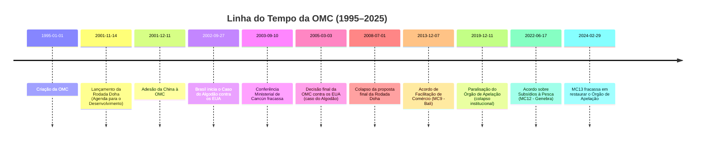
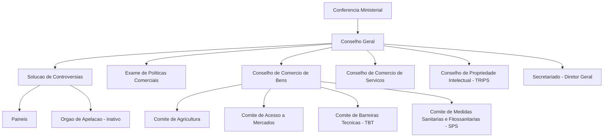

>[!important]
> A **Conferência Ministerial** (nível mais alto) se reúne a cada dois anos.
   O **Conselho Geral** é o principal órgão decisório no intervalo entre conferências.
  O **Órgão de Solução de Controvérsias** julga disputas e **está paralisado** desde 2019 pela ausência do Órgão de Apelação.
  Os **três conselhos** especializados cuidam dos principais acordos da OMC: Bens, Serviços e TRIPS.
 A **Secretaria**, chefiada pela Diretora-Geral (atualmente Ngozi Okonjo-Iweala), apoia tecnicamente os membros.

### A atuação do Brasil na OMC

O Brasil destaca-se historicamente como um **ator-chave** na OMC, combinando defesa assertiva de seus interesses comerciais com liderança diplomática em coalizões de países em desenvolvimento. Desde os primórdios, o Brasil viu no sistema multilateral de comércio uma oportunidade para **nivelar assimetrias**: por meio de regras estáveis e do Órgão de Solução de Controvérsias, o país poderia enfrentar práticas protecionistas de parceiros maiores e garantir acesso para seu competitivo agronegócio.

Na frente **negociadora**, o Brasil foi protagonista na criação do **G20 Comercial** – grupo formado na Ministerial de Cancún em 2003, reunindo economias em desenvolvimento de peso (como Índia, África do Sul, China, Argentina, etc.) em torno da demanda por cortes efetivos nos subsídios agrícolas de EUA/UE. Essa iniciativa, capitaneada pela diplomacia brasileira (então sob o Chanceler Celso Amorim), _“mudou o power politics das negociações comerciais na OMC”_, criando um contrapeso coletivo ao poder de barganha do Norte. O G20 liderado pelo Brasil teve um papel central de coordenação na rodada Doha, especialmente em agricultura, defendendo posições comuns do mundo em desenvolvimento e forçando EUA/UE a melhores ofertas. Embora Doha tenha emperrado, o surgimento do G20 consolidou o Brasil como **porta-voz** de reivindicações do Sul global no comércio.

No âmbito dos **contenciosos**, o Brasil figura entre os membros mais ativos. O país já foi reclamante em mais de 30 disputas na OMC, muitas de grande impacto. Além dos já mencionados casos do _algodão_ (contra os EUA) e do _açúcar_ (contra a UE), o Brasil contestou barreiras em setores estratégicos como **suco de laranja, carne bovina, frango, aço e biocombustíveis** impostas por diversos parceiros. Em várias ocasiões, obteve vitórias que obrigaram mudanças em políticas estrangeiras ou abriram espaço para exportações brasileiras. Essa atuação contenciosa permitiu, por exemplo, que o Brasil contornasse práticas protecionistas que afetavam seu agronegócio e indústria, consolidando mercados externos. Não por acaso, a paralisação do Órgão de Apelação é vista pelo Brasil com preocupação: _“O país recorre ao órgão em áreas em que é muito competitivo... e tem conseguido decisões favoráveis para contornar o protecionismo de alguns governos”_, apontou a CNI em 2019.

Além disso, o Brasil também assume papel construtivo na formulação de regras. Participou ativamente das negociações que levaram ao **Acordo de Facilitação de Comércio** (concluído em 2013), apoia iniciativas sobre comércio eletrônico e regulação doméstica de serviços, e atualmente integra arranjos plurilaterais como o **MPIA** (Mecanismo de Apelação provisório – discutido a seguir). Cabe notar que um brasileiro, Roberto Azevêdo, foi Diretor-Geral da OMC de 2013 a 2020, refletindo o prestígio diplomático do país na área. Em suma, a **diplomacia comercial brasileira** enxerga a OMC como foro primordial: seja liderando coalizões Sul-Sul, seja litigando para fazer valer direitos, o Brasil busca uma ordem comercial baseada em regras que lhe permita competir de forma mais equitativa. Por isso, os reveses recentes do multilateralismo comercial afetam diretamente seus interesses.

## A Crise do Multilateralismo Comercial

### A Paralisia do Órgão de Apelação: da técnica à geopolítica

O colapso do Órgão de Apelação da OMC, consumado em dezembro de 2019, é o elemento central da atual crise da organização – **um fenômeno político-geopolítico que transcende meras questões jurídicas**. Após anos de queixas, os Estados Unidos sob Donald Trump **bloquearam sistematicamente a nomeação de novos juízes** ao Órgão de Apelação, usando o requisito de consenso para impedir reposições. Com isso, o órgão foi perdendo quórum: de sete juízes previstos, caiu para o mínimo de três e, em 11/12/2019, para apenas _um_ juiz – número insuficiente para analisar recursos, paralisando o mecanismo. Essa situação inédita mergulhou a OMC _“no período mais crítico de seus 24 anos de existência”_, uma **“situação extrema, sem precedentes, que ameaça parte do sistema de governança global construído após a Segunda Guerra”*. Em outras palavras, ao asfixiar o sistema de disputas – pilar que garantia o cumprimento das regras – a crise do Órgão de Apelação questiona a própria autoridade da OMC como árbitro do comércio mundial.

Os **motivos declarados** pelos EUA para tal bloqueio residem nas críticas já mencionadas: Washington acusa o Órgão de Apelação de **exceder suas funções e criar obrigações não acordadas**, especialmente ao reverter vitórias americanas em antidumping e outras áreas. Reclama também que o órgão interpreta indevidamente as exceções de segurança nacional e outras cláusulas, e não respeita prazos. Em um relatório de 2020, o USTR afirmou que o Órgão de Apelação _“se desviou muito de seu papel pretendido... expandindo continuamente o escopo das questões que revisa, alongando o processo e reduzindo a confiança nos resultados”_. Para os EUA, mais de **25% de todas as disputas na OMC visaram leis ou medidas americanas**, o que reforça a percepção de que o sistema passou a _impactar desproporcionalmente_ sua agenda doméstica. Autoridades americanas também se queixam que suas preocupações vinham sendo ignoradas por 20 anos. Assim, ao bloquear juízes, Washington força a reforma do mecanismo nos seus termos.

> [!important] **Por que os EUA travaram o Órgão de Apelação?** 
> A visão em Washington é que o sistema de disputas da OMC passou a **prejudicar seus interesses nacionais**. Os americanos alegam que o Órgão de Apelação _“extrapolou suas funções”_, atuando além do mandato e _“criando novas leis comerciais”_ sem consentimento dos membros. Argumentam também que juízes estrangeiros estariam substituindo tribunais domésticos, ameaçando a **soberania dos EUA** (um ponto sensível na política interna). Além disso, reclamam da morosidade das decisões e discordam de abordagens metodológicas em casos de defesa comercial (por exemplo, contestam como a OMC julga práticas de _dumping_). Em suma, tanto sob Obama quanto, especialmente, sob Trump, os EUA sustentam que o órgão **viola os interesses americanos** (por supostamente favorecer países como a China em disputas) e, por isso, exigem mudanças estruturais antes de reativá-lo.

Vale frisar que **outros membros discordam dessa caracterização**. A UE, o Brasil, o Japão e a maioria defendem que o Órgão de Apelação sempre agiu dentro do mandato, esclarecendo ambiguidades dos acordos e fortalecendo o sistema baseado em regras. Porém, sem poder contornar o veto americano, esses países optaram por criar um arranjo temporário: o **MPIA (Acordo de Arbitragem de Apelação Múltipla)**, em 2020, replicando informalmente o mecanismo apelatório apenas entre os signatários (UE, China, Brasil, Austrália e mais ~20 membros). Embora útil para _“manter a chama acesa”_, o MPIA é limitado – os EUA não participam, nem a Índia – e não possui autoridade formal da OMC. Logo, a solução real passa por trazer Washington de volta ao sistema, conciliando as preocupações levantadas.

Entendida a gênese, nota-se que a **paralisia do Órgão de Apelação é mais sintoma do que causa**: reflete o enfraquecimento do compromisso político com o multilateralismo liberal por parte da potência líder do sistema. Insere-se num contexto mais amplo de **contestação à ordem liberal**: os EUA de Trump adotaram postura abertamente hostil a organismos internacionais (saindo do Acordo de Paris, UNESCO, etc.) e veem vantagem em lidar com disputas comercialmente via poder bruto. _“Os EUA agora preferem usar o jogo de forças em vez de operar sob um sistema baseado em regras”_, resume um economista alemão. Trump deixou claro seu **preferência por acordos bilaterais** onde o peso econômico americano lhe dá vantagem – a OMC, ao contrário, iguala membros pelo direito. Essa mudança de paradigma – da liderança benevolente para o unilateralismo – abalou o pilar central da OMC.

Até o momento (2025), **o impasse persiste**. O governo Biden, embora menos agressivo retoricamente, manteve o bloqueio aos juízes, demandando primeiro reformas que garantam que o Órgão de Apelação “não legisle” e respeite limites. Nas discussões de reforma em Genebra, propostas incluem estabelecer prazos rígidos, restringir precedentes e clarificar certas interpretações – mas ainda não há acordo. Os ministros do Comércio fixaram a meta de restaurar um sistema de solução de controvérsias “completo e funcional” até 2024, porém a Conferência Ministerial de 2024 (MC13, Abu Dhabi) **falhou em chegar a um consenso** sobre o Órgão de Apelação. Com eleições nos EUA e outros países, o tema deve se arrastar. Enquanto isso, **cresce o risco** de países agirem unilateralmente frente a disputas – exatamente o retorno à _lei do mais forte_ que o sistema multilateral buscava evitar. O próprio Roberto Azevêdo alertou que, sem um árbitro confiável, membros podem perder confiança e recorrer ao unilateralismo, aumentando incertezas e minando investimentos. Em síntese, a paralisia do Órgão de Apelação condensa a crise da OMC: um choque entre a lógica jurídica global e os ventos políticos nacionalistas. Sua resolução exigirá não apenas ajustes técnicos, mas **vontade política das grandes potências** para reforçar (ou ao menos tolerar) instituições multilaterais de restrição mútua.

### A competição estratégica EUA–China e o desafio às regras da OMC

Outra dimensão crucial da crise da governança comercial é a **rivalidade entre EUA e China**, as duas maiores potências econômicas, cuja disputa coloca enorme pressão sobre a OMC. Quando a China ingressou na OMC em 2001, esperava-se (no mundo ocidental) que ela gradualmente se tornasse uma economia mais orientada ao mercado e aderente às normas liberais. Passadas duas décadas, essa expectativa não se materializou plenamente – pelo contrário, o modelo econômico chinês **permanece fortemente dirigido pelo Estado**, com alto nível de intervenções, subsídios maciços (frequentemente pouco transparentes), empresas estatais dominantes em setores-chave e práticas industriais consideradas desleais pelos concorrentes (como transferência forçada de tecnologia e restrições a investimentos estrangeiros).

Esse cenário representa um **desafio inédito à OMC**, cujas regras foram desenhadas majoritariamente por e para economias de mercado. Em avaliação recente, o USTR dos EUA classificou a abordagem econômica da China como um _“desafio único, sério e em constante evolução”_ para o sistema de comércio global. O mesmo relatório afirma que a China _“ainda abraça um sistema não de mercado”_, violando ou contornando regras da OMC e frustrando mecanismos de transparência. Em outras palavras, do ponto de vista americano (e de parceiros como UE e Japão), a China **se beneficia do sistema** – acesso a mercados globais – sem cumprir integralmente suas contrapartidas, mantendo práticas mercantilistas que prejudicam empresas e trabalhadores alheios. Exemplos incluem subsídios industriais maciços (em aço, painéis solares, alta tecnologia), metas de conteúdo local (como no programa _Made in China 2025_) e restrições às exportações de matérias-primas. A OMC possui regras sobre subsídios e transparência, mas estas se mostram insuficientes diante da escala e opacidade das políticas chinesas. Além disso, a China tem argumentado ser país em desenvolvimento em certos aspectos, buscando flexibilidades que os EUA contestam dada a dimensão da economia chinesa.

A **disputa comercial aberta entre EUA e China desde 2018** ilustra o impasse. Alegando práticas desleais chinesas (roubo de propriedade intelectual, transferência forçada de tecnologia, subsídios, etc.), o governo Trump impôs tarifas unilaterais sobre aproximadamente US$ 360 bilhões em importações chinesas. Pequim retaliou com tarifas sobre bens americanos. Esse **conflito tarifário bilateral** ignorou solenemente os compromissos da OMC – violou o princípio da não discriminação (tarifas acima das tarifas consolidadas e só contra um país) e apostou na força em vez de recorrer a Genebra. O resultado foi uma _guerra comercial_ que fugiu ao escopo multilateral: os dois países firmaram em 2020 a chamada “Fase 1” de um acordo bilateral, sem envolver a OMC. Embora a OMC tenha posteriormente decidido que as tarifas dos EUA violaram regras, a ausência do Órgão de Apelação impediu solução efetiva – e os EUA criticaram a decisão, reforçando sua posição de que a OMC não sabe lidar com a China.

De fato, muitos argumentam que **as regras da OMC não foram pensadas para disciplinar uma economia do tamanho da chinesa com papel estatal tão grande**. Por exemplo, o Acordo de Subsídios proíbe apenas subsídios explícitos à exportação ou ligados a desempenho exportador – a China contorna isso usando subsídios horizontais, crédito subsidiado via bancos estatais, etc. Regras de propriedade intelectual (TRIPS) não preveem penalidades rápidas para apropriação forçada de tecnologia. A própria definição de “economia de mercado” em antidumping tornou-se disputa: a China pleiteou status de economia de mercado em 2016 (15 anos pós-adesão), mas EUA e UE negaram, mantendo métodos especiais que imputam tarifas antidumping elevadas aos produtos chineses. A OMC não conseguiu arbitrar essa questão até agora.

Assim, a ascensão chinesa **exige atualizações normativas** que a OMC não consegue produzir devido à falta de consenso (muito menos com o clima político atual). Os EUA, a UE e o Japão chegaram a formar um grupo trilateral propondo novas regras sobre subsídios industriais, disciplinando subsídios a SOEs, maior transparência e controle sobre transferência forçada de tecnologia. Porém, tais propostas não avançaram multilateralmente, em parte pela oposição chinesa (e de países em desenvolvimento temerosos de regras muito estritas).

Em âmbito político, a rivalidade EUA–China na OMC se manifesta em trocas de acusações: Washington acusa Pequim de _“mercantilismo predatório”_, enquanto Pequim acusa Washington de minar a OMC para manter sua hegemonia. Essa tensão dificulta acordos em praticamente todos os temas significativos – seja e-commerce, seja reforma do Órgão de Apelação (China e EUA discordam sobre escopo). Ambos os países **priorizam medidas unilaterais** quando convém: além das tarifas, os EUA ampliaram sanções tecnológicas (bloqueio de componentes para Huawei, restrições a exportação de semicondutores), justificadas por segurança nacional fora do âmbito da OMC; a China, por sua vez, restringiu exportações de terras raras no passado (alegando razões ambientais) e em 2023 anunciou controles sobre exportação de metais cruciais, também fora da alçada direta da OMC. Esses movimentos reforçam a percepção de que a **estrutura multilateral de regras está sendo contornada** nas disputas entre grandes potências.

Em suma, a competição EUA–China expôs os **limites da OMC em lidar com desafios do século XXI**. O sistema multilateral de 1995 não antecipou uma potência econômica estatal-capitalista integrada e, agora, está travado pela incapacidade política de atualizar-se. A paz comercial relativa das primeiras décadas da OMC cedeu lugar a conflitos geoeconômicos intensos, onde as grandes potências testam os limites (e brechas) das regras vigentes. Resolver esse dilema é central para o futuro da organização: sem integrar a China de forma equilibrada (ou sem que a China aceite novas disciplinas), e sem que os EUA confiem novamente na OMC como fórum primário, o regime multilateral continuará esvaziado. Por enquanto, prevalece uma espécie de **duelo hegemônico** que a OMC assiste sem poder arbitrar plenamente.

### O ressurgimento do protecionismo e da política industrial

O período recente tem sido marcado por um **retorno de políticas protecionistas e industriais** em diversas partes do mundo – um desenvolvimento que colide com os princípios de liberalização da OMC e aprofunda a crise do multilateralismo comercial. Após a crise financeira de 2008 e, especialmente, na segunda metade da década de 2010, vários países adotaram tarifas e subsídios em magnitude não vista desde os anos 1980. Dados do Global Trade Alert mostram que **o número de medidas comerciais restritivas (tarifas, subsídios, controles de exportação)** mais que dobrou entre 2010 e 2023 (de ~1.576 para ~3.285 medidas por ano). Governos de diferentes matizes passaram a invocar _“soberania econômica”_ e _“interesses nacionais”_ para justificar interferências no livre mercado, numa clara preferência por objetivos domésticos em detrimento de compromissos multilaterais. Esse **ressurgimento do protecionismo**, somado aos problemas internos da OMC, levanta dúvidas sobre a capacidade do sistema de regras global de conter os efeitos distorsivos dessas políticas.

Entre os exemplos mais notórios está a própria **guerra comercial EUA–China (2018-)**, já discutida, na qual tarifas retaliatórias recíprocas elevaram as barreiras de ambos os lados muito acima dos níveis consolidados na OMC. Mas não se trata de caso isolado. Os EUA, sob Trump, também impuseram tarifas amplas sobre aço e alumínio de diversos países (incluindo aliados) alegando **segurança nacional** (Seção 232), uma justificativa permitida pelas regras da OMC apenas em circunstâncias excepcionais, e controversa nesse caso. Outros governos responderam com tarifas retaliatórias. Viu-se, portanto, uma erosão do respeito ao princípio da Nação Mais Favorecida e ao teto tarifário acordado. Embora alguns desses conflitos tenham sido amenizados sob Biden (que eliminou tarifas com a UE, por exemplo), _in extremis_ os EUA mantêm a maior parte das tarifas contra a China, sinalizando continuidade do protecionismo seletivo.

Além das tarifas, há o **renascimento da política industrial ativa** em grandes economias. Em parte motivados por lições da pandemia (escassez de suprimentos médicos, fragilidade de cadeias globais) e pela urgência climática, países desenvolvidos lançaram pacotes robustos de subsídios para fomentar indústrias domésticas “estratégicas”. Os EUA aprovaram o **CHIPS Act (2022)**, destinando US$ 52 bi para semicondutores produzidos no país, e a **Lei de Redução da Inflação – IRA (2022)**, com mais de US$ 369 bi em subsídios e créditos fiscais a tecnologias verdes (painéis solares, baterias, veículos elétricos) desde que em grande medida fabricados nos EUA. A União Europeia, temendo desindustrialização, anunciou flexibilização de suas regras de auxílios estatais e um _Green Deal Industrial Plan_ para contrabalancear, além de avançar com o plano NextGenerationEU que inclui impulso à produção limpa local. A China, por sua vez, nunca abandonou sua estratégia industrial – pelo contrário, ampliou programas como _Made in China 2025_ e subsídios à inteligência artificial e veículos elétricos, buscando autossuficiência tecnológica. Mesmo economias emergentes como a Índia têm adotado esquemas de incentivo à fabricação doméstica (ex: esquema _PLI_ para eletrônicos).

Do ponto de vista da OMC, esse **volteio à política industrial** traz dois problemas: (1) muitos desses subsídios podem ser considerados **proibidos ou contestáveis** pelos acordos (se vinculados a exportações ou se causarem prejuízo a outros membros), porém a capacidade da OMC de arbitrar foi minada (vide crise do Órgão de Apelação); (2) ainda que não infrinjam a letra das regras, tais políticas **contrariam o espírito da não discriminação e da vantagem comparativa** – argui-se que inauguram uma era de competição de subsídios que distorce comércio e investimento globais. A UE, por exemplo, criticou a IRA americana como protecionismo climático; já os EUA e UE juntos criticam os massivos subsídios industriais chineses. Mas num ambiente de desconfiança mútua, em vez de cooperar via OMC para atualizar regras sobre subsídios verdes, cada bloco opta por suas medidas, potencialmente desencadeando retaliações e **fragmentação** do mercado global em blocos suportados por estados.

Outro aspecto é a **justificativa da segurança nacional** emergindo como carta branca para restringir comércio. Além das tarifas 232 dos EUA, houve restrições de exportação de insumos críticos (ex.: durante a pandemia, muitos países limitaram exportação de equipamentos médicos e vacinas; em 2022-23, diante da guerra na Ucrânia, países europeus cortaram importações de energia russa e Rússia cortou exportações de gás). Embora a OMC permita medidas de segurança nacional (Artigo XXI) ou emergenciais (Art. XIX, salvaguardas), o uso frequente e não coordenado dessas exceções enfraquece a previsibilidade do sistema. Alguns países podem passar a alegar “segurança econômica” para justificar protecionismo clássico, algo que já preocupa observadores.

Adicionalmente, agendas outrora periféricas ao comércio ganham peso: a **sustentabilidade ambiental e os direitos trabalhistas**. Até recentemente, a OMC pouco incorporava tais temas, mas pressões domésticas nos países ricos estão levando a iniciativas que, indiretamente, funcionam como barreiras. Por exemplo, a UE implementará em 2026 o **Mecanismo de Ajuste de Carbono na Fronteira (CBAM)**, cobrando uma taxa sobre importações com alta pegada de carbono (aço, cimento, etc.) equivalente ao custo do carbono interno da UE. A ideia é evitar _leakage_ (evasão de emissões para fora), mas para parceiros isso pode ser visto como tarifa disfarçada. A compatibilidade do CBAM com as regras da OMC (que exigem não discriminar produtos similares) será possivelmente questionada. Similarmente, acordos comerciais e nacionais estão impondo cláusulas trabalhistas (combate a trabalho forçado, por ex.). A OMC não possui normas trabalhistas e seus membros em desenvolvimento historicamente bloqueiam essa pauta no foro multilateral (por temerem protecionismo social). Assim, novas tensões surgem: **como conciliar comércio, clima e trabalho?** Alguns argumentam ser necessário atualizar a OMC para contemplar exceções ou regras claras nessas áreas; outros preferem tratar isso fora da OMC, o que pode marginalizar ainda mais a instituição.

Resumindo, vivemos um contexto de **retorno do Estado na economia** e de políticas de autocentramento produtivo, em reação a choques externos e mudanças políticas internas (nacionalismo econômico, desconfiança da globalização). Essa tendência contraria os pressupostos do regime da OMC (de redução contínua de barreiras e mínima intervenção estatal). A OMC, sem capacidade negociadora recente e sem pleno funcionamento do árbitro de disputas, vê-se mal equipada para enfrentar essa onda. Ao invés de tentar proibir todas as políticas industriais (o que seria inviável e indesejável em casos como energias renováveis), o desafio seria desenvolver _disciplinas atualizadas_: por exemplo, regras compartilhadas para subsídios climáticos que minimizem distorções, códigos de conduta para medidas de segurança nacional, etc. Tais discussões existem, mas esbarram na falta de confiança entre os membros – os mesmos que, simultaneamente, ampliam medidas unilaterais. O risco é uma **espiral protecionista** que enfraqueça o sistema multilateral a ponto de torná-lo irrelevante. Embora não estejamos nos anos 1930 (há mais interdependência hoje), a preocupação de ver um _“desacoplamento”_ do comércio global em blocos rivais e um aumento de disputas comerciais **fora** das regras multilaterais é real. Isso agrava a crise de legitimidade da OMC e pressiona por reformas urgentes – tema da próxima seção.

## O Futuro da OMC: Reformar ou definhar?

Diante dos desafios expostos – impasse do Órgão de Apelação, rivalidade EUA–China, proliferação de medidas protecionistas e novas agendas como clima e trabalho – o futuro da OMC depende de **reformas significativas** e da reconstrução de convergência política entre seus membros. Nos últimos anos, multiplicaram-se apelos para atualizar a organização (_WTO reform_). Contudo, as visões divergem sobre o conteúdo e a profundidade dessas reformas.

Um primeiro pilar é, sem dúvida, **restaurar o sistema de solução de controvérsias** a pleno funcionamento. Há consenso amplo (exceto talvez dos EUA) de que sem um mecanismo eficaz de resolução de disputas, a OMC perde sua força. Por isso, membros se comprometeram, no documento final da MC12 (Genebra, 2022), a estabelecer até 2024 um sistema de disputa “totalmente funcional e bem sucedido”. Grupos de trabalho informais discutiram propostas: _“soluções de Genebra”_ foram esboçadas por delegados como o embaixador David Walker (NZ) e, mais recentemente, por Marco Molina (Guatemala) – este último apresentou um draft sugerindo enfatizar mais arbitragem e mediação, além de impor limites de tempo mais estritos e páginas nos recursos. Importante, Molina evitou tocar no ponto mais espinhoso: o **próprio Órgão de Apelação**, ciente da oposição dos EUA. Infelizmente, Molina foi destituído pelo governo de seu país às vésperas da MC13 (2024) e as negociações esmoreceram. Na MC13, como visto, **não houve acordo** sobre a retomada do sistema apelatório – os EUA mantiveram sua linha de não reativá-lo sem reformas profundas, e países como Índia tampouco pressionaram devido a conjunturas políticas. O processo, porém, continua: os membros adotaram apenas uma Decisão Ministerial reconhecendo o progresso feito e estendendo o debate sobre _“como alcançar até 2024/25 um sistema de disputas plenamente operacional”_. O relógio está correndo: sem uma solução, a credibilidade da OMC segue abalada. **Possíveis cenários** incluem: (a) **concessões mútuas com os EUA** – por exemplo, incorporar clarificações no Entendimento de Solução de Controvérsias para restringir certas ações do Órgão de Apelação (como não criar precedentes vinculantes, obedecer prazos, deferência maior em questões antidumping, etc.) em troca do fim do bloqueio; (b) **institucionalização do MPIA** – se os EUA permanecerem fora por muito tempo, os demais membros poderiam formalizar o mecanismo arbitral plurilateral como substituto de facto (embora ele cubra menos de metade do comércio mundial sem EUA/Índia); (c) **paralisia prolongada** – o pior caso, onde nenhum acordo surge e a OMC convive com um vácuo jurídico, aumentando insatisfação e tentação de justiça pelas próprias mãos. Claramente, restaurar a _“coroa”_ do sistema multilateral é condição sine qua non para a OMC retomar relevância.

Outra frente de reforma é atualizar as **regras de negociação e deliberação** da OMC. Muitos apontam que o método de **consenso absoluto** entre 164 membros para qualquer decisão tornou-se disfuncional. Propostas incluem adotar mecanismos de decisão por maioria em certos casos (hoje possível, mas politicamente raro) ou flexibilizar a negociação via **acordos plurilaterais** dentro da OMC. De fato, diante do bloqueio de Doha, vários países engajaram-se em negociações plurilaterais “Open Variable Geometry”, chamadas de **Iniciativas Conjuntas (JSI)**. Exemplos: negociação sobre **Comércio Eletrônico** (envolvendo ~80 membros, incluindo UE, China, mas com Índia e África do Sul fora), negociação sobre **Facilitação de Investimentos** (mais de 100 membros, quase concluída em 2023), acordo plurilateral de **Regulação Doméstica de Serviços** (concluído em 2021 por 67 membros, incluindo Brasil, simplificando procedimentos regulatórios). Esses acordos não incluem todos, mas pretendem ser abertos a adesões futuras. Há controvérsia: alguns países temem que plurilaterais fragmentem a OMC ou violem o princípio de single undertaking. Ainda assim, na MC12, o acordo de serviços foi endossado e espera-se que esses plurilaterais integrem o arcabouço da OMC mesmo sem consenso unânime. A reforma, portanto, pode seguir na direção de aceitar uma **OMC de “geometrias variáveis”**, em que grupos de membros avançam em temas específicos, garantindo MFN a todos, mas sem obrigar os não-signatários.

Nos temas negociados, o foco do futuro recai sobre **novas agendas do século XXI**: comércio digital, sustentabilidade e regras para subsídios/estatais. A negociação **e-commerce** visa estabelecer normas para fluxos digitais (desde proibir tarifas sobre transmissões eletrônicas – moratória renovada na MC13 – até questões de fluxo de dados, proteção ao consumidor, etc.). Em dezembro de 2023, 70 membros anunciaram a conclusão de um acordo plurilateral de comércio digital com disposições sobre assinatura eletrônica, pagamentos, etc., embora aquém de temas mais espinhosos. Já a **agenda de sustentabilidade** abrange desde eliminar subsídios ambientalmente danosos até facilitar comércio de bens ecológicos. Uma grande vitória foi o **Acordo sobre Subsídios à Pesca** alcançado na MC12 (2022): pela primeira vez, a OMC pactuou regras com objetivo explícito de proteção ambiental, proibindo subsídios que contribuam para pesca ilegal ou excessiva. Esse acordo será ampliado (faltam disciplinas sobre sobrepesca e sobrecapacidade; negociações prosseguem, embora a MC13 não tenha finalizado a segunda fase). Outras iniciativas incluem discussões estruturadas sobre comércio e meio ambiente (TESSD), circularidade, plásticos, etc., que podem futuramente gerar acordos. No campo de **subsídios industriais e SOEs**, há pressão para revisar regras: a UE e aliados querem trazer assuntos como **subvenções a empresas estatais, transparência de apoio estatal** e controle de subsídios a setores high-tech para a mesa, em clara referência à China. A dificuldade é obter concordância chinesa (e de outros que valorizam flexibilidade). Provavelmente, eventuais regras novas surgirão primeiro em acordos regionais (como CPTPP ou acordos UE) e só depois some-se momentum para multilateralizar.

Uma questão delicada de reforma é a do **tratamento especial e diferenciado (TED)** para países em desenvolvimento. Tradicionalmente, todos os países em desenvolvimento (autodeclarados) obtêm certas flexibilidades nos acordos. Porém, EUA e outros argumentam que economias grandes como China, Índia, Brasil não deveriam ter mesmas regalias que pequenos países de baixa renda. Os EUA propuseram critérios para limitar quem pode usar TED, mas houve rejeição ampla do mundo em desenvolvimento. Provavelmente a solução será caso a caso em cada negociação futura: ex., no acordo de subsídios à pesca, delineou-se exceções para subsistência e para países pobres. No comércio eletrônico, há pedidos de tratamento especial (como maior tempo para implementar obrigações) – esses detalhes serão fundamentais para conciliar ambições dos desenvolvidos com necessidades dos outros. Uma reforma bem-sucedida terá de equilibrar **inclusividade e ambição**: nem impor obrigações inviáveis aos mais pobres, nem permitir que gigantes escapem de regras sob rótulo de “em desenvolvimento”.

Em termos institucionais, discute-se fortalecer o papel dos **órgãos regulares da OMC** (Conselhos, Comitês) para monitorar e debater novas políticas. Por exemplo, melhorar a **transparência**: muitos membros não notificam subsídios conforme exigido. Ideias surgiram para “punir” não notificação com presunção adversa, mas sem consenso. Outra sugestão é a OMC atuar mais em **análise de políticas comerciais** (upgrade do mecanismo de revisão de políticas comerciais – TPRM), oferecendo espaço para nomear e envergonhar práticas nocivas (peer pressure). Igualmente, ampliar a interação com outras organizações (OMC–OIT para trabalho, OMC–MEA para ambientais) para tratar questões interseccionais.

No cenário atual, há ceticismo, mas também _pontos de esperança_. A MC12 de 2022 foi considerada um sucesso modesto: além do acordo de pesca, aprovou flexibilização de TRIPS para vacinas (mostrando responsividade a crises) e lançou oficialmente o processo de reforma da OMC. A atual Diretora-Geral Ngozi Okonjo-Iweala (desde 2021) vem fazendo esforços diplomáticos para aproximar posições – seu papel na MC12 foi elogiado. Entretanto, a MC13 (fev/2024) demonstrou as **limitações do momento político**: com eleições chave (EUA 2024, Índia 2024) e guerras em curso, os ministros pouco cederam. Apesar disso, a mera realização de reuniões plurilaterais e a continuidade das discussões evitam o colapso total. Um analista resumiu: _“um colapso da organização não é iminente, mas sua relevância permanece em questão”_.

É possível que 2025–2027 sejam anos definidores. Se até lá os membros conseguirem **um acordo sobre o sistema de disputas** e alguns avanços em regras (mesmo que parciais, via acordos plurilaterais ratificados), a OMC pode ressurgir reforçada em nova forma. Caso contrário, corre-se o risco de ela se tornar **“leão sem dentes”**: um fórum de diálogo, mas sem capacidade de impor disciplina, enquanto as grandes decisões comerciais são tomadas bilateralmente ou nos mega-acordos regionais (CPTPP, RCEP, USMCA, UE-Ásia, etc.). Vale lembrar que, apesar de tudo, nenhum país se retirou da OMC e mesmo na era Trump os EUA não deram esse passo (apesar de ameaças). Isso indica que, mal ou bem, a estrutura multilateral é reconhecida como valiosa – ela fornece base comum de tarifas consolidadas, transparência e previsibilidade mínima. O grande desafio é adaptá-la ao **mundo multipolar e geoeconômico atual**, onde o consenso fácil dos anos 90 deu lugar a divergências tanto de interesses quanto de modelos de desenvolvimento.

Em conclusão, a **crise da OMC** espelha a transição da ordem mundial: do apogeu do multilateralismo liberal nos anos 90 para um cenário de competição entre grandes potências e revalorização do Estado. A OMC continua sendo pilar da governança econômica global, mas seu futuro depende da capacidade de seus membros de renovarem o **contrato político** que a sustenta. Reformar a OMC não é tarefa meramente técnica – requer reconciliação de visões sobre comércio, desenvolvimento e soberania. O caminho adiante pode não recriar o mesmo otimismo liberal de 1995, mas um compromisso de mínima cooperação para evitar o pior (uma guerra comercial generalizada) já seria um triunfo do pragmatismo. O mundo diplomático, incluindo o Brasil, observa atentamente: para países médios, uma OMC funcional é garantia contra arbitrariedades dos mais fortes. Resta ver se os guardiões do sistema multilateral conseguirão **reinventá-lo** para o século XXI, ou se a inação os condenará a testemunhar a erosão de sete décadas de regras compartilhadas de comércio.

> [!question] **Perguntas para autoavaliação:**
> 
> 1. Quais fatores políticos explicam o fracasso da Rodada Doha e de que modo esse impasse refletiu o conflito de interesses entre países desenvolvidos e em desenvolvimento no sistema multilateral de comércio?
>     
> 2. Por que a paralisia do Órgão de Apelação da OMC representa uma crise de natureza geopolítica (contestação à ordem liberal), e não apenas um problema jurídico-técnico? Analise o papel dos EUA nesse contexto e as implicações para países como o Brasil.
>     
> 3. Como a competição estratégica entre EUA e China desafia as regras e a estrutura da OMC? Em sua visão, que reformas seriam necessárias para que a OMC acomodasse economias com modelos distintos (como a economia estatal chinesa) sem comprometer seus princípios fundamentais?
>     

**★** _Referências selecionadas:_ OMC (documentos oficiais e informativos), publicações jornalísticas e acadêmicas sobre a crise da OMC, análises da USTR e da UE sobre a aderência da China às regras, bem como contribuições de think tanks (Brookings, CFR) e especialistas brasileiros (ex.: Vera Thorstensen, Pedro da Motta Veiga) sobre o papel do Brasil e a reforma da OMC. As citações destacadas ao longo do texto referenciam algumas dessas fontes para aprofundamento, entre outras.

![[output.png]]


# Origem: _Sistema financeiro internacional

---
title: Sistema financeiro internacional
area: POLÍTICA INTERNACIONAL
subarea: O Brasil e a agenda internacional
tags:
  - cacd-2025
  - o-brasil-e-a-agenda-internacional
  - politica-internacional
  - sistema-financeiro-internacional
aliases:
  - Sistema financeiro internacional.
---
# Sistema Financeiro Internacional: Arquitetura, Evolução e Desafios

## A Arquitetura de Bretton Woods (1944–1971)

**Contexto histórico:** Em meio aos escombros da Segunda Guerra Mundial, as potências aliadas buscaram construir uma ordem financeira internacional estável, evitando os erros do período entreguerras. As políticas econômicas da década de 1930 – marcadas por protecionismo e desvalorizações competitivas ("*beggar-thy-neighbor*") – agravaram a Grande Depressão ao derrubar o comércio, preços e empregos. Aprendendo com esse contexto, 44 países reuniram-se em Bretton Woods (EUA), em julho de 1944, para definir novas regras que promovessem a prosperidade econômica e prevenissem **instabilidade sistêmica**.

**Instituições de Bretton Woods:** O acordo resultou na criação de duas instituições-chave em 1944: o **Fundo Monetário Internacional (FMI)** e o **Banco Internacional para Reconstrução e Desenvolvimento (BIRD)**. Conhecidas como _Instituições de Bretton Woods_, elas formaram os pilares da governança financeira pós-guerra. O FMI recebeu o mandato de **auxiliar países com desequilíbrios temporários no balanço de pagamentos**, provendo recursos condicionados a ajustes econômicos, e de **promover a estabilidade monetária internacional**, garantindo um sistema de câmbios estáveis. Já o BIRD, embrião do atual Grupo Banco Mundial, foi concebido para financiar a **reconstrução das economias devastadas pela guerra** e, posteriormente, fomentar o **desenvolvimento econômico** dos países membros. Essas instituições refletiam um compromisso entre **cooperação econômica** e **soberania nacional**: buscava-se evitar o colapso financeiro via apoio mútuo, sem repetir a inação coletiva dos anos 1930.

**Regras do sistema monetário:** Em Bretton Woods acordou-se um regime de câmbio fixo ajustável conhecido como **padrão dólar-ouro**. O dólar norte-americano tornava-se a moeda de referência, conversível em ouro a US$35 por onça; as demais moedas fixavam suas paridades em relação ao dólar, podendo flutuar dentro de uma banda estreita de ±1%. Alterações de paridade além dessa margem só poderiam ocorrer com aval do FMI, em caso de desequilíbrio fundamental. Esse arranjo de **taxas fixas** visava evitar desvalorizações competitivas e dar previsibilidade ao comércio internacional. Complementarmente, **controles de capitais** de curto prazo eram aceitos – ou mesmo recomendados – como forma de permitir que os países preservassem autonomia na política econômica doméstica sem sofrer fuga de recursos. Assim, o sistema encorajava a liberalização do comércio de bens e serviços, mas tolerava restrições a fluxos financeiros voláteis, no espírito do _“liberalismo embutido”_ descrito por John Ruggie. Esse conceito de **embedded liberalism** resume o consenso do pós-guerra: promover o livre-comércio e a expansão econômica global, enquanto se permitia aos governos intervir para assegurar pleno emprego e bem-estar social. Em síntese, a arquitetura de Bretton Woods criou um **tripé** composto por: **(1)** um ativo de reserva internacional (o ouro, via dólar conversível), **(2)** taxas de câmbio estáveis porém ajustáveis quando necessário, e **(3)** instituições multilaterais (FMI/BIRD) para prover recursos e coordenação.

> [!important] **Legado de Bretton Woods** 
> O sistema Bretton Woods inaugurou três décadas de relativa estabilidade financeira, expansão do comércio e crescimento econômico global sem precedentes. Sob o padrão dólar-ouro e a supervisão do FMI, evitou-se o colapso cambial e o protecionismo extremo que marcaram os anos 1930. As instituições criadas – FMI e Banco Mundial – permanecem até hoje centrais na governança econômica global. Bretton Woods representa, assim, o primeiro grande esforço de _governança financeira internacional cooperativa_.

**O colapso do sistema (1971):** A partir do final dos anos 1960, o arranjo começou a ruir diante de **desequilíbrios econômicos crescentes**. Os EUA enfrentavam déficit externo e inflação (agravados por gastos com a Guerra do Vietnã), emitindo dólares além do lastro em ouro – fenômeno conhecido como dilema de Triffin. Com a oferta mundial de dólares superando as reservas auríferas americanas, instalou-se uma **crise de confiança**: os bancos centrais duvidavam da capacidade dos EUA honrarem a conversibilidade em ouro. Em agosto de 1971, o presidente Richard Nixon unilateralmente suspendeu a conversibilidade dólar-ouro e impôs tarifas às importações, no chamado _Choque Nixon_, rompendo a pedra angular de Bretton Woods. Tentativas subsequentes de reajustar paridades (Acordo Smithsonian, 1971) fracassaram, e em 1973 as principais moedas do mundo passaram a flutuar livremente, encerrando formalmente o sistema de Bretton Woods. Com isso, o ouro deixou de funcionar como referência monetária global, marcando a transição para uma nova era financeira.

## O Sistema Pós-Bretton Woods e a Globalização Financeira

**Transição para câmbios flutuantes:** Após 1973, o regime de câmbio tornou-se predominantemente **flexível**, ditado pelo mercado. As moedas oscilaram conforme oferta e demanda, e os bancos centrais retraíram seu papel de garantidores de paridades fixas. A desintegração do padrão dólar-ouro coincidiu com choques econômicos severos, como o **primeiro choque do petróleo (1973)**, que alimentou inflação e _estagflação_ nas economias avançadas. Nesse novo contexto, os países adaptaram suas políticas: os EUA, por exemplo, combateram a inflação no final dos anos 1970 através de juros elevadíssimos sob o presidente do Fed, Paul Volcker. Essa política (o _Volcker shock_) valorizou drasticamente o dólar e exportou recessão para economias endividadas em dólar – especialmente na América Latina – precipitando a **crise da dívida externa dos anos 1980**.

**Desregulamentação e inovação financeira:** A partir dos anos 1980, consolida-se a chamada **globalização financeira** – um processo de integração dos mercados de capitais em escala global. Vários países removeram controles de capital e regulações financeiras, liberalizando fluxos de investimento. Nos EUA e Reino Unido, por exemplo, ocorreram grandes desregulamentações do setor bancário e de valores mobiliários (como o _Big Bang_ da Bolsa de Londres em 1986). Instituições financeiras expandiram-se internacionalmente e inovações como os **derivativos** e a **securitização** transformaram a intermediação financeira. O ideário neoliberal ganhou força, culminando no chamado **Consenso de Washington** (termo cunhado em 1989 por John Williamson): um receituário de políticas pró-mercado – abertura comercial, liberalização cambial e financeira, privatizações, disciplina fiscal, etc. – promovido por FMI, Banco Mundial e Tesouro dos EUA como caminho para o crescimento. Muitos países em desenvolvimento adotaram essas medidas nos anos 1990, buscando atrair investimentos externos e dinamizar suas economias.

**Eficiências e ganhos:** A globalização financeira trouxe benefícios notáveis. Capitais antes restritos passaram a fluir para oportunidades ao redor do mundo, **financiando investimentos** produtivos e obras de infraestrutura em mercados emergentes. Empresas multinacionais puderam levantar recursos em mercados internacionais; governos acessaram crédito externo para complementar poupança doméstica. A competição e a inovação nos mercados financeiros reduziram o custo de capital e ampliaram a diversidade de instrumentos à disposição de investidores e tomadores. Em suma, a integração financeira prometia **maior eficiência alocativa**, canalizando poupanças globais para seus usos mais produtivos e permitindo melhor diversificação de riscos. Por exemplo, nas décadas de 1990 e 2000, economias emergentes como o Brasil receberam volumosos investimentos de portfólio e _investimento direto_ que impulsionaram seu desenvolvimento.

**Instabilidades e crises recorrentes:** Por outro lado, a globalização financeira expôs os países a **choques e volatilidade** sem precedentes. A mobilidade do capital significou que uma perda de confiança ou mudança abrupta de expectativas podia desencadear fugas maciças de recursos, colapsando moedas e sistemas bancários. De fato, a era pós-Bretton Woods foi marcada por uma série de **crises financeiras sistêmicas**, muitas vezes com efeito contagioso internacional. Nos anos 1980, a combinação de endividamento externo elevado e altas taxas de juros globais levou vários países em desenvolvimento (notadamente na América Latina) à insolvência – exemplificado pela moratória mexicana de 1982. Em seguida, nos anos 1990, sucessivas crises cambiais e bancárias abalaram diversas regiões: **México (1994)**, cuja desvalorização do peso gerou o “efeito tequila” em vizinhos; **Leste Asiático (1997)**, onde a quebra da paridade do baht tailandês – depreciado em ~50% – precipitou o pânico e contágio para países como Coreia do Sul, Indonésia e Rússia; **Rússia (1998)**, que declarou moratória e viu o colapso do rublo; e **Brasil (1999)**, forçado a abandonar o câmbio fixo do Plano Real diante de especulação e evasão de capitais. Tais episódios revelaram a fragilidade de economias emergentes diante de ciclos de _boom and bust_ financeiros globais. Mesmo países desenvolvidos não ficaram imunes: em 1987, um crash na bolsa dos EUA (a “segunda-feira negra”) expôs os riscos da negociação eletrônica e levou à criação de circuit breakers. E no final dos anos 1990, o estouro da **bolha das empresas “ponto com”** fez despencar bolsas mundiais.

> [!warning] **Crises Financeiras** 
> A recorrência de crises no SFI pós-1970 é um tema estratégico nas provas. Questões costumam abordar as **causas sistêmicas** (ex: políticas monetárias dos EUA afetando os demais; regimes cambiais inconsistentes; fragilidades bancárias) e as **respostas institucionais** (ex: resgates do FMI, coordenação do G20). É fundamental saber comparar diferentes crises (dívida 1980s × emergentes 1990s × subprime 2008), identificando padrões como: excesso de endividamento em moeda estrangeira, bolhas de ativos, efeito contágio e necessidade de redes de segurança financeira global.

**A crise global de 2008:** O ciclo de instabilidade atingiu o auge na crise financeira iniciada em 2007-08, considerada a pior desde 1929. Ela teve origem no **colapso do mercado imobiliário norte-americano**, após uma expansão irresponsável do crédito hipotecário de alto risco (_subprime_) e da securitização de tais dívidas. Em setembro de 2008, a quebra do banco Lehman Brothers desencadeou uma reação em cadeia de falências bancárias, congelamento do crédito e pânico nos mercados globais. Bancos e seguradoras de vários países sofreram perdas catastróficas, expondo a interconexão profunda do sistema financeiro mundial. A crise rapidamente se internacionalizou, derrubando comércio, produção e empregos ao redor do globo. Foram necessários **resgates governamentais massivos** (bank bailouts), programas de estímulo fiscal e uma expansão monetária coordenada pelos principais bancos centrais para evitar um colapso econômico generalizado. A turbulência de 2008 expôs falhas graves na arquitetura financeira: regulação insuficiente, alavancagem excessiva, instrumentos complexos pouco compreendidos e a ausência de mecanismos eficazes de supervisão transnacional. Em resposta, aprofundou-se o consenso sobre a urgência de **reformas estruturais** na governança financeira global – tema do próximo tópico.

## Atores e Instituições da Governança Financeira Global Contemporânea

Com a crescente interdependência financeira, **coordenação internacional** tornou-se crucial para prevenir e gerir crises. O Sistema Financeiro Internacional atual é sustentado por um conjunto de atores institucionais – formais e informais – que atuam na formulação de regras, monitoramento e provisão de liquidez em momentos críticos. Destacam-se:

- **Fundo Monetário Internacional (FMI):** Organização multilateral com 190 membros, fundada em 1944, que permanece no centro da governança financeira. Seu papel evoluiu: do garantidor do regime de câmbio fixo no pós-guerra, o FMI tornou-se principalmente um **credor de última instância** para países em crise de balanço de pagamentos. Oferece empréstimos emergenciais condicionados a programas de ajuste econômico (_conditionality_), desempenhando influência nas políticas de países devedores. O FMI também monitora a economia global (relatórios _World Economic Outlook_), fornece assistência técnica e atua como fórum de consulta macroeconômica. Sua estrutura de governança é ponderada pelo sistema de **cotas** de capital: economias maiores detêm mais votos – os EUA, por exemplo, possuem cerca de 16,5% dos votos, o suficiente para vetar decisões-chave que exigem 85% de aprovação. A direção-geral tradicionalmente cabe a um europeu, reflexo de acordos políticos do pós-guerra, e sua sede é em Washington, D.C. Apesar de reformas incrementais, o FMI é frequentemente criticado por **déficit de representatividade** (sub-representação de países emergentes) e pelas duras condicionalidades de seus programas, associadas ao _Consenso de Washington_.
    
- **Banco Mundial (BIRD e grupo associado):** Instituição-irmã do FMI, também fundada em 1944, inicialmente focada na reconstrução da Europa e posteriormente na **promoção do desenvolvimento**. Hoje, "Banco Mundial" refere-se principalmente a duas entidades: o **BIRD**, que concede empréstimos a países de renda média e média-baixa em condições próximas às de mercado, e a **IDA** (Associação Internacional de Desenvolvimento), criada em 1960 para auxiliar países mais pobres com créditos em condições concessórias. Junto com a Corporação Financeira Internacional (IFC), a agência de garantias MIGA e o centro arbitral CIADI, compõem o Grupo Banco Mundial. O Banco Mundial é a maior fonte multilateral de financiamento para projetos de desenvolvimento (infraestrutura, educação, saúde, etc.), além de prover conhecimento e assessoramento técnico. Sua governança espelha a do FMI: votos proporcionais ao capital subscrito, com predominância histórica das potências ocidentais, e um presidente tradicionalmente cidadão dos EUA. Nas últimas décadas, o Banco Mundial ampliou sua atuação para temas globais (redução da pobreza, desenvolvimento sustentável, clima) e também enfrenta apelos por **reformas de representatividade** e eficiência.
    
- **Banco de Compensações Internacionais (BIS):** Fundado em 1930, com sede na Basileia (Suíça), é a mais antiga instituição financeira internacional em operação. Originalmente criado para administrar pagamentos de reparações pós-Primeira Guerra, o **BIS** se reinventou como o fórum central de **cooperação entre Bancos Centrais**. Conhecido como o “banco dos bancos centrais”, promove encontros periódicos entre autoridades monetárias e oferece serviços bancários a esses bancos (como gestão de reservas). Seu papel cresceu no tocante à **estabilidade financeira global**: o BIS hospeda o **Comitê de Supervisão Bancária de Basileia**, estabelecido em 1974 após a falência do Bank Herstatt na Alemanha, um evento que revelou riscos sistêmicos internacionais. O Comitê de Basileia elabora parâmetros de regulação bancária prudencial, notadamente os Acordos de Basileia (I, II, III – ver seção seguinte), buscando fortalecer os sistemas bancários mundialmente. Embora o BIS não possua poder de imposição legal, suas diretrizes são amplamente adotadas, dada a legitimidade técnica e o interesse comum em prevenir crises.
    
- **G7 e G20 (fóruns de coordenação política):** Além das organizações formais, clubes de países exercem papel relevante na governança financeira. O **G7** reúne as principais economias avançadas (EUA, Canadá, Reino Unido, França, Alemanha, Itália e Japão) e surgiu em meados dos anos 1970 justamente para coordenar respostas a choques econômicos pós-Bretton Woods. Suas cúpulas anuais tornaram-se, por décadas, o principal foro político para decisões econômicas globais, incluindo questões monetárias, comerciais e de desenvolvimento. Entretanto, a composição limitada do G7 excluía economias emergentes de peso. Após as crises dos anos 1990, criou-se em 1999 o **G20 Financeiro** (Ministros de Finanças e Presidentes de Bancos Centrais do G7 + principais emergentes) para ampliar a cooperação. Em resposta à crise de 2008, o G20 foi **elevado ao nível de Chefes de Estado e Governo**, tornando-se o principal foro de coordenação econômica internacional. A **cúpula de Washington (novembro 2008)** marcou a primeira reunião de líderes do G20, e na cúpula de Pittsburgh (2009) decidiu-se institucionalizar o G20 como instância primordial de governança econômica, substituindo o G8 na discussão de economia global. Com 19 países mais a UE (incluindo Brasil, China, Índia, etc.), o G20 representa cerca de 80% do PIB mundial, conferindo-lhe legitimidade e capacidade de ação amplamente superiores às do G7 em temas financeiros. O G20 não é uma organização formal com sede ou secretariado permanente, mas suas declarações de cúpula e acordos têm orientado reformas importantes – como as cotas do FMI, a criação do FSB, regulações de derivativos, acordos de fluxo de capitais, entre outros. O G20 também se articula com outras instituições (FMI, OCDE, BIS) para implementar suas recomendações.
    
- **Conselho de Estabilidade Financeira (FSB):** Este organismo de governança surgiu do reconhecimento de que era preciso monitorar riscos financeiros **além das fronteiras nacionais**. Originalmente existia o _Financial Stability Forum (FSF)_, criado pelo G7 em 1999 após a crise asiática, mas restrito a poucas economias avançadas. Em abril de 2009, por iniciativa do G20, o FSF foi ampliado e transformado no **Financial Stability Board (FSB)**, com inclusão de todas as economias do G20 e outras relevantes. Com sede na Basileia sob auspícios do BIS, o FSB coordena a elaboração e implementação de políticas regulatórias e de supervisão voltadas a **reduzir riscos sistêmicos**. Ele monitora vulnerabilidades no sistema financeiro global, emite recomendações sobre bancos “grandes demais para quebrar”, regulações do chamado _shadow banking_ (sistema bancário paralelo) e mercados de derivativos. Embora sem poder legal coercitivo, o FSB consegue alinhar os reguladores nacionais em torno de padrões comuns, funcionando como **braço técnico do G20** para assuntos financeiros. A criação do FSB reflete a governança mais inclusiva do pós-2008, trazendo China, Índia, Brasil e outros para a mesa onde antes só G7 decidia.
    

> [!info] **Outros atores** 
> Vale lembrar que o SFI engloba também **bancos regionais de desenvolvimento** (BID, BAD, etc.), mecanismos regionais de apoio financeiro (como o Acordo de Reservas de Chiang Mai na Ásia), fóruns informais de bancos centrais (como a **Rede de Bancos Centrais SWAP** pós-2008) e mesmo atores privados (grandes bancos globais, agências de rating) que influenciam a estabilidade financeira. 
## Desafios e Reformas no Sistema Financeiro Internacional

A ordem financeira internacional encontra-se em constante evolução para responder a **desafios emergentes e correntes**. Nas últimas décadas, quatro eixos de desafios têm catalisado debates e reformas: (1) a recorrência de crises financeiras, (2) o aprimoramento da regulação prudencial, (3) a legitimidade da governança (distribuição de poder entre países) e (4) o surgimento de alternativas institucionais e impactos geopolíticos recentes.

**Padrão de crises e aprendizado:** A sequência de crises desde os anos 1980 evidenciou fragilidades no arcabouço financeiro global e demandou aperfeiçoamentos. O **contágio financeiro** tornou-se uma ameaça real – problemas em um país rapidamente propagam-se a mercados vizinhos ou conectados. Um aprendizado foi a necessidade de **redes de segurança financeira** mais robustas: o FMI ampliou seus recursos e criou novas linhas de crédito preventivas; bancos centrais das economias avançadas estabeleceram acordos de _swap_ de moedas para prover liquidez em dólar globalmente (como visto em 2008). As crises também impulsionaram inovações como o _Clube de Paris_ (para coordenar credores oficiais), o _Clube de Londres_ (credores privados) e as iniciativas de alívio de dívida para países pobres altamente endividados. Cada grande crise trouxe lições específicas: a resposta à crise da dívida latino-americana nos anos 1980 culminou nos **Planos Brady (1989)**, que reestruturaram dívidas bancárias em títulos negociáveis e introduziram reduções de principal/juros para restaurar a sustentabilidade. As crises emergentes dos anos 1990 motivaram discussões sobre a arquitetura financeira (“nova arquitetura financeira internacional”), incluindo propostas de controles temporários de capitais (_sand in the wheels_) e de envolvimento do setor privado nos custos de resgate (o debate sobre _bailing-in_ investidores). No entanto, foi **a crise global de 2008** que verdadeiramente galvanizou reformas de alcance sistêmico.

**Respostas à crise de 2008:** Diante do colapso generalizado em 2008, houve coordenação sem precedentes via G20 para **estabilizar o sistema financeiro e reformar suas regras**. Imediatamente, os líderes das maiores economias concordaram em evitar o protecionismo comercial e injetar estímulos fiscais massivos para reativar a economia. Também triplicaram os recursos do FMI (via novas alocações de Direitos Especiais de Saque) para socorrer países em dificuldades. Nos anos seguintes, sob orientação do G20, implementou-se uma agenda abrangente de **re-regulação financeira**. As principais iniciativas incluíram: exigência de maiores colaterais e transparência no mercado de derivativos, restrições a bônus executivos que incentivavam risco excessivo, supervisão reforçada de agências de rating e, sobretudo, elevação dos **requisitos de capital e liquidez dos bancos** (Acordos de Basileia). Em 2010, os reguladores reunidos no Comitê da Basileia pactuaram o **Basileia III**, que impôs bancos a manter capital de melhor qualidade e reservas de liquidez suficientes para cenários de estresse. Essas regras – implementadas gradualmente na década seguinte – visam reduzir a alavancagem e aumentar a resiliência bancária a choques, atacando vulnerabilidades que levaram à crise de 2008. Posteriormente, em 2017, foram aprovadas atualizações conhecidas como _Basileia IV_ para refinar métricas de risco, cuja implementação iniciou-se em 2023. Complementarmente, criou-se o já citado **FSB** para monitorar o cumprimento das reformas e apontar novos riscos (por exemplo, **instituições "grandes demais para quebrar"** e o **shadow banking**). Os efeitos dessas mudanças regulatórias incluem bancos mais capitalizados e supervisionados, embora o debate persista sobre possíveis impactos adversos (menor oferta de crédito ou transferência de atividades para fora do setor regulado).

**Debate sobre legitimidade e reformas de governança:** Um desafio central reside na **distribuição de poder dentro das instituições financeiras internacionais**, julgada defasada em relação ao peso econômico atual de seus membros. Desde os anos 2000, economias emergentes como China, Índia e Brasil têm demandado **reformas nas cotas e votos do FMI e do Banco Mundial** para refletir a nova realidade – afinal, esses países respondem por fatia crescente do PIB global. Houve alguns avanços: reformas aprovadas em 2008 e 2010 elevaram modestamente a participação de emergentes (por exemplo, a cota do Brasil passou de 1,4% para 2,3%, tornando-se a 10ª maior no FMI). Ainda assim, as estruturas de governança mantêm **assimetria significativa**: os EUA conservam poder de veto no FMI (precisam 85% dos votos para mudanças importantes) e a tradição de liderança das instituições permanece nas mãos de ocidentais. O G20, já em 2009, recomendou explicitamente aumentar em pelo menos 5% as cotas de países sub-representados no FMI e 3% os votos dos países em desenvolvimento no Banco Mundial. Essa pressão política gerou compromissos formais – como o acordo de 2010 do FMI – mas a implementação foi lenta, dependendo da aprovação legislativa nos próprios países desenvolvidos (o Congresso dos EUA retardou até 2015 a ratificação da reforma de 2010). Em 2023, concluiu-se a 16ª Revisão Geral de Cotas do FMI, que prevê aumento de 50% no total de recursos mas **sem redistribuição de cotas**, decisão frustrante para emergentes. No Banco Mundial, discussões similares ocorrem, inclusive sobre a possibilidade de um **aumento de capital** para expandir empréstimos sem reduzir a influência relativa dos acionistas tradicionais. A questão da legitimidade perpassa também a escolha de dirigentes – pela primeira vez, em 2012 um emergente (Jim Yong Kim, apoiado pelos EUA) foi presidente do Banco Mundial, e em 2023 uma não-européia (Kristalina Georgieva, da Bulgária) assumiu o FMI, indicando alguma abertura, ainda que dentro de perfis alinhados ao status quo. E crucial entender que a governança econômica global reflete correlação de poder – reformas avançam **até o ponto em que os principais acionistas consintam**. A insatisfação com o ritmo das mudanças tem levado países emergentes a procurar caminhos paralelos, como veremos a seguir.

**Novos arranjos institucionais (NDB, AIIB):** A última década testemunhou a criação de instituições financeiras internacionais **alternativas**, lideradas por economias emergentes, visando complementar (ou desafiar) o sistema vigente. Em 2014, os BRICS (Brasil, Rússia, Índia, China e África do Sul) anunciaram o **Novo Banco de Desenvolvimento (NDB)**, sediado em Xangai, com capital autorizado de US$ 100 bilhões (inicialmente US$ 50 bi subscritos em partes iguais). O NDB – também chamado "Banco dos BRICS" – tem como missão principal financiar projetos de infraestrutura e desenvolvimento sustentável nos países membros e em outras economias emergentes. Sua criação reflete a percepção, por parte dos BRICS, de que o Banco Mundial e demais IFIs não supriam adequadamente suas necessidades de crédito e não incorporavam seus interesses na governança. De modo similar, a China foi protagonista na fundação do **Banco Asiático de Investimento em Infraestrutura (AIIB)**, inaugurado em 2015 em Pequim, com capital inicial de US$ 100 bilhões. O AIIB reúne dezenas de países (incluindo aliados dos EUA, como Reino Unido, Alemanha, etc.) e foca em prover recursos para infraestrutura na Ásia. É amplamente visto como uma **alternativa ao Banco Mundial** na região, ampliando opções de financiamento para países asiáticos em desenvolvimento. Tanto o NDB quanto o AIIB distinguem-se pelo **peso decisório equilibrado** entre acionistas (no NDB, por exemplo, cada membro fundador tem igual número de ações e votos, ao contrário do sistema de cotas do BIRD) e por condicionalidades presumivelmente menos intrusivas. Até o momento, essas novas instituições aprovaram projetos importantes, embora seu porte financeiro ainda seja modesto frente aos gigantes Bretton Woods. Seu significado geopolítico, contudo, é notável: sinalizam uma _diversificação de fontes_ de crédito e uma **contestação simbólica** à ordem estabelecida em 1944. Em paralelo, arranjos como o **Fundo de Reservas Contingente dos BRICS (CRA)** foram lançados para permitir apoio mútuo em liquidez, reduzindo dependência do FMI. O surgimento dessas iniciativas pressiona por reformas e indica um **mundo financeiro mais multipolar**, tópico que frequentemente aparece em provas de Política Internacional.

**Impactos recentes: pandemia e guerra:** Nos anos 2020, eventos geopolíticos e sistêmicos impuseram novos testes ao SFI. A **pandemia de COVID-19 (2020)** provocou a contração econômica mais profunda desde a Grande Depressão, exigindo respostas coordenadas à altura. Governos ao redor do mundo adotaram **medidas emergenciais de estímulo fiscal e monetário**: cortes drásticos de juros (próximos de 0% nos EUA), expansão de balanços dos bancos centrais com trilhões de dólares em compra de ativos, linhas de crédito a empresas, alívios tributários e auxílios diretos a cidadãos. No âmbito multilateral, o G20 teve papel ativo – suas cúpulas extraordinárias prometeram evitar falências soberanas (via moratória temporária de pagamentos da dívida dos países mais pobres, _DSSI_), assegurar fluxo de suprimentos médicos e compartilhar vacinas, além de apoiar a recuperação do comércio. O FMI criou instrumentos como a linha de crédito de curto prazo e distribuiu US$ 650 bilhões em novos Direitos Especiais de Saque (alívio especialmente para emergentes). Essas ações coordenadas foram creditadas por evitar uma crise financeira global durante a pandemia. No entanto, deixaram legados desafiadores: níveis de endividamento público historicamente altos, pressão inflacionária com a retomada e dilemas para políticas monetárias (normalização dos juros sem desestabilizar mercados).

Por sua vez, a **guerra na Ucrânia (2022)** e as sanções internacionais contra a Rússia trouxeram à tona a intersecção entre finanças e geopolítica. Os países do G7, em conjunto com a UE, congelaram ativos do Banco Central russo no exterior, desligaram bancos russos do sistema SWIFT e impuseram amplas sanções financeiras em retaliação à agressão russa. Tais medidas – sem precedentes em escopo contra uma grande economia – evidenciam o poder (e a armação) do atual sistema dominado pelo dólar e pelas infraestruturas ocidentais. Contudo, também **alimentam debates sobre a estabilidade de longo prazo do SFI**: adversários dos EUA buscam reduzir sua dependência do dólar (movimento de _desdolarização_), criando sistemas alternativos de pagamentos e aumentando reservas em ouro ou outras moedas. A proximidade entre Rússia e China, por exemplo, intensificou-se em arranjos financeiros fora do circuito dólar. Embora o dólar norte-americano se mantenha hegemônico nas reservas globais e transações (devido à confiança e à falta de substitutos à altura), analistas veem o risco de uma **fragmentação financeira global** caso blocos de países passem a operar em esferas separadas. Por ora, o que se constata é maior conscientização dos países sobre a necessidade de **diversificar riscos sistêmicos** – seja acumulando mais reservas, firmando swaps bilaterais, aderindo a acordos regionais ou participando de bancos alternativos (como NDB/AIIB).

> [!important] **Panorama atual e estratégico** 
> O Sistema Financeiro Internacional em 2025 é fruto de sete décadas de aprendizado, reformas e ajustes frente a um mundo em transformação. Os pilares lançados em Bretton Woods – cooperação monetária, estabilidade cambial, financiamento ao desenvolvimento – permanecem relevantes, porém adaptados a um ambiente de câmbio flutuante, mercados integrados e rápidas inovações (fintechs, criptomoedas, etc.). A governança expandiu-se para incluir vozes emergentes, mas enfrenta desafios de legitimidade e coordenação em meio a rivalidades geopolíticas crescentes. O **Brasil**, como grande economia e ator tradicionalmente comprometido com o multilateralismo, tem posição de destaque: participa do G20, do FSB, integra o Comitê de Basileia desde 2009, advogando por reformas. Para o CACD, é fundamental articular os _fios condutores_ desse tema: **estabilidade vs. liberalização**, **eficiência vs. vulnerabilidade**, **universalismo vs. fragmentação**. O estudo do SFI permite compreender como decisões econômicas e políticas internacionais se entrelaçam na construção de um sistema que busca, simultaneamente, prosperidade e segurança financeira global.

## Perguntas para Autoavaliação

1. Quais foram os principais objetivos e características do sistema de Bretton Woods, e de que maneira ele buscou evitar os erros do período entreguerras?
    
2. Explique o funcionamento do **padrão dólar-ouro** e do regime de câmbio fixo ajustável estabelecido em 1944. Por que esse sistema entrou em colapso no início dos anos 1970?
    
3. O que se entende por **“liberalismo embutido”** no contexto do pós-guerra? Como Bretton Woods conciliou liberalização econômica com autonomia das políticas domésticas?
    
4. Compare o sistema financeiro internacional **pós-1973** ao arranjo de Bretton Woods. Quais as principais diferenças em termos de regime cambial, fluxos de capitais e papel do Estado na economia?
    
5. Defina **globalização financeira** e discuta dois benefícios e dois riscos associados a ela. Use exemplos de crises das décadas de 1980–90 para ilustrar os riscos.
    
6. A crise financeira global de 2008 revelou fragilidades na arquitetura financeira. Quais foram as causas da crise e que **reformas regulatórias** internacionais emergiram em resposta? Cite ao menos três medidas (ex: Basileia III, criação do FSB).
    
7. Descreva o papel atual do **FMI** e do **Banco Mundial**. Em que medida esses organismos diferem de seus mandatos originais e quais críticas comumente se fazem a sua atuação nos países em desenvolvimento?
    
8. Por que a **governança** do FMI e do Banco Mundial é alvo de debates sobre legitimidade? Quais mudanças foram propostas ou implementadas para dar mais voz aos países emergentes nessas instituições?
    
9. Qual a importância do **Banco de Compensações Internacionais (BIS)** e do **Comitê de Basileia** na estabilidade do sistema financeiro? Relacione sua criação com eventos históricos específicos.
    
10. O que é o **G20** e por que ele assumiu um protagonismo maior na governança financeira a partir de 2008, em comparação ao G7?
    
11. Explique as motivações que levaram à criação do **Novo Banco de Desenvolvimento (NDB)** e do **Banco Asiático de Investimento em Infraestrutura (AIIB)**. Como essas instituições se diferenciam dos bancos multilaterais tradicionais?
    
12. Discuta os impactos da **pandemia de COVID-19** sobre o Sistema Financeiro Internacional. Quais ações foram tomadas pelo G20, FMI e bancos centrais para mitigar a crise?
    
13. De que forma as **sanções financeiras contra a Rússia em 2022** ilustram a dimensão geopolítica do SFI? Quais podem ser as implicações de longo prazo do uso do sistema financeiro como ferramenta de coerção internacional?
    

## Sugestões de Leitura Complementar

- **Manual do Candidato – Economia**, capítulo 3.6 (_Sistema Financeiro Internacional_), especialmente págs. 219–230.
    
- **Carlos Márcio B. Cozendey**, _Instituições de Bretton Woods_ – artigo que explora a criação, evolução e desafios do FMI e Banco Mundial.
    
- **Maurício C. Lyrio & Kassius D. S. Pontes**, _O G20_ – análise sobre a origem do G20, seu papel na crise de 2008 e perspectivas de governança.
    
- **Carlos Márcio B. Cozendey**, _O papel do G20 no combate à crise global: resultados e perspectivas_ – artigo examinando as ações do G20 na crise de 2008 e os desdobramentos para a arquitetura financeira.
    
- **Sites oficiais**: “About the IMF” (Fundo Monetário Internacional) e seção do G20 no portal do Itamaraty, para informações atualizadas sobre funcionamento e prioridades atuais desses fóruns.
    

Cada uma dessas leituras aprofunda aspectos estratégicos do SFI e ajudam a consolidar uma visão crítica – essencial para enfrentar questões discursivas do CACD com rigor analítico e embasamento histórico.[](https://www.dropbox.com/preview/2015%20geografia%20teorico/cacd/pi/apostilas/aula%208%20%E2%80%93%20sistema%20financeiro%20internacional.pdf)


# Origem: BIRD - Banco Internacional para a Reconstrução e o Desenvolvimento

---
title: Banco Internacional para a Reconstrução e o Desenvolvimento (BIRD)
aliases:
  - BIRD
date: 2025-04-18
tags:
  - SistemaFinanceiroInternacional
  - sistema-de-bretton-woods
area: POLÍTICA INTERNACIONAL
---
# Banco Internacional para a Reconstrução e o Desenvolvimento (BIRD)

## Sumário

O Banco Internacional para a Reconstrução e o Desenvolvimento (BIRD) é a instituição original do Grupo Banco Mundial, criada na Conferência de Bretton Woods em 1944. Inicialmente focado na reconstrução da Europa pós-Segunda Guerra Mundial, o BIRD evoluiu para se tornar uma das principais fontes globais de financiamento e assistência técnica para o desenvolvimento de países de renda média e países pobres com capacidade de crédito. Esta nota detalha suas origens, objetivos, estrutura de governança, mecanismos operacionais, seu papel central no financiamento ao desenvolvimento, as críticas que enfrenta e sua relação com o Brasil.

## Conceitos Principais

- **Banco Internacional para a Reconstrução e o Desenvolvimento (BIRD):** Instituição financeira internacional, criada em 1944 (Bretton Woods), que constitui o principal braço de empréstimo do Grupo Banco Mundial. Oferece financiamento (empréstimos, garantias) e serviços de consultoria a países de renda média e países pobres com capacidade de crédito, visando reduzir a pobreza e promover o desenvolvimento sustentável.
- **Banco Mundial:** Frequentemente usado como sinônimo de BIRD, o termo "Banco Mundial" tecnicamente se refere a duas instituições: o BIRD e a Associação Internacional de Desenvolvimento (IDA), que foca nos países mais pobres. O Grupo Banco Mundial inclui também a *Corporação Financeira Internacional (IFC)*, a *Agência Multilateral de Garantia de Investimentos (MIGA)* e o Centro Internacional para *Arbitragem de Disputas sobre Investimentos (ICSID)*.
- **Desenvolvimento Internacional:** Campo multidisciplinar que estuda e promove melhorias nas condições econômicas, sociais, políticas e ambientais de países, especialmente os de baixa e média renda. O BIRD é um ator central neste campo.
- **Financiamento do Desenvolvimento:** Mobilização de recursos financeiros de diversas fontes (públicas, privadas, nacionais, internacionais) para apoiar projetos e políticas que promovam o desenvolvimento econômico e social. O BIRD é uma fonte crucial de financiamento público internacional para o desenvolvimento.
- **Redução da Pobreza:** Objetivo central e explícito do Grupo Banco Mundial. O BIRD busca contribuir para este objetivo através do financiamento de projetos que promovam crescimento econômico inclusivo e melhorem o acesso a serviços básicos.
- **Desenvolvimento Sustentável:** Modelo de desenvolvimento que integra as dimensões econômica, social e ambiental, buscando atender às necessidades presentes sem comprometer as futuras gerações. O BIRD incorporou crescentemente a sustentabilidade em seus objetivos e operações.
- **Projetos de Desenvolvimento:** Investimentos específicos financiados pelo BIRD em áreas como infraestrutura (energia, transporte, saneamento), capital humano (saúde, educação), agricultura, meio ambiente, governança e desenvolvimento do setor privado.
- **Condicionalidade:** Conjunto de condições (reformas macroeconômicas, setoriais ou institucionais) que um país mutuário deve cumprir para receber ou continuar recebendo empréstimos do BIRD (e do FMI). É um dos aspectos mais controversos da atuação das IFIs.
- **Governança Global:** O complexo sistema de regras, normas, instituições e processos que moldam as interações entre Estados e outros atores no cenário internacional. O BIRD é uma peça chave da arquitetura de governança econômica global estabelecida após a Segunda Guerra Mundial.

## Análise Detalhada do Banco Internacional para a Reconstrução e o Desenvolvimento (BIRD)

### Origens e Evolução:

- **Bretton Woods (1944):** O BIRD foi criado juntamente com o [[Fundo Monetário Internacional (FMI)]] na Conferência Monetária e Financeira das Nações Unidas em Bretton Woods, New Hampshire (EUA). O objetivo era estabelecer uma nova ordem econômica internacional para evitar as instabilidades que levaram às Grandes Guerras.
- **Objetivos Iniciais:** Seu mandato original era financiar a reconstrução dos países europeus devastados pela Segunda Guerra Mundial. O primeiro empréstimo foi para a França em 1947.
- **Evolução para o Desenvolvimento:** Com a recuperação europeia (auxiliada também pelo Plano Marshall) e o processo de descolonização, o foco do BIRD gradualmente se deslocou para o financiamento do desenvolvimento econômico dos países recém-independentes e de outras nações em desenvolvimento, especialmente a partir dos anos 1950 e 1960.
- **Relação com o Grupo Banco Mundial:** O BIRD é a maior instituição do Grupo Banco Mundial. A IDA foi criada em 1960 para oferecer empréstimos concessionais (juros baixos ou nulos) aos países mais pobres, que não tinham condições de arcar com os termos do BIRD. Juntos, BIRD e IDA formam o "Banco Mundial". IFC (setor privado), MIGA (garantia de investimentos) e ICSID (arbitragem) completam o Grupo.

### Objetivos e Funções:

- **Missão Dupla (Twin Goals - atual):** Erradicar a pobreza extrema (reduzir para menos de 3% a população vivendo com menos de US$ 2,15/dia até 2030) e promover a prosperidade compartilhada (aumentar a renda dos 40% mais pobres em cada país).
- **Financiamento:** Conceder empréstimos a taxas de juros de mercado (ou próximas a elas) para governos de países de renda média e países pobres com capacidade de crédito, utilizando recursos captados nos mercados de capitais internacionais (graças ao seu rating AAA).
- **Assistência Técnica e Consultoria:** Oferecer conhecimento técnico, análise de políticas e consultoria aos países membros em diversas áreas do desenvolvimento.
- **Conhecimento e Pesquisa:** Produzir e disseminar pesquisas, dados e relatórios sobre desenvolvimento (ex: Relatório sobre o Desenvolvimento Mundial).
- **Promoção de Reformas:** Incentivar (frequentemente via condicionalidades) reformas estruturais, institucionais e de políticas públicas nos países mutuários.

### Estrutura e Governança:

- **Estrutura:**
    - **Conselho de Governadores:** Órgão máximo, com um representante (geralmente Ministro da Fazenda ou Presidente do Banco Central) de cada país membro. Reúne-se anualmente.
    - **Conselho de Diretores Executivos:** Composto por 25 diretores que representam os países membros (individualmente ou em grupos/constituencies). Responsável pelas operações diárias e aprovação de empréstimos.
    - **Presidência:** Eleito pelo Conselho de Diretores Executivos para um mandato de 5 anos. Tradicionalmente, um cidadão norte-americano. O presidente atual é Ajay Banga (desde junho de 2023).
- **Sistema de Quotas e Votos:** O poder de voto de cada país é baseado em sua subscrição de capital (quota), que reflete seu peso econômico relativo na economia mundial. Isso confere maior poder de decisão aos países mais ricos (G7 detém parcela significativa dos votos).
- **Relação com outras instituições do Grupo:** Operam sob a mesma presidência e compartilham conhecimento, mas BIRD e IDA têm estruturas financeiras e focos de clientela distintos. IFC e MIGA focam no setor privado.
- **Críticas e Reformas:** A estrutura de governança é criticada pela sub-representação dos países em desenvolvimento e emergentes. Houve algumas reformas limitadas na distribuição de cotas e votos (ex: em 2010), mas a estrutura básica de poder permanece contestada. O Brasil e outros emergentes defendem reformas mais profundas.

### Funcionamento e Operações:

- **Instrumentos Financeiros:**
    - **Empréstimos para Projetos de Investimento:** Financiamento de longo prazo para bens, obras e serviços em projetos específicos.
    - **Empréstimos para Políticas de Desenvolvimento (DPLs):** Apoio a programas de reformas políticas e institucionais (anteriormente conhecidos como empréstimos de ajuste estrutural).
    - **Financiamento por Resultados (PforR):** Desembolsos vinculados ao alcance de resultados e indicadores pré-definidos.
    - **Garantias:** Para mitigar riscos e atrair financiamento privado.
- **Áreas Prioritárias:** Historicamente forte em infraestrutura. Atualmente, a agenda é ampla, incluindo capital humano (saúde, educação, proteção social), agricultura e desenvolvimento rural, meio ambiente e mudança climática, energia, finanças, setor privado, governança e desenvolvimento digital.
- **Ciclo de Projetos:** Identificação -> Preparação -> Avaliação -> Negociação/Aprovação -> Implementação -> Conclusão/Avaliação.
- **Salvaguardas:** Políticas rigorosas (Quadro Ambiental e Social - ESF) para mitigar riscos ambientais e sociais negativos dos projetos financiados. Sua implementação é complexa e por vezes criticada.
- **Condicionalidade:** Frequentemente associada aos DPLs, exigindo reformas macroeconômicas (fiscal, monetária) ou setoriais (privatização, liberalização comercial) como condição para os desembolsos. Foi alvo de intensas críticas nas décadas de 1980 e 1990 (Consenso de Washington). Hoje, busca-se maior "apropriação" (ownership) das reformas pelos países.
- **Avaliação de Impacto:** O Banco possui um Grupo de Avaliação Independente (IEG) que avalia a eficácia e os resultados de suas operações.

### O BIRD e o Desenvolvimento Internacional:

- **Papel Histórico:** Foi um ator central no financiamento ao desenvolvimento por décadas, moldando políticas e trajetórias de desenvolvimento em muitos países.
- **Influência:** Exerce influência não apenas pelo volume financeiro, mas também pela assistência técnica, disseminação de ideias e estabelecimento de padrões (ex: salvaguardas, práticas de gestão).
- **ODS:** O BIRD alinhou sua estratégia aos Objetivos de Desenvolvimento Sustentável da ONU, buscando contribuir para sua implementação, especialmente em áreas como infraestrutura sustentável, capital humano e ação climática.

### Críticas e Debates:

- **Condicionalidade:**
    - Críticas aos impactos sociais negativos dos programas de ajuste estrutural (cortes em gastos sociais, desemprego).
    - Acusações de imposição de modelos neoliberais ("Consenso de Washington") e desrespeito à soberania nacional. O Banco alega ter adaptado suas abordagens.
- **Governança:**
    - O "déficit democrático" e a necessidade de dar mais voz e voto aos países em desenvolvimento. A lenta reforma é um ponto de tensão constante.
    - A nomeação tradicional de um presidente americano é vista como um símbolo da influência desproporcional dos EUA.
- **Eficácia:**
    - Questionamentos sobre o real impacto na redução da pobreza e na promoção do desenvolvimento sustentável a longo prazo.
    - Críticas a projetos específicos com impactos ambientais ou sociais negativos não mitigados adequadamente.
    - Burocracia e lentidão nos processos de aprovação e desembolso.
- **Alternativas:** O surgimento de novas instituições como o NDB (BRICS) e o AIIB (China) reflete a insatisfação com o BIRD e oferece fontes alternativas de financiamento, gerando competição e pressão por reformas.

### O Brasil e o BIRD:

- **Histórico:** O Brasil é membro fundador e um dos maiores clientes históricos do BIRD. A relação passou por fases distintas, desde grande dependência nos anos 1970-80 até uma postura mais seletiva e de parceria nos anos 2000.
- **Projetos Financiados:** Vasta carteira de projetos em diversas áreas: infraestrutura (rodovias, energia, saneamento), desenvolvimento urbano, agricultura, saúde (ex: apoio inicial ao Bolsa Família), educação, meio ambiente (ex: PPG7), reforma do setor público (em níveis federal e estadual). _Exemplo: Projetos de desenvolvimento rural sustentável no Nordeste, modernização da gestão fiscal de estados._
- **Benefícios:** Acesso a financiamento de longo prazo em condições favoráveis, expertise técnica e conhecimento global, selo de qualidade que pode atrair outros investidores.
- **Desafios:** Processos burocráticos do Banco e do governo brasileiro, condicionalidades associadas a alguns empréstimos (especialmente DPLs), custo do endividamento externo, necessidade de capacidade técnica interna para gerenciar os projetos.
- **Posição do Brasil:** O Brasil atua dentro do Banco buscando maior poder de voto e representatividade para os países em desenvolvimento (lidera uma constituency no Conselho de Diretores). Defende que o Banco se adapte às novas realidades globais e às prioridades dos países de renda média, como infraestrutura sustentável e inovação.

### Tópicos Recentes e Relevantes:

- **COVID-19:** O BIRD (e o Grupo WB) mobilizou recursos significativos para apoiar a resposta sanitária, social e econômica dos países à pandemia.
- **Clima:** Financiamento climático tornou-se prioridade máxima. O Banco busca alinhar todo o seu portfólio ao Acordo de Paris e aumentar o financiamento para adaptação e mitigação.
- **Reforma/Evolução:** O Banco Mundial está passando por um processo de "Evolution Roadmap" para adaptar sua missão, operações e capacidade financeira aos desafios globais do século XXI (clima, pandemias, fragilidade, digitalização).
- **ODS:** Integração crescente dos ODS no planejamento e avaliação dos projetos.
- **Setor Privado:** Maior ênfase na mobilização de financiamento privado para o desenvolvimento (via IFC, MIGA e instrumentos do BIRD como garantias).
- **Geopolítica:** Tensões globais (EUA-China, Guerra na Ucrânia) afetam o ambiente operacional e a dinâmica de poder dentro do Banco.
- **Eficácia e ODS:** Avaliação contínua de como os projetos contribuem efetivamente para os ODS.
- **Governança:** O debate sobre a reforma das cotas e votos continua, com pressão dos emergentes por maior representatividade.
- **Relação com outros MDBs:** Busca por maior coordenação e cofinanciamento com bancos regionais e novas instituições (NDB, AIIB).
- **Futuro:** Adaptação aos desafios globais, aumento da capacidade financeira, maior foco em bens públicos globais (clima, saúde), e redefinição de seu papel em um cenário de financiamento ao desenvolvimento mais diversificado.

## Conexões

- **Banco Mundial:** O BIRD é a principal entidade do Grupo Banco Mundial.
- **Desenvolvimento Internacional:** O BIRD é um ator chave na definição de agendas, financiamento e implementação de políticas de desenvolvimento.
- **Economia Internacional:** Suas políticas de empréstimo e condicionalidades têm impacto macroeconômico nos países mutuários e nos fluxos globais de capital.
- **Relações Internacionais:** O BIRD é uma arena importante para a diplomacia econômica e as disputas de poder entre Estados.
- **Sistema Financeiro Internacional:** Parte integrante da arquitetura financeira global criada em Bretton Woods.
- **Organizações Internacionais:** Coopera (e por vezes compete) com outras OIs (ONU, FMI, OMC, bancos regionais).
- **Geopolítica:** A estrutura de poder do BIRD reflete e influencia a geopolítica global.

## Pontos de Atenção

- **Tópicos de maior relevância:** A estrutura de governança e os debates sobre reforma; o conceito e as críticas à condicionalidade; o papel do BIRD no desenvolvimento brasileiro (projetos e influência); a comparação com novas instituições (NDB); a evolução do mandato do Banco (clima, ODS).
- **Possíveis questões discursivas e de estudo de caso:** "Analise criticamente o papel do BIRD no desenvolvimento brasileiro, considerando os benefícios e os custos associados à sua atuação." "Discuta as principais críticas à estrutura de governança do Banco Mundial e as propostas de reforma defendidas pelo Brasil e outros países emergentes." "Compare a abordagem do BIRD e do Novo Banco de Desenvolvimento (NDB) no financiamento de infraestrutura em países em desenvolvimento."
- **Principais controvérsias e debates:** Legitimidade vs. Eficácia; Condicionalidade vs. Soberania; Representatividade na Governança; Impacto real na pobreza vs. perpetuação da dependência; Papel frente às mudanças climáticas.
- **Análise crítica:** Ir além da visão oficial do Banco, incorporando perspectivas críticas sobre seu impacto e funcionamento.
- **Oportunidades e desafios para o Brasil:** Acesso a financiamento e conhecimento vs. endividamento e condicionalidades; espaço para influenciar a agenda do Banco vs. limitações de poder de voto.
- **Impacto na economia e PEB:** Fonte de financiamento externo; influência em políticas setoriais; plataforma para atuação diplomática em temas econômicos globais.
- **Principais autores e referências:** Joseph Stiglitz, William Easterly (críticos); relatórios do próprio Banco Mundial (IEG); publicações de think tanks (CGD, Bretton Woods Project); acadêmicos brasileiros que estudam IFIs e PEB.


# Origem: FMI - Fundo Monetário Internacional

---
title: Fundo Monetário Internacional (FMI)
aliases:
  - FMI
date: 2025-04-18
tags:
  - SistemaFinanceiroInternacional
  - sistema-de-bretton-woods
area: POLÍTICA INTERNACIONAL
subarea: O Brasil e a agenda internacional
---
# Fundo Monetário Internacional (FMI)

## Sumário

O Fundo Monetário Internacional (FMI) é uma organização internacional central na arquitetura financeira global, estabelecida formalmente em 1944 na Conferência de Bretton Woods. Sua criação ocorreu no contexto do pós-Segunda Guerra Mundial, com o objetivo primordial de reconstruir a ordem econômica internacional, promover a cooperação monetária e garantir a estabilidade das taxas de câmbio, evitando as políticas econômicas prejudiciais que marcaram o período entreguerras. Atualmente, com 191 países membros, os objetivos do FMI expandiram-se para abranger a promoção da estabilidade financeira global, a facilitação da expansão equilibrada do comércio internacional, o apoio ao crescimento econômico sustentável e a redução da pobreza, além da assistência a países que enfrentam dificuldades em seus balanços de pagamentos. A estrutura de governança do FMI é baseada em um sistema de quotas, que determinam a contribuição financeira, o poder de voto e o acesso aos recursos de cada membro. Suas operações se concentram em três pilares principais: a ==supervisão (ou vigilância)== das políticas econômicas dos países membros e do sistema global; a ==assistência financeira==, geralmente condicionada à implementação de programas de ajuste macroeconômico e reformas estruturais; e a ==assistência técnica==, voltada para o desenvolvimento de capacidades institucionais nos países membros.

O papel do FMI evoluiu consideravelmente desde sua criação. O colapso do sistema de taxas de câmbio fixas de Bretton Woods no início dos anos 1970 forçou uma redefinição de seu mandato, com maior ênfase na supervisão macroeconômica. Subsequentemente, as crises financeiras internacionais – como a crise da dívida latino-americana nos anos 1980, a crise asiática de 1997, a crise financeira global de 2008 e a crise da Zona do Euro – consolidaram seu papel como um ator central na gestão de crises, embora frequentemente controverso. Essa trajetória demonstra uma notável capacidade de adaptação institucional, porém, essa evolução ocorreu predominantemente em resposta a eventos externos e crises, levantando questionamentos sobre a capacidade do Fundo de antecipar e prevenir instabilidades sistêmicas de forma proativa.

A atuação do FMI é objeto de intensos debates e críticas. A *condicionalidade* associada aos seus empréstimos é frequentemente questionada pelos seus potenciais impactos sociais negativos (como aumento da pobreza e desigualdade) e pela percepção de que infringe a soberania nacional. A estrutura de governança, que concentra poder nos países mais ricos, é criticada por seu déficit de legitimidade e pela sub-representação das economias emergentes e em desenvolvimento. Essa dinâmica evidencia uma tensão fundamental entre os objetivos técnicos de estabilidade macroeconômica e solvência do Fundo e as realidades políticas, sociais e de desenvolvimento dos países membros, particularmente visível nas discussões sobre a adequação das políticas recomendadas e a distribuição de poder na instituição. O modelo econômico historicamente promovido pelo Fundo, associado ao "Consenso de Washington", também é alvo de críticas por sua suposta rigidez e inadequação a diferentes contextos nacionais.

## Conceitos Principais

- **Fundo Monetário Internacional (FMI):** Organização internacional sediada em Washington, D.C., criada em 1944 (Conferência de Bretton Woods) e operacional desde 1945, atualmente com 191 países membros. Tem como missão principal alcançar crescimento e prosperidade sustentáveis para seus membros, promovendo a estabilidade financeira global, a cooperação monetária internacional, facilitando o comércio, o emprego e o crescimento econômico, e buscando reduzir a pobreza. Realiza suas funções através da *supervisão macroeconômica (vigilância)* dos países membros e do sistema global, da concessão de *assistência financeira (empréstimos)* a países com desequilíbrios no balanço de pagamentos, geralmente mediante a adoção de *políticas de ajuste (condicionalidade)*, e da prestação de assistência técnica e treinamento para fortalecer a capacidade de gestão econômica. Os recursos do FMI provêm principalmente das quotas dos países membros, e sua unidade de conta é o *Direito Especial de Saque (DES)*.
    
- **Sistema Financeiro Internacional (SFI):** O conjunto de regras formais e informais, instituições (FMI, Banco Mundial, Bancos Centrais, bancos comerciais, etc.), mercados (cambial, de capitais, de derivativos) e práticas que regem as transações financeiras (fluxos de capital, pagamentos, crédito, investimentos) entre países e agentes econômicos de diferentes jurisdições. Sua estrutura evoluiu significativamente desde Bretton Woods, que estabeleceu um sistema baseado em taxas de câmbio fixas e controles de capital. O SFI contemporâneo é caracterizado pela globalização financeira, com grande volume e mobilidade de capitais, taxas de câmbio majoritariamente flutuantes e uma complexa rede de instituições e regulamentações. O FMI desempenha um papel central na supervisão e na tentativa de garantir a estabilidade deste sistema, atuando como um fórum de cooperação e, controversamente, como emprestador em momentos de crise. A reforma do SFI é um tema constante, buscando maior estabilidade, resiliência e representatividade, especialmente para economias emergentes e em desenvolvimento.
    
- **Bretton Woods:** Refere-se à Conferência Monetária e Financeira das Nações Unidas, realizada em Bretton Woods, New Hampshire, EUA, em julho de 1944, que delineou a arquitetura econômica internacional do pós-Segunda Guerra Mundial. A conferência resultou na criação de duas instituições centrais: o Fundo Monetário Internacional (FMI), para promover a estabilidade cambial e a cooperação monetária, e o Banco Internacional para Reconstrução e Desenvolvimento (BIRD, hoje parte do Grupo Banco Mundial), para financiar a reconstrução e o desenvolvimento. O "Sistema de Bretton Woods" (vigente de 1945 até 1971-73) caracterizava-se por taxas de câmbio fixas, mas ajustáveis, em relação ao dólar americano, que por sua vez tinha conversibilidade fixa em ouro (US$35 por onça) para bancos centrais estrangeiros. O sistema visava evitar a instabilidade e as políticas de "empobrecer o vizinho" dos anos 1930, facilitando o comércio e os pagamentos internacionais.
    
- **Taxa de Câmbio:** É o preço de uma moeda expresso em termos de outra moeda (por exemplo, quantos reais são necessários para comprar um dólar). É um preço fundamental na economia internacional, influenciando o comércio exterior (competitividade de exportações e importações), os fluxos de investimento, a inflação e o balanço de pagamentos. No sistema de Bretton Woods, as taxas eram fixas em relação ao dólar. Após seu colapso, a maioria dos países adotou regimes de câmbio flutuante, onde a taxa é determinada pela oferta e demanda no mercado cambial, influenciada por fatores como taxas de juros, inflação, crescimento econômico, expectativas e intervenções do banco central. O FMI monitora os regimes e políticas cambiais dos seus membros como parte de sua função de supervisão..
    
- **Balanço de Pagamentos (BdP):** É um registro contábil sistemático de todas as transações econômicas realizadas entre os residentes de um país e os residentes do resto do mundo durante um determinado período (geralmente um ano ou um trimestre). Ele evidencia as relações econômicas de um país com o exterior. O BdP é estruturado em duas contas principais: a Conta Corrente (registra o comércio de bens e serviços, rendas primárias como juros e lucros, e rendas secundárias como transferências unilaterais) e a Conta Capital e Financeira (registra transferências de capital, investimentos diretos, investimentos em carteira, derivativos, outros investimentos e a variação das reservas internacionais). O FMI estabelece o padrão metodológico para a elaboração do BdP (atualmente o Manual de Balanço de Pagamentos, 6ª edição - BPM6). Déficits persistentes e insustentáveis no balanço de pagamentos são a principal razão pela qual os países recorrem à assistência financeira do FMI.
    
- **Condicionalidade:** Representa o conjunto de compromissos de política econômica (ações, metas quantitativas, reformas estruturais) que um país membro assume ao firmar um acordo de assistência financeira com o FMI. Essas condições são negociadas entre o país e o Fundo e visam assegurar que o programa de ajuste seja eficaz na correção dos desequilíbrios macroeconômicos e do balanço de pagamentos, restaurando a sustentabilidade e garantindo a capacidade de reembolso do empréstimo. As ferramentas de monitoramento incluem ações prévias, critérios de desempenho quantitativos (CDQ), metas indicativas e indicadores de referência estruturais. A condicionalidade é um dos aspectos mais controversos da atuação do FMI, sendo criticada por seus potenciais impactos sociais adversos, pela imposição de políticas de austeridade, pela alegada falta de adequação às especificidades nacionais e pela percepção de interferência na soberania. O FMI argumenta que a condicionalidade é necessária para garantir o uso eficaz dos recursos e a estabilidade.
    
- **Ajuste Estrutural:** Refere-se a um conjunto de políticas de reforma econômica de longo prazo, frequentemente implementadas sob a égide de programas do FMI e do Banco Mundial, especialmente a partir dos anos 1980, conhecidos como ==Programas de Ajuste Estrutural (PAEs)==. Essas políticas visam, tipicamente, aumentar a orientação da economia para o mercado, reduzir o papel do Estado e promover a integração na economia global. Medidas comuns incluem privatização de empresas estatais, liberalização do comércio e dos fluxos de capital, desregulamentação dos mercados (financeiro, trabalho), reforma tributária e disciplina fiscal rigorosa. Os PAEs foram intensamente criticados por seus efeitos negativos sobre o crescimento, o emprego, a pobreza e a desigualdade em muitos países em desenvolvimento, bem como pela imposição de um modelo econômico padronizado (associado ao "Consenso de Washington") sem considerar as especificidades locais ou promover a participação democrática na formulação das políticas. Em resposta, o FMI e o Banco Mundial buscaram reformular suas abordagens, enfatizando a "apropriação" nacional e a redução da pobreza (ex: DERPs), embora a substância das políticas muitas vezes permanecesse similar.
    
- **Quotas:** São a base do sistema financeiro e de governança do FMI. Representam a subscrição de capital que cada país membro deve prover ao Fundo ao ingressar na organização. As quotas são denominadas em Direitos Especiais de Saque (DES) e são determinadas por uma fórmula que busca refletir a posição relativa do país na economia mundial (baseada em variáveis como PIB, abertura econômica, variabilidade e reservas). As quotas cumprem três funções principais: 
	- (i) são a principal fonte de recursos financeiros do FMI; 
	- (ii) determinam o poder de voto de cada membro nas decisões da instituição; e 
	- (iii) estabelecem o limite máximo de acesso aos financiamentos do Fundo em condições normais e a participação em alocações gerais de DES.
	
	 A distribuição das quotas é um ponto central de controvérsia, com países emergentes e em desenvolvimento demandando maior representatividade. As quotas são revisadas periodicamente (Revisões Gerais de Quotas).
    
- **Direitos Especiais de Saque (DES / SDR):** É um ativo de reserva internacional criado pelo FMI em 1969 para complementar as reservas oficiais dos países membros. O DES não é uma moeda em si, mas representa um direito potencial sobre as moedas livremente utilizáveis dos membros do FMI. Seu valor é calculado com base em uma cesta de cinco moedas de grande circulação internacional: dólar americano, euro, renminbi chinês, iene japonês e libra esterlina. O FMI pode realizar "alocações gerais" de DES aos seus membros, distribuídas proporcionalmente às suas quotas, para aumentar a liquidez global, como fez em 2009 durante a crise financeira e em 2021 em resposta à pandemia de COVID-19. O DES também funciona como a unidade de conta do FMI e de algumas outras organizações internacionais. Embora seu papel como ativo central no sistema monetário internacional seja limitado, há debates sobre sua maior utilização, especialmente para apoiar países em desenvolvimento.
    
- **Governança Global:** Refere-se ao complexo sistema de regras formais e informais, normas, instituições, atores (Estados, OIs, ONGs, setor privado, etc.) e processos que orientam e restringem a ação coletiva em nível internacional para lidar com problemas que transcendem fronteiras nacionais, na ausência de uma autoridade central global. Abrange diversas áreas como segurança, economia, meio ambiente, saúde e direitos humanos. Instituições como a ONU, FMI, Banco Mundial e OMC são pilares importantes dessa governança. Um debate central na governança global contemporânea diz respeito à necessidade de reformar as instituições existentes (muitas delas criadas no pós-Segunda Guerra) para torná-las mais eficazes, legítimas e representativas da atual distribuição de poder e dos desafios do século XXI, como as mudanças climáticas e a ascensão de novas potências.
    

**Objetivos Iniciais do FMI:** Os objetivos centrais acordados em Bretton Woods eram :
1. Assegurar a estabilidade das taxas de câmbio: Foi criado um sistema de paridades fixas, mas ajustáveis, em relação ao dólar americano, que por sua vez era conversível em ouro a um preço fixo ($35/onça) para autoridades monetárias estrangeiras. Isso visava reduzir a incerteza e facilitar o comércio.
2. Promover a cooperação monetária internacional: O FMI serviria como uma instituição permanente para consulta e colaboração em questões monetárias.
3. Facilitar a expansão do comércio: Um sistema de pagamentos multilateral e taxas de câmbio estáveis eram vistos como essenciais para a reconstrução e o crescimento do comércio mundial.
4. Fornecer liquidez temporária: Oferecer recursos aos países membros com déficits temporários no balanço de pagamentos, permitindo-lhes corrigir os desequilíbrios sem adotar medidas prejudiciais (como restrições comerciais ou deflação excessiva).
5. Permitir controles de capital: Reconhecia-se a incompatibilidade entre câmbio fixo, livre movimento de capitais e autonomia da política monetária (o "trilema impossível").

O Artigo VI dos Estatutos do FMI legitimava o uso de controles sobre fluxos de capital de curto prazo para preservar a estabilidade cambial e a autonomia política nacional.

**Evolução do Papel do FMI ao Longo do Tempo:** O papel do FMI sofreu transformações profundas desde sua criação, adaptando-se (ou reagindo) às mudanças no cenário econômico e político global. Essa capacidade de adaptação foi crucial para sua sobrevivência institucional, mas também gerou controvérsias sobre seu mandato e métodos.

**Fim de Bretton Woods (1971-1973):** A decisão dos EUA de suspender a conversibilidade do dólar em ouro em 1971 pôs fim ao sistema de paridades fixas. Com a adoção generalizada de taxas de câmbio flutuantes, a função original de supervisionar as paridades fixas perdeu sentido. O FMI reorientou-se para a supervisão (vigilância) das políticas macroeconômicas gerais dos membros, conforme formalizado na Segunda Emenda de seus Artigos Constitutivos (1978), buscando promover a estabilidade econômica e financeira em um ambiente de taxas flutuantes.

**Crises da Dívida e Ajuste Estrutural (anos 1980):** A crise da dívida externa que atingiu muitos países em desenvolvimento, especialmente na América Latina, a partir de 1982, marcou uma nova fase. O FMI tornou-se o principal gestor dessas crises, fornecendo financiamento condicionado à adoção de rigorosos programas de ajuste estrutural (PAEs), que incluíam austeridade fiscal, liberalização econômica e privatizações. Esse período foi marcado por intensas críticas aos custos sociais desses programas e à perda de autonomia dos países devedores.

**Pós-Guerra Fria e Globalização Financeira (anos 1990 - presente):** Com o fim da Guerra Fria e a aceleração da globalização financeira (liberalização dos fluxos de capital), as crises financeiras tornaram-se mais frequentes e contagiosas (México 1994-95, Ásia 1997-98 , Rússia 1998, Brasil 1998/2002 , Argentina 2001). O FMI consolidou seu papel de "bombeiro" financeiro internacional, mobilizando grandes pacotes de resgate. A crise asiática, em particular, gerou fortes críticas às recomendações do FMI e impulsionou a busca por alternativas regionais. A crise financeira global de 2008, originada nos países desenvolvidos, expôs falhas na supervisão do FMI e levou a um aumento significativo de seus recursos e a reformas em seus instrumentos de empréstimo. A crise da Zona do Euro (pós-2010) envolveu o FMI em complexas negociações e controvérsias sobre a gestão da dívida soberana em uma união monetária.

*Novos Desafios Globais:* Mais recentemente, o FMI tem procurado incorporar em suas análises e operações desafios globais como as mudanças climáticas , pandemias (resposta à COVID-19 ), desigualdade, digitalização financeira e os riscos da fragmentação geoeconômica , buscando manter sua relevância em um cenário internacional em constante mutação. Essa expansão de agenda, contudo, também gera debates sobre os limites de seu mandato e sua capacidade de atuação eficaz nessas novas áreas.

### Objetivos e Funções

Os objetivos e funções do FMI estão delineados em seu Convênio Constitutivo e foram adaptados ao longo do tempo. Conforme as fontes oficiais e a prática institucional, as principais finalidades e atividades do Fundo são:

**Promoção da cooperação monetária internacional:** Atuar como um fórum permanente para que os países membros possam consultar-se e colaborar em questões monetárias internacionais, buscando soluções coordenadas para problemas comuns.

**Facilitação da expansão e do crescimento equilibrado do comércio internacional:** Contribuir para o estabelecimento de um sistema multilateral de pagamentos e para a eliminação de restrições cambiais que dificultam o crescimento do comércio mundial, visando promover altos níveis de emprego, renda real e o desenvolvimento dos recursos produtivos dos membros.

**Promoção da estabilidade cambial:** Encorajar a manutenção de regimes de câmbio ordenados e evitar desvalorizações competitivas, contribuindo para a previsibilidade nas transações internacionais. Embora o sistema de paridades fixas tenha terminado, a supervisão sobre as políticas cambiais dos membros permanece como uma função importante.

**Assistência financeira temporária:** Disponibilizar recursos financeiros aos países membros que enfrentam dificuldades em seus balanços de pagamentos, sob condições (condicionalidade) que garantam a correção dos desequilíbrios e a capacidade de reembolso, permitindo que o ajuste ocorra de forma ordenada e sem recurso a medidas prejudiciais à prosperidade nacional ou internacional.

**Supervisão (Vigilância) do sistema monetário internacional:** Monitorar continuamente as políticas econômicas e financeiras dos países membros (supervisão bilateral, através das Consultas do Artigo IV ) e a evolução da economia global e regional (supervisão multilateral ), identificando potenciais riscos à estabilidade e oferecendo aconselhamento sobre políticas.

**Desenvolvimento de Capacidades (Assistência Técnica):** Fornecer assessoria técnica e treinamento aos países membros para ajudá-los a fortalecer suas instituições econômicas (bancos centrais, ministérios das finanças) e a aprimorar a formulação e implementação de políticas fiscal, monetária, cambial, financeira e estatística. A multiplicidade desses objetivos pode, em certas circunstâncias, gerar tensões. Por exemplo, a necessidade de garantir a estabilidade financeira de curto prazo e o reembolso dos empréstimos (objetivos primordiais da assistência financeira e da condicionalidade ) pode levar à recomendação de políticas de austeridade que, segundo críticos, podem comprometer os objetivos de crescimento econômico, emprego e redução da pobreza no longo prazo. A forma como esses potenciais conflitos são gerenciados e quais objetivos são priorizados pode ser influenciada pela estrutura de governança do Fundo e pelos interesses dos seus membros mais influentes.

### Estrutura e Governança

A estrutura organizacional e o sistema de governança do FMI são definidos em seu Convênio Constitutivo e têm sido objeto de debates e reformas ao longo do tempo.

**Estrutura Organizacional:** O FMI possui uma estrutura hierárquica :
	*Conselho de Governadores:* É o órgão máximo de deliberação, composto por um governador e um suplente de cada país membro (geralmente o Ministro da Fazenda ou o Presidente do Banco Central). Reúne-se anualmente (nas Reuniões Anuais do FMI e Banco Mundial) e detém poderes fundamentais, como admitir novos membros, aprovar aumentos de quotas, alocar DES e emendar o Convênio Constitutivo. Muitos de seus poderes são delegados ao Conselho Executivo.
	*Conselho Executivo (Diretoria Executiva):* É responsável pela condução das operações cotidianas do Fundo em Washington, D.C.. É composto por 24 Diretores Executivos. Os cinco países com as maiores quotas (EUA, Japão, Alemanha, França, Reino Unido) nomeiam um diretor cada. Os demais 19 diretores são eleitos por grupos de países (denominados *constituencies*), que representam os outros membros. O Conselho Executivo aprova os empréstimos, conclui as consultas do Artigo IV, decide sobre as políticas do Fundo e supervisiona a administração da organização. Embora muitas decisões sejam tomadas por consenso, a votação formal segue o peso de voto de cada diretor, que reflete as quotas dos países que representa.
	*Diretor(a)-Geral:* É o chefe do corpo funcional (staff) do FMI e preside as reuniões do Conselho Executivo, sem direito a voto (exceto em caso de empate raro). É nomeado(a) pelo Conselho Executivo para um mandato de cinco anos. Por convenção não escrita, o Diretor-Geral do FMI é tradicionalmente um cidadão europeu, enquanto o Presidente do Banco Mundial é um cidadão americano.

**Sistema de Quotas e Poder de Voto:** Este sistema é a espinha dorsal da governança e do financiamento do FMI.
	*Função das Quotas:* As quotas determinam a contribuição financeira de cada membro para os recursos do FMI, seu poder de voto relativo, o limite de acesso aos empréstimos do Fundo e sua participação nas alocações de DES.
	*Cálculo do Poder de Voto:* O poder de voto total de um membro é a soma de seus "votos básicos" (atualmente 250 para cada membro, independentemente do tamanho da quota, totalizando cerca de 5,5% dos votos totais ) e um voto adicional para cada SDR 100.000 de sua quota.
	*Concentração de Poder:* Como as quotas são amplamente baseadas no tamanho econômico relativo , essa fórmula resulta em uma grande concentração de poder de voto nas mãos dos países mais ricos. Os Estados Unidos, com a maior quota (cerca de 17,4% ), detêm poder de veto sobre decisões que exigem maioria qualificada de 85% (como alterações no Convênio Constitutivo, aumentos de quotas e alocações de DES). Os países da União Europeia, somados, também detêm um bloco significativo de votos.

**Críticas à Governança e Debates sobre Reformas:** A estrutura de governança do FMI é um dos pontos mais criticados da instituição, considerada por muitos como anacrônica e deficitária em termos de legitimidade democrática.

*Sub-representação:* A principal crítica é a sub-representação das economias emergentes (como China, Índia, Brasil) e dos países em desenvolvimento (PEDs), cujo peso na economia global cresceu significativamente nas últimas décadas, mas não se reflete proporcionalmente em suas quotas e poder de voto. Isso levanta questões sobre a justiça e a eficácia das decisões do Fundo, que afetam principalmente esses países.

*Fórmula de Quotas Contestada:* A fórmula utilizada para calcular as quotas teóricas é complexa e alvo de disputas. O uso predominante do PIB a taxas de câmbio de mercado (MER) em detrimento da paridade do poder de compra (PPP), e a forma como a variável "Abertura" é medida, são apontados como fatores que subestimam o peso dos países emergentes.

*Erosão dos Votos Básicos:* A diminuição da participação percentual dos votos básicos no total de votos (de 11,3% na fundação para 5,5% hoje) reduziu a influência relativa dos países menores e mais pobres, que se beneficiam dessa distribuição igualitária. Há propostas para aumentar significativamente a proporção de votos básicos.

*Lentidão das Reformas:* As Revisões Gerais de Quotas, que deveriam ocorrer a cada cinco anos, tornaram-se processos politicamente carregados e lentos. A 14ª Revisão, acordada em 2010, só entrou em vigor em 2016, transferindo cerca de 6% das quotas para países emergentes e em desenvolvimento. No entanto, a 15ª Revisão (concluída em 2020) e a 16ª Revisão (concluída em 2023) falharam em promover um novo realinhamento das quotas, optando apenas por um aumento equiproporcional (50% na 16ª Revisão). A falta de progresso no realinhamento é vista como um grande golpe na credibilidade do FMI. A 17ª Revisão tem o desafio de apresentar propostas concretas de realinhamento até junho de 2025.

*Seleção da Liderança:* A tradição de um europeu na chefia do FMI e um americano no Banco Mundial é criticada como um resquício de uma ordem de poder ultrapassada, que ignora a qualificação de candidatos de outras regiões. O impasse na reforma da governança reflete um dilema central: os países que mais se beneficiariam da manutenção do status quo (EUA e nações europeias) detêm o poder de voto necessário para bloquear mudanças substanciais, enquanto os países que demandam maior representatividade (emergentes e PEDs) não possuem força suficiente para impor essas reformas. Essa dinâmica não apenas mina a legitimidade do FMI, mas também incentiva a busca por arranjos financeiros alternativos e contribui para a fragmentação da governança econômica global. Adicionalmente, a tentativa de usar as quotas para múltiplos propósitos (financiamento, voto, acesso) cria tensões intrínsecas, dificultando uma solução que atenda a todos os objetivos simultaneamente e de forma equitativa.

### Funcionamento e Operações

O FMI opera através de um conjunto de atividades interligadas, sendo as principais a vigilância, a assistência financeira e a assistência técnica.

**Vigilância (Supervisão):** Esta é uma função central e obrigatória para todos os membros, destinada a monitorar a saúde econômica e financeira dos países e do sistema global, identificar riscos e vulnerabilidades, e promover políticas que assegurem a estabilidade.
	*Consultas do Artigo IV:* São a principal ferramenta de supervisão bilateral. Periodicamente (geralmente a cada ano), uma equipe do FMI visita o país membro para coletar dados, discutir com autoridades governamentais (Ministério da Fazenda, Banco Central) e outros stakeholders (setor privado, sociedade civil) sobre a situação econômica e as políticas adotadas. O resultado é um relatório detalhado que é discutido pelo Conselho Executivo e, com o consentimento do país, geralmente publicado. Essas consultas avaliam a consistência das políticas fiscal, monetária, cambial e financeira com a estabilidade macroeconômica e externa. Um exemplo é a consulta de 2024 com o Brasil, que avaliou a resiliência econômica, a desinflação, os riscos fiscais e recomendou a continuidade de reformas.
	*Supervisão Multilateral:* O FMI também monitora a economia global e as interconexões entre os países, analisando tendências, riscos sistêmicos e efeitos de transbordamento (spillovers) das políticas das grandes economias. Os resultados são divulgados em relatórios emblemáticos como o *World Economic Outlook* (WEO), o *Global Financial Stability Report* (GFSR) e o *Fiscal Monitor*.
		*Princípios:* A supervisão busca ser franca, imparcial e baseada em análise técnica rigorosa, promovendo um diálogo colaborativo com os países membros. A "New Decision" de 2007 buscou modernizar a supervisão, enfatizando a estabilidade externa como princípio organizador.
		
**Assistência Financeira:** O FMI concede empréstimos a países membros que enfrentam dificuldades de balanço de pagamentos, seja para cobrir déficits atuais ou como medida preventiva.
	*Objetivos e Condicionalidade:* O financiamento do FMI não é um auxílio ao desenvolvimento, mas sim um apoio temporário para permitir que o país implemente políticas de ajuste e reformas estruturais necessárias para restaurar a estabilidade macroeconômica, a sustentabilidade externa e, eventualmente, o crescimento. Por isso, os empréstimos (exceto alguns emergenciais) são atrelados a condicionalidades – um programa econômico negociado com metas e ações específicas que o país deve cumprir para receber os desembolsos. A condicionalidade visa garantir a eficácia do programa e a capacidade de reembolso, mas é fonte de controvérsia.
	*Tipos de Programas e Facilidades:* O FMI dispõe de uma variedade de instrumentos financeiros para atender a diferentes necessidades e circunstâncias dos países membros :
		Recursos Gerais (GRA - General Resources Account):* Para todos os membros, com taxas de juros de mercado. Inclui:
			*Acordo Stand-By (SBA/ASB):* Foco em necessidades de curto prazo (tipicamente 12-24 meses, reembolso 3¼-5 anos).
			*Linha de Financiamento Ampliado (EFF/SAF):* Foco em problemas estruturais de médio/longo prazo (até 4 anos, reembolso 4½-10 anos).
			*Instrumento de Financiamento Rápido (RFI/IFR):* Acesso rápido e limitado para necessidades urgentes (choques, desastres), sem condicionalidade ex-post tradicional.
			*Linhas Preventivas:* Para países com políticas fortes, como seguro contra choques. Incluem a:
				*Linha de Crédito Flexível (FCL/LCF)* (para países com fundamentos muito fortes, acesso amplo e imediato, sem condicionalidade ex-post) e a
				*Linha de Precaução e Liquidez (PLL/LPL)* (para países com fundamentos sólidos, mas algumas vulnerabilidades, com condicionalidade ex-ante e monitoramento).
			*Linha de Liquidez de Curto Prazo (SLL)* oferece apoio rápido contra choques de liquidez.
			*Fundos Fiduciários Concessionais (PRGT - Poverty Reduction and Growth Trust):* Para países de baixa renda (PBRs), com taxas de juros zero ou muito baixas. Inclui a
				*Linha de Crédito Ampliado (ECF/SCA)*, a *Linha de Crédito Stand-by (SCF/SCS)* e a *Linha de Crédito Rápido (RCF/SCR)*.
			*Fundo Fiduciário para a Resiliência e Sustentabilidade (RST/SRS):* Criado recentemente, oferece financiamento de longo prazo (até 20 anos) e acessível para PBRs e países de renda média vulneráveis enfrentarem desafios estruturais de longo prazo, como mudanças climáticas e preparação para pandemias. Requer um programa simultâneo com o FMI (financeiro ou não) e um pacote de reformas de alta qualidade na área específica (ex: clima).
			
**Assistência Técnica (Desenvolvimento de Capacidades):** O FMI oferece expertise e treinamento para ajudar os países a fortalecerem suas capacidades institucionais e humanas na gestão econômica.
	*Áreas de Atuação:* Incluem política e administração fiscal (impostos, gastos, orçamento, gestão da dívida ), política monetária e cambial, regulação e supervisão do setor financeiro, estatísticas macroeconômicas, legislação econômica, combate à lavagem de dinheiro e financiamento do terrorismo , governança e combate à corrupção , e áreas transversais como clima e digitalização.
		*Modalidades:* Pode ser realizada por meio de missões de especialistas, alocação de consultores residentes de longo prazo, workshops e cursos de treinamento (presenciais ou online).
		*Avaliação:* A eficácia da assistência técnica é monitorada e avaliada. Relatórios indicam que a AT do FMI geralmente contribui para melhorar a capacidade técnica das instituições receptoras, mas a aplicação efetiva desse conhecimento e o impacto final dependem crucialmente de fatores como apropriação nacional, vontade política, estabilidade institucional e coordenação com outros parceiros.
**Direitos Especiais de Saque (DES):** Ativo de reserva internacional e unidade de conta do FMI.
	*Função:* Criado em 1969 para suplementar as reservas internacionais (ouro e dólar) no sistema de Bretton Woods. Com o fim do sistema, seu papel como ativo de reserva global diminuiu, mas continua sendo um componente das reservas de muitos países.
	*Alocações:* O FMI pode decidir (com 85% dos votos) alocar DES a todos os membros proporcionalmente às suas quotas, como uma forma de injetar liquidez no sistema global, especialmente em crises. Alocações significativas ocorreram em 2009 (US$ 250 bi ) e 2021 (US$ 650 bi ). A alocação de 2021 visou ajudar os países a lidar com os impactos da pandemia de COVID-19.
	_Papel Atual e Futuro:_ O DES continua sendo a unidade de conta do FMI. Embora não seja uma moeda, membros podem trocar DES por moedas conversíveis entre si ou com o FMI. Há um debate contínuo sobre expandir o papel do DES no Sistema Monetário Internacional (SMI), talvez como um ativo de reserva mais central ou como ferramenta para financiar bens públicos globais ou apoiar países vulneráveis. A "canalização" voluntária de DES dos países ricos para os mais pobres (por exemplo, através do PRGT ou do RST) é uma forma de tentar direcionar a liquidez gerada pelas alocações para onde ela é mais necessária.

As três funções do FMI – supervisão, financiamento e assistência técnica – são interdependentes. A supervisão pode identificar fraquezas que levam à necessidade de financiamento ou assistência técnica. A assistência financeira é condicionada a políticas monitoradas pela supervisão e, frequentemente, sua implementação requer capacitação via assistência técnica. Por sua vez, uma assistência técnica bem-sucedida pode fortalecer as políticas e instituições, melhorando os resultados da supervisão e diminuindo a probabilidade de crises futuras. No entanto, essa interligação também pode ser vista criticamente, com a supervisão e a assistência técnica sendo percebidas, por vezes, como instrumentos para impor a agenda política associada aos empréstimos condicionados.


### O FMI e as Crises Financeiras

O papel do FMI na prevenção e resolução de crises financeiras internacionais tornou-se uma de suas funções mais visíveis e controversas, especialmente após o fim do sistema de Bretton Woods.

- **Papel na Prevenção de Crises:**
- _Supervisão:_ A vigilância bilateral (Consultas do Artigo IV) e multilateral (WEO, GFSR) visa identificar desequilíbrios macroeconômicos, vulnerabilidades financeiras e riscos sistêmicos antes que se transformem em crises.5 O FMI aconselha os países sobre as políticas corretivas necessárias.
- _Promoção de Padrões e Códigos:_ O FMI, em conjunto com outras instituições, promove a adoção de padrões internacionais em áreas como transparência fiscal, política monetária e financeira, e estatísticas, visando fortalecer a resiliência dos sistemas nacionais.
- _Linhas de Crédito Preventivas:_ Facilidades como a Linha de Crédito Flexível (FCL) e a Linha de Precaução e Liquidez (PLL) foram criadas para fornecer um "colchão" de liquidez a países com políticas consideradas sólidas, ajudando a prevenir crises de confiança ou contágio.9
- _Limitações:_ A capacidade do FMI de prevenir crises tem sido questionada. A falha em antecipar a gravidade da crise financeira global de 2008, que se originou no centro do sistema financeiro (EUA), é um exemplo notório.9 Fatores como a complexidade da economia global, a relutância dos países em seguir conselhos impopulares e a própria influência política na instituição podem limitar a eficácia da prevenção.
- **Papel na Resolução de Crises:**
- _Financiamento Emergencial:_ Quando uma crise de balanço de pagamentos eclode, o FMI pode fornecer financiamento em larga escala para ajudar o país a cobrir suas necessidades externas imediatas, suavizar o ajuste necessário e restaurar a confiança dos mercados.5
- _Desenho de Programas de Ajuste:_ Os empréstimos são condicionados à implementação de um programa de políticas econômicas negociado com o FMI, visando corrigir os desequilíbrios subjacentes.10
- _Efeito Catalisador:_ Um acordo com o FMI muitas vezes funciona como um "selo de aprovação", catalisando financiamento adicional de outras fontes (governos, bancos multilaterais, credores privados).
- _Coordenação e Reestruturação de Dívidas:_ O FMI pode desempenhar um papel na coordenação entre devedores e credores, facilitando processos de reestruturação de dívida soberana, como ocorreu no Plano Brady para a América Latina nos anos 80.

#### Críticas à Atuação do FMI em Crises Passadas:

A intervenção do FMI em crises tem sido frequentemente alvo de críticas contundentes:

- _Crise Asiática (1997-98):_ O FMI foi acusado de agravar a crise ao impor políticas de austeridade (juros altos, contração fiscal) inadequadas para uma crise originada no setor privado e de pânico financeiro.14 As condicionalidades foram consideradas excessivas e, por vezes, irrelevantes para a crise imediata. Houve também a percepção de que o FMI priorizou o resgate de credores estrangeiros em detrimento das economias locais.14 A experiência levou países asiáticos a acumularem grandes reservas internacionais e a criarem mecanismos regionais como a Iniciativa Chiang Mai (CMI).125
- _Crise da Dívida Latino-Americana (anos 1980):_ Os programas de ajuste impostos pelo FMI são associados à "década perdida" na região, caracterizada por estagnação econômica, alta inflação e retrocessos sociais.13 O FMI foi visto como um agente que impunha os interesses dos credores internacionais.12
- _Crise Financeira Global (2008-09):_ A principal crítica foi a falha na supervisão pré-crise, especialmente nos países desenvolvidos onde a crise se originou.9 Inicialmente, o FMI teve um papel secundário na resposta, que foi liderada pelos bancos centrais das grandes economias.9 Posteriormente, o FMI adaptou-se, aumentando recursos e flexibilizando empréstimos.15
- _Crise da Zona do Euro (pós-2010):_ A atuação do FMI na Troika (com Comissão Europeia e BCE) em países como Grécia, Irlanda e Portugal 16 foi marcada por controvérsias sobre a adequação das políticas de austeridade, a sustentabilidade da dívida (especialmente a decisão inicial de não reestruturar a dívida grega 16), o volume excepcional dos empréstimos e a possível falta de imparcialidade (tratamento diferenciado para membros europeus poderosos).16 A participação do FMI foi buscada pela UE para conferir expertise técnica e legitimidade às duras medidas de ajuste.17
- **Reformas Implementadas Pós-Crises:** As crises sucessivas levaram o FMI a implementar reformas em suas operações e instrumentos:
- _Após Crise Asiática:_ Reforço da supervisão do setor financeiro (criação dos Programas de Avaliação do Setor Financeiro - FSAPs 102), maior ênfase na transparência das políticas dos países e do próprio Fundo, e início de revisões sobre a estrutura da condicionalidade.
- _Após Crise Global 2008:_ Aumento substancial dos recursos financeiros (duplicação das quotas na 14ª Revisão, expansão do NAB, acordos bilaterais de empréstimo 8); criação de novas linhas de crédito mais flexíveis e preventivas (FCL, PLL 9); reforma da condicionalidade visando maior foco, adequação e apropriação nacional (ênfase em medidas macrocríticas, eliminação formal de critérios de desempenho estruturais 10); maior atenção aos gastos sociais e à proteção dos mais vulneráveis nos programas 15; e esforços (ainda limitados) de reforma da governança.8

A análise da atuação do FMI em crises revela um padrão de aprendizado institucional e adaptação de ferramentas.9 Contudo, a persistência de críticas semelhantes ao longo de diferentes crises – relativas à austeridade, impactos sociais e questões de governança – sugere que as reformas podem não ter sido suficientes para alterar a lógica fundamental de operação do Fundo ou que as pressões políticas e a estrutura de poder intrínseca continuam a moldar suas ações de forma controversa.16 Isso levanta dúvidas sobre a capacidade do FMI de romper com padrões passados, mesmo diante de novas realidades e instrumentos.

### Críticas e Debates

A atuação do Fundo Monetário Internacional tem sido objeto de críticas persistentes e debates acalorados desde sua criação, abrangendo desde a natureza de suas recomendações políticas até sua estrutura de governança.

- **Condicionalidade:** Este é talvez o aspecto mais controverso das operações do FMI.
	- _Impacto Social e Econômico:_ Críticos argumentam que as condições impostas nos programas de empréstimo, frequentemente centradas em austeridade fiscal (cortes de gastos, aumento de impostos) e aperto monetário (altas taxas de juros), levam à contração econômica, aumento do desemprego, cortes em serviços públicos essenciais (saúde, educação) e, consequentemente, ao agravamento da pobreza e da desigualdade.18 Estudos empíricos mostram que reformas estruturais específicas, como privatizações e liberalização, podem ter impactos negativos diretos sobre os mais pobres.18 Embora o FMI tenha incorporado "pisos de gastos sociais" em alguns programas recentes, críticos consideram essas medidas insuficientes ou meramente paliativas face à lógica de austeridade predominante.64 A evidência empírica sobre o impacto geral nos gastos sociais é mista, com alguns estudos mostrando proteção ou aumento e outros, redução ou estagnação, dependendo da métrica utilizada e do tipo de programa.18
	- _Soberania Nacional e Apropriação:_ A imposição de um conjunto detalhado de políticas econômicas por uma instituição externa é frequentemente vista como uma afronta à soberania nacional e ao processo democrático interno.10 Críticos como Joseph Stiglitz argumentam que a falta de "apropriação" (_ownership_) das políticas pelo país receptor compromete sua eficácia e sustentabilidade.58 O FMI reconhece a importância da apropriação, mas a tensão entre as exigências do Fundo e a autonomia política nacional persiste.10
	- _Adequação das Políticas:_ Questiona-se se as recomendações do FMI, por vezes baseadas em modelos padronizados, são adequadas às especificidades econômicas, sociais e institucionais de cada país.23 A abordagem de "tamanho único" (_one-size-fits-all_) é frequentemente criticada.72
	- _Impacto em Novas Agendas:_ Recentemente, surgiram críticas de que as condicionalidades focadas na austeridade fiscal podem limitar o espaço dos países para realizar os investimentos necessários para enfrentar as mudanças climáticas.59
- **Governança:** A estrutura de poder do FMI é outro foco central de críticas.
	- _Déficit Democrático e de Legitimidade:_ A distribuição de poder de voto baseada nas quotas, que privilegia largamente os países ricos (especialmente EUA e Europa), é considerada antidemocrática e desalinhada com a realidade econômica multipolar do século XXI.20 Isso afeta a legitimidade das decisões do Fundo, especialmente aos olhos dos países em desenvolvimento que são os principais tomadores de empréstimos.83
	- _Sub-representação dos Países Emergentes e em Desenvolvimento:_ Apesar do crescimento econômico de países como China, Índia e Brasil, suas quotas e poder de voto permanecem desproporcionalmente baixos. A falta de progresso significativo no realinhamento das quotas nas últimas revisões gerais aprofunda essa crítica.
	- _Necessidade de Reformas:_ Existe um amplo consenso sobre a urgência da reforma da governança, incluindo o realinhamento das quotas, a revisão da fórmula de cálculo e o aumento dos votos básicos para fortalecer a voz dos países menores.7 No entanto, o processo é politicamente bloqueado pelos interesses dos países que detêm maior poder atualmente.83
- **Consenso de Washington:** Este termo, popularizado por John Williamson em 1989, refere-se a um conjunto de dez recomendações de política econômica (disciplina fiscal, reorientação dos gastos públicos, reforma tributária, liberalização financeira e comercial, taxas de câmbio competitivas, abertura ao investimento estrangeiro direto, privatização e desregulamentação) que se acreditava serem adequadas para a América Latina na época.23 Embora Williamson não o tenha proposto como um dogma universal, o termo tornou-se sinônimo das políticas neoliberais frequentemente promovidas pelo FMI e Banco Mundial nos anos 1990.23
	- _Críticas:_ O Consenso foi criticado por sua abordagem padronizada, por negligenciar a importância das instituições e do contexto local, por seus resultados muitas vezes decepcionantes em termos de crescimento e equidade, e por sua associação com a imposição de políticas externas.23 O próprio FMI e muitos economistas hoje reconhecem a necessidade de abordagens mais flexíveis e adaptadas a cada país, indo além do Consenso original.
- **Alternativas ao FMI:** A insatisfação com a governança e as políticas do FMI, juntamente com a crescente influência de economias emergentes, tem estimulado o desenvolvimento de arranjos financeiros alternativos, que buscam oferecer fontes de financiamento com diferentes condicionalidades ou maior controle regional/Sul-Sul.
	- _Arranjos Financeiros Regionais (RFAs):_ Exemplos incluem a Iniciativa Chiang Mai Multilateralizada (CMIM) na Ásia, o Fundo Latino-Americano de Reservas (FLAR), o Mecanismo Europeu de Estabilidade (ESM) e o Fundo Monetário Árabe (AMF). Estes mecanismos visam complementar a rede de segurança financeira global, oferecendo liquidez regional e, potencialmente, uma supervisão e condicionalidade mais adaptadas às realidades locais. A capacidade financeira agregada dos RFAs tornou-se comparável à do FMI, mas individualmente são menores e enfrentam desafios de coordenação.
	- _Arranjo Contingente de Reservas (CRA) dos BRICS:_ Estabelecido em 2014 com US$ 100 bilhões em compromissos, o CRA foi criado como uma plataforma de apoio mútuo entre Brasil, Rússia, Índia, China e África do Sul para enfrentar pressões de curto prazo no balanço de pagamentos. É frequentemente visto como um desafio simbólico e prático à hegemonia do FMI e um pilar da cooperação financeira Sul-Sul.89 No entanto, sua efetividade e autonomia são limitadas pelo fato de que o acesso a 70% dos recursos de cada país requer um programa vigente com o FMI 183, e o mecanismo ainda não foi ativado em uma crise real. A expansão recente do BRICS levanta novas questões sobre o futuro e a reforma do CRA.
	- _Linhas de Swap Bilaterais:_ Acordos diretos entre bancos centrais para troca de moedas se tornaram uma camada importante da rede de segurança financeira global.105 A rede de swaps do Federal Reserve dos EUA é a mais significativa, mas limitada a parceiros selecionados.105 A China desenvolveu uma extensa rede de swaps em Renminbi (RMB), usada tanto para facilitar o comércio quanto como ferramenta de influência geopolítica e alternativa ao dólar.105 Diferentemente dos mecanismos multilaterais, os swaps bilaterais são baseados em relações políticas e econômicas específicas, não possuem regras universais e podem aumentar a fragmentação do sistema financeiro.

A emergência dessas alternativas não significa necessariamente a substituição do FMI, mas sim a configuração de uma Rede de Segurança Financeira Global (GFSN) mais complexa, multicamadas e potencialmente fragmentada. A capacidade financeira e a cobertura geográfica do FMI ainda são únicas, mas sua centralidade é cada vez mais contestada, e a interação (cooperação ou competição) entre o FMI e esses outros mecanismos torna-se um fator chave para a estabilidade financeira global.

### O Brasil e o FMI

A relação entre o Brasil e o Fundo Monetário Internacional é longa, complexa e marcada por fases distintas de cooperação, tensão, dependência e, mais recentemente, uma busca por maior autonomia e influência.

- **Histórico das Relações:**
- _Membro Fundador e Primeiros Anos (1944-1959):_ O Brasil participou da Conferência de Bretton Woods e foi um dos membros fundadores do FMI.124 Nos anos iniciais, houve alinhamento, mas a deterioração das contas externas levou a controles cambiais. O governo de Juscelino Kubitschek (JK) rompeu um acordo stand-by em 1959, alegando que as exigências do FMI eram incompatíveis com seu programa desenvolvimentista, inaugurando um período de visão crítica sobre o Fundo em certos setores políticos brasileiros.124
- _Regime Militar (1964-1985):_ Paradoxalmente, durante o regime militar, as relações com o FMI foram mais cordiais.196 O Brasil negociou sucessivos acordos stand-by entre 1965 e 1972, vistos como um aval externo às políticas econômicas do período.196 No entanto, a crise da dívida externa nos anos 1980, exacerbada por choques externos e endividamento elevado, levou o Brasil a negociar um acordo mais amplo (EFF) em 1983, sob duras condições de ajuste, marcando o início da "década perdida".13
- _Redemocratização e Instabilidade (1985-1994):_ A transição democrática coincidiu com alta inflação e instabilidade econômica. As relações com o FMI foram tensas, marcadas pela moratória da dívida externa em 1987 e por sucessivos planos de estabilização que falharam em obter apoio duradouro do Fundo.124
- _Plano Real e Acordos Pós-Estabilização (1994-2002):_ O Plano Real (1994) foi implementado sem um acordo prévio com o FMI, mas o Fundo ofereceu apoio financeiro posteriormente, quando o Brasil foi atingido por crises internacionais (contágio da crise asiática e russa).124 Em 1998, diante da crise russa e da fuga de capitais, o Brasil negociou um grande pacote de ajuda preventiva (US$ 41,5 bilhões, incluindo FMI, Banco Mundial e BIS), condicionado a um forte ajuste fiscal.124 Esse acordo e a subsequente aprovação da Lei de Responsabilidade Fiscal (LRF) em 2000 são frequentemente vistos como marcos na busca por credibilidade fiscal e estabilidade macroeconômica.201 Em 2002, em meio a uma crise de confiança relacionada às eleições presidenciais e ao contágio da crise argentina, o Brasil firmou um novo acordo stand-by com o FMI, no valor recorde de US$ 30 bilhões. Este acordo, que incluía compromissos de manutenção de políticas macroeconômicas prudentes (como metas de superávit primário 203), foi considerado crucial para acalmar os mercados e garantir uma transição de governo estável.
- _Pagamento Antecipado e Status de Credor (2005-Presente):_ Em dezembro de 2005, o governo brasileiro decidiu quitar antecipadamente o restante da dívida com o FMI.214 A medida foi justificada como um símbolo da recuperação econômica e da conquista da autonomia em relação ao Fundo. Contudo, gerou polêmica, com críticos apontando que o Brasil estava trocando uma dívida com juros baixos por outras fontes de financiamento mais caras, e questionando as motivações políticas da decisão.214 Desde então, o Brasil não apenas deixou de ser devedor, como se tornou credor líquido do FMI, contribuindo para os recursos da instituição, inclusive através de empréstimos diretos.124
- **Posição do Brasil em Relação às Reformas do FMI e à Governança Global:** O Brasil tem sido um defensor vocal da reforma da governança das instituições financeiras internacionais, incluindo o FMI.26 O país argumenta que a estrutura de quotas e poder de voto precisa ser atualizada para refletir o maior peso das economias emergentes na economia global, aumentando a legitimidade e a eficácia do Fundo.89 O Brasil atua em coordenação com outros países emergentes, especialmente no âmbito do G20 e do [[BRICS]], para pressionar por essas reformas.26 A presidência brasileira do G20 em 2024 colocou a reforma da governança global e das instituições financeiras como tema prioritário.26 O Brasil também apoia o fortalecimento de mecanismos financeiros alternativos, como o Novo Banco de Desenvolvimento (NDB) dos BRICS, como forma de complementar e, potencialmente, oferecer alternativas ao sistema tradicional.89
- **Papel do Brasil no Sistema Financeiro Internacional:** Como uma das maiores economias do mundo, membro do G20 e do BRICS, e atualmente credor do FMI, o Brasil busca consolidar um papel de maior protagonismo no SFI. Sua atuação visa não apenas defender seus interesses nacionais, mas também promover uma ordem financeira internacional mais multipolar, estável e equitativa, que dê maior voz aos países em desenvolvimento.26
- **Impacto das Políticas do FMI na Economia Brasileira e na Política Externa:** Historicamente, os programas do FMI tiveram um impacto significativo na formulação da política econômica brasileira, especialmente nos períodos de crise.13 As condicionalidades associadas aos acordos frequentemente ditaram metas fiscais e monetárias, influenciaram reformas estruturais (como privatizações e liberalização) e limitaram o espaço para políticas alternativas.13 O debate sobre os custos e benefícios desses programas é intenso na análise econômica e política brasileira.214 A relação com o FMI também foi um fator relevante na política externa brasileira. Períodos de dependência financeira limitaram a margem de autonomia da diplomacia brasileira, enquanto a superação dessa dependência, simbolizada pela quitação da dívida em 2005, foi associada a uma política externa mais assertiva e à busca por maior projeção internacional.124 A forma como o Brasil se relaciona com o FMI continua a ser um elemento que reflete e influencia sua inserção internacional e suas opções de política econômica.249 A relação com o FMI, portanto, transcendeu a esfera puramente técnica, tornando-se um elemento recorrente e politicamente carregado no debate nacional sobre desenvolvimento, soberania e o lugar do Brasil no mundo.124

### Tópicos Recentes e Relevantes

A atuação do FMI continua a evoluir em resposta aos desafios contemporâneos da economia global. Diversos tópicos recentes merecem atenção especial:

- **O Papel do FMI na Resposta à Pandemia de COVID-19:** A pandemia representou um choque global sem precedentes. O FMI respondeu rapidamente, agilizando o acesso a financiamento emergencial para um grande número de países (87 países receberam cerca de US$ 117 bilhões até outubro de 2021). Além disso, em agosto de 2021, realizou a maior alocação de Direitos Especiais de Saque (DES) de sua história, no valor de US$ 650 bilhões, para reforçar as reservas internacionais e a liquidez global.25 Cerca de US$ 275 bilhões foram para países emergentes e em desenvolvimento.101 O Fundo também apoiou iniciativas globais para distribuição de vacinas.
- **O FMI e a Sustentabilidade da Dívida dos Países em Desenvolvimento:** A crise da COVID-19, somada a outros choques (guerra na Ucrânia, alta de juros globais), exacerbou os níveis de endividamento em muitos países de baixa renda (PBRs) e emergentes. O FMI, em conjunto com o Banco Mundial, utiliza o Quadro de Sustentabilidade da Dívida (DSF - _Debt Sustainability Framework_) para avaliar os riscos de sobre-endividamento e orientar as políticas de empréstimo e gestão da dívida.259 O FMI participa de esforços de reestruturação de dívida, como o Quadro Comum do G20 para Tratamento da Dívida, embora este tenha enfrentado dificuldades de implementação. A Mesa-Redonda Global sobre Dívida Soberana, co-presidida pelo FMI, Banco Mundial e a presidência do G20, busca facilitar o diálogo entre credores e devedores. A política de sobretaxas do FMI sobre empréstimos grandes e de longo prazo continua sendo criticada por adicionar um fardo a países já em dificuldades.
- **A Reforma do Sistema Financeiro Internacional e o Papel do FMI:** Persiste o debate sobre a necessidade de fortalecer a arquitetura financeira global para torná-la mais resiliente a choques e mais representativa da economia mundial atual.21 Isso envolve a reforma da governança do FMI e do Banco Mundial, o fortalecimento da Rede de Segurança Financeira Global (GFSN) – que inclui o FMI, RFAs, swaps bilaterais e reservas – e a melhoria da coordenação entre esses diferentes componentes.21 O [[G-20]] é um fórum chave para impulsionar essa agenda.21
- **O Futuro do Multilateralismo e o Papel do FMI:** O FMI opera em um cenário de crescente fragmentação geoeconômica, impulsionada por tensões geopolíticas (especialmente entre EUA e China 264), protecionismo comercial e reconfiguração das cadeias globais de valor.127 Essa fragmentação ameaça a cooperação internacional e pode reduzir o crescimento global, afetando desproporcionalmente os países mais pobres.129 O desafio para o FMI é manter sua relevância e capacidade de promover a cooperação e a estabilidade em um mundo mais dividido, defendendo um sistema multilateral baseado em regras, mas adaptado às novas realidades.110
- **A Influência das Economias Emergentes no FMI:** Países emergentes, notadamente os BRICS, continuam a pressionar por maior voz e representação no FMI, condizente com seu peso econômico crescente.86 A falta de progresso nas reformas de quotas alimenta a percepção de um déficit de legitimidade e incentiva a busca por alternativas institucionais como o NDB e o CRA.27 A dinâmica geopolítica, especialmente a relação entre China e EUA, influencia diretamente as perspectivas de reforma.86
- **A Atuação do FMI em Relação às Mudanças Climáticas e ao Desenvolvimento Sustentável:** Reconhecendo as mudanças climáticas como uma ameaça macroeconômica fundamental 126, o FMI intensificou sua atuação na área. Isso inclui incorporar considerações climáticas na supervisão (Artigo IV), desenvolver ferramentas de análise (como o Painel de Indicadores de Mudança Climática 126) e criar o Fundo Fiduciário para Resiliência e Sustentabilidade (RST).126 O RST visa fornecer financiamento de longo prazo para apoiar reformas estruturais relacionadas ao clima e à preparação para pandemias em países vulneráveis.126 No entanto, persistem críticas sobre a escala dos recursos, a potencial contradição entre metas climáticas e condicionalidades de austeridade, e a necessidade de maior alinhamento com os objetivos de desenvolvimento sustentável.59
- **A Relação do FMI com as Políticas de Austeridade e seu Impacto Social:** A crítica de que os programas do FMI impõem políticas de austeridade fiscal com graves consequências sociais continua sendo um tema central.19 Embora o FMI afirme ter adotado uma abordagem mais flexível e sensível ao social, incluindo pisos de gastos sociais em programas para países de baixa renda 63, estudos e organizações da sociedade civil frequentemente apontam que as medidas de consolidação fiscal continuam a predominar, limitando o espaço para investimentos em saúde, educação e proteção social.18
- **A Avaliação da Eficácia do FMI:** A questão de se o FMI é eficaz no cumprimento de seus objetivos (promover a estabilidade, prevenir crises, ajudar países em dificuldade) é objeto de avaliação contínua, tanto interna (pelo IEO 150) quanto externa (acadêmicos, ONGs).9 Os resultados são frequentemente ambíguos, com evidências de sucesso em certas áreas (ex: controle da hiperinflação 70) e críticas sobre falhas em outras (ex: previsão de crises 9, impacto no crescimento de longo prazo 59, efeitos sobre a pobreza 18).
- **As Discussões sobre a Reforma do Sistema de Quotas e do Poder de Voto (17ª Revisão):** Após a 16ª Revisão ter resultado apenas em um aumento equiproporcional das quotas, sem realinhamento 7, a pressão por uma reforma significativa na 17ª Revisão (com prazo para propostas até junho de 2025) é intensa.7 Os debates envolvem a necessidade de uma nova fórmula de quotas que reflita melhor a economia global atual (discutindo o peso de variáveis como PIB PPP vs. MER, abertura, etc. 83), a possibilidade de aumentar a participação dos votos básicos 90 e, fundamentalmente, a superação do impasse político para garantir maior legitimidade e representatividade à instituição.83
- **A Relação do FMI com Outras Organizações Internacionais e Regionais:** O FMI interage constantemente com outras instituições da governança global, como o Banco Mundial (sua instituição irmã), a ONU, a OMC, o G20, o Conselho de Estabilidade Financeira (FSB) e os diversos Arranjos Financeiros Regionais (RFAs).5 A colaboração é essencial para a eficácia da Rede de Segurança Financeira Global (GFSN), mas a coordenação enfrenta desafios devido a mandatos distintos, interesses divergentes e assimetrias de poder.174

A posição historicamente central do FMI na arquitetura financeira internacional está sendo desafiada por múltiplos fatores: a ascensão de novas potências econômicas e políticas (como a China e o grupo BRICS), a proliferação de mecanismos financeiros alternativos (regionais e bilaterais), a dificuldade persistente em reformar sua própria estrutura de governança para refletir a nova realidade global, e a magnitude dos desafios contemporâneos (climáticos, pandêmicos, geopolíticos) que exigem respostas coordenadas e recursos em larga escala.21 Manter a relevância e a legitimidade exigirá do FMI uma adaptação profunda, incluindo uma maior disposição para compartilhar poder e reavaliar abordagens tradicionais.83

## Conexões

O estudo do Fundo Monetário Internacional (FMI) está intrinsecamente conectado a diversas áreas do conhecimento e a conceitos fundamentais das ciências econômicas e sociais:

- **Sistema Financeiro Internacional (SFI):** O FMI é uma peça central do SFI, criado em Bretton Woods para garantir sua estabilidade.1 Suas funções de supervisão, financiamento e promoção da cooperação monetária são exercidas dentro deste sistema.5 As transformações do SFI, como a globalização financeira e as crises recorrentes, moldam a evolução do FMI, e as propostas de reforma do FMI são parte essencial das discussões sobre a reforma da arquitetura financeira global.3
- **Macroeconomia:** A análise e as recomendações do FMI baseiam-se em teorias e modelos macroeconômicos, especialmente de economias abertas.276 Suas políticas de condicionalidade (ajuste fiscal, política monetária, regime cambial) têm como objetivo influenciar variáveis macroeconômicas chave como crescimento do PIB, inflação, emprego e contas externas.136 Os debates sobre a eficácia e os impactos das políticas do FMI refletem diferentes escolas de pensamento macroeconômico.19
- **Economia Internacional:** O FMI lida diretamente com os principais temas da economia internacional: fluxos comerciais, fluxos de capitais, taxas de câmbio, balanço de pagamentos, crises financeiras internacionais e cooperação econômica.1 Suas ações e recomendações afetam diretamente as relações econômicas entre os países. O estudo de autores como Paul Krugman 276 fornece a base teórica para compreender muitos desses fenômenos.
- **Relações Internacionais (RI):** O FMI é um ator fundamental na arena das Relações Internacionais. Sua estrutura de governança reflete (e é contestada por) relações de poder entre Estados.20 As intervenções do Fundo em crises têm profundas implicações políticas e geopolíticas, afetando a soberania, a autonomia e as relações de dependência.16 O FMI opera no contexto de debates mais amplos sobre multilateralismo, governança global e a ascensão de novas potências.118
- **Organizações Internacionais (OIs):** O FMI é um exemplo paradigmático de organização internacional econômica, criada no pós-guerra junto com o Banco Mundial.1 Seu estudo se insere na análise mais ampla do papel, funcionamento, eficácia e legitimidade das OIs na governança global. O FMI interage e coopera (ou compete) com uma miríade de outras OIs, como a ONU, OMC, G20, FSB e RFAs.5
- **Geopolítica:** As dinâmicas geopolíticas contemporâneas, como a rivalidade EUA-China e a ascensão do BRICS, impactam diretamente as discussões sobre a reforma do FMI e a configuração do sistema financeiro internacional.86 A fragmentação geoeconômica resultante dessas tensões representa um desafio significativo para o mandato e a operação do FMI, que se baseia na cooperação multilateral.127

## Pontos de Atenção

Para a preparação para o Concurso de Admissão à Carreira de Diplomata (CACD), alguns aspectos sobre o FMI merecem destaque particular:

- **Tópicos de Maior Relevância para o CACD:**
- **Reforma da Governança:** A questão das quotas, poder de voto, representatividade dos emergentes (BRICS) e o impasse político nas revisões (16ª e 17ª) é um tema central e atual, diretamente ligado à política externa brasileira e aos debates sobre a ordem internacional.7
- **Condicionalidade e Impactos:** Compreender a natureza da condicionalidade, as críticas sobre seus impactos socioeconômicos (austeridade, pobreza) e sobre a soberania nacional, e as diferentes perspectivas teóricas (neoliberalismo vs. desenvolvimentismo) é fundamental.10
- **Relação Brasil-FMI:** Dominar o histórico dessa relação, incluindo os acordos de 1998 e 2002, a quitação da dívida, a passagem a credor e a posição brasileira atual como defensora de reformas é essencial.13
- **FMI e Desafios Contemporâneos:** Entender a atuação do FMI em relação à sustentabilidade da dívida, mudanças climáticas (RST), pandemias (COVID-19, DES), fragmentação geoeconômica e o papel das alternativas (CRA, swaps).25
- **Possíveis Questões Discursivas e de Estudo de Caso:**
- Análise crítica da evolução do FMI e sua adaptação (ou falta dela) à ordem multipolar.
- Debate sobre a legitimidade e eficácia da condicionalidade do FMI, com exemplos históricos (Ásia, América Latina, Europa).
- Discussão sobre os desafios e propostas para a reforma da governança do FMI (quotas, fórmula, votos básicos).
- Comparação entre o FMI e os mecanismos financeiros alternativos (regionais, BRICS, bilaterais) na Rede de Segurança Financeira Global.
- Avaliação do impacto da relação com o FMI sobre a política econômica e a autonomia da política externa brasileira em diferentes períodos históricos.
- **Principais Controvérsias e Debates Teóricos e Aplicados:**
- Austeridade vs. Estímulo: O eterno debate sobre a adequação das políticas fiscais e monetárias recomendadas pelo FMI em contextos de crise.
- Neoliberalismo vs. Desenvolvimentismo: A crítica de que o FMI promove um modelo econômico específico (Consenso de Washington) em detrimento de abordagens alternativas focadas no desenvolvimento.
- Governança: O conflito entre a estrutura de poder baseada em quotas e os princípios de representatividade e igualdade soberana.
- Soberania vs. Intervenção: A tensão entre a necessidade de regras e supervisão internacionais e o direito dos países de definirem suas próprias políticas.
- Eficácia vs. Impacto Social: O trade-off potencial entre alcançar a estabilidade macroeconômica de curto prazo e mitigar os custos sociais do ajuste.
- **Análise Crítica do Papel do FMI no SFI e na Governança Global:** Avaliar se o FMI cumpre adequadamente seu mandato original e adaptado, se suas ações contribuem para a estabilidade ou a instabilidade, se sua estrutura de governança é legítima e se ele consegue responder aos desafios do século XXI de forma eficaz e equitativa. Considerar as perspectivas críticas (Stiglitz, Dependência, Pós-colonialismo, ONGs).19
- **Oportunidades e Desafios para o Brasil:**
- _Oportunidades:_ Utilizar sua posição como credor, membro do G20 e BRICS para liderar/influenciar a agenda de reforma do FMI e da governança global; fortalecer alternativas como o NDB; usar a cooperação com o FMI (ex: assistência técnica) para aprimorar políticas internas.
- _Desafios:_ Superar o impasse político nas reformas de quotas; conciliar a defesa de reformas com a manutenção de boas relações com os membros mais poderosos; garantir que as alternativas (NDB, CRA) se tornem efetivas e não apenas simbólicas; navegar a fragmentação geoeconômica.
- **Impacto das Políticas do FMI na Economia e Política Externa Brasileira:** Analisar como os acordos passados moldaram a trajetória econômica (inflação, crescimento, dívida, LRF) e as opções de política externa do Brasil (autonomia, alinhamentos). Avaliar se a condição de credor alterou fundamentalmente essa dinâmica.124
- **Principais Autores e Referências Bibliográficas:** Além das publicações oficiais do FMI e de organismos brasileiros, é importante conhecer as visões de autores e correntes críticas relevantes para o debate sobre o FMI, como:
- _Críticos proeminentes:_ Joseph Stiglitz 72, Celso Furtado 284, Maria da Conceição Tavares.286
- _Escolas de pensamento:_ Teoria da Dependência (aplicada à relação centro-periferia e ao papel de instituições como o FMI na América Latina) 282, Crítica Pós-Colonial/Decolonial (questionando a universalidade das normas e instituições ocidentais).283
- _Instituições críticas:_ Bretton Woods Project 91, Center for Economic and Policy Research (CEPR).83
- _Base teórica de Economia Internacional:_ Paul Krugman & Maurice Obstfeld.276
- _Análise da Economia Brasileira:_ Luiz Carlos Bresser-Pereira.13 *.249

## Material Complementar

- **Bibliografia Essencial:**
- _Livros:_
    - KRUGMAN, Paul R.; OBSTFELD, Maurice; MELITZ, Marc J. _Economia Internacional: Teoria e Política_. 10ª Edição (ou mais recente). São Paulo: Pearson Education do Brasil, 2016. (Fornece a base teórica de economia internacional relevante para entender o FMI).276
    - STIGLITZ, Joseph E. _A Globalização e seus Malefícios: A Nova Ordem Mundial_. São Paulo: Companhia das Letras, 2002. (Oferece uma crítica influente às políticas do FMI e à globalização neoliberal).72
    - FURTADO, Celso. _A Nova Dependência: Dívida Externa e Monetarismo_. 8ª Edição. Rio de Janeiro: Paz e Terra, 1982. (Análise crítica clássica da relação do Brasil e América Latina com o sistema financeiro internacional e o FMI).285
    - BRESSER-PEREIRA, Luiz Carlos. _Desenvolvimento e Crise no Brasil: História, Economia e Política de Getúlio Vargas a Lula_. 5ª Edição. São Paulo: Editora 34, 2003. (Contextualiza a relação Brasil-FMI na história econômica brasileira).13
    - Manuais e guias de estudo específicos para o CACD que cubram Organizações Internacionais e Economia Internacional, verificando a abordagem sobre o FMI.249
- _Artigos Acadêmicos e Relatórios:_
    - Pesquisar artigos em periódicos brasileiros de Relações Internacionais (ex: RBPI, Contexto Internacional) e Economia (ex: Revista de Economia Política, Estudos Econômicos) e em bases de dados como SciELO (www.scielo.br) usando termos como "FMI", "Brasil FMI", "Bretton Woods", "Condicionalidade FMI", "Reforma FMI", "Governança Financeira Global".
    - Acompanhar publicações de think tanks e ONGs relevantes como IPEA (Instituto de Pesquisa Econômica Aplicada - www.ipea.gov.br), CEBRI (Centro Brasileiro de Relações Internacionais - www.cebri.org), Bretton Woods Project (www.brettonwoodsproject.org), CEPR (Center for Economic and Policy Research - cepr.net).
- _Publicações Oficiais do FMI:_
    - _World Economic Outlook (WEO)_, _Global Financial Stability Report (GFSR)_, _Fiscal Monitor_ (publicados semestralmente).
    - Relatórios das Consultas do Artigo IV com o Brasil (disponíveis no site do FMI).
    - _Policy Papers_, _Staff Discussion Notes (SDN)_, _Working Papers_ sobre temas específicos (reforma de quotas, condicionalidade, DES, clima, etc.).
    - Relatórios do _Independent Evaluation Office (IEO)_ do FMI.
    - _Annual Report_ do FMI.
- **Links para Sites Relevantes:**
- **Fundo Monetário Internacional (FMI):** [https://www.imf.org/pt/](https://www.imf.org/pt/) (Site oficial em português, com publicações, dados e notícias).
- **Banco Central do Brasil (BCB):** [https://www.bcb.gov.br/](https://www.bcb.gov.br/) (Informações sobre a relação Brasil-FMI, estatísticas do setor externo, política monetária e cambial).
    - Página específica sobre o FMI no BCB: [https://www.bcb.gov.br/acessoinformacao/fmi](https://www.bcb.gov.br/acessoinformacao/fmi) 24 (Nota: Pode requerer JavaScript).
    - Dados do Setor Externo (Balanço de Pagamentos): [https://www.bcb.gov.br/estatisticas/estatisticassetorexterno](https://www.bcb.gov.br/estatisticas/estatisticassetorexterno).
- **Ministério da Fazenda:** [https://www.gov.br/fazenda/pt-br](https://www.gov.br/fazenda/pt-br) (Posicionamentos do governo brasileiro sobre o FMI, G20, política fiscal).307
    - Notícias sobre reuniões e posições: Buscar no site por "FMI", "G20".26
- **Banco Mundial:** [https://www.bancomundial.org/pt/](https://www.bancomundial.org/pt/) (Instituição irmã do FMI, informações sobre desenvolvimento, cooperação em áreas como sustentabilidade da dívida).310
- **Organização das Nações Unidas (ONU):** [https://brasil.un.org/pt-br](https://brasil.un.org/pt-br) (Contexto da governança global, debates sobre desenvolvimento sustentável e reforma das instituições).312
- **Instituto de Pesquisa Econômica Aplicada (IPEA):** [https://www.ipea.gov.br/portal/](https://www.ipea.gov.br/portal/) (Estudos e análises sobre a economia brasileira, política fiscal, setor externo e relação com OIs).


## Análise Detalhada do Fundo Monetário Internacional (FMI)

### Origens e Evolução


### O Brasil e o FMI

A relação entre o Brasil e o Fundo Monetário Internacional é longa, complexa e marcada por fases distintas de cooperação, tensão, dependência e, mais recentemente, uma busca por maior autonomia e influência.

- **Histórico das Relações:**
- _Membro Fundador e Primeiros Anos (1944-1959):_ O Brasil participou da Conferência de Bretton Woods e foi um dos membros fundadores do FMI.124 Nos anos iniciais, houve alinhamento, mas a deterioração das contas externas levou a controles cambiais. O governo de Juscelino Kubitschek (JK) rompeu um acordo stand-by em 1959, alegando que as exigências do FMI eram incompatíveis com seu programa desenvolvimentista, inaugurando um período de visão crítica sobre o Fundo em certos setores políticos brasileiros.124
- _Regime Militar (1964-1985):_ Paradoxalmente, durante o regime militar, as relações com o FMI foram mais cordiais.196 O Brasil negociou sucessivos acordos stand-by entre 1965 e 1972, vistos como um aval externo às políticas econômicas do período.196 No entanto, a crise da dívida externa nos anos 1980, exacerbada por choques externos e endividamento elevado, levou o Brasil a negociar um acordo mais amplo (EFF) em 1983, sob duras condições de ajuste, marcando o início da "década perdida".13
- _Redemocratização e Instabilidade (1985-1994):_ A transição democrática coincidiu com alta inflação e instabilidade econômica. As relações com o FMI foram tensas, marcadas pela moratória da dívida externa em 1987 e por sucessivos planos de estabilização que falharam em obter apoio duradouro do Fundo.124
- _Plano Real e Acordos Pós-Estabilização (1994-2002):_ O Plano Real (1994) foi implementado sem um acordo prévio com o FMI, mas o Fundo ofereceu apoio financeiro posteriormente, quando o Brasil foi atingido por crises internacionais (contágio da crise asiática e russa).124 Em 1998, diante da crise russa e da fuga de capitais, o Brasil negociou um grande pacote de ajuda preventiva (US$ 41,5 bilhões, incluindo FMI, Banco Mundial e BIS), condicionado a um forte ajuste fiscal.124 Esse acordo e a subsequente aprovação da Lei de Responsabilidade Fiscal (LRF) em 2000 são frequentemente vistos como marcos na busca por credibilidade fiscal e estabilidade macroeconômica.201 Em 2002, em meio a uma crise de confiança relacionada às eleições presidenciais e ao contágio da crise argentina, o Brasil firmou um novo acordo stand-by com o FMI, no valor recorde de US$ 30 bilhões.124 Este acordo, que incluía compromissos de manutenção de políticas macroeconômicas prudentes (como metas de superávit primário 203), foi considerado crucial para acalmar os mercados e garantir uma transição de governo estável..12413
- _Pagamento Antecipado e Status de Credor (2005-Presente):_ Em dezembro de 2005, o governo brasileiro decidiu quitar antecipadamente o restante da dívida com o FMI.214 A medida foi justificada como um símbolo da recuperação econômica e da conquista da autonomia em relação ao Fundo.124 Contudo, gerou polêmica, com críticos apontando que o Brasil estava trocando uma dívida com juros baixos por outras fontes de financiamento mais caras, e questionando as motivações políticas da decisão.214 Desde então, o Brasil não apenas deixou de ser devedor, como se tornou credor líquido do FMI, contribuindo para os recursos da instituição, inclusive através de empréstimos diretos.124
- **Posição do Brasil em Relação às Reformas do FMI e à Governança Global:** O Brasil tem sido um defensor vocal da reforma da governança das instituições financeiras internacionais, incluindo o FMI.26 O país argumenta que a estrutura de quotas e poder de voto precisa ser atualizada para refletir o maior peso das economias emergentes na economia global, aumentando a legitimidade e a eficácia do Fundo.89 O Brasil atua em coordenação com outros países emergentes, especialmente no âmbito do G20 e do BRICS, para pressionar por essas reformas.26 A presidência brasileira do G20 em 2024 colocou a reforma da governança global e das instituições financeiras como tema prioritário.26 O Brasil também apoia o fortalecimento de mecanismos financeiros alternativos, como o Novo Banco de Desenvolvimento (NDB) dos BRICS, como forma de complementar e, potencialmente, oferecer alternativas ao sistema tradicional.89
- **Papel do Brasil no Sistema Financeiro Internacional:** Como uma das maiores economias do mundo, membro do G20 e do BRICS, e atualmente credor do FMI, o Brasil busca consolidar um papel de maior protagonismo no SFI. Sua atuação visa não apenas defender seus interesses nacionais, mas também promover uma ordem financeira internacional mais multipolar, estável e equitativa, que dê maior voz aos países em desenvolvimento.26
- **Impacto das Políticas do FMI na Economia Brasileira e na Política Externa:** Historicamente, os programas do FMI tiveram um impacto significativo na formulação da política econômica brasileira, especialmente nos períodos de crise.13 As condicionalidades associadas aos acordos frequentemente ditaram metas fiscais e monetárias, influenciaram reformas estruturais (como privatizações e liberalização) e limitaram o espaço para políticas alternativas.13 O debate sobre os custos e benefícios desses programas é intenso na análise econômica e política brasileira.214 A relação com o FMI também foi um fator relevante na política externa brasileira. Períodos de dependência financeira limitaram a margem de autonomia da diplomacia brasileira, enquanto a superação dessa dependência, simbolizada pela quitação da dívida em 2005, foi associada a uma política externa mais assertiva e à busca por maior projeção internacional.124 A forma como o Brasil se relaciona com o FMI continua a ser um elemento que reflete e influencia sua inserção internacional e suas opções de política econômica.249 A relação com o FMI, portanto, transcendeu a esfera puramente técnica, tornando-se um elemento recorrente e politicamente carregado no debate nacional sobre desenvolvimento, soberania e o lugar do Brasil no mundo.124

### Tópicos Recentes e Relevantes

A atuação do FMI continua a evoluir em resposta aos desafios contemporâneos da economia global. Diversos tópicos recentes merecem atenção especial:

- **O Papel do FMI na Resposta à Pandemia de COVID-19:** A pandemia representou um choque global sem precedentes. O FMI respondeu rapidamente, agilizando o acesso a financiamento emergencial para um grande número de países (87 países receberam cerca de US$ 117 bilhões até outubro de 2021 101). Além disso, em agosto de 2021, realizou a maior alocação de Direitos Especiais de Saque (DES) de sua história, no valor de US$ 650 bilhões, para reforçar as reservas internacionais e a liquidez global.25 Cerca de US$ 275 bilhões foram para países emergentes e em desenvolvimento.101 O Fundo também apoiou iniciativas globais para distribuição de vacinas..101256
- **O FMI e a Sustentabilidade da Dívida dos Países em Desenvolvimento:** A crise da COVID-19, somada a outros choques (guerra na Ucrânia, alta de juros globais), exacerbou os níveis de endividamento em muitos países de baixa renda (PBRs) e emergentes. O FMI, em conjunto com o Banco Mundial, utiliza o Quadro de Sustentabilidade da Dívida (DSF - _Debt Sustainability Framework_) para avaliar os riscos de sobre-endividamento e orientar as políticas de empréstimo e gestão da dívida.259 O FMI participa de esforços de reestruturação de dívida, como o Quadro Comum do G20 para Tratamento da Dívida, embora este tenha enfrentado dificuldades de implementação. A Mesa-Redonda Global sobre Dívida Soberana, co-presidida pelo FMI, Banco Mundial e a presidência do G20, busca facilitar o diálogo entre credores e devedores.110 A política de sobretaxas do FMI sobre empréstimos grandes e de longo prazo continua sendo criticada por adicionar um fardo a países já em dificuldades.262
- **A Reforma do Sistema Financeiro Internacional e o Papel do FMI:** Persiste o debate sobre a necessidade de fortalecer a arquitetura financeira global para torná-la mais resiliente a choques e mais representativa da economia mundial atual.21 Isso envolve a reforma da governança do FMI e do Banco Mundial, o fortalecimento da Rede de Segurança Financeira Global (GFSN) – que inclui o FMI, RFAs, swaps bilaterais e reservas – e a melhoria da coordenação entre esses diferentes componentes.21 O G20 é um fórum chave para impulsionar essa agenda.21
- **O Futuro do Multilateralismo e o Papel do FMI:** O FMI opera em um cenário de crescente fragmentação geoeconômica, impulsionada por tensões geopolíticas (especialmente entre EUA e China 264), protecionismo comercial e reconfiguração das cadeias globais de valor.127 Essa fragmentação ameaça a cooperação internacional e pode reduzir o crescimento global, afetando desproporcionalmente os países mais pobres.129 O desafio para o FMI é manter sua relevância e capacidade de promover a cooperação e a estabilidade em um mundo mais dividido, defendendo um sistema multilateral baseado em regras, mas adaptado às novas realidades.110
- **A Influência das Economias Emergentes no FMI:** Países emergentes, notadamente os BRICS, continuam a pressionar por maior voz e representação no FMI, condizente com seu peso econômico crescente.86 A falta de progresso nas reformas de quotas alimenta a percepção de um déficit de legitimidade e incentiva a busca por alternativas institucionais como o NDB e o CRA.27 A dinâmica geopolítica, especialmente a relação entre China e EUA, influencia diretamente as perspectivas de reforma.86
- **A Atuação do FMI em Relação às Mudanças Climáticas e ao Desenvolvimento Sustentável:** Reconhecendo as mudanças climáticas como uma ameaça macroeconômica fundamental 126, o FMI intensificou sua atuação na área. Isso inclui incorporar considerações climáticas na supervisão (Artigo IV), desenvolver ferramentas de análise (como o Painel de Indicadores de Mudança Climática 126) e criar o Fundo Fiduciário para Resiliência e Sustentabilidade (RST).126 O RST visa fornecer financiamento de longo prazo para apoiar reformas estruturais relacionadas ao clima e à preparação para pandemias em países vulneráveis.126 No entanto, persistem críticas sobre a escala dos recursos, a potencial contradição entre metas climáticas e condicionalidades de austeridade, e a necessidade de maior alinhamento com os objetivos de desenvolvimento sustentável.59
- **A Relação do FMI com as Políticas de Austeridade e seu Impacto Social:** A crítica de que os programas do FMI impõem políticas de austeridade fiscal com graves consequências sociais continua sendo um tema central.19 Embora o FMI afirme ter adotado uma abordagem mais flexível e sensível ao social, incluindo pisos de gastos sociais em programas para países de baixa renda 63, estudos e organizações da sociedade civil frequentemente apontam que as medidas de consolidação fiscal continuam a predominar, limitando o espaço para investimentos em saúde, educação e proteção social.18
- **A Avaliação da Eficácia do FMI:** A questão de se o FMI é eficaz no cumprimento de seus objetivos (promover a estabilidade, prevenir crises, ajudar países em dificuldade) é objeto de avaliação contínua, tanto interna (pelo IEO 150) quanto externa (acadêmicos, ONGs).9 Os resultados são frequentemente ambíguos, com evidências de sucesso em certas áreas (ex: controle da hiperinflação 70) e críticas sobre falhas em outras (ex: previsão de crises 9, impacto no crescimento de longo prazo 59, efeitos sobre a pobreza 18).
- **As Discussões sobre a Reforma do Sistema de Quotas e do Poder de Voto (17ª Revisão):** Após a 16ª Revisão ter resultado apenas em um aumento equiproporcional das quotas, sem realinhamento 7, a pressão por uma reforma significativa na 17ª Revisão (com prazo para propostas até junho de 2025) é intensa.7 Os debates envolvem a necessidade de uma nova fórmula de quotas que reflita melhor a economia global atual (discutindo o peso de variáveis como PIB PPP vs. MER, abertura, etc. 83), a possibilidade de aumentar a participação dos votos básicos 90 e, fundamentalmente, a superação do impasse político para garantir maior legitimidade e representatividade à instituição.83
- **A Relação do FMI com Outras Organizações Internacionais e Regionais:** O FMI interage constantemente com outras instituições da governança global, como o Banco Mundial (sua instituição irmã), a ONU, a OMC, o G20, o Conselho de Estabilidade Financeira (FSB) e os diversos Arranjos Financeiros Regionais (RFAs).5 A colaboração é essencial para a eficácia da Rede de Segurança Financeira Global (GFSN), mas a coordenação enfrenta desafios devido a mandatos distintos, interesses divergentes e assimetrias de poder.174

A posição historicamente central do FMI na arquitetura financeira internacional está sendo desafiada por múltiplos fatores: a ascensão de novas potências econômicas e políticas (como a China e o grupo BRICS), a proliferação de mecanismos financeiros alternativos (regionais e bilaterais), a dificuldade persistente em reformar sua própria estrutura de governança para refletir a nova realidade global, e a magnitude dos desafios contemporâneos (climáticos, pandêmicos, geopolíticos) que exigem respostas coordenadas e recursos em larga escala.21 Manter a relevância e a legitimidade exigirá do FMI uma adaptação profunda, incluindo uma maior disposição para compartilhar poder e reavaliar abordagens tradicionais.83

## Conexões

O estudo do Fundo Monetário Internacional (FMI) está intrinsecamente conectado a diversas áreas do conhecimento e a conceitos fundamentais das ciências econômicas e sociais:

- **Sistema Financeiro Internacional (SFI):** O FMI é uma peça central do SFI, criado em Bretton Woods para garantir sua estabilidade.1 Suas funções de supervisão, financiamento e promoção da cooperação monetária são exercidas dentro deste sistema.5 As transformações do SFI, como a globalização financeira e as crises recorrentes, moldam a evolução do FMI, e as propostas de reforma do FMI são parte essencial das discussões sobre a reforma da arquitetura financeira global.3
- **Macroeconomia:** A análise e as recomendações do FMI baseiam-se em teorias e modelos macroeconômicos, especialmente de economias abertas.276 Suas políticas de condicionalidade (ajuste fiscal, política monetária, regime cambial) têm como objetivo influenciar variáveis macroeconômicas chave como crescimento do PIB, inflação, emprego e contas externas.136 Os debates sobre a eficácia e os impactos das políticas do FMI refletem diferentes escolas de pensamento macroeconômico.19
- **Economia Internacional:** O FMI lida diretamente com os principais temas da economia internacional: fluxos comerciais, fluxos de capitais, taxas de câmbio, balanço de pagamentos, crises financeiras internacionais e cooperação econômica.1 Suas ações e recomendações afetam diretamente as relações econômicas entre os países. O estudo de autores como Paul Krugman 276 fornece a base teórica para compreender muitos desses fenômenos.
- **Relações Internacionais (RI):** O FMI é um ator fundamental na arena das Relações Internacionais. Sua estrutura de governança reflete (e é contestada por) relações de poder entre Estados.20 As intervenções do Fundo em crises têm profundas implicações políticas e geopolíticas, afetando a soberania, a autonomia e as relações de dependência.16 O FMI opera no contexto de debates mais amplos sobre multilateralismo, governança global e a ascensão de novas potências.118
- **Organizações Internacionais (OIs):** O FMI é um exemplo paradigmático de organização internacional econômica, criada no pós-guerra junto com o Banco Mundial.1 Seu estudo se insere na análise mais ampla do papel, funcionamento, eficácia e legitimidade das OIs na governança global. O FMI interage e coopera (ou compete) com uma miríade de outras OIs, como a ONU, OMC, G20, FSB e RFAs.5
- **Geopolítica:** As dinâmicas geopolíticas contemporâneas, como a rivalidade EUA-China e a ascensão do BRICS, impactam diretamente as discussões sobre a reforma do FMI e a configuração do sistema financeiro internacional.86 A fragmentação geoeconômica resultante dessas tensões representa um desafio significativo para o mandato e a operação do FMI, que se baseia na cooperação multilateral.127

## Pontos de Atenção

Para a preparação para o Concurso de Admissão à Carreira de Diplomata (CACD), alguns aspectos sobre o FMI merecem destaque particular:

- **Tópicos de Maior Relevância para o CACD:**
- **Reforma da Governança:** A questão das quotas, poder de voto, representatividade dos emergentes (BRICS) e o impasse político nas revisões (16ª e 17ª) é um tema central e atual, diretamente ligado à política externa brasileira e aos debates sobre a ordem internacional.7
- **Condicionalidade e Impactos:** Compreender a natureza da condicionalidade, as críticas sobre seus impactos socioeconômicos (austeridade, pobreza) e sobre a soberania nacional, e as diferentes perspectivas teóricas (neoliberalismo vs. desenvolvimentismo) é fundamental.10
- **Relação Brasil-FMI:** Dominar o histórico dessa relação, incluindo os acordos de 1998 e 2002, a quitação da dívida, a passagem a credor e a posição brasileira atual como defensora de reformas é essencial.13
- **FMI e Desafios Contemporâneos:** Entender a atuação do FMI em relação à sustentabilidade da dívida, mudanças climáticas (RST), pandemias (COVID-19, DES), fragmentação geoeconômica e o papel das alternativas (CRA, swaps).25
- **Possíveis Questões Discursivas e de Estudo de Caso:**
- Análise crítica da evolução do FMI e sua adaptação (ou falta dela) à ordem multipolar.
- Debate sobre a legitimidade e eficácia da condicionalidade do FMI, com exemplos históricos (Ásia, América Latina, Europa).
- Discussão sobre os desafios e propostas para a reforma da governança do FMI (quotas, fórmula, votos básicos).
- Comparação entre o FMI e os mecanismos financeiros alternativos (regionais, BRICS, bilaterais) na Rede de Segurança Financeira Global.
- Avaliação do impacto da relação com o FMI sobre a política econômica e a autonomia da política externa brasileira em diferentes períodos históricos.
- **Principais Controvérsias e Debates Teóricos e Aplicados:**
- Austeridade vs. Estímulo: O eterno debate sobre a adequação das políticas fiscais e monetárias recomendadas pelo FMI em contextos de crise.
- Neoliberalismo vs. Desenvolvimentismo: A crítica de que o FMI promove um modelo econômico específico (Consenso de Washington) em detrimento de abordagens alternativas focadas no desenvolvimento.
- Governança: O conflito entre a estrutura de poder baseada em quotas e os princípios de representatividade e igualdade soberana.
- Soberania vs. Intervenção: A tensão entre a necessidade de regras e supervisão internacionais e o direito dos países de definirem suas próprias políticas.
- Eficácia vs. Impacto Social: O trade-off potencial entre alcançar a estabilidade macroeconômica de curto prazo e mitigar os custos sociais do ajuste.
- **Análise Crítica do Papel do FMI no SFI e na Governança Global:** Avaliar se o FMI cumpre adequadamente seu mandato original e adaptado, se suas ações contribuem para a estabilidade ou a instabilidade, se sua estrutura de governança é legítima e se ele consegue responder aos desafios do século XXI de forma eficaz e equitativa. Considerar as perspectivas críticas (Stiglitz, Dependência, Pós-colonialismo, ONGs).19
- **Oportunidades e Desafios para o Brasil:**
- _Oportunidades:_ Utilizar sua posição como credor, membro do G20 e BRICS para liderar/influenciar a agenda de reforma do FMI e da governança global; fortalecer alternativas como o NDB; usar a cooperação com o FMI (ex: assistência técnica) para aprimorar políticas internas.
- _Desafios:_ Superar o impasse político nas reformas de quotas; conciliar a defesa de reformas com a manutenção de boas relações com os membros mais poderosos; garantir que as alternativas (NDB, CRA) se tornem efetivas e não apenas simbólicas; navegar a fragmentação geoeconômica.
- **Impacto das Políticas do FMI na Economia e Política Externa Brasileira:** Analisar como os acordos passados moldaram a trajetória econômica (inflação, crescimento, dívida, LRF) e as opções de política externa do Brasil (autonomia, alinhamentos). Avaliar se a condição de credor alterou fundamentalmente essa dinâmica.124
- **Principais Autores e Referências Bibliográficas:** Além das publicações oficiais do FMI e de organismos brasileiros, é importante conhecer as visões de autores e correntes críticas relevantes para o debate sobre o FMI, como:
- _Críticos proeminentes:_ Joseph Stiglitz 72, Celso Furtado 284, Maria da Conceição Tavares.286
- _Escolas de pensamento:_ Teoria da Dependência (aplicada à relação centro-periferia e ao papel de instituições como o FMI na América Latina) 282, Crítica Pós-Colonial/Decolonial (questionando a universalidade das normas e instituições ocidentais).283
- _Instituições críticas:_ Bretton Woods Project 91, Center for Economic and Policy Research (CEPR).83
- _Base teórica de Economia Internacional:_ Paul Krugman & Maurice Obstfeld.276
- _Análise da Economia Brasileira:_ Luiz Carlos Bresser-Pereira.13
- .249

## Material Complementar

- **Bibliografia Essencial:**
- _Livros:_
    - KRUGMAN, Paul R.; OBSTFELD, Maurice; MELITZ, Marc J. _Economia Internacional: Teoria e Política_. 10ª Edição (ou mais recente). São Paulo: Pearson Education do Brasil, 2016. (Fornece a base teórica de economia internacional relevante para entender o FMI).276
    - STIGLITZ, Joseph E. _A Globalização e seus Malefícios: A Nova Ordem Mundial_. São Paulo: Companhia das Letras, 2002. (Oferece uma crítica influente às políticas do FMI e à globalização neoliberal).72
    - FURTADO, Celso. _A Nova Dependência: Dívida Externa e Monetarismo_. 8ª Edição. Rio de Janeiro: Paz e Terra, 1982. (Análise crítica clássica da relação do Brasil e América Latina com o sistema financeiro internacional e o FMI).285
    - BRESSER-PEREIRA, Luiz Carlos. _Desenvolvimento e Crise no Brasil: História, Economia e Política de Getúlio Vargas a Lula_. 5ª Edição. São Paulo: Editora 34, 2003. (Contextualiza a relação Brasil-FMI na história econômica brasileira).13
    - Manuais e guias de estudo específicos para o CACD que cubram Organizações Internacionais e Economia Internacional, verificando a abordagem sobre o FMI.249
- _Artigos Acadêmicos e Relatórios:_
    - Pesquisar artigos em periódicos brasileiros de Relações Internacionais (ex: RBPI, Contexto Internacional) e Economia (ex: Revista de Economia Política, Estudos Econômicos) e em bases de dados como SciELO (www.scielo.br) usando termos como "FMI", "Brasil FMI", "Bretton Woods", "Condicionalidade FMI", "Reforma FMI", "Governança Financeira Global".
    - Acompanhar publicações de think tanks e ONGs relevantes como IPEA (Instituto de Pesquisa Econômica Aplicada - www.ipea.gov.br), CEBRI (Centro Brasileiro de Relações Internacionais - www.cebri.org), Bretton Woods Project (www.brettonwoodsproject.org), CEPR (Center for Economic and Policy Research - cepr.net).
- _Publicações Oficiais do FMI:_
    - _World Economic Outlook (WEO)_, _Global Financial Stability Report (GFSR)_, _Fiscal Monitor_ (publicados semestralmente).
    - Relatórios das Consultas do Artigo IV com o Brasil (disponíveis no site do FMI).
    - _Policy Papers_, _Staff Discussion Notes (SDN)_, _Working Papers_ sobre temas específicos (reforma de quotas, condicionalidade, DES, clima, etc.).
    - Relatórios do _Independent Evaluation Office (IEO)_ do FMI.
    - _Annual Report_ do FMI.
- **Links para Sites Relevantes:**
- **Fundo Monetário Internacional (FMI):** [https://www.imf.org/pt/](https://www.imf.org/pt/) (Site oficial em português, com publicações, dados e notícias).
- **Banco Central do Brasil (BCB):** [https://www.bcb.gov.br/](https://www.bcb.gov.br/) (Informações sobre a relação Brasil-FMI, estatísticas do setor externo, política monetária e cambial).
    - Página específica sobre o FMI no BCB: [https://www.bcb.gov.br/acessoinformacao/fmi](https://www.bcb.gov.br/acessoinformacao/fmi) 24 (Nota: Pode requerer JavaScript).
    - Dados do Setor Externo (Balanço de Pagamentos): [https://www.bcb.gov.br/estatisticas/estatisticassetorexterno](https://www.bcb.gov.br/estatisticas/estatisticassetorexterno).
- **Ministério da Fazenda:** [https://www.gov.br/fazenda/pt-br](https://www.gov.br/fazenda/pt-br) (Posicionamentos do governo brasileiro sobre o FMI, G20, política fiscal).307
    - Notícias sobre reuniões e posições: Buscar no site por "FMI", "G20".26
- **Banco Mundial:** [https://www.bancomundial.org/pt/](https://www.bancomundial.org/pt/) (Instituição irmã do FMI, informações sobre desenvolvimento, cooperação em áreas como sustentabilidade da dívida).310
- **Organização das Nações Unidas (ONU):** [https://brasil.un.org/pt-br](https://brasil.un.org/pt-br) (Contexto da governança global, debates sobre desenvolvimento sustentável e reforma das instituições).312
- **Instituto de Pesquisa Econômica Aplicada (IPEA):** [https://www.ipea.gov.br/portal/](https://www.ipea.gov.br/portal/) (Estudos e análises sobre a economia brasileira, política fiscal, setor externo e relação com OIs).


# Origem: Dilema de Triffin

---
title: Dilema de Triffin
area: POLÍTICA INTERNACIONAL
subarea: O Brasil e a agenda internacional
tags:
  - cacd-2025
  - o-brasil-e-a-agenda-internacional
  - politica-internacional
  - sistema-financeiro-internacional
---
# O Dilema de Triffin: Conflito de Interesses em Moedas de Reserva Global


> **Síntese Didática (Técnica de Feynman):**  
> O Dilema de Triffin, identificado por Robert Triffin na década de 1960, é um paradoxo econômico que ocorre quando uma moeda nacional, como o dólar americano, serve como moeda de reserva global. Para fornecer liquidez ao comércio internacional, o país emissor (EUA) precisa correr déficits na balança de pagamentos, exportando sua moeda, mas isso mina a confiança na moeda, pois o volume em circulação excede as reservas (como ouro) que a respaldam. Esse conflito entre objetivos domésticos (estabilidade econômica) e internacionais (liquidez global) foi uma das causas do colapso do sistema de Bretton Woods em 1971 e ainda impacta o sistema monetário atual.

## 1. Introdução e Contexto Histórico

O **Dilema de Triffin**, também conhecido como Paradoxo de Triffin, foi formulado pelo economista belga-americano **Robert Triffin** na década de 1960, em meio ao funcionamento do sistema monetário internacional estabelecido pelos Acordos de Bretton Woods (1944). Este sistema posicionou o dólar americano como a principal moeda de reserva global, vinculada ao ouro a uma taxa fixa de US$ 35 por onça, enquanto outras moedas eram atreladas ao dólar. Triffin identificou uma contradição inerente: para sustentar o crescimento do comércio internacional, os Estados Unidos precisavam fornecer dólares ao mundo por meio de déficits na balança de pagamentos, mas isso comprometia a confiança na moeda, já que a quantidade de dólares em circulação superava as reservas de ouro disponíveis para conversão.

Como Triffin argumentou em *Gold and the Dollar Crisis* (1960), essa tensão entre as necessidades de liquidez global e a estabilidade doméstica era insustentável , prevendo o colapso do sistema de Bretton Woods, o que de fato ocorreu em 1971 com o "Nixon Shock". Esta nota explora o conceito do Dilema de Triffin, suas origens, implicações históricas e contemporâneas, e sua relevância para os estudos do CACD.

## 2. Origem e Fundamentos do Dilema de Triffin

### 2.1 Contexto do Sistema de Bretton Woods
Os Acordos de Bretton Woods, assinados em 1944, estabeleceram um sistema monetário internacional baseado no dólar americano como moeda de reserva global, atrelado ao ouro (US$ 35 por onça), enquanto outras moedas mantinham taxas de câmbio fixas em relação ao dólar. Este sistema visava estabilidade econômica pós-Segunda Guerra Mundial, promovendo o comércio internacional e evitando as desvalorizações competitivas da década de 1930. No entanto, como o comércio global crescia, a demanda por dólares aumentava, exigindo que os EUA exportassem sua moeda para fornecer liquidez.

### 2.2 Formulação do Dilema por Robert Triffin
Robert Triffin, um economista belga naturalizado americano, identificou em 1959-1960 uma contradição fundamental no sistema de Bretton Woods, apresentada em seu livro *Gold and the Dollar Crisis* e em testemunhos ao Congresso dos EUA. O dilema pode ser resumido como:
- **Necessidade de Liquidez Global**: Para sustentar o comércio e os investimentos internacionais, os EUA precisavam fornecer dólares ao mundo, o que exigia déficits na balança de pagamentos (exportando mais dólares do que recebendo).
- **Erosão da Confiança**: Esses déficits aumentavam a quantidade de dólares em circulação global, superando as reservas de ouro dos EUA, o que minava a confiança na convertibilidade do dólar em ouro, essencial para a credibilidade do sistema.

Triffin argumentou que, se os EUA reduzissem os déficits para proteger a confiança no dólar, o mundo enfrentaria uma escassez de liquidez, levando a uma contração econômica global. Por outro lado, manter os déficits levaria inevitavelmente a uma crise de confiança, pois os estoques de ouro não poderiam respaldar todos os dólares em circulação.

### 2.3 A Paradoja do Dilema
O cerne do Dilema de Triffin é o conflito entre objetivos econômicos domésticos de curto prazo (manter a estabilidade econômica interna) e objetivos internacionais de longo prazo (fornecer liquidez como moeda de reserva global). Como Triffin destacou , nenhum país deveria carregar sozinho a responsabilidade de fornecer liquidez global, pois isso gera crises periódicas de instabilidade monetária.

## 3. Impacto Histórico do Dilema de Triffin

### 3.1 Colapso do Sistema de Bretton Woods (1971)
Triffin previu que o sistema de Bretton Woods era insustentável, e sua previsão se concretizou em 15 de agosto de 1971, quando o presidente dos EUA, Richard Nixon, anunciou o fim da convertibilidade do dólar em ouro, conhecido como o "Nixon Shock". Na década de 1960, os déficits na balança de pagamentos dos EUA, agravados por gastos com a Guerra do Vietnã e programas sociais, levaram a uma saída massiva de ouro das reservas americanas, enquanto países como a França exigiam a conversão de seus dólares em ouro.

- **Consequências Imediatas**: O fim do padrão-ouro marcou o colapso do sistema de Bretton Woods, substituído por um regime de taxas de câmbio flutuantes. O dólar perdeu valor, e os EUA enfrentaram inflação e recessão na década de 1970.
- **Validação do Dilema**: O evento confirmou a análise de Triffin de que os déficits contínuos dos EUA minariam a confiança no dólar, forçando o abandono da convertibilidade.

### 3.2 Transição para o Sistema Monetário Atual
Após 1971, o dólar manteve seu status de moeda de reserva global, mas agora baseado na confiança na economia dos EUA e no sistema de petrodólares (acordos com países da OPEP para precificar petróleo em dólares). No entanto, os déficits comerciais e fiscais dos EUA continuaram a crescer, alimentando o que Triffin descreveu como um problema estrutural inerente ao papel de moeda de reserva.

## 4. Implicações Contemporâneas do Dilema de Triffin

### 4.1 Desequilíbrios Globais e Crise de 2008
O Dilema de Triffin permanece relevante no século XXI, como destacado pelo governador do Banco Central da China, Zhou Xiaochuan, em 2009, que apontou o status de reserva do dólar como uma causa dos desequilíbrios globais que levaram à crise financeira de 2008. Os déficits comerciais dos EUA, que atingem cerca de US$ 1 trilhão por ano (segundo dados recentes da BEA), continuam a fornecer liquidez global, mas acumulam dívidas externas massivas, minando a confiança no dólar a longo prazo.

- **Global Imbalances**: Os déficits dos EUA financiam o crescimento global, mas criam tensões com países superavitários como a China, que acumulam reservas em dólares, aumentando o risco de crises de confiança.
- **Proposta de Reforma**: Zhou sugeriu maior uso dos Direitos Especiais de Giro (SDRs) do FMI como moeda de reserva alternativa, ecoando a ideia de Triffin de compartilhar a responsabilidade de liquidez global.

### 4.2 Alternativas e Desafios
Triffin defendia a criação de uma moeda de reserva internacional, semelhante ao "Bancor" proposto por John Maynard Keynes em Bretton Woods, para evitar que um único país carregasse o fardo de fornecer liquidez. Embora os SDRs do FMI sejam uma tentativa nessa direção, sua adoção é limitada, e o dólar continua dominante, representando cerca de 60% das reservas globais (dados do FMI, 2023).

- **Desafios Atuais**: A ascensão de moedas como o euro e o yuan chinês como potenciais reservas alternativas enfrenta barreiras, como a falta de mercados financeiros suficientemente profundos e a instabilidade política em algumas regiões.
- **Riscos Sistêmicos**: A dependência do dólar expõe o sistema global a políticas monetárias dos EUA (ex.: aumento de taxas pela Fed), afetando economias emergentes, como o Brasil, com volatilidade cambial.

## 5. Conexões Interdisciplinares (Foco CACD)

### 5.1 Conexões com Outros Temas do Edital
- **Economia Internacional**: O Dilema de Triffin é central para entender os desequilíbrios comerciais globais , a hegemonia do dólar e os desafios do sistema monetário internacional.
- **Relações Internacionais**: Reflete o papel dos EUA como potência econômica e os conflitos de interesse entre políticas domésticas e responsabilidades globais, conectando-se a debates sobre hegemonia e multipolaridade.
- **História Mundial Contemporânea**: O colapso de Bretton Woods em 1971, previsto por Triffin, marca uma transição na ordem econômica global pós-Segunda Guerra Mundial, conectando-se às crises dos anos 1970 (choques do petróleo, estagflação).
- **Política Externa Brasileira**: O Brasil, como economia emergente, é afetado pela volatilidade do dólar devido ao Dilema de Triffin, influenciando sua política externa em fóruns como o FMI e o G20, onde defende maior diversificação de moedas de reserva (ex.: apoio ao yuan nos BRICS).

## 6. Questões para Revisão (Active Recall)

1. **Conceito Fundamental**: Explique o Dilema de Triffin e a contradição que ele identifica no papel de uma moeda nacional como moeda de reserva global . Por que isso cria um conflito entre objetivos domésticos e internacionais?
2. **Contexto Histórico**: Como o Dilema de Triffin contribuiu para o colapso do sistema de Bretton Woods em 1971? Quais foram as consequências imediatas do "Nixon Shock" para o sistema monetário internacional?
3. **Relevância Atual**: Discuta como o Dilema de Triffin se manifesta nos desequilíbrios globais contemporâneos, como os déficits comerciais dos EUA. Que soluções foram propostas por economistas como Zhou Xiaochuan?
4. **Impacto no Brasil**: Analise como a dependência do dólar como moeda de reserva afeta a economia brasileira, considerando o Dilema de Triffin. Como o Brasil pode se posicionar em fóruns internacionais para mitigar esses impactos?

---

# Origem: BIS - Banco de Compensações Internacionais

---
title: Banco de Compensações Internacionais (BIS)
aliases:
  - BIS
tags:
  - SistemaFinanceiroInternacional
  - sistema-de-bretton-woods
area: POLÍTICA INTERNACIONAL
subarea: O Brasil e a agenda internacional
---

# Banco de Compensações Internacionais (BIS): História , Funções e Relevância


> **Síntese Didática (Técnica de Feynman):**  
> O Banco de Compensações Internacionais (BIS), fundado em 1930 e sediado em Basileia , Suíça, é conhecido como o "banco dos bancos centrais", pois promove a cooperação entre bancos centrais de 63 países (representando 95% do PIB mundial) para garantir estabilidade monetária e financeira global . Ele atua como um fórum para discussões de alto nível, publica estatísticas, gerencia reservas e define normas, como os Acordos de Basileia, que regulam o sistema bancário internacional. Sua importância reside em mitigar crises financeiras e uniformizar regras, sendo essencial para a governança econômica mundial.

## 1. Introdução e Contexto Histórico

O **Banco de Compensações Internacionais (BIS - Bank for International Settlements)** é a mais antiga instituição financeira internacional , fundado em 17 de maio de 1930, com sede em Basileia, Suíça, e escritórios regionais em Hong Kong e na Cidade do México. Criado inicialmente para gerenciar as reparações de guerra impostas à Alemanha pelo Tratado de Versalhes (1919) sob o Plano Young, o BIS rapidamente evoluiu para um papel mais amplo de promover a cooperação entre bancos centrais e garantir a estabilidade monetária e financeira global.

Conforme descrito em seu site oficial (www.bis.org), o BIS é frequentemente chamado de "banco dos bancos centrais", pois seus principais clientes são os bancos centrais de 63 países membros , que juntos representam cerca de 95% do PIB mundial. Este papel central no sistema financeiro internacional o torna um ator chave na formulação de políticas monetárias e na mitigação de crises econômicas globais. Esta nota explora a história, funções, estrutura, impacto dos Acordos de Basileia e a relevância do BIS para os estudos do CACD.

## 2. História do Banco de Compensações Internacionais (BIS)

### 2.1 Origem e Propósito Inicial (1930)
O BIS foi estabelecido em 1930 pelos governos da Bélgica, França, Alemanha, Itália, Japão, Reino Unido e Suíça , com a participação de bancos privados dos Estados Unidos, como parte do **Plano Young**. Seu objetivo inicial era administrar os pagamentos de reparações de guerra devidos pela Alemanha aos países aliados após a Primeira Guerra Mundial, substituindo o mecanismo anterior do Plano Dawes (1924). Além disso, o BIS foi concebido para atuar como um agente de compensação financeira internacional, facilitando transações entre bancos centrais.

No entanto, com a crise econômica global de 1929-1930, as reparações alemãs foram suspensas (Moratória Hoover, 1931, e Acordo de Lausanne, 1932), e o BIS rapidamente redirecionou seu foco para a cooperação monetária entre bancos centrais, incluindo operações de câmbio, depósitos de ouro e pagamentos internacionais.

### 2.2 Evolução Durante e Após a Segunda Guerra Mundial
Durante a Segunda Guerra Mundial, o BIS enfrentou controvérsias por sua neutralidade, sendo acusado de facilitar transações financeiras que beneficiaram o regime nazista, como a transferência de ouro roubado. Após a guerra, houve tentativas de dissolver o BIS durante a Conferência de Bretton Woods (1944), mas ele sobreviveu ao se reposicionar como um fórum para a reconstrução econômica europeia, especialmente com o Plano Marshall e a criação do Sistema de Pagamentos Europeu (1950-1958), que ajudou a estabilizar moedas no continente.

### 2.3 Expansão e Modernização (Pós-1960)
A partir da década de 1960, o BIS consolidou seu papel como "banco dos bancos centrais", expandindo sua membresia para incluir países fora da Europa, como os Estados Unidos, Japão e, mais tarde, economias emergentes como o Brasil (1996). Durante as crises dos anos 1970 (choques do petróleo, fim de Bretton Woods), o BIS desempenhou um papel crucial na coordenação de respostas monetárias. Desde então, tornou-se um centro de regulamentação financeira global, especialmente com a criação do Comitê de Basileia para Supervisão Bancária em 1974.

## 3. Estrutura e Funcionamento do BIS

### 3.1 Membros e Governança
O BIS é composto por 63 bancos centrais membros (dados de 2023), incluindo o Banco Central do Brasil , que representam países responsáveis por cerca de 95% do PIB mundial. A governança é estruturada da seguinte forma:
- **Assembleia Geral Extraordinária**: Reúne todos os membros para decisões estratégicas, como alterações no estatuto.
- **Conselho de Administração**: Composto por governadores de bancos centrais de países fundadores (Bélgica, França, Alemanha, Itália, Reino Unido) e outros membros eleitos , define políticas e supervisiona operações.
- **Gerência Geral**: Liderada pelo Gerente Geral (atualmente Agustín Carstens, desde 2017), responsável pela administração diária.
- **Escritórios**: Sede em Basileia, Suíça, e escritórios regionais em Hong Kong (Ásia-Pacífico) e Cidade do México (Américas).

### 3.2 Capital e Recursos
O BIS é financiado por ações subscritas pelos bancos centrais membros, com um capital social de cerca de 546 milhões de Direitos Especiais de Giro (SDRs, unidade do FMI). Originalmente, incluía participação de bancos privados, mas desde 2001 apenas bancos centrais podem deter ações, conforme portogente.com.br.

## 4. Funções e Atividades do BIS

O BIS desempenha várias funções críticas no sistema financeiro internacional, conforme descrito em seu site oficial e em análises do Banco Central do Brasil:

### 4.1 Cooperação entre Bancos Centrais
- **Fórum de Discussão**: Organiza reuniões regulares (bimestrais) de governadores de bancos centrais para discutir política monetária, estabilidade financeira e tendências econômicas globais.
- **Comitês Especializados**: Hospeda comitês como o **Comitê de Basileia para Supervisão Bancária** (BCBS), o **Comitê de Mercados** e o **Comitê do Sistema Financeiro Global**, que formulam normas e políticas.

### 4.2 Serviços Bancários
- **Gestão de Reservas**: Atua como custodiante de reservas internacionais de bancos centrais, gerenciando depósitos em ouro e moeda estrangeira.
- **Facilitação de Transações**: Realiza operações de câmbio e compensações internacionais, ajudando na liquidez global.
- **Empréstimos de Emergência**: Pode fornecer crédito a bancos centrais em crises, embora isso seja raro.

### 4.3 Pesquisa e Estatísticas
- **Publicações**: Produz relatórios influentes, como o Relatório Anual, o Relatório Trimestral e estatísticas sobre bancos centrais, mercados de derivativos e dívida internacional.
- **Análise de Riscos**: Monitora vulnerabilidades no sistema financeiro global, fornecendo alertas sobre crises potenciais.

### 4.4 Regulamentação e Padrões
- **Acordos de Basileia**: Por meio do Comitê de Basileia, o BIS define normas globais para regulamentação bancária, como os Acordos de Basileia I (1988), II (2004) e III (2010), que estabelecem requisitos mínimos de capital, gestão de riscos e transparência para bancos.

## 5. Os Acordos de Basileia: Impacto e Evolução

### 5.1 Basileia I (1988)
- **Objetivo**: Estabelecer um padrão mínimo de capital (8% dos ativos ponderados pelo risco) para bancos, focando no risco de crédito.
- **Impacto**: Ratificado por mais de 100 países, trouxe uniformidade à regulamentação bancária, mas foi criticado por sua simplicidade e por não abordar riscos operacionais ou de mercado.

### 5.2 Basileia II (2004)
- **Objetivo**: Introduzir três pilares – requisitos de capital mínimo, supervisão regulatória e disciplina de mercado (transparência) – para uma abordagem mais sofisticada de gestão de riscos.
- **Impacto**: Adotado por 82 países além do G-10, melhorou a avaliação de riscos, mas falhou em prever a crise de 2008 devido à subestimação de riscos sistêmicos e à falta de exigências de liquidez.

### 5.3 Basileia III (2010-2017)
- **Objetivo**: Responder à crise financeira de 2008, aumentando exigências de capital (de 8% para até 13% com buffers), introduzindo requisitos de liquidez (LCR e NSFR) e reduzindo a alavancagem.
- **Impacto**: Fortaleceu a resiliência bancária global, mas enfrentou críticas por sua complexidade e por custos elevados de implementação, especialmente para bancos em economias emergentes como o Brasil.

## 6. Importância e Críticas ao BIS

### 6.1 Importância do BIS
- **Estabilidade Financeira Global**: O BIS é essencial para coordenar respostas a crises financeiras, como a de 2008, e para uniformizar normas que previnem colapsos sistêmicos, conforme portogente.com.br.
- **Confiança no Sistema**: Ao promover transparência e cooperação, o BIS aumenta a confiança no sistema financeiro internacional, uma das três condições fundamentais (liquidez, ajuste, confiança) para seu funcionamento.
- **Neutralidade e Expertise**: Sua posição neutra e expertise técnica o tornam um mediador confiável entre bancos centrais, especialmente em momentos de tensão geopolítica.

### 6.2 Críticas e Limitações
- **Foco em Países Desenvolvidos**: Críticas apontam que o BIS, dominado por bancos centrais do G-10, prioriza interesses de economias desenvolvidas, marginalizando necessidades de países emergentes.
- **Resposta a Crises**: Apesar dos Acordos de Basileia, o BIS não conseguiu prever ou evitar a crise de 2008, levantando questões sobre a eficácia de suas normas, conforme discutido em análises da OMC.
- **Falta de Poder Vinculante**: As recomendações do BIS não são obrigatórias, dependendo da adesão voluntária dos membros, o que pode limitar sua eficácia em crises globais.

## 7. Conexões Interdisciplinares (Foco CACD)

### 7.1 Conexões com Outros Temas do Edital
- **Economia Internacional**: O BIS é central para entender a regulação do sistema financeiro global, os Acordos de Basileia e seu impacto na estabilidade econômica, temas cruciais para análises de crises financeiras e políticas monetárias no CACD.
- **Relações Internacionais**: Reflete a dinâmica de cooperação e poder no sistema internacional, conectando-se a debates sobre governança global e o papel de instituições multilaterais como o FMI e o Banco Mundial.
- **História Mundial Contemporânea**: A criação do BIS em 1930 e sua evolução estão ligadas a eventos históricos como as reparações da Primeira Guerra Mundial, a Grande Depressão e as crises dos anos 1970-2008, descritos por Hobsbawm em *Era dos Extremos*.
- **Política Externa Brasileira**: O Brasil, membro desde 1996, utiliza o BIS para coordenar políticas monetárias e fortalecer sua posição em fóruns financeiros globais, influenciando sua diplomacia econômica no G20 e BRICS.

## 8. Questões para Revisão (Active Recall)

1. **Origem e Propósito**: Quais foram os objetivos iniciais do Banco de Compensações Internacionais (BIS) ao ser fundado em 1930? Como sua função evoluiu ao longo do tempo?
2 . **Funções e Atividades**: Explique as principais funções do BIS no sistema financeiro internacional. Por que ele é conhecido como o "banco dos bancos centrais"?
2. **Acordos de Basileia**: Discuta a evolução dos Acordos de Basileia (I, II e III) e seus impactos na regulamentação bancária global. Quais foram as principais críticas a cada acordo?
3. **Relevância para o Brasil**: Analise a importância da participação do Brasil no BIS e como os Acordos de Basileia afetam o sistema bancário brasileiro. Que desafios o país enfrenta na implementação dessas normas?

---

# Origem: _Sistema financeiro internacional 2

---
title: Sistema financeiro internacional 2
area: POLÍTICA INTERNACIONAL
subarea: O Brasil e a agenda internacional
tags:
  - cacd-2025
  - o-brasil-e-a-agenda-internacional
  - politica-internacional
  - sistema-financeiro-internacional
aliases:
  - Sistema financeiro internacional.
---
# O Sistema Financeiro Internacional: Desafios e Transformações Recentes (2020-2025)

## Introdução: Um Quinquênio de Choques e Reconfiguração Sistêmica

O período entre 2020 e meados de 2025 ficará marcado na história do Sistema Financeiro Internacional (SFI) como uma era de "policrise", caracterizada por uma sucessão de choques profundos, sobrepostos e interconectados. Longe de serem eventos isolados, a pandemia de COVID-19, a guerra em larga escala na Ucrânia, o subsequente surto inflacionário global e o ciclo de aperto monetário mais rápido em décadas atuaram como catalisadores poderosos, acelerando tendências preexistentes e forçando uma reavaliação fundamental da ordem financeira global estabelecida no pós-Guerra Fria. O SFI encontra-se em um estado de profunda transformação, marcado por tensões crescentes entre a arquitetura legada, centrada no dólar americano e nas instituições de Bretton Woods, e a emergência de arranjos alternativos impulsionados por novas realidades geopolíticas e tecnológicas.

A interconexão causal entre esses choques define a dinâmica do período. A pandemia exigiu uma resposta fiscal e monetária massiva em escala global para evitar um colapso econômico. Esse estímulo, combinado com as severas disrupções nas cadeias de suprimento, semeou as bases para o surto inflacionário que eclodiu em 2022. A invasão da Ucrânia pela Rússia, por sua vez, exacerbou drasticamente essa pressão inflacionária por meio de choques nos preços de energia e alimentos. A resposta ocidental à guerra, notadamente as sanções financeiras sem precedentes contra a Rússia, intensificou a fragmentação geopolítica e deu um novo ímpeto ao debate sobre a "desdolarização". Subsequentemente, o aperto monetário sincronizado liderado pelo Federal Reserve dos EUA para combater a inflação doméstica gerou severos efeitos de transbordamento (_spillovers_), agravando a crise da dívida em países em desenvolvimento, que já havia sido amplificada pela pandemia. Esta cadeia de eventos demonstra que os desafios contemporâneos do SFI não podem ser compreendidos isoladamente, mas sim como parte de um complexo sistema de interações que está redefinindo as regras, os atores e a própria natureza da governança financeira global.

## Choques Recentes e a Resposta da Governança Global

### A Pandemia de COVID-19: Teste de Estresse e Resiliência

A pandemia de COVID-19 representou o maior teste de estresse para o SFI desde a crise de 2008. O choque inicial, em março de 2020, provocou uma queda acentuada na atividade econômica global e uma "corrida para a segurança" nos mercados financeiros, com investidores abandonando ativos de risco em massa. A resposta das autoridades monetárias e fiscais foi rápida e massiva. Os principais bancos centrais, liderados pelo Federal Reserve, cortaram as taxas de juros para perto de zero e injetaram trilhões de dólares em liquidez nos mercados. Governos ao redor do mundo implementaram pacotes de apoio fiscal sem precedentes para sustentar famílias e empresas. No plano multilateral, duas iniciativas se destacaram como pilares da resposta coordenada.

**Alocação Histórica de Direitos Especiais de Saque (DES)**

Em agosto de 2021, o Fundo Monetário Internacional (FMI) aprovou a maior alocação de *Direitos Especiais de Saque (DES)* de sua história, no valor de US$ 650 bilhões (equivalente a SDR 456 bilhões). O DES, um ativo de reserva internacional criado pelo FMI, foi distribuído aos 190 países-membros em proporção às suas quotas no Fundo. A medida teve como objetivo principal reforçar a liquidez global e ajudar os países a lidar com os impactos da pandemia, fornecendo um impulso às suas reservas internacionais sem gerar endividamento adicional, uma vez que a alocação é um ativo e não um empréstimo.

A avaliação _ex-post_ do FMI concluiu que a alocação foi benéfica para a economia global, ajudando a aumentar a confiança e a reduzir os prêmios de risco soberano em mercados emergentes e países em desenvolvimento. Embora a maior parte dos DES tenha sido mantida como reservas, muitos países emergentes e de baixa renda utilizaram uma parcela para atender a necessidades fiscais e de financiamento externo, incluindo o pagamento de dívidas com o próprio FMI. Para ampliar o impacto, foi promovida a "canalização" (_channeling_) dos DES, por meio da qual países com posições externas mais fortes emprestam voluntariamente seus DES não utilizados para os fundos fiduciários do FMI, como o *Fundo para a Redução da Pobreza e o Crescimento (PRGT)* e o recém-criado *Fundo de Resiliência e Sustentabilidade (RST)*, que oferecem financiamento de longo prazo e baixo custo aos países mais vulneráveis.

A principal crítica à alocação de DES reside na sua distribuição. Como as alocações são proporcionais às quotas, cerca de dois terços dos recursos (aproximadamente US$ 420 bilhões) foram destinados às economias desenvolvidas, que tinham menor necessidade de liquidez adicional, enquanto os países em desenvolvimento, que mais precisavam, receberam uma parcela menor.

**Iniciativa de Suspensão do Serviço da Dívida (DSSI)**

Lançada pelo G20 em maio de 2020, a _Debt Service Suspension Initiative_ (DSSI) permitiu que 73 países de baixa renda elegíveis suspendessem os pagamentos do serviço da dívida a credores bilaterais oficiais até o final de 2021. A iniciativa proporcionou um alívio de fluxo de caixa temporário, adiando um total estimado de US$ 12,9 bilhões em pagamentos e liberando recursos para o combate à pandemia.

No entanto, a DSSI foi alvo de críticas significativas por suas limitações. Primeiramente, a iniciativa apenas adiava os pagamentos, com valor presente líquido neutro, sem oferecer um alívio real ou cancelamento da dívida. Em segundo lugar, e mais crucialmente, a DSSI falhou em garantir a participação de credores privados e bancos multilaterais de desenvolvimento. Isso criou um problema grave: os recursos liberados pela suspensão dos pagamentos a credores oficiais eram, em muitos casos, utilizados para continuar pagando os credores privados, que não participaram do esforço de alívio. Como resultado, a iniciativa cobriu apenas uma pequena fração (cerca de 24%) dos pagamentos totais de dívida devidos pelos países beneficiários em 2020.

A experiência com a alocação de DES e a DSSI, embora tenha demonstrado a capacidade de uma resposta multilateral rápida, também expôs as fissuras na rede de segurança financeira global. Ambas foram medidas de liquidez, de caráter _ad-hoc_, que trataram os sintomas da crise (escassez de divisas, pressão fiscal imediata) em vez de atacar suas causas estruturais, como o problema da sustentabilidade da dívida. A distribuição dos DES foi ditada por uma estrutura de quotas desatualizada, e não pela necessidade, enquanto a DSSI, ao não incluir todos os credores, ofereceu um alívio incompleto. Essas iniciativas, em essência, adiaram o problema, o que tornou inevitável a discussão sobre um mecanismo mais robusto para a reestruturação da dívida, levando diretamente à criação do Quadro Comum do G20.

### A Guerra na Ucrânia e a "Geopolitização" das Finanças

A invasão em larga escala da Ucrânia pela Rússia em fevereiro de 2022 marcou um ponto de inflexão, não apenas geopolítico, mas também para o SFI. A resposta dos Estados Unidos e seus aliados desencadeou um regime de sanções financeiras de uma escala e escopo sem precedentes contra uma economia do G20, acelerando a "geopolitização" das finanças.

**Sanções Financeiras Sem Precedentes**

As medidas mais impactantes foram direcionadas ao coração do sistema financeiro russo:

- **Congelamento de Reservas do Banco Central:** Em uma ação inédita, a coalizão ocidental "imobilizou" ou congelou cerca de US$ 300 bilhões das reservas internacionais do Banco Central da Rússia mantidas em suas jurisdições. O objetivo era impedir que Moscou utilizasse sua "fortaleza" de reservas para estabilizar o rublo e financiar o esforço de guerra, estrangulando a economia russa. A maior parte desses ativos, cerca de €210 bilhões, está localizada na União Europeia, principalmente no depositário central de títulos Euroclear, na Bélgica.
    
- **Exclusão do SWIFT:** Os principais bancos russos foram desconectados da _Society for Worldwide Interbank Financial Telecommunication_ (SWIFT), o sistema de mensagens que é a espinha dorsal das transações financeiras globais. Embora não seja um sistema de pagamentos, a exclusão do SWIFT dificulta enormemente a comunicação entre bancos para realizar transferências internacionais, isolando as instituições russas do sistema financeiro global. A medida foi descrita como uma "arma nuclear financeira" por sua capacidade de paralisar o comércio e as finanças de um país.
    

**O Debate sobre a "Weaponization of Finance"**

Essas ações catalisaram um intenso debate global sobre o uso da infraestrutura financeira como arma geopolítica.

> [!definition] Weaponization of Finance
> 
> O termo "weaponization of finance" (uso das finanças como arma) refere-se ao uso estratégico da posição dominante de um país no sistema financeiro global — como a centralidade do dólar americano e o controle sobre os nós da infraestrutura financeira (e.g., SWIFT, câmaras de compensação) — para impor custos econômicos e alcançar objetivos de política externa, como uma alternativa ou complemento à força militar.

As sanções contra a Rússia representam o exemplo mais agressivo dessa estratégia até hoje. Para muitos países, especialmente no Sul Global e aqueles com atritos geopolíticos com o Ocidente, a medida serviu como um alerta contundente sobre sua própria vulnerabilidade à dependência do dólar e da infraestrutura financeira ocidental. O temor de que seus próprios ativos de reserva pudessem ser congelados no futuro deu um impulso renovado a iniciativas de "desdolarização" e à busca por sistemas de pagamento e arranjos monetários alternativos, liderados por atores como a China e o bloco BRICS.

Este episódio revela um paradoxo central do poder financeiro: sua eficácia como arma é diretamente proporcional à centralidade da infraestrutura que está sendo "armada". No entanto, o próprio ato de utilizá-la como arma cria um forte incentivo para que outros atores desenvolvam alternativas, o que, a longo prazo, pode corroer a centralidade que confere esse poder em primeiro lugar. A capacidade de congelar as reservas russas derivou do fato de que a Rússia, como a maioria dos países, mantinha suas reservas em dólares e euros em centros financeiros ocidentais. Ao demonstrar que essas reservas não são plenamente soberanas se estiverem sob jurisdição ocidental, os EUA e seus aliados inadvertidamente fortaleceram os argumentos em favor da diversificação de reservas e do desenvolvimento de sistemas de pagamento autônomos, como o CIPS chinês e o SPFS russo. Assim, quanto mais o poder financeiro é usado como arma, mais ele pode minar as condições estruturais que o sustentam, um dilema estratégico fundamental que está moldando a reconfiguração do SFI.

### O Surto Inflacionário e o Aperto Monetário Sincronizado

Alimentado pelas disrupções da pandemia, pelos estímulos fiscais e monetários e agravado pelos choques de energia e alimentos da guerra na Ucrânia, a inflação global atingiu picos não vistos em décadas em 2022. Em resposta, os principais bancos centrais, liderados pelo Federal Reserve (Fed) dos EUA, embarcaram em um dos ciclos de aperto monetário mais rápidos e sincronizados da história recente.

A partir de março de 2022, o Fed iniciou uma série de aumentos agressivos nas taxas de juros, elevando a taxa básica de juros (Fed Funds Rate) de um patamar próximo a zero para um pico de 5,25%-5,50% em julho de 2023, um aumento de 525 pontos-base em menos de 18 meses.

**Tabela 1: Cronologia dos Aumentos da Taxa de Juros do Federal Reserve (2022-2023)**

|Data da Reunião do FOMC|Variação (pontos-base)|Taxa de Juros (Federal Funds Rate)|
|---|---|---|
|26 de Julho de 2023|+25|5,25% a 5,50%|
|3 de Maio de 2023|+25|5,00% a 5,25%|
|22 de Março de 2023|+25|4,75% a 5,00%|
|1 de Fevereiro de 2023|+25|4,50% a 4,75%|
|14 de Dezembro de 2022|+50|4,25% a 4,50%|
|2 de Novembro de 2022|+75|3,75% a 4,00%|
|21 de Setembro de 2022|+75|3,00% a 3,25%|
|27 de Julho de 2022|+75|2,25% a 2,50%|
|16 de Junho de 2022|+75|1,50% a 1,75%|
|5 de Maio de 2022|+50|0,75% a 1,00%|
|17 de Março de 2022|+25|0,25% a 0,50%|

Fonte: Compilado de dados do Federal Reserve.

**Efeitos de Transbordamento (_Spillovers_) para Emergentes**

As decisões de política monetária tomadas em Washington para conter a inflação doméstica americana têm consequências profundas e, muitas vezes, adversas para o resto do mundo, especialmente para as economias emergentes e em desenvolvimento (EMDEs). Esse fenômeno, conhecido como _spillovers_, manifestou-se de forma aguda durante o ciclo de 2022-2023:

- **Canal Financeiro:** O aumento dos juros nos EUA tornou os ativos americanos mais atraentes, levando a uma forte valorização do dólar. Isso desencadeou fugas de capital das EMDEs, pois os investidores buscaram maiores retornos e segurança nos EUA. Para os países emergentes, isso resultou em desvalorização de suas moedas, aumento do custo do serviço da dívida denominada em dólar e condições de crédito mais apertadas.
    
- **Canal Comercial e de Commodities:** Historicamente, um aperto monetário nos EUA tende a reduzir a demanda global e a pressionar para baixo os preços das commodities, afetando negativamente os países exportadores.
    
- **Dilema Político para EMDEs:** Os bancos centrais dos países emergentes se viram diante de um severo dilema. Eles foram forçados a escolher entre aumentar suas próprias taxas de juros para defender suas moedas e conter a inflação importada (correndo o risco de aprofundar a desaceleração econômica interna) ou manter os juros mais baixos para apoiar o crescimento (correndo o risco de uma crise cambial e de balanço de pagamentos).
    

Este ciclo de aperto monetário expôs a natureza profundamente assimétrica do SFI. O mandato do Federal Reserve é doméstico, focado na economia dos EUA. No entanto, devido ao papel central do dólar, sua política monetária funciona, na prática, como uma política global, com externalidades significativas para o resto do mundo. O aperto de 2022-2023, motivado por fatores domésticos americanos, impôs custos desproporcionais aos países em desenvolvimento, que não tinham controle sobre essas decisões, mas sofreram suas consequências mais severas. Essa assimetria estrutural é uma fonte crônica de frustração para o Sul Global e um dos principais combustíveis para os debates sobre a reforma da arquitetura financeira e a busca por um sistema menos centrado no dólar.

## Tendências Estruturais e Debates Centrais na Nova Conjuntura

Os choques do período 2020-2025 não apenas geraram crises imediatas, mas também aceleraram tendências estruturais que estão redefinindo o SFI. Debates sobre a desdolarização, a crise da dívida, o financiamento climático e as moedas digitais saíram da periferia para o centro da agenda global.

### A Agenda da "Desdolarização": Retórica vs. Realidade

O uso agressivo de sanções financeiras e os efeitos de transbordamento da política monetária dos EUA 60 conferiram um forte impulso político à agenda de "desdolarização", que visa reduzir a dependência do dólar americano. Essa pauta tornou-se um tema central para o bloco BRICS (Brasil, Rússia, Índia, China e África do Sul, agora expandido) e outros países do Sul Global.

**Iniciativas em Curso:**

- **Comércio em Moedas Locais:** Uma das frentes mais ativas é a promoção de acordos bilaterais para liquidar o comércio exterior nas moedas dos próprios parceiros, contornando o dólar. Exemplos notáveis incluem acordos entre China e Brasil, e entre Índia e Emirados Árabes Unidos. O objetivo é reduzir os custos de transação, mitigar a exposição à volatilidade do dólar e fortalecer a soberania monetária. A presidência brasileira do G20 em 2024 e do BRICS em 2025 colocou o desenvolvimento de sistemas de pagamento eficientes em moedas locais como uma prioridade.
    
- **Sistemas de Pagamento Alternativos:** Paralelamente, há um esforço para construir uma infraestrutura financeira independente daquela dominada pelo Ocidente. Isso inclui o desenvolvimento de alternativas ao SWIFT, como o _System for Transfer of Financial Messages_ (SPFS) da Rússia e o _Cross-Border Interbank Payment System_ (CIPS) da China. No âmbito do BRICS, discute-se a criação de uma plataforma de pagamentos unificada, apelidada de "BRICS Pay" ou "BRICS Bridge", que poderia utilizar tecnologias como blockchain e moedas digitais para facilitar transações entre os membros.
    
- **O Papel do Novo Banco de Desenvolvimento (NDB):** O banco do BRICS tem um papel estratégico nessa agenda. Sua estratégia geral para 2022-2026 estabelece a meta de realizar 30% de seus financiamentos em moedas locais. Ao emprestar em renminbi, rand ou real, o NDB ajuda a desenvolver os mercados de capitais locais e protege os tomadores de empréstimos do risco cambial associado a dívidas em dólar.
    

Limites Estruturais e a Realidade:

Apesar do forte impulso político, a hegemonia do dólar permanece robusta. A sua dominância está ancorada em poderosos efeitos de rede (quanto mais é usado, mais útil se torna), na profundidade, liquidez e abertura inigualáveis dos mercados de capitais dos EUA, e na ausência de uma alternativa que ofereça as mesmas características de conversibilidade, segurança e escala.8 O renminbi chinês, embora em ascensão, tem seu uso internacional limitado pelos rígidos controles de capital de Pequim. Mesmo dentro do BRICS, há heterogeneidade de interesses; a Índia, por exemplo, tem se mostrado cética em relação à ideia de uma moeda comum, temendo a dominância chinesa.

Portanto, a tendência observada não é a de uma substituição iminente do dólar por outra moeda hegemônica, mas sim a emergência de uma ordem monetária mais fragmentada ou "multipolar". O que se desenha é um cenário com "bolsões" de comércio e finanças não dolarizados, coexistindo com o sistema centrado no dólar. Essa fragmentação pode aumentar a autonomia de certos blocos de países, mas também pode levar a uma perda de eficiência e a um aumento dos custos de transação em nível global, criando novas complexidades para a governança financeira.

### A Crise da Dívida Soberana em Países em Desenvolvimento

A confluência de choques desde 2020 exacerbou dramaticamente as vulnerabilidades da dívida em países de baixa renda (LICs) e em algumas economias de renda média. O aumento dos gastos para combater a pandemia, combinado com a desaceleração do crescimento global e, crucialmente, o aumento acentuado das taxas de juros globais, criou uma "tempestade perfeita".

A Escala da Crise:

O número de países em situação de superendividamento (debt distress) ou em alto risco de tal situação aumentou alarmantemente. Segundo dados do FMI e do Banco Mundial, em meados de 2024/início de 2025, cerca de 60% dos LICs enquadravam-se nessa categoria, um aumento dramático em relação aos menos de 30% registrados em 2015. Países como Zâmbia, Gana, Etiópia e Sri Lanka declararam moratória de suas dívidas, necessitando de reestruturações complexas.

**Tabela 2: Países de Baixa Renda em Situação de Sobre-endividamento (Debt Distress) ou Alto Risco (Dados de Março de 2025)**

|Risco de Dívida|Países|
|---|---|
|**Em Sobre-endividamento (In Debt Distress)**|Congo (Rep.), Djibouti, Etiópia, Granada, Gana, Laos, Malawi, São Tomé e Príncipe, Sudão, Zâmbia, Zimbábue|
|**Alto Risco (High Risk)**|Afeganistão, Burundi, Camarões, República Centro-Africana, Chade, Comores, Dominica, Gâmbia, Guiné-Bissau, Haiti, Quênia, Kiribati, Maldivas, Ilhas Marshall, Moçambique, Níger, Papua Nova Guiné, Serra Leoa, Sudão do Sul, São Vicente e Granadinas, Tajiquistão, Tonga, Tuvalu, Vanuatu|

Nota: A classificação baseia-se nas Análises de Sustentabilidade da Dívida (DSA) mais recentes do FMI/Banco Mundial. A lista não é exaustiva e o status pode mudar. Gana, Zâmbia e Etiópia, embora listadas como "Alto Risco", estão em processo de reestruturação após default. Fonte: Compilado de dados do FMI e Banco Mundial.

**O Fracasso do "Quadro Comum" do G20**

Para lidar com essa crise, o G20 lançou, em novembro de 2020, o **Quadro Comum para Tratamentos de Dívida para além da DSSI** (_Common Framework for Debt Treatments beyond the DSSI_). O objetivo era criar um mecanismo para reestruturar as dívidas insustentáveis dos países elegíveis para a DSSI de forma ordenada, reunindo pela primeira vez os credores tradicionais do Clube de Paris e os novos grandes credores, como China e Índia.

Apesar da ambição, o Quadro Comum tem sido amplamente considerado um fracasso. Sua implementação tem sido marcada por:

- **Lentidão Extrema:** Os processos de negociação são excessivamente longos e arrastados. O caso da Zâmbia, o primeiro a ser tratado, levou mais de três anos e meio desde o default até a finalização de acordos com todos os credores. Essa lentidão deixa os países devedores em um limbo econômico, sem acesso a financiamento e com alta incerteza.
    
- **Falhas na Coordenação de Credores:** O principal obstáculo tem sido a dificuldade de coordenar um grupo heterogêneo de credores com interesses e práticas distintas. A China, o maior credor bilateral de muitos desses países, relutou em aceitar as regras e a transparência do processo, preferindo negociações bilaterais.
    
- **Dificuldades com a "Comparabilidade de Tratamento":** O princípio de que todos os credores (oficiais e privados) devem oferecer alívio em termos comparáveis tem sido um grande ponto de atrito. Houve longos debates sobre como definir e aplicar essa comparabilidade, especialmente entre os termos oferecidos por credores oficiais e detentores de títulos privados (eurobonds).
    
- **Não Participação Efetiva do Setor Privado:** O Quadro Comum não possui um mecanismo de coação para forçar a participação dos credores privados, que muitas vezes resistem a aceitar perdas, atrasando ainda mais o processo.
    

**Tabela 3: Comparativo dos Mecanismos de Dívida do G20 (DSSI vs. Quadro Comum)**

|Característica|Iniciativa de Suspensão do Serviço da Dívida (DSSI)|Quadro Comum (Common Framework - CF)|
|---|---|---|
|**Objetivo Principal**|Prover alívio de liquidez temporário.|Endereçar problemas de solvência e dívida insustentável.|
|**Escopo da Ação**|Suspensão/adiamento de pagamentos do serviço da dívida.|Reestruturação da dívida, incluindo reprogramação, redução de juros e, em casos excepcionais, redução do principal (alívio no valor presente líquido).|
|**Credores Envolvidos**|Apenas credores bilaterais oficiais (G20 e Clube de Paris).|Tentativa de incluir todos os credores bilaterais oficiais (Clube de Paris e novos credores como China e Índia) e exigir tratamento comparável de credores privados.|
|**Resultado/Crítica**|Alívio temporário, mas criticado por não incluir credores privados e multilaterais, o que limitou seu impacto.|Considerado lento, pouco transparente e ineficaz. Falhas na coordenação de credores (especialmente com a China) e na garantia da participação do setor privado.|

Fonte: Compilado de.29

O fracasso do Quadro Comum não é apenas uma falha técnica, mas um reflexo da mudança na estrutura de poder global. O antigo modelo, centrado no Clube de Paris, funcionava com um grupo pequeno e homogêneo de credores ocidentais. A ascensão de novos credores, com a China à frente, que não se consideram obrigados a seguir regras que não ajudaram a criar, tornou esse modelo obsoleto. A paralisia do CF evidencia a dificuldade de construir um novo consenso para a resolução da dívida soberana em um mundo multipolar, abrindo espaço para que presidências do G20, como a do Brasil, defendam uma reforma mais profunda e inclusiva da arquitetura da dívida.

### Finanças Climáticas e a Transição Justa: O Novo Mandato das IFIs

A crescente urgência da crise climática e a necessidade de financiar uma transição energética global levaram a uma significativa expansão do mandato das Instituições Financeiras Internacionais (IFIs), que agora colocam as finanças climáticas no centro de suas estratégias.

**Fundo de Resiliência e Sustentabilidade (RST) do FMI**

Criado em 2022, o _Resilience and Sustainability Trust_ (RST) é a primeira linha de financiamento do FMI dedicada a ajudar países a enfrentar desafios estruturais de longo prazo, como as mudanças climáticas e a preparação para pandemias.

- **Operação:** O RST oferece financiamento de longo prazo (maturidade de 20 anos com 10,5 anos de carência) e a custos acessíveis para países de baixa renda e de renda média vulneráveis. Os recursos provêm principalmente da canalização de DES de países ricos e de contribuições voluntárias. Até março de 2024, o fundo havia recebido promessas de US$ 45 bilhões e aprovado programas para 18 países, focados principalmente em reformas para adaptação e mitigação climática.
    
- **Condicionalidade:** O acesso ao RST exige que o país tenha um programa de apoio do FMI concorrente (com condicionalidades de "qualidade de tranche de crédito superior") e que sua dívida seja considerada sustentável.
    

**"Evolution Roadmap" do Banco Mundial**

Em 2023, o Banco Mundial lançou seu _Evolution Roadmap_, um ambicioso plano de reforma para se tornar um banco "maior e melhor", capaz de enfrentar os desafios globais do século XXI. A principal mudança é a expansão de sua missão, que passa dos "objetivos gêmeos" de erradicar a pobreza extrema e promover a prosperidade compartilhada para "acabar com a pobreza em um planeta habitável".

- **Pilares da Reforma:** O roteiro se baseia em (i) uma nova visão, (ii) um novo modelo operacional e (iii) a ampliação da capacidade financeira. O Banco identificou oito desafios globais prioritários, incluindo mitigação e adaptação climática, segurança energética e hídrica, e proteção da biodiversidade.
    
- **Foco na Mobilização de Capital:** Uma parte central da estratégia é otimizar o balanço do Banco para aumentar sua capacidade de empréstimo e, crucialmente, mobilizar "trilhões" de dólares em capital privado para o desenvolvimento e o clima, através de instrumentos de "de-risking" (mitigação de riscos) e finanças mistas (_blended finance_).
    

**Críticas e Desafios**

Essas novas iniciativas, embora bem-intencionadas, enfrentam críticas substanciais:

- **RST e a Condicionalidade Verde:** Organizações da sociedade civil e alguns países em desenvolvimento temem que a exigência de um programa do FMI para acessar o RST possa impor políticas de austeridade (como consolidação fiscal e remoção de subsídios de energia) que são contraproducentes para os investimentos de longo prazo necessários para uma transição justa. Há o receio de que o RST introduza uma nova forma de "condicionalidade verde".
    
- **Roadmap e o "Consenso de Wall Street":** Críticos veem o _Evolution Roadmap_ como uma continuação do "Consenso de Wall Street", uma abordagem que prioriza a criação de mercados para o capital privado em detrimento do investimento público direto. Argumenta-se que essa estratégia de "de-risking" socializa os riscos enquanto privatiza os lucros e tem um histórico questionável de mobilização de capital na escala necessária. Além disso, há a preocupação de que o foco nos desafios globais possa desviar recursos e atenção das missões centrais de combate à pobreza e promoção do desenvolvimento.
    

A incursão das IFIs nas finanças climáticas cria uma tensão fundamental. Por um lado, é uma resposta necessária a uma ameaça existencial. Por outro, levanta questões sobre a adequação de seus mandatos, a governança e o potencial para novas condicionalidades. Para os países em desenvolvimento, a principal demanda é que o financiamento climático seja "novo e adicional" aos compromissos de ajuda ao desenvolvimento existentes, e não uma mera re-rotulagem de recursos, uma questão que permanece no centro do debate sobre a reforma das IFIs.

### A Revolução das Moedas Digitais e a Regulação Financeira

A rápida ascensão e a volatilidade dos criptoativos, juntamente com a corrida global pelo desenvolvimento de Moedas Digitais de Banco Central (CBDCs), representam outra frente transformadora para o SFI, forçando reguladores a agir e bancos centrais a inovar.

**Regulação Coordenada de Criptoativos**

Os colapsos de grandes plataformas de criptoativos, como a FTX, e a instabilidade inerente a esses mercados geraram um consenso global sobre a necessidade urgente de um quadro regulatório abrangente e coordenado. A liderança desse esforço coube ao Conselho de Estabilidade Financeira (FSB) e ao FMI, que operam sob o princípio de "mesma atividade, mesmo risco, mesma regulação".

- **O Roteiro do G20:** Em setembro de 2023, o FMI e o FSB apresentaram ao G20 um _Synthesis Paper_ que consolida suas recomendações e estabelece um roteiro para a regulação global. O documento defende uma supervisão abrangente sobre emissores de criptoativos e provedores de serviços, cooperação transfronteiriça robusta entre reguladores e a implementação rigorosa dos padrões do GAFI/FATF para prevenir lavagem de dinheiro e financiamento ao terrorismo. Em outubro de 2023, os líderes do G20 endossaram formalmente este roteiro, pedindo sua rápida implementação global, com uma primeira revisão do progresso prevista para o final de 2025.
    

**A Corrida pelas Moedas Digitais de Banco Central (CBDCs)**

Paralelamente à regulação de ativos privados, uma vasta maioria dos bancos centrais do mundo (94%, segundo pesquisa do BIS de 2023) está explorando a emissão de suas próprias moedas digitais.

- **Contexto e Motivações:** As motivações variam. Nas economias avançadas, o foco muitas vezes é oferecer uma âncora pública segura em um ecossistema de pagamentos cada vez mais privatizado e digital. Nas economias emergentes, as CBDCs são vistas como uma ferramenta potencial para aumentar a inclusão financeira, reduzir custos de transação e, crucialmente, aprimorar a eficiência dos pagamentos transfronteiriços.
    
- **Principais Projetos em Andamento:**
    
    - **e-CNY (China):** É o projeto de CBDC de uma grande economia mais avançado do mundo. O piloto do yuan digital já foi expandido para mais de 25 cidades e processou bilhões em transações. Em 2025, a China anunciou planos para estabelecer um centro de operações internacionais para o e-CNY em Xangai, sinalizando sua ambição de promover o uso global da moeda. Projetos como a ponte _mBridge_ (uma colaboração com Hong Kong, Tailândia e Emirados Árabes Unidos) testam o uso de CBDCs para pagamentos transfronteiriços, prometendo reduzir drasticamente os custos e o tempo de liquidação em comparação com o sistema de bancos correspondentes.
        
    - **Euro Digital (BCE):** O Banco Central Europeu iniciou a "fase de preparação" de dois anos para o euro digital em novembro de 2023, com o objetivo de finalizar o desenho e o arcabouço de regras até o final de 2025. Uma decisão final sobre a emissão dependerá da aprovação da legislação correspondente pela União Europeia. Uma motivação chave para o BCE é garantir a soberania monetária europeia em uma era digital, oferecendo uma alternativa pública a _stablecoins_ privadas estrangeiras e a CBDCs de outros países.
        

A proliferação de CBDCs tem implicações profundas para o SFI. Sistemas de CBDCs interoperáveis poderiam criar uma nova infraestrutura para pagamentos transfronteiriços, tornando-os mais rápidos, baratos e transparentes, e potencialmente contornando a rede de bancos correspondentes e o sistema SWIFT. No entanto, a falta de padrões técnicos e regulatórios comuns representa um risco significativo de fragmentação, podendo levar à criação de "jardins murados" (_walled gardens_) digitais que não se comunicam entre si, dificultando em vez de facilitar os fluxos globais.

Esta não é apenas uma corrida tecnológica, mas também geopolítica. A arquitetura atual de pagamentos, baseada no dólar e no SWIFT, é um pilar da influência financeira ocidental. Plataformas de CBDCs transfronteiriças, como o *projeto mBridge* liderado pela China, são explicitamente desenhadas como alternativas mais eficientes. Se uma plataforma não-ocidental se tornar o padrão para uma parcela significativa do comércio global, por exemplo, dentro do BRICS+, isso criaria um sistema financeiro paralelo fora da supervisão direta dos EUA. Seria um desafio muito mais fundamental à hegemonia do dólar do que o comércio em moedas locais, pois representaria a criação de uma nova "tubulação" para as finanças globais. Assim, os debates aparentemente técnicos no BIS e em outros fóruns sobre padrões de interoperabilidade, privacidade e governança são, na verdade, disputas intensamente políticas sobre quem escreverá as regras para o dinheiro do futuro.

## A Evolução da Arquitetura Financeira Internacional

Em meio a esses choques e tendências, a própria arquitetura da governança financeira global está em debate. A pressão por reformas nas instituições de Bretton Woods (IBW) se intensificou, enquanto novas instituições, como o NDB, buscam consolidar seu espaço.

### A Reforma das Instituições de Bretton Woods

Há um consenso crescente de que o FMI e o Banco Mundial, criados em 1944, precisam de reformas profundas para refletir a economia do século XXI e para enfrentar os novos desafios globais. Essa é uma demanda histórica do Sul Global, que ganhou força renovada.

**A Pauta da Presidência Brasileira do G20 (2024)**

O Brasil colocou a reforma da governança global como uma das três prioridades de sua presidência do G20 em 2024. Na Trilha de Finanças, isso se materializou em duas agendas principais:

1. **Reforma dos Bancos Multilaterais de Desenvolvimento (BMDs):** Dando continuidade ao trabalho da presidência indiana, o Brasil impulsionou o debate sobre a necessidade de BMDs "maiores, melhores e mais eficazes". Isso envolve não apenas a implementação do
    
    _Evolution Roadmap_ do Banco Mundial, mas também um esforço para que os BMDs atuem como um "sistema", coordenando-se para otimizar balanços e aumentar a capacidade de financiamento para o desenvolvimento sustentável e a ação climática.
    
2. **Reforma de Quotas e Representação no FMI:** Este é o pilar mais crítico e politicamente sensível da agenda de reforma. O Brasil e outras potências emergentes argumentam que a distribuição de quotas (que determinam o poder de voto, as contribuições financeiras e o acesso a recursos) no FMI está anacrônica e não reflete o peso econômico relativo dos países no mundo atual. A 16ª Revisão Geral de Quotas, concluída em 2023, falhou em produzir um realinhamento, apenas aumentando as quotas de forma equiproporcional. A pressão agora se volta para a 17ª Revisão, com o G20 instando o FMI a desenvolver, até junho de 2025, "possíveis abordagens" para um novo realinhamento, incluindo uma nova fórmula de quotas.
    

O debate sobre a fórmula de quotas é técnico, mas profundamente político. Países emergentes defendem mudanças como dar maior peso ao PIB medido por Paridade de Poder de Compra (PPC), onde seu peso relativo é maior, e aumentar o "fator de compressão", que reduz a dispersão e beneficia países menores, em detrimento de critérios que favorecem as economias avançadas.

A contínua falha em avançar na reforma da governança, especialmente das quotas do FMI, gera uma crise de legitimidade para as IBW. Para os países do Sul Global, essa inércia é vista como prova de que o sistema existente, dominado por potências tradicionais, é incapaz de se adaptar à nova realidade multipolar. Essa percepção de déficit de legitimidade é um dos principais fatores que impulsionam a criação e o fortalecimento de instituições alternativas, como o NDB e o Banco Asiático de Investimento em Infraestrutura (AIIB), onde as potências emergentes podem exercer uma influência condizente com seu peso econômico. Portanto, o impasse na reforma das IBW e a ascensão de novas instituições são duas faces da mesma moeda, ambas impulsionadas pela reconfiguração do poder econômico global.

### O Papel das Novas Instituições

A ascensão de novas instituições financeiras multilaterais, lideradas por potências emergentes, é uma das características mais marcantes da reconfiguração do SFI. O Novo Banco de Desenvolvimento (NDB), o banco do BRICS, é o exemplo mais proeminente.

**O Novo Banco de Desenvolvimento (NDB): Um Modelo Distinto**

- **Governança:** O NDB se diferencia fundamentalmente das IBW por sua estrutura de governança. Os cinco membros fundadores (BRICS) detêm participações acionárias e poder de voto iguais, e nenhum país possui poder de veto. Isso contrasta fortemente com o sistema de quotas ponderadas do FMI e do Banco Mundial, onde os EUA e outros países do G7 detêm um poder desproporcional.
    
- **Modelo de Empréstimos:** O NDB busca ser mais ágil e menos burocrático que os bancos tradicionais. Sua principal inovação é o compromisso de financiar projetos nas moedas locais de seus membros. Como mencionado, a meta é que 30% de seu portfólio seja em moedas locais até 2026. O banco já emitiu com sucesso títulos em renminbi chinês ("Panda Bonds") e em rand sul-africano, captando recursos nesses mercados para financiar projetos nos respectivos países. Essa prática mitiga o risco cambial para os tomadores de empréstimos, uma vulnerabilidade crônica em financiamentos de desenvolvimento tradicionais, que são majoritariamente em dólar.
    
- **Expansão e Desafios:** Refletindo sua ambição de se tornar uma instituição líder para o Sul Global, o NDB expandiu sua base de membros para incluir Bangladesh, Egito, Emirados Árabes Unidos e Uruguai. No entanto, o banco ainda é consideravelmente menor que o Banco Mundial e enfrenta desafios significativos. As sanções ocidentais contra a Rússia, um membro fundador e acionista, criaram dificuldades operacionais e de captação de recursos nos mercados de capitais ocidentais. Além disso, a captação de recursos em moedas locais de mercados menos líquidos que o chinês continua sendo um desafio.
    

**Complemento ou Alternativa?**

A análise predominante é que o NDB, por enquanto, atua mais como um **complemento** do que como uma **alternativa** disruptiva ao sistema existente. Ele adere a muitas das práticas e padrões dos BMDs tradicionais para manter seu alto rating de crédito (AA+), o que é crucial para captar recursos a baixo custo. No entanto, ao oferecer um modelo de governança mais equitativo e produtos financeiros inovadores, como o financiamento em moeda local, o NDB exerce uma pressão competitiva sobre as instituições de Bretton Woods, incentivando-as a se reformarem e a serem mais responsivas às necessidades dos países em desenvolvimento.

Essa dinâmica pode ser descrita como uma "coexistência competitiva". A existência do NDB amplia as opções de financiamento para os países em desenvolvimento, fortalecendo sua posição de barganha com as IBW. Suas inovações criam um "efeito demonstração", pressionando o Banco Mundial a expandir suas próprias operações em moeda local. Seu modelo de governança serve como uma crítica política constante às estruturas anacrônicas das IBW, reforçando os argumentos pela reforma de quotas. Assim, o NDB e outras novas instituições não estão buscando derrubar o sistema, mas sim esculpir um espaço relevante dentro dele, catalisando uma evolução gradual de toda a arquitetura financeira internacional.

## Conclusão: Tensões e Perspectivas para o Sistema Financeiro Internacional

O quinquênio 2020-2025 submeteu o Sistema Financeiro Internacional a uma série de testes de estresse que revelaram suas fragilidades e aceleraram vetores de mudança há muito latentes. A análise dos choques, tendências e debates deste período aponta para uma transição de uma ordem financeira global relativamente estável e unipolar para uma configuração mais complexa, fragmentada e inerentemente mais instável. Três grandes forças estão moldando este novo cenário.

Primeiro, a **fragmentação geopolítica** emergiu como o principal motor de reconfiguração. O uso das finanças como instrumento de poder, exemplificado pelas sanções contra a Rússia, erodiu a confiança na neutralidade da infraestrutura financeira global e impulsionou a busca por alternativas ao dólar e ao sistema SWIFT. Isso está levando à formação de blocos financeiros concorrentes, com implicações profundas para os fluxos de capital, a política de sanções e as alianças institucionais.

Segundo, os **imperativos climáticos e de sustentabilidade** forçaram uma expansão sem precedentes do mandato das instituições financeiras. O FMI e o Banco Mundial estão se reposicionando para canalizar centenas de bilhões de dólares para a transição energética e a resiliência climática. Essa mudança, embora necessária, cria novas tensões sobre a alocação de recursos escassos, a natureza da condicionalidade e o equilíbrio entre os desafios globais e as prioridades tradicionais de desenvolvimento e combate à pobreza.

Terceiro, a **inovação tecnológica** está redesenhando a própria "tubulação" do sistema financeiro. A corrida global pelas CBDCs e o esforço para regular o ecossistema de criptoativos não são apenas questões técnicas, mas arenas de competição geopolítica. O desenvolvimento de plataformas de pagamento transfronteiriço baseadas em moedas digitais representa um desafio potencialmente mais fundamental à ordem existente do que qualquer iniciativa de comércio em moeda local.

Para a governança global, o desafio central será gerenciar as tensões entre a ordem estabelecida e as alternativas emergentes. A presidência brasileira do G20 em 2024 buscou, emblematicamente, construir pontes, defendendo uma reforma inclusiva das instituições existentes e, ao mesmo tempo, dando voz às demandas do Sul Global por uma arquitetura mais justa e representativa. O futuro do SFI dependerá da capacidade da comunidade internacional de fomentar a cooperação para enfrentar desafios compartilhados, como a crise da dívida e as mudanças climáticas, em uma era marcada, paradoxalmente, por uma crescente rivalidade estratégica.

## Questões para Autoavaliação (Active Recall)

> [!question] Questão 1
> 
> De que maneira os choques da pandemia, da guerra na Ucrânia e da inflação global (2020-2025) se inter-relacionaram, e como essa "policrise" acelerou as tendências de "geopolitização das finanças" e a crise da dívida soberana?

> [!question] Questão 2
> 
> Analise criticamente a agenda de "desdolarização" do BRICS. Quais são suas principais motivações e instrumentos (e.g., NDB, comércio em moeda local), e quais são os limites estruturais que restringem uma substituição do dólar como principal moeda de reserva global no curto e médio prazo?

> [!question] Questão 3
> 
> Compare e contraste as abordagens do FMI e do Banco Mundial para a agenda de "finanças climáticas" (RST e Evolution Roadmap). Quais são as principais críticas a essas iniciativas, especialmente no que tange à condicionalidade e ao risco de desviar o foco da redução da pobreza e do desenvolvimento?

> [!question] Questão 4
> 
> Discuta como a presidência brasileira do G20 em 2024 buscou avançar a pauta da reforma da arquitetura financeira internacional. Quais foram as principais propostas em relação à reforma de quotas do FMI e ao papel dos Bancos Multilaterais de Desenvolvimento, e qual o seu significado para o Sul Global?


# Origem: _Desarmamento e não proliferação

---
title: Desarmamento e não proliferação
area: POLÍTICA INTERNACIONAL
subarea: O Brasil e a agenda internacional
tags:
  - cacd-2025
  - desarmamento-e-nao-proliferacao
  - o-brasil-e-a-agenda-internacional
  - politica-internacional
aliases:
  - 13.10 Desarmamento e não proliferação.
---
# 13.10 Desarmamento e não proliferação

## Sumário

Esta nota de estudo oferece uma visão geral abrangente do campo do desarmamento e da não proliferação, crucial para a compreensão da segurança internacional contemporânea. Aborda-se a interação e distinção entre os conceitos de desarmamento e não proliferação, detalhando a arquitetura dos regimes internacionais criados para controlar armas nucleares, químicas, biológicas e convencionais. Analisa-se o papel central de organizações como a Organização das Nações Unidas (ONU), a [[AIEA - Agência Internacional de Energia Atômica|Agência Internacional de Energia Atômica (AIEA)]] e a [[OPAQ - Organização para a Proibição de Armas Químicas|Organização para a Proibição de Armas Químicas (OPAQ)]] na implementação e verificação desses regimes. Destaca-se a importância fundamental desses esforços para a manutenção da paz e segurança internacionais, ao mesmo tempo em que se examinam os desafios atuais, incluindo o impacto de novas tecnologias (como inteligência artificial e armas autônomas), a intensificação da competição entre grandes potências, ameaças persistentes de proliferação (com foco na Coreia do Norte e no Irã) e o papel ativo e as posições específicas do Brasil nesse cenário complexo. 

## Conceitos Principais

- **Desarmamento**
    
    O desarmamento refere-se à *eliminação, redução ou controle de armamentos, abrangendo tanto armas de destruição em massa quanto armas convencionais*. Em sua concepção mais ambiciosa, visa ao "**desarmamento geral e completo sob controle internacional estrito e eficaz**", conforme estabelecido como meta pela ONU.1 Na prática, envolve um espectro de ações, desde a destruição física de arsenais existentes até a limitação da produção, desenvolvimento, estocagem e transferência de armas. A definição da UNDDR foca na redução e eliminação do acesso a armas, munições ou explosivos. É um conceito amplo que engloba desde medidas de controle de armas (limitações quantitativas ou qualitativas) até a abolição total de certas categorias de armamentos, como minas antipessoais ou armas químicas. O conceito de desarmamento, portanto, opera em uma tensão contínua entre o objetivo final idealista de eliminação total de armas, consagrado em documentos da ONU 1, e as abordagens mais pragmáticas de controle e redução que caracterizam a maioria dos tratados e regimes internacionais existentes. Enquanto a meta final permanece como um horizonte normativo, a realidade geopolítica e as preocupações com a segurança nacional levam os Estados a focarem predominantemente em medidas graduais, como limitações (START 5), não proliferação ([[TNP - Tratado de Não Proliferação Nuclear|TNP]]), ou a proibição de categorias específicas consideradas particularmente desumanas ou desestabilizadoras ([[CWC - Convenção sobre as Armas Químicas|CWC]], [[BWC]], Convenção de Ottawa). A persistência e modernização de arsenais, especialmente os nucleares, evidenciam a dificuldade em conciliar a segurança individual dos Estados com a segurança coletiva global, tornando o desarmamento um processo incremental e frequentemente contestado.
    
- **Não Proliferação**
    
    A não proliferação concentra-se especificamente em prevenir a disseminação (proliferação) de armas, particularmente as de destruição em massa (ADM), para Estados ou atores não estatais que ainda não as possuem (conhecida como *proliferação horizontal*). O termo também pode se referir à limitação do aumento quantitativo ou da modernização qualitativa dos arsenais já existentes (*proliferação vertical*). O [[TNP - Tratado de Não Proliferação Nuclear|Tratado de Não Proliferação Nuclear (TNP)]] é o principal exemplo de um regime focado na não proliferação horizontal, buscando explicitamente evitar que mais países adquiram armas nucleares.7 A ONU, através do [[UNODA - Escritório das Nações Unidas para Assuntos de Desarmamento|UNODA]]e de outros órgãos, apoia ativamente os esforços multilaterais de não proliferação.1
    
- **Armas de Destruição em Massa (ADM)**
    
    As Armas de Destruição em Massa (ADM) constituem uma categoria de armamentos com capacidade de causar morte e destruição em larga escala, frequentemente de forma indiscriminada contra populações civis. Tradicionalmente, essa categoria inclui armas nucleares, químicas e biológicas. A preocupação com a proliferação de ADM, especialmente para atores não estatais como grupos terroristas, intensificou-se após os ataques de 11 de setembro de 2001, levando à adoção de medidas como a *Resolução 1540 do Conselho de Segurança da ONU*, que obriga os Estados a implementarem controles para prevenir tal proliferação, e iniciativas como a Proliferation Security Initiative (PSI) focada na interdição do transporte desses materiais. A natureza e o foco do combate às ADM evoluíram significativamente. Durante a Guerra Fria, a principal preocupação residia na posse e potencial uso de ADM por Estados, especialmente as armas nucleares das superpotências. Contudo, os eventos do início do século XXI, notadamente os ataques terroristas de 2001, deslocaram parte significativa da atenção para o risco de aquisição e uso de ADM por atores não estatais. Essa mudança de paradigma é refletida na Resolução 1540 do CSNU (2004), que impõe obrigações a todos os Estados para prevenir a proliferação para esses atores, e em iniciativas como a PSI, que buscam ativamente impedir o tráfico de materiais relacionados a ADM. Assim, os regimes de controle de ADM tiveram que se adaptar para enfrentar não apenas a proliferação entre Estados, mas também a ameaça assimétrica representada por grupos terroristas com acesso potencial a essas armas.
    
- **Armas Nucleares**
    
    São armas cujo poder destrutivo deriva de reações nucleares, seja por fissão (como nas bombas atômicas lançadas sobre Hiroshima e Nagasaki) ou por uma combinação de fissão e fusão (como nas bombas termonucleares ou de hidrogênio). Representam a forma mais potente de ADM, capazes de aniquilar cidades inteiras e causar efeitos devastadores e duradouros através da radiação.4 A Agência Internacional de Energia Atômica (AIEA) desempenha um papel central na verificação do uso pacífico de materiais nucleares, buscando prevenir seu desvio para a fabricação de armas.21 Os principais tratados multilaterais que buscam controlar ou eliminar essas armas são o [[TNP - Tratado de Não Proliferação Nuclear|Tratado de Não Proliferação Nuclear (TNP)]] e o [[TPAN - Tratado sobre a Proibição de Armas Nucleares|Tratado sobre a Proibição de Armas Nucleares (TPAN)]].
    
- **Armas Químicas**
    
    São armas que empregam as propriedades tóxicas de substâncias químicas para causar morte, incapacitação ou lesões graves em seres vivos. A definição abrange não apenas as substâncias químicas tóxicas em si e seus precursores (substâncias que podem ser usadas para fabricá-las), mas também as munições (como projéteis de artilharia, bombas) e dispositivos especificamente projetados para dispersar essas substâncias tóxicas. A [[CWC - Convenção sobre as Armas Químicas|Convenção sobre as Armas Químicas (CWC)]], que entrou em vigor em 1997, proíbe categoricamente o desenvolvimento, produção, aquisição, estocagem, retenção, transferência e uso de armas químicas, e obriga os Estados Partes a destruir quaisquer estoques existentes sob verificação internacional.8 A [[OPAQ - Organização para a Proibição de Armas Químicas|Organização para a Proibição de Armas Químicas (OPAQ)]], sediada em Haia, é a entidade responsável pela implementação e verificação do cumprimento da CWC.
    
- **Armas Biológicas**
    
    São armas que utilizam agentes biológicos patogênicos – como bactérias, vírus, fungos ou outros microorganismos – ou toxinas (substâncias tóxicas produzidas por organismos vivos) para causar doenças ou morte em humanos, animais ou plantas, de forma intencional e hostil. A [[BWC - Convenção sobre as Armas Biológicas e Toxínicas|Convenção sobre as Armas Biológicas e Toxínicas (BWC)]], em vigor desde 1975, proíbe o desenvolvimento, produção, estocagem, aquisição ou retenção desses agentes e toxinas em tipos e quantidades que não tenham justificação para fins profiláticos, de proteção ou outros fins pacíficos, bem como das armas e vetores destinados a utilizá-los. A disseminação deliberada de agentes biológicos representa uma grave ameaça, com potencial para causar pandemias, crises humanitárias e severos danos socioeconômicos e ambientais.9
    
- **Tratado de Não Proliferação Nuclear (TNP)**
    
    É um tratado multilateral, aberto para assinatura em ==1968== e em vigor desde 1970, considerado a pedra angular do regime global de não proliferação nuclear. Ele se baseia em três pilares interconectados: 
    1) *Não proliferação*: os Estados não possuidores de armas nucleares (NNWS) comprometem-se a não adquiri-las, e os Estados nuclearmente armados (NWS - definidos como EUA, Rússia, Reino Unido, França e China, que testaram antes de 1967) comprometem-se a não transferi-las; 
    2) *Desarmamento*: os NWS comprometem-se (Artigo VI) a buscar negociações de boa-fé para a cessação da corrida armamentista e o desarmamento nuclear; 
    3) *Uso pacífico da energia nuclear*: todos os Estados Partes têm o direito inalienável de desenvolver e utilizar a energia nuclear para fins pacíficos, sob as salvaguardas da AIEA. O Brasil, após um período de crítica ao tratado, aderiu em 1998.
    
- **Tratado de Proibição Completa de Testes Nucleares (TPCEN / CTBT)**
    
    É um tratado multilateral adotado pela Assembleia Geral da ONU em 1996, que bane todas as explosões nucleares, sejam elas testes de armas nucleares ou quaisquer outras explosões nucleares, em qualquer ambiente (atmosfera, espaço exterior, subaquático ou subterrâneo). O tratado estabelece um sofisticado regime de verificação global, incluindo o Sistema Internacional de Monitoramento (IMS) com estações sísmicas, hidroacústicas, infrassônicas e de radionuclídeos, operado pela Organização Preparatória do Tratado (CTBTO) em Viena. Contudo, o TPCEN ainda não entrou em vigor, pois requer a ratificação de 44 Estados específicos listados em seu Anexo 2, que possuíam tecnologia nuclear relevante na época da negociação. Oito desses Estados ainda não o ratificaram. O Brasil assinou o tratado na abertura e o ratificou em 1998.
    
- **Agência Internacional de Energia Atômica (AIEA)**
    
    É uma organização internacional autônoma dentro do sistema da ONU, estabelecida em 1957 sob o lema "*Átomos para a Paz*". Possui um duplo mandato: por um lado, promover o uso seguro, protegido e pacífico das tecnologias nucleares para o desenvolvimento em áreas como energia, saúde, agricultura e meio ambiente; por outro lado, administrar o sistema de salvaguardas internacionais para verificar o cumprimento das obrigações de não proliferação nuclear assumidas pelos Estados no âmbito do TNP e de outros acordos, assegurando que materiais e instalações nucleares não sejam desviados para fins militares ou explosivos. A AIEA é, portanto, essencial para a implementação do pilar de não proliferação e do pilar de uso pacífico do TNP.
    
- **Regime de Controle de Tecnologia de Mísseis (MTCR)**
    
    É um arranjo multilateral informal e voluntário, criado em 1987 pelos países do G7, que visa restringir a proliferação de mísseis e veículos aéreos não tripulados (VANTs) capazes de transportar uma carga útil de pelo menos 500 kg por uma distância de pelo menos 300 km. O foco principal é controlar a disseminação de vetores capazes de entregar armas de destruição em massa (ADM). O regime funciona através da coordenação das políticas nacionais de controle de exportação de tecnologias sensíveis pelos seus 35 países membros, que concordam em aplicar diretrizes comuns. O Brasil aderiu ao MTCR em 1995.
    
- **Tratado de Proibição de Armas Nucleares (TPAN / TPNW)**
    
    É o mais recente tratado multilateral no campo do desarmamento nuclear, adotado em 2017 e que entrou em vigor em janeiro de 2021. O [[TPAN - Tratado sobre a Proibição de Armas Nucleares|TPAN]] proíbe de forma abrangente e categórica uma vasta gama de atividades relacionadas a armas nucleares, incluindo desenvolver, testar, produzir, fabricar, adquirir, possuir, estocar, transferir, usar ou ameaçar usar armas nucleares, além de proibir o estacionamento de armas nucleares de outros Estados em seu território. Fortemente impulsionado pela "Iniciativa Humanitária", o tratado enfatiza as consequências humanitárias catastróficas decorrentes de qualquer uso de armas nucleares e inclui disposições sobre assistência às vítimas e remediação ambiental. O tratado não conta com a adesão dos Estados nuclearmente armados nem da maioria dos seus aliados, que o criticam por considerá-lo irrealista e prejudicial ao TNP. O Brasil desempenhou um papel de liderança na sua negociação e foi um dos primeiros países a assiná-lo.
    

## Análise Detalhada de Desarmamento e Não Proliferação

### Desarmamento e Não Proliferação: Conceitos e Importância

- Definições e Relação:
    
    Como visto, desarmamento implica a eliminação ou redução de armamentos, enquanto não proliferação visa prevenir sua disseminação. Embora distintos, os conceitos são intrinsecamente ligados na prática e na teoria da segurança internacional. A não proliferação é frequentemente vista como uma medida essencial para criar um ambiente mais seguro e propício ao desarmamento. O TNP é o exemplo mais claro dessa interconexão, ao incorporar ambos os objetivos como pilares fundamentais. No entanto, a relação é também fonte de tensão. Muitos Estados não nuclearmente armados, incluindo o Brasil, argumentam que os Estados nuclearmente armados enfatizam excessivamente a não proliferação horizontal (impedir que novos atores obtenham armas) como forma de desviar a atenção de suas próprias obrigações de desarmamento vertical (reduzir e eliminar seus próprios arsenais), conforme estipulado no Artigo VI do TNP. Essa percepção de desequilíbrio e falta de reciprocidade é um dos principais desafios à coesão do regime de não proliferação.
    
- Importância para Paz e Segurança:
    
    Os esforços de desarmamento e não proliferação são fundamentais para a manutenção da paz e da segurança internacionais, conforme consagrado na própria Carta das Nações Unidas. A redução e o controle de armamentos diminuem a probabilidade de eclosão de conflitos armados e mitigam a escala de destruição caso ocorram. A proliferação de ADM, em particular, representa uma ameaça existencial, aumentando o risco de uso catastrófico e desestabilizando regiões inteiras, como evidenciado pelas crises relacionadas aos programas nucleares da Coreia do Norte e do Irã. Além disso, o controle eficaz de armas convencionais é vital para proteger populações civis, combater o crime organizado transnacional, o terrorismo e o tráfico ilícito, e liberar recursos financeiros e humanos que poderiam ser direcionados para o desenvolvimento socioeconômico.
    
- Evolução Histórica:
    
    A busca por limitar ou eliminar armas tem raízes profundas, mas os esforços internacionais organizados ganharam força a partir do final do século XIX com as Conferências de Paz da Haia. A Liga das Nações, após a Primeira Guerra Mundial, tentou dar seguimento a essa agenda, mas com sucesso limitado. Foi com a criação da ONU em 1945, e o advento da era nuclear, que o desarmamento e a não proliferação se tornaram centrais na agenda de segurança global.4 A evolução histórica desses esforços é marcada por uma sucessão de marcos importantes, incluindo a criação da Comissão de Desarmamento da ONU (1952), a negociação de tratados fundamentais como o Tratado de Proibição Parcial de Testes (1963), o Tratado do Espaço Exterior (1967), o [[Tratado de Tlatelolco (1967)]], o TNP (1968), a BWC (1972), os acordos SALT e START entre EUA e URSS/Rússia, a CWC (1993), o CTBT (1996), a Convenção de Ottawa sobre Minas Antipessoais (1997), o Programa de Ação sobre Armas Pequenas e Leves (2001) 10, o Tratado sobre o Comércio de Armas (TCA) (2013) e o TPAN (2017). Essa trajetória, contudo, não foi linear. A história do desarmamento evidencia ciclos de progresso e estagnação. Períodos de avanço significativo, muitas vezes impulsionados por crises globais (como o pós-Segunda Guerra Mundial ou o fim da Guerra Fria) ou por iniciativas diplomáticas específicas (como a Iniciativa Humanitária que levou ao TPAN), foram frequentemente seguidos por fases de impasse e retrocesso. A paralisia da Conferência de Desarmamento há mais de duas décadas, o colapso do Tratado INF e a suspensão do New START no contexto da atual competição entre grandes potências ilustram essa dinâmica. Isso demonstra que o progresso em desarmamento é uma construção contínua e frágil, profundamente influenciada pelo clima geopolítico e pela capacidade dos atores internacionais de superar divergências políticas e desafios técnicos.
    

### Regimes de Desarmamento Nuclear

- **Tratado de Não Proliferação Nuclear (TNP):**
    
    - _Objetivos e estrutura:_ O TNP 7 visa a prevenir a disseminação de armas nucleares para além dos cinco Estados definidos como nuclearmente armados (NWS) – EUA, Rússia, Reino Unido, França e China  –, promover o desarmamento nuclear geral e completo (Artigo VI) e facilitar a cooperação internacional para os usos pacíficos da energia nuclear (Artigo IV). Sua estrutura divide os Estados Partes entre NWS e Estados não nuclearmente armados (NNWS). O tratado prevê Conferências de Revisão a cada cinco anos para avaliar sua implementação.
    - _Compromissos:_ Os NWS comprometem-se a não transferir armas nucleares ou tecnologia relacionada a NNWS e a perseguir negociações de boa-fé sobre o desarmamento nuclear.7 Os NNWS comprometem-se a não fabricar ou adquirir armas nucleares e a aceitar salvaguardas abrangentes da AIEA em todas as suas atividades nucleares pacíficas para verificar o cumprimento dessas obrigações.
    - _Desafios e controvérsias:_ O TNP enfrenta desafios significativos. O principal é a percepção generalizada, especialmente entre os NNWS, de que os NWS não cumpriram adequadamente sua obrigação de desarmamento prevista no Artigo VI, mantendo e modernizando grandes arsenais.11 Essa crítica é central na posição do Brasil e da Coalizão da Nova Agenda. Outro desafio é a tensão inerente entre o direito ao uso pacífico da tecnologia nuclear (Artigo IV) e o risco de que essa tecnologia seja desviada para fins militares, como exemplificado pelas controvérsias em torno do programa nuclear iraniano. A universalidade do tratado também é incompleta, com Estados importantes como Índia, Paquistão e Israel permanecendo fora do regime, e a Coreia do Norte tendo se retirado em 2003. As recentes Conferências de Revisão têm fracassado em alcançar consenso sobre documentos finais substantivos 58, refletindo as profundas divisões entre os Estados Partes. Há também debates sobre a necessidade de universalizar o Protocolo Adicional da AIEA, que concede à agência maiores poderes de verificação, mas que não é obrigatório para todos os membros do TNP. O TNP materializa uma "barganha" fundamental, mas crescentemente contestada devido à sua assimetria inerente. Os NNWS renunciaram à opção de desenvolver armas nucleares em troca da promessa de acesso à tecnologia nuclear para fins pacíficos e do compromisso dos NWS de eventualmente eliminarem seus próprios arsenais. Contudo, a percepção dominante, particularmente no Sul Global e expressa enfaticamente pelo Brasil, é que os NWS não cumpriram sua parte da barganha relativa ao desarmamento (Artigo VI), ao mesmo tempo em que buscam impor restrições cada vez maiores ao acesso à tecnologia nuclear pacífica (Artigo IV). Esse "déficit de cumprimento" e a percepção de um desequilíbrio nos ônus e benefícios do tratado corroem sua legitimidade e sustentabilidade a longo prazo, alimentando frustrações que impulsionaram iniciativas alternativas como o TPAN.
- **Tratados de Redução de Armas Estratégicas (START):**
    
    - _Visão geral:_ Os tratados START representam uma série de acordos bilaterais cruciais entre os Estados Unidos e a União Soviética/Rússia, destinados a limitar e reduzir seus vastos arsenais de armas nucleares estratégicas (aquelas com alcance intercontinental). O START I, assinado em 1991 e implementado após o colapso da URSS, foi pioneiro ao exigir reduções juridicamente vinculantes e estabelecer um regime de verificação robusto. O START II foi assinado em 1993, mas nunca entrou em vigor devido a divergências políticas. O Tratado de Moscou (SORT), de 2002, estabeleceu limites mais baixos para ogivas operacionais, mas carecia de mecanismos de verificação detalhados. O New START, assinado em 2010 e em vigor desde 2011, estabeleceu novos limites inferiores para ogivas e vetores estratégicos, reintroduzindo um regime de verificação abrangente. Foi estendido por cinco anos em 2021, com validade até fevereiro de 2026.
    - _Limites e verificações:_ O New START limita cada parte a 1.550 ogivas nucleares implantadas em mísseis balísticos intercontinentais (ICBMs) e mísseis balísticos lançados de submarinos (SLBMs), e contadas como uma por bombardeiro pesado; 700 vetores estratégicos implantados (ICBMs, SLBMs e bombardeiros pesados); e 800 lançadores de ICBMs e SLBMs, e bombardeiros pesados, implantados e não implantados.64 Seu regime de verificação inclui até 18 inspeções _on-site_ por ano para cada lado, troca de notificações sobre movimentação e status das armas, intercâmbio de dados telemétricos de testes de mísseis (limitado), e o uso de meios técnicos nacionais (NTM), como satélites, sem interferência.
    - _Relação com a estabilidade estratégica:_ Os tratados START foram considerados essenciais para a estabilidade estratégica durante e após a Guerra Fria, promovendo previsibilidade, transparência e confiança mútua entre as duas maiores potências nucleares. A decisão da Rússia, em fevereiro de 2023, de "suspender" sua participação no New START 64, recusando-se a permitir inspeções em seu território e a fornecer dados e notificações, representa um golpe severo para essa estabilidade. Os EUA consideram essas ações como violações do tratado e retaliaram suspendendo o compartilhamento de seus próprios dados e notificações. Essa situação mina a capacidade de verificação mútua e aumenta a incerteza sobre os arsenais.6 A atual crise do New START, aliada à sua expiração iminente em 2026 sem perspectivas claras de um acordo sucessor, pode marcar o fim de mais de meio século de controle bilateral de armas nucleares estratégicas entre Washington e Moscou. Essa ausência de limites verificáveis arrisca inaugurar uma nova era de corrida armamentista nuclear irrestrita, não apenas entre EUA e Rússia, mas potencialmente envolvendo também a China, que possui um arsenal nuclear crescente e se recusa a participar de negociações trilaterais.65 A perda da transparência e dos mecanismos de verificação do New START aumenta significativamente os riscos de erro de cálculo, desconfiança e escalada em um ambiente de segurança internacional já tensionado.
    
- **Tratado de Proibição Completa de Testes Nucleares (TPCEN / CTBT):**
    
    - _Objetivos e alcance:_ O objetivo central do TPCEN é proibir qualquer explosão nuclear, seja para fins militares (testes de armas) ou alegadamente pacíficos, em qualquer ambiente. É considerado um instrumento crucial tanto para a não proliferação, pois dificulta o desenvolvimento de novas armas nucleares por Estados que não as possuem, quanto para o desarmamento, ao restringir a capacidade dos Estados nuclearmente armados de desenvolverem novos tipos de ogivas ou modernizarem qualitativamente seus arsenais existentes. Ele complementa e reforça o TNP.
    - _Desafios à sua entrada em vigor:_ A entrada em vigor do TPCEN depende de um requisito específico e exigente: a ratificação por todos os 44 Estados listados em seu Anexo 2, que foram identificados como possuidores de reatores nucleares de potência ou pesquisa e que participaram das negociações do tratado na Conferência de Desarmamento em 1996. Apesar de ter sido assinado por 187 países e ratificado por 178 (até meados de 2024), o tratado permanece sem vigorar porque oito dos Estados do Anexo 2 ainda não o ratificaram: China, Egito, Irã, Israel e Estados Unidos (que assinaram, mas não ratificaram) e Coreia do Norte, Índia e Paquistão (que sequer assinaram). A superação desse impasse depende fundamentalmente de decisões políticas nesses países, influenciadas por suas percepções de segurança e pelo ambiente geopolítico global.
- **Tratado de Proibição de Armas Nucleares (TPAN / TPNW):**
    
    - _Argumentos a favor:_ Os defensores do TPAN argumentam que ele preenche uma "lacuna legal" significativa no direito internacional, ao proibir explicitamente as armas nucleares, colocando-as na mesma categoria de ilegitimidade que as armas químicas e biológicas. Ele busca reforçar a norma global contra o uso e a posse de armas nucleares (o "tabu nuclear") e pressionar pelo cumprimento das obrigações de desarmamento do Artigo VI do TNP. Sua abordagem é fundamentada nas consequências humanitárias catastróficas de qualquer uso de armas nucleares, deslocando o foco do debate da segurança estatal para o impacto humano. O tratado é visto como uma expressão da frustração dos Estados não nuclearmente armados com a lentidão do processo de desarmamento multilateral. Além disso, introduz disposições inovadoras sobre assistência às vítimas de uso e testes nucleares e sobre remediação ambiental.
    - _Argumentos contra:_ Os Estados possuidores de armas nucleares e seus aliados (incluindo membros da OTAN e outros parceiros dos EUA) opõem-se veementemente ao TPAN, argumentando que ele é "divisivo" e ignora a realidade do contexto de segurança internacional, onde a dissuasão nuclear ainda é considerada por eles como essencial para a paz e a estabilidade. Alegam que o tratado pode minar o TNP, criando um regime paralelo e potencialmente enfraquecendo o regime de salvaguardas da AIEA (embora o TPAN exija que os Estados Partes mantenham seus acordos de salvaguardas com a AIEA). Criticam também a ausência de mecanismos de verificação próprios e robustos para o desarmamento nuclear, caso um Estado nuclearmente armado decidisse aderir.
    - _Impacto no regime de não proliferação:_ O impacto real do TPAN ainda é objeto de intenso debate. Seus apoiadores o veem como um complemento necessário e um catalisador para o TNP, destinado a fortalecer a norma de não proliferação e a impulsionar o desarmamento. Seus detratores, por outro lado, temem que ele prejudique a unidade e a centralidade do TNP, criando divisões e dificultando o progresso em outros fóruns. É inegável que o TPAN tem aumentado a pressão normativa sobre os Estados nuclearmente armados através da estigmatização da posse dessas armas. No entanto, seu impacto prático na redução ou eliminação de arsenais é, por ora, limitado pela ausência dos Estados que efetivamente possuem as armas. O TPAN ilustra uma tensão fundamental entre abordagens normativas e pragmáticas para o desarmamento. Ele representa uma vitória simbólica e normativa importante para o movimento humanitário e para os Estados não nuclearmente armados, codificando uma proibição legal abrangente 25 e reforçando o estigma associado às armas nucleares. Contudo, enfrenta enormes desafios pragmáticos devido à oposição frontal dos Estados detentores de armas nucleares e seus aliados, que o boicotaram e não demonstram intenção de aderir. Essa realidade levanta questionamentos sobre sua capacidade de catalisar a eliminação efetiva de arsenais nucleares no curto ou médio prazo, situando seu principal impacto, por enquanto, na esfera político-normativa de deslegitimação da posse e do uso dessas armas.
    
- Outros acordos e iniciativas relevantes:
    
    Além dos tratados principais, outros instrumentos e iniciativas compõem a arquitetura do desarmamento nuclear. O [[Tratado de Tlatelolco (1967)|Tratado de Tlatelolco (1967)]] foi pioneiro ao estabelecer a América Latina e o Caribe como a primeira Zona Livre de Armas Nucleares (ZLAN) habitada. Outras ZLANs foram criadas posteriormente em regiões como o Pacífico Sul (Tratado de Rarotonga), Sudeste Asiático (Tratado de Bangkok), África (Tratado de Pelindaba) e Ásia Central (Tratado de Semipalatinsk). Tratados mais antigos, como o Tratado do Espaço Exterior (1967), proíbem a colocação de armas nucleares em órbita, e o Tratado do Fundo do Mar (1971) proíbe seu posicionamento no leito marinho. Iniciativas diplomáticas, como a Coalizão da Nova Agenda (da qual o Brasil é membro ativo), buscam impulsionar o desarmamento nuclear nos fóruns multilaterais. O Diálogo P5, entre os cinco NWS reconhecidos pelo TNP, visa discutir a redução de riscos estratégicos e doutrinas nucleares, embora com resultados limitados.
    

### Regimes de Não Proliferação de Armas Químicas e Biológicas

- Convenção sobre a Proibição do Desenvolvimento, Produção, Estocagem e Uso de Armas Químicas ([[CWC - Convenção sobre as Armas Químicas|CWC]]):
    
    A CWC, que entrou em vigor em 1997, é um marco no desarmamento multilateral. Ela proíbe de forma abrangente as armas químicas, incluindo seu desenvolvimento, produção, aquisição, estocagem, retenção, transferência e uso. Exige que os Estados Partes destruam todos os estoques de armas químicas que possuam e quaisquer instalações de produção, sob um rigoroso regime de verificação internacional. Para implementar e verificar a Convenção, foi criada a Organização para a Proibição de Armas Químicas ([[OPAQ - Organização para a Proibição de Armas Químicas|OPAQ]]). O regime de verificação da CWC é considerado um dos mais robustos, incluindo declarações detalhadas, inspeções de rotina em instalações militares e na indústria química civil (para garantir que atividades não proibidas não sejam desviadas para fins ilícitos), e a possibilidade de inspeções por desafio ("challenge inspections"), que podem ser solicitadas por um Estado Parte em qualquer local de outro Estado Parte sob suspeita de não conformidade, sem direito de recusa. A Convenção alcançou quase universalidade, com 193 Estados Partes. É importante notar que o uso de agentes de controle de distúrbios (como gás lacrimogêneo CS) como método de guerra é explicitamente proibido pela CWC.
    
- Convenção sobre a Proibição do Desenvolvimento, Produção e Estocagem de Armas Bacteriológicas (Biológicas) e Tóxicas e sobre a sua Destruição ([[BWC - Convenção sobre as Armas Biológicas e Toxínicas|BWC]]):
    
    A BWC, em vigor desde 1975, foi o primeiro tratado multilateral a banir completamente uma categoria inteira de armas de destruição em massa. Ela proíbe o desenvolvimento, produção, estocagem, aquisição ou retenção de agentes biológicos e toxinas em tipos e quantidades que não tenham justificação pacífica, bem como de armas e meios de lançamento projetados para usá-los. Assim como a CWC, a BWC também alcançou adesão quase universal, com 188 Estados Partes. A BWC complementou o Protocolo de Genebra de 1925, que proibia apenas o uso de armas biológicas e químicas em conflitos.
    
- Desafios à implementação e verificação desses regimes:
    
    Apesar de seus sucessos, ambos os regimes enfrentam desafios.
    
    - _CWC:_ A destruição completa e segura de grandes e antigos arsenais de armas químicas declarados por alguns Estados (como EUA e Rússia, que concluíram recentemente) foi um processo longo, caro e tecnicamente complexo. A verificação das chamadas "Outras Instalações de Produção Química" (OCPFs) na indústria civil, que produzem químicos de uso dual, continua sendo um desafio para garantir que não haja desvios. O surgimento de novos agentes químicos potencialmente tóxicos, como os agentes "Novichok", levanta questões sobre a adequação das listas de substâncias controladas pela Convenção. O uso comprovado de armas químicas por Estados Partes (Síria) e por atores não estatais (ISIS no Iraque e Síria), bem como o uso de agentes químicos para assassinatos (caso Navalny), colocam a norma contra as armas químicas sob pressão. Garantir a implementação nacional eficaz da Convenção (Artigo VII), incluindo legislação penal e controles de transferência, continua sendo um trabalho contínuo para muitos Estados Partes.
    - _BWC:_ O principal e mais fundamental desafio da BWC é a ausência de um mecanismo formal de verificação para monitorar o cumprimento das obrigações do tratado. Uma tentativa de negociar um Protocolo de Verificação juridicamente vinculante, que incluísse declarações e inspeções, falhou em 2001 devido à oposição dos Estados Unidos. As dificuldades para a verificação na área biológica são reais, dada a natureza intrinsecamente de uso dual da biotecnologia e das instalações de pesquisa e produção (equipamentos e conhecimentos podem ser usados tanto para fins pacíficos quanto hostis). Na ausência de verificação, o regime depende de Medidas de Construção de Confiança (CBMs), que são politicamente vinculantes mas submetidas voluntariamente e de forma inconsistente pelos Estados Partes, e do Artigo VI, que permite a um Estado Parte levar preocupações sobre cumprimento ao Conselho de Segurança da ONU. O Grupo de Trabalho sobre o Fortalecimento da Convenção, estabelecido na Nona Conferência de Revisão (2022), está atualmente discutindo maneiras de superar essa lacuna, incluindo possíveis medidas relacionadas à conformidade e verificação. O rápido avanço da biotecnologia (engenharia genética, biologia sintética) e a crescente preocupação com o bioterrorismo aumentam a urgência de fortalecer a BWC. A situação da BWC configura um paradoxo significativo no regime global contra ADM. Enquanto a CWC demonstra que a verificação intrusiva e eficaz de uma proibição de ADM é politicamente e tecnicamente viável (embora complexa e custosa), a BWC, que lida com armas potencialmente tão ou mais perigosas, carece desse componente essencial. Essa ausência, resultado de um impasse político histórico agravado pelas dificuldades técnicas inerentes ao campo biológico (dual-use), cria uma vulnerabilidade crítica. A confiança no cumprimento depende largamente da boa-fé dos Estados Partes e de medidas voluntárias como as CBMs, tornando extremamente difícil avaliar objetivamente a conformidade ou investigar alegações de violação de forma conclusiva e satisfatória para a comunidade internacional. O atual Grupo de Trabalho representa uma nova tentativa de abordar essa lacuna fundamental, mas superar os obstáculos políticos e encontrar soluções técnicas viáveis para a verificação continua sendo um desafio central para o futuro da Convenção.

### Regimes de Controle de Armas Convencionais

- [[(TCA - ATT) Tratado sobre o Comércio de Armas|Tratado sobre o Comércio de Armas]] (TCA / ATT):
    
    O TCA, que entrou em vigor em dezembro de 2014 99, é o primeiro instrumento global juridicamente vinculante destinado a regular o comércio internacional de armas convencionais. Seu objetivo é estabelecer os "mais altos padrões internacionais possíveis" para essa atividade, visando prevenir e erradicar o comércio ilícito e o desvio de armas para fins não autorizados. O tratado abrange oito categorias principais de armas convencionais: tanques de batalha, veículos de combate blindados, sistemas de artilharia de grande calibre, aeronaves de combate, helicópteros de ataque, navios de guerra, mísseis e lançadores de mísseis, e armas pequenas e leves. Crucialmente, também cobre munições/armamentos, além de partes e componentes. O TCA proíbe transferências que violem embargos de armas da ONU ou que sejam usadas para cometer genocídio, crimes contra a humanidade ou crimes de guerra. Além disso, exige que os Estados exportadores realizem uma avaliação de risco rigorosa antes de autorizar uma transferência, negando-a se houver um "risco preponderante" (overriding risk) de que as armas possam ser usadas para minar a paz e a segurança, violar o direito internacional humanitário ou os direitos humanos, facilitar o terrorismo, o crime organizado ou a violência baseada em gênero. O tratado também promove a cooperação internacional e a transparência, exigindo que os Estados Partes apresentem relatórios anuais sobre suas importações e exportações de armas convencionais. O Brasil teve participação ativa na negociação do TCA e o promulgou internamente em 2022.
    
- A [[CCW - Convenção sobre Certas Armas Convencionais|CCW]], formalmente conhecida como *Convenção sobre Proibições ou Restrições ao Uso de Certas Armas Convencionais* que Podem Ser Consideradas como Excessivamente Lesivas ou Geradoras de Efeitos Indiscriminados, é uma convenção-quadro adotada em 1980. Seu propósito é proibir ou restringir o uso de tipos específicos de armas convencionais que causam sofrimento desnecessário ou injustificável aos combatentes ou que afetam civis indiscriminadamente. A CCW funciona através de Protocolos anexos, cada um abordando uma categoria específica de arma. Atualmente, existem cinco protocolos em vigor: Protocolo I (Fragmentos Não Detectáveis), Protocolo II Emendado (Minas, Armadilhas e Outros Dispositivos – incluindo Dispositivos Explosivos Improvisados - IEDs), Protocolo III (Armas Incendiárias), Protocolo IV (Armas Laser Cegantes) e Protocolo V (Resíduos Explosivos de Guerra - ERW). A estrutura da CCW permite a negociação de novos protocolos para lidar com novas tecnologias de armas, tornando-a um instrumento dinâmico do Direito Internacional Humanitário (DIH). Atualmente, um Grupo de Peritos Governamentais (GGE) no âmbito da CCW discute os desafios relacionados às armas autônomas letais (LAWS).
    
- Impacto do controle de armas convencionais:
    
    O controle eficaz das armas convencionais tem um impacto direto na redução do sofrimento humano causado por conflitos armados. Ao regular o comércio internacional (TCA) e restringir o uso de armas particularmente cruéis ou indiscriminadas (CCW), esses regimes visam a proteger civis, que frequentemente são as maiores vítimas da violência armada. Além disso, o controle de armas convencionais é essencial para prevenir o desvio de armamentos para o mercado ilícito, alimentando o crime organizado, o terrorismo e a instabilidade. A gestão adequada de estoques e a destruição de armas perigosas como minas terrestres e resíduos explosivos de guerra contribuem para a segurança pós-conflito e permitem o desenvolvimento socioeconômico.
    
    Apesar da importância normativa do TCA e da CCW, sua eficácia prática enfrenta limitações. A universalidade de ambos os tratados é incompleta; grandes exportadores e importadores de armas permanecem fora do TCA, e a adesão aos protocolos da CCW varia. A implementação do critério de "risco preponderante" do TCA (Artigo 7) é complexa e sujeita a interpretações políticas e econômicas divergentes pelos Estados exportadores, o que pode levar a inconsistências na sua aplicação. A CCW, por sua vez, depende da negociação e adoção de novos protocolos por consenso para abordar novas tecnologias de armas, um processo inerentemente lento e politicamente sensível, como demonstra a prolongada discussão sobre LAWS sem um resultado vinculante até o momento. Nenhum dos regimes possui mecanismos de verificação comparáveis aos da CWC, dependendo mais de relatórios nacionais e da cooperação voluntária. A implementação nacional eficaz, incluindo legislação robusta, sistemas de controle de exportação e capacidade de fiscalização, continua sendo um desafio significativo para muitos Estados Partes, apesar da existência de mecanismos de assistência como o Fundo Fiduciário Voluntário (VTF) do TCA e o UNSCAR. Portanto, embora representem avanços normativos importantes, a tradução desses regimes em resultados concretos no terreno depende criticamente da vontade política dos Estados, de uma implementação consistente e da capacidade de adaptação aos novos desafios tecnológicos e geopolíticos.
    

### O Papel das Organizações Internacionais

- Organização das Nações Unidas (ONU):
    
    A ONU é o principal fórum global para o desarmamento e a não proliferação.
    
    - _Papel:_ A Assembleia Geral (AGNU), especialmente através de sua Primeira Comissão (Desarmamento e Segurança Internacional), é o órgão deliberativo universal onde todos os Estados Membros discutem e adotam resoluções (não vinculantes, mas politicamente importantes) sobre o tema. O Conselho de Segurança (CSNU) tem a responsabilidade primária pela manutenção da paz e segurança internacionais e pode impor medidas coercitivas, como sanções ou embargos de armas, e tomar decisões vinculantes, como a Resolução 1540 sobre a não proliferação de ADM para atores não estatais. A Conferência de Desarmamento (CD), sediada em Genebra, é designada como o único fórum multilateral de negociação de tratados de desarmamento, embora esteja paralisada por falta de consenso sobre seu programa de trabalho há mais de duas décadas. O Escritório das Nações Unidas para Assuntos de Desarmamento (UNODA) atua como secretariado técnico, apoiando todos esses órgãos, promovendo a implementação de tratados, gerenciando mecanismos de transparência (como o Registro de Armas Convencionais da ONU), e realizando atividades de informação e educação para o desarmamento.
    - _Conferências:_ A ONU sedia e organiza conferências periódicas de revisão dos principais tratados (TNP, BWC, CCW), bem como conferências diplomáticas para negociar novos instrumentos legais, como foram os casos do TCA e do TPAN.
- **Agência Internacional de Energia Atômica (AIEA):**
    
    - _Salvaguardas e Verificação:_ A AIEA é a autoridade internacional competente para verificar o cumprimento das obrigações de não proliferação nuclear. Através de seu sistema de salvaguardas (baseado em acordos com os Estados, inspeções _in loco_, monitoramento remoto, análise de amostras), a AIEA busca garantir que materiais e atividades nucleares declarados em Estados não nuclearmente armados partes do TNP não sejam desviados para a produção de armas nucleares ou outros dispositivos explosivos nucleares. A Agência também desempenha um papel crucial na verificação de acordos nucleares específicos, como foi o caso do Plano de Ação Conjunto Global (JCPOA) com o Irã, e continua monitorando a situação nuclear na Coreia do Norte por meios externos, já que seus inspetores foram expulsos em 2009.
    - _Uso Pacífico:_ Paralelamente à sua função de verificação, a AIEA promove ativamente a cooperação internacional para facilitar o acesso e o uso seguro e protegido da tecnologia nuclear para fins pacíficos, contribuindo para o desenvolvimento sustentável em áreas como saúde (radioterapia, medicina nuclear), agricultura (melhoramento de culturas, controle de pragas), gestão de recursos hídricos, produção de energia e proteção ambiental.
    
- [[OPAQ - Organização para a Proibição de Armas Químicas|Organização para a Proibição de Armas Químicas (OPAQ)]]:
    
    A OPAQ é a organização internacional responsável pela implementação da Convenção sobre Armas Químicas (CWC). Suas principais funções incluem: verificar a destruição dos estoques de armas químicas declarados pelos Estados Partes e das instalações de produção relacionadas; monitorar a indústria química civil através de declarações e inspeções de rotina para prevenir o desvio de produtos químicos para fins proibidos; investigar alegações de uso de armas químicas através de missões de apuração de fatos (Fact-Finding Missions - FFM) ou inspeções por desafio; e fornecer assistência e proteção aos Estados Partes em caso de ataque ou ameaça com armas químicas.
    
- Outras organizações relevantes:
    
    A Organização Preparatória do Tratado de Proibição Completa de Testes Nucleares (CTBTO) opera o Sistema Internacional de Monitoramento (IMS) e trabalha para promover a entrada em vigor do TPCEN. Em nível regional, existem organismos como a [[OPANAL - Agência para a Proscrição de Armas Nucleares na América Latina e no Caribe]], responsável por supervisionar o Tratado de Tlatelolco. Existem também iniciativas e regimes mais informais, como a Proliferation Security Initiative (PSI), uma coalizão voluntária de Estados que cooperam para interceptar o tráfico de ADM, seus vetores e materiais relacionados.
    

### Desafios e Perspectivas

- Novas tecnologias e seu impacto no controle de armas:
    
    O rápido avanço tecnológico apresenta desafios sem precedentes para os regimes de desarmamento e controle de armas.
    
    - _IA, Armas Autônomas (LAWS), Cibernéticas:_ A Inteligência Artificial (IA) está sendo crescentemente integrada a sistemas militares, com potencial para revolucionar desde a logística e o reconhecimento até o comando e controle, a guerra cibernética e o desenvolvimento de armas autônomas. As Armas Autônomas Letais (LAWS), capazes de selecionar e engajar alvos sem intervenção humana direta, levantam profundas questões éticas sobre a perda de controle humano significativo sobre o uso da força, a dificuldade de garantir a conformidade com os princípios do Direito Internacional Humanitário (DIH) – como distinção, proporcionalidade e precaução – e a atribuição de responsabilidade em caso de erros ou crimes. Armas cibernéticas representam outra ameaça, com potencial para desabilitar infraestruturas críticas ou interferir em sistemas de comando e controle nuclear, aumentando os riscos de falhas, acidentes ou escalada não intencional. No campo biológico, avanços em biotecnologia, como a edição genética (CRISPR) e a biologia sintética, embora promissoras para a saúde e a indústria, também podem reduzir as barreiras técnicas para o desenvolvimento de novas armas biológicas, tornando-as potencialmente mais potentes e acessíveis, e complicando ainda mais os desafios de verificação da BWC. Um dos maiores desafios reside no descompasso entre a velocidade da inovação tecnológica e a lentidão dos processos diplomáticos multilaterais. Os regimes de controle de armas existentes foram, em sua maioria, concebidos para tecnologias do século XX. A capacidade de adaptação desses regimes ou a criação de novos instrumentos para regular tecnologias emergentes como IA, LAWS ou armas cibernéticas é limitada pelo ritmo das negociações, pela necessidade de consenso e pelas dificuldades em definir e verificar tecnologias de natureza intangível ou de uso dual. Isso cria uma perigosa janela de vulnerabilidade, onde novas capacidades militares podem proliferar e ser utilizadas sem um quadro regulatório internacional claro, potencialmente alimentando corridas armamentistas e aumentando a instabilidade global.
    
- A competição entre as grandes potências (GPC):
    
    A intensificação da competição estratégica entre os Estados Unidos, a Rússia e a China tem um impacto profundamente negativo sobre o desarmamento e a não proliferação. O aumento da desconfiança e da rivalidade mina a vontade política para a cooperação, levando à erosão ou ao colapso de tratados de controle de armas existentes (como o Tratado INF e a suspensão do New START). Dificulta enormemente a negociação de novos acordos, especialmente aqueles que exigiriam a participação da China, que até agora resiste a entrar em negociações formais sobre seus arsenais nucleares. Essa dinâmica estimula corridas armamentistas, não apenas na modernização de arsenais nucleares, mas também no desenvolvimento de novas tecnologias como mísseis hipersônicos, sistemas anti-espaciais e capacidades baseadas em IA. Há também o risco de que a competição leve a uma maior saliência das armas nucleares nas doutrinas de segurança e a um rebaixamento do limiar para seu uso.
    
- Ameaças de proliferação nuclear:
    
    Apesar dos esforços de não proliferação, ameaças persistentes continuam a desafiar o regime.
    
    - _Coreia do Norte:_ O país desenvolveu um arsenal nuclear estimado em cerca de 50 ogivas (em 2024) e possui mísseis balísticos intercontinentais (ICBMs) com capacidade comprovada de atingir o território continental dos Estados Unidos. Realizou seis testes nucleares entre 2006 e 2017, sendo o último alegadamente de uma bomba termonuclear. Tendo se retirado do TNP em 2003, Pyongyang continua a desafiar as resoluções do CSNU com testes frequentes de mísseis de diferentes alcances, incluindo o desenvolvimento de ICBMs de combustível sólido (Hwasong-18), que são mais difíceis de detectar e destruir preventivamente. Em 2022, adotou uma nova lei de política nuclear que permite o uso preventivo de armas nucleares em certas circunstâncias. As negociações diplomáticas para a desnuclearização estão paralisadas há anos, e a AIEA não tem acesso ao país desde 2009 para realizar verificações.
    - _Irã:_ O programa nuclear iraniano continua sendo uma fonte de grande preocupação internacional. Após a retirada unilateral dos EUA do JCPOA em 2018, o Irã começou a violar progressivamente os limites impostos pelo acordo, expandindo significativamente suas atividades de enriquecimento de urânio. Atualmente, enriquece urânio a 60% de pureza (muito próximo dos 90% necessários para armas) e acumulou um estoque de urânio enriquecido que, segundo estimativas, permitiria produzir material físsil suficiente para várias bombas nucleares em questão de semanas (curto "breakout time"). Embora a comunidade de inteligência dos EUA continue a avaliar que o Irã não está atualmente buscando ativamente construir uma arma nuclear, suas capacidades técnicas avançaram consideravelmente, e sua cooperação com a AIEA em relação à monitorização e ao esclarecimento de questões sobre possíveis atividades passadas não declaradas foi reduzida. As tensões regionais, particularmente com Israel, e a instabilidade política interna e externa complicam os esforços diplomáticos para encontrar uma solução duradoura.
    
- O futuro do multilateralismo:
    
    Os regimes de desarmamento e não proliferação são intrinsecamente multilaterais, dependendo da cooperação e do cumprimento por parte de um grande número de Estados. No entanto, o multilateralismo nesta área enfrenta uma crise. A competição entre grandes potências, o ressurgimento do nacionalismo, a crescente desconfiança e a paralisia de fóruns tradicionais como a Conferência de Desarmamento e as Conferências de Revisão do TNP minam a eficácia e a legitimidade dos mecanismos existentes. A revitalização do multilateralismo é essencial, mas pode exigir novas abordagens, talvez mais flexíveis, focadas em questões específicas ("multilateralismo focado"), ou que deem maior peso a coalizões de Estados com interesses semelhantes e à participação da sociedade civil. Garantir uma participação mais inclusiva e equitativa, superando as barreiras financeiras e de capacidade que muitos países enfrentam, também é crucial.
    
    A arquitetura multilateral de desarmamento, embora enfrente uma crise profunda de eficácia e legitimidade, continua sendo indispensável. A natureza global de ameaças como a proliferação de ADM ou o comércio ilícito de armas exige respostas coordenadas e cooperativas. O abandono do multilateralismo não é uma opção viável. A questão central é como adaptá-lo aos desafios do século XXI. O surgimento do TPAN, impulsionado por Estados não nuclearmente armados e ONGs fora dos canais tradicionais, pode ser visto como uma tentativa de contornar os bloqueios existentes e revitalizar a agenda de desarmamento por outros meios. Iniciativas que buscam formatos mais flexíveis ou que fortalecem o papel da sociedade civil apontam caminhos possíveis para garantir a relevância e a sobrevivência do multilateralismo no campo do controle de armas.
    
- O papel da sociedade civil e das organizações não governamentais:
    
    A sociedade civil e as ONGs desempenham um papel vital e multifacetado nos esforços de desarmamento e não proliferação.86 Elas são cruciais para aumentar a conscientização pública sobre os perigos das armas, mobilizar apoio político para tratados e normas, realizar pesquisas independentes e monitorar o cumprimento dos acordos pelos Estados. Historicamente, campanhas da sociedade civil foram instrumentais na proibição de testes nucleares atmosféricos, minas antipessoais e munições cluster. O exemplo mais recente e notável é o da Campanha Internacional para Abolir as Armas Nucleares (ICAN), cuja advocacia foi fundamental para a negociação e adoção do TPAN, rendendo-lhe o Prêmio Nobel da Paz em 2017. Organizações como o Comitê Internacional da Cruz Vermelha (CICV) desempenham um papel único na promoção e desenvolvimento do DIH, incluindo a análise dos impactos humanitários de novas tecnologias de armas como as LAWS. ONGs frequentemente contribuem com expertise técnica e propostas inovadoras em fóruns multilaterais. No entanto, elas também enfrentam desafios significativos, incluindo restrições de acesso a negociações intergovernamentais e dificuldades de financiamento. A ONU reconhece formalmente a importância da sociedade civil (Artigo 71 da Carta) e busca integrá-la mais efetivamente nos processos de desarmamento.
    
- **O Brasil e os regimes de desarmamento e não proliferação:**
    
    O Brasil possui uma longa e consistente tradição diplomática de apoio ao desarmamento, especialmente nuclear, e à não proliferação, baseada na defesa do multilateralismo, do direito internacional e da solução pacífica de controvérsias. Sua Constituição Federal de 1988 estabelece que "toda atividade nuclear em território nacional somente será admitida para fins pacíficos e mediante aprovação do Congresso Nacional" (Art. 21, XXIII, a), um compromisso reforçado pela adesão a todos os principais tratados de proibição ou controle de ADM: TNP, Tratado de Tlatelolco (que ajudou a criar a primeira ZLAN), CWC, BWC e CTBT. O Brasil também ratificou o Tratado sobre o Comércio de Armas (TCA). Uma característica central da posição brasileira é a crítica à assimetria do TNP e à falta de progresso concreto dos Estados nuclearmente armados em cumprir suas obrigações de desarmamento (Artigo VI), vista como um desequilíbrio fundamental no regime. Essa postura levou o Brasil a ser um dos líderes na negociação do Tratado de Proibição de Armas Nucleares (TPAN), que assinou em 2017. O país participa ativamente dos principais fóruns multilaterais (Primeira Comissão da AGNU, Conferência de Desarmamento, AIEA, OPAQ) e integra coalizões como a Nova Agenda, que advoga por medidas concretas de desarmamento nuclear. O Brasil mantém um programa nuclear exclusivamente pacífico, sob salvaguardas internacionais da AIEA e da Agência Brasileiro-Argentina de Contabilidade e Controle de Materiais Nucleares ([[ABACC - Agência Brasileiro-Argentina de Contabilidade e Controle de Materiais Nucleares|ABACC]]) um exemplo pioneiro de cooperação regional em verificação nuclear. No campo das armas convencionais, o Brasil, embora seja parte do TCA, não aderiu à Convenção sobre Munições Cluster (2008), alegando preocupações relacionadas à sua indústria de defesa e à necessidade de manter certas capacidades militares.
    

## Conexões

O tema do desarmamento e da não proliferação está intrinsecamente conectado a diversas outras áreas da Política Internacional, sendo fundamental para a compreensão de:

- **Segurança Internacional:** É um componente central, pois lida diretamente com os instrumentos de violência (armas) e as ameaças mais graves à sobrevivência dos Estados e da humanidade (ADM). A proliferação de armas e as corridas armamentistas são fontes primárias de instabilidade, desconfiança e conflito.
- **Direito Internacional:** Os regimes de controle de armas são construídos sobre tratados, convenções e resoluções internacionais, formando um corpo específico do Direito Internacional Público. A interpretação, aplicação e cumprimento dessas normas, incluindo sua relação com o Direito Internacional Humanitário (DIH) no caso de armas convencionais 104, são questões jurídicas cruciais.
- **Organizações Internacionais:** A arquitetura de desarmamento e não proliferação depende fortemente de organizações como a ONU (normatização, deliberação), AIEA (verificação nuclear), OPAQ (verificação química) e CTBTO (monitoramento de testes), que fornecem os fóruns e mecanismos para negociação, implementação e verificação.
- **Política Externa:** As decisões sobre aderir ou não a tratados, cumprir obrigações, desenvolver ou renunciar a certos tipos de armas, e participar de negociações são elementos fundamentais da política externa de qualquer Estado, refletindo seus interesses de segurança, alianças, valores, aspirações de status e capacidades tecnológicas e econômicas. A política externa brasileira na área é um exemplo de como esses fatores se combinam.
- **História das Relações Internacionais:** A evolução dos esforços de desarmamento e controle de armas é um espelho da história das relações internacionais, refletindo as dinâmicas de poder, as rivalidades (Guerra Fria, GPC atual), os avanços tecnológicos e as mudanças nas percepções de ameaça ao longo do tempo.

## Pontos de Atenção

Para o exame do CACD, é crucial focar nos seguintes aspectos:

- **Tópicos de maior relevância:**
    
    - A posição e atuação histórica e contemporânea do Brasil, com ênfase nos fundamentos constitucionais (Art. 4º, VII; Art. 21, XXIII), na participação nos principais tratados (TNP, Tlatelolco, CWC, BWC, CTBT, TCA, TPAN), na crítica à assimetria do TNP, na liderança no TPAN, na cooperação regional (ABACC) e na participação em coalizões (Nova Agenda).
    - O regime do TNP: seus três pilares, a "barganha" central, as críticas (especialmente ao Art. VI), os desafios de universalidade e cumprimento (Irã, Coreia do Norte), e o funcionamento (ou impasse) das Conferências de Revisão.
    - As diferenças conceituais, legais e políticas entre o TNP e o TPAN, e o debate sobre sua complementaridade ou conflito.56
    - Os desafios contemporâneos: impacto da Competição entre Grandes Potências (GPC) no controle de armas (colapso do INF, futuro do New START, ausência da China); impacto de novas tecnologias (IA, LAWS, ciber, biotecnologia); e a crise do multilateralismo.
    - A importância e os desafios da verificação: o contraste entre os regimes da CWC (com OPAQ) e da BWC (sem verificação formal), e o papel central da AIEA nas salvaguardas nucleares.
    - A relação histórica e conceitual entre Desarmamento e Desenvolvimento, uma bandeira tradicional da diplomacia brasileira.
- **Possíveis questões discursivas e de estudo de caso:**
    
    - Analisar criticamente a política externa brasileira para o desarmamento e a não proliferação, avaliando sua coerência, instrumentos, sucessos e desafios.
    - Comparar e contrastar a estrutura e a eficácia dos regimes de verificação da Convenção sobre Armas Químicas ([[CWC - Convenção sobre as Armas Químicas|CWC]]) e da Convenção sobre Armas Biológicas (BWC), explicando as razões históricas e técnicas para as diferenças.
    - Discutir as implicações da Competição entre Grandes Potências para o futuro do controle de armas nucleares estratégicas, considerando o cenário pós-New START.
    - Avaliar os desafios éticos, legais e de controle apresentados pelas Armas Autônomas Letais (LAWS) e discutir possíveis abordagens multilaterais para sua regulamentação no âmbito da CCW ou outros fóruns.
    - Analisar um estudo de caso sobre a crise nuclear iraniana ou norte-coreana, examinando o papel (e as limitações) dos regimes de não proliferação ([[TNP - Tratado de Não Proliferação Nuclear|TNP]], AIEA, CSNU) e da diplomacia na gestão dessas crises.
    - Debater em que medida o Tratado de Proibição de Armas Nucleares ([[TPAN - Tratado sobre a Proibição de Armas Nucleares|TPAN]]) fortalece ou enfraquece o regime de não proliferação nuclear estabelecido pelo TNP.
- **Principais controvérsias e debates teóricos e práticos:**
    
    - A tensão fundamental entre a lógica da dissuasão nuclear (mantida pelos Estados nucleares e aliados) e o imperativo humanitário do desarmamento (impulsionador do TPAN).54
    - O delicado equilíbrio entre o direito inalienável ao uso pacífico da energia nuclear (Art. IV do TNP) e a necessidade de prevenir a proliferação de capacidades para armas nucleares.
    - O dilema entre buscar a universalidade em tratados (maior legitimidade) e garantir a eficácia (adesão dos Estados mais relevantes). Exemplos: CTBT e TPAN.
    - A viabilidade técnica e a desejabilidade política de estabelecer um mecanismo de verificação para a BWC.
    - Como regular novas tecnologias de armas: proibição total versus restrições de uso; desafios de definição, monitoramento e verificação (especialmente para IA e LAWS).
- **Análise crítica dos diferentes regimes de desarmamento e não proliferação:**
    
    - Avaliar os sucessos (ex: estabelecimento de normas globais contra ADM, destruição verificada de arsenais químicos pela CWC, contenção da proliferação nuclear horizontal pelo TNP em grande medida) e os fracassos ou limitações (ex: paralisia do desarmamento nuclear, falta de verificação da BWC, contínua proliferação regional, comércio ilícito de armas convencionais).
    - Analisar as interações, sinergias e tensões entre os diferentes regimes (ex: TNP e TPAN; CWC e BWC; regimes de ADM e controle de vetores como o MTCR).
    - Considerar como fatores políticos (vontade política, GPC), econômicos (custos de desarmamento, interesses da indústria de defesa) e tecnológicos (novas armas, desafios de verificação) influenciam a concepção e a eficácia dos regimes.
- O papel do Brasil nos esforços de desarmamento e não proliferação:
    
    Reiterar a necessidade de compreender a fundo a posição brasileira: sua coerência ao longo do tempo, os instrumentos diplomáticos utilizados (negociações multilaterais, participação em coalizões, cooperação regional), os interesses nacionais envolvidos (desenvolvimento tecnológico pacífico, segurança regional, projeção internacional) e os desafios enfrentados (equilibrar críticas ao regime com participação construtiva, lidar com pressões externas).
    
- Desafios e perspectivas para o futuro do controle de armas:
    
    Enfatizar a complexa interação entre a competição geopolítica intensificada, o desenvolvimento disruptivo de novas tecnologias, as ameaças persistentes de proliferação regional e a crise do multilateralismo como os fatores que moldarão decisivamente o futuro do desarmamento e da não proliferação.
    
- Impacto do desarmamento e da não proliferação na segurança internacional e nas relações entre os Estados:
    
    Discutir como o progresso ou o retrocesso nessas áreas afeta diretamente a estabilidade global, os níveis de confiança e desconfiança entre os Estados, a probabilidade e a letalidade de conflitos, e a própria arquitetura da ordem internacional.65
    
    

## Material Complementar

- **Bibliografia essencial:**
    
    - _Livros:_
        - Obras de referência sobre Segurança Internacional e Teoria das Relações Internacionais (abordando conceitos como dissuasão, equilíbrio de poder, regimes internacionais). Ex: Waltz, K. "Theory of International Politics"; Schelling, T. "Arms and Influence"; Krasner, S. (ed.) "International Regimes".14
        - Livros sobre a Política Externa Brasileira (PEB) que abordem a temática de segurança, defesa, desarmamento e não proliferação. Ex: Obras de Gelson Fonseca Jr., Celso Lafer, Mônica Herz, Alcides Costa Vaz, pesquisadores do IPEA 150 e publicações da FUNAG.58
        - Manuais e guias de estudo específicos para o CACD que cubram o ponto do edital sobre Desarmamento e Não Proliferação.154
        - Análises específicas sobre os principais tratados e regimes (TNP, CWC, BWC, CTBT, TPAN, TCA).
    - _Artigos acadêmicos:_
        - Revista Brasileira de Política Internacional (RBPI).142
        - Contexto Internacional.
        - Meridiano 47.
        - Revistas internacionais de referência: Foreign Affairs, International Security, Survival, Bulletin of the Atomic Scientists 54, Arms Control Today.56
        - Publicações de think tanks: Stockholm International Peace Research Institute (SIPRI) 108, Nuclear Threat Initiative (NTI) 57, Carnegie Endowment for International Peace 14, Center for Strategic and International Studies (CSIS) 73, United Nations Institute for Disarmament Research (UNIDIR).65
    - _Documentos oficiais:_
        - Textos integrais dos principais tratados (disponíveis nos sites das organizações depositárias ou implementadoras listados abaixo).
        - Resoluções relevantes da Assembleia Geral da ONU (Primeira Comissão) e do Conselho de Segurança (em especial, Res. 1540 17).
        - Relatórios periódicos da AIEA sobre a implementação de salvaguardas, incluindo os casos do Irã 114 e da Coreia do Norte.115
        - Documentos finais (ou relatórios sobre a falta de consenso) das Conferências de Revisão dos tratados (TNP, BWC, CCW).
        - Declarações oficiais, notas à imprensa e documentos publicados pelo Ministério das Relações Exteriores (MRE) do Brasil sobre a posição do país em temas de desarmamento e não proliferação.11
        - Publicações da Fundação Alexandre de Gusmão (FUNAG) sobre temas de PEB e segurança internacional.58
- **Links para sites relevantes:**
    
    - _ONU:_
        - UNODA (Escritório de Assuntos de Desarmamento): [https://disarmament.unoda.org/](https://disarmament.unoda.org/) 1
        - Base de dados de tratados da ONU: [https://treaties.un.org/](https://treaties.un.org/)
        - Primeira Comissão da AGNU: [https://www.un.org/en/ga/first/](https://www.un.org/en/ga/first/)
        - Conferência de Desarmamento: [https://www.ungeneva.org/en/conference-disarmament](https://www.ungeneva.org/en/conference-disarmament) 91
    - _AIEA (Agência Internacional de Energia Atômica):_ [https://www.iaea.org/](https://www.iaea.org/) 21
        - Página sobre Irã: [https://www.iaea.org/newscenter/focus/iran](https://www.iaea.org/newscenter/focus/iran) 113
        - Página sobre Coreia do Norte (DPRK): [https://www.iaea.org/newscenter/focus/dprk](https://www.iaea.org/newscenter/focus/dprk) 115
    - _OPAQ (Organização para a Proibição de Armas Químicas):_ [https://www.opcw.org/](https://www.opcw.org/) 28
        - Texto da CWC: [https://www.opcw.org/chemical-weapons-convention](https://www.opcw.org/chemical-weapons-convention) 8
    - _CTBTO (Organização Preparatória do Tratado de Proibição Completa de Testes Nucleares):_ [https://www.ctbto.org/](https://www.ctbto.org/)
        - Texto do CTBT: [https://www.ctbto.org/our-mission/the-treaty](https://www.ctbto.org/our-mission/the-treaty) 40
    - _Ministério das Relações Exteriores (MRE) - Brasil:_
        - Página sobre Desarmamento e Não Proliferação: [https://www.gov.br/mre/pt-br/assuntos/paz-e-seguranca-internacionais/desarmamento-e-nao-proliferacao](https://www.gov.br/mre/pt-br/assuntos/paz-e-seguranca-internacionais/desarmamento-e-nao-proliferacao) 141
        - Página sobre Desarmamento Nuclear: [https://www.gov.br/mre/pt-br/assuntos/paz-e-seguranca-internacionais/desarmamento-e-nao-proliferacao/desarmamento-nuclear-e-nao-proliferacao](https://www.gov.br/mre/pt-br/assuntos/paz-e-seguranca-internacionais/desarmamento-e-nao-proliferacao/desarmamento-nuclear-e-nao-proliferacao) 11
        - Missão do Brasil junto à ONU (Desarmamento): [https://www.gov.br/mre/pt-br/delbrasonu/paz-e-seguranca-internacional/desarmamento-e-nao-proliferacao](https://www.gov.br/mre/pt-br/delbrasonu/paz-e-seguranca-internacional/desarmamento-e-nao-proliferacao) 144
    - _FUNAG (Fundação Alexandre de Gusmão):_ [https://funag.gov.br/](https://funag.gov.br/) 165
    - _ABACC (Agência Brasileiro-Argentina de Contabilidade e Controle de Materiais Nucleares):_ [https://www.abacc.org.br/](https://www.abacc.org.br/)
- **Tabela Resumo dos Principais Tratados e Regimes de Desarmamento e Não Proliferação:**
    

|   |   |   |   |   |   |
|---|---|---|---|---|---|
|**Nome (Sigla)**|**Ano (Adoção/Vigor)**|**Tipo de Arma**|**Objetivo Principal**|**Mecanismo Chave**|**Status/Posição Brasil**|
|TNP (Tratado de Não Proliferação Nuclear)|1968 / 1970|Nuclear|Prevenir proliferação horizontal, promover desarmamento e uso pacífico.|Salvaguardas AIEA, Art. VI (desarmamento), Conferências de Revisão.|Parte desde 1998. Crítico da assimetria e falta de desarmamento pelos NWS. Defende uso pacífico.|
|CWC (Convenção sobre Armas Químicas)|1993 / 1997|Química|Proibir totalmente e eliminar armas químicas.|OPAQ (verificação: inspeções de rotina e desafio, destruição).|Parte. Apoia a implementação universal e eficaz.|
|BWC (Convenção sobre Armas Biológicas)|1972 / 1975|Biológica|Proibir desenvolvimento, produção, estocagem.|Art. V (consultas), Art. VI (recurso ao CSNU), CBMs (voluntárias). **Ausência de verificação formal.**|Parte. Apoia o fortalecimento da Convenção, incluindo discussões sobre verificação.|
|TPCEN / CTBT (Tratado de Proibição Completa Testes)|1996 / (Não Vigor)|Nuclear (Testes)|Proibir todas as explosões nucleares.|CTBTO (Sistema Internacional de Monitoramento - IMS). Entrada em vigor depende da ratificação do Anexo 2.|Assinou em 1996, ratificou em 1998. Apoia a entrada em vigor.|
|TPAN / TPNW (Tratado de Proibição Armas Nucleares)|2017 / 2021|Nuclear|Proibir totalmente armas nucleares (posse, uso, etc.), foco humanitário.|Proibições abrangentes, assistência a vítimas, requer salvaguardas AIEA para aderentes. **Não adesão dos NWS.**|Líder na negociação, assinou em 2017. Vê como complementar ao TNP e passo para desarmamento. (Ratificação pendente).|
|TCA / ATT (Tratado sobre Comércio de Armas)|2013 / 2014|Convencional|Regular comércio internacional, prevenir desvio e uso ilícito.|Controle nacional de exportação/importação, avaliação de risco (Art. 7), relatórios anuais, cooperação.|Participou ativamente da negociação, ratificou e promulgou. Apoia a implementação.|
|CCW (Convenção sobre Certas Armas Convencionais)|1980 / 1983|Convencional (Tipos Específicos)|Proibir/restringir armas excessivamente lesivas ou indiscriminadas (DIH).|Convenção-quadro com Protocolos (minas, incendiárias, laser cegante, ERW, etc.). Discussão sobre LAWS.|Parte da Convenção e de seus Protocolos. Participa das discussões.|
|START (Tratados Redução Armas Estratégicas)|(Vários, New START: 2010/2011)|Nuclear (Estratégica)|Limitar e reduzir arsenais nucleares estratégicos de EUA e Rússia.|Limites numéricos (ogivas, vetores), verificação bilateral (inspeções, notificações, NTM). **New START suspenso/expira 2026.**|Não é parte (tratado bilateral). Apoia o desarmamento nuclear bilateral e multilateral.|
|MTCR (Regime Controle Tecnologia Mísseis)|1987 / (Informal)|Mísseis (Vetores ADM)|Limitar proliferação de mísseis capazes de carregar ADM (>500kg, >300km).|Coordenação de políticas nacionais de controle de exportação (voluntário).|Membro desde 1995. Aplica as diretrizes.|
|Tratado de Tlatelolco|1967 / 1969|Nuclear (Regional)|Criar Zona Livre de Armas Nucleares na América Latina e Caribe.|Proibição de armas nucleares na região, OPANAL (verificação).|Parte fundadora. Modelo para outras ZLANs.|


___


| Ano  | Evento/Tratado                                           | Posição Brasileira                                                                       |
| ---- | -------------------------------------------------------- | ---------------------------------------------------------------------------------------- |
| 1925 | Protocolo de Genebra                                     | Signatário e defensor da proibição do uso de armas químicas e biológicas.                |
| 1945 | Hiroshima/Nagasaki; criação da ONU                       | Apoio à criação da ONU; rejeição ao uso de armas nucleares.                              |
| 1946 | Criação da UNAEC                                         | Participação nos debates sobre controle internacional da energia atômica.                |
| 1957 | Fundação da AIEA                                         | Estado-membro fundador; colaboração ativa com a agência.                                 |
| 1963 | Tratado de Proibição Parcial de Testes Nucleares (PTBT)  | Assinou e ratificou o tratado.                                                           |
| 1967 | Tratado de Tlatelolco                                    | Signatário desde 1967; ratificação plena em 1994.                                        |
| 1968 | Tratado de Não Proliferação Nuclear (TNP)                | Ratificou em 1998 com ressalvas à discriminação entre Estados nucleares e não nucleares. |
| 1972 | Convenção sobre Armas Biológicas (BWC)                   | Signatário e defensor do desarmamento biológico.                                         |
| 1980 | Convenção sobre Certas Armas Convencionais (CCWC)        | Signatário e participante de revisões periódicas.                                        |
| 1987 | Tratado INF                                              | Apoio diplomático ao processo, mas não é parte direta.                                   |
| 1993 | Convenção sobre Armas Químicas (CWC)                     | Signatário ativo; sede da OPQCB em Haia tem diplomatas brasileiros.                      |
| 1995 | Prorrogação do TNP                                       | Apoio condicionado; defende desarmamento completo e irreversível.                        |
| 1996 | Tratado de Proibição Completa de Testes Nucleares (CTBT) | Signatário; defende entrada em vigor do tratado.                                         |
| 1997 | Convenção de Ottawa (Minas Antipessoal)                  | Signatário e implementador de programas de remoção de minas.                             |
| 2004 | Resolução 1540 do CSNU                                   | Participação ativa; submeteu relatórios e promove cooperação regional.                   |
| 2008 | Convenção sobre Munições Cluster (CCM)                   | Apoio diplomático, mas ainda não ratificou.                                              |
| 2010 | Conferência de Revisão do TNP                            | Defende equilíbrio entre os três pilares: desarmamento, não proliferação e uso pacífico. |
| 2013 | Tratado sobre o Comércio de Armas (TCA)                  | Signatário e defensor da regulação do comércio de armas convencionais.                   |
| 2017 | Tratado sobre a Proibição de Armas Nucleares (TPAN)      | Votou a favor na ONU; assinou o tratado em 2017.                                         |
| 2021 | Entrada em vigor do TPAN                                 | Ainda não ratificou, mas reafirma apoio à eliminação total de armas nucleares.           |


# Origem: ABACC - Agência Brasileiro-Argentina de Contabilidade e Controle de Materiais Nucleares

---
tema: ABACC - Agência Brasileiro-Argentina de Contabilidade e Controle de Materiais Nucleares
area: POLÍTICA INTERNACIONAL
data: 04/05/2025
conexões: Brasil, Argentina, NaoProliferacaoNuclear, Desarmamento, EnergiaNuclear, TratadoDeTlatelolco, AcordoQuadripartite, SalvaguardasNucleares, AIEA, UsoPacificoEnergiaNuclear, InspecoesNucleares
tags:
  - cacd-2025
  - desarmamento-e-nao-proliferacao
  - o-brasil-e-a-agenda-internacional
  - politica-internacional
aliases:
  - ABACC
  - Agência Brasileiro-Argentina de Contabilidade e Controle de Materiais Nucleares (ABACC)
---

# ABACC - Agência Brasileiro-Argentina de Contabilidade e Controle de Materiais Nucleares

## Sumário

A **Agência Brasileiro-Argentina de Contabilidade e Controle de Materiais Nucleares (ABACC)** é uma agência bilateral pioneira, criada em 1991 por **Brasil** e **Argentina**. Sua origem está ligada ao processo de **aproximação e confiança mútua** entre os dois países no *final da década de 1980*, superando uma histórica rivalidade também na área nuclear. O **objetivo** principal da **ABACC** é verificar, através de seu sistema de **Salvaguardas Nucleares**, que todos os materiais nucleares em todas as atividades nucleares no **Brasil** e na **Argentina** são utilizados exclusivamente para fins de **uso pacífico da energia nuclear**. O sistema de **Salvaguardas** da **ABACC** opera em cooperação com o sistema da **AIEA**, através do **Acordo Quadripartite** firmado em 1991 entre **Brasil**, **Argentina**, **ABACC** e **AIEA**. A **ABACC** é considerada um modelo de cooperação bilateral em um tema sensível como o nuclear e uma contribuição significativa para o regime global de **não proliferação nuclear**, demonstrando a capacidade de Estados **Não Possuidores de Armas Nucleares** em desenvolver mecanismos robustos de **verificação** para garantir o **uso pacífico**.

## Conceitos Principais

* **ABACC**
    Agência bilateral criada por Brasil e Argentina em 1991 para aplicar um sistema conjunto de **Salvaguardas Nucleares** em todas as atividades nucleares dos dois países, garantindo seu **uso pacífico da energia nuclear**.

* **Não Proliferação Nuclear**
    Este conceito foi abordado na nota sobre Tratado sobre a Não Proliferação de Armas Nucleares (TNP).

* **Tratado de Tlatelolco**
    Este conceito foi abordado na nota sobre Tratado sobre a Não Proliferação de Armas Nucleares (TNP).

* **Acordo Quadripartite**
    O acordo firmado em 13 de dezembro de 1991 entre a **Agência Brasileiro-Argentina de Contabilidade e Controle de Materiais Nucleares (ABACC)**, a **Agência Internacional de Energia Atômica (AIEA)**, o **Brasil** e a **Argentina**. Estabelece a cooperação entre a **ABACC** e a **AIEA** na aplicação de **Salvaguardas Nucleares** nos dois países, com a **ABACC** tendo responsabilidade primária. Foi fundamental para a adesão de **Brasil** e **Argentina** ao **Tratado sobre a Não Proliferação de Armas Nucleares (TNP)**.

* **Salvaguardas Nucleares**
    Este conceito, referindo-se ao sistema de **verificação** da **AIEA**, foi abordado na nota sobre Agência Internacional de Energia Atômica (AIEA). A **ABACC** possui seu próprio sistema de **Salvaguardas Nucleares**, com o mesmo objetivo de verificar o **uso pacífico de materiais nucleares**.

* **Uso Pacífico da Energia Nuclear**
    Este conceito foi abordado na nota sobre Tratado sobre a Não Proliferação de Armas Nucleares (TNP), na nota sobre Comissão das Nações Unidas para a Energia Atômica (UNAEC) e na nota sobre Agência Internacional de Energia Atômica (AIEA).

* **Inspeções Nucleares**
    Atividades realizadas por inspetores autorizados (como os da **ABACC** ou da **AIEA**) em instalações nucleares para verificar se os materiais e atividades declarados correspondem aos registros e se não há desvio de materiais para fins não permitidos (como o desenvolvimento de **armas nucleares**). As **Inspeções Nucleares** são um componente essencial do sistema de **Salvaguardas Nucleares**.

## Análise Detalhada da ABACC

### Origens e Criação

A criação da **ABACC** é um marco na superação da rivalidade nuclear bilateral.

* Contexto histórico das relações nucleares entre Brasil e Argentina: Durante décadas, **Brasil** e **Argentina** desenvolveram programas nucleares paralelos, marcados por uma rivalidade tácita e desconfiança mútua, embora ambos afirmassem objetivos pacíficos.
* Rivalidade e desconfiança mútua: A falta de transparência e a competição em certas áreas sensíveis (como enriquecimento de urânio) alimentavam a desconfiança e a percepção de que um país poderia estar buscando capacidades militares.
* Iniciativas para a cooperação nuclear: No final da década de 1980, com a redemocratização e a aproximação política entre os presidentes Raúl Alfonsín (Argentina) e José Sarney (Brasil), foram dados passos decisivos para a cooperação e a transparência no setor nuclear. Visitas mútuas a instalações nucleares sensíveis simbolizaram essa nova era.
* O Acordo Quadripartite (1991) e a criação da ABACC: O Acordo para o Uso Exclusivamente Pacífico da Energia Nuclear (Acordo Bilateral), assinado em Guadalajara em 1991, estabeleceu o sistema comum de contabilidade e controle de materiais nucleares e criou a **ABACC** como a agência responsável por sua aplicação. Poucos meses depois, em dezembro de 1991, foi assinado o **Acordo Quadripartite** em Viena, com a **AIEA**, integrando os sistemas de **salvaguardas** bilateral e internacional.
* O papel da diplomacia e da liderança política: A criação da **ABACC** e a superação da rivalidade nuclear foram um resultado direto da liderança política e da diplomacia de **Brasil** e **Argentina**, que priorizaram a construção de confiança mútua.

### Objetivos e Mandato

O mandato da **ABACC** é focado na garantia do **uso pacífico** em nível bilateral.

* Verificar o uso pacífico da energia nuclear no Brasil e na Argentina: O objetivo central é garantir que não ocorra desvio de materiais nucleares das atividades declaradas para fins ilícitos em qualquer um dos dois países.
* Garantir que os materiais nucleares não sejam desviados para fins bélicos: Através da contabilidade e do controle rigoroso, a **ABACC** busca detectar qualquer indício de desvio de materiais nucleares que possam ser usados na fabricação de **armas nucleares**.
* Fortalecer a confiança mútua e a cooperação regional: A operação transparente da **ABACC** contribui para a construção e manutenção da confiança entre **Brasil** e **Argentina** no setor nuclear, promovendo um ambiente de cooperação na região.
* Contribuir para o regime internacional de não proliferação nuclear: Ao aplicar **salvaguardas** em dois importantes países da América do Sul, a **ABACC** contribui para o objetivo global de **não proliferação nuclear** e demonstra um modelo regional de **verificação**.

### Estrutura e Funcionamento

A **ABACC** é uma agência com estrutura enxuta e binacional.

* Natureza jurídica da ABACC: A **ABACC** é uma agência intergovernamental bilateral, com personalidade jurídica própria.
* Composição e organização: A **ABACC** é composta por um Conselho de Comissários e uma Secretaria. O Conselho de Comissários é o órgão de direção política, composto por dois Comissários brasileiros e dois Comissários argentinos. A Secretaria é o órgão executivo permanente, responsável pela aplicação do sistema de **salvaguardas**, liderada por um Secretário (alternadamente brasileiro e argentino).
* Conselho de Comissários: Responsável por tomar as decisões sobre as políticas e o funcionamento da **ABACC**. Suas decisões são tomadas conjuntamente pelos Comissários de ambos os países.
* Secretaria: Responsável pela execução técnica do sistema de **salvaguardas**, incluindo a coordenação das **Inspeções Nucleares**, a análise de dados de contabilidade de materiais nucleares e a comunicação com a **AIEA**.
* Sistema de inspeções e verificações: A **ABACC** realiza **Inspeções Nucleares** regulares em todas as instalações nucleares declaradas no **Brasil** e na **Argentina**, verifica os registros de contabilidade de materiais nucleares e utiliza equipamentos de medição para confirmar a não existência de desvios.
* Relações com a Agência Internacional de Energia Atômica (AIEA): A relação com a **AIEA** é formalizada pelo **Acordo Quadripartite**. A **ABACC** e a **AIEA** coordenam suas atividades de **salvaguardas**, com a **AIEA** realizando **inspeções** complementares e a **ABACC** compartilhando informações e resultados de suas **inspeções**. A **ABACC** mantém a responsabilidade primária pela aplicação das **salvaguardas** em **Brasil** e **Argentina**.

### O Acordo Quadripartite

Este acordo é a base da relação entre a **ABACC** e o regime internacional.

* Conteúdo e alcance do Acordo: O **Acordo Quadripartite** estabelece os termos da aplicação das **Salvaguardas Nucleares** nos **Brasil** e **Argentina** pela **AIEA**, em cooperação e coordenação com a **ABACC**. Ele permite que a **AIEA** cumpra sua função de **verificação** sob o **TNP** e o **Tratado de Tlatelolco** nos dois países, reconhecendo e utilizando o sistema da **ABACC** como base.
* Relação com o Tratado de Tlatelolco e o Tratado de Não Proliferação Nuclear (TNP): A criação da **ABACC** e a assinatura do **Acordo Quadripartite** foram condições necessárias para que **Brasil** e **Argentina** pudessem cumprir integralmente as obrigações de **salvaguardas** previstas no **Tratado de Tlatelolco** e, posteriormente, aderir ao **TNP** (ambos os países aderiram ao TNP em 1998).
* Mecanismos de salvaguardas e verificações: O **Acordo Quadripartite** detalha como as **Inspeções Nucleares** e outras atividades de **verificação** serão realizadas pela **AIEA** em coordenação com a **ABACC**.
* A participação da AIEA: A **AIEA** participa da **verificação** no **Brasil** e na **Argentina**, mas com base nas informações e no acesso proporcionados pelo sistema da **ABACC**, evitando duplicação desnecessária de esforços.

### Atividades e Resultados

A **ABACC** realiza um trabalho técnico essencial para a **não proliferação**.

* Inspeções e verificações em instalações nucleares: Os inspetores da **ABACC** realizam **Inspeções Nucleares** regulares em todas as instalações nucleares declaradas em **Brasil** e **Argentina**, incluindo usinas de energia, instalações de enriquecimento e pesquisa.
* Contabilidade e controle de materiais nucleares: A **ABACC** mantém um sistema rigoroso de contabilidade e controle de todos os materiais nucleares presentes nos dois países.
* Cooperação técnica e treinamento: A **ABACC** promove a cooperação técnica e o treinamento de inspetores e pessoal técnico em **salvaguardas** nucleares.
* Relatórios e informações públicas: A **ABACC** elabora relatórios sobre suas atividades e compartilha informações com a **AIEA** no âmbito do **Acordo Quadripartite**. Algumas informações são disponibilizadas publicamente, demonstrando a transparência do sistema.
* Avaliação da eficácia da ABACC: A **ABACC** é amplamente reconhecida internacionalmente como um sistema de **salvaguardas** eficaz e confiável, sendo considerada um modelo de cooperação bilateral para fins de **não proliferação**.

### Importância e Significado

A **ABACC** transcende sua função técnica de **salvaguardas**.

* **Para a não proliferação nuclear:**
    * Exemplo de cooperação regional em um tema sensível: A **ABACC** demonstra que países com histórico de rivalidade podem cooperar eficazmente em temas nucleares sensíveis, fortalecendo a **não proliferação** em sua região.
    * Fortalecimento da confiança mútua e da segurança: A transparência e a **verificação** mútua proporcionadas pela **ABACC** são pilares da confiança entre **Brasil** e **Argentina**, contribuindo para a **segurança** bilateral e regional.
    * Contribuição para o regime internacional de não proliferação: A **ABACC** é um componente valioso do regime global de **não proliferação**, mostrando um modelo de **salvaguardas** aplicável a outras regiões ou contextos.
* **Para as relações Brasil-Argentina:**
    * Superação da rivalidade e estabelecimento de uma parceria estratégica: A cooperação nuclear, simbolizada pela **ABACC**, foi um fator chave na superação da rivalidade bilateral e na consolidação da parceria estratégica entre **Brasil** e **Argentina**, que se estendeu para outras áreas, como a integração regional (**MERCOSUL**).
    * Impacto na integração regional: A confiança construída no setor nuclear facilitou o avanço da integração regional em outras áreas.
* **Para o Brasil e a Argentina:**
    * Demonstração de compromisso com o uso pacífico da energia nuclear: Ao criar e manter a **ABACC** e aderir ao **TNP** e **Tratado de Tlatelolco**, **Brasil** e **Argentina** demonstraram de forma inequívoca seu compromisso com o **uso pacífico da energia nuclear**.
    * Acesso a tecnologias nucleares para fins pacíficos: O compromisso com o **uso pacífico** e a existência de um sistema robusto de **salvaguardas** (ABACC-AIEA) facilitam o acesso a **tecnologias nucleares** e a cooperação internacional nessa área.

### Desafios e Perspectivas

A **ABACC** busca manter sua relevância e eficácia em um cenário em mudança.

* Manutenção da relevância e da eficácia da ABACC: A **ABACC** deve continuar adaptando seus procedimentos e tecnologias de **salvaguardas** para garantir sua eficácia diante da evolução das **tecnologias nucleares** e dos desafios de **não proliferação**.
* Adaptação aos novos desafios da não proliferação: O cenário global de **não proliferação** enfrenta desafios como a proliferação para atores não estatais e o desenvolvimento de novas tecnologias. A **ABACC** pode contribuir para as discussões sobre como enfrentar esses desafios.
* Cooperação com a AIEA e outras organizações: Manter a coordenação eficaz com a **AIEA** e explorar parcerias com outras organizações relevantes.
* Financiamento e recursos da agência: Garantir o financiamento adequado para as atividades da **ABACC** é essencial para sua operação eficaz.
* O futuro da energia nuclear no Brasil e na Argentina: Planos de expansão da capacidade de geração nuclear ou desenvolvimento de novas **tecnologias** exigirão a adaptação e o fortalecimento contínuo do sistema de **salvaguardas** da **ABACC**.

## Conexões

* **Brasil:** O **Brasil** é um dos dois países fundadores e membros da **ABACC**, que verifica o **uso pacífico** de seu programa nuclear.
* **Argentina:** A **Argentina** é o outro país fundador e membro da **ABACC**, que verifica o **uso pacífico** de seu programa nuclear.
* **Não Proliferação Nuclear:** A **ABACC** é uma contribuição direta e significativa do **Brasil** e da **Argentina** para o regime global de **Não Proliferação Nuclear**.
* **Desarmamento:** Embora focada em **não proliferação** e **uso pacífico**, a **ABACC** e o compromisso de **Brasil** e **Argentina** com um mundo livre de **armas nucleares** inserem-se no contexto mais amplo dos esforços de **desarmamento**.
* **Energia Nuclear:** A **ABACC** está diretamente ligada ao **uso pacífico da energia nuclear** em **Brasil** e **Argentina**, garantindo que essa **energia** seja utilizada exclusivamente para fins pacíficos.
* **Direito Internacional:** A **ABACC** foi criada por um acordo bilateral de **Direito Internacional**, e o **Acordo Quadripartite** que a relaciona com a **AIEA** também é um tratado internacional.
* **Organizações Internacionais:** A **ABACC** é uma **Organização Internacional** bilateral com personalidade jurídica própria, que coopera com uma **Organização Internacional** multilateral (a **AIEA**).

## Pontos de Atenção

* **Tópicos de maior relevância para o CACD:** A **Criação da ABACC (1991)** e seu contexto (aproximação **Brasil**-**Argentina**, superação da rivalidade nuclear). O **Objetivo** (verificar **uso pacífico** em **Brasil** e **Argentina**). O **Sistema de Salvaguardas Nucleares** da **ABACC**. O **Acordo Quadripartite (1991)** (quem são as partes, sua importância - integração dos sistemas de **salvaguardas**, base para adesão ao **TNP** e **Tratado de Tlatelolco**). A relação **ABACC**-**AIEA** (cooperação, **ABACC** responsabilidade primária). A **Importância da ABACC** (confiança mútua **Brasil**-**Argentina**, modelo de cooperação regional, contribuição para **não proliferação** global). A **Estrutura** (Conselho de Comissários, Secretaria).
* **Possíveis questões discursivas e de estudo de caso:** Analisar a criação da **Agência Brasileiro-Argentina de Contabilidade e Controle de Materiais Nucleares (ABACC)** no contexto da aproximação entre **Brasil** e **Argentina** e sua importância para a superação da rivalidade nuclear bilateral. Discutir o sistema de **Salvaguardas Nucleares** da **ABACC** e sua relação com o sistema da **AIEA** através do **Acordo Quadripartite**, destacando a contribuição da **ABACC** para o regime global de **não proliferação nuclear**. Avaliar o significado da **ABACC** como um modelo de cooperação regional e confiança mútua em um tema sensível como o nuclear. Discorrer sobre o papel do **Brasil** e da **Argentina** na criação e no funcionamento da **ABACC**. Estudo de caso sobre a criação e o funcionamento da **ABACC**.
* **Principais controvérsias e debates teóricos e práticos:** A origem e o desenvolvimento dos programas nucleares de **Brasil** e **Argentina** (qual era seu real alcance e objetivo antes da **ABACC**?). A necessidade ou não de o **Brasil** aderir ao Protocolo Adicional, considerando a existência da **ABACC**. A exportação de **tecnologia nuclear** e seu controle.
* **Análise crítica do papel da ABACC na não proliferação nuclear e nas relações Brasil-Argentina:** Avaliar o sucesso da agência em seus objetivos e seu impacto na **segurança** bilateral e regional.
* **Oportunidades e desafios para a ABACC no futuro:** Considerar a evolução das **tecnologias nucleares** e o cenário de **não proliferação** global.
* **O legado da ABACC para a cooperação regional e a segurança internacional:** Entender o impacto do modelo ABACC em outros contextos.
* **Principais autores e referências bibliográficas:** Especialistas em **não proliferação**, **história nuclear de Brasil e Argentina**, **relações Brasil-Argentina**, **segurança internacional**, **direito internacional nuclear**, **AIEA**.

## Material Complementar

* **Bibliografia essencial:**
    * Acordo Bilateral para o Uso Exclusivamente Pacífico da Energia Nuclear (**Acordo de Guadalajara**, 1991).
    * **Acordo Quadripartite** (ABACC-AIEA-Brasil-Argentina, 1991).
    * Estatuto da **ABACC**.
    * Publicações da **ABACC** (relatórios anuais, informativos).
    * Livros e artigos acadêmicos sobre a **história nuclear de Brasil e Argentina**, a **ABACC**, as **relações Brasil-Argentina** e **não proliferação nuclear**.
    * Obras sobre o **TNP** e o **Tratado de Tlatelolco**.
    * Publicações da **AIEA** sobre suas **salvaguardas**, especialmente em relação ao **Brasil** e à **Argentina**.
* **Links para sites relevantes:**
    * Agência Brasileira-Argentina de Contabilidade e Controle de Materiais Nucleares (ABACC): [https://www.abacc.org.br/](https://www.abacc.org.br/) (Site oficial com informações sobre a Agência, seus documentos, atividades e publicações).
    * Ministério das Relações Exteriores do Brasil (Itamaraty): [https://www.gov.br/mre/pt-br](https://www.gov.br/mre/pt-br) (Informações sobre a política externa brasileira em temas nucleares e as **relações Brasil-Argentina**).
    * International Atomic Energy Agency (IAEA): [https://www.iaea.org/](https://www.iaea.org/) (Informações sobre **salvaguardas**, **não proliferação** e a relação com a **ABACC**).
    * United Nations Office for Disarmament Affairs (UNODA): [https://disarmament.un.org/](https://disarmament.un.org/) (Informações sobre **não proliferação** e **desarmamento**).
    * Opanal (Agência para a Proscrição das Armas Nucleares na América Latina e no Caribe): [https://opanal.org/](https://opanal.org/) (Informações sobre o **Tratado de Tlatelolco**).

# Origem: AIEA - Agência Internacional de Energia Atômica

---
tema: Agência Internacional de Energia Atômica (AIEA)
area: POLÍTICA INTERNACIONAL
data: 04/05/2025
tags:
  - cacd-2025
  - desarmamento-e-nao-proliferacao
  - o-brasil-e-a-agenda-internacional
  - politica-internacional
  - ONU
conexões: Organização das Nações Unidas (ONU), Direito Internacional, Segurança Internacional, EnergiaNuclear, NaoProliferacaoNuclear, UsoPacificoEnergiaNuclear, SalvaguardasNucleares, TNP, SegurancaNuclear, TecnologiaNuclear
aliases:
  - AIEA - Agência Internacional de Energia Atômica
  - AIEA
  - Agência Internacional de Energia Atômica (AIEA)
---

# Agência Internacional de Energia Atômica (AIEA)

## Sumário

A **Agência Internacional de Energia Atômica (AIEA)** é uma organização internacional autônoma sob a égide do sistema das Nações Unidas, criada em *1957*. Sua origem está ligada à preocupação com os riscos da **energia atômica** após a Segunda Guerra Mundial e à visão do Presidente Eisenhower de promover o **uso pacífico da energia atômica**. A **AIEA** atua com um mandato duplo e interligado: promover a cooperação mundial no **uso pacífico da energia nuclear** e *garantir que a assistência e os materiais fornecidos sob seu controle não sejam usados para fins militares*. Sua função central neste último aspecto é a implementação de **Salvaguardas Nucleares**, um sistema de verificação para garantir o cumprimento das obrigações de **não proliferação nuclear** pelos Estados, particularmente no âmbito do **Tratado sobre a Não Proliferação de Armas Nucleares (TNP)**. Além das **salvaguardas**, a **AIEA** estabelece normas de **segurança nuclear** e **segurança física nuclear** e promove a **cooperação técnica** para o **uso pacífico** da **tecnologia nuclear** em diversas áreas (energia, medicina, agricultura). A **AIEA** desempenha um papel crucial na arquitetura de **segurança internacional** e no regime de **não proliferação**, embora enfrente desafios em casos de programas nucleares controversos e questões políticas. O **Brasil** é um membro ativo da **AIEA** e coopera com a Agência em diversos aspectos, incluindo as **salvaguardas** (através da **ABACC**) e a **cooperação técnica**.

## Conceitos Principais

* **Agência Internacional de Energia Atômica (AIEA)**
    Organização internacional autônoma ligada à **Organização das Nações Unidas (ONU)**, com sede em Viena. Foi criada em 1957 com o duplo mandato de promover o **uso pacífico da energia nuclear** e impedir que materiais nucleares sejam desviados para fins militares, principalmente através de seu sistema de **Salvaguardas Nucleares**.

* **Não Proliferação Nuclear**
    Este conceito foi abordado na nota sobre Tratado sobre a Não Proliferação de Armas Nucleares (TNP).

* **Uso Pacífico da Energia Nuclear**
    Este conceito foi abordado na nota sobre Tratado sobre a Não Proliferação de Armas Nucleares (TNP) e na nota sobre Comissão das Nações Unidas para a Energia Atômica (UNAEC).

* **Salvaguardas Nucleares**
    Um sistema de verificação internacional aplicado pela **AIEA** em materiais nucleares e instalações relacionadas para garantir que não sejam desviados do **uso pacífico da energia atômica** para a produção de **armas nucleares**. Os **Acordos de Salvaguardas** e o **Protocolo Adicional** são os principais instrumentos desse sistema. Este conceito, referido como **Salvaguardas da AIEA**, foi abordado na nota sobre Tratado sobre a Não Proliferação de Armas Nucleares (TNP).

* **Tratado sobre a Não Proliferação de Armas Nucleares (TNP)**
    Este conceito foi abordado na nota sobre Tratado sobre a Não Proliferação de Armas Nucleares (TNP).

* **Segurança Nuclear**
    O conjunto de medidas técnicas e organizacionais para prevenir acidentes nucleares ou radiológicos ou mitigar suas consequências, incluindo a proteção de trabalhadores, do público e do meio ambiente contra os perigos da radiação. É uma das áreas de atuação da **AIEA**, distinta das **Salvaguardas** (foco na não proliferação) e da **Segurança Física Nuclear** (foco na proteção contra roubo ou sabotagem).

* **Tecnologia Nuclear**
    O conhecimento, os equipamentos e os materiais relacionados à utilização da **energia atômica**, incluindo a produção de isótopos, a geração de eletricidade, aplicações em medicina e agricultura, e processos de enriquecimento e reprocessamento de materiais nucleares. A **AIEA** promove a transferência e o desenvolvimento da **tecnologia nuclear** para fins pacíficos.

## Análise Detalhada da Agência Internacional de Energia Atômica (AIEA)

### Origens e Criação

A **AIEA** surgiu como uma abordagem pragmática para a **energia atômica** em um cenário de **Guerra Fria**.

* O discurso "*Átomos para a Paz*" do Presidente Eisenhower: Em dezembro de 1953, o Presidente dos EUA, Dwight D. Eisenhower, proferiu o discurso "Átomos para a Paz" na Assembleia Geral da **ONU**, propondo a criação de um organismo internacional para receber materiais físseis dos Estados e distribuí-los para fins pacíficos, sob supervisão. Esta proposta, embora diferente da ideia original da **UNAEC** de controle total, foi o impulso inicial para a criação da **AIEA**.
* Criação da AIEA em 1957: Após negociações multilaterais, o Estatuto da **AIEA** foi aprovado em 1956 e a Agência foi formalmente criada em 29 de julho de 1957.
* Relação com a Organização das Nações Unidas (ONU): Embora relacionada à **ONU**, a **AIEA** é uma organização autônoma, com seu próprio tratado constitutivo (o Estatuto) e membresia. Reporta-se anualmente à Assembleia Geral da **ONU** e, quando apropriado, ao Conselho de Segurança da **ONU**. Sua autonomia lhe confere certa independência técnica.
* O Estatuto da AIEA: O documento fundador que define os objetivos, funções, estrutura e funcionamento da Agência.

### Objetivos e Funções

Os objetivos da **AIEA** refletem seu duplo mandato.

* Promover o uso pacífico da energia nuclear: A **AIEA** incentiva e facilita a pesquisa, o desenvolvimento e a aplicação da **tecnologia nuclear** para fins pacíficos em seus Estados membros, fornecendo assistência técnica e promovendo o intercâmbio de informações científicas e tecnológicas.
* Estabelecer e administrar salvaguardas nucleares: Este é um dos seus objetivos centrais para garantir a **não proliferação**. A **AIEA** estabelece normas e aplica **Salvaguardas Nucleares** em materiais nucleares e instalações para verificar se não estão sendo desviados para armas.
* Verificar o cumprimento das obrigações de não proliferação: Através do sistema de **salvaguardas**, a **AIEA** verifica se os Estados membros estão cumprindo seus compromissos de **não proliferação nuclear**, particularmente aqueles assumidos sob o **TNP** e outros acordos.
* Promover a segurança nuclear: A **AIEA** estabelece normas e padrões internacionais de **segurança nuclear** para proteger as pessoas e o meio ambiente contra os efeitos nocivos da radiação e garantir a operação segura de instalações nucleares.
* Facilitar a transferência de tecnologia nuclear para fins pacíficos: A **AIEA** facilita a transferência de **tecnologia nuclear** e conhecimento para seus Estados membros, especialmente países em desenvolvimento, para aplicações em áreas como energia, saúde, agricultura e gestão da água.

### Estrutura e Funcionamento

A **AIEA** possui uma estrutura de governança tripartite.

* Conselho de Governadores: O órgão executivo da **AIEA**, composto por 35 Estados membros. É responsável por examinar o programa e o orçamento da Agência, aprovar acordos de **salvaguardas** e tomar decisões sobre as atividades da **AIEA**. Alguns assentos são rotativos e outros são designados para Estados com **tecnologia nuclear** mais avançada.
* Conferência Geral: Composta por representantes de todos os Estados membros da **AIEA** (atualmente 178). Reúne-se anualmente para discutir as políticas gerais da Agência, aprovar seu orçamento e eleger os membros do Conselho de Governadores.
* Secretariado: O corpo administrativo e técnico da **AIEA**, liderado pelo Diretor-Geral. É responsável pela implementação das decisões dos órgãos de governança e pela execução das atividades da Agência, incluindo as inspeções de **salvaguardas**, as atividades de **cooperação técnica** e a elaboração de normas.
* Diretores-Gerais: A **AIEA** é liderada por um Diretor-Geral, eleito pela Conferência Geral mediante recomendação do Conselho de Governadores. O cargo é atualmente ocupado por Rafael Mariano Grossi (Argentina).
* Orçamento e financiamento: A **AIEA** é financiada por contribuições obrigatórias dos Estados membros e por contribuições voluntárias para seus programas de **cooperação técnica** e outras atividades.

### Salvaguardas Nucleares

O sistema de **Salvaguardas** é a espinha dorsal do papel da **AIEA** na **não proliferação**.

* O sistema de salvaguardas da AIEA: É o mecanismo pelo qual a **AIEA** verifica se os **ENPAN** (Estados Não Possuidores de Armas Nucleares) estão cumprindo suas obrigações de **não proliferação**, garantindo que nenhum material nuclear seja desviado para fins militares.
* Acordos de salvaguardas com os Estados: Os Estados membros da **AIEA**, especialmente os que são Partes do **TNP**, celebram acordos de **salvaguardas** com a Agência. O acordo padrão (documento INFCIRC/153) estabelece os procedimentos para a contabilidade e o controle de materiais nucleares declarados.
* Tipos de salvaguardas e atividades de verificação: As **salvaguardas** incluem a inspeção de instalações nucleares, a revisão de registros, a instalação de equipamentos de vigilância e a amostragem de materiais nucleares. O objetivo é detectar prontamente qualquer desvio de material nuclear para fins ilícitos.
* Fortalecimento do sistema de salvaguardas: Diante das lições aprendidas com casos de proliferação clandestina (como o programa nuclear iraquiano descoberto após a Guerra do Golfo de 1991), o sistema de **salvaguardas** foi fortalecido.
* Protocolo Adicional: Um instrumento legal adicional (documento INFCIRC/540) que os Estados podem celebrar com a **AIEA** para conceder aos inspetores da Agência poderes de **verificação** mais amplos e intrusivos, incluindo o acesso a locais não declarados. A adesão ao Protocolo Adicional não é obrigatória sob o **TNP**, mas é considerada essencial pela **AIEA** para uma **verificação** eficaz e para fornecer "garantias mais amplas" de ausência de atividades nucleares não declaradas.

### A AIEA e o Tratado sobre a Não Proliferação de Armas Nucleares (TNP)

A **AIEA** e o **TNP** possuem uma relação simbiótica.

* Papel da AIEA na implementação do TNP: O **TNP** designa a **AIEA** como o organismo responsável pela **verificação** do cumprimento das obrigações de **não proliferação nuclear** pelos **Estados Não Possuidores de Armas Nucleares (ENPAN)** (Artigo III do **TNP**).
* Verificação do cumprimento das obrigações do TNP: Os acordos de **salvaguardas** da **AIEA** (incluindo, para muitos Estados, o Protocolo Adicional) são os instrumentos legais que permitem à **AIEA** verificar se os **ENPAN** estão cumprindo seu compromisso do Artigo II do **TNP** de não adquirir **armas nucleares**.
* Relação com os Estados Partes do TNP: A **AIEA** trabalha em estreita colaboração com os Estados Partes do **TNP**, tanto **EAN** quanto **ENPAN**, em questões de **salvaguardas**, **segurança nuclear** e **uso pacífico**. Os **EAN** (que não estão sujeitos a salvaguardas em seus programas militares, mas podem ter programas civis sob **salvaguardas** voluntárias) têm um papel importante no financiamento e na governança da **AIEA**.

### Segurança Nuclear

A **AIEA** também tem um papel central na promoção da **segurança** das instalações e materiais nucleares.

* Normas e padrões de segurança nuclear: A **AIEA** elabora e promove a adoção de normas e padrões internacionais de **segurança nuclear** para garantir a operação segura de reatores nucleares, instalações de combustível e transporte de materiais radioativos. Essas normas não são juridicamente vinculantes por si só, mas servem como referência global.
* Assistência em casos de acidentes nucleares: A **AIEA** presta assistência a Estados membros em caso de acidentes nucleares ou radiológicos e promove a cooperação internacional em resposta a emergências.
* Segurança do transporte de materiais nucleares: A **AIEA** estabelece normas para o transporte seguro de materiais radioativos em todo o mundo.
* Combate ao terrorismo nuclear: A **AIEA** trabalha para fortalecer a **segurança física nuclear** (proteção de materiais e instalações contra roubo ou sabotagem) e ajudar os Estados a prevenir e responder a ameaças de terrorismo nuclear.

### Cooperação Técnica

A **AIEA** facilita o acesso à **tecnologia nuclear** para fins pacíficos.

* Transferência de tecnologia nuclear para fins pacíficos: A **AIEA** facilita a transferência de **tecnologia nuclear** e *know-how* entre Estados membros para aplicações benéficas em diversas áreas.
* Aplicações da energia nuclear na medicina, agricultura, indústria, etc.: A **AIEA** promove o uso de técnicas nucleares em diagnóstico e tratamento médico (radioterapia, medicina nuclear), melhoramento de culturas e controle de pragas na agricultura, controle de qualidade na indústria e gestão de recursos hídricos.
* Projetos de desenvolvimento e assistência técnica: A **AIEA** financia e apoia projetos de **cooperação técnica** em países em desenvolvimento para ajudá-los a usar a **tecnologia nuclear** para atingir seus objetivos de **desenvolvimento**.

### Desafios e Controvérsias

A **AIEA** opera em um ambiente politizado e complexo.

* Equilíbrio entre promoção do uso pacífico e não proliferação: A **AIEA** enfrenta o desafio inerente de promover o **uso pacífico** da **energia atômica** (Pilar III) ao mesmo tempo em que impede a proliferação (Pilar I). Garantir que a transferência de **tecnologia** para fins pacíficos não seja desviada para programas de armas é uma tarefa constante.
* Verificação em Estados com programas nucleares controversos: A **AIEA** está frequentemente no centro das crises de **não proliferação**, como os programas nucleares do Irã e da Coreia do Norte. A Agência enfrenta o desafio de conduzir investigações e verificar o cumprimento em ambientes politizados e com acesso limitado.
* Financiamento e recursos da AIEA: O orçamento da **AIEA** para **salvaguardas** e outras atividades é limitado em comparação com a escala da indústria nuclear global, o que pode afetar sua capacidade de **verificação** e **fiscalização**.
* Relações políticas e influência das grandes potências: As decisões e atividades da **AIEA**, especialmente no Conselho de Governadores, podem ser influenciadas pelas posições e interesses políticos dos Estados membros, particularmente as grandes potências e os **EAN**.
* O futuro da energia nuclear: O debate global sobre o papel da **energia nuclear** na transição energética (benefícios como fonte de baixo carbono vs. preocupações com **segurança**, resíduos e proliferação) impacta a agenda e as atividades da **AIEA**.

### O Brasil e a AIEA

O Brasil tem uma relação sólida e estratégica com a **AIEA**.

* Histórico da participação brasileira na AIEA: O Brasil é um Estado membro fundador da **AIEA** desde 1957. O país sempre defendeu o direito inalienável ao **uso pacífico da energia nuclear** e tem participado ativamente das atividades da Agência.
* Acordos de salvaguardas com o Brasil: O Brasil, como **ENPAN** Parte do **TNP**, tem um acordo de **salvaguardas** abrangente com a **AIEA** (documento INFCIRC/66/Rev.2). No entanto, o Brasil e a Argentina desenvolveram seu próprio sistema bilateral de **salvaguardas** (a **ABACC** - Agência Brasileiro-Argentina de Contabilidade e Controle de Materiais Nucleares), criado em 1991. Em 1994, Brasil, Argentina e a **AIEA** firmaram um acordo quadrangular (ABACC-AIEA-Brasil-Argentina - documento INFCIRC/435), onde a **AIEA** aplica suas **salvaguardas** em coordenação e cooperação com a **ABACC**, que mantém a responsabilidade primária pela **verificação** no Brasil e na Argentina. O Brasil não aderiu ao Protocolo Adicional.
* Cooperação técnica e projetos conjuntos: O Brasil participa e se beneficia dos programas de **cooperação técnica** da **AIEA**, especialmente em aplicações da **tecnologia nuclear** em medicina, agricultura e indústria.
* Posição do Brasil em relação às atividades da AIEA: O Brasil apoia o papel central da **AIEA** na **não proliferação** e no **uso pacífico**, defende o fortalecimento das **salvaguardas** (dentro do modelo **ABACC-AIEA**) e promove a cooperação técnica. O país mantém sua posição de não possuir **armas nucleares** e de utilizar a **energia atômica** exclusivamente para fins pacíficos, o que é verificado pela **ABACC** e pela **AIEA**.

## Conexões

* **Organização das Nações Unidas (ONU):** A **AIEA** é uma organização intergovernamental autônoma sob a égide da **ONU**, colaborando com a Organização em temas de **segurança internacional** e **uso pacífico** da **energia atômica**.
* **Tratado sobre a Não Proliferação de Armas Nucleares (TNP):** A **AIEA** desempenha um papel essencial na implementação do **TNP**, sendo responsável pela **verificação** do cumprimento das obrigações de **não proliferação** pelos **ENPAN** Partes.
* **Direito Internacional:** O Estatuto da **AIEA** é um tratado de **Direito Internacional**, e os acordos de **salvaguardas** celebrados pelos Estados membros com a **AIEA** também são regidos pelo **Direito Internacional**.
* **Segurança Internacional:** A **AIEA** contribui para a **Segurança Internacional** ao promover a **não proliferação nuclear** e a **segurança nuclear**.
* **Energia Nuclear:** A **AIEA** é a principal organização internacional focada na regulamentação, **segurança** e promoção do **Uso Pacífico da Energia Nuclear**.
* **Ciência e Tecnologia:** A **AIEA** promove a cooperação internacional em **Ciência e Tecnologia** relacionada ao **uso pacífico da energia atômica** e suas aplicações.

## Pontos de Atenção

* **Tópicos de maior relevância para o CACD:** A **Criação da AIEA (1957)** e sua origem (**"Átomos para a Paz"**). O **Duplo Mandato** (promoção do **uso pacífico** E **salvaguardas**/não proliferação). As **Salvaguardas Nucleares** (o que são, Acordos, Protocolo Adicional) como mecanismo central de **verificação**. O **Papel da AIEA na implementação do TNP** (verificação de **ENPAN**). A **Segurança Nuclear** e **Segurança Física Nuclear** (diferença para **salvaguardas**). A **Cooperação Técnica**. A **Estrutura** (Conselho de Governadores, Conferência Geral). Os **Desafios** (casos Irã/Coreia do Norte, financiamento, influência política). A **Posição e Participação do Brasil** (membro fundador, **ABACC**, acordo quadrangular com AIEA, não adesão ao Protocolo Adicional, **uso pacífico**).
* **Possíveis questões discursivas e de estudo de caso:** Analisar o mandato e as principais funções da **Agência Internacional de Energia Atômica (AIEA)**, destacando seu papel na promoção do **uso pacífico da energia nuclear** e na garantia da **não proliferação nuclear**. Discutir o sistema de **Salvaguardas Nucleares** da **AIEA**, incluindo os Acordos de Salvaguardas e o Protocolo Adicional, e sua importância para a **verificação** do cumprimento das obrigações de **não proliferação** sob o **TNP**. Avaliar os desafios e as controvérsias enfrentadas pela **AIEA** em sua atuação, com ênfase nos casos de programas nucleares controversos. Discorrer sobre a participação do Brasil na **AIEA**, seus acordos de **salvaguardas** (ABACC-AIEA) e sua posição em relação às atividades da Agência. Estudo de caso sobre a atuação da **AIEA** em um país específico (ex: Irã, Coreia do Norte) ou sobre um programa de **cooperação técnica** da **AIEA**.
* **Principais controvérsias e debates teóricos e práticos:** A efetividade das **salvaguardas** em detectar desvios de material nuclear para fins militares, especialmente em casos de programas clandestinos. O debate sobre o acesso universal à **tecnologia nuclear** para fins pacíficos. A politização das decisões da **AIEA**. A relação entre as normas de **segurança nuclear** e a soberania estatal. O papel da **AIEA** no contexto de novas **tecnologias nucleares** (ex: reatores modulares pequenos - SMRs).
* **Análise crítica do papel da AIEA no regime internacional de não proliferação nuclear:** Avaliar o sucesso da Agência em cumprir seu mandato em um cenário global complexo.
* **Oportunidades e desafios para a AIEA no futuro:** Considerar como a Agência pode se adaptar a novos desafios tecnológicos e políticos.
* **O papel do Brasil nas atividades da AIEA e suas implicações para a política externa brasileira:** Entender a importância da relação Brasil-AIEA para a **política externa** brasileira em temas de **não proliferação** e **energia nuclear**.
* **Principais autores e referências bibliográficas:** Especialistas em **não proliferação**, **segurança nuclear**, **direito internacional nuclear**, **relações internacionais**, **energia nuclear**, **história nuclear**. Analistas da **AIEA**, **ONU**, **ABACC**, think tanks especializados.

## Material Complementar

* **Bibliografia essencial:**
    * Estatuto da **AIEA**.
    * Documentos INFCIRC da **AIEA** (ex: INFCIRC/153 - modelo de acordo de **salvaguardas** abrangentes; INFCIRC/540 - Protocolo Adicional; INFCIRC/435 - Acordo Quadrangular ABACC-AIEA-Brasil-Argentina).
    * Relatórios anuais e publicações da **AIEA** sobre **salvaguardas**, **segurança nuclear**, **cooperação técnica** e **uso pacífico**.
    * Livros e artigos acadêmicos sobre a **AIEA**, **não proliferação nuclear**, **segurança nuclear** e **direito internacional nuclear**.
    * Obras sobre o **TNP** e o regime de **não proliferação**.
    * Análises sobre o programa nuclear brasileiro e a posição do Brasil na **AIEA**.
* **Links para sites relevantes:**
    * International Atomic Energy Agency (IAEA): [https://www.iaea.org/](https://www.iaea.org/) (Site oficial com informações sobre a Agência, suas atividades, publicações e documentos).
    * Organização das Nações Unidas (ONU): [https://www.un.org/](https://www.un.org/) (Informações sobre a relação da **ONU** com a **AIEA** e temas de **segurança internacional**).
    * Ministério das Relações Exteriores do Brasil (Itamaraty): [https://www.gov.br/mre/pt-br](https://www.gov.br/mre/pt-br) (Informações sobre a participação brasileira em organismos internacionais, incluindo a **AIEA**).
    * Agência Brasileira-Argentina de Contabilidade e Controle de Materiais Nucleares (ABACC): [https://www.abacc.org.br/](https://www.abacc.org.br/) (Informações sobre o sistema de **salvaguardas** bilateral Brasil-Argentina).
    * United Nations Office for Disarmament Affairs (UNODA): [https://disarmament.un.org/](https://disarmament.un.org/) (Informações sobre **desarmamento**, **não proliferação** e o **TNP**).

# Origem: BWC - Convenção sobre as Armas Biológicas e Toxínicas

---
tema: Convenção sobre as Armas Biológicas e Toxínicas (BWC)
area: POLÍTICA INTERNACIONAL
data: 07/05/2025
tags:
  - cacd-2025
  - desarmamento-e-nao-proliferacao
  - o-brasil-e-a-agenda-internacional
  - politica-internacional
  - ONU
conexões: Desarmamento, NaoProliferacao, DireitoInternacional, SegurancaInternacional, OrganizacoesInternacionais, ArmasBiologicas, DesarmamentoBiologico, Verificacao, Biotecnologia, SaudeGlobal, ProtocoloDeGenebra1925, CWC
aliases:
  - Convenção sobre as Armas Biológicas e Toxínicas (BWC)
  - BWC
---

# Convenção sobre as Armas Biológicas e Toxínicas (BWC)

## Sumário

A **Convenção sobre a Proibição do Desenvolvimento, Produção e Estocagem de Armas Bacteriológicas (Biológicas) e Toxínicas e sobre a sua Destruição (BWC)** é um tratado internacional fundamental no regime de **desarmamento** e **não proliferação**, sendo a primeira a proibir uma categoria inteira de armas de destruição em massa. Aberta à assinatura em 1972 e em vigor desde 1975, a **BWC** proíbe o desenvolvimento, produção, estocagem ou aquisição de **armas biológicas** e **armas toxínicas** para fins hostis, e exige a destruição de quaisquer arsenais existentes. A Convenção surgiu como um desdobramento do **Protocolo de Genebra de 1925** e foi negociada no contexto da **Guerra Fria**. Diferentemente de outros tratados de **desarmamento** (como o **TNP** ou a **CWC**), a **BWC** **não possui um mecanismo de verificação forte** para garantir o cumprimento por parte dos Estados, sendo baseada principalmente na confiança mútua, em medidas de fomento à confiança e em mecanismos de consulta e cooperação. Apesar dessa lacuna de **verificação**, a **BWC** é um pilar do regime internacional contra **armas biológicas** e toxínicas, com quase universalidade de adesão. Ela enfrenta **desafios** significativos com os avanços na **biotecnologia** (risco de uso dual) e a ameaça de bioterrorismo, buscando fortalecer sua implementação através de Conferências de Revisão periódicas e iniciativas de **biossegurança** e **bioproteção**. O **Brasil** é Parte da **BWC** e apoia o fortalecimento do regime.

## Conceitos Principais

* **Convenção sobre as Armas Biológicas e Toxínicas (BWC)**
    Tratado multilateral de **desarmamento** de 1972 que proíbe o desenvolvimento, produção, estocagem ou aquisição de **armas biológicas** e **armas toxínicas** para fins hostis, e exige a destruição de arsenais existentes. É o primeiro tratado a proibir uma categoria inteira de armas de destruição em massa.

* **Armas Biológicas**
    Armas que utilizam agentes infecciosos (como bactérias, vírus, fungos ou outros microrganismos) ou toxinas produzidas por organismos vivos para causar morte, doença ou danos a seres humanos, animais ou plantas. O desenvolvimento, produção e **uso** dessas **armas** são proibidos pela **BWC**. O **uso** em guerra já era proibido pelo **Protocolo de Genebra de 1925**.

* **Armas Toxínicas**
    Armas que utilizam toxinas produzidas por organismos vivos (animais, plantas, microrganismos), mas que por si só não são organismos vivos capazes de se replicar. As toxinas, quando usadas como arma, causam danos ao interagir com processos biológicos do alvo. As **armas toxínicas** também são proibidas pela **BWC**.

* **Desarmamento Biológico**
    O processo de destruição verificável dos arsenais de **armas biológicas** e **toxínicas** existentes em um Estado Parte da **BWC**, e a garantia de que não ocorrerá o desenvolvimento ou produção dessas **armas** no futuro. É o objetivo central da **BWC**. É um tipo específico de **Desarmamento**, conceito abordado na nota sobre Tratado sobre a Não Proliferação de Armas Nucleares (TNP) e mencionado em outras notas.

* **Não Proliferação de Armas Biológicas**
    O conjunto de esforços para impedir a disseminação de **armas biológicas** e **toxínicas**, da **tecnologia** e do conhecimento relacionados para Estados que não os possuem, ou para atores não estatais. A **BWC** contribui para a **não proliferação** ao proibir o desenvolvimento, produção e transferência dessas **armas**, mas a falta de um mecanismo de **verificação** dificulta a garantia total da **não proliferação**. É um tipo específico de **Não Proliferação**, conceito abordado na nota sobre Tratado sobre a Não Proliferação de Armas Nucleares (TNP) e mencionado em outras notas.

* **Guerra Biológica**
    O uso intencional de agentes infecciosos ou toxinas como armas para causar doença ou morte em larga escala em populações humanas, animais ou vegetais. A **BWC** proíbe o desenvolvimento, produção e estocagem de meios para a **guerra biológica**. O **uso** em guerra já era proibido pelo **Protocolo de Genebra de 1925**.

* **Verificação**
    Este conceito foi abordado na nota sobre Comissão das Nações Unidas para a Energia Atômica (UNAEC) e referenciado em outras notas. É um desafio central para a **BWC** devido à ausência de um mecanismo robusto.

* **Biossegurança**
    O conjunto de medidas para prevenir a perda, roubo, mau uso, desvio ou liberação intencional ou acidental de materiais biológicos perigosos (agentes infecciosos ou toxinas). É crucial para a implementação da **BWC** e para prevenir o desenvolvimento e o **uso** de **armas biológicas**.

* **Bioproteção**
    O conjunto de medidas para proteger as pessoas e a saúde pública, a agricultura e o meio ambiente contra o **uso** malicioso de agentes biológicos e toxinas (bioterrorismo, **guerra biológica**). Está relacionada à **biossegurança** e à **assistência e proteção** contra ataques biológicos.

## Análise Detalhada da Convenção sobre as Armas Biológicas e Toxínicas (BWC)

### Origens e Negociação

A **BWC** foi uma resposta aos horrores potenciais da **guerra biológica**.

* O uso de armas biológicas na história e suas consequências: Embora o **uso** em larga escala tenha sido limitado, agentes biológicos e toxinas foram usados como armas em alguns conflitos ao longo da história. A preocupação com o potencial destrutivo e a dificuldade de controle da **guerra biológica** aumentou no século XX.
* As negociações que levaram à adoção da BWC: As negociações para a **BWC** ocorreram na Conferência do Comitê de Desarmamento (CCD) em Genebra, em paralelo às negociações sobre **armas químicas**. A proibição total de **armas biológicas** foi considerada mais factível na época do que a de **armas químicas**, principalmente devido às dificuldades de **verificação** de programas biológicos clandestinos em comparação com os químicos.
* O papel da ONU e de outras organizações internacionais: A **BWC** foi negociada sob os auspícios da **Organização das Nações Unidas (ONU)**, que tem um mandato central em **desarmamento** e **segurança internacional**. A **Organização Mundial da Saúde (OMS)** e outras agências da **ONU** e organizações internacionais desempenham papéis relevantes na saúde global e na **biossegurança**, temas conexos à **BWC**.
* O contexto da Guerra Fria e da corrida armamentista: Embora a **Guerra Fria** tenha impulsionado a corrida armamentista em geral, houve um reconhecimento mútuo entre EUA e URSS do perigo incontrolável das **armas biológicas**, o que facilitou a negociação da **BWC**. A **BWC** foi vista, em parte, como uma medida de **controle de armas** para evitar uma corrida armamentista biológica.

### Objetivos e Princípios

A **BWC** busca a eliminação das **armas biológicas** como categoria de arma.

* Objetivo principal da BWC: O Artigo I da **BWC** estabelece a proibição central: "Cada Estado Parte nesta Convenção compromete-se a nunca, sob quaisquer circunstâncias, desenvolver, produzir, estocar ou de qualquer outra forma adquirir ou reter: 1) Agentes microbianos ou outros agentes biológicos, ou toxinas, qualquer que seja sua origem ou método de produção, de tipos e em quantidades que não tenham justificação para fins profiláticos, de proteção ou outros fins pacíficos; 2) Armas, equipamentos ou meios de distribuição projetados para usar tais agentes ou toxinas para fins hostis ou em **conflitos armados**." Este é o cerne do **desarmamento biológico**.
* Princípios que orientam a Convenção: A **BWC** baseia-se em princípios como a proibição total de uma categoria de armas, a obrigação de destruir arsenais, a **não proliferação**, o **uso pacífico** da pesquisa biológica, a cooperação internacional (especialmente no **uso pacífico** e em **assistência e proteção**), e a necessidade de medidas nacionais de implementação.

### Principais Disposições

A **BWC** impõe proibições abrangentes.

* **Proibições (Artigo I):** A essência do tratado está na proibição de desenvolver, produzir, estocar ou adquirir agentes biológicos ou toxinas de tipos e em quantidades que não tenham justificativa para fins pacíficos, bem como armas ou meios de distribuição projetados para usá-los para fins hostis ou em **conflitos armados**.
* **Uso pacífico da pesquisa biológica:** A **BWC** não proíbe a pesquisa biológica legítima para fins pacíficos (como medicina, agricultura, indústria), reconhecendo seu valor para a humanidade. O desafio é garantir que essa pesquisa não seja desviada para fins de desenvolvimento de **armas biológicas** (**uso dual**).

### Desafios de Verificação

A ausência de um mecanismo de **verificação** robusto é a principal fraqueza da **BWC**.

* A ausência de um mecanismo de verificação forte na BWC: A **BWC**, ao contrário da **CWC** ou do **TNP** (com as **Salvaguardas da AIEA**), não possui um mecanismo de **verificação** internacional abrangente e juridicamente vinculante para garantir o cumprimento por parte dos Estados. Isso se deveu, em grande parte, às dificuldades técnicas e políticas de verificar atividades biológicas e distinguir pesquisa legítima de pesquisa proibida.
* Dificuldades em monitorar o desenvolvimento e a produção de armas biológicas: A natureza "dual-use" (uso duplo) de muitos agentes biológicos e **tecnologias** (podem ser usados para fins pacíficos ou militares) e a facilidade de ocultar pequenas instalações de produção biológica tornam a **verificação** extremamente desafiadora.
* Propostas para fortalecer a verificação e suas controvérsias: Ao longo dos anos, tem havido esforços para fortalecer a **BWC**, incluindo propostas para adicionar um Protocolo de **Verificação** juridicamente vinculante. No entanto, as negociações para um Protocolo de **Verificação** fracassaram em 2001 devido a divergências entre os Estados Partes, particularmente preocupações com a proteção de informações comerciais confidenciais e a intrusividade das **inspeções**. Atualmente, os esforços de fortalecimento focam em medidas de fomento à confiança (Confidence-Building Measures - CBMs) e em discussões intersacionais e grupos de trabalho.

### Conferências de Revisão

As Conferências de **Revisão** são o principal fórum para discutir o fortalecimento da **BWC**.

* Periodicidade e objetivos das Conferências de Revisão: Os Estados Partes da **BWC** realizam Conferências de **Revisão** a cada cinco anos (Artigo XII) para avaliar a implementação da Convenção, discutir os desafios e considerar medidas para fortalecer o regime.
* Avaliação da implementação da Convenção: As Conferências de **Revisão** examinam o progresso feito pelos Estados Partes na implementação de suas obrigações, tanto em nível nacional quanto internacional.
* Debates e propostas para o fortalecimento do regime: As Conferências de **Revisão** são o principal fórum para discutir propostas de emenda à **BWC**, a criação de novos mecanismos (como um Protocolo de **Verificação**) e outras medidas para fortalecer a Convenção e adaptá-la aos novos desafios.

### A BWC no Cenário Internacional

A **BWC** é um pilar do **desarmamento** e da **segurança**.

* Relações com a ONU e outras organizações: A **BWC** opera no âmbito da **Organização das Nações Unidas (ONU)**. Os Estados Partes se reúnem na **ONU** em Genebra e Nova York. O **UNODA** presta apoio ao processo da **BWC**. A **BWC** também interage com outras organizações relevantes, como a **OMS** (saúde global) e a **OIE** (saúde animal).
* O papel da BWC na segurança internacional: Ao proibir o desenvolvimento e a posse de **armas biológicas** e **toxínicas**, a **BWC** contribui significativamente para a **Segurança Internacional**, reduzindo o risco de **guerra biológica** e a proliferação dessas armas.
* Desafios à eficácia da Convenção: A principal limitação à eficácia da **BWC** é a ausência de um mecanismo de **verificação** forte, o que dificulta a garantia do cumprimento por parte de todos os Estados e a detecção de programas clandestinos. Outros desafios incluem os avanços na **biotecnologia** e a ameaça de bioterrorismo.

### O Brasil e a BWC

O **Brasil** apoia o regime da **BWC**.

* Posição do Brasil em relação às armas biológicas: O **Brasil** condena o desenvolvimento, produção e **uso** de **armas biológicas** e **toxínicas** e apoia sua proibição total. O **Brasil** é Parte do **Protocolo de Genebra de 1925**.
* Adesão do Brasil à BWC: O **Brasil** assinou a **BWC** em 1972 e a ratificou em 1973, tornando-se um dos primeiros Estados Partes da Convenção.
* Implementação da Convenção no Brasil: O **Brasil** implementa a **BWC** através de legislação nacional que proíbe as atividades proibidas pela Convenção. O país também adota medidas de **biossegurança** e **bioproteção** para garantir o **uso pacífico** da pesquisa biológica.
* Contribuições do Brasil para o regime de controle de armas biológicas: O **Brasil** participa ativamente das Conferências de Revisão da **BWC** e das reuniões intersacionais, defendendo o fortalecimento da Convenção e a cooperação internacional. O **Brasil** tem contribuído para as discussões sobre as implicações dos avanços científicos e tecnológicos para a **BWC**.
* Desafios e oportunidades para o Brasil: O **Brasil**, com sua significativa capacidade em **biotecnologia**, enfrenta o desafio de garantir que sua pesquisa e indústria biológica se desenvolvam exclusivamente para fins pacíficos, em conformidade com a **BWC**. Tem a oportunidade de contribuir para os debates sobre **biossegurança**, **bioproteção** e **uso dual** da pesquisa biológica, bem como para o fortalecimento da Convenção.

### Tópicos Recentes e Relevantes

A **BWC** tem ganhado atenção devido à pandemia e aos avanços científicos.

* Avanços na biotecnologia e seus riscos para a BWC: O rápido avanço da **biotecnologia** e das ciências da vida (engenharia genética, síntese de genomas, etc.) abre novas oportunidades para a medicina, a agricultura e a indústria, mas também levanta preocupações sobre o potencial **uso dual** dessa pesquisa para o desenvolvimento de **armas biológicas** ou **toxínicas**. A **BWC** e seus Estados Partes discutem ativamente como lidar com esses avanços e prevenir seu desvio.
* Ameaças de bioterrorismo e biocrime: A proliferação de conhecimento e **tecnologia** biológica e a existência de atores não estatais com intenções maliciosas aumentam o risco de bioterrorismo e biocrime. A **BWC** é relevante para combater essas ameaças, embora a responsabilidade primária recaia sobre os Estados e agências de segurança.
* Reforço da biossegurança e bioproteção: Diante dos riscos, tem havido um foco crescente em fortalecer as medidas de **biossegurança** (prevenção de liberação acidental ou intencional) e **bioproteção** (proteção contra o **uso** malicioso) em laboratórios e instalações biológicas em todo o mundo.
* O papel da saúde global na prevenção da proliferação: As pandemias e surtos de doenças (como a COVID-19) destacaram a importância da **saúde global** e da vigilância epidemiológica. Sistemas robustos de saúde pública e pesquisa em saúde também podem desempenhar um papel na detecção de surtos de doenças causados por agentes biológicos, seja de origem natural ou artificial. A cooperação em **saúde global** sob a **OMS** é vista como complementar à **BWC**.
* O futuro do regime de controle de armas biológicas: Os desafios de **verificação**, os avanços **tecnológicos** e a ameaça de bioterrorismo impulsionam o debate sobre como fortalecer a **BWC**, seja através de um novo Protocolo de **Verificação**, medidas adicionais de fomento à confiança, ou cooperação em **biossegurança** e **bioproteção**.

## Conexões

* **Desarmamento:** A **BWC** é um tratado fundamental de **Desarmamento**, visando a eliminação completa de uma categoria de armas de destruição em massa.
* **Não Proliferação:** A **BWC** contribui para a **Não Proliferação de Armas Biológicas** ao proibir o desenvolvimento, produção e transferência dessas **armas**.
* **Direito Internacional:** A **BWC** é um tratado de **Direito Internacional**, estabelecendo normas jurídicas e obrigações para os Estados Partes.
* **Segurança Internacional:** A **BWC** contribui para a **Segurança Internacional** ao eliminar **armas biológicas** e **toxínicas** e prevenir sua proliferação e **uso**.
* **Organizações Internacionais:** A **BWC** opera no âmbito da **Organização das Nações Unidas (ONU)** e interage com outras **Organizações Internacionais** relevantes (**OMS**, OIE).
* **Biotecnologia:** A **BWC** busca garantir que os avanços na **Biotecnologia** sejam usados exclusivamente para fins pacíficos e não desviados para o desenvolvimento de **armas biológicas** (questão do **uso dual**).
* **Saúde Global:** A **Saúde Global**, a vigilância epidemiológica e a **biossegurança** são temas interconectados com a **BWC**, especialmente na prevenção da proliferação e na resposta a surtos de doenças.
* **Protocolo de Genebra de 1925:** A **BWC** é um desdobramento e complemento do **Protocolo de Genebra de 1925**, que já proibia o **uso** de **armas biológicas** em guerra.
* **CWC:** A **CWC** é outro tratado importante de **desarmamento** de armas de destruição em massa (armas químicas), e a **BWC** frequentemente é discutida em comparação com a **CWC**, especialmente em relação aos mecanismos de **verificação**.

## Pontos de Atenção

* **Tópicos de maior relevância para o CACD:** A **Criação da BWC (1972)** e entrada em vigor (1975). A relação com o **Protocolo de Genebra de 1925** (proíbe não só o uso, mas também desenvolvimento, produção, estocagem). As **Proibições Abrangentes** (desenvolvimento, produção, estocagem, aquisição, retenção de agentes/toxinas para fins bélicos; armas/meios de distribuição). O **Uso Pacífico** (Artigo X). A **Principal Limitação: Ausência de Mecanismo de Verificação Robusto**. Os **Esforços para Fortalecer a BWC** (Conferências de Revisão, propostas de Protocolo de **Verificação** - fracasso em 2001, medidas de fomento à confiança). Os **Desafios Atuais** (avanços em **biotecnologia** e **uso dual**, ameaças de bioterrorismo, **verificação**). O **Brasil como Parte** (adesão precoce, defesa do **uso pacífico**, implementação nacional, participação nas Conferências de Revisão). A relação **BWC**-**Saúde Global**-**Biossegurança**.
* **Possíveis questões discursivas e de estudo de caso:** Analisar os objetivos, as principais proibições e os desafios enfrentados pela **Convenção sobre as Armas Biológicas e Toxínicas (BWC)**. Discutir a principal limitação da **BWC**, a ausência de um mecanismo de **verificação** robusto, e os esforços para fortalecer a Convenção. Avaliar a importância da **BWC** para o regime de **desarmamento** e **não proliferação** de armas de destruição em massa no cenário internacional. Discorrer sobre a posição e a participação do **Brasil** na **BWC** e os aspectos de sua implementação no país. Estudo de caso sobre as implicações dos avanços na **biotecnologia** para a **BWC** ou sobre a relação entre **saúde global** e a prevenção da proliferação de **armas biológicas**.
* **Principais controvérsias e debates teóricos e práticos:** A viabilidade e a necessidade de um Protocolo de **Verificação** para a **BWC**. A interpretação do Artigo I (quantidades e tipos de agentes "justificáveis" para fins pacíficos). A capacidade de distinguir pesquisa biológica legítima de atividades proibidas (**uso dual**). A atribuição de responsabilidade por **usos** biológicos ou bioterrorismo na ausência de um mecanismo de **verificação** forte.
* **Análise crítica da BWC e sua eficácia no controle de armas biológicas:** Pesar o valor normativo da proibição total contra os desafios na **verificação** e implementação.
* **Desafios e perspectivas para o futuro do regime de controle de armas biológicas:** Considerar as ameaças emergentes e as formas de adaptar a Convenção.
* **O papel do Brasil nesse contexto:** Entender a posição e as contribuições do **Brasil** para o regime da **BWC**.
* **Principais autores e referências bibliográficas:** Especialistas em **desarmamento biológico**, **controle de armas**, **não proliferação**, **biotecnologia**, **biossegurança**, **saúde global**, **Direito Internacional**, **relações internacionais**, **segurança internacional**. Analistas da **ONU**, **UNODA**, think tanks especializados.

## Material Complementar

* **Bibliografia essencial:**
    * Texto integral da **Convenção sobre as Armas Biológicas e Toxínicas (BWC)**.
    * Documentos das Conferências de Revisão da **BWC** (relatórios finais, decisões).
    * Documentos e relatórios dos Grupos de Especialistas Governamentais e reuniões intersacionais da **BWC**.
    * Livros e artigos acadêmicos sobre **armas biológicas**, **desarmamento biológico**, **não proliferação**, **controle de armamentos** e **BWC**.
    * Obras sobre o **Protocolo de Genebra de 1925**.
    * Análises sobre as implicações dos avanços em **biotecnologia** para a **BWC**.
    * Relatórios da **OMS** e outras organizações sobre **saúde global** e **biossegurança**.
* **Links para sites relevantes:**
    * United Nations Office for Disarmament Affairs (UNODA) - BWC: [https://www.un.org/disarmament/biological-weapons/](https://www.un.org/disarmament/biological-weapons/) (Site oficial da **BWC** com textos, informações sobre reuniões e documentos).
    * Nações Unidas (ONU): [https://www.un.org/](https://www.un.org/) (Informações gerais sobre o papel da **ONU** em **desarmamento**).
    * Organização Mundial da Saúde (OMS): [https://www.who.int/](https://www.who.int/) (Informações sobre **saúde global**, doenças infecciosas e **biossegurança**).
    * Ministério da Ciência, Tecnologia e Inovação (MCTI) do Brasil: [https://www.gov.br/mcti/pt-br](https://www.gov.br/mcti/pt-br) (Pode conter informações sobre **biotecnologia** e **biossegurança**).
    * Ministério das Relações Exteriores do Brasil (Itamaraty): [https://www.gov.br/mre/pt-br](https://www.gov.br/mre/pt-br) (Informações sobre a posição brasileira em relação à **BWC** e **desarmamento**).

# Origem: CCW - Convenção sobre Certas Armas Convencionais

---
title: Convenção sobre Certas Armas Convencionais (CCW)
area: POLÍTICA INTERNACIONAL
tags:
  - cacd-2025
  - desarmamento-e-nao-proliferacao
  - o-brasil-e-a-agenda-internacional
  - politica-internacional
  - ONU
aliases:
  - CCW
  - Convenção sobre Certas Armas Convencionais (CCW)
date: 2025-05-04
conexões: Convenções de Genebra, Direito Internacional Humanitário, Desarmamento, Armas Autônomas Letais
---
# Convenção sobre Certas Armas Convencionais (CCW)

## Sumário

A Convenção sobre Proibições ou Restrições ao Uso de Certas Armas Convencionais (CCW), adotada em 1980 e em vigor desde 1983, é um tratado multilateral que visa proibir ou restringir o uso de armas convencionais consideradas excessivamente lesivas ou de efeitos indiscriminados. Estruturada em protocolos específicos, a CCW aborda temas como fragmentos não detectáveis, minas terrestres, armas incendiárias, armas laser cegantes e restos explosivos de guerra. A convenção reflete os princípios do Direito Internacional Humanitário, buscando equilibrar a necessidade militar com a proteção de civis e combatentes.

## Conceitos Principais

* **Convenção sobre Certas Armas Convencionais (CCW)**: Tratado internacional de Direito Internacional Humanitário que proíbe ou restringe o uso de certas armas convencionais que podem causar sofrimento excessivo ou ter efeitos indiscriminados.

* **Armas Convencionais**: Armas que não se enquadram na categoria de armas de destruição em massa, como armas nucleares, químicas ou biológicas. Incluem armas de fogo, explosivos, minas terrestres, entre outras.

* **Protocolos da CCW**: Instrumentos adicionais à convenção principal que detalham proibições ou restrições específicas a determinados tipos de armas ou métodos de guerra.

* **Direito Internacional Humanitário (DIH)**: Conjunto de normas que, por razões humanitárias, busca limitar os efeitos dos conflitos armados, protegendo pessoas que não participam das hostilidades e restringindo os meios e métodos de guerra.([Portal da Câmara dos Deputados][1])

* **Princípio da Proibição de Causar Sofrimento Desnecessário**: Princípio fundamental do DIH que proíbe o uso de armas que causem ferimentos ou sofrimento em excesso ao necessário para alcançar um objetivo militar legítimo.

* **Princípio da Distinção**: Princípio fundamental do DIH que exige que as partes em um conflito armado sempre distingam entre combatentes e civis, e entre objetivos militares e bens civis.

## Análise Detalhada: Estrutura e Protocolos da CCW

### Histórico e Objetivos

* Adotada em 1980, em Genebra, e em vigor desde 1983, a CCW busca proibir ou restringir o uso de armas convencionais que causem sofrimento desnecessário ou tenham efeitos indiscriminados.

* A convenção é fundamentada nos princípios do Direito Internacional Humanitário, especialmente na proteção de civis e na limitação dos métodos e meios de guerra.

### Protocolos da CCW

* **Protocolo I**: Proíbe o uso de armas cujo efeito principal seja ferir por fragmentos que não são detectáveis no corpo humano por raios X, visando evitar sofrimentos desnecessários.

* **Protocolo II**: Regula o uso de minas terrestres, armadilhas e outros dispositivos, proibindo, por exemplo, o uso de minas antipessoal não detectáveis e estabelecendo medidas para proteger civis.

* **Protocolo III**: Restringe o uso de armas incendiárias, especialmente contra civis e em áreas com alta concentração populacional, buscando minimizar danos colaterais e sofrimentos.

* **Protocolo IV**: Proíbe o uso de armas laser especificamente projetadas para causar cegueira permanente, refletindo preocupações éticas e humanitárias.

* **Protocolo V**: Estabelece obrigações para a remoção de restos explosivos de guerra, como munições não detonadas, visando proteger civis após o fim das hostilidades.

### Revisões e Expansões

* Em 1996 e 2001, conferências de revisão ampliaram o escopo da CCW para incluir conflitos armados não internacionais, reconhecendo a realidade dos conflitos contemporâneos.

* Discussões recentes têm abordado a necessidade de novos protocolos para lidar com tecnologias emergentes, como armas autônomas letais, embora ainda não haja consenso sobre sua regulamentação.

## Conexões

* **Convenções de Genebra**: A CCW complementa as Convenções de Genebra, especialmente no que tange à proteção de civis e à limitação dos métodos de guerra.

* **Tratado de Ottawa**: Embora a CCW regule o uso de minas terrestres, o Tratado de Ottawa vai além, proibindo completamente as minas antipessoal.

* **Desarmamento e Controle de Armas**: A CCW é parte integrante dos esforços internacionais para o desarmamento e o controle de armas convencionais.

* **Tecnologias Emergentes**: As discussões sobre armas autônomas letais e outras tecnologias emergentes estão diretamente ligadas aos objetivos e princípios da CCW.

## Pontos de Atenção

* **Efetividade da CCW**: A eficácia da convenção depende da adesão e implementação pelos Estados-partes, bem como da atualização frente às novas tecnologias militares.

* **Desafios na Regulamentação de Novas Tecnologias**: A rápida evolução tecnológica, especialmente no campo das armas autônomas, apresenta desafios significativos para a regulamentação e aplicação dos princípios da CCW.

* **Interpretação dos Protocolos**: A aplicação prática dos protocolos pode variar entre os Estados, levando a diferentes interpretações e implementações das restrições estabelecidas.

* **Necessidade de Revisões Contínuas**: Para manter sua relevância, a CCW requer revisões periódicas que considerem as mudanças no cenário internacional e nas tecnologias de armamento.

## Material Complementar

* **Texto Oficial da CCW e Protocolos**: Disponível em [Planalto](https://www.planalto.gov.br/ccivil_03/decreto/d2739.htm).

* **Análise do Comitê Internacional da Cruz Vermelha**: Informações detalhadas sobre a CCW estão disponíveis no [site do CICV](https://www.icrc.org/pt/direito-e-politicas/armas-convencionais).

* **Estudos Acadêmicos**: Artigos e análises sobre a CCW podem ser encontrados em publicações especializadas em Direito Internacional e Segurança Internacional.

* **Organizações Não Governamentais**: ONGs como a Human Rights Watch e a Campanha para Parar os Robôs Assassinos oferecem perspectivas críticas e atualizações sobre as discussões em torno da CCW e armas emergentes.

---

[1]: https://www2.camara.leg.br/legin/fed/decret/1998/decreto-2739-20-agosto-1998-343199-publicacaooriginal-1-pe.html?utm_source=chatgpt.com "DECRETO Nº 2.739, DE 20 DE AGOSTO DE 1998"

# Origem: CD - Conferência de Desarmamento

---
title: Conferência de Desarmamento (CD)
area: POLÍTICA INTERNACIONAL
conexões: Tratado de Não Proliferação de Armas Nucleares (TNP)
aliases:
  - Conferência de Desarmamento (CD)
  - CD - Conferência de Desarmamento
  - Conferência de Desarmamento
tags:
  - cacd-2025
  - desarmamento-e-nao-proliferacao
  - o-brasil-e-a-agenda-internacional
  - politica-internacional
  - ONU

---
# Conferência de Desarmamento (CD)
 

 ## Sumário
 

 A *Conferência de Desarmamento (CD)*, sediada em Genebra, é o único fórum multilateral permanente da comunidade internacional para negociações sobre controle de armamentos e desarmamento. Criada em *1979* como sucessora de órgãos anteriores, opera com base na regra do consenso e possui uma agenda abrangente, embora focada historicamente em armas de destruição em massa e armas convencionais. Apesar de sucessos notáveis como a negociação da Convenção sobre Armas Químicas (CWC), a CD enfrenta um longo período de impasse desde o final dos anos 1990, devido a divergências políticas e estratégicas entre seus membros sobre as prioridades de negociação, levantando debates sobre sua relevância e a necessidade de reforma. O Brasil é membro ativo e tradicionalmente engajado nos temas da CD, com foco particular no desarmamento nuclear.
 

 ## Conceitos Principais
 

 * **Conferência de Desarmamento (CD):** Fórum multilateral de negociação estabelecido em 1979 pela Assembleia Geral das Nações Unidas (AGONU) em sua Primeira Sessão Especial sobre Desarmamento (SSOD-I, 1978). É considerado o único fórum multilateral permanente para negociações de desarmamento da comunidade internacional. Embora não seja formalmente um órgão da ONU, está a ela vinculada (reporta à AGONU, financiada pelo orçamento da ONU, secretariada pelo Escritório da ONU em Genebra).
 

 * **Desarmamento Multilateral:** Processo de negociação e implementação de acordos entre múltiplos Estados visando à redução, limitação ou eliminação de armamentos, categorias específicas de armas ou gastos militares. A CD é o principal palco para essas negociações.
 

 * **Negociações de Desarmamento:** Processo diplomático formal entre Estados com o objetivo de alcançar acordos (tratados, convenções, protocolos) que regulem, limitem, reduzam ou proíbam tipos específicos de armamentos ou atividades militares.
 

 * **Tratados de Desarmamento:** Acordos internacionais juridicamente vinculantes que estabelecem obrigações para os Estados-partes em relação ao controle, limitação, redução ou eliminação de armamentos. Exemplos notáveis associados à CD (ou seus predecessores) incluem a CWC e, indiretamente, a BWC.
 

 * **Agenda da CD:** Conjunto de temas sobre os quais a Conferência está mandatada a negociar ou discutir. A agenda formal ("Decalogue") foi adotada em 1978 e inclui itens como: cessação da corrida armamentista nuclear e desarmamento nuclear; prevenção da guerra nuclear; prevenção de uma corrida armamentista no espaço exterior (PAROS); segurança dos Estados não nuclearmente armados contra o uso ou ameaça de uso de armas nucleares (NSAs); novos tipos de armas de destruição em massa; armas radiológicas; programa abrangente de desarmamento; e transparência em armamentos.
 

 * **Consenso:** Método de tomada de decisão na CD que exige a concordância de todos os membros presentes e participantes para que uma decisão seja adotada. Não significa unanimidade formal, mas sim a ausência de objeção declarada por qualquer membro que impeça a adoção da decisão.
 

 * **Regra do Consenso:** Princípio fundamental que rege os trabalhos da CD, estipulado em suas Regras de Procedimento. Embora vise garantir que os interesses de segurança de todos os Estados sejam considerados, na prática, tem sido o principal fator para o impasse da Conferência, pois permite que um único Estado bloqueie o início de negociações ou a adoção de um programa de trabalho.
 

 * **Comitês da CD:** Órgãos subsidiários que a CD pode estabelecer para tratar de itens específicos de sua agenda. Geralmente são criados *ad hoc* para conduzir negociações sobre um tema particular (como foi o caso para a CWC) ou para discussões aprofundadas. Sua criação e mandatos também requerem consenso.
 

 * **Mandatos:** Instruções específicas acordadas pela CD (por consenso) que definem o escopo e os objetivos do trabalho a ser realizado sobre um item da agenda, seja em plenário ou em um órgão subsidiário (como um Comitê *ad hoc*). A dificuldade em acordar mandatos de negociação tem sido um dos principais obstáculos da CD.
 

 * **Verificação:** Conjunto de medidas e procedimentos (inspeções, monitoramento, troca de informações, etc.) destinados a assegurar que os Estados-partes de um tratado de desarmamento ou controle de armas estão cumprindo suas obrigações. A negociação de mecanismos de verificação robustos e aceitáveis é frequentemente um ponto central e complexo nas negociações de desarmamento.
 

 ## Análise Detalhada da Conferência de Desarmamento (CD)
 

 ### Origens e Evolução
 

 * A CD tem suas raízes em fóruns anteriores de negociação estabelecidos durante a Guerra Fria, como o Comitê de Desarmamento de Dezoito Nações (ENDC, 1962-1969) e a Conferência do Comitê de Desarmamento (CCD, 1969-1978).
 * Foi formalmente estabelecida em 1979, como resultado da Primeira Sessão Especial da Assembleia Geral da ONU sobre Desarmamento (SSOD-I) em 1978, que buscou revitalizar a maquinaria de desarmamento.
 * É designada pela comunidade internacional como o "único fórum multilateral de negociação de desarmamento", conferindo-lhe um status único e central na arquitetura global de desarmamento.
 * Possui uma relação especial com a ONU: financiada pelo orçamento regular da ONU, utiliza os serviços de conferência da ONU em Genebra, seu Secretário-Geral é nomeado pelo Secretário-Geral da ONU e reporta anualmente seus trabalhos à Assembleia Geral da ONU. Contudo, adota suas próprias regras de procedimento e agenda, e seus membros (não a ONU) tomam as decisões.
 

 ### Objetivos e Mandato
 

 * O mandato primário da CD é negociar acordos multilaterais de controle de armas, limitação de armas e desarmamento.
 * Sua agenda permanente ("Decalogue") inclui dez itens amplos, permitindo abordar uma vasta gama de questões. Os itens que têm recebido maior atenção ao longo dos anos são:
  * Desarmamento Nuclear.
  * Prevenção de uma Corrida Armamentista no Espaço Exterior (PAROS).
  * Garantias Negativas de Segurança (NSAs).
  * Tratado para Proibição da Produção de Material Físsil para Armas Nucleares (FMCT).
 * Os trabalhos da CD são orientados por princípios como o direito inerente de todos os Estados à segurança, a necessidade de avançar tanto no desarmamento nuclear quanto no convencional, e a importância da verificação eficaz nos acordos de desarmamento.
 

 ### Estrutura e Funcionamento
 

 * A CD possui 65 Estados-membros, representando todas as regiões geográficas e principais grupos políticos e militares. O Brasil é membro fundador.
 * O órgão principal é o Plenário, onde ocorrem declarações formais, debates gerais e a tomada de decisões. A CD pode estabelecer órgãos subsidiários (Comitês *Ad Hoc*, Grupos de Trabalho) para negociar textos específicos ou discutir temas em detalhe, mas isso requer consenso.
 * A Presidência da CD é rotativa entre os membros, seguindo a ordem alfabética em inglês, com cada presidente servindo por um período de quatro semanas de trabalho. Existe um sistema informal de coordenação entre seis presidentes consecutivos (P6) para tentar dar maior continuidade aos trabalhos.
 * A **Regra do Consenso** é a pedra angular (e o calcanhar de Aquiles) da CD. Todas as decisões substantivas (adoção da agenda, programa de trabalho, estabelecimento de órgãos subsidiários, mandatos de negociação, adoção de textos de tratados) exigem consenso. Isso reflete o princípio da igualdade soberana e a sensibilidade das questões de segurança nacional envolvidas, mas permite que qualquer membro bloqueie o progresso.
 * A incapacidade de chegar a um consenso sobre um Programa de Trabalho (que define quais temas serão formalmente discutidos ou negociados e como) tem sido a principal manifestação do impasse da CD desde 1998 (com breves exceções onde programas foram adotados mas não implementados).
 

 ### Principais Realizações
 

 * O sucesso mais significativo da CD foi a negociação da **Convenção sobre a Proibição do Desenvolvimento, Produção, Estocagem e Uso de Armas Químicas e sobre a sua Destruição (CWC)**, concluída em 1992 e aberta para assinatura em 1993.
 * Seus órgãos predecessores (ENDC e CCD) negociaram tratados importantes como o Tratado de Não Proliferação Nuclear (TNP, 1968), a Convenção sobre Armas Biológicas (BWC, 1972) e o Tratado de Proibição Completa de Testes Nucleares (CTBT, embora sua negociação final tenha sido concluída na CD em 1996, mas não formalmente adotada por ela devido à falta de consenso, sendo remetida diretamente à AGONU).
 * Embora a BWC tenha sido negociada na CCD, a CD continua a ser um fórum relevante para discussões relacionadas à sua universalização e fortalecimento, especialmente durante os períodos entre as Conferências de Revisão da BWC.
 * A Convenção sobre a Proibição do Uso, Estocagem, Produção e Transferência de Minas Antipessoal e sobre a sua Destruição (Convenção de Ottawa, 1997) foi negociada fora da CD (no chamado "Processo de Ottawa"), em parte devido ao impasse na própria CD sobre o tema. No entanto, a CD continua a discutir questões relacionadas a armas convencionais, incluindo minas terrestres.
 * A CD também serve como um importante fórum para diálogo, troca de informações e desenvolvimento de entendimentos comuns sobre questões de segurança e desarmamento, mesmo na ausência de negociações formais.
 

 ### Desafios Atuais
 

 * **Impasse Prolongado:** A CD está paralisada em termos de negociações substantivas há mais de duas décadas. A principal dificuldade reside em acordar um Programa de Trabalho que equilibre as diferentes prioridades dos Estados-membros.
 * **Divergências Fundamentais:** Existem profundas divisões sobre as prioridades:
  * Estados nuclearmente armados e seus aliados tendem a priorizar um Tratado de Proibição de Material Físsil (FMCT) e a não proliferação.
  * Muitos Estados não alinhados (liderados pelo G-21, incluindo o Brasil) priorizam o Desarmamento Nuclear.
  * Rússia e China priorizam a Prevenção de uma Corrida Armamentista no Espaço Exterior (PAROS).
  * Paquistão frequentemente bloqueia o consenso sobre um FMCT que não inclua estoques existentes.
  * Outros temas como Garantias Negativas de Segurança (NSAs) também geram divisões.
 * **Cenário Geopolítico:** Tensões entre grandes potências (EUA-Rússia, EUA-China), conflitos regionais e a deterioração geral do ambiente de segurança internacional impactam negativamente a disposição dos Estados para negociar e fazer concessões na CD.
 * **Críticas à Relevância:** O longo impasse levou a questionamentos sobre a eficácia, relevância e até mesmo a necessidade da CD. Argumenta-se que a regra do consenso, embora importante, tornou o fórum disfuncional. Surgiram iniciativas de negociação fora da CD (ex: Tratado sobre a Proibição de Armas Nucleares - TPAN).
 

 ### O Futuro da CD
 

 * **Debates sobre Reforma:** Há discussões recorrentes sobre a reforma da CD, incluindo propostas para modificar a regra do consenso (altamente improvável), adotar votação majoritária para questões procedimentais, ou focar em discussões em vez de negociações. Nenhuma reforma significativa foi acordada.
 * **Possíveis Áreas de Progresso:** Apesar do impasse, continuam os debates e trabalhos técnicos informais sobre temas como PAROS, FMCT, desarmamento nuclear e NSAs, na esperança de preparar o terreno para futuras negociações quando o clima político permitir. Novas ameaças (cibersegurança, armas autônomas) também podem entrar na pauta de discussões.
 * **Papel no Século XXI:** A CD ainda representa um fórum único onde todos os principais atores militares e nucleares se sentam à mesma mesa. Sua sobrevivência pode depender da sua capacidade de se adaptar e encontrar nichos onde possa contribuir, mesmo que não seja através da negociação imediata de tratados.
 * **Perspectivas para o Desarmamento Multilateral:** O futuro da CD está intrinsecamente ligado às perspectivas mais amplas do desarmamento multilateral, que enfrenta desafios significativos devido ao atual contexto internacional. O sucesso ou fracasso da CD reflete o estado da cooperação global em segurança.
 

 ### O Brasil e a CD
 

 * **Participação Ativa:** O Brasil é membro fundador da CD e tem mantido uma participação ativa e construtiva. Tradicionalmente, atua como uma ponte entre diferentes grupos e defende posições baseadas em princípios de direito internacional e na busca do desarmamento geral e completo.
 * **Prioridades Brasileiras:**
  * **Desarmamento Nuclear:** É a prioridade máxima. O Brasil defende consistentemente o início de negociações sobre uma convenção abrangente para a eliminação das armas nucleares ou, como passos intermediários, sobre um cronograma para o desarmamento nuclear, NSAs e um FMCT verificável.
  * **FMCT:** Apoia a negociação de um Tratado de Proibição da Produção de Material Físsil que seja não discriminatório, multilateral e internacionalmente e efetivamente verificável.
  * **PAROS:** Apoia fortemente o início de negociações para prevenir uma corrida armamentista no espaço, considerando-o um patrimônio comum da humanidade.
  * **Defesa do Multilateralismo:** O Brasil valoriza a CD como instituição e defende a preservação da maquinaria multilateral de desarmamento.
 * **Contribuições:** O Brasil tem apresentado propostas, coordenado grupos regionais (GRULAC) e participado ativamente dos debates, buscando destravar o impasse. Diplomatas brasileiros já presidiram a Conferência diversas vezes.
 * **Desafios e Oportunidades:** O principal desafio para o Brasil, como para os demais membros, é superar o impasse e revitalizar a CD. A oportunidade reside em continuar a articular posições de princípio, construir coalizões e pressionar por avanços, especialmente no pilar do desarmamento nuclear do TNP, que o Brasil considera negligenciado pelas potências nucleares.
 

 ## Conexões
 

 * **Desarmamento:** A CD é o principal fórum *negociador* do desarmamento multilateral.
 * **Não Proliferação:** Os tratados negociados ou discutidos na CD (TNP, BWC, CWC, CTBT, FMCT) são pilares do regime global de não proliferação de armas de destruição em massa.
 * **Segurança Internacional:** O trabalho (ou a falta dele) da CD impacta diretamente a estabilidade e a segurança internacionais, ao lidar com as armas mais perigosas.
 * **Direito Internacional:** A CD contribui para o desenvolvimento do direito internacional público através da negociação de tratados e normas sobre armamentos.
 * **Organizações Internacionais:** A CD faz parte da "maquinaria de desarmamento" da ONU, interagindo com a AGONU (Primeira Comissão), a Comissão de Desarmamento da ONU (UNDC) e o Escritório das Nações Unidas para Assuntos de Desarmamento (UNODA).
 * **Política Externa:** A participação na CD é um componente importante da política externa dos Estados, refletindo suas prioridades de segurança, alianças e visão sobre a ordem internacional. Para o Brasil, é um palco central para sua diplomacia de desarmamento.
 

 ## Pontos de Atenção
 

 * **Impasse e Regra do Consenso:** Entender as causas do impasse (divergências sobre FMCT, PAROS, Desarmamento Nuclear, NSAs) e o papel central da regra do consenso é crucial. Este é um tópico frequente em provas.
 * **Possíveis Questões:**
  * Análise das causas e consequências do impasse da CD.
  * Comparação entre a CD e outros fóruns/processos de desarmamento (ex: Processo de Ottawa, negociações do TPAN).
  * Discussão sobre propostas de reforma da CD e sua viabilidade.
  * O papel da CD na prevenção de uma corrida armamentista no espaço (PAROS).
  * A relação entre a CD e o regime do TNP (Tratado de Não Proliferação).
 * **Controvérsias:** A principal controvérsia é a própria relevância da CD diante do impasse. Há um debate sobre se a regra do consenso é um princípio indispensável ou um obstáculo intransponível, e se o foco deve permanecer em Genebra ou buscar alternativas.
 * **Análise Crítica:** Avaliar a eficácia da CD exige considerar seus sucessos passados (CWC), seu longo impasse atual e o contexto geopolítico. Analisar se ela ainda cumpre seu mandato ou se tornou apenas um "clube de debates".
 * **Desarmamento Multilateral:** Situar a CD no quadro mais amplo dos desafios e oportunidades para o desarmamento multilateral no século XXI (novas tecnologias, tensões entre potências).
 * **Papel do Brasil:** Compreender a posição brasileira (foco em desarmamento nuclear, apoio a PAROS e FMCT verificável), sua atuação no G-21 e sua defesa do multilateralismo é fundamental para questões sobre a política externa brasileira.
 * **Autores e Referências:** Buscar textos de referência sobre história da diplomacia do desarmamento, análises sobre a CD (artigos em periódicos como *Arms Control Today*, publicações da UNIDIR - Instituto das Nações Unidas para Pesquisa sobre Desarmamento) e documentos oficiais do MRE sobre a posição brasileira.
 

 ## Material Complementar
 

 * **Bibliografia Essencial:**
  * Livros e artigos sobre história do controle de armas e desarmamento.
  * Manuais de Política Externa Brasileira que abordem a atuação do Brasil em foros multilaterais de segurança.
  * Relatórios anuais da Conferência de Desarmamento à Assembleia Geral da ONU.
  * Documentos de trabalho e declarações de países na CD (disponíveis no site da UNOG).
  * Publicações do Escritório das Nações Unidas para Assuntos de Desarmamento (UNODA) e do Instituto das Nações Unidas para Pesquisa sobre Desarmamento (UNIDIR).
 * **Links Relevantes:**
  * **Conferência de Desarmamento (Site Oficial - UN Geneva):** [https://www.ungeneva.org/en/conference-on-disarmament](https://www.ungeneva.org/en/conference-on-disarmament) (Para documentos, declarações, relatórios)
  * **Escritório das Nações Unidas para Assuntos de Desarmamento (UNODA):** [https://www.un.org/disarmament/](https://www.un.org/disarmament/)
  * **Ministério das Relações Exteriores do Brasil (MRE) - Assuntos Multilaterais Políticos / Desarmamento e Não Proliferação:** Buscar seções relevantes em [https://www.gov.br/mre/pt-br](https://www.gov.br/mre/pt-br) (As páginas específicas podem mudar, mas a busca por "desarmamento", "Conferência de Desarmamento" na área de Assuntos Multilaterais ou Missão Permanente do Brasil em Genebra pode render documentos e discursos).
  * **Missão Permanente do Brasil junto aos Organismos Internacionais em Genebra:** [https://www.gov.br/mre/pt-br/delbrasgen/](https://www.gov.br/mre/pt-br/delbrasgen/) (Pode conter discursos e posições do Brasil na CD).
  * **UNIDIR - United Nations Institute for Disarmament Research:** [https://unidir.org/](https://unidir.org/) (Publica pesquisas relevantes sobre a CD e temas de desarmamento).

# Origem: COPREDAL - Comissão Preparatória para a Desnuclearização da América Latina

---
title: Comissão Preparatória para a Desnuclearização da América Latina (COPREDAL)
area: POLÍTICA INTERNACIONAL
date: 2025-05-04
aliases:
  - COPREDAL
  - Comissão Preparatória para a Desnuclearização da América Latina
  - Comissão Preparatória para a Desnuclearização da América Latina (COPREDAL)
tags:
  - cacd-2025
  - desarmamento-e-nao-proliferacao
  - o-brasil-e-a-agenda-internacional
  - politica-internacional
---

# Comissão Preparatória para a Desnuclearização da América Latina (COPREDAL)

## Sumário

A Comissão Preparatória para a Desnuclearização da América Latina (COPREDAL) foi um organismo intergovernamental criado em 1964 com o objetivo de elaborar um tratado que estabelecesse uma zona livre de armas nucleares na América Latina e no Caribe. Suas atividades culminaram na redação e adoção do Tratado de Tlatelolco em 1967, marco histórico no regime internacional de não proliferação nuclear. A COPREDAL representou um esforço diplomático significativo dos países latino-americanos para garantir a segurança regional e promover o desarmamento nuclear, especialmente após a crise dos mísseis de Cuba.

## Conceitos Principais

* **COPREDAL (Comissão Preparatória para a Desnuclearização da América Latina)**  
  Órgão intergovernamental estabelecido em 1964 para elaborar um tratado que proibisse armas nucleares na América Latina e no Caribe. Suas atividades resultaram na criação do Tratado de Tlatelolco.

* **Tratado de Tlatelolco**  
  Acordo internacional assinado em 1967 que estabeleceu a América Latina e o Caribe como uma zona livre de armas nucleares. Foi o primeiro tratado desse tipo em uma região habitada.

* **OPANAL (Organização para a Proscrição das Armas Nucleares na América Latina e no Caribe)**  
  Organização internacional criada para garantir a implementação e o cumprimento do Tratado de Tlatelolco.

* **Desnuclearização**  
  Processo de eliminação de armas nucleares em uma determinada região, visando à promoção da paz e segurança internacionais.

## Análise Detalhada da COPREDAL

### Contexto Histórico

* A crise dos mísseis de Cuba em 1962 evidenciou a vulnerabilidade da América Latina em meio à corrida armamentista nuclear entre EUA e URSS.
* Em resposta, o presidente do México, Adolfo López Mateos, propôs a criação de uma zona desnuclearizada na região.
* Em 29 de abril de 1963, México, Bolívia, Brasil, Chile e Equador emitiram uma declaração conjunta manifestando a intenção de estabelecer tal zona.

### Criação e Mandato

* Em novembro de 1964, foi realizada a Reunião Preliminar sobre a Desnuclearização da América Latina (REUPRAL), que recomendou a criação da COPREDAL.
* A COPREDAL foi oficialmente estabelecida em 1965, com o mandato de elaborar um tratado que proibisse armas nucleares na região.

### Estrutura e Funcionamento

* A COPREDAL realizou quatro sessões plenárias entre 1965 e 1967, todas na Cidade do México.
* Participaram representantes de 21 países latino-americanos e observadores de outras nações e organizações internacionais.
* A comissão criou grupos de trabalho para tratar de aspectos técnicos, jurídicos e políticos do tratado.

### Elaboração do Tratado de Tlatelolco

* A COPREDAL foi responsável por redigir o texto do Tratado de Tlatelolco, que proíbe a fabricação, aquisição, teste e posse de armas nucleares na América Latina e no Caribe.
* O tratado também estabeleceu a criação da OPANAL para monitorar seu cumprimento.
* O texto final foi aprovado em 12 de fevereiro de 1967 e aberto para assinatura em 14 de fevereiro de 1967.

### Impacto e Legado

* O Tratado de Tlatelolco entrou em vigor em 22 de abril de 1968, após a ratificação por 11 países.
* Cuba foi o último país da região a ratificar o tratado, em 2002.
* A COPREDAL e o Tratado de Tlatelolco serviram de modelo para outras zonas livres de armas nucleares no mundo.

## Conexões

* Tratado de Tlatelolco
* OPANAL
* Desarmamento Nuclear
* América Latina
* ONU

## Pontos de Atenção

* A COPREDAL foi uma iniciativa regional pioneira no desarmamento nuclear, demonstrando a capacidade dos países latino-americanos de liderar esforços multilaterais.
* O Tratado de Tlatelolco é considerado um marco no regime internacional de não proliferação nuclear, sendo o primeiro a estabelecer uma zona livre de armas nucleares em uma região habitada.
* A criação da OPANAL garantiu um mecanismo permanente de verificação e cumprimento do tratado, reforçando a credibilidade do compromisso regional com a desnuclearização.
* A experiência da COPREDAL influenciou a criação de outras zonas livres de armas nucleares, como as estabelecidas na África, Sudeste Asiático e Ásia Central.
* O envolvimento de diplomatas latino-americanos de destaque, como Alfonso García Robles, que posteriormente recebeu o Prêmio Nobel da Paz em 1982, evidencia a importância do papel regional no desarmamento global.

## Material Complementar

* **Livros e Artigos**:
  * GARCÍA ROBLES, Alfonso. *La zona libre de armas nucleares en América Latina*. Fondo de Cultura Económica, 1967.
  * REDICK, John R. *The Tlatelolco regime and nonproliferation in Latin America*. International Organization, 1981.
  * RONZANI, Marcelo. *O Brasil e o regime de não proliferação nuclear*.

* **Documentos Oficiais**:
  * [Texto do Tratado de Tlatelolco](https://www.opanal.org/en/text-of-the-treaty-of-tlatelolco/)
  * [História da OPANAL](https://www.opanal.org/en/history/)
  * [Discurso de Alfonso García Robles – Nobel Lecture](https://www.nobelprize.org/prizes/peace/1982/robles/lecture/)

* **Sites Relevantes**:
  * [OPANAL – Organização para a Proscrição das Armas Nucleares na América Latina e no Caribe](https://www.opanal.org/)
  * [ONU – Plataforma para Zonas Livres de Armas Nucleares](https://www.un.org/nwfz/)


# Origem: CWC - Convenção sobre as Armas Químicas

---
tema: Convenção sobre as Armas Químicas (CWC)
area: POLÍTICA INTERNACIONAL
data: 2025-05-07
conexões: Desarmamento, NaoProliferacao, DireitoInternacionalHumanitario, SegurancaInternacional, OrganizacoesInternacionais, ArmasQuimicas, DesarmamentoQuimico, Verificacao, OPAQ, ProtocoloDeGenebra1925
aliases:
  - Convenção sobre as Armas Químicas (CWC)
  - CWC
tags:
  - cacd-2025
  - desarmamento-e-nao-proliferacao
  - o-brasil-e-a-agenda-internacional
  - politica-internacional
  - ONU
---

# Convenção sobre as Armas Químicas (CWC)

## Sumário

A **Convenção sobre a Proibição do Desenvolvimento, Produção, Estocagem e Uso de Armas Químicas e sobre a sua Destruição (CWC)** é um tratado internacional abrangente que visa a eliminação completa de uma categoria inteira de armas de destruição em massa: as **armas químicas**. Adotada em 1993 e em vigor desde 1997, a **CWC** vai além do **Protocolo de Genebra de 1925** ao proibir não apenas o **uso**, mas também o desenvolvimento, produção, estocagem e transferência dessas **armas**, e exige a destruição dos arsenais existentes. A **CWC** estabeleceu um robusto sistema de **verificação** e criou a **Organização para a Proibição de Armas Químicas (OPAQ)** para implementá-la. Seus **objetivos** incluem o **desarmamento químico** (destruição de arsenais), a **não proliferação de armas químicas**, a **assistência e proteção** contra ataques químicos e a promoção do **uso pacífico** da química. A **CWC** é um marco no **Direito Internacional** e no **desarmamento**, sendo quase universalmente aceita. Apesar do progresso significativo na destruição de arsenais declarados, a Convenção enfrenta **desafios** persistentes relacionados à **verificação** em casos de uso alegado, arsenais não declarados, atores não estatais e avanços **tecnológicos**. O **Brasil** é Parte da **CWC** e participa ativamente de sua implementação através da **OPAQ**.

## Conceitos Principais

* **Convenção sobre as Armas Químicas (CWC)**
    Tratado multilateral de **desarmamento** de 1993, implementado pela **OPAQ**. Proíbe o desenvolvimento, produção, armazenamento, transferência e uso de **armas químicas** e exige a destruição dos arsenais existentes. É um tratado de **desarmamento** total em uma categoria de armas de destruição em massa.

* **Armas Químicas**
    Este conceito foi abordado na nota sobre Organização para a Proibição de Armas Químicas (OPCW).

* **Desarmamento Químico**
    Este conceito foi abordado na nota sobre Organização para a Proibição de Armas Químicas (OPCW).

* **Não Proliferação de Armas Químicas**
    Este conceito foi abordado na nota sobre Organização para a Proibição de Armas Químicas (OPCW).

* **Organização para a Proibição de Armas Químicas (OPAQ)**
    Este conceito foi abordado na nota sobre Organização para a Proibição de Armas Químicas (OPCW).

* **Verificação**
    Este conceito foi abordado na nota sobre Comissão das Nações Unidas para a Energia Atômica (UNAEC) e referenciado em outras notas.

* **Inspeções**
    Este conceito foi abordado na nota sobre ABACC e referenciado em outras notas.

* **Assistência e Proteção**
    Este conceito foi abordado na nota sobre Organização para a Proibição de Armas Químicas (OPCW).

## Análise Detalhada da Convenção sobre as Armas Químicas (CWC)

### Origens e Negociação

A **CWC** é o resultado de um longo processo de busca pela proibição total das **armas químicas**.

* O uso de armas químicas na Primeira Guerra Mundial e suas consequências: O **uso** extensivo de **armas químicas** em 1915 e anos seguintes causou dezenas de milhares de mortes e centenas de milhares de feridos, gerando horror e indignação global, impulsionando os primeiros esforços internacionais de proibição.
* O Protocolo de Genebra (1925) e suas limitações: O **Protocolo de Genebra de 1925** foi a primeira resposta multilateral significativa a esses horrores, proibindo o **uso** de **armas químicas** e bacteriológicas em guerra. No entanto, não proibia o desenvolvimento, a produção ou o armazenamento, e alguns Estados aderiram com ressalvas, permitindo o **uso** retaliatório. Isso levou à proliferação de **armas químicas** e ao acúmulo de vastos arsenais ao longo do século XX.
* As negociações para uma convenção abrangente sobre armas químicas: As negociações para um tratado que proibisse completamente as **armas químicas** (e não apenas seu **uso**) começaram na Conferência do Comitê de Desarmamento (CCD) e continuaram na Conferência do Desarmamento (CD) em Genebra a partir de 1968. As negociações foram longas e complexas, esbarrando em questões de **verificação**, abrangência e o tratamento da indústria química civil.
* O papel da Conferência de Desarmamento: A CD em Genebra foi o fórum principal onde a **CWC** foi negociada.
* A adoção da CWC em 1993 e sua entrada em vigor em 1997: A **CWC** foi adotada pela Conferência do Desarmamento em 1992 e aberta à assinatura em janeiro de 1993 em Paris. Entrou em vigor em 29 de abril de 1997, 180 dias após a ratificação pelo 65º Estado.

### Objetivos e Princípios

A **CWC** busca um mundo livre de **armas químicas**.

* Proibir o desenvolvimento, produção, armazenamento e uso de armas químicas: A proibição abrangente dessas atividades é o cerne da **CWC**, tornando-a um tratado de **desarmamento** e **não proliferação**.
* Destruir os arsenais de armas químicas existentes: A **CWC** estabelece a obrigação legal para os Estados Partes de declararem e destruírem todos os seus arsenais de **armas químicas** e antigas instalações de produção de **armas químicas** sob **verificação** internacional.
* Prevenir a reemergência de armas químicas: A **CWC** inclui medidas para impedir que os Estados Partes (ou indivíduos/entidades sob sua jurisdição) desenvolvam ou produzam **armas químicas** no futuro, inclusive através da **verificação** da indústria química civil.
* Promover a cooperação internacional e a assistência entre os Estados Partes: A **CWC** promove a cooperação no **uso pacífico** da química e estabelece um sistema de **Assistência e Proteção** (Artigo X) em caso de ataques químicos.

### Principais Disposições

A **CWC** é um tratado detalhado com obrigações específicas.

* **Proibições:**
    * Proibição do desenvolvimento, produção, aquisição, armazenamento, retenção, transferência ou uso de armas químicas: O Artigo I da **CWC** estabelece as proibições centrais, cobrindo todo o ciclo de vida das **armas químicas**.
    * Proibição de atividades preparatórias para o uso de armas químicas: Inclui a proibição de atividades militares ou policiais que preparem o **uso** de **armas químicas**.
    * Proibição de usar agentes de controle de distúrbios como método de guerra: A **CWC** restringe o **uso** de agentes químicos lacrimogêneos ou irritantes ("gás lacrimogêneo") como método de guerra, embora permita seu **uso** para controle de distúrbios domésticos.
* **Destruição de Arsenais:**
    * Obrigações dos Estados Partes de destruir seus arsenais de armas químicas: Os Estados que declararam possuir **armas químicas** no momento da adesão à **CWC** têm prazos específicos para destruir seus arsenais sob **verificação** da **OPAQ**.
    * Prazos e procedimentos para a destruição: A **CWC** e decisões posteriores estabeleceram prazos e procedimentos rigorosos para a destruição segura e ambientalmente correta dos arsenais.
    * Verificação da destruição pela OPAQ: A **OPAQ** supervisiona de perto o processo de destruição através de **inspeções** e monitoramento contínuo nas instalações de destruição.
* **Verificação:**
    * Inspeções de rotina em instalações de produção, armazenamento e destruição de armas químicas: A **OPAQ** realiza **inspeções** regulares em locais onde **armas químicas** são armazenadas ou destruídas e em certas instalações da indústria química civil que produzem substâncias listadas na **CWC**.
    * Inspeções por desafio em caso de suspeita de violação da Convenção: O Artigo IX da **CWC** permite que qualquer Estado Parte solicite uma **inspeção** em qualquer local de outro Estado Parte onde haja suspeita de atividades proibidas, mesmo sem aviso prévio. Este é um mecanismo de **verificação** altamente intrusivo.
    * Cooperação dos Estados Partes com as inspeções: Os Estados Partes têm a obrigação de cooperar plenamente com as **inspeções** da **OPAQ**.
* **Assistência e Proteção:**
    * Assistência aos Estados Partes em caso de uso ou ameaça de uso de armas químicas: O Artigo X da **CWC** estabelece mecanismos para que os Estados Partes prestem ou solicitem **assistência** e **proteção** em caso de ataques químicos.
    * Medidas de proteção contra armas químicas: Inclui o desenvolvimento de capacidades de detecção, alarme e descontaminação.
    * Cooperação internacional em assistência e proteção: A **OPAQ** facilita a **cooperação internacional** nesta área.
* **Comércio:**
    * Restrições ao comércio de produtos químicos precursores: A **CWC** lista substâncias químicas que podem ser usadas na produção de **armas químicas** (Tabelas 1, 2 e 3) e estabelece restrições e requisitos de declaração e **verificação** para a produção e o comércio dessas substâncias, especialmente as mais perigosas (Tabela 1).

### A Organização para a Proibição de Armas Químicas (OPAQ)

A **OPAQ** é a organização implementadora da **CWC**.

* Estrutura e funcionamento da OPAQ: Este tópico foi abordado detalhadamente na nota sobre Organização para a Proibição de Armas Químicas (OPCW). A **OPAQ** possui a Conferência dos Estados Partes, o Conselho Executivo e a Secretaria Técnica (liderada pelo Diretor-Geral) como seus principais órgãos.
* Relações da OPAQ com a ONU e outras organizações internacionais: A **OPAQ** tem uma relação de trabalho com a **Organização das Nações Unidas (ONU)** e coopera com outras organizações relevantes.

### Desafios e Controvérsias

A **CWC** enfrenta desafios para alcançar sua proibição total e permanente.

* Destruição completa dos arsenais de armas químicas: Embora a vasta maioria dos arsenais declarados tenha sido destruída sob **verificação** da **OPAQ**, a destruição completa por todos os Estados que declararam possuir **armas químicas** tem enfrentado atrasos e desafios técnicos e financeiros. A destruição dos arsenais declarados pelos Estados Unidos foi concluída em 2023.
* Verificação em casos de uso de armas químicas em conflitos: O **uso** de **armas químicas** em conflitos recentes (notadamente na Síria) representa uma violação da **CWC** e um grande desafio para a **OPAQ** na **verificação** do **uso** e na atribuição de responsabilidade. A **OPAQ** tem investigado esses casos.
* Responsabilização e justiça para as vítimas: A **CWC** não prevê mecanismos para a responsabilização criminal de indivíduos responsáveis pelo **uso** de **armas químicas**. A atribuição de responsabilidade e a busca por justiça para as vítimas são temas de debate no cenário internacional.
* Ameaças de uso de armas químicas por atores não estatais: A proliferação para grupos terroristas ou outros atores não estatais é uma preocupação. A **CWC** se aplica aos Estados, mas a **OPAQ** trabalha para fortalecer a **segurança** química e prevenir o acesso a materiais por esses grupos.
* Avanços tecnológicos e novos desafios à Convenção: O rápido desenvolvimento da química, biologia e **tecnologia** levanta preocupações sobre a possível criação de novas substâncias com propriedades tóxicas que possam ser usadas como **armas químicas** ou sobre novas formas de produzir **armas químicas**. A **OPAQ** acompanha esses avanços para avaliar suas implicações para a **CWC**.

### O Brasil e a CWC

O **Brasil** é um forte apoiador da **CWC** e da **OPAQ**.

* Posição do Brasil em relação às armas químicas: O **Brasil** tem uma posição firme contra o **uso**, desenvolvimento, produção e posse de **armas químicas**, sendo Parte do **Protocolo de Genebra de 1925** e um dos primeiros signatários da **CWC**.
* Adesão do Brasil à CWC: O **Brasil** assinou a **CWC** em 1993 e a ratificou em 1995, tornando-se Estado Parte com a entrada em vigor da Convenção em 1997.
* Implementação da Convenção no Brasil: O **Brasil** implementa a **CWC** através de legislação nacional e de uma Autoridade Nacional (coordenada pelo Ministério da Defesa) que interage com a **OPAQ**, coleta declarações da indústria química e facilita **inspeções** da **OPAQ** no território brasileiro. O **Brasil** não declarou possuir arsenais de **armas químicas** ou instalações de produção de **armas químicas**.
* Contribuições do Brasil para a OPAQ: O **Brasil** contribui para o orçamento da **OPAQ**, participa de seus órgãos (Conferência, Conselho Executivo), fornece inspetores e especialistas e participa ativamente dos debates técnicos e políticos sobre a implementação e os desafios da **CWC**.
* Desafios e oportunidades para o Brasil: O **Brasil** busca manter sua conformidade com a **CWC** e apoiar o fortalecimento do regime global contra **armas químicas**. Tem a oportunidade de contribuir para os debates sobre o futuro da **verificação**, as implicações dos avanços **tecnológicos** e a promoção do **uso pacífico** da química.

## Conexões

* **Desarmamento:** A **CWC** é um tratado fundamental de **Desarmamento**, visando a eliminação completa de uma categoria de armas de destruição em massa.
* **Não Proliferação:** A **CWC** contribui para a **Não Proliferação de Armas Químicas** ao proibir o desenvolvimento, produção e transferência dessas **armas**.
* **Direito Internacional:** A **CWC** é um tratado de **Direito Internacional**, estabelecendo normas jurídicas e obrigações para os Estados Partes.
* **Direito Internacional Humanitário:** A **CWC** fortalece o **Direito Internacional Humanitário** ao proibir o **uso** de **armas químicas**, que causam **sofrimento excessivo** e têm efeitos **indiscriminados**, complementando o **Protocolo de Genebra de 1925**.
* **Segurança Internacional:** A **CWC** contribui para a **Segurança Internacional** ao eliminar **armas químicas** e prevenir sua proliferação e **uso**.
* **Organizações Internacionais:** A **CWC** criou e é implementada por uma **Organização Internacional**, a **OPAQ**.

## Pontos de Atenção

* **Tópicos de maior relevância para o CACD:** A **Criação da CWC (1993)** e sua entrada em vigor (1997). A relação com o **Protocolo de Genebra de 1925** (proíbe não só o uso, mas também desenvolvimento, produção, estocagem). As **Proibições Abrangentes** (desenvolvimento, produção, estocagem, transferência, uso de **armas químicas**). A **Obrigação de Destruir Arsenais** declarados e os progressos/desafios nessa área (conclusão da destruição pelos EUA em 2023). A **Verificação** pela **OPAQ** (Sistema de **verificação**, **Inspeções** - rotina, por desafio, investigação de alegado uso). A **Assistência e Proteção** (Artigo X). Os **Desafios Atuais** (uso em conflitos recentes - Síria, etc., responsabilização, arsenais não declarados, atores não estatais, avanços **tecnológicos**). A **OPAQ** como organização implementadora. A **Adesão e Implementação no Brasil** (não possui arsenais, **verificação** da indústria química civil, Autoridade Nacional).
* **Possíveis questões discursivas e de estudo de caso:** Analisar os objetivos, as principais proibições e as obrigações dos Estados Partes da **Convenção sobre as Armas Químicas (CWC)**. Discutir o papel da **OPAQ** na **verificação** da **CWC** e na supervisão do **desarmamento químico** global. Avaliar os desafios e as controvérsias enfrentadas pela **CWC** e pela **OPAQ** para manter sua efetividade e universalidade no cenário internacional contemporâneo. Discorrer sobre a posição e a participação do **Brasil** na **CWC** e os aspectos de sua implementação no país. Estudo de caso sobre a **verificação** da destruição de arsenais de **armas químicas** em um Estado Parte (ex: EUA, Rússia) ou sobre uma investigação da **OPAQ** sobre alegado **uso** de **armas químicas**.
* **Principais controvérsias e debates teóricos e práticos:** A efetividade do sistema de **verificação**, especialmente para detectar programas clandestinos ou **uso** em áreas de conflito. A atribuição de responsabilidade pelo **uso** de **armas químicas** (dificuldades políticas e legais). A adaptação da **CWC** e da **OPAQ** aos rápidos avanços na química e na biologia. A questão dos arsenais não declarados.
* **Análise crítica da CWC e sua eficácia na proibição de armas químicas:** Pesar os sucessos (destruição da maioria dos arsenais, quase universalidade) contra os desafios persistentes (uso, não conformidade, novos desafios).
* **O papel da OPAQ na implementação da Convenção e na manutenção da paz e segurança internacionais:** Entender a importância da organização para o regime.
* **Desafios e perspectivas para o futuro do regime de desarmamento químico:** Considerar os obstáculos remanescentes e o futuro da **CWC** diante de novas ameaças e **tecnologias**.
* **Principais autores e referências bibliográficas:** Especialistas em **desarmamento químico**, **controle de armamentos**, **não proliferação**, **Direito Internacional Humanitário**, **Direito Internacional**, **relações internacionais**, **segurança internacional**. Analistas da **OPAQ**, **ONU**, **UNODA**, think tanks especializados.

## Material Complementar

* **Bibliografia essencial:**
    * Texto integral da **Convenção sobre as Armas Químicas (CWC)**.
    * Documentos da **OPAQ** (relatórios anuais, relatórios do Diretor-Geral, documentos sobre **verificação**, **assistência e proteção**, investigações, implicações científicas e tecnológicas).
    * Publicações da **ONU** e da **OPAQ** sobre o **desarmamento químico**.
    * Livros e artigos acadêmicos sobre **armas químicas**, **desarmamento químico**, **não proliferação**, **controle de armamentos** e **OPAQ**.
    * Obras sobre o **Protocolo de Genebra de 1925**.
    * Análises sobre a implementação da **CWC** no **Brasil**.
* **Links para sites relevantes:**
    * Organisation for the Prohibition of Chemical Weapons (OPCW): [https://www.opcw.org/](https://www.opcw.org/) (Site oficial com informações sobre a **OPAQ**, a **CWC**, suas atividades, documentos e notícias).
    * Nações Unidas (ONU): [https://www.un.org/](https://www.un.org/) (Informações sobre a relação da **ONU** com a **OPAQ** e temas de **desarmamento**).
    * United Nations Office for Disarmament Affairs (UNODA): [https://www.un.org/disarmament/](https://www.un.org/disarmament/) (Informações sobre **desarmamento** e **não proliferação**).
    * Ministério das Relações Exteriores do Brasil (Itamaraty): [https://www.gov.br/mre/pt-br](https://www.gov.br/mre/pt-br) (Informações sobre a posição brasileira em relação à **CWC** e a **OPAQ**).
    * Autoridade Nacional para a Implementação da Convenção sobre a Proibição de Armas Químicas (AN-AQ): [https://www.gov.br/defesa/pt-br/assuntos/an-aq](https://www.gov.br/defesa/pt-br/assuntos/an-aq) (Site brasileiro sobre a implementação da **CWC**).

# Origem: ENDC - Comitê de Desarmamento de Genebra

---
title: Comitê das Dezoito Nações sobre Desarmamento (ENCD)
area: POLÍTICA INTERNACIONAL
date: 2025-05-04
aliases:
  - Comitê de Desarmamento de Genebra
  - Comitê das Dezoito Nações sobre Desarmamento (ENCD)
conexões: Tratado de Não Proliferação de Armas Nucleares (TNP)
tags:
  - cacd-2025
  - desarmamento-e-nao-proliferacao
  - o-brasil-e-a-agenda-internacional
  - politica-internacional
  - ONU
---

# Comitê de Desarmamento de Genebra

## Sumário

O Comitê de Desarmamento de Genebra, formalmente conhecido como Comitê das Dezoito Nações sobre Desarmamento (ENCD), foi um órgão multilateral estabelecido em 1962 no âmbito das Nações Unidas, com sede em Genebra, Suíça. Criado durante a Guerra Fria, o comitê tinha como objetivo principal promover negociações sobre desarmamento e controle de armamentos, especialmente no contexto da crescente ameaça nuclear. O ENCD desempenhou um papel crucial na formulação do Tratado de Não Proliferação de Armas Nucleares (TNP), sendo o principal fórum de negociação do tratado ao longo da década de 1960. Posteriormente, o comitê evoluiu para a [[CD - Conferência de Desarmamento|Conferência de Desarmamento (CD)]], que continua a ser o principal órgão multilateral de negociação de desarmamento.

## Conceitos Principais

* **Comitê das Dezoito Nações sobre Desarmamento (ENCD)**  
  Órgão multilateral estabelecido em 1962, composto por 18 países, com o objetivo de negociar medidas de desarmamento. Foi o principal fórum de negociação do TNP na década de 1960.

* **Tratado de Não Proliferação de Armas Nucleares (TNP)**  
  Acordo internacional assinado em 1968, com o objetivo de prevenir a disseminação de armas nucleares, promover o desarmamento nuclear e incentivar o uso pacífico da energia nuclear.

* **Conferência de Desarmamento**  
  Órgão sucessor do ENCD, estabelecido em 1979, que continua a ser o principal fórum multilateral de negociação de desarmamento no âmbito das Nações Unidas.

## Análise Detalhada do Comitê de Desarmamento de Genebra

### Contexto Histórico

* A intensificação da corrida armamentista nuclear durante a Guerra Fria levou à necessidade de um fórum multilateral para negociações de desarmamento.
* Em 1960, a Assembleia Geral da ONU aprovou a criação de um comitê para tratar de questões de desarmamento.
* Em 1962, foi estabelecido o Comitê das Dezoito Nações sobre Desarmamento (ENCD), com sede em Genebra, Suíça.

### Composição e Funcionamento

* O ENCD era composto por 18 membros: cinco países ocidentais (Estados Unidos, Reino Unido, Canadá, França e Itália), cinco países do bloco socialista (União Soviética, Polônia, Tchecoslováquia, Romênia e Bulgária) e oito países não alinhados (Brasil, México, Nigéria, Etiópia, Índia, Suécia, Birmânia e República Árabe Unida).
* As decisões eram tomadas por consenso, o que frequentemente levava a impasses nas negociações.
* O comitê realizava sessões regulares para discutir propostas de desarmamento e controle de armamentos.

### Papel na Negociação do TNP

* O ENCD foi o principal fórum de negociação do [[TNP - Tratado de Não Proliferação Nuclear|Tratado de Não Proliferação de Armas Nucleares (TNP)]] ao longo da década de 1960.
* As negociações no comitê levaram à formulação dos principais artigos do TNP, incluindo os compromissos de não proliferação, desarmamento e uso pacífico da energia nuclear.
* O texto final do TNP foi aprovado em 1968 e entrou em vigor em 1970.

### Evolução para a Conferência de Desarmamento

* Em 1969, o ENCD foi sucedido pela Conferência do Comitê sobre Desarmamento (CCD), que expandiu o número de membros.
* Em 1979, a CCD foi substituída pela Conferência de Desarmamento, que continua a ser o principal fórum multilateral de negociação de desarmamento no âmbito das Nações Unidas.

## Conexões

* [[TNP - Tratado de Não Proliferação Nuclear|Tratado de Não Proliferação de Armas Nucleares (TNP)]]
* [[Conferência de Desarmamento (CD)|Conferência de Desarmamento]]
* Organização das Nações Unidas (ONU)
* Guerra Fria
* Desarmamento Nuclear

## Pontos de Atenção

* O ENCD foi um fórum pioneiro nas negociações multilaterais de desarmamento, estabelecendo precedentes para futuras negociações.
* A composição equilibrada entre países ocidentais, socialistas e não alinhados permitiu uma representação ampla, mas também levou a frequentes impasses.
* O papel do ENCD na formulação do TNP destaca a importância de fóruns multilaterais na construção de regimes internacionais de controle de armamentos.
* A evolução do ENCD para a Conferência de Desarmamento reflete a necessidade de adaptação dos mecanismos multilaterais às mudanças no cenário internacional.
* Possíveis questões discursivas para o CACD:
  * Analise o papel do Comitê das Dezoito Nações sobre Desarmamento na formulação do Tratado de Não Proliferação de Armas Nucleares.
  * Discuta os desafios enfrentados pelo ENCD nas negociações de desarmamento durante a Guerra Fria.

## Material Complementar

* **Livros e Artigos**:
  * DUARTE, Sérgio. *Desarmamento e temas correlatos*. FUNAG, 2010.
  * SÁ, Maria Regina. *O Regime de Não-Proliferação Nuclear*. PUC-Rio, 2009.
  * GOLDENBERG, Isaias. *O Brasil e o Desarmamento Nuclear*. Revista Brasileira de Política Internacional, 1985.

* **Documentos Oficiais**:
  * [Tratado de Não Proliferação de Armas Nucleares (TNP)](https://www.un.org/disarmament/wmd/nuclear/npt/)
  * [Conferência de Desarmamento](https://www.un.org/disarmament/conference-on-disarmament/)

* **Sites Relevantes**:
  * [Nações Unidas – Desarmamento](https://www.un.org/disarmament/)
  * [Agência Internacional de Energia Atômica (AIEA)](https://www.iaea.org/)


# Origem: Novo START

# Novo Tratado START: Arquitetura e Desafios do Controle Estratégico  

## Sumário  
O Novo Tratado START (Strategic Arms Reduction Treaty), vigente desde 2011, estabelece um regime bilateral de limitação de armas nucleares estratégicas entre EUA e Rússia, com mecanismos inéditos de verificação. Sua suspensão parcial pela Rússia em 2023, em meio à guerra na Ucrânia, reacende debates sobre a viabilidade de acordos de desarmamento em um cenário geopolítico multipolar. Este estudo examina sua evolução, estrutura técnica e implicações sistêmicas para a segurança global.  

---

## Contextualização Histórica e Estrutura Normativa  

### Gênese do Regime START  
A trajetória do controle de armas nucleares remonta ao Tratado de Não Proliferação Nuclear (TNP) de 1968, que consolidou a distinção entre potências nucleares "oficiais" e demais Estados. O START I (1991) introduziu reduções quantitativas verificáveis, limitando ogivas a 6.000 unidades. Seu sucessor, o SORT (2002), falhou em criar mecanismos robustos, gerando um vácuo regulatório até a negociação do Novo START em 2010.  

A assinatura em Praga refletiu uma conjuntura única: a política de "reset" de Obama com Medvedev e a convergência tática sobre riscos estratégicos. O tratado herdou lições do passado, combinando limites numéricos (Art. II) com um sistema de verificação baseado em inspeções *in loco* (Art. XI) e troca de dados telemétricos.  

---

## Mecanismos Operacionais e Limitações  

### Engenharia de Controle  
O núcleo do acordo reside em seus **três pilares quantitativos**:  
1. **1.550 ogivas nucleares** implantadas em sistemas estratégicos.  
2. **700 lançadores** (ICBMs, SLBMs, bombardeiros) operacionais.  
3. **800 plataformas** totais, incluindo reservas.  

Para garantir conformidade, o tratado instituiu:  
- **18 inspeções anuais** por país, com acesso a bases estratégicas.  
- **Sistema de Notificações Eletrônicas** atualizado diariamente.  
- **Troca de Dados Telemétricos** sobre lançamentos de mísseis.  

Até 2022, essas medidas permitiram reduções substantivas: EUA reduziram para 1.420 ogivas, a Rússia para 1.549. Contudo, críticos apontam lacunas, como a exclusão de ogivas táticas (estimadas em 1.500-2.000 unidades) e estoques inativos.  

---

## Crise Contemporânea e Desafios Sistêmicos  

### A Ruptura de 2023  
A invasão da Ucrânia em 2022 catalisou tensões latentes. Em fevereiro de 2023, Putin anunciou a suspensão russa do tratado, alegando "uso político das inspeções" pela OTAN. Como retaliação, os EUA cessaram o compartilhamento de dados de localização de mísseis em junho de 2023.  

Essa crise expôs fragilidades estruturais:  
1. **Assimetria Tecnológica**: Novos sistemas hipersônicos russos (ex: Avangard) e americanos (ex: AGM-183A) escapam aos limites do tratado.  
2. **Multipolaridade Nuclear**: A expansão chinesa (≈500 ogivas em 2025) desafia a lógica bilateral do acordo.  
3. **Erosão da Confiança**: A guerra cibernética e acusações de violações técnicas minaram mecanismos de verificação.  

---

## Impacto Geopolítico e Cenários Futuros  

### Reconfiguração da Ordem Estratégica  
A possível expiração do tratado em 2026 sem renovação criaria um cenário inédito desde a Guerra Fria. Analistas projetam:  
- **Reativação de Silós**: Retorno a níveis pré-2010, com EUA potencialmente recomissionando 450 ICBMs Minuteman III.  
- **Corrida Tecnológica**: Aceleração na implantação de mísseis hipersônicos e sistemas de defesa espacial.  
- **Fragmentação Institucional**: Pressão de potências emergentes (Índia, Paquistão) por novos fóruns multilaterais.  

O caso brasileiro ilustra dilemas secundários: como signatário do TNP, o Brasil defende o desarmamento global, mas enfrenta resistências ao propor mecanismos vinculantes para potências nucleares.  

---

## Conclusão: Entre a Realpolitik e o Idealismo  
O Novo START representou o ápice do modelo técnico-jurídico de controle armamentista. Sua erosão atual reflete mudanças profundas na arquitetura internacional, onde rivalidades sistêmicas sobrepõem-se à lógica da segurança coletiva. Para sobreviver, futuros regimes precisarão incorporar:  
1. **Parâmetros Multilaterais** envolvendo China, França e Reino Unido.  
2. **Controle de Tecnologias Emergentes** (IA, hipersônicos, armas espaciais).  
3. **Mecanismos Adaptativos** de verificação, capazes de funcionar em cenários de baixa confiança.  

A alternativa – um retorno à doutrina da Destruição Mútua Assegurada (MAD) – colocaria em risco sete décadas de construção institucional na governança nuclear[4][7].  


# Origem: OPANAL - Agência para a Proscrição de Armas Nucleares na América Latina e no Caribe

---
title: Agência para a Proscrição de Armas Nucleares na América Latina e no Caribe (OPANAL)
area: POLÍTICA INTERNACIONAL
aliases:
  - OPANAL
  - OPANAL - Agência para a Proscrição de Armas Nucleares na América Latina e no Caribe
  - Agência para a Proscrição de Armas Nucleares na América Latina e no Caribe (OPANAL)
tags:
  - cacd-2025
  - desarmamento-e-nao-proliferacao
  - o-brasil-e-a-agenda-internacional
  - politica-internacional
---
# Agência para a Proscrição de Armas Nucleares na América Latina e no Caribe (OPANAL)

## Sumário

A Agência para a Proscrição de Armas Nucleares na América Latina e no Caribe (OPANAL) é o organismo internacional criado pelo Tratado para a Proscrição de Armas Nucleares na América Latina e no Caribe, mais conhecido como *Tratado de Tlatelolco*, assinado em 14 de fevereiro de 1967 e em vigor desde 25 de abril de 1969. A OPANAL é a primeira *Zona Livre de Armas Nucleares (ZLAN)* no mundo a ter um organismo de controle permanente e multilateral. Seus objetivos centrais são garantir o cumprimento das obrigações do Tratado de Tlatelolco pelos Estados Partes, assegurar o uso exclusivamente pacífico da energia nuclear na região e contribuir para o regime global de não proliferação e desarmamento nuclear. Com sede na Cidade do México, a OPANAL desempenha um papel fundamental na manutenção da paz e segurança regional. Sua estrutura compreende a Conferência Geral, o Conselho e a Secretaria. A atuação recente da OPANAL tem focado no fortalecimento do regime de verificação, na cooperação com outras ZLANs e na promoção do desarmamento nuclear global. O Brasil, como um dos países pioneiros na iniciativa e Estado Parte fundamental do Tratado, possui uma participação ativa e histórica na OPANAL, alinhando sua política externa de paz e desarmamento com os princípios da agência.

## Conceitos Principais

* **Agência para a Proscrição de Armas Nucleares na América Latina e no Caribe (OPANAL)**
    Organismo internacional criado pelo Tratado de Tlatelolco com a finalidade de assegurar o cumprimento de suas disposições e garantir que as atividades nucleares na região da América Latina e do Caribe sejam exclusivamente para fins pacíficos. É a entidade institucional que supervisiona a primeira ZLAN do mundo com um sistema de verificação multilateral próprio.

* **Tratado de Tlatelolco**
    Nome pelo qual é conhecido o Tratado para a Proscrição de Armas Nucleares na América Latina e no Caribe, assinado em 1967. É o instrumento jurídico internacional que estabeleceu a primeira Zona Livre de Armas Nucleares densamente povoada e que proíbe a posse, desenvolvimento, aquisição, teste e estacionamento de armas nucleares por ou em nome dos Estados Partes em seus territórios.

* **Zona Livre de Armas Nucleares (ZLAN)**
    É uma área geográfica definida por um tratado internacional na qual os Estados signatários se comprometem a não possuir, desenvolver, adquirir ou permitir o estacionamento de armas nucleares em seus territórios. O Tratado de Tlatelolco criou a ZLAN na América Latina e no Caribe, servindo de modelo para a criação de outras ZLANs em diferentes partes do mundo.

* **Desarmamento Nuclear Regional**
    Processo pelo qual os Estados de uma determinada região concordam, por meio de um tratado internacional, em eliminar ou proibir a posse, desenvolvimento ou estacionamento de armas nucleares em seus territórios. O Tratado de Tlatelolco é o principal exemplo bem-sucedido de desarmamento nuclear em nível regional.

* **Não Proliferação Nuclear**
    Esforço internacional para impedir a disseminação de armas nucleares e tecnologias relacionadas a Estados que não as possuem. O Tratado de Não Proliferação de Armas Nucleares (TNP) é o pilar desse regime global, e o Tratado de Tlatelolco e a OPANAL contribuem significativamente para o fortalecimento desse regime ao consolidar uma vasta região como livre de armas nucleares.

* **Verificação**
    Mecanismo essencial em tratados de controle de armas e desarmamento para assegurar que os Estados Partes estão cumprindo suas obrigações. No contexto da OPANAL e do Tratado de Tlatelolco, a verificação é realizada por meio de relatórios periódicos dos Estados Partes, inspeções (conduzidas em cooperação com a AIEA) e consultas, garantindo a ausência de armas nucleares e o uso pacífico da energia nuclear.

* **Segurança Regional**
    Conjunto de medidas e acordos multilaterais que visam garantir a paz, a estabilidade e a prevenção de conflitos entre os Estados de uma determinada região geográfica. A criação e o funcionamento da ZLAN na América Latina e no Caribe, supervisionada pela OPANAL, são elementos cruciais para a segurança regional, eliminando uma potencial fonte de tensão e corrida armamentista.

* **Política Externa Brasileira**
    Conjunto de princípios, objetivos e ações que orientam as relações do Brasil com outros Estados e atores internacionais. A participação ativa do Brasil na OPANAL e o apoio ao desarmamento nuclear multilateral são componentes tradicionais e consistentes da política externa brasileira, refletindo o compromisso do país com a paz, o multilateralismo e o direito internacional.

## Análise Detalhada da OPANAL

### Origens e Criação da OPANAL

A gênese da OPANAL está intrinsecamente ligada à crise dos mísseis cubanos de 1962, que evidenciou o risco de conflito nuclear na própria região. Essa crise impulsionou a iniciativa de alguns países latino-americanos, notadamente o México, para criar um instrumento jurídico que banisse as armas nucleares da América Latina e do Caribe. Após intensas negociações, foi assinado em 14 de fevereiro de 1967, na localidade de Tlatelolco, na Cidade do México, o Tratado que leva seu nome. O Tratado de Tlatelolco entrou em vigor em 25 de abril de 1969, e a OPANAL, seu órgão de controle e verificação, foi estabelecida no mesmo ano, tornando-se plenamente operacional em 1972. A criação da OPANAL e do Tratado de Tlatelolco representou um marco histórico no Direito Internacional e na política de desarmamento, sendo a primeira ZLAN com um organismo institucional dedicado à sua implementação e supervisão. A OPANAL mantém estreita relação de cooperação com as Nações Unidas (ONU), reportando anualmente à Assembleia Geral, e, crucialmente, com a Agência Internacional de Energia Atômica (AIEA), que desempenha um papel técnico essencial na verificação do uso pacífico da energia nuclear.

### Objetivos e Princípios

Os objetivos principais da OPANAL, derivados do Tratado de Tlatelolco, são:
* Assegurar o estrito cumprimento das obrigações contraídas pelos Estados Partes no Tratado.
* Garantir, por meio de um sistema de controle robusto, que as atividades nucleares dos Estados membros sejam exclusivamente para fins pacíficos.
* Contribuir para os esforços de desarmamento nuclear e não proliferação em nível global, servindo como um exemplo e promovendo a criação de outras ZLANs.
Os princípios que norteiam a atuação da agência incluem:
* O respeito à soberania e igualdade jurídica dos Estados.
* A solução pacífica de controvérsias.
* A cooperação multilateral para a paz e a segurança.
* A convicção de que o desarmamento nuclear é essencial para a segurança coletiva.

### Estrutura e Funcionamento

A OPANAL possui uma estrutura organizacional composta por três órgãos principais:
* **Conferência Geral:** É o órgão supremo da Agência, composto por representantes de todos os Estados Partes. Reúne-se a cada dois anos (sessões ordinárias) ou em sessões extraordinárias quando necessário. É responsável por eleger os membros do Conselho, o Secretário-Geral, examinar e aprovar o orçamento, e tomar decisões sobre questões relevantes para o funcionamento do Tratado e da Agência.
* **Conselho:** É o órgão executivo, composto por cinco membros eleitos pela Conferência Geral por mandatos de quatro anos. O Conselho tem a responsabilidade de supervisionar o cumprimento do Tratado, examinar os relatórios dos Estados Partes e supervisionar as atividades da Secretaria. Reúne-se em sessões ordinárias e pode convocar sessões especiais.
* **Secretaria:** É o órgão administrativo da Agência, chefiado por um Secretário-Geral eleito pela Conferência Geral por um mandato de quatro anos. A Secretaria é responsável por receber e processar os relatórios dos Estados Partes, comunicar-se com eles e com outras organizações internacionais, preparar o orçamento e coordenar as atividades de verificação em conjunto com a AIEA.
Os mecanismos de verificação e controle do Tratado de Tlatelolco incluem:
* Apresentação de relatórios semestrais pelos Estados Partes sobre a inexistência de material nuclear para fins de armas.
* Apresentação de acordos de salvaguardas com a AIEA, permitindo inspeções regulares (ver Protocolo Adicional I do Tratado de Salvaguardas Ampliadas da AIEA). A OPANAL tem uma relação complementar com a AIEA, sendo esta última a responsável pelas inspeções técnicas no terreno.
* Inspeções especiais realizadas pela OPANAL, caso haja suspeita de não cumprimento, embora este mecanismo seja raramente acionado devido à robustez do sistema AIEA/salvaguardas.
* Consulta entre os Estados Partes.

### O Tratado de Tlatelolco

O Tratado de Tlatelolco proíbe expressamente os Estados Partes de:
* Realizar, permitir ou autorizar em seus respectivos territórios o teste, uso, fabricação, produção ou aquisição, por qualquer meio, de qualquer arma nuclear.
* Receber, armazenar, instalar, desdobrar ou possuir qualquer arma nuclear, direta ou indiretamente, por si mesmos ou em nome de terceiros ou de qualquer outra maneira.
As principais disposições do Tratado incluem a definição da ZLAN, as obrigações dos Estados Partes, o estabelecimento da OPANAL como órgão de controle e os mecanismos de verificação.
O Tratado conta com dois Protocolos Adicionais de adesão voluntária:
* **Protocolo Adicional I:** Dirigido a Estados extra-regionais que possuam responsabilidade *de jure* ou *de facto* por territórios dentro da ZLAN (França, Holanda, Reino Unido, Estados Unidos). Os signatários deste Protocolo se comprometem a aplicar o status de ZLAN aos seus respectivos territórios na região.
* **Protocolo Adicional II:** Dirigido às potências nucleares (China, Estados Unidos, Federação Russa, França, Reino Unido). Os signatários deste Protocolo se comprometem a respeitar o status de desnuclearização da ZLAN e a não usar ou ameaçar usar armas nucleares contra os Estados Partes do Tratado.
O Tratado de Tlatelolco alcançou status de adesão universal na região, com todos os 33 países da América Latina e do Caribe sendo Estados Partes plenos, além da adesão de todas as potências nucleares e Estados com territórios na região aos respectivos Protocolos Adicionais.

### Papel da OPANAL na Implementação do Tratado

A OPANAL é a guardiã institucional do Tratado de Tlatelolco. Seu papel na implementação inclui:
* Supervisar o cumprimento das obrigações pelos Estados Partes por meio da análise dos relatórios e da coordenação das atividades de verificação.
* Garantir que a energia nuclear na região seja usada exclusivamente para fins pacíficos, em estreita colaboração com a AIEA, por meio dos acordos de salvaguardas que são compulsórios para os Estados Partes do Tratado e parte do regime de verificação da OPANAL.
* Promover a cooperação entre os Estados Partes em temas relacionados ao uso pacífico da energia nuclear, sempre sob o rigoroso regime de salvaguardas.
* Contribuir para o regime internacional de não proliferação, servindo como um pilar regional e incentivando a ratificação e implementação de outros instrumentos relevantes, como o TNP e o Tratado de Proibição Completa dos Testes Nucleares (CTBT).

### A OPANAL e a Segurança Regional

A criação e a consolidação da ZLAN na América Latina e no Caribe, garantidas pela OPANAL, representam uma contribuição fundamental para a paz e segurança na região. Ao eliminar a possibilidade de uma corrida armamentista nuclear e de tensões associadas à posse ou proliferação dessas armas, a OPANAL contribui para um ambiente de maior confiança mútua entre os Estados. A região se distingue globalmente por ser a primeira a se declarar e se manter como ZLAN. Isso permite que os Estados concentrem seus recursos no desenvolvimento econômico e social, em vez de gastos com armamentos nucleares. Embora existam outros desafios de segurança na região (como o crime organizado transnacional), a OPANAL aborda especificamente o componente nuclear, removendo uma ameaça de magnitude estratégica sem precedentes. A ZLAN estabelecida pelo Tratado e supervisionada pela OPANAL é um elemento distintivo da identidade regional em termos de segurança.

### A Atuação Recente da OPANAL

A atuação recente da OPANAL tem se concentrado em diversas frentes para consolidar e fortalecer o regime de desnuclearização regional e contribuir para o desarmamento global. Algumas das atividades e iniciativas recentes incluem:
* Realização regular das sessões da Conferência Geral e do Conselho, onde os Estados Partes examinam o status do Tratado, discutem desafios e definem as prioridades da Agência. Por exemplo, na 27ª Sessão Ordinária da Conferência Geral (novembro de 2021) e na 42ª Sessão Ordinária do Conselho (abril de 2023), foram abordados temas como a cooperação com a AIEA, o status dos Protocolos Adicionais, e a posição da região em fóruns multilaterais de desarmamento.
* Fortalecimento dos mecanismos de comunicação e relatórios dos Estados Partes à Secretaria.
* Intensificação da cooperação e troca de experiências com outras ZLANs (África, Ásia Central, Sudeste Asiático e Pacífico Sul), buscando sinergias e promovendo a ideia de um mundo livre de armas nucleares. Foram realizadas reuniões conjuntas e declarações coordenadas entre as ZLANs.
* Posicionamento ativo em fóruns multilaterais de desarmamento, como as Conferências de Revisão do TNP e reuniões preparatórias. A OPANAL tem defendido enfaticamente a necessidade de progressos concretos no desarmamento nuclear por parte das potências nucleares, enfatizando a obrigação do Artigo VI do TNP.
* Promoção da ratificação e entrada em vigor universal do CTBT.
* Divulgação e promoção do Tratado de Tlatelolco, destacando sua relevância como modelo e sua contribuição para a segurança global.
* Debate sobre os desafios atuais, como o impacto das novas tecnologias no campo nuclear (porém, com foco nas salvaguardas e verificação) e a importância de manter o apoio político e financeiro dos Estados Partes para o funcionamento eficaz da Agência.

### A Participação Brasileira na OPANAL

O Brasil desempenhou um papel fundamental na concepção e negociação do Tratado de Tlatelolco e tem sido um Estado Parte ativo desde sua ratificação em 1968. A participação brasileira na OPANAL é de suma importância para a política externa do país, pois alinha o Brasil a um dos pilares do multilateralismo em desarmamento e não proliferação.
As contribuições do Brasil para a agência incluem:
* Participação ativa nas negociações iniciais e subsequentes.
* Adesão plena ao Tratado e cumprimento rigoroso de suas obrigações.
* Contribuição financeira regular para o orçamento da OPANAL.
* Participação em todos os órgãos da OPANAL (Conferência Geral, Conselho) e, historicamente, apoio a candidatos brasileiros para postos na Secretaria ou como presidentes de órgãos.
* Uma posição consistente em defesa do desarmamento nuclear completo, da não proliferação sob salvaguardas efetivas e do uso pacífico da energia nuclear, refletida nas declarações e votos do Brasil nas reuniões da OPANAL.
* A experiência brasileira com seu próprio programa nuclear (exclusivamente pacífico) e o sistema de salvaguardas da AIEA e da ABACC (Agência Brasileiro-Argentina de Contabilidade e Controle de Materiais Nucleares) complementam a implementação do Tratado no território brasileiro. O Acordo Quadripartite Brasil-Argentina-AIEA-ABACC, em particular, submete todas as atividades nucleares dos dois países às salvaguardas da AIEA, em conformidade com as obrigações do Tratado de Tlatelolco e do TNP.
A posição brasileira tem sido a de valorizar a OPANAL como um sucesso de cooperação regional e um modelo para outras regiões, ao mesmo tempo em que defende a necessidade de progressos efetivos por parte das potências nucleares no cumprimento de suas próprias obrigações de desarmamento.
Desafios para o Brasil na OPANAL incluem garantir que a Agência mantenha sua relevância e receba o apoio necessário dos Estados Partes, além de articular a posição regional em fóruns globais. Oportunidades incluem utilizar a plataforma da OPANAL para reforçar a liderança do Brasil em temas de desarmamento e promover a cooperação regional em ciência e tecnologia nuclear para fins pacíficos.

### Desafios e Perspectivas para o Futuro da OPANAL

A OPANAL enfrenta desafios e possui perspectivas significativas para o futuro:
* **Fortalecimento do Tratado de Tlatelolco:** Embora a adesão seja universal na região e os Protocolos estejam em vigor, manter a vigilância e a efetividade do sistema de verificação, especialmente em um cenário global complexo, é crucial.
* **Adaptação aos novos desafios de segurança:** Embora o foco seja nuclear, a OPANAL precisa estar atenta a como as mudanças no cenário global (tecnologia, cibersegurança) podem impactar a segurança das instalações nucleares ou a eficácia das salvaguardas.
* **Promoção do desarmamento nuclear global:** A OPANAL tem um papel importante como porta-voz de uma região livre de armas nucleares, pressionando as potências nucleares a avançarem em suas obrigações de desarmamento sob o Artigo VI do TNP.
* **O papel da OPANAL no cenário internacional:** Manter e fortalecer a cooperação com outras ZLANs e com a AIEA e a ONU é essencial para amplificar a voz da região e a relevância da Agência em debates globais sobre desarmamento e não proliferação.
As perspectivas são de continuar sendo um pilar da segurança regional e um exemplo global de desarmamento bem-sucedido, sempre buscando inovar e adaptar-se para garantir a perenidade do status de ZLAN na América Latina e no Caribe.

## Conexões

* **Tratado de Tlatelolco:** A OPANAL é o organismo criado pelo Tratado de Tlatelolco para garantir sua implementação e verificação. Um não existe sem o outro; a OPANAL é a expressão institucional do Tratado.
* **Direito Internacional:** O Tratado de Tlatelolco e a OPANAL são frutos e contribuições significativas para o desenvolvimento do Direito Internacional, especialmente nos campos do desarmamento, não proliferação e direito dos tratados.
* **Organizações Internacionais:** A OPANAL é uma organização internacional com personalidade jurídica própria. Mantém relações formais de cooperação com a ONU e a AIEA, integrando-se ao arcabouço institucional global de segurança e uso pacífico da energia nuclear.
* **Desarmamento Nuclear:** A OPANAL e o Tratado de Tlatelolco são exemplos concretos e bem-sucedidos de desarmamento nuclear em nível regional, contribuindo para o objetivo final do desarmamento nuclear completo.
* **Não Proliferação:** A OPANAL é um pilar fundamental do regime global de não proliferação nuclear, garantindo que uma vasta região permaneça livre de armas nucleares e que as atividades nucleares sejam pacíficas sob salvaguardas.
* **Segurança Regional:** A existência da OPANAL e da ZLAN que ela supervisiona são elementos centrais para a segurança, a paz e a confiança mútua na América Latina e no Caribe.
* **Política Externa Brasileira:** A participação e o apoio do Brasil à OPANAL refletem e reforçam os princípios tradicionais da política externa brasileira de paz, multilateralismo, desarmamento e uso pacífico da energia nuclear.

## Pontos de Atenção

* **Tópicos de maior relevância para o CACD:** O Tratado de Tlatelolco (obrigações, protocolos, status de adesão), a estrutura e o funcionamento da OPANAL, o sistema de verificação (especialmente a cooperação com a AIEA), o significado político da ZLAN para a segurança regional e o regime global de não proliferação, e a participação histórica e atual do Brasil na OPANAL.
* **Possíveis questões discursivas e de estudo de caso:** Análise da OPANAL como modelo para outras ZLANs; O papel da OPANAL no contexto das Conferências de Revisão do TNP; A política brasileira de desarmamento nuclear e sua relação com a OPANAL e a AIEA/ABACC; Desafios para a OPANAL no século XXI (financiamento, geopolítica global, tecnologia); Comparativo entre o regime do Tratado de Tlatelolco e o TNP; A contribuição da OPANAL para a paz e segurança na América Latina e no Caribe.
* **Principais controvérsias e debates teóricos e práticos:** Debate sobre a eficácia da OPANAL diante da primazia da AIEA na verificação técnica; Discussões sobre o financiamento da Agência; Desafios para manter a relevância política da ZLAN em um mundo com novos riscos (cibersegurança, terrorismo nuclear - embora este último seja mais afeto à segurança física e salvaguardas); A capacidade da OPANAL de influenciar efetivamente as potências nucleares no desarmamento.
* **Análise crítica do papel da OPANAL na segurança regional e no desarmamento nuclear:** Embora a ZLAN seja um sucesso incontestável, a análise crítica pode abordar se a OPANAL poderia ter um papel mais proativo em certos temas, se a sua estrutura é a mais eficiente, e se a região utiliza plenamente o seu status de ZLAN como ferramenta diplomática.
* **Oportunidades e desafios para a OPANAL no futuro:** Oportunidades residem na cooperação inter-ZLANs, na promoção do uso pacífico da energia nuclear para o desenvolvimento sustentável, e na defesa do desarmamento global. Desafios incluem a necessidade de adaptação constante, a garantia de recursos e o cenário geopolítico global.
* **O papel do Brasil na OPANAL e suas relações com a política externa brasileira:** É fundamental compreender como a atuação brasileira na OPANAL se insere na tradição diplomática do país, na defesa do multilateralismo, e como ela coaduna com o desenvolvimento do programa nuclear brasileiro para fins pacíficos sob rigorosas salvaguardas.
* **Principais autores e referências bibliográficas:** Consultar autores clássicos e contemporâneos sobre desarmamento, não proliferação, política externa brasileira e Direito Internacional. Documentos oficiais da OPANAL, Itamaraty, AIEA e ONU são fontes primárias essenciais. O Tratado de Tlatelolco e seus Protocolos são leituras obrigatórias.

## Material Complementar

* **Bibliografia essencial:**
    * Textos clássicos sobre desarmamento e não proliferação (ex: Hedley Bull, Thomas Schelling).
    * Obras sobre política externa brasileira que abordem a questão nuclear e o desarmamento (ex: Clodoaldo Bueno, Amado Cervo, Celso Lafer).
    * Artigos acadêmicos e capítulos de livros específicos sobre a OPANAL, o Tratado de Tlatelolco e as ZLANs.
    * Publicações e relatórios da AIEA sobre salvaguardas na América Latina.
    * Relatórios do Brasil sobre a implementação de suas obrigações no âmbito do Tratado de Tlatelolco.
* **Links para sites relevantes:**
    * OPANAL: [https://www.opanal.org/](https://www.opanal.org/)
    * Ministério das Relações Exteriores do Brasil (Itamaraty) - Seção sobre Desarmamento e Não Proliferação: [https://www.gov.br/mre/pt-br/assuntos/paz-e-seguranca-internacional/desarmamento-e-nao-proliferacao](https://www.gov.br/mre/pt-br/assuntos/paz-e-seguranca-internacional/desarmamento-e-nao-proliferacao) (Busque por documentos e comunicados sobre a OPANAL)
    * Nações Unidas (UN) - Escritório para Assuntos de Desarmamento (UNODA): [https:// disarmament.unoda.org/](https:// disarmament.unoda.org/) (Informações sobre o Tratado de Tlatelolco e outras ZLANs)
    * Agência Internacional de Energia Atômica (AIEA) - Seção sobre Salvaguardas: [https://www.iaea.org/topics/safeguards](https://www.iaea.org/topics/safeguards) (Informações sobre os acordos de salvaguardas que complementam a verificação do Tratado de Tlatelolco)
    * Agência Brasileiro-Argentina de Contabilidade e Controle de Materiais Nucleares (ABACC): [https://www.abacc.org.br/](https://www.abacc.org.br/) (Embora distinta da OPANAL, a ABACC é relevante para o sistema de salvaguardas no Brasil e Argentina, que se integra ao regime da AIEA/OPANAL)

# Origem: OPAQ - Organização para a Proibição de Armas Químicas

---
title: Organização para a Proibição de Armas Químicas (OPAQ)
area: POLÍTICA INTERNACIONAL
aliases:
  - OPAQ
  - Organização para a Proibição de Armas Químicas (OPAQ)
area: POLÍTICA INTERNACIONAL
tags:
  - cacd-2025
  - desarmamento-e-nao-proliferacao
  - o-brasil-e-a-agenda-internacional
  - politica-internacional
---

# Organização para a Proibição de Armas Químicas (OPAQ)

## Sumário

A **Organização para a Proibição de Armas Químicas (OPAQ)** é a organização internacional encarregada de implementar a **Convenção sobre as Armas Químicas (CWC)**, um tratado de **desarmamento** que proíbe o desenvolvimento, produção, armazenamento e **uso** de **armas químicas**. Criada em 1997, quando a **CWC** entrou em vigor, a **OPAQ** trabalha para alcançar a visão de um mundo livre de **armas químicas**. Seus **objetivos** incluem supervisionar a destruição dos arsenais declarados pelos Estados Partes, impedir o ressurgimento dessas armas (**não proliferação**) e promover o **uso pacífico** da química. A **OPAQ** opera através de uma **estrutura** que inclui a Conferência dos Estados Partes, o Conselho Executivo e uma Secretaria Técnica. Seu trabalho central envolve **verificação** e **inspeções** em instalações militares e industriais. A **OPAQ** também presta **assistência e proteção** aos Estados Partes contra o **uso** ou a ameaça de **uso** de **armas químicas**. Apesar do sucesso significativo na destruição da vasta maioria dos arsenais declarados, a **OPAQ** enfrenta **desafios** persistentes, como a destruição completa dos arsenais remanescentes, a **verificação** em locais não declarados, a atribuição de responsabilidade pelo **uso** de **armas químicas** e a adaptação aos avanços científicos e tecnológicos. A **OPAQ** desempenha um papel crucial na **segurança internacional** e no regime de **desarmamento**. O **Brasil** é um Estado Parte da **CWC** e contribui para os trabalhos da **OPAQ**. A OPAQ não é uma organização das Nações Unidas (ONU), no entanto, a OPAQ tem uma relação de trabalho com a ONU. A organização funciona como uma entidade internacional independente e autônoma.

## Conceitos Principais

* **Organização para a Proibição de Armas Químicas (OPAQ)**
    A organização internacional com sede em Haia, Países Baixos, responsável por implementar a **Convenção sobre as Armas Químicas (CWC)**. Trabalha para supervisionar a destruição de arsenais, impedir a **proliferação** e promover o **uso pacífico** da química.

* **Convenção sobre as Armas Químicas (CWC)**
    Tratado multilateral de **desarmamento** adotado em 1993 e em vigor desde 1997. Proíbe o desenvolvimento, produção, armazenamento, transferência e **uso** de **armas químicas**, e exige a destruição dos arsenais existentes. A **OPAQ** é a sua organização implementadora. Este conceito foi mencionado na nota sobre Convenção sobre Certas Armas Convencionais (CCW) como derivado do Protocolo de Genebra de 1925.

* **Armas Químicas**
    Substâncias químicas tóxicas e seus precursores (qualquer substância química que possa ser usada na produção de uma substância química tóxica) que, por meio de sua ação química em processos da vida, podem causar morte, incapacitação temporária ou danos permanentes a seres humanos ou animais. O **uso** dessas **armas** é proibido pela **CWC**.

* **Desarmamento Químico**
    O processo de destruição verificável dos arsenais de **armas químicas** existentes em um Estado Parte da **CWC**, de acordo com os procedimentos estabelecidos pela Convenção e sob a supervisão da **OPAQ**. É um dos principais objetivos da **CWC** e da **OPAQ**. É um tipo específico de **Desarmamento**, conceito abordado na nota sobre Tratado sobre a Não Proliferação de Armas Nucleares (TNP) e mencionado em outras notas.

* **Não Proliferação de Armas Químicas**
    O conjunto de esforços para impedir a disseminação de **armas químicas** para Estados que não as possuem, ou para atores não estatais. A **OPAQ** contribui para a **não proliferação** através de medidas de **verificação** da indústria química e do controle de substâncias listadas na **CWC**. É um tipo específico de **Não Proliferação**, conceito abordado na nota sobre Tratado sobre a Não Proliferação de Armas Nucleares (TNP) e mencionado em outras notas.

* **Verificação**
    Este conceito foi abordado na nota sobre Comissão das Nações Unidas para a Energia Atômica (UNAEC). No contexto da **OPAQ** e da **CWC**, refere-se aos procedimentos (incluindo **inspeções**) para garantir que os Estados Partes cumprem suas obrigações de **desarmamento químico**, **não proliferação** e **uso pacífico** da química.

* **Inspeções**
    Atividades de **verificação** realizadas por inspetores autorizados em instalações relevantes (militares, industriais) para verificar o cumprimento de obrigações sob um tratado. A **OPAQ** realiza **inspeções** em arsenais de **armas químicas** em destruição, em locais relacionados à produção de **armas químicas** e na indústria química declarada, conforme a **CWC**. Este conceito foi abordado na nota sobre ABACC.

* **Assistência e Proteção**
    Um dos pilares da **CWC** (Artigo X). Refere-se à obrigação dos Estados Partes de fornecer ou buscar **assistência** (médica, técnica) e **proteção** aos Estados Partes que tenham sido atacados ou ameaçados com **armas químicas**. A **OPAQ** coordena essa **assistência** e promove o desenvolvimento de capacidades de proteção.

## Análise Detalhada da Organização para a Proibição de Armas Químicas (OPAQ)

### Origens e Criação

A criação da **OPAQ** está ligada à busca por uma proibição abrangente das **armas químicas**.

* O uso de armas químicas na Primeira Guerra Mundial e suas consequências: O **uso** em larga escala de **armas químicas** na Primeira Guerra Mundial causou sofrimento extremo e evidenciou o caráter desumano desse tipo de armamento, gerando um forte sentimento internacional pela sua proibição.
* O Protocolo de Genebra (1925) e suas limitações: O **Protocolo de Genebra de 1925** proibiu o **uso** em guerra de gases asfixiantes, venenosos ou similares, e de materiais bacteriológicos. Foi um marco, mas tinha limitações: não proibia a produção ou o armazenamento, e alguns Estados aderiram com reservas, permitindo o **uso** retaliatório.
* As negociações para a Convenção sobre as Armas Químicas (CWC): Após décadas de esforços e sob o impacto de outros **usos** de **armas químicas** e o acúmulo de grandes arsenais durante a **Guerra Fria**, as negociações para um tratado que proibisse completamente as **armas químicas** ganharam impulso. A **CWC** foi negociada no Comitê de Desarmamento em Genebra e adotada em 1993.
* A criação da OPAQ para implementar a CWC: A **CWC** previu a criação de uma organização internacional com um robusto mecanismo de **verificação** para garantir o cumprimento de suas obrigações. A **OPAQ** foi estabelecida para desempenhar esse papel. Sua sede foi definida em Haia.

### Convenção sobre as Armas Químicas (CWC)

A **CWC** é o tratado que a **OPAQ** implementa.

* Objetivos e princípios da CWC: O objetivo principal é a eliminação completa de uma categoria inteira de armas de destruição em massa (**armas químicas**) e a prevenção de seu ressurgimento. Princípios incluem a universalidade, a **verificação** abrangente, a **assistência e proteção**, e a promoção do **uso pacífico** da química.
* Proibições (desenvolvimento, produção, armazenamento, uso de armas químicas): A **CWC** proíbe uma ampla gama de atividades relacionadas a **armas químicas**, tornando-a um tratado de **desarmamento** e **não proliferação**.
* Destruição dos arsenais existentes: Os Estados Partes que possuíam **armas químicas** no momento da adesão têm a obrigação de declarar seus arsenais e destruí-los sob **verificação** internacional.
* Verificação e inspeções: A **CWC** estabelece um complexo sistema de **verificação** que inclui a declaração de instalações relevantes (militares e da indústria química civil) e **inspeções** *in loco* pela **OPAQ**.
* Assistência e proteção: O Artigo X da **CWC** estabelece as obrigações de **assistência e proteção** contra **armas químicas**.
* Universalidade da Convenção: A **CWC** busca ser universal. Atualmente, 193 Estados são Partes da **CWC**, cobrindo mais de 98% da população mundial. Apenas 4 Estados (Egito, Israel, Coreia do Norte, Sudão do Sul) não são Partes.

### Estrutura e Funcionamento da OPAQ

A **OPAQ** possui uma estrutura dedicada à implementação da **CWC**.

* Conferência dos Estados Partes: O principal órgão deliberativo da **OPAQ**, composto por todos os Estados Partes da **CWC**. Reúne-se anualmente para discutir questões gerais, aprovar o programa e o orçamento da Organização e eleger os membros do Conselho Executivo e o Diretor-Geral.
* Conselho Executivo: O órgão executivo da **OPAQ**, composto por 41 Estados Partes eleitos pela Conferência. Supervisiona a implementação da **CWC** e toma decisões importantes entre as sessões da Conferência.
* Secretaria Técnica: O órgão administrativo e técnico da **OPAQ**, liderado pelo Diretor-Geral. Responsável pela execução das atividades da Organização, incluindo a realização de **inspeções**, a análise de dados e a prestação de **assistência** e **proteção**. Conta com inspetores altamente qualificados.
* O papel do Diretor-Geral: O chefe da Secretaria Técnica e o principal representante da **OPAQ**. É responsável pela organização e execução das atividades de **verificação** e pela liderança da Organização.
* Financiamento da organização: A **OPAQ** é financiada por contribuições dos Estados Partes.

### Verificação e Inspeções

O sistema de **verificação** da **OPAQ** é considerado um dos mais robustos em tratados de **desarmamento**.

* Tipos de inspeções: A **OPAQ** realiza diferentes tipos de **inspeções**:
    * *Inspeções de rotina*: Em locais declarados pelos Estados Partes (instalações de destruição de **armas químicas**, antigas instalações de produção de **armas químicas**, certas instalações da indústria química civil que produzem substâncias químicas listadas na **CWC**).
    * *Inspeções por desafio*: Um Estado Parte pode solicitar uma **inspeção** a qualquer instalação ou local em outro Estado Parte onde suspeite de atividades proibidas pela **CWC**. Este é um mecanismo de **verificação** *in loco* intrusivo, considerado um pilar da **CWC**, embora raramente utilizado na prática devido à sua natureza política.
    * *Investigações de alegado uso*: A **OPAQ** tem o mandato de investigar alegações de **uso** de **armas químicas** em qualquer lugar, mesmo em Estados não Partes (com o consentimento do Estado em cujo território a alegação é feita).
* Procedimentos de inspeção: A **CWC** e os regulamentos da **OPAQ** estabelecem procedimentos detalhados para as **inspeções**, incluindo o acesso a locais, a coleta de amostras e a comunicação de resultados.
* Direitos e obrigações dos Estados Partes: Os Estados Partes têm a obrigação de declarar suas atividades relevantes, permitir as **inspeções** da **OPAQ** e cooperar com a Organização. Têm também o direito de garantir que as **inspeções** ocorram dentro dos limites da **CWC** e respeitando a segurança nacional.
* Desafios na verificação: Os desafios incluem verificar arsenais não declarados, lidar com o **uso** de **armas químicas** por atores não estatais, verificar o **uso** em áreas de conflito ativo (onde a segurança dos inspetores é um problema) e acompanhar os avanços tecnológicos que podem levar ao desenvolvimento de novas **armas químicas**.

### Assistência e Proteção

A **OPAQ** busca fortalecer a capacidade dos Estados Partes em se protegerem contra ataques químicos.

* Assistência aos Estados Partes em caso de uso ou ameaça de uso de armas químicas: A **OPAQ** pode coordenar a prestação de **assistência** de **proteção** aos Estados Partes que solicitem ajuda após um incidente com **armas químicas**, incluindo assistência médica e equipamentos de detecção e proteção.
* Proteção contra armas químicas: A **OPAQ** promove o intercâmbio de informações e a cooperação para o desenvolvimento de capacidades nacionais de **proteção** contra **armas químicas**, como detecção, descontaminação e atendimento médico.
* Cooperação internacional: O Artigo X da **CWC** enfatiza a **cooperação internacional** em **assistência e proteção**.

### A OPAQ e o Desarmamento Químico

A **OPAQ** supervisiona o processo histórico de **desarmamento químico**.

* Progresso na destruição dos arsenais declarados: Sob a **verificação** da **OPAQ**, a vasta maioria dos arsenais de **armas químicas** declarados pelos Estados Partes (principalmente Estados Unidos e Rússia) foram destruídos. Isso representa um sucesso significativo da **CWC** e da **OPAQ**. Em 2023, os Estados Unidos concluíram a destruição de seu arsenal declarado.
* Desafios para a destruição completa: Embora a maioria tenha sido destruída, ainda existem arsenais remanescentes (como o da Síria) que precisam ser destruídos. Além disso, há o desafio de lidar com a destruição de antigas **armas químicas** encontradas no terreno (armas legadas).
* A questão dos arsenais não declarados: Suspeitas sobre a existência de arsenais de **armas químicas** não declarados por alguns Estados Partes, ou o **uso** de **armas químicas** por Estados que negam possuí-las, representam um grande desafio para a **OPAQ** e o regime da **CWC**.

### A OPAQ no Cenário Internacional

A **OPAQ** é um ator crucial na **segurança global**.

* Relações com a ONU e outras organizações: A **OPAQ** tem uma relação de trabalho com a **Organização das Nações Unidas (ONU)**. O Diretor-Geral da **OPAQ** reporta-se anualmente à Assembleia Geral da **ONU** e, quando apropriado, ao Conselho de Segurança da **ONU**. A **OPAQ** coopera com outras organizações relevantes (ex: **AIEA** em temas de **segurança**, Interpol em **combate** ao **terrorismo**).
* O papel da OPAQ na manutenção da paz e segurança internacionais: Ao verificar o cumprimento da **CWC** e investigar o **uso** de **armas químicas**, a **OPAQ** contribui diretamente para a paz e a **segurança internacionais**, prevenindo a proliferação e o **uso** de uma categoria inteira de armas de destruição em massa. A **OPAQ** recebeu o Prêmio Nobel da Paz em 2013 por seus esforços.
* Desafios à eficácia da organização: A **OPAQ** enfrenta desafios políticos (discordâncias entre Estados Partes, falta de cooperação em investigações), técnicos (dificuldade de **verificação** de certas instalações ou **tecnologias**), e financeiros, que podem impactar sua capacidade de cumprir seu mandato.

### O Brasil e a OPAQ

O **Brasil** é um Estado Parte ativo da **CWC** e contribui para os trabalhos da **OPAQ**.

* Posição do Brasil em relação às armas químicas: O **Brasil** sempre condenou o **uso** de **armas químicas** e apoiou os esforços para sua proibição total. O **Brasil** é Parte do **Protocolo de Genebra de 1925**.
* Adesão do Brasil à CWC: O **Brasil** assinou a **CWC** em 1993 e a ratificou em 1995, tornando-se um Estado Parte em 1997, com a entrada em vigor da Convenção.
* Implementação da Convenção no Brasil: O **Brasil** estabeleceu uma Autoridade Nacional (responsável pela interface com a **OPAQ**, recebimento de **inspeções**, coleta de declarações da indústria química) para implementar a **CWC** em nível doméstico. O **Brasil** não possuía arsenais de **armas químicas** ou instalações de produção de **armas químicas**. A implementação no **Brasil** foca na **não proliferação** (verificação da indústria química civil) e **assistência e proteção**.
* Contribuições do Brasil para a OPAQ: O **Brasil** participa ativamente da Conferência dos Estados Partes e do Conselho Executivo da **OPAQ**. Contribui para o orçamento da Organização, fornece inspetores e peritos, e participa de discussões sobre temas relevantes, como a **verificação** e os avanços científicos e tecnológicos.
* Desafios e oportunidades para o Brasil: O **Brasil** busca manter sua conformidade com a **CWC** e apoiar o fortalecimento da **OPAQ**. Tem a oportunidade de contribuir para os debates sobre os desafios futuros e promover o **uso pacífico** da química.

### Tópicos Recentes e Relevantes

A **OPAQ** tem estado no centro das atenções devido a eventos recentes.

* Uso de armas químicas em conflitos recentes: O **uso** de **armas químicas** na Síria a partir de 2013 (durante a guerra civil) e o envenenamento de indivíduos na Malásia (agente VX) e no Reino Unido (agente Novichok) trouxeram a questão das **armas químicas** de volta à tona e colocaram a **OPAQ** em destaque, com seus inspetores realizando investigações desafiadoras e perigosas.
* Responsabilização e justiça: O **uso** de **armas químicas** em violação à **CWC** levanta questões sobre a responsabilização dos perpetradores. A **OPAQ** tem um papel na **verificação** do **uso**, mas a atribuição de responsabilidade criminal é função de outras instâncias (como o Conselho de Segurança da ONU ou tribunais nacionais/internacionais). A criação de um Mecanismo Conjunto de Investigação (JIM) pela **ONU** e **OPAQ** (encerrado em 2017) e, posteriormente, da Equipe de Investigação e Identificação (IIT) pela **OPAQ** (com o mandato de identificar os perpetradores do **uso** de **armas químicas** na Síria) são desenvolvimentos relevantes.
* Avanços tecnológicos e novos desafios: A rápida evolução da química e da biologia levanta preocupações sobre a possível criação de novas substâncias tóxicas que possam ser usadas como **armas químicas** ("armas químicas de nova geração") ou sobre a dificuldade em distinguir atividades proibidas de atividades pacíficas legítimas. A **OPAQ** discute as implicações dos avanços científicos e tecnológicos para a **CWC**.
* O futuro do regime de desarmamento químico: Os desafios de completar a destruição dos arsenais, lidar com o ressurgimento e o **uso**, e adaptar a **CWC** e a **OPAQ** aos novos desafios moldam o futuro do regime de **desarmamento químico**.

## Conexões

* **Convenção sobre as Armas Químicas (CWC):** A **OPAQ** é a organização implementadora da **CWC**, sendo inseparável desse tratado.
* **Desarmamento:** A **OPAQ** é o principal organismo multilateral responsável pela **verificação** e implementação do **Desarmamento Químico** global.
* **Não Proliferação:** A **OPAQ** contribui ativamente para a **Não Proliferação de Armas Químicas** através de seu sistema de **verificação** da indústria química e do controle de substâncias listadas na **CWC**.
* **Direito Internacional:** A **OPAQ** é criada e opera sob o **Direito Internacional**, implementando as obrigações de um tratado internacional (**CWC**).
* **Organizações Internacionais:** A **OPAQ** é uma **Organização Internacional** com estrutura e funcionamento próprios, atuando em um campo específico da **segurança internacional**.
* **Segurança Internacional:** A **OPAQ** contribui para a **Segurança Internacional** ao verificar a eliminação e prevenir o ressurgimento de **armas químicas**, uma categoria de armas de destruição em massa.

## Pontos de Atenção

* **Tópicos de maior relevância para o CACD:** A **Criação da OPAQ (1997)** e sua função (implementar a **CWC**). A **Convenção sobre as Armas Químicas (CWC)** (Objetivos: proibição total - **desenvolvimento, produção, armazenamento, uso**; destruição de arsenais; **não proliferação**; **uso pacífico** da química; **assistência e proteção**). A **Estrutura da OPAQ** (Conferência, Conselho Executivo, Secretaria Técnica). A **Verificação** e as **Inspeções** da **OPAQ** (tipos: rotina, por desafio; investigação de alegado **uso**). O **Desarmamento Químico** (progresso na destruição de arsenais declarados, desafios). Os **Desafios Atuais** (uso em conflitos recentes - Síria, etc., responsabilização, avanços tecnológicos, arsenais não declarados). A relação com o **Protocolo de Genebra de 1925**. O Prêmio Nobel da Paz de 2013. A **Adesão e Participação do Brasil**.
* **Possíveis questões discursivas e de estudo de caso:** Analisar o papel da **Organização para a Proibição de Armas Químicas (OPAQ)** na implementação da **Convenção sobre as Armas Químicas (CWC)** e na promoção do **Desarmamento Químico** global. Discutir o sistema de **verificação** e **inspeções** da **OPAQ** e os desafios enfrentados pela Organização em garantir o cumprimento da **CWC** em um cenário internacional complexo. Avaliar a importância da **OPAQ** para a **não proliferação de armas químicas**, a **assistência e proteção** e a **segurança internacional**. Discorrer sobre a adesão do **Brasil** à **CWC** e sua participação nos trabalhos da **OPAQ**. Estudo de caso sobre uma investigação da **OPAQ** sobre alegado **uso** de **armas químicas** em um conflito recente.
* **Principais controvérsias e debates teóricos e práticos:** A efetividade da **verificação** em detectar programas clandestinos ou arsenais não declarados. A atribuição de responsabilidade pelo **uso** de **armas químicas** (o papel da **OPAQ** vs. o do Conselho de Segurança da ONU). A adaptação da **CWC** e da **OPAQ** aos avanços científicos e tecnológicos. O financiamento e a sustentabilidade da **OPAQ**.
* **Análise crítica da OPAQ e sua eficácia na implementação da CWC:** Avaliar em que medida a Organização tem conseguido cumprir seu mandato e os obstáculos enfrentados.
* **O papel da organização na manutenção da paz e segurança internacionais:** Entender como a **OPAQ** contribui para a **segurança global**.
* **Desafios e perspectivas para o futuro do regime de desarmamento químico:** Considerar os desafios remanescentes e a evolução do cenário para o **controle de armas químicas**.
* **Principais autores e referências bibliográficas:** Especialistas em **controle de armas**, **desarmamento químico**, **não proliferação**, **Direito Internacional Humanitário (DIH)**, **Direito Internacional**, **relações internacionais**, **segurança internacional**. Analistas da **OPAQ**, **ONU**, **OPAQ**, think tanks especializados.

## Material Complementar

* **Bibliografia essencial:**
    * Texto integral da **Convenção sobre as Armas Químicas (CWC)**.
    * Documentos da **OPAQ** (relatórios anuais, relatórios do Diretor-Geral, documentos sobre **verificação**, **assistência e proteção**, e implicações científicas e tecnológicas).
    * Publicações da **ONU** e da **OPAQ** sobre o **desarmamento químico**.
    * Livros e artigos acadêmicos sobre **armas químicas**, **desarmamento químico**, **não proliferação**, **controle de armamentos** e **OPAQ**.
    * Obras sobre o **Protocolo de Genebra de 1925**.
    * Análises sobre a implementação da **CWC** no **Brasil**.
* **Links para sites relevantes:**
    * Organisation for the Prohibition of Chemical Weapons (OPCW): [https://www.opcw.org/](https://www.opcw.org/) (Site oficial com informações sobre a **OPAQ**, a **CWC**, suas atividades, documentos e notícias).
    * Nações Unidas (ONU): [https://www.un.org/](https://www.un.org/) (Informações sobre a relação da **ONU** com a **OPAQ** e temas de **desarmamento**).
    * United Nations Office for Disarmament Affairs (UNODA): [https://disarmament.un.org/](https://disarmament.un.org/) (Informações sobre **desarmamento** e **não proliferação**).
    * Ministério das Relações Exteriores do Brasil (Itamaraty): [https://www.gov.br/mre/pt-br](https://www.gov.br/mre/pt-br) (Informações sobre a posição brasileira em relação à **CWC** e a **OPAQ**).
    * Autoridade Nacional para a Implementação da Convenção sobre a Proibição de Armas Químicas (AN-AQ): [https://www.gov.br/defesa/pt-br/assuntos/an-aq](https://www.gov.br/defesa/pt-br/assuntos/an-aq) (Site brasileiro sobre a implementação da **CWC**).

# Origem: Resolução 1540 do Conselho de Segurança da ONU

---
title: Resolução 1540 do Conselho de Segurança da ONU
area: POLÍTICA INTERNACIONAL
subarea: O Brasil e a agenda internacional
conexões: Segurança Internacional Desarmamento Não Proliferação
tags:
  - cacd-2025
  - desarmamento-e-nao-proliferacao
  - o-brasil-e-a-agenda-internacional
  - politica-internacional
---
# Resolução 1540 do Conselho de Segurança da ONU

## Sumário

A Resolução 1540, adotada unanimemente pelo Conselho de Segurança da ONU em 28 de abril de 2004, estabelece obrigações vinculantes para todos os Estados membros com o objetivo de prevenir a proliferação de armas de destruição em massa (ADM) — nucleares, químicas e biológicas — e seus vetores por atores não estatais, especialmente grupos terroristas. Promulgada sob o Capítulo VII da Carta da ONU, a resolução requer que os Estados implementem legislações nacionais eficazes, controles de fronteira e medidas de segurança para impedir o acesso de atores não estatais a tais armamentos. A criação do Comitê 1540 visa monitorar e auxiliar na implementação dessas medidas, promovendo a cooperação internacional e fortalecendo o regime global de não proliferação.

## Conceitos Principais

- **Resolução 1540 do Conselho de Segurança da ONU**: Instrumento legal adotado em 2004 que impõe obrigações a todos os Estados membros para prevenir a proliferação de ADM por atores não estatais, exigindo a implementação de legislações e medidas de controle nacionais.
    
- **Conselho de Segurança da ONU**: Órgão principal da ONU responsável pela manutenção da paz e segurança internacionais, com autoridade para adotar resoluções vinculantes sob o Capítulo VII da Carta da ONU.
    
- **Não Proliferação**: Conjunto de políticas e medidas destinadas a impedir a disseminação de ADM e suas tecnologias associadas para Estados ou atores não autorizados.
    
- **Armas de Destruição em Massa (ADM)**: Armas nucleares, químicas e biológicas capazes de causar destruição em larga escala e perdas massivas de vidas humanas.
    
- **Estados**: Entidades soberanas reconhecidas internacionalmente, membros da ONU, responsáveis por implementar as obrigações estabelecidas pela Resolução 1540 em seus territórios.
    
- **Atores Não Estatais**: Indivíduos ou grupos que não representam oficialmente um Estado, incluindo organizações terroristas e redes criminosas, que podem buscar adquirir ADM.
    
- **Controle de Fronteiras**: Medidas implementadas pelos Estados para monitorar e regulamentar o trânsito de pessoas, bens e tecnologias através de suas fronteiras, visando prevenir a proliferação de ADM.
    
- **Sanções**: Medidas coercitivas, como restrições econômicas ou diplomáticas, impostas para garantir o cumprimento de obrigações internacionais, embora a Resolução 1540 enfatize a cooperação voluntária e não preveja sanções automáticas.
    
- **Obrigações Internacionais**: Compromissos assumidos pelos Estados no âmbito do direito internacional, incluindo a implementação de medidas nacionais para prevenir a proliferação de ADM conforme estabelecido pela Resolução 1540.
    

## Análise Detalhada da Resolução 1540 do Conselho de Segurança da ONU

### Contexto e Adoção

- A crescente preocupação com a possibilidade de atores não estatais, especialmente grupos terroristas, adquirirem ADM levou à necessidade de medidas preventivas internacionais.
    
- O Conselho de Segurança, exercendo seu papel na manutenção da paz e segurança internacionais, adotou a Resolução 1540 em 2004, reconhecendo a proliferação de ADM por atores não estatais como uma ameaça global.
    
- A resolução foi adotada sob o Capítulo VII da Carta da ONU, conferindo-lhe caráter vinculante para todos os Estados membros.
    

### Objetivos e Propósito

- Prevenir que atores não estatais desenvolvam, adquiram, fabriquem, possuam, transportem, transfiram ou utilizem armas nucleares, químicas e biológicas e seus vetores.
    
- Estabelecer obrigações para que os Estados implementem medidas de controle eficazes, incluindo legislações nacionais e mecanismos de fiscalização.
    

### Principais Disposições

- **Obrigações dos Estados:**
    
    - Desenvolver e manter medidas de controle doméstico apropriadas e eficazes para prevenir a proliferação de ADM.
        
    - Adotar leis penais eficazes que proíbam a proliferação de ADM por atores não estatais.
        
    - Estabelecer controles de fronteira e alfândega eficazes para detectar e impedir o tráfico ilícito de materiais relacionados a ADM.
        
    - Cooperar internacionalmente para fortalecer a implementação da resolução, incluindo a troca de informações e assistência técnica.
        
- **Tipos de Armas:**
    
    - Abrange armas nucleares, químicas e biológicas e seus vetores, incluindo materiais e tecnologias relacionados.
        
- **Atores Não Estatais:**
    
    - Inclui terroristas, grupos criminosos e outras organizações que não representam oficialmente um Estado.
        
- **Mecanismos de Implementação:**
    
    - Estabelecimento do Comitê 1540 do Conselho de Segurança para monitorar e auxiliar na implementação da resolução.
        
    - Requer que os Estados submetam relatórios nacionais detalhando as medidas adotadas para cumprir as obrigações da resolução.
        
    - Promove a assistência e cooperação internacional para apoiar os Estados na implementação eficaz das medidas exigidas.
        

### Impacto e Significado

- **Para a Segurança Internacional:**
    
    - Reforça o regime global de não proliferação, abordando lacunas existentes e prevenindo o acesso de atores não estatais a ADM.
        
    - Contribui para a prevenção do terrorismo com ADM, fortalecendo a segurança global.
        
- **Para o Direito Internacional:**
    
    - Estabelece obrigações vinculantes para todos os Estados membros da ONU, independentemente de sua participação em tratados específicos de não proliferação.
        
    - Inova ao abordar diretamente a ameaça representada por atores não estatais no contexto da proliferação de ADM.
        
- **Para as Relações Internacionais:**
    
    - Promove a cooperação entre Estados na implementação de medidas de controle e prevenção da proliferação.
        
    - Enfrenta desafios na implementação e fiscalização, especialmente em Estados com capacidades limitadas.
        

### Desafios e Controvérsias

- Capacidade e recursos limitados de alguns Estados para implementar plenamente as obrigações da resolução.
    
- Necessidade de equilibrar medidas de segurança com a proteção dos direitos humanos e liberdades fundamentais.
    
- Dificuldades na verificação e monitoramento eficazes do cumprimento das obrigações pelos Estados.
    
- Importância da cooperação internacional e assistência técnica para superar obstáculos na implementação.
    
- Interpretações divergentes da resolução e preocupações sobre sua aplicação uniforme entre os Estados membros.
    

### O Brasil e a Resolução 1540

- O Brasil apoia firmemente os esforços de não proliferação e tem implementado medidas para cumprir as obrigações da Resolução 1540.
    
- Participou de revisões por pares e workshops regionais, demonstrando compromisso com a transparência e cooperação internacional.
    
- Ofereceu assistência a outros Estados na implementação da resolução, destacando-se como um ator ativo na promoção da segurança internacional.
    
- Enfrenta desafios na harmonização de legislações e no fortalecimento de capacidades institucionais para a implementação plena das medidas exigidas.
    

## Conexões

- **Conselho de Segurança da ONU**: Órgão responsável pela adoção da Resolução 1540 e supervisão de sua implementação.
    
- **Desarmamento**: A resolução complementa os esforços globais de desarmamento, especialmente no contexto de ADM.
    
- **Não Proliferação**: Fortalece o regime internacional de não proliferação, abordando lacunas existentes.
    
- **Segurança Internacional**: Contribui para a prevenção de ameaças globais, como o terrorismo com ADM.
    
- **Direito Internacional**: Estabelece obrigações legais vinculantes para os Estados membros da ONU.
    
- **Terrorismo**: Visa impedir que grupos terroristas adquiram e utilizem ADM.
    

# Origem: TNP - Tratado de Não Proliferação Nuclear

---
tema: Tratado sobre a Não Proliferação de Armas Nucleares (TNP)
area: POLÍTICA INTERNACIONAL
data: 03/05/2025
tags:
  - cacd-2025
  - desarmamento-e-nao-proliferacao
  - o-brasil-e-a-agenda-internacional
  - politica-internacional
  - ONU
conexões: Desarmamento, NaoProliferacao, SegurancaInternacional, Organização das Nações Unidas (ONU), Agência Internacional de Energia Atômica (AIEA), DireitoInternacional, EANNAPAN, SalvaguardasAIEA
aliases:
  - Tratado de Não Proliferação de Armas Nucleares (TNP)
  - TNP
---
# Tratado sobre a Não Proliferação de Armas Nucleares (TNP)

## Sumário

O **Tratado sobre a Não Proliferação de Armas Nucleares (TNP)** é um acordo internacional fundamental que constitui a base do regime global de **não proliferação nuclear**. Aberto à assinatura em 1968 e em vigor desde 1970, o TNP busca impedir a disseminação de armas nucleares e tecnologia de armas, promover a cooperação no **uso pacífico da energia nuclear** e alcançar o **desarmamento nuclear**. O tratado divide os Estados Partes em duas categorias: **Estados com Armas Nucleares (EAN)**, que possuíam armas nucleares antes de 1º de janeiro de 1967, e **Estados Não Possuidores de Armas Nucleares (ENPAN)**. As **principais disposições** do TNP estabelecem obrigações diferenciadas para esses grupos, incluindo o compromisso dos **ENPAN** de não adquirir armas nucleares e o dos **EAN** de negociar o **desarmamento**. O regime de **Salvaguardas da AIEA** é o mecanismo central de verificação para garantir que os **ENPAN** não desviem material nuclear para fins militares. O TNP é avaliado periodicamente em **Conferências de Revisão**. Apesar de ser amplamente aceito e ter contribuído significativamente para limitar a proliferação, o TNP enfrenta **desafios** relacionados à falta de progresso no **desarmamento** pelos **EAN**, casos de proliferação (como Coreia do Norte) e questões de universalidade (países que não aderiram). O **Brasil**, após uma posição histórica de não adesão, tornou-se Parte do TNP em 1998, defendendo o **desarmamento** e o **uso pacífico** da energia nuclear.

## Conceitos Principais

* **Tratado sobre a Não Proliferação de Armas Nucleares (TNP)**
    Acordo internacional multilateral com três pilares: **não proliferação nuclear**, **desarmamento nuclear** e **uso pacífico da energia nuclear**. É a pedra angular do regime global de **não proliferação**.

* **Não Proliferação Nuclear**
    O esforço e o conjunto de políticas, acordos e mecanismos que visam impedir a disseminação de armas nucleares para Estados que não as possuem e para atores não estatais. É um dos pilares do **TNP**.

* **Desarmamento Nuclear**
    O processo de redução ou eliminação dos arsenais de armas nucleares existentes. O **TNP** estabelece como obrigação para os **Estados com Armas Nucleares (EAN)** a negociação de medidas eficazes para o **desarmamento nuclear**. É um dos pilares do **TNP**.

* **Uso Pacífico da Energia Nuclear**
    O desenvolvimento e a utilização da tecnologia e dos materiais nucleares para fins não militares, como geração de eletricidade, medicina, agricultura e pesquisa científica. O **TNP** reconhece o direito inalienável dos Estados ao **uso pacífico da energia nuclear**, sujeito a salvaguardas.

* **Estados com Armas Nucleares (EAN)**
    Segundo a definição do **TNP** (Artigo IX, parágrafo 3), são os Estados que fabricaram e explodiram uma arma nuclear ou outro dispositivo explosivo nuclear antes de 1º de janeiro de 1967. Estes são os cinco membros permanentes do Conselho de Segurança da ONU: *Estados Unidos, Reino Unido, França, Rússia (sucessora da União Soviética) e China*.

* **Estados Não Possuidores de Armas Nucleares (ENPAN)**
    Qualquer Estado Parte do **TNP** que não se enquadra na definição de Estado com Armas Nucleares (EAN). A vasta maioria dos países do mundo são **ENPAN** e se comprometeram a não adquirir armas nucleares.

* **Salvaguardas da AIEA**
    Um sistema de medidas técnicas e legais aplicadas pela **Agência Internacional de Energia Atômica (AIEA)** para verificar se os materiais nucleares e as instalações nos **Estados Não Possuidores de Armas Nucleares (ENPAN)** não estão sendo desviados do **uso pacífico da energia nuclear** para fins de armamento nuclear. É o mecanismo central de verificação do pilar de **não proliferação** do **TNP**.

* **Zona Livre de Armas Nucleares (ZLAN)**
    Uma área geográfica, estabelecida por tratado entre os Estados de uma determinada região, onde a posse, fabricação, aquisição, teste e estacionamento de armas nucleares são proibidos. As **ZLAN** contribuem para o objetivo de **não proliferação nuclear** do **TNP**. O Brasil faz parte da ZLAN estabelecida pelo Tratado de Tlatelolco.

* **Revisão do TNP**
    Processo periódico de avaliação da implementação do **TNP**. O tratado prevê conferências de **Revisão** a cada cinco anos, onde os Estados Partes avaliam o progresso em relação aos três pilares (não proliferação, desarmamento, uso pacífico) e discutem os desafios e o futuro do tratado.

## Análise Detalhada do Tratado sobre a Não Proliferação de Armas Nucleares (TNP)

### Origens e Negociação

O TNP foi concebido em um cenário de temores de proliferação nuclear durante a Guerra Fria.

* A proliferação nuclear no contexto da Guerra Fria: Após a Segunda Guerra Mundial, a posse de armas nucleares por EUA e URSS e, posteriormente, por Reino Unido, França e China, gerou o medo de que a tecnologia nuclear se espalhasse para mais países, aumentando o risco de guerra nuclear.
* A necessidade de um regime internacional para controlar a disseminação de armas nucleares: Tornou-se claro que um acordo global era necessário para impedir que mais Estados desenvolvessem armas nucleares e para garantir que a tecnologia nuclear fosse usada apenas para fins pacíficos.
* As negociações que levaram à adoção do TNP: O TNP foi negociado ao longo da década de 1960 em diferentes fóruns, principalmente no Comitê de Desarmamento em Genebra. As negociações foram complexas, envolvendo a distinção entre Estados com e sem armas nucleares e as obrigações de cada grupo.
* O papel da ONU e de outras organizações internacionais: A negociação ocorreu sob os auspícios da **Organização das Nações Unidas (ONU)**, que tem um mandato central em desarmamento e segurança internacional. A **Agência Internacional de Energia Atômica (AIEA)**, criada em 1957, desempenhou um papel crucial no desenvolvimento das salvaguardas e no fomento ao **uso pacífico**. As discussões formais para sua elaboração começaram em 1965, quando a Assembleia Geral da ONU adotou a Resolução 2028, estabelecendo os princípios para o futuro tratado.

### Objetivos e Princípios

O TNP busca um equilíbrio entre três pilares interconectados.

* Principais objetivos do TNP: O tratado se baseia em três pilares mutuamente reforçadores:
    * Não proliferação de armas nucleares (Pilar I): O objetivo é impedir que mais Estados adquiram armas nucleares e evitar que armas ou materiais nucleares caiam em mãos de atores não estatais.
    * Desarmamento nuclear (Pilar II): O compromisso dos **Estados com Armas Nucleares (EAN)** de negociar medidas para o **desarmamento nuclear** completo sob um controle internacional rigoroso e eficaz.
    * Uso pacífico da energia nuclear (Pilar III): Reconhecer o direito dos Estados ao **uso pacífico da energia nuclear** e promover a cooperação internacional nessa área, garantindo que essa tecnologia não seja usada para fins militares.
* Princípios que orientam o tratado: O TNP opera sob princípios como a distinção entre **EAN** e **ENPAN**, as obrigações diferenciadas para cada grupo, a verificação do **uso pacífico** através das **Salvaguardas da AIEA**, e a necessidade de progresso nos três pilares para a sua efetividade e legitimidade.

### Principais Disposições

O TNP estabelece um conjunto de obrigações para os Estados Partes.

* Não proliferação (Artigos I e II): O **Artigo I** proíbe os **EAN** de transferir armas nucleares ou controle sobre tais armas a qualquer destinatário, ou de ajudar qualquer Estado Não Possuidor de Armas Nucleares (ENPAN) a fabricar ou adquirir armas nucleares. O **Artigo II** proíbe os **ENPAN** de receber, fabricar ou adquirir armas nucleares ou outros dispositivos explosivos nucleares.
* Desarmamento (Artigo VI): O **Artigo VI** estabelece que "Cada uma das Partes no Tratado compromete-se a prosseguir negociações de boa-fé sobre medidas eficazes relativas à cessação da corrida armamentista nuclear em data próxima e ao **desarmamento nuclear** completo sob um controle internacional rigoroso e eficaz". Este artigo é a base do pilar de **desarmamento** e tem sido fonte de tensão devido ao progresso limitado nessa área.
* Uso pacífico da energia nuclear (Artigo IV): O **Artigo IV** reconhece o direito inalienável de todas as Partes no Tratado de desenvolver pesquisa, produção e uso de energia nuclear para fins pacíficos sem discriminação, e em conformidade com os Artigos I e II (não proliferação). O artigo também promove a cooperação internacional para o **uso pacífico**.
* Salvaguardas da AIEA (Artigos III e VII): O **Artigo III** exige que cada **ENPAN** celebre um acordo com a **AIEA** para aplicar **Salvaguardas da AIEA** a todo material nuclear em suas atividades nucleares pacíficas, a fim de verificar que não há desvio para armas nucleares. O **Artigo VII** reconhece o direito das Partes de celebrar tratados regionais para garantir a ausência completa de armas nucleares em seus respectivos territórios, criando **Zonas Livres de Armas Nucleares (ZLAN)**.

### Estrutura e Funcionamento

O TNP conta com mecanismos para sua implementação e revisão.

* Estados Partes: O TNP é um dos tratados multilaterais mais amplamente aceitos no mundo, com 191 Estados Partes (apenas quatro Estados – Índia, Israel, Coreia do Norte e Paquistão – não são Partes do tratado, embora a Coreia do Norte tenha se retirado do TNP em 2003). A distinção entre **EAN** e **ENPAN** é fundamental para a sua estrutura.
* Conferências de Revisão: O **Artigo VIII** do TNP prevê a realização de conferências de **Revisão** a cada cinco anos para examinar a implementação do tratado. Essas conferências são importantes fóruns para avaliar o progresso em relação aos três pilares, discutir os desafios e buscar consenso sobre medidas futuras. No entanto, muitas conferências de **Revisão** terminaram sem a adoção de um documento final consensual devido a divergências, principalmente entre **EAN** e **ENPAN** sobre o ritmo do **desarmamento**. A 10ª Conferência de Revisão ocorreu em 2022. A 11ª Conferência está prevista para 2026.
* Comitês Preparatórios: Nos anos que antecedem cada Conferência de **Revisão**, são realizadas reuniões de Comitês Preparatórios (PrepComs) para discutir e preparar o terreno para a Conferência principal.
* Agência Internacional de Energia Atômica (AIEA): A **AIEA** desempenha um papel técnico crucial na implementação do pilar de **não proliferação** do TNP, aplicando as **Salvaguardas da AIEA** nos **ENPAN**. A AIEA também promove a cooperação no **uso pacífico da energia nuclear**.

### Avaliação do TNP

O TNP é considerado um sucesso relativo, mas enfrenta desafios significativos.

* Sucessos:
    * Amplamente aceito e ratificado: Sua quase universalidade é um de seus maiores sucessos.
    * Contribuição para limitar a proliferação: O TNP é creditado por ter limitado o número de Estados que adquiriram armas nucleares a um número muito menor do que se temia na década de 1960.
    * Promoção do uso pacífico da energia nuclear: Facilitou a transferência de tecnologia nuclear para fins pacíficos, sob salvaguardas.
* Desafios:
    * Falta de progresso no desarmamento: Os **ENPAN** e a sociedade civil frequentemente criticam os **EAN** pela falta de progresso substancial e verificável em relação ao **desarmamento nuclear**, como prometido no Artigo VI.
    * Casos de proliferação e ameaças: A proliferação para a Coreia do Norte (que realizou testes nucleares e se retirou do TNP) e as preocupações com o programa nuclear do Irã (que é Parte do TNP, mas enfrenta acusações de não conformidade) são grandes desafios para o regime. A posse de armas nucleares por Estados que não são Partes do TNP (Índia, Paquistão, Israel) também mina a universalidade e a efetividade do tratado.
    * Tensões entre EAN e ENPAN: A assimetria de obrigações (EAN possuem armas e ENPAN não) e a percepção de que o pilar de **desarmamento** não avança no mesmo ritmo que o de **não proliferação** criam tensões entre os grupos de Estados.
    * Universalidade do tratado: O fato de nem todos os Estados com capacidade nuclear ou que possuem armas nucleares serem Partes do TNP representa um desafio à sua universalidade e efetividade.

### O Brasil e o TNP

O Brasil tem uma posição singular e importante no regime nuclear.

* Posição histórica do Brasil em relação ao desarmamento e à não proliferação: Durante décadas, o Brasil manteve uma posição de não adesão ao TNP, criticando o tratado por considerar que ele criava um "clube nuclear" e não promovia o **desarmamento** de forma justa. O Brasil, no entanto, sempre afirmou o compromisso com o **uso pacífico** da energia nuclear.
* Adesão do Brasil ao TNP: O Brasil aderiu ao TNP em **1998**, após a Constituição de 1988 estabelecer que a atividade nuclear no país só seria permitida para fins pacíficos.
* Uso pacífico da energia nuclear no Brasil: O Brasil possui um programa nuclear civil para geração de energia (Angra 1 e 2) e para fins de medicina e pesquisa. O país sempre defendeu o direito inalienável ao **uso pacífico** da energia nuclear, conforme o Artigo IV do TNP.
* Contribuições do Brasil para o regime de não proliferação: O Brasil é membro fundador da **ABACC** (Agência Brasileiro-Argentina de Contabilidade e Controle de Materiais Nucleares), um sistema bilateral de salvaguardas considerado uma referência internacional. O Brasil também faz parte da **ZLAN** estabelecida pelo Tratado de Tlatelolco. O país defende ativamente o pilar de **desarmamento** e a necessidade de progresso pelos **EAN**.
* Desafios e oportunidades para o Brasil: Desafios incluem a gestão segura de seu programa nuclear civil e a defesa do **uso pacífico** em um contexto de preocupações com a proliferação. Oportunidades incluem o papel na ABACC e no Tratado de Tlatelolco como promotor da **não proliferação** regional e a defesa do **desarmamento** nos foros internacionais.

### O Futuro do TNP

O TNP continua relevante, mas enfrenta desafios persistentes e novos.

* Desafios e ameaças à não proliferação:
    * Tensões entre as grandes potências: A rivalidade entre **EAN** (EUA, Rússia, China) pode dificultar o progresso no **desarmamento** e aumentar os riscos.
    * Proliferação regional: As atividades nucleares de países como Coreia do Norte e Irã representam ameaças diretas ao regime de **não proliferação**.
    * Terrorismo nuclear: O risco de atores não estatais adquirirem material nuclear ou conhecimento para construir dispositivos nucleares é uma preocupação crescente.
* Perspectivas para o desarmamento: Apesar dos compromissos do Artigo VI, o progresso no **desarmamento nuclear** tem sido lento. A entrada em vigor do Tratado sobre a Proibição de Armas Nucleares (TPAN), embora não inclua os **EAN**, reflete a frustração com a falta de progresso no **desarmamento** sob o TNP e busca estigmatizar e proibir as armas nucleares. O debate sobre a relação entre o TNP e o TPAN está em curso.
* A importância do TNP para a segurança internacional: Apesar de seus desafios, o TNP continua sendo o principal instrumento legal internacional para prevenir a proliferação nuclear e é considerado essencial para a **segurança internacional**.
* Reformas propostas e debates em curso: Debates nas Conferências de **Revisão** e em outros foros incluem o fortalecimento das **Salvaguardas da AIEA** (Protocolo Adicional), a criação de **ZLAN** adicionais, medidas para verificar o **desarmamento**, e o acesso equitativo ao **uso pacífico** da energia nuclear.

## Conexões

* **Desarmamento:** O TNP é um dos principais acordos internacionais relacionados ao **Desarmamento**, especialmente o **desarmamento nuclear**.
* **Não Proliferação:** O TNP é a base do regime global de **Não Proliferação Nuclear**.
* **Organização das Nações Unidas (ONU):** O TNP foi negociado sob os auspícios da **ONU**, que desempenha um papel central na **segurança internacional** e nos esforços de **desarmamento**.
* **Agência Internacional de Energia Atômica (AIEA):** A **AIEA** é a organização responsável pela implementação das **Salvaguardas** sob o pilar de **não proliferação** do TNP e pela promoção do **uso pacífico** da energia nuclear.
* **Direito Internacional:** O TNP é um tratado multilateral de **Direito Internacional**, estabelecendo normas e obrigações para os Estados Partes.
* **Segurança Internacional:** A **não proliferação** e o **desarmamento nuclear** são temas cruciais para a **Segurança Internacional**, e o TNP é um instrumento fundamental nesse campo.

## Pontos de Atenção

* **Tópicos de maior relevância para o CACD:** Os **Três Pilares do TNP** (**Não Proliferação**, **Desarmamento**, **Uso Pacífico**). A distinção entre **EAN** (os 5) e **ENPAN**. Os **Principais Artigos** (I, II - **Não Proliferação**; VI - **Desarmamento**; IV - **Uso Pacífico**; III - **Salvaguardas da AIEA**; VII - **ZLAN**). As **Salvaguardas da AIEA** como mecanismo de verificação (Acordos de Salvaguardas, Protocolo Adicional). As **Conferências de Revisão** do TNP (periodicidade, importância, desafios). O **Protocolo de Quioto** e o **Acordo de Paris** como acordos relacionados (embora focados em clima, a questão nuclear é tratada em outros foros). A relação da **Não Proliferação** com a **Segurança Internacional**. Os **Desafios do TNP** (falta de progresso no **desarmamento**, casos de proliferação - Coreia do Norte, Irã; universalidade - Índia, Paquistão, Israel). A **Posição e Participação do Brasil** (histórico de não adesão vs. adesão em 1998, **uso pacífico**, **ABACC**, Tratado de Tlatelolco). O **Conceito de Responsabilidades Comuns, Porém Diferenciadas e Capacidades Respectivas (RCPD-CR)** aplicado ao **desarmamento**. A relação com o **Tratado sobre a Proibição de Armas Nucleares (TPAN)**.
* **Possíveis questões discursivas e de estudo de caso:** Analisar os três pilares do **Tratado sobre a Não Proliferação de Armas Nucleares (TNP)** e sua importância para o regime global de **não proliferação** e **desarmamento nuclear**. Discutir os avanços e os desafios enfrentados pelo TNP desde a sua entrada em vigor, com ênfase na implementação dos pilares de **desarmamento** e **uso pacífico** da energia nuclear. Avaliar o papel das **Salvaguardas da AIEA** como mecanismo de verificação do TNP e os desafios relacionados à sua efetividade. Discorrer sobre a posição histórica do Brasil em relação ao TNP e sua participação no regime após a adesão em 1998. Estudo de caso sobre um caso de proliferação nuclear (ex: Coreia do Norte ou o programa nuclear iraniano no contexto do TNP) ou sobre uma **Zona Livre de Armas Nucleares (ZLAN)**.
* **Principais controvérsias e debates teóricos e práticos:** O ritmo e a seriedade do compromisso dos **EAN** com o **desarmamento**. A interpretação do Artigo IV (direito ao **uso pacífico**) e sua relação com a proliferação. A efetividade do regime em impedir a aquisição de armas nucleares por Estados que não são Partes. A relação entre o TNP e o TPAN. A questão da **Justiça Climática** e sua possível conexão com o **desarmamento** (embora a **Justiça Climática** seja mais associada ao regime do clima, a questão da equidade nas responsabilidades por ameaças globais pode surgir em debates sobre **desarmamento**).
* **Análise crítica do TNP e seu papel no regime internacional de não proliferação nuclear:** Pesar seus sucessos em limitar a proliferação contra seus desafios em alcançar o **desarmamento** e sua universalidade.
* **Oportunidades e desafios para o futuro do tratado e do desarmamento nuclear:** Considerar as ameaças atuais e as perspectivas para fortalecer o regime.
* **O papel do Brasil no regime de não proliferação:** Analisar a posição brasileira (histórica e atual) e sua contribuição para a **não proliferação** e o **desarmamento**.
* **Principais autores e referências bibliográficas:** Especialistas em **desarmamento**, **não proliferação**, **segurança internacional**, **direito internacional**, **relações internacionais**, estudos sobre armas nucleares. Analistas da **AIEA** e da **ONU**.

## Material Complementar

* **Bibliografia essencial:**
    * Texto integral do **Tratado sobre a Não Proliferação de Armas Nucleares (TNP)**.
    * Documentos das Conferências de **Revisão** do TNP (principalmente os documentos finais, se houver acordo).
    * Publicações da **AIEA** sobre salvaguardas, **uso pacífico** e não proliferação.
    * Relatórios da **ONU** e do **Secretariado** do TNP sobre a implementação do tratado.
    * Livros e artigos acadêmicos sobre **não proliferação nuclear**, **desarmamento**, **segurança internacional** e o TNP.
    * Obras sobre a política externa brasileira e a questão nuclear no Brasil.
    * Texto do Tratado para a Proscrição das Armas Nucleares na América Latina e no Caribe (Tratado de Tlatelolco).
    * Informações sobre a **ABACC**.
* **Links para sites relevantes:**
    * United Nations Office for Disarmament Affairs (UNODA): [https://disarmament.un.org/](https://disarmament.un.org/) (Informações sobre o TNP, desarmamento e não proliferação).
    * International Atomic Energy Agency (IAEA): [https://www.iaea.org/](https://www.iaea.org/) (Informações sobre salvaguardas, **uso pacífico** e atividades nucleares no mundo).
    * Organização das Nações Unidas (ONU): [https://www.un.org/](https://www.un.org/) (Informações gerais sobre o papel da ONU em desarmamento e **segurança internacional**).
    * Ministério das Relações Exteriores do Brasil (Itamaraty): [https://www.gov.br/mre/pt-br](https://www.gov.br/mre/pt-br) (Informações sobre a posição brasileira em relação ao TNP, **desarmamento** e **não proliferação**).
    * Agência Brasileira-Argentina de Contabilidade e Controle de Materiais Nucleares (ABACC): [https://www.abacc.org.br/](https://www.abacc.org.br/) (Informações sobre o sistema de salvaguardas bilateral).
    * Opanal (Agência para a Proscrição das Armas Nucleares na América Latina e no Caribe): [https://opanal.org/](https://opanal.org/) (Informações sobre o Tratado de Tlatelolco e as **ZLAN** na região).

# Origem: TPAN - Tratado sobre a Proibição de Armas Nucleares

---
title: Tratado sobre a Proibição de Armas Nucleares (TPAN)
aliases:
  - TPAN
  - TPAN - Tratado sobre a Proibição de Armas Nucleares
  - Tratado sobre a Proibição de Armas Nucleares (TPAN)
area: POLÍTICA INTERNACIONAL
tags:
  - cacd-2025
  - desarmamento-e-nao-proliferacao
  - o-brasil-e-a-agenda-internacional
  - politica-internacional
  - ONU
---

 # TPAN - Tratado sobre a Proibição de Armas Nucleares
 

 ## Sumário
 

 O Tratado sobre a Proibição de Armas Nucleares (TPAN), adotado em 2017 e em vigor desde 2021, é um marco no direito internacional que busca estigmatizar e proibir totalmente as armas nucleares, culminando em sua eliminação. Suas origens remontam à "Iniciativa Humanitária", um movimento impulsionado pela frustração com a lentidão do desarmamento sob o [[TNP - Tratado de Não Proliferação Nuclear|Tratado de Não Proliferação Nuclear (TNP)]] e pelo foco nas consequências humanitárias catastróficas do uso dessas armas. O TPAN proíbe um amplo espectro de atividades relacionadas a armas nucleares e inclui obrigações positivas de assistência às vítimas e remediação ambiental. Negociado fora dos fóruns tradicionais e sem a participação dos Estados nuclearmente armados e seus aliados, o tratado gera intenso debate: seus apoiadores o veem como um passo crucial para o desarmamento e reforço do Direito Internacional Humanitário (DIH); seus detratores o consideram irrealista, prejudicial ao TNP e incompatível com as doutrinas de dissuasão nuclear. O Brasil participou ativamente das negociações e assinou o tratado, mas ainda não o ratificou.
 

 ## Conceitos Principais
 

 * **Tratado sobre a Proibição de Armas Nucleares (TPAN):** Acordo internacional juridicamente vinculante que proíbe os Estados Partes de desenvolver, testar, produzir, fabricar, adquirir, possuir, estocar, transferir, usar ou ameaçar usar armas nucleares. Também proíbe assistir, encorajar ou induzir qualquer atividade proibida e permitir o estacionamento ou trânsito de armas nucleares em seu território. Entrou em vigor em 22 de janeiro de 2021.
 

 * **Desarmamento Nuclear:** Processo de redução e eliminação de arsenais de armas nucleares, visando um mundo livre dessas armas. É um objetivo central do TNP (Artigo VI) e o objetivo final do TPAN.
 

 * **Não Proliferação Nuclear:** Esforços para prevenir a disseminação de armas nucleares e tecnologia relacionada para Estados ou atores não estatais que ainda não as possuem. É o pilar central do TNP, juntamente com o desarmamento e o uso pacífico da energia nuclear.
 

 * **Armas de Destruição em Massa (ADM):** Categoria de armas com capacidade de causar morte e destruição em grande escala, geralmente incluindo armas nucleares, químicas, biológicas e radiológicas. O TPAN busca colocar as armas nucleares na mesma categoria de ilegitimidade das armas químicas e biológicas, já proibidas por convenções específicas.
 

 * **Direito Internacional Humanitário (DIH):** Conjunto de regras que busca, por razões humanitárias, limitar os efeitos dos conflitos armados. Protege pessoas que não participam ou deixaram de participar das hostilidades e restringe os meios e métodos de guerra. O TPAN baseia-se fortemente no argumento de que o uso de armas nucleares viola princípios fundamentais do DIH (distinção, proporcionalidade, precaução).
 

 * **Direito Internacional dos Direitos Humanos (DIDH):** Corpo de leis internacionais projetado para promover e proteger os direitos humanos em níveis internacional, regional e doméstico. O TPAN também invoca o DIDH, argumentando que as armas nucleares violam o direito à vida e outros direitos fundamentais.
 

 * **Estigma Nuclear:** A percepção de que as armas nucleares são ilegítimas, imorais e inaceitáveis, independentemente de seu valor estratégico percebido. Um dos objetivos do TPAN é fortalecer esse estigma, tornando a posse e a ameaça de uso politicamente insustentáveis.
 

 * **Obrigação de Desarmar:** Refere-se principalmente ao Artigo VI do TNP, que obriga cada Estado Parte (incluindo os nuclearmente armados) a "prosseguir negociações de boa-fé sobre medidas eficazes relativas à cessação da corrida armamentista nuclear em data próxima e ao desarmamento nuclear". Apoiadores do TPAN argumentam que a falta de progresso nessa obrigação justificou a criação do novo tratado.
 

 * **Estados com Armas Nucleares:** Geralmente refere-se aos cinco Estados reconhecidos como possuidores de armas nucleares pelo TNP (China, França, Rússia, Reino Unido, EUA) e outros Estados que possuem armas nucleares fora do TNP (Índia, Paquistão, Coreia do Norte) e Israel (política de ambiguidade). Nenhum desses Estados aderiu ao TPAN.
 

 * **Estados não Membros do TPAN:** Incluem todos os Estados possuidores de armas nucleares e a maioria dos Estados que fazem parte de alianças militares que incluem dissuasão nuclear (como a OTAN, Japão, Coreia do Sul, Austrália).
 

 ## Análise Detalhada do TPAN
 

 ### Origens e Negociação
 

 * **Contexto Histórico:** Emergência do TPAN está ligada à crescente frustração com a paralisia da [[Conferência de Desarmamento (CD)]] e a lenta implementação do Artigo VI do TNP pelos Estados nuclearmente armados (NWS).
 * **Iniciativa Humanitária (2010-2016):** Uma série de conferências (Oslo 2013, Nayarit 2014, Viena 2014) focou nas "consequências humanitárias catastróficas" de qualquer uso de armas nucleares, deslocando o debate da segurança estatal para o impacto humano e ambiental. Essa abordagem reuniu Estados não nuclearmente armados, organizações internacionais (CICV) e a sociedade civil.
 * **Papel da Sociedade Civil:** A Campanha Internacional para Abolir Armas Nucleares (ICAN), uma coalizão global de ONGs, desempenhou um papel fundamental na mobilização, advocacy e apoio técnico durante todo o processo, recebendo o Prêmio Nobel da Paz em 2017 por seu trabalho.
 * **Processo na ONU:** Com base no trabalho da Iniciativa Humanitária, a Assembleia Geral da ONU adotou a Resolução 71/258 em dezembro de 2016, decidindo convocar uma conferência para negociar um instrumento juridicamente vinculante para proibir armas nucleares. A conferência ocorreu em Nova Iorque em março e junho-julho de 2017.
 * **Apoio e Oposição:** O tratado foi apoiado por uma vasta maioria de Estados não nuclearmente armados (principalmente da África, América Latina, Sudeste Asiático e Pacífico). Foi ativamente boicotado e oposto pelos NWS e seus aliados (membros da OTAN – exceto Holanda que participou e votou contra –, Japão, Coreia do Sul, Austrália), que argumentaram que o tratado ignorava as realidades da segurança internacional e poderia minar o TNP.
 

 ### Objetivos e Princípios
 

 * **Objetivo Principal:** Proibir as armas nucleares de forma abrangente e inequívoca, estabelecendo um caminho para sua eliminação total e verificada. Visa criar uma norma legal clara contra essas armas, semelhante às proibições de armas químicas e biológicas.
 * **Princípios Fundamentais:**
  * **Humanitarismo:** Baseado na evidência das consequências humanitárias inaceitáveis do uso de armas nucleares.
  * **Direito Internacional Humanitário (DIH):** Argumenta que o uso de armas nucleares é incompatível com os princípios de distinção, proporcionalidade e precaução do DIH.
  * **Direitos Humanos:** Afirma que as armas nucleares violam o direito à vida e outros direitos fundamentais.
  * **Igualdade Soberana:** Reafirma o direito de todos os Estados de participar das negociações de desarmamento.
 

 ### Principais Disposições
 

 * **Proibições (Artigo 1):** Abrange um leque completo de atividades:
  * Desenvolver, testar, produzir, fabricar, adquirir, possuir ou estocar armas nucleares.
  * Transferir ou receber armas nucleares.
  * Usar ou ameaçar usar armas nucleares.
  * Assistir, encorajar ou induzir qualquer atividade proibida.
  * Permitir qualquer estacionamento, instalação ou envio de armas nucleares em seu território.
 * **Obrigações Positivas (Artigo 6):** Exige que os Estados Partes forneçam assistência adequada às vítimas do uso ou teste de armas nucleares sob sua jurisdição e tomem medidas para a remediação ambiental de áreas contaminadas.
 * **Cooperação Internacional (Artigo 7):** Encoraja a cooperação entre os Estados Partes para implementar o tratado, incluindo assistência técnica e financeira para as obrigações do Artigo 6.
 * **Declarações e Salvaguardas (Artigos 2 e 3):** Exige declarações sobre o status nuclear passado e presente e a manutenção de salvaguardas da AIEA (no mínimo, um acordo de salvaguardas abrangentes).
 * **Adesão de Estados Nuclearmente Armados (Artigo 4):** Prevê caminhos para Estados que possuem armas nucleares aderirem, exigindo a eliminação verificada e irreversível de seus programas antes ou após a adesão, sob um plano temporalmente definido.
 * **Implementação e Universalidade (Artigos 8, 12):** Estabelece Reuniões de Estados Partes (MSPs) para revisar a implementação e promover a universalização do tratado. A primeira MSP ocorreu em Viena em junho de 2022.
 

 ### Argumentos a Favor do TPAN
 

 * **Imperativo Humanitário:** As consequências devastadoras e indiscriminadas do uso de armas nucleares as tornam inaceitáveis do ponto de vista humanitário e incompatíveis com o DIH. O TPAN codifica essa inaceitabilidade.
 * **Preenchimento de Lacuna Legal:** Antes do TPAN, as armas nucleares eram as únicas ADM sem uma proibição legal explícita e abrangente, ao contrário das armas químicas (CWC) e biológicas (BWC).
 * **Impulso ao Desarmamento (Art. VI TNP):** Diante da falta de progresso dos NWS em cumprir suas obrigações de desarmamento sob o Artigo VI do TNP, o TPAN cria pressão adicional e oferece um caminho alternativo.
 * **Construção de Norma e Estigma:** O tratado fortalece a norma global contra as armas nucleares, aumentando o estigma associado à sua posse e uso, o que pode influenciar políticas mesmo em Estados não membros.
 * **Empoderamento dos Não Nucleares:** Dá voz e agência aos Estados não nuclearmente armados, que são a maioria da comunidade internacional e os mais vulneráveis aos impactos humanitários.
 

 ### Argumentos Contra o TPAN
 

 * **Ineficácia Prática Sem NWS:** A ausência dos Estados que possuem armas nucleares e seus aliados limita severamente o impacto prático do tratado na redução dos arsenais existentes.
 * **Risco ao TNP:** Críticos argumentam que o TPAN cria um regime paralelo que pode minar a centralidade e autoridade do TNP, que tem sido a pedra angular do regime de não proliferação e desarmamento por décadas. Alegam que pode enfraquecer a barganha central do TNP (não proliferação em troca de desarmamento e acesso à tecnologia pacífica).
 * **Ignora Realidades de Segurança:** Argumenta-se que o tratado não leva em conta o contexto estratégico e a necessidade percebida de dissuasão nuclear por alguns Estados para manter a paz e a estabilidade, especialmente em regiões tensas.
 * **Impacto em Alianças:** Para Estados sob "guarda-chuvas nucleares" (como membros da OTAN), aderir ao TPAN entraria em conflito direto com suas alianças de segurança baseadas na dissuasão nuclear estendida.
 * **Desafios de Verificação:** Embora o TPAN preveja verificação, críticos apontam que verificar a eliminação completa e irreversível de programas nucleares (Artigo 4) é extremamente complexo e dependeria da cooperação dos Estados em desarmamento, algo que falta atualmente.
 

 ### Impacto no Regime de Desarmamento e Não Proliferação
 

 * **Relação com o TNP:** É o ponto mais controverso. Apoiadores veem o TPAN como complementar e como uma ferramenta para implementar o Artigo VI do TNP. Opositores o veem como conflituoso e prejudicial à unidade e eficácia do TNP. As Conferências de Revisão do TNP pós-TPAN refletem essa divisão.
 * **Direito Consuetudinário:** A longo prazo, o TPAN pode contribuir para o desenvolvimento de uma norma de direito internacional consuetudinário proibindo armas nucleares, mesmo para não-membros, se ganhar ampla aceitação e prática estatal consistente.
 * **Opinião Pública e Debate Político:** O TPAN revigorou o debate público sobre armas nucleares, aumentou a conscientização sobre os riscos humanitários e colocou pressão sobre governos, especialmente em países aliados dos NWS, para reconsiderarem suas posições.
 

 ### O Brasil e o TPAN
 

 * **Posição nas Negociações:** O Brasil participou ativamente da Iniciativa Humanitária e das negociações do TPAN, votando a favor de sua adoção em 2017. A posição brasileira foi consistente com sua política externa tradicional de defesa do desarmamento nuclear e do multilateralismo.
 * **Status Atual:** **O Brasil assinou o TPAN em 20 de setembro de 2017, mas ainda não o ratificou.** A ratificação requer aprovação do Congresso Nacional.
 * **Argumentos para Ratificação:** Coerência com a Constituição Federal (que prevê o uso pacífico da energia nuclear), reforço da liderança brasileira em desarmamento, alinhamento com a maioria da comunidade internacional, fortalecimento da norma contra armas nucleares.
 * **Argumentos/Preocupações sobre Ratificação (ou motivos para a demora):** Possíveis percepções de conflito com o TNP (embora o Brasil oficialmente veja como complementar), necessidade de análise aprofundada das implicações legais e estratégicas, considerações sobre o programa nuclear pacífico (embora o TPAN não o afete), o contexto regional e internacional, e a relação com aliados que são contra o tratado.
 * **Impacto na Política Externa:** A assinatura reafirmou o compromisso histórico do Brasil com o desarmamento. A eventual ratificação consolidaria essa posição, mas exigiria um manejo cuidadoso das relações com potências nucleares e aliados que se opõem ao tratado. A não ratificação prolongada pode levantar questionamentos sobre a prioridade dada ao tema.
 

 ### Desafios e Perspectivas
 

 * **Universalização:** O maior desafio é persuadir os Estados possuidores de armas nucleares e seus aliados a aderirem ao tratado. Sem eles, o impacto direto na eliminação dos arsenais é limitado.
 * **Diálogo Construtivo:** É necessário promover o diálogo entre Estados Partes e não Partes para reduzir a polarização e buscar entendimentos comuns, possivelmente focando em áreas como redução de riscos nucleares e transparência.
 * **Implementação Efetiva:** Os Estados Partes precisam desenvolver mecanismos robustos para verificação (especialmente para adesão futura de NWS) e implementar efetivamente as obrigações de assistência às vítimas e remediação ambiental (Art. 6). As MSPs são cruciais para esse trabalho.
 * **Futuro do Desarmamento Nuclear:** O TPAN é agora parte integrante da arquitetura de desarmamento, mas coexiste com um TNP enfraquecido por divisões e um cenário geopolítico adverso. O futuro dependerá da interação entre esses regimes, da vontade política dos Estados (especialmente os NWS) e da pressão contínua da sociedade civil.
 

 ## Conexões
 

 * **Desarmamento:** O TPAN é o instrumento mais recente e ambicioso focado especificamente no *desarmamento* nuclear total.
 * **Não Proliferação:** Interage complexamente com o regime de *não proliferação* do TNP, com debates sobre sinergia ou conflito.
 * **Direito Internacional:** Cria novas obrigações de *direito internacional* para seus membros e busca influenciar o direito consuetudinário.
 * **Direito Internacional Humanitário:** Sua principal justificativa e base legal reside no *DIH*.
 * **Direito Internacional dos Direitos Humanos:** Também invoca o *DIDH* como fundamento.
 * **Segurança Internacional:** Afeta diretamente os debates sobre *segurança internacional*, dissuasão nuclear e estabilidade estratégica.
 * **Política Externa:** A adesão, não adesão ou ratificação do TPAN é uma decisão significativa de *política externa* para todos os Estados.
 

 ## Pontos de Atenção
 

 * **Relevância para o CACD:** O TPAN é um tema central no debate contemporâneo sobre desarmamento nuclear, DIH e a ordem internacional. Compreender seus objetivos, controvérsias e a posição do Brasil é essencial.
 * **Possíveis Questões:**
  * Análise comparativa entre TPAN e TNP (complementaridade vs. conflito).
  * Discussão sobre os fundamentos do TPAN no DIH.
  * Avaliação dos argumentos a favor e contra o tratado.
  * Análise da posição do Brasil (assinatura, não ratificação) e suas implicações.
  * O impacto do TPAN no futuro do regime de desarmamento e não proliferação.
 * **Controvérsias Principais:** Relação com o TNP; eficácia sem NWS; validade dos argumentos de dissuasão versus imperativo humanitário.
 * **Análise Crítica:** Avaliar a viabilidade do TPAN em atingir seus objetivos, seu impacto normativo versus prático, e as razões por trás das diferentes posições estatais.
 * **Brasil e o TPAN:** Entender os fatores que levaram à assinatura e os que explicam a demora na ratificação é crucial para questões sobre PEB.
 * **Desafios Futuros:** Focar nos desafios de universalização, verificação e implementação, e no diálogo com Estados não membros.
 * **Impacto na Segurança:** Analisar como o TPAN afeta a percepção de segurança dos Estados (partes e não partes) e a dinâmica das alianças militares.
 * **Autores e Referências:** Buscar trabalhos de acadêmicos especializados em desarmamento (ex: Ward Wilson, Nina Tannenwald, Benoît Pelopidas), documentos da ONU, relatórios da ICAN e de think tanks como UNIDIR, SIPRI, Chatham House, e pronunciamentos oficiais do MRE.
 

 ## Material Complementar
 

 * **Bibliografia Essencial:**
  * Texto do Tratado sobre a Proibição de Armas Nucleares (disponível no site da ONU).
  * Documentos das Conferências de Revisão do TNP e das Reuniões dos Estados Partes do TPAN (MSPs).
  * Relatórios e publicações da ICAN (International Campaign to Abolish Nuclear Weapons).
  * Artigos acadêmicos em periódicos como: *The Nonproliferation Review*, *Arms Control Today*, *Journal for Peace and Nuclear Disarmament*, *Global Governance*, etc.
  * Publicações do UNIDIR e SIPRI sobre o TPAN e o estado do desarmamento nuclear.
  * Documentos e discursos do Ministério das Relações Exteriores do Brasil sobre o tema.
 * **Links Relevantes:**
  * **Texto do TPAN (ONU):** [https://treaties.un.org/Pages/ViewDetails.aspx?src=TREATY&mtdsg_no=XXVI-9&chapter=26&clang=_en](https://treaties.un.org/Pages/ViewDetails.aspx?src=TREATY&mtdsg_no=XXVI-9&chapter=26&clang=_en) (Verificar link atual, se necessário)
  * **ONU - Escritório para Assuntos de Desarmamento (UNODA) - TPAN:** [https://www.un.org/disarmament/wmd/nuclear/tpnw/](https://www.un.org/disarmament/wmd/nuclear/tpnw/)
  * **ICAN - International Campaign to Abolish Nuclear Weapons:** [https://www.icanw.org/](https://www.icanw.org/)
  * **Ministério das Relações Exteriores do Brasil (MRE):** [https://www.gov.br/mre/pt-br](https://www.gov.br/mre/pt-br) (Buscar por "TPAN", "Tratado sobre a Proibição de Armas Nucleares", "Desarmamento Nuclear" nas seções de Assuntos Multilaterais, Discursos, Notas à Imprensa).
  * **Missão Permanente do Brasil junto aos Organismos Internacionais em Genebra:** [https://www.gov.br/mre/pt-br/delbrasgen/](https://www.gov.br/mre/pt-br/delbrasgen/)

# Origem: TPBT - Tratado de Proibição Parcial de Testes

---
tema: Tratado de Proibição Parcial de Testes (TPBT)
area: POLÍTICA INTERNACIONAL
data: 04/05/2025
tags:
  - cacd-2025
  - desarmamento-e-nao-proliferacao
  - o-brasil-e-a-agenda-internacional
  - politica-internacional
  - ONU
conexões: Desarmamento, NaoProliferacao, GuerraFria, DireitoInternacional, SegurancaInternacional, TestesNucleares, TPCEN, TNP
aliases:
  - Tratado de Proibição Parcial de Testes (TPBT)
  - TPBT
---

# Tratado de Proibição Parcial de Testes (TPBT)

## Sumário

O **Tratado de Proibição Parcial de Testes de Armas Nucleares (TPBT)** é um acordo internacional significativo no campo do **controle de armas nucleares** durante a **Guerra Fria**. Assinado em Moscou em 1963 pelos Estados Unidos, União Soviética e Reino Unido, o **TPBT** proibiu os **testes nucleares** na **atmosfera**, no **espaço exterior** e **debaixo d'água**. Sua negociação foi impulsionada pela crescente preocupação global com a poluição radioativa causada pelos testes atmosféricos e pela busca por medidas de **desanuviamento** (détente) entre as superpotências. Embora não tenha proibido os **testes subterrâneos** (um de seus principais limites) e não tenha levado ao **desarmamento nuclear** completo, o **TPBT** teve um **impacto** importante ao reduzir significativamente a poluição radioativa global e ao contribuir para a melhoria das relações entre EUA e URSS em um momento de alta tensão (após a Crise dos Mísseis de Cuba). Foi um precursor importante para o **Tratado de Não Proliferação Nuclear (TNP)** e, crucialmente, para o **Tratado de Proibição Completa de Testes Nucleares (TPCEN)**, adotado em 1996. O **Brasil** foi um dos primeiros países a assinar e ratificar o **TPBT**, demonstrando seu compromisso precoce com o **controle de armas nucleares** e o **desarmamento**.

## Conceitos Principais

* **Tratado de Proibição Parcial de Testes de Armas Nucleares (TPBT)**
    Tratado multilateral assinado em 1963 que proíbe os **testes nucleares** na **atmosfera**, no **espaço exterior** e **debaixo d'água** (incluindo águas territoriais e alto-mar). Permitiu, no entanto, os **testes subterrâneos**.

* **Testes Nucleares**
    Experimentos realizados por Estados para desenvolver ou verificar o funcionamento de **armas nucleares**. Envolvem a detonação de um dispositivo nuclear para medir seus efeitos e coletar dados. Podem ser realizados em diferentes ambientes: **atmosfera**, **espaço exterior**, **subaquático** ou subterrâneo. A proibição de **testes** em certos ambientes é o foco do **TPBT**.

* **Atmosfera**
    A camada de gases que envolve a Terra. Os **testes nucleares** realizados na **atmosfera** liberam grandes quantidades de material radioativo ("fallout"), que se dispersa globalmente. O **TPBT** proibiu especificamente os **testes nucleares** na **atmosfera**.

* **Espaço Exterior**
    A região do universo além da **atmosfera** terrestre. Os **testes nucleares** realizados no **espaço exterior** também foram proibidos pelo **TPBT** devido a preocupações com a poluição radioativa e outros efeitos.

* **Subaquático**
    A região debaixo da superfície da água (oceanos, mares, rios, lagos). Os **testes nucleares** realizados **debaixo d'água** foram proibidos pelo **TPBT** devido aos impactos na vida marinha e à dispersão de radioatividade.

* **Desarmamento**
    Este conceito foi abordado na nota sobre Tratado sobre a Não Proliferação de Armas Nucleares (TNP) e mencionado em outras notas.

* **Não Proliferação Nuclear**
    Este conceito foi abordado na nota sobre Tratado sobre a Não Proliferação de Armas Nucleares (TNP) e mencionado em outras notas.

* **Guerra Fria**
    Este conceito foi abordado na nota sobre Comissão das Nações Unidas para a Energia Atômica (UNAEC) e mencionado em outras notas.

## Análise Detalhada do Tratado de Proibição Parcial de Testes (TPBT)

### Contexto Histórico e Negociação

O **TPBT** foi um produto das tensões e da busca por distensão na **Guerra Fria**.

* A corrida armamentista nuclear durante a Guerra Fria: Nas décadas de 1950 e início dos 1960, Estados Unidos e União Soviética, as principais potências da **Guerra Fria**, estavam engajados em uma intensa corrida armamentista nuclear, desenvolvendo e testando armas cada vez mais poderosas.
* Preocupações com os efeitos dos testes nucleares na atmosfera: Os numerosos **testes nucleares** realizados na **atmosfera** por EUA e URSS (e posteriormente por Reino Unido e França) estavam liberando grandes quantidades de poluição radioativa ("fallout") que se espalhava pelo globo, gerando sérias preocupações com a saúde pública e o meio ambiente em nível mundial. A pressão pública e científica para proibir esses testes cresceu significativamente.
* As negociações que levaram à adoção do TPBT: As negociações para a proibição de **testes nucleares** começaram no final da década de 1950. No entanto, os progressos foram lentos, esbarrando em questões de **verificação** (especialmente para **testes subterrâneos**) e na desconfiança mútua da **Guerra Fria**. A Crise dos Mísseis de Cuba em 1962, que trouxe o mundo à beira da guerra nuclear, serviu como um catalisador para a busca por acordos que pudessem reduzir o risco de confronto. As negociações, focadas inicialmente na proibição total, acabaram resultando em um acordo parcial, o **TPBT**.
* O papel das grandes potências (EUA, URSS, Reino Unido): O **TPBT** foi negociado e assinado pelas três potências nucleares da época: Estados Unidos, União Soviética e Reino Unido. Sua participação foi essencial para a relevância do tratado.

### Objetivos e Propósito

Os objetivos do **TPBT** combinavam preocupações ambientais com estratégicas.

* Proibir testes de armas nucleares na atmosfera, no espaço exterior e debaixo d'água: Este foi o objetivo direto do tratado, visando eliminar a poluição radioativa gerada pelos testes nesses ambientes.
* Reduzir a poluição radioativa: Um dos principais motivadores do tratado, a preocupação com a saúde global devido ao "fallout" nuclear.
* Limitar a proliferação de armas nucleares: Ao proibir **testes** em ambientes onde a **verificação** por monitoramento sísmico era mais difícil (atmosfera, espaço, subaquático), o **TPBT** dificultou o desenvolvimento de programas nucleares por novos Estados que não tivessem a capacidade de realizar **testes subterrâneos**.
* Promover o desarmamento: Embora o **TPBT** não fosse um tratado de **desarmamento** *per se*, ele foi apresentado como um passo inicial e um sinal da vontade política das superpotências em buscar acordos mais amplos que pudessem levar ao **desarmamento nuclear** completo.

### Principais Disposições

O **TPBT** estabeleceu proibições claras em certos ambientes.

* Proibição dos testes em ambientes especificados: O Artigo I proíbe expressamente "qualquer explosão de arma nuclear ou qualquer outra explosão nuclear" em qualquer um dos seguintes ambientes: (a) na **atmosfera**; (b) no **espaço exterior**, incluindo o espaço ultraterrestre; ou (c) debaixo d'água, incluindo águas territoriais e alto-mar.
* Permissão para testes subterrâneos: O tratado **não proibiu** os **testes subterrâneos**. Isso se deveu às dificuldades na época em estabelecer um sistema de **verificação** que pudesse distinguir **testes subterrâneos** de eventos sísmicos naturais sem a necessidade de inspeções *in loco*, algo a que a União Soviética era resistente.
* Compromissos dos Estados partes: Os Estados partes comprometeram-se a não realizar explosões nucleares nos ambientes proibidos e a não encorajar ou participar de tais explosões realizadas por outros.
* Mecanismos de verificação (limitados): O **TPBT** não estabeleceu um sistema de **verificação** internacional abrangente e centralizado. A **verificação** era baseada principalmente em métodos de detecção remota (como estações sísmicas para detectar **testes subterrâneos**, embora com limitações na capacidade de identificação) e informações de inteligência dos próprios Estados partes.
* Duração e entrada em vigor do tratado: O tratado tem duração ilimitada e entrou em vigor em 10 de outubro de 1963.

### Impacto e Significado

O **TPBT** teve consequências ambientais e políticas importantes.

* Redução significativa da poluição radioativa: O resultado mais imediato e visível do **TPBT** foi o fim dos **testes nucleares** na **atmosfera** pelos EUA, URSS e Reino Unido (China e França continuaram testando na atmosfera por mais tempo, pois não eram Partes do tratado inicialmente). Isso levou a uma redução drástica na quantidade de material radioativo liberado na **atmosfera** global.
* Contribuição para a détente entre as grandes potências: O **TPBT** foi um dos primeiros acordos importantes de **controle de armas** negociados entre EUA e URSS no auge da **Guerra Fria**. Sua assinatura e implementação ajudaram a criar um clima de maior confiança e a abrir caminho para futuros acordos de limitação de armamentos.
* Limitação da proliferação em certos aspectos: Ao proibir os **testes** em ambientes mais acessíveis e visíveis, o **TPBT** tornou mais difícil para novos Estados desenvolverem **armas nucleares** sem serem detectados, a menos que tivessem a capacidade de realizar **testes subterrâneos** sofisticados.
* Influência na evolução do direito internacional ambiental: Embora seu foco fosse o **controle de armas**, o **TPBT** também é visto por alguns como um dos primeiros acordos multilaterais com implicações ambientais globais, ao abordar a poluição transfronteiriça (radioativa) e seus impactos.

### Limitações e Críticas

O caráter parcial do **TPBT** foi sua principal limitação.

* Não proibição dos testes subterrâneos: A permissão para realizar **testes subterrâneos** foi a principal limitação do tratado. Isso permitiu que as potências nucleares continuassem a desenvolver e aprimorar seus arsenais nucleares através de testes no subsolo, limitando o impacto do **TPBT** no **desarmamento** e na **não proliferação** de capacidades.
* Ausência de um mecanismo de verificação abrangente: A falta de um sistema de **verificação** robusto e centralizado limitou a capacidade de garantir o cumprimento pleno do tratado, especialmente em relação aos **testes** subterrâneos, embora proibidos se causassem poluição radioativa fora das fronteiras do Estado que realizou a explosão.
* Impacto limitado no desarmamento nuclear: O **TPBT** não impôs limites aos arsenais nucleares existentes nem exigiu a redução das armas. Foi um acordo de "controle de armas" focado em testes, não de **desarmamento**.
* Persistência da corrida armamentista: Apesar do **TPBT**, a corrida armamentista nuclear continuou, embora com foco nos **testes subterrâneos** e no desenvolvimento de novos tipos de armas e sistemas de lançamento.

### Relação com Outros Tratados

O **TPBT** faz parte de uma evolução de acordos de **controle de armas nucleares**.

* Tratado de Não Proliferação Nuclear (TNP): O **TPBT** é frequentemente considerado um precursor do **TNP**, que foi aberto à assinatura em 1968. O **TNP** aborda a **não proliferação**, o **desarmamento** e o **uso pacífico**, e o **TPBT** complementa o objetivo de **não proliferação** ao dificultar o desenvolvimento de armas por novos Estados.
* Tratado de Proibição Completa de Testes Nucleares (TPCEN): O **TPCEN**, adotado em 1996, visa superar a principal limitação do **TPBT** ao proibir **todos os testes nucleares** (incluindo os subterrâneos). O **TPBT** é visto como um passo importante que levou à negociação do **TPCEN**, embora este último ainda não tenha entrado formalmente em vigor devido à falta de ratificações por certos Estados chave.
* Outros acordos relevantes: O **TPBT** se insere em um conjunto de acordos de **controle de armas** da **Guerra Fria** (como o Tratado do Espaço Exterior, Tratados SALT e START) que buscavam gerenciar a rivalidade nuclear e reduzir o risco de conflito.

### O Brasil e o TPBT

O Brasil tem um histórico de apoio a acordos de **controle de armas** e **desarmamento**.

* Posição do Brasil em relação aos testes nucleares: O **Brasil** sempre se opôs aos **testes nucleares** e defendeu sua proibição.
* Adesão do Brasil ao TPBT: O **Brasil** foi um dos primeiros países a assinar e ratificar o **TPBT** em 1963, demonstrando seu apoio precoce aos esforços de controle de armas nucleares.
* Contribuições do Brasil para o regime de controle de armas nucleares: A adesão ao **TPBT** e, posteriormente, a participação na negociação e assinatura do **Tratado de Tlatelolco** (ZLAN na América Latina e Caribe), a criação da **ABACC**, a adesão ao **TNP** e a assinatura do **TPCEN**, demonstram o compromisso do **Brasil** com um mundo livre de **armas nucleares** e com o **uso pacífico da energia nuclear**.
* Desafios e oportunidades para o Brasil: O **Brasil**, como um país que não possui **armas nucleares** e defende o **uso pacífico**, tem a oportunidade de defender o fortalecimento do regime global de **controle de armas** e **desarmamento**, especialmente a entrada em vigor do **TPCEN**.

### O Futuro do Controle de Armas Nucleares

O **TPBT** faz parte de uma arquitetura que ainda busca a proibição completa de **testes**.

* Desafios e ameaças à não proliferação: A persistência de programas nucleares não transparentes, a possibilidade de **testes nucleares** por Estados que não são Partes do **TPCEN** (ou que se retiraram do **TPBT** ou **TNP**), e a ameaça de terrorismo nuclear continuam sendo desafios para o controle de armas.
* A importância do diálogo e da negociação: O **TPBT** evidenciou a importância do diálogo e da negociação, mesmo em momentos de tensão, para alcançar acordos que possam reduzir riscos e promover a segurança.
* O papel do direito internacional e das organizações internacionais: Tratados como o **TPBT** e o **TPCEN**, apoiados por organizações internacionais (como a CTBTO - Organização do Tratado de Proibição Completa de Testes), são essenciais para estabelecer normas e mecanismos de **verificação** no campo do **controle de armas nucleares**.
* A busca pela entrada em vigor do TPCEN: A principal perspectiva futura relacionada ao **TPBT** é a entrada em vigor do **TPCEN**, que proibiria **todos os testes nucleares** e fortaleceria significativamente o regime global de proibição de testes.

## Conexões

* **Desarmamento:** O **TPBT** é um acordo de **controle de armas** que se insere nos esforços mais amplos de **Desarmamento**, embora com um escopo limitado.
* **Não Proliferação:** Ao dificultar a aquisição de **armas nucleares** por novos Estados (sem **testes** em certos ambientes), o **TPBT** contribuiu para a **Não Proliferação Nuclear**.
* **Guerra Fria:** O **TPBT** foi um produto direto e um reflexo das dinâmicas da **Guerra Fria**, incluindo a corrida armamentista e a busca por détente.
* **Direito Internacional:** O **TPBT** é um tratado de **Direito Internacional**, estabelecendo normas e obrigações para os Estados Partes no campo do **controle de armas nucleares**.
* **Segurança Internacional:** O **TPBT** contribuiu para a **Segurança Internacional** ao reduzir os riscos associados aos **testes nucleares** e promover um clima de maior confiança entre as potências.
* **História do Século XX:** O **TPBT** é um evento significativo na **História do Século XX**, marcando uma fase dos esforços de **controle de armas** durante a **Guerra Fria**.

## Pontos de Atenção

* **Tópicos de maior relevância para o CACD:** A **Data (1963)** e **Contexto (Guerra Fria, poluição radioativa)**. O **Objetivo Principal** (proibir **testes** na **atmosfera**, **espaço**, **subaquático**). A **Permissão para testes subterrâneos** (principal limitação). O **Impacto** (redução de poluição, contribuição para détente). A **Relação com o TPCEN** (o TPBT como precursor, busca pela proibição total). O **Papel das Potências Nucleares** na negociação. A **Adesão do Brasil** (precoce e apoio).
* **Possíveis questões discursivas e de estudo de caso:** Analisar o contexto histórico, os objetivos e as principais disposições do **Tratado de Proibição Parcial de Testes (TPBT)**. Discutir o impacto e o significado do **TPBT** para o **controle de armas nucleares** e a **segurança internacional** durante a **Guerra Fria**. Avaliar as limitações do **TPBT** e a sua relação com a busca por um **Tratado de Proibição Completa de Testes Nucleares (TPCEN)**. Discorrer sobre a posição e a participação do **Brasil** na negociação e adesão ao **TPBT**.
* **Principais controvérsias e debates teóricos e práticos:** A suficiência da **verificação** do **TPBT**. O real impacto do tratado no **desarmamento** e na **não proliferação** (se os testes subterrâneos permitiram o avanço tecnológico). A motivação principal das potências ao assinarem o tratado (preocupação ambiental genuína ou busca por estabilidade na **Guerra Fria**?).
* **Análise crítica do TPBT e seu impacto no controle de armas nucleares:** Pesar seus sucessos (poluição, détente) contra suas limitações (testes subterrâneos, **desarmamento**).
* **O papel do tratado na redução da poluição radioativa e na promoção da paz:** Entender o duplo benefício buscado pelo acordo.
* **Desafios e perspectivas para o futuro do controle de armas nucleares:** Considerar o legado do **TPBT** no contexto da busca pela entrada em vigor do **TPCEN** e outros desafios contemporâneos.
* **Principais autores e referências bibliográficas:** Especialistas em **controle de armas**, **desarmamento**, **história nuclear**, **Guerra Fria**, **relações internacionais**, **direito internacional**.

## Material Complementar

* **Bibliografia essencial:**
    * Texto integral do **Tratado de Proibição Parcial de Testes de Armas Nucleares (TPBT)**.
    * Livros e artigos acadêmicos sobre **controle de armas nucleares**, **desarmamento**, **história da Guerra Fria** e **relações internacionais**.
    * Estudos sobre os efeitos dos **testes nucleares** e a poluição radioativa.
    * Obras sobre a evolução do **direito internacional ambiental** (algumas podem mencionar o TPBT).
    * Análises sobre a posição brasileira em **desarmamento** e **controle de armas**.
* **Links para sites relevantes:**
    * United Nations Office for Disarmament Affairs (UNODA): [https://disarmament.un.org/](https://disarmament.un.org/) (Informações sobre o **TPBT** e outros tratados de **desarmamento**).
    * CTBTO Preparatory Commission (Organização do Tratado de Proibição Completa de Testes): [https://www.ctbto.org/](https://www.ctbto.org/) (Informações sobre o **TPCEN** e o histórico dos **testes nucleares**).
    * Ministério das Relações Exteriores do Brasil (Itamaraty): [https://www.gov.br/mre/pt-br](https://www.gov.br/mre/pt-br) (Informações sobre a política brasileira em **desarmamento** e **controle de armas**).
    * Arquivos e bibliotecas digitais de **Direito Internacional** (para acesso a textos de tratados).

# Origem: Tratado de Tlatelolco (1967)

---
title: Tratado de Tlatelolco
aliases:
  - Tratado de Tlatelolco (1967)
  - Tratado de Tlatelolco
tags: 
date: 2025-04-18
area: POLÍTICA INTERNACIONAL
subarea: O Brasil e a agenda internacional
---

 ## Sumário
 

 O Tratado para a Proscrição de Armas Nucleares na América Latina e no Caribe, conhecido como Tratado de Tlatelolco, assinado em 1967 na Cidade do México, é um marco histórico no direito internacional e na diplomacia do desarmamento. Originado no rescaldo da *Crise dos Mísseis de Cuba (1962)*, que expôs a vulnerabilidade da região à rivalidade nuclear das superpotências, o tratado estabeleceu a primeira *Zona Livre de Armas Nucleares (ZLAN)* em uma área densamente povoada. Seu objetivo principal é garantir a ausência total de armas nucleares na região, permitindo, contudo, o uso pacífico da energia nuclear sob salvaguardas. O tratado criou a [[OPANAL - Agência para a Proscrição de Armas Nucleares na América Latina e no Caribe|Agência para a Proscrição de Armas Nucleares na América Latina e no Caribe (OPANAL)]] para verificar o cumprimento de suas disposições e inclui Protocolos que vinculam Estados extrarregionais com territórios na zona e os Estados nuclearmente armados. Tlatelolco serviu de modelo para outras ZLANs e representa uma contribuição significativa da América Latina e do Caribe para a paz e segurança regionais e para o regime global de não proliferação nuclear.
 

 ## Conceitos Principais
 

 * **Tratado de Tlatelolco:** Acordo multilateral assinado em 14 de fevereiro de 1967, que proíbe o teste, uso, fabricação, produção, aquisição, recebimento, armazenamento, instalação, desdobramento e qualquer forma de posse de armas nucleares na América Latina e no Caribe. É o tratado que estabelece formalmente a ZLAN da região.
 

 * **Zona Livre de Armas Nucleares (ZLAN):** Área geográfica definida por tratado onde armas nucleares são banidas. Isso inclui a proibição de desenvolvimento, fabricação, estocagem, instalação, teste e posse de armas nucleares dentro da zona. A ZLAN da América Latina e Caribe foi a primeira a ser estabelecida em uma área habitada.
 

 * **Desarmamento Nuclear Regional:** Esforços e acordos focados na eliminação de armas nucleares ou na prevenção de sua introdução em uma região geográfica específica. O Tratado de Tlatelolco é o principal exemplo de sucesso de desarmamento nuclear regional.
 

 * **Não Proliferação Nuclear:** Medidas para impedir a disseminação de armas nucleares para Estados que ainda não as possuem. O Tratado de Tlatelolco contribui para a não proliferação ao garantir que os Estados da região não adquiram armas nucleares.
 

 * **OPANAL (Agência para a Proscrição de Armas Nucleares na América Latina e no Caribe):** Organização internacional criada pelo Tratado de Tlatelolco, com sede no México, responsável por assegurar o cumprimento das obrigações do Tratado. Funciona como um mecanismo de verificação e consulta entre os Estados Partes.
 

 * **Protocolos ao Tratado:** Instrumentos adicionais ao Tratado de Tlatelolco que o complementam. O Protocolo I se aplica a Estados de fora da região que possuem territórios dentro dela (EUA, Reino Unido, França, Holanda), obrigando-os a aplicar o status de desnuclearização a esses territórios. O Protocolo II se aplica aos Estados nuclearmente armados reconhecidos pelo TNP, obrigando-os a respeitar o status da zona e a não usar ou ameaçar usar armas nucleares contra os Estados Partes (garantias negativas de segurança - NSAs).
 

 * **Verificação:** Conjunto de medidas destinadas a assegurar o cumprimento das obrigações de um tratado. No contexto de Tlatelolco, envolve declarações dos Estados Partes, aplicação de salvaguardas pela Agência Internacional de Energia Atômica (AIEA) a todas as atividades nucleares, e o sistema de controle da OPANAL, que inclui a possibilidade de inspeções especiais.
 

 ## Análise Detalhada do Tratado de Tlatelolco (1967)
 

 ### Origens e Negociação
 

 * **Contexto Histórico da Guerra Fria:** O auge da Guerra Fria e a proliferação de armas nucleares criaram um ambiente de insegurança global.
 * **Crise dos Mísseis de Cuba (Outubro de 1962):** Este evento foi o catalisador direto para a iniciativa de Tlatelolco. A instalação de mísseis soviéticos em Cuba e a subsequente confrontação entre EUA e URSS demonstraram vividamente como a região poderia se tornar um palco para conflitos nucleares alheios aos seus interesses.
 * **Iniciativa Diplomática:** Em 1963, por iniciativa do presidente mexicano Adolfo López Mateos e com o trabalho fundamental do embaixador Alfonso García Robles (que receberia o Prêmio Nobel da Paz em 1982 por seus esforços), foi lançada a proposta de desnuclearização da América Latina. A iniciativa rapidamente ganhou apoio de outros países como Brasil, Chile, Bolívia e Equador.
 * **Processo de Negociação:** As negociações formais ocorreram no âmbito da [[COPREDAL - Comissão Preparatória para a Desnuclearização da América Latina|Comissão Preparatória para a Desnuclearização da América Latina (COPREDAL)]] entre 1964 e 1967. Enfrentaram desafios, como a definição do escopo geográfico, a questão das explosões nucleares pacíficas (PNEs) e as condições para a entrada em vigor. O Tratado foi aberto para assinatura em 14 de fevereiro de 1967, na sede da Secretaria de Relações Exteriores do México, no bairro de Tlatelolco.
 

 ### Objetivos e Princípios
 

 * **Objetivo Principal:** Manter a América Latina e o Caribe livres de armas nucleares, contribuindo assim para a paz e segurança regionais e globais e para o desarmamento nuclear geral e completo.
 * **Princípios Fundamentais:**
  * **Proscrição Total de Armas Nucleares:** Banir permanentemente as armas nucleares da região.
  * **Uso Pacífico da Energia Nuclear:** Preservar o direito inalienável dos Estados Partes de desenvolver e utilizar a energia nuclear para fins pacíficos, sob verificação internacional (salvaguardas da AIEA).
  * **Não Proliferação:** Prevenir a proliferação horizontal (aquisição por novos Estados) e vertical (aumento de arsenais) na região.
  * **Contribuição ao Desarmamento:** Servir como um passo concreto em direção ao desarmamento nuclear global.
 

 ### Principais Disposições
 

 * **Definição da ZLAN:** O Tratado define claramente a zona de aplicação, que abrange todos os territórios dos Estados Partes da América Latina e do Caribe.
 * **Obrigações Centrais (Artigo 1):** Os Estados Partes se comprometem a proibir e impedir em seus respectivos territórios: o teste, uso, fabricação, produção ou aquisição de armas nucleares; e o recebimento, armazenamento, instalação, desdobramento ou qualquer forma de posse de armas nucleares.
 * **Uso Pacífico (Artigo 17):** Garante o direito dos Estados Partes de usar a energia nuclear para fins pacíficos, inclusive em colaboração internacional.
 * **Sistema de Controle (Artigos 12-16, 18):** Estabelece um sistema robusto para verificar o cumprimento, baseado em:
  * Acordos de Salvaguardas com a AIEA cobrindo todas as atividades nucleares.
  * Apresentação de relatórios periódicos e especiais à OPANAL e à AIEA.
  * Mecanismos para inspeções especiais pela OPANAL em caso de suspeita de violação.
 * **Protocolos Adicionais:** Instrumentos que vinculam Estados não regionais (ver seção específica).
 * **Cláusula de Renúncia (Artigo 30):** Permite que um Estado Parte se retire do Tratado em circunstâncias excepcionais que ameacem seus interesses supremos, com um aviso prévio de três meses.
 * **Entrada em Vigor (Artigo 28):** Originalmente previa condições complexas (ratificação por todos os Estados regionais, ratificação dos Protocolos I e II por todos os Estados elegíveis, acordos de salvaguardas com AIEA). No entanto, o parágrafo 2 do Artigo 28 permitiu que os Estados renunciassem total ou parcialmente a esses requisitos, fazendo com que o Tratado entrasse em vigor para si mesmos antes do cumprimento de todas as condições – mecanismo crucial para a efetividade inicial do Tratado.
 

 ### Estrutura e Funcionamento
 

 * **Agência para a Proscrição de Armas Nucleares na América Latina e no Caribe (OPANAL):**
  * **Órgãos:** Conferência Geral (órgão supremo, reúne todos os membros), Conselho (órgão executivo com 5 membros eleitos) e Secretariado (administração).
  * **Funções:** Assegurar o cumprimento das obrigações do Tratado; realizar consultas entre os Estados Partes; administrar o sistema de controle (receber relatórios, solicitar inspeções especiais); promover a cooperação regional para usos pacíficos; servir como fórum de discussão sobre desarmamento nuclear.
  * **Relação com a AIEA:** A OPANAL coopera estreitamente com a AIEA, que é responsável pela aplicação das salvaguardas técnicas nas instalações nucleares dos Estados Partes. A verificação da OPANAL complementa, mas não substitui, as salvaguardas da AIEA.
 * **Mecanismos de Verificação:** Combinação das salvaguardas da AIEA com o sistema de controle da OPANAL, incluindo relatórios e a possibilidade de inspeções especiais, que conferem robustez ao regime.
 * **Conferências Gerais:** Reuniões periódicas (a cada dois anos) dos Estados Partes para revisar a operação do Tratado e o trabalho da OPANAL.
 

 ### Protocolos ao Tratado
 

 * **Protocolo I:** Destinado aos Estados que, *de jure* ou *de facto*, são responsáveis por territórios situados dentro dos limites geográficos da ZLAN (Estados Unidos, Reino Unido, França, Países Baixos). Compromete esses Estados a aplicar o estatuto de desnuclearização militar definido no Tratado aos seus respectivos territórios na zona.
 * **Protocolo II:** Destinado aos Estados oficialmente reconhecidos como possuidores de armas nucleares (os cinco membros permanentes do Conselho de Segurança da ONU: China, EUA, França, Reino Unido, Rússia). Compromete esses Estados a:
  * Respeitar plenamente o estatuto de desnuclearização militar da zona.
  * Não contribuir de forma alguma para a realização de atos que violem o Tratado dentro da zona.
  * Não usar nem ameaçar usar armas nucleares contra os Estados Partes do Tratado (Garantias Negativas de Segurança - NSAs).
 * **Status:** Todos os Estados elegíveis para os Protocolos I e II já os assinaram e ratificaram, conferindo plena eficácia jurídica às garantias associadas.
 

 ### Importância para o Desarmamento Nuclear Regional e Global
 

 * **Pioneirismo:** Foi a primeira ZLAN a cobrir uma vasta área densamente povoada, demonstrando que o desarmamento regional era viável mesmo durante a Guerra Fria.
 * **Paz e Segurança Regionais:** Eliminou o risco de uma corrida armamentista nuclear na América Latina e Caribe, contribuindo significativamente para a estabilidade e confiança mútua na região. Foi fundamental no processo de aproximação nuclear entre Brasil e Argentina.
 * **Modelo para Outras ZLANs:** Inspirou a criação de Zonas Livres de Armas Nucleares em outras regiões: Pacífico Sul (Tratado de Rarotonga), Sudeste Asiático (Tratado de Bangkok), África (Tratado de Pelindaba) e Ásia Central (Tratado de Semipalatinsk), além do status de Estado livre de armas nucleares da Mongólia.
 * **Reforço do Regime de Não Proliferação:** Complementa e fortalece o Tratado de Não Proliferação Nuclear (TNP), fornecendo um quadro regional robusto para a não proliferação e o desarmamento.
 

 ### Desafios e Perspectivas
 

 * **Implementação Plena:** Embora todos os 33 Estados da região sejam Partes, desafios históricos relacionados à entrada em vigor plena para alguns países (como Cuba, que só aderiu em 2002) foram superados. A manutenção do compromisso político é essencial.
 * **Novas Tecnologias:** O desenvolvimento de novas tecnologias (ex: submarinos de propulsão nuclear, como o planejado pelo Brasil) exige atenção para garantir que seu desenvolvimento e uso permaneçam estritamente dentro dos limites do uso pacífico e das salvaguardas aplicáveis, sem gerar ambiguidades quanto ao cumprimento do Tratado.
 * **Verificação:** A evolução tecnológica também impõe desafios à verificação, exigindo constante atualização das capacidades da OPANAL e da AIEA.
 * **Credibilidade das Garantias:** A manutenção da credibilidade das garantias negativas de segurança (NSAs) oferecidas pelos Estados nucleares no Protocolo II é importante, especialmente em um cenário global de tensões crescentes.
 * **Futuro do Tratado:** Tlatelolco permanece um regime robusto e bem-sucedido. Seu futuro depende da contínua relevância percebida pelos Estados Partes, da eficácia da OPANAL e da sua capacidade de se adaptar aos novos desafios de segurança e tecnologia.
 

 ### O Brasil e o Tratado de Tlatelolco
 

 * **Posição nas Negociações:** O Brasil participou ativamente das negociações (COPREDAL), apoiando o conceito da ZLAN. No entanto, teve reservas iniciais significativas:
  * Defendia o direito a realizar Explosões Nucleares Pacíficas (PNEs), que não eram claramente distinguidas das explosões para fins militares na época.
  * Questionava o mecanismo de entrada em vigor do Artigo 28, defendendo que o Tratado só deveria vincular plenamente o Brasil após a adesão de todos os Estados regionais e a ratificação de todos os Protocolos por todos os Estados elegíveis.
 * **Status Atual:** O Brasil assinou o Tratado em 1967 e o ratificou em 1968. *Contudo, só se tornou parte plena do regime em 30 de maio de 1994, quando renunciou aos requisitos do Artigo 28 (parágrafo 2) que condicionavam sua plena vigência*. Essa decisão ocorreu no contexto da redemocratização, da aproximação estratégica com a Argentina (culminando na criação da ABACC - Agência Brasileiro-Argentina de Contabilidade e Controle de Materiais Nucleares em 1991), e do abandono do programa de PNEs. O Brasil também ratificou os Protocolos I e II.
 * **Contribuições à OPANAL:** O Brasil é um membro ativo e influente da OPANAL, tendo ocupado cargos de liderança e contribuído para o aprimoramento do sistema de controle e para as discussões sobre desarmamento.
 * **Impacto na Política Externa:** O Tratado de Tlatelolco é um pilar da política externa brasileira para a região e para temas de desarmamento. Ele:
  * Consolida a imagem do Brasil como ator comprometido com a paz regional e o desarmamento nuclear.
  * Oferece um quadro jurídico para o desenvolvimento do programa nuclear brasileiro estritamente para fins pacíficos.
  * Reforça a cooperação regional em matéria de segurança e não proliferação, especialmente com a Argentina.
  * Serve como credencial importante na atuação multilateral do Brasil em foros de desarmamento.
 

 ## Conexões
 

 * **OPANAL:** É a organização criada pelo Tratado para garantir sua implementação.
 * **Desarmamento Nuclear:** Tlatelolco é um instrumento fundamental de *desarmamento nuclear* em nível regional.
 * **Não Proliferação:** Contribui diretamente para a *não proliferação* de armas nucleares na América Latina e Caribe.
 * **Direito Internacional:** É um tratado de *direito internacional* que estabelece uma ZLAN e obrigações legais para Partes e Estados dos Protocolos.
 * **Segurança Regional:** Impacta diretamente a *segurança regional* ao prevenir corridas armamentistas nucleares.
 * **Política Externa:** A adesão e participação ativa no regime de Tlatelolco são elementos importantes da *política externa* dos países da região, especialmente do Brasil.
 

 ## Pontos de Atenção
 

 * **Relevância para o CACD:** Tlatelolco é um caso exemplar de diplomacia multilateral bem-sucedida, com forte protagonismo latino-americano (e brasileiro). Entender seu contexto, funcionamento e a evolução da posição brasileira é crucial.
 * **Possíveis Questões:**
  * O impacto da Crise dos Mísseis de Cuba na criação do Tratado.
  * O papel do Tratado como modelo para outras ZLANs.
  * A importância dos Protocolos I e II para a eficácia do regime.
  * A evolução da posição brasileira em relação a Tlatelolco e seus motivos (PNEs, entrada em vigor, relação com Argentina/ABACC).
  * A contribuição de Tlatelolco para a paz e segurança na América Latina e Caribe.
  * Desafios contemporâneos ao regime de Tlatelolco.
 * **Controvérsias e Debates:** As principais controvérsias históricas foram sobre PNEs e a entrada em vigor. Atualmente, debates podem surgir sobre a compatibilidade de submarinos nucleares com o Tratado ou a credibilidade das NSAs.
 * **Análise Crítica:** Avaliar a eficácia do Tratado em cumprir seus objetivos, o papel efetivo da OPANAL (considerando seus recursos), e a relevância do modelo Tlatelolco face aos desafios atuais.
 * **Oportunidades e Desafios:** Analisar como o regime pode se adaptar a novas tecnologias e a um cenário geopolítico complexo, e como pode continuar a contribuir para o desarmamento global.
 * **Brasil e Tlatelolco:** Compreender a fundo a trajetória brasileira, desde as reservas iniciais até a plena adesão e o papel ativo na OPANAL, conectando com a política nuclear e a busca por autonomia e segurança regional.
 * **Autores e Referências:** Buscar trabalhos de Alfonso García Robles, historiadores da Guerra Fria e da diplomacia latino-americana, especialistas em direito internacional e desarmamento, documentos da OPANAL e do MRE.
 

 ## Material Complementar
 

 * **Bibliografia Essencial:**
  * Texto do Tratado de Tlatelolco e seus Protocolos.
  * Documentos oficiais e publicações da OPANAL.
  * Trabalhos acadêmicos sobre Zonas Livres de Armas Nucleares.
  * Livros e artigos sobre a história da política nuclear brasileira e argentina e a criação da ABACC.
  * Documentos da ONU sobre Desarmamento e ZLANs.
  * Relatórios da AIEA sobre a aplicação de salvaguardas na região.
 * **Links Relevantes:**
  * **OPANAL:** [http://www.opanal.org/](http://www.opanal.org/)
  * **Ministério das Relações Exteriores do Brasil (MRE):** [https://www.gov.br/mre/pt-br](https://www.gov.br/mre/pt-br) (Buscar por "Tlatelolco", "OPANAL", "Desarmamento" nas seções pertinentes).
  * **ONU - Escritório para Assuntos de Desarmamento (UNODA) - Zonas Livres de Armas Nucleares:** [https://www.un.org/disarmament/wmd/nuclear/nwfz/](https://www.un.org/disarmament/wmd/nuclear/nwfz/)
  * **Agência Internacional de Energia Atômica (AIEA):** [https://www.iaea.org/](https://www.iaea.org/)
  * **ABACC - Agência Brasileiro-Argentina de Contabilidade e Controle de Materiais Nucleares:** [https://www.abacc.org.br/](https://www.abacc.org.br/)

# Origem: UNAEC - Comissão das Nações Unidas para a Energia Atômica

---
tema: Comissão das Nações Unidas para a Energia Atômica (UNAEC)
area: POLÍTICA INTERNACIONAL
data: 03/05/2025
aliases:
  - UNAEC
tags:
  - cacd-2025
  - desarmamento-e-nao-proliferacao
  - o-brasil-e-a-agenda-internacional
  - politica-internacional
  - ONU

conexões: DesarmamentoNuclear, NaoProliferacaoNuclear, SegurancaInternacional, Organização das Nações Unidas (ONU), GuerraFria, HistoriaNuclear, PlanoBaruch, PlanoGromyko
---

# Comissão das Nações Unidas para a Energia Atômica (UNAEC)

## Sumário

A **Comissão das Nações Unidas para a Energia Atômica (UNAEC)** foi a primeira iniciativa da **Organização das Nações Unidas (ONU)** para lidar com os desafios e perigos apresentados pela **energia atômica** após a Segunda Guerra Mundial e a utilização das **armas nucleares**. Criada pela primeira resolução da Assembleia Geral da ONU em janeiro de *1946*, a **UNAEC** tinha como **objetivo** principal apresentar propostas para a eliminação das **armas nucleares** e o controle internacional da **energia atômica** para garantir seu **uso pacífico**. As discussões na Comissão foram dominadas pela rivalidade da **Guerra Fria** e pela oposição entre as propostas dos Estados Unidos (**Plano Baruch**, defendendo um controle internacional robusto e verificação antes do desarmamento) e da União Soviética (**Plano Gromyko**, priorizando a proibição e destruição imediata das armas). A incapacidade de superar as diferenças fundamentais sobre a **verificação**, o **controle internacional** e a sequência do **desarmamento** levou a **UNAEC** ao fracasso. A Comissão cessou suas atividades em 1949 e foi formalmente dissolvida em 1952. Apesar de seu insucesso, a **UNAEC** representa um marco histórico nos esforços de **desarmamento nuclear** e **controle de armamentos** em nível multilateral e evidenciou os desafios de segurança na era atômica e no contexto da **Guerra Fria**.

## Conceitos Principais

* **Comissão das Nações Unidas para a Energia Atômica (UNAEC)**
    Órgão subsidiário da **Organização das Nações Unidas (ONU)** criado em 1946 para tratar dos problemas surgidos com a descoberta da **energia atômica**, buscando apresentar propostas para a eliminação de **armas nucleares** e o **controle internacional** de materiais e instalações nucleares para garantir seu **uso pacífico**.

* **Energia Atômica**
    A energia liberada a partir de reações nucleares, como a fissão ou a fusão de átomos. Após sua utilização militar na Segunda Guerra Mundial, seu controle e **uso pacífico** tornaram-se um tema central na agenda internacional, levando à criação da **UNAEC**.

* **Armas Nucleares**
    Dispositivos explosivos que derivam sua força destrutiva de reações nucleares (fissão ou fusão). O desenvolvimento e uso dessas armas no final da Segunda Guerra Mundial foram a causa direta da criação da **UNAEC** e o foco inicial dos esforços de **desarmamento** e **não proliferação**. O conceito de **Desarmamento Nuclear** foi abordado na nota sobre Tratado sobre a Não Proliferação de Armas Nucleares (TNP).

* **Controle Internacional**
    Um sistema ou mecanismo supervisionado por um organismo internacional para monitorar e regular uma determinada atividade ou recurso em múltiplos Estados. No contexto da **UNAEC**, o **controle internacional** referia-se à proposta de colocar as atividades e materiais nucleares sob supervisão global para impedir o desenvolvimento de **armas nucleares** e garantir o **uso pacífico** da **energia atômica**.

* **Verificação**
    O processo de monitoramento e avaliação para determinar se as partes em um acordo estão cumprindo suas obrigações. No contexto de **desarmamento** e **controle de armamentos**, a **verificação** é crucial para gerar confiança entre os Estados. A capacidade e a extensão da **verificação** foram pontos de divergência central entre os EUA e a URSS na **UNAEC**. O conceito de **Salvaguardas da AIEA**, que são um tipo de **verificação**, foi abordado na nota sobre Tratado sobre a Não Proliferação de Armas Nucleares (TNP).

* **Plano Baruch**
    Proposta apresentada pelos Estados Unidos na **UNAEC** em 1946, nomeada em homenagem ao representante americano Bernard Baruch. Propôs a criação de uma Autoridade Internacional de Desenvolvimento Atômico com ampla autoridade para controlar todas as atividades perigosas de **energia atômica**, realizar inspeções e aplicar sanções, antes que os EUA renunciassem ao seu monopólio nuclear. Foi rejeitado pela União Soviética.

* **Plano Gromyko**
    Proposta apresentada pela União Soviética na **UNAEC** em resposta ao **Plano Baruch**, nomeada em homenagem ao representante soviético Andrei Gromyko. Defendia a proibição e destruição imediata de todas as **armas nucleares**, seguida pela criação de um sistema de controle que não violasse a soberania estatal. Foi rejeitado pelos Estados Unidos.

* **Guerra Fria**
    Este conceito foi abordado na nota sobre Conferência das Nações Unidas sobre Mudança do Clima (CQNUMC).

* **Organização das Nações Unidas (ONU)**
    Este conceito foi abordado na nota sobre Conferência das Nações Unidas sobre Mudança do Clima (CQNUMC).

## Análise Detalhada da Comissão das Nações Unidas para a Energia Atômica (UNAEC)

### Origens e Criação

A **UNAEC** foi uma resposta direta aos novos desafios de segurança da era nuclear.

* O contexto imediato do pós-Segunda Guerra Mundial: A utilização de **armas nucleares** em Hiroshima e Nagasaki em agosto de 1945 e a percepção do seu poder destrutivo criaram um senso de urgência na comunidade internacional para controlar essa nova tecnologia.
* A necessidade de lidar com a energia atômica: Reconheceu-se que a **energia atômica** poderia ser usada tanto para o bem (fins pacíficos) quanto para o mal (fins militares), e que era necessária uma abordagem multilateral para gerenciar seus riscos e benefícios.
* Criação pela primeira resolução da Assembleia Geral da ONU (1946): A **UNAEC** foi criada pela Resolução 1 (I) da Assembleia Geral da **ONU**, adotada em 24 de janeiro de 1946, refletindo a alta prioridade dada ao tema pelos recém-criados Estados-membros.
* Composição da Comissão: A **UNAEC** foi composta pelos onze membros do Conselho de Segurança da **ONU** à época, mais o Canadá.

### Objetivos e Mandato

O mandato da **UNAEC** era ambicioso e pioneiro.

* Apresentar propostas e recomendações: A Comissão foi incumbida de apresentar propostas e recomendações ao Conselho de Segurança da **ONU** para:
    * Ampliação da troca internacional de informação científica básica para fins pacíficos.
    * Controle da **energia atômica** na medida necessária para garantir que seja utilizada apenas para fins pacíficos.
    * Eliminação do uso de **armas nucleares** dos armamentos nacionais.
    * Estabelecimento de um sistema eficaz de inspeção para proteger os Estados cumpridores contra as violações e evasões.

### Principais Propostas (Plano Baruch vs. Plano Gromyko)

As discussões na **UNAEC** foram paralisadas pela oposição entre as duas grandes potências.

* O **Plano Baruch** (Estados Unidos): Proposto em junho de 1946, o plano americano, baseado em um relatório anterior (Relatório Acheson-Lilienthal), defendia a criação de uma Autoridade Internacional de Desenvolvimento Atômico (IADA) com propriedade e controle sobre todo o material físsil e todas as instalações nucleares perigosas em todo o mundo. A IADA teria amplos poderes de inspeção e sanção, sem o poder de veto do Conselho de Segurança sobre as decisões relacionadas a violações. Os EUA só renunciariam ao seu monopólio nuclear após a implementação bem-sucedida deste sistema de **controle internacional** e **verificação**.
* O **Plano Gromyko** (União Soviética): Apresentado pouco depois do **Plano Baruch**, o plano soviético defendia a proibição imediata da produção e do uso de **armas nucleares** e a destruição de todos os arsenais existentes, seguida pela criação de um sistema de **controle internacional** com um papel mais limitado e sujeito ao veto no Conselho de Segurança. A URSS via o **Plano Baruch** como uma tentativa dos EUA de manter seu monopólio e espionar as atividades nucleares de outros países.
* As causas da divergência fundamental: A oposição entre os planos refletia a desconfiança mútua da **Guerra Fria**. Os EUA queriam garantir um sistema de controle e **verificação** robusto antes de abrir mão de suas armas. A URSS queria a eliminação das armas primeiro, temendo que o sistema de **controle internacional** proposto pelos EUA violasse sua soberania e fosse usado contra ela. A questão do **poder de veto** no Conselho de Segurança sobre a aplicação de sanções também foi um ponto de divergência.

### Funcionamento e Fracasso

A **UNAEC** não conseguiu superar o impasse entre as potências.

* Debates e discussões: A **UNAEC** realizou numerosas reuniões entre 1946 e 1949, debatendo as propostas e tentando encontrar um terreno comum. No entanto, as posições de EUA e URSS eram irreconciliáveis.
* O fracasso em chegar a um acordo: A **UNAEC** não conseguiu produzir um plano consensual e viável para o **controle internacional** da **energia atômica** e o **desarmamento nuclear** devido ao impasse entre os EUA e a URSS.
* Suspensão das atividades e dissolução: A Comissão suspendeu suas atividades em 1949 e foi formalmente dissolvida pela Assembleia Geral da **ONU** em 1952.

### Impacto e Significado

Apesar de seu fracasso em alcançar seus objetivos imediatos, a **UNAEC** teve um significado histórico importante.

* Primeiro esforço multilateral na era atômica: A **UNAEC** foi a primeira tentativa séria em nível global de abordar os perigos das **armas nucleares** através da cooperação multilateral, logo após seu desenvolvimento.
* Evidência dos desafios da **Guerra Fria**: O fracasso da **UNAEC** demonstrou claramente como a rivalidade entre as superpotências e a desconfiança mútua poderiam paralisar os esforços de cooperação internacional em temas de segurança crucial.
* Lições aprendidas para esforços posteriores: A experiência da **UNAEC** forneceu lições importantes para as futuras negociações de **desarmamento** e **controle de armamentos**, mostrando a necessidade de abordar as questões de **verificação**, confiança e os diferentes interesses dos Estados.
* Precedente para o debate sobre **controle internacional** e **uso pacífico**: Embora o **Plano Baruch** e o **Plano Gromyko** tenham falhado, eles introduziram conceitos e propostas que seriam relevantes em debates posteriores sobre **controle internacional** e **uso pacífico** da **energia atômica**, embora em um contexto diferente (ex: "Átomos para a Paz" de Eisenhower em 1953 e a criação da **AIEA** com um mandato mais focado no **uso pacífico** sob **salvaguardas**, e posteriormente o **TNP** focado na **não proliferação**).

### O Brasil e a UNAEC

O Brasil, como membro fundador da **ONU**, participou das discussões na **UNAEC**.

* Participação do Brasil na ONU e na UNAEC: O Brasil foi um dos membros fundadores da **Organização das Nações Unidas** e participou da Assembleia Geral que criou a **UNAEC**. Como membro da ONU, acompanhou os trabalhos da Comissão.
* Posição geral do Brasil à época: O Brasil, como um Estado sem **armas nucleares** e interessado no **uso pacífico** da **energia atômica**, provavelmente apoiou os esforços para o **desarmamento** e o **controle internacional**, mas sua influência e posição específica nos debates mais profundos da Comissão eram limitadas em comparação com as grandes potências.
* O uso pacífico da energia nuclear no Brasil (início): O Brasil começou a explorar o **uso pacífico** da **energia atômica** para pesquisa em anos posteriores, mas seu programa nuclear civil e militar se desenvolveram significativamente mais tarde, especialmente após a dissolução da **UNAEC**.

### O Futuro do TNP (Relacionamento com UNAEC)

(Ignorar, pois a nota é sobre UNAEC, não sobre o futuro do TNP. O TNP é um desenvolvimento posterior à UNAEC).

## Conexões

* **Desarmamento Nuclear:** A **UNAEC** foi o primeiro esforço multilateral formal da **ONU** para o **Desarmamento Nuclear** e o **controle de armamentos** na era atômica.
* **Não Proliferação Nuclear:** Embora o termo "não proliferação" tenha se consolidado depois (especialmente com o **TNP**), o objetivo da **UNAEC** de impedir a disseminação de **armas nucleares** antecipou a pauta da **Não Proliferação Nuclear**.
* **Segurança Internacional:** A **UNAEC** abordou um dos temas mais cruciais para a **Segurança Internacional** no pós-Segunda Guerra Mundial: o controle das **armas nucleares**.
* **Organização das Nações Unidas (ONU):** A **UNAEC** foi um dos primeiros órgãos importantes criados pela **ONU**, demonstrando a centralidade da Organização na busca por soluções para os desafios globais.
* **Guerra Fria:** A rivalidade da **Guerra Fria** foi o principal fator que levou ao fracasso da **UNAEC**, evidenciando os limites da cooperação multilateral em um mundo bipolar.
* **História da Energia Nuclear:** A **UNAEC** faz parte da **História da Energia Nuclear** e de sua transição do uso militar para o uso potencial pacífico, e da busca por seu **controle internacional**.
* **História do Direito Internacional:** A **UNAEC** e as propostas nela debatidas são parte da **História do Direito Internacional** relacionado ao **desarmamento**, **controle de armamentos** e **uso pacífico** da **energia atômica**.

## Pontos de Atenção

* **Tópicos de maior relevância para o CACD:** A **Criação da UNAEC (1946)** e seu contexto (pós-Segunda Guerra, **armas nucleares**). O **Objetivo Principal** (controle da **energia atômica** para fins pacíficos e eliminação de **armas nucleares**). A oposição entre o **Plano Baruch** (EUA - controle antes do **desarmamento**) e o **Plano Gromyko** (URSS - proibição/destruição imediata). As **Causas do Fracasso** (rivalidade da **Guerra Fria**, divergências sobre **verificação** e **controle internacional**). O **Significado Histórico** (primeiro esforço da ONU em **desarmamento nuclear**). Sua dissolução (1952). A distinção de seu mandato em relação à **AIEA** e ao **TNP** (foco inicial na proibição total vs. **uso pacífico** sob **salvaguardas** e **não proliferação**).
* **Possíveis questões discursivas e de estudo de caso:** Analisar as origens, os objetivos e os principais desafios enfrentados pela Comissão das Nações Unidas para a **Energia Atômica (UNAEC)**. Discutir as propostas dos Estados Unidos (**Plano Baruch**) e da União Soviética (**Plano Gromyko**) na **UNAEC** e as razões do seu fracasso no contexto da **Guerra Fria**. Avaliar o significado histórico da **UNAEC** para os esforços de **desarmamento nuclear** e **controle de armamentos** em nível multilateral.
* **Principais controvérsias e debates teóricos e práticos:** A inevitabilidade do fracasso da **UNAEC** devido à **Guerra Fria**. A viabilidade de um **controle internacional** da **energia atômica** tão abrangente quanto o proposto pelo **Plano Baruch**. A sinceridade das propostas de **desarmamento** dos EUA e da URSS à época.
* **Análise crítica da UNAEC e seu papel nos esforços de desarmamento nuclear:** Avaliar o que a **UNAEC** conseguiu ou não, e por quê.
* **O significado histórico da UNAEC no contexto da segurança internacional:** Entender seu lugar nos debates sobre armas de destruição em massa.
* **Principais autores e referências bibliográficas:** Historiadores da **Guerra Fria**, especialistas em **desarmamento** e **controle de armamentos**, **história nuclear**, **história da ONU**, **relações internacionais**.

## Material Complementar

* **Bibliografia essencial:**
    * Relatórios e documentos oficiais da **UNAEC** (arquivos da **ONU**).
    * Livros e artigos acadêmicos sobre a **história nuclear**, a **Guerra Fria**, o **desarmamento** e a **ONU** no pós-guerra.
    * Análises sobre o **Plano Baruch** e o **Plano Gromyko**.
    * Obras sobre a **Segurança Internacional** na era atômica.
* **Links para sites relevantes:**
    * Organização das Nações Unidas (ONU): [https://www.un.org/](https://www.un.org/) (Buscar informações sobre a história da ONU e seus órgãos, incluindo a Resolução 1(I) da AGNU que criou a **UNAEC**).
    * Nações Unidas - Desarmamento: [https://disarmament.un.org/](https://disarmament.un.org/) (Pode conter informações históricas sobre os primeiros esforços de **desarmamento**).
    * Agência Internacional de Energia Atômica (AIEA): [https://www.iaea.org/](https://www.iaea.org/) (Embora criada depois, seu histórico contextualiza os desenvolvimentos pós-**UNAEC**).
    * Arquivos históricos e bibliotecas digitais de **Direito Internacional** e **Relações Internacionais** (para acesso a documentos da **UNAEC**).

# Origem: UNODA - Escritório das Nações Unidas para Assuntos de Desarmamento

---
tema: Escritório das Nações Unidas para Assuntos de Desarmamento (UNODA)
area: POLÍTICA INTERNACIONAL
data: 07/05/2025
tags:
  - cacd-2025
  - desarmamento-e-nao-proliferacao
  - o-brasil-e-a-agenda-internacional
  - politica-internacional
  - ONU
conexões: Organização das Nações Unidas (ONU), Desarmamento, NaoProliferacao, SegurancaInternacional, ControleDeArmas, RelaçõesInternacionais, DireitoInternacional
aliases:
  - UNODA
---
# Escritório das Nações Unidas para Assuntos de Desarmamento (UNODA)

## Sumário

O **Escritório das Nações Unidas para Assuntos de Desarmamento (UNODA)** é a entidade do Secretariado da **Organização das Nações Unidas (ONU)** responsável por dar apoio substantivo e administrativo aos Estados membros nos esforços multilaterais de **desarmamento** e **controle de armas**. Estabelecido em 1998 como um escritório independente (após ter passado por diferentes estruturas na **ONU**), o **UNODA** trabalha para promover os objetivos do **desarmamento** geral e completo sob controle internacional rigoroso e eficaz, e a **não proliferação** de todas as armas, incluindo as de destruição em massa. Seu **mandato** abrange desde o apoio a negociações e conferências de revisão de tratados (como o **TNP**, a **CWC**, a **BWC**) até a promoção da conscientização pública e a assistência aos Estados na implementação de acordos. O **UNODA** desempenha um papel crucial na coordenação das atividades de **desarmamento** no sistema da **ONU** e na facilitação do diálogo entre os Estados membros em um campo complexo e frequentemente politizado da **Segurança Internacional**. Apesar dos desafios impostos pela polarização política e pelo surgimento de novas **tecnologias** bélicas, o **UNODA** continua a ser um pilar do sistema multilateral para o **controle de armas** e o **desarmamento**.

## Conceitos Principais

* **Escritório das Nações Unidas para Assuntos de Desarmamento (UNODA)**
    Departamento do Secretariado da **Organização das Nações Unidas (ONU)** responsável por apoiar os Estados membros e o sistema **ONU** nos esforços de **desarmamento**, **não proliferação** e **controle de armas**.

* **Desarmamento**
    Este conceito foi abordado na nota sobre Tratado sobre a Não Proliferação de Armas Nucleares (TNP) e mencionado em outras notas.

* **Não Proliferação**
    Este conceito foi abordado na nota sobre Tratado sobre a Não Proliferação de Armas Nucleares (TNP) e mencionado em outras notas.

* **Controle de Armas**
    Este conceito foi abordado na nota sobre Conferências de Haia (1899 e 1907).

* **Segurança Internacional**
    Este conceito foi abordado na nota sobre Tratado sobre a Não Proliferação de Armas Nucleares (TNP).

* **Organização das Nações Unidas (ONU)**
    Este conceito foi abordado na nota sobre Comissão das Nações Unidas para a Energia Atômica (UNAEC).

## Análise Detalhada do Escritório das Nações Unidas para Assuntos de Desarmamento (UNODA)

### Origens e Criação

O estabelecimento do **UNODA** reflete a evolução do tratamento do tema **desarmamento** na **ONU**.

* Evolução do desarmamento como preocupação da ONU: Desde sua fundação, a **ONU** considerou o **desarmamento** e o **controle de armas** como componentes essenciais da paz e da **segurança internacional**. Diferentes comitês e órgãos foram criados ao longo do tempo para lidar com a questão (ex: a Comissão de **Desarmamento** da **ONU**, a **UNAEC** - embora efêmera).
* Diferentes órgãos e comitês da ONU dedicados ao desarmamento: A Assembleia Geral da **ONU** (através de seu Primeiro Comitê) e o Conselho de Segurança têm papéis importantes em **desarmamento** e **não proliferação**. A Conferência do Desarmamento (CD) em Genebra é o principal fórum multilateral de negociação em **desarmamento**. O **UNODA** presta apoio a todos esses órgãos.
* Estabelecimento do UNODA e seu mandato: O **UNODA** foi estabelecido em 1998, em substituição a uma estrutura anterior, como um escritório independente dentro do Secretariado da **ONU**, sob a liderança de um Subsecretário-Geral (ou Alto Representante). Seu mandato é apoiar os processos multilaterais de **desarmamento** e **controle de armas**.
* Relação com o Secretário-Geral da ONU e outros órgãos: O **UNODA** reporta-se ao Secretário-Geral da **ONU**, a quem presta consultoria e apoio em assuntos de **desarmamento**. Também presta apoio substantivo e administrativo aos diferentes órgãos da **ONU** que tratam de **desarmamento**.

### Mandato e Objetivos

O mandato do **UNODA** é amplo e de apoio aos Estados membros.

* Apoio às deliberações multilaterais sobre desarmamento e não proliferação: O **UNODA** fornece apoio técnico, administrativo e substantivo aos Estados membros nas negociações e discussões em vários foros multilaterais, incluindo as reuniões dos Estados Partes de tratados de **desarmamento** e **não proliferação**, conferências de revisão, comitês preparatórios, e debates na Assembleia Geral e no Conselho de Segurança.
* Prestação de assistência aos Estados na implementação de medidas de desarmamento e controle de armas: O **UNODA** auxilia os Estados membros na implementação de suas obrigações sob tratados de **desarmamento** e **controle de armas** e na adoção de medidas nacionais para controlar armas convencionais (ex: **armas pequenas e leves**).
* Promoção da conscientização pública sobre questões de desarmamento: O **UNODA** busca informar o público sobre os perigos das armas, a importância do **desarmamento** e os esforços multilaterais para alcançar a paz e a **segurança**.
* Apoio à pesquisa e educação para o desarmamento: O **UNODA** apoia iniciativas de pesquisa e educação em temas de **desarmamento** para gerar conhecimento e capacitar novas gerações de diplomatas e especialistas.

### Estrutura e Funcionamento

O **UNODA** é organizado em divisões temáticas.

* O Alto Representante para Assuntos de Desarmamento: O **UNODA** é chefiado por um Alto Representante (cargo com status de Subsecretário-Geral da **ONU**), que reporta-se ao Secretário-Geral e atua como principal conselheiro em assuntos de **desarmamento**.
* Divisões e departamentos do UNODA: O **UNODA** é geralmente estruturado em divisões que cobrem as principais áreas de trabalho, como armas de destruição em massa, armas convencionais, e informação e divulgação. Cada divisão apoia as negociações e a implementação em seus respectivos campos.
* Ações e programas do UNODA: O **UNODA** desenvolve e implementa programas em suas áreas de atuação, como assistência para a elaboração de relatórios nacionais sobre armas convencionais, apoio à implementação de resoluções da **ONU** sobre **não proliferação**, e iniciativas de educação para o **desarmamento**.
* Orçamento e financiamento: O **UNODA** é financiado pelo orçamento regular da **ONU**, com contribuições dos Estados membros.

### Principais Áreas de Atuação

O **UNODA** trabalha em todo o espectro de armas e **controle de armamentos**.

* Armas de destruição em massa:
    * Apoio a tratados e regimes de não proliferação (**TNP**, **CWC**, **BWC**): O **UNODA** fornece apoio às reuniões dos Estados Partes e às conferências de revisão dos principais tratados sobre armas de destruição em massa (**armas nucleares**, químicas e biológicas).
    * **Desarmamento nuclear** e **controle de armas**: Apoia os processos de negociação e as discussões relacionadas ao **desarmamento nuclear** (ex: na Conferência do Desarmamento, na Assembleia Geral da **ONU**), embora progressos concretos nesta área sejam frequentemente dificultados pela falta de consenso entre os Estados.
    * Combate ao terrorismo com armas de destruição em massa: O **UNODA** contribui para os esforços da **ONU** em prevenir que armas de destruição em massa ou materiais relacionados caiam em mãos de atores não estatais, apoiando a implementação de resoluções relevantes do Conselho de Segurança.
* Armas convencionais:
    * Implementação do Tratado sobre o Comércio de Armas (TCA): O **UNODA** fornece apoio à implementação do TCA (Arms Trade Treaty), que busca regular o comércio internacional de **armas convencionais** para evitar seu desvio para o **uso** ilícito.
    * Ação contra **armas pequenas e leves**: O **UNODA** apoia o Programa de Ação da ONU para Prevenir, Combater e Erradicar o Comércio Ilícito de **Armas Pequenas e Leves** em Todos os seus Aspectos (PoA), que busca abordar o tráfico ilícito e o uso indiscriminado dessas armas.
    * Desminagem e assistência às vítimas de minas terrestres: O **UNODA** coordena as atividades de **desminagem** da **ONU** e promove a assistência às vítimas de **minas terrestres**, em linha com as obrigações sob a Convenção de Ottawa (Convenção sobre a Proibição do **Uso**, Armazenamento, Produção e Transferência de **Minas Antipessoal** e sobre sua Destruição) e o Protocolo II da **CCW**.
* Outras áreas:
    * **Desarmamento** e **desenvolvimento sustentável**: O **UNODA** explora e promove as conexões entre os esforços de **desarmamento** (liberando recursos que poderiam ser usados para **desenvolvimento**) e o **desenvolvimento sustentável**, particularmente no contexto da Agenda 2030 e dos **ODS**.
    * Educação para o desarmamento: O **UNODA** apoia iniciativas para aumentar a conscientização e o conhecimento sobre **desarmamento** e **não proliferação**.
    * **Desarmamento** e gênero: O **UNODA** promove a integração de uma perspectiva de gênero nas políticas e nos processos de **desarmamento** e **controle de armas**.
    * Informação e comunicação sobre desarmamento: O **UNODA** atua como fonte de informação sobre **desarmamento** e publica o Anuário de **Desarmamento** da **ONU**.

### O Papel do UNODA no Sistema da ONU

O **UNODA** é o ponto focal para **desarmamento** dentro do sistema da **ONU**.

* Relações com a Assembleia Geral, o Conselho de Segurança e o Conselho de Direitos Humanos: O **UNODA** presta apoio aos debates e à adoção de resoluções sobre **desarmamento** e **não proliferação** na Assembleia Geral (Primeiro Comitê) e no Conselho de Segurança. Também pode interagir com o Conselho de Direitos Humanos quando o **uso** de certas armas levanta preocupações de direitos humanos.
* Coordenação com outras agências e programas da ONU: O **UNODA** coordena suas atividades com outras entidades da **ONU** relevantes (ex: **AIEA** para **não proliferação** nuclear, OPAQ para **armas químicas**, UNESCO para educação, PNUD para **desenvolvimento**) para garantir uma abordagem coerente e integrada.
* Contribuições para a manutenção da paz e segurança internacionais: Ao apoiar os esforços de **desarmamento** e **controle de armas**, o **UNODA** contribui diretamente para a prevenção de conflitos e a promoção da **segurança internacional**, um dos principais objetivos da **ONU**.

### Desafios e Oportunidades

O **UNODA** opera em um campo com desafios históricos e emergentes.

* A polarização política e as tensões entre as grandes potências: A falta de consenso e a rivalidade entre os principais atores (especialmente os **EAN** no caso nuclear) dificultam o progresso em negociações multilaterais de **desarmamento**, impactando o trabalho do **UNODA**.
* A eficácia dos mecanismos de desarmamento e controle de armas: Garantir a implementação e o cumprimento efetivos dos tratados existentes e desenvolver mecanismos robustos de **verificação** para futuros acordos é um desafio.
* O papel dos atores não estatais: A proliferação de armas para grupos terroristas e outros atores não estatais (especialmente **armas químicas**, biológicas e **armas pequenas e leves**) apresenta desafios complexos para os regimes de **não proliferação** e **controle de armas**, exigindo novas abordagens.
* A adaptação aos novos desafios de segurança (**cibersegurança**, inteligência artificial, etc.): O rápido avanço da **tecnologia** e o surgimento de novas **tecnologias** com implicações para a **segurança** e o **controle de armas** (ex: armas autônomas, militarização do ciberespaço) exigem que o **UNODA** e os Estados membros avaliem e respondam a esses novos riscos.
* O futuro do multilateralismo e da cooperação internacional em temas de desarmamento: A eficácia do **UNODA** e dos esforços de **desarmamento** dependem do compromisso dos Estados com o **multilateralismo** e a **cooperação internacional**.

### O Brasil e o UNODA

O **Brasil** tem um histórico de participação ativa nos foros de **desarmamento** apoiados pelo **UNODA**.

* Posição do Brasil em relação ao desarmamento e à não proliferação: O **Brasil** defende uma posição firme em favor do **desarmamento geral e completo**, com ênfase no **desarmamento nuclear**. Apoia o **multilateralismo** como o meio mais eficaz para alcançar esses objetivos.
* Participação do Brasil nas atividades e programas do UNODA: O Brasil participa ativamente das reuniões e negociações nos foros apoiados pelo **UNODA**, como o Primeiro Comitê da Assembleia Geral, as conferências de revisão de tratados (TNP, CCW), e debates no Conselho de Segurança (quando membro). O Brasil também participa de iniciativas e programas do **UNODA** em áreas como **armas pequenas e leves**.
* Contribuições do Brasil para o debate sobre o futuro do controle de armas: O **Brasil** tem contribuído para os debates sobre temas emergentes, como os **Sistemas de Armas Autónomas Letais (SAAL)** no âmbito da **CCW**, defendendo uma abordagem preventiva e a garantia de controle humano significativo sobre o **uso** da força.
* Desafios e oportunidades para o Brasil: O **Brasil** busca conciliar sua defesa do **desarmamento** com sua política externa de paz e **segurança**. Tem a oportunidade de exercer liderança em temas de **desarmamento** no Sul Global e de contribuir para o fortalecimento do **multilateralismo** e do **Direito Internacional**.

## Conexões

* **Organização das Nações Unidas (ONU):** O **UNODA** é um escritório essencial do Secretariado da **ONU**, apoiando os esforços da Organização em **desarmamento** e **segurança internacional**.
* **Desarmamento:** O **UNODA** é o principal órgão de apoio para os esforços multilaterais de **Desarmamento** em todas as suas formas.
* **Não Proliferação:** O **UNODA** apoia a implementação e o fortalecimento dos regimes de **Não Proliferação** de armas de destruição em massa e **armas convencionais**.
* **Direito Internacional:** O **UNODA** presta apoio aos processos de negociação e implementação de tratados de **Direito Internacional** relacionados a **desarmamento** e **controle de armas**.
* **Segurança Internacional:** O **UNODA** contribui para a **Segurança Internacional** ao promover a redução de armas e a prevenção da proliferação.
* **Relações Internacionais:** O **UNODA** é um palco para as **Relações Internacionais** no campo da segurança, onde os Estados negociam e debatem temas de **desarmamento** e **controle de armas**.

## Pontos de Atenção

* **Tópicos de maior relevância para o CACD:** A **Criação do UNODA (1998)** e seu **Mandato** (apoio a esforços multilaterais de **desarmamento** e **não proliferação**). Sua posição no sistema da **ONU** (Secretariado, apoio a AGNU, CS, CD). As **Principais Áreas de Atuação** (WMD - **TNP**, **CWC**, **BWC**; **armas convencionais** - **armas pequenas e leves**, **TCA**, **minas terrestres**; temas emergentes - **SAAL**, **cibersegurança**). Os **Desafios** (polarização, estagnação multilateral, novas **tecnologias**). O **Papel do Brasil** (defesa do **multilateralismo**, participação ativa nos foros, posição em temas emergentes).
* **Possíveis questões discursivas e de estudo de caso:** Analisar o mandato e as principais áreas de atuação do **Escritório das Nações Unidas para Assuntos de Desarmamento (UNODA)**, destacando seu papel no apoio aos esforços multilaterais de **desarmamento** e **não proliferação**. Discutir os desafios enfrentados pelo **UNODA** no cenário internacional contemporâneo, com ênfase na polarização política e no surgimento de novas **tecnologias** bélicas. Avaliar a contribuição do **UNODA** para a **manutenção da paz e segurança internacionais** no âmbito do sistema da **ONU**. Discorrer sobre a posição e a participação do **Brasil** nos foros de **desarmamento** apoiados pelo **UNODA**. Estudo de caso sobre o apoio do **UNODA** a uma conferência de revisão de um tratado específico (ex: **TNP**, **CCW**) ou sobre o trabalho do **UNODA** em uma área temática (ex: **armas pequenas e leves**, **SAAL**).
* **Principais controvérsias e debates teóricos e práticos:** O papel do **UNODA** em um contexto de estagnação de negociações em certos foros (ex: CD). A sua capacidade de influenciar as decisões dos Estados membros. A forma como o **UNODA** equilibra o apoio a diferentes perspectivas sobre **desarmamento** (ex: entre **EAN** e **ENPAN**). A adaptação da estrutura e dos métodos do **UNODA** aos novos desafios tecnológicos e à natureza evoluída dos conflitos.
* **Análise crítica do papel do UNODA no sistema da ONU e no cenário internacional:** Avaliar a eficácia do Escritório em cumprir seu mandato em um ambiente complexo.
* **Oportunidades e desafios para o UNODA no futuro:** Considerar como o Escritório pode manter sua relevância e contribuir para o avanço do **desarmamento** e **controle de armas** diante de novas ameaças.
* **O papel do Brasil nos esforços de desarmamento e não proliferação e sua relação com o UNODA:** Entender a importância da participação brasileira nos foros apoiados pelo **UNODA** para a **política externa** do **Brasil**.
* **Principais autores e referências bibliográficas:** Especialistas em **desarmamento**, **não proliferação**, **controle de armas**, **direito internacional**, **relações internacionais**, **segurança internacional**, estudos sobre a **ONU**. Analistas do **UNODA**, think tanks especializados.

## Material Complementar

* **Bibliografia essencial:**
    * Relatórios anuais do Secretário-Geral da **ONU** sobre o trabalho da Organização, incluindo a seção de **desarmamento**.
    * Publicações e relatórios do **UNODA** (ex: Anuário de **Desarmamento** da **ONU**, relatórios sobre áreas temáticas).
    * Documentos de trabalho e relatórios de conferências de tratados de **desarmamento** (apoiadas pelo **UNODA**).
    * Livros e artigos acadêmicos sobre **desarmamento**, **não proliferação**, **controle de armas** e a **ONU**.
    * Obras sobre a **política externa** brasileira em temas de **desarmamento**.
* **Links para sites relevantes:**
    * United Nations Office for Disarmament Affairs (UNODA): [https://www.un.org/disarmament/](https://www.un.org/disarmament/) (Site oficial com informações sobre o escritório, suas divisões, áreas de trabalho, publicações e eventos).
    * Organização das Nações Unidas (ONU): [https://www.un.org/](https://www.un.org/) (Site oficial da **ONU**).
    * Conferência do Desarmamento (CD): [https://www.unog.ch/cd](https://www.unog.ch/cd) (Fórum de negociação multilateral em **desarmamento** apoiado pelo **UNODA**).
    * Ministério das Relações Exteriores do Brasil (Itamaraty): [https://www.gov.br/mre/pt-br](https://www.gov.br/mre/pt-br) (Informações sobre a participação brasileira em foros de **desarmamento** e **controle de armas**).
    * Sites oficiais de tratados específicos (TNP, CWC, BWC, CTBT, CCW, TCA).

# Origem: _Crimes de guerra e crimes contra a humanidade (genocídio, TPI)

---
title: Crimes de guerra e crimes contra a humanidade (genocídio, TPI)
area: POLÍTICA INTERNACIONAL
subarea: O Brasil e a agenda internacional
tags:
  - cacd-2025
  - crimes-de-guerra-e-crimes-contra-a-humanidade
  - o-brasil-e-a-agenda-internacional
  - politica-internacional
aliases:
  - "13.11 Crimes de guerra e crimes contra a humanidade: genocídio, holocausto e o Tribunal Penal Internacional."
---
# Crimes Internacionais e o Tribunal Penal Internacional

> [!important] **Para o CACD**: Esta nota foca nos aspectos mais cobrados em concursos diplomáticos: distinção entre crimes internacionais, funcionamento do princípio da complementaridade, e posição jurídica do Brasil perante o TPI.

O Direito Penal Internacional representa uma das mais significativas inovações jurídicas do século XX, estabelecendo responsabilização individual por crimes que "chocam a consciência da humanidade". O Holocausto foi o evento catalisador que demonstrou a inadequação do direito internacional existente e inspirou o desenvolvimento dos conceitos fundamentais de genocídio e crimes contra a humanidade.

## Evolução histórica e o legado de Nuremberg

Os Tribunais Militares Internacionais de Nuremberg (1945-1946) e Tóquio (1946-1948) estabeleceram os **fundamentos do direito penal internacional moderno**. Pela primeira vez, líderes estatais foram responsabilizados criminalmente sob o direito internacional, introduzindo três categorias revolucionárias: crimes contra a paz, crimes de guerra e crimes contra a humanidade.

> [!definition] **Princípio estabelecido em Nuremberg** 
> Indivíduos podem ser responsabilizados criminalmente sob o direito internacional, independentemente de sua posição oficial. A defesa de "ordens superiores" não constitui justificativa absoluta.

O **Holocausto como catalisador jurídico** foi fundamental para superar limitações do direito de guerra tradicional, que não cobria ações de um Estado contra seus próprios cidadãos. Este contexto histórico levou diretamente à **Convenção para a Prevenção e Repressão do Crime de Genocídio** (1948), adotada unanimemente pela Assembleia Geral da ONU um dia antes da Declaração Universal dos Direitos Humanos.

Os tribunais ad hoc dos anos 1990 - ICTY (1993-2017) e ICTR (1994-2015) - desenvolveram jurisprudência crucial sobre crimes internacionais, mas suas limitações (custos elevados, jurisdição temporal limitada, distanciamento geográfico) demonstraram a necessidade de uma **corte penal internacional permanente**.

## Tipificação dos crimes internacionais

### Genocídio: o crime dos crimes

> [!definition] **Artigo 6 do Estatuto de Roma** 
> Genocídio significa qualquer dos seguintes atos cometidos **com a intenção de destruir, no todo ou em parte, um grupo nacional, étnico, racial ou religioso**: homicídio de membros do grupo, causação de lesões graves, imposição de condições destrutivas, impedimento de nascimentos, ou transferência forçada de crianças.

O elemento distintivo crucial é o **dolus specialis** - intenção específica de destruir fisicamente o grupo como tal. Este dolo especial vai além da intenção ordinária do direito penal, exigindo que a destruição do grupo seja o objetivo principal. **Não é suficiente a intenção de dispersar o grupo ou destruir sua cultura**; é necessária intenção de destruição física.

O dolus specialis pode ser inferido por evidências circunstanciais (escala, natureza sistemática, padrões de direcionamento), mas deve ser a "única inferência razoável" das evidências. Os **grupos protegidos são limitados** a nacionais, étnicos, raciais ou religiosos - **grupos políticos foram excluídos** da definição final em 1948 devido a pressões da URSS e outros Estados.

### Crimes contra a humanidade: ataque sistemático contra civis

> [!definition] **Artigo 7 do Estatuto de Roma** 
> Crime contra a humanidade significa qualquer dos seguintes atos quando cometidos **como parte de um ataque generalizado ou sistemático dirigido contra qualquer população civil, com conhecimento do ataque**: homicídio, extermínio, escravidão, deportação, prisão, tortura, violência sexual, perseguição, desaparecimento forçado, apartheid, entre outros.

O **elemento contextual é fundamental**: deve existir um "ataque generalizado ou sistemático". **Generalizado** refere-se à grande escala (muitas vítimas intencionais); **sistemático** significa suficientemente organizado e não aleatório, seguindo um padrão. Conforme o Artigo 7(2)(a), deve existir **política estatal ou organizacional** para cometer tal ataque.

Características distintivas incluem: **não requer vinculação a conflito armado** (pode ocorrer em tempos de paz), não exige intenção específica (exceto perseguição), e pode atingir qualquer população civil independentemente de identidade. O **elemento mental** exige conhecimento do ataque e que a ação individual seja parte desse contexto mais amplo.

### Crimes de guerra: violações do direito humanitário

> [!definition] **Artigo 8 do Estatuto de Roma** 
> Crimes de guerra são graves violações das Convenções de Genebra de 1949 e de outras leis e costumes aplicáveis em conflitos armados, distinguindo entre conflitos **internacionais** e **não-internacionais**.

Para **conflitos armados internacionais**: incluem infrações graves como homicídio intencional, tortura, destruição injustificada de bens, deportação ilegal de população civil. Para **conflitos não-internacionais**: violência contra pessoas não participando das hostilidades, ataques contra civis, **recrutamento de crianças-soldados menores de 15 anos**.

> [!important] **Elemento contextual essencial** 
> Deve ocorrer no contexto de conflito armado. As vítimas devem ter status protegido sob o direito humanitário. O perpetrador deve ter conhecimento das circunstâncias que estabeleceram a existência do conflito.

### Crime de agressão: as emendas de Kampala

Definido pelas **Emendas de Kampala (2010)** como o planejamento, preparação, início ou execução de ato de agressão que constitua violação manifesta da Carta da ONU. **Elementos únicos**: pessoa deve estar em posição de controle efetivo sobre ação política/militar do Estado; o ato deve ter características, gravidade e escala que constituam violação "manifesta" da Carta da ONU.
> [!note] O crime de agressão tem **regime jurisdicional especial** 
> O crime de agressão tem **regime jurisdicional especial** requer ratificação específica, Estados podem "optar por sair", e o Conselho de Segurança da ONU tem papel especial na determinação de atos de agressão.


## O Tribunal Penal Internacional: estrutura e funcionamento

### Arquitetura institucional

O TPI, estabelecido pelo **Estatuto de Roma (1998)**, é composto por quatro órgãos principais: **Presidência** (administração geral), **Câmaras** (três divisões judiciais), **Procuradoria** (órgão independiente de investigação), e **Secretariado** (apoio administrativo e proteção de vítimas).

A **Assembleia dos Estados Partes (ASP)** atua como órgão de gestão e supervisão, enquanto o **Fundo Fiduciário para Vítimas** fornece assistência direta às vítimas. Esta estrutura reflete o compromisso com participação das vítimas nos processos, inovação significativa em relação aos tribunais anteriores.

### Jurisdição do tribunal permanente

**Jurisdição ratione materiae**: competência exclusiva sobre genocídio, crimes contra a humanidade, crimes de guerra e crime de agressão. **Jurisdição ratione personae**: apenas pessoas físicas (não Estados), sem imunidades para posição oficial, exclusão de menores de 18 anos.

**Jurisdição ratione temporis**: princípio da não-retroatividade limita jurisdição a crimes cometidos após **1º de julho de 2002**. **Jurisdição ratione loci**: crimes no território de Estado Parte, por nacional de Estado Parte, ou em situações referidas pelo Conselho de Segurança.

### Mecanismos de acionamento

O TPI pode ser acionado por **três vias**: referência por Estado Parte (maioria dos casos africanos resultou de auto-referências), referência pelo Conselho de Segurança sob Capítulo VII (Darfur, Líbia), ou investigação **proprio motu** pelo Procurador (requer autorização judicial prévia).

O **exame preliminar** segue processo de quatro fases: análise inicial, verificação jurisdicional, análise de admissibilidade, e avaliação dos interesses da justiça. Este filtro garante uso eficiente dos recursos limitados do tribunal.

## O princípio da complementaridade: pedra angular do sistema

> [!important] **CONCEITO CENTRAL PARA O CACD** 
> A complementaridade estabelece que o TPI atua como "court of last resort", complementando as jurisdições nacionais. O tribunal só pode atuar quando os Estados são "unwilling" (não dispostos) ou "unable" (incapazes) de processar genuinamente.

### Estados "unwilling" (não dispostos)

Um Estado é considerado não disposto quando: o processo é destinado a **proteger a pessoa da responsabilidade criminal**, é conduzido de forma **inconsistente com intenção de processar**, ou há **demora injustificada** inconsistente com intenção de processar.

### Estados "unable" (incapazes)

Um Estado é incapaz quando há: **colapso total ou substancial** do sistema judicial nacional, **indisponibilidade** do sistema judicial, ou **incapacidade de obter** o acusado, evidências ou testemunhos necessários.

### Análise de admissibilidade

Conforme o **Artigo 17**, um caso é inadmissível se: está sendo investigado/processado por Estado com jurisdição (salvo se unwilling/unable), foi investigado mas o Estado decidiu não processar (salvo se unwilling/unable), a pessoa já foi julgada (**ne bis in idem**), ou **o caso não é suficientemente grave**.

> [!example] **Casos práticos da complementaridade** 
> Quênia (arquivado por falta de cooperação), Colômbia (sob exame preliminar avaliando esforços nacionais), Costa do Marfim (investigação conjunta com esforços nacionais).

## O Brasil e o Tribunal Penal Internacional

### Ratificação e fundamentação constitucional

O Brasil **ratificou o Estatuto de Roma em 20 de junho de 2002** (Decreto 4.388/2002), sendo o 69º Estado a fazê-lo. A **Emenda Constitucional 45/2004** incluiu o **§ 4º ao art. 5º da CF/88**: "O Brasil se submete à jurisdição de Tribunal Penal Internacional a cuja criação tenha manifestado adesão."

Esta disposição constitucional fornece **fundamento normativo sólido** para a submissão brasileira ao TPI, integrando-se ao catálogo de direitos fundamentais e demonstrando compromisso constitucional com a justiça penal internacional.

### Debates sobre compatibilidade constitucional

> [!question] **Questão central** 
> A CF/88 proíbe extradição de brasileiros natos (art. 5º, LI), mas o TPI pode solicitar "entrega" de brasileiros. Há incompatibilidade?

A **doutrina majoritária** e **jurisprudência do STF** convergem para a **compatibilidade**, baseada em distinções conceituais fundamentais: **extradição** (entre Estados) é diferente de **entrega/surrender** (para tribunal internacional). O próprio Estatuto de Roma define esta distinção no Artigo 102.

**Outras questões constitucionais resolvidas**: imprescritibilidade dos crimes (aplica-se apenas à jurisdição internacional), prisão perpétua (vedação constitucional é apenas para legislação nacional), imunidades diplomáticas (não se aplicam a tribunais internacionais).

### Jurisprudência do STF: Petição 4625

O **caso paradigmático Omar Al-Bashir** estabeleceu precedentes cruciais. O **Despacho do Min. Celso de Mello (2009)** reconheceu: legitimidade do TPI como organismo supra-estatal, distinção entre extradição e entrega, **obrigação brasileira de cooperar** com o TPI, e competência do STF para examinar pedidos de cooperação internacional.

### Lacunas legislativas e posição atual

**Déficit de implementação**: O Brasil não tipifica internamente crimes contra a humanidade e crimes de guerra (exceção: Lei 2.889/1956 sobre genocídio). O **PL 4038/2008**, que regulamentaria a implementação, tramita há 16 anos no Congresso.

**Posição oficial atual**: Apesar de questionamentos presidenciais recentes (2023), o **Itamaraty mantém compromisso institucional** com o TPI. A saída "não está nos planos", mas o Brasil ainda não ratificou as **Emendas de Kampala sobre crime de agressão**.

## Desafios contemporâneos e limitações

### Críticas estruturais ao TPI

**Dependência de cooperação estatal**: O TPI não possui força policial própria, necessitando cooperação para prisões (exemplo: Al-Bashir visitou 19 países sem ser preso). **Limitações de recursos**: orçamento permite apenas poucos processos simultaneamente, com custos aproximados de €27,6 milhões por acusado.

**Limitações jurisdicionais**: potências como EUA, Rússia e China não são Estados Partes. O poder de veto no Conselho de Segurança bloqueia referências (exemplo: veto russo-chinês impediu referência da Síria).

### Alegações de viés geográfico

**Estatística controversa**: 10 de 13 situações investigadas estão na África, gerando acusações de viés. **Contracríticas válidas**: maioria dos casos africanos resultou de auto-referências, Estados africanos foram centrais na criação do TPI, jurisdição limitada impede investigações em países não-partes.

### Desenvolvimentos recentes e casos paradigmáticos (2024-2025)

**Mandados de prisão históricos**: Em novembro de 2024, o TPI emitiu mandados de prisão contra o Primeiro-Ministro israelense Benjamin Netanyahu e o ex-Ministro da Defesa Yoav Gallant por alegados crimes de guerra e crimes contra a humanidade na Faixa de Gaza. Simultaneamente, foi emitido mandado contra Mohammed Deif, líder militar do Hamas. Este caso representa um marco na aplicação do direito penal internacional a líderes de Estados democráticos em exercício.

**Situação na Palestina**: A Câmara de Instrução rejeitou as contestações israelenses sobre jurisdição, confirmando competência do TPI sobre territórios palestinos ocupados. O caso demonstra a complexidade da aplicação do princípio da complementaridade quando Estados contestam a própria jurisdição do Tribunal.

**Caso Ucrânia**: A investigação sobre crimes de agressão russa marca a primeira aplicação prática das Emendas de Kampala. Os mandados contra Vladimir Putin e Maria Lvova-Belova (março 2023) por deportação forçada de crianças ucranianas exemplificam a determinação do TPI em investigar potências não-partes através da jurisdição territorial.

**Ampliação de capacidades**: O TPI expandiu significativamente suas capacidades investigativas digitais e forenses, estabelecendo nova Seção de Rastreamento para localizar fugitivos. Atualmente, 30 mandados permanecem pendentes, demonstrando os desafios contínuos de execução.

---

## Questões para autoavaliação

> [!question] **1. Análise crítica** 
> Explique por que o dolus specialis distingue o genocídio de outros crimes internacionais e como pode ser provado em tribunal. Qual foi o papel do caso Akayesu (ICTR) no desenvolvimento desta jurisprudência?

> [!question] **2. Aplicação prática** 
> Um Estado Parte do TPI está investigando crimes contra a humanidade, mas o processo judicial é extremamente lento e há evidências de intimidação de testemunhas. Analise como o princípio da complementaridade se aplicaria, distinguindo entre "unwilling" e "unable".

> [!question] **3. Caso brasileiro** 
> Avalie os argumentos jurídicos sobre a compatibilidade entre o Estatuto de Roma e a Constituição brasileira, especificamente sobre a questão da entrega vs. extradição. Como o STF resolveu esta aparente tensão normativa?

---

## Referências e fontes

**Documentos fundamentais**:

- Estatuto de Roma do Tribunal Penal Internacional (1998)
- Convenção para a Prevenção e Repressão do Crime de Genocídio (1948)
- Convenções de Genebra de 1949 e Protocolos Adicionais
- Elements of Crimes do TPI (2002)

**Legislação brasileira**:

- Constituição Federal de 1988, art. 5º, § 4º (EC 45/2004)
- Decreto 4.388/2002 (promulgação do Estatuto de Roma)
- Lei 2.889/1956 (tipificação do genocídio)

**Casos paradigmáticos recentes**:

- Prosecutor v. Netanyahu & Gallant (2024) - mandados históricos
- Prosecutor v. Putin & Lvova-Belova (2023) - crime de agressão
- Situação na Palestina - jurisdição territorial

**Jurisprudência relevante**:

- STF, Petição 4625 (caso Al-Bashir)
- ICTR, Prosecutor v. Akayesu (definição de genocídio)
- ICTY, jurisprudência sobre crimes contra a humanidade


# Origem: _Terrorismo

---
title: Terrorismo
area: POLÍTICA INTERNACIONAL
subarea: O Brasil e a agenda internacional
tags:
  - cacd-2025
  - o-brasil-e-a-agenda-internacional
  - politica-internacional
  - terrorismo
aliases:
  - Terrorismo.
---
# Terrorismo na Agenda Internacional

## O desafio conceitual de definir terrorismo

Definir _terrorismo_ tem sido notoriamente difícil no plano internacional. **Politicamente**, o termo tornou-se carregado de subjetividade e interesses: _“terrorista”_ e _“combatente da liberdade”_ podem descrever o mesmo ator, dependendo de quem define. Essa falta de consenso facilita a politização do termo – governos podem rotular opositores como terroristas para justificar repressão –, conforme alerta a ONU. **Juridicamente**, apesar de dezenas de tratados, não há uma definição universalmente aceita; divergências sobre exceções (por exemplo, movimentos de libertação nacional) travam uma formulação única. Como apontou estudo brasileiro, mesmo após o 11/9 ainda _“a definição de terrorismo, a possibilidade de uso da força e o terrorismo de Estado permanecem em discussão”_, deixando o regime antiterror com caráter **incompleto e flexível**.

> [!note] **Terrorismo de Estado e relativismo**  
> Tradicionalmente, definições oficiais de terrorismo focam atores não estatais. No entanto, parte da comunidade internacional argumenta que **Estados também podem empregar terror**. O conceito de _terrorismo de Estado_ refere-se a políticas estatais de violência deliberada contra civis (por exemplo, eliminação física de minorias ou dissidentes) para intimidar a população. O tema é controverso: regimes autoritários acusam adversários de terrorismo, ao passo que críticos denunciam grandes potências por ações militares que aterrorizam populações. Esse relativismo político aprofunda o impasse conceitual, pois muitos Estados rejeitam incluir a si próprios na definição de terrorismo.

Apesar das divergências, **há elementos comuns** encontrados em grande parte das definições acadêmicas e oficiais. Estudos comparativos indicam que **uso intencional de violência** (ou ameaça de violência) está presente em mais de 80% das definições; cerca de 65% enfatizam um **objetivo político** por trás dos atos; e mais da metade destaca a intenção de **gerar medo ou terror generalizado** além das vítimas imediatas. Em suma, terrorismo costuma ser entendido como violência deliberada, motivada politicamente ou ideologicamente, voltada contra não-combatentes, **com o propósito de intimidar uma audiência mais ampla** ou coagir governos e sociedades. Esses elementos (violência, motivação político-ideológica e intimidação coletiva) formam um núcleo conceitual mínimo, ainda que **as disputas sobre quem pode ser considerado terrorista** – e com que justificativas – impeçam uma definição universal até hoje.

## Evolução histórica do terrorismo moderno

Estudiosos identificam **“quatro ondas” de terrorismo moderno**, cada qual com motivações e características distintas:

### Primeira Onda: Terrorismo Anarquista (final do séc. XIX – início do XX)

Surgiu por volta de 1880, tendo como expoentes grupos anarquistas na Europa e Rússia. Empreenderam assassinatos políticos e atentados contra símbolos do poder imperial (monarcas, presidentes, altos funcionários) como estratégia de _“propaganda pelo ato”_. O objetivo era **derrubar regimes autocráticos e abolir o Estado**, inspirados por ideais anarquistas. Essa onda deu ao termo _“terrorismo”_ sua conotação moderna, com atos espetaculares (como o assassinato do czar russo em 1881) destinados a chocar a opinião pública e abalar as estruturas de poder.

### Segunda Onda: Terrorismo Anticolonial (décadas de 1920–1960)

Após a Primeira Guerra Mundial (especialmente intensificando-se após 1945), grupos nas colônias europeias adotaram táticas terroristas para lutar pela **libertação nacional**. Organizações em territórios como Palestina, Argélia, Quênia e Chipre visavam potências coloniais, buscando **desgastar a vontade metropolitana de governar** e galvanizar apoio internacional à independência. Caracterizaram-se por ataques a autoridades coloniais, forças de segurança e às vezes civis colonos. Essa onda perdeu força conforme muitas colônias obtiveram independência nas décadas de 1950 e 1960, resultando na formação de novos Estados (o objetivo declarado desses grupos).

### Terceira Onda: Terrorismo de Esquerda (anos 1960–1980)

Emerge no contexto da Guerra Fria, influenciada por ideologias marxistas, maoístas e nacionalistas revolucionárias. Na segunda metade dos anos 1960, **grupos extremistas de esquerda** passaram a atuar na Europa Ocidental, América Latina, Oriente Médio e Ásia, com uma estrutura geralmente hierárquica e bem organizada. Exemplos incluem Brigadas Vermelhas na Itália, Facção do Exército Vermelho (Baader-Meinhof) na Alemanha, Montoneros na Argentina, Exército Vermelho Japonês, entre outros. Muitas dessas facções praticaram sequestros de diplomatas e empresários, **ataques a embaixadas, aeronaves** (p. ex. sequestros aéreos palestinos) e assassinatos seletivos, visando **desestabilizar governos “capitalistas” ou autoritários e incitar revoluções populares**. Essa onda teve duração menor (aprox. 20 anos) que as demais, arrefecendo nos anos 1980 – em parte devido a repressão estatal eficaz e à perda de apoio popular –, embora alguns grupos tenham migrado para atividades criminosas (narcotráfico, contrabando) para sobreviver.

### Quarta Onda: “Novo Terrorismo” ou Terrorismo Religioso (fim do séc. XX – presente)

Iniciada aproximadamente em 1979 (marcada por eventos como a Revolução Islâmica no Irã e a intervenção soviética no Afeganistão), ganhou ímpeto no pós-Guerra Fria (anos 1990 em diante). Caracteriza-se pela **motivação religiosa ou identitária acentuada**, redes transnacionais descentralizadas e uma retórica apocalíptica. O **jihadismo islâmico global** tem sido o principal vetor, exemplificado pela rede Al-Qaeda e, mais recentemente, pelo Estado Islâmico (ISIS). Diferentemente das ondas anteriores, essa apresenta uma estrutura em rede (células autônomas espalhadas globalmente) em vez de hierarquias rígidas, o que dificulta a neutralização de líderes e confere alcance internacional às ações. Os ataques tendem a buscar **alto número de vítimas** (elevada letalidade) e grande impacto midiático – como visto em 11 de setembro de 2001 – e incluem o uso crescente de **atentados suicidas**. Essa “onda religiosa” ainda predomina atualmente (década de 2020), mas especialistas ponderam se **novos fenômenos** (como terrorismo doméstico de extrema-direita, bioterrorismo ou até ameaças relacionadas a tecnologia e pandemias) podem sinalizar o surgimento de uma **quinta onda futura**.

## O 11 de setembro como ponto de inflexão

Os ataques de 11 de setembro de 2001 nos EUA – quando a Al-Qaeda coordenou atentados suicidas derrubando as Torres Gêmeas em Nova York e atingindo o Pentágono – marcaram um divisor de águas na segurança internacional. A magnitude sem precedentes do evento (quase 3 mil mortos em poucas horas) **demonstrou a vulnerabilidade das grandes potências frente ao terrorismo transnacional** e inaugurou um novo paradigma estratégico. Conforme destacado pelo jurista A. Remiro Brotóns, _“o terrorismo se destacou, assim, a partir de 11 de setembro de 2001, sobre qualquer outra ameaça, velha ou nova, à paz e à segurança internacionais”_. Ou seja, após 2001 o terrorismo ascendeu ao topo da agenda global de segurança, **ofuscando** preocupações tradicionais com conflitos interestatais ou proliferação armamentista.

Imediatamente, verificou-se **unanimidade diplomática** em condenar os ataques e apoiar medidas de resposta. O Conselho de Segurança da ONU reconheceu o 11/9 como ameaça à paz mundial e autorizou ações de legítima defesa. A _OTAN_, pela primeira vez em sua história, invocou o Artigo 5º (cláusula de defesa coletiva) em resposta a um ataque externo – o que levou à participação de todos os aliados na guerra do Afeganistão. No hemisfério ocidental, igualmente, invocou-se o Tratado Interamericano de Assistência Recíproca (TIAR). Esses passos ilustram como o 11/9 **inseriu definitivamente o terrorismo no rol de questões centrais da segurança coletiva**, em um patamar sem precedentes.

> [!important] **“Guerra ao Terror” e seus desdobramentos**  
> Em resposta ao 11/9, os EUA lideraram a chamada **Guerra Global ao Terror** – uma estratégia abrangente (e controvertida) que combinou operações militares, ações de inteligência e iniciativas legais para prevenir novos ataques. Em outubro de 2001, uma coalizão internacional interveio no Afeganistão para derrubar o regime Talibã (acusado de abrigar a Al-Qaeda); essa campanha contou com amplo apoio e mandato do Conselho de Segurança. Porém, em 2003, os EUA lançaram uma invasão preventiva ao **Iraque**, justificando-a pela alegação (não comprovada) de ligações entre o regime de Saddam Hussein, armas de destruição em massa e grupos terroristas. Essa ação unilateral, sem aval do CSNU, foi recebida com ceticismo global e expôs divisões entre aliados – o que fragilizou a legitimidade da ordem multilateral. A doutrina de _“guerra preventiva”_ inaugurada então criou um **precedente perigoso**, segundo muitos analistas, ao estender as fronteiras do direito de legítima defesa.
> 
> Passadas mais de duas décadas, os efeitos da Guerra ao Terror são ambíguos. Por um lado, **não houve outro 11/9** em território americano e redes jihadistas globais sofreram importantes baixas (inclusive Osama bin Laden em 2011). Por outro, conflitos desencadeados nessa estratégia se arrastaram – a guerra do Afeganistão durou 20 anos, terminando em 2021 com o retorno do Talibã ao poder; o Iraque mergulhou em instabilidade sectária, criando terreno fértil para o surgimento do ISIS em 2014. Milhares de vidas foram perdidas e houve **custos humanitários e financeiros massivos**. Além disso, práticas adotadas sob a justificativa antiterror (como detenções indefinidas em Guantánamo, tortura de suspeitos, vigilância eletrônica em massa) geraram intenso debate sobre a erosão de direitos civis e do direito internacional humanitário. Em suma, o 11 de Setembro transformou profundamente a política global: consolidou a **prioridade do contraterrorismo** na agenda mundial, porém levantou novos dilemas éticos, jurídicos e estratégicos que perduram até 2025.

## A arquitetura internacional de combate ao terrorismo

Após 2001, desenvolveu-se uma verdadeira **arquitetura institucional e legal** para coordenar o enfrentamento ao terrorismo em nível global e regional. Seus pilares incluem resoluções do Conselho de Segurança da ONU, estratégias gerais pactuadas na Assembleia Geral, um conjunto de convenções internacionais específicas e iniciativas multilaterais diversas.

**Conselho de Segurança da ONU (Resolução 1373 e o Comitê Contra-Terrorismo):** Menos de três semanas após o 11/9, o CSNU adotou por unanimidade a Resolução 1373 (28/09/2001) sob o Capítulo VII da Carta. Esse marco jurídico declarou o terrorismo uma ameaça à paz e **impôs obrigações vinculantes a todos os Estados**. Em essência, a Res.1373 funcionou como uma “lei antiterror global”, exigindo que os países tipificassem o terrorismo e o financiamento terrorista como crimes graves, **congelassem ativos financeiros** de suspeitos, **proibissem apoio ativo ou passivo** a terroristas (inclusive oferecendo ou facilitando abrigo seguro), reforçassem **controles de fronteira** e documentos para impedir movimentação de terroristas, ampliassem a **cooperação policial e judiciária internacional**, trocassem informações de inteligência, e adotassem medidas para prevenir o uso indevido da Internet e outros meios para fins terroristas. Essa abrangência foi inédita: pela primeira vez o CSNU legislou diretamente obrigações penais gerais aos Estados, o que levantou questões sobre soberania. De fato, a resolução foi tão ampla e contundente que um ex-chefe do Comitê de Contraterrorismo da ONU a qualificou como _“incrivelmente forte e poderosa”_, notando que o trauma do 11/9 (ocorrido na mesma cidade-sede da ONU) criou o contexto político para tal consenso.

Em paralelo, a Res.1373 **criou o Comitê Contra-Terrorismo (CTC)**, órgão subsidiário do Conselho encarregado de monitorar e promover a implementação das medidas pelos países. O CTC – apoiado por um corpo técnico de especialistas, o CTED – avalia relatórios nacionais, fornece recomendações e realiza visitas in loco para verificar progressos. Apesar do caráter mandatório da resolução, sua aplicação homogênea enfrentou desafios: na ausência de uma definição universal de terrorismo, cada país adotou legislações próprias, muitas vezes díspares. Ainda assim, a 1373 catalisou reformas legais mundo afora e elevou o padrão de criminalização e cooperação. Do ponto de vista da soberania, significou uma **redução da discricionariedade nacional**: Estados passaram a ter deveres internacionais de punir e prevenir o terrorismo, comparáveis aos de tratados, porém impostos coercitivamente pelo Conselho de Segurança. Críticos argumentam que isso inaugurou um estilo “legislativo” de atuação do CSNU, contornando a negociação lenta de convenções; de fato, após 2001 arrefeceu o impulso para concluir uma Convenção Global sobre Terrorismo, proposta pela Índia nos anos 1990.

**Estratégia Global de Contraterrorismo da ONU:** Em 2006, a Assembleia Geral alcançou um feito histórico ao adotar por consenso a primeira _Estratégia Global Contra o Terrorismo_ (Resolução 60/288). Todos os 192 Estados-membros concordaram num plano de ação holístico, baseado em **quatro pilares estratégicos interdependentes**:

1. **Medidas para tratar das condições propícias à disseminação do terrorismo** – reconhecimento de que fatores como conflitos não resolvidos, exclusão socioeconômica, pobreza, violações de direitos e radicalização online criam terreno fértil para o extremismo. Prevê ações para **prevenir radicalização** e combater narrativas extremistas, promover diálogo intercultural, desenvolvimento e coesão social, reduzindo assim _“causas profundas”_ que alimentam o terrorismo.
    
2. **Medidas para prevenir e combater o terrorismo** – engloba os esforços clássicos de segurança: aprimorar legislações penais, capacidade de inteligência, segurança de fronteiras e transportes, cooperação policial e judiciária, troca de informações, combate a recrutamento e incitamento, negação de meios (armas, explosivos) aos terroristas, etc. Essencialmente, fortalecer o **poder de resposta do Estado** para detectar, frustrar e reagir a ameaças terroristas.
    
3. **Medidas para construir capacidades estatais de combate ao terrorismo e fortalecer o papel da ONU** – enfatiza assistência técnica, treinamento e compartilhamento de boas práticas para que todos os países tenham ferramentas adequadas contra o terrorismo. Inclui coordenação de esforços através de agências da ONU, centros regionais e parcerias (como o Escritório de Contraterrorismo da ONU criado em 2017). Visa **nivelar por cima** as capacidades, evitando que brechas em Estados frágeis sejam exploradas por grupos terroristas.
    
4. **Medidas para assegurar o respeito aos direitos humanos e ao Estado de Direito como base do combate ao terrorismo** – um pilar inovador, refletindo preocupações de que _“a cura não pode matar o paciente”_. Recomenda que ações antiterror sejam proporcionais e respeitem direitos humanos, leis humanitárias e refugiados, para evitar abusos que corroam a legitimidade moral do esforço antiterrorista. Inclui compromisso de assistência às vítimas do terrorismo.
    

Essa Estratégia Global da ONU, revisada periodicamente, trouxe **maior legitimidade e equilíbrio** à arquitetura antiterror, pois foi aprovada por todos os países (ao contrário das resoluções do CSNU tomadas por poucos). Ela reconhece que a luta contra o terrorismo não se vence apenas com força militar ou policial, mas requer também **prevenção e aderência a valores**, sob pena de alimentar novos ciclos de violência. Na prática, embora não vinculante juridicamente, a Estratégia guia políticas nacionais e cooperação técnica – servindo de **plataforma comum** para iniciativas multilaterais.

**Regime convencional internacional (convenções setoriais da ONU):** Antes e após 11/9, a comunidade internacional construiu um arcabouço de convenções destinadas a criminalizar e reprimir atos terroristas específicos. Atualmente existem **19 instrumentos universais** de combate ao terrorismo, elaborados sob égide da ONU e agências especializadas (como ICAO, IMO, AIEA), abertos à adesão de todos os Estados. Em vez de definir “terrorismo” genericamente, esses tratados enfocam atos definidos – seguindo a lógica _“aut dedere aut judicare”_ (ou extraditar ou julgar) – para fechar brechas de impunidade. Entre os **atos abrangidos** pelas convenções estão: **sequestro de aeronaves** e outros atos contra a aviação civil (Convenções de Haia-1970, Montreal-1971, e Protocolo de 1988); ataques contra a **navegação marítima** e plataformas em alto-mar (Convenção de Roma-1988 e protocolo 2005); **tomada de reféns** (Convenção de 1979); **crimes contra pessoas internacionalmente protegidas**, como diplomatas (Convenção de 1973); uso ilícito de **bombas e explosivos** em locais públicos (Convenção de 1997); **financiamento do terrorismo** (Convenção de 1999); e até atos mais recentes como o **uso de aeronave como arma** (tipificado no _Protocolo de Beijing_ de 2010, em resposta ao 11/9).

> Esses tratados obrigam os Estados-partes a **criminalizar tais condutas em sua legislação interna**, estabelecer jurisdição (inclusive extraterritorial) e cooperar na investigação e punição – impedindo que terroristas escapem explorando lacunas legais ou fronteiras. Com sua adoção ao longo das décadas, criou-se um **regime jurídico universal antiterrorismo** que, junto com as resoluções do CSNU (1267, 1373, 1540 etc.), forma o arcabouço normativo global. Entretanto, a ausência de uma definição geral faz com que cada convenção aborde _parte_ do fenômeno; uma **Convenção Abrangente sobre Terrorismo Internacional** segue em negociação (desde 2000) para cobrir pendências, mas esbarra nas controvérsias políticas já mencionadas.

**Iniciativas multilaterais e regionais:** Além da ONU, diversas organizações e fóruns internacionais intensificaram esforços contra o terrorismo. A **OTAN**, por exemplo, não apenas atuou militarmente no Afeganistão de 2001 a 2014, como incorporou o combate ao terrorismo em seus conceitos estratégicos, criando unidades de inteligência e cooperação para proteção de infraestruturas críticas e resposta a ameaças químicas, biológicas, radiológicas e nucleares. A **União Europeia** adotou desde 2002 uma definição comum de terrorismo e diretivas harmonizando leis penais dos membros, além de instituir um Coordenador Europeu de Contraterrorismo e colaborar em compartilhamento de dados (ex.: _Europol_, _SIS II_). No âmbito regional hemisférico, a OEA aprovou a _Convenção Interamericana contra o Terrorismo_ (2002), que embora **não defina terrorismo**, foca cooperação policial-financeira e implementação dos tratados da ONU. A OEA também ativou o CICTE (Comitê Interamericano contra Terrorismo) para capacitação e coordenação na América Latina. Na África e Ásia, a União Africana e a ASEAN, respectivamente, estabeleceram convenções e centros de estudo sobre terrorismo, refletindo preocupações crescentes com grupos jihadistas locais (ex.: Boko Haram, Al-Shabab) e troca de melhores práticas.

Uma iniciativa crucial no eixo financeiro foi a ampliação do mandato do **GAFI/FATF** (Grupo de Ação Financeira) após 2001. Originalmente criado em 1989 para combater lavagem de dinheiro, o FATF passou, _no rescaldo do 11 de setembro_, a incluir **o combate ao financiamento do terrorismo** entre seus objetivos centrais. Em outubro de 2001, o GAFI emitiu 8 (depois 9) Recomendações Especiais para que países criminalizassem o financiamento terrorista, congelassem ativos de terroristas designados e fortalecessem sistemas de controle bancário e de transferência de fundos. A partir daí, avaliações periódicas do GAFI cobram dos países – inclusive o Brasil – conformidade não apenas no combate à lavagem de dinheiro, mas também na prevenção do suporte financeiro a organizações terroristas. Esse esforço resultou na tipificação universal desse delito e na cooperação via redes de inteligência financeira (como a _UNODC_ e a _Egmont_), tornando mais difícil o fluxo de recursos para atividades terroristas.

Por fim, vale citar arranjos flexíveis como o **Fórum Global de Contraterrorismo (GCTF)**, lançado em 2011 por cerca de 30 países (inclusive potências ocidentais e nações islâmicas) para desenvolver _“boas práticas”_ não vinculantes e facilitar treinamento em áreas como controle de fronteiras e justiça criminal. Há também coalizões ad hoc focadas em ameaças específicas – a mais notável sendo a **Coalizão Global contra o ISIS**, formada em 2014 por dezenas de países para coordenar ações militares, bloqueio de financiamento e contrapropaganda contra o Estado Islâmico no Iraque/Síria.

Em síntese, desde 2001 consolidou-se uma **densa rede institucional** anti-terrorismo: no topo, o sistema ONU fornecendo legitimidade e normas gerais; em paralelo, tratados temáticos criando obrigações precisas; e múltiplos fóruns cooperativos abordando lacunas e regiões específicas. Essa arquitetura trouxe ganhos na **articulação global** contra grupos terroristas, mas também apresenta desafios – como a sobreposição de iniciativas, a necessidade de equilibrar medidas de segurança com liberdades civis e o risco de unilateralismo de grandes potências sob a bandeira antiterror.

## Grupos e desafios contemporâneos até 2025

Na metade da década de 2020, o terrorismo permanece uma ameaça dinâmica, evoluindo em resposta às pressões internacionais. Alguns dos principais **atores e tendências atuais** incluem:

**Al-Qaeda e Estado Islâmico (ISIS/Daesh):** As duas redes jihadistas transnacionais mais proeminentes das últimas décadas enfrentaram transformações significativas. A **Al-Qaeda**, enfraquecida após a morte de Osama bin Laden (2011) e a intensa caçada aos seus quadros, descentralizou-se em afiliadas regionais (Al-Qaeda na Península Arábica, no Magrebe Islâmico, Al-Shabab na Somália, entre outras). Sua ideologia salafista-jihadista continua focada em atacar “inimigos distantes” (Ocidente) e regimes locais “apóstatas”, mas suas operações se adaptaram para contextos de guerrilha e insurgência locais. Até 2025, relatórios de inteligência indicam que tanto Al-Qaeda quanto o ISIS **exploram zonas de caos político na África e Oriente Médio para se reconstituírem**. De fato, as _“afiliadas mais ativas, numerosas e bem equipadas”_ de ambos os grupos concentram-se hoje na África (Sahel, Somália, África Ocidental) aproveitando vacuums de segurança para recrutar e treinar. O _DIAA_ (órgão de inteligência de defesa dos EUA) assinalou em 2025 que células somalis do ISIS servem de **núcleo para planejamento de atentados globais**, inclusive contra alvos ocidentais. O Al-Shabab, vinculado à Al-Qaeda, consolidou controle territorial na Somália e representa _“a maior ameaça direta às forças norte-americanas na região”_, buscando até obter armamentos avançados (miséis dos rebeldes houthis do Iêmen).

Já o **Estado Islâmico (ISIS)**, que chocou o mundo ao proclamar um “califado” territorial em 2014 sobre partes do Iraque e da Síria, sofreu derrotas militares decisivas – perdendo sua última porção de território em 2019. Contudo, o ISIS mostrou resiliência e capacidade de metamorfose. **Estratégia:** Privado de um proto-Estado, retornou a táticas de insurgência e terrorismo descentralizado. Suas células na Síria e Iraque adotam ataques-relâmpago, emboscadas e atentados suicidas para desestabilizar as autoridades locais. Em paralelo, o grupo **franqueou sua marca globalmente**, angariando juramentos de lealdade de grupos na Líbia, Nigéria (Boko Haram jurou ao ISIS em 2015), Egito (Sinaí), Afeganistão (ISIS-Khorasan) e até Moçambique – formando “Províncias” do Estado Islâmico. Essas franquias locais exploram conflitos regionais e adotam o nome ISIS para obter prestígio e eventualmente apoio logístico. Em 2025, analistas destacam que enquanto o núcleo do ISIS no Oriente Médio foi enfraquecido com a morte de sucessivos líderes em operações especiais, **muitos combatentes sobreviventes migraram para a África e Ásia**, inflando movimentos jihadistas locais. Ademais, eventos geopolíticos oferecem oportunidades inesperadas de regeneração: por exemplo, ofensivas de outros grupos na guerra civil síria resultaram na fuga de centenas de prisioneiros do ISIS, o que _“pode compensar perdas de liderança”_ e dar novo fôlego operacional ao grupo. Ambos ISIS e Al-Qaeda buscam explorar crises para **retomar espaço** – a guerra russo-ucraniana de 2022 e conflitos no Oriente Médio (como escaladas em Gaza) são instrumentalizados em propaganda para recrutar e unificar simpatizantes. Em suma, **a ameaça jihadista persiste difusa**: sem as capacidades centralizadas de 2001 ou 2014, mas espalhada em microteatros regionais interconectados e potencialmente apta a atingir alvos internacionais se oportunidades surgirem.

**“Lobos solitários” e células inspiradas online:** Uma tendência marcante do terrorismo contemporâneo é o crescimento de ataques perpetrados não por organizações tradicionais hierarquizadas, mas por **indivíduos ou mini-células radicalizados informalmente**, muitas vezes via internet. Esses chamados _lobos solitários_ agem de forma autônoma – dificilmente detectáveis por inteligência – e têm realizado atentados mortíferos especialmente no Ocidente na última década. O **Estado Islâmico**, em particular, adotou estratégia deliberada de incentivar tais atores remotos: após perder território e sofrer vigilância intensa, o ISIS passou a **conclamar seguidores a realizar ataques em seus países de residência**, em vez de tentar migrar ao Oriente Médio. Por meio de redes sociais e aplicativos de mensagem, propaganda hábil e descentralizada incita simpatizantes a utilizar _“qualquer meio disponível”_ – armas de fogo caseiras, facas, veículos, explosivos improvisados – contra multidões e alvos simbólicos. Em áudio divulgado em 2024, por exemplo, um porta-voz do ISIS pediu ataques contra “judeus e cruzados”, legitimizando atrocidades indiscriminadas. Tais apelos encontraram eco: casos como o atropelamento em massa em Nice (2016), o tiroteio na boate de Orlando (2016), o ataque com caminhão em Berlim (2016) e vários outros na Europa e EUA envolveram autores que **atuaram sozinhos mas inspirados pelo jihadismo online**.

O Brasil também vivenciou, no réveillon de 2024/2025, um incidente trágico relacionado a esse fenômeno: em Nova Orleans (EUA), um homem dirigiu contra uma multidão, matando 14 pessoas, tendo previamente ostentado bandeiras do ISIS e postado vídeos de apoio ao grupo. As autoridades caracterizaram o caso como _“exemplo clássico de lobo solitário”_, sublinhando o desafio que tais agentes representam para a segurança. Sem necessitar treino formal ou ordens diretas, o terrorista solitário torna-se uma **“arma improvisada” na campanha global de terror”** do ISIS e similares. Esse fenômeno reflete duas dinâmicas contemporâneas: primeiro, a **radicalização acelerada via propaganda digital**, com algoritmos de redes sociais ajudando a formar “bolhas” extremistas; segundo, a **dificuldade de predição** – muitos perpetradores não tinham histórico criminal ou ligação explícita a grupos, fugindo dos perfis tradicionais de vigilância. Combatê-los requer estratégias de _contra-narrativa online_, monitoramento de discursos de ódio nas redes (respeitando liberdades) e engajamento de comunidades locais para identificar sinais de radicalização precoce.

**Extremismo violento de direita:** Paralelamente à ameaça jihadista, as agências de segurança e fóruns internacionais vêm reconhecendo o **terrorismo de extrema-direita** como um perigo crescente. Desde meados da década de 2010, uma série de atentados brutais perpetrados por supremacistas brancos, neonazistas ou ultranacionalistas abalou democracias ocidentais – e.g., o massacre de 77 pessoas na Noruega por Anders Breivik (2011), o ataque a duas mesquitas na Nova Zelândia (2019) com 51 mortos, a chacina em El Paso nos EUA (2019) visando latinos, entre outros. Esse recrudescimento **virulento** do terrorismo de matriz ideológica ultradireitista se caracteriza por uma articulação difusa e transnacional: em vez de grupos estruturados com cadeia de comando, a extrema-direita violenta opera muito através de **comunidades virtuais internacionais** (fóruns anônimos, redes sociais fechadas) que propagam teorias conspiratórias (como a do “grande substituição”) e fomentam radicalização individual. Assim, frequentemente os ataques são executados por _“lobos solitários”_ inspirados por ideologias fascistas, neonazistas, racistas ou anti-imigrantes – radicalizados online, sem vínculo formal a organizações terroristas. Ainda que ocorram localmente, esses atentados estão inseridos numa **dinâmica transnacional intensa**, com manifestos, símbolos e táticas sendo compartilhados em uma _“internacional da extrema-direita”_ digital.

Institucionalmente, o reconhecimento dessa ameaça é recente mas significativo. Muitos países ocidentais, antes focados quase exclusivamente no extremismo islâmico, ajustaram suas avaliações de risco: agências de contrainteligência nos EUA, Alemanha, Reino Unido e outros declararam o extremismo de direita doméstico como **prioridade equiparável ou superior** ao jihadismo. Houve proscrição de grupos neonazistas (p.ex., o Reino Unido listou grupos como National Action; o Canadá listou _Proud Boys_ e outros como entidades terroristas). Em 2019, a ONU realizou seu primeiro encontro formal sobre terrorismo de extrema-direita, reconhecendo a necessidade de estratégias globais para esse tipo de radicalização. No entanto, especialistas observam que a **agenda internacional de contraterrorismo ainda engatinha** nessa frente: faltam mecanismos multilaterais robustos dedicados a combater a ultradireita violenta, e alguns Estados hesitam em assumir problemas domésticos como parte de uma pauta global compartilhada. O Brasil, por exemplo, tem acompanhado com atenção casos de células neonazistas locais e ataques inspirados em massacres norte-americanos (como atentados em escolas por atiradores extremistas), participando de discussões na ONU e em fóruns como o BRICS para troca de informações. Em junho de 2025, representantes do BRICS notaram preocupações comuns quanto a **subculturas violentas digitais** que transitam entre extremismo político e crimes como ataques escolares, requerendo cooperação para resposta preventiva. Em suma, **o terrorismo de extrema-direita já não pode ser ignorado**: sua presença em países democráticos, potencial letalidade e conexões globais demandam que a comunidade internacional amplie o escopo do contraterrorismo para além do jihadismo, desenvolvendo abordagens específicas (p.ex. combate a discurso de ódio online, infiltração em redes neonazistas, controle de armas) – sem, contudo, tratar protestos legítimos ou ativismo conservador como terrorismo, o que seria temerário.

**Tecnologia, redes sociais, “ciberterrorismo” e inteligência artificial:** Por fim, um eixo transversal aos desafios contemporâneos é o **papel das novas tecnologias** – ao mesmo tempo habilitadoras de ameaças e ferramentas potenciais para combatê-las. Grupos terroristas foram _“adotantes precoces”_ da internet e das redes sociais para fins de propaganda, recrutamento e coordenação. O ISIS notabilizou-se por campanhas sofisticadas no Twitter, Telegram e YouTube, disseminando vídeos de alta qualidade e até videogames de apologia, alcançando jovens globalmente. A **exploração das plataformas digitais** pelos terroristas vai além das redes abertas: há uso da dark web para comunicação clandestina, de jogos online e chats fechados para lavagem cerebral de simpatizantes, e até de criptomoedas para financiamento difícil de rastrear. Esse cenário obrigou governos e empresas de mídia a reagir – surgiram programas de detecção automática de conteúdo extremista (algoritmos de IA para derrubar vídeos de decapitações ou posts de incitação), parcerias público-privadas como o _“Chamado de Christchurch”_ (liderado por Nova Zelândia e França após o ataque de 2019 transmitido ao vivo pelo Facebook) visando remover material terrorista rapidamente, e esforços de _counter speech_ (contra-narrativas) online para refutar ideologias de ódio.

Por outro lado, **cresce o temor do “ciberterrorismo”** – isto é, que terroristas possam lançar ataques cibernéticos destrutivos contra infraestruturas críticas (redes elétricas, sistemas financeiros, controle aéreo, usinas nucleares). Até 2025, não houve incidentes comprovados de ciberataque catastrófico por grupos terroristas, embora episódios menores tenham ocorrido (como hackers do ISIS desfigurando sites governamentais ou divulgando dados de servidores públicos). A dificuldade técnica de causar danos físicos via cyberspace tem sido uma barreira, mas especialistas alertam que com a proliferação de ferramentas de _malware_ e armas cibernéticas (algumas disponíveis ilicitamente), _“ataques terroristas digitais”_ podem ser questão de tempo. Países do BRICS salientaram em recente encontro que é fundamental compartilhar melhores práticas de segurança cibernética para **prevenir que organizações terroristas explorem brechas digitais**.

A **Inteligência Artificial (IA)** adiciona uma camada de complexidade. Já está em uso por autoridades de contraterrorismo – algoritmos de aprendizado de máquina vasculham big data para identificar padrões suspeitos em comunicações, movimentações financeiras ou viagens, e auxiliar na detecção precoce de complôs. Entretanto, a IA também pode ser empregada por atores maliciosos: desde a geração de _deepfakes_ (vídeos falsos realistas) de líderes para semear desinformação ou pânico, até o controle autônomo de drones armados que poderiam realizar ataques sem intervenção humana direta. Embora ainda não haja registro de atentado inteiramente executado por IA, peritos alertam para cenários onde terroristas usem IA para **aperfeiçoar planejamento** (simulações de impactos de bombas, identificação algorítmica de vulnerabilidades em alvos) ou para **potencializar alcance propagandístico** (bots disseminando conteúdo extremista em massa, criação de falsas personalidades online para recrutar). Na outra ponta, segurança cibernética baseada em IA se torna vital para antecipar movimentos dos terroristas – um jogo de gato e rato tecnológico.

Governanças emergentes tentam acompanhar: debates na ONU e em fóruns técnicos buscam regular o uso de drones armados autônomos (_LAWs_ – _lethal autonomous weapons_, que poderiam cair nas mãos de grupos terroristas), e impor responsabilidade às big techs na contenção de algoritmos que promovem radicalização. Ficou claro que **terrorismo e tecnologia estão interligados**: a evolução de um impacta o outro. Preparar-se para os **“próximos capítulos”** – que podem incluir terrorismo com uso de biotecnologia, sabotagem de sistemas de IA, ou cooptação de tecnologias disruptivas – é um imperativo estratégico para Estados e sociedades.

## A posição e legislação brasileira

**Diplomacia brasileira: repúdio ao terrorismo e ênfase nas causas profundas** – O Brasil, historicamente, mantém uma postura clara de **condenação inequívoca a todos os atos terroristas**, alinhada ao princípio do _repúdio ao terrorismo_ consagrado na Constituição Federal (Art. 4º, VIII). Essa condenação vem acompanhada de uma visão holística sobre o fenômeno: a diplomacia brasileira insiste que o combate eficaz requer também abordar as **causas subjacentes** que levam grupos ou indivíduos ao terrorismo. Em fóruns da ONU, o Brasil recorrentemente argumenta que conflitos regionais prolongados, injustiça social, pobreza extrema e violações de direitos humanos criam terreno fértil para o extremismo violento – devendo ser enfrentados em paralelo à repressão imediata aos terroristas. Um discurso já consolidado defende _“enfrentar, com igual vigor, as causas profundas e imediatas de conflito, instabilidade, desigualdade”_, pois sem resolver problemas como a questão israelo-palestina, o subdesenvolvimento e a exclusão, o terrorismo continuará se alimentando desses contextos. Ao mesmo tempo, a posição brasileira **não admite relativizar ou justificar atos terroristas por causa alguma**: por mais legítimas que sejam certas reivindicações políticas, nada justifica ataques deliberados contra inocentes. Essa dualidade – foco em raízes políticas/sociais e repúdio incondicional à violência terrorista – pautou a atuação do Brasil em negociações como a Estratégia Global da ONU (Brasil apoiou fortemente o pilar de “condições propícias”) e no debate sobre definição de terrorismo (defendendo distinguir terrorismo de lutas legítimas, mas sem tolerar alvos civis).

Na prática, o Brasil sempre subscreveu resoluções de condenação ao terrorismo em todas as suas formas e apoiou sanções da ONU contra grupos como Al-Qaeda e Taliban. Ao mesmo tempo, advogou por soluções multilaterais equilibradas – por exemplo, enfatizando que ações antiterror devem respeitar a soberania dos Estados e o direito internacional, e que segurança e desenvolvimento andam juntos. Essa visão também explica a **postura cautelosa do Brasil em empreendimentos militares antiterror**: embora tenha votado a favor da Res.1373 e até apoiado (a contragosto) a ação no Afeganistão em 2001, o Brasil opôs-se firmemente à invasão do Iraque em 2003 e descartou participar de coalizões armadas, preferindo contribuir via diplomacia preventiva, inteligência pontual e operações de paz sob mandato ONU. Em suma, o Brasil se coloca como **defensor de uma abordagem abrangente** que una _hard power_ (quando necessário, legitimado pela ONU) e _soft power_ (resolução de conflitos, inclusão social) no enfrentamento do terrorismo.

**Lei Antiterrorismo brasileira (Lei nº 13.260/2016): conteúdo e controvérsias** – Por muito tempo, o Brasil não possuía uma lei penal específica definindo e punindo terrorismo, recorrendo a tipos genéricos (homicídio, atentado etc.) mesmo para casos internacionalmente tidos como terroristas. A pressão interna e externa aumentou na preparação para os megaeventos (Copa 2014, Olimpíadas 2016) e face às obrigações da Res.1373. Assim, em março de 2016 foi finalmente sancionada a Lei 13.260, **primeira Lei Antiterrorismo do Brasil**, após intensos debates no Congresso. Essa lei _“regulamenta o disposto no inciso XLIII do art. 5º da Constituição”_ (que já previa terrorismo como crime inafiançável e imprescritível) e _“traz um conceito jurídico para ‘terrorismo’ e os tipos penais correlatos”_.

A definição brasileira de terrorismo, contida no Art. 2º da lei, é relativamente restritiva quanto à **motivação do ato**. Diz o caput: _“Terrorismo consiste na prática, por um ou mais indivíduos, dos atos previstos neste artigo, **por razões de xenofobia, discriminação ou preconceito de raça, cor, etnia ou religião**, quando cometidos com a finalidade de provocar terror social ou generalizado, expondo a perigo pessoa, patrimônio, a paz pública ou a incolumidade pública.”_. Ou seja, para que um crime seja enquadrado como terrorismo segundo a lei brasileira, deve haver motivação calcada em ódio discriminatório (xenófobo, racial, étnico ou religioso) e intenção de causar medo generalizado. Notavelmente, **a lei não menciona motivações políticas ou ideológicas** de forma explícita. Essa redação foi fruto de opção deliberada dos legisladores para evitar que o conceito fosse aplicado a protestos políticos ou movimentos reivindicatórios – uma preocupação central da sociedade civil. Contudo, críticos apontaram que tal definição ignora a motivação política que é típica do terrorismo clássico (p.ex. terroristas de esquerda ou separatistas não necessariamente agem por preconceito étnico/racial). Assim, _“ao ignorar a motivação política por trás do terrorismo, (a definição legal) é um tanto rasa”_, avaliam juristas. Em outras palavras, a lei brasileira teria colocado uma “camisa de força” conceitual que pode, paradoxalmente, deixar de fora certos atos terroristas motivados por ideologia radical (não enquadráveis nas categorias de ódio listadas).

Os **atos de terrorismo** tipificados na lei (Art. 2º, §1º) abrangem: uso de explosivos, gases tóxicos ou outras armas químicas/biológicas/nucleares para danos em massa; sabotagem ou sequestro de meios de transporte, instalações públicas, hospitais, escolas, instalações de energia, sistemas de TI etc.; e **atentados contra a vida ou integridade física de pessoa** quando com finalidade terrorista. As penas vão de 12 a 30 anos de reclusão (podendo cumular com punições por homicídio, lesão etc.). O legislador vetou dispositivos que poderiam ampliar excessivamente essas definições – por exemplo, incisos que tratavam de apologia ou de outros meios foram suprimidos na sanção, para evitar interpretações elásticas.

Um dos pontos mais debatidos foi o Art. 2º, §2º, que explicitamente **exclui da aplicação da lei as condutas de movimentos sociais e assemelhados**: _“O disposto neste artigo não se aplica à conduta individual ou coletiva de pessoas em manifestações políticas, movimentos sociais, sindicais, religiosos, de classe ou categoria profissional, direcionados por propósitos sociais ou reivindicatórios [...] visando contestar, criticar, protestar ou apoiar, com o objetivo de defender direitos, garantias e liberdades constitucionais”_. Em suma, a lei garante que protestos, greves, passeatas ou outras formas de manifestação pública – ainda que eventualmente envolvam depredação ou confronto – **não sejam rotulados como terrorismo**, permanecendo no âmbito dos crimes comuns. Esse dispositivo foi considerado essencial por organizações de direitos humanos para preservar a liberdade de expressão e evitar a _“criminalização dos movimentos sociais”_. Setores da segurança, porém, criticaram que a exceção é ampla demais e poderia criar brechas para táticas violentas de black blocs, por exemplo, escaparem de punições mais severas.

As **controvérsias em torno da Lei 13.260/2016** refletem esse delicado equilíbrio. De um lado, houve preocupação legítima de não reviver mecanismos autoritários (a memória da ditadura militar, que rotulava opositores de “terroristas”, assombrou o debate). Por outro lado, alguns juristas afirmam que a lei resultou **imprecisa e potencialmente inócua** em certos aspectos: se terroristas agirem por motivação política sem cunho discriminatório, poderiam não ser enquadrados; além disso, tipos penais como “atentado à vida para terror” podem se confundir com crimes já previstos. Um exemplo prático foi a chamada _Operação Hashtag_ (2016), quando, semanas antes das Olimpíadas no Rio, a Polícia Federal prendeu 10 indivíduos suspeitos de planejar atos inspirados pelo ISIS. As detenções basearam-se na nova lei, que criminaliza atos preparatórios (como associação para terrorismo e recrutamento). Entretanto, o caso logo suscitou dúvidas: **não havia evidências de atos materiais em curso**, apenas trocas de mensagens online e _bravatas_ de aderir ao ISIS. Um dos presos acabou linchado na cadeia por outros detentos que o rotularam “terrorista”, e os processos judiciais revelaram a fragilidade da acusação – era sobretudo intenção manifesta, sem recursos ou planos concretos, o que levou a questionamentos sobre **excesso e atropelo do devido processo legal** (um procurador do caso admitiu a ausência de ato concreto, comparando a criminalização de meras intenções a um _“crime de pensamento”_ orwelliano). O episódio expôs o risco de _overreach_ da lei, punindo talvez de forma desproporcional indivíduos pouco perigosos, ao mesmo tempo em que levanta a questão: e se fossem realmente perigosos, a lei teria sido suficiente para neutralizá-los preventivamente? O balanço entre **prevenção** e **garantias legais** segue em ajuste fino.

Em 2019 e 2020, discussões no Congresso (como o PLS 272/2016) propuseram alterações na Lei Antiterror para ampliar definições – por exemplo, incluindo motivação política e ideológica explicitamente, ou tipificando terrorismo doméstico de outras matrizes –, mas esbarraram na polarização política e receios de abuso contra opositores. Portanto, até 2025, a lei permanece tal como promulgada em 2016, sendo pontualmente aplicada (foram raríssimos os processos por terrorismo no Brasil desde então).

**Comparação com legislações internacionais e implicações para o Brasil:** A Lei 13.260/2016 difere de muitos marcos externos em pontos-chave. Nos **EUA**, as definições de terrorismo (pela _USA PATRIOT Act_ e Código US 18 USC §2331) não exigem motivação de ódio específico; basta que o ato violento tenha intenção de **intimidar a população ou coagir o governo** para se enquadrar. Isso torna o conceito mais abrangente – porém, como críticos notam, _abrangente até demais_, podendo enquadrar até ativistas de desobediência civil (a ACLU, p.ex., apontou que protestos pacíficos que violem alguma lei, se feitos para influenciar políticas públicas, caberiam na definição ampliada do Patriot Act). A União Europeia, via Decisão-Quadro 2002/475/JAI (atualizada pela Diretiva (UE) 2017/541), também define terrorismo pelos objetivos (intimidar gravemente a população, compelir autoridades a agir/abster-se, ou desestabilizar estruturas políticas/econômicas fundamentais), listando uma série de atos (homicídio, tomada de reféns, destruição em massa etc.) quando cometidos com essas finalidades. Ou seja, **Europa e EUA** adotam um _critério finalístico_: foco na intenção de coação/intimidação. O Brasil, ao optar pelo _critério motivacional restrito_ (xenofobia, etc.), ficou fora dessa convergência. Tal discrepância pode gerar **descompassos na cooperação jurídica internacional**: por exemplo, um indivíduo que ataque uma instalação governamental por ideologia anarquista anti-Estado seria terrorista segundo EUA/UE, mas se não houver elemento de ódio discriminatório, no Brasil poderia ser apenas acusado de crimes comuns (dano, lesão, etc.). Isso poderia complicar extradições ou investigações conjuntas, caso a conduta não se encaixe no tipo terrorismo brasileiro para fins de assistência mútua.

Por outro lado, a lei brasileira mostra **respeito mais explícito a direitos civis** que algumas contrapartes estrangeiras. Nos EUA, especialmente logo após 2001, houve críticas de abuso do Patriot Act contra grupos minoritários ou dissidentes sob pretexto de “terrorismo doméstico”. No Brasil, a salvaguarda do §2º do Art. 2º pretende blindar manifestações legítimas. Dessa forma, as _implicações para a atuação do Brasil no sistema multilateral_ são duas: (1) o Brasil se posiciona internacionalmente como **voz moderadora**, enfatizando a necessidade de proteger garantias ao elaborar políticas antiterror – uma perspectiva valorizada na ONU (pilar 4 da Estratégia Global) e em discussões sobre definir terrorismo sem suprimir liberdades. (2) Contudo, o Brasil enfrenta cobranças de certos parceiros para _“endurecer”_ sua legislação. Organismos como o GAFI inicialmente avaliaram o Brasil como não totalmente conforme por não criminalizar financiamento do terrorismo de forma autônoma (a Lei 13.260/16 não criou tipo penal específico para financiamento, confiando na lei de lavagem de dinheiro; só em 2019 uma lei separada supriu essa lacuna). Além disso, em 2020-21, houve pressão diplomática para que o Brasil tipificasse terrorismo por motivação ideológica/política, diante de preocupações com extremistas de direita globais – mas o país tem sido relutante, preferindo ajustar via interpretação judicial caso a caso.

No âmbito doméstico, a **aplicação ponderada** da Lei Antiterrorismo será crucial para o Brasil manter sua reputação de Estado Democrático de Direito e interlocutor confiável. Qualquer uso abusivo (por exemplo, rotular movimentos sociais como terroristas, em afronta ao texto legal) geraria forte reação interna e internacional – arranhando a imagem diplomática construída a duras penas de defensor de direitos humanos. Por outro lado, o Brasil sabe que não está imune a ameaças: cidadãos brasileiros morreram em atentados no estrangeiro (inclusive o diplomata Sérgio Vieira de Mello, vítima de ataque em Bagdá em 2003), e houve casos de propaganda extremista em território nacional. Logo, o país procura equilibrar **cooperação repressiva séria** – cumpre as resoluções da ONU, integra listas de sanções contra terroristas, troca inteligência (por exemplo, com vizinhos sobre extremistas na Tríplice Fronteira) – com a **defesa de abordagens preventivas**. Essa postura é refletida em iniciativas como a co-liderança brasileira, em 2022, de um grupo de trabalho da ONU sobre combate ao uso da internet por terroristas, onde o Brasil ressaltou a importância de _“construir sociedades mais inclusivas para secar fontes de radicalização”_.

Em suma, o Brasil alinha-se substancialmente ao regime antiterror global – ratificou quase todos os tratados internacionais relevantes e implementou a maioria das sanções e medidas exigidasscielo.edu.uy. Mas o faz **à sua maneira**, com um marco legal mais contido e um discurso diplomático que busca inserir humanidade e razão no combate a um fenômeno tão urgente quanto complexo. Para candidatos ao CACD, entender essa nuance – nem omissão leniente, nem belicismo cego, mas _engajamento estratégico e princípio de proporcionalidade_ – é essencial para compreender o papel que o Brasil aspira desempenhar na segurança coletiva do século XXI.

## Questões de Autoavaliação

1. **Por que é tão difícil alcançar uma definição universal de terrorismo?** Analise os fatores políticos e jurídicos que impedem o consenso e discuta como a ausência de definição afeta a cooperação internacional, mencionando exemplos práticos de divergências (como no debate sobre _“terrorismo de Estado”_ ou _“lutadores da liberdade”_).
    
2. **O 11 de Setembro modificou permanentemente a ordem global de segurança?** Avalie em que medida o paradigma pós-2001 (Guerra ao Terror, intervenções preventivas, novas instituições antiterror) representou uma ruptura em relação à década anterior. Considere também os efeitos de longo prazo dessas políticas e como o mundo lida atualmente com ameaças emergentes (extremismo de direita, terrorismo tecnológico) em comparação ao foco pós-11/9.
    
3. **A Lei Antiterrorismo brasileira (13.260/2016) atinge um bom equilíbrio entre segurança e liberdade?** Compare seus elementos centrais (definição, exclusões, punições) com os de legislações de outros países (EUA, Europa) e discuta os potenciais benefícios e riscos de seu enfoque. Como as escolhas feitas pelo Brasil podem influenciar sua atuação e credibilidade no cenário multilateral de contraterrorismo?


# Origem: _Narcotráfico, crime transnacional e crimes cibernéticos

---
title: Narcotráfico, crime transnacional e crimes cibernéticos
area: POLÍTICA INTERNACIONAL
subarea: O Brasil e a agenda internacional
tags:
  - cacd-2025
  - narcotrafico-crime-transnacional-e-crimes-ciberneticos
  - o-brasil-e-a-agenda-internacional
  - politica-internacional
aliases:
  - Narcotráfico, crime transnacional e crimes cibernéticos de alcance global.
---
# Ameaças Transnacionais na Segurança Internacional no Século XXI

## Introdução

As **ameaças transnacionais** tornaram-se foco central da segurança internacional no século XXI. Fenômenos como o **narcotráfico**, o **crime organizado transnacional** e os **crimes cibernéticos** ultrapassam fronteiras nacionais, desafiando a capacidade dos Estados de enfrentá-los isoladamente. Esses problemas globais exigem cooperação internacional intensa, bem como **regimes internacionais** robustos para coordenar estratégias e harmonizar legislações. A seguir, analisa-se cada ameaça em profundidade – sua natureza, os principais regimes internacionais vigentes e os desafios e debates centrais que permeiam a cooperação entre países para enfrentá-las.

## Narcotráfico: Natureza da Ameaça

O **tráfico internacional de drogas** ilícitas constitui uma das mais antigas e lucrativas atividades criminosas transnacionais. Movimenta bilhões de dólares por ano e alimenta uma cadeia de violência e corrupção que afeta a segurança de diversos países. **Cartéis e redes de narcotráfico** operam em escala global, aproveitando-se de diferenças legais e falhas de fiscalização nas fronteiras. Além dos danos à saúde pública pelo aumento do consumo de entorpecentes, o narcotráfico corrompe instituições estatais, financia grupos armados e intensifica a violência criminosa, comprometendo a estabilidade interna de nações e regiões inteiras. Por essas razões, as drogas figuram no topo da agenda de segurança internacional desde o fim do século XX, sendo tratadas como um **“problema mundial das drogas”** que demanda resposta multilateral coordenada[brasil.un.org](https://brasil.un.org/pt-br/65425-drogas-declara%C3%A7%C3%A3o-conjunta-pede-melhor-compreens%C3%A3o-dos-fatores-sociais-e-econ%C3%B4micos#:~:text=%E2%80%9CEstamos%20plenamente%20conscientes%20de%20que,as%20estrat%C3%A9gias%E2%80%9D%2C%20diz%20a%20declara%C3%A7%C3%A3o).

## Narcotráfico: Regime Internacional de Controle de Drogas

Para enfrentar o narcotráfico, a comunidade internacional consolidou um **regime global de controle de drogas**, estruturado principalmente em torno de três tratados da ONU amplamente ratificados: a **Convenção Única sobre Entorpecentes (1961)**, a **Convenção sobre Substâncias Psicotrópicas (1971)** e a **Convenção das Nações Unidas contra o Tráfico Ilícito de Entorpecentes e Substâncias Psicotrópicas (1988)**. Juntas, essas convenções formam os pilares legais do combate mundial às drogas, buscando limitar a produção, o comércio e o uso de drogas apenas a fins médicos e científicos.

- **Convenção Única de 1961:** unificou tratados anteriores sobre ópio, coca e derivados, expandindo o controle internacional para incluir **cannabis** e diversos opioides sintéticos[pt.wikipedia.org](https://pt.wikipedia.org/wiki/Conven%C3%A7%C3%A3o_%C3%9Anica_sobre_Entorpecentes#:~:text=Os%20tratados%20anteriores%20controlavam%20apenas,Escrit%C3%B3rio%20das%20Na%C3%A7%C3%B5es%20Unidas%20sobre). Estabeleceu um sistema de listas (escalonando as substâncias conforme seu risco) e criou estruturas institucionais dedicadas. A **Comissão de Entorpecentes (CND)**, órgão político no âmbito do ECOSOC, foi encarregada de supervisionar as políticas e é auxiliada pela **Organização Mundial da Saúde (OMS)** na avaliação e classificação de substâncias. A Convenção de 1961 também criou a **Junta Internacional de Fiscalização de Entorpecentes (JIFE, ou INCB em inglês)**, responsável por monitorar e controlar a produção e o comércio lícito de drogas (como os opiáceos medicinais), evitando desvios para o mercado ilegal[pt.wikipedia.org](https://pt.wikipedia.org/wiki/Conven%C3%A7%C3%A3o_%C3%9Anica_sobre_Entorpecentes#:~:text=contempladas,suplementado%20pela%20Conven%C3%A7%C3%A3o%20sobre%20Subst%C3%A2ncias). O **Escritório das Nações Unidas sobre Drogas e Crime (UNODC)** atua como secretariado do regime, apoiando os países no cumprimento das convenções e monitorando diariamente a implementação nacional[pt.wikipedia.org](https://pt.wikipedia.org/wiki/Conven%C3%A7%C3%A3o_%C3%9Anica_sobre_Entorpecentes#:~:text=listas%20de%20subst%C3%A2ncias%20controladas%20do,fortalece%20as%20disposi%C3%A7%C3%B5es%20contra%20a). Em 1972, a Convenção Única foi emendada por um Protocolo que reforçou obrigações de tratamento e reabilitação de dependentes.
    
- **Convenção de 1971 (Substâncias Psicotrópicas):** ampliou o regime para abranger drogas sintéticas e alucinógenos recém-desenvolvidos (como LSD, anfetaminas e MDMA) não contemplados em 1961[pt.wikipedia.org](https://pt.wikipedia.org/wiki/Conven%C3%A7%C3%A3o_%C3%9Anica_sobre_Entorpecentes#:~:text=pa%C3%ADs%20e%20o%20trabalho%20com,8). Estabeleceu controles internacionais semelhantes (listas de substâncias, restritas a usos médicos/científicos) e inseriu a OMS no papel de recomendação técnica sobre quais psicotrópicos deveriam ser controlados.
    
- **Convenção de 1988:** adotada em Viena, reforçou significativamente a cooperação internacional na repressão ao **tráfico ilícito** de drogas. Considerada o “terceiro pilar” do sistema universal antidrogas[brasil.un.org](https://brasil.un.org/pt-br/64669-conven%C3%A7%C3%A3o-da-onu-contra-tr%C3%A1fico-de-entorpecentes-e-subst%C3%A2ncias-psicotr%C3%B3picas-faz-25-anos#:~:text=Subst%C3%A2ncias%20Psicotr%C3%B3picas,controle%20de%20drogas%20universalmente%20aprovado), essa Convenção obrigou os Estados a criminalizar o narcotráfico em suas legislações domésticas e adotar medidas contra atividades conexas como **lavagem de dinheiro** e **desvio de precursores químicos** essenciais à fabricação de entorpecentes[brasil.un.org](https://brasil.un.org/pt-br/64669-conven%C3%A7%C3%A3o-da-onu-contra-tr%C3%A1fico-de-entorpecentes-e-subst%C3%A2ncias-psicotr%C3%B3picas-faz-25-anos#:~:text=preven%C3%A7%C3%A3o%2C%20tratamento%20e%20reabilita%C3%A7%C3%A3o). Seu objetivo central é _“promover a cooperação entre os Estados para lidar de forma mais eficaz com o tráfico de drogas, eliminar os lucros do crime organizado com o comércio ilícito e fornecer novas ferramentas aos governos”_[brasil.un.org](https://brasil.un.org/pt-br/64669-conven%C3%A7%C3%A3o-da-onu-contra-tr%C3%A1fico-de-entorpecentes-e-subst%C3%A2ncias-psicotr%C3%B3picas-faz-25-anos#:~:text=A%20Conven%C3%A7%C3%A3o%20de%201988%20tem,Conven%C3%A7%C3%A3o%20tamb%C3%A9m%20buscou%20reduzir%20o). A Convenção de 1988 também detalhou e ampliou o mandato da JIFE na fiscalização de precursores, estabelecendo sistemas de monitoramento do comércio legítimo (por exemplo, o sistema de Notificação Pré-Exportação – **PEN Online** – para impedir desvios)[brasil.un.org](https://brasil.un.org/pt-br/64669-conven%C3%A7%C3%A3o-da-onu-contra-tr%C3%A1fico-de-entorpecentes-e-subst%C3%A2ncias-psicotr%C3%B3picas-faz-25-anos#:~:text=A%20Conven%C3%A7%C3%A3o%20detalha%20o%20mandato,para%20fabrica%C3%A7%C3%A3o%20de%20drogas%20il%C3%ADcitas). Graças a esses mecanismos, conseguiu-se virtualmente eliminar, nas últimas décadas, o desvio de insumos químicos do mercado legal para a produção ilegal de drogas[brasil.un.org](https://brasil.un.org/pt-br/64669-conven%C3%A7%C3%A3o-da-onu-contra-tr%C3%A1fico-de-entorpecentes-e-subst%C3%A2ncias-psicotr%C3%B3picas-faz-25-anos#:~:text=psicotr%C3%B3picas%2C%20fornecendo%20%E2%80%93%20em%20parceria,para%20fabrica%C3%A7%C3%A3o%20de%20drogas%20il%C3%ADcitas).
    

> [!note] **Universalidade do Regime Antidrogas**  
> As três convenções antidrogas da ONU alcançaram adesão quase universal: 186 Estados são parte da Convenção de 1961[pt.wikipedia.org](https://pt.wikipedia.org/wiki/Conven%C3%A7%C3%A3o_%C3%9Anica_sobre_Entorpecentes#:~:text=Em%20fevereiro%20de%202018%2C%20a,5). Esse amplo engajamento reflete o consenso internacional de que o problema das drogas deve ser enfrentado coletivamente. Trata-se de um exemplo do princípio da **“responsabilidade comum e compartilhada”**, segundo o qual _“o problema mundial das drogas continua a ser uma responsabilidade comum e compartilhada que deve ser abordada em um ambiente multilateral, por meio de cooperação internacional eficaz”_[brasil.un.org](https://brasil.un.org/pt-br/65425-drogas-declara%C3%A7%C3%A3o-conjunta-pede-melhor-compreens%C3%A3o-dos-fatores-sociais-e-econ%C3%B4micos#:~:text=%E2%80%9CEstamos%20plenamente%20conscientes%20de%20que,as%20estrat%C3%A9gias%E2%80%9D%2C%20diz%20a%20declara%C3%A7%C3%A3o). Em outras palavras, tanto países produtores quanto consumidores de drogas dividem a obrigação de adotar medidas coordenadas – do combate ao tráfico à redução da demanda – respeitando simultaneamente a soberania de cada Estado e os direitos humanos.

Para visualizar a estrutura do regime internacional de controle de drogas, segue um diagrama esquemático:
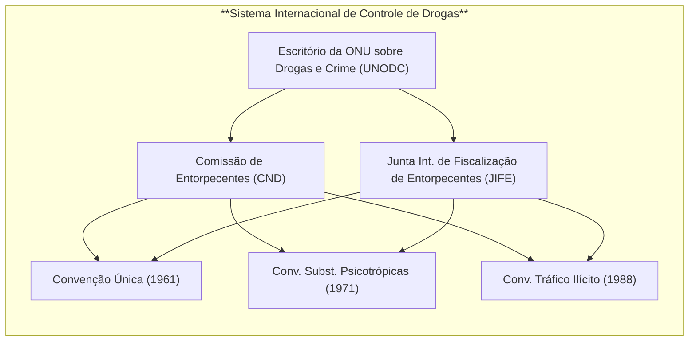

_(Diagrama: as convenções de 1961, 1971 e 1988 formam a base legal; a Comissão de Entorpecentes (CND) supervisiona as políticas e decisões sobre as convenções, com apoio técnico da OMS; a JIFE/INCB monitora o cumprimento (quotas de produção, comércio lícito, etc.); o UNODC atua como braço executivo, auxiliando países e servindo de secretaria do regime.)_

## Narcotráfico: Desafios e Debates na Cooperação Internacional

Apesar do arcabouço internacional consolidado, persistem **desafios consideráveis** para a cooperação antidrogas. Um dos principais entraves deriva do **princípio da soberania**: cada Estado tem suas prioridades e sensibilidades internas em matéria de drogas, o que pode limitar a disposição em ajustar leis nacionais ou aceitar monitoramento externo. Por exemplo, alguns países resistem a determinadas políticas antidrogas por considerá-las interferência em assuntos internos – daí a ênfase constante em respeitar _“plenamente a soberania e a integridade territorial dos Estados”_ em declarações conjuntas sobre drogas[brasil.un.org](https://brasil.un.org/pt-br/65425-drogas-declara%C3%A7%C3%A3o-conjunta-pede-melhor-compreens%C3%A3o-dos-fatores-sociais-e-econ%C3%B4micos#:~:text=O%20documento%20afirma%20que%20os,respeito%20m%C3%BAtuo%20entre%20os%20Estados%E2%80%9D). Diferenças culturais e históricas também influenciam abordagens (caso do cultivo tradicional da folha de coca, defendido por alguns governos andinos como patrimônio cultural, em tensão com as regras da Convenção de 1961).

Outro desafio é a **disparidade legislativa** entre países. Embora as convenções busquem harmonização, ainda há variações significativas: certas jurisdições impõem pena de morte para crimes de drogas, enquanto outras aboliram penas severas; algumas descriminalizaram o uso pessoal de determinadas substâncias, enquanto outras mantêm tolerância zero. Essa falta de uniformidade pode dificultar a colaboração jurídica – por exemplo, pedidos de **extradição** ou assistência jurídica podem ser negados se o fato não for crime nos dois países ou se houver risco de pena considerada desproporcional em um deles. A cooperação também esbarra em **capacidades desiguais** de aplicação da lei: países com recursos limitados ou instituições fragilizadas (por corrupção ou violência) podem ser elos fracos no combate global, incapazes de cumprir plenamente obrigações de fiscalização de fronteiras ou erradicação de cultivos ilícitos.

### Debate: “Guerra às Drogas” vs. Abordagens Alternativas

Um debate crucial na agenda internacional de drogas opõe a tradicional **“guerra às drogas”** – estratégia proibicionista e repressiva inaugurada pelos EUA nas décadas de 1970-80 – a enfoques alternativos como a **descriminalização do uso** e a **legalização regulamentada** de certas drogas. Críticos da guerra às drogas argumentam que, em mais de meio século, a estratégia punitiva não conseguiu reduzir significativamente nem a oferta nem a demanda de drogas, ao passo que gerou efeitos colaterais nefastos: encarceramento em massa, violações de direitos humanos e fortalecimento do poder do crime organizado. Entre 1998 e 2008, por exemplo, o número global de usuários de drogas permaneceu estável, assim como a área de cultivo de papoula, apesar dos esforços repressivos[reuters.com](https://www.reuters.com/article/world/onu-rev-guerra-s-drogas-em-meio-a-clamor-global-por-liberalizao-idUSKCN0XG2S1/#:~:text=,Solim%C3%A1n%2C%20ao%20jornal%20ingl%C3%AAs%20Guardian). Líderes latino-americanos destacam que a abordagem estritamente militar e policial _“fracassou, destruindo ou prejudicando milhares de vidas”_, e apontam uma tendência irreversível de reformas, como a legalização da cannabis em alguns países[reuters.com](https://www.reuters.com/article/world/onu-rev-guerra-s-drogas-em-meio-a-clamor-global-por-liberalizao-idUSKCN0XG2S1/#:~:text=drogas). Ex-presidentes e especialistas reunidos em comissões globais têm defendido estratégias de **redução de danos**, tratamento de usuários como questão de saúde pública, e até a regulamentação legal de mercados de drogas para enfraquecer as quadrilhas.

Por outro lado, países mais conservadores em política de drogas – **Rússia**, **China**, alguns países asiáticos e árabes – rejeitam a liberalização, temendo aumento do consumo e citando obrigações dos tratados vigentes. Mesmo entre aliados ocidentais há divisões: os EUA, por exemplo, embora internamente alguns de seus estados legalizem a maconha, em fóruns internacionais historicamente sustentaram a manutenção do regime proibicionista (ainda que nos últimos anos tenham adotado tom mais voltado a saúde pública). Esse conflito de visões ficou evidente na Sessão Especial da ONU sobre Drogas em 2016 (UNGASS 2016), quando _“enormes divisões”_ emergiram entre Estados defendendo descriminalização e foco em saúde versus aqueles contrários a flexibilizações[reuters.com](https://www.reuters.com/article/world/onu-rev-guerra-s-drogas-em-meio-a-clamor-global-por-liberalizao-idUSKCN0XG2S1/#:~:text=Apesar%20de%20uma%20concord%C3%A2ncia%20ampla,quanto%20pela%20guerra%20%C3%A0s%20drogas)[reuters.com](https://www.reuters.com/article/world/onu-rev-guerra-s-drogas-em-meio-a-clamor-global-por-liberalizao-idUSKCN0XG2S1/#:~:text=Mas%2C%20segundo%20os%20delegados%2C%20algumas,regulamentar%20o%20acesso%20%C3%A0%20maconha). O resultado foi uma declaração política de compromisso, vista como tímida pelos reformistas por ainda enfatizar a redução da oferta em vez da redução de danos[reuters.com](https://www.reuters.com/article/world/onu-rev-guerra-s-drogas-em-meio-a-clamor-global-por-liberalizao-idUSKCN0XG2S1/#:~:text=afirmou).

Uma frase célebre do então presidente colombiano Juan Manuel Santos resume o espírito do debate: _“Isso não é um pedido de legalização das drogas... É um pedido de reconhecimento de que, entre a guerra total e a legalização, existe uma ampla gama de opções que vale a pena explorar”_[reuters.com](https://www.reuters.com/article/world/onu-rev-guerra-s-drogas-em-meio-a-clamor-global-por-liberalizao-idUSKCN0XG2S1/#:~:text=direitos%20humanos). Assim, no cenário atual, mantém-se a tensão entre cumprir rigorosamente as convenções da ONU – que proíbem usos não médicos de entorpecentes – e inovar em políticas nacionais para minimizar os danos sociais do fenômeno das drogas. Esse debate tem implicações para a cooperação: iniciativas de alguns países (como Portugal, Uruguai, Canadá e certos estados dos EUA) de descriminalizar ou legalizar desafiam o regime internacional e exigem acomodações diplomáticas para evitar que o “fio” do consenso global se rompa. O princípio da **responsabilidade comum e compartilhada** permanece central, mas sua efetivação requer conciliar responsabilidade repressiva com responsabilidade em prevenção, tratamento e respeito aos direitos humanos – um equilíbrio delicado que ainda está em evolução na governança global das drogas[brasil.un.org](https://brasil.un.org/pt-br/65425-drogas-declara%C3%A7%C3%A3o-conjunta-pede-melhor-compreens%C3%A3o-dos-fatores-sociais-e-econ%C3%B4micos#:~:text=%E2%80%9CEstamos%20plenamente%20conscientes%20de%20que,as%20estrat%C3%A9gias%E2%80%9D%2C%20diz%20a%20declara%C3%A7%C3%A3o)[brasil.un.org](https://brasil.un.org/pt-br/65425-drogas-declara%C3%A7%C3%A3o-conjunta-pede-melhor-compreens%C3%A3o-dos-fatores-sociais-e-econ%C3%B4micos#:~:text=O%20documento%20afirma%20que%20os,respeito%20m%C3%BAtuo%20entre%20os%20Estados%E2%80%9D).

## Crime Organizado Transnacional: Natureza da Ameaça

O **crime organizado transnacional** engloba redes criminosas diversificadas que operam através de fronteiras, envolvendo-se em múltiplas atividades ilícitas: tráfico de drogas, **tráfico de pessoas**, **contrabando de migrantes**, **tráfico de armas**, **lavagem de dinheiro**, crimes ambientais, entre outros. Essas organizações criminosas – máfias, cartéis, gangues transnacionais – caracterizam-se por estrutura hierárquica ou em rede, planejamento de longo prazo e enorme poder financeiro. A globalização, aliada aos avanços em transportes, comunicações e tecnologia financeira, ampliou o alcance e sofisticação desses grupos, que aproveitam brechas legais e jurisdicionais entre países para expandir seus empreendimentos ilícitos. As **ameaças à segurança** são múltiplas: o crime organizado corrompe instituições públicas (polícias, judiciário, governos), desestabiliza economias lícitas mediante infiltração financeira, gera violência armada e pode, em certos contextos, aliar-se a grupos terroristas ou insurgentes, aprofundando conflitos. Na década de 1990, com o fim da Guerra Fria, emergiu a compreensão de que o crime organizado transnacional era um _“novo perigo comum”_ à comunidade internacional, exigindo resposta cooperativa semelhante à adotada contra ameaças tradicionais à paz.

> [!definition] **Definição – Grupo Criminoso Organizado (Convenção de Palermo)**  
> De acordo com o Artigo 2º da Convenção da ONU contra o Crime Organizado Transnacional, considera-se **“grupo criminoso organizado”** _“um grupo estruturado de três ou mais pessoas, existente há algum tempo e atuando concertadamente com o propósito de cometer uma ou mais infrações graves, com a intenção de obter, direta ou indireta, um benefício econômico ou outro benefício material”_[vladimiraras.blog](https://vladimiraras.blog/2020/05/16/o-conceito-de-organizacao-criminosa-e-suas-controversias/#:~:text=Diz%20o%20art,23). **Infrações graves** são definidas como aquelas puníveis com pelo menos 4 anos de prisão[vladimiraras.blog](https://vladimiraras.blog/2020/05/16/o-conceito-de-organizacao-criminosa-e-suas-controversias/#:~:text=enunciadas%20na%20Conven%C3%A7%C3%A3o%2C%20%E2%80%9Ccom%20a,23). Essa definição visa abarcar as quadrilhas estáveis envolvidas em criminalidade lucrativa de alto impacto, servindo de base comum para as legislações nacionais.

## Crime Organizado Transnacional: A Convenção de Palermo e seus Protocolos

O principal instrumento global de combate ao crime organizado transnacional é a **Convenção das Nações Unidas contra o Crime Organizado Transnacional**, adotada em 2000 e conhecida como **Convenção de Palermo**. Trata-se de um tratado multilateral abrangente, em vigor desde 2003, que **reconhece a gravidade do problema e a necessidade de estreita cooperação internacional para enfrentá-lo**[unodc.org](https://www.unodc.org/lpo-brazil/pt/crime/marco-legal.html#:~:text=antes%20de%20aderir%20a%20qualquer,atos%20como%20a%20participa%C3%A7%C3%A3o%20em). A Convenção de Palermo dispõe que os Estados Partes devem **criminalizar** em suas leis internas os atos nucleares da criminalidade organizada – **participação em grupo criminoso organizado, lavagem de dinheiro, corrupção e obstrução da justiça** – e prevê medidas para facilitar **extradição, auxílio jurídico mútuo e cooperação policial** entre países[unodc.org](https://www.unodc.org/lpo-brazil/pt/crime/marco-legal.html#:~:text=Os%20Estados,resposta%20eficaz%20ao%20crime%20organizado). Além disso, incentiva o intercâmbio de informações de inteligência e a capacitação de agentes, buscando equiparar a capacidade dos Estados de dar uma resposta eficaz a essas redes criminosas[unodc.org](https://www.unodc.org/lpo-brazil/pt/crime/marco-legal.html#:~:text=tipifica%C3%A7%C3%A3o%20criminal%20na%20legisla%C3%A7%C3%A3o%20nacional,resposta%20eficaz%20ao%20crime%20organizado). Aderir à Convenção implica também um compromisso político: os países passaram a encarar o crime organizado transnacional não apenas como problema doméstico alheio, mas como ameaça comum, demandando esforços coordenados.

A Convenção de Palermo é complementada por **três Protocolos adicionais**, que abordam formas específicas de crime transnacional emergentes no final do século XX:

- **Protocolo sobre Tráfico de Pessoas (2000):** primeiro instrumento jurídico global vinculante a definir o **tráfico de pessoas** (especialmente de mulheres e crianças) e a estabelecer medidas para preveni-lo, reprimi-lo e punir seus autores[unodc.org](https://www.unodc.org/lpo-brazil/pt/crime/marco-legal.html#:~:text=Aprovado%20pela%20resolu%C3%A7%C3%A3o%20da%20Assembleia,pleno%20respeito%20aos%20direitos%20humanos). O protocolo visa harmonizar as legislações nacionais quanto à definição desse crime, de modo a facilitar investigações e processos transnacionais. Adicionalmente, exige dos países a proteção e assistência às vítimas de tráfico humano, garantindo respeito aos seus direitos humanos[unodc.org](https://www.unodc.org/lpo-brazil/pt/crime/marco-legal.html#:~:text=juridicamente%20vinculante%20com%20uma%20defini%C3%A7%C3%A3o,pleno%20respeito%20aos%20direitos%20humanos). A definição consensual de “tráfico de pessoas” – envolvendo recrutamento, transporte ou acolhimento de pessoas por meios coercitivos para fins de exploração – foi uma conquista-chave, alinhando entendimentos e fechando brechas que traficantes exploravam.
    
- **Protocolo sobre Contrabando de Migrantes (2000):** criminaliza o **contrabando de migrantes** por via terrestre, marítima ou aérea, isto é, a facilitação da entrada irregular de pessoas em um país, geralmente em troca de lucro financeiro[unodc.org](https://www.unodc.org/lpo-brazil/pt/crime/marco-legal.html#:~:text=Este%20protocolo%20foi%20aprovado%20pela,migrantes%20contrabandeados%20e%20prevenindo%20a). Diante do crescimento desse tipo de atividade por redes que exploram migrantes vulneráveis, o protocolo trouxe, pela primeira vez, uma definição global de **“contrabando de migrantes”**, diferenciando-o do tráfico de pessoas (no contrabando, há consentimento inicial do migrante, e a relação com os criminosos tende a encerrar-se na chegada; já o tráfico envolve coerção e exploração contínua). O instrumento busca promover a cooperação para prevenir e combater essas redes criminosas, ao mesmo tempo em que incentiva a proteção dos direitos dos migrantes contrabandeados e medidas para evitar que se tornem vítimas de exploração[unodc.org](https://www.unodc.org/lpo-brazil/pt/crime/marco-legal.html#:~:text=crescente%20de%20grupos%20criminosos%20organizados,prevenindo%20a%20explora%C3%A7%C3%A3o%20dessas%20pessoas).
    
- **Protocolo sobre Armas de Fogo (2001):** voltado a prevenir, combater e erradicar o **fabricamento e tráfico ilícitos de armas de fogo, suas peças e munições**[unodc.org](https://www.unodc.org/lpo-brazil/pt/crime/marco-legal.html#:~:text=Este%20protocolo%20foi%20aprovado%20por,pe%C3%A7as%20e%20componentes%20e%20muni%C3%A7%C3%B5es). É o primeiro tratado global juridicamente vinculante focado em armas leves, reconhecendo que o fluxo ilegal de armamentos alimenta conflitos e o próprio crime organizado. O protocolo obriga os Estados a adotarem **três conjuntos de medidas**: (1) **criminalizar** atividades ilícitas relacionadas a armas (fabricação sem licença, tráfico, etc.) conforme definições padronizadas; (2) implementar sistemas de **licenciamento e autorização governamental** para a produção e exportação lícita de armas, distinguindo claramente mercado legal e ilegal; e (3) garantir a **marcação e rastreamento** de armas de fogo, facilitando seguir o rastro de armas desviadas e identificar rotas de tráfico[unodc.org](https://www.unodc.org/lpo-brazil/pt/crime/marco-legal.html#:~:text=Ao%20ratificar%20o%20protocolo%2C%20os,rastreamento%20de%20armas%20de%20fogo). Essas medidas visam fechar o cerco ao comércio ilegal que abastece organizações criminosas e conflitos armados.
    

Vale notar que, para aderir a qualquer desses protocolos, o Estado deve primeiro ser Parte da Convenção de Palermo[unodc.org](https://www.unodc.org/lpo-brazil/pt/crime/marco-legal.html#:~:text=A%20Conven%C3%A7%C3%A3o%20%C3%A9%20complementada%20por,luta%20contra%20o%20crime%20organizado) – refletindo que os protocolos complementam o regime geral, mas sua incorporação é opcional, de acordo com as prioridades de cada país. Atualmente, a maioria dos países é parte da Convenção de Palermo e de pelo menos um protocolo, embora nem todos tenham ratificado os três. A implementação é acompanhada por mecanismos como a **Conferência das Partes (COP)** da Convenção, que monitora o cumprimento e promove intercâmbio de boas práticas.

## Crime Organizado Transnacional: Desafios da Cooperação Internacional

Apesar do arcabouço oferecido pela Convenção de Palermo e seus protocolos, há inúmeros **desafios práticos** na cooperação contra o crime organizado transnacional:

- **Soberania e Desconfiança:** Embora todos reconheçam a natureza transnacional da ameaça, na prática os Estados nem sempre estão dispostos a cooperar plenamente. Questões de soberania podem emergir quando, por exemplo, um país solicita a outro ações contundentes contra grupos criminosos atuando além-fronteira – alguns governos relutam em permitir operações estrangeiras em seu território ou em expor informações internas sensíveis. Ademais, a cooperação exige **confiança mútua** entre os órgãos de segurança e judiciários dos países envolvidos. Essa confiança pode ser abalada se houver suspeitas de corrupção: caso forças policiais ou autoridades estejam infiltradas por organizações criminosas (situação infelizmente comum onde o crime organizado é poderoso), outros países hesitarão em compartilhar inteligência ou efetuar **operações conjuntas**. Construir confiança demanda transparência e compromisso contínuo, algo nem sempre trivial nas relações internacionais.
    
- **Disparidades Legais e de Capacidade:** Há diferenças nas definições e tradições jurídicas que podem complicar a colaboração. Por exemplo, a própria noção de _“organização criminosa”_ variava antes de Palermo – alguns países não tipificavam explicitamente a participação em grupos criminosos. A Convenção buscou uniformizar isso, mas ainda assim os sistemas legais divergem em procedimentos penais, proteção a testemunhas, etc. Além disso, muitos países enfrentam **limitações de capacidade** técnica e institucional: investigações complexas de lavagem de dinheiro ou tráfico internacional requerem recursos especializados que nem todos dispõem. Países desenvolvidos muitas vezes fornecem **assistência técnica** (via UNODC ou acordos bilaterais) para capacitar forças policiais e unidades de inteligência financeira em nações em desenvolvimento. Todavia, enquanto persistirem essas assimetrias, grupos criminosos explorarão os pontos mais fracos – seja um país com leis menos rigorosas sobre lavagem de dinheiro, seja uma fronteira porosa com pouca vigilância.
    
- **Jurisdicionais e Probatórios:** Crimes transnacionais podem envolver múltiplos países (ex.: drogas produzidas na América do Sul, lavadas financeiramente na Europa e movimentadas via portos na África). Isso exige coordenação para determinar qual jurisdição processará os envolvidos e como coletar e compartilhar provas. Procedimentos de **assistência jurídica mútua** podem ser lentos e burocráticos; diferenças de idioma e cultura jurídica acrescentam dificuldade. Criminosos aproveitam-se dessas barreiras – por exemplo, operando de países que não têm tratado de extradição com a nação afetada, ou fragmentando suas operações para diluir a resposta legal.
    
- **Adaptação e Novas Ameaças:** Organizações criminosas demonstram notável capacidade de adaptação. À medida que Estados fecham brechas em certas áreas (por exemplo, mais controle sobre bancos para evitar lavagem), os criminosos migram para métodos ou localidades alternativas (uso de criptomoedas, paraísos fiscais pouco cooperativos, novas rotas de tráfico). A cooperação internacional costuma reagir de forma mais lenta que a inovação criminal, especialmente quando é necessária **negociação diplomática** para atualizar tratados ou estabelecer novos instrumentos. Exemplos recentes incluem o desafio de crimes cibernéticos ligados a organizações criminosas (como fraude online, phishing em massa) e a exploração de mercados ilícitos na _dark web_ para venda de drogas, armas e pessoas – áreas nas quais o crime organizado transnacional se reinventa e que exigem coordenação com o regime internacional de _cyber_ (ver próxima seção).
    

Em síntese, o combate ao crime organizado transnacional requer um **esforço persistente de coordenação** entre Estados com diferentes interesses e capacidades. A Convenção de Palermo fornece uma linguagem comum e um compromisso formal, mas a efetividade depende de vontade política, investimento em instituições de aplicação da lei e superação de rivalidades geopolíticas. Sem isso, as promessas de cooperação esbarram em respostas fragmentadas, permitindo que as redes criminosas globalizadas continuem explorando as brechas do sistema internacional.

## Crimes Cibernéticos: Natureza da Ameaça

No século XXI, os **crimes cibernéticos** ascenderam rapidamente à primeira linha das preocupações de segurança internacional. A digitalização de praticamente todas as esferas da vida – economia, governo, comunicações – criou novos tipos de vulnerabilidades exploradas por criminosos através do ciberespaço. **Crimes cibernéticos** podem ser definidos como atos ilícitos cometidos mediante o uso de tecnologias de informação e comunicação (TIC), englobando desde invasões de computadores (_hacking_) para roubo de dados, fraudes financeiras online, ataques de **ransomware** (sequestro de sistemas mediante criptografia, exigindo resgate), até a disseminação de **malware**, **phishing** (fraude via engodo digital), espionagem cibernética contra segredos comerciais ou governamentais, e abuso sexual de crianças pela internet (como produção/distribuição de pornografia infantil e aliciamento online). Diferentemente de crimes tradicionais, os delitos cibernéticos podem ser **praticados remotamente**, com anonimato relativo, e atingir vítimas em qualquer lugar do mundo quase instantaneamente.

A natureza transnacional é inerente à maioria dos cibercrimes: um ataque pode ser lançado por criminosos em um país, utilizando servidores em vários outros, para afetar indivíduos, empresas ou infraestruturas críticas em um terceiro Estado. Essa difusão global do risco faz com que **nenhum país consiga enfrentar sozinho** a ameaça – a cooperação é imprescindível tanto para investigar crimes (seguindo rastros digitais que atravessam múltiplas jurisdições) quanto para prevenir ataques (por meio de alerta mútuo sobre ameaças e adoção de normas comuns de segurança). Estimativas recentes indicam que os prejuízos do cibercrime somam **trilhões de dólares** anuais globalmente, drenando recursos econômicos e minando a confiança no mundo digital[unodc.org](https://www.unodc.org/unodc/en/press/releases/2024/December/un-general-assembly-adopts-landmark-convention-on-cybercrime.html#:~:text=Executive%20Director%20Ghada%20Waly). Além dos impactos financeiros, há sério risco à **segurança nacional**: cibercriminosos podem paralisar serviços essenciais (redes elétricas, sistemas bancários, hospitais), e há crescente convergência entre crime cibernético e segurança estatal – por exemplo, **grupos criminosos podem atuar sob proteção ou comando de governos** para realizar ataques geopolíticos, borrando a linha entre crime comum e ameaça cibernética estatal.

## Crimes Cibernéticos: Regimes Internacionais – Convenção de Budapeste e a Nova Convenção da ONU

Durante muito tempo, a resposta internacional aos crimes cibernéticos foi fragmentada. Até o início dos anos 2000, inexistia um tratado universal específico. A iniciativa pioneira coube ao Conselho da Europa, que elaborou a **Convenção de Budapeste sobre Cibercrime (2001)** – primeiro acordo internacional voltado a harmonizar leis penais sobre delitos informáticos e facilitar a cooperação investigativa. A Convenção de Budapeste estabelece definições e tipifica uma série de condutas (como acesso ilegal a sistemas, espionagem de dados, fraude e falsificação informática, disseminação de material de abuso sexual infantil via TIC), além de prever medidas de coleta de evidências eletrônicas e um mecanismo de **cooperação internacional ágil** (incluindo a criação de pontos de contato _24/7_ em cada país para responder rapidamente a demandas urgentes)[theregreview.org](https://www.theregreview.org/2025/02/10/de-silva-de-alwis-the-u-n-cybercrime-convention-is-a-promethean-moment/#:~:text=Furthermore%2C%20the%20United%20States%2C%20in,%E2%80%9D). Embora seja um tratado regional europeu, a Convenção de Budapeste foi aberta à adesão de países de fora da Europa; atualmente conta com **mais de 65 Estados Partes**, incluindo nações como EUA, Japão, Austrália e vários países latino-americanos. O Brasil, contudo, **não** aderiu a Budapeste (até 2025), reflexo de uma cautela em delegar a um tratado formulado fora da ONU questões sensíveis de jurisdição e fluxo de dados. Países como China e Rússia também rechaçaram a Convenção de Budapeste, criticando-a por potencialmente violar soberanias (por exemplo, algumas disposições permitem acesso transfronteiriço a dados armazenados no exterior) e por não terem participado de sua elaboração.

As limitações geográficas da Convenção de Budapeste levaram a pedidos por um **tratado global de cibercrime**. Por anos, houve um impasse: países ocidentais preferiam fortalecer Budapeste e fóruns informais de cooperação, enquanto países como Rússia, China e membros do Movimento Não Alinhado defendiam negociar um instrumento _ex novo_ no âmbito das Nações Unidas – em parte para assegurar maior respeito à soberania e contemplar diferentes visões sobre o que constitui uso indevido das TIC. Esse impasse começou a se desfazer em 2019, quando a Assembleia Geral da ONU, por iniciativa russa (e apoio do G77), aprovou a criação de um **Comitê Ad Hoc para elaborar uma convenção internacional contra os crimes cibernéticos** (“uso das TIC para fins criminosos”). Após cinco anos de negociações complexas – envolvendo delegados de _quase todos os países membros_, além de consultas à sociedade civil e setor privado – chegou-se a um consenso. Em **24 de dezembro de 2024**, a Assembleia Geral **adotou por consenso** a nova _Convenção das Nações Unidas sobre Crimes Cibernéticos_[unodc.org](https://www.unodc.org/unodc/en/press/releases/2024/December/un-general-assembly-adopts-landmark-convention-on-cybercrime.html#:~:text=The%20United%20Nations%20General%20Assembly,year%20negotiation%20process)[unodc.org](https://www.unodc.org/unodc/en/press/releases/2024/December/un-general-assembly-adopts-landmark-convention-on-cybercrime.html#:~:text=The%20General%20Assembly%20adopted%20the,text%20for%20over%20five%20years). Trata-se do **primeiro tratado global** dedicado a essa matéria, marcando, nas palavras do UNODC, _“a primeira convenção internacional de justiça criminal do século XXI”_[theregreview.org](https://www.theregreview.org/2025/02/10/de-silva-de-alwis-the-u-n-cybercrime-convention-is-a-promethean-moment/#:~:text=December%2024%2C%202024%2C%20the%20United,importance%20of%20the%20new%20Convention).

Os objetivos centrais da Convenção da ONU contra o Cibercrime são **prevenir e combater o cibercrime de forma mais eficiente e eficaz, reforçando a cooperação internacional e fornecendo assistência técnica e capacitação especialmente a países em desenvolvimento**[unodc.org](https://www.unodc.org/unodc/en/press/releases/2024/December/un-general-assembly-adopts-landmark-convention-on-cybercrime.html#:~:text=and%20combat%20cybercrime%2C%20concluding%20a,year%20negotiation%20process). Em termos de conteúdo, o tratado abrange um rol de ofensas que refletem tanto crimes _cibernéticos puros_ (aqueles que só existem no ambiente digital, como ataques a sistemas, interferência em dados, uso indevido de dispositivos) quanto crimes _ciberneticamente habilitados_ (formas tradicionais de crime potencializadas pela internet, como fraudes, lavagem de dinheiro on-line, exploração sexual infantil, etc.). Inovações incluem disposições sobre **criminalização da distribuição não consensual de imagens íntimas** (“revenge porn”) e **aliciamento sexual de menores on-line (cybergrooming)**, reconhecimento de que essas práticas modernas causam graves danos e afetam desproporcionalmente mulheres e crianças[theregreview.org](https://www.theregreview.org/2025/02/10/de-silva-de-alwis-the-u-n-cybercrime-convention-is-a-promethean-moment/#:~:text=Furthermore%2C%20the%20United%20States%2C%20in,%E2%80%9D)[theregreview.org](https://www.theregreview.org/2025/02/10/de-silva-de-alwis-the-u-n-cybercrime-convention-is-a-promethean-moment/#:~:text=Article%2015%20of%20the%20Convention,%E2%80%9D). Também há preocupações transversais, como a necessidade de proteger direitos humanos no contexto digital e considerar impacto de gênero – o preâmbulo menciona incorporar perspectiva de gênero nas estratégias de combate ao cibercrime[theregreview.org](https://www.theregreview.org/2025/02/10/de-silva-de-alwis-the-u-n-cybercrime-convention-is-a-promethean-moment/#:~:text=The%20Preamble%20to%20the%20Convention,could%20meaningfully%20strengthen%20the%20Convention).

Operacionalmente, a convenção prevê mecanismos de **cooperação policial e jurídica** semelhantes aos de Budapeste (assistência mútua, extradição, preservação rápida de dados eletrônicos, auxílio na coleta de provas digitais) porém em escala global. Um avanço significativo é a formalização do apoio do UNODC como _secretariado_, inclusive para fomentar **capacitação técnica** – crucial para que países menos desenvolvidos possam implementar o tratado e melhorar sua resiliência cibernética[unodc.org](https://www.unodc.org/unodc/en/press/releases/2024/December/un-general-assembly-adopts-landmark-convention-on-cybercrime.html#:~:text=%E2%80%9CIn%20today%E2%80%99s%20digital%20age%2C%20cybercrime,%E2%80%9D)[unodc.org](https://www.unodc.org/unodc/en/press/releases/2024/December/un-general-assembly-adopts-landmark-convention-on-cybercrime.html#:~:text=Nam%20in%202025,th%7D%20signatory). O tratado será aberto para assinaturas em **julho de 2025**, no Vietnã, e entrará em vigor após 40 ratificações[unodc.org](https://www.unodc.org/unodc/en/press/releases/2024/December/un-general-assembly-adopts-landmark-convention-on-cybercrime.html#:~:text=The%20Convention%20will%20open%20for,th%7D%20signatory).

É importante notar que a negociação da convenção de cibercrime refletiu clivagens geopolíticas: questões como **liberdade de expressão online vs. controle de conteúdo** e o conceito de **“segurança da informação”** (favorecido por Rússia/China, abrangendo também o combate à difusão de ideias que consideram perigosas, como extremismo, que para países ocidentais poderia cair em censura política) foram pontos delicados. O título oficial do tratado – “Convenção sobre Combate ao Uso das TIC para Fins Criminais” – reflete uma terminologia mais ampla desejada por países autoritários, mas o texto final evitou criminalizar diretamente aspectos controvertidos como “discurso de ódio” ou “terrorismo cibernético”, focando em delitos com maior consenso internacional. Ainda assim, o compromisso para negociar _protocolos futuros_ (já previsto pelo Comitê Ad Hoc) sugere que temas ausentes ou pouco detalhados – possivelmente delitos relacionados a terrorismo ou outras questões – poderão ser incorporados gradualmente, conforme haja convergência.

## Crimes Cibernéticos: Desafios da Cooperação e Governança do Ciberespaço

A cooperação internacional contra o cibercrime enfrenta **obstáculos únicos**, decorrentes tanto das características técnicas do ciberespaço quanto de divergências políticas profundas entre os Estados:

- **Atribuição e Jurisdição:** Identificar os autores reais de ataques cibernéticos é notoriamente difícil. Criminosos podem mascarar sua identidade (usando redes anônimas, VPNs, _spoofing_ de endereços) e explorar infraestruturas em diversos países. Essa dificuldade de **atribuição** complica a cooperação: um país alvo de um ataque pode suspeitar do envolvimento (direto ou tolerado) do governo de onde o ataque parece ter vindo, gerando atritos diplomáticos em vez de colaboração. Ademais, mesmo quando os responsáveis são indivíduos ou grupos não estatais identificados, frequentemente residem em países cuja jurisdição não alcança os crimes cometidos no exterior ou que **se negam a extraditar** seus nacionais. Um exemplo frequente é de hackers e fraudadores sediados em países que não têm tratados de extradição com os países das vítimas – nesses casos, a **impunidade** é um incentivo para a proliferação de cibercrimes. Superar isso requer tratados que estabeleçam jurisdição extraterritorial para certos delitos e disposição política para entregas internacionais, o que esbarra no apego à jurisdição doméstica.
    
- **Disparidade Legal e Técnica:** Há um grande hiato entre países quanto à existência e abrangência de **legislação cibernética**. Enquanto nações desenvolvidas atualizaram seu código penal para abarcar crimes informáticos, muitos países em desenvolvimento ainda carecem de leis específicas ou definições claras – tornando-se elos frágeis (onde criminosos operam sem medo de punição) e dificultando a **cooperação jurídica** (por exemplo, pedidos de assistência podem ser inviáveis se o fato não for crime em ambos os locais). A nova Convenção da ONU tenta mitigar isso, fornecendo um modelo comum de tipos penais. Porém, a implementação nacional leva tempo e requer recursos. Além disso, diferenças persistem quanto à **proteção de dados e privacidade**: países da UE, por exemplo, têm leis rígidas de proteção de dados pessoais que limitam o compartilhamento de informações com autoridades estrangeiras; já outros Estados podem priorizar o acesso irrestrito a dados para investigações. Conciliar segurança e privacidade é um desafio jurídico-político constante na cooperação cibernética.
    
- **Princípio da Soberania vs. Multissetorialismo:** No tocante à **governança do ciberespaço**, existe um **conflito de visões** fundamental entre blocos de países. As democracias ocidentais, desde os anos 1990, promovem um modelo de governança **multissetorial** (_multi-stakeholder_), no qual governos, empresas privadas, academia e sociedade civil compartilham responsabilidades na administração da internet e na elaboração de normas, preservando um ciberespaço aberto, interoperável e com **livre fluxo de informações**[blogs.lse.ac.uk](https://blogs.lse.ac.uk/cff/2022/08/18/sovereignty-and-cyberspace-chinas-ambition-to-shape-cyber-norms/#:~:text=Global%20cyber%20governance%20is%20arguably,Western%20countries%2C%20including%20China). Esse modelo, exemplificado pela gestão descentralizada da rede (e.g. ICANN no gerenciamento de domínios) e por fóruns colaborativos, sustenta que envolver apenas Estados na governança poderia ameaçar liberdades fundamentais, como a de expressão. Em contraposição, países de regime autoritário (como **China e Rússia**) advogam o princípio da **“ciber soberania”**: cada Estado deve ter o direito de controlar o conteúdo e a estrutura da internet em seu território, estabelecendo suas próprias regras, e a governança global deve ocorrer de forma **multilateral** (entre governos), preferencialmente sob liderança da ONU[blogs.lse.ac.uk](https://blogs.lse.ac.uk/cff/2022/08/18/sovereignty-and-cyberspace-chinas-ambition-to-shape-cyber-norms/#:~:text=Another%20cyber%20norm%20promoted%20by,potential%20threat%20to%20state%20sovereignty). Para Pequim e Moscou, a abordagem multi-stakeholder ocidental permitiu que empresas de tecnologia e atores não-estatais (muitos deles ocidentais) tivessem influência excessiva, e enxergam nisso um risco à soberania nacional e à ordem interna. Como reflexo, esses países buscam há anos fortalecer fóruns intergovernamentais – por exemplo, propondo na ONU um _Código de Conduta para a Segurança da Informação_ enfatizando o respeito à soberania e à não-interferência no conteúdo informacional de outros países[blogs.lse.ac.uk](https://blogs.lse.ac.uk/cff/2022/08/18/sovereignty-and-cyberspace-chinas-ambition-to-shape-cyber-norms/#:~:text=China%20has%20also%20used%20regional,sovereignty%20as%20the%20guiding%20principle).
    

Essa clivagem ideológica complica a cooperação contra cibercrimes de duas maneiras. Primeiro, **diferentes definições de “crime” online**: regimes autoritários frequentemente classificam como crimes cibernéticos atividades vistas por liberais como exercício de direitos (discurso político dissidente, organização de protestos via redes sociais, etc.), rotulando-as de “extremismo” ou “desordem informacional”. Países ocidentais se recusam a cooperar nessas perseguições, e isso tensiona negociações sobre tratados – foi crucial delimitar na Convenção de 2024 que seu escopo se restringe a crimes comuns, não servindo para justificar repressão política. Segundo, a disputa afeta a **arquitetura de governança**: sem acordo sobre quem deve liderar e quais princípios básicos (liberdade vs. controle), fica mais difícil estabelecer **normas globais de conduta** no ciberespaço, inclusive no que tange a atribuição de responsabilidades a Estados que abrigam cibercriminosos. Apesar disso, o diálogo prossegue em plataformas como o **Grupo de Trabalho Aberto da ONU sobre segurança cibernética**, onde todos os Estados debatem normas de comportamento estatal no ciberespaço – embora novamente aí apareça a divisão, com propostas ocidentais de aplicar o direito internacional existente (por exemplo, proibir ataques a infraestrutura civil em tempo de paz) contrastando com propostas de países autoritários focadas em _“conteúdo informacional nocivo”_ e no princípio de não-intervenção.

- **Capacidade e Partilha de Informações:** No combate cotidiano aos cibercrimes, um desafio prático é a troca oportuna de informações e evidências. Provas digitais são voláteis – um log de acesso pode ser deletado ou perdido em dias – o que requer rapidez nos pedidos transnacionais. A burocracia legal muitas vezes não acompanha essa velocidade, e mesmo a nova Convenção enfrentará o desafio de tornar mais ágeis os mecanismos de cooperação. Além disso, muitos países carecem de equipes especializadas em forense digital ou em monitoramento de ameaças cibernéticas. **Iniciativas de capacitação** e criação de unidades especializadas (p.ex. equipes nacionais de resposta a incidentes – CERTs) são vitais para nivelar o campo de jogo; do contrário, criminosos concentrarão ataques em países com defesas mais frágeis. A intersecção público-privada é outro fator: muitas evidências e informações cruciais estão em mãos de empresas de tecnologia (provedores de e-mail, redes sociais, hospedagem em nuvem). A cooperação internacional, portanto, não se dá apenas Estado-Estado, mas também **Estado-empresa** – e diferenciar o legítimo acesso estatal a dados para investigação do abuso que viole privacidade é uma linha tênue.
    

Em resumo, a luta contra os crimes cibernéticos exige uma conjugação inédita de esforços diplomáticos, legais e técnicos. A **disparidade de visões** sobre a governança do ciberespaço continuará desafiando a construção de um consenso global; no entanto, o avanço representado por uma convenção abrangente da ONU sinaliza que há terreno comum suficiente (como o combate a fraudes financeiras, abuso infantil, ataques a redes) para ações cooperativas. Os diplomatas e formuladores de políticas precisam equilibrar **soberania e cooperação**, **segurança e liberdade**, garantindo que a internet não seja nem terra sem lei para criminosos, nem um espaço excessivamente controlado que sufoque os direitos que também fazem parte da segurança humana. O êxito na contenção das ameaças cibernéticas – assim como do narcotráfico e do crime organizado – será um dos grandes determinantes da paz e prosperidade internacionais nas próximas décadas.

## Questões para Autoavaliação

**1.** Como o princípio da **soberania estatal** pode simultaneamente dificultar e demandar a cooperação internacional no combate a ameaças transnacionais como o narcotráfico e o cibercrime?

**2.** Analise os impactos das **divergências legislativas** e de capacidades entre países na eficácia dos regimes internacionais contra drogas e crimes cibernéticos. Como essas disparidades podem ser atenuadas?

**3.** Considerando as diferenças entre países ocidentais e autoritários na visão de governança do ciberespaço, discuta de que forma esses conflitos influenciam a elaboração de normas globais de segurança cibernética e quais seriam possíveis caminhos de convergência.

# Origem: Anti-Money Laundering

---
title: "International Financial Regime: Anti-Money Laundering Architecture and Mechanisms"
area: "POLÍTICA INTERNACIONAL"
subarea: "O Brasil e a agenda internacional"
tags:
  - cacd-2025
  - narcotrafico-crime-transnacional-e-crimes-ciberneticos
  - o-brasil-e-a-agenda-internacional
  - politica-internacional
---
# International Financial Regime: Anti-Money Laundering Architecture and Mechanisms

The global anti-money laundering regime represents one of the most sophisticated and comprehensive international regulatory frameworks in modern financial governance, evolving from a G7 initiative in 1989 to a global network encompassing over 200 jurisdictions. Despite significant institutional development and technical compliance improvements, fundamental questions persist about the regime's effectiveness in achieving its core objectives of disrupting criminal finances and protecting the integrity of the global financial system.

## Institutional architecture and governance framework

The international AML regime operates through a multi-layered institutional structure centered on the Financial Action Task Force (FATF) as the global standard-setting body, supported by nine autonomous FATF-Style Regional Bodies (FSRBs), UN institutions, and international financial organizations. **FATF's transformation from a time-bound G7 initiative to an open-ended mandate** (granted April 2019) reflects the regime's institutionalization and permanent status within global financial governance.

The institutional architecture demonstrates sophisticated coordination mechanisms through the Global Network Coordination Group and annual high-level meetings between FATF and FSRBs. This structure enables comprehensive global coverage while accommodating regional variations, with FSRBs conducting mutual evaluations using standardized FATF methodology across Latin America (GAFILAT), Asia-Pacific (APG), Africa (ESAAMLG, GIABA, GABAC), the Middle East (MENAFATF), the Caribbean (CFATF), and Europe (MONEYVAL, Eurasian Group).

The UN Office on Drugs and Crime serves as the regime's capacity-building arm through its Global Programme against Money Laundering, providing technical assistance to developing countries and serving as custodian for key conventions. The World Bank and IMF integrate AML/CFT considerations into their core functions, with the Bank's Financial Integrity Program facilitating asset recovery of nearly US$10 billion since 2010, while the IMF incorporates AML assessments into surveillance and lending operations.

## Legal foundations and normative framework

The regime's legal architecture rests on two foundational UN conventions that establish universal criminalization requirements and international cooperation mechanisms. **The UN Convention against Transnational Organized Crime (Palermo Convention)** mandates money laundering criminalization under Article 6, while **Article 7 requires comprehensive regulatory frameworks** for financial institutions. With 192 parties as of 2024, the Convention's near-universal ratification demonstrates broad normative acceptance of AML obligations.

The UN Convention against Corruption (UNCAC) strengthens this foundation by designating **asset recovery as a "fundamental principle"** and establishing the first international convention to prioritize asset recovery. Chapter V (Articles 51-59) creates comprehensive frameworks for international cooperation in asset recovery, while Article 14 mandates regulatory and supervisory regimes for money laundering prevention. This dual convention structure provides legal basis for both domestic criminalization and international cooperation mechanisms.

UN Security Council resolutions, particularly Resolution 1373 (2001) post-9/11, extend AML principles to counter-terrorism financing and establish mandatory enforcement obligations for all UN members. The evolution from voluntary FATF recommendations to binding Security Council requirements illustrates the regime's progression from soft law coordination to hard law enforcement mechanisms.

## Standards development and compliance mechanisms

FATF's 40 Recommendations constitute the regime's technical standards, with the most recent update in February 2025 reflecting ongoing adaptation to emerging risks. The regime's effectiveness depends on its dual assessment methodology introduced in the 4th Round (2013-2024), evaluating both technical compliance with standards and effectiveness in achieving policy objectives. **Global technical compliance improved dramatically from 36% in 2012 to 76% in 2024**, demonstrating the mutual evaluation process's impact on regulatory convergence.

However, effectiveness ratings remain concerning, with many countries facing "substantial challenges in taking effective action" despite technical compliance improvements. This compliance-effectiveness gap represents a fundamental challenge in translating regulatory activity into measurable crime prevention outcomes. The transition to the 5th Round evaluations in 2025 emphasizes risk-based, tailored assessments focused on outcomes rather than process compliance.

The International Cooperation Review Group (ICRG) process enforces standards through graduated pressure mechanisms, including the "grey list" for jurisdictions under increased monitoring and the "black list" for high-risk non-cooperative jurisdictions. Recent grey list dynamics show both successes (Philippines, UAE, Turkey removed in 2024) and ongoing challenges (Nepal, Laos added in 2025), reflecting the regime's continued evolution and adaptation.

## Cryptocurrency and digital asset challenges

Digital assets present unprecedented challenges to traditional AML frameworks designed for centralized financial systems with clear intermediaries and customer identification requirements. **Cryptocurrency's inherent characteristics—decentralization, pseudonymity, borderless operation, and rapid innovation—fundamentally challenge existing regulatory assumptions** and create persistent compliance gaps despite ongoing regulatory adaptation efforts.

Privacy-enhanced cryptocurrencies like Monero and Zcash represent the most significant technical challenge, with Monero's ring signatures, stealth addresses, and RingCT making blockchain analysis extremely difficult. Multiple jurisdictions have responded by banning privacy coins from regulated exchanges, including Japan (2018), South Korea (2021), and Australia, with the EU considering similar restrictions under anti-money laundering directives.

Decentralized Finance (DeFi) protocols compound these challenges through their permissionless, autonomous nature that eliminates central authorities responsible for compliance. **Flash loans, cross-chain bridges, and automated smart contracts enable complex transaction patterns** that can obscure fund origins while operating outside traditional regulatory frameworks. The lack of customer identification requirements and the pseudonymous nature of wallet addresses create fundamental gaps in traditional AML approaches.

FATF's response through updated Recommendation 15 (2019) and subsequent guidance attempts to extend AML/CFT measures to Virtual Asset Service Providers (VASPs), including the controversial "Travel Rule" requiring information sharing for transactions above USD/EUR 1,000. However, implementation remains insufficient globally, with only 29 of 98 surveyed jurisdictions having passed Travel Rule legislation as of 2022, highlighting the persistent gap between standard-setting and practical implementation.

## Regional mechanisms and coordination challenges

The nine FSRBs create comprehensive regional coverage while enabling peer learning and cultural sensitivity in assessments. Each regional body operates autonomously while adhering to common FATF methodology, conducting mutual evaluations, providing technical assistance, and facilitating information sharing within their regions. This structure demonstrates sophisticated multilateral coordination while accommodating regional variations in legal systems, institutional capacity, and risk profiles.

However, significant disparities exist across regions in implementation effectiveness and coordination capabilities. MONEYVAL benefits from European integration and demonstrates more consistent implementation, while MENAFATF faces particular challenges with cross-border enforcement coordination. GIABA members show varied compliance levels, with some countries like Togo achieving only 11 weak effectiveness results, illustrating persistent capacity constraints in developing regions.

The High-Level Principles & Objectives (updated 2018) govern FATF-FSRB relationships and establish coordination mechanisms including joint assessments, shared assessor training, and reciprocal meeting participation rights. This formal coordination structure enables standardization while preserving regional autonomy, though tensions persist between global consistency requirements and regional adaptation needs.

## Effectiveness assessment and scholarly critiques

Academic research reveals fundamental questions about the regime's cost-effectiveness and actual impact on criminal finances. **Ronald Pol's comprehensive critique demonstrates that AML policy intervention has less than 0.1% impact on criminal finances, while compliance costs exceed recovered criminal funds by more than 100 times**. This analysis, supported by UN findings that only 0.2% of criminal funds are successfully intercepted globally, challenges core assumptions about the regime's effectiveness.

Think tank analysis from institutions including the Council on Foreign Relations, Chatham House, and the Peterson Institute reveals consensus on the need for fundamental reform. Chatham House research identifies the UK as a major destination for illicit funds despite strong legal frameworks, with up to £90 billion laundered annually through inadequately configured risk-based approaches. Similarly, Peterson Institute analysis documents systematic AML failures across 15+ EU countries, highlighting how system fragmentation enables illicit actors to exploit regulatory arbitrage opportunities.

Brookings Institution research describes current AML programs as "in substantial need of reform" with "counterproductive outcomes," noting that compliance costs bear no correlation to customer profitability and lead to blanket exclusions rather than targeted risk management. This scholarly consensus suggests the regime prioritizes regulatory activity over measurable crime reduction outcomes, creating what academics term the "comfort of activity" without proportional effectiveness.

## Brazilian perspective and regional leadership

Brazil exemplifies both the opportunities and challenges of AML regime implementation in emerging economies. As a full FATF member since 2000 and active GAFILAT participant, Brazil has developed sophisticated institutional architecture centered on COAF (Conselho de Controle de Atividades Financeiras) as its financial intelligence unit, supported by comprehensive regulatory oversight from the Central Bank, Securities Commission, and specialized agencies.

Brazil's 2023 mutual evaluation results illustrate persistent implementation challenges despite sophisticated legal frameworks. **Technical compliance ratings show 29 of 40 recommendations achieving Compliant or Largely Compliant status, but effectiveness ratings reveal only 2 of 11 immediate outcomes achieving Substantially Effective ratings**, with none rated Highly Effective. This performance reflects broader global patterns where technical compliance improvements fail to translate into effective operational outcomes.

Key challenges include insufficient inter-agency coordination between police, prosecution, and tax authorities, limited prosecution of environmental crimes despite Brazil's high risk profile, and incomplete supervisory coverage of non-financial businesses. The country's experience with digital payment innovation through the PIX system creates new AML vulnerabilities while demonstrating the challenges of adapting traditional frameworks to financial technology innovation.

Brazil's regional leadership role through GAFILAT positions it as a potential driver of regional AML improvements, but domestic implementation challenges must be resolved to realize its potential as a regional standard-setter. The country's experience illustrates broader developing economy challenges in translating international commitments into effective domestic implementation.

## Contemporary debates and future evolution

The regime faces fundamental questions about its theoretical foundations and practical effectiveness that extend beyond technical implementation challenges. Academic criticism focuses on the disconnect between symbolic legal frameworks that promise comprehensive crime prevention and practical outcomes that suggest minimal impact on criminal enterprises. This debate reflects broader questions about whether current approaches represent effective policy intervention or primarily serve political legitimacy functions.

Think tank analysis consistently points toward several reform priorities: enhanced transparency through public beneficial ownership registries, centralized supervision to prevent regulatory arbitrage (as exemplified by the new EU AML Authority), and outcome-focused rather than compliance-focused assessment methodologies. The emerging consensus suggests that future regime development must balance maintaining global standards while accommodating national variations, leveraging technology while preserving privacy, and ensuring financial inclusion while managing legitimate risks.

The transition to 5th Round evaluations represents an opportunity to address effectiveness gaps through more sophisticated risk-based approaches and reduced assessment cycles. However, fundamental questions remain about whether structural reforms can address the core effectiveness challenges identified by independent academic research. The regime's future legitimacy may depend on its ability to demonstrate measurable impact on criminal finances rather than merely documenting compliance activities.

## Conclusion

The international AML regime represents remarkable institutional development and coordination achievement, creating comprehensive global standards and sophisticated enforcement mechanisms across 200+ jurisdictions. Technical compliance improvements from 36% to 76% over the past decade demonstrate the mutual evaluation process's effectiveness in promoting regulatory convergence and institutional capacity building.

However, persistent questions about the regime's fundamental effectiveness challenge its core assumptions and methods. **The disconnect between massive compliance investments and minimal measurable impact on criminal finances suggests a regime that has prioritized institutional expansion and regulatory activity over crime prevention outcomes**. Academic research consistently documents this effectiveness gap, while think tank analysis calls for fundamental reforms rather than incremental improvements.

The regime's evolution must address several competing pressures: maintaining universal standards while accommodating diverse national circumstances, leveraging technological innovation while preserving legitimate privacy interests, and ensuring financial inclusion while managing genuine risks. Success in these areas will determine whether the AML regime can evolve from its current focus on regulatory compliance toward demonstrable effectiveness in protecting global financial system integrity and disrupting criminal enterprises.

For diplomatic studies, understanding this regime requires appreciation of both its institutional sophistication and its fundamental limitations. The AML regime exemplifies both the possibilities and constraints of global regulatory coordination, demonstrating how international cooperation can create comprehensive frameworks while highlighting the persistent challenges of translating international commitments into effective domestic implementation and measurable policy outcomes.

# Origem: Governança Global do Ciberespaço e do Sistema Financeiro

---
title: "Governança Global do Ciberespaço e do Sistema Financeiro"
area: "POLÍTICA INTERNACIONAL"
subarea: "O Brasil e a agenda internacional"
tags:
  - cacd-2025
  - narcotrafico-crime-transnacional-e-crimes-ciberneticos
  - o-brasil-e-a-agenda-internacional
  - politica-internacional
---
Resposta Direta

Pontos-Chave

- Os crimes cibernéticos e a lavagem de dinheiro são desafios transnacionais complexos, com interconexões crescentes, especialmente via criptoativos.
    
- A governança global inclui a Convenção de Budapeste (2001) para cibercrime e o GAFI/FATF para lavagem de dinheiro, mas há disputas geopolíticas significativas.
    
- Negociações na ONU para uma nova convenção sobre cibercrime mostram divisões entre visão ocidental (cooperação policial, direitos individuais) e países como Rússia/China (controle estatal, segurança da informação).
    
- O GAFI define padrões via 40 Recomendações, avalia países e usa listas cinza/preta para pressionar conformidade, enquanto o Grupo de Egmont facilita cooperação operacional.
    
- Criptoativos complicam o combate à lavagem de dinheiro devido ao anonimato, e há tensões entre cooperação internacional e soberania nacional.
    

Desafios dos Crimes Cibernéticos

Os crimes cibernéticos são difíceis de combater devido à transnacionalidade, dificuldade em atribuir autoria e rapidez dos ataques. A Convenção de Budapeste, com adesão recente do Brasil, é central, mas negociações na ONU revelam conflitos, como o desejo de alguns países de ampliar controle estatal, o que pode ameaçar direitos individuais. Parece provável que essas divisões reflitam interesses nacionais distintos, como segurança versus liberdade.

Regime de Combate à Lavagem de Dinheiro

A lavagem de dinheiro envolve colocar, ocultar e integrar fundos ilícitos, facilitando crimes como narcotráfico. O GAFI, com suas 40 Recomendações, avalia países via revisões mútuas e listas (cinza para monitoramento, preta para alto risco), pressionando conformidade. O Grupo de Egmont ajuda na troca de inteligência. A evidência sugere que essas ferramentas são eficazes, mas podem ser vistas como invasivas por alguns países.

Interconexões e Desafios

Criptoativos, como moedas digitais, aumentam desafios ao permitir lavagem anônima e rápida, exigindo novas ferramentas forenses. Há uma tensão constante: cooperação global é essencial, mas países protegem sua soberania, especialmente em leis e dados financeiros. A pesquisa indica que equilibrar esses interesses é um obstáculo central.

---

Nota de Estudo Estratégica: Governança Global do Ciberespaço e do Sistema Financeiro

Introdução

Esta nota de estudo analisa de forma aprofundada duas vertentes críticas do crime transnacional na agenda de segurança internacional: os crimes cibernéticos e a lavagem de dinheiro. O foco é explorar a governança global, os desafios específicos de cada área e suas interconexões, com ênfase em debates contemporâneos relevantes para o Concurso de Admissão à Carreira de Diplomata (CACD). A abordagem abrange a natureza das ameaças, a arquitetura de governança, disputas geopolíticas e tensões entre cooperação internacional e soberania nacional, especialmente no contexto do ciberespaço e dos criptoativos.

O Desafio dos Crimes Cibernéticos na Política Internacional

Natureza da Ameaça

Os crimes cibernéticos são um desafio único devido a características intrínsecas que dificultam a cooperação internacional:

- Transnacionalidade: Atos como ataques DDoS ou ransomware frequentemente cruzam fronteiras, complicando jurisdição e aplicação da lei.
    
- Problema da Atribuição de Autoria: O anonimato proporcionado por proxies, VPNs e técnicas de ofuscação torna difícil identificar os responsáveis, especialmente em ataques estatais ou patrocinados por estados.
    
- Velocidade e Alcance dos Ataques: A natureza digital permite que ataques sejam executados em segundos, afetando sistemas globais, como visto em incidentes recentes de ransomware que paralisaram infraestruturas críticas.
    

[!important] Esses fatores tornam os crimes cibernéticos uma ameaça dinâmica, exigindo respostas rápidas e coordenadas, mas enfrentando barreiras legais e políticas.

A Arquitetura de Governança e suas Disputas Geopolíticas

A Convenção de Budapeste sobre o Cibercrime (2001)

A Convenção de Budapeste, formalizada em 23 de novembro de 2001 pelo Conselho da Europa, é o principal tratado multilateral sobre crimes cibernéticos, com 80 partes até 2025 . Suas principais disposições incluem:

- Harmonização de Leis: Define crimes como acesso ilegal, interceptação de dados e interferência em sistemas, conforme detalhado nos Artigos 2 a 13.
    
- Cooperação Policial: Facilita assistência mútua e extradição, com artigos como 23 a 35 abordando cooperação internacional.
    
- Proteção de Direitos: Inclui salvaguardas para direitos humanos nos Artigos 15 e 22, equilibrando investigação e privacidade.
    

A adesão recente do Brasil, aprovada em dezembro de 2021, fortalece sua capacidade de cooperação, especialmente em investigações transnacionais. Contudo, a convenção enfrenta críticas por sua origem eurocêntrica e limitações em abordar crimes emergentes.

[!note] A adesão do Brasil é estratégica, alinhando-o a padrões globais, mas gerou debates sobre impacto em direitos digitais, como destacado em análises de 2021 [IRIS-BH - The Budapest Convention and Brazilian Membership](https://irisbh.com.br/en/the-budapest-concontroversies-over-brazilian-membership/).

O Novo Processo de Negociação na ONU

Desde 2021, a ONU negocia uma nova convenção global sobre crimes cibernéticos, concluída em dezembro de 2024 com a adoção da Convenção contra o Crime Cibernético . As negociações revelam profundas divergências geopolíticas:

- Visão Ocidental (EU, EUA, Reino Unido, Japão): Foca em cooperação policial e proteção de direitos individuais, alinhada à Convenção de Budapeste, priorizando crimes como abuso sexual infantil online.
    
- Visão de Países como Rússia e China: Advoga por incluir "segurança da informação" e maior controle estatal, abrangendo crimes como disseminação de "informações falsas" ou "incitação a atividades subversivas", potencialmente restringindo liberdade de expressão.
    

Essas divisões refletem interesses nacionais: países ocidentais buscam proteger direitos digitais, enquanto Rússia e China priorizam controle estatal, como evidenciado em propostas rejeitadas durante negociações . A adoção em 2024 foi vista como um marco, mas críticas persistem sobre falta de salvaguardas, com riscos de abuso por governos autoritários .

[!definition] A tensão entre cooperação e controle estatal é central, com implicações para a governança global do ciberespaço, especialmente em contextos de cibersegurança e direitos humanos.

O Regime Internacional de Combate à Lavagem de Dinheiro

Natureza da Ameaça

A lavagem de dinheiro é o processo de disfarçar a origem de fundos ilícitos para integrá-los ao sistema financeiro legal, seguindo três fases:

- Colocação (Placement): Introdução de dinheiro sujo, como depósito em contas bancárias ou compra de ativos, vulnerável a detecção devido a volumes altos.
    
- Ocultação/Estratificação (Layering): Séries de transações complexas, como transferências internacionais, para obscurecer a trilha de auditoria.
    
- Integração (Integration): Reintegração dos fundos como legítimos, via investimentos em negócios ou bens, dificultando rastreamento.
    

Este crime "habilita" outros, como narcotráfico, corrupção e financiamento ao terrorismo, permitindo que criminosos utilizem ganhos ilícitos sem risco de exposição .

[!example] Um traficante pode comprar um restaurante para misturar lucros de drogas com receitas legais, exemplificando a integração.

A Arquitetura de Governança e seu Ator Central

O GAFI/FATF (Grupo de Ação Financeira)

O GAFI, fundado em 1989, é o principal definidor de padrões globais, com 40 Recomendações que cobrem políticas AML/CFT, confisco, financiamento ao terrorismo e cooperação internacional . Sua metodologia inclui:

- 40 Recomendações: Divididas em áreas como prevenção, transparência e poderes de autoridades, revisadas em 2012 e atualizadas em 2021.
    
- Avaliações Mútuas: Revisões peer-to-peer, com foco em eficácia (como resultados práticos) e conformidade técnica (leis em vigor), usando metodologias de 2013 e 2022 .
    
- Listas Cinza e Preta: A lista cinza (Jurisdictions under Increased Monitoring) inclui países comprometidos a resolver deficiências, como Argélia e Angola em 2024, enquanto a preta (High-Risk Jurisdictions) lista países não cooperativos, como Coreia do Norte, com chamadas para contramedidas .
    

[!important] O sistema de listas é uma ferramenta de pressão, mas pode ser visto como invasivo, gerando tensões com soberania nacional.

Outros Atores

O Grupo de Egmont, fundado em 1995, é uma rede de 174 Unidades de Inteligência Financeira (UIFs) que facilita a troca segura de inteligência financeira, promovendo cooperação operacional e treinamento . Ele complementa o GAFI, focando em comunicação prática entre FIUs, essencial para investigações transnacionais.

Interconexões e Desafios Contemporâneos

Análise de Como o Ciberespaço e os Criptoativos Criam Novos Desafios

O ciberespaço e os criptoativos ampliam os desafios para o combate à lavagem de dinheiro:

- Anonimato: Criptomoedas, especialmente moedas de privacidade como Monero, oferecem transações difíceis de rastrear, eliminando a fase de colocação tradicional .
    
- Velocidade e Alcance: Transferências globais instantâneas via blockchain dificultam monitoramento, com esquemas de lavagem envolvendo milhares de transações a baixo custo.
    
- Justificação de Riqueza: A valorização rápida de criptoativos, como aumentos de 10.000%, facilita justificar ganhos ilícitos, complicando detecção.
    

Medidas emergentes incluem ferramentas forenses, como análises de blockchain pela Chainanalysis, e treinamentos da UNODC, mas a inovação tecnológica continua à frente das regulações [UNODC - Cryptocurrency and Money Laundering Project](https://www.unodc.org/unodc/en/money-laundering/cryptocurrency.html).

Discussão sobre a Tensão entre Cooperação Internacional e Defesa da Soberania Nacional

Há uma tensão permanente em ambas as agendas:

- Crimes Cibernéticos: A cooperação é vital, mas países relutam em compartilhar dados devido a preocupações com soberania, especialmente em negociações da ONU, onde Rússia e China buscam maior controle estatal, enquanto ocidentais priorizam direitos individuais.
    
- Lavagem de Dinheiro: O GAFI pressiona conformidade, mas países podem ver avaliações e listas como interferência, equilibrando a necessidade de combater crimes transnacionais com proteção de sistemas financeiros nacionais.
    

A evidência sugere que, apesar dessas tensões, a globalização e a natureza transnacional dos crimes impulsionam acordos como a Convenção de Budapeste e o FATF, mas o equilíbrio entre cooperação e soberania permanece um desafio central.

Questões para Autoavaliação

1. Discuta as principais divergências geopolíticas nas negociações para uma nova convenção da ONU sobre crimes cibernéticos e como elas refletem diferentes interesses nacionais.
    
2. Explique o papel do GAFI na luta global contra a lavagem de dinheiro e como seu sistema de avaliações mútuas e listas influencia as políticas nacionais.
    
3. Analise como o surgimento das criptomoedas representa novos desafios para os esforços de combate à lavagem de dinheiro e quais medidas estão sendo tomadas para enfrentar esses desafios.
    

Tabelas de Resumo

Tabela 1: Comparação entre Convenção de Budapeste e Nova Convenção da ONU

|Aspecto|Convenção de Budapeste (2001)|Nova Convenção da ONU (2024)|
|---|---|---|
|Foco Principal|Cooperação policial, harmonização de leis|Ampla, inclui segurança da informação, controle estatal|
|Partes|80 países, incluindo Brasil (adesão 2021)|Em processo de assinatura, aberta em 2025 em Hanói|
|Disputas Geopolíticas|Menos controversa, mas criticada por origem eurocêntrica|Divisões entre ocidente (direitos) e Rússia/China (controle)|

Tabela 2: Estrutura do GAFI e Ferramentas

|Componente|Descrição|Impacto|
|---|---|---|
|40 Recomendações|Padrões globais para AML/CFT, revisados em 2012/2021|Base para legislações nacionais|
|Avaliações Mútuas|Revisões peer-to-peer, eficácia e conformidade técnica|Identifica lacunas, pressiona melhorias|
|Listas Cinza/Preta|Cinza: monitoramento (ex. Argélia, 2024); Preta: alto risco (ex. Coreia do Norte)|Pressão internacional, risco reputacional|

Key Citations

- [Council of Europe - The Budapest Convention on Cybercrime](https://www.coe.int/en/web/cybercrime/the-budapest-convention)
    
- [UN News - UN General Assembly adopts milestone cybercrime treaty](https://news.un.org/en/story/2024/12/1158521)
    
- [FATF - The FATF Recommendations](https://www.fatf-gafi.org/en/publications/Fatfrecommendations/Fatf-recommendations.html)
    
- [FATF - Mutual Evaluations](https://www.fatf-gafi.org/en/topics/mutual-evaluations.html)
    
- [FATF - High-risk and other monitored jurisdictions](https://www.fatf-gafi.org/en/topics/high-risk-and-other-monitored-jurisdictions.html)
    
- [Egmont Group - Home Page](https://egmontgroup.org/)
    
- [UNODC - Money Laundering Overview](https://www.unodc.org/unodc/en/money-laundering/overview.html)
    
- [UNODC - Money Laundering through Cryptocurrencies](https://syntheticdrugs.unodc.org/syntheticdrugs/en/cybercrime/launderingproceeds/moneylaundering.html)
    
- [Chatham House - What is the UN cybercrime treaty and why does it matter?](https://www.chathamhouse.org/2023/08/what-un-cybercrime-treaty-and-why-does-it-matter)
    
- [HRW - New UN Cybercrime Treaty Primed for Abuse](https://www.hrw.org/news/2024/12/30/new-un-cybercrime-treaty-primed-abuse)
    
- [IRIS-BH - The Budapest Convention and Brazilian Membership](https://irisbh.com.br/en/the-budapest-concontroversies-over-brazilian-membership/)

# Origem: _Reforma das Nações Unidas

---
title: Reforma das Nações Unidas
area: POLÍTICA INTERNACIONAL
subarea: O Brasil e a agenda internacional
tags:
  - cacd-2025
  - o-brasil-e-a-agenda-internacional
  - politica-internacional
  - reforma-das-nacoes-unidas
aliases:
  - Reforma das Nações Unidas.
---
# Reforma das Nações Unidas

A reforma das Nações Unidas representa um dos maiores desafios da governança global contemporânea, combinando aspirações de democratização do sistema internacional com realidades geopolíticas que resistem à mudança. Este relatório examina as múltiplas dimensões da reforma da ONU com foco especial na perspectiva brasileira e nas implicações para a diplomacia nacional.

## O impasse permanente e as oportunidades emergentes

**A reforma do Conselho de Segurança enfrenta um paradoxo fundamental**: a necessidade de mudança é amplamente reconhecida, mas os mecanismos para implementá-la são controlados precisamente por aqueles que mais se beneficiam do status quo. O Artigo 108 da Carta da ONU exige unanimidade dos P5 para emendas, criando um "bloqueio constitucional" que torna a reforma estrutural extremamente difícil.

No entanto, desenvolvimentos recentes criam janelas de oportunidade sem precedentes. **O Pacto para o Futuro de 2024** representa o compromisso mais progressista com a reforma do Conselho de Segurança desde os anos 1960, reconhecendo explicitamente a sub-representação histórica da África como prioridade. A crise de legitimidade agravada pela guerra na Ucrânia e pelo conflito em Gaza - resultando em 7 resoluções vetadas em 2024, o maior número desde 1986 - aumenta a pressão por mudanças estruturais.

## A estratégia brasileira e os desafios regionais

### Candidatura permanente do Brasil

A aspiração brasileira por um assento permanente no Conselho de Segurança possui raízes históricas profundas, remontando à proposta do Presidente Roosevelt em 1944-1945 de incluir o Brasil como sexto membro permanente, baseada na substancial contribuição brasileira na Segunda Guerra Mundial. Embora frustrada pela oposição britânica e soviética, esta proposta estabeleceu um precedente histórico para as atuais reivindicações brasileiras.

**A estratégia contemporânea brasileira** opera através de múltiplas frentes:

O **Grupo G4** (Brasil, Alemanha, Índia, Japão) propõe expandir o Conselho de 15 para 25-26 membros, incluindo 6 novos assentos permanentes e 4-5 não-permanentes. A distribuição regional incluiria 2 assentos para a África, 2 para a Ásia, 1 para a América Latina e Caribe (Brasil), e 1 para a Europa Ocidental (Alemanha). Crucialmente, o G4 inicialmente propôs abdicar do direito de veto por 15 anos, embora pressões crescentes indiquem mudança nesta posição.

### Dinâmicas regionais complexas

**O maior obstáculo à candidatura brasileira** reside na oposição regional sistemática. Argentina, México e Colômbia, membros do grupo "Unidos pelo Consenso" (UFC), lideram a resistência à expansão permanente, preferindo assentos semi-permanentes renováveis. Esta oposição reflete competições históricas de poder regional e interpretações divergentes sobre representatividade latino-americana.

Argentina especificamente argumenta que nenhum país sozinho pode representar a região, propondo sistemas rotativos. México mantém oposição firme baseada em princípios de igualdade soberana. Esta fragmentação regional mina a legitimidade da candidatura brasileira e fortalece argumentos dos opositores sobre divisões continentais.

## Reformas institucionais além do Conselho de Segurança

### Revitalização da Assembleia Geral

A **Iniciativa UN80 de 2025**, lançada pelo Secretário-Geral Guterres, representa a tentativa de reforma mais abrangente em décadas. Estruturada em três vertentes principais - eficiência operacional, revisão de mandatos e mudanças estruturais - a iniciativa identifica mais de 3.600 mandatos únicos do Secretariado para análise de redundâncias e otimização.

**Melhorias nos métodos de trabalho** incluem a implementação de cláusulas de caducidade para mandatos obsoletos, introdução de "Dias de Ação" para maior participação da sociedade civil, e fortalecimento do papel do Presidente da Assembleia Geral na coordenação. A **Iniciativa de Veto** (Resolução 76/262) melhorou a transparência, exigindo debates automáticos da AG quando vetos são exercidos no Conselho de Segurança.

### ECOSOC e coordenação do sistema

O ECOSOC continua enfrentando desafios de fragmentação institucional, apesar da reestruturação de 2013. O **Fórum Político de Alto Nível sobre Desenvolvimento Sustentável** serve como mecanismo principal para acompanhamento dos ODS, mas a coordenação com as instituições de Bretton Woods permanece limitada pela natureza autônoma do Banco Mundial, FMI e OMC.

### Conselho de Tutela e governança ambiental

O Conselho de Tutela, suspenso desde 1994, emergiu como foco de propostas inovadoras para governança dos bens comuns globais. O relatório "Nossa Agenda Comum" de 2021 renovou o interesse no Conselho como plataforma para governança ambiental e equidade intergeracional, embora mudanças substantivas exijam emenda da Carta.

## Aspectos financeiros e orçamentários

### Crise financeira sistêmica

A situação financeira da ONU atingiu níveis críticos. **A organização iniciou 2024 com apenas $67 milhões em caixa**, comparado a $700 milhões em 2023. Contribuições não pagas totalizam $1,5 bilhão para o orçamento regular e $2,7 bilhões para operações de paz.

**Principais devedores** incluem os Estados Unidos ($994 milhões em atraso no orçamento regular), China ($381 milhões), e vários outros membros significativos. Esta crise afeta diretamente a capacidade operacional da organização e os reembolsos aos países contribuintes de tropas.

### Escala de contribuições e reforma

A **escala de contribuições 2025-2027** mantém o princípio de "capacidade de pagamento", mas enfrenta pressões crescentes. A China agora contribui com 23,78% do orçamento de peacekeeping (aumento significativo dos 15% em 2019-2021), enquanto os EUA mantêm o teto de 22% para o orçamento regular mas foram reduzidos para 26,15% no peacekeeping.

**O Brasil**, como contribuinte significativo de tropas mas moderado financeiramente, enfrenta potencial pressão para maior alinhamento entre contribuições financeiras e de pessoal. A participação brasileira em 9 missões de paz em 2020 e a liderança da MINUSTAH (2004-2017) demonstram compromisso substantivo com operações de paz.

## Processo de negociação atual

### Negociações Intergovernamentais (IGN)

O processo IGN, sob a co-presidência do Catar e Dinamarca em 2024, continua enfrentando divisões fundamentais. **Sessões programadas para maio-junho de 2025** no Conselho de Tutela incluirão apresentação do novo modelo da CARICOM (29 de maio), mas convergências permanecem limitadas.

**Posições dos grupos regionais** revelam fragmentações persistentes:

- **Grupo Africano**: Unido atrás do Consenso de Ezulwini (2 assentos permanentes com veto + 5 não-permanentes)
- **Ásia-Pacífico**: Dividido entre apoiadores do G4 (Índia, Japão) e membros do UFC (Paquistão, Coreia do Sul)
- **América Latina/Caribe**: Fragmentado entre G4 (Brasil) e países do UFC
- **Europa Ocidental**: Geralmente apoia G4 com respaldo franco-britânico, Itália lidera oposição do UFC

### Posições dos P5

**Estados Unidos** (2024): Apoiam 2 assentos permanentes africanos SEM direito de veto e representação do G4 (Alemanha, Índia, Japão), **notavelmente excluindo o Brasil** da lista específica de apoio.

**Reino Unido**: Mais apoiador da reforma abrangente, usando presidência do CSNU em julho de 2024 para pedir expansão incluindo Brasil, Alemanha, Índia, Japão e representação africana.

**França**: Apoio "claro e inabalável" à representação africana permanente e candidaturas do G4, não se oporia a conceder veto a novos membros permanentes.

**Rússia**: Apoia representação de países em desenvolvimento, especificamente endossa Índia e Brasil, mas opõe-se a reformas incluindo "aliados do bloco OTAN".

**China**: Apoia "aumento efetivo na representação de países em desenvolvimento" mas evita endossos específicos de países.

## Aspectos jurídicos e procedimentais

### Emendas à Carta e obstáculos constitucionais

**O Artigo 108** exige maioria de 2/3 da Assembleia Geral E ratificação por 2/3 dos Estados-membros (atualmente 129 de 193) E ratificação unânime dos P5. Esta tripla exigência cria obstáculos quase intransponíveis para reforma estrutural.

**Alternativas não-emenda** ganham proeminência acadêmica:

- Mudanças nos métodos de trabalho não exigindo emenda da Carta
- Modificações nas Regras de Procedimento
- Acordos de cavalheiros e arranjos informais
- Medidas intermediárias e soluções temporárias

**O Artigo 109** oferece mecanismo alternativo através de Conferência Geral para revisão abrangente da Carta, exigindo maioria de 2/3 da AG mais 9 membros do Conselho de Segurança. Esta opção ganhou momentum após o chamado do Presidente Lula em setembro de 2024 por "revisão abrangente" da Carta.

## Contexto contemporâneo e legitimidade

### Crise de paralisia do Conselho de Segurança

**Estatísticas de 2024** revelam disfunção crescente:

- 50 resoluções adotadas (menor número em 10 anos)
- 8 vetos lançados sobre 7 resoluções (maior número desde 1986)
- Rússia: 4 vetos, Estados Unidos: 3 vetos, China: 1 veto
- Padrão de vetos: Conflitos em Gaza dominam (12 vetos americanos sobre Israel-Palestina desde 2020)

### Impacto da guerra na Ucrânia e crises humanitárias

A invasão russa de fevereiro de 2022 criou paralisia sem precedentes, com a Rússia usando sistematicamente o veto para bloquear resoluções sobre sua própria agressão. **A ativação da Assembleia Geral** através da Resolução "Unidos pela Paz" (ES-11/1, 141 votos) demonstrou mecanismos alternativos, mas destacou limitações do Conselho de Segurança.

### Alternativas multilaterais emergentes

**Expansão do BRICS+** (2024-2025) inclui novos membros (Egito, Etiópia, Irã, EAU, Arábia Saudita) e países parceiros, representando 35,6% do PIB global (PPP) e 46% da população mundial. O desenvolvimento institucional através do Novo Banco de Desenvolvimento e Arranjo de Reservas Contingentes oferece alternativas ao sistema Bretton Woods.

**Presidências do G20 do Sul Global** (Indonésia 2022, Índia 2023, Brasil 2024, África do Sul 2025) fortalecem agendas de reforma da arquitetura financeira internacional e governança digital.

## Oportunidades e desafios para a diplomacia brasileira

### Janelas de oportunidade

**O 80º aniversário da ONU em 2025** cria urgência política, embora consenso sobre prazos permaneça ausente. Líderes do G4 enfatizaram "necessidade urgente" e "resultados concretos", mas obstáculos fundamentais persistem.

**Alinhamento com o Consenso de Ezulwini** oferece oportunidades para construção de coalizões Brasil-África, especialmente através da coordenação BRICS. No entanto, tensões recentes emergiram quando Egito e Etiópia bloquearam apoio explícito à candidatura brasileira na reunião de ministros do BRICS em 2024.

### Estratégias recomendadas

**Reforma não-emenda**: Focar em melhorias alcançáveis como mecanismos de accountability de veto e métodos de trabalho, enquanto mantém pressão por reforma estrutural de longo prazo.

**Construção de coalizões**: Fortalecer coordenação G4-L69-Grupo Africano enquanto aborda contradições internas e oposição regional.

**Aproveitamento do BRICS+**: Usar presidência de 2025 para avançar agenda de reforma e conectar iniciativas BRICS-G20.

**Diplomacia regional**: Gerenciar oposição argentina-mexicana-colombiana através de engajamento bilateral e ênfase em benefícios latino-americanos mais amplos.

## Conclusão

A reforma das Nações Unidas permanece no epicentro das transformações da ordem global, com o Brasil ocupando posição estratégica única como potência emergente, líder regional contestado e membro influente de múltiplos fóruns multilaterais. Embora obstáculos estruturais à reforma da Carta permaneçam formidáveis, a convergência de múltiplas crises, o sucesso do Pacto para o Futuro, e a liderança brasileira em fóruns-chave criam condições favoráveis para avanços incrementais.

**A estratégia brasileira deve equilibrar** aspirações de longo prazo por assento permanente com ganhos práticos de curto prazo através de reformas não-emenda, fortalecimento de fóruns alternativos, e construção de coalizões Sul-Sul. O sucesso dependerá da capacidade de navegar dinâmicas regionais complexas, aproveitar janelas de oportunidade geopolítica, e demonstrar liderança construtiva na renovação do multilateralismo para o século XXI.

A reforma da ONU não é apenas sobre reestruturação institucional, mas sobre a democratização da governança global e a legitimidade do sistema internacional. Para o Brasil, representa tanto oportunidade histórica quanto responsabilidade de contribuir para uma ordem mundial mais justa, representativa e eficaz.


# Origem: _Operações de paz das Nações Unidas

---
title: Operações de paz das Nações Unidas
area: POLÍTICA INTERNACIONAL
subarea: O Brasil e a agenda internacional
tags:
  - cacd-2025
  - o-brasil-e-a-agenda-internacional
  - operacoes-de-paz-das-nacoes-unidas
  - politica-internacional
aliases:
  - 13.15 Operações de paz das Nações Unidas.
---
# Operações de Paz da ONU: Evolução, Princípios, Desafios e a Atuação do Brasil

## 1. Introdução

As Operações de Manutenção da Paz das Nações Unidas (OMP) figuram entre os instrumentos mais emblemáticos e dinâmicos do sistema internacional para a promoção e manutenção da paz e segurança globais. Desde sua gênese em 1948, as OMPs evoluíram em escopo, complexidade e ambição, refletindo as transformações da ordem internacional, as mudanças nos padrões de conflito e as expectativas da comunidade global. O Brasil, tradicional defensor do multilateralismo e da solução pacífica de controvérsias, consolidou-se como ator relevante nesse campo, tanto por sua expressiva participação em missões emblemáticas quanto pela formulação de doutrinas próprias, com destaque para a liderança na MINUSTAH (Haiti). Esta nota de estudo oferece uma análise aprofundada dos conceitos, princípios, evolução histórica, desafios contemporâneos e, especialmente, da experiência brasileira nas OMPs, articulando os temas mais prováveis de serem cobrados no CACD e conectando a evolução das operações de paz às transformações da ordem internacional.

## 2. Conceito, Base Jurídica e Princípios Fundamentais das Operações de Paz

> [!definition]  
> **Operações de Paz da ONU** são missões autorizadas pelo Conselho de Segurança (ou, em casos excepcionais, pela Assembleia Geral), compostas por contingentes militares, policiais e civis de diferentes Estados-membros, com o objetivo de apoiar países ou regiões em situações de conflito ou pós-conflito na transição para a paz sustentável. Elas podem envolver desde a observação de cessar-fogo até tarefas complexas de reconstrução institucional, proteção de civis e promoção dos direitos humanos .

A definição das OMPs não está explicitamente prevista na Carta da ONU, mas foi construída a partir da prática institucional e consolidada em documentos doutrinários, como a "Capstone Doctrine" (2008), que orienta o planejamento, a execução e a avaliação dessas operações .

### 2.1 Base Jurídica: Capítulos VI, VII e VIII da Carta da ONU

A base jurídica das OMPs é um dos temas mais debatidos no direito internacional contemporâneo. Embora a Carta da ONU não mencione expressamente o termo "peacekeeping", a legalidade e legitimidade dessas operações derivam de uma interpretação combinada de três capítulos fundamentais:

- **Capítulo VI:** Trata dos mecanismos de solução pacífica de disputas, como negociação, mediação, arbitragem e outros meios diplomáticos. As OMPs tradicionais, especialmente aquelas estabelecidas durante a Guerra Fria, são frequentemente associadas a este capítulo, pois pressupõem o consentimento das partes envolvidas e a não utilização da força, exceto em legítima defesa .
- **Capítulo VII:** Confere ao Conselho de Segurança poderes para adotar medidas coercitivas, inclusive o uso da força, quando identifica ameaças à paz, quebras da paz ou atos de agressão. A partir dos anos 1990, o Conselho passou a autorizar OMPs com mandatos "robustos", permitindo o uso da força para proteger civis e garantir a implementação do mandato, mesmo sem o consentimento pleno de todas as partes .
- **Capítulo VIII:** Reconhece o papel de organizações regionais na manutenção da paz e segurança, desde que suas ações estejam em conformidade com os propósitos e princípios da ONU e sejam autorizadas pelo Conselho de Segurança. Isso permite a cooperação entre a ONU e entidades como a União Africana, a União Europeia e a OTAN em operações conjuntas ou complementares .

> [!note]  
> **Resumo da Base Jurídica:** As OMPs são legitimadas por resoluções do Conselho de Segurança, fundamentadas nos Capítulos VI (solução pacífica), VII (medidas coercitivas) e VIII (cooperação regional) da Carta da ONU. A prática consolidou o entendimento de que a legalidade das OMPs decorre da combinação desses dispositivos, mesmo que o termo "peacekeeping" não esteja explicitamente previsto .

### 2.2 Princípios Fundamentais das Operações de Paz

A doutrina das OMPs é estruturada em torno de três princípios clássicos, conhecidos como a "tríade sagrada" do peacekeeping:

1. **Consentimento das Partes:** O consentimento das principais partes do conflito, especialmente do Estado anfitrião, é considerado condição sine qua non para o estabelecimento e a operação de uma OMP. Esse princípio garante legitimidade política e operacional, permitindo que a missão atue como facilitadora do processo de paz, sem ser percebida como força de ocupação ou parte do conflito .

2. **Imparcialidade:** A imparcialidade exige que as OMPs atuem sem favorecer qualquer parte do conflito, mantendo equidistância e credibilidade. No entanto, imparcialidade não significa neutralidade absoluta: a missão deve agir de acordo com o mandato e os princípios da ONU, não podendo ser conivente com violações de direitos humanos ou sabotagem do processo de paz .

3. **Não Uso da Força, Exceto em Legítima Defesa ou Defesa do Mandato:** Tradicionalmente, as OMPs são desprovidas de mandato para o uso da força, exceto em situações de legítima defesa dos próprios contingentes ou para proteger o mandato, especialmente a proteção de civis. A partir dos anos 1990, o conceito foi ampliado para incluir a defesa do mandato, permitindo o uso da força em situações de ameaça iminente a civis ou à ordem pública, desde que autorizado pelo Conselho de Segurança .

> [!note]  
> O uso da força deve ser sempre proporcional, calibrado e considerado como último recurso, pois pode ter implicações políticas graves e afetar a percepção de imparcialidade da missão .

A observância dos três princípios é vista como condição para a classificação de uma missão como "peacekeeping" (Capítulo VI ou "Capítulo VI e meio", na expressão de Dag Hammarskjöld). Quando o Conselho de Segurança autoriza o uso da força sem consentimento das partes, a missão é classificada como "peace enforcement" (imposição da paz), sob o Capítulo VII, e não mais como peacekeeping tradicional .

> [!example]  
> **MINUSTAH (Haiti, 2004-2017):** Embora estabelecida sob o Capítulo VII, a MINUSTAH buscou manter o consentimento do governo haitiano e atuar de forma imparcial, mas enfrentou desafios significativos para equilibrar o uso da força e a manutenção da legitimidade .

## 3. Evolução Histórica e as "Gerações" de Operações de Paz

A trajetória das OMPs pode ser dividida em três grandes "gerações", cada uma marcada por mudanças no contexto internacional, nos tipos de conflito e nas expectativas em relação ao papel das Nações Unidas .

### 3.1 Primeira Geração: Operações Tradicionais (1948–final da Guerra Fria)

As primeiras OMPs surgiram no contexto da Guerra Fria, com mandatos restritos à observação e monitoramento de cessar-fogos entre Estados, geralmente após conflitos interestatais. Exemplos clássicos incluem a UNEF I (Força de Emergência das Nações Unidas, Suez, 1956) e a UNTSO (Organização das Nações Unidas para Supervisão da Trégua, Palestina, 1948). Essas missões eram caracterizadas por:

- Mandatos limitados e não intrusivos.
- Desdobramento apenas com o consentimento explícito das partes.
- Não uso da força, exceto em autodefesa.
- Foco em conflitos interestatais, com pouca ou nenhuma interferência em assuntos internos dos Estados .

### 3.2 Segunda Geração: Operações Multidimensionais (Pós-Guerra Fria)

O fim da Guerra Fria trouxe uma explosão de conflitos intraestatais (guerras civis, colapso de Estados, crises humanitárias), exigindo mandatos mais complexos. As OMPs passaram a incorporar tarefas de *peacebuilding*, como desarmamento, desmobilização e reintegração (DDR), assistência humanitária, monitoramento eleitoral, reforma do setor de segurança e promoção dos direitos humanos. Exemplos emblemáticos incluem a ONUMOZ (Moçambique, 1992-1994) e a UNAVEM III (Angola, 1995-1997) .

O relatório "Agenda para a Paz" (Boutros-Ghali, 1992) foi fundamental ao expandir o conceito de manutenção da paz para incluir prevenção de conflitos, *peacemaking* e *peacebuilding*, reconhecendo a interdependência entre segurança e desenvolvimento .

### 3.3 Terceira Geração: Operações Robustas / Imposição da Paz (Anos 2000 em diante)

A partir dos anos 2000, diante de falhas em proteger civis (como em Ruanda e Srebrenica), as OMPs passaram a receber mandatos sob o Capítulo VII, autorizando o uso da força para proteger civis e garantir a implementação do mandato, mesmo sem o consentimento pleno de todas as partes. São as chamadas operações "robustas" ou de "imposição da paz" (*peace enforcement*), como a MONUSCO (República Democrática do Congo) e a MINUSMA (Mali) .

O Relatório Brahimi (2000) consolidou essa evolução, recomendando mandatos claros, recursos adequados, regras de engajamento robustas e integração entre componentes militares, policiais e civis .


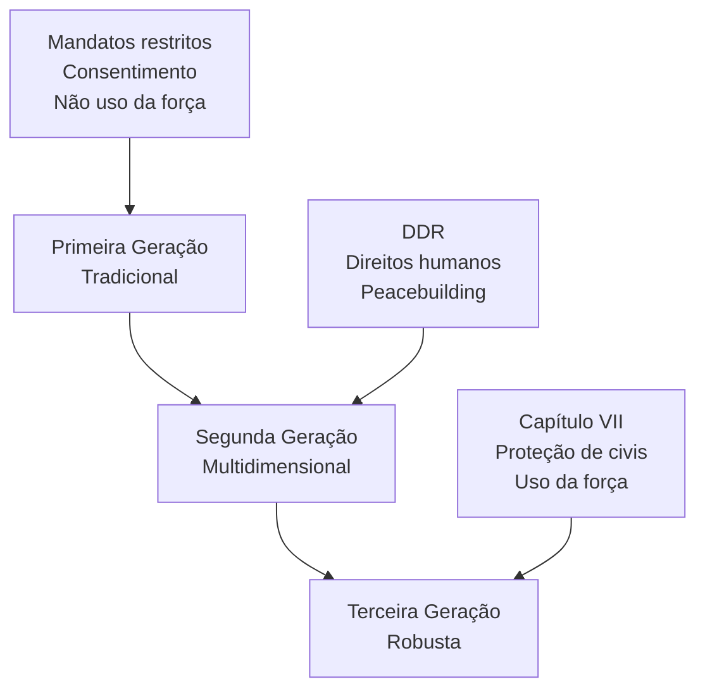

### 3.4 Impacto dos Relatórios "Agenda para a Paz" e Brahimi

- **Agenda para a Paz (1992):** Propôs uma abordagem integrada para a paz, articulando diplomacia preventiva, pacificação, manutenção da paz e construção da paz. Destacou a necessidade de mandatos claros, recursos adequados e integração com organizações regionais .
- **Relatório Brahimi (2000):** Recomendou mandatos claros, credíveis e alcançáveis, com recursos compatíveis, capacidade de rápida mobilização, regras de engajamento robustas e integração entre componentes civis, policiais e militares. Destacou a importância do envolvimento dos países contribuintes de tropas nas decisões e da necessidade de financiamento estável e previsível para as operações .

> [!note]  
> **Contribuições dos Relatórios:**  
> - Expansão do escopo das OMPs para além da separação de forças, incluindo tarefas políticas, humanitárias e de reconstrução.
> - Introdução do conceito de peacebuilding como ação estruturante para evitar recaídas em conflito.
> - Consolidação da "terceira geração" de OMPs, com mandatos sob o Capítulo VII e uso proativo da força .

### Primeira Geração - Peacekeeping Tradicional (1948-1988)

**Características fundamentais:**

- **Princípio da Trindade Sagrada**: consentimento das partes, imparcialidade e uso mínimo da força (apenas em legítima defesa)
- **Mandato restrito**: separar beligerantes e monitorar cessar-fogo
- **Base legal**: Capítulo VI da Carta da ONU (solução pacífica de controvérsias)

**Exemplos clássicos:** UNEF I (Suez, 1956), UNFICYP (Chipre, 1964)

## **Segunda Geração - Peacekeeping Multidimensional (1989-1999)**

**Contexto:** Fim da Guerra Fria permitiu maior consenso no Conselho de Segurança

**Expansão do mandato:**

- **DDR**: Desarmamento, Desmobilização e Reintegração de combatentes
- **Peacebuilding**: reconstrução institucional, eleições, Estado de Direito
- **Proteção de direitos humanos** e assistência humanitária
- **Componente civil** massivo (administradores, juízes, policiais)

**Exemplos:** UNTAC (Camboja, 1992-1993), ONUMOZ (Moçambique, 1992-1994)

## **Terceira Geração - Peacekeeping Robusto (2000-presente)**

**Marco conceitual:** Relatório Brahimi (2000) e Doutrina da Responsabilidade de Proteger

**Características distintivas:**

- **Mandatos sob Capítulo VII**: autorização para uso da força além da legítima defesa
- **Proteção de civis** como prioridade absoluta
- **Imposição da paz** mesmo sem consentimento pleno das partes
- **Neutralidade ativa**: parcialidade em favor dos princípios da Carta da ONU

**Exemplos:** MONUSCO (RD Congo), MINUSMA (Mali), UNMISS (Sudão do Sul)
## 4. A Atuação do Brasil nas Operações de Paz da ONU

### 4.1 Histórico de Participação e Motivação

O Brasil é um dos países fundadores da ONU e tradicional defensor do multilateralismo e da solução pacífica de controvérsias. Desde 1947, o país já participou de mais de 50 operações de paz, tendo contribuído com mais de 55 mil militares, policiais e civis ao longo de sete décadas . A participação brasileira é orientada por princípios constitucionais e de política externa, como a não intervenção, a defesa da paz, a solução pacífica de controvérsias e o respeito aos direitos humanos.

O Brasil prioriza missões em países com laços históricos e culturais, como Angola, Moçambique, Timor-Leste, Haiti e Líbano, mas também tem atuado em contextos diversos, como o Oriente Médio e a África Central .

<!DOCTYPE html>
<html lang="pt-BR">
<head>
    <meta charset="UTF-8">
    <meta name="viewport" content="width=device-width, initial-scale=1.0">
    <title>Participação Brasileira em Operações de Paz da ONU</title>
    <script src="https://cdnjs.cloudflare.com/ajax/libs/Chart.js/3.9.1/chart.min.js"></script>
    <style>
        body {
            font-family: -apple-system, BlinkMacSystemFont, 'Segoe UI', Roboto, sans-serif;
            background: linear-gradient(135deg, #667eea 0%, #764ba2 100%);
            margin: 0;
            padding: 20px;
            min-height: 100vh;
        }
        .container {
            max-width: 1200px;
            margin: 0 auto;
            background: white;
            border-radius: 15px;
            box-shadow: 0 20px 40px rgba(0,0,0,0.1);
            overflow: hidden;
        }
        .header {
            background: linear-gradient(135deg, #1e3c72 0%, #2a5298 100%);
            color: white;
            padding: 30px;
            text-align: center;
        }
        .header h1 {
            margin: 0;
            font-size: 2.2em;
            font-weight: 300;
        }
        .subtitle {
            margin-top: 10px;
            opacity: 0.9;
            font-size: 1.1em;
        }
        .chart-container {
            padding: 40px;
            position: relative;
            height: 500px;
        }
        .stats-grid {
            display: grid;
            grid-template-columns: repeat(auto-fit, minmax(200px, 1fr));
            gap: 20px;
            padding: 20px 40px;
            background: #f8fafc;
        }
        .stat-card {
            background: white;
            padding: 20px;
            border-radius: 10px;
            text-align: center;
            box-shadow: 0 4px 6px rgba(0,0,0,0.05);
            border-left: 4px solid #3b82f6;
        }
        .stat-number {
            font-size: 2em;
            font-weight: bold;
            color: #1e40af;
            margin-bottom: 5px;
        }
        .stat-label {
            color: #64748b;
            font-size: 0.9em;
            text-transform: uppercase;
            letter-spacing: 0.5px;
        }
        .analysis {
            padding: 40px;
            background: #fafbfc;
        }
        .analysis h2 {
            color: #1e40af;
            margin-bottom: 20px;
            border-bottom: 2px solid #e2e8f0;
            padding-bottom: 10px;
        }
        .key-points {
            display: grid;
            grid-template-columns: repeat(auto-fit, minmax(300px, 1fr));
            gap: 20px;
            margin-top: 20px;
        }
        .point-card {
            background: white;
            padding: 20px;
            border-radius: 8px;
            border-left: 4px solid #10b981;
        }
        .point-title {
            font-weight: bold;
            color: #065f46;
            margin-bottom: 8px;
        }
        .legend {
            margin-top: 20px;
            font-size: 0.9em;
            color: #64748b;
            text-align: center;
        }
    </style>
</head>
<body>
    <div class="container">
        <div class="header">
            <h1>🇧🇷 Participação Brasileira em Operações de Paz da ONU</h1>
            <div class="subtitle">Análise para o CACD - Dados históricos de contribuições</div>
        </div>

        <div class="stats-grid">
            <div class="stat-card">
                <div class="stat-number">52,228</div>
                <div class="stat-label">Total de Pessoal Enviado</div>
            </div>
            <div class="stat-card">
                <div class="stat-number">7</div>
                <div class="stat-label">Missões Principais</div>
            </div>
            <div class="stat-card">
                <div class="stat-number">67</div>
                <div class="stat-label">Anos de Participação</div>
            </div>
            <div class="stat-card">
                <div class="stat-number">11</div>
                <div class="stat-label">Missões Atuais (2024)</div>
            </div>
        </div>

        <div class="chart-container">
            <canvas id="peacekeepingChart"></canvas>
        </div>

        <div class="analysis">
            <h2>📊 Análise Estratégica para o CACD</h2>
            
            <div class="key-points">
                <div class="point-card">
                    <div class="point-title">MINUSTAH: Marco Histórico</div>
                    <div>36.407 militares (2004-2017). Brasil liderou a componente militar, demonstrando capacidade de liderança regional e compromisso com estabilização no Haiti.</div>
                </div>
                
                <div class="point-card">
                    <div class="point-title">Diplomacia Naval</div>
                    <div>UNIFIL Maritime (2011-2020): 4.292 militares. Brasil comandou força-tarefa marítima no Líbano, projetando poder naval e expertise em operações marítimas.</div>
                </div>
                
                <div class="point-card">
                    <div class="point-title">Pioneirismo Histórico</div>
                    <div>UNEF I (1957): Primeira participação brasileira em peacekeeping. 6.300 militares no Batalhão Suez, estabelecendo tradição de contribuição para paz mundial.</div>
                </div>
                
                <div class="point-card">
                    <div class="point-title">Expertise Continental</div>
                    <div>UNAVEM III (Angola) e ONUMOZ (Moçambique): Total de 4.468 militares, demonstrando especialização em contextos lusófonos africanos.</div>
                </div>
            </div>
            
            <div class="legend">
                <strong>Relevância para o CACD:</strong> A participação brasileira em peacekeeping reflete os princípios da Política Externa Brasileira: multilateralismo, solução pacífica de controvérsias e diplomacia para a paz. Evidencia o soft power brasileiro e a capacidade de liderança em questões de segurança internacional.
            </div>
        </div>
    </div>

    <script>
        const ctx = document.getElementById('peacekeepingChart').getContext('2d');
        
        const data = {
            labels: ['MINUSTAH\n(Haiti)', 'UNEF I\n(Suez)', 'UNIFIL\n(Líbano)', 'UNAVEM III\n(Angola)', 'ONUC\n(Congo)', 'ONUMOZ\n(Moçambique)', 'Atuais\n(11 missões)'],
            datasets: [{
                label: 'Pessoal Brasileiro Enviado',
                data: [36407, 6300, 4292, 4205, 179, 263, 80],
                backgroundColor: [
                    'rgba(59, 130, 246, 0.8)',
                    'rgba(16, 185, 129, 0.8)',
                    'rgba(245, 158, 11, 0.8)',
                    'rgba(239, 68, 68, 0.8)',
                    'rgba(139, 92, 246, 0.8)',
                    'rgba(236, 72, 153, 0.8)',
                    'rgba(34, 197, 94, 0.8)'
                ],
                borderColor: [
                    'rgba(59, 130, 246, 1)',
                    'rgba(16, 185, 129, 1)',
                    'rgba(245, 158, 11, 1)',
                    'rgba(239, 68, 68, 1)',
                    'rgba(139, 92, 246, 1)',
                    'rgba(236, 72, 153, 1)',
                    'rgba(34, 197, 94, 1)'
                ],
                borderWidth: 2,
                borderRadius: 8,
                borderSkipped: false,
            }]
        };

        const config = {
            type: 'bar',
            data: data,
            options: {
                responsive: true,
                maintainAspectRatio: false,
                plugins: {
                    legend: {
                        display: false
                    },
                    tooltip: {
                        backgroundColor: 'rgba(0, 0, 0, 0.8)',
                        titleColor: 'white',
                        bodyColor: 'white',
                        borderColor: 'rgba(255, 255, 255, 0.2)',
                        borderWidth: 1,
                        cornerRadius: 8,
                        callbacks: {
                            afterLabel: function(context) {
                                const missions = [
                                    '🇭🇹 Liderança militar (2004-2017)',
                                    '🇪🇬 Batalhão Suez (1957)',
                                    '🇱🇧 Comando marítimo (2011-2020)',
                                    '🇦🇴 Apoio pós-guerra civil (1996)',
                                    '🇨🇩 Suporte aéreo (1960)',
                                    '🇲🇿 Observadores militares (1993)',
                                    '🌍 Diversas operações ativas'
                                ];
                                return missions[context.dataIndex];
                            }
                        }
                    }
                },
                scales: {
                    y: {
                        beginAtZero: true,
                        ticks: {
                            callback: function(value) {
                                return value.toLocaleString('pt-BR');
                            }
                        },
                        grid: {
                            color: 'rgba(0, 0, 0, 0.05)'
                        }
                    },
                    x: {
                        grid: {
                            display: false
                        },
                        ticks: {
                            maxRotation: 0,
                            font: {
                                size: 11
                            }
                        }
                    }
                },
                animation: {
                    duration: 1500,
                    easing: 'easeOutQuart'
                }
            }
        };

        new Chart(ctx, config);
    </script>
</body>
</html>

### 4.2 Participações Emblemáticas

> [!example]  
> **Missões-Chave do Brasil**
> - **UNEF I (Suez, 1956):** Primeira participação relevante, com papel fundamental na supervisão do cessar-fogo e retirada de tropas estrangeiras do Egito.
> - **ONUMOZ (Moçambique, 1992-1994):** Apoio ao processo de paz e reconstrução pós-guerra civil em país lusófono.
> - **UNAVEM III (Angola, 1995-1997):** Participação significativa no apoio à paz e reconciliação nacional, com o batalhão brasileiro (BRABAT) desempenhando papel central.
> - **MINUSTAH (Haiti, 2004-2017):** Caso paradigmático de liderança militar e engajamento multidimensional, detalhado a seguir .

### 4.3 MINUSTAH (Haiti, 2004-2017): Análise Aprofundada

A Missão das Nações Unidas para a Estabilização do Haiti (MINUSTAH) representa o maior e mais duradouro envolvimento do Brasil em OMPs, com profundas implicações para as Forças Armadas e a política externa brasileira .

#### Objetivos e Mandato

A MINUSTAH foi criada em 2004, após a queda do presidente Jean-Bertrand Aristide, com o objetivo de restaurar a ordem, apoiar o processo político, proteger civis, promover direitos humanos e contribuir para a reconstrução institucional do Haiti. O Brasil assumiu o comando militar da missão desde o início, liderando o maior contingente de tropas e exercendo papel de referência para outros países latino-americanos .

#### Desafios Enfrentados

A missão enfrentou desafios complexos, como a violência de gangues armadas, instabilidade política crônica, desastres naturais (notadamente o terremoto de 2010), pobreza extrema e fragilidade institucional. O ambiente operacional exigiu adaptação doutrinária, integração entre componentes militares e civis, e sensibilidade cultural .

#### Resultados e Legado

O Brasil destacou-se pela implementação de projetos de impacto rápido (*Quick Impact Projects*), combinando ações de segurança com iniciativas de desenvolvimento comunitário, como reconstrução de escolas, postos de saúde e infraestrutura básica. O país também promoveu a participação de outros Estados do Sul Global, consolidando uma abordagem de cooperação horizontal e solidariedade
No entanto, a missão também foi alvo de críticas, incluindo alegações de uso excessivo da força, limitações na promoção de processos políticos inclusivos e denúncias de má conduta por parte de alguns contingentes.

O legado da MINUSTAH para o Brasil inclui:

- Fortalecimento da capacidade expedicionária das Forças Armadas.
- Consolidação de uma doutrina própria de atuação em OMPs, enfatizando a conexão entre segurança e desenvolvimento.
- Projeção internacional do Brasil como ator responsável e comprometido com a paz.
- Reflexão crítica sobre os limites e dilemas da intervenção internacional, especialmente em contextos de fragilidade estatal e pobreza extrema.

> [!important]  
> **Lições da MINUSTAH**
> - A experiência no Haiti consolidou a doutrina brasileira de que a paz sustentável depende da integração entre segurança, desenvolvimento e inclusão social.
> - O comando da missão projetou o Brasil como líder regional e global em operações de paz, mas também expôs desafios de coordenação civil-militar e de adaptação a cenários de alta complexidade### Legado para as Forças Armadas e a Política Externa Brasileira

O legado da MINUSTAH para o Brasil é multifacetado:

- **Aprimoramento Operacional:** As Forças Armadas adquiriram expertise em operações multinacionais, logística, coordenação civil-militar e resposta a crises humanitárias, elevando o padrão de profissionalismo e a capacidade de projeção internacional.
- **Influência Doutrinária Interna:** Métodos e protocolos testados no Haiti foram adaptados para operações de pacificação em favelas do Rio de Janeiro, influenciando o debate sobre o papel das Forças Armadas na segurança pública interna.
- **Projeção Internacional:** O Brasil consolidou-se como referência em peacekeeping, ampliando sua interface com a ONU, promovendo cooperação Sul-Sul e participando ativamente de debates sobre reforma das OMPs e proteção de civis.
- **Desafios e Críticas:** O envolvimento em missões robustas gerou debates sobre os limites da intervenção, a tensão entre soberania e proteção de civis, e a necessidade de alinhar a atuação externa com os princípios constitucionais de não intervenção e defesa da paz
> [!note]  
> **A "Responsabilidade ao Proteger" (RwP)**
> O Brasil propôs, no contexto da MINUSTAH e do debate sobre a "Responsabilidade de Proteger" (R2P), o conceito de "Responsabilidade ao Proteger" (RwP), defendendo critérios claros, monitoramento e accountability em intervenções autorizadas pela ONU, buscando equilibrar proteção de civis e respeito à soberania## 4.4 Doutrina Brasileira de Atuação em OMPs

A atuação do Brasil em OMPs é marcada por uma doutrina que valoriza:

- A interdependência entre segurança e desenvolvimento, defendendo que a paz só é sustentável quando acompanhada de inclusão social, fortalecimento institucional e promoção dos direitos humanos.
- O respeito aos princípios tradicionais das OMPs (consentimento, imparcialidade, uso restrito da força), com ênfase na prevenção de conflitos e na solução pacífica de controvérsias.
- A defesa de mandatos claros, realistas e compatíveis com os recursos disponíveis, evitando a "inflacionamento" de expectativas e a sobrecarga das missões.
- A promoção da participação de países do Sul Global e a valorização da cooperação Sul-Sul.
- O compromisso com a agenda "Mulheres, Paz e Segurança", buscando ampliar a participação feminina em missões e combater a violência de gênero.

### 4.5 Situação Atual da Contribuição Brasileira

Após o encerramento da MINUSTAH em 2017, a participação brasileira em OMPs sofreu acentuada redução. Em 2011, o Brasil chegou a ter cerca de 2.500 militares em missões da ONU; em 2024, esse número caiu para cerca de 80 militares e civis, refletindo uma tendência de retração e cautela
Atualmente, o Brasil mantém presença em missões como MONUSCO (República Democrática do Congo, onde fornece o Force Commander), MINURSO (Saara Ocidental), UNIFIL (Líbano), MINUSCA (República Centro-Africana), UNFICYP (Chipre), entre outras. O perfil da participação é predominantemente de observadores militares, oficiais de Estado-Maior e pequenos contingentes, sem grandes destacamentos de tropas.

Em termos de política, o Brasil segue defendendo o fortalecimento do multilateralismo, a centralidade do Conselho de Segurança e a necessidade de reformas para tornar as OMPs mais eficazes, transparentes e representativas# 5. Desafios Contemporâneos das Operações de Paz

As OMPs enfrentam desafios crescentes, decorrentes da complexidade dos conflitos atuais e das limitações institucionais e políticas da ONU## 5.1 Complexidade dos Conflitos Atuais

Os conflitos contemporâneos envolvem múltiplos atores (grupos armados não estatais, terroristas, milícias), fronteiras difusas entre guerra e criminalidade, e ameaças assimétricas, dificultando a aplicação dos princípios tradicionais das OMPs. A proteção de civis tornou-se central, exigindo mandatos robustos e regras de engajamento flexíveis, mas também aumentando o risco de envolvimento em hostilidades e de violações de direitos.

### 5.2 Financiamento, Recursos e Segurança

A obtenção de tropas, equipamentos e financiamento adequado é um desafio persistente. Muitos países desenvolvidos preferem contribuir financeiramente, enquanto países do Sul Global fornecem a maior parte dos contingentes. A segurança dos "capacetes-azuis" é uma preocupação crescente, com aumento de ataques, emboscadas e uso de artefatos explosivos improvisados

### 5.3 Conduta, Disciplina e Abusos

Casos de exploração e abuso sexual, corrupção e má conduta por parte de alguns contingentes minam a legitimidade das OMPs. A ONU tem implementado políticas de "tolerância zero" e mecanismos de responsabilização, mas desafios persistem, especialmente em contextos de impunidade e fragilidade institucional.

```charts
{"id":"a/e56fdd36-2bf0-4300-ad8f-3a92f5bfadd5","columns":["Year","Number of Allegations","Key UN Response Initiatives"],"data_table":[[2016,165,"Mandatory online training launched; Special Coordinator appointed"],[2017,138,"Victims' Rights Advocate appointed; High-level task force created; Zero-tolerance policy reinforced"]],"provenance":{"1":"https://home.crin.org/un-peacekeepers-timeline"},"title":"Trends and Responses to Sexual Exploitation and Abuse by UN Peacekeepers (2014-2019)","description":"This chart shows the number of allegations of sexual exploitation and abuse by UN peacekeepers over time and highlights key UN response initiatives to address conduct and discipline issues.","chart_view":{"chart_type":"bar_chart","x":"Year","y":"Number of Allegations","hue":null}}
```

### 5.4 Relação com a "Responsabilidade de Proteger" (R2P) e Dilemas da Intervenção

A doutrina da "Responsabilidade de Proteger" (R2P), adotada em 2005, ampliou o debate sobre o papel das OMPs na proteção de populações contra genocídio, crimes de guerra, limpeza étnica e crimes contra a humanidade. No entanto, a aplicação da R2P enfrenta dilemas de soberania, seletividade e instrumentalização política, exigindo equilíbrio entre intervenção legítima e respeito à autodeterminação dos povos 

[!important]  
> **Dilemas Atuais das OMPs**
> - Como proteger civis sem violar a soberania dos Estados?
> - Como garantir recursos e legitimidade em um contexto de crescente competição geopolítica?
> - Como adaptar mandatos e doutrinas a cenários de conflito híbrido e ameaças transnacionais?

## 6. Conclusão

As Operações de Paz da ONU permanecem como instrumento central, porém em constante transformação, da agenda internacional de paz e segurança. Sua evolução reflete as mudanças do sistema internacional, os avanços e limitações do multilateralismo e as tensões entre soberania, intervenção e proteção de direitos. O Brasil, ao longo de sua trajetória, consolidou-se como ator relevante, combinando participação efetiva, liderança regional e contribuição doutrinária, especialmente ao enfatizar a conexão entre segurança e desenvolvimento. A experiência na MINUSTAH ilustra tanto o potencial quanto os desafios das OMPs, servindo de referência para debates futuros sobre o papel do Brasil e da ONU na promoção de uma paz sustentável e inclusiva. Os desafios contemporâneos — desde a adaptação a novos tipos de conflito até a necessidade de reformas institucionais e aprimoramento dos mecanismos de proteção de civis — exigem respostas criativas, coordenação internacional e compromisso com os valores fundadores da ONU. A experiência brasileira, marcada pela busca de legitimidade, integração entre segurança e desenvolvimento e valorização do multilateralismo, oferece lições relevantes para o futuro das operações de paz e para a agenda internacional de paz e segurança.

## 7. Questões para Autoavaliação (Active Recall)

> [!question]  
> 1. Quais são os três princípios fundamentais das Operações de Paz da ONU e como eles foram reinterpretados ao longo das diferentes "gerações" de OMPs?
> 2. Analise criticamente a experiência brasileira na MINUSTAH, destacando os principais desafios, resultados e lições para a política externa e as Forças Armadas do Brasil.
> 3. Quais são os principais desafios contemporâneos enfrentados pelas Operações de Paz da ONU e como o Brasil tem se posicionado em relação a esses desafios?

> [!note]  
> Recomenda-se complementar este material com leituras acadêmicas e dados atualizados da ONU, do Ministério daplos e debates.
![[Operações de Paz da ONU_ Evolução, Princípios, Desafios e a Atuação do Brasil.pdf]]


# Origem: _O Brasil e o sistema interamericano (OEA)

---
title: "O Brasil e o sistema interamericano (OEA)"
area: "POLÍTICA INTERNACIONAL"
subarea: "O Brasil e o sistema interamericano (OEA)"
tags:
  - cacd-2025
  - o-brasil-e-o-sistema-interamericano
  - politica-internacional
---
# O Brasil e o Sistema Interamericano: Entre o Protagonismo Regional e a Cautela com a Hegemonia

## Introdução: A Dualidade Estrutural da Política Externa Brasileira

O relacionamento do Brasil com o Sistema Interamericano representa uma das mais complexas dinâmicas da política externa brasileira, caracterizada por uma **oscilação permanente entre engajamento e ceticismo**. Desde a criação da OEA em 1948, o Brasil busca equilibrar três objetivos frequentemente contraditórios: projetar liderança regional, cooperar com os Estados Unidos quando conveniente, e preservar sua autonomia decisória. Esta análise examina como essa tensão estrutural se manifestou em diferentes períodos históricos, com ênfase especial no protagonismo brasileiro na agenda democrática pós-Guerra Fria e nas complexas relações com o sistema de direitos humanos.

> [!important] A ambivalência brasileira em relação ao Sistema Interamericano não é conjuntural, mas **estrutural** - reflete a posição intermediária do Brasil entre potência regional e país em desenvolvimento, entre aliado hemisférico e líder sul-americano. Essa dualidade se manifesta tanto na busca por liderança quanto na resistência a constrangimentos externos à soberania nacional.

## O Brasil na Criação do Sistema Pós-Guerra (1945-1950)

### Contexto Geopolítico e Diplomacia de Chapultepec

O Brasil participou ativamente da construção do Sistema Interamericano no imediato pós-guerra, refletindo sua condição de aliado dos EUA na Segunda Guerra Mundial. A diplomacia brasileira, liderada pelo Embaixador **Carlos Martins Pereira e Souza** em Washington, protestou energicamente contra a exclusão latino-americana do planejamento pós-guerra nas conferências de Dumbarton Oaks (agosto-outubro de 1944), onde as potências aliadas delinearam a estrutura da futura ONU sem consultar os países americanos.

Estes protestos resultaram na **Conferência Interamericana sobre os Problemas da Guerra e da Paz** no Castelo de Chapultepec (fevereiro-março de 1945), onde foi adotada a **Ata de Chapultepec** em 6 de março, estabelecendo os princípios de solidariedade continental que posteriormente fundamentariam o TIAR.

> [!definition] **Sistema Interamericano** 
> Conjunto de instituições, tratados e mecanismos de cooperação hemisférica, tendo como pilares principais a OEA (cooperação política), o TIAR (segurança coletiva) e o Sistema Interamericano de Direitos Humanos (proteção de direitos fundamentais).

### A Criação do TIAR e da OEA

O Brasil foi **país-sede e depositário original** do **Tratado Interamericano de Assistência Recíproca**, assinado no Rio de Janeiro em 2 de setembro de 1947, durante a Conferência Interamericana para a Manutenção da Paz e Segurança Continental. O TIAR entrou em vigor em 3 de dezembro de 1948, estabelecendo o princípio de que "um ataque contra um país americano seria considerado um ataque contra todos".

Em 1948, o Brasil participou da IX Conferência Internacional Americana em Bogotá, onde foi criada a **Organização dos Estados Americanos** através da assinatura da Carta de Bogotá em 30 de abril. Estes momentos refletem a estratégia brasileira de **alinhamento pragmático** - apoiar a arquitetura de segurança hemisférica liderada pelos EUA enquanto preservava espaços de autonomia.

> [!note] O Brasil foi um dos 19 signatários originais do TIAR, junto com Argentina, Bolívia, Chile, Colômbia, Costa Rica, Cuba, Equador, El Salvador, Estados Unidos, Guatemala, Haiti, Honduras, México, Nicarágua, Panamá, Paraguai, Peru, República Dominicana, Uruguai e Venezuela.

## A Atuação Brasileira Durante a Guerra Fria

### A Política Externa Independente e a Crise Cubana (1961-1964)

A posição brasileira na **VIII Reunião de Consulta em Punta del Este** (janeiro de 1962) exemplifica a complexidade do posicionamento brasileiro durante a PEI. O Brasil **absteve-se** na votação sobre a expulsão de Cuba da OEA, junto com Argentina, Bolívia, Chile, Equador e México, por 14 votos favoráveis, 1 contrário (Cuba) e 6 abstenções.

O Chanceler **San Tiago Dantas** propôs a controvertida "finlandização" de Cuba - neutralização sem mudança de regime -, refletindo os princípios da Política Externa Independente. Dantas argumentou que a exclusão de Cuba violaria os princípios de não-intervenção e autodeterminação consagrados na Carta da OEA.

> [!example] A abstenção brasileira em 1962 demonstra como a PEI buscava maior autonomia mesmo em questões sensíveis para Washington, antecipando tensões que culminariam no golpe de 1964. A posição brasileira foi duramente criticada pelos EUA, contribuindo para o deterioramento das relações bilaterais.

### O Regime Militar e o Realinhamento Hemisférico (1964-1985)

O golpe militar de 1964, apoiado pelos EUA através da **Operação Brother Sam**, realinhou temporariamente o Brasil com Washington. Entre 1964-1970, o Brasil recebeu mais ajuda da USAID e Banco Mundial que qualquer outro país sul-americano, totalizando aproximadamente 2 bilhões de dólares.

Durante o governo **Castello Branco** (1964-1967), o Brasil adotou postura de alinhamento automático, rompendo relações diplomáticas com Cuba e apoiando intervenções americanas na República Dominicana (1965). A partir dos governos **Geisel** (1974-1979) e **Figueiredo** (1979-1985), o **pragmatismo responsável** e o **universalismo** marcaram um distanciamento gradual, com o Brasil priorizando relações Sul-Sul e questionando a hegemonia americana.

### A Guerra das Malvinas: O Colapso da Credibilidade do TIAR (1982)

A Guerra das Malvinas/Falklands representou o **momento de ruptura definitiva na credibilidade do TIAR** como instrumento de segurança coletiva hemisférica. Quando a Argentina invocou o tratado em 28 de abril de 1982, solicitando apoio contra o "ataque" britânico, os Estados Unidos optaram por apoiar o Reino Unido, membro da OTAN, violando flagrantemente o princípio de solidariedade continental.

O Brasil, sob o governo **João Figueiredo**, apoiou diplomaticamente a Argentina, oferecendo combustível e reconhecendo a soberania argentina sobre as ilhas. O Chanceler **Ramiro Saraiva Guerreiro** declarou que o TIAR havia "perdido sua razão de ser" após a posição americana.

> [!important] **Correção Fundamental** 
> Contrariamente a percepções amplamente difundidas, o **Brasil nunca se retirou formalmente do TIAR**. O país permanece membro desde 1947, apesar de considerar o tratado "obsoleto". Países que se retiraram incluem México (2002), Bolívia (2012), Nicarágua (2012), Venezuela (2013) e Equador (2014).

#### A Invocação Brasileira do TIAR em 2001

Paradoxalmente, o Brasil **invocou o TIAR** após os atentados de 11 de setembro de 2001, quando o governo **Fernando Henrique Cardoso**, através do Chanceler **Celso Lafer**, convocou uma reunião do Órgão de Consulta da OEA para demonstrar solidariedade aos Estados Unidos. Esta decisão brasileira foi posteriormente questionada por analistas que consideraram inadequada a aplicação do TIAR a atos terroristas não-estatais.

## O Brasil e a Agenda Democrática Pós-Guerra Fria

### Renovado Protagonismo na Construção de Mecanismos Democráticos

Com a redemocratização, o Brasil reassumiu papel proativo no Sistema Interamericano, participando da construção de mecanismos de defesa coletiva da democracia. O país apoiou decisivamente a **Resolução 1080** (1991), estabelecendo resposta automática da OEA a rupturas democráticas, e o **Protocolo de Washington** (1992), permitindo suspensão de Estados membros por quebra da ordem democrática.

Durante o governo **Itamar Franco**, o Brasil defendeu o conceito de "democracia representativa" como valor fundamental do Sistema Interamericano, posição consolidada durante a Cúpula das Américas de Miami (1994) sob a presidência **Fernando Henrique Cardoso**.

### A Carta Democrática Interamericana: Protagonismo e Contradições (2001)

O Brasil exerceu protagonismo significativo na negociação da **Carta Democrática Interamericana**, adotada em Lima em 11 de setembro de 2001. A diplomacia brasileira, liderada pelo Embaixador **Celso Lafer** e pelo Subsecretário **Samuel Pinheiro Guimarães**, trabalhou para equilibrar o princípio inovador de que "os povos das Américas têm direito à democracia" com a tradicional defesa da soberania e não-intervenção.

> [!definition] **Carta Democrática Interamericana** 
> Principal instrumento hemisférico para promoção e defesa da democracia, estabelecendo procedimentos para ação coletiva em casos de ruptura ou alteração da ordem democrática. Composta por 28 artigos, define elementos essenciais e componentes fundamentais da democracia representativa.

### Aplicação Seletiva: Casos Emblemáticos e Dilemas Brasileiros

A aplicação da Carta Democrática tem sido marcada por **seletividade e controvérsias**, refletindo as tensões estruturais da posição brasileira:

#### Honduras (2009): Protagonismo Moral do Governo Lula

O golpe contra **Manuel Zelaya** em 28 de junho de 2009 representou o momento de maior protagonismo brasileiro na defesa da democracia hemisférica. O governo **Lula**, através do Chanceler **Celso Amorim** e do assessor **Marco Aurélio Garcia**, adotou postura firme:

- **Condenação imediata** do golpe e recusa em reconhecer o governo de **Roberto Micheletti**
- **Abrigo de Zelaya** na embaixada brasileira em Tegucigalpa por quatro meses (setembro de 2009 a janeiro de 2010)
- **Liderança na suspensão** de Honduras da OEA por 33 votos a 1
- **Recusa em reconhecer** as eleições de novembro de 2009 sob o governo de facto

> [!example] A declaração de Lula resumiu a posição brasileira: "Nós não podemos aceitar mais golpe militar. Não temos o direito de aceitar que alguém se ache no direito de tirar uma pessoa eleita democraticamente." Esta posição custou ao Brasil relações tensas com setores conservadores hondurenhos e brasileiros residentes no país.

A crise gerou tensões internas no governo brasileiro, com críticas de que a diplomacia de Lula era excessivamente "ideológica". Contudo, a posição brasileira consolidou a liderança regional em defesa democrática.

#### Paraguai (2012): Golpe Parlamentar e Suspensão no Mercosul

O **impeachment relâmpago** de **Fernando Lugo** em 22 de junho de 2012 testou novamente o compromisso brasileiro com a democracia regional. O processo, que durou apenas 17 horas com 2 horas de defesa, foi considerado pelo governo **Dilma Rousseff** um "golpe parlamentar".

A reação brasileira foi mais moderada que em Honduras:

- **Suspensão do Paraguai do Mercosul** (mas não da OEA) por ruptura democrática
- **Aproveitamento estratégico** para incorporar a Venezuela como membro pleno do Mercosul
- **Retorno gradual** às relações normais após eleições de 2013

> [!note] A diferença de intensidade entre as respostas a Honduras e Paraguai refletiu cálculos geopolíticos: enquanto Honduras estava fora da esfera de influência direta brasileira, o Paraguai era membro do Mercosul e a crise oferecia oportunidade para fortalecer o bloco com a entrada venezuelana.

#### Venezuela (2019-presente): Cautela e Pragmatismo

A crise venezuelana expôs as limitações do consenso hemisférico sobre democracia. O Brasil, durante os governos **Temer** e **Bolsonaro**, adotou postura mais alinhada aos EUA, inclusive apoiando a invocação do TIAR em setembro de 2019 por 12 votos favoráveis (incluindo o Brasil), 5 abstenções e 2 ausências.

Contudo, o Chanceler **Ernesto Araújo** relativizou a aplicação do tratado, afirmando que o Brasil vislumbrava "apenas ações diplomáticas" contra o regime de **Nicolás Maduro**, refletindo a tradicional cautela brasileira sobre intervenções militares.

## O Brasil e o Sistema Interamericano de Direitos Humanos

### Adesão Tardia e Resistências Institucionais

O Brasil ratificou a **Convenção Americana sobre Direitos Humanos** (Pacto de São José da Costa Rica) apenas em 1992, através do Decreto 678/92, durante o governo **Itamar Franco**. Mais significativamente, só aceitou a **jurisdição contenciosa da Corte Interamericana** em 10 de dezembro de 1998, no final do primeiro mandato de **Fernando Henrique Cardoso**.

Esta adesão tardia refletiu resistências históricas do Legislativo e de setores militares a mecanismos supranacionais de direitos humanos, superadas apenas com a consolidação democrática.

> [!definition] **Sistema Interamericano de Direitos Humanos**
>  Composto pela Comissão Interamericana de Direitos Humanos (CIDH), órgão de promoção e monitoramento, e pela Corte Interamericana de Direitos Humanos, tribunal contencioso com sede em San José, Costa Rica.

### Casos Paradigmáticos: Condenações e Resistências

#### Caso Ximenes Lopes vs. Brasil (2006)

O primeiro caso de condenação brasileira envolveu a morte de **Damião Ximenes Lopes** em hospital psiquiátrico em Sobral, Ceará, em 1999. A Corte estabeleceu precedentes sobre:

- Responsabilidade estatal por atos de particulares em serviços públicos terceirizados
- Direitos de pessoas com deficiência mental
- Obrigações de regulação e fiscalização estatal

#### Caso Gomes Lund (Guerrilha do Araguaia) vs. Brasil (2010)

O caso mais emblemático envolveu o **desaparecimento forçado de 70 pessoas** durante operações militares contra a Guerrilha do Araguaia (1972-1975). A condenação brasileira por unanimidade estabeleceu marcos jurídicos fundamentais:

- **Inconvencionalidade da Lei de Anistia** (Lei 6.683/79) para crimes contra a humanidade
- **Obrigação de investigar, processar e punir** graves violações de direitos humanos
- **Direito à verdade** como direito autônomo
- **Obrigação de localizar restos mortais** dos desaparecidos

> [!important] A decisão da Corte criou tensão com o STF, que havia declarado a constitucionalidade da Lei de Anistia na ADPF 153 (2010). O "diálogo" entre cortes permanece tenso, com o Brasil resistindo ao cumprimento integral da sentença, especialmente quanto à responsabilização penal.

#### Outros Casos Relevantes

- **Caso Trabalhadores da Fazenda Brasil Verde** (2016): Trabalho escravo e servidão por dívidas no Pará
- **Caso Povo Indígena Xucuru** (2018): Demoras na demarcação territorial
- **Caso Vladimir Herzog** (2018): Tortura e assassinato durante a ditadura
- **Caso Empregados da Fábrica de Fogos** (2020): Trabalho infantil e violações trabalhistas

### A Crise de Belo Monte: Ruptura Diplomática (2011)

A **reação desproporcional** do governo **Dilma Rousseff** à medida cautelar da CIDH sobre Belo Monte, em abril de 2011, marcou o momento de maior tensão do Brasil com o sistema interamericano:

#### A Medida Cautelar e a Reação Brasileira

Em 1º de abril de 2011, a CIDH outorgou **medidas cautelares** solicitando que o Brasil suspendesse o licenciamento da Usina de Belo Monte até realizar consulta livre, prévia e informada às comunidades indígenas afetadas. A reação brasileira foi imediata e desproporcional:

- **Retirada do embaixador** junto à OEA, **Ruy Casaes**
- **Suspensão da candidatura** de **Paulo Vannuchi** à CIDH
- **Interrupção das contribuições** financeiras à CIDH (800 mil dólares anuais)
- **Cancelamento da participação** em reunião de trabalho da CIDH

> [!example] O governo Dilma considerou as solicitações da CIDH "precipitadas e injustificáveis", argumentando que Belo Monte cumpria a legislação brasileira. Contudo, a reação foi considerada pelos especialistas como demonstração de "autoritarismo" incompatível com o compromisso democrático do país.

#### O "Fortalecimento" do Sistema: Reforma e Enfraquecimento

O Brasil liderou processo de "fortalecimento" do Sistema Interamericano que resultou em **53 recomendações** aprovadas em 2013, incluindo:

- **Limitações ao poder** da CIDH de outorgar medidas cautelares
- **Exigência de esgotamento** de recursos internos mais rigorosa
- **Maior controle estatal** sobre o financiamento da Comissão

> [!note] Desde 2009, o Brasil não faz contribuições voluntárias à CIDH, mantendo apenas as contribuições obrigatórias mínimas. Esta postura contrasta com o discurso brasileiro de defesa dos direitos humanos em outros foros internacionais.

## Foros Alternativos: A Busca por Autonomia Institucional

### A Estratégia das "Geometrias Variáveis"

O Brasil liderou a criação de foros alternativos sem presença dos EUA como forma de exercer liderança regional sem constrangimentos hemisféricos:

#### UNASUL (2008-2019): Integração Sul-Americana

- **Criação** em Brasília (2008) sob liderança de **Lula**
- **Conselho de Defesa Sul-Americano** como alternativa ao TIAR
- **Papel mediador** em crises regionais (Bolívia 2008, Equador 2010)
- **Esvaziamento gradual** após 2015 e **retirada brasileira** em 2019 sob **Bolsonaro**

#### CELAC (2010-presente): Diálogo Sem Hegemonia

- **Criação** na Cúpula da Unidade (México, 2010)
- **Exclusão** de EUA e Canadá do diálogo regional
- **Papel limitado** devido à falta de institucionalidade robusta
- **Alternativa simbólica** mais que operacional à OEA

### Limites e Contradições das Alternativas

A experiência demonstrou limitações estruturais das alternativas regionais:

- **Recursos limitados** comparados ao Sistema Interamericano
- **Ausência de mecanismos** de solução de controvérsias
- **Dificuldades de consenso** sem presença organizadora (mesmo hegemônica) dos EUA
- **Fragilidade institucional** diante de mudanças políticas domésticas

> [!important] O fracasso relativo das alternativas regionais sugere que, apesar de suas limitações e da hegemonia americana, o Sistema Interamericano permanece como o foro hemisférico mais institucionalizado e operacional, com recursos financeiros e expertise técnica incomparáveis.

## Análise Crítica: Dilemas Estruturais e Perspectivas

### As Três Faces da Diplomacia Brasileira

A atuação brasileira no Sistema Interamericano revela **três faces aparentemente contraditórias**:

1. **Face Democrática**: Protagonismo na defesa da democracia (Honduras, Carta Democrática)
2. **Face Soberanista**: Resistência a constrangimentos supranacionais (Belo Monte, cumprimento de sentenças)
3. **Face Pragmática**: Cálculos geopolíticos sobre quando engajar ou resistir

### O Dilema da Potência Média

Como **potência média com aspirações globais**, o Brasil enfrenta tensões inerentes:

- **Necessidade de multilateralismo** para projetar influência
- **Resistência a constrangimentos** à soberania nacional
- **Busca de liderança** sem aceitar responsabilidades proporcionais

### Cenários Futuros

O relacionamento futuro do Brasil com o Sistema Interamericano dependerá de:

- **Orientação ideológica** dos governos brasileiros
- **Evolução da hegemonia** americana no hemisfério
- **Eficácia das alternativas** regionais (CELAC, foros sub-regionais)
- **Pressões da sociedade civil** por cumprimento de obrigações internacionais

## Conclusão: Navegando entre Autonomia e Integração

A relação do Brasil com o Sistema Interamericano exemplifica dilemas estruturais da inserção internacional brasileira. A busca simultânea por **liderança regional**, **autonomia decisória** e **credibilidade democrática** gera tensões inevitáveis que transcendem mudanças de governo.

Esta ambivalência não representa fraqueza diplomática, mas reflexo realista da posição brasileira no sistema internacional. Como potência média emergente, o Brasil precisa do multilateralismo para projetar influência, mas resiste a constrangimentos excessivos à sua soberania. O desafio permanente é calibrar um **engajamento seletivo** que maximize benefícios minimizando custos à autonomia.

A experiência histórica sugere que o Brasil tende a ser mais cooperativo quando pode exercer liderança (Carta Democrática, resposta a Honduras) e mais resistente quando se sente constrangido (Belo Monte, cumprimento de sentenças da Corte). Esta lógica provavelmente continuará orientando a postura brasileira, independentemente de orientações político-partidárias específicas.

> [!question] **Questões para Reflexão Analítica:**
> 
> 1. **Análise Histórica Comparativa**: Como a oscilação brasileira entre protagonismo e ceticismo em relação à OEA reflete tensões mais amplas entre os paradigmas americanista e universalista da política externa brasileira? Compare as posições brasileiras durante a Guerra Fria (abstenção em Cuba 1962), na redemocratização (criação da Carta Democrática) e na crise de Belo Monte (2011).
>     
> 2. **Seletividade na Aplicação de Princípios**: Analise criticamente as diferentes respostas brasileiras aos casos de Honduras (2009), Paraguai (2012) e Venezuela (crise atual). Que fatores explicam a variação na intensidade das reações brasileiras e o que isso revela sobre a instrumentalização política dos princípios democráticos na política externa?
>     
> 3. **Dilemas da Potência Média**: Considerando o fracasso da UNASUL, as limitações da CELAC e as tensões com o Sistema Interamericano, avalie se o Brasil deveria reinvestir no multilateralismo hemisférico ou buscar novas alternativas de inserção regional. Como conciliar as aspirações de liderança brasileira com os constrangimentos inerentes aos sistemas multilaterais?
>

# Origem: 14.1_Organização dos Estados Americanos (OEA)

---
tema: Organização dos Estados Americanos (OEA)
área: Política Internacional
data: 2025-05-17
tags: 
conexões: Sistema Interamericano, Relações Hemisféricas, Direito Internacional, Organizações Internacionais
aliases:
  - OEA
  - Organização dos Estados Americanos (OEA)
  - 14.1 A Organização dos Estados Americanos.
---
# 14.1 A Organização dos Estados Americanos (OEA)

## Sumário

A Organização dos Estados Americanos (OEA), com sede em Washington D.C., Estados Unidos, é a mais antiga organização regional do mundo e principal fórum político para o diálogo multilateral e a tomada de decisões no hemisfério americano . Criada em 1948 durante a Nona Conferência Internacional Americana em Bogotá, Colômbia, a OEA surgiu como evolução do movimento pan-americanista que remonta ao século XIX, especificamente às ideias de Simón Bolívar sobre a unidade das Américas. Com 35 Estados-membros (atualmente com dois países suspensos: Cuba e Nicarágua), a organização tem como objetivos essenciais promover a paz, a segurança, a democracia, os direitos humanos e o desenvolvimento integral nas Américas. Ao longo de sua existência, a OEA adaptou-se aos diversos contextos geopolíticos - da Guerra Fria à globalização - e continua sendo um elemento central na dinâmica das relações interamericanas e da política externa dos países do continente, incluindo o Brasil.

## Conceitos Principais

* **Organização dos Estados Americanos (OEA):**  
  Organização internacional regional criada em 1948, com sede em Washington D.C., que reúne os 35 Estados independentes das Américas. Seu principal objetivo é alcançar "uma ordem de paz e de justiça, promover sua solidariedade, intensificar sua colaboração e defender sua soberania, sua integridade territorial e sua independência", conforme estabelecido em sua Carta constitutiva.

* **Sistema Interamericano:**  
  Conjunto de instituições, acordos e mecanismos hemisféricos que inclui, além da OEA como seu pilar central, o Tratado Interamericano de Assistência Recíproca (TIAR), o Sistema Interamericano de Direitos Humanos, o Banco Interamericano de Desenvolvimento (BID) e outros órgãos regionais que promovem a cooperação entre os países americanos.

* **Pan-Americanismo:**  
  Movimento ideológico e político que propõe a união e a cooperação entre os países das Américas, baseado em valores e interesses comuns, proximidade geográfica e laços histórico-culturais. Suas raízes remontam ao século XIX com o Congresso do Panamá (1826), convocado por Simón Bolívar, e evoluiu para formas institucionalizadas de cooperação como a União Pan-Americana (1910) e posteriormente a OEA.

* **Carta da OEA:**  
  Tratado internacional assinado em 30 de abril de 1948 em Bogotá, Colômbia , que constitui o documento fundacional da organização. Estabelece os princípios, objetivos, direitos e deveres dos Estados membros, bem como a estrutura organizacional da OEA. A Carta entrou em vigor em dezembro de 1951 e sofreu quatro modificações através de protocolos de reforma (Buenos Aires, 1967; Cartagena, 1985; Washington, 1992; e Manágua, 1993).

* **Carta Democrática Interamericana:**  
  Aprovada em 11 de setembro de 2001 durante uma sessão especial da Assembleia Geral em Lima, Peru, este documento reafirma o compromisso dos Estados membros com a democracia representativa, estabelecendo mecanismos para sua defesa e promoção. Trata-se de um instrumento inovador que permite a ação coletiva em casos de ruptura da ordem democrática em qualquer país membro.

* **Assembleia Geral da OEA:**  
  Órgão supremo da organização, composto por delegações de todos os Estados membros, geralmente lideradas pelos Ministros das Relações Exteriores. Reúne-se anualmente em sessão ordinária e, quando necessário, em sessões extraordinárias. Estabelece políticas gerais, aprova o orçamento, elege autoridades e define as diretrizes estratégicas da organização.

* **Conselho Permanente da OEA:**  
  Composto por um representante de cada Estado membro, normalmente com a categoria de Embaixador, o Conselho Permanente é responsável pela supervisão contínua das atividades da organização. Trata das questões que lhe são encaminhadas pela Assembleia Geral, administra as relações da OEA com outras organizações e atua em situações de crise que exigem resposta rápida.

* **Secretaria-Geral da OEA:**  
  Órgão central e permanente da OEA, com sede em Washington D.C., liderado pelo Secretário-Geral eleito pela Assembleia Geral para um mandato de cinco anos, com possibilidade de reeleição uma única vez. É responsável pela implementação das decisões dos órgãos políticos, pela administração dos programas e projetos, e pela gestão das relações com outros organismos internacionais.

* **Comissões da OEA:**  
  Órgãos especializados que tratam de temas específicos no âmbito do sistema interamericano. Destacam-se a Comissão Interamericana de Direitos Humanos (CIDH), criada em 1959, que promove a observância e defesa dos direitos humanos no continente; e a Comissão Interamericana de Mulheres (CIM), primeira organização intergovernamental criada em 1928 para garantir o reconhecimento dos direitos civis e políticos das mulheres.

## Análise Detalhada da Organização dos Estados Americanos (OEA)

### Origens e Evolução Histórica

* **Ideias de União Pan-Americana:**  
  * As raízes da OEA remontam ao Congresso do Panamá de 1826, convocado por Simón Bolívar, que buscava criar uma confederação de nações hispano-americanas para contrabalançar a influência europeia e norte-americana.  
  * Embora essa primeira tentativa não tenha prosperado plenamente, o ideal de cooperação hemisférica persistiu, manifestando-se em diversas conferências e reuniões ao longo do século XIX.

* **Conferências Pan-Americanas e União Pan-Americana:**  
  * A Primeira Conferência Internacional Americana, realizada em Washington D.C. entre 1889-1890, marcou o início formal do Sistema Interamericano moderno, estabelecendo a "União Internacional das Repúblicas Americanas", posteriormente denominada "União Pan-Americana".  
  * Entre 1889 e 1948 , foram realizadas nove Conferências Internacionais Americanas, que gradualmente construíram as bases jurídicas e institucionais para a cooperação continental.  
  * A União Pan-Americana, precursora direta da OEA, funcionou como secretariado do sistema, organizando conferências e promovendo a cooperação técnica, econômica e cultural.

* **Criação da OEA e da Carta da OEA (1948):**  
  * A Nona Conferência Internacional Americana, realizada em Bogotá, Colômbia, em abril de 1948 , culminou com a assinatura da Carta da OEA por 21 países, transformando formalmente a União Pan-Americana na Organização dos Estados Americanos .  
  * Nesta mesma conferência, foi adotada a Declaração Americana dos Direitos e Deveres do Homem, o primeiro instrumento internacional sobre direitos humanos, antecedendo a Declaração Universal da ONU.  
  * A Carta entrou em vigor em dezembro de 1951, após a ratificação por dois terços dos signatários.

* **Evolução Durante a Guerra Fria:**  
  * No contexto da bipolaridade global, a OEA tornou-se um instrumento central na política de contenção do comunismo nas Américas, refletindo a influência preponderante dos Estados Unidos.  
  * Em 1962, durante a *VIII Reunião de Consulta em Punta del Este*, Cuba foi suspensa da OEA, evidenciando as tensões ideológicas que permeavam a organização.  
  * A *Aliança para o Progresso (1961-1970)*, embora não diretamente vinculada à OEA, complementou seus objetivos ao promover o desenvolvimento econômico como forma de conter influências revolucionárias.

* **Reformas e Adaptações no Pós-Guerra Fria:**  
  * Com o fim da Guerra Fria, a OEA passou por uma redefinição de prioridades, deslocando seu foco para a promoção da democracia, direitos humanos e desenvolvimento sustentável.  
  * Em 1991, a *Resolução 1080 (Compromisso de Santiago com a Democracia)* estabeleceu mecanismos para resposta coletiva em casos de interrupção da ordem democrática.  
  * A *Carta Democrática Interamericana de 2001* consolidou este compromisso, fornecendo instrumentos mais robustos para a defesa da democracia.  
  * Em 2009, a Assembleia Geral da OEA revogou a resolução de 1962 que excluía Cuba, embora o país não tenha retomado sua participação ativa na organização.

### Objetivos e Princípios

* **Propósitos Fundamentais (Artigo 1 da Carta da OEA):**  
  * Fortalecer a paz e a segurança no continente através de mecanismos de solução pacífica de controvérsias e ação coletiva contra agressões.  
  * Promover e consolidar a democracia representativa, respeitando o princípio da não-intervenção nos assuntos internos dos Estados.  
  * Prevenir possíveis causas de dificuldades e assegurar a solução pacífica de controvérsias entre os Estados membros, evitando conflitos regionais.  
  * Organizar a ação solidária em caso de agressão, garantindo a segurança coletiva.  
  * Buscar soluções para problemas políticos, jurídicos e econômicos entre os Estados membros, promovendo estabilidade regional.  
  * Impulsionar o desenvolvimento econômico, social e cultural através da cooperação multilateral, reduzindo desigualdades no continente.  
  * Promover a efetiva limitação de armamentos convencionais, permitindo maior alocação de recursos para o desenvolvimento socioeconômico.

* **Princípios que Regem a OEA:**  
  * Igualdade jurídica dos Estados, independentemente de seu tamanho, população ou poder econômico.  
  * Não-intervenção nos assuntos internos dos Estados membros, princípio historicamente sensível nas relações interamericanas.  
  * Autodeterminação dos povos para escolher livremente suas formas de organização política, econômica e social.  
  * Solidariedade continental e cooperação para o enfrentamento de desafios comuns.  
  * Boa-fé nas relações internacionais e cumprimento das obrigações decorrentes dos tratados.  
  * Condenação à guerra de agressão e reconhecimento de que a vitória não confere direitos.  
  * Solução pacífica de controvérsias por meio de negociação, mediação, conciliação ou arbitragem.

### Estrutura e Funcionamento

* **Assembleia Geral:**  
  * Composta por delegações de todos os 35 Estados membros, com direito a um voto cada.  
  * Reúne-se anualmente em sessões ordinárias rotativas entre diferentes países e, quando necessário, em sessões extraordinárias.  
  * Responsável por definir políticas, aprovar o orçamento (aproximadamente US$ 90 milhões anuais), eleger autoridades (incluindo o Secretário-Geral) e deliberar sobre questões fundamentais para a organização.  
  * As decisões são tomadas por maioria absoluta (metade mais um), exceto em questões fundamentais que requerem dois terços dos votos.

* **Conselho Permanente:**  
  * Composto por um embaixador de cada Estado membro, funciona de forma contínua na sede da OEA em Washington D.C.  
  * Atua como órgão executivo entre as sessões da Assembleia Geral, supervisionando a implementação de decisões e respondendo a situações emergenciais.  
  * Organiza-se em comissões e grupos de trabalho temáticos (como a Comissão de Assuntos Jurídicos e Políticos e a Comissão de Segurança Hemisférica).  
  * Pode convocar Reuniões de Consulta dos Ministros das Relações Exteriores para tratar de situações urgentes.

* **Secretaria-Geral:**  
  * Dirigida pelo Secretário-Geral (eleito para mandato de cinco anos, renovável uma vez) e pelo Secretário-Geral Adjunto, que devem ser de nacionalidades diferentes.  
  * Estrutura-se em secretarias especializadas responsáveis por áreas como direitos humanos, desenvolvimento sustentável, segurança multidimensional e administração.  
  * Emprega aproximadamente 600 funcionários de diversas nacionalidades, distribuídos entre a sede principal e escritórios nos Estados membros.  
  * Implementa programas e projetos aprovados pelos órgãos políticos, oferece assessoria técnica e administra os recursos da organização.

* **Órgãos Especializados e Comissões:**  
  * A Comissão Interamericana de Direitos Humanos (CIDH), com sede em Washington D.C., é composta por sete especialistas independentes que monitoram a situação dos direitos humanos no continente, recebem petições individuais e realizam visitas in loco.  
  * A Corte Interamericana de Direitos Humanos, com sede em San José, Costa Rica, é um tribunal autônomo que julga casos de violação de direitos humanos encaminhados pela CIDH.  
  * A Comissão Interamericana de Mulheres (CIM) promove os direitos das mulheres e a igualdade de gênero nas Américas.  
  * Outras entidades incluem o Instituto Interamericano da Criança, o Instituto Interamericano de Cooperação para a Agricultura (IICA) e a Comissão Jurídica Interamericana.

* **Processo de Tomada de Decisões e Fontes de Financiamento:**  
  * As decisões são geralmente tomadas por consenso, refletindo a cultura de negociação e compromisso da OEA.  
  * Quando necessária, a votação segue o princípio de "um país, um voto", independentemente do tamanho ou contribuição financeira.  
  * O orçamento provém principalmente das contribuições dos Estados membros, calculadas segundo uma escala de cotas baseada na capacidade econômica (os EUA contribuem com aproximadamente 60% do orçamento regular).  
  * Fundos específicos provenientes de doações voluntárias complementam o orçamento regular para programas e projetos especiais.

### Carta Democrática Interamericana

* **Contexto de Adoção:**  
  * Aprovada em 11 de setembro de 2001, paradoxalmente no mesmo dia dos ataques terroristas nos Estados Unidos, a Carta Democrática emergiu como resposta às experiências de instabilidade democrática nas Américas durante as décadas precedentes.  
  * Sua gênese está ligada à crise peruana de 2000, quando o Presidente Alberto Fujimori tentou um terceiro mandato considerado ilegítimo, levando a OEA a desenvolver mecanismos mais efetivos de proteção à democracia.  
  * O documento foi elaborado sob liderança do Peru pós-Fujimori, com forte apoio de países como Canadá, Chile, Costa Rica e Brasil.

* **Principais Disposições:**  
  * Define a democracia representativa como elemento indispensável para a estabilidade, paz e desenvolvimento da região (Artigo 1).  
  * Estabelece uma relação direta entre democracia, direitos humanos e desenvolvimento integral (Artigos 7-10).  
  * Prevê mecanismos graduais de resposta em caso de ameaça ou ruptura da ordem democrática, incluindo gestões diplomáticas, bons ofícios e, em última instância, a suspensão do Estado membro (Artigos 17-22).  
  * Reconhece o papel da observação eleitoral como instrumento para fortalecer processos eleitorais democráticos (Artigos 23-25).

* **Mecanismos de Aplicação e Debates:**  
  * O Artigo 20 permite ao Secretário-Geral ou qualquer Estado membro convocar o Conselho Permanente em caso de alteração da ordem constitucional.  
  * Foi invocada em diversas situações, como nas crises da Venezuela (2002), Bolívia (2003), Equador (2005 e 2010), Honduras (2009), Paraguai (2012) e Venezuela (2016-presente).  
  * Enfrenta críticas quanto à sua aplicação seletiva, com alguns analistas apontando inconsistências nos critérios utilizados para diferentes casos.  
  * Debate-se sobre a eficácia de suas sanções, como a suspensão, que em casos como Honduras (2009-2011) não gerou mudanças imediatas na situação política interna.

### A OEA e a Integração Regional

* **Relação com Outros Mecanismos de Integração:**  
  * A OEA coexiste com múltiplos esquemas de integração sub-regionais como MERCOSUL, Comunidade Andina, CARICOM, Sistema de Integração Centro-Americana (SICA) e a Aliança do Pacífico.  
  * Atua como fórum abrangente onde esses blocos podem coordenar posições e compartilhar experiências, especialmente em temas de alcance hemisférico.  
  * Mantém relações institucionais com mecanismos alternativos como a CELAC (Comunidade de Estados Latino-Americanos e Caribenhos) e a UNASUL (União de Nações Sul-Americanas), embora estes tenham sido criados parcialmente como contraponto à influência norte-americana na OEA.
  
* **Promoção do Comércio e do Desenvolvimento:**  
  * O Sistema Econômico Latino-Americano (SELA) e a CEPAL (Comissão Econômica para América Latina e Caribe) complementam o trabalho da OEA na área econômica.  
  * A OEA participou ativamente nas negociações para a criação da ALCA (Área de Livre Comércio das Américas), projeto que não se concretizou devido a divergências entre os países.  
  * Através da Secretaria Executiva para o Desenvolvimento Integral (SEDI), promove programas de cooperação técnica em áreas como educação, trabalho, ciência e tecnologia.
  
* **Oportunidades e Desafios para a Integração:**  
  * A ampla diversidade de interesses e modelos de desenvolvimento entre os países membros representa tanto uma riqueza quanto um desafio para a cooperação hemisférica.  
  * A proliferação de mecanismos de integração com diferentes composições e objetivos pode fragmentar os esforços de cooperação, mas também permite abordagens complementares.  
  * A OEA busca atualizar sua relevância diante da crescente autonomia dos mecanismos sub-regionais e da emergência de potências extrarregionais com interesses nas Américas, como China e Rússia.

### Desafios e Perspectivas

* **Críticas à OEA e Debates sobre Sua Relevância:**  
  * A percepção de influência desproporcional dos Estados Unidos permanece um ponto de controvérsia, especialmente para países com governos de orientação progressista ou anti-hegemônica.  
  * Casos como a suspensão de Cuba (1962-2009), a postura frente à Venezuela e a eleição contestada do Secretário-Geral Luis Almagro em 2015 alimentaram acusações de parcialidade.  
  * A crescente polarização ideológica no continente dificulta a construção de consensos em temas sensíveis como democracia e direitos humanos.
  
* **Papel dos Estados Unidos na Organização:**  
  * Sendo o maior contribuinte financeiro e sede da organização, os EUA mantêm uma influência significativa, embora relativamente menor que durante a Guerra Fria.  
  * A política externa norte-americana para a região tem oscilado entre períodos de maior engajamento multilateral e momentos de unilateralismo ou desinteresse.  
  * Administrativamente, a OEA enfrenta desafios orçamentários devido à redução de contribuições americanas em certos períodos.
  
* **Desafios à Democracia e aos Direitos Humanos:**  
  * O continente experimenta um retrocesso democrático em diversos países, com aumento do autoritarismo, polarização política e erosão institucional.  
  * A OEA enfrenta o dilema entre respeitar o princípio de não-intervenção e cumprir seu mandato de defender a democracia e os direitos humanos.  
  * Temas emergentes como migração em massa, crime organizado transnacional e corrupção sistêmica exigem respostas coordenadas que testem a capacidade de adaptação da organização.
  
* **Perspectivas Futuras:**  
  * A OEA busca reforçar sua relevância através de uma agenda mais pragmática, focada em resultados concretos e cooperação técnica.  
  * A pandemia de COVID-19 evidenciou tanto as limitações da cooperação hemisférica quanto a necessidade de mecanismos regionais eficazes para enfrentar desafios comuns.  
  * A organização trabalha para modernizar sua estrutura, ampliar suas fontes de financiamento e fortalecer parcerias com atores da sociedade civil, setor privado e academia.

### O Brasil e a OEA

* **Histórico da Participação do Brasil:**  
  * Como membro fundador, o Brasil tem sido um ator importante desde a criação da OEA, embora com períodos de maior e menor engajamento.  
  * Durante os anos 1990 e início dos 2000, o Brasil adotou uma postura de "engajamento crítico", procurando democratizar a organização e reduzir a influência norte-americana.  
  * Nos governos Lula-Dilma (2003-2016), o país diversificou sua estratégia, investindo em novos mecanismos como UNASUL e CELAC, mas mantendo presença ativa na OEA.  
  * Recentemente, o Brasil tem oscilado entre posições mais alinhadas com os EUA em temas como Venezuela e Cuba, e a defesa tradicional da não-intervenção.
  
* **Interesses e Prioridades do Brasil:**  
  * Tradicionalmente, o Brasil valoriza a OEA como espaço de diálogo e cooperação hemisférica, mas busca equilibrar este engajamento com outras instâncias multilaterais.  
  * O país tem interesse especial em temas como desenvolvimento sustentável, cooperação jurídica, defesa da democracia e coordenação em direitos humanos.  
  * A diplomacia brasileira historicamente busca moderar posições extremas e construir consensos, atuando como ponte entre diferentes grupos dentro da organização.
  
* **Contribuições do Brasil para a Organização:**  
  * O Brasil é o segundo maior contribuinte para o orçamento regular da OEA, logo após os Estados Unidos.  
  * Diplomatas brasileiros ocuparam posições-chave, incluindo o ex-presidente da Comissão Interamericana de Direitos Humanos, Paulo Sérgio Pinheiro, e José Trindade, ex-juiz da Corte Interamericana.  
  * O país sediou importantes eventos da OEA, como a Assembleia Geral de Belém em 1994 e diversas reuniões ministeriais setoriais.
  
* **Desafios e Oportunidades para o Brasil:**  
  * Um desafio recorrente é conciliar o multilateralismo hemisférico com as ambições do Brasil como potência regional e global.  
  * A crescente complexidade dos problemas transnacionais (crime organizado, migração, meio ambiente) exige que o Brasil utilize efetivamente os mecanismos da OEA.  
  * O país tem oportunidade de exercer liderança em temas como desenvolvimento sustentável na Amazônia, fortalecimento institucional e cooperação Sul-Sul.

## Conexões

* **Sistema Interamericano:** A OEA constitui o núcleo institucional do sistema que engloba instrumentos jurídicos, políticos e de cooperação entre os países do continente americano. Junto com o Tratado Interamericano de Assistência Recíproca (TIAR), o Banco Interamericano de Desenvolvimento (BID) e a Comissão Econômica para a América Latina (CEPAL), forma uma rede de instituições interligadas que promovem a integração regional.

* **Relações Hemisféricas:** A organização serve como principal fórum multilateral para o diálogo e a cooperação entre todos os países das Américas, oferecendo um espaço onde Estados de diferentes tamanhos e orientações políticas podem interagir em condições formalmente igualitárias. Sua evolução reflete as transformações nas relações de poder no continente, desde a hegemonia incontestável dos EUA durante a Guerra Fria até um cenário mais pluralista no século XXI.

* **Direito Internacional:** A OEA contribui para o desenvolvimento do direito internacional através de convenções, declarações e da jurisprudência de órgãos como a Corte Interamericana de Direitos Humanos. O Sistema Interamericano de Direitos Humanos desenvolveu interpretações jurídicas inovadoras em temas como desaparecimentos forçados, violência contra mulheres e povos indígenas, influenciando sistemas jurídicos nacionais e o direito internacional universal.

* **Organizações Internacionais:** Como organização regional reconhecida pela ONU (Capítulo VIII da Carta das Nações Unidas), a OEA exemplifica o regionalismo no sistema global de governança. Sua experiência em campos como observação eleitoral e promoção da democracia serviu de modelo para outras organizações regionais em África e Ásia.

* **História da América:** A trajetória da OEA está intimamente ligada aos grandes processos históricos do continente: a descolonização e formação dos Estados nacionais, as tensões entre latino-americanismo e pan-americanismo, os ciclos de autoritarismo e democratização, e os debates sobre desenvolvimento e inserção internacional.

* **Política Externa:** A participação na OEA é um componente estratégico da política externa de todos os países do continente, oferecendo oportunidades para construir alianças, defender interesses nacionais e projetar valores. Para o Brasil, representa um fórum onde pode exercer sua vocação para a mediação e o multilateralismo, equilibrando suas aspirações globais com seus compromissos regionais.

## Pontos de Atenção

* **Para o CACD:**  
  * É essencial conhecer não apenas a estrutura formal da OEA, mas também sua evolução histórica e as dinâmicas políticas que influenciam seu funcionamento.  
  * Dominar o conteúdo e os mecanismos da Carta Democrática Interamericana é crucial, considerando sua relevância para a defesa da democracia no continente e seu frequente acionamento em crises políticas.  
  * Compreender as posições históricas do Brasil na OEA e como elas se articulam com outros aspectos da política externa brasileira é fundamental para questões discursivas.  
  * Estar atualizado sobre casos recentes de aplicação de mecanismos da OEA (Venezuela, Nicarágua, Haiti) permite análises mais sofisticadas.
  
* **Debates e Controvérsias:**  
  * A tensão entre o princípio de não-intervenção e a proteção da democracia e dos direitos humanos é um tema recorrente que merece análise aprofundada.  
  * A efetividade dos mecanismos de sanção da OEA, como a suspensão prevista na Carta Democrática, é questionada diante de casos como Venezuela e Nicarágua, onde regimes autoritários persistem apesar das medidas adotadas.  
  * O equilíbrio de poder dentro da organização, especialmente a influência dos EUA versus a busca de autonomia pelos países latino-americanos, continua sendo objeto de intenso debate acadêmico e político.  
  * A proliferação de mecanismos regionais alternativos (CELAC, ALBA, UNASUL) reflete insatisfações com a OEA, mas também a busca de complementaridade.
  
* **Implicações para a Política Externa Brasileira:**  
  * O Brasil historicamente valoriza o princípio da não-intervenção, mas também se posiciona como defensor da democracia, criando dilemas em casos como Venezuela.  
  * A tradição juridicista da diplomacia brasileira encontra na OEA um espaço para promover o desenvolvimento do direito internacional nas Américas.  
  * A combinação de engajamento na OEA com a participação em mecanismos sul-americanos reflete a estratégia brasileira de "círculos concêntricos" de integração regional.  
  * A postura brasileira frente ao sistema interamericano de direitos humanos oscila entre momentos de maior aceitação de suas decisões e períodos de resistência a intervenções percebidas como excessivas.

* **Principais Autores e Referências:**  
  * Os escritos de Clodoaldo Bueno, Amado Luiz Cervo e Monica Herz oferecem análises aprofundadas sobre a participação do Brasil na OEA.  
  * Trabalhos de Andrew Cooper e Thomas Legler analisam criticamente a aplicação da Carta Democrática e os dilemas da defesa da democracia.  
  * Para uma visão abrangente dos desafios da OEA no século XXI, são importantes as análises de José Miguel Insulza (ex-secretário geral) e de Cesar Gaviria.

## Material Complementar

* **Bibliografia Essencial:**  
  * "The Organization of American States: A Critical Assessment" (David Sheinin) – Análise crítica da trajetória histórica da OEA.  
  * "The Inter-American System: Treaties, Conventions & Other Documents" (F.V. García-Amador) – Compilação dos principais instrumentos jurídicos do sistema.  
  * "Brazilian Foreign Policy after the Cold War" (Tullo Vigevani e Gabriel Cepaluni) – Aborda a política externa brasileira em fóruns multilaterais, incluindo a OEA.  
  * "Diplomacia para o Desenvolvimento" (Paulo Roberto de Almeida) – Inclui capítulos sobre a participação do Brasil em organizações regionais.  
  * "El Sistema Interamericano de Derechos Humanos" (Fabián Salvioli) – Análise aprofundada do funcionamento do sistema interamericano de direitos humanos.
  
* **Links para Sites Relevantes:**  
  * [Site oficial da OEA](https://www.oas.org) – Portal com documentos oficiais, comunicados de imprensa e informações sobre programas e projetos.  
  * [Ministério das Relações Exteriores do Brasil (Itamaraty)](http://www.itamaraty.gov.br) – Contém posicionamentos oficiais do Brasil sobre questões relacionadas à OEA.  
  * [Missão Permanente do Brasil junto à OEA](http://washington.itamaraty.gov.br/pt-br/oea.xml) – Informações sobre a atuação diplomática brasileira na organização.  
  * [Comissão Interamericana de Direitos Humanos (CIDH)](http://www.cidh.oas.org) – Recursos sobre o sistema interamericano de direitos humanos, incluindo relatórios de países e casos.  
  * [Jurisprudência da Corte Interamericana de Direitos Humanos](https://www.corteidh.or.cr) – Base de dados com decisões e opiniões consultivas.

---

## Conclusão

A Organização dos Estados Americanos , com seus 75 anos de história, permanece como o principal fórum multilateral das Américas, testemunhando e participando das transformações políticas, econômicas e sociais do continente. Sua sede em Washington D.C. simboliza tanto sua origem nas relações interamericanas quanto os desafios que enfrenta para equilibrar diferentes interesses nacionais e visões sobre integração regional. Desde sua criação formal em 1948, a OEA adaptou-se a contextos geopolíticos variados – do auge da Guerra Fria à globalização do século XXI – mantendo sua relevância através da evolução de seus instrumentos e mecanismos, especialmente no campo da promoção da democracia e dos direitos humanos.

Os desafios contemporâneos – desde a proteção da democracia em contextos de polarização até a coordenação de respostas a problemas transnacionais como crime organizado e mudança climática – exigirão cada vez mais um engajamento sofisticado com a organização, combinando princípios históricos da diplomacia brasileira com adaptação às novas realidades regionais e globais.

# Origem: TIAR - Tratado Interamericano de Assistência Recíproca

# O Tratado do Rio (TIAR): A Arquitetura de Segurança Hemisférica na Guerra Fria e seu Declínio

## Introdução: O Pilar Militar do Pan-americanismo Pós-Guerra

Este relatório analisará o Tratado Interamericano de Assistência Recíproca (TIAR) não apenas como um tratado de defesa, mas como o principal instrumento jurídico-militar que formalizou a hegemonia dos Estados Unidos no Hemisfério Ocidental durante a Guerra Fria. Argumenta-se que a trajetória do TIAR, desde sua concepção como um modelo de segurança coletiva até seu colapso como um pacto de solidariedade crível, reflete as contradições inerentes a uma aliança assimétrica, onde os interesses do hegemon invariavelmente se sobrepuseram aos princípios de reciprocidade e soberania dos demais membros. A nota examinará a gênese do Tratado no contexto da Doutrina Truman, seus mecanismos jurídicos e sua aplicação seletiva, com foco nos momentos cruciais da Crise dos Mísseis e da Guerra das Malvinas, culminando em sua obsolescência no cenário pós-Guerra Fria.

A compreensão do TIAR é fundamental para o candidato ao Concurso de Admissão à Carreira de Diplomata (CACD), pois permite entender a evolução do Sistema Interamericano, a dinâmica da política externa brasileira em relação à segurança regional e os fundamentos históricos da desconfiança latino-americana em relação a arranjos de segurança liderados pelos EUA. A inoperância de organizações como a Organização dos Estados Americanos (OEA) e o TIAR durante crises como a das Malvinas deixou claro que esses arranjos funcionavam primordialmente quando atendiam aos interesses de Washington, fomentando a busca por alternativas regionais mais autônomas.

## Capítulo I: A Gênese na Bipolaridade: A Doutrina Truman e a Contenção no Hemisfério (1947)

### O Contexto Geopolítico

O Tratado Interamericano de Assistência Recíproca foi concebido em um mundo em profunda transformação. O fim da Segunda Guerra Mundial em 1945 não trouxe a paz duradoura esperada, mas sim um novo tipo de conflito global. A Europa, devastada e enfraquecida, deixou um vácuo de poder que foi rapidamente preenchido por duas novas superpotências com sistemas políticos e econômicos antagônicos: os Estados Unidos, representando a democracia liberal e o capitalismo, e a União Soviética, à frente do bloco socialista. A desconfiança mútua e a competição ideológica deram início à Guerra Fria, um período de tensão que polarizou o planeta. O famoso discurso de Winston Churchill sobre a "cortina de ferro" que descia sobre a Europa simbolizou essa divisão, que logo se estenderia a todo o globo.

### A Doutrina Truman e a Política de Contenção

Nesse cenário de crescente antagonismo, o marco definidor da política externa americana foi estabelecido em 12 de março de 1947. Em um discurso ao Congresso, o Presidente Harry S. Truman delineou o que viria a ser conhecido como a Doutrina Truman. Ele declarou que "deve ser a política dos Estados Unidos apoiar os povos livres que estão resistindo à tentativa de subjugação por minorias armadas ou por pressões externas". Embora o contexto imediato fosse a necessidade de fornecer ajuda financeira e militar à Grécia e à Turquia para impedir que caíssem sob influência soviética, a doutrina estabeleceu um princípio universal. Ela formalizou a política de "contenção" (_containment_), cujo objetivo era impedir a expansão do comunismo em escala global, e é considerada por muitos historiadores como o início oficial da Guerra Fria. Essa doutrina teve uma contraparte econômica na Europa, o Plano Marshall, projetado para reconstruir as economias europeias e, assim, torná-las menos suscetíveis ao apelo do socialismo.

### O TIAR como Extensão da Doutrina Truman para as Américas

Apenas seis meses após o discurso de Truman, em setembro de 1947, foi assinado no Rio de Janeiro (tecnicamente em Petrópolis) o Tratado Interamericano de Assistência Recíproca. O TIAR foi a primeira e mais clara aplicação da Doutrina Truman em um pacto militar formal, estendendo a estratégia de contenção à América Latina.6 O tratado institucionalizou a segurança hemisférica sob a liderança dos EUA, transformando a região em uma zona de segurança estratégica para Washington. A ameaça, na visão americana, não se limitava a uma improvável invasão soviética direta. O perigo maior era a expansão da ideologia comunista por meio de movimentos internos, revoluções ou governos de esquerda, que poderiam colocar em risco os interesses políticos e econômicos dos EUA no hemisfério. O TIAR, portanto, foi projetado para combater tanto ameaças externas quanto as "ameaças" internas associadas à subversão comunista.

### Antecedentes e Precursor da OTAN

O TIAR não surgiu sem precedentes. Ele se fundamentou em princípios de "solidariedade continental" e "assistência recíproca" que vinham sendo discutidos em conferências pan-americanas desde a década de 1930.10 O antecedente mais direto foi a Ata de Chapultepec, resultante da Conferência Interamericana sobre Problemas da Guerra e da Paz, realizada no México em 1945, que já recomendava a celebração de um tratado para reprimir ameaças e atos de agressão contra qualquer país americano.

Com sua estrutura de defesa coletiva, o TIAR é amplamente reconhecido como o precursor conceitual e o modelo para a Organização do Tratado do Atlântico Norte (OTAN), criada dois anos depois, em 1949.8 Ambos os pactos foram pilares da arquitetura de segurança liderada pelos EUA durante a Guerra Fria, mas o TIAR foi o primeiro a ser estabelecido.

A narrativa comum posiciona o TIAR como uma mera reação à Guerra Fria. Uma análise mais profunda, no entanto, revela que o tratado foi a realização de um objetivo secular da política externa dos EUA: a institucionalização multilateral da Doutrina Monroe (1823) e de seu intervencionista Corolário Roosevelt (1904). A Guerra Fria não _criou_ o desejo de hegemonia dos EUA na região; ela forneceu a justificativa ideológica e a urgência geopolítica para formalizá-la em um tratado vinculante. O "inimigo comum" – o comunismo – foi o catalisador que permitiu aos EUA transformar sua esfera de influência informal em uma arquitetura de segurança formal sob seu comando, com a anuência das elites políticas latino-americanas da época, muitas delas também anticomunistas. O TIAR, portanto, representa menos uma ruptura e mais a culminação da política hemisférica dos EUA, que encontrou no anticomunismo o argumento perfeito para consolidar seu domínio.

## Capítulo II: A Arquitetura Jurídica da Segurança Coletiva: Mecanismos e Ambiguidade

A estrutura do TIAR foi desenhada para criar um sistema de resposta robusto e, ao mesmo tempo, flexível. Seus artigos centrais estabeleceram os mecanismos de defesa coletiva, mas também continham ambiguidades que, mais tarde, seriam exploradas para fins políticos.

### O Princípio da Defesa Coletiva (Artigo 3º)

O coração do tratado reside em seu Artigo 3º, que consagra o princípio da defesa coletiva. Ele estipula que "um ataque armado, por parte de qualquer Estado, contra um Estado Americano, será considerado como um ataque contra todos os Estados Americanos". Consequentemente, cada Estado-parte se compromete a ajudar a enfrentar o ataque, no exercício do direito imanente de legítima defesa individual ou coletiva, reconhecido pelo Artigo 51 da Carta das Nações Unidas. A ativação do mecanismo é automática em caso de um ataque armado. Contudo, o tratado permite que cada país determine individualmente as medidas imediatas que tomará, até que o Órgão de Consulta do Sistema Interamericano se reúna para acordar ações coletivas.

### A Zona de Segurança Hemisférica (Artigo 4º)

Para delimitar o escopo geográfico de aplicação do Artigo 3º, o Artigo 4º define uma vasta zona de segurança. Essa região se estende do Polo Norte ao Polo Sul, englobando todo o continente americano, bem como grandes porções dos oceanos Atlântico e Pacífico, incluindo territórios como a Groenlândia. A definição dessa imensa área demonstra a ambição estratégica do pacto e o alcance que os EUA pretendiam dar à sua zona de segurança. Ataques ocorridos fora dessa zona seriam tratados sob as disposições do Artigo 6º.

### A Cláusula de Ambiguidade (Artigo 6º)

Enquanto o Artigo 3º é específico sobre "ataques armados", o Artigo 6º introduz uma flexibilidade crucial e controversa. Ele permite a convocação do Órgão de Consulta para lidar com uma agressão que não seja um ataque armado, um conflito extracontinental ou intracontinental, ou, de forma mais ampla, "qualquer outro fato ou situação que possa pôr em perigo a paz de América". Essa redação vaga e imprecisa se tornaria a principal ferramenta para a instrumentalização política do tratado, permitindo sua aplicação a uma ampla gama de cenários que não se encaixavam na definição estrita de agressão militar externa.

### O Leque de Medidas (Artigo 8º)

Uma vez que o Órgão de Consulta é convocado e decide agir, o Artigo 8º estabelece o leque de medidas que podem ser adotadas. Essas sanções vão desde ações diplomáticas, como a retirada de chefes de missão e a ruptura de relações diplomáticas e consulares, passando por medidas econômicas, como a interrupção parcial ou total das relações econômicas e das comunicações, até a medida mais extrema: "o emprêgo de forças armadas". É importante notar que, diferentemente do Artigo 41 da Carta da ONU, que apresenta uma lista exemplificativa de sanções, o rol do Artigo 8º do TIAR é interpretado por juristas como sendo exaustivo (taxativo).15

### A Primazia da ONU (Artigo 2º e 4º)

Formalmente, o TIAR se insere no quadro jurídico do sistema das Nações Unidas. O Artigo 2º obriga as partes a submeterem suas controvérsias a métodos de solução pacífica antes de levá-las à Assembleia Geral ou ao Conselho de Segurança da ONU.14 Além disso, o parágrafo 4º do Artigo 3º estabelece que as medidas de legítima defesa tomadas sob o tratado devem cessar assim que o Conselho de Segurança da ONU tiver adotado as medidas necessárias para manter a paz e a segurança internacionais, respeitando a primazia do órgão global.11

A análise jurídica indica que o TIAR foi concebido primariamente para lidar com ameaças que possuíssem um "elemento de exterioridade", ou seja, agressões provenientes de fora do hemisfério. Contudo, a redação vaga do Artigo 6º não parece ter sido um descuido, mas sim um _design_ intencional. Essa ambiguidade serviu a um propósito estratégico claro para os Estados Unidos. Primeiro, permitiu contornar a definição estrita de "ataque armado" do Artigo 3º, que exigiria um ato de guerra claro e inequívoco. Segundo, e mais importante, abriu a porta para que crises _internas_ – como a ascensão de um governo de esquerda, instabilidade política ou a nacionalização de empresas americanas – fossem enquadradas como uma "ameaça à paz da América", especialmente se houvesse qualquer alegação, por mais tênue que fosse, de influência externa comunista. Isso efetivamente transformou um tratado de defesa coletiva contra agressão externa em um potencial instrumento de intervenção para manter a conformidade ideológica interna do hemisfério. A crise venezuelana de 2019, na qual uma crise puramente interna foi enquadrada como uma ameaça à paz continental, é a manifestação máxima e tardia dessa flexibilidade deliberada, que permitiu reativar um tratado de defesa para fins de pressão política interna.

## Capítulo III: O TIAR em Ação: A Práxis Anticomunista na Guerra Fria

Durante as décadas de 1950 e 1960, o TIAR foi invocado em múltiplas ocasiões, quase sempre para servir à agenda anticomunista dos Estados Unidos. O tratado foi instrumentalizado não apenas para conter a influência soviética, mas também para lidar com governos nacionalistas ou "populistas" considerados hostis aos interesses de Washington. Na prática, isso significou dar respaldo a intervenções e apoiar a ascensão de regimes autoritários alinhados aos EUA, os chamados "Estados de Segurança Nacional", que se proliferaram pela região (Brasil em 1964, Argentina em 1966, Chile em 1973, entre outros) sob a justificativa de combater a "ameaça comunista" interna.

### Estudo de Caso Aprofundado: A Crise dos Mísseis em Cuba (1962)

O momento em que o TIAR atingiu o auge de sua eficácia instrumental foi, sem dúvida, a Crise dos Mísseis em Cuba, em outubro de 1962. A descoberta de que a União Soviética estava instalando mísseis nucleares de médio alcance em território cubano 19 colocou o mundo à beira de uma guerra nuclear, no que é considerado o confronto mais perigoso de toda a Guerra Fria. A resposta imediata do governo de John F. Kennedy foi impor uma "quarentena" naval – um eufemismo para um bloqueio militar, que é um ato de guerra – para impedir a chegada de mais material bélico à ilha.

Para evitar a aparência de uma ação unilateral e agressiva, que poderia ser condenada internacionalmente, os Estados Unidos recorreram à arquitetura de segurança interamericana. A estratégia de Washington foi convocar o Órgão de Consulta da OEA e enquadrar a presença dos mísseis não como uma questão bilateral entre Cuba e os EUA, ou mesmo entre os EUA e a URSS, mas como uma ameaça _extracontinental_ (soviética) à paz e à segurança de _todo_ o hemisfério.22 Ao fazer isso, a administração Kennedy acionou o espírito do TIAR e buscou uma legitimação multilateral para sua ação. A manobra foi bem-sucedida: a OEA votou por unanimidade para endossar a quarentena, exigir a retirada incondicional dos mísseis e autorizar os Estados membros a tomarem todas as medidas necessárias, incluindo o uso da força, para garantir o cumprimento da resolução. O TIAR forneceu a cobertura jurídica e política para uma ação que, de outra forma, seria de legalidade duvidosa sob o direito internacional.

A posição do Brasil durante a crise, sob a Política Externa Independente (PEI) do governo João Goulart, foi notavelmente complexa e reveladora das tensões da época. Inicialmente, sob intensa pressão diplomática e política de Washington, o Brasil instruiu seu representante na OEA a votar a favor da resolução que autorizava o embargo. No entanto, o Itamaraty rapidamente agiu para modular essa posição. A diplomacia brasileira manifestou preocupação com a redação excessivamente ampla da resolução, que poderia ser interpretada como uma "carta branca" para uma invasão militar de Cuba. O Brasil defendeu que qualquer medida de força deveria ser precedida por uma investigação e comprovação dos fatos por observadores das Nações Unidas. Diante da inflexibilidade americana, o Brasil acabou votando a favor do conjunto da resolução para garantir a unanimidade, mas sua postura já sinalizava um desconforto. Nos dias seguintes, a posição brasileira evoluiu claramente para um papel de mediação, propondo não apenas a remoção dos mísseis de Cuba, mas a desnuclearização de toda a América Latina. Essa iniciativa, embora não tenha tido efeito imediato na crise, plantou a semente para o que viria a ser o Tratado de Tlatelolco (1967), que criou a primeira zona livre de armas nucleares em uma área densamente povoada. A atuação brasileira demonstrou a difícil equação entre a solidariedade hemisférica, ditada pela hegemonia dos EUA, e a defesa intransigente dos princípios de não intervenção, soberania e solução pacífica de controvérsias, pilares da PEI.

O episódio da Crise dos Mísseis é frequentemente citado como o maior "sucesso" do TIAR. Contudo, uma análise crítica revela que o sucesso não foi do multilateralismo ou da segurança coletiva, mas sim da capacidade hegemônica dos Estados Unidos de alinhar todo o sistema regional aos seus interesses vitais de segurança nacional. A decisão de impor a quarentena foi tomada unilateralmente em Washington; a OEA foi convocada não para deliberar sobre a melhor resposta, mas para ratificar e legitimar uma decisão já tomada. A resistência sutil de países como o Brasil foi superada pela enorme pressão política e diplomática. Portanto, a crise não provou a força da "solidariedade" hemisférica, mas sim a eficácia do TIAR como um mecanismo para traduzir o poder unilateral dos EUA em uma ação coletiva legitimada, mascarando a profunda assimetria de poder que sempre caracterizou a aliança.

## Capítulo IV: O Ponto de Inflexão: A Guerra das Malvinas e a Falência da Solidariedade (1982)

Se a Crise dos Mísseis representou o apogeu da eficácia instrumental do TIAR, a Guerra das Malvinas, vinte anos depois, marcou seu colapso definitivo e a falência de sua promessa de solidariedade. O conflito expôs de forma inequívoca os limites de um pacto de defesa assimétrico.

### O Conflito e a Invocação do Tratado

Em 2 de abril de 1982, a ditadura militar argentina, enfrentando uma grave crise econômica e crescente impopularidade interna, lançou uma operação militar para ocupar as Ilhas Malvinas (Falklands), um território sob administração britânica desde 1833, mas historicamente reivindicado pela Argentina. Quando o Reino Unido respondeu enviando uma poderosa força-tarefa naval para retomar o arquipélago, a Argentina se viu em um conflito armado contra uma potência extracontinental. Diante desse cenário, o governo argentino invocou o Artigo 3º do TIAR, solicitando a assistência recíproca dos demais signatários contra o que considerava uma agressão britânica. Este seria o teste supremo da credibilidade e da reciprocidade do tratado.

### A Posição dos EUA: A Dupla Lealdade e a Escolha Estratégica

Os Estados Unidos se encontraram em uma posição delicada, divididos entre duas alianças fundamentais. De um lado, o compromisso hemisférico formalizado no TIAR. Do outro, a "Relação Especial" e a aliança estratégica na OTAN com o Reino Unido, seu principal parceiro na contenção da União Soviética na Europa. Após uma breve e fracassada tentativa de mediação do Secretário de Estado Alexander Haig, a escolha de Washington foi clara e inequívoca. Os EUA abandonaram a neutralidade e se alinharam abertamente com o Reino Unido, fornecendo apoio logístico, de inteligência e material bélico que se revelou crucial para o esforço de guerra britânico.

O argumento formal utilizado pelos EUA para justificar sua posição foi que a Argentina, ao iniciar a ocupação militar, havia sido a agressora inicial, o que, na interpretação americana, invalidava a aplicação da cláusula de defesa coletiva do TIAR em seu favor. Essa justificativa, no entanto, foi amplamente vista na América Latina como um pretexto para priorizar seus interesses estratégicos globais em detrimento de suas obrigações regionais.

### A Reação Latino-Americana e o Colapso da Credibilidade

Para os países latino-americanos, a atitude dos EUA foi uma traição que desnudou a verdadeira natureza do TIAR: um instrumento para servir aos interesses de segurança dos EUA contra o comunismo, e não um pacto genuíno de segurança mútua contra qualquer ameaça externa. A percepção foi de que a "solidariedade continental" era uma via de mão única. Na OEA, a solidariedade diplomática com a Argentina foi maciça. Uma resolução foi aprovada por 17 votos a favor, nenhum contra e quatro abstenções (EUA, Chile, Colômbia e Trinidad e Tobago), condenando o "ataque desproporcional" britânico e exortando os Estados Unidos a cessarem sua assistência militar ao Reino Unido.

Apesar do forte apoio diplomático, não houve uma ação militar coletiva em apoio à Argentina. A posição do Brasil, sob o governo Figueiredo, foi de uma cuidadosa "neutralidade pró-argentina". O Brasil manteve-se neutro no conflito, mas tomou medidas que favoreceram a Argentina: negou permissão de pouso e reabastecimento a aeronaves militares britânicas, permitiu que aviões argentinos em dificuldades fizessem pousos de emergência em seu território e, com o rompimento das relações diplomáticas entre os beligerantes, passou a representar os interesses comerciais argentinos em Londres por meio de sua embaixada.

A Guerra das Malvinas foi o "golpe de misericórdia" na credibilidade do TIAR. O conflito provou, na prática, que em um confronto entre um membro do tratado e um aliado estratégico dos EUA de fora do hemisfério, o compromisso hemisférico seria inevitavelmente sacrificado. A promessa de reciprocidade se revelou uma falácia.

A falha do TIAR em 1982 não foi apenas um revés diplomático; foi um choque ontológico para a concepção de segurança na América do Sul. O evento destruiu a premissa de uma identidade de segurança "pan-americana" unificada sob a liderança dos EUA. Demonstrou de forma dolorosa que a segurança dos países sul-americanos não poderia ser terceirizada para uma potência hegemônica cujos interesses globais poderiam entrar em conflito direto com os da região. Essa percepção de abandono e vulnerabilidade plantou as sementes para a busca de arranjos de segurança e defesa alternativos, focados na cooperação Sul-Sul e na autonomia estratégica. Iniciativas posteriores, como a criação da Zona de Paz e Cooperação do Atlântico Sul (ZOPACAS) e, mais tarde, do Conselho de Defesa Sul-Americano (CDS) no âmbito da UNASUL, podem ser vistas como respostas estratégicas de longo prazo a essa lição. O CDS, notavelmente, foi concebido com a exclusão deliberada dos Estados Unidos, um reflexo direto da profunda desconfiança gerada em 1982. Assim, a Guerra das Malvinas não apenas selou o destino do TIAR como um pacto crível, mas, paradoxalmente, deu à luz a concepção de uma identidade de defesa propriamente sul-americana.

## Capítulo V: O Esvaziamento e a Busca por Alternativas no Pós-Guerra Fria

O golpe sofrido na Guerra das Malvinas iniciou um longo processo de declínio para o TIAR, que se acentuou drasticamente com o fim da Guerra Fria. O tratado, já desmoralizado, tornou-se também obsoleto.

### A Obsolescência com o Fim da Ameaça Comum

Com o colapso da União Soviética em 1991, o TIAR perdeu sua principal razão de ser.1 A ameaça externa que unia o hemisfério sob a liderança dos EUA e que justificava a existência do pacto simplesmente desapareceu. As chamadas "novas ameaças" que emergiram na agenda de segurança regional – como o narcotráfico, o terrorismo, o crime organizado transnacional e as crises humanitárias – não se encaixavam facilmente na estrutura do tratado, que fora projetado para a defesa coletiva contra ataques armados por parte de outros Estados. A segurança coletiva deu lugar a uma lógica de segurança cooperativa, mais focada na prevenção e na construção de confiança.

### A Invocação Pós-11 de Setembro

Uma tentativa de reviver o tratado ocorreu após os ataques terroristas de 11 de setembro de 2001. Os Estados Unidos invocaram o Artigo 3º, enquadrando os ataques como um "ataque armado" a um Estado membro e solicitando a solidariedade hemisférica. Os países latino-americanos, de fato, expressaram forte solidariedade diplomática e condenaram o terrorismo. No entanto, essa solidariedade não se traduziu em um engajamento militar ativo na "Guerra ao Terror" liderada pelos EUA no Afeganistão e, posteriormente, no Iraque. A resposta majoritariamente diplomática evidenciou o profundo esvaziamento político do tratado: a obrigação de defesa mútua já não era mais interpretada como um compromisso de ação militar automática.

### A Denúncia do Tratado por Membros-Chave

A crescente percepção de que o tratado era uma relíquia anacrônica da Guerra Fria e um potencial instrumento de intervenção levou vários países a se retirarem formalmente.

- **México (2002):** Em um movimento pioneiro, o México denunciou o tratado em setembro de 2002. O chanceler Jorge Castañeda justificou a decisão citando a experiência das Malvinas, que provou a ineficácia do pacto, e sua inadequação para lidar com as novas ameaças do século XXI.13 A saída do México, um dos principais atores da região, foi um marco simbólico do distanciamento da velha arquitetura de segurança.
    
- **Bolívia, Equador, Nicarágua e Venezuela (2012):** Uma década depois, seguindo o exemplo mexicano e em um contexto de governos de esquerda críticos à política externa dos EUA, quatro países membros da Aliança Bolivariana para os Povos da Nossa América (ALBA) – Bolívia, Equador, Nicarágua e a Venezuela de Hugo Chávez – retiraram-se em bloco. Eles denunciaram o TIAR como um instrumento do "imperialismo americano" e uma ferramenta obsoleta da Guerra Fria.
    

### A Reativação Controversa: O Caso da Venezuela (2019)

De forma surpreendente, o TIAR foi ressuscitado em 2019 no contexto da profunda crise política, econômica e humanitária na Venezuela. A reativação foi solicitada pela representação do governo interino autoproclamado de Juan Guaidó e foi apoiada por um grupo de países que incluía os Estados Unidos, o Brasil e a Colômbia. O objetivo era aumentar a pressão sobre o governo de Nicolás Maduro.

Essa reativação foi altamente controversa por aplicar um tratado de defesa contra ameaças _externas_ a uma crise essencialmente _interna_. A justificativa legal se baseou na cláusula flexível do Artigo 6º, argumentando que os efeitos da crise venezuelana (como o êxodo de refugiados e a suposta presença de grupos armados) constituíam uma "ameaça à paz e segurança do continente". Críticos, como o Uruguai (que posteriormente também denunciou o tratado), argumentaram que essa interpretação desvirtuava completamente o propósito original do TIAR e abria um precedente perigoso para justificar intervenções em assuntos internos de Estados soberanos. A ação resultou na imposição de sanções coordenadas contra indivíduos e entidades ligadas ao governo Maduro, mas não avançou para medidas mais drásticas, evidenciando novamente os limites e a falta de consenso em torno do uso do tratado.

### Tabela 1: Histórico de Invocações Relevantes do TIAR

|Ano|Crise|Artigo(s) Invocado(s)|Ação/Resultado|Significado e Análise Crítica|
|---|---|---|---|---|
|1962|Crise dos Mísseis em Cuba|Art. 6 e 8|Resolução da OEA endossa a "quarentena" naval dos EUA, exigindo a retirada dos mísseis soviéticos.|Sucesso em legitimar ação unilateral dos EUA. Exemplo máximo da instrumentalização anticomunista do tratado e da capacidade hegemônica americana de alinhar o sistema.|
|1982|Guerra das Malvinas|Art. 3|Argentina invoca o tratado; EUA apoiam o Reino Unido. Resolução da OEA condena o ataque britânico, mas sem efeito prático.|Falha terminal da solidariedade. Expõe a primazia da aliança da OTAN sobre o compromisso hemisférico, destruindo a credibilidade do pacto na América Latina.|
|2001|Ataques de 11 de Setembro|Art. 3|Invocado pelos EUA. Solidariedade diplomática da América Latina, mas sem apoio militar ativo à "Guerra ao Terror".|Mostra o esvaziamento político do tratado; a solidariedade não se traduz mais em ação militar coletiva automática, refletindo a mudança no cenário de segurança.|
|2019|Crise na Venezuela|Art. 6 e 8|Convocação do Órgão de Consulta. Sanções contra indivíduos do governo Maduro.|Reinterpretação controversa para aplicar um tratado de defesa externa a uma crise interna. Visto como anacrônico e ferramenta de pressão geopolítica por muitos.|

## Conclusão: O Legado de um Tratado da Guerra Fria

A trajetória do Tratado Interamericano de Assistência Recíproca é um espelho da própria história das relações interamericanas na segunda metade do século XX. Nascido como o pilar militar da segurança hemisférica no auge da Guerra Fria, o TIAR serviu como um eficaz instrumento da política de contenção dos Estados Unidos, garantindo o alinhamento do continente em um mundo bipolar. Sua história é marcada por uma aplicação seletiva, que atingiu seu apogeu de eficácia instrumental na Crise dos Mísseis em Cuba e seu nadir de credibilidade na Guerra das Malvinas.

O conflito no Atlântico Sul foi o divisor de águas que revelou a falácia da reciprocidade em uma aliança profundamente assimétrica, selando o destino do tratado como um pacto de confiança mútua. Com o fim da Guerra Fria, o TIAR perdeu sua principal razão de ser e entrou em um processo de obsolescência, sendo progressivamente abandonado por seus membros.

Hoje, o TIAR é amplamente visto como uma relíquia anacrônica.15 Seu legado é duplo e contraditório. Por um lado, representa um período de alinhamento forçado e de intervenções justificadas sob o pretexto da segurança coletiva. Por outro, sua falência, dramaticamente exposta em 1982, atuou como um catalisador involuntário, estimulando a busca por mecanismos de cooperação em defesa e segurança mais autônomos na América do Sul, livres da tutela de Washington. A controversa tentativa de ressuscitá-lo para a crise venezuelana apenas reforçou sua imagem de ferramenta geopolítica, divorciada das realidades e dos verdadeiros interesses de segurança da região no século XXI. Para a diplomacia brasileira e para os demais países da região, a história do TIAR serve como uma lição permanente sobre os perigos de alianças assimétricas e a importância vital de construir arquiteturas de segurança regionais baseadas na soberania, na confiança mútua e em interesses compartilhados.

## Questões para Autoavaliação (Estilo CACD)

1. Discorra sobre a tese de que o Tratado Interamericano de Assistência Recíproca (TIAR) foi menos um produto da necessidade de segurança coletiva da América Latina e mais a formalização de um projeto hegemônico dos Estados Unidos, contextualizando sua criação no âmbito da Doutrina Truman e seus antecedentes na Doutrina Monroe.
    
2. Analise comparativamente a aplicação do TIAR na Crise dos Mísseis em Cuba (1962) e na Guerra das Malvinas (1982). De que forma esses dois eventos revelaram, respectivamente, a eficácia instrumental e a falência estrutural do tratado?
    
3. A posição do Brasil durante a Crise dos Mísseis foi marcada por uma tensão entre o alinhamento hemisférico e os princípios da Política Externa Independente. Detalhe a atuação da diplomacia brasileira nesse episódio e explique como ela refletiu os dilemas da política externa do país naquele período.
    
4. "A Guerra das Malvinas foi o golpe de misericórdia na credibilidade do TIAR". Comente a afirmativa, analisando a posição dos Estados Unidos no conflito e as consequências de longo prazo da falha do tratado para a concepção de segurança e defesa na América do Sul.
    
5. Explique os motivos que levaram ao esvaziamento político e à denúncia do TIAR por diversos países latino-americanos no pós-Guerra Fria. Em seguida, analise criticamente a tentativa de reativação do tratado no contexto da crise venezuelana de 2019, discutindo sua pertinência e legalidade.

# Origem: _Formação de blocos econômicos e acordos comerciais

---
title: Formação de blocos econômicos e acordos comerciais
area: POLÍTICA INTERNACIONAL
subarea: Formação de blocos econômicos e acordos comerciais
tags:
  - cacd-2025
  - formacao-de-blocos-economicos-e-acordos-comerciais
  - politica-internacional
aliases:
  - O Brasil e a formação dos blocos econômicos, a negociação de acordos comerciais e a promoção comercial.
---
# Política Comercial Externa Brasileira – Nota de Estudo Estratégica (CACD)

> [!note]  
> **Visão Geral:** Esta nota analisa três pilares da política comercial externa do Brasil com foco estratégico para o CACD: **(1)** a atuação do Brasil nos blocos econômicos, em especial o Mercosul; **(2)** a estratégia negociadora em acordos comerciais (incluindo o acordo Mercosul-União Europeia e outras negociações-chave até 2025); e **(3)** a diplomacia de promoção comercial e de investimentos, com destaque à coordenação entre Itamaraty (MRE) e Apex-Brasil.

## 1. O Brasil e os Blocos Econômicos

_Presidentes do Mercosul – Luis Lacalle Pou (Uruguai) e Luiz Inácio Lula da Silva (Brasil) – reafirmam compromissos de integração durante a Cúpula do Mercosul (Montevidéu, dezembro de 2024)._

### Mercosul como Plataforma Principal de Negociação

O **Mercosul** (Mercado Comum do Sul) é a pedra angular da inserção econômica internacional do Brasil, servindo como sua principal plataforma de negociações comerciais externas. Desde sua criação em 1991, o bloco consolidou uma união aduaneira com tarifa externa comum e coordenação de políticas comerciais. **Negociar via Mercosul** confere ao Brasil e parceiros maior peso político e de mercado nas tratativas externas, ampliando o poder de barganha coletivo[agenciagov.ebc.com.br](https://agenciagov.ebc.com.br/noticias/202412/perguntas-e-respostas-acordo-de-parceria-mercosul-uniao-europeia#:~:text=O%20Acordo%20integrar%C3%A1%20dois%20dos,Uni%C3%A3o%20Europeia%20com%20parceiros%20comerciais)[agenciagov.ebc.com.br](https://agenciagov.ebc.com.br/noticias/202412/perguntas-e-respostas-acordo-de-parceria-mercosul-uniao-europeia#:~:text=Fruto%20do%20esfor%C3%A7o%20de%20mais,internacional%20de%20seus%20Estados%20Partes). Por exemplo, o acordo Mercosul-União Europeia – em processo de ratificação – integrará dois dos maiores blocos econômicos do mundo e reforça o Mercosul como instrumento de inserção internacional dos Estados Partes[agenciagov.ebc.com.br](https://agenciagov.ebc.com.br/noticias/202412/perguntas-e-respostas-acordo-de-parceria-mercosul-uniao-europeia#:~:text=Fruto%20do%20esfor%C3%A7o%20de%20mais,internacional%20de%20seus%20Estados%20Partes). Em um contexto global de megablocos e acordos regionais, o Brasil tem priorizado o Mercosul para evitar isolamento e obter acesso ampliado a mercados externos.

**Vantagens de negociar via Mercosul:**

- _Maior Poder de Barganha:_ O Mercosul reúne ~$300$ milhões de consumidores e um PIB conjunto significativo, permitindo ao Brasil melhores concessões de parceiros comerciais ao negociar em bloco do que conseguiria isoladamente. O acordo com a UE, por exemplo, só foi possível dentro do formato birregional Mercosul-UE[agenciagov.ebc.com.br](https://agenciagov.ebc.com.br/noticias/202412/perguntas-e-respostas-acordo-de-parceria-mercosul-uniao-europeia#:~:text=O%20Acordo%20integrar%C3%A1%20dois%20dos,Uni%C3%A3o%20Europeia%20com%20parceiros%20comerciais).
    
- _Inserção e Integracão Regional:_ Fortalece a integração sul-americana e a _solidariedade regional_. A atuação conjunta promove a coesão política e econômica da América do Sul, evitando divisões e aumentando a relevância da região em fóruns globais.
    
- _Plataforma para Novos Acordos:_ O acesso preferencial conquistado pelo Mercosul tende a atrair interesse de outros países em negociar com o bloco[agenciagov.ebc.com.br](https://agenciagov.ebc.com.br/noticias/202412/perguntas-e-respostas-acordo-de-parceria-mercosul-uniao-europeia#:~:text=Ademais%2C%20os%20compromissos%20assumidos%20conjuntamente,negociar%20entendimentos%20com%20o%20Mercosul), gerando um ciclo virtuoso de mais acordos. Ex.: após o acerto com a UE, países como Canadá e Coreia do Sul intensificaram negociações com o Mercosul.
    

**Desafios e limitações:**

- _Ritmo e Consenso:_ Decisões no Mercosul exigem consenso entre membros com estruturas econômicas distintas (Brasil, Argentina, Paraguai, Uruguai – e possivelmente _Bolívia_, em processo de adesão). Divergências internas podem atrasar ou bloquear negociações. A busca de posição comum frequentemente torna as ofertas mais **conservadoras**, refletindo a sensibilidade do membro mais defensivo.
    
- _Restrições à Ação Individual:_ Como união aduaneira, vigora a regra de negociacão conjunta: países-membros se comprometem a _não negociar FTAs individualmente_ com terceiros. Isso gera tensões, especialmente quando algum membro deseja maior abertura. O Uruguai, por exemplo, vem pressionando por flexibilização para firmar um acordo bilateral com a China, argumentando que o Mercosul seria **muito protecionista**. O governo uruguaio chegou a ameaçar saída do bloco e deixou de assinar comunicados conjuntos em protesto[oglobo.globo.com](https://oglobo.globo.com/mundo/noticia/2023/07/uruguai-volta-a-ameacar-acordo-bilateral-com-china-e-pela-4a-vez-seguida-nao-assina-comunicado-conjunto-do-mercosul.ghtml#:~:text=Por%20acordo%20com%20China%2C%20Uruguai,justificou%20que%20o%20pa%C3%ADs)[poder360.com.br](https://www.poder360.com.br/internacional/por-negociacao-com-china-uruguai-nao-assina-declaracao-do-mercosul/#:~:text=Por%20negocia%C3%A7%C3%A3o%20com%20China%2C%20Uruguai,em%20acordo%20bilateral%20com%20chineses). O Brasil tem resistido a violações da regra conjunta – o chanceler Mauro Vieira advertiu em 2023 que um FTA **Uruguai–China à revelia do Mercosul “seria a destruição do Mercosul”**, pois romperia a Tarifa Externa Comum e incentivaria outros a buscar acordos próprios[gov.br](https://www.gov.br/mre/pt-br/centrais-de-conteudo/publicacoes/discursos-artigos-e-entrevistas/ministro-das-relacoes-exteriores/entrevistas-mre/mauro-vieira-2023/acordo-do-uruguai-com-a-china-seria-destruicao-do-mercosul-diz-chanceler-folha-de-s-paulo-21-01-2023#:~:text=Um%20acordo%20de%20livre%20com%C3%A9rcio,americano).
    
- _Assimetria entre Membros:_ Economias menores (Paraguai, Uruguai) por vezes sentem-se preteridas ou restringidas em seus interesses comerciais, enquanto o Brasil e Argentina (maiores) dominam a agenda. Isso alimenta discussões sobre compensações e cláusulas de _flexibilização_ para que membros avancem em ritmos distintos, sem consenso até 2025.
    
- _Imagem Externa e Credibilidade:_ A dificuldade em concluir acordos importantes (como o Mercosul-UE, pendente há décadas) gerou questionamentos externos sobre a eficácia do Mercosul como negociador. A superação desses impasses é crucial para demonstrar que o bloco **ainda é viável e relevante**.
    

> [!important]  
> **Flexibilização do Mercosul:** A tensão entre manter a coesão do bloco e permitir maior autonomia nacional é um dilema estratégico. O Brasil historicamente privilegia a integridade do Mercosul – evitando exceções que minem a Tarifa Externa Comum – por acreditar que a _força coletiva supera ganhos individuais de acordos isolados_. Ao mesmo tempo, reconhece-se que o Mercosul precisa agilizar negociações e mostrar resultados para deter a percepção de estagnação. Esse equilíbrio entre **coesão** e **flexibilidade** permanece no centro dos debates sobre o futuro do bloco.

### Integração Regional e Outras Iniciativas Latino-Americanas

Embora o Mercosul seja o núcleo da política comercial regional brasileira, o país participa de outras iniciativas de integração sul-americana/latino-americana, buscando conciliar _regionalismo aberto_ e liderança regional:

- **ALADI (Associação Latino-Americana de Integração):** Marco legal sob o qual o Mercosul e outros países da região firmam acordos comerciais parciais. O Brasil, via Mercosul, estabeleceu acordos de complementação econômica (ACEs) com praticamente todos os vizinhos sul-americanos no âmbito da ALADI. Exemplo: acordos Mercosul-Chile (ACE-35) e Mercosul-Comunidade Andina, que eliminam tarifas na maioria dos produtos, aproximando o Mercosul da zona de livre-comércio sul-americana. Essas iniciativas reforçam a integração comercial continental de forma flexível, sem formar novas instituições supranacionais.
    
- **Relação Mercosul–Aliança do Pacífico:** A Aliança do Pacífico (México, Colômbia, Peru e Chile) adota modelo mais liberal de integração. O Brasil não integra a Aliança, mas foi aceito como _observador_ e apoiou planos de _convergência Mercosul–Aliança_. Em 2017–2018 houve diálogos para aproximar normativas e facilitar comércio entre os blocos, porém avanços concretos foram limitados pelas mudanças políticas na região. Até 2025, a interação Mercosul–Pacífico ocorre mais via acordos bilaterais Mercosul-países da Aliança (Chile, Colômbia, Peru) no âmbito da ALADI.
    
- **UNASUL e CELAC:** No campo político, o Brasil impulsionou a UNASUL (União de Nações Sul-Americanas) nos anos 2000 como foro de coordenação regional ampla (infraestrutura, defesa, etc.). Contudo, a UNASUL entrou em hiato em 2017–2020 devido a divergências ideológicas. Em 2023, o governo Lula liderou esforços para **revitalizar a UNASUL**, buscando retomar projetos de integração (embora sem foco comercial específico). A CELAC (Comunidade de Estados Latino-Americanos e Caribenhos) é outro mecanismo que inclui todo o hemisfério exceto EUA/Canadá – o Brasil voltou a participar ativamente em 2023 após afastamento em 2020. Esses fóruns reforçam a diplomacia regional brasileira, mas têm impacto indireto na política comercial, servindo mais à **coordenação política** e promoção de valores comuns (democracia, desenvolvimento sustentável, etc.) do que à liberalização comercial concreta.
    
- **ALBA e outros blocos ideológicos:** O Brasil observa mas não adere a iniciativas como a ALBA (Aliança Bolivariana) de cunho político-ideológico restrito a alguns países. A postura brasileira tem sido de dialogar com todos, mantendo a ênfase no Mercosul e ALADI como veículos centrais para integração econômica regional.
    

Em resumo, o **Brasil equilibra seu protagonismo regional** entre o aprofundamento do Mercosul e a participação construtiva em mecanismos mais amplos de diálogo latino-americano. A estratégia brasileira privilegia convergência e complementaridade: usar o Mercosul como **base** para ampliação de mercados (inclusive para além da região), enquanto engaja diplomaticamente toda a América Latina em prol de integração e desenvolvimento compartilhado.

## 2. Estratégia de Negociação de Acordos Comerciais

### Da Postura Defensiva à Abertura Ofensiva

Historicamente, a política comercial brasileira adotou uma posição **defensiva** em negociações internacionais. Desde os anos 1990 até meados dos 2000, o Brasil focou em proteger sua indústria nascente e agricultura familiar, evitando acordos de livre-comércio amplos com países desenvolvidos. Por exemplo, durante a ALCA (Área de Livre Comércio das Américas) o Brasil impôs condições que acabaram por travar as negociações, receoso de assimetria com os EUA. Nas rodadas da OMC, liderou o G-20 agrícola em defesa de flexibilidades para países em desenvolvimento e manteve altas tarifas industriais como barganha.

A partir da década de 2010, observou-se gradativa **mudança de postura**. Diante da estagnação da Rodada Doha e do avanço de acordos regionais em outras partes do mundo, o Brasil começou a adotar uma _agenda negociadora mais proativa_. O governo Temer (2016–2018) imprimiu um viés mais liberalizante, retomando ou iniciando negociações comerciais antes paralisadas. Sob Jair Bolsonaro (2019–2022), apesar de oscilações ideológicas, o Ministério da Economia (de Paulo Guedes) buscou acelerar acordos para abrir a economia. Houve **substantiva expansão da rede de acordos** do Mercosul nesse período, incluindo a conclusão de negociações históricas (UE, EFTA) e novos parceiros (Singapura) – refletindo uma estratégia mais _ofensiva_ de inserção econômica.

Em 2023, o governo Lula retomou um viés desenvolvimentista, mas sem retornar ao isolacionismo do passado. Ao contrário, manteve o empenho em finalizar e ratificar acordos em andamento (como o Mercosul-UE) e em explorar parcerias na Ásia e Oriente Médio, combinando abertura comercial com defesa de políticas industriais e sustentabilidade. Assim, até 2025 o Brasil apresenta uma estratégia **híbrida**: pragmática na busca por novos mercados, porém exigindo condições equilibradas que resguardem interesses nacionais (ex.: cláusulas de salvaguarda, tratamento especial a produtos sensíveis e vinculação a desenvolvimento sustentável). Em suma, o Brasil passou **“de postura defensiva a mais aberta”** nas negociações comerciais internacionais, compatibilizando abertura econômica gradual com suas políticas de desenvolvimento[cebri.org](https://cebri.org/media/documentos/arquivos/LiderancaResponsabilidadeNova.pdf#:~:text=Bras%C3%ADlia%20,de%20uma%20postura%20defensiva%2C).

### Acordo Mercosul–União Europeia: Histórico, Entraves e Status Atual (até 2025)

**Histórico:** As negociações Mercosul-UE iniciaram-se em 1999 e arrastaram-se por _20 anos_ de idas e vindas. Em junho de 2019, foi anunciado um “acordo político” entre as partes – marco histórico após duas décadas[agenciagov.ebc.com.br](https://agenciagov.ebc.com.br/noticias/202412/perguntas-e-respostas-acordo-de-parceria-mercosul-uniao-europeia#:~:text=Em%206%20de%20dezembro%20de,durava%20cerca%20de%2025%20anos)[agenciagov.ebc.com.br](https://agenciagov.ebc.com.br/noticias/202412/perguntas-e-respostas-acordo-de-parceria-mercosul-uniao-europeia#:~:text=Em%20junho%20de%202019%2C%20as,temas%20como%20indica%C3%A7%C3%B5es%20geogr%C3%A1ficas%20e). Porém, o acerto de 2019 era _preliminar_: vários capítulos não estavam finalizados (ex.: indicações geográficas, cláusulas de implementação) e surgiram **novos entraves** na etapa pós-negociação. Principal obstáculo: preocupações europeias com políticas ambientais do Brasil – notadamente o desmatamento na Amazônia durante o governo Bolsonaro – geraram forte resistência de países como França e parlamento europeu à ratificação do tratado. A UE passou a exigir **garantias adicionais ambientais**, travando o avanço.

**Reabertura em 2023:** Com a posse de Lula e mudança da política ambiental brasileira, as negociações com a UE foram **retomadas em 2023** para resolver pendências e incorporar compromissos adicionais. Essa nova rodada (2023–2024) ocorreu em contexto distinto, marcado pela pandemia, crise climática e tensões geopolíticas, o que influenciou as tratativas[agenciagov.ebc.com.br](https://agenciagov.ebc.com.br/noticias/202412/perguntas-e-respostas-acordo-de-parceria-mercosul-uniao-europeia#:~:text=A%20etapa%20negociadora%20iniciada%20em,mais%20favor%C3%A1vel%20aos%20interesses%20brasileiros). O Brasil buscou _ajustes_ para tornar o acordo mais favorável aos interesses nacionais, enquanto a UE demandou garantias de sustentabilidade. Novos textos foram negociados em temas como **comércio e desenvolvimento sustentável**, incluindo mecanismos de diálogo ambiental e incentivos a produtos “verdes”[agenciagov.ebc.com.br](https://agenciagov.ebc.com.br/noticias/202412/perguntas-e-respostas-acordo-de-parceria-mercosul-uniao-europeia#:~:text=,apoiar%20a%20implementa%C3%A7%C3%A3o%20do%20Acordo). Incorporou-se também um inédito **mecanismo de reequilíbrio** que permitirá ao Mercosul retaliar ou compensar caso a UE adote medidas internas que anulem concessões negociadas (ex.: regulações sanitárias ou ambientais que impeçam exportações agro do Mercosul)[agenciagov.ebc.com.br](https://agenciagov.ebc.com.br/noticias/202412/perguntas-e-respostas-acordo-de-parceria-mercosul-uniao-europeia#:~:text=,de%20vantagens%20obtidas%20no%20Acordo). Ademais, concluiu-se capítulos pendentes (compras governamentais, regras de origem, indicações geográficas etc.), **finalizando efetivamente a negociação** em todos os pontos.

**Conclusão da Negociação (Dez/2024):** Em 6 de dezembro de 2024, os líderes do Mercosul e UE anunciaram a conclusão definitiva das negociações do Acordo de Associação Birregional[agenciagov.ebc.com.br](https://agenciagov.ebc.com.br/noticias/202412/perguntas-e-respostas-acordo-de-parceria-mercosul-uniao-europeia#:~:text=Em%206%20de%20dezembro%20de,durava%20cerca%20de%2025%20anos). Diferentemente do anúncio de 2019 (que foi político e deixou pontos em aberto), o de 2024 significa que _todos os capítulos estão acordados_[agenciagov.ebc.com.br](https://agenciagov.ebc.com.br/noticias/202412/perguntas-e-respostas-acordo-de-parceria-mercosul-uniao-europeia#:~:text=,e%20o%20an%C3%BAncio%20de%202024). Os textos passam por revisão legal (“legal scrubbing”) e tradução para as línguas oficiais (português, espanhol e 23 idiomas da UE)[agenciagov.ebc.com.br](https://agenciagov.ebc.com.br/noticias/202412/perguntas-e-respostas-acordo-de-parceria-mercosul-uniao-europeia#:~:text=%23%20%20O%20Acordo%20Mercosul,j%C3%A1%20foi%20assinado). A expectativa do governo brasileiro é **assinar o acordo em 2025** após essas etapas técnicas, levando-o então aos Parlamentos para aprovação[agenciagov.ebc.com.br](https://agenciagov.ebc.com.br/noticias/202412/perguntas-e-respostas-acordo-de-parceria-mercosul-uniao-europeia#:~:text=,ser%C3%A1%20assinado).

**Entraves à Ratificação:** Apesar do avanço técnico, a **ratificação política** permanece desafiadora. Na UE, persiste resistência de setores agrícolas e ambientalistas. Alguns países (França, Áustria, Irlanda) cobram compromissos ambientais mais rígidos e garantias de que o Brasil cumprirá metas climáticas. Para contornar isso, negocia-se um _instrumento adicional_ de compromissos ambientais mútuos. O Brasil, por sua vez, faz ofensiva diplomática para melhorar sua imagem: lançou campanha para mostrar ao público europeu que o agronegócio brasileiro não é “vilão ambiental”[cnnbrasil.com.br](https://www.cnnbrasil.com.br/blogs/luisa-martins/politica/por-acordo-mercosul-ue-brasil-prepara-campanha-e-conta-votos-de-europeus/#:~:text=Como%20parte%20do%20esfor%C3%A7o%20pela,agro%20brasileiro%20como%20vil%C3%A3o%20ambiental). Autoridades brasileiras veem o momento externo favorável – por exemplo, tarifas protecionistas dos EUA (era Trump) empurram a UE a buscar novos acordos[cnnbrasil.com.br](https://www.cnnbrasil.com.br/blogs/luisa-martins/politica/por-acordo-mercosul-ue-brasil-prepara-campanha-e-conta-votos-de-europeus/#:~:text=Embora%20as%20autoridades%20em%20Bras%C3%ADlia,ocorrer%20at%C3%A9%20a%20reta%20final) – mas reconhecem que **surpresas podem ocorrer** no processo de aprovação[cnnbrasil.com.br](https://www.cnnbrasil.com.br/blogs/luisa-martins/politica/por-acordo-mercosul-ue-brasil-prepara-campanha-e-conta-votos-de-europeus/#:~:text=Embora%20as%20autoridades%20em%20Bras%C3%ADlia,ocorrer%20at%C3%A9%20a%20reta%20final). Em 2025, o Brasil mobiliza sua diplomacia (inclusive _Apex-Brasil e MRE em conjunto_) em capitais europeias para angariar apoio e neutralizar narrativas contrárias[cnnbrasil.com.br](https://www.cnnbrasil.com.br/blogs/luisa-martins/politica/por-acordo-mercosul-ue-brasil-prepara-campanha-e-conta-votos-de-europeus/#:~:text=Para%20avan%C3%A7ar%20nas%20tratativas%20e,abril%20em%20agendas%20na%20Europa).

No cronograma europeu, espera-se votação no **Conselho da UE** em _fins de 2025_ e, se aprovada por maioria qualificada (55% dos países representando 65% da população)[cnnbrasil.com.br](https://www.cnnbrasil.com.br/blogs/luisa-martins/politica/por-acordo-mercosul-ue-brasil-prepara-campanha-e-conta-votos-de-europeus/#:~:text=A%20expectativa%20%C3%A9%20de%20que,travar%20ou%20validar%20o%20acordo), seguida de debate no **Parlamento Europeu**, onde a maioria simples será necessária[cnnbrasil.com.br](https://www.cnnbrasil.com.br/blogs/luisa-martins/politica/por-acordo-mercosul-ue-brasil-prepara-campanha-e-conta-votos-de-europeus/#:~:text=A%20fase%20seguinte%2C%20prevista%20para,%C3%A0%20press%C3%A3o%20do%20setor%20agr%C3%ADcola). Esta etapa parlamentar é considerada a mais imprevisível, dado que eurodeputados sofrem pressão direta de lobbies agrícolas e ambientais[cnnbrasil.com.br](https://www.cnnbrasil.com.br/blogs/luisa-martins/politica/por-acordo-mercosul-ue-brasil-prepara-campanha-e-conta-votos-de-europeus/#:~:text=A%20fase%20seguinte%2C%20prevista%20para,%C3%A0%20press%C3%A3o%20do%20setor%20agr%C3%ADcola). Além disso, questões internas do Brasil podem afetar percepções: por exemplo, a coincidência das votações europeias com a temporada de queimadas na Amazônia ou eventos como a COP30 em Belém (novembro/2025) pode influenciar opiniões[cnnbrasil.com.br](https://www.cnnbrasil.com.br/blogs/luisa-martins/politica/por-acordo-mercosul-ue-brasil-prepara-campanha-e-conta-votos-de-europeus/#:~:text=press%C3%A3o%20do%20setor%20agr%C3%ADcola). Reconhecendo isso, o governo Lula intensificou ações de combate ao desmatamento em 2023–2024 e projeta cumprir metas climáticas, tentando **convencer europeus de sua seriedade ambiental**.

**Importância Estratégica:** Se ratificado, o acordo Mercosul-UE será o maior já firmado pelo Mercosul (abrangendo 718 milhões de pessoas e ~US$22 trilhões em PIB combinado)[agenciagov.ebc.com.br](https://agenciagov.ebc.com.br/noticias/202412/perguntas-e-respostas-acordo-de-parceria-mercosul-uniao-europeia#:~:text=O%20Acordo%20integrar%C3%A1%20dois%20dos,Uni%C3%A3o%20Europeia%20com%20parceiros%20comerciais). As tarifas sobre cerca de 90% dos produtos comerciados serão eliminadas ao longo de até 15 anos, impulsionando setores competitivos do Mercosul (agroindústria, minerais, manufaturas selecionadas) e abrindo oportunidades nas compras governamentais e serviços europeus. Estudos citados pelo governo brasileiro projetam ganhos significativos de comércio e PIB a longo prazo[gov.br](https://www.gov.br/mdic/pt-br/assuntos/comercio-exterior/noticias/2021/junho/mercosul-retoma-negociacoes-do-acordo-de-livre-comercio-com-coreia-do-sul#:~:text=As%20negocia%C3%A7%C3%B5es%C2%A0Mercosul,do%20Brasil%E2%80%9D%2C%20destacou%20Lucas%20Ferraz)[agenciagov.ebc.com.br](https://agenciagov.ebc.com.br/noticias/202412/perguntas-e-respostas-acordo-de-parceria-mercosul-uniao-europeia#:~:text=A%20UE%20%C3%A9%20o%20segundo,investimento%20estrangeiro%20direto%20no%20Brasil). Politicamente, o acordo associará dois blocos que compartilham valores de democracia e multilateralismo, enviando sinal de compromisso com a integração econômica em um momento de tendências protecionistas globais[agenciagov.ebc.com.br](https://agenciagov.ebc.com.br/noticias/202412/perguntas-e-respostas-acordo-de-parceria-mercosul-uniao-europeia#:~:text=Medido%20pelas%20popula%C3%A7%C3%B5es%20abrangidas%20em,fator%20para%20o%20crescimento%20econ%C3%B4mico). Para o Brasil, a UE é já o _segundo maior parceiro comercial_ (corrente de comércio de US$92 bi em 2023) e principal investidor externo[agenciagov.ebc.com.br](https://agenciagov.ebc.com.br/noticias/202412/perguntas-e-respostas-acordo-de-parceria-mercosul-uniao-europeia#:~:text=,do%20Acordo%20para%20o%20Brasil). O acordo tende a **diversificar parcerias**, reduzir a dependência das exportações para a Ásia e reforçar a modernização industrial via integração a cadeias produtivas europeias[agenciagov.ebc.com.br](https://agenciagov.ebc.com.br/noticias/202412/perguntas-e-respostas-acordo-de-parceria-mercosul-uniao-europeia#:~:text=A%20UE%20%C3%A9%20o%20segundo,investimento%20estrangeiro%20direto%20no%20Brasil). Também deve fortalecer a **coesão interna do Mercosul**, pois para aproveitar plenamente o acordo será necessário harmonizar normas regionais (TEC, regras de origem) e isso pressiona os sócios a resolverem pendências de união aduaneira[agenciagov.ebc.com.br](https://agenciagov.ebc.com.br/noticias/202412/perguntas-e-respostas-acordo-de-parceria-mercosul-uniao-europeia#:~:text=Ademais%2C%20os%20compromissos%20assumidos%20conjuntamente,negociar%20entendimentos%20com%20o%20Mercosul). Em síntese, o acordo Mercosul-UE é visto como _pilar estratégico_ da inserção internacional brasileira neste início de século XXI – sua implementação bem-sucedida seria um **divisor de águas**, enquanto um eventual fracasso teria custo político elevado para o Mercosul.

### Outros Acordos Comerciais Concluídos via Mercosul

Apesar do longo foco na UE, o Mercosul (e o Brasil) também fecharam acordos com diversos parceiros nas últimas décadas – intensificando-se a partir de 2010. Destacam-se:

- **Mercosul–Israel:** Primeiro FTA extra-regional do Mercosul, assinado em 18/12/2007 e em vigor desde 2010[gov.br](https://www.gov.br/siscomex/pt-br/acordos-comerciais/mercosul-israel#:~:text=Data%20de%20assinatura%3A%2018%20de,159%2C%20de). Abrange comércio de bens com remoção tarifária escalonada. Israel ofereceu acesso a produtos tropicais do Mercosul e o bloco abriu seu mercado gradualmente a manufaturas israelenses. O acordo simbolizou a abertura do Mercosul ao Oriente Médio e serviu de _modelo_ para outros acordos com países fora da América Latina.
    
- **Mercosul–Egito:** Assinado em 02/08/2010, foi o primeiro acordo do Mercosul com um país africano. Entrou em vigor somente em 1º/09/2017 após ratificações[static.portaldaindustria.com.br](https://static.portaldaindustria.com.br/media/filer_public/af/6c/af6ca6c4-6d68-42b2-8b7c-99735169863a/informepoliticacomercial_22_03_acordomercosulegito.pdf#:~:text=,em%20setembro%20de%202026%2C). Prevê liberalização tarifária mútua sobre ~90% do comércio até 2026[static.portaldaindustria.com.br](https://static.portaldaindustria.com.br/media/filer_public/af/6c/af6ca6c4-6d68-42b2-8b7c-99735169863a/informepoliticacomercial_22_03_acordomercosulegito.pdf#:~:text=,em%20setembro%20de%202026%2C). Desde então, o comércio bilateral triplicou, com forte aumento das exportações do Egito para o Brasil (além de diversificação das vendas brasileiras ao Egito)[comexdobrasil.com](https://comexdobrasil.com/acordo-com-o-mercosul-faz-triplicar-as-exportacoes-do-egito-para-o-brasil/#:~:text=,incluir%20produtos%20agr%C3%ADcolas%20e). O acordo reforça a presença do Brasil no mundo árabe e integra a estratégia Sul-Sul de diversificação de parcerias.
    
- **Mercosul–Palestina:** Assinado em 2011, este acordo de livre-comércio teve um trâmite peculiar e demorado – o Brasil só ratificou em 2023, _mais de 12 anos depois_[aeb.org.br](https://www.aeb.org.br/assuntos-de-interesse/2024/07/acordo-mercosul-palestina-e-ratificado-pelo-brasil-doze-anos-e-seis-meses-apos-sua-assinatura/#:~:text=Acordo%20Mercosul,Palestina%20s%C3%B3%20foi). Apesar do simbolismo político de apoio à Palestina, o intercâmbio comercial é reduzido. O acordo aguarda a efetiva implementação, dependendo também da situação política palestina.
    
- **Mercosul–União Aduaneira da África Austral (SACU):** Acordo assinado em 2008 estabelecendo preferências tarifárias fixas (não é livre-comércio integral). É modesto em cobertura, mas aproximou o Mercosul de economias como África do Sul. Entrou em vigor parcialmente, mas sem grande impacto comercial até agora.
    
- **Mercosul–Índia:** Acordo de Preferências Fixas assinado em 2004, em vigor desde 2009, abrangendo uma lista limitada de produtos com descontos tarifários (não é FTA pleno). As preferências foram expandidas em 2016. Apesar do potencial, o comércio bilateral ainda enfrenta barreiras altas e negociações para ampliar o acordo seguem em consideração.
    
- **Mercosul–** **Singapura:** Concluído em 2022 e **assinado em 07/12/2023** no Rio de Janeiro, durante a 63ª Cúpula do Mercosul[mercojuris.com](https://mercojuris.com/acordo-de-livre-comercio-entre-mercosul-e-singapura-facilitacoes-aduaneiras-e-comerciais-ad-anna-dolores-sa-malta/#:~:text=Ap%C3%B3s%20cinco%20anos%20de%20negocia%C3%A7%C3%B5es%2C,pelo%20bloco%20em%2012%20anos). Trata-se do _primeiro acordo de livre-comércio do Mercosul com um país da Ásia-Pacífico_ e o primeiro FTA completo firmado pelo bloco em 12 anos[mercojuris.com](https://mercojuris.com/acordo-de-livre-comercio-entre-mercosul-e-singapura-facilitacoes-aduaneiras-e-comerciais-ad-anna-dolores-sa-malta/#:~:text=Ap%C3%B3s%20cinco%20anos%20de%20negocia%C3%A7%C3%B5es%2C,pelo%20bloco%20em%2012%20anos). O acordo é abrangente: inclui comércio de bens (tarifas, regras de origem, facilitação aduaneira), serviços, investimentos, compras governamentais, propriedade intelectual e disposições sobre MPMEs. Singapura, sendo economia altamente aberta, concordou em **zerar imediatamente 100% das tarifas** sobre produtos originários do Mercosul na entrada em vigor do acordo[mercojuris.com](https://mercojuris.com/acordo-de-livre-comercio-entre-mercosul-e-singapura-facilitacoes-aduaneiras-e-comerciais-ad-anna-dolores-sa-malta/#:~:text=O%20acordo%20prev%C3%AA%2C%20a%20partir,o%20mercado%20interno%20no%20MERCOSUL). O Mercosul, por sua vez, concederá acesso preferencial a ~95,8% das linhas tarifárias de Singapura, com desgravação paulatina ao longo de até 15 anos[mercojuris.com](https://mercojuris.com/acordo-de-livre-comercio-entre-mercosul-e-singapura-facilitacoes-aduaneiras-e-comerciais-ad-anna-dolores-sa-malta/#:~:text=O%20acordo%20prev%C3%AA%2C%20a%20partir,o%20mercado%20interno%20no%20MERCOSUL). Setores sensíveis do Mercosul (alguns manufaturados e produtos industriais) foram _excluídos_ ou terão prazos longos para liberalização, resguardando a indústria regional[mercojuris.com](https://mercojuris.com/acordo-de-livre-comercio-entre-mercosul-e-singapura-facilitacoes-aduaneiras-e-comerciais-ad-anna-dolores-sa-malta/#:~:text=O%20acordo%20prev%C3%AA%2C%20a%20partir,o%20mercado%20interno%20no%20MERCOSUL). O acordo com Singapura reveste-se de importância estratégica: além de facilitar exportações de commodities já robustas (petróleo, carnes, minérios) – Singapura é o 2º maior destino das exportações brasileiras na Ásia, atrás apenas da China[mercojuris.com](https://mercojuris.com/acordo-de-livre-comercio-entre-mercosul-e-singapura-facilitacoes-aduaneiras-e-comerciais-ad-anna-dolores-sa-malta/#:~:text=No%20com%C3%A9rcio%20com%20o%20Brasil%2C,2) – ele insere o Mercosul nas cadeias globais de valor via um hub logístico-financeiro asiático. Espera-se que este acordo sirva de **porta de entrada** para o Mercosul na Ásia e aumente a atratividade do bloco para outros parceiros asiáticos.
    
- **Outros:** Há ainda acordos do Mercosul com **Peru, Colômbia e Equador** (via ALADI, alcançando praticamente livre-comércio bilateral), além de acordos de complementação econômica com México (parcial, focado em setor automotivo e bens específicos, via ACE-53 e 55). Esses acordos consolidam uma densa _rede latino-americana_ de preferências comerciais envolvendo o Brasil, que embora menos debatida que os acordos extra-regionais, é fundamental para setores como manufaturas de veículos, eletrônicos e bens de capital (mercados andinos e mexicano).
    

### Negociações em Curso e Perspectivas (até mid-2025)

O Brasil, via Mercosul, mantém uma agenda ativa de negociações comerciais, com várias frentes em andamento ou potenciais, alinhadas à estratégia de diversificar parceiros e reduzir vulnerabilidades. As negociações de destaque incluem:

- **Mercosul–Canadá:** Iniciadas em 2018, as tratativas do acordo de livre-comércio enfrentaram **pausa** nos anos seguintes, mas há esforço para retomá-las. Em 2025, o governo brasileiro sinaliza como meta _“ressuscitar”_ o acordo Mercosul-Canadá[www1.folha.uol.com.br](https://www1.folha.uol.com.br/mercado/2025/04/brasil-aposta-em-acordos-comerciais-com-paises-asiaticos-canada-e-mexico-para-se-contrapor-a-trump.shtml#:~:text=Uma%20das%20metas%20%C3%A9%20ressuscitar,s%C3%A9rie%20de%20tarifas%20de%20Trump), visto como estratégico após medidas protecionistas dos EUA. Autoridades canadenses manifestaram interesse em aprofundar a integração com o Brasil e Mercosul, buscando reduzir a dependência em relação aos EUA[www1.folha.uol.com.br](https://www1.folha.uol.com.br/mercado/2025/04/brasil-aposta-em-acordos-comerciais-com-paises-asiaticos-canada-e-mexico-para-se-contrapor-a-trump.shtml#:~:text=Uma%20das%20metas%20%C3%A9%20ressuscitar,s%C3%A9rie%20de%20tarifas%20de%20Trump). Espera-se que no segundo semestre de 2025 novas rodadas ocorram. Um acordo com o Canadá traria acesso a um mercado de alto poder aquisitivo e consolidaria parceria com um país que compartilha valores de multilateralismo e sustentabilidade, além de fortalecer a posição negociadora do Mercosul frente aos EUA.
    
- **Mercosul–Coreia do Sul:** Lançadas formalmente em maio/2018[gov.br](https://www.gov.br/mdic/pt-br/assuntos/comercio-exterior/noticias/2021/junho/mercosul-retoma-negociacoes-do-acordo-de-livre-comercio-com-coreia-do-sul#:~:text=As%20negocia%C3%A7%C3%B5es%C2%A0Mercosul,do%20Brasil%E2%80%9D%2C%20destacou%20Lucas%20Ferraz), as negociações com a Coreia tiveram 7 rodadas até 2021[cnabrasil.org.br](https://cnabrasil.org.br/negociacoes-internacionais-mercosul-coreia-do-sul#:~:text=magnitude%20tem%20o%20potencial%20de,a%20%C3%BAltima%20em%20setembro%202021)[cnabrasil.org.br](https://cnabrasil.org.br/negociacoes-internacionais-mercosul-coreia-do-sul#:~:text=particularmente%20para%20o%20setor%20agropecu%C3%A1rio,a%20%C3%BAltima%20em%20setembro%202021), cobrindo temas como acesso a bens (tarifas agrícolas e industriais), serviços, propriedade intelectual e barreiras técnicas. Trata-se de potencialmente o _primeiro FTA do Mercosul com um país da Ásia Oriental_. Houve dificuldades: a indústria automotiva brasileira e argentina teme a concorrência sul-coreana, enquanto Seul hesita em abrir seu mercado agrícola (sobretudo a carne bovina brasileira). Após 2021, as conversas desaceleraram; porém, com a nova estratégia brasileira pró-Ásia, há expectativa de retomar o ímpeto. Em 2023, negociadores-chefes estimaram possibilidade de conclusão em _meados de 2024_[mercosur.int](https://www.mercosur.int/pt-br/mercosul-e-coreia-mais-proximos-de-assinar-um-acordo-comercial/#:~:text=MERCOSUL%20e%20Coreia%20mais%20pr%C3%B3ximos,pr%C3%B3ximo%20ano%2C%20com%20a), mas isso não se concretizou. A CNA (agropecuária) do Brasil apoia fortemente o acordo, vendo grande oportunidade para carnes, grãos e frutas no mercado sul-coreano[cnabrasil.org.br](https://cnabrasil.org.br/negociacoes-internacionais-mercosul-coreia-do-sul#:~:text=com%C3%A9rcio%20representam%20um%20passo%20significativo,a%20%C3%BAltima%20em%20setembro%202021)[cnabrasil.org.br](https://cnabrasil.org.br/negociacoes-internacionais-mercosul-coreia-do-sul#:~:text=O%20acordo%20de%20livre%20com%C3%A9rcio,coreano). A conclusão do acordo Mercosul-Coreia seria um marco para inserir o Brasil no eixo Ásia-Pacífico e equilibrar a excessiva dependência do comércio com China. Até meados de 2025, no entanto, **não houve conclusão**, permanecendo pontos sensíveis em aberto.
    
- **Mercosul–EFTA:** As negociações com a EFTA (bloco europeu de países desenvolvidos não-UE: Suíça, Noruega, Islândia e Liechtenstein) ocorreram paralelamente às da UE. Em agosto/2019, Mercosul e EFTA anunciaram conclusão de um _acordo político_, similarmente incompleto[gov.br](https://www.gov.br/mre%E2%80%8B/pt-br/assuntos/politica-externa-comercial-e-economica/agenda-de-negociacoes-externas/acordo-mercosul-efta#:~:text=Ap%C3%B3s%20a%20d%C3%A9cima%20rodada%20negociadora%2C,das%20tratativas%20ocorridas%20em%202024). Houve hiato e, em abril/2024, realizou-se a 11ª rodada para decidir ajustes finais[gov.br](https://www.gov.br/mre%E2%80%8B/pt-br/assuntos/politica-externa-comercial-e-economica/agenda-de-negociacoes-externas/acordo-mercosul-efta#:~:text=Ap%C3%B3s%20a%20d%C3%A9cima%20rodada%20negociadora%2C,das%20tratativas%20ocorridas%20em%202024). **Status 2025:** as negociações prosseguem com base nos pontos pendentes identificados em 2024[gov.br](https://www.gov.br/mre%E2%80%8B/pt-br/assuntos/politica-externa-comercial-e-economica/agenda-de-negociacoes-externas/acordo-mercosul-efta#:~:text=Ap%C3%B3s%20a%20d%C3%A9cima%20rodada%20negociadora%2C,das%20tratativas%20ocorridas%20em%202024), indicando que o acordo ainda não foi formalmente concluído até junho/2025. No entanto, há otimismo de que possa ser finalizado em breve, dado o pequeno número de temas em aberto. O acordo Mercosul-EFTA, quando concluído, abrirá mercados com altíssimo poder de consumo (EFTA possui PIB per capita dos maiores do mundo) e garantirá acesso preferencial para produtos brasileiros como carnes, café, suco de laranja e manufaturados, além de atrair investimentos suíços e noruegueses[gov.br](https://www.gov.br/mre%E2%80%8B/pt-br/assuntos/politica-externa-comercial-e-economica/agenda-de-negociacoes-externas/acordo-mercosul-efta#:~:text=Com%20PIB%20de%20US%24%201%2C4,consumidor%20de%20grande%20relev%C3%A2ncia%20global)[gov.br](https://www.gov.br/mre%E2%80%8B/pt-br/assuntos/politica-externa-comercial-e-economica/agenda-de-negociacoes-externas/acordo-mercosul-efta#:~:text=A%20Su%C3%AD%C3%A7a%2C%20maior%20economia%20da,papel%20e%20celulose%20e%20minera%C3%A7%C3%A3o). É visto como complemento natural ao acordo com a UE, reforçando a presença brasileira na Europa.
    
- **Mercosul–México (ampliação):** Brasil e México não têm um FTA amplo devido à inserção do México no NAFTA/USMCA. Contudo, existem acordos parciais via ACEs, principalmente no setor automotivo. Em 2025, com a chegada da presidente Claudia Sheinbaum (progressista) no México, o Brasil identificou oportunidade de **ampliar o escopo desses acordos**[www1.folha.uol.com.br](https://www1.folha.uol.com.br/mercado/2025/04/brasil-aposta-em-acordos-comerciais-com-paises-asiaticos-canada-e-mexico-para-se-contrapor-a-trump.shtml#:~:text=de%20Trump). A ideia é incluir _mais produtos industriais e agropecuários_ em preferências mútuas e incorporar disciplinas modernas (serviços, facilitação). Isso depende de negociações **Mercosul-México** (já que o México tem status de observador no Mercosul). Planos foram discutidos para retomar a Comissão Mercosul-México e, possivelmente, evoluir para um acordo de livre-comércio parcial mais robusto. Essa aproximação visa aproveitar a complementaridade das economias e reduzir barreiras entre as duas maiores economias da AL.
    
- **Negociações Exploratórias – Ásia e Oriente Médio:** O Brasil empreende esforços para estreitar laços comerciais com economias asiáticas dinâmicas, alinhado ao “pivot to Asia”. Em 2023–2025, Lula visitou Japão, China (duas vezes), Vietnã e participou de cúpulas com ASEAN, reforçando o interesse em acordos. **Mercosul–Indonésia** desponta como possibilidade após a Indonésia ter firmado FTA com outros emergentes; diálogos iniciais ocorreram e um _memorando de entendimento_ pode ser firmado em 2025. **Mercosul–Vietnã** é outra frente mencionada, em linha com a busca de acordos com países ASEAN. Até o momento, tratam-se de sondagens e estudos de viabilidade, mas com forte endosso político brasileiro para avançar.  
    Simultaneamente, fora do eixo Ásia, o Brasil mira parcerias no Oriente Médio: em abril/2025 o Planalto anunciou expectativa de **acordo Mercosul–Emirados Árabes Unidos** nos próximos meses[www1.folha.uol.com.br](https://www1.folha.uol.com.br/mercado/2025/04/brasil-aposta-em-acordos-comerciais-com-paises-asiaticos-canada-e-mexico-para-se-contrapor-a-trump.shtml#:~:text=Carregando). Os Emirados são importante hub logístico e investidor no Golfo, e um acordo focado em investimentos e facilitação de comércio seria benéfico. Há também interesse em diálogo Mercosul-Arábia Saudita (grande importador de alimentos brasileiros). Esses movimentos sinalizam a intenção de **diversificar acordos além do tradicional eixo transatlântico**, posicionando o Brasil/Mercosul como global trader.
    
- **Outras Negociações/Perspectivas:** A pauta negociadora brasileira inclui ainda acordos temáticos e modernizações: negociação de acordos de _facilitação de investimentos_ (já concluiu com Índia e outros via OCDE), atualização do acordo Mercosul–Chile (assinada adição de capítulos de última geração em 2018), e potencial retomada de discussões Mercosul-Japão (ainda incipiente). Adicionalmente, o Brasil avalia adesão a acordos plurilaterais na OMC (como o Acordo de Compras Governamentais) como parte da estratégia de inserção competitiva.
    

> [!note] **Cenário Estratégico em 2025:** A conjuntura internacional atual – tensões comerciais EUA-China, reorganização de cadeias pós-pandemia, busca por acordos “verdes” – oferece tanto oportunidades quanto pressões. O Brasil percebe **janela de oportunidade** para fechar acordos enquanto países buscam novos mercados frente à guerra comercial sino-americana[cnnbrasil.com.br](https://www.cnnbrasil.com.br/blogs/luisa-martins/politica/por-acordo-mercosul-ue-brasil-prepara-campanha-e-conta-votos-de-europeus/#:~:text=%E2%80%9CHoje%2C%20para%20a%20aprova%C3%A7%C3%A3o%20do,ficar%20pregando%20no%20vazio%E2%80%9D%2C%20reconheceu). Ao mesmo tempo, cobra-se que o Brasil equilibre abertura econômica com compromissos ambientais e sociais para viabilizar a aprovação dos acordos. No CACD, é fundamental entender que a estratégia comercial brasileira não é estática: ela **evolui conforme o contexto doméstico (prioridades de governo)** e **internacional (dinâmica dos parceiros)**, sempre buscando maximizar ganhos comerciais sem comprometer setores sensíveis. O período recente reflete um Brasil mais ativo, disposto a negociar acesso a mercados globais, porém sob seus próprios termos e valores (desenvolvimento sustentável, multilateralismo, redução de desigualdades).

## 3. Diplomacia da Promoção Comercial e de Investimentos

A promoção comercial e de investimentos é um pilar complementar à negociação de acordos na política externa comercial. Trata-se do **trabalho diplomático de apoiar empresas brasileiras no exterior, atrair investimentos estrangeiros ao Brasil e fortalecer a imagem do país** como parceiro econômico. O Brasil possui uma **arquitetura institucional complexa** para essa promoção, envolvendo o Ministério das Relações Exteriores (MRE) – com sua rede diplomática – em sinergia com a Apex-Brasil (Agência Brasileira de Promoção de Exportações e Investimentos), além de outros órgãos econômicos. A seguir, detalhamos essa estrutura e seus instrumentos.

### Estrutura Institucional: Itamaraty (MRE) e Apex-Brasil

- **Ministério das Relações Exteriores (MRE)**: Por meio do **Departamento de Promoção Comercial e Investimentos (DPR)**, o Itamaraty coordena os esforços de promoção comercial na diplomacia. O DPR, sediado em Brasília, gerencia uma vasta **rede de Setores de Promoção Comercial e de Investimentos (SECOMs)** alocados em embaixadas e consulados brasileiros pelo mundo. Esses setores contam com diplomatas (chamados _conselheiros comerciais_ ou secretários) dedicados a auxiliar exportadores brasileiros, identificar oportunidades de negócios, promover produtos e apoiar investidores estrangeiros interessados no Brasil. Até 2024, a rede conjunta de **SECOMs** abrangia **mais de 120 postos em 87 países nos 5 continentes**[brasilexportacao.com.br](https://brasilexportacao.com.br/rede-de-apoio-no-exterior-apexbrasil-mre/#:~:text=Trata,e%20ampliar%20suas%20opera%C3%A7%C3%B5es%20internacionalmente) – uma presença global robusta. Os SECOMs atuam como _antenas comerciais_, oferecendo inteligência de mercado, orientação sobre acesso a mercados locais, organizando eventos de divulgação e apoiando missões empresariais.
    
- **Apex-Brasil (Agência Brasileira de Promoção de Exportações e Investimentos):** É uma entidade paraestatal (serviço social autônomo), fundada em 2003, voltada exclusivamente à promoção comercial e atração de investimento estrangeiro direto (IED). A Apex-Brasil tem sede em Brasília e escritórios regionais no país, além de alguns **escritórios no exterior** (chamados EBX, em locais como Miami, Bruxelas, Dubai, Beijing, etc., conforme prioridades). Com orçamento significativo (cerca de R$ 500 milhões/ano recentemente), a Apex realiza projetos em parceria com o setor privado para inserir empresas brasileiras no mercado internacional. Suas especialidades incluem: organização de **feiras e pavilhões internacionais** para produtos brasileiros, missões empresariais ao exterior, rodadas de negócio (B2B), programas de capacitação para exportação (projeto _Peiex_), além de campanhas de imagem do Brasil e apoio a internacionalização de startups. Na vertente de investimentos, a Apex prospecta e atende investidores estrangeiros, articulando oportunidades de investimento no Brasil (ex.: portfólio de projetos em infraestrutura, agronegócio, tecnologia).
    
- **Sinergia Itamaraty–Apex:** Historicamente, havia sobreposição de funções e disputa de protagonismo entre MRE e Apex. Até meados da década de 2010, a cooperação entre o DPR (Itamaraty) e a Apex era considerada aquém do ideal, levando a duplicação de esforços e desperdício de recursos[agrolink.com.br](https://www.agrolink.com.br/noticias/itamaraty--apex-e-comercio-exterior---por-marcos-sawaya-jank_351013.html#:~:text=como%20Carnaval%2C%20F). Diplomatas nos SECOMs tinham orçamentos limitados, enquanto a Apex conduzia ações paralelamente com consultores externos, com pouca coordenação. Reconhecendo isso, medidas foram tomadas para **integrar as ações**. Em 2016, a Apex passou a ser vinculada formalmente ao MRE (antes respondia ao MDIC), num esforço de unificar a diplomacia econômica[agrolink.com.br](https://www.agrolink.com.br/noticias/itamaraty--apex-e-comercio-exterior---por-marcos-sawaya-jank_351013.html#:~:text=Segundo%2C%20a%20Apex%20passa%20a,ela%20se%20prop%C3%B5e%20a%20promover). Embora a vinculação administrativa tenha oscilado (no governo Bolsonaro a Apex esteve ligada ao Itamaraty e depois ao Ministério da Economia), na prática criou-se um **modelo de governança compartilhada**: o Conselho Deliberativo da Apex inclui representantes do MRE, do Ministério da Economia/Desenvolvimento e do setor privado, definindo prioridades conjuntas. A Apex e o DPR hoje trabalham de forma muito mais coordenada, dividindo tarefas conforme as vocações: o Itamaraty aportando sua capilaridade global e peso político, e a Apex aportando recursos financeiros, know-how técnico em marketing e acesso direto ao empresariado.
    

**Funcionamento Integrado:** Na linha de frente, um SECOM de embaixada frequentemente atua em parceria com a Apex para executar ações. Por exemplo, se a Apex organiza um pavilhão brasileiro em uma feira setorial em Dubai, o SECOM em Abu Dhabi apoia com contatos locais, convites a autoridades, logística e conhecimento de mercado. Inversamente, se um SECOM identifica demanda por certo produto brasileiro em seu país de atuação, ele pode acionar a Apex para recrutar empresas no Brasil aptas a fornecer aquele mercado. Em 2024, foi lançada uma plataforma digital unificada (_Brasil Exportação_) com um **mapa virtual da rede de apoio exterior**, indicando para cada país o SECOM responsável e o escritório Apex correlato, facilitando que empresas localizem o ponto de apoio adequado[brasilexportacao.com.br](https://brasilexportacao.com.br/rede-de-apoio-no-exterior-apexbrasil-mre/#:~:text=ApexBrasil%20e%20MRE%20disponibilizam%20mapa,para%20impulsionar%20as%20exporta%C3%A7%C3%B5es%20brasileiras)[brasilexportacao.com.br](https://brasilexportacao.com.br/rede-de-apoio-no-exterior-apexbrasil-mre/#:~:text=Com%20uma%20interface%20intuitiva%20e,%C3%81frica%2C%20%C3%81sia%2C%20Europa%20e%20Oceania). Essa ferramenta exemplifica a sinergia atual: Apex e MRE integrando seus serviços para atender o exportador de forma ágil, evitando duplicações.

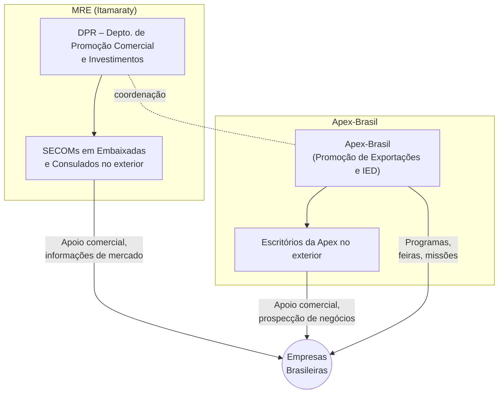

_Esquema: Estrutura institucional da promoção comercial brasileira._ O **Itamaraty**, por meio do **DPR** em Brasília, coordena uma rede de **SECOMs** (Setores de Promoção Comercial) espalhados em postos diplomáticos no exterior, que dão apoio local às **empresas brasileiras** exportadoras e promovem oportunidades de **investimento** no Brasil. A **Apex-Brasil**, agência especializada, realiza programas de promoção (feiras, missões, inteligência) e mantém alguns escritórios fora do país. MRE e Apex cooperam estreitamente – compartilhando informações e planejamento – para potencializar a **promoção comercial e atração de investimentos** de forma unificada.

> [!definition] **SECOM e SECTEC:** No exterior, além dos SECOMs comerciais, o Brasil estabeleceu _Setores de Ciência, Tecnologia e Inovação (SECTECs)_ em algumas embaixadas, bem como Adidos Agrícolas (especialistas do Ministério da Agricultura) em postos-chave. Essas figuras trabalham alinhadas aos SECOMs. Por exemplo, os **SECTECs** promovem parcerias tecnológicas e P&D, complementando a promoção comercial tradicional com foco em inovação. Já os **Adidos Agrícolas** abrem mercados para produtos do agronegócio e acompanham exigências sanitárias. Esse _time ampliado_ – SECOM + SECTEC + Adido – reflete a diversificação da diplomacia econômica brasileira.

### Instrumentos e Ações de Promoção Comercial e Investimentos

A diplomacia econômica brasileira lança mão de diversos **instrumentos práticos** para promover exportações, internacionalização de empresas e atrair investimentos produtivos. Entre as principais ações, destacam-se:

- **Missões Comerciais Oficiais:** Visitas de alto nível (Presidente, ministros ou embaixadores) acompanhadas de **delegações empresariais** aos mercados-alvo. Nessas missões, organiza-se agendas B2B, seminários país (country seminars) e networking com autoridades locais. Exemplo: a **Missão Apex/MRE à Europa em abril de 2025**, liderada pelo presidente da ApexBrasil, reuniu diplomatas (SECOMs de toda Europa) e empresários de setores como carnes, café e frutas em eventos em Lisboa, Varsóvia e Bruxelas[diplomaciabusiness.com](https://www.diplomaciabusiness.com/missao-da-apexbrasil-e-itamaraty-a-europa-discutira-avancos-para-validacao-do-acordo-mercosul-uniao-europeia/#:~:text=De%2023%20a%2030%20de,como%20prote%C3%ADna%20animal%2C%20caf%C3%A9%2C%20frutas). O objetivo era estreitar relações econômicas e **destravar acordos** como o Mercosul-UE[diplomaciabusiness.com](https://www.diplomaciabusiness.com/missao-da-apexbrasil-e-itamaraty-a-europa-discutira-avancos-para-validacao-do-acordo-mercosul-uniao-europeia/#:~:text=pessoas%20e%20Produto%20Interno%20Bruto,o%20fortalecimento%20de%20la%C3%A7os%20estrat%C3%A9gicos)[diplomaciabusiness.com](https://www.diplomaciabusiness.com/missao-da-apexbrasil-e-itamaraty-a-europa-discutira-avancos-para-validacao-do-acordo-mercosul-uniao-europeia/#:~:text=Conselho%20da%20Uni%C3%A3o%20Europeia%2C%20que,o%20fortalecimento%20de%20la%C3%A7os%20estrat%C3%A9gicos). Essas missões promovem produtos brasileiros, esclarecem dúvidas de compradores estrangeiros e elevam o perfil do Brasil junto a investidores. Na atração de IED, há _road shows_ em capitais financeiras para apresentar projetos (ex.: infraestrutura, energia verde) a potenciais investidores globais.
    
- **Feiras Internacionais e Rodadas de Negócios:** A Apex-Brasil coordena a participação do Brasil em grandes feiras setoriais mundiais (de alimentos, têxteis, tecnologia, defesa etc.), montando _pavilhões Brasil_ que abrigam dezenas de empresas nacionais. Essa estratégia dá visibilidade e acesso a novos clientes. Aliado a isso, realizam-se _rodadas de negócios_ – eventos matchmaking onde exportadores brasileiros encontram importadores estrangeiros previamente selecionados. Muitas vezes, essas rodadas ocorrem _in loco_ em embaixadas ou centros de convenções, com apoio do SECOM local para trazer compradores regionais. Resultados são medidos em volume de contratos prospectados. A Apex também organiza no Brasil eventos para compradores estrangeiros (ex.: **Projeto Comprador**, que traz importadores para rodadas com produtores brasileiros, em especial no setor de agronegócios e moda).
    
- **Inteligência de Mercado:** O MRE (via DPR e SECOMs) e a Apex produzem estudos e informações de inteligência para guiar empresas e políticas. Exemplos incluem **estudos de mercado** por país/setor, mapeamento de barreiras comerciais, identificação de tendências de consumo e requisitos técnicos. Um empreendedor brasileiro pode acessar essas análises via portais (Invest & Export Brasil) ou solicitá-las aos SECOMs. Além disso, existem **observatórios** e sistemas de alerta: o governo monitora alterações em políticas comerciais estrangeiras que afetem exportações brasileiras (tarifas, cotas, regulamentos sanitários) e aciona diplomatas para atuar preventivamente ou propor soluções (inclusive contenciosos na OMC se necessário). Essa inteligência ajuda o Brasil a **adaptar sua oferta exportadora** conforme demandas específicas de cada mercado.
    
- **Atração de Investimento Estrangeiro Direto (IED):** No front de investimentos, a Apex-Brasil mantém uma área dedicada (Coordenação de Investimentos) que faz _prospectiva_ de investidores. Em parceria com embaixadas, são realizadas **missões de investimento**: delegações vão a países-alvo (por ex. Golfo Pérsico, EUA, Europa, China) apresentar oportunidades no Brasil – muitas vezes alinhadas a planos governamentais (concessões de infraestrutura, privatizações ou projetos do PAC). Ao mesmo tempo, em Brasília e nos estados, recepcionam-se comitiva de empresários estrangeiros, organizando agendas com autoridades e visitas a potenciais sites de investimento. Uma prática frutífera são os **MoUs de Cooperação Investimentos** que o Brasil firma com países específicos para facilitar troca de informações e apoio mútuo a investidores. Os resultados são vistos em números: nos últimos anos o Brasil se manteve entre os maiores destinos de IED na AL, beneficiado pelo empenho diplomático em **garantir segurança jurídica e divulgar vantagens competitivas** (mercado interno grande, setores como energias renováveis, agronegócio eficiente, polo tech emergente etc.).
    
- **Marca Brasil e Diplomacia de Imagem:** Parte da promoção comercial envolve _vender a imagem_ do Brasil no exterior. Iniciativas de _nation branding_ incluem campanhas como “Brazil – Agribusiness Powerhouse” ou eventos culturais/gastronômicos para associar produtos brasileiros a qualidade e sustentabilidade. As embaixadas frequentemente realizam **seminários sobre oportunidades no Brasil**, convidando imprensa e formadores de opinião locais. Um aspecto recente é a resposta a **desafios reputacionais**: frente a críticas internacionais (ex.: desmatamento, questões trabalhistas), governo e Apex intensificaram a comunicação transparente, destacando melhorias e compromissos. Conforme mencionado, uma **“campanha antidifamação”** foi preparada em 2025 para mostrar ao consumidor europeu os esforços ambientais do agro brasileiro e evitar danos à reputação que prejudiquem as exportações[cnnbrasil.com.br](https://www.cnnbrasil.com.br/blogs/luisa-martins/politica/por-acordo-mercosul-ue-brasil-prepara-campanha-e-conta-votos-de-europeus/#:~:text=Como%20parte%20do%20esfor%C3%A7o%20pela,agro%20brasileiro%20como%20vil%C3%A3o%20ambiental). Essa _diplomacia da reputação_ tornou-se crucial, pois hoje aspectos socioambientais influenciam diretamente o acesso a mercados.
    
- **Apoio ao Exportador e Capacitação:** Internamente, a diplomacia comercial atua junto a outras entidades (Câmara de Comércio Exterior – CAMEX, Sebrae, federações industriais) para capacitar empresas – especialmente pequenas e médias – a exportar. Programas como o **PEIEX** (da Apex) oferecem consultoria para iniciantes em comércio exterior. O Itamaraty organiza eventos chamados **ENCOMEX** (Encontros de Comércio Exterior) em cidades brasileiras, levando diplomatas e especialistas para orientar produtores locais sobre como acessar mercados externos. Essas ações melhoram a competitividade da base exportadora do Brasil, tornando a internacionalização um objetivo acessível a mais empresas.
    

Em conjunto, esses instrumentos compõem a **diplomacia da promoção comercial brasileira**, que atua de ponta a ponta: desde preparar a empresa domesticamente, abrir caminhos com acordos internacionais, até apoiá-la concretamente na hora de fechar negócios e se estabelecer lá fora. A sinergia entre MRE e Apex, unindo a **legitimidade diplomática** com a **eficiência técnico-operacional**, tem se mostrado cada vez mais essencial para o sucesso dessas iniciativas. A missão Apex-Itamaraty à Europa em 2025, já citada, ilustra essa convergência de esforços em prol de um objetivo estratégico (no caso, viabilizar o acordo Mercosul-UE e promover exportações agroindustriais)[diplomaciabusiness.com](https://www.diplomaciabusiness.com/missao-da-apexbrasil-e-itamaraty-a-europa-discutira-avancos-para-validacao-do-acordo-mercosul-uniao-europeia/#:~:text=De%2023%20a%2030%20de,como%20prote%C3%ADna%20animal%2C%20caf%C3%A9%2C%20frutas)[diplomaciabusiness.com](https://www.diplomaciabusiness.com/missao-da-apexbrasil-e-itamaraty-a-europa-discutira-avancos-para-validacao-do-acordo-mercosul-uniao-europeia/#:~:text=O%20principal%20objetivo%20dos%20encontros,grandes%20blocos%20est%C3%A3o%20dispostos%20a). A mensagem central é que a política comercial brasileira não se encerra na mesa de negociação de acordos – ela se projeta no dia a dia dos mercados, **promovendo ativamente o Brasil e seus produtos no cenário global**.

## Questões de Autoavaliação

1. **Mercosul como Plataforma:** Qual é o papel do Mercosul na política comercial externa brasileira? Cite **vantagens** de negociar via Mercosul e **desafios** enfrentados pelo Brasil ao atuar dentro do bloco.
    
2. **Acordo Mercosul-UE:** Resuma a importância estratégica do acordo Mercosul-União Europeia para o Brasil. Quais foram os principais _entraves à ratificação_ até 2025, especialmente no tocante às questões ambientais?
    
3. **Acordos e Negociações:** Quais acordos comerciais o Mercosul (ou Brasil via Mercosul) já concluiu nas últimas décadas fora da América do Sul (mencione pelo menos três) e quais negociações de acordos **ainda em curso** até 2025 você destacaria como prioritárias?
    
4. **Evolução Negociadora:** Explique a transição da postura negociadora do Brasil de uma abordagem mais **defensiva** para outra mais **ofensiva/aberta**. Quais fatores internos e externos motivaram essa mudança de estratégia a partir dos anos 2010?
    
5. **Promoção Comercial:** Descreva a **estrutura institucional** da promoção comercial e de investimentos do Brasil. Qual o papel dos SECOMs e do MRE, e como atua a Apex-Brasil? Dê exemplos de _instrumentos_ utilizados para promover exportações e atrair investimentos. (Comente também sobre a importância da sinergia entre Itamaraty e Apex nesse contexto.)
    

**Respostas esperadas:** _As respostas devem cobrir os pontos-chave de cada pergunta, demonstrando entendimento profundo dos temas. Por exemplo, na questão 1 espera-se menção à força coletiva do Mercosul versus limitações (consenso, caso Uruguai-China); na 2, destacar benefícios econômicos do acordo UE e obstáculos como pressão ambiental europeia; na 3, conhecimento de acordos com Israel, Egito, Singapura, etc., e negociações com Canadá, Coreia, EFTA; na 4, contextualizar que Brasil priorizou indústria e multilateralismo antes, passando a buscar FTAs pós-2010 devido à mudança global; na 5, mapear o funcionamento do DPR/SECOMs + Apex e citar ferramentas (missões, feiras, inteligência, etc.)._

**Fonte(s) de estudo recomendada(s):** Política externa comercial nas _Relações Internacionais do Brasil_ (Pinheiro & Gaio), coletâneas de acordos no site do MDIC/MRE, relatórios da Apex-Brasil, e noticiários econômicos atualizados sobre Mercosul e acordos (até 2025). Aproveite para revisar também perguntas de prova anteriores do CACD sobre Mercosul e política comercial, para calibrar o nível de detalhe necessário nas respostas.

---

**Bibliografia selecionada:**

- Ministério das Relações Exteriores – _Agenda de Negociações Externas_: atualizações sobre acordos Mercosul-UE, EFTA etc.[agenciagov.ebc.com.br](https://agenciagov.ebc.com.br/noticias/202412/perguntas-e-respostas-acordo-de-parceria-mercosul-uniao-europeia#:~:text=Em%206%20de%20dezembro%20de,durava%20cerca%20de%2025%20anos)[gov.br](https://www.gov.br/mre%E2%80%8B/pt-br/assuntos/politica-externa-comercial-e-economica/agenda-de-negociacoes-externas/acordo-mercosul-efta#:~:text=Ap%C3%B3s%20a%20d%C3%A9cima%20rodada%20negociadora%2C,das%20tratativas%20ocorridas%20em%202024)
    
- Planalto/AgênciaBrasil – _Perguntas e Respostas Mercosul-UE (06/12/2024)_[agenciagov.ebc.com.br](https://agenciagov.ebc.com.br/noticias/202412/perguntas-e-respostas-acordo-de-parceria-mercosul-uniao-europeia#:~:text=Em%20junho%20de%202019%2C%20as,temas%20como%20indica%C3%A7%C3%B5es%20geogr%C3%A1ficas%20e)[agenciagov.ebc.com.br](https://agenciagov.ebc.com.br/noticias/202412/perguntas-e-respostas-acordo-de-parceria-mercosul-uniao-europeia#:~:text=A%20etapa%20negociadora%20iniciada%20em,mais%20favor%C3%A1vel%20aos%20interesses%20brasileiros)
    
- CNN Brasil – _Blog Luísa Martins: esforço pela ratificação Mercosul-UE_ (09/05/2025)[cnnbrasil.com.br](https://www.cnnbrasil.com.br/blogs/luisa-martins/politica/por-acordo-mercosul-ue-brasil-prepara-campanha-e-conta-votos-de-europeus/#:~:text=Como%20parte%20do%20esfor%C3%A7o%20pela,agro%20brasileiro%20como%20vil%C3%A3o%20ambiental)[cnnbrasil.com.br](https://www.cnnbrasil.com.br/blogs/luisa-martins/politica/por-acordo-mercosul-ue-brasil-prepara-campanha-e-conta-votos-de-europeus/#:~:text=A%20expectativa%20%C3%A9%20de%20que,travar%20ou%20validar%20o%20acordo)
    
- Folha de S.Paulo – _Brasil aposta em acordos com Ásia, Canadá, México_ (07/04/2025)[www1.folha.uol.com.br](https://www1.folha.uol.com.br/mercado/2025/04/brasil-aposta-em-acordos-comerciais-com-paises-asiaticos-canada-e-mexico-para-se-contrapor-a-trump.shtml#:~:text=Uma%20das%20metas%20%C3%A9%20ressuscitar,s%C3%A9rie%20de%20tarifas%20de%20Trump)[www1.folha.uol.com.br](https://www1.folha.uol.com.br/mercado/2025/04/brasil-aposta-em-acordos-comerciais-com-paises-asiaticos-canada-e-mexico-para-se-contrapor-a-trump.shtml#:~:text=Carregando)
    
- Diplomacia Business – _Missão Apex-Itamaraty à Europa_ (21/04/2025)[diplomaciabusiness.com](https://www.diplomaciabusiness.com/missao-da-apexbrasil-e-itamaraty-a-europa-discutira-avancos-para-validacao-do-acordo-mercosul-uniao-europeia/#:~:text=De%2023%20a%2030%20de,como%20prote%C3%ADna%20animal%2C%20caf%C3%A9%2C%20frutas)[diplomaciabusiness.com](https://www.diplomaciabusiness.com/missao-da-apexbrasil-e-itamaraty-a-europa-discutira-avancos-para-validacao-do-acordo-mercosul-uniao-europeia/#:~:text=O%20principal%20objetivo%20dos%20encontros,grandes%20blocos%20est%C3%A3o%20dispostos%20a)
    
- Marcos Jank – _Itamaraty, Apex e comércio exterior_ (Folha/Agrolink, 2016)


# Origem: _A dimensão da segurança na política exterior do Brasil

---
title: A dimensão da segurança na política exterior do Brasil
area: POLÍTICA INTERNACIONAL
subarea: A dimensão da segurança na política exterior do Brasil
tags:
  - a-dimensao-da-seguranca-na-politica-exterior-do-brasil
  - cacd-2025
  - politica-internacional
aliases:
  - A dimensão da segurança na política exterior do Brasil.
---
# A Dimensão da Segurança na Política Externa Brasileira (PEB)

A política externa brasileira historicamente caracterizou-se por uma postura pacífica e pela ênfase no desenvolvimento. **A dimensão de segurança na PEB** evoluiu de um enfoque tradicional, centrado na defesa do território e na solução diplomática de controvérsias, para uma visão **multidimensional de segurança** que incorpora temas como desenvolvimento socioeconômico, meio ambiente, energia, saúde, segurança alimentar e cibernética. A seguir, analisa-se criticamente essa evolução e seus desdobramentos, bem como as estratégias e desafios do Brasil em matéria de segurança internacional.

## Evolução do Conceito de Segurança na PEB

Durante grande parte do século XX, o conceito de segurança na PEB foi estreitamente associado à **integridade territorial e à soberania nacional**, refletindo a prioridade em **evitar conflitos armados** e resolver disputas por meios pacíficos. O Brasil consolidou suas fronteiras por vias diplomáticas (sobretudo sob o Barão do Rio Branco) e cultivou uma imagem de **“país pacífico”**, que não ameaça seus vizinhos e evita alianças militares comprometedoras. Esse enfoque tradicional privilegiava a defesa do território e a não-intervenção, alinhado aos princípios constitucionais de 1988 que pregam a solução pacífica de controvérsias e a não-ingerência em assuntos internos de outros Estados.

> [!note] **Tradição Pacífica da Diplomacia Brasileira:** O Brasil não se envolve em guerras desde 1945 e preconiza a resolução negociada de disputas. Essa tradição, reforçada pela ausência de inimigos estratégicos diretos, moldou uma cultura diplomática em que segurança era sinônimo de estabilidade de fronteiras e respeito ao direito internacional, com **desconfiança a abordagens militaristas** ou intervencionistas.

A partir do final do século XX e início do XXI, porém, **expandiu-se a noção de segurança na PEB**. Reconheceu-se que ameaças modernas vão além de invasões militares, incluindo riscos difusos e transnacionais. A diplomacia brasileira passou a **enxergar o desenvolvimento socioeconômico como parte integral da segurança**, adotando uma perspectiva humana e multidimensional. Problemas como pobreza extrema, crises ambientais, pandemias, crime organizado e terrorismo passaram a figurar na agenda, com a premissa de que **instabilidade interna e subdesenvolvimento podem comprometer a paz tanto quanto conflitos armados**. Em fóruns regionais e multilaterais (por exemplo, na Organização dos Estados Americanos em 2003), o Brasil apoiou declarações que qualificam a segurança de forma **multidimensional**, abrangendo desde desastres naturais até ameaças cibernéticas.

> [!note] **Segurança Multidimensional:** Hoje, a segurança na visão brasileira engloba não apenas defesa militar, mas também **desenvolvimento sustentável, direitos humanos, proteção ambiental e bem-estar da população**. Questões como mudanças climáticas, crises de saúde pública ou insegurança alimentar são tratadas como ameaças à estabilidade internacional, exigindo respostas cooperativas e preventivas – uma ampliação significativa em relação à concepção estreita de segurança do passado.

## Estratégia Brasileira para o Entorno Estratégico

A geopolítica brasileira confere especial importância ao **entorno estratégico** – conceito que abarca as regiões de interesse prioritário para a segurança nacional: **América do Sul, Atlântico Sul, costa oeste da África e Antártica**. Nesse contexto, o Brasil formula estratégias distintas, porém complementares, para a **América do Sul** e para o **Atlântico Sul**, visando manter ambos como espaços de paz, cooperação e desenvolvimento compartilhado.

### América do Sul como Zona de Paz e o Conselho de Defesa Sul-Americano

A América do Sul é vista pelo Brasil como uma **“zona de paz”**, caracterizada pela ausência de conflitos interestatais nas últimas décadas e pela crescente integração regional. A PEB tem consistentemente buscado **fortalecer os laços sul-americanos** – seja por meio do MERCOSUL, da [[União de Nações Sul-Americanas (UNASUL)]] ou de outras iniciativas – com o objetivo de assegurar que divergências sejam resolvidas diplomaticamente e de prevenir a ingerência de potências de fora da região nas questões de segurança sul-americanas.

Esse engajamento reflete tanto valores quanto interesses: um entorno estável e próspero reduz riscos de crises que possam **transbordar as fronteiras**. Como resumiu o Barão do Rio Branco no início do século XX, o Brasil ambiciona “**ser forte entre vizinhos grandes e fortes**”, indicando que a prosperidade e estabilidade dos vizinhos é benéfica para o próprio Brasil. Na prática, essa filosofia traduziu-se em apoio a mecanismos regionais de concertação. Em 2000, a I Reunião de Presidentes da América do Sul (Cúpula de Brasília) marcou o **início de uma coordenação sul-americana autônoma**, sem tutelas externas. Dela adveio a ideia de formar a UNASUL, lançada em 2008, com um componente específico de defesa.

> [!definition] **Conselho de Defesa Sul-Americano (CDS):** Órgão criado em 2008 no âmbito da UNASUL, reunindo Ministros de Defesa sul-americanos para **promover cooperação militar, transparência e confiança mútua**. O CDS não é uma aliança militar tradicional, mas um fórum de diálogo que realizou exercícios conjuntos, intercâmbio de informação e coordenação em temas como ajuda humanitária e formação de pessoal. A iniciativa – liderada diplomaticamente pelo Brasil – visou consolidar a **América do Sul como zona pacífica**, articulando soluções regionais para desafios de segurança sem dependência direta de atores externos.

A atuação do Brasil no CDS e em outros fóruns sul-americanos de segurança buscou **evitar corridas armamentistas regionais e fomentar confiança**, por exemplo mediante a troca de dados sobre gastos militares e projetos de integração industrial de defesa. Embora a UNASUL tenha enfraquecido após 2017 por divergências políticas internas entre os países-membros, a noção de América do Sul como zona de paz persiste. O Brasil mantém a ênfase em **resolução regional de conflitos** (chegando a mediar crises como a de Venezuela-Colômbia em 2008) e **cooperação fronteiriça** com vizinhos. Ainda que desafios subsistam – tráficos ilícitos, tensões políticas esporádicas – não há disputas territoriais ativas nem conflitos armados interestatais na América do Sul, um feito em parte atribuído a essa arquitetura regional de paz.

### Atlântico Sul: a “Amazônia Azul” e a ZOPACAS

No eixo marítimo, a estratégia brasileira concentra-se em preservar o **Atlântico Sul como área de paz e cooperação**, resguardando ao mesmo tempo os consideráveis interesses nacionais presentes no mar. O conceito de **“Amazônia Azul”** ilustra a importância que o Brasil confere ao seu espaço marítimo: trata-se do enorme domínio oceânico sob jurisdição brasileira (zona econômica exclusiva e plataforma continental), com cerca de 5,7 milhões de km², rico em recursos vivos (pesca, biodiversidade) e não vivos (petróleo e gás do pré-sal, minerais). Assim como a floresta amazônica é vital em terra, a “Amazônia Azul” é considerada estratégica no mar – demandando capacitação naval para vigilância e defesa.

> [!definition] **ZOPACAS (Zona de Paz e Cooperação do Atlântico Sul):** Iniciativa diplomática criada pela Resolução 41/11 da Assembleia Geral da ONU em 1986, por proposição do Brasil. Reúne 24 países da América do Sul e da África ocidental banhados pelo Atlântico Sul, com o objetivo de **manter o Atlântico Sul livre de armas nucleares e de rivalidades militares entre grandes potências**, promovendo cooperação marítima regional. A ZOPACAS estimula o diálogo em temas como **patrulha naval conjunta, combate à pirataria e aos tráficos ilícitos no mar, proteção ambiental marinha** e pesquisa científica oceânica.

O Brasil vê a ZOPACAS como ferramenta para **afastar presenças militares extrarregionais** potencialmente desestabilizadoras – por exemplo, manifesta reservas a qualquer expansão da OTAN ou estabelecimento de bases de potências no Atlântico Sul. A prioridade é assegurar que o Atlântico Sul permaneça **pacificado e cooperativo**, o que inclui parcerias Sul-Sul: Brasil tem ampliado a cooperação de defesa com países da África atlântica, oferecendo treinamento militar, realizando exercícios navais conjuntos (como a operação **GUINEX** no Golfo da Guiné) e firmando acordos para intercâmbio de informações marítimas. Essas ações ajudam no enfrentamento de ameaças comuns, como pirataria, pesca ilegal e tráfico de drogas via oceano.

Do ponto de vista estratégico, proteger a “Amazônia Azul” envolve investimentos em **capacidades navais de dissuasão**. O **Programa de Desenvolvimento de Submarinos (PROSUB)**, parceria Brasil-França, inclui a construção de submarinos convencionais e um de propulsão nuclear, justamente para garantir a vigilância das águas jurisdicionais brasileiras de forma compatível com o caráter pacífico da região (o submarino nuclear brasileiro, previsto para entrar em operação nesta década, será armado apenas convencionalmente, respeitando o compromisso de manter o Atlântico Sul livre de armas nucleares).

Em suma, seja em relação aos vizinhos continentais, seja no Atlântico Sul, a PEB orienta-se por **princípios de defesa cooperativa e preventiva**. A América do Sul é cultivada como cinturão de paz e **entorno imediato estável**, enquanto o Atlântico Sul é resguardado como extensão estratégica onde a presença brasileira deve ser preponderante, sustentando um **eixo sul-atlântico de cooperação** entre a América do Sul e a África.

## Operações de Paz da ONU e a Projeção Internacional do Brasil

A participação em operações de paz das Nações Unidas tornou-se, desde o pós-Guerra Fria, um instrumento importante da projeção internacional do Brasil na área de segurança. Ao engajar tropas e recursos em missões de paz da ONU, o Brasil busca **afirmar seu papel de provedor de segurança global responsável** e acumular credenciais para pleitos diplomáticos (como a reivindicação a um assento permanente no Conselho de Segurança da ONU). O país esteve presente em missões da ONU desde suas primeiras iniciativas – enviou um contingente ao Oriente Médio em 1957 (UNEF) e posteriormente contribuiu em missões na África, Ásia e no Haiti. Entretanto, nenhuma operação foi tão marcante para a diplomacia e defesa brasileiras quanto a missão de estabilização no Haiti, a MINUSTAH.

### O Caso da MINUSTAH: Objetivos, Ganhos e Críticas

A **Missão das Nações Unidas para a Estabilização do Haiti (MINUSTAH)**, estabelecida em 2004, contou com liderança militar brasileira durante todos os 13 anos de seu mandato (2004–2017). O Brasil forneceu o comandante da força militar da MINUSTAH (Force Commander) em todo o período e contribuiu com um dos maiores contingentes de tropas. Os **objetivos declarados** da missão incluíam restaurar a segurança e a ordem pública no Haiti após intensa instabilidade política e a deposição do presidente, apoiar a realização de eleições livres e promover a reconstrução institucional – tudo isso a pedido do próprio governo haitiano, que solicitou a presença internacional. Do ponto de vista diplomático brasileiro, a MINUSTAH também serviu a **justificativas estratégicas**: demonstrar compromisso com a segurança hemisférica, solidariedade sul-sul (ajuda a um país caribenho pobre) e **reforçar a narrativa de que o Brasil assumia responsabilidades proporcionais à sua estatura global**.

As **justificativas diplomáticas** enfatizavam o caráter multilateral e legítimo da operação (_autorizada pelo CSNU sob Capítulo VII_) e o interesse genuinamente haitiano na presença da missão. O então Chanceler Celso Amorim argumentou que o Brasil poderia, com a MINUSTAH, ajudar um povo irmão ao mesmo tempo em que provava ao mundo sua capacidade de liderança em questões de paz e segurança. Internamente, a missão teve apoio dos sucessivos governos Lula e Dilma, alinhada à visão de que **paz, segurança e desenvolvimento são interdependentes** – ou seja, estabilizar o Haiti exigia não apenas força de paz, mas esforços de reconstrução econômica e social, nos quais o Brasil também se engajou.

**Ganhos Estratégicos:** A atuação brasileira na MINUSTAH trouxe uma série of benefícios tanto para o Haiti quanto para o próprio Brasil. No Haiti, a missão conseguiu **reduzir a violência das gangues armadas** que aterrorizavam a capital Porto Príncipe, criou condições para a realização de eleições presidenciais em 2006, 2010 e 2015, e formou mais de 11 mil policiais nacionais haitianos, suprindo a ausência de Forças Armadas no país. Além disso, quando desastres naturais atingiram o Haiti – notadamente o terremoto de 2010 e o furacão Matthew em 2016 – as forças brasileiras estiveram na linha de frente do **socorro humanitário**, distribuindo ajuda e apoiando a população local. Esses resultados reforçaram a imagem do Brasil como ator comprometido com a **estabilidade e o bem-estar internacionais**, para além de seus interesses imediatos.

Para as **Forças Armadas brasileiras**, a MINUSTAH proporcionou uma experiência operacional sem precedentes em contexto real: militares brasileiros aperfeiçoaram treinamento em **segurança urbana, engenharia, logística, ajuda humanitária e proteção civil**, lidando com situações de risco e desastre. Essa vivência prática elevou o preparo das tropas, cujo aprendizado foi incorporado em operações no Brasil – por exemplo, em garantia da lei e da ordem em favelas no Rio de Janeiro ou na resposta a calamidades naturais. A missão consolidou também o perfil do Brasil como **contribuinte efetivo para as missões de paz da ONU**, dando substância à candidatura brasileira a maiores responsabilidades na ONU.

> [!note] **Integração Segurança-Desenvolvimento na MINUSTAH:** Uma característica marcante da abordagem brasileira foi combinar a componente militar com iniciativas de desenvolvimento local. Além do patrulhamento, os soldados brasileiros engajaram-se em ações cívico-sociais (como reformas de escolas, projetos esportivos para jovens e atendimento médico). Em paralelo, o governo brasileiro investiu em **cooperação técnica bilateral**: apoio na agricultura (produção de arroz), construção de uma usina elétrica, projetos de saúde comunitária, dentre outros. Essa estratégia alinhava-se ao entendimento de que **segurança duradoura requer desenvolvimento** – visão posteriormente cristalizada no conceito de “Responsabilidade ao Proteger”, lançado pelo Brasil em 2011, advogando que intervenções em nome da proteção de civis devem vir acompanhadas da responsabilidade de reconstrução pós-conflito e de não agravamento da situação.

**Críticas e Controvérsias:** Apesar dos aspectos positivos, a participação do Brasil na MINUSTAH não foi isenta de críticas. Alguns observadores alegaram que o envolvimento no Haiti representou um **desvio da tradição não intervencionista** da PEB – ainda que sob mandato ONU, tratava-se de intervir em um país soberano, o que gerou desconforto em certos setores políticos e acadêmicos no Brasil. Houve quem visse a missão como **atendimento a interesses de potências ocidentais** (EUA/França), que teriam preferido delegar a países em desenvolvimento o ônus da estabilização haitiana. Outra linha de crítica questionou a efetividade de longo prazo: logo após a retirada das tropas da MINUSTAH, o Haiti voltou a mergulhar em grave crise política e humanitária, sugerindo que os ganhos de segurança não se traduziram em estabilidade sustentável. Adicionalmente, escândalos impactaram a reputação das forças de paz da ONU no Haiti – o mais grave sendo a introdução da epidemia de cólera (atribuída a tropas de outro país, Nepal, em 2010) e casos de abusos cometidos por “capacetes azuis”. Embora nenhum desses episódios tenha envolvido diretamente o contingente brasileiro, eles afetaram a percepção geral da missão.

Em resposta, diplomatas brasileiros defenderam que a MINUSTAH cumpriu o mandato possível, **ganhando tempo para que instituições haitianas fossem reconstruídas**, e que o Brasil sempre atuou com respeito à população local. Ressaltaram ainda que a retirada das tropas foi decidida quando já não havia mais apoio dentro do Haiti para sua permanência – ou seja, evitou-se prolongar indevidamente a presença externa. As lições do Haiti influenciaram a doutrina brasileira, reforçando a ideia de que operações de paz devem estar **vinculadas a estratégias de desenvolvimento** robustas e possuir **saídas planejadas** para não se tornarem ocupações indefinidas.

## Integração entre Segurança e Desenvolvimento na Doutrina Brasileira

Um eixo condutor da política externa brasileira contemporânea é a convicção de que **segurança e desenvolvimento são inseparáveis**. Essa integração se encontra explícita nos documentos estratégicos de defesa do Brasil, que estabelecem um **tripé conceitual unindo desenvolvimento, diplomacia e defesa**. Em outras palavras, a projeção de poder brasileiro deve servir aos objetivos de desenvolvimento nacional e global, e vice-versa – a pobreza, a desigualdade e a falta de oportunidades são vistas como ameaças subjacentes à paz.

Essa visão permeou a atuação brasileira em diversos cenários internacionais. Nos debates sobre **segurança coletiva na ONU**, o Brasil consistentemente enfatiza a **prevenção de conflitos pela via do desenvolvimento**: argui que a melhor forma de evitar guerras e crises humanitárias é enfrentar suas causas profundas (fome, marginalização econômica, violações de direitos) por meio da cooperação internacional. Foi nesse sentido que o Brasil lançou, em 2011, o conceito inovador de **“Responsabilidade ao Proteger (RwP)”**, como complemento à doutrina da Responsabilidade de Proteger. O RwP propõe diretrizes para que ações militares autorizadas pela ONU venham acompanhadas de monitoramento e de comprometimento sério com a reconstrução pós-conflito, para não se limitar ao aspecto bélico. Essa iniciativa brasileira, apresentada pela Presidente Dilma Rousseff na Assembleia Geral da ONU, refletiu a preocupação de que intervenções sem planejamento de paz duradoura podem agravar a instabilidade – vide a Líbia em 2011 – e retomou a mensagem de que **não há segurança sem desenvolvimento nem desenvolvimento sem segurança**.

No plano regional, a integração segurança-desenvolvimento manifesta-se no engajamento do Brasil em projetos como a **Iniciativa para a Integração da Infraestrutura Regional Sul-Americana (IIRSA)** e programas de **cooperação técnica** com vizinhos, entendendo que a melhora socioeconômica do entorno contribui para um ambiente mais seguro. Da mesma forma, a política brasileira de cooperação Sul-Sul na África e em outros continentes combina capacitação em setores de segurança (ex.: treinamento de forças policiais em Guiné-Bissau para combate ao narcotráfico) com ajuda humanitária e apoio agrícola, **abordando simultaneamente a segurança imediata e a resiliência de longo prazo** desses países parceiros.

> [!definition] **“Desenvolvimento como o Novo Nome da Paz”:** Inspirado no adágio proferido no contexto internacional pós-Guerra Fria, o Brasil adotou como doutrina que **o desenvolvimento é fundamental para a paz**. Essa abordagem holística está presente na Política Nacional de Defesa e orienta a diplomacia brasileira em temas que vão da reforma da ONU (defendendo um Conselho de Segurança mais representativo para melhor promover a paz) até a cooperação em segurança alimentar e combate às desigualdades globais. A própria participação do Brasil em missões de paz, como visto no Haiti, é condicionada a estratégias de **peacebuilding** (construção da paz) que integrem ajuda ao desenvolvimento local, e não apenas o uso da força.

Em suma, a base doutrinária brasileira rompe com a dicotomia tradicional entre “hard power” e “soft power”: para o Brasil, contribuir para o **desenvolvimento internacional, a ajuda humanitária, o fortalecimento de regimes multilaterais de direitos e meio ambiente** é parte de sua estratégia de segurança, pois constrói um mundo mais estável e, logo, favorece a segurança nacional. Essa perspectiva ganha relevância especial diante dos desafios globais contemporâneos, em que problemas **transnacionais exigem respostas que combinam meios diplomáticos, militares e de cooperação para o desenvolvimento**.

## Segurança Multissetorial: Meio Ambiente, Energia, Alimentação, Saúde e Cibernética

No século XXI, a agenda da política externa brasileira incorporou diversos **eixos temáticos de segurança não tradicionais**, refletindo a complexidade das ameaças e a interdependência global. A seguir, destacam-se as principais vertentes dessa **segurança multissetorial** promovida pelo Brasil: a segurança ambiental, energética, alimentar, sanitária e cibernética.

### Segurança Ambiental

A dimensão ambiental tornou-se central na PEB, especialmente pela posição singular do Brasil como detentor de rica biodiversidade (Amazônia, Cerrado, etc.) e ator-chave nas negociações climáticas. **Segurança ambiental**, nesse contexto, refere-se tanto à proteção dos ecossistemas vitais – cuja degradação pode gerar conflitos e instabilidade – quanto à mitigação de riscos decorrentes das mudanças climáticas. O Brasil teve papel protagonista em conferências históricas (foi anfitrião da Rio-92 e da Rio+20) e defende que um ambiente saudável é pré-condição para o desenvolvimento e a paz.

Concretamente, a política externa brasileira atua para **fortalecer regimes internacionais ambientais** (como o Acordo de Paris sobre o clima) e ao mesmo tempo resguardar a soberania sobre seus recursos naturais. Há uma percepção nas esferas de defesa de que a Amazônia, por sua importância planetária, deve ser cuidada pelo Brasil não apenas por obrigação ambiental, mas também para **prevenir pressões internacionais ou ingerências** indevidas sob pretexto ecológico. Assim, iniciativas como o **Tratado de Cooperação Amazônica (1978)** e sua Organização (OTCA) – englobando os países amazônicos em ações conjuntas de desenvolvimento sustentável e fiscalização – têm duplo papel: promover a sustentabilidade e **garantir que a região amazônica permaneça uma zona de paz e cooperação**, imune a disputas.

> [!note] **Mudanças Climáticas e Segurança Nacional:** O Brasil gradualmente reconheceu que fenômenos como secas extremas, enchentes e outros eventos climáticos podem constituir ameaças à segurança (por afetarem a produção de alimentos, deslocarem populações e gerarem crises humanitárias). Documentos recentes de defesa mencionam a necessidade de monitorar impactos climáticos, e a diplomacia brasileira apoia abordagens preventivas, como fundos de adaptação climática para países vulneráveis. No Conselho de Segurança da ONU, entretanto, o Brasil historicamente mostra cautela em tratar mudança do clima como questão de “segurança”, temendo que isso possa levar a soluções coercitivas; prefere enfatizar cooperação no âmbito da UNFCCC e desenvolvimento sustentável como resposta principal. Essa nuance revela o equilíbrio buscado entre **não “securitizar” indevidamente a agenda ambiental** e, ao mesmo tempo, **levar a sério os riscos que a degradação ambiental impõe à estabilidade global**.

### Segurança Energética

O Brasil emergiu nas últimas décadas como um ator relevante em segurança energética, tanto no plano interno quanto internacional. Segurança energética diz respeito ao **acesso estável e sustentável a fontes de energia**, elemento crucial para o desenvolvimento econômico e a segurança de um país. A descoberta do petróleo do **Pré-Sal** (grandes reservas ultramarinas) a partir de 2007 transformou o Brasil em potencial exportador de petróleo, reduzindo sua vulnerabilidade a choques externos de oferta. A política externa brasileira passou a abordar energia em múltiplos fóruns: participa do G20 discutindo volatilidade dos preços, colabora com a Agência Internacional de Energia (o Brasil tornou-se associado em 2017) e lidera iniciativas de energias limpas.

Um pilar da atuação brasileira é a promoção de **energias renováveis**, onde o país possui vantagem comparativa (matriz elétrica com ~60% hidráulica, largo uso de biocombustíveis). Nos anos 2000, a chamada **“diplomacia do etanol”** aproximou Brasil e Estados Unidos em programas conjuntos para difundir biocombustíveis na América Central e África, buscando reduzir a dependência global de combustíveis fósseis. A segurança energética regional também é prioridade: interconexões elétricas e acordos de fornecimento evitam escassez e criam interdependências pacíficas. Exemplos incluem o acordo de Itaipu com o Paraguai (garantindo eletricidade compartilhada) e o gasoduto Brasil-Bolívia (assegurando abastecimento de gás natural ao Brasil, ao mesmo tempo gerando renda estável à Bolívia). Ainda que tensões possam surgir – como quando a Bolívia nacionalizou suas reservas de gás em 2006 – o Brasil tratou a questão de forma diplomática e chegou a um novo entendimento de preços e contratos, priorizando a **estabilidade do suprimento energético** em vez de confronto.

No âmbito doméstico, a segurança energética é percebida como componente de segurança nacional; a Política Externa coopera nesse sentido atraindo investimentos e tecnologia externos para diversificar a matriz (eólica, solar, nuclear). O **Programa Nuclear** brasileiro, embora pacífico, insere-se também em considerações estratégicas de longo prazo (domínio do ciclo de combustível nuclear para geração elétrica e para propulsão naval). Em suma, o Brasil advoga internacionalmente por **governança energética cooperativa**, onde produtores e consumidores dialoguem, e por **sustentabilidade**, entendendo que a transição para energias limpas reduz riscos de conflitos causados pela disputa por recursos fósseis escassos.

### Segurança Alimentar e Sanitária

**Segurança alimentar** – assegurar acesso a comida em quantidade e qualidade suficientes para toda a população – é um tema caro ao Brasil tanto internamente quanto em sua diplomacia. Após décadas de políticas sociais, o Brasil conseguiu em 2014 sair do _Mapa da Fome_ da ONU, um feito que conferiu autoridade moral para o país liderar discussões globais sobre erradicação da fome. O argumento brasileiro é claro: **não há desenvolvimento nem paz sem segurança alimentar e inclusão social**. Em foros como a FAO (Organização das Nações Unidas para Alimentação e Agricultura), o Brasil defende iniciativas de cooperação agrícola, transferência de tecnologia tropical (por exemplo, técnicas de cultivo adaptadas ao Cerrado africano) e ajuda humanitária em situações de fome aguda. A eleição do brasileiro **José Graziano da Silva** à direção-geral da FAO (2012–2019) refletiu esse protagonismo. A diplomacia brasileira lançou e apoiou resoluções sobre o _Direito Humano à Alimentação Adequada_ e financiou programas como o **Fundo IBAS** (Índia, Brasil e África do Sul) que destinou recursos a projetos de combate à fome em países pobres.

> [!note] **Diplomacia da Fome:** Seguindo a máxima de Josué de Castro de que a fome é o “biocida” silencioso da humanidade, o Brasil promoveu na ONU a ideia de que eliminar a fome é um requisito para a paz mundial. Programas domésticos bem-sucedidos – como o _Fome Zero_ e o _Bolsa Família_ – foram apresentados como modelos replicáveis. Essa postura rendeu-lhe reconhecimento: em 2021, o Prêmio Nobel da Paz laureou o Programa Mundial de Alimentos da ONU, ao qual o Brasil historicamente contribui tanto com doações de alimentos (milho, arroz) quanto com formulação de políticas (por meio do Centro de Excelência contra a Fome em Brasília). A mensagem central brasileira é que **sociedades bem alimentadas são menos propensas a conflitos**, e portanto investir em segurança alimentar faz parte de uma estratégia de segurança preventiva.

No campo **sanitário (saúde)**, a política externa brasileira também adota lentes de segurança humana. O Brasil foi pioneiro na resposta à epidemia de HIV/AIDS ao oferecer tratamento gratuito universal e quebrar patentes de medicamentos quando necessário – atitude que tomou dimensão diplomática, ao liderar, junto com outros países, movimentos por flexibilização das regras de propriedade intelectual em prol da saúde pública. A chamada **diplomacia da saúde** brasileira aparece na atuação ativa na Organização Mundial da Saúde (OMS) e em coalizões para acesso a medicamentos. Durante a pandemia de COVID-19, o Brasil participou do consórcio COVAX de vacinas e engajou diálogos bilaterais para garantir insumos, apesar das controvérsias na condução interna da crise. Há um reconhecimento de que **pandemias e doenças transnacionais ameaçam tanto vidas quanto economias**, podendo desestruturar países e gerar tensões – portanto, investir em sistemas de saúde robustos e cooperar internacionalmente em vigilância epidemiológica são entendidos como partes da salvaguarda de segurança nacional e internacional.

### Segurança Cibernética

Nas últimas duas décadas, a revolução digital trouxe à tona a importância da **segurança cibernética e digital**. O Brasil inicialmente focou esse tema sob a ótica de proteção de privacidade e do fluxo livre de informações, especialmente após as revelações de 2013 de que comunicações da Presidência da República foram alvo de espionagem eletrônica (caso _Snowden_). Em reação, a diplomacia brasileira liderou com a Alemanha a adoção de uma resolução na ONU afirmando que **direitos que as pessoas têm offline também devem ser protegidos online**, condenando vigilância massiva. Além disso, sediou em 2014 o encontro **NETmundial** em São Paulo, reunindo governos, empresas e sociedade civil global para discutir a governança da internet – um esforço de promover uma gestão **multissetorial e transparente** da rede, em contraposição a modelos concentrados.

Em termos estritamente de segurança cibernética (proteção contra ataques hackers, malware, etc.), o Brasil evoluiu sua estrutura institucional: criou em 2010 o **Centro de Defesa Cibernética** no Exército (hoje Comando de Defesa Cibernética), que atua na proteção das redes das Forças Armadas e apoia a segurança de infraestruturas críticas (setor elétrico, financeiro, comunicações). Grandes eventos realizados no Brasil, como a Copa do Mundo de 2014 e a Olimpíada de 2016, catalisaram a adoção de medidas mais robustas de defesa digital e cooperação de inteligência para prevenção de ataques. A Estratégia Nacional de Defesa inclui a **cibernética** como um dos três setores estratégicos a desenvolver (junto com nuclear e espacial), evidenciando a prioridade conferida ao tema.

No cenário internacional, o Brasil participa ativamente das discussões sobre **normas de comportamento estatal no ciberespaço**. Tem integrado os Grupos de Peritos Governamentais da ONU que buscam delinear regras para evitar a escalada de conflitos cibernéticos – por exemplo, acordos de não atacar sistemas civis críticos uns dos outros em tempos de paz. O Brasil advoga por um **ciberspaço livre de corridas armamentistas**, apoiando a ideia de que o direito internacional (como a Carta da ONU) se aplica ao ambiente digital. Paralelamente, preocupa-o a **segurança digital interna**, dada a crescente incidência de crimes cibernéticos, desinformação e ataques hacker em órgãos governamentais. O ano de 2020 viu, por exemplo, um ataque massivo ao Superior Tribunal de Justiça brasileiro, que paralisou suas redes – um lembrete de que ameaças digitais podem afetar a governança e requerem constante aprimoramento de defesas. A PEB caminha, assim, para integrar a pauta cibernética tanto na cooperação internacional (buscando apoio técnico, compartilhando melhores práticas) quanto em sua **agenda de segurança nacional**, reconhecendo o ciberespaço como um novo domínio de contestação que precisa ser mantido seguro.

## Desafios Contemporâneos de Segurança

Apesar dos avanços conceituais e institucionais acima descritos, o Brasil enfrenta **desafios significativos na dimensão de segurança** de sua política externa, especialmente diante de fenômenos contemporâneos que transcendem fronteiras. Dentre eles, destacam-se os **ilícitos transnacionais nas fronteiras**, o terrorismo e as ameaças digitais emergentes – questões que testam a capacidade brasileira de articular respostas efetivas sem abdicar de seus princípios diplomáticos.

**Ilícitos Transnacionais e Fronteiras:** Com dez países vizinhos e mais de 16 mil km de fronteiras terrestres porosas, o Brasil lida com fluxos ilícitos que incluem tráfico de drogas, contrabando de armas, mineração ilegal e outros crimes transfronteiriços. Esses problemas se agravaram com a globalização do crime organizado (por exemplo, facções brasileiras operando em países vizinhos e vice-versa) e representam um desafio de segurança não convencional. A PEB tem respondido através de **cooperação policial e de inteligência** com países vizinhos, acordos como o **Plano Colômbia-Brasil** (para desenvolvimento de faixa de fronteira e combate a entorpecentes) e participação em mecanismos multilaterais (Mercosul e UNASUL, enquanto ativa, tinham grupos dedicados à segurança pública e combate ao crime organizado). No âmbito interno, articulado com a política externa, o Brasil lançou o **Plano Nacional de Fronteiras** e investiu em sistemas tecnológicos como o **SISFRON** – Sistema Integrado de Monitoramento de Fronteiras – que utiliza radares, sensores e satélites para vigiar áreas remotas e coibir atividades ilícitas. O SISFRON, ainda em implementação, é uma resposta à necessidade de **cobertura permanente das extensas fronteiras**, integrando ações militares e civis (Polícia Federal, Receita) num esforço coordenado. Mesmo com tais iniciativas, **desafios persistem**: a geografia amazônica dificulta a fiscalização, e a rentabilidade do narcotráfico e garimpo ilegal segue corrompendo agentes e alimentando violência. A estratégia brasileira, portanto, combina **desenvolvimento local de regiões fronteiriças** (para oferecer alternativas econômicas à população), **fortalecimento institucional** (corrupção e falta de recursos humanos são entraves) e diplomacia ativa para que os vizinhos também atuem em sinergia. A meta é evitar que as fronteiras brasileiras se tornem zonas de instabilidade que afetem as relações externas e a segurança interna.

**Terrorismo:** Tradicionalmente, o Brasil distanciou-se dos teatros de conflito relacionados ao terrorismo internacional e orgulhou-se de não ter sido alvo de atentados terroristas. A PEB, durante os anos 2000, sustentou uma posição equilibrada na chamada “Guerra ao Terror”: condenou firmemente o terrorismo em todas as suas formas (o Brasil é signatário dos principais tratados antiterrorismo da ONU), mas também **criticou abordagens unilaterais e o rótulo indiscriminado de grupos como terroristas** sem um consenso multilateral – defendendo, por exemplo, que a luta antiterror não justificava violar direitos humanos ou soberanias. Essa postura alinhou-se aos parceiros do sul global em pedir uma definição universal de terrorismo que excluísse movimentos de libertação nacional, por exemplo. No âmbito doméstico, contudo, eventos recentes forçaram uma atualização na postura brasileira. Às vésperas dos Jogos Olímpicos de 2016, o Brasil aprovou sua primeira **Lei Antiterrorismo**, tipificando esse crime e permitindo ações preventivas. Isso ocorreu em parte devido às preocupações de potencias estrangeiras quanto à vulnerabilidade do Brasil como sede de grandes eventos e rota de possíveis extremistas. De fato, em julho de 2016, uma célula amadora foi desbaratada antes de alegadamente cometer um atentado durante a Olimpíada – caso isolado, mas simbólico da **chegada da ameaça terrorista global** ao radar brasileiro.

No contexto regional, o Brasil monitora há anos a chamada **Tríplice Fronteira** (Brasil-Argentina-Paraguai) ante suspeitas de atividades de financiamento de grupos extremistas ali, mas sempre enfatizou não haver evidências de células terroristas ativas em seu território. A cooperação com Argentina e Paraguai resultou na criação de centros de compartilhamento de informação e exercícios conjuntos de segurança. Internacionalmente, o Brasil participa ativamente do Comitê Antiterrorismo da ONU e de fóruns como o GAFI (grupo de ação financeira, para combater financiamento terrorista). O desafio para a PEB é **conciliar a repressão ao terrorismo** – necessária para prevenir que o país seja usado como base logísitica ou sofra ataques – com a manutenção de seus princípios jurídicos (como garantir liberdades civis e evitar associações indevidas entre terrorismo e qualquer religião ou nacionalidade). Até o momento, o Brasil conseguiu evitar se envolver em operações militares anti-terror (não integrou a coalizão no Iraque ou Síria, por exemplo) e foca sua contribuição em medidas de **soft power**: diálogo inter-religioso, cooperação policial e inteligência, e apoio ao desenvolvimento (novamente a interseção com desenvolvimento: diminuir marginalização que possa levar ao extremismo).

**Segurança Digital e Desinformação:** Um desafio contemporâneo correlato à cibersegurança é o **uso malicioso do espaço digital para ameaçar processos democráticos e a coesão social**. O Brasil vivenciou, nas eleições recentes, o impacto da desinformação em massa espalhada por redes sociais e aplicativos, o que alguns analistas de segurança consideram uma questão de segurança nacional, pois pode **desestabilizar instituições** sem um único tiro disparado. A PEB começa a incorporar essa preocupação na pauta de segurança internacional, apoiando discussões globais sobre **regulação de big techs** e cooperação para combater fake news de origem estrangeira. Ainda que seja um terreno novo e sensível – pois toca na liberdade de expressão – o país entende que **campanhas de desinformação orquestradas** podem ser usadas como armas por adversários externos, configurando uma ameaça híbrida. A resposta está sendo construída via compartilhamento de melhores práticas com outras democracias, investimento em inteligência cibernética e educação midiática da população.

Adicionalmente, a proteção de **infraestruturas críticas digitais** (redes elétricas, sistemas financeiros, governo eletrônico) contra ataques cibernéticos de alto nível é um trabalho contínuo. O Brasil tem aderido a chamadas internacionais por uma **“ciber-resiliência”** global – inclusive, recuperando a confiança mútua pós-espionagem: por exemplo, firmou acordos bilaterais com os EUA em 2015 sobre princípios de não espionagem econômica cibernética. Trata-se de um campo evolutivo, no qual o Brasil busca manter-se fiel a seu histórico de cooperação multilateral, mas consciente de que precisa desenvolver **capacidade autônoma de defesa digital**.

> [!note] **Desafios Interconectados:** Os fenômenos acima – ilícitos transnacionais, terrorismo, ameaças digitais – raramente ocorrem de forma isolada. Muitas vezes alimentam-se mutuamente (por exemplo, traficantes usando criptomoedas na dark web; terroristas envolvidos com crime organizado; campanhas de desinformação financiadas ilicitamente). Isso exige da PEB uma **abordagem integrada de segurança**, que rompa silos entre diplomacia, defesa, inteligência policial e políticas de desenvolvimento. Implica, também, participar ativamente na formulação de **regimes internacionais** que tratem desses temas emergentes, garantindo que os interesses e valores brasileiros estejam refletidos. Em todos os casos, o Brasil procura equilibrar a necessária adaptação a uma realidade mais perigosa com a manutenção de seus compromissos históricos – a defesa da paz, do multilateralismo e do desenvolvimento inclusivo como caminhos principais para enfrentar as ameaças.

---

## Referências

- **Curso Política Internacional (Aula 4 – Segurança Internacional)** – Apostila do curso CACD que aborda armas de destruição em massa, terrorismo e a dimensão da segurança na política exterior do Brasil. Contém informações sobre a Estratégia Nacional de Defesa, entorno estratégico e conceitos como o _tripé_ Desenvolvimento-Diplomacia-Defesa na política de defesa brasileira.
    
- **Curso Política Internacional (Aula 14 – Américas)** – Apostila cobrindo as relações do Brasil com as Américas. Inclui a discussão da agenda sul-americana da PEB e destaca desafios regionais contemporâneos, como ilícitos transnacionais e promoção da ordem democrática.
    
- **Caderno Global – ONU e Segurança Internacional** – Material de apoio com foco na ONU. Traz um histórico da MINUSTAH e a posição brasileira, afirmando a inter-relação entre paz, segurança e desenvolvimento. Detalha a atuação brasileira no Haiti, resultados da missão e lições aprendidas, como o aperfeiçoamento das Forças Armadas e a cooperação técnica pós-conflito em saúde, agricultura e segurança alimentar.
    
- **Caderno Global – Meio Ambiente e Desenvolvimento Sustentável** – Material temático que inclui a posição do Brasil em segurança alimentar e desenvolvimento. Destaca o sucesso brasileiro em sair do Mapa da Fome e sua defesa, nos foros internacionais, da ideia de que não há desenvolvimento sem justiça social e segurança alimentar. Também contextualiza a inclusão de temas como água, energia e saúde na agenda de desenvolvimento sustentável global.
    
- **Atlas da Política Brasileira de Defesa (2017)** – Livro de Maria Regina Soares de Lima et al., com prefácio de Celso Amorim. Fornece contexto sobre a ampliação do entorno estratégico brasileiro para o Atlântico Sul e África, e a prioridade dada à ZOPACAS pelo governo brasileiro. Apresenta dados sobre iniciativas de cooperação em defesa (como o SISFRON e o CENSIPAM) para proteção da Amazônia e das fronteiras, conectando preservação ambiental, desenvolvimento regional e segurança nacional.
    

## Questões para Autoavaliação

1. **Como a evolução do conceito de segurança na PEB reflete mudanças no cenário internacional e interno?** Considere se o Brasil conseguiu equilibrar a manutenção de sua tradição pacifista com a necessidade de responder a novas ameaças multidimensionais.
    
2. **Avalie o êxito das iniciativas brasileiras no entorno estratégico (América do Sul e Atlântico Sul).** Em que medida mecanismos como o CDS/UNASUL e a ZOPACAS atenderam aos objetivos de manter a região livre de conflitos e de ingerências externas?
    
3. **De que forma a participação do Brasil na MINUSTAH ilustra a integração entre segurança e desenvolvimento na PEB?** Discuta os ganhos e limitações dessa experiência para a projeção internacional do Brasil e para a formulação de sua doutrina de segurança.


# Origem: _O Brasil e as coalizões internacionais (G-20, IBAS, BRICS)

---
title: O Brasil e as coalizões internacionais (G-20, IBAS, BRICS)
area: POLÍTICA INTERNACIONAL
subarea: O Brasil e as coalizões internacionais (G-20, IBAS, BRICS)
tags:
  - cacd-2025
  - o-brasil-e-as-coalizoes-internacionais
  - politica-internacional
aliases:
  - "O Brasil e as coalizões internacionais: o G-20, o IBAS e o BRICS."
---
# Brasil no G-20, IBAS e BRICS: Estratégias e Desafios

## O Brasil no G-20

O **G-20** (Grupo dos 20) é um foro informal de cooperação econômica global que reúne 19 países mais a União Europeia (e, desde 2023, também a União Africana). Criado em 1999 no nível de ministros de finanças e presidentes de bancos centrais, o grupo passou a realizar cúpulas de líderes a partir de 2008, consolidando-se como o principal espaço de coordenação das grandes economias do mundo. Juntos, os membros do G-20 representam mais de 80% do PIB mundial, 75% do comércio global e cerca de dois terços da população do planeta. Sua importância decorre da capacidade de **articular respostas coletivas a desafios econômicos globais**, como demonstrado na crise financeira de 2008-09 (quando o G-20 foi fundamental para estabilizar a economia mundial). Diferentemente de organizações formais, o G-20 não possui tratado constitutivo nem secretariado permanente; as presidências rotativas anuais definem a agenda e coordenam grupos de trabalho, o que confere flexibilidade ao foro.

**Interesses e estratégia brasileira:** A participação do Brasil no G-20 reflete seu papel de _ponte_ entre países desenvolvidos e em desenvolvimento. Por um lado, estar no G-20 permite ao Brasil sentar-se à mesma mesa que as principais potências industrializadas (G7) e influir nas decisões da governança econômica global. Por outro, o Brasil atua para levar as preocupações do Sul Global às discussões, defendendo pautas como a segurança alimentar, a liberalização do comércio agrícola e a reforma das instituições financeiras internacionais. Tradicionalmente, a diplomacia brasileira valoriza o multilateralismo inclusivo; no G-20, isso se traduz na defesa de maior representatividade dos países emergentes nos organismos globais (por exemplo, apoiando o recente ingresso da União Africana como membro do grupo). O Brasil busca **conciliar posições**: assume compromissos com regras financeiras estáveis (lado a lado com os desenvolvidos) ao mesmo tempo em que pleiteia condições mais justas para os países pobres (dívida, investimento em desenvolvimento sustentável, etc.). Essa postura de equilíbrio dá ao Brasil credibilidade para mediar entre diferentes interesses dentro do G-20, reforçando sua imagem de ator que transita entre Norte e Sul.

> [!important] **Prioridades da Presidência brasileira do G-20 (2023-2024)**
> _Lema:_ _“Construindo um Mundo Justo e um Planeta Sustentável”_
> 
> - **Inclusão social e combate à fome e à pobreza** – retomar a agenda de erradicação da fome e redução das desigualdades globais.
>     
> - **Transição energética e desenvolvimento sustentável** – promover ações coordenadas contra a mudança do clima, com financiamento acessível e tecnologias limpas para os emergentes.
>     
> - **Reforma da governança global** – atualizar instituições como ONU, FMI e Banco Mundial para torná-las mais representativas e efetivas diante dos desafios atuais.
>     

No exercício da **presidência do G-20** (de 1º de dezembro de 2023 a novembro de 2024), o Brasil enfatizou temas caros à sua política externa. Sob o lema acima, o governo brasileiro lançou iniciativas concretas alinhadas às prioridades definidas: por exemplo, criou-se uma _Força-Tarefa para a Aliança Global contra a Fome e a Pobreza_ e uma _Força-Tarefa de Mobilização contra a Mudança do Clima_, além de uma Iniciativa para a Bioeconomia. Também foi convocada, de forma inédita, uma reunião de chanceleres do G-20 à margem da Assembleia Geral da ONU, com o objetivo de impulsionar debates sobre a reforma da governança global. Essa abordagem sinalizou a intenção brasileira de dar voz aos países em desenvolvimento dentro do G-20, focando em **pobreza, segurança alimentar e sustentabilidade** como questões centrais.

A **Cúpula de Líderes do G-20 no Rio de Janeiro** (18-19 de novembro de 2024) consolidou os resultados da presidência brasileira. Apesar de ocorrida em um contexto geopolítico conturbado – guerras na Ucrânia e no Oriente Médio e novas tensões protecionistas – a cúpula adotou a Declaração de Rio de Janeiro abordando os temas prioritários elencados por Brasília. Um dos resultados mais tangíveis foi o lançamento formal da _Aliança Global contra a Fome e a Pobreza_, reunindo 148 membros fundadores (82 países, além da UA, UE e organizações internacionais) comprometidos em, até 2030, beneficiar 500 milhões de pessoas por meio de programas de transferência de renda. Essa aliança, proposta e liderada pelo Brasil, exemplifica a projeção de **soft power** brasileira ao articular uma ampla coalizão internacional para enfrentar a insegurança alimentar. Ademais, sob a presidência brasileira, o G-20 endossou ações para fortalecer os bancos multilaterais de desenvolvimento (como um _“roteiro”_ de reformas para torná-los maiores e mais eficazes) e discutiu pela primeira vez propostas como a criação de um imposto global sobre super-ricos para financiar clima e redução da pobreza. Tais iniciativas refletiram a marca desenvolvimentista e inclusiva da diplomacia brasileira atual. Em resumo, no G-20 o Brasil atuou para **unir agendas**: manteve o diálogo construtivo com as grandes potências, mas imprimiu na agenda global temas essenciais aos países em desenvolvimento – um equilíbrio consistente com a tradição universalista de sua política externa.

```timeline
+ 1999-09-26
+ 🏛️ Criação do G-20
+ Primeira reunião de ministros de finanças em Berlin. Resposta às crises financeiras asiáticas de 1997-1998. Estabelece fórum com 20 países + União Europeia.

+ 2008-11-15
+ 💥 Primeira Cúpula de Líderes
+ Washington DC - elevação do G-20 ao nível de chefes de Estado em resposta à crise do Lehman Brothers. Brasil assume primeira presidência (nível ministerial).

+ 2009-04-02
+ 🌍 Cúpula de Londres
+ Coordenação de US$ 1 trilhão para o FMI. Reformas do sistema financeiro internacional. Combate ao protecionismo comercial.

+ 2009-09-24
+ 🏆 "Premier Forum" declarado
+ Pittsburgh - G-20 declarado "principal fórum de cooperação econômica internacional". Criação do Financial Stability Board (FSB).

+ 2011-11-03
+ 📅 Formato anual estabelecido
+ Cúpula de Cannes (França) - transição de cúpulas bianuais para anuais. Criação do sistema "Troika" (presidências anterior-atual-futura).

+ 2012-04-19
+ 🛒 Primeira Ministerial de Comércio
+ Puerto Vallarta (México) - primeira reunião ministerial específica de comércio na história do G-20. Foco no combate ao protecionismo.

+ 2014-11-15
+ ⚡ Primeira grande crise geopolítica
+ Brisbane (Austrália) - Guerra da Crimeia/Ucrânia afeta dinâmica interna. Putin deixa cúpula antecipadamente.

+ 2020-11-21
+ 💻 Primeira cúpula virtual
+ Riad (Arábia Saudita) - primeira cúpula totalmente virtual devido à COVID-19. Coordenação de US$ 21 bilhões para combate à pandemia.

+ 2023-09-09
+ 📈 Expansão histórica
+ Nova Delhi (Índia) - União Africana torna-se 21º membro. Primeira expansão desde 1999. Tema: "Uma Terra, Uma Família, Um Futuro".

+ 2024-11-18
+ 🇧🇷 Inovação participativa brasileira
+ Rio de Janeiro - criação inédita do G-20 Social (15-17 nov). Aliança Global contra Fome e Pobreza. 19 mil participantes da sociedade civil.

+ 2025
+ 🌍 Presidência sul-africana
+ África do Sul assumirá presidência com tema "Solidariedade, Igualdade e Sustentabilidade". Continuidade do G-20 Social.
```

## O Brasil no Fórum IBAS

O **Fórum de Diálogo IBAS** (Índia, Brasil e África do Sul) reúne três grandes democracias multiculturais do Sul Global em uma parceria trilateral de cooperação Sul-Sul. Lançado oficialmente pela _Declaração de Brasília_ de 2003, o IBAS foi concebido como um mecanismo informal para promover o **diálogo político, a cooperação setorial e projetos de desenvolvimento** entre essas nações de três continentes diferentes. Os países IBAS compartilham valores e atributos que fundamentam sua coalizão: compromisso com a democracia, sociedade diversa e inclusiva, desenvolvimento social e defesa do multilateralismo. Isso confere ao fórum certa afinidade política e moral, diferenciando-o de outras alianças internacionais. No plano prático, o IBAS estrutura-se em **três pilares centrais**: (1) _coordenação política_ – concertação de posições em temas globais; (2) _cooperação trilateral_ em diversas áreas (saúde, educação, agricultura, ciência e tecnologia, cultura, defesa, etc.); e (3) _cooperação com terceiros países em desenvolvimento_, especialmente por meio do Fundo IBAS.

> [!note] **Fundo IBAS – Cooperação Sul-Sul em prática**  
> Criado em 2004, o _Fundo IBAS para Alívio da Fome e da Pobreza_ constitui a principal iniciativa concreta do IBAS. Baseia-se no princípio de associar **democracia e solidariedade** para superar a fome e a miséria, unindo recursos dos três países para financiar projetos em nações de menor desenvolvimento relativo ou em situação de pós-conflito. Até hoje, o Fundo IBAS já destinou cerca de **US$ 35 milhões** a projetos **autossustentáveis e replicáveis** em 38 países, beneficiando comunidades vulneráveis [orfamerica.org](https://orfamerica.org/orf-america-comments/revitalizing-india-brazil-south-africa#:~:text=IBSA%20Fund%20ibsa,Global%20South%20and%20the%20G20)[orfamerica.org](https://orfamerica.org/orf-america-comments/revitalizing-india-brazil-south-africa#:~:text=ownership%20in%20the%20developing%20world,Global%20South%20and%20the%20G20). Os projetos vão desde segurança alimentar (cantinas escolares, agricultura familiar) até saúde pública (combate ao HIV/AIDS) e acesso à água potável, sempre em alinhamento com prioridades locais. O sucesso do Fundo IBAS rendeu-lhe prêmios internacionais, como o _MDG Award_ da ONU em 2010, destacando-o como modelo de cooperação Sul-Sul de _baixo custo e alto impacto_. Essa iniciativa fortalece o **soft power** do Brasil e de seus parceiros, demonstrando seu compromisso concreto com o desenvolvimento de terceiros países fora do eixo tradicional Norte-Sul.

A **estratégia brasileira no IBAS** enfatiza a articulação política e o _soft power_ para fortalecer a voz do Sul Global democrático. O Brasil vê o IBAS como um fórum para coordenação de posições com Índia e África do Sul em temas de interesse comum, de forma ágil e em bases de igualdade. Por exemplo, o IBAS tem servido para alinhavar posições sobre a **reforma da governança global**: os três países apoiam mutuamente suas aspirações a assentos permanentes em um Conselho de Segurança da ONU reformado, como expresso na Declaração de Tshwane (V Cúpula, 2011). Essa convergência política confere peso aos pleitos de reforma, mostrando unidade entre importantes democracias emergentes. Além disso, o Brasil utiliza o IBAS como vitrine de sua diplomacia solidária – projetando uma imagem de país comprometido com o desenvolvimento alheio, mas de maneira horizontal (sem condicionalidades políticas). A cooperação técnica trilateral nos projetos do Fundo IBAS é exemplo disso: o Brasil compartilha com países parceiros experiências bem-sucedidas em áreas como agricultura tropical, saúde (programas de combate à fome) e educação, ganhando legitimidade e influência nos fóruns multilaterais sobre desenvolvimento. Em suma, no IBAS o Brasil exercita uma liderança **conciliadora e propositiva**, apostando na diplomacia dos valores (democracia, direitos humanos) aliada ao pragmatismo da cooperação tangível.

**Relevância atual, desafios e perspectivas:** Após um início promissor nos anos 2000 – com cúpulas anuais entre 2006 e 2011 e ampla gama de grupos de trabalho – o IBAS perdeu ímpeto na década de 2010. A última cúpula de Chefes de Estado ocorreu em 2011 (Pretória), ficando cancelada sine die a reunião prevista para 2013. Desde então, o mecanismo entrou em hibernação no alto nível, ofuscado pelo protagonismo de outras coalizões como o BRICS. De fato, a ascensão do BRICS (que inclui Índia, Brasil e África do Sul junto com China e Rússia) gerou sobreposição de pautas e reduziu a visibilidade do IBAS. Os três países passaram a se encontrar com mais frequência no âmbito ampliado do BRICS, esvaziando a agenda exclusiva do IBAS. **Desafios internos** também contribuíram: mudanças de governo com prioridades distintas (por exemplo, o Brasil entre 2011-2016 arrefeceu o entusiasmo com o IBAS, e de 2019-2022 praticamente o ignorou) e limitações orçamentárias afetaram a continuidade de projetos e encontros. Ainda assim, o IBAS não desapareceu: seu **legado institucional** sobrevive no funcionamento do Fundo IBAS (que continua ativo e financiando novos projetos) e em iniciativas como os exercícios navais conjuntos IBSAMAR (realizados periodicamente entre as marinhas dos três países). O fórum também mantém algum nível de diálogo: reuniões ministeriais esporádicas têm ocorrido, como comissões trilaterais e encontros de chanceleres à margem de eventos multilaterais.

Nos últimos anos, há sinais de uma **possível revitalização** do IBAS. Em setembro de 2023, por ocasião da 78ª Assembleia Geral da ONU, os ministros das Relações Exteriores de Índia, Brasil e África do Sul reuniram-se em Nova York e reafirmaram o compromisso de maximizar o potencial do Fórum IBAS, reconhecendo-o como um _trio de líderes continentais do Sul Global_. Esse movimento ocorre em um contexto favorável: _pela primeira vez_, as presidências do G-20 foram ocupadas consecutivamente por membros do IBAS (Índia em 2023, Brasil em 2024, África do Sul em 2025), o que oferece oportunidade única de **sinergia** entre as agendas do IBAS e do G-20. Os três países aproveitaram esse ciclo para coordenar prioridades – como o combate à fome e à desigualdade, a transição energética justa e a reforma do sistema financeiro internacional – buscando levá-las do IBAS para o G-20 e vice-versa. Essa articulação deu novo fôlego ao fórum trilateral. Em novembro de 2024, paralelamente à Cúpula do G-20 no Rio, os líderes de Índia, Brasil e África do Sul realizaram uma reunião de cúpula do IBAS, a primeira em mais de uma década, e emitiram declaração conjunta. Nela expressaram apoio contínuo à cooperação IBAS e até anunciaram a intenção de abrir o diálogo do grupo para outros países em desenvolvimento que partilhem de seus princípios (em uma sessão especial de engajamento externo).

Ainda é cedo para avaliar se essas iniciativas resultarão em um _renascimento pleno_ do IBAS. O **desafio central** permanece: definir um nicho claro para o fórum em um cenário já povoado por coalizões maiores como o BRICS. Por um lado, o IBAS tem a seu favor a **afinidade política** entre seus membros (todos democracias) e a flexibilidade de um grupo pequeno para consensos rápidos. Por outro lado, carece do peso econômico e geopolítico do BRICS, o que levanta dúvidas sobre sua influência real. Uma possibilidade é o IBAS concentrar-se justamente em sua diferenciação: atuar como _“consciência democrática”_ dentro do Sul Global, enfatizando governança inclusiva, direitos humanos e desenvolvimento sustentável – temas que nem sempre encontram conforto no BRICS devido às diferenças ideológicas entre seus membros. Em perspectiva, o IBAS pode funcionar de forma **complementar** ao BRICS: enquanto este lida com macroestruturas de poder global, o IBAS pode focar na cooperação de base e na formulação de **novas narrativas do Sul** (multilateralismo reformado, solidariedade democrática, combate à fome e à pobreza como imperativos morais globais). Assim, se conseguir se adaptar e evitar redundâncias, o IBAS poderá continuar sendo uma peça relevante – ainda que modesta – no xadrez da política externa brasileira, servindo de plataforma adicional para projeção de liderança benevolente e construção de pontes inter-regionais.

```timeline
+ 2003-06-06
+ 🏛️ Criação do Fórum IBAS
+ Brasília - "Declaração de Brasília" assinada pelos Ministros das Relações Exteriores. Estabelece cooperação Sul-Sul entre três grandes democracias multiétnicas e multiculturais emergentes.

+ 2004
+ 💰 Criação do Fundo IBAS  
+ Lançamento do fundo para financiamento de projetos de desenvolvimento humano e combate à pobreza em países em desenvolvimento. Administrado em parceria com o PNUD.

+ 2006-09-13
+ 🌍 I Cúpula de Líderes - Brasília
+ Primeira reunião de chefes de Estado e Governo do IBAS. Consolidação do mecanismo de cooperação trilateral e coordenação em fóruns multilaterais.

+ 2007-10-17
+ 🇿🇦 II Cúpula de Líderes - Tshwane/Pretória
+ África do Sul sedia segunda cúpula. Criação do I Fórum de Mulheres IBAS em Joanesburgo. Aprofundamento da cooperação setorial em defesa, comércio e tecnologia.

+ 2008-10-15
+ 🇮🇳 III Cúpula de Líderes - Nova Delhi
+ Índia sedia terceira cúpula. II Fórum de Mulheres IBAS adota Memorando de Entendimento sobre programas para desenvolvimento da mulher e igualdade de gênero.

+ 2010-04-15
+ 🇧🇷 IV Cúpula de Líderes - Brasília
+ Brasil sedia quarta cúpula durante governo Lula. III Fórum de Mulheres IBAS (14-15 abril) discute efeitos da crise econômica global nas populações, especialmente mulheres.

+ 2011-10-18
+ 🇿🇦 V Cúpula de Líderes - Pretória
+ Quinta e última cúpula realizada presencialmente. África do Sul sedia encontro que marca auge da cooperação trilateral antes do período de arrefecimento do fórum.

+ 2014-2017
+ ⏸️ Período de Arrefecimento
+ Declínio gradual das atividades do IBAS. Países priorizam BRICS e outras iniciativas multilaterais. Reuniões ministeriais esparsas, incluindo encontro em Durban (2017).

+ 2021-09-05
+ 💻 Tentativa de VI Cúpula Virtual
+ Índia, como presidente rotativo, planeja sexta cúpula virtual sob tema "Democracia para Demografia e Desenvolvimento". Participação limitada e resultados modestos.

+ 2024-02-22
+ 🔄 Anúncio de Reativação
+ Brasil, Índia e África do Sul decidem reviver o IBAS após mais de 10 anos de inatividade. Objetivo: ampliar alcance diplomático além do BRICS expandido.

+ 2024-11
+ 🇧🇷 Retomada Oficial - G-20 Brasil
+ Durante presidência brasileira do G-20, reativação formal do IBAS como mecanismo complementar de diálogo Sul-Sul. Planejamento de cúpula presidencial no Brasil.

+ 2025
+ 📈 Perspectivas de Revigoramento
+ Planos para reestruturação do Fundo IBAS com recursos ampliados. Criação de estrutura legal mais firme. Diferenciação estratégica em relação ao BRICS ampliado.
```

## O Brasil no BRICS

O **BRICS** é uma coalizão de grandes economias emergentes, formada por Brasil, Rússia, Índia, China e, desde 2011, a África do Sul. Sua gênese difere das demais coalizões: o acrônimo _BRIC_ originou-se em 2001 em um estudo de mercado que apontava Brasil, Rússia, Índia e China como potências econômicas em ascensão. Rapidamente, porém, o conceito transbordou do mundo financeiro para o político-diplomático: em 2006 os quatro países realizaram sua primeira reunião ministerial e, em 2009, promoveram a 1ª Cúpula de Líderes, em Ecaterimburgo (Rússia). A entrada da África do Sul em 2010 (efetiva em 2011) completou o acrônimo **BRICS**, dando à coalizão uma representatividade intercontinental – membros na América do Sul, Europa/Ásia (Rússia), Sul da Ásia, Leste da Ásia e África. Desde então, o BRICS consolidou-se como um _fórum informal de concertação de políticas e cooperação multissetorial_, com cúpulas anuais e dezenas de reuniões ministeriais e de altos-funcionários em áreas que vão de finanças, comércio e energia até saúde, agricultura, educação, ciência e segurança na internet.

**Natureza e objetivos:** O BRICS não é uma organização internacional formal – não há um tratado constitutivo abrangente, secretariado permanente ou estrutura legal rígida. Trata-se de um _mecanismo flexível_, sustentado pela vontade política dos membros e coordenado por presidências rotativas anuais. Ainda assim, sua atuação ganhou corpo institucional ao longo do tempo, inclusive com a criação de **instituições próprias** dentro do arranjo. Em 2014, na VI Cúpula (Fortaleza, Brasil), os BRICS firmaram acordos para estabelecer o **Novo Banco de Desenvolvimento (NBD)** e o **Arranjo Contingente de Reservas (ACR)**, marcos da institucionalização do bloco. Essas iniciativas refletem os objetivos centrais do BRICS: (1) _reformar a governança econômica global_, corrigindo o que veem como superss representatividade insuficiente dos países em desenvolvimento em instituições como FMI e Banco Mundial; (2) _construir alternativas_ às estruturas dominadas pelo Ocidente, fomentando um sistema financeiro internacional mais multipolar; e (3) aprofundar a **cooperação intragrupo** em áreas econômicas, tecnológicas e sociais para impulsionar o desenvolvimento de cada membro e reduzir dependências externas. Desde sua concepção, o BRICS carrega um tom geopolítico: foi imaginado como um _contraponto ao poder ocidental_ no sistema internacional, oferecendo voz coletiva às potências emergentes. Os membros compartilham a percepção de que a ordem global vigente – moldada historicamente por países desenvolvidos – não atende plenamente a seus interesses, sendo necessário **“democratizar”** as relações internacionais. Nesse sentido, a agenda do BRICS inclui a defesa de um mundo multipolar, o respeito ao direito internacional (com críticas ao intervencionismo unilateral) e a promoção de um desenvolvimento econômico mais equilibrado entre Norte e Sul.

Apesar desse denominador comum, o BRICS é intrinsecamente **heterogêneo**. Reúne desde democracias populosas (Índia, Brasil, África do Sul) até autocracias de grande porte (China, Rússia), com sistemas econômicos, interesses regionais e orientações de política externa distintos. Essa diversidade impõe limites às ambições do grupo: as decisões do BRICS são tomadas por consenso e tendem a focar em pontos convergentes mínimos (por exemplo, todos concordam na necessidade de reforma do FMI/Banco Mundial, mas _divergem_ em questões geopolíticas sensíveis). Ainda assim, o bloco conseguiu manter coesão suficiente para avançar iniciativas significativas. Um exemplo é a já citada criação do NBD e do ACR, que exigiu alinhamento técnico e político.

> [!definition] **Instituições do BRICS:**  
> **Novo Banco de Desenvolvimento (NBD)** – Banco multilateral inaugurado em 2015 para financiar projetos de infraestrutura e desenvolvimento sustentável nos países do BRICS e outras economias emergentes. Sediado em Xangai, o NBD iniciou com capital autorizado de US$ 100 bilhões (sendo US$ 50 bi subscritos inicialmente em partes iguais pelos cinco membros fundadores). Seu primeiro presidente, eleito em sistema rotativo, é atualmente a ex-presidente brasileira Dilma Rousseff. O banco já aprovou dezenas de projetos (em transporte, energia limpa, saneamento, etc.) e abriu adesão a novos membros da ONU – Bangladesh, Emirados Árabes Unidos e Egito juntaram-se como acionistas nos últimos anos.  
> **Arranjo Contingente de Reservas (ACR)** – Mecanismo coletivo de reservas internacionais, operacional desde 2015, pelo qual os cinco países provêm apoio financeiro mútuo em cenários de pressão de balanço de pagamentos ou crise cambial. O ACR conta com um fundo comprometido de US$ 100 bilhões (com contribuições acordadas de US$ 41 bi da China; US$ 18 bi de Brasil, Índia e Rússia cada; e US$ 5 bi da África do Sul). Esse **“fundo de resgate”** emergencial pode disponibilizar liquidez aos membros em dificuldade, complementando as redes de segurança financeira globais (como o FMI), porém sem as condicionalidades políticas usualmente impostas por estas.

A **estratégia brasileira no BRICS** insere-se em sua busca de _autonomia pela diversificação_. Desde o início, o Brasil enxergou no BRICS uma oportunidade de **ampliar parcerias estratégicas** fora do eixo tradicional Ocidente, obtendo benefícios concretos e intangíveis. Dentre os **ganhos tangíveis**, destacam-se o acesso a financiamento de projetos via NBD (o Brasil já foi beneficiário de empréstimos para infraestrutura, energia renovável e até apoio emergencial pós-desastres) e a possibilidade de coordenação econômica com a China – hoje principal parceiro comercial do Brasil – em um fórum restrito. Em paralelo, há ganhos de **prestígio e influência**: ao integrar um clube com China, Rússia e Índia, o Brasil eleva seu status internacional, sendo percebido como líder emergente de peso comparável às grandes potências regionais. Essa associação ajuda a projetar a imagem de um país protagonista nas discussões-chave da agenda global, reforçando inclusive suas credenciais para postular, por exemplo, um assento permanente no CSNU. Ademais, o BRICS serve ao Brasil como **seguro diplomático**: em momentos de isolamento ou atrito com potências ocidentais, o grupo oferece um dique de contenção. Foi o caso em 2021, quando o governo brasileiro vivenciava isolamento internacional por questões ambientais e de direitos humanos – ainda assim manteve no BRICS um canal de diálogo ativo e apoio político, independentemente das divergências ideológicas internas. A lógica é que o BRICS opera numa base pragmática: mesmo governos de alinhamento pró-Ocidente, como o do ex-presidente Jair Bolsonaro, **não romperam** com o BRICS, pois reconheciam o valor estratégico do fórum (seja pela parceria com a China, seja pela possibilidade de contrabalançar pressões dos EUA).

No âmbito do BRICS, o Brasil tem também perseguido a meta de **reformar a ordem global** de forma incremental. Isso significa tanto pressionar por mudanças em instituições existentes (por exemplo, maior poder de voto para emergentes no FMI, ou ampliar o Conselho de Segurança da ONU) quanto construir arranjos paralelos liderados pelo Sul. A criação do NBD e do ACR, com forte apoio brasileiro, exemplifica a segunda via: em vez de depender apenas de bancos multilaterais dominados pelas grandes potências (Banco Mundial, etc.), os BRICS ergueram seu próprio banco, aumentando a margem de ação financeira do Sul Global. O Brasil foi anfitrião dessa iniciativa e sediou o escritório regional das Américas do NBD em São Paulo, o que indica seu compromisso em consolidar essas instituições. Adicionalmente, o país defende no grupo pautas como a **desdolarização parcial** do comércio (incentivo ao uso de moedas locais ou criação de moeda de referência para transações intra-BRICS) e a cooperação em ciência e inovação, visando reduzir assimetrias tecnológicas em relação ao Norte. Em suma, a estratégia brasileira visa usar o BRICS como plataforma para **fortalecer o poder de barganha do Sul**, diversificando opções de financiamento e parceiros, enquanto promove princípios de multipolaridade e não-intervenção.

Um desenvolvimento crucial na trajetória do BRICS é a **sua expansão recente (BRICS+)**. Durante a 15ª Cúpula (Joanesburgo, agosto de 2023), os cinco membros originais concordaram em convidar seis novos países para aderir ao grupo em 2024: Arábia Saudita, Argentina, Egito, Emirados Árabes Unidos, Etiópia e Irã. Trata-se da maior ampliação já realizada, capaz de elevar significativamente o peso econômico e populacional do bloco. Caso todos ingressassem, o BRICS passaria a englobar cerca de 45% da população mundial e um PIB combinado (PPP) acima de 35% do global. No entanto, a expansão não se deu sem percalços: a Argentina, sob novo governo, **recusou a adesão** antes mesmo de efetivá-la, e a Arábia Saudita não confirmou sua participação até o fim de 2024. Assim, a partir de janeiro de 2024, quatro países ingressaram formalmente (Egito, Emirados, Etiópia e Irã), elevando o BRICS a **nove membros** no total. Além disso, foi acordado um status de _“parceiros do BRICS”_ para outros países interessados, e discute-se novas rodadas de ampliação no futuro próximo.

A **expansão do BRICS** traz oportunidades e desafios para o Brasil. De um lado, reforça o caráter de porta-voz do Sul Global do grupo – incorporando países do Oriente Médio e da África que ampliam a diversidade geopolítica e conferem maior representatividade aos interesses dos emergentes. Isso **alinha-se aos objetivos brasileiros** de construir uma ordem mais inclusiva: por exemplo, a entrada de potências regionais africanas (Egito, Etiópia) converge com a prioridade brasileira de dar mais voz à África nas instâncias globais. Por outro lado, a ampliação acentua a já mencionada _heterogeneidade_ interna. Novos membros trazem agendas diversas (por vezes conflitantes entre si, como Irã vs. Arábia Saudita, caso Riade venha a ingressar), o que pode **dificultar a coesão** e a definição de posições comuns do BRICS+. O Brasil, em particular, historicamente **teve reservas** quanto a expandir excessivamente o grupo – temia perder influência relativa e acesso privilegiado aos dirigentes da China, além de diluir a identidade original do bloco. Não obstante, diante do fato consumado da expansão, a diplomacia brasileira adaptou sua postura: apoia a incorporação de novos parceiros, mas empenha-se para evitar que o BRICS se transforme em um bloco rigidamente anti-Ocidente. O Presidente Lula tem adotado uma linha cuidadosa, ressaltando que o BRICS não é contra ninguém, e sim a favor de equilibrar a ordem mundial. A prioridade brasileira é **manter o BRICS aberto ao diálogo com todas as partes** – inclusive EUA e UE – e focado em áreas construtivas. Com mais membros e vozes, o Brasil buscará promover no BRICS+ temas relativamente consensuais, em que possa exercer liderança moral, como a erradicação da fome (já levantou a ideia de replicar a Aliança contra a Fome no âmbito do BRICS) e o financiamento climático para países pobres. Essa estratégia visa **preservar a relevância** do grupo sem comprometer outras parcerias: o Brasil almeja usufruir dos benefícios de um BRICS ampliado (mais comércio Sul-Sul, maior poder de barganha coletivo) ao mesmo tempo em que administra cuidadosamente as tensões geopolíticas para não prejudicar seus laços tradicionais com o Ocidente.

Em síntese, o BRICS ocupa na política externa brasileira um lugar de _instrumento de transformação_ – ainda que gradual – da ordem internacional. Através dele, o Brasil diversifica suas alianças, reivindica reformas e constrói alternativas institucionais (NBD, ACR) que lhe conferem maior **autonomia** diante das potências estabelecidas. Entretanto, o Brasil também reconhece os limites e riscos: mantém uma postura moderadora, evitando alinhamentos automáticos e procurando harmonizar sua atuação no BRICS com sua identidade de ator equilibrado entre diversos polos de poder. A recente expansão do grupo ilustra bem esse equilíbrio dinâmico que o Itamaraty precisa gerenciar, potencializando as oportunidades (maior alcance do Sul Global) sem descuidar dos valores e interesses permanentes do Brasil (como o multilateralismo inclusivo e a não confrontação direta).

```timeline
+ 2003-06-06
+ 🏛️ Criação do Fórum IBAS
+ Brasília - "Declaração de Brasília" assinada pelos Ministros das Relações Exteriores. Estabelece cooperação Sul-Sul entre três grandes democracias multiétnicas e multiculturais emergentes.

+ 2004
+ 💰 Criação do Fundo IBAS  
+ Lançamento do fundo para financiamento de projetos de desenvolvimento humano e combate à pobreza em países em desenvolvimento. Administrado em parceria com o PNUD.

+ 2006-09-13
+ 🌍 I Cúpula de Líderes - Brasília
+ Primeira reunião de chefes de Estado e Governo do IBAS. Consolidação do mecanismo de cooperação trilateral e coordenação em fóruns multilaterais.

+ 2007-10-17
+ 🇿🇦 II Cúpula de Líderes - Tshwane/Pretória
+ África do Sul sedia segunda cúpula. Criação do I Fórum de Mulheres IBAS em Joanesburgo. Aprofundamento da cooperação setorial em defesa, comércio e tecnologia.

+ 2008-10-15
+ 🇮🇳 III Cúpula de Líderes - Nova Delhi
+ Índia sedia terceira cúpula. II Fórum de Mulheres IBAS adota Memorando de Entendimento sobre programas para desenvolvimento da mulher e igualdade de gênero.

+ 2010-04-15
+ 🇧🇷 IV Cúpula de Líderes - Brasília
+ Brasil sedia quarta cúpula durante governo Lula. III Fórum de Mulheres IBAS (14-15 abril) discute efeitos da crise econômica global nas populações, especialmente mulheres.

+ 2011-10-18
+ 🇿🇦 V Cúpula de Líderes - Pretória
+ Quinta e última cúpula realizada presencialmente. África do Sul sedia encontro que marca auge da cooperação trilateral antes do período de arrefecimento do fórum.

+ 2014-2017
+ ⏸️ Período de Arrefecimento
+ Declínio gradual das atividades do IBAS. Países priorizam BRICS e outras iniciativas multilaterais. Reuniões ministeriais esparsas, incluindo encontro em Durban (2017).

+ 2021-09-05
+ 💻 Tentativa de VI Cúpula Virtual
+ Índia, como presidente rotativo, planeja sexta cúpula virtual sob tema "Democracia para Demografia e Desenvolvimento". Participação limitada e resultados modestos.

+ 2024-02-22
+ 🔄 Anúncio de Reativação
+ Brasil, Índia e África do Sul decidem reviver o IBAS após mais de 10 anos de inatividade. Objetivo: ampliar alcance diplomático além do BRICS expandido.

+ 2024-11
+ 🇧🇷 Retomada Oficial - G-20 Brasil
+ Durante presidência brasileira do G-20, reativação formal do IBAS como mecanismo complementar de diálogo Sul-Sul. Planejamento de cúpula presidencial no Brasil.

+ 2025
+ 📈 Perspectivas de Revigoramento
+ Planos para reestruturação do Fundo IBAS com recursos ampliados. Criação de estrutura legal mais firme. Diferenciação estratégica em relação ao BRICS ampliado.
```


## Análise Comparativa: G-20, IBAS e BRICS na Política Externa Brasileira

As coalizões **G-20, IBAS e BRICS**, embora bastante distintas em natureza e composição, são empregadas de forma complementar pela diplomacia brasileira para avançar os interesses nacionais em diferentes frentes do sistema internacional. A seguir, comparamos brevemente cada grupo e a função estratégica que desempenha para o Brasil:

- **Natureza e composição:** O G-20 é um _foro global abrangente_, que congrega economias desenvolvidas e emergentes de todos os continentes, funcionando como um **“minilateralismo” inclusivo** em matéria econômico-financeira. Já o IBAS é um _mecanismo trilateral específico_, unindo apenas três países que compartilham traços políticos (democracias multiétnicas) e aspirações comuns, configurando uma espécie de **aliança de valores e afinidades Sul-Sul**. O BRICS, por sua vez, situa-se em um ponto intermediário: originalmente cinco (agora nove) países de economias emergentes significativas, de diferentes regimes políticos, que formam um bloco **heterogêneo porém coeso em objetivos gerais** (equilibrar a ordem global). Enquanto o G-20 representa ~85% da economia mundial e tem grande legitimidade por engajar atores-chave de Norte e Sul, o BRICS representa cerca de 30% do PIB global (PPP) e busca ampliar esse peso com novos membros; o IBAS, muito menor em escala, não é mensurado por seu peso econômico, mas sim por seu significado simbólico e político como voz conjunta de três democracias do Sul.
    
- **Função estratégica:** O **G-20** funciona para o Brasil como canal de _interlocução privilegiada com o Norte_ desenvolvido e de influência na governança econômica global. Nele, o Brasil pode pautar temas do interesse dos países em desenvolvimento diretamente junto às potências industrializadas, sem abrir mão de compromissos compartilhados (estabilidade financeira, crescimento global) – uma posição de “consenso-construtivo”. O **IBAS**, por sua vez, serve ao _fortalecimento da cooperação Sul-Sul democrática_: é um espaço onde o Brasil articula-se com parceiros de contexto similar para ganhar voz conjunta em fóruns multilaterais, ao mesmo tempo projetando liderança por meio de iniciativas solidárias (como o Fundo IBAS). É, em essência, uma plataforma de _soft power_ e de concertação política seletiva, onde o Brasil promove princípios caros (democracia, desenvolvimento inclusivo) e aprofunda laços com Índia e África do Sul sem a presença de potências hegemônicas. Já o **BRICS** é empregado como instrumento de _aprofundamento de parcerias estratégicas com emergentes de peso_: nele, o Brasil estreita relações com China, Índia, Rússia (e agora outros emergentes) em níveis antes inéditos, criando confiança mútua e possibilitando ganhos econômicos (comércio, investimentos) e políticos (apoios cruzados, aprendizado de políticas públicas). Além disso, o BRICS confere ao Brasil **alavancagem sistêmica** – ao atuar coletivamente, o país aumenta sua capacidade de pressionar por reformas no FMI, na ONU e demais instituições, meta que isoladamente teria pouca chance de êxito.
    
- **Complementaridade na atuação:** Longe de serem iniciativas excludentes, G-20, IBAS e BRICS **se complementam e se reforçam mutuamente** na estratégia multilateral brasileira. Cada foro atende a um **escopo diferente** de interesses, permitindo ao Brasil navegar em várias esferas simultaneamente. No G-20, o Brasil desempenha o papel de “ponte” entre mundos, esforçando-se para que as grandes economias **ouçam as perspectivas do Sul** (por exemplo, trazendo pautas africanas e latino-americanas para a agenda do G-20) ao mesmo tempo em que influencia parceiros em desenvolvimento a comprometer-se com soluções globais (como no clima ou na saúde). No IBAS, o Brasil colabora estreitamente com dois aliados-chave para **construir consenso** em temas que depois podem ser levados a fóruns maiores – de fato, houve coordenação entre as presidências do G-20 de Índia, Brasil e África do Sul para promover prioridades comuns como combate à fome e inclusão digital. Assim, o IBAS atua como um _laboratório de ideias e convergências_ que podem ganhar escala no G-20 ou na ONU, amplificando a influência brasileira. Já no BRICS, o Brasil encontra um bloco político-econômico robusto para **contrabalançar assimetrias globais**: questões como a reforma de instituições de Bretton Woods ou a diversificação de moedas internacionais, quando endossadas pelo BRICS, ganham peso político para serem eventualmente discutidas no G-20 ou em conferências da ONU com maior tração. O Brasil se beneficia dessa dinâmica multifórum – por exemplo, ao mesmo tempo em que pelo G-20 apoiou a entrada da União Africana no grupo (atendendo à agenda africana), pelo BRICS apoiou a expansão para incluir países africanos e árabes, e pelo IBAS mantém diálogo direto com a UA através da África do Sul. Tudo faz parte de uma visão de que a governança global pode ser **moldada “por dentro” e “por fora”**: por dentro, influenciando os mecanismos existentes (via G-20); por fora, criando novos arranjos e liderando pelo exemplo (via BRICS e IBAS).
    

Em termos de _política externa brasileira_, o uso desses três grupos reflete a busca de **autonomia e protagonismo multinível**. O Brasil almeja ser relevante tanto na interlocução com países desenvolvidos quanto na liderança do mundo em desenvolvimento. Para isso, atua de forma **multi e minilateral**: no G-20, assegura voz nas decisões globais econômicas; no BRICS, consolida alianças estratégicas de longo prazo com potências emergentes e defende um mundo multipolar; no IBAS, reafirma seu compromisso com valores democráticos e cooperação solidária, cativando a simpatia de nações do Sul. Essa abordagem diversificada aumenta a **resiliência diplomática** do Brasil – se impasses surgem em um foro, avança-se em outro, e assim sucessivamente. Importante notar que o Brasil procura manter coerência básica em todos: defesa do multilateralismo, do desenvolvimento sustentável, da paz e da reforma das instituições internacionais são temas transversais que leva tanto ao G-20 quanto ao BRICS e IBAS. As diferenças residem nos **métodos e parceiros**: no G-20, coopera-se inclusive com potências tradicionais; no BRICS, constrói-se uma frente comum dos emergentes (ainda que evitando confrontação aberta com o Ocidente); no IBAS, reforçam-se laços sul-sul em torno de fundamentos democráticos. Essa combinação de engajamento **universalista** e **seletivo** é característica da diplomacia brasileira desde Barão do Rio Branco, e segue relevante no século XXI.

Em conclusão, G-20, IBAS e BRICS não competem entre si na agenda do Brasil, mas formam **pilares complementares** de sua atuação internacional. Juntos, eles permitem ao país exercitar diferentes papéis: **global player responsável** no G-20; **líder solidário do Sul Global** no IBAS; e **articulador de uma nova ordem multipolar** no BRICS. A habilidade de transitar por esses círculos diversos – mantendo a coerência de princípios e adaptando a estratégia a cada contexto – é um trunfo da política externa brasileira, que busca, em última instância, aumentar seu peso decisório e promover um sistema internacional mais equitativo e representativo de seus valores e interesses.

## Questões de Autoavaliação

1. **Comparação estratégica:** Em que aspectos o IBAS e o BRICS diferem quanto à composição e agendas, e de que forma o Brasil adapta sua atuação para aproveitar as vantagens oferecidas por cada um desses fóruns?
    
2. **Governança global:** Como o Brasil tem utilizado a presidência do G-20 (especialmente em 2023-2024) para avançar demandas do Sul Global, e de que maneira esses esforços dialogam com suas iniciativas no âmbito do BRICS?
    
3. **Desafios e oportunidades:** A recente expansão do BRICS (BRICS+) representa uma vitória para a ideia de multipolaridade defendida pelo Brasil. Entretanto, que desafios essa expansão traz para a coesão do grupo e para os interesses brasileiros, considerando a heterogeneidade dos membros e as relações do Brasil com Ocidente?


# Origem: _BRICS

---
title: BRICS
area: POLÍTICA INTERNACIONAL
subarea: O Brasil e as coalizões internacionais (G-20, IBAS, BRICS)
tags:
  - cacd-2025
  - o-brasil-e-as-coalizoes-internacionais
  - politica-internacional
aliases:
  - BRICS
---
# O BRICS no Cenário Global Contemporâneo: Expansão, Desafios e a Busca por uma Nova Ordem

## Introdução: De Acrônimo Econômico a Plataforma Geopolítica Contestada

A expansão do BRICS, que se consolidou entre 2024 e 2025, representa um ponto de inflexão paradoxal na trajetória do agrupamento. Se, por um lado, a adesão de novos membros amplifica massivamente o peso geoeconômico do bloco, conferindo-lhe uma relevância demográfica, econômica e energética que o G7 não pode mais ignorar, por outro, essa mesma expansão importa e exacerba as contradições internas e a heterogeneidade de interesses, arriscando uma paralisia geopolítica que pode minar a capacidade do grupo de converter seu peso em poder coeso e eficaz. O futuro do BRICS+ será, portanto, definido pela sua habilidade em gerir essa tensão fundamental entre o potencial de poder e a realidade da fragmentação interna.

O debate analítico central, refletido em fontes de referência como o Carnegie Endowment for International Peace e a Chatham House, não questiona mais se o BRICS é relevante, mas sim qual a sua natureza intrínseca. A questão-chave é se o agrupamento evolui para um bloco revisionista e abertamente anti-Ocidental, liderado pelo eixo sino-russo, ou se consolida como uma plataforma "pós-Ocidental" de _hedging_ (diversificação de riscos e parcerias) para o Sul Global, que busca maior autonomia estratégica sem um rompimento total com o Ocidente. A expansão recente tornou essa questão ainda mais premente e complexa, pois adicionou ao cálculo atores com agendas próprias e, por vezes, conflitantes. Esta nota de estudo se propõe a analisar criticamente essa nova fase do BRICS, explorando suas implicações, sua arquitetura institucional e os desafios estruturais que determinarão seu papel na ordem global contemporânea.

## A Expansão e a Nova Configuração do Poder (BRICS+)

A transformação do BRICS em BRICS+ não foi apenas um aumento numérico, mas uma reconfiguração qualitativa que alterou fundamentalmente o perfil e as ambições do bloco. Este processo, culminado entre 2024 e 2025, solidificou o agrupamento como um dos polos mais significativos do Sul Global, ao mesmo tempo que introduziu novas e complexas dinâmicas internas.

### A Arquitetura do "Grande BRICS": Novos Membros, Novas Ambições

O processo de alargamento do BRICS, iniciado formalmente na Cúpula de Joanesburgo em 2023, materializou-se em etapas subsequentes, redefinindo a composição e o alcance do grupo. Na Cúpula de Kazan, Rússia, em outubro de 2024, o BRICS formalizou a entrada de quatro novos membros: **Egito, Etiópia, Irã e Emirados Árabes Unidos (EAU)**. A este grupo somou-se a **Indonésia**, que se tornou o décimo membro em janeiro de 2025, consolidando a presença do bloco no Sudeste Asiático. Este movimento contrastou com a decisão da Argentina que, apesar de convidada em 2023, rejeitou formalmente o convite após a mudança de governo, ilustrando as contingências políticas que afetam a expansão.

Um dos desenvolvimentos mais notáveis e reveladores tem sido o status ambíguo da Arábia Saudita. A hesitação de Riade em formalizar sua adesão, mesmo após o convite de 2023, tornou-se uma fonte de embaraço e incerteza. A ausência do príncipe herdeiro Mohammed bin Salman na cúpula de 2024, com a presença apenas do ministro das Relações Exteriores no último dia, sinaliza uma estratégia deliberada de _hedging_. Esta postura revela que a adesão ao BRICS acarreta custos e riscos potenciais, especialmente no que tange à relação com os Estados Unidos, e mina a narrativa de uma coesão crescente e de um apelo irresistível do bloco.

Para gerir o crescente interesse de dezenas de países, a cúpula de 2024 introduziu uma nova modalidade de engajamento: a categoria de "países parceiros". Este é um nível de participação abaixo da adesão plena, mas mais formal e estruturado que o diálogo "BRICS Outreach". Nações como Belarus, Bolívia, Cuba, Cazaquistão, Malásia, Nigéria, Tailândia, Uganda, Uzbequistão e Vietnã foram incluídas nesta nova camada de cooperação. A criação desta categoria pode ser interpretada não apenas como uma forma de ampliar a influência do bloco, mas também como um compromisso pragmático entre as facções internas. De um lado, China e Rússia, fortes proponentes de uma expansão rápida para consolidar um contrapeso ao G7, veem seus objetivos parcialmente atendidos. De outro, Índia e Brasil, mais cautelosos e preocupados com a diluição de sua própria influência e com a transformação do BRICS em um bloco abertamente anti-Ocidental, conseguem controlar o ritmo da adesão plena, evitando a paralisia decisória que uma expansão descontrolada poderia causar. As experiências com a Argentina e a Arábia Saudita demonstraram os riscos de convites mal calibrados, tornando a categoria de "parceiro" uma solução intermediária funcional.

> [!note] **Composição do BRICS+ (2025)**
> 
> - **Membros Fundadores:** Brasil, Rússia, Índia, China, África do Sul.
>     
> - **Novos Membros (2024-2025):** Egito, Etiópia, Irã, Emirados Árabes Unidos, Indonésia.
>     
> - **Convidado com Status Ambíguo:** Arábia Saudita.
>     
> - **Países Parceiros (Exemplos):** Belarus, Bolívia, Cuba, Cazaquistão, Malásia, Nigéria, Tailândia, Vietnã.
>     

### Implicações Geopolíticas: Bloco Anti-Ocidental ou Voz do Sul Global?

A expansão do BRICS intensificou o debate sobre a identidade e o propósito final do agrupamento. Duas teses principais dominam a análise internacional.

A primeira é a do **bloco anti-Ocidental**. A inclusão do Irã, um país sob severas sanções ocidentais, e a crescente assertividade da Rússia e da China no cenário global reforçam a percepção de que o BRICS+ está se consolidando como uma plataforma revisionista e anti-hegemônica. Sob esta ótica, o objetivo seria criar uma arquitetura política e financeira paralela, imune à pressão e às sanções do Ocidente, desafiando diretamente a ordem liberal liderada pelos EUA.

A segunda tese, defendida por analistas mais céticos e por membros como Brasil e Índia, é a da **plataforma de _hedging_**. Para esta corrente, o BRICS+ funciona como uma ferramenta para maximizar a autonomia estratégica em um mundo cada vez mais multipolar. A adesão não implicaria um alinhamento automático contra o Ocidente, mas sim a busca por diversificação de parcerias, maior poder de barganha e um assento mais proeminente na mesa da governança global. A maioria dos membros, especialmente as potências médias como Brasil, Índia, Indonésia e os novos membros do Golfo, não deseja um mundo de blocos rígidos e busca manter relações pragmáticas e produtivas tanto com o Oriente quanto com o Ocidente.

A realidade, contudo, é mais complexa do que qualquer uma dessas teses isoladamente sugere. A expansão, ao mesmo tempo que aumenta o peso material do bloco, importa diretamente rivalidades regionais e visões de mundo conflitantes, o que pode levar a uma paralisia da agência geopolítica do grupo. O BRICS original já continha a profunda rivalidade estratégica entre China e Índia, um fator estrutural de tensão. A expansão adiciona a esse caldeirão a histórica rivalidade entre Irã e Arábia Saudita no Oriente Médio e a disputa pela água do rio Nilo entre Egito e Etiópia. Essa crescente heterogeneidade torna o consenso em questões geopolíticas sensíveis — que não sejam a crítica genérica à dominação ocidental — uma tarefa hercúlea. Consequentemente, o BRICS+ corre o risco de se tornar um gigante econômico com pés de barro geopolíticos: capaz de emitir declarações ambiciosas sobre a reforma da ONU, mas incapaz de formular uma posição unificada e eficaz sobre crises concretas como a da Ucrânia ou de Gaza, onde os interesses de seus membros divergem drasticamente. Como aponta a análise da Chatham House, a eficácia do BRICS dependerá de sua capacidade de agir, e não apenas de seu tamanho ou composição.

### Implicações Geoeconômicas: O Eixo Energético e a Agenda Financeira

No campo geoeconômico, as implicações da expansão são mais claras e, possivelmente, mais transformadoras. A inclusão de grandes produtores de petróleo e gás, como Irã, EAU e, potencialmente, a Arábia Saudita, altera radicalmente o perfil do BRICS+. O bloco passa a representar uma parcela formidável da produção e das reservas globais de energia e de minerais críticos. Com a Arábia Saudita, o BRICS+ controlaria cerca de 42% da produção global de petróleo e, considerando os membros originais, cerca de 72% das reservas mundiais de terras raras.

Essa nova configuração cria uma sinergia sem precedentes entre os maiores produtores de energia do mundo e dois dos maiores consumidores, China e Índia. Notavelmente, ambos os gigantes asiáticos se recusaram a aderir ao teto de preço do petróleo russo imposto pelo G7, demonstrando uma disposição para operar fora dos marcos sancionatórios ocidentais.

Este alinhamento de interesses entre produtores e consumidores dentro de um mesmo fórum político fortalece estruturalmente a agenda de "desdolarização". O comércio global de commodities, especialmente o petróleo, tem sido historicamente a principal âncora da dominância do dólar no sistema financeiro internacional. Ao reunir esses atores-chave, o BRICS+ cria um ecossistema econômico e político mais fechado e autossuficiente. Isso aumenta a viabilidade prática de estabelecer mecanismos de pagamento em moedas locais — ou, mais provavelmente, no renminbi chinês — para transações energéticas, contornando o dólar e o sistema financeiro ocidental.18 Essa dinâmica confere uma credibilidade e um potencial prático à agenda de desdolarização que, anteriormente, era em grande parte retórica.

**Tabela 1: Perfil Comparativo do BRICS+ vs. G7 (Dados Estimados para 2025)**

|Indicador|BRICS-10|G7|
|---|---|---|
|**População (% do total mundial)**|~45%|~10%|
|**PIB PPP (% do total mundial)**|~36%|~29%|
|**Produção de Petróleo (% do total mundial)**|~43% (com Arábia Saudita)|<10%|
|**Exportações de Mercadorias (% do total mundial)**|~25%|~30%|

Fontes: Baseado em dados de.1

Esta tabela quantifica de forma imediata e impactante a mudança no equilíbrio de poder global, transformando a discussão abstrata sobre a "ascensão do Sul Global" em dados concretos e comparáveis, essenciais para uma análise fundamentada.

## A Arquitetura Financeira Alternativa: Ambições e Realidades

Uma das frentes mais concretas da atuação do BRICS tem sido a construção de uma arquitetura financeira paralela, com o objetivo declarado de oferecer alternativas às instituições de Bretton Woods (FMI e Banco Mundial) e de reduzir a dependência do dólar americano. O Novo Banco de Desenvolvimento (NDB) e o Arranjo Contingente de Reservas (CRA) são os pilares dessa estratégia. No entanto, uma análise crítica revela um abismo significativo entre as ambições do bloco e as realidades operacionais e estruturais dessas instituições.

### O Novo Banco de Desenvolvimento (NDB): Desafios de uma Alternativa ao Banco Mundial

O NDB foi estabelecido com o mandato de financiar projetos de infraestrutura e desenvolvimento sustentável nos países membros e em outras economias emergentes. Seus diferenciais declarados, que constituem sua proposta de valor, são a agilidade (com a meta de aprovar empréstimos em menos de seis meses), o foco no uso de moedas locais (com o objetivo de atingir 30% do total de financiamentos) e a ausência de condicionalidades políticas, em contraste com as práticas do Banco Mundial e do FMI.

Apesar dessas nobres intenções, o NDB enfrenta desafios operacionais e de financiamento que limitam sua eficácia e expõem suas vulnerabilidades. O impacto das sanções ocidentais contra a Rússia, um membro fundador com 20% do capital do banco, colocou o NDB em uma posição extremamente delicada. Para não ser alvo de sanções secundárias e perder o acesso vital aos mercados de capitais em dólar, o banco foi forçado a suspender novas operações na Rússia em março de 2022. Esta decisão, embora pragmática do ponto de vista financeiro, expôs uma contradição fundamental: a vulnerabilidade do NDB ao próprio sistema financeiro que ele pretende desafiar. A solidariedade ideológica do bloco cedeu à necessidade de autopreservação dentro da ordem financeira ocidental.

Essa dependência do dólar permanece um desafio estrutural. Embora a retórica do banco enfatize o financiamento em moedas locais, a realidade é que sua capacidade de captação de recursos ainda depende crucialmente da emissão de títulos em dólares. O acesso a esses mercados tornou-se mais caro e difícil após o início da guerra na Ucrânia, forçando o NDB a diversificar suas fontes de financiamento para mercados como o chinês e o sul-africano, que são menos líquidos e mais restritos.

Ademais, análises de desempenho indicam que o NDB tem ficado aquém de suas próprias metas estratégicas. Estudos comparativos mostram um desempenho inferior ao do Banco Asiático de Investimento em Infraestrutura (AIIB), uma instituição contemporânea com mandato semelhante.30 Críticos sugerem que a alegada rapidez na aprovação de projetos pode mascarar uma falta de maturidade na análise de viabilidade técnica e financeira, priorizando a velocidade em detrimento do rigor.30 As metas ambiciosas de destinar 30% dos empréstimos para o setor não soberano e 30% em moedas locais até 2026 ainda estão longe de serem alcançadas, com a grande maioria dos projetos sendo soberanos e financiados em dólares.25

Isso revela que o NDB não é um "banco rebelde" (_rogue bank_), mas sim um ator híbrido e contraditório. Ele opera _dentro_ do sistema financeiro existente, buscando reformá-lo a partir de uma nova perspectiva de governança. O banco adota princípios bancários sólidos e se esforça para manter ratings de crédito elevados (AA/AA+) de agências ocidentais como Fitch e S&P, o que exige conformidade com as normas financeiras globais. Sua "alternativa", portanto, reside mais na sua estrutura de governança (igualdade de votos entre os fundadores, presidência rotativa) e no seu foco temático (infraestrutura sustentável) do que em uma ruptura fundamental com a lógica financeira global. Ele se comporta mais como um reformista do que como um revolucionário.32

### O Arranjo Contingente de Reservas (CRA): Um FMI do Sul?

O Arranjo Contingente de Reservas (CRA) foi criado como um fundo de US$ 100 bilhões para fornecer liquidez a membros que enfrentam pressões de curto prazo em seus balanços de pagamentos, funcionando como uma rede de segurança financeira mútua. A ideia era criar um mecanismo que pudesse servir como uma alternativa ao Fundo Monetário Internacional (FMI), cujos programas de ajuste são frequentemente vistos como politicamente onerosos e socialmente regressivos no Sul Global.

No entanto, a eficácia do CRA como uma alternativa real ao FMI é minada por sua própria estrutura de governança. O principal obstáculo é a sua vinculação ao FMI. Um país membro só pode sacar até 30% de sua cota máxima de forma autônoma (a chamada "de-linked portion"). Para acessar os 70% restantes dos recursos, é pré-requisito que o país solicitante tenha um programa de ajuste ativo com o FMI.

> [!important] A "Coleira" do FMI no CRA
> 
> A exigência de um programa com o FMI para saques superiores a 30% anula o propósito do CRA como uma alternativa real. Na prática, ele funciona como um complemento aos recursos do Fundo, não como um substituto. Isso torna politicamente difícil para um governo justificar o recurso ao CRA, pois ele ainda estaria sujeito às condicionalidades do FMI que buscava evitar.

Essa fraqueza estrutural torna o CRA, em sua forma atual, mais um "tigre de papel" simbólico do que um instrumento financeiro funcional. Desde sua criação em 2015, o arranjo nunca foi ativado, apesar de membros como a África do Sul e o Brasil terem enfrentado períodos de significativa volatilidade econômica e cambial. A falta de uma unidade de vigilância macroeconômica própria, análoga à do FMI, também impede o CRA de realizar avaliações independentes sobre a solvência de um país, forçando-o a depender da expertise e do selo de aprovação do Fundo. Conclui-se que o CRA serve mais como uma poderosa declaração política de cooperação Sul-Sul e uma potencial ferramenta de barganha para pressionar por reformas no FMI do que como uma rede de segurança financeira autônoma e viável.

### A Agenda de "Desdolarização": Entre a Retórica e os Obstáculos Estruturais

A agenda de "desdolarização" é talvez a mais ambiciosa e politicamente carregada do BRICS+. Impulsionada pelas sanções ocidentais à Rússia e pelo uso do dólar como arma geopolítica, a busca por reduzir a dependência da moeda americana ganhou força e concretude. Os esforços incluem o fomento ao comércio bilateral em moedas locais, notadamente entre Rússia e China, onde o renminbi já responde por uma parcela majoritária das transações; o desenvolvimento de sistemas de pagamento alternativos, como o _Cross-Border Interbank Payment System_ (CIPS) da China; e a expansão de linhas de swap cambial pelo Banco Popular da China com outros bancos centrais.

Apesar desses avanços, a desdolarização enfrenta obstáculos estruturais que parecem intransponíveis no curto e médio prazo. A dominância do dólar é um fenômeno auto-reforçado. A moeda americana está presente em quase 90% de todas as transações de câmbio globais. Sua liquidez inigualável, a profundidade de seus mercados financeiros e o "efeito de rede" tornam o custo de transação em outras moedas significativamente maior.

Um paradoxo fundamental reside no papel do dólar como "moeda-veículo". Mesmo quando duas economias do BRICS decidem faturar seu comércio em moedas locais (por exemplo, em reais e rúpias), a conversão direta entre elas é muitas vezes ineficiente ou inexistente devido à falta de mercados de câmbio diretos e líquidos. Como resultado, a transação frequentemente requer o uso do dólar como intermediário, reforçando a centralidade que se pretendia contornar. Além disso, a precificação global de commodities essenciais, como energia e alimentos, em dólares, ancora firmemente a moeda americana nas economias de muitos membros do BRICS+, que são grandes exportadores ou importadores desses produtos.

Contudo, o maior desafio à desdolarização pode ser de natureza política interna ao próprio BRICS. A única moeda com escala, infraestrutura e respaldo de uma economia gigante para, potencialmente, desafiar o dólar a longo prazo é o renminbi chinês. No entanto, essa perspectiva gera um dilema profundo para outros membros influentes, como a Índia e o Brasil. Para eles, apoiar uma "desdolarização" liderada pelo renminbi significaria trocar a dependência da hegemonia americana pela dependência da hegemonia chinesa, um cenário estrategicamente indesejável. A China promove ativamente o uso de sua moeda, enquanto a Índia tenta, com sucesso limitado, impulsionar a rúpia internacionalmente. Essa competição interna por influência impede a formação de uma frente unida em torno de uma única moeda alternativa. Assim, a agenda de desdolarização fica presa entre a impossibilidade prática de destronar o dólar no curto prazo e a falta de consenso político sobre qual moeda deveria sucedê-lo, caso isso fosse possível.

## O BRICS+ e a Ordem Global: Percepções e Relações de Poder

A ascensão e expansão do BRICS+ provocaram reações diversas no cenário internacional, remodelando percepções e relações de poder. A forma como o agrupamento é visto pelo Ocidente, seu papel como líder do Sul Global e sua plataforma para a reforma da governança global são dimensões cruciais para entender seu impacto na ordem contemporânea.

### A Percepção Ocidental: Ameaça Estratégica ou "Tigre de Papel"?

A percepção ocidental sobre o BRICS+ é marcadamente ambivalente, oscilando entre o alarme e o ceticismo. Para uma corrente de analistas e formuladores de políticas nos Estados Unidos e na União Europeia, o BRICS+ é visto como um desafio estratégico direto à ordem liberal. A expansão, a inclusão de atores como o Irã e a retórica anti-hegemônica liderada por China e Rússia alimentam a visão de que o grupo está se consolidando como um contrapeso geopolítico com o objetivo de minar a influência ocidental e suas instituições, como o G7.

Em contrapartida, uma visão mais cética, prevalente em círculos analíticos como a Chatham House e o Carnegie Endowment, aponta para a imensa heterogeneidade interna do bloco como seu principal fator limitante. As profundas rivalidades (China-Índia, Irã-Arábia Saudita), a diversidade de sistemas políticos e a falta de uma visão de mundo coesa são vistas como obstáculos que restringem severamente a eficácia do BRICS+ como um ator geopolítico unificado. Nesta perspectiva, o grupo é mais um fórum para declarações simbólicas e coordenação em temas de baixo atrito do que um bloco coeso capaz de ação unificada em questões de alta política.

A maneira como o Ocidente, e especialmente os Estados Unidos, reage ao BRICS+ pode, contudo, tornar-se uma espécie de profecia autorrealizável. Uma abordagem ocidental excessivamente alarmista e confrontacional, que trate o BRICS+ como um bloco inimigo monolítico, corre o risco de empurrar potências médias hesitantes — como Brasil, Índia e Arábia Saudita — para uma união mais estreita com o eixo sino-russo, não por afinidade ideológica, mas por necessidade estratégica. Por outro lado, uma abordagem de engajamento pragmático, que reconheça as queixas legítimas do Sul Global sobre a governança global e explore áreas de cooperação, poderia acentuar as divisões internas do BRICS+, reforçando a posição dos membros que preferem o _hedging_ à confrontação. Assim, a política ocidental não é apenas reativa; ela pode ser um fator proativo na formatação do futuro do bloco.

### A Liderança no Sul Global: Representante ou Competidor?

O BRICS se posiciona como a vanguarda e o principal campeão dos interesses do Sul Global, um termo que ganhou proeminência para descrever uma ampla gama de países em desenvolvimento e emergentes. A existência do bloco e de suas instituições, como o NDB, oferece alternativas concretas e um poder de barganha coletivo que o Sul Global não possuía anteriormente.

No entanto, a relação do BRICS com outros fóruns do Sul Global, especialmente o G77+China, é complexa. O G77 é o fórum mais inclusivo e universal do Sul Global, com 134 membros, representando a vasta maioria das nações em desenvolvimento na ONU. O BRICS, mesmo expandido, permanece um "clube" mais exclusivo de potências regionais e emergentes.

Essa dinâmica cria uma tensão inerente entre eficácia e legitimidade. A força do BRICS reside precisamente em sua composição de economias grandes e influentes, o que lhe confere um peso político e econômico que o G77, por sua vastidão e diversidade, não consegue igualar. No entanto, essa mesma exclusividade levanta questões sobre sua legitimidade para falar em nome de todo o Sul Global, cujos interesses são extremamente diversos e, por vezes, conflitantes. Se o BRICS se expandir demasiadamente para aumentar sua legitimidade, corre o risco de se tornar tão grande e heterogêneo quanto o G77, perdendo sua capacidade de chegar a consensos e agir de forma decisiva. Analistas alertam que ele poderia se transformar em "um comitê barulhento, mas ineficaz". O BRICS está, portanto, preso em um dilema: para ser um líder eficaz, precisa ser relativamente exclusivo; para ser um líder legítimo, precisa ser inclusivo. Navegar essa contradição é um dos desafios centrais para o seu futuro.

### A Plataforma para a Reforma da Governança Global

Uma das áreas de maior coesão e consistência na agenda do BRICS é a defesa da reforma da governança global. O bloco tem uma plataforma clara e articulada para a transformação das principais instituições internacionais.

Em relação ao **Conselho de Segurança da ONU (CSNU)**, a posição do BRICS é de apoiar uma reforma abrangente para torná-lo mais democrático, representativo e eficiente. As declarações conjuntas do grupo têm consistentemente apoiado as aspirações de **Brasil, Índia e África do Sul** a assentos permanentes, além de defenderem uma maior representação geral dos países da África, Ásia e América Latina em todas as categorias de membros do Conselho.

No que tange ao **FMI e ao Banco Mundial**, o BRICS advoga por uma reforma profunda da arquitetura financeira internacional que reflita o crescente peso das economias emergentes na economia global. A principal demanda é a revisão das cotas e do poder de voto nessas instituições, a fim de corrigir o que chamam de "injustiça histórica" da sub-representação do Sul Global.

Quanto à **Organização Mundial do Comércio (OMC)**, o bloco se posiciona como um defensor de um sistema multilateral de comércio baseado em regras, com a OMC em seu centro. O BRICS pede a restauração do funcionamento do Órgão de Apelação da OMC, paralisado pela ação dos EUA, e se opõe a medidas protecionistas e unilaterais que violam as regras da organização. Para o BRICS, a reforma da OMC deve priorizar as questões de desenvolvimento e garantir um tratamento justo e equitativo para os países do Sul Global, especialmente em temas sensíveis como agricultura e segurança alimentar.

## Desafios Internos e o Futuro do Agrupamento

Apesar de seu peso crescente e de suas ambições declaradas, o futuro do BRICS+ como um ator geopolítico eficaz será determinado, em última instância, por sua capacidade de superar ou, ao menos, gerenciar suas profundas divisões internas. A heterogeneidade, longe de ser uma mera característica, é o desafio estrutural que define o agrupamento.

### As Linhas de Fratura: Heterogeneidade e Interesses Divergentes

O desafio mais fundamental para a coesão do BRICS+ é a profunda heterogeneidade de seus membros. O grupo agora congrega sistemas políticos que vão de democracias consolidadas a regimes autoritários e teocracias; modelos econômicos que variam do capitalismo de estado à economia de mercado aberta; interesses estratégicos frequentemente divergentes; e alinhamentos externos que incluem tanto parceiros estratégicos dos EUA quanto adversários declarados. A expansão de 2024-2025 não apenas amplificou essa diversidade, mas a tornou uma característica definidora, tornando o consenso, que já era difícil, uma tarefa ainda mais complexa.

### A Rivalidade Estratégica China-Índia no Coração do Bloco

No epicentro das tensões internas do BRICS está a rivalidade estratégica entre China e Índia. Esta relação, descrita por analistas como a mais conflituosa entre os membros fundadores, é marcada por disputas de fronteira não resolvidas que periodicamente resultam em confrontos militares, uma competição acirrada por influência regional na Ásia e no Oceano Índico, e uma profunda e histórica desconfiança mútua.

Essa rivalidade bilateral se manifesta diretamente na disputa pela "alma" do BRICS. A China, em aliança com a Rússia, busca moldar o agrupamento como um bloco explicitamente anti-Ocidental, um contrapeso direto à hegemonia dos EUA. A Índia, por outro lado, resiste a essa visão. Para Nova Delhi, o BRICS deve ser uma plataforma para promover um mundo multipolar e reformar a ordem existente a partir de dentro, mas sem adotar uma identidade anti-Ocidental que comprometeria suas importantes parcerias estratégicas com os Estados Unidos, a Europa e o Japão, especialmente no âmbito do Quad.

Essa disputa pelo leme estratégico do BRICS atua como um freio constante à sua capacidade de ação geopolítica unificada. A competição dentro do bloco para moldar seu futuro é, muitas vezes, mais intensa e paralisante do que qualquer ação coletiva contra o Ocidente. Enquanto essa rivalidade estrutural persistir, o abismo entre a retórica ambiciosa do BRICS e suas ações concretas em questões de alta política provavelmente permanecerá vasto.

### Gerenciando Novas Tensões: O Caso Irã-Arábia Saudita

A expansão importou para dentro do BRICS uma das rivalidades mais antigas e complexas do Oriente Médio: a disputa entre Irã e Arábia Saudita por hegemonia regional. A inclusão simultânea desses dois adversários históricos adiciona uma nova e imprevisível camada de tensão ao bloco.

A questão em aberto é se o BRICS pode atuar como um fórum para a gestão e a desescalada dessa rivalidade — talvez seguindo o precedente da reaproximação diplomática entre os dois países, mediada pela China em 2023 — ou se, ao contrário, as tensões do Oriente Médio serão importadas para a agenda do bloco, paralisando qualquer iniciativa ou consenso sobre a região.

Paradoxalmente, a presença de múltiplos eixos de rivalidade (China-Índia, Irã-Arábia Saudita) pode aumentar a influência de outras potências médias dentro do bloco, que podem se posicionar como mediadoras ou construtoras de pontes. A Índia, por exemplo, que mantém boas relações tanto com o Irã quanto com a Arábia Saudita, poderia desempenhar um papel crucial para garantir que as tensões não paralisem o funcionamento do grupo. Da mesma forma, o Brasil, com sua tradição diplomática de multilateralismo e não-intervenção, pode encontrar um novo espaço de atuação como um articulador de consensos em um ambiente cada vez mais fraturado.

## Conclusão: O Futuro Incerto do BRICS+ entre o Potencial e a Paralisia

O BRICS+, em sua configuração expandida, é inegavelmente um ator de enorme peso no cenário geoeconômico global. Sua expansão consolidou seu controle sobre uma parcela significativa da população, da economia e dos recursos energéticos mundiais, conferindo-lhe uma massa crítica que desafia a primazia do G7. No entanto, o potencial do agrupamento para se traduzir em um ator geopolítico coeso e transformador é severamente limitado por suas profundas e crescentes divisões internas.

O futuro do bloco dependerá de sua capacidade de responder à sua questão de identidade fundamental: é um clube de _hedging_ para potências que buscam autonomia em um mundo multipolar, ou uma aliança revisionista determinada a construir uma ordem alternativa e confrontar o Ocidente? A incapacidade de resolver essa questão, personificada pela rivalidade estrutural entre China e Índia e exacerbada pela nova e heterogênea composição, ameaça condenar o BRICS+ a ser um gigante com grande potencial, mas pouca capacidade de ação unificada. O risco é que o bloco se torne mais influente em sua retórica de contestação do que em seus resultados concretos, um símbolo da multipolaridade emergente, mas não seu principal arquiteto.

## Questões para Autoavaliação (Active Recall)

> [!question]
> 
> 1. De que forma a expansão de 2024-2025 do BRICS representa tanto o apogeu de sua relevância geoeconômica quanto a intensificação de seus desafios geopolíticos? Analise criticamente o paradoxo entre o aumento de poder material e a potencial diminuição da coesão política.
>     

> [!question]
> 
> 2. Analise criticamente a afirmação de que o Novo Banco de Desenvolvimento (NDB) e o Arranjo Contingente de Reservas (CRA) constituem uma "arquitetura financeira alternativa" ao sistema de Bretton Woods. Quais são as limitações estruturais e operacionais que desafiam essa narrativa?

> [!question]
> 
> 3. Discuta como a rivalidade estratégica entre a China e a Índia funciona como o principal eixo de tensão dentro do BRICS, moldando as visões conflitantes sobre o propósito do bloco (anti-Ocidental vs. não-Ocidental) e limitando sua capacidade de ação unificada em questões de alta política.

## Fontes Consultadas

- **Artigos e Relatórios de Think Tanks:**
    
    - Carnegie Endowment for International Peace: 4
        
    - Chatham House: 5
        
    - Council on Foreign Relations (CFR): 9
        
    - Center for Strategic and International Studies (CSIS): 2
        
    - Observer Research Foundation (ORF): 31
        
    - Outros (Policy Center for the New South, Toda Peace Institute, etc.): 17
        
- **Publicações de Notícias e Análise:**
    
    - _Le Monde Diplomatique_: 64
        
    - _The Economist_ (via referências): 4
        
    - _Foreign Affairs_ (via referências): 4
        
    - _China Daily_: 15
        
- **Fontes Institucionais e Governamentais:**
    
    - New Development Bank (NDB): 23
        
    - BRICS (Presidências): 38
        
    - Banque de France: 1
        
    - World Bank: 70
        
- **Artigos Acadêmicos e Jornais:**
    
    - _BRICS Journal of Economics_: 7
        
    - _International Affairs_ (Chatham House): 72
        
    - _Global Policy_: 73
        
    - Outros (ResearchGate, E-International Relations, etc.): 12

# Origem: _IBAS

---
title: IBAS
area: POLÍTICA INTERNACIONAL
subarea: O Brasil e as coalizões internacionais (G-20, IBAS, BRICS)
tags:
  - cacd-2025
  - o-brasil-e-as-coalizoes-internacionais
  - politica-internacional
aliases:
  - IBAS
---
# O Fórum de Diálogo IBAS: A Coalizão das Democracias do Sul, seu Legado e Relevância Atual

## Introdução: A Vanguarda Normativa da Cooperação Sul-Sul

O Fórum de Diálogo Índia-Brasil-África do Sul (IBAS), estabelecido formalmente em 2003, representa uma das mais inovadoras e ambiciosas iniciativas da diplomacia do Sul Global no início do século XXI. Concebido em um momento de otimismo e de reconfiguração das relações internacionais, o IBAS emergiu como um projeto pioneiro, não apenas por sua configuração trilateral e intercontinental, mas fundamentalmente por sua base conceitual. Diferentemente de outros agrupamentos de potências emergentes, o IBAS foi concebido para ser mais do que uma aliança econômica ou um bloco geopolítico de contrapeso. Sua singularidade reside na articulação de três grandes democracias multiétnicas, multiculturais e em desenvolvimento, unidas por um compromisso explícito com valores compartilhados.

Este relatório apresenta uma análise aprofundada do Fórum IBAS, argumentando que sua trajetória e relevância devem ser compreendidas através da tensão entre sua identidade normativa e as pressões pragmáticas da política internacional. A tese central é que o IBAS representa uma tentativa de forjar uma coalizão do Sul Global com base em um fundamento de valores — a democracia, os direitos humanos e o Estado de Direito. Embora seu ímpeto político tenha sido significativamente ofuscado pela ascensão e institucionalização do BRICS, um agrupamento de caráter mais pragmático e materialista, a identidade do IBAS lhe confere um nicho estratégico e uma relevância renovada no atual cenário de competição sistêmica global. Para a política externa brasileira, em particular, a revitalização do IBAS oferece um espaço privilegiado de articulação, liderança e projeção de seus princípios e interesses.

Para desenvolver essa análise, o relatório está estruturado em quatro seções principais. A primeira examina a gênese e a identidade singular do IBAS, com foco na Declaração de Brasília e em seu fundamento normativo. A segunda detalha os três pilares de atuação do Fórum: a *coordenação política*, a *cooperação setorial* e o *Fundo IBAS*, seu resultado mais tangível. A terceira seção realiza uma análise crítica comparativa entre o IBAS e o BRICS, investigando as causas de suas trajetórias divergentes e o nicho estratégico do IBAS. Por fim, a quarta seção avalia as perspectivas futuras para a revitalização do Fórum e sua importância central para a política externa brasileira.

## I. Gênese e Identidade: A Singularidade de uma Coalizão de Valores

A criação do Fórum IBAS não foi um evento fortuito, mas o resultado de um cálculo estratégico e de uma visão de mundo compartilhada por lideranças da Índia, do Brasil e da África do Sul no início dos anos 2000. Sua identidade única, forjada na ==Declaração de Brasília==, reflete uma aposta na construção de uma nova forma de cooperação internacional, fundamentada em princípios democráticos.

### A Declaração de Brasília (2003): O Ato Fundador

O contexto da criação do IBAS é indissociável da política externa implementada pelo Brasil no primeiro governo do Presidente Luiz Inácio Lula da Silva, caracterizada como "ativa e altiva". A concepção do fórum ocorreu à margem de uma cúpula do G8 em Evian, França, em junho de 2003, um cenário simbólico da ordem global que os países do Sul buscavam reformar. A célebre frase do então Presidente Lula, questionando o papel passivo dos países em desenvolvimento — "Qual é a utilidade de ser convidado para a sobremesa no banquete dos poderosos? Nós não queremos participar apenas para comer a sobremesa; queremos comer o prato principal, a sobremesa e depois o café" — encapsula a ambição que deu origem ao IBAS. Era a busca por um assento à mesa principal da governança global.

A formalização ocorreu poucos dias depois, em 6 de junho de 2003, com a assinatura da Declaração de Brasília pelos chanceleres Celso Amorim (Brasil), Yashwant Sinha (Índia) e Nkosazana Dlamini-Zuma (África do Sul). Este documento fundador estabeleceu os alicerces do agrupamento, enfatizando princípios que iriam definir sua identidade. A declaração destacava a "especial consideração à importância de respeitar o Estado de Direito Internacional, fortalecer as Nações Unidas e o Conselho de Segurança e priorizar o exercício da diplomacia como meio de manter a paz e a segurança internacionais". Além da agenda de alta política, a declaração consagrou como prioridades temas de desenvolvimento social, como o combate à fome e à pobreza, o apoio à agricultura familiar, a promoção da segurança alimentar, da saúde, da educação e dos direitos humanos.

### O Fundamento Normativo: O "Clube das Democracias do Sul"

O elemento mais distintivo do IBAS, que o diferencia de virtualmente todos os outros agrupamentos do Sul Global, é sua identidade explicitamente fundamentada em valores políticos compartilhados. As declarações do fórum, desde sua criação até as mais recentes, reiteram consistentemente que o IBAS é uma união de "*três grandes democracias e grandes economias de três continentes diferentes, enfrentando desafios semelhantes*". Os documentos oficiais afirmam que o agrupamento é "unido por uma convicção compartilhada nos valores universais da democracia, pluralidade, diversidade, direitos humanos, Estado de Direito".

Essa base de valores não é meramente retórica; ela constitui o cerne da estratégia do IBAS. Ao se posicionarem como um "clube de democracias do Sul", Índia, Brasil e África do Sul buscaram construir uma forma de influência que não dependesse apenas de poder material (econômico ou militar), mas também de legitimidade normativa. Essa abordagem pode ser entendida como um ato de _nation-branding_ coletivo, onde os três países se projetaram no cenário global como "potências médias" ou "potências pivô". Diferentemente de potências revisionistas que buscam derrubar a ordem, as potências médias buscam reformá-la e influenciar a criação de regras e instituições, agindo como "bons cidadãos internacionais". A ênfase na democracia e nos direitos humanos era uma forma de reivindicar um assento à mesa da governança global com base na legitimidade de seus sistemas políticos — um argumento que potências autoritárias não poderiam invocar.

Essa identidade diferencia estrategicamente o IBAS de outros agrupamentos, em especial do BRICS. Enquanto o BRICS inclui regimes não democráticos (China e Rússia) e é movido por uma lógica mais pragmática de contrapeso geopolítico e cooperação econômica, o IBAS se define como uma aliança de "países de mentalidade semelhante" (_like-minded countries_). Essa afinidade de valores facilita um diálogo mais profundo sobre temas sensíveis como a reforma democrática da governança global e a promoção dos direitos humanos.

### A Arquitetura Institucional Flexível

Para colocar em prática sua agenda, o IBAS adotou uma estrutura institucional deliberadamente leve e flexível. O fórum não possui uma sede fixa ou um secretariado permanente, o que evita a criação de uma burocracia pesada e lhe confere maior agilidade. A coordenação das atividades é de responsabilidade dos Ministérios das Relações Exteriores de cada país, que atuam como "pivôs" ou "Pontos Focais", garantindo a continuidade e a implementação das decisões.

A interação entre os membros ocorre em múltiplos níveis, buscando criar uma densa rede de contatos que transcende a diplomacia tradicional:

- **Cúpulas de Chefes de Estado e de Governo:** O nível mais alto de deliberação política. Foram realizadas cinco cúpulas entre 2006 e 2011, estabelecendo as diretrizes estratégicas do agrupamento.
    
- **Comissão Ministerial Trilateral (ITMC):** Reuniões regulares entre os Ministros das Relações Exteriores para coordenar posições e dar seguimento às iniciativas.
    
- **Grupos de Trabalho Setoriais:** Estruturas técnicas criadas para aprofundar a cooperação em áreas específicas, como saúde, defesa, energia, agricultura, entre outras.
    
- **Fóruns Povo-a-Povo (_People-to-People Forums_):** Uma das inovações do IBAS, esses fóruns reúnem segmentos da sociedade civil, como acadêmicos, mulheres, empresários, parlamentares e editores, com o objetivo de enraizar a cooperação para além da esfera governamental e fortalecer os laços entre as três sociedades.
    

Essa arquitetura multifacetada foi projetada para transformar a visão política da Declaração de Brasília em cooperação prática e duradoura, construindo uma parceria verdadeiramente tridimensional.

## II. Os Três Pilares da Cooperação Trilateral

A atuação do Fórum IBAS se desenvolve em torno de três eixos principais, que refletem sua dupla ambição: reformar a ordem global e, ao mesmo tempo, aprofundar a cooperação concreta entre seus membros e com outros países do Sul.

### Pilar 1: Coordenação Política e a Busca por uma Governança Global Reformada

O pilar mais visível da atuação do IBAS é a coordenação de posições políticas em foros multilaterais. O objetivo central e recorrente em todas as suas declarações conjuntas é a reforma da arquitetura de governança global para torná-la mais inclusiva, democrática, transparente e representativa dos interesses e das realidades do Sul Global.

A principal bandeira dessa agenda é, inequivocamente, a **reforma do Conselho de Segurança das Nações Unidas (CSNU)**. Desde sua fundação, o IBAS tem sido a plataforma mais coesa e vocal na defesa de uma expansão do CSNU em ambas as categorias de membros, permanente e não permanente. Os três países apoiam mutuamente suas candidaturas a assentos permanentes e defendem a inclusão de mais representantes da África, Ásia e América Latina, argumentando que a atual composição do Conselho é um anacronismo que não reflete as realidades geopolíticas do século XXI.

Na **Organização Mundial do Comércio (OMC)**, o IBAS defende um sistema multilateral de comércio robusto, baseado em regras, que preserve o princípio do tratamento especial e diferenciado para os países em desenvolvimento. Os membros coordenam posições para combater medidas protecionistas e para garantir que a dimensão do desenvolvimento permaneça no centro das negociações comerciais, especialmente em temas sensíveis como a agricultura.

Mais recentemente, uma oportunidade estratégica única surgiu com a formação da **"Troika do IBAS" no G20**. As presidências consecutivas do G20 por Índia (2023), Brasil (2024) e África do Sul (2025) permitem uma coordenação sem precedentes para moldar a agenda do principal fórum de cooperação econômica global. Essa sequência oferece uma plataforma para inserir prioridades históricas do Sul Global e do próprio IBAS, como o combate à fome e à pobreza — exemplificado pela proposta brasileira de uma Aliança Global contra a Fome e a Pobreza — e a reforma das instituições financeiras internacionais.

### Pilar 2: Cooperação Setorial e Técnica

O segundo pilar foca na colaboração trilateral em áreas técnicas específicas, por meio de mais de uma dezena de Grupos de Trabalho. Embora a intensidade da cooperação tenha variado ao longo do tempo, algumas iniciativas se destacam:

- **Defesa:** O exemplo mais notável é o exercício naval conjunto **IBSAMAR**. Realizado periodicamente, é uma rara e significativa demonstração de cooperação militar trilateral Sul-Sul, focada na segurança marítima e na interoperabilidade das três marinhas. Sua existência contrasta fortemente com a ausência de exercícios militares conjuntos no âmbito do BRICS, ressaltando o nível de confiança e a afinidade estratégica entre os membros do IBAS.
    
- **Ciência e Tecnologia:** A cooperação abrange áreas de ponta como biotecnologia, nanotecnologia, energias alternativas e tecnologia espacial, buscando alavancar as capacidades complementares dos três países.
    
- **Saúde:** Foram desenvolvidas iniciativas de cooperação para o combate a doenças como HIV/AIDS e tuberculose, além da troca de experiências em áreas como medicina tradicional, onde os três países possuem vasto conhecimento.
    

### Pilar 3: O Fundo IBAS – A Joia da Coroa e o Instrumento de _Soft Power_

O terceiro pilar, o Fundo IBAS para o Alívio da Pobreza e da Fome, é amplamente considerado a realização mais concreta e bem-sucedida do agrupamento. Estabelecido em 2004 e operacional desde 2006, o Fundo é a materialização do discurso de solidariedade Sul-Sul do IBAS.

Seu mecanismo de funcionamento é um modelo de eficiência e legitimidade. Cada país membro contribui anualmente com US$ 1 milhão. Os projetos são _demand-driven_, ou seja, propostos pelos próprios países beneficiários, o que garante alinhamento com as prioridades nacionais e apropriação local (_ownership_). A gestão e implementação são realizadas em parceria com o Escritório das Nações Unidas para a Cooperação Sul-Sul (UNOSSC), o que confere aos projetos credibilidade, transparência e expertise técnica, evitando percepções de ingerência ou condicionalidades.

O impacto do Fundo é notável. Com mais de US$ 44 milhões alocados, já apoiou dezenas de projetos em mais de 30 países, majoritariamente Países de Menor Desenvolvimento (PMDs). Os projetos são replicáveis e escaláveis, abrangendo áreas vitais como segurança alimentar (no Congo e Sudão do Sul), acesso à água potável e saneamento (em Angola), construção de infraestrutura de saúde (em Cabo Verde e Palestina), gestão de resíduos sólidos (no Haiti) e capacitação educacional (em Palau). O sucesso do Fundo foi reconhecido internacionalmente com o prêmio _MDG Awards_ em 2010, por sua excelência em promover a Cooperação Sul-Sul.

Mais do que um mecanismo de ajuda, o Fundo IBAS é a mais eficaz ferramenta de _soft power_ do agrupamento. Ele projeta uma imagem de liderança responsável e solidária, demonstrando que os países do Sul podem ser provedores de soluções de desenvolvimento. O Fundo oferece um modelo alternativo de cooperação, baseado na parceria entre iguais, no respeito à soberania e na ausência de condicionalidades, em contraste com os modelos tradicionais de assistência Norte-Sul.

A análise dos três pilares revela uma assimetria fundamental em seu sucesso. O pilar da **Coordenação Política**, apesar da forte retórica, obteve poucos avanços práticos em seu objetivo mais ambicioso, a reforma do CSNU, devido à resistência de potências estabelecidas. O pilar da **Cooperação Setorial**, embora amplo, teve resultados mistos e de impacto limitado, com o comércio trilateral permanecendo em níveis modestos. Em contrapartida, o **Fundo IBAS** floresceu, tornando-se um sucesso desproporcional. Isso ocorre porque o Fundo opera em um nicho onde a identidade de valores do IBAS (solidariedade, desenvolvimento) se traduz diretamente em ação, sem enfrentar o veto de grandes potências. Isso sugere que a força do IBAS reside mais em sua capacidade de executar projetos de desenvolvimento tangíveis e de impacto direto do que em sua habilidade de alterar as estruturas de poder globais.

## III. Análise Crítica: O Ofuscamento pelo BRICS e os Caminhos para a Revitalização

A trajetória do IBAS não pode ser compreendida sem uma análise de sua complexa relação com o BRICS. A ascensão deste último coincidiu com um período de arrefecimento do ímpeto político do IBAS, levantando questões sobre sua relevância e futuro.

### A Ascensão do BRICS e o Arrefecimento do Ímpeto Político do IBAS

O ponto de inflexão na dinâmica do IBAS ocorreu por volta de 2011, ano de sua quinta e última cúpula de líderes até o momento. Esse período coincide com a plena institucionalização do BRIC, que se torna BRICS com a entrada da África do Sul em 2010, a convite da China. A criação de uma sobreposição direta de membros (Brasil, Índia e África do Sul pertencem a ambos os grupos) gerou um dilema de alocação de capital político e diplomático.

Diversos fatores explicam por que o IBAS foi "ofuscado" ou "engolido" pelo BRICS:

1. **Gravidade Econômica e Material:** O BRICS, impulsionado pelo peso econômico avassalador da China (que representa mais de 60% do PIB do bloco), ofereceu uma atratividade material muito superior. A criação de instituições financeiras robustas, como o Novo Banco de Desenvolvimento (NDB) e o Arranjo Contingente de Reservas (ACR), com capital de US$ 100 bilhões cada, conferiu ao BRICS uma capacidade de ação e um prestígio que o IBAS, com seu fundo de US$ 3 milhões anuais, não poderia igualar.
    
2. **Agenda Geopolítica de Contrapeso:** Com a presença de duas potências com assento permanente e poder de veto no CSNU (Rússia e China), o BRICS foi percebido como uma plataforma mais potente para exercer um contrapeso (_soft balancing_) à hegemonia ocidental. Sua agenda, focada na reforma da ordem econômica e financeira, ressoou com uma demanda global por multipolaridade.
    
3. **Pressão Diplomática Chinesa:** Há relatos consistentes de que a China, após a entrada da África do Sul no BRICS, pressionou ativamente pela dissolução do IBAS, argumentando que a existência de dois fóruns com membros em comum seria uma sobreposição desnecessária. A Índia, em particular, resistiu a essa pressão, optando estrategicamente por manter o IBAS como um fórum distinto.
    

Esse "ofuscamento" não foi um mero acidente histórico. Foi, em grande medida, o resultado de uma escolha estratégica deliberada por parte dos próprios membros do IBAS, especialmente Brasil e África do Sul em determinados períodos de suas políticas externas. Esses países priorizaram os ganhos materiais (acesso a financiamento, comércio, investimentos) e o prestígio geopolítico oferecidos pela associação com a China no BRICS, em detrimento da afinidade normativa e da parceria entre iguais do IBAS. A trajetória do IBAS serve, assim, como um estudo de caso sobre a tensão inerente à política externa de potências emergentes, onde a _realpolitik_ e os incentivos econômicos podem, por vezes, se sobrepor a coalizões baseadas em valores compartilhados.

### Análise Comparativa IBAS vs. BRICS: Interesses, Valores e Dinâmicas de Poder

A comparação entre os dois agrupamentos revela naturezas fundamentalmente distintas. A ausência da China no IBAS é, paradoxalmente, seu maior trunfo estratégico, pois permite um diálogo mais equilibrado e franco sobre temas onde os interesses do gigante asiático divergem dos demais, como a reforma do CSNU.

**Tabela 1: Análise Comparativa Esquemática: Fórum IBAS vs. BRICS**

| Critério                       | Fórum de Diálogo IBAS                                                                           | BRICS                                                                                                                              |
| ------------------------------ | ----------------------------------------------------------------------------------------------- | ---------------------------------------------------------------------------------------------------------------------------------- |
| **Ano de Criação**             | 2003                                                                                            | 2009 (primeira cúpula); 2010 (com África do Sul)                                                                                   |
| **Membros Fundadores**         | Índia, Brasil, África do Sul                                                                    | Brasil, Rússia, Índia, China                                                                                                       |
| **Fundamento/Identidade**      | Valores compartilhados: democracia, direitos humanos, Estado de Direito. Solidariedade Sul-Sul. | Potencial econômico, reforma da ordem financeira global, contrapeso geopolítico pragmático.                                        |
| **Estrutura de Poder**         | Equação de poder igualitária, simétrica, sem hegemonia. Parceria entre pares.                   | Assimétrica, com clara centralidade econômica e política da China. Estrutura de poder em dois níveis (membros do CSNU vs. outros). |
| **Agenda Prioritária**         | Reforma da governança global (especialmente CSNU), desenvolvimento social, Cooperação Sul-Sul.  | Cooperação econômica e financeira, infraestrutura (NDB), reforma das instituições de Bretton Woods, coordenação geopolítica.       |
| **Cooperação Concreta**        | Fundo IBAS (altamente exitoso), exercício naval IBSAMAR, cooperação técnica setorial.           | Novo Banco de Desenvolvimento (NDB), Arranjo Contingente de Reservas (ACR).                                                        |
| **Posição sobre Reforma CSNU** | Consenso forte e vocal pelo apoio mútuo e expansão em ambas as categorias.                      | Posição "congelada" ou ambígua, devido à relutância da China em apoiar a candidatura de outros membros como a Índia.               |
| **Força Motriz**               | Afinidade normativa e política. Confiança mútua entre democracias.                              | Interesses econômicos e convergência geopolítica em temas específicos. Peso material da China.                                     |
| **Principal Fraqueza**         | Baixo peso econômico e comercial relativo. Perda de ímpeto político em nível de cúpula.         | Heterogeneidade política (democracias vs. autocracias), conflitos de interesse internos (e.g., Índia-China).                       |

### O Nicho Estratégico do IBAS no Século XXI

Apesar do período de latência, o IBAS possui um nicho estratégico claro e cada vez mais relevante. Em um cenário global marcado pela crescente competição sistêmica entre democracias e autoritarismos, a identidade do IBAS como um **"clube de democracias do Sul Global"** adquire um novo valor. Ele oferece uma plataforma para a articulação de uma perspectiva democrática que não se alinha automaticamente com as posições do Ocidente, defendendo uma visão própria do Sul sobre governança, desenvolvimento e direitos humanos.

O IBAS não deve ser visto como um rival do BRICS, mas como um **fórum complementar**.34 Enquanto o BRICS, com seu poder de fogo financeiro, é mais adequado para lidar com grandes projetos de infraestrutura e questões macroeconômicas, o IBAS pode se aprofundar em temas de governança democrática, cooperação regulatória, desenvolvimento social, segurança marítima e cooperação técnica de nicho. Ele funciona como um _caucus_ de democracias dentro do BRICS e de outros fóruns, permitindo o alinhamento de posições antes de negociações mais amplas.

## IV. Perspectivas Futuras e a Relevância para a Política Externa Brasileira

Após um longo hiato, observa-se um movimento renovado para revitalizar o Fórum IBAS, impulsionado por um novo cálculo estratégico de seus membros diante de um cenário internacional em profunda transformação. Para o Brasil, essa revitalização é particularmente importante.

### Desafios e Oportunidades para a Revitalização

A revitalização do IBAS é impulsionada por uma **vontade política renovada**, especialmente por parte da diplomacia brasileira sob o terceiro governo do Presidente Lula. Esforços concretos incluem a realização de uma Reunião Ministerial autônoma no Rio de Janeiro em fevereiro de 2024 e o planejamento de uma Cúpula de Líderes, a primeira em mais de uma década, a ser realizada em 2024 ou 2025.

O acadêmico Oliver Stuenkel, uma das principais referências no estudo do tema, aponta três razões convincentes para essa revitalização:

1. O BRICS mudou fundamentalmente com sua expansão, tornando-se mais heterogêneo e ainda mais centrado na China, o que dilui a voz das democracias fundadoras.
    
2. A crescente incerteza geopolítica global, marcada pela competição EUA-China, torna imperativo o aprofundamento de laços e a coordenação entre democracias do Sul com políticas externas independentes.
    
3. As perspectivas e experiências compartilhadas do IBAS sobre como enfrentar os complexos desafios do desenvolvimento em um ambiente democrático são extremamente relevantes e podem gerar soluções inovadoras.
    

Apesar do otimismo, desafios persistem. O principal continua sendo a capacidade de traduzir a vontade política em resultados concretos que transcendam o sucesso já consolidado do Fundo IBAS. Aumentar o comércio trilateral, que permanece em níveis modestos, e encontrar caminhos efetivos para avançar a pauta da reforma da governança global continuam sendo os maiores obstáculos.

### O Papel do IBAS na Estratégia de Inserção Internacional do Brasil

A revitalização do IBAS alinha-se perfeitamente com os vetores tradicionais e contemporâneos da política externa brasileira (PEB). O fórum é uma expressão quase perfeita dos princípios do multilateralismo, do universalismo, da Cooperação Sul-Sul e da busca por autonomia que caracterizam a diplomacia do país.

Para o Brasil, o IBAS representa:

- **Uma Plataforma para Liderança entre Pares:** Diferentemente do BRICS ou do G20, onde o Brasil é um entre muitos atores e precisa navegar relações com superpotências, o IBAS oferece uma plataforma de liderança entre iguais. É um espaço privilegiado para o Brasil exercer seu _soft power_, articular sua visão de ordem mundial e construir consensos com parceiros estratégicos de outros continentes.
    
- **Um _Hedge_ Estratégico:** Em um BRICS expandido, mais complexo e com interesses cada vez mais diversos, o IBAS funciona como um mecanismo de _hedge_ (proteção ou contrapeso) e um fórum de coordenação essencial. Permite que as três democracias do bloco alinhem suas posições e estratégias, fortalecendo seu poder de barganha coletivo em negociações mais amplas.
    
- **O Principal Veículo para a Reforma do CSNU:** O IBAS é, sem dúvida, o fórum mais natural e coeso para o Brasil impulsionar sua aspiração a um assento permanente no Conselho de Segurança. Nele, o Brasil encontra parceiros que não apenas compartilham o mesmo objetivo, mas também a mesma base de legitimidade democrática para pleiteá-lo, criando uma frente unida e coerente.
    

## Conclusão: O Legado e o Futuro de uma Ideia

O Fórum de Diálogo IBAS, embora tenha enfrentado um significativo período de latência política em nível de cúpula, consolidou um legado duradouro. Ele foi pioneiro em uma modalidade de Cooperação Sul-Sul fundamentada não apenas em interesses, mas em valores democráticos compartilhados. Seu maior feito, o Fundo IBAS, permanece como um instrumento exemplar de desenvolvimento, solidariedade e projeção de _soft power_, demonstrando a capacidade do Sul Global de gerar suas próprias soluções.

O futuro e a relevância contínua do IBAS não residem em uma competição material com o poderio do BRICS, mas sim em abraçar e aprofundar sua identidade única. Como um fórum de democracias influentes do Sul, com políticas externas independentes e sociedades pluralistas, o IBAS está excepcionalmente posicionado para desempenhar um papel crucial na navegação das complexidades geopolíticas do século XXI. Ele oferece um modelo de cooperação que valoriza tanto os interesses pragmáticos quanto os princípios democráticos, servindo como uma ponte entre o Sul e o Norte e como uma voz de moderação e equilíbrio em um mundo cada vez mais polarizado. Para a política externa brasileira, a revitalização do IBAS não é apenas uma opção, mas um movimento estratégico essencial para a plena expressão de sua vocação multilateral e de sua busca por uma ordem internacional mais justa, democrática e representativa.

---

### ## Questões para Autoavaliação (Active Recall)

> [!question]
> 
> 1. Quais são os três valores fundamentais que constituem a identidade única do IBAS, conforme estabelecido na Declaração de Brasília, e como essa base normativa o diferencia estruturalmente do BRICS?
>     

> [!question]
> 
> 2. Explique o funcionamento do Fundo IBAS e analise por que ele é considerado o resultado mais concreto e o principal instrumento de soft power do agrupamento.

> [!question]
> 
> 3. Analise criticamente as principais razões para a perda de ímpeto político do IBAS após 2011, detalhando o papel da ascensão do BRICS e da influência da China nesse processo. Qual o nicho estratégico que o IBAS pode ocupar no cenário internacional contemporâneo?

---

### ## Fontes Consultadas

- Bhatia, Rajiv. (2025). "IBSA and the tasks of global governance". _Gateway House_.
    
- Brütsch, C., & Papa, M. (2013). "Deconstructing the BRICS: Bargaining coalition, symbolic forum or geopolitical bloc?". _Journal of International Relations_.
    
- Carnegie Endowment for International Peace. (2015). "The Uncertain Future of IBSA".
    
- Declaração de Brasília. (2003). _Ministério das Relações Exteriores do Brasil_.
    
- Declarações e Comunicados Conjuntos do Fórum de Diálogo IBAS (2018, 2019, 2020, 2022, 2023, 2024). _Ministérios das Relações Exteriores de Índia, Brasil e África do Sul_.
    
- Flemes, Daniel. (2009). "India-Brazil-South Africa (IBSA) in the New Global Order: Interests, Strategies and Values of the Emerging Coalition". _International Studies_.
    
- Indian Council of World Affairs (ICWA). (2015). "IBSA and BRICS: A Comparative Analysis".
    
- Roy, Ash Narain. (2025). "Treat IBSA as good BRICS". _Diplomatist_.
    
- Stuenkel, Oliver. (2014). _IBSA: The Rise of the Global South?_. Routledge.
    
- Stuenkel, Oliver. (2020). _The BRICS and the Future of Global Order_. Lexington Books.
    
- Stuenkel, Oliver. (2025). "BRICS Democracies Are Losing Leverage". _Foreign Policy_.
    
- United Nations Office for South-South Cooperation (UNOSSC). "The IBSA Fund". _UNOSSC Website_.

# Origem: _G-20

---
title: G-20
area: POLÍTICA INTERNACIONAL
subarea: O Brasil e as coalizões internacionais (G-20, IBAS, BRICS)
tags:
  - cacd-2025
  - o-brasil-e-as-coalizoes-internacionais
  - politica-internacional
aliases:
  - G-20
---
# O G-20 e a Governança Econômica Global: Estrutura, Evolução e a Presidência Brasileira

---

## 1. Introdução: O G-20 como Eixo da Governança Global Contemporânea

O Grupo dos 20 (G-20) representa, na contemporaneidade, o principal, ainda que informal, foro de cooperação econômica e financeira internacional. Sua trajetória, desde uma criação reativa a crises financeiras até sua consolidação como cúpula de líderes, reflete as transformações da ordem global nas últimas décadas. O G-20 funciona como um barômetro das tensões que definem a governança global: a necessidade imperativa de cooperação para enfrentar desafios transnacionais, em contraste com um cenário de crescente fragmentação geopolítica e a disputa entre a manutenção de estruturas de poder estabelecidas e as demandas por uma ordem internacional mais inclusiva e representativa.

Este documento oferece uma análise aprofundada da estrutura, evolução e dos desafios contemporâneos do G-20. A análise da Presidência Brasileira de 2024 constitui o núcleo desta nota, explorando-a como um estudo de caso da capacidade de um país do Sul Global de influenciar a agenda global, articular consensos e projetar suas prioridades em um dos palcos mais relevantes do sistema internacional.1

## 2. Gênese e Consolidação: A Trajetória do G-20 de Fórum Técnico a Cúpula de Líderes

### 2.1. A Resposta às Crises dos Anos 1990: O Reconhecimento da Interdependência

A criação do G-20 em 1999, em nível ministerial, congregando Ministros de Finanças e Presidentes de Bancos Centrais, foi uma consequência direta das crises financeiras que abalaram a economia global no final do século XX, notadamente as crises asiática (1997-98), russa (1998) e brasileira (1999).2 Esses eventos expuseram a inadequação do G-7/8, o clube das economias mais industrializadas, para gerir sozinho os abalos sistêmicos em uma economia crescentemente interconectada.

A fundação do G-20 visava, portanto, "reunir economias industrializadas e em desenvolvimento sistemicamente importantes para discutir questões-chave na economia global".2 Sua criação não foi um ato de benevolência do G-7, mas um reconhecimento pragmático de que a estabilidade financeira global passava a depender da cooperação com as principais economias emergentes, como Brasil, China, Índia e África do Sul. A arquitetura de Bretton Woods e seus "clubes" exclusivos já não refletiam a distribuição real do poder econômico, e o G-20 nasceu de uma crise de eficácia do modelo de governança anterior.

### 2.2. O Ponto de Inflexão de 2008: A Consolidação como Fórum de Cúpula

O ponto de inflexão na trajetória do G-20 ocorreu com a crise financeira global de 2008. Originada no coração do sistema financeiro dos países desenvolvidos, a crise tornou imperativa uma coordenação política ao mais alto nível para evitar um colapso econômico global. Em resposta, o G-20 foi elevado ao nível de Cúpula de Chefes de Estado e de Governo, consolidando-se a partir de 2009 como o "principal fórum para a cooperação econômica internacional".2

Essa elevação marcou uma transição fundamental. Se, inicialmente, o G-20 de líderes atuou como um "comitê de crise", sua permanência como foro central no pós-crise o transformou, _de facto_, em um "comitê diretivo" da economia global. Consequentemente, sua agenda expandiu-se para além de questões estritamente financeiras, passando a incorporar temas de longo prazo cruciais para a estabilidade e o crescimento, como desenvolvimento sustentável, mudança climática, saúde global, transição energética, digitalização e combate à corrupção.2

### 2.3. Natureza, Composição e a Inclusão da União Africana

> [!definition]
> 
> Natureza Informal: O G-20 é um foro de concertação informal, sem um secretariado permanente ou um tratado constitutivo. Essa flexibilidade permite agilidade e adaptação da agenda, mas também significa que a implementação de suas decisões depende da vontade política dos membros e da sua capacidade de levar os consensos para outras organizações formais..2

O grupo é composto por 19 países e dois órgãos regionais — a União Europeia (UE) e a União Africana (UA). Seus membros representam coletivamente cerca de 85% do PIB mundial, mais de 75% do comércio internacional e aproximadamente dois terços da população do planeta.2

Um marco histórico na evolução do grupo foi a inclusão da União Africana como membro permanente durante a Cúpula de Nova Déli, em 2023, sob a presidência indiana.7 Essa decisão representou uma vitória diplomática significativa para o Sul Global e foi uma resposta direta às críticas sobre o "déficit de legitimidade" do G-20, fortalecendo sua pretensão de ser um foro verdadeiramente global. Contudo, a expansão introduz um novo desafio de eficácia. A UA, para atuar com uma voz coesa e influente, precisa coordenar as posições de seus 55 Estados-membros, uma tarefa de grande complexidade que pode dificultar a já árdua busca por consensos no G-20.8 A inclusão, portanto, resolve um problema de legitimidade, mas ao custo potencial de aumentar a complexidade decisória.

## 3. A Arquitetura do G-20: Mecanismos de Funcionamento e Governança Interna

### 3.1. Presidência Rotativa e a Troika: Continuidade e Direcionamento Estratégico

A governança do G-20 é impulsionada por uma presidência rotativa anual, que cabe a um membro de um dos cinco grupos regionais em que os países estão divididos.2 O país anfitrião detém a prerrogativa de definir a agenda do ano em consulta com os demais membros, pautando temas de seu interesse estratégico, como o Brasil fez ao priorizar o combate à desigualdade e a reforma da governança global.1

> [!note]
> 
> O Mecanismo da Troika: Para assegurar a continuidade e a coerência dos trabalhos, a presidência corrente é apoiada pela "Troika", um mecanismo de gestão informal composto pela presidência passada, a presente e a futura. Durante a presidência brasileira (2024), a Troika foi formada por Índia (2023), Brasil (2024) e África do Sul (2025).3

A sequência de presidências de Índia, Brasil e África do Sul configurou uma "Troika do Sul Global", uma janela de oportunidade estratégica sem precedentes para consolidar uma agenda focada no desenvolvimento, na reforma da governança e nas prioridades dos países emergentes e em desenvolvimento.11 A continuidade temática entre as três presidências, como a ênfase na reforma dos Bancos Multilaterais de Desenvolvimento (BMDs) e na ampliação da voz do Sul Global, evidencia uma estratégia coordenada para criar um legado duradouro.

### 3.2. As Duas Trilhas de Trabalho: O Núcleo Financeiro e a Expansão Política

O trabalho do G-20 é organizado em duas trilhas paralelas 2:

1. **Trilha de Finanças:** É o eixo original do G-20, coordenado pelos Ministros da Fazenda e Presidentes de Bancos Centrais. Foca em temas macroeconômicos, estabilidade financeira, regulação, arquitetura financeira internacional e tributação. Durante a presidência brasileira, esta trilha foi palco de debates cruciais sobre a reforma dos BMDs e a proposta de tributação internacional dos super-ricos.13
    
2. **Trilha de Sherpas:** Coordenada pelos representantes pessoais dos líderes (os "Sherpas"), esta trilha reflete a expansão temática do G-20. Abrange uma vasta gama de assuntos socioeconômicos, como agricultura, desenvolvimento sustentável, clima, energia, saúde, educação, emprego, empoderamento feminino e combate à corrupção.2
    

A presidência brasileira de 2024 exemplificou a importância da sinergia entre as duas trilhas. Iniciativas de alto perfil político, como a **Aliança Global contra a Fome e a Pobreza**, foram concebidas e negociadas na Trilha de Sherpas.14 Simultaneamente, a Trilha de Finanças, sob a liderança do Ministro Fernando Haddad, trabalhou para traduzir essas prioridades políticas em mecanismos concretos, como o avanço na discussão sobre novas fontes de financiamento para o desenvolvimento, incluindo a taxação de grandes fortunas, e a reforma dos BMDs para que pudessem financiar de forma mais eficaz a transição climática e o combate à pobreza.13 O sucesso de uma presidência reside nessa capacidade de transformar ambição política em engenharia financeira.

### 3.3. O Ecossistema Ampliado: Os Grupos de Engajamento

O G-20 dialoga com a sociedade por meio de um ecossistema de "Grupos de Engajamento", que reúnem atores não governamentais para formular recomendações. Entre os principais estão o T20 (Think Tanks), C20 (Sociedade Civil), B20 (Empresas), W20 (Mulheres), Y20 (Jovens) e L20 (Trabalhadores).10

A presidência brasileira inovou ao criar o **G20 Social**, uma iniciativa para dar visibilidade e institucionalizar a participação da sociedade civil nos debates, culminando na Cúpula Social, realizada em paralelo à Cúpula de Líderes.9 Esse esforço buscou aumentar a legitimidade e a permeabilidade do G-20 às demandas sociais, deixando um legado para futuras presidências.1 O T20 Brasil, co-organizado pelo Instituto de Pesquisa Econômica Aplicada (IPEA), pela Fundação Alexandre de Gusmão (FUNAG) e pelo Centro Brasileiro de Relações Internacionais (CEBRI), foi particularmente ativo, fornecendo centenas de análises e propostas de políticas que subsidiaram as discussões oficiais.11

## 4. A Presidência Brasileira do G-20 (2024): Análise Estratégica e Resultados

### 4.1. O Brasil no G-20: A Vocação de Ponte e a Defesa do Multilateralismo

Como membro fundador do G-20, o Brasil historicamente se posiciona como uma "ponte" entre os países desenvolvidos e em desenvolvimento, defendendo o multilateralismo e buscando construir consensos.4 A presidência de 2024 foi uma oportunidade ímpar para o país exercer essa vocação, atuando como um articulador e porta-voz das preocupações do Sul Global em um cenário internacional marcado por profundas divisões.1

Esse papel de mediador foi severamente testado por tensões geopolíticas, como a guerra na Ucrânia e o conflito em Gaza, que polarizaram o grupo e ameaçaram a capacidade de se chegar a um comunicado final consensual, como ocorrido em reuniões ministeriais prévias.1

### 4.2. "Construindo um Mundo Justo e um Planeta Sustentável": As Prioridades Brasileiras

O lema da presidência brasileira — "Construindo um Mundo Justo e um Planeta Sustentável" — encapsulou uma visão de mundo que trata a justiça social e a sustentabilidade ambiental como faces indissociáveis do desenvolvimento.9 Essa visão foi traduzida em três prioridades centrais que nortearam todos os trabalhos:

> [!important]
> 
> As Três Prioridades da Presidência Brasileira:
> 
> 1. **Combate à fome, à pobreza e à desigualdade:** Prioridade máxima, refletindo tanto uma agenda doméstica central do governo brasileiro quanto uma demanda histórica do Sul Global.9
>     
> 2. **As três dimensões do desenvolvimento sustentável (econômica, social e ambiental):** Uma abordagem integrada, buscando sinergias entre a transição energética, a inclusão social e o crescimento econômico, com destaque para a bioeconomia.9
>     
> 3. **A reforma das instituições de governança global:** Uma crítica direta à sub-representação do Sul Global em instituições como o FMI, o Banco Mundial e o Conselho de Segurança da ONU, buscando uma ordem multipolar mais equitativa.9
>     

Essas prioridades não foram escolhidas ao acaso. Elas representaram uma projeção estratégica das prioridades domésticas do governo brasileiro para a arena internacional. Ao pautar o combate à desigualdade, o Brasil exportou a "marca" de suas políticas sociais. Ao focar no desenvolvimento sustentável, capitalizou seus vastos ativos ambientais e sua liderança na transição energética, criando uma sinergia programática com a futura presidência da COP30 em Belém.11 E, ao demandar a reforma da governança, retomou uma bandeira histórica da diplomacia brasileira. Essa coerência entre o discurso interno e a ação externa conferiu autenticidade e força à liderança do Brasil.

### 4.3. As Grandes Iniciativas e o Legado da Presidência

A presidência brasileira foi marcada por iniciativas concretas que buscaram traduzir as prioridades em resultados tangíveis. A tabela a seguir sintetiza as principais "entregas" e sua relevância estratégica.

|Iniciativa/Prioridade|Objetivos Principais|Resultados e Status (pós-Cúpula do Rio)|Relevância para a Política Externa Brasileira (PEB)|
|---|---|---|---|
|**Aliança Global contra a Fome e a Pobreza**|Mobilizar recursos financeiros e conhecimento técnico para apoiar a implementação de políticas públicas eficazes de erradicação da fome e da pobreza.|Lançada oficialmente na Cúpula do Rio com a adesão de 82 países e dezenas de organizações.21 Sua estrutura de governança foi definida, e sua adesão é aberta a não-membros do G20.14|Projeta o Brasil como líder global em políticas sociais, fortalece a cooperação Sul-Sul e cria um legado institucional duradouro.|
|**Mobilização Global contra a Mudança do Clima**|Acelerar a ação climática, com foco em financiamento, adaptação e transições energéticas justas, preparando o caminho para a COP30.|Consenso na Declaração do Rio sobre uma "mobilização global".23 Propostas brasileiras (antecipação de metas de neutralidade, fundo para florestas tropicais) foram pautadas.25|Reforça o protagonismo do Brasil na agenda ambiental, cria sinergia estratégica entre o G-20 e a COP30 e posiciona o país como líder em bioeconomia.|
|**Reforma da Governança Global e Tributação**|Aumentar a voz e a representação do Sul Global nas Instituições Financeiras Internacionais (IFIs) e avançar em direção a um sistema tributário internacional mais justo.|Impulso significativo à reforma dos BMDs.20 O debate sobre a taxação dos super-ricos foi consolidado na agenda e na declaração final, tornando-se incontornável.11|Avança um pilar histórico da PEB de busca por uma ordem multipolar mais democrática e equitativa, desafiando o status quo da governança financeira.|
|**G20 Social**|Institucionalizar e ampliar a participação da sociedade civil no processo do G-20, aumentando sua legitimidade e transparência.|Cúpula Social realizada com sucesso no Rio de Janeiro.15 A iniciativa é amplamente considerada um legado da presidência brasileira para o G-20.9|Alinha a PEB com valores democráticos e de participação social, fortalecendo a imagem do Brasil como um ator comprometido com uma governança mais inclusiva.|

### 4.4. A Cúpula de Líderes do Rio de Janeiro (Novembro de 2024): O Sucesso Diplomático

A Cúpula de Líderes do Rio de Janeiro, realizada em 18 e 19 de novembro de 2024, coroou a presidência brasileira. Apesar do cenário geopolítico adverso, a diplomacia brasileira logrou obter uma **Declaração de Líderes** consensual. Análises de _think tanks_ como o CEBRI e o IPEA classificaram o resultado como um "grande sucesso diplomático", pois o Brasil conseguiu navegar as tensões e produzir um documento final robusto que reflete suas prioridades: o combate às desigualdades, o desenvolvimento sustentável e a reforma da governança.

O sucesso não se deu pela resolução dos conflitos geopolíticos, mas por uma estratégia pragmática de "compartimentalização". A diplomacia brasileira trabalhou para isolar as divergências insanáveis (como a linguagem sobre a guerra na Ucrânia) em parágrafos específicos do comunicado, evitando que a falta de consenso nesses pontos contaminasse e paralisasse o acordo sobre a vasta gama de temas socioeconômicos da agenda. Essa abordagem permitiu avanços significativos nas prioridades brasileiras e demonstrou uma forma de manter a relevância e a funcionalidade do G-20 mesmo em um mundo profundamente dividido.

## 5. Desafios Contemporâneos e a Relevância Futura do G-20

### 5.1. Eficácia em um Cenário de Fragmentação Geopolítica

O maior desafio à eficácia do G-20 é a crescente rivalidade entre grandes potências, notadamente EUA e China, e a persistência de conflitos como o da Ucrânia.11 Essa fragmentação dificulta a formação de consensos e alimenta uma politização da agenda que ameaça desviar o foco de sua missão econômica central.30 No entanto, a presidência brasileira demonstrou que, mesmo em um cenário adverso, é possível alcançar resultados significativos ao focar em áreas de interesse comum e ao empregar uma diplomacia habilidosa na construção de consensos.11 O G-20, portanto, persiste como um canal de diálogo indispensável entre potências rivais.

### 5.2. O G-20 como Catalisador de Reformas Institucionais

Uma das funções mais importantes do G-20 é atuar como um "comitê político" capaz de gerar o impulso necessário para destravar reformas em instituições de governança formal, como o FMI, o Banco Mundial e a OMC, onde as negociações técnicas frequentemente paralisam por falta de vontade política.20 A presidência brasileira utilizou ativamente essa função, pressionando pela reforma dos BMDs para torná-los "maiores, melhores e mais eficazes" e por uma estrutura de cotas mais justa no FMI, dando continuidade ao trabalho de presidências anteriores e amplificando as demandas do Sul Global.13

### 5.3. Perspectivas Futuras: A Continuidade na África do Sul e o Legado da Troika do Sul

Ao final de sua presidência, o Brasil passou o bastão para a África do Sul, que assumiu o compromisso de dar continuidade a temas-chave da agenda brasileira, como a reforma da governança, a transição energética e a Iniciativa de Bioeconomia.32 O verdadeiro teste do sucesso da presidência brasileira e da "Troika do Sul Global" será a perenidade de suas iniciativas.11 Se a Aliança Global contra a Fome, o debate sobre a taxação internacional e a ênfase na reforma dos BMDs forem mantidos e aprofundados nas presidências da África do Sul (2025) e dos Estados Unidos (2026), isso significará que o Brasil conseguiu não apenas pautar a agenda por um ano, mas efetivamente alterar a trajetória de longo prazo do G-20. O legado, portanto, será medido pelo impacto real e duradouro dessas iniciativas nos próximos anos.11

---

## 6. Questões para Autoavaliação (Active Recall)

> [!question]
> 
> 1. Analise de que forma a Presidência Brasileira do G-20 em 2024 utilizou as três prioridades (combate às desigualdades, desenvolvimento sustentável e reforma da governança) como instrumentos estratégicos para avançar objetivos de longo prazo da política externa brasileira, avaliando o sucesso na Cúpula do Rio de Janeiro.
>     

> [!question]
> 
> 2. Discorra sobre o dilema central do G-20 contemporâneo entre sua eficácia como foro de cooperação econômica e os desafios impostos pela fragmentação geopolítica. Utilize o exemplo da Presidência Brasileira para ilustrar como é possível obter resultados consensuais em tal cenário.

> [!question]
> 
> 3. Avalie criticamente a importância da "Troika do Sul Global" (Índia, Brasil, África do Sul) para a evolução da agenda do G-20. Quais foram as principais sinergias e qual o potencial legado dessa sequência de presidências para a representatividade do Sul Global na governança global?

# Origem: _O Brasil e a cooperação Sul-Sul

---
title: O Brasil e a cooperação Sul-Sul
area: POLÍTICA INTERNACIONAL
subarea: O Brasil e a cooperação Sul-Sul
tags:
  - cacd-2025
  - o-brasil-e-a-cooperacao-sul-sul
  - politica-internacional
aliases:
  - O Brasil e a cooperação Sul-Sul.
---
# Cooperação Sul-Sul na Política Externa Brasileira

## Conceito e Princípios Fundamentais da CSS

> [!definition] **Cooperação Sul-Sul (CSS)**: Em sentido amplo, refere-se às relações e iniciativas de **cooperação entre países em desenvolvimento (PEDs)** – indo desde coalizões temporárias em negociações multilaterais até fluxos de investimentos privados e intercâmbio de recursos, tecnologia e conhecimento. No uso corrente, contudo, **CSS é empregada sobretudo para designar a cooperação técnica** entre PEDs, por meio do **compartilhamento de experiências voltadas à promoção do desenvolvimento. A CSS baseia-se em afinidades e vivências compartilhadas pelos países do hemisfério Sul, guiada por objetivos comuns de desenvolvimento e pelo princípio da **solidariedade**. Diferentemente da cooperação tradicional Norte-Sul, a CSS se estrutura como **“parceria entre iguais, livre de condicionalidades”** e não como **“ajuda” assistencialista de um doador a um beneficiário**.

A **horizontalidade** das relações é traço marcante da Cooperação Sul-Sul. Os países do Sul envolvem-se como parceiros de igual para igual, evitando a hierarquia do modelo doador-receptor típico da Ajuda Oficial ao Desenvolvimento (AOD). Assim, a CSS orienta-se por um conjunto de **princípios fundamentais**, que contrastam com a cooperação Norte-Sul tradicional:

> [!important] **Princípios Fundamentais da Cooperação Sul-Sul:**
> 
> - **Horizontalidade e Igualdade:** relações simétricas entre os parceiros, sem imposição unilateral.
>     
> - **Respeito à Soberania e Independência Nacional:** cada país define suas prioridades, sem ingerência externa em assuntos internos.
>     
> - **Não Condicionalidade:** a assistência não vem atrelada a exigências políticas ou econômicas (reformas, condicionalidades.
>     
> - **Solidariedade e Benefício Mútuo:** os projetos devem trazer ganhos para todos os envolvidos, reforçando laços solidários de longo prazo.
>     
> - **Não Interferência:** ausência de imposição de valores ou agendas; respeito às políticas e cultura do parceiro.
>     

Esses princípios refletem o chamado **“espírito de Bandung”**, originado na Conferência Afro-Asiática de 1955, cujos Dez Princípios incluíam respeito aos direitos fundamentais, à soberania e igualdade entre as nações, não agressão, não interferência e cooperação para o desenvolvimento. Tais ideias fundadoras se tornaram a base normativa da Cooperação Sul-Sul nas décadas seguintes.

> [!definition] **Ajuda Oficial ao Desenvolvimento (AOD)**: modalidade de cooperação Norte-Sul em que países desenvolvidos (ou organismos multilaterais) fornecem assistência financeira, técnica ou humanitária a países em desenvolvimento. A AOD tradicional tende a ser **unilateral e vertical**, frequentemente atrelada a condicionalidades (ex.: ajustes econômicos, critérios políticos) e guiada pelos doadores. Em contraste, **o Brasil não encara a CSS como “ajuda”**, mas sim como _parceria horizontal baseada na solidariedade_, rejeitando a nomenclatura e a lógica de **assistência oficial** típica dos doadores do Norte. Enquanto a AOD é mensurada pelo Comitê de Ajuda ao Desenvolvimento (OCDE) e vinculada a metas como 0,7% do PIB dos doadores, a CSS enfatiza reciprocidade e benefícios compartilhados, ainda que careça de métricas padronizadas globais.

> [!note] A **Constituição brasileira de 1988**, no Art. 4º, consagra entre os princípios que regem as relações internacionais do país a _“cooperação entre os povos para o progresso da humanidade”_. Esse fundamento constitucional reforça o compromisso brasileiro com a Cooperação Sul-Sul e a promoção do desenvolvimento internacional solidário.

## Evolução Histórica: de Bandung (1955) ao Plano de Ação de Buenos Aires (1978)

A Cooperação Sul-Sul emerge no contexto pós-Segunda Guerra, impulsionada pela descolonização e pela busca dos recém-independentes por maior autonomia internacional. **Bandung (1955)** marcou o primeiro grande marco: 29 países da Ásia e África reuniram-se na Indonésia para articular solidariedade Afro-Asiática contra o neocolonialismo e afirmar princípios de coexistência pacífica. O “**Espírito de Bandung**” proclamou, entre outros, **respeito à soberania e integridade territorial, não intervenção, igualdade entre nações e cooperação para o desenvolvimento**, servindo de alicerce para futuras iniciativas Sul-Sul. A conferência também fomentou a ideia de que os países do chamado **“Terceiro Mundo”** (PEDs da Ásia, África e América Latina) compartilhavam desafios comuns de desenvolvimento e poderiam unir-se para enfrentá-los em bases de parceria.

Nos anos seguintes, essa concertação Sul-Sul ganhou forma institucional. Em **1961**, líderes de *Egito (Nasser)*, *Índia (Nehru)*, *Iugoslávia (Tito)* e outros lançaram o **Movimento dos Não Alinhados (MNA)** na *Conferência de Belgrado*, consolidando uma coalizão de países não alinhados às superpotências, comprometidos com a independência política e a cooperação para o desenvolvimento. O Brasil participou como observador desde a primeira cúpula do MNA em 1961. Em **1964**, na esteira da criação da UNCTAD (Conferência das Nações Unidas sobre Comércio e Desenvolvimento), os países em desenvolvimento formaram o **Grupo dos 77 (G77)**, fórum coletivo para coordenação de posições econômicas Sul-Sul e demanda por uma ordem econômica mais justa. Essa articulação defensiva dos PEDs resultou em propostas como o estabelecimento de um **Nova Ordem Econômica Internacional** – materializada em resoluções da AGNU em 1974 (Declaração 3201 e Programa de Ação 3202) – exigindo termos de troca mais equitativos, acesso a mercados e alívio do endividamento.

Coroando esse período inicial, ocorreu em **1978** a **Conferência das Nações Unidas sobre Cooperação Técnica entre Países em Desenvolvimento (CTPD)**, em Buenos Aires. Nessa conferência – **a primeira tentativa de institucionalizar a Cooperação Sul-Sul no âmbito da ONU** – foi adotado o **Plano de Ação de Buenos Aires (PABA)**. O PABA estabeleceu um arcabouço conceitual e operacional abrangente para fomentar a cooperação Sul-Sul técnica, definindo-a como um processo **multidimensional**, de âmbito **unilateral, bilateral, regional ou inter-regional**, _“não sendo um fim em si mesmo nem substituto da cooperação com países desenvolvidos”_. O documento enfatizou o compartilhamento e a replicação de boas práticas entre PEDs como meio de promover o desenvolvimento e consagrou princípios que permanecem pilares da CSS: **respeito à soberania nacional, independência econômica, igualdade de direitos e não interferência nos assuntos internos**. Ou seja, consolidou-se a ideia de que a cooperação entre países do Sul deveria ocorrer **sem assimetrias ou condicionalidades**, orientada pela solidariedade e pelo benefício mútuo.

Após o PABA/1978, a Cooperação Sul-Sul entrou em relativa latência nos anos 1980, em grande medida devido a crises econômicas e à dívida externa que afligiu muitos PEDs. As dificuldades econômicas limitaram a capacidade de ação coletiva do Sul naquele período. Ainda assim, diante do esfriamento do diálogo Norte-Sul e obstáculos na relação com os desenvolvidos, países como o Brasil buscaram estreitar laços com vizinhos regionais e grandes nações em desenvolvimento (Argentina, China, países árabes etc.) durante os anos 80.

A partir dos **anos 1990 e 2000**, com o fim da Guerra Fria e a ascensão de potências emergentes, houve uma **revitalização contemporânea da CSS**. Economias em rápido crescimento como **China, Índia, Brasil e África do Sul passaram a ter mais recursos e influência**, liderando uma nova onda de iniciativas Sul-Sul. Proliferaram fóruns e coalizões protagonizados pelo Sul Global, marcando uma transição de uma postura meramente demandante para uma atuação **propositiva e cooperativa** entre os PEDs. Exemplos notáveis dessa fase incluem a criação do **fórum IBAS (Índia-Brasil-África do Sul)** em 2003 e a institucionalização do grupo **BRICS** (Brasil, Rússia, Índia, China, África do Sul) a partir de 2009, que traziam agendas proativas de cooperação e reforma da governança global. Em âmbito multilateral, a **Conferência de Alto Nível de Nairóbi (2009)** atualizou os compromissos da CSS, conclamando os Estados a apoiar tanto a cooperação Sul-Sul quanto a **cooperação triangular**. Mais recentemente, a **Conferência PABA+40** (Buenos Aires, 2019) celebrou os 40 anos do Plano de 1978, debatendo o papel da CSS na consecução dos Objetivos de Desenvolvimento Sustentável (Agenda 2030). Na PABA+40, reafirmaram-se os princípios originais do PABA/78 e do Documento de Nairóbi/2009, **mantendo a identidade da CSS** alinhada àquelas diretrizes, apesar de tentativas de países desenvolvidos de aproximá-la das práticas da assistência tradicional. Isso evidenciou tanto os progressos quanto os desafios atuais da Cooperação Sul-Sul em se afirmar como pilar autônomo da cooperação internacional para o desenvolvimento.

## Modalidades e Plataformas da Cooperação Sul-Sul

A Cooperação Sul-Sul se manifesta por meio de **múltiplas modalidades**, abrangendo dimensões diversas do desenvolvimento. As principais **formas de cooperação CSS** incluem:

- **Cooperação Técnica:** compartilhamento de conhecimento, capacitação e transferência de tecnologia entre países do Sul. É a modalidade mais emblemática, englobando envio de especialistas, treinamento de recursos humanos, projetos de assistência técnica em setores como saúde, agricultura, educação, administração pública etc.. Ex.: programas de treinamento de pessoal de saúde, assessoria agrícola da Embrapa em países africanos, formação de quadros administrativos.
    
- **Cooperação Econômica:** iniciativas de *apoio macroeconômico e produtivo mútuo*, como investimentos diretos Sul-Sul, desenvolvimento de infraestruturas regionais, financiamento de projetos produtivos entre PEDs e coordenação de políticas econômicas. Ex.: investimentos de empresas de países em desenvolvimento em outros PEDs; coordenação de políticas de commodities; auxílio financeiro entre bancos de desenvolvimento do Sul.
    
- **Cooperação Comercial:** estímulo ao comércio Sul-Sul, redução de barreiras e favorecimento mútuo no acesso a mercados. Inclui acordos comerciais preferenciais entre PEDs (e.g. *Sistema Global de Preferências Comerciais do G77*), feiras e parcerias comerciais. Historicamente, desde os anos 1960 os PEDs buscam expandir comércio intra-Sul como forma de reduzir dependência dos mercados do Norte. Ex.: acordos de livre comércio Sul-Sul (como *Mercosul-SADC*, *Mercosul-Egito*), iniciativas de promoção de cadeias regionais de valor.
    
- **Cooperação Científica e Tecnológica:** projetos conjuntos de pesquisa, desenvolvimento tecnológico e inovação entre países do Sul, muitas vezes enfrentando desafios comuns (doenças tropicais, tecnologias agrícolas apropriadas, energia limpa etc.). Ex.: consórcios de pesquisa médica entre Brasil e países africanos via Fiocruz; desenvolvimento de satélites climáticos em parceria IBAS.
    
- **Cooperação Financeira:** mecanismo de provisão de financiamento para o desenvolvimento gerido por países em desenvolvimento. Inclui linhas de crédito concessionais Sul-Sul, fundos de desenvolvimento do Sul e bancos multilaterais liderados pelo Sul. Nos últimos anos surgiram instituições financeiras inovadoras, como o [[Novo Banco de Desenvolvimento (NDB)]] do BRICS, focado em projetos de infraestrutura e sustentabilidade nos PEDs. Outro exemplo é o [[Banco Asiático de Investimento em Infraestrutura (AIIB)]] liderado pela China. Ainda, operações de perdão ou renegociação de dívidas entre países do Sul também se enquadram nessa cooperação financeira solidária.
    
- **Cooperação Social (ou Sociocultural):** intercâmbio de políticas sociais bem-sucedidas, experiências culturais e apoio em áreas como saúde pública, educação, combate à pobreza, inclusão social. O Brasil, por exemplo, exportou algumas de suas **“tecnologias sociais”** (políticas públicas de sucesso) para outros PEDs – como os programas **Fome Zero/Bolsa Família**, modelos de merenda escolar e bancos de leite humano – visando reduzir desigualdades e melhorar indicadores sociais.
    

Além das modalidades temáticas, a Cooperação Sul-Sul se operacionaliza e ganha força por meio de **diferentes atores e plataformas institucionais**. Destacam-se:

- **Foros de Concertação Plurilateral:** Grupos flexíveis de países em desenvolvimento com interesses convergentes. Exemplos: [[BRICS]], [[IBAS]], [[BASIC]], entre outros, que não são tratados formais, mas mecanismos informais de coordenação política e cooperação setorial. Tais arranjos **“minilaterais”** permitem ao Sul articular posições comuns e empreender projetos conjuntos sem a burocracia de organizações universais.
    
- **BRICS (Brasil, Rússia, Índia, China, África do Sul):** Inicialmente um acrônimo cunhado em 2001 pelo mercado financeiro, o BRIC ganhou vida política em 2006 com reuniões de chanceleres e, a partir de 2009, cúpulas anuais de Chefes de Estado. O grupo se consolidou como **coalizão de grandes emergentes** em prol de reformar a governança global e ampliar a voz do Sul nos temas econômicos e financeiros. Apesar de **informal**, o BRICS criou mecanismos concretos de cooperação: o principal é o **Novo Banco de Desenvolvimento (NDB)**, acordado na cúpula de Durban (2013) para financiar projetos de infraestrutura e desenvolvimento sustentável nos países em desenvolvimento. Também estabeleceu o [[Arranjo Contingente de Reservas (CRA)]], uma rede de suporte financeiro mútuo. O BRICS atua ainda em diversas áreas setoriais (saúde, agricultura, ciência) e tornou-se voz importante em foros internacionais, defendendo, por exemplo, a reforma das instituições de Bretton Woods e a democratização do [[Conselho de Segurança da ONU]].
    
- **IBAS (Fórum de Diálogo Índia-Brasil-África do Sul):** Lançado pela **Declaração de Brasília (2003)** por iniciativa do Brasil, reúne três grandes democracias multiétnicas de três continentes. O IBAS assenta-se em **três pilares**: (1) **concertação política** (coordenação de posições em temas globais como paz e reforma da ONU), (2) **cooperação setorial** (16 grupos de trabalho que abrangem áreas da agricultura à ciência, passando por comércio, educação, energia, saúde, defesa etc.) e (3) o **Fundo IBAS**, voltado ao financiamento de projetos de combate à fome e pobreza em países menos desenvolvidos. Esse fundo, gerido pelo PNUD, é alimentado por contribuições iguais de cada membro e já financiou iniciativas em nações da África, Caribe e Ásia. O IBAS reforça laços Sul-Sul trilaterais e a voz conjunta dos membros em fóruns como ONU e OMC. Embora sem reuniões de cúpula desde 2011, o IBAS segue ativo em níveis ministeriais e seu Fundo foi formalizado por acordo em 2017, representando um instrumento de “diplomacia de desenvolvimento” do Sul.
    
- **Cúpulas América do Sul–África (ASA) e América do Sul–Países Árabes (ASPA):** Exemplos de arranjos **inter-regionais Sul-Sul** promovidos pelo Brasil nos anos 2000. A [[ASA]] teve três edições (2006 em Abuja, 2009 em Caracas, 2013 em Malabo), congregando líderes sul-americanos e africanos para estreitar cooperação política, econômica e social entre os dois continentes. Já a [[ASPA]] foi iniciada em 2005 (Brasília) e realizou cúpulas até 2015, aproximando a América do Sul e os países árabes em torno de comércio (Mercosul firmou acordos com Egito, Palestina etc.), investimentos e diálogo cultural. Essas iniciativas simbolizaram a aposta brasileira em **“pontes Sul-Sul”** transregionais, diversificando parcerias além do eixo Norte. Contudo, ambas enfrentaram descontinuidade após 2013-2015, reflexo de mudanças nas prioridades dos governos seguintes e de instabilidades regionais.
    
- **Outros Arranjos Regionais:** Muitas vezes a cooperação Sul-Sul se confunde com processos regionais de integração liderados por PEDs. Na América Latina, mecanismos como o [[Mercosul]] e a [[UNASUL]] promoveram, além de comércio intrarregional, projetos de desenvolvimento conjunto (e.g. infraestrutura sul-americana, coordenação de políticas sociais). Na África, a [[União Africana]] e comunidades econômicas regionais (ECOWAS, SADC etc.) buscam soluções colaborativas para desafios continentais. A [[Comunidade dos Países de Língua Portuguesa (CPLP)]], fundada em 1996 com grande atuação do Brasil, também serve de plataforma para cooperação cultural, educacional e em saúde entre suas nações-membros (majoritariamente do Sul). Esses arranjos reforçam que a CSS opera em múltiplas escalas – bilateral, regional, inter-regional e global –, tecendo uma teia de solidariedade entre nações em desenvolvimento.
    

## A Cooperação Sul-Sul na Política Externa Brasileira

A Cooperação Sul-Sul firmou-se como um dos pilares da **Política Externa Brasileira (PEB)** sobretudo a partir da segunda metade do século XX. Durante a **Política Externa Independente** (início dos anos 1960), o Brasil começou a diversificar parcerias para além do eixo Ocidente-Oriente, buscando maior aproximação com África, Ásia e América Latina – inserindo a cooperação para desenvolvimento em sua agenda diplomática nascente. Nas décadas de 1960-70, o engajamento do Brasil na CSS manifestou-se principalmente na atuação conjunta em fóruns multilaterais (G77, UNCTAD, MNA), numa **articulação demandante** por reformas econômicas globais. A partir do final dos anos 1970, e especialmente **após o PABA (1978)**, o país gradualmente **transicionou de receptor a provedor de cooperação técnica**, ampliando programas de assistência a outros PEDs.
Um marco institucional foi a criação, em **1987**, da [[Agência Brasileira de Cooperação (ABC)]], órgão do Ministério das Relações Exteriores responsável por coordenar, negociar, implementar e avaliar os projetos de cooperação internacional do Brasil. A ABC centraliza as iniciativas de **Cooperação Técnica entre Países em Desenvolvimento (CTPD)**, atuando a partir de demandas que países parceiros (ou organismos internacionais) apresentam ao governo brasileiro. Em parceria com mais de **100 instituições nacionais de excelência** – ministérios, universidades e entidades especializadas – a ABC mobiliza **missões técnicas** e envia especialistas brasileiros ao exterior para elaborar e executar projetos de capacitação em diversos setores. Essa rede engaja órgãos como **Embrapa** (pesquisa agropecuária), **Fiocruz** (saúde pública), **SENAI** (formação profissional industrial), **Fundação Oswaldo Cruz** (saúde), **Instituto Nacional de Pesquisas Espaciais**, **FUNAI**, **Instituto Nacional de Propriedade Industrial**, entre muitos outros. Com esse arranjo, o Brasil aproveita seu know-how doméstico para apoiar outros países do Sul em áreas onde desenvolveu competências.

> [!important] **Atuação da ABC em números:** Desde sua criação em 1987, a ABC já **executou mais de 3.000 projetos** de cooperação técnica em **mais de 100 países**, principalmente na América Latina, Caribe e África. Atualmente (dados de ca. 2020), cerca de **380 iniciativas de cooperação Sul-Sul brasileiras** estão em curso simultaneamente em mais de 60 países, em parceria com mais de cem instituições nacionais e diversos parceiros internacionais.

A orientação da cooperação internacional do Brasil tem foco claro em **projetos estruturantes de desenvolvimento de capacidades**, buscando resultados sustentáveis de longo prazo. Entre as características principais estão: promoção do **desenvolvimento sustentável** (econômico, social e ambiental), **atenção a grupos vulneráveis**, **fortalecimento institucional** local e a **multidimensionalidade** das ações, muitas vezes conectando agendas de paz, segurança e desenvolvimento. Em termos geográficos, a prioridade recai sobre países vizinhos na América do Sul e na comunidade lusófona e africana – havendo forte afinidade histórica e cultural com a África lusófona e crescente atuação na África em geral, além de países na Ásia (Timor-Leste, por ex.) e Caribe.

Dentro dos **setores prioritários**, destacam-se: **agricultura e segurança alimentar, saúde pública, educação e formação profissional, meio ambiente, energia, gestão pública e desenvolvimento social**. Essa seleção reflete tanto expertise brasileira acumulada (ex.: sucesso na agricultura tropical, programas sociais inovadores) quanto demandas frequentes dos parceiros. A seguir, alguns exemplos emblemáticos de projetos e iniciativas da cooperação sul-sul brasileira:

> [!example] **Exemplos de Projetos de Cooperação Sul-Sul liderados pelo Brasil:**
> 
> - **Fábrica de Medicamentos em Moçambique:** Em parceria com o governo moçambicano, a **Fiocruz** instalou a Sociedade Moçambicana de Medicamentos (SMM) em Maputo – inaugurada em _2012_ como a **primeira fábrica farmacêutica pública da África**. A cooperação, motivada pela alta prevalência de HIV/AIDS em Moçambique, envolveu transferência de tecnologia brasileira e expertise do SUS para produção local de medicamentos (inicialmente antirretrovirais) destinados ao sistema de saúde moçambicano.
>     
> - **Agricultura e Segurança Alimentar (Cotton-4 e ProSavana):** A **Embrapa** conduz projetos agrícolas na África, como a implantação de uma **fazenda-modelo de cultivo de algodão no Mali** – parte da iniciativa **Cotton-4** com Benim, Burkina Faso, Chade e Mali – compartilhando técnicas de melhoramento de sementes, manejo de solos e controle de pragas. Outro projeto de destaque é o **ProSavana**, cooperação _trilateral_ Brasil–Japão–Moçambique para desenvolvimento agrário na savana tropical moçambicana.
>     
> - **Saúde e Assistência Humanitária no Haiti:** Após 2004, o Brasil engajou-se intensamente na reconstrução do **Haiti**, combinando presença em paz **(MINUSTAH)** com cooperação para desenvolvimento. No campo da saúde, construiu e equipou **hospitais comunitários de referência**, um **Laboratório de Órteses e Próteses** e fundou o **Instituto Haitiano de Reabilitação**, além de treinar agentes comunitários de saúde haitianos. Essas iniciativas melhoraram o acesso a serviços médicos e capacitaram pessoal local em um país de frágil infraestrutura.
>     
> - **Rede de Bancos de Leite Humano (BLH) da CPLP:** Capitalizando sua bem-sucedida experiência em bancos de leite para recém-nascidos, o Brasil, por meio da Fiocruz e do Ministério da Saúde, auxiliou países parceiros na implementação de bancos de leite e intercâmbio de técnicas de pasteurização. Em **2017**, sob presidência brasileira da CPLP, foi lançada a **Rede de BLH da CPLP**, integrando os bancos de leite de nove países lusófonos para compartilhar know-how e aumentar a sobrevivência infantil.
>     

Vale notar que a estratégia brasileira de CSS atingiu seu ápice em termos de visibilidade durante os governos Lula da Silva (2003-2010), quando houve uma **expansão diplomática sem precedentes na África e Sul Global**. O Brasil **abriu 19 novas embaixadas na África apenas entre 2003 e 2010** e multiplicou projetos de cooperação no continente. Foram firmadas parcerias estratégicas com países em desenvolvimento-chave (África do Sul, China, Índia etc.) e lançadas as cúpulas _ASA/ASPA_ mencionadas anteriormente. Essa priorização da CSS na PEB visava, simultaneamente, **projetar uma imagem de responsabilidade e solidariedade internacional do Brasil** e **angariar apoio político** junto ao Sul Global para pleitos brasileiros (como a reforma do CSNU e cargos em organismos internacionais). Mesmo com oscilações políticas internas, a cooperação Sul-Sul brasileira consolidou-se como instrumento diplomático de _soft power_ e de presença positiva do Brasil no mundo em desenvolvimento.

## Cooperação Triangular: Definição e Funcionamento

A **cooperação triangular** (ou **cooperação trilateral**) é uma modalidade híbrida que combina esforços de países do Sul com apoio de um parceiro do Norte (ou organismo internacional). Em essência, trata-se de *um projeto em que um país em desenvolvimento provedor de expertise associa-se a um país desenvolvido (ou instituição multilateral) para juntos apoiarem um segundo país em desenvolvimento receptor*. Dessa forma, une-se o conhecimento técnico adaptado à realidade local, oferecido pelo parceiro Sul **“pivô”**, com **recursos financeiros, tecnológicos ou gerenciais adicionais providos pelo parceiro do Norte**, em benefício de um terceiro país do Sul que demanda a cooperação.

**Como funciona na prática?** Geralmente, o país em desenvolvimento mais experiente (por exemplo, o Brasil) oferece assistência técnica – enviando especialistas, tecnologias sociais ou capacitação – enquanto o parceiro do Norte (por exemplo, Japão, Alemanha, EUA ou agências da ONU) aporta financiamento, equipamentos ou apoio logístico. O país beneficiário (geralmente de renda menor ou capacidades mais limitadas) recebe os insumos e conhecimentos adaptados à sua necessidade. O arranjo triangular é formalizado via acordos entre as três partes e permite **“potencializar o alcance”** da cooperação Sul-Sul, aliviando limitações orçamentárias do provedor do Sul e garantindo qualidade e escala com apoio do Norte.

Essa colaboração tripartite é vista como ganha-ganha: o país receptor obtém assistência alinhada a sua realidade; o país emergente consolida sua posição de doador e aprende com a parceria; e o doador tradicional contribui de forma **mais horizontal**, dividindo custos e responsabilidades com um intermediário do Sul. A OCDE e a ONU têm incentivado esse modelo como complementar tanto à AOD quanto à CSS pura, buscando sinergias.

**Exemplos de cooperação triangular envolvendo o Brasil** incluem: projetos de **saúde e agricultura Brasil-EUA-Moçambique**, combinando a expertise brasileira em HIV/AIDS e agricultura tropical com financiamento norte-americano para beneficiar comunidades moçambicanas; iniciativa de **bancos de leite humano Brasil-Reino Unido-Moçambique**, em que hospitais britânicos e brasileiros ajudam Moçambique a implementar bancos de leite materno; projetos de **gestão ambiental Brasil-Espanha-Haiti**, **promoção de biocombustíveis Brasil-EUA com países da África e América Central** (baseados em acordo Brasil-EUA de 2007); e a cooperação **Brasil-Cuba-Haiti na área de saúde**, unindo médicos cubanos, insumos brasileiros e esforços conjuntos no Haiti). O Brasil já realizou projetos triangulares com diversos países desenvolvidos (Alemanha, Japão, França, Canadá, Reino Unido, etc.) e organismos internacionais como **FAO, OIT, PMA, UNESCO, UNFPA, UNODC, UNITAID**, entre outros.

Visualmente, podemos representar a cooperação triangular da seguinte maneira:


No diagrama acima, o **parceiro do Norte** (D) apoia tanto o **país do Sul provedor** (P) quanto diretamente o **país beneficiário** (B). Já o país P realiza a transferência de conhecimento e assistência técnica direta ao beneficiário, em coordenação com D. Esse fluxo triangular promove o intercâmbio de melhores práticas Sul-Sul com o respaldo financeiro e institucional do Norte, configurando uma modalidade inovadora de parceria para o desenvolvimento.

## Desafios e Perspectivas da Cooperação Sul-Sul

Apesar dos avanços e do entusiasmo político em torno da CSS, **vários desafios persistem** para que ela atinja todo seu potencial como mecanismo eficaz de desenvolvimento. Dentre as principais questões e perspectivas futuras, destacam-se:

- **Eficácia e Monitoramento:** Uma crítica frequente é a dificuldade de **medir resultados e avaliar o impacto** dos projetos de CSS. Diferentemente da AOD, a CSS não dispõe de um sistema consolidado de métricas globais ou de um comitê como o CAD/OCDE para padronizar a avaliação. Há carência de mecanismos robustos de **monitoramento e avaliação (M&A)**, o que pode comprometer a identificação de lições aprendidas e a demonstração de resultados concretos. Recentemente, países do Sul (inclusive o Brasil, via ABC) têm investido na melhoria de indicadores e na transparência dos projetos – por exemplo, publicando relatórios nacionais de cooperação (como o COBRADI no caso brasileiro). A Agenda 2030 reforçou a necessidade de acompanhar a contribuição da CSS para os ODS, incluindo-a explicitamente como meio de implementação (Meta 17.9 do ODS 17). Uma harmonização parcial de práticas de monitoramento com as da AOD é debatida, mas existe receio de que isso descaracterize os princípios da CSS. De fato, na conferência PABA+40 (2019), muitos países desenvolvidos pressionaram para alinhar a CSS aos padrões da assistência oficial, intento refutado pelo G77+China, que **reiterou os princípios próprios da CSS** consagrados em 1978 e 2009. O desafio, portanto, é **elevar a eficácia mantendo a identidade** da Cooperação Sul-Sul.
	    - **COBRADI** (Cooperação Brasileira para o Desenvolvimento Internacional) é o sistema de levantamento, análise e divulgação das ações, iniciativas e gastos do Brasil em cooperação internacional para o desenvolvimento. O projeto é coordenado pelo Instituto de Pesquisa Econômica Aplicada (Ipea), em parceria com a Agência Brasileira de Cooperação (ABC) do Ministério das Relações Exteriores, e, mais recentemente, com o IBGE. Seu objetivo é dar transparência, mensurar e qualificar a atuação internacional do Brasil no campo da cooperação, especialmente a Cooperação Sul-Sul, e subsidiar políticas públicas e estratégias de inserção internacional do país.
		    - *Transparência e mensuração*: O COBRADI busca mapear, descrever e dimensionar a contribuição brasileira para o desenvolvimento internacional, detalhando iniciativas, modalidades, setores, instituições envolvidas e os valores gastos.
		    - _Metodologia própria_: O levantamento utiliza métodos e variáveis adaptados à realidade brasileira, permitindo comparabilidade internacional (especialmente com os padrões da OCDE e da iniciativa TOSSD – Total Official Support for Sustainable Development)
		    - _Inovações recentes_: O ciclo 2021-2024 trouxe avanços metodológicos, como a padronização de variáveis centrais (instituição responsável, ODS, setor econômico-industrial, modalidade, arranjo e canal de implementação), coleta de dados mais estruturada e integração com padrões internacionais.
		    - *Principais resultados e dados*:
			    - O relatório mais recente (2021) mapeou mais de 8 mil iniciativas de cooperação internacional, com gasto anual superior a R$ 6,6 bilhões, incluindo contribuições a organismos multilaterais, bolsas de estudo, cooperação técnica, doações e apoio a refugiados.
			    - O sistema envolve a participação de dezenas de órgãos federais, estaduais, municipais, universidades e ONGs, refletindo a diversidade das ações brasileiras na área.
			    - O Brasil utiliza o COBRADI para reportar dados a fóruns internacionais e alinhar sua cooperação à Agenda 2030 e aos Objetivos de Desenvolvimento Sustentável (ODS)
	    
- **Financiamento Sustentável:** Embora o volume financeiro da cooperação Sul-Sul tenha crescido com potências emergentes (China é hoje um grande financiador na África, por exemplo), os recursos ainda são modestos frente às necessidades de desenvolvimento globais. A maior parte dos projetos CSS é financiada por **orçamentos domésticos** dos países do Sul, sujeitos a cortes em épocas de crise econômica (como ocorreu com o Brasil pós-2015). Falta um compromisso equivalente à meta de 0,7% do PNB dos doadores da AOD. **Instituições financeiras Sul-Sul** como o NDB/BRICS e o Banco Asiático de Infraestrutura surgem como alternativas promissoras, mas ainda em escala limitada comparada aos bancos tradicionais. O NDB, por exemplo, representa uma contribuição concreta do BRICS para enfrentar lacunas de financiamento de infraestrutura e desenvolvimento sustentável, porém seus empréstimos anuais são modestos se cotejados ao BIRD ou bancos regionais. A ampliação do capital dessas instituições e a inclusão de mais membros do Sul podem reforçar sua capacidade. Ademais, modelos inovadores como **fundos rotatórios solidários** ou **cooperação financeira Sul-Sul multilateralizada** (via ONU) são debatidos como formas de dar previsibilidade e volume ao financiamento da CSS.
    
- **Capacidades Institucionais:** Muitos países em desenvolvimento provedores de cooperação (inclusive o Brasil) enfrentam limitações institucionais para gerir um portfólio crescente de projetos internacionais. Agências como a ABC operam com **recursos humanos e orçamentários enxutos** em comparação a agências tradicionais (USAID, GIZ, JICA). A coordenação interministerial nem sempre é fluida, podendo gerar sobreposição de esforços ou projetos desconectados das estratégias nacionais do parceiro. Reforçar as capacidades gerenciais, de planejamento e avaliação nos países do Sul é crucial para profissionalizar a CSS. Iniciativas de cooperação **Sul-Sul horizontal entre agências** (por ex., a ABC trocando experiências com a Agência Mexicana AMEXCID ou a sul-africana SADPA) podem ajudar a aprimorar práticas. No nível dos países receptores, garantir absorção e continuidade dos projetos após a saída do cooperante é outro desafio de capacidade local que requer atenção desde o desenho das iniciativas (foco em formação de **“multiplicadores”** locais, apropriação pela comunidade beneficiária, etc.).
    
- **Competição Geopolítica e Narrativa:** A retórica da Cooperação Sul-Sul enfatiza altruísmo e solidariedade, mas na prática ela não está imune a **interesses geopolíticos**. Potências emergentes utilizam a CSS como instrumento de **projeção de influência** e soft power, o que pode gerar percepções de competição ou hegemonia regional. A China, em particular, ampliou massivamente seus investimentos e assistência na África e Ásia (sob projetos como a _Nova Rota da Seda_), levantando questionamentos sobre endividamento (“_diplomacia da dívida_”) e motivações estratégicas. Índia, Turquia, as petromonarquias do Golfo e até o Brasil em seu auge, todos procuram também ganhar espaço e prestígio via cooperação. Essa **multiplicação de ofertantes** pode ser positiva ao aumentar opções para os países menores, mas também traz riscos de fragmentação de esforços e sobreposição de projetos similares patrocinados por diferentes doadores do Sul. Há igualmente uma disputa narrativa: países do Norte questionam a transparência e eficácia de alguns projetos Sul-Sul, enquanto países do Sul criticam a hipocrisia de tais cobranças vindas de atores que por anos impuseram condicionalidades. O desafio será a CSS **manter seus princípios de parceria genuína** em meio a jogos de poder, e desenvolver **coordenação entre os próprios doadores do Sul** para evitar a replicação de falhas da AOD (como competição por influência à custa das prioridades locais).
    
- **Agenda Climática e Objetivos de Desenvolvimento Sustentável (ODS):** A CSS ocupa um lugar central na implementação da **Agenda 2030**. O ODS 17 reconhece a importância de parcerias amplas e inclui a promoção da cooperação Sul-Sul e **triangular** como meta de fortalecimento dos meios de implementação. Os países em desenvolvimento estão cada vez mais engajados em cooperar em áreas como **energias renováveis, agricultura resiliente, combate à desertificação e gestão de riscos de desastres**, pois compartilham vulnerabilidades frente às mudanças climáticas. Por exemplo, o Brasil e países da África Austral têm trocado tecnologias de biocombustíveis e manejo de seca; países insulares do Pacífico cooperam na elevação de ilhas e proteção costeira; na Amazônia, cooperação regional (OTCA) visa preservar a floresta, etc. Entretanto, a crise climática impõe demandas urgentes e **custos elevados de adaptação** que extrapolam as capacidades financeiras dos PEDs. Aqui, a CSS sozinha não basta – é crucial a responsabilização dos países ricos em prover **financiamento climático** adicional, sem o qual os esforços do Sul ficam insuficientes. A perspectiva é integrar cada vez mais as ações de CSS aos objetivos climáticos e de desenvolvimento sustentável, buscando **sinergias entre cooperação Sul-Sul e financiamento internacional do clima** (Fundo Verde, etc.). A diplomacia brasileira e de outros emergentes tem enfatizado isso nos fóruns globais: SSC como complemento, e não substituto, da obrigação dos desenvolvidos de apoiar financeiramente a Agenda 2030. Internamente, alinhar os projetos de CSS com os ODS pode trazer mais efetividade e acesso a parcerias triangulares via agências onusianas.
    

Em conclusão, a Cooperação Sul-Sul evoluiu de um ideal político nos anos 1950-60 para uma **realidade concreta de centenas de projetos** que ligam países em desenvolvimento em torno do progresso mútuo. Seu **legado positivo** reside em promover a autonomia dos PEDs, adaptar soluções ao contexto local e pluralizar as vozes no regime internacional de desenvolvimento. Ao mesmo tempo, **aperfeiçoar mecanismos de gestão, ampliar recursos e reafirmar seus valores essenciais** serão tarefas centrais para que a CSS permaneça **relevante e eficaz** na próxima década, em um mundo marcado por desafios globais complexos (pós-pandemia, transição verde, desigualdades persistentes) que demandam solidariedade e cooperação verdadeiramente globais.

> [!question] **Autoavaliação 1:** Quais são os **princípios fundamentais** que orientam a Cooperação Sul-Sul e em que aspectos ela se **diferencia da cooperação Norte-Sul tradicional** (Ajuda Oficial ao Desenvolvimento)?  


> [!question] **Autoavaliação 2:** Quais foram os principais **marcos históricos da Cooperação Sul-Sul** desde a Conferência de **Bandung (1955)** até o **Plano de Ação de Buenos Aires (1978)**, e qual a importância desses eventos?  

> [!question] **Autoavaliação 3:** O que se entende por **cooperação triangular** no âmbito da CSS e **como funciona** esse modelo de parceria envolvendo um país do Sul, outro do Norte e um país beneficiário?


_____

## Sumário  
A Cooperação Sul-Sul (CSS) consolidou-se como eixo estratégico da política externa brasileira no século XXI, especialmente durante os governos Lula (2003-2010) e Dilma Rousseff (2011-2016). Baseada nos princípios de **horizontalidade**, **não intervenção** e **benefício mútuo**, a CSS brasileira visa compartilhar experiências de desenvolvimento bem-sucedidas com países do "Sul Global", fortalecendo capacidades institucionais e reduzindo assimetrias internacionais[1][6][12]. Coordenada pela *Agência Brasileira de Cooperação (ABC)*, vinculada ao Itamaraty, a CSS abrange áreas como agricultura, saúde, educação e meio ambiente, com mais de 3.000 projetos em 108 países[6][12][15]. Apesar de retrocessos durante o governo Bolsonaro (2019-2022), a CSS retomou protagonismo em 2023, alinhando-se à Agenda 2030 e à reinserção multilateral do Brasil[7][11][17].  Embora sua ênfase tenha variado entre diferentes governos, a **CSS** tem sido reativada e valorizada nos últimos anos, com projetos atuais e recentes focados em áreas como segurança alimentar, saúde global e transição energética, buscando fortalecer a posição do Brasil e a colaboração entre países do Sul em um cenário internacional complexo.

---

## Conceitos Principais  
* **Cooperação Sul-Sul (CSS)**: Modalidade de cooperação técnica entre países em desenvolvimento, pautada pela *horizontalidade*, *solidariedade* e *ausência de condicionalidades*. Diferencia-se da cooperação Norte-Sul por evitar relações hierárquicas[3][12].  
* **Agência Brasileira de Cooperação (ABC)**: Órgão do Ministério das Relações Exteriores criado em 1987 para gerir projetos de CSS, com foco em capacitação institucional e transferência de tecnologias sociais[6][12][15].  
* **Cooperação Trilateral**: Parcerias envolvendo Brasil, um país desenvolvido (ex.: Alemanha) e um terceiro país do Sul, combinando recursos financeiros e know-how[2][7][13].  
* **Princípio de Não Intervenção**: Preceito constitucional que orienta a CSS brasileira, garantindo respeito à soberania dos parceiros[2][15][18].  
* **Cooperação Humanitária**
    Modalidade de cooperação que envolve a prestação de assistência (alimentos, medicamentos, abrigo, apoio logístico) a populações afetadas por crises humanitárias, como desastres naturais, conflitos armados ou emergências de saúde pública. O Brasil tem uma atuação reconhecida em **Cooperação Humanitária**, frequentemente no âmbito da **Cooperação Sul-Sul**.

---

## Análise Detalhada  

### 1. Contexto Histórico e Evolução  
A CSS ganhou impulso nos anos 2000 como instrumento de projeção internacional, articulando desenvolvimento doméstico e liderança regional. O governo Lula ampliou projetos de 236 (2008) para mais de 400 (2010), com destaque para África e América Latina[6][8][17]. Iniciativas como o programa **Mais Médicos** (2013) e o projeto **Amazonas** (gestão de recursos hídricos na Bacia Amazônica) simbolizaram essa política[5][12]. A ABC tornou-se central na coordenação de projetos com instituições como Embrapa e Fiocruz[6][15].  

### 2. Princípios e Modalidades  
A CSS brasileira opera sob três pilares:  
1. **Resposta a demandas**: Projetos são iniciados apenas por solicitação dos países parceiros[12][15].  
2. **Fortalecimento institucional**: Foco na adaptação de modelos brasileiros (ex.: agricultura tropical) às realidades locais[6][12].  
3. **Sustentabilidade**: Evita dependência financeira, priorizando capacitação técnica[2][6].  
Modalidades incluem visitas de estudo, treinamentos e intercâmbio de especialistas, com 45% dos projetos na área agrícola[6][12][15].  

### 3. Áreas Prioritárias  
- **Saúde**: Programas de HIV/AIDS com Moçambique e Angola, além da cooperação em vigilância sanitária via Fiocruz[3][6].  
- **Agricultura**: Transferência de tecnologias da Embrapa para países africanos, como algodão no Mali e soja em Gana[6][15].  
- **Recursos Hídricos**: Projeto **Amazonas** com a OTCA (2012-2016), compartilhando modelos de gestão da ANA[5][12].  
- **Direitos Humanos**: Capacitação em políticas para mulheres e combate ao trabalho infantil, em parceria com OIT[7][13].  

### 4. Desafios e Críticas  
- **Dependência de recursos externos**: 60% dos projetos trilaterais dependem de financiamento de organismos como UNICEF e OIT[2][7][13].  
- **Descontinuidade política**: Redução de 40% no número de projetos entre 2016 e 2022, com críticas ao alinhamento automático com EUA sob Bolsonaro[11][17].  
- **Falta de métricas**: Dificuldade em quantificar impactos, tema debatido na Reunião Internacional de Especialistas (2023)[14].  

### Modalidades e Áreas Prioritárias da Cooperação Brasileira

A **CSS** brasileira atua em diversas frentes.

* Modalidades: As principais modalidades são a **Cooperação Técnica** (principal foco), a **Cooperação Científica e Tecnológica** (promoção conjunta de pesquisa e desenvolvimento) e a **Cooperação Humanitária** (resposta a crises).
* Áreas prioritárias: As áreas de atuação da **CSS** brasileira refletem as expertises do Brasil e as demandas dos países parceiros. Incluem tradicionalmente agricultura (destaque para o papel da Embrapa), saúde (Fiocruz, vigilância sanitária), educação (formação profissional, educação básica), social (programas de transferência de renda, segurança alimentar), meio ambiente (gestão de recursos naturais, florestas), energia (energias renováveis, biocombustíveis).

### Cooperação Sul-Sul Brasileira Recente (Últimos 5 anos - 2020-2025)

Este período abrange o final de uma gestão e o início de outra, com diferentes ênfases.

* Contexto (2020-2022): Nos últimos anos do governo Bolsonaro, a **CSS** brasileira, embora não tenha sido completamente abandonada, recebeu menor ênfase política e orçamentária em comparação com os governos anteriores. A **ABC** continuou implementando projetos, mas a **CSS** deixou de ser um pilar retórico central da **PEB**. A **cooperação humanitária** manteve-se relevante, especialmente em resposta a desastres.
* Contexto (2023-presente): O governo Lula (a partir de 2023) explicitamente buscou a **revitalização da CSS** como um dos eixos prioritários da **PEB**. Houve um resgate da retórica de solidariedade com o **Sul Global** e um aumento do ímpeto em retomar projetos e parcerias. A **ABC** tem trabalhado para reativar e expandir a carteira de projetos.
* Projetos e áreas de foco (2020-2025): A **CSS** brasileira neste período recente (especialmente a partir de 2023) tem focado em:
    * Segurança Alimentar e Agricultura: Fortalecimento da **cooperação** em **agricultura tropical**, segurança alimentar (compartilhamento de experiências em programas como o Bolsa Família e de aquisição de alimentos), e **transferência de tecnologia** **agrícola** (Embrapa).
    * Saúde Global: **Cooperação** em vigilância epidemiológica, imunização, combate a doenças negligenciadas e **transferência de tecnologia** para produção de vacinas e medicamentos (Fiocruz).
    * Educação e Formação Profissional: Projetos de capacitação técnica e profissional, intercâmbio de estudantes e professores.
    * Meio Ambiente e Clima: **Cooperação** em gestão de recursos hídricos, **conservação de florestas** (Amazônia), **transição energética** (biocombustíveis, energias renováveis) e **adaptação** a **mudanças climáticas**.
    * **Cooperação Humanitária**: Resposta a emergências e desastres em países da região e da África (ex: envio de alimentos, equipes de saúde, apoio logístico).
* Exemplos recentes (pós-2023): O **Brasil** tem buscado reativar **projetos** com países africanos e latino-americanos, **priorizando** parcerias em agricultura, saúde e segurança alimentar. A **presidência** do **G20** em 2024 e a **presidência** do **G77** em 2024 (capítulo Genebra) **têm** sido **utilizadas** para **promover** a **agenda** da **CSS** e do **Sul Global**. A **articulação** no **BRICS** e a **busca** por **fortalecer** o **NBD** (Novo Banco de Desenvolvimento) **também** **se** **relacionam** com a **CSS**.

### Geografia da Cooperação Brasileira

A **CSS** brasileira tem focos regionais e globais.

* Focos regionais: A **América Latina** e o **Caribe** são áreas naturais de atuação da **CSS** brasileira, com projetos em diversos países e no âmbito de blocos regionais (ex: **cooperação** com **países** da **CPLP** - Comunidade dos Países de Língua Portuguesa). A **África** é outro foco prioritário, com laços históricos e culturais fortes.
* Alcance global: A **CSS** brasileira também se estende a outras regiões, como a Ásia e o Timor-Leste.

### Institucionalidade e Financiamento

A **ABC** é a **principal** **instituição** **executora**.

* Papel da **ABC**: A **Agência Brasileira de Cooperação**, ligada ao MRE, é a **principal** **responsável** pela **negociação** e **implementação** dos projetos de **cooperação técnica** e outras modalidades de **CSS**.
* Mecanismos de **cooperação**: A **CSS** brasileira ocorre principalmente em formato **bilateral** (diretamente entre Brasil e país parceiro). No entanto, também há **cooperação** **trilateral** (com um país desenvolvido ou **organização internacional** atuando como parceiro e financiador), e **cooperação** no âmbito de foros regionais ou temáticos.
* Financiamento: A **CSS** brasileira é financiada principalmente com **recursos** do **orçamento** federal do Brasil. O financiamento de projetos de **cooperação técnica** é geralmente compartilhado com as instituições parceiras no Brasil (que fornecem a expertise técnica) e, em alguns casos, com o país parceiro.

### Importância e Desafios da Cooperação Sul-Sul Brasileira

A **CSS** é importante, mas enfrenta obstáculos.

* Importância:
    * Projeção de influência e soft power: A **CSS** é um instrumento eficaz para o Brasil projetar sua influência, seus valores e sua expertise no **Sul Global**.
    * Construção de solidariedade e parcerias: Fortalece os laços de solidariedade com outros países em desenvolvimento e contribui para a formação de parcerias políticas e econômicas.
    * Promoção do **desenvolvimento** compartilhado: Ajuda os países parceiros a enfrentar desafios de **desenvolvimento** e contribui para a agenda global de **desenvolvimento sustentável**.
    * Complementaridade à **PEB** tradicional: Complementa a **PEB** tradicional (relações com países desenvolvidos e **organizações internacionais**).
* Desafios:
    * Financiamento: A **CSS** compete por **recursos** orçamentários com outras prioridades domésticas. A **sustentabilidade** financeira dos **projetos** a **longo** prazo é um desafio.
    * Medição de impacto: Avaliar o impacto real e a efetividade dos **projetos** de **CSS** pode ser complexo.
    * Consistência **política**: A ênfase e os **recursos** destinados à **CSS** podem variar entre diferentes governos, prejudicando a continuidade de **projetos** e **parcerias**.
    * Coordenação interna: A **cooperação** envolve **diversos atores** dentro do Brasil (ministérios, instituições técnicas), exigindo **coordenação** para **garantir** a **eficiência**.
    * Contexto internacional: O **cenário** **global** e **regional** e as dinâmicas **políticas** nos **países** **parceiros** podem afetar a **implementação** dos **projetos**.


---

## Conexões  
- **BRICS**: A CSS integra a estratégia de multipolaridade, fortalecendo alianças com China, Índia e África do Sul[8][17].  
- **Agenda 2030**: 70% dos projetos alinham-se aos ODS, especialmente erradicação da pobreza (ODS 1) e saúde (ODS 3)[3][10].  
- **Integração regional**: Iniciativas com CELAC e UNASUL reforçam a posição brasileira como mediador Sul-Sul[5][15].  

---

## Pontos de Atenção  
- **Efetividade**: Estudos apontam que apenas 35% dos projetos têm sistemas de avaliação de impacto[11][14].  
- **Geopolítica**: A CSS é vista como contraponto à influência chinesa na África e América Latina[8][17].  
- **Futuro**: Novo ciclo 2024-2028 com UNFPA prioriza igualdade de gênero e saúde reprodutiva[10].  
* Tópicos de maior relevância para o CACD: O Conceito de **Cooperação Sul-Sul**. A **Evolução Histórica** da **CSS** na **PEB** (destaque para o século XXI). Os **Princípios** que guiam a **CSS** brasileira (solidariedade, horizontalidade, etc.). As **Principais Modalidades** (**Técnica**, Científica, **Humanitária**). As **Áreas Prioritárias** (Agricultura, Saúde, Educação, Social, Meio Ambiente). A **Cooperação Sul-Sul Brasileira Recente** (últimos 5 anos - 2020-2025) – **contexto** (governos Bolsonaro/Lula), **projetos** e **focos atuais** (segurança alimentar, saúde global, transição verde, etc.). A **Geografia** da **CSS** brasileira (América Latina, África, CPLP). A **ABC** como **principal** **instituição** **executora**. A **Importância** da **CSS** para a **PEB** (projeção de influência, solidariedade). Os **Desafios** (financiamento, continuidade, medição de impacto).
* Possíveis questões discursivas e de estudo de caso: Analisar a **Cooperação Sul-Sul** como um componente estratégico da **Política Externa Brasileira**, discutindo seus **princípios** e **objetivos**. Discutir as **principais modalidades** e **áreas de atuação** da **Cooperação Sul-Sul** brasileira, com ênfase nos **projetos** e **focos recentes** (últimos 5 anos). Avaliar a **importância** da **Cooperação Sul-Sul** para a **projeção de influência** do Brasil e para o **desenvolvimento** dos **países parceiros**. Discorrer sobre os **desafios** enfrentados pela **Cooperação Sul-Sul** brasileira. Estudo de caso sobre um **projeto** específico de **Cooperação Sul-Sul** brasileira em uma **área** ou **país** **parceiro** **relevante** nos últimos anos.
* Principais controvérsias e debates teóricos e práticos: O financiamento da **CSS** e sua sustentabilidade. A medição do impacto real dos **projetos**. A distinção entre **CSS** e **cooperação** tradicional. A **coerência** da **CSS** com as prioridades domésticas.
* Análise crítica da **Cooperação Sul-Sul** brasileira: Avaliar a eficácia, os sucessos e as limitações da **CSS** como instrumento da **PEB**.
* Oportunidades e desafios para a **CSS** no futuro: Considerar como o Brasil pode fortalecer sua atuação em **CSS** diante dos desafios globais.
* Principais autores e referências bibliográficas: Especialistas em **PEB**, **cooperação internacional**, **Cooperação Sul-Sul**, **relações Brasil-África**, **relações Brasil-América Latina**. MRE (documentos, relatórios da **ABC**).
---

## Material Complementar  
- **Bibliografia**:  
  - Cervo, A. L. *O Pragmatismo Emancipatório: CSS na Política Externa Brasileira* (2015).  
  - IPEA/ABC. *Marco Conceitual para Quantificação da CSS* (2023)[14].  
- **Documentos**:  
  - Diretrizes da CSS Trilateral Brasil-UNICEF (2023)[2][13].  
  - Programa Brasil-OIT 2023-2027[7].  
Bibliografia essencial:
    * Relatórios de Gestão da **Agência Brasileira de Cooperação (ABC)**.
    * Documentos e publicações do Ministério das Relações Exteriores (MRE) sobre **Cooperação Internacional** e **Política Externa Brasileira**.
    * Livros e artigos acadêmicos sobre **Cooperação Sul-Sul**, **PEB** e **relações Brasil-África**, **Brasil-América Latina**.
    * Relatórios de **organizações internacionais** (ex: PNUD) sobre **Cooperação Sul-Sul**.
* Links para sites relevantes:
    * Ministério das Relações Exteriores do Brasil (Itamaraty): https://www.gov.br/mre/pt-br (Informações sobre a **PEB** e a **Cooperação Internacional**).
    * Agência Brasileira de Cooperação (ABC): https://www.gov.br/mre/pt-br/assuntos/cooperacao-humanitaria-e-cooperacao-tecnica/abc (Site oficial com informações sobre **projetos** e **publicações**).
    * Organização das Nações Unidas (ONU): https://www.un.org/ (Informações sobre **Cooperação Sul-Sul** em nível global).
    * PNUD (Programa das Nações Unidas para o Desenvolvimento): https://www.undp.org/ (Publicações sobre **desenvolvimento** e **cooperação Sul-Sul**).
    * Plataformas de **cooperação Sul-Sul** (ex: Plataforma Brasil-África).


# Origem: FOCALAL - Fórum de Cooperação América Latina-Ásia do Leste

---
title: Fórum de Cooperação América Latina-Ásia do Leste (FOCALAL)
area: POLÍTICA INTERNACIONAL
subarea: O Brasil e a cooperação Sul-Sul
tags:
  - cacd-2025
  - o-brasil-e-a-cooperacao-sul-sul
  - politica-internacional
aliases:
  - FOCALAL
---
# Fórum de Cooperação América Latina-Ásia do Leste (FOCALAL)

## Sumário

O Fórum de Cooperação América Latina-Ásia do Leste (FOCALAL) constitui um mecanismo inter-regional singular, criado com o objetivo de fortalecer as relações políticas, econômicas e culturais entre os países da América Latina e da Ásia do Leste. Estabelecido em 1999, o FOCALAL responde à crescente necessidade de cooperação entre essas duas regiões dinâmicas no contexto da globalização. O presente estudo analisa as origens, a estrutura institucional, áreas prioritárias de cooperação, resultados alcançados, desafios enfrentados e perspectivas futuras do Fórum, com destaque especial para a atuação e interesses do Brasil nesse espaço inter-regional.

## Conceitos Principais

- **Fórum de Cooperação América Latina-Ásia do Leste (FOCALAL):** Mecanismo inter-regional criado em 1999 para promover o diálogo político, a cooperação econômica, tecnológica e cultural entre países latino-americanos e do leste asiático.
- **Cooperação Inter-Regional:** Interação entre duas ou mais regiões geográficas distintas, em busca de objetivos comuns, como desenvolvimento econômico, estabilidade política ou sustentabilidade ambiental.
- **Integração Regional:** Processo pelo qual países ou regiões estabelecem políticas comuns ou complementares visando aprofundar suas relações econômicas, políticas, sociais e culturais.
- **Globalização:** Processo de intensificação das relações econômicas, políticas, sociais e culturais em escala global, caracterizado pela crescente interdependência entre Estados e regiões.
- **Cadeias Globais de Valor:** Redes internacionais de produção, nas quais diferentes etapas do processo produtivo são realizadas em múltiplas nações, otimizando custos e aproveitando vantagens comparativas.
- **Investimento Estrangeiro Direto (IED):** Fluxos financeiros internacionais destinados à aquisição ou controle de empresas e ativos produtivos em outros países, promovendo integração econômica e tecnológica.
- **Comércio Internacional:** Troca de bens e serviços entre países, essencial para o crescimento econômico e o desenvolvimento das nações.
- **Geopolítica:** Análise das relações de poder e influência entre Estados e regiões, considerando fatores geográficos, políticos, econômicos e estratégicos.
- **Multilateralismo:** Sistema de relações internacionais baseado na cooperação entre múltiplos países, por meio de instituições internacionais ou fóruns multilaterais.

## Análise Detalhada do FOCALAL

### Origens e Evolução do FOCALAL:

- Criado em 1999, em Singapura, o FOCALAL resultou da identificação da importância estratégica entre América Latina e Ásia do Leste no contexto pós-Guerra Fria.
- Desde então, ocorreram diversas reuniões ministeriais bienais, com participação gradual de países latino-americanos e do leste asiático.
- Evolução da agenda temática e ampliação das áreas de cooperação, com ênfase na economia, desenvolvimento sustentável e cooperação tecnológica.

- **Marcos importantes e reuniões ministeriais**  
    O fórum evoluiu significativamente através de suas reuniões ministeriais bienais, que estabeleceram progressivamente sua estrutura, agenda e mecanismos operacionais:

    - **1999:** Criação do FOCALAL em Singapura.
    - **2001:** 1ª Reunião Ministerial em Santiago (Chile), que aprovou o "Documento-Quadro" definindo objetivos e diretrizes do fórum.
    - **2004:** 2ª Reunião Ministerial em Manila (Filipinas), onde foi adotado o "Plano de Ação de Manila".
    - **2007:** 3ª Reunião Ministerial em Brasília (Brasil), com a adoção da "Declaração de Brasília" e expansão da cooperação em comércio e investimento.
    - **2010:** 4ª Reunião Ministerial em Tóquio (Japão), marcando uma expansão da agenda para incluir sustentabilidade e tecnologia.
    - **2015:** 6ª Reunião Ministerial em Seul (Coreia do Sul), fortalecendo a cooperação tecnológica.
    - **2017:** 7ª Reunião Ministerial em Busan (Coreia do Sul), com foco em desenvolvimento sustentável.
    - **2019:** 8ª Reunião Ministerial em São Domingos (República Dominicana), priorizando cooperação digital.


### Objetivos e Princípios do FOCALAL:

- Objetivos principais incluem o fortalecimento do diálogo político, o aumento da cooperação econômica e o aprofundamento dos intercâmbios culturais e interpessoais.
- Os princípios fundamentais são o respeito à soberania dos Estados, igualdade entre os países membros, benefício mútuo e não interferência em assuntos internos.
- Na prática, apesar do compromisso com esses princípios, existem desafios em equilibrar interesses divergentes e assimetrias econômicas entre os participantes.

- **Princípios que norteiam a cooperação**  
    A cooperação no FOCALAL orienta-se pelos princípios de:
    - Respeito à soberania e integridade territorial.
    - Não interferência nos assuntos internos dos países.
    - Igualdade entre os membros.
    - Benefício mútuo e desenvolvimento compartilhado.
    - Respeito à diversidade cultural e valores sociais.
    - Tomada de decisão por consenso.
    - Complementaridade com outros mecanismos regionais e multilaterais.

### Estrutura e Mecanismos do FOCALAL:

- O Fórum opera em dois níveis principais: reuniões ministeriais periódicas e reuniões técnicas de grupos de trabalho específicos.
- Os grupos de trabalho abordam temas como comércio e investimentos, ciência e tecnologia, desenvolvimento sustentável, turismo e cultura.
- O FOCALAL não possui uma secretaria permanente, dependendo da coordenação rotativa entre países membros, o que pode dificultar a continuidade das ações.

### Estrutura e Mecanismos do FOCALAL

- **Níveis de diálogo e interação**  
    O FOCALAL opera em três níveis principais:
    - **Reuniões Ministeriais (FMM):** Realizadas a cada dois anos, alternadamente na América Latina e na Ásia, constituem o mais alto nível decisório do fórum.
    - **Reuniões de Altos Funcionários (SOM):** Realizadas anualmente para preparar as reuniões ministeriais e monitorar a implementação das decisões.
    - **Grupos de Trabalho:** Atualmente existem três grupos temáticos: (i) Política, Cultura, Educação e Esporte; (ii) Economia e Sociedade; e (iii) Ciência e Tecnologia, Inovação e Educação.
    
- **Mecanismos de tomada de decisão e implementação**  
    As decisões no FOCALAL são tomadas por consenso durante as reuniões ministeriais e de altos funcionários. A implementação das iniciativas é coordenada pelos grupos de trabalho e pelos coordenadores regionais (um país por região). O Fundo FOCALAL, administrado conjuntamente pela CEPAL e pela ESCAP, financia projetos específicos, enquanto o Secretariado Cibernético facilita a comunicação e o compartilhamento de informações.
    
- **Coordenação com outras organizações regionais e internacionais**  
    O FOCALAL mantém vínculos com organizações regionais como ASEAN, MERCOSUL, CEPAL e ESCAP, além de buscar sinergias com iniciativas como a APEC e o fórum IBAS. Esta coordenação visa evitar duplicações e maximizar o impacto das iniciativas conjuntas.

- **Níveis de Interação:**
    - Reuniões de Ministros das Relações Exteriores (MRE - instância máxima, bienal).
    - Reuniões de Altos Funcionários (SOM - Senior Officials' Meeting, preparatórias para as MRE).
    - Grupos de Trabalho (GTs): Focados em temas específicos (Política, Cultura, Educação e Esportes; Comércio, Investimento, Turismo e PMEs; Ciência, Tecnologia, Inovação e Meio Ambiente).
    - Coordenação Regional: Exercida por Coordenadores Regionais (um de cada região) e uma Troika (coordenadores regionais atuais e o próximo país anfitrião da MRE).
- **Tomada de Decisão:** Baseada no consenso.
- **Implementação:** Depende da vontade e capacidade dos países membros, dada a ausência de um secretariado permanente ou orçamento próprio significativo.
- **Coordenação:** Interação pontual com outras organizações (ex: ASEAN, Aliança do Pacífico, Mercosul), mas sem uma estrutura formal de coordenação.

### Países Membros:

- **América Latina (20):** Argentina, Bolívia, Brasil, Chile, Colômbia, Costa Rica, Cuba, Equador, El Salvador, Guatemala, Honduras, México, Nicarágua, Panamá, Paraguai, Peru, República Dominicana, Suriname, Uruguai, Venezuela.
- **Ásia do Leste (16):** Austrália, Brunei Darussalam, Camboja, China, República da Coreia, Filipinas, Indonésia, Japão, Laos, Malásia, Mianmar, Mongólia, Nova Zelândia, Singapura, Tailândia, Vietnã.

### Áreas de Cooperação:

- *Cooperação política e diplomática:*
    - Diálogo sobre temas globais (mudança climática, governança global, segurança alimentar).
    - Coordenação em fóruns internacionais como ONU, OMC e G-20.
- *Cooperação econômica e comercial:*
    - Crescimento expressivo do comércio bilateral e multilateral entre as regiões.
    - Promoção de investimentos e integração em cadeias globais de valor, especialmente em setores como agricultura, tecnologia e indústria.
- *Cooperação em desenvolvimento sustentável:*
    - Projetos conjuntos em energias renováveis e conservação ambiental.
    - Compartilhamento de boas práticas em agricultura sustentável e segurança alimentar.
- *Cooperação em ciência, tecnologia e inovação:*
    - Desenvolvimento conjunto de pesquisas científicas e tecnológicas.
    - Intercâmbio acadêmico e capacitação técnica.
- *Cooperação cultural e interpessoal:*
    - Intercâmbios culturais, educacionais e turísticos.
    - Promoção da compreensão intercultural entre as regiões.

### Importância e Impacto do FOCALAL:

- O Fórum contribui para diversificar as relações internacionais dos países membros e reforçar o multilateralismo.
- Fortalece a integração das economias latino-americanas e asiáticas em cadeias globais de valor, ampliando oportunidades econômicas e tecnológicas para ambas as regiões.
- Constitui importante espaço de diálogo político e estratégico, promovendo confiança mútua e entendimento intercultural.

### Desafios e Oportunidades para o Futuro do FOCALAL:

- Desafios incluem assimetrias econômicas e sociais entre os países membros, diferenças culturais e institucionais, e competição com outras iniciativas inter-regionais (como APEC e Mercosul).
- Fatores externos, como crises econômicas e tensões geopolíticas envolvendo grandes potências, também podem impactar negativamente o Fórum.
- Entretanto, há oportunidades significativas para aprofundar a cooperação em áreas como inovação tecnológica, sustentabilidade ambiental e enfrentamento conjunto de desafios globais.

### O Brasil e o FOCALAL:

- O Brasil considera o FOCALAL uma plataforma estratégica para diversificar suas relações externas e ampliar presença na Ásia do Leste.
- Participa ativamente em grupos de trabalho de comércio, investimentos, cooperação tecnológica e desenvolvimento sustentável.
- Para o Brasil, o Fórum representa uma oportunidade de atrair investimentos asiáticos, expandir exportações e fortalecer sua posição em negociações internacionais.
- O desafio brasileiro é equilibrar os interesses econômicos com a preservação da autonomia estratégica, especialmente diante da crescente influência chinesa e asiática na América Latina.

## Conexões

- Relações Internacionais
- Integração Regional
- Economia Internacional
- Geopolítica
- Desenvolvimento Sustentável
- Organizações Internacionais

## Pontos de Atenção

- Tópicos mais relevantes para o CACD incluem o papel do FOCALAL na estratégia brasileira de inserção global, desafios da cooperação inter-regional e impactos geopolíticos.
- Possíveis questões discursivas: "Analise o papel do FOCALAL na diversificação das relações internacionais do Brasil com a Ásia do Leste" ou "Avalie os principais desafios e oportunidades da cooperação inter-regional no âmbito do FOCALAL".
- Debates teóricos e aplicados sobre eficácia de mecanismos inter-regionais e limites do multilateralismo no contexto global atual.
- Principais autores e referências: Celso Lafer, Miriam Saraiva, Paulo Roberto de Almeida.

## Material Complementar

- Bibliografia essencial:
    - ALMEIDA, Paulo Roberto de. "Relações Internacionais e Política Externa do Brasil". Rio de Janeiro: LTC, 2012.
    - LAFER, Celso. "A Identidade Internacional do Brasil e a Política Externa Brasileira". São Paulo: Perspectiva, 2001.
    - Documentos oficiais das reuniões ministeriais do FOCALAL.
- Sites relevantes:
    - [FOCALAL - Site Oficial](https://www.fealac.org/)
    - [Ministério das Relações Exteriores do Brasil](https://www.gov.br/mre/)
    - [Instituto de Pesquisa Econômica Aplicada (IPEA)](https://www.ipea.gov.br/portal/)

# Origem: _Cooperação e a diplomacia da saúde

---
title: Cooperação e a diplomacia da saúde
area: POLÍTICA INTERNACIONAL
subarea: Cooperação e a diplomacia da saúde
tags:
  - cacd-2025
  - cooperacao-e-a-diplomacia-da-saude
  - politica-internacional
aliases:
  - Cooperação e a diplomacia da saúde.
---
# A Diplomacia da Saúde e a Governança Global no Pós-Pandemia: Reformas, Desafios e o Papel do Brasil

A pandemia de COVID-19 não foi um evento disruptivo isolado, mas um catalisador que expôs e acelerou as fissuras estruturais pré-existentes na arquitetura de governança global da saúde do século XXI. A crise funcionou como um ponto de inflexão, forçando um acerto de contas com as insuficiências do arcabouço multilateral e impulsionando uma ambiciosa, ainda que contenciosa, agenda de reformas. As negociações paralelas de um novo Acordo sobre Pandemias e a reforma do Regulamento Sanitário Internacional (RSI) representam um momento fundacional para a governança global. Este processo está redefinindo as tensões centrais entre a soberania nacional e a segurança coletiva, e entre a lógica de mercado e o princípio da saúde como um bem público global. Nesse cenário reconfigurado, o Brasil emerge como um ator-chave, buscando resgatar seu papel tradicional de liderança e influenciar a construção de uma ordem sanitária internacional mais equitativa e resiliente.

## Fundamentos da Saúde Global como Arena Política

A crise pandêmica consolidou a transição da saúde de um tema de "baixa política" (low politics), de natureza predominantemente técnica, para uma arena de "alta política" (high politics), intrinsecamente ligada à segurança internacional e à competição estratégica entre Estados.

### A Ascensão da Diplomacia da Saúde

> [!definition] Definição: Diplomacia da Saúde
> 
> A Diplomacia da Saúde pode ser definida como o campo de conhecimento e prática que se situa na interseção entre saúde pública, política externa e segurança internacional. Envolve negociações e ações que utilizam a saúde para atingir objetivos de política externa e, reciprocamente, utilizam a diplomacia para promover metas de saúde global.

Historicamente, a cooperação em saúde focava no controle de doenças transmissíveis através das fronteiras para proteger o comércio, como evidenciado pela criação da Organização Pan-Americana da Saúde (OPAS) no início do século XX, com participação brasileira.8 Contudo, a globalização contemporânea ampliou seu escopo. A diplomacia da saúde hoje abrange negociações complexas sobre acesso a medicamentos, determinantes sociais da saúde, regulação de produtos, financiamento de sistemas de saúde e resposta a emergências sanitárias.

A pandemia de COVID-19 demonstrou inequivocamente que a saúde se tornou um tema de "alta política". Questões que antes eram vistas como técnicas, como a capacidade de produção de vacinas ou a vigilância epidemiológica, revelaram-se componentes críticos da segurança nacional e da estabilidade geopolítica. A saúde passou a ser um ativo estratégico na política externa, utilizado para projetar influência, construir alianças e competir por poder no cenário internacional.

### A Securitização da Saúde

A elevação da saúde à esfera da alta política está diretamente ligada ao seu processo de "securitização", ou seja, a concepção de que emergências sanitárias, como as pandemias, constituem ameaças diretas à segurança nacional e internacional. Essa abordagem enquadra os patógenos como "inimigos" e justifica a mobilização de recursos e medidas extraordinárias, normalmente reservadas para ameaças militares ou de terrorismo.

Contudo, o conceito de "segurança sanitária" não é monolítico e reflete uma profunda clivagem Norte-Sul. Países desenvolvidos tendem a adotar uma visão restrita e externalizada, focada na proteção de suas populações contra ameaças externas, como bioterrorismo e pandemias originadas em outros locais. Em contrapartida, países em desenvolvimento, incluindo o Brasil, e a comunidade de saúde pública defendem uma concepção mais ampla e abrangente. Para eles, a segurança sanitária genuína não se resume a barreiras e vigilância, mas requer o fortalecimento de sistemas de saúde públicos e resilientes, a garantia do acesso universal a cuidados e tecnologias, e o enfrentamento dos determinantes sociais e econômicos da saúde que geram vulnerabilidades.

Este processo de securitização gera um dilema fundamental que permeia toda a governança global da saúde. Ao enquadrar a saúde como uma questão de segurança nacional, a tendência natural dos Estados é adotar respostas isolacionistas e competitivas em momentos de crise – como o fechamento de fronteiras e o acúmulo de insumos. No entanto, a natureza transnacional dos patógenos exige exatamente o oposto: cooperação, transparência e solidariedade.15 Assim, o próprio ato de "securitizar" a saúde para aumentar sua importância política pode, paradoxalmente, fomentar comportamentos nacionalistas que minam a cooperação internacional necessária para alcançar a verdadeira segurança sanitária global. A agenda de reformas pós-pandemia é, em sua essência, uma tentativa de resolver esse dilema, buscando incorporar os princípios de equidade e solidariedade no cerne da arquitetura de segurança.

## A Arquitetura da Governança Global da Saúde e suas Fissuras

A pandemia de COVID-19 atuou como um teste de estresse que revelou as profundas fissuras na arquitetura de governança global da saúde, expondo a fragilidade de suas principais instituições e instrumentos jurídicos.

### O Papel Central da Organização Mundial da Saúde (OMS): O Centro, mas Enfraquecido

Criada em 1948 como a agência especializada da ONU para a saúde, a OMS detém o mandato central de coordenação internacional em saúde pública. Seu papel é duplo, exercendo funções normativas e operacionais que, por vezes, entram em tensão.

#### Funções Normativas e Operacionais

A **função normativa** da OMS consiste em estabelecer padrões, diretrizes e normas globais. Isso inclui a produção de guias técnicos, a classificação de doenças, a formulação de recomendações e, crucialmente, a elaboração de instrumentos de direito internacional, como o Regulamento Sanitário Internacional. A OMS pode emitir tanto _hard law_ (convenções e regulamentos com força vinculante) quanto _soft law_ (recomendações não obrigatórias).

Sua **função operacional** envolve a prestação de assistência técnica e apoio direto aos países, especialmente em contextos de emergência. A organização atua no terreno, mobilizando equipes e recursos para ajudar os Estados-Membros a controlar surtos e fortalecer seus sistemas de saúde.

#### Desafios Estruturais e a Crise da COVID-19

A resposta da OMS à pandemia foi severamente limitada por desafios estruturais de longa data, que a crise exacerbou de forma dramática.

> [!important] **Principais Desafios da OMS na Pandemia**
> 
> - **Financiamento Precário:** Dependência excessiva de contribuições voluntárias, que comprometem sua autonomia.
>     
> - **Politização Extrema:** A organização tornou-se um palco para disputas geopolíticas, notadamente entre EUA e China.
>     
> - **Agilidade Questionada:** Críticas sobre a lentidão na declaração de emergência e de pandemia, reflexo de suas limitações de poder.
>     

O modelo de **financiamento** da OMS é sua principal vulnerabilidade. Cerca de 80% de seu orçamento provém de contribuições voluntárias de um pequeno número de países e fundações privadas, enquanto as contribuições fixas e obrigatórias dos 194 Estados-Membros representam apenas 20%. Esse desequilíbrio cria uma dependência perigosa, conferindo influência desproporcional aos grandes doadores e tornando a OMS suscetível a pressões políticas e financeiras. A ameaça do governo Trump de suspender o financiamento dos EUA, o maior contribuinte histórico, em meio à pandemia, é o exemplo mais contundente dessa fragilidade.

A **politização** foi outro fator paralisante. A OMS viu-se no epicentro da rivalidade entre os EUA e a China, com acusações de que teria sido leniente com Pequim nos estágios iniciais do surto. Essas acusações serviram a propósitos de política interna e externa, desviando a atenção de falhas domésticas na gestão da crise. Os apelos desesperados do Diretor-Geral, Tedros Adhanom Ghebreyesus, para que a pandemia não fosse politizada, apenas sublinharam o quanto a organização estava refém de disputas que transcendiam a saúde pública.

A **agilidade na resposta** também foi alvo de críticas. A OMS declarou a COVID-19 uma Emergência de Saúde Pública de Importância Internacional (ESPII) em 30 de janeiro de 2020 31, mas a percepção de demora na tomada de decisões, incluindo a caracterização como pandemia apenas em 11 de março 31, gerou desconfiança. Essa cautela, no entanto, é um sintoma de um problema mais profundo: a OMS não tem poder para agir sem a cooperação e o consentimento dos Estados-Membros, especialmente daquele onde a emergência se origina.

A estrutura de governança da saúde global é, portanto, construída sobre um paradoxo fundamental: ela confere à OMS a _responsabilidade_ de proteger a saúde do mundo, mas nega-lhe a _autoridade_ necessária para impor suas próprias regras ou agir de forma independente, devido à primazia da soberania estatal. A OMS pode recomendar e solicitar, mas não pode comandar. Esta contradição — responsabilidade sem autoridade — é a falha de projeto central que as reformas pós-pandemia tentam, ainda que timidamente, corrigir.

### O Regulamento Sanitário Internacional (RSI de 2005): O Instrumento Jurídico Insuficiente

O RSI (2005) é o principal instrumento jurídico vinculante da segurança sanitária global. Seu propósito declarado é "prevenir, proteger, controlar e dar uma resposta de saúde pública à propagação internacional de doenças", de forma proporcional e evitando "interferências desnecessárias com o tráfego e o comércio internacionais".

A pandemia, no entanto, revelou suas graves limitações:

- **Falta de Cumprimento e Fiscalização:** O RSI carece de mecanismos de fiscalização (_enforcement_) ou sanções para os Estados que não cumprem suas obrigações. Durante a COVID-19, dezenas de países ignoraram as recomendações da OMS e impuseram restrições de viagem e comércio de forma unilateral e sem base científica, violando o Artigo 43 do regulamento sem qualquer consequência.
    
- **Um Instrumento "Conservador":** Painéis de avaliação independentes descreveram o RSI como um "instrumento conservador" que, em sua forma atual, serve mais para "restringir do que para facilitar uma ação rápida". Seus mecanismos de alerta e declaração de emergência foram considerados lentos e reativos, carecendo de uma abordagem preventiva e precaucional.
    
- **Falha na Implementação das Capacidades Básicas:** Uma análise alternativa sustenta que a falha não reside tanto no texto do RSI, mas na incapacidade dos Estados-Membros de implementar suas exigências. Muitos países não desenvolveram as capacidades essenciais de vigilância, laboratório e resposta que eram mandatórias desde a entrada em vigor do regulamento em 2007, deixando o mundo despreparado para uma crise da magnitude da COVID-19.
    

## A Pandemia de COVID-19: O Ponto de Inflexão para o Multilateralismo em Saúde

A pandemia funcionou como um teste de estresse que levou o sistema de governança da saúde ao colapso, evidenciando a falência da cooperação internacional e dos mecanismos desenhados para promover a equidade.

### O Colapso da Cooperação: Nacionalismo e Competição

No auge da crise, o multilateralismo cedeu lugar a um unilateralismo feroz e a uma competição por recursos que deixou um rastro de desigualdade e desconfiança.

O **"nacionalismo de vacinas"** foi a manifestação mais flagrante desse colapso. Países ricos utilizaram seu poderio econômico para firmar acordos bilaterais de compra antecipada com as farmacêuticas, adquirindo volumes de vacinas que chegavam a ser várias vezes superiores ao tamanho de suas populações. Essa prática de acumulação (_hoarding_) criou um apartheid vacinal, deixando os países em desenvolvimento no fim da fila e sem acesso a imunizantes por meses, prolongando a pandemia globalmente.

A competição não se limitou às vacinas. Uma verdadeira "guerra global" foi travada por **insumos médicos essenciais**, como máscaras, equipamentos de proteção individual (EPIs) e ventiladores pulmonares. Países ricos ofereceram cifras vultuosas para garantir seus pedidos, deixando nações de baixa e média renda sem capacidade de competir e proteger seus profissionais de saúde e pacientes. No Brasil, a escassez de insumos foi um desafio crítico, afetando tanto o sistema público quanto o privado.

### O Mecanismo COVAX: Uma Avaliação Crítica da Equidade Frustrada

> [!note] O Mecanismo COVAX
> 
> Lançado como o pilar de vacinas da iniciativa Access to COVID-19 Tools (ACT) Accelerator, o COVAX foi uma colaboração global liderada pela Gavi, CEPI, OMS e UNICEF. Seu objetivo era acelerar o desenvolvimento e a fabricação de vacinas e garantir o acesso justo e equitativo para todos os países.

Apesar de seus objetivos louváveis, o COVAX foi estruturalmente falho e, em grande medida, fracassou em sua missão de garantir a equidade. Ele se tornou um microcosmo das falhas de todo o sistema de governança global da saúde.

As principais críticas ao mecanismo incluem:

- **Subjugado pelo Nacionalismo de Vacinas:** O COVAX foi fatalmente enfraquecido pelos acordos bilaterais dos países ricos, que esgotaram a oferta global de vacinas e diminuíram seu poder de barganha com as farmacêuticas. Ele se tornou um "comprador de última hora" em um mercado vendedor.
    
- **Deferência à Propriedade Intelectual:** O mecanismo não desafiou o regime de propriedade intelectual. Propostas para a suspensão de patentes na Organização Mundial do Comércio (OMC), defendidas por países como Índia e África do Sul, foram bloqueadas por nações desenvolvidas, impedindo uma diversificação e ampliação massiva da produção global.
    
- **Perpetuação da Lógica Colonial:** Críticos argumentam que o COVAX, ao se tornar dependente de doações dos mesmos países que acumularam vacinas, perpetuou uma lógica colonialista de caridade e dependência, em vez de promover a soberania produtiva do Sul Global.
    
- **Engajamento Limitado:** A desconfiança no mecanismo foi generalizada. O Brasil, por exemplo, apesar de sua capacidade produtiva, optou inicialmente por uma adesão mínima, garantindo doses para apenas 10% de sua população, o que refletiu a hesitação do governo à época em se comprometer com a iniciativa multilateral.
    

A falência do COVAX demonstrou que um mecanismo voluntário, baseado na boa vontade dos Estados e deferente às forças de mercado, é incapaz de garantir a equidade em uma crise global. A experiência deixou uma lição clara: sem compromissos juridicamente vinculantes e mecanismos que transcendam a lógica nacionalista, a história de desigualdade se repetirá. É precisamente essa lição que impulsionou a demanda por um novo Acordo sobre Pandemias.

## A Agenda de Reformas: A Reconstrução da Arquitetura de Preparação e Resposta a Pandemias (PPR)

Em resposta direta às falhas expostas pela COVID-19, a comunidade internacional embarcou em um processo ambicioso para reformar a arquitetura de governança da saúde. Essa agenda se apoia em dois pilares centrais e complementares: a negociação de um novo acordo internacional sobre pandemias e a emenda ao Regulamento Sanitário Internacional.

### O Processo de Negociação do Acordo sobre Pandemias (WHO CA+)

Em dezembro de 2021, os Estados-Membros da OMS criaram um **Órgão de Negociação Intergovernamental (INB)** com o mandato de redigir e negociar um novo instrumento internacional juridicamente vinculante sobre prevenção, preparação e resposta a pandemias. Após mais de três anos de negociações intensas, o texto final do "Acordo sobre Pandemias" foi formalmente adotado na 78ª Assembleia Mundial da Saúde, em maio de 2025.

#### Objetivos Centrais e Mecanismos-Chave

O objetivo primordial do acordo é fortalecer a cooperação internacional para evitar a repetição das catastróficas falhas sanitárias, sociais e econômicas da COVID-19.57 Seus principais mecanismos são:

- **Equidade como Pilar Central:** O coração do tratado é a tentativa de garantir um acesso mais justo, equitativo e oportuno a contramedidas médicas (vacinas, tratamentos, diagnósticos) em futuras pandemias.
    
- **Sistema de Acesso a Patógenos e Repartição de Benefícios (PABS):** Este é o mecanismo mais inovador e foi o ponto central das negociações. Ele cria um sistema multilateral onde os países se comprometem a compartilhar rapidamente dados e amostras de patógenos com potencial pandêmico. Em contrapartida, as empresas farmacêuticas que utilizarem esses dados para desenvolver produtos se comprometem a fornecer à OMS uma parcela de sua produção em tempo real. O acordo final estabeleceu uma contribuição mínima de **10% da produção como doação e 10% a preços acessíveis** durante emergências pandêmicas.
    
- **Fortalecimento da Produção e Transferência de Tecnologia:** O acordo contém dispositivos para promover a diversificação geográfica da capacidade de pesquisa, desenvolvimento e fabricação de produtos de saúde, incentivando a transferência de tecnologia e conhecimento para países em desenvolvimento.
    
- **Rede Global de Cadeia de Suprimentos e Logística (GSCL):** Foi criada uma rede para melhorar a coordenação e remover barreiras na cadeia de suprimentos global durante uma crise, visando um acesso mais rápido e seguro a insumos essenciais.
    
- **Mecanismo de Coordenação Financeira (CFM):** Um mecanismo para articular e mobilizar recursos financeiros adicionais, previsíveis e sustentáveis para apoiar os países em desenvolvimento na implementação de suas capacidades de prevenção, preparação e resposta (PPR).
    

#### Principais Eixos de Divergência

As negociações foram marcadas por uma forte tensão entre os interesses do Norte e do Sul Global.

- **Países do Norte** (desenvolvidos) priorizaram garantir o acesso rápido e irrestrito a amostras de patógenos e dados genômicos, essenciais para a vigilância e o desenvolvimento de vacinas, ao mesmo tempo em que buscavam proteger os direitos de propriedade intelectual de suas indústrias farmacêuticas.
    
- **Países do Sul** (em desenvolvimento), liderados por atores como o Brasil, condicionaram o compartilhamento de patógenos a compromissos juridicamente vinculantes de repartição de benefícios (o PABS), transferência de tecnologia e financiamento, para evitar a repetição do "apartheid sanitário" da COVID-19.
    
- A questão da **soberania** foi um ponto de grande controvérsia e alvo de campanhas de desinformação. O texto final do acordo reafirma explicitamente a soberania dos Estados para legislar e implementar suas próprias políticas de saúde, deixando claro que a OMS não terá poder para impor medidas como lockdowns ou vacinação obrigatória.
    
- O consenso foi alcançado por meio de **concessões mútuas**, o que resultou em um texto com linguagem por vezes enfraquecida. Expressões como "na medida do possível" ou "incentivar" em vez de "garantir" geram preocupações de que os compromissos possam ser contornados, mantendo a primazia das legislações nacionais sobre as obrigações internacionais.
    

### A Reforma do Regulamento Sanitário Internacional (RSI)

Paralelamente às negociações do Acordo sobre Pandemias, um Grupo de Trabalho sobre Emendas ao RSI (WGIHR) conduziu a revisão do instrumento jurídico existente. Um pacote de emendas foi aprovado na 77ª Assembleia Mundial da Saúde, em junho de 2024.

#### Inovações-Chave

- **Criação da "Emergência Pandêmica":** A principal inovação foi a introdução de um novo nível de alerta, a "emergência pandêmica". Trata-se de uma categoria específica de ESPII, aplicável a doenças transmissíveis com alto potencial de propagação geográfica e que exigem uma resposta internacional rápida, equitativa e coordenada.
    
- **Incorporação de "Solidariedade e Equidade":** Os princípios de solidariedade e equidade foram formalmente inseridos no RSI, estabelecendo a obrigação de os Estados colaborarem e se assistirem mutuamente para fortalecer capacidades e garantir o acesso a produtos de saúde.70 Esta é uma mudança normativa significativa, que politiza e socializa um regulamento antes visto como puramente técnico.
    
- **Mecanismo Financeiro:** Foi estabelecido um Mecanismo Financeiro de Coordenação para apoiar os países em desenvolvimento no financiamento da implementação das capacidades básicas exigidas pelo RSI.
    
- **Autoridade Nacional do RSI:** A emenda cria a figura da "Autoridade Nacional do RSI", uma entidade designada para coordenar a implementação do regulamento no plano doméstico, com um status hierárquico potencialmente superior ao do Ponto Focal Nacional existente.
    

### Análise Comparativa e Sinergias

A negociação paralela dos dois instrumentos não foi redundante, mas uma estratégia deliberada que criou uma dinâmica de "pacote". O progresso em uma frente era usado para alavancar concessões na outra, forçando um compromisso entre as prioridades do Norte (vigilância e acesso a dados, no RSI) e do Sul (equidade e repartição de benefícios, no Acordo).

Os dois instrumentos são complementares:

- O **RSI reformado** fortalece o sistema de alerta e as regras fundamentais para _todas_ as emergências de saúde de importância internacional.
    
- O **Acordo sobre Pandemias** cria um regime específico, com compromissos políticos e mecanismos mais robustos, para a prevenção e resposta _especificamente a pandemias_.
    

A declaração de uma "emergência pandêmica" sob o RSI funcionará como o gatilho legal para a ativação de muitos dos mecanismos previstos no Acordo sobre Pandemias, como o sistema PABS.

> [!example] **Tabela Comparativa dos Instrumentos de Governança da Saúde**
> 
> |Característica|RSI (2005) Original|RSI (2005) Emendado (2024)|Acordo sobre Pandemias (2025)|
> |---|---|---|---|
> |**Foco Principal**|Prevenção e resposta a _qualquer_ evento de saúde pública de importância internacional (ESPII), com foco em evitar disrupções ao comércio/viagens.|Fortalecimento da resposta a _todas_ as ESPIIs, com a introdução de um nível de alerta específico para pandemias.|Prevenção, preparação e resposta _especificamente a pandemias_, com foco central na equidade.|
> |**Mecanismo de Alerta**|Declaração de ESPII pelo Diretor-Geral da OMS.|Mantém a ESPII e adiciona a **"Emergência Pandêmica"** como um alerta de nível superior.|Utiliza a declaração de "Emergência Pandêmica" sob o RSI como gatilho para seus mecanismos.|
> |**Equidade e Acesso**|Princípio implícito, mas não central. Foco em medidas de saúde pública proporcionais.|Introduz **"solidariedade e equidade"** como princípios vinculantes. Cria mecanismos de apoio financeiro.|**Pilar central**. Cria o **Sistema PABS** (repartição de benefícios) e a **Rede GSCL** (logística) para garantir acesso equitativo a vacinas, tratamentos e diagnósticos.|
> |**Produção e Inovação**|Não abordado diretamente.|Incentiva a colaboração para fortalecer capacidades.|Contém compromissos para **transferência de tecnologia** e fortalecimento da **produção local e regional** de insumos de saúde.|
> |**Natureza Jurídica**|Instrumento juridicamente vinculante (Art. 21 da Constituição da OMS).|Emendas juridicamente vinculantes ao instrumento existente.|Novo instrumento juridicamente vinculante (Art. 19 da Constituição da OMS), requerendo ratificação nacional para entrar em vigor.|

## O Protagonismo do Brasil na Diplomacia da Saúde Global

O Brasil tem uma longa e influente trajetória na diplomacia da saúde, e após um período de retração, busca reafirmar seu protagonismo no novo cenário pós-pandemia, utilizando seus ativos históricos para moldar a futura ordem sanitária global.

### O Legado Histórico e os Ativos da Política Externa Brasileira

- **Ator Tradicional e Fundador:** O Brasil é um ator histórico na saúde global, tendo participado da criação da OPAS e da OMS e contribuído para a formulação de suas agendas desde o início.
    
- **O SUS como Base de Legitimidade:** O Sistema Único de Saúde (SUS), com seus princípios de universalidade, integralidade e equidade, é a principal fonte de legitimidade da política externa brasileira na área da saúde. Ele permite que o Brasil defenda no cenário internacional um modelo baseado no direito à saúde, em contraste com modelos privatistas.
    
- **Liderança na Crise do HIV/AIDS:** O caso mais emblemático do protagonismo brasileiro foi a resposta à epidemia de HIV/AIDS. Nos anos 1990 e 2000, o Brasil desafiou a ordem internacional ao quebrar patentes de medicamentos antirretrovirais para garantir a produção local e o acesso universal e gratuito ao tratamento. Essa postura não apenas salvou inúmeras vidas no país, mas também estabeleceu um precedente global, inspirando outros países em desenvolvimento e consolidando a reputação do Brasil como um defensor do acesso a medicamentos sobre os interesses comerciais.
    
- **Cooperação Sul-Sul Estruturante:** O Brasil desenvolveu um modelo inovador de cooperação Sul-Sul, especialmente por meio da Fundação Oswaldo Cruz (Fiocruz). A "cooperação estruturante" visa ir além da ajuda pontual, focando no fortalecimento de longo prazo das instituições e sistemas de saúde dos países parceiros, principalmente na África e na América Latina. Isso inclui a criação de escolas de saúde pública, institutos de pesquisa e fábricas de medicamentos, promovendo a soberania sanitária do Sul Global.82 A recente parceria firmada entre a Fiocruz e o Centro Africano de Controle e Prevenção de Doenças (CDC África) é a mais nova expressão dessa estratégia.
    

### A Atuação Brasileira na Agenda de Reformas Pós-Pandemia

Após um período de isolamento e de políticas que colocaram o Brasil "na contramão da história" na saúde global 88, o país reengajou-se ativamente no multilateralismo. A atuação brasileira nas negociações do Acordo sobre Pandemias e da reforma do RSI foi de grande destaque.

> [!note] Posição do Brasil nas Negociações
> 
> O Brasil atuou como um dos principais articuladores do Sul Global, defendendo uma nova arquitetura de saúde baseada na equidade, solidariedade e na redução das assimetrias de poder e capacidade entre os países.

O país ocupou a vice-presidência do INB, representando a região das Américas, e foi fundamental na construção de consensos em temas sensíveis. A diplomacia brasileira defendeu firmemente:

- **Equidade e Acesso:** A necessidade de que o novo acordo tivesse compromissos concretos para reduzir as desigualdades no acesso a tecnologias de saúde.
    
- **Transferência de Tecnologia e Produção Local:** A inclusão de mecanismos robustos para a transferência de tecnologia, visando fortalecer o Complexo Econômico-Industrial da Saúde brasileiro e de outros países em desenvolvimento, para reduzir a dependência externa.
    
- **Sistema PABS:** O Brasil foi um dos principais arquitetos e defensores do Sistema de Acesso e Repartição de Benefícios, garantindo que o compartilhamento de patógenos estivesse indissociavelmente ligado à repartição equitativa dos benefícios gerados.
    
- **Reforma do RSI:** A delegação brasileira teve contribuição notável na proposta e articulação para a criação da categoria de "emergência pandêmica" e na inserção dos princípios de equidade e solidariedade no texto do RSI.
    

A estratégia diplomática do Brasil consiste em alavancar sua legitimidade histórica, construída com base no sucesso do SUS e na liderança na crise do HIV/AIDS, para se posicionar como um líder natural do Sul Global na reconfiguração da governança da saúde. Essa postura não é apenas uma defesa de princípios abstratos; ela se alinha diretamente com interesses nacionais estratégicos. Ao lutar por transferência de tecnologia e produção local, o Brasil busca fortalecer sua própria capacidade industrial e sua autonomia estratégica, lições duramente aprendidas durante a escassez de insumos na pandemia de COVID-19. Assim, a atuação brasileira entrelaça de forma sofisticada a defesa do multilateralismo e da equidade com a busca por objetivos concretos de desenvolvimento e segurança nacional.

## Conclusão: Perspectivas e Desafios para a Governança Global da Saúde e o Papel do Brasil

A adoção do Acordo sobre Pandemias e das emendas ao Regulamento Sanitário Internacional representa uma vitória normativa para o multilateralismo e um passo significativo na tentativa de corrigir as falhas sistêmicas expostas pela COVID-19. Contudo, o sucesso desses novos instrumentos está longe de ser garantido e dependerá crucialmente da vontade política dos Estados em sua fase de implementação.

Persistem desafios formidáveis. A linguagem de compromisso, por vezes vaga, em artigos cruciais do Acordo pode abrir brechas para a inação. O processo de ratificação e entrada em vigor do Acordo será longo e incerto, exigindo a adesão de pelo menos 60 países em um cenário de crescente polarização e ceticismo em relação a instituições internacionais. O financiamento adequado para os novos mecanismos permanece uma questão em aberto, e a persistência de tensões geopolíticas e de campanhas de desinformação continua a ser uma ameaça à cooperação global.

Para o Brasil, a liderança reconquistada na arena da saúde global traz tanto oportunidades quanto responsabilidades. O país deve agora traduzir suas vitórias diplomáticas em ação doméstica, atualizando sua própria legislação e arcabouço institucional para emergências sanitárias, que se mostraram insuficientes. É imperativo continuar investindo na capacidade científica e produtiva do Complexo Econômico-Industrial da Saúde para garantir a soberania sanitária. A capacidade do Brasil de implementar efetivamente os novos instrumentos internacionais em seu território e de aprofundar seu modelo de cooperação Sul-Sul estruturante determinará não apenas a resiliência do país a futuras crises, mas também o sucesso de sua estratégia de se consolidar como um ator indispensável na governança global do século XXI.

---

> [!question] **Questões para Autoavaliação (Active Recall)**
> 
> 1. Analise criticamente a complementaridade e as potenciais tensões entre o Acordo sobre Pandemias recém-aprovado e as emendas ao Regulamento Sanitário Internacional (2005). De que forma essa arquitetura de dois pilares busca superar as falhas de governança evidenciadas pela COVID-19 e quais são os principais desafios para sua efetiva implementação?
>     
> 2. Discorra sobre a evolução da posição do Brasil na diplomacia da saúde global, contrastando seu papel histórico (notadamente na questão do HIV/AIDS) com sua atuação nas negociações pós-pandemia. Como os interesses nacionais do Brasil, em especial o fortalecimento do Complexo Econômico-Industrial da Saúde, se alinham com sua defesa de princípios como equidade e solidariedade no cenário multilateral?
>     
> 3. Explique o conceito de "securitização da saúde" e analise como a tensão entre a visão de "segurança sanitária" do Norte Global e a abordagem de "saúde como direito" do Sul Global se manifestou nas negociações do Acordo sobre Pandemias, especialmente no que tange ao Sistema de Acesso e Repartição de Benefícios (PABS) e à propriedade intelectual.
>


# Origem: Acordos Internacionais da Saúde

---
title: Acordos Internacionais da Saúde
area: POLÍTICA INTERNACIONAL
subarea: Cooperação e a diplomacia da saúde
tags:
  - cacd-2025
  - cooperacao-e-a-diplomacia-da-saude
  - politica-internacional
aliases:
---
# Os Acordos Internacionais da Saúde: Do Regulamento Sanitário Internacional à Reforma da Arquitetura Pós-Pandemia

## Introdução

A pandemia de COVID-19 colocou em xeque a governança global da saúde, testando os instrumentos internacionais existentes e expondo lacunas significativas na preparação e resposta coletiva a emergências sanitárias. **Como a comunidade internacional reagiu?** Lançou-se uma agenda ambiciosa de reformas: desde o fortalecimento do **Regulamento Sanitário Internacional (RSI – 2005)** até a negociação de um inédito **Tratado Pandêmico** sob a égide da Organização Mundial da Saúde (OMS). Este documento analisa criticamente essa arquitetura, seus pilares jurídicos e políticos, o desempenho durante a crise de COVID-19 e as reformas em curso para aprimorar a segurança sanitária global no mundo pós-pandemia.

> [!note] **Escopo Geral: Governança Sanitária Global em Transformação**
> 
> - **RSI (2005)** – Principal marco legal vigente para emergências de saúde pública internacionais, cujo objetivo é **“prevenir, proteger e controlar a disseminação internacional de doenças”**. Testado pela COVID-19, evidenciou acertos e fragilidades.
>     
> - **Reformas Pós-COVID** – Incluem emendas ao RSI (adotadas em 2024) e a criação de um **novo instrumento jurídico sobre pandemias** (Tratado Pandêmico, negociado até 2025), visando corrigir falhas e institucionalizar princípios como equidade, solidariedade e cooperação científica.
>     
> - **Outros Acordos Relevantes** – A experiência da **Convenção-Quadro para Controle do Tabaco (CQCT)** ilustra sucesso em tratados de saúde, enquanto as tensões entre saúde pública e regras de **Propriedade Intelectual (TRIPS/OMC)** mostram a interdependência entre regimes globais.
>     
> - **Perspectiva Brasileira** – O Brasil figura como ator central nessas negociações, defendendo acesso equitativo, transferência de tecnologia e fortalecimento do multilateralismo em saúde, coerente com sua diplomacia da saúde de longa data.
>     

Nos tópicos a seguir, exploraremos em profundidade cada componente dessa arquitetura, com destaque especial para a negociação do Tratado Pandêmico – seus objetivos, impasses e implicações – e para o papel que o Brasil desempenha na promoção de uma ordem sanitária internacional mais justa e eficaz.

## O Pilar da Segurança Sanitária: O Regulamento Sanitário Internacional (RSI – 2005)

### Natureza e Objetivos do RSI (2005)

O RSI é um **acordo jurídico vinculante** adotado por todos os 194 Estados-membros da OMS, autorizado pelo Artigo 21 da Constituição da OMS. Revisado pela última vez em 2005 após a epidemia de SARS, entrou em vigor em 2007 como a espinha dorsal da segurança sanitária global. Seu propósito central, conforme o Artigo 2, é **“prevenir, proteger contra, controlar e dar resposta de saúde pública à disseminação internacional de doenças”**, evitando interferências desnecessárias no tráfego e comércio internacionais.

Para alcançar esses objetivos, o RSI estabelece **obrigações claras para os países e para a OMS**. Alguns elementos-chave incluem:

- **Notificação Imediata de Emergências:** Países devem reportar à OMS, dentro de 24 horas, qualquer evento que possa constituir uma Emergência de Saúde Pública de Importância Internacional (ESPII). Critérios em um anexo (Anexo 2) auxiliam os Estados a identificar tais ameaças.
    
- **Capacidades Nacionais Mínimas:** Os Estados-partes se comprometem a desenvolver e manter **capacidades essenciais de vigilância e resposta** – como laboratórios, sistemas de detecção, recursos humanos treinados e planos de preparação. Devem também designar um **Ponto Focal Nacional do RSI** ativo 24/7 para comunicação com a OMS.
    
- **Cooperação Internacional:** Espera-se a colaboração mútua entre países, com assistência técnica e financeira aos Estados que necessitem fortalecer suas capacidades, especialmente países em desenvolvimento.
    
- **Papel da OMS:** A OMS coleta e avalia informações sobre possíveis emergências, podendo usar fontes não oficiais além dos governos. Em caso de ameaça, pode convocar um Comitê de Emergência de especialistas para assessorar o Diretor-Geral na **declaração de uma ESPII (PHEIC)**. Uma vez declarada, a OMS emite **Recomendações Temporárias** sobre medidas a serem tomadas (por ex., vigilância, viagens, comércio), cabendo aos países segui-las.
    

Em suma, o RSI 2005 representa um contrato coletivo: **Estados abrem mão de certo isolamento decisório em prol de transparência e resposta coordenada** a surtos, enquanto a OMS atua como guardiã e coordenadora da segurança sanitária global.

### Críticas e Limitações: Lições da Pandemia de COVID-19

Embora o RSI constitua a referência legal para emergências internacionais, a pandemia de COVID-19 expôs **fragilidades importantes** em sua implementação e enforcement:

- **Cumprimento Deficiente e Falta de Mecanismos de Sanção:** O RSI confia na cooperação voluntária dos Estados, sem prever sanções formais em caso de descumprimento. Não há um sistema robusto de **accountability** – a OMS não possui poderes de inspeção ou coercitivos para garantir que os países honrem obrigações como notificar surtos ou compartilhar informações. Durante a COVID-19, viu-se países ignorando recomendações da OMS ou omitindo dados sem consequência legal imediata.
    
- **Atrasos e Falhas de Transparência:** O início do surto de SARS-CoV-2 revelou reticências e atrasos na comunicação. Houve críticas de que a China demorou a compartilhar informações completas nos estágios iniciais. De modo geral, **faltou rapidez e transparência na troca de informações** entre países – exatamente o que o RSI buscava assegurar. Essa lentidão inicial comprometeu a capacidade de “apagar o incêndio” antes de se alastrar globalmente.
    
- **Violações unilaterais (ex. restrições de viagem não justificadas):** Diversos países impuseram restrições de viagem e comércio além do recomendado pela OMS, especialmente no início da pandemia, contrariando o Artigo 43 do RSI. Esse artigo permite medidas adicionais apenas se baseadas em evidências científicas e recomendações da OMS, e proíbe ações mais restritivas do que o necessário. Ainda assim, em 2020 mais da metade dos países ignorou essas diretrizes – por exemplo, fechando fronteiras a viajantes de certas origens – muitas vezes **sem notificar a OMS**, violando a obrigação de informar medidas que interfiram no tráfego internacional. Além de pouco efetivas para conter o vírus, tais ações unilaterais minaram a confiança mútua e **“frustraram a capacidade da OMS de coordenar a resposta global”**.
    
- **Ausência de Incentivos e Assistência vinculante:** Embora o RSI preveja que países colaborem e se assistam, na prática não havia mecanismos concretos para **viabilizar apoio financeiro ou compartilhamento de insumos** durante a crise. Países de baixa renda ficaram dependentes de doações ad hoc de vacinas e equipamentos, expondo a falta de disposições mais firmes sobre **solidariedade e repartição de recursos** em emergências.
    
- **No limiar de uma pandemia, RSI revelou-se limitado:** Vale notar que o RSI não continha sequer a palavra “pandemia”. A OMS declarou a COVID-19 uma ESPII em 30 de janeiro de 2020, acionando as obrigações do RSI, mas só rotulou oficialmente de “pandemia” em 11 de março de 2020 – um termo sem base jurídica no RSI. Essa ausência de categoria específica pode ter retardado a mobilização máxima; muitos países não agiram com a urgência necessária até verem o vírus disseminado em vários continentes. Ou seja, **o alerta global soou, mas não disparou todas as sirenes nacionais**, em parte por limites de definição e percepção de risco.
    

Em retrospecto, **COVID-19 comprovou que o RSI (2005), embora necessário, não era suficiente**. Conforme resumido por especialistas, **“o RSI carece de mecanismos robustos de responsabilização, fiscalização e transparência”**. A capacidade da OMS de comandar a coordenação global ficou aquém do ideal diante de **soberanias nacionais relutantes** e **interesses divergentes**. Esse diagnóstico impulsionou uma forte pressão por reformas: tanto uma atualização do próprio RSI, quanto a concepção de um novo tratado internacional que complementasse e suprisse o que o RSI não abrange.

## A Agenda de Reformas Pós-Pandemia (Foco Principal)

Diante das falhas expostas pela COVID-19, a comunidade internacional lançou mão de uma **agenda dupla de reformas** sob a OMS: (1) **negociar um novo instrumento global sobre pandemias** – frequentemente apelidado de “tratado pandêmico” – para fortalecer a preparação e resposta, e (2) **revisar o RSI (2005)** através de emendas que o tornem mais efetivo e alinhado às lições da pandemia. Ambos os processos ocorreram em paralelo, interligados pelo objetivo comum de **construir uma arquitetura de segurança sanitária mais robusta, equitativa e vinculante** para o futuro.

### A Negociação de um “Tratado Pandêmico”

#### Origens e Processo Negocial

No **pico da pandemia, em dezembro de 2021**, os países-membros da OMS decidiram dar um passo histórico: estabeleceram um **Órgão de Negociação Intergovernamental (INB)** para elaborar e negociar um **“convênio, acordo ou outro instrumento internacional sobre prevenção, preparação e resposta a pandemias”**. Esse mandato, adotado numa sessão especial da Assembleia Mundial da Saúde, sinalizou o reconhecimento de que apenas remendar o RSI não bastaria – **era preciso um tratado global dedicado a pandemias**, sob a autorização do Artigo 19 da Constituição da OMS (que permite adoção de tratados pela Assembleia).

O INB conduziu um processo intenso: **13 rodadas formais de negociação**, além de inúmeras consultas informais, ao longo de 2022-2025. Delegados de todos os continentes se debruçaram sobre propostas textuais, muitas vezes até altas horas, tentando conciliar visões muito distintas sobre como enfrentar a próxima pandemia de forma mais justa e eficaz. Em abril de 2025, após mais de três anos de trabalho, **concluiu-se um rascunho de acordo**. Esse projeto foi submetido à 78ª Assembleia Mundial da Saúde (maio de 2025) para apreciação.

> **Objetivo Geral do Tratado:** “prevenir, preparar-se e responder a pandemias” doravante, fortalecendo a coordenação global em todos esses estágios. Em outras palavras, criar uma estrutura complementar ao RSI focada especificamente em **ameaças pandêmicas**, incorporando as lições da COVID-19 quanto a **equidade, solidariedade e cooperação multissetorial**.

A seguir, examinamos os **principais pontos do conteúdo negociado** – especialmente aqueles que suscitaram debates acalorados – e como esses foram resolvidos (ou não) no texto final.

#### Principais Objetivos e Elementos Controversos do Tratado Pandêmico

**1. Garantir Maior Equidade no Acesso a Contramedidas Médicas**  
Um consenso emergiu de que não se poderia repetir o “*apartheid vacinal*” visto em 2021, quando países ricos abocanharam a maioria das vacinas contra COVID-19 enquanto nações pobres ficavam de mãos vazias. Assim, **equidade** tornou-se palavra de ordem. O tratado busca operacionalizá-la de várias formas concretas:

- **Reserva de Produtos para Distribuição Global:** Instituiu-se no texto a criação de um **Sistema de Acesso a Patógenos e Compartilhamento de Benefícios (em inglês, _Pathogen Access and Benefit-Sharing System_ – PABS)**. Pelo PABS, países e laboratórios compartilham rapidamente amostras de patógenos emergentes (vírus, etc.) com a rede global, e **como contrapartida, os fabricantes de contramedidas devem disponibilizar uma parcela da produção resultante para a OMS distribuir equitativamente**. A meta fixada foi ambiciosa: **20% de todos os produtos pandêmicos (vacinas, tratamentos, diagnósticos) seriam reservados ao mecanismo global, dos quais pelo menos 10% doados e o restante a preços acessíveis**. Em termos práticos, se uma empresa produzir 100 milhões de doses de vacina pandêmica, 20 milhões iriam para um pool internacional gerido pela OMS (10 milhões gratuitamente, 10 milhões vendidas a baixo custo). Isso garantiria que, mesmo que países ricos comprem a maior parte, uma fatia significativa alcançaria populações vulneráveis ao redor do mundo simultaneamente. Trata-se de um **avanço inédito em compromissos de acesso equitativo**, inspirado em parte pelo **Marco de Preparação para Pandemia de Influenza (PIP)** de 2011, que já previa troca de vírus por acesso a vacinas, mas agora estendido a quaisquer pandemias.
    
- **Distribuição e alocação justas:** O tratado endossa fortalecer mecanismos tipo COVAX (consórcio que distribuiu vacinas COVID-19) e desenvolver planos de alocação global para evitar **nacionalismo de vacinas**. Prevê ainda cooperação para remover barreiras logísticas e **proibir proativamente restrições de exportação de insumos críticos** durante pandemias, problema que afetou severamente suprimentos em 2020.
    

Em suma, a dimensão da equidade de acesso busca responder ao apelo de que “ninguém estará seguro até todos estarem seguros” – lema frequentemente citado nos debates.

**2. Transferência de Tecnologia e Diversificação da Produção**  
Outra lição da COVID-19: concentração geográfica da fabricação de vacinas e medicamentos deixou regiões inteiras dependentes de importações. O tratado, portanto, enfatiza a necessidade de **descentralizar a capacidade produtiva**, fortalecendo indústrias regionais em países em desenvolvimento. Os pontos centrais incluem:

- **Compromisso de Transferência de Tecnologia:** Os países concordam em **“facilitar a transferência de tecnologia e know-how relacionados à produção de produtos de saúde pandêmicos”**. Na prática, isso significaria incentivar parcerias para que fábricas na África, América Latina e Ásia possam produzir vacinas, testes e tratamentos novos. Contudo, a redação exata deste compromisso foi um **campo de batalha diplomático**. O texto base afirmava que a transferência ocorrerá **“em termos mutuamente acordados”**, linguagem típica em acordos globais que indica voluntariedade e consenso entre as partes envolvidas (donos da tecnologia e receptores). Países desenvolvidos, notadamente membros da União Europeia, pressionaram por adicionar explícitamente que toda transferência será **“voluntária”**. Alemanha, em particular, insistiu em gravar essa palavra, temendo que a ausência dela pudesse abrir brecha para obrigatoriedade ou imposições às empresas. Do outro lado, muitos países em desenvolvimento protestaram: entendiam que **“mutuamente acordado” já implica voluntariedade** e que frisar isso só enfraquecia o espírito de cooperação, praticamente **consagrando o modelo atual no qual fabricantes só compartilham tecnologia se quiserem**. Trinta juristas de renome escreveram aos negociadores alertando que insistir em “voluntária” minaria a capacidade dos governos de usar medidas não-voluntárias (como licenças compulsórias) mesmo em emergências. Argumentaram que **“consagrar a transferência de tecnologia como ‘voluntária’ no acordo pandêmico seria institucionalizar uma abordagem que falhou durante a COVID-19”** – afinal, naquele contexto, quase nenhuma empresa voluntariamente licenciou suas vacinas para fabricantes do Sul global. Esse embate Norte-Sul sobre a natureza do compromisso de tecnologia foi um dos mais árduos da negociação. **O resultado?** Um compromisso textual: o tratado menciona a transferência “em termos mutuamente acordados” (mantendo a possibilidade de acordos voluntários caso a caso), mas **sem adicionar a palavra “voluntária” diretamente**, evitando tolher a soberania dos Estados de, por exemplo, legislarem mecanismos de compartilhamento forçado em crises. Ainda assim, o tom geral reflete mais **incentivo e facilitação** do que obrigação mandatória – um ponto considerado aquém do desejado por países como Índia e África do Sul, que queriam garantias mais firmes.
    
- **Hubs de Produção Regional:** O texto também promove a criação de **capacidade de P&D e fabricação em todas as regiões**. Fala-se em **“construir capacidades de pesquisa e desenvolvimento geograficamente diversificadas”**, evitando dependência de poucos fornecedores. Isso alinha-se a iniciativas já em curso, como o hub de mRNA na África do Sul apoiado pela OMS. O tratado busca fornecer respaldo político e legal para expansão de tais polos.
    
- **Compartilhamento de Conhecimento e Licenciamento:** Há previsão de mecanismos voluntários de compartilhamento de propriedade intelectual, como repositórios de patentes, expansões do programa C-TAP (Covid-19 Technology Access Pool), e incentivo a **licenciamentos compulsórios coordenados** em emergências. Embora nada disso seja absolutamente obrigatório, o acordo reconhece explicitamente que **flexibilidades de propriedade intelectual podem e devem ser usadas para proteger a saúde pública**. Essa linguagem – importada diretamente da Declaração de Doha sobre TRIPS e Saúde Pública – foi uma vitória para o bloco em desenvolvimento, garantindo que o tratado **não fique omisso quanto ao direito de ignorar patentes em prol da vida**.
    

**3. Compartilhamento de Patógenos e de Benefícios**  
A reciprocidade entre fornecer dados biológicos e receber os frutos terapêuticos desse dado tornou-se um **tema central**, muitas vezes referido como _access and benefit-sharing (ABS)_. O tratado pandêmico aborda isso estabelecendo o já mencionado **PABS (Pathogen Access and Benefit-Sharing System)**. Vamos detalhar seu funcionamento e controvérsias:

- **Acesso a Patógenos:** Países que detectarem um agente patogênico perigoso se comprometem a rapidamente compartilhar amostras e informações genéticas dele com a comunidade internacional, por meio de bancos de dados e laboratórios de referência designados pela OMS. Essa troca ágil é crucial para que vacinas e diagnósticos sejam desenvolvidos o quanto antes (por exemplo, sequenciaram o SARS-CoV-2 em semanas em 2020, permitindo criar testes e protótipos de vacina). No entanto, muitos países – especialmente megadiversos ou endêmicos – temem ser prejudicados: **e se fornecerem um vírus e outros lucram com a vacina primeiro?** Daí a demanda por **benefit-sharing**.
    
- **Repartição de Benefícios:** Para equilibrar, o tratado define que aqueles que se beneficiarem dos recursos biológicos compartilhados (como as empresas farmacêuticas desenvolvendo contramedidas a partir dos patógenos) devem conceder de volta benefícios tangíveis. **O requisito de 20% da produção ao PABS** já comentado é o principal mecanismo de benefício coletivo. Adicionalmente, discute-se contribuições financeiras a um fundo internacional de pandemias ou transferência de tecnologias derivadas. Em suma, **se um país cumpre seu dever de alertar e compartilhar o vírus, ele não ficará “de mãos abanando” – terá prioridade em receber vacinas/insumos gerados a partir daquele vírus**. Isso também cria um incentivo positivo à transparência: em vez de esconder um surto com receio de isolamento ou de perder vantagem, o país saberá que ao compartilhar, ajudará o mundo e a si próprio via acesso privilegiado aos contra-medidas.
    
- **Debate Político:** Esse componente mobilizou debates Norte-Sul de longa data, similares às negociações ambientais sobre recursos genéticos. Países desenvolvidos temiam que um sistema rígido demais de repartição pudesse **atrasar o compartilhamento rápido de amostras** (se muitos termos e condições forem negociados). Já países em desenvolvimento, inclusive o grupo africano, consideraram o ABS **não-negociável** – sem ele, _“não entregaríamos o acordo do RSI reformado”_, chegaram a sinalizar. O equilíbrio encontrado foi incluir o PABS no tratado, com parâmetros claros (20%/10%), mas deixando detalhes operacionais para serem refinados por protocolos futuros. Importante: o ABS do tratado pandêmico cobre _todos os patógenos de potencial pandêmico_, não apenas influenza como no PIP Framework. Trata-se, portanto, de ampliar para um âmbito geral um princípio já testado no caso da gripe aviária.
    

**4. Outros Aspectos Relevantes do Tratado**  
Além dos três eixos centrais acima (equidade no acesso, tecnologia/produção, patógenos/benefícios), o tratado pandêmico abrange uma série de **outros temas importantes**, completando uma abordagem holística à segurança sanitária:

- **Prevenção & One Health:** O acordo enfatiza abordar as causas das pandemias na origem. Adota formalmente o conceito de **“Uma Só Saúde” (One Health)** – reconhecendo que a saúde humana está interligada à saúde animal e ambiental. Isso implica compromissos de monitorar doenças zoonóticas (que saltam de animais para humanos), reduzir riscos em mercados de animais silvestres, controlar resistência antimicrobiana e integrar setores (saúde, agricultura, meio ambiente) nos planos de prevenção. Artigos dedicados tratam de **vigilância integrada** e compartilhamento de dados epidemiológicos e genômicos entre países para detecção precoce de ameaças. Vários países elogiaram a centralidade da abordagem One Health no tratado como um de seus pontos altos.
    
- **Fortalecimento de Sistemas de Saúde e Mão-de-Obra:** Reconhecendo que uma resposta eficaz depende de sistemas nacionais resilientes, o tratado inclui obrigações de investir em **sistemas de saúde fortalecidos** e expandir a força de trabalho de saúde. Menciona-se desenvolver uma força-tarefa global de emergências, treinar profissionais e estabelecer **redes de resposta rápida**. Isso vincula a agenda de pandemia à de **Cobertura Universal de Saúde**, para que choques pandêmicos não colapsem serviços essenciais.
    
- **Financiamento Sustentável:** Outra inovação é a proposta de um **mecanismo financeiro internacional coordenado para pandemias**. Ele complementaria fundos existentes (como o Fundo Pandêmico do Banco Mundial) e possibilitaria mobilizar recursos rapidamente quando uma emergência é declarada. A ideia é garantir que falta de dinheiro não seja o gargalo para ações de resposta, e apoiar países de baixa renda a implementar medidas de controle. Porém, aqui também houve **impasse**: na reta final, países africanos queriam que o tratado já criasse um fundo robusto, enquanto Estados Unidos e outros ricos resistiram a assumir obrigações financeiras específicas. Optou-se por termos genéricos de “mobilizar financiamento” e “coordenar mecanismos”, cabendo a instâncias como o G20 detalhar aportes voluntários.
    
- **Governança e Monitoramento:** O acordo propõe a criação de **Conferências das Partes (COP)** periódicas – similar aos tratados ambientais e à CQCT – onde os países se reunirão para avaliar a implementação, adotar protocolos adicionais e ajustar o acordo conforme necessário. Isso confere dinamismo e acompanhamento político de alto nível. Ademais, sugere-se um **painel consultivo de especialistas** e envolvimento da sociedade civil na revisão dos progressos. Esses fóruns, espera-se, poderão iluminar onde falhas persistem (por ex., se um país não compartilha dados ou se fabricantes não cumprem o PABS). No entanto, a natureza das medidas corretivas continua diplomática e branda; não há sanções automáticas pelo tratado, refletindo de novo a sensibilidade com soberania.
    
- **Soberania Nacional e Flexibilidade:** Falando em soberania, vale destacar um trecho explícito do texto final: **“nada no acordo deverá ser interpretado como concessão de autoridade à OMS para ditar ou obrigar ações específicas nos países”**. Isso inclui lockdowns, exigências de vacinas ou fechamento de fronteiras – medidas assim continuam sendo decisões soberanas. Tal cláusula foi inserida para rebater desinformação circulante de que o tratado daria poder à OMS de impor quarentenas ou suprimir liberdades nacionais. Vários governos (incluindo o Brasil e os EUA) fizeram questão de afirmar que o tratado **respeita integralmente a soberania dos Estados**. Dessa forma, o acordo equilibra obrigações coletivas com a garantia de que a OMS não se tornará um “governo mundial da saúde”. A tensão entre **ação coletiva vs. autonomia** permeou as discussões e esse dispositivo deixou claro o limite político do consenso.
    

**5. Controvérsias Norte-Sul e Saúde vs. Interesses Comerciais**  
Os itens acima já indicam por si diversas tensões geopolíticas que moldaram a negociação. Em essência, emergiram **dois blocos de interesse** (com nuances internas) em muitos debates:

- **Países de Renda Baixa e Média (Sul Global)**: Buscavam um tratado transformador, com **obrigações robustas de solidariedade**. Para eles, **equidade não podia ser só discurso** – era preciso amarrar por escrito que, em pandemias, vacinas e remédios seriam compartilhados, que know-how seria socializado e que recursos fluiriam aos mais necessitados. Liderados por África do Sul, Índia, Indonésia, Brasil e outros, esse grupo pressionou por linguagem forte em **tecnologia (transferência obrigatória ou facilitada)**, **PABS vinculante**, **financiamento novo** e **flexibilização de patentes**. Sua posição partia da realidade vivida: na COVID-19, viram filas de espera por vacinas enquanto fábricas no Norte produziam; viram a dependência de importar kits de PCR, ventiladores e EPI; e notaram que sem instrumentos jurídicos, a solidariedade ficou ao sabor da caridade ou de interesses políticos. Assim, queriam **recalibrar a ordem de saúde para corrigir assimetrias estruturais**.
    
- **Países Desenvolvidos (Norte Global)**: Reconheciam a necessidade de um acordo (afinal, pandemias não poupam ninguém) e apoiavam medidas de cooperação, mas de forma **mais cautelosa e flexível**. Preocuparam-se em **preservar incentivos à inovação** – daí sua ênfase em que transferência de tecnologia fosse voluntária, temendo que exigências pudessem desestimular empresas farmacêuticas a investir em P&D de vacinas se achassem que teriam de compartilhar segredos industriais sem garantia de retorno. Defenderam fortemente a **proteção à propriedade intelectual** como motor da criação de novas contramedidas, embora admitindo as flexibilidades já existentes (não queriam ir além do que TRIPS já permite). No acesso a produtos, preferiram confiar em mecanismos voluntários tipo Covax e doações, em vez de reservar cotas obrigatórias (alguns países inicialmente se opuseram à porcentagem fixa no PABS, argumentando que _“pode faltar vacina para nossas próprias populações”_). Também houve receio de **compromissos financeiros abertos** – e.g., um fundo pandêmico com aportes definidos foi rejeitado, pois parlamentos poderiam não aprovar desembolsos automáticos. Resumindo, o Norte Global quis um tratado **menos prescritivo, mais “enabling” do que “enforcing”**, enfatizando termos como _incentivar_, _facilitar_, _colaborar_, ao invés de _assegurar_, _garantir_, _obrigar_. Estados Unidos, União Europeia, Japão e outros frequentemente aliviaram trechos do texto durante as negociações, com esse intuito.
    
- **Interesses Comerciais e de Saúde Pública:** Subjacente a esse embate diplomático estava o conflito latente entre **priorizar a saúde pública global vs. proteger interesses comerciais nacionais e empresariais**. De um lado, ativistas de saúde e países do Sul clamavam que vidas deviam vir antes do lucro em emergências – pedindo quebra de patentes, por exemplo. De outro, **a indústria farmacêutica pressionou nos bastidores (e publicamente)** para garantir que o tratado não enfraquecesse direitos de propriedade intelectual ou introduzisse controles de preços. A Federação Internacional de Fabricantes Farmacêuticos (IFPMA) declarou reiteradamente ao INB que **“respeito à propriedade intelectual em tempos de pandemia” e “transferência de tecnologia em bases voluntárias”** eram fundamentais para contar com a expertise da indústria. Isso ecoou nos posicionamentos de alguns países desenvolvidos (Alemanha foi citada como particularmente alinhada a essa visão, ao brigar pela inclusão de “voluntária” na seção de tecnologia). Assim, o texto final reflete compromissos: reafirma a importância da PI para inovação, mas também ressalta que TRIPS não deve impedir medidas de saúde pública – uma forma de **conciliar os dois lados no papel**.
    

Esse embate de interesses se cristalizou em vários impasses. Por exemplo, **na véspera da Assembleia Mundial da Saúde de 2024, as negociações do tratado fracassaram temporariamente** por falta de consenso, sobretudo devido à **“resistência de europeus e americanos em aceitar cláusulas de transferência de tecnologia e acesso a medicamentos”** aos países em desenvolvimento. O Brasil qualificou esse colapso momentâneo como _“um duro golpe nas ambições da OMS de evitar repetir os erros da COVID-19”_, apontando que as **assimetrias econômicas e tecnológicas ficaram expostas**. Posteriormente, para retomar o processo, marcou-se novo prazo até 2025 – o que de fato levou ao consenso final, mas com concessões mútuas.

No texto final acordado, podemos observar claramente os **equilíbrios diplomáticos** resultantes desses choques:

- Há menção repetida à **equidade como princípio orientador** (vitória retórica do Sul), e instrumentos como PABS e objetivos de tech transfer que, se implementados de boa-fé, representam ganhos concretos para a saúde pública.
    
- Porém, muitos desses vêm acompanhados de **condicionalidades brandas**: “segundo termos mutuamente acordados”, “conforme legislação nacional”, etc., o que potencialmente esvazia sua obrigatoriedade estrita. **Não há sanções** se um país não compartilhar patógeno ou se uma farmacêutica não aderir ao PABS – confia-se na pressão política e moral.
    
- **Propriedade intelectual permanece intocada diretamente**: o tratado não suspende patentes automaticamente em pandemia, apenas **relembra que países podem usar flexibilidades existentes**. Desenvolvedores no Norte celebraram essa proteção, enquanto defensores da saúde lamentam que nenhuma nova ferramenta jurídica (como um “waiver” multilateral pré-acordado) tenha sido incluída.
    
- **Tecnologia: compromisso voluntarista** – ficou aquém do pedido original de países como a África do Sul, mas ao menos não bloqueia ações unilaterais (um governo ainda poderia, por exemplo, acionar uma licença compulsória doméstica para forçar uma tecnologia vacinal a ser produzida localmente).
    

Em síntese, o **Tratado Pandêmico resultante é um documento de compromissos híbridos**, refletindo o melhor esforço de consenso possível em um mundo dividido. Para uns, ele **“capturou com sucesso a prioridade da equidade na PPR pandêmica”**, como declararam países do Norte. Para outros, **a equidade ainda poderá ficar na teoria se não houver implementação concreta** – preocupação vocalizada por países do Sul durante a adoção. A verdadeira prova virá na próxima crise: veremos se as promessas de solidariedade se traduzem em doses de vacina entregues e tecnologias compartilhadas.

#### Status Atual: Adoção e Próximos Passos

Em **Maio de 2025**, a 78ª Assembleia Mundial da Saúde entrou para a história ao **adotar o Tratado Global sobre Pandemias**. Numa votação histórica, **124 países votaram a favor, 0 contra e 11 absteram-se** – ou seja, aprovação praticamente unânime. A resolução de adoção foi saudada com aplausos; delegados celebraram “um marco importante e histórico” para fortalecer a segurança sanitária global. Diversos países, do Haiti à Áustria, enfatizaram em seus discursos que **equidade e solidariedade devem guiar a implementação**. Membros do INB ressaltaram que _“nenhum país pode enfrentar sozinho uma crise global”_, justificando o pacto firmado.

Entretanto, a unanimidade superficial esconde nuances: **Índia e Colômbia**, por exemplo, mesmo votando a favor, registraram cautela quanto a disposições de **transferência de tecnologia e direitos de propriedade intelectual** no tratado, sinalizando que pretendem analisá-las cuidadosamente. Tais colocações sugerem que durante a implementação e possíveis protocolos adicionais, haverá novas rodadas de debate sobre esses temas sensíveis. Por outro lado, União Europeia, EUA e outros reafirmaram seu apoio enfatizando que o tratado respeita a inovação e a soberania, o que para eles foi um triunfo.

**E depois da adoção?** O tratado, por ser aprovado sob Artigo 19 da OMS, necessita agora **ratificação pelos países conforme seus processos nacionais**. Entrará em vigor após um certo número de ratificações (esse detalhe será especificado no texto final). A expectativa é que a maioria dos países aderirá formalmente, mas há incógnitas – por exemplo, nos EUA, opositores políticos sinalizam rejeição a qualquer acordo que pareça “ceder poder à OMS”, o que pode impedir a ratificação pelo Senado americano. Alguns países podem demorar ou condicionar a adesão a clarificações.

Adicionalmente, a primeira **Conferência das Partes** deverá ser convocada após a entrada em vigor, para começar a operacionalizar elementos como o PABS, financiamento, etc. Organismos da OMS e coalizões como a **Pandemic Fund** do G20 precisarão trabalhar em sinergia. Ou seja, há **muito trabalho pela frente** para tornar realidade os dispositivos do tratado. Ainda assim, seu nascimento formal já representa um **pilar inédito na governança da saúde** – um compromisso de mais alto nível político para que, na próxima pandemia, o mundo responda de forma mais coordenada e justa do que em 2020-21.

### A Reforma do Próprio Regulamento Sanitário Internacional (RSI)

Em paralelo ao tratado pandêmico, correu um segundo processo crucial: a **atualização do RSI (2005)** via emendas. Em janeiro de 2022, o Conselho Executivo da OMS apelou aos países que considerassem emendas ao RSI à luz da COVID-19. Logo depois, em maio de 2022, a 75ª Assembleia Mundial criou um **Grupo de Trabalho sobre Emendas ao RSI (WGIHR)** e convocou os Estados-partes a submeter propostas até final de setembro daquele ano. Choveram ideias: **foram mais de 300 emendas propostas, cobrindo metade dos artigos do regulamento**.

Após intensas negociações (8 sessões formais entre nov/2022 e abr/2024), os países **chegaram a um consenso de pacote de emendas** em maio de 2024, que foi adotado pela 77ª Assembleia Mundial da Saúde em 1º de junho de 2024. Importante: a adoção se deu **por consenso, sem voto**, mostrando um compromisso coletivo em fortalecer o RSI. As emendas entram em vigor em maio de 2025 (12 meses após a notificação oficial da OMS aos países) para todos os Estados que não rejeitarem formalmente – e espera-se que quase todos as aceitem, dado o consenso obtido.

Quais foram as principais mudanças aprovadas no RSI (vamos chamá-lo de **RSI-2024** para distinguir da versão 2005 original)?

**1. Conceito de “Emergência Pandêmica”**  
Preencheu-se a lacuna conceitual destacada pela COVID-19: introduziu-se formalmente a definição de **“Emergência de Pandemia”** no texto. Essa categoria corresponde a uma situação mais grave ou abrangente que uma ESPII comum – tipicamente, quando um surto atingiu proporções de pandemia global. A ideia é que, ao declarar uma “Emergência Pandêmica” (além de declarar ESPII), a OMS possa **acionar automaticamente medidas reforçadas de coordenação e resposta**. Por exemplo, espera-se que isso **“aumente o nível de alarme a um patamar mais alto do que o de uma ESPII”**, desencadeando compromissos especiais: reuniões urgentes de ministros da saúde, mobilização de recursos internacionais pelo novo fundo (ver abaixo), e possivelmente recomendações temporárias mais amplas e de longo prazo. Em síntese, o mundo não ficará mais no limbo semântico se outro vírus se espalhar globalmente – haverá um **rótulo jurídico claro (“pandemic emergency”) para elevar a urgência** e uma resposta coordenada correspondente da OMS.

**2. Mecanismo Financeiro de Solidariedade**  
Reconhecendo que **“parte da falha do RSI na COVID foi a falta de financiamento e insumos para países em desenvolvimento cumprirem obrigações”**, aprovou-se a criação de um **Mecanismo de Financiamento Coordenado** no âmbito do RSI. Este fundo, sob orientação da Assembleia Mundial da Saúde, tem dupla função: (a) **apoiar o fortalecimento de capacidades básicas** (vigilância, laboratórios, RH) nos países de forma contínua, e (b) **permitir mobilização rápida de recursos em caso de emergência pandêmica** para aquisição de vacinas, EPI, etc., para quem precisar. Trata-se de instituir um pilar de **“compromisso com a solidariedade e equidade”** no RSI, conforme destacou o co-presidente do WGIHR. Em outras palavras, a comunidade internacional se compromete a **colocar dinheiro onde antes havia só boas intenções**, ajudando nações menos favorecidas a detectar e conter surtos antes que virem pandemias.

Mesmo aqui houve debate: o **Grupo Africano pressionou por um fundo robusto** e facilmente acessível, enquanto EUA e alguns aliados **resistiram** a algo que parecesse obrigação financeira automática. O consenso final estabelece o mecanismo, mas detalhes de capitalização ficarão a cargo de decisões futuras. De todo modo, a existência formal do mecanismo é um passo notável: **pela primeira vez o RSI incorpora solidariedade financeira explícita**, contrastando com a versão 2005 que nada dizia sobre financiamento.

**3. Fortalecimento de Capacidades e Assistência Mútua**  
Foram incluídas ou refinadas obrigações referentes ao desenvolvimento das chamadas **“core capacities”** do RSI. Os países reiteraram compromissos de investir em sistemas de saúde pública, e as emendas **explicitam a necessidade de apoio internacional** para isso. Uma novidade é a expectativa de que países com mais recursos **contribuam tecnicamente e financeiramente** para que países menos desenvolvidos alcancem as metas de capacidade – institucionalizando práticas como as avaliações externas conjuntas (JEE) e planos nacionais de ação para segurança sanitária, que antes eram voluntários. O RSI-2024 também menciona integração com setores não tradicionais (One Health aparece implicitamente) e necessidade de envolver comunidades locais na preparação e resposta, reconhecendo aspectos de confiança pública (dado o impacto de desinformação e hesitação vacinal na pandemia).

**4. Monitoramento de Implementação e Compliance**  
Um dos pontos mais inovadores – embora controversos – das emendas de 2024 foi criar mecanismos formais para **acompanhar o cumprimento do RSI pelos Estados** e melhorar a transparência. Destacam-se duas criações institucionais:

- **Comitê de Estados Partes do RSI:** Será um fórum composto por representantes de todos os países, reunindo-se pelo menos a cada dois anos, com mandato de **“promover e apoiar a implementação efetiva”** do RSI. Ele poderá analisar relatórios de países, identificar lacunas comuns, facilitar cooperação e emitir recomendações não vinculantes para aprimorar o cumprimento. Importante: o texto sublinha que o comitê terá caráter **“facilitador, consultivo, não punitivo e não adversarial”**, buscando **troca de boas práticas e apoio mútuo** em vez de constrangimento público. Essa caracterização foi decisiva para obter consenso – países não aceitariam um mecanismo intrusivo de fiscalização dura. Assim, o Comitê de Estados Partes lembra mais um **mecanismo de peer review cooperativo** do que um tribunal de cumprimento. Ainda assim, sua existência é significativa: pela primeira vez os países concordam coletivamente em **se autoavaliar periodicamente quanto às obrigações do RSI**, criando certa **pressão de pares**. Se bem conduzido, pode aumentar a responsabilização política (soft accountability).
    
- **Autoridades Nacionais do RSI:** Cada governo deverá designar ou estabelecer uma **Autoridade Nacional do RSI** encarregada de coordenar internamente a implementação do regulamento e servir de ponto de contato de alto nível. Essa figura – distinta do Ponto Focal do RSI (que é mais operacional) – seria responsável por assegurar que todas as agências relevantes domésticas cumpram as obrigações (vigilância, notificação, relatórios anuais, etc.). Em outras palavras, dá-se um status mais elevado ao RSI dentro das estruturas governamentais, tentando evitar que as obrigações sejam negligenciadas por falta de coordenação ou prioridade nacional. Essa Autoridade também interagiria com o novo Comitê de Estados Partes, preparando as avaliações e acompanhando recomendações.
    

Juntas, essas medidas de compliance representam um esforço de **iluminar onde estão as falhas de implementação** e corrigi-las coletivamente, sem ferir soberania. Entretanto, alguns observadores apontaram que a versão final das emendas **diluíu elementos mais incisivos** – por exemplo, havia proposta inicial de um **Mecanismo de Avaliação de Conformidade** mais forte, possivelmente com revisão por especialistas independentes, que acabou não indo adiante. A especialista Nina Schwalbe notou que as emendas **acabaram por retirar a inclusão explícita de um mecanismo de compliance mais robusto**, deixando dúvidas sobre como garantir que países sejam de fato cobrados. Ou seja, **persistem limites**: tudo dependerá do empenho político que se der a esse comitê e se os países o levarão a sério ou não.

**5. Princípio de Equidade e Definição de Produtos de Saúde**  
Outra inserção simbólica importante: o RSI-2024 **reconhece explicitamente o princípio da equidade** na preparação e resposta a emergências. Essa palavra praticamente não aparecia no RSI original. Agora, os países concordaram que equidade deve guiar ações – um reflexo direto da lição de desigualdade da COVID-19. Claro, afirmar o princípio não garante sua realização, mas baliza futuras medidas (por ex., nas recomendações da OMS durante emergências, considerar equidade no acesso a vacinas). Além disso, definiu-se o termo **“produtos de saúde relevantes”** para deixar claro que, ao falar de resposta, o RSI inclui medicamentos, vacinas, diagnósticos e outros insumos essenciais. Essa clarificação evita interpretações restritivas – antes, alguns poderiam alegar que o RSI não cobria, por exemplo, garantir acesso a vacinas, por não estar explícito. Agora, está claro que sim: **vacinas, tratamentos e testes são parte integrante da resposta prevista no RSI**.

**6. Outras Emendas Diversas:**  
Houve também dezenas de ajustes técnicos: melhorias nos procedimentos de declaração de ESPII (por ex., incentivar o Diretor-Geral a considerar declarações _graduais_ ou provisórias se nem todos critérios estão presentes – para ganhar tempo precioso no alerta); encurtar prazos de reporte de eventos (tornar **mais ágil a comunicação inicial de um surto**); prever que **informações genéticas (dados de sequenciamento)** também devem ser compartilhadas, não apenas amostras físicas, etc. Cada linha alterada buscou modernizar o texto frente às realidades da era da genômica e de viagens ultrarrápidas.

**Desafios e Limites Restantes:**  
Mesmo com essas melhorias, o RSI reformado ainda enfrenta **desafios**:

- **Ausência de Coerção Legal:** Tal como o tratado pandêmico, o RSI continuará dependendo essencialmente de pressão política e boa vontade. Não se criaram multas, sanções comerciais ou outras punições a violadores (isso seria inaceitável para muitos países). Assim, caso um Estado oculte um surto ou ignore recomendações da OMS, a consequência formal continuará sendo apenas pedidos de reconsideração por parte da OMS e potencial condenação diplomática. Alguns críticos avaliam que sem “dentes”, o RSI seguirá impotente ante Estados determinados a descumpri-lo. Por isso, houve decepção quando um mecanismo de compliance mais firme ficou de fora no texto final.
    
- **Implementação Desigual:** As obrigações podem esbarrar em falta de capacidade ou vontade. Por exemplo, países precisam investir em vigilância; mas muitos enfrentam restrições orçamentárias. O sucesso de medidas como o Mecanismo Financeiro será crucial para **converter obrigações em realidade**, apoiando tecnicamente e financeiramente quem precisa. Se esse fluxo de apoio não se materializar (por promessas vazias de doadores, etc.), corre-se o risco de alguns países ficarem para trás – o que enfraquece a corrente global de segurança sanitária.
    
- **Dependência do Tratado Pandêmico:** Curiosamente, as negociações do RSI e do tratado tornaram-se interdependentes. Em maio de 2024, relatou-se que o Grupo Africano **condicionou o avanço das emendas do RSI à garantia de que o Tratado Pandêmico seria concluído** até 2025. Sua lógica: reforçar procedimentos é bom, mas sem equidade concreta (vacinas, remédios) garantida no outro instrumento, o RSI revisado seria “muito pouco, muito tarde” para salvar vidas. Isso quase travou as negociações em 2024, já que países desenvolvidos queriam adotar o RSI logo e **dilatar o prazo do tratado por 1-2 anos** alegando divergências pendentes. Ao fim, acordou-se adotar o RSI em 2024, mas com a **decisão paralela de concluir o tratado até a WHA de 2025**. Essa dinâmica mostra que sem as contrapartidas do tratado, os países em desenvolvimento não viam tanto valor em aperfeiçoar regras que eles já cumprem mas que não os protegeram do desequilíbrio na pandemia. **Portanto, a eficácia do RSI reformado está intimamente ligada à implementação do Tratado Pandêmico**. Se este último fracassar em entregar equidade, o RSI sozinho não impede novas desigualdades.
    

Em resumo, as emendas de 2024 **fortaleceram o RSI de forma relevante**, especialmente ao criar mecanismos de financiamento e acompanhamento e ao elevar o foco em equidade e pandemia. O RSI-2024 foi saudado pelo Diretor-Geral Tedros como tendo “fortalecido a pedra angular do direito sanitário internacional”. Ainda assim, **não é uma revolução, mas evolução incremental** – importante, porém limitada pelo que politicamente se pôde acordar. Caberá agora implementar essas melhorias e avaliar, na próxima emergência, se de fato resultam em detecção mais rápida, alerta mais eficaz e resposta mais solidária do que em 2020.

## Outros Acordos Relevantes na Governança da Saúde Global

A governança global da saúde não se resume ao RSI e ao novo tratado pandêmico. Há outros acordos internacionais que interagem ou servem de referência para a cooperação em saúde. Nesta seção, destacamos dois elementos:

1. A **Convenção-Quadro para o Controle do Tabaco (CQCT)** – exemplo de um tratado de saúde bem-sucedido, útil como paralelo histórico.
    
2. A **interface com regimes externos à saúde, em especial o Acordo TRIPS da OMC sobre propriedade intelectual** – cuja interação com saúde pública foi crucial na pandemia e continuará sendo.
    

### A Convenção-Quadro para o Controle do Tabaco (CQCT) – um Caso de Sucesso

Adotada em 2003 e em vigor desde 2005, a **CQCT da OMS** foi o **primeiro tratado internacional de saúde pública negociado sob os auspícios da OMS**. Com 182 países Parte, alcançou adesão quase universal e é frequentemente citada como um **marco histórico na saúde global**. Seu objetivo: **“proteger gerações presentes e futuras das devastadoras consequências sanitárias, sociais, ambientais e econômicas do consumo de tabaco e da exposição à fumaça”**. Para tanto, a convenção estabeleceu uma série de **medidas obrigatórias** para os países, incluindo: proibição de publicidade de cigarros, adoção de embalagens com advertências, criação de espaços livres de fumo, aumento de impostos sobre tabaco, combate ao contrabando, entre outras.

A CQCT se destaca por alguns motivos relevantes para nossa análise:

- **Natureza Legal e Mecanismos de Implementação:** Foi adotada como tratado sob o Artigo 19 da Constituição da OMS (o mesmo fundamento jurídico usado agora para o Tratado Pandêmico). Isso mostrou que é possível usar o poder normativo da OMS para enfrentar ameaças de saúde globais de maneira vinculante. A convenção se tornou **padrão mínimo global** – países podem adotar medidas mais rígidas, mas não menos do que o estipulado. Além disso, a CQCT estabeleceu um **modelo de governança própria**: Conferências das Partes regulares, relatórios periódicos de implementação nacionais, e até protocolos adicionais (como o Protocolo de Combate ao Comércio Ilícito de Produtos de Tabaco). Esses mecanismos criaram uma **cultura de accountability**: países reportam progresso, trocam experiências e são avaliados pelos pares. Não há sanções estritas, mas o escrutínio internacional e doméstico incentivou governos a fortalecer suas políticas antitabaco. Em 10 anos, evidências mostraram que medidas alinhadas à CQCT contribuíram para declínios no tabagismo em várias regiões.
    
- **Enfrentamento de Interesses Comerciais Poderosos:** O sucesso da CQCT envolveu **confrontar a indústria tabagista global**, então extremamente influente. Foi uma batalha de saúde pública vs. interesses comerciais e de lucros – não muito diferente do que vemos com Big Pharma no contexto de pandemias. Na CQCT, a balança pendeu para a saúde: o tratado inclui até uma cláusula (Artigo 5.3) determinando que políticas de saúde pública sobre controle do tabaco **devem estar protegidas dos interesses da indústria do tabaco**. Essa vitória mostrou que é possível, em fórum multilateral, limitar a atuação de corporações cujo produto causa dano sanitário. No caso de um tratado pandêmico, o “inimigo” não é uma indústria específica, mas houve similar tensão com setores farmacêuticos e de tecnologia. A CQCT provou que **acordos de saúde podem sim impor regulamentações drásticas apesar de lobistas contrários**, estabelecendo precedente político.
    
- **Um Foco em Fatores de Risco vs. Emergências:** A CQCT lida com um **fator de risco crônico (tabagismo)**, enquanto o tratado pandêmico lida com **eventos agudos (surtos/pandemias)**. Ainda assim, há paralelos: ambos requerem ação multissetorial, lidam com determinantes (no caso de pandemia, originas zoonóticas, no caso do tabaco, marketing e dependência) e têm implicações econômicas (a CQCT afetou uma grande cadeia produtiva, assim como o tratado pandêmico poderá afetar cadeias de suprimentos médicos e PI). O êxito da CQCT em reduzir a aceitação social do fumo e impulsionar leis nacionais rígidas inspira a esperança de que um tratado pandêmico possa, por exemplo, **difundir e padronizar práticas de preparação e resposta**, tornando politicamente custoso para líderes ignorarem alertas ou para empresas lucrarem em cima da escassez em emergências.
    
- **Estímulo a Novos Tratados de Saúde:** O relativo sucesso da CQCT – considerada **“um momento decisivo para a saúde pública internacional”** – estimulou a ideia de outros tratados em saúde. Nos anos seguintes, houve propostas de tratados sobre álcool, alimentos não saudáveis, resistência antimicrobiana, etc.. Embora não tenham prosperado, essas discussões mantiveram viva a noção de que **instrumentos legais globais podem complementar a ação da OMS** em áreas críticas. Quando a pandemia de COVID-19 eclodiu, muitos imediatamente lembraram: “temos um tratado para tabaco, por que não um para pandemias?” – catalisando apoio político. Ou seja, sem a CQCT pavimentando o caminho e demonstrando viabilidade, talvez fosse ainda mais difícil propor um tratado pandêmico.
    

Em suma, a **CQCT serve como um exemplo encorajador** de que **tratados de saúde podem ter impacto real**. Graças a ela, hoje impostos de cigarro subiram, embalagens têm fotos de alerta em quase todo o mundo e a prevalência global de fumantes adultos estagnou ou caiu (evitando milhões de mortes futuras). É claro que o tratado pandêmico lida com desafios diferentes – vírus imprevisíveis, respostas emergenciais – mas busca igualmente alterar paradigmas (no caso, de reação descoordenada para cooperação solidária). Ambas iniciativas mostram a OMS exercendo um papel normativo forte. **Para o CACDista**, é interessante notar que o Brasil foi ativo também na CQCT (sendo um dos primeiros a ratificar e implementando políticas avançadas de controle do tabaco). A experiência da CQCT fornece lições sobre **mobilização política, envolvimento de sociedade civil (que teve grande peso na luta antitabaco) e necessidade de monitoramento** – todos pertinentes também ao tratado pandêmico.

### A Relação com Outros Regimes: Saúde e Propriedade Intelectual (Acordo TRIPS/OMC)

A saúde global não opera isolada – ela interage com regimes de comércio, propriedade intelectual, direitos humanos e outros. Durante a pandemia de COVID-19, uma interface em particular ganhou destaque: **a relação entre as regras de propriedade intelectual internacionais (Acordo TRIPS da OMC) e o acesso a medicamentos/vacinas**. Essa relação, porém, vem de décadas, e vale contextualizar:

**TRIPS e Saúde – Antecedentes:** O Acordo TRIPS (Trade-Related Aspects of Intellectual Property Rights) de 1994 estabeleceu padrões mínimos globais de proteção a patentes, inclusive para produtos farmacêuticos, como condição da OMC. Isso preocupou países em desenvolvimento, pois patentes prolongadas poderiam encarecer remédios essenciais. Nos anos 1990-2000, travou-se a chamada **“Guerra das Patentes”** em torno dos medicamentos de HIV/AIDS: países como Brasil, África do Sul, Índia e Tailândia enfrentaram grande pressão de farmacêuticas e países desenvolvidos ao tentar produzir ou importar genéricos mais baratos para salvar vidas na epidemia de AIDS. O clímax foi a **Declaração de Doha sobre TRIPS e Saúde Pública (2001)**, onde todos os membros da OMC concordaram que **“o TRIPS não deve impedir os países de tomar medidas para proteger a saúde pública”** e afirmaram o direito dos países usarem **licenciamento compulsório** e outras flexibilidades para acesso a medicamentos. Essa declaração – citada inclusive no preâmbulo do tratado pandêmico – foi uma vitória diplomática do Sul, com forte envolvimento brasileiro.

O Brasil teve papel proeminente: adotou leis permitindo licença compulsória e, em 2007, emitiu uma licença compulsória para um antirretroviral de HIV (efavirenz), reduzindo seu preço drasticamente. Isso consolidou sua imagem de defensor do **princípio de que o direito à saúde prevalece sobre patentes em caso de conflito**.

**COVID-19 e a “Waiver do TRIPS”:** Com a chegada das vacinas de COVID-19 em 2021, a velha questão ressurgiu: patentes e segredos tecnológicos estavam majoritariamente nas mãos de poucas empresas ocidentais, e países sem fabricação própria ficaram à mercê das exportações. Diante disso, **Índia e África do Sul propuseram na OMC, em outubro de 2020, uma isenção temporária (“waiver”) de certas obrigações de patentes e outros direitos de propriedade intelectual relacionados a tecnologias de COVID-19**. A lógica: remover barreiras jurídicas para que mais fabricantes pudessem produzir vacinas, medicamentos e suprimentos sem risco de litígio, acelerando a oferta global. Mais de 100 países em desenvolvimento apoiaram a ideia.

Porém, **países desenvolvidos (UE, Reino Unido, Suíça, Japão, entre outros)** e as corporações farmacêuticas foram contra, argumentando que patentes não eram o real gargalo e que a inovação sofreria se fossem suspensas. O debate durou mais de um ano e meio, sob forte clamor global (ONGs, Nobelistas e até o governo dos EUA – sob Biden – apoiaram parcialmente a waiver). O desfecho: em junho de 2022, a OMC aprovou um texto de compromisso bem mais restrito que a proposta original – basicamente permitindo que países em desenvolvimento utilizassem certas flexibilidades já existentes de forma simplificada para produção de vacinas (mas excluindo diagnósticos e tratamentos, e sem anular patentes de fato). Muitos avaliaram esse resultado como insuficiente frente à escala do problema; outros viram nele ao menos um precedente de que em emergências se pode considerar suspender regras de PI.

**Intersecção com o Tratado Pandêmico:** Essa contenda na OMC influenciou diretamente as negociações do tratado na OMS. Os países do Sul queriam incorporar o **espírito da waiver** no acordo pandêmico – isto é, assegurar que, numa pandemia futura, questões de propriedade intelectual **não atrasem ou impeçam a produção e distribuição de contramedidas**. Algumas propostas radicais incluíam: um mecanismo automático de suspensão de patentes para produtos pandêmicos; ou um compromisso de apoiar ativamente waivers na OMC em emergências. Não surpreende que países do Norte rechaçaram tais ideias no INB, preferindo tratar de IP de forma limitada. Como compromisso, o tratado pandêmico:

- Reafirma Doha 2001: ou seja, registra que **PI é importante para inovação, mas que TRIPS tem flexibilidades que os países podem usar para proteger a saúde**. Isso vincula o acordo pandêmico àquele marco legal, mas não cria nada de novo. Serve principalmente para **dar respaldo político** a países que decidam emitir licenças compulsórias de vacinas, por exemplo – poderão dizer que agiram conforme tanto TRIPS quanto o Tratado Pandêmico permitem.
    
- **Evita minar TRIPS**: A linguagem ficou calibrada para não parecer que a OMS estaria alterando ou se sobrepondo às regras da OMC. Países como Suíça, sede de big pharmas, foram vigilantes contra qualquer “invasão de mandato”. Assim, nenhum dispositivo obriga partilha de know-how sem remuneração ou algo do gênero – tudo é “incentivar”, “facilitar” e “como mutuamente acordado”, preservando o arcabouço vigente de PI. Os EUA e a UE fizeram questão de elogiar que o texto final **manteve o equilíbrio entre incentivar inovação e promover acesso** – em outras palavras, **protegeu-se o sistema de patentes** concomitante às concessões de equidade.
    
- Aborda _open science_: Há menções a promover acesso aberto a dados e publicações científicas durante pandemias, o que tangencia PI (ex.: publicar sequências genéticas livremente, fomentar pesquisa colaborativa sem paywalls). Isso contribui para o bem comum científico, mas não toca no âmago das patentes de produtos.
    
- **Coordenação com OMC e outras entidades:** O tratado reconhece que é necessário diálogo com a OMC, OMPI e outros organismos para **“remover barreiras comerciais”** e agilizar cadeias de suprimento em pandemias. Durante a COVID-19, além de patentes, vimos restrições de exportação de insumos (máscaras, reagentes) e falta de harmonização regulatória como entraves. O acordo pandêmico quer que **na próxima vez, comércio e saúde andem alinhados**, sem medidas protecionistas indevidas. Isso exigirá cooperação além da OMS – como G20, OMC e acordos regionais – para fluir suprimentos críticos onde necessários.
    

Em síntese, a **interface saúde-PI** no pós-pandemia continua delicada. O tratado pandêmico não é revolucionário nesse aspecto, mas **reflete a crescente pressão política para que, em crises globais, considerações comerciais cedam espaço à solidariedade sanitária**. O grau em que isso acontecerá dependerá do engajamento dos países nas instâncias corretas (OMC, COP do tratado, etc.) quando a hora chegar. Por ora, o importante é que os diplomatas de saúde precisam navegar confortavelmente tanto nos fóruns de saúde (OMS) quanto nos de comércio (OMC) – a **governança global é interconectada**, e respostas efetivas a pandemias requerem quebrar silos entre esses regimes.

## O Papel do Brasil

Finalmente, nenhuma análise sobre diplomacia da saúde estaria completa sem examinar **como o Brasil tem atuado e posicionado-se** nessa agenda de acordos internacionais pós-pandemia. O Brasil carrega um histórico notável em saúde global: foi pioneiro no acesso universal a antirretrovirais para HIV, usou habilmente flexibilidades de patentes, liderou discussões na OMS sobre determinantes sociais da saúde, e possui um reconhecido complexo industrial público de saúde (instituições como Fiocruz e Butantan). No cenário atual, **a diplomacia brasileira retomou protagonismo** após um período de menor engajamento, alinhando-se com princípios tradicionais: multilateralismo, solidariedade, direito à saúde e cooperação Sul-Sul.

### Nas Negociações do “Tratado Pandêmico”

Desde o início das discussões, o Brasil apoiou firmemente a criação de um novo acordo pandêmico e buscou influenciar seu conteúdo para refletir prioridades de países em desenvolvimento. Destacam-se elementos da atuação brasileira:

- **Defesa da Equidade e do Acesso Universal:** Em diversos pronunciamentos, representantes brasileiros enfatizaram que **não se pode repetir o cenário em que países pobres ficam sem vacinas e recursos**. Na abertura da AMS de 2024, por exemplo, o Secretário de Ciência, Tecnologia e Inovação do Ministério da Saúde, Carlos Gadelha, fez um discurso contundente: **“o governo brasileiro defendeu o estabelecimento de um acordo mundial que permita que países em desenvolvimento tenham acesso a remédios, vacinas e diagnósticos”**, como forma de garantir melhor preparação para novas pandemias. Ele questionou se será preciso "esperar a próxima pandemia para chorar novamente" ou se vamos **“reconstruir a ordem global de saúde depois de milhões de mortes”**. Ou seja, o Brasil clamou por **aprender com os erros** e criar mecanismos de compartilhamento justos.
    
- **Transferência de Tecnologia e Produção Local:** O Brasil, coerente com sua experiência de produzir vacinas localmente (Butantan, Bio-Manguinhos), defendeu fortemente a **descentralização da produção mundial de contramedidas**. Gadelha ressaltou na AMS-2024 que o Brasil só atingiu cobertura vacinal alta contra COVID graças à produção local, “que infelizmente foi uma exceção global”. Assim, advogou por um tratado que **permita a transferência de tecnologia** ampla. Em suas palavras, é necessário **“desconcentração tecnológica e de conhecimento”** e promoção de equidade no acesso e compartilhamento de benefícios. O Brasil essencialmente colocou-se ao lado de Índia, África do Sul e Indonésia na exigência de cláusulas significativas de tech transfer no acordo.
    
- **Críticas à Posição do Norte Global:** Quando as negociações emperraram no INB, o Brasil não hesitou em atribuir responsabilidade: mencionou explicitamente a **“resistência de europeus e americanos” em aceitar medidas de acesso e tecnologia** como causa do fracasso temporário do acordo em 2024. Essa franqueza é marcante; indica que o Brasil atuou como **porta-voz dos interesses do Sul**, cobrando os países ricos. O Brasil enxerga o **multilateralismo em saúde passando por maior simetria de compromissos** – e vocalizou isso nas negociações.
    
- **Atuação nos Bastidores (Leadership Role):** Diplomatas brasileiros também ocuparam posições-chave. O Embaixador **Tovar da Silva Nunes** foi Vice-Presidente do Bureau do INB, contribuindo na mediação do processo. Essa participação no núcleo duro das negociações sinaliza que o Brasil estava engajado não só retoricamente, mas também tecnicamente na construção do texto. A Ministra da Saúde, Nísia Trindade, também acompanhou o tema e, embora ausente fisicamente em 2024 por conta de emergências internas (chuvas no RS), orientou a delegação brasileira a manter posição firme pró-equidade.
    
- **Convergência com Alianças Sul-Sul:** O Brasil atuou em sintonia com coalizões como o **Grupo de Países de Renda Média** e o **GRULAC (Latino-americanos)**, e frequentemente fez coro às declarações do **Grupo Africano** quando o assunto era solidariedade e financiamento. Houve reaproximação inclusive com parceiros do BRICS (África do Sul, Índia, China) na defesa de certos pontos. Por exemplo, Brasil e Índia juntos enfatizaram na OMS que o tratado deve respeitar a **soberania sobre recursos biológicos** e assegurar retorno para países provedores (tema de patógenos e benefícios). Essa diplomacia de alianças reforçou o peso dos argumentos em prol dos países em desenvolvimento.
    

Em resumo, **o Brasil posicionou-se como líder moderador do Sul Global nas negociações pandêmicas**, defendendo com veemência os princípios de **equidade, acesso universal e compartilhamento de tecnologias**. Essa postura está em linha com sua tradição (ex.: na luta por acesso a medicamentos no início dos anos 2000) e com interesses objetivos (como país com capacidade industrial de saúde, o Brasil se beneficia de regras que facilitem transferência de tecnologia e diversificação de produção). Também coaduna com a política externa do atual governo, inclinada ao multilateralismo cooperativo e à redução de desigualdades internacionais.

### Na Reforma do RSI

No tocante às emendas do RSI, o Brasil igualmente apoiou a iniciativa desde o princípio. Como país que historicamente cumpriu diligentemente o RSI (o Brasil tem Ponto Focal ativo, faz avaliações externas, etc.), interessava-lhe um RSI mais forte e que cobrasse reciprocidade global.

- **Apoio às Emendas-Chave:** O Brasil foi favorável às principais mudanças – definição de pandemia, financiamento, comitê de compliance – vendo nelas formas de melhorar a eficácia do RSI. Em intervenções nas reuniões do WGIHR, insistiu na importância de **solidariedade e construção de capacidades** como núcleo das reformas (ressaltando que países desenvolvidos também tinham que fazer sua parte, não apenas cobrar cumprimento alheio). O Brasil, por exemplo, apoiou propostas para reduzir o tempo de notificação de emergências e para incluir a linguagem de equidade no RSI.
    
- **Visão Integrada RSI-Tratado:** A delegação brasileira por vezes pontuou que as reformas do RSI e o tratado pandêmico **deveriam ser sinérgicos e complementares**. Em notas e comunicações diplomáticas, defendeu que o RSI revisado deveria “**andar de mãos dadas**” com o novo acordo – um não substitui o outro. Isso porque o RSI abrange o espectro mais amplo de emergências e obrigações técnicas, enquanto o tratado poderia cobrir lacunas específicas de pandemias (produtos de saúde, por ex.). O Brasil portanto pregou uma visão de **arquitetura dual** (RSI + tratado) como alicerce da segurança sanitária global renovada. Esse discurso ajudava a justificar por que o tratado era necessário, rebatendo alguns países céticos que diziam bastar atualizar o RSI.
    
- **Defesa do Fortalecimento da OMS:** Um elemento consistente foi o Brasil salientar que tanto o RSI quanto o tratado precisariam vir acompanhados de um **fortalecimento da OMS** – em autoridade e financiamento. O raciocínio: de nada adianta novas normas se a OMS continuar dependente de orçamentos exíguos ou for ignorada politicamente. Assim, o Brasil defendeu o aumento de contribuições obrigatórias à OMS (tema debatido no âmbito do Grupo de Trabalho de Financiamento Sustentável) e apoiou dar à OMS papel central nos novos mecanismos (como coordenar o fundo pandêmico, gerir PABS, etc.). Essa posição converge com o interesse de ter uma OMS menos sujeita a pressões unilaterais (como as ameaças de saída dos EUA no passado) e mais capacitada a ajudar países em desenvolvimento.
    
- **Soberania e Flexibilidades:** Ao mesmo tempo, o Brasil cuidou de aspectos sensíveis à soberania nacional. Por exemplo, ao discutir o novo Comitê de Estados Partes, apoiou que este fosse **não-intrusivo e não-punitivo**, garantindo conforto a todos. Quando vozes externas (principalmente ONGs internacionais) pediam que a OMS pudesse conduzir investigações independentes em países (depois do caso da China/Wuhan), o Brasil – assim como a maioria dos países – não apoiou ideias que violassem a prerrogativa estatal primária sobre gestão da saúde dentro de seu território. Essa prudência ecoa a doutrina tradicional brasileira de **respeito à soberania e não-intervenção**, inclusive nas esferas sanitárias.
    

Em síntese, na reforma do RSI o Brasil atuou de forma **construtiva e equilibrada**: buscou aprimorar o regulamento, dotando-o de recursos e mecanismos cooperativos, mas **sem exceder limites de soberania**. Sua voz ajudou a costurar o consenso final, que, como vimos, adota uma abordagem incremental e não conflitiva.

### Coerência com a Tradição Diplomática e Desafios Futuros

A postura brasileira nas negociações de saúde pós-COVID **reflete uma continuidade** de valores da diplomacia brasileira: defesa de soluções multilaterais, preocupação com países vulneráveis, e promoção do direito humano à saúde. Já nos anos 80/90, o Brasil liderou no debate de acesso a medicamentos e no conceito de “segurança sanitária” no Mercosul. Nos anos 2000, protagonizou o movimento de saúde pública vs. patentes. Agora, retoma esse fio ao clamar por vacinas como bens públicos globais e por democratização do conhecimento científico.

Contudo, há **desafios para o Brasil transformar suas posições em resultados concretos**:

- **Capacidade de Influência:** Embora respeitado, o Brasil sozinho não dita rumos. Precisa de alianças e coordenação (com G77, OMS, etc.) para que as ideias de equidade saiam do papel. Manter a coesão do Sul Global será vital nas próximas fases (ex.: na COP do tratado, ao negociar protocolos ou monitorar implementação). Divisões internas nesse grupo (por exemplo, países com indústria farmacêutica forte vs. países sem indústria) podem emergir, e o Brasil pode desempenhar papel mediador.
    
- **Exemplo Doméstico:** A credibilidade externa do Brasil também depende de suas políticas internas. Continuar fortalecendo o SUS, a produção local de insumos (vacinas COVID nacionais, por ex.), e cumprindo transparência pelo RSI reforça sua **autoridade moral** para cobrar outros países. Se o Brasil vacila internamente (como durante parte da resposta à COVID-19, quando foi criticado), isso enfraquece sua voz diplomática. Felizmente, a atual gestão reposicionou o país positivamente no cenário global de saúde.
    
- **Contexto Geopolítico Volátil:** Questões fora do controle do Brasil podem afetar acordos – e.g., tensões EUA-China, guerra na Ucrânia, crise econômica – podem desviar atenções ou endurecer posições unilaterais de grandes potências. O Brasil terá de usar sua tradição de **ponte diplomática** para navegar nesses ambientes, buscando consensos criativos. A presidência do G20 em 2024, por exemplo, dará chance ao Brasil de pautar a saúde global (seguindo os passos da Indonésia e Índia que priorizaram o tema).
    

Em suma, **o Brasil reafirmou seu papel de ator-chave na diplomacia da saúde**, advogando por uma arquitetura sanitária global mais justa. Sua defesa de equidade, se por um lado é altruística e baseada em princípios, por outro alinha-se ao interesse nacional de ter acesso seguro a contramedidas em crises (reduzindo dependências externas). A atuação brasileira nas negociações recebeu elogios de diversos países e da OMS, reposicionando o país como **líder do Sul Global na saúde**. O desafio agora será ajudar a implementar os acordos: transformar as cláusulas sobre papel em vacinas no braço, laboratórios em funcionamento e informação livre circulando quando um novo patógeno surgir. A diplomacia brasileira provavelmente continuará engajada nessa missão, equilibrando idealismo humanitário e pragmatismo estratégico.

> [!important] **Visão Estratégica – Conflitos e Convergências na Governança Pós-Pandemia** 
> As reformas pós-COVID ilustram um cenário de **tensão permanente entre duas forças**: de um lado, a busca por **solidariedade e justiça global** em saúde; de outro, a proteção de **interesses nacionais e econômicos** no sistema internacional. Os acordos negociados (RSI emendado e Tratado Pandêmico) são produtos desse embate: carregam **princípios nobres e avanços** (como equidade, financiamento solidário, compartilhamento de benefícios), mas também são marcados por **compromissos frágeis** e linguagem suavizada para acomodar reticências (voluntariedade, soberania, respeito a PI). Para o candidato do CACD, é crucial notar que esses acordos **não ocorrem em vácuo político** – refletem disputas Norte-Sul históricas (tecnologia, recursos, poder) e até divisões dentro dos países (saúde pública vs. setores privados). O Brasil, ao se posicionar, navega nesse mar de interesses: faz valer seus princípios universalistas, mas consciente de suas capacidades e limites. Dominar essa análise crítica – dos progressos e insuficiências da nova arquitetura global de saúde – permite discutir com propriedade temas de política internacional e direito internacional público contemporâneos, dialogando com conceitos de **bens públicos globais, soberania compartilhada e desenvolvimento desigual**.

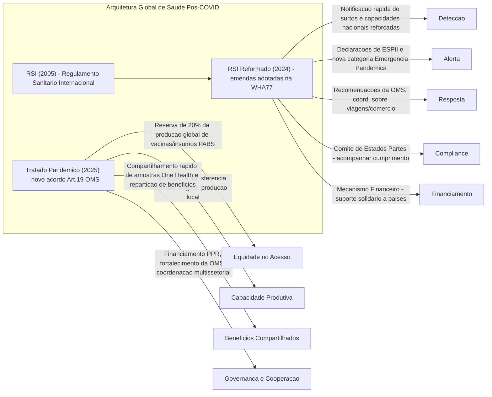

> [!question] **Perguntas para Autoavaliação:**

1. **(RSI e Reformas)** – Quais foram as principais falhas do RSI (2005) evidenciadas pela pandemia de COVID-19, e de que forma as emendas de 2024 buscaram corrigir essas deficiências? Avalie se tais mudanças são suficientes para garantir maior cumprimento e eficácia do RSI em futuras emergências.
    
2. **(Tratado Pandêmico e Conflitos de Interesse)** – Como as negociações do Tratado Pandêmico revelaram os conflitos entre países desenvolvidos e em desenvolvimento, especialmente no tocante à equidade no acesso a vacinas e transferência de tecnologia? Discuta como o texto final do acordo equilibra (ou não) esses interesses divergentes, mencionando exemplos de compromissos adotados.
    
3. **(Brasil na Diplomacia da Saúde)** – Examine o papel do Brasil nas negociações internacionais de saúde pós-COVID-19. Em que medida a atuação brasileira em temas como acesso a medicamentos, flexibilização de patentes e fortalecimento da OMS reflete a tradição da diplomacia do país? Quais desafios o Brasil enfrenta para transformar suas posições em resultados concretos na implementação do Tratado Pandêmico e das reformas do RSI?

# Origem: Brasil nos Regimes Internacionais

# A liderança brasileira nos regimes internacionais: transformações e continuidades

O Brasil atravessou uma das mais dramáticas transformações em sua diplomacia multilateral entre 2017 e 2025, período que abrangeu três administrações com visões diametralmente opostas sobre o papel do país no cenário internacional. De potência emergente celebrada a pária internacional, e novamente a líder do Sul Global, a trajetória brasileira neste período oferece lições fundamentais sobre a importância da política doméstica na projeção internacional de um país.

A presidência brasileira do G20 em 2024, primeira na história do país, simbolizou o retorno do Brasil ao centro da governança global após anos de isolamento autoimposto. Com a criação da **Aliança Global contra a Fome e a Pobreza**, reunindo 148 membros fundadores, e o compromisso histórico com a tributação progressiva de ultra-ricos, o Brasil demonstrou capacidade de liderar agendas transformadoras. Mas esta liderança não surgiu do vácuo - ela representa o culminar de uma complexa evolução diplomática que merece análise detalhada.

## Liderança no G20: da reatividade ao protagonismo global

A participação brasileira no G20 entre 2017-2025 reflete três abordagens distintas de inserção internacional. Durante o governo Temer (2016-2018), o Brasil manteve uma **diplomacia econômica pragmática** mas reativa. Na Cúpula de Hamburgo (julho de 2017), Temer quase não compareceu devido ao escândalo da JBS, revertendo a decisão apenas dias antes do evento. Sua participação focou-se em defender o livre comércio e apoiar o Acordo de Paris, alinhando-se aos 19 países contra a posição isolada dos EUA de Trump.

A era Bolsonaro (2019-2022) marcou o período de maior **isolamento internacional** do Brasil no G20. Na Cúpula de Roma (outubro de 2021), observadores internacionais descreveram como "doloroso de assistir" o isolamento do presidente brasileiro nas fotos oficiais. O governo enfrentou críticas constantes sobre políticas ambientais e gestão da pandemia, preferindo relações bilaterais com líderes ideologicamente alinhados a engajamentos multilaterais substantivos.

A transformação sob Lula III foi imediata e profunda. Na Cúpula de Nova Delhi (setembro de 2023), o Brasil anunciou suas prioridades para a presidência de 2024: combate à fome, transições energéticas e reforma da governança global. A **presidência brasileira do G20 em 2024** tornou-se histórica por várias inovações:

**Aliança Global contra a Fome e a Pobreza** (18 de novembro de 2024): Com 82 países, União Africana, União Europeia, 24 organizações internacionais e 31 organizações filantrópicas, a iniciativa visa alcançar **500 milhões de pessoas** com programas de transferência de renda até 2030. O Banco Mundial estima necessários US$ 179 bilhões para atingir as metas.

**G20 Social**: Pela primeira vez, uma Cúpula Social precedeu a reunião de líderes (15-17 de novembro de 2024), com participação de 13 Grupos de Engajamento e mais de 15.000 representantes da sociedade civil em 140 reuniões espalhadas por 15 cidades brasileiras.

**Tributação Progressiva**: O Brasil liderou o primeiro compromisso sistemático do G20 para tributação de indivíduos de patrimônio ultra-alto, quebrando décadas de resistência a esta agenda.

A Declaração do Rio de Janeiro (18 de novembro de 2024) foi adotada por unanimidade, com dissidência parcial apenas da Argentina em cláusulas específicas. O documento incluiu compromissos históricos com saneamento básico, igualdade étnico-racial e empoderamento feminino.

## BRICS: entre a resistência à expansão e a multipolaridade cooperativa

A liderança brasileira no BRICS atravessou transformações igualmente dramáticas. De 2017 a 2023, o Brasil, junto com a Índia, **resistiu sistematicamente** às pressões chinesas e russas por expansão do bloco. As preocupações brasileiras centravam-se na perda de exclusividade e no crescente domínio chinês sobre a dinâmica intra-BRICS.

Na Cúpula de Joanesburgo (23 de agosto de 2023), apesar da resistência brasileira, China e Rússia conseguiram aprovar a expansão. Lula declarou publicamente que o BRICS "não é contra ninguém" e "não é um contraponto ao G7", mas o Brasil foi vencido. Seis países foram convidados: Argentina, Egito, Etiópia, Irã, Arábia Saudita e Emirados Árabes Unidos.

O **Novo Banco de Desenvolvimento** (NBD) representa o lado mais construtivo do engajamento brasileiro no BRICS. Com Dilma Rousseff como presidente desde 2023, o banco aprovou aproximadamente **US$ 5 bilhões** em projetos no Brasil (18% do total), incluindo US$ 1,115 bilhão para reconstrução do Rio Grande do Sul após as enchentes de 2024. Dos 96 projetos globais do NBD totalizando US$ 32,8 bilhões, 31% são financiados em moedas locais.

Sobre **desdolarização**, a posição brasileira evoluiu significativamente. Em 2023, Lula sugeriu uma moeda comum do BRICS. Em 2024, apoiou iniciativas de comércio em moedas locais. Em 2025, após ameaças tarifárias de Trump, o Brasil abandonou oficialmente planos de moeda comum, focando em "expandir opções de pagamento" de forma "complementar, voluntária e transparente".

A **presidência brasileira do BRICS em 2025** (com cúpula em 6-7 de julho no Rio) tem como lema "Fortalecendo a Cooperação do Sul Global para Governança mais Inclusiva e Sustentável". As prioridades incluem a Parceria BRICS para Eliminação de Doenças Socialmente Determinadas, a Agenda de Liderança Climática e uma Declaração sobre Governança de IA para o Desenvolvimento.

A expansão trouxe desafios: com a entrada de novos membros em 2024 e da Indonésia em janeiro de 2025, as democracias tornaram-se minoria (3 de 11 membros). O Brasil bloqueou a candidatura venezuelana devido às eleições disputadas de 2024, demonstrando que mantém princípios democráticos mesmo sob pressão.

## Conselho de Segurança da ONU: entre o assento rotativo e o sonho permanente

O 11º mandato brasileiro como membro não-permanente do CSNU (2022-2023) coincidiu com crises globais sem precedentes. Eleito com **181 votos** em 11 de junho de 2021, o Brasil exerceu a presidência do Conselho em julho de 2022 e outubro de 2023.

Na **crise ucraniana**, o Brasil manteve posição de neutralidade diplomática construtiva. Votou a favor da Resolução 2623 (27 de fevereiro de 2022) convocando sessão emergencial da Assembleia Geral, mas absteve-se em resoluções condenando diretamente a Rússia, buscando preservar capacidade de mediação.

O momento de maior protagonismo ocorreu na **crise de Gaza** (outubro de 2023). O Brasil apresentou projeto de resolução pedindo pausas humanitárias (18 de outubro de 2023), obtendo 12 votos favoráveis, 2 abstenções (Reino Unido e Rússia), mas enfrentando veto dos EUA. A iniciativa demonstrou capacidade brasileira de liderar em momentos críticos.

Durante a presidência de outubro de 2023, o Brasil adotou **sete resoluções** sobre Haiti, Líbia, Saara Ocidental, Colômbia e Somália. O evento "Paz através do Diálogo" (20 de outubro) reuniu os ex-presidentes Michelle Bachelet e Thabo Mbeki, reforçando a abordagem brasileira de solução pacífica de controvérsias.

A **campanha pelo assento permanente** continua através do G4 (Alemanha, Brasil, Índia, Japão). O apoio inclui três membros do P5 (França, Reino Unido, Rússia), com os EUA apoiando sem poder de veto e a China mantendo-se neutra. A oposição vem principalmente do Coffee Club, liderado regionalmente por Argentina, México e Colômbia.

O Brasil demonstrou capacidade operacional significativa em **operações de paz**, com mais de 2.200 soldados destacados globalmente. O legado da MINUSTAH (2004-2017), onde 37.000 brasileiros serviram, estabeleceu o país como referência em peacekeeping, incluindo reconhecimento da ONU para peacekeepers femininas brasileiras.

## Conselho de Direitos Humanos: da vanguarda ao retrocesso e volta

A trajetória brasileira no CDH exemplifica como mudanças domésticas afetam a diplomacia de direitos humanos. O Brasil serviu três mandatos no período analisado: 2017-2019, 2020-2022 e 2024-2026.

O **pioneirismo brasileiro em direitos LGBTI+** merece destaque especial. O Brasil co-patrocinou a histórica Resolução 30/2 (junho de 2016) estabelecendo o primeiro Especialista Independente da ONU sobre questões LGBTI+. Esta resolução, aprovada com 23 votos a favor, 18 contra e 6 abstenções, representou momento divisor de águas no reconhecimento internacional destes direitos.

A era Bolsonaro (2020-2022) marcou ruptura dramática. Apesar de 155 organizações da sociedade civil brasileira assinarem carta opondo-se à candidatura do país, o Brasil foi eleito. O governo criou uma "Secretaria de Soberania Nacional e Cidadania" para revisar todas as resoluções do CDH, removeu questões LGBTI+ do mandato do Ministério dos Direitos Humanos e atacou publicamente a Alta Comissária da ONU.

O voto mais controverso ocorreu em outubro de 2022, quando o Brasil **absteve-se** na votação sobre violações de direitos humanos em Xinjiang, China. Com 17 votos a favor, 19 contra e 11 abstenções, a proposta foi derrotada, gerando críticas de organizações de direitos humanos.

A **Revisão Periódica Universal** refletiu estas mudanças. No terceiro ciclo (maio de 2017), o Brasil recebeu 246 recomendações, aceitando 242. No quarto ciclo (novembro de 2022), sob Bolsonaro, recebeu 306 recomendações, rejeitando apenas duas sobre definições de estrutura familiar. Com Lula, em 2023, o Brasil reavaliou posições e aceitou 304 das 306 recomendações.

O mandato 2024-2026 marca o retorno à liderança progressista, com compromisso de "fortalecer o papel do órgão na prevenção e abordagem de causas estruturais de graves violações de direitos humanos".

## Organizações regionais: fragmentação e reconstrução

A liderança brasileira em organizações regionais passou por transformações ainda mais dramáticas, com entradas e saídas que refletiram mudanças ideológicas profundas.

### MERCOSUL: resiliência em meio a turbulências

O MERCOSUL demonstrou notável resiliência institucional. Em agosto de 2017, sob liderança brasileira, o bloco **suspendeu indefinidamente a Venezuela** com base na Cláusula Democrática, após a instalação da Assembleia Constituinte venezuelana. O ministro Aloysio Nunes declarou que a Venezuela permaneceria suspensa até o "restabelecimento da democracia".

A **presidência pro tempore brasileira de 2025** estabeleceu cinco prioridades: ampliar comércio, promover transição energética, desenvolver tecnologia, combater crime organizado e enfrentar desigualdades sociais. Iniciativas concretas incluem:

- **Relançamento do FOCEM**: Segunda edição do Fundo de Convergência Estrutural com mais de US$ 1 bilhão em investimentos históricos
- **Soberania Digital**: Parceria com Chile para criar modelos de IA refletindo realidades culturais latino-americanas
- **Hub de Tecnologia em Saúde**: Iniciativa para tornar o Mercosul centro regional de tecnologia sanitária

O acordo UE-Mercosul, negociado inicialmente em 2019, foi concluído em dezembro de 2024, com Lula comprometendo-se a finalizar e assinar o TLC antes do fim de 2025.

### UNASUL para PROSUL: ideologia versus pragmatismo

A transição UNASUL-PROSUL exemplifica como mudanças ideológicas domésticas impactam arquiteturas regionais. O Brasil **suspendeu participação na UNASUL** em 2018 (Temer), formalizou retirada em março de 2019 (Bolsonaro), e anunciou retorno em maio de 2023 (Lula).

O **PROSUL**, criado em março de 2019 no Chile com Brasil como membro fundador, excluiu a Venezuela e manteve estrutura institucional mínima. Ernesto Araújo, chanceler de Bolsonaro, elogiou-o como "substituição correta e urgente" da UNASUL. Sob Lula, o entusiasmo pelo PROSUL diminuiu significativamente.

### CELAC: símbolo das oscilações brasileiras

A trajetória na CELAC é ainda mais emblemática. Bolsonaro **retirou o Brasil** em janeiro de 2020, alegando que a organização falhara em "proteger a democracia". O **retorno em 5 de janeiro de 2023** foi o primeiro ato de política externa de Lula, participando da VII Cúpula em Buenos Aires.

Em 2025, o Brasil apoia ativamente a proposta de candidatura conjunta da CELAC para Secretário-Geral da ONU, preferencialmente uma mulher, demonstrando ambições de projeção global da região.

### OEA: engajamento constante com variações

Surpreendentemente, o engajamento brasileiro na OEA manteve-se relativamente constante. O convite histórico para observação eleitoral em 2018 - primeira vez que o Brasil permitiu observadores da OEA - demonstrou transparência democrática mesmo em período de polarização.

Em 2025, o Brasil assumiu a **presidência do Conselho Permanente** (abril-junho), com foco em multilateralismo, transparência e inclusão social, estabelecendo sinergias com a Aliança Global contra a Fome.

### OTCA: liderança ambiental consistente

A Organização do Tratado de Cooperação Amazônica representa exceção à volatilidade. O Brasil **sedia a única secretaria permanente** da OTCA em Brasília desde 2002, única organização internacional multilateral com sede no país.

A **Cúpula da Amazônia** (8-9 de agosto de 2023) em Belém reuniu os oito países amazônicos, resultando na Declaração de Belém com "agenda compartilhada nova e ambiciosa". O evento preparou posição unificada para a COP30, a ser sediada pelo Brasil em 2025.

## Conclusões para o futuro diplomata

O período 2017-2025 oferece lições fundamentais sobre a diplomacia brasileira multilateral:

**Continuidade e ruptura**: Enquanto interesses estruturais (como cooperação amazônica) mantiveram-se constantes, posicionamentos em direitos humanos e integração regional sofreram reversões dramáticas conforme mudanças de governo.

**Capacidade de liderança**: A presidência do G20 em 2024 demonstrou que o Brasil mantém capacidade de liderar agendas globais transformadoras quando há vontade política e estratégia coerente.

**Preço do isolamento**: O período Bolsonaro ilustrou como posturas anti-multilaterais reduzem drasticamente a influência internacional, mesmo de potências médias como o Brasil.

**Soft power institucional**: O papel de Dilma Rousseff no NBD e a liderança em múltiplas organizações demonstram a importância de quadros técnicos qualificados na projeção internacional.

**Regionalismo em crise**: A fragmentação UNASUL-PROSUL-CELAC revela os desafios de construir institucionalidade regional duradoura na América do Sul.

Para o candidato ao Itamaraty, o período evidencia que a política externa brasileira, embora possua elementos de Estado, permanece significativamente influenciada por orientações ideológicas dos governos. A capacidade de transitar entre diferentes visões de mundo, mantendo o profissionalismo diplomático, torna-se habilidade essencial para o futuro diplomata brasileiro.

# Lei de Reciprocidade Comercial 2025 e a posição brasileira na guerra tarifária global

A guerra comercial de 2025 representa a mais severa ruptura no sistema de comércio internacional desde a década de 1930. Em um cenário de escalada protecionista sem precedentes, o Brasil promulgou sua primeira lei abrangente de reciprocidade comercial, posicionando-se estrategicamente entre as grandes potências em conflito. Este relatório analisa os instrumentos legais criados, o contexto da guerra tarifária global e a resposta brasileira a esta nova realidade do comércio internacional.

## A arquitetura legal da reciprocidade comercial em 2025

O ano de 2025 testemunhou a criação simultânea de múltiplos instrumentos de reciprocidade comercial, marcando uma mudança paradigmática nas relações comerciais internacionais. O Brasil sancionou a **Lei nº 15.122/2025**, conhecida como Lei da Reciprocidade Econômica, em 11 de abril de 2025, sem vetos presidenciais. A lei tramitou em regime de urgência pelo Congresso Nacional, sendo aprovada pelo Senado em 1º de abril e pela Câmara em 2 de abril, em resposta direta às tarifas impostas pelo governo Trump.

A legislação brasileira estabelece critérios claros para suspensão de concessões comerciais quando países ou blocos econômicos adotarem ações que interfiram nas escolhas soberanas do Brasil ou violem acordos internacionais. Entre as contramedidas autorizadas estão a imposição de direitos comerciais sobre importações, suspensão de concessões de investimentos e, excepcionalmente, suspensão de obrigações relativas a propriedade intelectual. Importante destacar que a lei prioriza consultas diplomáticas antes de qualquer retaliação, exigindo análise de proporcionalidade e estabelecendo mecanismos de monitoramento contínuo dos efeitos das contramedidas.

Paralelamente, os Estados Unidos promulgaram a **Executive Order 14257** em 2 de abril de 2025, data proclamada por Trump como "Liberation Day". O instrumento americano difere substancialmente da abordagem brasileira, impondo tarifas imediatas e universais de 10% sobre todas as importações, além de tarifas recíprocas específicas de 11% a 50% sobre 86 países. A justificativa americana centrou-se no déficit comercial de US$ 1,2 trilhão, declarado como emergência nacional sob o International Emergency Economic Powers Act (IEEPA).

## O contexto explosivo da guerra comercial global

A guerra tarifária de 2025 eclipsou em escala e velocidade todas as disputas comerciais anteriores. As tarifas americanas atingiram níveis não vistos desde 1910, com uma elevação média de 17% nas tarifas totais. A China enfrentou o impacto mais severo, com tarifas americanas chegando a 145% em abril antes de serem reduzidas para 55% após negociações emergenciais. A União Europeia, inicialmente sujeita a tarifas de 20%, conseguiu extensão nas negociações até julho de 2025, mas prepara pacote retaliatório sobre €100 bilhões em produtos americanos.

A escalada ocorreu com velocidade sem precedentes. Em apenas quatro meses, de janeiro a abril de 2025, Trump implementou sucessivas rodadas tarifárias: 25% sobre México e Canadá em fevereiro, elevação das tarifas chinesas para 20% em março, tarifas universais sobre aço e alumínio, culminando com o "tarifaço" universal de 10% em abril. A resposta global foi imediata, com retaliações coordenadas que levaram a Organização Mundial do Comércio a projetar declínio de 0,2% no comércio global de mercadorias em 2025, podendo chegar a 1,5% em cenário pessimista.

O impacto econômico já se materializa em números alarmantes. O comércio bilateral EUA-China sofreu redução projetada de 81% a 91%. Os Estados Unidos enfrentam perda estimada de 0,8% a 1,0% do PIB, com aumento médio de US$ 1.200 nos custos por família americana. Globalmente, países como Canadá (-2%), México (-2,7%) e Irlanda (-3%) projetam contrações significativas do PIB devido à guerra comercial.

## A estratégia brasileira de reciprocidade defensiva

O Brasil adotou postura que pode ser caracterizada como "reciprocidade defensiva", equilibrando instrumentos legais de resposta com diplomacia ativa. O presidente Lula sintetizou a abordagem em março de 2025: "Vamos utilizar todas as palavras de negociação que o dicionário permitir. Depois que acabar, nós vamos tomar as decisões que entendermos serem cabíveis". Esta declaração captura a essência da estratégia brasileira de priorizar o diálogo sem abdicar do direito de resposta.

O Itamaraty emitiu nota oficial em abril destacando que os Estados Unidos registram superávits comerciais com o Brasil de US$ 410 bilhões nos últimos 15 anos, tornando a alegação americana de necessidade de "reciprocidade comercial" descolada da realidade. A chancelaria brasileira afirmou que buscará "defender os interesses dos produtores nacionais" através de consultas com o setor privado e negociações diplomáticas.

Importante notar que o Brasil manteve posição coordenada com a China através de declaração conjunta em maio de 2025, afirmando que "não há vencedores em guerras tarifárias" e defendendo um ambiente de cooperação internacional "aberto, inclusivo e não discriminatório". Esta aliança estratégica posiciona o Brasil como ponte entre o Sul Global e as economias desenvolvidas.

## Impactos setoriais e reconfiguração dos fluxos comerciais

O setor siderúrgico brasileiro emergiu como o mais afetado pelas medidas protecionistas, com impacto estimado de US$ 3,2 bilhões devido às tarifas de 25% sobre aço e alumínio. O Brasil, segundo maior exportador destes produtos para os Estados Unidos em 2024, viu suas 312.239 toneladas mensais sob ameaça direta. A Embraer foi identificada como a empresa individual mais vulnerável, dada sua dependência do mercado americano para aeronaves comerciais.

Paradoxalmente, o agronegócio brasileiro beneficiou-se da guerra comercial. Com a China redirecionando compras dos Estados Unidos, as exportações brasileiras para o gigante asiático atingiram recorde de US$ 38,8 bilhões no primeiro trimestre de 2025. A soja brasileira passou a ser negociada com prêmio de US$ 1,15 sobre o produto americano, enquanto exportações de carne bovina cresceram 33% e de frango 19% no mesmo período.

O Ministério do Desenvolvimento revisou drasticamente suas projeções, reduzindo a expectativa de superávit comercial de US$ 70,2 bilhões para US$ 50,4 bilhões, queda de 32%. Esta revisão reflete não apenas o impacto direto das tarifas, mas também o enfraquecimento da demanda global e a queda nos preços das commodities resultantes da fragmentação comercial.

## A estratégia diplomática multilateral

O Brasil aproveitou sua presidência rotativa do G20 e dos BRICS em 2025 para liderar a resistência ao protecionismo. A agenda brasileira focou no combate ao "protecionismo verde disfarçado", propondo parâmetros para medidas comerciais baseados em transparência, evidência científica e não-discriminação. Esta liderança do Sul Global oferece alternativa ao confronto direto entre grandes potências.

Na Organização Mundial do Comércio, o Brasil mantém a opção de recurso formal contra as tarifas americanas, mas enfrenta o desafio do Órgão de Apelação paralisado desde 2019. A estratégia brasileira combina o uso potencial de mecanismos multilaterais com negociações bilaterais pragmáticas, incluindo tentativas de estabelecer cotas para aço e alumínio similares às obtidas em 2018.

As coalizões regionais ganharam importância renovada. No Mercosul, a aprovação coordenada de leis de reciprocidade fortaleceu o bloco como instrumento de negociação. Nos BRICS, a articulação com China, Índia e África do Sul criou massa crítica para questionar a ordem protecionista emergente. A Troika do G20, liderada por Brasil, Índia e África do Sul, representa institucionalmente a voz do Sul Global contra o protecionismo.

## Lições históricas e perspectivas futuras

A análise histórica revela paralelos preocupantes com a década de 1930. O Smoot-Hawley Tariff Act americano de 1930 elevou tarifas sobre 20.000 produtos, provocou retaliação de 25 países e contribuiu para redução de 66% no comércio global entre 1929-1934. A guerra comercial de 2025 apresenta velocidade de implementação ainda maior, embora partindo de níveis tarifários iniciais mais baixos.

Diferentemente dos anos 1930, a economia global de 2025 caracteriza-se por cadeias de valor integradas que tornam o protecionismo mais autodestrutivo. A existência de instituições multilaterais como a OMC, mesmo enfraquecidas, oferece mecanismos de contenção ausentes no período entreguerras. O precedente histórico mais relevante para o Brasil permanece sendo o caso do algodão na OMC (2002-2010), quando o país demonstrou moderação ao dar tempo para ajustes americanos antes de implementar retaliações autorizadas.

A evolução da política comercial brasileira, de modelo fechado de substituição de importações para a liberalização dos anos 1990 e retorno gradual ao protecionismo, coloca o país em posição peculiar. Com tarifa média de 13,7% versus 6,7% de outros emergentes, o Brasil já mantém economia relativamente fechada, o que paradoxalmente oferece alguma proteção contra choques externos mas limita ganhos de eficiência.

## Conclusão

A Lei de Reciprocidade Comercial brasileira de 2025 representa resposta institucional madura às tensões comerciais globais, estabelecendo framework legal robusto enquanto preserva espaço para diplomacia. Diferentemente das medidas unilaterais e imediatas americanas, o instrumento brasileiro incorpora salvaguardas procedimentais, exigências de proporcionalidade e priorização de soluções negociadas.

A posição brasileira na guerra comercial de 2025 reflete escolha estratégica por não-alinhamento ativo, aproveitando oportunidades comerciais com a China enquanto mantém canais diplomáticos com Estados Unidos e União Europeia. Esta abordagem pragmática, combinada com liderança em fóruns multilaterais, posiciona o Brasil como potencial mediador em futuras negociações para reconstrução da ordem comercial internacional.

O cenário prospectivo permanece altamente volátil, com decisões judiciais pendentes nos Estados Unidos, negociações críticas marcadas para julho de 2025 e risco constante de escalada. A experiência histórica sugere que guerras comerciais desta magnitude raramente terminam rapidamente, exigindo do Brasil manutenção de sua estratégia equilibrada entre defesa de interesses nacionais e preservação do sistema multilateral de comércio. A capacidade brasileira de navegar esta crise transformando desafios em oportunidades determinará seu posicionamento na nova ordem comercial global emergente.

# Origem: Comércio Internacional em Transformação

# O Comércio Internacional em Transformação: Geopolítica, Crise da OMC e a Agenda Socioambiental (2023-2025)

## Introdução

O comércio internacional atravessa, no período 2023-2025, um ponto de inflexão histórico, marcando uma ruptura com a ordem liberal que caracterizou a globalização no pós-Guerra Fria. A lógica de integração econômica, antes predominantemente guiada pela busca de eficiência e pela redução de custos, cede espaço a uma nova era de fragmentação, incerteza e competição estratégica. A Conferência das Nações Unidas sobre Comércio e Desenvolvimento (UNCTAD) identifica este momento como um "ponto de inflexão na globalização", no qual a economia global, já pressionada por crises e mudanças climáticas, enfrenta um crescimento lento e um investimento fraco, incapaz de atender às necessidades de desenvolvimento.

A tese central desta análise é que a atual reconfiguração do sistema comercial global é impulsionada pela convergência de três vetores de pressão interconectados:

1. **A Geopolitização do Comércio:** A crescente rivalidade entre grandes potências, notadamente entre os Estados Unidos (EUA) e a China, subordina a lógica econômica a imperativos de segurança nacional, transformando o comércio em uma arena de disputa por poder e influência tecnológica.
    
2. **A Crise Institucional do Multilateralismo:** O pilar da governança comercial, a Organização Mundial do Comércio (OMC), enfrenta uma crise existencial, marcada pela paralisia de seu sistema de solução de controvérsias e pela dificuldade em negociar novas regras adequadas aos desafios do século XXI.
    
3. **A Emergência da Normatividade Socioambiental:** A agenda climática e ambiental consolida-se como um novo paradigma para as relações comerciais, gerando novas condicionalidades e instrumentos, como ajustes de carbono na fronteira e subsídios para tecnologias verdes, que são simultaneamente vistos como legítimos e como potenciais barreiras comerciais disfarçadas.
    

A confluência desses vetores está provocando uma transformação estrutural no comércio mundial, redesenhando a geografia das Cadeias Globais de Valor (CGV), alterando os cálculos de risco e eficiência das empresas e desafiando os fundamentos da governança global. O objetivo desta nota de estudo é dissecar analiticamente cada uma dessas forças, examinar suas profundas interconexões e avaliar a posição estratégica do Brasil neste cenário complexo e volátil.

## 1. A Geopolitização do Comércio: A Primazia da Segurança sobre a Eficiência

A dimensão mais visível da transformação do comércio internacional é sua crescente politização, onde a lógica da eficiência econômica é progressivamente substituída por considerações de segurança nacional e alinhamento geopolítico. Esta seção analisa como a rivalidade estratégica está redefinindo as regras, os fluxos e o próprio léxico do comércio global.

### 1.1. A Rivalidade Estratégica EUA-China e a Subordinação da Lógica Econômica

A guerra comercial iniciada pela administração Trump em 2018, com a imposição de tarifas sobre produtos chineses, evoluiu de um conflito focado em déficits comerciais e propriedade intelectual para uma competição sistêmica e duradoura. A administração Biden não apenas manteve as tarifas, mas as expandiu para setores estratégicos como veículos elétricos e painéis solares, consolidando a visão de que o comércio é um instrumento central da política de segurança nacional. A lógica subjacente não é mais apenas econômica, mas sim a de conter o avanço tecnológico e a influência global da China.

Essa mudança paradigmática gerou uma fragmentação mensurável dos fluxos comerciais. Dados do Fundo Monetário Internacional (FMI) indicam que a participação da China nas importações dos EUA caiu 8 pontos percentuais entre 2017 e 2023, enquanto a participação dos EUA nas exportações da China recuou 4 pontos percentuais no mesmo período. O crescimento do comércio entre os blocos de países politicamente alinhados aos EUA e à China desacelerou quase 5 pontos percentuais em comparação com o período anterior, evidenciando uma reorientação dos fluxos comerciais com base em alinhamentos geopolíticos.

> [!note] O Surgimento de "Países Conectores"
> 
> Uma consequência direta do desacoplamento entre EUA e China é a ascensão de "países conectores", como México e Vietnã. Essas economias têm atuado como intermediárias, absorvendo fluxos comerciais que antes ocorriam diretamente entre as duas superpotências. Embora essa dinâmica possa ter amortecido o impacto econômico global da fragmentação, ela levanta questionamentos sobre a verdadeira diversificação e resiliência das cadeias de valor, havendo a possibilidade de que parte desse comércio seja apenas uma rerrotulação de produtos de origem chinesa para contornar tarifas.

### 1.2. A Guerra Tecnológica: Semicondutores, IA e a Batalha pelos Padrões do Futuro

A competição geopolítica tem seu epicentro na tecnologia. Os EUA identificaram o acesso a semicondutores avançados e às ferramentas de software para seu design (EDA - _Electronic Design Automation_) como um ponto de estrangulamento (_chokepoint_) crítico para o desenvolvimento militar e de inteligência artificial (IA) da China.

A estratégia americana se desdobra em múltiplas frentes:

- **Controles de Exportação:** A administração Biden intensificou as restrições, barrando a venda de chips avançados, equipamentos de fabricação de semicondutores capazes de produzir chips com litografia inferior a 16 nanômetros e softwares EDA para a China. As medidas foram expandidas para proibir cidadãos e residentes permanentes dos EUA de apoiarem o desenvolvimento ou a produção de semicondutores em certas instalações chinesas.
    
- **"Entity List":** A inclusão de gigantes tecnológicos chineses como Huawei e SMIC (Semiconductor Manufacturing International Corporation) na "Lista de Entidades" do Departamento de Comércio dos EUA visa cortar seu acesso a tecnologias críticas de origem americana, aplicando a "Foreign Direct Product Rule" para restringir vendas até mesmo de empresas estrangeiras que utilizem tecnologia dos EUA.
    
- **Diplomacia Coercitiva:** Os EUA obtiveram sucesso em pressionar aliados-chave na cadeia de semicondutores, como a Holanda (sede da ASML, líder em equipamentos de litografia) e o Japão, para que alinhassem suas políticas de controle de exportação às restrições americanas.
    

A China, por sua vez, responde com uma estratégia defensiva robusta, focada na autossuficiência tecnológica, conforme delineado em planos como o "Made in China 2025".5 Uma tática notável é a exploração de brechas nas restrições ocidentais. Pequim está investindo pesadamente e incentivando o uso de arquiteturas de chip de código aberto, como o RISC-V. Ao alavancar essa tecnologia, que se origina no Ocidente mas não é proprietária, empresas chinesas podem projetar seus próprios processadores para IA, computação em nuvem e aplicações militares sem violar diretamente os controles de exportação que incidem sobre softwares e tecnologias patenteadas.

Essa "guerra dos chips" transcende o setor de semicondutores. Ela representa uma batalha fundamental sobre quem definirá os padrões tecnológicos do futuro em áreas como IA, 5G/6G e computação quântica. O resultado provável é uma bifurcação tecnológica, forçando outros países a, eventualmente, escolherem entre ecossistemas tecnológicos concorrentes, o que fragmentaria ainda mais o comércio e a economia digital global.

### 1.3. O Novo Léxico Estratégico: Análise Crítica de _De-risking_, _Friend-shoring_ e _Nearshoring_

A reconfiguração geopolítica do comércio deu origem a um novo vocabulário estratégico, cujos termos devem ser compreendidos em suas nuances.

> [!definition] Definições do Novo Léxico Comercial
> 
> - **_De-risking_** **(Redução de Riscos):** Popularizado por autoridades dos EUA e da UE, o termo descreve uma estratégia focada em reduzir dependências econômicas excessivas e vulnerabilidades em cadeias de valor críticas, especialmente em relação à China, sem buscar um desacoplamento econômico total. A ênfase é na resiliência e na segurança, não na separação.
>     
> - **_Friend-shoring / Ally-shoring_** **(Produção em Países Amigos/Aliados):** Refere-se à realocação de cadeias de produção para países que compartilham valores políticos e alinhamento geopolítico com o país-sede da empresa. Essa estratégia introduz um critério explicitamente político nas decisões de investimento e sourcing.
>     
> - **_Nearshoring_** **(Produção em Países Próximos):** Consiste em mover a produção para países geograficamente mais próximos do mercado consumidor final, visando reduzir custos logísticos, diminuir os tempos de entrega e aumentar a resiliência a choques de transporte.
>     

A transição da retórica de "decoupling" (desacoplamento), associada à administração Trump, para a de "de-risking" não é meramente semântica. Ela representa um ajuste estratégico sofisticado. O discurso do "decoupling" foi percebido por muitos, inclusive por aliados, como excessivamente confrontacional e potencialmente desestabilizador para a economia global. O termo "de-risking", por outro lado, soa mais moderado, defensivo e razoável. Ele permite que os governos ocidentais implementem políticas de contenção tecnológica e industrial altamente seletivas — que na prática constituem um desacoplamento setorial — sob a justificativa mais defensável de "segurança nacional" e "resiliência econômica".

Essa mudança de enquadramento cria uma "zona cinzenta" na governança do comércio. Medidas com claro impacto protecionista, como os subsídios do _CHIPS Act_ 17 ou os controles de exportação de semicondutores, são legitimadas por uma lógica de segurança que é, por sua natureza, autodeclarada e extremamente difícil de ser contestada em foros multilaterais como a OMC, que historicamente evitam julgar o mérito de decisões de segurança nacional de seus membros. Para países como o Brasil, isso significa que o ambiente comercial se torna menos previsível, pois as regras implícitas, como o alinhamento geopolítico, passam a ter um peso tão ou mais significativo que as regras explícitas dos acordos comerciais.

## 2. A Crise Sistêmica da Governança Multilateral

Paralelamente à geopolitização, o pilar institucional que sustentou a ordem comercial por décadas, a OMC, atravessa uma profunda crise de relevância e funcionalidade. O esvaziamento de suas funções essenciais, especialmente a de solução de controvérsias, corrói a segurança jurídica e acelera a transição para um sistema onde o poder prevalece sobre as regras.

### 2.1. A Paralisia do Órgão de Apelação da OMC: Diagnóstico de um Impasse Estratégico

O coração da crise da OMC reside na paralisia de seu Órgão de Apelação. Desde 2017, os EUA têm sistematicamente bloqueado a nomeação de novos juízes, citando um suposto "ativismo judicial" (_judicial overreach_) e a usurpação de funções que, na visão americana, ferem sua soberania nacional.6 Como consequência direta, desde 11 de dezembro de 2019, o Órgão de Apelação está inoperante por falta do quórum mínimo de três membros para julgar casos.

O impacto sistêmico é devastador. A ausência de uma segunda instância funcional mina a principal característica do sistema de solução de controvérsias da OMC: a capacidade de emitir decisões finais e vinculantes. Na prática, qualquer membro que perca um caso em um painel de primeira instância pode simplesmente "apelar para o vácuo", bloqueando indefinidamente a adoção do relatório e impedindo que a parte vencedora obtenha reparação. Isso enfraquece drasticamente a previsibilidade e a segurança jurídica do sistema multilateral, que era seu maior trunfo.

Como medida paliativa, a União Europeia liderou a criação do Arranjo Plurilateral Provisório de Apelação por Arbitragem (MPIA, na sigla em inglês), que replica um processo de apelação de dois níveis entre os membros participantes. Mais de 50 membros, incluindo o Brasil, aderiram à iniciativa. Contudo, o MPIA é uma solução imperfeita, pois não conta com a participação de atores cruciais, notadamente os EUA, e opera à margem da estrutura formal da OMC.

### 2.2. O Labirinto da Reforma da OMC: Debates sobre as Três Funções Essenciais

Em resposta à crise, os membros da OMC estão engajados em intensas negociações de reforma, com o objetivo de alcançar um acordo sobre um sistema de solução de controvérsias funcional até o final de 2024. As discussões, facilitadas pelo diplomata guatemalteco Marco Tulio Molina, abrangem as três funções centrais da organização.

**1. Solução de Controvérsias:** Este é o tema mais complexo e politicamente sensível. As propostas técnicas em debate buscam responder às críticas dos EUA sem destruir o sistema. As discussões giram em torno de:

- **Escopo e Padrão de Revisão:** Propostas incluem limitar as apelações apenas a erros de direito que tenham impacto material na disputa ou criar um mecanismo de "permissão para apelar" para filtrar casos frívolos.
    
- **Forma do Mecanismo:** As opções variam desde um corpo permanente com mais juízes, um sistema _ad hoc_ com árbitros selecionados para cada caso, até a ideia mais radical de uma revisão feita por um comitê de membros da OMC.
    
- **Posições dos Atores-Chave:** As posições divergem significativamente, como ilustrado na tabela abaixo, dificultando o consenso.
    

**Tabela 1: Posições dos Principais Atores na Reforma do Sistema de Solução de Controvérsias da OMC**

| Tema da Reforma         | Posição dos EUA                                                                                                                                                           | Posição da UE                                                                                                                                           | Posição da China                                                                                                                              | Posição do Brasil / Países em Desenvolvimento                                                                                                                    |
| ----------------------- | ------------------------------------------------------------------------------------------------------------------------------------------------------------------------- | ------------------------------------------------------------------------------------------------------------------------------------------------------- | --------------------------------------------------------------------------------------------------------------------------------------------- | ---------------------------------------------------------------------------------------------------------------------------------------------------------------- |
| **Status do Mecanismo** | Ceticismo quanto à restauração de um órgão de apelação permanente e vinculante. Busca por um sistema que preserve a flexibilidade política e evite o "ativismo judicial". | Forte apoio a um sistema de dois níveis, vinculante e reformado, usando o MPIA como modelo. Aberta a discutir tecnicalidades para alcançar um consenso. | Apoio à restauração de um sistema de dois níveis, mas com ênfase em maior eficiência e mecanismos para evitar o abuso do sistema de apelação. | Defesa de um sistema de dois níveis, vinculante, imparcial e profissional como garantia essencial de segurança jurídica e previsibilidade para todos os membros. |
| **Escopo da Apelação**  | Favorece um escopo estritamente limitado a questões de direito, evitando que o órgão de apelação crie novas obrigações ("gap filling") não negociadas pelos membros.      | Disposta a negociar um escopo mais claro e limitado para a apelação, como forma de construir confiança e responder às preocupações americanas.          | Concorda com a necessidade de focar em erros de direito, mas resiste a limitações que possam enfraquecer excessivamente o direito à revisão.  | Defende que o direito à apelação sobre questões de direito seja preservado, pois é um elemento central para a correção de erros e a coerência do sistema.        |
| **Prazos**              | Crítica histórica ao descumprimento do prazo de 90 dias para a decisão de apelações, exigindo adesão estrita a prazos processuais.                                        | Reconhece a necessidade de maior eficiência e cumprimento de prazos, propondo mecanismos de gestão de casos mais eficazes.                              | Apoia medidas para garantir a celeridade do processo de apelação.                                                                             | Concorda com a necessidade de eficiência, desde que não comprometa a qualidade e a justiça das decisões.                                                         |

**2. Negociação:** A paralisia da Rodada de Doha levou a uma mudança de foco para acordos plurilaterais, que envolvem apenas os membros interessados em um determinado tema. Negociações sobre Comércio Eletrônico, Facilitação de Investimentos para o Desenvolvimento e Regulação Doméstica de Serviços são exemplos dessa nova abordagem. A UE defende que esses acordos possam ser integrados ao arcabouço legal da OMC, mas isso gera controvérsia entre membros que temem a erosão do princípio do "single undertaking".

**3. Monitoramento e Transparência:** Há um esforço contínuo para aprimorar a função de monitoramento da OMC, especialmente no que tange à notificação de subsídios pelos membros — uma crítica recorrente dos EUA e da UE em relação às práticas da China — e à eficácia dos diversos comitês da organização.

### 2.3. A Fragmentação da Ordem: A Ascensão de Acordos Plurilaterais e Regionais

A estagnação do pilar negociador multilateral da OMC impulsionou a proliferação de acordos comerciais regionais (ACRs) e mega-acordos, como o CPTPP (Acordo Abrangente e Progressivo para a Parceria Transpacífica) e o RCEP (Parceria Econômica Regional Abrangente). Embora esses acordos possam liberalizar o comércio entre seus membros, eles também representam uma ameaça ao multilateralismo. Eles arriscam criar um sistema comercial global de "geometria variável", com regras sobrepostas e, por vezes, conflitantes, que erodem o princípio fundamental da Nação Mais Favorecida (NMF) e podem marginalizar os países que não fazem parte dos grandes blocos comerciais.

O bloqueio dos EUA ao Órgão de Apelação não deve ser visto como uma mera disputa técnica, mas como um sintoma e, ao mesmo tempo, um acelerador da geopolitização do comércio. É uma manifestação da rejeição americana a um sistema multilateral que Washington passou a perceber como restritivo à sua soberania e à sua capacidade de confrontar a China em seus próprios termos. Ao paralisar o mecanismo de _enforcement_ da OMC, os EUA removem um freio multilateral às suas próprias ações unilaterais, como as tarifas sobre aço e alumínio justificadas por segurança nacional (Seção 232). Isso cria um vácuo onde o poder econômico e a capacidade de retaliação se tornam mais determinantes do que a conformidade com as regras. Para países como o Brasil, que historicamente utilizaram o sistema de solução de controvérsias para nivelar o campo de jogo contra subsídios de potências ricas (como no emblemático caso do algodão contra os EUA 25), a perda desse instrumento representa um revés estratégico significativo.

## 3. A "Verdificação" do Comércio: A Agenda Socioambiental como Paradigma e Campo de Batalha

A interseção entre comércio, clima e meio ambiente emergiu como um dos eixos mais dinâmicos e contenciosos da transformação do comércio global. Políticas concebidas para combater as mudanças climáticas estão sendo implementadas de forma a remodelar vantagens comparativas e fluxos comerciais, gerando um intenso debate sobre sua legitimidade e seus verdadeiros propósitos.

### 3.1. Análise Aprofundada do CBAM: Mecanismo, Implicações e o Desafio da Compatibilidade com a OMC

O *Mecanismo de Ajuste de Carbono na Fronteira (CBAM, na sigla em inglês)* da União Europeia é a principal manifestação dessa nova tendência.

> [!note] Como Funciona o CBAM?
> 
> O CBAM é, em essência, uma tarifa sobre as emissões de carbono "embutidas" em determinados bens importados pela UE. Seus objetivos declarados são:
> 
> 1. **Prevenir a "fuga de carbono":** Evitar que indústrias europeias, sujeitas a um alto custo de carbono sob o Sistema de Comércio de Emissões da UE (EU ETS), se desloquem para países com regulamentações ambientais menos rigorosas.
>     
> 2. **Equalizar o campo de jogo:** Garantir que os produtos importados enfrentem um custo de carbono equivalente ao dos produtos fabricados na UE, promovendo a concorrência leal.
>     

O mecanismo está sendo implementado em duas fases:

- **Fase de Transição (1 de outubro de 2023 a 31 de dezembro de 2025):** Durante este período, os importadores da UE devem apenas reportar trimestralmente o volume de emissões de gases de efeito estufa (diretas e indiretas) contido nos bens importados, sem qualquer pagamento financeiro. Os setores inicialmente cobertos são cimento, ferro e aço, alumínio, fertilizantes, eletricidade e hidrogênio.
    
- **Fase Definitiva (a partir de 1 de janeiro de 2026):** Os importadores terão que comprar e entregar anualmente "certificados CBAM" em quantidade correspondente às emissões reportadas no ano anterior. O preço desses certificados será calculado com base na média semanal dos preços de leilão das licenças do EU ETS. Caso um preço de carbono já tenha sido pago no país de origem, esse valor poderá ser deduzido do custo dos certificados CBAM.
    

Para o Brasil, as implicações são significativas. Como grande exportador de commodities para a UE, especialmente nos setores de ferro e aço, o país será diretamente afetado. A ausência, até o momento, de um sistema nacional de precificação de carbono significa que os exportadores brasileiros não teriam créditos para abater do custo do CBAM, o que poderia reduzir sua competitividade. Análises da Confederação Nacional da Indústria (CNI) e da Câmara de Comércio Internacional (ICC Brasil) indicam que a competitividade dos produtos brasileiros dependerá crucialmente da sua intensidade de carbono em comparação com a média da UE e de outros concorrentes globais.

### 3.2. O Debate sobre o "Protecionismo Verde": Medida Legítima ou Barreira Comercial Disfarçada?

O CBAM está no centro de um acalorado debate global sobre "protecionismo verde". De um lado, a UE defende o mecanismo como uma medida ambiental legítima, essencial para a integridade de seu _European Green Deal_ e desenhada para ser compatível com as regras da OMC.

Do outro lado, países em desenvolvimento, incluindo o Brasil e o grupo BASIC (Brasil, África do Sul, Índia e China), levantam fortes críticas:

- **Incompatibilidade com a OMC:** Argumenta-se que o CBAM pode violar princípios fundamentais da OMC, como a Nação Mais Favorecida (pois não se aplica a países com sistemas de precificação de carbono equivalentes, como a Suíça) e o Tratamento Nacional. É visto como uma barreira não tarifária que discrimina produtos com base em seus Processos e Métodos de Produção (PPMs), algo historicamente controverso na OMC.
    
- **Desrespeito ao Princípio CBDR-RC:** Uma das críticas mais contundentes é que o CBAM impõe um padrão ambiental uniforme, ignorando o princípio das "responsabilidades comuns, porém diferenciadas e respectivas capacidades" (CBDR-RC), consagrado na Convenção-Quadro das Nações Unidas sobre a Mudança do Clima (UNFCCC). Esse princípio reconhece o papel histórico dos países desenvolvidos nas emissões e as diferentes capacidades dos países em desenvolvimento para arcar com os custos da transição climática.
    
- **Unilateralismo e Extraterritorialidade:** O CBAM é percebido como uma medida unilateral que impõe os padrões regulatórios e os custos da política climática europeia a seus parceiros comerciais, sem uma negociação multilateral prévia. O Itamaraty tem consistentemente expressado preocupação com o uso de temas de sustentabilidade como "cobertura para medidas protecionistas", defendendo que tais discussões devem ocorrer em foros multilaterais.
    

### 3.3. A Nova Corrida por Subsídios: O _Inflation Reduction Act_ (IRA) e a Reconfiguração das Vantagens Comparativas

Se a UE aposta em uma tarifa de carbono, os EUA apostam em subsídios massivos. O _Inflation Reduction Act_ (IRA), sancionado em 2022, é uma legislação histórica que aloca aproximadamente US$ 370 bilhões (com estimativas de impacto total podendo ultrapassar US$ 800 bilhões) em créditos fiscais e outros incentivos para impulsionar a produção e o consumo domésticos de tecnologias de energia limpa, como veículos elétricos, baterias e equipamentos de energia renovável.

Um elemento central e controverso do IRA são seus requisitos de conteúdo local. Muitos dos subsídios, como o crédito fiscal de US$ 7.500 para veículos elétricos, são condicionados à montagem final do veículo na América do Norte e ao fornecimento de um percentual crescente de minerais críticos e componentes de bateria de origem americana ou de países com os quais os EUA têm acordos de livre comércio.

Os efeitos sobre o comércio global são profundos:

- **Acusações de Protecionismo:** A UE e outros parceiros comerciais acusaram o IRA de ser abertamente discriminatório e de violar as regras da OMC sobre subsídios e tratamento nacional.
    
- **Desvio de Comércio e Investimento:** Análises econômicas demonstram que o IRA está efetivamente realocando investimentos e produção para os EUA, em detrimento da UE e da China, especialmente em setores como equipamentos elétricos e ópticos. Estima-se que o IRA possa realocar para os EUA cerca de US$ 280 bilhões em produção anual até 2030, principalmente às custas da China (US$ -210 bilhões) e da UE (US$ -70 bilhões).
    
- **Guerra de Subsídios:** O IRA gerou uma reação em cadeia. A UE respondeu com seu _Green Deal Industrial Plan_, flexibilizando regras de ajuda estatal para permitir que seus membros também subsidiem tecnologias verdes. Isso deu início a uma custosa corrida global por subsídios, onde os países competem para atrair investimentos em setores estratégicos, distorcendo os fluxos comerciais e de capital.
    

Fica evidente que a agenda climática está sendo instrumentalizada pelas grandes potências para perseguir objetivos de política industrial e de segurança nacional. O CBAM da UE e o IRA dos EUA, embora usem instrumentos distintos (tarifa vs. subsídio), são duas faces da mesma moeda: o uso de políticas climáticas para remodelar as vantagens comparativas e as cadeias de valor em seu favor, no contexto da competição com a China e da busca por autonomia estratégica. Para o Brasil, isso representa um desafio duplo: de um lado, a necessidade de se adaptar a novas barreiras "verdes" como o CBAM; do outro, a dificuldade de competir em um mercado global distorcido por subsídios massivos.

## 4. A Reconfiguração das Cadeias Globais de Valor: Do _Just-in-Time_ ao _Just-in-Case_

Os choques sistêmicos dos últimos anos e as novas dinâmicas geopolíticas e ambientais estão forçando uma reavaliação fundamental da arquitetura das Cadeias Globais de Valor (CGV). A lógica que dominou as últimas décadas está sendo invertida, com novas prioridades moldando as decisões de empresas e governos.

### 4.1. Lições da Pandemia e da Guerra: O Imperativo da Resiliência sobre a Eficiência

A pandemia de COVID-19 e a invasão da Ucrânia pela Rússia expuseram de forma dramática a fragilidade das CGVs longas, complexas e hiper-otimizadas exclusivamente para a redução de custos — o modelo _just-in-time_. A súbita interrupção no fornecimento de insumos críticos, desde equipamentos médicos e semicondutores até alimentos, fertilizantes e energia, demonstrou os enormes riscos associados à dependência de fontes únicas ou geograficamente concentradas.

Como resultado, a resiliência tornou-se a nova palavra de ordem para governos e conselhos de administração. A busca por segurança no fornecimento, redundância e capacidade de absorver choques — o modelo _just-in-case_ — passou a justificar custos de produção mais elevados, que agora são vistos como uma apólice de seguro necessária contra a volatilidade e a incerteza.

Essa nova prioridade se manifesta em várias estratégias:

- **Diversificação:** Em vez de depender de um único país ou fornecedor (como a China em muitos setores), as empresas estão ativamente buscando diversificar suas fontes de suprimentos em múltiplas regiões para mitigar riscos de concentração.39 A UNCTAD observou que, em 2024, essa tendência de diversificação geográfica se sobrepôs às estratégias mais restritivas de _friendshoring_ e _nearshoring_.
    
- **Regionalização e _Friend-shoring_:** As estratégias de _nearshoring_ e _friend-shoring_ são manifestações diretas dessa busca por resiliência, visando encurtar as cadeias de valor e alinhá-las geográfica e politicamente.
    
- **O Trade-off Eficiência-Resiliência:** O FMI formalizou essa troca em seus modelos, concluindo que a diversificação das fontes de importação, embora possa levar a perdas de eficiência (custos mais altos), pode aumentar o bem-estar econômico esperado em um cenário onde a probabilidade de grandes choques comerciais é elevada.
    

### 4.2. Diagrama das Forças em Jogo: Visualizando as Pressões sobre o Comércio Global

A complexa interação das forças que remodelam o comércio global pode ser visualizada no diagrama abaixo, que ilustra como as pressões geopolíticas, institucionais, ambientais e sistêmicas se combinam para gerar a reconfiguração das cadeias de valor.


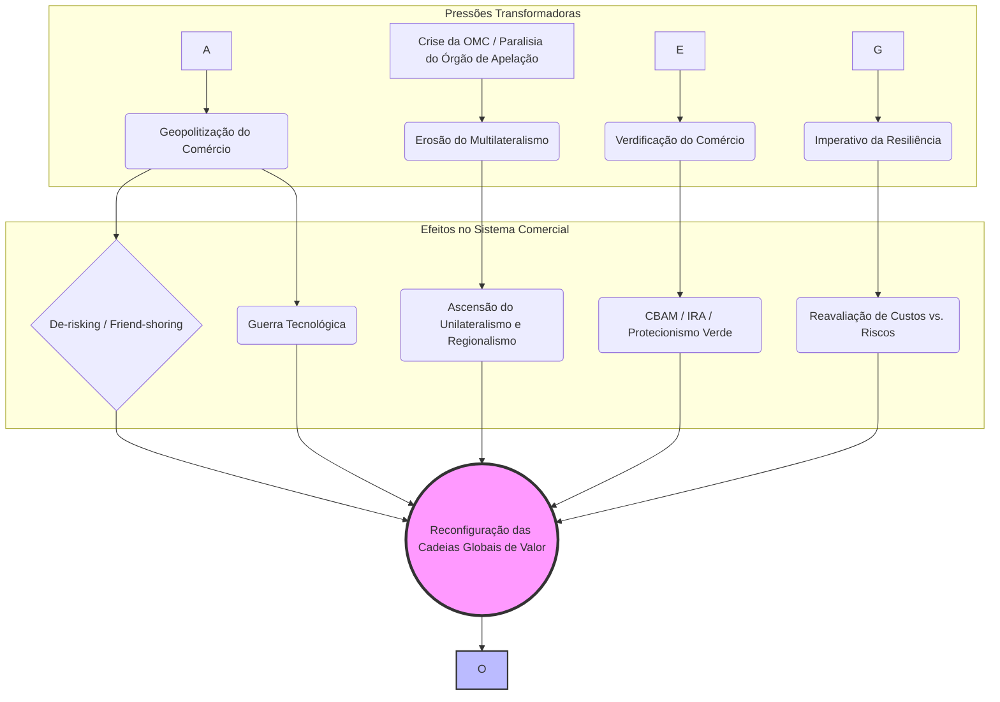

É crucial entender que o próprio conceito de "resiliência", embora pareça técnico e neutro, tornou-se politizado e contestado. Os choques que impulsionaram a busca por resiliência, como a pandemia, foram universais. No entanto, as _soluções_ propostas para a falta de resiliência estão sendo moldadas por agendas geopolíticas distintas.

Para os Estados Unidos, "resiliência" tornou-se sinônimo de reduzir a dependência da China, o que se manifesta na estratégia de _friend-shoring_. Para a União Europeia, "resiliência" está ligada à sua "autonomia estratégica aberta", o que justifica medidas como o CBAM para proteger sua base industrial e seu projeto regulatório. Para a OTAN, a resiliência é um imperativo de segurança que justifica custos econômicos mais altos para evitar a dependência de competidores estratégicos.1 Para as empresas, a resiliência pode simplesmente significar uma diversificação geográfica mais ampla para mitigar riscos, como aponta o FMI.

Portanto, quando um país como o Brasil é chamado a contribuir para "cadeias de valor mais resilientes", sua diplomacia precisa decodificar o que esse termo significa para cada um de seus parceiros. A "resiliência" não é um objetivo único e consensual, mas sim um campo de disputa sobre como o futuro do comércio global deve ser organizado.

## 5. O Brasil em um Mundo em Transição: Desafios e Estratégias

Neste cenário de profundas transformações, o Brasil se depara com um ambiente externo complexo, que desafia os paradigmas tradicionais de sua política externa comercial. A navegação bem-sucedida por essas águas turbulentas exige uma análise precisa dos desafios e a formulação de estratégias adaptativas.

### 5.1. Navegando a Crise da OMC: A Posição Brasileira na Reforma do Sistema

A diplomacia brasileira mantém sua tradicional defesa do sistema multilateral de comércio, com a OMC em seu centro, como pilar para o crescimento econômico e o desenvolvimento sustentável. Diante da crise atual, a posição do Brasil na agenda de reformas é clara e assertiva em três pontos principais:

1. **Prioridade Máxima na Solução de Controvérsias:** Tanto o Ministério das Relações Exteriores (MRE) quanto o Ministério do Desenvolvimento, Indústria, Comércio e Serviços (MDIC) enfatizam a urgência de restaurar um sistema de solução de controvérsias plenamente funcional, com dois níveis de jurisdição, como a prioridade número um da reforma. Para um país como o Brasil, que historicamente utilizou o sistema para contestar com sucesso subsídios e barreiras de potências maiores, a segurança jurídica proporcionada por um mecanismo de _enforcement_ eficaz é um interesse nacional permanente.
    
2. **Agenda Ofensiva na Agricultura:** O Brasil argumenta que nenhuma reforma da OMC será completa ou legítima se não abordar, finalmente, as profundas distorções no comércio agrícola. A posição brasileira cobra a redução de subsídios domésticos que deprimem os preços internacionais, maior acesso a mercados e soluções para temas pendentes como estoques públicos para fins de segurança alimentar e a questão do algodão. Esta é a agenda ofensiva histórica do país, que vê a liberalização agrícola como essencial para o desenvolvimento.
    
3. **Combate ao Protecionismo Unilateral:** O Brasil, muitas vezes em coordenação com parceiros do BRICS e do Grupo de Ottawa, tem sido uma voz ativa contra o aumento de medidas protecionistas unilaterais, incluindo aquelas que utilizam a sustentabilidade como pretexto para restringir o comércio.
    

### 5.2. Resposta ao Desafio Ambiental: O CBAM e a Estratégia Brasileira

A ascensão da agenda "comércio e meio ambiente" representa um dos maiores desafios para a diplomacia comercial brasileira. A resposta do país ao CBAM e a outras medidas, como a Lei Antidesmatamento da UE (EUDR), tem se desdobrado em múltiplas frentes:

- **Crítica e Engajamento Diplomático:** O Brasil tem sido um crítico vocal do caráter unilateral e potencialmente discriminatório de medidas como o CBAM e a EUDR. Juntamente com o grupo BASIC e outros países em desenvolvimento, argumenta que tais medidas podem ser incompatíveis com as regras da OMC e desrespeitam o princípio das responsabilidades comuns, porém diferenciadas (CBDR-RC). A CNI ecoa essas preocupações, destacando os riscos de uma nova forma de protecionismo.
    
- **Instrumentos de Defesa Comercial:** Internamente, a aprovação da *Lei de Reciprocidade Comercial em 2025* dota o governo brasileiro de um instrumento legal para aplicar contramedidas a barreiras comerciais consideradas injustificadas, incluindo as de natureza ambiental. Embora a via preferencial seja sempre a negociação, a existência da lei serve como uma ferramenta de dissuasão e barganha.
    
- **Adaptação Interna e Oportunidades:** Há um crescente consenso no setor privado e entre analistas de que a melhor resposta ao CBAM é proativa. Isso envolve avançar com a agenda de descarbonização da economia brasileira, incluindo a regulamentação de um mercado de carbono nacional. Tal medida não apenas ajudaria o Brasil a cumprir suas próprias metas climáticas, mas também poderia mitigar os custos do CBAM, pois o preço do carbono pago internamente poderia, em tese, ser deduzido da taxa europeia. A matriz energética predominantemente limpa do Brasil é uma vantagem competitiva, mas as emissões provenientes de processos industriais e, crucialmente, do desmatamento, são vulnerabilidades que precisam ser endereçadas.
    

### 5.3. O Equilíbrio Estratégico: Gerenciando as Relações com China, EUA e UE

O maior desafio da política externa brasileira no cenário atual é gerenciar simultaneamente suas relações com seus três principais parceiros comerciais, que se encontram em dinâmicas de competição e tensão.

- **China:** É o principal parceiro comercial do Brasil e destino crucial das exportações de commodities como soja, minério de ferro e petróleo, garantindo superávits comerciais robustos. Ao mesmo tempo, a presença chinesa na América do Sul é crescente, representando uma ameaça competitiva nos mercados regionais que eram tradicionalmente dominados pelo Brasil.
    
- **Estados Unidos:** Parceiro estratégico histórico, importante fonte de investimentos e tecnologia. No entanto, suas políticas comerciais, como as tarifas sobre aço e alumínio e os subsídios do IRA, afetam diretamente as exportações e a competitividade brasileira.45 A balança comercial de bens e serviços com os EUA é, na verdade, superavitária para os americanos, um ponto que o Brasil utiliza para contestar medidas protecionistas.45
    
- **União Europeia:** Parceiro fundamental em termos normativos e mercado de alto valor agregado. Contudo, é da UE que emanam as novas e mais complexas barreiras comerciais, baseadas em exigências socioambientais como o CBAM e a EUDR, que impõem custos significativos de adaptação para os exportadores brasileiros.
    

Nesse contexto, a política externa brasileira enfrenta o que pode ser descrito como um "trilema estratégico". O Brasil não pode, simultaneamente e sem custos, maximizar seus interesses econômicos com a China, seu alinhamento normativo e de valores com o Ocidente (EUA/UE), e sua autonomia decisória baseada no multilateralismo (OMC). Cada escolha em um desses eixos acarreta _trade-offs_ nos outros. Aprofundar os laços econômicos com a China pode gerar desconfiança em Washington e Bruxelas. Adotar as condicionalidades ocidentais pode limitar a soberania regulatória e gerar atritos com Pequim. Insistir na primazia da OMC é a estratégia tradicional para preservar a autonomia, mas o foro multilateral está enfraquecido pela própria geopolítica. A arte da diplomacia comercial brasileira no período 2023-2025 será, portanto, a de gerenciar os _trade-offs_ inevitáveis deste trilema.

## Conclusão

O período de 2023 a 2025 se consolida como um divisor de águas para o comércio internacional. A ordem global está transitando de um sistema focado na eficiência econômica e governado por regras multilaterais para uma realidade mais fragmentada, securitizada e normativamente contestada. A lógica do _just-in-time_ foi suplantada pela do _just-in-case_, e a geopolítica e a agenda climática tornaram-se variáveis tão ou mais importantes que a economia na definição dos fluxos comerciais e de investimento.

Para o Brasil, esta nova era apresenta um conjunto de desafios estratégicos de grande magnitude. Primeiro, a erosão da eficácia do sistema multilateral, especialmente do seu pilar de solução de controvérsias, enfraquece o principal instrumento que o país historicamente utilizou para se defender contra o poder desproporcional das grandes economias. Segundo, o Brasil se vê pressionado por dois flancos: a necessidade de se adaptar a novas barreiras comerciais "verdes" impostas por parceiros como a UE, e a dificuldade de competir em um ambiente global distorcido por subsídios massivos, como os do IRA americano. Terceiro, a gestão do equilíbrio entre seus principais parceiros — China, EUA e UE — tornou-se um ato de complexidade sem precedentes, exigindo a navegação cuidadosa de um "trilema estratégico" onde cada escolha implica custos e benefícios em diferentes dimensões da política externa.

Navegar com sucesso neste novo ambiente exigirá do Brasil uma combinação de agilidade diplomática, uma visão estratégica clara sobre seu posicionamento nas reconfiguradas cadeias globais de valor e, crucialmente, a implementação de reformas internas que fortaleçam sua competitividade e resiliência. Em especial, o avanço decisivo na agenda de descarbonização e na transição para uma economia de baixo carbono não é apenas um imperativo ambiental, mas uma condição cada vez mais indispensável para a inserção internacional do país no século XXI.

---

### Questões para Autoavaliação (Active Recall)

> [!question] Questão 1
> 
> Analise criticamente como a transição do conceito de "decoupling" para "de-risking" reflete uma mudança na estratégia geoeconômica dos EUA e da UE em relação à China e discuta as implicações dessa mudança para a formulação da política externa comercial de um país como o Brasil.

> [!question] Questão 2
> 
> Compare e contraste os mecanismos e os impactos sobre o sistema multilateral de comércio do CBAM da União Europeia e do Inflation Reduction Act dos EUA. De que forma ambos os instrumentos, embora distintos, representam um desafio comum aos princípios da OMC e aos interesses de países em desenvolvimento?

> [!question] Questão 3
> 
> Considerando a paralisia do Órgão de Apelação da OMC e a ascensão de novas condicionalidades comerciais (ambientais e geopolíticas), disserte sobre os principais desafios e as possíveis estratégias para a diplomacia brasileira na defesa de seus interesses comerciais no período 2023-2025, com foco especial na relação com EUA, China e UE.


---

## 🌍 1. Tarifas dos EUA sobre produtos brasileiros (2024–2025)

- Em 2024, os EUA impuseram uma tarifa de **25 % sobre aço** brasileiro e **10 % sobre diversos outros produtos**, enquadrando o Brasil no escopo do Section 232 e Section 301 ([Associated Press News](https://apnews.com/article/958bafd5f28d600eb0dd55fa8e942f64?utm_source=chatgpt.com "Trump tariffs goods from Brazil at 50%, citing 'witch hunt' trial against Bolsonaro"), [Associated Press News](https://apnews.com/article/48e7ef0c1659a3fccbdf23f6508b1ac7?utm_source=chatgpt.com "Brazil to prioritize negotiation after US trade tariffs, official says")).
    
- Em julho de 2025, o ex-presidente Trump anunciou a possibilidade de **tarifa de 50 % sobre todas as importações brasileiras**, contrapondo-se ao julgamento de Bolsonaro e medidas vis‑à‑vis plataformas digitais ([Wall Street Journal](https://www.wsj.com/world/americas/trump-threatens-50-brazil-tariff-citing-bolsonaro-trial-93a95e7b?utm_source=chatgpt.com "Trump Threatens 50% Brazil Tariff, Citing Bolsonaro Trial")).
    

Esses episódios representam contenciosos bilaterais intensos, com a proposta de uma investigação formal e possível retaliação pelo Brasil.

---

## 🌏 2. Antidumping sobre produtos da China (2024)

- Em outubro de 2024, o Brasil aplicou **tarifas antidumping** sobre importações chinesas de **ferro, aço e cabos de fibra óptica**, alegando “dumping” e subsídios chineses ([Wikipedia](https://en.wikipedia.org/wiki/Brazil%E2%80%93China_relations?utm_source=chatgpt.com "Brazil–China relations")).
    
- Em 2024, o Brasil foi um dos principais usuários de mecanismos de defesa comercial, junto com Índia e outros, para responder ao excesso de exportações jurídicas da China .
    

---

## 🚢 3. Crise diplomática da Hidrovia do Mercosul (2023–2024)

- De julho de 2023 a setembro de 2024, o Brasil participou de uma disputa com a Argentina sobre **taxas de passagem em vias navegáveis**, alegando violação dos acordos de livre navegação no Rio Paraná ([Wikipedia](https://en.wikipedia.org/wiki/Mercosur_Waterways_diplomatic_crisis?utm_source=chatgpt.com "Mercosur Waterways diplomatic crisis")).
    
- A crise teve impacto significativo sobre o transporte de commodities como soja e afeta direta e indiretamente o comércio da região Mercosul.
    

---

## 🚗 4. Contencioso da União Europeia no setor automotivo (desde ~2019–2020; ainda em andamento)

- Por volta de 2019‑2020, a **UE abriu consultas contra o Brasil** sobre medidas fiscais, subsídios e encargos no setor automotivo (caso DS 472) ([World Trade Organization](https://www.wto.org/english/tratop_e/dispu_e/cases_e/ds472_e.htm?utm_source=chatgpt.com "WTO | dispute settlement - DS472: Brazil — Certain Measures ...")).
    
- O processo ainda está em curso nos fóruns da OMC, exigindo acompanhamento jurídico.
    

---

## ✈️ 5. Disputa Embraer–Bombardier vs EUA/Canadá (2017–2022)

- Embora iniciada em 2017 (DS 522), essa disputa sobre subsídios à Bombardier ainda reverbera no período recente, influenciando políticas de apoio industrial ([Wikipedia](https://en.wikipedia.org/wiki/Bombardier_Aerospace_and_Embraer_S.A._government_subsidy_controversy?utm_source=chatgpt.com "Bombardier Aerospace and Embraer S.A. government subsidy controversy")).
    

---

### 📌 Síntese dos contenciosos (2020–2025)

|Período|Parte adversária|Produto / Setor|Tipo de medida|
|---|---|---|---|
|2024–2025|EUA|Aço, diversos|Tarifas (25 %, 10 %, ameaça de 50 %)|
|2024|China|Ferro, aço, fibra óptica|Antidumping (investigações e tarifas)|
|2023–2024|Argentina|Navegação hidrovia|Disputa diplomática e tarifária|
|2019–2020–?|União Europeia|Automóveis|Contencioso OMC (DS 472)|
|2017–2022|Canadá (Circuito)|Jatos/aviões|Disputa industrial Embraer–Bombardier|

---

Se quiser, posso procurar detalhes exclusivos sobre cada caso, como prazos exatos, estágios nos fóruns da OMC ou respostas oficiais do governo brasileiro. Quer que eu aprofunde algum específico?

- [Associated Press News](https://apnews.com/article/48e7ef0c1659a3fccbdf23f6508b1ac7?utm_source=chatgpt.com)
- [ft.com](https://www.ft.com/content/c4bce44e-9c66-4d74-bebd-0f35f0ea007f?utm_source=chatgpt.com)

# Origem: Comércio Internacional Contemporâneo


# O Comércio Internacional Contemporâneo: Fluxos Globais e a Inserção do Brasil na Última Década

## O Cenário do Comércio Internacional Global

### Principais Fluxos

Nas últimas décadas, **os fluxos de comércio internacional se concentraram em grandes eixos inter-regionais**, com destaque para a Ásia nas redes globais. A China consolidou-se como maior exportador mundial de bens (14% das exportações globais em 2023), superando com folga economias tradicionais como os EUA (8,5%) e a Alemanha (7,1%). Isso reflete o peso dos **fluxos Ásia–América do Norte e Ásia–Europa**, impulsionados pelo papel da China como _hub_ manufatureiro global. Ao mesmo tempo, o comércio **intra-regional europeu** permanece volumoso dada a integração econômica da União Europeia. Nenhuma região é autossuficiente: por exemplo, a Ásia importadora líquida de recursos naturais depende dos **corredores de commodities** originados em regiões ricas em recursos. _Grandes fluxos de minerais partem da Austrália, Brasil, Chile e África do Sul para abastecer os polos industriais chineses_, enquanto o Oriente Médio supre a Ásia de energia e a Europa e a América do Norte fornecem máquinas avançadas e know-how tecnológico.


| Ano  | Crescimento do comércio de mercadorias (%) |                                                                         Crescimento do comércio de serviços (%)                                                                         |
| :--: | :----------------------------------------: | :-------------------------------------------------------------------------------------------------------------------------------------------------------------------------------------: |
| 2019 |                     —                      |                                                                                            —                                                                                            |
| 2020 |              –5,0 (COVID‑19)               |                                                                               –10,0 (hipótese do impacto)                                                                               |
| 2021 |          +6,0 (recuperação forte)          |                                                                                          +12,0                                                                                          |
| 2022 |                    +2,0                    |                                                                                          +9,0                                                                                           |
| 2023 |                    –1,2                    | +9,0 ([bcb.gov.br](https://www.bcb.gov.br/content/ri/inflationreport/202412/ri202412c1i.pdf?utm_source=chatgpt.com "[PDF] Inflation Report – December 2024 - Banco Central do Brasil")) |
| 2024 |                +2,6 (proj.)                |                                                                                          +9,0                                                                                           |
| 2025 |                +3,3 (proj.)                |                                                                                            —                                                                                            |
Tabela: Fluxos Globais de Comércio (2019–2025 proj.)

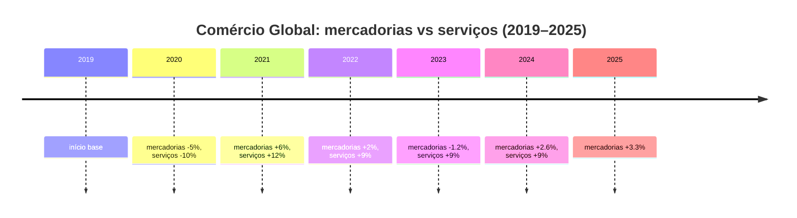
### Composição do Comércio Mundial

A **composição setorial do comércio global** passou por mudanças importantes na última década. Bens manufaturados ainda respondem pela maior parcela do comércio de mercadorias, mas as **commodities primárias** (produtos agropecuários e minerais) mantêm papel crucial – em especial para conectar países produtores (muitos em economias emergentes) a centros industriais demandantes. Além disso, observa-se a **crescente importância do comércio de serviços** e fluxos intangíveis. Entre 2010 e 2019, as exportações de serviços (especialmente serviços intensivos em conhecimento, como tecnologia da informação, finanças e propriedade intelectual) cresceram aproximadamente **duas vezes mais rápido** que o comércio de bens. Esse dinamismo dos serviços – juntamente com fluxos de dados digitais e capital humano – impulsiona a integração global contemporânea. Em contrapartida, o comércio de bens físicos como proporção da economia mundial se estabilizou após 2008, indicando um limite na _onda_ de mercantilização que marcara os 30 anos anteriores. Em suma, a última década viu **serviços e fluxos de conhecimento ganharem espaço relativo**, embora os bens tangíveis – manufaturas e commodities – sigam fundamentais na pauta global.

### Impactos Recentes

Nos anos recentes, **choques geopolíticos e sanitários** perturbaram os fluxos comerciais, sem contudo reverter completamente a globalização. A pandemia de _COVID-19_ em 2020 provocou uma queda abrupta no comércio mundial, em face de restrições logísticas e contração da demanda. **Surpreendentemente, a recuperação foi rápida**: já em 2021 o comércio de bens atingiu um recorde histórico, impulsionado pela demanda reprimida e pela capacidade das cadeias asiáticas de suprir gargalos de produção no Ocidente. Contudo, a retomada esbarrou em novos obstáculos. **Tensões geopolíticas** – como a guerra comercial e tecnológica entre _EUA e China_ – alimentam pressões protecionistas e **sinais de fragmentação nas relações comerciais globais**. Em 2022, a invasão da **Ucrânia pela Rússia** desorganizou mercados de energia e alimentos: a Europa, que importava mais de 50% de sua energia e gás da Rússia antes da guerra, viu-se forçada a diversificar fornecedores; simultaneamente, a redução das exportações de grãos do Leste Europeu elevou preços agrícolas mundialmente e redirecionou fluxos para outros produtores. Países como o Brasil foram afetados indiretamente – seja pela alta dos preços de commodities (beneficiando suas exportações de bens agrícolas e minerais), seja pela exposição em insumos críticos (por exemplo, Brasil e Argentina importam mais de **50% dos fertilizantes potássicos** de Rússia e Belarus, o que suscitou alertas diante das sanções e escassez durante o conflito). Em resumo, _os últimos choques ressaltaram tanto a resiliência quanto as vulnerabilidades do comércio global_: apesar de interrupções pontuais e reconfigurações de rotas (p. ex. petróleo russo sendo redirecionado à Ásia, cadeias buscando “_friend-shoring_”), a interdependência econômica persiste e nenhum grande bloco consegue suprir internamente todas as suas necessidades.

> [!note] **Resiliência x Desglobalização:** Apesar das turbulências (pandemia, guerra, tensões sino-americanas), os dados não apontam um colapso da globalização comercial. O **comércio mundial de bens cresceu cerca de +3% em 2022** e, embora tenha recuado -1,2% em 2023, espera-se retomada modesta em 2024-25. O padrão recente, contudo, mostra o comércio internacional crescendo em ritmo similar ou ligeiramente inferior ao PIB mundial (relação ~1:1 desde 2011) – diferentemente das décadas anteriores em que a expansão do comércio superava amplamente o crescimento econômico. Assim, fala-se hoje mais em **reorganização** do que em reversão da globalização: cadeias de valor se adaptam (busca por fornecedores alternativos, aumento de estoques estratégicos), mas **a integração global permanece elevada** e continua sendo fonte de prosperidade, embora acompanhada de riscos a gerenciar.

## A Inserção do Brasil no Comércio Internacional

### A Balança Comercial Brasileira nos Últimos Anos

A última década caracterizou-se por **saldos comerciais amplamente superavitários** para o Brasil. Após alguns anos de déficits no início dos anos 2010 (como em 2014), a partir de 2015 a balança comercial entrou em forte trajetória de superávit, reflexo da depreciação cambial, da retração das importações durante a recessão doméstica de 2015-16 e do vigor das exportações de commodities. Desde então, os superávits anuais tornaram-se pilares das contas externas brasileiras. Nos anos mais recentes, esses saldos atingiram patamares recordes: **em 2023, o superávit comercial chegou a US$ 98,8 bilhões – o maior da série histórica iniciada em 1989**. Esse resultado extraordinário (60% superior ao de 2022) decorreu de exportações também recordes (US$ 339,7 bi) combinadas a uma contração das importações, impulsionando o Brasil a **ganhar participação no comércio global** mesmo em um ano de retração do comércio mundial. Em 2024, ainda que os preços das commodities tenham arrefecido, o país manteve um **superávit elevado (US$ 74,6 bi, o segundo maior já registrado)** graças à safra agrícola volumosa e à expansão da produção de petróleo. Esses saldos positivos acumulados **têm sido fundamentais para o equilíbrio macroeconômico externo**: graças ao forte desempenho comercial, o déficit em transações correntes reduziu-se significativamente (chegando próximo de zero em fins de 2023), compensando parcialmente os déficits persistentes na balança de serviços e na conta de rendas (remessas de lucros, juros etc.). Em outras palavras, **o comércio exterior voltou a ser um “motor” do setor externo brasileiro**, fornecendo divisas e fortalecendo as reservas internacionais em meio a um cenário global incerto.

| Ano  | Exportações (US$ bi) | Importações (US$ bi) |                                                                                                                                                     Superávit (US$ bi) |
| :--: | -------------------: | -------------------: | ---------------------------------------------------------------------------------------------------------------------------------------------------------------------: |
| 2022 |                341,0 |                262,0 |                                                                                                                                                                  +79,0 |
| 2023 |                339,7 |                240,9 | +98,8 (recorde) ([wto.org](https://www.wto.org/english/res_e/booksp_e/trade_outlook24_e.pdf?ref=tippinsights.com&utm_source=chatgpt.com "[PDF] Global Trade Outlook")) |
| 2024 |                337,0 |                262,5 |                                                                                                                                                     +74,6 (2º recorde) |
Tabela: Comércio Brasileiro (2022–2024)
### A Composição da Pauta Comercial Brasileira

A estrutura da pauta de comércio exterior do Brasil na última década evidencia uma característica marcante: a **concentração em commodities**. Essa tendência de especialização em produtos primários – muitas vezes chamada de **“reprimarização” da pauta exportadora** – contrasta com os esforços históricos de diversificação e agrega um **debate crítico** sobre seus impactos no desenvolvimento econômico.

> [!definition] **Reprimarização da pauta exportadora:** fenômeno em que **produtos básicos (commodities agropecuárias e minerais)** passam a representar parcela crescente das exportações de um país, em detrimento de produtos manufaturados. No caso do Brasil, esse processo se acentuou nas últimas duas décadas, **revertendo parcialmente a diversificação obtida no final do século XX**. A reprimarização está associada a preços internacionais elevados de commodities e vantagens comparativas naturais, mas **gera preocupações** sobre **vulnerabilidade a choques de preços**, _desindustrialização_ e perda de complexidade econômica.

#### Pauta de Exportação: Commodities em Destaque

Atualmente, **os principais produtos exportados pelo Brasil são todos de base primária**. Em 2023, por exemplo, os três itens líderes da pauta foram: **soja** (complexo soja, incluindo grão e farelo, responsável por cerca de **15,7%** do valor total exportado), **óleos brutos de petróleo** (∼12,5%) e **minério de ferro** (∼9%). Juntos, esses três produtos – todos _commodities_ – perfizeram praticamente **40% das exportações brasileiras** naquele ano, ilustrando a forte concentração da pauta. Outros itens de destaque incluem o **açúcar** (cana-de-açúcar e derivados, ~4–5%), o **milho** (que ganhou importância recente com safras recordes), a **celulose** e as **carnes** (bovinas e de frango), cada um contribuindo com parcelas menores porém significativas.

Essa estrutura **contrasta com a realidade de duas décadas atrás**. No início dos anos 2000, a pauta era bem mais diversificada: cerca de **nove produtos distintos compunham 30% das exportações** – incluindo manufaturados relevantes à época, como automóveis, autopeças, aviões e até bens industrializados de petróleo. Já em **2021, apenas três produtos (minério de ferro, soja e petróleo cru) responderam por 40% do total exportado**, refletindo a perda de diversidade e o predomínio de commodities de baixo grau de processamento. Em suma, **houve uma regressão na complexidade da pauta exportadora brasileira**, com peso crescente do agronegócio e da mineração. O chamado _“complexo soja”_ (soja em grão, farelo e óleo) tornou-se a _locomotiva_ das vendas externas, seguido de perto pela cadeia da mineração de ferro e pelo petróleo bruto extraído do _pré-sal_. Esse perfil gera receitas expressivas em períodos de alta de preços (como na _supercommodity boom_ de 2021-2022), mas também **expõe o país à volatilidade cíclica** dos mercados globais de commodities.

Do ponto de vista de valor agregado, verifica-se que **a indústria de transformação brasileira perdeu espaço nas exportações**. Há uma década, produtos industrializados chegavam a representar ~64% das exportações; hoje giram em torno de **52%** – queda que indica _reprimarização_. Muitos dos itens de maior crescimento exportador têm **baixíssimo nível de processamento** (grãos in natura, petróleo cru, minério bruto, carnes resfriadas), enquanto houve estagnação ou redução na participação de manufaturados de maior tecnologia. Mesmo setores tradicionalmente exportadores de manufaturas (como automóveis, máquinas e equipamentos) enfrentam dificuldades para ganhar competitividade externa diante do câmbio, da concorrência asiática e do foco doméstico no mercado interno. Assim, o Brasil **exporta cada vez mais volume, porém ainda concentrado em bens básicos**, o que alimenta o debate sobre estratégia de desenvolvimento e políticas de incentivo à industrialização.

#### Pauta de Importação: Bens de Capital e Insumos Tecnológicos

No espelho das exportações, a **pauta de importação brasileira** é dominada por itens de maior valor agregado e insumos necessários à indústria nacional. Em 2023, por exemplo, os **principais produtos importados** foram: **adubos e fertilizantes** (US$ 13,4 bilhões), **óleos combustíveis de petróleo** – sobretudo combustíveis refinados, como diesel e nafta – (US$ 12,1 bi), **medicamentos e produtos farmacêuticos** (US$ 7,3 bi) e **equipamentos de telecomunicações** (eletrônicos de alta tecnologia, US$ 7,0 bi). Também figuram com peso relevante as **máquinas e bens de capital** em geral, componentes eletroeletrônicos, químicos finos, além de bens de consumo duráveis de tecnologia avançada (como computadores e semicondutores). Essa composição deixa claro que **o Brasil depende do exterior para suprir grande parte de seus insumos estratégicos e bens de alta complexidade**. Enquanto exportamos principalmente matérias-primas, **importamos produtos com maior conteúdo tecnológico**, desde fertilizantes para a agricultura até equipamentos médicos e industrializados em que nossa indústria possui lacunas competitivas.

Essa dinâmica **traz oportunidades e desafios**. Por um lado, a importação de bens de capital e insumos pode elevar a produtividade doméstica (permitindo modernização do parque industrial e abastecendo o agronegócio com fertilizantes, por exemplo). De fato, em 2024 observou-se aumento de 25,6% nas importações de bens de capital – um sinal positivo em tese para investimentos futuros. Por outro lado, **evidencia-se a vulnerabilidade brasileira em áreas-chave**: a dependência externa em fertilizantes, por exemplo, tornou-se evidente com a guerra na Ucrânia, dada a grande concentração de fornecedores em poucos países (Rússia e China). Situação semelhante ocorre com produtos de alto conteúdo tecnológico, importados principalmente de economias avançadas ou da Ásia. _Em suma: o Brasil exporta principalmente o que a natureza fornece, e importa o que a tecnologia produz_.

> [!important] **Estrutura do Comércio Exterior Brasileiro:** Os dados recentes reforçam uma realidade estrutural: **exportamos matérias-primas e importamos produtos industriais**. Essa configuração garante saldos comerciais favoráveis – afinal, somos competitivos em commodities – mas ao mesmo tempo **limita o avanço tecnológico interno**. A indústria nacional concorre com importados em vários segmentos e sofre com a falta de escala nas exportações. Esse **“duplo padrão”** (commodity-driven exports vs. high-tech imports) é uma característica central da inserção brasileira na economia global contemporânea.

### Os Principais Parceiros e Fluxos Comerciais do Brasil

A geografia do comércio exterior brasileiro também **passou por transformações na última década**, acompanhando as mudanças na economia mundial. Enquanto alguns parceiros tradicionais reduziram participação relativa, **a China despontou como destino dominante**, reordenando os fluxos comerciais do país. A seguir, analisamos os principais parceiros e a natureza dos intercâmbios com cada um:

#### China

A **República Popular da China** consolidou-se como _o principal parceiro comercial do Brasil_. Em 2009, a China já havia ultrapassado os EUA como maior destino das exportações brasileiras, e desde então sua vantagem só cresceu. Atualmente, **cerca de um terço das exportações do Brasil têm a China como destino** – em 2023, aproximadamente **30,7% do volume exportado** pelo país foi absorvido pelo mercado chinês. Este **estreito vínculo comercial Brasil–China** está alicerçado nas commodities: a China é a maior compradora de soja brasileira (para alimentar seu rebanho e indústria de ração), além de importar em massa **minério de ferro** (insumo-chave para o aço em seu parque industrial) e **petróleo bruto** do Brasil. Produtos como **carne bovina e de frango, celulose, açúcar e polpa de minério de manganês** também encontram na China um mercado crescente. Em outras palavras, **a pauta de exportações para a China é intensiva em recursos naturais**, refletindo a complementaridade entre a abundância brasileira em commodities agro-minerais e a demanda chinesa por matérias-primas.

Do lado das **importações**, a China tornou-se igualmente um dos principais fornecedores do Brasil, respondendo por grande parte dos produtos manufaturados importados – de eletrônicos a máquinas industriais e insumos químicos. Isso reforça a relação de dependência: **exportamos commodities e importamos manufaturados chineses de maior valor agregado**, contribuindo para o _déficit_ brasileiro na balança de manufaturados. Geopoliticamente, essa relação traz tanto ganhos (receitas robustas de exportação) quanto **riscos**: elevada concentração das vendas em um só mercado (sensível a mudanças de política comercial ou desaceleração na China) e exposição a oscilações de preços internacionais ditados em boa medida pela demanda chinesa. Ainda assim, a parceria com a China tem sido extremamente lucrativa na última década – **a corrente de comércio bilateral alcançou US$ 160 bilhões em 2023**, um recorde histórico. A China figura como **pilar do superávit comercial brasileiro** e qualquer análise da inserção internacional do Brasil hoje começa por esse eixo Ásia-Pacífico.

#### União Europeia

A **União Europeia (UE)** foi, por longo período, o destino mais importante das exportações brasileiras, porém seu peso relativo diminuiu com a ascensão asiática. Em 2000, somados, os países da UE absorviam cerca de 25% das nossas exportações; hoje essa parcela caiu para **em torno de 13–15%**. Entre 2003 e 2023, por exemplo, a participação da UE no comércio internacional do Brasil reduziu-se de 23% para 13,6%. Essa queda reflete sobretudo o crescimento exponencial do comércio com a China e outros mercados emergentes, mas não significa perda de relevância absoluta da Europa. **A UE permanece um parceiro estratégico e diversificado**: é tradicionalmente o segundo ou terceiro maior mercado para exportações brasileiras e grande fornecedor de bens e investimentos para o Brasil.

A pauta de **exportações brasileiras para a UE** é relativamente **diversificada** se comparada à pauta para a Ásia. Inclui tanto produtos básicos – como **commodities agrícolas** (café, soja em farelo para ração animal, suco de laranja, açúcar, carnes) e **commodities minerais** (minérios, celulose) – quanto **bens manufaturados e semimanufaturados** de maior valor. Por exemplo, a Europa importa **aeronaves regionais da Embraer**, motores e peças automotivas, calçados e alguns produtos químicos do Brasil, ainda que em volumes bem menores que os básicos. Esse perfil se deve à complementaridade parcial das economias: a UE demanda alimentos tropicais e matérias-primas (nas quais o Brasil é competitivo) ao mesmo tempo em que adquire alguns bens industriais _nicho_ nos quais o Brasil possui excelência. Por sua vez, o **Brasil importa da UE** principalmente **máquinas e equipamentos** de alta tecnologia, produtos químicos finos, medicamentos, além de veículos e eletrônicos de ponta – itens nos quais a indústria europeia é líder. O saldo comercial com a UE costuma ser superavitário para o Brasil (dado o peso das commodities exportadas), mas **menos expressivo** do que com a Ásia. Além do aspecto comercial, a UE representa um parceiro institucional importante: negociações como o **Acordo Mercosul-UE** (aguardando ratificação) buscam abrir mercados e consolidar regras, o que poderia impulsionar ainda mais os fluxos birregionais. _Em suma, apesar da queda relativa, a Europa continua sendo um mercado-chave com pauta mais equilibrada e sofisticada, cuja relação com o Brasil transcende o modelo simples de “primário vs. industrial”_.

#### Estados Unidos

Os **Estados Unidos** já foram, individualmente, o principal destino das exportações brasileiras (posição que mantiveram por grande parte do século XX e início dos anos 2000). Na última década, entretanto, foram ultrapassados pela China e, eventualmente, equiparados pelo bloco europeu, situando-se atualmente como **segundo maior parceiro individual**. Em 2024, os EUA representaram cerca de **12% das exportações brasileiras**, mantendo-se como o _destino número 2_ para os produtos do Brasil. A relação comercial Brasil-EUA é significativa tanto em volume quanto em diversidade setorial. **As exportações brasileiras para os EUA** incluem uma mescla de produtos básicos e manufaturados: por um lado, embarcamos petróleo bruto, celulose, café, suco de laranja, aço semiacabado e outras commodities/tradings; por outro, os EUA são destino de **bens industrializados de maior valor** como **aeronaves (da Embraer)**, peças automotivas, motores, e até alguns produtos químicos e bens de consumo (calçados, por exemplo). De fato, ao contrário da China (onde manufaturados brasileiros são praticamente ausentes), **nos EUA há espaço para alguns produtos da indústria de transformação brasileira** – especialmente aqueles nos quais temos competitividade regional ou acordos preferenciais (ex.: aço semimanufaturado sob cotas, etanol, aviões regionais). Em 2023, as exportações de manufaturados brasileiros aos EUA atingiram US$ 29,9 bilhões, _ultrapassando as vendas para a UE_ nesse quesito, o que evidencia a importância do mercado norte-americano para setores industriais brasileiros.

Nas **importações brasileiras dos EUA**, predominam itens de alta tecnologia e equipamentos: o Brasil compra dos norte-americanos máquinas industriais, aparelhos eletroeletrônicos, partes e peças para aviação, além de produtos químicos (resinas, fármacos, defensivos agrícolas) e combustíveis refinados. Os EUA figuram consistentemente entre os **principais fornecedores de bens de capital e insumos sofisticados** ao Brasil, atrás apenas da China em muitos casos. Essa relação bilateral tem se mantido robusta, embora sujeita a **oscilações conforme o contexto político-comercial** (por exemplo, tarifas aplicadas pelos EUA ao aço brasileiro em 2018, ou questões sanitárias envolvendo exportações agropecuárias). No contexto geopolítico atual, o Brasil busca equilibrar a parceria com os EUA – que envolve cooperação em investimentos, inovação e é destino crucial de manufaturados – com sua integração crescente à Ásia. Em suma, **os EUA seguem sendo um parceiro comercial e tecnológico de primeira grandeza** para o Brasil, fornecendo produtos estratégicos e absorvendo parcela importante de nossas exportações de maior valor agregado.

#### Argentina e Mercosul

No âmbito regional, a **Argentina** – juntamente com os demais sócios do Mercosul (Paraguai e Uruguai) – ocupa posição de destaque especial na inserção comercial brasileira. A Argentina tradicionalmente figura entre os **três principais destinos** das exportações do Brasil (já foi o 2º maior em diversos momentos) e é, de longe, o maior dentro da América Latina. Mais do que o volume, importa a **composição das trocas Brasil-Argentina**: este é o mercado que mais absorve **produtos manufaturados brasileiros**. Historicamente, cerca de _80% a 90%_ das exportações brasileiras para a Argentina são **bens industrializados**, incluindo veículos automotores e autopeças, máquinas e equipamentos, eletrodomésticos, eletrônicos e produtos químicos. Isso contrasta fortemente com outros parceiros (como China ou mesmo EUA), onde predominam commodities. **O Mercosul, portanto, cumpre o papel de principal destino para a indústria de transformação brasileira**, funcionando como um “mercado cativo” para setores como o automobilístico – que, graças ao acordo regional, exporta volumes significativos para os vizinhos sul-americanos.

Nos últimos anos, a **profunda crise econômica na Argentina** (recessão, desvalorização cambial, restrições cambiais) impactou negativamente o comércio bilateral, reduzindo o apetite argentino por importados. A participação da Argentina nas exportações brasileiras tem caído em 2023-2024, e o saldo comercial tradicionalmente superavitário para o Brasil encolheu bastante. Ainda assim, a Argentina **permanece um destino estratégico**, sobretudo para pequenas e médias empresas brasileiras exportadoras e para segmentos industriais que pouco conseguem penetrar mercados fora da região. Além da Argentina, outros parceiros do Mercosul e América do Sul (Chile, Colômbia, Peru) são relevantes compradores de manufaturados brasileiros – de alimentos processados a ônibus e implementos rodoviários. Essa dinâmica regional ressalta a importância do **Mercosul como plataforma de exportação de manufaturas**, embora limitada pelo tamanho das economias vizinhas. No médio prazo, a recuperação da demanda argentina e a eventual expansão do Mercosul (ou acordos com outros países da América Latina) poderão influenciar significativamente a performance exportadora da indústria brasileira.

> [!example] **Diagramas – Principais Parceiros Comerciais do Brasil e Produtos Exportados:** O diagrama a seguir ilustra, de forma simplificada, os principais destinos das exportações brasileiras e os tipos de produtos enviados a cada parceiro (dados aproximados para 2023):

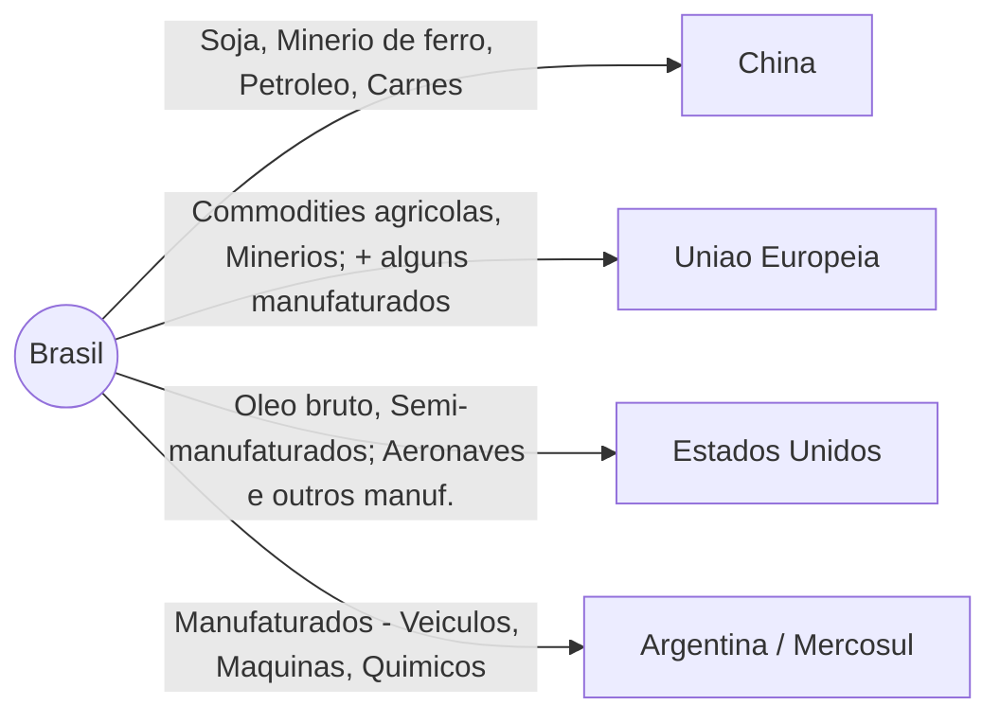

_(Obs: Fluxos ilustrativos. A espessura das setas representa aproximadamente o volume exportado; China > UE ≈ EUA > Argentina.)_

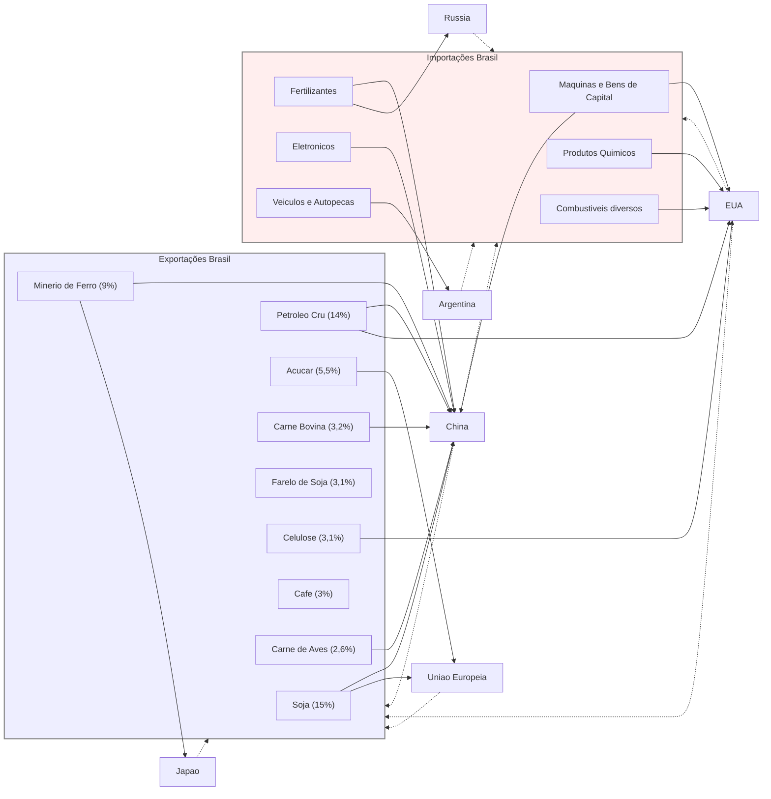

## Análise Conclusiva: Desafios para o Desenvolvimento

A análise da estrutura e da dinâmica do comércio exterior brasileiro na última década revela um **paradoxo de desenvolvimento**. Por um lado, a especialização em commodities tem proporcionado **vantagens comparativas claras**: o Brasil tornou-se um _supplier_ global de alimentos e minerais, colhendo ganhos expressivos com a alta demanda da Ásia. Os **superávits comerciais recordes** evidenciam como essa inserção garantiu fartos ingressos de divisas, fortaleceu as contas externas e permitiu ao país se beneficiar do ciclo de alta de preços das commodities. Adicionalmente, a posição de grande exportador agrícola e mineral vem acompanhada de **incrementos de produtividade e investimento nessas áreas** (por exemplo, avanços em tecnologia agropecuária tropical, expansão da fronteira do _agronegócio_, exploração do pré-sal), gerando crescimento econômico regionalizado e empregos nessas cadeias.

Por outro lado, **os riscos e vulnerabilidades** dessa estrutura são notórios. A **forte dependência de commodities** expõe o Brasil a **choques de preços internacionais** e à volatilidade: períodos de bonança (boom) podem ser seguidos de quedas abruptas nas receitas de exportação se os preços de soja, petróleo ou minério despencarem no mercado global – algo comum em fases de desaceleração econômica mundial. Essa vulnerabilidade externa pode afetar o câmbio, a arrecadação e a balança corrente, colocando em xeque a estabilidade macroeconômica (como ocorreu no passado em ciclos de _bust_ das commodities). Além disso, a concentração em poucos produtos e mercados traz o **risco de concentração de mercado**: a China, por exemplo, sozinha dita boa parte da demanda pelas exportações brasileiras; uma eventual redução do apetite chinês (seja por mudança de matriz econômica ou por tensões comerciais) teria impacto desproporcional sobre o Brasil.

Internamente, discute-se que essa trajetória comercial reforça tendências de **desindustrialização prematura**. Com a valorização cambial em épocas de boom de commodities (_doença holandesa_) e a preferência do mercado por atividades extrativas e agrícolas de retorno rápido, a indústria de transformação nacional tem perdido participação no PIB e no emprego. A **pauta exportadora reprimarizada** significa também menor estímulo para segmentos industriais subirem na cadeia tecnológica, pois o país se apoia em vantagens naturais ao invés de conhecimento. Há uma **perda de complexidade econômica** relativa, o que pode limitar o crescimento de longo prazo, já que setores primários – embora eficientes – têm menos encadeamentos tecnológicos e agregam menos valor localmente que setores manufatureiros avançados. Em suma, **a atual inserção gera riqueza, mas pode comprometer o futuro caso não se diversifique**.

O desafio estratégico para o Brasil reside em **equilibrar essas forças**: _aproveitar as oportunidades comparativas das commodities_, sem acomodar-se nelas a ponto de prejudicar a inovação e a diversificação produtiva. Isso implica políticas que **apoiem a industrialização e a agregação de valor** nas cadeias de exportação (por exemplo, incentivar a industrialização de produtos agrícolas, desenvolver a indústria de biocombustíveis e química a partir do petróleo e gás, etc.), bem como a busca de **novos mercados e nichos** para produtos manufaturados brasileiros. Também requer fortalecer a integração em **cadeias globais de valor** de forma competitiva – por exemplo, inserindo a manufatura brasileira em segmentos onde possa complementar parceiros (como aconteceu parcialmente na cadeia automotiva regional ou na indústria aeronáutica).

Em termos de política externa, diversificar parcerias comerciais é igualmente vital: _ampliar acordos comerciais_, reduzir barreiras e explorar mercados na Ásia (além da China, países do Sudeste Asiático), na África e no Oriente Médio pode diluir riscos. Ao mesmo tempo, **consolidar parcerias tradicionais** (EUA, UE) com foco em comércio de maior valor agregado e investimentos em tecnologia pode ajudar o Brasil a escapar da armadilha da primarização. O **Acordo Mercosul-União Europeia**, se ratificado, e a participação mais ativa em fóruns como OCDE, OMC e acordos transpacíficos podem oferecer oportunidades para integrar o país em cadeias globais mais sofisticadas.

Em conclusão, a **inserção comercial brasileira da última década é um caso de sucesso em volumes e saldos**, porém **com fragilidades estruturais**. O país logrou posicionar-se como powerhouse exportadora de commodities em um mundo sedento por alimentos e insumos, mas **pagou o preço de ver sua pauta menos complexa e mais vulnerável**. O grande desafio adiante é **transformar esse ganho de curto prazo em alavanca para o desenvolvimento de longo prazo** – isto é, usar o fôlego proporcionado pelos superávits para investir em educação, tecnologia e infraestrutura que permitam sofisticar a produção nacional. Somente assim o Brasil poderá, no futuro, exportar não apenas soja, minério e petróleo, mas também _bens e serviços de alto valor agregado_, reduzindo a dependência de ciclos externos e tornando sua economia mais resiliente e competitiva no cenário global.

> [!question] **Questões para Autoavaliação:**
> 
> 1. **Composição Exportadora e “Reprimarização”:** Quais evidências indicam que houve reprimarização da pauta exportadora brasileira na última década? Discuta os principais produtos hoje exportados, em comparação com duas décadas atrás, e analise os _pros_ e _contras_ dessa especialização em commodities para o desenvolvimento econômico do Brasil.
>     
> 2. **Choques Globais e Comércio Brasileiro:** Como os choques internacionais recentes – pandemia de Covid-19, guerra na Ucrânia e tensões comerciais entre EUA e China – afetaram o comércio mundial e, especificamente, a inserção do Brasil? Explique de que forma esses eventos impactaram os fluxos comerciais brasileiros (seja por mudanças de preços, de parceiros ou de cadeias produtivas) e quais foram as respostas ou oportunidades resultantes para o Brasil.
>     
> 3. **Desafios Estruturais e Estratégias:** Considerando a atual estrutura da balança comercial brasileira (forte superávit baseado em commodities, importação de manufaturados), quais são os principais desafios de política econômica para o Brasil equilibrar crescimento de curto prazo com desenvolvimento de longo prazo? Proponha medidas ou estratégias que possam aumentar o valor agregado das exportações brasileiras e reduzir vulnerabilidades externas, fundamentando sua resposta com elementos da análise apresentada.
>

# Origem: Inteligência Artificial na Política Mundial


# Inteligência Artificial na Política Mundial: A Guerra Tecnológica, a Governança Global e a Posição do Brasil

A ascensão da **Inteligência Artificial (IA)** transformou-se em fator-chave na política internacional contemporânea. Tecnologias digitais e IA passaram a ser vistas como elementos estratégicos de poder, desencadeando **disputas geopolíticas pela supremacia tecnológica** e colocando desafios inéditos à governança global. De um lado, potências como Estados Unidos e China travam uma “guerra tecnológica” em frentes que vão dos semicondutores às redes 5G/6G e aplicações de IA avançada. De outro, a comunidade internacional busca formas de **regular a IA** de modo seguro e ético, porém enfrenta a fragmentação de modelos regulatórios e a ausência de um regime global unificado. Nesse contexto, o Brasil se vê diante de decisões cruciais: internamente, debate um **Marco Legal da IA** e implementa estratégias nacionais de fomento à IA; externamente, adota uma postura diplomática que privilegia o multilateralismo, a inclusão e a defesa dos direitos humanos – tudo enquanto procura manter autonomia estratégica na disputa tecnológica global. A seguir, examinamos esses eixos em detalhe, com foco nas implicações para a **Política Internacional**.

## A Guerra Tecnológica e a Geopolítica da IA (Contexto Global)

A IA e as tecnologias digitais emergiram como arena central da disputa de poder no sistema internacional. A capacidade de inovar e dominar setores de ponta – como algoritmos de IA, infraestrutura de telecomunicações e produção de microchips – passou a ser vista como sinônimo de **vantagem geopolítica e econômica**. Assim, na última década, tensões antes restritas ao comércio ou às questões militares passaram a incluir também a _tecnologia_ como eixo estratégico. A rivalidade _EUA–China_ tornou-se o caso mais emblemático, caracterizada por medidas de bloqueio tecnológico, investimentos maciços em inovação e uma retórica que enquadra a liderança tecnológica como questão de segurança nacional. Esse fenômeno reflete uma tendência mais ampla chamada de **“tecnonacionalismo”**, em que Estados adotam políticas para assegurar soberania tecnológica e evitar dependência externa, vendo na primazia tecnológica um pilar da força nacional. Abaixo, exploramos os principais fronts dessa guerra tecnológica – dos semicondutores às redes de comunicação e à própria corrida pela IA – bem como o conceito de tecnonacionalismo em maior detalhe.

### A Competição Estratégica EUA–China

A disputa estratégica entre Estados Unidos e China pela supremacia em tecnologia é hoje o **principal eixo da geopolítica da IA**. Ambos os países reconhecem que liderança em IA, computação avançada e infraestrutura digital se traduz em liderança econômica e militar no século XXI. De fato, analistas apontam que **a supremacia tecnológica tornou-se chave para o poder geopolítico e econômico**, e que EUA e China estão imersos em uma competição de longo prazo nesse terreno. Essa competição se manifesta em múltiplas áreas, dentre as quais destacam-se:

#### Semicondutores: a “guerra dos chips”

Um componente crítico é a chamada **guerra dos chips**, referente aos _semicondutores_. Microchips avançados são a base de praticamente todas as inovações digitais – de sistemas de IA a armamentos modernos – e seu domínio é considerado vital. Nos últimos anos, os EUA adotaram uma estratégia assertiva de **restringir o acesso da China a semicondutores de ponta**, visando atrasar o progresso tecnológico chinês. Em outubro de 2022, por exemplo, o governo Biden impôs um amplo conjunto de controles de exportação que **proíbem empresas chinesas de adquirir chips avançados e equipamentos de fabricação de chips** sem licença dos EUA. As medidas vão além: cidadãos e residentes nos EUA ficaram proibidos de apoiar fábricas chinesas na produção desses chips. Como resultado, **empresas chinesas foram cortadas dos insumos essenciais** para alcançar a fronteira tecnológica em microeletrônica – “os EUA cortaram os degraus” da escada tecnológica, segundo analistas. Washington justificou tais sanções em nome da **segurança nacional**, dada a importância dos chips em tudo, de smartphones a sistemas militares. Paralelamente, investiu pesado na re-localização da produção de semicondutores (vide a lei CHIPS Act), buscando reduzir a dependência de fábricas asiáticas. **Pequim, por sua vez, reagiu** com uma política de substituição de importações e investimento maciço para criar uma cadeia de suprimentos doméstica de chips de IA. A China também lançou sua **Lei de Controle de Exportação** e uma lista de entidades não confiáveis, sinalizando disposição de responder na mesma moeda. Essa “guerra dos chips” ilustra o tecnonacionalismo em ação: ambos os países adotam medidas protecionistas para garantir vantagem tecnológica – mesmo ao custo de fragmentar as cadeias globais de suprimentos.

> [!definition] **“Guerra dos Chips”** 
> Expressão que se refere à disputa entre potências pelo controle da produção e acesso a semicondutores avançados. Os **chips** são componentes fundamentais para IA, computação e armamentos modernos; controlá-los significa deter poder estratégico. No contexto atual, a “guerra dos chips” se manifesta em **embargos e sanções** – como as dos EUA contra a China – bem como em **subsídios bilionários** para construir fábricas domésticas. O objetivo de fundo é assegurar **autossuficiência tecnológica** e impedir que rivais acessem os processadores mais sofisticados, considerados essenciais para vantagens militares e econômicas.

#### Infraestrutura digital: a disputa pelo 5G/6G

Outro foco central é a **infraestrutura de telecomunicações de nova geração**, especialmente as redes _5G_ (e futuras _6G_). O 5G é visto como habilitador da próxima revolução digital – **internet das coisas**, cidades inteligentes, veículos autônomos – e por isso se tornou alvo de acirrada concorrência geopolítica. Nessa disputa, a chinesa **Huawei**, líder no fornecimento de equipamentos 5G, ganhou papel de pivô. Os EUA conduziram uma campanha global para barrar a Huawei, alegando riscos de espionagem e **ameaças à segurança nacional** caso países permitissem a empresa nas suas redes críticas. Aliados próximos, como Reino Unido, Austrália e Japão, seguiram em maior ou menor grau essa orientação, impondo restrições à Huawei. Já países europeus continentais buscaram diversificar fornecedores, enquanto hesitavam em banir totalmente os chineses. A disputa adquiriu tons de Guerra Fria Tecnológica: de um lado, Washington promovia alternativas ocidentais (Ericsson, Nokia, Samsung) e até financiamentos para competir com a Huawei; do outro, Pequim negava as acusações e ressaltava que a Huawei operava em 170 países sem comprovação de backdoors. O embate pelo 5G evidencia que **escolhas tecnológicas têm dimensão geoestratégica**. Como resumiu um ex-secretário do Ministério da Defesa do Brasil, _“é a guerra fria do século XXI porque se trata da escolha do padrão tecnológico de dados”_. Quem definir os padrões de 5G/6G e deter as patentes e empresas líderes terá influência significativa sobre a economia digital global. Além disso, controle sobre redes 5G implica controle (ou acesso privilegiado) sobre fluxos massivos de dados – um ativo tanto comercial quanto de inteligência. Dessa forma, _infraestrutura digital_ tornou-se área de contestação entre EUA e China, com impactos para todos os países que, como o Brasil, tiveram que calibrar sua posição nessa disputa ao realizar seus leilões de 5G.

#### A corrida pelo desenvolvimento de IA

A **liderança em pesquisa e aplicações de IA** completa o quadro da rivalidade tecnológica. Nos EUA, o ecossistema de IA é impulsionado por gigantes do Vale do Silício (Google, Microsoft, OpenAI, etc.), universidades de ponta e volumosos investimentos de capital privado e público. A China, por sua vez, adotou uma estratégia deliberada de Estado: lançou em 2017 o _Plano de Ação para Nova Geração de IA_, estabelecendo a meta de **tornar-se líder mundial em IA até 2030**. Para isso, mobilizou recursos estatais e privados, fomentou startups, e aproveitou sua abundância de dados e gradativa melhoria em chips para IA. Atualmente, China e EUA concentram a maior parte da _pesquisa de ponta, dos talentos e dos supercomputadores_ voltados à IA no mundo. A competição abrange desde algoritmos de _machine learning_, passando pela corrida do _deep learning_ generativo (como mostrado pelo frenesi global em torno do ChatGPT, de um lado, e de modelos chineses equivalentes, de outro), até aplicações militares de IA (como inteligência aplicada a drones, cibersegurança e análise de dados de inteligência). Autoridades americanas chegaram a afirmar que, **se os EUA não agirem rápido em IA, poderão “perder a competição tecnológica” para a China**. Do lado chinês, Xi Jinping frequentemente destaca a inovação tecnológica (IA inclusa) como central para os objetivos nacionais. Essa dinâmica alimenta discursos que comparam a corrida de IA a uma _nova corrida armamentista_, enfatizando a urgência de se alcançar (ou negar ao outro) qualquer _avanço disruptivo_ como a chamada IA geral. Diferentemente da corrida nuclear do século XX, entretanto, a corrida da IA envolve forte participação do setor privado e se dá em grande medida no mercado civil – o que complica tentativas de controle. Ainda assim, o efeito estratégico é semelhante: cada potência teme que a outra obtenha uma **supremacia em IA** capaz de desequilibrar o poder global, seja economicamente (por controlar inovações e plataformas futuras) ou militarmente (por aplicações bélicas superiores).

### O “Tecnonacionalismo”

A intensificação dessas disputas tecnológicas catalisou, em nível global, o fenômeno do **tecnonacionalismo**. Esse conceito descreve a postura de Estados que passam a tratar a _liderança tecnológica como questão de Estado e segurança nacional_, adotando políticas protecionistas e nacionalistas na área. Ou seja, governos privilegiam o desenvolvimento tecnológico **endógeno**, restringem transferências de tecnologia estratégica e **condicionam relações comerciais** aos imperativos da soberania tecnológica. Conforme definição clássica, tecnonacionalismo são _“as formas de protecionismo adotadas por políticas governamentais para manter a competitividade tecnológica”_ do país ou bloco. Na prática, ele se manifesta em medidas como: **controle de exportações sensíveis**, triagem de investimentos estrangeiros (vetando aquisições de empresas de alta tecnologia), restrições de vistos para pesquisadores (evitando fuga de conhecimento) e **subsídios maciços a indústrias estratégicas** (como semicondutores e IA). Tanto EUA quanto China exibem tecnonacionalismo nas suas agendas: Washington, ao barrar a Huawei e cortar chips da China; Pequim, ao erguer a Grande Firewall, exigir parcerias locais de empresas estrangeiras e investir pesadamente para eliminar pontos vulneráveis (chips, sistemas operacionais, etc.). A **União Europeia** também adota tinturas tecnonacionalistas ao falar em “soberania digital” – buscando reduzir dependência de tecnologia extra-bloco e desenvolver padrões próprios. Em suma, _tecnologia e poder nacional se entrelaçaram de forma inédita_. Se por décadas a globalização produziu cadeias de suprimento integradas e cooperação científica internacional, agora vemos uma tendência reversa: **fragmentação tecnológica por linhas geopolíticas**, com países erguiendo barreiras em nome de preservar autonomia e liderança. Analistas apontam que esse movimento dificilmente levará a um _desacoplamento total_ (dado o alto custo e interdependências profundas), mas que o conflito tecnológico EUA–China será prolongado e **alimentará o tecnonacionalismo global** nos próximos anos.

## O Desafio da Regulação da Inteligência Artificial

Paralelamente à competição por supremacia tecnológica, desponta outro dilema: **como regular a IA e mitigar seus riscos** em escala global. Diferente de áreas como não proliferação nuclear ou clima – onde existem regimes internacionais abrangentes – na governança da IA vive-se hoje um cenário de **fragmentação regulatória**. Não há consenso internacional sobre normas vinculantes para IA; em vez disso, vigoram abordagens distintas entre países e blocos, cada qual refletindo valores e prioridades próprias. Essa divergência é visível na comparação entre os modelos de regulação que emergem principalmente na **União Europeia, nos Estados Unidos e na China**. A UE busca liderar definindo padrões rígidos inspirados em direitos fundamentais, num típico “efeito Bruxelas” de exportação regulatória. Os EUA adotam, por ora, uma postura flexível, evitando lei geral e preferindo orientações setoriais e autorregulação, a fim de não tolher a inovação. A China, por seu turno, implementa um modelo estatal centralizador, combinando estímulo ao desenvolvimento com uso da IA para fins de _governança interna e controle social_. A ausência de um regime unificado cria **desafios de cooperação multilateral**: há risco de regras conflitantes, brechas exploráveis e até uma _corrida regulatória_ em que vencem padrões menos exigentes. A seguir, detalhamos os diferentes modelos (UE, EUA, China) e discutimos as tentativas de convergência em fóruns internacionais como ONU, UNESCO e OCDE.

### A Fragmentação da Governança Global

Em escala global, a governança da IA está fragmentada entre **diferentes modelos regulatórios concorrentes**, sem um arcabouço internacional único. Essa situação reflete tanto divergências filosóficas (por exemplo, sobre o peso da intervenção estatal vs. liberdade de mercado) quanto a própria rivalidade geopolítica (cada potência busca promover seu modelo como padrão). Os três paradigmas mais influentes hoje são: **(1)** o modelo regulatório da **União Europeia**, de caráter abrangente e baseado em direitos; **(2)** o modelo dos **Estados Unidos**, marcado por regulação setorial mínima e enfoque pró-inovação; e **(3)** o modelo da **China**, com forte centralização estatal e ênfase em segurança/controle. Abaixo, compararmos esses modelos:

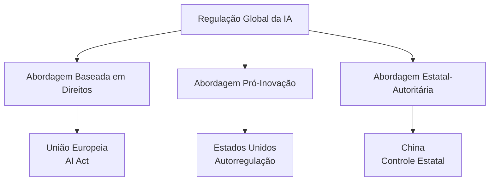

```mermaid
flowchart TD
    A[Abordagens Regulatórias da IA]
    
    A --> B{Nível de Regulação}
    
    B -->|Alta| UE["🇪🇺 **União Europeia**<br/>✓ AI Act obrigatório<br/>✓ Multas até 7% do faturamento<br/>✓ Classificação por risco"]
    
    B -->|Média| US["🇺🇸 **Estados Unidos**<br/>• Guidelines voluntários<br/>• Regulação setorial<br/>• Executive Orders"]
    
    B -->|Específica| CN["🇨🇳 **China**<br/>⚠ Controle governamental<br/>⚠ Foco em segurança nacional<br/>⚠ Censura algorítmica"]
    
    style UE fill:#e1f5fe
    style US fill:#fff3e0
    style CN fill:#fce4ec
````

#### O Modelo da União Europeia (“Efeito Bruxelas”)

A União Europeia desponta como **pioneira na regulação abrangente da IA**, alavancando sua experiência prévia em proteção de dados (GDPR) e seu poder de mercado para tentar moldar padrões globais – fenômeno conhecido como _Brussels effect_ (efeito Bruxelas). Em 2021, a Comissão Europeia propôs o **AI Act (Lei de IA)**, primeiro marco legal amplo sobre inteligência artificial. O projeto adota uma **abordagem baseada em riscos**, classificando sistemas de IA em categorias (risco inaceitável, alto, limitado ou mínimo) e calibrando exigências conforme o potencial de dano. Por exemplo, aplicações de risco **“inaceitável”** – aquelas que ameaçam seriamente direitos fundamentais – seriam _proibidas_. Entram aí sistemas de **score social** (avaliação algorítmica de confiabilidade de indivíduos, nos moldes do que a China pratica) e possivelmente **IA para manipulação massiva ou que explore vulnerabilidades humanas**. Já sistemas de _alto risco_ (como IA em recrutamento de emprego, concessão de crédito, decisões judiciais, uso policial) teriam que cumprir requisitos estritos de transparência, **accountability** e segurança antes de entrar no mercado. O AI Act também mira _tecnologias sensíveis_ como **reconhecimento facial em tempo real em locais públicos** – tema de intenso debate. Há pressão do Parlamento Europeu para banir ou limitar fortemente essa prática (alguns países do bloco já a proíbem), dado o risco de vigilância em massa incompatível com privacidade e liberdades civis.

Em essência, o modelo europeu busca **equilibrar inovação em IA com a proteção de direitos fundamentais**. Ele parte do _princípio da precaução_: sem regras, a IA seria um “Velho Oeste” tecnológico; portanto, faz-se necessária intervenção legal ex ante. A UE enxerga a regulação como meio de _aumentar a confiança_ na IA e evitar abusos que minem valores democráticos. Esse arcabouço se ancora na tradição europeia de enfatizar dignidade humana, privacidade, não discriminação e segurança. Ao mesmo tempo, a UE espera que sua lei defina um **padrão global**: se for implementada com sucesso, outros países tenderão a adotá-la ou aderir a padrões semelhantes. Isso já ocorreu com a GDPR (proteção de dados) e a expectativa é que se repita na IA – consolidando um regime em que **empresas globais terão que seguir as regras europeias** para poder operar no grande mercado da UE. Inclusive, há cálculos geopolíticos: **alinhar-se à UE em princípios de IA** é visto pelos EUA como estratégico para contrabalançar o avanço chinês, dado que uma frente transatlântica coesa em valores poderia influir no futuro da economia digital. Naturalmente, o AI Act enfrenta desafios técnicos (ex.: exigir explicabilidade de certos algoritmos pode ser inviável) e resistência de big techs preocupadas com impacto em seus modelos de negócio. Ainda assim, a UE caminha para aprovar a lei em breve (previsão de vigência possivelmente em 2025-2026), reforçando sua posição de **“reguladora do mundo”** em tecnologia.

#### O Modelo dos Estados Unidos

Os Estados Unidos adotam até o momento uma abordagem mais **flexível e fragmentada** para a regulação de IA. Não há uma lei federal abrangente específica para IA – em parte devido à filosofia mais pró-mercado e ao lobby da indústria de tecnologia. Em vez disso, prevalece um **modelo setorial e de autorregulação guiada**: diferentes agências e setores desenvolvem diretrizes próprias, e o governo federal emite apenas orientações gerais ou normas voluntárias. Por exemplo, a Administração Biden lançou um _Blueprint for an AI Bill of Rights_ (Guia para uma Carta de Direitos da IA) em 2022, porém este documento tem natureza não vinculante, servindo mais como referência ética (defende princípios como não discriminação algorítmica, proteção de dados e auditoria de sistemas automatizados). Paralelamente, o **NIST** (Instituto Nacional de Padrões e Tecnologia) publicou um **Framework de Gerenciamento de Riscos em IA**, encorajando empresas a adotarem voluntariamente boas práticas de avaliação de risco e transparência. Setores específicos contam com regulação ad hoc – por exemplo, a FDA (agência de saúde) regulamenta algoritmos médicos com enfoque em segurança e eficácia; o Departamento de Transportes lida com IA veicular autônoma, etc. Assim, o mosaico regulatório americano é **setorial, fragmentado e baseado em _soft law_** até o momento.

Essa opção reflete a prioridade histórica dos EUA em **estimular a inovação e a liderança industrial**. A visão predominante é que regulação excessiva, prematura ou genérica poderia sufocar a competitividade das empresas americanas num campo em rápida evolução. Em lugar de regras rígidas impostas pelo Estado, privilegiam-se **padrões desenvolvidos em parceria com a indústria**, sandboxes regulatórios e incentivos à autorregulação responsável. Além disso, a cultura jurídica dos EUA tende a confiar em mecanismos pós-fato (responsabilidade civil, enforcement de órgãos de defesa do consumidor ou antidiscriminação) em vez de licenciamento prévio de tecnologias. Nos últimos anos, contudo, cresce a consciência sobre riscos da IA (viés algorítmico, impactos sociais, desinformação, etc.) e alguns estados americanos e cidades começaram a aprovar leis específicas – por exemplo, Nova York regulando o uso de algoritmos em contratação de emprego (para evitar discriminação). O Congresso também discute propostas, mas nenhuma de alcance geral foi aprovada ainda.

Em suma, o **modelo norte-americano** pode ser descrito como _“light-touch”_ (toque suave) e **“pro-inovação”**. Ele busca **evitar amarras regulatórias federais** que possam dar vantagem a competidores estrangeiros, preferindo confiar que o dinamismo do mercado produzirá as melhores soluções e que os riscos podem ser geridos com normas existentes (como leis de proteção ao consumidor, antitruste, direitos civis, etc.). Contudo, essa postura vem sendo questionada conforme a UE avança com sua lei e conforme a sociedade americana percebe os perigos de IA desregulada (por exemplo, interferência eleitoral via desinformação algorítmica, ou prejuízos de decisões automatizadas opacas). Há assim uma tensão interna entre, de um lado, **manter a liderança tecnológica global (não “atrasar” o Vale do Silício)** e, de outro, **acompanhar a necessidade de proteger cidadãos e valores democráticos** também no ambiente digital. Essa balança regulatória nos EUA permanece em evolução – possivelmente inclinando-se a mais regulação no futuro, mas ainda longe do ponto adotado pelos europeus.

#### O Modelo da China

A **China** apresenta uma abordagem distinta, marcada por forte **centralização estatal e integração entre política industrial e regulação**. Para Pequim, desenvolver IA é prioridade nacional tanto para impulsionar o crescimento econômico quanto para reforçar a _segurança do Estado_. Logo, sua estratégia busca o “duplo objetivo”: **supremacia tecnológica + controle social**. No front do desenvolvimento, o governo chinês investe pesado (subsídios, planos quinquenais, parques tecnológicos) para que empresas domésticas liderem em IA, e protege seu mercado interno de concorrência estrangeira direta – muitas big techs ocidentais são banidas ou limitadas, dando espaço para equivalentes chinesas (Baidu, Alibaba, Tencent etc.). Ao mesmo tempo, no front da **regulação e uso da IA**, a China impõe regras estritas alinhadas aos interesses do Partido-Estado. A lógica é: permitir a inovação, **porém sem perder a tutela sobre os efeitos sociais** da tecnologia.

Na prática, a China foi **um dos primeiros grandes mercados a lançar normas abrangentes de IA**. Entraram em vigor nos últimos anos regulações sobre: **algoritmos de recomendação**, exigindo que plataformas tornem públicos seus algoritmos e evitem promover vícios ou conteúdos “indesejados” (definidos pelo Estado); **deepfakes**, obrigando identificação clara de conteúdo sintético; e recentemente **modelos de IA generativa** (como chatbots), que devem aderir aos “valores socialistas centrais” e passar por avaliações de segurança se atingirem grande escala. Além disso, a China já proíbe anonimamente vários tipos de conteúdo online e implementa sistemas de vigilância de ponta: **reconhecimento facial em massa, câmeras inteligentes, o “crédito social”** que monitora comportamento cidadão. Esses instrumentos são impulsionados por IA e demonstram como **Pequim utiliza a tecnologia para reforçar o controle político e a estabilidade interna**. Leis chinesas obrigam empresas de tecnologia a **cooperar com o governo**, censurar informações “perigosas” e assegurar que seus produtos não ameacem a ordem pública. Diferentemente do Ocidente, onde a privacidade individual e limitações ao Estado são preocupações centrais, na China a ênfase recai em _soberania do Estado sobre os dados e tecnologias_. A **segurança nacional** é evocada para justificar amplos poderes de vigilância e filtragem.

Em síntese, o **modelo chinês de governança de IA** é _estatal-dominante_: o governo atua simultaneamente como **promotor da inovação** (via investimento e planejamento) e **árbitro do uso da tecnologia** (via regulação apertada do conteúdo e implementação). A meta declarada é colher os benefícios da IA para o desenvolvimento econômico e eficiência governamental, enquanto **se evitam os “efeitos desestabilizadores” da digitalização descontrolada** – como disse Xi Jinping, garantir que a tecnologia sirva à “harmonia social”. Esse modelo contrasta tanto com o europeu (que visa proteger o cidadão do Estado e das empresas) quanto com o americano (que visa liberar o potencial do mercado), mostrando uma terceira via onde a tecnologia está subordinada à supremacia do Estado e do partido governante. Por consequência, a China tende a apoiar nos fóruns internacionais princípios de “soberania digital” (cada país define suas regras para IA dentro de suas fronteiras) e se opõe a qualquer mecanismo externo que julgue seus usos domésticos de IA (por exemplo, críticas a sistemas como o crédito social). A exportação de elementos desse modelo – seja através do comércio de sistemas de vigilância chineses para outros países, seja via promoção de conceitos na ONU – é parte da atual disputa por valores na governança global da tecnologia.

### O Debate Multilateral

Diante da falta de um regime unificado e das diferenças entre modelos regionais, _como avançar numa governança global da IA?_ Vários **fóruns multilaterais e iniciativas internacionais** vêm tentando construir pontes e princípios comuns, embora com resultados ainda iniciais. Um marco importante foi estabelecido na **UNESCO**, que em novembro de 2021 aprovou por consenso a _Recomendação sobre a Ética da Inteligência Artificial_. Trata-se do **primeiro instrumento normativo global** em IA, acordado por 193 países incluindo EUA, China e Brasil. A Recomendação da UNESCO define princípios como transparência, justiça, privacidade, diversidade, não-maleficência e responsabilidade, e orienta os Estados a adotarem medidas para incorporar essas diretrizes eticamente no desenvolvimento e uso de IA. Embora não seja juridicamente vinculante, esse documento cria uma base ética comum e um compromisso político internacional em prol de uma IA centrada no ser humano e nos direitos humanos.

Outra frente relevante é a **OCDE (Organização para Cooperação e Desenvolvimento Econômico)**, que em 2019 lançou os _Princípios da OCDE sobre IA_. Esses princípios – posteriormente endossados pelo G20 – pregam o uso responsável da IA para crescimento inclusivo, respeito aos direitos humanos e valores democráticos, transparência e explicabilidade dos sistemas, robustez e segurança, e responsabilidade dos atores de IA. Além disso, a OCDE estabeleceu um _Observatório de Políticas de IA_ para acompanhar as evoluções globais e compartilhar boas práticas entre governos. Também nasceu no âmbito do G7/OCDE a **Global Partnership on AI (Parceria Global em IA)**, um grupo multistakeholder (governos, academia, sociedade civil) que promove pesquisas e recomendações sobre IA responsável – embora os grandes países envolvidos tenham visões distintas, este fórum busca encontrar convergências técnicas e éticas.

Na **ONU** mais ampla, o secretário-geral António Guterres tem sido voz ativa chamando atenção para riscos da IA desregulada e a necessidade de ação coletiva. Em 2023, Guterres apoiou a proposta (ventilada por alguns especialistas e pelo CEO da OpenAI) de criar uma espécie de **agência internacional para IA inspirada na AIEA** (Agência de Energia Atômica). Seria um órgão multilateral de _vigilância e promoção do uso seguro da IA_, capaz de estabelecer padrões globais e monitorar seu cumprimento – análogo ao papel da AIEA no monitoramento nuclear. O secretário-geral qualificou a ideia como “muito interessante”, mas reconheceu que apenas os Estados-membros da ONU poderiam viabilizá-la. Enquanto isso não ocorre, ele anunciou a criação de um **Órgão Consultivo de Alto Nível em IA**, para revisar periodicamente os arranjos de governança existentes e sugerir alinhamentos com direitos humanos, Estado de direito e o bem comum. Essa iniciativa deve apresentar relatórios que podem embasar futuras negociações intergovernamentais. Ainda no âmbito ONU, debates tomam lugar no **Conselho de Segurança** (por conta do uso potencial de IA em armas autônomas e cibersegurança) e planeja-se incluir o tema na **Cúpula do Futuro** (prevista para 2024), que trabalhará num possível _Pacto Digital Global_. Este pacto buscaria compromissos em áreas digitais amplas, incluindo IA, visando evitar a fragmentação da internet e assegurar que tecnologias sejam usadas de forma benéfica e alinhada à Carta da ONU.

Apesar dessas iniciativas, o panorama geral permanece desafiador. Há uma evidente **competição entre modelos regulatórios** – por exemplo, disputas _transatlânticas_ sobre privacidade de dados já ocorrem e podem se repetir com IA. Também existem clivagens _norte-sul_: muitos países em desenvolvimento preocupam-se que regulações muito rígidas (ditadas por países ricos) dificultem seu acesso à inovação e reforcem assimetrias globais. Por isso, países emergentes (como Índia, Brasil, Indonésia) defendem que qualquer governança global de IA seja **inclusiva e sensível às diferenças de desenvolvimento**, permitindo espaço para inovação local e transferência de tecnologia, ao mesmo tempo que protege direitos. Fóruns regionais também entram na discussão – por exemplo, na América Latina, a recente **Aliança Digital UE–ALC** envolve diálogos birregionais sobre IA centrada no ser humano.

Em resumo, o debate multilateral sobre IA está em ebulição, mas em estágio inicial. Há consenso sobre princípios gerais (vide UNESCO e OCDE) e concordância de que a IA **não pode ficar sem nenhum controle global**. Entretanto, há divergências quanto à forma (tratado vinculante vs. princípios voluntários), quanto à entidade que deve liderar (ONU, multi-stakeholders ou alianças entre “afinidades”) e quanto ao conteúdo exato das normas (por exemplo, banir ou não certas aplicações). É provável que nos próximos anos vejamos uma intensificação dessas negociações. Do ponto de vista diplomático, a capacidade de _conciliar inovação com valores éticos universais_ será crucial para legitimar um eventual regime global de IA. Caso contrário, persiste o risco de uma ordem fragmentada: com **esferas tecnológicas rivais**, cada qual com suas regras – um cenário que o próprio Brasil e outros países têm motivos para evitar.

## A Posição e as Iniciativas do Brasil (Foco Principal)

_Plenário do Senado Federal durante a votação do Marco Legal da IA, em 10 de dezembro de 2024._

Diante do panorama global descrito, o **Brasil** busca posicionar-se de forma a **aproveitar as oportunidades da IA para o desenvolvimento**, ao mesmo tempo em que **mitiga riscos e assegura valores democráticos**. Esse equilíbrio se reflete em três frentes interligadas: (1) o **debate interno sobre regulação da IA**, com a tramitação de um Marco Legal no Congresso Nacional; (2) a formulação de uma **Estratégia Nacional de IA** e planos de ação para fomentar a pesquisa, a inovação e a capacitação no tema; e (3) a **política externa brasileira**, que tradicionalmente defende uma governança internacional multilateral, inclusiva e centrada em direitos, além de prezar pela autonomia estratégica do país (evitando alinhamentos automáticos na disputa entre grandes potências). A seguir, examinamos cada uma dessas frentes em detalhe.

### O Debate Interno sobre Regulação (Marco Legal da IA)

O Brasil vem construindo gradualmente seu arcabouço regulatório doméstico para IA. O ponto central é o **Marco Legal da Inteligência Artificial**, discutido no Congresso desde 2020. A iniciativa começou com o _Projeto de Lei (PL) 21/2020_ na Câmara dos Deputados, de autoria do Dep. Eduardo Bismarck (PDT-CE), e evoluiu até o _PL 2338/2023_ no Senado Federal, apresentado pelo próprio Presidente do Senado, Rodrigo Pacheco, que consolidou diferentes contribuições. Em dezembro de 2024, o Senado aprovou simbolicamente o PL 2338/23 – que agora aguarda análise final na Câmara dos Deputados – marcando um passo significativo para estabelecer regras no uso da IA no Brasil.

**Conteúdo e Princípios:** O texto original do PL 21/2020 já delineava os **fundamentos e princípios** que orientam a regulação. Ficou estabelecido que a utilização de IA no Brasil deve ter como **fundamento o respeito aos direitos humanos, aos valores democráticos, à igualdade, à não-discriminação, à pluralidade, à livre iniciativa e à privacidade de dados**. Em outras palavras, a pessoa humana e seus direitos são centrais (“centralidade da pessoa humana” é termo usado na justificativa do projeto). Entre os **princípios** está também a **transparência** quanto ao uso e funcionamento de sistemas de IA – buscando evitar a opacidade algorítmica. O marco legal visará **estimular a inovação e proteger os cidadãos contra mau uso da IA** simultaneamente, numa abordagem balanceada. Para tanto, o PL define a figura dos **“agentes de IA”**, diferenciando o _agente desenvolvedor_ (quem cria ou treina o sistema) do _agente operador_ (quem implementa ou utiliza o sistema). Esses agentes terão deveres legais, como **responder pelas decisões tomadas pelo sistema de IA** (responsabilidade civil) e **assegurar conformidade com a Lei Geral de Proteção de Dados (LGPD)** na utilização de dados pessoais. Ou seja, busca-se evitar a ideia de “algoritmo sem culpado”: haverá sempre um ente humano ou empresarial responsável por prejuízos causados pela IA. Adicionalmente, prevê-se direitos às pessoas afetadas por sistemas de IA (_partes interessadas_), como o direito a informações sobre uso de seus dados, especialmente dados sensíveis.

> [!note] **Inovações regulatórias propostas** 
> O projeto brasileiro incorpora mecanismos inspirados em experiências internacionais, como a exigência de um **Relatório de Impacto de IA** – documento em que o agente de IA deve descrever a tecnologia, os objetivos e medidas de gerenciamento de riscos. Esse relatório, similar a avaliações de impacto algorítmico de outros países, poderá ser solicitado por autoridades públicas e servirá para avaliar se o sistema atende a padrões de transparência e segurança. O PL também orienta o **Poder Público** a adotar IA em serviços públicos (preferencialmente com código aberto), fomentando a pesquisa nacional e capacitando trabalhadores para a nova realidade tecnológica. Prevê ainda a criação de **mecanismos de governança** para coordenar as ações em IA no país, indicando a importância de uma instância responsável pela política de IA.

**Debates e Pontos Controversos:** Durante a tramitação, diversas questões geraram **debates entre os atores** (governo, setor privado, academia e sociedade civil). Um ponto sensível foi a discussão sobre **responsabilidade civil e penal**: como atribuir culpa quando uma IA causa dano? O consenso caminha para não se reconhecer personalidade jurídica à IA (a responsabilidade recai sobre desenvolvedores ou operadores), mas definir critérios claros de nexo causal ainda é um desafio. Outro debate se deu em torno do **modelo regulatório a adotar** – algumas propostas iniciais sugeriam uma lei mais principiológica (sem detalhar obrigações técnicas), enquanto outras, influenciadas pelo modelo europeu, pediam incorporar um **enfoque de riscos** com distinção de exigências conforme o tipo de sistema. O texto do Senado (PL 2338/2023) incluiu inspirações do AI Act europeu, mas adaptadas ao contexto brasileiro. Por exemplo, ganhou destaque a questão de **direitos autorais na era da IA generativa**: o PL aprovado no Senado trouxe dispositivos obrigando empresas de IA a divulgarem quais conteúdos protegidos por copyright foram usados no treinamento de modelos, dando aos autores o direito de **vetar ou negociar o uso de suas obras**. Isso reflete preocupação de artistas e criadores com ferramentas de IA que aprendem em cima de obras existentes (músicas, imagens, textos). O **Ministério da Cultura** apoiou ativamente essas cláusulas, argumentando ser essencial garantir remuneração justa aos artistas e transparência sobre o uso de seu trabalho. Já representantes do setor de tecnologia temiam que exigências muito rígidas, sobretudo para _startups_, pudessem inibir a inovação local ou tornar o Brasil pouco atraente para investimentos em IA. A solução buscada tem sido calibrar obrigações de acordo com porte e risco – possivelmente dispensando pequenas empresas de relatórios complexos, ou dando prazos para adequação.

Outro tópico discutido é o **órgão regulador**: o PL menciona a criação de um _Sistema Nacional de Regulação e Governança de IA_, mas não detalha se haverá uma agência nova ou se agências existentes (como a Autoridade de Proteção de Dados, ANPD) assumirão competências. Há quem defenda uma **agência específica para IA**, dada a transversalidade do tema, enquanto outros preferem aproveitar estruturas existentes (ANPD, Anatel, etc., conforme o setor) para evitar burocracia adicional. Esse desenho institucional segue em aberto durante a tramitação final na Câmara.

Em síntese, o **Marco Legal de IA do Brasil** busca: estabelecer princípios éticos e direitos (humanos, democráticos), dar segurança jurídica para inovação responsável, atribuir responsabilidades claras e incentivar o desenvolvimento benéfico da IA. Trata-se de conciliar o incentivo ao progresso tecnológico com salvaguardas contra abusos – um equilíbrio sintonizado com a tradição brasileira de buscar _via média_ regulatória. A aprovação definitiva da lei fará do Brasil um dos primeiros países fora da Europa a dotar-se de legislação abrangente sobre IA, o que poderá inclusive elevar a influência brasileira nas discussões internacionais sobre o tema.

### A Estratégia Nacional de IA (EBIA) e o Plano Brasileiro de IA

Paralelamente ao marco legal, o Brasil tem avançado em **políticas públicas para promoção da IA**. Em abril de 2021, foi publicada a **Estratégia Brasileira de Inteligência Artificial (EBIA)**, por meio da Portaria MCTI nº 4.617/2021. A EBIA é um documento de referência que **norteia as ações do Estado brasileiro** para desenvolver e utilizar IA de forma benéfica, ética e inclusiva. A estratégia foi construída a partir de estudos técnicos, consultas a especialistas (com apoio da UNESCO) e uma consulta pública que reuniu cerca de 1000 contribuições. Seu objetivo principal é _potencializar o desenvolvimento da IA no Brasil_, com vistas à inovação, ganhos econômicos e sociais, **sem negligenciar a segurança e valores éticos**.

A **EBIA estabelece seis objetivos estratégicos** principais:

- **Elaborar princípios éticos** para o desenvolvimento e uso responsável da IA, alinhados a direitos e valores (contribuindo à discussão global sobre _IA ética_).
    
- **Promover investimentos sustentados em P&D** em IA, fortalecendo pesquisa científica e capacidade de inovação no país.
    
- **Remover barreiras à inovação** em IA, aprimorando marcos regulatórios e ambiente de negócios para facilitar experimentação e adoção de novas tecnologias.
    
- **Capacitar e formar profissionais** para o ecossistema de IA, suprindo a demanda por especialistas e democratizando o conhecimento em IA.
    
- **Estimular a inovação e o desenvolvimento da IA brasileira em ambiente internacional**, incentivando a participação de instituições nacionais em redes e projetos globais, e atraindo talentos e empresas de fora.
    
- **Promover cooperação entre setores público, privado, academia e centros de pesquisa** para criar sinergias no desenvolvimento de IA (um ecossistema colaborativo).
    

Para concretizar esses objetivos, a EBIA define **nove eixos temáticos** (ou pilares), que incluem áreas como educação e capacitação em IA; fomentos a pesquisa científica; aplicação de IA em setores estratégicos (saúde, agricultura, indústria etc.); legislação, ética e regulação; e até cooperação internacional em IA. Cada eixo traz um diagnóstico da situação atual, desafios identificados e ações estratégicas propostas. Por exemplo, no eixo de **educação**, a EBIA aponta a necessidade de incluir conteúdos de IA nos currículos e ampliar programas de formação de profissionais de TI e ciência de dados. No eixo de **aplicações na indústria**, sugere estimular a adoção de IA em empresas, incluindo pequenas e médias, para aumentar a produtividade. No eixo de **ética e regulação**, enfatiza a importância de princípios (muito em linha com a UNESCO) e prepara terreno para o marco legal discutido acima.

Importante notar que a EBIA _não é um documento estático_: ela prevê revisão e atualização conforme a IA evolua. De fato, a implementação de seus objetivos ganhou reforço em 2023 com o lançamento do **Plano Brasileiro de Inteligência Artificial (PBIA) 2024-2027** pelo MCTI. O PBIA aprofunda as diretrizes da EBIA e aloca recursos: prevê **investimentos de até R$ 23 bilhões em quatro anos** para projetos de pesquisa, inovação e capacitação em IA. Trata-se de um plano ambicioso para transformar o país em referência em inovação em IA, incluindo metas como criação de centros de pesquisa aplicada, bolsas de estudo, desafios tecnológicos e adoção de IA em serviços públicos essenciais. O PBIA foi elaborado de forma colaborativa (governo, academia, setor produtivo) e reflete o compromisso brasileiro em desenvolver soluções de IA **alinhadas às demandas nacionais e características locais**. Entre suas diretrizes estão: fomentar pesquisa básica e aplicada; formar talentos em grande escala; assegurar segurança, transparência e proteção de dados nas soluções de IA; e incentivar uso de IA no setor público para políticas baseadas em evidências.

Em resumo, **Brasil tem direcionado esforços não apenas para regular, mas também para incentivar a IA** de forma estratégica. A EBIA fornece a visão de longo prazo e princípios, enquanto o PBIA traz a execução com recursos e programas concretos. Essa dupla abordagem é crucial: regula-se para proteger e dar confiança, e investe-se para não ficar para trás na revolução da IA. No contexto de um país em desenvolvimento, há consciência de que IA pode ser ferramenta para salto econômico e social – desde que haja preparo e políticas adequadas. Ao mesmo tempo, há cautela para que a IA não amplie desigualdades ou viole direitos no Brasil. Essa visão equilibrada permeia a estratégia brasileira.

### A Política Externa Brasileira para o Tema

No cenário internacional, o **Brasil atua de forma propositiva na governança global da IA**, coerente com sua tradição diplomática de defesa do multilateralismo, do desenvolvimento inclusivo e dos direitos humanos. A posição brasileira enfatiza que as discussões sobre IA **devem ocorrer em fóruns multilaterais legítimos (particularmente a ONU)** e com participação equilibrada de países desenvolvidos e em desenvolvimento – evitando que apenas um pequeno grupo de nações ou empresas privadas estabeleça as regras do jogo. Como afirmou o Ministro das Relações Exteriores, Mauro Vieira, _“as Nações Unidas não devem estar apenas no centro das discussões sobre IA, mas no centro de qualquer iniciativa de tomada de decisão”_. Isso reflete a visão de que a governança da IA precisa ser **democrática e inclusiva globalmente**, sob pena de aprofundar desigualdades e assimetrias de poder.

Do ponto de vista de princípios, o Brasil advoga por uma **abordagem centrada no ser humano**, que equilibre **inovação e desenvolvimento econômico com a proteção dos direitos humanos e dos valores democráticos**. Nos fóruns internacionais, a diplomacia brasileira tem sublinhado preocupações com fenômenos como _desinformação digital, discurso de ódio online e concentração de poder em plataformas_, e como estes podem minar democracias. Ao mesmo tempo, o Brasil reconhece o potencial transformador da IA para benefícios públicos – por exemplo, para reduzir assimetrias entre países desenvolvidos e em desenvolvimento, desde que haja transferência de conhecimento e capacitação. Dessa forma, a posição brasileira busca **garantir que a revolução digital não exclua os países do Sul Global**, mas sim os beneficie. Na presidência brasileira do G20 em 2024, um dos temas foi justamente como IA pode ajudar a diminuir lacunas de desenvolvimento e preservar a integridade da informação. O Brasil lançou iniciativas sobre _integridade da informação e mudanças climáticas_, trazendo a discussão tecnológica para agendas como a ambiental, numa perspectiva interdisciplinar.

Em termos práticos, o Brasil tem apoiado e participado ativamente de iniciativas como a **Recomendação da UNESCO sobre Ética da IA** – inclusive traduzindo-a e promovendo debates nacionais sobre sua implementação. Também aderiu aos princípios da OCDE e integra grupos de trabalho internacionais sobre IA. Ademais, o Brasil vem enfatizando a importância de um **Pacto Digital Global** (a ser discutido na ONU) que inclua orientações para IA, e apresentou no Conselho de Direitos Humanos iniciativas relativas a direitos na era digital. Outra arena de atuação é o **BRICS**: sob presidência brasileira em 2025, o governo indicou que traria a discussão de IA para esse agrupamento, de modo a assegurar que grandes emergentes tenham voz conjunta sobre padrões tecnológicos.

Um aspecto notável da política externa brasileira é a busca de **autonomia estratégica** na esfera tecnológica, evitando alinhamentos automáticos com qualquer superpotência. Isso significa que o Brasil quer **parceria com todos os atores relevantes** – coopera com a UE em regulações e projetos (há diálogo UE-América Latina sobre IA centrada no ser humano), mantém diálogo com os EUA (por exemplo, sob a Comissão Brasil-EUA de CT&I) e simultaneamente com a China. Um exemplo concreto foi a postura em relação à **rede 5G**: mesmo sob pressão intensa dos EUA para banir a Huawei, o governo brasileiro declarou que _“não entraria na guerra entre EUA e China”_, optando por uma solução própria – restringir a Huawei apenas na rede privativa governamental, mas não bani-la das redes comerciais. Como disse o ministro Fabio Faria em 2021, o Brasil acompanhava a disputa mas não ia “tomar partido” na guerra tecnológica, adotando critérios técnicos e de segurança pontuais. Essa decisão ilustra a tentativa do Brasil de **manter-se independente na disputa EUA-China**, focando em seu interesse nacional (no caso, implementar o 5G sem atrasos e com múltiplos fornecedores).

> [!example] **Exemplo – Neutralidade do Brasil na disputa do 5G** 
> Em 2021, durante os preparativos do leilão de 5G, o então Ministro das Comunicações Fabio Faria afirmou que o Brasil _“não vai entrar no meio dessa guerra (comercial) entre EUA e China”_. Ele explicou que o edital brasileiro teria **restrições à Huawei apenas na rede governamental privativa**, por questões de segurança, mas não na rede comercial ampla. Ou seja, o Brasil não baniu totalmente a empresa chinesa, diferentemente dos EUA, equilibrando assim relações com ambos os lados e priorizando sua própria infraestrutura. Esse caso demonstra a busca por autonomia e pragmatismo tecnológico na política externa brasileira.

No plano retórico-diplomático, o Brasil costuma sublinhar a necessidade de **colocar as tecnologias a serviço da humanidade**. Discurso recente do chanceler Mauro Vieira alertou que, se deixada sem controle nas mãos de poucos, a revolução da IA pode _“corroer sistemas democráticos, minar a base do direito internacional, da verdade e dos laços sociais”_. Daí a defesa de um **processo verdadeiramente inclusivo** de governança global, com justa representação de países em desenvolvimento e envolvendo múltiplos stakeholders. O Brasil preocupa-se especialmente com os impactos da IA sobre a _desinformação e a polarização_, fenômenos já vividos nas redes sociais, e advoga que _“o que é ilegal offline deve ser ilegal online”_, exigindo que grandes empresas de tecnologia respeitem as leis nacionais. Essa posição robustece iniciativas domésticas (como o recente projeto de regulamentação das plataformas online, o PL das Fake News) e confere autoridade moral ao Brasil nos debates globais de governança da internet e IA.

Em suma, **a política externa brasileira para IA** caracteriza-se por:

- **Defesa do multilateralismo** – as decisões sobre IA devem ser tomadas preferencialmente em âmbito ONU, com ampla participação; o Brasil apoia criar instâncias ou fortalecer as existentes (UNESCO, OCDE, ITU, etc.) para tratar do assunto.
    
- **Equilíbrio entre inovação e direitos humanos** – o Brasil promove marcos que permitam o desenvolvimento tecnológico, porém guiados por princípios éticos e de direitos (como privacidade, não discriminação, democracia).
    
- **Inclusão do Sul Global e redução de assimetrias** – insistência para que países em desenvolvimento tenham voz, acesso a tecnologias e capacitação; evitar uma nova divisão digital onde poucos países concentram os benefícios da IA.
    
- **Autonomia e pragmatismo** – engajamento com todas as potências e atores, mas mantendo independência de alinhamento. O Brasil procura _parcerias diversificadas_ (inclusive com países como Índia e África do Sul em posições similares) para aumentar seu poder de barganha e explorar oportunidades tecnológicas, sem cair em dependência extrema de um lado ou outro.
    
- **Visão humanista e democrática da IA** – buscando inserir na governança global valores que são caros à diplomacia brasileira, como direitos humanos, paz e desenvolvimento sustentável. Por exemplo, trazer a discussão de IA para a agenda do clima, ou para objetivos de desenvolvimento da ONU, numa perspectiva de que a IA deve servir para melhorar vidas e não agravar crises.
    

Essa postura confere ao Brasil certo destaque nas discussões internacionais: o país é visto como ator construtivo, capaz de dialogar tanto com EUA/UE (compartilhando preocupação com direitos e regulação) quanto com China/Rússia (compartilhando a ênfase em desenvolvimento e soberania, ainda que divergir no aspecto democrático). Para o diplomata em formação (CACD), compreender essa finesse é crucial: o Brasil tenta _navegar a competição tecnológica_ extraindo benefícios e minimizando riscos, sempre com o horizonte de uma ordem digital mais **cooperativa, menos fragmentada e centrada no ser humano**. Como resumiu Mauro Vieira, _“um mundo justo, pacífico e sustentável depende de sabermos aproveitar os benefícios das novas tecnologias, mas também restringir a exacerbação de poder que delas pode advir. Essas metas não são contraditórias – devem nos unir”_.

Em conclusão, a geopolítica da inteligência artificial coloca desafios complexos para todas as nações. A “guerra tecnológica” entre grandes potências redefine alianças e rivalidades, enquanto a ausência de um regime global de IA exige criatividade diplomática para se evitar um **vácuo normativo perigoso**. O Brasil, ciente da importância estratégica do tema, busca se posicionar como **ator equilibrado e influente**, tanto regulando internamente com visão humanista quanto contribuindo externamente para uma governança global que seja **multilateral, inclusiva e ética**. Esse posicionamento, além de responder aos valores tradicionais da política externa brasileira, visa garantir que o país possa colher as oportunidades da revolução da IA _sem abrir mão da proteção de sua democracia e dos direitos de seus cidadãos_ – um desafio crucial para os diplomatas e formuladores de políticas nas próximas décadas.

> [!question] **Perguntas para autoavaliação**
> 
> 1. Como a rivalidade tecnológica EUA–China se manifesta em diferentes setores (como semicondutores, 5G e IA) e de que forma o conceito de _tecnonacionalismo_ ajuda a explicar as políticas adotadas por esses países?
>     
> 2. Compare os modelos de regulação de IA da União Europeia, dos Estados Unidos e da China. Quais são os principais objetivos e premissas de cada um, e quais desafios essa fragmentação regulatória traz para a governança global da IA?
>     
> 3. Avalie a posição do Brasil na geopolítica da IA: quais estratégias o país adota para equilibrar inovação tecnológica, desenvolvimento econômico e preservação de direitos e valores democráticos, tanto nas políticas internas (como o Marco Legal da IA e a EBIA) quanto na sua atuação diplomática internacional?


